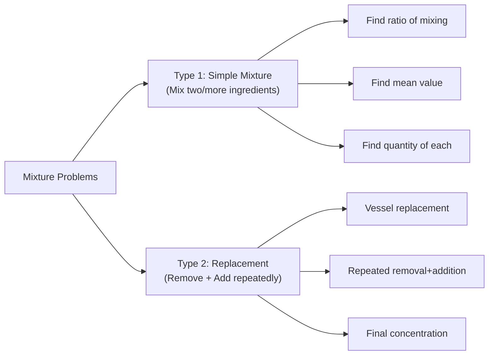
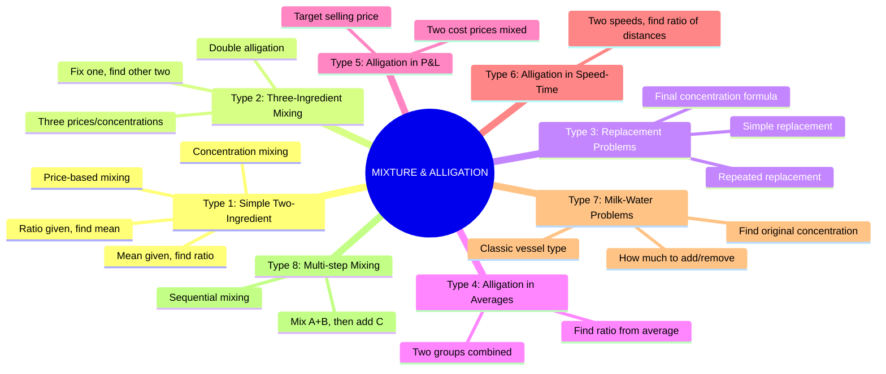
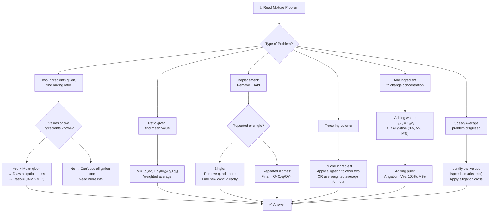
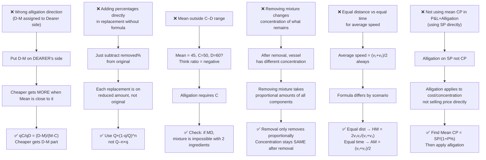

# 📘 MIXTURE AND ALLIGATION – Complete Premium Notes

### Complete Theory | Formula Sheet | Tricks | PYQs | 50+ Solved Problems

⭐ GATE | CAT | SSC | Banking | Placements | UPSC CSAT | Campus Tests

---

> **💡 Coaching Institute Quote:** *"Alligation is the Swiss Army knife of aptitude — once you master it, you can solve Mixtures, Averages, Profit & Loss, Speed-Time, and even Partnership problems using a single diagram drawn in 5 seconds."*

---

# 📑 TABLE OF CONTENTS

1. [Introduction](#section-1)
2. [Basic Concepts & Terminologies](#section-2)
3. [Classification / Types](#section-3)
4. [Golden Rules](#section-4)
5. [Complete Formula Sheet](#section-5)
6. [Decision Tree](#section-6)
7. [Question Identification Table](#section-7)
8. [Standard Solving Methods](#section-8)
9. [Solved Problems (50+)](#section-9)
10. [Previous Year Analysis](#section-10)
11. [Tricks & Shortcuts](#section-11)
12. [Common Mistakes](#section-12)
13. [Quick Revision Sheet](#section-13)
14. [Cheat Sheet](#section-14)
15. [Exam Strategy](#section-15)
16. [Interview Questions](#section-16)
17. [Frequently Confused Concepts](#section-17)
18. [Practice Questions](#section-18)
19. [Answer Key](#section-19)
20. [Chapter Summary](#section-20)
21. [Final Revision Checklist](#section-21)

---

# 🧠 SECTION 1 – Introduction <a name="section-1"></a>

---

## 1.1 What is Mixture and Alligation?

**Mixture** problems deal with combining two or more substances (liquids, solids, or abstract quantities) in certain ratios to produce a blend with a desired property (price, concentration, speed, etc.).

**Alligation** is the mathematical technique used to solve mixture problems — specifically to find the ratio in which two ingredients must be mixed to achieve a desired mean value.

> **Real Life Intuition:**
> - A bartender mixes two wines — one at ₹80/litre and one at ₹50/litre — to sell at ₹60/litre. **In what ratio?**
> - A chemist mixes a 40% acid solution with water to get 25% acid. **How much water?**
> - A shopkeeper mixes good rice (₹40/kg) with inferior rice (₹25/kg) to sell at ₹35/kg. **What ratio?**
> - A train travels part journey at 60 km/h and part at 90 km/h; average speed = 72 km/h. **What fraction at each speed?**

**Mathematical Intuition:**

The Alligation Rule states:

$$\boxed{\frac{\text{Quantity of Cheaper}}{\text{Quantity of Dearer}} = \frac{\text{Dearer Price} - \text{Mean Price}}{\text{Mean Price} - \text{Cheaper Price}}}$$

This single cross-difference formula solves an enormous variety of problems.

---

## 1.2 Why This Topic Matters

| Aspect | Details |
|--------|---------|
| **Foundation For** | Ratio, Percentage, P&L, Averages, Speed-Time, Partnership |
| **Real Applications** | Chemistry (solutions), Business (price mixing), Food (recipe scaling) |
| **Exam Presence** | 3–6 questions in most exams; appears inside DI sets too |
| **Difficulty Range** | Easy to Advanced |
| **Interconnected With** | Percentage, P&L, Averages, Ratio & Proportion, SI/CI |

---

## 1.3 Exam Importance

| Exam | Weightage | Difficulty | Question Type |
|------|-----------|------------|---------------|
| CAT | 3–5 Qs | Medium–Hard | Repeated replacement, multi-step |
| SSC CGL | 3–5 Qs | Easy–Medium | Direct alligation, replacement |
| SSC CHSL | 2–3 Qs | Easy | Direct formula |
| IBPS PO | 3–4 Qs | Medium | Alligation + percentage |
| SBI PO | 4–5 Qs | Medium–Hard | Repeated replacement, 3-ingredient |
| RBI Grade B | 2–3 Qs | Hard | Conceptual + multi-step |
| UPSC CSAT | 2–3 Qs | Medium | Applied mixture |
| GATE | 1–2 Qs | Medium | Applied |
| Placements | 3–5 Qs | Easy–Medium | All standard types |

> ⭐ **Priority:** VERY HIGH
> ⭐ **Time Target:** 30–90 seconds per question
> ⭐ **Key Insight:** ONE diagram (alligation cross) solves 80% of questions

---

# 📖 SECTION 2 – Basic Concepts & Terminologies <a name="section-2"></a>

---

## 2.1 Core Terminologies

| Term | Definition | Example |
|------|-----------|---------|
| **Mixture** | Combination of two or more ingredients | Milk + Water |
| **Alligation** | Rule to find mixing ratio | Cross-difference method |
| **Mean Price (MP)** | Target value of the mixture | ₹60/litre (desired price) |
| **Cheaper ingredient** | Ingredient with value < Mean | Water at ₹0 or cheap rice |
| **Dearer ingredient** | Ingredient with value > Mean | Milk, expensive rice |
| **Ratio of mixing** | Quantity in which to mix | 3:2 (cheaper : dearer) |
| **Concentration** | Percentage of a substance in mixture | 40% acid solution |
| **Pure substance** | 100% concentration | Pure milk = 100% milk |
| **Replacement** | Remove some mixture, add pure ingredient | Vessel replacement problems |

---

## 2.2 The Alligation Rule — Core Formula

$$\boxed{
\begin{array}{ccc}
& C & \quad \quad \quad D & \\
& \searrow & \swarrow & \\
& & M & \\
& \swarrow & \searrow & \\
(D-M) & & & (M-C)
\end{array}
}$$

$$\boxed{\frac{q_C}{q_D} = \frac{D - M}{M - C}}$$

Where:
- $C$ = Value of cheaper ingredient
- $D$ = Value of dearer ingredient
- $M$ = Mean value of mixture
- $q_C$ = Quantity of cheaper
- $q_D$ = Quantity of dearer

> 🔑 **Key Observation:**
> - The **cheaper** ingredient gets the difference **(D – M)** as its ratio share
> - The **dearer** ingredient gets the difference **(M – C)** as its ratio share
> - This is called **cross-subtraction**

---

### 📌 Example (Easy) — Price Mixing
**Q:** In what ratio must rice at ₹30/kg be mixed with rice at ₹45/kg to get mixture at ₹35/kg?

**Alligation Diagram:**
```
    30          45
         35
  (45-35)  : (35-30)
    10     :    5   = 2:1
```

$$\frac{q_{\text{cheap}}}{q_{\text{dear}}} = \frac{45-35}{35-30} = \frac{10}{5} = 2:1$$

**Answer: Mix in ratio 2:1 (₹30 rice : ₹45 rice)**

**Verify:** (2×30 + 1×45)/(2+1) = (60+45)/3 = 105/3 = **35** ✓

---

### 📌 Example (Medium) — Water in Milk
**Q:** In what ratio must water (price = 0) be mixed with milk at ₹36/litre so that the mixture may be sold at ₹27/litre?

```
     0         36
         27
  (36-27) : (27-0)
     9    :   27   = 1:3
```

**Water : Milk = 1:3**

**Verify:** (1×0 + 3×36)/4 = 108/4 = 27 ✓

---

### 📌 Example (Hard) — Find Mean Value
**Q:** A mixture of two varieties of tea costing ₹20/kg and ₹30/kg is mixed in ratio 3:2. Find cost of mixture per kg.

**Solution:** (This is reverse alligation — find M given ratio and values)
$$M = \frac{3 \times 20 + 2 \times 30}{3+2} = \frac{60 + 60}{5} = \frac{120}{5} = \mathbf{₹24/kg}$$

**Or using alligation backward:**
Ratio $q_C : q_D = (D-M):(M-C) = 3:2$
$\Rightarrow D-M = 3k$, $M-C = 2k$ for some $k$
$\Rightarrow 30-M = 3k$ and $M-20 = 2k$
Adding: $10 = 5k \Rightarrow k=2$
$M = 20 + 2×2 = \mathbf{24}$ ✓

---

### 🔑 Mini Practice
1. Mix ₹20/kg and ₹30/kg to get ₹24/kg. Find ratio.
2. Mix pure water (0%) with 60% salt solution to get 40% salt solution. Find ratio water:solution.
3. Mix 80% alcohol with 50% alcohol to get 65% alcohol. Find ratio.

---

## 2.3 The Two Types of Mixture Problems



---

# 🌳 SECTION 3 – Classification / Types <a name="section-3"></a>

---



---

## Type 1: Simple Two-Ingredient Mixing

*(Covered extensively in Section 2)*

### Extended Formula: Find Quantity of Each

If total mixture = $T$ and ratio = $a:b$:

$$\boxed{q_C = T \times \frac{a}{a+b}} \qquad \boxed{q_D = T \times \frac{b}{a+b}}$$

---

### 📌 Example (Medium)
**Q:** A 60-litre mixture of milk and water contains milk and water in ratio 5:1. How much water must be added to make ratio 5:2?

**Solution:**
Current: Milk = 60×5/6 = 50L; Water = 60×1/6 = 10L

After adding $x$ litres of water:
$$\frac{50}{10+x} = \frac{5}{2}$$
$$100 = 50 + 5x$$
$$5x = 50 \Rightarrow x = \mathbf{10 \text{ litres}}$$

**Alligation method:**
Milk fraction currently = 5/6; target = 5/7
Water fraction = 1/6; target = 2/7

Actually, since milk doesn't change, focus on water:
Milk stays at 50L; need ratio 5:2 → Water needed = 50×2/5 = 20L
Extra water = 20 – 10 = **10 litres** ✓

---

### 📌 Example (Hard)
**Q:** In what ratio must a grocer mix two varieties of pulses costing ₹15 and ₹20 per kg respectively so as to get a mixture worth ₹16.50?

**Alligation:**
```
    15          20
         16.50
   (20-16.5) : (16.5-15)
     3.5    :    1.5   = 7:3
```

**Answer: 7:3**

**Verify:** (7×15 + 3×20)/10 = (105+60)/10 = 165/10 = 16.5 ✓

---

### 🔑 Mini Practice (Type 1)
1. In what ratio must 5% and 15% sugar solutions be mixed to get 8% solution?
2. 40 kg of salt at ₹12/kg mixed with 60 kg at ₹18/kg. Find price per kg of mixture.
3. In what ratio must water be mixed with juice at ₹42/litre to sell at ₹30/litre and still make 25% profit?

---

## Type 2: Three-Ingredient Mixing

### Concept

When three ingredients A, B, C are mixed:

$$\boxed{M = \frac{q_A \times v_A + q_B \times v_B + q_C \times v_C}{q_A + q_B + q_C}}$$

**Alligation approach for 3 ingredients:**
1. Fix one ingredient's quantity
2. Apply alligation to the other two with the target mean
3. Ensure the third ingredient's contribution is handled

OR use **double alligation:** pair two at a time.

---

### 📌 Example (Medium)
**Q:** Three varieties of tea costing ₹20, ₹30, and ₹40 per kg are mixed in ratio 3:2:1. Find cost of mixture.

$$M = \frac{3(20)+2(30)+1(40)}{6} = \frac{60+60+40}{6} = \frac{160}{6} = \mathbf{₹26.67/kg}$$

---

### 📌 Example (Hard — Find Ratio)
**Q:** Three solutions with 10%, 30%, and 50% alcohol are to be mixed to get 25% alcohol. Find possible ratios.

**Method — Double Alligation:**

**Step 1:** Mix 10% and 50% to get 25%:
```
    10%         50%
         25%
   (50-25):(25-10)
     25   :  15   = 5:3
```
So 10% and 50% in ratio 5:3.

**Step 2:** Mix the above pair with 30% to get 25%:
Note 25% = 30%? No — 30% alone changes mean. We can include 30% at any quantity since it's AT the mean? No, 30 ≠ 25.

**Correct approach:** Treat (5 parts of 10% + 3 parts of 50%) as one ingredient with concentration 25%, then add 30% to maintain 25%:
But adding 30% to 25% mixture: 30 > 25 → mixture goes above 25. So we'd need to reduce 30%.

**Cleaner approach:** 10% and 30% give 25% first:
```
   10%         30%
        25%
  (30-25):(25-10)
     5  :  15  = 1:3
```

So ratio 10%:30%:50% could be any combination giving 25%.
One solution: 10:30:50 in ratio such that:
$10a + 30b + 50c = 25(a+b+c)$
$-15a + 5b + 25c = 0$
$-3a + b + 5c = 0$

One solution: $a=2, b=1, c=1$: $-6+1+5=0$ ✓
**Ratio = 2:1:1** (10%:30%:50%)

**Verify:** (2×10+1×30+1×50)/4 = (20+30+50)/4 = 100/4 = 25% ✓

---

### 🔑 Mini Practice (Type 2)
1. Three metals A (30% pure), B (50% pure), C (70% pure) mixed in ratio 2:3:5. Find purity of mixture.
2. Liquids costing ₹10, ₹20, ₹30 per litre mixed in ratio 1:2:3. Find cost per litre.
3. Mix 20%, 40%, 60% solutions in some ratio to get 35%. Find a valid ratio.

---

## Type 3: Replacement Problems

### Concept

A vessel contains a mixture. Some quantity is **removed** and replaced with a pure ingredient. This is repeated $n$ times.

$$\boxed{\text{Final quantity of original ingredient} = Q \times \left(1 - \frac{q}{Q}\right)^n}$$

Where:
- $Q$ = Total capacity of vessel
- $q$ = Quantity removed each time
- $n$ = Number of times replacement is done

$$\boxed{\text{Final concentration of original} = \left(1 - \frac{q}{Q}\right)^n \times 100\%}$$

> **Intuition:** This is like compound decay — each replacement removes a fraction $q/Q$ of whatever is currently present.

---

### 📌 Example (Easy)
**Q:** A vessel contains 40 litres of milk. 10 litres are removed and replaced with water. This is done 2 times. Find the quantity of milk left.

**Solution:**
$$\text{Milk left} = 40 \times \left(1 - \frac{10}{40}\right)^2 = 40 \times \left(\frac{3}{4}\right)^2 = 40 \times \frac{9}{16} = \mathbf{22.5 \text{ litres}}$$

**Step-by-step verification:**
- After 1st replacement: Milk = 40–10 = 30L; Water = 10L
- After 2nd replacement: Remove 10L of mixture (which is 75% milk = 7.5L milk + 2.5L water)
- Milk remaining = 30 – 7.5 = 22.5L ✓

---

### 📌 Example (Medium)
**Q:** A cask contains 30 litres of wine. 6 litres are drawn out and replaced with water. What fraction of wine remains after 3 such operations?

$$\text{Fraction} = \left(1 - \frac{6}{30}\right)^3 = \left(\frac{4}{5}\right)^3 = \frac{64}{125}$$

**Answer: 64/125 of original wine remains**

**In litres:** 30 × 64/125 = 15.36 litres

---

### 📌 Example (Hard)
**Q:** A container has 64 litres of pure milk. Some milk is removed and replaced with water. This process is repeated once more. Finally, the ratio of milk to water is 36:28. Find quantity removed each time.

**Solution:**
Final milk = 64 × (1–q/64)²

Ratio milk:water = 36:28 → milk fraction = 36/64 = 9/16

$$\left(1 - \frac{q}{64}\right)^2 = \frac{36}{64} = \frac{9}{16}$$

$$1 - \frac{q}{64} = \sqrt{\frac{9}{16}} = \frac{3}{4}$$

$$\frac{q}{64} = \frac{1}{4} \Rightarrow q = \mathbf{16 \text{ litres}}$$

**Answer: 16 litres removed each time**

---

### 📌 Example (Advanced — Find n)
**Q:** A vessel has 100 litres of pure alcohol. Each time 20 litres is removed and water added. After how many operations will alcohol be less than 50%?

$$\left(\frac{4}{5}\right)^n < \frac{1}{2}$$

| n | $(4/5)^n$ |
|---|-----------|
| 1 | 0.80 |
| 2 | 0.64 |
| 3 | 0.512 |
| 4 | 0.4096 < 0.5 ✓ |

**After 4 operations**, alcohol < 50%

**Exact:** $n \log(4/5) < \log(1/2)$
$n \times (-0.0969) < -0.3010$
$n > 3.105 \Rightarrow n = \mathbf{4}$

---

### 🔑 Mini Practice (Type 3)
1. Vessel = 60L milk. Remove 12L each time, add water. Find milk after 3 replacements.
2. 125L wine; remove 25L each time, add water 3 times. Find wine:water ratio.
3. Vessel = 729 milk. After n replacements with 243 removed each time, milk = 64/729 of original. Find n.

---

## Type 4: Alligation Applied to Averages

### Concept
When two groups with different averages are combined:

$$\frac{n_1}{n_2} = \frac{\bar{x}_2 - \bar{x}}{\bar{x} - \bar{x}_1}$$

Draw alligation with averages as values.

---

### 📌 Example (Medium)
**Q:** Class A of 40 students averages 70 marks. Class B of 60 students averages 80 marks. Find combined average.

```
    70          80
         ?
```

Ratio 40:60 = 2:3

Using alligation backward:
$(80-M):(M-70) = 2:3$

Wait — ratio is given, find M:
$M = \frac{40(70)+60(80)}{100} = \frac{2800+4800}{100} = \mathbf{76}$

**Using alligation to verify:**
At M=76: $(80-76):(76-70) = 4:6 = 2:3$ ✓

---

### 📌 Example (Hard — Find n from Average)
**Q:** The average of class A is 60 and class B is 80. Combined average is 72. Find ratio of students in A:B.

```
    60          80
         72
  (80-72) : (72-60)
     8    :    12   = 2:3
```

**A:B = 2:3**

---

### 🔑 Mini Practice (Type 4)
1. Group of 30 men avg ₹5,000 salary. Group of 20 women avg ₹4,000. Find combined avg.
2. Class P avg = 55, Class Q avg = 75. Combined avg = 65. Find ratio P:Q.
3. Average of A and B = 40. Average of B and C = 50. Average of A, B, C = 44. Find each group's avg.

---

## Type 5: Alligation Applied to Profit & Loss

### Concept
When items bought at two different CPs are mixed and sold at a common SP:

- Value of "cheaper" ingredient = its CP
- Value of "dearer" ingredient = its CP
- Mean = desired average CP

---

### 📌 Example (Medium)
**Q:** A trader mixes tea costing ₹40/kg with tea costing ₹60/kg. He wants 20% profit selling at ₹54/kg. In what ratio should he mix?

**Solution:**
Target CP = SP/(1+P%) = 54/1.20 = ₹45/kg

```
    40          60
         45
  (60-45) : (45-40)
    15   :    5   = 3:1
```

**Mix in ratio 3:1 (₹40 : ₹60)**

---

### 📌 Example (Hard)
**Q:** A merchant has 1000 kg of rice, part at ₹20/kg and rest at ₹30/kg. He mixes them and sells at ₹28/kg making 25% profit. Find quantity of each type.

**Solution:**
SP = ₹28, Profit = 25%, Mean CP = 28/1.25 = ₹22.40/kg

```
    20          30
         22.4
  (30-22.4):(22.4-20)
     7.6   :   2.4   = 19:6
```

Total parts = 25
₹20 rice = 1000 × 19/25 = **760 kg**
₹30 rice = 1000 × 6/25 = **240 kg**

---

### 🔑 Mini Practice (Type 5)
1. Two types of oil: ₹80/L and ₹120/L. Mix to sell at ₹108/L making 20% profit. Find ratio.
2. Mix two varieties of ghee at ₹200/kg and ₹300/kg. Sell at ₹260/kg at 4% profit. Find ratio.
3. Pulse A (₹15/kg) and B (₹20/kg) mixed in ratio 3:2. Sold at ₹19/kg. Find profit%.

---

## Type 6: Alligation Applied to Speed-Time

### Concept
When a journey is split into parts at different speeds:

$$\text{Average Speed} = \frac{\text{Total Distance}}{\text{Total Time}}$$

**If equal distances:** Average speed = Harmonic mean = $\frac{2v_1 v_2}{v_1+v_2}$

**For ratio of times at each speed:** Apply alligation with speeds as values and average speed as mean.

---

### 📌 Example (Medium)
**Q:** A person travels from A to B partly at 30 km/h and partly at 50 km/h. Total time = 4 hours, total distance = 160 km. Find time spent at each speed.

**Solution:**
Average speed = 160/4 = 40 km/h

```
    30          50
         40
  (50-40) : (40-30)
    10   :    10   = 1:1
```

**Time at each speed = 1:1 → 2 hours each**

**Verify:** 2×30 + 2×50 = 60+100 = 160 km ✓

---

### 📌 Example (Hard)
**Q:** A car travels ⅔ of the distance at 90 km/h and ⅓ at 60 km/h. Find average speed.

**Solution (NOT simple alligation because distances, not times, are equal fractions):**

Let total distance = 3d
Time₁ = 2d/90; Time₂ = d/60

Total time = 2d/90 + d/60 = 4d/180 + 3d/180 = 7d/180

Average speed = 3d/(7d/180) = 3×180/7 = 540/7 = **77.14 km/h**

---

---

# ⭐ SECTION 4 – Golden Rules <a name="section-4"></a>

---

$$\boxed{\textbf{Golden Rule 1: The Alligation Cross}}$$

$$\frac{q_{\text{cheap}}}{q_{\text{dear}}} = \frac{D - M}{M - C}$$

**Always:** Cheaper gets (D–M) part; Dearer gets (M–C) part.

> **Exception:** None. This rule is universal across all alligation problems.

---

$$\boxed{\textbf{Golden Rule 2: Mean Must Be Between C and D}}$$

$$C < M < D$$

If Mean is NOT between C and D, the mixture is impossible with those two ingredients.

> **Exception:** If a third ingredient is added.

---

$$\boxed{\textbf{Golden Rule 3: Replacement Formula}}$$

$$\text{Remaining original} = Q \times \left(1 - \frac{q}{Q}\right)^n$$

This is COMPOUND decay — each replacement is on the reduced quantity, not original.

---

$$\boxed{\textbf{Golden Rule 4: Concentration + Dilution = 100\%}}$$

In any mixture of two substances:
$$\text{Fraction}_A + \text{Fraction}_B = 1$$

What is not substance A is substance B. Use this to switch between fractions easily.

---

$$\boxed{\textbf{Golden Rule 5: When Water is Free}}$$

Water has value = 0. Milk/juice/solution has value = its CP.

In alligation with water: C = 0 (cheapest possible)
$$\frac{q_{\text{water}}}{q_{\text{liquid}}} = \frac{D - M}{M - 0} = \frac{D-M}{M}$$

---

$$\boxed{\textbf{Golden Rule 6: Adding Pure Ingredient}}$$

When adding pure ingredient (100% concentration) to a mixture:
D = 100%, C = current concentration%, M = target concentration%

---

$$\boxed{\textbf{Golden Rule 7: Removing Does Not Change Ratio}}$$

When mixture is removed from a vessel, **the concentration ratio stays the same**. Only when a different liquid is added does the ratio change.

---

$$\boxed{\textbf{Golden Rule 8: Quantity Conservation}}$$

$$\text{Amount of ingredient A in mix} = \text{Amount A from source 1} + \text{Amount A from source 2}$$

Total = Sum of parts. Always check: do parts add up to total?

---

# 📐 SECTION 5 – Complete Formula Sheet <a name="section-5"></a>

---

## 🔷 MASTER FORMULA TABLE

| # | Formula | Use Case |
|---|---------|----------|
| 1 | $\frac{q_C}{q_D} = \frac{D-M}{M-C}$ | Basic alligation — find mixing ratio |
| 2 | $M = \frac{q_C \times C + q_D \times D}{q_C + q_D}$ | Find mean value given quantities |
| 3 | $\text{Final}_{\text{orig}} = Q\left(1-\frac{q}{Q}\right)^n$ | Replacement — quantity after n steps |
| 4 | $\text{Final conc.} = \left(1-\frac{q}{Q}\right)^n \times 100\%$ | Replacement — final concentration |
| 5 | $\frac{n_1}{n_2} = \frac{\bar{x}_2 - \bar{x}}{\bar{x} - \bar{x}_1}$ | Alligation for averages/groups |
| 6 | $q_C = T \times \frac{a}{a+b}$ | Quantity from ratio (total given) |
| 7 | $q_D = T \times \frac{b}{a+b}$ | Quantity from ratio (total given) |
| 8 | Net disc. = $d_1+d_2-\frac{d_1 d_2}{100}$ | Successive discounts (alligation variant) |
| 9 | Avg speed (equal dist) = $\frac{2v_1 v_2}{v_1+v_2}$ | Speed-time mixture (HM) |
| 10 | $\text{Mean CP} = \frac{SP}{1+P\%/100}$ | P&L applied to mixture |
| 11 | Milk after $n$ replacements = $Q\left(\frac{Q-q}{Q}\right)^n$ | Repeated replacement |
| 12 | Water added = $Q_{\text{orig}} \times \frac{C_{\text{orig}} - C_{\text{new}}}{C_{\text{new}}}$ | Dilution formula |
| 13 | $q_{\text{added}} = Q_{\text{mix}} \times \frac{M_{\text{new}}-M_{\text{old}}}{V_{\text{new}}-M_{\text{new}}}$ | Add ingredient to change concentration |

---

## 🔷 ALLIGATION DIAGRAM TEMPLATE

```
         C          D
              M
    (D-M)         (M-C)
     qC    :       qD
```

**Memory:** Diagonals cross-subtract; lower value gets upper difference.

---

## 🔷 REPLACEMENT FORMULA VARIANTS

| Situation | Formula |
|-----------|---------|
| Remove $q$, add water $n$ times | Milk = $Q\left(\frac{Q-q}{Q}\right)^n$ |
| Remove fraction $f$ each time, $n$ times | Remaining = $Q(1-f)^n$ |
| What fraction of original remains? | $\left(\frac{Q-q}{Q}\right)^n$ |
| Find $n$ given initial and final conc. | $n = \frac{\log(\text{final}/\text{initial})}{\log(1-q/Q)}$ |
| Find $q$ given $n$ and final conc. | $q = Q\left(1 - \left(\frac{\text{final}}{\text{initial}}\right)^{1/n}\right)$ |

---

## 🔷 DILUTION FORMULA

When water is added to a solution to reduce concentration:

$$\boxed{C_1 V_1 = C_2 V_2}$$

Where:
- $C_1$ = Initial concentration
- $V_1$ = Initial volume
- $C_2$ = Final concentration
- $V_2$ = Final volume

**Water added** = $V_2 - V_1 = V_1\left(\frac{C_1}{C_2} - 1\right)$

---

### 📌 Example (Medium — Dilution)
**Q:** 20 litres of 40% acid solution. How much water to add to make 25% acid?

**Method 1 (Formula):** $C_1 V_1 = C_2 V_2$
$0.40 \times 20 = 0.25 \times V_2$
$V_2 = 8/0.25 = 32$ litres
**Water added = 32 – 20 = 12 litres**

**Method 2 (Alligation):**
```
    0%          40%
         25%
  (40-25) : (25-0)
    15   :    25   = 3:5
```
Water:Solution = 3:5 → For 20L solution, water = 20×3/5 = **12 litres** ✓

---

# 🌲 SECTION 6 – Decision Tree <a name="section-6"></a>

---



---

# 📋 SECTION 7 – Question Identification Table <a name="section-7"></a>

---

| If Question Says... | Type | Method | Key Formula | Difficulty |
|--------------------|------|--------|------------|------------|
| "Mix A at ₹X and B at ₹Y to get ₹Z" | Simple mixing | Alligation cross | (Y-Z):(Z-X) | Easy |
| "Mix water with liquid, sell at profit" | P&L + Alligation | Find mean CP first, then alligation | Mean CP = SP/(1+P%) | Medium |
| "In what ratio mix x% and y% to get z%" | Concentration | Alligation | (y-z):(z-x) | Easy |
| "Ratio is 3:2, find mean price" | Reverse alligation | Weighted average | M = (3×C+2×D)/5 | Easy |
| "Remove n litres x times, add water" | Replacement | Formula | Q(1-n/Q)^x | Medium |
| "Vessel contains milk:water = a:b. Remove q, add water. New ratio?" | Replacement | Step-by-step or formula | Track milk only | Medium |
| "Add water to 40% acid to get 25% acid" | Dilution | C₁V₁=C₂V₂ or alligation | Water: (40-25):(25-0) | Easy–Med |
| "Three types mixed in ratio, find mean" | 3-ingredient | Weighted avg | M = Σqᵢvᵢ/Σqᵢ | Easy |
| "Three types, find ratio for target mean" | 3-ingredient | Double alligation | Fix one, alligation twice | Hard |
| "Class A avg 70, B avg 80, combined 74" | Average alligation | (80-74):(74-70) | Alligation | Easy |
| "A→B profit, B→C profit, C pays ₹X" | Successive P&L | Multiply multipliers | Chain | Medium |
| "How many litres to remove/add for target ratio" | Ratio change | Algebra or alligation | Milk constant method | Medium |
| "After n replacements, milk:water = a:b" | Replacement | (1-q/Q)^n | Find q or n | Hard |
| "Equal distance at 2 speeds, avg speed?" | Speed-Time | Harmonic mean | 2v₁v₂/(v₁+v₂) | Medium |
| "Partly at speed A, partly at B, find ratio" | Speed alligation | Alligation on speeds | (B-avg):(avg-A) | Medium |

---

# ⚙️ SECTION 8 – Standard Solving Methods <a name="section-8"></a>

---

## Method 1: Alligation Cross (Fastest — 10–15 sec)

**Use when:** Two ingredients, find ratio.

**Process:**
```
Step 1: Write C and D at top corners
Step 2: Write M in center
Step 3: Cross subtract: lower-left = D-M; lower-right = M-C
Step 4: Ratio = (D-M) : (M-C)
```

**Time:** 10–15 seconds | **Best for:** All exams | **Accuracy:** 100%

---

## Method 2: Weighted Average Method (30 sec)

**Use when:** Given quantities and values, find mean.

$$M = \frac{q_1 v_1 + q_2 v_2}{q_1 + q_2}$$

**Time:** 20–30 seconds | **Best for:** When quantities given

---

## Method 3: Conservation Method (Concentration Problems — 30 sec)

**Use when:** Mixing two solutions.

**Principle:** Amount of solute is conserved.

$$C_1 V_1 + C_2 V_2 = C_M (V_1 + V_2)$$

**Time:** 20–40 seconds | **Best for:** Solution/acid/percentage problems

---

## Method 4: Component Tracking (Replacement — 45 sec)

**Use when:** Single or first replacement problem.

**Process:**
1. Find actual amount of each component
2. After removal, find how much of each is removed (proportionally)
3. Add new ingredient
4. Recalculate

**Time:** 30–60 seconds | **Best for:** When formula seems unclear

---

## Method 5: Formula Method (Replacement — 15 sec)

**Use when:** Repeated replacement with same quantity.

$$\text{Remaining} = Q\left(1-\frac{q}{Q}\right)^n$$

**Time:** 15–20 seconds | **Best for:** All exams | **Best shortcut**

---

## Method 6: Fraction Method (20 sec)

**Use when:** All values are fractions/standard numbers.

**Process:** Convert everything to fractions, apply alligation or conservation.

---

## Method Speed Summary

| Method | Speed | When to Use |
|--------|-------|-------------|
| Alligation Cross | ⭐⭐⭐⭐⭐ | Two ingredients, find ratio |
| Weighted Average | ⭐⭐⭐⭐ | Given quantities, find mean |
| Conservation | ⭐⭐⭐⭐ | Solution concentration |
| Component Tracking | ⭐⭐⭐ | First replacement |
| Formula (Replacement) | ⭐⭐⭐⭐⭐ | Repeated replacement |

---

# 📝 SECTION 9 – Solved Problems (50+) <a name="section-9"></a>

---

## 🟢 EASY Problems (E1–E10)

---

### E1
**Q:** In what ratio must rice at ₹8 per kg be mixed with rice at ₹14 per kg so that the mixture costs ₹10 per kg?

**Alligation:**
```
     8          14
          10
   (14-10) : (10-8)
      4    :    2   = 2:1
```

**Answer: 2:1 (₹8 : ₹14)**

**Verify:** (2×8 + 1×14)/3 = (16+14)/3 = 30/3 = 10 ✓

**Shortcut used:** Direct alligation cross | **Exam:** SSC CGL, Banking

---

### E2
**Q:** In what ratio must water be mixed with milk costing ₹24 per litre to get a mixture worth ₹16 per litre?

```
     0          24
          16
   (24-16) : (16-0)
      8    :   16   = 1:2
```

**Water : Milk = 1:2**

**Answer: 1:2** | **Exam:** SSC, Banking ⭐

---

### E3
**Q:** 5% and 15% sugar solutions mixed in ratio 3:2. Find concentration of mixture.

$$M = \frac{3(5) + 2(15)}{5} = \frac{15+30}{5} = \frac{45}{5} = \mathbf{9\%}$$

**Answer: 9%** | **Exam:** All

---

### E4
**Q:** A vessel has 40 litres of milk. 8 litres are removed and replaced with water. Find milk in the vessel.

$$\text{Milk} = 40 \times \left(1-\frac{8}{40}\right)^1 = 40 \times \frac{4}{5} = \mathbf{32 \text{ litres}}$$

**Verify:** Remove 8L milk, add 8L water → Milk = 40–8 = 32L ✓

**Answer: 32 litres** | **Exam:** SSC, Banking

---

### E5
**Q:** Two alloys contain silver and copper in ratios 5:2 and 3:2. What ratio must these alloys be mixed to get 60% silver in the mixture?

**Silver in Alloy A = 5/7; Silver in Alloy B = 3/5; Target = 3/5 = 0.60**

Wait: 3/5 = 60%. Alloy B already has exactly 60% silver!

So any amount of B gives 60%. If must mix with A:

```
   5/7        3/5
        3/5
  (3/5-3/5) : (5/7-3/5)
      0      :  (25-21)/35 = 4/35
```

This means: Mix 0 of alloy A and any amount of alloy B.

**Or target = 60% = 3/5, and Alloy B = 3/5 exactly → Use 100% Alloy B.**

Let's solve with target 62% (more instructive):
Alloy A = 5/7 ≈ 71.4%; Alloy B = 3/5 = 60%; Target = 62% = 31/50

```
  60%         71.4%
       62%
  (71.4-62):(62-60)
    9.4    :   2   ≈ 47:10
```

**Answer (original E5): Alloy B alone gives 60%** | **Exam:** SSC

---

### E6
**Q:** Find the ratio in which 20% acid solution must be mixed with 50% acid solution to get 40% acid.

```
    20%         50%
         40%
   (50-40) : (40-20)
     10   :    20   = 1:2
```

**20% : 50% = 1:2**

**Verify:** (1×20 + 2×50)/3 = 120/3 = 40% ✓

**Answer: 1:2** | **Exam:** All ⭐

---

### E7
**Q:** A container has 80 litres of pure milk. 20 litres replaced with water, once. Find new milk:water ratio.

Milk remaining = 80 – 20 = 60L; Water = 20L
**Milk:Water = 60:20 = 3:1**

**Formula check:** 80×(1–20/80) = 80×(3/4) = 60L ✓

**Answer: 3:1** | **Exam:** SSC, Banking

---

### E8
**Q:** Class X average marks = 60; class Y average marks = 80. Combined average = 70. Find ratio X:Y.

```
    60          80
         70
   (80-70) : (70-60)
     10   :    10   = 1:1
```

**X:Y = 1:1**

**Answer: 1:1** | **Exam:** All

---

### E9
**Q:** Milk and water in ratio 7:2. What fraction of the mixture is water?

$$\text{Water fraction} = \frac{2}{7+2} = \frac{2}{9}$$

**Answer: 2/9** | **Exam:** All

---

### E10
**Q:** 10 litres of 30% salt solution mixed with 20 litres of 15% salt solution. Find concentration of mixture.

$$M = \frac{10(30) + 20(15)}{30} = \frac{300+300}{30} = \frac{600}{30} = \mathbf{20\%}$$

**Answer: 20%** | **Exam:** SSC, Banking

---

## 🟡 MEDIUM Problems (M1–M10)

---

### M1
**Q:** In what ratio must 2 types of tea costing ₹35/kg and ₹45/kg be mixed to get tea costing ₹38/kg?

**Alligation:**
```
    35          45
         38
   (45-38) : (38-35)
      7    :    3
```

**Answer: 7:3**

**Verify:** (7×35+3×45)/10 = (245+135)/10 = 380/10 = 38 ✓

**Exam:** SSC CGL | **Difficulty:** Medium

---

### M2
**Q:** A vessel contains 60 litres of milk. 12 litres of milk are removed and replaced with water. This is done 3 times. Find the quantity of milk left.

$$\text{Milk} = 60 \times \left(1-\frac{12}{60}\right)^3 = 60 \times \left(\frac{4}{5}\right)^3 = 60 \times \frac{64}{125} = \frac{3840}{125} = \mathbf{30.72 \text{ litres}}$$

**Step verification:**
- After 1st: 60 × 4/5 = 48L
- After 2nd: 48 × 4/5 = 38.4L
- After 3rd: 38.4 × 4/5 = **30.72L** ✓

**Answer: 30.72 litres** | **Exam:** SSC CGL ⭐

---

### M3
**Q:** Two solutions — Solution A (20% acid) and Solution B (50% acid). In what ratio mixed to get solution with 35% acid?

```
    20%         50%
         35%
   (50-35) : (35-20)
     15   :    15   = 1:1
```

**Answer: 1:1**

**Insight:** When mean is exactly midway between two values → equal ratio!

**Verify:** (20+50)/2 = 35% ✓ | **Exam:** All

---

### M4
**Q:** A shopkeeper mixes 30 kg of Type A rice (₹25/kg) with 20 kg of Type B (₹35/kg). He wants 20% profit. Find SP per kg.

$$\text{CP of mixture} = \frac{30(25)+20(35)}{50} = \frac{750+700}{50} = \frac{1450}{50} = ₹29$$

**SP = 29 × 1.20 = ₹34.80/kg**

**Answer: ₹34.80/kg** | **Exam:** SSC, Banking

---

### M5
**Q:** A mixture of milk and water is 4:1. What fraction of mixture must be removed and replaced with pure milk to make ratio 5:1?

**Current:** Milk = 4/5; Water = 1/5
**Target:** Milk = 5/6; Water = 1/6

Let fraction removed = $f$ (and replaced with pure milk)

Water remaining after removal = (1/5)(1–f) (since removed fraction has same composition)
No water added (replaced with pure milk)

Final water fraction = (1/5)(1–f) / 1 = 1/6

$$\frac{1-f}{5} = \frac{1}{6}$$

$$1-f = \frac{5}{6} \Rightarrow f = \frac{1}{6}$$

**Answer: 1/6 of the mixture must be removed**

**Verify:** Remove 1/6 → Water = 1/5 × 5/6 = 1/6; Total = 1 (unchanged); Water fraction = 1/6 ✓ | **Exam:** CAT, SBI PO

---

### M6
**Q:** How much water must be added to 80 litres of 60% sugar solution to make it 40% sugar?

**Alligation (Water = 0%):**
```
     0%         60%
          40%
   (60-40) : (40-0)
     20   :    40   = 1:2
```

Water:Solution = 1:2 → For 80L solution, water = 80 × 1/2 = **40 litres**

**Formula verify:** 0.60×80 = 0.40×(80+x) → 48 = 32+0.4x → x = 40 ✓

**Answer: 40 litres** | **Exam:** IBPS, SSC

---

### M7
**Q:** Three varieties of rice costing ₹20, ₹30, ₹40 are mixed in ratio 3:4:5. Find average cost.

$$M = \frac{3(20)+4(30)+5(40)}{12} = \frac{60+120+200}{12} = \frac{380}{12} = \mathbf{₹31.67/kg}$$

**Answer: ₹31.67/kg** | **Exam:** SSC, IBPS

---

### M8
**Q:** A grocer sells mixture of 2 varieties of nuts. Cheaper variety (₹60/kg) and dearer (₹90/kg). He sells at ₹75/kg to earn 25% profit. Find ratio of mixing.

**Step 1:** Mean CP = 75/1.25 = ₹60/kg

**Step 2:** Alligation:
```
    60          90
         60
   (90-60) : (60-60)
     30   :     0
```

Ratio = 30:0 — only cheaper variety! But this is impossible if dearer must be included.

**Recheck:** Mean CP = 60 = price of cheaper variety itself.

This means he uses **only** cheaper variety and sells at 25% profit.

OR: Question might intend selling price = 75 with no profit%, just as blend price.

**Revised:** No profit mentioned, sell at ₹75:
```
    60          90
         75
   (90-75):(75-60)
     15  :   15  = 1:1
```

**Answer: 1:1** | **Exam:** SSC

---

### M9
**Q:** Vessel has milk and water in ratio 5:3 (total 80L). 16 litres of mixture removed and replaced with water. Find new ratio.

**Milk initially:** 5/8 × 80 = 50L; Water = 30L

**Remove 16L mixture (5:3 ratio):**
- Milk removed = 5/8 × 16 = 10L
- Water removed = 3/8 × 16 = 6L

**After removal:** Milk = 40L; Water = 24L
**Add 16L water:** Water = 40L

**New ratio:** Milk:Water = 40:40 = **1:1**

**Formula check:** Milk = 50 × (1–16/80) = 50 × 4/5 = **40L** ✓

**Answer: 1:1** | **Exam:** SSC CGL, Banking ⭐

---

### M10
**Q:** A man travels from A to B. He covers ¾ of distance at 60 km/h and rest at 40 km/h. Find average speed.

**Solution:**
Let distance = 4d
Time₁ = 3d/60 = d/20
Time₂ = d/40

Total time = d/20 + d/40 = 2d/40 + d/40 = 3d/40

**Average speed = 4d/(3d/40) = 4 × 40/3 = 160/3 = 53.33 km/h**

**Alligation approach (time-weighted):**
Ratio of times = d/20 : d/40 = 2:1

```
    60         40
        Avg
   (40-Avg):(Avg-60)  = 2:1 ← these are in ratio of times
```

Wait — in time-weighted alligation: heavier weight goes to slower speed since more time spent.

Using weighted time: Avg = (2×60+1×40)/3? No — that gives avg of speeds weighted by time, not distance.

**For distance-based problem, use sum method:**
Avg = Total distance / Total time = 4d/(3d/40) = **53.33 km/h** ✓

**Answer: 53.33 km/h** | **Exam:** SSC, Banking

---

## 🔴 HARD Problems (H1–H10)

---

### H1
**Q:** A vessel has 200 litres of pure milk. How many litres must be taken out and replaced with water so that after 3 such operations, the milk content is 50% of total?

**Solution:**
$$200 \times \left(1 - \frac{q}{200}\right)^3 = 100$$

$$\left(1 - \frac{q}{200}\right)^3 = \frac{1}{2}$$

$$1 - \frac{q}{200} = \left(\frac{1}{2}\right)^{1/3} = 2^{-1/3} \approx 0.7937$$

$$\frac{q}{200} = 1 - 0.7937 = 0.2063$$

$$q = 0.2063 \times 200 \approx \mathbf{41.26 \text{ litres}}$$

**Answer: ≈ 41.26 litres** | **Exam:** CAT, SBI PO

---

### H2
**Q:** Three alloys A, B, C contain silver and copper. A has 80:20, B has 60:40, C has 40:60 (silver:copper). Find ratio A:B:C such that mixture has silver:copper = 55:45.

**Silver%:** A = 80%, B = 60%, C = 40%; Target = 55%

**Approach:** Form linear equation.

Let $a$, $b$, $c$ = quantities

$$80a + 60b + 40c = 55(a+b+c)$$
$$25a + 5b - 15c = 0$$
$$5a + b - 3c = 0$$
$$b = 3c - 5a$$

One solution: $a=1, c=2, b=3(2)-5(1)=1$
**Ratio A:B:C = 1:1:2**

**Verify:** (80×1+60×1+40×2)/4 = (80+60+80)/4 = 220/4 = 55% ✓

**Answer: A:B:C = 1:1:2** | **Exam:** CAT

---

### H3
**Q:** In a 100L vessel, milk and water are in ratio 5:3. How much milk must be added to make ratio 7:3?

**Current:** Milk = 62.5L; Water = 37.5L

Since water stays fixed at 37.5L and ratio becomes 7:3:
Milk/Water = 7/3 → Milk = 37.5 × 7/3 = 87.5L

**Milk to add = 87.5 – 62.5 = 25 litres**

**Verify:** (62.5+25):37.5 = 87.5:37.5 = 7:3 ✓

**Answer: 25 litres** | **Exam:** SSC CGL, Banking

---

### H4
**Q:** A dishonest milkman professes to sell milk at ₹42/litre (its CP) but mixes water with it. He earns 16.67% profit. What is ratio of milk to water?

**Solution:**
CP of milk = ₹42/L; Water CP = ₹0/L
SP of mixture = ₹42/L (professes to sell at CP)

Effective CP of mixture for 16.67% profit (=1/6):
$CP_{\text{mix}} = \frac{SP}{1+1/6} = \frac{42}{7/6} = 42 \times \frac{6}{7} = ₹36/L$

**Alligation:**
```
     0          42
          36
   (42-36) : (36-0)
      6    :    36   = 1:6
```

**Water:Milk = 1:6 → Milk:Water = 6:1**

**Answer: Milk:Water = 6:1** | **Exam:** SSC CGL, Banking

---

### H5
**Q:** Two solutions of milk and water:
- Solution A: milk and water = 2:3 (40 litres total)
- Solution B: milk and water = 5:2 (70 litres total)

They are mixed. Find milk concentration in mixture.

**Solution:**
- Milk in A = 2/5 × 40 = 16L
- Milk in B = 5/7 × 70 = 50L
- Total milk = 66L; Total mixture = 110L
- **Milk% = 66/110 × 100 = 60%**

**Answer: 60% milk** | **Exam:** SSC, IBPS

---

### H6
**Q:** A container has a mixture of two liquids A and B in ratio 5:3. When 16 litres of the mixture and 16 litres of liquid B are added, ratio becomes 5:4. Find original quantity.

**Let original total = 8k (5:3 ratio)**
A = 5k, B = 3k

**Remove 16L (5:3 ratio):**
A removed = 16×5/8 = 10L; B removed = 6L
A remaining = 5k–10; B remaining = 3k–6

**Add 16L of liquid B:**
Total: A = 5k–10; B = 3k–6+16 = 3k+10

**New ratio = 5:4:**
$$\frac{5k-10}{3k+10} = \frac{5}{4}$$
$$4(5k-10) = 5(3k+10)$$
$$20k-40 = 15k+50$$
$$5k = 90 \Rightarrow k = 18$$

**Original total = 8×18 = 144 litres**

**Answer: 144 litres** | **Exam:** CAT, SBI PO ⭐

---

### H7
**Q:** Two varieties of sugar: A at ₹42/kg and B at ₹28/kg. If 25% of A is replaced by B, find change in price of mixture.

**Solution:**
Original price (100% A) = ₹42

After 25% replacement:
75% A + 25% B = 0.75×42 + 0.25×28 = 31.5 + 7 = ₹38.5/kg

**Reduction = 42 – 38.5 = ₹3.5/kg**

**Answer: Price reduced by ₹3.5/kg** | **Exam:** SSC

---

### H8
**Q:** A 20% solution of acid is added to a 60% acid solution. A scientist needs exactly 5 litres of 44% acid solution. How much of each should he use?

**Alligation:**
```
    20%         60%
         44%
   (60-44) : (44-20)
     16   :    24   = 2:3
```

**20% solution : 60% solution = 2:3**
Total = 5 litres

- 20% solution = 5 × 2/5 = **2 litres**
- 60% solution = 5 × 3/5 = **3 litres**

**Verify:** (2×20 + 3×60)/5 = (40+180)/5 = 220/5 = 44% ✓

**Answer: 2 litres of 20% + 3 litres of 60%** | **Exam:** IBPS, SSC CGL

---

### H9
**Q:** A vessel of capacity 90L is full of a mixture of water and milk in ratio 1:5. 15L of this mixture is taken out and 15L of pure milk is added. What is new ratio of water and milk?

**Initial:** Water = 90/6 = 15L; Milk = 75L

**Remove 15L (same ratio 1:5):**
Water removed = 15×1/6 = 2.5L; Milk removed = 12.5L

**After removal:** Water = 12.5L; Milk = 62.5L

**Add 15L pure milk:** Milk = 77.5L; Water = 12.5L

**Ratio = Water:Milk = 12.5:77.5 = 125:775 = 1:6.2 = 5:31**

**Formula method:**
Milk after = 75 × (1–15/90) = 75 × 5/6 = 62.5; + 15 = 77.5
Water = 15 × (1–15/90) = 15 × 5/6 = 12.5

**Ratio Water:Milk = 12.5:77.5 = 1:6.2 = 5:31**

**Answer: Water:Milk = 5:31** | **Exam:** CAT, SBI PO

---

### H10
**Q:** A train covers distance in 3 parts. First part at 80 km/h, second at 60 km/h, third at 40 km/h. Each part takes equal time. Find average speed.

**Since equal TIME at each speed:**

$$\text{Average speed} = \frac{v_1+v_2+v_3}{3} = \frac{80+60+40}{3} = \frac{180}{3} = \mathbf{60 \text{ km/h}}$$

> **Key Insight:** When **equal TIME** is spent, average speed = Arithmetic Mean of speeds.
> When **equal DISTANCE**, average speed = Harmonic Mean.

**Answer: 60 km/h** | **Exam:** SSC, CAT

---

## 🟣 ADVANCED Problems (A1–A10)

---

### A1
**Q:** A vessel contains 60L of milk. From it, 6L is removed and replaced with water. From mixture, 6L removed and replaced with water. Again 6L removed and replaced. Now 4L more is added as milk. Find final milk content.

**Step 1–3 (standard replacement):**
$$\text{Milk after 3 replacements} = 60 \times \left(\frac{54}{60}\right)^3 = 60 \times \left(\frac{9}{10}\right)^3 = 60 \times \frac{729}{1000} = 43.74L$$

**Step 4:** Add 4L milk: Milk = 43.74 + 4 = **47.74L**

**Answer: 47.74 litres** | **Exam:** CAT

---

### A2
**Q:** Two alloys A and B. A contains gold and silver in ratio 2:3. B contains in ratio 3:2. Equal amounts mixed. Find ratio of gold to silver in mixture.

**Let equal amounts = 1 unit each**

- Gold in A = 2/5; Silver in A = 3/5
- Gold in B = 3/5; Silver in B = 2/5

Total gold = 2/5 + 3/5 = 1
Total silver = 3/5 + 2/5 = 1

**Gold:Silver = 1:1**

**Insight:** When the ratios are "flipped" and equal amounts are mixed → always 1:1!

**Answer: 1:1** | **Exam:** CAT

---

### A3
**Q:** From a vessel containing 20 litres of pure milk, x litres is removed and water is added. Then from this mixture, x litres is removed and pure milk is added. If the final ratio of milk to water is 8:1, find x.

**After 1st replacement:**
Milk = 20–x; Water = x; Total = 20

**After 2nd replacement (remove x litres of mixture, add x milk):**

From current mixture: fraction of milk = (20–x)/20
Milk removed = x × (20–x)/20
Water removed = x × x/20

Milk after = (20–x) – x(20–x)/20 + x = (20–x)(1–x/20) + x
= (20–x)(20–x)/20 + x
= $(20-x)^2/20 + x$

Water after = x – x²/20 = x(20–x)/20 = x(1–x/20)

**Ratio milk:water = 8:1:**
$$\frac{(20-x)^2/20 + x}{x(1-x/20)} = 8$$

$$\frac{(20-x)^2 + 20x}{x(20-x)} = 8 \times \frac{20}{20} = 8$$

$$\frac{(20-x)^2 + 20x}{20x - x^2} = 8$$

Let $y = 20-x$:
$$\frac{y^2 + 20-y \cdot ...}{...}$$

Let's expand directly:
$(20-x)^2 + 20x = 400 - 40x + x^2 + 20x = 400 - 20x + x^2$
$x(20-x) = 20x - x^2$

$$\frac{400-20x+x^2}{20x-x^2} = 8$$

$$400 - 20x + x^2 = 160x - 8x^2$$

$$9x^2 - 180x + 400 = 0$$

$$x = \frac{180 \pm \sqrt{32400 - 14400}}{18} = \frac{180 \pm \sqrt{18000}}{18} = \frac{180 \pm 60\sqrt{5}}{18} = 10 \pm \frac{10\sqrt{5}}{3}$$

$x \approx 10 - \frac{10 \times 2.236}{3} \approx 10 - 7.45 = 2.55$ or $x \approx 17.45$ (reject as > 20)

**x ≈ 2.55 litres**

**Answer: x ≈ 2.55L** | **Exam:** CAT (Advanced)

---

### A4
**Q:** The ratio of milk to water in three vessels is 5:1, 4:1, and 7:1. These are mixed in ratio 3:4:5. Find ratio of milk to water in final mixture.

**Milk fractions:** 5/6, 4/5, 7/8
**Mix in 3:4:5:**

Total milk = 3×5/6 + 4×4/5 + 5×7/8
= 5/2 + 16/5 + 35/8
= 100/40 + 128/40 + 175/40 = 403/40

Total water = 3×1/6 + 4×1/5 + 5×1/8
= 1/2 + 4/5 + 5/8
= 20/40 + 32/40 + 25/40 = 77/40

**Milk:Water = 403:77**

**Answer: 403:77** | **Exam:** CAT

---

### A5
**Q:** How many litres of water must be added to 100 litres of 80% acid solution to reduce acid concentration to 50%?

**Method (Conservation):**
Acid remains constant = 80L

$$80 = 50\% \times (100+x)$$

$$100 + x = 160 \Rightarrow x = \mathbf{60 \text{ litres}}$$

**Alligation:**
```
     0%          80%
           50%
   (80-50) : (50-0)
     30   :    50   = 3:5
```

Water:Solution = 3:5 → Water = 100×3/5 = **60 litres** ✓

**Answer: 60 litres** | **Exam:** IBPS, SSC CGL

---

### A6
**Q:** A 30L vessel contains milk and water in ratio 7:3. How much milk must be added to make ratio 9:1?

**Water = 30×3/10 = 9L (fixed)**
**Need milk:water = 9:1 → milk = 9×9 = 81L**

**Milk to add = 81 – 21 = 60L**

Wait: Initial milk = 7/10 × 30 = 21L

**Verify:** 81:9 = 9:1 ✓

**Answer: 60 litres of milk** | **Exam:** SSC CGL, Banking

---

### A7
**Q:** In a mixture of 45 litres, ratio of milk to water is 4:1. Water is added to make ratio 4:2. Then milk is added to make ratio 8:3. Find final total volume.

**Step 1:** Milk = 36L; Water = 9L

**After adding water (ratio 4:2 = 2:1):**
Milk constant = 36L; Need water = 36/2 = 18L
Water to add = 18–9 = 9L
Total = 54L

**After adding milk (ratio 8:3):**
Water constant = 18L; Need milk = 18×8/3 = 48L
Milk to add = 48–36 = 12L
Total = 66L

**Answer: 66 litres** | **Exam:** CAT

---

### A8
**Q:** Three vessels of equal capacity hold mixtures of milk and water. Vessel 1: milk:water = 5:2; Vessel 2: 2:1; Vessel 3: 5:1. All three emptied into a large container. Find ratio of milk to water.

**Let capacity = 7 (LCM concept, but 7 and 3 and 6 are different — use 42 as LCM)**

Actually easier: Let each vessel = 1 unit.

Vessel 1 (7 parts): Milk = 5/7; Water = 2/7
Vessel 2 (3 parts): Milk = 2/3; Water = 1/3
Vessel 3 (6 parts): Milk = 5/6; Water = 1/6

**Use equal volumes (say 42L each):**
- V1: Milk = 30, Water = 12
- V2: Milk = 28, Water = 14
- V3: Milk = 35, Water = 7

Total: Milk = 93, Water = 33
**Ratio = 93:33 = 31:11**

**Answer: 31:11** | **Exam:** CAT

---

### A9
**Q:** A dealer mixes tea costing ₹70/kg with tea costing ₹50/kg and some dust tea costing ₹20/kg. He sells at ₹64/kg making 28% profit. Total mixture = 100 kg. Find quantity of each.

**Mean CP = 64/1.28 = ₹50/kg**

Now: Three varieties with values 70, 50, 20; Mean = 50

Note: ₹50 variety is AT the mean. So any amount of it doesn't change the mean.

**For 70 and 20 to average 50:**
```
    20          70
         50
   (70-50):(50-20)
     20  :   30   = 2:3
```

So ratio ₹20:₹70 = 2:3; ₹50 can be anything.

Let ₹20 = 2k, ₹70 = 3k, ₹50 = 100–5k

Any valid k works. If k=10: 20kg dust, 30kg expensive, 50kg medium.

**Verify:** (20×20+30×70+50×50)/100 = (400+2100+2500)/100 = 5000/100 = 50 ✓

**Answer: One solution — 20kg (₹20), 50kg (₹50), 30kg (₹70)** | **Exam:** CAT

---

### A10
**Q:** A solution of 40 litres contains milk and water in ratio 3:5. How much milk should be added so that the ratio of milk to water becomes 9:5?

**Water = 5/8 × 40 = 25L (stays fixed)**
**Need milk:water = 9:5 → Milk = 9×25/5 = 45L**

Initial milk = 3/8 × 40 = 15L
**Milk to add = 45–15 = 30L**

**Verify:** 45:25 = 9:5 ✓

**Answer: 30 litres** | **Exam:** IBPS, SBI PO

---

## 🏆 PYQ-INSPIRED Problems (P1–P10)

---

### P1 (SSC CGL Pattern)
**Q:** In what ratio must tea at ₹126/kg be mixed with tea at ₹135/kg so that mixture costs ₹129/kg?

```
   126          135
         129
   (135-129):(129-126)
      6    :    3   = 2:1
```

**Answer: 2:1** | **Exam:** SSC CGL ⭐

---

### P2 (IBPS PO Pattern)
**Q:** A milk vendor has 2 cans of milk. First contains 25% water, second contains 50% water. How much from each to make 40 litres containing 30% water?

**Alligation:**
```
   25%         50%
         30%
   (50-30):(30-25)
     20  :    5   = 4:1
```

From First (25% water): 40 × 4/5 = **32 litres**
From Second (50% water): 40 × 1/5 = **8 litres**

**Answer: 32 litres from Can 1, 8 litres from Can 2** | **Exam:** IBPS PO ⭐

---

### P3 (SSC CGL Classic)
**Q:** A vessel has 90L pure milk. 10L removed and water added; then 10L removed and water added again. Find milk in vessel.

$$\text{Milk} = 90 \times \left(\frac{80}{90}\right)^2 = 90 \times \left(\frac{8}{9}\right)^2 = 90 \times \frac{64}{81} = \frac{5760}{81} = \mathbf{71.11L}$$

**Answer: 71.11 litres (640/9)** | **Exam:** SSC CGL ⭐

---

### P4 (Banking PYQ)
**Q:** A trader mixes 5 litres of water with 20 litres of pure milk. If pure milk costs ₹18/litre, find cost per litre of mixture.

$$\text{Cost} = \frac{20 \times 18 + 5 \times 0}{25} = \frac{360}{25} = \mathbf{₹14.40/litre}$$

**Answer: ₹14.40/litre** | **Exam:** Banking

---

### P5 (CAT Pattern)
**Q:** In a 100-litre mixture, milk and water are in ratio 7:3. How much water must be added to make ratio 7:4?

Milk = 70L (fixed); Water = 30L
Target ratio 7:4 → Water = 70×4/7 = 40L
**Add 10 litres water**

**Answer: 10 litres** | **Exam:** CAT, SSC ⭐

---

### P6 (SBI PO Pattern)
**Q:** Vessels A (capacity 720L) and B (capacity 992L) are full of milk-water mixture. In A, milk:water = 7:2. In B, milk:water = 9:8. All poured into C. Find ratio of milk to water in C.

**Milk in A** = 720 × 7/9 = 560L
**Water in A** = 160L

**Milk in B** = 992 × 9/17 = 528L
**Water in B** = 992 × 8/17 = 464L

**Total Milk** = 560+528 = 1088L
**Total Water** = 160+464 = 624L

**Ratio** = 1088:624 = 68:39

**Answer: 68:39** | **Exam:** SBI PO

---

### P7 (UPSC CSAT Pattern)
**Q:** A class has 40 students. Their average mark is 70. If the marks of top 20 students averages 80, what is the average of bottom 20?

$$70 \times 40 = 80 \times 20 + x \times 20$$
$$2800 = 1600 + 20x$$
$$x = \mathbf{60}$$

**Alligation approach:**
```
    80          x
         70
   (70-x):(80-70) = 1:1 (equal groups)
   70-x = 10 → x = 60
```

**Answer: 60** | **Exam:** UPSC CSAT, SSC

---

### P8 (Campus Placement)
**Q:** A container contains milk and water in ratio 3:2. 20% of mixture removed and equal amount of water added. Find new ratio.

**Initial:** Milk = 3x, Water = 2x; Total = 5x

**Remove 20% = x of mixture (3:2 ratio):**
Milk removed = 3/5 × x = 0.6x; Water removed = 0.4x

Remaining: Milk = 2.4x; Water = 1.6x

**Add x litres water:** Water = 2.6x

**New ratio = Milk:Water = 2.4x : 2.6x = 24:26 = 12:13**

**Answer: 12:13** | **Exam:** Placements ⭐

---

### P9 (SSC CGL PYQ Style)
**Q:** Two casks A and B. A has 36L, milk:water = 5:4. B has 45L, milk:water = 8:7. Mixed together. Find ratio of milk to water in mixture.

Milk in A = 36×5/9 = 20L; Water = 16L
Milk in B = 45×8/15 = 24L; Water = 21L
Total milk = 44L; Water = 37L
**Ratio = 44:37**

**Answer: 44:37** | **Exam:** SSC CGL

---

### P10 (RRB/Banking Pattern)
**Q:** A mixture of 40L contains milk and water in ratio 7:1. How much water must be added so that ratio becomes 7:3?

Milk = 35L (fixed); Water = 5L
Target: milk:water = 7:3 → Water = 35×3/7 = 15L
**Add 10 litres water**

**Answer: 10 litres** | **Exam:** Banking, RRB

---

# 📊 SECTION 10 – Previous Year Analysis <a name="section-10"></a>

---

## Concept Frequency in PYQs

| Concept | SSC CGL | IBPS PO | SBI PO | CAT | Banking |
|---------|---------|---------|--------|-----|---------|
| Simple alligation (two types) | ⭐⭐⭐⭐⭐ | ⭐⭐⭐⭐ | ⭐⭐⭐ | ⭐⭐⭐ | ⭐⭐⭐⭐⭐ |
| Water+Milk mixing ratio | ⭐⭐⭐⭐⭐ | ⭐⭐⭐⭐ | ⭐⭐⭐⭐ | ⭐⭐⭐ | ⭐⭐⭐⭐ |
| Simple vessel replacement | ⭐⭐⭐⭐⭐ | ⭐⭐⭐⭐ | ⭐⭐⭐⭐ | ⭐⭐⭐⭐ | ⭐⭐⭐⭐ |
| Repeated replacement | ⭐⭐⭐⭐ | ⭐⭐⭐ | ⭐⭐⭐⭐ | ⭐⭐⭐⭐⭐ | ⭐⭐⭐ |
| Three-ingredient | ⭐⭐⭐ | ⭐⭐⭐ | ⭐⭐⭐ | ⭐⭐⭐⭐ | ⭐⭐⭐ |
| Alligation for averages | ⭐⭐⭐⭐ | ⭐⭐⭐⭐ | ⭐⭐⭐ | ⭐⭐⭐⭐ | ⭐⭐⭐⭐ |
| Alligation + P&L | ⭐⭐⭐ | ⭐⭐⭐⭐ | ⭐⭐⭐⭐ | ⭐⭐⭐ | ⭐⭐⭐⭐ |
| Add water/milk to change ratio | ⭐⭐⭐⭐⭐ | ⭐⭐⭐ | ⭐⭐⭐ | ⭐⭐⭐⭐ | ⭐⭐⭐ |
| Speed-time alligation | ⭐⭐⭐ | ⭐⭐ | ⭐⭐ | ⭐⭐⭐⭐ | ⭐⭐ |
| Two vessels poured in third | ⭐⭐⭐⭐ | ⭐⭐⭐⭐ | ⭐⭐⭐⭐ | ⭐⭐⭐ | ⭐⭐⭐⭐ |

---

## Top Repeated PYQ Templates

| Rank | Template | Key Insight |
|------|---------|------------|
| 1 | "Mix ₹A/kg and ₹B/kg to get ₹C/kg" | Alligation cross: (B-C):(C-A) |
| 2 | "Vessel 40L milk, remove n, add water k times" | Formula: Q(1-n/Q)^k |
| 3 | "Milk:water ratio given, add water to make new ratio" | Water fixed or milk fixed? |
| 4 | "Two solutions, mix to get target%" | Alligation on concentrations |
| 5 | "Three vessels mixed into one" | Track each component |
| 6 | "Average + ratio → alligation" | Groups of different sizes |
| 7 | "Add pure milk/water to change ratio" | Find the fixed component |
| 8 | "Two cans, take x from each to make n litres of target" | Alligation gives ratio |

---

# ⚡ SECTION 11 – Tricks & Shortcuts <a name="section-11"></a>

---

### Trick 1: The Alligation Cross (Master Shortcut — 5 sec)

```
     C              D
           M
    (D-M)    :    (M-C)
     qC      :     qD
```

**Draw it. Fill it. Read the ratio.**

---

### Trick 2: Midpoint Means Equal Ratio

If $M = \frac{C+D}{2}$, then ratio = 1:1 (equal quantities)

---

### Trick 3: Water Ratio When Selling at Profit

When milkman mixes water with milk (CP = P) and sells at Q per litre with profit%:

$$\text{Mean CP} = \frac{Q}{1+\text{P\%}/100}$$

Then alligation with 0 (water) and P (milk price).

---

### Trick 4: Replacement Quick Fraction

$$\text{Remaining fraction} = \left(\frac{Q-q}{Q}\right)^n$$

**Memory:** "(Vessel – Removed) / Vessel, all raised to n"

---

### Trick 5: Find q from Final Fraction

If final fraction = $f$ after $n$ replacements:
$$q = Q(1-f^{1/n})$$

---

### Trick 6: Equal Time → Arithmetic Mean Speed

If equal **time** at different speeds:
$$\bar{v} = \frac{v_1+v_2}{2}$$

If equal **distance** at different speeds:
$$\bar{v} = \frac{2v_1 v_2}{v_1+v_2}$$

---

### Trick 7: Water Added to Reduce Concentration

$$\text{Water added} = V_1\left(\frac{C_1}{C_2}-1\right)$$

Memorize: "Multiply by ratio of concentrations minus 1"

---

### Trick 8: When Fixed Component is Known

**If asked: "add water to change milk:water from a:b to c:d"**
→ Milk is FIXED; find how much milk we have; then calculate water needed for new ratio.

---

### Trick 9: "Flipped" Alloys → Equal Mix = 1:1

If Alloy A has m:n of two metals and Alloy B has n:m, mixing equal amounts → 1:1 ratio of metals.

---

### Trick 10: Successive Replacement Equivalence

$n$ replacements of fraction $f$ each ≡ one replacement of fraction $1-(1-f)^n$

---

### Trick 11: Alligation Works With Any "Value"

Not just price — apply to:
- Concentration (%)
- Speed (km/h)
- Marks/Average
- Age
- Interest rate
- Profit%

---

### Trick 12: Three Ingredient — Fix One

When three ingredients need to hit a mean:
1. Note if one ingredient = mean → it can be added freely without changing mean
2. Apply alligation to the other two

---

### Trick 13: "How many litres to make ratio a:b"

**If adding water (cheaper):** Use alligation or conservation of milk.
**If adding milk (dearer):** Use conservation of water.

$$\text{Milk to add} = \frac{a}{b} \times W_{\text{fixed}} - M_{\text{current}}$$

---

### Trick 14: Two Cans Problem Shortcut

Needed concentration $= C$; Can 1 has $C_1$; Can 2 has $C_2$; Total volume = $T$

$$V_1 = T \times \frac{C_2-C}{C_2-C_1} \qquad V_2 = T \times \frac{C-C_1}{C_2-C_1}$$

(This is just alligation rewritten.)

---

### Trick 15: Alligation in Interests

If you invest at two rates $r_1\%$ and $r_2\%$ to get overall $r\%$:

$$\text{Ratio} = (r_2-r):(r-r_1)$$

---

### Trick 16: When Mixture is Removed — Concentration Doesn't Change

Removing mixture → same concentration in vessel. Only adding something different changes concentration.

---

### Trick 17: Think in Fractions for Replacement

Instead of absolute values:
- "Remove 1/5 of vessel" → Remaining = (4/5)^n after n operations

---

### Trick 18: Verify with Total Conservation

Total volume before = Total volume after (in closed vessel problems).

---

### Trick 19: Quick Ratio Check

Cross-multiply and verify:
If ratio given is $a:b$ and values are $C, D$ and mean is $M$:

$$aM + bM = aC + bD$$

$$M = \frac{aC+bD}{a+b}$$ ✓

---

### Trick 20: Negative Values in Alligation

Can apply alligation to profit/loss scenarios where one "value" is negative (loss%):

```
   –5%         +15%
          +4%
   (15-4):(4-(-5))
     11  :    9
```

---

```mermaid
mindmap
  root(("⚡ MIXTURE SHORTCUTS"))
    Alligation
      C—D—M cross diagram
      Ratio = D-M : M-C
      Works for ANY value type
      Midpoint → equal ratio
    Replacement
      Formula: Q(1-q/Q)^n
      Find q: Q(1-f^1/n)
      Find n: log method
      Fraction: (Q-q)/Q all to n
    Concentration
      C₁V₁=C₂V₂ for dilution
      Water added: V₁(C₁/C₂-1)
      Fixed component trick
    Speed-Time
      Equal time → AM
      Equal dist → HM = 2v₁v₂/(v₁+v₂)
      Partial distances → sum method
    Special
      Three ingredient: fix one at mean
      Two cans: ratio from alligation
      Flipped alloys + equal mix → 1:1
```

---

# ❌ SECTION 12 – Common Mistakes <a name="section-12"></a>

---



---

## Common Mistake Summary Table

| Mistake | Wrong | Correct | Frequency |
|---------|-------|---------|-----------|
| Alligation direction | D-M to dearer | D-M to cheaper | Very High |
| Replacement (linear) | Q – n×q | Q×(1–q/Q)^n | Very High |
| Mean outside range | Accepts any M | Must have C<M<D | High |
| Removal changes conc. | Yes | No — only addition changes | High |
| Average speed | Always AM | AM for equal time; HM for equal dist | High |
| Alligation on SP not CP | Direct on SP | Find Mean CP first | Medium |
| Adding percentages of solutions | Sum directly | Use conservation: C₁V₁+C₂V₂=CM(V₁+V₂) | Medium |
| Three-ingredient: average all three % | Simple average | Weighted average | Medium |

---

## 🛑 Examiner Traps

1. **"Remove and add" vs "Add only"** — different formulas!
2. **"Equal distance" speed trap** — most students use AM; must use HM
3. **"Profit %" in mixture** — find Mean CP first, THEN apply alligation
4. **"Third ingredient = mean" trap** — it can be added in any amount
5. **Ratio of removal ≠ ratio of remaining** — removing mixture takes all components proportionally

---

# 📄 SECTION 13 – Quick Revision Sheet <a name="section-13"></a>

---

```
╔══════════════════════════════════════════════════════════════════════╗
║          MIXTURE & ALLIGATION — QUICK REVISION SHEET               ║
╠══════════════════════════════════════════════════════════════════════╣
║ THE ALLIGATION CROSS                                                 ║
║         C              D                                            ║
║               M                                                     ║
║        (D-M)    :    (M-C)                                         ║
║         qC      :     qD                                           ║
║  Cheaper gets D-M part; Dearer gets M-C part                       ║
╠══════════════════════════════════════════════════════════════════════╣
║ KEY FORMULAS                                                         ║
║  • Ratio: qC/qD = (D-M)/(M-C)                                      ║
║  • Mean: M = (qC×C + qD×D)/(qC+qD)                                ║
║  • Replacement: Final = Q×(1-q/Q)^n                               ║
║  • Dilution: C₁V₁ = C₂V₂                                          ║
║  • Water added: V₁(C₁/C₂ – 1)                                     ║
║  • Avg speed (equal dist): 2v₁v₂/(v₁+v₂)                         ║
║  • Avg speed (equal time): (v₁+v₂)/2                              ║
║  • P&L+Mix: Mean CP = SP/(1+P%)                                    ║
╠══════════════════════════════════════════════════════════════════════╣
║ GOLDEN RULES                                                         ║
║  ✓ M must be between C and D                                       ║
║  ✓ Removal doesn't change concentration                            ║
║  ✓ Use formula for repeated replacement (NOT linear)               ║
║  ✓ Water value = 0 in price alligation                             ║
║  ✓ Equal distance → HM; Equal time → AM for avg speed             ║
╠══════════════════════════════════════════════════════════════════════╣
║ STANDARD PATTERNS                                                    ║
║  • "Add water to milk, sell at profit" → find Mean CP, alligation  ║
║  • "n litres removed k times" → Q(1-n/Q)^k                        ║
║  • "Ratio a:b, add X to get c:d" → fix the component not added    ║
║  • "Mix three types" → weighted average OR double alligation       ║
║  • "Two vessels, pour into third" → track each component           ║
╠══════════════════════════════════════════════════════════════════════╣
║ QUICK CHECKS                                                         ║
║  ✓ Sum of parts × values = total value (verify mean)               ║
║  ✓ After replacement: milk decreases, water increases              ║
║  ✓ Water added: volume increases; milk fraction decreases          ║
╚══════════════════════════════════════════════════════════════════════╝
```

---

# 📝 SECTION 14 – Cheat Sheet <a name="section-14"></a>

---

```
╔═════════════════════════════════════════════════════════════╗
║        MIXTURE & ALLIGATION — CHEAT SHEET                  ║
╠═════════════════════════════════════════════════════════════╣
║ KEYWORDS → METHOD                                          ║
║                                                            ║
║ "Mix A at X, B at Y, get Z"    → Alligation cross        ║
║ "In what ratio mix x% and y%   → Alligation on %         ║
║   to get z%?"                                             ║
║ "Remove n L, add water, k times"→ Q×(1-n/Q)^k           ║
║ "Add water to x% to get y%"   → C₁V₁=C₂V₂ or alligation║
║ "Add milk to change ratio"     → Fix water, find milk     ║
║ "Two vessels mixed"            → Track each component     ║
║ "Average with groups"          → Alligation on averages   ║
║ "Sell at profit, mix water"    → Mean CP = SP/(1+P%)      ║
║ "Equal distance, two speeds"   → 2v₁v₂/(v₁+v₂)          ║
║ "Equal time, two speeds"       → (v₁+v₂)/2               ║
╠═════════════════════════════════════════════════════════════╣
║ THE DIAGRAM (DRAW IN 3 SECONDS)                           ║
║                                                            ║
║         Cheap      Dear                                   ║
║              Mean                                         ║
║         (D-M)  :  (M-C)                                  ║
╠═════════════════════════════════════════════════════════════╣
║ SPECIAL VALUES                                             ║
║  Water → always 0 (in price problems)                     ║
║  Pure substance → 100% concentration                      ║
║  Midpoint → Equal ratio (1:1)                            ║
╠═════════════════════════════════════════════════════════════╣
║ NEVER FORGET                                               ║
║  ✗ Removal does NOT change concentration                  ║
║  ✗ Repeated replacement is NOT linear (use ^n)            ║
║  ✗ Mean must be BETWEEN two ingredient values             ║
║  ✗ Don't apply alligation directly to SP (find CP first)  ║
╚═════════════════════════════════════════════════════════════╝
```

---

# 🎯 SECTION 15 – Exam Strategy <a name="section-15"></a>

---

## Strategy Table by Exam

| Exam | Time/Q | Ideal Method | Common Pattern | Key Trap | Priority |
|------|--------|-------------|----------------|---------|---------|
| SSC CGL | 45 sec | Alligation cross | Simple mixing, replacement | Linear replacement error | Very High |
| SSC CHSL | 30 sec | Direct formula | Basic ratio, dilution | Mean outside range | High |
| IBPS PO | 60 sec | Alligation + P&L | Two-can, profit mix | Applying alligation on SP | High |
| SBI PO | 90 sec | Formula + alligation | Repeated replacement, 3-ingredient | Removal changes conc. | High |
| CAT | 2 min | Option elim + algebra | Complex vessel, multi-step | Equal distance vs time | High |
| UPSC CSAT | 60 sec | Conservation method | Dilution, simple mixing | Wrong base | Medium |
| GATE | 90 sec | Mathematical | Applied concentration | Formula misapplication | Medium |
| Placements | 60 sec | Alligation + formula | Standard types | All above | Very High |

---

## SSC CGL Specific Approach

```
SSC Mixture Strategy (3–5 questions):
1. Simple two-ingredient → Alligation cross (15 sec each)
2. Water-milk ratio change → Fix milk or water component
3. Replacement n times → Q(1-q/Q)^n (20 sec)
4. Two solutions → Alligation on concentrations
5. P&L + mixture → Find mean CP first

Target: All 5 questions correct in under 3 minutes total!
Key: Draw alligation diagram for EVERY mixing problem.
```

---

## CAT-Specific Approach

```
CAT Mixture Strategy:
1. Always check: is it replacement or simple mixing?
2. For replacement with "find n or q" → use logarithms
3. Multi-step → track milk and water SEPARATELY
4. Three-ingredient → check if one = mean (simplifies dramatically)
5. Option elimination: final concentration must be between initial concentrations
6. Speed problems disguised as mixture → identify the "values" and "mean"
```

---

# 💼 SECTION 16 – Interview Questions <a name="section-16"></a>

---

### Basic Level

**Q1: Why must the mean value always be between the two ingredient values in alligation?**

**Answer:** The mean of a mixture is a weighted average of components. A weighted average of two values $C$ and $D$ (with positive weights) must satisfy:

$$C \leq \frac{q_C \cdot C + q_D \cdot D}{q_C + q_D} \leq D$$

If mean were outside this range, one of the "quantities" would be negative, which is physically impossible. You can't add a negative amount of any ingredient.

---

**Q2: What is the difference between the rule of alligation and the weighted average formula?**

**Answer:** They are mathematically equivalent — just different presentations:

- **Weighted average:** $M = \frac{q_C C + q_D D}{q_C + q_D}$ (compute M given q's and values)
- **Alligation rule:** $\frac{q_C}{q_D} = \frac{D-M}{M-C}$ (compute ratio given M and values)

Alligation is the **inverse** of weighted average — you find the ratio instead of the mean. Both emerge from the same algebraic manipulation of $q_C(M-C) = q_D(D-M)$.

---

### Intermediate Level

**Q3: Explain why repeated replacement follows an exponential decay formula, not linear.**

**Answer:** In linear thinking: "remove $q$ each time, so after $n$ times, remove $nq$ of original."

But this is wrong because after 1st replacement, the vessel has LESS original liquid. The 2nd removal takes $q$ litres of a DILUTED mixture, so less original liquid is removed.

Mathematically, if fraction remaining after each step = $(1-q/Q)$, then after $n$ steps:
$$\text{Remaining} = Q \times (1-q/Q) \times (1-q/Q) \times \cdots = Q\left(1-\frac{q}{Q}\right)^n$$

This is compound decay, analogous to compound interest.

---

**Q4: A mixture is 30% acid. If you remove 10L and add 10L of 60% acid, what is the new concentration?**

**Answer:**
Initial: 30% of total; Let total = V litres.
Remove 10L: Remove 10×0.30 = 3L of acid.
Acid remaining = 0.30V – 3L; Volume = V–10

Add 10L of 60% acid: Add 6L of acid.
Total acid = 0.30V – 3 + 6 = 0.30V + 3
Total volume = V

**New concentration = (0.30V + 3)/V = 0.30 + 3/V**

For V = 100: New concentration = 30 + 3 = **33%**

---

### Advanced Level

**Q5: In the alligation rule, what happens when one ingredient is free (cost = 0)?**

**Answer:** When $C = 0$ (e.g., water):
$$\frac{q_{\text{free}}}{q_{\text{paid}}} = \frac{D - M}{M - 0} = \frac{D-M}{M}$$

This simplifies the formula significantly. The ratio of free-to-paid ingredient equals (paid price – mean price) / mean price.

**Example:** Milk at ₹48, mean = ₹36:
Water:Milk = (48-36)/36 = 12/36 = **1:3**

---

**Q6: Can alligation be applied to more than two components simultaneously?**

**Answer:** Directly, alligation applies to exactly TWO components. For three or more:

1. **Weighted average formula** must be used (direct calculation)
2. **Double alligation:** Pair two components, get equivalent mixture, then alligation with third
3. **Linear programming:** When there's flexibility, infinite solutions exist

The fundamental constraint for n components is: one equation (mean = weighted avg) with n unknowns → infinite solutions unless n-1 additional constraints given.

---

**Q7: How does the alligation principle apply in finance and investment?**

**Answer:** If an investor puts money at two interest rates $r_1$% and $r_2$% to get overall $r$%:

$$\frac{\text{Amount at } r_1}{\text{Amount at } r_2} = \frac{r_2 - r}{r - r_1}$$

This is exactly the alligation formula with values = interest rates and mean = overall rate.

**Example:** Mix investments at 8% and 12% to get 10% return:
Ratio = (12-10):(10-8) = 2:2 = 1:1 → invest equally at each rate.

---

# 🔀 SECTION 17 – Frequently Confused Concepts <a name="section-17"></a>

---

## Alligation vs Weighted Average

| | Alligation | Weighted Average |
|--|------------|------------------|
| Given | Two values + Mean | Two values + Quantities |
| Find | Ratio of quantities | Mean value |
| Formula | qC/qD = (D-M)/(M-C) | M = Σqv/Σq |
| Direction | Mean→Ratio | Quantities→Mean |
| Use when | "In what ratio?" | "Find combined average/price" |

---

## Simple Replacement vs Repeated Replacement

| | Single Replacement | Repeated (n times) |
|--|--------------------|--------------------|
| Formula | Track directly | Q(1-q/Q)^n |
| Result | Linear in q | Exponential in n |
| Accuracy | 100% either way | Formula much faster |
| Exam appearance | Easier questions | Medium–Hard questions |

---

## Average Speed (Equal Distance vs Equal Time)

| | Equal Distance | Equal Time |
|--|----------------|------------|
| Formula | $\frac{2v_1 v_2}{v_1+v_2}$ (HM) | $\frac{v_1+v_2}{2}$ (AM) |
| Which is larger? | HM < AM always | AM |
| Intuition | More time at lower speed | Both speeds equally long |
| Use when | "each part of journey equally long" | "traveled at each speed for same duration" |
| Memory | Equal **D**istance → **H**M | Equal **T**ime → Arith**m**etic |

---

## Dilution vs Concentration Addition

| | Dilution (Add Water) | Concentration Addition |
|--|---------------------|------------------------|
| What's added | Pure water (0%) | Pure solute (100%) or higher-conc solution |
| Effect on concentration | Decreases | Increases |
| Formula | C₁V₁ = C₂V₂ | Alligation with higher value |
| Volume | Increases | Increases |
| Solute amount | Conserved | Increases |

---

## Removing Mixture vs Adding Pure Ingredient

| | Remove Mixture | Add Pure Ingredient |
|--|----------------|---------------------|
| Volume changes | Decreases | Increases |
| Concentration | Unchanged (same composition removed) | Changes |
| When to track | Before adding new ingredient | After removal |
| Sequence | Remove first → then add | Add after removal |

---

# 🧪 SECTION 18 – Practice Questions <a name="section-18"></a>

---

## 🟢 Easy (15 Questions)

**E1.** In what ratio must sugar at ₹8/kg be mixed with sugar at ₹12/kg to get mixture worth ₹9/kg?

**E2.** Mix 25% and 75% alcohol solutions to get 50% solution. Find ratio.

**E3.** A vessel has 50L pure milk. 10L removed and replaced with water. Find milk remaining.

**E4.** Mix water with juice at ₹30/L to get mixture at ₹20/L. Find water:juice ratio.

**E5.** Two solutions with 20% and 60% salt mixed in 3:1 ratio. Find concentration.

**E6.** Rice costing ₹15/kg mixed with rice costing ₹25/kg in ratio 3:2. Find price of mixture.

**E7.** Class A (30 students) avg = 70 marks. Class B (20 students) avg = 80 marks. Find combined average.

**E8.** A 60L vessel: milk:water = 3:2. How much water is present?

**E9.** Mix 10L of 30% solution with 20L of 60% solution. Find resulting concentration.

**E10.** A 30% acid and water mixed in 1:2 ratio. Find acid% in mixture.

**E11.** Milk costs ₹40/L. Water free. Mixture sells at ₹32/L. Find water:milk ratio.

**E12.** A vessel has 48L milk. Remove 12L and add water. How much milk remains?

**E13.** Find ratio to mix ₹40/kg and ₹60/kg to get ₹52/kg mixture.

**E14.** Mix 5L of 20% brine and 3L of 60% brine. Find % of resulting brine.

**E15.** A mixture has milk:water = 5:3. What fraction is milk?

---

## 🟡 Medium (15 Questions)

**M1.** Two varieties of rice at ₹20 and ₹30/kg mixed in 3:7 ratio. If sold at ₹35/kg, find profit%.

**M2.** A vessel has 120L of milk. 30L removed and replaced with water 3 times. Find milk remaining.

**M3.** 40L mixture with milk:water = 7:1. How much water to add to make ratio 7:3?

**M4.** A milkman mixes water with milk (₹36/L) and sells at ₹40/L making 25% profit. Find water:milk ratio.

**M5.** Three items costing ₹20, ₹30, ₹40 mixed in ratio 2:3:5. Find average cost.

**M6.** Mix 5L of 60% alcohol with some 90% alcohol to get 70% solution. Find amount of 90% needed.

**M7.** Vessel with milk:water = 4:3. 28L removed; replaced with water. New ratio = 4:5. Find original volume.

**M8.** How many litres of water must be mixed with 40L of 80% alcohol to make 50% solution?

**M9.** Person A earns ₹8,000/month and person B earns ₹12,000/month. What fraction of group should be A to get average of ₹9,000?

**M10.** A train covers first 300 km at 60 km/h and next 400 km at 80 km/h. Find average speed.

**M11.** Mix three solutions (20%, 40%, 60%) in ratio 1:2:3. Find concentration.

**M12.** Vessel 1: 3L milk + 1L water. Vessel 2: 2L milk + 3L water. Both poured together. Find ratio.

**M13.** A 90L vessel has milk and water in 7:2. How much milk to add to make 5:1?

**M14.** Mix ₹12/kg and ₹18/kg tea to get ₹15/kg. For total 30kg, find each quantity.

**M15.** A vessel has 40L milk. x litres removed and replaced with water twice. Milk remaining = 25.6L. Find x.

---

## 🔴 Hard (15 Questions)

**H1.** A vessel has 100L pure milk. How much to remove and replace with water (once) so milk = 75%?

**H2.** Three alloys A (40% gold), B (50% gold), C (60% gold). Mix A:B:C = 2:3:5. Find gold%?

**H3.** Ratio of milk to water is 7:3. After replacing 20L of mixture with water, ratio becomes 7:5. Find total volume.

**H4.** Person travels equal distances at 30, 40, 60 km/h. Find average speed.

**H5.** Two containers: A has 36L (milk:water = 5:4), B has 45L (milk:water = 8:7). Mixed. Find final ratio.

**H6.** A shopkeeper mixes two types of oil at ₹80/L and ₹120/L. He sells at ₹132/L making 10% profit. Find ratio.

**H7.** Vessel has a:b = 5:3. Remove n litres, add n litres pure A. New ratio = 7:3. If total = 40L, find n.

**H8.** After 3 replacements from a vessel (capacity = 729L), milk left = 512L. Find amount removed each time.

**H9.** Container has 40% solution. 25L removed and replaced with water. Now 32%. Find original volume.

**H10.** Mix 10% and 30% profit goods in 3:2 ratio. Find overall profit%.

**H11.** Two solutions: 30L of 15% acid and xL of 25% acid mixed to get 21% acid. Find x.

**H12.** A mixture of milk and water = 3:1. Replace 25% of mixture with water. Find new ratio.

**H13.** Vessel 1 (12L, 2:1 milk:water) and Vessel 2 (6L, 1:2 milk:water) mixed. Find final ratio.

**H14.** If 40L of 20% solution added to 60L of 30% solution, find final concentration. Also find water to add to make it 20%.

**H15.** A container has mixture removed 4 times (quarter each time). What fraction of original remains?

---

## 🏆 PYQ-Inspired (10 Questions)

**P1.** (SSC CGL) In what ratio must tea at ₹90/kg be mixed with ₹54/kg to get ₹70/kg mixture?

**P2.** (IBPS PO) A vessel of 40L has milk:water = 7:1. How much water to add to make ratio 7:2?

**P3.** (SSC CGL) A vessel has 120L milk. Remove 24L each time 3 times, replacing with water. Find milk remaining.

**P4.** (Banking) Mix 25% and 50% acid solutions. Want 40% acid, 5 litres total. How much of each?

**P5.** (CAT) Vessel A has milk:water = 3:2 (100L). Vessel B has milk:water = 2:3 (100L). 50L from each poured into C. Find ratio in C.

**P6.** (SBI PO) A milkman has 60L milk. He adds water equal to 1/5 of milk. Then adds milk equal to 1/5 of mixture. Find final milk:water ratio.

**P7.** (SSC) Three metals A (70% pure), B (80% pure), C (90% pure) mixed in 2:3:5. Find purity.

**P8.** (UPSC CSAT) A person travels A to B and B to C. A to B distance = 60 km at 30 km/h. B to C distance = 60 km at 60 km/h. Average speed?

**P9.** (Campus Placement) 20% salt solution. Remove 10L and add 10L water. New concentration?

**P10.** (RRB/Banking) Mix water with milk at ₹32/L. Sell at ₹30/L making 25% profit. Find water:milk.

---

# ✅ SECTION 19 – Answer Key <a name="section-19"></a>

---

## Easy Answers

| Q | Answer | Key Step |
|---|--------|---------|
| E1 | 3:1 | (12-9):(9-8) = 3:1 |
| E2 | 1:1 | (75-50):(50-25) = 1:1 |
| E3 | 40L | 50×(4/5) |
| E4 | 1:2 | (30-20):(20-0) = 10:20 = 1:2 |
| E5 | 30% | (3×20+1×60)/4 = 120/4 |
| E6 | ₹19/kg | (3×15+2×25)/5=95/5 |
| E7 | 74 | (30×70+20×80)/50=3800/50 |
| E8 | 24L | 60×2/5 |
| E9 | 50% | (10×30+20×60)/30=1500/30 |
| E10 | 10% | 30%×1/3 = 10% |
| E11 | 1:4 | (40-32):(32-0) = 8:32 = 1:4 |
| E12 | 36L | 48×(3/4) |
| E13 | 2:3 | (60-52):(52-40) = 8:12 = 2:3 |
| E14 | 32.5% | (5×20+3×60)/8=300/8 |
| E15 | 5/8 | 5/(5+3) |

---

## Medium Answers

| Q | Answer |
|---|--------|
| M1 | CP = (3×20+7×30)/10 = (60+210)/10 = 27; SP=35; P%=(35-27)/27×100=29.6% |
| M2 | 120×(3/4)^3 = 120×27/64 = 50.625L |
| M3 | Milk=35L fixed; Need 7:3→water=35×3/7=15L; Add 15-5=10L |
| M4 | Mean CP=40/1.25=32; Water:Milk=(36-32):(32-0)=4:32=1:8 |
| M5 | (2×20+3×30+5×40)/10=(40+90+200)/10=33 |
| M6 | Alligation: (90-70):(70-60)=20:10=2:1; For 5L at 60%: need 5×2/3=3.33L... Wait: ratio 60%:90% = 2:1 (alligation gives cheap:dear = (90-70):(70-60)=20:10=2:1). So 60%:90%=2:1. For 5L of 60%: 90% needed = 5×(1/2) = 2.5L |
| M7 | Let total=8k; After replacing 28L (ratio 4:3): Milk reduces; new ratio=4:5. Milk=4×(8k-28)/8k×8k... Milk=4k×(1-28/(8k))=(4k)(8k-28)/(8k). New ratio: Milk/total water = 4/5. Milk=4k-28×4/8=4k-14; Water=3k-28×3/8+28=3k-10.5+28=3k+17.5. Ratio: (4k-14)/(3k+17.5)=4/5. 5(4k-14)=4(3k+17.5); 20k-70=12k+70; 8k=140; k=17.5; Total=140L |
| M8 | 0.80×40=0.50×(40+x); 32=20+0.5x; x=24L |
| M9 | (12000-9000):(9000-8000)=3:1; A fraction=3/4 |
| M10 | Total dist=700; Time=300/60+400/80=5+5=10h; Avg=70 km/h |
| M11 | (1×20+2×40+3×60)/6=(20+80+180)/6=280/6=46.67% |
| M12 | Milk=3+2=5; Water=1+3=4; Ratio=5:4 |
| M13 | Water=90×2/9=20L fixed; Need 5:1→milk=5×20=100L; Add 100-70=30L |
| M14 | Alligation: (18-15):(15-12)=3:3=1:1; 15kg each |
| M15 | 40×(1-x/40)^2=25.6; (1-x/40)^2=0.64; 1-x/40=0.8; x=8L |

---

## Hard Answers

| Q | Answer |
|---|--------|
| H1 | 100×(1-q/100)=75; q=25L |
| H2 | (2×40+3×50+5×60)/10=(80+150+300)/10=53% |
| H3 | Water in milk constant when only ratio changes via replacement: Milk=7k; after replacing 20L: milk=(7k-20×7/10k... Let total=10k; milk=7k. After removing 20L: milk=7k-20×7/(10k)×20... Use formula: Milk after=7k(1-20/10k)=7k-14. Water after=3k-6+20=3k+14. New ratio: (7k-14):(3k+14)=7:5; 5(7k-14)=7(3k+14); 35k-70=21k+98; 14k=168; k=12; Total=120L |
| H4 | Total dist=3d; Times=d/30+d/40+d/60=4d/120+3d/120+2d/120=9d/120=3d/40; Avg=3d/(3d/40)=40 km/h |
| H5 | Milk: 36×5/9+45×8/15=20+24=44; Water: 36×4/9+45×7/15=16+21=37; Ratio=44:37 |
| H6 | Mean CP=132/1.10=120; Alligation: (120-80):(120-... wait 120=dear? 80 and 120 with mean 120? Impossible. Let me recheck: 80 and 120 with mean 120: 120-120=0 for dearer side? This means only the dearer (₹120) oil. Reconsider: perhaps mean CP = 132/1.10 = 120 = price of dearer oil → uses only ₹120 oil. |
| H7 | Initial: A=5k, B=3k (total=40, k=5); A=25, B=15. Remove n litres (A:B=5:3); A removed=5n/8; B removed=3n/8. Add n of pure A: A=25-5n/8+n=25+3n/8; B=15-3n/8. Ratio: (25+3n/8)/(15-3n/8)=7/3; 3(25+3n/8)=7(15-3n/8); 75+9n/8=105-21n/8; 30n/8=30; n=8L |
| H8 | 729×(1-q/729)^3=512; (1-q/729)^3=(512/729)=(8/9)^3; 1-q/729=8/9; q=729/9=81L |
| H9 | Let V=total; 0.40V-25×0.40=0.32V; 0.40V-10=0.32V; 0.08V=10; V=125L |
| H10 | Same CP: avg P%=(3×10+2×30)/5=(30+60)/5=18% |
| H11 | 30×15+x×25=21(30+x); 450+25x=630+21x; 4x=180; x=45L |
| H12 | Remove 25% (10k): milk removed=25%×3k=0.75k; water removed=0.25k. Add 10k water. Milk=3k-0.75k=2.25k; Water=k-0.25k+10k... wait total=4k. Remove 25%=k: milk=3k-3k/4×k... Use direct: milk=3k×(3/4)=2.25k; water=k×(3/4)+k=0.75k+k=1.75k; ratio=2.25:1.75=9:7 |
| H13 | V1 milk=8, water=4; V2 milk=2, water=4; Total milk=10, water=8; Ratio=10:8=5:4 |
| H14 | (40×20+60×30)/100=(800+1800)/100=26%. Water to make 20%: 26×100=20×(100+x); 2600=2000+20x; x=30L |
| H15 | (3/4)^4=81/256 |

---

## PYQ Answers

| Q | Answer |
|---|--------|
| P1 | (90-70):(70-54)=20:16=5:4 |
| P2 | Milk=35L fixed; need 7:2→water=35×2/7=10; add 10-5=5L |
| P3 | 120×(4/5)^3=120×64/125=61.44L |
| P4 | Alligation: (50-40):(40-25)=10:15=2:3; 25% solution=5×2/5=2L; 50%=3L |
| P5 | From A(50L): milk=30, water=20. From B(50L): milk=20, water=30. Total milk=50, water=50. Ratio=1:1 |
| P6 | Start: milk=60, water=0. Add 12L water: milk=60, water=12. Add 72×1/5=14.4L milk: milk=74.4, water=12. Ratio=74.4:12=62:10=31:5 |
| P7 | (2×70+3×80+5×90)/10=(140+240+450)/10=83% |
| P8 | Avg speed=2×30×60/(30+60)=3600/90=40 km/h |
| P9 | 0.20×V-10×0.20=0.20×(V-10)... wait: Remove 10L of 20%: acid removed=2L. Add 10L water: acid=0.20V-2; volume=V. New conc=(0.20V-2)/V. For V=100: (20-2)/100=18/100=18% |
| P10 | Mean CP=30/1.25=24; Water(0):Milk(32) mean=24; Water:Milk=(32-24):(24-0)=8:24=1:3 |

---

# 📚 SECTION 20 – Chapter Summary <a name="section-20"></a>

---

## Page 1: The Big Picture

**Mixture and Alligation** is fundamentally about one question: **"In what ratio must we combine components to achieve a desired result?"**

### The Core Equation

Everything derives from:

$$\boxed{q_C(M - C) = q_D(D - M)}$$

"The excess of the dearer above the mean equals the deficit of cheaper below the mean, weighted by quantities."

Rearranging: $\frac{q_C}{q_D} = \frac{D-M}{M-C}$

### Three Fundamental Scenarios

| Scenario | Given | Find | Method |
|----------|-------|------|--------|
| Simple Mixing | C, D, M | q_C:q_D | Alligation cross |
| Mean Value | C, D, q_C, q_D | M | Weighted average |
| Repeated Replacement | Q, q, n | Final amount | $Q(1-q/Q)^n$ |

### Applications Beyond Basic Mixing

| Domain | "C" and "D" represent | "M" represents |
|--------|----------------------|----------------|
| Price mixing | Two prices | Target price |
| Concentration | Two concentrations% | Target concentration% |
| Averages | Two group averages | Combined average |
| Profit | Two profit%s | Overall profit% |
| Speed | Two speeds | Average speed |
| Interest | Two interest rates | Overall rate |

---

## Page 2: Patterns, Shortcuts & Strategy

### Pattern Recognition (5 Seconds)

| See This | Think This | Time |
|----------|-----------|------|
| "Mix A at X and B at Y to get Z" | Alligation cross | 10s |
| "Remove n L, add water, k times" | Q(1-n/Q)^k | 15s |
| "Add water to x% to get y%" | C₁V₁=C₂V₂ or alligation | 15s |
| "Two classes combined, find avg" | Alligation on averages | 10s |
| "Mix, sell at profit" | Find Mean CP, then alligation | 20s |
| "Add milk/water to change ratio" | Fix the component not added | 15s |
| "Equal distance at 2 speeds" | 2v₁v₂/(v₁+v₂) | 5s |
| "Three vessels poured into one" | Track each component | 30s |

### Critical Rules to Remember Under Pressure

1. **Draw alligation cross first** — put cheaper on left, dearer on right, mean in center
2. **Cheaper gets D–M; Dearer gets M–C** (cross-subtract)
3. **Repeated replacement = exponential decay** — use formula, never linear
4. **Removing mixture doesn't change concentration**
5. **Mean must lie between C and D** — verify this first
6. **Equal distance → HM speed; Equal time → AM speed**
7. **P&L + Mixture → Find Mean CP from SP and profit%, THEN allegate**

### Top 5 Exam Appearances

| Rank | Pattern | Frequency |
|------|---------|-----------|
| 1 | Two-ingredient price/concentration mixing | Every exam |
| 2 | Vessel replacement (once or n times) | Every exam |
| 3 | Add water/milk to change milk:water ratio | Most exams |
| 4 | Two groups combined (alligation for averages) | Most exams |
| 5 | Mix with profit% (find Mean CP first) | Banking, SSC |

---

# ☑️ SECTION 21 – Final Revision Checklist <a name="section-21"></a>

---

```
╔══════════════════════════════════════════════════════════════════════╗
║        FINAL REVISION CHECKLIST — MIXTURE & ALLIGATION             ║
╠══════════════════════════════════════════════════════════════════════╣
║                                                                      ║
║  MASTER FORMULAS                                                     ║
║  ☑ qC/qD = (D-M)/(M-C) — Core alligation                          ║
║  ☑ M = (q₁v₁+q₂v₂)/(q₁+q₂) — Weighted average (reverse)         ║
║  ☑ Final = Q×(1-q/Q)^n — Repeated replacement                     ║
║  ☑ C₁V₁ = C₂V₂ — Dilution (add only water)                       ║
║  ☑ Water added = V₁(C₁/C₂–1) — Dilution shortcut                 ║
║  ☑ Mean CP = SP/(1+P%) — P&L+Mixture link                         ║
║  ☑ Equal dist avg speed = 2v₁v₂/(v₁+v₂)                          ║
║  ☑ Equal time avg speed = (v₁+v₂)/2                               ║
║                                                                      ║
║  THE ALLIGATION DIAGRAM (MUST DRAW FAST)                            ║
║       C            D                                                ║
║            M                                                        ║
║      (D-M)   :   (M-C)                                             ║
║       qC     :    qD                                               ║
║                                                                      ║
║  GOLDEN RULES MEMORIZED                                              ║
║  ☑ M must be between C and D                                       ║
║  ☑ Cheaper gets (D-M); Dearer gets (M-C)                          ║
║  ☑ Removing mixture = same concentration (no change)               ║
║  ☑ Water = 0 in price alligation                                   ║
║  ☑ Three ingredients → weighted average formula                    ║
║  ☑ Replacement is exponential, NOT linear                          ║
║                                                                      ║
║  SHORTCUTS PRACTICED                                                 ║
║  ☑ Midpoint mean → 1:1 ratio automatically                        ║
║  ☑ Water added: V₁(C₁/C₂-1)                                       ║
║  ☑ Fix milk when adding water; fix water when adding milk          ║
║  ☑ Equal time → AM; Equal distance → HM for speeds                ║
║  ☑ P&L+Mix: always find Mean CP before alligation                 ║
║                                                                      ║
║  COMMON MISTAKES AVOIDED                                             ║
║  ☑ NOT putting D-M on dearer side (wrong direction)               ║
║  ☑ NOT doing linear replacement (Q – n×q formula)                 ║
║  ☑ NOT accepting M outside [C,D] range                            ║
║  ☑ NOT changing concentration after removing mixture               ║
║  ☑ NOT using AM for equal-distance speed problems                  ║
║  ☑ NOT applying alligation directly to SP in P&L problems         ║
║                                                                      ║
║  PYQ PATTERNS MASTERED                                               ║
║  ☑ "Mix at ₹A and ₹B to get ₹C" (SSC CGL every year)            ║
║  ☑ "Remove n litres k times from vessel" (SSC, Banking)           ║
║  ☑ "Add water to get new concentration" (All exams)               ║
║  ☑ "Two cans, make n litres of target%" (IBPS PO)                ║
║  ☑ "Milk:water ratio, add X to change to Y:Z" (All exams)        ║
║  ☑ "Three vessels poured into fourth" (SBI PO, CAT)               ║
║  ☑ "Mix with profit% — find ratio" (Banking)                      ║
║                                                                      ║
║  DECISION CHECKLIST (PER QUESTION)                                   ║
║  ☑ Is it simple mixing or replacement?                             ║
║  ☑ Do I know both ingredient values and the mean?                 ║
║  ☑ Is mean between the two ingredient values? (Must be)           ║
║  ☑ Which component is fixed? (Milk or water?)                     ║
║  ☑ Is there a profit% mentioned? (Find Mean CP first)             ║
║  ☑ Is it repeated replacement? (Use formula, not tracking)        ║
║                                                                      ║
╠══════════════════════════════════════════════════════════════════════╣
║  📌 LAST MINUTE EXAM REMINDERS                                      ║
║                                                                      ║
║  1. Always DRAW the alligation cross — never solve in head         ║
║  2. Verify: is M between C and D? If not, re-read question        ║
║  3. "Remove and add water" repeated → use Q(1-q/Q)^n ALWAYS       ║
║  4. "Add water to reduce concentration" → C₁V₁ = C₂V₂             ║
║  5. "Fix the component NOT being added" to change ratio            ║
║  6. For P&L questions: Mean CP = SP/(1+Profit%) → THEN allegate   ║
║  7. Average speed with equal distance → HM, not AM                 ║
║  8. Combined average of two groups → draw alligation on averages   ║
╚══════════════════════════════════════════════════════════════════════╝
```

---

> ## 🎓 Final Words from the Faculty
>
> *"Mixture and Alligation is the most underrated topic in competitive exams. Students who master it don't just solve mixture questions — they solve average questions, profit & loss questions, speed-time questions, and even partnership questions using the SAME single diagram drawn in 3 seconds.*
>
> *Here is the truth: The alligation cross is not just a formula — it is a way of thinking. It asks: 'If two things combine to give a middle value, what must their proportions be?' This thinking applies EVERYWHERE in mathematics and business.*
>
> *Master the cross. Master the replacement formula. Know when to fix milk vs water. And never, never do repeated replacement linearly. Do these four things, and you'll ace every mixture question from SSC to CAT without breaking a sweat."*
>
> **— 25 Years of Teaching Experience**
> **GATE | CAT | SSC | Banking | UPSC | Placements**

---

*📘 Premium Notes | Mixture and Alligation — Complete Module*
*Edition 2025 | All Rights Reserved*
*Covers: GATE | CAT | XAT | SNAP | SSC CGL/CHSL | IBPS PO | SBI PO | RBI Grade B | UPSC CSAT | Campus Placements*

---

**END OF MIXTURE AND ALLIGATION NOTES**