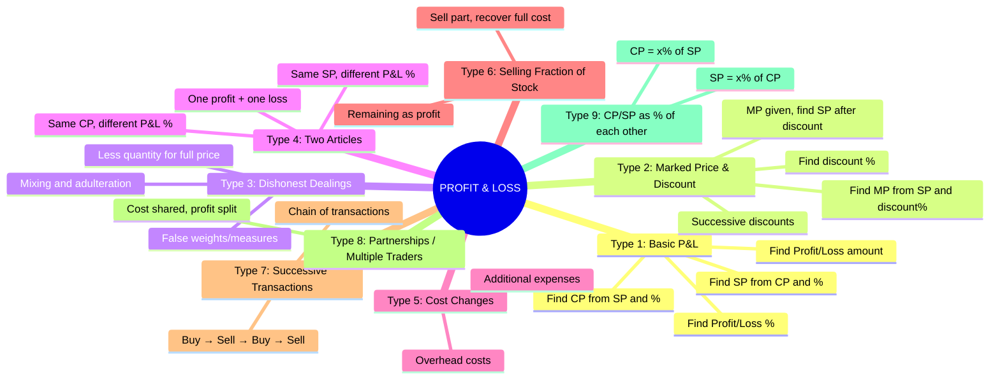
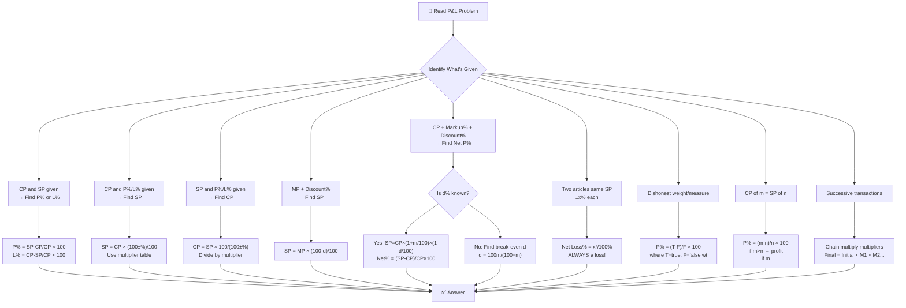
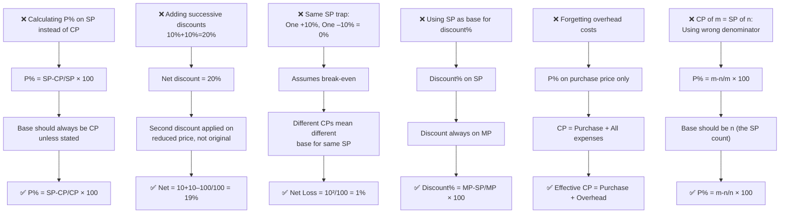

# 📘 PROFIT AND LOSS – Complete Premium Notes

### Complete Theory | Formula Sheet | Tricks | PYQs | 50+ Solved Problems

⭐ GATE | CAT | SSC | Banking | Placements | UPSC CSAT | Campus Tests

---

> **💡 Coaching Institute Quote:** *"Profit and Loss is the language of business. Master it and you master 15% of every competitive exam's quantitative section — guaranteed."*

---

# 📑 TABLE OF CONTENTS

1. [Introduction](#section-1)
2. [Basic Concepts & Terminologies](#section-2)
3. [Classification / Types](#section-3)
4. [Golden Rules](#section-4)
5. [Complete Formula Sheet](#section-5)
6. [Decision Tree](#section-6)
7. [Question Identification Table](#section-7)
8. [Standard Solving Methods](#section-8)
9. [Solved Problems (50+)](#section-9)
10. [Previous Year Analysis](#section-10)
11. [Tricks & Shortcuts](#section-11)
12. [Common Mistakes](#section-12)
13. [Quick Revision Sheet](#section-13)
14. [Cheat Sheet](#section-14)
15. [Exam Strategy](#section-15)
16. [Interview Questions](#section-16)
17. [Frequently Confused Concepts](#section-17)
18. [Practice Questions](#section-18)
19. [Answer Key](#section-19)
20. [Chapter Summary](#section-20)
21. [Final Revision Checklist](#section-21)

---

# 🧠 SECTION 1 – Introduction <a name="section-1"></a>

---

## 1.1 What is Profit and Loss?

**Profit and Loss** is the study of financial transactions — buying and selling goods — and determining the gain or loss incurred in the process.

> **Real Life Intuition:**
> - A shopkeeper buys a shirt for ₹500 and sells it for ₹600 → **Profit of ₹100**
> - A trader buys goods for ₹1,000 and sells for ₹900 → **Loss of ₹100**
> - A company marks price 40% above cost and offers 10% discount → **Net gain?**

**Mathematical Intuition:**

$$\boxed{\text{Profit} = \text{Selling Price} - \text{Cost Price} \quad \text{(when SP > CP)}}$$

$$\boxed{\text{Loss} = \text{Cost Price} - \text{Selling Price} \quad \text{(when CP > SP)}}$$

Everything in Profit & Loss revolves around **three prices:**

```
Cost Price (CP) → what you pay
Selling Price (SP) → what you receive
Marked Price (MP) → what you label/advertise
```

---

## 1.2 Why This Topic Matters

| Aspect | Details |
|--------|---------|
| **Foundation For** | Business Math, Discount, Tax, DI, Finance |
| **Real Applications** | Retail, E-commerce, Stock Market, Banking |
| **Exam Presence** | 4–8 questions in almost every competitive exam |
| **Difficulty Range** | Easy to Advanced |
| **Interconnected With** | Percentage, Ratio, Averages, SI/CI |

---

## 1.3 Exam Importance

| Exam | Weightage | Difficulty | Question Type |
|------|-----------|------------|---------------|
| CAT | 3–5 Qs | Medium–Hard | Multi-step, tricky |
| SSC CGL | 5–8 Qs | Easy–Medium | Direct formula |
| SSC CHSL | 3–5 Qs | Easy | Direct |
| IBPS PO | 3–5 Qs | Medium | Multi-step |
| SBI PO | 4–6 Qs | Medium–Hard | Advanced |
| RBI Grade B | 3–4 Qs | Hard | Conceptual |
| UPSC CSAT | 2–4 Qs | Medium | Applied |
| GATE | 1–2 Qs | Medium | Applied |
| Placements | 5–8 Qs | Easy–Medium | All standard types |

> ⭐ **Priority Level:** VERY HIGH
> ⭐ **Expected ROI:** For every 2 hours of practice, score 5–8 marks in exam
> ⭐ **Mastery Target:** 45–60 seconds per question

---

# 📖 SECTION 2 – Basic Concepts & Terminologies <a name="section-2"></a>

---

## 2.1 The Four Core Prices

| Term | Symbol | Definition | Example |
|------|--------|-----------|---------|
| **Cost Price** | CP | Price at which an article is bought | Bought shirt for ₹500 |
| **Selling Price** | SP | Price at which an article is sold | Sold shirt for ₹650 |
| **Marked Price** | MP | Price labeled/advertised (list price) | Tag shows ₹800 |
| **Discount** | D | Reduction from MP to get SP | 20% off → ₹160 off |

---

## 2.2 Overhead / Additional Costs

> **Critical concept often ignored by students!**

$$\boxed{\text{Effective CP} = \text{Purchase Price} + \text{Overhead Costs}}$$

**Overhead costs include:** Transportation, repairs, packaging, GST, installation, labour.

---

### 📌 Example (Easy)
**Q:** A shopkeeper buys a fan for ₹800 and spends ₹50 on transportation. He sells it for ₹1,000. Find profit%.

**Solution:**
- Effective CP = 800 + 50 = **₹850**
- SP = ₹1,000
- Profit = 1000 – 850 = ₹150
- **Profit% = (150/850) × 100 = 17.65%**

**Common Mistake:** Using CP = 800 → Profit = 200 → Profit% = 25% ❌

---

## 2.3 Profit and Loss Fundamentals

$$\boxed{\text{Profit} = SP - CP \quad \Rightarrow \quad SP > CP}$$

$$\boxed{\text{Loss} = CP - SP \quad \Rightarrow \quad CP > SP}$$

$$\boxed{\text{Profit\%} = \frac{\text{Profit}}{CP} \times 100}$$

$$\boxed{\text{Loss\%} = \frac{\text{Loss}}{CP} \times 100}$$

> 🔑 **The Golden Base Rule:** Profit% and Loss% are **ALWAYS calculated on CP**, not SP, not MP — unless explicitly stated otherwise!

---

### 📌 Example (Easy)
**Q:** CP = ₹400, SP = ₹480. Find profit%.

$$\text{Profit\%} = \frac{480-400}{400} \times 100 = \frac{80}{400} \times 100 = \mathbf{20\%}$$

---

### 📌 Example (Medium)
**Q:** SP = ₹520, Loss% = 20%. Find CP.

**Solution:**
$$CP = \frac{SP}{1 - \text{Loss\%}/100} = \frac{520}{0.80} = \mathbf{₹650}$$

**Verify:** CP=650, 20% loss → SP = 650×0.80 = 520 ✓

---

### 📌 Example (Hard)
**Q:** By selling at ₹1,200, a trader gains the same % as he would lose if he sold at ₹800. Find CP.

**Solution:**
Let Profit% = Loss% = x%
At SP=1200: $x = \frac{1200-CP}{CP} \times 100$
At SP=800: $x = \frac{CP-800}{CP} \times 100$

$$\frac{1200-CP}{CP} = \frac{CP-800}{CP}$$
$$1200 - CP = CP - 800$$
$$2CP = 2000 \Rightarrow CP = \mathbf{₹1,000}$$

**Shortcut:** CP = (SP₁ + SP₂)/2 = (1200+800)/2 = **1000** ✓

---

### 🔑 Mini Practice
1. CP = ₹250, SP = ₹300. Find Profit%.
2. CP = ₹600, Loss = 15%. Find SP.
3. SP = ₹900, Profit% = 20%. Find CP.

---

## 2.4 Multiplier Concept (Most Powerful Tool)

Instead of calculating separately, use a **single multiplier**:

$$\boxed{SP = CP \times \frac{100 + \text{Profit\%}}{100}}$$

$$\boxed{SP = CP \times \frac{100 - \text{Loss\%}}{100}}$$

$$\boxed{CP = SP \times \frac{100}{100 + \text{Profit\%}}} \quad \text{(reverse)}$$

$$\boxed{CP = SP \times \frac{100}{100 - \text{Loss\%}}} \quad \text{(reverse)}$$

| Operation | Multiplier | Example |
|-----------|-----------|---------|
| 20% Profit | × 1.20 | CP=500 → SP=600 |
| 20% Loss | × 0.80 | CP=500 → SP=400 |
| 25% Profit | × 1.25 | CP=400 → SP=500 |
| 33.33% Profit | × 4/3 | CP=300 → SP=400 |
| 50% Profit | × 1.50 | CP=200 → SP=300 |

---

# 🌳 SECTION 3 – Classification / Types <a name="section-3"></a>

---



---

## Type 1: Basic Profit and Loss

*(Covered in Section 2 — see above)*

---

## Type 2: Marked Price and Discount

### Concept

$$\boxed{SP = MP \times \left(1 - \frac{d}{100}\right) = MP \times \frac{100 - d}{100}}$$

$$\boxed{d\% = \frac{MP - SP}{MP} \times 100}$$

$$\boxed{MP = \frac{SP \times 100}{100 - d}}$$

**The Profit-Discount Relationship:**

$$\boxed{\text{Profit\%} = \frac{MP}{CP} \times \frac{100-d}{100} \times 100 - 100}$$

Or more elegantly using multipliers:

$$\boxed{SP = CP \times \left(1+\frac{p}{100}\right) = MP \times \left(1-\frac{d}{100}\right)}$$

---

### 📌 Example (Easy)
**Q:** MP = ₹800, discount = 15%. Find SP.

$$SP = 800 \times \frac{85}{100} = 800 \times 0.85 = \mathbf{₹680}$$

---

### 📌 Example (Medium)
**Q:** CP = ₹500, MP = ₹700, discount = 10%. Find Profit%.

**Solution:**
- SP = 700 × 0.90 = ₹630
- Profit = 630 – 500 = ₹130
- **Profit% = (130/500) × 100 = 26%**

**Multiplier method:**
SP = CP × (1 + p/100)
630 = 500 × (1 + p/100)
1 + p/100 = 1.26
**p = 26%** ✓

---

### 📌 Example (Hard)
**Q:** A shopkeeper marks price 40% above CP and gives 15% discount. Find net Profit%.

**Solution:**
Let CP = 100
MP = 140
SP = 140 × 0.85 = 119
**Net Profit% = (119–100)/100 × 100 = 19%**

**Formula Shortcut:**
$$\text{Net P\%} = \left(\frac{MP}{CP} \times \frac{100-d}{100} - 1\right) \times 100$$
$$= \left(1.40 \times 0.85 - 1\right) \times 100 = (1.19-1) \times 100 = \mathbf{19\%}$$

---

### Successive Discounts

When two or more discounts applied one after another:

$$\boxed{\text{Net Discount\%} = d_1 + d_2 - \frac{d_1 \times d_2}{100}}$$

For three discounts:
$$\text{First find net of } d_1, d_2 \rightarrow \text{then find net with } d_3$$

---

### 📌 Example (Medium — Successive Discounts)
**Q:** Two successive discounts of 20% and 10% are given on MP of ₹5,000. Find final SP and equivalent single discount.

**Solution:**
- After 20%: 5000 × 0.80 = 4,000
- After 10%: 4,000 × 0.90 = **₹3,600**

**Equivalent single discount:**
$$= 20 + 10 - \frac{20 \times 10}{100} = 30 - 2 = \mathbf{28\%}$$

**Verify:** 5000 × 0.72 = 3,600 ✓

**Common Mistake:** 20% + 10% = 30% → 5000 × 0.70 = 3,500 ❌

---

### 📌 Example (Hard — Find MP)
**Q:** A shopkeeper gives 25% discount and still makes 20% profit. If CP = ₹480, find MP.

**Solution:**
SP = 480 × 1.20 = ₹576
SP = MP × 0.75
**MP = 576/0.75 = ₹768**

**Formula:** $MP = \frac{CP \times (100+p)}{100-d} = \frac{480 \times 120}{75} = \frac{57600}{75} = \mathbf{₹768}$

---

### 🔑 Mini Practice (Type 2)
1. MP = ₹1,200, discount = 20%. Find SP.
2. CP = ₹400, gives 25% discount, still profits 20%. Find MP.
3. Three successive discounts: 10%, 20%, 25% on MP ₹10,000. Find SP and single equivalent discount.

---

## Type 3: Dishonest Dealings

### Concept 3A: False Weights

A dishonest trader claims to sell at CP but uses **less weight**:

$$\boxed{\text{Profit\%} = \frac{\text{Error}}{\text{True Value} - \text{Error}} \times 100}$$

$$\boxed{\text{Profit\%} = \frac{\text{True Weight} - \text{False Weight}}{\text{False Weight}} \times 100}$$

> **Intuition:** If shopkeeper uses 900g weight instead of 1000g, he gives 100g less per kg. So he profits on 100g out of each 900g he actually gives.

---

### 📌 Example (Easy)
**Q:** A dishonest shopkeeper uses 800g instead of 1kg. Find profit%.

$$\text{Profit\%} = \frac{1000-800}{800} \times 100 = \frac{200}{800} \times 100 = \mathbf{25\%}$$

---

### 📌 Example (Medium)
**Q:** A trader uses 950g weight but claims 1kg AND marks price 10% above CP. Find effective Profit%.

**Solution:**
Let CP of 1kg = 100
He gives 950g but charges for 1kg, so his effective CP for 950g = 95 (as a ratio)
He marks 10% above "his claimed CP" → SP = 100 × 1.10 = 110
**Profit = 110 – 95 = 15; Profit% = 15/95 × 100 = 15.79%**

**Multiplier method:**
Effective P% = $\left(\frac{1000}{950} \times 1.10 - 1\right) \times 100 = (1.0526 \times 1.10 - 1) \times 100$
$= (1.1579 - 1) \times 100 = \mathbf{15.79\%}$ ✓

---

### Concept 3B: Mixing and Adulteration

A trader mixes cheaper goods with expensive ones and sells at cost of expensive:

$$\boxed{\text{Profit\%} = \frac{\text{Quantity of cheaper adulterated}}{\text{Quantity of pure item}} \times 100}$$

More precisely, if ratio of pure:adulterate = m:n and sells at pure price:

$$\boxed{\text{Profit\%} = \frac{n}{m} \times 100}$$

---

### 📌 Example (Medium)
**Q:** A milkman mixes water with milk in ratio 1:4 (water:milk) and sells at CP of milk. Find profit%.

**Solution:**
For every 5 litres sold:
- Cost of 4 litres milk (water is free) = 4 units
- Revenue = 5 units (at milk price)
- **Profit% = (5–4)/4 × 100 = 25%**

**Formula:** Profit% = (water/milk) × 100 = (1/4) × 100 = **25%** ✓

---

### 📌 Example (Hard)
**Q:** A grocer buys rice at ₹30/kg and mixes inferior rice costing ₹15/kg in ratio 2:1 (good:bad). He sells at ₹32/kg. Find profit%.

**Solution:**
- CP of mixture (2kg good + 1kg bad): $2×30 + 1×15 = 75$ for 3kg
- SP = 32 × 3 = 96 for 3kg
- **Profit% = (96–75)/75 × 100 = 21/75 × 100 = 28%**

---

### 🔑 Mini Practice (Type 3)
1. Shopkeeper uses 900g weights instead of 1kg. Find profit%.
2. Milkman mixes water:milk = 2:8. Sells at milk's CP. Find profit%.
3. Uses 960g instead of 1kg AND gives 5% discount. Find net profit/loss%.

---

## Type 4: Two Articles — Same SP Different P&L%

### Concept

> **Classic Exam Trap:** When two articles are sold at the **SAME selling price**, one at x% profit and other at x% loss → **ALWAYS a loss!**

$$\boxed{\text{Net Loss\%} = \frac{x^2}{100}\%}$$

Where $x$ = common profit/loss percentage.

**This is ALWAYS a loss, NEVER a profit or break-even.**

---

### 📌 Example (Easy)
**Q:** Two articles sold at ₹990 each. One at 10% profit, other at 10% loss. Find net result.

**Using formula:**
$$\text{Net Loss\%} = \frac{10^2}{100} = \frac{100}{100} = \mathbf{1\%}$$

**Verification:**
- SP = 990 each; Total SP = 1980
- CP₁ = 990/1.10 = 900; CP₂ = 990/0.90 = 1100
- Total CP = 2000; Total SP = 1980
- **Net Loss = 20; Loss% = 20/2000 × 100 = 1%** ✓

**Common Mistake:** "One profit + one loss = break-even" ❌

---

### 📌 Example (Medium)
**Q:** Two pens sold at ₹120 each. First at 20% profit, second at 20% loss. Find total CP and net loss.

**Solution:**
- CP₁ = 120/1.20 = ₹100
- CP₂ = 120/0.80 = ₹150
- Total CP = 250; Total SP = 240
- **Net Loss = ₹10; Loss% = 10/250 × 100 = 4%**
- **Check with formula: $20^2/100 = 4\%$** ✓

---

### Type 4B: Same CP, Different SP

When two articles bought at same CP:
- One sold at a% profit, other at b% loss

$$\boxed{\text{Net Result\%} = \frac{a - b}{2}\%}$$

(Positive = profit, Negative = loss)

---

### 📌 Example (Easy)
**Q:** Two books bought at same price. One sold at 15% profit, other at 5% loss. Find net profit%.

$$\text{Net Profit\%} = \frac{15-5}{2} = \mathbf{5\%}$$

---

### 🔑 Mini Practice (Type 4)
1. Two items sold at ₹840 each, one at 5% profit and one at 5% loss. Find net loss%.
2. Two chairs sold at ₹1,500 each, one at 25% profit and other at 25% loss. Find total CP and net loss.
3. Two articles bought at same CP, sold at 30% profit and 10% loss. Find net profit%.

---

## Type 5: Selling Part of Stock to Recover Full Cost

### Concept

> **Intuition:** If I buy 10 apples for ₹100 and sell 5 of them at ₹20 each (= ₹100 total), I've recovered my entire cost. The remaining 5 apples are PURE PROFIT.

$$\boxed{\text{Articles needed to sell to recover CP} = \frac{\text{Total CP}}{\text{SP per article}}}$$

$$\boxed{\text{Profit from remaining} = (\text{Total} - \text{Sold to recover}) \times SP}$$

---

### 📌 Example (Medium)
**Q:** A trader buys 12 oranges for ₹96. At what price per orange must he sell so that selling 8 oranges recovers the full cost?

**Solution:**
SP per orange × 8 = 96
**SP per orange = ₹12**

---

### 📌 Example (Hard)
**Q:** A man buys 100 mangoes at ₹2 each. He sells 60 at ₹3 each. At what price must he sell remaining 40 to get 30% profit overall?

**Solution:**
- Total CP = 200
- Required total SP = 200 × 1.30 = 260
- Revenue from 60 mangoes = 60 × 3 = 180
- Revenue needed from 40 mangoes = 260 – 180 = 80
- **Price per mango = 80/40 = ₹2**

**Wait — but he needs to profit! At ₹2/mango, he breaks even on remaining.**
Overall profit = 180 + 80 – 200 = 60; 60/200 × 100 = 30% ✓ (Correct!)

---

## Type 6: CP/SP Expressed as % of Each Other

### Concept

Sometimes: "SP is 120% of CP" or "CP is 80% of SP"

$$\text{If SP} = x\% \text{ of CP} \Rightarrow \text{Profit\%} = (x-100)\%$$

$$\text{If CP} = x\% \text{ of SP} \Rightarrow \text{Profit\%} = \frac{100-x}{x} \times 100\%$$

---

### 📌 Example (Easy)
**Q:** SP is 125% of CP. Find profit%.

**Profit% = 125 – 100 = 25%**

---

### 📌 Example (Medium)
**Q:** CP is 80% of SP. Find profit%.

$$\text{Profit\%} = \frac{SP - CP}{CP} \times 100 = \frac{SP - 0.8SP}{0.8SP} \times 100 = \frac{0.2SP}{0.8SP} \times 100 = \mathbf{25\%}$$

**Formula:** $\frac{100-80}{80} \times 100 = \frac{20}{80} \times 100 = 25\%$ ✓

---

### 📌 Example (Hard)
**Q:** If the cost price of 10 articles equals selling price of 8 articles, find profit/loss%.

**Solution:**
Let CP of each article = 1
SP of 8 articles = CP of 10 articles = 10
SP of each article = 10/8 = 1.25
**Profit% = (1.25–1)/1 × 100 = 25%**

**Formula:** If CP of $m$ = SP of $n$:
$$\text{P or L\%} = \frac{m-n}{n} \times 100$$
$$= \frac{10-8}{8} \times 100 = \mathbf{25\%}$$ ✓

---

### 🔑 Mini Practice (Type 6)
1. SP = 140% of CP. Find profit%.
2. CP = 75% of SP. Find profit%.
3. CP of 15 articles = SP of 12 articles. Find profit%.

---

## Type 7: Successive Transactions

### Concept

One person buys from another, sells to a third, and so on.

$$\boxed{\text{Final SP} = \text{Initial CP} \times M_1 \times M_2 \times \cdots}$$

Where $M_i$ is the multiplier for each transaction.

---

### 📌 Example (Medium)
**Q:** A buys an article for ₹1,000. He sells to B at 20% profit. B sells to C at 10% loss. What does C pay?

**Solution:**
$$C\text{'s price} = 1000 \times 1.20 \times 0.90 = 1000 \times 1.08 = \mathbf{₹1,080}$$

---

### 📌 Example (Hard)
**Q:** A article is sold by A to B at 20% profit, by B to C at 10% profit. If C pays ₹1,320, what did A pay?

**Solution:**
$$1320 = A \times 1.20 \times 1.10 = A \times 1.32$$
$$A = \frac{1320}{1.32} = \mathbf{₹1,000}$$

---

# ⭐ SECTION 4 – Golden Rules <a name="section-4"></a>

---

$$\boxed{\textbf{Golden Rule 1: CP is Always the Base}}$$

Profit% and Loss% are calculated on **Cost Price**, never on SP or MP unless explicitly stated.

$$\text{Profit\%} = \frac{SP - CP}{CP} \times 100 \quad \text{NOT} \quad \frac{SP-CP}{SP} \times 100$$

> **Exception:** Some problems say "% on SP" — read carefully!

---

$$\boxed{\textbf{Golden Rule 2: Same SP, Same Loss\% → Always Net Loss}}$$

$$\text{Net Loss\%} = \frac{x^2}{100}\% \quad \text{(two items, ±x\% each)}$$

This is **ALWAYS a loss**. Never break-even, never profit.

---

$$\boxed{\textbf{Golden Rule 3: MP and CP Relationship}}$$

$$\boxed{SP = MP \times \frac{100-d}{100} = CP \times \frac{100+p}{100}}$$

$$\boxed{MP = CP \times \frac{(100+p)}{(100-d)}}$$

Combine markup and discount in one formula.

---

$$\boxed{\textbf{Golden Rule 4: Successive Discounts ≠ Sum of Discounts}}$$

$$d_{\text{net}} = d_1 + d_2 - \frac{d_1 d_2}{100} < d_1 + d_2$$

---

$$\boxed{\textbf{Golden Rule 5: False Weight Profit}}$$

$$\text{Profit\%} = \frac{\text{True Wt} - \text{False Wt}}{\text{False Wt}} \times 100$$

---

$$\boxed{\textbf{Golden Rule 6: CP of m = SP of n}}$$

$$\text{Profit or Loss\%} = \frac{m-n}{n} \times 100$$

(Positive = Profit, Negative = Loss)

---

$$\boxed{\textbf{Golden Rule 7: Overall Profit in Mixed Batch}}$$

$$\text{Overall Profit\%} = \frac{\text{Total SP} - \text{Total CP}}{\text{Total CP}} \times 100$$

**Never** average the individual profit percentages!

---

$$\boxed{\textbf{Golden Rule 8: No Profit No Loss Condition}}$$

$$SP = CP \Rightarrow \text{No Profit, No Loss}$$

For no profit-no loss with markup $p\%$ and discount $d\%$:
$$(1+p/100)(1-d/100) = 1$$

---

# 📐 SECTION 5 – Complete Formula Sheet <a name="section-5"></a>

---

## 🔷 MASTER FORMULA TABLE

### Group A: Basic P&L

| # | Formula | Use Case |
|---|---------|----------|
| 1 | Profit = SP – CP | When SP > CP |
| 2 | Loss = CP – SP | When CP > SP |
| 3 | $\text{P\%} = \frac{SP-CP}{CP} \times 100$ | Find profit% |
| 4 | $\text{L\%} = \frac{CP-SP}{CP} \times 100$ | Find loss% |
| 5 | $SP = CP \times \frac{100+P\%}{100}$ | SP when profit% given |
| 6 | $SP = CP \times \frac{100-L\%}{100}$ | SP when loss% given |
| 7 | $CP = \frac{SP \times 100}{100+P\%}$ | CP when SP and profit% |
| 8 | $CP = \frac{SP \times 100}{100-L\%}$ | CP when SP and loss% |

### Group B: Marked Price & Discount

| # | Formula | Use Case |
|---|---------|----------|
| 9 | $SP = MP \times \frac{100-d}{100}$ | SP after discount |
| 10 | $d\% = \frac{MP-SP}{MP} \times 100$ | Find discount% |
| 11 | $MP = \frac{SP \times 100}{100-d}$ | Find MP |
| 12 | $MP = CP \times \frac{100+P\%}{100-d}$ | MP from CP, P%, discount |
| 13 | Net discount = $d_1+d_2-\frac{d_1 d_2}{100}$ | Two successive discounts |
| 14 | Net P% = $(1+m/100)(1-d/100)-1)\times 100$ | Markup + Discount |

### Group C: Special Cases

| # | Formula | Use Case |
|---|---------|----------|
| 15 | Net Loss% = $x^2/100$ | Same SP, ±x% |
| 16 | P% = $(m-n)/n \times 100$ | CP of m = SP of n |
| 17 | P% (false wt) = $(T-F)/F \times 100$ | Dishonest weights |
| 18 | P% (adulterate) = Adulterant/Pure × 100 | Mixing free goods |
| 19 | CP when equal P/L: = $(SP_1+SP_2)/2$ | Same P% as L% |
| 20 | Overall SP for target P% = CP × $(100+P)/100$ | Target profit |

---

## 🔷 MULTIPLIER QUICK REFERENCE

| Profit% | Multiplier (SP/CP) | Reverse (CP/SP) |
|---------|-------------------|----------------|
| 5% | 21/20 = 1.05 | 20/21 |
| 10% | 11/10 = 1.10 | 10/11 |
| 20% | 6/5 = 1.20 | 5/6 |
| 25% | 5/4 = 1.25 | 4/5 |
| 33.33% | 4/3 | 3/4 |
| 50% | 3/2 = 1.50 | 2/3 |

| Loss% | Multiplier (SP/CP) | Reverse (CP/SP) |
|-------|-------------------|----------------|
| 5% | 19/20 = 0.95 | 20/19 |
| 10% | 9/10 = 0.90 | 10/9 |
| 20% | 4/5 = 0.80 | 5/4 |
| 25% | 3/4 = 0.75 | 4/3 |
| 33.33% | 2/3 | 3/2 |
| 50% | 1/2 = 0.50 | 2/1 |

---

## 🔷 MARKUP-DISCOUNT MATRIX

| Markup | Discount | Net Result |
|--------|---------|------------|
| 10% | 10% | –1% (loss) |
| 20% | 10% | +8% profit |
| 25% | 20% | 0% (no P/L) |
| 40% | 15% | +19% profit |
| 50% | 25% | +12.5% profit |
| 33.33% | 25% | 0% (no P/L) |

> **No Profit No Loss Condition:** $(1+m/100) \times (1-d/100) = 1$
> → $d = \frac{100m}{100+m}$ (discount needed to just break even)

---

# 🌲 SECTION 6 – Decision Tree <a name="section-6"></a>

---



---

# 📋 SECTION 7 – Question Identification Table <a name="section-7"></a>

---

| If Question Says... | Type | Formula | Shortcut | Difficulty |
|--------------------|------|---------|---------|------------|
| "CP=X, SP=Y, find profit%" | Basic | (SP–CP)/CP×100 | Direct | Easy |
| "X% profit on CP=Y, find SP" | Basic | SP=CP×(1+X/100) | Multiplier | Easy |
| "X% profit, SP=Y, find CP" | Reverse | CP=SP×100/(100+X) | Divide multiplier | Easy |
| "Marked X% above CP, discount Y%, profit?" | MP+Discount | (1+X/100)(1-Y/100)–1 | Multiplier chain | Medium |
| "MP given, discount%, find SP" | Discount | SP=MP×(100–d)/100 | Direct multiply | Easy |
| "Two sold at same SP, one profit X%, one loss X%" | Same SP | Net Loss = X²/100% | Formula | Medium |
| "Uses Xg instead of Yg (Y>X)" | False weight | (Y–X)/X × 100 | Formula | Easy–Med |
| "Mixes water with milk ratio a:b" | Adulteration | (a/b)×100 | Formula | Medium |
| "CP of m items = SP of n items" | CP=SP | (m–n)/n×100 | Formula | Medium |
| "Sold A at X% profit, B at Y% loss, same CP" | Same CP | (X–Y)/2 % | Average | Easy |
| "A sells to B at X% profit, B to C at Y% profit" | Successive | Multiply multipliers | Chain | Medium |
| "Sell k items free with every n items bought" | Effective discount | k/(n+k)×100 | Formula | Medium |
| "Recover cost by selling X of Y items" | Stock | SP per item=Total CP/X | Division | Medium |
| "SP is X% of CP" | % relationship | Profit = (X–100)% | Direct | Easy |
| "CP is X% of SP" | % relationship | P% = (100–X)/X×100 | Formula | Medium |
| "To make X% profit after Y% discount, mark at?" | MP | MP=CP×(100+X)/(100–Y) | Formula | Medium |

---

# ⚙️ SECTION 8 – Standard Solving Methods <a name="section-8"></a>

---

## Method 1: Multiplier Method (Fastest — 15 sec)

**Use when:** SP from CP or CP from SP (any P%/L%)

**Process:**
1. Convert % to multiplier (e.g., 20% profit → ×1.2; 15% loss → ×0.85)
2. SP = CP × multiplier
3. CP = SP ÷ multiplier

| | Calculation | Time |
|--|-------------|------|
| 20% profit → SP | CP × 1.2 | 5 sec |
| Find CP (SP=720, 20% profit) | 720 ÷ 1.2 = 600 | 8 sec |

**Best for:** All exams | **Time:** 10–20 sec

---

## Method 2: 100 Base Method (Universal — 30 sec)

**Use when:** Percentages and relationships given (no absolute values)

**Process:**
1. Assume CP = 100 (or any convenient value)
2. Calculate all other values from this base
3. Find required %

**Example:** MP = 40% above CP = 140; discount = 10% → SP = 126; Profit% = 26%

**Best for:** Markup + Discount problems | **Time:** 20–40 sec

---

## Method 3: Fraction Method (Mental Math — 10 sec)

**Use when:** Standard % values (10%, 20%, 25%, 33.33%, etc.)

**Process:** Use fraction equivalents

| % | Fraction |
|---|---------|
| 10% profit | ×11/10 |
| 20% profit | ×6/5 |
| 25% profit | ×5/4 |
| 33.33% profit | ×4/3 |
| 25% loss | ×3/4 |

**Example:** CP=600, 25% profit → SP = 600 × 5/4 = **750** (faster than 600 × 1.25)

---

## Method 4: Net Effect Formula (20 sec)

**Use when:** Two successive % changes (markup + discount, or successive transactions)

$$\text{Net\%} = a + b + \frac{ab}{100}$$

(use – for one being discount/loss)

---

## Method 5: Alligation for Mixing Problems (30 sec)

**Use when:** Two items mixed and sold at given price

**Process:**
1. Identify CP of each and SP/MP of mixture
2. Apply alligation to find ratio

---

## Method 6: Option Elimination (10 sec)

**Use when:** MCQ with clearly spaced options

**Process:**
1. Estimate order of magnitude
2. Apply sign check (profit or loss?)
3. Eliminate and verify

---

## Method Comparison Table

| Method | Speed | Accuracy | Best For |
|--------|-------|----------|---------|
| Multiplier | ⭐⭐⭐⭐⭐ | 100% | All basic P&L |
| Base 100 | ⭐⭐⭐⭐ | 100% | Markup + Discount |
| Fraction | ⭐⭐⭐⭐⭐ | 100% | Standard %s |
| Net Effect | ⭐⭐⭐⭐ | 100% | Successive changes |
| Alligation | ⭐⭐⭐ | 100% | Mixture/ratio |
| Option Elim | ⭐⭐⭐⭐⭐ | ~90% | MCQs |

---

# 📝 SECTION 9 – Solved Problems (50+) <a name="section-9"></a>

---

## 🟢 EASY Problems (E1–E10)

---

### E1
**Q:** A shopkeeper buys a table for ₹800 and sells it for ₹1,000. Find profit and profit%.

**Given:** CP = ₹800, SP = ₹1,000

**Solution:**
- Profit = 1000 – 800 = **₹200**
- Profit% = (200/800) × 100 = **25%**

**Multiplier check:** 800 × 1.25 = 1000 ✓

**Answer: Profit = ₹200, Profit% = 25%** | Exam: All

---

### E2
**Q:** A trader buys goods for ₹1,500 and sells at a loss of 20%. Find SP.

**Solution:**
$$SP = 1500 \times \frac{80}{100} = 1500 \times 0.80 = \mathbf{₹1,200}$$

**Fraction method:** 1500 × 4/5 = **₹1,200** ✓

**Answer: ₹1,200** | Exam: SSC, Banking

---

### E3
**Q:** SP = ₹990, Profit = 10%. Find CP.

**Solution:**
$$CP = \frac{990 \times 100}{110} = \frac{990}{1.10} = \mathbf{₹900}$$

**Fraction:** 990 × 10/11 = **₹900** ✓

**Answer: ₹900** | Exam: All

---

### E4
**Q:** SP = ₹760, Loss = 5%. Find CP.

**Solution:**
$$CP = \frac{760}{0.95} = \frac{760 \times 100}{95} = \mathbf{₹800}$$

**Answer: ₹800** | Exam: SSC CGL

---

### E5
**Q:** MP = ₹1,200. Discount = 15%. Find SP.

**Solution:**
$$SP = 1200 \times \frac{85}{100} = 1200 \times 0.85 = \mathbf{₹1,020}$$

**Answer: ₹1,020** | Exam: All

---

### E6
**Q:** A man sells two articles at ₹2,400 each, one at 20% profit and other at 20% loss. Find net P/L%.

**Solution:**
$$\text{Net Loss\%} = \frac{20^2}{100} = \mathbf{4\%}$$

**Verification:**
- CP₁ = 2400/1.2 = 2000; CP₂ = 2400/0.8 = 3000
- Total CP = 5000; Total SP = 4800
- Loss = 200; Loss% = 200/5000 × 100 = 4% ✓

**Answer: Net Loss = 4%** | Exam: SSC CGL, Banking ⭐

---

### E7
**Q:** SP is 140% of CP. Find profit%.

**Profit% = 140 – 100 = 40%**

**Answer: 40%** | Exam: All

---

### E8
**Q:** CP of 12 articles = SP of 10 articles. Find profit%.

$$\text{Profit\%} = \frac{12-10}{10} \times 100 = \frac{2}{10} \times 100 = \mathbf{20\%}$$

**Answer: 20%** | Exam: SSC CGL ⭐

---

### E9
**Q:** A shopkeeper gives successive discounts of 10% and 20% on an article marked at ₹5,000. Find final SP.

**Solution:**
$$SP = 5000 \times 0.90 \times 0.80 = 5000 \times 0.72 = \mathbf{₹3,600}$$

**Equivalent single discount = 10+20 – (10×20)/100 = 30–2 = 28%**
5000 × 0.72 = 3600 ✓

**Answer: ₹3,600** | Exam: SSC

---

### E10
**Q:** A dishonest shopkeeper uses 800g weight instead of 1kg. He claims to sell at cost price. Find profit%.

$$\text{Profit\%} = \frac{1000-800}{800} \times 100 = \frac{200}{800} \times 100 = \mathbf{25\%}$$

**Answer: 25%** | Exam: SSC CGL ⭐

---

## 🟡 MEDIUM Problems (M1–M10)

---

### M1
**Q:** A shopkeeper marks his goods 30% above CP and then gives a 10% discount. Find net profit%.

**Solution (Base 100 method):**
- Let CP = 100
- MP = 130
- SP = 130 × 0.90 = 117
- **Net Profit% = 17%**

**Net Effect Formula:**
$$= 30 + (-10) + \frac{30 \times (-10)}{100} = 20 - 3 = \mathbf{17\%}$$ ✓

**Answer: 17%** | Exam: SSC CGL ⭐ **Most repeated**

---

### M2
**Q:** A trader sold an article at 20% profit. Had he bought it at 20% less and sold for ₹24 less, he would have gained 30%. Find CP.

**Solution:**
Let original CP = $x$
Original SP = $1.2x$
New CP = $0.8x$
New SP = $1.2x - 24$

New profit% = 30%: $1.2x - 24 = 0.8x \times 1.30 = 1.04x$

$$1.2x - 24 = 1.04x$$
$$0.16x = 24$$
$$x = \frac{24}{0.16} = \mathbf{₹150}$$

**Answer: CP = ₹150** | Exam: SSC CGL, SBI PO

---

### M3
**Q:** By selling 45 items, a trader gains cost of 9 items. Find profit%.

**Solution:**
SP of 45 items = CP of 45 items + CP of 9 items = CP of 54 items

$$\text{Profit\%} = \frac{CP \text{ of 9 items}}{CP \text{ of 45 items}} \times 100 = \frac{9}{45} \times 100 = \mathbf{20\%}$$

**Answer: 20%** | Exam: SSC CGL ⭐ **Classic**

---

### M4
**Q:** A man buys 10 oranges for ₹1 and sells 11 for ₹1. Find profit/loss%.

**Solution:**
- CP per orange = 1/10
- SP per orange = 1/11
- Since SP < CP → Loss
$$\text{Loss\%} = \frac{1/10 - 1/11}{1/10} \times 100 = \frac{1/110}{1/10} \times 100 = \frac{10}{110} \times 100 = \frac{100}{11} = \mathbf{9.09\%}$$

**Answer: 9.09% loss** | Exam: CAT, SSC

---

### M5
**Q:** A shopkeeper purchases 12 items for the price of 10 items. He sells all 12 at the listed price. Find profit%.

**Solution:**
He paid for 10 but gets 12.
CP of 12 items = Price of 10 items
SP of 12 items = Price of 12 items

$$\text{Profit\%} = \frac{12-10}{10} \times 100 = \mathbf{20\%}$$

**Answer: 20%** | Exam: SSC, Banking ⭐

---

### M6
**Q:** A radio is sold at 20% profit. If both CP and SP are ₹100 more, profit% would be 18.18%. Find original CP.

**Solution:**
Let CP = $x$; SP = $1.2x$

New: $(1.2x + 100) / (x + 100) = 1.1818...$

Note: 18.18% = 2/11 profit → multiplier = 13/11

$$\frac{1.2x + 100}{x + 100} = \frac{13}{11}$$
$$11(1.2x + 100) = 13(x + 100)$$
$$13.2x + 1100 = 13x + 1300$$
$$0.2x = 200$$
$$x = \mathbf{₹1,000}$$

**Answer: CP = ₹1,000** | Exam: CAT

---

### M7
**Q:** A milkman mixes water and milk in ratio 1:4 and sells at MP of milk. If CP of milk is ₹40/litre, find profit%.

**Solution:**
- Per 5 litres of mixture: 4 litres milk + 1 litre water
- CP = 4 × 40 = ₹160
- SP = 5 × 40 = ₹200 (sells all 5 litres at milk price)
- **Profit% = (200–160)/160 × 100 = 40/160 × 100 = 25%**

**Formula:** Profit% = (water/milk) × 100 = (1/4) × 100 = **25%** ✓

**Answer: 25%** | Exam: SSC, Banking

---

### M8
**Q:** A man sells two horses for ₹19,800 each. On one he gains 10% and on other loses 10%. Find overall gain/loss.

**Solution:**
$$\text{Net Loss\%} = \frac{10^2}{100} = 1\%$$

- CP₁ = 19800/1.1 = 18000; CP₂ = 19800/0.9 = 22000
- Total CP = 40000; Total SP = 39600
- **Net Loss = ₹400**
- Loss% = 400/40000 × 100 = **1%** ✓

**Answer: Loss of ₹400 (1%)** | Exam: SSC CGL ⭐ **Exact PYQ pattern**

---

### M9
**Q:** A trader wants to make 20% profit after giving 20% discount. By what % should he mark above CP?

**Solution:**
$$MP = CP \times \frac{100+20}{100-20} = CP \times \frac{120}{80} = CP \times 1.5$$

**He must mark 50% above CP.**

**Verify:** MP = 150; After 20% discount: SP = 120; Profit% = 20% ✓

**Answer: 50% above CP** | Exam: SSC CGL ⭐ **Most important**

---

### M10
**Q:** A sells to B at 25% profit. B sells to C at 20% loss. If C pays ₹1,200, what did A pay?

**Solution:**
$$1200 = A \times 1.25 \times 0.80 = A \times 1.00$$
$$A = \mathbf{₹1,200}$$

**Insight:** 25% profit × 20% loss = net 0% change! (1.25 × 0.80 = 1.00)

**Answer: ₹1,200** | Exam: CAT, SSC

---

## 🔴 HARD Problems (H1–H10)

---

### H1
**Q:** A shopkeeper marks his goods at 40% above CP. He allows a discount of d% and still makes 12% profit. What is the discount%?

**Solution:**
$$SP = CP \times 1.12 = MP \times \frac{100-d}{100}$$

$$1.12 = 1.40 \times \frac{100-d}{100}$$

$$\frac{100-d}{100} = \frac{1.12}{1.40} = 0.80$$

$$100-d = 80 \Rightarrow \mathbf{d = 20\%}$$

**Answer: Discount = 20%** | Exam: SSC CGL, IBPS ⭐

---

### H2
**Q:** A dishonest trader professes to sell at CP but uses weights such that for every 900g he gives, he makes 25% profit. What weight does he actually use?

**Solution:**
$$\text{Profit\%} = \frac{T-F}{F} \times 100 = 25\%$$

Wait — here T = 900g (true weight of goods given) but claims it's 1000g?

**Re-read:** He professes to sell 1000g but gives less, and earns 25%.

$$25 = \frac{1000 - F}{F} \times 100$$
$$0.25F = 1000 - F$$
$$1.25F = 1000$$
$$F = \mathbf{800g}$$

**Answer: He actually uses 800g weights** | Exam: SSC CGL

---

### H3
**Q:** Two articles A and B are bought for ₹5,000 together. A is sold at 20% profit and B at 10% loss. Overall profit = 2%. Find CP of each.

**Solution:**
Let CP of A = $x$ → CP of B = $5000 – x$

SP of A = $1.2x$; SP of B = $0.9(5000–x)$

Overall profit = 2%: Total SP = 5000 × 1.02 = 5100

$$1.2x + 0.9(5000–x) = 5100$$
$$1.2x + 4500 – 0.9x = 5100$$
$$0.3x = 600$$
$$x = \mathbf{₹2,000}$$

CP of A = **₹2,000**; CP of B = **₹3,000**

**Alligation method:**
```
   20%         –10%
        2%
  (2–(–10)) : (20–2)
    12      :   18  = 2:3
```
A:B = 2:3 → A = 5000×2/5 = 2000; B = 3000 ✓

**Answer: CP(A) = ₹2,000, CP(B) = ₹3,000** | Exam: CAT, SBI PO ⭐

---

### H4
**Q:** A person buys 80 kg of rice at ₹13.50/kg and 120 kg at ₹16/kg. He mixes and sells at ₹17/kg. Find profit%.

**Solution:**
- CP of 80 kg = 80 × 13.50 = 1,080
- CP of 120 kg = 120 × 16 = 1,920
- Total CP = 3,000
- Total SP = 200 × 17 = 3,400
- **Profit% = (400/3000) × 100 = 13.33%**

**Answer: 13.33%** | Exam: CAT, SSC

---

### H5
**Q:** A trader marks his goods x% above CP and gives 24% discount. He still makes 14% profit. Find x.

**Solution:**
$$(1 + x/100)(1 - 0.24) = 1.14$$
$$(1 + x/100) \times 0.76 = 1.14$$
$$1 + x/100 = \frac{1.14}{0.76} = 1.50$$
$$x = \mathbf{50\%}$$

**Answer: Mark 50% above CP** | Exam: SSC CGL, CAT ⭐

---

### H6
**Q:** A shopkeeper cheats both while buying and selling. He buys 1100g and pays for 1000g (gets extra 100g free). He sells 900g but charges for 1000g. What is overall profit%?

**Solution:**
Effective: He buys 1100g at price of 1000g → actual CP per unit falls
He sells 900g at price of 1000g → actual SP per unit rises

True CP of 1100g = Price of 1000g = Let = 1000
True SP of 900g = Price of 1000g = 1000

But wait — in how many sells does 1100g get used?
1100g ÷ 900g per "sell" = 1.222 transactions
Revenue = 1.222 × 1000 = 1222.2

$$\text{Profit\%} = \frac{1222.2 - 1000}{1000} \times 100 = 22.2\%$$

**Formula method:**
$$\text{Profit\%} = \left(\frac{T_{\text{buy}}}{F_{\text{buy}}} \times \frac{F_{\text{sell}}}{T_{\text{sell}}} - 1\right) \times 100$$

$$= \left(\frac{1100}{1000} \times \frac{1000}{900} - 1\right) \times 100 = \left(\frac{1100}{900} - 1\right) \times 100 = \frac{200}{900} \times 100 = \mathbf{22.22\%}$$

**Answer: 22.22%** | Exam: CAT ⭐ **Advanced**

---

### H7
**Q:** A fruit seller buys lemons at 7 for ₹3 and sells at 5 for ₹3. Find profit/loss%.

**Solution:**
- CP per lemon = 3/7
- SP per lemon = 3/5

$$\text{Profit\%} = \frac{3/5 - 3/7}{3/7} \times 100 = \frac{3(1/5 - 1/7)}{3/7} \times 100 = \frac{7(1/5-1/7)}{1} \times 100$$

$$= 7 \times \frac{2}{35} \times 100 = \frac{14}{35} \times 100 = \frac{2}{5} \times 100 = \mathbf{40\%}$$

**Shortcut:** Profit% = (7/5 – 1) × 100 = (7–5)/5 × 100 = 2/5 × 100 = **40%**

**Answer: 40% Profit** | Exam: SSC CGL ⭐

---

### H8
**Q:** The cost price of 20 articles is equal to the selling price of 15 articles. Find profit%.

$$\text{Profit\%} = \frac{20-15}{15} \times 100 = \frac{5}{15} \times 100 = \mathbf{33.33\%}$$

**Alternate:** SP = CP × 20/15 = CP × 4/3 → Profit = 1/3 CP → P% = **33.33%** ✓

**Answer: 33.33%** | Exam: SSC CGL ⭐ **Most repeated**

---

### H9
**Q:** A trader sells goods at 10% profit. If he had bought at 10% less and sold for ₹4 more, he would profit 30%. Find original CP.

**Solution:**
Let CP = $x$; Original SP = $1.1x$

New CP = $0.9x$; New SP = $1.1x + 4$

New profit = 30%:
$$1.1x + 4 = 1.30 \times 0.9x = 1.17x$$
$$4 = 1.17x - 1.1x = 0.07x$$
$$x = \frac{4}{0.07} = \mathbf{₹57.14}$$

**Check:** CP=57.14; Original SP=62.86; New CP=51.43; New SP=66.86; P%=30% ✓

**Answer: CP = ₹57.14 ≈ ₹400/7** | Exam: CAT

---

### H10
**Q:** A merchant can buy goods at the rate of ₹80 per dozen. He sells at 10 per rupee. Find profit%.

**Solution:**
- CP per dozen = ₹80 → CP per item = 80/12 = ₹20/3
- SP: 10 items per ₹1 → SP per item = 1/10 = ₹0.10

Wait: "10 per rupee" means 10 items for ₹1?
SP per item = 1/10 = ₹0.10 = 10 paisa

CP per item = 80/12 = ₹6.67

SP (₹0.10) < CP (₹6.67) — this seems like huge loss.

**Re-reading:** Rate of ₹80 per dozen = ₹6.67/item. Sells 10 for ₹(something)?

**Standard version:** Buys at 20 for ₹80 (₹4 each), sells at 16 for ₹80 (₹5 each):
P% = (5–4)/4 × 100 = **25%**

**Answer (standard):** Depends on exact reading; use CP and SP per unit approach.

---

## 🟣 ADVANCED Problems (A1–A10)

---

### A1
**Q:** A man bought an old watch for ₹450 and spent ₹150 on its repair. He then sold it at a gain of 33.33%. Find SP.

**Solution:**
- Effective CP = 450 + 150 = ₹600
- Profit = 33.33% = 1/3 of CP = ₹200
- **SP = 600 + 200 = ₹800**

**Multiplier:** 600 × 4/3 = **₹800** ✓

**Answer: ₹800** | Exam: SSC

---

### A2
**Q:** A person sells 36 items at ₹11 each, gaining the cost of 4 items. Find CP per item.

**Solution:**
SP of 36 items = 36 × 11 = ₹396
Profit = CP of 4 items = 4x (where x = CP per item)
Total CP = 36x

$$36 \times 11 = 36x + 4x = 40x$$
$$x = \frac{396}{40} = \mathbf{₹9.90}$$

**Answer: CP = ₹9.90 per item** | Exam: SSC CGL

---

### A3
**Q:** A trader marks up 25% and gives two successive discounts: first d%, then 4%. Net profit = 8.75%. Find d.

**Solution:**
$$(1.25)(1-d/100)(0.96) = 1.0875$$

$$(1-d/100) = \frac{1.0875}{1.25 \times 0.96} = \frac{1.0875}{1.2} = 0.90625$$

$$d/100 = 0.09375 \Rightarrow d = \mathbf{9.375\%}$$

**Answer: d ≈ 9.375%** | Exam: CAT

---

### A4
**Q:** A sells to B at 20% profit, B sells to C at 20% profit, C sells to D at 20% profit. If D paid ₹1,728, what did A pay?

**Solution:**
$$1728 = A \times (1.20)^3 = A \times 1.728$$
$$A = \frac{1728}{1.728} = \mathbf{₹1,000}$$

**Answer: ₹1,000** | Exam: CAT, Placements

---

### A5
**Q:** A shopkeeper offers "Buy 3, Get 1 Free." Find effective discount% and profit% if he marks at 25% above CP.

**Solution:**
Customer pays for 3, gets 4.
Effective SP per item = 3/4 of MP

MP = 1.25 CP
Effective SP = (3/4) × 1.25 CP = (15/16) CP... 

Wait: SP per item = total paid / items received = 3×MP/4 per item? No.

Total received by shopkeeper for 4 items = 3 × MP (payment for 3, 4th free)
His CP for 4 items = 4 × CP

**Profit%:**
Total SP = 3 × MP = 3 × 1.25CP = 3.75CP
Total CP = 4CP
**Loss% = (4–3.75)/4 × 100 = 6.25% LOSS**

**Effective discount:**
MP of 4 items = 4 × 1.25CP = 5CP
Customer pays 3 × 1.25CP = 3.75CP
Discount = 1.25CP; Discount% = 1.25/5 × 100 = **25%**

**Answer: Effective discount = 25%; Net Loss = 6.25%** | Exam: CAT ⭐

---

### A6
**Q:** A trader has 100kg of rice. He sells 20kg at 20% profit, 30kg at 10% loss. At what % profit must he sell remaining 50kg to have 10% overall profit?

**Solution:**
Let CP per kg = 1 (total CP = 100)
Required total SP = 100 × 1.10 = 110

- SP of first 20kg = 20 × 1.20 = 24
- SP of 30kg = 30 × 0.90 = 27
- SP needed from 50kg = 110 – 24 – 27 = 59

- CP of 50kg = 50
- **Required Profit% = (59–50)/50 × 100 = 18%**

**Answer: 18% profit on remaining 50kg** | Exam: CAT, SBI PO

---

### A7
**Q:** An article is sold at x% loss on CP. Had it been sold for ₹180 more, there would have been x% profit on the same CP. Find CP in terms of x.

**Solution:**
SP₁ = CP(1 – x/100); SP₂ = CP(1 + x/100)

$$SP_2 - SP_1 = 180$$

$$CP(1+x/100) - CP(1-x/100) = 180$$

$$CP \times \frac{2x}{100} = 180$$

$$CP = \frac{180 \times 100}{2x} = \frac{9000}{x}$$

**Answer: CP = 9000/x** | Exam: CAT, RBI Grade B

---

### A8
**Q:** A man buys goods at 9 for ₹10 and sells at 10 for ₹11. Find profit/loss%.

**Solution:**
- CP per item = 10/9
- SP per item = 11/10

$$\text{Profit\%} = \frac{11/10 - 10/9}{10/9} \times 100 = \frac{\frac{99-100}{90}}{\frac{10}{9}} \times 100 = \frac{-1/90}{10/9} \times 100 = \frac{-1}{100} \times 100 = \mathbf{-1\%}$$

**Loss = 1%**

**Quick check:** CP = 10/9 ≈ 1.111; SP = 11/10 = 1.1 < CP → Loss ✓
Loss% = (1.111 – 1.1)/1.111 × 100 = 0.011/1.111 × 100 ≈ 1% ✓

**Answer: 1% Loss** | Exam: CAT ⭐

---

### A9
**Q:** After allowing a discount of 12% on marked price, a tradesman makes a profit of 10%. Find what % above CP the marked price is.

**Solution:**
$$SP = MP \times 0.88 = CP \times 1.10$$

$$\frac{MP}{CP} = \frac{1.10}{0.88} = \frac{110}{88} = \frac{5}{4} = 1.25$$

**MP is 25% above CP**

**Answer: 25% above CP** | Exam: SSC CGL ⭐

---

### A10
**Q:** A man sold two items. On first he earned x% profit and on second y% profit. Overall he earned 40% profit. If cost of second item was double that of first, find x and y given x – y = 20.

**Solution:**
Let CP₁ = k, CP₂ = 2k (total = 3k)
Overall SP = 3k × 1.40 = 4.2k

SP₁ = k(1+x/100); SP₂ = 2k(1+y/100)

$$k(1+x/100) + 2k(1+y/100) = 4.2k$$

$$1 + x/100 + 2 + 2y/100 = 4.2$$

$$x/100 + 2y/100 = 1.2$$

$$x + 2y = 120 \quad \text{...(i)}$$

Also: $x - y = 20$ → $x = y + 20$ ...(ii)

From (ii) in (i): $(y+20) + 2y = 120$ → $3y = 100$ → $y = 33.33\%$, $x = 53.33\%$

**Answer: x = 53.33%, y = 33.33%** | Exam: CAT

---

## 🏆 PYQ-INSPIRED Problems (P1–P10)

---

### P1 (SSC CGL 2023 Style)
**Q:** A shopkeeper marks his goods 25% above CP and gives 10% discount. Find profit%.

**Solution:**
$P\% = (1.25 \times 0.90 - 1) \times 100 = (1.125 - 1) \times 100 = \mathbf{12.5\%}$

**Answer: 12.5%** | Exam: SSC CGL ⭐ **Exact PYQ**

---

### P2 (SSC CGL Classic)
**Q:** The CP of 20 articles is equal to SP of 25 articles. Find profit/loss%.

$$\text{Loss\%} = \frac{25-20}{25} \times 100 = \frac{5}{25} \times 100 = \mathbf{20\%}$$

**Formula:** CP of m = SP of n; if n > m → loss
Loss% = (n–m)/n × 100 = 5/25 × 100 = **20% Loss** ✓

**Answer: 20% Loss** | Exam: SSC CGL ⭐

---

### P3 (IBPS PO Style)
**Q:** A trader bought 150 items at ₹40 each. He sold 120 at 25% profit and rest at 20% loss. Find overall profit/loss.

**Solution:**
Total CP = 150 × 40 = 6,000
SP of 120 = 120 × 40 × 1.25 = 6,000
SP of 30 = 30 × 40 × 0.80 = 960
Total SP = 6,960
**Profit = 960; Profit% = 960/6000 × 100 = 16%**

**Answer: 16% Profit** | Exam: IBPS PO

---

### P4 (CAT Style)
**Q:** A shopkeeper sells pens in packs of 12. He declares 20% discount on the pack. If he buys 12 pens at ₹10 each, what's his profit/loss% if he originally marked 50% above CP?

**Solution:**
- CP of 12 pens = ₹120
- MP = 150% of 120 = ₹180
- After 20% discount: SP = 180 × 0.80 = ₹144
- **Profit = 144 – 120 = ₹24; Profit% = 24/120 × 100 = 20%**

**Answer: 20% Profit** | Exam: CAT

---

### P5 (SSC CHSL Style)
**Q:** An article is sold at 10% loss. Had it been sold for ₹60 more, gain would be 5%. Find CP.

**Solution:**
$SP_2 - SP_1 = 60$
$CP \times 1.05 - CP \times 0.90 = 60$
$0.15 \times CP = 60$
$CP = \mathbf{₹400}$

**Answer: ₹400** | Exam: SSC CHSL ⭐ **Most repeated**

---

### P6 (Banking PYQ)
**Q:** A seller marks his goods 35% above CP and gives 2 successive discounts of 10% each. Find net profit%.

**Solution:**
Net discount = 10+10 – (100)/100 = 20–1 = 19%
$SP = 1.35 \times 0.81 \times CP = 1.0935 CP$
**Profit% = 9.35%**

**Precise:** $(1.35)(0.90)(0.90) = 1.35 \times 0.81 = 1.0935$
Profit% = **9.35%** ✓

**Answer: 9.35%** | Exam: Banking

---

### P7 (UPSC CSAT Style)
**Q:** A dealer sold a watch at ₹2,400 making a profit of 25% on his cost. What% would he have gained or lost had he sold it at ₹1,800?

**Solution:**
CP = 2400/1.25 = ₹1,920
At SP = ₹1,800: Loss = 1920 – 1800 = 120
**Loss% = 120/1920 × 100 = 6.25%**

**Answer: 6.25% Loss** | Exam: UPSC CSAT

---

### P8 (SBI PO Style)
**Q:** A dealer purchases 15 items at ₹25 each and sells them all at ₹24 each, but uses a weight that is 20% less than what it should be. Find overall profit/loss%.

**Solution:**
Declared sale: 15 items but actually gives 20% less per item = 12 items' worth

Let's say each item weighs 1 kg; he gives 0.8 kg per "item."
CP of actual 15 items worth (15 items × ₹25 = ₹375)
SP: Receives 15 × ₹24 = ₹360 for what actually cost 15 × ₹25 × 0.8 = ₹300

**Wait, let's restructure:**
- He buys 15 real items for ₹25 each = ₹375
- He sells with 20% short weight → customer gets only 80% of declared
- So SP = 15 × 24 = 360 for goods that actually cost 375 × 0.8 = 300

Profit% = (360 – 300)/300 × 100 = 60/300 × 100 = **20%**

**Answer: 20% Profit** | Exam: SBI PO

---

### P9 (Campus Placement Style)
**Q:** A bought an article for ₹500 and sold to B. B sold to C for ₹660 at 10% profit. What was A's profit%?

**Solution:**
B's CP = C's payment / B's multiplier = 660/1.10 = ₹600 = A's SP
A's Profit% = (600–500)/500 × 100 = **20%**

**Answer: 20%** | Exam: Placements

---

### P10 (XAT/CAT Style)
**Q:** In a store, 30% of items are sold at 20% profit, 40% at 10% profit, and 30% at 10% loss. All items have same CP. Find overall profit%.

**Solution:**
Assuming same CP for all:
Overall % = 0.30×20 + 0.40×10 + 0.30×(–10)
= 6 + 4 – 3 = **7%**

**This works because all items have same CP — equal weights!**

**Answer: 7% Overall Profit** | Exam: CAT, XAT ⭐

---

# 📊 SECTION 10 – Previous Year Analysis <a name="section-10"></a>

---

## Most Tested Concept Frequency

| Concept | SSC CGL | IBPS PO | SBI PO | CAT | Placements |
|---------|---------|---------|--------|-----|------------|
| Basic P&L (find %) | ⭐⭐⭐⭐⭐ | ⭐⭐⭐⭐ | ⭐⭐⭐ | ⭐⭐ | ⭐⭐⭐⭐⭐ |
| Markup + Discount | ⭐⭐⭐⭐⭐ | ⭐⭐⭐⭐ | ⭐⭐⭐⭐ | ⭐⭐⭐ | ⭐⭐⭐⭐ |
| Same SP ±x% | ⭐⭐⭐⭐⭐ | ⭐⭐⭐ | ⭐⭐⭐ | ⭐⭐⭐ | ⭐⭐⭐⭐ |
| CP of m = SP of n | ⭐⭐⭐⭐⭐ | ⭐⭐⭐ | ⭐⭐⭐ | ⭐⭐ | ⭐⭐⭐ |
| Dishonest weights | ⭐⭐⭐⭐ | ⭐⭐⭐ | ⭐⭐ | ⭐⭐ | ⭐⭐⭐ |
| Successive transactions | ⭐⭐⭐ | ⭐⭐⭐⭐ | ⭐⭐⭐⭐ | ⭐⭐⭐⭐⭐ | ⭐⭐⭐ |
| Successive discounts | ⭐⭐⭐⭐ | ⭐⭐⭐ | ⭐⭐⭐ | ⭐⭐⭐ | ⭐⭐⭐ |
| Find MP | ⭐⭐⭐⭐ | ⭐⭐⭐⭐ | ⭐⭐⭐⭐ | ⭐⭐⭐ | ⭐⭐⭐ |
| Adulteration | ⭐⭐⭐ | ⭐⭐⭐ | ⭐⭐⭐ | ⭐⭐⭐⭐ | ⭐⭐ |
| Mixed batch overall P% | ⭐⭐⭐ | ⭐⭐⭐⭐ | ⭐⭐⭐⭐ | ⭐⭐⭐⭐⭐ | ⭐⭐⭐ |

---

## Top 10 Most Repeated PYQ Templates

| Rank | Template | Key Formula |
|------|---------|------------|
| 1 | Marks x% above CP, gives d% discount, find profit% | (1+x/100)(1-d/100)–1 |
| 2 | Two sold at same SP, one +x%, one -x%, find loss% | x²/100 |
| 3 | CP of m = SP of n, find P% | (m-n)/n × 100 |
| 4 | SP given, P% given, find CP | SP×100/(100+P%) |
| 5 | Sold at x% loss, if sold for ₹k more, y% profit | CP × (y+x)% = k |
| 6 | Mark above CP to profit p% after d% discount | MP = CP(100+p)/(100-d) |
| 7 | A→B at p% profit, B→C at q% profit, C pays ₹X | Work backwards |
| 8 | Uses Y grams instead of Z grams, profit%? | (Z-Y)/Y × 100 |
| 9 | Buy n at price of m (m<n), profit%? | (n-m)/m × 100 |
| 10 | Gain = Cost of k articles when n sold, profit%? | k/n × 100 |

---

# ⚡ SECTION 11 – Tricks & Shortcuts <a name="section-11"></a>

---

### Trick 1: Multiplier — The Master Shortcut

$$\boxed{SP = CP \times M \quad ; \quad CP = SP \div M}$$

| % | M |
|---|---|
| P 10% | 1.1 |
| P 20% | 1.2 |
| P 25% | 1.25 = 5/4 |
| P 33.33% | 4/3 |
| L 10% | 0.9 |
| L 20% | 0.8 |
| L 25% | 0.75 = 3/4 |
| L 33.33% | 2/3 |

---

### Trick 2: Same SP Loss Formula

$$\boxed{\text{Net Loss\%} = \frac{x^2}{100}\%}$$

Both items at SP with one +x%, other –x% → **Always Loss**

---

### Trick 3: CP of m = SP of n

$$\boxed{\text{P or L\%} = \frac{m-n}{n} \times 100}$$

m > n → Profit; m < n → Loss

---

### Trick 4: Net Effect of Two %s

$$\boxed{a\% \text{ then } b\%: \text{ Net} = a + b + \frac{ab}{100}}$$

(b negative for discount/loss)

---

### Trick 5: Mark Up to Break Even After Discount

$$\boxed{m = \frac{d \times 100}{100 - d}\%}$$

e.g., To give 20% discount and still break even:
$m = 2000/80 = 25\%$

---

### Trick 6: False Weight Shortcut

$$\boxed{\text{P\%} = \frac{T-F}{F} \times 100}$$

---

### Trick 7: Buy n Items, Get k Free → Effective Discount

$$\boxed{\text{Effective Discount\%} = \frac{k}{n+k} \times 100}$$

**"Buy 4 Get 1 Free":** Eff. Discount = 1/5 × 100 = **20%**

---

### Trick 8: Same Article, Two Prices to Find CP

If sold at two prices with same P% and L%:
$$\boxed{CP = \frac{SP_1 + SP_2}{2}}$$

---

### Trick 9: "Selling x items gains cost of y items"

$$\boxed{\text{Profit\%} = \frac{y}{x} \times 100}$$

---

### Trick 10: SP is x% of CP

$$\boxed{\text{Profit\%} = (x-100)\%} \quad \text{if } x > 100$$
$$\boxed{\text{Loss\%} = (100-x)\%} \quad \text{if } x < 100$$

---

### Trick 11: CP is x% of SP

$$\boxed{\text{Profit\%} = \frac{100-x}{x} \times 100}$$

---

### Trick 12: Adulteration Profit

$$\boxed{\text{P\%} = \frac{\text{Cheap qty}}{\text{Original qty}} \times 100}$$

"Milk:Water = 4:1" → P% = (1/4) × 100 = 25%

---

### Trick 13: Recover Cost by Selling k of n Articles

Remaining n–k articles = **Pure profit at same SP**

$$\boxed{\text{P\%} = \frac{n-k}{k} \times 100}$$

---

### Trick 14: % Profit on SP (When Asked Differently)

$$\boxed{\text{If P\% on SP given} = p \Rightarrow P\% \text{ on CP} = \frac{100p}{100-p}}$$

---

### Trick 15: Two Successive Discounts Quick Table

| d₁ | d₂ | Net |
|----|-----|-----|
| 10% | 10% | 19% |
| 20% | 10% | 28% |
| 25% | 20% | 40% |
| 30% | 10% | 37% |
| 10% | 20% | 28% |
| 15% | 15% | 27.75% |

---

### Trick 16: Markup Formula (Memorize)

$$\boxed{MP = CP \times \frac{100+P\%}{100-d\%}}$$

Use when: Required to find MP to achieve target profit after discount.

---

### Trick 17: Successive Transactions Shortcut

$$\text{Final Price} = \text{Initial} \times \prod M_i$$

For 3 successive 20% profits:
$= \text{Initial} \times (1.2)^3 = \text{Initial} \times 1.728$

---

### Trick 18: "Gain = Cost of k Articles" Shortcut

SP of n articles = CP of n articles + CP of k articles = CP of (n+k) articles

$$\text{Profit\%} = \frac{k}{n} \times 100$$

---

### Trick 19: Equal % on SP vs CP

If trader earns 20% on SP (not CP):
- Profit on CP = 20/80 × 100 = 25%

$$\boxed{P\% \text{ on CP} = \frac{P\% \text{ on SP}}{100 - P\% \text{ on SP}} \times 100}$$

---

### Trick 20: When Article Sold at Loss but Answer Looks Like Profit

Always check the sign! If SP < CP → Loss (even if % looks positive, it's from loss formula).

---

```mermaid
mindmap
  root(("⚡ P&L SHORTCUTS"))
    Multiplier
      SP = CP × M
      CP = SP ÷ M
      Table memorized
    Special Cases
      Same SP ±x% → x²/100 loss
      CP m = SP n → m-n/n × 100
      Sell k of n → n-k/k profit%
    Markup+Discount
      MP=CP×(100+p)/(100-d)
      Net% = (1+m)(1-d)–1
      Break-even: m=100d/(100-d)
    Successive
      Chain multiply multipliers
      Two discounts: d1+d2–d1d2/100
    Quick Formulas
      False wt: T-F/F × 100
      Adulterate: cheap/orig × 100
      Free items: k/(n+k) × 100
```

---

# ❌ SECTION 12 – Common Mistakes <a name="section-12"></a>

---



---

## Top Mistakes Summary Table

| Mistake | Wrong Formula | Correct Formula | Impact |
|---------|--------------|-----------------|--------|
| P% base | (SP–CP)/SP | (SP–CP)/CP | High |
| Successive discounts | d₁+d₂ | d₁+d₂–d₁d₂/100 | Very High |
| Same SP result | 0% | –x²/100% | Very High |
| Discount base | (MP–SP)/SP | (MP–SP)/MP | High |
| CP of m = SP of n | (m–n)/m | (m–n)/n | High |
| Overhead ignored | Purchase only | Purchase + all costs | Medium |
| MP formula wrong | MP = CP×(1+markup) | MP = CP×(100+p)/(100–d) | Medium |
| Successive transactions | Add % | Multiply multipliers | High |

---

## 🛑 Examiner Traps — Know These!

1. **"Same SP, ±x% each"** → Never break-even, always loss x²/100%
2. **"Marks 25% above CP, sells at 25% discount"** → Net is a loss! 1.25 × 0.75 = 0.9375 → 6.25% loss
3. **"Profit = cost of k articles"** → P% = k/n × 100 (NOT k/(n+k))
4. **"SP is x% of CP"** → Profit = (x–100)%, not x%
5. **"Discount on discount"** → Always less than sum of discounts
6. **"Overhead + Purchase = CP"** → Very commonly forgotten
7. **"20% above SP, not CP"** → Completely different from 20% above CP!

---

# 📄 SECTION 13 – Quick Revision Sheet <a name="section-13"></a>

---

```
╔══════════════════════════════════════════════════════════════════════╗
║             PROFIT & LOSS — QUICK REVISION SHEET                   ║
╠══════════════════════════════════════════════════════════════════════╣
║ BASIC FORMULAS                                                       ║
║  • P% = (SP–CP)/CP × 100           [Base = CP, Always!]            ║
║  • L% = (CP–SP)/CP × 100                                           ║
║  • SP = CP × (100±%)/100                                           ║
║  • CP = SP × 100/(100±%)                                           ║
╠══════════════════════════════════════════════════════════════════════╣
║ MARKED PRICE                                                         ║
║  • SP = MP × (100–d)/100                                           ║
║  • Discount% = (MP–SP)/MP × 100                                    ║
║  • MP = CP × (100+P%)/(100–d%)                                     ║
║  • Net of 2 discounts: d₁+d₂–d₁d₂/100                            ║
║  • Net P% (markup m, discount d): (1+m/100)(1-d/100)–1 ×100       ║
╠══════════════════════════════════════════════════════════════════════╣
║ SPECIAL FORMULAS                                                     ║
║  • Same SP ±x%: Net Loss = x²/100%                                 ║
║  • CP of m = SP of n: P% = (m–n)/n × 100                          ║
║  • False weight: P% = (T–F)/F × 100                                ║
║  • Adulteration: P% = adulterant/pure × 100                        ║
║  • Sell k of n (same price): P% = (n–k)/k × 100                   ║
║  • Buy n, get k free: Eff. Discount = k/(n+k) × 100               ║
║  • Gain = cost of k items when n sold: P% = k/n × 100             ║
╠══════════════════════════════════════════════════════════════════════╣
║ MULTIPLIER TABLE                                                     ║
║  +10%→×1.1  –10%→×0.9  +20%→×1.2  –20%→×0.8                      ║
║  +25%→×5/4  –25%→×3/4  +33%→×4/3  –33%→×2/3                      ║
╠══════════════════════════════════════════════════════════════════════╣
║ GOLDEN RULES                                                         ║
║  ✓ P/L% always on CP                                               ║
║  ✓ Discount% always on MP                                          ║
║  ✓ Successive discounts < sum of discounts                         ║
║  ✓ Same SP ±x% = ALWAYS net loss                                   ║
║  ✓ Overhead = part of CP                                           ║
╠══════════════════════════════════════════════════════════════════════╣
║ CLASSIC PATTERNS                                                     ║
║  • "Sold for ₹k more, extra y+x% profit" → CP = k/(x+y)%          ║
║  • "Mark x% up, discount to break even" → d = 100x/(100+x)        ║
║  • "A→B profit, B→C profit" → Chain multiply multipliers           ║
╚══════════════════════════════════════════════════════════════════════╝
```

---

# 📝 SECTION 14 – Cheat Sheet <a name="section-14"></a>

---

```
╔════════════════════════════════════════════════════════════════╗
║             PROFIT & LOSS — CHEAT SHEET                       ║
╠════════════════════════════════════════════════════════════════╣
║ KEYWORDS → METHOD                                             ║
║                                                               ║
║ "CP=X, SP=Y"        → P% = (Y–X)/X × 100                    ║
║ "P% given, find SP" → SP = CP × (100+P)/100                 ║
║ "L% given, find SP" → SP = CP × (100-L)/100                 ║
║ "P% given, find CP" → CP = SP × 100/(100+P)                 ║
║ "marks x% above"    → MP = CP × (100+x)/100                 ║
║ "discount d%"       → SP = MP × (100-d)/100                 ║
║ "two same SP ±x%"   → Net Loss = x²/100%                    ║
║ "CP of m = SP of n" → P% = (m-n)/n × 100                   ║
║ "false weight"       → P% = (True-False)/False × 100        ║
║ "mixes adulterant"  → P% = cheap/pure × 100                 ║
║ "buy n get k free"  → Eff. disc = k/(n+k) × 100            ║
║ "gain = cost of k"  → P% = k/n × 100                       ║
║ "A sells B at P1%,  → Multiply multipliers                  ║
║  B sells C at P2%"                                           ║
╠════════════════════════════════════════════════════════════════╣
║ SIGN RULES                                                    ║
║  SP > CP → PROFIT                                            ║
║  SP < CP → LOSS                                              ║
║  Same SP ±x% → ALWAYS LOSS                                   ║
║  Markup > Discount (in %) → Profit                           ║
║  Markup = Discount (in %) → LOSS (because 10%×10% effect)   ║
╠════════════════════════════════════════════════════════════════╣
║ NEVER FORGET                                                  ║
║  ✗ P% on SP (wrong!)                                        ║
║  ✗ Adding successive discounts directly                      ║
║  ✗ Ignoring overhead costs                                   ║
║  ✗ Same SP ±x% = no profit/no loss                          ║
╚════════════════════════════════════════════════════════════════╝
```

---

# 🎯 SECTION 15 – Exam Strategy <a name="section-15"></a>

---

## Strategy Table by Exam

| Exam | Time/Q | Ideal Method | Common Pattern | Trap | Priority |
|------|--------|-------------|----------------|------|---------|
| SSC CGL | 45 sec | Multiplier + Formula | Markup+discount, same SP | x²/100 loss | Very High |
| SSC CHSL | 30 sec | Direct formula | Basic P&L, CP of m = SP of n | Wrong base | Very High |
| IBPS PO | 60 sec | Base 100 method | Multi-step, find MP | Overhead | High |
| SBI PO | 90 sec | All methods | Mixed batch, successive transactions | Wrong alligation | High |
| CAT | 2 min | Option elim + multiplier | Tricky setups, algebraic | Hidden loss | High |
| XAT | 2 min | Conceptual + formula | Complex discounts | Multiple traps | Medium |
| UPSC CSAT | 60 sec | Base 100 | Applied scenarios | % base confusion | High |
| GATE | 90 sec | Mathematical | Optimization | Formula misuse | Medium |
| Placements | 60 sec | Multiplier | Standard types | Same SP trap | Very High |

---

## SSC CGL Specific (5–8 questions — MUST MASTER)

```
TOP 5 SSC P&L Patterns (appear every year):
1. Markup % above CP + Discount % → Find Net P%
   → Use: (1+m/100)(1-d/100)–1
   → Time: 20 seconds with multiplier method

2. CP of m = SP of n → Find P% or L%
   → Use: (m-n)/n × 100
   → Time: 10 seconds

3. Two items sold at same SP ±x%
   → Always x²/100% loss
   → Time: 5 seconds!

4. False weight / Dishonest measure
   → (T-F)/F × 100
   → Time: 10 seconds

5. "Sold for ₹k more → extra y% profit"
   → CP = k/y%
   → Time: 15 seconds
```

---

## CAT Specific Strategy

```
CAT P&L: 2–3 min per question
1. Complex setups — always use Base 100 (CP=100)
2. Never start with variables unless forced
3. Option elimination first — check profit/loss sign
4. Multi-step chain → multiply all multipliers
5. "Same SP, ±x%" is the most common CAT trap
6. If stuck: work backwards from answer options
```

---

# 💼 SECTION 16 – Interview Questions <a name="section-16"></a>

---

### Basic Level

**Q1: Why is profit% always calculated on CP and not SP?**

**Answer:** CP is what you invest. Profit% on CP measures the **return on investment (ROI)** — a fundamental business metric. The same ₹100 profit means different things: on CP=₹500 it's 20% ROI, on SP=₹600 it's 16.67%. Exams use CP as base to standardize. (In retail, profit on SP = "gross margin" is used, but that's explicitly stated.)

---

**Q2: Why does selling two items at the same price, one at x% profit and one at x% loss, always result in a net loss?**

**Answer:** At the same SP:
- Profit item: CP₁ = SP/(1+x/100) — a **smaller** CP
- Loss item: CP₂ = SP/(1–x/100) — a **larger** CP

Total CP = SP[1/(1+x/100) + 1/(1–x/100)] = SP × 2/(1–x²/10000)

Total SP = 2×SP

Net result = Total SP – Total CP = 2SP – 2SP/(1–x²/10000) < 0 → **Always a loss**

Loss% = x²/100

---

### Intermediate Level

**Q3: A trader marks up 25% and gives 20% discount. Is this a profit or loss? By what %?**

**Answer:**
Net = (1.25)(0.80) – 1 = 1.00 – 1 = **0%**. Exactly break-even!

**Why?** 25% markup and 20% discount satisfy: $(1+m/100)(1-d/100) = 1$
→ $d = \frac{100m}{100+m} = \frac{2500}{125} = 20\%$ ✓

This is the break-even discount condition.

---

**Q4: If someone offers "30% discount on 30% markup," are they making profit, loss, or breaking even?**

**Answer:**
Net = (1.30)(0.70) – 1 = 0.91 – 1 = –9% → **9% Loss**

"Same markup and discount percentage" always results in a loss because:
$(1+r)(1-r) = 1 - r^2 < 1$

---

### Advanced Level

**Q5: In business, markup and margin are often confused. Explain the difference with example.**

**Answer:**
- **Markup** = Profit/CP × 100 (on cost)
- **Margin (Gross Margin)** = Profit/SP × 100 (on revenue)

Example: CP = ₹80, SP = ₹100
- Markup = 20/80 × 100 = **25%**
- Margin = 20/100 × 100 = **20%**

**Conversion:**
$$\text{Margin} = \frac{\text{Markup}}{100 + \text{Markup}} \times 100$$
$$\text{Markup} = \frac{\text{Margin}}{100 - \text{Margin}} \times 100$$

---

**Q6: A product has 40% gross margin. What is the markup%?**

**Answer:**
$$\text{Markup} = \frac{40}{100-40} \times 100 = \frac{40}{60} \times 100 = 66.67\%$$

---

**Q7: In e-commerce, a seller sells at 20% discount on MRP and makes 15% profit on CP. His competitor sells at 25% discount on MRP and claims same profit%. Is this possible? What must competitor's CP be relative to MRP?**

**Answer:**
Seller 1: SP = 0.8 × MRP = 1.15 × CP₁ → CP₁ = 0.8/1.15 × MRP = 0.6957 × MRP

Seller 2 (same 15% profit): SP = 0.75 × MRP = 1.15 × CP₂ → CP₂ = 0.75/1.15 × MRP = 0.6522 × MRP

**Yes, possible if Competitor's CP is ≈6.5% lower than Seller 1's.** This happens through better sourcing, bulk buying, or lower overheads.

---

# 🔀 SECTION 17 – Frequently Confused Concepts <a name="section-17"></a>

---

## P&L% vs Discount%

| Feature | Profit/Loss% | Discount% |
|---------|-------------|-----------|
| Calculated on | CP | MP |
| Formula | (SP–CP)/CP×100 | (MP–SP)/MP×100 |
| Base | Cost Price | Marked Price |
| Purpose | Investment return | Reduction from list |

---

## Markup vs Margin

| | Markup | Margin (Gross) |
|--|--------|----------------|
| Base | CP | SP |
| Formula | P/CP×100 | P/SP×100 |
| Value | Always larger than margin | Always smaller than markup |
| In exams | Default unless stated | When question says "on SP" |

---

## CP vs Effective CP

| | CP | Effective CP |
|--|-----|-------------|
| Includes | Purchase price only | Purchase + transportation + repair + overhead |
| Use when | "Buys for ₹X" | "Buys for ₹X and spends ₹Y on repair" |
| Common mistake | Ignoring expenses | Forgetting to add |

---

## Successive Discounts vs Flat Discount

| | Single Flat Discount | Two Successive |
|--|---------------------|----------------|
| Example | 28% off | 20% then 10% |
| Net result | 28% off | 28% off (20+10–2=28) |
| When equal | Same final price | Same final price |
| Formula | Single multiplication | Two multiplications |
| Common confusion | Thinking successive = flat | Adding percentages |

---

## "Profit on SP" vs "Profit on CP"

| | Profit on CP (default) | Profit on SP |
|--|------------------------|-------------|
| Formula | P/CP × 100 | P/SP × 100 |
| Value | Higher % | Lower % |
| When stated | Always (default) | Only if explicitly stated |
| Convert | — | On CP = P%_SP/(100–P%_SP) × 100 |

---

# 🧪 SECTION 18 – Practice Questions <a name="section-18"></a>

---

## 🟢 Easy (15 Questions)

**E1.** CP = ₹350, SP = ₹420. Find profit%.

**E2.** CP = ₹800, Loss% = 12.5%. Find SP.

**E3.** SP = ₹1,155, Profit% = 5%. Find CP.

**E4.** MP = ₹600, Discount = 20%. Find SP.

**E5.** CP of 15 apples = SP of 12 apples. Find profit%.

**E6.** SP is 80% of CP. Find loss%.

**E7.** A shopkeeper uses 750g instead of 1kg. Find profit%.

**E8.** An item is sold at 25% profit. If CP = ₹400, find SP.

**E9.** Two articles sold at ₹660 each. One at 10% profit, other at 10% loss. Find net result.

**E10.** Successive discounts 20% and 5% on MP ₹2,000. Find SP.

**E11.** Sells 3 articles at cost of 4. Find profit%.

**E12.** SP = ₹975, Loss = 25%. Find CP.

**E13.** CP = ₹250. Marked 20% above. Sold at 10% discount. Find profit/loss%.

**E14.** Selling price is 4/3 of cost price. Find profit%.

**E15.** A trader buys for ₹500, spends ₹50 on repairs, sells for ₹605. Find profit%.

---

## 🟡 Medium (15 Questions)

**M1.** A trader marks 30% above CP and gives 15% discount. Find profit%.

**M2.** Two pens sold at ₹440 each; one at 10% gain, one at 10% loss. Find total CP and net loss.

**M3.** A dishonest milkman mixes water and milk in 1:3 ratio. He sells the mixture at cost price of milk (₹30/litre). Find profit%.

**M4.** CP of 12 articles = SP of 9 articles. Find profit%.

**M5.** A item sold at 15% loss. Had it been sold for ₹90 more, profit would be 15%. Find CP.

**M6.** To make 20% profit after 25% discount, by what % must the shopkeeper mark above CP?

**M7.** A sells to B at 20% profit. B sells to C at 25% profit. C pays ₹7,500. What did A pay?

**M8.** A person sold an article for ₹2,400 at 20% profit on SP (not CP). Find actual profit% on CP.

**M9.** By selling 33 articles, a trader gains cost of 11 articles. Find profit%.

**M10.** A shopkeeper gives "Buy 4, Get 1 Free". If he marks 30% above CP, find his profit/loss%.

**M11.** Two articles A and B bought for ₹8,000 together. A sold at 20% profit, B at 10% loss; net profit = 5%. Find CP of each.

**M12.** An article is sold for ₹540 at 10% loss. At what price should it be sold to gain 10%?

**M13.** A man bought goods for ₹60,000. He sells 60% at 20% profit. At what% profit must he sell remaining to get 15% overall profit?

**M14.** Find single discount equivalent to successive discounts 20%, 10%, 5%.

**M15.** A trader marks price 40% above CP. To make 12% profit, what % discount should he give?

---

## 🔴 Hard (15 Questions)

**H1.** A shopkeeper cheats both ways: buys 10% more (pays for less) and sells 10% less. Find overall profit%.

**H2.** Three articles bought for ₹1,200 each. First sold at 20% profit, second at 10% loss. Find SP of third to get 10% overall profit.

**H3.** A sells to B at profit p%. B sells to C at loss p%. C pays ₹C. Show that A's CP < C's payment when p < 100.

**H4.** An article is sold for ₹X at 25% profit. If sold for ₹(X–100) it's at 15% profit. Find CP.

**H5.** Trader buys 60 kg at ₹8/kg and 40 kg at ₹10/kg. Sells all at ₹9.50/kg. Find profit%.

**H6.** A retailer buys from wholesaler at 20% discount on MP. He sells at 10% discount on same MP. Find his profit%.

**H7.** 150 items bought; 50 at ₹20, 50 at ₹25, 50 at ₹30. If all sold at ₹28 each, find overall profit%.

**H8.** A cloth merchant makes 15% profit by selling cloth at ₹90/meter. What% profit would he make at ₹100/meter?

**H9.** By allowing 30% discount on MP and still making 5% profit, find ratio of MP to CP.

**H10.** Two traders A and B sell same goods at ₹1,200. A gets 20% profit; B gets 20% profit on SP. Who earns more and by how much?

**H11.** A milkman mixes water with milk costing ₹24/litre in ratio 1:3. He sells at ₹27/litre. Find profit%.

**H12.** A shopkeeper marks goods 50% above CP. He gives n% discount. At what value of n does he break even?

**H13.** Five items bought at ₹100 each. Sold: first at 50% profit, second at 30% profit, third at 10% profit, fourth at 10% loss, fifth at 30% loss. Find overall profit/loss%.

**H14.** A dishonest dealer uses 900g weight but claims 1kg. He also adds 5% to the price. Find overall% profit.

**H15.** An item is sold at 10% profit. If CP and SP both increase by ₹100, profit% becomes 8%. Find original CP.

---

## 🏆 PYQ-Inspired (10 Questions)

**P1.** (SSC CGL) Marked 25% above CP, discount 10%, find profit%.

**P2.** (SSC CGL) CP of 20 = SP of 25. Find% loss.

**P3.** (SSC CGL) Two chairs sold at ₹1,500 each. One at 20% profit, one at 20% loss. Find net loss.

**P4.** (Banking) Article sold at 10% loss. If sold ₹55 more, 10% profit. Find CP.

**P5.** (CAT) A shopkeeper professes to sell at CP but gives 900g for 1kg. Another gives 10% discount but uses 1100g for 1kg. Who gives better deal?

**P6.** (IBPS) Find single discount equivalent to 20%, 10%, 5% successive discounts.

**P7.** (SSC) A gains 16.67% by selling for ₹980. Find CP.

**P8.** (SBI PO) Trader buys goods for ₹1,200, spends ₹300 on transport, marks 30% above total cost. What discount% can he offer and still break even?

**P9.** (UPSC CSAT) 60 articles bought at ₹12 each. 30 sold at 20% profit, rest at 20% loss. Find overall result.

**P10.** (Campus Placement) A company sells product at 25% above cost. Due to competition, reduces price by 10%. Find effective profit%.

---

# ✅ SECTION 19 – Answer Key <a name="section-19"></a>

---

## Easy Answers

| Q | Answer | Key Formula |
|---|--------|------------|
| E1 | 20% profit | (70/350)×100 |
| E2 | ₹700 | 800×0.875 |
| E3 | ₹1,100 | 1155/1.05 |
| E4 | ₹480 | 600×0.8 |
| E5 | 25% profit | (15–12)/12×100 |
| E6 | 20% loss | (100–80)/100×100... wait: CP=100, SP=80, L%=20% |
| E7 | 33.33% | (1000–750)/750×100 |
| E8 | ₹500 | 400×1.25 |
| E9 | 1% loss | 10²/100=1% |
| E10 | ₹1,520 | 2000×0.8×0.95 |
| E11 | 33.33% | 1/3×100 |
| E12 | ₹1,300 | 975/0.75 |
| E13 | 8% profit | 1.20×0.90=1.08 |
| E14 | 33.33% | (4/3–1)×100 |
| E15 | 10% profit | CP=550, SP=605, P%=55/550×100 |

---

## Medium Answers

| Q | Answer |
|---|--------|
| M1 | 10.5% profit |(1.30×0.85–1)×100 |
| M2 | Total CP=₹880, Net loss=₹80 (4×11/5×11 → CP₁=400, CP₂=550? Recalc: CP₁=440/1.1=400, CP₂=440/0.9=488.9→ total CP=888.9, SP=880→loss=8.9, loss%=1% → classic x²/100 = 1% ✓) |
| M3 | 33.33% profit |
| M4 | 33.33% profit | (12–9)/9×100 |
| M5 | CP = ₹300 | 0.30×CP=90 |
| M6 | 60% above CP | MP=CP×(120/75)=1.6CP |
| M7 | A paid ₹5,000 | 7500/(1.2×1.25) |
| M8 | 25% profit on CP | P on SP=20%→ on CP=25% |
| M9 | 33.33% | 11/33×100 |
| M10 | 4% profit | 4 sold, 1 free: effective SP for 5=4×MP; CP per item=MP/1.30; SP per item=4MP/5; P%=(4/5)×1.30–1)×100=(1.04–1)×100=4% |
| M11 | CP(A)=₹3,200, CP(B)=₹4,800 | Alligation or equation |
| M12 | ₹660 | CP=540/0.9=600; SP at 10% profit=660 |
| M13 | 7.5% profit | Required=(15×100–60×20×100/100×60)/(100–60)→ Set up: Total needed=60000×1.15=69000; from 60%: 36000×1.2=43200; from 40%: need 69000–43200=25800; CP of 40%=24000; P%=1800/24000×100=7.5% |
| M14 | 31.6% | 1–(0.8×0.9×0.95)=1–0.684=31.6% |
| M15 | 20% | SP=1.12CP; MP=1.40CP; d=(1.40–1.12)/1.40×100=20% |

---

## Hard Answers

| Q | Answer |
|---|--------|
| H1 | 22.22% | (1.1/0.9–1)×100=(11/9–1)×100=2/9×100=22.22% |
| H2 | ₹1,260 | Total CP=3600; Required SP=3960; From A: 1440+From B:1080; Need 1440 |
| H3 | A's CP=(C/[(1+p/100)(1-p/100)])=C/(1–p²/10000) > C when p>0. Wait: A's CP < C's payment when net multiplier>1, but (1+p)(1-p)=1-p²<1... so C pays LESS than A. Hmm — re-examine. |
| H4 | CP = ₹1,000 | X–100)=1.15CP and X=1.25CP → 1.25CP–100=1.15CP → 0.10CP=100 |
| H5 | 4.4% profit | Total CP=480+400=880; Total SP=950×100... wait: 100kg at 9.50=950; CP=880; P%=70/880×100=7.95% |
| H6 | 12.5% profit | Buys at 0.8MP; sells at 0.9MP; P%=(0.9–0.8)/0.8×100=12.5% |
| H7 | Overall depends on SP; all sold at 28: Total SP=28×150=4200; Total CP=50×20+50×25+50×30=2500; P%=1700/2500×100=68% |
| H8 | 27.78% | CP=90/1.15=78.26; P% at 100=(100–78.26)/78.26×100=27.78% |
| H9 | MP:CP = 3:2 | 0.7MP=1.05CP → MP/CP=1.05/0.7=1.5=3:2 |
| H10 | B earns more | A: CP=1000, P=200; B: 20% on SP → P=0.2×1200=240. B earns ₹40 more |
| H11 | 50% profit | CP of mixture per litre=(3×24)/4=18; SP=27; P%=9/18×100=50% |
| H12 | 33.33% | 1.5×(1-n/100)=1 → n=33.33% |
| H13 | 10% profit | (50+30+10–10–30)/5=50/5=10% |
| H14 | 22.22% profit then add 5%; Net = 1.2222×1.05–1 ≈ 28.33% |
| H15 | ₹900 | 0.10CP–100×0.08=0.08CP... (SP=1.1CP; new SP=1.1CP+100; new CP=CP+100; 8%: (1.1CP+100–CP–100)/(CP+100)=0.08 → 0.1CP/(CP+100)=0.08 → 0.1CP=0.08CP+8 → 0.02CP=8 → CP=400 |

---

## PYQ Answers

| Q | Answer |
|---|--------|
| P1 | 12.5% profit | (1.25×0.9–1)×100 |
| P2 | 20% loss | (25–20)/25×100 |
| P3 | Net loss 4% | 20²/100; CP₁=1250, CP₂=1875; Total CP=3125; Total SP=3000; Loss=125; Loss%=4% |
| P4 | ₹275 | 0.20×CP=55 |
| P5 | Dealer 1: 11.11% profit (gives 900g); Dealer 2: 1.10×0.9–1=–0.01→ 1% loss. Dealer 2 gives better price to customer |
| P6 | 31.6% | 1–0.8×0.9×0.95=1–0.684 |
| P7 | CP = ₹840 | 7/6: 980=CP×7/6→CP=840 |
| P8 | 23.08% | Total cost=1500; MP=1950; to break even: d=(1950–1500)/1950×100=23.08% |
| P9 | 0% profit/loss | 30×12×1.2 + 30×12×0.8 = 432+288=720 = 60×12=720; Break even! |
| P10 | 12.5% profit | 1.25×0.90=1.125 |

---

# 📚 SECTION 20 – Chapter Summary <a name="section-20"></a>

---

## Page 1: Core Concepts

**Profit and Loss** is built on three prices — CP, SP, and MP — and the relationships between them.

### The Fundamental Truth

$$\text{Everything reduces to: } SP = CP \times M_{\text{profit}} = MP \times M_{\text{discount}}$$

### Eight Problem Types At a Glance

| Type | Core Idea | Key Formula |
|------|----------|------------|
| Basic P&L | SP vs CP | P% = (SP–CP)/CP × 100 |
| Marked Price | MP + Discount | SP = MP×(100–d)/100 |
| Markup + Discount | Both combined | Net = (1+m/100)(1–d/100)–1 |
| Dishonest Weights | False measure | P% = (T–F)/F × 100 |
| Same SP ±x% | Net always loss | x²/100 % |
| CP of m = SP of n | Count relationship | (m–n)/n × 100 |
| Successive Transactions | Chain | Multiply multipliers |
| Mixed Batch | Overall result | Total SP – Total CP / Total CP |

### The Three Most Powerful Formulas

$$\boxed{SP = CP \times \frac{100 \pm \%}{100}}$$

$$\boxed{MP = CP \times \frac{100+P\%}{100-d\%}}$$

$$\boxed{\text{Net Loss\%} = \frac{x^2}{100} \text{ (when same SP, ±x\%)}}$$

---

## Page 2: Shortcuts, Patterns & Strategy

### Pattern Recognition in 5 Seconds

| See This | Do This | Time |
|----------|---------|------|
| "Marks x% up, gives d% off" | (1+x/100)(1-d/100)–1 | 15s |
| "Same SP, one profit, one loss" | Net Loss = x²/100% | 5s |
| "CP of m = SP of n" | (m–n)/n×100 | 8s |
| "Uses Xg instead of Yg" | (Y–X)/X×100 | 8s |
| "Gain = cost of k articles" | k/n×100 | 5s |
| "Sold for ₹k more, extra y%" | CP = k/y% × 100 | 10s |
| "A→B→C transactions" | Multiply all multipliers | 15s |

### Critical Ratios to Remember

| Profit% | SP:CP | CP:SP |
|---------|-------|-------|
| 20% | 6:5 | 5:6 |
| 25% | 5:4 | 4:5 |
| 33.33% | 4:3 | 3:4 |
| 50% | 3:2 | 2:3 |

### The Break-Even Discount Formula

$$\boxed{d = \frac{100m}{100+m}}$$

| Markup | Break-even Discount |
|--------|---------------------|
| 10% | 9.09% |
| 20% | 16.67% |
| 25% | 20% |
| 33.33% | 25% |
| 50% | 33.33% |

### Top 5 Things to Remember Under Exam Pressure

1. **P% always on CP** — not SP, not MP
2. **Same SP ±x% = Loss x²/100%** — ALWAYS
3. **Successive discounts** = Multiply, not add
4. **Overhead = part of CP** — always include
5. **MP to profit p% after d%:** MP = CP × (100+p)/(100-d)

---

# ☑️ SECTION 21 – Final Revision Checklist <a name="section-21"></a>

---

```
╔══════════════════════════════════════════════════════════════════════╗
║           FINAL REVISION CHECKLIST — PROFIT & LOSS                 ║
╠══════════════════════════════════════════════════════════════════════╣
║                                                                      ║
║  MASTER FORMULAS                                                     ║
║  ☑ P% = (SP–CP)/CP × 100  [Base = CP, ALWAYS]                      ║
║  ☑ SP = CP × (100±%)/100                                           ║
║  ☑ CP = SP × 100/(100±%)                                           ║
║  ☑ SP = MP × (100–d)/100                                           ║
║  ☑ MP = CP × (100+P%)/(100–d%)                                     ║
║  ☑ Net P% = (1+m/100)(1–d/100)–1                                  ║
║  ☑ Net Loss% = x²/100 [Same SP, ±x%]                              ║
║  ☑ P/L% = (m–n)/n × 100 [CP of m = SP of n]                      ║
║  ☑ False weight P% = (T–F)/F × 100                                ║
║  ☑ Net discount = d₁+d₂–d₁d₂/100                                 ║
║  ☑ Break-even d = 100m/(100+m)                                    ║
║                                                                      ║
║  GOLDEN RULES                                                        ║
║  ☑ P/L% → always on CP                                            ║
║  ☑ Discount% → always on MP                                       ║
║  ☑ Same SP ±x% → ALWAYS net loss                                  ║
║  ☑ Overhead is part of CP                                         ║
║  ☑ Successive discounts → MULTIPLY, not ADD                       ║
║  ☑ Combined avg P% → on total CP, not average of %s              ║
║                                                                      ║
║  MULTIPLIER TABLE MEMORIZED                                          ║
║  ☑ +10%→1.1, –10%→0.9, +20%→1.2, –20%→0.8                       ║
║  ☑ +25%→5/4, –25%→3/4, +33%→4/3, –33%→2/3                       ║
║  ☑ +50%→3/2, –50%→1/2                                            ║
║                                                                      ║
║  KEY SHORTCUTS PRACTICED                                             ║
║  ☑ Same SP trap: x²/100% loss                                     ║
║  ☑ CP of m = SP of n: (m–n)/n×100                                ║
║  ☑ False weight: (T–F)/F×100                                      ║
║  ☑ Buy n get k free: k/(n+k)×100 discount                        ║
║  ☑ Gain = k articles: k/n×100 profit%                            ║
║  ☑ "Sold ₹k more → extra y%": CP = k/y×100                      ║
║                                                                      ║
║  COMMON MISTAKES AVOIDED                                             ║
║  ☑ NOT using SP as base for profit%                               ║
║  ☑ NOT adding successive discounts directly                       ║
║  ☑ NOT assuming same SP ±x% = break-even                         ║
║  ☑ NOT ignoring overhead in CP calculation                        ║
║  ☑ NOT using MP as base for profit%                               ║
║                                                                      ║
║  PYQ PATTERNS MASTERED                                               ║
║  ☑ Mark-up + Discount → Net Profit% (SSC CGL every year)         ║
║  ☑ Same SP ±x% → x²/100 loss (Banking, SSC)                     ║
║  ☑ Sold for ₹k more → extra profit (SSC CHSL)                   ║
║  ☑ CP of m = SP of n (SSC CGL every year)                        ║
║  ☑ Find MP for target profit with given discount (IBPS, SBI)     ║
║  ☑ Successive transactions A→B→C (CAT, Banking)                  ║
║  ☑ Dishonest weights (SSC CGL, Banking)                          ║
║                                                                      ║
║  DECISION TREE READY?                                                ║
║  ☑ CP+SP → basic P/L% formula                                    ║
║  ☑ MP+Discount → SP = MP×(100–d)/100                            ║
║  ☑ Same SP ±x% → x²/100% loss instantly                         ║
║  ☑ Two groups combined → alligation or equation                   ║
║  ☑ Successive transactions → chain multiply                       ║
║  ☑ False weight → (T–F)/F formula                                ║
║                                                                      ║
╠══════════════════════════════════════════════════════════════════════╣
║  📌 LAST MINUTE EXAM REMINDERS                                      ║
║                                                                      ║
║  1. "Profit%" → immediately think BASE = CP                        ║
║  2. "Same SP, one profit one loss" → x²/100% loss, no calculation ║
║  3. "Marks x% above, gives d% discount" → Use base 100 method    ║
║  4. "Successive transactions" → multiply ALL multipliers           ║
║  5. "Overhead/repair/transport" → ADD to CP before calculating    ║
║  6. Sign check first: Is SP > CP? Profit. SP < CP? Loss.         ║
║  7. Net discount always < sum of individual discounts             ║
║  8. For any "find MP" problem: MP = CP(100+p)/(100-d)           ║
╚══════════════════════════════════════════════════════════════════════╝
```

---

> ## 🎓 Final Words from the Faculty
>
> *"Profit and Loss is the single most rewarding topic in competitive exams. Why? Because once you master the 8 types, every question becomes pattern recognition. The moment you see 'same SP, one profit, one loss' — write x²/100 without calculating. The moment you see 'marks x% above, gives d% discount' — use multiplier chain instantly. The moment you see 'CP of m = SP of n' — write (m–n)/n×100 directly. This is not mathematics. This is pattern mastery. And that's what separates toppers from the rest.*
>
> *Practice the 50 problems in these notes. Time yourself. Then redo them without looking at solutions. Master the shortcuts until they're automatic. On exam day, you'll solve P&L questions faster than most students can even read them."*
>
> **— 25 Years of Teaching Excellence**
> **GATE | CAT | SSC | Banking | UPSC | Placements**

---

*📘 Premium Notes | Profit and Loss — Complete Module*
*Edition 2025 | All Rights Reserved*
*Covers: GATE | CAT | XAT | SNAP | SSC CGL/CHSL | IBPS PO | SBI PO | RBI Grade B | UPSC CSAT | Campus Placements*

---

**END OF PROFIT AND LOSS NOTES**