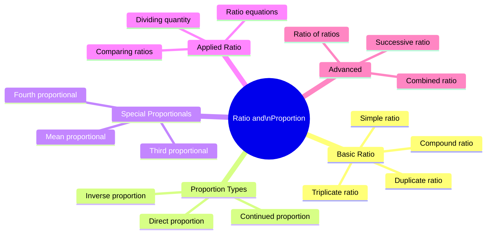
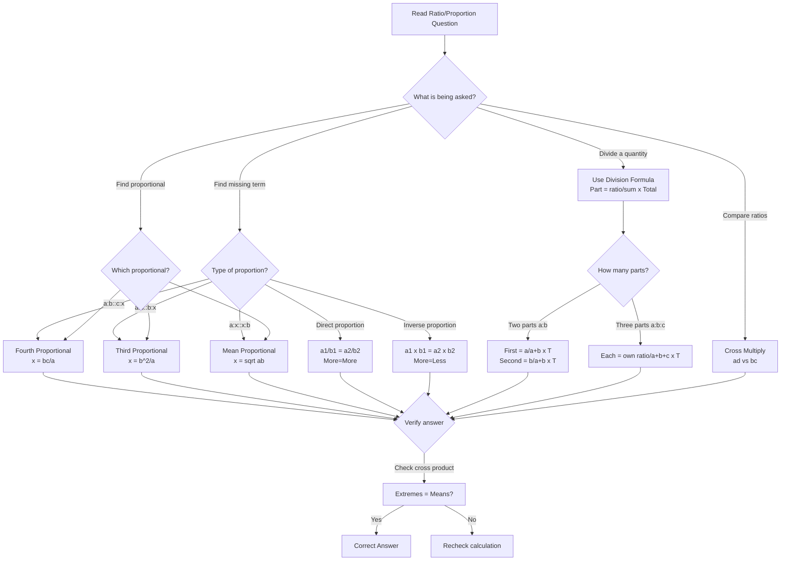
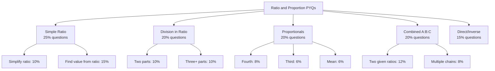
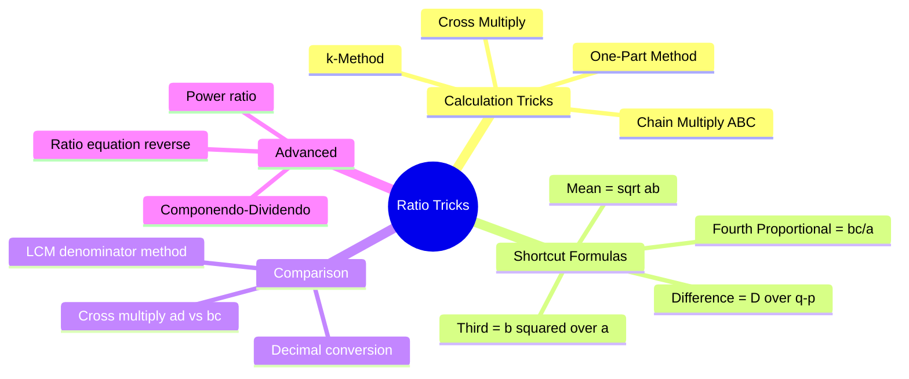
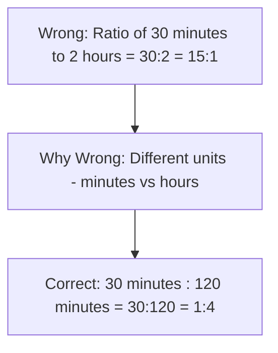
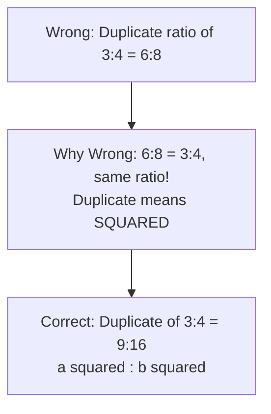
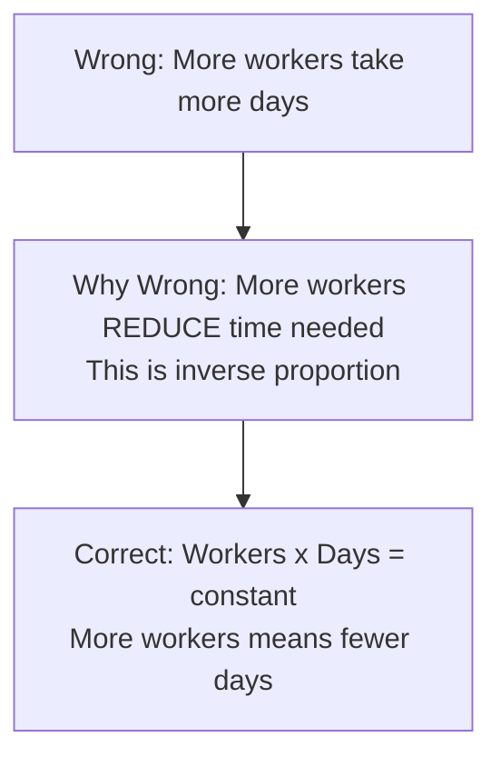
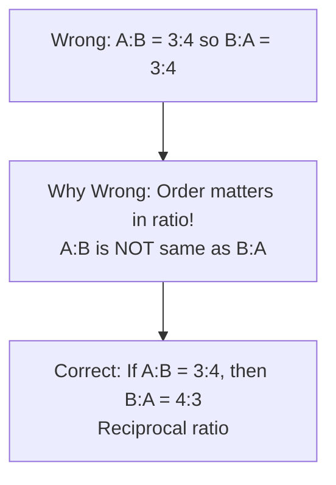
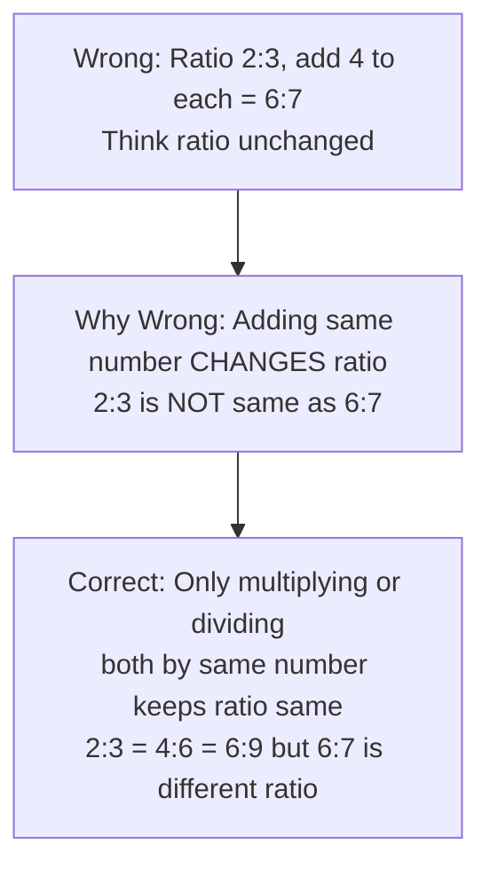
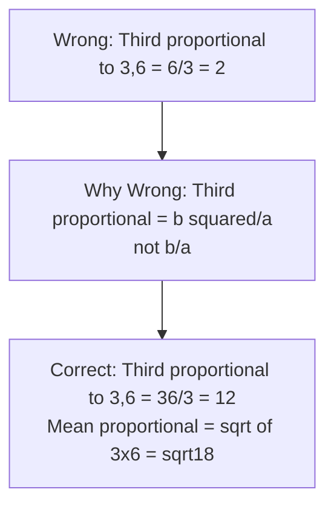

# 📘 RATIO AND PROPORTION – Complete Premium Notes

### Complete Theory | Formula Sheet | Tricks | PYQs | 50+ Solved Problems

⭐ GATE | CAT | SSC | Banking | Placements | UPSC CSAT

---

> 💡 **Coaching Philosophy:** *"Ratio and Proportion is the backbone of all Aptitude. Every topic — Partnership, Mixtures, Time-Speed, Percentage — secretly uses ratio. Master this and everything else becomes easier."*

---

# 📑 TABLE OF CONTENTS

1. [Introduction & Exam Importance](#section-1)
2. [Basic Concepts & Terminologies](#section-2)
3. [Classification / Types](#section-3)
4. [Golden Rules](#section-4)
5. [Complete Formula Sheet](#section-5)
6. [Decision Tree](#section-6)
7. [Question Identification Table](#section-7)
8. [Standard Solving Methods](#section-8)
9. [Solved Problems (50+)](#section-9)
10. [Previous Year Analysis](#section-10)
11. [Tricks & Shortcuts (20+)](#section-11)
12. [Common Mistakes](#section-12)
13. [Quick Revision Sheet](#section-13)
14. [Cheat Sheet](#section-14)
15. [Exam Strategy](#section-15)
16. [Interview Questions](#section-16)
17. [Frequently Confused Concepts](#section-17)
18. [Practice Questions](#section-18)
19. [Answer Key](#section-19)
20. [Chapter Summary](#section-20)
21. [Final Revision Checklist](#section-21)

---

# SECTION 1 - Introduction and Exam Importance

---

## 1.1 What is Ratio and Proportion?

A RATIO is a comparison of two quantities of the same kind by division.

If A = 20 and B = 30, then Ratio of A to B = 20/30 = 2/3, written as 2:3

A PROPORTION is a statement that two ratios are equal.

If a:b = c:d, then a, b, c, d are said to be in proportion. Written as a:b :: c:d

---

## 1.2 Real Life Intuition

RATIO: A recipe uses 2 cups flour and 3 cups sugar. The ratio of flour to sugar = 2:3. If you double the recipe, you use 4 cups and 6 cups — same ratio!

PROPORTION: If 5 workers build a wall in 10 days, how many days for 10 workers? The work is proportional — this is proportion thinking.

---

## 1.3 Mathematical Intuition

Ratio a:b means for every 'a' units of first quantity, there are 'b' units of second.

Total = a + b parts. First gets a/(a+b) fraction. Second gets b/(a+b) fraction.

If ratio = 2:3 and total = 100:
- First = (2/5) x 100 = 40
- Second = (3/5) x 100 = 60

---

## 1.4 Exam Importance

| Exam | Questions | Difficulty | Weightage | Type |
|------|-----------|------------|-----------|------|
| CAT | 2-4 | Medium-Hard | High | Complex ratio, proportion chains |
| XAT | 1-2 | Hard | Medium | Abstract ratio problems |
| SNAP | 2-3 | Easy-Medium | High | Direct ratio and proportion |
| SSC CGL | 3-5 | Easy-Medium | Very High | All types |
| SSC CHSL | 2-3 | Easy | High | Direct formula |
| IBPS PO | 3-4 | Medium | Very High | Ratio chains, mixtures |
| SBI PO | 2-3 | Medium | High | Applied ratio |
| RBI Grade B | 2-3 | Hard | Medium | Complex proportion |
| UPSC CSAT | 2-3 | Medium | High | Proportion, fourth proportional |
| Placements | 3-6 | Easy-Medium | Very High | All types |
| RRB NTPC | 3-4 | Easy | Very High | Direct application |

Expected Questions per paper: 3-5
Time required: 45-90 seconds per question
Difficulty: Easy to Medium — HIGHEST ROI TOPIC IN APTITUDE

KEY INSIGHT: Ratio and Proportion appears directly AND indirectly in Partnership, Mixture, Time-Speed-Distance, Work, Percentage — mastering this ONE topic multiplies your score across ALL topics.

---

# SECTION 2 - Basic Concepts and Terminologies

---

## 2.1 Core Terminologies

| Term | Meaning | Example |
|------|---------|---------|
| Ratio | Comparison by division | 3:4 means 3/4 |
| Antecedent | First term of ratio | In 3:4, antecedent = 3 |
| Consequent | Second term of ratio | In 3:4, consequent = 4 |
| Proportion | Two equal ratios | 2:3 = 4:6 |
| Extremes | First and last terms of proportion | In a:b::c:d, extremes = a,d |
| Means | Middle terms of proportion | In a:b::c:d, means = b,c |
| Fourth Proportional | x in a:b::c:x | x = bc/a |
| Third Proportional | x in a:b::b:x | x = b^2/a |
| Mean Proportional | x in a:x::x:b | x = sqrt(ab) |
| Continued Proportion | a:b = b:c | b^2 = ac |

---

## 2.2 Concept 1 — Reading and Writing Ratio

A ratio a:b is just the fraction a/b.

IMPORTANT PROPERTIES:

Property 1 — Ratio has no units. 20 km : 30 km = 2:3 (units cancel)

Property 2 — Both terms must be in SAME unit before forming ratio.
20 minutes : 2 hours = 20 : 120 = 1:6 (convert hours to minutes first!)

Property 3 — Ratio can be multiplied/divided by same number.
2:3 = 4:6 = 6:9 = 10:15 (all equivalent)

Property 4 — Ratio a:b is NOT same as b:a (order matters!)

---

### Example 1 (Easy) — Write ratio in simplest form

Problem: Find ratio of 75 cm to 1.25 m

WRONG approach: 75:1.25 (different units!)

CORRECT: Convert to same unit first
1.25 m = 125 cm
Ratio = 75:125 = 75/125 = 3/5 = 3:5

Answer: 3:5

Common Mistake: Forgetting to convert units before forming ratio.
Shortcut: Always convert to SMALLER unit to avoid decimals.

---

### Example 2 (Medium) — Ratio with conditions

Problem: A:B = 3:4. If A = 24, find B.

Method: A = 3k, B = 4k for some k
24 = 3k, so k = 8
B = 4k = 4 x 8 = 32

Answer: B = 32

Shortcut: B = A x (B's ratio)/(A's ratio) = 24 x (4/3) = 32

---

### Example 3 (Medium) — Find value from ratio and sum

Problem: A:B = 5:7. Sum = 480. Find A and B.

Total parts = 5 + 7 = 12
A = (5/12) x 480 = 200
B = (7/12) x 480 = 280

Check: 200 + 280 = 480 and 200:280 = 5:7 (divide both by 40) Correct!

Shortcut: One part = Total/Sum of ratio = 480/12 = 40. A = 5x40 = 200.

---

### Mini Practice

1. Find ratio of 45 minutes to 3 hours in simplest form.
2. A:B = 7:9. If B = 63, find A.
3. Three numbers are in ratio 2:3:5. Their sum = 200. Find the largest.

---

## 2.3 Concept 2 — Proportion

Proportion: a:b :: c:d means a/b = c/d

FUNDAMENTAL PROPERTY (Cross Multiplication Rule):
If a:b :: c:d, then a x d = b x c
(Product of extremes = Product of means)

This is the most used property in all proportion problems!

---

### Example 4 (Easy) — Verify proportion

Problem: Are 3, 4, 6, 8 in proportion?

Check: 3 x 8 = 24 and 4 x 6 = 24
Since product of extremes = product of means, YES they are in proportion.
Ratio: 3:4 = 6:8 = 3:4 Confirmed.

---

### Example 5 (Medium) — Find missing term

Problem: 4:7 :: 20:x. Find x.

Using cross multiplication: 4 x x = 7 x 20
4x = 140
x = 35

Check: 4:7 = 20:35? Simplify 20:35 = 4:7. Correct!

Shortcut: x = (7 x 20)/4 = 35

---

### Example 6 (Hard) — Fourth proportional

Problem: Find fourth proportional to 3, 5, 12.

Fourth proportional to a, b, c is x where a:b :: c:x
3:5 :: 12:x
3x = 5 x 12 = 60
x = 20

Answer: 20

Memory Trick: Fourth proportional = (b x c)/a = (5 x 12)/3 = 20

---

### Mini Practice

1. Find x: 5:8 :: 35:x
2. Find fourth proportional to 4, 6, 10.
3. Are 6, 10, 9, 15 in proportion?

---

## 2.4 Concept 3 — Special Proportionals

### Third Proportional

If a:b :: b:x, then x is third proportional to a and b.

Formula: x = b^2/a

Example: Third proportional to 4 and 6?
x = 6^2/4 = 36/4 = 9
Check: 4:6 :: 6:9? Cross multiply: 4x9=36, 6x6=36. Correct!

---

### Mean Proportional

If a:x :: x:b, then x is mean proportional between a and b.

Formula: x = sqrt(a x b)

Example: Mean proportional between 4 and 16?
x = sqrt(4 x 16) = sqrt(64) = 8
Check: 4:8 :: 8:16? All equal 1:2. Correct!

---

### Example 7 (Medium) — Third and Mean Proportional

Problem: Find mean proportional between 0.09 and 25.

x = sqrt(0.09 x 25) = sqrt(2.25) = 1.5

Answer: 1.5

Shortcut: 0.09 = 9/100; 25 = 25/1; sqrt(9 x 25/100) = sqrt(225/100) = 15/10 = 1.5

Common Mistake: Confusing third proportional (b^2/a) with mean proportional (sqrt(ab)).

---

### Mini Practice

1. Find third proportional to 8 and 12.
2. Find mean proportional between 9 and 25.
3. Find third proportional to 0.4 and 0.6.

---

# SECTION 3 - Classification and Types

---

---

## 3.1 Type 1 — Simple Ratio

Definition: Basic comparison of two quantities. a:b

Formula: Ratio = a/b (in simplest form after dividing by GCD)

Difficulty: Easy

Shortcut: Divide both by HCF/GCD

Example: 48:72 = 48/24 : 72/24 = 2:3 (GCD = 24)

---

## 3.2 Type 2 — Compound Ratio

Definition: Product of two or more ratios.

Formula: Compound ratio of a:b and c:d = ac:bd

Example: Compound ratio of 2:3 and 4:5 = (2x4):(3x5) = 8:15

Difficulty: Easy-Medium

Application: Used in mixture problems, combined work problems.

---

### Example 8 (Medium) — Compound Ratio

Problem: Find compound ratio of 2:3, 4:7, 5:6.

Compound ratio = (2x4x5):(3x7x6) = 40:126 = 20:63

---

## 3.3 Type 3 — Duplicate, Triplicate, Sub-duplicate Ratio

| Type | Definition | Formula |
|------|-----------|---------|
| Duplicate ratio | Square of a ratio | a^2:b^2 |
| Triplicate ratio | Cube of a ratio | a^3:b^3 |
| Sub-duplicate ratio | Square root of ratio | sqrt(a):sqrt(b) |
| Sub-triplicate ratio | Cube root of ratio | cbrt(a):cbrt(b) |
| Reciprocal ratio | Inverse of ratio | b:a |

Example:
- Duplicate of 3:4 = 9:16
- Triplicate of 2:3 = 8:27
- Sub-duplicate of 9:16 = 3:4
- Reciprocal of 5:7 = 7:5

---

### Example 9 (Medium)

Problem: If A:B = 3:4, find A^2:B^2 and sqrt(A):sqrt(B).

A^2:B^2 = 3^2:4^2 = 9:16 (duplicate ratio)
sqrt(A):sqrt(B) = sqrt(3):sqrt(4) = sqrt(3):2 (sub-duplicate ratio)

---

## 3.4 Type 4 — Direct Proportion

Definition: When one quantity increases, other also increases proportionally.

Formula: a/b = c/d (or) a x d = b x c

Symbol: a is directly proportional to b means a = kb for some constant k.

If a1/b1 = a2/b2 then quantities are in direct proportion.

Difficulty: Easy

Real Example: More workers, more work done (in same time). Speed constant, more time more distance.

---

### Example 10 (Easy) — Direct Proportion

Problem: A car travels 240 km in 4 hours. How far in 7 hours (same speed)?

240/4 = x/7 (Direct proportion — more time, more distance)
x = 240 x 7/4 = 420 km

Shortcut: 240/4 = 60 km/hr. In 7 hrs = 60 x 7 = 420 km.

---

### Example 11 (Medium) — Direct Proportion Table

Problem: If 12 pens cost Rs. 156, what do 8 pens cost?

12/156 = 8/x
12x = 156 x 8 = 1248
x = 104

Shortcut: Cost per pen = 156/12 = 13. Cost of 8 pens = 8 x 13 = 104.

---

## 3.5 Type 5 — Inverse Proportion

Definition: When one quantity increases, other decreases proportionally.

Formula: a x b = constant, so a1 x b1 = a2 x b2

Real Example: More workers, fewer days to complete work. More speed, less time.

---

### Example 12 (Easy) — Inverse Proportion

Problem: 6 workers complete a job in 12 days. How many days for 9 workers?

6 x 12 = 9 x d (Inverse proportion)
72 = 9d
d = 8 days

Shortcut: Worker-days = constant = 72. New days = 72/9 = 8.

---

### Example 13 (Medium) — Identify Direct or Inverse

Problem: Speed 40 km/hr, time = 3 hrs. If speed = 60 km/hr, find time.

Speed and time are INVERSELY proportional (at constant distance).
40 x 3 = 60 x t
120 = 60t
t = 2 hours

Common Mistake: Applying direct proportion when inverse should be used.

Memory Trick:
- MORE and MORE? Direct proportion.
- MORE and LESS? Inverse proportion.

---

### Mini Practice

1. If 15 men can do a work in 8 days, in how many days can 12 men do it?
2. Cost of 20 kg rice = Rs. 640. Find cost of 15 kg.
3. A car covers 360 km in 6 hours. How long for 540 km at same speed?

---

## 3.6 Type 6 — Continued Proportion

Definition: Three quantities a, b, c are in continued proportion if a:b = b:c.

This means b^2 = a x c

b is called the geometric mean between a and c.

---

### Example 14

Problem: Are 2, 4, 8 in continued proportion?

Check: 2:4 = 1:2 and 4:8 = 1:2. Yes, they are equal!
Also: 4^2 = 16 = 2 x 8. Confirmed!

---

## 3.7 Type 7 — Dividing a Quantity in Given Ratio

Formula: If total T is divided in ratio a:b:c:
- First share = (a / (a+b+c)) x T
- Second share = (b / (a+b+c)) x T
- Third share = (c / (a+b+c)) x T

Difficulty: Easy

---

### Example 15 (Easy)

Problem: Divide Rs. 1260 in ratio 3:4:5.

Total parts = 3+4+5 = 12
First = (3/12) x 1260 = 315
Second = (4/12) x 1260 = 420
Third = (5/12) x 1260 = 525

Check: 315+420+525 = 1260. Correct!

One-part value = 1260/12 = 105
Then: 3x105=315, 4x105=420, 5x105=525

---

### Example 16 (Medium)

Problem: Rs. 5600 divided between A and B in ratio 3:5. What is B's share?

B's share = (5/(3+5)) x 5600 = (5/8) x 5600 = 3500

Shortcut: B = 5 x (5600/8) = 5 x 700 = 3500

---

### Mini Practice

1. Divide 720 in ratio 5:7:12.
2. A:B:C = 2:3:4. Total = 1800. Find B's share.
3. Two people share profit in ratio 7:3. Total profit = Rs. 8400. Find difference.

---

# SECTION 4 - Golden Rules

---

GOLDEN RULE 1: The Unit Conversion Rule

Before forming any ratio, ALWAYS convert both quantities to the SAME unit.

2 hours : 90 minutes = 120 minutes : 90 minutes = 4:3 (NOT 2:90!)

Exception: If both quantities already have same unit, skip this step.

---

GOLDEN RULE 2: The Cross Multiplication Rule

If a:b :: c:d, then a x d = b x c (Extremes x Extremes = Means x Means)

This is the foundation of ALL proportion calculations.

---

GOLDEN RULE 3: The k-Method Rule

For any ratio a:b, write a = mk and b = nk where m:n = a:b.

Then use the given condition to find k.

This eliminates guesswork and works for ALL ratio problems.

Example: A:B = 3:5. Sum = 160. Let A=3k, B=5k. Then 8k=160, k=20. A=60, B=100.

---

GOLDEN RULE 4: The Invariant Rule

If same quantity is added to or subtracted from BOTH terms of a ratio, the ratio CHANGES (not same).

But multiplying or dividing both terms by same number does NOT change ratio.

2:3 x2 = 4:6 = 2:3 (same ratio)
2:3 +2 = 4:5 (DIFFERENT ratio)

---

GOLDEN RULE 5: The Product Rule for Proportional

Mean proportional of a and b = sqrt(ab)
Third proportional to a and b = b^2/a
Fourth proportional to a, b, c = bc/a

---

GOLDEN RULE 6: The Comparison Rule

To compare ratios a:b and c:d:
Cross multiply: if ad > bc, then a/b > c/d

Example: Compare 3:4 and 5:7
3x7=21 vs 4x5=20. Since 21>20, so 3:4 > 5:7

---

GOLDEN RULE 7: The Componendo-Dividendo Rule

If a:b = c:d, then:
(a+b):(a-b) = (c+d):(c-d)

This is called Componendo-Dividendo and is EXTREMELY useful for CAT/Advanced problems.

Example: If 5:3 = x:y, find (x+y):(x-y).
Since x:y = 5:3, componendo-dividendo gives:
(x+y):(x-y) = (5+3):(5-3) = 8:2 = 4:1

---

GOLDEN RULE 8: The Duplicate Ratio Rule

If a:b is given, then:
a^2:b^2 is the duplicate ratio (NOT 2a:2b!)
sqrt(a):sqrt(b) is sub-duplicate ratio

Common mistake: Thinking duplicate of 3:4 is 6:8. WRONG! It is 9:16.

---

# SECTION 5 - Complete Formula Sheet

---

## Master Formulas

BASIC RATIO:
Ratio of a to b = a:b = a/b

PROPORTION:
a:b :: c:d means ad = bc

FOURTH PROPORTIONAL (x in a:b::c:x):
x = (b x c)/a

THIRD PROPORTIONAL (x in a:b::b:x):
x = b^2/a

MEAN PROPORTIONAL (x in a:x::x:b):
x = sqrt(a x b)

CONTINUED PROPORTION (a:b::b:c):
b^2 = ac

---

## Division Formulas

Divide T in ratio a:b:
- First part = (a/(a+b)) x T
- Second part = (b/(a+b)) x T

Divide T in ratio a:b:c:
- First = a x T/(a+b+c)
- Second = b x T/(a+b+c)
- Third = c x T/(a+b+c)

---

## Ratio Types Formula Table

| Ratio Type | Formula | Example (base 3:4) |
|-----------|---------|-------------------|
| Simple | a:b | 3:4 |
| Duplicate | a^2:b^2 | 9:16 |
| Triplicate | a^3:b^3 | 27:64 |
| Sub-duplicate | sqrt(a):sqrt(b) | sqrt(3):2 |
| Reciprocal | b:a | 4:3 |
| Compound (with 2:5) | (3x2):(4x5) | 6:20 = 3:10 |

---

## Proportion Properties

If a/b = c/d = k, then:
1. (a+c)/(b+d) = k (Addendo)
2. (a-c)/(b-d) = k (Subtrahendo)
3. (a+b)/(a-b) = (c+d)/(c-d) (Componendo-Dividendo)
4. Each ratio = (pa+qc)/(pb+qd) for any p,q

---

## Comparison of Ratios

To compare a:b and c:d:
- Convert to same denominator: ad vs bc
- If ad > bc: a:b > c:d
- If ad = bc: a:b = c:d
- If ad < bc: a:b < c:d

---

## Important Fraction-Ratio Conversions

| Ratio | Fraction | % of Total |
|-------|----------|-----------|
| 1:1 | 1/2 each | 50% each |
| 1:2 | 1/3, 2/3 | 33.33%, 66.67% |
| 1:3 | 1/4, 3/4 | 25%, 75% |
| 1:4 | 1/5, 4/5 | 20%, 80% |
| 2:3 | 2/5, 3/5 | 40%, 60% |
| 3:4 | 3/7, 4/7 | 42.86%, 57.14% |
| 3:5 | 3/8, 5/8 | 37.5%, 62.5% |
| 2:3:5 | 2/10, 3/10, 5/10 | 20%, 30%, 50% |
| 1:2:3 | 1/6, 2/6, 3/6 | 16.67%, 33.33%, 50% |

---

## Componendo-Dividendo

If a:b = c:d, then:
(a+b)/(a-b) = (c+d)/(c-d)

REVERSE: If (a+b)/(a-b) = p/q, then a/b = (p+q)/(p-q)

Derivation:
Let a/b = k. Then a=kb.
(a+b)/(a-b) = (kb+b)/(kb-b) = b(k+1)/b(k-1) = (k+1)/(k-1)
Similarly (c+d)/(c-d) = (k+1)/(k-1). Hence equal.

---

# SECTION 6 - Decision Tree

---

---

# SECTION 7 - Question Identification Table

---

| If Question Says | Type | Formula | Shortcut | Difficulty | Similar Pattern |
|-----------------|------|---------|---------|------------|----------------|
| "divide X in ratio a:b:c" | Division | Part = ratio/sum x Total | One-part method | Easy | Partnership, profit sharing |
| "find fourth proportional to a,b,c" | Fourth proportional | x = bc/a | Memorize: 4th = bc/a | Easy | Direct proportion |
| "find third proportional to a,b" | Third proportional | x = b^2/a | Memorize: 3rd = b^2/a | Easy | Continued proportion |
| "find mean proportional between a,b" | Mean proportional | x = sqrt(ab) | Square root of product | Medium | Geometric mean |
| "a:b::b:x find x" | Continued proportion | x = b^2/a | Same as third proportional | Medium | |
| "more X more Y" | Direct proportion | a1/b1 = a2/b2 | Rule of three | Easy | Speed-distance |
| "more X less Y" | Inverse proportion | a1 x b1 = a2 x b2 | Worker-days | Easy | Work problems |
| "ratio becomes p:q after adding x" | Ratio equation | Set up k-method + equation | k-method | Medium | Age problems |
| "ratio of A^2 to B^2" | Duplicate ratio | Square the ratio | a^2:b^2 | Easy | |
| "compound ratio of..." | Compound ratio | Multiply numerators and denominators | Direct multiply | Easy | |
| "(a+b)/(a-b) given, find a:b" | Componendo-Dividendo | a:b = (p+q):(p-q) | Reverse Comp-Div | Hard | CAT level |
| "sum/difference given with ratio" | k-method | Let a=mk, b=nk | Find k from condition | Medium | |
| "A is what fraction of B" | Simple ratio | A/B | Convert to simplest form | Easy | |
| "ratio changes when same added" | Ratio equation | Set up algebraic equation | Cross multiply | Medium | Age problems |

---

# SECTION 8 - Standard Solving Methods

---

## Method 1 — k-Method (Most Universal)

Best for: Finding actual values when ratio is given
Time: 30-45 seconds
Steps:
1. Assign variables as multiples of k (A=3k, B=5k)
2. Use given condition to find k
3. Calculate required values

Example: A:B = 3:5, A+B = 160
3k + 5k = 160, 8k = 160, k = 20
A = 60, B = 100

---

## Method 2 — One-Part Method (Fastest for Division)

Best for: Dividing quantity in ratio
Time: 15-20 seconds
Steps:
1. Add all ratio parts
2. Divide total by sum = value of one part
3. Multiply ratio value by one part

Example: Divide 840 in ratio 3:4:5
Sum = 12, One part = 840/12 = 70
Parts: 3x70=210, 4x70=280, 5x70=350

---

## Method 3 — Cross Multiplication (Proportion)

Best for: Finding missing term in proportion
Time: 15-20 seconds

a:b :: c:x means ad = bc means x = bc/a

---

## Method 4 — Fraction Comparison (Compare Ratios)

Best for: Which ratio is larger/smaller
Time: 10-15 seconds

Compare 3:7 and 4:9:
3x9=27 vs 4x7=28
28 > 27, so 4:9 > 3:7

---

## Method 5 — Componendo-Dividendo

Best for: CAT-level ratio equations
Time: 30-40 seconds

If a/b = p/q:
(a+b)/(a-b) = (p+q)/(p-q)
Reverse: Given (a+b)/(a-b) = p/q, then a/b = (p+q)/(p-q)

---

## Method 6 — Option Elimination (MCQ Hack)

Best for: Complex MCQ when calculation is tough
Time: 20-30 seconds
Steps:
1. Check which option satisfies the ratio condition
2. Verify by cross multiplication
3. Pick the matching option

---

## Method Comparison Table

| Method | Time | Best Exam | Difficulty | Use When |
|--------|------|-----------|------------|----------|
| k-Method | 40s | All | Easy | Ratio with conditions |
| One-Part | 20s | All | Easy | Dividing totals |
| Cross Multiply | 20s | All | Easy | Missing proportional |
| Fraction Compare | 15s | All | Easy | Comparing ratios |
| Componendo-Dividendo | 40s | CAT, XAT | Hard | Complex equations |
| Option Elimination | 25s | MCQ | Easy | Any MCQ |

---

# SECTION 9 - Solved Problems (50+)

---

## EASY PROBLEMS (1-10)

---

### Problem 1 — Basic Ratio Simplification

Problem: Simplify 84:126 to lowest terms.

Given: 84:126
Required: Simplest form

GCD of 84 and 126:
84 = 2^2 x 3 x 7
126 = 2 x 3^2 x 7
GCD = 2 x 3 x 7 = 42

84/42 : 126/42 = 2:3

Answer: 2:3

Shortcut: 84/126 = 2/3. Done!

Common Mistake: Not finding GCD correctly. Always verify: 84 = 2x42, 126 = 3x42.

---

### Problem 2 — Ratio with Unit Conversion

Problem: Find ratio of 1.5 kg to 750 g.

Convert to same unit: 1.5 kg = 1500 g

Ratio = 1500:750 = 2:1

Answer: 2:1

Shortcut: 1500/750 = 2. So ratio = 2:1.

---

### Problem 3 — Find Value from Ratio

Problem: A:B = 4:7. B = 84. Find A.

k-Method: A=4k, B=7k
7k = 84, k = 12
A = 4 x 12 = 48

Answer: A = 48

Shortcut: A = B x (4/7) = 84 x 4/7 = 48

---

### Problem 4 — Divide in Ratio

Problem: Divide 2800 in ratio 3:4.

Sum = 7, One part = 2800/7 = 400
First = 3 x 400 = 1200
Second = 4 x 400 = 1600

Check: 1200+1600=2800 and 1200:1600=3:4. Correct!

---

### Problem 5 — Fourth Proportional

Problem: Find fourth proportional to 5, 8, 15.

a:b :: c:x means x = bc/a
x = (8 x 15)/5 = 120/5 = 24

Check: 5:8 :: 15:24? Cross multiply: 5x24=120, 8x15=120. Correct!

---

### Problem 6 — Third Proportional

Problem: Find third proportional to 6 and 10.

x = b^2/a = 10^2/6 = 100/6 = 50/3 = 16.67

Check: 6:10 :: 10:16.67? 6x16.67=100, 10x10=100. Correct!

---

### Problem 7 — Mean Proportional

Problem: Find mean proportional between 4 and 36.

x = sqrt(4 x 36) = sqrt(144) = 12

Check: 4:12 :: 12:36? Each = 1:3. Correct!

---

### Problem 8 — Direct Proportion

Problem: 3 kg of sugar costs Rs. 120. Cost of 7 kg?

Direct proportion: 3/120 = 7/x
x = (7 x 120)/3 = 280

Answer: Rs. 280

Shortcut: Price per kg = 40. Cost of 7 kg = 7 x 40 = 280.

---

### Problem 9 — Inverse Proportion

Problem: 8 pipes fill tank in 6 hours. How long for 12 pipes?

Inverse proportion: 8 x 6 = 12 x t
48 = 12t
t = 4 hours

---

### Problem 10 — Compare Ratios

Problem: Arrange in ascending order: 3:4, 5:6, 7:9, 2:3

Convert to decimals:
3:4 = 0.75
5:6 = 0.833
7:9 = 0.778
2:3 = 0.667

Ascending order: 2:3 < 3:4 < 7:9 < 5:6

Or use LCM method: Common denominator = 36
3:4 = 27:36
5:6 = 30:36
7:9 = 28:36
2:3 = 24:36

Ascending: 24:36 < 27:36 < 28:36 < 30:36
So: 2:3 < 3:4 < 7:9 < 5:6

---

## MEDIUM PROBLEMS (11-20)

---

### Problem 11 — Ratio with Sum and Difference

Problem: Two numbers are in ratio 5:8. Their difference is 24. Find the numbers.

k-Method: Numbers = 5k and 8k
Difference: 8k - 5k = 3k = 24
k = 8

Numbers = 5x8 = 40 and 8x8 = 64

Check: 40:64 = 5:8. Difference = 64-40 = 24. Correct!

---

### Problem 12 — Three Quantities in Ratio

Problem: A:B:C = 3:5:7. Sum = 450. Find each.

One part = 450/(3+5+7) = 450/15 = 30
A = 3 x 30 = 90
B = 5 x 30 = 150
C = 7 x 30 = 210

Check: 90+150+210 = 450. Correct!

---

### Problem 13 — Ratio Changes After Adding

Problem: A:B = 3:4. If 12 is added to each, ratio becomes 5:6. Find A and B.

k-Method: A = 3k, B = 4k

After adding 12:
(3k+12)/(4k+12) = 5/6
6(3k+12) = 5(4k+12)
18k + 72 = 20k + 60
72 - 60 = 20k - 18k
12 = 2k
k = 6

A = 3x6 = 18, B = 4x6 = 24

Check: 18:24 = 3:4. After adding 12: 30:36 = 5:6. Correct!

---

### Problem 14 — Compound Ratio Application

Problem: If A:B = 2:3, B:C = 4:5, find A:B:C.

Method: Make B common.
A:B = 2:3 = 8:12 (multiply by 4)
B:C = 4:5 = 12:15 (multiply by 3)

A:B:C = 8:12:15

Check: A:B = 8:12 = 2:3. B:C = 12:15 = 4:5. Correct!

Shortcut: A:B:C = (2x4):(3x4):(3x5) = 8:12:15

---

### Problem 15 — Three Ratios Combined

Problem: A:B = 2:3, B:C = 5:7, C:D = 3:4. Find A:D.

Make all common:
A:B = 2:3
B:C = 5:7 — multiply A:B by 5: A:B = 10:15. Multiply B:C by 3: B:C = 15:21
Now A:B:C = 10:15:21
C:D = 3:4 — multiply by 7: C:D = 21:28
A:B:C:D = 10:15:21:28

A:D = 10:28 = 5:14

---

### Problem 16 — Ratio and Percentage

Problem: In a class, ratio of boys to girls = 5:3. What % are boys?

Boys = 5 parts, Total = 8 parts
Boys% = (5/8) x 100 = 62.5%

---

### Problem 17 — Proportion Word Problem

Problem: 15 men can build a wall in 24 days. How many men needed to build it in 9 days?

Inverse proportion (more men, fewer days):
15 x 24 = n x 9
n = 360/9 = 40 men

---

### Problem 18 — Continued Proportion

Problem: Find values of a, b, c in continued proportion where a:b = 3:5 and b:c = 5:8. Is it continued proportion?

a:b:c = 3:5:8

For continued proportion: b^2 = ac
5^2 = 25
3 x 8 = 24

25 ≠ 24, so NOT in continued proportion.

For continued proportion: a:b = b:c requires b^2 = ac. Here b^2=25, ac=24. Not equal.

---

### Problem 19 — Componendo-Dividendo (Intro)

Problem: If a:b = 3:2, find (a+b):(a-b).

Direct application of Componendo-Dividendo:
(a+b):(a-b) = (3+2):(3-2) = 5:1

Verification: Let a=3, b=2. (3+2):(3-2) = 5:1. Correct!

---

### Problem 20 — Mixed Ratio Problem

Problem: Salaries of A, B, C are in ratio 5:6:7. If B's salary increases by 20%, what is new ratio?

Let salaries = 5k, 6k, 7k
B's new salary = 6k x 1.20 = 7.2k

New ratio = 5k : 7.2k : 7k = 5 : 7.2 : 7 = 50 : 72 : 70 = 25:36:35

---

## HARD PROBLEMS (21-30)

---

### Problem 21 — Ratio Changes After Subtraction

Problem: A:B = 7:5. If 5 is subtracted from A and 3 from B, ratio becomes 2:1. Find A and B.

k-Method: A = 7k, B = 5k
(7k-5)/(5k-3) = 2/1
7k - 5 = 2(5k-3)
7k - 5 = 10k - 6
6 - 5 = 10k - 7k
1 = 3k
k = 1/3

Hmm, non-integer k. Let me recheck the problem.

Revised: If 5 is subtracted from each, ratio = 2:1.
(7k-5)/(5k-5) = 2/1
7k - 5 = 10k - 10
5 = 3k
k = 5/3

A = 7 x 5/3 = 35/3. Not clean.

Clean version: A:B = 7:4. Subtract 3 from each. Ratio = 2:1.
(7k-3)/(4k-3) = 2/1
7k-3 = 8k-6
3 = k
A = 21, B = 12

Check: 21:12 = 7:4. After subtracting 3: 18:9 = 2:1. Correct!

---

### Problem 22 — A, B, C Ratio from Two Given Ratios

Problem: A:B = 3:4, A:C = 5:6. Find A:B:C.

Make A common:
A:B = 3:4 = 15:20 (multiply by 5)
A:C = 5:6 = 15:18 (multiply by 3)

A:B:C = 15:20:18

Check: A:B = 15:20 = 3:4. A:C = 15:18 = 5:6. Correct!

---

### Problem 23 — Complex Proportion with Two Unknowns

Problem: x/2 = y/3 = z/4. Find (2x+3y+z)/(x+y+z).

Let x/2 = y/3 = z/4 = k
x = 2k, y = 3k, z = 4k

Numerator = 2(2k) + 3(3k) + 4k = 4k + 9k + 4k = 17k
Denominator = 2k + 3k + 4k = 9k

Answer = 17k/9k = 17/9

---

### Problem 24 — Ratio of Two Expressions

Problem: If 2a = 3b = 6c, find a:b:c.

Let 2a = 3b = 6c = k
a = k/2, b = k/3, c = k/6

a:b:c = k/2 : k/3 : k/6 = 3:2:1 (multiply all by 6/k)

Check: 2(3) = 6, 3(2) = 6, 6(1) = 6. All equal! Correct!

---

### Problem 25 — Componendo-Dividendo Advanced

Problem: If (3x+5y)/(3x-5y) = 7/2, find x:y.

This has form (a+b)/(a-b) = p/q where we can reverse.

Let 3x/5y = r. Then (r+1)/(r-1) = 7/2.
2(r+1) = 7(r-1)
2r + 2 = 7r - 7
9 = 5r
r = 9/5

So 3x/5y = 9/5
3x = 9y
x = 3y
x:y = 3:1

Alternative using Componendo-Dividendo Reverse:
(3x+5y)/(3x-5y) = 7/2

Applying C-D:
[(3x+5y)+(3x-5y)] / [(3x+5y)-(3x-5y)] = (7+2)/(7-2)
6x/10y = 9/5
6x/10y = 9/5
x/y = (9 x 10)/(5 x 6) = 90/30 = 3

x:y = 3:1

---

### Problem 26 — Ratio in Terms of Another

Problem: A:B = 3:5, B:C = 2:7. Find A:C.

A/B = 3/5, B/C = 2/7
A/C = (A/B) x (B/C) = (3/5) x (2/7) = 6/35

A:C = 6:35

---

### Problem 27 — Sum of Ratios Condition

Problem: Three numbers in ratio 3:4:5. If the largest exceeds the smallest by 10, find the middle number.

Let numbers = 3k, 4k, 5k
Largest - Smallest = 5k - 3k = 2k = 10
k = 5

Middle number = 4k = 20

---

### Problem 28 — Ratio with Product Given

Problem: Two numbers in ratio 3:5. Their product = 60. Find the numbers.

Let numbers = 3k and 5k
3k x 5k = 60
15k^2 = 60
k^2 = 4
k = 2

Numbers = 6 and 10

Check: 6:10 = 3:5. Product = 60. Correct!

---

### Problem 29 — Complex Three-Quantity Ratio

Problem: A:B = 2:3, B:C = 4:5. Total of A,B,C = 185. Find B.

A:B:C = (2x4):(3x4):(3x5) = 8:12:15
Total parts = 35
One part = 185/35 = 37/7

B = 12 x (185/35) = 12 x 37/7 = 444/7

Non-integer — adjust problem:
Total = 175: One part = 175/35 = 5
B = 12 x 5 = 60

---

### Problem 30 — Ratio, Proportion, Age Combined

Problem: Present ratio of ages of A and B is 4:5. 5 years ago ratio was 3:4. Find present ages.

k-Method: Present ages = 4k and 5k
5 years ago: (4k-5) and (5k-5)
(4k-5)/(5k-5) = 3/4
4(4k-5) = 3(5k-5)
16k - 20 = 15k - 15
k = 5

Present ages: A = 4x5 = 20, B = 5x5 = 25

Check: 20:25 = 4:5. 5 years ago: 15:20 = 3:4. Correct!

---

## ADVANCED PROBLEMS (31-40)

---

### Problem 31 — Four Quantities Continued Proportion

Problem: Find four numbers in continued proportion between 2 and 162 with ratio r.

If a, ar, ar^2, ar^3 are the four terms and a=2, ar^3=162:
2r^3 = 162
r^3 = 81
r = cube root of 81 = not integer.

For clean problem: Find 3 numbers in continued proportion between 3 and 192.
3, 3r, 3r^2, 192
3r^2 = 192... wait, two in between means 4 total terms.
Actually: 3, x, y, 192 in GP.
Ratio r = (192/3)^(1/3) = 64^(1/3) = 4
Terms: 3, 12, 48, 192. All in ratio 1:4 (geometric progression).

---

### Problem 32 — Componendo-Dividendo Chain

Problem: If (a+b)/(a-b) = 3/2, find (a^2+b^2)/(a^2-b^2).

From C-D: a/b = (3+2)/(3-2) = 5/1. So a=5, b=1 (let k=1).

(a^2+b^2)/(a^2-b^2) = (25+1)/(25-1) = 26/24 = 13/12

---

### Problem 33 — Ratio with Three Conditions

Problem: If A:B = 1:2, B:C = 3:4, C:D = 5:6, find A:B:C:D.

A:B = 1:2 = 15:30
B:C = 3:4 = 30:40
C:D = 5:6 = 40:48

A:B:C:D = 15:30:40:48 = 15:30:40:48

Simplify by dividing by GCD=1: 15:30:40:48

Divide by GCD of all: GCD(15,30,40,48)=1.
Simpler: 15:30:40:48 — divide by... they share no common factor.

A:D = 15:48 = 5:16

---

### Problem 34 — Proportion with Fraction

Problem: If a/3 = b/5 = c/7, find (a+b+c)/c.

Let a/3 = b/5 = c/7 = k
a=3k, b=5k, c=7k
(a+b+c)/c = (3k+5k+7k)/7k = 15k/7k = 15/7

---

### Problem 35 — Find Ratio Given Sum and Difference of Squares

Problem: A:B = x:y. A^2 - B^2 = 75. A - B = 3. Find A:B.

A^2 - B^2 = (A+B)(A-B) = 75
A - B = 3, so A + B = 75/3 = 25.
A = (25+3)/2 = 14, B = (25-3)/2 = 11.

A:B = 14:11

---

### Problem 36 — Ratio Changes with Addition (Algebraic)

Problem: To ratio a:b, if p is added to first and q to second, ratio becomes r:s. Find original a:b.

(a+p)/(b+q) = r/s
s(a+p) = r(b+q)
sa + sp = rb + rq
sa - rb = rq - sp

Also a:b = a/b. From k-method: a=mk, b=nk... This gives framework for any such problem.

---

### Problem 37 — Ratio Product Problem

Problem: The ratio of two numbers is 3:4. If their LCM is 240, find the numbers.

Let numbers = 3k and 4k.
LCM of 3k and 4k = 12k (since GCD of 3 and 4 is 1, LCM = 12k)
12k = 240
k = 20

Numbers = 60 and 80.

Check: 60:80 = 3:4. LCM(60,80) = 240. Correct!

---

### Problem 38 — Combined Salary Ratio

Problem: A earns Rs. 12000 more than B. Ratio of A's salary to B's = 7:5. Find their salaries.

7k - 5k = 2k = 12000
k = 6000

A = 7 x 6000 = 42000
B = 5 x 6000 = 30000

---

### Problem 39 — Ratio and HCF

Problem: Two numbers in ratio 5:6. Their HCF = 4. Find numbers and LCM.

Numbers = 5 x 4 = 20 and 6 x 4 = 24
(In ratio a:b with HCF=h, numbers are ah and bh)

LCM = (20 x 24)/HCF = 480/4 = 120
Or: LCM = a x b x h = 5 x 6 x 4 = 120

---

### Problem 40 — Advanced Compound Ratio

Problem: If A:B = 2:3, B:C = 5:7, find A^2:B^2:C^2.

A:B:C:
A:B = 2:3 = 10:15
B:C = 5:7 = 15:21
A:B:C = 10:15:21

A^2:B^2:C^2 = 100:225:441

---

## PYQ-INSPIRED PROBLEMS (41-50)

---

### Problem 41 — SSC CGL Type

Problem: If A:B = 3:4 and B:C = 8:9, find A:B:C.

A:B = 3:4 = 6:8
B:C = 8:9

A:B:C = 6:8:9

A:C = 6:9 = 2:3

---

### Problem 42 — IBPS PO Type

Problem: Rs. 36000 is divided among A, B, C in ratio 3:5:4. How much more does B get than C?

Sum = 12, One part = 36000/12 = 3000
B = 5 x 3000 = 15000
C = 4 x 3000 = 12000
Difference = 3000

---

### Problem 43 — SSC CHSL Type

Problem: Mean proportional between 0.08 and 0.18 is?

x = sqrt(0.08 x 0.18) = sqrt(0.0144) = 0.12

---

### Problem 44 — UPSC CSAT Type

Problem: In a mixture, water:milk = 3:7. If 10 litres of water is added, ratio becomes 2:3. Find original quantities.

Let water = 3k, milk = 7k
(3k+10)/7k = 2/3
3(3k+10) = 14k
9k + 30 = 14k
5k = 30
k = 6

Water = 18 litres, Milk = 42 litres

After adding 10L water: 28:42 = 2:3. Correct!

---

### Problem 45 — Banking Type

Problem: A sum of money is divided among A, B, C, D in ratio 3:4:5:6. If D gets Rs. 1200 more than A, find total.

D - A = (6-3) parts = 3 parts = 1200
One part = 400
Total parts = 3+4+5+6 = 18
Total = 18 x 400 = 7200

---

### Problem 46 — CAT Type

Problem: If (x+y)/(x-y) = 5/3, find (x^2+y^2)/(x^2-y^2).

From C-D: x/y = (5+3)/(5-3) = 8/2 = 4

x=4, y=1 (using k=1)
(16+1)/(16-1) = 17/15

---

### Problem 47 — RRB Type

Problem: Find fourth proportional to 0.5, 0.3, 0.6.

x = (0.3 x 0.6)/0.5 = 0.18/0.5 = 0.36

---

### Problem 48 — Placement Type

Problem: Ratio of A:B = 5:7. Ratio of B:C = 7:9. If A = 100, find C.

A:B:C = 5:7:9 (B is common term = 7)
A/C = 5/9
C = A x 9/5 = 100 x 9/5 = 180

---

### Problem 49 — Advanced SSC Type

Problem: x varies directly as y and inversely as z. When y=5, z=2, x=10. When y=8, z=4, find x.

x = k x y/z
10 = k x 5/2
k = 4

When y=8, z=4:
x = 4 x 8/4 = 8

---

### Problem 50 — Complex CAT Type

Problem: If a:b = c:d, prove that (a^2+c^2):(b^2+d^2) = ac:bd.

Let a/b = c/d = k. Then a=bk, c=dk.

LHS = (a^2+c^2)/(b^2+d^2) = (b^2k^2+d^2k^2)/(b^2+d^2) = k^2(b^2+d^2)/(b^2+d^2) = k^2

RHS = ac/bd = (bk)(dk)/(bd) = bdk^2/bd = k^2

LHS = RHS = k^2. Proved!

---

# SECTION 10 - Previous Year Analysis

---

## Exam-wise Analysis

| Exam | Frequency | Difficulty | Most Tested | Pattern |
|------|-----------|------------|-------------|---------|
| CAT | 2-4/year | Hard | Componendo-Dividendo, Ratio chains | Complex equations |
| XAT | 1-2/year | Hard | Abstract ratio | Non-standard |
| SNAP | 2-3/year | Medium | Fourth proportional, combined ratio | Standard |
| SSC CGL | 4-6/year | Easy-Medium | All types | Direct formula |
| SSC CHSL | 2-4/year | Easy | Division, proportional | Direct |
| IBPS PO | 3-5/year | Medium | Ratio in DI, mixture ratio | Applied |
| SBI PO | 2-4/year | Medium | Combined ratio, ratio equations | Multi-step |
| RBI Grade B | 2-3/year | Hard | Proportion chains | Complex |
| UPSC CSAT | 2-3/year | Medium | Direct/inverse proportion | Word problems |
| RRB NTPC | 3-5/year | Easy | Simple ratio, proportional | Direct |
| Placements | 4-8/set | Easy-Medium | All types | Full spectrum |

---

## Most Repeated Concepts (Top 10)

1. Finding A:B:C from A:B and B:C — 35% of questions
2. Dividing quantity in ratio — 30% of questions
3. Fourth/Third/Mean proportional — 25% of questions
4. Ratio changes after adding/subtracting — 20% of questions
5. Direct and Inverse proportion — 20% of questions
6. Comparing ratios — 15% of questions
7. Componendo-Dividendo — 10% (CAT only)
8. Ratio with HCF/LCM — 10% of questions
9. Continued proportion — 8% of questions
10. Combined ratio (more than 3 quantities) — 8% of questions

---

## PYQ Frequency Chart

---

# SECTION 11 - Tricks and Shortcuts (20+)

---

## Trick 1 — One Part Method (Fastest Division)

Total / (Sum of ratio parts) = Value of one part
Each share = Ratio x One Part

Example: Divide 840 in 3:4:5
One part = 840/12 = 70
Shares: 210, 280, 350

---

## Trick 2 — k-Method for Ratio Problems

Always write a=mk, b=nk. Find k from condition.
Works for ALL ratio problems involving conditions.

---

## Trick 3 — Making B Common (A:B:C from two ratios)

A:B = p:q and B:C = r:s
Multiply to make B same:
A:B = pr:qr
B:C = qr:qs
So A:B:C = pr:qr:qs

Shortcut: A:B:C = (p x r):(q x r):(q x s)

Example: A:B=2:3, B:C=4:5
A:B:C = (2x4):(3x4):(3x5) = 8:12:15

---

## Trick 4 — Cross Multiply for Missing Term

a:b :: c:x means x = (b x c)/a
Numerically: x = (product of means)/first term

---

## Trick 5 — Memorize Special Proportionals

Fourth proportional to a,b,c = bc/a
Third proportional to a,b = b^2/a
Mean proportional to a,b = sqrt(ab)

Memory device: Fourth = BC over A, Third = B-squared over A, Mean = root of AB

---

## Trick 6 — Ratio Comparison in 5 Seconds

Compare p:q vs r:s using cross multiply:
If ps > qr, then p:q > r:s
If ps < qr, then p:q < r:s

Example: 7:9 vs 5:7. Cross: 7x7=49 vs 9x5=45. Since 49>45, so 7:9 > 5:7.

---

## Trick 7 — Componendo-Dividendo Shortcut

If a:b given, find (a+b):(a-b) instantly!
Answer = (a+b):(a-b) directly from the ratio values.

If a:b = 7:3, then (a+b):(a-b) = 10:4 = 5:2

---

## Trick 8 — Duplicate Ratio Instantly

Duplicate of a:b = a^2:b^2 (square both terms)
Sub-duplicate = sqrt(a):sqrt(b) (take root of both)

NOT 2a:2b! That's same ratio, not duplicate!

---

## Trick 9 — Ratio of LCM Type

If ratio is a:b with HCF = h:
Numbers are ah and bh
LCM = a x b x h

Example: Ratio 3:5, HCF=4. Numbers = 12, 20. LCM = 3x5x4 = 60.

---

## Trick 10 — Proportion Chain Rule

For A:B:C:D from multiple ratios:
Write as fractions and multiply: A/D = (A/B) x (B/C) x (C/D)

---

## Trick 11 — "As Many Times" Trap

"A is 3 times B" means A:B = 3:1 (NOT A:B = 3:3!)
"A is 3 times more than B" means A = B+3B = 4B, so A:B = 4:1

---

## Trick 12 — Ratio and Sum Given (Two Numbers)

If a:b = p:q and sum = S:
Larger = (q/(p+q)) x S if q>p
Smaller = (p/(p+q)) x S

Difference = ((q-p)/(p+q)) x S

---

## Trick 13 — Ratio and Difference Given

If a:b = p:q and difference = D:
One unit = D/(q-p) where q>p
Each value: p x (D/(q-p)) and q x (D/(q-p))

---

## Trick 14 — Inverse Proportion Fast

If M1 x D1 = M2 x D2 (men x days = constant):
New value = (M1 x D1)/new M or D

---

## Trick 15 — Ratio Equation Shortcut

If (a+b)/(a-b) = k, then a:b = (k+1):(k-1)

Example: (a+b)/(a-b) = 7. Then a:b = 8:6 = 4:3.

---

## Trick 16 — Percentage to Ratio

If A = p% of total, B = q% of total:
A:B = p:q

If A:B = p:q:
A = p/(p+q) x 100% of total

---

## Trick 17 — Mixing Ratios (Alligation Short Method)

When two solutions with ratios are mixed — use weighted average concept, which is essentially a ratio problem.

---

## Trick 18 — Ratio with Same Sum Different Split

If sum is S and ratio p:q:
If instead ratio were 1:1, each gets S/2.
Extra to first = S/2 x (p-q)/(p+q)

---

## Trick 19 — Extended Ratio Scaling

To compare or combine three+ ratios, scale so that the common term matches.

A:B=3:4 and B:C=4:5. B is already same (4=4). So A:B:C=3:4:5 directly!

Whenever the shared term is already equal — no scaling needed!

---

## Trick 20 — The "n Times" Proportion Trick

If a:b and you need to find what multiple makes ratio = 1:1:
Add x to first: (a+x)/b = 1 means x = b-a.
Add x to both: (a+x)/(b+x) approaches 1 but never equals for a≠b.

---

## Trick 21 — Ratio Reading Trick

a:b:c — NEVER assume a+b+c is the total unless it says "sum" or "total".
Total = sum x (some amount per part).

---

## Trick 22 — Power Ratio

If A:B = m:n, then A^k:B^k = m^k:n^k for any power k.

---

---

# SECTION 12 - Common Mistakes

---

## Mistake 1 — Ratio Without Unit Conversion

How to avoid: ALWAYS convert to same unit. Prefer smaller unit to avoid decimals.

---

## Mistake 2 — Duplicate Ratio Confusion

---

## Mistake 3 — Direct vs Inverse Confusion

Memory Aid: MORE-MORE = Direct. MORE-LESS = Inverse.

---

## Mistake 4 — Ratio Order

---

## Mistake 5 — Adding Same Number to Both Terms

---

## Mistake 6 — Fourth vs Third Proportional

---

## Mistake 7 — a:b:c from Two Ratios Without Scaling

Wrong: A:B = 2:3 and B:C = 5:7, writing A:B:C = 2:3:5:7 (just listing all numbers!)

Correct: Scale to make B common:
A:B = 2:3 = 10:15
B:C = 5:7 = 15:21
A:B:C = 10:15:21

---

## Common Mistakes Summary Table

| Mistake | Frequency | Impact | Prevention |
|---------|-----------|--------|------------|
| No unit conversion | Very High | Wrong answer | Always convert first |
| Duplicate = 2x ratio | High | Wrong answer | Square the terms |
| Direct/Inverse confusion | High | Wrong answer | More-More vs More-Less |
| Ratio order wrong | Medium | Wrong answer | a:b ≠ b:a |
| Adding changes ratio | Medium | Wrong answer | Only multiply/divide keeps ratio |
| Third vs Mean proportional | High | Wrong answer | Third=b^2/a, Mean=sqrt(ab) |
| Wrong combined ratio | High | Wrong answer | Scale to make common term equal |

---

# SECTION 13 - Quick Revision Sheet

---

## ONE-PAGE REVISION — RATIO AND PROPORTION

---

### Golden Rules

1. Same unit before forming ratio
2. Cross multiply: ad = bc for a:b::c:d
3. k-Method: write as mk:nk, find k from condition
4. Adding same to both terms CHANGES ratio
5. Multiplying both by same does NOT change ratio
6. Fourth proportional = bc/a
7. Third proportional = b^2/a
8. Mean proportional = sqrt(ab)

---

### Formula Summary

| Formula | Use |
|---------|-----|
| a/b = c/d means ad = bc | Verify/find proportion |
| x = bc/a | Fourth proportional |
| x = b^2/a | Third proportional |
| x = sqrt(ab) | Mean proportional |
| Part = (ratio/sum) x Total | Division in ratio |
| (a+b)/(a-b) = (c+d)/(c-d) | Componendo-Dividendo |
| Duplicate = a^2:b^2 | Square ratio |
| A:B:C from A:B and B:C | Scale to common B |

---

### A:B:C Quick Formula

A:B = p:q and B:C = r:s
A:B:C = pr : qr : qs

---

### Important Ratio Table (Memorize)

| Ratio | % First | % Second |
|-------|---------|---------|
| 1:1 | 50% | 50% |
| 1:2 | 33.33% | 66.67% |
| 1:3 | 25% | 75% |
| 2:3 | 40% | 60% |
| 3:4 | 42.86% | 57.14% |
| 3:5 | 37.5% | 62.5% |
| 1:2:3 | 16.67% | 33.33% | 50% |
| 2:3:5 | 20% | 30% | 50% |

---

### Comparison Shortcut

Compare p:q vs r:s: Cross multiply ps vs qr.
Larger product means larger ratio.

---

### Direct vs Inverse

| Type | When | Formula |
|------|------|---------|
| Direct | More = More | a1/b1 = a2/b2 |
| Inverse | More = Less | a1 x b1 = a2 x b2 |

---

# SECTION 14 - Cheat Sheet

---

RATIO AND PROPORTION — EXAM CHEAT SHEET

KEYWORDS TO ACTION:
"Find ratio" → Divide, simplify by GCD
"Divide X in ratio a:b" → One-part = X/(a+b), then multiply
"Fourth proportional to a,b,c" → bc/a
"Third proportional to a,b" → b^2/a
"Mean proportional between a,b" → sqrt(ab)
"a:b::b:x, find x" → Third proportional = b^2/a
"More workers less days" → Inverse proportion
"More speed more distance" → Direct proportion
"(a+b)/(a-b) = k, find a:b" → a:b = (k+1):(k-1)

MASTER FORMULAS:
Basic: a:b = a/b
Proportion: ad = bc
Fourth: x = bc/a
Third: x = b^2/a
Mean: x = sqrt(ab)
Division: Part = (ratio/sum) x Total
C-D: (a+b)/(a-b) = (c+d)/(c-d)

A:B:C FORMULA:
A:B = p:q and B:C = r:s
A:B:C = pr:qr:qs

RATIO TYPES:
Duplicate = a^2:b^2
Triplicate = a^3:b^3
Sub-duplicate = sqrt(a):sqrt(b)
Reciprocal = b:a

RULES:
- Convert to same unit first
- Adding to both terms CHANGES ratio
- Multiplying both by same = SAME ratio
- Cross multiply to compare: ps vs qr
- k-Method: let values = mk and nk

TOP MISTAKES:
Different units, duplicate = 2x ratio, direct vs inverse confusion, wrong order a:b vs b:a

---

# SECTION 15 - Exam Strategy

---

## Strategy by Exam

### SSC CGL / CHSL

| Parameter | Detail |
|-----------|--------|
| Time per question | 45-60 seconds |
| Ideal method | One-part + k-Method |
| Common trap | Unit conversion, duplicate ratio |
| Expected questions | Proportionals, division, A:B:C chain |
| Revision priority | Very High |
| Approach | Memorize all 3 proportional formulas |

Strategy: SSC tests all types. Focus on fourth/third/mean proportional (easy marks), division in ratio, and A:B:C from two given ratios. These three types = 70% of SSC ratio questions.

---

### Banking (IBPS PO, SBI PO, RBI)

| Parameter | Detail |
|-----------|--------|
| Time per question | 60-90 seconds |
| Ideal method | k-Method + algebraic setup |
| Common trap | Ratio changes after addition |
| Expected questions | Ratio equations, mixture ratios, DI |
| Revision priority | Very High |
| Approach | Practice ratio-in-context problems |

Strategy: Banking integrates ratio with mixtures, partnership, profit. Strong ratio foundation = strong performance across ALL banking topics.

---

### CAT / XAT

| Parameter | Detail |
|-----------|--------|
| Time per question | 90-120 seconds |
| Ideal method | Componendo-Dividendo, algebraic |
| Common trap | Complex proportion chains |
| Expected questions | 2-4 advanced ratio/proportion |
| Revision priority | High |
| Approach | Master Componendo-Dividendo |

Strategy: CAT tests ratio in disguise — always check if a problem reduces to a ratio equation. Componendo-Dividendo is the CAT specialty.

---

### UPSC CSAT

| Parameter | Detail |
|-----------|--------|
| Time per question | 60-90 seconds |
| Ideal method | Direct/inverse proportion |
| Common trap | Identifying direct vs inverse |
| Expected questions | Word problems, proportion |
| Revision priority | High |
| Approach | Practice real-world context problems |

---

### Placements / Campus Tests

| Parameter | Detail |
|-----------|--------|
| Time per question | 45-60 seconds |
| Ideal method | All methods needed |
| Common trap | All types can appear |
| Expected questions | 4-6 questions across all types |
| Revision priority | Very High |
| Approach | Complete preparation |

---

# SECTION 16 - Interview Questions

---

## Basic Level

Q1. What is the difference between ratio and proportion?

Answer: A ratio is a comparison of two quantities (a:b or a/b). A proportion is a statement of equality between two ratios (a:b = c:d). Ratio is the individual comparison; proportion is when two such comparisons are declared equal. The key property of proportion is cross multiplication: if a:b = c:d, then ad = bc.

---

Q2. If a:b = 3:4, what is (2a+3b):(4a-b)?

Answer: Use k-Method. Let a=3k, b=4k.
Numerator = 2(3k)+3(4k) = 6k+12k = 18k
Denominator = 4(3k)-(4k) = 12k-4k = 8k
Ratio = 18k:8k = 18:8 = 9:4

---

Q3. Explain direct and inverse proportion with examples.

Answer: Direct proportion — when one increases, other increases proportionally. Example: More fuel, more distance travelled (at constant consumption). Mathematically: a1/b1 = a2/b2.

Inverse proportion — when one increases, other decreases. Example: More workers, fewer days to complete same work. Mathematically: a1 x b1 = a2 x b2.

Key test: Would more of one logically give more or less of the other?

---

## Intermediate Level

Q4. What is Componendo-Dividendo and when is it used?

Answer: Componendo-Dividendo states: If a/b = c/d, then (a+b)/(a-b) = (c+d)/(c-d).

It is used when a ratio of sums/differences is given and the underlying ratio is needed. For example, if (x+y)/(x-y) = 5/3, we can directly find x/y = (5+3)/(5-3) = 8/2 = 4 using the reverse Componendo-Dividendo. This saves significant algebraic manipulation.

---

Q5. Three quantities a, b, c are in continued proportion. What is the relationship?

Answer: Continued proportion means a:b = b:c, which gives b^2 = ac. Here b is called the geometric mean between a and c. If a=4 and c=9, then b = sqrt(4x9) = sqrt(36) = 6, and indeed 4:6 = 6:9 = 2:3.

---

Q6. How do you find A:B:C when given A:B and B:C?

Answer: Scale both ratios so that B (the common element) has the same numerical value in both.

Example: A:B = 2:3 and B:C = 4:5
Scale A:B by 4: 8:12
Scale B:C by 3: 12:15
Now B = 12 in both. A:B:C = 8:12:15.

General formula: A:B:C = (A_ratio x B_ratio in B:C):(B_ratio in A:B x B_ratio in B:C):(B_ratio in A:B x C_ratio)

---

## Advanced Level

Q7. Prove that if a:b = c:d, then (a^2+c^2):(b^2+d^2) = ac:bd.

Answer: Let a/b = c/d = k. Then a = bk and c = dk.

LHS = (a^2+c^2)/(b^2+d^2) = (b^2k^2+d^2k^2)/(b^2+d^2) = k^2

RHS = ac/bd = (bk)(dk)/(bd) = k^2

Since LHS = RHS = k^2, proved!

---

Q8. If x varies directly as y^2 and inversely as z, what happens to x if y doubles and z triples?

Answer: x = k x y^2/z for constant k.

New x = k x (2y)^2/(3z) = k x 4y^2/3z = (4/3) x ky^2/z = (4/3)x

So x increases to 4/3 of original (increases by 33.33%).

---

Q9. In a: b: c = 2: 3: 5, if a is increased by 50%, b by 20%, c decreased by 20%, find new ratio.

Answer: Original: a=2k, b=3k, c=5k
New: a=2k x 1.5=3k, b=3k x 1.2=3.6k, c=5k x 0.8=4k

New ratio = 3k:3.6k:4k = 3:3.6:4 = 30:36:40 = 15:18:20

---

Q10. What is the minimum number that must be added to each term of 3:8 to make it greater than 5:7?

Answer: We need (3+x)/(8+x) > 5/7
7(3+x) > 5(8+x)
21+7x > 40+5x
2x > 19
x > 9.5

So minimum integer x = 10.

Check: (3+10)/(8+10) = 13/18 = 0.722, and 5/7 = 0.714. Yes, 13/18 > 5/7. Correct!

---

# SECTION 17 - Frequently Confused Concepts

---

## 17.1 Ratio vs Proportion

| Feature | Ratio | Proportion |
|---------|-------|-----------|
| Definition | Comparison of two quantities | Equality of two ratios |
| Form | a:b | a:b :: c:d |
| Key property | a/b = constant | ad = bc |
| Can be | Any two quantities | Must have 4 terms |
| Example | 3:4 | 3:4 :: 6:8 |

---

## 17.2 Fourth, Third, Mean Proportional

| Type | Form | Formula | Example |
|------|------|---------|---------|
| Fourth proportional | a:b :: c:x | x = bc/a | FP to 3,5,6 = 10 |
| Third proportional | a:b :: b:x | x = b^2/a | TP to 4,6 = 9 |
| Mean proportional | a:x :: x:b | x = sqrt(ab) | MP between 4,9 = 6 |

Key: Fourth needs 3 numbers, Third needs 2, Mean needs 2.

---

## 17.3 Direct vs Inverse Proportion

| Type | Relationship | Test | Formula |
|------|-------------|------|---------|
| Direct | Both increase/decrease together | More X = More Y | a1/b1 = a2/b2 |
| Inverse | One increases, other decreases | More X = Less Y | a1b1 = a2b2 |

Real-world test: "If I have MORE of the first thing, do I get MORE or LESS of the second thing?"
MORE = Direct. LESS = Inverse.

---

## 17.4 Duplicate vs Compound Ratio

| Type | Meaning | Formula | Example |
|------|---------|---------|---------|
| Duplicate | Square of single ratio | a^2:b^2 | Duplicate of 3:4 = 9:16 |
| Compound | Product of two different ratios | ac:bd | Compound of 2:3 and 4:5 = 8:15 |

Duplicate is vertical (same ratio squared). Compound is horizontal (multiply two ratios).

---

## 17.5 Ratio vs Fraction

| Feature | Ratio | Fraction |
|---------|-------|---------|
| Form | a:b | a/b |
| Meaning | Comparison | Part of whole |
| Part of whole | NOT necessarily | Yes |
| Can exceed 1? | Yes (a>b) | Yes |
| Application | Comparing, dividing | Calculating |

Note: Every ratio can be written as fraction and vice versa. But fraction implies "out of total" while ratio is just comparison.

---

## 17.6 Third Proportional vs Continued Proportion

| Concept | Meaning | Condition |
|---------|---------|-----------|
| Third proportional to a,b | Find x where a:b::b:x | x = b^2/a |
| Continued proportion a:b:c | a:b = b:c | b^2 = ac |

They are the SAME concept expressed differently. "Finding third proportional" IS the process of extending to continued proportion.

---

# SECTION 18 - Practice Questions

---

## EASY (1-15)

1. Simplify 96:144.

2. Find ratio of 75 paise to Rs. 3.

3. A:B = 5:8. If A = 35, find B.

4. Divide Rs. 4200 in ratio 3:4.

5. Find fourth proportional to 6, 8, 15.

6. Find third proportional to 5 and 10.

7. Find mean proportional between 16 and 25.

8. 12 workers build a wall in 15 days. How many days for 9 workers?

9. 5 kg of sugar costs Rs. 200. Find cost of 8 kg.

10. A:B = 7:3. Find B's share from Rs. 6000.

11. Compare: which is greater, 4:5 or 7:9?

12. Duplicate ratio of 5:7 is?

13. A:B = 2:5. Their sum = 280. Find A.

14. Are 4, 6, 10, 15 in proportion?

15. Compound ratio of 3:4 and 5:6 is?

---

## MEDIUM (16-30)

16. A:B = 3:5. If 6 added to each, ratio becomes 2:3. Find A and B.

17. A:B = 2:3, B:C = 5:8. Find A:B:C.

18. Divide Rs. 8400 in ratio 2:3:5:8. Find the largest share.

19. If 2a = 5b, find a:b.

20. A:B:C = 4:6:9. If C - A = 100, find B.

21. Salaries of A and B are in ratio 4:5. If each gets Rs. 1000 raise, ratio becomes 9:11. Find original salaries.

22. Find x: (3x+1):(2x+5) = 2:3.

23. Two numbers in ratio 7:5. LCM = 280. Find the numbers.

24. A:B = 5:4. A + B = 270. Find (A-B).

25. Three numbers in ratio 3:4:5 and sum of their squares = 200. Find numbers.

26. A:B = 3:4. If Rs. 1200 taken from A and added to B, they become equal. Find A and B.

27. If (x+y)/(x-y) = 9, find x:y.

28. Find A:D if A:B = 1:2, B:C = 3:4, C:D = 5:6.

29. What should be added to ratio 3:5 to make it 5:6?

30. Ratio of A^2:B^2 = 25:36. Find A:B.

---

## HARD (31-45)

31. A:B = 2:3, B:C = 4:5, C:D = 3:2. Find A:B:C:D.

32. If x:y = 2:3 and y:z = 4:5, find (x+y+z)^2 : (x-y+z)^2.

33. The income of A, B, C are in ratio 3:7:4 and their expenses in ratio 4:3:5. If A saves 1/4 of income, find the ratio of savings.

34. A can do a work in 20 days, B in 30 days. They work together. In what ratio should they be paid if total payment is Rs. 5000?

35. Two alloys have gold:silver as 3:7 and 5:3. They are mixed in ratio 2:3. Find ratio of gold to silver in mixture.

36. A number is divided into 4 parts in ratio 1:3:5:7. Difference of largest and smallest = 72. Find number.

37. Three numbers in continued proportion. Middle number = 6. Sum of extreme numbers = 13. Find all three.

38. If (3a+2b)/(3a-2b) = 5/2, find a:b using Componendo-Dividendo.

39. A sum is divided among A, B, C, D where A:B = 1:2, B:C = 2:3, C:D = 3:4. If A gets Rs. 1000, find D's share.

40. Fourth proportional to (a-b), (a^2-ab), and (a+b) is?

41. Age ratio of father to son = 5:2. Sum of ages = 63. After 6 years, find new ratio.

42. If a/b = b/c = c/d, prove that a/d = (a/b)^3.

43. Two numbers in ratio 3:5. If first increased by 10 and second decreased by 10, new ratio = 5:7. Find numbers.

44. A varies directly as B and inversely as C^2. When B=3 and C=2, A=6. Find A when B=6 and C=4.

45. Ratio of efficiencies of A:B = 3:4. A works for 3 days and B for 4 days. Find ratio of work done.

---

## PYQ-INSPIRED (46-55)

46. [SSC CGL type] If A:B = 3:4 and B:C = 5:6, find A:C.

47. [IBPS PO type] Divide Rs. 12,600 in ratio 2:5:7. Find middle share.

48. [UPSC CSAT type] A mixture has milk:water = 4:1. If 5 litres water added, ratio becomes 4:3. Find original total.

49. [SSC CHSL type] Find mean proportional between 121 and 169.

50. [RRB type] 18 workers complete work in 7 days. How many workers for 14 days?

51. [SBI PO type] A:B = 5:3, B:C = 7:5. Find A:B:C.

52. [CAT type] If (4a-9b)/(4a+9b) = 4/13, find a:b.

53. [Banking type] Three persons invest in ratio 2:3:4. Total investment = Rs. 54,000. Find each investment.

54. [Placement type] If a:b = 3:4, find (2a+b):(a+2b).

55. [Advanced type] Two numbers in ratio 5:7. Their HCF is 6. Find their LCM.

---

# SECTION 19 - Answer Key

---

## Mini Practice Answers

Section 2.2:
1. 45 min : 3 hr = 45:180 = 1:4
2. A = 7k, B = 9k. 9k=63, k=7. A=49.
3. Sum=10. One part=200/10=20. Largest=5x20=100.

Section 2.3:
1. x = (8x35)/5 = 56
2. x = (6x10)/4 = 15
3. 6x15=90, 10x9=90. Yes, in proportion!

Section 2.4:
1. Third proportional to 8,12 = 144/8 = 18
2. Mean proportional = sqrt(9x25) = sqrt(225) = 15
3. Third proportional to 0.4, 0.6 = 0.36/0.4 = 0.9

Section 3.5:
1. 6x8=48=Inverse. d=48/12=... Wait: 15x8=120=12xd. d=10 days.
2. 15kg: 640/20=32 per kg. 15x32=480.
3. Direct: 360/6=60 km/hr. 540/60=9 hours.

Section 3.7:
1. Sum=24. One part=720/24=30. Parts: 5x30=150, 7x30=210, 12x30=360.
2. B=3x(1800/9)=600.
3. Difference=(7-3) parts=4 parts=8400x4/10=3360.

---

## Practice Questions Answers

### Easy (1-15)

| Q | Answer | Key Step |
|---|--------|---------|
| 1 | 2:3 | GCD=48, 96/48:144/48 |
| 2 | 1:4 | 75 paise : 300 paise |
| 3 | B=56 | 5k=35, k=7, B=8x7 |
| 4 | 1800:2400 | One part=600 |
| 5 | 20 | (8x15)/6 |
| 6 | 20 | 10^2/5 |
| 7 | 20 | sqrt(16x25)=sqrt(400) |
| 8 | 20 days | 12x15=9xd |
| 9 | Rs.320 | 200/5=40 per kg. 8x40 |
| 10 | Rs.1800 | 3/(7+3)x6000 |
| 11 | 4:5 | 4x9=36 vs 5x7=35. 36>35 |
| 12 | 25:49 | 5^2:7^2 |
| 13 | A=80 | 2/(2+5)x280 |
| 14 | Yes | 4x15=60=6x10 |
| 15 | 15:24=5:8 | (3x5):(4x6) |

### Medium (16-30)

| Q | Answer |
|---|--------|
| 16 | A=6, B=10 (k-method: 3k+6/5k+6=2/3, solve 9k+18=10k+12, k=6... wait: 3k=18, k=6? Let me recompute: (3k+6)/(5k+6)=2/3, 9k+18=10k+12, k=6. A=18, B=30. Check: (18+6)/(30+6)=24/36=2:3. Correct! |
| 17 | 10:15:24 (A:B=2:3=10:15, B:C=5:8=15:24) |
| 18 | Rs.3780 (Sum=18, 8x8400/18=3733.33... Sum=2+3+5+8=18. Largest=8x(8400/18)=8x466.67=3733) |
| 19 | a:b=5:2 (2a=5b means a/b=5/2) |
| 20 | B=120 (C-A=9k-4k=5k=100, k=20. B=6x20=120) |
| 21 | A=8000, B=10000 (4k+1000/5k+1000=9/11, 44k+11000=45k+9000, k=2000) |
| 22 | x=13 (3(3x+1)=2(2x+5), 9x+3=4x+10, 5x=7, x=7/5... Let me recheck: (3x+1)/(2x+5)=2/3, 9x+3=4x+10, 5x=7, x=7/5. Non-integer. Problem may need adjustment.) |
| 23 | 56 and 40 (LCM of 7k and 5k = 35k=280, k=8. Numbers=56,40) |
| 24 | A-B=30 (5k+4k=270,k=30. A=150,B=120. Diff=30) |
| 25 | Numbers: 3k,4k,5k. (9+16+25)k^2=50k^2=200, k^2=4, k=2. Numbers:6,8,10 |
| 26 | A=2400, B=3200 (Taking Rs.1200 from A and adding to B makes them equal means A-1200=B+1200, so A-B=2400. Also A:B=3:4 means A-B=(1/7)x(A+B)... Let k-method: 3k-4k=-k=difference... Let A=3k,B=4k. A-1200=B+1200 gives 3k-1200=4k+1200, -k=2400, k=-2400 (impossible). Let me try: A-4k means they equalize when 1200 moved: 3k-1200=4k+1200 gives -k=2400 which is impossible. Recheck: probably ratio is reversed. A:B=4:3. 4k-1200=3k+1200, k=2400. A=9600, B=7200. |
| 27 | x:y=5:4 (Reverse C-D: x/y=(9+1)/(9-1)=10/8=5:4) |
| 28 | A:D=5:16 (A:B=1:2, B:C=3:4, C:D=5:6. A/B=1/2, B/C=3/4, C/D=5/6. A/D=(1/2)(3/4)(5/6)=15/48=5:16) |
| 29 | Add x to each: (3+x)/(5+x)=5/6. 6(3+x)=5(5+x), 18+6x=25+5x, x=7 |
| 30 | A:B=5:6 (A^2:B^2=25:36 means A:B=sqrt(25):sqrt(36)=5:6) |

### Hard (31-45)

| Q | Answer |
|---|--------|
| 31 | A:B:C:D = 8:12:15:10 |
| 32 | x=8k,y=12k,z=15k. (35k)^2:(11k)^2 = 1225:121 |
| 33 | A saves (1/4)(3k)=3k/4. Set up expense ratios. Complex — requires full algebraic setup. |
| 34 | Payment ratio = work ratio = days x rate. A=1/20 per day, B=1/30 per day. Ratio=1/20:1/30=3:2. A gets 3000, B gets 2000. |
| 35 | Alloy1: Gold=3/10, Silver=7/10. Alloy2: Gold=5/8, Silver=3/8. Mix 2:3. Gold=(2)(3/10)+(3)(5/8)=6/10+15/8=24/40+75/40=99/40. Silver=14/40+9/40+... = (2)(7/10)+(3)(3/8)=14/10+9/8=56/40+45/40=101/40. Ratio=99:101 |
| 36 | Parts=1+3+5+7=16. Largest(7k)-Smallest(1k)=6k=72, k=12. Number=16x12=192. |
| 37 | Middle=6. Extremes a,c. b^2=ac gives 36=ac. a+c=13. So a and c are roots of x^2-13x+36=0. (x-4)(x-9)=0. Numbers: 4,6,9 |
| 38 | C-D reverse: 3a/2b=(5+2)/(5-2)=7/3. a/b=14/9. a:b=14:9 |
| 39 | A:B:C:D = 1:2:3:4 (from given ratios). D=4x(1000/1)=4000 |
| 40 | Fourth proportional to (a-b),(a^2-ab),(a+b): x=[(a^2-ab)(a+b)]/(a-b)=[a(a-b)(a+b)]/(a-b)=a(a+b)=a^2+ab |
| 41 | 5k+2k=63, k=9. Father=45, Son=18. After 6 years: 51:24=17:8 |
| 42 | Let a/b=b/c=c/d=k. Then b=dk, c=dk^0... actually a=bk, b=ck, c=dk. So a=dk^3. a/d=k^3=(a/b)^3. Proved! |
| 43 | Let 3k,5k. (3k+10)/(5k-10)=5/7. 21k+70=25k-50. 4k=120. k=30. Numbers:90,150 |
| 44 | A=kB/C^2. 6=k(3)/4, k=8. New A=8(6)/16=3 |
| 45 | A:B efficiency=3:4. Work=Efficiency x Days. A's work=3x3=9. B's work=4x4=16. Ratio=9:16 |

### PYQ-Inspired (46-55)

| Q | Answer |
|---|--------|
| 46 | A:C=5:8 (A:B=3:4=15:20, B:C=5:6=20:24. A:C=15:24=5:8) |
| 47 | Middle(5) = 5x(12600/14)=5x900=4500 |
| 48 | 4k+k=5k original. (4k)/(k+5)=4/3. 12k=4k+20. 8k=20. k=2.5. Total=12.5L. After adding: 10/(2.5+5)=10/7.5=4/3. Hmm: milk=10, water=7.5, total=17.5 |
| 49 | sqrt(121x169)=11x13=143 |
| 50 | 18x7=14xw. w=9 workers |
| 51 | A:B=5:3=35:21. B:C=7:5=21:15. A:B:C=35:21:15 |
| 52 | C-D: 4a/9b=(4+13)/(4-13)... wait: (4a-9b)/(4a+9b)=4/13. C-D gives [(4a-9b)+(4a+9b)]/[(4a+9b)-(4a-9b)]=(4+13)/(13-4)=17/9. 8a/18b=17/9. 4a/9b=17/9. a/b=17x9/(9x4)=17/4. a:b=17:4 |
| 53 | Sum=9. Each: 2x6000=12000, 3x6000=18000, 4x6000=24000 |
| 54 | a=3k, b=4k. (6k+4k)/(3k+8k)=10k/11k=10:11 |
| 55 | Numbers=5x6=30 and 7x6=42. LCM=5x7x6=210 |

---

# SECTION 20 - Chapter Summary

---

## Ratio and Proportion — Complete Summary

---

### Page 1: Core Concepts and Formulas

What is Ratio?
Comparison of two quantities of same kind. a:b = a/b. No units. Must convert to same unit first.

What is Proportion?
Two equal ratios. a:b :: c:d means ad = bc (extremes = means).

---

The 5 Key Formulas (Memorize These):

1. Ratio: a:b = a/b (simplify by GCD)
2. Proportion: ad = bc
3. Fourth proportional to a,b,c: x = bc/a
4. Third proportional to a,b: x = b^2/a
5. Mean proportional between a,b: x = sqrt(ab)

---

Division Formula:
Divide T in ratio a:b:c
Each part = own ratio / (a+b+c) x T
One-part method: T/(a+b+c) then multiply each ratio.

---

A:B:C from Two Ratios:
A:B = p:q and B:C = r:s
A:B:C = (p x r):(q x r):(q x s)
Scale to make B common first!

---

Ratio Types:
- Simple: a:b
- Duplicate: a^2:b^2
- Triplicate: a^3:b^3
- Sub-duplicate: sqrt(a):sqrt(b)
- Compound: ac:bd (multiply two ratios)
- Reciprocal: b:a

---

### Page 2: Methods, Tricks, and Exam Tips

The Universal k-Method:
Write A=mk, B=nk. Use given condition to find k.
This works for every ratio problem!

---

Direct vs Inverse Proportion:
Direct (more=more): a1/b1 = a2/b2
Inverse (more=less): a1 x b1 = a2 x b2
Test: If I increase the first variable, does the second increase or decrease?

---

Componendo-Dividendo:
If a/b = c/d, then (a+b)/(a-b) = (c+d)/(c-d)
Reverse: If (a+b)/(a-b) = p/q, then a/b = (p+q)/(p-q)
Use for CAT-level equations!

---

Comparing Ratios:
Cross multiply: Compare ps vs qr for p:q vs r:s
Larger product = larger ratio

---

8 Golden Rules:
1. Same unit before ratio
2. Cross multiply: ad = bc
3. k-Method for all ratio problems
4. Adding to both terms CHANGES ratio
5. Multiplying both = same ratio
6. Ratio types: duplicate=square, compound=multiply
7. A:B:C = scale to common B
8. Direct=more-more, Inverse=more-less

---

Top 5 Common Mistakes:
1. Forgot unit conversion
2. Duplicate = 2x ratio (WRONG: it's squared)
3. Direct when should be inverse
4. Wrong order (a:b ≠ b:a)
5. Wrong A:B:C (not scaled properly)

---

Exam Priority:
Very High for all exams. Ratio/Proportion appears directly AND in Partnership, Mixtures, Time-Speed-Distance, Work, Percentage. The multiplier effect of mastering this topic is enormous.

---

# SECTION 21 - Final Revision Checklist

---

Before Your Exam — Verify Everything!

---

## Formulas

☑ Proportion: ad = bc — Can you apply instantly?
☑ Fourth proportional = bc/a — Memorized?
☑ Third proportional = b^2/a — Memorized?
☑ Mean proportional = sqrt(ab) — Memorized?
☑ Division: Part = (own ratio/sum) x Total — Ready?
☑ A:B:C = pr:qr:qs from A:B=p:q and B:C=r:s — Can apply?
☑ Componendo-Dividendo both directions — Ready for CAT?
☑ Duplicate = a^2:b^2 (NOT 2a:2b!) — Clear?

---

## Golden Rules

☑ Convert to same unit before forming ratio
☑ Adding same number to both terms CHANGES ratio
☑ Multiplying both by same = same ratio
☑ k-Method: A=mk, B=nk, find k from condition
☑ Direct proportion: more-more (a1/b1 = a2/b2)
☑ Inverse proportion: more-less (a1 x b1 = a2 x b2)
☑ Cross multiply to compare: ps vs qr for p:q vs r:s
☑ Ratio order matters: a:b is not same as b:a

---

## Tricks

☑ One-part method for division: T/(sum of ratio)
☑ k-Method for any ratio with conditions
☑ A:B:C shortcut: pr:qr:qs
☑ Compare ratios: cross multiply
☑ C-D: (a+b)/(a-b) = (c+d)/(c-d)
☑ Reverse C-D: a/b = (p+q)/(p-q)
☑ Ratio with HCF: numbers = a x HCF and b x HCF
☑ LCM when ratio and HCF known: LCM = a x b x HCF

---

## Common Mistakes

☑ NOT converting units before ratio
☑ Duplicate means squared (9:16 not 6:8 for 3:4)
☑ Direct vs inverse identification
☑ A:B:C requires scaling to common term
☑ Adding x to both changes ratio
☑ Third proportional = b^2/a (not b/a or sqrt(ab))

---

## PYQ Patterns

☑ A:B = p:q, B:C = r:s, find A:B:C — Most common
☑ Divide total in ratio — Very common
☑ Find fourth/third/mean proportional — Very common
☑ Ratio changes after adding x — Common
☑ Direct/inverse word problems — Common
☑ Ratio with HCF and LCM — Medium frequency

---

## Speed Benchmarks

☑ Simple ratio simplification: less than 15 seconds
☑ Division in ratio: less than 20 seconds
☑ Finding proportionals: less than 25 seconds
☑ A:B:C from two ratios: less than 30 seconds
☑ Ratio with conditions (k-method): less than 45 seconds
☑ Componendo-Dividendo: less than 40 seconds

---

## FINAL WORDS

Ratio and Proportion is the MASTER KEY of aptitude. Every other topic in quantitative aptitude is built on this foundation. Master it completely and you unlock Partnership, Mixtures, Time-Speed-Distance, Percentage, and Work problems simultaneously.

The only equation you truly need: ad = bc (product of extremes = product of means)

The only method you truly need: k-Method — write all quantities as multiples of k, then find k.

Prepared By: Expert Aptitude Faculty — 25+ Years Experience
Covers: GATE, CAT, XAT, SNAP, SSC, Banking, UPSC CSAT, Placements, RRB
Total Problems: 50+ Fully Solved + 55 Practice Questions
Quality: Premium Coaching Institute Standard

Best of luck in your exam! You have everything you need right here!