<a id="1-introduction-to-dsa"></a>
# 📘 Chapter 1: Introduction to DSA  {#1-introduction-to-dsa}
<a id="1-introduction-to-dsa"></a>

<a id="chapter-index-table-1"></a>

> *"DSA is not just a subject — it is the language computers think in."*

---

## 📑 Chapter Index Table

| Topic No. | Topic Name | Subtopics |
|-----------|-----------|-----------|
| 1.1 | [What is DSA](#11-what-is-dsa) | Data • Structure • Algorithm • DSA Together |
| 1.2 | [Why DSA Matters](#12-why-dsa-matters) | Problem Solving • Efficiency • Thinking |
| 1.3 | [Real-world Applications](#13-real-world-applications) | Google • Maps • Social Media • OS |
| 1.4 | [Types of Data Structures](#14-types-of-data-structures) | Linear • Non-Linear • Static • Dynamic |
| 1.5 | [Types of Algorithms](#15-types-of-algorithms) | Sorting • Searching • DP • Greedy • Graph |
| 1.6 | [Learning Roadmap](#16-learning-roadmap) | Order of Topics • Timeline • Strategy |
| 1.7 | [How to Study DSA](#17-how-to-study-dsa) | Approach • Practice • Mistakes to Avoid |
| 1.8 | [DSA in Placements & Interviews](#18-dsa-in-placements--interviews) | FAANG • Interview Rounds • Pattern |
| 1.9 | [DSA vs Development](#19-dsa-vs-development) | Difference • Both Matter • Career Path |
| 1.10 | [Where DSA is Used](#110-where-dsa-is-used) | FAANG • Startups • GATE • Competitive |

---

## 1.1 What is DSA? {#11-what-is-dsa}

### 🧠 Introduction

Imagine you are running a library with **10 million books**.
- Someone asks: *"Give me the book named 'The Alchemist'"*
- How do you find it?

**Option A:** Check every book one by one → Takes forever  
**Option B:** Books are sorted by name + indexed → Find in seconds

This is **exactly** what DSA does for computers.

> **DSA = Data Structures + Algorithms**
> - **Data Structure** = How data is **stored & organized**
> - **Algorithm** = Step-by-step **instructions to solve a problem**

---

### 📖 Theory — Breaking It Down

#### 🔷 What is Data?
Data is raw information. Numbers, names, images, videos — everything a computer processes is **data**.

```
Examples of Data:
- "Rahul" (a name)
- 25 (an age)
- [1, 2, 3, 4, 5] (a list of numbers)
- {name: "Rahul", age: 25} (a person's record)
```

#### 🔷 What is a Data Structure?
A **Data Structure** is a way to **organize, store, and manage data** so it can be accessed and modified efficiently.

> **Real Life Analogy:**
> Think of a **wardrobe**:
> - You can **fold & stack** clothes (Array)
> - You can **hang** clothes in order (Linked List)
> - You can use **compartments** (HashMap)
> - The way you organize your wardrobe = Data Structure

#### 🔷 What is an Algorithm?
An **Algorithm** is a **finite set of well-defined instructions** to solve a problem.

> **Real Life Analogy:**
> A **recipe** is an algorithm:
> 1. Take flour
> 2. Add water & mix
> 3. Knead the dough
> 4. Bake at 200°C for 30 minutes
> 5. Output: Bread ✅

#### 🔷 What is DSA Together?

```
PROBLEM → [RIGHT DATA STRUCTURE + RIGHT ALGORITHM] → EFFICIENT SOLUTION
```

> **Analogy (Hinglish):**
> Socho tum ek **delivery driver** ho.
> - **Data Structure** = Tera GPS map (data kaise store hai)
> - **Algorithm** = Tera route plan (kaise pohunchega)
> - Dono sahi hote hain tabhi **fastest delivery** hoti hai 🚀

---

### 🎨 Visualization

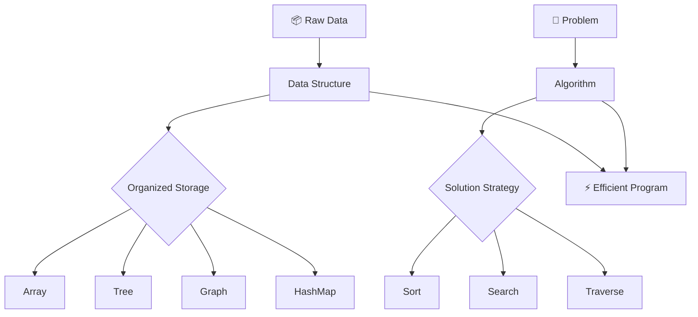

---

### 📌 Key Definitions

| Term | Definition | Example |
|------|-----------|---------|
| **Data** | Raw facts | `42`, `"Hello"`, `[1,2,3]` |
| **Data Structure** | Way to organize data | Array, Stack, Tree |
| **Algorithm** | Steps to solve problem | Binary Search, QuickSort |
| **DSA** | Both combined | HashMap + Binary Search |

---

> [!NOTE]
> DSA is **language-independent**. The concepts are the same whether you code in Java, Python, JavaScript, or C++. In this book, we use **Java and JavaScript**.

> [!IMPORTANT]
> In interviews, you are not just asked to "write code" — you are asked to write **efficient code**. That efficiency comes from knowing the right **Data Structure + Algorithm** combination.

<a href="#chapter-index-table-1">Go to Top 🔝</a>

---

## 1.2 Why DSA Matters {#12-why-dsa-matters}

### 🧠 Motivation — The Real Question

> *"Bhai, mujhe web development karni hai, toh DSA kyun seekhoon?"*

This is the **most common question**. Let's answer it with a real scenario.

---

### 🔥 Real-World Scenario

#### Scenario 1: Instagram's Feed
Instagram has **500 million daily active users**.
- Each user follows ~300 people
- Each post needs to be ranked, filtered, sorted

Without DSA → Server crashes in seconds  
With DSA → **Billions of operations per second** ✅

#### Scenario 2: Google Maps
You want shortest route from Delhi to Mumbai.
- Millions of roads and intersections exist
- Without DSA: Checking every road → Takes years
- With **Dijkstra's Algorithm (Graph DS)** → Answer in milliseconds ✅

#### Scenario 3: Amazon's Cart
You add 5 items to cart.
- Without DSA: Searching your cart in a list of 1 billion items → Slow
- With **HashMap** → Find your cart in **O(1)** — instant ✅

---

### 🎨 Why DSA Matters — Visual

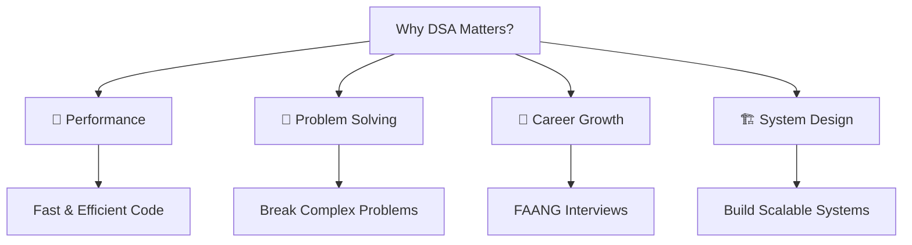

---

### 📊 With DSA vs Without DSA

| Operation | Without DSA | With DSA |
|-----------|------------|---------|
| Find element in 1M records | O(n) = 1M steps | O(log n) = 20 steps |
| Sort 1M records | O(n²) = 1 Trillion ops | O(n log n) = 20M ops |
| Shortest path in GPS | Exponential | O(E log V) with Dijkstra |
| Auto-complete search | O(n) per character | O(L) with Trie |

> [!IMPORTANT]
> **The difference between O(n²) and O(n log n) on 1 million elements:**
> - O(n²) = 1,000,000,000,000 operations (takes hours)
> - O(n log n) = 20,000,000 operations (takes milliseconds)
> This is WHY DSA matters. It's not about syntax — it's about **scale**.

---

### 💡 The 3 Core Reasons DSA Matters

#### 1️⃣ Efficiency
```
Bad Code:   Find name in 1M users → Check one by one → 1M comparisons
Good Code:  Binary Search → 20 comparisons MAX
```

#### 2️⃣ Problem-Solving Mindset
DSA trains your brain to:
- **Break** big problems into smaller ones
- **Recognize patterns** across different problems
- **Think before coding** (Planning > Typing)

#### 3️⃣ Industry Requirement
```
Google, Amazon, Microsoft, Flipkart, Zomato, Razorpay
→ All technical interviews test DSA
→ No DSA = No job at top companies
```

> [!TIP]
> **Hinglish tip:** DSA ko boring mat samjho. Har problem ek puzzle hai. Jab solve ho jaata hai toh jo satisfaction milta hai — woh feeling hi alag hai. 🎯

<a href="#chapter-index-table-1">Go to Top 🔝</a>

---

## 1.3 Real-World Applications {#13-real-world-applications}

### 🧠 Introduction

Every app you use daily is **powered by DSA**. Let's map real products to the DSA behind them.

---

### 🌍 Applications Map

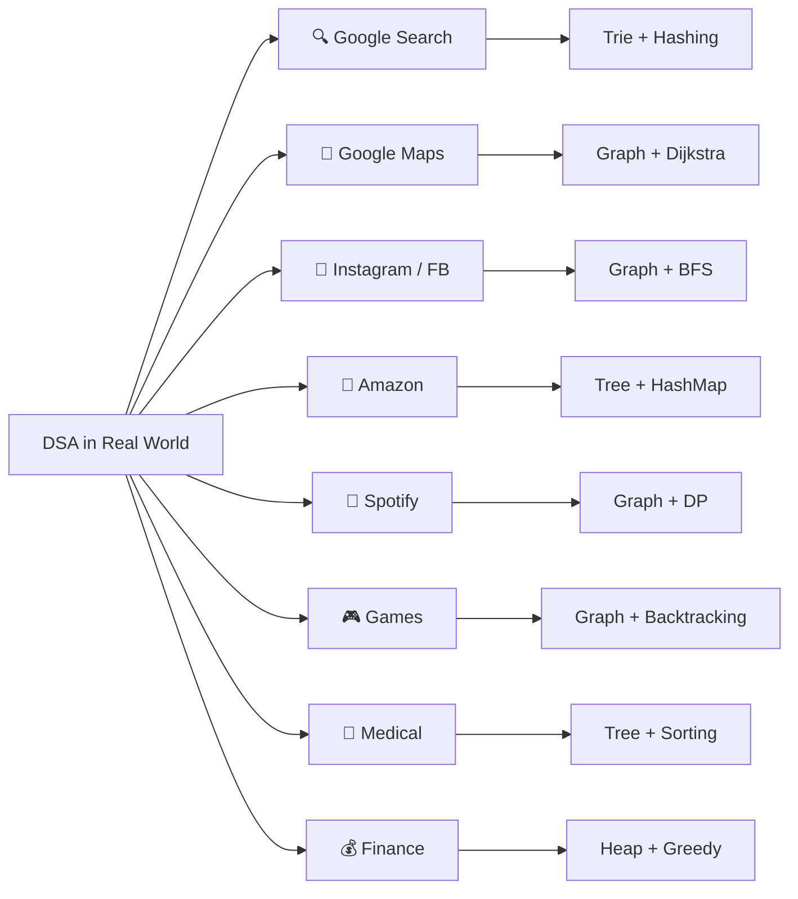

---

### 🔍 Detailed Application Breakdown

#### 🔎 1. Google Search
| What Happens | DSA Used |
|-------------|---------|
| Auto-complete suggestions | **Trie** |
| Ranking web pages | **Graph (PageRank)** |
| Caching recent searches | **LRU Cache (HashMap + DLL)** |
| Finding exact match | **Hashing** |

#### 📍 2. Google Maps / Navigation
| What Happens | DSA Used |
|-------------|---------|
| Shortest path | **Dijkstra's Algorithm (Graph)** |
| All paths detection | **DFS / BFS** |
| Traffic update | **Dynamic Graph** |
| ETA calculation | **Greedy + DP** |

#### 📱 3. Social Media (Instagram, Facebook, Twitter)
| What Happens | DSA Used |
|-------------|---------|
| Friend suggestions | **Graph (BFS)** |
| News feed ranking | **Priority Queue (Heap)** |
| Trending hashtags | **HashMap + Heap** |
| Notification system | **Queue** |

#### 🛒 4. E-Commerce (Amazon, Flipkart)
| What Happens | DSA Used |
|-------------|---------|
| Product search | **Trie + BST** |
| Price comparison | **Sorting Algorithms** |
| Cart management | **Stack / Queue** |
| Recommendation | **Graph (Collaborative Filtering)** |

#### 🎵 5. Music / Video Streaming (Spotify, Netflix)
| What Happens | DSA Used |
|-------------|---------|
| Playlist management | **Linked List** |
| Song recommendations | **Graph + DP** |
| Buffering | **Queue** |
| Shuffle algorithm | **Fisher-Yates (Array)** |

---

### 🏥 Beyond Tech — DSA Everywhere

| Domain | Application | DSA Used |
|--------|------------|---------|
| **Medical** | Patient scheduling | Priority Queue |
| **Finance** | Stock trading | Segment Tree, Heap |
| **Gaming** | Pathfinding (NPC) | A* Algorithm (Graph) |
| **Compiler** | Code parsing | Stack, Tree |
| **OS** | Process scheduling | Queue, Heap |
| **Network** | Packet routing | Graph (Bellman-Ford) |
| **DNA** | Sequence matching | Dynamic Programming |

> [!NOTE]
> Jab bhi tum koi app use karte ho — background mein ek programmer ka likha DSA code chal raha hota hai. Tum bhi woh programmer ban sakte ho 🔥

<a href="#chapter-index-table-1">Go to Top 🔝</a>

---

## 1.4 Types of Data Structures {#14-types-of-data-structures}

### 🧠 Introduction

Data Structures are like **containers** — different containers for different types of data and operations.

---

### 🎨 Complete Classification

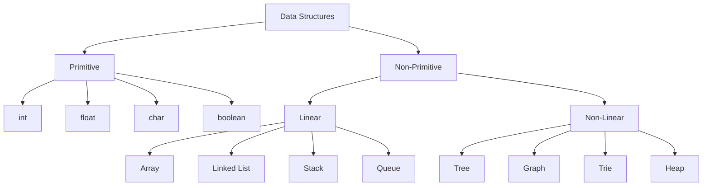

---

### 📊 Linear vs Non-Linear

| Feature | Linear DS | Non-Linear DS |
|---------|----------|--------------|
| **Structure** | Sequential | Hierarchical / Network |
| **Traversal** | One way | Multiple ways |
| **Memory** | Contiguous / Linked | Scattered |
| **Examples** | Array, Stack, Queue, LL | Tree, Graph, Trie |
| **Complexity** | Generally simpler | Generally complex |

---

### 🔷 Linear Data Structures

#### 1. Array
```
Index:  [0]  [1]  [2]  [3]  [4]
Value:  [10] [20] [30] [40] [50]

- Fixed size
- Random access O(1)
- Insertion/Deletion costly O(n)
```

#### 2. Linked List
```
[10|→] → [20|→] → [30|→] → [40|null]

- Dynamic size
- No random access
- Insertion/Deletion O(1) at head
```

#### 3. Stack (LIFO)
```
     TOP
    [30]  ← Push here / Pop from here
    [20]
    [10]
   BOTTOM

- Last In First Out
- Used in: Undo, Browser back, Recursion
```

#### 4. Queue (FIFO)
```
FRONT → [10][20][30][40] ← REAR
Enqueue from rear, Dequeue from front

- First In First Out  
- Used in: Print queue, BFS, OS scheduling
```

---

### 🔷 Non-Linear Data Structures

#### 1. Tree
```
           [1]           ← Root
          /   \
        [2]   [3]        ← Internal Nodes
       /  \     \
     [4]  [5]  [6]       ← Leaf Nodes

- Hierarchical structure
- Used in: File systems, DOM, Decision making
```

#### 2. Graph
```
    A --- B
    |     |
    C --- D
    |
    E

- Network of nodes & edges
- Used in: Maps, Social networks, Internet
```

#### 3. Heap
```
        [1]           ← Min element at top (Min Heap)
       /   \
     [3]   [2]
    / \   /
  [7] [4][5]

- Complete Binary Tree property
- Used in: Priority Queue, Dijkstra
```

#### 4. Trie
```
         root
        / | \
       a  b  c
      /|   \
     n  p   y
     |
     t (ant)
     
- Prefix tree
- Used in: Search autocomplete, Dictionary
```

---

### 📋 Complete Reference Table

| Data Structure | Access | Search | Insert | Delete | Use Case |
|----------------|--------|--------|--------|--------|---------|
| Array | O(1) | O(n) | O(n) | O(n) | Fixed data, index access |
| Linked List | O(n) | O(n) | O(1) | O(1) | Dynamic data, frequent insert |
| Stack | O(n) | O(n) | O(1) | O(1) | Undo, recursion, parsing |
| Queue | O(n) | O(n) | O(1) | O(1) | Scheduling, BFS |
| HashMap | O(1) | O(1) | O(1) | O(1) | Fast lookup, frequency count |
| BST | O(log n) | O(log n) | O(log n) | O(log n) | Sorted data, range queries |
| Heap | O(1) top | O(n) | O(log n) | O(log n) | Priority, top K elements |
| Graph | — | O(V+E) | O(1) | O(E) | Networks, paths |
| Trie | O(L) | O(L) | O(L) | O(L) | Strings, autocomplete |

> [!IMPORTANT]
> **Interview Trick:** When interviewer asks "which data structure to use?" — always think:
> 1. Do I need **ordered** data? → BST / Array
> 2. Do I need **fast lookup**? → HashMap
> 3. Do I need **LIFO**? → Stack
> 4. Do I need **FIFO**? → Queue
> 5. Do I need **priority**? → Heap
> 6. Do I need **prefix search**? → Trie

<a href="#chapter-index-table-1">Go to Top 🔝</a>

---

## 1.5 Types of Algorithms {#15-types-of-algorithms}

### 🧠 Introduction

An algorithm is a **strategy** to solve a problem. Different problems require different strategies.

> **Analogy:** Just like a doctor has different treatments for different diseases, a programmer has different algorithms for different problems.

---

### 🎨 Algorithm Classification

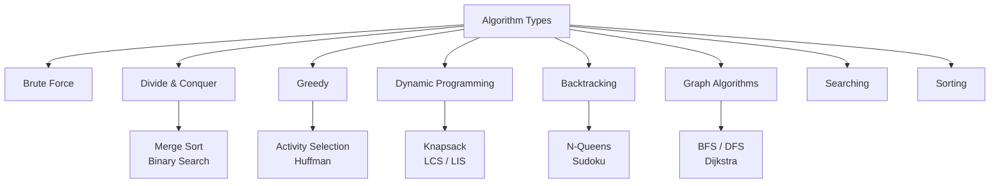

---

### 🔷 Detailed Algorithm Types

#### 1. 💪 Brute Force
- **Strategy:** Try all possible solutions, pick the best
- **When:** When input is small, or no better option exists
- **Example:** Find max in array → Check every element

```
Array: [3, 1, 4, 1, 5, 9, 2, 6]
Brute: Check 3, then 1, then 4... until all checked
Time:  O(n)
```

#### 2. ✂️ Divide & Conquer
- **Strategy:** Divide problem into sub-problems, solve each, combine
- **When:** Problem can be split into independent parts
- **Examples:** Merge Sort, Binary Search, Quick Sort

```
Merge Sort:
[8,3,1,5] → [8,3] [1,5] → [8][3] [1][5] → [3,8] [1,5] → [1,3,5,8]
```

#### 3. 🤑 Greedy
- **Strategy:** Make the locally optimal choice at each step
- **When:** Local optimal = Global optimal
- **Examples:** Activity Selection, Fractional Knapsack

```
Coin Change (Greedy): Amount = 36
Available coins: [25, 10, 5, 1]
Greedy picks: 25 → 10 → 1 → (3 coins: 25+10+1=36)
```

> [!NOTE]
> Greedy doesn't always give optimal solution! Example: Coin Change with coins [1, 3, 4] for amount 6 → Greedy gives 4+1+1=3 coins, but optimal is 3+3=2 coins.

#### 4. 🧮 Dynamic Programming
- **Strategy:** Break into sub-problems, **store results** (avoid recomputation)
- **When:** Overlapping sub-problems + Optimal substructure
- **Examples:** Fibonacci, Knapsack, LCS

```
Fibonacci with DP:
fib(5) = fib(4) + fib(3)
        ↓
Store fib(3), fib(4) → No recomputation!
Time: O(n) instead of O(2^n)
```

#### 5. 🔙 Backtracking
- **Strategy:** Try all paths, undo (backtrack) if path fails
- **When:** Need all possible solutions (combinations, permutations)
- **Examples:** N-Queens, Sudoku, Rat in Maze

```
N-Queens: Place queen → if conflict → remove (backtrack) → try next position
```

#### 6. 🕸️ Graph Algorithms
- **Strategy:** Traverse nodes and edges
- **Types:**
  - **BFS** — Level by level (shortest path unweighted)
  - **DFS** — Deep first (cycle detection, topological sort)
  - **Dijkstra** — Shortest path weighted graph
  - **Prim/Kruskal** — Minimum Spanning Tree

---

### 📊 Algorithm Selection Guide

| Problem Type | Think of | Algorithm |
|-------------|---------|----------|
| Find element | Search | Binary Search |
| Sort data | Comparison | Merge/Quick Sort |
| Shortest path | Graph | Dijkstra, BFS |
| All combinations | Exhaustive | Backtracking |
| Best choice step-by-step | Greedy | Activity Selection |
| Overlapping subproblems | Store results | Dynamic Programming |
| Split & combine | D&C | Merge Sort |

> [!TIP]
> **Algorithm Interview Tip:** When you see a problem, ask:
> - "Can I sort first?" → Often simplifies everything
> - "Have I seen this subproblem before?" → DP
> - "Do I need ALL solutions?" → Backtracking
> - "Do I need BEST step-by-step?" → Greedy

<a href="#chapter-index-table-1">Go to Top 🔝</a>

---

## 1.6 Learning Roadmap {#16-learning-roadmap}

### 🧠 Introduction

> *"Most people fail DSA not because it's hard, but because they study in the wrong order."*

Learning DSA in the wrong order is like trying to run before learning to walk.

---

### 🗺️ The Complete DSA Roadmap

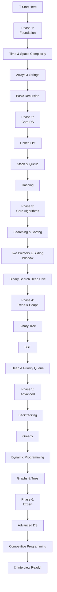

---

### 📅 Time-Based Study Plan

#### 🗓️ 3-Month Plan (Intensive)

| Month | Topics | Goal |
|-------|--------|------|
| **Month 1** | Complexity + Arrays + Strings + Recursion + Linked List | Build foundation |
| **Month 2** | Stack/Queue + Hashing + Sorting + Binary Search + Two Pointers | Core algorithms |
| **Month 3** | Trees + BST + Heap + Backtracking + Greedy + DP basics | Advanced topics |

#### 🗓️ 6-Month Plan (Balanced)

| Month | Topics | LeetCode Target |
|-------|--------|----------------|
| Month 1 | Foundation + Arrays | 30 Easy problems |
| Month 2 | Recursion + LL + Stack/Queue | 20 Easy + 10 Medium |
| Month 3 | Searching/Sorting + Hashing | 20 Medium problems |
| Month 4 | Trees + BST + Heap | 25 Medium problems |
| Month 5 | Backtracking + Greedy + DP | 20 Medium + 5 Hard |
| Month 6 | Graphs + Advanced + Mock Interviews | 10 Hard + Revision |

---

### 🎯 Topic Priority (Interview Focused)

| Priority | Topics | Interview Frequency |
|----------|--------|-------------------|
| 🔴 Must | Arrays, Strings, HashMap, Two Pointers | 90% interviews |
| 🔴 Must | Binary Search, Sliding Window, Recursion | 85% interviews |
| 🟠 High | LinkedList, Stack, Queue, Trees, BST | 80% interviews |
| 🟠 High | DP (Basic), Backtracking, Sorting | 75% interviews |
| 🟡 Medium | Graphs, Heaps, Greedy | 65% interviews |
| 🟢 Good | Tries, Advanced DP, Segment Tree | 40% interviews |
| 🔵 Expert | Bitmask DP, Suffix Array, DSU | 20% interviews |

> [!IMPORTANT]
> **Don't skip the order!** Arrays → Recursion → LinkedList → Tree → Graph. Each topic builds on the previous. Jumping to DP without understanding Recursion = Disaster.

---

### ✅ Daily Study Formula

```
DAILY DSA ROUTINE (2-3 hours):
┌─────────────────────────────────────┐
│ 30 min  → Study concept + Theory    │
│ 30 min  → Dry run examples          │
│ 60 min  → Solve 2-3 problems        │
│ 30 min  → Review solutions + Notes  │
└─────────────────────────────────────┘
```

> [!TIP]
> **The 3-day revision rule:** Every topic you learn, revisit it after Day 1, Day 3, and Day 7. This creates long-term memory. DSA needs **practice**, not just reading!

<a href="#chapter-index-table-1">Go to Top 🔝</a>

---

## 1.7 How to Study DSA {#17-how-to-study-dsa}

### 🧠 Introduction

Most people study DSA **wrong** and wonder why they can't solve interview questions. This section fixes that.

---

### 🚫 Wrong Way vs ✅ Right Way

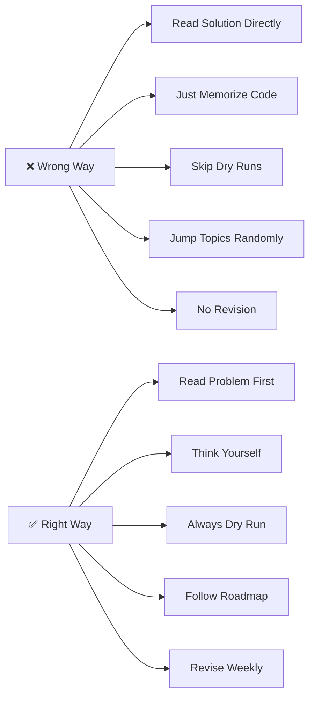

---

### 🔷 The STAR Method for Problem Solving

```
S — Study the problem (Read carefully, note constraints)
T — Think approach (Brute → Better → Optimal)
A — Apply dry run (Trace on paper/whiteboard)
R — Review & Code (Write clean code + test)
```

---

### 🔷 Step-by-Step Problem-Solving Framework

#### Step 1: Understand the Problem
```
- Read problem statement 3 times
- Identify: Input, Output, Constraints
- Think about edge cases FIRST
- Ask clarifying questions (in real interview)
```

#### Step 2: Think Out Loud
```
- Don't jump to code immediately
- Think: "What pattern does this look like?"
- Common patterns: Sliding window? Two pointer? DP?
- Start with BRUTE FORCE (always)
```

#### Step 3: Dry Run
```
- Take a small example
- Trace your algorithm step by step
- Verify with another example
- Check edge cases (empty, single element, all same)
```

#### Step 4: Code
```
- Write clean, readable code
- Use meaningful variable names
- Add comments for complex logic
- Think about helper functions
```

#### Step 5: Test & Optimize
```
- Test with your examples
- Test edge cases
- Analyze time & space complexity
- Ask: "Can I do better?"
```

---

### 📚 Resources Strategy

| Resource Type | What to Use | When |
|--------------|------------|------|
| **Concept Learning** | This Book + YouTube | New topic |
| **Practice** | LeetCode (Primary) | Daily |
| **Revision** | Cheat sheets here | Weekly |
| **Mock Interviews** | LeetCode Mock, Pramp | After 2 months |
| **Competitive** | Codeforces, CodeChef | After basics |

---

### 🧠 How Many Problems to Solve?

> **Quality > Quantity**

```
Target for Placements:
- Easy:   100-150 problems
- Medium: 150-200 problems  
- Hard:   30-50 problems
Total: ~300-400 well-understood problems

Better to deeply understand 300 problems
than to "read" 1000 solutions!
```

---

### 💡 Smart Study Tips

1. **Never copy-paste solutions** → Type them out → Muscle memory
2. **Solve the same problem in multiple ways** → Builds flexibility
3. **Explain your solution out loud** → Prepares for interview
4. **Group similar problems** → Pattern recognition develops faster
5. **Track your progress** → Spreadsheet or Notion → Motivation booster

> [!TIP]
> **Duniya ka sabse effective DSA technique:** Jab ek problem solve karo, ek din baad fir se try karo **bina solution dekhe**. Agar solve ho gaya → Concept pakka hai. Nahi hua → Wapas revise karo. 🔄

> [!NOTE]
> **Consistency beats intensity.** 1 hour daily for 6 months > 8 hours for 1 week then nothing. DSA skills are built over time, like a muscle.

<a href="#chapter-index-table-1">Go to Top 🔝</a>

---

## 1.8 DSA in Placements & Interviews {#18-dsa-in-placements--interviews}

### 🧠 Introduction

Understanding **how companies test DSA** gives you a strategic advantage.

---

### 🏢 Interview Round Structure

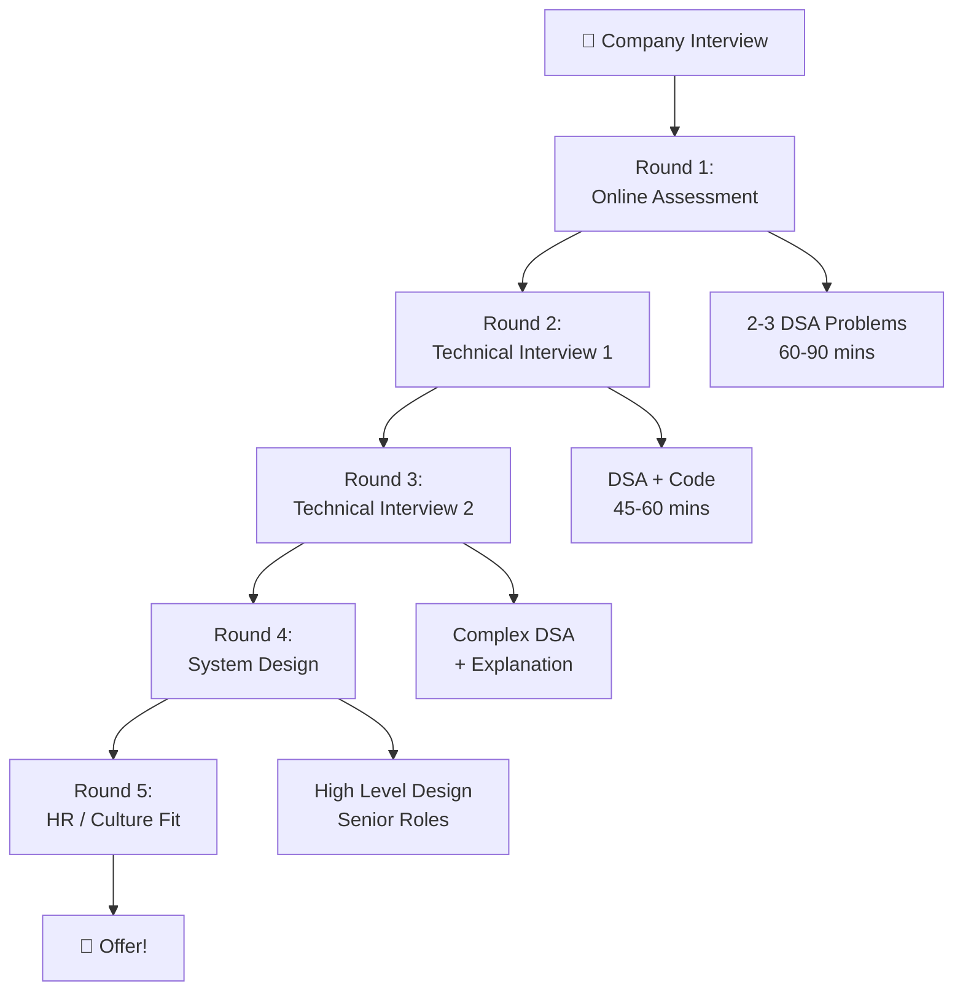

---

### 🏆 Company-wise DSA Expectations

| Company | Difficulty | Focus Areas | Rounds |
|---------|-----------|------------|--------|
| **Google** | Hard | DP, Graphs, System Design | 5-6 |
| **Amazon** | Medium-Hard | Arrays, DP, Trees, LP | 4-5 |
| **Microsoft** | Medium | Trees, Arrays, Strings, DP | 4-5 |
| **Meta** | Hard | Graph, DP, Trees | 4-5 |
| **Flipkart** | Medium | Arrays, DP, Graphs | 3-4 |
| **Zomato** | Medium | Arrays, Strings, Hashing | 3-4 |
| **Razorpay** | Medium | DS, Algorithms, System | 3-4 |
| **TCS/Infosys** | Easy | Basic DS, Logic | 2-3 |
| **Startups** | Varies | Practical problem solving | 2-4 |

---

### 🎯 Most Frequently Asked Topics in Interviews

```
📊 Interview Frequency Analysis (Based on 10,000+ interview reports):

Arrays & Strings     ████████████████████ 95%
HashMap/HashSet      ███████████████████  90%
Two Pointers         ██████████████████   85%
Binary Search        █████████████████    82%
Trees & BST          ████████████████     78%
Dynamic Programming  ███████████████      72%
Linked List          █████████████        65%
Stack & Queue        ████████████         60%
Graphs               ██████████           55%
Heap                 █████████            50%
Backtracking         ████████             45%
Tries                ████                 25%
```

---

### 🔑 What Interviewers Actually Look For

```
1. THOUGHT PROCESS (Most Important!)
   → Can you break down the problem?
   → Do you think before you code?

2. COMMUNICATION
   → Can you explain your approach?
   → Do you talk through your logic?

3. CODE QUALITY
   → Clean, readable code
   → Meaningful variable names
   → Handle edge cases

4. OPTIMIZATION
   → Do you analyze complexity?
   → Can you improve your solution?

5. TESTING
   → Do you verify with examples?
   → Do you think of edge cases?
```

> [!IMPORTANT]
> **Biggest Interview Mistake:** Jumping to code immediately without thinking. Interviewers **want** to see your thinking process. 5 minutes of thinking aloud = Better impression than 5 minutes of silent coding.

---

### 📋 Interview Preparation Checklist

```
✅ Pre-Interview (1 month before):
□ Solve 5-10 problems per topic area
□ Practice on whiteboard / paper
□ Time yourself (30-45 min per medium problem)
□ Mock interviews with friends

✅ Interview Day:
□ Read problem completely before starting
□ Ask clarifying questions
□ State your approach before coding
□ Dry run with example
□ Analyze complexity at the end
□ Mention possible optimizations

✅ Red Flags to Avoid:
□ Silent coding without explanation
□ No edge case consideration
□ Wrong complexity analysis
□ Giving up without trying
□ Not testing your solution
```

<a href="#chapter-index-table-1">Go to Top 🔝</a>

---

## 1.9 DSA vs Development {#19-dsa-vs-development}

### 🧠 Introduction

> *"Main toh developer banunga, mujhe DSA kyun chahiye?"*

This is the most common misconception. Let's clear it up.

---

### 🔷 The Core Difference

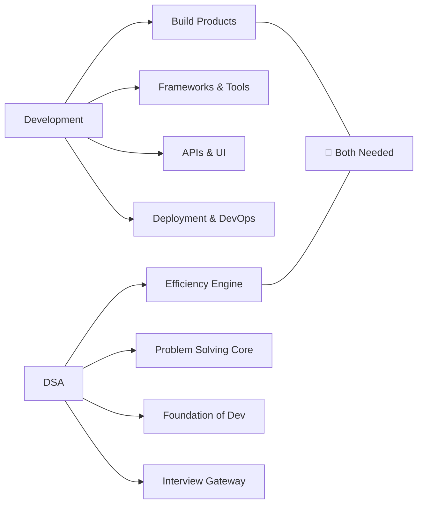

---

### 🏗️ Real Developer Scenario

> **You're building a food delivery app like Zomato:**

| Feature | Development Skill | DSA Needed |
|---------|-----------------|-----------|
| UI for restaurant list | React/Android | Sorting Algorithm |
| Search restaurants | API calls | Trie / Binary Search |
| Find nearest restaurant | Google Maps API | Graph (Dijkstra) |
| Process 10,000 orders/sec | Backend APIs | Queue + Load Balancing |
| Recommendation system | ML Integration | Graph + DP |
| Order status updates | WebSocket | Queue |

> **Conclusion:** A developer without DSA can BUILD the app. A developer WITH DSA can build an app that **scales to millions of users.**

---

### 🔑 Key Differences Table

| Aspect | Pure Development | DSA |
|--------|----------------|-----|
| **Focus** | Building features | Solving problems efficiently |
| **Output** | Working product | Efficient algorithm |
| **Tools** | Frameworks, libraries | Logic & data structures |
| **When needed** | Product companies | All companies |
| **Learning curve** | Project-based | Concept + Practice |
| **Interview importance** | Secondary | Primary (for top companies) |

---

### 💡 The Truth About Career Paths

```
PATH 1: Service Companies (TCS, Wipro, Infosys)
→ Basic DSA needed
→ More focus on domain + frameworks
→ DSA: Easy-Medium level

PATH 2: Product Companies (Zomato, Swiggy, Razorpay)
→ Moderate-Strong DSA
→ Both development + problem solving
→ DSA: Medium level

PATH 3: FAANG & Top Startups
→ Strong DSA mandatory
→ System Design also needed
→ DSA: Medium-Hard level

PATH 4: Competitive Programming / Research
→ Expert DSA
→ DSA: Hard-Expert level
```

> [!NOTE]
> **The Golden Rule:** Even if you become a full-stack developer, knowing DSA makes you write **better code**. An array vs HashMap choice in your code can make the difference between O(n²) and O(n) performance in production.

> [!TIP]
> **Career Advice:** Learn Development AND DSA in parallel. Don't choose. The combination = More salary + Better problem solving + Top company access. DSA wale developer ki value zyaada hoti hai 💰

<a href="#chapter-index-table-1">Go to Top 🔝</a>

---

## 1.10 Where DSA is Used {#110-where-dsa-is-used}

### 🧠 Introduction

Let's map DSA to every domain where it creates real impact.

---

### 🌐 DSA Usage Ecosystem

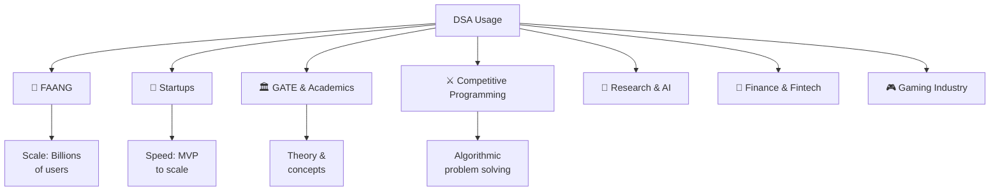

---

### 🏢 FAANG — Where DSA is Most Critical

#### Google
```
- Search: PageRank algorithm (Graph)
- Maps: Shortest path (Dijkstra)
- YouTube: Video recommendations (Graph + ML)
- Gmail: Spam detection (Classification + Hashing)
- Scale: Processes 8.5 billion searches/day
DSA Level Required: Hard
```

#### Amazon
```
- Product recommendations: Collaborative filtering (Graph)
- Warehouse routing: Shortest path (Graph)
- Inventory management: BST, Sorting
- Order processing: Queue + Priority Queue
- Scale: 1.5 million orders/day
DSA Level Required: Medium-Hard
```

#### Meta (Facebook/Instagram)
```
- News Feed: Ranking (Heap + Sorting)
- Friend Suggestions: BFS (Graph)
- Photo recognition: Tree-based ML models
- Messenger: Queue + Graph
- Scale: 3 billion monthly active users
DSA Level Required: Hard
```

---

### 🚀 Startups — DSA for Speed & Scale

```
Early Startup:
- Small team, small data → DSA less critical
- But: Bad code = Technical debt = Slower growth

Growing Startup (100K+ users):
- Now DSA matters: Slow API? O(n²) somewhere!
- Hashing, Sorting, Efficient queries = Business survival

Scale-up (1M+ users):
- Every millisecond costs money
- DSA is the difference between crash and success
```

> **Real Example:** Zerodha (Indian fintech)
> - Handles **millions of stock trades** per second
> - Uses **Segment Trees** for range queries on stock data
> - Uses **Heaps** for order book management
> - Without DSA: System would crash during market hours

---

### 🏛️ GATE — DSA in Academics

| GATE Topic | DSA Area | Marks Weightage |
|-----------|---------|----------------|
| Algorithms | Sorting, Searching, DP | 12-15% |
| Data Structures | Trees, Graphs, Hash | 10-12% |
| Theory of Computation | String Algorithms | 8-10% |
| Operating Systems | Scheduling (Queue) | Related |
| Databases | B-Trees, Indexing | Related |

#### GATE-Specific Important Topics
```
1. Time Complexity Analysis
2. Recurrence Relations (Master Theorem)
3. Searching & Sorting Algorithms
4. Trees (Traversals, AVL, B-Trees)
5. Graph Algorithms (BFS, DFS, Shortest Path)
6. Dynamic Programming
7. Hashing
```

---

### ⚔️ Competitive Programming

```
Platforms:   Codeforces, CodeChef, AtCoder, USACO
Used in:     ICPC, Google Kickstart, Meta Hackercup
Requires:    Expert level DSA + Math

DSA Topics for CP:
- Segment Tree + Lazy Propagation
- Fenwick Tree (BIT)
- Suffix Array / Suffix Automaton
- Heavy-Light Decomposition
- Advanced Graph (Tarjan, SCC)
- Bitmask DP
```

---

### 🔬 AI/ML & Research

| AI Application | DSA Used |
|--------------|---------|
| Neural Networks | Matrix operations (Arrays) |
| Decision Trees | Tree DS |
| K-Nearest Neighbors | Sorting + Distance |
| Clustering | Graph algorithms |
| Recommendation | Graph, DP |
| NLP | Trie, String algorithms |

> [!NOTE]
> DSA is the **foundation** of all software, including AI/ML. Even TensorFlow and PyTorch are built on efficient data structures internally.

---

### 💡 Summary — "Where is DSA used?"

```
EVERYWHERE. In:
✅ Every software product you use
✅ Every company that writes code  
✅ Every computer science examination
✅ Every technical interview (for any role)
✅ Every system that handles data at scale

The question isn't "where is DSA used?"
The question is "where is DSA NOT used?" 
Answer: Nowhere. It's universal.
```

<a href="#chapter-index-table-1">Go to Top 🔝</a>

---

## 🎯 Interview Questions for Chapter 1 {#interview-questions-chapter-1}

### 🔥 Commonly Asked Introduction Questions

| # | Question | Expected Answer |
|---|---------|----------------|
| 1 | What is a Data Structure? | Way to organize/store data for efficient access |
| 2 | What is an Algorithm? | Finite set of instructions to solve a problem |
| 3 | Why do we need DSA? | Efficiency, scalability, performance |
| 4 | What is the difference between Array and LinkedList? | Contiguous vs Non-contiguous, O(1) access vs O(n) |
| 5 | What are the types of Data Structures? | Linear (Array, LL, Stack, Queue) and Non-Linear (Tree, Graph) |
| 6 | What is Big O notation? | Worst-case time complexity upper bound |
| 7 | Which DS gives O(1) lookup? | HashMap / HashTable |
| 8 | What is recursion? | Function calling itself with base case |
| 9 | Difference between Stack and Queue? | LIFO vs FIFO |
| 10 | When to use DP vs Greedy? | DP: overlapping subproblems; Greedy: local optimal = global optimal |

---

## 📊 Complexity Analysis (Conceptual) {#complexity-chapter-1}

### Why Complexity Matters (Preview)

```
Algorithm 1: O(n²)    → 1M elements → 10^12 operations → Hours
Algorithm 2: O(n log n) → 1M elements → 20M operations  → Milliseconds
Algorithm 3: O(n)     → 1M elements → 1M operations   → Seconds
Algorithm 4: O(log n) → 1M elements → 20 operations   → Instant
Algorithm 5: O(1)     → 1M elements → 1 operation     → Instant
```

> *Full complexity analysis is covered in Chapter 3.*

---

## ❌ Common Mistakes {#common-mistakes-chapter-1}

| Mistake | Why It's Wrong | Correct Approach |
|---------|---------------|-----------------|
| Skipping DSA for development | Miss top company opportunities | Learn both together |
| Memorizing solutions | Can't solve new problems | Understand the pattern |
| Jumping to DP first | Need recursion foundation | Follow the roadmap |
| Only reading, not practicing | DSA needs hands-on | Code every concept |
| Comparing with others | Everyone has different pace | Track your own progress |
| Giving up after wrong answer | Struggle = Learning | Analyze why it failed |

---

## 📝 Summary {#summary-chapter-1}

```
Chapter 1 — Key Takeaways:

1. DSA = Data Structures (how to store) + Algorithms (how to process)
2. DSA is the foundation of ALL software systems
3. Every top company tests DSA in interviews
4. Types: Linear DS (Array, LL, Stack, Queue) + Non-Linear (Tree, Graph, Trie)
5. Algorithm types: Brute Force, D&C, Greedy, DP, Backtracking, Graph
6. Follow the roadmap: Arrays → Recursion → LL → Trees → Graphs → DP
7. Right approach: Brute Force → Better → Optimal (always)
8. DSA + Development = Maximum career value
9. Consistency is key: 1 hour daily > 8 hours occasionally
10. Quality > Quantity: 300 well-understood problems > 1000 memorized
```

---

## 🔁 Revision Sheet {#revision-sheet-chapter-1}

```
CHAPTER 1 — QUICK REVISION

□ DSA = Data Structure + Algorithm
□ Data Structure = Way to organize data
□ Algorithm = Step-by-step instructions
□ Linear DS: Array, Linked List, Stack, Queue
□ Non-Linear DS: Tree, Graph, Heap, Trie
□ Algorithm Types: Brute Force, D&C, Greedy, DP, Backtracking, Graph
□ Array: O(1) access, O(n) search/insert/delete
□ HashMap: O(1) access, search, insert, delete
□ Stack: LIFO | Queue: FIFO
□ BST: O(log n) operations
□ Interview: Think → Explain → Code → Test
□ Roadmap: Complexity → Arrays → LL → Stack/Queue → Trees → Graphs → DP
□ FAANG needs: Medium-Hard DSA
□ GATE focuses: Complexity + Sorting + Graphs + DP
```

---

## 📌 Cheat Sheet {#cheat-sheet-chapter-1}

```
╔══════════════════════════════════════════════════════════════╗
║           DSA CHAPTER 1 — MASTER CHEAT SHEET                ║
╠══════════════════════════════════════════════════════════════╣
║ DATA STRUCTURES          │ TIME COMPLEXITIES                 ║
║ Array    → O(1) access   │ O(1)      → Constant              ║
║ LL       → O(n) access   │ O(log n)  → Logarithmic           ║
║ Stack    → LIFO, O(1)    │ O(n)      → Linear                ║
║ Queue    → FIFO, O(1)    │ O(n log n)→ Linearithmic          ║
║ HashMap  → O(1) all ops  │ O(n²)     → Quadratic             ║
║ BST      → O(log n)      │ O(2^n)    → Exponential           ║
║ Heap     → O(log n)      │                                   ║
╠══════════════════════════════════════════════════════════════╣
║ ALGORITHM TYPES          │ WHEN TO USE                       ║
║ Brute Force  → Always try│ Any problem, small input          ║
║ D&C          → Split     │ Independent sub-problems          ║
║ Greedy       → Local opt │ Local opt = Global opt            ║
║ DP           → Store     │ Overlapping subproblems           ║
║ Backtracking → Try-undo  │ All solutions needed              ║
║ Graph Algo   → Traverse  │ Network/path problems             ║
╠══════════════════════════════════════════════════════════════╣
║ INTERVIEW FORMULA                                            ║
║ 1. Understand → 2. Think → 3. Dry Run → 4. Code → 5. Test  ║
╚══════════════════════════════════════════════════════════════╝
```

---

## 🃏 Flashcards {#flashcards-chapter-1}

```
┌─────────────────────────┐    ┌─────────────────────────┐
│ Q: What is DSA?         │    │ A: Data Structures +    │
│                         │    │ Algorithms combined for  │
│                         │    │ efficient problem solving│
└─────────────────────────┘    └─────────────────────────┘

┌─────────────────────────┐    ┌─────────────────────────┐
│ Q: LIFO structure?      │    │ A: Stack                │
│                         │    │ Last In = First Out     │
└─────────────────────────┘    └─────────────────────────┘

┌─────────────────────────┐    ┌─────────────────────────┐
│ Q: O(1) lookup DS?      │    │ A: HashMap / HashTable  │
│                         │    │ Direct key-value access  │
└─────────────────────────┘    └─────────────────────────┘

┌─────────────────────────┐    ┌─────────────────────────┐
│ Q: When to use DP?      │    │ A: Overlapping           │
│                         │    │ subproblems + Optimal   │
│                         │    │ substructure            │
└─────────────────────────┘    └─────────────────────────┘

┌─────────────────────────┐    ┌─────────────────────────┐
│ Q: Graph algorithm for  │    │ A: Dijkstra's Algorithm │
│ shortest path?          │    │ O(E log V)              │
└─────────────────────────┘    └─────────────────────────┘
```

---

## 🗺️ Mind Map {#mind-map-chapter-1}

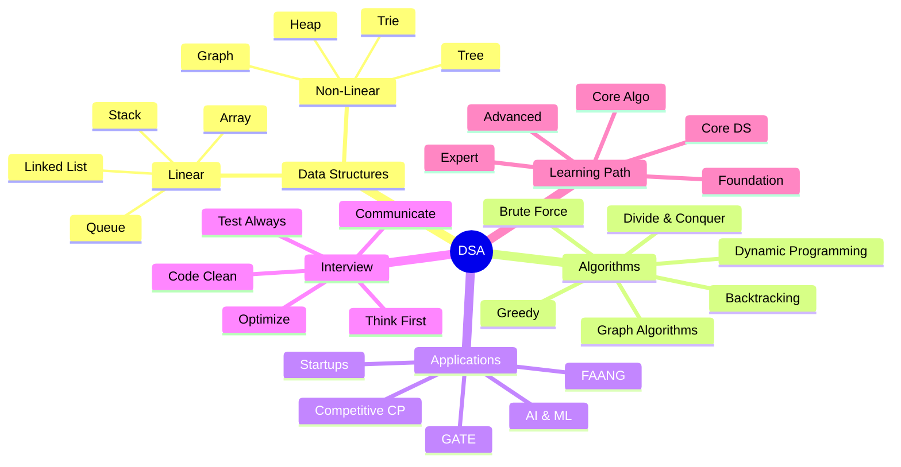

---

## 💻 Practice Problems {#practice-chapter-1}

### 🟢 Conceptual (No Code Needed — Think & Answer)

1. **Q:** You have a list of 1 million students. You need to find a student by name. Which data structure would you use and why?

2. **Q:** Your app has a "back button" feature (like browser). Which data structure models this best?

3. **Q:** A printer receives 100 print jobs. They must be processed in order received. Which data structure do you use?

4. **Q:** WhatsApp needs to suggest "people you may know." Which algorithm would you use?

5. **Q:** Google Maps needs to find shortest route. Which algorithm category does this fall under?

---

### 🟡 Beginner Coding

1. Write a program to print numbers 1 to N using recursion
2. Find maximum element in an array
3. Reverse an array
4. Check if a string is a palindrome
5. Count frequency of each character in a string

---

### 🔴 Interview-Level Thinking

1. **Scenario:** Design a "Recently Visited" feature for a browser that shows last 10 visited sites. Which DS? Why? What operations are needed?

2. **Scenario:** You're building autocomplete for a search bar. When user types "app", show "apple", "application", "appstore". Which DS? Why?

3. **Scenario:** Your food delivery app needs to assign the order to the nearest driver. Multiple drivers exist. How would you model this problem? Which DSA concepts?

---

## 🎯 One Practice Project {#project-chapter-1}

### 🏗️ Mini Project: "DSA Concept Selector" CLI Tool

> **Problem:** Build a command-line tool that helps a developer choose the right Data Structure for their problem.

#### Requirements:
```
Input: User describes their problem
- "I need fast lookup by key"     → Suggest: HashMap
- "I need LIFO operations"        → Suggest: Stack
- "I need sorted + fast search"   → Suggest: BST
- "I need shortest path"          → Suggest: Graph + Dijkstra
- "I need top K elements"         → Suggest: Heap
```

#### Java Implementation:

```java
import java.util.Scanner;
import java.util.HashMap;
import java.util.Map;

public class DSASelector {
    
    // DSA Knowledge Base
    private static Map<String, String[]> knowledgeBase = new HashMap<>();
    
    static {
        // keyword → [Data Structure, Algorithm, Use Case]
        knowledgeBase.put("lookup", new String[]{
            "HashMap", "Hashing", "O(1) key-value access"
        });
        knowledgeBase.put("lifo", new String[]{
            "Stack", "Push/Pop", "Undo operations, recursion"
        });
        knowledgeBase.put("fifo", new String[]{
            "Queue", "Enqueue/Dequeue", "Print queue, BFS"
        });
        knowledgeBase.put("sorted", new String[]{
            "BST / Sorted Array", "Binary Search", "Range queries"
        });
        knowledgeBase.put("shortest", new String[]{
            "Graph", "Dijkstra's Algorithm", "Navigation, routing"
        });
        knowledgeBase.put("top k", new String[]{
            "Heap (Min/Max)", "Heapify", "Priority operations"
        });
        knowledgeBase.put("prefix", new String[]{
            "Trie", "Insert/Search", "Autocomplete, dictionary"
        });
        knowledgeBase.put("frequency", new String[]{
            "HashMap", "Counting", "Character frequency, anagram"
        });
        knowledgeBase.put("cycle", new String[]{
            "Graph", "DFS / Floyd Detection", "Deadlock detection"
        });
        knowledgeBase.put("hierarchical", new String[]{
            "Tree", "Traversal", "File systems, DOM"
        });
    }
    
    public static void suggestDSA(String problem) {
        System.out.println("\n🔍 Analyzing: \"" + problem + "\"");
        System.out.println("─".repeat(50));
        
        String problemLower = problem.toLowerCase();
        boolean found = false;
        
        for (Map.Entry<String, String[]> entry : knowledgeBase.entrySet()) {
            if (problemLower.contains(entry.getKey())) {
                String[] suggestion = entry.getValue();
                System.out.println("✅ Data Structure : " + suggestion[0]);
                System.out.println("⚡ Algorithm      : " + suggestion[1]);
                System.out.println("📌 Best For       : " + suggestion[2]);
                found = true;
                break;
            }
        }
        
        if (!found) {
            System.out.println("💡 Consider: Array (basic) or HashMap (fast lookup)");
            System.out.println("📖 Tip: Describe your operation (lookup/sort/traverse)");
        }
        System.out.println("─".repeat(50));
    }
    
    public static void main(String[] args) {
        Scanner scanner = new Scanner(System.in);
        
        System.out.println("╔══════════════════════════════════════╗");
        System.out.println("║   🧠 DSA Concept Selector Tool       ║");
        System.out.println("║   Describe your problem → Get DS     ║");
        System.out.println("╚══════════════════════════════════════╝");
        
        // Demo problems
        String[] demoProblems = {
            "I need fast lookup by key in O(1)",
            "I need to process tasks in LIFO order",
            "Find the shortest path in a network",
            "I need top k elements efficiently",
            "Implement autocomplete with prefix search",
            "Count frequency of elements",
            "Detect cycle in a network"
        };
        
        System.out.println("\n📌 Demo Suggestions:\n");
        for (String problem : demoProblems) {
            suggestDSA(problem);
        }
        
        // Interactive mode
        System.out.println("\n🎯 Your turn! Describe your problem (or 'exit'):");
        while (scanner.hasNextLine()) {
            String input = scanner.nextLine().trim();
            if (input.equalsIgnoreCase("exit")) break;
            if (!input.isEmpty()) {
                suggestDSA(input);
                System.out.println("\nDescribe another problem (or 'exit'):");
            }
        }
        
        System.out.println("\n✅ Happy Coding! Remember: Right DS + Right Algo = Efficient Solution 🚀");
        scanner.close();
    }
}
```

#### JavaScript Implementation:

```javascript
// DSA Concept Selector - JavaScript Version

const knowledgeBase = {
  "lookup": {
    dataStructure: "HashMap / Object",
    algorithm: "Hashing",
    useCase: "O(1) key-value access, caching",
    example: "Store user sessions by userId"
  },
  "lifo": {
    dataStructure: "Stack",
    algorithm: "Push / Pop",
    useCase: "Undo operations, function call stack",
    example: "Browser history back button"
  },
  "fifo": {
    dataStructure: "Queue",
    algorithm: "Enqueue / Dequeue",
    useCase: "Task scheduling, BFS traversal",
    example: "Customer support ticket queue"
  },
  "sorted": {
    dataStructure: "BST / Sorted Array",
    algorithm: "Binary Search",
    useCase: "Ordered data, range queries",
    example: "Leaderboard scores"
  },
  "shortest": {
    dataStructure: "Graph (Adjacency List)",
    algorithm: "Dijkstra's Algorithm",
    useCase: "Navigation, network routing",
    example: "Google Maps shortest route"
  },
  "top k": {
    dataStructure: "Min/Max Heap",
    algorithm: "Heapify O(log n)",
    useCase: "Priority operations, top elements",
    example: "Top 10 trending tweets"
  },
  "prefix": {
    dataStructure: "Trie",
    algorithm: "Insert / Prefix Search O(L)",
    useCase: "Autocomplete, spell checker",
    example: "Google search suggestions"
  },
  "frequency": {
    dataStructure: "HashMap",
    algorithm: "Counting / Frequency Map",
    useCase: "Count occurrences",
    example: "Most used word in document"
  },
  "cycle": {
    dataStructure: "Graph",
    algorithm: "DFS / Floyd's Detection",
    useCase: "Dependency check, deadlock",
    example: "Package dependency cycle"
  },
  "hierarchical": {
    dataStructure: "Tree",
    algorithm: "DFS / BFS Traversal",
    useCase: "Parent-child relationships",
    example: "File system directory"
  }
};

/**
 * Analyzes problem description and suggests appropriate DSA
 * @param {string} problem - User's problem description
 * @returns {object} - Suggestion object
 */
function suggestDSA(problem) {
  const problemLower = problem.toLowerCase();
  
  console.log(`\n🔍 Analyzing: "${problem}"`);
  console.log("─".repeat(55));
  
  for (const [keyword, suggestion] of Object.entries(knowledgeBase)) {
    if (problemLower.includes(keyword)) {
      console.log(`✅ Data Structure : ${suggestion.dataStructure}`);
      console.log(`⚡ Algorithm      : ${suggestion.algorithm}`);
      console.log(`📌 Best For       : ${suggestion.useCase}`);
      console.log(`💡 Example        : ${suggestion.example}`);
      console.log("─".repeat(55));
      return suggestion;
    }
  }
  
  console.log("💡 Default suggestion: Use Array or HashMap");
  console.log("📖 Tip: Use keywords like 'lookup', 'sorted', 'shortest'");
  console.log("─".repeat(55));
  return null;
}

/**
 * Run the DSA Selector Demo
 */
function runDSASelector() {
  console.log("╔═══════════════════════════════════════════════════╗");
  console.log("║       🧠 DSA Concept Selector Tool (JS)           ║");
  console.log("║       Describe your problem → Get the right DS    ║");
  console.log("╚═══════════════════════════════════════════════════╝");

  const demoProblems = [
    "I need fast lookup by key",
    "I need LIFO order processing",
    "Find the shortest path between nodes",
    "I need top k most frequent elements",
    "Build autocomplete with prefix search",
    "Check for cycle in dependency graph",
    "Process requests in the order they arrive (fifo)"
  ];

  console.log("\n📌 Demo Suggestions:\n");
  demoProblems.forEach(problem => suggestDSA(problem));

  console.log("\n✅ Takeaway: Matching problem → right DS + Algo = Efficiency! 🚀");
}

// Run the selector
runDSASelector();

// Export for module use
module.exports = { suggestDSA, knowledgeBase };
```

#### Expected Output:
```
╔═══════════════════════════════════════════════════╗
║       🧠 DSA Concept Selector Tool (JS)           ║
║       Describe your problem → Get the right DS    ║
╚═══════════════════════════════════════════════════╝

📌 Demo Suggestions:

🔍 Analyzing: "I need fast lookup by key"
───────────────────────────────────────────────────────
✅ Data Structure : HashMap / Object
⚡ Algorithm      : Hashing
📌 Best For       : O(1) key-value access, caching
💡 Example        : Store user sessions by userId
───────────────────────────────────────────────────────

🔍 Analyzing: "Find the shortest path between nodes"
───────────────────────────────────────────────────────
✅ Data Structure : Graph (Adjacency List)
⚡ Algorithm      : Dijkstra's Algorithm
📌 Best For       : Navigation, network routing
💡 Example        : Google Maps shortest route
───────────────────────────────────────────────────────
```

---

> [!IMPORTANT]
> **Chapter 1 Mission Complete!** 🎯
> You now understand:
> - WHAT DSA is and WHY it matters
> - WHERE it's used (everywhere!)
> - HOW to study it effectively
> - The roadmap ahead
>
> **Next Chapter:** Warm Up → Flowcharts, Pseudocode, Math for DSA

---

<div align="center">

**[← Back to Index](#chapter-index-table-1)** | **[Next Chapter: Warm Up →](#2-warm-up)**

<a href="#chapter-index-table-1">Go to Top 🔝</a>

</div>