<a id="1-introduction-to-dsa"></a>

# 📘 Chapter 1: Introduction to DSA

<a id="chapter-index-table-1"></a>

> *"DSA is not just a subject — it is the language computers think in."*

---

## 📑 Chapter Index Table

| Topic No. | Topic Name | Subtopics |
|-----------|-----------|-----------|
| 1.1 | [What is DSA](#11-what-is-dsa) | Data • Structure • Algorithm • DSA Together |
| 1.2 | [Why DSA Matters](#12-why-dsa-matters) | Efficiency • Problem Solving • Career • Scale |
| 1.3 | [Real-world Applications](#13-real-world-applications) | Google • Maps • Instagram • Amazon • Spotify |
| 1.4 | [Types of Data Structures](#14-types-of-data-structures) | Linear • Non-Linear • Static • Dynamic |
| 1.5 | [Types of Algorithms](#15-types-of-algorithms) | Brute Force • D&C • Greedy • DP • Backtracking |
| 1.6 | [Learning Roadmap](#16-learning-roadmap) | Phase 1-6 • Timeline • Priority Topics |
| 1.7 | [How to Study DSA](#17-how-to-study-dsa) | STAR Method • Daily Routine • Resources |
| 1.8 | [DSA in Placements & Interviews](#18-dsa-in-placements-and-interviews) | Rounds • Companies • Frequency • Checklist |
| 1.9 | [DSA vs Development](#19-dsa-vs-development) | Difference • Career Paths • Both Matter |
| 1.10 | [Where DSA is Used](#110-where-dsa-is-used) | FAANG • Startups • GATE • CP • AI/ML |
| — | [Interview Questions](#interview-questions-ch1) | Top Asked Conceptual Questions |
| — | [Common Mistakes](#common-mistakes-ch1) | Pitfalls to Avoid |
| — | [Summary](#summary-ch1) | Key Takeaways |
| — | [Revision Sheet](#revision-sheet-ch1) | Quick Bullets |
| — | [Flashcards](#flashcards-ch1) | Q&A Cards |
| — | [Cheat Sheet](#cheat-sheet-ch1) | One-Page Reference |
| — | [Mind Map](#mind-map-ch1) | Visual Overview |
| — | [Practice Problems](#practice-ch1) | Easy → Hard |
| — | [Mini Project](#project-ch1) | DSA Concept Selector Tool |

---

<a id="11-what-is-dsa"></a>

## 1.1 What is DSA?

### 🧠 Introduction

Imagine you are running a **library with 10 million books**.

Someone walks in and says:
> *"Give me the book named 'The Alchemist'"*

**How do you find it?**

- **Option A:** Check every single book one by one → Takes forever 😩
- **Option B:** Books are alphabetically sorted + indexed by genre → Found in seconds ✅

This is **exactly** what DSA does for computers.

> **DSA = Data Structures + Algorithms**
> - **Data Structure** = How data is **stored & organized**
> - **Algorithm** = **Step-by-step instructions** to solve a problem efficiently

---

### 🎯 Motivation (Why Learn This First?)

Before writing a single line of code, you need to answer:
1. **Where** will I store this data?
2. **How** will I process it efficiently?

Without DSA → You write code that works but **breaks at scale**.
With DSA → You write code that works **for billions of users**.

---

### 🌍 Real-World Analogy

> **Analogy (Hinglish):**
> Socho tum ek **delivery driver** ho jaise Swiggy ka rider.
> - **Data Structure** = Tera GPS map 🗺️ (data kaise store hai — roads, locations)
> - **Algorithm** = Tera route plan 🛣️ (kaise fastest delivery karein)
> Dono sahi hone chahiye tabhi **fastest delivery** hogi. Ek bhi galat = Late delivery = Customer angry 😤

---

### 📖 Theory — Breaking It Down

#### 🔷 What is Data?

Data is **raw information**. Numbers, names, images, videos — everything a computer processes.

```
Examples of Data:
"Rahul"              → a name (String)
25                   → an age (Integer)
[1, 2, 3, 4, 5]     → a list of scores (Array)
{name:"Rahul",age:25}→ a person record (Object/Map)
true / false         → a flag (Boolean)
```

#### 🔷 What is a Data Structure?

A **Data Structure** is a way to **organize, store, and manage data** so it can be accessed and modified **efficiently**.

```
Real Life → Computer Equivalent:

Wardrobe (folded stacks)   → Array
Wardrobe (hanging in order)→ Linked List
Compartments with labels   → HashMap
Books in a family tree     → Tree
Road network of a city     → Graph
```

#### 🔷 What is an Algorithm?

An **Algorithm** is a **finite, well-defined sequence of steps** to solve a problem and produce a result.

> **Recipe Analogy:**
> Making Biryani is an algorithm:
> 1. Wash rice
> 2. Marinate chicken
> 3. Cook on dum for 30 mins
> 4. Output: Biryani ✅
>
> Properties: **Finite steps, Defined input, Defined output, Each step is clear**

#### 🔷 DSA Together

```
PROBLEM → [RIGHT DATA STRUCTURE + RIGHT ALGORITHM] → EFFICIENT SOLUTION
```

---

### 🎨 Visualization

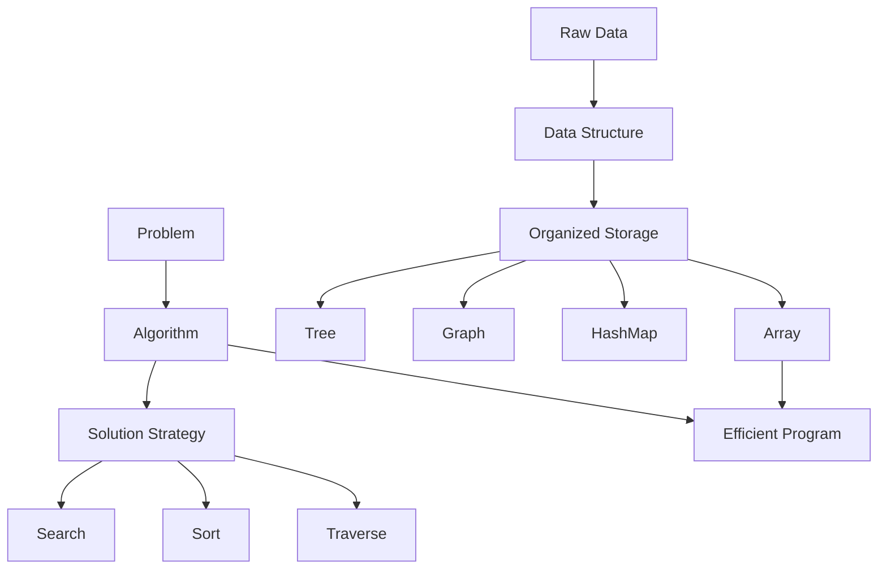

---

### 📊 Key Definitions Table

| Term | Definition | Example |
|------|-----------|---------|
| **Data** | Raw facts/information | `42`, `"Hello"`, `true` |
| **Data Structure** | Way to organize data | Array, Stack, Tree |
| **Algorithm** | Steps to solve a problem | Binary Search, QuickSort |
| **DSA** | DS + Algorithm combined | HashMap + Binary Search |
| **Program** | Algorithm in code | Java / JS implementation |

---

> [!NOTE]
> DSA is **language-independent**. The concepts are identical whether you code in Java, JavaScript, Python, or C++. This book teaches both **Java and JavaScript** for every concept.

> [!IMPORTANT]
> In interviews, you are NOT just asked to "write code." You are asked to write **efficient code**. That efficiency comes ONLY from knowing the right **Data Structure + Algorithm** combination.

> [!TIP]
> Shortcut to remember: **Data Structure = Container, Algorithm = Instructions, DSA = Container + Instructions = Efficient Solution** 🎯

<a href="#chapter-index-table-1">Go to Top 🔝</a>

---

<a id="12-why-dsa-matters"></a>

## 1.2 Why DSA Matters

### 🧠 Introduction

> *"Bhai, main toh web dev karunga. Mujhe DSA kyun chahiye?"*

This is the **#1 most asked question** by beginners. Let's destroy this myth with real numbers.

---

### 🔥 Motivation — Real Scenarios

#### 📱 Scenario 1: Instagram's Feed Algorithm
```
Instagram has 500 million daily active users.
Each user follows ~300 people.
Each post must be: ranked + filtered + personalized

Without DSA → Server crashes in seconds
With DSA    → Billions of operations per second ✅
```

#### 🗺️ Scenario 2: Google Maps
```
Delhi to Mumbai — millions of roads exist.

Without DSA: Check every possible road → Takes YEARS
With Dijkstra's (Graph Algorithm) → Answer in milliseconds ✅
```

#### 🛒 Scenario 3: Amazon Cart
```
You add items to cart.
Amazon has 1 billion product entries.

Without DSA: Linear search through 1B items → Slow
With HashMap → Find your cart in O(1) — INSTANT ✅
```

---

### 🎨 Visual — Why DSA Matters

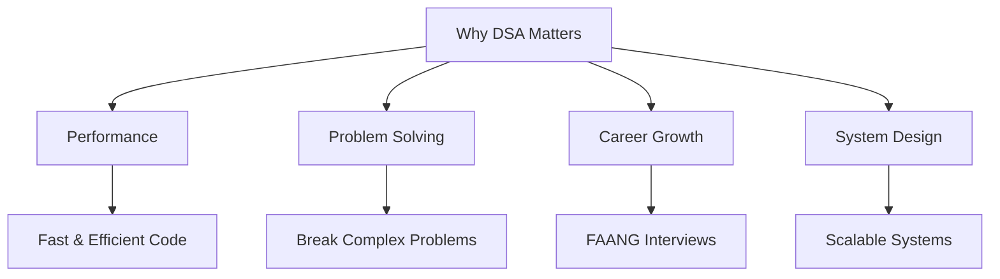

---

### 📊 With DSA vs Without DSA

| Operation | Without DSA | With DSA | Difference |
|-----------|------------|---------|-----------|
| Find in 1M records | O(n) = 1,000,000 steps | O(log n) = 20 steps | **50,000x faster** |
| Sort 1M records | O(n²) = 10¹² ops | O(n log n) = 20M ops | **50,000x faster** |
| Shortest path | Exponential | O(E log V) Dijkstra | **Astronomical** |
| Autocomplete search | O(n) per char | O(L) with Trie | **Real-time vs lag** |
| Top K elements | O(n log n) sort | O(n log k) Heap | **Significant** |

---

### 💡 The 3 Core Pillars — Why DSA Matters

#### 1️⃣ Efficiency at Scale
```
Bad Code:   Find name in 1M users → check one by one → 1M comparisons
Good Code:  Binary Search → 20 comparisons MAX (log₂ 1,000,000 ≈ 20)

The difference = the difference between
a 10-second page load and an instant response.
```

#### 2️⃣ Problem-Solving Mindset
DSA trains your brain to:
- **Decompose** big problems into smaller manageable pieces
- **Recognize patterns** across completely different problems
- **Plan before coding** → Better engineers think first

#### 3️⃣ Career & Interview Gateway
```
Google    ✅ Requires DSA
Amazon    ✅ Requires DSA
Microsoft ✅ Requires DSA
Flipkart  ✅ Requires DSA
Zomato    ✅ Requires DSA
Razorpay  ✅ Requires DSA

No DSA knowledge = No entry to top companies
```

> [!IMPORTANT]
> The difference between **O(n²) and O(n log n)** on 1 million elements:
> - O(n²) → 1,000,000,000,000 operations → **Hours**
> - O(n log n) → 20,000,000 operations → **Milliseconds**
>
> This is not theoretical. This is why Amazon's servers don't crash on sale day.

> [!TIP]
> **Hinglish Gyaan:** DSA ko boring mat samjho. Har ek problem ek puzzle hai. Jab solve hota hai — woh satisfaction alag hi hoti hai. Ek baar addiction laga toh phir roz solve karoge 🔥

<a href="#chapter-index-table-1">Go to Top 🔝</a>

---

<a id="13-real-world-applications"></a>

## 1.3 Real-World Applications

### 🧠 Introduction

Every app you use daily is **secretly powered by DSA**. Let's expose the DSA behind your favorite products.

---

### 🎨 Applications Overview

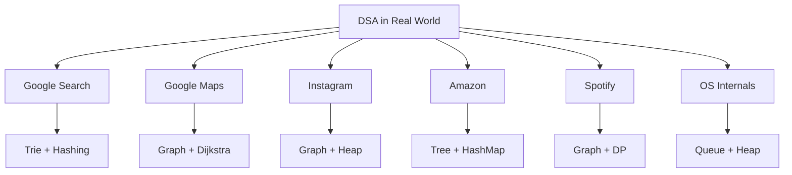

---

### 🔍 Product → DSA Mapping

#### 🔎 1. Google Search
| Feature | DSA Used | Why |
|---------|---------|-----|
| Autocomplete | **Trie** | Prefix matching in O(L) |
| Page Ranking | **Graph (PageRank)** | Web = graph of pages |
| Recent search cache | **LRU Cache (HashMap + DLL)** | O(1) eviction |
| Spell check | **Edit Distance (DP)** | Min operations to fix word |

#### 📍 2. Google Maps
| Feature | DSA Used | Why |
|---------|---------|-----|
| Shortest route | **Dijkstra (Graph)** | Weighted shortest path |
| All routes | **DFS / BFS** | Explore all paths |
| Live traffic | **Dynamic Graph** | Real-time edge weight update |
| ETA | **Greedy + DP** | Estimate optimal path |

#### 📱 3. Instagram / Facebook
| Feature | DSA Used | Why |
|---------|---------|-----|
| Friend suggestions | **Graph BFS** | 2nd-degree connections |
| News feed ranking | **Heap (Priority Queue)** | Top-scored posts first |
| Trending hashtags | **HashMap + Heap** | Frequency + top-K |
| Story order | **Sorting** | Recency + engagement |

#### 🛒 4. Amazon / Flipkart
| Feature | DSA Used | Why |
|---------|---------|-----|
| Product search | **Trie + Inverted Index** | Fast keyword lookup |
| Price filter | **BST / Segment Tree** | Range queries |
| Cart | **Linked List / Array** | Dynamic item list |
| Recommendations | **Graph (Collab Filter)** | User-item graph |

#### 🎵 5. Spotify / YouTube
| Feature | DSA Used | Why |
|---------|---------|-----|
| Playlist | **Doubly Linked List** | Next/Previous O(1) |
| Recommendations | **Graph + DP** | Similar user paths |
| Buffering | **Queue** | Sequential data streaming |
| Shuffle | **Fisher-Yates Array** | Random permutation |

---

### 🏥 DSA Beyond Tech

| Domain | Application | DSA Used |
|--------|------------|---------|
| **Medical** | Patient scheduling | Priority Queue |
| **Finance** | Stock order book | Heap + BST |
| **Gaming** | NPC pathfinding | A* (Graph) |
| **Compiler** | Code parsing | Stack + Tree |
| **OS** | CPU scheduling | Queue + Heap |
| **Network** | Packet routing | Graph (Bellman-Ford) |
| **DNA** | Sequence matching | Dynamic Programming |
| **Databases** | Index lookup | B-Tree |

> [!NOTE]
> Jab bhi tum koi app use karte ho — background mein ek programmer ka likha DSA code silently chal raha hota hai. Tum wahi programmer ban sakte ho 🔥

<a href="#chapter-index-table-1">Go to Top 🔝</a>

---

<a id="14-types-of-data-structures"></a>

## 1.4 Types of Data Structures

### 🧠 Introduction

Data Structures are like **specialized containers**. Different containers for different types of data and operations. Choosing the wrong container = inefficiency at scale.

---

### 🎨 Complete Classification

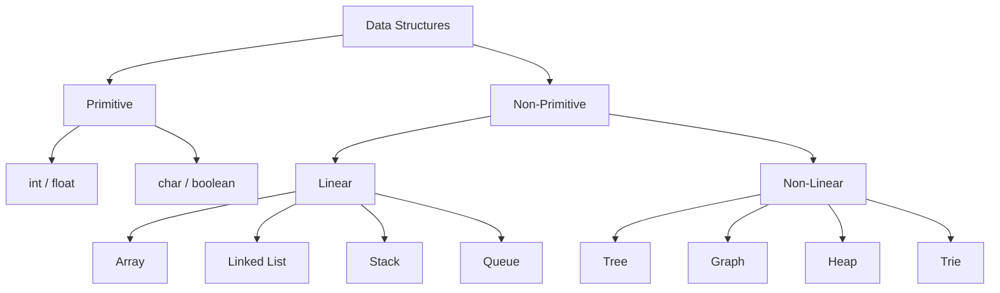

---

### 🔷 Linear Data Structures — Deep Dive

#### 1. Array
```
Index:  [0]  [1]  [2]  [3]  [4]
Value:  [10] [20] [30] [40] [50]

Memory: Contiguous blocks
Access: arr[2] = 30 → O(1) direct
Insert: Shift elements → O(n)
Delete: Shift elements → O(n)
```
**Best For:** Fixed size data, index-based access, math operations

#### 2. Linked List
```
[10|→] → [20|→] → [30|→] → [40|null]
 Node       Node      Node     Last Node

Each node = data + pointer to next
No random access → must traverse from head
Insert at head: O(1) | Insert at middle: O(n)
```
**Best For:** Dynamic size, frequent insertions at head/tail

#### 3. Stack (LIFO — Last In First Out)
```
     ┌─────┐  ← TOP (Push/Pop here)
     │ 30  │
     │ 20  │
     │ 10  │
     └─────┘  ← BOTTOM

Operations: push() pop() peek() → all O(1)
```
**Best For:** Undo/Redo, Browser back, Recursion call stack, Expression parsing

#### 4. Queue (FIFO — First In First Out)
```
FRONT → [10][20][30][40] ← REAR

Enqueue from REAR  → O(1)
Dequeue from FRONT → O(1)
```
**Best For:** Print spooler, BFS traversal, OS scheduling, Request handling

---

### 🔷 Non-Linear Data Structures — Deep Dive

#### 1. Tree
```
              [Root: 1]
             /         \
         [2]           [3]
        /   \             \
      [4]   [5]          [6]

Height = 3 | Leaf nodes = 4, 5, 6
```
**Best For:** File systems, DOM tree, Decision trees, Hierarchical data

#### 2. Graph
```
    A ——— B
    |     |
    C ——— D
    |
    E

Nodes = {A,B,C,D,E}
Edges = connections between nodes
Directed / Undirected | Weighted / Unweighted
```
**Best For:** Maps, Social networks, Dependency graphs, Internet topology

#### 3. Heap
```
        [1]            ← MIN element at root (Min Heap)
       /   \
     [3]   [2]
    / \   /
  [7] [4][5]

Complete Binary Tree + Heap property
Insert/Delete: O(log n) | Get Min/Max: O(1)
```
**Best For:** Priority Queue, Top-K elements, Dijkstra, Scheduling

#### 4. Trie (Prefix Tree)
```
         [ ]  ← root
        / | \
       a  b  c
      /|    \
     n  p    a
     |        \
     t         t (cat)
  (ant)(apt)

Each path = a word prefix
Search: O(L) where L = word length
```
**Best For:** Autocomplete, Spell checker, IP routing, Dictionary

---

### 📊 Master Reference Table

| Data Structure | Access | Search | Insert | Delete | Best Use Case |
|----------------|--------|--------|--------|--------|--------------|
| Array | O(1) | O(n) | O(n) | O(n) | Index access, math |
| Linked List | O(n) | O(n) | O(1) head | O(1) head | Dynamic size |
| Stack | O(n) | O(n) | O(1) | O(1) | LIFO operations |
| Queue | O(n) | O(n) | O(1) | O(1) | FIFO, BFS |
| **HashMap** | **O(1)** | **O(1)** | **O(1)** | **O(1)** | **Fast lookup** |
| BST | O(log n) | O(log n) | O(log n) | O(log n) | Sorted data |
| Heap | O(1) top | O(n) | O(log n) | O(log n) | Priority, Top-K |
| Graph | — | O(V+E) | O(1) | O(E) | Networks |
| Trie | O(L) | O(L) | O(L) | O(L) | Prefix search |

---

### 🔑 How to Choose the Right Data Structure?

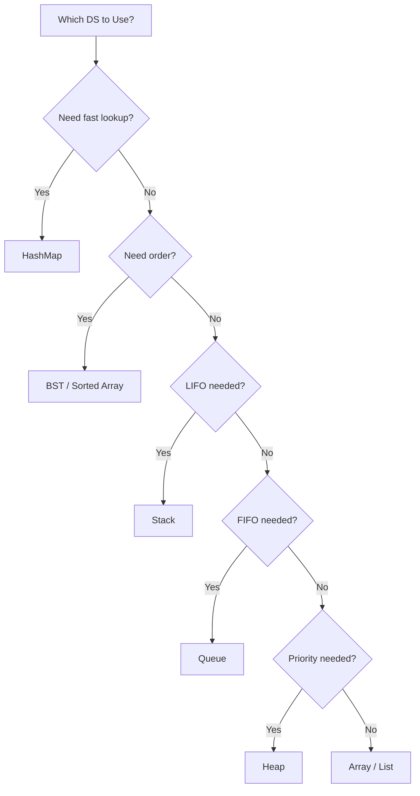

> [!IMPORTANT]
> **The Golden Interview Question:** "Which data structure would you use for X?"
>
> Always think:
> 1. Fast lookup by key? → **HashMap**
> 2. Ordered + fast search? → **BST**
> 3. LIFO? → **Stack**
> 4. FIFO? → **Queue**
> 5. Min/Max repeatedly? → **Heap**
> 6. Prefix matching? → **Trie**
> 7. Network/Relationships? → **Graph**

<a href="#chapter-index-table-1">Go to Top 🔝</a>

---

<a id="15-types-of-algorithms"></a>

## 1.5 Types of Algorithms

### 🧠 Introduction

An algorithm is a **strategy**. Different problems demand different strategies. Knowing WHICH strategy to apply is what separates a good programmer from a great one.

> **Doctor Analogy:** A doctor doesn't give the same medicine for every disease. Similarly, a programmer doesn't apply the same algorithm to every problem.

---

### 🎨 Algorithm Classification

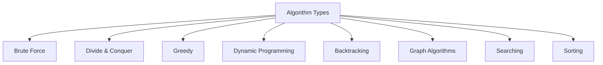

---

### 🔷 Detailed Algorithm Breakdown

#### 1. 💪 Brute Force
- **Strategy:** Try ALL possible solutions, pick the correct one
- **Pros:** Always correct, easy to code
- **Cons:** Extremely slow for large inputs
- **Use When:** Input is tiny, or as a starting point

```
Example: Find max element in [3, 1, 4, 1, 5, 9, 2, 6]
Brute: Scan every element, track max
Time:  O(n) — this is actually optimal for unsorted data
```

#### 2. ✂️ Divide & Conquer
- **Strategy:** Split → Solve each part → Combine results
- **Use When:** Problem has independent sub-problems
- **Examples:** Merge Sort, Quick Sort, Binary Search

```
Merge Sort on [8, 3, 1, 5]:
Split:   [8,3] [1,5]
Split:   [8][3] [1][5]
Merge:   [3,8]  [1,5]
Merge:   [1,3,5,8] ✅
Time: O(n log n)
```

#### 3. 🤑 Greedy
- **Strategy:** Make the **locally optimal** choice at each step
- **Use When:** Local optimal = Global optimal (not always!)
- **Examples:** Activity Selection, Fractional Knapsack, Huffman Coding

```
Coin Change (Greedy): Amount = 36
Coins: [25, 10, 5, 1]
Pick:  25 → remaining 11
Pick:  10 → remaining 1
Pick:  1  → done
Result: 3 coins [25, 10, 1] ✅
```

> [!NOTE]
> Greedy **doesn't always work!**
> Coins [1, 3, 4], Amount = 6
> Greedy: 4+1+1 = 3 coins ❌
> Optimal: 3+3 = 2 coins ✅ (use DP here)

#### 4. 🧮 Dynamic Programming
- **Strategy:** Break into sub-problems + **memorize results** (avoid recomputation)
- **Use When:** Overlapping sub-problems + Optimal substructure
- **Examples:** Fibonacci, Knapsack, LCS, Edit Distance

```
Fibonacci Naive:
fib(5) calls fib(4) + fib(3)
fib(4) calls fib(3) + fib(2)  ← fib(3) computed TWICE!
Time: O(2^n)

Fibonacci DP (Memoize):
Store fib(3) once → never recompute
Time: O(n) 🚀
```

#### 5. 🔙 Backtracking
- **Strategy:** Try → If fails → Undo → Try next option
- **Use When:** Need ALL possible solutions (permutations, combinations)
- **Examples:** N-Queens, Sudoku Solver, Word Search

```
N-Queens (4x4):
Place queen at row 0, col 0 → ok
Place queen at row 1 → col 0? No. col 1? No. col 2? Yes
...if stuck → BACKTRACK → try previous row different col
```

#### 6. 🕸️ Graph Algorithms
- **Strategy:** Traverse nodes & edges of a graph
- **BFS:** Level by level → Shortest path (unweighted)
- **DFS:** Deep dive → Cycle detection, Topological sort
- **Dijkstra:** Shortest path (weighted)
- **Prim/Kruskal:** Minimum Spanning Tree

---

### 📊 Algorithm Selection Guide

| Problem Pattern | Algorithm | Time Complexity |
|----------------|-----------|----------------|
| Find element | Binary Search | O(log n) |
| Sort data | Merge Sort | O(n log n) |
| Shortest path (unweighted) | BFS | O(V + E) |
| Shortest path (weighted) | Dijkstra | O(E log V) |
| All combinations | Backtracking | O(2^n) |
| Best local choice | Greedy | Varies |
| Overlapping subproblems | DP | O(n) to O(n²) |
| Independent sub-problems | Divide & Conquer | O(n log n) |

> [!TIP]
> **Algorithm Interview Mental Checklist:**
> - "Can I sort first?" → Often simplifies 80% of problems
> - "Have I seen this subproblem before?" → Think DP
> - "Do I need ALL solutions?" → Backtracking
> - "Best step-by-step choice?" → Greedy
> - "Split into halves?" → Divide & Conquer
> - "Network/path problem?" → Graph algorithms

<a href="#chapter-index-table-1">Go to Top 🔝</a>

---

<a id="16-learning-roadmap"></a>

## 1.6 Learning Roadmap

### 🧠 Introduction

> *"Most people fail DSA not because it's hard, but because they study in the WRONG ORDER."*

Studying DP before understanding Recursion = Building a skyscraper without a foundation.

---

### 🗺️ The 6-Phase DSA Roadmap

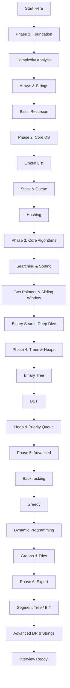

---

### 📅 Study Plans

#### 🗓️ 3-Month Intensive Plan

| Month | Topics | Weekly Goal |
|-------|--------|------------|
| **Month 1** | Complexity + Arrays + Strings + Recursion + Linked List | 15-20 problems/week |
| **Month 2** | Stack/Queue + Hashing + Sorting + Binary Search + Two Pointers | 20-25 problems/week |
| **Month 3** | Trees + BST + Heap + Backtracking + Greedy + DP basics | 20-25 problems/week |

#### 🗓️ 6-Month Balanced Plan

| Month | Topics | LeetCode Target |
|-------|--------|----------------|
| 1 | Foundation + Arrays | 30 Easy |
| 2 | Recursion + LL + Stack/Queue | 20 Easy + 10 Medium |
| 3 | Searching/Sorting + Hashing | 20 Medium |
| 4 | Trees + BST + Heap | 25 Medium |
| 5 | Backtracking + Greedy + DP | 20 Medium + 5 Hard |
| 6 | Graphs + Advanced + Mocks | 10 Hard + Full Revision |

---

### 🎯 Topic Priority for Placements

| Priority | Topics | Interview Frequency |
|----------|--------|-------------------|
| 🔴 Critical | Arrays, HashMap, Two Pointers, String | 90%+ |
| 🔴 Critical | Binary Search, Sliding Window, Recursion | 85%+ |
| 🟠 High | Linked List, Stack, Queue, Trees | 80%+ |
| 🟠 High | Sorting, DP (Basic), Backtracking | 75%+ |
| 🟡 Medium | Graphs, Heaps, BST, Greedy | 65%+ |
| 🟢 Good | Tries, Advanced DP | 40%+ |
| 🔵 Expert | Segment Tree, DSU, Bitmask DP | 20%+ |

---

### ✅ Daily Study Formula

```
╔══════════════════════════════════════════╗
║      DAILY DSA ROUTINE (2-3 hours)       ║
╠══════════════════════════════════════════╣
║ 30 min → Study concept + Theory          ║
║ 30 min → Dry run examples by hand        ║
║ 60 min → Solve 2-3 problems              ║
║ 30 min → Review solutions + Notes        ║
╚══════════════════════════════════════════╝
```

> [!IMPORTANT]
> **Don't skip the order!** Each topic builds on the previous one.
> Arrays → Recursion → Linked List → Tree → Graph → DP
> Jumping to DP without understanding Recursion = **Guaranteed failure in interviews**

> [!TIP]
> **The 3-Day Revision Rule:** After learning a topic, revisit it on:
> - Day 1 (same day review)
> - Day 3
> - Day 7
>
> This builds long-term memory through spaced repetition 🧠

<a href="#chapter-index-table-1">Go to Top 🔝</a>

---

<a id="17-how-to-study-dsa"></a>

## 1.7 How to Study DSA

### 🧠 Introduction

Most people study DSA **incorrectly** and then wonder why they fail interviews. This section gives you the exact framework that works.

---

### 🚫 Wrong Way vs ✅ Right Way

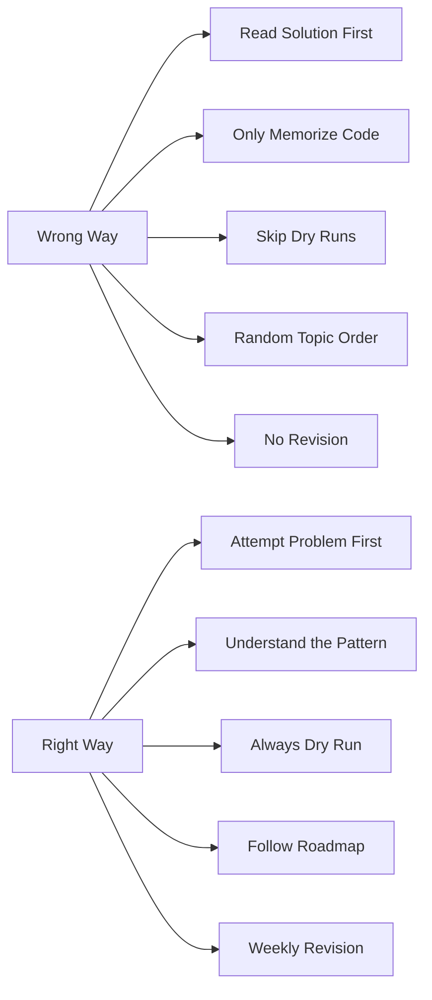

---

### 🔷 The STAR Problem-Solving Method

```
S — Study the Problem
    → Read 3 times, note Input/Output/Constraints
    → Identify edge cases before coding

T — Think the Approach
    → Start ALWAYS with Brute Force
    → Then think: Can I do Better? Optimal?
    → Recognize pattern (sliding window? DP? graph?)

A — Apply Dry Run
    → Trace your algorithm on paper with example
    → Verify on 2-3 examples including edge cases

R — Review & Code
    → Write clean, readable code
    → Test against your dry run
    → Analyze time & space complexity
```

---

### 🔷 Problem-Solving Framework — Step by Step

```
Step 1: UNDERSTAND
  □ Read problem completely (not just first line)
  □ Note: What is input? What is expected output?
  □ Note: Constraints (n ≤ 10^5? Use O(n log n) or better)
  □ Ask: What are edge cases? (empty, single, duplicates)

Step 2: PLAN
  □ Don't touch keyboard yet
  □ Think: "What pattern is this?"
  □ Start with simplest brute force
  □ Gradually optimize

Step 3: DRY RUN
  □ Take small example: [3, 1, 4, 1, 5]
  □ Trace step by step on paper
  □ Verify output matches expected
  □ Try edge case: [], [1], [same, same, same]

Step 4: CODE
  □ Translate dry run to code
  □ Meaningful variable names
  □ Add brief comments for logic
  □ Use helper functions for clarity

Step 5: TEST & OPTIMIZE
  □ Run on your dry run examples
  □ Check edge cases
  □ State time & space complexity
  □ Ask: "Can I optimize further?"
```

---

### 📚 Resource Strategy

| Resource | Purpose | When to Use |
|----------|---------|------------|
| **This Book** | Concept + Theory + Code | Learning phase |
| **LeetCode** | Practice problems | Daily |
| **Cheat Sheets (here)** | Quick revision | Weekly |
| **Pramp / Interviewing.io** | Mock interviews | After 2 months |
| **Codeforces / CodeChef** | Competitive problems | After strong basics |

---

### 🧠 How Many Problems to Solve?

```
Quality >> Quantity

Target for Placements:
  Easy:   100–150 problems  (Build confidence)
  Medium: 150–200 problems  (Core interview level)
  Hard:    30–50 problems   (FAANG preparation)
  Total:  ~300–400 deeply understood problems

>> Understanding 300 > Skimming 1000 solutions <<
```

---

### 💡 Power Tips for DSA Mastery

1. **Never copy-paste** → Always type the code → Builds muscle memory
2. **Solve same problem multiple ways** → Builds approach flexibility
3. **Explain aloud** → "Rubber duck debugging" → Prepares for interviews
4. **Group similar problems** → Pattern recognition builds naturally
5. **Track a mistake log** → Record what went wrong → Don't repeat errors
6. **Sleep on hard problems** → Subconscious problem solving is real

> [!TIP]
> **Most Effective DSA Technique:**
> After solving a problem today → Come back tomorrow and solve it **again without looking at your solution**.
> - Solved it? → Concept is internalized ✅
> - Couldn't solve? → Revisit and study more ↩️
> This is called **Active Recall** — the #1 most researched learning technique.

> [!NOTE]
> **Consistency beats intensity.**
> 1 hour daily × 180 days = 180 hours of practice
> 8 hours × 1 day then nothing = Forgotten in a week
> DSA is a skill built like a **muscle** — progressive daily training.

<a href="#chapter-index-table-1">Go to Top 🔝</a>

---

<a id="18-dsa-in-placements-and-interviews"></a>

## 1.8 DSA in Placements & Interviews

### 🧠 Introduction

Understanding **how companies structure their DSA interviews** gives you a strategic edge. Let's decode the entire process.

---

### 🏢 Typical Interview Structure

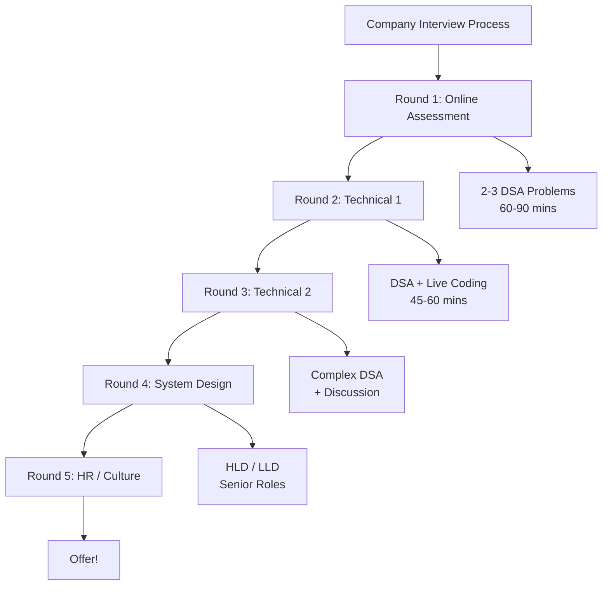

---

### 🏆 Company-wise Expectations

| Company | Difficulty | Key Topics | Rounds |
|---------|-----------|-----------|--------|
| **Google** | Hard | DP, Graphs, Trees, System Design | 5–6 |
| **Amazon** | Medium–Hard | Arrays, DP, Trees, Leadership Principles | 4–5 |
| **Microsoft** | Medium | Trees, Arrays, Strings, DP | 4–5 |
| **Meta** | Hard | Graphs, DP, Trees, Recursion | 4–5 |
| **Flipkart** | Medium | Arrays, DP, Graphs | 3–4 |
| **Zomato/Swiggy** | Medium | Arrays, Strings, Hashing | 3–4 |
| **Razorpay** | Medium | DS, Algorithms, System Design | 3–4 |
| **TCS/Infosys** | Easy | Basic DS, Logic, SQL | 2–3 |

---

### 📊 Topic Frequency in Interviews

```
📊 Based on 10,000+ interview reports:

Arrays & Strings     ████████████████████ 95%
HashMap / HashSet    ████████████████████ 90%
Two Pointers         ███████████████████  85%
Binary Search        ██████████████████   82%
Trees & BST          █████████████████    78%
Dynamic Programming  ████████████████     72%
Linked List          █████████████        65%
Stack & Queue        ████████████         60%
Graphs               ██████████           55%
Heap                 █████████            50%
Backtracking         ████████             45%
Tries                ████                 25%
```

---

### 🔑 What Interviewers ACTUALLY Evaluate

```
1. THOUGHT PROCESS (Weight: 40%)
   → Do you analyze before coding?
   → Can you break down complex problems?
   → Do you consider edge cases proactively?

2. COMMUNICATION (Weight: 25%)
   → Do you explain your approach clearly?
   → Do you talk through your logic?
   → Are you collaborative when given hints?

3. CODE QUALITY (Weight: 20%)
   → Is code clean and readable?
   → Meaningful variable names?
   → Proper edge case handling?

4. OPTIMIZATION (Weight: 15%)
   → Do you know complexity of your solution?
   → Can you improve when asked?
   → Do you recognize trade-offs?
```

---

### 📋 Interview Day Checklist

```
✅ BEFORE CODING:
□ Read problem FULLY before speaking
□ Ask clarifying questions (input range? duplicates? sorted?)
□ State brute force approach first
□ Get approval → then optimize
□ Dry run with example on paper/screen

✅ WHILE CODING:
□ Talk through every decision
□ Use meaningful variable names
□ Handle edge cases explicitly
□ Write modular, clean code

✅ AFTER CODING:
□ Trace through your code with example
□ State time & space complexity
□ Suggest possible optimizations
□ Ask: "Does this solution meet your requirements?"

🚫 NEVER DO:
□ Silent coding (no explanation)
□ Ignore edge cases
□ Wrong complexity analysis
□ Give up without attempting
□ Submit untested solution
```

> [!IMPORTANT]
> **The #1 Interview Mistake:**
> Jumping to code immediately without thinking.
> Interviewers WANT to see your thinking process.
> **5 minutes of structured thinking aloud = Better impression than 5 minutes of silent typing.**

<a href="#chapter-index-table-1">Go to Top 🔝</a>

---

<a id="19-dsa-vs-development"></a>

## 1.9 DSA vs Development

### 🧠 Introduction

> *"Main developer banunga, DSA kyun seekhoon?"*

Let's settle this debate once and for all with facts, scenarios, and career reality.

---

### 🔷 Core Difference

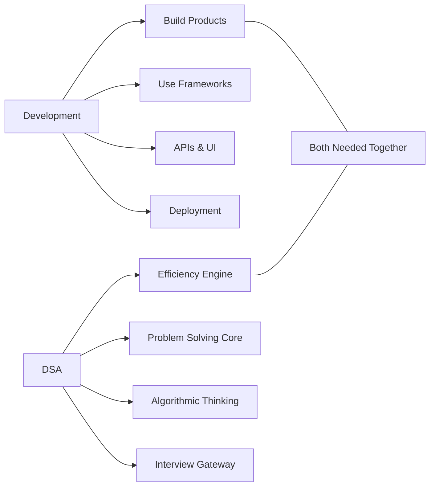

---

### 🏗️ Real Developer Scenario — Zomato App

> You're building a food delivery app like Zomato. Let's see where DSA appears:

| Feature | Dev Skill Needed | DSA Needed |
|---------|----------------|-----------|
| Show restaurant list | React/Android UI | **Sorting Algorithm** |
| Search restaurants | REST API calls | **Trie / HashMap** |
| Find nearest restaurant | Google Maps API | **Graph (Dijkstra)** |
| Handle 50,000 orders/hour | Backend architecture | **Queue + Load Balancer** |
| "People also ordered" | ML integration | **Graph Collab Filtering** |
| Live order tracking | WebSocket | **Queue + Event Loop** |
| Promo code validation | API call | **Hashing (O(1) lookup)** |

> **Verdict:** A dev without DSA CAN build the app. A dev WITH DSA builds an app that **scales to 10 million users** without crashing. 🚀

---

### 🔑 Differences Comparison

| Aspect | Pure Development | DSA |
|--------|----------------|-----|
| **Output** | Working product/feature | Efficient algorithm |
| **Tools** | Frameworks, libraries, APIs | Logic, patterns, data structures |
| **Skill type** | Tool-based | Concept-based |
| **Learning** | Project-driven | Theory + Practice |
| **Interview role** | Secondary | Primary (top companies) |
| **Scalability** | Framework handles some | You handle the core |

---

### 💡 Career Path Reality

```
PATH 1: Service Companies (TCS, Wipro, Cognizant)
→ DSA: Easy level (basic arrays, sorting, logic)
→ More focus: Domain knowledge, frameworks, SQL
→ Salary range: ₹3–8 LPA (fresher)

PATH 2: Product Companies (Zomato, Meesho, Razorpay)
→ DSA: Medium level mandatory
→ Both dev skills + problem solving needed
→ Salary range: ₹15–30 LPA

PATH 3: FAANG & Top Tier (Google, Amazon, Microsoft)
→ DSA: Medium–Hard mandatory
→ System design also required (senior roles)
→ Salary range: ₹40–1.5 Cr+ PA

PATH 4: Competitive Programming & Research
→ DSA: Expert level
→ ICPC, research roles, trading firms
→ Salary range: ₹50L–3Cr+
```

> [!NOTE]
> **The Golden Insight:**
> Even pure frontend/backend developers write better code with DSA knowledge.
> Choosing HashMap vs Array in your React state = O(1) vs O(n) per lookup.
> At 100 users → no difference. At 1 million users → your server bills explode without DSA. 💸

> [!TIP]
> **Career Advice:** Don't choose between Dev and DSA. Learn **both in parallel**.
> - Morning: DSA problems (1-2 problems)
> - Evening: Build projects (apply DSA in real code)
>
> This combination = Maximum market value + Top company access + Better salary 💰

<a href="#chapter-index-table-1">Go to Top 🔝</a>

---

<a id="110-where-dsa-is-used"></a>

## 1.10 Where DSA is Used

### 🧠 Introduction

The answer to "where is DSA used?" is simpler than you think: **everywhere software exists.**

---

### 🌐 DSA Usage Landscape

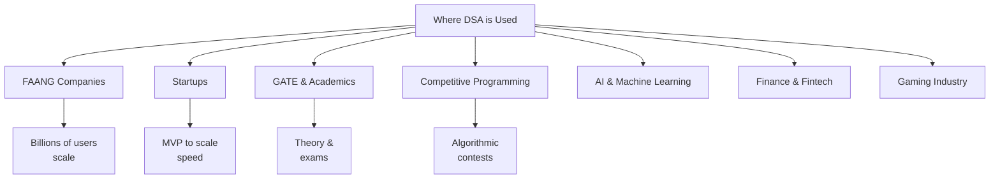

---

### 🏢 FAANG — DSA at Extreme Scale

#### Google
```
Products:  Search, Maps, YouTube, Gmail, Chrome
Scale:     8.5 billion searches/day
DSA Used:
  → PageRank: Graph algorithm (ranks web pages)
  → Search: Trie (autocomplete) + Inverted index
  → Maps: Dijkstra (shortest path)
  → YouTube: Collaborative Filtering (Graph + ML)
Interview: Hard level DSA required
```

#### Amazon
```
Products:  E-commerce, AWS, Alexa, Prime
Scale:     1.5 million orders/day
DSA Used:
  → Product search: Trie + Inverted Index
  → Recommendations: Graph (collab filtering)
  → AWS: Tree-based resource scheduling
  → Warehouse: Shortest path for robots
Interview: Medium–Hard DSA required
```

#### Meta (Facebook/Instagram/WhatsApp)
```
Products:  FB, Instagram, WhatsApp, Messenger
Scale:     3 billion monthly active users
DSA Used:
  → Friend suggestions: BFS on social graph
  → News Feed: Heap (ranked prioritization)
  → Messenger: Queue + Graph routing
  → Photo matching: Tree-based ML features
Interview: Hard DSA required
```

---

### 🚀 Startups — DSA for Survival & Growth

```
Early Stage (0 → 10K users):
  → DSA less critical
  → Ship fast, iterate
  → Basic DS sufficient

Growing Stage (10K → 1M users):
  → Bad O(n²) code = Server timeouts
  → HashMap vs List = Customer experience
  → DSA becomes critical for retention

Scale Stage (1M+ users):
  → Every millisecond costs ₹₹₹
  → O(n log n) vs O(n²) = Millions in server costs
  → DSA expertise = Competitive advantage

Real Example — Zerodha:
  → Handles millions of stock trades per second
  → Segment Trees: Range queries on stock data
  → Heaps: Order book management (buy/sell orders)
  → Without DSA: System crashes during market open
```

---

### 🏛️ GATE — DSA in Academics

| GATE Topic | DSA Relevance | Marks Weight |
|-----------|--------------|-------------|
| Algorithms | Sorting, Searching, DP, Greedy | 12–15% |
| Data Structures | Arrays, Trees, Graphs, Hash | 10–12% |
| Theory of Computation | String Algorithms | 8–10% |
| OS | Scheduling (Queue/Heap) | Related |
| Databases | B-Tree, Indexing | Related |

#### Top GATE DSA Topics:
```
1. Recurrence Relations + Master Theorem
2. Sorting: Stability, Time/Space complexity
3. Tree Traversals: Inorder, Preorder, Postorder
4. Graph: BFS, DFS, Topological Sort, Dijkstra
5. Dynamic Programming: Classic problems
6. Hashing: Collision handling
7. AVL Trees + B-Trees
```

---

### ⚔️ Competitive Programming

```
Platforms: Codeforces, CodeChef, AtCoder, LeetCode, USACO
Events:    ICPC, Google Kickstart, Meta Hacker Cup

Expert-Level DSA for CP:
  → Segment Tree + Lazy Propagation
  → Fenwick Tree (Binary Indexed Tree)
  → Heavy-Light Decomposition
  → Suffix Array / Automaton
  → Bitmask DP
  → Advanced Graph (SCC, Tarjan's)
```

---

### 🔬 AI & Machine Learning

| AI Concept | DSA Behind It |
|-----------|-------------|
| Neural Networks | Matrix/Array operations |
| Decision Trees | Tree Data Structure |
| K-Nearest Neighbors | Sorting + Distance calc |
| Graph Neural Networks | Graph + BFS/DFS |
| Recommendation Systems | Graph + DP |
| Natural Language Processing | Trie + String algorithms |
| Computer Vision | 2D Array operations |

---

### 💡 Final Answer

```
╔═══════════════════════════════════════════════════════╗
║                WHERE IS DSA USED?                     ║
╠═══════════════════════════════════════════════════════╣
║  ✅ Every software product you use daily               ║
║  ✅ Every company that writes code                     ║
║  ✅ Every CS examination (GATE, GRE, etc.)             ║
║  ✅ Every technical interview for any role             ║
║  ✅ Every system that handles data at scale            ║
║  ✅ AI, ML, Gaming, Finance, Medical, Telecom          ║
╠═══════════════════════════════════════════════════════╣
║  The real question: WHERE is DSA NOT used?            ║
║  Answer: Nowhere. It's absolutely universal.          ║
╚═══════════════════════════════════════════════════════╝
```

<a href="#chapter-index-table-1">Go to Top 🔝</a>

---

<a id="interview-questions-ch1"></a>

## 🎯 Interview Questions — Chapter 1

### 🔥 Top Asked Conceptual Questions

| # | Question | Key Points in Answer |
|---|---------|---------------------|
| 1 | What is a Data Structure? | Way to organize/store data for efficient access & modification |
| 2 | What is an Algorithm? | Finite, well-defined steps to solve a problem with defined input/output |
| 3 | Why do we need DSA? | Efficiency, scalability, performance at scale |
| 4 | Array vs Linked List? | Contiguous vs non-contiguous, O(1) access vs O(n) access |
| 5 | Linear vs Non-Linear DS? | Sequential traversal vs hierarchical/network structure |
| 6 | What is Big O notation? | Upper bound of worst-case time complexity |
| 7 | Which DS gives O(1) average lookup? | HashMap / HashTable |
| 8 | Stack vs Queue? | LIFO vs FIFO — different order of processing |
| 9 | When DP vs Greedy? | DP: overlapping subproblems; Greedy: local = global optimal |
| 10 | What is recursion? | Function calling itself with base case to avoid infinite loop |
| 11 | Which sorting algorithm is best? | Depends on input — Merge sort O(n log n) stable; Quick sort avg O(n log n) |
| 12 | When to use a Heap? | When you repeatedly need min/max element — O(log n) ops |
| 13 | What is a Graph? | Collection of vertices and edges representing relationships |
| 14 | Trie vs HashMap for strings? | Trie: O(L) prefix ops; HashMap: O(L) exact match |
| 15 | What is amortized complexity? | Average cost per operation over a sequence of operations |

---

### 🏛️ GATE PYQ Style Questions

**Q1.** Which of the following data structures is used for implementing recursion?
- (A) Queue (B) Stack ✅ (C) Tree (D) Graph

**Q2.** The time complexity of Binary Search on a sorted array of n elements is:
- (A) O(n) (B) O(n²) (C) O(log n) ✅ (D) O(n log n)

**Q3.** Which data structure allows insertion and deletion from both ends?
- (A) Queue (B) Stack (C) Deque ✅ (D) Priority Queue

**Q4.** Dijkstra's algorithm is used to find:
- (A) Minimum Spanning Tree (B) Shortest Path ✅ (C) Topological Order (D) Cycle Detection

<a href="#chapter-index-table-1">Go to Top 🔝</a>

---

<a id="common-mistakes-ch1"></a>

## ❌ Common Mistakes — Chapter 1

| Mistake | Why It's Harmful | Correct Approach |
|---------|----------------|-----------------|
| Skipping DSA for "just development" | Miss top company opportunities | Learn both in parallel |
| Memorizing solutions blindly | Can't solve unseen problems | Understand the pattern deeply |
| Jumping to DP/Graphs first | Missing recursion/array foundation | Follow the roadmap strictly |
| Only reading, never coding | DSA needs hands-on muscle memory | Code every single concept |
| Comparing progress with others | Demotivating, everyone's pace differs | Track only your own growth |
| Giving up after wrong answer | Wrong answers = best learning moments | Analyze failure, fix, retry |
| Skipping dry runs | Bugs in logic go undetected | Always dry run before coding |
| Ignoring complexity analysis | Writing "working but slow" code | Always analyze after solving |
| Not doing revision | Forget what you learned quickly | Weekly spaced repetition |
| Solving only Easy problems | Medium/Hard are the interview standard | Push to Medium after basics |

<a href="#chapter-index-table-1">Go to Top 🔝</a>

---

<a id="summary-ch1"></a>

## 📝 Summary — Chapter 1

```
╔══════════════════════════════════════════════════════════════╗
║              CHAPTER 1 — KEY TAKEAWAYS                       ║
╠══════════════════════════════════════════════════════════════╣
║  1. DSA = Data Structures (storage) + Algorithms (process)  ║
║  2. DSA is the foundation of ALL software systems           ║
║  3. Linear DS: Array, LL, Stack, Queue                      ║
║  4. Non-Linear DS: Tree, Graph, Heap, Trie                  ║
║  5. Algorithm types: Brute, D&C, Greedy, DP, Backtracking   ║
║  6. Roadmap: Arrays → Recursion → LL → Trees → Graphs → DP ║
║  7. Always: Brute Force → Better → Optimal                  ║
║  8. DSA + Dev = Maximum career value                        ║
║  9. Consistency > Intensity in DSA learning                 ║
║  10. Quality > Quantity: 300 understood > 1000 memorized    ║
║  11. Interview formula: Think → Explain → Code → Test       ║
║  12. Top topic: Arrays/HashMap covers 90% of interviews     ║
╚══════════════════════════════════════════════════════════════╝
```

<a href="#chapter-index-table-1">Go to Top 🔝</a>

---

<a id="revision-sheet-ch1"></a>

## 🔁 Revision Sheet — Chapter 1

```
CHAPTER 1 — QUICK REVISION BULLETS

CORE DEFINITIONS:
□ DSA = Data Structure + Algorithm
□ Data Structure = Way to organize data
□ Algorithm = Finite steps to solve a problem
□ Time Complexity = How time grows with input size
□ Space Complexity = How memory grows with input size

LINEAR DATA STRUCTURES:
□ Array     → O(1) access | O(n) search/insert/delete
□ LinkedList→ O(n) access | O(1) insert/delete at head
□ Stack     → LIFO | push/pop O(1)
□ Queue     → FIFO | enqueue/dequeue O(1)

NON-LINEAR DATA STRUCTURES:
□ HashMap   → O(1) avg for all ops
□ BST       → O(log n) search/insert/delete
□ Heap      → O(1) get min/max | O(log n) insert/delete
□ Graph     → O(V+E) traversal
□ Trie      → O(L) insert/search (L = word length)

ALGORITHM TYPES:
□ Brute Force → Try all → Slow but correct
□ D&C         → Split → Solve → Combine
□ Greedy      → Local optimal each step
□ DP          → Store subproblem results
□ Backtracking→ Try → Fail → Undo → Retry

INTERVIEW FORMULA:
□ Read fully → Clarify → Brute Force → Optimize → Code → Test

STUDY FORMULA:
□ Roadmap order → Daily practice → Spaced revision
□ 1 hr daily > 8 hrs once per week
□ Attempt before reading solution
```

<a href="#chapter-index-table-1">Go to Top 🔝</a>

---

<a id="flashcards-ch1"></a>

## 🃏 Flashcards — Chapter 1

```
┌─────────────────────────────┐  ┌─────────────────────────────┐
│  Q: What is DSA?            │  │  A: Data Structures +       │
│                             │  │  Algorithms combined for     │
│                             │  │  efficient problem solving   │
└─────────────────────────────┘  └─────────────────────────────┘

┌─────────────────────────────┐  ┌─────────────────────────────┐
│  Q: LIFO data structure?    │  │  A: Stack                   │
│                             │  │  Last In → First Out        │
│                             │  │  push() / pop() → O(1)      │
└─────────────────────────────┘  └─────────────────────────────┘

┌─────────────────────────────┐  ┌─────────────────────────────┐
│  Q: O(1) avg lookup DS?     │  │  A: HashMap / HashTable     │
│                             │  │  Key → Value direct access  │
│                             │  │  Collisions handled by hash │
└─────────────────────────────┘  └─────────────────────────────┘

┌─────────────────────────────┐  ┌─────────────────────────────┐
│  Q: When to use DP?         │  │  A: When problem has:       │
│                             │  │  1. Overlapping subproblems │
│                             │  │  2. Optimal substructure    │
└─────────────────────────────┘  └─────────────────────────────┘

┌─────────────────────────────┐  ┌─────────────────────────────┐
│  Q: Greedy vs DP?           │  │  A: Greedy: local optimal   │
│                             │  │  each step (no revisit)     │
│                             │  │  DP: store & reuse results  │
└─────────────────────────────┘  └─────────────────────────────┘

┌─────────────────────────────┐  ┌─────────────────────────────┐
│  Q: Best DS for autocomplete│  │  A: Trie (Prefix Tree)      │
│                             │  │  Search/Insert: O(L)        │
│                             │  │  L = length of word         │
└─────────────────────────────┘  └─────────────────────────────┘

┌─────────────────────────────┐  ┌─────────────────────────────┐
│  Q: Shortest path algorithm │  │  A: Dijkstra's Algorithm    │
│  for weighted graph?        │  │  Time: O(E log V)           │
│                             │  │  Uses: Min Heap + Graph     │
└─────────────────────────────┘  └─────────────────────────────┘

┌─────────────────────────────┐  ┌─────────────────────────────┐
│  Q: Array vs Linked List    │  │  A: Array: O(1) access,     │
│  access time?               │  │  contiguous memory           │
│                             │  │  LL: O(n) access, dynamic   │
└─────────────────────────────┘  └─────────────────────────────┘
```

<a href="#chapter-index-table-1">Go to Top 🔝</a>

---

<a id="cheat-sheet-ch1"></a>

## 📌 Cheat Sheet — Chapter 1

```
╔══════════════════════════════════════════════════════════════════╗
║                DSA CHAPTER 1 — MASTER CHEAT SHEET               ║
╠═══════════════════════════╦══════════════════════════════════════╣
║  DATA STRUCTURE           ║  TIME COMPLEXITY                     ║
╠═══════════════════════════╬══════════════════════════════════════╣
║  Array                    ║  Access O(1) | Search O(n)           ║
║  Linked List              ║  Access O(n) | Insert head O(1)      ║
║  Stack                    ║  Push/Pop O(1) | LIFO                ║
║  Queue                    ║  En/Dequeue O(1) | FIFO              ║
║  HashMap                  ║  All ops O(1) average                ║
║  BST                      ║  Search/Insert/Delete O(log n)       ║
║  Heap                     ║  Get min/max O(1) | Insert O(log n)  ║
║  Trie                     ║  Insert/Search O(L)                  ║
║  Graph (BFS/DFS)          ║  O(V + E)                            ║
╠═══════════════════════════╬══════════════════════════════════════╣
║  ALGORITHM TYPE           ║  WHEN TO USE                         ║
╠═══════════════════════════╬══════════════════════════════════════╣
║  Brute Force              ║  Small input, always try first       ║
║  Divide & Conquer         ║  Independent sub-problems            ║
║  Greedy                   ║  Local optimal = global optimal      ║
║  Dynamic Programming      ║  Overlapping subproblems             ║
║  Backtracking             ║  All solutions needed                ║
║  BFS                      ║  Shortest path (unweighted)          ║
║  Dijkstra                 ║  Shortest path (weighted)            ║
╠═══════════════════════════╩══════════════════════════════════════╣
║  COMPLEXITY SCALE (Best → Worst)                                 ║
║  O(1) < O(log n) < O(n) < O(n log n) < O(n²) < O(2^n) < O(n!) ║
╠══════════════════════════════════════════════════════════════════╣
║  INTERVIEW FORMULA                                               ║
║  Understand → Think → Dry Run → Code → Test → Optimize          ║
╚══════════════════════════════════════════════════════════════════╝
```

<a href="#chapter-index-table-1">Go to Top 🔝</a>

---

<a id="mind-map-ch1"></a>

## 🗺️ Mind Map — Chapter 1

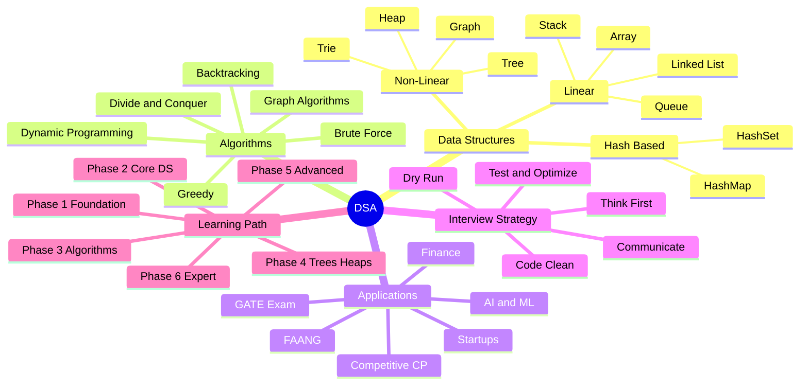

<a href="#chapter-index-table-1">Go to Top 🔝</a>

---

<a id="practice-ch1"></a>

## 💻 Practice Problems — Chapter 1

### 🟢 Easy — Conceptual (Think & Answer)

1. You have 1 million student records. Need to find by roll number instantly. Which DS and why?
2. Your app has "Ctrl+Z" (undo). Which data structure models this perfectly?
3. A printer receives 200 jobs. Must process in order received. Which DS?
4. WhatsApp shows "People You May Know." Which algorithm category?
5. Google Maps shows 3 route options. Which algorithm class is this?

### 🟡 Medium — Basic Coding

1. Find the maximum element in an array of n numbers
2. Reverse a string without using built-in functions
3. Check if a string is a palindrome
4. Count frequency of each character in a string
5. Print Fibonacci series up to n terms using recursion

### 🔴 Hard — Interview-Level Thinking

1. **Design a "Recently Visited" browser feature:** Shows last 10 sites, no duplicates, most recent first. Which DS? What operations? What complexity?

2. **Design autocomplete for a search bar:** When user types "app", show "apple", "application", "app store" sorted by frequency. Which DS? How to rank?

3. **Food Delivery Nearest Driver:** 5 drivers available, each at different location. New order arrives. Assign to nearest available driver. How to model? Which DSA?

<a href="#chapter-index-table-1">Go to Top 🔝</a>

---

<a id="project-ch1"></a>

## 🏗️ Mini Project — DSA Concept Selector Tool

> **Goal:** Build a CLI tool that takes a problem description and suggests the right Data Structure + Algorithm.
> This project applies **everything in Chapter 1** — understanding DS types, algorithm types, and when to use what.

---

### ☕ Java Implementation

```java
import java.util.*;

/**
 * DSA Concept Selector Tool
 * Takes a problem description → Suggests best Data Structure + Algorithm
 * Covers: HashMap, Trie, Stack, Queue, Graph, Heap, BST, DP
 */
public class DSASelector {

    // ─── Inner class to hold DSA suggestion ───────────────────────────────────
    static class Suggestion {
        String dataStructure;
        String algorithm;
        String useCase;
        String realExample;
        String timeComplexity;

        Suggestion(String ds, String algo, String use, String example, String tc) {
            this.dataStructure = ds;
            this.algorithm = algo;
            this.useCase = use;
            this.realExample = example;
            this.timeComplexity = tc;
        }
    }

    // ─── Knowledge Base: keyword → DSA Suggestion ─────────────────────────────
    private static final Map<String, Suggestion> knowledgeBase = new LinkedHashMap<>();

    static {
        knowledgeBase.put("lookup", new Suggestion(
            "HashMap",
            "Hashing",
            "O(1) key-value access, fast retrieval",
            "User session store by userId",
            "O(1) average"
        ));
        knowledgeBase.put("lifo", new Suggestion(
            "Stack",
            "Push / Pop",
            "Last-In-First-Out processing",
            "Browser back button, Undo/Redo",
            "O(1) push/pop"
        ));
        knowledgeBase.put("undo", new Suggestion(
            "Stack",
            "Push / Pop",
            "Action history with reversal",
            "Ctrl+Z in editors",
            "O(1) push/pop"
        ));
        knowledgeBase.put("fifo", new Suggestion(
            "Queue",
            "Enqueue / Dequeue",
            "First-In-First-Out processing",
            "Customer support tickets, Print queue",
            "O(1) enqueue/dequeue"
        ));
        knowledgeBase.put("schedule", new Suggestion(
            "Priority Queue (Min/Max Heap)",
            "Heapify",
            "Process by priority not arrival",
            "OS process scheduler, Hospital ER",
            "O(log n) insert, O(1) peek"
        ));
        knowledgeBase.put("shortest", new Suggestion(
            "Graph (Adjacency List)",
            "Dijkstra's Algorithm",
            "Weighted shortest path in network",
            "Google Maps routing",
            "O(E log V)"
        ));
        knowledgeBase.put("top k", new Suggestion(
            "Min Heap (size K)",
            "Heap operations",
            "Find K largest/smallest efficiently",
            "Top 10 trending hashtags",
            "O(n log k)"
        ));
        knowledgeBase.put("prefix", new Suggestion(
            "Trie (Prefix Tree)",
            "Insert + Prefix Search",
            "Fast prefix-based string search",
            "Google search autocomplete",
            "O(L) per operation"
        ));
        knowledgeBase.put("autocomplete", new Suggestion(
            "Trie (Prefix Tree)",
            "DFS on Trie",
            "Prefix matching for suggestions",
            "IDE code completion",
            "O(L) search"
        ));
        knowledgeBase.put("frequency", new Suggestion(
            "HashMap",
            "Frequency Counting",
            "Count occurrences of elements",
            "Most used word in document",
            "O(n) build, O(1) lookup"
        ));
        knowledgeBase.put("cycle", new Suggestion(
            "Graph",
            "DFS / Floyd's Cycle Detection",
            "Detect circular dependencies",
            "Package dependency check",
            "O(V + E)"
        ));
        knowledgeBase.put("sorted", new Suggestion(
            "BST / Sorted Array",
            "Binary Search",
            "Maintain sorted order with fast search",
            "Leaderboard / Price filter",
            "O(log n) search"
        ));
        knowledgeBase.put("hierarchical", new Suggestion(
            "Tree",
            "DFS / BFS Traversal",
            "Parent-child relationship storage",
            "File system, DOM tree",
            "O(n) traversal"
        ));
        knowledgeBase.put("overlap", new Suggestion(
            "DP Table / Memoization Map",
            "Dynamic Programming",
            "Avoid recomputing overlapping subproblems",
            "Fibonacci, Knapsack, LCS",
            "O(n) to O(n²)"
        ));
    }

    // ─── Suggest based on problem description ─────────────────────────────────
    public static void suggestDSA(String problem) {
        System.out.println("\n🔍 Problem: \"" + problem + "\"");
        System.out.println("─".repeat(60));

        String lower = problem.toLowerCase();
        boolean found = false;

        for (Map.Entry<String, Suggestion> entry : knowledgeBase.entrySet()) {
            if (lower.contains(entry.getKey())) {
                Suggestion s = entry.getValue();
                System.out.println("✅ Data Structure  : " + s.dataStructure);
                System.out.println("⚡ Algorithm       : " + s.algorithm);
                System.out.println("📌 Use Case        : " + s.useCase);
                System.out.println("💡 Real Example    : " + s.realExample);
                System.out.println("⏱️  Time Complexity : " + s.timeComplexity);
                found = true;
                break;
            }
        }

        if (!found) {
            System.out.println("💡 Start with: Array or HashMap");
            System.out.println("📖 Keywords to try: lookup, lifo, fifo, sorted,");
            System.out.println("   shortest, top k, prefix, frequency, cycle, overlap");
        }
        System.out.println("─".repeat(60));
    }

    // ─── Display knowledge base summary ───────────────────────────────────────
    public static void showKnowledgeBase() {
        System.out.println("\n📚 DSA KNOWLEDGE BASE SUMMARY");
        System.out.println("═".repeat(60));
        System.out.printf("%-15s %-20s %-15s%n", "KEYWORD", "DATA STRUCTURE", "COMPLEXITY");
        System.out.println("─".repeat(60));
        for (Map.Entry<String, Suggestion> entry : knowledgeBase.entrySet()) {
            System.out.printf("%-15s %-20s %-15s%n",
                entry.getKey(),
                entry.getValue().dataStructure,
                entry.getValue().timeComplexity
            );
        }
        System.out.println("═".repeat(60));
    }

    // ─── Main ─────────────────────────────────────────────────────────────────
    public static void main(String[] args) {
        System.out.println("╔══════════════════════════════════════════════════╗");
        System.out.println("║       🧠 DSA Concept Selector — Chapter 1        ║");
        System.out.println("║   Describe your problem → Get the right DSA      ║");
        System.out.println("╚══════════════════════════════════════════════════╝");

        // Demo problems covering all Chapter 1 concepts
        String[] problems = {
            "I need fast lookup by user id",
            "I need to track undo operations using lifo",
            "Process print jobs in fifo order",
            "Find shortest path between two cities",
            "Show top k most frequent products",
            "Build autocomplete for search bar",
            "Count frequency of words in a document",
            "Detect cycle in package dependencies",
            "Need hierarchical folder structure",
            "Problem has overlapping subproblems"
        };

        System.out.println("\n📋 RUNNING ALL DEMO PROBLEMS:\n");
        for (String problem : problems) {
            suggestDSA(problem);
        }

        // Show knowledge base
        showKnowledgeBase();

        // Interactive Mode
        System.out.println("\n🎯 INTERACTIVE MODE — Type your problem (or 'exit'):");
        Scanner sc = new Scanner(System.in);
        while (sc.hasNextLine()) {
            String input = sc.nextLine().trim();
            if (input.equalsIgnoreCase("exit")) {
                System.out.println("\n✅ Happy Coding! DSA = Right DS + Right Algo 🚀");
                break;
            }
            if (!input.isEmpty()) {
                suggestDSA(input);
                System.out.print("Enter problem (or 'exit'): ");
            }
        }
        sc.close();
    }
}
```

---

### 🌐 JavaScript Implementation

```javascript
/**
 * DSA Concept Selector Tool — JavaScript Version
 * Chapter 1: Introduction to DSA
 * 
 * Maps problem keywords → Best Data Structure + Algorithm
 */

// ─── Suggestion Data Model ──────────────────────────────────────────────────
class Suggestion {
  constructor(dataStructure, algorithm, useCase, realExample, timeComplexity) {
    this.dataStructure = dataStructure;
    this.algorithm = algorithm;
    this.useCase = useCase;
    this.realExample = realExample;
    this.timeComplexity = timeComplexity;
  }
}

// ─── Knowledge Base ─────────────────────────────────────────────────────────
const knowledgeBase = new Map([
  ["lookup", new Suggestion(
    "HashMap / JS Object / Map",
    "Hashing",
    "O(1) key-value retrieval",
    "User session by userId, Cache layer",
    "O(1) average"
  )],
  ["lifo", new Suggestion(
    "Stack (Array-based)",
    "Push / Pop",
    "Last-In-First-Out order",
    "Browser history back button",
    "O(1) push/pop"
  )],
  ["undo", new Suggestion(
    "Stack",
    "Push (do) / Pop (undo)",
    "Reversible action history",
    "Ctrl+Z in text editors, Photoshop",
    "O(1) push/pop"
  )],
  ["fifo", new Suggestion(
    "Queue (Array / LinkedList)",
    "Enqueue / Dequeue",
    "First-In-First-Out processing",
    "Print queue, Customer service tickets",
    "O(1) enqueue/dequeue"
  )],
  ["schedule", new Suggestion(
    "Priority Queue (Min Heap)",
    "Heapify — O(log n)",
    "Process tasks by priority",
    "OS scheduler, Hospital emergency room",
    "O(log n) insert, O(1) peek"
  )],
  ["shortest", new Suggestion(
    "Graph (Adjacency List)",
    "Dijkstra's Algorithm",
    "Minimum cost path in weighted graph",
    "Google Maps, Uber routing",
    "O(E log V)"
  )],
  ["top k", new Suggestion(
    "Min Heap of size K",
    "Heap with size constraint",
    "Track K largest elements",
    "Top 10 trending tweets, Leaderboard",
    "O(n log k)"
  )],
  ["prefix", new Suggestion(
    "Trie (Prefix Tree)",
    "Insert + DFS traversal",
    "Fast prefix-based word search",
    "Google autocomplete, IDE suggestions",
    "O(L) per operation"
  )],
  ["autocomplete", new Suggestion(
    "Trie (Prefix Tree)",
    "Prefix Search + DFS",
    "Real-time search suggestions",
    "Amazon search bar, YouTube search",
    "O(L) search"
  )],
  ["frequency", new Suggestion(
    "HashMap (frequency map)",
    "Counting Algorithm",
    "Count occurrence of each element",
    "Word frequency, Anagram detection",
    "O(n) build, O(1) query"
  )],
  ["cycle", new Suggestion(
    "Directed Graph",
    "DFS + Visited tracking",
    "Detect circular dependencies",
    "npm package cycles, Deadlock detection",
    "O(V + E)"
  )],
  ["sorted", new Suggestion(
    "BST / Sorted Array",
    "Binary Search",
    "Maintain sorted data with fast search",
    "Leaderboard ranking, Price filter",
    "O(log n) search"
  )],
  ["hierarchical", new Suggestion(
    "Tree (n-ary or Binary)",
    "DFS / BFS Traversal",
    "Represent parent-child relationships",
    "File system, React DOM tree",
    "O(n) traversal"
  )],
  ["overlap", new Suggestion(
    "DP Memo Table (Array / Map)",
    "Dynamic Programming",
    "Cache overlapping subproblem results",
    "Fibonacci, Knapsack, LCS, Coin Change",
    "O(n) to O(n²)"
  )],
]);

// ─── Core Function: Suggest DSA ─────────────────────────────────────────────
function suggestDSA(problem) {
  console.log(`\n🔍 Problem: "${problem}"`);
  console.log("─".repeat(62));

  const lower = problem.toLowerCase();
  let found = false;

  for (const [keyword, suggestion] of knowledgeBase) {
    if (lower.includes(keyword)) {
      console.log(`✅ Data Structure  : ${suggestion.dataStructure}`);
      console.log(`⚡ Algorithm       : ${suggestion.algorithm}`);
      console.log(`📌 Use Case        : ${suggestion.useCase}`);
      console.log(`💡 Real Example    : ${suggestion.realExample}`);
      console.log(`⏱️  Time Complexity : ${suggestion.timeComplexity}`);
      found = true;
      break;
    }
  }

  if (!found) {
    console.log("💡 Default: Start with Array or HashMap");
    console.log("📖 Try keywords: lookup, lifo, fifo, sorted, shortest,");
    console.log("   top k, prefix, autocomplete, frequency, cycle, overlap");
  }

  console.log("─".repeat(62));
}

// ─── Show Full Knowledge Base ────────────────────────────────────────────────
function showKnowledgeBase() {
  console.log("\n📚 DSA KNOWLEDGE BASE");
  console.log("═".repeat(62));
  console.log(`${"KEYWORD".padEnd(16)} ${"DATA STRUCTURE".padEnd(25)} ${"COMPLEXITY"}`);
  console.log("─".repeat(62));

  for (const [keyword, s] of knowledgeBase) {
    console.log(
      `${keyword.padEnd(16)} ${s.dataStructure.padEnd(25)} ${s.timeComplexity}`
    );
  }
  console.log("═".repeat(62));
}

// ─── Run the Demo ────────────────────────────────────────────────────────────
function runDSASelector() {
  console.log("╔══════════════════════════════════════════════════════════╗");
  console.log("║       🧠 DSA Concept Selector — JS Version              ║");
  console.log("║    Describe your problem → Get best DS + Algorithm       ║");
  console.log("╚══════════════════════════════════════════════════════════╝");

  const demoProblems = [
    "I need fast lookup by user id",
    "Need to track undo operations in lifo order",
    "Process API requests in fifo order",
    "Find shortest path on a road network",
    "Display top k most selling products",
    "Build autocomplete for search input",
    "Count frequency of each word in text",
    "Detect cycle in module dependencies",
    "Represent hierarchical org chart",
    "Memoize problem with overlapping subproblems",
  ];

  console.log("\n📋 DEMO PROBLEMS:\n");
  demoProblems.forEach((problem) => suggestDSA(problem));

  showKnowledgeBase();

  console.log("\n✅ Takeaway: Matching problem pattern → Right DS + Algo = ⚡ Efficiency!");
}

// ─── Execute ─────────────────────────────────────────────────────────────────
runDSASelector();

// ─── Export for module use ───────────────────────────────────────────────────
if (typeof module !== "undefined") {
  module.exports = { suggestDSA, knowledgeBase, showKnowledgeBase };
}
```

---

### 🔍 Sample Output

```
╔══════════════════════════════════════════════════════════╗
║       🧠 DSA Concept Selector — JS Version              ║
║    Describe your problem → Get best DS + Algorithm       ║
╚══════════════════════════════════════════════════════════╝

📋 DEMO PROBLEMS:

🔍 Problem: "I need fast lookup by user id"
──────────────────────────────────────────────────────────────
✅ Data Structure  : HashMap / JS Object / Map
⚡ Algorithm       : Hashing
📌 Use Case        : O(1) key-value retrieval
💡 Real Example    : User session by userId, Cache layer
⏱️  Time Complexity : O(1) average
──────────────────────────────────────────────────────────────

🔍 Problem: "Find shortest path on a road network"
──────────────────────────────────────────────────────────────
✅ Data Structure  : Graph (Adjacency List)
⚡ Algorithm       : Dijkstra's Algorithm
📌 Use Case        : Minimum cost path in weighted graph
💡 Real Example    : Google Maps, Uber routing
⏱️  Time Complexity : O(E log V)
──────────────────────────────────────────────────────────────
```

---

> [!IMPORTANT]
> **Chapter 1 Complete! 🎉**
> You now understand:
> - WHAT DSA is and exactly WHY it matters
> - ALL types of Data Structures with operations
> - ALL types of Algorithms with selection strategy
> - HOW companies use DSA at scale
> - HOW to study DSA with the right roadmap
> - HOW interviews are structured and what's evaluated
>
> **Next → Chapter 2: Warm Up** — Flowcharts, Pseudocode, Math for DSA

---

<div align="center">

**[← Back to Master Index](#chapter-index-table-1)** | **[Next Chapter: Warm Up →](#2-warm-up)**

<a href="#chapter-index-table-1">Go to Top 🔝</a>

</div>