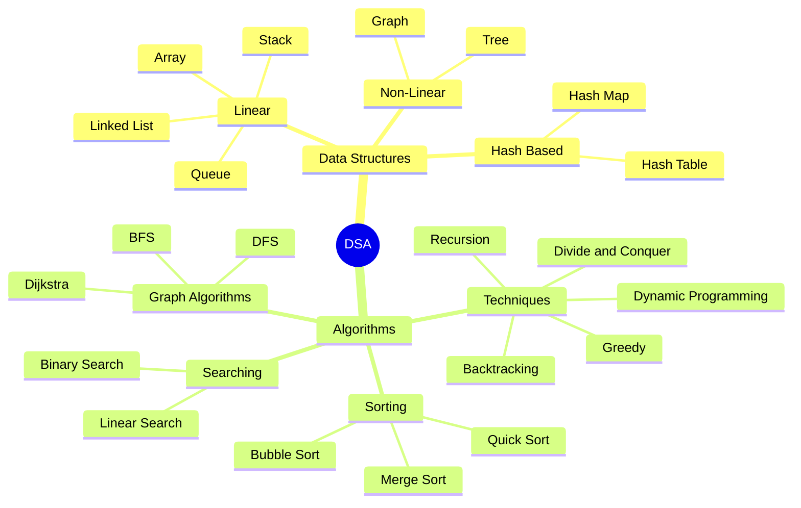
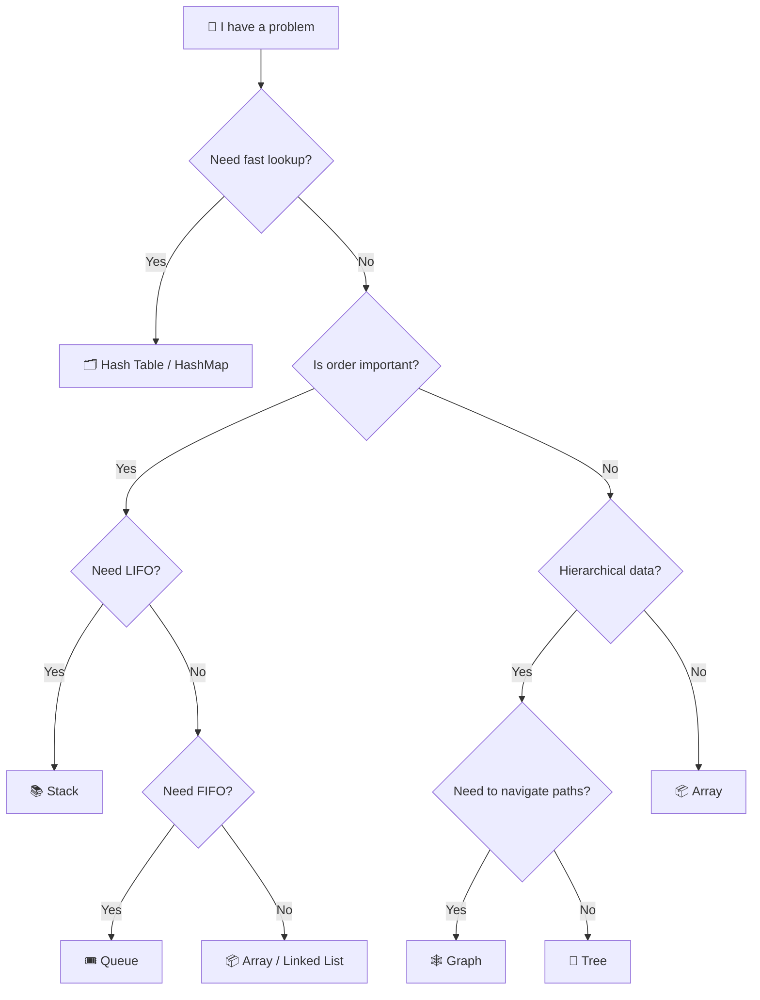

https://www.mermditor.dev/editor

https://lightpdf.com/markdown-to-pdf

https://markdowntopdf.in/

https://www.freemdtopdf.com/free-md-to-pdf


<div align="center">


</div>


<div align="center">
<h1>📚DSA By AKSHAY SAINI (JAVAscript ) , ShashCodes (JAVA ) , Striver </h1>
</div>

## Contents


# 📘 DSA Mastery — Complete Book Index

> *"The only way to learn DSA is to follow the right path, in the right order."*

---

## 📑 Master Index — All Chapters & Topics

| INDEX | CHAPTER | TOPICS |
|-------|---------|--------|
| 1 | [Introduction](#introduction) | <ul><li>What is DSA?</li><li>Why DSA matters?</li><li>Real-world applications</li><li>How to approach DSA</li></ul> |
| 2 | [Warm Up](#warm-up) | <ul><li>Flowcharts & Pseudocode</li><li>Patterns & Basics</li><li>Number Systems</li><li>Basic Math for DSA</li><li>Practice Problems</li></ul> |
| 3 | [Time/Space Complexity](#time-space-complexity) | <ul><li>Big O Notation</li><li>Big Omega (Ω) & Big Theta (Θ)</li><li>Time Complexity Analysis</li><li>Space Complexity Analysis</li><li>Best / Average / Worst Case</li><li>Recurrence Relations</li></ul> |
| 4 | [Arrays — Easy/Medium](#arrays-easy-medium) | <ul><li>Array Basics & Memory</li><li>Insertion, Deletion, Traversal</li><li>Linear Search</li><li>Reverse an Array</li><li>Kadane's Algorithm</li><li>Dutch National Flag</li><li>Prefix Sum</li><li>Subarray Problems</li><li>Two Sum Problem</li></ul> |
| 5 | [Recursion — Easy/Medium](#recursion-easy-medium) | <ul><li>What is Recursion?</li><li>Base Case & Recursive Case</li><li>Call Stack Visualization</li><li>Factorial & Fibonacci</li><li>Power of a Number</li><li>Print 1 to N / N to 1</li><li>Sum of Digits</li><li>Recursion vs Iteration</li><li>Multiple Recursion Calls</li></ul> |
| 6 | [Searching & Sorting — Easy/Medium](#searching-sorting-easy-medium) | <ul><li>Linear Search</li><li>Binary Search</li><li>Bubble Sort</li><li>Selection Sort</li><li>Insertion Sort</li><li>Merge Sort</li><li>Quick Sort</li><li>Counting Sort</li><li>Stability in Sorting</li><li>Comparisons & When to Use What</li></ul> |
| 7 | [Linked List — Easy/Medium](#linked-list-easy-medium) | <ul><li>What is a Linked List?</li><li>Singly Linked List</li><li>Doubly Linked List</li><li>Circular Linked List</li><li>Insertion & Deletion</li><li>Reverse a Linked List</li><li>Detect Cycle (Floyd's)</li><li>Merge Two Sorted Lists</li><li>Find Middle Node</li><li>Array vs Linked List</li></ul> |
| 8 | [Strings — Easy/Medium](#strings-easy-medium) | <ul><li>String Basics & Memory</li><li>String vs Character Array</li><li>Palindrome Check</li><li>Reverse a String</li><li>Anagram Detection</li><li>String Compression</li><li>Substring Problems</li><li>Character Frequency Count</li></ul> |
| 9 | [Stack and Queues](#stack-and-queues) | <ul><li>What is a Stack? (LIFO)</li><li>What is a Queue? (FIFO)</li><li>Implementation using Array</li><li>Implementation using Linked List</li><li>Balanced Parentheses</li><li>Next Greater Element</li><li>Min Stack</li><li>Circular Queue</li><li>Deque (Double-Ended Queue)</li><li>Queue using Two Stacks</li></ul> |
| 10 | [Binary Search Algorithm](#binary-search-algorithm) | <ul><li>Binary Search Deep Dive</li><li>Lower Bound & Upper Bound</li><li>Search in Rotated Sorted Array</li><li>Peak Element</li><li>First & Last Occurrence</li><li>Search in 2D Matrix</li><li>Square Root using BS</li><li>Aggressive Cows / Book Allocation</li></ul> |
| 11 | [Two Pointers & Sliding Window](#two-pointers-sliding-window) | <ul><li>Two Pointer Technique</li><li>Opposite Direction Pointers</li><li>Same Direction Pointers</li><li>Sliding Window — Fixed Size</li><li>Sliding Window — Variable Size</li><li>Longest Substring Without Repeating</li><li>Max Sum Subarray of Size K</li><li>Minimum Window Substring</li></ul> |
| 12 | [Binary Tree](#binary-tree) | <ul><li>What is a Tree?</li><li>Binary Tree Basics</li><li>Tree Traversals (Inorder, Preorder, Postorder)</li><li>Level Order Traversal (BFS)</li><li>Height of Tree</li><li>Diameter of Tree</li><li>Balanced Binary Tree</li><li>Left View / Right View</li><li>Lowest Common Ancestor</li><li>Zigzag Traversal</li></ul> |
| 13 | [Binary Search Tree](#binary-search-tree) | <ul><li>What is BST?</li><li>BST Property</li><li>Insert in BST</li><li>Search in BST</li><li>Delete from BST</li><li>Inorder Successor / Predecessor</li><li>Validate BST</li><li>Kth Smallest Element</li><li>BST from Preorder</li><li>BST vs Binary Tree</li></ul> |
| 14 | [Heap / Priority Queue](#heap-priority-queue) | <ul><li>What is a Heap?</li><li>Min Heap & Max Heap</li><li>Heap Operations (Insert, Delete, Heapify)</li><li>Heap Sort</li><li>Priority Queue</li><li>Kth Largest Element</li><li>Merge K Sorted Lists</li><li>Top K Frequent Elements</li><li>Median in a Stream</li></ul> |
| 15 | [Hashing](#hashing) | <ul><li>What is Hashing?</li><li>Hash Function</li><li>Hash Table / Hash Map</li><li>Collision Handling (Chaining, Open Addressing)</li><li>Frequency Count</li><li>Two Sum using HashMap</li><li>Group Anagrams</li><li>Longest Consecutive Sequence</li><li>Subarray Sum Equals K</li></ul> |
| 16 | [Backtracking](#backtracking) | <ul><li>What is Backtracking?</li><li>Recursion vs Backtracking</li><li>N-Queens Problem</li><li>Sudoku Solver</li><li>Rat in a Maze</li><li>Permutations & Combinations</li><li>Subset Sum</li><li>Word Search</li><li>All Paths in a Grid</li></ul> |
| 17 | [Greedy Algorithm](#greedy-algorithm) | <ul><li>What is Greedy?</li><li>Greedy vs DP</li><li>Activity Selection</li><li>Fractional Knapsack</li><li>Huffman Coding</li><li>Job Sequencing</li><li>Minimum Coins</li><li>Meeting Rooms</li><li>Gas Station Problem</li></ul> |
| 18 | [Dynamic Programming](#dynamic-programming) | <ul><li>What is DP?</li><li>Memoization vs Tabulation</li><li>Fibonacci (Top-Down & Bottom-Up)</li><li>Climbing Stairs</li><li>0/1 Knapsack</li><li>Longest Common Subsequence</li><li>Longest Increasing Subsequence</li><li>Coin Change</li><li>Edit Distance</li><li>Matrix Chain Multiplication</li><li>DP on Grids</li></ul> |
| 19 | [Graphs](#graphs) | <ul><li>What is a Graph?</li><li>Graph Representation (Adj List, Matrix)</li><li>BFS (Breadth First Search)</li><li>DFS (Depth First Search)</li><li>Connected Components</li><li>Cycle Detection</li><li>Topological Sort</li><li>Dijkstra's Algorithm</li><li>Bellman-Ford</li><li>Kruskal's & Prim's (MST)</li><li>Floyd-Warshall</li></ul> |
| 20 | [Tries](#tries) | <ul><li>What is a Trie?</li><li>Trie Structure & Nodes</li><li>Insert & Search in Trie</li><li>Prefix Search</li><li>Auto-complete Feature</li><li>Word Dictionary</li><li>Longest Common Prefix</li><li>Trie vs HashMap</li></ul> |
| 21 | [Searching & Sorting — Advanced](#searching-sorting-advanced) | <ul><li>Radix Sort</li><li>Bucket Sort</li><li>Shell Sort</li><li>Heap Sort Deep Dive</li><li>Ternary Search</li><li>Exponential Search</li><li>Interpolation Search</li><li>Sorting in Linked Lists</li><li>Custom Comparators</li></ul> |
| 22 | [DP and Arrays — Advanced](#dp-and-arrays-advanced) | <ul><li>DP on Subsequences</li><li>DP on Strings</li><li>DP on Stocks (Buy/Sell)</li><li>Partition DP</li><li>Bitmask DP</li><li>Digit DP</li><li>DP on Trees</li><li>Advanced Array Techniques</li><li>Monotonic Stack/Queue</li></ul> |
| 23 | [Strings — Advanced](#strings-advanced) | <ul><li>KMP Algorithm</li><li>Rabin-Karp Algorithm</li><li>Z-Algorithm</li><li>Suffix Array</li><li>Suffix Tree</li><li>Manacher's Algorithm (Palindromes)</li><li>Rolling Hash</li><li>String Matching Problems</li></ul> |
| 24 | [Bonus](#bonus) | <ul><li>Bit Manipulation</li><li>Segment Trees</li><li>Fenwick Tree (BIT)</li><li>Disjoint Set Union (DSU)</li><li>Math for Competitive Programming</li><li>Interview Preparation Tips</li><li>GATE Specific Topics</li><li>Problem Solving Patterns Cheat Sheet</li></ul> |

---

> [!NOTE]
> Each chapter builds upon the previous one.
> Follow the order **1 → 24** for the best learning experience.
> Skip chapters only if you already have strong fundamentals.

> [!TIP]
> 🎯 **For Interview Prep** → Focus on Chapters 4–19
> 🎯 **For GATE Prep** → Focus on Chapters 3, 6, 12–19, 21–24
> 🎯 **For Absolute Beginners** → Start from Chapter 1, skip nothing

> [!IMPORTANT]
> This book follows a **building-block approach**.
> Arrays → Recursion → Sorting → Trees → Graphs → DP
> Each concept uses skills from the previous chapter.


*Start your journey from <a href="#introduction">Chapter 1: Introduction</a> →*

# 📘 DSA Mastery Book — Chapter 1: Introduction to DSA <a id="introduction"></a>  


> *"Before you write a single line of code, understand WHY you are writing it."*

---

## 📑 Table of Contents

| # | Topic |
|---|-------|
| 1 | <a href="#sec1">What is DSA and Why Should You Care?</a> |
| 2 | <a href="#sec2">The Two Pillars — Data Structures & Algorithms</a> |
| 3 | <a href="#sec3">Visualization — The Big Picture</a> |
| 4 | <a href="#sec4">How to Measure "How Good" Your Code Is?</a> |
| 5 | <a href="#sec5">Important Concepts Every Beginner Must Know</a> |
| 6 | <a href="#sec6">How to Approach a DSA Problem — The Framework</a> |
| 7 | <a href="#sec7">Memory — How Data is Actually Stored</a> |
| 8 | <a href="#sec8">Complexity Analysis — Quick Reference</a> |
| 9 | <a href="#sec9">Dry Run Example — Tracing Code Manually</a> |
| 10 | <a href="#sec10">Common Mistakes Beginners Make</a> |
| 11 | <a href="#sec11">Important Interview & GATE Points</a> |
| 12 | <a href="#sec12">Tips & Tricks</a> |
| 13 | <a href="#sec13">What's Coming Next in This Book</a> |
| 14 | <a href="#sec14">Quick Revision Summary</a> |

---

<h2 id="sec1">1. What is DSA and Why Should You Care?</h2>

### The Real-World Problem First 🌍

Imagine you have **1 billion contacts** in your phone.
You want to search for **"Rahul Sharma"**.

**Approach 1 — Dumb Way:**
Check every contact one by one → Takes forever ❌

**Approach 2 — Smart Way:**
Contacts are sorted alphabetically → Jump to "R" → Find Rahul in seconds ✅

> [!IMPORTANT]
> **That's DSA in real life.**
> - **Data Structures** = How you **store** data
> - **Algorithms** = How you **process** data
> - **DSA** = Choosing the right container + the right method to solve a problem **fast**

---

### Why Does DSA Exist?

- Computers have **limited memory and time**
- Bad code on small input = fine
- Bad code on large input = **crashes, timeouts, angry users**
- DSA teaches you to write code that **scales**

```
Small input  (100 items)  → Even bad code works ✅
Large input  (10M items)  → Only smart code survives 🧠
```

> [!NOTE]
> Every big tech company (Google, Amazon, Meta) tests DSA in interviews because
> they deal with **billions of users**. One bad algorithm = millions wasted in server costs.

---

### Where is DSA Used in Real Software? 🏗️

| Real System | DSA Used |
|---|---|
| Google Search | Graphs, Tries, Hashing |
| WhatsApp Message Queue | Queues, Linked Lists |
| GPS Navigation | Dijkstra's Algorithm (Graphs) |
| Database Indexing | B-Trees |
| Instagram Feed Ranking | Heaps, Sorting |
| Undo/Redo in MS Word | Stacks |
| Contacts Search | Binary Search, Tries |

---

<h2 id="sec2">2. The Two Pillars — Data Structures & Algorithms</h2>

### 🏛️ Pillar 1: Data Structures

> Think of Data Structures as **different types of containers**.

```
📦 Array        → Fixed shelf with numbered slots
🔗 Linked List  → Train with connected compartments
📚 Stack        → Pile of books (Last In, First Out)
🎟️ Queue        → Movie ticket line (First In, First Out)
🌳 Tree         → Family tree / org chart
🕸️ Graph        → Google Maps connections
🗂️ Hash Table   → Dictionary with instant lookup
```

> [!TIP]
> Each container has things it's **good at** ✅ and things it's **bad at** ❌
> Your job = Pick the **right container** for the right problem.

---

### ⚙️ Pillar 2: Algorithms

> Think of Algorithms as **different strategies** to solve a problem.

```
🔍 Searching     → Find something in data
📊 Sorting       → Arrange data in order
🔄 Recursion     → Solve by breaking into smaller parts
💡 Greedy        → Pick the best option at each step
🧩 Dynamic Prog  → Remember past results to avoid rework
🌐 Graph Algos   → Navigate connections
```

---

<h2 id="sec3">3. Visualization — The Big Picture</h2>



---

<h2 id="sec4">4. How to Measure "How Good" Your Code Is?</h2>

### The Problem 🤔

Two people solve the same problem.
Both get correct answers.
But **whose code is better?**

We need a **common measuring system** → That system is called **Big O Notation**

---

### Big O Notation — Measuring Speed & Memory

> Big O tells you **how your code behaves as input grows**.
> It answers: *"If I give 10x more data, how much slower does it get?"*

---

### 📈 Big O Complexity Chart

```
Input Size (n) →  10      100      1,000      10,000      1,000,000

O(1)           →   1        1          1           1              1   ✅ Always same
O(log n)       →   3        7         10          14             20   ✅ Barely grows
O(n)           →  10      100      1,000      10,000      1,000,000   🟡 Grows with input
O(n log n)     →  30      700     10,000     140,000     20,000,000   🟡 Acceptable
O(n²)          → 100   10,000  1,000,000          💀             💀   ❌ Gets bad fast
O(2ⁿ)          → 💀       💀        💀            💀             💀   ❌ Never use
```

---

### Visual Graph of Complexities

```
Time
 ▲
 │                                              O(2ⁿ)
 │                                        ____/
 │                                  _____/
 │                            _____/           O(n²)
 │                      _____/
 │                _____/                       O(n log n)
 │          _____/
 │    _____/                                   O(n)
 │   /
 │  /                                          O(log n)
 │ /___________                                O(1)
 └──────────────────────────────────────────► n (Input Size)
```

> [!IMPORTANT]
> Always aim for **O(1), O(log n), or O(n)** in your solutions.
> **O(n²)** is acceptable only for small inputs.
> **O(2ⁿ)** and **O(n!)** should almost never appear in production code.

---

### Common Big O Examples

| Complexity | Name | Example |
|---|---|---|
| O(1) | Constant | Access array index `arr[5]` |
| O(log n) | Logarithmic | Binary Search |
| O(n) | Linear | Loop through array once |
| O(n log n) | Linearithmic | Merge Sort |
| O(n²) | Quadratic | Nested loops |
| O(2ⁿ) | Exponential | Recursive Fibonacci (naive) |
| O(n!) | Factorial | All permutations |

---

<h2 id="sec5">5. Important Concepts Every Beginner Must Know</h2>

### 🔑 Concept 1: Time Complexity vs Space Complexity

```
Time Complexity  = How much TIME your code takes
Space Complexity = How much MEMORY your code uses
```

> [!NOTE]
> These often trade off with each other:
> - **Faster code** → Usually needs more memory
> - **Less memory** → Usually runs slower
>
> **Real example:** Caching (storing results) = More memory but much faster speed.
> This is the famous **Time-Space Trade-off**.

---

### 🔑 Concept 2: Best Case, Average Case, Worst Case

Always think in **3 scenarios**:

```
Best Case    → Lucky scenario    → Input is already perfect
Average Case → Typical scenario  → Random normal input
Worst Case   → Unlucky scenario  → Input is worst possible
```

**Example: Searching for "Zyxel" in contacts**

| Case | Scenario | Complexity |
|---|---|---|
| Best | Found at first position | O(1) |
| Average | Found somewhere in middle | O(n/2) = O(n) |
| Worst | Found at last or not found | O(n) |

> [!IMPORTANT]
> In **interviews**, always mention **Worst Case** unless asked otherwise.
> In **GATE**, know all three cases and their notations (Big O, Ω, Θ).

---

### 🔑 Concept 3: Recursion — The Magic Trick

> A function that **calls itself** to solve a smaller version of the same problem.

**Real-Life Analogy:**
```
Russian Nesting Dolls 🪆
Open a doll → Find a smaller doll
           → Open it → Find smaller
                     → Open it → ...
Until you reach the tiniest doll (BASE CASE) → STOP!
```

```javascript
// Factorial using Recursion
function factorial(n) {
  // Base Case — smallest doll reached, STOP here
  if (n === 0) return 1;

  // Recursive Case — open the next doll
  return n * factorial(n - 1);
}

// How it works:
// factorial(4)
// = 4 * factorial(3)
// = 4 * 3 * factorial(2)
// = 4 * 3 * 2 * factorial(1)
// = 4 * 3 * 2 * 1 * factorial(0)
// = 4 * 3 * 2 * 1 * 1
// = 24 ✅
```

> [!TIP]
> Every recursive function **MUST** have a **Base Case**.
> Without it → function calls itself forever → **Stack Overflow** 💥

---

### 🔑 Concept 4: Iteration vs Recursion

| | Iteration (Loop) | Recursion |
|---|---|---|
| Uses | `for` / `while` loop | Function calling itself |
| Memory | Less memory | More memory (call stack) |
| Readability | Can get complex | Often cleaner |
| Risk | Infinite loop | Stack overflow |
| Speed | Usually faster | Sometimes slower |

---

### 🔑 Concept 5: The Call Stack

> Every function call gets **pushed** onto the call stack.
> When it finishes, it gets **popped** off.

```
factorial(4) is called — Call Stack builds UP:

         ┌──────────────┐
  TOP →  │ factorial(0) │  ← Returns 1 first
         ├──────────────┤
         │ factorial(1) │
         ├──────────────┤
         │ factorial(2) │
         ├──────────────┤
         │ factorial(3) │
         ├──────────────┤
BOTTOM → │ factorial(4) │  ← Called first, waits for result
         └──────────────┘

Stack UNWINDS top → bottom, passing values back
```

> [!NOTE]
> **Stack Overflow** happens when recursion goes too deep and
> the call stack runs out of memory.
> Always ensure your base case is reachable!

---

<h2 id="sec6">6. How to Approach a DSA Problem — The Framework 🧠</h2>

> Most beginners fail NOT because they don't know the algorithm.
> They fail because they **jump to code immediately**.

### The 5-Step Problem Solving Framework

```
┌─────────────────────────────────────────────────────┐
│                                                     │
│  Step 1: UNDERSTAND                                 │
│    → Read the problem 2-3 times                     │
│    → Identify: Input? Output? Constraints?          │
│    → Ask: What is actually being asked?             │
│                                                     │
│  Step 2: EXAMPLE                                    │
│    → Create small examples manually                 │
│    → Try edge cases (empty, single, negatives)      │
│                                                     │
│  Step 3: APPROACH                                   │
│    → Think brute force FIRST (even if slow)         │
│    → Then optimize                                  │
│    → Ask: Which data structure fits here?           │
│                                                     │
│  Step 4: CODE                                       │
│    → Write clean readable code                      │
│    → Handle edge cases                              │
│                                                     │
│  Step 5: TEST                                       │
│    → Dry run with your examples                     │
│    → Check edge cases                               │
│    → Analyze time & space complexity                │
│                                                     │
└─────────────────────────────────────────────────────┘
```

> [!TIP]
> During interviews → **Talk while you think**.
> Interviewers value your **thought process** more than the final answer.

---

### 🗺️ Which Data Structure Should I Use? — Decision Map



---

<h2 id="sec7">7. Memory — How Data is Actually Stored</h2>

### RAM Visualization

```
RAM (Random Access Memory)

Address:  100   101   102   103   104   105   106   107
          ┌─────┬─────┬─────┬─────┬─────┬─────┬─────┬─────┐
Value:    │ 10  │ 20  │ 30  │     │     │  5  │     │ 15  │
          └─────┴─────┴─────┴─────┴─────┴─────┴─────┴─────┘
          │←── Array [10, 20, 30] ──→│         │
          │   Continuous memory       │  Scattered
          │                           │  (Linked List nodes)
```

| Data Structure | Memory Layout | Why |
|---|---|---|
| Array | Continuous blocks | Elements stored side by side |
| Linked List | Scattered anywhere | Nodes connected by pointers |
| Stack / Queue | Built on Array or Linked List | Depends on implementation |

> [!NOTE]
> - **Arrays** → Continuous memory → Fast access by index → `arr[5]` is O(1)
> - **Linked Lists** → Scattered memory → Must traverse from head → O(n) access
> - This is WHY arrays are faster for access but slower for insertion/deletion

---

<h2 id="sec8">8. Complexity Analysis — Quick Reference</h2>

### How to Calculate Time Complexity

```javascript
// ─────────────────────────────────────────
// O(1) — Constant Time
// No loop, no recursion, just one operation
// ─────────────────────────────────────────
function getFirst(arr) {
  return arr[0]; // Always just 1 operation, no matter how big arr is
}

// ─────────────────────────────────────────
// O(n) — Linear Time
// One loop that runs n times
// ─────────────────────────────────────────
function printAll(arr) {
  for (let i = 0; i < arr.length; i++) { // Runs n times
    console.log(arr[i]);
  }
}

// ─────────────────────────────────────────
// O(n²) — Quadratic Time
// Nested loops
// ─────────────────────────────────────────
function printPairs(arr) {
  for (let i = 0; i < arr.length; i++) {     // n times
    for (let j = 0; j < arr.length; j++) {   // n times for each i
      console.log(arr[i], arr[j]);
    }
  }
  // Total = n × n = n²
}

// ─────────────────────────────────────────
// O(log n) — Logarithmic Time
// Problem is cut in HALF each iteration
// ─────────────────────────────────────────
function binarySearch(arr, target) {
  let left = 0, right = arr.length - 1;

  while (left <= right) {
    let mid = Math.floor((left + right) / 2);

    if (arr[mid] === target) return mid;
    if (arr[mid] < target) left = mid + 1;  // Throw away LEFT half
    else right = mid - 1;                    // Throw away RIGHT half
    // Each step → problem becomes HALF → log₂(n) total steps
  }
  return -1;
}
```

---

### Big O Simplification Rules

> [!IMPORTANT]
> **Rule 1: Drop Constants**
> ```
> O(2n)  → O(n)
> O(500) → O(1)
> ```
> **Rule 2: Drop Non-Dominant Terms**
> ```
> O(n² + n)    → O(n²)
> O(n + log n) → O(n)
> ```
> **Rule 3: Different Inputs = Different Variables**
> ```
> Two arrays of size n and m:
> NOT O(n²) but O(n × m)
> ```
> **Rule 4: Consecutive Steps = ADD**
> ```
> Step 1 is O(n), Step 2 is O(m) → Total = O(n + m)
> ```
> **Rule 5: Nested Steps = MULTIPLY**
> ```
> Outer loop O(n) with inner loop O(m) → Total = O(n × m)
> ```

---

<h2 id="sec9">9. Dry Run Example — Tracing Code Manually</h2>

> **Problem:** Find the maximum number in an array.
> **Input:** `[3, 7, 1, 9, 4]`
> **Expected Output:** `9`

```javascript
function findMax(arr) {
  let max = arr[0];                         // Start by assuming first is max

  for (let i = 1; i < arr.length; i++) {   // Start from index 1
    if (arr[i] > max) {
      max = arr[i];                         // Update max if bigger found
    }
  }

  return max;
}
```

### Step-by-Step Dry Run

```
Array: [3, 7, 1, 9, 4]
        0  1  2  3  4

Initial State: max = arr[0] = 3

┌──────┬──────────┬───────────────┬─────────────────────┐
│ Step │  arr[i]  │  max (before) │      max (after)    │
├──────┼──────────┼───────────────┼─────────────────────┤
│  i=1 │    7     │       3       │   7   ✅ Updated     │
│  i=2 │    1     │       7       │   7   ❌ No change   │
│  i=3 │    9     │       7       │   9   ✅ Updated     │
│  i=4 │    4     │       9       │   9   ❌ No change   │
└──────┴──────────┴───────────────┴─────────────────────┘

Final Answer: 9 ✅
```

**Complexity Analysis:**
```
Time Complexity  → O(n)  — One pass through the array
Space Complexity → O(1)  — Only one extra variable (max)
```

> [!TIP]
> Always do a dry run **before and after** writing code.
> It catches 80% of bugs before you even run the program.

---

<h2 id="sec10">10. Common Mistakes Beginners Make</h2>

- ❌ **Jumping to code** without understanding the problem first
- ❌ **Not considering edge cases** — empty array, single element, all negatives, duplicates
- ❌ **Ignoring space complexity** — only thinking about time
- ❌ **Not understanding the call stack** — treating recursion as magic
- ❌ **Memorizing code** instead of understanding the pattern behind it
- ❌ **Skipping dry runs** — trusting the code blindly without tracing
- ❌ **Starting with hard problems** — skipping fundamentals
- ❌ **Not knowing Big O** — unable to communicate solution quality in interviews

> [!NOTE]
> The biggest mistake is **memorizing solutions**.
> DSA is about **recognizing patterns** — once you see the pattern,
> you can solve 100 variations of the same problem.

---

<h2 id="sec11">11. Important Interview & GATE Points 🎯</h2>

### Frequently Asked in Interviews

- What is the difference between **Time and Space Complexity**?
- What does **O(1), O(n), O(log n), O(n²)** mean — give examples
- What is a **Best Case / Worst Case** scenario?
- When do you use **iteration vs recursion**?
- What is a **call stack** and what causes **stack overflow**?
- What is the **time-space trade-off**?

---

### GATE Specific Points

> [!IMPORTANT]
> **Asymptotic Notations — Must Know for GATE**
>
> | Notation | Name | Meaning |
> |---|---|---|
> | O (Big O) | Upper Bound | Worst Case — "at most this slow" |
> | Ω (Big Omega) | Lower Bound | Best Case — "at least this fast" |
> | Θ (Big Theta) | Tight Bound | Exact — "always this" |
>
> **Example: Linear Search**
> - Ω(1) → Best: Found at first position
> - Θ(n) → Average: Found somewhere in middle
> - O(n) → Worst: Found at last or not found at all

> [!NOTE]
> For GATE, also prepare:
> - How to **derive recurrence relations** from recursive code
> - **Master Theorem** for solving recurrences (covered in later chapters)
> - Space complexity of recursive vs iterative solutions

---

<h2 id="sec12">12. Tips & Tricks 💡</h2>

- 🧠 **Always think brute force first** → Then optimize. Never shame a slow solution
- ✏️ **Draw it out** → 90% of DSA problems become clear when visualized on paper
- 🔄 **Pattern > Problem** → Learn to recognize patterns, not memorize solutions
- 📝 **Dry run before coding** → Saves hours of debugging time later
- 🔁 **Solve the same problem multiple ways** → Array, recursion, iteration
- 📊 **When in doubt** → Think: *"What if n = 1?"* and *"What if n = 1,000,000?"*

> [!TIP]
> A great way to check your complexity:
> - Count number of nested loops → Usually tells you the power of n
> - Each time you halve the input → That's a log factor
> - Recursion splitting into 2 subproblems → Think O(2ⁿ) or use Master Theorem

---

<h2 id="sec13">13. What's Coming Next in This Book 📚</h2>

```
📘 Chapter  1  → Introduction to DSA              ← YOU ARE HERE ✅
📘 Chapter  2  → Arrays
📘 Chapter  3  → Strings
📘 Chapter  4  → Linked Lists
📘 Chapter  5  → Stacks
📘 Chapter  6  → Queues
📘 Chapter  7  → Recursion & Backtracking
📘 Chapter  8  → Searching Algorithms
📘 Chapter  9  → Sorting Algorithms
📘 Chapter 10  → Trees
📘 Chapter 11  → Graphs
📘 Chapter 12  → Dynamic Programming
📘 Chapter 13  → Greedy Algorithms
📘 Chapter 14  → Hashing
📘 Chapter 15  → Advanced Topics (Tries, Segment Trees, etc.)
```

---

<h2 id="sec14">14. Quick Revision Summary</h2>

```
╔══════════════════════════════════════════════════════════════════╗
║               CHAPTER 1 — QUICK REVISION CARD                  ║
╠══════════════════════════════════════════════════════════════════╣
║                                                                  ║
║  DSA  =  RIGHT CONTAINER  +  RIGHT STRATEGY                     ║
║          (Data Structure)     (Algorithm)                        ║
║                                                                  ║
║  Big O  =  How code behaves as input GROWS                      ║
║                                                                  ║
║  Speed Ranking:                                                  ║
║  O(1) < O(log n) < O(n) < O(n log n) < O(n²) < O(2ⁿ)         ║
║  FAST ◄──────────────────────────────────────────► SLOW         ║
║                                                                  ║
║  Time Complexity  = Speed                                        ║
║  Space Complexity = Memory                                       ║
║  Trade-off exists between both                                   ║
║                                                                  ║
║  3 Cases:  Best (Ω)  /  Average (Θ)  /  Worst (O)              ║
║  → Always report WORST CASE in interviews                        ║
║                                                                  ║
║  Recursion = Function calls itself + BASE CASE to stop          ║
║  No base case → Stack Overflow 💥                               ║
║                                                                  ║
║  5-Step Framework:                                               ║
║  Understand → Example → Approach → Code → Test                 ║
║                                                                  ║
║  Drop constants:  O(2n) = O(n),  O(n²+n) = O(n²)              ║
║                                                                  ║
╚══════════════════════════════════════════════════════════════════╝
```

---

> 🚀 **Chapter 1 Complete!**
> You now have the **mental model** needed for everything ahead.
> In the next chapter, we dive into **Arrays** — the foundation of all data structures.

---

*End of Chapter 1 — Introduction to DSA*
```