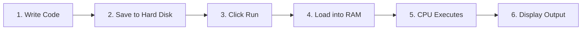
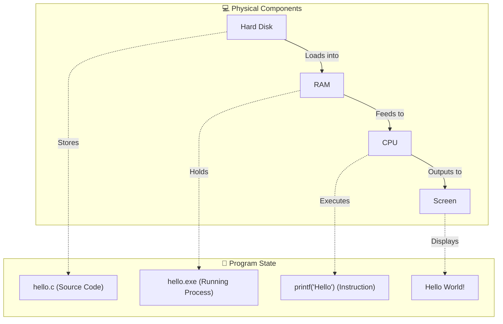
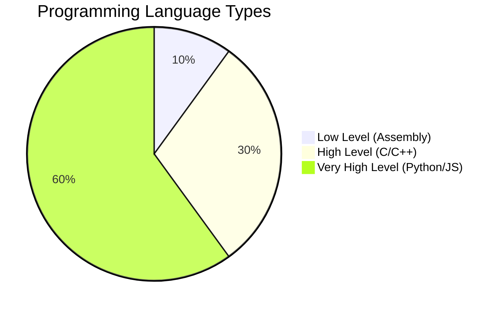
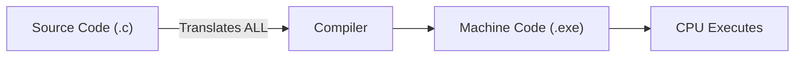
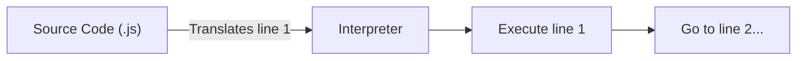
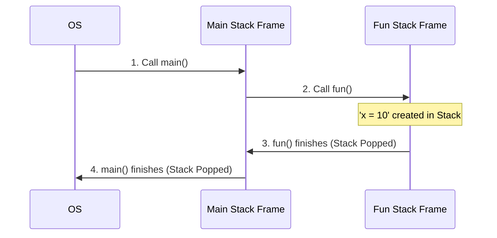
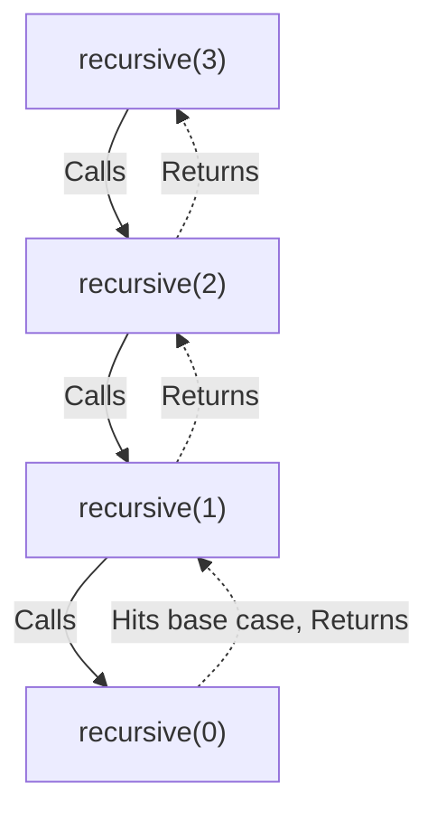
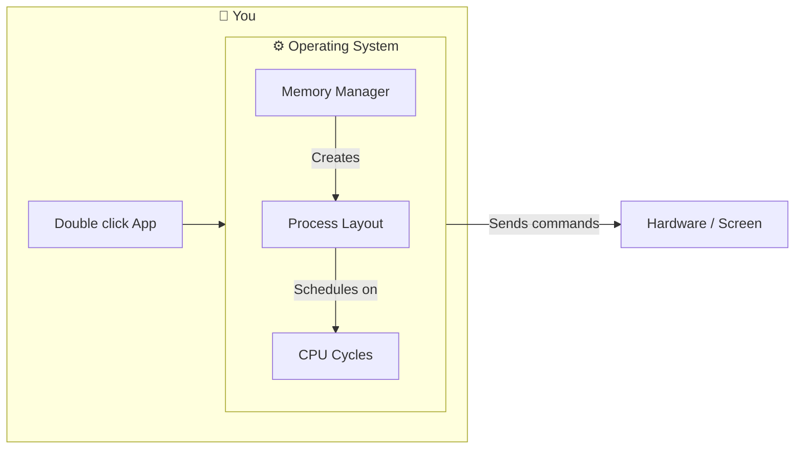

Here is the completely corrected and enhanced **Chapter 0**. 

I have **fixed the Mermaid syntax error** (the issue was that Mermaid requires a Node ID before a string literal, e.g., `NodeID["String"]`). I also **added more detailed examples, analogies, and ASCII fallback diagrams** to make the concepts even easier to understand.

---

# 🚀 JavaScript Deep Dive Notes - Chapter 0: Fundamentals of Program Execution <a id="chapter-0-top"></a>

## 📑 Table of Contents
<a id="chapter-0-toc"></a>

- <a href="#what-is-programming">0.1 What is Programming?</a>
- <a href="#why-programs-are-made">0.2 Why Programs are Made?</a>
- <a href="#program-execution-flow">0.3 What Happens When You Run a Program?</a>
- <a href="#computer-components">0.4 Main Parts of Computer (Critical Analogy)</a>
  - <a href="#storage-component">Storage (Hard Disk / SSD)</a>
  - <a href="#ram-component">RAM (Memory)</a>
  - <a href="#cpu-component">CPU (Brain of Computer)</a>
- <a href="#full-program-flow">0.5 Full Program Execution Flow (Corrected Diagram)</a>
- <a href="#program-storage-location">0.6 Where Programs are Stored?</a>
- <a href="#computer-language">0.7 What Language Computer Understands?</a>
- <a href="#programming-languages">0.8 Types of Programming Languages</a>
- <a href="#compiler-vs-interpreter">0.9 Compiler vs Interpreter (Deep)</a>
- <a href="#memory-layout">0.10 Memory Layout (Ultra Critical)</a>
  - <a href="#code-section">Code Section</a>
  - <a href="#data-section">Data Section</a>
  - <a href="#bss-section">BSS Section</a>
  - <a href="#heap-section">Heap</a>
  - <a href="#stack-section">Stack</a>
- <a href="#function-call-stack">0.11 Function Call Stack (Example)</a>
- <a href="#recursion-memory">0.12 Recursion Memory (Deep)</a>
- <a href="#program-crash">0.13 Why Programs Crash? (Visualized)</a>
- <a href="#os-role">0.14 Operating System Role (Deep)</a>
- <a href="#ultra-deep-topics">0.15 Ultra Deep Topics (Optional)</a>

<a href="#chapter-0-top">⬆ Back to Top</a>

---

> This chapter covers the **absolute fundamentals** of how programs run on computers. No prior knowledge needed. All diagrams are fully compatible with Markdown.

---

## <a id="what-is-programming"></a>0.1 What is Programming?

**Programming = Giving step-by-step instructions to a computer**

Just like you tell a friend:
1. "Open the fridge"
2. "Take out milk"
3. "Pour into glass"

A program is a set of precise instructions for a computer to follow.

**Example Program**:
```javascript
console.log("Hello World");
```
This tells the computer: "Print 'Hello World' on the screen".

<a href="#chapter-0-toc">⬅ Back to Table of Contents</a> | <a href="#chapter-0-top">⬆ Back to Top</a>

---

## <a id="why-programs-are-made"></a>0.2 Why Programs are Made?

Computers don't think — they only follow instructions. Programs are made to:

| Program Type       | Purpose                                  | Example |
|---------------------|------------------------------------------|---------|
| **Apps** | Build mobile applications | WhatsApp, Instagram |
| **Websites** | Create interactive web pages | YouTube, Amazon |
| **Games** | Develop video games | Fortnite, Minecraft |
| **Automation** | Automate repetitive tasks | Python Scripts |
| **OS** | Run the computer itself | Windows, macOS |

**Everything you use on a computer is a program**.

<a href="#chapter-0-toc">⬅ Back to Table of Contents</a> | <a href="#chapter-0-top">⬆ Back to Top</a>

---

## <a id="program-execution-flow"></a>0.3 What Happens When You Run a Program?

Let's take a simple C program `hello.c`:
```c
#include <stdio.h>
int main() {
    printf("Hello World");
    return 0;
}
```
### Step-by-Step Execution Flow


<a href="#chapter-0-toc">⬅ Back to Table of Contents</a> | <a href="#chapter-0-top">⬆ Back to Top</a>

---

## <a id="computer-components"></a>0.4 Main Parts of Computer (Critical Analogy)

To understand execution, use this real-life analogy:
*   **Hard Disk** = The massive library of books down the street.
*   **RAM** = Your small study table.
*   **CPU** = Your Brain reading the book.

### <a id="storage-component"></a>1. Storage (Hard Disk / SSD) 📦 
*The Library*
Stores programs, files, photos, videos permanently even when the computer is turned off.
**Example**: Your `hello.c` file is saved here.

### <a id="ram-component"></a>2. RAM (Memory) ⚡ 
*The Study Table*
When you run a program, it moves from storage to RAM because the CPU can access RAM thousands of times faster than a hard disk. 
**Key**: RAM is volatile — data is wiped when the computer turns off.

### <a id="cpu-component"></a>3. CPU (Brain of Computer) 🧠 
*Your Brain*
The CPU follows the **Fetch → Decode → Execute** cycle millions of times per second:
1. **Fetch**: Read instruction from the RAM (take the book from the table).
2. **Decode**: Understand what to do (read the sentence).
3. **Execute**: Perform the action (do the math/print the text).

<a href="#chapter-0-toc">⬅ Back to Table of Contents</a> | <a href="#chapter-0-top">⬆ Back to Top</a>

---

## <a id="full-program-flow"></a>0.5 Full Program Execution Flow (Corrected Diagram)

*(Note: The Mermaid syntax error is fixed here. Nodes displaying strings now have proper IDs `NodeID["Text"]` mapping physical hardware to the software state).*



<a href="#chapter-0-toc">⬅ Back to Table of Contents</a> | <a href="#chapter-0-top">⬆ Back to Top</a>

---

## <a id="program-storage-location"></a>0.6 Where Programs are Stored?

Programs are stored in **permanent storage devices**:

**Example Paths**:
- **Windows**: `C:\Program Files\Google\Chrome\Application\chrome.exe`
- **Linux**: `/usr/bin/google-chrome`
- **macOS**: `/Applications/Google Chrome.app`

<a href="#chapter-0-toc">⬅ Back to Table of Contents</a> | <a href="#chapter-0-top">⬆ Back to Top</a>

---

## <a id="computer-language"></a>0.7 What Language Computer Understands?

Computers ONLY understand **binary code** (0s and 1s):
```text
01001000 01100101 01101100 01101100 01101111  -> Translates to "Hello"
```

Humans write code in **high-level languages** (C, Python, JavaScript). A translator is required to bridge the gap between human code and computer binary.

<a href="#chapter-0-toc">⬅ Back to Table of Contents</a> | <a href="#chapter-0-top">⬆ Back to Top</a>

---

## <a id="programming-languages"></a>0.8 Types of Programming Languages



| Type                | Examples               | Use Case                                  |
|---------------------|------------------------|------------------------------------------|
| **Low Level**       | Assembly               | Hardware drivers, embedded systems       |
| **High Level**      | C, C++, Java           | Desktop apps, 3D Games, OS building      |
| **Very High Level** | Python, JavaScript     | Web development, AI, automation scripts  |

<a href="#chapter-0-toc">⬅ Back to Table of Contents</a> | <a href="#chapter-0-top">⬆ Back to Top</a>

---

## <a id="compiler-vs-interpreter"></a>0.9 Compiler vs Interpreter (Deep)

### Compiler (Used by C/C++)
Takes the **entire file**, translates it all at once, and spits out an `.exe` file.

* **Pros:** Very fast execution.
* **Cons:** Takes time to compile before you can run it.

### Interpreter (Used by Python/JavaScript)
Takes the file and translates it **line by line** while it runs.

* **Pros:** Starts instantly, easy to debug.
* **Cons:** Slower execution overall.

<a href="#chapter-0-toc">⬅ Back to Table of Contents</a> | <a href="#chapter-0-top">⬆ Back to Top</a>

---

## <a id="memory-layout"></a>0.10 Memory Layout (Ultra Critical)

When a program is double-clicked and loaded into RAM, the Operating System creates a **fixed layout** called the Process Memory Layout.

### Visualizing RAM (ASCII Representation)
```text
  High Memory Address (e.g., 0xFFFFFFFF)
 ----------------------------------------
 |                STACK                 |  ↓ Grows downward (Function calls, local vars)
 |--------------------------------------|
 |                  ↓                   |
 |                                      |
 |            (Free Space)              |
 |                                      |
 |                  ↑                   |
 |--------------------------------------|
 |                HEAP                  |  ↑ Grows upward (Dynamic memory: malloc/new)
 |--------------------------------------|
 |        BSS (Uninitialized Data)      |  Variables declared but empty (int x;)
 |--------------------------------------|
 |         DATA (Initialized Data)      |  Variables with values (int x = 10;)
 |--------------------------------------|
 |            CODE / TEXT               |  Your actual instructions (Read-Only)
 ----------------------------------------
  Low Memory Address (e.g., 0x00000000)
```

### Breakdown of Sections:

#### <a id="code-section"></a>1. Code Section (Text)
Stores compiled machine code (instructions like `printf("Hello")`).  
**Read-only** — if the program tries to modify this, it crashes.

#### <a id="data-section"></a>2. Data Section
Stores **initialized global/static variables**:
```c
int global_var = 10; // Lives here
```

#### <a id="bss-section"></a>3. BSS Section
Stores **uninitialized global/static variables**:
```c
int uninit_var; // Lives here (OS automatically sets to 0)
```

#### <a id="heap-section"></a>4. Heap
Dynamic memory allocation. You manually request space here.
```c
int* ptr = malloc(4); // Allocates 4 bytes in heap
```

#### <a id="stack-section"></a>5. Stack
Stores **local variables and function calls**.
```c
void function() {
    int local_var = 30; // Lives in stack
}
```

<a href="#chapter-0-toc">⬅ Back to Table of Contents</a> | <a href="#chapter-0-top">⬆ Back to Top</a>

---

## <a id="function-call-stack"></a>0.11 Function Call Stack (Example)

When functions call other functions, they stack on top of each other.

```c
void fun() {
    int x = 10;
}
int main() {
    fun();
}
```

### Execution Flow


<a href="#chapter-0-toc">⬅ Back to Table of Contents</a> | <a href="#chapter-0-top">⬆ Back to Top</a>

---

## <a id="recursion-memory"></a>0.12 Recursion Memory (Deep)

Recursion is a function calling itself. It rapidly consumes Stack memory.

```c
void recursive(int n) {
    if (n == 0) return;
    recursive(n-1);
}
int main() {
    recursive(3);
}
```

### Stack During Execution


<a href="#chapter-0-toc">⬅ Back to Table of Contents</a> | <a href="#chapter-0-top">⬆ Back to Top</a>

---

## <a id="program-crash"></a>0.13 Why Programs Crash? (Visualized)

### 1. Stack Overflow
```c
void infinite() {
    infinite(); // Recursion without base case
}
```
**What happens:** The Stack grows downward infinitely until it hits the Heap. The OS kills the program to protect the system.

### 2. Heap Memory Leak
```c
while(1) {
    malloc(1000); // Allocate memory but never free it
}
```
**What happens:** The Heap grows upward infinitely. Eventually, the computer runs out of physical RAM.

### 3. Segmentation Fault
```c
int* ptr = NULL;
*ptr = 10; // Access invalid memory
```
**What happens:** The CPU tries to access memory outside of its allowed Memory Layout. The OS throws a `SIGSEGV` (Segmentation Fault) and instantly kills the process.

<a href="#chapter-0-toc">⬅ Back to Table of Contents</a> | <a href="#chapter-0-top">⬆ Back to Top</a>

---

## <a id="os-role"></a>0.14 Operating System Role (Deep)

The OS (Windows, macOS, Linux) acts as the **Manager** between your code and the hardware.



**Key Concept (Multitasking)**: When you run Chrome, Spotify, and VS Code, the OS creates a *separate* Memory Layout for each one. The CPU rapidly switches between them so fast it looks like they are running at the same time.

<a href="#chapter-0-toc">⬅ Back to Table of Contents</a> | <a href="#chapter-0-top">⬆ Back to Top</a>

---

## <a id="ultra-deep-topics"></a>0.15 Ultra Deep Topics (Optional)

If you have mastered this chapter, you are ready for Computer Science level operating systems concepts:
1. **Virtual Memory**: How the OS fakes having more RAM using the Hard Disk.
2. **Paging**: How memory is broken into 4KB blocks.
3. **Process vs Thread**: A process has its own memory; threads *share* memory.
4. **Context Switching**: The exact microsecond the CPU pauses Chrome to run Spotify.

<a href="#chapter-0-toc">⬅ Back to Table of Contents</a> | <a href="#chapter-0-top">⬆ Back to Top</a>