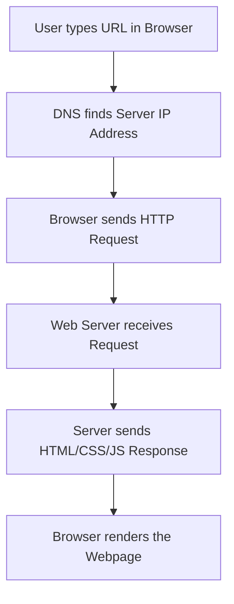
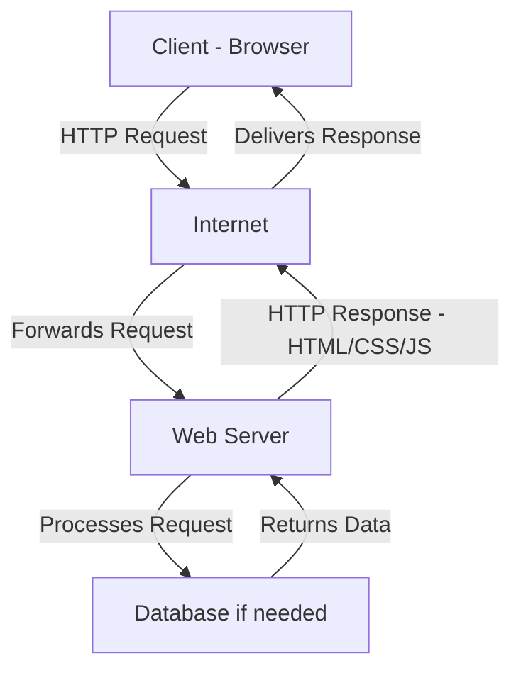
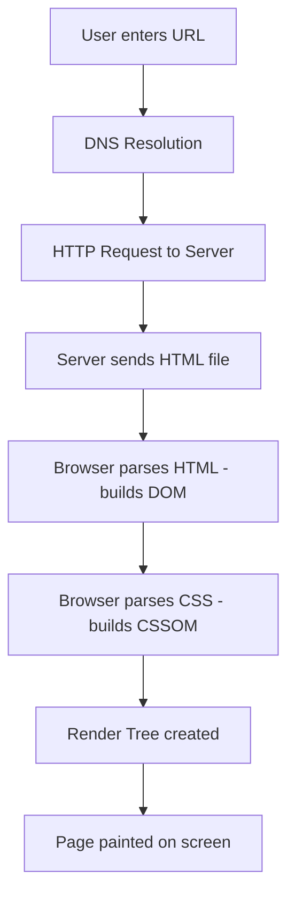
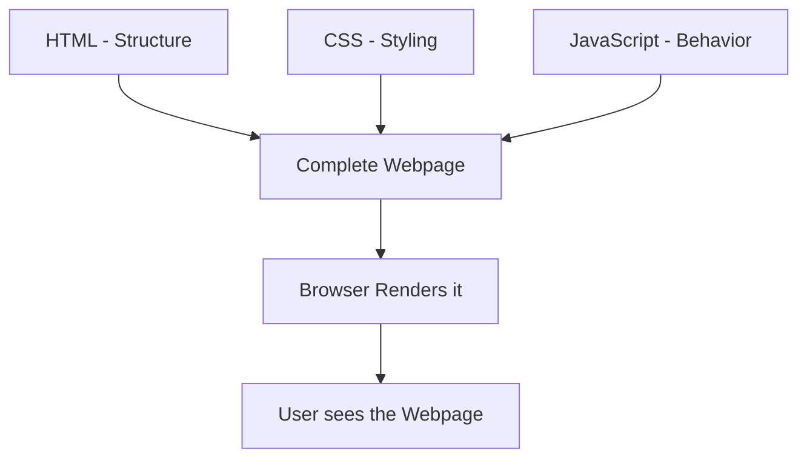
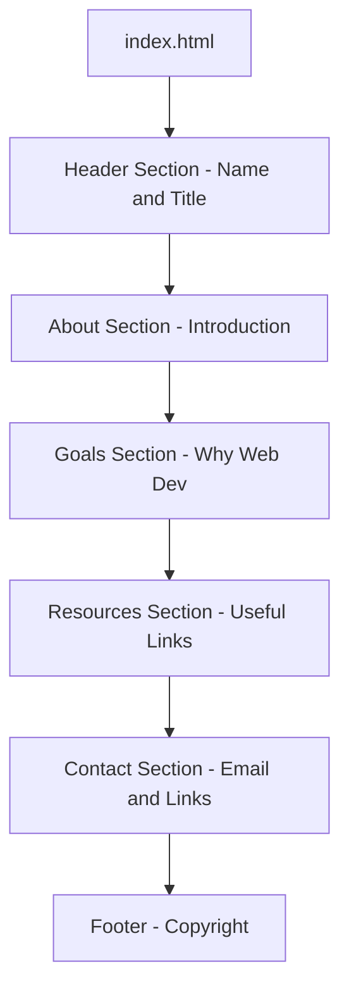

<a id="chapter-1-introduction-to-web-html"></a>

# Chapter 1: Introduction to Web & HTML

[⬅ Previous Chapter](#main-index) | [📖 Main Index](#main-index) | [Next Chapter ➡](#chapter-2-html-setup-first-program)

---

## 📌 Learning Objectives

By the end of this chapter, you will be able to:

- Understand the difference between the **Internet** and the **World Wide Web**
- Explain the **Client-Server Model** with real-world analogies
- Understand what a **Browser** is and how it works at a basic level
- Differentiate between a **Website** and a **Webpage**
- Define **HTML** and understand its role in web development
- Explain why HTML is the **foundation** of every webpage
- Answer **interview questions** confidently on Web & HTML fundamentals
- Build the **mental model** needed before writing your first HTML file

---

<a id="chapter-index-table-1"></a>

## Chapter Index Table

| Topic No. | Topic Name | Subtopics |
|-----------|-----------|-----------|
| 1.1 | [Internet vs World Wide Web](#11-internet-vs-world-wide-web) | What is Internet<br>What is Web<br>Difference<br>Analogy |
| 1.2 | [Client-Server Model](#12-client-server-model) | What is Client<br>What is Server<br>How they communicate<br>HTTP/HTTPS basics |
| 1.3 | [What is a Browser](#13-what-is-a-browser) | Role of browser<br>Popular browsers<br>Rendering engine<br>How browser loads a page |
| 1.4 | [Website vs Webpage vs Web App](#14-website-vs-webpage-vs-web-app) | Website definition<br>Webpage definition<br>Web App definition<br>Key differences |
| 1.5 | [What is HTML](#15-what-is-html) | Full form<br>Definition<br>History<br>Versions<br>What HTML is NOT |
| 1.6 | [Role of HTML in Web Development](#16-role-of-html-in-web-development) | HTML as structure<br>CSS as style<br>JS as behavior<br>Analogy<br>Practical role |

---

## 1.1 Internet vs World Wide Web

<a id="11-internet-vs-world-wide-web"></a>

---

### 🔷 What is the Internet?

The **Internet** is a massive global network of interconnected computers and devices that communicate with each other using standardized protocols (rules).

Think of the Internet as the **physical infrastructure** — the roads, cables, satellites, and routers that connect billions of devices around the world.

> [!NOTE]
> The Internet is NOT the same as the Web. The Internet is the **network** (infrastructure), and the Web is one of the **services** that runs on top of it.

---

### 🔷 What is the World Wide Web (WWW)?

The **World Wide Web** (commonly called "the Web") is a **system of interlinked documents and resources** that are accessed via the Internet using a browser.

- The Web was invented by **Tim Berners-Lee** in **1989**
- It uses **HTTP/HTTPS** protocols to transfer data
- Web content is written in **HTML**, styled with **CSS**, and made interactive with **JavaScript**
- Every webpage on the Web has a unique address called a **URL** (Uniform Resource Locator)

---

### 🔷 Internet vs Web — Key Differences

| Feature | Internet | World Wide Web |
|---------|----------|----------------|
| **Definition** | Global network of computers | System of documents/resources on the Internet |
| **Inventor** | ARPANET (1960s, US Defense) | Tim Berners-Lee (1989) |
| **What it is** | Physical infrastructure | Service running on the Internet |
| **Examples** | Emails, VoIP, FTP, Web | Websites, web pages, web apps |
| **Protocol** | TCP/IP | HTTP / HTTPS |
| **Requirement** | Exists independently | Requires the Internet to function |

---

### 🧠 Hinglish Intuition

> Socho Internet ek **shahar ki road network** hai — highways, bridges, flyovers sab kuch.
>
> Aur World Wide Web un roads par chalne wali **ek specific bus service** hai.
>
> Email ek aur service hai, online gaming ek aur service hai — sab Internet ke upar chal rahe hain.
>
> Jab tum browser mein `www.google.com` type karte ho, tum **Web** use kar rahe ho — jo Internet ke upar kaam karta hai.
>
> **Internet = Roads. Web = Bus Service on those Roads.**

---

### 🔷 How Does the Web Work? (Simple Flow)



---

### 🔷 Key Terms to Know

| Term | Meaning |
|------|---------|
| **URL** | Unique address of a webpage e.g. `https://www.google.com` |
| **HTTP** | HyperText Transfer Protocol — rules for sending web data |
| **HTTPS** | Secure version of HTTP (encrypted) |
| **DNS** | Domain Name System — converts domain names to IP addresses |
| **IP Address** | Unique numerical address of a device on the Internet |
| **Protocol** | A set of rules for communication between computers |

---

> [!TIP]
> In interviews, always clarify: **"Internet is the infrastructure, Web is a service that runs on the Internet."** This one line shows conceptual clarity.

---

> [!IMPORTANT]
> **Interview Trap:** Many beginners say "I browse the Internet" when technically they are browsing **the Web**. Both terms are often used interchangeably in casual conversation, but in technical interviews, the distinction matters.

---

👉 <a href="#chapter-index-table-1">Go to Top 🔝</a>

---

## 1.2 Client-Server Model

<a id="12-client-server-model"></a>

---

### 🔷 What is the Client-Server Model?

The **Client-Server Model** is a computing architecture where:

- A **Client** is any device or program that **requests** information or services
- A **Server** is a powerful computer or program that **provides** information or services in response

This is the fundamental communication model that powers the entire Web.

---

### 🔷 What is a Client?

A **Client** is the device or software that:

- Sends a **request** to the server
- Receives the **response** from the server
- Displays the result to the user

**Examples of Clients:**
- Your web browser (Chrome, Firefox, Safari)
- Mobile apps
- Desktop applications

---

### 🔷 What is a Server?

A **Server** is a powerful computer that:

- **Listens** for incoming requests
- **Processes** the request
- **Sends back** the appropriate response

**Examples of Servers:**
- Web servers (Apache, Nginx)
- Database servers (MySQL, MongoDB)
- File servers
- Cloud servers (AWS, Azure, GCP)

---

### 🧠 Hinglish Intuition

> Socho ek **restaurant** ka scene:
>
> - **Tum (Customer)** = Client
> - **Waiter** = Browser (request leke jaata hai)
> - **Kitchen** = Server
> - **Menu** = Request (URL)
> - **Khana** = Response (HTML page)
>
> Tum waiter ko order dete ho (request). Waiter kitchen mein jaata hai (Internet pe request jaati hai). Kitchen khana taiyaar karta hai (server HTML taiyaar karta hai). Waiter khana wapas laata hai (browser response laata hai). Tum khate ho (browser page dikhata hai).
>
> **Yahi hai Client-Server Model!**

---

### 🔷 How Client-Server Communication Works



---

### 🔷 Step-by-Step Communication Flow

| Step | What Happens |
|------|-------------|
| **Step 1** | User types `https://www.example.com` in the browser |
| **Step 2** | Browser asks DNS: "What is the IP address of example.com?" |
| **Step 3** | DNS replies with IP address e.g. `93.184.216.34` |
| **Step 4** | Browser sends an **HTTP GET request** to that IP address |
| **Step 5** | The web server at that IP receives the request |
| **Step 6** | Server prepares the response (HTML, CSS, JS files) |
| **Step 7** | Server sends back the response with an **HTTP status code** (e.g., 200 OK) |
| **Step 8** | Browser receives the response and **renders** the webpage |

---

### 🔷 HTTP Request & Response Basics

**HTTP Request contains:**
- **Method** — GET, POST, PUT, DELETE
- **URL** — The address being requested
- **Headers** — Extra information (browser type, language, etc.)
- **Body** — Data sent (used in POST requests)

**HTTP Response contains:**
- **Status Code** — 200 (OK), 404 (Not Found), 500 (Server Error)
- **Headers** — Content type, cache info, etc.
- **Body** — The actual HTML/CSS/JS content

---

### 🔷 Common HTTP Status Codes

| Status Code | Meaning |
|-------------|---------|
| `200 OK` | Request successful |
| `301 Moved Permanently` | Page has moved to a new URL |
| `400 Bad Request` | Client sent an invalid request |
| `401 Unauthorized` | Authentication required |
| `403 Forbidden` | Access denied |
| `404 Not Found` | Page does not exist |
| `500 Internal Server Error` | Server-side error |

---

> [!IMPORTANT]
> **Interview Must-Know:** The difference between **GET** and **POST** is a very commonly asked question. GET requests data from the server. POST sends data to the server (e.g., form submission). GET parameters are visible in the URL. POST parameters are in the request body.

---

> [!TIP]
> Remember: **Client always initiates** the communication. The server never contacts the client first (in the traditional model — WebSockets are different, which is a JavaScript concept).

---

👉 <a href="#chapter-index-table-1">Go to Top 🔝</a>

---

## 1.3 What is a Browser?

<a id="13-what-is-a-browser"></a>

---

### 🔷 What is a Web Browser?

A **Web Browser** is a software application that:

- Allows users to **access** and **navigate** the World Wide Web
- **Sends requests** to web servers
- **Receives HTML, CSS, and JavaScript** files
- **Renders** (displays) those files as visual webpages
- Manages **history, bookmarks, cookies, and sessions**

---

### 🔷 Popular Web Browsers

| Browser | Rendering Engine | JavaScript Engine | Developed By |
|---------|-----------------|-------------------|--------------|
| **Google Chrome** | Blink | V8 | Google |
| **Mozilla Firefox** | Gecko | SpiderMonkey | Mozilla |
| **Apple Safari** | WebKit | JavaScriptCore | Apple |
| **Microsoft Edge** | Blink | V8 | Microsoft |
| **Opera** | Blink | V8 | Opera Software |

---

### 🔷 What is a Rendering Engine?

A **Rendering Engine** (also called Layout Engine) is the core component of a browser that:

- **Parses HTML** and builds the DOM (Document Object Model)
- **Parses CSS** and applies styles
- **Paints** the final visual output on the screen

> [!NOTE]
> The rendering engine is why the same HTML/CSS can look slightly different in different browsers. Different engines interpret some properties slightly differently — this is why cross-browser testing is important.

---

### 🔷 How a Browser Loads a Webpage



---

### 🔷 Key Browser Concepts

| Concept | Explanation |
|---------|------------|
| **DOM** | Document Object Model — tree structure of HTML elements |
| **CSSOM** | CSS Object Model — tree structure of CSS rules |
| **Render Tree** | Combination of DOM + CSSOM used to paint the page |
| **Cookie** | Small data stored in the browser from a website |
| **Cache** | Stored copies of files to speed up future visits |
| **DevTools** | Browser developer tools — inspect, debug, test HTML/CSS/JS |

---

### 🧠 Hinglish Intuition

> Browser ek **translator** ki tarah hai.
>
> Server ne tumhe ek letter bheja jo **HTML, CSS, JS** mein likha hai — yeh code language mein hai, insaan seedha nahi padh sakta.
>
> Browser yeh code leta hai, **translate** karta hai, aur tumhe ek **sundar visual webpage** dikhata hai.
>
> Jaise ek **movie projector** film reel ko leta hai aur screen par picture dikhata hai — **Browser = Projector, HTML/CSS/JS = Film Reel, Webpage = Picture on Screen.**

---

> [!TIP]
> Always remember to **test your HTML/CSS in multiple browsers** during development, especially Chrome and Firefox. Chrome DevTools (F12) is your best friend for debugging.

---

👉 <a href="#chapter-index-table-1">Go to Top 🔝</a>

---

## 1.4 Website vs Webpage vs Web App

<a id="14-website-vs-webpage-vs-web-app"></a>

---

### 🔷 What is a Webpage?

A **Webpage** is a **single document** on the Web that:

- Is written in HTML
- Has a unique URL
- Can contain text, images, videos, links, forms, etc.
- Is what you see when you visit a specific URL

**Example:**
`https://www.wikipedia.org/wiki/HTML` → This specific page about HTML is a **webpage**

---

### 🔷 What is a Website?

A **Website** is a **collection of related webpages** that:

- Are grouped under the **same domain name**
- Share a common purpose or brand
- Are linked together through navigation

**Example:**
`https://www.wikipedia.org` → The entire Wikipedia platform with millions of pages is a **website**

---

### 🔷 What is a Web Application (Web App)?

A **Web Application** is a **dynamic, interactive** website that:

- Allows users to **perform tasks** and **interact** with data
- Behaves more like a desktop application
- Uses backend servers, databases, and APIs
- The content changes based on **user interaction or data**

**Examples:** Gmail, Facebook, Google Docs, YouTube, Amazon

---

### 🔷 Key Differences

| Feature | Webpage | Website | Web App |
|---------|---------|---------|---------|
| **Definition** | Single document | Collection of pages | Interactive application |
| **Content** | Usually static | Mix of static pages | Dynamic, data-driven |
| **Interaction** | Minimal | Navigation between pages | High user interaction |
| **Examples** | A blog post | A blog | Gmail, Facebook |
| **Backend needed?** | No | Sometimes | Yes |
| **Database needed?** | No | Sometimes | Usually yes |

---

### 🧠 Hinglish Intuition

> - **Webpage** = Ek akela **page of a book**
> - **Website** = Poori **book** (sare pages milake)
> - **Web App** = Ek **interactive tool** jaise calculator ya ATM machine
>
> Book mein tum sirf padh sakte ho. ATM se tum kuch **kar** sakte ho — paise nikalo, balance dekho.
>
> Yahi difference hai **website** aur **web app** mein!

---

> [!NOTE]
> The line between a "website" and a "web app" has become blurry in modern development. Many modern websites (like news sites with user accounts) have both static and dynamic elements.

---

👉 <a href="#chapter-index-table-1">Go to Top 🔝</a>

---

## 1.5 What is HTML?

<a id="15-what-is-html"></a>

---

### 🔷 What is HTML?

**HTML** stands for **HyperText Markup Language**.

- **HyperText** — Text that contains **links** (hyperlinks) to other documents
- **Markup** — A system of **tags/annotations** added to content to define its structure and meaning
- **Language** — A **standardized set of rules** for creating web documents

HTML is the **standard language** used to create and structure content on the Web.

> [!IMPORTANT]
> HTML is **NOT** a programming language. It does not have logic, variables, loops, or conditions. It is a **markup language** used to define the **structure and meaning** of content.

---

### 🔷 Brief History of HTML

| Version | Year | Key Features |
|---------|------|-------------|
| **HTML 1.0** | 1991 | Basic text, hyperlinks — created by Tim Berners-Lee |
| **HTML 2.0** | 1995 | Forms, tables |
| **HTML 3.2** | 1997 | Scripts, applets |
| **HTML 4.01** | 1999 | CSS support, accessibility improvements |
| **XHTML 1.0** | 2000 | Stricter XML-based HTML |
| **HTML5** | 2014 | Semantic elements, audio, video, canvas, APIs — current standard |

---

### 🔷 What HTML Does

HTML defines:

- **Structure** — Headings, paragraphs, lists, tables
- **Content** — Text, images, videos, audio
- **Links** — Hyperlinks to other pages
- **Forms** — Input fields, buttons, dropdowns
- **Meaning** — Semantic tags that give context to content

---

### 🔷 What HTML Does NOT Do

| What HTML Does NOT Do | What Handles It Instead |
|-----------------------|------------------------|
| Styling (colors, fonts, layout) | CSS |
| Interactivity (click events, animations) | JavaScript |
| Data storage | Databases (MySQL, MongoDB) |
| Server-side logic | PHP, Node.js, Python |
| Business logic | Backend languages |

---

### 🧠 Hinglish Intuition

> HTML ek **blueprint** hai — jaise ghar banane se pehle architect ka **naksha (map)**.
>
> Naksha batata hai: "Yahan drawing room hoga, yahan bedroom hoga, yahan kitchen hoga."
>
> HTML bhi batata hai: "Yahan heading hogi, yahan paragraph hoga, yahan image hogi, yahan button hoga."
>
> Naksha khud ghar nahi hai — woh sirf **structure** define karta hai. CSS woh paint aur decoration hai. JavaScript woh electricity aur automation hai.
>
> **HTML = Ghar ka Naksha (Blueprint)**

---

### 🔷 HTML is Made of Tags

HTML works through **tags** — special keywords wrapped in angle brackets `< >`:

```html
<!-- This is a paragraph tag -->
<p>This is a paragraph of text.</p>

<!-- This is a heading tag -->
<h1>This is the main heading</h1>

<!-- This is an image tag -->


<!-- This is a link tag -->
<a href="https://www.google.com">Go to Google</a>
```

**Explanation:**
- `<p>` — Opening tag
- `</p>` — Closing tag
- `This is a paragraph of text.` — Content between tags
- `src`, `alt`, `href` — **Attributes** that provide extra information

---

> [!NOTE]
> We will study tags, attributes, and document structure in detail in the coming chapters. This chapter builds your mental model of why HTML exists.

---

👉 <a href="#chapter-index-table-1">Go to Top 🔝</a>

---

## 1.6 Role of HTML in Web Development

<a id="16-role-of-html-in-web-development"></a>

---

### 🔷 The Three Pillars of Frontend Web Development

Every webpage you see in a browser is built using three core technologies working together:

| Technology | Role | Analogy |
|-----------|------|---------|
| **HTML** | Structure & Content | Skeleton of the human body |
| **CSS** | Styling & Layout | Skin, clothes, appearance |
| **JavaScript** | Behavior & Interactivity | Muscles & brain — makes things move and think |

---

### 🔷 HTML's Specific Role



---

### 🔷 What HTML Provides to a Webpage

| HTML's Role | Example |
|------------|---------|
| **Defines the structure** | Headers, sections, articles, footers |
| **Provides content** | Text, images, videos, audio |
| **Creates navigation** | Links between pages |
| **Builds forms** | Input fields for user data collection |
| **Gives semantic meaning** | Tells browsers and search engines what content means |
| **Establishes hierarchy** | H1 is main title, H2 is subtitle, etc. |
| **Enables accessibility** | Screen readers use HTML structure to help visually impaired users |
| **Supports SEO** | Search engines crawl HTML to index content |

---

### 🔷 HTML Without CSS and JavaScript

When you load an HTML file with no CSS and no JavaScript:

- The page will have **content** — text, images, links will work
- It will look **plain and unstyled** — black text on white background
- Links will be **blue and underlined**
- But the **structure and information** will all be there

> [!TIP]
> This is actually a great test. If your page makes sense without CSS and JavaScript, your HTML is well-structured. This is called **Progressive Enhancement** — a best practice in web development.

---

### 🔷 HTML and SEO (Search Engine Optimization)

Search engines like Google **crawl** (read) the HTML of your webpages to understand:

- What is the page **about** (title, headings, content)
- How is the content **structured** (semantic HTML)
- What **links** are on the page
- What **images** are present (via `alt` attributes)

Good HTML = Better SEO = Higher rankings on Google.

---

### 🔷 HTML and Accessibility

**Accessibility** means building websites that **everyone** can use — including people with disabilities.

HTML plays a crucial role:

- **Screen readers** use HTML structure to read pages aloud to visually impaired users
- **`alt` attributes** on images provide text descriptions
- **`<label>`** tags help screen readers identify form fields
- **Semantic HTML** (`<nav>`, `<main>`, `<button>`) helps assistive technologies understand page structure
- **Heading hierarchy** (H1 → H2 → H3) helps users navigate

---

### 🧠 Hinglish Intuition

> Ek human body ka example lo:
>
> - **HTML** = **Skeleton** (haddiyan) — bina skeleton ke body ka koi structure nahi hoga. Skeleton batata hai: "Yahan sir hai, yahan haath hai, yahan paer hai."
>
> - **CSS** = **Skin, kapde, aur looks** — skeleton ko sundar dikhane ke liye. Rang, size, font, layout sab CSS karta hai.
>
> - **JavaScript** = **Muscles aur brain** — kuch karna hai, move karna hai, react karna hai — yeh sab JS karta hai.
>
> **Pehle skeleton (HTML) banana padega. Baad mein style (CSS) aur behavior (JS) add kar sakte ho.**
>
> Bina HTML ke CSS aur JS kuch nahi kar sakte!

---

### 🔷 Real-World Analogy — Building a House

| Building a House | Web Development |
|-----------------|-----------------|
| **Blueprint/Naksha** | HTML |
| **Paint, Wallpaper, Tiles** | CSS |
| **Electricity, Fans, AC** | JavaScript |
| **Foundation & Walls** | HTML Structure |
| **Interior Design** | CSS Layout |
| **Automation (Smart Home)** | JavaScript Interactions |

---

> [!IMPORTANT]
> **Interview Key Point:** Always remember — HTML defines **structure and meaning**, CSS defines **presentation**, and JavaScript defines **behavior**. These are the three fundamental layers of every webpage. Interviewers love this question.

---

👉 <a href="#chapter-index-table-1">Go to Top 🔝</a>

---

## 💡 Interview Questions

---

### 📝 Conceptual Questions

**Q1. What is the difference between the Internet and the World Wide Web?**

**Answer:**
The **Internet** is the global physical network of interconnected computers and devices that communicate using TCP/IP protocols. It is the infrastructure — cables, routers, satellites.

The **World Wide Web (WWW)** is a service that runs **on top of** the Internet. It is a system of interlinked HTML documents and resources accessed via browsers using HTTP/HTTPS protocols.

In simple terms: Internet = Roads, Web = One specific bus service on those roads.

---

**Q2. Is HTML a programming language? Why or why not?**

**Answer:**
**No, HTML is NOT a programming language.** It is a **Markup Language**.

A programming language has:
- Variables
- Logic (if/else conditions)
- Loops (for, while)
- Functions

HTML has **none of these**. HTML simply uses **tags** to define the structure and meaning of content. It tells the browser what elements are on the page, not how to perform computations.

---

**Q3. What does HyperText Markup Language stand for? Explain each word.**

**Answer:**
- **HyperText** — Text that contains hyperlinks — links that allow navigation to other documents or pages on the Web
- **Markup** — A system of annotations/tags added to content to define its structure, role, and meaning
- **Language** — A standardized, rule-based system for creating documents

---

**Q4. Explain the Client-Server Model.**

**Answer:**
The Client-Server Model is a communication architecture where:

- **Client** — A device/application (e.g., browser) that **requests** information
- **Server** — A powerful computer that **stores** resources and **responds** to requests

**Flow:**
1. Client sends an HTTP request to the server
2. Server processes the request
3. Server sends back an HTTP response (HTML, CSS, JS files)
4. Client (browser) renders the response as a webpage

---

**Q5. What is the role of HTML in web development?**

**Answer:**
HTML provides:
1. **Structure** — Defines the skeleton of the webpage
2. **Content** — Holds text, images, videos, audio
3. **Semantics** — Gives meaning to content (headings, paragraphs, navigation)
4. **Links** — Enables navigation between pages
5. **Forms** — Allows data collection from users
6. **Accessibility** — Helps screen readers and assistive technologies
7. **SEO foundation** — Helps search engines understand and index content

---

### 🎯 Scenario-Based Questions

**Q6. A client says their website looks completely broken. You open it in Chrome and see only plain black text on white background, no layout. What might be the issue?**

**Answer:**
The most likely cause is that **CSS is not loading**. The HTML is working (content is visible), but the CSS file is either:
- Not linked correctly in the HTML `<head>`
- Missing from the server
- Has a wrong file path in the `<link>` tag

The first thing to check is the browser's DevTools (F12) → Network tab → see if CSS file returns a 404 error.

---

**Q7. Why do we need HTML if we could just write plain text documents?**

**Answer:**
Plain text documents have no structure or meaning. HTML allows us to:
- Define **hierarchy** (what is a heading, what is a paragraph)
- Create **links** between documents
- Embed **media** (images, videos, audio)
- Build **forms** for user input
- Provide **semantic meaning** for browsers, search engines, and assistive technologies
- Create **interactive** experiences (with CSS and JS built on top of HTML)

---

### 🔍 Output-Based Questions

**Q8. What does this code produce?**

```html
<h1>Welcome to My Website</h1>
<p>This is my first webpage.</p>
<a href="https://www.google.com">Visit Google</a>
```

**Answer:**
- A large bold heading: **Welcome to My Website**
- A paragraph of text: This is my first webpage.
- A clickable hyperlink: Visit Google (clicking it opens Google in the browser)

---

### 🚀 Advanced Questions

**Q9. What is the difference between a website and a web application?**

**Answer:**

| Feature | Website | Web Application |
|---------|---------|----------------|
| Purpose | Informational | Task-based |
| Interaction | Low | High |
| Content | Mostly static | Dynamic, data-driven |
| Examples | Wikipedia, blog | Gmail, Facebook, Google Docs |
| Backend | Often not needed | Usually required |

**Key distinction:** A website is primarily **read** by users. A web application is **used** by users to accomplish tasks.

---

**Q10. What is the difference between GET and POST HTTP methods?**

**Answer:**

| Feature | GET | POST |
|---------|-----|------|
| Purpose | Request/retrieve data | Send data to server |
| Data location | In the URL (query string) | In the request body |
| Visibility | Visible in URL bar | Not visible in URL |
| Security | Less secure (data in URL) | More secure for sensitive data |
| Caching | Can be cached | Not cached |
| Use case | Search, fetching pages | Form submissions, login |

---

👉 <a href="#chapter-index-table-1">Go to Top 🔝</a>

---

## 🧪 Practice Problems

---

### 📋 Theory Questions

**T1.** In your own words, explain the difference between the Internet and the World Wide Web. Give two examples of services that use the Internet but are NOT part of the Web.

**T2.** Describe what happens step by step when you type `https://www.github.com` into your browser and press Enter. List at least 6 steps.

**T3.** What makes HTML a "markup" language? How is it different from a "programming" language?

**T4.** Why is it important for HTML to be semantic? How does it affect SEO and accessibility?

**T5.** A client asks: "I just want to put my business information online. Do I need HTML, CSS, and JavaScript all three?" Write a professional answer explaining the role of each and what is absolutely necessary.

---

### 💻 Coding Questions

**C1.** Write a simple HTML snippet that contains:
- A main heading with your name
- A paragraph describing yourself
- A link to your favorite website

**C2.** Without using any CSS, create an HTML page with:
- A heading: "My Favorite Foods"
- An ordered list of 5 of your favorite foods

**C3.** Create an HTML page with:
- A heading: "Contact Me"
- Your email as a clickable `mailto:` link
- Your phone number as a clickable `tel:` link

**C4.** Write HTML that represents a simple webpage structure with:
- A company name as H1
- A tagline as H2
- Three paragraphs about the company
- A link to "Learn More"

**C5.** Explain in comments (using `<!-- -->`) what each tag does in the following code:

```html
<h1>Hello World</h1>
<p>Welcome to my site.</p>

<a href="about.html">About Us</a>
```

---

### 🏗️ Machine Coding Problems

**M1. Build a "Coming Soon" Static Page**

Build a simple static HTML page (no CSS styling required — just structure) that contains:
- A company name as the main H1 heading
- A subheading: "We're launching soon!"
- A short paragraph describing what the company does
- A countdown message (just text: "Launching in 30 days")
- A contact email as a clickable mailto link
- A copyright notice at the bottom

The goal is to practice structuring real content with HTML only.

---

**M2. Build a Simple "About Me" Webpage**

Create an HTML-only (no CSS) webpage that acts as a personal introduction page containing:
- Your name as the main heading
- A professional tagline as a subheading
- An "About Me" section with a 3-4 sentence paragraph
- A "Skills" section with an unordered list of 5 skills
- A "Contact" section with:
  - Email link (mailto)
  - Phone number link (tel)
  - A link to a LinkedIn or GitHub profile

This simulates the kind of task a recruiter might ask you to do quickly in an interview.

---

👉 <a href="#chapter-index-table-1">Go to Top 🔝</a>

---

## 🚀 Mini Project

---

### 📋 Problem Statement

Build a **"My Web Dev Journey"** static information page using only HTML (no CSS required at this stage). This page will document your web development learning journey and serve as a starting point for your portfolio.

---

### ✨ Features

- Personal introduction section
- Goals section (why you are learning web development)
- Resources section (links to useful websites)
- A contact section
- Proper semantic HTML structure throughout

---

### 🏗️ Architecture

This project uses only:
- **HTML** — Structure and content
- No CSS, No JavaScript (those come in later chapters)

---

### 🔷 Flow Diagram



---

### 📁 Folder Structure

```text
my-web-journey/
│
└── index.html
```

---

### 💻 Implementation

```html
<!DOCTYPE html>
<html lang="en">

<head>
    <meta charset="UTF-8">
    <meta name="viewport" content="width=device-width, initial-scale=1.0">
    <title>My Web Dev Journey</title>
</head>

<body>

    <!-- ======================== -->
    <!-- HEADER SECTION           -->
    <!-- ======================== -->
    <h1>My Web Development Journey</h1>
    <h2>From Complete Beginner to Frontend Developer</h2>
    <p>By: Your Name Here</p>

    <hr>

    <!-- ======================== -->
    <!-- ABOUT SECTION            -->
    <!-- ======================== -->
    <h2>About Me</h2>
    <p>
        Hello! My name is [Your Name]. I am currently learning web development
        and working towards becoming a professional frontend developer.
        I started this journey because I am passionate about building things
        that people can use on the Internet.
    </p>

    <hr>

    <!-- ======================== -->
    <!-- GOALS SECTION            -->
    <!-- ======================== -->
    <h2>My Learning Goals</h2>
    <p>Here is what I want to achieve by learning HTML and CSS:</p>

    <ol>
        <li>Understand the fundamentals of how the Web works</li>
        <li>Learn to structure webpages professionally using HTML</li>
        <li>Style webpages beautifully using CSS</li>
        <li>Build responsive websites that work on all devices</li>
        <li>Create a portfolio of real projects</li>
        <li>Land a frontend developer job</li>
    </ol>

    <hr>

    <!-- ======================== -->
    <!-- WHAT I AM LEARNING       -->
    <!-- ======================== -->
    <h2>What I Am Currently Learning</h2>
    <ul>
        <li>HTML — Structure of webpages</li>
        <li>CSS — Styling and layout</li>
        <li>Responsive Web Design — Mobile-friendly websites</li>
        <li>JavaScript — (Coming soon)</li>
    </ul>

    <hr>

    <!-- ======================== -->
    <!-- RESOURCES SECTION        -->
    <!-- ======================== -->
    <h2>Useful Resources I Recommend</h2>
    <p>These websites have helped me in my learning journey:</p>

    <ul>
        <li>
            <a href="https://developer.mozilla.org" target="_blank">
                MDN Web Docs — Best HTML/CSS reference
            </a>
        </li>
        <li>
            <a href="https://www.w3schools.com" target="_blank">
                W3Schools — Beginner-friendly tutorials
            </a>
        </li>
        <li>
            <a href="https://caniuse.com" target="_blank">
                Can I Use — Browser compatibility checker
            </a>
        </li>
        <li>
            <a href="https://css-tricks.com" target="_blank">
                CSS Tricks — Advanced CSS techniques
            </a>
        </li>
    </ul>

    <hr>

    <!-- ======================== -->
    <!-- CONTACT SECTION          -->
    <!-- ======================== -->
    <h2>Contact Me</h2>
    <p>I would love to connect with fellow learners and developers:</p>

    <ul>
        <li>Email: <a href="mailto:yourname@email.com">yourname@email.com</a></li>
        <li>GitHub: <a href="https://github.com/yourusername" target="_blank">github.com/yourusername</a></li>
        <li>LinkedIn: <a href="https://linkedin.com/in/yourusername" target="_blank">linkedin.com/in/yourusername</a></li>
    </ul>

    <hr>

    <!-- ======================== -->
    <!-- FOOTER                   -->
    <!-- ======================== -->
    <p>
        <small>
            &copy; 2024 Your Name. Built with HTML as part of my web development learning journey.
        </small>
    </p>

</body>

</html>
```

---

### 🔷 Code Breakdown

| Section | Tags Used | Purpose |
|---------|-----------|---------|
| **Document Setup** | `<!DOCTYPE html>`, `<html>`, `<head>`, `<body>` | Standard HTML document structure |
| **Meta Information** | `<meta charset>`, `<meta viewport>`, `<title>` | Browser and SEO settings |
| **Headings** | `<h1>`, `<h2>` | Creates visual hierarchy |
| **Paragraphs** | `<p>` | Contains text content |
| **Dividers** | `<hr>` | Separates sections visually |
| **Ordered List** | `<ol>`, `<li>` | Numbered goals list |
| **Unordered List** | `<ul>`, `<li>` | Bullet point lists |
| **Links** | `<a href>` | Navigation and contact links |
| **External links** | `target="_blank"` | Opens links in new tab |
| **Email link** | `mailto:` | Opens email client |
| **Small text** | `<small>` | Footer copyright text |
| **Special character** | `&copy;` | HTML entity for © symbol |

---

### 🎤 Interview Discussion Points

If asked about this project in an interview, you should be able to discuss:

1. **Why did you use `<!DOCTYPE html>`?**
   → It tells the browser to use HTML5 standards mode, ensuring consistent rendering

2. **Why `lang="en"` on the `<html>` tag?**
   → It tells browsers and screen readers the primary language of the document, helping with accessibility and SEO

3. **Why `charset="UTF-8"` in the meta tag?**
   → UTF-8 supports virtually all characters and symbols from all languages, preventing character encoding issues

4. **Why `target="_blank"` on external links?**
   → Opens external websites in a new browser tab so the user doesn't leave your website

5. **Why use `<ol>` for goals and `<ul>` for resources?**
   → Goals have a natural order/sequence (ordered list). Resources are a non-ordered collection (unordered list). Using the right list type is semantic HTML practice.

6. **What is the `&copy;` symbol?**
   → It is an HTML entity representing the copyright symbol ©. HTML entities are used for special characters that cannot be typed directly.

---

👉 <a href="#chapter-index-table-1">Go to Top 🔝</a>

---

## ⚡ Quick Revision

---

### 🔑 Key Definitions

| Term | Definition |
|------|-----------|
| **Internet** | Global network of interconnected computers (infrastructure) |
| **World Wide Web** | System of interlinked HTML documents accessed via browsers over the Internet |
| **HTTP** | HyperText Transfer Protocol — rules for web data transfer |
| **HTTPS** | Secure/encrypted version of HTTP |
| **Client** | Device/software that requests data (e.g., browser) |
| **Server** | Computer that stores resources and responds to requests |
| **Browser** | Software that renders HTML/CSS/JS as visual webpages |
| **URL** | Unique address of a webpage |
| **DNS** | Converts domain names to IP addresses |
| **HTML** | HyperText Markup Language — language for structuring web content |
| **Webpage** | A single HTML document with a unique URL |
| **Website** | Collection of related webpages under one domain |
| **Web App** | Interactive, dynamic website (Gmail, Facebook) |
| **Rendering Engine** | Browser component that parses HTML/CSS and paints the page |

---

### ⚠️ Common Interview Traps

| Trap | Correct Answer |
|------|---------------|
| "Internet and Web are the same thing" | **Wrong** — Internet is infrastructure, Web is a service on it |
| "HTML is a programming language" | **Wrong** — HTML is a markup language, it has no logic or computation |
| "Website and Web App are the same" | **Partially wrong** — Web apps are dynamic and task-focused; websites are primarily informational |
| "GET and POST are same" | **Wrong** — GET retrieves data (visible in URL), POST sends data (in body) |
| "Browser is the Internet" | **Wrong** — Browser is a client application used to access the Web |

---

### 📌 Must-Remember Facts

- ✅ **Tim Berners-Lee** invented the World Wide Web in **1989**
- ✅ Internet was born from **ARPANET** in the **1960s**
- ✅ Current HTML version is **HTML5** (standardized 2014)
- ✅ HTML uses **tags** wrapped in `< >` angle brackets
- ✅ HTML is **NOT** a programming language — it has no logic
- ✅ The three layers of frontend: **HTML (structure)**, **CSS (style)**, **JS (behavior)**
- ✅ **Client always initiates** communication in the client-server model
- ✅ **DNS** converts domain names (google.com) to IP addresses
- ✅ **200** = OK, **404** = Not Found, **500** = Server Error (HTTP status codes)
- ✅ **Rendering engine** converts HTML/CSS into visual webpage

---

### 🎯 Revision Bullets

- Internet ≠ Web (Internet is infrastructure, Web is a service)
- HTML = Structure, CSS = Style, JS = Behavior
- HTML is a markup language, NOT a programming language
- Browser = Client that renders HTML/CSS/JS
- Server responds to client requests with HTML/CSS/JS files
- GET = Retrieve data, POST = Send data
- Webpage = single page, Website = collection of pages, Web App = interactive application
- HTML5 is the current and most powerful version of HTML

---

👉 <a href="#chapter-index-table-1">Go to Top 🔝</a>

---

## 📌 Chapter Summary

---

### 🏆 Most Important Interview Points from This Chapter

1. **Internet vs Web distinction** — Always clarify these are different. Internet = infrastructure, Web = service
2. **HTML is NOT a programming language** — This is the most common misconception tested in interviews
3. **Three pillars of frontend** — HTML (structure), CSS (style), JavaScript (behavior)
4. **Client-Server Model** — Client requests, Server responds, Browser renders
5. **GET vs POST** — GET in URL, POST in body; GET for retrieval, POST for sending data

---

### 📚 Key Concepts Learned

- ✅ The Internet is a global network; the Web is a document system on the Internet
- ✅ Browsers are clients that request and render HTML/CSS/JS from servers
- ✅ HTML stands for HyperText Markup Language
- ✅ HTML defines structure and meaning, NOT style or behavior
- ✅ A webpage is a single document; a website is a collection; a web app is interactive
- ✅ DNS translates domain names to IP addresses
- ✅ HTTP status codes communicate the result of a request (200, 404, 500)

---

### 🛠️ Practical Takeaways

- Before writing any code, understand that HTML is your **foundation**
- Every webpage ever built on the Web uses HTML at its core
- Even the most complex web applications (Gmail, Facebook) are built on HTML structures
- Good HTML = Better SEO + Better Accessibility + Better maintainability
- Always think: HTML for **structure**, CSS for **style**, JS for **behavior** — never mix their responsibilities

---

### ❌ Common Mistakes Beginners Make

| Mistake | Correction |
|---------|-----------|
| Confusing Internet and Web | Internet = Infrastructure, Web = Service |
| Thinking HTML can add colors and styling | Colors and styling are done with CSS |
| Thinking HTML can make buttons clickable | JavaScript handles interactivity |
| Not understanding why HTML matters | HTML is the foundation that CSS and JS build upon |
| Calling HTML a programming language | HTML is a markup language with no logic capabilities |

---

> [!IMPORTANT]
> **The Golden Rule of Web Development:** Always build a solid HTML structure first. CSS and JavaScript can only work well if your HTML foundation is correct, semantic, and well-organized.

---

[⬅ Previous Chapter](#main-index) | [📖 Main Index](#main-index) | [Next Chapter ➡](#chapter-2-html-setup-first-program)

---

👉 <a href="#chapter-index-table-1">Go to Top 🔝</a>