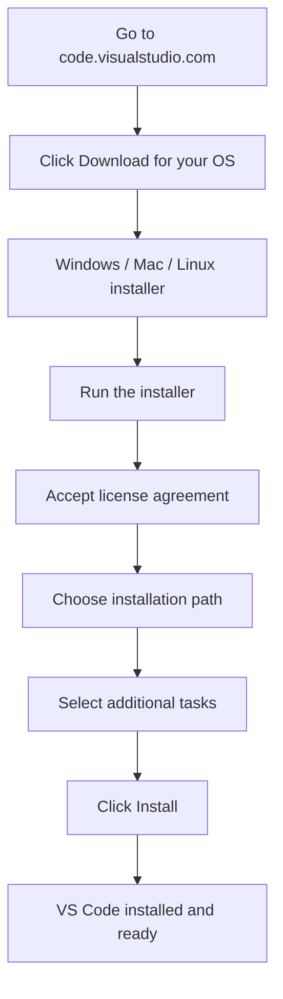
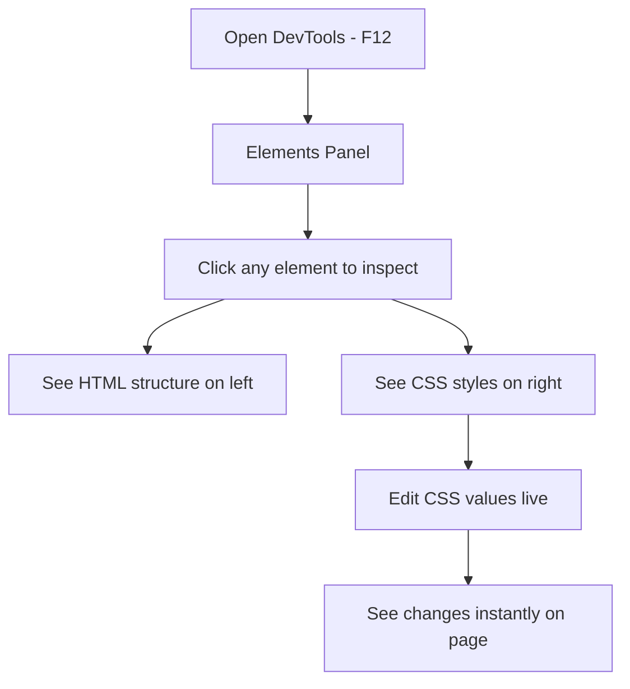
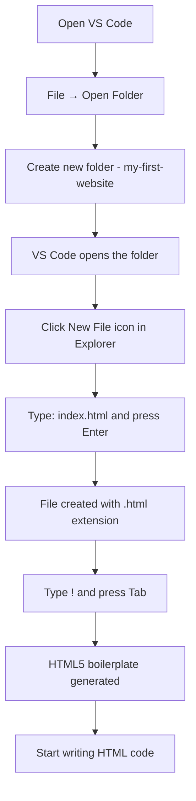
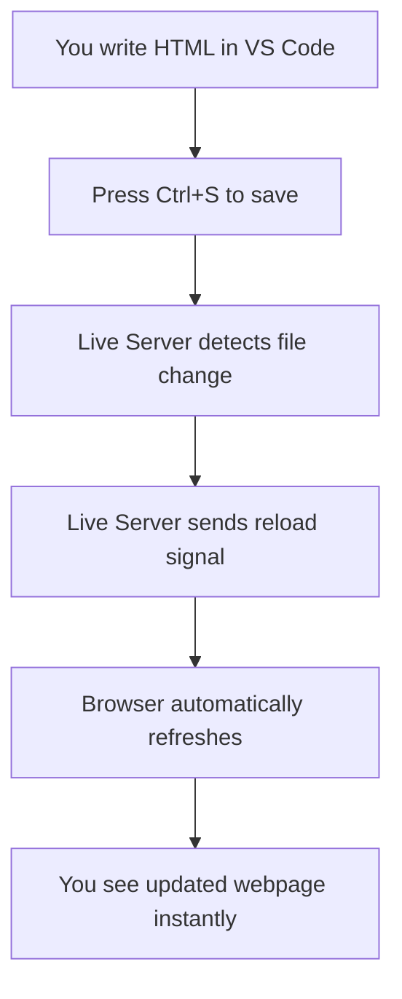
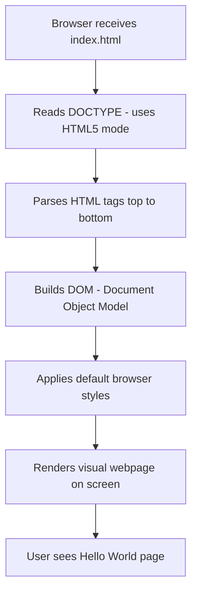
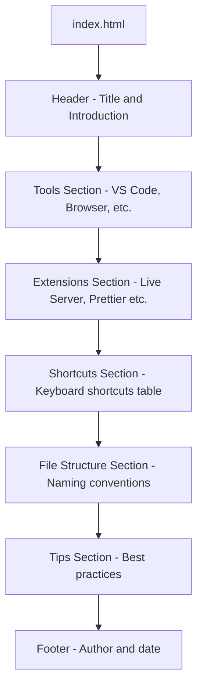

<a id="chapter-2-html-setup-first-program"></a>

# Chapter 2: HTML Setup & First Program

[⬅ Previous Chapter](#chapter-1-introduction-to-web-and-html) | [📖 Main Index](#main-index) | [Next Chapter ➡](#chapter-3-html-document-structure)

---

## 📌 Learning Objectives

By the end of this chapter, you will be able to:

- Install and configure **VS Code** as your professional HTML/CSS development environment
- Understand why **VS Code** is the industry-standard editor for frontend development
- Install and use essential **VS Code extensions** for HTML development
- Set up **Live Server** for real-time browser preview
- Create your **very first HTML file** from scratch
- Understand **file naming conventions** and **file extensions** for web development
- Understand the role of different **browsers** in testing
- Write and run your **first HTML program** in the browser
- Use **Emmet abbreviations** to write HTML faster
- Answer **interview questions** on development environment setup

---

<a id="chapter-index-table-2"></a>

## Chapter Index Table

| Topic No. | Topic Name                                                                         | Subtopics                                                                              |
| --------- | ---------------------------------------------------------------------------------- | -------------------------------------------------------------------------------------- |
| 2.1       | [What is a Code Editor & Why VS Code](#21-what-is-a-code-editor-and-why-vs-code)   | Code editor vs IDE<br>Why VS Code<br>Alternatives<br>Industry usage                    |
| 2.2       | [Installing VS Code](#22-installing-vs-code)                                       | Download steps<br>Installation<br>Interface overview<br>Key areas of VS Code           |
| 2.3       | [Essential VS Code Extensions](#23-essential-vs-code-extensions)                   | Live Server<br>Prettier<br>HTML CSS Support<br>Auto Rename Tag<br>Color Highlight      |
| 2.4       | [VS Code Settings & Shortcuts](#24-vs-code-settings-and-shortcuts)                 | Important settings<br>Must-know shortcuts<br>Emmet basics<br>Productivity tips         |
| 2.5       | [Browser Setup for Development](#25-browser-setup-for-development)                 | Chrome DevTools<br>Firefox DevTools<br>Why multiple browsers<br>DevTools overview      |
| 2.6       | [File Extensions & Naming Conventions](#26-file-extensions-and-naming-conventions) | .html extension<br>.css extension<br>File naming rules<br>Folder structure conventions |
| 2.7       | [Creating Your First HTML File](#27-creating-your-first-html-file)                 | New file<br>Saving with .html<br>HTML boilerplate<br>Emmet ! shortcut                  |
| 2.8       | [Live Server Setup & Usage](#28-live-server-setup-and-usage)                       | Installing Live Server<br>Starting Live Server<br>Auto-reload<br>Port & browser        |
| 2.9       | [First HTML Program — Hello World](#29-first-html-program-hello-world)             | Writing first program<br>Running in browser<br>Understanding output<br>Code breakdown  |

---

## 2.1 What is a Code Editor and Why VS Code

<a id="21-what-is-a-code-editor-and-why-vs-code"></a>

---

### 🔷 What is a Code Editor?

A **Code Editor** is a specialized text editor designed for writing and editing source code. Unlike regular text editors (like Notepad), code editors provide:

- **Syntax Highlighting** — Different colors for different parts of code
- **Auto-completion** — Suggests code as you type
- **Error detection** — Highlights mistakes in real time
- **File management** — Manage project files and folders
- **Extensions/Plugins** — Add extra features as needed
- **Integrated Terminal** — Run commands without leaving the editor

---

### 🔷 Code Editor vs IDE

| Feature          | Code Editor                 | IDE (Integrated Development Environment) |
| ---------------- | --------------------------- | ---------------------------------------- |
| **Size**         | Lightweight                 | Heavy                                    |
| **Speed**        | Fast                        | Slower to start                          |
| **Features**     | Basic + Extensions          | Built-in everything                      |
| **Examples**     | VS Code, Sublime Text, Atom | IntelliJ, Eclipse, Visual Studio         |
| **Best for**     | Web development, scripting  | Enterprise Java, C++, mobile apps        |
| **Customizable** | Highly customizable         | Less flexible                            |

> [!NOTE]
> VS Code sits in a special category — it is a **lightweight code editor** that can be extended to behave like a full IDE through its massive extension marketplace.

---

### 🔷 Why VS Code?

**Visual Studio Code (VS Code)** is the most popular code editor in the world for web development.

| Reason                        | Detail                                     |
| ----------------------------- | ------------------------------------------ |
| **Free & Open Source**        | Completely free to use                     |
| **Cross-Platform**            | Works on Windows, Mac, Linux               |
| **Lightweight**               | Fast startup, low memory usage             |
| **Massive Extension Library** | 50,000+ extensions available               |
| **Built-in Git**              | Version control without leaving the editor |
| **Integrated Terminal**       | Run commands directly inside VS Code       |
| **IntelliSense**              | Smart code completion for HTML, CSS, JS    |
| **Emmet Built-in**            | Write HTML/CSS faster with abbreviations   |
| **Industry Standard**         | Used by millions of developers worldwide   |
| **Active Development**        | Updated monthly by Microsoft               |

---

### 🔷 VS Code vs Other Editors

| Editor           | Pros                                       | Cons                              |
| ---------------- | ------------------------------------------ | --------------------------------- |
| **VS Code**      | Free, fast, huge ecosystem, Emmet built-in | Can be heavy with many extensions |
| **Sublime Text** | Very fast, clean UI                        | Paid license for continued use    |
| **Atom**         | Free, GitHub integration                   | Discontinued in 2022              |
| **Notepad++**    | Ultra-lightweight                          | Windows only, limited features    |
| **Brackets**     | Good for HTML/CSS                          | Discontinued in 2021              |
| **WebStorm**     | Powerful JS IDE                            | Paid, heavy                       |

---

### 🧠 Hinglish Intuition

> Code editor ko samajhna bahut simple hai.
>
> Socho tum ek **carpenter (badhai)** ho. Tumhe furniture banana hai.
>
> Tum simple **haath se kaam kar sakte ho** (Notepad) — kaam ho jayega, lekin bahut mushkil aur slow hoga.
>
> Ya tum ek **professional workshop** use kar sakte ho (VS Code) — jahan har tool ready hai, automatic measurements hain, aur kaam fast aur accurate hota hai.
>
> **VS Code = Professional Carpenter's Workshop for Web Developers.**
>
> Har professional developer VS Code use karta hai — isliye tum bhi yahi use karo!

---

> [!IMPORTANT]
> **Interview Point:** If asked "What tools do you use for web development?" — always mention VS Code with specific extensions (Live Server, Prettier, etc.). This shows professionalism and real-world knowledge.

---

👉 <a href="#chapter-index-table-2">Go to Top 🔝</a>

---

## 2.2 Installing VS Code

<a id="22-installing-vs-code"></a>

---

### 🔷 Step-by-Step Installation



---

### 🔷 Installation Steps — Windows

| Step       | Action                                                                    |
| ---------- | ------------------------------------------------------------------------- |
| **Step 1** | Open browser → go to `https://code.visualstudio.com`                      |
| **Step 2** | Click the big blue **"Download for Windows"** button                      |
| **Step 3** | Run the downloaded `.exe` installer file                                  |
| **Step 4** | Accept the **License Agreement** → Click Next                             |
| **Step 5** | Choose installation location (default is fine) → Click Next               |
| **Step 6** | On "Select Additional Tasks" — check these options:                       |
|            | ✅ Add "Open with Code" action to Windows Explorer file context menu      |
|            | ✅ Add "Open with Code" action to Windows Explorer directory context menu |
|            | ✅ Add to PATH (important for terminal use)                               |
| **Step 7** | Click **Install** → Wait for installation                                 |
| **Step 8** | Click **Finish** → VS Code will open automatically                        |

---

### 🔷 VS Code Interface Overview

When VS Code opens for the first time, you will see:

```text
┌─────────────────────────────────────────────────────────┐
│  Activity Bar │  Side Bar      │  Editor Area            │
│               │                │                         │
│  📁 Explorer  │  File Tree     │  Your code goes here    │
│  🔍 Search   │                │                         │
│  🔀 Git      │                │                         │
│  🧩 Extensions│               │                         │
│               │                │                         │
├───────────────┴────────────────┴─────────────────────────┤
│  Terminal / Output Panel (Bottom)                        │
├──────────────────────────────────────────────────────────┤
│  Status Bar (Bottom - shows language, line number, etc.) │
└──────────────────────────────────────────────────────────┘
```

---

### 🔷 Key Areas of VS Code

| Area                | Location     | Purpose                                          |
| ------------------- | ------------ | ------------------------------------------------ |
| **Activity Bar**    | Far left     | Switch between Explorer, Search, Git, Extensions |
| **Side Bar**        | Left panel   | Shows file tree, search results, extensions list |
| **Editor Area**     | Center/Right | Where you write your code                        |
| **Terminal**        | Bottom panel | Run commands (open with Ctrl + ` )               |
| **Status Bar**      | Very bottom  | Shows language mode, line/col number, errors     |
| **Command Palette** | Ctrl+Shift+P | Search and run any VS Code command               |

---

### 🧠 Hinglish Intuition

> VS Code ka interface ek **professional office** ki tarah hai:
>
> - **Activity Bar** = Office reception — yahan se alag-alag departments mein jaate ho
> - **Side Bar** = Filing cabinet — sabhi files aur folders yahan hain
> - **Editor Area** = Teri actual work desk — yahan code likhta hai
> - **Terminal** = Office intercom — computer ko commands dene ke liye
> - **Status Bar** = Office notice board — current status dikhata hai
>
> Pehle 2-3 din thoda unfamiliar lagega, but 1 week mein yeh sab second nature ban jayega!

---

> [!TIP]
> After installing VS Code, change the **color theme** to something you are comfortable with. Go to: **File → Preferences → Color Theme** → Try "One Dark Pro" or "Dracula" — dark themes are easier on the eyes during long coding sessions.

---

👉 <a href="#chapter-index-table-2">Go to Top 🔝</a>

---

## 2.3 Essential VS Code Extensions

<a id="23-essential-vs-code-extensions"></a>

---

### 🔷 How to Install Extensions

1. Open VS Code
2. Click the **Extensions icon** in the Activity Bar (looks like 4 squares)
3. Or press **Ctrl + Shift + X**
4. Search for the extension name
5. Click **Install**

---

### 🔷 Must-Have Extensions for HTML & CSS Development

---

#### 🔌 Extension 1: Live Server

| Property       | Detail                                                  |
| -------------- | ------------------------------------------------------- |
| **Name**       | Live Server                                             |
| **Developer**  | Ritwick Dey                                             |
| **Purpose**    | Launch a local development server with live reload      |
| **Why needed** | See changes in browser instantly without manual refresh |
| **How to use** | Right-click HTML file → "Open with Live Server"         |
| **Port**       | Runs on `http://127.0.0.1:5500` by default              |

**Without Live Server:**

- Write code → Save → Go to browser → Press F5 to refresh → See changes
- This cycle is slow and breaks your flow

**With Live Server:**

- Write code → Save → Browser auto-refreshes instantly

---

#### 🔌 Extension 2: Prettier — Code Formatter

| Property                | Detail                                                 |
| ----------------------- | ------------------------------------------------------ |
| **Name**                | Prettier - Code formatter                              |
| **Purpose**             | Automatically formats your HTML/CSS/JS code            |
| **Why needed**          | Keeps code clean, readable, and consistently indented  |
| **How to use**          | Save file (with format on save enabled) or Shift+Alt+F |
| **Interview relevance** | Shows you care about code quality and readability      |

---

#### 🔌 Extension 3: HTML CSS Support

| Property       | Detail                                                        |
| -------------- | ------------------------------------------------------------- |
| **Name**       | HTML CSS Support                                              |
| **Purpose**    | Provides CSS class name completion inside HTML files          |
| **Why needed** | Auto-suggests CSS class names when writing `class=""` in HTML |
| **Benefit**    | Reduces typos in class names                                  |

---

#### 🔌 Extension 4: Auto Rename Tag

| Property       | Detail                                                                |
| -------------- | --------------------------------------------------------------------- |
| **Name**       | Auto Rename Tag                                                       |
| **Purpose**    | Automatically renames the closing tag when you rename the opening tag |
| **Why needed** | Saves time and prevents mismatched tag errors                         |
| **Example**    | Change `<div>` → automatically changes `</div>` to match              |

---

#### 🔌 Extension 5: Color Highlight

| Property       | Detail                                                             |
| -------------- | ------------------------------------------------------------------ |
| **Name**       | Color Highlight                                                    |
| **Purpose**    | Shows a preview of colors directly in the code                     |
| **Why needed** | When you write `color: #ff6600`, it shows an orange dot next to it |
| **Benefit**    | Visual confirmation of colors without opening browser              |

---

#### 🔌 Extension 6: IntelliSense for CSS class names

| Property       | Detail                                                          |
| -------------- | --------------------------------------------------------------- |
| **Name**       | IntelliSense for CSS class names in HTML                        |
| **Purpose**    | Provides completion for CSS class names defined in your project |
| **Why needed** | Works with external CSS files, suggests class names in HTML     |

---

#### 🔌 Extension 7: Path Intellisense

| Property       | Detail                                                       |
| -------------- | ------------------------------------------------------------ |
| **Name**       | Path Intellisense                                            |
| **Purpose**    | Auto-completes file paths when linking CSS, images, scripts  |
| **Why needed** | Prevents broken file path errors                             |
| **Example**    | When typing `src="./images/`, it shows available image files |

---

### 🔷 Extension Installation Priority

| Priority                  | Extension         | Reason                              |
| ------------------------- | ----------------- | ----------------------------------- |
| 🔴 **Must Install**       | Live Server       | Cannot develop without live preview |
| 🔴 **Must Install**       | Prettier          | Code formatting is non-negotiable   |
| 🟡 **Highly Recommended** | Auto Rename Tag   | Saves significant time              |
| 🟡 **Highly Recommended** | HTML CSS Support  | Prevents class name typos           |
| 🟢 **Nice to Have**       | Color Highlight   | Visual aid for colors               |
| 🟢 **Nice to Have**       | Path Intellisense | Helpful for larger projects         |

---

> [!TIP]
> Do not install too many extensions at once. Start with just **Live Server** and **Prettier**. Add others as you need them. Too many extensions can slow down VS Code.

---

👉 <a href="#chapter-index-table-2">Go to Top 🔝</a>

---

## 2.4 VS Code Settings and Shortcuts

<a id="24-vs-code-settings-and-shortcuts"></a>

---

### 🔷 Important VS Code Settings to Configure

Open Settings: **File → Preferences → Settings** or **Ctrl + ,**

| Setting               | What to Set | Why                                          |
| --------------------- | ----------- | -------------------------------------------- |
| **Format On Save**    | Enable ✅   | Auto-formats code every time you save        |
| **Auto Save**         | afterDelay  | Saves file automatically                     |
| **Font Size**         | 14–16       | Comfortable for long coding sessions         |
| **Tab Size**          | 2 spaces    | Web development standard                     |
| **Word Wrap**         | on          | Prevents horizontal scrolling for long lines |
| **Default Formatter** | Prettier    | Uses Prettier for all formatting             |

---

### 🔷 How to Enable Format on Save

1. Press **Ctrl + ,** to open Settings
2. Search: **"format on save"**
3. Check the checkbox ✅ **Editor: Format On Save**

Now every time you press Ctrl+S, Prettier will automatically format your code.

---

### 🔷 Must-Know VS Code Keyboard Shortcuts

| Shortcut             | Action                           |
| -------------------- | -------------------------------- |
| **Ctrl + S**         | Save file                        |
| **Ctrl + Z**         | Undo                             |
| **Ctrl + Y**         | Redo                             |
| **Ctrl + C**         | Copy                             |
| **Ctrl + X**         | Cut                              |
| **Ctrl + V**         | Paste                            |
| **Ctrl + /**         | Toggle comment                   |
| **Ctrl + D**         | Select next occurrence of word   |
| **Ctrl + Shift + D** | Duplicate line                   |
| **Alt + ↑/↓**        | Move line up/down                |
| **Ctrl + ` **        | Open/close integrated terminal   |
| **Ctrl + Shift + P** | Command Palette                  |
| **Ctrl + P**         | Quick file open                  |
| **Ctrl + B**         | Toggle side bar                  |
| **Ctrl + Shift + X** | Open Extensions panel            |
| **Ctrl + ,**         | Open Settings                    |
| \*\*Ctrl + \*\*      | Split editor                     |
| **Shift + Alt + F**  | Format document                  |
| **F12**              | Go to definition                 |
| **Ctrl + Space**     | Trigger IntelliSense suggestions |

---

### 🔷 Emmet — Write HTML Faster

**Emmet** is built into VS Code. It lets you write HTML using shortcuts/abbreviations.

#### Basic Emmet Abbreviations

| Emmet Abbreviation | Expands To                           | Press |
| ------------------ | ------------------------------------ | ----- |
| `!`                | Full HTML5 boilerplate               | Tab   |
| `h1`               | `<h1></h1>`                          | Tab   |
| `p`                | `<p></p>`                            | Tab   |
| `div`              | `<div></div>`                        | Tab   |
| `a`                | `<a href=""></a>`                    | Tab   |
| `img`              | ``                | Tab   |
| `ul>li`            | `<ul><li></li></ul>`                 | Tab   |
| `ul>li*5`          | `<ul>` with 5 `<li>` items           | Tab   |
| `div.container`    | `<div class="container"></div>`      | Tab   |
| `div#header`       | `<div id="header"></div>`            | Tab   |
| `p.intro>span`     | `<p class="intro"><span></span></p>` | Tab   |
| `h1+p+ul>li*3`     | h1, p, ul with 3 li items            | Tab   |

---

#### Emmet Demo — The `!` Shortcut

In a new `.html` file, type `!` and press **Tab**:

```html
<!DOCTYPE html>
<html lang="en">
  <head>
    <meta charset="UTF-8" />
    <meta name="viewport" content="width=device-width, initial-scale=1.0" />
    <title>Document</title>
  </head>
  <body></body>
</html>
```

This entire boilerplate is generated by just typing `!` + Tab!

---

### 🧠 Hinglish Intuition

> Emmet ek **shorthand system** hai — jaise WhatsApp pe "k" likhte ho "okay" ke liye, ya "lol" likhte ho laugh ke liye.
>
> Waise hi Emmet mein `ul>li*5` likhke Tab dabao — aur poora `<ul>` with 5 `<li>` tags ban jaata hai automatically!
>
> **Emmet = HTML ka shorthand / SMS language.**
>
> Professional developers Emmet se apna coding speed 3x-5x fast kar lete hain!

---

> [!TIP]
> The single most important Emmet shortcut to memorize is `!` + **Tab** — this generates the complete HTML5 boilerplate in one keystroke. Use this every time you create a new HTML file.

---

👉 <a href="#chapter-index-table-2">Go to Top 🔝</a>

---

## 2.5 Browser Setup for Development

<a id="25-browser-setup-for-development"></a>

---

### 🔷 Which Browser to Use for Development?

**Primary Recommendation: Google Chrome**

Reasons:

- Best **DevTools** (most powerful developer tools)
- Largest market share (most users use Chrome)
- Fastest rendering engine (Blink)
- Best support for latest CSS/HTML5 features
- Extensions like React DevTools, Vue DevTools available

**Secondary: Mozilla Firefox**

- Excellent **CSS Grid Inspector** and **Flexbox Inspector**
- Good for debugging layout issues
- Privacy-focused

---

### 🔷 Browser DevTools Overview

**DevTools** (Developer Tools) is a built-in toolkit inside every browser for inspecting, debugging, and testing web pages.

**How to Open DevTools:**

- **Windows/Linux:** Press `F12` or `Ctrl + Shift + I`
- **Mac:** Press `Cmd + Option + I`
- **Right-click** on any webpage element → **Inspect**

---

### 🔷 Key DevTools Panels

| Panel              | What It Shows                         | Used For                               |
| ------------------ | ------------------------------------- | -------------------------------------- |
| **Elements**       | HTML structure (DOM)                  | Inspect and edit HTML/CSS in real time |
| **Styles**         | CSS applied to selected element       | Debug and test CSS properties          |
| **Console**        | JavaScript logs and errors            | Debug JS code                          |
| **Network**        | All network requests                  | Debug loading issues, check file paths |
| **Application**    | Cookies, localStorage, sessionStorage | Debug storage                          |
| **Performance**    | Page load performance metrics         | Optimize speed                         |
| **Device Toolbar** | Simulate different screen sizes       | Test responsive design                 |

---

### 🔷 Most Used DevTools Features for HTML & CSS



---

### 🔷 DevTools — Responsive Design Mode

To test how your website looks on mobile/tablet:

1. Open DevTools (F12)
2. Click the **Device Toolbar** icon (looks like a phone + tablet)
3. Or press **Ctrl + Shift + M**
4. Select device from dropdown (iPhone, iPad, etc.)
5. See how your page responds to different screen sizes

---

### 🔷 Why Test in Multiple Browsers?

| Browser | Rendering Engine | Possible Differences            |
| ------- | ---------------- | ------------------------------- |
| Chrome  | Blink            | Standard reference              |
| Firefox | Gecko            | May handle some CSS differently |
| Safari  | WebKit           | Flexbox and grid quirks on iOS  |
| Edge    | Blink            | Generally same as Chrome        |

> [!IMPORTANT]
> **Interview Point:** Cross-browser testing is a real-world professional skill. Always mention that you test in at least Chrome and Firefox. Some CSS properties behave differently across browsers, especially on older versions.

---

### 🧠 Hinglish Intuition

> DevTools ek **X-Ray machine** ki tarah hai.
>
> Jab tum kisi website ke upar X-Ray machine chalate ho (DevTools open karte ho), tum:
>
> - Website ka **skeleton (HTML)** dekh sakte ho
> - Uski **styling (CSS)** dekh sakte ho
> - Real-time mein **changes test** kar sakte ho
> - **Network requests** dekh sakte ho
>
> Yeh ek doctor ka stethoscope hai jo webpage ki health check karta hai!
>
> **Har developer ko DevTools use karna aana chahiye — yeh most powerful free tool hai.**

---

> [!TIP]
> Get into the habit of pressing **F12** every time you work on a webpage. The Elements panel with real-time CSS editing will save you hours of trial-and-error coding.

---

👉 <a href="#chapter-index-table-2">Go to Top 🔝</a>

---

## 2.6 File Extensions and Naming Conventions

<a id="26-file-extensions-and-naming-conventions"></a>

---

### 🔷 What is a File Extension?

A **file extension** is the suffix at the end of a filename after the `.` (dot). It tells the operating system and applications what type of file it is and which program should open it.

| Extension      | File Type                     | Opened/Processed By       |
| -------------- | ----------------------------- | ------------------------- |
| `.html`        | HTML webpage                  | Browser, VS Code          |
| `.css`         | CSS stylesheet                | Browser, VS Code          |
| `.js`          | JavaScript file               | Browser, Node.js, VS Code |
| `.jpg / .jpeg` | JPEG image                    | Browser, image viewers    |
| `.png`         | PNG image (with transparency) | Browser, image viewers    |
| `.svg`         | Scalable Vector Graphic       | Browser, Illustrator      |
| `.gif`         | Animated image                | Browser                   |
| `.webp`        | Modern image format           | Browser                   |
| `.ico`         | Icon file (favicon)           | Browser                   |
| `.json`        | JSON data file                | Browser, Node.js          |
| `.md`          | Markdown file                 | VS Code, GitHub           |

---

### 🔷 HTML File Extension — `.html`

The **`.html`** extension tells the browser:

> "This is an HTML document. Parse it as HTML and render it as a webpage."

**Important Facts:**

- Every HTML file **must** end with `.html`
- The browser will not render it as a webpage without this extension
- Some older projects use `.htm` (3-character limit from old Windows) — both work, but `.html` is the modern standard

| Extension | Status              | Recommendation         |
| --------- | ------------------- | ---------------------- |
| `.html`   | ✅ Modern standard  | Always use this        |
| `.htm`    | ⚠️ Old, still works | Avoid for new projects |

---

### 🔷 The Special File: `index.html`

`index.html` is the **default/home page** of every website.

**Why `index.html` is special:**

When a web server receives a request for a directory (like `https://www.example.com/`), it automatically looks for and serves `index.html` from that directory.

```text
https://www.example.com/          → serves  /index.html
https://www.example.com/about/    → serves  /about/index.html
https://www.example.com/contact/  → serves  /contact/index.html
```

> [!IMPORTANT]
> **Interview Must-Know:** The homepage of every website is always named `index.html`. This is a **web server convention**. If you name your homepage `home.html`, the server won't find it automatically when someone visits your domain.

---

### 🔷 File Naming Rules and Conventions

| Rule                            | Correct           | Incorrect            |
| ------------------------------- | ----------------- | -------------------- |
| **Use lowercase only**          | `about.html`      | `About.html` ❌      |
| **No spaces in filenames**      | `about-me.html`   | `about me.html` ❌   |
| **Use hyphens not underscores** | `my-project.html` | `my_project.html` ⚠️ |
| **No special characters**       | `contact.html`    | `contact@.html` ❌   |
| **Descriptive names**           | `portfolio.html`  | `page2.html` ❌      |
| **No capital letters**          | `services.html`   | `Services.HTML` ❌   |

---

### 🔷 Why These Rules Matter

| Rule                         | Reason                                                                                            |
| ---------------------------- | ------------------------------------------------------------------------------------------------- |
| **Lowercase**                | Linux/Unix servers are case-sensitive. `About.html` ≠ `about.html` on a Linux server              |
| **No spaces**                | Spaces in URLs become `%20` — ugly and error-prone                                                |
| **Hyphens over underscores** | Google treats hyphens as word separators for SEO. `about-me` = "about me", `about_me` = "aboutme" |
| **No special characters**    | Special characters can break URLs                                                                 |

---

### 🔷 Standard Web Project Folder Structure

```text
my-website/
│
├── index.html          ← Homepage (always index.html)
├── about.html          ← About page
├── contact.html        ← Contact page
├── services.html       ← Services page
│
├── css/
│   ├── style.css       ← Main stylesheet
│   └── reset.css       ← CSS reset
│
├── js/
│   └── script.js       ← JavaScript file
│
└── images/
    ├── logo.png
    ├── hero-banner.jpg
    └── team-photo.jpg
```

---

### 🧠 Hinglish Intuition

> File naming rules ko samajhna bahut zaroori hai.
>
> Socho tumhare paas ek **library** hai:
>
> - Agar books ke naam properly likhe hain — dhundhna easy hai
> - Agar naam "Book 1", "Book 1 final", "Book1 FINAL v2" hain — chaos hai!
>
> Waise hi files ke naam:
>
> - `index.html` ✅ — clear hai, server automatically dhundh leta hai
> - `HOME PAGE FINAL v2.HTML` ❌ — server nahi dhundh payega, URLs toot jayenge
>
> **Good file naming = Professional web development.**

---

> [!TIP]
> **SEO Tip:** Use meaningful, hyphenated file names. `web-design-services.html` is better for SEO than `services.html` or `page3.html` because search engines read the filename as part of the URL.

---

👉 <a href="#chapter-index-table-2">Go to Top 🔝</a>

---

## 2.7 Creating Your First HTML File

<a id="27-creating-your-first-html-file"></a>

---

### 🔷 Step-by-Step: Create Your First HTML File



---

### 🔷 Method 1: Create File via VS Code Explorer

1. Open **VS Code**
2. Click **File → Open Folder** (or Ctrl+K, Ctrl+O)
3. Create a new folder named `my-first-website` and select it
4. In the **Explorer panel** (left sidebar), click the **New File** icon
5. Type `index.html` and press **Enter**
6. The file is created and opens in the editor

---

### 🔷 Method 2: Create File via Terminal

1. Open VS Code terminal: **Ctrl + `**
2. Type these commands:

```bash
# Create a new folder
mkdir my-first-website

# Navigate into the folder
cd my-first-website

# Create index.html file
touch index.html

# Open in VS Code
code .
```

---

### 🔷 The HTML5 Boilerplate — Generated by `!` + Tab

After creating `index.html`, type `!` and press **Tab**:

```html
<!DOCTYPE html>
<html lang="en">
  <head>
    <meta charset="UTF-8" />
    <meta name="viewport" content="width=device-width, initial-scale=1.0" />
    <title>Document</title>
  </head>
  <body></body>
</html>
```

---

### 🔷 Understanding Every Line of the Boilerplate

| Line    | Tag/Code                    | Meaning                                              |
| ------- | --------------------------- | ---------------------------------------------------- |
| Line 1  | `<!DOCTYPE html>`           | Tells browser this is HTML5 document                 |
| Line 2  | `<html lang="en">`          | Root element, language set to English                |
| Line 3  | `<head>`                    | Container for meta information (not visible on page) |
| Line 4  | `<meta charset="UTF-8">`    | Character encoding — supports all characters         |
| Line 5  | `<meta name="viewport"...>` | Makes page responsive on mobile devices              |
| Line 6  | `<title>Document</title>`   | Text shown in browser tab                            |
| Line 7  | `</head>`                   | Closes the head section                              |
| Line 8  | `<body>`                    | Contains all visible page content                    |
| Line 9  | `</body>`                   | Closes the body section                              |
| Line 10 | `</html>`                   | Closes the root HTML element                         |

---

### 🔷 Modifying the Boilerplate

Change the `<title>` and add content to `<body>`:

```html
<!DOCTYPE html>
<html lang="en">
  <head>
    <meta charset="UTF-8" />
    <meta name="viewport" content="width=device-width, initial-scale=1.0" />
    <title>My First Website</title>
  </head>
  <body>
    <h1>Hello World!</h1>
    <p>This is my first webpage.</p>
  </body>
</html>
```

---

> [!NOTE]
> Always change the `<title>` from "Document" to something meaningful. The title appears in the browser tab and is used by search engines as the page title in search results.

---

👉 <a href="#chapter-index-table-2">Go to Top 🔝</a>

---

## 2.8 Live Server Setup and Usage

<a id="28-live-server-setup-and-usage"></a>

---

### 🔷 What is Live Server?

**Live Server** is a VS Code extension that:

- Launches a **local development web server** on your computer
- **Automatically refreshes** the browser whenever you save changes to your HTML/CSS/JS files
- Serves your files over `http://` (like a real web server) instead of `file://`
- Runs on **port 5500** by default: `http://127.0.0.1:5500`

---

### 🔷 Why Not Just Open the HTML File Directly?

| Method          | How                                 | Issues                                                          |
| --------------- | ----------------------------------- | --------------------------------------------------------------- |
| **Direct open** | Double-click `.html` file           | Opens as `file:///` — some features don't work, no auto-refresh |
| **Live Server** | Right-click → Open with Live Server | Opens as `http://` — proper server, auto-refresh works          |

> [!IMPORTANT]
> Always use Live Server during development. Opening HTML files directly (`file:///`) can cause issues with:
>
> - Loading external files (images, CSS, JS)
> - Fetch/AJAX requests (blocked by browser security)
> - Some browser APIs that require HTTP context

---

### 🔷 How to Start Live Server

**Method 1: Right-click**

1. Right-click anywhere in your HTML file editor
2. Select **"Open with Live Server"**
3. Browser opens automatically at `http://127.0.0.1:5500/index.html`

**Method 2: Status Bar**

1. Look at the VS Code **Status Bar** (bottom right)
2. Click **"Go Live"** button
3. Browser opens automatically

**Method 3: Command Palette**

1. Press **Ctrl + Shift + P**
2. Type "Live Server"
3. Select **"Live Server: Open with Live Server"**

---

### 🔷 Live Server — Auto Reload Flow



---

### 🔷 Live Server Settings

| Setting       | Default          | How to Change                               |
| ------------- | ---------------- | ------------------------------------------- |
| **Port**      | 5500             | VS Code Settings → liveServer.settings.port |
| **Browser**   | Default browser  | liveServer.settings.CustomBrowser           |
| **Auto open** | true             | liveServer.settings.NoBrowser               |
| **Root**      | Workspace folder | liveServer.settings.root                    |

---

### 🔷 Stopping Live Server

- Click **"Port: 5500"** in the VS Code Status Bar
- Or right-click in editor → **"Stop Live Server"**

---

### 🧠 Hinglish Intuition

> Live Server ek **magic mirror** ki tarah hai.
>
> Jab tum code likhte ho VS Code mein, browser (mirror) turant update ho jaata hai.
>
> Bina Live Server ke tumhe:
>
> 1. Code likho ✍️
> 2. Save karo 💾
> 3. Browser pe jao 🌐
> 4. F5 dabao 🔄
> 5. Check karo 👀
>
> Yeh bahut time waste hai! Live Server ke saath:
>
> 1. Code likho ✍️
> 2. Save karo (Ctrl+S) 💾
> 3. Browser **automatic** update! 🚀
>
> **Live Server = Developer ka best dost!**

---

> [!TIP]
> Keep your VS Code and browser windows side by side (split screen). As you type and save, you see changes instantly on the right. This workflow is called **split-screen development** and it dramatically speeds up your work.

---

👉 <a href="#chapter-index-table-2">Go to Top 🔝</a>

---

## 2.9 First HTML Program — Hello World

<a id="29-first-html-program-hello-world"></a>

---

### 🔷 Writing Your First HTML Program

Let's write the classic **"Hello World"** program in HTML — the first program every developer writes in any new language or technology.

---

### 🔷 Step-by-Step

**Step 1:** Open VS Code

**Step 2:** Create a new folder called `hello-world`

**Step 3:** Create `index.html` inside it

**Step 4:** Type `!` + Tab to generate boilerplate

**Step 5:** Modify the file as shown below:

```html
<!DOCTYPE html>
<html lang="en">
  <head>
    <meta charset="UTF-8" />
    <meta name="viewport" content="width=device-width, initial-scale=1.0" />
    <title>Hello World - My First HTML Page</title>
  </head>

  <body>
    <!-- This is an HTML comment - it is not visible on the webpage -->
    <!-- Comments are used to explain your code -->

    <!-- Main Heading -->
    <h1>Hello, World!</h1>

    <!-- Subheading -->
    <h2>Welcome to My First Webpage</h2>

    <!-- Paragraph -->
    <p>
      This is my very first HTML program. I am learning web development and this
      is the beginning of my journey!
    </p>

    <!-- Another paragraph -->
    <p>
      HTML stands for HyperText Markup Language. It is the foundation of every
      website on the internet.
    </p>

    <!-- A horizontal line -->
    <hr />

    <!-- A smaller heading -->
    <h3>What I Will Learn:</h3>

    <!-- Unordered list -->
    <ul>
      <li>HTML — Structure of webpages</li>
      <li>CSS — Styling and layout</li>
      <li>JavaScript — Interactivity and behavior</li>
    </ul>

    <hr />

    <!-- A clickable link -->
    <p>
      Visit
      <a href="https://developer.mozilla.org" target="_blank">MDN Web Docs</a>
      to learn more about HTML.
    </p>
  </body>
</html>
```

---

### 🔷 Running the Program

1. Save the file: **Ctrl + S**
2. Right-click in the editor → **"Open with Live Server"**
3. Browser opens at `http://127.0.0.1:5500/index.html`

---

### 🔷 Expected Output in Browser

```text
┌────────────────────────────────────────────────┐
│ Browser Tab: Hello World - My First HTML Page  │
├────────────────────────────────────────────────┤
│                                                │
│  Hello, World!                                 │  ← Big bold H1
│                                                │
│  Welcome to My First Webpage                   │  ← Slightly smaller H2
│                                                │
│  This is my very first HTML program.           │
│  I am learning web development and             │  ← Paragraph text
│  this is the beginning of my journey!          │
│                                                │
│  HTML stands for HyperText Markup Language.    │
│  It is the foundation of every website...      │  ← Second paragraph
│                                                │
│ ─────────────────────────────────────────────  │  ← <hr> horizontal line
│                                                │
│  What I Will Learn:                            │  ← H3 heading
│                                                │
│  • HTML — Structure of webpages                │
│  • CSS — Styling and layout                    │  ← Unordered list
│  • JavaScript — Interactivity and behavior     │
│                                                │
│ ─────────────────────────────────────────────  │  ← second <hr>
│                                                │
│  Visit MDN Web Docs to learn more about HTML.  │  ← Link (blue underlined)
│                                                │
└────────────────────────────────────────────────┘
```

---

### 🔷 Complete Code Breakdown

| Code                             | Tag             | What it does                              |
| -------------------------------- | --------------- | ----------------------------------------- |
| `<!DOCTYPE html>`                | Declaration     | Tells browser: use HTML5                  |
| `<html lang="en">`               | Root element    | Wraps entire document, language = English |
| `<head>`                         | Head section    | Contains meta info, title, CSS links      |
| `<meta charset="UTF-8">`         | Meta tag        | Supports all characters/languages         |
| `<meta name="viewport"...>`      | Meta tag        | Makes page mobile-friendly                |
| `<title>Hello World...</title>`  | Title           | Text shown in browser tab                 |
| `</head>`                        | Closing tag     | Ends the head section                     |
| `<body>`                         | Body element    | Everything visible on page goes here      |
| `<!-- comment -->`               | HTML comment    | Not shown in browser — for developers     |
| `<h1>Hello, World!</h1>`         | Heading 1       | Largest heading on the page               |
| `<h2>Welcome...</h2>`            | Heading 2       | Second-level heading                      |
| `<p>This is...</p>`              | Paragraph       | Block of text content                     |
| `<hr>`                           | Horizontal rule | Draws a horizontal line                   |
| `<h3>What I Will Learn:</h3>`    | Heading 3       | Third-level heading                       |
| `<ul>`                           | Unordered list  | Creates a bullet-point list               |
| `<li>HTML...</li>`               | List item       | Each item in the list                     |
| `</ul>`                          | Closing tag     | Ends the unordered list                   |
| `<a href="..." target="_blank">` | Anchor/Link     | Clickable link, opens in new tab          |
| `</body>`                        | Closing tag     | Ends the body section                     |
| `</html>`                        | Closing tag     | Ends the HTML document                    |

---

### 🔷 What the Browser Does When It Receives This File



---

### 🧠 Hinglish Intuition

> Tumhara pehla HTML program likhna ek **"Namaste Duniya"** bolne jaisa hai.
>
> Jaise ek naye shehar mein jaate ho aur pehli baar unke language mein **"Hello"** bolte ho — sab khush ho jaate hain!
>
> Waise hi web development mein pehla `<h1>Hello, World!</h1>` likhna ek milestone hai.
>
> Is ek line se tumne:
>
> - VS Code mein kaam kiya ✅
> - HTML file banayi ✅
> - Browser mein result dekha ✅
> - Live Server use kiya ✅
>
> **Congratulations! Tum ab officially web developer ban gaye ho! 🎉**

---

> [!TIP]
> **Practice Exercise:** Change the `<h1>` text to your own name. Change the list items to your own learning goals. Save and watch Live Server update the browser instantly. This is your first real coding experience!

---

👉 <a href="#chapter-index-table-2">Go to Top 🔝</a>

---

## 💡 Interview Questions

---

### 📝 Conceptual Questions

**Q1. What is VS Code and why is it preferred for web development?**

**Answer:**
VS Code (Visual Studio Code) is a free, open-source, lightweight code editor developed by Microsoft. It is preferred for web development because:

- **Free and cross-platform** (Windows, Mac, Linux)
- **Built-in Emmet** for fast HTML/CSS writing
- **IntelliSense** for smart code completion
- **Massive extension ecosystem** (50,000+ extensions)
- **Integrated Git** for version control
- **Integrated Terminal** for running commands
- **Live Server extension** for real-time preview
- **Industry standard** — used by millions of professional developers

---

**Q2. What is Live Server and why do developers use it?**

**Answer:**
Live Server is a VS Code extension that:

- Launches a **local development HTTP server** for your HTML files
- **Automatically reloads** the browser whenever you save changes
- Serves files over `http://` instead of `file://`, which is closer to production environment

Developers use it because:

- It eliminates the manual save → switch to browser → refresh cycle
- Speeds up development workflow significantly
- Runs on `http://127.0.0.1:5500` by default
- Some browser APIs require HTTP context and don't work with `file://` protocol

---

**Q3. What is the difference between opening an HTML file directly in a browser vs using Live Server?**

**Answer:**

| Feature               | Direct Open (file://) | Live Server (http://) |
| --------------------- | --------------------- | --------------------- |
| Protocol              | `file:///`            | `http://`             |
| Auto-refresh          | ❌ No                 | ✅ Yes                |
| External file loading | Sometimes restricted  | ✅ Works properly     |
| Fetch/AJAX requests   | ❌ Blocked by CORS    | ✅ Works              |
| Closer to production  | ❌ No                 | ✅ Yes                |

---

**Q4. Why must HTML files use the `.html` extension?**

**Answer:**
The `.html` extension tells:

1. The **operating system** which program should open the file (browser)
2. The **browser** to parse and render it as an HTML document
3. The **web server** what MIME type to send in the HTTP response (`text/html`)

Without the `.html` extension, browsers will not recognize the file as an HTML document and will display it as plain text.

---

**Q5. Why is the homepage of a website always called `index.html`?**

**Answer:**
`index.html` is the **default document** that web servers serve when a directory is requested without a specific filename.

When someone visits `https://example.com/`, the web server looks for `index.html` in the root directory and serves it automatically. This is a **web server convention** followed by Apache, Nginx, and virtually all web servers.

If you name your homepage `home.html`, visitors would have to type `https://example.com/home.html` explicitly — which is bad for UX and SEO.

---

### 🎯 Scenario-Based Questions

**Q6. A junior developer says "My CSS is not loading, but the HTML looks fine." What file-related issues might cause this?**

**Answer:**
Possible file-related causes:

1. **Wrong file path** in the `<link>` tag (e.g., `href="styles.css"` but file is in `css/style.css`)
2. **Wrong file name** — CSS file is `Style.css` but linked as `style.css` (case-sensitive on Linux servers)
3. **Wrong extension** — file saved as `style.css.txt` accidentally
4. **File not saved** in VS Code
5. **Wrong folder** — CSS file is in a different directory than expected

**Debugging steps:**

1. Open DevTools (F12) → Network tab → Look for CSS file → Check if it returns 404
2. Check the `href` attribute value exactly matches the file path
3. Ensure the file is actually saved with `.css` extension

---

**Q7. Why should you avoid spaces in HTML file names?**

**Answer:**
Spaces in file names cause problems in URLs. A file named `about me.html` would appear in a URL as `about%20me.html` because browsers encode spaces as `%20`.

This causes:

- **Ugly URLs** that are hard to read and share
- **Potential broken links** if not properly encoded
- **SEO issues** — search engines prefer clean URLs
- **Cross-platform issues** — some systems handle spaces differently

**Solution:** Always use hyphens: `about-me.html`

---

### 🔍 Output-Based Questions

**Q8. What will the browser tab show for this code?**

```html
<!DOCTYPE html>
<html lang="en">
  <head>
    <meta charset="UTF-8" />
    <title>My Portfolio - John Doe</title>
  </head>
  <body>
    <h1>Welcome</h1>
  </body>
</html>
```

**Answer:**

- **Browser Tab:** `My Portfolio - John Doe`
- **Webpage Content:** A large bold heading: **Welcome**

The `<title>` tag controls what appears in the browser tab. The `<h1>` appears as visible content on the page.

---

**Q9. What does this Emmet abbreviation expand to?**

```
ul>li*3
```

**Answer:**

```html
<ul>
  <li></li>
  <li></li>
  <li></li>
</ul>
```

An unordered list with 3 list items.

---

**Q10. What does `target="_blank"` do in an anchor tag?**

```html
<a href="https://www.google.com" target="_blank">Visit Google</a>
```

**Answer:**
`target="_blank"` tells the browser to open the linked URL in a **new browser tab** (or window, depending on browser settings).

Without it, the link opens in the **same tab**, replacing the current page.

> [!NOTE]
> **Security note:** When using `target="_blank"`, always add `rel="noopener noreferrer"` for security:
>
> ```html
> <a href="https://www.google.com" target="_blank" rel="noopener noreferrer"
>   >Visit Google</a
> >
> ```
>
> This prevents the new page from accessing your page via `window.opener`.

---

### 🚀 Advanced Questions

**Q11. What is the `viewport` meta tag and why is it important?**

```html
<meta name="viewport" content="width=device-width, initial-scale=1.0" />
```

**Answer:**
The viewport meta tag controls how the browser **scales and displays** the webpage on mobile devices.

- `width=device-width` — Sets the viewport width to the device's screen width
- `initial-scale=1.0` — Sets the initial zoom level to 100% (no zoom)

**Without this tag:** The browser assumes the page is designed for desktop (980px wide) and zooms it out to fit the mobile screen — making text tiny and unreadable.

**With this tag:** The page renders at the correct width for the device, enabling proper responsive design.

This is why it is included in every HTML5 boilerplate.

---

**Q12. What is Emmet and how does it help developers?**

**Answer:**
Emmet is a **built-in VS Code plugin** (also available for other editors) that allows developers to write HTML and CSS using **shorthand abbreviations** that expand into full code.

**Benefits:**

- **Speed:** `ul>li*5` expands to a full list with 5 items in one keystroke
- **Accuracy:** Less manual typing means fewer typos
- **Efficiency:** `!` + Tab generates the entire HTML5 boilerplate instantly
- **Industry-wide:** Used by virtually all professional frontend developers

**Common abbreviations:**

- `!` → Full HTML5 boilerplate
- `div.container` → `<div class="container"></div>`
- `h1+p` → h1 followed by p
- `ul>li*3` → ul with 3 li items

---

👉 <a href="#chapter-index-table-2">Go to Top 🔝</a>

---

## 🧪 Practice Problems

---

### 📋 Theory Questions

**T1.** List 5 reasons why VS Code is the preferred code editor for web developers. Explain each reason in 1–2 sentences.

**T2.** What is the difference between a `.html` file and a `.htm` file? When would you use each?

**T3.** Explain what happens step by step when you press **Ctrl+S** in VS Code while Live Server is running. Trace the complete path from your keypress to the browser update.

**T4.** Why is it important to test your HTML pages in multiple browsers? Give 2 specific examples of CSS or HTML features that might behave differently across browsers.

**T5.** Explain the purpose of each of the following VS Code shortcuts and when you would use them in real development:

- `Ctrl + /`
- `Alt + ↑/↓`
- `Ctrl + D`
- `Ctrl + Shift + P`

---

### 💻 Coding Questions

**C1.** Create a file called `index.html` using only the `!` Emmet shortcut, then modify it to create a page with:

- Title: "Learning HTML — [Your Name]"
- An H1 with your name
- An H2 with "Frontend Developer in Training"
- A paragraph about why you want to learn web development

**C2.** Create the following folder structure and explain what each file is for:

```text
portfolio/
├── index.html
├── about.html
├── projects.html
├── contact.html
├── css/
│   └── style.css
└── images/
```

**C3.** Write the Emmet abbreviations that would generate:

- A `<nav>` with 5 `<a>` tags inside a `<ul>` with `<li>` wrappers
- A `<div>` with class `card` containing an `<h2>` and a `<p>`
- An `<article>` with an `<h1>`, two `<p>` tags, and an `<a>`

**C4.** Fix all the mistakes in this folder/file structure:

```text
My Website/           ← Issue 1
├── Home Page.html    ← Issue 2
├── About Me.HTML     ← Issue 3
├── CONTACT.html      ← Issue 4
├── CSS/              ← Issue 5
│   └── Style Sheet.css  ← Issue 6
└── Images/           ← Issue 7
```

**C5.** Without looking at the boilerplate, write the complete HTML5 skeleton structure from memory and explain what every single line does.

---

### 🏗️ Machine Coding Problems

**M1. Build a "Developer Profile Card" HTML Page**

Create `index.html` with the following requirements:

- Set up a proper HTML5 boilerplate (from memory or Emmet)
- Title: "[Your Name] — Developer Profile"
- Content must include:
  - Your name as H1
  - Your role as H2 (e.g., "Frontend Developer")
  - A short bio paragraph (3-4 sentences)
  - A "Tech Stack" section with an unordered list of technologies you are learning
  - A "Connect With Me" section with at least 3 links (GitHub, LinkedIn, email)
  - A footer paragraph with copyright notice
- All external links must open in a new tab with `rel="noopener noreferrer"`
- File must be properly named `index.html`
- Must be tested in Live Server

---

**M2. Build a "My Learning Journal — Week 1" HTML Page**

Create a weekly learning journal entry as an HTML page:

Requirements:

- Proper HTML5 structure with meaningful title
- An H1 heading: "Web Development Learning Journal"
- An H2: "Week 1 — Setting Up My Environment"
- A paragraph describing what you set up this week
- An ordered list of 5 steps you followed to set up your development environment
- An H2: "What I Learned Today"
- An unordered list of 5 key concepts you learned from this chapter
- An H2: "Questions I Still Have"
- A numbered list of 3 questions you want to explore further
- A horizontal rule separator
- A final paragraph: "Next Steps" describing what you plan to learn next
- All saved in proper folder structure with `index.html` as the filename

---

👉 <a href="#chapter-index-table-2">Go to Top 🔝</a>

---

## 🚀 Mini Project

---

### 📋 Problem Statement

Build a **"My Developer Setup"** showcase page — an HTML-only webpage where you document your complete development environment setup. This page will be a reference card that new developers can use to set up their own environment.

This project consolidates everything learned in Chapter 2 and produces a real, useful webpage.

---

### ✨ Features

- Complete development environment documentation
- Tools list with descriptions
- VS Code extensions list
- Keyboard shortcuts reference
- Tips and best practices section
- Proper HTML structure and semantic markup

---

### 🏗️ Architecture

- **HTML only** — No CSS, No JavaScript
- Single page with multiple sections
- Proper use of headings, paragraphs, lists, links, and comments

---

### 🔷 Flow Diagram



---

### 📁 Folder Structure

```text
developer-setup/
│
└── index.html
```

---

### 💻 Implementation

```html
<!DOCTYPE html>
<html lang="en">
  <head>
    <meta charset="UTF-8" />
    <meta name="viewport" content="width=device-width, initial-scale=1.0" />
    <title>My Developer Setup Guide — HTML & CSS Course</title>
  </head>

  <body>
    <!-- ============================================ -->
    <!-- PAGE HEADER                                  -->
    <!-- ============================================ -->

    <h1>My Developer Setup Guide</h1>
    <h2>Everything You Need to Start Building Websites</h2>

    <p>
      This page documents the complete development environment setup for
      learning HTML and CSS. Whether you are a complete beginner or setting up a
      new machine, this guide covers everything you need to get started
      professionally.
    </p>

    <p>
      <strong>Author:</strong> Your Name Here |
      <strong>Last Updated:</strong> 2024 | <strong>Course:</strong> HTML &amp;
      CSS Mastery
    </p>

    <hr />

    <!-- ============================================ -->
    <!-- SECTION 1: REQUIRED TOOLS                    -->
    <!-- ============================================ -->

    <h2>1. Required Tools</h2>

    <p>
      These are the essential tools every web developer needs installed on their
      computer before writing a single line of code.
    </p>

    <h3>1.1 Code Editor — VS Code</h3>

    <p>
      <strong>Visual Studio Code</strong> is the industry-standard code editor
      for web development. It is free, fast, and packed with features.
    </p>

    <p>
      Download from:
      <a
        href="https://code.visualstudio.com"
        target="_blank"
        rel="noopener noreferrer"
      >
        code.visualstudio.com
      </a>
    </p>

    <p><strong>Why VS Code?</strong></p>

    <ul>
      <li>Completely free and open-source</li>
      <li>Works on Windows, Mac, and Linux</li>
      <li>Built-in Emmet for faster HTML/CSS writing</li>
      <li>Huge extension marketplace (50,000+ extensions)</li>
      <li>Integrated terminal — run commands without leaving the editor</li>
      <li>Built-in Git integration for version control</li>
      <li>Smart IntelliSense code completion</li>
      <li>Used by millions of professional developers worldwide</li>
    </ul>

    <h3>1.2 Web Browser — Google Chrome</h3>

    <p>
      <strong>Google Chrome</strong> is the recommended primary browser for web
      development due to its powerful DevTools and widest support for modern web
      features.
    </p>

    <p>
      Download from:
      <a
        href="https://www.google.com/chrome"
        target="_blank"
        rel="noopener noreferrer"
      >
        google.com/chrome
      </a>
    </p>

    <p>
      <strong>Also install Mozilla Firefox for cross-browser testing:</strong>
    </p>

    <p>
      Download from:
      <a
        href="https://www.mozilla.org/firefox"
        target="_blank"
        rel="noopener noreferrer"
      >
        mozilla.org/firefox
      </a>
    </p>

    <hr />

    <!-- ============================================ -->
    <!-- SECTION 2: VS CODE EXTENSIONS               -->
    <!-- ============================================ -->

    <h2>2. Essential VS Code Extensions</h2>

    <p>
      Install these extensions in VS Code to maximize your productivity. Open
      Extensions panel with <strong>Ctrl + Shift + X</strong>.
    </p>

    <h3>Must-Have Extensions</h3>

    <ol>
      <li>
        <strong>Live Server</strong> — by Ritwick Dey
        <br />
        Launches a local server and auto-reloads browser on file save. This is
        the most important extension for HTML development.
      </li>

      <li>
        <strong>Prettier — Code Formatter</strong>
        <br />
        Automatically formats your HTML, CSS, and JavaScript code. Enable
        "Format on Save" in settings for automatic formatting.
      </li>

      <li>
        <strong>Auto Rename Tag</strong>
        <br />
        Automatically renames the closing tag when you edit the opening tag.
        Saves time and prevents mismatched tag errors.
      </li>

      <li>
        <strong>HTML CSS Support</strong>
        <br />
        Provides CSS class name auto-completion inside HTML files. Prevents
        typos when applying CSS classes.
      </li>

      <li>
        <strong>Color Highlight</strong>
        <br />
        Shows a visual preview of colors directly in your code. Essential when
        working with CSS color values.
      </li>

      <li>
        <strong>Path Intellisense</strong>
        <br />
        Auto-completes file paths when linking CSS files, images, and scripts.
        Prevents broken file path errors.
      </li>
    </ol>

    <hr />

    <!-- ============================================ -->
    <!-- SECTION 3: KEYBOARD SHORTCUTS               -->
    <!-- ============================================ -->

    <h2>3. Essential VS Code Keyboard Shortcuts</h2>

    <p>
      Memorizing these shortcuts will dramatically speed up your development
      workflow. Practice them daily until they become second nature.
    </p>

    <h3>File Operations</h3>

    <ul>
      <li><strong>Ctrl + S</strong> — Save current file</li>
      <li><strong>Ctrl + N</strong> — New file</li>
      <li><strong>Ctrl + O</strong> — Open file</li>
      <li><strong>Ctrl + Shift + S</strong> — Save as</li>
      <li><strong>Ctrl + W</strong> — Close current tab</li>
    </ul>

    <h3>Code Editing</h3>

    <ul>
      <li><strong>Ctrl + Z</strong> — Undo last action</li>
      <li><strong>Ctrl + Y</strong> — Redo</li>
      <li><strong>Ctrl + C</strong> — Copy selected text</li>
      <li><strong>Ctrl + X</strong> — Cut selected text</li>
      <li><strong>Ctrl + V</strong> — Paste</li>
      <li><strong>Ctrl + /</strong> — Toggle comment on current line</li>
      <li>
        <strong>Alt + Up/Down Arrow</strong> — Move current line up or down
      </li>
      <li><strong>Shift + Alt + Down</strong> — Duplicate current line</li>
      <li>
        <strong>Ctrl + D</strong> — Select next occurrence of selected word
      </li>
    </ul>

    <h3>Navigation and View</h3>

    <ul>
      <li><strong>Ctrl + `</strong> — Open/close integrated terminal</li>
      <li><strong>Ctrl + Shift + P</strong> — Open Command Palette</li>
      <li><strong>Ctrl + B</strong> — Toggle sidebar</li>
      <li><strong>Ctrl + Shift + X</strong> — Open Extensions panel</li>
      <li><strong>Ctrl + ,</strong> — Open Settings</li>
      <li><strong>F12</strong> — Go to definition</li>
    </ul>

    <hr />

    <!-- ============================================ -->
    <!-- SECTION 4: EMMET CHEATSHEET                 -->
    <!-- ============================================ -->

    <h2>4. Emmet Quick Reference</h2>

    <p>
      Emmet is built into VS Code. Type the abbreviation and press
      <strong>Tab</strong> to expand it into full HTML code.
    </p>

    <h3>Most Used Emmet Shortcuts</h3>

    <ul>
      <li><strong>!</strong> — Complete HTML5 boilerplate</li>
      <li><strong>h1</strong> — &lt;h1&gt;&lt;/h1&gt;</li>
      <li><strong>p</strong> — &lt;p&gt;&lt;/p&gt;</li>
      <li><strong>a</strong> — &lt;a href=""&gt;&lt;/a&gt;</li>
      <li><strong>img</strong> — &lt;img src="" alt=""&gt;</li>
      <li><strong>ul&gt;li*5</strong> — Unordered list with 5 items</li>
      <li>
        <strong>div.container</strong> — &lt;div
        class="container"&gt;&lt;/div&gt;
      </li>
      <li><strong>div#header</strong> — &lt;div id="header"&gt;&lt;/div&gt;</li>
      <li>
        <strong>h1+p+ul&gt;li*3</strong> — h1, paragraph, and list with 3 items
      </li>
    </ul>

    <hr />

    <!-- ============================================ -->
    <!-- SECTION 5: FILE NAMING CONVENTIONS          -->
    <!-- ============================================ -->

    <h2>5. File Naming Rules</h2>

    <p>
      Following proper file naming conventions is a professional habit that
      prevents bugs and improves SEO.
    </p>

    <h3>The Rules</h3>

    <ol>
      <li>
        <strong>Always use lowercase</strong> — Linux servers are case-sensitive
      </li>
      <li><strong>No spaces</strong> — Use hyphens instead of spaces</li>
      <li><strong>Use hyphens not underscores</strong> — Better for SEO</li>
      <li><strong>Use .html extension</strong> — Not .htm or .HTML</li>
      <li>
        <strong>Name homepage index.html</strong> — Web servers look for this by
        default
      </li>
      <li>
        <strong>Use descriptive names</strong> — about.html not page2.html
      </li>
    </ol>

    <h3>Correct Examples</h3>

    <ul>
      <li>index.html ✅</li>
      <li>about-me.html ✅</li>
      <li>web-design-services.html ✅</li>
      <li>contact.html ✅</li>
    </ul>

    <h3>Incorrect Examples</h3>

    <ul>
      <li>Home Page.html ❌ (spaces not allowed)</li>
      <li>About Me.HTML ❌ (spaces and uppercase extension)</li>
      <li>CONTACT.html ❌ (uppercase filename)</li>
      <li>page2.html ❌ (not descriptive)</li>
    </ul>

    <hr />

    <!-- ============================================ -->
    <!-- SECTION 6: RECOMMENDED FOLDER STRUCTURE     -->
    <!-- ============================================ -->

    <h2>6. Recommended Project Folder Structure</h2>

    <p>
      Use this structure for all your HTML and CSS projects. A clean folder
      structure is a sign of a professional developer.
    </p>

    <p>Every project should follow this pattern:</p>

    <ul>
      <li>
        <strong>project-name/</strong> — Root folder (lowercase, hyphenated)
        <ul>
          <li><strong>index.html</strong> — Homepage</li>
          <li><strong>about.html</strong> — About page</li>
          <li><strong>contact.html</strong> — Contact page</li>
          <li>
            <strong>css/</strong> — All CSS files
            <ul>
              <li>style.css — Main stylesheet</li>
            </ul>
          </li>
          <li>
            <strong>js/</strong> — All JavaScript files
            <ul>
              <li>script.js — Main JS file</li>
            </ul>
          </li>
          <li>
            <strong>images/</strong> — All image files
            <ul>
              <li>logo.png</li>
              <li>hero-banner.jpg</li>
            </ul>
          </li>
        </ul>
      </li>
    </ul>

    <hr />

    <!-- ============================================ -->
    <!-- SECTION 7: LIVE SERVER GUIDE                -->
    <!-- ============================================ -->

    <h2>7. How to Use Live Server</h2>

    <p>
      Live Server is essential for efficient HTML development. Here is how to
      use it:
    </p>

    <h3>Starting Live Server</h3>

    <ol>
      <li>Open your project folder in VS Code</li>
      <li>Open your index.html file in the editor</li>
      <li>Right-click anywhere in the HTML code</li>
      <li>Select <strong>"Open with Live Server"</strong></li>
      <li>Chrome opens at <strong>http://127.0.0.1:5500</strong></li>
    </ol>

    <h3>How Auto-Reload Works</h3>

    <ol>
      <li>Make changes to your HTML or CSS file in VS Code</li>
      <li>Press <strong>Ctrl + S</strong> to save</li>
      <li>Browser automatically refreshes — no manual refresh needed!</li>
    </ol>

    <h3>Stopping Live Server</h3>

    <ul>
      <li>
        Click <strong>"Port: 5500"</strong> in the VS Code status bar (bottom
        right)
      </li>
      <li>
        Or right-click in editor and select <strong>"Stop Live Server"</strong>
      </li>
    </ul>

    <hr />

    <!-- ============================================ -->
    <!-- SECTION 8: PRO TIPS                         -->
    <!-- ============================================ -->

    <h2>8. Pro Tips for Beginners</h2>

    <ol>
      <li>
        <strong>Always use Live Server</strong> — Never open HTML files directly
        by double-clicking. Always use Live Server for proper development.
      </li>

      <li>
        <strong>Enable Format on Save</strong> — In VS Code settings, enable
        "Editor: Format on Save" with Prettier. This keeps your code clean
        automatically.
      </li>

      <li>
        <strong>Use DevTools daily</strong> — Press F12 in Chrome. Get
        comfortable with the Elements and Styles panels. This is your debugging
        superpower.
      </li>

      <li>
        <strong>Test in multiple browsers</strong> — Always check your pages in
        both Chrome and Firefox during development.
      </li>

      <li>
        <strong>Use split screen</strong> — Keep VS Code on the left, browser on
        the right. Watch your changes appear in real time.
      </li>

      <li>
        <strong>Commit to keyboard shortcuts</strong> — Spend the first week
        forcing yourself to use keyboard shortcuts. It pays off enormously.
      </li>

      <li>
        <strong>Name files properly from day one</strong> — Lowercase, hyphens,
        no spaces, descriptive names. Build good habits early.
      </li>
    </ol>

    <hr />

    <!-- ============================================ -->
    <!-- SECTION 9: USEFUL RESOURCES                 -->
    <!-- ============================================ -->

    <h2>9. Useful Learning Resources</h2>

    <ul>
      <li>
        <a
          href="https://developer.mozilla.org/en-US/docs/Web/HTML"
          target="_blank"
          rel="noopener noreferrer"
        >
          MDN Web Docs — HTML Reference (Best HTML documentation)
        </a>
      </li>
      <li>
        <a
          href="https://code.visualstudio.com/docs"
          target="_blank"
          rel="noopener noreferrer"
        >
          VS Code Official Documentation
        </a>
      </li>
      <li>
        <a
          href="https://www.w3schools.com/html/"
          target="_blank"
          rel="noopener noreferrer"
        >
          W3Schools HTML Tutorial (Beginner-friendly)
        </a>
      </li>
      <li>
        <a href="https://caniuse.com" target="_blank" rel="noopener noreferrer">
          Can I Use — Browser compatibility checker
        </a>
      </li>
      <li>
        <a
          href="https://validator.w3.org"
          target="_blank"
          rel="noopener noreferrer"
        >
          W3C HTML Validator — Check your HTML for errors
        </a>
      </li>
    </ul>

    <hr />

    <!-- ============================================ -->
    <!-- FOOTER                                       -->
    <!-- ============================================ -->

    <p>
      <small>
        &copy; 2024 Your Name — HTML &amp; CSS Mastery Course | Chapter 2: HTML
        Setup &amp; First Program | Built with pure HTML — no CSS or JavaScript
        used.
      </small>
    </p>
  </body>
</html>
```

---

### 🔷 Code Breakdown — Key Points

| Technique Used              | Where                                    | Why                                             |
| --------------------------- | ---------------------------------------- | ----------------------------------------------- |
| `&amp;`                     | "HTML &amp; CSS" in footer               | HTML entity for `&` character                   |
| `&copy;`                    | Copyright symbol                         | HTML entity for ©                               |
| `&lt;` and `&gt;`           | Showing HTML tags as text                | Prevents browser from parsing them as real tags |
| `target="_blank"`           | All external links                       | Opens in new tab                                |
| `rel="noopener noreferrer"` | All external links                       | Security best practice                          |
| Nested `<ul>` inside `<ul>` | Folder structure section                 | Shows hierarchical structure                    |
| `<strong>`                  | Key terms                                | Semantic bold — indicates importance            |
| `<br>`                      | Inside `<li>` for extension descriptions | Line break within list item                     |
| `<hr>`                      | Between sections                         | Visual section separator                        |
| `<small>`                   | Footer text                              | Semantic smaller text                           |
| HTML comments               | Throughout                               | Documents code structure                        |

---

### 🎤 Interview Discussion Points

**1. "Why did you use `&amp;` instead of just `&`?"**

> HTML entities are needed for special characters. `&` starts HTML entities, so to display a literal `&`, you must write `&amp;`. Similarly, `<` must be written as `&lt;` to prevent the browser from treating it as a tag opening.

**2. "Why is `rel="noopener noreferrer"` on every external link?"**

> When you open a link in a new tab with `target="_blank"`, the new page can access the original page through `window.opener`. This is a security vulnerability. `rel="noopener"` prevents this. `noreferrer` additionally prevents the browser from sending the referrer header to the destination site.

**3. "This page has no CSS — is that intentional?"**

> Yes. This chapter is only about HTML setup. The content is still perfectly structured and readable. This demonstrates that good HTML is meaningful and usable even without styling — a concept called Progressive Enhancement.

**4. "How would you improve this page next?"**

> Add CSS in the next chapter to: set a max-width container, improve typography with Google Fonts, add a navigation menu at the top, use colors to distinguish sections, and make it mobile-responsive.

---

👉 <a href="#chapter-index-table-2">Go to Top 🔝</a>

---

## ⚡ Quick Revision

---

### 🔑 Key Definitions

| Term               | Definition                                                                         |
| ------------------ | ---------------------------------------------------------------------------------- |
| **VS Code**        | Free, open-source code editor by Microsoft — industry standard for web development |
| **Extension**      | Add-on plugin that adds features to VS Code                                        |
| **Live Server**    | VS Code extension that auto-reloads browser on file save                           |
| **Emmet**          | Built-in VS Code shorthand system for writing HTML/CSS faster                      |
| **DevTools**       | Built-in browser toolkit for inspecting, debugging, and testing webpages           |
| **File Extension** | Suffix after the `.` in a filename indicating file type (`.html`, `.css`)          |
| **index.html**     | Default homepage file that web servers serve automatically                         |
| **Boilerplate**    | Standard template code used as a starting point for every HTML file                |
| **`file://`**      | Protocol used when opening HTML files directly — not a real server                 |
| **`http://`**      | Protocol used by Live Server — proper web server context                           |
| **Viewport**       | The visible area of a webpage in the browser window                                |

---

### ⚠️ Common Interview Traps

| Trap                                                    | Correct Answer                                                                                        |
| ------------------------------------------------------- | ----------------------------------------------------------------------------------------------------- |
| "You can name your homepage anything"                   | **Wrong** — It must be `index.html` for web servers to serve it automatically                         |
| "Opening HTML with double-click is same as Live Server" | **Wrong** — `file://` vs `http://` — different protocols, different behaviors                         |
| "VS Code is an IDE"                                     | **Technically wrong** — VS Code is a **code editor** (though it can be extended to IDE-like behavior) |
| "Spaces in file names are okay"                         | **Wrong** — Spaces become `%20` in URLs and can cause broken links                                    |
| "`.htm` and `.html` are exactly the same"               | **Partially wrong** — Both work in browsers, but `.html` is the modern standard                       |
| "Uppercase in filenames doesn't matter"                 | **Wrong** — Linux servers are case-sensitive: `Style.css` ≠ `style.css`                               |

---

### 📌 Must-Remember Facts

- ✅ VS Code is **free, open-source**, made by **Microsoft**
- ✅ Live Server runs on **port 5500** by default: `http://127.0.0.1:5500`
- ✅ `!` + Tab in VS Code generates the **complete HTML5 boilerplate**
- ✅ Homepage must always be named **`index.html`**
- ✅ File names must be **lowercase, no spaces, hyphenated**
- ✅ **Ctrl + Shift + X** opens Extensions panel in VS Code
- ✅ **F12** opens DevTools in Chrome and Firefox
- ✅ **Ctrl + /** toggles comments in VS Code
- ✅ `target="_blank"` opens links in a **new tab**
- ✅ Always add `rel="noopener noreferrer"` with `target="_blank"` for security
- ✅ **Format on Save** with Prettier keeps code clean automatically
- ✅ Test in at least **Chrome AND Firefox** during development

---

### 🎯 Revision Bullets

- VS Code = Industry standard code editor — free, fast, extensible
- Live Server = Auto-reload browser on save — essential for development
- Emmet `!` + Tab = Instant HTML5 boilerplate
- `.html` = file extension for HTML files
- `index.html` = default homepage name (web server convention)
- File naming: lowercase, hyphens, no spaces, no special characters
- DevTools (F12) = Inspect HTML/CSS, debug, test responsive design
- Format on Save + Prettier = Auto-formatted, clean code always
- `target="_blank"` + `rel="noopener noreferrer"` = Safe external links
- `http://` (Live Server) > `file://` (direct open) for development

---

👉 <a href="#chapter-index-table-2">Go to Top 🔝</a>

---

## 📌 Chapter Summary

---

### 🏆 Most Important Interview Points from This Chapter

1. **VS Code is the industry standard** — Know why: free, fast, Emmet, extensions, IntelliSense
2. **Live Server is essential** — Eliminates manual refresh cycle, serves files over `http://`
3. **`index.html` is special** — Web servers serve this file by default when a directory is requested
4. **File naming rules matter** — Lowercase, hyphens, no spaces — Linux server case-sensitivity
5. **Emmet `!` shortcut** — Generates complete HTML5 boilerplate — must know this

---

### 📚 Key Concepts Learned

- ✅ VS Code is a lightweight code editor that can be extended to IDE-level functionality
- ✅ Live Server provides auto-reload and proper `http://` context for development
- ✅ Emmet is a built-in shorthand system that dramatically speeds up HTML/CSS coding
- ✅ DevTools (F12) is the most powerful free tool for inspecting and debugging webpages
- ✅ Every HTML file must end with `.html` extension
- ✅ The homepage of every website is named `index.html` by convention
- ✅ File naming conventions: lowercase, hyphens, no spaces, descriptive names
- ✅ Always use `target="_blank"` with `rel="noopener noreferrer"` for external links

---

### 🛠️ Practical Takeaways

- Your development environment is your workspace — set it up professionally from day one
- Learn keyboard shortcuts early — they compound over time into massive productivity gains
- Always use Live Server — never open HTML files by double-clicking
- Test in multiple browsers — Chrome for development, Firefox as secondary check
- Adopt proper file/folder naming conventions as a habit from the very beginning
- Use Emmet daily until abbreviations become muscle memory
- Keep VS Code and browser in split-screen for maximum efficiency

---

### ❌ Common Mistakes Beginners Make

| Mistake                                    | Correction                                               |
| ------------------------------------------ | -------------------------------------------------------- |
| Opening HTML file by double-clicking       | Always use Live Server for development                   |
| Using spaces in file/folder names          | Use hyphens: `my-project` not `my project`               |
| Naming homepage `home.html`                | Always name it `index.html`                              |
| Not installing Prettier                    | Install Prettier + enable Format on Save from day one    |
| Ignoring DevTools                          | Open F12 on every page you build — inspect your own code |
| Not testing in Firefox                     | Always cross-browser test even during learning           |
| Forgetting to save before checking browser | Enable Auto Save or use Ctrl+S habitually                |
| Using uppercase in file names              | Always lowercase — `style.css` not `Style.CSS`           |

---

> [!IMPORTANT]
> **The Golden Workflow:** Write HTML in VS Code → Press Ctrl+S → Live Server auto-refreshes Chrome → Inspect with DevTools (F12) → Fix issues → Save again. Master this workflow and you will be 10x more productive than developers who skip these tools.

---

[⬅ Previous Chapter](#chapter-1-introduction-to-web-and-html) | [📖 Main Index](#main-index) | [Next Chapter ➡](#chapter-3-html-document-structure)

---

👉 <a href="#chapter-index-table-2">Go to Top 🔝</a>
