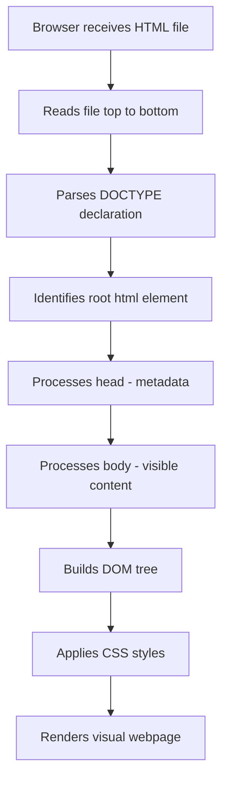
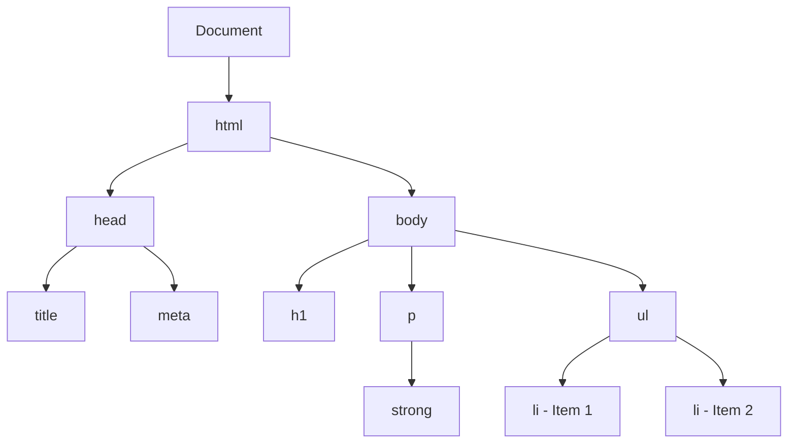
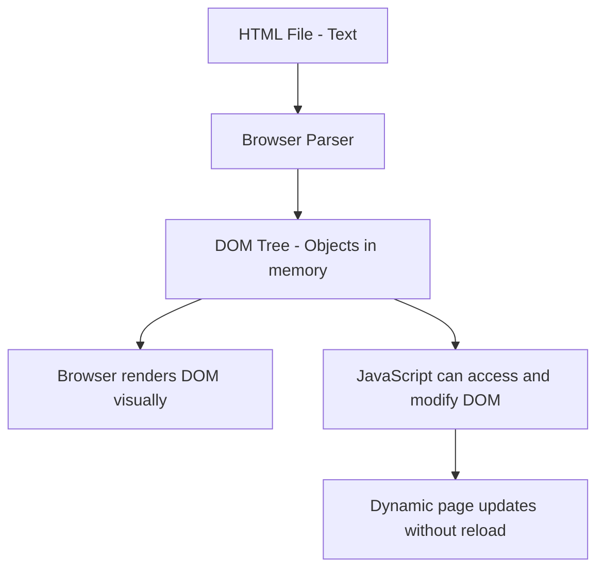
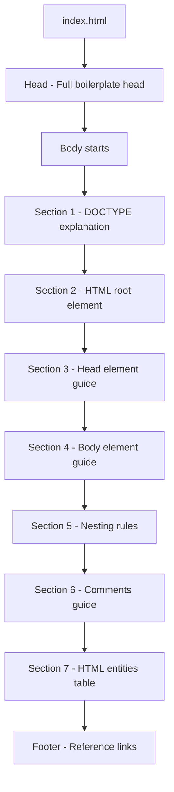

<a id="chapter-3-html-document-structure"></a>

# Chapter 3: HTML Document Structure

[⬅ Previous Chapter](#chapter-2-html-setup-first-program) | [📖 Main Index](#main-index) | [Next Chapter ➡](#chapter-4-html-head-section)

---

## 📌 Learning Objectives

By the end of this chapter, you will be able to:

- Understand the **complete anatomy** of an HTML document
- Explain what `<!DOCTYPE html>` is and why it is **mandatory**
- Understand the role of the `<html>`, `<head>`, and `<body>` elements
- Explain the difference between **head content** and **body content**
- Understand what a **well-formed HTML document** looks like
- Write the **HTML5 boilerplate** from memory without any tools
- Understand **nesting**, **parent-child relationships**, and **document tree**
- Explain the **DOM (Document Object Model)** as a tree structure
- Recognize and fix **common structural mistakes** in HTML
- Answer **interview questions** on HTML document structure with confidence

---

<a id="chapter-index-table-3"></a>

## Chapter Index Table

| Topic No. | Topic Name | Subtopics |
|-----------|-----------|-----------|
| 3.1 | [What is an HTML Document](#31-what-is-an-html-document) | Document definition<br>Text file vs HTML file<br>How browser reads HTML<br>Structure overview |
| 3.2 | [DOCTYPE Declaration](#32-doctype-declaration) | What is DOCTYPE<br>Why it is needed<br>HTML5 DOCTYPE<br>Old DOCTYPEs<br>Quirks mode vs Standards mode |
| 3.3 | [The HTML Root Element](#33-the-html-root-element) | `<html>` tag<br>lang attribute<br>Why lang matters<br>Root element rules |
| 3.4 | [The Head Element](#34-the-head-element) | What goes in head<br>Invisible vs visible<br>Meta tags overview<br>Title tag<br>Linking resources |
| 3.5 | [The Body Element](#35-the-body-element) | What goes in body<br>Visible content<br>Body structure<br>Common body elements |
| 3.6 | [HTML Document Tree & DOM](#36-html-document-tree-and-dom) | Tree structure<br>Parent-child<br>Siblings<br>DOM concept<br>Visual DOM tree |
| 3.7 | [Nesting Rules & Well-Formed HTML](#37-nesting-rules-and-well-formed-html) | Proper nesting<br>Overlapping tags<br>Self-closing tags<br>Common nesting mistakes |
| 3.8 | [Complete HTML5 Boilerplate](#38-complete-html5-boilerplate) | Every line explained<br>Minimal boilerplate<br>Full boilerplate<br>What to always include |
| 3.9 | [HTML Comments](#39-html-comments) | Comment syntax<br>Single line<br>Multi-line<br>When to use<br>Best practices |
| 3.10 | [HTML Whitespace & Formatting](#310-html-whitespace-and-formatting) | How browser handles whitespace<br>Indentation rules<br>Blank lines<br>Readability |

---

## 3.1 What is an HTML Document

<a id="31-what-is-an-html-document"></a>

---

### 🔷 What is an HTML Document?

An **HTML Document** is a plain text file that:

- Contains **HTML markup** — tags, attributes, and content
- Is saved with the **`.html`** file extension
- Is **interpreted and rendered** by a web browser into a visual webpage
- Follows a **standardized structure** defined by the W3C (World Wide Web Consortium)

At its core, an HTML file is nothing more than a **text file** with a specific structure. If you open an HTML file in Notepad, you will see plain text. If you open it in a browser, you see a rendered webpage.

---

### 🔷 Text File vs HTML File

| Property | Plain Text File (.txt) | HTML File (.html) |
|----------|----------------------|-------------------|
| **Content** | Raw text only | Text + HTML markup tags |
| **Opened by** | Text editor | Browser (renders as webpage) |
| **Structure** | No structure | Defined structural rules |
| **Styling** | None | Via CSS |
| **Interactivity** | None | Via JavaScript |
| **Links** | Not clickable | Clickable hyperlinks |
| **Media** | Cannot embed | Can embed images, video, audio |

---

### 🔷 How a Browser Reads an HTML Document



---

### 🔷 Basic Structure at a Glance

Every valid HTML document has exactly this structure:

```html
<!DOCTYPE html>
<html lang="en">
  <head>
    <!-- Invisible metadata goes here -->
  </head>
  <body>
    <!-- Visible content goes here -->
  </body>
</html>
```

Think of this as the **skeleton** — the mandatory framework that every HTML document must have, no exceptions.

---

### 🧠 Hinglish Intuition

> Ek HTML document bilkul ek **official government form** ki tarah hai.
>
> Government form mein:
> - **Header section** hoti hai — naam, date, form number (yeh sab form ke baare mein info hai, content nahi)
> - **Main body section** hoti hai — jo actual information tum fill karte ho
> - **Specific rules** hote hain — kahan kya likhna hai, kaise likhna hai
>
> Waise hi HTML document mein:
> - **`<head>`** section hai — page ke baare mein information (title, character set, CSS links)
> - **`<body>`** section hai — jo user actually dekhta hai
> - **Specific rules** hain — DOCTYPE, nesting, closing tags
>
> **Bina proper structure ke browser confuse ho jaata hai — jaise incomplete form reject ho jaati hai!**

---

> [!IMPORTANT]
> **Interview Point:** Every HTML document must follow the same fundamental structure: DOCTYPE → html → head + body. Deviating from this structure leads to unpredictable browser behavior and rendering issues.

---

👉 <a href="#chapter-index-table-3">Go to Top 🔝</a>

---

## 3.2 DOCTYPE Declaration

<a id="32-doctype-declaration"></a>

---

### 🔷 What is DOCTYPE?

`<!DOCTYPE html>` is a **document type declaration** that:

- Tells the browser **which version of HTML** the document is written in
- Is **NOT an HTML tag** — it is an **instruction** to the browser
- Must be the **very first line** of every HTML document — before anything else
- Is **case-insensitive** — `<!DOCTYPE html>`, `<!doctype html>`, `<!Doctype HTML>` all work
- Has **no closing tag**

---

### 🔷 DOCTYPE Syntax

```html
<!DOCTYPE html>
```

This single line tells the browser:

> "This document is written in **HTML5**. Please use HTML5 standards to render it."

---

### 🔷 Why DOCTYPE is Needed — Quirks Mode vs Standards Mode

Without `<!DOCTYPE html>`, browsers enter **Quirks Mode**.

| Mode | Triggered By | Browser Behavior |
|------|-------------|-----------------|
| **Standards Mode** | DOCTYPE present ✅ | Follows modern W3C HTML5 standards |
| **Quirks Mode** | DOCTYPE missing ❌ | Simulates old browser bugs from the 1990s |
| **Almost Standards Mode** | Certain old DOCTYPEs | Mostly standards, some quirks |

**Quirks Mode Problems:**
- Box model calculated differently
- CSS properties behave unexpectedly
- Layout breaks in unpredictable ways
- Inconsistent rendering across browsers

> [!IMPORTANT]
> **Interview Must-Know:** Always include `<!DOCTYPE html>`. Without it, the browser enters Quirks Mode where it tries to simulate buggy old browser behavior. This causes layout issues that are extremely difficult to debug.

---

### 🔷 HTML5 DOCTYPE vs Old DOCTYPEs

**HTML5 (Current Standard):**
```html
<!DOCTYPE html>
```
Simple, clean, easy to remember.

**HTML 4.01 Strict (Old):**
```html
<!DOCTYPE HTML PUBLIC "-//W3C//DTD HTML 4.01//EN"
"http://www.w3.org/TR/html4/strict.dtd">
```

**XHTML 1.0 Strict (Old):**
```html
<!DOCTYPE html PUBLIC "-//W3C//DTD XHTML 1.0 Strict//EN"
"http://www.w3.org/TR/xhtml1/DTD/xhtml1-strict.dtd">
```

| DOCTYPE | Version | Complexity | Modern Use |
|---------|---------|------------|-----------|
| `<!DOCTYPE html>` | HTML5 | Simple | ✅ Always use this |
| Long DOCTYPE strings | HTML 4.01, XHTML | Complex | ❌ Outdated |

> [!TIP]
> HTML5's `<!DOCTYPE html>` is deliberately simple. The older, long DOCTYPE strings referenced external DTD (Document Type Definition) files. HTML5 eliminated this complexity.

---

### 🔷 DOCTYPE Rules

| Rule | Detail |
|------|--------|
| **Position** | Must be the absolute first line — nothing before it |
| **Case** | Case-insensitive — `<!DOCTYPE html>` = `<!doctype html>` |
| **Closing tag** | Does NOT have a closing tag |
| **Not an HTML tag** | It is a declaration/instruction — not an element |
| **Mandatory** | Every HTML5 document MUST have it |
| **Once only** | Only one DOCTYPE per document |

---

### 🔷 What Happens Without DOCTYPE

```html
<!-- BAD: No DOCTYPE - browser enters Quirks Mode -->
<html>
<head>
    <title>Broken Page</title>
</head>
<body>
    <p>This page may not render correctly!</p>
</body>
</html>
```

```html
<!-- GOOD: DOCTYPE present - browser uses Standards Mode -->
<!DOCTYPE html>
<html lang="en">
<head>
    <title>Correct Page</title>
</head>
<body>
    <p>This page renders correctly!</p>
</body>
</html>
```

---

### 🧠 Hinglish Intuition

> DOCTYPE ek **driver's license category** ki tarah hai.
>
> Jab tum gaadi chalate ho, license pe category likhi hoti hai — LMV (Light Motor Vehicle), HMV (Heavy Motor Vehicle).
>
> License dekhke officer samajhta hai: "Yeh banda kaunsi gaadi chalane ka authorized hai."
>
> Waise hi `<!DOCTYPE html>` browser ko batata hai:
> "Yeh document **HTML5** ke rules ke saath banaya gaya hai — HTML5 standards use karo is page ko render karne ke liye."
>
> Bina DOCTYPE ke browser confuse ho jaata hai: "Kaunse rules follow karoon? Old rules? New rules?" — Aur woh **Quirks Mode** mein chala jaata hai.
>
> **DOCTYPE = Browser ka instruction manual — "Yeh wala rulebook follow karo!"**

---

👉 <a href="#chapter-index-table-3">Go to Top 🔝</a>

---

## 3.3 The HTML Root Element

<a id="33-the-html-root-element"></a>

---

### 🔷 What is the HTML Root Element?

The `<html>` element is the **root element** of every HTML document:

- It **wraps the entire HTML document** — everything except DOCTYPE goes inside it
- It is the **parent** of all other HTML elements
- It tells the browser: "Everything between my opening and closing tag is HTML content"
- Only ONE `<html>` element is allowed per document
- It contains exactly TWO direct children: `<head>` and `<body>`

---

### 🔷 Syntax

```html
<!DOCTYPE html>
<html lang="en">

  <head>...</head>
  <body>...</body>

</html>
```

---

### 🔷 The `lang` Attribute

The most important attribute on `<html>` is `lang`:

```html
<html lang="en">
```

| What `lang` Does | Detail |
|-----------------|--------|
| **Declares language** | Tells browsers and tools the primary language of the document |
| **Accessibility** | Screen readers use it to determine correct pronunciation rules |
| **SEO** | Search engines use it to serve correct language results to users |
| **Spell checking** | Browsers use it for spell-check language |
| **Translation** | Google Translate uses it to identify source language |

---

### 🔷 Common Language Codes

| Language | Code | Usage |
|----------|------|-------|
| English | `lang="en"` | `<html lang="en">` |
| Hindi | `lang="hi"` | `<html lang="hi">` |
| Spanish | `lang="es"` | `<html lang="es">` |
| French | `lang="fr"` | `<html lang="fr">` |
| German | `lang="de"` | `<html lang="de">` |
| Arabic | `lang="ar"` | `<html lang="ar">` |
| Japanese | `lang="ja">` | `<html lang="ja">` |
| Chinese (Simplified) | `lang="zh-CN"` | `<html lang="zh-CN">` |

---

### 🔷 HTML Element Rules

| Rule | Detail |
|------|--------|
| **Only one allowed** | One `<html>` element per document |
| **Must wrap everything** | All HTML content (except DOCTYPE) goes inside |
| **Exactly two children** | `<head>` and `<body>` — no other direct children |
| **Always include `lang`** | Required for accessibility and SEO |
| **Must have closing tag** | `</html>` at the very end of the document |

---

### 🔷 HTML Root Element — What Goes Where

```html
<!DOCTYPE html>           ← OUTSIDE <html> — this is a declaration
<html lang="en">          ← ROOT ELEMENT OPENS

    <head>                ← FIRST CHILD of <html>
        ...
    </head>

    <body>                ← SECOND CHILD of <html>
        ...
    </body>

</html>                   ← ROOT ELEMENT CLOSES
```

---

### 🧠 Hinglish Intuition

> `<html>` element ek **ghar ki boundary wall** ki tarah hai.
>
> Jaise ek ghar ki boundary wall ke andar:
> - Ek **drawing room** hota hai (jahan log baithte hain) → yeh hai `<body>`
> - Ek **office room** hota hai (jahan important documents rakhe hain) → yeh hai `<head>`
>
> Boundary wall ke bahar kuch nahi hota ghar ka.
>
> Waise hi `<html>` tag ke bahar kuch nahi hota HTML document ka (DOCTYPE chhodke).
>
> `lang="en"` ek **nameplate** ki tarah hai — ghar ke bahar likha hai ki yahan English bolne wale rehte hain!
>
> **`<html>` = Ghar ki boundary wall, `lang` = Ghar ka nameplate.**

---

> [!NOTE]
> While technically browsers are very forgiving and will render HTML even without a proper `<html>` element, always include it. Writing valid, well-structured HTML is a professional standard and affects accessibility, SEO, and tool compatibility.

---

👉 <a href="#chapter-index-table-3">Go to Top 🔝</a>

---

## 3.4 The Head Element

<a id="34-the-head-element"></a>

---

### 🔷 What is the Head Element?

The `<head>` element is a **container for metadata** — information about the document that:

- Is **NOT displayed** visually on the webpage
- Provides information **to the browser, search engines, and other tools**
- Contains links to external resources (CSS files, fonts, icons)
- Must be the **first child** of `<html>`
- Contains exactly one `<title>` tag (mandatory)

---

### 🔷 Head vs Body — The Key Distinction

| Feature | `<head>` | `<body>` |
|---------|---------|---------|
| **Visibility** | NOT visible to user | Visible to user |
| **Purpose** | Metadata and resource links | Page content |
| **Contains** | title, meta, link, style, script | All visible elements |
| **Affects** | Browser behavior, SEO, performance | What user sees |

---

### 🔷 What Goes Inside `<head>`

```html
<head>
    <!-- 1. Character Encoding -->
    <meta charset="UTF-8">

    <!-- 2. Viewport for responsive design -->
    <meta name="viewport" content="width=device-width, initial-scale=1.0">

    <!-- 3. Page title (shown in browser tab) -->
    <title>Page Title Here</title>

    <!-- 4. SEO meta tags -->
    <meta name="description" content="Page description for search engines">
    <meta name="keywords" content="html, css, web development">
    <meta name="author" content="Your Name">

    <!-- 5. Link to external CSS -->
    <link rel="stylesheet" href="css/style.css">

    <!-- 6. Favicon (icon in browser tab) -->
    <link rel="icon" type="image/png" href="images/favicon.png">

    <!-- 7. Google Fonts -->
    <link rel="preconnect" href="https://fonts.googleapis.com">
</head>
```

---

### 🔷 Elements Allowed in `<head>`

| Element | Purpose | Required? |
|---------|---------|-----------|
| `<title>` | Browser tab text, SEO page title | ✅ Mandatory |
| `<meta charset>` | Character encoding | ✅ Should always include |
| `<meta name="viewport">` | Mobile responsiveness | ✅ Should always include |
| `<meta name="description">` | SEO description | Recommended |
| `<link rel="stylesheet">` | Link external CSS files | When using CSS |
| `<link rel="icon">` | Favicon in browser tab | Recommended |
| `<style>` | Internal CSS (inside HTML) | Optional |
| `<script>` | JavaScript (usually at end of body) | Optional |
| `<base>` | Base URL for all relative links | Rare |

---

### 🔷 The `<title>` Tag — Most Important Head Element

```html
<title>My Portfolio — John Doe | Frontend Developer</title>
```

The `<title>` tag:

| Impact | Detail |
|--------|--------|
| **Browser tab** | Text shown in the browser tab |
| **Bookmarks** | Name given when user bookmarks the page |
| **Search results** | Appears as the clickable blue link in Google results |
| **Social sharing** | Used as title when page is shared on social media |
| **SEO** | One of the most important on-page SEO factors |
| **Mandatory** | Every HTML document must have exactly one `<title>` |

---

### 🔷 Good vs Bad Titles

| Title | Quality | Reason |
|-------|---------|--------|
| `<title>My Page</title>` | ❌ Bad | Not descriptive |
| `<title>Document</title>` | ❌ Bad | Default Emmet placeholder |
| `<title>Home</title>` | ⚠️ Okay | Too generic |
| `<title>Web Design Services — ABC Company</title>` | ✅ Good | Descriptive, includes brand |
| `<title>Contact Us — ABC Company \| Call Today</title>` | ✅ Good | Clear, actionable |

> [!TIP]
> **SEO Best Practice:** Keep titles between **50–60 characters**. Include the primary keyword first, then the brand name. Format: `Primary Keyword — Brand Name` or `Page Name | Site Name`.

---

### 🔷 The `<meta charset="UTF-8">` Tag

```html
<meta charset="UTF-8">
```

| Property | Detail |
|----------|--------|
| **What it does** | Declares the character encoding of the document |
| **UTF-8** | Supports virtually all characters from all languages |
| **Position** | Must be the very FIRST element inside `<head>` |
| **Why first** | Browser needs encoding info before reading any other content |
| **Without it** | Special characters (é, ñ, ©, ₹, 中文) may display incorrectly |

---

### 🔷 The `<meta name="viewport">` Tag

```html
<meta name="viewport" content="width=device-width, initial-scale=1.0">
```

| Attribute | Value | Meaning |
|-----------|-------|---------|
| `name` | `"viewport"` | Identifies this as a viewport meta tag |
| `content` | `width=device-width` | Sets viewport width = device screen width |
| `content` | `initial-scale=1.0` | Sets zoom level to 100% on load |

**Without this tag:**
- Mobile browsers assume desktop width (980px)
- Page zooms out to fit mobile screen
- Text becomes tiny and unreadable
- Responsive CSS breakpoints don't work correctly

---

### 🧠 Hinglish Intuition

> `<head>` section ek **backstage area** ki tarah hai — theatre mein.
>
> Audience (user) backstage nahi dekh sakti:
> - Costumes kahan rakhe hain
> - Script kaisi hai
> - Lighting setup kaisa hai
> - Director kaun hai
>
> Lekin yeh sab cheezein **show ke liye bahut zaroori** hain.
>
> Waise hi HTML `<head>` mein:
> - `<title>` — Google mein naam kaise dikhega
> - `<meta charset>` — Kaunse characters support honge
> - `<link rel="stylesheet">` — CSS file kaun si hai
> - `<meta name="viewport">` — Mobile pe kaise dikhega
>
> Yeh sab user ko directly nahi dikhta — lekin **website ke sahi kaam karne ke liye bahut zaroori hai!**
>
> **`<head>` = Website ka backstage, `<body>` = Main stage (audience dekhti hai).**

---

👉 <a href="#chapter-index-table-3">Go to Top 🔝</a>

---

## 3.5 The Body Element

<a id="35-the-body-element"></a>

---

### 🔷 What is the Body Element?

The `<body>` element contains **all the visible content** of a webpage:

- Everything that the **user sees and interacts with** goes inside `<body>`
- It is the **second child** of `<html>` (after `<head>`)
- There is exactly **ONE** `<body>` element per HTML document
- The browser renders `<body>` content as the **visual webpage**

---

### 🔷 What Goes Inside `<body>`

```html
<body>

    <!-- Navigation -->
    <nav>...</nav>

    <!-- Page header -->
    <header>...</header>

    <!-- Main content -->
    <main>
        <h1>Page Heading</h1>
        <p>Paragraph text</p>
        
        <a href="page.html">Link text</a>
        <ul>
            <li>List item</li>
        </ul>
        <table>...</table>
        <form>...</form>
    </main>

    <!-- Sidebar -->
    <aside>...</aside>

    <!-- Footer -->
    <footer>...</footer>

</body>
```

---

### 🔷 Common Body Content Elements

| Category | Elements | Purpose |
|----------|---------|---------|
| **Headings** | `h1` to `h6` | Page and section titles |
| **Text** | `p`, `span`, `strong`, `em` | Paragraphs and inline text |
| **Links** | `a` | Navigation and hyperlinks |
| **Images** | `img` | Visual media |
| **Lists** | `ul`, `ol`, `li`, `dl` | Bullet and numbered lists |
| **Tables** | `table`, `tr`, `td`, `th` | Tabular data |
| **Forms** | `form`, `input`, `button` | User input |
| **Semantic** | `header`, `nav`, `main`, `section`, `article`, `aside`, `footer` | Page structure |
| **Dividers** | `div`, `span`, `hr` | Grouping and layout |
| **Media** | `video`, `audio`, `iframe` | Embedded media |

---

### 🔷 Body Element Rules

| Rule | Detail |
|------|--------|
| **Only one** | One `<body>` per document |
| **Second child of html** | Always after `<head>` |
| **Contains visible content** | All user-facing content goes here |
| **Has closing tag** | `</body>` before `</html>` |
| **No metadata** | meta, title, link elements go in `<head>` not `<body>` |

---

### 🔷 Head vs Body — Quick Reference

```html
<!DOCTYPE html>
<html lang="en">

<head>
    <!--
    HEAD = INVISIBLE TO USER
    ✅ <title> — browser tab text
    ✅ <meta charset> — encoding
    ✅ <meta viewport> — mobile support
    ✅ <meta description> — SEO
    ✅ <link rel="stylesheet"> — CSS
    ✅ <link rel="icon"> — favicon
    ❌ NOT: headings, paragraphs, images
    -->
</head>

<body>
    <!--
    BODY = VISIBLE TO USER
    ✅ <h1> to <h6> — headings
    ✅ <p> — paragraphs
    ✅  — images
    ✅ <a> — links
    ✅ <ul>, <ol> — lists
    ✅ <form> — forms
    ✅ <table> — tables
    ✅ <video>, <audio> — media
    ❌ NOT: meta, title, link (stylesheet)
    -->
</body>

</html>
```

---

### 🧠 Hinglish Intuition

> `<body>` ek **stage** ki tarah hai — jahan sab kuch perform hota hai.
>
> Audience sirf stage dekhti hai:
> - Actors (headings, paragraphs)
> - Props (images, videos)
> - Dialogues (text content)
> - Actions (buttons, forms)
> - Decorations (CSS se styled elements)
>
> Backstage (`<head>`) mein kya hai yeh audience ko nahi pata, lekin stage (`<body>`) pe kya hai yeh sab dekhte hain.
>
> **`<body>` = Jo dikhta hai woh sab — images, text, buttons, forms, videos — sab kuch!**

---

> [!IMPORTANT]
> **Common Mistake:** Many beginners accidentally put visible content tags (`<h1>`, `<p>`, ``) inside `<head>` or put `<meta>` and `<link>` tags inside `<body>`. Browsers are forgiving and may still render it, but it is invalid HTML and can cause unexpected behavior.

---

👉 <a href="#chapter-index-table-3">Go to Top 🔝</a>

---

## 3.6 HTML Document Tree and DOM

<a id="36-html-document-tree-and-dom"></a>

---

### 🔷 What is the Document Tree?

HTML documents form a **tree structure** — like a family tree — where:

- Every element has a **parent** (the element that contains it)
- Every element can have **children** (elements nested inside it)
- Elements at the same level are **siblings**
- The `<html>` element is the **root** (top of the tree)

---

### 🔷 HTML Tree Structure — Visual

```html
<!DOCTYPE html>
<html>
  <head>
    <title>My Page</title>
    <meta charset="UTF-8">
  </head>
  <body>
    <h1>Hello World</h1>
    <p>This is a <strong>paragraph</strong>.</p>
    <ul>
      <li>Item 1</li>
      <li>Item 2</li>
    </ul>
  </body>
</html>
```

This creates the following tree:



---

### 🔷 Tree Terminology

| Term | Definition | Example |
|------|-----------|---------|
| **Root** | The topmost element — parent of all others | `<html>` |
| **Parent** | An element that directly contains another | `<ul>` is parent of `<li>` |
| **Child** | An element directly inside another | `<li>` is child of `<ul>` |
| **Sibling** | Elements sharing the same parent | `<head>` and `<body>` are siblings |
| **Ancestor** | Any element above in the tree | `<html>` is ancestor of `<p>` |
| **Descendant** | Any element below in the tree | `<li>` is descendant of `<html>` |
| **Leaf** | An element with no children | `<li>Item 1</li>` with just text |

---

### 🔷 Parent-Child Relationships — Code Example

```html
<ul>              <!-- PARENT of li elements -->
  <li>Item 1</li> <!-- CHILD of ul, SIBLING of other li -->
  <li>Item 2</li> <!-- CHILD of ul, SIBLING of other li -->
  <li>Item 3</li> <!-- CHILD of ul, SIBLING of other li -->
</ul>
```

```html
<p>
  This is text with a
  <strong>bold word</strong>  <!-- CHILD of p -->
  and an
  <em>italic word</em>        <!-- CHILD of p, SIBLING of strong -->
  inside.
</p>
```

---

### 🔷 What is the DOM?

**DOM** stands for **Document Object Model**.

The DOM is:

- A **programming interface** (API) for HTML documents
- Represents the HTML document as a **tree of objects** in memory
- Created by the **browser** after parsing HTML
- Can be **accessed and manipulated** by JavaScript
- The DOM is what makes webpages **dynamic and interactive**

---

### 🔷 HTML → DOM Conversion



---

### 🔷 HTML vs DOM

| Aspect | HTML | DOM |
|--------|------|-----|
| **What it is** | Text markup in a file | Objects in browser memory |
| **Created by** | Developer writes it | Browser creates it from HTML |
| **Format** | Text with tags | Tree of node objects |
| **Modified by** | Text editor | JavaScript |
| **Static/Dynamic** | Static text | Dynamic — can be changed at runtime |
| **When created** | Exists in .html file | Created when browser parses HTML |

---

### 🔷 DOM Node Types

| Node Type | Example |
|-----------|---------|
| **Document node** | The root `document` object |
| **Element node** | `<h1>`, `<p>`, `<div>`, etc. |
| **Text node** | The actual text content inside tags |
| **Attribute node** | `class="container"`, `id="header"` |
| **Comment node** | `<!-- This is a comment -->` |

---

### 🧠 Hinglish Intuition

> DOM ko samajhna bahut easy hai ek **family tree** ke through.
>
> Socho ek family:
> - **Dada-dadi** = `<html>` (root — sabse upar)
> - **Unke do bache** = `<head>` aur `<body>` (siblings)
> - **`<body>` ke bache** = `<h1>`, `<p>`, `<ul>` (grandchildren of html)
> - **`<ul>` ke bache** = `<li>` elements
>
> Jaise family tree mein relationships clear hote hain — parent kaun, child kaun, siblings kaun —
> waise hi HTML tree mein bhi yahi relationships hain.
>
> DOM woh **living, breathing version** hai is tree ka jo browser memory mein hoti hai.
> JavaScript is tree ko modify kar sakta hai — elements add/remove kar sakta hai, styles change kar sakta hai.
>
> **HTML = Family photo. DOM = Actual living family members in memory.**

---

> [!IMPORTANT]
> **Interview Critical:** The DOM is NOT the same as HTML. HTML is the source text. The DOM is the browser's in-memory object representation of that HTML. JavaScript manipulates the DOM, not the HTML file directly. This distinction is frequently tested in interviews.

---

👉 <a href="#chapter-index-table-3">Go to Top 🔝</a>

---

## 3.7 Nesting Rules and Well-Formed HTML

<a id="37-nesting-rules-and-well-formed-html"></a>

---

### 🔷 What is Nesting?

**Nesting** means placing HTML elements inside other HTML elements. Proper nesting is fundamental to valid, well-structured HTML.

The rule is simple:

> **Elements must be closed in the reverse order they were opened.**

Like brackets in math: `( [ { } ] )` — the last opened is the first closed.

---

### 🔷 Correct Nesting

```html
<!-- ✅ CORRECT: Properly nested -->
<ul>
    <li>
        <a href="page.html">
            <strong>Click here</strong>
        </a>
    </li>
</ul>

<!-- Opening order:  ul → li → a → strong -->
<!-- Closing order: strong → a → li → ul (reverse!) -->
```

---

### 🔷 Incorrect Nesting — Overlapping Tags

```html
<!-- ❌ WRONG: Overlapping tags -->
<p>
    This is <strong>bold and <em>italic</strong> text</em>
</p>

<!-- strong closes BEFORE em, but em was opened AFTER strong -->
<!-- This creates overlapping — INVALID HTML -->
```

```html
<!-- ✅ CORRECT: Proper nesting -->
<p>
    This is <strong>bold and <em>italic</em></strong> text
</p>

<!-- strong opens → em opens → em closes → strong closes -->
<!-- Last in, first out — like a stack -->
```

---

### 🔷 The Nesting Stack — How to Think About It

Think of nesting like a **stack of plates**:

| Action | Stack |
|--------|-------|
| Open `<ul>` | Stack: [ul] |
| Open `<li>` | Stack: [ul, li] |
| Open `<a>` | Stack: [ul, li, a] |
| Close `</a>` | Stack: [ul, li] |
| Close `</li>` | Stack: [ul] |
| Close `</ul>` | Stack: [] |

The last plate placed is the first removed. This is called **LIFO — Last In, First Out**.

---

### 🔷 Block vs Inline Nesting Rules

| Rule | Example |
|------|---------|
| Block elements can contain block and inline elements | `<div>` can contain `<p>` and `<span>` |
| Inline elements should only contain inline elements | `<span>` should NOT contain `<div>` |
| `<p>` cannot contain block elements | `<p>` cannot contain `<div>`, `<ul>`, `<table>` |
| `<a>` can wrap block elements in HTML5 | `<a>` wrapping `<div>` is valid in HTML5 |

```html
<!-- ❌ WRONG: p cannot contain div -->
<p>
    <div>This is wrong</div>
</p>

<!-- ✅ CORRECT: div containing p -->
<div>
    <p>This is correct</p>
</div>

<!-- ❌ WRONG: inline containing block -->
<span>
    <h1>Wrong</h1>
</span>

<!-- ✅ CORRECT: block containing inline -->
<h1>
    <span>Correct</span>
</h1>
```

---

### 🔷 Self-Closing Tags (Void Elements)

Some HTML elements have **no content** and therefore **no closing tag**. These are called **void elements** or **self-closing tags**.

```html
<!-- These elements have NO closing tag -->
<meta charset="UTF-8">
<link rel="stylesheet" href="style.css">

<br>
<hr>
<input type="text">
```

| Void Element | Purpose |
|-------------|---------|
| `<meta>` | Metadata |
| `<link>` | External resource link |
| `` | Image |
| `<br>` | Line break |
| `<hr>` | Horizontal rule |
| `<input>` | Form input |
| `<area>` | Image map area |
| `<base>` | Base URL |
| `<col>` | Table column |
| `<embed>` | External content |
| `<param>` | Object parameters |
| `<source>` | Media source |
| `<track>` | Video text track |
| `<wbr>` | Word break opportunity |

> [!NOTE]
> In HTML5, self-closing slash is **optional** for void elements. Both `<br>` and `<br/>` are valid. But `<br/>` is XHTML style — in modern HTML5, just use `<br>`.

---

### 🔷 Well-Formed HTML Checklist

| Requirement | Example |
|------------|---------|
| ✅ DOCTYPE declared | `<!DOCTYPE html>` |
| ✅ `<html>` wraps everything | `<html lang="en">` |
| ✅ `<head>` is first child of `<html>` | Contains metadata |
| ✅ `<body>` is second child of `<html>` | Contains visible content |
| ✅ All tags properly closed | `<p>text</p>` not `<p>text` |
| ✅ No overlapping/crossing tags | Properly nested |
| ✅ Attribute values in quotes | `class="container"` |
| ✅ Lowercase tag names | `<div>` not `<DIV>` |
| ✅ Single `<title>` in `<head>` | `<title>Page Title</title>` |
| ✅ `<meta charset>` present | `<meta charset="UTF-8">` |

---

### 🧠 Hinglish Intuition

> HTML nesting bilkul **Russian Matryoshka dolls** ki tarah hai.
>
> Matryoshka dolls mein:
> - Sabse badi doll ke andar ek chhoti doll
> - Us chhoti ke andar aur chhoti
> - Aur aur andar jaate jao
>
> **Important rule:** Jo doll last mein khuli woh pehle band hogi.
>
> Waise hi HTML mein:
> - `<ul>` khuli → `<li>` khuli → `<a>` khuli → `</a>` band → `</li>` band → `</ul>` band
>
> Agar tum beech mein galat order mein band karo — doll fit nahi hogi (HTML invalid ho jaayega).
>
> **Nesting = Matryoshka dolls — last in, first out!**

---

> [!TIP]
> Use VS Code's **auto-indentation** and **bracket matching** features to catch nesting errors. When you click on an opening tag, VS Code highlights the matching closing tag. If no match highlights, you have a nesting problem.

---

👉 <a href="#chapter-index-table-3">Go to Top 🔝</a>

---

## 3.8 Complete HTML5 Boilerplate

<a id="38-complete-html5-boilerplate"></a>

---

### 🔷 What is a Boilerplate?

A **boilerplate** is a standard template — a starting point that every project begins with. In HTML, the boilerplate is the minimum required structure that every valid HTML5 document must contain.

---

### 🔷 Minimal HTML5 Boilerplate

The absolute minimum valid HTML5 document:

```html
<!DOCTYPE html>
<html lang="en">
<head>
    <meta charset="UTF-8">
    <title>Page Title</title>
</head>
<body>
    <!-- Content goes here -->
</body>
</html>
```

This is technically valid. But professionals always include more.

---

### 🔷 Standard HTML5 Boilerplate

The standard boilerplate used in professional development:

```html
<!DOCTYPE html>
<html lang="en">

<head>
    <!-- Character Encoding — MUST be first in head -->
    <meta charset="UTF-8">

    <!-- Viewport — MUST for responsive design -->
    <meta name="viewport" content="width=device-width, initial-scale=1.0">

    <!-- Page Title — MUST be descriptive -->
    <title>Page Title — Site Name</title>

    <!-- SEO: Meta Description -->
    <meta name="description" content="Brief description of this page for search engines. Keep under 160 characters.">

    <!-- SEO: Author -->
    <meta name="author" content="Your Name">

    <!-- Favicon -->
    <link rel="icon" type="image/png" href="images/favicon.png">

    <!-- External CSS -->
    <link rel="stylesheet" href="css/style.css">

</head>

<body>

    <!-- Page content goes here -->

</body>

</html>
```

---

### 🔷 Every Line Explained

| Line | Code | Purpose | Required? |
|------|------|---------|-----------|
| 1 | `<!DOCTYPE html>` | Declares HTML5, enables standards mode | ✅ Mandatory |
| 2 | `<html lang="en">` | Root element, declares English language | ✅ Mandatory |
| 3 | `<head>` | Opens metadata container | ✅ Mandatory |
| 4 | `<meta charset="UTF-8">` | UTF-8 encoding — supports all characters | ✅ Always include |
| 5 | `<meta name="viewport"...>` | Mobile responsiveness | ✅ Always include |
| 6 | `<title>...</title>` | Browser tab text + SEO | ✅ Mandatory |
| 7 | `<meta name="description"...>` | SEO page description | 🔶 Recommended |
| 8 | `<meta name="author"...>` | Page author for SEO/tools | 🔶 Optional |
| 9 | `<link rel="icon"...>` | Favicon in browser tab | 🔶 Recommended |
| 10 | `<link rel="stylesheet"...>` | Links external CSS file | When using CSS |
| 11 | `</head>` | Closes head section | ✅ Mandatory |
| 12 | `<body>` | Opens visible content area | ✅ Mandatory |
| 13 | `<!-- Content -->` | Comment placeholder | Optional |
| 14 | `</body>` | Closes body | ✅ Mandatory |
| 15 | `</html>` | Closes root element | ✅ Mandatory |

---

### 🔷 Extended Boilerplate with Open Graph

For professional projects and social media sharing:

```html
<!DOCTYPE html>
<html lang="en">

<head>
    <meta charset="UTF-8">
    <meta name="viewport" content="width=device-width, initial-scale=1.0">

    <title>Page Title — Site Name</title>
    <meta name="description" content="Page description under 160 characters.">
    <meta name="author" content="Your Name">

    <!-- Open Graph — for social media sharing (Facebook, LinkedIn) -->
    <meta property="og:title" content="Page Title">
    <meta property="og:description" content="Page description for social sharing.">
    <meta property="og:image" content="https://yoursite.com/images/share-image.jpg">
    <meta property="og:url" content="https://yoursite.com/page">
    <meta property="og:type" content="website">

    <!-- Twitter Card -->
    <meta name="twitter:card" content="summary_large_image">
    <meta name="twitter:title" content="Page Title">
    <meta name="twitter:description" content="Page description for Twitter.">

    <!-- Favicon -->
    <link rel="icon" type="image/png" href="images/favicon.png">

    <!-- CSS -->
    <link rel="stylesheet" href="css/style.css">

</head>

<body>

    <header>
        <nav>
            <!-- Navigation -->
        </nav>
    </header>

    <main>
        <!-- Main content -->
    </main>

    <footer>
        <!-- Footer content -->
    </footer>

</body>

</html>
```

---

### 🔷 Boilerplate — What to Memorize

For interviews and quick project setup, memorize this minimal version:

```html
<!DOCTYPE html>
<html lang="en">
<head>
    <meta charset="UTF-8">
    <meta name="viewport" content="width=device-width, initial-scale=1.0">
    <title>Document</title>
</head>
<body>
    
</body>
</html>
```

This is exactly what `!` + Tab generates in VS Code via Emmet.

---

### 🧠 Hinglish Intuition

> Boilerplate ko socho ek **company letterhead** ki tarah.
>
> Har official letter mein pehle se printed hota hai:
> - Company ka naam
> - Address
> - Phone number
> - Logo
>
> Yeh sab baar baar type nahi karte — yeh **template** pehle se ready hoti hai.
>
> Waise hi HTML boilerplate ek **ready-made template** hai jo:
> - Har naye HTML project ke saath start hoti hai
> - Sabhi mandatory elements pehle se hain
> - Tum sirf apna content add karo
>
> **Boilerplate = HTML ka official letterhead — har project ki starting point.**

---

> [!TIP]
> Memorize the HTML5 boilerplate cold. In technical interviews, you may be asked to write an HTML page on a whiteboard or in a plain text editor without VS Code or Emmet. Being able to write it from memory demonstrates genuine understanding of HTML structure.

---

👉 <a href="#chapter-index-table-3">Go to Top 🔝</a>

---

## 3.9 HTML Comments

<a id="39-html-comments"></a>

---

### 🔷 What are HTML Comments?

HTML comments are **annotations in the code** that:

- Are **completely invisible** to users in the browser
- Are **visible to developers** in the source code
- Are used to **explain, document, and organize** HTML code
- Help developers understand complex code later
- Are useful for **temporarily disabling** code during development

---

### 🔷 Comment Syntax

```html
<!-- This is an HTML comment -->
```

| Part | Symbol |
|------|--------|
| **Opening** | `<!--` |
| **Content** | Any text |
| **Closing** | `-->` |

---

### 🔷 Types of Comments

**Single-line comment:**
```html
<!-- This is a navigation menu -->
<nav>...</nav>
```

**Multi-line comment:**
```html
<!--
    This section contains the main hero area.
    It includes a background image, headline,
    subheadline, and a call-to-action button.
-->
<section class="hero">...</section>
```

**Inline comment:**
```html
 <!-- Company logo - 200x50px -->
```

**Section separator comment:**
```html
<!-- ================================================ -->
<!-- HEADER SECTION                                   -->
<!-- ================================================ -->
<header>...</header>

<!-- ================================================ -->
<!-- MAIN CONTENT SECTION                             -->
<!-- ================================================ -->
<main>...</main>
```

**Temporarily disabling code:**
```html
<!-- Temporarily disabled while testing new design
<div class="old-banner">
    <h2>Old Banner Text</h2>
    <p>This will be replaced soon.</p>
</div>
-->
```

---

### 🔷 When to Use Comments

| Use Case | Example |
|----------|---------|
| **Section markers** | Mark beginning and end of major sections |
| **Explanation** | Explain why complex code was written a certain way |
| **TODO notes** | `<!-- TODO: Add responsive styles -->` |
| **Author notes** | `<!-- Updated by John, 2024-01-15 -->` |
| **Debugging** | Temporarily comment out code to isolate issues |
| **Team communication** | Leave notes for other developers |

---

### 🔷 Comment Best Practices

| Practice | Reason |
|----------|--------|
| ✅ Comment complex or non-obvious code | Help future developers (including yourself) |
| ✅ Use section separators for long files | Easy navigation in large HTML files |
| ✅ Write TODO comments for pending work | Track incomplete tasks |
| ❌ Don't comment obvious things | `<!-- This is a paragraph -->` before `<p>` is noise |
| ❌ Don't leave old commented-out code forever | Clean up after debugging |
| ❌ Don't put sensitive info in comments | Comments are visible in browser source (View Source) |

---

> [!IMPORTANT]
> **Security Warning:** HTML comments ARE visible to anyone who views the page source (Ctrl+U in Chrome). Never put passwords, API keys, server information, or any sensitive data in HTML comments.

---

### 🔷 Comments vs Code — Browser Behavior

```html
<p>This text is VISIBLE in the browser.</p>

<!-- This comment is INVISIBLE in the browser but VISIBLE in source code -->

<p>This text is also VISIBLE.</p>
```

The browser renders:
```
This text is VISIBLE in the browser.
This text is also VISIBLE.
```

The comment does not appear on the page but is visible if someone presses Ctrl+U (View Page Source).

---

### 🧠 Hinglish Intuition

> HTML comments ek **sticky note** ki tarah hai jo sirf developer dekh sakta hai — user nahi.
>
> Jaise ek book mein koi pencil se notes likhta hai sirf apne liye — "yeh important hai", "yahan se padhna hai" — yeh notes published book mein nahi dikhte.
>
> Waise hi HTML comments:
> - Developer ke liye guide hain
> - User ko bilkul nahi dikhte
> - Browser ignore karta hai inhe
>
> **Lekin yaad rakho:** Yeh comments **page source mein dikhte hain** — Ctrl+U dabao aur sab dikh jaata hai!
>
> **Comment = Developer ka sticky note — useful, but not secret!**

---

👉 <a href="#chapter-index-table-3">Go to Top 🔝</a>

---

## 3.10 HTML Whitespace and Formatting

<a id="310-html-whitespace-and-formatting"></a>

---

### 🔷 How HTML Handles Whitespace

HTML **collapses multiple whitespace characters** (spaces, tabs, newlines) into a **single space** when rendering.

```html
<p>Hello     World</p>      <!-- Browser shows: Hello World -->
<p>Hello
World</p>                   <!-- Browser shows: Hello World -->
<p>Hello	World</p>        <!-- Browser shows: Hello World (tab = space) -->
```

All three render identically: **Hello World**

---

### 🔷 Whitespace Rules

| Rule | Detail |
|------|--------|
| **Multiple spaces** | Collapsed to one space |
| **Newlines** | Treated as a single space |
| **Tabs** | Treated as whitespace |
| **Indentation** | Does not affect rendering |
| **Exception** | `<pre>` tag preserves whitespace exactly |
| **Forced space** | Use `&nbsp;` (non-breaking space) for extra spaces |
| **Forced line break** | Use `<br>` for explicit line breaks |

---

### 🔷 `<pre>` — Preformatted Text (Whitespace Preserved)

```html
<!-- Regular paragraph - whitespace collapsed -->
<p>
    Line one
    Line two
    Line three
</p>
<!-- Browser shows: Line one Line two Line three (all on one line) -->

<!-- Pre tag - whitespace preserved exactly -->
<pre>
    Line one
    Line two
    Line three
</pre>
<!-- Browser shows exactly as typed — with line breaks and spaces -->
```

---

### 🔷 HTML Indentation Best Practices

Indentation does not affect rendering but is **critical for readability**.

**Standard: 2 or 4 spaces per indent level**

```html
<!-- ✅ GOOD: Properly indented — easy to read -->
<!DOCTYPE html>
<html lang="en">
<head>
    <meta charset="UTF-8">
    <title>Good Formatting</title>
</head>
<body>
    <header>
        <nav>
            <ul>
                <li><a href="index.html">Home</a></li>
                <li><a href="about.html">About</a></li>
            </ul>
        </nav>
    </header>
    <main>
        <h1>Welcome</h1>
        <p>This is well-formatted HTML.</p>
    </main>
</body>
</html>
```

```html
<!-- ❌ BAD: No indentation — extremely hard to read -->
<!DOCTYPE html>
<html lang="en">
<head>
<meta charset="UTF-8">
<title>Bad Formatting</title>
</head>
<body>
<header>
<nav>
<ul>
<li><a href="index.html">Home</a></li>
</ul>
</nav>
</header>
</body>
</html>
```

---

### 🔷 Formatting Rules for Professional HTML

| Rule | Standard |
|------|---------|
| **Indentation** | 2 or 4 spaces (consistent throughout project) |
| **Tag case** | Always lowercase — `<div>` not `<DIV>` |
| **Attribute quotes** | Always use double quotes — `class="name"` not `class=name` |
| **One element per line** | Each block element on its own line |
| **Closing tags aligned** | Closing tag at same indentation as opening tag |
| **Blank lines** | Use sparingly between major sections |
| **Comments** | Add section comments for long files |
| **Consistency** | Pick a style and stick to it throughout |

---

### 🔷 HTML Entities for Special Characters

When you need characters that HTML might misinterpret:

| Character | HTML Entity | Named Entity |
|-----------|------------|-------------|
| `<` (less than) | `&#60;` | `&lt;` |
| `>` (greater than) | `&#62;` | `&gt;` |
| `&` (ampersand) | `&#38;` | `&amp;` |
| `"` (double quote) | `&#34;` | `&quot;` |
| `'` (single quote) | `&#39;` | `&apos;` |
| ` ` (non-breaking space) | `&#160;` | `&nbsp;` |
| `©` (copyright) | `&#169;` | `&copy;` |
| `®` (registered) | `&#174;` | `&reg;` |
| `™` (trademark) | `&#8482;` | `&trade;` |
| `₹` (rupee) | `&#8377;` | `&nbsp;` |
| `€` (euro) | `&#8364;` | `&euro;` |

---

### 🧠 Hinglish Intuition

> HTML whitespace ka behavior samajhna simple hai.
>
> Browser ek **strict editor** ki tarah hai jo:
> - Multiple spaces dekhta hai → ek hi space dikhata hai
> - Multiple enter/newlines dekhta hai → ek space dikhata hai
> - Tabs dekhta hai → space maan leta hai
>
> Socho ek **copy editor** — jo tumhari writing clean karta hai aur extra spaces/gaps hata deta hai.
>
> **Tumhara indentation code reading ke liye hai — browser ke liye nahi!**
>
> Browser ko indentation se koi fark nahi padta. Yeh sirf **developers ke liye readability** ke liye hai.
>
> Aur `&nbsp;` ek **glue** ki tarah hai — yeh space break nahi hone deta, aur multiple extra spaces ke liye use hota hai.

---

> [!TIP]
> Always use **Prettier** (VS Code extension) for automatic, consistent HTML formatting. Enable "Format on Save" and never worry about indentation again. Your code will always be clean and professional.

---

👉 <a href="#chapter-index-table-3">Go to Top 🔝</a>

---

## 💡 Interview Questions

---

### 📝 Conceptual Questions

**Q1. What is `<!DOCTYPE html>` and why is it important?**

**Answer:**
`<!DOCTYPE html>` is a **document type declaration** that must appear as the very first line of every HTML5 document.

It is NOT an HTML tag — it is an **instruction to the browser** that tells it:
1. This document is written in **HTML5**
2. Use **HTML5 standards mode** (not Quirks Mode) to render it

**Why it matters:**
- Without DOCTYPE, browsers enter **Quirks Mode** — they simulate buggy old browser behavior from the 1990s
- In Quirks Mode, the CSS box model is calculated differently, layouts break, and rendering is inconsistent
- With DOCTYPE, the browser uses **Standards Mode** — modern, predictable, consistent rendering

---

**Q2. What is the difference between `<head>` and `<body>`?**

**Answer:**

| `<head>` | `<body>` |
|---------|---------|
| Contains metadata | Contains visible content |
| NOT visible to user | Visible to user |
| title, meta, link, style | h1-h6, p, img, a, div, form |
| Information about the page | The actual page content |
| Affects browser behavior and SEO | What user sees and interacts with |

The `<head>` is like the backstage of a theatre — essential but invisible to the audience. The `<body>` is the stage — what the audience (user) sees.

---

**Q3. What is the DOM and how is it different from HTML?**

**Answer:**

| HTML | DOM |
|------|-----|
| Text markup in a `.html` file | In-memory tree of objects |
| Written by developer | Created by browser from HTML |
| Static text | Dynamic — can be changed |
| Parsed by browser | Accessed by JavaScript |
| Exists on disk | Exists in browser memory |

The DOM is the browser's **object representation** of the HTML document. When JavaScript does `document.getElementById('header')`, it is interacting with the DOM, not the HTML file.

---

**Q4. What is Quirks Mode and how do you prevent it?**

**Answer:**
**Quirks Mode** is a browser compatibility mode where the browser simulates the non-standard behavior of old browsers (IE5, Netscape 4) to maintain backward compatibility with very old websites.

**Problems with Quirks Mode:**
- Different box model calculation (width includes padding in some browsers)
- Inconsistent CSS behavior
- Layout issues

**Prevention:** Always include `<!DOCTYPE html>` as the very first line of every HTML document. This ensures the browser uses **Standards Mode**.

---

**Q5. Why is `lang` attribute important on the `<html>` element?**

**Answer:**
The `lang` attribute on `<html>` is important for:

1. **Accessibility** — Screen readers use it to determine correct pronunciation rules (e.g., "en" → English pronunciation)
2. **SEO** — Search engines use it to serve the page to users of the correct language
3. **Browser spell-check** — Browsers check spelling based on declared language
4. **Automatic translation** — Tools like Google Translate identify the source language
5. **CSS** — Some CSS properties (like `quotes`) change based on language

Without `lang`, assistive technologies may use the wrong language for text-to-speech, making the site inaccessible.

---

**Q6. What is the purpose of `<meta charset="UTF-8">`?**

**Answer:**
`<meta charset="UTF-8">` declares the **character encoding** of the HTML document.

**UTF-8:**
- Universal character encoding that supports virtually all characters from all writing systems
- Supports English, Hindi, Chinese, Arabic, emoji, mathematical symbols, currency symbols (₹, €, £)
- Without it, special characters may display as garbled symbols (mojibake)

**Why it must be first in `<head>`:**
The browser needs to know the encoding before it reads any other content. If encoding is declared after content, characters already read may be misinterpreted.

---

**Q7. What are void elements in HTML? Give 5 examples.**

**Answer:**
**Void elements** (also called self-closing tags or empty elements) are HTML elements that:
- Have **no content** between opening and closing tags
- Have **NO closing tag**
- Cannot have child elements

**Examples:**
1. `<meta charset="UTF-8">` — Metadata
2. `<link rel="stylesheet" href="style.css">` — External resource
3. `` — Image
4. `<br>` — Line break
5. `<hr>` — Horizontal rule
6. `<input type="text">` — Form input

> [!NOTE]
> In HTML5, writing `<br/>` is valid but the slash is unnecessary. Just `<br>` is preferred.

---

### 🎯 Scenario-Based Questions

**Q8. A developer's page looks completely different in Chrome vs Firefox. What is the first thing you would check?**

**Answer:**
The **first thing** to check is whether `<!DOCTYPE html>` is present and is the **very first line** of the HTML document.

If DOCTYPE is missing or incorrect, different browsers may use different Quirks Mode interpretations, causing inconsistent rendering.

**Debugging steps:**
1. Check DOCTYPE is present and first
2. Open DevTools in both browsers → Elements tab → Check if any elements are misplaced
3. Check for invalid HTML nesting (use W3C validator: validator.w3.org)
4. Check for browser-specific CSS properties that need vendor prefixes

---

**Q9. Someone asks "Can I put a `<div>` inside a `<p>` tag?" What do you say?**

**Answer:**
**No, this is invalid HTML** — and here is why:

`<p>` is a **block-level** element, but it can only contain **inline-level** content. `<div>` is a block-level element.

When you write:
```html
<p>
    <div>Content</div>
</p>
```

The browser's HTML parser will **automatically close the `<p>` tag** before the `<div>`, resulting in:
```html
<p></p>
<div>Content</div>
<p></p>
```

This is browser error recovery behavior. The HTML is invalid, and the browser silently fixes it in an unexpected way.

**Rule:** `<p>` can contain text, `<span>`, `<a>`, `<strong>`, `<em>` and other inline elements. Never block elements.

---

### 🔍 Output-Based Questions

**Q10. What does the browser render for this code?**

```html
<p>Hello     World</p>
<p>Hello
World</p>
<p>Hello	World</p>
```

**Answer:**
All three `<p>` elements render identically:

```
Hello World
Hello World
Hello World
```

HTML collapses multiple whitespace characters (spaces, newlines, tabs) into a single space. This is called **whitespace collapsing**.

---

**Q11. What is wrong with this HTML and what does the browser actually render?**

```html
<!DOCTYPE html>
<html lang="en">
<head>
    <title>Test</title>
</head>
<body>
    <p>First <strong>bold and <em>italic</strong> text</em></p>
</body>
</html>
```

**Answer:**
The problem is **improper nesting / overlapping tags**:

```html
<strong>bold and <em>italic</strong> text</em>
<!-- strong closes before em, but em was opened after strong -->
<!-- This is invalid — tags overlap -->
```

**Correct version:**
```html
<strong>bold and <em>italic</em></strong> text
```

The browser will attempt error recovery and may render it somewhat correctly, but the HTML is invalid. Different browsers may handle the error differently. Validate with W3C validator to catch such issues.

---

**Q12. What appears in the browser tab for this code?**

```html
<!DOCTYPE html>
<html lang="en">
<head>
    <meta charset="UTF-8">
    <title>Learn HTML — Complete Guide | WebDev Academy</title>
</head>
<body>
    <h1>Welcome to HTML Tutorial</h1>
</body>
</html>
```

**Answer:**
- **Browser tab:** `Learn HTML — Complete Guide | WebDev Academy`
- **On the page:** A large H1 heading: **Welcome to HTML Tutorial**
- **In Google search results (if indexed):** `Learn HTML — Complete Guide | WebDev Academy` as the clickable title

---

### 🚀 Advanced Questions

**Q13. What is the difference between HTML and XHTML?**

**Answer:**

| Feature | HTML | XHTML |
|---------|------|-------|
| Syntax rules | Lenient | Strict (XML rules) |
| Self-closing tags | Optional (`<br>` valid) | Required (`<br/>` required) |
| Case sensitivity | Case-insensitive | Lowercase required |
| Unclosed tags | Browser auto-closes | Invalid — breaks page |
| Error handling | Browser recovers | Hard error |
| DOCTYPE | Simple `<!DOCTYPE html>` | Long complex DOCTYPE |
| Modern use | ✅ Preferred | ❌ Mostly obsolete |

XHTML was an attempt to make HTML follow strict XML rules. HTML5 made XHTML largely obsolete by providing a clean, simple standard.

---

**Q14. What is the viewport meta tag and what happens if you omit it?**

**Answer:**
```html
<meta name="viewport" content="width=device-width, initial-scale=1.0">
```

**What it does:**
- `width=device-width` — Sets the viewport width equal to the device's screen width
- `initial-scale=1.0` — Sets initial zoom level to 100% (no zoom)

**If omitted:**
- Mobile browsers assume the page is 980px wide (desktop width)
- They zoom out to fit the entire 980px layout into the mobile screen
- Text becomes tiny and unreadable
- Users must pinch-zoom to read content
- CSS media queries work at 980px, not at the actual device width
- Responsive design completely breaks

This is why the viewport meta tag is included in every HTML5 boilerplate.

---

👉 <a href="#chapter-index-table-3">Go to Top 🔝</a>

---

## 🧪 Practice Problems

---

### 📋 Theory Questions

**T1.** Explain the concept of the HTML document tree. Draw a tree diagram (text-based) for the following HTML:

```html
<body>
  <header>
    <h1>Site Name</h1>
    <nav>
      <a href="#">Home</a>
      <a href="#">About</a>
    </nav>
  </header>
  <main>
    <p>Welcome text</p>
  </main>
</body>
```

**T2.** A colleague sends you an HTML file and says "My page looks broken on mobile." You open the file and see there is no `<meta name="viewport">` tag. Explain to them in simple terms:
- What the viewport meta tag does
- What happens without it
- Exactly where to add it and what to write

**T3.** What are the mandatory elements in every HTML5 document? List them in order and explain what would happen if each one was missing.

**T4.** Explain whitespace collapsing in HTML. Give 3 situations where whitespace collapse matters and 2 ways to override it when you need actual whitespace.

**T5.** Compare Quirks Mode and Standards Mode. How does each affect box model behavior? What is the one line of code that prevents Quirks Mode?

---

### 💻 Coding Questions

**C1.** Write a valid HTML5 boilerplate completely from memory (no tools, no Emmet). Include:
- DOCTYPE
- html with lang attribute
- head with charset, viewport, title, description meta
- body with a placeholder comment
- All closing tags in correct order

**C2.** Find and fix all errors in this HTML:

```html
<html>
<Head>
<meta charset=UTF-8>
<title>My Page
</Head>
<Body>
<P>Hello <Strong>World</p></Strong>

<p>
    <div>Wrong nesting</div>
</p>
</html>
```

**C3.** Write HTML comments to:
- Mark the start and end of a navigation section
- Add a TODO for a feature to be implemented
- Temporarily disable a section of code (write any 3 lines of HTML then comment them out)
- Add an author and date note

**C4.** Create a complete HTML5 document structure for a "Restaurant Website" with:
- Proper DOCTYPE and html element with correct lang
- Head with: charset, viewport, a meaningful title, description meta, author meta
- Body structured into: header, nav, main, aside, footer sections (empty but present)
- Section separator comments for each section
- A favicon link in head

**C5.** Demonstrate whitespace behavior by creating an HTML file with:
- A paragraph with 10 spaces between two words
- A paragraph with a word split across 3 lines
- A `<pre>` element showing the same text with preserved formatting
- A paragraph using `&nbsp;` to create visible extra space

---

### 🏗️ Machine Coding Problems

**M1. Build a Structured HTML Document — Tech Blog Post**

Create a complete, well-structured HTML5 document for a blog post about "Why Learn HTML in 2024":

Requirements:
- Complete HTML5 boilerplate (DOCTYPE, html with lang, full head section)
- Meaningful title tag (SEO-optimized format)
- Description meta tag
- Author meta tag
- Proper semantic structure in body:
  - `<header>` with blog name (h1) and navigation
  - `<main>` containing:
    - Article title as h1
    - Author and date as paragraph
    - Introduction paragraph
    - Section: "What is HTML?" with h2 and 2 paragraphs
    - Section: "Why HTML Matters" with h2 and ordered list of 5 reasons
    - Section: "Getting Started" with h2 and unordered list of tools
    - A blockquote with an inspirational programming quote
    - Conclusion paragraph
  - `<footer>` with copyright notice and navigation links
- Section separator comments throughout
- All nesting properly done
- Validate with W3C validator (validator.w3.org)

---

**M2. Build a Multi-Section Company Homepage Structure**

Create the HTML skeleton (structure only, no styling) for a company homepage:

Company: **TechSolutions India**

Requirements:
- Complete valid HTML5 boilerplate
- Title: "TechSolutions India — Web & App Development Company"
- Description meta for SEO
- Body contains these sections (with correct semantic elements):
  - **Header**: Company name (h1), tagline (p), navigation links (Home, Services, About, Portfolio, Contact)
  - **Hero Section**: Big heading "Building Digital Futures", subheading, a "Get Started" link
  - **Services Section**: "Our Services" heading (h2), three service descriptions each with h3 and p
  - **About Section**: "About Us" heading, company history paragraph, team stats (founded year, employees, projects)
  - **Testimonials Section**: Two client testimonials with name, company, and quote
  - **Contact Section**: Address, phone (tel link), email (mailto link), and business hours
  - **Footer**: Copyright, quick links, social media links (Facebook, Twitter, LinkedIn — external, new tab)
- Minimum 15 meaningful HTML comments
- All links properly structured (even if destinations are `#` placeholders)
- Proper semantic HTML throughout

---

👉 <a href="#chapter-index-table-3">Go to Top 🔝</a>

---

## 🚀 Mini Project

---

### 📋 Problem Statement

Build a **"HTML Document Structure Reference Card"** — a single HTML page that serves as a quick reference guide for the complete HTML5 document structure. This page documents everything in Chapter 3 and is something you can actually use as a reference while working.

This project demonstrates deep understanding of document structure by using proper structure to explain document structure itself.

---

### ✨ Features

- Complete valid HTML5 boilerplate (dogfooding — using the concept to teach the concept)
- Multiple sections covering every topic from Chapter 3
- Proper use of headings, paragraphs, lists, horizontal rules, and comments
- Code examples shown using `<pre>` and `<code>` tags
- HTML entities for displaying HTML code as text
- Well-organized with section separator comments

---

### 🏗️ Architecture

- **HTML only** — Pure structure, no CSS or JavaScript
- Single file: `index.html`
- Demonstrates every structural concept from Chapter 3

---

### 🔷 Flow Diagram



---

### 📁 Folder Structure

```text
html-structure-reference/
│
└── index.html
```

---

### 💻 Implementation

```html
<!DOCTYPE html>
<html lang="en">

<!-- ============================================================ -->
<!-- HEAD SECTION                                                  -->
<!-- Contains: charset, viewport, title, description, author      -->
<!-- ============================================================ -->

<head>
    <!-- Character encoding — MUST be first -->
    <meta charset="UTF-8">

    <!-- Viewport — required for mobile responsiveness -->
    <meta name="viewport" content="width=device-width, initial-scale=1.0">

    <!-- Page title — descriptive and SEO-optimized -->
    <title>HTML Document Structure — Complete Reference Guide</title>

    <!-- SEO meta description — under 160 characters -->
    <meta name="description"
        content="Complete reference guide for HTML5 document structure including DOCTYPE, html, head, body elements and boilerplate.">

    <!-- Author -->
    <meta name="author" content="HTML & CSS Mastery Course">

</head>

<!-- ============================================================ -->
<!-- BODY SECTION                                                  -->
<!-- Contains all visible page content                            -->
<!-- ============================================================ -->

<body>

    <!-- ======================================================== -->
    <!-- PAGE HEADER                                              -->
    <!-- ======================================================== -->

    <h1>HTML Document Structure — Reference Guide</h1>
    <h2>Chapter 3: Complete HTML5 Boilerplate &amp; Document Anatomy</h2>

    <p>
        This reference guide covers everything you need to know about 
        the structure of an HTML5 document. Use this as a quick 
        reference while building webpages.
    </p>

    <p>
        <strong>Course:</strong> HTML &amp; CSS Mastery |
        <strong>Chapter:</strong> 3 |
        <strong>Topic:</strong> HTML Document Structure
    </p>

    <hr>

    <!-- ======================================================== -->
    <!-- SECTION 1: DOCTYPE DECLARATION                          -->
    <!-- ======================================================== -->

    <h2>1. The DOCTYPE Declaration</h2>

    <p>
        <strong>What it is:</strong> A declaration (NOT an HTML tag) that tells the 
        browser which version of HTML this document uses.
    </p>

    <p><strong>Syntax:</strong></p>

    <pre><code>&lt;!DOCTYPE html&gt;</code></pre>

    <p><strong>Key facts about DOCTYPE:</strong></p>

    <ul>
        <li>Must be the ABSOLUTE FIRST line of every HTML document</li>
        <li>Is NOT an HTML tag — it is a declaration/instruction</li>
        <li>Is case-insensitive — &lt;!DOCTYPE html&gt; = &lt;!doctype html&gt;</li>
        <li>Has NO closing tag</li>
        <li>Prevents the browser from entering Quirks Mode</li>
        <li>HTML5 DOCTYPE is simple — older versions had long, complex DOCTYPEs</li>
    </ul>

    <p>
        <strong>Quirks Mode Warning:</strong> Without DOCTYPE, browsers simulate 
        buggy old browser behavior (called Quirks Mode). This causes inconsistent 
        rendering and CSS issues across different browsers.
    </p>

    <hr>

    <!-- ======================================================== -->
    <!-- SECTION 2: THE HTML ROOT ELEMENT                        -->
    <!-- ======================================================== -->

    <h2>2. The &lt;html&gt; Root Element</h2>

    <p>
        <strong>What it is:</strong> The root element that wraps the ENTIRE 
        HTML document. Everything except DOCTYPE goes inside it.
    </p>

    <p><strong>Syntax:</strong></p>

    <pre><code>&lt;html lang="en"&gt;
    &lt;head&gt;...&lt;/head&gt;
    &lt;body&gt;...&lt;/body&gt;
&lt;/html&gt;</code></pre>

    <p><strong>The lang attribute — why it matters:</strong></p>

    <ul>
        <li>
            <strong>Accessibility:</strong> Screen readers use lang to determine 
            correct pronunciation rules for text-to-speech
        </li>
        <li>
            <strong>SEO:</strong> Search engines use lang to serve results to 
            correct language users
        </li>
        <li>
            <strong>Spell check:</strong> Browsers use lang for spell-checking language
        </li>
        <li>
            <strong>Translation tools:</strong> Google Translate identifies source language
        </li>
    </ul>

    <p><strong>Common language codes:</strong></p>

    <ul>
        <li><strong>en</strong> — English</li>
        <li><strong>hi</strong> — Hindi</li>
        <li><strong>es</strong> — Spanish</li>
        <li><strong>fr</strong> — French</li>
        <li><strong>ar</strong> — Arabic</li>
        <li><strong>zh-CN</strong> — Chinese Simplified</li>
    </ul>

    <p>
        <strong>Rules:</strong> Only ONE &lt;html&gt; element per document. 
        It has exactly TWO direct children: &lt;head&gt; and &lt;body&gt;.
    </p>

    <hr>

    <!-- ======================================================== -->
    <!-- SECTION 3: THE HEAD ELEMENT                             -->
    <!-- ======================================================== -->

    <h2>3. The &lt;head&gt; Element</h2>

    <p>
        <strong>What it is:</strong> A container for metadata — information 
        ABOUT the document that is NOT displayed on the webpage.
    </p>

    <h3>3.1 Character Encoding Meta Tag</h3>

    <pre><code>&lt;meta charset="UTF-8"&gt;</code></pre>

    <ul>
        <li>Declares the character encoding of the document</li>
        <li>UTF-8 supports ALL characters from ALL languages</li>
        <li>MUST be the first element inside &lt;head&gt;</li>
        <li>Without it, special characters (é, ñ, ₹, ©) display incorrectly</li>
    </ul>

    <h3>3.2 Viewport Meta Tag</h3>

    <pre><code>&lt;meta name="viewport" content="width=device-width, initial-scale=1.0"&gt;</code></pre>

    <ul>
        <li>width=device-width — Sets viewport to device screen width</li>
        <li>initial-scale=1.0 — Sets initial zoom to 100%</li>
        <li>Required for responsive design to work on mobile</li>
        <li>Without it, mobile browsers zoom out to show desktop layout</li>
    </ul>

    <h3>3.3 Title Tag</h3>

    <pre><code>&lt;title&gt;Page Name — Site Name&lt;/title&gt;</code></pre>

    <ul>
        <li>Text shown in the browser tab</li>
        <li>Used as page name in bookmarks</li>
        <li>Appears as clickable title in Google search results</li>
        <li>One of the most important SEO factors</li>
        <li>Keep between 50-60 characters</li>
        <li>MANDATORY — every HTML document must have exactly one</li>
    </ul>

    <h3>3.4 SEO Meta Tags</h3>

    <pre><code>&lt;meta name="description" content="Page description under 160 chars."&gt;
&lt;meta name="author" content="Your Name"&gt;</code></pre>

    <ul>
        <li>Description appears in Google search results below the title</li>
        <li>Keep description under 160 characters</li>
        <li>Author tag identifies who created the page</li>
    </ul>

    <h3>3.5 Linking External CSS</h3>

    <pre><code>&lt;link rel="stylesheet" href="css/style.css"&gt;</code></pre>

    <ul>
        <li>rel="stylesheet" identifies the linked file as CSS</li>
        <li>href contains the path to the CSS file</li>
        <li>Can have multiple link tags for multiple CSS files</li>
        <li>Goes in &lt;head&gt; so CSS loads before page content displays</li>
    </ul>

    <hr>

    <!-- ======================================================== -->
    <!-- SECTION 4: THE BODY ELEMENT                             -->
    <!-- ======================================================== -->

    <h2>4. The &lt;body&gt; Element</h2>

    <p>
        <strong>What it is:</strong> The container for ALL visible page content — 
        everything the user sees and interacts with.
    </p>

    <p><strong>What goes in body:</strong></p>

    <ul>
        <li><strong>Headings:</strong> &lt;h1&gt; through &lt;h6&gt;</li>
        <li><strong>Paragraphs:</strong> &lt;p&gt;</li>
        <li><strong>Links:</strong> &lt;a href=""&gt;</li>
        <li><strong>Images:</strong> &lt;img src="" alt=""&gt;</li>
        <li><strong>Lists:</strong> &lt;ul&gt;, &lt;ol&gt;, &lt;li&gt;</li>
        <li><strong>Tables:</strong> &lt;table&gt;, &lt;tr&gt;, &lt;td&gt;</li>
        <li><strong>Forms:</strong> &lt;form&gt;, &lt;input&gt;, &lt;button&gt;</li>
        <li><strong>Semantic sections:</strong> &lt;header&gt;, &lt;nav&gt;, &lt;main&gt;, &lt;section&gt;, &lt;article&gt;, &lt;aside&gt;, &lt;footer&gt;</li>
        <li><strong>Media:</strong> &lt;video&gt;, &lt;audio&gt;, &lt;iframe&gt;</li>
    </ul>

    <p>
        <strong>What does NOT go in body:</strong> 
        meta tags, title, link (stylesheet) — these go in &lt;head&gt;.
    </p>

    <hr>

    <!-- ======================================================== -->
    <!-- SECTION 5: NESTING RULES                                -->
    <!-- ======================================================== -->

    <h2>5. HTML Nesting Rules</h2>

    <p>
        <strong>What is nesting:</strong> Placing HTML elements inside other elements. 
        Elements must be closed in the reverse order they were opened 
        (Last In, First Out — like a stack of plates).
    </p>

    <h3>5.1 Correct Nesting</h3>

    <pre><code>&lt;ul&gt;
    &lt;li&gt;
        &lt;a href="page.html"&gt;
            &lt;strong&gt;Link text&lt;/strong&gt;
        &lt;/a&gt;
    &lt;/li&gt;
&lt;/ul&gt;
&lt;!-- Opens: ul → li → a → strong --&gt;
&lt;!-- Closes: strong → a → li → ul (reverse order) --&gt;</code></pre>

    <h3>5.2 Incorrect Nesting (Overlapping Tags)</h3>

    <pre><code>&lt;!-- WRONG: Tags overlap --&gt;
&lt;strong&gt;bold &lt;em&gt;italic&lt;/strong&gt; text&lt;/em&gt;

&lt;!-- CORRECT: Proper nesting --&gt;
&lt;strong&gt;bold &lt;em&gt;italic&lt;/em&gt;&lt;/strong&gt; text</code></pre>

    <h3>5.3 Block vs Inline Nesting Rules</h3>

    <ul>
        <li>Block elements CAN contain block and inline elements</li>
        <li>Inline elements should only contain inline elements</li>
        <li>&lt;p&gt; CANNOT contain block elements like &lt;div&gt;, &lt;ul&gt;, &lt;table&gt;</li>
        <li>&lt;div&gt; can contain &lt;p&gt; — this is correct</li>
        <li>&lt;span&gt; should NOT contain &lt;div&gt; — this is incorrect</li>
    </ul>

    <h3>5.4 Void Elements — No Closing Tag</h3>

    <p>
        These elements have NO content and NO closing tag:
    </p>

    <ul>
        <li>&lt;meta&gt; — Metadata</li>
        <li>&lt;link&gt; — External resource</li>
        <li>&lt;img&gt; — Image</li>
        <li>&lt;br&gt; — Line break</li>
        <li>&lt;hr&gt; — Horizontal rule</li>
        <li>&lt;input&gt; — Form input</li>
    </ul>

    <hr>

    <!-- ======================================================== -->
    <!-- SECTION 6: HTML COMMENTS                                -->
    <!-- ======================================================== -->

    <h2>6. HTML Comments</h2>

    <p>
        <strong>What they are:</strong> Annotations in code that are invisible 
        to users but visible to developers in the source code.
    </p>

    <p><strong>Syntax:</strong></p>

    <pre><code>&lt;!-- This is a comment — invisible to users --&gt;

&lt;!-- 
    This is a 
    multi-line comment
--&gt;</code></pre>

    <p><strong>When to use comments:</strong></p>

    <ul>
        <li>Mark the beginning and end of major sections</li>
        <li>Explain complex or non-obvious code</li>
        <li>Add TODO notes for pending work</li>
        <li>Temporarily disable code during debugging</li>
        <li>Add author and date information</li>
    </ul>

    <p>
        <strong>Security Warning:</strong> Comments ARE visible in browser page 
        source (Ctrl+U). Never put passwords, API keys, or sensitive data in comments!
    </p>

    <hr>

    <!-- ======================================================== -->
    <!-- SECTION 7: HTML ENTITIES                                -->
    <!-- ======================================================== -->

    <h2>7. Common HTML Entities</h2>

    <p>
        HTML entities are special codes for characters that HTML might 
        misinterpret or that cannot be typed directly.
    </p>

    <ul>
        <li><strong>&amp;lt;</strong> — Displays: &lt; (less than sign)</li>
        <li><strong>&amp;gt;</strong> — Displays: &gt; (greater than sign)</li>
        <li><strong>&amp;amp;</strong> — Displays: &amp; (ampersand)</li>
        <li><strong>&amp;quot;</strong> — Displays: &quot; (double quote)</li>
        <li><strong>&amp;nbsp;</strong> — Non-breaking space (extra space)</li>
        <li><strong>&amp;copy;</strong> — Displays: &copy; (copyright symbol)</li>
        <li><strong>&amp;reg;</strong> — Displays: &reg; (registered trademark)</li>
        <li><strong>&amp;trade;</strong> — Displays: &trade; (trademark symbol)</li>
        <li><strong>&amp;euro;</strong> — Displays: &euro; (euro sign)</li>
    </ul>

    <hr>

    <!-- ======================================================== -->
    <!-- SECTION 8: COMPLETE BOILERPLATE REFERENCE              -->
    <!-- ======================================================== -->

    <h2>8. Complete HTML5 Boilerplate — Copy &amp; Use</h2>

    <p>
        This is the standard boilerplate to use at the start of every 
        new HTML project. In VS Code, type <strong>!</strong> and press 
        <strong>Tab</strong> to generate it automatically.
    </p>

    <pre><code>&lt;!DOCTYPE html&gt;
&lt;html lang="en"&gt;

&lt;head&gt;
    &lt;meta charset="UTF-8"&gt;
    &lt;meta name="viewport" content="width=device-width, initial-scale=1.0"&gt;
    &lt;title&gt;Page Title — Site Name&lt;/title&gt;
    &lt;meta name="description" content="Page description under 160 characters."&gt;
    &lt;meta name="author" content="Your Name"&gt;
    &lt;link rel="icon" type="image/png" href="images/favicon.png"&gt;
    &lt;link rel="stylesheet" href="css/style.css"&gt;
&lt;/head&gt;

&lt;body&gt;

    &lt;!-- Content goes here --&gt;

&lt;/body&gt;

&lt;/html&gt;</code></pre>

    <hr>

    <!-- ======================================================== -->
    <!-- SECTION 9: QUICK CHECKLIST                              -->
    <!-- ======================================================== -->

    <h2>9. HTML Document Checklist</h2>

    <p>Before finishing any HTML file, verify:</p>

    <ol>
        <li>&lt;!DOCTYPE html&gt; is the absolute first line</li>
        <li>&lt;html lang="en"&gt; wraps everything</li>
        <li>&lt;meta charset="UTF-8"&gt; is first inside &lt;head&gt;</li>
        <li>&lt;meta name="viewport"...&gt; is present in &lt;head&gt;</li>
        <li>&lt;title&gt; is present and descriptive (not "Document")</li>
        <li>All tags are properly nested — no overlapping</li>
        <li>All block elements are properly closed</li>
        <li>No visible content is placed inside &lt;head&gt;</li>
        <li>No meta/link tags are placed inside &lt;body&gt;</li>
        <li>File is saved as index.html (for homepage)</li>
        <li>Page validates at validator.w3.org</li>
    </ol>

    <hr>

    <!-- ======================================================== -->
    <!-- SECTION 10: USEFUL RESOURCES                            -->
    <!-- ======================================================== -->

    <h2>10. Useful Resources</h2>

    <ul>
        <li>
            <a href="https://validator.w3.org" target="_blank" rel="noopener noreferrer">
                W3C HTML Validator — Validate your HTML for errors
            </a>
        </li>
        <li>
            <a href="https://developer.mozilla.org/en-US/docs/Web/HTML" 
               target="_blank" rel="noopener noreferrer">
                MDN Web Docs — Complete HTML reference
            </a>
        </li>
        <li>
            <a href="https://html.spec.whatwg.org" 
               target="_blank" rel="noopener noreferrer">
                WHATWG HTML Living Standard — Official HTML specification
            </a>
        </li>
    </ul>

    <hr>

    <!-- ======================================================== -->
    <!-- FOOTER                                                   -->
    <!-- ======================================================== -->

    <p>
        <small>
            &copy; 2024 HTML &amp; CSS Mastery Course |
            Chapter 3: HTML Document Structure |
            Built with pure semantic HTML — no CSS or JavaScript |
            Validate this page at 
            <a href="https://validator.w3.org" target="_blank" rel="noopener noreferrer">
                validator.w3.org
            </a>
        </small>
    </p>

</body>

</html>
```

---

### 🔷 Code Breakdown — Key Techniques Used

| Technique | Where Used | Why |
|-----------|-----------|-----|
| `<pre><code>` | All code examples | `pre` preserves whitespace, `code` marks it as code |
| `&lt;` and `&gt;` | HTML tags shown as text | Prevents browser parsing angle brackets as real tags |
| `&amp;` | "HTML & CSS", "Copy & Use" | Correct entity for ampersand in HTML |
| `&copy;` | Footer copyright | HTML entity for © symbol |
| Section comments | Throughout entire file | Professional code organization |
| Nested `<ul>` | Language codes, void elements | Hierarchical list structure |
| `<strong>` | Key terms | Semantic bold — marks important text |
| `<h2>` and `<h3>` | Section and sub-section | Proper heading hierarchy |
| `<hr>` | Between sections | Visual section separation |
| `<ol>` | Checklist | Numbered list — order matters |
| `target="_blank"` + `rel` | All external links | Security best practice |

---

### 🎤 Interview Discussion Points

**1. "You used `<pre><code>` for code examples — why not just `<p>`?"**
> `<pre>` preserves whitespace and line breaks exactly as written — essential for code formatting. `<code>` semantically marks the content as computer code. Together they are the semantic correct way to display code examples in HTML without CSS.

**2. "Why did you use HTML entities like `&lt;` instead of `<`?"**
> If I wrote `<html>` directly inside the paragraph text, the browser would try to interpret it as an actual HTML tag and hide it. Using `&lt;html&gt;` displays the literal characters `<html>` as visible text on the page.

**3. "This page has no CSS — is it still professional quality HTML?"**
> Absolutely. This page demonstrates that good HTML is meaningful, readable, and useful even without any styling. The content is well-structured, semantically correct, and accessible. This is the concept of Progressive Enhancement — start with solid HTML, add CSS for presentation, add JS for behavior.

**4. "How would you validate this page?"**
> Go to `validator.w3.org`, paste the HTML or enter the URL, and click Check. The validator checks for DOCTYPE, proper nesting, required attributes on elements, deprecated tags, and other HTML specification violations.

---

👉 <a href="#chapter-index-table-3">Go to Top 🔝</a>

---

## ⚡ Quick Revision

---

### 🔑 Key Definitions

| Term | Definition |
|------|-----------|
| **DOCTYPE** | Declaration telling browser which HTML version is used — prevents Quirks Mode |
| **Root Element** | `<html>` — wraps the entire document, parent of all elements |
| **Head Element** | `<head>` — contains metadata, invisible to user |
| **Body Element** | `<body>` — contains all visible page content |
| **Boilerplate** | Standard HTML template used as starting point for every project |
| **DOM** | Document Object Model — browser's in-memory tree representation of HTML |
| **Nesting** | Placing elements inside other elements — must be properly ordered |
| **Void Elements** | Elements with no content and no closing tag (`<br>`, ``, `<meta>`) |
| **Quirks Mode** | Browser mode simulating old buggy behavior — triggered by missing DOCTYPE |
| **Standards Mode** | Correct browser rendering mode — triggered by DOCTYPE |
| **Whitespace Collapse** | Browser collapses multiple spaces/newlines into single space |
| **HTML Entity** | Special code for characters HTML might misinterpret (`&lt;`, `&amp;`, `&copy;`) |
| **Well-Formed HTML** | HTML that follows all nesting, closing tag, and structural rules |

---

### ⚠️ Common Interview Traps

| Trap | Correct Answer |
|------|---------------|
| "DOCTYPE is an HTML tag" | **Wrong** — DOCTYPE is a declaration, not an HTML element |
| "DOM and HTML are the same" | **Wrong** — HTML is source text, DOM is browser's in-memory object tree |
| "You can put `<div>` inside `<p>`" | **Wrong** — `<p>` cannot contain block elements |
| "Indentation affects what browser renders" | **Wrong** — HTML collapses whitespace; indentation is for human readability only |
| "Comments are completely secret" | **Wrong** — Comments are visible in page source (Ctrl+U) |
| "`<br/>` is required for line breaks" | **Partially wrong** — In HTML5, `<br>` (no slash) is preferred; `<br/>` is XHTML style |
| "Whitespace in HTML is preserved" | **Wrong** — Multiple spaces/newlines collapse to one space (except in `<pre>`) |
| "head and body can be in any order" | **Wrong** — `<head>` must always come before `<body>` |

---

### 📌 Must-Remember Facts

- ✅ `<!DOCTYPE html>` must be the **absolute first line** — nothing before it
- ✅ `<!DOCTYPE html>` is **NOT** an HTML tag — it is a declaration
- ✅ Without DOCTYPE → **Quirks Mode** → Inconsistent rendering
- ✅ `<html>` has exactly **two direct children**: `<head>` and `<body>`
- ✅ `<meta charset="UTF-8">` must be the **first element inside `<head>`**
- ✅ `<title>` is **mandatory** — every HTML document must have one
- ✅ **DOM ≠ HTML** — DOM is the browser's in-memory object representation
- ✅ Void elements: `<meta>`, `<link>`, ``, `<br>`, `<hr>`, `<input>` — no closing tag
- ✅ Comments are **NOT secret** — visible in page source (Ctrl+U)
- ✅ HTML **collapses whitespace** — multiple spaces = single space (except `<pre>`)
- ✅ Nesting follows **LIFO** — Last opened = First closed
- ✅ `<p>` cannot contain block-level elements like `<div>`, `<ul>`, `<table>`
- ✅ `lang="en"` on `<html>` is critical for **accessibility and SEO**

---

### 🎯 Revision Bullets

- DOCTYPE → Standards Mode | No DOCTYPE → Quirks Mode
- `<html>` = root, `<head>` = metadata, `<body>` = visible content
- head comes before body — always
- charset meta must be first in head
- title is mandatory — make it descriptive and SEO-friendly
- viewport meta is required for responsive design
- DOM = browser's in-memory tree (not the HTML file)
- Nesting = last opened, first closed (LIFO stack)
- Void elements have no closing tag
- Whitespace collapses (use `<pre>` or `&nbsp;` when you need actual whitespace)
- Comments visible in source — never put sensitive data in them
- HTML entities: `&lt;` = `<`, `&gt;` = `>`, `&amp;` = `&`, `&copy;` = ©

---

👉 <a href="#chapter-index-table-3">Go to Top 🔝</a>

---

## 📌 Chapter Summary

---

### 🏆 Most Important Interview Points from This Chapter

1. **DOCTYPE prevents Quirks Mode** — `<!DOCTYPE html>` is the first line of every HTML document — it is a declaration, not a tag
2. **DOM vs HTML distinction** — HTML is source text; DOM is the browser's in-memory object tree that JavaScript manipulates
3. **head vs body** — head = invisible metadata; body = visible content; they serve completely different purposes
4. **Nesting is LIFO** — Tags must be closed in reverse order of opening — last opened, first closed
5. **Void elements have no closing tags** — ``, `<br>`, `<hr>`, `<input>`, `<meta>`, `<link>`

---

### 📚 Key Concepts Learned

- ✅ Every HTML document follows the same structure: DOCTYPE → html → head → body
- ✅ `<!DOCTYPE html>` tells browsers to use HTML5 Standards Mode
- ✅ `<html lang="en">` wraps everything and declares the document language
- ✅ `<head>` contains metadata — charset, viewport, title, description, CSS links
- ✅ `<body>` contains everything the user sees — headings, paragraphs, images, links
- ✅ The DOM is the browser's in-memory tree representation of HTML — JavaScript works with the DOM
- ✅ HTML nesting follows LIFO order — elements must be properly nested without overlapping
- ✅ Void elements have no content and no closing tag
- ✅ HTML collapses multiple whitespace into a single space
- ✅ HTML comments are NOT visible on the page but ARE visible in page source

---

### 🛠️ Practical Takeaways

- Always start every HTML file with `<!DOCTYPE html>` — never skip it
- Always include `<meta charset="UTF-8">` as the first element inside `<head>`
- Always include `<meta name="viewport">` for mobile responsiveness
- Always write descriptive `<title>` tags — not "Document" or "My Page"
- Always include `lang` attribute on `<html>` for accessibility
- Use section separator comments to organize long HTML files
- Never put sensitive information in HTML comments
- Validate your HTML at `validator.w3.org` — catch errors before deployment
- Understand that the boilerplate exists for real reasons — each line solves a specific problem

---

### ❌ Common Mistakes Beginners Make

| Mistake | Correction |
|---------|-----------|
| Forgetting `<!DOCTYPE html>` | Always first line — no exceptions |
| Leaving `<title>Document</title>` | Change to descriptive title immediately |
| Missing `<meta charset="UTF-8">` | Characters display incorrectly without it |
| Missing `<meta name="viewport">` | Mobile layout breaks without it |
| Putting `<div>` inside `<p>` | `<p>` only allows inline content |
| Overlapping tags | Last opened must be first closed — LIFO |
| Putting CSS `<link>` in `<body>` | CSS links belong in `<head>` |
| Thinking comments are hidden | Comments are visible in page source |
| Not understanding DOM vs HTML | HTML = source; DOM = browser memory object |
| Treating whitespace as significant | HTML collapses whitespace — use `<pre>` when needed |

---

> [!IMPORTANT]
> **The Golden Rule of HTML Structure:** Every valid HTML5 document is exactly the same skeleton: `<!DOCTYPE html>` → `<html lang="en">` → `<head>` (with charset, viewport, title) → `<body>` (with all visible content) → `</html>`. Master this structure, understand why every piece exists, and you will build a professional foundation for everything that follows.

---

[⬅ Previous Chapter](#chapter-2-html-setup-first-program) | [📖 Main Index](#main-index) | [Next Chapter ➡](#chapter-4-html-head-section)

---

👉 <a href="#chapter-index-table-3">Go to Top 🔝</a>