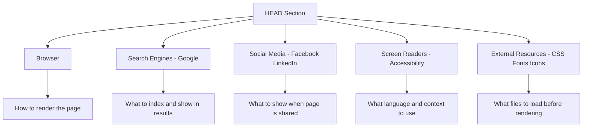
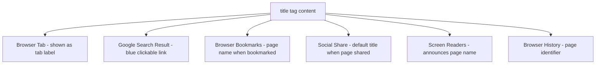
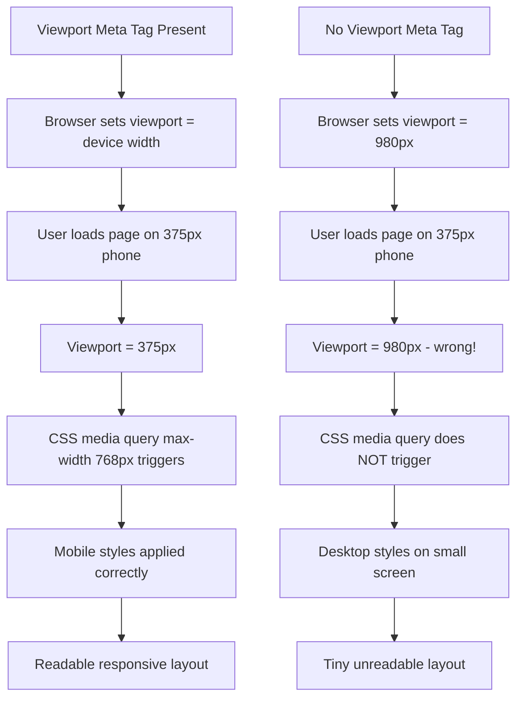
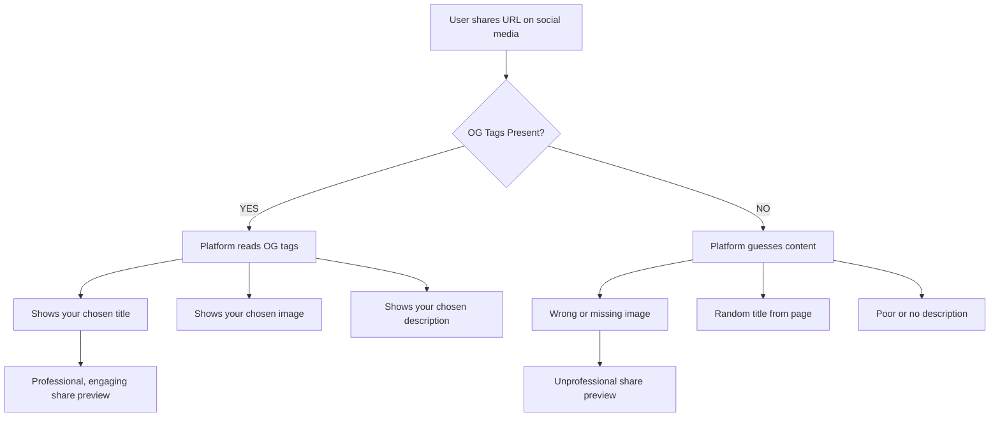
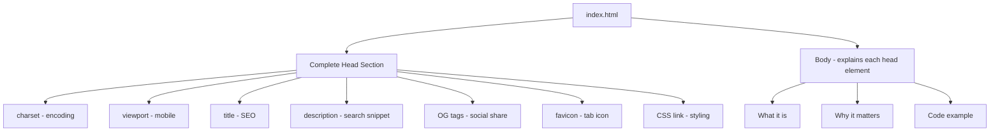

<a id="chapter-4-html-head-section"></a>

# Chapter 4: HTML Head Section

[⬅ Previous Chapter](#chapter-3-html-document-structure) | [📖 Main Index](#main-index) | [Next Chapter ➡](#chapter-5-html-elements-tags-attributes)

---

## 📌 Learning Objectives

By the end of this chapter, you will be able to:

- Understand the **complete purpose** of the HTML `<head>` section
- Write a **professional-grade `<head>`** with all required and recommended elements
- Explain **every meta tag** and its real-world impact on SEO, accessibility, and performance
- Understand **character encoding** and why UTF-8 is the universal standard
- Configure the **viewport meta tag** correctly for responsive design
- Write **SEO-optimized meta tags** that search engines actually use
- Add a **favicon** in multiple formats for all devices and browsers
- Correctly **link external CSS files** with proper attributes
- Understand **Open Graph and Twitter Card** meta tags for social sharing
- Explain **resource hints** — preconnect, prefetch, preload
- Answer **interview questions** on the HTML head section with complete confidence

---

<a id="chapter-index-table-4"></a>

## Chapter Index Table

| Topic No. | Topic Name | Subtopics |
|-----------|-----------|-----------|
| 4.1 | [The Head Element — Complete Overview](#41-the-head-element-complete-overview) | Purpose<br>What belongs in head<br>What does not belong<br>Order of elements |
| 4.2 | [The Title Tag](#42-the-title-tag) | Syntax<br>SEO impact<br>Browser tab<br>Best practices<br>Good vs bad titles |
| 4.3 | [Character Encoding — charset](#43-character-encoding-charset) | What is encoding<br>UTF-8<br>Why first in head<br>What happens without it |
| 4.4 | [Viewport Meta Tag](#44-viewport-meta-tag) | Syntax<br>Width device width<br>Initial scale<br>Mobile behavior<br>Advanced values |
| 4.5 | [SEO Meta Tags](#45-seo-meta-tags) | description<br>keywords<br>author<br>robots<br>canonical<br>SEO impact |
| 4.6 | [Open Graph & Social Media Meta Tags](#46-open-graph-and-social-media-meta-tags) | og:title<br>og:description<br>og:image<br>og:url<br>Twitter Cards |
| 4.7 | [Favicon — Browser Tab Icon](#47-favicon-browser-tab-icon) | What is favicon<br>Formats<br>Sizes<br>Apple touch icon<br>Web app manifest |
| 4.8 | [Linking External CSS](#48-linking-external-css) | link tag<br>rel attribute<br>href attribute<br>media attribute<br>Multiple CSS files |
| 4.9 | [Other Head Elements](#49-other-head-elements) | base tag<br>style tag<br>script in head<br>preconnect<br>prefetch<br>preload |
| 4.10 | [Complete Professional Head Template](#410-complete-professional-head-template) | Minimal<br>Standard<br>Full professional<br>E-commerce<br>Social media ready |

---

## 4.1 The Head Element — Complete Overview

<a id="41-the-head-element-complete-overview"></a>

---

### 🔷 What is the Head Element?

The `<head>` element is the **control center** of an HTML document. It:

- Contains **metadata** — data about the document, not the document's content itself
- Is completely **invisible** to the end user on the webpage
- Communicates with **browsers, search engines, social media platforms, and developer tools**
- Controls how the page **looks, behaves, and is discovered** by the world
- Must be the **first child** of `<html>` and come before `<body>`

---

### 🔷 The Head as a Communication Hub



---

### 🔷 What Belongs in Head vs What Does Not

| Belongs in `<head>` | Does NOT Belong in `<head>` |
|--------------------|----------------------------|
| `<title>` | `<h1>` to `<h6>` |
| `<meta charset>` | `<p>` |
| `<meta name="viewport">` | `` |
| `<meta name="description">` | `<div>` |
| `<link rel="stylesheet">` | `<span>` |
| `<link rel="icon">` | `<a>` |
| `<link rel="preconnect">` | `<button>` |
| `<style>` (internal CSS) | `<form>` |
| `<script>` (rarely — usually before `</body>`) | `<table>` |
| `<base>` | Any visible content |

---

### 🔷 Recommended Order of Elements in Head

The order of elements inside `<head>` matters for performance and correctness:

```html
<head>
    <!-- 1. Character encoding — ALWAYS FIRST -->
    <meta charset="UTF-8">

    <!-- 2. Compatibility (if needed for older IE) -->
    <meta http-equiv="X-UA-Compatible" content="IE=edge">

    <!-- 3. Viewport — mobile responsiveness -->
    <meta name="viewport" content="width=device-width, initial-scale=1.0">

    <!-- 4. Page title -->
    <title>Page Title — Site Name</title>

    <!-- 5. SEO meta tags -->
    <meta name="description" content="...">
    <meta name="author" content="...">
    <meta name="robots" content="index, follow">

    <!-- 6. Open Graph (social media) -->
    <meta property="og:title" content="...">
    <meta property="og:description" content="...">
    <meta property="og:image" content="...">

    <!-- 7. Favicon -->
    <link rel="icon" href="favicon.ico">

    <!-- 8. Preconnect for performance -->
    <link rel="preconnect" href="https://fonts.googleapis.com">

    <!-- 9. External CSS — last, so metadata loads first -->
    <link rel="stylesheet" href="css/style.css">
</head>
```

> [!IMPORTANT]
> **Interview Point:** `<meta charset="UTF-8">` must ALWAYS be the first element inside `<head>`. The browser needs to know the character encoding before parsing any other content. If it comes later, characters already parsed may be incorrectly interpreted.

---

### 🧠 Hinglish Intuition

> `<head>` section ek **aeroplane cockpit** ki tarah hai.
>
> Passengers (users) cockpit nahi dekhte — woh sirf cabin (body) dekhte hain.
>
> Lekin cockpit mein:
> - **Navigation system** = `<meta viewport>` (direction set karta hai)
> - **Communication radio** = `<meta description>` (search engines se baat karta hai)
> - **Flight manifest** = `<title>` (flight ka naam aur destination)
> - **Fuel connections** = `<link rel="stylesheet">` (CSS load karta hai)
> - **Safety systems** = `<meta charset>` (encoding ensure karta hai)
>
> Cockpit ke bina plane fly nahi kar sakta — waise hi `<head>` ke bina webpage properly work nahi karta.
>
> **`<head>` = Webpage ka cockpit — invisible but absolutely critical!**

---

👉 <a href="#chapter-index-table-4">Go to Top 🔝</a>

---

## 4.2 The Title Tag

<a id="42-the-title-tag"></a>

---

### 🔷 What is the Title Tag?

The `<title>` tag defines the **title of the HTML document**. It is:

- The only **mandatory** element inside `<head>` (besides charset and viewport best practices)
- Displayed in the **browser tab**
- Used as the page name in **browser bookmarks**
- The **clickable blue headline** in Google search results
- Used by **social media platforms** as default share title (when OG tags are missing)
- An important **SEO ranking factor**

---

### 🔷 Syntax

```html
<title>Primary Keyword — Secondary Keyword | Brand Name</title>
```

---

### 🔷 Where Title Appears



---

### 🔷 Title Tag — SEO Rules

| Rule | Guideline | Reason |
|------|-----------|--------|
| **Length** | 50–60 characters | Google truncates at ~60 chars in search results |
| **Primary keyword first** | Put main keyword at start | Google weighs words at start more heavily |
| **Brand name** | Include at end | Brand recognition in search results |
| **Unique per page** | Every page needs different title | Duplicate titles confuse search engines |
| **Descriptive** | Tell users exactly what the page is | Higher click-through rate from search |
| **No keyword stuffing** | Don't repeat keywords excessively | Google penalizes over-optimization |
| **Separator** | Use `—` (em dash) or `|` (pipe) | Clean visual separator between parts |

---

### 🔷 Good vs Bad Title Examples

```html
<!-- ❌ BAD: Default placeholder -->
<title>Document</title>

<!-- ❌ BAD: Too vague -->
<title>Home</title>

<!-- ❌ BAD: Too long - gets truncated -->
<title>Welcome to my amazing website about web development where you can learn HTML and CSS from scratch for complete beginners</title>

<!-- ❌ BAD: Keyword stuffing -->
<title>HTML CSS HTML Tutorial CSS Tutorial Learn HTML Learn CSS</title>

<!-- ✅ GOOD: Descriptive, correct length, brand at end -->
<title>Learn HTML5 — Beginner to Advanced | WebDev Academy</title>

<!-- ✅ GOOD: Service + location + brand -->
<title>Web Design Services in Mumbai | TechSolutions India</title>

<!-- ✅ GOOD: Product + brand -->
<title>iPhone 15 Pro Max — Apple India</title>

<!-- ✅ GOOD: Action-oriented -->
<title>Contact Us — Get a Free Quote | ABC Design Studio</title>
```

---

### 🔷 Title Tag for Different Page Types

| Page Type | Title Format | Example |
|-----------|-------------|---------|
| **Homepage** | Brand Name — Tagline | `TechCo — Building Digital Futures` |
| **Product page** | Product Name — Brand | `iPhone 15 Pro — Apple` |
| **Blog post** | Article Title — Blog Name | `How to Learn CSS — WebDev Blog` |
| **Category page** | Category — Site Name | `Web Design Articles — DevBlog` |
| **Contact page** | Contact Us — Brand Name | `Contact Us — TechSolutions India` |
| **About page** | About Us — Brand Name | `About Us — Our Story | TechCo` |
| **404 page** | Page Not Found — Brand | `Page Not Found — TechCo` |

---

### 🔷 Title Tag Code Examples

```html
<!-- Homepage -->
<!DOCTYPE html>
<html lang="en">
<head>
    <meta charset="UTF-8">
    <meta name="viewport" content="width=device-width, initial-scale=1.0">
    <title>TechSolutions India — Web &amp; App Development Company</title>
</head>
<body>
    <h1>Welcome to TechSolutions India</h1>
</body>
</html>
```

> [!NOTE]
> Notice: The `<title>` content uses `&amp;` for the `&` character. However, modern browsers actually handle `&` directly in `<title>` without issues. But using `&amp;` is technically correct HTML.

---

### 🧠 Hinglish Intuition

> `<title>` ek **book ka cover** hai.
>
> Jab tum library mein jaate ho, books ke naam cover pe likhte hain.
> Tum cover dekhke decide karte ho:
> - "Yeh book mere kaam ki hai ya nahi?"
> - "Yeh book kiske baare mein hai?"
>
> Google search results mein `<title>` exactly wahi kaam karta hai:
> - User title padhta hai
> - Decide karta hai click karoon ya nahi
>
> Ek **boring, vague title** = User skip kar deta hai
> Ek **clear, descriptive title** = User click karta hai
>
> **`<title>` = Tumhari website ka shelf label in Google's library!**

---

> [!TIP]
> **Quick Test:** After writing your page title, ask yourself: "If I saw this in Google search results, would I click it?" If the answer is no, rewrite it. The title is the #1 factor in click-through rate from search results.

---

👉 <a href="#chapter-index-table-4">Go to Top 🔝</a>

---

## 4.3 Character Encoding — charset

<a id="43-character-encoding-charset"></a>

---

### 🔷 What is Character Encoding?

**Character encoding** is a system that maps characters (letters, numbers, symbols) to specific **binary numbers** (0s and 1s) that computers understand and store.

When a browser reads an HTML file, it needs to know:
> "How should I interpret these bytes? Which byte sequence represents which character?"

That is what `<meta charset>` declares.

---

### 🔷 The Problem — Why Encoding Matters

Without encoding declaration, a browser has to **guess** which encoding was used. If it guesses wrong:

```text
Instead of: "Namaste — नमस्ते"
You might see: "Namaste â€" नमसà¥à¤¤à¥‡"
```

This garbled text is called **mojibake** — a Japanese term for scrambled characters.

---

### 🔷 What is UTF-8?

**UTF-8** (Unicode Transformation Format — 8-bit) is:

- The **most widely used** character encoding on the internet (over 97% of all websites)
- Can represent **every character** from every language in the world
- Backward compatible with **ASCII** (basic English characters)
- **Variable-length** encoding — uses 1 to 4 bytes per character

| Character Type | Bytes Used | Examples |
|---------------|-----------|---------|
| ASCII (basic English) | 1 byte | A-Z, a-z, 0-9, punctuation |
| Latin extended | 2 bytes | é, ñ, ü, ø |
| Most world languages | 3 bytes | Hindi (नमस्ते), Chinese (你好), Arabic (مرحبا) |
| Special/rare | 4 bytes | Emoji 😀, rare Chinese characters |

---

### 🔷 Syntax

```html
<meta charset="UTF-8">
```

This single line tells the browser:
> "Every byte in this file should be interpreted using UTF-8 encoding rules."

---

### 🔷 UTF-8 vs Other Encodings

| Encoding | Coverage | Used In |
|----------|---------|---------|
| **UTF-8** | All languages, emoji | ✅ Modern standard — always use this |
| **UTF-16** | All languages | JavaScript internal encoding |
| **ISO-8859-1** (Latin-1) | Western European only | ❌ Old, avoid |
| **Windows-1252** | Western European | ❌ Old Windows default, avoid |
| **ASCII** | English only | ❌ Very limited |
| **Shift-JIS** | Japanese | ❌ Japan-specific, outdated |

---

### 🔷 Why charset Must Be First in Head

```html
<!-- ❌ WRONG: charset declared late -->
<head>
    <title>My Page with émojis 😀 and नमस्ते</title>
    <meta name="description" content="Page with special characters: é, ñ, ₹">
    <meta charset="UTF-8">   <!-- TOO LATE! -->
</head>

<!-- ✅ CORRECT: charset declared first -->
<head>
    <meta charset="UTF-8">   <!-- MUST BE FIRST -->
    <title>My Page with émojis 😀 and नमस्ते</title>
    <meta name="description" content="Page with special characters: é, ñ, ₹">
</head>
```

**Why first?** The browser reads the HTML file **sequentially, top to bottom**. When it encounters characters before knowing the encoding, it makes assumptions. If those assumptions are wrong, the already-parsed characters are misinterpreted — even after the charset is declared later.

---

### 🔷 Practical Demo — Characters Without and With Charset

```html
<!-- Page demonstrating UTF-8 characters -->
<!DOCTYPE html>
<html lang="en">
<head>
    <meta charset="UTF-8">
    <title>UTF-8 Character Demo</title>
</head>
<body>

    <h1>UTF-8 Supports All Languages</h1>

    <!-- Currency symbols -->
    <p>Currencies: ₹ (Rupee) | € (Euro) | £ (Pound) | ¥ (Yen) | $ (Dollar)</p>

    <!-- International languages -->
    <p>Hindi: नमस्ते दुनिया</p>
    <p>Chinese: 你好世界</p>
    <p>Arabic: مرحبا بالعالم</p>
    <p>Japanese: こんにちは世界</p>
    <p>Russian: Привет мир</p>

    <!-- Special characters -->
    <p>Math: ≠ ≤ ≥ ∞ π √ ∑</p>
    <p>Arrows: → ← ↑ ↓ ↔ ⇒</p>
    <p>Emoji: 😀 🚀 ❤️ 🌍 ✅ ❌</p>

    <!-- Accented characters -->
    <p>Accented: café, résumé, naïve, piñata, über</p>

    <!-- Copyright and special marks -->
    <p>Marks: © ® ™ § ¶ †</p>

</body>
</html>
```

---

### 🧠 Hinglish Intuition

> Character encoding ek **universal translator** ki tarah hai.
>
> Socho tumhare paas ek secret code book hai:
> - Code: `01000001` = Letter "A"
> - Code: `01000010` = Letter "B"
>
> Jab computer Hindi text store karta hai — `नमस्ते` — woh bhi numbers mein store hota hai.
>
> **Problem:** Agar tum wrong "code book" use karo toh wrong characters read karoge.
>
> UTF-8 ek **universal code book** hai jisme SAARI languages ke characters hain — English, Hindi, Chinese, Arabic, emoji — sab kuch!
>
> `<meta charset="UTF-8">` browser ko batata hai: 
> "Is page ke liye **UTF-8 code book** use karo — toh saare characters correctly dikhenge."
>
> **UTF-8 = Duniya ki sabhi languages ka dictionary — ek hi book mein sab!**

---

> [!IMPORTANT]
> **Interview Fact:** UTF-8 is used by over 97% of all websites on the internet. It is the default encoding for HTML5. Always use UTF-8. Never use legacy encodings like ISO-8859-1 or Windows-1252 for new projects.

---

👉 <a href="#chapter-index-table-4">Go to Top 🔝</a>

---

## 4.4 Viewport Meta Tag

<a id="44-viewport-meta-tag"></a>

---

### 🔷 What is the Viewport?

The **viewport** is the visible area of a webpage in the browser window.

- On a **desktop**, the viewport is the browser window size
- On a **mobile phone**, the viewport is the screen size
- The viewport changes when users resize the browser or rotate their phone

---

### 🔷 The Problem Viewport Solves

Before mobile web, all websites were designed for desktop screens (~960px wide). When smartphones arrived, mobile browsers had a problem:

> "This page is designed for 960px but my screen is only 375px wide. What do I do?"

**Solution browsers chose (without viewport meta tag):**
- Pretend the screen is 980px wide (desktop width)
- Render the full desktop page at 980px
- Zoom out to fit 980px into 375px screen
- Text becomes tiny and unreadable
- User must pinch-zoom to read anything

**With viewport meta tag:**
- Browser respects the actual device width
- Content renders at correct size
- CSS media queries work at the real screen width
- Text is readable without zooming

---

### 🔷 Syntax

```html
<meta name="viewport" content="width=device-width, initial-scale=1.0">
```

---

### 🔷 Breaking Down the Viewport Content

| Property | Value | Meaning |
|----------|-------|---------|
| `width` | `device-width` | Set viewport width = actual device screen width |
| `initial-scale` | `1.0` | Set initial zoom to 100% (no zoom on page load) |
| `minimum-scale` | `0.5` | Minimum zoom user can apply (optional) |
| `maximum-scale` | `2.0` | Maximum zoom user can apply (optional) |
| `user-scalable` | `yes` / `no` | Whether user can zoom (optional) |

---

### 🔷 Viewport — Visual Comparison

**Without `<meta name="viewport">`:**

```text
Mobile Screen (375px wide)
┌─────────────────────────────────────┐
│ [Zoomed out desktop view - 980px]   │
│ ┌──────────────────────────────────┐│
│ │ Tiny text  Tiny nav  Tiny logo   ││
│ │ Very small content area           ││
│ │ User must pinch-zoom to read     ││
│ └──────────────────────────────────┘│
└─────────────────────────────────────┘
```

**With `<meta name="viewport" content="width=device-width, initial-scale=1.0">`:**

```text
Mobile Screen (375px wide)
┌─────────────────────────────────────┐
│ Normal readable navigation          │
│                                     │
│ Readable heading text               │
│                                     │
│ Paragraph text is readable          │
│ without any zooming needed          │
│                                     │
│ [Button at readable size]           │
└─────────────────────────────────────┘
```

---

### 🔷 Viewport and Media Queries

The viewport meta tag is what makes **CSS media queries work correctly** on mobile:

```html
<head>
    <meta charset="UTF-8">
    <meta name="viewport" content="width=device-width, initial-scale=1.0">
    <title>Responsive Page</title>
    <style>
        /* Without viewport meta tag, this would trigger at 980px on ALL phones */
        /* With viewport meta tag, this triggers at the ACTUAL device width */
        @media (max-width: 768px) {
            body {
                font-size: 16px;
            }
        }
    </style>
</head>
```

---

### 🔷 Viewport — Advanced Values

```html
<!-- Standard (use this for 99% of cases) -->
<meta name="viewport" content="width=device-width, initial-scale=1.0">

<!-- Prevent zooming (accessibility concern — avoid unless necessary) -->
<meta name="viewport" content="width=device-width, initial-scale=1.0, user-scalable=no">

<!-- Allow limited zooming -->
<meta name="viewport" content="width=device-width, initial-scale=1.0, minimum-scale=1.0, maximum-scale=2.0">

<!-- Fixed width (old technique — avoid) -->
<meta name="viewport" content="width=980">
```

> [!IMPORTANT]
> **Accessibility Warning:** Never use `user-scalable=no` or `maximum-scale=1`. This prevents users with visual impairments from zooming in to read content. It is a **WCAG (Web Content Accessibility Guidelines) violation** and should be avoided. Always allow users to zoom.

---

### 🔷 How Viewport Interacts with CSS



---

### 🧠 Hinglish Intuition

> Viewport meta tag ek **automatic size adjuster** ki tarah hai.
>
> Socho tumhare paas ek poster hai jo 980cm wide hai.
> Tum use ek 375cm wide frame mein fit karna chahte ho.
>
> **Bina viewport tag ke (old behavior):**
> Browser poster ko shrink kar deta hai — 980cm → 375cm mein fit karta hai.
> Sab kuch chhota ho jaata hai — padh nahi sakte.
>
> **Viewport tag ke saath:**
> Browser bolta hai: "Poster ko 375cm wide bana do — frame ke liye hi design karo."
> Content correctly fit hota hai — padh sakte ho.
>
> `width=device-width` bolta hai: "Apni actual screen ki width use karo"
> `initial-scale=1.0` bolta hai: "Zoom mat karo — actual size dikhao"
>
> **Viewport tag = Mobile ke liye correct fit guarantee karta hai!**

---

👉 <a href="#chapter-index-table-4">Go to Top 🔝</a>

---

## 4.5 SEO Meta Tags

<a id="45-seo-meta-tags"></a>

---

### 🔷 What are SEO Meta Tags?

**SEO Meta Tags** are `<meta>` elements in the `<head>` that provide **information to search engines** about the page content, helping with:

- **Indexing** — Telling search engines what the page is about
- **Ranking** — Influencing where the page appears in search results
- **Display** — Controlling how the page appears in search result listings
- **Crawling** — Telling search engine bots how to treat the page

---

### 🔷 1. Meta Description

```html
<meta name="description" content="Learn HTML5 from scratch. Complete beginner guide covering all HTML tags, attributes, forms, tables, and semantic elements. Start building websites today.">
```

| Property | Detail |
|----------|--------|
| **What it does** | Provides a summary of the page for search engines |
| **Where it appears** | Below the title in Google search results (the grey text) |
| **Ideal length** | 150–160 characters |
| **Direct ranking factor?** | No — but affects click-through rate (CTR) |
| **Unique per page** | Every page should have unique description |
| **Missing description** | Google auto-generates one from page content (often poorly) |

**Good vs Bad Descriptions:**

```html
<!-- ❌ BAD: Too short, not descriptive -->
<meta name="description" content="My website">

<!-- ❌ BAD: Too long — gets cut off -->
<meta name="description" content="This is a very long description that goes well beyond the recommended character limit and will be cut off by Google with an ellipsis making it look unprofessional and reducing click through rates significantly">

<!-- ❌ BAD: Keyword stuffing -->
<meta name="description" content="HTML HTML tutorial HTML guide HTML beginner HTML advanced HTML CSS HTML JavaScript">

<!-- ✅ GOOD: Clear, action-oriented, right length -->
<meta name="description" content="Learn HTML5 from scratch with hands-on examples. Master tags, forms, tables, and semantic elements. Perfect for beginners. Start building websites today.">
```

---

### 🔷 2. Meta Keywords (Mostly Obsolete)

```html
<meta name="keywords" content="html tutorial, learn html, html for beginners, web development">
```

| Property | Detail |
|----------|--------|
| **Historical purpose** | Tell search engines which keywords the page targets |
| **Current status** | **Google ignores it completely** since 2009 |
| **Bing** | Still considers it slightly |
| **Should you use it?** | Optional — it cannot hurt, but rarely helps |
| **Keyword stuffing risk** | Was heavily abused — reason Google dropped it |

> [!NOTE]
> Do NOT spend time on meta keywords. Google has officially stated it does not use this tag for ranking. Focus your time on title, description, and actual page content quality instead.

---

### 🔷 3. Meta Author

```html
<meta name="author" content="Rahul Sharma">
```

| Property | Detail |
|----------|--------|
| **Purpose** | Identifies the author of the page |
| **SEO impact** | Minimal direct SEO impact |
| **Use cases** | Blog posts, articles, documentation |
| **Tools that use it** | Some CMS systems, RSS readers, content aggregators |

---

### 🔷 4. Meta Robots

```html
<!-- Allow indexing and follow links (default behavior) -->
<meta name="robots" content="index, follow">

<!-- Prevent indexing, but follow links -->
<meta name="robots" content="noindex, follow">

<!-- Allow indexing, but don't follow links -->
<meta name="robots" content="index, nofollow">

<!-- Prevent both indexing and following links -->
<meta name="robots" content="noindex, nofollow">
```

| Value | Meaning |
|-------|---------|
| `index` | Allow search engines to index this page (default) |
| `noindex` | Do NOT index this page — won't appear in search results |
| `follow` | Follow links on this page (default) |
| `nofollow` | Don't follow links on this page |
| `noarchive` | Don't show cached version in search results |
| `nosnippet` | Don't show description snippet in search results |

**When to use noindex:**
- Admin pages
- Thank you pages after form submission
- Login pages
- Duplicate content pages
- Staging/development environments

---

### 🔷 5. Canonical URL

```html
<link rel="canonical" href="https://www.example.com/html-tutorial/">
```

| Property | Detail |
|----------|--------|
| **Purpose** | Tells search engines the "preferred" URL when duplicate content exists |
| **Problem it solves** | Multiple URLs showing same content (with/without www, http/https, trailing slash) |
| **Example** | `http://example.com/page`, `https://example.com/page`, `https://www.example.com/page` all same content |
| **Without canonical** | Search engines may split ranking signals across duplicate URLs |
| **With canonical** | All ranking signals consolidated to one preferred URL |

---

### 🔷 6. HTTP-Equiv Meta Tags

```html
<!-- Force IE to use latest rendering engine -->
<meta http-equiv="X-UA-Compatible" content="IE=edge">

<!-- Refresh page every 30 seconds (avoid using this) -->
<meta http-equiv="refresh" content="30">

<!-- Redirect to new URL after 3 seconds -->
<meta http-equiv="refresh" content="3; url=https://newpage.com">

<!-- Prevent caching (for frequently updated content) -->
<meta http-equiv="cache-control" content="no-cache">
```

> [!TIP]
> The `<meta http-equiv="X-UA-Compatible" content="IE=edge">` was important for Internet Explorer compatibility. Since Microsoft Edge replaced IE and IE is end-of-life, this tag is mostly obsolete for new projects. However, you may still see it in older codebases.

---

### 🔷 Complete SEO Meta Tags Example

```html
<!DOCTYPE html>
<html lang="en">
<head>
    <!-- Required -->
    <meta charset="UTF-8">
    <meta name="viewport" content="width=device-width, initial-scale=1.0">

    <!-- Title — most important SEO element -->
    <title>HTML Tutorial for Beginners — Complete Guide 2024 | WebDev Academy</title>

    <!-- Meta description — controls search snippet -->
    <meta name="description"
        content="Master HTML5 with our complete beginner guide. Learn tags, attributes, forms, tables, and semantic HTML with real examples. Start building websites in hours.">

    <!-- Author -->
    <meta name="author" content="Rahul Sharma">

    <!-- Robots — allow indexing -->
    <meta name="robots" content="index, follow">

    <!-- Canonical URL -->
    <link rel="canonical" href="https://www.webdevacademy.in/html-tutorial/">

    <!-- Optional: keywords (Google ignores, harmless) -->
    <meta name="keywords" content="html tutorial, learn html, html for beginners, html5">

</head>
<body>
    <h1>HTML Tutorial for Beginners</h1>
</body>
</html>
```

---

### 🧠 Hinglish Intuition

> SEO meta tags ek **library catalog card** ki tarah hain.
>
> Library mein har book ka ek **catalog card** hota hai jo batata hai:
> - Book ka naam (title)
> - Ek line summary (description)
> - Topics/keywords
> - Author
>
> Librarian (Google) is card ko padhke decide karta hai:
> - "Kaunse shelf pe rakhoon?"
> - "Kab dikhaaon?"
>
> `<meta name="description">` Google ko batata hai: "Search results mein yeh summary dikhao"
>
> Agar tumhara description **clear aur useful** hai → user click karta hai
> Agar description **boring ya missing** hai → Google khud likhta hai (often poorly)
>
> **SEO meta tags = Google ke liye tumhari website ki catalog card!**

---

👉 <a href="#chapter-index-table-4">Go to Top 🔝</a>

---

## 4.6 Open Graph and Social Media Meta Tags

<a id="46-open-graph-and-social-media-meta-tags"></a>

---

### 🔷 What are Open Graph Tags?

**Open Graph (OG)** is a protocol created by **Facebook** (now used by virtually all social media platforms) that controls how a webpage appears when **shared on social media**.

Without OG tags, when someone shares your URL on Facebook, LinkedIn, or WhatsApp, the platform tries to guess what to show — often picking wrong images, wrong titles, or no preview at all.

With OG tags, you **control exactly** what image, title, and description appear in the social media share preview.

---

### 🔷 Why Open Graph Matters



---

### 🔷 Core Open Graph Tags

```html
<!-- OG Type — what kind of content is this? -->
<meta property="og:type" content="website">

<!-- OG Title — title for social share (can differ from <title>) -->
<meta property="og:title" content="Learn HTML5 — Complete Beginner Guide">

<!-- OG Description — description for social share -->
<meta property="og:description" content="Master HTML5 from scratch. Hands-on examples, real projects, interview preparation. Start building websites today!">

<!-- OG Image — the image shown in social share preview -->
<meta property="og:image" content="https://www.example.com/images/html-guide-share.jpg">

<!-- OG URL — canonical URL of the page -->
<meta property="og:url" content="https://www.example.com/html-tutorial/">

<!-- OG Site Name — name of your overall website -->
<meta property="og:site_name" content="WebDev Academy">

<!-- OG Locale — language and region -->
<meta property="og:locale" content="en_US">
```

---

### 🔷 Open Graph Image Requirements

| Property | Requirement |
|----------|------------|
| **Recommended size** | 1200 × 630 pixels |
| **Minimum size** | 600 × 315 pixels |
| **Aspect ratio** | 1.91:1 (landscape) |
| **File format** | JPG or PNG (JPG preferred for smaller file size) |
| **File size** | Under 8MB (Facebook limit) |
| **Must be** | Absolute URL — `https://domain.com/image.jpg` |
| **Cannot be** | Relative URL — `./images/share.jpg` ❌ |

---

### 🔷 OG Type Values

```html
<!-- Website (general use) -->
<meta property="og:type" content="website">

<!-- Article (blog posts, news) -->
<meta property="og:type" content="article">

<!-- Product (e-commerce) -->
<meta property="og:type" content="product">

<!-- Video -->
<meta property="og:type" content="video.movie">
```

---

### 🔷 Twitter Card Meta Tags

**Twitter/X** has its own meta tag system called **Twitter Cards** (though it also falls back to OG tags):

```html
<!-- Card type -->
<meta name="twitter:card" content="summary_large_image">

<!-- Twitter site username -->
<meta name="twitter:site" content="@YourTwitterHandle">

<!-- Twitter creator username -->
<meta name="twitter:creator" content="@AuthorHandle">

<!-- Title (falls back to og:title if missing) -->
<meta name="twitter:title" content="Learn HTML5 — Complete Guide">

<!-- Description (falls back to og:description if missing) -->
<meta name="twitter:description" content="Master HTML5 from scratch with examples and projects.">

<!-- Image (falls back to og:image if missing) -->
<meta name="twitter:image" content="https://www.example.com/images/html-guide-share.jpg">
```

**Twitter Card Types:**

| Type | Appearance |
|------|-----------|
| `summary` | Small square thumbnail + text |
| `summary_large_image` | Large image + title + description |
| `app` | Mobile app card |
| `player` | Video/audio player card |

---

### 🔷 Complete Social Media Meta Section

```html
<head>
    <meta charset="UTF-8">
    <meta name="viewport" content="width=device-width, initial-scale=1.0">
    <title>HTML5 Tutorial — WebDev Academy</title>
    <meta name="description" content="Complete HTML5 guide for beginners.">

    <!-- ================================ -->
    <!-- OPEN GRAPH — Facebook LinkedIn   -->
    <!-- ================================ -->
    <meta property="og:type" content="article">
    <meta property="og:title" content="Learn HTML5 — The Complete Beginner's Guide">
    <meta property="og:description"
        content="Master HTML5 from scratch. Real examples, hands-on projects, and interview prep. Start building websites today!">
    <meta property="og:image" content="https://www.webdevacademy.in/images/html-tutorial-share.jpg">
    <meta property="og:image:width" content="1200">
    <meta property="og:image:height" content="630">
    <meta property="og:url" content="https://www.webdevacademy.in/html-tutorial/">
    <meta property="og:site_name" content="WebDev Academy">
    <meta property="og:locale" content="en_IN">

    <!-- ================================ -->
    <!-- TWITTER CARDS                    -->
    <!-- ================================ -->
    <meta name="twitter:card" content="summary_large_image">
    <meta name="twitter:site" content="@WebDevAcademy">
    <meta name="twitter:creator" content="@RahulSharma">
    <meta name="twitter:title" content="Learn HTML5 — Complete Beginner Guide">
    <meta name="twitter:description"
        content="Master HTML5 from scratch. Real examples, projects, and interview prep included.">
    <meta name="twitter:image" content="https://www.webdevacademy.in/images/html-tutorial-share.jpg">

</head>
```

---

### 🧠 Hinglish Intuition

> Open Graph tags ek **WhatsApp link preview** ki tarah socho.
>
> Jab tum WhatsApp pe koi link share karte ho:
> - Ek **thumbnail image** dikhti hai
> - Ek **title** dikhta hai
> - Ek **short description** dikhta hai
>
> Yeh sab automatically kahan se aata hai? **Open Graph tags** se!
>
> Bina OG tags ke:
> - Image random ya missing hogi
> - Title galat ho sakta hai
> - Description nahi hogi
>
> OG tags ke saath:
> - Tumhari chosen image dikhegi
> - Tumhara perfect title dikhega
> - Tumhari written description dikhegi
>
> **Professional websites mein link share karo → beautiful preview dikhti hai — yeh OG tags ka kaam hai!**

---

> [!TIP]
> **Testing Tool:** Use the **Facebook Sharing Debugger** (`developers.facebook.com/tools/debug`) and **Twitter Card Validator** (`cards-dev.twitter.com/validator`) to preview exactly how your page will appear when shared on each platform. These tools also show any missing or incorrect OG tags.

---

👉 <a href="#chapter-index-table-4">Go to Top 🔝</a>

---

## 4.7 Favicon — Browser Tab Icon

<a id="47-favicon-browser-tab-icon"></a>

---

### 🔷 What is a Favicon?

A **favicon** (short for "**fav**orite icon") is the small icon displayed in:

- **Browser tab** — next to the page title
- **Browser bookmarks** — as the bookmark icon
- **Browser history** — as the page identifier
- **Mobile home screen** — when user saves website as app
- **Search results** — some search engines show favicons

---

### 🔷 Where Favicon Appears

```text
Browser Tabs:
┌──────────────────┐ ┌──────────────────┐
│ 🌐 Google        │ │ ⭐ Amazon         │
└──────────────────┘ └──────────────────┘
   ↑ favicon icon        ↑ favicon icon

Browser Bookmarks:
🌐 Google
⭐ Amazon
🔵 Facebook
```

---

### 🔷 Favicon File Formats

| Format | Extension | Browser Support | Best Use |
|--------|-----------|----------------|---------|
| **ICO** | `.ico` | ✅ All browsers | Legacy standard — 16×16 and 32×32 |
| **PNG** | `.png` | ✅ All modern browsers | Best for quality and transparency |
| **SVG** | `.svg` | ✅ Modern browsers | Scalable — looks sharp at any size |
| **WebP** | `.webp` | ✅ Chrome, Firefox | Smaller file size |
| **GIF** | `.gif` | Some browsers | Can be animated (avoid) |

---

### 🔷 Favicon Sizes Required

| Size | Use Case |
|------|---------|
| **16×16** | Browser tab (standard) |
| **32×32** | Browser tab (high-DPI), Windows taskbar |
| **48×48** | Windows desktop shortcut |
| **180×180** | Apple touch icon (iPhone, iPad) |
| **192×192** | Android home screen |
| **512×512** | Android splash screen, PWA |

---

### 🔷 Basic Favicon — Simple Setup

```html
<head>
    <meta charset="UTF-8">
    <meta name="viewport" content="width=device-width, initial-scale=1.0">
    <title>My Website</title>

    <!-- Standard favicon (ICO format — works everywhere) -->
    <link rel="icon" type="image/x-icon" href="favicon.ico">

    <!-- PNG favicon for modern browsers -->
    <link rel="icon" type="image/png" sizes="32x32" href="images/favicon-32x32.png">
    <link rel="icon" type="image/png" sizes="16x16" href="images/favicon-16x16.png">

    <!-- Apple Touch Icon (iPhone, iPad) -->
    <link rel="apple-touch-icon" sizes="180x180" href="images/apple-touch-icon.png">

</head>
```

---

### 🔷 Complete Favicon Setup — Professional

```html
<head>
    <meta charset="UTF-8">
    <meta name="viewport" content="width=device-width, initial-scale=1.0">
    <title>WebDev Academy</title>

    <!-- ICO — fallback for old browsers -->
    <link rel="shortcut icon" href="favicon.ico" type="image/x-icon">

    <!-- Standard PNG favicons -->
    <link rel="icon" type="image/png" sizes="16x16" href="images/icons/favicon-16x16.png">
    <link rel="icon" type="image/png" sizes="32x32" href="images/icons/favicon-32x32.png">
    <link rel="icon" type="image/png" sizes="48x48" href="images/icons/favicon-48x48.png">

    <!-- SVG favicon (sharp at any size, modern browsers) -->
    <link rel="icon" type="image/svg+xml" href="images/icons/favicon.svg">

    <!-- Apple Touch Icon (iOS Safari) -->
    <link rel="apple-touch-icon" sizes="180x180" href="images/icons/apple-touch-icon.png">

    <!-- Android / PWA -->
    <link rel="manifest" href="site.webmanifest">
    <meta name="theme-color" content="#3b82f6">

</head>
```

---

### 🔷 Web App Manifest (`site.webmanifest`)

When users add your website to their phone home screen, the manifest file provides the app icon and name:

```json
{
    "name": "WebDev Academy",
    "short_name": "WebDev",
    "icons": [
        {
            "src": "images/icons/icon-192x192.png",
            "sizes": "192x192",
            "type": "image/png"
        },
        {
            "src": "images/icons/icon-512x512.png",
            "sizes": "512x512",
            "type": "image/png"
        }
    ],
    "theme_color": "#3b82f6",
    "background_color": "#ffffff",
    "display": "standalone"
}
```

---

### 🔷 Creating a Favicon — Tools

| Tool | URL | Type |
|------|-----|------|
| **Favicon.io** | favicon.io | Generate from text, image, or emoji |
| **RealFaviconGenerator** | realfavicongenerator.net | Complete multi-size generation |
| **Favicon Generator** | favicon-generator.org | Simple favicon creation |
| **Canva** | canva.com | Design custom icon, export PNG |

---

### 🔷 Favicon File Placement

```text
project/
├── index.html
├── favicon.ico          ← Root level (browsers auto-look here)
├── site.webmanifest
└── images/
    └── icons/
        ├── favicon-16x16.png
        ├── favicon-32x32.png
        ├── favicon-48x48.png
        ├── favicon.svg
        └── apple-touch-icon.png
```

> [!TIP]
> Placing `favicon.ico` in the **root directory** of your project is important. Many browsers automatically request `/favicon.ico` even without a `<link>` tag in the HTML. If the file is not there, you will see 404 errors in the browser console.

---

### 🧠 Hinglish Intuition

> Favicon ek **shop ka signboard** ki tarah hai.
>
> Jab tum ek busy market mein jaate ho — har dukan ka ek **unique sign** hota hai.
> - McDonald's = Golden M arches
> - Starbucks = Green mermaid
> - Apple = Bitten apple
>
> Waise hi browser mein multiple tabs open hote hain:
> - Google tab = Colorful "G" icon
> - YouTube tab = Red play button
> - Facebook tab = Blue "f"
>
> Favicon tab mein woh **pehchaan** hai jo user ko batata hai:
> "Yeh meri wali tab hai — isme teri website hai!"
>
> Bina favicon ke sab tabs same generic globe icon dikhate hain — confusing!
>
> **Favicon = Tumhari website ki pehchaan / identity in the browser!**

---

👉 <a href="#chapter-index-table-4">Go to Top 🔝</a>

---

## 4.8 Linking External CSS

<a id="48-linking-external-css"></a>

---

### 🔷 What is External CSS Linking?

External CSS linking is the process of **connecting an external `.css` file** to your HTML document using the `<link>` element inside `<head>`.

This is the **preferred and professional method** of adding CSS to HTML because:

- Separates **structure (HTML)** from **presentation (CSS)**
- One CSS file can style **multiple HTML pages**
- Browser **caches** the CSS file — faster loading on subsequent pages
- Easier to **maintain** — change style in one file, affects entire site
- Enables **multiple themes** by switching CSS files

---

### 🔷 The `<link>` Element Syntax

```html
<link rel="stylesheet" href="css/style.css">
```

| Attribute | Value | Purpose |
|-----------|-------|---------|
| `rel` | `"stylesheet"` | Defines relationship — this is a stylesheet |
| `href` | `"path/to/file.css"` | Path to the CSS file |
| `type` | `"text/css"` | MIME type (optional in HTML5 — browser infers from rel) |
| `media` | `"screen"`, `"print"`, `"all"` | Which media type this CSS applies to |
| `title` | `"theme-name"` | Names alternate stylesheets |

---

### 🔷 Three Ways to Add CSS — Comparison

#### Method 1: External CSS (Recommended)

```html
<head>
    <link rel="stylesheet" href="css/style.css">
</head>
```

Advantages:
- ✅ Separation of concerns
- ✅ Reusable across multiple pages
- ✅ Browser caching
- ✅ Cleaner HTML
- ✅ Easier team collaboration

#### Method 2: Internal CSS (in `<style>` tag)

```html
<head>
    <style>
        body {
            font-family: Arial, sans-serif;
            color: #333333;
        }
        h1 {
            color: #0066cc;
        }
    </style>
</head>
```

When to use:
- Small, single-page projects
- Email HTML (no external files allowed)
- Quick prototyping

Disadvantages:
- ❌ Cannot be reused across pages
- ❌ Mixes HTML and CSS
- ❌ Not cached by browser

#### Method 3: Inline CSS (on element directly)

```html
<h1 style="color: blue; font-size: 32px;">Hello World</h1>
```

When to use:
- Email HTML templates
- Dynamically generated styles via JavaScript
- Override specific styles with highest specificity

Disadvantages:
- ❌ Worst for maintainability
- ❌ Cannot use pseudo-classes (`:hover`)
- ❌ Highest specificity — overrides other CSS
- ❌ Violates separation of concerns

---

### 🔷 CSS Loading Priority

| Method | Priority Order | Specificity |
|--------|---------------|-------------|
| **Inline CSS** | 1st (highest) | Highest |
| **Internal CSS** | 2nd | Medium |
| **External CSS** | 3rd | Depends on specificity |
| **Browser default** | Last (lowest) | Lowest |

---

### 🔷 File Paths in href

```html
<!-- Same directory as HTML file -->
<link rel="stylesheet" href="style.css">

<!-- CSS folder in same directory -->
<link rel="stylesheet" href="css/style.css">

<!-- Going up one folder, then into css -->
<link rel="stylesheet" href="../css/style.css">

<!-- Absolute path from root -->
<link rel="stylesheet" href="/css/style.css">

<!-- External URL (CDN) -->
<link rel="stylesheet" href="https://cdn.example.com/bootstrap.min.css">
```

---

### 🔷 Multiple CSS Files

```html
<head>
    <meta charset="UTF-8">
    <meta name="viewport" content="width=device-width, initial-scale=1.0">
    <title>My Website</title>

    <!-- CSS Reset — loaded first to remove browser defaults -->
    <link rel="stylesheet" href="css/reset.css">

    <!-- Google Fonts (external CDN) -->
    <link rel="preconnect" href="https://fonts.googleapis.com">
    <link rel="preconnect" href="https://fonts.gstatic.com" crossorigin>
    <link rel="stylesheet" href="https://fonts.googleapis.com/css2?family=Inter:wght@400;600;700&display=swap">

    <!-- Main stylesheet — loaded last so it can override others -->
    <link rel="stylesheet" href="css/style.css">

    <!-- Print-specific CSS — only applies when printing -->
    <link rel="stylesheet" href="css/print.css" media="print">

    <!-- Mobile-only CSS -->
    <link rel="stylesheet" href="css/mobile.css" media="(max-width: 768px)">

</head>
```

> [!IMPORTANT]
> **Order matters when linking multiple CSS files.** The last file loaded wins when there are conflicting CSS rules (assuming same specificity). Always load reset/normalize first, then framework CSS, then your custom CSS last so your styles override framework defaults.

---

### 🔷 The `media` Attribute

```html
<!-- Applies to all media types (default) -->
<link rel="stylesheet" href="css/style.css" media="all">

<!-- Screen only — does not apply when printing -->
<link rel="stylesheet" href="css/style.css" media="screen">

<!-- Print only — applies when user prints the page -->
<link rel="stylesheet" href="css/print.css" media="print">

<!-- Media query in link tag -->
<link rel="stylesheet" href="css/mobile.css" media="(max-width: 768px)">
<link rel="stylesheet" href="css/dark.css" media="(prefers-color-scheme: dark)">
```

---

### 🔷 CSS Link with Integrity (CDN Security)

When loading CSS from a CDN, use **Subresource Integrity (SRI)** to ensure the file has not been tampered with:

```html
<link
    rel="stylesheet"
    href="https://cdn.jsdelivr.net/npm/bootstrap@5.3.0/dist/css/bootstrap.min.css"
    integrity="sha384-9ndCyUaIbzAi2FUVXJi0CjmCapSmO7SnpJef0486qhLnuZ2cdeRhO02iuK6FUUVM"
    crossorigin="anonymous"
>
```

| Attribute | Purpose |
|-----------|---------|
| `integrity` | SHA hash of the file — browser verifies file matches |
| `crossorigin` | Required when integrity is used for cross-origin requests |

---

### 🧠 Hinglish Intuition

> External CSS linking ek **wardrobe aur clothes** ki tarah hai.
>
> Tumhara body (HTML) hai — uske upar kapde (CSS) pahnte ho.
>
> **Method 1 — External CSS (best):**
> Alag wardrobe hai — sab kapde organized hain. Ek hi wardrobe se multiple occasions ke liye kapde use karo.
>
> **Method 2 — Internal CSS:**
> Kapde seedha body pe drawn hain (tattoo ki tarah) — sirf is ek body ke liye. Reuse nahi ho sakta.
>
> **Method 3 — Inline CSS:**
> Har body part pe alag alag paint kiya hai — bahut messy, bahut specific.
>
> External CSS best hai kyunki:
> - Ek CSS file → Multiple HTML pages style kar sakti hai
> - Change karo ek jagah → Sab pages pe change ho jaata hai
> - Browser cache karta hai → Faster loading
>
> **External CSS = Organized wardrobe — reusable, maintainable, professional!**

---

👉 <a href="#chapter-index-table-4">Go to Top 🔝</a>

---

## 4.9 Other Head Elements

<a id="49-other-head-elements"></a>

---

### 🔷 1. The `<base>` Tag

```html
<base href="https://www.example.com/" target="_blank">
```

The `<base>` tag sets the **default URL and target** for all relative URLs in the document.

```html
<head>
    <base href="https://www.example.com/blog/">
</head>
<body>
    <!-- This link resolves to: https://www.example.com/blog/html-tutorial -->
    <a href="html-tutorial">HTML Tutorial</a>

    <!-- This image resolves to: https://www.example.com/blog/images/photo.jpg -->
    
</body>
```

| Property | Detail |
|----------|--------|
| **href** | Default base URL for all relative links |
| **target** | Default target for all links (`_blank`, `_self`, etc.) |
| **Only one** | Only one `<base>` element per document |
| **Position** | Must be in `<head>`, before any element with a URL |
| **Careful use** | Can cause unexpected link behavior — use sparingly |

---

### 🔷 2. Internal `<style>` Tag

```html
<head>
    <style>
        /* CSS written directly in HTML — internal CSS */
        body {
            font-family: 'Inter', sans-serif;
            margin: 0;
            padding: 0;
            background-color: #f5f5f5;
        }

        h1 {
            color: #1a1a1a;
            font-size: 2rem;
        }

        .container {
            max-width: 1200px;
            margin: 0 auto;
            padding: 0 20px;
        }
    </style>
</head>
```

---

### 🔷 3. `<script>` in Head vs End of Body

```html
<!-- ❌ AVOID: Script in head blocks page rendering -->
<head>
    <script src="js/app.js"></script>
</head>

<!-- ✅ BETTER: Script at end of body — page loads first, then JS -->
<body>
    <!-- All page content -->
    <script src="js/app.js"></script>
</body>

<!-- ✅ BEST: Script in head with defer — loads async, runs after DOM ready -->
<head>
    <script src="js/app.js" defer></script>
</head>

<!-- ✅ GOOD: Script with async — loads and runs independently -->
<head>
    <script src="js/analytics.js" async></script>
</head>
```

| Method | Behavior | Use Case |
|--------|---------|---------|
| `<script>` in head | **Blocks** HTML parsing — bad for performance | Avoid |
| `<script>` at end of body | Loads after full HTML parsed | Good, traditional |
| `<script defer>` | Loads parallel, executes after HTML parsed | Best for most JS |
| `<script async>` | Loads and executes independently | Analytics, ads |

---

### 🔷 4. Resource Hints — Performance Optimization

Resource hints tell the browser to **prepare for resources** it will need — before it finds them naturally in the HTML.

#### `rel="preconnect"` — Establish Connection Early

```html
<!-- Establish connection to Google Fonts early -->
<link rel="preconnect" href="https://fonts.googleapis.com">
<link rel="preconnect" href="https://fonts.gstatic.com" crossorigin>
```

Used for: External domains you will fetch resources from (fonts, APIs, CDNs).

#### `rel="dns-prefetch"` — Resolve DNS Early

```html
<!-- Resolve DNS for external domain early -->
<link rel="dns-prefetch" href="https://fonts.googleapis.com">
<link rel="dns-prefetch" href="https://cdn.example.com">
```

Used for: Domains you might request from — cheaper than preconnect.

#### `rel="preload"` — Load Critical Resources Early

```html
<!-- Preload critical CSS -->
<link rel="preload" href="css/critical.css" as="style">

<!-- Preload hero image -->
<link rel="preload" href="images/hero-banner.jpg" as="image">

<!-- Preload main font -->
<link rel="preload" href="fonts/inter.woff2" as="font" type="font/woff2" crossorigin>
```

Used for: Critical resources needed for first paint (hero image, main font, critical CSS).

#### `rel="prefetch"` — Load Future Resources

```html
<!-- Prefetch resources for the NEXT page user might visit -->
<link rel="prefetch" href="about.html">
<link rel="prefetch" href="images/about-hero.jpg">
```

Used for: Resources for pages user is likely to visit next.

---

### 🔷 Resource Hints Summary

| Hint | When to Use | Priority |
|------|------------|---------|
| `preconnect` | External domains for current page resources | High |
| `dns-prefetch` | External domains (cheaper than preconnect) | Medium |
| `preload` | Critical resources for current page | Highest |
| `prefetch` | Resources for next page | Low (background) |

---

### 🔷 `<meta http-equiv>` Tags

```html
<!-- Force modern IE rendering engine -->
<meta http-equiv="X-UA-Compatible" content="IE=edge">

<!-- Refresh page every 60 seconds -->
<meta http-equiv="refresh" content="60">

<!-- Redirect to new URL after 3 seconds -->
<meta http-equiv="refresh" content="3; url=https://newurl.com">

<!-- Content Security Policy -->
<meta http-equiv="Content-Security-Policy" content="default-src 'self'">
```

---

### 🧠 Hinglish Intuition

> Resource hints ek **smart event organizer** ki tarah hain.
>
> Socho tum ek bade event ka plan kar rahe ho:
>
> - **`preconnect`** = Venue se pehle hi contact karo, relationship banao — event ke time pe entry fast hogi
> - **`dns-prefetch`** = Address pehle se note kar lo — dhundhne mein time waste nahi hoga
> - **`preload`** = Event ka main equipment (stage, mics) pehle se arrange karo — event start pe sab ready hoga
> - **`prefetch`** = Agle event ke liye resources background mein book karo — user next pe click kare toh instant ready
>
> Browser ko pata hota hai ki aage kya chahiye — toh woh pehle se prepare kar leta hai.
>
> **Result = Faster page loads, better user experience!**

---

👉 <a href="#chapter-index-table-4">Go to Top 🔝</a>

---

## 4.10 Complete Professional Head Template

<a id="410-complete-professional-head-template"></a>

---

### 🔷 Template 1: Minimal (Beginner Projects)

```html
<!DOCTYPE html>
<html lang="en">
<head>
    <meta charset="UTF-8">
    <meta name="viewport" content="width=device-width, initial-scale=1.0">
    <title>Page Title — Site Name</title>
</head>
<body>
</body>
</html>
```

Use when:
- Learning HTML basics
- Quick experiments
- No SEO requirements
- No external CSS yet

---

### 🔷 Template 2: Standard (Most Projects)

```html
<!DOCTYPE html>
<html lang="en">
<head>
    <!-- Encoding -->
    <meta charset="UTF-8">

    <!-- Responsive -->
    <meta name="viewport" content="width=device-width, initial-scale=1.0">

    <!-- Title -->
    <title>Page Title — Site Name</title>

    <!-- SEO -->
    <meta name="description" content="Page description under 160 characters.">
    <meta name="author" content="Your Name">

    <!-- Favicon -->
    <link rel="icon" type="image/png" href="images/favicon.png">

    <!-- CSS -->
    <link rel="stylesheet" href="css/style.css">
</head>
<body>
</body>
</html>
```

Use when:
- Building portfolio projects
- Small business websites
- Blog sites
- Most learning projects

---

### 🔷 Template 3: Full Professional (Production Sites)

```html
<!DOCTYPE html>
<html lang="en">
<head>

    <!-- ============================================ -->
    <!-- REQUIRED — ALWAYS FIRST                      -->
    <!-- ============================================ -->
    <meta charset="UTF-8">
    <meta http-equiv="X-UA-Compatible" content="IE=edge">
    <meta name="viewport" content="width=device-width, initial-scale=1.0">

    <!-- ============================================ -->
    <!-- PAGE IDENTITY                                -->
    <!-- ============================================ -->
    <title>Page Title — Primary Keyword | Brand Name</title>

    <!-- ============================================ -->
    <!-- SEO META TAGS                                -->
    <!-- ============================================ -->
    <meta name="description"
        content="Compelling description of this page under 160 characters. Include primary keyword naturally.">
    <meta name="author" content="Author Name">
    <meta name="robots" content="index, follow">
    <meta name="keywords" content="keyword1, keyword2, keyword3">
    <link rel="canonical" href="https://www.yoursite.com/this-page/">

    <!-- ============================================ -->
    <!-- OPEN GRAPH — SOCIAL SHARING                  -->
    <!-- ============================================ -->
    <meta property="og:type" content="website">
    <meta property="og:title" content="Page Title for Social Share">
    <meta property="og:description"
        content="Description for social share — can be different from meta description.">
    <meta property="og:image" content="https://www.yoursite.com/images/share-image.jpg">
    <meta property="og:image:width" content="1200">
    <meta property="og:image:height" content="630">
    <meta property="og:url" content="https://www.yoursite.com/this-page/">
    <meta property="og:site_name" content="Your Site Name">
    <meta property="og:locale" content="en_IN">

    <!-- ============================================ -->
    <!-- TWITTER CARDS                                -->
    <!-- ============================================ -->
    <meta name="twitter:card" content="summary_large_image">
    <meta name="twitter:site" content="@YourTwitter">
    <meta name="twitter:title" content="Page Title for Twitter">
    <meta name="twitter:description" content="Description for Twitter card.">
    <meta name="twitter:image" content="https://www.yoursite.com/images/share-image.jpg">

    <!-- ============================================ -->
    <!-- FAVICON                                      -->
    <!-- ============================================ -->
    <link rel="shortcut icon" href="favicon.ico" type="image/x-icon">
    <link rel="icon" type="image/png" sizes="16x16" href="images/icons/favicon-16x16.png">
    <link rel="icon" type="image/png" sizes="32x32" href="images/icons/favicon-32x32.png">
    <link rel="icon" type="image/svg+xml" href="images/icons/favicon.svg">
    <link rel="apple-touch-icon" sizes="180x180" href="images/icons/apple-touch-icon.png">
    <link rel="manifest" href="site.webmanifest">
    <meta name="theme-color" content="#3b82f6">

    <!-- ============================================ -->
    <!-- PERFORMANCE — RESOURCE HINTS                 -->
    <!-- ============================================ -->
    <link rel="preconnect" href="https://fonts.googleapis.com">
    <link rel="preconnect" href="https://fonts.gstatic.com" crossorigin>
    <link rel="dns-prefetch" href="https://cdn.yoursite.com">

    <!-- ============================================ -->
    <!-- EXTERNAL FONTS                               -->
    <!-- ============================================ -->
    <link rel="stylesheet"
        href="https://fonts.googleapis.com/css2?family=Inter:wght@400;500;600;700&display=swap">

    <!-- ============================================ -->
    <!-- STYLESHEETS — LOAD LAST IN HEAD              -->
    <!-- ============================================ -->
    <link rel="stylesheet" href="css/reset.css">
    <link rel="stylesheet" href="css/style.css">
    <link rel="stylesheet" href="css/print.css" media="print">

    <!-- ============================================ -->
    <!-- DEFERRED JAVASCRIPT                          -->
    <!-- ============================================ -->
    <script src="js/app.js" defer></script>

</head>
<body>

    <!-- Page content here -->

</body>
</html>
```

---

### 🔷 Template 4: Blog Article Page

```html
<!DOCTYPE html>
<html lang="en">
<head>
    <meta charset="UTF-8">
    <meta name="viewport" content="width=device-width, initial-scale=1.0">

    <title>How to Learn HTML in 30 Days — WebDev Blog</title>

    <meta name="description"
        content="A practical 30-day plan to learn HTML from scratch. Daily tasks, exercises, and projects to take you from beginner to job-ready.">
    <meta name="author" content="Rahul Sharma">
    <meta name="robots" content="index, follow">
    <link rel="canonical" href="https://blog.webdevacademy.in/how-to-learn-html-30-days/">

    <!-- Article-specific OG -->
    <meta property="og:type" content="article">
    <meta property="og:title" content="How to Learn HTML in 30 Days">
    <meta property="og:description"
        content="Practical 30-day plan with daily tasks and projects. Go from zero to job-ready HTML developer.">
    <meta property="og:image" content="https://blog.webdevacademy.in/images/learn-html-30-days.jpg">
    <meta property="og:url" content="https://blog.webdevacademy.in/how-to-learn-html-30-days/">

    <!-- Article metadata -->
    <meta property="article:author" content="https://www.linkedin.com/in/rahulsharma/">
    <meta property="article:published_time" content="2024-01-15T10:00:00+05:30">
    <meta property="article:modified_time" content="2024-01-20T14:00:00+05:30">
    <meta property="article:section" content="Web Development">
    <meta property="article:tag" content="HTML">
    <meta property="article:tag" content="Web Development">
    <meta property="article:tag" content="Beginner">

    <meta name="twitter:card" content="summary_large_image">
    <meta name="twitter:title" content="How to Learn HTML in 30 Days">
    <meta name="twitter:description"
        content="Practical 30-day plan. Zero to job-ready HTML developer.">
    <meta name="twitter:image" content="https://blog.webdevacademy.in/images/learn-html-30-days.jpg">

    <link rel="icon" type="image/png" href="images/favicon.png">
    <link rel="stylesheet" href="css/blog.css">

</head>
<body>
    <article>
        <h1>How to Learn HTML in 30 Days</h1>
    </article>
</body>
</html>
```

---

### 🔷 Head Elements — Complete Reference Table

| Element | Required | Purpose | Example |
|---------|----------|---------|---------|
| `<meta charset>` | ✅ Always | Character encoding | `<meta charset="UTF-8">` |
| `<meta viewport>` | ✅ Always | Mobile responsiveness | `<meta name="viewport" content="width=device-width, initial-scale=1.0">` |
| `<title>` | ✅ Always | Page title | `<title>Page — Site</title>` |
| `<meta description>` | 🔶 Recommended | SEO snippet | `<meta name="description" content="...">` |
| `<meta robots>` | 🔶 Recommended | Crawling instructions | `<meta name="robots" content="index, follow">` |
| `<link canonical>` | 🔶 Recommended | Duplicate URL handling | `<link rel="canonical" href="...">` |
| `<meta og:*>` | 🔶 Recommended | Social media sharing | `<meta property="og:title" content="...">` |
| `<meta twitter:*>` | 🔶 Recommended | Twitter sharing | `<meta name="twitter:card" content="...">` |
| `<link icon>` | 🔶 Recommended | Favicon | `<link rel="icon" href="favicon.ico">` |
| `<link stylesheet>` | When CSS used | External CSS | `<link rel="stylesheet" href="style.css">` |
| `<link preconnect>` | ⚡ Performance | Early connection | `<link rel="preconnect" href="https://...">` |
| `<link preload>` | ⚡ Performance | Preload critical assets | `<link rel="preload" href="..." as="image">` |
| `<script defer>` | When JS used | Deferred JavaScript | `<script src="app.js" defer></script>` |
| `<meta author>` | Optional | Page author | `<meta name="author" content="Name">` |
| `<meta keywords>` | Optional | Keywords (Google ignores) | `<meta name="keywords" content="...">` |
| `<base>` | Rare | Default base URL | `<base href="https://site.com/">` |

---

👉 <a href="#chapter-index-table-4">Go to Top 🔝</a>

---

## 💡 Interview Questions

---

### 📝 Conceptual Questions

**Q1. What is the purpose of the HTML `<head>` section? What goes inside it?**

**Answer:**
The `<head>` section is the **metadata container** of an HTML document. It:

- Is completely **invisible to users** on the webpage
- Communicates with **browsers, search engines, social media platforms, and developer tools**
- Controls how the page is **rendered, indexed, and shared**

**Goes inside `<head>`:**
- `<meta charset="UTF-8">` — Character encoding
- `<meta name="viewport">` — Mobile responsiveness
- `<title>` — Page title (browser tab, SEO)
- `<meta name="description">` — SEO description
- `<meta property="og:*">` — Open Graph for social sharing
- `<link rel="stylesheet">` — External CSS
- `<link rel="icon">` — Favicon
- `<link rel="preconnect">` — Performance hints
- `<script defer>` — Deferred JavaScript

**Does NOT go inside `<head>`:** Any visible content — `<h1>`, `<p>`, ``, `<div>`, etc.

---

**Q2. Why must `<meta charset="UTF-8">` be the first element inside `<head>`?**

**Answer:**
The browser reads HTML **sequentially, top to bottom**. When it encounters text/characters before knowing the encoding, it must make a guess.

If the charset declaration comes late:
1. Browser has already parsed characters before the declaration
2. Those characters were interpreted with a guessed (possibly wrong) encoding
3. Even after the charset is declared, already-parsed content may be misinterpreted
4. Result: Garbled characters (mojibake) for special characters

By placing `<meta charset="UTF-8">` **first**, the browser knows the encoding before reading ANY other content, ensuring all characters are correctly interpreted from the start.

---

**Q3. What does `<meta name="viewport" content="width=device-width, initial-scale=1.0">` do?**

**Answer:**
This meta tag controls how the browser displays the webpage on different devices.

**Breaking it down:**
- `name="viewport"` — Identifies this as a viewport meta tag
- `width=device-width` — Sets the viewport width equal to the actual device screen width (instead of the assumed 980px desktop width)
- `initial-scale=1.0` — Sets the initial zoom level to 100% — no zoom applied on page load

**Without this tag:**
- Mobile browsers assume the page is 980px wide
- They zoom out to fit 980px into 375px screen
- Text becomes tiny and unreadable
- CSS media queries trigger at wrong breakpoints
- Responsive design completely breaks

**With this tag:**
- Page renders at the actual device width
- Text is readable without zooming
- CSS media queries work correctly
- Responsive design functions properly

---

**Q4. What is the difference between `<meta name="description">` and `<title>`?**

**Answer:**

| Feature | `<title>` | `<meta name="description">` |
|---------|---------|---------------------------|
| **Appears in** | Browser tab, Google clickable title, bookmarks | Google search result snippet (grey text below title) |
| **SEO impact** | **Direct** ranking factor | **Indirect** — affects click-through rate |
| **Length** | 50–60 characters | 150–160 characters |
| **Required?** | ✅ Mandatory | Recommended |
| **If missing** | Validation error | Google auto-generates from content |
| **User sees** | Tab, search result title | Search result description |

Both work together: **title** gets the click, **description** convinces the user to click.

---

**Q5. What are Open Graph meta tags and why are they needed?**

**Answer:**
Open Graph (OG) tags are meta tags using `property="og:*"` that control how a webpage appears when **shared on social media** (Facebook, LinkedIn, WhatsApp, etc.).

**Without OG tags:** When someone shares your URL, the platform guesses what to show — wrong image, wrong title, no description.

**With OG tags:** You control:
- `og:title` — Title shown in share preview
- `og:description` — Description in share preview
- `og:image` — Thumbnail image (1200×630px recommended)
- `og:url` — Canonical URL of the page
- `og:type` — Content type (website, article, product)

**Example:**
```html
<meta property="og:title" content="Learn HTML5 — Complete Guide">
<meta property="og:description" content="Master HTML from scratch with real projects.">
<meta property="og:image" content="https://site.com/images/share.jpg">
<meta property="og:url" content="https://site.com/html-guide/">
```

---

**Q6. What is the difference between external, internal, and inline CSS?**

**Answer:**

| Method | How | Priority | Best For |
|--------|-----|---------|---------|
| **External** | `<link rel="stylesheet" href="style.css">` in head | Medium | Production — reusable across pages |
| **Internal** | `<style>` block in `<head>` | Medium | Single pages, email HTML |
| **Inline** | `style=""` attribute on element | Highest | Emergency overrides, JS-generated styles |

**External CSS is best because:**
- Separation of concerns (HTML for structure, CSS for style)
- One file can style multiple pages
- Browser caches the CSS file
- Easier to maintain and collaborate

---

**Q7. What is a favicon and how do you add one with multiple size support?**

**Answer:**
A **favicon** (favorite icon) is the small icon displayed in the browser tab, bookmarks, and browser history.

**Adding with multiple size support:**
```html
<!-- ICO — fallback for old browsers -->
<link rel="shortcut icon" href="favicon.ico" type="image/x-icon">

<!-- PNG for modern browsers -->
<link rel="icon" type="image/png" sizes="16x16" href="images/favicon-16x16.png">
<link rel="icon" type="image/png" sizes="32x32" href="images/favicon-32x32.png">

<!-- SVG — scales perfectly at any size -->
<link rel="icon" type="image/svg+xml" href="images/favicon.svg">

<!-- Apple devices -->
<link rel="apple-touch-icon" sizes="180x180" href="images/apple-touch-icon.png">

<!-- Android / PWA -->
<link rel="manifest" href="site.webmanifest">
<meta name="theme-color" content="#3b82f6">
```

---

### 🎯 Scenario-Based Questions

**Q8. A client's website looks fine on desktop but has tiny unreadable text on mobile. What is the first thing you check in the HTML?**

**Answer:**
The **first thing to check** is whether the viewport meta tag is present in `<head>`:

```html
<meta name="viewport" content="width=device-width, initial-scale=1.0">
```

If this is missing, the browser treats the page as 980px wide on mobile and zooms out — making everything tiny.

**Debugging steps:**
1. View page source (Ctrl+U) → Check for viewport meta tag in `<head>`
2. Open Chrome DevTools (F12) → Click device toolbar → Simulate mobile
3. If viewport is missing, add it → Test again
4. If viewport is present, the issue is in the CSS (media queries, font sizes)

---

**Q9. When you share a website link on WhatsApp, the preview shows the wrong image. How do you fix this?**

**Answer:**
The wrong image in social share previews is an **Open Graph problem**.

**Fix:**
1. Add proper OG image tag in `<head>`:
```html
<meta property="og:image" content="https://www.yoursite.com/images/share-image.jpg">
<meta property="og:image:width" content="1200">
<meta property="og:image:height" content="630">
```

2. Ensure the OG image URL is:
   - An **absolute URL** (starts with `https://`) — not a relative path
   - **1200×630px** (Facebook recommended)
   - Under **8MB** file size
   - Publicly accessible (not behind login)

3. **Clear the cache:** Use Facebook Sharing Debugger (`developers.facebook.com/tools/debug`) to force social platforms to re-scrape the updated OG tags.

---

**Q10. A developer writes:**
```html
<head>
    <title>My Page</title>
    <meta charset="UTF-8">
</head>
```
**What is wrong with this?**

**Answer:**
The `<meta charset="UTF-8">` is in the **wrong position** — it should be the **first element** inside `<head>`, before `<title>`.

**Why this matters:**
The `<title>` content may contain special characters. If the browser reads the title before knowing the encoding, it may misinterpret any non-ASCII characters (accented letters, emoji, language-specific characters) in the title.

**Corrected version:**
```html
<head>
    <meta charset="UTF-8">    <!-- FIRST -->
    <title>My Page</title>    <!-- AFTER charset -->
</head>
```

---

### 🔍 Output-Based Questions

**Q11. What text appears in the browser tab for this code?**

```html
<!DOCTYPE html>
<html lang="en">
<head>
    <meta charset="UTF-8">
    <meta name="viewport" content="width=device-width, initial-scale=1.0">
    <title>HTML &amp; CSS Mastery — Chapter 4 | DevBook</title>
    <meta name="description" content="Complete HTML head section guide.">
</head>
<body>
    <h1>Chapter 4: HTML Head Section</h1>
    <meta name="test" content="wrong location">
</body>
</html>
```

**Answer:**
- **Browser tab shows:** `HTML & CSS Mastery — Chapter 4 | DevBook`
  - (`&amp;` renders as `&` in the browser tab)
- **On the page:** `Chapter 4: HTML Head Section` (the H1 heading)
- **The `<meta>` inside `<body>`:** Technically invalid — meta tags belong in `<head>`. The browser may still recognize it but it is wrong practice.
- **The `<meta name="description">`:** Not visible on page — only visible to search engines and in source code.

---

**Q12. What is the difference between these two?**

```html
<!-- A -->
<script src="app.js"></script>

<!-- B -->
<script src="app.js" defer></script>
```

**Answer:**

| | Without `defer` (A) | With `defer` (B) |
|-|---------------------|-------------------|
| **When HTML parsing pauses** | Immediately when script tag encountered | Never — parsing continues |
| **When script downloads** | Immediately, blocking | In parallel with HTML parsing |
| **When script executes** | Immediately after download | After full HTML is parsed |
| **Page load impact** | **Blocks rendering** — bad for performance | **Non-blocking** — great for performance |
| **Correct DOM access** | DOM may not be ready | ✅ DOM is always ready when script runs |

Always use `defer` (or place script before `</body>`) to prevent blocking page rendering.

---

### 🚀 Advanced Questions

**Q13. What is Subresource Integrity (SRI) and why is it used with CDN-loaded CSS?**

**Answer:**
**Subresource Integrity (SRI)** is a security feature that allows browsers to verify that files fetched from CDNs have not been **tampered with or compromised**.

When you load Bootstrap, jQuery, or any library from a CDN, you are trusting that CDN. If the CDN is compromised and the file is modified to include malicious code, your users are affected.

SRI adds a **cryptographic hash** of the expected file content:

```html
<link
    rel="stylesheet"
    href="https://cdn.jsdelivr.net/npm/bootstrap@5.3.0/dist/css/bootstrap.min.css"
    integrity="sha384-9ndCyUaIbzAi2FUVXJi0CjmCapSmO7SnpJef0486qhLnuZ2cdeRhO02iuK6FUUVM"
    crossorigin="anonymous"
>
```

The browser:
1. Downloads the file
2. Computes the hash of the downloaded file
3. Compares with the `integrity` attribute value
4. If they match — file is loaded ✅
5. If they don't match — file is **blocked** ❌ (CDN was compromised)

---

**Q14. What is the `theme-color` meta tag?**

**Answer:**
```html
<meta name="theme-color" content="#3b82f6">
```

The `theme-color` meta tag controls the **browser UI color** on mobile devices:

- On **Chrome for Android** — colors the browser address bar and tab strip
- On **Safari for iOS** (limited support) — colors the status bar
- In **PWA (Progressive Web App)** mode — colors the splash screen UI

**Visual effect:**
When a user opens your website on their Android phone in Chrome, the browser toolbar changes to your brand color (`#3b82f6` = blue in this example) instead of the default Chrome grey/white.

---

👉 <a href="#chapter-index-table-4">Go to Top 🔝</a>

---

## 🧪 Practice Problems

---

### 📋 Theory Questions

**T1.** Explain why the order of elements inside `<head>` matters. Which element must be absolutely first and why? What would happen if it came last?

**T2.** A website has the exact same content accessible at three different URLs:
- `http://example.com/page`
- `https://example.com/page`
- `https://www.example.com/page`

How does this affect SEO? What meta/link element would you add to solve this problem? Write the exact HTML.

**T3.** Explain the difference between `rel="preload"`, `rel="prefetch"`, and `rel="preconnect"`. Give a specific use case for each where you would use it in a real website.

**T4.** A client's website is shared on LinkedIn but shows a generic placeholder image instead of their product photo. Walk through every possible cause and the complete solution.

**T5.** Why is `user-scalable=no` in the viewport meta tag considered an accessibility violation? Which guidelines does it violate and what is the correct approach?

---

### 💻 Coding Questions

**C1.** Write the complete `<head>` section for a product page for "Nike Air Max 270" on an e-commerce website called "SportZone India" (`sportzoneIndia.com`). Include: charset, viewport, title (optimized for SEO), description, author, robots, canonical URL, Open Graph tags (title, description, image, URL, type=product), Twitter card, and a CSS link.

**C2.** Write the favicon setup for a company called "BlueSky Tech" with the following requirements:
- ICO fallback
- PNG at 16×16 and 32×32
- SVG scalable favicon
- Apple touch icon at 180×180
- Web app manifest link
- Theme color: `#1e40af`

**C3.** You have three CSS files to link: `reset.css`, `style.css`, and `print.css`. Write the complete `<link>` tags ensuring:
- Reset loads first
- Print CSS only loads when printing
- Style CSS loads last (to override reset)
- Google Fonts (Inter, weights 400 and 700) loads with preconnect optimization

**C4.** Write the `<head>` section for a blog post page with these requirements:
- Article published: January 15, 2024
- Author: Priya Mehta
- Category: Web Development
- Tags: HTML, CSS, Web Design
- Canonical URL pointing to the correct permalink
- All required OG article meta tags

**C5.** Your company website has a staging environment at `staging.yoursite.com` and production at `www.yoursite.com`. You want Google to index only production, not staging. Write the meta tags for the staging `<head>` to prevent indexing.

---

### 🏗️ Machine Coding Problems

**M1. Build a Complete Production-Ready HTML Head**

Create `index.html` for a fictional company **"CodeCraft Solutions"** — a web development agency in Bangalore, India.

Requirements for the `<head>` section:
- All required meta tags (charset, viewport)
- SEO-optimized title: include primary keyword "Web Development Agency Bangalore"
- Meta description (under 160 chars, compelling)
- Author: CodeCraft Solutions
- Robots: allow indexing
- Canonical URL: `https://www.codecraftsolutions.in/`
- Complete Open Graph tags (all 7 core OG properties)
- Twitter Card (summary_large_image type)
- Complete favicon setup (ico, png 16/32, svg, apple-touch-icon, manifest, theme-color)
- Preconnect to Google Fonts
- Google Font: Poppins (weights 400, 600, 700)
- CSS links: reset.css, style.css
- Deferred app.js

For the `<body>`, add minimal content:
- H1: "CodeCraft Solutions — Web Development Agency"
- H2: "Building Digital Experiences That Convert"
- P: One sentence about the company

---

**M2. Build a Blog Post HTML with Complete Head Section**

Create a complete HTML file for a blog article:

**Article:** "10 CSS Tricks Every Developer Should Know"
**Blog:** DevTips India (`devtipsindia.com`)
**Author:** Arjun Patel
**Published:** March 10, 2024
**Category:** CSS
**URL:** `https://devtipsindia.com/css-tricks-every-developer/`

Requirements:
- Complete, valid HTML5 boilerplate
- Title optimized for search: "10 CSS Tricks Every Developer Should Know (2024) | DevTips India"
- Meta description with a hook that makes users want to click
- Robots: index, follow
- Canonical URL
- OG type: article
- Article-specific OG tags (published_time, author, section, tags)
- Twitter card: summary_large_image
- Favicon (minimal — just ico and png)
- Google Fonts: use "Merriweather" for body text (blog readability)
- CSS link to `css/blog.css`

For the `<body>`, add the article structure:
- Header with blog name and navigation (Home, About, Contact)
- Article element with:
  - H1: article title
  - Author, date, category info (as paragraph)
  - Introduction paragraph
  - H2: "Trick 1: CSS Custom Properties" with a brief explanation
  - H2: "Trick 2: Flexbox Centering" with a brief explanation
- Footer with copyright

---

👉 <a href="#chapter-index-table-4">Go to Top 🔝</a>

---

## 🚀 Mini Project

---

### 📋 Problem Statement

Build a **"HTML Head Section Tester"** — a reference webpage that demonstrates every single head section element in action. This page serves as a real, testable example where every concept from Chapter 4 is implemented and documented.

The page will be shareable on social media (with proper OG tags), mobile-friendly (with viewport), SEO-optimized (with proper title and description), and have a complete favicon setup.

---

### ✨ Features

- Complete professional `<head>` with every element type
- SEO-optimized title and description
- Open Graph tags for social sharing
- Twitter Card support
- Favicon setup documentation
- CSS linking demonstration
- Resource hints
- Self-documenting — the page explains its own head section

---

### 🏗️ Architecture

- **HTML only** — Pure HTML, no external CSS dependencies
- Internal `<style>` used for minimal readability styling
- Single file: `index.html`

---

### 🔷 Flow Diagram



---

### 📁 Folder Structure

```text
html-head-tester/
│
├── index.html
├── favicon.ico
├── site.webmanifest
└── css/
    └── style.css     ← (empty file — just to demonstrate linking)
```

---

### 💻 Implementation

```html
<!DOCTYPE html>
<html lang="en">

<!-- ================================================================ -->
<!-- HEAD SECTION — Complete Professional Implementation               -->
<!-- This head section demonstrates every concept from Chapter 4      -->
<!-- ================================================================ -->

<head>

    <!-- ============================================================ -->
    <!-- STEP 1: CHARACTER ENCODING — ALWAYS FIRST                    -->
    <!-- ============================================================ -->
    <meta charset="UTF-8">
    <!-- Why: Browser needs encoding before reading ANY other content -->
    <!-- UTF-8 supports all languages: Hindi, Chinese, Arabic, emoji  -->

    <!-- ============================================================ -->
    <!-- STEP 2: BROWSER COMPATIBILITY                                 -->
    <!-- ============================================================ -->
    <meta http-equiv="X-UA-Compatible" content="IE=edge">
    <!-- Why: Forces Internet Explorer to use its latest engine       -->

    <!-- ============================================================ -->
    <!-- STEP 3: VIEWPORT — MOBILE RESPONSIVENESS                     -->
    <!-- ============================================================ -->
    <meta name="viewport" content="width=device-width, initial-scale=1.0">
    <!-- Why: Without this, mobile browsers zoom out desktop layout   -->
    <!-- width=device-width: use actual screen width                  -->
    <!-- initial-scale=1.0: no zoom on page load                      -->

    <!-- ============================================================ -->
    <!-- STEP 4: PAGE TITLE                                           -->
    <!-- ============================================================ -->
    <title>HTML Head Section Guide — Complete Reference | WebDev Academy</title>
    <!-- Appears in: browser tab, Google results, bookmarks           -->
    <!-- SEO: 50-60 chars, primary keyword first, brand name last     -->
    <!-- This title: 55 characters ✅                                  -->

    <!-- ============================================================ -->
    <!-- STEP 5: SEO META TAGS                                        -->
    <!-- ============================================================ -->

    <!-- Description: appears below title in Google search results -->
    <meta name="description"
        content="Master the HTML head section with this complete reference guide. Covers charset, viewport, title, SEO meta tags, Open Graph, favicons, and CSS linking.">
    <!-- Character count: 155 ✅ (under 160 limit)                    -->

    <!-- Author of this page -->
    <meta name="author" content="WebDev Academy — HTML CSS Mastery Course">

    <!-- Robots: tell search engines how to handle this page -->
    <meta name="robots" content="index, follow">
    <!-- index: add to search results | follow: follow links on page  -->

    <!-- Keywords: optional (Google ignores, but harmless) -->
    <meta name="keywords" content="html head section, meta tags, viewport, charset, favicon, open graph">

    <!-- Canonical URL: preferred URL for this page -->
    <link rel="canonical" href="https://www.webdevacademy.in/html-head-guide/">

    <!-- ============================================================ -->
    <!-- STEP 6: OPEN GRAPH — SOCIAL MEDIA SHARING                   -->
    <!-- ============================================================ -->

    <!-- Content type -->
    <meta property="og:type" content="article">

    <!-- Title for social share (can differ from <title>) -->
    <meta property="og:title" content="HTML Head Section — Complete Reference Guide">

    <!-- Description for social share -->
    <meta property="og:description"
        content="Everything about the HTML head section: charset, viewport, SEO tags, Open Graph, favicons, and CSS. With code examples and interview questions.">

    <!-- Thumbnail image — MUST be absolute URL, 1200x630px -->
    <meta property="og:image"
        content="https://www.webdevacademy.in/images/html-head-guide-share.jpg">
    <meta property="og:image:width" content="1200">
    <meta property="og:image:height" content="630">
    <meta property="og:image:alt" content="HTML Head Section Reference Guide Cover">

    <!-- Canonical URL for social -->
    <meta property="og:url" content="https://www.webdevacademy.in/html-head-guide/">

    <!-- Site name -->
    <meta property="og:site_name" content="WebDev Academy">

    <!-- Language and region -->
    <meta property="og:locale" content="en_IN">

    <!-- Article-specific OG tags -->
    <meta property="article:author" content="WebDev Academy">
    <meta property="article:published_time" content="2024-01-15T10:00:00+05:30">
    <meta property="article:section" content="HTML Tutorials">
    <meta property="article:tag" content="HTML">
    <meta property="article:tag" content="Meta Tags">
    <meta property="article:tag" content="SEO">

    <!-- ============================================================ -->
    <!-- STEP 7: TWITTER CARDS                                        -->
    <!-- ============================================================ -->

    <!-- Card type: summary_large_image shows big image in tweet -->
    <meta name="twitter:card" content="summary_large_image">

    <!-- Site's Twitter handle -->
    <meta name="twitter:site" content="@WebDevAcademy">

    <!-- Author's Twitter handle -->
    <meta name="twitter:creator" content="@WebDevAcademy">

    <!-- Title for Twitter (falls back to og:title if missing) -->
    <meta name="twitter:title" content="HTML Head Section — Complete Reference Guide">

    <!-- Description for Twitter -->
    <meta name="twitter:description"
        content="charset, viewport, SEO tags, Open Graph, favicons, CSS linking — everything about the HTML head section with code examples.">

    <!-- Image for Twitter (falls back to og:image if missing) -->
    <meta name="twitter:image"
        content="https://www.webdevacademy.in/images/html-head-guide-share.jpg">

    <!-- ============================================================ -->
    <!-- STEP 8: FAVICON SETUP                                        -->
    <!-- ============================================================ -->

    <!-- ICO: fallback for old browsers (browser auto-requests /favicon.ico) -->
    <link rel="shortcut icon" href="favicon.ico" type="image/x-icon">

    <!-- PNG: 16x16 for small browser tabs -->
    <link rel="icon" type="image/png" sizes="16x16" href="images/icons/favicon-16x16.png">

    <!-- PNG: 32x32 for high-DPI displays -->
    <link rel="icon" type="image/png" sizes="32x32" href="images/icons/favicon-32x32.png">

    <!-- SVG: scalable — sharp at any size (modern browsers) -->
    <link rel="icon" type="image/svg+xml" href="images/icons/favicon.svg">

    <!-- Apple Touch Icon: 180x180 for iPhone and iPad -->
    <link rel="apple-touch-icon" sizes="180x180" href="images/icons/apple-touch-icon.png">

    <!-- Web App Manifest: for Android home screen and PWA -->
    <link rel="manifest" href="site.webmanifest">

    <!-- Theme color: browser UI color on Android Chrome -->
    <meta name="theme-color" content="#3b82f6">

    <!-- ============================================================ -->
    <!-- STEP 9: PERFORMANCE — RESOURCE HINTS                         -->
    <!-- ============================================================ -->

    <!-- Preconnect: establish connection to Google Fonts CDN early -->
    <link rel="preconnect" href="https://fonts.googleapis.com">
    <link rel="preconnect" href="https://fonts.gstatic.com" crossorigin>

    <!-- DNS prefetch: resolve DNS for any external domain we will use -->
    <link rel="dns-prefetch" href="https://fonts.googleapis.com">

    <!-- ============================================================ -->
    <!-- STEP 10: EXTERNAL FONTS                                       -->
    <!-- ============================================================ -->

    <!-- Google Fonts: Inter (400 regular, 600 semibold, 700 bold) -->
    <link rel="stylesheet"
        href="https://fonts.googleapis.com/css2?family=Inter:wght@400;600;700&display=swap">

    <!-- ============================================================ -->
    <!-- STEP 11: STYLESHEETS — LOAD AFTER ALL META TAGS              -->
    <!-- ============================================================ -->

    <!-- External CSS file (demonstrates linking) -->
    <link rel="stylesheet" href="css/style.css">

    <!-- Print CSS (only loads when user prints) -->
    <!-- <link rel="stylesheet" href="css/print.css" media="print"> -->

    <!-- Internal CSS (for this demo — normally in external file) -->
    <style>
        /* Minimal styling for readability */
        body {
            font-family: 'Inter', Arial, sans-serif;
            max-width: 900px;
            margin: 0 auto;
            padding: 20px;
            line-height: 1.6;
            color: #1a1a1a;
            background-color: #fafafa;
        }

        h1 { color: #1e3a5f; border-bottom: 3px solid #3b82f6; padding-bottom: 10px; }
        h2 { color: #1e40af; margin-top: 30px; }
        h3 { color: #374151; }

        code {
            background-color: #f1f5f9;
            padding: 2px 8px;
            border-radius: 4px;
            font-family: 'Courier New', monospace;
            font-size: 0.9em;
            color: #dc2626;
        }

        pre {
            background-color: #1e293b;
            color: #e2e8f0;
            padding: 20px;
            border-radius: 8px;
            overflow-x: auto;
            font-size: 0.85em;
            line-height: 1.5;
        }

        pre code {
            background: none;
            color: #a5f3fc;
            padding: 0;
        }

        .note-box {
            border-left: 4px solid #f59e0b;
            background-color: #fffbeb;
            padding: 12px 16px;
            margin: 16px 0;
            border-radius: 0 6px 6px 0;
        }

        .important-box {
            border-left: 4px solid #ef4444;
            background-color: #fef2f2;
            padding: 12px 16px;
            margin: 16px 0;
            border-radius: 0 6px 6px 0;
        }

        table {
            width: 100%;
            border-collapse: collapse;
            margin: 16px 0;
        }

        th, td {
            border: 1px solid #e2e8f0;
            padding: 10px 14px;
            text-align: left;
        }

        th { background-color: #f1f5f9; font-weight: 600; }
        tr:nth-child(even) { background-color: #f8fafc; }

        hr { border: none; border-top: 2px solid #e2e8f0; margin: 30px 0; }
    </style>

    <!-- ============================================================ -->
    <!-- STEP 12: DEFERRED JAVASCRIPT                                  -->
    <!-- ============================================================ -->

    <!-- defer: loads in parallel, executes after DOM is ready -->
    <!-- <script src="js/app.js" defer></script> -->

</head>

<!-- ================================================================ -->
<!-- BODY SECTION — Page Content                                       -->
<!-- ================================================================ -->

<body>

    <!-- ============================================================ -->
    <!-- PAGE HEADER                                                   -->
    <!-- ============================================================ -->

    <h1>HTML Head Section — Complete Reference Guide</h1>

    <p>
        <strong>Chapter 4 — HTML &amp; CSS Mastery Course</strong><br>
        This page demonstrates every element of the HTML <code>&lt;head&gt;</code> section 
        with working examples, explanations, and best practices.
    </p>

    <p>
        <strong>View the source of this page</strong> (press <strong>Ctrl+U</strong>) 
        to see the complete, commented <code>&lt;head&gt;</code> section implementation.
    </p>

    <hr>

    <!-- ============================================================ -->
    <!-- SECTION 1: OVERVIEW                                          -->
    <!-- ============================================================ -->

    <h2>1. What is the HTML Head Section?</h2>

    <p>
        The <code>&lt;head&gt;</code> element is the <strong>metadata container</strong> 
        of an HTML document. Everything inside it is:
    </p>

    <ul>
        <li><strong>Invisible to users</strong> — not displayed on the webpage</li>
        <li><strong>Visible to browsers</strong> — controls rendering behavior</li>
        <li><strong>Visible to search engines</strong> — controls indexing and display</li>
        <li><strong>Visible to social media</strong> — controls share previews</li>
        <li><strong>Visible to developer tools</strong> — provides metadata for tools</li>
    </ul>

    <p>
        This page's own <code>&lt;head&gt;</code> section (view source with Ctrl+U) 
        implements <strong>all 12 categories</strong> of head elements covered in Chapter 4.
    </p>

    <hr>

    <!-- ============================================================ -->
    <!-- SECTION 2: CHARACTER ENCODING                                -->
    <!-- ============================================================ -->

    <h2>2. Character Encoding — <code>&lt;meta charset&gt;</code></h2>

    <p>
        <strong>Position:</strong> MUST be the absolute first element inside 
        <code>&lt;head&gt;</code>.
    </p>

    <pre><code>&lt;meta charset="UTF-8"&gt;</code></pre>

    <p><strong>Why UTF-8?</strong> It supports every character from every language:</p>

    <ul>
        <li>English: Hello World</li>
        <li>Hindi: नमस्ते दुनिया</li>
        <li>Chinese: 你好世界</li>
        <li>Arabic: مرحبا بالعالم</li>
        <li>Emoji: 😀 🚀 ❤️ ✅</li>
        <li>Currency: ₹ € £ ¥</li>
        <li>Math: ∞ π √ ≠ ≤ ≥</li>
    </ul>

    <div class="important-box">
        <strong>⚠️ Critical Rule:</strong> Always place <code>&lt;meta charset="UTF-8"&gt;</code> 
        FIRST — before title, before other meta tags. The browser reads HTML top-to-bottom 
        and needs encoding info before processing any other content.
    </div>

    <hr>

    <!-- ============================================================ -->
    <!-- SECTION 3: VIEWPORT                                          -->
    <!-- ============================================================ -->

    <h2>3. Viewport Meta Tag</h2>

    <pre><code>&lt;meta name="viewport" content="width=device-width, initial-scale=1.0"&gt;</code></pre>

    <table>
        <thead>
            <tr>
                <th>Property</th>
                <th>Value</th>
                <th>Meaning</th>
            </tr>
        </thead>
        <tbody>
            <tr>
                <td><code>width</code></td>
                <td><code>device-width</code></td>
                <td>Use actual device screen width</td>
            </tr>
            <tr>
                <td><code>initial-scale</code></td>
                <td><code>1.0</code></td>
                <td>100% zoom — no zoom on page load</td>
            </tr>
        </tbody>
    </table>

    <div class="note-box">
        <strong>📱 Mobile Test:</strong> Open this page on your phone. 
        Because of the viewport meta tag, the text is readable without zooming. 
        Remove the tag and reload — you will see tiny zoomed-out text.
    </div>

    <hr>

    <!-- ============================================================ -->
    <!-- SECTION 4: TITLE TAG                                         -->
    <!-- ============================================================ -->

    <h2>4. The Title Tag</h2>

    <p>
        Look at your <strong>browser tab</strong> right now. You should see: 
        <em>"HTML Head Section Guide — Complete Reference | WebDev Academy"</em>
    </p>

    <p>That text comes from this tag in the head section:</p>

    <pre><code>&lt;title&gt;HTML Head Section Guide — Complete Reference | WebDev Academy&lt;/title&gt;</code></pre>

    <p><strong>SEO Rules for Title:</strong></p>

    <ul>
        <li>50–60 characters maximum (Google truncates longer titles)</li>
        <li>Primary keyword at the beginning</li>
        <li>Brand name at the end</li>
        <li>Unique for every page on the site</li>
        <li>Descriptive — tell users exactly what the page is about</li>
    </ul>

    <hr>

    <!-- ============================================================ -->
    <!-- SECTION 5: SEO META TAGS                                     -->
    <!-- ============================================================ -->

    <h2>5. SEO Meta Tags</h2>

    <h3>5.1 Meta Description</h3>

    <pre><code>&lt;meta name="description"
    content="Master the HTML head section with this complete reference guide. 
    Covers charset, viewport, title, SEO meta tags, Open Graph, favicons."&gt;</code></pre>

    <p>
        The description appears below the title in Google search results. 
        It does NOT directly affect rankings, but a good description 
        <strong>increases click-through rate</strong> — which indirectly helps SEO.
    </p>

    <h3>5.2 Meta Robots</h3>

    <pre><code>&lt;!-- Allow indexing (default) --&gt;
&lt;meta name="robots" content="index, follow"&gt;

&lt;!-- Prevent indexing (for admin, login, staging pages) --&gt;
&lt;meta name="robots" content="noindex, nofollow"&gt;</code></pre>

    <h3>5.3 Canonical URL</h3>

    <pre><code>&lt;link rel="canonical" href="https://www.yoursite.com/page-url/"&gt;</code></pre>

    <p>
        Prevents duplicate content issues when the same page is 
        accessible from multiple URLs (with/without www, http/https, trailing slash).
    </p>

    <hr>

    <!-- ============================================================ -->
    <!-- SECTION 6: OPEN GRAPH TAGS                                   -->
    <!-- ============================================================ -->

    <h2>6. Open Graph Meta Tags — Social Media Sharing</h2>

    <p>
        Share this page's URL on WhatsApp, Facebook, or LinkedIn. 
        The preview that appears uses the Open Graph tags from this page's head section.
    </p>

    <pre><code>&lt;meta property="og:type" content="article"&gt;
&lt;meta property="og:title" content="HTML Head Section — Complete Reference Guide"&gt;
&lt;meta property="og:description" content="Everything about the HTML head section..."&gt;
&lt;meta property="og:image" content="https://www.yoursite.com/images/share.jpg"&gt;
&lt;meta property="og:image:width" content="1200"&gt;
&lt;meta property="og:image:height" content="630"&gt;
&lt;meta property="og:url" content="https://www.yoursite.com/html-head-guide/"&gt;
&lt;meta property="og:site_name" content="WebDev Academy"&gt;</code></pre>

    <div class="note-box">
        <strong>📌 OG Image Rules:</strong> 1200×630px | Absolute URL (https://) | 
        JPG or PNG | Under 8MB | Publicly accessible (not behind login)
    </div>

    <hr>

    <!-- ============================================================ -->
    <!-- SECTION 7: FAVICON                                           -->
    <!-- ============================================================ -->

    <h2>7. Favicon — Browser Tab Icon</h2>

    <p>
        Look at the browser tab. The small icon next to the page title 
        is the <strong>favicon</strong>. It comes from these head section tags:
    </p>

    <pre><code>&lt;!-- ICO: fallback for old browsers --&gt;
&lt;link rel="shortcut icon" href="favicon.ico" type="image/x-icon"&gt;

&lt;!-- PNG: standard sizes --&gt;
&lt;link rel="icon" type="image/png" sizes="16x16" href="images/favicon-16x16.png"&gt;
&lt;link rel="icon" type="image/png" sizes="32x32" href="images/favicon-32x32.png"&gt;

&lt;!-- SVG: scales perfectly at any size --&gt;
&lt;link rel="icon" type="image/svg+xml" href="images/favicon.svg"&gt;

&lt;!-- Apple: 180x180 for iPhone and iPad --&gt;
&lt;link rel="apple-touch-icon" sizes="180x180" href="images/apple-touch-icon.png"&gt;

&lt;!-- PWA manifest --&gt;
&lt;link rel="manifest" href="site.webmanifest"&gt;

&lt;!-- Theme color: Chrome on Android toolbar color --&gt;
&lt;meta name="theme-color" content="#3b82f6"&gt;</code></pre>

    <hr>

    <!-- ============================================================ -->
    <!-- SECTION 8: CSS LINKING                                       -->
    <!-- ============================================================ -->

    <h2>8. Linking External CSS</h2>

    <pre><code>&lt;!-- Basic syntax --&gt;
&lt;link rel="stylesheet" href="css/style.css"&gt;

&lt;!-- With Google Fonts (preconnect for performance) --&gt;
&lt;link rel="preconnect" href="https://fonts.googleapis.com"&gt;
&lt;link rel="preconnect" href="https://fonts.gstatic.com" crossorigin&gt;
&lt;link rel="stylesheet" 
    href="https://fonts.googleapis.com/css2?family=Inter:wght@400;600;700&amp;display=swap"&gt;

&lt;!-- Print-only CSS --&gt;
&lt;link rel="stylesheet" href="css/print.css" media="print"&gt;

&lt;!-- Multiple files: order matters — last file overrides earlier ones --&gt;
&lt;link rel="stylesheet" href="css/reset.css"&gt;
&lt;link rel="stylesheet" href="css/style.css"&gt;</code></pre>

    <p>
        The <strong>font on this page</strong> (Inter) is loaded from Google Fonts 
        via an external <code>&lt;link&gt;</code> tag. 
        Notice the <code>preconnect</code> tags above it for faster loading.
    </p>

    <hr>

    <!-- ============================================================ -->
    <!-- SECTION 9: RESOURCE HINTS                                    -->
    <!-- ============================================================ -->

    <h2>9. Performance — Resource Hints</h2>

    <table>
        <thead>
            <tr>
                <th>Hint</th>
                <th>When to Use</th>
                <th>Effect</th>
            </tr>
        </thead>
        <tbody>
            <tr>
                <td><code>preconnect</code></td>
                <td>External domains for current page</td>
                <td>Establishes connection early — saves 100-500ms</td>
            </tr>
            <tr>
                <td><code>dns-prefetch</code></td>
                <td>External domains (cheaper)</td>
                <td>Resolves DNS early — saves 20-120ms</td>
            </tr>
            <tr>
                <td><code>preload</code></td>
                <td>Critical assets for current page</td>
                <td>Loads critical resource with high priority</td>
            </tr>
            <tr>
                <td><code>prefetch</code></td>
                <td>Resources for next page</td>
                <td>Loads future resource in background</td>
            </tr>
        </tbody>
    </table>

    <hr>

    <!-- ============================================================ -->
    <!-- SECTION 10: COMPLETE BOILERPLATE                             -->
    <!-- ============================================================ -->

    <h2>10. Quick Reference — Complete Head Boilerplate</h2>

    <p>
        Copy this template as the starting point for every new project.
        Replace all placeholder values with your actual content.
    </p>

    <pre><code>&lt;!DOCTYPE html&gt;
&lt;html lang="en"&gt;
&lt;head&gt;
    &lt;meta charset="UTF-8"&gt;
    &lt;meta name="viewport" content="width=device-width, initial-scale=1.0"&gt;
    &lt;title&gt;Page Title — Primary Keyword | Brand Name&lt;/title&gt;
    &lt;meta name="description" content="Compelling description under 160 chars."&gt;
    &lt;meta name="author" content="Your Name"&gt;
    &lt;meta name="robots" content="index, follow"&gt;
    &lt;link rel="canonical" href="https://www.yoursite.com/page/"&gt;
    &lt;meta property="og:type" content="website"&gt;
    &lt;meta property="og:title" content="Page Title"&gt;
    &lt;meta property="og:description" content="Social share description."&gt;
    &lt;meta property="og:image" content="https://www.yoursite.com/share.jpg"&gt;
    &lt;meta property="og:url" content="https://www.yoursite.com/page/"&gt;
    &lt;meta name="twitter:card" content="summary_large_image"&gt;
    &lt;meta name="twitter:title" content="Page Title"&gt;
    &lt;meta name="twitter:description" content="Twitter description."&gt;
    &lt;meta name="twitter:image" content="https://www.yoursite.com/share.jpg"&gt;
    &lt;link rel="icon" type="image/png" href="images/favicon.png"&gt;
    &lt;link rel="apple-touch-icon" href="images/apple-touch-icon.png"&gt;
    &lt;link rel="manifest" href="site.webmanifest"&gt;
    &lt;meta name="theme-color" content="#3b82f6"&gt;
    &lt;link rel="preconnect" href="https://fonts.googleapis.com"&gt;
    &lt;link rel="stylesheet" href="css/style.css"&gt;
    &lt;script src="js/app.js" defer&gt;&lt;/script&gt;
&lt;/head&gt;
&lt;body&gt;
    &lt;!-- Your content here --&gt;
&lt;/body&gt;
&lt;/html&gt;</code></pre>

    <hr>

    <!-- ============================================================ -->
    <!-- FOOTER                                                        -->
    <!-- ============================================================ -->

    <p>
        <small>
            &copy; 2024 WebDev Academy — HTML &amp; CSS Mastery Course |
            Chapter 4: HTML Head Section |
            <a href="https://validator.w3.org" target="_blank" rel="noopener noreferrer">
                Validate this page
            </a> |
            <a href="https://developers.facebook.com/tools/debug/" 
               target="_blank" rel="noopener noreferrer">
                Test Open Graph tags
            </a> |
            <a href="https://search.google.com/test/rich-results" 
               target="_blank" rel="noopener noreferrer">
                Test structured data
            </a>
        </small>
    </p>

</body>

</html>
```

---

### 🔷 Code Breakdown — Key Techniques

| Technique | Where | Why |
|-----------|-------|-----|
| Complete head boilerplate | `<head>` section | Demonstrates all 12 head element categories |
| Inline `<style>` | In `<head>` | Used for demo since no external CSS — self-contained |
| `<pre><code>` combo | All code examples | pre preserves formatting, code = semantic markup |
| HTML entities in code | `&lt;`, `&gt;`, `&amp;` | Show HTML tags as text without browser parsing |
| Numbered sections | H2 headings | Clear navigation through reference content |
| Tables for comparisons | Viewport, resource hints | Visual comparison is clearer than prose |
| Note and important boxes | Via `.note-box` and `.important-box` | Draw attention to critical information |
| Self-referential design | Page explains its own head | Meta — uses the concept to teach the concept |
| Live demonstrations | Browser tab, font, viewport | Reader can see the concepts working in real time |

---

### 🎤 Interview Discussion Points

**1. "Why does your page have both a `<title>` and `og:title`? Aren't they the same?"**
> They serve different purposes. The `<title>` controls the browser tab text and is the primary SEO ranking factor for search results. `og:title` controls what appears when the page is shared on social media. They can (and often should) be different — the title might be formatted for SEO while the OG title might be formatted for social engagement and sharing.

**2. "You have `preconnect` for Google Fonts but also still have the full `<link rel="stylesheet">` to fonts. Why both?"**
> `preconnect` establishes the TCP/TLS connection to the Google Fonts domain early — this saves 100-500ms because when the browser later finds the actual stylesheet link, the connection is already established. The actual `<link rel="stylesheet">` fetches and loads the font CSS. Preconnect is an optimization, not a replacement for actually loading the resource.

**3. "Why is the CSS in a `<style>` block in `<head>` instead of an external file?"**
> For this specific demo project, using internal CSS keeps it self-contained as a single file — simpler for learning purposes. In a production project, I would always use an external CSS file for reusability, caching benefits, and clean separation of concerns. The `<link rel="stylesheet" href="css/style.css">` tag is also present, demonstrating how to link an external file.

**4. "What would you change in this head section for a production e-commerce website?"**
> For e-commerce, I would add: `og:type` = `product` instead of `article`, product-specific OG tags (`og:price:amount`, `og:availability`), structured data JSON-LD for product schema (helps with Google Shopping), more aggressive preloading of hero product images, a more comprehensive Content Security Policy (CSP), and possibly hreflang tags for multiple regional versions of the product page.

---

👉 <a href="#chapter-index-table-4">Go to Top 🔝</a>

---

## ⚡ Quick Revision

---

### 🔑 Key Definitions

| Term | Definition |
|------|-----------|
| **`<head>`** | Container for metadata — invisible to user, communicates with browsers/search engines/social media |
| **`<title>`** | Mandatory tag — text in browser tab, Google clickable title, bookmarks |
| **charset** | Character encoding declaration — tells browser how to interpret bytes |
| **UTF-8** | Universal encoding supporting all languages — used by 97%+ of websites |
| **Viewport** | Visible area of webpage in browser — meta tag controls mobile rendering |
| **Meta description** | 150-160 char page summary — appears in Google search snippets |
| **Robots meta** | Instructions to search engine crawlers (index/noindex, follow/nofollow) |
| **Canonical URL** | Preferred URL when multiple URLs have same content — prevents duplicate content |
| **Open Graph** | Facebook-created protocol controlling social media share previews |
| **Twitter Card** | Twitter's own meta system for controlling tweet previews |
| **Favicon** | Small icon in browser tab, bookmarks, history |
| **`<link rel="stylesheet">`** | Links external CSS file to HTML document |
| **preconnect** | Resource hint — establishes connection to external domain early |
| **preload** | Resource hint — loads critical asset with high priority |
| **defer** | Script attribute — loads in parallel, runs after DOM is ready |
| **SRI** | Subresource Integrity — hash verification for CDN-loaded files |
| **mojibake** | Garbled characters from wrong character encoding |

---

### ⚠️ Common Interview Traps

| Trap | Correct Answer |
|------|---------------|
| "meta keywords helps SEO" | **Wrong** — Google has ignored meta keywords since 2009 |
| "title and og:title must be identical" | **Wrong** — they serve different purposes and can differ |
| "meta description directly improves Google ranking" | **Wrong** — it affects CTR, not ranking directly |
| "charset can go anywhere in head" | **Wrong** — MUST be FIRST element in head |
| "user-scalable=no is fine for mobile" | **Wrong** — WCAG violation, prevents zoom for accessibility |
| "OG image can be a relative URL" | **Wrong** — MUST be an absolute URL (https://...) |
| "favicon.ico must be linked in HTML" | **Partially wrong** — browsers auto-request /favicon.ico; link tag is for different sizes/formats |
| "`<script>` in head is same as at bottom of body" | **Wrong** — script in head without defer blocks rendering |
| "Internal and external CSS have same performance" | **Wrong** — external CSS is cached by browser, internal is not |

---

### 📌 Must-Remember Facts

- ✅ `<meta charset="UTF-8">` = **absolute first element** inside `<head>`
- ✅ `<title>` = **mandatory** — 50-60 chars, keyword first, brand last
- ✅ Viewport `width=device-width, initial-scale=1.0` = **required for responsive design**
- ✅ `<meta name="description">` = **150-160 chars** — affects CTR not ranking
- ✅ **Google ignores meta keywords** since 2009
- ✅ OG image = **1200×630px**, **absolute URL**, JPG/PNG, under 8MB
- ✅ `og:type` values: `website`, `article`, `product`
- ✅ Favicon `favicon.ico` in **root directory** — browsers request it automatically
- ✅ External CSS = **best practice** — reusable, cached, separation of concerns
- ✅ CSS loading order = **reset → framework → custom** (last file overrides)
- ✅ `<script defer>` = **non-blocking**, runs after DOM parsed — best for JS in head
- ✅ `<link rel="preconnect">` = **establishes TCP/TLS early** for external domains
- ✅ `noindex` = **prevents page from appearing in search results**
- ✅ `<link rel="canonical">` = **prevents duplicate content SEO issues**

---

### 🎯 Revision Bullets

- charset first → viewport → title → SEO meta → OG → favicon → CSS
- `<title>`: tab + Google title + bookmarks = most important head element
- UTF-8 = universal encoding = always use it = first in head
- viewport = mobile fix = width=device-width, initial-scale=1.0
- description = search snippet = 150-160 chars = affects clicks not ranking
- robots: index/noindex, follow/nofollow
- canonical = fixes duplicate content from multiple URLs
- OG = social media previews = og:title, og:description, og:image, og:url
- OG image = 1200×630px = absolute URL = required for good share previews
- Twitter card = summary_large_image for big image previews
- favicon = browser tab icon = .ico + .png(16,32) + .svg + apple-touch-icon
- external CSS = link rel="stylesheet" href="path.css"
- preconnect = early connection to external domain = performance optimization
- defer attribute = script loads parallel, runs after DOM ready = no blocking

---

👉 <a href="#chapter-index-table-4">Go to Top 🔝</a>

---

## 📌 Chapter Summary

---

### 🏆 Most Important Interview Points from This Chapter

1. **charset must be first** — `<meta charset="UTF-8">` must be the absolute first element inside `<head>` because the browser reads HTML sequentially and needs encoding before processing any characters
2. **viewport enables responsive design** — Without `<meta name="viewport">`, mobile browsers assume 980px width and zoom out — responsive CSS completely breaks
3. **title is mandatory and SEO-critical** — 50-60 chars, primary keyword first, brand last, unique per page — appears in browser tab AND Google search results
4. **meta description affects CTR, not ranking** — Google does NOT use description as a ranking factor, but a compelling description increases click-through rate from search results
5. **OG tags control social shares** — Without Open Graph tags, social platforms guess what to show — often wrong image, wrong title, no preview

---

### 📚 Key Concepts Learned

- ✅ The `<head>` section communicates with browsers, search engines, social media, and developer tools
- ✅ Correct order: charset → viewport → title → SEO meta → OG → favicon → CSS
- ✅ UTF-8 supports all languages and is used by 97%+ of websites
- ✅ Viewport meta tag is essential for responsive design and mobile readability
- ✅ Title, description, robots, canonical are the four core SEO meta elements
- ✅ Open Graph protocol controls social media share previews across all platforms
- ✅ Favicon requires multiple sizes for different devices and contexts
- ✅ External CSS is preferred over internal or inline for production projects
- ✅ Resource hints (preconnect, preload, prefetch) improve page load performance
- ✅ Scripts should use `defer` or be placed before `</body>` to avoid blocking rendering

---

### 🛠️ Practical Takeaways

- Build a personal head section template and reuse it for every project
- Always validate your meta tags using Facebook Debugger and Twitter Card Validator
- Check your page's title and description in Google Search Console for CTR data
- Use browser DevTools → Elements to inspect the DOM and see how head elements are applied
- Test on real mobile devices (not just responsive mode) to verify viewport behavior
- Use `favicon.io` or `realfavicongenerator.net` to generate complete favicon packages

---

### ❌ Common Mistakes Beginners Make

| Mistake | Correction |
|---------|-----------|
| Leaving `<title>Document</title>` | Change immediately to descriptive, SEO-optimized title |
| Missing `<meta charset>` or placing it last | Always first — before everything else in head |
| Missing `<meta viewport>` | Required for any mobile-friendly page |
| Using relative URLs in OG image | Must be absolute URL: `https://domain.com/image.jpg` |
| Adding `user-scalable=no` | Accessibility violation — always allow zooming |
| Not testing social share previews | Use Facebook Debugger and Twitter Validator |
| Loading all JS in head without defer | Blocks page rendering — use `defer` or place before `</body>` |
| Loading CSS in body instead of head | CSS should be in head so styles are ready before content renders |
| Using meta keywords expecting SEO benefit | Google ignores them — focus on content quality instead |
| Same title on every page | Every page needs a unique, descriptive title |

---

> [!IMPORTANT]
> **The Golden Standard for Head Section:** Every HTML page you build should at minimum have: (1) charset as first element, (2) viewport for mobile, (3) a descriptive unique title, (4) a compelling meta description, (5) favicon, (6) CSS link. Add OG tags before any page goes live and will be shared on social media. This is the difference between amateur and professional HTML.

---

[⬅ Previous Chapter](#chapter-3-html-document-structure) | [📖 Main Index](#main-index) | [Next Chapter ➡](#chapter-5-html-elements-tags-attributes)

---

👉 <a href="#chapter-index-table-4">Go to Top 🔝</a>
```