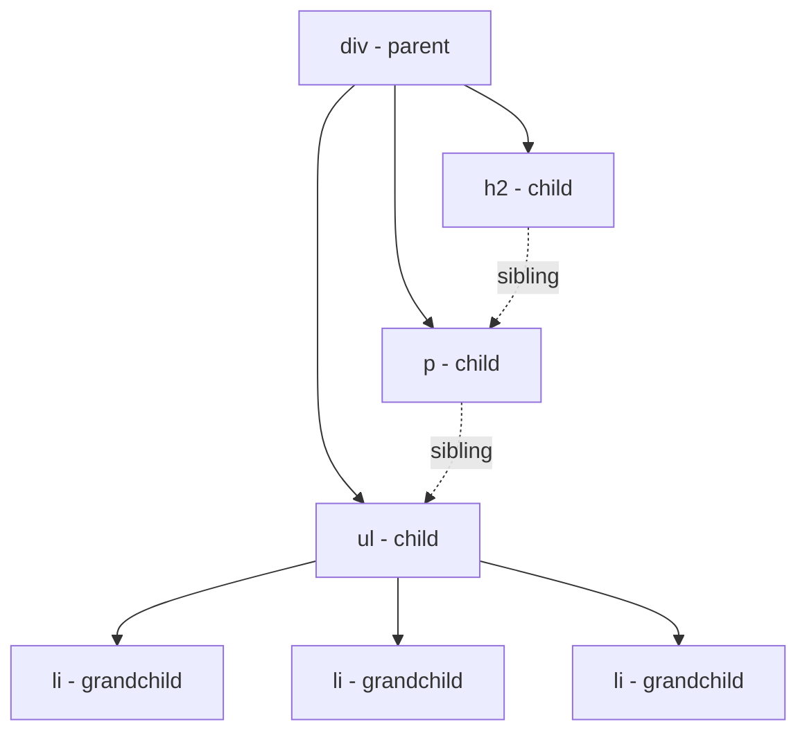
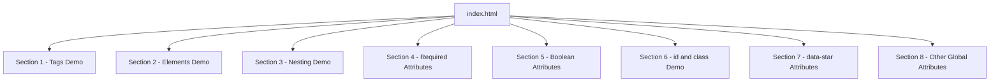

<a id="chapter-5-html-elements-tags-attributes"></a>

# Chapter 5: HTML Elements, Tags & Attributes

[⬅ Previous Chapter](#chapter-4-html-head-section) | [📖 Main Index](#main-index) | [Next Chapter ➡](#chapter-6-block-inline-void-elements)

---

## 📌 Learning Objectives

By the end of this chapter, you will be able to:

- Understand the **exact difference** between an HTML tag and an HTML element
- Explain **opening tags, closing tags, and self-closing tags** with precision
- Understand what **nested elements** are and how nesting creates document structure
- Define **HTML attributes** — syntax, purpose, and placement rules
- Understand the difference between **required, optional, and boolean attributes**
- Master all **global attributes** — id, class, style, title, lang, data-*, tabindex, hidden, contenteditable, draggable, spellcheck
- Understand **attribute values** — quoted, unquoted, boolean
- Recognize and write **well-formed HTML elements** from memory
- Understand how **attributes communicate with CSS and JavaScript**
- Answer **every interview question** on HTML elements, tags, and attributes confidently

---

<a id="chapter-index-table-5"></a>

## Chapter Index Table

| Topic No. | Topic Name | Subtopics |
|-----------|-----------|-----------|
| 5.1 | [HTML Tags — Opening, Closing, Self-Closing](#51-html-tags-opening-closing-self-closing) | What is a tag<br>Opening tag<br>Closing tag<br>Self-closing tag<br>Tag syntax rules |
| 5.2 | [HTML Elements](#52-html-elements) | What is an element<br>Tag vs element<br>Empty elements<br>Container elements<br>Element anatomy |
| 5.3 | [Nested Elements](#53-nested-elements) | What is nesting<br>Parent child sibling<br>Nesting rules<br>Depth of nesting<br>Common mistakes |
| 5.4 | [HTML Attributes — Fundamentals](#54-html-attributes-fundamentals) | What is an attribute<br>Syntax<br>Name value pair<br>Placement rules<br>Quoted vs unquoted |
| 5.5 | [Types of Attributes](#55-types-of-attributes) | Required attributes<br>Optional attributes<br>Boolean attributes<br>Custom data attributes |
| 5.6 | [Global Attribute — id](#56-global-attribute-id) | What is id<br>Uniqueness rule<br>CSS targeting<br>JS targeting<br>Fragment URLs |
| 5.7 | [Global Attribute — class](#57-global-attribute-class) | What is class<br>Multiple classes<br>CSS targeting<br>Reusability<br>id vs class |
| 5.8 | [Global Attribute — style](#58-global-attribute-style) | Inline styles<br>When to use<br>Specificity<br>Limitations |
| 5.9 | [Global Attribute — title](#59-global-attribute-title) | Tooltip behavior<br>Accessibility<br>Use cases |
| 5.10 | [Global Attribute — lang](#510-global-attribute-lang) | Language declaration<br>Accessibility<br>SEO impact |
| 5.11 | [Global Attribute — data-*](#511-global-attribute-data) | Custom data storage<br>Syntax<br>JS access<br>Real world use |
| 5.12 | [Other Important Global Attributes](#512-other-important-global-attributes) | tabindex<br>hidden<br>contenteditable<br>draggable<br>spellcheck<br>translate |
| 5.13 | [Attributes and CSS/JS Relationship](#513-attributes-and-cssjs-relationship) | How CSS reads attributes<br>Attribute selectors<br>How JS reads attributes<br>getAttribute |

---

## 5.1 HTML Tags — Opening, Closing, Self-Closing

<a id="51-html-tags-opening-closing-self-closing"></a>

---

### 🔷 What is an HTML Tag?

An **HTML tag** is a **markup instruction** written using angle brackets `< >` that tells the browser:

- What **type of content** follows
- Where the content **starts** and **ends**
- What **meaning or role** the content has

Tags are the **building blocks** of HTML — they are the syntax mechanism through which HTML communicates structure and meaning to the browser.

---

### 🔷 Anatomy of a Tag

```text
┌─────────────────────────────────────────────┐
│                                             │
│   < p  class="intro" >                      │
│   ↑ ↑  ↑─────────── ↑                       │
│   │ │  │             │                      │
│   │ │  Attribute     Closing angle bracket  │
│   │ Tag name                                │
│   Opening angle bracket                     │
│                                             │
└─────────────────────────────────────────────┘
```

---

### 🔷 Type 1: Opening Tag

An **opening tag** marks the **beginning** of an HTML element.

```html
<p>        ← opening tag for paragraph
<h1>       ← opening tag for heading 1
<div>      ← opening tag for div
<a>        ← opening tag for anchor/link
<ul>       ← opening tag for unordered list
```

**Syntax:**
```text
< tag-name attribute="value" >
```

Rules:
- Starts with `<`
- Followed by the tag name (lowercase)
- Optionally followed by attributes (space-separated)
- Ends with `>`

---

### 🔷 Type 2: Closing Tag

A **closing tag** marks the **end** of an HTML element.

```html
</p>       ← closing tag for paragraph
</h1>      ← closing tag for heading 1
</div>     ← closing tag for div
</a>       ← closing tag for anchor/link
</ul>      ← closing tag for unordered list
```

**Syntax:**
```text
</ tag-name >
```

Rules:
- Starts with `</` (forward slash after `<`)
- Followed by the same tag name as the opening tag
- **No attributes** in closing tags
- Ends with `>`

---

### 🔷 Type 3: Self-Closing Tags (Void Elements)

Some HTML elements have **no content** and therefore **no closing tag**. These are called **void elements** or **self-closing elements**.

```html
<br>           ← line break
<hr>           ← horizontal rule
     ← image
<input type="text">                   ← form input
<meta charset="UTF-8">               ← metadata
<link rel="stylesheet" href="style.css">  ← resource link
```

> [!NOTE]
> In **HTML5**, the self-closing slash is **optional**. Both `<br>` and `<br/>` are valid. However, `<br/>` is XHTML style. In modern HTML5 development, use `<br>` without the slash.

---

### 🔷 Opening vs Closing vs Self-Closing — Comparison

| Type | Syntax | Has Content? | Has Closing Tag? |
|------|--------|-------------|-----------------|
| **Opening** | `<tagname>` | Yes — content follows | Yes |
| **Closing** | `</tagname>` | No | N/A — it IS the closing tag |
| **Self-closing** | `<tagname>` | No | No |

---

### 🔷 Tag Naming Rules

| Rule | Correct | Incorrect |
|------|---------|-----------|
| **Lowercase** | `<div>`, `<p>`, `<h1>` | `<DIV>`, `<P>`, `<H1>` ❌ |
| **No spaces** | `<h1>` | `< h1 >` ❌ |
| **No numbers at start** | `<h1>` (h then 1) | N/A |
| **Known HTML tags only** | `<div>`, `<section>` | `<box>`, `<text>` ❌ (not standard) |
| **No quotes** | `<p>` | `<"p">` ❌ |

---

### 🔷 Complete Tag Examples

```html
<!-- Opening + Closing tag pair -->
<h1>This is a main heading</h1>
<p>This is a paragraph of text.</p>
<div>This is a division/container.</div>
<span>This is inline text.</span>
<strong>This text is important.</strong>
<em>This text is emphasized.</em>
<a href="page.html">This is a link.</a>
<ul>
    <li>List item one</li>
    <li>List item two</li>
</ul>

<!-- Self-closing tags — no closing tag -->
<br>
<hr>

<input type="email" placeholder="Enter email">
<meta charset="UTF-8">
<link rel="stylesheet" href="style.css">
```

---

### 🧠 Hinglish Intuition

> HTML tags ko samajhna bahut simple hai — socho ek **book mein chapters ke start aur end markers** ki tarah.
>
> Jaise book mein:
> - **Chapter 1 starts here →** (opening tag)
> - **← Chapter 1 ends here** (closing tag)
>
> Waise hi HTML mein:
> - `<p>` = "Yahan se paragraph shuru ho raha hai"
> - `</p>` = "Yahan paragraph khatam ho gaya"
>
> Self-closing tags ek **single stamp** ki tarah hain — na start marker, na end marker — woh khud mein complete hain.
> Jaise `<br>` = "Yahan ek line break hai" — na content, na end.
>
> **Opening tag = Shuru, Closing tag = Khatam, Self-closing = Aata hai aur chala jaata hai!**

---

> [!IMPORTANT]
> **Interview Trap:** Interviewers often ask "What is the difference between a tag and an element?" Many candidates confuse these. A **tag** is just the markup syntax (`<p>` or `</p>`). An **element** is the complete unit: opening tag + content + closing tag. We will cover this distinction in detail in Topic 5.2.

---

👉 <a href="#chapter-index-table-5">Go to Top 🔝</a>

---

## 5.2 HTML Elements

<a id="52-html-elements"></a>

---

### 🔷 What is an HTML Element?

An **HTML element** is the **complete unit** consisting of:

```text
Opening Tag + Content + Closing Tag = Element
```

```html
<p>This is a paragraph.</p>
↑                       ↑
Opening tag             Closing tag
    └─── Content ───┘
         (text, other elements, or both)

All three together = ONE HTML Element
```

---

### 🔷 Tag vs Element — The Critical Distinction

This is one of the **most commonly asked interview questions**:

| Concept | Definition | Example |
|---------|-----------|---------|
| **Tag** | The markup syntax — the angle bracket notation | `<p>` or `</p>` |
| **Element** | Complete unit: opening tag + content + closing tag | `<p>Hello World</p>` |

```html
<h1>Welcome to My Website</h1>
 ↑                          ↑
 Tag                        Tag

<h1>Welcome to My Website</h1>
↑──────────────────────────────↑
           Element
```

> [!IMPORTANT]
> **Interview Answer:** A **tag** is just the individual `<tagname>` or `</tagname>` notation. An **element** is the complete structure: the opening tag + all content inside it + the closing tag. `<p>` is a tag. `<p>Hello</p>` is an element.

---

### 🔷 Element Anatomy — Complete Breakdown

```html
<a href="https://google.com" target="_blank">Visit Google</a>
```

Breaking this down:

```text
<a href="https://google.com" target="_blank">Visit Google</a>
↑─────────────────────────────────────────↑ ↑──────────↑↑───↑
        Opening Tag                          Content    Closing Tag

Opening Tag components:
< = Opening angle bracket
a = Tag name (anchor)
href="https://google.com" = Attribute 1 (name="value")
target="_blank" = Attribute 2 (name="value")
> = Closing angle bracket

Content: "Visit Google" (text content)

Closing Tag:
</ = Closing indicator
a = Same tag name as opening
> = Closing angle bracket
```

---

### 🔷 Types of HTML Elements

#### Type 1: Container Elements (Non-void Elements)

Elements that **have content** between opening and closing tags:

```html
<!-- Container elements — have content -->
<h1>Main Heading</h1>
<p>Paragraph text goes here</p>
<div>Any content goes here</div>
<ul>
    <li>List item</li>
</ul>
<a href="page.html">Link text</a>
<button>Click Me</button>
<table>
    <tr>
        <td>Cell content</td>
    </tr>
</table>
```

#### Type 2: Empty Elements (Void Elements)

Elements that **have no content** and no closing tag:

```html
<!-- Empty/void elements — no content, no closing tag -->
<br>          <!-- Line break -->
<hr>          <!-- Horizontal rule -->
      <!-- Image -->
<input type="text" placeholder="Name"> <!-- Input field -->
<meta charset="UTF-8">                 <!-- Metadata -->
<link rel="stylesheet" href="style.css"> <!-- Resource link -->
<area>        <!-- Image map area -->
<base>        <!-- Base URL -->
<col>         <!-- Table column -->
<embed>       <!-- External content -->
<param>       <!-- Object parameter -->
<source>      <!-- Media source -->
<track>       <!-- Text track for video -->
<wbr>         <!-- Word break opportunity -->
```

---

### 🔷 Element Content Types

An HTML element's content can be:

| Content Type | Description | Example |
|-------------|-------------|---------|
| **Text** | Plain text | `<p>Hello World</p>` |
| **Other elements** | Nested elements | `<ul><li>Item</li></ul>` |
| **Mixed** | Text and elements | `<p>Hello <strong>World</strong></p>` |
| **Empty** | No content (void) | `<br>`, `` |
| **Attribute-only** | Content via attributes | `` |

---

### 🔷 Element Hierarchy in a Document

```html
<!DOCTYPE html>
<html>          ← Root element
  <head>        ← Element (child of html)
    <title>     ← Element (child of head)
      My Page   ← Text content (child of title)
    </title>    ← Closing tag of title
  </head>       ← Closing tag of head
  <body>        ← Element (child of html, sibling of head)
    <h1>        ← Element (child of body)
      Welcome   ← Text content
    </h1>
    <p>         ← Element (child of body, sibling of h1)
      Text      ← Text content
    </p>
  </body>
</html>
```

---

### 🧠 Hinglish Intuition

> Tag aur element ka difference ek **word aur sentence** ke difference jaisa hai.
>
> - **Word** = Tag → sirf ek piece (`<p>` ya `</p>`)
> - **Sentence** = Element → complete unit (`<p>Yeh ek paragraph hai.</p>`)
>
> Jaise ek word sirf ek part hai — complete meaning nahi deta.
> Ek sentence complete unit hai — shuru, content, khatam — sab kuch.
>
> `<p>` = Sirf ek tag (word)
> `<p>Yeh paragraph hai.</p>` = Poora element (complete sentence)
>
> **Interview mein yeh difference clearly bolna bahut important hai!**

---

👉 <a href="#chapter-index-table-5">Go to Top 🔝</a>

---

## 5.3 Nested Elements

<a id="53-nested-elements"></a>

---

### 🔷 What is Nesting?

**Nesting** is the practice of placing HTML elements **inside other HTML elements**. This creates:

- **Hierarchy** — parent-child relationships between elements
- **Structure** — logical grouping of related content
- **The DOM tree** — the tree structure browsers use to represent HTML

---

### 🔷 Basic Nesting Example

```html
<ul>                          ← Parent element
    <li>HTML</li>             ← Child element (nested inside ul)
    <li>CSS</li>              ← Child element (nested inside ul)
    <li>JavaScript</li>       ← Child element (nested inside ul)
</ul>
```

The `<li>` elements are **nested inside** `<ul>`. The `<ul>` is the **parent**. The `<li>` elements are **children**.

---

### 🔷 Parent, Child, and Sibling Relationships

```html
<div>                         ← PARENT of everything inside it
    <h2>Section Title</h2>    ← CHILD of div, SIBLING of p and ul
    <p>Introduction text.</p> ← CHILD of div, SIBLING of h2 and ul
    <ul>                      ← CHILD of div, SIBLING of h2 and p
        <li>Item 1</li>       ← CHILD of ul, GRANDCHILD of div
        <li>Item 2</li>       ← CHILD of ul, GRANDCHILD of div
        <li>Item 3</li>       ← CHILD of ul, GRANDCHILD of div
    </ul>
</div>
```

---

### 🔷 Relationship Terminology

| Term | Definition | Example from above |
|------|-----------|-------------------|
| **Parent** | Direct container of an element | `<div>` is parent of `<h2>`, `<p>`, `<ul>` |
| **Child** | Element directly inside another | `<h2>` is child of `<div>` |
| **Sibling** | Elements sharing the same parent | `<h2>`, `<p>`, `<ul>` are siblings |
| **Ancestor** | Any element above in the tree | `<div>` is ancestor of `<li>` |
| **Descendant** | Any element below in the tree | `<li>` is descendant of `<div>` |
| **Grandchild** | Child of a child | `<li>` is grandchild of `<div>` |

---

### 🔷 Nesting Tree Diagram



---

### 🔷 Nesting Rule — LIFO (Last In, First Out)

Elements must be closed in the **reverse order** they were opened:

```html
<!-- ✅ CORRECT: LIFO order -->
<div>
    <p>
        <strong>Bold text</strong>
    </p>
</div>
<!-- Open order: div → p → strong -->
<!-- Close order: strong → p → div (reverse!) -->

<!-- ❌ WRONG: Overlapping/crossing tags -->
<div>
    <p>
        <strong>Bold text</p>  ← p closes before strong
    </strong>                  ← strong closes after p — WRONG!
</div>
```

---

### 🔷 Deep Nesting — Real World Example

```html
<nav>
    <ul>
        <li>
            <a href="index.html">
                <span class="icon">🏠</span>
                <span class="label">Home</span>
            </a>
        </li>
        <li>
            <a href="about.html">
                <span class="icon">👤</span>
                <span class="label">About</span>
            </a>
        </li>
    </ul>
</nav>
```

**Nesting levels:**
```text
nav
└── ul
    └── li (×2)
        └── a
            ├── span.icon
            └── span.label
```

---

### 🔷 Nesting Rules — What Can Contain What

| Parent Element | Can Contain | Cannot Contain |
|---------------|-------------|----------------|
| `<div>` | Any block or inline elements | Nothing specific restricted |
| `<p>` | Inline elements only | Block elements (`<div>`, `<ul>`, `<table>`) |
| `<ul>` / `<ol>` | Only `<li>` as direct children | `<p>`, `<div>` directly |
| `<li>` | Block and inline elements | Nothing specific restricted |
| `<a>` | Inline content (HTML5: can wrap blocks) | `<a>` nested inside `<a>` |
| `<span>` | Inline elements | Block elements |
| `<h1>`–`<h6>` | Inline elements | Block elements |
| `<table>` | `<thead>`, `<tbody>`, `<tfoot>`, `<tr>` | `<div>`, `<p>` directly |
| `<tr>` | `<td>`, `<th>` only | `<p>`, `<div>` directly |

---

### 🔷 Common Nesting Mistakes

```html
<!-- ❌ MISTAKE 1: div inside p -->
<p>
    <div>This is wrong</div>  ← div cannot be inside p
</p>

<!-- ❌ MISTAKE 2: p directly inside ul -->
<ul>
    <p>This is wrong</p>      ← only li can be direct child of ul
</ul>

<!-- ❌ MISTAKE 3: a inside a -->
<a href="page1.html">
    <a href="page2.html">Nested links</a>   ← links cannot nest
</a>

<!-- ❌ MISTAKE 4: Overlapping tags -->
<p><strong>Bold text</p></strong>   ← tags cross each other

<!-- ✅ CORRECT versions -->
<div>
    <p>This is correct</p>
</div>

<ul>
    <li>This is correct</li>
</ul>

<a href="page.html">Link text</a>

<p><strong>Bold text</strong></p>
```

---

### 🧠 Hinglish Intuition

> Nesting ek **Russian Matryoshka doll** ki tarah hai — ek doll ke andar doosri, us ke andar teesri.
>
> **Rules:**
> 1. Jo doll baad mein khulee — woh pehle band hogi (LIFO)
> 2. Har doll ka ek specific size hota hai — sab ke andar sab fit nahi hoti
>
> Waise hi HTML nesting mein:
> - `<div>` ke andar `<p>` fit hota hai ✅
> - `<p>` ke andar `<div>` fit nahi hota ❌
> - Jo tag baad mein khula — woh pehle band hoga ✅
> - Crossing tags invalid hain ❌
>
> **Mental model:** `<ul>` ek box hai, `<li>` us box ke andar fit hone wale items hain.
> `<p>` ek envelope hai, andar sirf inline content (text, spans) fit hoti hai — doosra box (div) andar nahi aata.
>
> **Nesting = Matryoshka dolls — sahi size, sahi order!**

---

👉 <a href="#chapter-index-table-5">Go to Top 🔝</a>

---

## 5.4 HTML Attributes — Fundamentals

<a id="54-html-attributes-fundamentals"></a>

---

### 🔷 What is an HTML Attribute?

An **HTML attribute** is **additional information** provided to an HTML element within its opening tag. Attributes:

- **Modify** the behavior or appearance of an element
- Provide **metadata** about the element
- Are always specified in the **opening tag** (never in closing tags)
- Consist of a **name-value pair**: `name="value"`
- Can be **required** (some elements need certain attributes to function) or **optional**

---

### 🔷 Attribute Syntax

```html
<tagname attribute-name="attribute-value">Content</tagname>
```

```html
<!-- Examples -->

      ↑───────────↑  ↑──────────────────────↑ ↑────────↑ ↑──────────↑
      Attribute 1    Attribute 2             Attr 3    Attr 4

<a href="https://google.com" target="_blank" rel="noopener">Google</a>
    ↑──────────────────────↑  ↑─────────────↑ ↑──────────↑
    Attribute 1              Attribute 2      Attribute 3
```

---

### 🔷 Attribute Name-Value Pair Structure

```text
    name    =    "value"
     ↑      ↑      ↑
  Attribute  |   Attribute
   name    equals  value
           sign  (always
                 in quotes)
```

| Part | Rule |
|------|------|
| **Name** | Lowercase, no spaces, hyphenated if multiple words |
| **Equals sign** | Separates name from value — no spaces around it |
| **Value** | In double quotes `"..."` (preferred) or single quotes `'...'` |
| **Multiple** | Separated by spaces, not commas |

---

### 🔷 Attribute Placement Rules

```html
<!-- ✅ CORRECT: Attributes in opening tag -->
<p class="intro" id="first-para">Content here</p>

<!-- ❌ WRONG: Attributes in closing tag -->
<p>Content here</p class="intro">  ← INVALID

<!-- ✅ CORRECT: Multiple attributes — space separated -->
<input type="text" name="email" placeholder="Enter email" required>

<!-- ❌ WRONG: Comma-separated attributes -->
<input type="text", name="email">  ← INVALID — no commas!

<!-- ✅ CORRECT: Attributes on multiple lines (for readability) -->

```

---

### 🔷 Quoted vs Unquoted Attribute Values

```html
<!-- ✅ Double quotes — preferred in HTML5 -->
<p class="intro">Text</p>

<!-- ✅ Single quotes — valid but less common -->
<p class='intro'>Text</p>

<!-- ⚠️ No quotes — valid only for simple single-word values -->
<p class=intro>Text</p>

<!-- ❌ No quotes — FAILS for values with spaces -->
<p class=main intro>Text</p>  ← INVALID — browser reads 'intro' as separate attribute!

<!-- ✅ Must use quotes when value has spaces -->
<p class="main intro">Text</p>

<!-- ✅ Must use quotes when value has special characters -->
<input placeholder="Enter your full name">
```

> [!IMPORTANT]
> **Best Practice:** Always use **double quotes** for attribute values. It is the most widely used convention, required by XHTML, and prevents errors when values contain spaces or special characters.

---

### 🔷 Case Sensitivity of Attributes

| Item | Case Sensitive? | Recommendation |
|------|----------------|---------------|
| Attribute names | No (HTML5 is case-insensitive) | Always use lowercase |
| Attribute values | Depends on value type | Follow spec recommendations |
| `id` values | Yes — `#MyId` ≠ `#myid` in CSS/JS | Consistent casing (lowercase preferred) |
| `class` values | Yes — `.Intro` ≠ `.intro` in CSS | Consistent lowercase |
| URL values | Depends on server | Lowercase recommended |
| Enum values | No — `type="TEXT"` = `type="text"` | Use lowercase anyway |

---

### 🔷 Common Attribute Examples by Element

```html
<!-- Anchor — link -->
<a href="page.html"          ← destination URL
   target="_blank"            ← open in new tab
   rel="noopener noreferrer"  ← security
   title="Go to About page"   ← tooltip
   download                   ← download file
>About Us</a>

<!-- Image -->


<!-- Input -->
<input type="email"           ← input type
       name="user_email"      ← form field name
       id="email-field"       ← unique identifier
       placeholder="Email"    ← hint text
       required               ← boolean — must fill
       maxlength="100"        ← max characters
       autocomplete="email"   ← browser autofill hint
>

<!-- Form -->
<form action="/submit"        ← where to send data
      method="POST"           ← HTTP method
      enctype="multipart/form-data"  ← encoding type
      novalidate              ← skip browser validation
>
```

---

### 🧠 Hinglish Intuition

> HTML attributes ek **business card** ki tarah hain — sirf naam se kaam nahi chalta, additional info chahiye.
>
> Jaise ek business card pe:
> - **Naam** = Element (`<a>`) → "Main link hoon"
> - **Phone number** = `href="..."` → "Yahan jaana hai"
> - **Company** = `target="_blank"` → "Naye tab mein khulna hai"
> - **Title** = `title="..."` → "Hover karo toh yeh info dikhega"
>
> Bina attributes ke elements bahut limited hote hain:
> - `` bina `src` ke koi image nahi dikhayega
> - `<a>` bina `href` ke koi link nahi banega
> - `<input>` bina `type` ke default text field banega
>
> **Attributes = Elements ko superpowers dete hain!**

---

👉 <a href="#chapter-index-table-5">Go to Top 🔝</a>

---

## 5.5 Types of Attributes

<a id="55-types-of-attributes"></a>

---

### 🔷 Type 1: Required Attributes

Some attributes are **mandatory** for an element to function correctly. Without them, the element is either broken or invalid.

```html
<!-- img REQUIRES src and alt -->

  ↑                   ↑
  Required            Required

<!-- a REQUIRES href to be a functional link -->
<a href="page.html">Click here</a>
    ↑
    Required for link functionality

<!-- input REQUIRES type for proper behavior -->
<input type="email">
        ↑
        Required (technically optional but always needed)

<!-- meta charset REQUIRES charset -->
<meta charset="UTF-8">
       ↑
       Required
```

| Element | Required Attribute | Without It |
|---------|-------------------|-----------|
| `` | `src` | No image displayed |
| `` | `alt` | Accessibility fail |
| `<a>` | `href` | Not a link (just styled text) |
| `<form>` | `action` | Form doesn't know where to submit |
| `<input>` | `type` | Defaults to text (may not be wrong, but unintentional) |
| `<label>` | `for` | Not associated with its input |
| `<meta charset>` | `charset` | No encoding declaration |
| `<link>` | `rel`, `href` | Resource not loaded |

---

### 🔷 Type 2: Optional Attributes

Attributes that **add extra behavior** but are not required for the element to function:

```html
<!-- Optional attributes on img -->


<!-- Optional attributes on a -->
<a href="page.html"
   target="_blank"       ← optional — default is _self (same tab)
   rel="noopener"        ← optional (but security-recommended)
   title="Go to page"   ← optional — tooltip text
   class="btn-primary"  ← optional — CSS styling
>Click</a>
```

---

### 🔷 Type 3: Boolean Attributes

**Boolean attributes** have no value — their presence alone means `true` and their absence means `false`.

```html
<!-- Boolean attributes — presence = true, absence = false -->
<input type="text" required>      ← required is present = REQUIRED
<input type="text">               ← required is absent = NOT required

<input type="checkbox" checked>   ← checked = pre-selected
<input type="checkbox">           ← not checked

<button disabled>Submit</button>  ← disabled = cannot click
<button>Submit</button>           ← enabled = can click

<input type="text" readonly>      ← user cannot edit
<input type="text" autofocus>     ← auto-focuses on page load
<details open>                    ← details are expanded
<video autoplay muted loop>       ← video plays automatically
<script defer>                    ← script deferred
              ← Note: loading is NOT boolean, has value "lazy"
```

**Boolean attributes — valid syntaxes:**

```html
<!-- All of these are equivalent and valid -->
<input required>
<input required="">
<input required="required">
<input required="REQUIRED">

<!-- All mean the same: required = true -->
```

> [!NOTE]
> While `required=""` and `required="required"` are valid, the simplest and most modern style is just `required` with no value at all. This is the HTML5 standard way.

---

### 🔷 Common Boolean Attributes

| Attribute | Elements | Meaning |
|-----------|---------|---------|
| `required` | `input`, `select`, `textarea` | Field must be filled before form submission |
| `disabled` | `input`, `button`, `select`, `textarea` | Element is non-interactive, grayed out |
| `checked` | `input[type=checkbox]`, `input[type=radio]` | Pre-selected on page load |
| `readonly` | `input`, `textarea` | User can see but not edit |
| `autofocus` | `input`, `textarea`, `button` | Automatically focuses on page load |
| `autoplay` | `video`, `audio` | Media plays automatically |
| `muted` | `video`, `audio` | Media starts muted |
| `loop` | `video`, `audio` | Media replays continuously |
| `controls` | `video`, `audio` | Show media controls (play, pause, volume) |
| `open` | `details` | Details section is expanded |
| `defer` | `script` | Script deferred until after DOM |
| `async` | `script` | Script loads asynchronously |
| `novalidate` | `form` | Skip browser validation |
| `multiple` | `input[type=file]`, `select` | Allow multiple selections |
| `selected` | `option` | Pre-selected in dropdown |
| `hidden` | Any element | Element is hidden from view |

---

### 🔷 Type 4: Custom Data Attributes (`data-*`)

Custom data attributes allow storing **custom data** on HTML elements. We will cover these in depth in Topic 5.11.

```html
<!-- Custom data stored on element -->
<button data-user-id="12345"
        data-product-name="iPhone 15"
        data-category="electronics">
    Add to Cart
</button>
```

---

### 🔷 Type 5: Global Attributes

Attributes that can be used on **any HTML element**. We will cover each in detail in Topics 5.6 through 5.12.

```html
<!-- Global attributes work on any element -->
<p id="intro" class="text-primary" style="color: red;" title="Hover tip" lang="en">
    Text content
</p>

<div id="container" class="wrapper" hidden>
    Hidden content
</div>
```

---

### 🧠 Hinglish Intuition

> Attribute types samajhna ek **restaurant order form** ki tarah hai.
>
> - **Required attributes** = Kuch fields mandatory hain — bina naam ke order submit nahi hogi
> - **Optional attributes** = Extra preferences — "kaunsi seating chahiye?" (window, inside, outside)
> - **Boolean attributes** = Checkboxes — "Extra cheese chahiye?" → checkbox checked = haan, unchecked = nahi. Value nahi, sirf present/absent.
> - **Data attributes** = Notes field — "Allergy hai gluten se" → extra custom info jo form ke saath jaati hai
>
> **Boolean = checkbox ki tarah — tick karo toh haan, mat karo toh nahi!**

---

👉 <a href="#chapter-index-table-5">Go to Top 🔝</a>

---

## 5.6 Global Attribute — id

<a id="56-global-attribute-id"></a>

---

### 🔷 What is the `id` Attribute?

The `id` attribute provides a **unique identifier** for an HTML element within a page.

- Every `id` value must be **unique** within the entire HTML document
- One element can have **only one** `id`
- Used to target specific elements from **CSS** and **JavaScript**
- Used to create **anchor links** (fragment URLs) for in-page navigation

---

### 🔷 Syntax

```html
<element id="unique-identifier">Content</element>
```

```html
<!-- Examples -->
<header id="site-header">...</header>
<nav id="main-navigation">...</nav>
<section id="about-section">...</section>
<p id="intro-paragraph">Introduction text.</p>
<form id="contact-form">...</form>
<footer id="site-footer">...</footer>
```

---

### 🔷 id Naming Rules

| Rule | Valid | Invalid |
|------|-------|---------|
| Must start with a letter | `id="header"` ✅ | `id="1header"` ❌ |
| Can contain letters, numbers, hyphens, underscores | `id="main-nav"` ✅ | `id="main nav"` ❌ (space) |
| No spaces allowed | `id="main-header"` ✅ | `id="main header"` ❌ |
| Case sensitive | `id="Header"` ≠ `id="header"` | Be consistent |
| Must be unique per page | One element per id | Two elements same id ❌ |
| Best practice: lowercase | `id="contact-form"` ✅ | `id="ContactForm"` ⚠️ |

---

### 🔷 How id is Used — Three Main Uses

#### Use 1: CSS Targeting

```html
<h1 id="page-title">Welcome</h1>
```

```css
/* CSS: target with # (hash) prefix */
#page-title {
    color: #1e40af;
    font-size: 3rem;
    text-align: center;
}
```

#### Use 2: JavaScript Targeting

```html
<button id="submit-btn">Submit Form</button>
```

```javascript
// JavaScript: access via getElementById
const btn = document.getElementById('submit-btn');
btn.addEventListener('click', function() {
    alert('Form submitted!');
});

// Or via querySelector with # prefix
const btn2 = document.querySelector('#submit-btn');
```

#### Use 3: Fragment URL — In-Page Navigation

```html
<!-- Navigation links using id as anchor -->
<nav>
    <a href="#about">About</a>       ← jumps to #about section
    <a href="#services">Services</a> ← jumps to #services section
    <a href="#contact">Contact</a>   ← jumps to #contact section
</nav>

<!-- Sections with matching ids -->
<section id="about">
    <h2>About Us</h2>
    <p>Content here...</p>
</section>

<section id="services">
    <h2>Our Services</h2>
    <p>Content here...</p>
</section>

<section id="contact">
    <h2>Contact Us</h2>
    <p>Content here...</p>
</section>
```

When user clicks `<a href="#about">`, the browser scrolls to the element with `id="about"`.

---

### 🔷 id Specificity in CSS

The `id` selector has **high specificity** in CSS — it overrides class selectors:

```css
.paragraph { color: blue; }   /* Class selector — specificity: 0,1,0 */
#intro { color: red; }        /* ID selector — specificity: 1,0,0 */
```

```html
<p id="intro" class="paragraph">This text will be RED, not blue</p>
```

The `id` wins because it has higher specificity than class.

> [!IMPORTANT]
> **Best Practice:** Because `id` has very high CSS specificity, overriding it later becomes difficult. For styling purposes, **prefer `class` over `id`**. Use `id` primarily for JavaScript targeting and fragment navigation. This is a common interview topic.

---

### 🧠 Hinglish Intuition

> `id` attribute ek **Aadhaar card number** ki tarah hai.
>
> - Har Indian ka ek **unique Aadhaar number** hota hai — koi do logo ka same nahi hota
> - Aadhaar se ek specific insaan ko precisely identify kar sakte hain
> - ID card dikhao → direct access milti hai
>
> Waise hi HTML mein:
> - Har `id` **unique** hona chahiye — poore page mein ek hi element ka woh id hoga
> - CSS mein `#myId` likhne se directly woh ek specific element target hota hai
> - JavaScript mein `getElementById('myId')` ek specific element milta hai
> - `<a href="#section-id">` se directly woh section pe jump ho jaate hain
>
> **`id` = Aadhaar number of HTML elements — unique, direct, specific!**

---

👉 <a href="#chapter-index-table-5">Go to Top 🔝</a>

---

## 5.7 Global Attribute — class

<a id="57-global-attribute-class"></a>

---

### 🔷 What is the `class` Attribute?

The `class` attribute assigns one or more **CSS class names** to an HTML element, allowing:

- **CSS styling** — apply styles to all elements with a class
- **JavaScript targeting** — select multiple elements at once
- **Reusability** — same class on multiple elements
- **Multiple classes** — one element can have many classes

---

### 🔷 Syntax

```html
<!-- Single class -->
<element class="class-name">Content</element>

<!-- Multiple classes (space separated) -->
<element class="class-one class-two class-three">Content</element>
```

---

### 🔷 Multiple Classes on One Element

```html
<!-- Element with multiple classes -->
<button class="btn btn-primary btn-large animated">
    Click Me
</button>
```

Each class name is separated by a **space**. This element has 4 classes:
- `btn` — base button styles
- `btn-primary` — blue color variant
- `btn-large` — large size
- `animated` — animation class

All four sets of CSS rules apply simultaneously.

---

### 🔷 How class is Used

#### CSS Targeting with class

```html
<p class="intro">First paragraph</p>
<p class="intro">Second paragraph</p>
<p class="regular">Normal paragraph</p>
```

```css
/* CSS: target with . (dot) prefix */
.intro {
    font-size: 1.2rem;
    font-weight: 600;
    color: #1e40af;
    line-height: 1.8;
}

.regular {
    font-size: 1rem;
    color: #374151;
}
```

Both `.intro` paragraphs get the same styles. `.regular` gets different styles.

#### JavaScript Targeting with class

```javascript
// Select ALL elements with class 'card'
const cards = document.getElementsByClassName('card');

// Or with querySelectorAll (more powerful)
const cards2 = document.querySelectorAll('.card');

// Iterate and modify
cards2.forEach(function(card) {
    card.style.backgroundColor = '#f0f9ff';
});
```

---

### 🔷 Class Naming Conventions

| Convention | Example | Used In |
|-----------|---------|---------|
| **Lowercase hyphenated (kebab-case)** | `main-header`, `btn-primary` | HTML/CSS standard |
| **BEM methodology** | `card__title`, `btn--active` | Large projects |
| **camelCase** | `mainHeader`, `btnPrimary` | JavaScript (less common in HTML) |
| **Utility classes** | `text-center`, `mt-4`, `flex` | Tailwind CSS, Bootstrap |

---

### 🔷 id vs class — Critical Comparison

| Feature | `id` | `class` |
|---------|------|---------|
| **Uniqueness** | Must be unique per page | Can be used on multiple elements |
| **Per element** | Only ONE id per element | MULTIPLE classes per element |
| **CSS selector** | `#id-name` (hash) | `.class-name` (dot) |
| **JS selector** | `getElementById('name')` | `getElementsByClassName('name')` |
| **Specificity** | High (1,0,0) | Medium (0,1,0) |
| **Best for** | JS targeting, fragment nav | CSS styling, grouping |
| **Reusability** | Not reusable | Highly reusable |
| **Count per page** | Once | Unlimited times |

---

### 🔷 class vs id — Practical Example

```html
<!-- id: unique, one-of-a-kind, for JS and fragment nav -->
<header id="site-header">
    <!-- Only ONE element on the page has this id -->
</header>

<!-- class: reusable, for CSS styling -->
<div class="card">Product Card 1</div>
<div class="card">Product Card 2</div>
<div class="card">Product Card 3</div>
<!-- Multiple elements can share the same class -->
<!-- All three get the same .card CSS styles -->
```

---

### 🧠 Hinglish Intuition

> `class` ek **school uniform** ki tarah hai, `id` ek **roll number** ki tarah.
>
> - **Roll number** (`id`): Har student ka alag number — strictly unique
>   → Ek roll number ek hi student ka hota hai
>
> - **Uniform** (`class`): Sab students same uniform pehnte hain — reusable
>   → Poori class ek hi uniform style mein — ek item ka code sab pe apply hota hai
>
> Aur ek student ek saath multiple uniforms ki properties rakh sakta hai:
> - `class="student prefect sports-captain"` → student hai, prefect bhi hai, sports captain bhi
>
> **`id` = Roll number (unique), `class` = Uniform (reusable, multiple allowed)!**

---

👉 <a href="#chapter-index-table-5">Go to Top 🔝</a>

---

## 5.8 Global Attribute — style

<a id="58-global-attribute-style"></a>

---

### 🔷 What is the `style` Attribute?

The `style` attribute applies **inline CSS styles** directly to an individual HTML element.

```html
<element style="property: value; property: value;">Content</element>
```

---

### 🔷 Syntax and Examples

```html
<!-- Single CSS property -->
<p style="color: red;">Red text paragraph</p>

<!-- Multiple CSS properties (separated by semicolons) -->
<h1 style="color: #1e40af; font-size: 2.5rem; text-align: center;">
    Styled Heading
</h1>

<!-- Complex inline styles -->
<div style="
    background-color: #f0f9ff;
    border: 2px solid #3b82f6;
    border-radius: 8px;
    padding: 20px;
    margin: 10px 0;
    box-shadow: 0 2px 8px rgba(0,0,0,0.1);
">
    This div has inline styles applied
</div>
```

---

### 🔷 When to Use Inline Styles

| Situation | Use Inline? | Better Alternative |
|-----------|------------|-------------------|
| Learning/testing | ✅ Yes | — |
| Email HTML templates | ✅ Yes — required | — |
| JavaScript dynamic styles | ✅ Yes — common | CSS classes with JS |
| One-off specific override | ⚠️ Sparingly | CSS class |
| Production website styling | ❌ No | External CSS |
| Consistent site-wide styles | ❌ No | External CSS file |

---

### 🔷 Inline Style Limitations

```html
<!-- ❌ Cannot use pseudo-classes in inline styles -->
<a style="color: blue; :hover { color: red; }">WRONG</a>

<!-- ❌ Cannot use media queries in inline styles -->
<div style="@media (max-width: 768px) { display: none; }">WRONG</div>

<!-- ❌ Cannot reuse — must repeat on every element -->
<p style="color: blue; font-size: 16px;">Para 1</p>
<p style="color: blue; font-size: 16px;">Para 2</p>
<p style="color: blue; font-size: 16px;">Para 3</p>
<!-- → 3 duplicated style declarations! -->

<!-- ✅ Better: Use a class once in CSS -->
<!-- .text-blue { color: blue; font-size: 16px; } -->
<p class="text-blue">Para 1</p>
<p class="text-blue">Para 2</p>
<p class="text-blue">Para 3</p>
```

---

### 🔷 Specificity of Inline Styles

Inline styles have the **highest specificity** in CSS:

```text
Specificity hierarchy (highest to lowest):
1. !important declaration
2. Inline style (style="" attribute)     ← style attribute
3. ID selector (#id)
4. Class selector (.class)
5. Element selector (p, div, h1)
6. Browser defaults
```

```html
<p id="para" class="text" style="color: green;">This is green</p>
```

```css
#para { color: blue; }    /* ID — normally high specificity */
.text { color: red; }     /* Class — medium specificity */
p { color: purple; }      /* Element — low specificity */
/* But inline style wins: text is GREEN */
```

---

### 🧠 Hinglish Intuition

> `style` attribute ek **body pe temporary tattoo** ki tarah hai.
>
> - Temporary tattoo seedha body pe lagti hai — sirf usi ek jagah ke liye
> - Reuse nahi hoti — doosri jagah ke liye alag tattoo chahiye
> - Bahut specific hai — baaki sab rules ko override karta hai
>
> External CSS ek **wardrobe (almirah)** ki tarah hai:
> - Ek baar kapde organize karo → multiple occasions ke liye reuse
> - Change karo ek jagah → sab jagah change
>
> **Inline style = Temporary tattoo (specific, non-reusable)**
> **External CSS = Wardrobe (organized, reusable, professional)**

---

> [!TIP]
> **Interview Best Practice Answer:** "I use inline styles for JavaScript-driven dynamic styling and email templates. For production websites, I always use external CSS files for better maintainability, caching, and separation of concerns."

---

👉 <a href="#chapter-index-table-5">Go to Top 🔝</a>

---

## 5.9 Global Attribute — title

<a id="59-global-attribute-title"></a>

---

### 🔷 What is the `title` Attribute?

The `title` attribute provides **supplementary information** about an element that is displayed as a **tooltip** when the user hovers over the element.

---

### 🔷 Syntax and Behavior

```html
<!-- title creates a hover tooltip -->
<p title="This is the introduction paragraph">
    Hover over this text to see the tooltip.
</p>

<button title="Clicking this will submit your form data">
    Submit
</button>

<abbr title="HyperText Markup Language">HTML</abbr>


<a href="about.html" title="Learn more about our company history">About Us</a>
```

---

### 🔷 Title Tooltip Behavior

```text
User hovers over element with title attribute:

┌─────────────────────────────┐
│   [Button: Submit]          │
│                             │
│   ┌─────────────────────┐   │
│   │ Clicking this will  │   │ ← Tooltip appears
│   │ submit your form    │   │
│   └─────────────────────┘   │
└─────────────────────────────┘
```

---

### 🔷 title Attribute — When to Use

| Use Case | Good? | Example |
|----------|-------|---------|
| **Abbreviations** (`<abbr>`) | ✅ Excellent | `<abbr title="World Health Organization">WHO</abbr>` |
| **Links with short text** | ✅ Good | `<a href="long-page.html" title="Full article about HTML history">Read</a>` |
| **Disabled buttons** | ✅ Good | `<button disabled title="Please fill all required fields first">Submit</button>` |
| **Icons without text** | ✅ Good | `<button title="Close dialog"><span>✕</span></button>` |
| **Form fields** | ⚠️ Limited | Prefer `placeholder` and `<label>` |
| **As primary accessibility** | ❌ No | Screen readers handle title inconsistently |

---

### 🔷 title vs alt Attribute

| Feature | `title` | `alt` |
|---------|---------|-------|
| **Elements** | Any element | Primarily `` |
| **Display** | Tooltip on hover | When image fails to load |
| **Screen readers** | Inconsistent support | Always read |
| **Accessibility** | Not reliable alone | Required for accessible images |
| **Purpose** | Supplementary info | Alternative text description |

> [!IMPORTANT]
> **Accessibility Warning:** Do NOT rely on `title` as the **only** accessibility mechanism. Screen readers handle `title` inconsistently — some read it, many skip it. For images, always use `alt`. For form labels, always use `<label>`. Use `title` only as a supplementary enhancement.

---

### 🧠 Hinglish Intuition

> `title` attribute ek **sticky note / post-it** ki tarah hai jo element pe lagayi gayi hai.
>
> Jab koi user element ke upar cursor rakhta hai → sticky note dikhta hai.
> Woh chali jaati hai jab cursor hata lete hain.
>
> Best use: **`<abbr>` ke saath** — jahan short abbreviation ka full form chahiye:
> `<abbr title="Artificial Intelligence">AI</abbr>`
> → Hover karo → "Artificial Intelligence" dikhega
>
> **`title` = Post-it note on any HTML element!**

---

👉 <a href="#chapter-index-table-5">Go to Top 🔝</a>

---

## 5.10 Global Attribute — lang

<a id="510-global-attribute-lang"></a>

---

### 🔷 What is the `lang` Attribute?

The `lang` attribute specifies the **language** of the element's content. While we covered `lang` on `<html>` in Chapter 3, it can be used on **any element** to declare language changes within the document.

---

### 🔷 lang on html Element (Recap)

```html
<!-- Declares language of entire document -->
<html lang="en">
<html lang="hi">
<html lang="ar">
```

---

### 🔷 lang on Individual Elements

```html
<!-- Document in English -->
<html lang="en">
<body>

    <!-- Main content in English -->
    <p>This page is written in English.</p>

    <!-- A quote in French within English document -->
    <blockquote lang="fr">
        "La vie est belle." — (Life is beautiful.)
    </blockquote>

    <!-- A Hindi phrase in English page -->
    <p>The traditional greeting in India is
        <span lang="hi">नमस्ते</span>
        (Namaste).
    </p>

    <!-- Arabic content (right-to-left) -->
    <p lang="ar" dir="rtl">مرحبا بالعالم</p>

</body>
</html>
```

---

### 🔷 Why lang Matters on Individual Elements

| Impact | Detail |
|--------|--------|
| **Screen readers** | Switch pronunciation rules when encountering different language content |
| **Browser spell-check** | Changes spell-check language for that section |
| **CSS `quotes` property** | Adjusts quotation mark style based on language |
| **Search engines** | Understand multilingual content better |
| **Translation tools** | Identify which parts need translation |
| **Text direction** | Used with `dir` attribute for RTL languages |

---

### 🔷 lang with dir Attribute

Right-to-left languages need both `lang` and `dir`:

```html
<!-- Arabic content — right to left -->
<p lang="ar" dir="rtl">مرحبا بالعالم</p>

<!-- Hebrew content — right to left -->
<p lang="he" dir="rtl">שלום עולם</p>

<!-- English — left to right (default) -->
<p lang="en" dir="ltr">Hello World</p>
```

---

### 🧠 Hinglish Intuition

> `lang` attribute ek **language indicator sticker** ki tarah hai — jaise book ki spine pe likha hota hai "Hindi" ya "English".
>
> Poore page ka language `<html lang="en">` se declare hota hai.
> Lekin agar beech mein kuch Hindi ya French aaye → `<span lang="hi">` ya `<span lang="fr">` use karo.
>
> Screen reader (visually impaired users ka tool) is language change ko detect karta hai aur pronunciation accordingly switch karta hai.
>
> **`lang` = Language indicator — screen reader ko batata hai "yahan language badal gayi!"**

---

👉 <a href="#chapter-index-table-5">Go to Top 🔝</a>

---

## 5.11 Global Attribute — data-*

<a id="511-global-attribute-data"></a>

---

### 🔷 What are Data Attributes?

**Custom data attributes** (`data-*`) allow you to store **custom data** directly on HTML elements. They:

- Store **application-specific information** on HTML elements
- Are invisible to users
- Can be accessed via **JavaScript**
- Can be targeted via **CSS attribute selectors**
- Follow the naming pattern: `data-` followed by your custom name

---

### 🔷 Syntax

```html
<element data-custom-name="value">Content</element>

<!-- The * can be any custom name you choose -->
<element data-user-id="12345">...</element>
<element data-product-sku="APPLE-IPHONE-15">...</element>
<element data-theme="dark">...</element>
<element data-animation="slide-in">...</element>
```

---

### 🔷 Naming Rules for data-* Attributes

| Rule | Valid | Invalid |
|------|-------|---------|
| Must start with `data-` | `data-user-id` ✅ | `user-id` ❌ |
| After `data-`, lowercase only | `data-product-name` ✅ | `data-ProductName` ❌ |
| No uppercase letters | `data-order-id` ✅ | `data-orderId` ❌ |
| Hyphens for word separation | `data-first-name` ✅ | `data-first_name` ⚠️ |
| No colons or spaces | `data-item-count` ✅ | `data-item count` ❌ |

---

### 🔷 Practical Examples

```html
<!-- E-commerce product card -->
<div class="product-card"
     data-product-id="SKU-2024-001"
     data-product-name="Nike Air Max 270"
     data-price="12999"
     data-currency="INR"
     data-category="footwear"
     data-in-stock="true">

    
    <h3>Nike Air Max 270</h3>
    <p>₹12,999</p>
    <button class="add-to-cart">Add to Cart</button>
</div>

<!-- User profile with data -->
<div class="user-profile"
     data-user-id="USR-789"
     data-username="rahulsharma"
     data-role="admin"
     data-last-login="2024-01-15">
    <h3>Rahul Sharma</h3>
</div>

<!-- Navigation with animation data -->
<nav data-animation="fade-in" data-delay="300">
    <a href="index.html" data-section="home">Home</a>
    <a href="about.html" data-section="about">About</a>
</nav>

<!-- Tabs component with data -->
<div class="tab-container">
    <button class="tab-btn" data-tab="html" data-active="true">HTML</button>
    <button class="tab-btn" data-tab="css">CSS</button>
    <button class="tab-btn" data-tab="js">JavaScript</button>
</div>

<div class="tab-content" data-content="html" data-visible="true">
    HTML content here
</div>
<div class="tab-content" data-content="css" data-visible="false">
    CSS content here
</div>
```

---

### 🔷 Accessing data-* with JavaScript

```html
<button id="cart-btn"
        data-product-id="SKU-001"
        data-product-name="iPhone 15"
        data-price="89999">
    Add to Cart
</button>
```

```javascript
const btn = document.getElementById('cart-btn');

// Method 1: getAttribute (most compatible)
const productId = btn.getAttribute('data-product-id');
console.log(productId);    // "SKU-001"

// Method 2: dataset property (modern, elegant)
// data-product-id becomes dataset.productId (camelCase conversion)
const productId2 = btn.dataset.productId;
console.log(productId2);   // "SKU-001"

const productName = btn.dataset.productName;
console.log(productName);  // "iPhone 15"

const price = btn.dataset.price;
console.log(price);        // "89999" (always a string)

// Setting data attribute via JavaScript
btn.dataset.inCart = 'true';
// Results in: data-in-cart="true" on the element

// Event listener using data attributes
btn.addEventListener('click', function() {
    const id = this.dataset.productId;
    const name = this.dataset.productName;
    const price = parseInt(this.dataset.price);
    addToCart(id, name, price);
});
```

**camelCase Conversion Rule:**
`data-product-id` → `dataset.productId` (hyphens removed, next letter capitalized)

---

### 🔷 Accessing data-* with CSS

```html
<div class="status" data-status="active">Active User</div>
<div class="status" data-status="inactive">Inactive User</div>
```

```css
/* CSS attribute selector targeting data attributes */
.status[data-status="active"] {
    background-color: #d1fae5;
    color: #065f46;
    border: 1px solid #10b981;
}

.status[data-status="inactive"] {
    background-color: #fee2e2;
    color: #991b1b;
    border: 1px solid #ef4444;
}

/* CSS content property using attr() function */
.product-card::after {
    content: "Price: ₹" attr(data-price);
}
```

---

### 🔷 data-* vs Hidden Inputs vs JavaScript Variables

| Storage Method | Where | Visible to User? | Access |
|---------------|-------|-----------------|--------|
| `data-*` attribute | HTML element | No (in source) | JS `dataset`, CSS attr() |
| Hidden `<input>` | HTML form | No | Form submission, JS value |
| JavaScript variable | JS memory | No | JS only |
| `localStorage` | Browser storage | No | JS only |

---

### 🧠 Hinglish Intuition

> `data-*` attributes ek **secret pocket** ki tarah hain jo har HTML element pe hai.
>
> Jaise ek jacket mein ek hidden inner pocket hoti hai:
> - User ko dikhti nahi
> - Lekin andar important cheezein store hain
>
> Waise hi `data-*` mein:
> - User dekhta nahi (screen pe nahi dikhta)
> - Developer/JavaScript access kar sakta hai
> - Element ke saath travel karta hai
>
> Real use case:
> ```html
> <button data-product-id="123" data-price="999">Buy</button>
> ```
> Jab user button click kare → JavaScript padhta hai:
> "Kaunsa product? 123. Kitna price? 999."
> → Shopping cart mein add karo!
>
> **`data-*` = HTML element ka secret pocket — invisible to user, accessible to code!**

---

👉 <a href="#chapter-index-table-5">Go to Top 🔝</a>

---

## 5.12 Other Important Global Attributes

<a id="512-other-important-global-attributes"></a>

---

### 🔷 1. `tabindex` — Keyboard Navigation Control

```html
<!-- tabindex controls which elements receive keyboard focus -->
<!-- and in what order when user presses Tab key -->

<!-- Natural tab order (default for focusable elements) -->
<input type="text">    ← gets focus in natural order
<button>Submit</button> ← gets focus in natural order

<!-- tabindex="0": makes non-focusable element focusable -->
<div tabindex="0">This div can now receive keyboard focus</div>
<span tabindex="0" role="button">Clickable span</span>

<!-- tabindex="1, 2, 3...": positive number sets explicit order -->
<!-- Note: positive tabindex is generally DISCOURAGED -->
<input tabindex="3">  ← focused 3rd
<input tabindex="1">  ← focused 1st
<input tabindex="2">  ← focused 2nd

<!-- tabindex="-1": element focusable via JS but NOT via Tab key -->
<div id="modal" tabindex="-1">
    Modal content — focused by JS, not Tab
</div>
```

| Value | Behavior |
|-------|---------|
| Not set | Default — native focusable elements (buttons, inputs, links) get natural tab order |
| `0` | Element added to natural tab order |
| `-1` | Not in tab order, but focusable via JavaScript (`element.focus()`) |
| Positive `1+` | Explicit order — generally avoid (disrupts natural flow) |

---

### 🔷 2. `hidden` — Hide Element

```html
<!-- hidden attribute: element is invisible and takes no space -->
<!-- Different from CSS visibility:hidden (which keeps space) -->

<div hidden>
    This content is completely hidden — not visible, takes no space
</div>

<p hidden id="error-message">
    Please fill all required fields.
</p>

<!-- JavaScript can show/hide using the hidden attribute -->
```

```javascript
// Show the element
document.getElementById('error-message').hidden = false;

// Hide the element
document.getElementById('error-message').hidden = true;

// Toggle
const el = document.getElementById('error-message');
el.hidden = !el.hidden;
```

**`hidden` vs CSS `display: none`:**
Both hide the element completely (no visual space taken), but `hidden` is semantic — it communicates intent in HTML.

---

### 🔷 3. `contenteditable` — Make Content Editable

```html
<!-- contenteditable: allows user to edit content directly in browser -->
<!-- Values: true, false, or inherit -->

<div contenteditable="true">
    Click on this text and you can edit it directly in the browser!
    This is like a mini text editor inside the webpage.
</div>

<h2 contenteditable="true">You can edit this heading too</h2>

<!-- Used for: WYSIWYG editors, note-taking apps, inline editing -->
```

**Real-world use cases:**
- Rich text editors (like Quill, TipTap, Lexical are built on this)
- Note-taking applications
- CMS inline content editing
- Collaborative documents

---

### 🔷 4. `draggable` — Enable Drag and Drop

```html
<!-- draggable: makes element draggable -->
<div draggable="true" class="drag-item">
    🎯 Drag me!
</div>

<div draggable="true">
    
    Drag this product to your cart
</div>

<!-- Combined with JavaScript Drag and Drop API for full functionality -->
```

| Value | Behavior |
|-------|---------|
| `true` | Element is draggable |
| `false` | Element is NOT draggable |
| `auto` | Browser decides (default behavior — images and links are draggable by default) |

---

### 🔷 5. `spellcheck` — Spell Checking Control

```html
<!-- spellcheck: controls browser spell checking -->

<!-- Enable spell checking (default for textarea and contenteditable) -->
<textarea spellcheck="true" placeholder="Type here..."></textarea>

<!-- Disable spell checking (useful for code input, IDs, etc.) -->
<input type="text" spellcheck="false" placeholder="Enter product ID: SKU-001">

<textarea spellcheck="false">
// Code editor — no spell check needed
function greet(name) {
    return `Hello ${name}`;
}
</textarea>

<!-- Disable for technical content -->
<div contenteditable="true" spellcheck="false">
    CSS selector: .nav-bar > .nav-item:hover
</div>
```

---

### 🔷 6. `translate` — Translation Control

```html
<!-- translate: controls whether content should be translated -->
<!-- by translation tools like Google Translate -->

<!-- Do translate (default) -->
<p translate="yes">This text should be translated to other languages.</p>

<!-- Do NOT translate — brand names, code, technical terms -->
<p>
    Our product is called
    <span translate="no">QuickBurst Pro 3.0</span>
    and it is available worldwide.
</p>

<code translate="no">const greeting = "Hello World";</code>

<span translate="no">CSS</span>
```

---

### 🔷 7. `accesskey` — Keyboard Shortcut

```html
<!-- accesskey: keyboard shortcut to focus/activate element -->
<!-- Access: Alt + Key (Windows/Linux) or Ctrl+Option + Key (Mac) -->

<a href="index.html" accesskey="h">Home (Alt+H)</a>
<a href="about.html" accesskey="a">About (Alt+A)</a>
<button accesskey="s">Submit (Alt+S)</button>
<input type="text" accesskey="n" placeholder="Name (Alt+N)">
```

---

### 🔷 8. `dir` — Text Direction

```html
<!-- dir: text direction -->

<p dir="ltr">Left to right text (English default)</p>
<p dir="rtl">Right to left text (Arabic, Hebrew)</p>
<p dir="auto">Auto-detect direction</p>

<!-- Practical use -->
<p lang="ar" dir="rtl">مرحبا بالعالم — Hello World in Arabic</p>
<p lang="he" dir="rtl">שלום עולם — Hello World in Hebrew</p>
```

---

### 🔷 Complete Global Attributes Reference Table

| Attribute | Purpose | Example |
|-----------|---------|---------|
| `id` | Unique identifier | `id="header"` |
| `class` | CSS class names | `class="btn btn-primary"` |
| `style` | Inline CSS | `style="color: red;"` |
| `title` | Tooltip text | `title="More information"` |
| `lang` | Language code | `lang="en"` |
| `data-*` | Custom data storage | `data-user-id="123"` |
| `tabindex` | Tab order | `tabindex="0"` |
| `hidden` | Hide element | `hidden` |
| `contenteditable` | Editable content | `contenteditable="true"` |
| `draggable` | Enable dragging | `draggable="true"` |
| `spellcheck` | Spell checking | `spellcheck="false"` |
| `translate` | Translation control | `translate="no"` |
| `accesskey` | Keyboard shortcut | `accesskey="h"` |
| `dir` | Text direction | `dir="rtl"` |
| `role` | ARIA role | `role="button"` |
| `aria-*` | Accessibility | `aria-label="Close"` |

---

### 🧠 Hinglish Intuition

> Global attributes ek **universal set of superpowers** hain jo kisi bhi HTML element ko diye ja sakte hain.
>
> Jaise ek superhero apni powers kisi bhi insaan ko de sakta hai:
> - `tabindex` = "Keyboard navigation power"
> - `hidden` = "Invisibility power"
> - `contenteditable` = "Edit-anything power"
> - `draggable` = "Drag-and-drop power"
> - `spellcheck` = "Spell-check power"
>
> Ye sab powers kisi bhi HTML element (`<div>`, `<p>`, `<span>`, `<h1>`) ko diye ja sakte hain.
> Isiliye inhe **GLOBAL** attributes kehte hain — universal, element-agnostic powers!

---

👉 <a href="#chapter-index-table-5">Go to Top 🔝</a>

---

## 5.13 Attributes and CSS/JS Relationship

<a id="513-attributes-and-cssjs-relationship"></a>

---

### 🔷 How CSS Uses HTML Attributes

CSS can target elements based on their **attributes** using **attribute selectors**:

```css
/* [attribute] — element has this attribute */
input[required] {
    border-left: 3px solid #ef4444;
}

/* [attribute="value"] — exact value match */
input[type="email"] {
    background-image: url('email-icon.svg');
}

input[type="password"] {
    background-image: url('lock-icon.svg');
}

/* [attribute~="value"] — value in space-separated list */
p[class~="intro"] {
    font-size: 1.2rem;
}

/* [attribute^="value"] — value starts with */
a[href^="https"] {
    color: green; /* secure links */
}

a[href^="http://"] {
    color: orange; /* insecure links */
}

/* [attribute$="value"] — value ends with */
a[href$=".pdf"] {
    /* Add PDF icon to PDF links */
    background-image: url('pdf-icon.svg');
    padding-left: 20px;
}

a[href$=".zip"] {
    background-image: url('zip-icon.svg');
}

/* [attribute*="value"] — value contains */
a[href*="google"] {
    color: #4285f4;
}

/* data attributes in CSS */
[data-status="active"] {
    background-color: #d1fae5;
}

[data-status="inactive"] {
    background-color: #fee2e2;
}

/* CSS attr() function — display attribute value */
.tooltip::after {
    content: attr(title);
}

[data-count]::after {
    content: " (" attr(data-count) ")";
}
```

---

### 🔷 How JavaScript Uses HTML Attributes

```html
<div id="profile"
     class="user-card admin"
     data-user-id="USR-001"
     data-username="rahul"
     data-role="admin"
     title="User Profile Card"
     hidden>
    Rahul Sharma
</div>
```

```javascript
const el = document.getElementById('profile');

// ============================================
// READING ATTRIBUTES
// ============================================

// getAttribute — get any attribute value (always returns string)
el.getAttribute('id');           // "profile"
el.getAttribute('class');        // "user-card admin"
el.getAttribute('data-user-id'); // "USR-001"
el.getAttribute('title');        // "User Profile Card"
el.getAttribute('hidden');       // "" (empty string — boolean)
el.getAttribute('nonexistent');  // null

// Direct property access (for standard attributes)
el.id;                    // "profile"
el.className;             // "user-card admin"
el.title;                 // "User Profile Card"
el.hidden;                // true (boolean property)

// dataset for data-* attributes
el.dataset.userId;        // "USR-001"  (data-user-id → dataset.userId)
el.dataset.username;      // "rahul"
el.dataset.role;          // "admin"

// classList for class manipulation
el.classList.contains('admin');   // true
el.classList.contains('guest');   // false

// ============================================
// SETTING ATTRIBUTES
// ============================================

// setAttribute — set any attribute
el.setAttribute('title', 'Updated Profile Card');
el.setAttribute('data-last-seen', '2024-01-15');

// Direct property
el.hidden = false;    // Shows the element
el.id = 'new-id';

// dataset for data-*
el.dataset.newProp = 'newValue';   // creates data-new-prop="newValue"

// classList manipulation
el.classList.add('highlighted');
el.classList.remove('admin');
el.classList.toggle('active');
el.classList.replace('user-card', 'profile-card');

// ============================================
// CHECKING ATTRIBUTES
// ============================================

el.hasAttribute('hidden');   // true or false
el.hasAttribute('class');    // true
el.hasAttribute('style');    // false (if no inline style)

// ============================================
// REMOVING ATTRIBUTES
// ============================================

el.removeAttribute('hidden');      // Shows element
el.removeAttribute('data-role');   // Removes data attribute
```

---

### 🔷 getAttribute vs Direct Property Access

| Method | Example | Returns | Notes |
|--------|---------|---------|-------|
| `getAttribute('name')` | `el.getAttribute('class')` | String always | Works for ALL attributes |
| Direct property | `el.className` | String | For standard HTML properties |
| `dataset.name` | `el.dataset.userId` | String | For `data-*` only |
| `el.hidden` | `el.hidden` | Boolean | Reflects actual state |

```javascript
// Example difference:
const input = document.getElementById('my-input');
input.setAttribute('value', 'original');
// User types: 'new text'

input.getAttribute('value');  // "original" — HTML attribute (initial value)
input.value;                  // "new text"  — DOM property (current value)
// This is an important distinction!
```

---

### 🔷 The HTML Attribute vs DOM Property Distinction

| Concept | HTML Attribute | DOM Property |
|---------|---------------|-------------|
| **Defined in** | HTML markup | JavaScript/DOM |
| **Value** | Always string | Can be any type (boolean, number, object) |
| **Reflects** | Initial state | Current state |
| **Access** | `getAttribute()` | `element.property` |
| **Example** | `value="hello"` in HTML | `input.value` in JS |
| **Relationship** | Attributes initialize properties | Properties reflect current state |

---

### 🧠 Hinglish Intuition

> HTML attributes aur JavaScript/CSS ka relationship ek **control panel** aur uske **gauges/dials** ki tarah hai.
>
> - **HTML attribute** = Initial setting on the dial (jo factory se set tha)
> - **DOM property** = Current reading of the dial (jo abhi actual value hai)
>
> Jaise ek ghar ki thermostat:
> - Factory setting (attribute): 25°C
> - User ne change kiya: 28°C
> - Current reading (property): 28°C
>
> `getAttribute('value')` → "25°C" (original setting)
> `element.value` → "28°C" (current actual value)
>
> CSS attribute selectors attributes ko read karte hain:
> `[data-status="active"]` → "Jis element ka status active hai, use yeh style do"
>
> **Attributes = Settings panel, DOM Properties = Live readings!**

---

👉 <a href="#chapter-index-table-5">Go to Top 🔝</a>

---

## 💡 Interview Questions

---

### 📝 Conceptual Questions

**Q1. What is the difference between an HTML tag and an HTML element?**

**Answer:**
This is one of the most commonly asked HTML interview questions.

- A **tag** is the individual markup notation using angle brackets: `<p>` or `</p>`
- An **element** is the **complete unit**: opening tag + content + closing tag

```html
<p>           ← This is a TAG (opening tag)
</p>          ← This is a TAG (closing tag)

<p>Hello</p>  ← This is an ELEMENT (complete unit)
```

For void elements (like `<br>`, ``): the single self-contained tag IS the element because it has no content or closing tag.

---

**Q2. What is the difference between `id` and `class` attributes?**

**Answer:**

| Feature | `id` | `class` |
|---------|------|---------|
| Uniqueness | Must be unique per page | Can be reused on multiple elements |
| Per element | Only one id | Multiple classes allowed |
| CSS selector | `#id-name` | `.class-name` |
| JS access | `getElementById()` | `getElementsByClassName()` |
| Specificity | High (1,0,0) | Lower (0,1,0) |
| Best use | JS targeting, fragment nav | CSS styling |

**Best practice:** Use `id` for JavaScript targeting and in-page navigation anchors. Use `class` for CSS styling because classes are reusable and have lower specificity (easier to override).

---

**Q3. What are boolean attributes in HTML? Give 5 examples.**

**Answer:**
Boolean attributes are attributes where their **presence** means `true` and their **absence** means `false`. They do not need a value.

```html
<input required>           ← required = true
<input disabled>           ← disabled = true
<input readonly>           ← readonly = true
<input checked>            ← checked = true
<input autofocus>          ← autofocus = true
<video autoplay muted loop controls>  ← all true
<details open>             ← open = true
```

All of these are equivalent for boolean attributes:
- `required`
- `required=""`
- `required="required"`

---

**Q4. What are `data-*` attributes? When would you use them?**

**Answer:**
`data-*` attributes are custom attributes that store application-specific data on HTML elements. They:

- Follow the pattern `data-` + custom-name
- Store string values
- Are accessible via JavaScript's `dataset` property
- Can be targeted in CSS with attribute selectors
- Are invisible to users

**When to use:**
- Pass data from HTML to JavaScript without hidden form fields
- Store product info on e-commerce elements (`data-product-id`, `data-price`)
- Store state information (`data-active`, `data-tab`)
- Store animation/behavior hints (`data-animation="slide"`)

```html
<button data-product-id="SKU-001" data-price="999">Add to Cart</button>
```
```javascript
btn.dataset.productId  // "SKU-001"
btn.dataset.price      // "999"
```

---

**Q5. What is the difference between the HTML attribute `value` and the DOM property `value`?**

**Answer:**
This is a tricky but important distinction:

- **HTML attribute `value`** — The **initial** value set in HTML markup. It never changes after page load, regardless of user input.
- **DOM property `value`** — The **current** value reflecting what the user has typed or what JavaScript has set.

```html
<input id="name" value="Initial Value">
```

```javascript
// User types "New Text" into the input

document.getElementById('name').getAttribute('value');
// Returns: "Initial Value" — never changes

document.getElementById('name').value;
// Returns: "New Text" — reflects current state

// Same difference:
getAttribute('checked') // original HTML state
element.checked          // current checked state in DOM
```

---

### 🎯 Scenario-Based Questions

**Q6. A developer uses `id="card"` on 5 different elements. What problems will this cause?**

**Answer:**
Using duplicate IDs causes multiple serious problems:

1. **Invalid HTML** — HTML spec requires IDs be unique per document. W3C validator will report errors.

2. **CSS problems** — `#card` in CSS will style **all** matching elements in some browsers, but behavior is undefined. Different browsers may handle it differently.

3. **JavaScript problems** — `document.getElementById('card')` returns only the **first** matching element. Other elements with the same ID are ignored.

4. **Fragment navigation broken** — `<a href="#card">` will only jump to the first element with that ID.

5. **Accessibility issues** — Screen readers may behave unexpectedly with duplicate IDs.

**Fix:** Use `class="card"` for styling. Use unique IDs for JS targeting: `id="card-1"`, `id="card-2"`, etc.

---

**Q7. When is it appropriate to use inline CSS (`style=""`) in production code?**

**Answer:**
Inline CSS should be **avoided in production** for most cases, but it is appropriate when:

1. **Email HTML templates** — Email clients strip external CSS. Inline is required for email HTML.

2. **JavaScript dynamic styling** — When JS needs to apply precise calculated values:
```javascript
element.style.left = calculatedPosition + 'px';
element.style.height = dynamicHeight + 'px';
```

3. **Critical above-the-fold styles** — Some performance techniques inline minimal critical CSS to prevent render blocking.

4. **Override specificity** — Last resort when you cannot change the CSS (third-party widgets).

**For all other cases:** Use external CSS files with class-based styling for maintainability, reusability, and caching benefits.

---

### 🔍 Output-Based Questions

**Q8. What does this code render?**

```html
<button disabled title="Complete all fields first" tabindex="-1">
    Submit Form
</button>
```

**Answer:**
- **Visually:** A greyed-out, non-clickable button with text "Submit Form"
- **On hover:** Tooltip appears: "Complete all fields first"
- **Keyboard:** Cannot be reached with Tab key (tabindex="-1" — not in tab order)
- **Click:** Does nothing — `disabled` prevents all interaction
- **JS focus:** Can be focused programmatically via `element.focus()` but not via Tab

---

**Q9. What does `dataset.productName` return for this element?**

```html
<div data-product-name="MacBook Pro M3"
     data-product-id="MBP-M3-2024"
     data-price="199999">
</div>
```

```javascript
const div = document.querySelector('div');
console.log(div.dataset.productName);
console.log(div.dataset.productId);
console.log(div.dataset.price);
```

**Answer:**
- `dataset.productName` → `"MacBook Pro M3"` (data-product-name → camelCase: productName)
- `dataset.productId` → `"MBP-M3-2024"` (data-product-id → camelCase: productId)
- `dataset.price` → `"199999"` (data-price → always string: "199999" not number 199999)

Note: `dataset` values are always **strings**. To use as number: `parseInt(div.dataset.price)`.

---

**Q10. What is wrong with this code?**

```html
<ul>
    <p>Item One</p>
    <p>Item Two</p>
    <p>Item Three</p>
</ul>
```

**Answer:**
This is **invalid HTML**. The `<ul>` element only accepts `<li>` elements as direct children.

**Browser behavior:** The browser's error recovery will likely move the `<p>` elements outside the `<ul>`, resulting in an empty `<ul>` and three `<p>` paragraphs.

**Correct version:**
```html
<ul>
    <li>Item One</li>
    <li>Item Two</li>
    <li>Item Three</li>
</ul>
```

---

### 🚀 Advanced Questions

**Q11. Explain the difference between `element.getAttribute('class')` and `element.className` and `element.classList`.**

**Answer:**
All three relate to the `class` attribute but work differently:

```html
<div id="box" class="card featured active">Content</div>
```

```javascript
const el = document.getElementById('box');

// getAttribute: returns raw HTML attribute value (string)
el.getAttribute('class');  // "card featured active"

// className: direct property access (string, read/write)
el.className;              // "card featured active"
el.className = 'new-class'; // replaces ALL classes at once

// classList: modern API — a DOMTokenList object
el.classList;              // DOMTokenList ["card", "featured", "active"]
el.classList.contains('featured');  // true
el.classList.add('highlighted');    // adds one class
el.classList.remove('active');      // removes one class
el.classList.toggle('open');        // adds if absent, removes if present
el.classList.replace('card', 'panel'); // replace one class
```

**Recommendation:** Use `classList` in modern JavaScript — it is safer (won't accidentally replace all classes) and more readable.

---

**Q12. What are ARIA attributes and how do they differ from standard HTML attributes?**

**Answer:**
**ARIA (Accessible Rich Internet Applications)** attributes are a set of special attributes (`aria-*`) that provide additional accessibility information to assistive technologies (screen readers).

They are NOT standard HTML element attributes — they are an accessibility overlay.

```html
<!-- aria-label: provides accessible name when no visible text -->
<button aria-label="Close dialog">✕</button>

<!-- aria-expanded: communicates state of expandable content -->
<button aria-expanded="false" aria-controls="menu">Menu</button>
<nav id="menu" aria-hidden="true">...</nav>

<!-- aria-required: accessible "required" for screen readers -->
<input type="text" aria-required="true">

<!-- aria-live: announces dynamic content changes -->
<div aria-live="polite" id="notifications">
    New message received
</div>

<!-- role: defines element's purpose when HTML semantics aren't enough -->
<div role="button" tabindex="0">Custom Button</div>
<div role="navigation">Custom Nav</div>
```

**Differences from standard attributes:**
- Standard attributes like `id`, `class`, `href` are part of HTML spec
- ARIA attributes are from the WAI-ARIA spec — specifically for accessibility
- ARIA does NOT change visual appearance or behavior — only communicates to screen readers
- **Rule:** "Use semantic HTML first, ARIA only when semantic HTML is insufficient"

---

👉 <a href="#chapter-index-table-5">Go to Top 🔝</a>

---

## 🧪 Practice Problems

---

### 📋 Theory Questions

**T1.** Explain with a code example the difference between a parent, child, sibling, and ancestor relationship in HTML. Draw the DOM tree for your example.

**T2.** A developer argues "I can use any word as a class name, but id has strict rules." Is this correct? What are the rules for naming both `id` and `class` values?

**T3.** Explain the concept of attribute specificity. If an element has inline `style=""`, a CSS ID selector, and a CSS class selector all targeting the same property, which wins and why?

**T4.** What happens when you have two elements with the same `id` on a page? Describe the impact on CSS, JavaScript, and accessibility tools.

**T5.** Explain three real-world use cases where `data-*` attributes would be more appropriate than hidden `<input>` elements for storing data.

---

### 💻 Coding Questions

**C1.** Write HTML for a product card for "Sony WH-1000XM5 headphones" using:
- Correct element nesting
- `data-*` attributes for: product-id, price, color, category, in-stock status
- `id` for JavaScript targeting
- `class` for CSS styling
- `title` on the image
- `aria-label` on the add-to-cart button

**C2.** Write HTML for a navigation menu that demonstrates:
- All links using `class` for styling
- Each link using a unique `id`
- `data-section` attribute on each link
- `tabindex="0"` on a non-link element that should be keyboard accessible
- `aria-current="page"` on the active link

**C3.** Write 6 different examples showing attribute selectors in HTML+CSS:
- Element with required attribute highlighted in red
- PDF links with a PDF icon
- External links (https) in green
- Inputs of type email with email icon
- Elements with data-status="active" in green
- Buttons with data-loading="true" showing spinner

**C4.** Fix all errors in this HTML:

```html
<DIV Class="container" ID=main-section ID=hero>
    <P>
        <UL>
            <p>Item one</p>
            <p>Item two</p>
        </UL>
        <DIV>Nested div inside p</DIV>
    </P>
    
    <A href=about.html Target='_BLANK'>About</a>
</DIV>
```

**C5.** Write a complete HTML snippet demonstrating all boolean attributes in context — `required`, `disabled`, `checked`, `readonly`, `autofocus`, `multiple` — each on a different form element with appropriate surrounding HTML.

---

### 🏗️ Machine Coding Problems

**M1. Build an Interactive Todo List HTML Structure**

Create `index.html` for a Todo List application:

Requirements — HTML structure only, demonstrate all chapter concepts:

- Proper HTML5 boilerplate
- Title: "Todo List App — Task Manager"

Body must contain:
- **App header**: `<header>` with `id="app-header"`, class `"app-header"`, h1 with app name
- **Add todo form**: `<form>` with `id="add-todo-form"`, containing:
  - Text input with `id`, `name`, `placeholder`, `required`, `autofocus`, `maxlength="100"`, `spellcheck="true"`, `aria-label`
  - Priority select with `id`, `name`, `required`, and options for Low/Medium/High with `data-color` attributes
  - Submit button with `class="btn btn-primary"`, `title`, `type="submit"`
- **Filter section**: Three buttons for All/Active/Completed, each with:
  - `class="filter-btn"`, unique `id`
  - `data-filter` attribute (values: "all", "active", "completed")
  - `aria-pressed` attribute
  - `tabindex="0"`
- **Todo list**: `<ul>` with `id="todo-list"`, `class="todo-list"`, containing 3 sample todos:
  - Each `<li>` with unique `id`, `class="todo-item"`, `data-todo-id`, `data-priority`, `data-created`
  - Each contains: checkbox (`checked` on one), `<span>` with todo text, delete button (`data-action="delete"`, `aria-label="Delete todo"`)
  - One todo should have `class="todo-item completed"` and `data-completed="true"`
- **Stats footer**: `<footer>` with `id="stats"`, `data-total`, `data-completed`, `data-active`

---

**M2. Build a Product Grid HTML Structure**

Create `index.html` for an e-commerce product grid:

Requirements — demonstrate all Chapter 5 concepts:

- Complete, valid HTML5 boilerplate with meaningful title and description

Body structure:
- **Page header**: Company name with navigation. Each nav link has: `class="nav-link"`, unique `id`, `href`, `data-page` attribute, `title` attribute
- **Filter bar**: A `<div>` with `role="toolbar"`, `aria-label="Product filters"`, containing:
  - Category buttons with `data-category`, `data-active`, `aria-pressed`
  - Price range inputs (min/max) with `type="number"`, `min`, `max`, `step`, `aria-label`
  - Sort select with `id`, `name`, `aria-label`
- **Product grid**: `<main>` containing a `<section>` with `id="product-grid"`, containing 4 product cards:
  - Each card: `<article>` with `class="product-card"`, `data-product-id`, `data-category`, `data-price`, `data-rating`, `data-in-stock`
  - Product image: `` with `src`, `alt`, `loading="lazy"`, `title`, `width`, `height`
  - Product title: `<h2>` with appropriate class
  - Rating: `<div>` with `aria-label="Rating: X out of 5 stars"`, `data-rating`
  - Price: `<p>` with `class="price"`, `data-currency="INR"`
  - Add to Cart button: `class="btn btn-primary"`, `data-action="add-to-cart"`, `data-product-id`, `aria-label`, one button should be `disabled` with `title="Out of stock"`
- **Quick view modal** (hidden): `<div>` with `id="quick-view-modal"`, `role="dialog"`, `aria-modal="true"`, `aria-labelledby="modal-title"`, `hidden`, `tabindex="-1"`
- **Footer**: Copyright with current year, links to Privacy Policy (`translate="no"` on brand name)

---

👉 <a href="#chapter-index-table-5">Go to Top 🔝</a>

---

## 🚀 Mini Project

---

### 📋 Problem Statement

Build a **"HTML Attributes Showcase"** — an interactive reference page that demonstrates every type of HTML attribute and global attribute covered in Chapter 5. This page is both a learning tool and a reference card.

---

### ✨ Features

- Live demonstrations of every attribute type
- Interactive elements showing boolean attributes in action
- data-* attribute examples with visible data display
- All global attributes demonstrated on real elements
- Clean, organized sections for each attribute type

---

### 🏗️ Architecture

- **HTML + Internal CSS** — Self-contained single file
- No external dependencies
- Demonstrates all Chapter 5 concepts

---

### 🔷 Flow Diagram



---

### 📁 Folder Structure

```text
html-attributes-showcase/
│
└── index.html
```

---

### 💻 Implementation

```html
<!DOCTYPE html>
<html lang="en">

<head>
    <meta charset="UTF-8">
    <meta name="viewport" content="width=device-width, initial-scale=1.0">
    <title>HTML Attributes Showcase — Chapter 5 Reference | WebDev Academy</title>
    <meta name="description"
        content="Interactive reference demonstrating all HTML attributes and global attributes with live examples.">
    <meta name="author" content="WebDev Academy">

    <style>
        /* ============================================ */
        /* BASE STYLES                                  */
        /* ============================================ */
        * {
            box-sizing: border-box;
            margin: 0;
            padding: 0;
        }

        body {
            font-family: 'Segoe UI', Arial, sans-serif;
            max-width: 960px;
            margin: 0 auto;
            padding: 20px;
            background-color: #f8fafc;
            color: #1e293b;
            line-height: 1.6;
        }

        h1 { color: #0f172a; font-size: 2rem; margin-bottom: 8px; }
        h2 { color: #1e3a5f; font-size: 1.4rem; margin: 30px 0 12px; border-left: 4px solid #3b82f6; padding-left: 12px; }
        h3 { color: #374151; font-size: 1.1rem; margin: 20px 0 8px; }
        p  { margin-bottom: 12px; }

        code {
            background: #f1f5f9;
            padding: 2px 7px;
            border-radius: 4px;
            font-family: 'Courier New', monospace;
            font-size: 0.88em;
            color: #dc2626;
        }

        pre {
            background: #1e293b;
            color: #e2e8f0;
            padding: 16px;
            border-radius: 8px;
            overflow-x: auto;
            font-size: 0.85em;
            margin: 12px 0;
        }

        pre code { background: none; color: #a5f3fc; padding: 0; }

        hr { border: none; border-top: 2px solid #e2e8f0; margin: 28px 0; }

        .section-box {
            background: #ffffff;
            border: 1px solid #e2e8f0;
            border-radius: 10px;
            padding: 20px;
            margin: 16px 0;
        }

        .demo-area {
            background: #f0f9ff;
            border: 1px dashed #93c5fd;
            border-radius: 6px;
            padding: 14px;
            margin: 10px 0;
        }

        .note {
            background: #fffbeb;
            border-left: 4px solid #f59e0b;
            padding: 10px 14px;
            border-radius: 0 6px 6px 0;
            margin: 10px 0;
            font-size: 0.9em;
        }

        /* ============================================ */
        /* ATTRIBUTE DEMO STYLES                        */
        /* ============================================ */

        /* id targeting */
        #hero-heading { color: #1e40af; }

        /* class styling */
        .highlight { background-color: #fef9c3; padding: 2px 4px; border-radius: 3px; }
        .text-success { color: #16a34a; font-weight: 600; }
        .text-danger  { color: #dc2626; font-weight: 600; }
        .text-info    { color: #0284c7; }

        /* Attribute selectors */
        input[required] { border-left: 3px solid #ef4444; }
        input[type="email"] { border-left: 3px solid #3b82f6; }
        a[href^="https"] { color: #16a34a; }
        a[href$=".pdf"]::after { content: " 📄"; }

        /* data attribute styling */
        [data-status="active"]   { background: #d1fae5; color: #065f46; padding: 4px 10px; border-radius: 12px; font-size: 0.85em; }
        [data-status="inactive"] { background: #fee2e2; color: #991b1b; padding: 4px 10px; border-radius: 12px; font-size: 0.85em; }
        [data-status="pending"]  { background: #fef9c3; color: #92400e; padding: 4px 10px; border-radius: 12px; font-size: 0.85em; }

        /* Priority cards using data attributes */
        [data-priority="high"]   { border-left: 4px solid #ef4444; }
        [data-priority="medium"] { border-left: 4px solid #f59e0b; }
        [data-priority="low"]    { border-left: 4px solid #10b981; }

        /* Form styling */
        .form-group { margin-bottom: 14px; }
        .form-group label { display: block; font-weight: 600; margin-bottom: 4px; font-size: 0.9em; }
        .form-group input,
        .form-group select,
        .form-group textarea {
            width: 100%;
            padding: 8px 12px;
            border: 1px solid #d1d5db;
            border-radius: 6px;
            font-size: 0.95em;
            outline: none;
        }

        .btn {
            padding: 8px 16px;
            border: none;
            border-radius: 6px;
            cursor: pointer;
            font-size: 0.9em;
            margin-right: 8px;
            margin-bottom: 8px;
        }

        .btn-primary  { background: #3b82f6; color: white; }
        .btn-success  { background: #10b981; color: white; }
        .btn-danger   { background: #ef4444; color: white; }
        .btn-disabled { background: #9ca3af; color: white; cursor: not-allowed; }

        button:disabled { background: #9ca3af; color: white; cursor: not-allowed; }

        /* Draggable items */
        .drag-item {
            display: inline-block;
            background: #dbeafe;
            border: 2px dashed #3b82f6;
            border-radius: 6px;
            padding: 10px 16px;
            margin: 6px;
            cursor: grab;
            font-size: 0.9em;
        }

        .contenteditable-demo {
            border: 2px dashed #a78bfa;
            border-radius: 6px;
            padding: 12px;
            background: #faf5ff;
            min-height: 60px;
        }

        /* Product card using data attributes */
        .product-card {
            background: white;
            border: 1px solid #e2e8f0;
            border-radius: 8px;
            padding: 14px;
            margin: 8px 0;
        }

        .tag-anatomy {
            font-family: monospace;
            background: #1e293b;
            color: #e2e8f0;
            padding: 16px;
            border-radius: 8px;
            font-size: 0.9em;
            line-height: 2;
        }

        .tag-bracket { color: #64748b; }
        .tag-name    { color: #f472b6; }
        .attr-name   { color: #a5f3fc; }
        .attr-value  { color: #86efac; }
        .tag-content { color: #fde68a; }
        .tag-label   { color: #94a3b8; font-size: 0.75em; display: block; }
    </style>
</head>

<body>

    <!-- ============================================================ -->
    <!-- PAGE HEADER                                                   -->
    <!-- ============================================================ -->

    <h1 id="page-title">HTML Attributes Showcase</h1>
    <p>
        <strong>Chapter 5 — HTML Elements, Tags &amp; Attributes</strong><br>
        This page demonstrates every attribute concept covered in Chapter 5 
        with live, working examples. Press <strong>Ctrl+U</strong> to view source.
    </p>

    <nav>
        <a href="#section-tags" class="text-info">Tags</a> |
        <a href="#section-elements" class="text-info">Elements</a> |
        <a href="#section-nesting" class="text-info">Nesting</a> |
        <a href="#section-attributes" class="text-info">Attributes</a> |
        <a href="#section-global" class="text-info">Global Attributes</a> |
        <a href="#section-data" class="text-info">data-*</a>
    </nav>

    <hr>

    <!-- ============================================================ -->
    <!-- SECTION 1: TAGS                                              -->
    <!-- ============================================================ -->

    <section id="section-tags" class="section-box">

        <h2>1. HTML Tags — Opening, Closing, Self-Closing</h2>

        <h3>Tag Anatomy — Visual Breakdown</h3>

        <div class="tag-anatomy">
            <span>
                <span class="tag-bracket">&lt;</span><span
                class="tag-name">a</span>
                <span class="attr-name">href</span>=<span
                class="attr-value">"https://google.com"</span>
                <span class="attr-name">target</span>=<span
                class="attr-value">"_blank"</span><span
                class="tag-bracket">&gt;</span><span
                class="tag-content">Visit Google</span><span
                class="tag-bracket">&lt;/</span><span
                class="tag-name">a</span><span class="tag-bracket">&gt;</span>
            </span>
        </div>

        <h3>Opening and Closing Tag Pairs</h3>
        <div class="demo-area">
            <h1 style="font-size:1.3rem;">Heading H1 — uses opening and closing tags</h1>
            <p>Paragraph — uses opening and closing tags</p>
            <strong>Strong text — uses opening and closing tags</strong>
        </div>

        <h3>Self-Closing Tags (Void Elements)</h3>
        <div class="demo-area">
            <p>Text before line break<br>Text after line break — the &lt;br&gt; is self-closing</p>
            <hr style="margin: 8px 0;">
            <p>Above is a &lt;hr&gt; — self-closing horizontal rule</p>
            
            <p style="margin-top:6px;">Above is &lt;img&gt; — self-closing image tag</p>
        </div>

    </section>

    <!-- ============================================================ -->
    <!-- SECTION 2: ELEMENTS                                          -->
    <!-- ============================================================ -->

    <section id="section-elements" class="section-box">

        <h2>2. HTML Elements — Tag vs Element</h2>

        <div class="note">
            <strong>📌 Key Distinction:</strong>
            A <strong>tag</strong> is just the markup notation: <code>&lt;p&gt;</code> or <code>&lt;/p&gt;</code><br>
            An <strong>element</strong> is the complete unit: <code>&lt;p&gt;Hello World&lt;/p&gt;</code>
        </div>

        <div class="demo-area">
            <!-- Container elements -->
            <p>This entire line including these tags is a <strong>paragraph element</strong>.</p>
            <h3 style="margin:8px 0;">This is a heading element</h3>
            <a href="#section-elements">This is an anchor element (link to self)</a>
        </div>

    </section>

    <!-- ============================================================ -->
    <!-- SECTION 3: NESTING                                           -->
    <!-- ============================================================ -->

    <section id="section-nesting" class="section-box">

        <h2>3. Nested Elements — Parent, Child, Sibling</h2>

        <p>The following navigation demonstrates proper nesting:</p>

        <div class="demo-area">
            <!-- Proper deep nesting example -->
            <nav>
                <ul style="list-style:none; padding:0; display:flex; gap:12px;">
                    <li>
                        <a href="#section-tags">
                            <span>🏷️</span>
                            <span>Tags</span>
                        </a>
                    </li>
                    <li>
                        <a href="#section-elements">
                            <span>🧱</span>
                            <span>Elements</span>
                        </a>
                    </li>
                    <li>
                        <a href="#section-nesting">
                            <span>🪆</span>
                            <span>Nesting</span>
                        </a>
                    </li>
                </ul>
            </nav>
        </div>

        <p>
            <strong>Nesting hierarchy above:</strong>
            <code>nav → ul → li → a → span</code>
        </p>

        <pre><code>nav                    ← grandparent
└── ul                 ← parent of li elements
    └── li (×3)        ← children of ul, siblings to each other
        └── a          ← child of li
            └── span   ← child of a, deepest level</code></pre>

    </section>

    <!-- ============================================================ -->
    <!-- SECTION 4: ATTRIBUTE TYPES                                   -->
    <!-- ============================================================ -->

    <section id="section-attributes" class="section-box">

        <h2>4. Attribute Types — Required, Optional, Boolean</h2>

        <h3>Required Attributes</h3>
        <div class="demo-area">
            <!-- img requires src and alt -->
            
            <p style="margin-top:6px;">
                <code>&lt;img&gt;</code> requires <code>src</code> (where) and <code>alt</code> (description)
            </p>
        </div>

        <h3>Boolean Attributes</h3>
        <div class="demo-area">
            <div class="form-group">
                <label for="name-field">Name (required — red left border):</label>
                <input type="text"
                       id="name-field"
                       name="name"
                       placeholder="This field is required"
                       required
                       autofocus>
            </div>

            <div class="form-group">
                <label for="email-field">Email (required + type=email — blue border):</label>
                <input type="email"
                       id="email-field"
                       name="email"
                       placeholder="This is required and type=email"
                       required>
            </div>

            <div class="form-group">
                <label>
                    <input type="checkbox" checked name="newsletter">
                    Subscribe to newsletter (checked by default)
                </label>
            </div>

            <div class="form-group">
                <label for="readonly-field">Readonly field:</label>
                <input type="text"
                       id="readonly-field"
                       value="This cannot be edited — readonly"
                       readonly>
            </div>

            <button class="btn btn-primary">Normal Button</button>
            <button class="btn" disabled
                    title="This button is disabled — cannot click">
                Disabled Button
            </button>
        </div>

        <div class="note">
            <strong>Boolean attributes:</strong>
            <code>required</code> = <code>required=""</code> = <code>required="required"</code> — all identical.
            Presence = true, Absence = false.
        </div>

    </section>

    <!-- ============================================================ -->
    <!-- SECTION 5: GLOBAL ATTRIBUTES — id AND class                 -->
    <!-- ============================================================ -->

    <section id="section-global" class="section-box">

        <h2>5. Global Attributes — id, class, style, title, lang</h2>

        <h3>id — Unique Identifier</h3>
        <div class="demo-area">
            <h2 id="hero-heading">
                This heading has id="hero-heading" — styled blue via CSS #hero-heading selector
            </h2>
            <p>
                Navigation links above jump to sections using fragment URLs:
                <code>href="#section-tags"</code> → scrolls to element with <code>id="section-tags"</code>
            </p>
        </div>

        <h3>class — Reusable Styling</h3>
        <div class="demo-area">
            <p>
                These words use classes:
                <span class="highlight">highlighted word</span>,
                <span class="text-success">success text</span>,
                <span class="text-danger">danger text</span>,
                <span class="text-info">info text</span>.
            </p>
            <p>
                One element can have multiple classes:
                <strong class="highlight text-danger">This has both highlight AND text-danger classes</strong>
            </p>
        </div>

        <h3>title — Tooltip on Hover</h3>
        <div class="demo-area">
            <p title="This is a tooltip — hover over this paragraph to see it!">
                👆 Hover over this paragraph to see the title tooltip appear.
            </p>

            <abbr title="HyperText Markup Language">HTML</abbr> is the foundation of the web.
            <br>
            <abbr title="Cascading Style Sheets">CSS</abbr> handles visual presentation.
            <br>
            <abbr title="Document Object Model">DOM</abbr> is the browser's in-memory tree.
        </div>

        <h3>lang — Language on Inline Element</h3>
        <div class="demo-area">
            <p>This page is in English, but here is a French quote:</p>
            <blockquote lang="fr" style="border-left:3px solid #6366f1; padding-left:12px; font-style:italic;">
                "La vie est belle." — Life is beautiful.
            </blockquote>
            <p>And here is a Hindi greeting: <span lang="hi">नमस्ते!</span></p>
            <p lang="ar" dir="rtl" style="text-align:right; direction:rtl;">
                مرحبا بالعالم — (Arabic: Hello World — reads right to left)
            </p>
        </div>

        <h3>Attribute Selectors — CSS targeting attributes</h3>
        <div class="demo-area">
            <p>
                Secure link (href^="https" → green):
                <a href="https://developer.mozilla.org" target="_blank" rel="noopener">MDN Web Docs</a>
            </p>
            <p>
                PDF link (href$=".pdf" → shows PDF icon after link):
                <a href="document.pdf">Download PDF Guide</a>
            </p>
        </div>

    </section>

    <!-- ============================================================ -->
    <!-- SECTION 6: data-* ATTRIBUTES                                -->
    <!-- ============================================================ -->

    <section id="section-data" class="section-box">

        <h2>6. data-* Attributes — Custom Data Storage</h2>

        <h3>Status Badges (Styled via CSS data-* selectors)</h3>
        <div class="demo-area" style="display:flex; gap:10px; flex-wrap:wrap;">
            <span data-status="active">Active</span>
            <span data-status="inactive">Inactive</span>
            <span data-status="pending">Pending</span>
        </div>

        <p>
            CSS rule: <code>[data-status="active"] { background: #d1fae5; }</code><br>
            No class needed — data attribute alone drives the styling!
        </p>

        <h3>Product Cards (data-* for product information)</h3>
        <div class="demo-area">

            <article class="product-card"
                     data-product-id="APPLE-MB-PRO-M3"
                     data-product-name="MacBook Pro M3"
                     data-price="199999"
                     data-currency="INR"
                     data-category="laptops"
                     data-in-stock="true"
                     data-priority="high">
                <h3>MacBook Pro M3</h3>
                <p>₹1,99,999 | Category: Laptops</p>
                <p>data-priority="high" → <code>border-left: 4px solid #ef4444</code></p>
                <button class="btn btn-primary"
                        data-action="add-to-cart"
                        data-product-id="APPLE-MB-PRO-M3"
                        title="Add MacBook Pro M3 to cart"
                        aria-label="Add MacBook Pro M3 to shopping cart">
                    Add to Cart
                </button>
            </article>

            <article class="product-card"
                     data-product-id="SAMSUNG-S24-ULTRA"
                     data-product-name="Samsung S24 Ultra"
                     data-price="134999"
                     data-category="smartphones"
                     data-in-stock="false"
                     data-priority="medium">
                <h3>Samsung Galaxy S24 Ultra</h3>
                <p>₹1,34,999 | Category: Smartphones</p>
                <p>data-priority="medium" → <code>border-left: 4px solid #f59e0b</code></p>
                <button class="btn"
                        disabled
                        title="Out of stock — cannot add to cart"
                        aria-label="Samsung S24 Ultra — Out of Stock">
                    Out of Stock
                </button>
            </article>

        </div>

        <h3>Accessing data-* with JavaScript (Conceptual Demo)</h3>
        <div class="demo-area">
            <pre><code>const card = document.querySelector('[data-product-id="APPLE-MB-PRO-M3"]');

// Method 1: getAttribute
card.getAttribute('data-product-id');    // "APPLE-MB-PRO-M3"
card.getAttribute('data-price');         // "199999"

// Method 2: dataset (modern)
card.dataset.productId;   // "APPLE-MB-PRO-M3"
card.dataset.productName; // "MacBook Pro M3"
card.dataset.price;       // "199999" (string)
card.dataset.inStock;     // "true" (string)

// Camelcase conversion:
// data-product-id   → dataset.productId
// data-in-stock     → dataset.inStock
// data-product-name → dataset.productName</code></pre>
        </div>

    </section>

    <!-- ============================================================ -->
    <!-- SECTION 7: OTHER GLOBAL ATTRIBUTES                          -->
    <!-- ============================================================ -->

    <section class="section-box">

        <h2>7. Other Global Attributes</h2>

        <h3>contenteditable — Click to Edit</h3>
        <div class="demo-area">
            <div class="contenteditable-demo" contenteditable="true">
                ✏️ Click anywhere on this text to edit it directly!
                This demonstrates the <strong>contenteditable="true"</strong> global attribute.
                You can type, delete, and modify this content.
            </div>
        </div>

        <h3>draggable — Drag and Drop</h3>
        <div class="demo-area">
            <p>Try dragging these items:</p>
            <span class="drag-item" draggable="true">🎯 Drag me!</span>
            <span class="drag-item" draggable="true">📦 Drag me too!</span>
            <span class="drag-item" draggable="true">🚀 And me!</span>
        </div>

        <h3>hidden — Invisible Element</h3>
        <div class="demo-area">
            <p>The following element is hidden — you cannot see it:</p>
            <div hidden id="secret-div">
                🙈 This text is hidden! You will only see it in page source (Ctrl+U).
            </div>
            <p>After the hidden div, content continues normally.</p>
        </div>

        <h3>tabindex — Keyboard Navigation</h3>
        <div class="demo-area">
            <p>Tab through these elements — notice the order:</p>
            <div tabindex="0"
                 style="border:2px solid #3b82f6; padding:8px; border-radius:6px; display:inline-block; cursor:pointer; margin:4px;"
                 role="button"
                 title="This div is focusable via Tab key — tabindex=0">
                🔘 Tab-focusable Div (tabindex="0")
            </div>
            <button tabindex="1" style="margin:4px;">Button 1 (tabindex=1)</button>
            <button tabindex="2" style="margin:4px;">Button 2 (tabindex=2)</button>
        </div>

        <h3>spellcheck — Spell Checking Control</h3>
        <div class="demo-area">
            <div class="form-group">
                <label for="spell-on">With spellcheck (notice red underlines on typos):</label>
                <input type="text"
                       id="spell-on"
                       spellcheck="true"
                       value="This fild has spellchek turned on"
                       placeholder="Type here — typos will be underlined">
            </div>
            <div class="form-group">
                <label for="spell-off">Without spellcheck (for code/IDs — no underlines):</label>
                <input type="text"
                       id="spell-off"
                       spellcheck="false"
                       value="SKU-2024-IPHONE-15-PRO-MAX-128GB"
                       placeholder="Product ID — no spell check needed">
            </div>
        </div>

        <h3>translate — Translation Control</h3>
        <div class="demo-area">
            <p>
                Our product is called
                <span translate="no" style="font-weight:bold;">QuickBurst Pro 3.0</span>
                — the <code>translate="no"</code> tells Google Translate: "Do not translate this brand name."
            </p>
            <p translate="yes">
                This sentence has <code>translate="yes"</code> — it should be translated normally.
            </p>
        </div>

    </section>

    <!-- ============================================================ -->
    <!-- SECTION 8: COMPLETE REFERENCE TABLE                         -->
    <!-- ============================================================ -->

    <section class="section-box">

        <h2>8. Global Attributes — Quick Reference</h2>

        <table style="width:100%; border-collapse:collapse; font-size:0.9em;">
            <thead>
                <tr style="background:#1e293b; color:white;">
                    <th style="padding:10px; text-align:left;">Attribute</th>
                    <th style="padding:10px; text-align:left;">Purpose</th>
                    <th style="padding:10px; text-align:left;">Example</th>
                </tr>
            </thead>
            <tbody>
                <tr style="background:#f8fafc;">
                    <td style="padding:8px 10px;"><code>id</code></td>
                    <td style="padding:8px 10px;">Unique identifier</td>
                    <td style="padding:8px 10px;"><code>id="header"</code></td>
                </tr>
                <tr>
                    <td style="padding:8px 10px;"><code>class</code></td>
                    <td style="padding:8px 10px;">CSS class names (reusable)</td>
                    <td style="padding:8px 10px;"><code>class="btn btn-primary"</code></td>
                </tr>
                <tr style="background:#f8fafc;">
                    <td style="padding:8px 10px;"><code>style</code></td>
                    <td style="padding:8px 10px;">Inline CSS</td>
                    <td style="padding:8px 10px;"><code>style="color:red;"</code></td>
                </tr>
                <tr>
                    <td style="padding:8px 10px;"><code>title</code></td>
                    <td style="padding:8px 10px;">Tooltip on hover</td>
                    <td style="padding:8px 10px;"><code>title="More info"</code></td>
                </tr>
                <tr style="background:#f8fafc;">
                    <td style="padding:8px 10px;"><code>lang</code></td>
                    <td style="padding:8px 10px;">Language declaration</td>
                    <td style="padding:8px 10px;"><code>lang="hi"</code></td>
                </tr>
                <tr>
                    <td style="padding:8px 10px;"><code>data-*</code></td>
                    <td style="padding:8px 10px;">Custom data storage</td>
                    <td style="padding:8px 10px;"><code>data-user-id="123"</code></td>
                </tr>
                <tr style="background:#f8fafc;">
                    <td style="padding:8px 10px;"><code>tabindex</code></td>
                    <td style="padding:8px 10px;">Keyboard tab order</td>
                    <td style="padding:8px 10px;"><code>tabindex="0"</code></td>
                </tr>
                <tr>
                    <td style="padding:8px 10px;"><code>hidden</code></td>
                    <td style="padding:8px 10px;">Hide element</td>
                    <td style="padding:8px 10px;"><code>hidden</code></td>
                </tr>
                <tr style="background:#f8fafc;">
                    <td style="padding:8px 10px;"><code>contenteditable</code></td>
                    <td style="padding:8px 10px;">Make content editable</td>
                    <td style="padding:8px 10px;"><code>contenteditable="true"</code></td>
                </tr>
                <tr>
                    <td style="padding:8px 10px;"><code>draggable</code></td>
                    <td style="padding:8px 10px;">Enable drag and drop</td>
                    <td style="padding:8px 10px;"><code>draggable="true"</code></td>
                </tr>
                <tr style="background:#f8fafc;">
                    <td style="padding:8px 10px;"><code>spellcheck</code></td>
                    <td style="padding:8px 10px;">Spell checking control</td>
                    <td style="padding:8px 10px;"><code>spellcheck="false"</code></td>
                </tr>
                <tr>
                    <td style="padding:8px 10px;"><code>translate</code></td>
                    <td style="padding:8px 10px;">Translation control</td>
                    <td style="padding:8px 10px;"><code>translate="no"</code></td>
                </tr>
                <tr style="background:#f8fafc;">
                    <td style="padding:8px 10px;"><code>dir</code></td>
                    <td style="padding:8px 10px;">Text direction</td>
                    <td style="padding:8px 10px;"><code>dir="rtl"</code></td>
                </tr>
                <tr>
                    <td style="padding:8px 10px;"><code>accesskey</code></td>
                    <td style="padding:8px 10px;">Keyboard shortcut</td>
                    <td style="padding:8px 10px;"><code>accesskey="h"</code></td>
                </tr>
            </tbody>
        </table>

    </section>

    <hr>

    <!-- ============================================================ -->
    <!-- FOOTER                                                        -->
    <!-- ============================================================ -->

    <footer id="page-footer">
        <p>
            <small>
                &copy; 2024 WebDev Academy — HTML &amp; CSS Mastery Course |
                Chapter 5: HTML Elements, Tags &amp; Attributes |
                <a href="https://validator.w3.org"
                   target="_blank"
                   rel="noopener noreferrer"
                   title="Validate this HTML page">
                    Validate this page
                </a>
            </small>
        </p>
    </footer>

</body>

</html>
```

---

### 🔷 Code Breakdown — Key Techniques

| Technique | Where | Why |
|-----------|-------|-----|
| `id` on every section | `id="section-tags"` etc. | Enables navigation fragment links |
| `class` for reusable styles | `.btn`, `.section-box`, `.demo-area` | Demonstrates class reusability |
| Boolean attributes | `required`, `checked`, `readonly`, `disabled`, `autofocus` | Live demo of boolean behavior |
| CSS attribute selectors | `input[required]`, `a[href^="https"]` | Shows CSS reading HTML attributes |
| `data-*` attributes | Product cards, status badges | Full data attribute workflow |
| `data-*` + CSS | `[data-status="active"]`, `[data-priority="high"]` | CSS targeting data attributes |
| `contenteditable="true"` | Editable div | Live demonstration of global attribute |
| `draggable="true"` | Drag items | Live demonstration of global attribute |
| `hidden` | Secret div | Demonstrates hidden attribute |
| `tabindex="0"` | Custom div | Makes non-focusable element focusable |
| `spellcheck` | Two inputs | Contrast true vs false |
| `translate="no"` | Brand name span | Protection of brand names |
| `lang` | French blockquote, Hindi/Arabic spans | Inline language switching |
| `abbr` + `title` | HTML, CSS, DOM abbreviations | Best use case for title attribute |
| `aria-label` | Buttons with icons | Accessibility via aria |
| `role="button"` | Custom div | Semantic role assignment |
| HTML entities | `&amp;`, `&lt;`, `&gt;` | Display HTML code as text |

---

### 🎤 Interview Discussion Points

**1. "Why do your product cards use `data-*` instead of just putting the info in class names?"**
> `data-*` is for structured data that JavaScript will process. Class names should describe appearance/behavior, not data values. `class="product-card"` describes what the element IS. `data-price="199999"` describes the element's DATA. This separation makes the code more maintainable and semantically correct.

**2. "Your status badges have no class — only `data-status`. How does CSS know to style them?"**
> CSS attribute selectors: `[data-status="active"] { background: green; }`. CSS can target any attribute, not just class and id. This technique is powerful when the same element needs many different visual states driven by data.

**3. "Why is one product's Add to Cart button `disabled` while the other is not?"**
> The second product has `data-in-stock="false"`. In a real application, JavaScript would read this data attribute and add the `disabled` attribute programmatically. In this demo, it is hardcoded to show how the disabled boolean attribute prevents interaction and triggers browser styling.

**4. "Could you replace all the `id` attributes with `class`?"**
> The `id` attributes are used for two specific purposes here: fragment navigation (`href="#section-tags"` links) and potential JavaScript targeting. Classes cannot serve as fragment navigation targets. Also, since each section is unique (only one per page), `id` is semantically correct. For styling, I would always use `class`.

---

👉 <a href="#chapter-index-table-5">Go to Top 🔝</a>

---

## ⚡ Quick Revision

---

### 🔑 Key Definitions

| Term | Definition |
|------|-----------|
| **Tag** | Individual markup notation: `<p>` or `</p>` |
| **Element** | Complete unit: opening tag + content + closing tag |
| **Opening tag** | `<tagname attr="value">` — marks start of element |
| **Closing tag** | `</tagname>` — marks end of element, no attributes |
| **Void element** | Element with no content and no closing tag (`<br>`, ``, `<input>`) |
| **Nesting** | Placing elements inside other elements — creates hierarchy |
| **Parent** | Element that directly contains another element |
| **Child** | Element directly inside another element |
| **Sibling** | Elements sharing the same parent |
| **Attribute** | Name-value pair in opening tag providing extra information |
| **Boolean attribute** | Presence = true, absence = false — no value needed |
| **Global attribute** | Attribute usable on ANY HTML element |
| **`id`** | Unique identifier — one per element, unique per page |
| **`class`** | CSS class names — reusable, multiple allowed per element |
| **`data-*`** | Custom data attributes for storing application data |
| **`contenteditable`** | Makes element content editable by user |
| **`tabindex`** | Controls keyboard tab order |
| **`hidden`** | Completely hides element (no space taken) |
| **`draggable`** | Enables drag and drop behavior |
| **DOM property** | JavaScript object property reflecting current state |
| **HTML attribute** | Markup in HTML source reflecting initial state |

---

### ⚠️ Common Interview Traps

| Trap | Correct Answer |
|------|---------------|
| "Tag and element are the same" | **Wrong** — tag is just the `< >` notation; element is the complete unit |
| "id and class are interchangeable" | **Wrong** — id is unique, class is reusable; different purposes and specificity |
| "Boolean attribute needs a value" | **Wrong** — presence alone means true; `required` = `required=""` = `required="required"` |
| "data-* attributes show on screen" | **Wrong** — they are invisible to users; only visible in source |
| "`getAttribute('value')` gives current input value" | **Wrong** — it gives the original HTML attribute; use `element.value` for current |
| "You can have multiple ids on one element" | **Wrong** — only ONE id per element; one element = one id maximum |
| "Closing tags can have attributes" | **Wrong** — attributes are ONLY in opening tags |
| "`<div>` inside `<p>` is valid" | **Wrong** — `<p>` only accepts inline content |
| "Inline style has same specificity as class" | **Wrong** — inline style has HIGHEST specificity (except !important) |
| "`data-productId` is valid naming" | **Wrong** — data-* names must be lowercase: `data-product-id` |

---

### 📌 Must-Remember Facts

- ✅ **Tag** = `<p>` | **Element** = `<p>Hello</p>` — different things!
- ✅ **Attributes** are ONLY in **opening tags** — never in closing tags
- ✅ **Attribute values** should always be in **double quotes**
- ✅ **id** = unique per page, one per element, `#id` in CSS
- ✅ **class** = reusable, multiple per element, `.class` in CSS
- ✅ **Boolean attributes** — presence = true, absence = false
- ✅ **Void elements** have no closing tag: `<br>`, `<hr>`, ``, `<input>`, `<meta>`, `<link>`
- ✅ **Nesting** = LIFO — last opened, first closed
- ✅ `<p>` cannot contain block elements like `<div>`, `<ul>`, `<table>`
- ✅ `<ul>` and `<ol>` only accept `<li>` as direct children
- ✅ **`data-*`** naming: lowercase, hyphenated, starts with `data-`
- ✅ **`dataset.camelCase`** = JavaScript access to `data-kebab-case` attributes
- ✅ **`getAttribute()`** returns original HTML attribute (string)
- ✅ **`element.property`** returns current DOM property (can be any type)
- ✅ **Inline style** has highest CSS specificity (below !important)
- ✅ **`tabindex="0"`** = add to natural tab order
- ✅ **`tabindex="-1"`** = focusable via JS but not via Tab key
- ✅ **`hidden`** = element is completely removed from layout (like `display:none`)
- ✅ **`contenteditable="true"`** = user can edit element content directly

---

### 🎯 Revision Bullets

- Tag ≠ Element: tag is notation, element is complete unit (opening + content + closing)
- Attributes = name="value" pairs in opening tag only
- id = unique per page = CSS #id = JS getElementById = fragment #anchor
- class = reusable = CSS .class = JS getElementsByClassName = multiple per element
- Boolean = presence is true (required, disabled, checked, hidden, readonly)
- Void elements = no content, no closing (br, hr, img, input, meta, link)
- Nesting = LIFO = p cannot have div inside = ul must have li children
- data-* = custom data = dataset.camelCase in JS = invisible to users
- getAttribute = original HTML value (always string)
- element.property = current DOM value (any type)
- tabindex 0 = keyboard accessible, -1 = JS-only focus, positive = explicit order
- Global attributes work on any element: id, class, style, title, lang, data-*, hidden, tabindex, contenteditable, draggable, spellcheck, translate, dir, accesskey

---

👉 <a href="#chapter-index-table-5">Go to Top 🔝</a>

---

## 📌 Chapter Summary

---

### 🏆 Most Important Interview Points from This Chapter

1. **Tag vs Element** — A tag is `<p>` or `</p>`. An element is the complete `<p>Hello</p>`. This distinction is asked in almost every HTML interview.

2. **id vs class** — id is unique per page (one element), class is reusable (many elements). Use id for JS targeting and fragment navigation. Use class for CSS styling.

3. **Boolean attributes** — No value needed. `required` = `required=""` = `required="required"`. Presence = true, absence = false.

4. **data-* attributes** — Store custom data on elements, accessed via `dataset.camelCase` in JavaScript. Used for passing data from HTML to JS without hidden inputs.

5. **getAttribute vs DOM property** — `getAttribute('value')` returns the original HTML attribute (never changes). `element.value` returns the current DOM state (reflects user input). This is a critical JavaScript interview question.

---

### 📚 Key Concepts Learned

- ✅ Three types of tags: opening (`<tag>`), closing (`</tag>`), self-closing/void (`<br>`)
- ✅ An element = opening tag + content + closing tag (or just a void tag)
- ✅ Nesting creates parent-child-sibling relationships — the DOM tree
- ✅ Nesting follows LIFO order — last opened must be first closed
- ✅ Attributes provide additional information in opening tags only
- ✅ Required attributes: needed for element to function (`src` on ``)
- ✅ Optional attributes: enhance element (`loading="lazy"` on ``)
- ✅ Boolean attributes: presence = true, absence = false
- ✅ Global attributes work on any HTML element
- ✅ `id` = unique identifier, `class` = reusable styling hooks
- ✅ `data-*` = custom data storage, accessible via `dataset` in JavaScript
- ✅ CSS can target elements using attribute selectors `[attr="value"]`
- ✅ HTML attributes represent initial state; DOM properties represent current state

---

### 🛠️ Practical Takeaways

- Always use double quotes for attribute values in production code
- Use `class` for all CSS styling — reserve `id` for JS targeting and page anchors
- Never duplicate `id` values — validate with W3C validator
- Use `data-*` attributes to pass data from HTML to JavaScript cleanly
- Always include `alt` on `` — it is required for accessibility and SEO
- Boolean attributes need no value — just write `required`, not `required="true"`
- Use `tabindex="0"` to make custom interactive elements keyboard-accessible
- Use `translate="no"` on brand names, code, and technical terms
- Use `spellcheck="false"` on inputs meant for product IDs, codes, and technical text

---

### ❌ Common Mistakes Beginners Make

| Mistake | Correction |
|---------|-----------|
| Saying "tag" when meaning "element" | Tag = `<p>`, Element = `<p>Hello</p>` |
| Using same `id` on multiple elements | id must be unique — use `class` for shared styling |
| Writing `required="true"` | Just write `required` — boolean, no value needed |
| Putting `<div>` inside `<p>` | `<p>` only accepts inline content |
| Using commas between attributes | Use spaces: `class="a b"` not `class="a, b"` |
| Not quoting multi-word attribute values | `class="my class"` must have quotes |
| Writing `data-productId` (camelCase) | Must be lowercase: `data-product-id` |
| Using `getAttribute('value')` for current input | Use `element.value` for current state |
| Putting attributes in closing tags | `</p class="x">` is INVALID |
| Using `id` for CSS styling on multiple elements | Use `class` — id is too specific and not reusable |

---

> [!IMPORTANT]
> **The Golden Rule of Attributes:** Use `class` for CSS styling (reusable), `id` for JavaScript targeting and fragment navigation (unique), and `data-*` for storing custom application data (JavaScript-accessible). These three attribute types, used correctly, form the bridge between HTML structure, CSS styling, and JavaScript behavior — the three pillars of frontend development.

---

[⬅ Previous Chapter](#chapter-4-html-head-section) | [📖 Main Index](#main-index) | [Next Chapter ➡](#chapter-6-block-inline-void-elements)

---

👉 <a href="#chapter-index-table-5">Go to Top 🔝</a>