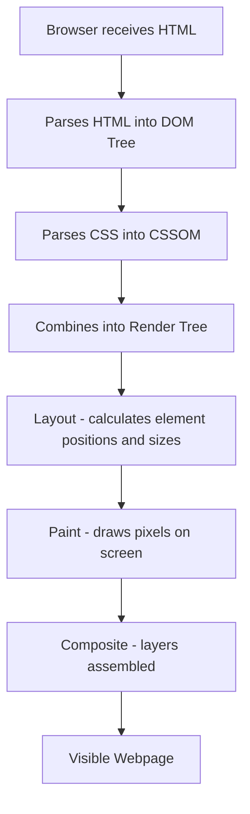
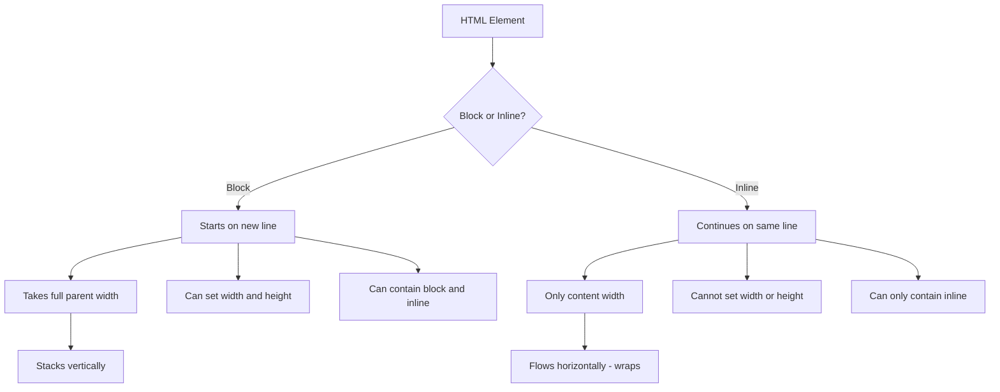
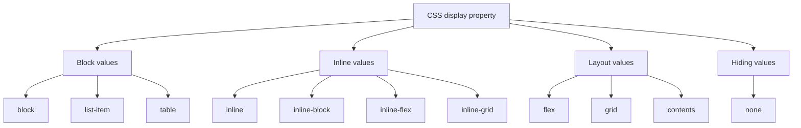
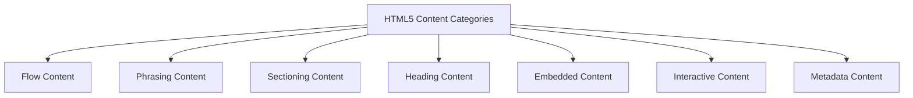
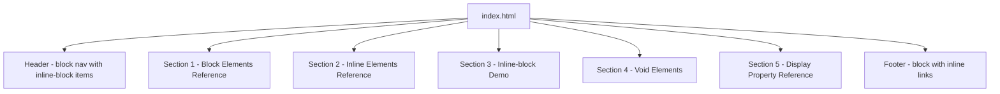

<a id="chapter-6-block-inline-void-elements"></a>

# Chapter 6: Block, Inline & Void Elements

[⬅ Previous Chapter](#chapter-5-html-elements-tags-attributes) | [📖 Main Index](#main-index) | [Next Chapter ➡](#chapter-7-text-formatting-html)

---

## 📌 Learning Objectives

By the end of this chapter, you will be able to:

- Understand the **fundamental difference** between block, inline, and void elements
- Explain **exactly how block elements behave** in a browser layout
- Explain **exactly how inline elements behave** in a browser layout
- Understand the **inline-block concept** and when to use it
- Identify **every void element** in HTML5 and explain why they have no closing tag
- Understand **how the browser renders** each element type differently
- Change an element's display behavior using **CSS `display` property**
- Recognize **common real-world use cases** for each element type
- Understand **why mixing block and inline** incorrectly breaks layouts
- Answer **every interview question** on block, inline, and void elements with confidence
- Understand the **display property values**: block, inline, inline-block, none, flex, grid

---

<a id="chapter-index-table-6"></a>

## Chapter Index Table

| Topic No. | Topic Name | Subtopics |
|-----------|-----------|-----------|
| 6.1 | [How Browsers Render Elements](#61-how-browsers-render-elements) | Normal flow<br>Block formatting context<br>Inline formatting context<br>Visual rendering model |
| 6.2 | [Block Elements](#62-block-elements) | Definition<br>Characteristics<br>Complete list<br>Width height margin padding<br>Real examples |
| 6.3 | [Inline Elements](#63-inline-elements) | Definition<br>Characteristics<br>Complete list<br>Width height behavior<br>Real examples |
| 6.4 | [Block vs Inline — Deep Comparison](#64-block-vs-inline-deep-comparison) | Side by side comparison<br>Width behavior<br>Height behavior<br>Margin padding differences<br>Nesting rules |
| 6.5 | [The inline-block Concept](#65-the-inline-block-concept) | What is inline-block<br>How it combines both<br>When to use<br>Practical examples<br>vs float |
| 6.6 | [Void Elements — Self-Closing Tags](#66-void-elements-self-closing-tags) | What are void elements<br>Why no closing tag<br>Complete list<br>Each void element explained<br>HTML5 vs XHTML syntax |
| 6.7 | [The CSS Display Property](#67-the-css-display-property) | display block<br>display inline<br>display inline-block<br>display none<br>display flex<br>display grid<br>display contents |
| 6.8 | [Changing Display Behavior with CSS](#68-changing-display-behavior-with-css) | Making inline elements block<br>Making block elements inline<br>Common patterns<br>Navigation menus<br>Buttons |
| 6.9 | [Element Categories in HTML5](#69-element-categories-in-html5) | Flow content<br>Phrasing content<br>Sectioning content<br>Heading content<br>Embedded content<br>Interactive content |
| 6.10 | [Common Interview Scenarios](#610-common-interview-scenarios) | Center a div<br>Inline nav items<br>Same-line blocks<br>Invisible vs hidden |

---

## 6.1 How Browsers Render Elements

<a id="61-how-browsers-render-elements"></a>

---

### 🔷 The Normal Document Flow

When a browser renders HTML, it places elements on the page following **normal document flow** — a set of rules that determine where each element appears relative to others.

The two fundamental formatting contexts in normal flow are:

1. **Block Formatting Context (BFC)** — for block-level elements
2. **Inline Formatting Context (IFC)** — for inline-level elements

---

### 🔷 The Rendering Pipeline



---

### 🔷 Block Formatting Context (BFC)

In a Block Formatting Context:

- Elements are laid out **vertically** — one after another, from top to bottom
- Each block element starts on a **new line**
- Each block element stretches to fill the **full available width**
- Block elements can contain other block elements and inline elements

---

### 🔷 Inline Formatting Context (IFC)

In an Inline Formatting Context:

- Elements are laid out **horizontally** — side by side, left to right
- Elements only take up **as much width as their content needs**
- When horizontal space runs out, elements **wrap** to the next line
- Inline elements can only contain other inline elements (or text)

---

### 🔷 Visual Comparison — Block vs Inline Layout

```text
BLOCK LAYOUT (vertical stacking):
┌─────────────────────────────────────────┐ ← full width
│  <h1>Page Heading</h1>                  │
└─────────────────────────────────────────┘
┌─────────────────────────────────────────┐ ← full width
│  <p>First paragraph text here.</p>      │
└─────────────────────────────────────────┘
┌─────────────────────────────────────────┐ ← full width
│  <div>Another block element.</div>      │
└─────────────────────────────────────────┘

INLINE LAYOUT (horizontal flow):
┌──────┐ ┌─────┐ ┌──────────┐ ┌───────┐
│<span>│ │<em> │ │  <a>     │ │<strong│
│Hello │ │World│ │Click here│ │>Bold  │
└──────┘ └─────┘ └──────────┘ └───────┘
All on same line → wraps when line is full
```

---

### 🧠 Hinglish Intuition

> Browser elements ko render karna ek **books ko shelf pe rakhne** ki tarah hai.
>
> **Block elements = Badi heavy books:**
> - Har book apni poori shelf (row) occupy karti hai
> - Agle book ko neeche naya shelf chahiye
> - Chahe kitni bhi chhoti book ho — poori row leti hai
>
> **Inline elements = Post-it stickers:**
> - Ek ke baad ek same line pe chipkate jao
> - Jab line bhar jaye → agli line pe chale jao
> - Sirf utni jagah lete hain jitni zaroorat hai
>
> **Yahi hai block aur inline ka fundamental difference!**

---

> [!IMPORTANT]
> **Interview Foundation:** Understanding how browsers render block vs inline elements is the foundation for understanding CSS layout. Every CSS layout technique — flexbox, grid, positioning — modifies or overrides this fundamental rendering behavior.

---

👉 <a href="#chapter-index-table-6">Go to Top 🔝</a>

---

## 6.2 Block Elements

<a id="62-block-elements"></a>

---

### 🔷 What is a Block Element?

A **block element** is an HTML element that:

1. Always starts on a **new line**
2. Takes up the **full width** of its parent container (by default)
3. Has a **height** determined by its content (unless set explicitly)
4. **Accepts** width, height, margin, and padding on all sides
5. Can contain **both block and inline** elements
6. Creates a **block formatting context**

---

### 🔷 Block Element Characteristics — Detailed

```html
<!-- Block element demonstration -->
<div style="border: 2px solid blue;">Block 1</div>
<div style="border: 2px solid red;">Block 2</div>
<div style="border: 2px solid green;">Block 3</div>
```

**Visual Output:**
```text
┌─────────────────────────────────────────────────────┐
│ Block 1                          (full width, blue)  │
└─────────────────────────────────────────────────────┘
┌─────────────────────────────────────────────────────┐
│ Block 2                          (full width, red)   │
└─────────────────────────────────────────────────────┘
┌─────────────────────────────────────────────────────┐
│ Block 3                          (full width, green) │
└─────────────────────────────────────────────────────┘
Each div is on its own line — stacked vertically
```

---

### 🔷 Block Element CSS Properties

Block elements respond fully to all box model properties:

```css
/* ALL of these work on block elements */
div {
    width: 500px;          /* ✅ Works */
    height: 200px;         /* ✅ Works */
    margin: 20px;          /* ✅ Works on all sides */
    padding: 20px;         /* ✅ Works on all sides */
    border: 2px solid red; /* ✅ Works */
}
```

---

### 🔷 Complete List of Block Elements

| Element | Purpose |
|---------|---------|
| `<div>` | Generic block container — most common block element |
| `<p>` | Paragraph |
| `<h1>` to `<h6>` | Headings (six levels) |
| `<ul>` | Unordered list |
| `<ol>` | Ordered list |
| `<li>` | List item |
| `<dl>` | Description list |
| `<dt>` | Description term |
| `<dd>` | Description details |
| `<table>` | Table |
| `<thead>` | Table head section |
| `<tbody>` | Table body section |
| `<tfoot>` | Table foot section |
| `<tr>` | Table row |
| `<form>` | HTML form |
| `<fieldset>` | Form group |
| `<blockquote>` | Long quotation |
| `<pre>` | Preformatted text |
| `<hr>` | Horizontal rule (also void) |
| `<header>` | Page/section header |
| `<footer>` | Page/section footer |
| `<nav>` | Navigation |
| `<main>` | Main content |
| `<section>` | Generic section |
| `<article>` | Self-contained content |
| `<aside>` | Sidebar content |
| `<figure>` | Figure with caption |
| `<figcaption>` | Figure caption |
| `<details>` | Disclosure widget |
| `<summary>` | Summary for details |
| `<address>` | Contact information |

---

### 🔷 Block Element Code Examples

```html
<!DOCTYPE html>
<html lang="en">
<head>
    <meta charset="UTF-8">
    <title>Block Elements Demo</title>
    <style>
        /* Visual outline to show block behavior */
        h1, h2, h3, p, div, section, article, ul, ol {
            outline: 2px dashed #3b82f6;
            margin: 4px 0;
        }
    </style>
</head>
<body>

    <!-- Each of these starts on a new line and fills full width -->

    <h1>Heading 1 — Block Element</h1>
    <h2>Heading 2 — Block Element</h2>
    <h3>Heading 3 — Block Element</h3>

    <p>
        This paragraph is a block element. It starts on a new line,
        fills the full width of its container, and the next element
        starts below it on a new line.
    </p>

    <p>
        This is a second paragraph. Even though it appears right after
        the first, it starts on a new line because
        <strong>both are block elements.</strong>
    </p>

    <div>
        This div is a block element — generic container.
    </div>

    <section>
        <article>
            <h2>Article Title</h2>
            <p>Article content — all block elements nested inside each other.</p>
        </article>
    </section>

    <ul>
        <li>List item 1</li>
        <li>List item 2</li>
        <li>List item 3</li>
    </ul>

    <blockquote>
        "This blockquote is a block element — takes full width."
        — Famous Person
    </blockquote>

</body>
</html>
```

---

### 🔷 Block Element Width Behavior

```css
/* Block element default: takes full width of parent */
div {
    /* width: auto; — this is the default */
    /* auto means: fill available width */
}

/* You can restrict the width */
div.container {
    width: 800px;     /* Fixed width */
    margin: 0 auto;   /* Center the block element */
}

div.half {
    width: 50%;       /* 50% of parent width */
}
```

```text
Parent container (100% width):
┌─────────────────────────────────────────────────────┐
│ div (default — fills full width)                    │
└─────────────────────────────────────────────────────┘

┌────────────────────────────┐
│ div (width: 50%)           │
└────────────────────────────┘
```

---

### 🧠 Hinglish Intuition

> Block elements ek **pahalwan** ki tarah hain jo poori gali mein khade ho jaate hain.
>
> Chahe pahalwan kitna bhi chhota ho — woh poori gali mein akela khada hoga:
> - Dono sides stretch karke poori width leta hai
> - Koi uske saath us gali mein khada nahi ho sakta
> - Agli banda neeche waali gali (next line) pe jaayega
>
> `<div>`, `<p>`, `<h1>` sab aise hi pahalwan hain!
>
> **Width set karo** toh pahalwan thoda side ho jaata hai — lekin phir bhi akela hi rehta hai us row mein (koi next to him nahi aa sakta by default).
>
> **Block = Poori row apne naam kar leta hai!**

---

👉 <a href="#chapter-index-table-6">Go to Top 🔝</a>

---

## 6.3 Inline Elements

<a id="63-inline-elements"></a>

---

### 🔷 What is an Inline Element?

An **inline element** is an HTML element that:

1. Does **NOT** start on a new line — flows with surrounding content
2. Takes up **only as much width as its content** needs
3. **Does NOT accept** width and height properties (CSS width/height have no effect)
4. Accepts **horizontal margin and padding** (left/right) but **vertical margin/padding** behaves differently
5. Can only contain **other inline elements** or text
6. Flows within the **inline formatting context**

---

### 🔷 Inline Element Characteristics — Detailed

```html
<!-- Inline elements flow within text -->
<p>
    This is a paragraph with
    <strong>bold text</strong>,
    <em>italic text</em>,
    a <a href="#">link</a>,
    and <span class="highlight">highlighted text</span>
    all flowing inline within the paragraph.
</p>
```

**Visual Output:**
```text
This is a paragraph with bold text, italic text, a link,
and highlighted text all flowing inline within the paragraph.
↑ All on the same line — no new lines between inline elements
```

---

### 🔷 Inline Element CSS Properties — What Works, What Doesn't

```css
span {
    /* ✅ WORKS on inline elements */
    color: red;
    font-size: 16px;
    font-weight: bold;
    text-decoration: underline;
    background-color: yellow;
    padding-left: 10px;    /* ✅ Horizontal padding works */
    padding-right: 10px;   /* ✅ Horizontal padding works */
    margin-left: 10px;     /* ✅ Horizontal margin works */
    margin-right: 10px;    /* ✅ Horizontal margin works */

    /* ⚠️ PARTIALLY WORKS */
    padding-top: 10px;     /* ⚠️ Applies but may overlap other lines */
    padding-bottom: 10px;  /* ⚠️ Applies but may overlap other lines */

    /* ❌ DOES NOT WORK */
    width: 200px;          /* ❌ Ignored — inline elements cannot have width */
    height: 100px;         /* ❌ Ignored — inline elements cannot have height */
    margin-top: 20px;      /* ❌ Ignored — vertical margin does not work */
    margin-bottom: 20px;   /* ❌ Ignored — vertical margin does not work */
}
```

---

### 🔷 Complete List of Inline Elements

| Element | Purpose |
|---------|---------|
| `<span>` | Generic inline container — most common inline element |
| `<a>` | Hyperlink / anchor |
| `<strong>` | Important text (bold, semantic) |
| `<em>` | Emphasized text (italic, semantic) |
| `<b>` | Bold text (non-semantic) |
| `<i>` | Italic text (non-semantic) |
| `<u>` | Underlined text |
| `<s>` | Strikethrough text |
| `<mark>` | Highlighted text |
| `<small>` | Smaller text |
| `<big>` | Larger text (deprecated) |
| `<sub>` | Subscript |
| `<sup>` | Superscript |
| `<abbr>` | Abbreviation |
| `<cite>` | Citation |
| `<code>` | Inline code |
| `<kbd>` | Keyboard input |
| `<samp>` | Sample output |
| `<var>` | Variable |
| `<time>` | Time/date |
| `<q>` | Short quotation |
| `<bdo>` | Bidirectional override |
| `<bdi>` | Bidirectional isolation |
| `<dfn>` | Definition term |
| `<label>` | Form label (can be block or inline) |
| `<input>` | Form input (technically replaced element) |
| `<button>` | Button (technically inline-block by default) |
| `<select>` | Dropdown (technically inline-block) |
| `<textarea>` | Text area (technically inline-block) |

---

### 🔷 Inline Element Code Examples

```html
<!DOCTYPE html>
<html lang="en">
<head>
    <meta charset="UTF-8">
    <title>Inline Elements Demo</title>
    <style>
        /* Visual outline for inline elements */
        span, strong, em, a, mark, code, abbr {
            outline: 1px solid #ef4444;
        }
    </style>
</head>
<body>

    <h2>Inline Elements Demo</h2>

    <p>
        <!-- Inline elements flow within text without line breaks -->
        The word <strong>important</strong> is bold.
        The word <em>emphasis</em> is italic.
        Here is a <a href="#">link</a> inline.
        The chemical formula for water is H<sub>2</sub>O.
        The area formula is A = πr<sup>2</sup>.
        Press <kbd>Ctrl+C</kbd> to copy.
        The <abbr title="HyperText Markup Language">HTML</abbr> spec is evolving.
        Use <code>display: flex</code> for layouts.
        <mark>This text is highlighted</mark> for attention.
        <small>This is small print text.</small>
        The <q>quick brown fox</q> is an old typing test.
    </p>

    <!-- All these inline elements stay on the same line -->
    <p>
        <span style="color:red;">Red</span>
        <span style="color:blue;">Blue</span>
        <span style="color:green;">Green</span>
        <span style="color:orange;">Orange</span>
        — All spans on the same line!
    </p>

    <!-- Width/height on inline elements — has no effect -->
    <p>
        <span style="width:500px; height:200px; background:yellow;">
            <!-- width and height are IGNORED on this inline span -->
            This span has width:500px and height:200px set, but they are ignored.
        </span>
    </p>

</body>
</html>
```

---

### 🔷 Inline Wrapping Behavior

When inline content reaches the end of a line, it **wraps** to the next line:

```html
<p>
    <span>Word1</span> <span>Word2</span> <span>Word3</span>
    <span>Word4</span> <span>Word5</span> <span>Word6</span>
    <span>Word7</span> <span>Word8</span> <span>Word9</span>
    <!-- When line is full, they wrap automatically -->
</p>
```

```text
┌─────────────────────────────────────────────┐
│ Word1 Word2 Word3 Word4 Word5 Word6 Word7   │
│ Word8 Word9                                  │ ← wraps here
└─────────────────────────────────────────────┘
```

---

### 🧠 Hinglish Intuition

> Inline elements ek **words in a sentence** ki tarah hain.
>
> Jab tum ek sentence likhte ho:
> - Har word apni zaroorat ke hisaab se jagah leta hai
> - Words ek line pe side by side rehte hain
> - Jab line bhar jaaye → agli line pe wrap ho jaate hain
> - Tum ek word ko 500px wide nahi bana sakte — woh sirf utna wide hoga jitna uska content hai
>
> Waise hi inline elements:
> - Flow karte hain text ke andar
> - Sirf content jitni width
> - Width/height CSS ignored
> - Line bhari toh wrap
>
> `<span>`, `<strong>`, `<em>`, `<a>` sab aise hi hain — **text ke andar rehte hain, text ke saath behte hain!**

---

👉 <a href="#chapter-index-table-6">Go to Top 🔝</a>

---

## 6.4 Block vs Inline — Deep Comparison

<a id="64-block-vs-inline-deep-comparison"></a>

---

### 🔷 Side-by-Side Comparison Table

| Property | Block Elements | Inline Elements |
|----------|--------------|----------------|
| **New line** | ✅ Always starts on new line | ❌ Continues on same line |
| **Width** | 100% of parent (default) | Content width only |
| **Height** | Content height (settable) | Content height (NOT settable) |
| **CSS width** | ✅ Works | ❌ Ignored |
| **CSS height** | ✅ Works | ❌ Ignored |
| **margin-top/bottom** | ✅ Works | ❌ Does not work |
| **margin-left/right** | ✅ Works | ✅ Works |
| **padding-top/bottom** | ✅ Works | ⚠️ Applies but overlaps lines |
| **padding-left/right** | ✅ Works | ✅ Works |
| **Can contain block?** | ✅ Yes | ❌ No |
| **Can contain inline?** | ✅ Yes | ✅ Yes |
| **Examples** | `div`, `p`, `h1`-`h6`, `ul`, `section` | `span`, `a`, `strong`, `em`, `code` |
| **Default display** | `display: block` | `display: inline` |

---

### 🔷 Width Behavior Comparison

```html
<style>
    .block-demo {
        background: #dbeafe;
        border: 2px solid #3b82f6;
        width: 300px;     /* ✅ Works on block */
        margin: 8px 0;
    }

    .inline-demo {
        background: #fce7f3;
        border: 2px solid #ec4899;
        width: 300px;     /* ❌ Ignored on inline */
    }
</style>

<!-- Block element — width: 300px works -->
<div class="block-demo">
    This div has width: 300px — it works!
</div>

<!-- Inline element — width: 300px ignored -->
<p>
    The <span class="inline-demo">span with width:300px</span>
    is only as wide as its content — width is ignored.
</p>
```

---

### 🔷 Margin Behavior Comparison

```html
<style>
    .block-margin {
        background: #d1fae5;
        border: 1px solid #10b981;
        margin: 20px;    /* All 4 sides work */
        display: block;
    }

    .inline-margin {
        background: #fef9c3;
        border: 1px solid #f59e0b;
        margin: 20px;    /* Only left/right work! */
        display: inline;
    }
</style>

<div class="block-margin">Block — margin works on all 4 sides</div>
<div class="block-margin">Next block — 20px gap above</div>

<p>
    Text before
    <span class="inline-margin">Inline — only left/right margin works</span>
    text after — notice no vertical gap
</p>
```

---

### 🔷 Nesting Rules — Critical

```html
<!-- ✅ CORRECT: Block inside block -->
<div>
    <p>Paragraph inside div — both are block</p>
    <div>Div inside div — perfectly valid</div>
</div>

<!-- ✅ CORRECT: Inline inside block -->
<p>
    Text with <strong>bold</strong> and <em>italic</em> inline elements.
</p>

<!-- ✅ CORRECT: Inline inside inline -->
<span>
    Text with <strong>bold span inside</strong> another span.
</span>

<!-- ❌ WRONG: Block inside inline -->
<span>
    <div>Div inside span — INVALID!</div>
    <p>P inside span — INVALID!</p>
</span>

<!-- ❌ WRONG: Block inside p -->
<p>
    <div>Div inside p — INVALID!</div>
</p>

<!-- ❌ WRONG: p inside span -->
<span>
    <p>Paragraph inside span — INVALID!</p>
</span>
```

---

### 🔷 Visual Flow Diagram



---

### 🔷 Margin Collapse — Block-Specific Behavior

**Margin collapse** is a block-element-specific behavior where **vertical margins** between adjacent block elements **collapse** into a single margin (the larger of the two):

```html
<style>
    .box1 { margin-bottom: 30px; background: #dbeafe; }
    .box2 { margin-top: 20px; background: #d1fae5; }
</style>

<div class="box1">Box 1 — margin-bottom: 30px</div>
<div class="box2">Box 2 — margin-top: 20px</div>
<!-- Gap between them = 30px (larger of 30 and 20), NOT 50px! -->
<!-- This is margin collapse — only happens with BLOCK elements -->
<!-- Inline and inline-block elements do NOT margin collapse -->
```

> [!IMPORTANT]
> **Interview Must-Know:** Margin collapse only happens with **vertical margins** of **block elements**. It does NOT happen with:
> - Inline or inline-block elements
> - Left/right margins
> - Elements with padding or border between them
> - Flex or grid children

---

### 🧠 Hinglish Intuition

> Block vs Inline ka difference ek **furniture arrangement** se samajhte hain:
>
> **Block elements = Sofa/almirah:**
> - Jab ghar mein sofa rakhte ho — woh poori wall le leta hai
> - Doosra sofa neeche jaayega — side pe nahi
> - Width, height, margin sab sides pe adjustable
>
> **Inline elements = Books on a shelf:**
> - Books side by side rakhte hain
> - Shelf bhar jaaye toh next shelf pe jaao (wrap)
> - Books ki height fixed hai — tum width set nahi kar sakte
> - Top/bottom margin nahi lagta
>
> **Mixing them incorrectly:**
> - Sofa (block) ko shelf (inline) ke andar rakhna — physically impossible!
> - Waise hi `<div>` inside `<span>` — HTML invalid!

---

👉 <a href="#chapter-index-table-6">Go to Top 🔝</a>

---

## 6.5 The inline-block Concept

<a id="65-the-inline-block-concept"></a>

---

### 🔷 What is inline-block?

`inline-block` is a hybrid display value that combines the best of both block and inline:

- **FROM INLINE:** Does not start on a new line — sits alongside other elements
- **FROM BLOCK:** Respects width, height, margin-top, margin-bottom, padding on all sides

```text
inline-block = INLINE behavior + BLOCK box model

Flows horizontally (like inline) ✅
+ Accepts width/height (like block) ✅
+ Accepts all margins/padding (like block) ✅
- Does NOT fill full parent width ✅
```

---

### 🔷 Comparing All Three — block vs inline vs inline-block

```css
.block       { display: block; }
.inline      { display: inline; }
.inline-block{ display: inline-block; }
```

```html
<div class="block" style="width:100px; height:50px; background:#dbeafe;">Block</div>
<div class="block" style="width:100px; height:50px; background:#dbeafe;">Block</div>

<span class="inline" style="width:100px; height:50px; background:#fce7f3;">Inline</span>
<span class="inline" style="width:100px; height:50px; background:#fce7f3;">Inline</span>

<span class="inline-block" style="width:100px; height:50px; background:#d1fae5;">IB</span>
<span class="inline-block" style="width:100px; height:50px; background:#d1fae5;">IB</span>
```

**Visual Output:**
```text
┌──────────────────────────────────────────────┐
│ Block                                        │ ← full line, width/height works
└──────────────────────────────────────────────┘
┌──────────────────────────────────────────────┐
│ Block                                        │ ← new line, full width
└──────────────────────────────────────────────┘

Inline Inline  ← same line, width:100px IGNORED, height:50px IGNORED

┌────────┐┌────────┐
│ IB     ││ IB     │ ← same line, width:100px WORKS, height:50px WORKS
└────────┘└────────┘
```

---

### 🔷 Detailed Comparison Table

| Property | block | inline | inline-block |
|----------|-------|--------|--------------|
| **Starts new line** | ✅ Yes | ❌ No | ❌ No |
| **Fills parent width** | ✅ Yes | ❌ No | ❌ No |
| **CSS width works** | ✅ Yes | ❌ No | ✅ Yes |
| **CSS height works** | ✅ Yes | ❌ No | ✅ Yes |
| **margin-top/bottom** | ✅ Yes | ❌ No | ✅ Yes |
| **padding all sides** | ✅ Yes | ⚠️ Partial | ✅ Yes |
| **Can be next to others** | ❌ No | ✅ Yes | ✅ Yes |
| **Margin collapse** | ✅ Happens | ❌ No | ❌ No |

---

### 🔷 Real-World Use Cases for inline-block

#### Use Case 1: Navigation Menu Items

```html
<style>
    nav ul {
        list-style: none;
        padding: 0;
        margin: 0;
        background: #1e293b;
    }

    nav li {
        display: inline-block;  /* ← Makes li items sit side by side */
    }

    nav a {
        display: block;         /* ← Block inside li for full clickable area */
        padding: 14px 20px;
        color: white;
        text-decoration: none;
    }

    nav a:hover {
        background: #3b82f6;
    }
</style>

<nav>
    <ul>
        <li><a href="#">Home</a></li>
        <li><a href="#">About</a></li>
        <li><a href="#">Services</a></li>
        <li><a href="#">Contact</a></li>
    </ul>
</nav>
```

#### Use Case 2: Card Grid (Before Flexbox/Grid)

```html
<style>
    .card {
        display: inline-block;
        width: 200px;
        height: 250px;
        margin: 10px;
        padding: 20px;
        background: white;
        border: 1px solid #e2e8f0;
        border-radius: 8px;
        vertical-align: top; /* Align tops of cards */
    }
</style>

<div class="card">Card 1</div>
<div class="card">Card 2</div>
<div class="card">Card 3</div>
<!-- All three cards appear on same line with set dimensions -->
```

#### Use Case 3: Buttons

```html
<style>
    .btn {
        display: inline-block; /* Default for button — sits inline, accepts box model */
        padding: 12px 24px;
        background: #3b82f6;
        color: white;
        border-radius: 6px;
        text-decoration: none;
        font-weight: 600;
        margin: 4px;
    }
</style>

<a href="#" class="btn">Primary Button</a>
<a href="#" class="btn">Secondary Button</a>
<!-- Both links (inline) appear as styled buttons with set padding -->
```

---

### 🔷 The inline-block Whitespace Problem

A common quirk: whitespace (spaces/newlines) in HTML between inline-block elements creates a visible gap:

```html
<!-- This HTML whitespace creates a small gap between items -->
<div style="display:inline-block; width:100px; background:blue; color:white;">Box 1</div>
<div style="display:inline-block; width:100px; background:red; color:white;">Box 2</div>
<!-- There is a tiny space between Box 1 and Box 2 -->
```

**Solutions:**

```html
<!-- Solution 1: Remove whitespace between tags -->
<div style="display:inline-block;">Box 1</div><div style="display:inline-block;">Box 2</div>

<!-- Solution 2: Negative margin -->
<style>
.inline-box { display: inline-block; margin-right: -4px; }
</style>

<!-- Solution 3: Set font-size:0 on parent -->
<div style="font-size: 0;">
    <div style="display:inline-block; font-size:16px;">Box 1</div>
    <div style="display:inline-block; font-size:16px;">Box 2</div>
</div>

<!-- ✅ Solution 4: Use flexbox instead (modern approach) -->
<div style="display: flex; gap: 10px;">
    <div>Box 1</div>
    <div>Box 2</div>
</div>
```

> [!TIP]
> In modern web development, **Flexbox and Grid** have largely replaced the need for `inline-block` layouts. However, `inline-block` is still very useful for individual elements that need to sit inline but require box model control (like styled buttons created from `<a>` tags).

---

### 🧠 Hinglish Intuition

> `inline-block` ek **small car** ki tarah hai jo:
> - Dono sides pe park ho sakti hai (inline ki tarah — same row)
> - Lekin uski properly defined dimensions hain (block ki tarah — width/height kaam karta hai)
>
> **Block = Truck** — poori road lete hai, akele chalte hain
> **Inline = Cycle** — side by side chal sakte hain, lekin size set nahi kar sakte properly
> **inline-block = Car** — side by side chal sakte hain, aur proper size bhi hai
>
> Jab tum `<a>` tag ko button banana chahte ho:
> - `<a>` by default inline hai — width/height nahi lagta
> - `display: inline-block` karo → button ki tarah dikhega, width/height lagega, aur text ke saath bhi flow karega
>
> **inline-block = Dono worlds ka best combination!**

---

👉 <a href="#chapter-index-table-6">Go to Top 🔝</a>

---

## 6.6 Void Elements — Self-Closing Tags

<a id="66-void-elements-self-closing-tags"></a>

---

### 🔷 What are Void Elements?

**Void elements** (also called **self-closing elements** or **empty elements**) are HTML elements that:

- Have **no content** — nothing goes between their tags
- Have **no closing tag** — there is nothing to close
- Cannot have **child elements**
- Are **complete** with just the opening tag
- Provide information or functionality through their **attributes alone**

---

### 🔷 Why No Closing Tag?

The logic is simple: a closing tag marks where **content ends**. If there is no content, there is nothing to close.

```html
<!-- Regular element: has content → needs closing tag -->
<p>This is content that needs to be closed.</p>

<!-- Void element: no content → no closing tag needed -->
<br>        <!-- Line break — no content possible -->
  <!-- Image — content comes from src, not between tags -->
<input type="text">               <!-- Input — value is an attribute, not content -->
```

---

### 🔷 HTML5 vs XHTML Syntax

```html
<!-- HTML5 (current standard) — no slash needed -->
<br>
<hr>

<input type="text">
<meta charset="UTF-8">

<!-- XHTML (older) — required self-closing slash -->
<br/>
<hr/>

<input type="text"/>
<meta charset="UTF-8"/>

<!-- Both are valid in HTML5 — but no slash is preferred -->
```

> [!NOTE]
> HTML5 parsers accept both `<br>` and `<br/>`. However, `<br>` is the HTML5 standard. The slash (`/`) is a legacy from XHTML. Modern HTML development uses the no-slash form.

---

### 🔷 Complete List of HTML5 Void Elements

| Element | Purpose | Key Attributes |
|---------|---------|---------------|
| `<br>` | Line break | None |
| `<hr>` | Thematic break / horizontal rule | None |
| `` | Image | `src`, `alt`, `width`, `height`, `loading` |
| `<input>` | Form input | `type`, `name`, `value`, `placeholder`, `required` |
| `<meta>` | Metadata | `charset`, `name`, `content`, `http-equiv` |
| `<link>` | External resource | `rel`, `href`, `type`, `media` |
| `<area>` | Image map area | `href`, `shape`, `coords`, `alt` |
| `<base>` | Base URL | `href`, `target` |
| `<col>` | Table column | `span`, `style` |
| `<embed>` | External content | `src`, `type`, `width`, `height` |
| `<param>` | Object parameter | `name`, `value` |
| `<source>` | Media source | `src`, `srcset`, `type`, `media` |
| `<track>` | Text track for media | `src`, `kind`, `srclang`, `label` |
| `<wbr>` | Word break opportunity | None |

---

### 🔷 Each Void Element — Detailed

#### `<br>` — Line Break

```html
<!-- Forces text to next line without starting new paragraph -->
<p>
    First line of address<br>
    Second line — City<br>
    Third line — State, Country
</p>

<!-- Good use: address, poetry, code display -->
<!-- BAD use: creating spacing between paragraphs — use margin/padding instead -->
```

#### `<hr>` — Horizontal Rule / Thematic Break

```html
<!-- Semantic: signals a thematic break in content -->
<h2>Section One</h2>
<p>Content of section one.</p>

<hr>  <!-- Thematic break between sections -->

<h2>Section Two</h2>
<p>Content of section two.</p>
```

```css
/* Style the hr with CSS */
hr {
    border: none;
    border-top: 2px solid #e2e8f0;
    margin: 30px 0;
}
```

#### `` — Image

```html
<!-- src: image path, alt: accessibility text -->


<!-- Decorative image — empty alt (screen reader skips it) -->


<!-- Required attributes: src and alt -->
<!-- alt="" is valid for decorative images -->
<!-- alt must not be omitted (it becomes the filename — bad for accessibility) -->
```

#### `<input>` — Form Input

```html
<!-- Various input types — all void elements -->
<input type="text" name="username" placeholder="Enter username">
<input type="email" name="email" placeholder="your@email.com" required>
<input type="password" name="password" minlength="8">
<input type="number" name="age" min="1" max="120">
<input type="checkbox" name="newsletter" id="newsletter" checked>
<input type="radio" name="gender" value="male" id="male">
<input type="file" name="avatar" accept="image/*">
<input type="date" name="dob">
<input type="color" name="theme" value="#3b82f6">
<input type="range" name="volume" min="0" max="100" step="5">
<input type="hidden" name="csrf_token" value="abc123xyz">
<input type="submit" value="Submit Form">
<input type="reset" value="Clear Form">
<input type="search" name="q" placeholder="Search...">
<input type="tel" name="phone" placeholder="+91 9876543210">
<input type="url" name="website" placeholder="https://yoursite.com">
```

#### `<meta>` — Metadata

```html
<!-- Multiple meta tag uses — all void elements -->
<meta charset="UTF-8">
<meta name="viewport" content="width=device-width, initial-scale=1.0">
<meta name="description" content="Page description for SEO">
<meta name="author" content="John Doe">
<meta name="robots" content="index, follow">
<meta property="og:title" content="Page Title">
<meta http-equiv="X-UA-Compatible" content="IE=edge">
```

#### `<link>` — External Resource

```html
<!-- External CSS -->
<link rel="stylesheet" href="css/style.css">

<!-- Favicon -->
<link rel="icon" type="image/png" href="favicon.png">

<!-- Apple touch icon -->
<link rel="apple-touch-icon" href="apple-touch-icon.png">

<!-- Canonical URL -->
<link rel="canonical" href="https://example.com/page/">

<!-- Preconnect -->
<link rel="preconnect" href="https://fonts.googleapis.com">

<!-- Web manifest -->
<link rel="manifest" href="site.webmanifest">
```

#### `<source>` — Media Source

```html
<!-- Inside video — multiple formats for cross-browser support -->
<video controls width="640" height="360">
    <source src="video/tutorial.webm" type="video/webm">
    <source src="video/tutorial.mp4" type="video/mp4">
    Your browser does not support HTML video.
</video>

<!-- Inside picture — responsive images -->
<picture>
    <source srcset="images/hero-large.webp" media="(min-width: 1024px)" type="image/webp">
    <source srcset="images/hero-medium.webp" media="(min-width: 768px)" type="image/webp">
    
</picture>
```

#### `<track>` — Text Track for Video

```html
<!-- Captions, subtitles for video accessibility -->
<video controls>
    <source src="tutorial.mp4" type="video/mp4">
    <track src="captions-en.vtt" kind="captions" srclang="en" label="English" default>
    <track src="captions-hi.vtt" kind="captions" srclang="hi" label="Hindi">
</video>
```

#### `<wbr>` — Word Break Opportunity

```html
<!-- Suggests where browser CAN break a long word if needed -->
<p>
    The URL is: https://www.example.com/<wbr>very-long-path/<wbr>another-segment/<wbr>page.html
</p>

<!-- URL breaks at <wbr> points if line is too narrow -->
<!-- Without wbr, browser might not break at all → horizontal overflow -->
```

#### `<area>` — Image Map Area

```html
<!-- Defines clickable areas on an image map -->


<map name="india-regions">
    <area shape="circle"
          coords="350,200,80"
          href="delhi.html"
          alt="Delhi region">
    <area shape="rect"
          coords="100,300,250,450"
          href="mumbai.html"
          alt="Mumbai region">
</map>
```

#### `<col>` — Table Column Styling

```html
<!-- Style entire columns in a table -->
<table>
    <colgroup>
        <col style="background-color: #f0f9ff;">  <!-- First column -->
        <col style="background-color: #f0fdf4;">  <!-- Second column -->
        <col>                                      <!-- Third column (no special style) -->
    </colgroup>
    <tr>
        <th>Name</th>
        <th>Score</th>
        <th>Grade</th>
    </tr>
    <tr>
        <td>Alice</td>
        <td>95</td>
        <td>A</td>
    </tr>
</table>
```

#### `<embed>` — External Content

```html
<!-- Embed PDF -->
<embed src="document.pdf"
       type="application/pdf"
       width="800"
       height="600">

<!-- Embed Flash (legacy — avoid) -->
<embed src="animation.swf" type="application/x-shockwave-flash">
```

#### `<param>` — Object Parameter

```html
<!-- Parameters for <object> elements (legacy) -->
<object data="plugin.swf" type="application/x-shockwave-flash">
    <param name="autoplay" value="true">
    <param name="quality" value="high">
</object>
```

#### `<base>` — Document Base URL

```html
<!-- Sets base URL and default target for all relative links -->
<head>
    <base href="https://www.example.com/blog/" target="_blank">
</head>
<body>
    <!-- Resolves to: https://www.example.com/blog/article.html -->
    <a href="article.html">Article</a>
</body>
```

---

### 🧠 Hinglish Intuition

> Void elements ko samajhna simple hai — socho **stamp** ki tarah.
>
> Ek regular envelope (normal element) mein content hota hai:
> - `<p>` → andar text, closing tag pe seal
>
> Ek **stamp** (void element) khud hi complete hai:
> - `<br>` stamp = "yahan line break karo" — koi content nahi, bas instruction
> - `` stamp = "yahan image dikhao" — image attributes mein hai, content mein nahi
> - `<input type="text">` stamp = "yahan input box banao" — value attribute mein hai
>
> Stamp ko fold karke band nahi karte — woh apne aap complete hai.
> Waise hi void elements ko closing tag nahi chahiye — woh apne aap complete hain!
>
> **Void = Self-contained stamp — no content, no closing tag, complete in itself!**

---

👉 <a href="#chapter-index-table-6">Go to Top 🔝</a>

---

## 6.7 The CSS Display Property

<a id="67-the-css-display-property"></a>

---

### 🔷 What is the Display Property?

The CSS `display` property **overrides the default display behavior** of HTML elements. It is the most fundamental CSS layout property.

```css
element {
    display: block;        /* Behave like a block element */
    display: inline;       /* Behave like an inline element */
    display: inline-block; /* Hybrid — inline position, block box model */
    display: none;         /* Remove from layout completely */
    display: flex;         /* Flex container */
    display: inline-flex;  /* Inline flex container */
    display: grid;         /* Grid container */
    display: inline-grid;  /* Inline grid container */
    display: contents;     /* Element disappears, children remain */
    display: table;        /* Behave like <table> */
    display: list-item;    /* Behave like <li> */
}
```

---

### 🔷 display: block

Makes any element behave like a block element:

```css
/* Make span (inline) behave like a block */
span.block-span {
    display: block;
    width: 300px;
    padding: 20px;
    background: #dbeafe;
    margin-bottom: 10px;
}

/* Make a (inline) behave as block — full-width link */
a.full-width-link {
    display: block;
    padding: 16px;
    background: #3b82f6;
    color: white;
    text-align: center;
}
```

```html
<span class="block-span">This span now behaves like a block!</span>
<span class="block-span">Each on its own line, full width.</span>
```

---

### 🔷 display: inline

Makes any element behave like an inline element:

```css
/* Make div (block) behave like inline */
div.inline-div {
    display: inline;
    background: #fce7f3;
    padding: 4px 8px;
}

/* Make li (block) behave inline — horizontal list */
li.inline-li {
    display: inline;
    margin-right: 20px;
}
```

```html
<div class="inline-div">Div 1</div>
<div class="inline-div">Div 2</div>
<div class="inline-div">Div 3</div>
<!-- All three divs on same line — unusual but valid -->
```

---

### 🔷 display: inline-block

Already covered in detail in Topic 6.5. Most common uses:

```css
/* Styled buttons from anchor tags */
.btn {
    display: inline-block;
    padding: 10px 24px;
    background: #3b82f6;
    color: white;
    border-radius: 6px;
    text-decoration: none;
}

/* Horizontal navigation */
.nav-item {
    display: inline-block;
    padding: 14px 20px;
}
```

---

### 🔷 display: none

**Completely removes** the element from the layout — as if it does not exist:

```css
.hidden-element {
    display: none;
    /* Element: invisible + takes no space + not in layout */
}
```

```html
<div style="display: none;">
    This div is completely gone — no space reserved.
</div>
<p>This paragraph appears right after the previous block element (the div is gone).</p>
```

**`display: none` vs `visibility: hidden` vs `opacity: 0`:**

| Property | Visible? | Takes Space? | Accessible? | Events? |
|----------|---------|-------------|-------------|---------|
| `display: none` | ❌ No | ❌ No space | ❌ Hidden from screen readers | ❌ No |
| `visibility: hidden` | ❌ No | ✅ Space kept | ❌ Hidden from screen readers | ❌ No |
| `opacity: 0` | ❌ No | ✅ Space kept | ✅ Accessible | ✅ Yes |

---

### 🔷 display: flex

Enables Flexbox layout on the container — children become flex items:

```css
.flex-container {
    display: flex;
    gap: 16px;
    justify-content: center;
    align-items: center;
}
```

```html
<div class="flex-container">
    <div>Item 1</div>
    <div>Item 2</div>
    <div>Item 3</div>
    <!-- All items on same row, perfectly aligned -->
</div>
```

> [!NOTE]
> Flexbox and Grid are covered in depth in Chapters 41–44. This chapter introduces them as display values.

---

### 🔷 display: grid

Enables CSS Grid layout on the container:

```css
.grid-container {
    display: grid;
    grid-template-columns: repeat(3, 1fr);
    gap: 16px;
}
```

```html
<div class="grid-container">
    <div>Card 1</div>
    <div>Card 2</div>
    <div>Card 3</div>
    <div>Card 4</div>
    <!-- 4 cards in a 3-column grid -->
</div>
```

---

### 🔷 display: contents

The element itself becomes invisible but its children are treated as if they are direct children of the parent:

```css
.wrapper {
    display: contents;
    /* The .wrapper div disappears from layout */
    /* Its children act as direct children of .wrapper's parent */
}
```

```html
<div class="flex-parent" style="display:flex; gap:10px;">
    <div class="wrapper" style="display:contents;">
        <!-- wrapper vanishes — its children join the flex parent directly -->
        <div>Child 1 — direct flex item</div>
        <div>Child 2 — direct flex item</div>
    </div>
    <div>Sibling</div>
</div>
```

---

### 🔷 Display Property — Complete Reference



---

### 🧠 Hinglish Intuition

> `display` property ek **remote control** ki tarah hai jo element ka behavior change karta hai.
>
> - **`display: block`** remote button dabao → element pahalwan ban jaata hai (poori width)
> - **`display: inline`** button dabao → element cycle ban jaata hai (side by side flow)
> - **`display: inline-block`** button dabao → element car ban jaata hai (side by side + proper size)
> - **`display: none`** button dabao → element **poof!** — completely gaayab! No space, no trace
> - **`display: flex`** button dabao → element flex container ban jaata hai — children ko align karo
> - **`display: grid`** button dabao → element grid container ban jaata hai — children grid mein
>
> **`display` property = HTML element ka shape-shifting remote control!**

---

👉 <a href="#chapter-index-table-6">Go to Top 🔝</a>

---

## 6.8 Changing Display Behavior with CSS

<a id="68-changing-display-behavior-with-css"></a>

---

### 🔷 Making Inline Elements Behave as Block

```html
<style>
    /* Make links fill full width — good for mobile menus */
    .full-link {
        display: block;
        padding: 14px 20px;
        background: #1e293b;
        color: white;
        text-decoration: none;
        border-bottom: 1px solid #334155;
    }

    .full-link:hover {
        background: #3b82f6;
    }
</style>

<nav>
    <a href="#" class="full-link">Home</a>
    <a href="#" class="full-link">About</a>
    <a href="#" class="full-link">Services</a>
    <a href="#" class="full-link">Contact</a>
</nav>
<!-- Each link is now full-width and stacked — mobile nav pattern -->
```

---

### 🔷 Making Block Elements Behave as Inline

```html
<style>
    /* Horizontal breadcrumb navigation */
    .breadcrumb li {
        display: inline;
    }

    .breadcrumb li::after {
        content: " › ";
        color: #9ca3af;
    }

    .breadcrumb li:last-child::after {
        content: "";
    }
</style>

<ol class="breadcrumb" style="list-style:none; padding:0;">
    <li><a href="#">Home</a></li>
    <li><a href="#">Category</a></li>
    <li>Current Page</li>
</ol>
<!-- Renders: Home › Category › Current Page — all inline -->
```

---

### 🔷 Common Display Change Patterns

#### Pattern 1: Responsive Navigation

```html
<style>
    /* Desktop: horizontal nav */
    .nav-list {
        display: flex;
        gap: 0;
        list-style: none;
        padding: 0;
        margin: 0;
    }

    /* Mobile: vertical nav */
    @media (max-width: 768px) {
        .nav-list {
            display: block; /* Stack vertically on mobile */
        }

        .nav-list li a {
            display: block; /* Full-width links on mobile */
            padding: 14px 20px;
        }
    }
</style>
```

#### Pattern 2: Making `<a>` Tags into Buttons

```html
<style>
    /* Transform inline <a> into button-like element */
    .btn {
        display: inline-block; /* inline position, block box model */
        padding: 12px 28px;
        background-color: #3b82f6;
        color: #ffffff;
        font-weight: 600;
        font-size: 1rem;
        text-decoration: none;
        border-radius: 6px;
        transition: background-color 0.2s;
    }

    .btn:hover {
        background-color: #1d4ed8;
    }

    .btn-block {
        display: block;    /* Full-width button */
        text-align: center;
    }
</style>

<a href="#" class="btn">Inline Button</a>
<a href="#" class="btn">Another Button</a>
<!-- Both on same line — inline-block -->

<a href="#" class="btn btn-block">Full Width Button</a>
<!-- Stacks — display: block, full width -->
```

#### Pattern 3: Show/Hide with JavaScript

```html
<style>
    .modal {
        display: none; /* Hidden by default */
        position: fixed;
        top: 0; left: 0;
        width: 100%; height: 100%;
        background: rgba(0,0,0,0.5);
    }

    .modal.active {
        display: flex; /* Show when .active class is added */
        align-items: center;
        justify-content: center;
    }
</style>

<div id="modal" class="modal">
    <div style="background:white; padding:30px; border-radius:10px;">
        <h2>Modal Content</h2>
        <button onclick="document.getElementById('modal').classList.remove('active')">
            Close
        </button>
    </div>
</div>

<button onclick="document.getElementById('modal').classList.add('active')">
    Open Modal
</button>
```

---

### 🔷 Display Change — Impact on Layout Reflow

Changing `display` values — especially toggling between `none` and `block` — causes **layout reflow** (the browser recalculates positions of all affected elements). This has a performance cost:

```javascript
// ❌ Causes multiple reflows
element.style.display = 'none';
// Do stuff
element.style.display = 'block';

// ✅ Better: Toggle a class (single reflow)
element.classList.toggle('hidden');
```

```css
.hidden { display: none; }
```

---

### 🧠 Hinglish Intuition

> Display property change karna ek **actor ka costume change** ki tarah hai.
>
> Wahi actor (element) hai — lekin:
> - **Block costume** pehnao → poori stage pe akela khada hoga
> - **Inline costume** pehnao → baaki actors ke saath same line pe
> - **inline-block costume** pehnao → saath mein khada, lekin proper shape mein
> - **None costume** pehnao → actor stage se completely gaayab!
>
> CSS `display` property woh costume hai — element ka actual HTML change nahi hota, sirf **kaise dikhta hai aur kahan jaata hai** woh change hota hai.
>
> **`display` = HTML element ka costume department!**

---

👉 <a href="#chapter-index-table-6">Go to Top 🔝</a>

---

## 6.9 Element Categories in HTML5

<a id="69-element-categories-in-html5"></a>

---

### 🔷 HTML5 Content Categories

HTML5 replaced the simple "block vs inline" classification with a more nuanced **content category** system. However, understanding the original block/inline model is still essential for CSS layout.



---

### 🔷 Content Category Overview

| Category | Description | Examples |
|----------|-------------|---------|
| **Flow Content** | Most elements — anything that can appear in the body | `div`, `p`, `span`, `h1`, `form`, most elements |
| **Phrasing Content** | Text-level elements (replaces "inline") | `span`, `strong`, `em`, `a`, `code`, `input` |
| **Sectioning Content** | Elements that define document outline sections | `article`, `aside`, `nav`, `section` |
| **Heading Content** | Headings and headers | `h1` to `h6`, `hgroup` |
| **Embedded Content** | External content embedded | `img`, `video`, `audio`, `iframe`, `canvas`, `svg` |
| **Interactive Content** | Elements for user interaction | `a` (with href), `button`, `input`, `select`, `details` |
| **Metadata Content** | Information about document (usually in head) | `meta`, `link`, `title`, `style`, `script` |

---

### 🔷 Why Both Systems Matter

| Situation | Use Which Classification |
|-----------|------------------------|
| **CSS layout** | Block vs Inline (determines default rendering) |
| **HTML validation** | HTML5 content categories (determines valid nesting) |
| **Accessibility** | HTML5 semantic content categories |
| **SEO** | HTML5 semantic sectioning content |

---

### 🔷 Practical Nesting Rule from HTML5 Categories

```html
<!-- HTML5 rule: Phrasing content inside phrasing content ✅ -->
<p>                          ← accepts phrasing content
    <span>                   ← phrasing content ✅
        <strong>text</strong> ← phrasing content ✅
    </span>
</p>

<!-- HTML5 rule: Flow content NOT valid inside phrasing content ❌ -->
<p>                          ← accepts phrasing content only
    <div>WRONG</div>         ← div is flow content, not phrasing ❌
</p>

<!-- HTML5 rule: Sectioning content structures the document ✅ -->
<main>
    <article>
        <section>
            <h2>Section Heading</h2>
            <p>Content</p>
        </section>
    </article>
</main>
```

---

👉 <a href="#chapter-index-table-6">Go to Top 🔝</a>

---

## 6.10 Common Interview Scenarios

<a id="610-common-interview-scenarios"></a>

---

### 🔷 Scenario 1: Center a div Horizontally

```css
/* Method 1: margin auto (block element) */
.centered-div {
    width: 600px;          /* Must have a width */
    margin: 0 auto;        /* auto left/right margins center it */
    display: block;        /* Must be block (default for div) */
}

/* Method 2: flexbox on parent */
.parent {
    display: flex;
    justify-content: center;
}

/* Method 3: grid on parent */
.parent {
    display: grid;
    place-items: center;
}
```

---

### 🔷 Scenario 2: Horizontal Navigation from `<ul>` `<li>`

```css
/* Make vertical list horizontal */
nav ul {
    list-style: none;
    padding: 0;
    margin: 0;
    display: flex;         /* Modern: flexbox approach */
}

/* OR: old inline-block approach */
nav li {
    display: inline-block;
}

/* OR: display inline on li */
nav li {
    display: inline;
}
```

---

### 🔷 Scenario 3: Same-Line Block Elements (Cards)

```html
<style>
    /* Method 1: inline-block (older) */
    .card-inline {
        display: inline-block;
        width: 200px;
        height: 250px;
        vertical-align: top;
        margin: 10px;
        background: white;
        border: 1px solid #e2e8f0;
        border-radius: 8px;
        padding: 16px;
    }

    /* Method 2: flexbox (modern, preferred) */
    .cards-container {
        display: flex;
        gap: 16px;
        flex-wrap: wrap;
    }

    .card-flex {
        width: 200px;
        background: white;
        border: 1px solid #e2e8f0;
        border-radius: 8px;
        padding: 16px;
    }
</style>

<!-- inline-block cards -->
<div>
    <div class="card-inline">Card 1</div>
    <div class="card-inline">Card 2</div>
    <div class="card-inline">Card 3</div>
</div>

<!-- flexbox cards (preferred) -->
<div class="cards-container">
    <div class="card-flex">Card 1</div>
    <div class="card-flex">Card 2</div>
    <div class="card-flex">Card 3</div>
</div>
```

---

### 🔷 Scenario 4: Invisible vs Hidden — Which to Use When?

```css
/* Use display:none when: */
/* - Element should NOT take up any space */
/* - Element should be completely absent from layout */
/* - Toggle show/hide with JavaScript */
.modal-overlay { display: none; }

/* Use visibility:hidden when: */
/* - Element should NOT be visible */
/* - But it SHOULD maintain its space in layout */
/* - Other elements should not shift */
.placeholder-space { visibility: hidden; }

/* Use opacity:0 when: */
/* - Element should NOT be visible */
/* - Should maintain space */
/* - Should still receive click events */
/* - Animating fade in/out */
.fade-element { opacity: 0; transition: opacity 0.3s; }
.fade-element.visible { opacity: 1; }
```

---

### 🔷 Scenario 5: Why Does Vertical Margin Not Work on Inline Elements?

**Common Interview Question:** "I set `margin-top: 20px` on a `<span>` but nothing happened. Why?"

**Answer:**
```html
<style>
    span {
        margin-top: 20px;     /* ❌ Has no effect on inline elements */
        margin-bottom: 20px;  /* ❌ Has no effect on inline elements */
        margin-left: 20px;    /* ✅ Works on inline elements */
        margin-right: 20px;   /* ✅ Works on inline elements */
    }
</style>

<p>
    Text before
    <span>This span has margin-top:20px — no visual effect</span>
    text after
</p>
```

**Solutions:**
```css
/* Solution 1: Change to inline-block */
span {
    display: inline-block;
    margin-top: 20px;    /* Now works */
}

/* Solution 2: Change to block */
span {
    display: block;
    margin-top: 20px;    /* Now works */
}

/* Solution 3: Use padding (partial fix — doesn't push other lines) */
span {
    padding-top: 20px;  /* Visual effect but may overlap other lines */
}
```

---

### 🔷 Scenario 6: Replace `float` Layout with Modern Display Values

```css
/* OLD: float-based layout (avoid for new code) */
.left-column  { float: left; width: 70%; }
.right-column { float: right; width: 28%; }
.clearfix::after { content: ""; display: table; clear: both; }

/* MODERN: flexbox */
.two-column {
    display: flex;
    gap: 20px;
}
.main-content { flex: 0 0 70%; }
.sidebar      { flex: 0 0 28%; }

/* MODERN: grid */
.two-column {
    display: grid;
    grid-template-columns: 70% 28%;
    gap: 20px;
}
```

---

👉 <a href="#chapter-index-table-6">Go to Top 🔝</a>

---

## 💡 Interview Questions

---

### 📝 Conceptual Questions

**Q1. What is the difference between block, inline, and inline-block elements?**

**Answer:**

| Feature | Block | Inline | inline-block |
|---------|-------|--------|--------------|
| New line | ✅ Yes | ❌ No | ❌ No |
| Full width | ✅ Yes | ❌ No | ❌ No |
| Set width/height | ✅ Yes | ❌ No | ✅ Yes |
| Vertical margin | ✅ Works | ❌ No effect | ✅ Works |
| Examples | `div`, `p`, `h1` | `span`, `a`, `strong` | (set via CSS) |

**Block:** Stacks vertically, takes full width, accepts all box model properties.
**Inline:** Flows in text, content width only, ignores width/height/vertical margins.
**Inline-block:** Flows like inline but respects width, height, and all margins like block.

---

**Q2. What are void elements? Give 6 examples and explain why they have no closing tag.**

**Answer:**
**Void elements** are HTML elements that cannot have content between their tags and therefore have no closing tag. They are complete with just an opening tag and their attributes.

**Why no closing tag:** A closing tag marks where content ends. Since void elements have no content (their functionality comes from attributes), there is no content to close.

**6 Examples:**
1. `<br>` — Line break — no content possible, just an instruction
2. `` — Image from `src` attribute, not content
3. `<input type="text">` — Input field, value is an attribute
4. `<meta charset="UTF-8">` — Metadata, all info in attributes
5. `<link rel="stylesheet" href="style.css">` — Resource reference, path in attribute
6. `<hr>` — Horizontal rule, visual divider with no content

---

**Q3. Why does `width: 500px` not work on a `<span>` element?**

**Answer:**
`<span>` is an **inline element** by default. Inline elements do not participate in the CSS box model for width and height. The browser ignores `width` and `height` on inline elements — the element's size is determined solely by its content.

**Fix:**
```css
span { display: inline-block; width: 500px; } /* Now width works */
/* or */
span { display: block; width: 500px; } /* Works but starts new line */
```

**Root cause:** The CSS specification says inline elements have their size determined by their content, not by box model properties. This is part of the inline formatting context rules.

---

**Q4. What is the difference between `display: none`, `visibility: hidden`, and `opacity: 0`?**

**Answer:**

| Property | Visible | Takes Space | Screen Readers | Events |
|----------|---------|-------------|---------------|--------|
| `display: none` | ❌ | ❌ No space | ❌ Hidden | ❌ No |
| `visibility: hidden` | ❌ | ✅ Space kept | ❌ Hidden | ❌ No |
| `opacity: 0` | ❌ | ✅ Space kept | ✅ Reads it | ✅ Clicks work |

**Use cases:**
- `display: none` → Toggle modals, dropdowns — no ghost space
- `visibility: hidden` → Placeholder space preserved — layout stable
- `opacity: 0` → Fade animations, interactive hidden elements

---

**Q5. What is margin collapse and when does it occur?**

**Answer:**
**Margin collapse** is when the **vertical margins** of two adjacent **block elements** merge into a single margin — the larger of the two values (they do NOT add together).

```css
.box1 { margin-bottom: 30px; }
.box2 { margin-top: 20px; }
/* Gap between them: 30px (not 50px) */
```

**When it occurs:**
- Adjacent block elements (most common)
- Parent and first/last child (if no border/padding separating them)
- Empty block elements (top and bottom margins collapse together)

**When it does NOT occur:**
- Inline or inline-block elements
- Flex or grid items
- Floated elements
- Elements with overflow: hidden
- Left/right margins (never collapse)

---

**Q6. Can you put a `<div>` inside a `<span>`? What happens?**

**Answer:**
Technically it is **invalid HTML**, but browsers are very forgiving and attempt error recovery.

**What the browser typically does:**
The HTML parser, upon encountering a block element (`<div>`) inside a phrasing content element (`<span>`), auto-closes the `<span>`, places the `<div>` outside, then potentially opens a new `<span>`.

**Result:** The rendered output may look acceptable but the DOM structure is nothing like what you wrote. This can cause:
- Unexpected CSS behavior
- JavaScript errors when accessing expected parent-child relationships
- Accessibility issues
- Validation failures

**Correct approach:** Use `<div>` inside `<div>`, or `<span>` inside `<span>`.

---

### 🎯 Scenario-Based Questions

**Q7. A developer complains "My navigation links are showing vertically when I need them horizontal. How do I fix this?"**

**Answer:**
Navigation links in a `<ul>` are vertical because `<li>` is a block element.

**Solution 1 — Flexbox (recommended):**
```css
nav ul {
    display: flex;
    list-style: none;
    gap: 0;
    padding: 0;
    margin: 0;
}
```

**Solution 2 — inline-block:**
```css
nav li {
    display: inline-block;
}
```

**Solution 3 — display: inline:**
```css
nav li {
    display: inline;
}
```

Flexbox is preferred in modern development for better control over alignment and spacing.

---

**Q8. You need to create a button from an `<a>` tag with a specific width and height. How do you approach this?**

**Answer:**
The `<a>` element is inline by default — `width` and `height` are ignored on inline elements.

**Solution:**
```css
a.btn {
    display: inline-block; /* or display: block for full-width */
    width: 200px;
    height: 50px;
    line-height: 50px;     /* Vertically center text */
    text-align: center;
    background: #3b82f6;
    color: white;
    text-decoration: none;
    border-radius: 6px;
}
```

`display: inline-block` makes the `<a>` respect `width` and `height` while still allowing it to sit alongside other elements on the same line.

---

### 🔍 Output-Based Questions

**Q9. What does this render and why?**

```html
<style>
    .box { background: lightblue; margin: 20px; }
</style>

<div class="box">Block Box 1</div>
<div class="box">Block Box 2</div>
```

**Answer:**
- **Box 1:** Full-width light blue box, 20px margin on all sides
- **Box 2:** Full-width light blue box on a NEW LINE below Box 1
- **Gap between boxes:** 20px (margin collapse!) — Box 1's bottom margin (20px) and Box 2's top margin (20px) collapse to the larger value: **20px, not 40px**

This demonstrates block element stacking AND margin collapse.

---

**Q10. What is the actual visual difference between these two?**

```html
<p>Hello <span style="width:200px; height:100px; background:yellow;">World</span> text</p>
<p>Hello <span style="display:inline-block; width:200px; height:100px; background:yellow;">World</span> text</p>
```

**Answer:**
- **First span** (default inline): Background is yellow but ONLY the size of the word "World". Width:200px and height:100px are **ignored** because span is inline. "Hello" and "text" are on the same line as "World".

- **Second span** (inline-block): Background is yellow, **200px wide and 100px tall**. The word "World" is inside this yellow box. "Hello" and "text" are still on the same line (inline-block flows inline) but the yellow box is now 200×100px.

---

### 🚀 Advanced Questions

**Q11. Explain the inline-block whitespace problem and provide three solutions.**

**Answer:**
When HTML elements with `display: inline-block` are written on separate lines (or with spaces between them), the whitespace in the HTML source code becomes a visible gap between elements in the browser.

```html
<div style="display:inline-block; width:100px; background:blue;">Box1</div>
<div style="display:inline-block; width:100px; background:red;">Box2</div>
<!-- Small gap appears between Box1 and Box2 due to HTML whitespace -->
```

**Solutions:**

1. **Remove whitespace in HTML:**
```html
<div style="display:inline-block;">Box1</div><div style="display:inline-block;">Box2</div>
```

2. **font-size: 0 on parent:**
```css
.parent { font-size: 0; }
.child  { display: inline-block; font-size: 16px; }
```

3. **Negative margin:**
```css
.child { display: inline-block; margin-right: -4px; }
```

4. **Modern solution — use Flexbox instead:**
```css
.parent { display: flex; gap: 10px; }
/* No whitespace problem with flex */
```

---

**Q12. What is a "replaced element" in HTML?**

**Answer:**
A **replaced element** is an element whose **content is replaced by an external resource** defined by the element's attributes rather than by HTML content between tags.

**Examples:** ``, `<video>`, `<audio>`, `<iframe>`, `<input>`, `<select>`, `<textarea>`

**Key characteristics:**
- Have intrinsic dimensions (natural width/height from the resource)
- Their content comes from external source (image file, video file)
- They behave like **inline-block** by default (even though many are "inline")
  - Meaning: they are inline in flow, but `width` and `height` work on them
  - This is why `` width/height works despite being inline

```html

<!-- width/height works on img even though img is "inline" -->
<!-- because img is a REPLACED element — has intrinsic dimensions -->
```

This is why `` behaves differently from `<span>` even though both are inline.

---

👉 <a href="#chapter-index-table-6">Go to Top 🔝</a>

---

## 🧪 Practice Problems

---

### 📋 Theory Questions

**T1.** A friend says "I set `margin-top: 50px` and `margin-bottom: 50px` on two adjacent `<div>` elements, so the gap should be 100px." Is he correct? Explain exactly what will happen and why. What would you change to actually get a 100px gap?

**T2.** Explain three situations where you would use `display: inline-block` instead of `display: block` or `display: inline`. For each, explain what problem it solves.

**T3.** You have a `<span>` that needs to:
- Sit alongside text
- Have a specific width of 80px
- Have a specific height of 30px
- Have a background color
What display value would you use? Write the complete CSS.

**T4.** Compare `visibility: hidden` and `display: none` in terms of layout impact, accessibility, and when you would choose each. Give a real-world scenario for each choice.

**T5.** Explain why `` responds to `width` and `height` CSS properties even though it is technically an inline element. What concept explains this behavior?

---

### 💻 Coding Questions

**C1.** Create an HTML page that visually demonstrates the difference between block, inline, and inline-block elements. Use colored borders and backgrounds to make the differences obvious. Include at least 3 examples of each type.

**C2.** Build a horizontal navigation bar from a `<ul>` `<li>` structure using ONLY `display: inline-block`. Then rebuild the same nav using Flexbox. Comment the differences.

**C3.** Write CSS that:
- Makes all `<h2>` elements display inline (side by side)
- Makes all `<span>` elements display block (each on own line)
- Makes a `<div class="card">` display inline-block with width:250px, height:300px
- Hides `.secret` with display:none
- Hides `.placeholder` with visibility:hidden (keeps space)
- Creates a `.fade` class with opacity:0 (keeps space, receives events)

**C4.** The following layout is broken — fix it using the correct display property:

```html
<style>
    /* These styles are incorrect — fix them */
    .nav-items li { display: block; }            /* Should be horizontal */
    .card-grid .card { display: block; }         /* Should be 3 in a row */
    .badge { display: block; width: 60px; }      /* Should be inline */
    .full-btn { display: inline; }               /* Should fill full width */
</style>

<nav>
    <ul class="nav-items">
        <li><a href="#">Home</a></li>
        <li><a href="#">About</a></li>
        <li><a href="#">Services</a></li>
    </ul>
</nav>

<div class="card-grid">
    <div class="card">Card 1</div>
    <div class="card">Card 2</div>
    <div class="card">Card 3</div>
</div>

<p>Status: <span class="badge">Active</span></p>

<a href="#" class="full-btn">Full Width CTA Button</a>
```

**C5.** Write HTML demonstrating all 14 void elements in a realistic context. Each should have appropriate attributes. Group them by use case: media, form, metadata, layout, and utility.

---

### 🏗️ Machine Coding Problems

**M1. Build a Product Listing Page — Block/Inline/Inline-block**

Create a complete product listing page for an electronics store demonstrating:

**Header (block elements):**
- `<header>` with `<h1>` company name, `<nav>` with horizontal menu (inline-block `<li>`)
- Navigation must be horizontal using `display: inline-block`

**Hero section (block):**
- `<section>` with `<h2>` and `<p>` — full width block elements

**Product grid (inline-block):**
- 6 product cards using `display: inline-block`
- Each card: 280px wide, 380px tall, `vertical-align: top`
- Each card contains:
  - `` (void element) for product image
  - `<h3>` for product name
  - `<p>` for description
  - Price with `<strong>` (inline) for highlighted price, `<s>` (inline) for struck-through original price
  - `<span>` badges (inline) for "Sale" and "New" tags
  - `<a>` styled as button with `display: inline-block`

**Features bar (block with inline content):**
- `<section>` with 4 feature items in a row using inline-block
- Each feature: icon (span), title (strong), description (span)

**Footer (block):**
- Full-width footer with copyright and links

Use ONLY `display: inline-block` for layout (no flexbox or grid — this exercise specifically practices inline-block).

---

**M2. Build a Typography Showcase — All Element Types**

Create `index.html` that demonstrates the rendering difference of every element type:

Requirements:

**Section 1 — Block Elements:**
Show each block element in context:
- All 6 headings (h1-h6) — show size hierarchy
- `<p>` with full paragraph text
- `<blockquote>` with citation
- `<pre>` with code sample
- `<ul>` and `<ol>` with 5 items each
- `<dl>` with 3 term-definition pairs
- `<div>` as generic container
- `<address>` with contact info
- `<hr>` as separator
- `<details>`/`<summary>` expandable section

**Section 2 — Inline Elements:**
Show each inline element within running text:
- `<strong>`, `<em>`, `<b>`, `<i>`, `<u>`, `<s>`, `<mark>` in a paragraph
- `<sub>` and `<sup>` in chemical/math formulas
- `<code>` for inline code
- `<kbd>` for keyboard shortcuts
- `<abbr title="">` for abbreviations
- `<cite>` for book/work titles
- `<q>` for short inline quotes
- `<time>` for dates

**Section 3 — Void Elements:**
Show each void element:
- `<br>` — address with line breaks
- `<hr>` — section separator
- `` — with all recommended attributes
- `<input>` — all major types in a mini-form
- `<meta>` — shown in code comment (head element)

**Section 4 — Display CSS Showcase:**
Show the same content rendered four ways:
- Default block behavior
- Changed to inline
- Changed to inline-block (with width/height)
- Hidden with display:none, visibility:hidden, opacity:0 (with labels)

Use only inline CSS and internal `<style>` — no external files.

---

👉 <a href="#chapter-index-table-6">Go to Top 🔝</a>

---

## 🚀 Mini Project

---

### 📋 Problem Statement

Build a **"Web Developer Cheat Sheet"** — a comprehensive, single-page reference card that uses block, inline, and inline-block elements purposefully to create a well-structured, readable reference document. The page structure itself demonstrates the concepts it teaches.

---

### ✨ Features

- Section-based layout using block elements
- Inline elements for code snippets within text
- inline-block for comparison tables and badge elements
- Complete void element demonstration
- CSS display property showcase
- Color-coded element categories

---

### 🏗️ Architecture

- **HTML + Internal CSS**
- Single file: `index.html`
- The layout itself demonstrates block/inline/inline-block concepts

---

### 🔷 Flow Diagram



---

### 📁 Folder Structure

```text
web-dev-cheatsheet/
│
└── index.html
```

---

### 💻 Implementation

```html
<!DOCTYPE html>
<html lang="en">

<head>
    <meta charset="UTF-8">
    <meta name="viewport" content="width=device-width, initial-scale=1.0">
    <title>Block, Inline & Void Elements — Developer Cheat Sheet | WebDev Academy</title>
    <meta name="description"
        content="Complete reference for HTML block, inline, inline-block, and void elements with live examples and CSS display property guide.">
    <meta name="author" content="WebDev Academy">

    <style>

        /* ================================================ */
        /* RESET & BASE                                     */
        /* ================================================ */
        *, *::before, *::after { box-sizing: border-box; margin: 0; padding: 0; }

        body {
            font-family: 'Segoe UI', system-ui, Arial, sans-serif;
            font-size: 16px;
            line-height: 1.7;
            color: #1e293b;
            background: #f1f5f9;
        }

        /* ================================================ */
        /* HEADER — block element, full width               */
        /* ================================================ */
        #site-header {
            display: block;              /* block: full width */
            background: #0f172a;
            color: #f8fafc;
            padding: 20px 30px;
            position: sticky;
            top: 0;
            z-index: 100;
        }

        #site-header h1 {
            display: block;              /* block: full width */
            font-size: 1.4rem;
            color: #60a5fa;
            margin-bottom: 4px;
        }

        /* NAVIGATION — inline-block items */
        .main-nav {
            display: block;
            margin-top: 10px;
        }

        .main-nav a {
            display: inline-block;       /* inline-block: sits side by side, has padding */
            padding: 6px 14px;
            background: #1e3a5f;
            color: #93c5fd;
            text-decoration: none;
            border-radius: 4px;
            font-size: 0.85rem;
            margin-right: 6px;
            margin-bottom: 4px;
            transition: background 0.2s;
        }

        .main-nav a:hover { background: #3b82f6; color: white; }

        /* ================================================ */
        /* MAIN CONTENT WRAPPER                            */
        /* ================================================ */
        .page-wrapper {
            display: block;
            max-width: 1000px;
            margin: 0 auto;
            padding: 30px 20px;
        }

        /* ================================================ */
        /* SECTION CARDS — block elements                  */
        /* ================================================ */
        .cheat-section {
            display: block;              /* block: stacks vertically */
            background: #ffffff;
            border-radius: 12px;
            border: 1px solid #e2e8f0;
            padding: 28px;
            margin-bottom: 24px;
        }

        .cheat-section > h2 {
            display: block;              /* block: full width heading */
            font-size: 1.3rem;
            margin-bottom: 6px;
            padding-bottom: 10px;
            border-bottom: 3px solid;
        }

        .cheat-section > p.section-intro {
            display: block;              /* block: paragraph */
            color: #64748b;
            font-size: 0.95rem;
            margin-bottom: 20px;
        }

        /* Section color themes */
        #block-section > h2     { color: #1e40af; border-color: #3b82f6; }
        #inline-section > h2    { color: #9d174d; border-color: #ec4899; }
        #ib-section > h2        { color: #065f46; border-color: #10b981; }
        #void-section > h2      { color: #92400e; border-color: #f59e0b; }
        #display-section > h2   { color: #4c1d95; border-color: #8b5cf6; }

        /* ================================================ */
        /* ELEMENT DEMO BOXES                              */
        /* ================================================ */
        .demo-wrap {
            background: #f8fafc;
            border: 1px dashed #cbd5e1;
            border-radius: 8px;
            padding: 16px;
            margin: 14px 0;
        }

        .demo-label {
            display: inline-block;       /* inline-block: sits inline, has border/padding */
            background: #0f172a;
            color: #a5f3fc;
            font-size: 0.75rem;
            font-family: monospace;
            padding: 2px 10px;
            border-radius: 3px;
            margin-bottom: 10px;
        }

        /* ================================================ */
        /* BLOCK ELEMENT DEMOS                             */
        /* ================================================ */
        .block-demo-item {
            display: block;              /* BLOCK: stacks, full width */
            background: #dbeafe;
            border: 2px solid #3b82f6;
            padding: 10px 14px;
            margin-bottom: 6px;
            border-radius: 4px;
            font-size: 0.9rem;
        }

        .block-demo-item strong {
            display: inline;             /* inline: code label stays in text */
            background: #1e40af;
            color: white;
            padding: 1px 6px;
            border-radius: 3px;
            font-size: 0.8rem;
        }

        /* ================================================ */
        /* INLINE ELEMENT DEMOS                            */
        /* ================================================ */
        .inline-demo-para {
            display: block;
            padding: 14px;
            background: #fff1f2;
            border: 1px solid #fda4af;
            border-radius: 6px;
            line-height: 2.2;
        }

        .inline-tag {
            display: inline;             /* INLINE: flows in text */
            background: #fce7f3;
            border: 1px solid #ec4899;
            border-radius: 3px;
            padding: 1px 5px;
            font-size: 0.9em;
        }

        /* ================================================ */
        /* INLINE-BLOCK DEMO CARDS                         */
        /* ================================================ */
        .ib-cards-wrap {
            display: block;
            font-size: 0;                /* Remove whitespace gaps */
        }

        .ib-card {
            display: inline-block;       /* INLINE-BLOCK: side by side + box model */
            width: 180px;
            height: 140px;
            vertical-align: top;
            background: #d1fae5;
            border: 2px solid #10b981;
            border-radius: 8px;
            padding: 14px;
            margin: 6px;
            font-size: 14px;
        }

        .ib-card h4 { font-size: 0.85rem; color: #065f46; margin-bottom: 6px; }
        .ib-card p  { font-size: 0.78rem; color: #374151; }

        /* ================================================ */
        /* COMPARISON TABLE — inline-block cells           */
        /* ================================================ */
        .compare-table {
            display: block;
            border: 1px solid #e2e8f0;
            border-radius: 8px;
            overflow: hidden;
            margin: 14px 0;
        }

        .compare-row {
            display: block;              /* Row is block */
            border-bottom: 1px solid #e2e8f0;
        }

        .compare-row:last-child { border-bottom: none; }

        .compare-row:first-child { background: #0f172a; color: #f8fafc; }

        .compare-cell {
            display: inline-block;       /* INLINE-BLOCK: cells side by side, fixed width */
            width: 24%;
            padding: 10px 12px;
            vertical-align: top;
            font-size: 0.85rem;
            border-right: 1px solid #e2e8f0;
        }

        .compare-cell:last-child { border-right: none; }
        .compare-row:first-child .compare-cell { color: #94a3b8; font-weight: 600; }

        .yes  { color: #16a34a; font-weight: 700; }
        .no   { color: #dc2626; font-weight: 700; }
        .part { color: #d97706; font-weight: 700; }

        /* ================================================ */
        /* VOID ELEMENT DEMOS                              */
        /* ================================================ */
        .void-grid {
            display: block;
            font-size: 0;
        }

        .void-item {
            display: inline-block;       /* inline-block: side by side void demos */
            width: 47%;
            vertical-align: top;
            background: #fffbeb;
            border: 1px solid #fde68a;
            border-radius: 6px;
            padding: 12px;
            margin: 6px 1%;
            font-size: 14px;
        }

        .void-tag-name {
            display: inline-block;
            background: #92400e;
            color: white;
            font-family: monospace;
            font-size: 0.8rem;
            padding: 2px 8px;
            border-radius: 3px;
            margin-bottom: 8px;
        }

        /* ================================================ */
        /* DISPLAY PROPERTY DEMOS                          */
        /* ================================================ */
        .display-demos {
            display: block;
        }

        .display-demo-row {
            display: block;
            margin-bottom: 18px;
            padding-bottom: 18px;
            border-bottom: 1px solid #f1f5f9;
        }

        .display-demo-row:last-child { border-bottom: none; margin-bottom: 0; }

        .display-demo-label {
            display: block;
            font-family: monospace;
            font-size: 0.9rem;
            font-weight: 700;
            color: #4c1d95;
            margin-bottom: 8px;
        }

        /* The actual display demo elements */
        .d-block-item {
            display: block;
            background: #ede9fe;
            border: 2px solid #7c3aed;
            padding: 8px 12px;
            margin-bottom: 4px;
            border-radius: 4px;
        }

        .d-inline-item {
            display: inline;
            background: #fce7f3;
            border: 2px solid #db2777;
            padding: 4px 8px;
            border-radius: 4px;
            margin-right: 4px;
        }

        .d-ib-item {
            display: inline-block;
            background: #dcfce7;
            border: 2px solid #16a34a;
            padding: 8px 12px;
            width: 120px;
            height: 60px;
            border-radius: 4px;
            margin-right: 4px;
            text-align: center;
            line-height: 44px;
        }

        .d-none-item   { display: none; }

        .d-hidden-item {
            visibility: hidden;
            background: #fef9c3;
            border: 2px solid #ca8a04;
            padding: 8px 12px;
            display: inline-block;
            width: 150px;
        }

        .d-opacity-item {
            opacity: 0;
            background: #fee2e2;
            border: 2px solid #dc2626;
            padding: 8px 12px;
            display: inline-block;
            width: 150px;
        }

        .ghost-label {
            display: inline-block;
            vertical-align: middle;
            color: #94a3b8;
            font-size: 0.8rem;
            font-style: italic;
            border: 2px dashed #cbd5e1;
            padding: 8px 12px;
            width: 150px;
            text-align: center;
        }

        /* ================================================ */
        /* BADGE INLINE-BLOCK ELEMENTS                     */
        /* ================================================ */
        .badge {
            display: inline-block;       /* inline-block: badge sits in text, has shape */
            padding: 3px 10px;
            border-radius: 12px;
            font-size: 0.75rem;
            font-weight: 700;
            text-transform: uppercase;
            letter-spacing: 0.05em;
        }

        .badge-block   { background: #dbeafe; color: #1e40af; }
        .badge-inline  { background: #fce7f3; color: #9d174d; }
        .badge-ib      { background: #d1fae5; color: #065f46; }
        .badge-void    { background: #fef9c3; color: #92400e; }

        /* ================================================ */
        /* CODE ELEMENTS (inline)                          */
        /* ================================================ */
        code {
            display: inline;             /* INLINE: sits in text */
            background: #f1f5f9;
            padding: 1px 6px;
            border-radius: 3px;
            font-family: 'Courier New', monospace;
            font-size: 0.88em;
            color: #dc2626;
        }

        /* ================================================ */
        /* FOOTER — block element                          */
        /* ================================================ */
        #site-footer {
            display: block;              /* block: full width */
            background: #0f172a;
            color: #64748b;
            text-align: center;
            padding: 20px;
            margin-top: 10px;
        }

        #site-footer a {
            display: inline;             /* inline: links flow in footer text */
            color: #60a5fa;
            text-decoration: none;
        }

        #site-footer a:hover { text-decoration: underline; }

    </style>
</head>

<body>

    <!-- ============================================================ -->
    <!-- HEADER — block element, sticky at top                        -->
    <!-- ============================================================ -->
    <header id="site-header">
        <h1>Block, Inline &amp; Void Elements — Developer Cheat Sheet</h1>
        <p style="color:#94a3b8; font-size:0.85rem; margin-bottom:8px;">
            Chapter 6 — HTML &amp; CSS Mastery Course | WebDev Academy
        </p>

        <!-- Navigation — inline-block items sit side by side -->
        <nav class="main-nav" aria-label="Page sections">
            <a href="#block-section">Block Elements</a>
            <a href="#inline-section">Inline Elements</a>
            <a href="#ib-section">inline-block</a>
            <a href="#void-section">Void Elements</a>
            <a href="#display-section">Display Property</a>
        </nav>
    </header>

    <div class="page-wrapper">

        <!-- ======================================================== -->
        <!-- SECTION 1: BLOCK ELEMENTS                                -->
        <!-- ======================================================== -->
        <section class="cheat-section" id="block-section">

            <h2>1. Block Elements <span class="badge badge-block">display: block</span></h2>
            <p class="section-intro">
                Block elements always start on a new line and stretch to the full width of their container.
                They accept all box model properties: width, height, margin, and padding on all sides.
            </p>

            <!-- Key characteristics -->
            <div class="demo-wrap">
                <span class="demo-label">Key Characteristics</span>
                <ul style="padding-left:20px; margin-top:8px; font-size:0.9rem;">
                    <li>✅ Always starts on a <strong>new line</strong></li>
                    <li>✅ Takes <strong>full width</strong> of parent by default</li>
                    <li>✅ <strong>width</strong> and <strong>height</strong> CSS properties work</li>
                    <li>✅ <strong>All margins and padding</strong> work on all 4 sides</li>
                    <li>✅ Can contain both block and inline elements</li>
                    <li>✅ Margin collapse occurs between adjacent block elements</li>
                </ul>
            </div>

            <!-- Live block element demo -->
            <div class="demo-wrap">
                <span class="demo-label">Live Demo — Each fills full width, stacks vertically</span>

                <h3 class="block-demo-item">
                    <strong>&lt;h3&gt;</strong>
                    Heading — Block element — full width, new line
                </h3>

                <p class="block-demo-item">
                    <strong>&lt;p&gt;</strong>
                    Paragraph — Block element — full width, new line
                </p>

                <div class="block-demo-item">
                    <strong>&lt;div&gt;</strong>
                    Division — Block element — full width, new line
                </div>

                <ul class="block-demo-item" style="padding-left:30px;">
                    <strong>&lt;ul&gt;</strong> List — Block element
                    <li>List item 1</li>
                    <li>List item 2</li>
                </ul>

                <blockquote class="block-demo-item" style="border-left:4px solid #3b82f6; padding-left:16px;">
                    <strong>&lt;blockquote&gt;</strong>
                    Blockquote — Block element — full width
                </blockquote>
            </div>

            <!-- Common block elements list -->
            <div class="demo-wrap">
                <span class="demo-label">Common Block Elements</span>
                <p style="margin-top:8px; line-height:2.2; font-size:0.9rem;">
                    <code>&lt;div&gt;</code>
                    <code>&lt;p&gt;</code>
                    <code>&lt;h1&gt;</code>–<code>&lt;h6&gt;</code>
                    <code>&lt;ul&gt;</code>
                    <code>&lt;ol&gt;</code>
                    <code>&lt;li&gt;</code>
                    <code>&lt;section&gt;</code>
                    <code>&lt;article&gt;</code>
                    <code>&lt;header&gt;</code>
                    <code>&lt;footer&gt;</code>
                    <code>&lt;nav&gt;</code>
                    <code>&lt;main&gt;</code>
                    <code>&lt;aside&gt;</code>
                    <code>&lt;blockquote&gt;</code>
                    <code>&lt;pre&gt;</code>
                    <code>&lt;form&gt;</code>
                    <code>&lt;table&gt;</code>
                    <code>&lt;figure&gt;</code>
                    <code>&lt;address&gt;</code>
                </p>
            </div>

        </section>

        <!-- ======================================================== -->
        <!-- SECTION 2: INLINE ELEMENTS                               -->
        <!-- ======================================================== -->
        <section class="cheat-section" id="inline-section">

            <h2>2. Inline Elements <span class="badge badge-inline">display: inline</span></h2>
            <p class="section-intro">
                Inline elements flow within text without starting on a new line.
                They only take the space their content requires.
                Width and height cannot be set. Vertical margins have no effect.
            </p>

            <!-- Key characteristics -->
            <div class="demo-wrap">
                <span class="demo-label">Key Characteristics</span>
                <ul style="padding-left:20px; margin-top:8px; font-size:0.9rem;">
                    <li>❌ Does <strong>NOT</strong> start on a new line — flows with content</li>
                    <li>❌ Takes <strong>only content width</strong> — not settable</li>
                    <li>❌ <strong>width</strong> and <strong>height</strong> CSS properties are <em>ignored</em></li>
                    <li>❌ <strong>margin-top</strong> and <strong>margin-bottom</strong> have no effect</li>
                    <li>✅ <strong>margin-left</strong> and <strong>margin-right</strong> work</li>
                    <li>⚠️ <strong>padding-top/bottom</strong> applied but may overlap other lines</li>
                    <li>✅ Can only contain other inline elements or text</li>
                </ul>
            </div>

            <!-- Live inline element demo -->
            <div class="demo-wrap">
                <span class="demo-label">Live Demo — All flow in the same line</span>

                <p class="inline-demo-para">
                    This is a paragraph (block) containing many inline elements:
                    <strong class="inline-tag">&lt;strong&gt; bold</strong>,
                    <em class="inline-tag">&lt;em&gt; italic</em>,
                    <span class="inline-tag">&lt;span&gt; generic inline</span>,
                    <a href="#" class="inline-tag">&lt;a&gt; link</a>,
                    <mark class="inline-tag">&lt;mark&gt; highlight</mark>,
                    <code>&lt;code&gt; inline code</code>,
                    H<sub>2</sub>O (<code>&lt;sub&gt;</code>),
                    E=mc<sup>2</sup> (<code>&lt;sup&gt;</code>),
                    <abbr title="HyperText Markup Language" class="inline-tag">&lt;abbr&gt; HTML</abbr>,
                    <small class="inline-tag">&lt;small&gt; fine print</small>.
                    All of these flow together in the paragraph without line breaks!
                </p>
            </div>

            <!-- Width/height ignored demo -->
            <div class="demo-wrap">
                <span class="demo-label">Width and Height Are Ignored on Inline Elements</span>
                <p style="margin-top:8px;">
                    This <span style="width:300px; height:80px; background:#fce7f3; border:2px solid #ec4899; padding:4px 8px;">
                        span has width:300px and height:80px set — both are IGNORED
                    </span> because span is inline.
                </p>
                <p style="margin-top:8px;">
                    This <span style="display:inline-block; width:300px; height:80px; background:#d1fae5; border:2px solid #10b981; padding:4px 8px; vertical-align:middle;">
                        span with display:inline-block — width:300px and height:80px WORK!
                    </span> because now it is inline-block.
                </p>
            </div>

        </section>

        <!-- ======================================================== -->
        <!-- SECTION 3: INLINE-BLOCK                                  -->
        <!-- ======================================================== -->
        <section class="cheat-section" id="ib-section">

            <h2>3. Inline-Block <span class="badge badge-ib">display: inline-block</span></h2>
            <p class="section-intro">
                <code>display: inline-block</code> is the hybrid — elements flow inline (side by side)
                but respect width, height, and all margin/padding like block elements.
            </p>

            <!-- Comparison table using inline-block cells -->
            <div class="compare-table">

                <div class="compare-row">
                    <span class="compare-cell">Property</span>
                    <span class="compare-cell">block</span>
                    <span class="compare-cell">inline</span>
                    <span class="compare-cell">inline-block</span>
                </div>

                <div class="compare-row">
                    <span class="compare-cell">New line</span>
                    <span class="compare-cell yes">✅ Yes</span>
                    <span class="compare-cell no">❌ No</span>
                    <span class="compare-cell no">❌ No</span>
                </div>

                <div class="compare-row">
                    <span class="compare-cell">Full width</span>
                    <span class="compare-cell yes">✅ Yes</span>
                    <span class="compare-cell no">❌ No</span>
                    <span class="compare-cell no">❌ No</span>
                </div>

                <div class="compare-row">
                    <span class="compare-cell">Set width/height</span>
                    <span class="compare-cell yes">✅ Yes</span>
                    <span class="compare-cell no">❌ No</span>
                    <span class="compare-cell yes">✅ Yes</span>
                </div>

                <div class="compare-row">
                    <span class="compare-cell">Vertical margin</span>
                    <span class="compare-cell yes">✅ Yes</span>
                    <span class="compare-cell no">❌ No</span>
                    <span class="compare-cell yes">✅ Yes</span>
                </div>

                <div class="compare-row">
                    <span class="compare-cell">Side by side</span>
                    <span class="compare-cell no">❌ No</span>
                    <span class="compare-cell yes">✅ Yes</span>
                    <span class="compare-cell yes">✅ Yes</span>
                </div>

            </div>

            <!-- Live inline-block cards -->
            <div class="demo-wrap">
                <span class="demo-label">Live Demo — Cards using display: inline-block</span>
                <div class="ib-cards-wrap">

                    <div class="ib-card">
                        <h4>🧱 Block</h4>
                        <p>Full width, new line, all box model</p>
                    </div>

                    <div class="ib-card">
                        <h4>〰️ Inline</h4>
                        <p>Flows in text, content width only</p>
                    </div>

                    <div class="ib-card">
                        <h4>🚗 Inline-Block</h4>
                        <p>Side by side + full box model control</p>
                    </div>

                    <div class="ib-card">
                        <h4>📐 Use Cases</h4>
                        <p>Buttons, nav items, badges, cards</p>
                    </div>

                </div>
                <p style="font-size:0.8rem; color:#64748b; margin-top:8px;">
                    Each card above is <code>display: inline-block</code> with <code>width:180px</code>
                    and <code>height:140px</code> — flowing side by side with box model working.
                </p>
            </div>

            <!-- Badges demo — inline-block -->
            <div class="demo-wrap">
                <span class="demo-label">Badges — perfect inline-block use case</span>
                <p style="margin-top:8px; line-height:2.5;">
                    Article status:
                    <span class="badge badge-block">Published</span>
                    <span class="badge badge-inline">Featured</span>
                    <span class="badge badge-ib">Premium</span>
                    <span class="badge badge-void">Trending</span>
                    — All badges are <code>display: inline-block</code> —
                    they sit in the text line but have padding, border-radius, and specific dimensions.
                </p>
            </div>

        </section>

        <!-- ======================================================== -->
        <!-- SECTION 4: VOID ELEMENTS                                 -->
        <!-- ======================================================== -->
        <section class="cheat-section" id="void-section">

            <h2>4. Void Elements <span class="badge badge-void">No Closing Tag</span></h2>
            <p class="section-intro">
                Void elements have no content and no closing tag. They are complete with just the opening tag.
                Functionality comes entirely from their attributes, not from content between tags.
            </p>

            <!-- Void elements grid — using inline-block layout -->
            <div class="void-grid">

                <!-- br -->
                <div class="void-item">
                    <div class="void-tag-name">&lt;br&gt;</div>
                    <p><strong>Line Break</strong></p>
                    <p style="font-size:0.8rem; color:#6b7280;">
                        First line<br>Second line<br>Third line
                    </p>
                    <p style="font-size:0.75rem; color:#9ca3af; margin-top:6px;">
                        Use for: addresses, poetry
                    </p>
                </div>

                <!-- hr -->
                <div class="void-item">
                    <div class="void-tag-name">&lt;hr&gt;</div>
                    <p><strong>Horizontal Rule</strong></p>
                    <hr style="margin:8px 0; border-color:#fde68a;">
                    <p style="font-size:0.8rem; color:#6b7280;">Thematic section break</p>
                    <p style="font-size:0.75rem; color:#9ca3af; margin-top:6px;">
                        Use for: section separators
                    </p>
                </div>

                <!-- img -->
                <div class="void-item">
                    <div class="void-tag-name">&lt;img&gt;</div>
                    <p><strong>Image</strong></p>
                    
                    <p style="font-size:0.75rem; color:#9ca3af; margin-top:6px;">
                        Requires: src, alt
                    </p>
                </div>

                <!-- input -->
                <div class="void-item">
                    <div class="void-tag-name">&lt;input&gt;</div>
                    <p><strong>Form Input</strong></p>
                    <input type="text"
                           placeholder="Type here..."
                           style="margin-top:6px; padding:4px 8px; border:1px solid #fde68a; border-radius:4px; width:100%; font-size:0.85rem;">
                    <p style="font-size:0.75rem; color:#9ca3af; margin-top:6px;">
                        Key attr: type, name, value
                    </p>
                </div>

                <!-- meta -->
                <div class="void-item">
                    <div class="void-tag-name">&lt;meta&gt;</div>
                    <p><strong>Metadata</strong></p>
                    <p style="font-size:0.8rem; color:#6b7280; font-family:monospace; margin-top:6px;">
                        &lt;meta charset="UTF-8"&gt;<br>
                        &lt;meta name="viewport"...&gt;
                    </p>
                    <p style="font-size:0.75rem; color:#9ca3af; margin-top:6px;">
                        Lives in &lt;head&gt; only
                    </p>
                </div>

                <!-- link -->
                <div class="void-item">
                    <div class="void-tag-name">&lt;link&gt;</div>
                    <p><strong>Resource Link</strong></p>
                    <p style="font-size:0.8rem; color:#6b7280; font-family:monospace; margin-top:6px;">
                        &lt;link rel="stylesheet"<br>
                        &nbsp;&nbsp;&nbsp;&nbsp;&nbsp;href="style.css"&gt;
                    </p>
                    <p style="font-size:0.75rem; color:#9ca3af; margin-top:6px;">
                        Lives in &lt;head&gt; only
                    </p>
                </div>

                <!-- source -->
                <div class="void-item">
                    <div class="void-tag-name">&lt;source&gt;</div>
                    <p><strong>Media Source</strong></p>
                    <p style="font-size:0.8rem; color:#6b7280; margin-top:6px;">
                        Provides alternative media sources inside
                        <code>&lt;video&gt;</code>,
                        <code>&lt;audio&gt;</code>,
                        <code>&lt;picture&gt;</code>
                    </p>
                </div>

                <!-- track -->
                <div class="void-item">
                    <div class="void-tag-name">&lt;track&gt;</div>
                    <p><strong>Text Track</strong></p>
                    <p style="font-size:0.8rem; color:#6b7280; margin-top:6px;">
                        Subtitles and captions for
                        <code>&lt;video&gt;</code> and
                        <code>&lt;audio&gt;</code>.
                        Accessibility essential.
                    </p>
                </div>

                <!-- wbr -->
                <div class="void-item">
                    <div class="void-tag-name">&lt;wbr&gt;</div>
                    <p><strong>Word Break Opportunity</strong></p>
                    <p style="font-size:0.8rem; color:#6b7280; margin-top:6px;">
                        Suggests where to break long words:
                        https://example.com/<wbr>very-long-path/<wbr>page.html
                    </p>
                </div>

                <!-- area -->
                <div class="void-item">
                    <div class="void-tag-name">&lt;area&gt;</div>
                    <p><strong>Image Map Area</strong></p>
                    <p style="font-size:0.8rem; color:#6b7280; margin-top:6px;">
                        Defines clickable areas on image maps.
                        Used inside <code>&lt;map&gt;</code> element.
                    </p>
                </div>

            </div>

            <!-- All void elements list -->
            <div class="demo-wrap" style="margin-top:16px;">
                <span class="demo-label">All HTML5 Void Elements (14 total)</span>
                <p style="margin-top:8px; line-height:2.2; font-size:0.9rem;">
                    <code>&lt;br&gt;</code>
                    <code>&lt;hr&gt;</code>
                    <code>&lt;img&gt;</code>
                    <code>&lt;input&gt;</code>
                    <code>&lt;meta&gt;</code>
                    <code>&lt;link&gt;</code>
                    <code>&lt;area&gt;</code>
                    <code>&lt;base&gt;</code>
                    <code>&lt;col&gt;</code>
                    <code>&lt;embed&gt;</code>
                    <code>&lt;param&gt;</code>
                    <code>&lt;source&gt;</code>
                    <code>&lt;track&gt;</code>
                    <code>&lt;wbr&gt;</code>
                </p>
            </div>

        </section>

        <!-- ======================================================== -->
        <!-- SECTION 5: CSS DISPLAY PROPERTY                         -->
        <!-- ======================================================== -->
        <section class="cheat-section" id="display-section">

            <h2>5. CSS Display Property — Change Any Element's Behavior</h2>
            <p class="section-intro">
                The CSS <code>display</code> property overrides an element's default block or inline behavior.
                Any HTML element can be made to behave as any display type.
            </p>

            <div class="display-demos">

                <!-- display: block -->
                <div class="display-demo-row">
                    <span class="display-demo-label">display: block — stacks vertically, full width</span>
                    <div class="d-block-item">&lt;div&gt; — naturally block</div>
                    <span class="d-block-item">&lt;span&gt; — changed to block</span>
                    <a href="#" class="d-block-item" style="text-decoration:none; color:inherit;">&lt;a&gt; — changed to block (full-width link)</a>
                </div>

                <!-- display: inline -->
                <div class="display-demo-row">
                    <span class="display-demo-label">display: inline — flows in text, no width/height</span>
                    <p>
                        <span class="d-inline-item">&lt;span&gt; — naturally inline</span>
                        <div class="d-inline-item">&lt;div&gt; — changed to inline</div>
                        <h4 class="d-inline-item">&lt;h4&gt; — changed to inline</h4>
                        all on same line!
                    </p>
                </div>

                <!-- display: inline-block -->
                <div class="display-demo-row">
                    <span class="display-demo-label">display: inline-block — side by side + box model works</span>
                    <span class="d-ib-item">Span IB</span>
                    <div class="d-ib-item">Div IB</div>
                    <a href="#" class="d-ib-item" style="color:#16a34a; text-decoration:none;">a IB</a>
                    <p style="display:inline-block; font-size:0.8rem; color:#64748b; vertical-align:middle; margin-left:8px;">
                        ← Each is 120px × 60px (width/height works!)
                    </p>
                </div>

                <!-- display: none vs hidden vs opacity:0 -->
                <div class="display-demo-row">
                    <span class="display-demo-label">Hiding Methods — Critical Differences</span>

                    <p style="font-size:0.85rem; margin-bottom:10px;">
                        Three boxes below — middle one is hidden three different ways:
                    </p>

                    <!-- display: none -->
                    <div style="margin-bottom:8px;">
                        <code style="display:inline-block; width:180px;">display: none</code>
                        <span class="d-ib-item">Box A</span>
                        <span class="d-none-item">HIDDEN — No Space</span>
                        <span class="d-ib-item">Box C (moved left — no space!)</span>
                    </div>

                    <!-- visibility: hidden -->
                    <div style="margin-bottom:8px;">
                        <code style="display:inline-block; width:180px;">visibility: hidden</code>
                        <span class="d-ib-item">Box A</span>
                        <span class="ghost-label">← space kept</span>
                        <span class="d-ib-item">Box C (stayed right — space kept!)</span>
                    </div>

                    <!-- opacity: 0 -->
                    <div>
                        <code style="display:inline-block; width:180px;">opacity: 0</code>
                        <span class="d-ib-item">Box A</span>
                        <span class="ghost-label">← space kept</span>
                        <span class="d-ib-item">Box C (stayed right — space + events!)</span>
                    </div>

                    <div style="margin-top:12px; font-size:0.82rem; color:#64748b; background:#f8fafc; padding:10px; border-radius:6px;">
                        <strong>Rule:</strong>
                        <code>display:none</code> = gone completely |
                        <code>visibility:hidden</code> = invisible but space reserved |
                        <code>opacity:0</code> = invisible but space AND events work
                    </div>
                </div>

            </div>

        </section>

        <!-- ======================================================== -->
        <!-- QUICK REFERENCE SUMMARY                                  -->
        <!-- ======================================================== -->
        <section class="cheat-section" style="background:#0f172a; color:#f8fafc;">

            <h2 style="color:#60a5fa; border-color:#3b82f6;">
                📌 Quick Reference Summary
            </h2>

            <div style="font-size:0; margin-top:16px;">

                <div style="display:inline-block; width:47%; vertical-align:top; background:#1e293b; border-radius:8px; padding:16px; margin:6px 1%; font-size:14px;">
                    <h4 style="color:#60a5fa; margin-bottom:10px;">🧱 Block Elements</h4>
                    <ul style="padding-left:16px; line-height:2;">
                        <li>New line: <strong style="color:#4ade80;">✅ Yes</strong></li>
                        <li>Full width: <strong style="color:#4ade80;">✅ Yes</strong></li>
                        <li>width/height CSS: <strong style="color:#4ade80;">✅ Works</strong></li>
                        <li>Vertical margin: <strong style="color:#4ade80;">✅ Works</strong></li>
                        <li>Examples: <code>div p h1 section</code></li>
                    </ul>
                </div>

                <div style="display:inline-block; width:47%; vertical-align:top; background:#1e293b; border-radius:8px; padding:16px; margin:6px 1%; font-size:14px;">
                    <h4 style="color:#f472b6; margin-bottom:10px;">〰️ Inline Elements</h4>
                    <ul style="padding-left:16px; line-height:2;">
                        <li>New line: <strong style="color:#f87171;">❌ No</strong></li>
                        <li>Content width only: <strong style="color:#4ade80;">✅</strong></li>
                        <li>width/height CSS: <strong style="color:#f87171;">❌ Ignored</strong></li>
                        <li>Vertical margin: <strong style="color:#f87171;">❌ No effect</strong></li>
                        <li>Examples: <code>span a strong em code</code></li>
                    </ul>
                </div>

                <div style="display:inline-block; width:47%; vertical-align:top; background:#1e293b; border-radius:8px; padding:16px; margin:6px 1%; font-size:14px;">
                    <h4 style="color:#34d399; margin-bottom:10px;">🚗 Inline-Block</h4>
                    <ul style="padding-left:16px; line-height:2;">
                        <li>New line: <strong style="color:#f87171;">❌ No</strong></li>
                        <li>Content width: <strong style="color:#4ade80;">✅ + settable</strong></li>
                        <li>width/height CSS: <strong style="color:#4ade80;">✅ Works</strong></li>
                        <li>All margins: <strong style="color:#4ade80;">✅ Works</strong></li>
                        <li>Use for: buttons, nav, badges, cards</li>
                    </ul>
                </div>

                <div style="display:inline-block; width:47%; vertical-align:top; background:#1e293b; border-radius:8px; padding:16px; margin:6px 1%; font-size:14px;">
                    <h4 style="color:#fbbf24; margin-bottom:10px;">🏷️ Void Elements</h4>
                    <ul style="padding-left:16px; line-height:2;">
                        <li>No content between tags</li>
                        <li>No closing tag needed</li>
                        <li>Info via attributes only</li>
                        <li>14 void elements in HTML5</li>
                        <li>Examples: <code>br hr img input meta</code></li>
                    </ul>
                </div>

            </div>

        </section>

    </div>

    <!-- ============================================================ -->
    <!-- FOOTER — block element                                        -->
    <!-- ============================================================ -->
    <footer id="site-footer">
        <p>
            &copy; 2024 WebDev Academy — HTML &amp; CSS Mastery Course |
            Chapter 6: Block, Inline &amp; Void Elements |
            <a href="https://validator.w3.org" target="_blank" rel="noopener noreferrer">
                Validate this page
            </a> |
            <a href="#site-header">Back to top ↑</a>
        </p>
    </footer>

</body>
</html>
```

---

### 🔷 Code Breakdown — Key Techniques

| Technique | Where Used | Demonstrates |
|-----------|-----------|--------------|
| `display: block` on header/sections | `#site-header`, `.cheat-section` | Block: full width, stacks vertically |
| `display: inline-block` on nav links | `.main-nav a` | Inline-block: side by side with padding |
| `display: inline-block` on comparison table cells | `.compare-cell` | Inline-block grid without flexbox |
| `display: inline-block` on void item grid | `.void-item`, `.ib-card` | Inline-block cards |
| `display: inline` on code | `code` | Inline: flows in text |
| `display: block` on badges in label | `.display-demo-label` | Block label above demo |
| `font-size: 0` on parent | `.ib-cards-wrap`, `.void-grid` | Solves inline-block whitespace problem |
| `font-size` restored on children | `.ib-card`, `.void-item` | Demonstrates the font-size:0 fix |
| All 14 void elements | Section 4 | Live, working void elements |
| `display: none` visual demo | Section 5 | Shows no space taken |
| `visibility: hidden` visual demo | Section 5 | Shows space preserved |
| `opacity: 0` visual demo | Section 5 | Shows space + events preserved |
| `<br>` in address demo | void-item section | Void element in real context |
| `<hr>` styled with CSS | void-item section | Void element styling |
| `<wbr>` in URL | void-item section | Practical wbr use case |
| `<input>` in void demo | void-item section | Interactive void element |

---

### 🎤 Interview Discussion Points

**1. "Why does your navigation use `display: inline-block` instead of flexbox?"**
> This chapter specifically teaches `display: inline-block`, so I demonstrated it here. In production, I would use `display: flex` on the parent `<ul>` — it is cleaner, solves the whitespace problem automatically, and provides better alignment control. But understanding inline-block is still important for maintaining older codebases and for individual element use cases like buttons.

**2. "You used `font-size: 0` on the card wrapper. Why?"**
> When using `display: inline-block`, whitespace between HTML tags (spaces, newlines) creates a small visible gap between elements. Setting `font-size: 0` on the parent makes whitespace characters have zero size. I then restore `font-size: 14px` on the children so text renders normally. The modern solution is to use flexbox which eliminates this problem entirely.

**3. "What is the difference between the three hidden boxes in Section 5?"**
> `display: none` completely removes the element from layout — Box C shifts left. `visibility: hidden` makes the element invisible but preserves its space — Box C stays in position. `opacity: 0` makes it invisible and preserves space, but also keeps it interactive — click events still fire on it. Each is right for different use cases: none for toggling, hidden for layout stability, opacity for fade animations.

**4. "Could you replace all the `display: block` in your CSS with nothing — just remove it?"**
> For native block elements like `<div>`, `<section>`, `<header>` — yes, removing `display: block` would have no change because block is their default. But on elements like `<span>`, `<a>`, `<code>` where I explicitly set `display: block` to override their default inline behavior — removing it would break those elements, they would revert to inline behavior and lose their width/height/vertical spacing.

---

👉 <a href="#chapter-index-table-6">Go to Top 🔝</a>

---

## ⚡ Quick Revision

---

### 🔑 Key Definitions

| Term | Definition |
|------|-----------|
| **Block element** | Element that starts on new line, takes full width, accepts all box model properties |
| **Inline element** | Element that flows in text, content-width only, ignores width/height/vertical margins |
| **inline-block** | Hybrid: flows inline (side by side) but accepts full box model (width, height, all margins) |
| **Void element** | Element with no content and no closing tag — complete in its opening tag alone |
| **Normal flow** | Default browser rendering — block elements stack vertically, inline elements flow horizontally |
| **Margin collapse** | Vertical margins between adjacent block elements merge into the larger single value |
| **display property** | CSS property that overrides default block/inline behavior of any element |
| **display: none** | Removes element completely — invisible, no space, no accessibility |
| **visibility: hidden** | Makes element invisible but preserves its layout space |
| **opacity: 0** | Makes element invisible but preserves space AND click events |
| **Replaced element** | Element whose content is an external resource (``, `<video>`) — inline but accepts dimensions |
| **Block Formatting Context** | Container that establishes block layout rules for its children |
| **Inline Formatting Context** | Container that establishes inline/horizontal layout for phrasing content |

---

### ⚠️ Common Interview Traps

| Trap | Correct Answer |
|------|---------------|
| "`` is inline so width/height don't work" | **Wrong** — `` is a replaced element; width/height work on it despite being inline |
| "inline-block is just inline with size" | **Partially right** — inline-block also adds vertical margin support |
| "All void elements are inline" | **Wrong** — void elements can be block or inline depending on context (`<hr>` is block) |
| "margin: 20px 20px collapses to 20px" | **Wrong** — margin collapse only happens with VERTICAL (top/bottom) margins of block elements |
| "`display: none` and `visibility: hidden` are the same" | **Wrong** — none removes space, hidden preserves space |
| "You can put `<p>` inside `<span>`" | **Wrong** — `<span>` is inline/phrasing content; `<p>` is block/flow content — invalid |
| "Inline elements can have vertical margin" | **Wrong** — `margin-top` and `margin-bottom` have no effect on inline elements |
| "Self-closing `<br/>` is required in HTML5" | **Wrong** — `<br>` (no slash) is the HTML5 standard; the slash is from XHTML |
| "Margin collapse adds both values" | **Wrong** — it takes the LARGER of the two values, not the sum |

---

### 📌 Must-Remember Facts

- ✅ **Block elements:** new line + full width + all box model properties work
- ✅ **Inline elements:** no new line + content width + NO width/height + NO vertical margin
- ✅ **inline-block:** no new line + settable width/height + all margins work
- ✅ **Margin collapse:** only vertical margins, only block elements, takes the LARGER value
- ✅ **``** is inline but a **replaced element** — accepts width/height
- ✅ **14 void elements** in HTML5 — no closing tag, no content
- ✅ `<p>` can NOT contain block elements — only inline/phrasing content
- ✅ `<ul>` and `<ol>` only accept `<li>` as direct children
- ✅ `display: none` = invisible + no space + no accessibility
- ✅ `visibility: hidden` = invisible + space preserved + no accessibility
- ✅ `opacity: 0` = invisible + space preserved + click events still work
- ✅ **inline-block whitespace** problem — fix with `font-size: 0` or use flexbox
- ✅ `<span>` inside `<div>` ✅ | `<div>` inside `<span>` ❌
- ✅ Default display values: `<div>` → block | `<span>` → inline | `` → inline (but replaced)

---

### 🎯 Revision Bullets

- Block = new line + full width + box model = `div`, `p`, `h1`, `section`, `article`
- Inline = same line + content width only + no width/height + no vertical margin = `span`, `a`, `strong`, `em`
- inline-block = same line + full box model = buttons, nav items, badges
- void elements = no content + no closing tag = `br`, `hr`, `img`, `input`, `meta`, `link` (14 total)
- margin collapse = adjacent block elements vertical margins merge to larger value
- `display: none` ≠ `visibility: hidden` ≠ `opacity: 0` — all hide differently
- `` is inline but replaced element — width/height work
- `<p>` cannot contain `<div>` — only phrasing content inside `<p>`
- inline-block whitespace fix: font-size:0 on parent OR use flexbox instead
- display property changes any element's behavior: block → inline, inline → block, etc.

---

👉 <a href="#chapter-index-table-6">Go to Top 🔝</a>

---

## 📌 Chapter Summary

---

### 🏆 Most Important Interview Points from This Chapter

1. **Block vs Inline distinction** — Block: new line, full width, all box model. Inline: same line, content width, no width/height, no vertical margin. This is asked in virtually every HTML interview.

2. **inline-block hybrid** — Sits inline (no new line) but accepts full box model (width, height, all margins). Primary use: buttons from `<a>` tags, horizontal nav items.

3. **Why `width` doesn't work on `<span>`** — `<span>` is inline. Width is ignored on inline elements. Solution: `display: inline-block`.

4. **display:none vs visibility:hidden vs opacity:0** — Three different ways to hide with three different layout, accessibility, and event behaviors.

5. **Margin collapse** — Vertical margins of adjacent block elements merge to the LARGER value, not the sum. Does NOT happen with inline, inline-block, flex, or grid.

---

### 📚 Key Concepts Learned

- ✅ Browsers render elements in Block Formatting Context (stacking) or Inline Formatting Context (flowing)
- ✅ Block elements: full-width, stack vertically, full box model
- ✅ Inline elements: flow in text, content-wide only, limited box model
- ✅ inline-block: combines inline positioning with block box model
- ✅ Void elements have no content and no closing tag — 14 in HTML5
- ✅ CSS `display` property overrides any element's default rendering behavior
- ✅ `display: none` completely removes from layout; `visibility: hidden` preserves space; `opacity: 0` preserves space and events
- ✅ HTML5 uses content categories (flow, phrasing, sectioning) instead of just block/inline
- ✅ Margin collapse is a block-element-only vertical phenomenon

---

### 🛠️ Practical Takeaways

- Use `display: inline-block` to turn `<a>` tags into buttons with controllable dimensions
- Use `display: block` on nav links for full-width mobile touch targets
- Use `display: none` for hiding modals, dropdowns — `display: flex` or `display: block` to show
- Never set vertical margins on inline elements — switch to inline-block or block first
- Never put block elements inside `<p>` or `<span>` — browser error recovery changes DOM
- Use flexbox instead of inline-block for multi-element layouts — avoids whitespace problem
- Understand replaced elements (``) — they are inline but accept dimensions
- Always include `alt` on `` — it is a required attribute on this void element

---

### ❌ Common Mistakes Beginners Make

| Mistake | Correction |
|---------|-----------|
| Setting `width` on a `<span>` and wondering why it doesn't work | Add `display: inline-block` or `display: block` |
| Expecting `margin-top` to work on an inline `<a>` | Use `display: inline-block` first |
| Putting `<div>` inside `<p>` | Use `<div>` inside `<div>`, or use inline elements inside `<p>` |
| Thinking `visibility: hidden` = `display: none` | `hidden` keeps space, `none` removes completely |
| Forgetting inline-block whitespace problem | Use `font-size: 0` on parent or switch to flexbox |
| Writing `<br/>` in HTML5 | Use `<br>` — the slash is unnecessary in HTML5 |
| Using `<br>` for vertical spacing | Use `margin` CSS on block elements instead |
| Expecting margin collapse to add margins | It takes the LARGER value, not the sum |
| Forgetting `alt` on `` | Always include `alt` — required for accessibility |

---

> [!IMPORTANT]
> **The Golden Rule of Block vs Inline:** Before debugging any CSS layout issue, ask yourself: "Is this element block or inline by default?" Then check if width, height, or vertical margins are failing. If they are, the element is inline — use `display: inline-block` or `display: block` to give it the box model behavior you need. This single insight solves the majority of beginner CSS layout confusions.

---

[⬅ Previous Chapter](#chapter-5-html-elements-tags-attributes) | [📖 Main Index](#main-index) | [Next Chapter ➡](#chapter-7-text-formatting-html)

---

👉 <a href="#chapter-index-table-6">Go to Top 🔝</a>