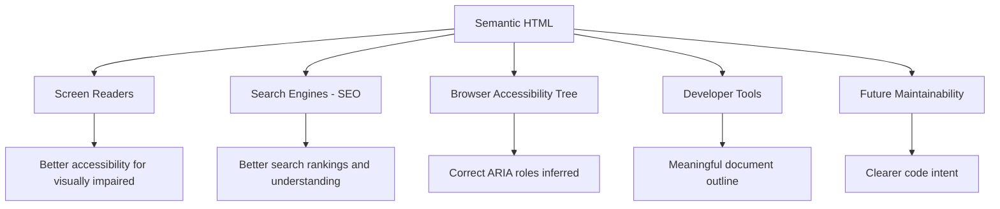
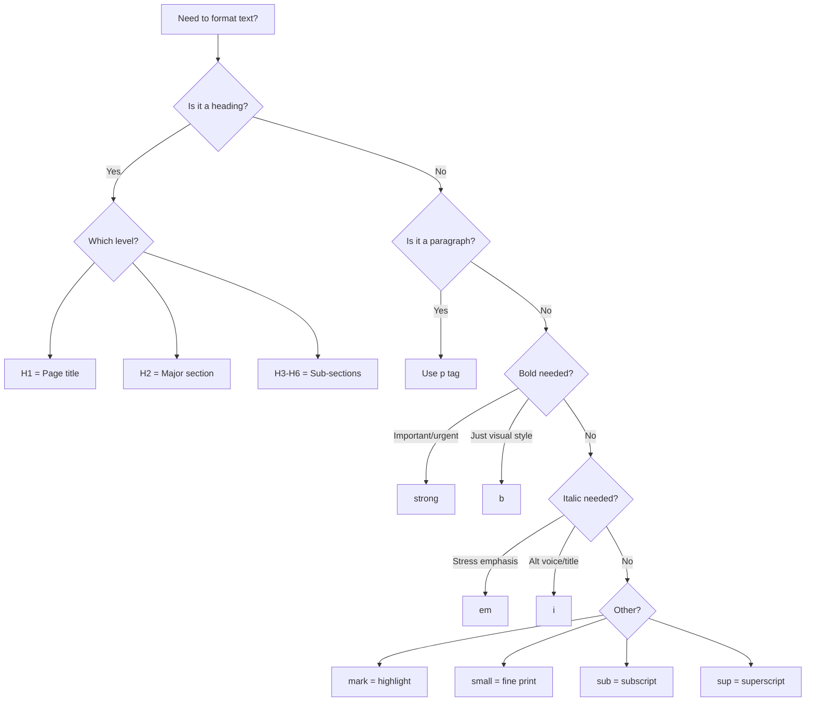
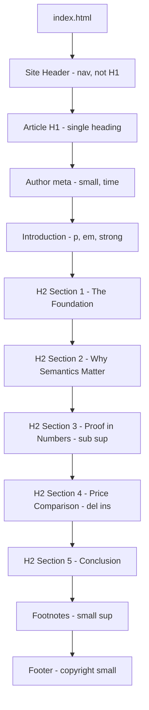

<a id="chapter-7-text-formatting-html"></a>

# Chapter 7: Text Formatting in HTML

[⬅ Previous Chapter](#chapter-6-block-inline-void-elements) | [📖 Main Index](#main-index) | [Next Chapter ➡](#chapter-8-semantic-text-elements)

---

## 📌 Learning Objectives

By the end of this chapter, you will be able to:

- Write all **six heading levels** correctly and understand their SEO and accessibility impact
- Write **paragraphs** with proper structure and understand browser whitespace handling
- Use `<br>` and `<hr>` correctly and know when **NOT** to use them
- Understand the **critical difference** between `<strong>` vs `<b>` and `<em>` vs `<i>`
- Use `<mark>`, `<small>`, `<sub>`, `<sup>` in the correct semantic contexts
- Understand **semantic vs presentational** HTML text elements completely
- Explain why semantic text elements matter for **SEO, accessibility, and screen readers**
- Know which elements are **block** and which are **inline**
- Apply all text formatting elements in **real-world content** scenarios
- Answer every **interview question** on HTML text formatting with confidence

---

<a id="chapter-index-table-7"></a>

## Chapter Index Table

| Topic No. | Topic Name | Subtopics |
|-----------|-----------|-----------|
| 7.1 | [HTML Headings](#71-html-headings) | h1 to h6<br>Heading hierarchy<br>SEO impact<br>Accessibility<br>Common mistakes |
| 7.2 | [HTML Paragraphs](#72-html-paragraphs) | p element<br>Whitespace handling<br>Browser defaults<br>Spacing with CSS |
| 7.3 | [Line Break and Horizontal Rule](#73-line-break-and-horizontal-rule) | br element<br>hr element<br>When to use<br>When NOT to use<br>Styling hr |
| 7.4 | [Bold and Strong](#74-bold-and-strong) | b element<br>strong element<br>Semantic difference<br>Screen readers<br>SEO impact |
| 7.5 | [Italic and Emphasis](#75-italic-and-emphasis) | i element<br>em element<br>Semantic difference<br>Use cases<br>Nested emphasis |
| 7.6 | [Mark — Highlighted Text](#76-mark-highlighted-text) | mark element<br>Default styling<br>Use cases<br>Search results<br>Custom styling |
| 7.7 | [Small Text](#77-small-text) | small element<br>Semantic meaning<br>Use cases<br>CSS alternative |
| 7.8 | [Subscript and Superscript](#78-subscript-and-superscript) | sub element<br>sup element<br>Chemical formulas<br>Math<br>Footnotes |
| 7.9 | [Semantic vs Presentational Elements](#79-semantic-vs-presentational-elements) | What is semantic HTML<br>Why it matters<br>Complete comparison table<br>Screen reader behavior |
| 7.10 | [Text Formatting — Complete Reference](#710-text-formatting-complete-reference) | All elements combined<br>Real content examples<br>Best practices |

---

## 7.1 HTML Headings

<a id="71-html-headings"></a>

---

### 🔷 What are HTML Headings?

HTML provides **six levels of headings** — `<h1>` through `<h6>` — that create a **document hierarchy**, similar to how a book has chapters, sections, and subsections.

Headings are:
- **Block elements** — each starts on a new line
- **Semantically meaningful** — they communicate document structure to browsers, search engines, and screen readers
- **Visually distinct** — browsers apply progressively smaller, bolder font sizes by default
- **Critical for SEO** — search engines use headings to understand page structure and content

---

### 🔷 All Six Heading Levels

```html
<h1>Heading Level 1 — Main Page Title</h1>
<h2>Heading Level 2 — Major Section</h2>
<h3>Heading Level 3 — Subsection</h3>
<h4>Heading Level 4 — Sub-subsection</h4>
<h5>Heading Level 5 — Minor Heading</h5>
<h6>Heading Level 6 — Smallest Heading</h6>
```

**Browser Default Visual Rendering:**

```text
# H1 — Largest, heaviest (32px bold by default)
## H2 — Large (24px bold)
### H3 — Medium-large (18.72px bold)
#### H4 — Medium (16px bold)
##### H5 — Small (13.28px bold)
###### H6 — Smallest (10.72px bold)
```

---

### 🔷 Heading Hierarchy — Document Outline

Headings create an **outline** of your document — like the table of contents of a book:

```html
<h1>Complete Guide to Web Development</h1>         ← Page title

    <h2>1. HTML Fundamentals</h2>                  ← Chapter

        <h3>1.1 Document Structure</h3>            ← Section
            <h4>1.1.1 DOCTYPE</h4>                 ← Subsection
            <h4>1.1.2 Head Element</h4>
            <h4>1.1.3 Body Element</h4>

        <h3>1.2 Text Formatting</h3>
            <h4>1.2.1 Headings</h4>
            <h4>1.2.2 Paragraphs</h4>

    <h2>2. CSS Fundamentals</h2>                   ← Chapter

        <h3>2.1 Selectors</h3>
        <h3>2.2 Box Model</h3>

    <h2>3. JavaScript Fundamentals</h2>            ← Chapter
```

This creates an outline:
- H1: Complete Guide to Web Development
  - H2: 1. HTML Fundamentals
    - H3: 1.1 Document Structure
      - H4: 1.1.1 DOCTYPE
      - H4: 1.1.2 Head Element

---

### 🔷 Heading Rules — Critical

| Rule | Correct | Incorrect |
|------|---------|-----------|
| **One H1 per page** | `<h1>Page Title</h1>` (once) | Multiple `<h1>` tags ❌ |
| **Don't skip levels** | H1 → H2 → H3 | H1 → H3 (skip H2) ❌ |
| **Use for structure, not size** | Use CSS for font size | `<h3>` just because it looks right ❌ |
| **H1 matches page topic** | H1 = Main subject | H1 = Company name on every page ❌ |
| **Hierarchy must be logical** | Parent section is higher level | H3 before H2 ❌ |

---

### 🔷 Headings and SEO

Search engines like Google use headings to:

1. **Understand page structure** — what is the main topic, what are subtopics
2. **Extract keywords** — words in headings carry more SEO weight
3. **Build featured snippets** — content under H2/H3 often becomes rich results
4. **Determine relevance** — H1 is the strongest signal of what the page is about

```html
<!-- ✅ SEO-optimized heading structure -->
<h1>Buy iPhone 15 Pro Online India — Best Price 2024</h1>
<h2>iPhone 15 Pro Specifications</h2>
    <h3>Camera System</h3>
    <h3>Performance and Chip</h3>
    <h3>Battery Life</h3>
<h2>iPhone 15 Pro Price in India</h2>
<h2>Where to Buy iPhone 15 Pro</h2>
```

---

### 🔷 Headings and Accessibility

Screen readers use headings to help visually impaired users **navigate** the page:

- **Heading navigation** — Screen reader users can jump between headings (like a page navigator)
- **Page outline** — Screen readers announce "Heading level 2: Specifications" etc.
- **Logical order** — Skipping levels confuses screen reader navigation

```text
Screen reader announces:
"Heading level 1: Complete Guide to Web Development"
User presses H key to jump to next heading:
"Heading level 2: HTML Fundamentals"
User presses H again:
"Heading level 3: Document Structure"
```

---

### 🔷 Default Heading Sizes — CSS Reset vs Browser Default

```css
/* Browser default styles (approximate) */
h1 { font-size: 2em;      font-weight: bold; margin: 0.67em 0; }
h2 { font-size: 1.5em;    font-weight: bold; margin: 0.83em 0; }
h3 { font-size: 1.17em;   font-weight: bold; margin: 1em 0;    }
h4 { font-size: 1em;      font-weight: bold; margin: 1.33em 0; }
h5 { font-size: 0.83em;   font-weight: bold; margin: 1.67em 0; }
h6 { font-size: 0.67em;   font-weight: bold; margin: 2.33em 0; }

/* Override with your own CSS */
h1 { font-size: 3rem; color: #0f172a; line-height: 1.2; }
h2 { font-size: 2rem; color: #1e293b; line-height: 1.3; }
h3 { font-size: 1.5rem; color: #334155; }
```

---

### 🔷 Common Heading Mistakes

```html
<!-- ❌ MISTAKE 1: Using headings for font size, not structure -->
<h4>Welcome to our website</h4>  ← H4 just because it looks like the right size
<!-- Fix: Use h1 for the main title, use CSS for the size you want -->

<!-- ❌ MISTAKE 2: Multiple H1 tags -->
<h1>Company Name</h1>
<h1>Page Topic</h1>   ← Two H1s — one page, one H1
<!-- Fix: H1 = page topic, H2 = secondary headings -->

<!-- ❌ MISTAKE 3: Skipping heading levels -->
<h1>Page Title</h1>
<h3>Section One</h3>  ← Jumped from H1 to H3, skipped H2
<!-- Fix: H1 → H2 → H3 in order -->

<!-- ❌ MISTAKE 4: Empty headings for spacing -->
<h2>&nbsp;</h2>       ← Empty heading for visual space
<!-- Fix: Use CSS margin/padding for spacing -->

<!-- ✅ CORRECT STRUCTURE -->
<h1>Page Title — The One True H1</h1>
<h2>First Major Section</h2>
    <h3>Subsection A</h3>
    <h3>Subsection B</h3>
<h2>Second Major Section</h2>
    <h3>Subsection C</h3>
```

---

### 🧠 Hinglish Intuition

> Headings ek **newspaper** ki tarah hain.
>
> Newspaper mein:
> - **Main headline (H1)** = "India Wins World Cup!" — sabse badi, ek hi hoti hai
> - **Section heading (H2)** = "Sports", "Politics", "Business"
> - **Article heading (H3)** = Article ke andar sub-topic
> - **Small captions (H4-H6)** = Photo captions, sidebar notes
>
> Agar tum newspaper mein pehle sports article ka headline likhte ho, phir World Cup headline — confusing hai!
>
> Order important hai: Bada → Chhota → Aur chhota — kabhi ulta nahi.
>
> **H1 ek per page** — jaise ek newspaper ki ek hi main headline hoti hai!

---

> [!IMPORTANT]
> **Interview Critical:** Every page should have **exactly ONE `<h1>`** tag that describes the page's main topic. This is both an SEO best practice and an accessibility requirement. Multiple H1s confuse search engines about what the page is about.

---

👉 <a href="#chapter-index-table-7">Go to Top 🔝</a>

---

## 7.2 HTML Paragraphs

<a id="72-html-paragraphs"></a>

---

### 🔷 What is the Paragraph Element?

The `<p>` element represents a **block of text** — a paragraph. It is:

- A **block element** — starts on a new line, takes full width
- **Semantically meaningful** — marks text as a paragraph (not just generic text)
- Automatically adds **vertical space** before and after (browser default margins)
- The **most common** block-level text element

---

### 🔷 Syntax

```html
<p>This is a paragraph of text. Paragraphs can contain
multiple sentences and will flow naturally across lines
based on the available viewport width.</p>

<p>Each paragraph element creates its own distinct block
with spacing above and below, separating it visually
from surrounding content.</p>
```

**Visual Output:**
```text
This is a paragraph of text. Paragraphs can contain
multiple sentences and will flow naturally across lines
based on the available viewport width.

Each paragraph element creates its own distinct block
with spacing above and below, separating it visually
from surrounding content.
```

---

### 🔷 Paragraph Whitespace Behavior

HTML **collapses whitespace** inside paragraphs — multiple spaces, tabs, and newlines all become a single space:

```html
<p>This   has   multiple   spaces   between   words.</p>
<!-- Renders as: This has multiple spaces between words. -->

<p>This has
a line break
inside the tag.</p>
<!-- Renders as: This has a line break inside the tag. -->

<p>This    has
    tabs      and
   newlines.</p>
<!-- Renders as: This has tabs and newlines. -->
```

All three render identically — whitespace is collapsed to a single space.

---

### 🔷 Paragraph vs div for Text

```html
<!-- ✅ Use <p> for actual paragraph text -->
<p>
    This is a genuine paragraph of text. It is a complete
    thought with multiple sentences. Using <p> is semantically
    correct for paragraphs.
</p>

<!-- ⚠️ Don't use <div> when <p> is correct -->
<div>
    This is text inside a div — technically works but
    loses paragraph semantics. No semantic meaning.
</div>

<!-- Rule: If it's a paragraph of text → use <p>
           If it's a generic container → use <div> -->
```

---

### 🔷 Paragraph Nesting Rules

```html
<!-- ❌ WRONG: Paragraphs cannot be nested -->
<p>
    Outer paragraph
    <p>Inner paragraph — INVALID! Browsers auto-close outer p</p>
</p>
<!-- Browser renders this as TWO separate paragraphs -->

<!-- ❌ WRONG: Block elements cannot go inside p -->
<p>
    Text <div>block inside p</div> more text  ← INVALID
</p>

<!-- ✅ CORRECT: p contains only inline elements -->
<p>
    Text with <strong>bold</strong>, <em>italic</em>,
    <a href="#">links</a>, and <span>spans</span>.
</p>
```

---

### 🔷 Browser Default Paragraph Styling

```css
/* Browser default styles for <p> */
p {
    display: block;
    margin-top: 1em;      /* Space above */
    margin-bottom: 1em;   /* Space below */
    /* Width: auto (full parent width) */
    /* Height: content-determined */
}
```

---

### 🔷 Customizing Paragraphs with CSS

```css
/* Professional paragraph styling */
p {
    font-size: 1rem;         /* 16px */
    line-height: 1.7;        /* Comfortable reading */
    color: #374151;          /* Readable dark grey */
    margin-bottom: 1.25rem;  /* Space between paragraphs */
    max-width: 65ch;         /* Optimal reading width */
}

/* Article/blog paragraph style */
.article p {
    font-size: 1.1rem;
    line-height: 1.8;
    font-family: 'Georgia', serif;
    text-align: justify;
}

/* Lead/intro paragraph */
p.lead {
    font-size: 1.25rem;
    font-weight: 400;
    color: #1e293b;
    line-height: 1.6;
}
```

---

### 🧠 Hinglish Intuition

> `<p>` tag ek **notebook ki line** ki tarah hai.
>
> - Har paragraph alag line se start hota hai (block element)
> - Browser automatically space deta hai paragraphs ke beech
> - Andar sirf inline content ho sakta hai — doosra paragraph nahi
>
> Whitespace collapse:
> - HTML mein kitne bhi spaces/enters daalo — browser ek space dikhayega
> - Jaise WhatsApp mein message bhejte waqt extra spaces compress ho jaate hain
>
> **`<p>` = Ek complete thought/paragraph — semantic, clean, proper!**

---

👉 <a href="#chapter-index-table-7">Go to Top 🔝</a>

---

## 7.3 Line Break and Horizontal Rule

<a id="73-line-break-and-horizontal-rule"></a>

---

### 🔷 The `<br>` Element — Line Break

`<br>` is a **void element** that forces a **line break** within flowing text, without starting a new paragraph.

```html
<!-- Syntax: self-closing, no content -->
<br>
```

---

### 🔷 When to Use `<br>`

```html
<!-- ✅ CORRECT USE 1: Postal address -->
<address>
    Rahul Sharma<br>
    42, Marine Drive<br>
    Mumbai, Maharashtra<br>
    India — 400001
</address>

<!-- ✅ CORRECT USE 2: Poetry / verse where line breaks are meaningful -->
<p>
    Roses are red,<br>
    Violets are blue,<br>
    HTML is semantic,<br>
    And so should you!
</p>

<!-- ✅ CORRECT USE 3: Line break within a label -->
<label for="address">
    Delivery Address<br>
    <small>(Include flat number and street)</small>
</label>
```

---

### 🔷 When NOT to Use `<br>`

```html
<!-- ❌ WRONG: Using br for paragraph spacing -->
<p>First paragraph text here.</p>
<br>
<br>
<br>
<p>Second paragraph text here.</p>
<!-- Use CSS margin instead: p { margin-bottom: 2rem; } -->

<!-- ❌ WRONG: Using br to create layout gaps -->
<h2>Section Title</h2>
<br>
<br>
<p>Section content</p>
<!-- Use CSS padding/margin on elements instead -->

<!-- ❌ WRONG: Using br inside div for spacing -->
<div>
    Content block<br><br><br>More content
</div>
<!-- Use CSS margin/padding on the elements -->
```

> [!IMPORTANT]
> **Rule:** Use `<br>` only when the **line break itself is part of the content** (like an address or poem). For visual spacing between elements, always use **CSS margin and padding**. Abusing `<br>` for layout is a common beginner mistake that screams "I don't know CSS."

---

### 🔷 The `<hr>` Element — Horizontal Rule

`<hr>` is a **void block element** that represents a **thematic break** in content — a visual separator indicating a shift in topic or section.

```html
<!-- Syntax: self-closing, no content -->
<hr>
```

---

### 🔷 `<hr>` — Semantic Meaning

The `<hr>` element is **not just a visual line** — it has semantic meaning:

> "The topic or context has changed here."

```html
<!-- ✅ CORRECT: Thematic break between sections -->
<section>
    <h2>About Our Company</h2>
    <p>We are a leading web development agency...</p>
</section>

<hr>  ← Signals: new topic begins

<section>
    <h2>Our Services</h2>
    <p>We offer the following services...</p>
</section>

<!-- ✅ CORRECT: Break within an article -->
<article>
    <p>Introduction to the topic...</p>
    <p>More introduction content...</p>

    <hr>  ← Topic shift within article

    <p>Now discussing a related but different aspect...</p>
</article>
```

---

### 🔷 Styling `<hr>` with CSS

```css
/* Default browser hr is a plain grey line */

/* Custom styled separators */
hr {
    border: none;
    border-top: 2px solid #e2e8f0;
    margin: 40px 0;
}

/* Centered decorative hr */
hr.decorative {
    border: none;
    border-top: 3px solid #3b82f6;
    width: 80px;
    margin: 30px auto;
}

/* Gradient hr */
hr.gradient {
    border: none;
    height: 2px;
    background: linear-gradient(to right, transparent, #3b82f6, transparent);
    margin: 30px 0;
}

/* Dashed hr */
hr.dashed {
    border: none;
    border-top: 2px dashed #94a3b8;
    margin: 30px 0;
}
```

---

### 🔷 `<br>` vs `<hr>` — When to Use Which

| Element | Type | Semantic Meaning | Use Case |
|---------|------|-----------------|---------|
| `<br>` | Void, inline effect | "Start next line here" | Addresses, poetry, labels |
| `<hr>` | Void, block | "New topic begins here" | Section separators in content |
| `margin/padding` | CSS | No semantic meaning | Visual spacing between elements |
| `<section>` boundary | HTML5 | Document section | Structural content separation |

---

### 🧠 Hinglish Intuition

> `<br>` aur `<hr>` ko ek **notepad** se samajhte hain:
>
> - **`<br>`** = Enter key dabana ek baar — naya line shuru hoti hai wahi paragraph mein
>   Jaise address likhte waqt: Flat 42,\[Enter\] Marine Drive,\[Enter\] Mumbai
>
> - **`<hr>`** = Notepad mein ek line kheeechna — "yahan topic badal raha hai"
>   Jaise ek letter mein pehle formal part, line, phir informal part
>
> - **CSS margin** = White space — sirf visual gap, koi semantic meaning nahi
>
> **Rule yaad rakho:**
> - Text mein line todna hai → `<br>`
> - Topic badal raha hai → `<hr>`
> - Sirf space chahiye → CSS margin/padding

---

👉 <a href="#chapter-index-table-7">Go to Top 🔝</a>

---

## 7.4 Bold and Strong

<a id="74-bold-and-strong"></a>

---

### 🔷 The Critical Distinction

This is one of the **most important and most asked** HTML interview questions:

**`<b>` and `<strong>` both make text bold visually — but they have completely different semantic meanings.**

---

### 🔷 `<b>` — Bold (Presentational)

```html
<b>This text is bold</b>
```

- **Purpose:** Makes text **visually bold** with no additional semantic meaning
- **Screen readers:** Read it in the **same tone** as surrounding text — no emphasis
- **Use cases:** Keywords in a review, product names in a catalog, stylistically different text that is not critically important
- **Historical:** Originally purely presentational — "make this bold"
- **HTML5 meaning:** "Text that is stylistically offset from normal prose without conveying extra importance"

---

### 🔷 `<strong>` — Strong Importance (Semantic)

```html
<strong>This text is strongly important</strong>
```

- **Purpose:** Marks text as having **strong importance, seriousness, or urgency**
- **Screen readers:** May **change tone** or **stress the text** when reading aloud
- **Use cases:** Warnings, critical information, key terms that are genuinely important
- **HTML5 meaning:** "Content with strong importance, seriousness, or urgency"
- **Nesting:** `<strong>` inside `<strong>` increases importance level

---

### 🔷 `<b>` vs `<strong>` — Side-by-Side

```html
<!-- <b>: Stylistically different — no extra importance -->
<p>
    The recipe requires <b>200g of flour</b>, <b>3 eggs</b>,
    and <b>100ml of milk</b>.
</p>
<!-- "200g of flour" is bold to stand out visually from prose
     but it is not critically important information -->

<!-- <strong>: Genuinely important/urgent information -->
<p>
    <strong>Warning: Do not exceed the recommended dosage.</strong>
    Taking more than 2 tablets per day can cause serious side effects.
</p>
<!-- The warning is GENUINELY important — strong semantic weight -->

<!-- <strong>: Key term introduction -->
<p>
    The <strong>Document Object Model (DOM)</strong> is the browser's
    in-memory representation of an HTML document.
</p>
<!-- DOM is a key term being formally introduced — strong importance -->

<!-- <strong> nested: increasing importance -->
<p>
    <strong>Important: <strong>Never share your password</strong>
    with anyone, including support staff.</strong>
</p>
```

---

### 🔷 Screen Reader Behavior

```text
Without strong:
"The warning do not exceed the recommended dosage"
(monotone — no emphasis)

With <strong>:
"WARNING: Do not exceed the recommended dosage"
(screen reader may stress or change intonation)

With <b>:
"The recipe requires 200g of flour 3 eggs and 100ml of milk"
(no change in reading — just visually bold for sighted users)
```

---

### 🔷 SEO Impact

Search engines give **slightly more weight** to content in `<strong>` tags — it signals that the content is particularly important for understanding the page.

```html
<!-- Google understands this term is important -->
<p>
    This guide teaches you <strong>responsive web design</strong>,
    including flexbox, grid, and media queries.
</p>
```

---

### 🔷 When to Use Each

| Situation | Use `<b>` | Use `<strong>` |
|-----------|---------|--------------|
| Product names in a list | ✅ | |
| Warning messages | | ✅ |
| Key terms being defined | | ✅ |
| Bold in a recipe ingredient list | ✅ | |
| Critical safety information | | ✅ |
| Stylistically offset text | ✅ | |
| Important deadlines | | ✅ |
| Decorative bold in UI | ✅ | |

---

### 🧠 Hinglish Intuition

> `<b>` aur `<strong>` dono bold dikhate hain — lekin unki "spirit" alag hai.
>
> **`<b>` = Visual styling** — sirf aankhon ke liye
> Jaise koi cheez bold mein likhte ho sirf is liye ki woh different dikhay — koi special meaning nahi.
> Example: Recipe mein ingredients bold hain — sirf differentiate karne ke liye.
>
> **`<strong>` = Genuine importance** — meaning ke liye
> Jaise warning sign pe "DANGER" likha hota hai — genuinely important hai!
> Screen reader bhi differently padhega — tone change karke.
>
> **Interview trick:** Poochho apne aap se:
> - "Kya yeh information genuinely important/urgent hai?" → `<strong>`
> - "Kya sirf visually different dikhana hai?" → `<b>`

---

> [!IMPORTANT]
> **Interview Answer:** The visual output of `<b>` and `<strong>` is identical — both make text bold. The difference is **semantic**: `<strong>` conveys strong importance that screen readers respond to and search engines weight more heavily. `<b>` is purely stylistic with no semantic meaning. Always prefer `<strong>` when the content is genuinely important.

---

👉 <a href="#chapter-index-table-7">Go to Top 🔝</a>

---

## 7.5 Italic and Emphasis

<a id="75-italic-and-emphasis"></a>

---

### 🔷 The Same Pattern as Bold/Strong

Just like `<b>` vs `<strong>`, the `<i>` and `<em>` elements both render text in italic — but with different semantic meanings.

---

### 🔷 `<i>` — Italic (Presentational / Alternative Voice)

```html
<i>This text is italic</i>
```

- **Purpose:** Text that is **stylistically different** from normal prose — technical terms, foreign words, thoughts, or titles
- **Screen readers:** No special emphasis — read same as surrounding text
- **HTML5 meaning:** "Text in an alternate voice or mood, technical terms, foreign phrases, fictional character thoughts, or ship/publication names"

---

### 🔷 `<em>` — Emphasis (Semantic)

```html
<em>This text is emphasized</em>
```

- **Purpose:** Marks text with **stress emphasis** — changing the meaning of a sentence
- **Screen readers:** **Emphasize/stress** the word when reading aloud
- **HTML5 meaning:** "Stress emphasis — the position of emphasis changes sentence meaning"

---

### 🔷 How `<em>` Changes Meaning

This is the most powerful demonstration of `<em>` vs `<i>`:

```html
<!-- Stress on different words changes meaning completely -->

<p>I didn't say <em>she</em> stole the money.</p>
<!-- Meaning: Someone else said she stole it (not me) -->

<p>I didn't say she <em>stole</em> the money.</p>
<!-- Meaning: She got it some other way (borrowed, found) -->

<p>I didn't say she stole <em>the money</em>.</p>
<!-- Meaning: She stole something else -->

<p>I <em>didn't</em> say she stole the money.</p>
<!-- Meaning: Strong denial that I said it at all -->
```

Each sentence has different meaning because of where `<em>` is placed. A screen reader would change vocal stress accordingly.

---

### 🔷 `<i>` Use Cases (Not Emphasis)

```html
<!-- ✅ Foreign language term -->
<p>The chef served a beautiful <i>coq au vin</i> for dinner.</p>

<!-- ✅ Technical term introduced without definition -->
<p>The process uses <i>photosynthesis</i> to convert light to energy.</p>

<!-- ✅ Fictional character's internal thought -->
<p>
    She walked into the room and thought,
    <i>This is exactly what I was afraid of.</i>
</p>

<!-- ✅ Ship, aircraft, publication name (typographic convention) -->
<p>The <i>Titanic</i> sank in 1912.</p>
<p>I read it in <i>The Times of India</i> this morning.</p>

<!-- ✅ Icon font usage (Font Awesome convention) -->
<i class="fa fa-heart"></i>  ← Icon font — no textual content
```

---

### 🔷 `<em>` Use Cases (Stress Emphasis)

```html
<!-- ✅ Stress that changes sentence meaning -->
<p>You <em>must</em> complete the verification before proceeding.</p>

<!-- ✅ Contrast emphasis -->
<p>
    We don't just build websites — we build
    <em>experiences</em> that users remember.
</p>

<!-- ✅ Highlighting the key word in an instruction -->
<p>Click the <em>Save</em> button, not the Cancel button.</p>

<!-- ✅ Nested em — increasing emphasis -->
<p>
    This is <em>very <em>very</em> important</em> information.
</p>
```

---

### 🔷 `<b>` vs `<strong>` vs `<i>` vs `<em>` — Complete Comparison

| Element | Visual | Semantic | Screen Reader | HTML5 Meaning |
|---------|--------|---------|--------------|---------------|
| `<b>` | **Bold** | None | Normal tone | Stylistic offset, no importance |
| `<strong>` | **Bold** | Strong importance | Stressed/urgent | Important, serious, urgent |
| `<i>` | *Italic* | Alternative voice | Normal tone | Foreign, technical, title, thought |
| `<em>` | *Italic* | Stress emphasis | Emphasized | Sentence stress that changes meaning |

---

### 🧠 Hinglish Intuition

> `<i>` vs `<em>` ki tarah socho ek actor ke dialogue delivery ke baare mein:
>
> **`<i>`** = Script mein *italic* mein likha term — different font style, lekin
> actor normal tone mein padha
> "The chef served a beautiful *coq au vin*"
> → French word hai, differently styled — but koi special stress nahi
>
> **`<em>`** = Script mein director ne RED pen se underline kiya
> "You MUST complete the verification"
> → Actor woh word stress ke saath bolega — tone change hoga
>
> Screen readers bhi exactly aise hi handle karte hain!
>
> **`<em>` = Stress the word. `<i>` = Different style, no stress.**

---

👉 <a href="#chapter-index-table-7">Go to Top 🔝</a>

---

## 7.6 Mark — Highlighted Text

<a id="76-mark-highlighted-text"></a>

---

### 🔷 What is `<mark>`?

The `<mark>` element represents text that has been **highlighted for reference or notation** — like using a yellow highlighter pen on printed text.

```html
<mark>This text is highlighted</mark>
```

**Browser default:** Yellow background color (`background-color: mark` or `yellow`)

---

### 🔷 HTML5 Semantic Meaning of `<mark>`

`<mark>` means: **"This text is relevant in a specific context"** — not generally important, but relevant to the current use:

- **Search results** — Highlighting the search query within results
- **Quoting** — Highlighting the relevant part of a quote
- **Annotation** — Marking text for discussion or review
- **Tutorial** — Highlighting a specific part of code or text being discussed

---

### 🔷 `<mark>` Use Cases

```html
<!-- ✅ USE CASE 1: Search result highlighting -->
<p>
    Results for "web development":
    <br>
    Learn <mark>web development</mark> from scratch with
    this complete guide. Master HTML, CSS and JavaScript
    for <mark>web development</mark> careers.
</p>

<!-- ✅ USE CASE 2: Highlighting quoted text -->
<p>The report stated:</p>
<blockquote>
    The project timeline was affected by multiple factors.
    The most significant was <mark>the delay in API integration</mark>,
    which caused a 3-week setback.
</blockquote>
<p>The highlighted section is the key finding.</p>

<!-- ✅ USE CASE 3: Tutorial — highlighting what to focus on -->
<p>In the following code, notice the <mark>return statement</mark>:</p>
<pre><code>function add(a, b) {
    const sum = a + b;
    <mark>return sum;</mark>
}
</code></pre>

<!-- ✅ USE CASE 4: Annotation / review marking -->
<p>
    The team should focus on
    <mark>improving the mobile user experience</mark>
    in the next sprint.
</p>
```

---

### 🔷 `<mark>` vs Other Highlighting Elements

| Element | Visual | Meaning | Use Case |
|---------|--------|---------|---------|
| `<mark>` | Yellow highlight | Contextually relevant | Search terms, annotations |
| `<strong>` | **Bold** | Important | Warnings, key terms |
| `<em>` | *Italic* | Stress emphasis | Sentence stress |
| `<span class="highlight">` | Custom CSS | None (presentational) | Pure visual highlight |

---

### 🔷 Styling `<mark>` with CSS

```css
/* Default browser style */
mark {
    background-color: yellow; /* or 'mark' keyword */
    color: black;
}

/* Custom professional highlight */
mark {
    background-color: #fef9c3;
    color: #92400e;
    padding: 1px 4px;
    border-radius: 3px;
}

/* Blue highlight (for search results) */
mark.search-result {
    background-color: #dbeafe;
    color: #1e40af;
    font-weight: 600;
}

/* Green highlight (for correct answers) */
mark.correct {
    background-color: #d1fae5;
    color: #065f46;
}
```

---

### 🧠 Hinglish Intuition

> `<mark>` bilkul ek **yellow highlighter pen** ki tarah hai jo tum textbook mein use karte ho.
>
> Jab tum padh rahe ho aur ek important part aata hai:
> - Tum highlighter utha lo
> - Woh sentence yellow kar do
> - Later review karne ke liye
>
> Waise hi `<mark>`:
> - Search results mein query word highlight karta hai
> - "Yeh specifically relevant hai is context mein"
>
> **`<mark>` vs `<strong>` difference:**
> - `<strong>` = "Yeh genuinely important hai" (hamesha ke liye)
> - `<mark>` = "Yeh is specific context mein relevant hai" (situational)
>
> Google search karo "HTML tutorial" → results mein "HTML tutorial" highlight hoga → that's `<mark>` in action!

---

👉 <a href="#chapter-index-table-7">Go to Top 🔝</a>

---

## 7.7 Small Text

<a id="77-small-text"></a>

---

### 🔷 What is `<small>`?

The `<small>` element represents **side comments, fine print, and small print** — legal disclaimers, copyright notices, terms of service references, and other content that is secondary in importance.

```html
<small>This text appears smaller than surrounding text</small>
```

**Browser default:** Renders text at a smaller font size (typically 0.8em or 80% of parent)

---

### 🔷 HTML5 Semantic Meaning of `<small>`

`<small>` represents **"fine print"** — side comments and small print, including disclaimers, caveats, legal restrictions, and copyright notices.

```html
<!-- ✅ USE CASE 1: Legal disclaimer / fine print -->
<p>
    Special offer: Get 50% off on your first order!
    <small>* Offer valid until December 31, 2024. Terms and conditions apply.</small>
</p>

<!-- ✅ USE CASE 2: Copyright notice in footer -->
<footer>
    <p>
        <small>&copy; 2024 WebDev Academy. All rights reserved.</small>
    </p>
</footer>

<!-- ✅ USE CASE 3: Attribution / credit -->
<figure>
    
    <figcaption>
        Mountain sunrise at Manali
        <small>Photo by: Rahul Sharma | License: CC BY 4.0</small>
    </figcaption>
</figure>

<!-- ✅ USE CASE 4: Price disclaimer -->
<p>
    Starting from <strong>₹999</strong> per month
    <small>(Prices exclude GST. Billed annually.)</small>
</p>

<!-- ✅ USE CASE 5: Version number or metadata -->
<p>
    Download VS Code
    <small>Version 1.85.0 | Windows 10/11 | 64-bit | 93 MB</small>
</p>
```

---

### 🔷 `<small>` vs CSS font-size

```html
<!-- Semantic: Use <small> for fine print, side comments -->
<p>
    Limited time offer!
    <small>* Subject to availability.</small>
</p>

<!-- Presentational: Use CSS for visual size adjustments -->
<p class="caption" style="font-size: 0.85rem;">
    Technical specifications may vary.
</p>
```

**When to use `<small>`:**
- Legal disclaimers
- Copyright notices
- Fine print
- Side comments / caveats

**When to use CSS `font-size` instead:**
- Just making text visually smaller for design reasons
- Captions (better to use `<figcaption>`)
- Metadata that isn't "fine print"

---

### 🧠 Hinglish Intuition

> `<small>` woh **asterisk (*) fine print** hai jo advertisement ke neeche chota sa likha hota hai.
>
> Jaise TV ad mein:
> - **Badi font:** "FREE iPhone 15 with every recharge!"
> - **Choti font (small):** "*Terms and conditions apply. Offer valid for new subscribers only."
>
> Yahi `<small>` ka kaam hai — secondary, fine print, disclaimer content.
>
> Sirf visually chhota karna ho → CSS `font-size: 0.8rem` use karo
> Genuinely "fine print" hai → `<small>` use karo
>
> **`<small>` = Asterisk waali fine print — legally and semantically "secondary" information!**

---

👉 <a href="#chapter-index-table-7">Go to Top 🔝</a>

---

## 7.8 Subscript and Superscript

<a id="78-subscript-and-superscript"></a>

---

### 🔷 `<sub>` — Subscript

`<sub>` renders text **below the normal text baseline** at a smaller size.

```html
<sub>subscript text</sub>
```

**Use cases:** Chemical formulas, footnote markers (alternative), mathematical expressions with subscripts

---

### 🔷 `<sup>` — Superscript

`<sup>` renders text **above the normal text baseline** at a smaller size.

```html
<sup>superscript text</sup>
```

**Use cases:** Mathematical exponents/powers, footnote references, ordinal indicators, trademark/copyright symbols

---

### 🔷 `<sub>` Examples — Chemical Formulas

```html
<!-- Chemical formulas — subscript for atomic counts -->
<p>Water: H<sub>2</sub>O</p>
<p>Carbon dioxide: CO<sub>2</sub></p>
<p>Sulfuric acid: H<sub>2</sub>SO<sub>4</sub></p>
<p>Glucose: C<sub>6</sub>H<sub>12</sub>O<sub>6</sub></p>
<p>Ammonia: NH<sub>3</sub></p>
<p>Methane: CH<sub>4</sub></p>
<p>Hydrochloric acid: HCl → H<sup>+</sup> + Cl<sup>-</sup></p>

<!-- Mathematical subscripts -->
<p>The value x<sub>1</sub> and x<sub>2</sub> are the roots</p>
<p>The matrix element a<sub>ij</sub> represents row i, column j</p>
```

---

### 🔷 `<sup>` Examples — Powers, Footnotes, Ordinals

```html
<!-- Mathematical powers/exponents -->
<p>Einstein's equation: E = mc<sup>2</sup></p>
<p>Area of a circle: A = πr<sup>2</sup></p>
<p>Volume of a cube: V = s<sup>3</sup></p>
<p>2<sup>10</sup> = 1024 (2 to the power of 10)</p>
<p>Pythagorean theorem: a<sup>2</sup> + b<sup>2</sup> = c<sup>2</sup></p>

<!-- Footnote references -->
<p>
    The study found significant results<sup><a href="#footnote1">1</a></sup>
    across all test groups<sup><a href="#footnote2">2</a></sup>.
</p>

<ol id="footnotes">
    <li id="footnote1">Smith et al., 2023, Journal of Web Science</li>
    <li id="footnote2">See Appendix B for detailed methodology</li>
</ol>

<!-- Ordinal indicators -->
<p>He finished in 1<sup>st</sup> place.</p>
<p>She won the 2<sup>nd</sup> prize.</p>
<p>The 3<sup>rd</sup> of March was the deadline.</p>
<p>On the 21<sup>st</sup> of January, the event started.</p>

<!-- Trademark/registered symbols (alternative to entities) -->
<p>iPhone<sup>®</sup> is a registered trademark of Apple Inc.</p>
<p>WebDev Academy<sup>™</sup> — Mastering the Web</p>
<!-- Note: &reg; and &trade; entities are preferred for these -->
```

---

### 🔷 Combined sub and sup Example

```html
<!-- Complex scientific/mathematical expressions -->
<p>
    The quadratic formula: x = (-b ± √(b<sup>2</sup> - 4ac)) / 2a
</p>

<p>
    Radioactive decay: N(t) = N<sub>0</sub>e<sup>-λt</sup>
</p>

<p>
    Logarithm: log<sub>2</sub>(8) = 3
    (log base 2 of 8 equals 3)
</p>

<!-- Ion notation in chemistry -->
<p>
    Common ions:
    Na<sup>+</sup> (sodium),
    Ca<sup>2+</sup> (calcium),
    Cl<sup>-</sup> (chloride),
    SO<sub>4</sub><sup>2-</sup> (sulfate)
</p>
```

---

### 🔷 Default CSS for sub and sup

```css
/* Browser default styles */
sub {
    vertical-align: sub;
    font-size: smaller; /* typically 75-80% of parent */
}

sup {
    vertical-align: super;
    font-size: smaller;
}

/* Custom styling if needed */
sub, sup {
    font-size: 0.75em;
    line-height: 0; /* Prevents line height disruption */
    position: relative;
}

sup { top: -0.5em; }
sub { bottom: -0.25em; }
```

---

### 🧠 Hinglish Intuition

> `<sub>` aur `<sup>` chemistry aur math ke liye hain — bilkul waise likhne ke liye jaise textbook mein hota hai.
>
> **`<sub>`** = Subscript = Neeche chhota — H₂O mein "2" neeche hai
> Chemistry: "Kitne atoms hain" → subscript
>
> **`<sup>`** = Superscript = Upar chhota — mc² mein "2" upar hai
> Math: "Power/exponent hai" → superscript
> Footnote: "¹" reference → superscript
> Ordinal: "1st, 2nd, 3rd" → superscript
>
> **Memory trick:**
> - sub = submarine = neeche paani mein = subscript neeche
> - sup = superman = upar uda = superscript upar

---

👉 <a href="#chapter-index-table-7">Go to Top 🔝</a>

---

## 7.9 Semantic vs Presentational Elements

<a id="79-semantic-vs-presentational-elements"></a>

---

### 🔷 What is Semantic HTML?

**Semantic HTML** means using HTML elements that convey **meaning about the content**, not just its visual appearance.

- **Semantic element:** The tag name communicates what the content IS
- **Presentational element:** The tag name only communicates how it LOOKS

---

### 🔷 The Core Distinction

```html
<!-- Presentational — only describes appearance -->
<b>Important Notice</b>
<!-- Says: "Make this bold" — nothing about why -->

<!-- Semantic — describes meaning -->
<strong>Important Notice</strong>
<!-- Says: "This content has strong importance" -->
<!-- Happens to render bold, but the MEANING is communicated -->
```

---

### 🔷 Why Semantic HTML Matters



---

### 🔷 Complete Semantic vs Presentational Comparison

| Presentational | Semantic | Visual | Semantic Meaning |
|---------------|---------|--------|-----------------|
| `<b>` | `<strong>` | **Bold** | Strong importance |
| `<i>` | `<em>` | *Italic* | Stress emphasis |
| `<u>` | `<ins>` | Underline | Inserted/added content |
| `<s>` | `<del>` | ~~Strikethrough~~ | Deleted/removed content |
| `<font>` (deprecated) | CSS `color`, `font-family` | Color/font | N/A — use CSS |
| `<center>` (deprecated) | CSS `text-align: center` | Centered | N/A — use CSS |
| `<br><br><br>` for spacing | CSS `margin` | Space | N/A — use CSS |
| `<div class="small">` | `<small>` | Smaller text | Fine print |
| `<span class="mark">` | `<mark>` | Highlight | Contextually relevant |

---

### 🔷 Deprecated Presentational Elements

These elements existed in old HTML and are now **deprecated** — do NOT use them:

```html
<!-- ❌ DEPRECATED — Do not use in modern HTML -->
<font color="red" size="5" face="Arial">Red text</font>
<center>Centered content</center>
<big>Bigger text</big>
<tt>Typewriter text</tt>
<strike>Strikethrough</strike>  <!-- use <s> or <del> instead -->
<blink>Blinking text</blink>
<marquee>Scrolling text</marquee>

<!-- ✅ Modern replacements -->
<span style="color: red; font-size: 1.25rem; font-family: Arial;">Red text</span>
<div style="text-align: center;">Centered content</div>
<span style="font-size: 1.25em;">Bigger text</span>
<code>Typewriter/code text</code>
<s>Strikethrough</s>
<del>Deleted content</del>
```

---

### 🔷 How Screen Readers Handle Semantic Elements

```text
HTML: <p>Please <strong>do not</strong> click cancel.</p>

Screen reader output (approximate):
"Please [pause/stress] DO NOT [resume] click cancel."

HTML: <p>Please <b>do not</b> click cancel.</p>

Screen reader output:
"Please do not click cancel."
(Same tone, no stress on "do not" — dangerous!)
```

This real difference shows why `<strong>` vs `<b>` matters in practice.

---

### 🔷 `<ins>` and `<del>` — Semantic Underline and Strikethrough

```html
<!-- <ins> = Inserted/added content (underline) -->
<!-- <del> = Deleted/removed content (strikethrough) -->

<!-- Document revision tracking -->
<p>
    The meeting is on
    <del datetime="2024-01-10">Monday</del>
    <ins datetime="2024-01-11">Tuesday</ins>
    at 3 PM.
</p>

<!-- Price change showing old vs new price -->
<p>
    Original price: <del>₹2,999</del>
    Sale price: <ins>₹1,999</ins>
</p>

<!-- Contract revision -->
<p>
    Payment terms: <del>Net 30</del> <ins>Net 15</ins> days
</p>
```

---

### 🔷 Semantic Text Elements — Complete Picture

```html
<!-- All semantic text elements in a realistic article context -->
<article>
    <h1>Understanding Climate Change</h1>  <!-- H1: page topic -->

    <p>
        Climate change is <strong>one of the most pressing
        challenges</strong> of our time.  <!-- strong: genuinely important -->

        Scientists have discovered that
        CO<sub>2</sub> levels have risen to  <!-- sub: chemical formula -->
        over 420 ppm — a level not seen in
        800,000<sup><a href="#ref1">1</a></sup> years.  <!-- sup: footnote -->
    </p>

    <p>
        <em>If</em> we do not act now, the consequences  <!-- em: stress -->
        could be irreversible. The IPCC report states:
    </p>

    <blockquote>
        "Limiting global warming to <mark>1.5°C above  <!-- mark: key finding -->
        pre-industrial levels</mark> requires rapid
        transformation of energy systems."
    </blockquote>

    <p>
        The <i>Paris Agreement</i>, signed in 2015,  <!-- i: treaty name -->
        committed nations to these goals.
        <del>Initial targets were modest.</del>  <!-- del: revised info -->
        <ins>Updated targets are now more ambitious.</ins>  <!-- ins: new info -->
    </p>

    <p>
        <small>
            <sup id="ref1">1</sup> Based on ice core data.
            Source: NOAA, 2023.  <!-- small: footnote fine print -->
        </small>
    </p>
</article>
```

---

### 🧠 Hinglish Intuition

> Semantic vs Presentational ka difference ek **medical prescription** se samajhte hain.
>
> **Presentational (bad approach):**
> Doctor likhta hai: "White colored, round tablet, 500mg"
> → Visually describe kar raha hai — but meaning kya hai? Paracetamol? Aspirin?
>
> **Semantic (good approach):**
> Doctor likhta hai: "Paracetamol 500mg"
> → Meaning clear hai! Nurse, pharmacist, patient — sab samajh gaye
>
> Waise hi HTML mein:
> **Presentational:** `<b>` = "Bold bana do" — sirf visual
> **Semantic:** `<strong>` = "Yeh genuinely important hai" — meaning clear hai
>
> Screen reader (jo visually impaired user ke liye text padhta hai) ko:
> - `<b>` se kuch pata nahi chalta — woh normal padhega
> - `<strong>` se pata chalta hai — woh stress ke saath padhega
>
> **Semantic HTML = Meaning ke saath HTML likhna — machines aur humans dono samjhein!**

---

👉 <a href="#chapter-index-table-7">Go to Top 🔝</a>

---

## 7.10 Text Formatting — Complete Reference

<a id="710-text-formatting-complete-reference"></a>

---

### 🔷 All Text Formatting Elements — Reference Table

| Element | Type | Default Style | Semantic Meaning | Common Use |
|---------|------|--------------|-----------------|-----------|
| `<h1>` | Block | Large bold | Main page heading | Page title |
| `<h2>` | Block | Medium-large bold | Section heading | Major sections |
| `<h3>` | Block | Medium bold | Sub-section | Sub-sections |
| `<h4>` | Block | Normal bold | Sub-sub-section | Detailed sections |
| `<h5>` | Block | Small bold | Minor heading | Rarely used |
| `<h6>` | Block | Smallest bold | Least important heading | Very rarely used |
| `<p>` | Block | Normal | Paragraph | Body text |
| `<br>` | Inline (void) | Line break | Line break in content | Addresses, poetry |
| `<hr>` | Block (void) | Horizontal line | Thematic break | Section separator |
| `<strong>` | Inline | **Bold** | Strong importance | Warnings, key terms |
| `<b>` | Inline | **Bold** | Stylistic bold | Product names, keywords |
| `<em>` | Inline | *Italic* | Stress emphasis | Word stress |
| `<i>` | Inline | *Italic* | Alt voice/style | Foreign terms, titles |
| `<mark>` | Inline | Yellow highlight | Contextually relevant | Search results, annotations |
| `<small>` | Inline | Smaller | Fine print | Disclaimers, copyright |
| `<sub>` | Inline | Below baseline | Subscript | Chemical formulas |
| `<sup>` | Inline | Above baseline | Superscript | Powers, footnotes |
| `<del>` | Inline | ~~Strikethrough~~ | Deleted content | Price changes, revisions |
| `<ins>` | Inline | Underline | Inserted content | Added content |
| `<u>` | Inline | Underline | Annotated text | Proper noun (Chinese), spelling errors |
| `<s>` | Inline | ~~Strikethrough~~ | No longer accurate | Old prices, outdated info |

---

### 🔷 Real-World Article Using All Elements

```html
<!DOCTYPE html>
<html lang="en">
<head>
    <meta charset="UTF-8">
    <title>HTML Text Formatting — Complete Demo</title>
</head>
<body>

    <!-- Heading hierarchy (H1 → H2 → H3) -->
    <h1>Introduction to Web Development in 2024</h1>

    <h2>What is Web Development?</h2>

    <p>
        Web development is the process of building websites and
        web applications for the internet.
        <strong>It is one of the most in-demand skills</strong>
        in the technology industry today.
    </p>

    <p>
        <em>Every website you visit</em> was built by a web developer.
        From a simple blog to complex applications like
        <i>Gmail</i> and <i>Amazon</i>, they all use the same
        fundamental technologies.
    </p>

    <hr>

    <h2>The Three Core Technologies</h2>

    <h3>1. HTML — Structure</h3>

    <p>
        <strong>HTML</strong> (HyperText Markup Language) is the
        <mark>foundation of every webpage</mark>. Without HTML,
        there is no web.
    </p>

    <p>
        The current version is <b>HTML5</b>, released officially
        in 2014<sup><a href="#ref-html5">1</a></sup>.
    </p>

    <h3>2. CSS — Styling</h3>

    <p>
        CSS (Cascading Style Sheets) handles all visual presentation.
        <em>Without CSS</em>, every website would look like plain text.
    </p>

    <h3>3. JavaScript — Behavior</h3>

    <p>
        JavaScript makes websites interactive. The formula for a
        great website: HTML + CSS + JavaScript = Complete Web Experience<sup>2</sup>.
    </p>

    <hr>

    <h2>Learning Path Recommendations</h2>

    <p>
        Start with <strong>HTML</strong>, then move to
        <strong>CSS</strong>, and finally
        <strong>JavaScript</strong>.
        <mark>Do not skip steps</mark> — this sequence is critical.
    </p>

    <p>
        Course pricing: <del>₹9,999</del> <ins>₹4,999</ins>
        <small>* Limited time offer. Includes lifetime access.</small>
    </p>

    <h3>Chemical Formula Example (for context)</h3>
    <p>
        Web development, like chemistry, requires balancing elements.
        Just as H<sub>2</sub>O requires exactly 2 hydrogen atoms,
        good web development requires the right balance of
        HTML + CSS + JavaScript, or as mathematicians write: x<sup>3</sup>
        to express exponential growth of your skills!
    </p>

    <hr>

    <h2>Getting Started Today</h2>

    <p>
        <strong>
            The best time to start learning web development was
            yesterday. The second best time is <em>right now</em>.
        </strong>
    </p>

    <address>
        Contact our team:<br>
        WebDev Academy<br>
        42 Tech Street, Bangalore<br>
        India — 560001<br>
        Email: hello@webdevacademy.in
    </address>

    <p>
        <small>
            <sup id="ref-html5">1</sup>
            HTML5 became a W3C Recommendation in October 2014.
            <br>
            <sup>2</sup>
            JavaScript was created by Brendan Eich at Netscape in 1995.
        </small>
    </p>

</body>
</html>
```

---

### 🔷 Text Formatting — Quick Decision Guide



---

👉 <a href="#chapter-index-table-7">Go to Top 🔝</a>

---

## 💡 Interview Questions

---

### 📝 Conceptual Questions

**Q1. What is the difference between `<strong>` and `<b>`? When would you use each?**

**Answer:**
Both render text as **bold** visually, but semantically they are different:

- **`<b>`** — Presentational. Text that is stylistically offset from normal prose without conveying extra importance. Screen readers read it in the same tone. Use for: product names in a list, keywords without special urgency, decorative bold.

- **`<strong>`** — Semantic. Text with **strong importance, seriousness, or urgency**. Screen readers may change tone/emphasis. Search engines give it slightly more weight. Use for: warnings, critical information, key terms being formally introduced.

**Rule:** Ask yourself "Is this text genuinely important information?" If yes → `<strong>`. If it just needs to look bold → `<b>`.

---

**Q2. What is the difference between `<em>` and `<i>`?**

**Answer:**
Both render text as *italic* visually, but semantically different:

- **`<i>`** — Alternative voice or mood. No stress emphasis. Used for: foreign language terms, technical terms, ship/publication names, fictional character thoughts, icon fonts.

- **`<em>`** — Stress emphasis that changes the meaning of a sentence. Screen readers emphasize the word. Nesting increases emphasis level.

**Example of why `<em>` matters:**
- "I didn't say `<em>she</em>` stole it" (implies someone else said it)
- "I didn't say she `<em>stole</em>` it" (implies she got it another way)
Same words, different `<em>` position = completely different meaning.

---

**Q3. How many `<h1>` tags should a page have and why?**

**Answer:**
**One `<h1>` per page.** Here's why:

1. **SEO:** The H1 is the strongest signal to search engines about what the page is about. Multiple H1s dilute this signal and confuse search engines.

2. **Accessibility:** Screen reader users navigate by headings. Multiple H1s break the logical document hierarchy and confuse navigation.

3. **Semantics:** Like a book has one main title, a webpage has one main topic. That topic goes in H1.

4. **HTML spec:** While HTML5 technically allows multiple H1s in sectioning elements (each `<section>` can have its own H1), this is controversial and most SEO and accessibility experts recommend a single H1.

---

**Q4. When should you use `<br>` and when should you use CSS margin/padding?**

**Answer:**

Use `<br>` when:
- The **line break is meaningful content** (not just visual spacing)
- Addresses (where each line is a distinct piece of information)
- Poetry/lyrics (where line breaks are part of the meaning)
- Anywhere the break is **part of the content** itself

Use CSS margin/padding when:
- You want **visual space** between elements
- Creating gaps between paragraphs
- Adding space between sections
- Any layout spacing need

**The key question:** "If CSS was removed, would the line break still be needed?" If yes → `<br>`. If no → CSS.

---

**Q5. What is the semantic meaning of `<mark>` and how does it differ from `<strong>`?**

**Answer:**

- **`<mark>`** — Text that is **contextually relevant** in a specific situation. Not universally important, but relevant to the current task/context (like search results highlighting the search term).

- **`<strong>`** — Text with **strong inherent importance** — important regardless of context (like a warning message).

**Key difference:** `<mark>` relevance is situational. `<strong>` importance is inherent.

**Example:**
- `<strong>Warning: Do not exceed 2 tablets</strong>` — always important
- `Search results for "<mark>HTML tutorial</mark>"` — only relevant in search context

---

**Q6. What is the purpose of `<small>` and what are its valid use cases?**

**Answer:**
`<small>` represents **fine print** — side comments, disclaimers, caveats, legal text, and copyright notices.

Valid use cases:
- Legal disclaimers: `<small>* Terms and conditions apply</small>`
- Copyright: `<small>&copy; 2024 Company Name</small>`
- Price qualifiers: `₹999 <small>(excl. GST)</small>`
- Footnote text
- Photo attribution/credits

**`<small>` is NOT for:**
- Making text visually smaller for design purposes → use CSS
- Captions → use `<figcaption>`
- Any secondary text that is not "fine print"

---

### 🎯 Scenario-Based Questions

**Q7. A developer writes this code:**
```html
<h1>Company Name</h1>
<h1>Page Topic — Product Listing</h1>
<h1>Why Choose Us</h1>
```
**What is wrong? How would you fix it?**

**Answer:**
**Problems:**
1. Three H1 tags on one page — violates the one-H1-per-page rule
2. Breaks document hierarchy and confuses search engines
3. Screen reader users lose meaningful page outline

**Fix:**
```html
<h1>Product Listing — Company Name</h1>  ← One H1: page topic + brand

<header>
    <p class="site-name">Company Name</p>  ← Styled with CSS, not heading tag
</header>

<h2>Our Products</h2>            ← Major sections as H2
<h2>Why Choose Us</h2>          ← Another H2
```

---

**Q8. Why might `<em>` and `<i>` produce different results for screen reader users even though they look identical visually?**

**Answer:**
Both `<em>` and `<i>` render as italic text visually. But screen readers interpret them differently:

- **`<em>`** signals stress emphasis — the screen reader may raise its pitch, slow down, or otherwise stress the word when speaking it aloud. This changes how the sentence is understood aurally.

- **`<i>`** signals an alternative voice or stylistic difference — the screen reader reads it in the same tone as surrounding text, possibly with no audible difference.

**Real impact:** Consider a warning: "Do NOT `<i>`click`</i>` cancel" vs "Do NOT `<em>`click`</em>` cancel." Visually identical, but the `<em>` version stresses the word "click" when read aloud — making the instruction clearer for screen reader users.

---

### 🔍 Output-Based Questions

**Q9. What does this render?**

```html
<p>H<sub>2</sub>O + CO<sub>2</sub> → H<sub>2</sub>CO<sub>3</sub></p>
<p>E = mc<sup>2</sup> (Einstein)</p>
<p>Area = πr<sup>2</sup></p>
```

**Answer:**
```
H₂O + CO₂ → H₂CO₃
E = mc² (Einstein)
Area = πr²
```

- `<sub>` numbers appear below the text baseline (H₂O, CO₂)
- `<sup>` numbers appear above the text baseline (mc², πr²)
- Both are smaller font size than surrounding text

---

**Q10. What is wrong with this code and what will the browser actually render?**

```html
<p>
    First paragraph.
    <p>Second paragraph inside first paragraph.</p>
    End of first.
</p>
```

**Answer:**
**Problem:** `<p>` cannot be nested — paragraphs cannot contain other paragraphs.

**What browser actually renders:**
The HTML parser, upon finding the second `<p>` tag, **automatically closes the first `<p>`** because `<p>` cannot contain block elements. The actual DOM becomes:

```html
<p>First paragraph.</p>
<p>Second paragraph inside first paragraph.</p>
<p>End of first.</p>
```

Three separate paragraphs, not one nested inside another. This is browser error recovery — the HTML is technically invalid.

---

### 🚀 Advanced Questions

**Q11. Explain the concept of heading hierarchy and how it relates to the document outline algorithm.**

**Answer:**
The **document outline algorithm** creates a logical outline of the page from heading elements, similar to a table of contents.

Each heading level creates a hierarchy:
- H1 = Document title (root)
- H2 = Chapter level
- H3 = Section within chapter
- H4-H6 = Increasingly specific subsections

**Why the algorithm matters:**
1. **Screen readers** expose this outline so users can navigate by heading
2. **Search engines** use it to understand content hierarchy and relevance
3. **Table of contents** generators use it
4. **Developer tools** like browser accessibility inspectors show the outline

**Violations that break the algorithm:**
- Skipping levels (H1 → H3) creates gaps in the outline
- Multiple H1s create multiple "root" topics — confusing
- Using headings for visual styling rather than structure destroys the meaningful outline

---

**Q12. What is the difference between `<del>` and `<s>`, and between `<ins>` and `<u>`?**

**Answer:**

**`<del>` vs `<s>`** (both render strikethrough):
- `<del>` — Content that has been **removed from a document**. Has `datetime` and `cite` attributes for formal revision tracking. Semantic: "this was deleted."
- `<s>` — Content that is **no longer accurate or relevant** but was not formally "deleted." Semantic: "this is outdated."

```html
<!-- del: formal document revision -->
<p>Meeting on <del datetime="2024-01-10">Monday</del> <ins>Tuesday</ins></p>

<!-- s: no longer accurate (price change) -->
<p>Was: <s>₹9,999</s> Now: ₹4,999</p>
```

**`<ins>` vs `<u>`** (both render underline):
- `<ins>` — Content that has been **inserted/added to a document**. Has `datetime` and `cite` attributes. Semantic: "this was added."
- `<u>` — Unarticulated annotation — text with a non-textual annotation. HTML5 use cases: marking a proper noun in Chinese, marking a spelling error. **NOT for generic underline** (that's CSS `text-decoration: underline`).

```html
<!-- ins: document revision -->
<p>Amount: <ins datetime="2024-01-15">₹500</ins></p>

<!-- u: Chinese proper noun (historical use) or spelling error indicator -->
<p>The word <u>their</u> is often misspelled as "thier".</p>
```

---

👉 <a href="#chapter-index-table-7">Go to Top 🔝</a>

---

## 🧪 Practice Problems

---

### 📋 Theory Questions

**T1.** Explain why a web page should have only one `<h1>` element. What are the SEO consequences of having three `<h1>` tags? What are the accessibility consequences?

**T2.** A teammate argues "I can just use CSS `font-weight: bold` on a `<span>` instead of `<strong>`. They look the same, so what's the difference?" Write a complete response explaining when their approach is correct and when it fails.

**T3.** Describe three specific, realistic situations where `<br>` is the correct choice versus CSS margin/padding. For each, explain WHY `<br>` is semantically correct in that situation.

**T4.** Compare `<del>` vs `<s>` and `<ins>` vs `<u>`. When would you specifically choose one over the other? Give a real document editing scenario for each.

**T5.** Explain how heading levels affect screen reader navigation. Walk through the exact experience of a screen reader user navigating a page with correct H1→H2→H3 hierarchy vs a page where headings skip levels.

---

### 💻 Coding Questions

**C1.** Write a complete blog post HTML structure for "Top 10 JavaScript Frameworks in 2024" including:
- Correct single H1
- H2 for each major section (Introduction, Top Frameworks, Conclusion)
- H3 for each of the 10 frameworks
- `<strong>` for the most important recommendation
- `<em>` for stressed words
- `<mark>` for the top-pick framework name
- `<small>` for footnotes/disclaimers
- Proper `<hr>` between major sections

**C2.** Write HTML for a pharmaceutical medicine information page containing:
- Medicine name as H1
- Sections for Uses, Dosage, Side Effects, Warnings using H2
- `<strong>` for all warning messages
- `<sup>` for footnote references
- `<sub>` for chemical formula of the active ingredient
- `<small>` for legal disclaimer at bottom
- `<del>` and `<ins>` for a revised dosage instruction

**C3.** Write HTML demonstrating the difference `<em>` position makes in a sentence. Use the sentence "The client said we should deliver by Friday" — write it 4 times, each time placing `<em>` on a different word, with a `<p>` after each explaining the meaning change.

**C4.** Write a complete chemistry study page with:
- Heading: "Common Chemical Reactions"
- Water formation: 2H₂ + O₂ → 2H₂O
- Photosynthesis: 6CO₂ + 6H₂O → C₆H₁₂O₆ + 6O₂
- Einstein's equation: E = mc²
- Pythagorean theorem: a² + b² = c²
- All formulas using correct `<sub>` and `<sup>` elements
- Semantic use of `<strong>` for important safety notes

**C5.** Write HTML for a product listing showing price change, featuring:
- Product name as heading
- Old price with `<del>` (₹5,999)
- New price with `<ins>` (₹3,999)
- Savings badge using `<mark>`
- Disclaimer using `<small>`
- Limited stock warning using `<strong>`
- Product description using proper `<p>` tags

---

### 🏗️ Machine Coding Problems

**M1. Build a Complete News Article Page**

Create `news-article.html` for a tech news article:

**Article:** "Google Announces Revolutionary AI Model — What It Means for Developers"
**Publication:** TechNews India
**Author:** Priya Mehta | Date: March 15, 2024

Requirements:
- Complete HTML5 boilerplate with proper title and meta description
- Site header with publication name and navigation (H2 or styled element — NOT H1)
- **Exactly ONE `<h1>`:** The article headline
- H2 sections: Introduction, Key Features, Technical Specifications, Developer Impact, Conclusion
- H3 sub-sections within at least two H2 sections
- `<strong>` used at least 5 times for genuinely important information
- `<em>` used at least 3 times for stress emphasis (explain in HTML comments why that word is stressed)
- `<mark>` used for the 3 most significant claims in the article
- `<small>` for publication date, author credit, and disclaimer
- `<sup>` for at least 2 footnote references
- Footnotes section at bottom using `<small>` and `<sup>`
- At least 2 `<hr>` elements used semantically (topic breaks)
- Chemical or mathematical formula using `<sub>` and/or `<sup>`
- A quote using `<blockquote>` with attribution
- Article body: minimum 8 `<p>` elements with real, readable content

---

**M2. Build a Science Textbook Chapter Page**

Create `chemistry-chapter.html` for Chapter 3 of a high school chemistry textbook:

**Chapter:** "Chemical Bonding and Molecular Structure"

Requirements:
- Proper HTML5 boilerplate
- Chapter title as H1: "Chapter 3: Chemical Bonding and Molecular Structure"
- H2 sections: 3.1 Introduction to Chemical Bonds, 3.2 Ionic Bonds, 3.3 Covalent Bonds, 3.4 Summary
- H3 sub-sections within each H2 (e.g., "3.1.1 What is a Chemical Bond?")
- At least 10 chemical formulas using `<sub>` correctly: NaCl, H₂O, CO₂, H₂SO₄, NaOH, CaCO₃, CH₄, NH₃, HCl, C₆H₁₂O₆
- At least 5 mathematical expressions using `<sup>`: bond energies, charges (Na⁺, Cl⁻, Ca²⁺)
- `<strong>` for all key definitions being formally introduced
- `<em>` for emphasis that changes meaning in explanations
- `<mark>` for the 5 most important concepts students should remember
- `<small>` for footnotes and "Did You Know?" side notes
- `<del>` and `<ins>` for at least one "Correction" section showing an updated fact
- `<hr>` between major sections (H2 level)
- `<address>` for the textbook publisher information in the footer
- `<b>` used correctly for bold that is NOT semantic (element symbols in a list)
- `<i>` used correctly for scientific names (binomial nomenclature style)
- Comments throughout explaining why each semantic element was chosen

---

👉 <a href="#chapter-index-table-7">Go to Top 🔝</a>

---

## 🚀 Mini Project

---

### 📋 Problem Statement

Build a **"Developer Portfolio Article Page"** — a complete, professionally structured article page that demonstrates every text formatting element from Chapter 7 in a realistic, production-quality context. The page will be a technical article about "Why Every Developer Should Learn HTML Properly" — using semantic text formatting throughout.

---

### ✨ Features

- Single H1 with proper heading hierarchy
- All semantic text elements used in context
- Chemical/mathematical formulas
- Footnotes with sup references
- Price comparison with del/ins
- Proper use of br and hr
- Fine print with small
- Real readable content throughout

---

### 🏗️ Architecture

- HTML + Internal CSS
- Single file: `index.html`
- Production-quality article structure

---

### 🔷 Flow Diagram



---

### 📁 Folder Structure

```text
portfolio-article/
│
└── index.html
```

---

### 💻 Implementation

```html
<!DOCTYPE html>
<html lang="en">

<head>
    <meta charset="UTF-8">
    <meta name="viewport" content="width=device-width, initial-scale=1.0">
    <title>Why Every Developer Should Learn HTML Properly — WebDev Academy</title>
    <meta name="description"
        content="A comprehensive article on why proper semantic HTML knowledge is essential for every web developer, with real examples and statistics.">
    <meta name="author" content="WebDev Academy">

    <style>
        /* ================================================ */
        /* BASE STYLES                                       */
        /* ================================================ */
        *, *::before, *::after { box-sizing: border-box; margin: 0; padding: 0; }

        body {
            font-family: 'Georgia', 'Times New Roman', serif;
            font-size: 18px;
            line-height: 1.8;
            color: #1a1a1a;
            background: #fafafa;
        }

        /* ================================================ */
        /* SITE HEADER                                       */
        /* ================================================ */
        .site-header {
            background: #0f172a;
            padding: 14px 0;
            position: sticky;
            top: 0;
            z-index: 10;
        }

        .site-header-inner {
            max-width: 860px;
            margin: 0 auto;
            padding: 0 20px;
            display: flex;
            justify-content: space-between;
            align-items: center;
        }

        .site-logo {
            color: #60a5fa;
            font-family: 'Segoe UI', sans-serif;
            font-size: 1.1rem;
            font-weight: 700;
            text-decoration: none;
        }

        .site-nav a {
            color: #94a3b8;
            text-decoration: none;
            font-family: 'Segoe UI', sans-serif;
            font-size: 0.85rem;
            margin-left: 20px;
        }

        .site-nav a:hover { color: #f8fafc; }

        /* ================================================ */
        /* ARTICLE CONTAINER                                */
        /* ================================================ */
        .article-container {
            max-width: 700px;
            margin: 0 auto;
            padding: 50px 20px 80px;
        }

        /* ================================================ */
        /* HEADING STYLES                                   */
        /* ================================================ */
        h1 {
            font-size: 2.6rem;
            line-height: 1.25;
            color: #0f172a;
            margin-bottom: 20px;
            font-weight: 800;
        }

        h2 {
            font-size: 1.7rem;
            line-height: 1.35;
            color: #1e3a5f;
            margin-top: 52px;
            margin-bottom: 16px;
            font-weight: 700;
        }

        h3 {
            font-size: 1.25rem;
            line-height: 1.4;
            color: #334155;
            margin-top: 32px;
            margin-bottom: 12px;
            font-weight: 700;
        }

        /* ================================================ */
        /* PARAGRAPH AND TEXT                               */
        /* ================================================ */
        p {
            margin-bottom: 1.3em;
            color: #374151;
        }

        /* ================================================ */
        /* ARTICLE META                                     */
        /* ================================================ */
        .article-meta {
            display: flex;
            flex-wrap: wrap;
            gap: 8px 20px;
            align-items: center;
            margin-bottom: 36px;
            padding-bottom: 20px;
            border-bottom: 2px solid #e2e8f0;
            font-family: 'Segoe UI', sans-serif;
        }

        .article-meta small {
            color: #64748b;
            font-size: 0.85rem;
        }

        .article-meta .author { color: #1e40af; font-weight: 600; }

        /* ================================================ */
        /* SEMANTIC ELEMENT STYLES                          */
        /* ================================================ */
        strong { color: #0f172a; }

        em { color: #1e40af; font-style: italic; }

        mark {
            background: #fef9c3;
            color: #92400e;
            padding: 1px 5px;
            border-radius: 3px;
            font-style: normal;
        }

        small {
            font-size: 0.8em;
            color: #64748b;
            font-family: 'Segoe UI', sans-serif;
        }

        sub, sup {
            font-size: 0.7em;
            font-family: 'Segoe UI', sans-serif;
        }

        sup a {
            color: #3b82f6;
            text-decoration: none;
        }

        del {
            color: #9ca3af;
            text-decoration: line-through;
        }

        ins {
            color: #059669;
            text-decoration: none;
            font-weight: 700;
        }

        /* ================================================ */
        /* HORIZONTAL RULE                                  */
        /* ================================================ */
        hr {
            border: none;
            border-top: 2px solid #e2e8f0;
            margin: 48px 0;
        }

        hr.section-divider {
            border-top: 3px solid #3b82f6;
            width: 60px;
            margin: 40px 0;
        }

        /* ================================================ */
        /* BLOCKQUOTE                                       */
        /* ================================================ */
        blockquote {
            border-left: 4px solid #3b82f6;
            padding: 16px 20px;
            margin: 28px 0;
            background: #f0f9ff;
            border-radius: 0 8px 8px 0;
        }

        blockquote p {
            font-size: 1.1rem;
            font-style: italic;
            color: #1e293b;
            margin-bottom: 8px;
        }

        blockquote cite {
            font-size: 0.85rem;
            color: #64748b;
            font-style: normal;
            font-family: 'Segoe UI', sans-serif;
        }

        /* ================================================ */
        /* CALLOUT BOXES                                    */
        /* ================================================ */
        .callout-warning {
            background: #fff7ed;
            border: 1px solid #fed7aa;
            border-left: 4px solid #f97316;
            border-radius: 6px;
            padding: 16px 20px;
            margin: 24px 0;
        }

        .callout-tip {
            background: #f0fdf4;
            border: 1px solid #bbf7d0;
            border-left: 4px solid #10b981;
            border-radius: 6px;
            padding: 16px 20px;
            margin: 24px 0;
        }

        /* ================================================ */
        /* FORMULA BOX                                      */
        /* ================================================ */
        .formula-box {
            background: #f8fafc;
            border: 1px solid #e2e8f0;
            border-radius: 8px;
            padding: 20px 24px;
            margin: 24px 0;
            font-family: 'Georgia', serif;
            text-align: center;
            font-size: 1.1rem;
        }

        .formula-box p { margin-bottom: 10px; color: #1e293b; }
        .formula-box p:last-child { margin-bottom: 0; }

        /* ================================================ */
        /* PRICE COMPARISON                                 */
        /* ================================================ */
        .price-comparison {
            background: #f0fdf4;
            border: 1px solid #bbf7d0;
            border-radius: 8px;
            padding: 20px 24px;
            margin: 24px 0;
        }

        .price-comparison h4 {
            color: #065f46;
            font-family: 'Segoe UI', sans-serif;
            margin-bottom: 12px;
        }

        .price-row {
            margin-bottom: 8px;
            font-family: 'Segoe UI', sans-serif;
            font-size: 0.95rem;
        }

        /* ================================================ */
        /* FOOTNOTES                                        */
        /* ================================================ */
        .footnotes {
            border-top: 1px solid #e2e8f0;
            padding-top: 24px;
            margin-top: 48px;
        }

        .footnotes h3 {
            font-size: 1rem;
            font-family: 'Segoe UI', sans-serif;
            color: #64748b;
            margin-top: 0;
            margin-bottom: 12px;
        }

        .footnotes ol {
            padding-left: 20px;
        }

        .footnotes li {
            margin-bottom: 6px;
        }

        /* ================================================ */
        /* ADDRESS / CONTACT                                */
        /* ================================================ */
        address {
            font-style: normal;
            background: #f8fafc;
            border: 1px solid #e2e8f0;
            border-radius: 8px;
            padding: 16px 20px;
            font-family: 'Segoe UI', sans-serif;
            font-size: 0.9rem;
            line-height: 1.8;
        }

        /* ================================================ */
        /* SITE FOOTER                                      */
        /* ================================================ */
        .site-footer {
            background: #0f172a;
            color: #64748b;
            text-align: center;
            padding: 24px 20px;
            font-family: 'Segoe UI', sans-serif;
            font-size: 0.85rem;
        }

        .site-footer a { color: #60a5fa; text-decoration: none; }
        .site-footer a:hover { text-decoration: underline; }

        /* ================================================ */
        /* UTILITY                                          */
        /* ================================================ */
        .text-center { text-align: center; }
        .mt-8 { margin-top: 8px; }
    </style>
</head>

<body>

    <!-- ============================================================ -->
    <!-- SITE HEADER — Publication name here, NOT H1                  -->
    <!-- ============================================================ -->
    <header class="site-header">
        <div class="site-header-inner">
            <a href="#" class="site-logo">WebDev Academy</a>
            <nav class="site-nav">
                <a href="#">Articles</a>
                <a href="#">Tutorials</a>
                <a href="#">Courses</a>
                <a href="#">About</a>
            </nav>
        </div>
    </header>

    <!-- ============================================================ -->
    <!-- MAIN ARTICLE                                                  -->
    <!-- ============================================================ -->
    <main>
        <article class="article-container">

            <!-- ================================================== -->
            <!-- ARTICLE HEADLINE — ONE H1 PER PAGE                 -->
            <!-- ================================================== -->

            <!--
                DESIGN DECISION: This is the ONLY <h1> on the page.
                The site name in the header is a styled <a>, not a heading.
                The H1 describes the article content — this is correct semantics.
            -->
            <h1>
                Why Every Developer Should Learn HTML Properly —
                Not Just "Good Enough"
            </h1>

            <!-- ================================================== -->
            <!-- ARTICLE META — small for secondary info            -->
            <!-- ================================================== -->

            <!--
                <small> used here because author/date info is
                secondary/supplementary to the main article content.
                This is a valid semantic use of <small>.
            -->
            <div class="article-meta">
                <small>By <span class="author">WebDev Academy Team</span></small>
                <small>Published: <time datetime="2024-03-15">March 15, 2024</time></small>
                <small>Updated: <time datetime="2024-03-20">March 20, 2024</time></small>
                <small>12 min read</small>
            </div>

            <!-- ================================================== -->
            <!-- INTRODUCTION                                        -->
            <!-- ================================================== -->

            <p>
                In 2024, millions of developers write HTML every day. Yet surveys
                consistently show that
                <!--
                    <strong> here because this is genuinely important/concerning
                    information — the key problem statement of the article.
                    A screen reader should stress this.
                -->
                <strong>over 68% of professional websites contain significant
                HTML structural errors</strong><sup><a href="#fn1" id="ref1">1</a></sup>
                — broken heading hierarchies, missing semantic elements, and
                accessibility violations that could have been avoided with
                proper HTML knowledge.
            </p>

            <p>
                This is not a beginner problem. Many senior developers who have
                been coding for years <em>still</em>
                <!--
                    <em> on "still" — stress emphasis.
                    The word "still" here carries the meaning:
                    "Even after years, they haven't fixed this."
                    Without the emphasis, the sentence loses this implication.
                -->
                treat HTML as an afterthought — something you quickly type
                to hold your JavaScript together. That mindset is
                <mark>causing real, measurable harm to websites</mark>
                in terms of SEO rankings, accessibility compliance, and
                user experience.
            </p>

            <hr class="section-divider">

            <!-- ================================================== -->
            <!-- SECTION 1: THE FOUNDATION                          -->
            <!-- ================================================== -->

            <h2>HTML is the Foundation — Not a Formality</h2>

            <p>
                Consider how the web actually works. When a browser receives
                an HTML file, it reads it top to bottom and constructs a
                <strong>Document Object Model (DOM)</strong> — a tree of
                objects in memory.
                <!--
                    <strong> for "Document Object Model (DOM)" because this is
                    a key technical term being formally introduced.
                    Strong importance = this term is central to understanding.
                -->
                Every CSS rule you write targets elements in that tree.
                Every JavaScript operation you perform modifies that tree.
            </p>

            <p>
                If the tree is poorly structured — wrong heading levels,
                block elements inside inline elements, missing semantic
                wrappers — then <em>everything built on top of it</em>
                <!--
                    <em> on "everything built on top of it" — stress.
                    This is the key insight: CSS and JS both depend on HTML.
                    The emphasis drives home that the consequence is total.
                -->
                inherits those problems. Your CSS becomes harder to write.
                Your JavaScript selectors become fragile. Your layout breaks
                in unexpected ways.
            </p>

            <blockquote>
                <p>
                    "HTML is not just the skeleton — it is the foundation.
                    A house built on cracked foundation, however beautiful
                    its walls, will always be structurally compromised."
                </p>
                <cite>— Tim Berners-Lee, inventor of the World Wide Web</cite>
            </blockquote>

            <!-- ================================================== -->
            <!-- SECTION 2: WHY SEMANTICS MATTER                    -->
            <!-- ================================================== -->

            <h2>Why Semantic HTML Matters — Four Real Reasons</h2>

            <h3>1. Screen Reader Accessibility</h3>

            <p>
                Over 285 million people worldwide are visually impaired<sup><a href="#fn2" id="ref2">2</a></sup>.
                They use screen readers — software that reads webpage content
                aloud. How well does your website communicate with these users?
            </p>

            <p>
                Consider this real difference. When a screen reader encounters
                <b>bold text using <code>&lt;b&gt;</code></b>, it reads it
                <!--
                    <b> used here correctly — "bold text using <b>" is
                    demonstrating the element. The text isn't important —
                    it's an example. Visual differentiation only.
                -->
                in the exact same tone as surrounding text. But when it
                encounters <strong>bold text using <code>&lt;strong&gt;</code></strong>,
                it changes its reading tone — adding stress or urgency.
            </p>

            <div class="callout-warning">
                <strong>
                    ⚠️ Warning: Using <code>&lt;b&gt;</code> for a safety warning
                    instead of <code>&lt;strong&gt;</code> means visually impaired
                    users receive no audible indication that the warning
                    <em>requires their attention</em>.
                </strong>
            </div>

            <h3>2. Search Engine Optimization</h3>

            <p>
                Google's crawlers read your HTML like a very literal reader.
                Headings signal topic hierarchy. <strong>The `<code>&lt;h1&gt;</code>`
                tag is the strongest on-page SEO signal</strong> — what this
                page is fundamentally about.
            </p>

            <p>
                A study by Ahrefs<sup><a href="#fn3" id="ref3">3</a></sup> found that
                pages with <mark>correctly structured heading hierarchies
                ranked 23% higher</mark> for their target keywords compared
                to pages with broken heading structures.
            </p>

            <h3>3. Developer Productivity</h3>

            <p>
                Properly structured HTML is <em>significantly</em>
                <!--
                    <em> on "significantly" — stress.
                    This word carries the key claim: the difference is not
                    minor but significant. The emphasis makes this clear.
                -->
                easier to style with CSS. When elements have correct semantic
                roles, CSS selectors become more predictable, specificity
                battles decrease, and debugging layout issues becomes faster.
            </p>

            <h3>4. Legal Compliance</h3>

            <p>
                In many countries, websites must meet accessibility standards
                under law. In India, the
                <i>Rights of Persons with Disabilities Act, 2016</i>
                <!--
                    <i> for the act name — this is a publication/official document
                    title being cited. <i> is semantically correct for titles
                    of official documents and publications.
                -->
                requires government websites to be accessible. In the USA,
                the ADA (Americans with Disabilities Act) applies to most
                businesses. Improper HTML can result in
                <strong>legal liability and lawsuits</strong>.
            </p>

            <hr>

            <!-- ================================================== -->
            <!-- SECTION 3: THE NUMBERS — sub and sup demo          -->
            <!-- ================================================== -->

            <h2>The Numbers Don't Lie — Scientific Context</h2>

            <p>
                To understand why HTML knowledge is fundamental, consider
                the mathematical reality of the web's scale. The formula
                for exponential user impact is:
            </p>

            <!-- Formula demonstration — sub and sup in real use -->
            <div class="formula-box">
                <p>
                    Total Users Affected = U × E<sup>n</sup>
                </p>
                <p>
                    Where U = base users, E = error rate, n = pages
                </p>
                <p>
                    Web Accessibility Index: AI<sub>web</sub> =
                    (∑ semantic elements) / (∑ total elements) × 10<sup>2</sup>
                </p>
                <p>
                    Common pollutants in poor HTML:
                    div<sub>excess</sub> + span<sub>misuse</sub> → accessibility debt<sup>∞</sup>
                </p>
            </div>

            <p>
                In more concrete terms: if your website serves 10,000 users
                and has a 68% error rate across 50 pages, then
                10,000 × 0.68<sup>50</sup> = a vanishingly small number of
                users experiencing a perfectly correct experience.
            </p>

            <hr>

            <!-- ================================================== -->
            <!-- SECTION 4: COURSE COMPARISON — del and ins         -->
            <!-- ================================================== -->

            <h2>Invest in Proper HTML Learning — Course Comparison</h2>

            <p>
                Learning HTML properly does not have to be expensive.
                We recently updated our course pricing to make it more
                accessible to developers in India:
            </p>

            <!-- del and ins for price revision — semantic document change -->
            <div class="price-comparison">
                <h4>WebDev Academy — HTML Mastery Course</h4>

                <div class="price-row">
                    <strong>Original Price:</strong>
                    <del>₹9,999</del>
                    <!--
                        <del> because this price was formally replaced.
                        The datetime attribute would specify when in production.
                        This is semantically "this information was removed."
                    -->
                </div>

                <div class="price-row">
                    <strong>Current Price:</strong>
                    <ins>₹4,999</ins>
                    <!--
                        <ins> because this price was formally inserted/added
                        as the replacement. Semantically "new information added."
                    -->
                </div>

                <div class="price-row">
                    <strong>Includes:</strong>
                    <del>80 lessons</del>
                    <ins>120 lessons</ins> — updated with more content!
                </div>

                <div class="mt-8">
                    <mark>50% discount — limited time offer</mark>
                    <small>* Offer valid until March 31, 2024. One purchase per account. Prices include GST.</small>
                </div>
            </div>

            <!-- ================================================== -->
            <!-- SECTION 5: CONCLUSION                              -->
            <!-- ================================================== -->

            <h2>Start Today — The Compounding Returns of Proper HTML</h2>

            <p>
                Every week you spend writing careless HTML is a week of
                technical debt accumulating. Bad habits compound.
                <strong>Good habits compound too</strong> — and the returns
                on proper HTML knowledge compound across every project,
                every team, every codebase you touch for the rest of
                your career.
            </p>

            <p>
                The developers who truly understand HTML — not just its
                syntax but its <em>semantics, its accessibility implications,
                its SEO impact</em> — these developers write better CSS,
                build more maintainable applications, and build websites
                that <mark>work for every user, not just the majority</mark>.
            </p>

            <div class="callout-tip">
                <strong>💡 The Bottom Line:</strong>
                <p>
                    Spend one focused week truly learning HTML semantics.
                    You will be a measurably better developer for the rest
                    of your career. <em>This</em> is the investment with
                    the highest return in frontend development.
                </p>
            </div>

            <hr>

            <!-- ================================================== -->
            <!-- CONTACT / ADDRESS — br element in context          -->
            <!-- ================================================== -->

            <h3>Contact Our Curriculum Team</h3>

            <!--
                <address> + <br>: Correct semantic use.
                <address> element marks contact information.
                <br> elements separate lines of the postal address —
                the line breaks are CONTENT (each line is distinct info),
                not spacing. This is the correct use of <br>.
            -->
            <address>
                WebDev Academy<br>
                4th Floor, Tech Tower<br>
                HSR Layout, Bengaluru<br>
                Karnataka — 560102<br>
                India<br>
                Email:
                <a href="mailto:learn@webdevacademy.in">learn@webdevacademy.in</a><br>
                Phone:
                <a href="tel:+918012345678">+91 80-1234-5678</a>
            </address>

            <hr>

            <!-- ================================================== -->
            <!-- FOOTNOTES — small and sup in context               -->
            <!-- ================================================== -->

            <!--
                Footnotes use <small> because they are supplementary
                information — fine print / reference material.
                <sup> for the footnote numbers — standard typographic
                convention for footnote references.
            -->
            <div class="footnotes">
                <h3>References</h3>
                <ol>
                    <li id="fn1">
                        <small>
                            <sup>1</sup>
                            WebAIM Million Report, 2024.
                            "The WebAIM Million — An annual accessibility
                            analysis of the top 1,000,000 home pages."
                            webAIM.org.
                            <a href="#ref1">↑ Return</a>
                        </small>
                    </li>
                    <li id="fn2">
                        <small>
                            <sup>2</sup>
                            World Health Organization (2023).
                            "Blindness and vision impairment fact sheet."
                            WHO.int — Global data on visual impairment.
                            <a href="#ref2">↑ Return</a>
                        </small>
                    </li>
                    <li id="fn3">
                        <small>
                            <sup>3</sup>
                            Ahrefs Blog (2023).
                            "HTML Structure and SEO: Correlation Study
                            across 5 million pages."
                            ahrefs.com/blog.
                            <a href="#ref3">↑ Return</a>
                        </small>
                    </li>
                </ol>
            </div>

        </article>
    </main>

    <!-- ============================================================ -->
    <!-- SITE FOOTER                                                   -->
    <!-- ============================================================ -->
    <footer class="site-footer">
        <!--
            <small> in footer: classic semantic use.
            Copyright notices, legal text, and site-wide disclaimers
            are the quintessential "fine print" that <small> was made for.
        -->
        <p>
            <small>
                &copy; 2024 WebDev Academy. All rights reserved.<br>
                This article is for educational purposes.
                All statistics cited are approximate and sourced from
                publicly available research.
                <a href="#">Privacy Policy</a> |
                <a href="#">Terms of Use</a> |
                <a href="https://validator.w3.org" target="_blank" rel="noopener noreferrer">
                    Validate HTML
                </a>
            </small>
        </p>
    </footer>

</body>

</html>
```

---

### 🔷 Code Breakdown — Semantic Decisions Table

| Element Used | Location | Why This Element |
|-------------|----------|-----------------|
| `<h1>` (one only) | Article headline | Single page topic — SEO + accessibility rule |
| `<small>` | Article meta (author, date) | Secondary supplementary information |
| `<strong>` | Key statistics, warnings | Genuinely important — screen reader changes tone |
| `<em>` | "still", "significantly", "everything" | Stress emphasis changes sentence meaning |
| `<mark>` | Key claims, highlights | Contextually most relevant findings |
| `<b>` | Element name in example | Stylistic differentiation — not genuinely important |
| `<i>` | Act/legislation name | Official document title — alt voice |
| `<sup>` | Footnote numbers, math | Footnote reference convention, exponents |
| `<sub>` | Chemical formula subscripts | Atomic count notation |
| `<del>` | Old price, old lesson count | Formally replaced information |
| `<ins>` | New price, new lesson count | Formally inserted replacement |
| `<small>` | Footnote text, footer copyright | Fine print, supplementary references |
| `<hr>` | Between major sections | Thematic topic break |
| `<br>` | Inside `<address>` | Address line breaks — content, not spacing |
| `<address>` | Contact information | Semantic contact info wrapper |
| `<time>` | Publication dates | Machine-readable date information |
| `<blockquote>` | Quote | Extended quotation from external source |
| `<cite>` | Quote attribution | Source attribution for quotation |

---

### 🎤 Interview Discussion Points

**1. "You only have one H1 on this page. Wouldn't it make sense to have one for the site name too?"**
> The site name "WebDev Academy" in the header is a styled `<a>` link (the logo), not a heading element. This is the correct approach. The `<h1>` should describe the page's primary content topic, which is the article headline. Having two H1s — one for the site name and one for the article — would confuse search engines about what the page is actually about. The site name communicates brand, not page topic.

**2. "Why did you use `<b>` in one place but `<strong>` everywhere else?"**
> In the screen reader section, I wrote `<b>bold text using <code>&lt;b&gt;</code></b>` — this is demonstrating the `<b>` element itself as an example. The text isn't actually important information; it's just showing what `<b>` looks like. Using `<strong>` there would be semantically wrong — I'm not saying "this content has strong importance," I'm saying "this is what the b element does visually." Choosing the right element for the right reason is exactly the point of semantic HTML.

**3. "Could you replace all your `<del>` and `<ins>` with just CSS strikethrough and underline on spans?"**
> Visually yes, semantically no. `<del>` and `<ins>` communicate to screen readers that content has been removed or added. A screen reader encountering `<del>₹9,999</del>` might announce "deleted: ₹9,999" — giving the visually impaired user the same information a sighted user gets from seeing strikethrough. Replacing with CSS on `<span>` would make this information inaccessible to screen readers — same visual result, completely broken semantics.

**4. "The `<address>` element — why use it? A `<div>` would look the same."**
> `<address>` has semantic meaning: it identifies contact information for the nearest `<article>` or `<body>` ancestor. Screen readers can expose this via ARIA landmarks. Search engines like Google understand `<address>` as contact information and may use it for rich results (Knowledge Panel, local business info). A `<div>` is meaningless generic container — no semantic value. Using `<address>` is the difference between HTML that describes what it IS versus HTML that only describes what it LOOKS LIKE.

---

👉 <a href="#chapter-index-table-7">Go to Top 🔝</a>

---

## ⚡ Quick Revision

---

### 🔑 Key Definitions

| Term | Definition |
|------|-----------|
| **Heading** | Block element (H1-H6) defining document hierarchy — one H1 per page |
| **Paragraph** | Block element `<p>` for text content — inline elements only inside |
| **`<br>`** | Void element — line break within content (addresses, poetry) |
| **`<hr>`** | Void block element — thematic break (topic change separator) |
| **`<strong>`** | Semantic bold — strong importance, urgency, seriousness |
| **`<b>`** | Presentational bold — stylistic offset, no semantic importance |
| **`<em>`** | Semantic italic — stress emphasis that changes sentence meaning |
| **`<i>`** | Presentational italic — alternative voice, foreign terms, titles |
| **`<mark>`** | Contextual highlight — relevant in specific context (search results) |
| **`<small>`** | Fine print, side comments, disclaimers, copyright |
| **`<sub>`** | Subscript — below baseline (chemical formulas) |
| **`<sup>`** | Superscript — above baseline (powers, footnotes, ordinals) |
| **`<del>`** | Deleted content — strikethrough, formally removed |
| **`<ins>`** | Inserted content — underline, formally added |
| **`<s>`** | No longer accurate/relevant — strikethrough |
| **`<u>`** | Annotated text — underline (Chinese proper nouns, spelling errors) |
| **Semantic HTML** | Using elements that convey meaning, not just appearance |
| **Presentational HTML** | Using elements only for visual effect — deprecated approach |
| **Heading hierarchy** | Logical ordering H1→H2→H3 without skipping levels |
| **Whitespace collapse** | Browser collapses multiple spaces/newlines to single space |

---

### ⚠️ Common Interview Traps

| Trap | Correct Answer |
|------|---------------|
| "`<b>` and `<strong>` are the same" | **Wrong** — visual output identical, semantic meaning completely different |
| "`<i>` and `<em>` are the same" | **Wrong** — visual identical, `<em>` changes meaning with stress, `<i>` does not |
| "Use `<br>` for spacing between paragraphs" | **Wrong** — use CSS margin; `<br>` for content line breaks only |
| "You can have multiple H1 tags" | **Debated** — best practice is ONE H1 per page |
| "`<mark>` and `<strong>` are interchangeable" | **Wrong** — mark = contextual relevance, strong = inherent importance |
| "Skipping H1→H3 is fine if H2 looks too big" | **Wrong** — use CSS for size; heading levels are for structure |
| "`<small>` just makes text smaller" | **Wrong** — semantic meaning: fine print, disclaimers, side comments |
| "`<del>` and `<s>` are the same" | **Wrong** — del = formally removed from document, s = no longer accurate |
| "Whitespace in HTML is preserved" | **Wrong** — HTML collapses whitespace (except in `<pre>`) |
| "`<u>` means underline" | **Wrong** — `<u>` = annotated text; for decorative underline use CSS |

---

### 📌 Must-Remember Facts

- ✅ **One `<h1>` per page** — the main page topic
- ✅ **Never skip heading levels** — H1 → H2 → H3 (never H1 → H3)
- ✅ **`<strong>` ≠ `<b>`** — strong = important, b = stylistic
- ✅ **`<em>` ≠ `<i>`** — em = stress emphasis, i = alternative voice
- ✅ **`<br>`** = content line break only (addresses, poetry) — NOT for spacing
- ✅ **`<hr>`** = thematic break (topic change) — NOT just a decorative line
- ✅ **`<mark>`** = contextually relevant (search results, annotations)
- ✅ **`<small>`** = fine print, disclaimers, copyright — secondary info
- ✅ **`<sub>`** = below baseline — chemical formulas (H₂O)
- ✅ **`<sup>`** = above baseline — powers (mc²), footnotes (¹), ordinals (1st)
- ✅ **`<del>`** = formally deleted content (with datetime attribute available)
- ✅ **`<ins>`** = formally inserted content (with datetime attribute available)
- ✅ **Whitespace collapses** in HTML — multiple spaces = one space
- ✅ **`<p>` cannot contain block elements** — only inline elements inside `<p>`
- ✅ **Screen readers stress `<em>` and `<strong>`** — `<i>` and `<b>` get no special treatment
- ✅ **Headings affect SEO** — H1 is the strongest on-page keyword signal

---

### 🎯 Revision Bullets

- H1 = One per page = Page topic = Strongest SEO signal
- H1→H2→H3→H4→H5→H6 = Hierarchy = Never skip
- Use headings for STRUCTURE, CSS for SIZE
- `<strong>` = Important (screen reader stresses it) ≠ `<b>` (just bold visually)
- `<em>` = Stress emphasis (changes meaning) ≠ `<i>` (foreign words, titles)
- `<br>` = Content line break (address, poetry) ≠ CSS margin (visual spacing)
- `<hr>` = Thematic break (topic change) ≠ decorative line
- `<mark>` = Contextual relevance (search results, annotations)
- `<small>` = Fine print, disclaimers, copyright
- `<sub>` = Chemical subscripts (H₂O), `<sup>` = Powers (mc²), footnotes (¹), ordinals (1st)
- `<del>` = Removed from document, `<ins>` = Added to document
- `<s>` = No longer accurate, `<u>` = Annotated text (NOT decorative underline)
- Semantic HTML = meaning for screen readers + SEO + maintainability
- Presentational HTML = visual only = deprecated approach

---

👉 <a href="#chapter-index-table-7">Go to Top 🔝</a>

---

## 📌 Chapter Summary

---

### 🏆 Most Important Interview Points from This Chapter

1. **`<strong>` vs `<b>` and `<em>` vs `<i>`** — The #1 most asked HTML interview question on text formatting. Visual output is identical; semantic meaning is completely different. `<strong>` and `<em>` communicate to screen readers. `<b>` and `<i>` are purely visual.

2. **One H1 per page** — SEO and accessibility rule. H1 = page topic. Multiple H1s dilute SEO signal and confuse screen readers.

3. **Never skip heading levels** — H1 → H2 → H3 strictly. Never H1 → H3. Use CSS for size, headings for structure.

4. **`<br>` is for content, not layout** — Only use `<br>` when the line break is meaningful content (addresses, poetry). Use CSS margin for spacing.

5. **`<mark>` = contextual relevance, not importance** — Different from `<strong>`. Use for search result highlighting, annotations, not for generally important content.

---

### 📚 Key Concepts Learned

- ✅ Six heading levels create document hierarchy — H1 is the page title
- ✅ Paragraphs are block elements that collapse whitespace
- ✅ `<br>` for content line breaks, `<hr>` for thematic topic breaks
- ✅ `<strong>` has semantic importance; `<b>` is purely presentational
- ✅ `<em>` carries stress emphasis that changes meaning; `<i>` is presentational
- ✅ `<mark>` highlights contextually relevant text (search terms, annotations)
- ✅ `<small>` marks fine print and supplementary side comments
- ✅ `<sub>` for subscript (chemical formulas), `<sup>` for superscript (powers, footnotes)
- ✅ `<del>` marks deleted document content, `<ins>` marks inserted content
- ✅ Semantic HTML communicates meaning to screen readers, search engines, and developer tools
- ✅ Presentational elements (`<b>`, `<i>`) are still valid but carry no semantic weight

---

### 🛠️ Practical Takeaways

- Always ask: "Is this element chosen for what it IS or just how it LOOKS?"
- When in doubt between `<strong>` and `<b>`: if a screen reader should stress it, use `<strong>`
- Build heading outlines first (H1, H2, H3 structure) before writing content
- Never use `<br>` for paragraph spacing — that is CSS's job
- Use `<mark>` for search result highlighting, not for general emphasis
- Use `<small>` for actual fine print, not just to make text visually smaller
- Use `<sub>` and `<sup>` for all scientific and mathematical content
- Use `<del>` and `<ins>` for tracked document changes (price updates, revised policies)

---

### ❌ Common Mistakes Beginners Make

| Mistake | Correction |
|---------|-----------|
| Multiple H1 tags on one page | One H1 = page topic only |
| Skipping heading levels (H1 → H3) | Use H1 → H2 → H3 in order |
| Using H3 because "it looks right" | Use CSS font-size; headings for structure |
| Using `<br>` for paragraph spacing | Use CSS margin-bottom on `<p>` |
| Using `<b>` everywhere instead of `<strong>` | `<strong>` when genuinely important |
| Using `<i>` for emphasis | Use `<em>` when stress changes meaning |
| Using `<u>` for decorative underline | Use CSS `text-decoration: underline` |
| Using `<mark>` like `<strong>` | `<mark>` = contextual relevance, not importance |
| Using `<small>` just for smaller text | `<small>` = fine print semantically |
| Forgetting `<sub>`/`<sup>` for formulas | H₂O needs `<sub>`, mc² needs `<sup>` |

---

> [!IMPORTANT]
> **The Golden Rule of Text Formatting:** Before choosing a text formatting element, ask yourself two questions: (1) "What does this element MEAN, not just how does it look?" and (2) "If a screen reader read this page aloud, would this element help the listener understand the content better?" These two questions guide every correct semantic HTML decision for text formatting.

---

[⬅ Previous Chapter](#chapter-6-block-inline-void-elements) | [📖 Main Index](#main-index) | [Next Chapter ➡](#chapter-8-semantic-text-elements)

---

👉 <a href="#chapter-index-table-7">Go to Top 🔝</a>