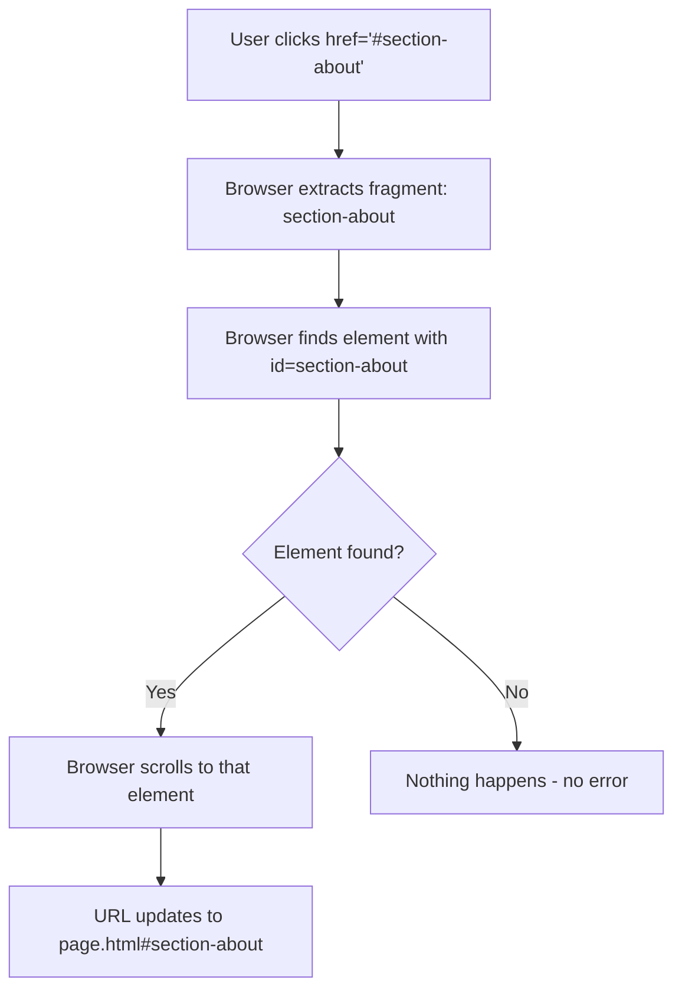

<a id="chapter-9-html-links-navigation"></a>

# Chapter 9: HTML Links & Navigation

[⬅ Previous Chapter](#chapter-8-semantic-text-elements) | [📖 Main Index](#main-index) | [Next Chapter ➡](#chapter-10-html-lists)

---

## 📌 Learning Objectives

By the end of this chapter, you will be able to:

- Write the `<a>` element correctly with all its attributes
- Understand the difference between **absolute** and **relative** URLs completely
- Use `target` attribute values correctly — `_blank`, `_self`, `_parent`, `_top`
- Create `mailto:`, `tel:`, and `sms:` links for communication
- Use the `download` attribute to trigger file downloads
- Build **fragment/anchor links** for in-page navigation
- Understand `rel` attribute values — `noopener`, `noreferrer`, `nofollow`, `canonical`
- Build **semantic navigation menus** using `<nav>`, `<ul>`, and `<a>`
- Create **accessible navigation** with ARIA attributes
- Build **dropdown menus** with CSS only
- Understand **link states** — `:link`, `:visited`, `:hover`, `:active`, `:focus`
- Explain how links affect **SEO and accessibility**
- Answer every **interview question** on HTML links and navigation confidently

---

<a id="chapter-index-table-9"></a>

## Chapter Index Table

| Topic No. | Topic Name | Subtopics |
|-----------|-----------|-----------|
| 9.1 | [The Anchor Element — `<a>`](#91-the-anchor-element) | What is anchor<br>Syntax<br>href attribute<br>Without href<br>Element anatomy |
| 9.2 | [Absolute vs Relative URLs](#92-absolute-vs-relative-urls) | Absolute URL<br>Relative URL<br>Root-relative<br>Path traversal<br>When to use which |
| 9.3 | [The target Attribute](#93-the-target-attribute) | _self<br>_blank<br>_parent<br>_top<br>named frames<br>Security with _blank |
| 9.4 | [The rel Attribute](#94-the-rel-attribute) | noopener<br>noreferrer<br>nofollow<br>sponsored<br>ugc<br>author<br>license |
| 9.5 | [mailto Links](#95-mailto-links) | Basic mailto<br>Subject line<br>CC BCC<br>Body<br>Multiple recipients |
| 9.6 | [tel and sms Links](#96-tel-and-sms-links) | tel protocol<br>International format<br>sms protocol<br>Mobile behavior |
| 9.7 | [Download Links](#97-download-links) | download attribute<br>Custom filename<br>File types<br>Security |
| 9.8 | [Fragment Links — In-Page Navigation](#98-fragment-links-in-page-navigation) | id anchors<br>Hash links<br>Smooth scroll<br>Back to top<br>Table of contents |
| 9.9 | [Link States and Styling](#99-link-states-and-styling) | :link :visited :hover :active :focus<br>LVHAF order<br>Custom styling<br>Button-style links |
| 9.10 | [Navigation Menus](#910-navigation-menus) | nav element<br>Horizontal nav<br>Vertical nav<br>Current page indicator<br>Breadcrumbs |
| 9.11 | [Dropdown Navigation](#911-dropdown-navigation) | CSS-only dropdown<br>Accessible dropdown<br>Multi-level<br>Mobile considerations |
| 9.12 | [Links and SEO/Accessibility](#912-links-seo-accessibility) | Link text SEO<br>Descriptive text<br>ARIA labels<br>Skip navigation<br>Focus management |

---

## 9.1 The Anchor Element — `<a>`

<a id="91-the-anchor-element"></a>

---

### 🔷 What is the Anchor Element?

The `<a>` (anchor) element creates **hyperlinks** — the fundamental building block of the World Wide Web. It allows users to navigate between documents, pages, sections, and resources.

- **Type:** Inline element (HTML5: can wrap block elements)
- **Default rendering:** Blue underlined text
- **Semantic meaning:** "This is a navigational link to another resource"
- **Origin of name:** "anchor" — links were originally called anchors because they "anchor" one document to another

---

### 🔷 Syntax

```html
<a href="destination">Link text or content</a>
```

---

### 🔷 Complete `<a>` Element Anatomy

```html
<a  href="https://www.example.com/page"
    target="_blank"
    rel="noopener noreferrer"
    title="Visit Example Page"
    download="filename.pdf"
    hreflang="en"
    type="text/html"
    id="main-link"
    class="btn btn-primary"
    aria-label="Visit Example Page — opens in new tab"
>
    Link Text or Content Here
</a>
```

| Attribute | Purpose | Required? |
|-----------|---------|-----------|
| `href` | Destination URL or resource | Most important |
| `target` | Where to open the link | Optional |
| `rel` | Relationship to linked document | Recommended |
| `title` | Tooltip text | Optional |
| `download` | Trigger file download | Optional |
| `hreflang` | Language of linked document | Optional |
| `type` | MIME type of linked resource | Optional |
| `aria-label` | Accessible name for screen readers | When needed |

---

### 🔷 `<a>` Without `href` — Placeholder Links

```html
<!-- <a> without href: not a hyperlink — just styled text -->
<a>This is not a link — no href</a>

<!-- Common use: placeholder in navigation during development -->
<nav>
    <a href="index.html">Home</a>
    <a href="#">About</a>      <!-- # = empty fragment — links to top of page -->
    <a>Contact</a>              <!-- No href — current page / not yet linked -->
</nav>
```

> [!NOTE]
> An `<a>` element without an `href` attribute is not a hyperlink — it is just an anchor placeholder. It has no default styling (not blue/underlined), is not keyboard focusable, and does not appear in the browser's link list. Use `href="#"` for a visible link that does nothing, and add `href` when the destination is ready.

---

### 🔷 What Can Go Inside `<a>`?

In HTML5, `<a>` can wrap **both inline and block content**:

```html
<!-- ✅ Traditional: inline content -->
<a href="about.html">About Us</a>

<!-- ✅ HTML5 allows: block content inside a -->
<a href="product.html">
    <div class="product-card">
        
        <h3>Product Name</h3>
        <p>₹999 — Click to view details</p>
    </div>
</a>

<!-- ❌ WRONG: <a> inside <a> — never nest links -->
<a href="outer.html">
    Outer link
    <a href="inner.html">Inner link — INVALID!</a>
</a>

<!-- ✅ CORRECT: Interactive elements inside block-wrapped a -->
<!-- Note: avoid putting buttons/inputs inside <a> for accessibility -->
<a href="article.html">
    <article>
        <h2>Article Title</h2>
        <p>Article preview text...</p>
    </article>
</a>
```

---

### 🔷 `<a>` as Block vs Inline Element

```css
/* By default: inline element */
a { display: inline; }

/* Common: make button-style link block or inline-block */
a.btn {
    display: inline-block;
    padding: 12px 24px;
    background: #3b82f6;
    color: white;
    text-decoration: none;
    border-radius: 6px;
}

/* Full-width block link (mobile navigation) */
a.nav-link {
    display: block;
    padding: 14px 20px;
}
```

---

### 🧠 Hinglish Intuition

> `<a>` tag ek **wormhole** ki tarah hai — ek jagah se doosri jagah instantly jump karne ke liye.
>
> Jaise ek book mein "See Chapter 5" likha hota hai — tum seedha Chapter 5 pe jaate ho.
> Web pe `<a href="chapter5.html">See Chapter 5</a>` exactly wahi karta hai.
>
> **href** = "Hypertext Reference" = "Yahan jaana hai" ka address
>
> Bina href ke `<a>` ek **closed wormhole** hai — dikhta hai, lekin kaam nahi karta.
>
> **`<a>` = Web ka fundamental building block — links hi web ko "web" banate hain!**

---

> [!IMPORTANT]
> **Interview Critical:** The `<a>` element is THE most important HTML element for the Web. Tim Berners-Lee's key invention was the hyperlink — the ability to link documents to each other. Without `<a>`, there would be no World Wide Web.

---

👉 <a href="#chapter-index-table-9">Go to Top 🔝</a>

---

## 9.2 Absolute vs Relative URLs

<a id="92-absolute-vs-relative-urls"></a>

---

### 🔷 What is a URL?

A **URL** (Uniform Resource Locator) is the complete address of a resource on the Web. Understanding URL types is fundamental for all link creation.

---

### 🔷 URL Structure

```text
https://www.example.com:443/products/electronics/laptop.html?color=red&size=15#specifications

│       │               │   │                              │               │
│       │               │   │                              │               └─ Fragment (#)
│       │               │   │                              └─────────────── Query string (?)
│       │               │   └──────────────────────────────────────────── Path
│       │               └──────────────────────────────────────────────── Port (optional)
│       └──────────────────────────────────────────────────────────────── Domain/Host
└──────────────────────────────────────────────────────────────────────── Protocol/Scheme
```

---

### 🔷 Type 1: Absolute URLs

An **absolute URL** contains the **complete address** — protocol, domain, and path. It works from **anywhere** regardless of the current page's location.

```html
<!-- Complete absolute URLs -->
<a href="https://www.google.com">Google</a>
<a href="https://developer.mozilla.org/en-US/docs/Web/HTML">MDN HTML Docs</a>
<a href="https://github.com/username/repository">GitHub Repository</a>
<a href="http://api.example.com/v2/users">API Endpoint</a>
<a href="ftp://files.example.com/download.zip">FTP Download</a>

<!-- Always use for: external sites -->
<a href="https://www.youtube.com/watch?v=abc123">Watch on YouTube</a>
```

**Use absolute URLs when:**
- Linking to **external websites** (different domain)
- Sending links via email (no context for relative paths)
- Sharing links on social media
- API endpoints that must be explicit

---

### 🔷 Type 2: Relative URLs

A **relative URL** contains only the **path** — it is resolved relative to the current document's location.

#### Relative URL Types

```text
Project Structure:
my-website/
├── index.html
├── about.html
├── contact.html
├── css/
│   └── style.css
├── images/
│   ├── logo.png
│   └── hero.jpg
└── pages/
    ├── services.html
    ├── portfolio.html
    └── blog/
        ├── index.html
        └── post-1.html
```

---

#### Same Directory — Just Filename

```html
<!-- Current page: my-website/index.html -->
<!-- Linking to: my-website/about.html -->
<a href="about.html">About Us</a>

<!-- Linking to: my-website/contact.html -->
<a href="contact.html">Contact</a>
```

---

#### Into a Subdirectory — Folder/Filename

```html
<!-- Current page: my-website/index.html -->
<!-- Linking to: my-website/pages/services.html -->
<a href="pages/services.html">Services</a>

<!-- Linking to: my-website/pages/blog/post-1.html -->
<a href="pages/blog/post-1.html">Blog Post 1</a>
```

---

#### Up a Directory — `../`

```html
<!-- Current page: my-website/pages/services.html -->
<!-- Go up one level to my-website/, then to about.html -->
<a href="../about.html">About</a>

<!-- Go up one level to my-website/, then into images/ -->
<a href="../images/logo.png">Logo</a>

<!-- Current page: my-website/pages/blog/post-1.html -->
<!-- Go up two levels to my-website/ -->
<a href="../../index.html">Home</a>
<a href="../../about.html">About</a>
```

---

#### Type 3: Root-Relative URLs

Root-relative URLs start with `/` and are always relative to the **website root** — not the current page's location.

```html
<!-- Works the same regardless of which page you're on -->
<a href="/index.html">Home</a>
<a href="/about.html">About</a>
<a href="/pages/services.html">Services</a>
<a href="/images/logo.png">Logo</a>

<!-- ✅ Consistent from any page depth -->
<!-- From: /pages/blog/post-1.html — /about.html still works -->
<!-- From: /index.html — /about.html still works -->
```

---

### 🔷 Complete Comparison

| URL Type | Example | Works From | Use Case |
|----------|---------|-----------|---------|
| **Absolute** | `https://google.com` | Anywhere | External links |
| **Relative** | `about.html` | Same directory | Same-level pages |
| **Relative path** | `../images/logo.png` | Up from current | Cross-directory |
| **Root-relative** | `/about.html` | Any page on same domain | Internal consistent nav |

---

### 🔷 Visual Path Resolution

```mermaid
flowchart TD
    A[Current Page: /pages/blog/post-1.html] --> B{URL Type?}
    B -->|href=about.html| C[/pages/blog/about.html - WRONG if about is at root!]
    B -->|href=../../about.html| D[/about.html - Correct but fragile]
    B -->|href=/about.html| E[/about.html - Always correct root-relative]
    B -->|href=https://external.com| F[https://external.com - External absolute]
```

---

### 🧠 Hinglish Intuition

> URL types ko samajhna ek **address system** ki tarah hai.
>
> **Absolute URL = Full mailing address:**
> "42 Marine Drive, Nariman Point, Mumbai, Maharashtra, India - 400020"
> → Kahi se bhi deliver ho sakta hai
>
> **Relative URL = Neighbor ko direction:**
> "Dono ghar chhod, teesra ghar left mein"
> → Sirf tabhi kaam karta hai jab tum same mohalle mein ho
>
> **Root-relative URL = City ke hisaab se address:**
> "/Marine Drive/42" → Mumbai ke andar kahi se bhi
>
> **Rule:**
> - External site → **Absolute** (poora address chahiye)
> - Same site, same folder → **Relative** (short path)
> - Same site, any depth → **Root-relative** (safest for internal links)

---

> [!TIP]
> **Professional Recommendation:** Use **root-relative URLs** (`/about.html`) for all internal links in production websites. They work consistently regardless of directory depth, making navigation more maintainable than `../` relative paths.

---

👉 <a href="#chapter-index-table-9">Go to Top 🔝</a>

---

## 9.3 The target Attribute

<a id="93-the-target-attribute"></a>

---

### 🔷 What is the `target` Attribute?

The `target` attribute specifies **where the linked document should open** — in the same tab, a new tab, a named frame, or a parent frame.

---

### 🔷 target Attribute Values

```html
<!-- _self: DEFAULT — opens in same tab -->
<a href="about.html" target="_self">About Us</a>
<!-- Same as not specifying target at all -->

<!-- _blank: opens in NEW tab or window -->
<a href="https://google.com" target="_blank">Google</a>

<!-- _parent: opens in parent frame (frameset navigation) -->
<a href="page.html" target="_parent">Parent Frame</a>
<!-- Rarely used — framesets are obsolete -->

<!-- _top: opens in the full browser window (breaks out of all frames) -->
<a href="page.html" target="_top">Full Window</a>
<!-- Rarely used — for breaking out of iframes -->

<!-- Named frame: opens in a named frame or window -->
<a href="page.html" target="preview-pane">Open in Preview</a>
```

---

### 🔷 `target="_blank"` — Most Common Use

```html
<!-- Standard: Open external links in new tab -->
<a href="https://www.mdn.com" target="_blank">MDN Web Docs</a>

<!-- ✅ SECURE: Always add rel="noopener noreferrer" with _blank -->
<a href="https://www.mdn.com"
   target="_blank"
   rel="noopener noreferrer">
    MDN Web Docs
</a>
```

---

### 🔷 Security Issue with `target="_blank"`

**The `window.opener` vulnerability:**

When you open a link with `target="_blank"`, the new page can access the **original page** via `window.opener`. A malicious site could:

1. Redirect your original page to a phishing site
2. Access data from your original page
3. Execute JavaScript in your original page context

```javascript
// Malicious code on the linked page could do:
window.opener.location = 'https://evil-phishing-site.com';
```

**Solution:** Always add `rel="noopener noreferrer"`:

```html
<!-- ❌ VULNERABLE -->
<a href="https://external-site.com" target="_blank">
    External Link
</a>

<!-- ✅ SECURE -->
<a href="https://external-site.com"
   target="_blank"
   rel="noopener noreferrer">
    External Link
</a>
```

| `rel` value | Effect |
|-------------|--------|
| `noopener` | Sets `window.opener` to null — new page cannot access original |
| `noreferrer` | Prevents sending the Referrer header AND sets noopener |
| Both together | Maximum security for external links |

---

### 🔷 When to Use `target="_blank"`

| Situation | Use `_blank`? |
|-----------|--------------|
| External websites | ✅ Yes — user stays on your site |
| PDF files | ✅ Yes — inline PDF viewing |
| Documentation (while filling form) | ✅ Yes — user needs to reference while on current page |
| Another page on same site | ❌ Usually no — disorienting |
| Main navigation links | ❌ No — breaks browser back button flow |
| Legal/privacy pages | ❌ Usually no — same site |

---

### 🔷 Accessibility Note for `target="_blank"`

```html
<!-- ✅ Inform users that link opens in new tab -->
<!-- Method 1: in the link text -->
<a href="https://docs.example.com"
   target="_blank"
   rel="noopener noreferrer">
    Documentation (opens in new tab)
</a>

<!-- Method 2: via aria-label -->
<a href="https://docs.example.com"
   target="_blank"
   rel="noopener noreferrer"
   aria-label="Documentation — opens in new tab">
    Documentation
</a>

<!-- Method 3: visual indicator via CSS ::after -->
<style>
    a[target="_blank"]::after {
        content: " ↗";
        font-size: 0.75em;
    }
</style>
```

> [!IMPORTANT]
> **Accessibility Rule:** Screen reader users should always know when a link opens in a new tab. Unexpected tab opening is disorienting. Always indicate this via `aria-label`, visible text, or a visual icon.

---

### 🧠 Hinglish Intuition

> `target` attribute batata hai: "Yeh link khulega KAHAN?"
>
> - **`_self`** (default) = Usi window mein khulo — jaise usi page ko replace karo
> - **`_blank`** = Naye tab mein khulo — original page band nahi hogi
>
> **`_blank` security:**
> Naye tab mein khola page tumhari original window ko control kar sakta hai!
> Jaise ek guest ko apne ghar ki chabi de di — woh tumhari property access kar sakta hai.
>
> `rel="noopener noreferrer"` ek **security lock** hai:
> - Naye tab ko original window ka `window.opener` nahi milta
> - Safe external links ke liye hamesha use karo
>
> **Rule: External link + `_blank` + `rel="noopener noreferrer"` — always trio!**

---

👉 <a href="#chapter-index-table-9">Go to Top 🔝</a>

---

## 9.4 The rel Attribute

<a id="94-the-rel-attribute"></a>

---

### 🔷 What is the `rel` Attribute?

The `rel` (relationship) attribute on `<a>` describes the **relationship between the current page and the linked document**. It communicates important information to browsers, search engines, and security systems.

---

### 🔷 Key `rel` Values for `<a>`

#### `noopener` — Security

```html
<a href="https://external.com" target="_blank" rel="noopener">
    External Link
</a>
```
Prevents the linked page from accessing `window.opener`. Should be used with all `target="_blank"` links.

---

#### `noreferrer` — Privacy + Security

```html
<a href="https://external.com" target="_blank" rel="noreferrer">
    External Link
</a>
```
- Does everything `noopener` does (sets opener to null)
- Additionally: does NOT send the `Referrer` HTTP header
- The destination site does NOT know which page the user came from
- More private but destination loses analytics data about your traffic

---

#### `nofollow` — SEO

```html
<a href="https://advertiser.com" rel="nofollow">
    Sponsored Link
</a>
```
Tells search engines: **"Do not pass SEO authority (link juice) to this page."**

When to use:
- Paid/sponsored links
- User-generated content links (comments, forums)
- Links to untrusted sites
- Login/registration pages you don't want indexed via links

---

#### `sponsored` — Paid Links

```html
<a href="https://advertiser.com" rel="sponsored">
    Sponsored Product
</a>
```
Explicitly marks the link as a **paid/sponsored** relationship. Google's official value for affiliate/paid links.

---

#### `ugc` — User-Generated Content

```html
<a href="https://user-shared.com" rel="ugc">
    User Shared Link
</a>
```
Marks links in **user-generated content** (forum posts, blog comments). Tells Google this link was not editorially chosen by the site owner.

---

#### `author` — Link to Author

```html
<a href="https://rahulsharma.dev" rel="author">
    Rahul Sharma
</a>
```
Indicates this link points to the **author** of the current content.

---

#### `license` — Content License

```html
<a href="https://creativecommons.org/licenses/by/4.0/" rel="license">
    Creative Commons Attribution 4.0
</a>
```
Indicates the linked document is the **license** for the current page's content.

---

#### `prev` and `next` — Paginated Content

```html
<!-- In a multi-page article/blog -->
<a href="article-page-2.html" rel="next">Next Page →</a>
<a href="article-page-1.html" rel="prev">← Previous Page</a>
```
Indicates the current page is part of a series.

---

#### `external` — External Link Indicator

```html
<a href="https://external.com" rel="external">
    External Website
</a>
```
Explicitly marks the link as going to an external site.

---

### 🔷 Multiple `rel` Values

Multiple `rel` values are separated by spaces:

```html
<!-- Multiple values: noopener AND noreferrer AND nofollow -->
<a href="https://untrusted-site.com"
   target="_blank"
   rel="noopener noreferrer nofollow">
    Untrusted External Link
</a>

<!-- Sponsored link opening in new tab -->
<a href="https://advertiser.com"
   target="_blank"
   rel="noopener noreferrer sponsored">
    Sponsored Product Deal
</a>
```

---

### 🔷 `rel` Values Summary Table

| Value | Tells | Purpose |
|-------|-------|---------|
| `noopener` | Browser | Security: no `window.opener` access |
| `noreferrer` | Browser + Server | Privacy + Security: no referrer + no opener |
| `nofollow` | Search engines | Don't pass SEO authority |
| `sponsored` | Search engines | This is a paid link |
| `ugc` | Search engines | User-generated content link |
| `author` | Search engines | Links to the content's author |
| `license` | Search engines | Links to content's license |
| `prev` / `next` | Search engines | Part of a series |
| `external` | Browsers/tools | Explicitly external link |

---

### 🧠 Hinglish Intuition

> `rel` attribute ek **label** hai jo link ka context explain karta hai.
>
> Jaise ek delivery package pe labels hote hain:
> - "FRAGILE" = Handle with care
> - "THIS SIDE UP" = Orientation
> - "DO NOT REFRIGERATE" = Special instruction
>
> HTML links pe rel labels:
> - `noopener` = "Security door lock karo" (browsers ke liye)
> - `nofollow` = "Yeh link important nahi hai — SEO juice mat dena" (Google ke liye)
> - `sponsored` = "Yeh paid advertisement hai" (Google ke liye)
> - `noreferrer` = "Kisi ko mat batana main kahan se aaya hoon" (privacy)
>
> **Most important combo: `target="_blank" rel="noopener noreferrer"` — always together!**

---

👉 <a href="#chapter-index-table-9">Go to Top 🔝</a>

---

## 9.5 mailto Links

<a id="95-mailto-links"></a>

---

### 🔷 What are mailto Links?

`mailto:` links open the user's **default email client** with a pre-filled composition window when clicked.

```html
<a href="mailto:email@example.com">Send Email</a>
```

---

### 🔷 Basic mailto Syntax

```html
<!-- Simple email link -->
<a href="mailto:contact@webdevacademy.in">
    Contact Us
</a>

<!-- With display text -->
<a href="mailto:support@webdevacademy.in">
    support@webdevacademy.in
</a>
```

---

### 🔷 mailto with Subject Line

```html
<!-- Pre-fill the email subject -->
<a href="mailto:contact@example.com?subject=Website Enquiry">
    Send Enquiry
</a>

<!-- URL-encoded subject (spaces as %20) -->
<a href="mailto:contact@example.com?subject=Job%20Application%20%E2%80%94%20Frontend%20Developer">
    Apply for Job
</a>
```

---

### 🔷 mailto with Multiple Parameters

Multiple parameters use `?` for first and `&` for subsequent:

```html
<!-- Subject + Body -->
<a href="mailto:sales@example.com?subject=Product%20Quote&body=Hello%2C%20I%20would%20like%20a%20quote%20for...">
    Request Quote
</a>

<!-- CC (Carbon Copy) -->
<a href="mailto:main@example.com?cc=manager@example.com">
    Email with CC
</a>

<!-- BCC (Blind Carbon Copy) -->
<a href="mailto:main@example.com?bcc=archive@example.com">
    Email with BCC
</a>

<!-- Complete: multiple recipients, subject, CC, body -->
<a href="mailto:contact@example.com,sales@example.com?cc=info@example.com&bcc=records@example.com&subject=Product%20Enquiry&body=Dear%20Team%2C%0A%0AI%20am%20interested%20in...">
    Full Email Link
</a>
```

---

### 🔷 URL Encoding for mailto

Special characters must be URL-encoded:

| Character | Encoded |
|-----------|---------|
| Space | `%20` |
| `@` | `%40` |
| `&` | `%26` |
| `=` | `%3D` |
| `?` | `%3F` |
| New line | `%0A` |
| `#` | `%23` |
| `,` | `%2C` |

---

### 🔷 Practical mailto Examples

```html
<!-- Contact page email button -->
<a href="mailto:hello@webdevacademy.in?subject=Course%20Enquiry&body=Hi%20WebDev%20Academy%2C%0A%0AI%20am%20interested%20in%20your%20HTML%20CSS%20course.%0A%0APlease%20send%20me%20more%20details.%0A%0AThank%20you"
   class="btn btn-primary">
    📧 Send us an Email
</a>

<!-- Bug report link -->
<a href="mailto:bugs@example.com?subject=Bug%20Report%20%E2%80%94%20Version%201.0&body=Page%20URL%3A%20%0ABrowser%3A%20%0ADescription%3A%20%0ASteps%20to%20reproduce%3A">
    Report a Bug
</a>

<!-- Support email in footer -->
<address>
    Support:
    <a href="mailto:support@webdevacademy.in">
        support@webdevacademy.in
    </a>
</address>
```

---

### 🔷 mailto Limitations and Alternatives

| Limitation | Alternative |
|-----------|------------|
| Requires email client installed | HTML contact form |
| Exposes email to spam bots | Email obfuscation / form |
| Cannot guarantee delivery | Backend email service |
| User must have default email set up | Provide form option |

> [!TIP]
> **Best practice:** Always provide both a `mailto:` link AND a contact form. The link is quick for users with email clients set up; the form works for everyone else.

---

### 🧠 Hinglish Intuition

> `mailto:` link ek **pre-addressed envelope** ki tarah hai.
>
> Jab user click karta hai → unka email client (Gmail app, Outlook) khulta hai → pehle se filled:
> - To: address (tumhara email)
> - Subject: pre-filled
> - Body: kuch pre-written text
>
> Bas user ko "Send" dabana hai!
>
> **URL encoding:** Spaces aur special characters directly email URL mein nahi jaate.
> Space → `%20`, Enter → `%0A`, & → `%26`
>
> Ek online URL encoder tool use karo email body/subject ke liye!
>
> **`mailto:` = Pre-addressed envelope — open karo, sign karo, send karo!**

---

👉 <a href="#chapter-index-table-9">Go to Top 🔝</a>

---

## 9.6 tel and sms Links

<a id="96-tel-and-sms-links"></a>

---

### 🔷 tel: Links — Phone Numbers

`tel:` links open the user's **phone dialer** (on mobile) or a calling application (on desktop) with the number pre-filled.

```html
<!-- Basic tel link -->
<a href="tel:+919876543210">Call Us</a>

<!-- Display number, link for calling -->
<a href="tel:+919876543210">+91 98765 43210</a>

<!-- Formatted for readability -->
<a href="tel:+918012345678">📞 +91 80-1234-5678</a>
```

---

### 🔷 International Format for tel:

Always use **international format** (with country code) for `tel:` links:

```html
<!-- ✅ CORRECT: International format -->
<a href="tel:+919876543210">+91 98765 43210</a>  <!-- India -->
<a href="tel:+12025551234">+1 (202) 555-1234</a>  <!-- USA -->
<a href="tel:+442071234567">+44 20 7123 4567</a>  <!-- UK -->

<!-- ✅ Include extension -->
<a href="tel:+919876543210;ext=123">
    +91 98765 43210 ext. 123
</a>

<!-- ❌ WRONG: Local format without country code -->
<a href="tel:9876543210">9876543210</a>
<!-- May not work internationally or on some devices -->
```

---

### 🔷 Removing Formatting from tel:

The `href` value should have no spaces or formatting — only `+`, digits, and optionally `;ext=`:

```html
<!-- Display: formatted for humans -->
<!-- href: stripped for machines -->
<a href="tel:+918012345678">+91 80-1234-5678</a>

<!-- ❌ WRONG: Spaces or hyphens in href -->
<a href="tel:+91 80-1234-5678">Call</a>
```

---

### 🔷 sms: Links — Text Messages

`sms:` links open the user's **messaging app** with a pre-filled phone number (and optionally message body):

```html
<!-- Basic SMS link -->
<a href="sms:+919876543210">Send SMS</a>

<!-- With pre-filled message body -->
<!-- Note: body syntax varies by OS -->

<!-- iOS format -->
<a href="sms:+919876543210&body=Hello%2C%20I%20am%20interested">
    Text Us (iOS)
</a>

<!-- Android/universal format -->
<a href="sms:+919876543210?body=Hello%2C%20I%20am%20interested">
    Text Us
</a>

<!-- WhatsApp deep link (alternative to sms) -->
<a href="https://wa.me/919876543210?text=Hello%20I%20am%20interested"
   target="_blank"
   rel="noopener noreferrer">
    WhatsApp Us
</a>
```

---

### 🔷 Practical tel and sms Usage

```html
<!-- Contact section with multiple options -->
<address>
    <p>
        <strong>Phone:</strong>
        <a href="tel:+918012345678">+91 80-1234-5678</a>
    </p>
    <p>
        <strong>WhatsApp:</strong>
        <a href="https://wa.me/918012345678"
           target="_blank"
           rel="noopener noreferrer">
            +91 80-1234-5678
        </a>
    </p>
    <p>
        <strong>Email:</strong>
        <a href="mailto:contact@example.com">
            contact@example.com
        </a>
    </p>
</address>

<!-- Mobile-optimized call to action -->
<a href="tel:+918012345678" class="btn btn-primary">
    📞 Call Now — Free Consultation
</a>

<!-- Emergency contact with large tap target for mobile -->
<a href="tel:+911"
   style="display: block; padding: 20px; background: red; color: white; text-align: center; font-size: 1.5rem; font-weight: bold;">
    🚨 Emergency: Call 911
</a>
```

---

### 🔷 Desktop vs Mobile Behavior

| Platform | `tel:` behavior | `sms:` behavior |
|----------|----------------|----------------|
| **Mobile phones** | Opens phone dialer | Opens messaging app |
| **Desktop with Skype** | Opens Skype call | May open Skype |
| **Desktop without dialer** | Prompts for app or does nothing | May not work |
| **Mac with iPhone nearby** | Can trigger iPhone call via Handoff | Can open Messages app |

> [!TIP]
> Tel links are most valuable on **mobile-first websites**. On desktop-only sites, they may not function well. For maximum compatibility, display the phone number visibly so desktop users can dial manually even if the link does not function.

---

### 🧠 Hinglish Intuition

> `tel:` link ek **click-to-call button** hai — mobile pe click karo → directly call lag jaata hai!
>
> Jaise ek visiting card mein phone number hota hai — tum dial karte ho.
> `tel:` link visiting card ko **clickable** bana deta hai mobile users ke liye.
>
> **Format rule:** `tel:+91` se shuru karo (country code) → phir number, koi space ya dash nahi href mein.
> Display mein formatting dikh sakti hai: `+91 80-1234-5678`
> href mein nahi: `+918012345678`
>
> **`sms:` bhi waise hi hai — click karo → messaging app mein number pre-fill!**
>
> **Most valuable for:** E-commerce, restaurants, service businesses, any mobile-heavy site!

---

👉 <a href="#chapter-index-table-9">Go to Top 🔝</a>

---

## 9.7 Download Links

<a id="97-download-links"></a>

---

### 🔷 What is the `download` Attribute?

The `download` attribute on `<a>` tells the browser to **download the linked file** rather than navigating to it. Optionally, it can specify a custom filename for the download.

```html
<!-- Basic download — uses the file's original name -->
<a href="files/report.pdf" download>Download Report</a>

<!-- With custom filename — browser suggests this name -->
<a href="files/report-2024-q1.pdf" download="Q1-Annual-Report-2024.pdf">
    Download Q1 Report
</a>
```

---

### 🔷 `download` Attribute — Detailed Examples

```html
<!-- Download PDF -->
<a href="/documents/terms-of-service.pdf" download="terms-of-service.pdf">
    📄 Download Terms of Service (PDF)
</a>

<!-- Download image -->
<a href="/images/wallpaper-4k.jpg" download="webdev-wallpaper.jpg">
    📷 Download Wallpaper
</a>

<!-- Download with no suggested filename (uses original) -->
<a href="/downloads/software-v2.exe" download>
    💾 Download Software
</a>

<!-- Download CSS/HTML template -->
<a href="/templates/portfolio-template.zip" download="portfolio-template.zip">
    📦 Download Portfolio Template
</a>

<!-- Download generated data (with data URI) -->
<a href="data:text/plain;charset=utf-8,Hello%20World!"
   download="hello.txt">
    📝 Download Text File
</a>

<!-- Download canvas image via JavaScript (common pattern) -->
<button onclick="downloadCanvas()">Download as PNG</button>
<script>
function downloadCanvas() {
    const canvas = document.getElementById('myCanvas');
    const link = document.createElement('a');
    link.download = 'my-drawing.png';
    link.href = canvas.toDataURL();
    link.click();
}
</script>
```

---

### 🔷 `download` Attribute — Rules and Restrictions

| Rule | Detail |
|------|--------|
| **Same-origin only** | Download attribute only works for same-origin URLs |
| **Cross-origin** | Different domain = browser navigates to file (no force download) |
| **Blob URLs** | Works with `blob:` URLs (JavaScript generated) |
| **Data URLs** | Works with `data:` URLs |
| **Custom filename** | Only the filename, not the path — no slashes |
| **No extension change** | Browser may ignore extension mismatch for security |

```html
<!-- ✅ Works: same origin -->
<a href="/files/report.pdf" download="report.pdf">Download</a>

<!-- ❌ May not force download: cross-origin -->
<a href="https://otherdomain.com/file.pdf" download>Download</a>
<!-- Browser will navigate to PDF, not force download -->

<!-- ✅ Works: data URL -->
<a href="data:text/csv,...csvdata..." download="data.csv">
    Download CSV
</a>
```

---

### 🔷 File Types Commonly Downloaded

```html
<!-- Documents -->
<a href="brochure.pdf" download="Company-Brochure.pdf">
    📄 Product Brochure (PDF, 2.3 MB)
</a>

<!-- Spreadsheets -->
<a href="data.xlsx" download="Sales-Data-2024.xlsx">
    📊 Sales Data (Excel, 450 KB)
</a>

<!-- Templates -->
<a href="template.zip" download="HTML-CSS-Template.zip">
    📦 Starter Template (ZIP, 1.2 MB)
</a>

<!-- Images -->
<a href="logo.svg" download="company-logo.svg">
    🎨 Company Logo (SVG, 12 KB)
</a>

<!-- Always show file size and format for user clarity -->
```

---

### 🧠 Hinglish Intuition

> `download` attribute ek **"Save As" button** ki tarah hai — browser ko bolta hai: "Yeh file dikhao mat, seedha download karo!"
>
> Normally jab tum PDF link pe click karte ho → browser mein open ho jaata hai.
> `download` attribute se → browser automatically save dialog dikhata hai!
>
> **Custom filename:** `download="My-Custom-Name.pdf"` → user ke computer pe is naam se save hoga
>
> **Limitation:** Sirf same website ki files ke liye kaam karta hai. Doosri website ki file force download nahi kar sakte — security reason se.
>
> **`download` = "Browser, direct ghar le jao, dikhao mat!" attribute!**

---

👉 <a href="#chapter-index-table-9">Go to Top 🔝</a>

---

## 9.8 Fragment Links — In-Page Navigation

<a id="98-fragment-links-in-page-navigation"></a>

---

### 🔷 What are Fragment Links?

**Fragment links** (also called anchor links or hash links) navigate to a **specific section within the same page** (or another page) by referencing an element's `id` attribute.

```html
<!-- Link to a section by its id -->
<a href="#section-about">Go to About Section</a>

<!-- The target element with matching id -->
<section id="section-about">
    <h2>About Us</h2>
    <p>Content...</p>
</section>
```

When clicked, the browser scrolls to the element with that `id`.

---

### 🔷 How Fragment Links Work



---

### 🔷 Table of Contents Pattern

```html
<!-- =================== -->
<!-- TABLE OF CONTENTS   -->
<!-- =================== -->
<nav aria-label="Table of Contents">
    <h2>Table of Contents</h2>
    <ol>
        <li><a href="#introduction">Introduction</a></li>
        <li><a href="#html-basics">HTML Basics</a></li>
        <li><a href="#css-fundamentals">CSS Fundamentals</a></li>
        <li>
            <a href="#layout">Layout</a>
            <ol>
                <li><a href="#flexbox">Flexbox</a></li>
                <li><a href="#grid">CSS Grid</a></li>
            </ol>
        </li>
        <li><a href="#responsive">Responsive Design</a></li>
        <li><a href="#conclusion">Conclusion</a></li>
    </ol>
</nav>

<!-- =================== -->
<!-- ARTICLE CONTENT     -->
<!-- =================== -->
<article>
    <section id="introduction">
        <h2>Introduction</h2>
        <p>Content here...</p>
    </section>

    <section id="html-basics">
        <h2>HTML Basics</h2>
        <p>Content here...</p>
    </section>

    <section id="css-fundamentals">
        <h2>CSS Fundamentals</h2>
        <p>Content here...</p>
    </section>

    <section id="layout">
        <h2>Layout</h2>

        <div id="flexbox">
            <h3>Flexbox</h3>
            <p>Content here...</p>
        </div>

        <div id="grid">
            <h3>CSS Grid</h3>
            <p>Content here...</p>
        </div>
    </section>

    <section id="responsive">
        <h2>Responsive Design</h2>
        <p>Content here...</p>
    </section>

    <section id="conclusion">
        <h2>Conclusion</h2>
        <p>Content here...</p>
    </section>
</article>
```

---

### 🔷 Back to Top Link

```html
<!-- Anchor at the very top of the page -->
<a id="top"></a>
<!-- OR use the body or header element's id -->
<header id="site-header">...</header>

<!-- Back to top link (usually in footer) -->
<a href="#top">↑ Back to Top</a>
<a href="#site-header">↑ Back to Top</a>

<!-- Styled back to top -->
<a href="#top"
   class="back-to-top"
   aria-label="Back to top of page">
    ↑ Top
</a>
```

---

### 🔷 Fragment Links to Another Page

```html
<!-- Link to a specific section on another page -->
<a href="about.html#team-section">Meet Our Team</a>
<a href="docs/html.html#heading-element">HTML Heading Docs</a>
<a href="https://developer.mozilla.org/en-US/docs/Web/HTML#guides">
    MDN HTML Guides
</a>
```

---

### 🔷 Smooth Scroll with CSS

```css
/* Enable smooth scrolling for the entire page */
html {
    scroll-behavior: smooth;
}

/* Offset for sticky header — so content doesn't hide under header */
section[id],
div[id] {
    scroll-margin-top: 80px; /* Height of sticky header */
}
```

---

### 🔷 Named Anchors (Old Pattern)

```html
<!-- Old HTML 4 pattern: <a name=""> for creating anchor points -->
<a name="section-top"></a>  <!-- ❌ Old — avoid -->

<!-- Modern HTML5 pattern: id attribute on any element -->
<section id="section-top">  <!-- ✅ Modern — use this -->
```

> [!NOTE]
> The old `<a name="">` pattern is obsolete. In modern HTML5, use `id` attribute on any element to create anchor points. Any element with an `id` can be the target of a fragment link.

---

### 🧠 Hinglish Intuition

> Fragment links ek **elevator in a tall building** ki tarah hain.
>
> Bina elevator ke: pehli floor se 10th floor pe jaane ke liye poori building climb karni padegi.
>
> Fragment link ke saath: "10th floor" click karo → directly 10th pe!
>
> **`#` = Floor number selector**
> - `href="#introduction"` = "Introduction waali floor pe le chalo"
> - `id="introduction"` on section = "Yeh Introduction waali floor hai"
>
> **URL update hoti hai:** `page.html#introduction` → yeh URL share kar sakte ho → directly us section pe land karega!
>
> **Smooth scroll:** CSS `scroll-behavior: smooth` → abrupt jump nahi → smooth glide — professional touch!

---

👉 <a href="#chapter-index-table-9">Go to Top 🔝</a>

---

## 9.9 Link States and Styling

<a id="99-link-states-and-styling"></a>

---

### 🔷 CSS Link Pseudo-Classes

CSS provides five pseudo-classes specifically for styling different states of links:

| Pseudo-class | When it applies |
|-------------|----------------|
| `:link` | Unvisited link — never been clicked |
| `:visited` | Link that has been clicked/visited before |
| `:hover` | Mouse cursor is over the link |
| `:active` | Link is being clicked (mousedown) |
| `:focus` | Link is keyboard-focused (via Tab key) |

---

### 🔷 LVHFA Order — Critical Rule

The order of link pseudo-classes in CSS **matters**. The correct order is:

```css
/* LVHFA — Love and Fear is the mnemonic */
/* L = Link, V = Visited, H = Hover, F = Focus, A = Active */

a:link    { color: #3b82f6; }     /* 1. Unvisited */
a:visited { color: #7c3aed; }     /* 2. Visited */
a:hover   { color: #1d4ed8; }     /* 3. Hovered */
a:focus   { outline: 2px solid #3b82f6; } /* 4. Focused */
a:active  { color: #1e40af; }     /* 5. Active (being clicked) */
```

**Why order matters:** CSS specificity is the same for all pseudo-classes. Later rules override earlier ones. If you put `:hover` before `:visited`, hovering a visited link won't trigger the hover style.

---

### 🔷 Default Link Styles

```css
/* Browser default styles */
a:link    { color: blue; text-decoration: underline; }
a:visited { color: purple; text-decoration: underline; }
a:hover   { text-decoration: underline; cursor: pointer; }
a:active  { color: red; }
```

---

### 🔷 Professional Link Styling

```css
/* Base link style */
a {
    color: #3b82f6;
    text-decoration: underline;
    text-underline-offset: 3px;  /* Gap between text and underline */
    text-decoration-thickness: 1px;
    transition: color 0.2s ease,
                text-decoration-color 0.2s ease;
}

a:link    { color: #3b82f6; }
a:visited { color: #6d28d9; }

a:hover {
    color: #1d4ed8;
    text-decoration-color: #1d4ed8;
}

a:focus {
    outline: 2px solid #3b82f6;
    outline-offset: 3px;
    border-radius: 2px;
}

a:active { color: #1e3a8a; }
```

---

### 🔷 Navigation Link States

```css
/* Navigation links — typically no underline */
.nav-link {
    color: #374151;
    text-decoration: none;
    padding: 8px 16px;
    border-radius: 6px;
    transition: background-color 0.2s, color 0.2s;
}

.nav-link:hover {
    background-color: #f3f4f6;
    color: #111827;
}

.nav-link:focus {
    outline: 2px solid #3b82f6;
    outline-offset: 2px;
}

.nav-link:active {
    background-color: #e5e7eb;
}

/* Current/active page indicator */
.nav-link.active,
.nav-link[aria-current="page"] {
    background-color: #dbeafe;
    color: #1e40af;
    font-weight: 600;
}
```

---

### 🔷 Button-Style Links

```css
/* Primary button link */
.btn {
    display: inline-block;
    padding: 12px 28px;
    background-color: #3b82f6;
    color: #ffffff;
    text-decoration: none;
    border-radius: 8px;
    font-weight: 600;
    font-size: 1rem;
    transition: background-color 0.2s, transform 0.1s, box-shadow 0.2s;
    border: 2px solid transparent;
}

.btn:hover {
    background-color: #2563eb;
    box-shadow: 0 4px 12px rgba(59, 130, 246, 0.4);
    transform: translateY(-1px);
}

.btn:focus {
    outline: none;
    border-color: #1d4ed8;
    box-shadow: 0 0 0 4px rgba(59, 130, 246, 0.3);
}

.btn:active {
    background-color: #1d4ed8;
    transform: translateY(0);
    box-shadow: none;
}

/* Secondary button */
.btn-outline {
    background-color: transparent;
    color: #3b82f6;
    border: 2px solid #3b82f6;
}

.btn-outline:hover {
    background-color: #3b82f6;
    color: white;
}
```

---

### 🔷 Link Accessibility — Focus Styles

```css
/* NEVER remove focus outline without replacement */

/* ❌ WRONG: removes accessibility for keyboard users */
a:focus { outline: none; }

/* ✅ CORRECT: replace with custom visible focus */
a:focus {
    outline: 2px solid #3b82f6;
    outline-offset: 3px;
    border-radius: 2px;
}

/* ✅ MODERN: Use :focus-visible to avoid showing on mouse click */
/* Shows focus ring only for keyboard navigation */
a:focus-visible {
    outline: 3px solid #3b82f6;
    outline-offset: 3px;
}

a:focus:not(:focus-visible) {
    outline: none; /* Hide on mouse focus */
}
```

---

### 🧠 Hinglish Intuition

> Link states ek **traffic light** ki tarah hain — different situations mein different colors.
>
> - **`:link`** = Green light — "Yahan ja sakte ho, naya destination"
> - **`:visited`** = Yellow/purple — "Yahan pehle ja chuke ho"
> - **`:hover`** = Indicator — "Cursor is pe hai, jaane ki taiyari"
> - **`:focus`** = Highlighted border — "Keyboard se select kiya hai"
> - **`:active`** = Pressed down — "Click ho raha hai abhi"
>
> **LVHFA order yaad karo: "LoVe HaFe All"**
> L-V-H-F-A — Link, Visited, Hover, Focus, Active
>
> Order galat hoga → styles properly kaam nahi karenge!
>
> **Focus outline kabhi mat hatao** — keyboard users ke liye zaroori hai!

---

👉 <a href="#chapter-index-table-9">Go to Top 🔝</a>

---

## 9.10 Navigation Menus

<a id="910-navigation-menus"></a>

---

### 🔷 The `<nav>` Element

The `<nav>` element is a **semantic landmark element** that wraps **major navigation blocks**.

```html
<!-- Correct use of <nav> -->
<nav aria-label="Main Navigation">
    <!-- Primary site navigation -->
</nav>

<nav aria-label="Breadcrumb">
    <!-- Breadcrumb navigation -->
</nav>

<nav aria-label="Table of Contents">
    <!-- In-page TOC navigation -->
</nav>
```

> [!NOTE]
> Not every group of links needs `<nav>`. Only wrap navigation in `<nav>` when it is a **major navigation block** — main menu, breadcrumbs, page sections, or table of contents. Footer links and inline text links do not need `<nav>`.

---

### 🔷 Horizontal Navigation — The Standard Pattern

```html
<!-- Semantic horizontal navigation -->
<nav class="main-nav" aria-label="Main Navigation">
    <ul class="nav-list">
        <li class="nav-item">
            <a href="/" class="nav-link" aria-current="page">Home</a>
        </li>
        <li class="nav-item">
            <a href="/about.html" class="nav-link">About</a>
        </li>
        <li class="nav-item">
            <a href="/services.html" class="nav-link">Services</a>
        </li>
        <li class="nav-item">
            <a href="/portfolio.html" class="nav-link">Portfolio</a>
        </li>
        <li class="nav-item">
            <a href="/blog.html" class="nav-link">Blog</a>
        </li>
        <li class="nav-item">
            <a href="/contact.html" class="nav-link btn btn-primary">
                Contact Us
            </a>
        </li>
    </ul>
</nav>
```

```css
/* Horizontal nav CSS */
.main-nav {
    background: #0f172a;
    padding: 0 24px;
}

.nav-list {
    list-style: none;
    margin: 0;
    padding: 0;
    display: flex;
    align-items: center;
    gap: 4px;
}

.nav-link {
    display: block;
    padding: 16px 14px;
    color: #cbd5e1;
    text-decoration: none;
    font-size: 0.95rem;
    font-weight: 500;
    border-radius: 6px;
    transition: color 0.2s, background 0.2s;
    white-space: nowrap;
}

.nav-link:hover {
    color: #f8fafc;
    background: rgba(255,255,255,0.1);
}

.nav-link[aria-current="page"],
.nav-link.active {
    color: #60a5fa;
    background: rgba(96, 165, 250, 0.1);
}

.nav-link:focus-visible {
    outline: 2px solid #60a5fa;
    outline-offset: 2px;
}

/* CTA button in nav */
.nav-link.btn {
    background: #3b82f6;
    color: white;
    padding: 10px 18px;
}

.nav-link.btn:hover {
    background: #2563eb;
}
```

---

### 🔷 Vertical Sidebar Navigation

```html
<!-- Sidebar navigation -->
<nav class="sidebar-nav" aria-label="Sidebar Navigation">
    <ul class="sidebar-list">
        <li>
            <a href="/dashboard" class="sidebar-link active" aria-current="page">
                <span class="icon">🏠</span>
                Dashboard
            </a>
        </li>
        <li>
            <a href="/profile" class="sidebar-link">
                <span class="icon">👤</span>
                Profile
            </a>
        </li>
        <li>
            <a href="/settings" class="sidebar-link">
                <span class="icon">⚙️</span>
                Settings
            </a>
        </li>
        <li>
            <a href="/help" class="sidebar-link">
                <span class="icon">❓</span>
                Help
            </a>
        </li>
    </ul>
</nav>
```

```css
.sidebar-nav {
    width: 240px;
    background: #1e293b;
    padding: 16px 12px;
    min-height: 100vh;
}

.sidebar-list {
    list-style: none;
    margin: 0;
    padding: 0;
}

.sidebar-link {
    display: flex;
    align-items: center;
    gap: 12px;
    padding: 12px 14px;
    color: #94a3b8;
    text-decoration: none;
    border-radius: 8px;
    font-size: 0.9rem;
    font-weight: 500;
    transition: all 0.2s;
    margin-bottom: 4px;
}

.sidebar-link:hover {
    background: rgba(255,255,255,0.08);
    color: #f1f5f9;
}

.sidebar-link.active,
.sidebar-link[aria-current="page"] {
    background: rgba(59, 130, 246, 0.15);
    color: #60a5fa;
}

.sidebar-link .icon {
    font-size: 1.1rem;
    width: 20px;
    text-align: center;
}
```

---

### 🔷 Breadcrumb Navigation

```html
<!-- Breadcrumb navigation with schema markup -->
<nav aria-label="Breadcrumb">
    <ol class="breadcrumb" itemscope itemtype="https://schema.org/BreadcrumbList">

        <li itemprop="itemListElement" itemscope
            itemtype="https://schema.org/ListItem">
            <a href="/"
               itemprop="item">
                <span itemprop="name">Home</span>
            </a>
            <meta itemprop="position" content="1">
        </li>

        <li aria-hidden="true" class="separator">›</li>

        <li itemprop="itemListElement" itemscope
            itemtype="https://schema.org/ListItem">
            <a href="/courses/"
               itemprop="item">
                <span itemprop="name">Courses</span>
            </a>
            <meta itemprop="position" content="2">
        </li>

        <li aria-hidden="true" class="separator">›</li>

        <li itemprop="itemListElement" itemscope
            itemtype="https://schema.org/ListItem"
            aria-current="page">
            <span itemprop="name">HTML & CSS Mastery</span>
            <meta itemprop="position" content="3">
        </li>

    </ol>
</nav>
```

```css
.breadcrumb {
    list-style: none;
    padding: 0;
    margin: 0;
    display: flex;
    align-items: center;
    flex-wrap: wrap;
    gap: 4px;
    font-size: 0.875rem;
    color: #64748b;
}

.breadcrumb a {
    color: #3b82f6;
    text-decoration: none;
}

.breadcrumb a:hover {
    text-decoration: underline;
}

.breadcrumb [aria-current="page"] {
    color: #374151;
    font-weight: 500;
}

.separator {
    color: #94a3b8;
    user-select: none;
}
```

---

### 🔷 `aria-current="page"` — Indicating Current Page

```html
<!-- Use aria-current="page" on the current page's link -->
<nav>
    <a href="/" aria-current="page">Home</a>  <!-- Current page -->
    <a href="/about.html">About</a>
    <a href="/contact.html">Contact</a>
</nav>
```

```css
/* Style current page link */
a[aria-current="page"] {
    color: #1e40af;
    font-weight: 700;
    border-bottom: 2px solid currentColor;
}
```

---

### 🔷 Skip Navigation Link — Accessibility

```html
<!-- Skip to main content for keyboard/screen reader users -->
<!-- Must be FIRST element in body -->
<a href="#main-content" class="skip-link">
    Skip to Main Content
</a>

<header>...</header>
<nav>...</nav>

<main id="main-content">
    <!-- Main content starts here -->
</main>
```

```css
/* Skip link — visible only on focus, hidden otherwise */
.skip-link {
    position: absolute;
    top: -100%;           /* Hidden off-screen */
    left: 8px;
    background: #1e293b;
    color: white;
    padding: 8px 16px;
    border-radius: 0 0 6px 6px;
    font-weight: 600;
    text-decoration: none;
    z-index: 9999;
    transition: top 0.2s;
}

.skip-link:focus {
    top: 0;              /* Appears when focused */
}
```

---

### 🧠 Hinglish Intuition

> Navigation menu ek **restaurant ka menu card** hai — clear, organized, easy to find.
>
> **Semantic structure:**
> - `<nav>` = Menu board
> - `<ul>` = Categories list
> - `<li>` = Each menu item
> - `<a>` = Actual clickable item with price/destination
>
> **`aria-label="Main Navigation"`** = Screen reader ko batata hai ki "yeh main navigation hai" — ek page pe multiple navs ho sakti hain.
>
> **`aria-current="page"`** = "Tum filhaal is page pe ho" — current page indicator — CSS se highlight karo.
>
> **Skip link** = Keyboard users ke liye shortcut — nav ko skip karke seedha content pe jaao — haath mein polio ho toh nav ke through navigate karna mushkil hota hai, skip link madad karta hai.

---

👉 <a href="#chapter-index-table-9">Go to Top 🔝</a>

---

## 9.11 Dropdown Navigation

<a id="911-dropdown-navigation"></a>

---

### 🔷 CSS-Only Dropdown Menu

```html
<!-- CSS-only dropdown — no JavaScript needed -->
<nav class="dropdown-nav" aria-label="Main Navigation">
    <ul class="nav-menu">

        <li class="nav-item">
            <a href="/" class="nav-link">Home</a>
        </li>

        <li class="nav-item has-dropdown">
            <a href="/services.html"
               class="nav-link"
               aria-haspopup="true"
               aria-expanded="false">
                Services ▼
            </a>
            <!-- Dropdown submenu -->
            <ul class="dropdown-menu" role="menu">
                <li role="menuitem">
                    <a href="/services/web-design.html">Web Design</a>
                </li>
                <li role="menuitem">
                    <a href="/services/web-development.html">Web Development</a>
                </li>
                <li role="menuitem">
                    <a href="/services/seo.html">SEO Services</a>
                </li>
                <li role="menuitem">
                    <a href="/services/maintenance.html">Maintenance</a>
                </li>
            </ul>
        </li>

        <li class="nav-item has-dropdown">
            <a href="/courses.html"
               class="nav-link"
               aria-haspopup="true"
               aria-expanded="false">
                Courses ▼
            </a>
            <ul class="dropdown-menu" role="menu">
                <li role="menuitem">
                    <a href="/courses/html-css.html">HTML & CSS</a>
                </li>
                <li role="menuitem">
                    <a href="/courses/javascript.html">JavaScript</a>
                </li>
                <li role="menuitem">
                    <a href="/courses/react.html">React</a>
                </li>
            </ul>
        </li>

        <li class="nav-item">
            <a href="/about.html" class="nav-link">About</a>
        </li>

        <li class="nav-item">
            <a href="/contact.html" class="nav-link btn">Contact</a>
        </li>

    </ul>
</nav>
```

```css
/* Dropdown Navigation CSS */
.dropdown-nav {
    background: #1e293b;
    position: relative;
    z-index: 100;
}

.nav-menu {
    list-style: none;
    margin: 0;
    padding: 0 20px;
    display: flex;
    align-items: center;
}

/* Nav items */
.nav-item {
    position: relative;  /* Dropdown positioning context */
}

.nav-link {
    display: block;
    padding: 16px 14px;
    color: #cbd5e1;
    text-decoration: none;
    font-size: 0.9rem;
    font-weight: 500;
    white-space: nowrap;
    transition: color 0.2s;
}

.nav-link:hover { color: #f8fafc; }

/* CTA button */
.nav-link.btn {
    background: #3b82f6;
    color: white;
    padding: 10px 18px;
    border-radius: 6px;
    margin-left: 8px;
}

/* Dropdown Menu — hidden by default */
.dropdown-menu {
    display: none;              /* Hidden */
    position: absolute;         /* Overlay — does not push content */
    top: 100%;                  /* Below the parent nav item */
    left: 0;
    background: #0f172a;
    list-style: none;
    margin: 0;
    padding: 8px 0;
    border-radius: 0 0 8px 8px;
    box-shadow: 0 8px 24px rgba(0,0,0,0.3);
    min-width: 200px;
    border: 1px solid #1e293b;
}

/* Show dropdown on hover */
.nav-item:hover .dropdown-menu,
.nav-item:focus-within .dropdown-menu {
    display: block;
}

/* Dropdown menu items */
.dropdown-menu a {
    display: block;
    padding: 10px 20px;
    color: #94a3b8;
    text-decoration: none;
    font-size: 0.875rem;
    transition: background 0.15s, color 0.15s;
    white-space: nowrap;
}

.dropdown-menu a:hover {
    background: #1e293b;
    color: #f1f5f9;
}

.dropdown-menu a:focus-visible {
    outline: 2px solid #3b82f6;
    outline-offset: -2px;
}

/* Separator line in dropdown */
.dropdown-menu hr {
    border: none;
    border-top: 1px solid #1e293b;
    margin: 6px 0;
}
```

---

### 🔷 Multi-Level (Nested) Dropdown

```html
<!-- Two-level dropdown -->
<li class="nav-item has-dropdown">
    <a href="/resources.html" class="nav-link" aria-haspopup="true">
        Resources ▼
    </a>
    <ul class="dropdown-menu">
        <li class="has-subdropdown">
            <a href="/resources/tutorials.html" aria-haspopup="true">
                Tutorials ›
            </a>
            <!-- Second level -->
            <ul class="dropdown-menu sub-dropdown">
                <li><a href="/tutorials/beginner.html">Beginner</a></li>
                <li><a href="/tutorials/advanced.html">Advanced</a></li>
            </ul>
        </li>
        <li><a href="/resources/books.html">Books</a></li>
        <li><a href="/resources/tools.html">Tools</a></li>
    </ul>
</li>
```

```css
/* Sub-dropdown positioning */
.sub-dropdown {
    top: 0;
    left: 100%;  /* To the right of parent */
    border-radius: 8px;
}

.has-subdropdown:hover .sub-dropdown,
.has-subdropdown:focus-within .sub-dropdown {
    display: block;
}
```

---

### 🔷 Dropdown Accessibility Notes

```html
<!-- Key ARIA attributes for dropdown accessibility -->
<button class="nav-toggle"
        aria-haspopup="true"
        aria-expanded="false"
        aria-controls="services-menu">
    Services
</button>

<ul id="services-menu" role="menu" hidden>
    <li role="none">
        <a href="/services/web-design.html" role="menuitem">
            Web Design
        </a>
    </li>
</ul>
```

> [!IMPORTANT]
> **Accessibility Note:** Pure CSS dropdowns (`:hover` only) are not fully accessible for keyboard users. For production-quality dropdowns, JavaScript should update `aria-expanded` to `true`/`false` and manage focus. The CSS-only approach shown here works as a starting point but needs enhancement for full accessibility compliance.

---

### 🧠 Hinglish Intuition

> Dropdown menu ek **magic drawer** ki tarah hai — jab tak hover nahi kiya, andar kya hai nahi pata.
>
> **How it works:**
> - Parent li `position: relative` → drawer ka frame
> - Child ul `.dropdown-menu` `position: absolute` → drawer ka content, normal flow se bahar
> - `display: none` → drawer band
> - `:hover` ya `:focus-within` → `display: block` → drawer khulta hai
>
> **`:focus-within`** ek modern CSS pseudo-class hai:
> "Agar is element ke andar koi bhi focused hai → yeh condition true hai"
> Keyboard users ke liye important!
>
> **Multi-level:** `left: 100%` → right side mein sub-drawer nikalta hai.
>
> **CSS-only limitation:** Keyboard navigation properly nahi hoti → production mein JavaScript bhi use karo!

---

👉 <a href="#chapter-index-table-9">Go to Top 🔝</a>

---

## 9.12 Links, SEO, and Accessibility

<a id="912-links-seo-accessibility"></a>

---

### 🔷 Link Text and SEO

Search engines use link text (anchor text) to understand what the linked page is about.

```html
<!-- ❌ BAD: Non-descriptive link text — tells search engines nothing -->
<a href="html-tutorial.html">Click here</a>
<a href="html-tutorial.html">Read more</a>
<a href="html-tutorial.html">Learn more</a>
<a href="html-tutorial.html">Here</a>

<!-- ✅ GOOD: Descriptive link text — communicates topic clearly -->
<a href="html-tutorial.html">Complete HTML Tutorial for Beginners</a>
<a href="html-tutorial.html">Learn HTML5 — Complete Guide</a>
<a href="/blog/css-grid.html">Master CSS Grid Layout</a>
```

**Why it matters:**
- Search engines use anchor text as a signal for the linked page's topic
- "Click here" provides zero keyword information
- Descriptive text improves both SEO AND accessibility

---

### 🔷 Link Text and Accessibility

Screen readers announce link text. Users often navigate by jumping between links.

```html
<!-- ❌ BAD: Same link text, different destinations -->
<p>
    <a href="plan-basic.html">Learn more</a>  ← Which plan?
    <a href="plan-pro.html">Learn more</a>
    <a href="plan-enterprise.html">Learn more</a>
</p>

<!-- ✅ GOOD: Unique descriptive text -->
<p>
    <a href="plan-basic.html">Learn more about the Basic Plan</a>
    <a href="plan-pro.html">Learn more about the Pro Plan</a>
    <a href="plan-enterprise.html">Learn more about the Enterprise Plan</a>
</p>

<!-- ✅ ALTERNATIVE: aria-label for short visible text -->
<p>
    <a href="plan-basic.html" aria-label="Learn more about the Basic Plan">
        Learn more
    </a>
    <a href="plan-pro.html" aria-label="Learn more about the Pro Plan">
        Learn more
    </a>
</p>
```

---

### 🔷 Image Links — alt Text as Link Text

```html
<!-- When image is the link content, alt text = link description -->
<a href="https://webdevacademy.in">
    
    <!--               ↑ This is the link's accessible name -->
</a>

<!-- ❌ BAD: Empty alt on linked image -->
<a href="homepage.html">
      <!-- Screen reader: "link" — meaningless -->
</a>

<!-- ✅ GOOD: Descriptive alt that describes the link destination -->
<a href="homepage.html">
    
</a>
```

---

### 🔷 Linking to Non-HTML Resources

```html
<!-- Indicate file type and size for better UX -->
<a href="/files/annual-report.pdf" type="application/pdf">
    Annual Report 2024 (PDF, 2.3 MB)
</a>

<a href="/templates/starter-kit.zip">
    Download Starter Kit (ZIP, 1.8 MB)
</a>

<a href="/media/introduction.mp4" type="video/mp4">
    Watch Introduction Video (MP4, 24 MB)
</a>

<!-- aria-label can describe file type -->
<a href="/guide.pdf"
   aria-label="Download HTML Guide — PDF document, 1.2 megabytes">
    Download Guide
</a>
```

---

### 🔷 Internal vs External Link Signals

```html
<!-- Internal links: no rel needed for SEO -->
<a href="/about.html">About Us</a>

<!-- External links: indicate relationship -->
<a href="https://www.mdn.com"
   target="_blank"
   rel="noopener noreferrer">
    MDN Web Docs
</a>

<!-- Paid external links: nofollow or sponsored -->
<a href="https://partner.com"
   rel="nofollow sponsored"
   target="_blank">
    Our Partner
</a>

<!-- UGC links (user posted) -->
<a href="https://user-shared-site.com"
   rel="ugc nofollow">
    User Shared Link
</a>
```

---

### 🔷 WCAG Link Requirements

Key **WCAG 2.1** requirements for links:

| Requirement | Rule |
|------------|------|
| **Purpose from link text** | Link text must describe the destination |
| **Focus visible** | Focused links must have visible focus indicator |
| **Consistent navigation** | Navigation in same relative order across pages |
| **No "click here"** | Avoid generic link text |
| **Color not only indicator** | Links must not use color alone to differentiate |
| **Minimum touch target** | 44×44 CSS pixels for mobile (WCAG 2.1 AA) |

---

### 🔷 Complete Link Best Practices Checklist

```html
<!-- ✅ COMPLETE LINK BEST PRACTICE EXAMPLE -->
<a href="https://developer.mozilla.org/en-US/docs/Web/HTML"
   target="_blank"
   rel="noopener noreferrer"
   aria-label="HTML Reference Documentation on MDN — opens in new tab"
   hreflang="en"
>
    MDN HTML Reference
    <span aria-hidden="true">↗</span>  <!-- Visual new tab indicator -->
</a>
```

---

### 🧠 Hinglish Intuition

> Link text SEO aur accessibility dono ke liye **address** ki tarah hai.
>
> **SEO perspective:**
> Google ko batana hai: "Yeh link kahan le jaata hai aur topic kya hai?"
> "Click here" → Google ko kuch pata nahi chalta
> "Complete HTML Tutorial" → Google samajhta hai
>
> **Accessibility perspective:**
> Screen reader user ek page pe saare links sunna chahta hai sequentially:
> - "Click here, Click here, Click here, Learn more, Learn more" → Useless!
> - "HTML Tutorial, CSS Guide, JavaScript Course" → Useful!
>
> **Rule:**
> Agar tum link text padho bina uske surrounding context ke → kya tum samjhoge kahan jaoge?
> Agar haan → good link text!
> Agar nahi → fix karo!
>
> **External links = `target="_blank"` + `rel="noopener noreferrer"` + indicator in text/aria-label**

---

👉 <a href="#chapter-index-table-9">Go to Top 🔝</a>

---

## 💡 Interview Questions

---

### 📝 Conceptual Questions

**Q1. What is the difference between absolute and relative URLs? When would you use each?**

**Answer:**

- **Absolute URL:** Contains the complete address — protocol, domain, and path. Example: `https://www.example.com/about.html`. Works from anywhere on any site.

- **Relative URL:** Contains only the path relative to the current document. Example: `about.html` or `../images/logo.png`. Only works within the same website.

- **Root-relative URL:** Starts with `/`, relative to the website root. Example: `/about.html`. Works from any page on the same site.

**When to use:**
- External websites → Absolute (always)
- Same site, any page → Root-relative (`/about.html`) — most maintainable
- Same directory links → Relative (`about.html`) — simple and works

---

**Q2. What security issue does `target="_blank"` create and how do you fix it?**

**Answer:**
When a link opens a new tab with `target="_blank"`, the new page can access the original page via `window.opener`. A malicious site could redirect the original page: `window.opener.location = 'https://phishing-site.com'`.

**Fix:** Add `rel="noopener noreferrer"`:
```html
<a href="https://external.com"
   target="_blank"
   rel="noopener noreferrer">
    External Link
</a>
```

- `noopener` — Sets `window.opener` to null in the new page
- `noreferrer` — Also prevents sending the Referrer header (more private) and implies noopener

Modern browsers automatically add `noopener` for `target="_blank"`, but including it explicitly is a best practice for backward compatibility and clarity.

---

**Q3. What is the difference between `nofollow`, `sponsored`, and `ugc` in the `rel` attribute?**

**Answer:**
All three tell search engines **not to pass SEO link juice**, but they communicate different reasons:

- **`nofollow`** — General purpose: "Don't follow this link for SEO purposes." Use for untrusted links, login pages, or any link you don't want to endorse.

- **`sponsored`** — Explicit: "This is a paid/sponsored link." Google's official value for affiliate links and paid placements. More specific than nofollow.

- **`ugc`** — "This link was placed by a user, not editorial staff." For links in blog comments, forum posts, or other user-generated areas.

Google officially recommends using `sponsored` for paid links and `ugc` for user content — these are more specific signals than generic `nofollow`.

---

**Q4. What is a fragment link and how does it work?**

**Answer:**
A fragment link uses a `#` followed by an element's `id` to navigate to a **specific section within a page**:

```html
<a href="#contact-section">Contact Us</a>  <!-- Link -->
<section id="contact-section">...</section> <!-- Target -->
```

**How it works:**
1. Browser extracts the fragment (everything after `#`)
2. Browser finds the element with matching `id`
3. Browser scrolls that element into view
4. URL updates to include the fragment: `page.html#contact-section`

The URL with the fragment can be bookmarked or shared — others will land directly on that section.

Enable smooth scrolling: `html { scroll-behavior: smooth; }`

---

**Q5. What is the `download` attribute and what are its limitations?**

**Answer:**
The `download` attribute on `<a>` tells the browser to download the linked file instead of navigating to it:

```html
<a href="/files/report.pdf" download="Annual-Report.pdf">Download</a>
```

**Limitations:**
1. **Same-origin only** — Only works for files on the same domain. Cross-origin links still navigate (don't force download).
2. **User can override** — Users can still choose to open in browser.
3. **No extension change** — Browsers may ignore mismatched extensions for security.
4. **Works with:** Same-origin URLs, `blob:` URLs, `data:` URLs.

---

**Q6. Why should you never use "click here" or "read more" as link text?**

**Answer:**
Two major reasons:

**Accessibility:** Screen reader users often navigate by jumping between links. When a screen reader lists all links on a page, hearing "Click here, Click here, Read more, Read more" provides no information about destinations. Each link should make sense in isolation.

**SEO:** Search engines use anchor text to understand what the linked page is about. "Click here" provides zero keyword signal. "Complete HTML Tutorial for Beginners" tells Google and users exactly what they'll find.

**WCAG 2.4.4** requires that "the purpose of each link can be determined from the link text alone or from the link text together with its programmatically determined link context."

---

### 🎯 Scenario-Based Questions

**Q7. A client wants all navigation links to open in new tabs. How would you advise them?**

**Answer:**
I would advise against this for most navigation links. Here's why:

1. **Breaking browser behavior:** Users expect clicking navigation links to navigate within the same tab. They can always right-click and "Open in new tab" if they want.

2. **Back button broken:** If every link opens a new tab, the browser back button doesn't work as expected, disorienting users.

3. **Tab proliferation:** Users end up with dozens of open tabs, which is confusing.

4. **Accessibility issue:** Screen reader and keyboard users should be warned when links open in new tabs.

**When `_blank` IS appropriate:**
- External websites (so users don't leave your site)
- PDFs and downloadable files
- Documentation users need open while filling a form
- Live demos or reference pages

For the navigation menu itself, use `target="_self"` (default). Only specific action links (external references, downloads) should use `_blank`, always with `rel="noopener noreferrer"` and an indication to the user.

---

**Q8. How would you create an accessible email link that also works well for spam prevention?**

**Answer:**
The challenge: `mailto:` links expose email addresses to web crawlers/spambots.

**Approach 1: mailto link + form alternative**
```html
<a href="mailto:contact@example.com">contact@example.com</a>
<p>Or <a href="/contact.html">use our contact form</a></p>
```
Email visible but provide form option.

**Approach 2: JavaScript obfuscation**
```html
<a id="email-link" href="#" aria-label="Email us">
    contact [at] example [dot] com
</a>
<script>
    const link = document.getElementById('email-link');
    link.href = 'mailto:' + 'contact' + '@' + 'example.com';
    link.textContent = 'contact@example.com';
</script>
```
Works for users with JS; bots can't easily parse obfuscated link.

**Approach 3: CSS obfuscation with Unicode**
The email is rendered backwards in HTML and flipped with CSS — bots can't read, humans see correctly.

**Best Practice for accessibility:** Whatever approach is used, the link text must be descriptive, the `mailto:` must be in href for proper email client launch, and the email address should be visible for users who cannot click links.

---

### 🔍 Output-Based Questions

**Q9. What happens when this link is clicked?**

```html
<a href="mailto:hello@example.com?subject=Hello%20World&body=Dear%20Team%2C%0A%0AHello!&cc=manager@example.com">
    Email Us
</a>
```

**Answer:**
Clicking this link opens the user's default email client with:
- **To:** hello@example.com
- **Subject:** Hello World (decoded from `Hello%20World`)
- **Body:** 
  ```
  Dear Team,
  
  Hello!
  ```
  (decoded: `%2C` = `,`, `%0A` = newline, `%0A%0A` = blank line + newline)
- **CC:** manager@example.com

---

**Q10. What is wrong with this navigation?**

```html
<nav>
    <a href="/">Home</a>
    <a href="/about">About</a>
    <a href="/contact">Contact</a>
</nav>
```

**Answer:**
Multiple issues:

1. **Missing semantic list structure:** Navigation links should be in a `<ul>/<li>` structure to communicate to screen readers that these are a group of related navigation items, not standalone links.

2. **Missing `aria-label`:** When there are multiple `<nav>` elements, each should have an `aria-label` to distinguish them.

3. **No current page indicator:** The active link should have `aria-current="page"`.

4. **Corrected version:**
```html
<nav aria-label="Main Navigation">
    <ul>
        <li><a href="/" aria-current="page">Home</a></li>
        <li><a href="/about">About</a></li>
        <li><a href="/contact">Contact</a></li>
    </ul>
</nav>
```

---

### 🚀 Advanced Questions

**Q11. Explain the LVHFA order for CSS link pseudo-classes and why it matters.**

**Answer:**
LVHFA stands for **L**ink, **V**isited, **H**over, **F**ocus, **A**ctive — the correct order for CSS link pseudo-class declarations.

```css
a:link    { color: blue; }
a:visited { color: purple; }
a:hover   { color: darkblue; }
a:focus   { outline: 2px solid blue; }
a:active  { color: red; }
```

**Why order matters:**
All five pseudo-classes have the same CSS specificity. Since CSS applies rules in order (later overrides earlier for same specificity), putting them in wrong order creates problems:

- If `:hover` comes before `:visited`: hovering a visited link won't show hover styles
- If `:active` comes before `:hover`: active styles will be overridden by hover
- If `:link` comes after `:hover`: visited link hover won't work

The LVHFA order ensures each state properly overrides the previous for the visual hierarchy you want: unvisited → visited → hovered → focused → actively clicked.

**Mnemonic:** "LoVe HaFe All" or "Lord Vader Hates Fancy Arenas"

---

**Q12. How does a skip navigation link work and why is it important?**

**Answer:**
A **skip navigation link** is a hidden link at the very top of the page that allows keyboard and screen reader users to bypass the navigation menu and jump directly to the main content.

```html
<!-- First element in body -->
<a href="#main-content" class="skip-link">Skip to Main Content</a>

<nav><!-- Long navigation menu --></nav>

<main id="main-content">
    <!-- Main content -->
</main>
```

```css
.skip-link {
    position: absolute;
    top: -100%;      /* Hidden off-screen */
    left: 8px;
    background: #1e293b;
    color: white;
    padding: 8px 16px;
    z-index: 9999;
}

.skip-link:focus {
    top: 0;          /* Visible when focused by keyboard */
}
```

**Why it's important:**
- Sighted mouse users don't need it — they can see the content
- Keyboard users (arrow keys, Tab) must Tab through EVERY navigation link before reaching content. With 20 nav links, that's 20+ Tab presses per page load
- Screen reader users can jump by landmarks, but skip link provides universal coverage
- **WCAG 2.4.1** (Level A) requires a mechanism to bypass blocks of content that repeat across pages

---

👉 <a href="#chapter-index-table-9">Go to Top 🔝</a>

---

## 🧪 Practice Problems

---

### 📋 Theory Questions

**T1.** Explain the difference between `rel="nofollow"`, `rel="sponsored"`, and `rel="ugc"`. You are building an affiliate marketing website. Which value should you use for your product recommendation links? What about for links in user reviews/testimonials? Justify your answers.

**T2.** A company has a single-page website. All links on the homepage navigate to sections via fragment identifiers. The client reports that users using screen readers cannot navigate properly. What ARIA attributes, HTML structure changes, and CSS techniques would you implement to fix this?

**T3.** Describe three real-world scenarios where using `target="_blank"` is appropriate and three where it is inappropriate. For each appropriate scenario, write the complete `<a>` tag with all security and accessibility attributes.

**T4.** Compare and contrast: `href="#"`, `href="javascript:void(0)"`, and `href=""`. When might each be used? What are the accessibility and UX implications of each?

**T5.** Explain the WCAG requirements for links. Describe five specific ways a navigation menu could fail WCAG compliance and provide the fix for each.

---

### 💻 Coding Questions

**C1.** Build a complete contact section with:
- A `mailto:` link with pre-filled subject "Website Enquiry" and multi-line body
- A `tel:` link in international format
- A WhatsApp link using `wa.me/`
- A download link for a company brochure (PDF, with file size shown)
- All external links with proper `rel` and `target`
- Wrapped in semantic `<address>` element

**C2.** Build a horizontal navigation bar with:
- 6 navigation links (Home, About, Services, Portfolio, Blog, Contact)
- `aria-current="page"` on the current page
- CSS with proper LVHFA link states
- A skip navigation link
- Full keyboard accessibility
- `<nav>` with proper `aria-label`

**C3.** Build a table of contents for a long article with:
- Numbered sections using `<ol>` and `<li>`
- Fragment links for each section (`href="#section-id"`)
- At least 3 levels of nesting (section → subsection → sub-subsection)
- Corresponding `id` attributes on all target headings
- Smooth scroll via CSS

**C4.** Write the CSS for link states including:
- Default link (blue, underlined)
- Visited (purple)
- Hover (darker blue, remove underline)
- Focus (visible outline — accessible, not just `outline: none`)
- Active (darker)
- A button-style link class with hover elevation effect

**C5.** Create a breadcrumb navigation component for: Home > Courses > Frontend Development > HTML & CSS with:
- `<nav>` with `aria-label="Breadcrumb"`
- `<ol>` structure
- `aria-current="page"` on last item
- Schema.org BreadcrumbList markup
- Visual separator using CSS `::before`

---

### 🏗️ Machine Coding Problems

**M1. Build a Complete Website Header with Navigation**

Create `header.html` (to be included in a portfolio site):

Requirements:
- Site logo (image link) with proper alt text
- Main navigation with 6 items
- Active page state (Home = current)
- Dropdown for "Services" with 4 sub-items
- Mobile-responsive (hamburger menu HTML structure, even if not fully functional)
- Skip navigation link (first element)
- Contact CTA button in nav
- All links properly structured with rel and target where needed
- Full accessibility: aria-label on nav, aria-current on active link, aria-haspopup on dropdown parent
- CSS: sticky header, responsive layout, all link states, dropdown reveal, focus styles

---

**M2. Build a Documentation Page with Complete Navigation**

Create `api-docs.html` for a REST API documentation page:

Requirements:
- Sticky sidebar navigation (vertical) with sections and subsections
- `aria-current="page"` / `aria-current="location"` on active section
- Main content area with multiple sections
- Table of contents at top of each major section
- Fragment links for all sections and subsections
- Smooth scroll behavior
- Skip navigation link
- Back to top link in footer
- All external links with proper security attributes
- Breadcrumb at top: Docs > API Reference > Users API
- Download links for:
  - API documentation PDF
  - Postman collection JSON
  - OpenAPI specification YAML
- Contact/support section with mailto and tel links

---

👉 <a href="#chapter-index-table-9">Go to Top 🔝</a>

---

## 🚀 Mini Project

---

### 📋 Problem Statement

Build a **"WebDev Academy — Complete Navigation System"** — a production-quality, multi-section website page that demonstrates every aspect of HTML links and navigation from Chapter 9. This page serves as a real-world implementation reference showing how all link types and navigation patterns work together.

---

### ✨ Features

- Complete site header with dropdown navigation
- Skip navigation link for accessibility
- Fragment-based in-page navigation
- All link types: external, internal, mailto, tel, download, fragment
- Breadcrumb navigation
- Footer with full navigation and contact links
- All security and accessibility attributes properly applied

---

### 📁 Folder Structure

```text
webdev-academy-nav/
│
└── index.html
```

---

### 💻 Implementation

```html
<!DOCTYPE html>
<html lang="en">

<head>
    <meta charset="UTF-8">
    <meta name="viewport" content="width=device-width, initial-scale=1.0">
    <title>WebDev Academy — HTML Links & Navigation Complete Demo</title>
    <meta name="description"
        content="Complete demonstration of HTML links, anchor tags, navigation menus, and all link types including mailto, tel, download, and fragment links.">
    <meta name="author" content="WebDev Academy">

    <style>
        /* ================================================ */
        /* RESET AND BASE                                    */
        /* ================================================ */
        *, *::before, *::after { box-sizing: border-box; margin: 0; padding: 0; }

        :root {
            --primary: #3b82f6;
            --primary-dark: #1d4ed8;
            --primary-light: #dbeafe;
            --dark: #0f172a;
            --dark-2: #1e293b;
            --dark-3: #334155;
            --text: #1e293b;
            --text-muted: #64748b;
            --border: #e2e8f0;
            --white: #ffffff;
            --bg: #f8fafc;
            --nav-height: 65px;
        }

        html {
            scroll-behavior: smooth;
        }

        body {
            font-family: 'Segoe UI', system-ui, -apple-system, sans-serif;
            font-size: 16px;
            line-height: 1.7;
            color: var(--text);
            background: var(--bg);
        }

        /* ================================================ */
        /* SKIP NAVIGATION LINK                             */
        /* ================================================ */
        /*
            First element in body — visible only on keyboard focus.
            Allows keyboard/screen reader users to skip navigation.
            WCAG 2.4.1 requirement.
        */
        .skip-nav {
            position: fixed;
            top: -100px;        /* Hidden off-screen */
            left: 16px;
            background: var(--dark);
            color: white;
            padding: 10px 20px;
            border-radius: 0 0 8px 8px;
            font-weight: 600;
            text-decoration: none;
            z-index: 9999;
            transition: top 0.2s;
            font-size: 0.9rem;
        }

        .skip-nav:focus {
            top: 0;             /* Appears when Tab pressed — visible! */
            outline: 3px solid var(--primary);
            outline-offset: 2px;
        }

        /* ================================================ */
        /* SITE HEADER + NAVIGATION                         */
        /* ================================================ */
        .site-header {
            background: var(--dark);
            position: sticky;
            top: 0;
            z-index: 100;
            height: var(--nav-height);
            border-bottom: 1px solid var(--dark-2);
        }

        .header-inner {
            max-width: 1140px;
            margin: 0 auto;
            padding: 0 20px;
            height: 100%;
            display: flex;
            align-items: center;
            justify-content: space-between;
            gap: 20px;
        }

        /* Logo */
        .site-logo {
            display: flex;
            align-items: center;
            gap: 10px;
            text-decoration: none;
            color: white;
            font-weight: 700;
            font-size: 1.15rem;
            flex-shrink: 0;
        }

        .logo-icon {
            width: 36px;
            height: 36px;
            background: var(--primary);
            border-radius: 8px;
            display: flex;
            align-items: center;
            justify-content: center;
            font-size: 1.1rem;
        }

        .site-logo:focus-visible {
            outline: 2px solid var(--primary);
            outline-offset: 4px;
            border-radius: 4px;
        }

        /* ================================================ */
        /* MAIN NAVIGATION                                   */
        /* ================================================ */
        .main-nav { flex: 1; }

        .nav-list {
            list-style: none;
            display: flex;
            align-items: center;
            gap: 2px;
            justify-content: center;
        }

        .nav-item { position: relative; }

        .nav-link {
            display: block;
            padding: 10px 14px;
            color: #94a3b8;
            text-decoration: none;
            font-size: 0.875rem;
            font-weight: 500;
            border-radius: 6px;
            transition: color 0.2s, background 0.2s;
            white-space: nowrap;
        }

        .nav-link:hover {
            color: white;
            background: rgba(255,255,255,0.08);
        }

        /* Current page indicator */
        .nav-link[aria-current="page"] {
            color: #60a5fa;
            background: rgba(96, 165, 250, 0.1);
        }

        .nav-link:focus-visible {
            outline: 2px solid var(--primary);
            outline-offset: 2px;
            color: white;
        }

        /* Dropdown trigger */
        .dropdown-trigger::after {
            content: " ▾";
            font-size: 0.7em;
        }

        /* ================================================ */
        /* DROPDOWN MENU                                     */
        /* ================================================ */
        .dropdown {
            display: none;
            position: absolute;
            top: calc(100% + 6px);
            left: 0;
            background: var(--dark-2);
            list-style: none;
            min-width: 210px;
            border-radius: 8px;
            border: 1px solid var(--dark-3);
            box-shadow: 0 8px 24px rgba(0,0,0,0.3);
            padding: 6px 0;
            z-index: 200;
        }

        /* Show on hover or keyboard focus-within */
        .nav-item:hover .dropdown,
        .nav-item:focus-within .dropdown {
            display: block;
        }

        .dropdown a {
            display: block;
            padding: 10px 18px;
            color: #94a3b8;
            text-decoration: none;
            font-size: 0.85rem;
            transition: background 0.15s, color 0.15s;
        }

        .dropdown a:hover {
            background: rgba(255,255,255,0.08);
            color: white;
        }

        .dropdown a:focus-visible {
            outline: 2px solid var(--primary);
            outline-offset: -2px;
            border-radius: 4px;
        }

        /* ================================================ */
        /* NAV CTA BUTTON                                    */
        /* ================================================ */
        .nav-cta {
            display: inline-block;
            padding: 9px 18px;
            background: var(--primary);
            color: white;
            text-decoration: none;
            border-radius: 6px;
            font-size: 0.875rem;
            font-weight: 600;
            transition: background 0.2s;
            white-space: nowrap;
        }

        .nav-cta:hover { background: var(--primary-dark); }

        .nav-cta:focus-visible {
            outline: 2px solid white;
            outline-offset: 2px;
        }

        /* ================================================ */
        /* BREADCRUMB                                        */
        /* ================================================ */
        .breadcrumb-wrap {
            background: white;
            border-bottom: 1px solid var(--border);
            padding: 10px 0;
        }

        .breadcrumb-inner {
            max-width: 1140px;
            margin: 0 auto;
            padding: 0 20px;
        }

        .breadcrumb {
            list-style: none;
            display: flex;
            flex-wrap: wrap;
            align-items: center;
            gap: 4px;
            font-size: 0.82rem;
            color: var(--text-muted);
        }

        .breadcrumb li:not(:last-child)::after {
            content: "›";
            margin-left: 6px;
            color: #94a3b8;
        }

        .breadcrumb a {
            color: var(--primary);
            text-decoration: none;
        }

        .breadcrumb a:hover { text-decoration: underline; }

        .breadcrumb [aria-current="page"] {
            color: var(--text);
            font-weight: 500;
        }

        /* ================================================ */
        /* PAGE LAYOUT                                       */
        /* ================================================ */
        .page-layout {
            max-width: 1140px;
            margin: 0 auto;
            padding: 40px 20px;
            display: grid;
            grid-template-columns: 240px 1fr;
            gap: 40px;
            align-items: start;
        }

        /* ================================================ */
        /* SIDEBAR NAV (TOC)                                */
        /* ================================================ */
        .sidebar-nav {
            position: sticky;
            top: calc(var(--nav-height) + 20px);
        }

        .toc-title {
            font-size: 0.75rem;
            font-weight: 700;
            text-transform: uppercase;
            letter-spacing: 0.08em;
            color: var(--text-muted);
            margin-bottom: 12px;
        }

        .toc-list {
            list-style: none;
            border-left: 2px solid var(--border);
        }

        .toc-list li { margin-bottom: 2px; }

        .toc-link {
            display: block;
            padding: 6px 16px;
            color: var(--text-muted);
            text-decoration: none;
            font-size: 0.85rem;
            border-left: 2px solid transparent;
            margin-left: -2px;
            transition: color 0.15s, border-color 0.15s;
        }

        .toc-link:hover {
            color: var(--primary);
            border-left-color: var(--primary);
        }

        .toc-link:focus-visible {
            outline: 2px solid var(--primary);
            outline-offset: 2px;
            border-radius: 2px;
        }

        /* ================================================ */
        /* MAIN CONTENT                                      */
        /* ================================================ */
        .main-content { min-width: 0; }

        /* Content sections */
        .content-section {
            background: white;
            border: 1px solid var(--border);
            border-radius: 12px;
            padding: 32px;
            margin-bottom: 24px;
            scroll-margin-top: calc(var(--nav-height) + 20px);
        }

        .content-section h2 {
            font-size: 1.5rem;
            color: var(--dark);
            margin-bottom: 16px;
            padding-bottom: 12px;
            border-bottom: 2px solid var(--border);
        }

        .content-section h3 {
            font-size: 1.1rem;
            color: var(--dark-3);
            margin: 20px 0 10px;
        }

        p { margin-bottom: 14px; color: var(--text-muted); }

        /* ================================================ */
        /* LINK DEMO CARDS                                   */
        /* ================================================ */
        .link-grid {
            display: grid;
            grid-template-columns: repeat(auto-fill, minmax(280px, 1fr));
            gap: 16px;
            margin-top: 16px;
        }

        .link-card {
            background: var(--bg);
            border: 1px solid var(--border);
            border-radius: 8px;
            padding: 18px;
        }

        .link-card h4 {
            font-size: 0.8rem;
            text-transform: uppercase;
            letter-spacing: 0.06em;
            color: var(--text-muted);
            margin-bottom: 10px;
        }

        /* ================================================ */
        /* LINK STYLES DEMO                                  */
        /* ================================================ */

        /* External links */
        .demo-external {
            color: var(--primary);
            text-decoration: underline;
            text-underline-offset: 3px;
        }

        .demo-external:hover { color: var(--primary-dark); }

        .demo-external:focus-visible {
            outline: 2px solid var(--primary);
            outline-offset: 3px;
            border-radius: 2px;
        }

        /* Buttons */
        .btn {
            display: inline-block;
            padding: 10px 22px;
            border-radius: 7px;
            text-decoration: none;
            font-weight: 600;
            font-size: 0.9rem;
            transition: all 0.2s;
        }

        .btn-primary {
            background: var(--primary);
            color: white;
        }

        .btn-primary:hover {
            background: var(--primary-dark);
            transform: translateY(-1px);
            box-shadow: 0 4px 12px rgba(59,130,246,0.4);
        }

        .btn-primary:focus-visible {
            outline: 3px solid var(--primary);
            outline-offset: 3px;
        }

        .btn-primary:active { transform: none; }

        .btn-outline {
            background: transparent;
            color: var(--primary);
            border: 2px solid var(--primary);
        }

        .btn-outline:hover {
            background: var(--primary);
            color: white;
        }

        /* Download button */
        .btn-download {
            background: var(--bg);
            color: var(--text);
            border: 1px solid var(--border);
        }

        .btn-download:hover {
            background: var(--primary-light);
            border-color: var(--primary);
            color: var(--primary-dark);
        }

        /* ================================================ */
        /* CONTACT LINKS SECTION                            */
        /* ================================================ */
        .contact-links {
            display: flex;
            flex-direction: column;
            gap: 10px;
        }

        .contact-link-item {
            display: flex;
            align-items: center;
            gap: 12px;
            padding: 12px 16px;
            background: var(--bg);
            border: 1px solid var(--border);
            border-radius: 8px;
            text-decoration: none;
            color: var(--text);
            transition: all 0.2s;
        }

        .contact-link-item:hover {
            background: var(--primary-light);
            border-color: var(--primary);
            color: var(--primary-dark);
        }

        .contact-link-item:focus-visible {
            outline: 2px solid var(--primary);
            outline-offset: 2px;
        }

        .contact-icon {
            font-size: 1.3rem;
            width: 36px;
            text-align: center;
            flex-shrink: 0;
        }

        .contact-label {
            font-size: 0.75rem;
            color: var(--text-muted);
            display: block;
        }

        .contact-value {
            font-weight: 600;
            font-size: 0.95rem;
        }

        /* ================================================ */
        /* LINK STATES DEMO                                 */
        /* ================================================ */
        .states-demo a {
            display: inline-block;
            padding: 8px 16px;
            margin: 4px;
            border-radius: 6px;
            font-size: 0.875rem;
            font-weight: 500;
        }

        /* LVHFA order */
        .states-demo a:link    { background:#dbeafe; color:#1e40af; }
        .states-demo a:visited { background:#ede9fe; color:#5b21b6; }
        .states-demo a:hover   { background:#2563eb; color:white; }
        .states-demo a:focus-visible {
            outline: 3px solid #3b82f6;
            outline-offset: 3px;
        }
        .states-demo a:active  { background:#1d4ed8; color:white; }

        /* ================================================ */
        /* BACK TO TOP                                       */
        /* ================================================ */
        .back-to-top {
            display: inline-block;
            padding: 8px 16px;
            background: var(--dark);
            color: #94a3b8;
            text-decoration: none;
            border-radius: 6px;
            font-size: 0.8rem;
            transition: color 0.2s, background 0.2s;
        }

        .back-to-top:hover { background: var(--primary); color: white; }

        .back-to-top:focus-visible {
            outline: 2px solid var(--primary);
            outline-offset: 2px;
        }

        /* ================================================ */
        /* SITE FOOTER                                       */
        /* ================================================ */
        .site-footer {
            background: var(--dark);
            color: #64748b;
            padding: 48px 20px 24px;
            margin-top: 40px;
        }

        .footer-inner {
            max-width: 1140px;
            margin: 0 auto;
        }

        .footer-grid {
            display: grid;
            grid-template-columns: 2fr 1fr 1fr 1fr;
            gap: 40px;
            margin-bottom: 40px;
        }

        .footer-brand .site-logo { margin-bottom: 12px; }

        .footer-tagline {
            color: #475569;
            font-size: 0.875rem;
            line-height: 1.6;
            margin-bottom: 16px;
        }

        .footer-col h4 {
            color: #94a3b8;
            font-size: 0.75rem;
            font-weight: 700;
            text-transform: uppercase;
            letter-spacing: 0.08em;
            margin-bottom: 14px;
        }

        .footer-col ul {
            list-style: none;
        }

        .footer-col ul li {
            margin-bottom: 8px;
        }

        .footer-col a {
            color: #475569;
            text-decoration: none;
            font-size: 0.875rem;
            transition: color 0.15s;
        }

        .footer-col a:hover { color: #94a3b8; }

        .footer-col a:focus-visible {
            outline: 2px solid var(--primary);
            outline-offset: 2px;
            border-radius: 2px;
        }

        .footer-bottom {
            border-top: 1px solid var(--dark-2);
            padding-top: 20px;
            display: flex;
            justify-content: space-between;
            align-items: center;
            flex-wrap: wrap;
            gap: 12px;
        }

        .footer-bottom small {
            font-size: 0.8rem;
            color: #334155;
        }

        .footer-legal {
            display: flex;
            gap: 20px;
        }

        .footer-legal a {
            color: #475569;
            text-decoration: none;
            font-size: 0.8rem;
        }

        .footer-legal a:hover { color: #94a3b8; }

    </style>
</head>

<body>

    <!-- ============================================================ -->
    <!-- SKIP NAVIGATION LINK                                         -->
    <!-- First element — WCAG 2.4.1 compliance                       -->
    <!-- Visible only when focused via keyboard Tab                   -->
    <!-- ============================================================ -->
    <a href="#main-content" class="skip-nav">
        Skip to Main Content
    </a>

    <!-- ============================================================ -->
    <!-- SITE HEADER + NAVIGATION                                     -->
    <!-- ============================================================ -->
    <header class="site-header" id="site-header">
        <div class="header-inner">

            <!-- Logo — linked to homepage with descriptive alt -->
            <a href="/" class="site-logo" aria-label="WebDev Academy — Home">
                <span class="logo-icon" aria-hidden="true">🎓</span>
                WebDev Academy
            </a>

            <!-- Main Navigation -->
            <!--
                aria-label distinguishes this from other nav landmarks.
                Without it, screen readers just say "navigation."
                With it: "Main Navigation"
            -->
            <nav class="main-nav" aria-label="Main Navigation">
                <ul class="nav-list" role="list">

                    <!-- CURRENT PAGE: aria-current="page" -->
                    <li class="nav-item">
                        <a href="/"
                           class="nav-link"
                           aria-current="page">
                            Home
                        </a>
                    </li>

                    <!-- REGULAR INTERNAL LINKS -->
                    <li class="nav-item">
                        <a href="/about.html" class="nav-link">About</a>
                    </li>

                    <!-- DROPDOWN: Services with submenu -->
                    <!--
                        aria-haspopup="true" — tells AT a popup exists
                        aria-expanded — would be toggled by JS in production
                    -->
                    <li class="nav-item">
                        <a href="/courses.html"
                           class="nav-link dropdown-trigger"
                           aria-haspopup="true"
                           aria-expanded="false">
                            Courses
                        </a>
                        <ul class="dropdown" role="menu" aria-label="Courses Submenu">
                            <li role="none">
                                <a href="/courses/html-css.html" role="menuitem">
                                    HTML &amp; CSS Mastery
                                </a>
                            </li>
                            <li role="none">
                                <a href="/courses/javascript.html" role="menuitem">
                                    JavaScript Complete
                                </a>
                            </li>
                            <li role="none">
                                <a href="/courses/react.html" role="menuitem">
                                    React &amp; Next.js
                                </a>
                            </li>
                            <li role="none">
                                <a href="/courses/all.html" role="menuitem">
                                    View All Courses →
                                </a>
                            </li>
                        </ul>
                    </li>

                    <li class="nav-item">
                        <a href="/blog.html" class="nav-link">Blog</a>
                    </li>

                    <!-- EXTERNAL LINK with security attributes -->
                    <li class="nav-item">
                        <a href="https://github.com/webdevacademy"
                           class="nav-link"
                           target="_blank"
                           rel="noopener noreferrer"
                           aria-label="GitHub — opens in new tab">
                            GitHub ↗
                        </a>
                    </li>

                </ul>
            </nav>

            <!-- CTA Button — styled link, not a button element -->
            <a href="/contact.html" class="nav-cta">
                Contact Us
            </a>

        </div>
    </header>

    <!-- ============================================================ -->
    <!-- BREADCRUMB NAVIGATION                                        -->
    <!-- ============================================================ -->
    <div class="breadcrumb-wrap">
        <div class="breadcrumb-inner">
            <nav aria-label="Breadcrumb">
                <ol class="breadcrumb">
                    <li><a href="/">Home</a></li>
                    <li><a href="/courses.html">Courses</a></li>
                    <li><a href="/courses/html-css.html">HTML &amp; CSS</a></li>
                    <li aria-current="page">Chapter 9: Links &amp; Navigation</li>
                </ol>
            </nav>
        </div>
    </div>

    <!-- ============================================================ -->
    <!-- MAIN PAGE LAYOUT                                             -->
    <!-- ============================================================ -->
    <div class="page-layout">

        <!-- =========================================== -->
        <!-- SIDEBAR — TABLE OF CONTENTS               -->
        <!-- =========================================== -->
        <aside>
            <nav class="sidebar-nav"
                 aria-label="Chapter Sections — Table of Contents">
                <p class="toc-title">On This Page</p>
                <ul class="toc-list">
                    <li>
                        <a href="#external-links" class="toc-link">
                            External Links
                        </a>
                    </li>
                    <li>
                        <a href="#mailto-links" class="toc-link">
                            Mailto Links
                        </a>
                    </li>
                    <li>
                        <a href="#tel-links" class="toc-link">
                            Tel &amp; SMS Links
                        </a>
                    </li>
                    <li>
                        <a href="#download-links" class="toc-link">
                            Download Links
                        </a>
                    </li>
                    <li>
                        <a href="#fragment-links" class="toc-link">
                            Fragment Links
                        </a>
                    </li>
                    <li>
                        <a href="#link-states" class="toc-link">
                            Link States
                        </a>
                    </li>
                    <li>
                        <a href="#contact-section" class="toc-link">
                            Contact Section
                        </a>
                    </li>
                </ul>
            </nav>
        </aside>

        <!-- =========================================== -->
        <!-- MAIN CONTENT                               -->
        <!-- =========================================== -->
        <main id="main-content">

            <!-- ======================================= -->
            <!-- SECTION 1: EXTERNAL LINKS             -->
            <!-- ======================================= -->
            <section class="content-section" id="external-links">
                <h2>1. External Links — Security &amp; Best Practices</h2>

                <p>
                    External links should always include
                    <code>target="_blank"</code> and
                    <code>rel="noopener noreferrer"</code> for security.
                    The <code>rel="noreferrer"</code> prevents sending
                    the referrer header AND implies noopener.
                </p>

                <div class="link-grid">

                    <div class="link-card">
                        <h4>Standard External Link</h4>
                        <a href="https://developer.mozilla.org"
                           class="demo-external"
                           target="_blank"
                           rel="noopener noreferrer"
                           aria-label="MDN Web Docs — opens in new tab">
                            MDN Web Docs ↗
                        </a>
                        <br><br>
                        <small>
                            <code>rel="noopener noreferrer"</code><br>
                            <code>target="_blank"</code>
                        </small>
                    </div>

                    <div class="link-card">
                        <h4>Sponsored / Affiliate Link</h4>
                        <a href="https://partner-site.example.com"
                           class="demo-external"
                           target="_blank"
                           rel="noopener noreferrer sponsored"
                           aria-label="Partner Tool — sponsored link, opens in new tab">
                            Partner Tool ↗
                        </a>
                        <br><br>
                        <small>
                            <code>rel="sponsored"</code> tells Google<br>
                            this is a paid/affiliate link.
                        </small>
                    </div>

                    <div class="link-card">
                        <h4>User Generated Content Link</h4>
                        <a href="https://user-shared.example.com"
                           class="demo-external"
                           target="_blank"
                           rel="noopener noreferrer ugc nofollow">
                            User Shared Resource ↗
                        </a>
                        <br><br>
                        <small>
                            <code>rel="ugc nofollow"</code> for links<br>
                            posted by users in comments/forums.
                        </small>
                    </div>

                </div>
            </section>

            <!-- ======================================= -->
            <!-- SECTION 2: MAILTO LINKS               -->
            <!-- ======================================= -->
            <section class="content-section" id="mailto-links">
                <h2>2. Mailto Links — Email Integration</h2>

                <p>
                    mailto: links open the user's default email client.
                    Parameters like subject, body, cc, and bcc
                    can be pre-filled using URL encoding.
                </p>

                <div class="link-grid">

                    <div class="link-card">
                        <h4>Simple Email Link</h4>
                        <a href="mailto:hello@webdevacademy.in"
                           class="demo-external">
                            hello@webdevacademy.in
                        </a>
                    </div>

                    <div class="link-card">
                        <h4>With Subject + Body</h4>
                        <a href="mailto:courses@webdevacademy.in?subject=Course%20Enquiry&body=Hi%20WebDev%20Academy%2C%0A%0AI%20am%20interested%20in%20your%20HTML%20%26%20CSS%20course.%0A%0APlease%20send%20me%20more%20information.%0A%0AThank%20you!"
                           class="btn btn-outline">
                            📧 Send Course Enquiry
                        </a>
                    </div>

                    <div class="link-card">
                        <h4>Support Email (with CC)</h4>
                        <a href="mailto:support@webdevacademy.in?cc=team@webdevacademy.in&subject=Support%20Request"
                           class="demo-external">
                            support@webdevacademy.in
                        </a>
                        <br>
                        <small>CC: team@webdevacademy.in</small>
                    </div>

                </div>
            </section>

            <!-- ======================================= -->
            <!-- SECTION 3: TEL LINKS                  -->
            <!-- ======================================= -->
            <section class="content-section" id="tel-links">
                <h2>3. Tel &amp; SMS Links — Phone Integration</h2>

                <p>
                    tel: links use international format with country code.
                    On mobile devices they open the phone dialer;
                    on desktop they may open calling apps.
                </p>

                <div class="link-grid">

                    <div class="link-card">
                        <h4>Phone Link</h4>
                        <a href="tel:+918012345678"
                           class="demo-external">
                            📞 +91 80-1234-5678
                        </a>
                        <br><br>
                        <small>
                            href: <code>tel:+918012345678</code><br>
                            (no spaces or hyphens in href)
                        </small>
                    </div>

                    <div class="link-card">
                        <h4>WhatsApp Link</h4>
                        <a href="https://wa.me/918012345678?text=Hello%2C%20I%20am%20interested%20in%20your%20courses."
                           class="btn btn-primary"
                           target="_blank"
                           rel="noopener noreferrer"
                           aria-label="Chat on WhatsApp — opens in new tab">
                            💬 WhatsApp Us
                        </a>
                    </div>

                    <div class="link-card">
                        <h4>SMS Link</h4>
                        <a href="sms:+918012345678?body=Hi%20WebDev%20Academy%2C%20I%20am%20interested."
                           class="demo-external">
                            💬 Send SMS
                        </a>
                        <br><br>
                        <small>Opens default messaging app on mobile</small>
                    </div>

                </div>
            </section>

            <!-- ======================================= -->
            <!-- SECTION 4: DOWNLOAD LINKS             -->
            <!-- ======================================= -->
            <section class="content-section" id="download-links">
                <h2>4. Download Links</h2>

                <p>
                    The <code>download</code> attribute triggers a file download
                    instead of navigation. An optional value sets the
                    suggested filename. Works for same-origin files only.
                </p>

                <div class="link-grid">

                    <div class="link-card">
                        <h4>PDF Download</h4>
                        <a href="/files/html-css-cheatsheet.pdf"
                           download="HTML-CSS-Cheatsheet.pdf"
                           class="btn btn-download">
                            📄 HTML &amp; CSS Cheatsheet<br>
                            <small>PDF — 1.2 MB</small>
                        </a>
                    </div>

                    <div class="link-card">
                        <h4>ZIP Template</h4>
                        <a href="/files/starter-template.zip"
                           download="WebDev-Starter-Template.zip"
                           class="btn btn-download">
                            📦 Starter Template<br>
                            <small>ZIP — 2.4 MB</small>
                        </a>
                    </div>

                    <div class="link-card">
                        <h4>SVG Logo</h4>
                        <a href="/images/logo.svg"
                           download="WebDev-Academy-Logo.svg"
                           class="btn btn-download">
                            🎨 Download Logo<br>
                            <small>SVG — 8 KB</small>
                        </a>
                    </div>

                </div>
            </section>

            <!-- ======================================= -->
            <!-- SECTION 5: FRAGMENT LINKS             -->
            <!-- ======================================= -->
            <section class="content-section" id="fragment-links">
                <h2>5. Fragment Links — In-Page Navigation</h2>

                <p>
                    Fragment links use <code>#id</code> to navigate to a
                    specific section. The Table of Contents on the left
                    demonstrates this pattern. The URL updates with the
                    fragment — making sections bookmarkable.
                </p>

                <h3>Quick Jump Links (Demo)</h3>

                <div class="states-demo">
                    <a href="#external-links">External Links</a>
                    <a href="#mailto-links">Mailto</a>
                    <a href="#tel-links">Tel Links</a>
                    <a href="#download-links">Downloads</a>
                    <a href="#contact-section">Contact</a>
                    <a href="#site-header">↑ Top of Page</a>
                </div>
            </section>

            <!-- ======================================= -->
            <!-- SECTION 6: LINK STATES                -->
            <!-- ======================================= -->
            <section class="content-section" id="link-states">
                <h2>6. Link States — LVHFA CSS Order</h2>

                <p>
                    CSS pseudo-classes for links must be in LVHFA order:
                    <strong>L</strong>ink →
                    <strong>V</strong>isited →
                    <strong>H</strong>over →
                    <strong>F</strong>ocus →
                    <strong>A</strong>ctive.
                </p>

                <h3>Try These Link States:</h3>

                <div class="states-demo">
                    <a href="#link-states">Unvisited Link (blue)</a>
                    <a href="#external-links">Visit then come back (purple)</a>
                    <a href="#main-content">Hover for dark blue</a>
                    <a href="#fragment-links">Tab to see focus outline</a>
                </div>

                <br>

                <h3>Button-Style Links</h3>

                <div style="display:flex; gap:12px; flex-wrap:wrap; margin-top:8px;">
                    <a href="#main-content" class="btn btn-primary">
                        Primary Button Link
                    </a>
                    <a href="#main-content" class="btn btn-outline">
                        Outline Button Link
                    </a>
                    <a href="/files/guide.pdf"
                       download
                       class="btn btn-download">
                        📥 Download Button
                    </a>
                </div>
            </section>

            <!-- ======================================= -->
            <!-- SECTION 7: CONTACT                    -->
            <!-- ======================================= -->
            <section class="content-section" id="contact-section">
                <h2>7. Contact Section — All Link Types</h2>

                <p>
                    A complete contact section demonstrates all special
                    link types: mailto, tel, WhatsApp, social media,
                    and map links.
                </p>

                <address>
                    <div class="contact-links">

                        <!-- EMAIL -->
                        <a href="mailto:hello@webdevacademy.in?subject=Website%20Enquiry"
                           class="contact-link-item">
                            <span class="contact-icon">📧</span>
                            <div>
                                <span class="contact-label">Email</span>
                                <span class="contact-value">hello@webdevacademy.in</span>
                            </div>
                        </a>

                        <!-- PHONE -->
                        <a href="tel:+918012345678"
                           class="contact-link-item">
                            <span class="contact-icon">📞</span>
                            <div>
                                <span class="contact-label">Phone</span>
                                <span class="contact-value">+91 80-1234-5678</span>
                            </div>
                        </a>

                        <!-- WHATSAPP -->
                        <a href="https://wa.me/918012345678"
                           class="contact-link-item"
                           target="_blank"
                           rel="noopener noreferrer"
                           aria-label="Chat on WhatsApp — opens in new tab">
                            <span class="contact-icon">💬</span>
                            <div>
                                <span class="contact-label">WhatsApp</span>
                                <span class="contact-value">+91 80-1234-5678</span>
                            </div>
                        </a>

                        <!-- LINKEDIN -->
                        <a href="https://linkedin.com/company/webdevacademy"
                           class="contact-link-item"
                           target="_blank"
                           rel="noopener noreferrer"
                           aria-label="LinkedIn Company Page — opens in new tab">
                            <span class="contact-icon">💼</span>
                            <div>
                                <span class="contact-label">LinkedIn</span>
                                <span class="contact-value">linkedin.com/company/webdevacademy</span>
                            </div>
                        </a>

                        <!-- TWITTER/X -->
                        <a href="https://twitter.com/webdevacademy"
                           class="contact-link-item"
                           target="_blank"
                           rel="noopener noreferrer"
                           aria-label="Twitter X Profile — opens in new tab">
                            <span class="contact-icon">🐦</span>
                            <div>
                                <span class="contact-label">Twitter / X</span>
                                <span class="contact-value">@webdevacademy</span>
                            </div>
                        </a>

                    </div>
                </address>

            </section>

            <!-- Back to Top -->
            <div style="text-align:right; margin-top:8px;">
                <a href="#site-header" class="back-to-top">
                    ↑ Back to Top
                </a>
            </div>

        </main>

    </div>

    <!-- ============================================================ -->
    <!-- SITE FOOTER                                                   -->
    <!-- ============================================================ -->
    <footer class="site-footer">
        <div class="footer-inner">

            <div class="footer-grid">

                <!-- Brand column -->
                <div class="footer-brand">
                    <a href="/" class="site-logo" style="margin-bottom:12px; display:inline-flex;">
                        <span class="logo-icon" aria-hidden="true">🎓</span>
                        WebDev Academy
                    </a>
                    <p class="footer-tagline">
                        Building the next generation of web developers
                        through practical, project-based learning.
                    </p>
                    <!-- Social links in footer -->
                    <div style="display:flex; gap:10px;">
                        <a href="https://twitter.com/webdevacademy"
                           target="_blank"
                           rel="noopener noreferrer"
                           aria-label="Twitter"
                           style="color:#475569; font-size:1.2rem;">🐦</a>
                        <a href="https://github.com/webdevacademy"
                           target="_blank"
                           rel="noopener noreferrer"
                           aria-label="GitHub"
                           style="color:#475569; font-size:1.2rem;">💻</a>
                        <a href="https://youtube.com/webdevacademy"
                           target="_blank"
                           rel="noopener noreferrer"
                           aria-label="YouTube"
                           style="color:#475569; font-size:1.2rem;">▶️</a>
                        <a href="https://linkedin.com/company/webdevacademy"
                           target="_blank"
                           rel="noopener noreferrer"
                           aria-label="LinkedIn"
                           style="color:#475569; font-size:1.2rem;">💼</a>
                    </div>
                </div>

                <!-- Courses column -->
                <div class="footer-col">
                    <h4>Courses</h4>
                    <ul>
                        <li><a href="/courses/html-css.html">HTML &amp; CSS</a></li>
                        <li><a href="/courses/javascript.html">JavaScript</a></li>
                        <li><a href="/courses/react.html">React</a></li>
                        <li><a href="/courses/node.html">Node.js</a></li>
                        <li><a href="/courses/all.html">All Courses</a></li>
                    </ul>
                </div>

                <!-- Company column -->
                <div class="footer-col">
                    <h4>Company</h4>
                    <ul>
                        <li><a href="/about.html">About Us</a></li>
                        <li><a href="/team.html">Our Team</a></li>
                        <li><a href="/blog.html">Blog</a></li>
                        <li><a href="/careers.html">Careers</a></li>
                        <li><a href="/contact.html">Contact</a></li>
                    </ul>
                </div>

                <!-- Contact column -->
                <div class="footer-col">
                    <h4>Contact</h4>
                    <address style="font-style:normal;">
                        <ul>
                            <li>
                                <a href="mailto:hello@webdevacademy.in">
                                    hello@webdevacademy.in
                                </a>
                            </li>
                            <li>
                                <a href="tel:+918012345678">
                                    +91 80-1234-5678
                                </a>
                            </li>
                            <li>
                                <a href="https://wa.me/918012345678"
                                   target="_blank"
                                   rel="noopener noreferrer"
                                   aria-label="WhatsApp — opens in new tab">
                                    WhatsApp Us ↗
                                </a>
                            </li>
                            <li style="margin-top:8px; font-size:0.8rem; color:#334155; list-style:none;">
                                HSR Layout, Bengaluru<br>
                                Karnataka — 560102, India
                            </li>
                        </ul>
                    </address>
                </div>

            </div>

            <!-- Footer bottom bar -->
            <div class="footer-bottom">
                <small>
                    &copy; 2024 WebDev Academy. All rights reserved.
                </small>
                <nav class="footer-legal" aria-label="Legal Navigation">
                    <a href="/privacy.html">Privacy Policy</a>
                    <a href="/terms.html">Terms of Service</a>
                    <a href="/cookies.html">Cookie Policy</a>
                    <a href="/sitemap.xml"
                       target="_blank"
                       rel="noopener noreferrer">
                        Sitemap
                    </a>
                </nav>
            </div>

        </div>
    </footer>

</body>
</html>
```

---

### 🔷 Code Breakdown — Complete Link Type Reference

| Link Type | Where Used | Attributes Used | Purpose |
|-----------|-----------|----------------|---------|
| Internal nav links | Header nav | `aria-current="page"` on active | Same-site navigation |
| External link | GitHub in nav | `target="_blank"` + `rel="noopener noreferrer"` | External site, new tab |
| Dropdown nav | Courses menu | `aria-haspopup`, `aria-expanded`, `role="menu"` | Submenu navigation |
| Breadcrumb links | Breadcrumb bar | `aria-current="page"` on last | Hierarchical navigation |
| TOC fragment links | Sidebar | `href="#section-id"` | In-page navigation |
| Skip navigation | First element | `href="#main-content"` | Accessibility bypass |
| Mailto + parameters | Contact section | `?subject=&body=&cc=` | Pre-filled email |
| tel: international | Contact section | `+91` country code | Click-to-call |
| WhatsApp link | Contact section | `wa.me/` + `target="_blank"` | Messaging app |
| sms: link | Link demo | `sms:number?body=` | Text messaging |
| Download + filename | Download section | `download="Custom-Name.pdf"` | File download |
| Sponsored rel | External links | `rel="sponsored"` | Paid link signal |
| ugc + nofollow | External links | `rel="ugc nofollow"` | User content signal |
| Back to top | Below content | `href="#site-header"` | Page navigation |
| Social footer links | Footer | `target="_blank"` + `aria-label` | Social networks |
| Legal links | Footer | Standard internal | Privacy, terms |

---

### 🎤 Interview Discussion Points

**1. "Your nav uses `ul > li > a` structure. Could you just use `nav > a` without the list?"**
> Technically yes — `<nav>` can contain `<a>` directly. However, using `<ul>/<li>` is better for accessibility. Screen readers announce list-based navigation as "Navigation, list, X items" — giving users context about how many items there are and that they're related. Without the list, screen readers just announce individual links without that grouping context. For complex navigation, the list structure better communicates the relationship between items.

**2. "Why did you put `aria-hidden='true'` on the logo icon emoji?"**
> The logo emoji (🎓) is decorative — the real text "WebDev Academy" follows it immediately. Screen readers would announce "graduation cap emoji WebDev Academy" which is redundant and slightly awkward. `aria-hidden="true"` on the emoji tells screen readers to skip it, and the text "WebDev Academy" (or the `aria-label` on the containing `<a>`) provides the complete accessible name.

**3. "Your skip link uses `position: fixed` and `top: -100px`. Why not `display: none`?"**
> Using `display: none` or `visibility: hidden` would make the element completely hidden from screen readers too — defeating the purpose. We need it hidden visually but still in the accessibility tree and keyboard focusable. `position: fixed` with `top: -100px` keeps it off-screen but accessible. When it receives keyboard focus (`Tab` key), `top: 0` brings it into view via CSS. This is the standard pattern for accessible skip links.

**4. "Some links have `aria-label` and some don't. How did you decide which need it?"**
> I applied `aria-label` when the visible link text alone doesn't clearly communicate the link's purpose to screen reader users. For example: social icon links (🐦 without text needs "Twitter"), `target="_blank"` links (need "opens in new tab" warning), and icon-only links. Standard text links like "About," "Contact," or "HTML & CSS Mastery" are self-explanatory and don't need `aria-label`. The rule is: if the visible text already describes the link completely, no `aria-label` needed. If not, add one.

---

👉 <a href="#chapter-index-table-9">Go to Top 🔝</a>

---

## ⚡ Quick Revision

---

### 🔑 Key Definitions

| Term | Definition |
|------|-----------|
| **`<a>`** | Anchor element — creates hyperlinks between documents/resources |
| **`href`** | Hypertext Reference — the destination URL |
| **Absolute URL** | Complete URL with protocol + domain + path — works from anywhere |
| **Relative URL** | Partial path relative to current document |
| **Root-relative URL** | Starts with `/` — relative to website root |
| **`target="_blank"`** | Opens link in a new tab/window |
| **`target="_self"`** | Opens in same tab (default) |
| **`rel="noopener"`** | Prevents new tab from accessing `window.opener` |
| **`rel="noreferrer"`** | Prevents referrer header + implies noopener |
| **`rel="nofollow"`** | Tells search engines not to pass SEO authority |
| **`rel="sponsored"`** | Marks link as paid/affiliate for Google |
| **`rel="ugc"`** | Marks link as user-generated content |
| **`mailto:`** | Protocol to open email client with pre-addressed email |
| **`tel:`** | Protocol to open phone dialer with number |
| **`sms:`** | Protocol to open messaging app |
| **`download`** | Attribute to trigger file download instead of navigation |
| **Fragment link** | `#id` based link to specific page section |
| **Skip navigation** | Accessibility link to bypass nav and jump to main content |
| **`aria-current="page"`** | ARIA attribute marking current page in navigation |
| **LVHFA** | CSS link pseudo-class order: Link, Visited, Hover, Focus, Active |
| **`scroll-behavior: smooth`** | CSS for smooth scrolling to fragment targets |

---

### ⚠️ Common Interview Traps

| Trap | Correct Answer |
|------|---------------|
| "`target="_blank"` is safe by default" | **Wrong** — add `rel="noopener noreferrer"` for security |
| "Use 'click here' as link text" | **Wrong** — use descriptive text for SEO and accessibility |
| "Relative URLs work on any site" | **Wrong** — relative URLs only work within the same site |
| "download attribute works for any URL" | **Wrong** — only same-origin URLs force download |
| "Skipping LVHFA order doesn't matter" | **Wrong** — order determines which styles override others |
| "`nofollow` and `sponsored` are the same" | **Wrong** — sponsored is more specific for paid links |
| "`<a>` without href is the same as with href='#'" | **Wrong** — no href = not keyboard focusable, not styled as link |
| "Fragment links only work on the same page" | **Wrong** — `page.html#section` links to another page's section |
| "Remove focus outline for cleaner design" | **Wrong** — never remove focus without a visible replacement |
| "`aria-current` is optional" | **Wrong** — it's required for accessible navigation current state |

---

### 📌 Must-Remember Facts

- ✅ **Always** `rel="noopener noreferrer"` with `target="_blank"`
- ✅ **Absolute URL** = complete address (external links)
- ✅ **Root-relative** (`/about.html`) = best for internal links (consistent)
- ✅ **LVHFA order** for CSS: Link → Visited → Hover → Focus → Active
- ✅ **`mailto:`** parameters: `?subject=&body=&cc=&bcc=` (URL encoded)
- ✅ **`tel:`** format: `tel:+919876543210` (international format, no spaces)
- ✅ **`download`** only forces download for **same-origin** URLs
- ✅ **Fragment links** = `href="#id"` navigates to element with matching `id`
- ✅ **`aria-current="page"`** on current page's nav link
- ✅ **Skip nav link** = first element in body, `href="#main-content"`
- ✅ **`scroll-margin-top`** offsets scroll for sticky headers
- ✅ **Descriptive link text** — never "click here" or "read more"
- ✅ **`rel="nofollow"`** for untrusted, `rel="sponsored"` for paid, `rel="ugc"` for user content
- ✅ **`<a>` without `href`** = not a link (no focus, no styling, no accessibility)
- ✅ **Never nest `<a>` inside `<a>`** — invalid HTML

---

### 🎯 Revision Bullets

- `<a href="">` = The hyperlink — foundation of the Web
- Absolute URL = full address, external sites always
- Relative URL = partial path, same directory only
- Root-relative = `/path` — safest for internal links
- `target="_blank"` = new tab + MUST have `rel="noopener noreferrer"`
- `rel="nofollow"` = no SEO juice | `rel="sponsored"` = paid link | `rel="ugc"` = user content
- `mailto:email?subject=&body=&cc=` = pre-filled email, URL encode values
- `tel:+91number` = click-to-call, international format, no spaces
- `download="filename"` = force download, same-origin only
- `href="#section-id"` = fragment link, navigates to element with that id
- `scroll-behavior: smooth` + `scroll-margin-top` = smooth + offset navigation
- LVHFA: Link Visited Hover Focus Active — CSS pseudo-class order matters!
- `aria-current="page"` = accessibility current page indicator
- Skip nav = first element, `href="#main-content"`, visible on focus only
- Never "click here" — always descriptive link text for SEO + accessibility

---

👉 <a href="#chapter-index-table-9">Go to Top 🔝</a>

---

## 📌 Chapter Summary

---

### 🏆 Most Important Interview Points from This Chapter

1. **`target="_blank"` security** — Always add `rel="noopener noreferrer"`. Without it, the new page can access and redirect the original page via `window.opener`. This is asked in virtually every frontend security question.

2. **Descriptive link text** — Never use "click here," "read more," or "here." Link text must describe the destination for both SEO (anchor text signals) and accessibility (screen reader navigation by links).

3. **Absolute vs relative vs root-relative** — External links = absolute. Internal links = root-relative (`/about.html`) for consistency across directory depths.

4. **`rel` values** — `nofollow` for untrusted/generic, `sponsored` for paid, `ugc` for user-generated. Search engines treat these differently and Google expects the correct value.

5. **LVHFA CSS order** — Link, Visited, Hover, Focus, Active. Order matters because all have the same specificity — wrong order breaks expected styling.

---

### 📚 Key Concepts Learned

- ✅ `<a>` is the fundamental hyperlink element — href determines destination
- ✅ Absolute URLs contain full path; relative URLs are partial; root-relative starts with `/`
- ✅ `target="_blank"` opens new tab — must always be paired with `rel="noopener noreferrer"`
- ✅ `rel` communicates relationship to browsers (security) and search engines (SEO)
- ✅ `mailto:` links pre-fill email clients; `tel:` links open dialers; `sms:` opens messaging
- ✅ `download` attribute triggers file download for same-origin resources
- ✅ Fragment links (`#id`) navigate to specific page sections
- ✅ Link states (LVHFA) must be in correct CSS order
- ✅ Navigation requires `<nav>`, `<ul>/<li>`, `aria-label`, and `aria-current="page"`
- ✅ Skip navigation links are a WCAG requirement for keyboard accessibility

---

### 🛠️ Practical Takeaways

- Always test navigation with keyboard-only (Tab key) — catch focus and skip nav issues
- Use root-relative URLs for all internal links in production projects
- Build a `skip-nav` link as the absolute first element on every page
- Never display the same link text for different destinations — break out with `aria-label`
- Use `scroll-behavior: smooth` and `scroll-margin-top` together for polished fragment navigation
- Format `tel:` links in international format and display in human-readable format
- Test mailto links with all parameters before deployment
- Indicate file type and size in download link text: "Annual Report (PDF, 2.3 MB)"

---

### ❌ Common Mistakes Beginners Make

| Mistake | Correction |
|---------|-----------|
| `target="_blank"` without `rel="noopener noreferrer"` | Always pair them — security vulnerability |
| "Click here" as link text | Use descriptive text: "Download Annual Report" |
| Relative URLs for cross-site links | Use absolute URLs for external sites |
| Local number in `tel:` without country code | Use international format: `tel:+919876543210` |
| Using `download` for cross-origin URLs | Works same-origin only — browser navigates instead |
| Forgetting `aria-current="page"` | Add to current page's nav link |
| Removing `outline` on focused links | Replace with custom visible focus style — never remove |
| Multiple same-text links with different destinations | Use `aria-label` to differentiate |
| No skip navigation link | First element in body, essential for keyboard users |
| `<a>` inside `<a>` | Never — invalid HTML, breaks keyboard and AT |

---

> [!IMPORTANT]
> **The Golden Rule of HTML Links:** Every link on your page must answer three questions: (1) WHERE does it go? (clear from link text or aria-label), (2) HOW does it open? (same tab vs new tab — indicate new tab), (3) Is it SECURE? (external links with `_blank` must have `rel="noopener noreferrer"`). A link that clearly answers all three questions is a professional, accessible, and secure hyperlink.

---

[⬅ Previous Chapter](#chapter-8-semantic-text-elements) | [📖 Main Index](#main-index) | [Next Chapter ➡](#chapter-10-html-lists)

---

👉 <a href="#chapter-index-table-9">Go to Top 🔝</a>