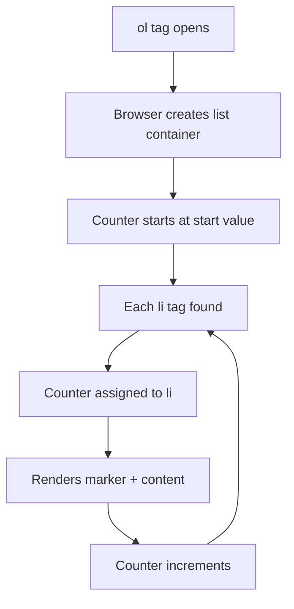
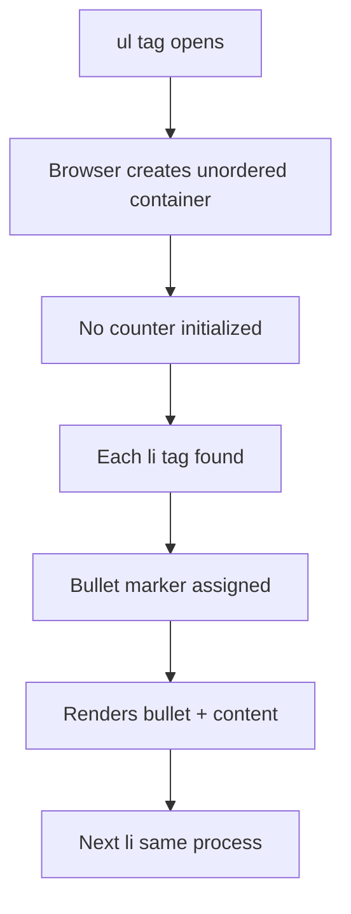
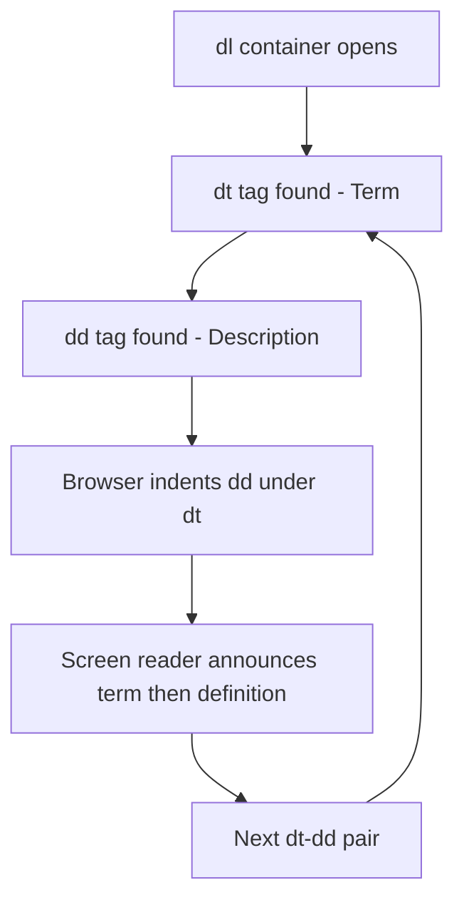
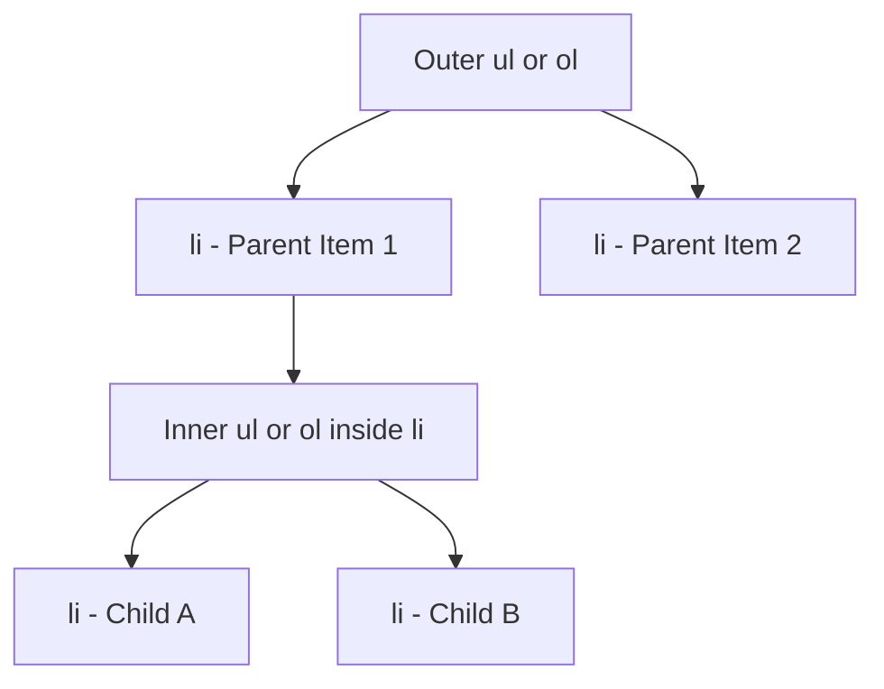
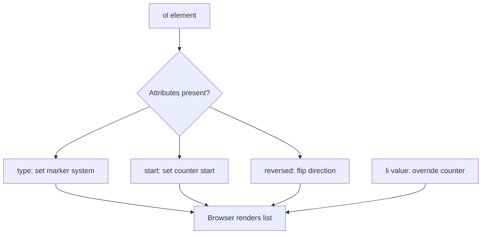
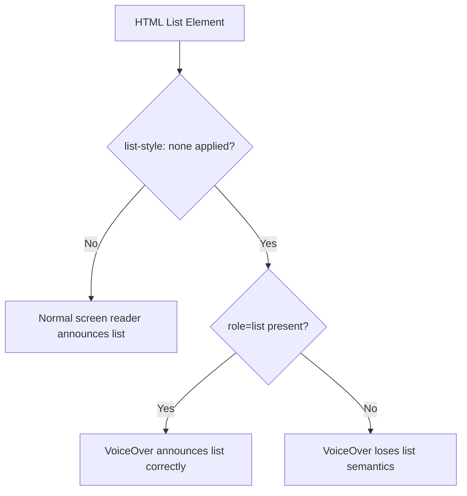
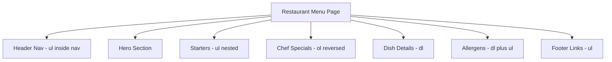

<a id="chapter-10-html-lists"></a>

# Chapter 10: HTML Lists

[⬅ Previous Chapter](#chapter-9-html-links-navigation) | [📖 Main Index](#main-index) | [Next Chapter ➡](#chapter-11-images-html)

---

## 📌 Learning Objectives

By the end of this chapter, you will:

**Understand:**
- All three types of HTML lists — Ordered, Unordered, and Description
- How nested lists create hierarchical structures
- The difference between semantic and visual use of lists
- How list attributes control numbering, starting values, and direction

**Interview Concepts Covered:**
- Difference between `<ul>`, `<ol>`, and `<dl>`
- When to use each list type semantically
- Deprecated attributes vs modern CSS approach
- Accessibility and screen reader behavior with lists
- Navigation menus using unordered lists

**Practical Skills:**
- Build real-world navigation menus using `<ul>`
- Create step-by-step guides using `<ol>`
- Build glossaries and FAQ sections using `<dl>`
- Create multi-level nested lists for outlines and dropdowns
- Style lists using CSS list properties

---

<a id="chapter-index-table-10"></a>

## Chapter Index Table

| Topic No. | Topic Name | Subtopics |
|-----------|-----------|-----------|
| 10.1 | [Ordered List](#101-ordered-list) | What is it · `type` attribute · `start` attribute · `reversed` attribute · `value` on `<li>` · Practical usage |
| 10.2 | [Unordered List](#102-unordered-list) | What is it · `type` attribute · Navigation menus · CSS custom bullets · Practical usage |
| 10.3 | [Description List](#103-description-list) | What is it · `<dl>` `<dt>` `<dd>` · Multiple descriptions · FAQ / Specs use case |
| 10.4 | [Nested Lists](#104-nested-lists) | Nesting rules · Mixed list types · Default bullet levels · Real-world navigation |
| 10.5 | [List Attributes](#105-list-attributes) | All list attributes · HTML4 vs HTML5 · Deprecated attributes · Combining attributes |
| 10.6 | [Lists and CSS](#106-lists-and-css) | `list-style-type` · `list-style-image` · `list-style-position` · shorthand · CSS counters |
| 10.7 | [Accessibility and Semantic Use](#107-accessibility-and-semantic-use-of-lists) | Screen readers · VoiceOver fix · ARIA roles · Breadcrumbs · Semantic guide |

---

## 10.1 Ordered List

<a id="101-ordered-list"></a>

### What is it?

An **Ordered List** (`<ol>`) is an HTML element that represents a collection of items where **sequence and order matter**. Each item inside is wrapped in an `<li>` (list item) tag. The browser automatically renders a **sequential marker** — number, letter, or Roman numeral — before each item.

---

### Why is it needed?

When presenting steps, rankings, procedures, or legal clauses — the order in which items appear carries meaning. An ordered list communicates this requirement **structurally and semantically**, making it correct for browsers, screen readers, and SEO crawlers.

---

### What problem does it solve?

Without `<ol>`:
- You would manually type numbers (breaks when items are reordered)
- Screen readers would not know sequence matters
- No automatic renumbering when items are inserted or removed

`<ol>` solves all three automatically.

---

### How does it work?

```html
<ol>
  <li>Boil water</li>
  <li>Add tea leaves</li>
  <li>Add milk and sugar</li>
  <li>Filter and serve</li>
</ol>
```

**Rendered Output:**
1. Boil water
2. Add tea leaves
3. Add milk and sugar
4. Filter and serve

The browser maintains an internal counter that starts at 1 (by default) and increments by 1 for each `<li>` found.

---

### Internal Working



---

### Key Characteristics

| Feature | Detail |
|--------|--------|
| Tag | `<ol>` |
| Child Tag | `<li>` |
| Default Numbering | Arabic numerals (1, 2, 3…) |
| Attributes | `type`, `start`, `reversed` |
| Display | Block-level element |
| Semantic Meaning | Order matters |

---

### The `type` Attribute

The `type` attribute defines what marker system is used.

| Value | Marker Type | Example |
|-------|-------------|---------|
| `1` | Decimal numbers (default) | 1, 2, 3 |
| `A` | Uppercase letters | A, B, C |
| `a` | Lowercase letters | a, b, c |
| `I` | Uppercase Roman numerals | I, II, III |
| `i` | Lowercase Roman numerals | i, ii, iii |

```html
<!-- Legal Document Style -->
<ol type="I">
  <li>Definitions and Scope</li>
  <li>Obligations of Parties</li>
  <li>Termination Conditions</li>
</ol>

<!-- Academic Outline -->
<ol type="A">
  <li>Introduction</li>
  <li>Literature Review</li>
  <li>Methodology</li>
</ol>
```

> [!TIP]
> Use `type="I"` for legal documents and academic papers where Roman numerals are conventional. Use CSS `list-style-type` for purely visual marker changes.

---

### The `start` Attribute

The `start` attribute sets the **starting counter value**. It always accepts an **integer**, even when using letter or Roman numeral types.

```html
<!-- Continue numbering from step 4 -->
<p>Steps 1–3 were completed on the previous page.</p>
<ol start="4">
  <li>Configure the environment</li>
  <li>Install dependencies</li>
  <li>Run the application</li>
</ol>
```

**Output:**
4. Configure the environment
5. Install dependencies
6. Run the application

```html
<!-- start with type="a": start=3 means begin at 'c' -->
<ol type="a" start="3">
  <li>Third sub-point</li>
  <li>Fourth sub-point</li>
</ol>
```

**Output:**
c. Third sub-point
d. Fourth sub-point

> [!IMPORTANT]
> `start` always takes an **integer** regardless of `type`. With `type="a"` and `start="3"`, the list begins at **'c'** because a=1, b=2, c=3.

---

### The `reversed` Attribute

The `reversed` attribute is a **boolean HTML5 attribute** that makes the list count **downward**.

```html
<!-- Countdown / Top-N list -->
<h3>Top 5 Features of HTML5</h3>
<ol reversed>
  <li>Geolocation API</li>
  <li>Web Storage</li>
  <li>Canvas Element</li>
  <li>Semantic Elements</li>
  <li>Native Form Validation</li>
</ol>
```

**Output:**
5. Geolocation API
4. Web Storage
3. Canvas Element
2. Semantic Elements
1. Native Form Validation

```html
<!-- reversed with custom start -->
<ol reversed start="10">
  <li>Position 10</li>
  <li>Position 9</li>
  <li>Position 8</li>
</ol>
```

**Output:**
10. Position 10
9. Position 9
8. Position 8

---

### The `value` Attribute on `<li>`

Individual list items can override their counter using the `value` attribute.

```html
<ol>
  <li>Introduction</li>        <!-- 1 -->
  <li value="5">Chapter 5</li> <!-- 5 (jumps) -->
  <li>Chapter 6</li>           <!-- 6 (continues) -->
  <li value="10">Appendix</li> <!-- 10 (jumps again) -->
  <li>Index</li>               <!-- 11 (continues) -->
</ol>
```

**Output:**
1. Introduction
5. Chapter 5
6. Chapter 6
10. Appendix
11. Index

---

### 🧠 Hinglish Intuition

> Soch tu ek recipe likh raha hai — "Pehle onion kato, phir oil garam karo, phir masala daalo." Yahan **order matter karta hai**. Agar koi pehle masala daale bina oil ke, toh dish kharab ho jayegi.
>
> Exactly yahi kaam karta hai `<ol>`. Jab bhi cheezein ek **fixed sequence** mein honi chahiye — recipe steps, installation guide, rankings — tab `<ol>` use karo.
>
> Browser khud hi 1, 2, 3 lagata hai. Tu ek item beech mein add karo — woh khud reorder kar leta hai. Manually numbers likhne ki zaroorat nahi!

---

### Practical Applications

- Step-by-step installation guides
- Cooking recipe instructions
- Legal clause numbering
- Rankings and leaderboards (Top 10)
- Table of contents
- Exam question numbering
- Troubleshooting steps

---

### Real World Usage

```html
<!-- Software Installation Guide -->
<section>
  <h2>How to Install Node.js</h2>
  <ol>
    <li>
      Visit the official Node.js website at 
      <a href="https://nodejs.org">nodejs.org</a>
    </li>
    <li>Download the LTS version for your operating system</li>
    <li>Run the downloaded installer and follow the setup wizard</li>
    <li>Open your terminal or command prompt</li>
    <li>
      Type <code>node --version</code> to verify installation
    </li>
  </ol>
</section>
```

**Code Breakdown:**
- Each step is in `<li>` — browser auto-numbers them 1–5
- `<a>` and `<code>` tags work perfectly inside `<li>`
- Adding a step between 2 and 3 later? Just insert `<li>` — numbering updates automatically

---

### Advantages

- Automatic sequential numbering — no manual maintenance
- Semantically correct — tells browser and screen readers that order matters
- Flexible via `type`, `start`, and `reversed` attributes
- Accessible by default with assistive technologies
- Easy reordering without renumbering

---

### Limitations

- Limited built-in styling (CSS needed for custom markers)
- `reversed` was added in HTML5 — avoid assumptions about HTML4 support
- Cannot skip numbers without using `value` on individual `<li>` elements

---

### Common Mistakes

```html
<!-- ❌ WRONG: Putting content directly in ol without li -->
<ol>
  Step One
  Step Two
</ol>

<!-- ✅ CORRECT: Always wrap in li -->
<ol>
  <li>Step One</li>
  <li>Step Two</li>
</ol>

<!-- ❌ WRONG: Using type attribute purely for visual style -->
<!-- Use CSS list-style-type for visual-only changes -->
<!-- type is for semantic meaning (Roman = legal/academic) -->

<!-- ✅ CORRECT: type for semantic, CSS for visual -->
<ol type="I">
  <li>Section One</li>
</ol>
```

---

### Best Practices

- Use `<ol>` only when **sequence genuinely matters** semantically
- Prefer CSS `list-style-type` for **purely visual** marker changes
- Use `type` attribute for **semantic** meaning (Roman numerals in legal docs)
- Always use `<li>` as direct children — never raw text in `<ol>`
- Use `start` to continue numbering across multi-section content
- Use `value` on `<li>` only for non-sequential clause numbering

---

### Interview Perspective

> [!IMPORTANT]
> **Common Question:** "What is the difference between `type` attribute on `<ol>` and `list-style-type` in CSS?"
> - `type` attribute — HTML attribute, semantic meaning, valid in HTML5
> - `list-style-type` — CSS property, purely visual, more powerful, preferred
>
> **Common Question:** "What does the `reversed` attribute do?"
> - Makes `<ol>` count downward. Boolean attribute — just writing `reversed` activates it.
>
> **Trap:** "Does `start='3'` with `type='a'` start at number 3 or letter 'c'?"
> - Answer: **'c'** — because a=1, b=2, c=3.

👉 <a href="#chapter-index-table-10">Go to Top 🔝</a>

---

## 10.2 Unordered List

<a id="102-unordered-list"></a>

### What is it?

An **Unordered List** (`<ul>`) is an HTML element representing a collection of items where **order does NOT matter**. Each item is wrapped in `<li>` and rendered with a **bullet marker** by default — typically a filled circle (●).

---

### Why is it needed?

Many real-world groupings have no meaningful sequence — a shopping list, a set of features, navigation links. Using `<ol>` for these would imply a false ordering. `<ul>` communicates: "these items belong together, but sequence is irrelevant."

---

### What problem does it solve?

- Provides visual grouping without implying sequence
- Semantically correct for non-sequential collections
- Screen readers announce it as a list without implying order
- Foundation of almost every navigation system on the web

---

### How does it work?

```html
<ul>
  <li>HTML</li>
  <li>CSS</li>
  <li>JavaScript</li>
</ul>
```

**Output:**
- HTML
- CSS
- JavaScript

The browser renders a bullet (●) before each item. No counter is maintained.

---

### Internal Working



---

### Key Characteristics

| Feature | Detail |
|--------|--------|
| Tag | `<ul>` |
| Child Tag | `<li>` |
| Default Marker | Filled disc (●) |
| Attributes | `type` (deprecated in HTML5) |
| Display | Block-level element |
| Semantic Meaning | Order does NOT matter |

---

### The `type` Attribute (Deprecated in HTML5)

> [!NOTE]
> The `type` attribute on `<ul>` was **deprecated in HTML5**. Use CSS `list-style-type` instead. It still works in most browsers and appears in interview questions.

| Value | Marker |
|-------|--------|
| `disc` | ● (default) |
| `circle` | ○ |
| `square` | ■ |

```html
<!-- ❌ Deprecated approach (still works) -->
<ul type="square">
  <li>Feature A</li>
  <li>Feature B</li>
</ul>

<!-- ✅ Modern approach using CSS -->
<ul style="list-style-type: square;">
  <li>Feature A</li>
  <li>Feature B</li>
</ul>
```

---

### Real World Usage — Navigation Menu

The most important real-world use of `<ul>` is building **navigation menus**.

```html
<!-- Semantic Navigation Menu -->
<nav aria-label="Main Navigation">
  <ul>
    <li><a href="#home">Home</a></li>
    <li><a href="#about">About</a></li>
    <li><a href="#services">Services</a></li>
    <li><a href="#contact">Contact</a></li>
  </ul>
</nav>
```

```css
/* CSS: Convert ul into horizontal nav bar */
nav ul {
  list-style: none;
  margin: 0;
  padding: 0;
  display: flex;
  gap: 24px;
  background-color: #1a1a2e;
  padding: 14px 32px;
}

nav ul li a {
  color: #e0e0e0;
  text-decoration: none;
  font-size: 15px;
  padding: 6px 0;
  border-bottom: 2px solid transparent;
  transition: color 0.3s, border-color 0.3s;
}

nav ul li a:hover {
  color: #f0c040;
  border-bottom-color: #f0c040;
}
```

**Code Breakdown:**
- `list-style: none` — removes default bullets
- `display: flex` — makes items horizontal
- `gap: 24px` — spacing between nav items
- The `<ul>` provides **semantic structure** even when visually styled as a horizontal bar

> [!IMPORTANT]
> Navigation menus built with `<ul>` are **screen-reader friendly** and **SEO-friendly**. All major websites use `<ul>` inside `<nav>` for navigation, regardless of visual output.

---

### CSS Custom Bullets

```css
/* Remove bullets entirely */
ul.no-bullets {
  list-style-type: none;
  padding: 0;
  margin: 0;
}

/* Square bullets */
ul.square-list {
  list-style-type: square;
}

/* Custom image bullet */
ul.custom-image {
  list-style-image: url('bullet-arrow.png');
}

/* Unicode / Emoji bullet using ::before */
ul.emoji-list {
  list-style: none;
  padding-left: 0;
}

ul.emoji-list li {
  padding-left: 28px;
  position: relative;
  margin-bottom: 8px;
}

ul.emoji-list li::before {
  content: "✅ ";
  position: absolute;
  left: 0;
}
```

```html
<ul class="emoji-list">
  <li>Responsive Design</li>
  <li>Cross-browser Compatible</li>
  <li>Accessible Markup</li>
</ul>
```

**Output:**
✅ Responsive Design
✅ Cross-browser Compatible
✅ Accessible Markup

---

### 🧠 Hinglish Intuition

> Soch tu grocery list bana raha hai — doodh, anda, bread, butter. Kya inka koi order hai? Nahi! Koi bhi pehle khareed sakta hai.
>
> Ab navigation menu dekh — Home, About, Services, Contact. Kya pehle Home fir About zaroori hai? Nahi! Sirf bullet points chahiye, sequence nahi.
>
> Yahi `<ul>` ka kaam hai — "Yeh items saath belong karte hain, par koi order nahi hai." Browser automatically bullets lagata hai. CSS se hum unhe kuch bhi bana sakte hain — horizontal nav bar, card list, dropdown menu.

---

### Practical Applications

- Navigation menus (most common use)
- Feature lists on landing pages
- Shopping cart / wishlist items
- Tags and categories
- Sidebar links
- Ingredient lists (recipe — order doesn't matter)
- Footer links

---

### Advantages

- Semantically correct for non-sequential content
- Extremely flexible with CSS — bullets, images, icons, emojis
- Foundation of almost every web navigation system
- Accessible by default

---

### Limitations

- Default bullet styling is minimal — CSS required for enhancement
- `type` attribute for marker control is deprecated in HTML5

---

### Common Mistakes

```html
<!-- ❌ WRONG: Using ol when order doesn't matter -->
<ol>
  <li>HTML</li>
  <li>CSS</li>
  <li>JavaScript</li>
</ol>
<!-- Implies HTML must be learned before CSS — semantically wrong -->

<!-- ✅ CORRECT: Use ul for unordered collections -->
<ul>
  <li>HTML</li>
  <li>CSS</li>
  <li>JavaScript</li>
</ul>

<!-- ❌ WRONG: Raw text directly inside ul -->
<ul>
  Random text here
  <li>Item One</li>
</ul>

<!-- ✅ CORRECT: All content in li -->
<ul>
  <li>Item One</li>
  <li>Item Two</li>
</ul>
```

---

### Best Practices

- Use `<ul>` for navigation menus — semantic HTML best practice
- Always use CSS for bullet styling — avoid deprecated `type` attribute
- Use `list-style: none` with `padding: 0; margin: 0` to reset before custom styling
- Wrap navigation `<ul>` inside `<nav>` for proper landmark semantics

---

### Interview Perspective

> [!IMPORTANT]
> **Common Question:** "How do you create a horizontal navigation bar?"
> Answer: `<ul>` + `display: flex` + `list-style: none` + `padding: 0; margin: 0`
>
> **Common Question:** "Is the `type` attribute valid on `<ul>` in HTML5?"
> Answer: It is **deprecated** in HTML5. Use CSS `list-style-type` instead.
>
> **Semantic Trap:** "Why use `<ul>` inside `<nav>` when CSS can make anything look like a nav bar?"
> Answer: Semantic HTML improves **accessibility** (screen readers announce navigation regions) and **SEO** (search engines understand site structure).

👉 <a href="#chapter-index-table-10">Go to Top 🔝</a>

---

## 10.3 Description List

<a id="103-description-list"></a>

### What is it?

A **Description List** (`<dl>`) is an HTML element representing a list of **term-description pairs**. It uses three tags together:

| Tag | Full Name | Purpose |
|-----|-----------|---------|
| `<dl>` | Description List | The container element |
| `<dt>` | Description Term | The term or name being defined |
| `<dd>` | Description Details | The definition or description of the term |

---

### Why is it needed?

Some content is naturally structured as **name → value** or **term → definition** pairs. Using `<ul>` or `<ol>` for this would be semantically wrong. `<dl>` is the **semantically correct** element for glossaries, metadata, FAQs, and key-value displays.

---

### What problem does it solve?

- Represents dictionary/glossary-style content correctly
- Communicates key-value relationships to browsers and screen readers
- Provides visual grouping through default indentation
- Flexible structure — one term can have multiple descriptions

---

### How does it work?

```html
<dl>
  <dt>HTML</dt>
  <dd>HyperText Markup Language — the standard language for web pages.</dd>

  <dt>CSS</dt>
  <dd>Cascading Style Sheets — used to style and layout web pages.</dd>

  <dt>JavaScript</dt>
  <dd>A scripting language that enables interactive web pages.</dd>
</dl>
```

**Rendered Output:**

**HTML**
&nbsp;&nbsp;&nbsp;&nbsp;HyperText Markup Language — the standard language for web pages.

**CSS**
&nbsp;&nbsp;&nbsp;&nbsp;Cascading Style Sheets — used to style and layout web pages.

**JavaScript**
&nbsp;&nbsp;&nbsp;&nbsp;A scripting language that enables interactive web pages.

---

### Internal Working



---

### Key Characteristics

| Feature | Detail |
|--------|--------|
| Container Tag | `<dl>` |
| Term Tag | `<dt>` |
| Description Tag | `<dd>` |
| Default Rendering | `dt` left-aligned, `dd` indented |
| Display | Block-level |
| Semantic Meaning | Term-definition relationship |

---

### Multiple Descriptions per Term

One `<dt>` can have **multiple `<dd>` elements**:

```html
<dl>
  <dt>JavaScript</dt>
  <dd>A programming language for web development.</dd>
  <dd>Can run in browsers and on servers via Node.js.</dd>
  <dd>Supports object-oriented and functional paradigms.</dd>
</dl>
```

---

### Multiple Terms for One Description

Multiple `<dt>` elements can share a single `<dd>` (useful for synonyms):

```html
<dl>
  <dt>HTML</dt>
  <dt>HyperText Markup Language</dt>
  <dd>The standard markup language for creating web pages.</dd>
</dl>
```

---

### 🧠 Hinglish Intuition

> Soch ek dictionary dekh raha hai — "Computer: Ek electronic device jo data process karta hai." Yahan ek **word** hai aur uski **definition** hai. Yahi `<dl>` hai.
>
> Ya fir FAQ page — "Q: Delivery kab aayegi? A: 3-5 business days." Question = `<dt>`, Answer = `<dd>`.
>
> `<ul>` mein sirf items hote hain. `<dl>` mein ek **relationship** hoti hai — yeh cheez **is** cheez ko describe karti hai. Isliye glossaries, product specs, FAQs ke liye `<dl>` perfect hai.

---

### Real World Usage — FAQ Section

```html
<section>
  <h2>Frequently Asked Questions</h2>
  <dl>
    <dt>What is the return policy?</dt>
    <dd>We offer a 30-day return policy for all unused items in original packaging.</dd>

    <dt>How long does shipping take?</dt>
    <dd>Standard shipping takes 5–7 business days.</dd>
    <dd>Express shipping is available for 1–2 business days at extra cost.</dd>

    <dt>Do you ship internationally?</dt>
    <dd>Yes, we ship to over 50 countries worldwide.</dd>
  </dl>
</section>
```

---

### Real World Usage — Product Specification

```html
<article>
  <h2>Laptop Specifications</h2>
  <dl>
    <dt>Processor</dt>
    <dd>Intel Core i7, 12th Gen, 2.1GHz Base Clock</dd>

    <dt>RAM</dt>
    <dd>16 GB DDR5</dd>

    <dt>Storage</dt>
    <dd>512 GB NVMe SSD</dd>

    <dt>Display</dt>
    <dd>15.6 inch Full HD IPS, 144Hz Refresh Rate</dd>

    <dt>Battery Life</dt>
    <dd>Up to 10 hours on mixed usage</dd>
  </dl>
</article>
```

---

### CSS Styling for Description List

```css
dl {
  background-color: #f9f9f9;
  border: 1px solid #ddd;
  border-radius: 8px;
  padding: 20px;
}

dt {
  font-weight: bold;
  color: #1a1a2e;
  margin-top: 16px;
  font-size: 16px;
}

dt:first-child {
  margin-top: 0;
}

dd {
  margin-left: 24px;
  color: #555;
  line-height: 1.7;
  margin-top: 4px;
}
```

---

### Practical Applications

- **Glossaries** — term and its definition
- **FAQ pages** — question as `<dt>`, answer as `<dd>`
- **Product specifications** — spec name and value
- **Metadata display** — Author, Date, Category, Tags
- **Recipe details** — Prep time, Cook time, Servings
- **Contact details** — Phone, Email, Address

---

### Advantages

- Semantically correct for term-definition content
- Screen readers handle `<dl>`, `<dt>`, `<dd>` correctly
- Default indentation provides visual hierarchy
- Multiple `<dd>` per `<dt>` allows rich descriptions
- Flexible structure (multiple terms, multiple descriptions)

---

### Limitations

- Less commonly known — developers often misuse `<ul>` instead
- Default browser styling is minimal
- Not suitable for sequential or unordered standalone items

---

### Common Mistakes

```html
<!-- ❌ WRONG: dt and dd outside dl -->
<dt>Term</dt>
<dd>Description</dd>

<!-- ❌ WRONG: Using p tags instead of dd -->
<dl>
  <dt>HTML</dt>
  <p>A markup language.</p>
</dl>

<!-- ❌ WRONG: Using dl for visual indentation only -->
<!-- Use CSS margin/padding for visual indentation -->

<!-- ✅ CORRECT: Proper dl structure -->
<dl>
  <dt>HTML</dt>
  <dd>A markup language for creating web pages.</dd>
</dl>
```

---

### Best Practices

- Use `<dl>` only for genuine term-definition relationships
- Do not use `<dl>` for visual indentation — use CSS
- Always pair `<dt>` with at least one `<dd>`
- CSS provides full control over visual styling
- Consider `<dl>` for metadata sections, specs, and glossaries

---

### Interview Perspective

> [!IMPORTANT]
> **Common Question:** "What is the difference between `<ul>`, `<ol>`, and `<dl>`?"
> - `<ul>` — unordered items, no sequence, no relationship between items
> - `<ol>` — ordered items, sequence matters
> - `<dl>` — term-description pairs, relationship matters
>
> **Common Question:** "Can a `<dt>` have multiple `<dd>` elements?"
> Answer: **Yes.** One term can have many descriptions.
>
> **Rarely Known:** "Can multiple `<dt>` elements share one `<dd>`?"
> Answer: **Yes.** Useful for synonyms sharing one definition.

👉 <a href="#chapter-index-table-10">Go to Top 🔝</a>

---

## 10.4 Nested Lists

<a id="104-nested-lists"></a>

### What is it?

**Nested lists** are lists placed **inside an `<li>` element** of another list, creating a **hierarchical, multi-level structure**. Any combination of `<ul>`, `<ol>`, and `<dl>` can be nested inside each other.

---

### Why is it needed?

Real-world information often has **parent-child relationships** — a chapter has sections, a section has topics, a topic has subtopics. Nested lists represent these hierarchies structurally and semantically.

---

### What problem does it solve?

- Represents hierarchical data in HTML
- Provides visual indentation matching logical hierarchy
- Allows mixing list types for different semantic levels
- Used for multi-level navigation menus, outlines, and category trees

---

### How does it work?

The inner list is placed **inside an `<li>` tag** of the outer list:

```html
<ul>
  <li>Frontend Technologies
    <ul>
      <li>HTML</li>
      <li>CSS</li>
      <li>JavaScript</li>
    </ul>
  </li>
  <li>Backend Technologies
    <ul>
      <li>Node.js</li>
      <li>Python</li>
      <li>Java</li>
    </ul>
  </li>
</ul>
```

**Output:**
- Frontend Technologies
  - HTML
  - CSS
  - JavaScript
- Backend Technologies
  - Node.js
  - Python
  - Java

---

### Internal Working



---

### Default Bullet Styles for Nested `<ul>`

Browser automatically changes bullet style at each nesting level:

| Nesting Level | Default Bullet |
|--------------|----------------|
| Level 1 | ● (disc) |
| Level 2 | ○ (circle) |
| Level 3 | ■ (square) |
| Level 4+ | ■ (square, continues) |

---

### Mixing Ordered and Unordered Lists

```html
<!-- Ordered outer + Unordered inner -->
<ol>
  <li>Phase 1: Planning
    <ul>
      <li>Define requirements</li>
      <li>Create wireframes</li>
      <li>Set timeline</li>
    </ul>
  </li>
  <li>Phase 2: Development
    <ul>
      <li>Write HTML structure</li>
      <li>Apply CSS styles</li>
      <li>Add interactivity</li>
    </ul>
  </li>
  <li>Phase 3: Testing
    <ul>
      <li>Cross-browser testing</li>
      <li>Mobile responsiveness check</li>
      <li>Performance audit</li>
    </ul>
  </li>
</ol>
```

---

### Unordered Outer, Ordered Inner

```html
<ul>
  <li>Make Chai
    <ol>
      <li>Boil water</li>
      <li>Add tea leaves and ginger</li>
      <li>Add milk and sugar</li>
      <li>Filter and serve</li>
    </ol>
  </li>
  <li>Make Coffee
    <ol>
      <li>Heat water to 90°C</li>
      <li>Add coffee powder</li>
      <li>Add milk or creamer</li>
      <li>Stir and serve</li>
    </ol>
  </li>
</ul>
```

---

### Three-Level Deep Nesting

```html
<ul>
  <li>Technology
    <ul>
      <li>Web Development
        <ul>
          <li>HTML Fundamentals</li>
          <li>CSS Styling</li>
          <li>JavaScript Programming</li>
        </ul>
      </li>
      <li>Mobile Development
        <ul>
          <li>React Native</li>
          <li>Flutter</li>
        </ul>
      </li>
    </ul>
  </li>
</ul>
```

---

### 🧠 Hinglish Intuition

> Soch school ka syllabus — Chapter 1: Arithmetic
> - 1.1 Addition
>   - Whole numbers
>   - Decimals
> - 1.2 Subtraction
>
> Yahan chapter ke andar sections hain, sections ke andar topics. Yeh hierarchy naturally nested list se represent hoti hai.
>
> **Sabse important rule yaad rakh:** Inner list hamesha `<li>` ke **andar** hona chahiye. Kabhi bhi `<ul>` ya `<ol>` ke direct andar nahi. Yeh HTML ka sabse common validation error hai!

---

### Real World Usage — Dropdown Navigation Structure

```html
<nav>
  <ul class="main-nav">
    <li><a href="#">Home</a></li>
    <li>
      <a href="#">Products</a>
      <ul class="dropdown">
        <li><a href="#">Laptops</a></li>
        <li><a href="#">Smartphones</a></li>
        <li><a href="#">Tablets</a></li>
      </ul>
    </li>
    <li>
      <a href="#">Services</a>
      <ul class="dropdown">
        <li><a href="#">Web Design</a></li>
        <li><a href="#">SEO</a></li>
        <li><a href="#">Hosting</a></li>
      </ul>
    </li>
    <li><a href="#">Contact</a></li>
  </ul>
</nav>
```

**Code Breakdown:**
- Outer `<ul>` = main navigation level
- Inner `<ul class="dropdown">` = submenu items
- CSS `hover + display: none/block` would show/hide dropdown
- This is the **standard HTML structure** for dropdown menus across all major websites

---

### Practical Applications

- Table of contents with chapters and sections
- Navigation menus with dropdowns
- Organizational charts in HTML
- File directory structures
- Product categories with subcategories
- Course outlines with modules and lessons

---

### Common Mistakes

```html
<!-- ❌ WRONG: Inner list placed OUTSIDE li — directly in ul -->
<ul>
  <li>Parent Item</li>
  <ul>            <!-- ❌ ul directly inside ul -->
    <li>Child Item</li>
  </ul>
</ul>

<!-- ✅ CORRECT: Inner list INSIDE li -->
<ul>
  <li>Parent Item
    <ul>           <!-- ✅ ul inside li -->
      <li>Child Item</li>
    </ul>
  </li>
</ul>
```

> [!IMPORTANT]
> Placing `<ul>` or `<ol>` directly inside another `<ul>` or `<ol>` **without an `<li>` wrapper** is **invalid HTML**. This is one of the most common HTML validation errors found in real-world code.

---

### Best Practices

- Never place a list directly inside another list — always inside `<li>`
- Limit nesting to **3 levels maximum** for usability
- Use CSS to customize indentation and bullet styles per level
- For dropdown navigation, consider ARIA attributes (`aria-expanded`, `aria-haspopup`) for accessibility

---

### Interview Perspective

> [!IMPORTANT]
> **Common Question:** "What is the correct way to nest lists in HTML?"
> Answer: The inner list must be placed **inside an `<li>` element** of the outer list.
>
> **Common Question:** "How do browser bullet styles change with nested `<ul>`?"
> Answer: Level 1 = disc (●), Level 2 = circle (○), Level 3 = square (■)
>
> **Output Question:** "Is this valid HTML?" — Show `<ul><ul>...</ul></ul>`
> Answer: **Invalid** — `ul` cannot be a direct child of `ul`.

👉 <a href="#chapter-index-table-10">Go to Top 🔝</a>

---

## 10.5 List Attributes

<a id="105-list-attributes"></a>

### What is it?

**List attributes** are HTML attributes applied to list elements (`<ol>`, `<ul>`, `<li>`) to control their **numbering system, starting value, direction, and individual item counter values**.

---

### Why is it needed?

While CSS handles visual styling, some list behaviors — like starting at a specific number, using Roman numerals semantically, or counting downward — require HTML-level attributes because they carry **semantic meaning**, not just visual appearance.

---

### What problem does it solve?

- Controls sequential numbering without JavaScript
- Maintains continued numbering across broken list segments
- Provides semantic numbering types (Roman for legal, letters for academic)
- Allows per-item counter overrides

---

### Complete Attribute Reference

#### Attributes on `<ol>`

| Attribute | Values | Purpose | HTML Version |
|-----------|--------|---------|-------------|
| `type` | `1`, `A`, `a`, `I`, `i` | Defines numbering type | HTML4 / HTML5 valid |
| `start` | Integer | Starting counter value | HTML4 / HTML5 valid |
| `reversed` | Boolean | Counts downward | **HTML5 Only** |

#### Attributes on `<ul>`

| Attribute | Values | Purpose | Status |
|-----------|--------|---------|--------|
| `type` | `disc`, `circle`, `square` | Bullet style | **Deprecated in HTML5** |

#### Attributes on `<li>`

| Attribute | Values | Purpose | Context |
|-----------|--------|---------|---------|
| `value` | Integer | Override counter for this item | Only for `<li>` inside `<ol>` |
| `type` | Same as parent | Override marker for this item | **Deprecated in HTML5** |

---

### Internal Working



---

### All Attributes with Code Examples

#### `type` on `<ol>`

```html
<!-- Decimal (default) -->
<ol type="1">
  <li>First</li>
  <li>Second</li>
</ol>

<!-- Uppercase Letters -->
<ol type="A">
  <li>Option A</li>
  <li>Option B</li>
</ol>

<!-- Lowercase Letters -->
<ol type="a">
  <li>Sub-point a</li>
  <li>Sub-point b</li>
</ol>

<!-- Uppercase Roman Numerals -->
<ol type="I">
  <li>Chapter I</li>
  <li>Chapter II</li>
</ol>

<!-- Lowercase Roman Numerals -->
<ol type="i">
  <li>Section i</li>
  <li>Section ii</li>
</ol>
```

---

#### `start` on `<ol>`

```html
<!-- Continue steps from step 6 -->
<p>Steps 1–5 were covered in the previous section.</p>
<ol start="6">
  <li>Install dependencies</li>
  <li>Configure environment</li>
  <li>Run the application</li>
</ol>
```

**Output:**
6. Install dependencies
7. Configure environment
8. Run the application

---

#### `reversed` on `<ol>`

```html
<!-- Countdown / Reverse Ranking -->
<h3>Top 5 Movies of the Year</h3>
<ol reversed>
  <li>Fifth ranked movie</li>
  <li>Fourth ranked movie</li>
  <li>Third ranked movie</li>
  <li>Second ranked movie</li>
  <li>First ranked movie — The Best!</li>
</ol>
```

**Output:**
5. Fifth ranked movie
4. Fourth ranked movie
3. Third ranked movie
2. Second ranked movie
1. First ranked movie — The Best!

---

#### `value` on `<li>`

```html
<ol>
  <li>Introduction</li>        <!-- 1 -->
  <li value="5">Chapter 5</li>  <!-- 5 (jumps) -->
  <li>Chapter 6</li>            <!-- 6 (continues) -->
  <li value="10">Appendix</li>  <!-- 10 (jumps) -->
  <li>Index</li>                <!-- 11 (continues) -->
</ol>
```

---

#### Combining Multiple Attributes

```html
<!-- Reversed + start + type together -->
<ol type="A" start="3" reversed>
  <li>Starts at C, counts down</li>
  <li>B</li>
  <li>A</li>
</ol>
```

**Output:**
C. Starts at C, counts down
B. B
A. A

> [!NOTE]
> When combining `reversed` with `type="A"` and `start="3"`: The list starts at C (3rd letter) and counts backward: C, B, A.

---

### HTML4 vs HTML5 Attribute Differences

| Attribute | HTML4 | HTML5 |
|-----------|-------|-------|
| `type` on `<ol>` | Valid | Valid (semantic use preferred) |
| `type` on `<ul>` | Valid | **Deprecated** — use CSS |
| `start` on `<ol>` | Valid | Valid |
| `reversed` on `<ol>` | Not Available | **Added in HTML5** |
| `value` on `<li>` | Valid | Valid |
| `type` on `<li>` | Valid | **Deprecated** — use CSS |

---

### 🧠 Hinglish Intuition

> Attributes ko tools samajh. `type` tool hai jo bolta hai "numbers ki jagah letters use karo." `start` bolta hai "1 se nahi, 5 se shuru karo." `reversed` bolta hai "seedha nahi, ulta gino."
>
> HTML5 mein `<ul>` ke `type` attribute ko **retire** kar diya — kyunki CSS yeh kaam zyada achhe se karta hai. Lekin `<ol>` ke `type` ko rakha kyunki iska **semantic meaning** hai — Roman numerals legal documents mein convention hain, sirf style nahi.

---

### Practical Applications

- `start` — Continue numbering across multi-section documents
- `reversed` — Countdown, reverse rankings, "Top N" lists
- `value` — Legal documents with non-sequential clause numbering
- `type="I"` — Academic papers, formal legal outlines

---

### Common Mistakes

```html
<!-- ❌ WRONG: Using type on ul in HTML5 -->
<ul type="square">
  <li>Item</li>
</ul>

<!-- ✅ CORRECT: Use CSS for ul bullet style -->
<ul style="list-style-type: square;">
  <li>Item</li>
</ul>

<!-- ❌ WRONG: start with non-integer value -->
<ol start="three">  <!-- Invalid -->

<!-- ✅ CORRECT: start always integer -->
<ol start="3">
  <li>Third step</li>
</ol>
```

---

### Best Practices

- Use `start` and `reversed` attributes — valid and semantically meaningful in HTML5
- Avoid `type` on `<ul>` — use CSS `list-style-type`
- Use `type` on `<ol>` when the **numbering system has semantic meaning**
- Document use of `value` attribute — jumping numbers can confuse users

---

### Interview Perspective

> [!IMPORTANT]
> **Common Question:** "Which attributes of `<ul>` are deprecated in HTML5?"
> Answer: The `type` attribute on `<ul>` is deprecated in HTML5.
>
> **Common Question:** "What is the `reversed` attribute and when was it introduced?"
> Answer: Boolean attribute on `<ol>` that makes list count downward. Introduced in **HTML5**.
>
> **Trap Question:** "What value does `start='3'` give when `type='a'` is set?"
> Answer: The list starts at **'c'** — the 3rd letter of the alphabet.

👉 <a href="#chapter-index-table-10">Go to Top 🔝</a>

---

## 10.6 Lists and CSS

<a id="106-lists-and-css"></a>

### What is it?

CSS provides dedicated properties for controlling the visual appearance of HTML list markers — their **type, image, and position**. These give complete control over how bullets or numbers are rendered, and enable advanced patterns like custom counters.

---

### Why is it needed?

Default browser list styles are functional but visually basic. Real-world websites require custom bullets, icons, images, or completely marker-free lists for navigation. CSS list properties enable full visual customization.

---

### Core CSS List Properties

| Property | Purpose |
|----------|---------|
| `list-style-type` | Controls the marker type |
| `list-style-image` | Uses a custom image as the marker |
| `list-style-position` | Controls marker position relative to content |
| `list-style` | Shorthand for all three |

---

### `list-style-type`

#### Values for `<ul>`:

| Value | Marker |
|-------|--------|
| `disc` | ● (default) |
| `circle` | ○ |
| `square` | ■ |
| `none` | No marker |

#### Values for `<ol>`:

| Value | Example |
|-------|---------|
| `decimal` | 1, 2, 3 (default) |
| `decimal-leading-zero` | 01, 02, 03 |
| `lower-alpha` | a, b, c |
| `upper-alpha` | A, B, C |
| `lower-roman` | i, ii, iii |
| `upper-roman` | I, II, III |
| `lower-greek` | α, β, γ |
| `none` | No marker |

```css
/* Unordered list styles */
ul.disc-list    { list-style-type: disc; }
ul.circle-list  { list-style-type: circle; }
ul.square-list  { list-style-type: square; }
ul.no-bullet    { list-style-type: none; }

/* Ordered list styles */
ol.leading-zero { list-style-type: decimal-leading-zero; }
ol.lower-alpha  { list-style-type: lower-alpha; }
ol.upper-roman  { list-style-type: upper-roman; }
ol.greek        { list-style-type: lower-greek; }
```

```html
<ol class="leading-zero">
  <li>First Item</li>
  <li>Second Item</li>
  <li>Third Item</li>
</ol>
```

**Output:**
01. First Item
02. Second Item
03. Third Item

---

### `list-style-image`

Replaces the default bullet with a custom image.

```css
ul.custom-bullet {
  list-style-image: url('images/arrow-bullet.png');
}
```

> [!TIP]
> `list-style-image` gives limited control over image sizing and positioning. For better control, use `list-style: none` and add a custom marker via `::before` pseudo-element.

---

### Better Custom Bullet with `::before`

```css
ul.icon-list {
  list-style: none;
  padding-left: 0;
}

ul.icon-list li {
  padding-left: 28px;
  position: relative;
  margin-bottom: 10px;
  line-height: 1.6;
}

ul.icon-list li::before {
  content: "→";
  position: absolute;
  left: 0;
  color: #e74c3c;
  font-weight: bold;
}
```

```html
<ul class="icon-list">
  <li>Responsive Design</li>
  <li>Cross-browser Support</li>
  <li>Accessible Markup</li>
</ul>
```

**Output:**
→ Responsive Design
→ Cross-browser Support
→ Accessible Markup

---

### `list-style-position`

Controls whether the marker appears **inside** or **outside** the list item's content box.

| Value | Description |
|-------|-------------|
| `outside` | Marker outside content box (default). Wrapped text aligns under text, not marker. |
| `inside` | Marker inside content box. Wrapped text aligns under marker. |

```css
/* Default — marker outside */
ul.outside-example {
  list-style-position: outside;
}

/* Marker inside content box */
ul.inside-example {
  list-style-position: inside;
}
```

**Visual Difference:**

```
outside (default):
●  First line of text here
   Second line aligns here (under text)

inside:
● First line of text here
● Second line aligns under marker
```

---

### `list-style` Shorthand

Combines all three properties in one declaration:

```css
/* Syntax: list-style: [type] [position] [image] */

ul.example-1 { list-style: disc; }
ul.example-2 { list-style: circle inside; }
ul.example-3 { list-style: none; }
ul.example-4 { list-style: upper-roman outside; }
```

---

### CSS Reset for Lists

When using lists for navigation or custom UI, always reset defaults:

```css
/* Complete list reset — most important pattern */
ul, ol {
  list-style: none;
  margin: 0;
  padding: 0;
}
```

> [!IMPORTANT]
> Browsers add default `padding-left` to `<ul>` and `<ol>` (typically 40px). When using `list-style: none`, always also set `padding: 0` and `margin: 0` to remove this default spacing, otherwise unexpected gaps appear.

---

### CSS Counters — Advanced Custom Numbering

CSS counters create custom numbering systems independent of HTML `<ol>`:

```css
ol.custom-counter {
  list-style: none;
  counter-reset: step-counter;
  padding-left: 0;
}

ol.custom-counter li {
  counter-increment: step-counter;
  padding-left: 48px;
  position: relative;
  margin-bottom: 16px;
}

ol.custom-counter li::before {
  content: counter(step-counter);
  position: absolute;
  left: 0;
  width: 32px;
  height: 32px;
  background-color: #1a1a2e;
  color: white;
  border-radius: 50%;
  display: flex;
  align-items: center;
  justify-content: center;
  font-weight: bold;
}
```

```html
<ol class="custom-counter">
  <li>Set up your development environment</li>
  <li>Create the project folder structure</li>
  <li>Write the HTML markup</li>
</ol>
```

---

### 🧠 Hinglish Intuition

> `list-style` CSS ka remote control hai list ki bullets ke liye.
>
> `list-style-type: none` — "Yaar, bullets mat dikhao, main khud handle karunga"
> `list-style-type: square` — "Circle ki jagah square bullet chahiye"
> `list-style-position: inside` — "Bullet andar rakh content ke saath"
>
> Navigation menu banate waqt pehle `list-style: none` aur `padding: 0; margin: 0` lagate hain — yahi reset hai. Fir apni marzi se flex/grid se style karo. Yeh pattern **har real website** mein use hota hai.

---

### Practical Applications

- `list-style: none` — Navigation menus, custom UI lists
- `list-style-type: decimal-leading-zero` — Ordered step lists with leading zeros
- `::before` with content — Emoji bullets, icon bullets, custom markers
- CSS counters — Styled chapter/step numbering with circle backgrounds

---

### Advantages

- Complete visual control over list markers
- Can use images, Unicode, or `::before` for custom markers
- `list-style: none` enables lists for navigation without visual markers
- CSS counters provide advanced numbering beyond HTML's `type` attribute

---

### Limitations

- `list-style-image` has poor sizing/positioning control — `::before` preferred
- CSS counters syntax can be complex for beginners

---

### Common Mistakes

```css
/* ❌ WRONG: Forgetting to reset padding when using list-style: none */
ul.nav {
  list-style: none;
  /* Missing: padding: 0; margin: 0; */
  /* Result: 40px default padding-left remains — unexpected gap! */
}

/* ✅ CORRECT: Always reset padding and margin together */
ul.nav {
  list-style: none;
  padding: 0;
  margin: 0;
}
```

---

### Best Practices

- Always reset `margin` and `padding` when using `list-style: none`
- Prefer `::before` pseudo-element over `list-style-image` for full control
- Use CSS counters for complex custom numbering systems
- Test `list-style-position: inside` vs `outside` on multi-line items

---

### Interview Perspective

> [!IMPORTANT]
> **Common Question:** "How do you create a navigation bar from a `<ul>`?"
> Answer: `list-style: none; padding: 0; margin: 0; display: flex;` on `<ul>` + `<li>` items styled as needed.
>
> **Common Question:** "What is `list-style-position: inside` vs `outside`?"
> Answer: `inside` — marker in content box, text wraps under bullet. `outside` (default) — marker outside, text wraps under text.
>
> **Advanced:** "How do CSS counters differ from HTML `<ol>` numbering?"
> Answer: CSS counters are purely visual — fully CSS-controlled styling, color, shape. HTML `<ol>` is structural, tied to DOM order.

👉 <a href="#chapter-index-table-10">Go to Top 🔝</a>

---

## 10.7 Accessibility and Semantic Use of Lists

<a id="107-accessibility-and-semantic-use-of-lists"></a>

### What is it?

**Accessible and semantic use of lists** means choosing the right list type based on **actual content meaning and relationships** — not visual appearance — and using ARIA attributes where needed to maintain or enhance screen reader support.

---

### Why is it needed?

Approximately **1 in 5 people** has some form of disability. Screen readers, keyboard navigators, and assistive technologies rely on correct semantic HTML to communicate content structure to users who cannot see the visual presentation.

---

### How Screen Readers Handle Lists

```
Screen reader for <ul> (3 items):
"List, 3 items"
"Item 1 of 3: HTML"
"Item 2 of 3: CSS"
"Item 3 of 3: JavaScript"
"End of list"

Screen reader for <dl>:
"Definition list"
"Term: HTML"
"Definition: HyperText Markup Language"
```

Screen readers understand the **semantic structure** and announce the list type and item count, helping users navigate efficiently.

---

### `list-style: none` and VoiceOver Accessibility Issue

> [!IMPORTANT]
> **Critical Interview Point:** When `list-style: none` is applied to a `<ul>`, **Safari's VoiceOver** screen reader stops announcing it as a list, removing the semantic list context entirely.
>
> **Fix:** Add `role="list"` to the `<ul>`:
> ```html
> <ul style="list-style: none;" role="list">
>   <li>Item One</li>
>   <li>Item Two</li>
> </ul>
> ```
> This forces VoiceOver to announce it as a list even when bullets are removed via CSS.

---

### Semantic Navigation with ARIA

```html
<nav aria-label="Main Navigation">
  <ul role="list">
    <li><a href="/">Home</a></li>
    <li><a href="/about">About</a></li>
    <li><a href="/services">Services</a></li>
    <li><a href="/contact">Contact</a></li>
  </ul>
</nav>
```

For dropdown menus with accessibility:

```html
<nav aria-label="Main Navigation">
  <ul role="list">
    <li>
      <button aria-expanded="false" aria-haspopup="true">
        Products
      </button>
      <ul role="list" hidden>
        <li><a href="/laptops">Laptops</a></li>
        <li><a href="/phones">Phones</a></li>
      </ul>
    </li>
  </ul>
</nav>
```

**ARIA Attributes Used:**
- `aria-label` — gives navigation a human-readable name for screen readers
- `aria-expanded` — indicates if submenu is open (`true`/`false`)
- `aria-haspopup` — tells screen reader a popup/submenu exists
- `role="list"` — explicitly marks as list (VoiceOver fix)

---

### When to Use Each List Type — Semantic Guide

| Content Type | Correct Element | Reason |
|-------------|-----------------|--------|
| Navigation links | `<ul>` + `<nav>` | Order doesn't matter semantically |
| Step-by-step instructions | `<ol>` | Order is critical |
| Ingredients in a recipe | `<ul>` | Order doesn't matter |
| Terms and definitions | `<dl>` | Term-definition relationship |
| Top 10 rankings | `<ol reversed>` | Order matters (ranked) |
| Product features | `<ul>` | Unordered collection |
| FAQs | `<dl>` | Question-answer pairs |
| Table of contents | `<ol>` | Document hierarchy |
| Tags or categories | `<ul>` | Unordered set |
| Legal clauses | `<ol type="I">` | Order + Roman numeral convention |

---

### ARIA Roles for Lists

| ARIA Role | Used On | Purpose |
|-----------|---------|---------|
| `role="list"` | `<ul>`, `<ol>` | Forces list announcement (VoiceOver fix) |
| `role="listitem"` | `<li>` | Explicitly marks as list item |
| `role="navigation"` | Implicit on `<nav>` | Marks navigation landmark |
| `aria-label` | `<nav>`, `<ul>` | Provides accessible name |

---

### Breadcrumb Navigation with Lists

```html
<nav aria-label="Breadcrumb">
  <ol>
    <li><a href="/">Home</a></li>
    <li><a href="/products">Products</a></li>
    <li><a href="/products/laptops">Laptops</a></li>
    <li aria-current="page">MacBook Pro</li>
  </ol>
</nav>
```

**Why `<ol>` for breadcrumbs?**
Breadcrumbs represent a **hierarchical path** — position matters (Home → Products → Laptops). `<ol>` is semantically correct.

**`aria-current="page"`** — tells screen readers which breadcrumb is the current page.

---

### 🧠 Hinglish Intuition

> Screen reader ek aisa user hai jo dekh nahi sakta — woh sunke content navigate karta hai.
>
> Jab screen reader `<ul>` sunta hai, woh bolta hai "3 cheezein ki list hai." `<ol>` ke liye bolta hai "3 numbered items hain." `<dl>` ke liye bolta hai "definition list hai."
>
> Agar tu `<ul>` ki jagah `<div>` mein CSS se bullets banaye, screen reader ko pata nahi chalega ki yeh list hai. Blind users ke liye navigation almost impossible ho jayega.
>
> Isliye **semantic HTML sirf dikhawe ke liye nahi — samajhne ke liye hai.** `role="list"` ek choti fix hai jo VoiceOver users ke liye badi difference create karti hai.

---

### Accessibility Internal Working



---

### Practical Applications

- Navigation menus with `role="list"` fix
- Accessible breadcrumb navigation using `<ol>`
- FAQ sections using `<dl>` for proper term-definition semantics
- Dropdown menus with `aria-expanded` and `aria-haspopup`
- Ordered step lists with `aria-current` for progress indicators

---

### Common Mistakes

```html
<!-- ❌ WRONG: Using div for list-like content -->
<div>
  <div>• Item One</div>
  <div>• Item Two</div>
  <div>• Item Three</div>
</div>
<!-- Screen reader cannot identify this as a list -->

<!-- ✅ CORRECT: Use proper list elements -->
<ul>
  <li>Item One</li>
  <li>Item Two</li>
  <li>Item Three</li>
</ul>

<!-- ❌ WRONG: Missing role on CSS-styled list (VoiceOver issue) -->
<ul style="list-style: none;">
  <li>Nav Item</li>
</ul>

<!-- ✅ CORRECT: Add role="list" -->
<ul style="list-style: none;" role="list">
  <li>Nav Item</li>
</ul>
```

---

### Best Practices

- Always choose the semantically correct list type based on content
- Add `role="list"` when using `list-style: none` (VoiceOver fix)
- Use `aria-label` on `<nav>` to distinguish multiple navigation regions
- Use `aria-current="page"` on the active breadcrumb item
- Never use `<div>` or `<p>` tags to simulate lists

---

### Interview Perspective

> [!IMPORTANT]
> **Common Question:** "What happens to screen readers when `list-style: none` is applied?"
> Answer: Safari's VoiceOver removes list semantics. Fix with `role="list"`.
>
> **Common Question:** "Which HTML element should be used for breadcrumb navigation?"
> Answer: `<ol>` inside `<nav aria-label="Breadcrumb">` — because breadcrumbs have meaningful order.
>
> **Advanced:** "What is the difference between semantic HTML and ARIA?"
> Answer: Semantic HTML provides built-in meaning. ARIA augments or overrides when semantic elements alone are insufficient or CSS changes presentation.

👉 <a href="#chapter-index-table-10">Go to Top 🔝</a>

---

## 💡 Interview Questions

### Conceptual Questions

**Q1. What are the three types of HTML lists? When should each be used?**

**Answer:**
- **`<ul>` (Unordered List)** — When items belong together but sequence doesn't matter. Examples: navigation menus, feature lists, ingredient lists.
- **`<ol>` (Ordered List)** — When sequence is meaningful. Examples: recipe steps, installation instructions, rankings, table of contents.
- **`<dl>` (Description List)** — When content has term-definition relationships. Examples: glossaries, FAQs, product specifications, metadata.

---

**Q2. What is the difference between the `type` attribute on `<ol>` vs `list-style-type` in CSS?**

**Answer:**

| | `type` attribute | `list-style-type` CSS |
|--|--|--|
| Location | HTML attribute | CSS property |
| HTML5 status | Valid on `<ol>` | Preferred for styling |
| Semantic value | Yes (Roman = legal/academic) | No — purely visual |
| Scope | Single element | Cascades to children |
| Deprecated? | Not on `<ol>`. Deprecated on `<ul>` | Not deprecated |

---

**Q3. What does the `reversed` attribute do on `<ol>`? When was it introduced?**

**Answer:** The `reversed` attribute is a boolean HTML5 attribute that makes the ordered list count in **descending order** instead of ascending. With 3 items and no `start`, items display as 3, 2, 1. With `start="5"` and 3 items: 5, 4, 3. It is commonly used for countdown lists or reverse-ranked "Top N" lists. Introduced in **HTML5**.

---

**Q4. What is the correct way to nest lists in HTML?**

**Answer:** The inner list must be placed **inside an `<li>` element** of the outer list. Placing a `<ul>` or `<ol>` directly inside another `<ul>` or `<ol>` without an intermediate `<li>` is **invalid HTML**.

```html
<!-- ✅ CORRECT -->
<ul>
  <li>Parent Item
    <ul>
      <li>Child Item</li>
    </ul>
  </li>
</ul>

<!-- ❌ INVALID -->
<ul>
  <li>Parent Item</li>
  <ul>
    <li>Child Item</li>
  </ul>
</ul>
```

---

**Q5. Which `<ul>` attribute was deprecated in HTML5 and what replaces it?**

**Answer:** The `type` attribute on `<ul>` (`type="disc"`, `type="circle"`, `type="square"`) was deprecated in HTML5. The modern replacement is CSS `list-style-type`.

---

**Q6. Can a `<dt>` have multiple `<dd>` elements? Can multiple `<dt>` share one `<dd>`?**

**Answer:**
- **Yes**, one `<dt>` can have multiple `<dd>` elements — useful when a term has multiple definitions or aspects.
- **Yes**, multiple `<dt>` elements can share one `<dd>` — useful for synonyms sharing one definition.

```html
<dl>
  <dt>JS</dt>
  <dt>JavaScript</dt>
  <dd>A scripting language for the web.</dd>
  <dd>Can run in browsers and on servers.</dd>
</dl>
```

---

**Q7. What problem occurs with `list-style: none` and Safari VoiceOver?**

**Answer:** When `list-style: none` is applied to a `<ul>`, Safari's VoiceOver screen reader stops announcing it as a list, removing accessibility semantics. Fix: add `role="list"` to the element.

---

**Q8. What is the difference between `list-style-position: inside` and `outside`?**

**Answer:**
- **`outside` (default):** Marker appears outside the content box. Multi-line text wraps and aligns under the first line of text, not under the bullet.
- **`inside`:** Marker appears inside the content box. Multi-line text wraps and aligns under the marker position.

---

### Scenario-Based Questions

**Q9. You are building a multi-step form showing steps 4–6. How do you display correct step numbers?**

**Answer:** Use `start` attribute on `<ol>`:

```html
<ol start="4">
  <li>Verify your email address</li>
  <li>Set your password</li>
  <li>Complete your profile</li>
</ol>
```

Output: 4. Verify... 5. Set... 6. Complete...

---

**Q10. A legal document needs sections I, II, III with sub-sections a, b, c. How do you structure this?**

**Answer:**

```html
<ol type="I">
  <li>Definitions
    <ol type="a">
      <li>Agreement refers to this contract</li>
      <li>Party refers to any signatory</li>
    </ol>
  </li>
  <li>Obligations
    <ol type="a">
      <li>Client obligations</li>
      <li>Vendor obligations</li>
    </ol>
  </li>
</ol>
```

---

### Output-Based Questions

**Q11. What does this render?**

```html
<ol type="a" start="3" reversed>
  <li>First</li>
  <li>Second</li>
  <li>Third</li>
</ol>
```

**Answer:** Starts at 'c' (start=3 with type='a'), counts backward:
c. First
b. Second
a. Third

---

**Q12. What does this render?**

```html
<ol>
  <li>Item A</li>
  <li value="10">Item B</li>
  <li>Item C</li>
</ol>
```

**Answer:**
1. Item A
10. Item B
11. Item C

The `value="10"` resets the counter to 10. Subsequent items continue from 10.

---

### Advanced Questions

**Q13. What are CSS counters and how do they differ from HTML `<ol>` numbering?**

**Answer:**

| | HTML `<ol>` | CSS Counters |
|--|--|--|
| Controlled by | HTML structure | CSS rules |
| Styling | Limited via `type` attribute | Full CSS control (color, font, shape) |
| Works on | `<li>` elements only | Any HTML element |
| Use case | Standard lists | Custom step indicators, chapter numbers |

---

**Q14. How do you build accessible breadcrumb navigation?**

**Answer:**

```html
<nav aria-label="Breadcrumb">
  <ol>
    <li><a href="/">Home</a></li>
    <li><a href="/products">Products</a></li>
    <li aria-current="page">Laptops</li>
  </ol>
</nav>
```

- `<ol>` — because breadcrumb position is meaningful
- `aria-label="Breadcrumb"` — identifies navigation region
- `aria-current="page"` — identifies current page to screen readers
- Ancestors are linked; current page is not

---

## 🧪 Practice Problems

### Coding Questions

**1.** Create an HTML page with a nested ordered list representing a book outline with 3 chapters, each containing 3 sections, each section having 2 sub-topics.

**2.** Build a horizontal navigation menu using `<ul>` with CSS that shows no bullets, uses flexbox layout, and has a colored underline hover effect.

**3.** Create a product specification page using `<dl>` for a smartphone with at least 8 specification pairs, including multiple `<dd>` for one `<dt>`.

**4.** Build an FAQ section using `<dl>` where 3 questions have multiple answer paragraphs inside `<dd>` elements.

**5.** Create a "Top 5 Programming Languages" list that displays from 5 down to 1 using only HTML attributes (no CSS or JavaScript).

---

### Theory Questions

**1.** Explain the semantic difference between `<ul>`, `<ol>`, and `<dl>`. Give two real-world examples where each is the most appropriate choice.

**2.** Why is it important to use `role="list"` on a `<ul>` element when `list-style: none` is applied? Which browser and screen reader combination requires this?

**3.** What is the difference between the `type` attribute on `<ol>` and `<ul>` in terms of HTML5 validity and when should each be used?

**4.** Explain the `list-style-position` CSS property. Describe the visual behavior difference between `inside` and `outside` for a multi-line list item.

**5.** Describe three content scenarios where nested lists are semantically appropriate, and three scenarios where a flat single-level list is better.

---

### Machine Coding Problems

**Problem 1: CSS-Only Dropdown Navigation Menu**

Build a fully functional dropdown navigation menu using only HTML and CSS (no JavaScript).

Requirements:
- Horizontal top navigation bar with dark background
- At least 3 top-level menu items; 2 of them have dropdown submenus
- Dropdown appears on `:hover` using CSS `display` toggle
- Smooth visual transition on hover
- Semantic structure using `<nav>`, `<ul>`, proper nesting
- Mobile viewport: items stack vertically
- Accessible structure (proper `<ul>` nesting inside `<li>`)

---

**Problem 2: Styled Checklist with CSS `:checked`**

Build a visual task checklist using HTML and CSS only (no JavaScript).

Requirements:
- Unordered list styled as a task checklist
- Use `<input type="checkbox">` inside each `<li>`
- Style checked items differently using CSS `:checked` selector and sibling combinator (`~` or `+`)
- Checked state: strikethrough text, reduced opacity, green checkmark
- Custom checkbox appearance (hide default, show styled square/circle)
- Minimum 6 task items
- Clean, card-style layout with padding and border-radius

---

## 🚀 Mini Project

### Problem Statement

Build a **Restaurant Menu Page** using only HTML and CSS, demonstrating all types of HTML lists in a real-world context.

---

### Features

- Full restaurant menu with multiple categories
- Each category uses the semantically appropriate list type
- Description list for detailed dish information
- Ordered list for chef's ranked recommendations
- Unordered list for navigation and allergen information
- Nested lists for category → subcategory → dishes
- Fully styled with CSS — no JavaScript required

---

### Architecture



---

### Folder Structure

```text
restaurant-menu/
│
├── index.html
└── style.css
```

---

### Implementation

**index.html**

```html
<!DOCTYPE html>
<html lang="en">
<head>
  <meta charset="UTF-8">
  <meta name="viewport" content="width=device-width, initial-scale=1.0">
  <title>Spice Garden — Restaurant Menu</title>
  <link rel="stylesheet" href="style.css">
</head>
<body>

  <!-- HEADER: Navigation using ul inside nav -->
  <header class="site-header">
    <div class="logo">🍽️ Spice Garden</div>
    <nav aria-label="Main Navigation">
      <ul class="main-nav" role="list">
        <li><a href="#starters">Starters</a></li>
        <li><a href="#specials">Chef's Specials</a></li>
        <li><a href="#signature">Signature Dishes</a></li>
        <li><a href="#desserts">Desserts</a></li>
        <li><a href="#info">Info</a></li>
      </ul>
    </nav>
  </header>

  <!-- HERO SECTION -->
  <section class="hero">
    <h1>Welcome to Spice Garden</h1>
    <p>Authentic flavours, crafted with passion since 1998</p>
  </section>

  <main class="main-content">

    <!-- STARTERS: Nested unordered lists -->
    <section id="starters" class="menu-section">
      <h2>🥗 Starters</h2>
      <ul class="category-list" role="list">
        <li>
          <strong class="category-title">🌿 Vegetarian</strong>
          <ul class="dish-list" role="list">
            <li>Paneer Tikka <span class="price">₹220</span></li>
            <li>Veg Spring Rolls <span class="price">₹180</span></li>
            <li>Hara Bhara Kabab <span class="price">₹200</span></li>
          </ul>
        </li>
        <li>
          <strong class="category-title">🍗 Non-Vegetarian</strong>
          <ul class="dish-list" role="list">
            <li>Chicken Tikka <span class="price">₹280</span></li>
            <li>Fish Amritsari <span class="price">₹320</span></li>
            <li>Seekh Kabab <span class="price">₹300</span></li>
          </ul>
        </li>
      </ul>
    </section>

    <!-- CHEF'S SPECIALS: Ordered list with reversed attribute -->
    <section id="specials" class="menu-section specials-section">
      <h2>⭐ Chef's Top 5 Recommendations</h2>
      <p class="section-note">Ranked from 5 to 1 — saving the best for last!</p>
      <ol class="specials-list" reversed>
        <li>Veg Biryani with Raita</li>
        <li>Dal Makhani with Garlic Naan</li>
        <li>Butter Chicken with Steamed Rice</li>
        <li>Tandoori Mixed Grill Platter</li>
        <li>Chef's Special Rogan Josh</li>
      </ol>
    </section>

    <!-- SIGNATURE DISHES: Description list for dish details -->
    <section id="signature" class="menu-section">
      <h2>🍛 Signature Dish Details</h2>
      <dl class="dish-details">
        <dt>Butter Chicken</dt>
        <dd><span class="detail-label">Description:</span> Tender chicken in rich tomato-butter gravy</dd>
        <dd><span class="detail-label">Ingredients:</span> Chicken, tomato, cream, butter, spices</dd>
        <dd><span class="detail-label">Price:</span> ₹380</dd>

        <dt>Dal Makhani</dt>
        <dd><span class="detail-label">Description:</span> Slow-cooked black lentils in creamy gravy</dd>
        <dd><span class="detail-label">Ingredients:</span> Black lentils, butter, cream, spices</dd>
        <dd><span class="detail-label">Price:</span> ₹280</dd>

        <dt>Paneer Butter Masala</dt>
        <dd><span class="detail-label">Description:</span> Cottage cheese cubes in spiced tomato gravy</dd>
        <dd><span class="detail-label">Ingredients:</span> Paneer, tomato, cashew paste, cream</dd>
        <dd><span class="detail-label">Price:</span> ₹320</dd>
      </dl>
    </section>

    <!-- DESSERTS: Simple unordered list -->
    <section id="desserts" class="menu-section">
      <h2>🍮 Desserts</h2>
      <ul class="simple-menu" role="list">
        <li>Gulab Jamun (2 pieces) <span class="price">₹120</span></li>
        <li>Rasmalai <span class="price">₹150</span></li>
        <li>Kulfi Falooda <span class="price">₹180</span></li>
        <li>Gajar Ka Halwa <span class="price">₹160</span></li>
        <li>Mango Phirni <span class="price">₹140</span></li>
      </ul>
    </section>

    <!-- ALLERGEN INFO: Description list + unordered list -->
    <section id="info" class="menu-section allergens-section">
      <h2>⚠️ Allergen Information</h2>
      <dl class="allergen-dl">
        <dt>Contains Dairy</dt>
        <dd>Butter Chicken, Dal Makhani, all Paneer dishes, Kulfi Falooda, Rasmalai</dd>

        <dt>Contains Gluten</dt>
        <dd>All bread items (Naan, Roti, Paratha), Spring Rolls</dd>

        <dt>Contains Nuts</dt>
        <dd>Paneer Butter Masala, all Shahi dishes, Mango Phirni</dd>
      </dl>

      <h3>We accommodate:</h3>
      <ul class="accommodation-list" role="list">
        <li>Vegan options available on request</li>
        <li>Gluten-free alternatives for most dishes</li>
        <li>Jain food preparation available</li>
        <li>Sugar-free desserts on request</li>
      </ul>
    </section>

  </main>

  <!-- FOOTER: Unordered list for footer links -->
  <footer class="site-footer">
    <ul class="footer-links" role="list">
      <li><a href="#">About Us</a></li>
      <li><a href="#">Reservations</a></li>
      <li><a href="#">Contact</a></li>
      <li><a href="#">Privacy Policy</a></li>
    </ul>
    <p class="footer-copy">© 2024 Spice Garden. All rights reserved.</p>
  </footer>

</body>
</html>
```

---

**style.css**

```css
/* ===========================
   CSS RESET & BASE STYLES
=========================== */
*, *::before, *::after {
  box-sizing: border-box;
  margin: 0;
  padding: 0;
}

body {
  font-family: 'Georgia', serif;
  color: #2c2c2c;
  background-color: #fdf6ec;
  line-height: 1.7;
}

/* ===========================
   HEADER & NAVIGATION
=========================== */
.site-header {
  background-color: #7b1416;
  color: white;
  display: flex;
  justify-content: space-between;
  align-items: center;
  padding: 16px 40px;
  position: sticky;
  top: 0;
  z-index: 100;
  box-shadow: 0 2px 10px rgba(0,0,0,0.3);
}

.logo {
  font-size: 22px;
  font-weight: bold;
  letter-spacing: 1px;
}

/* Navigation: ul reset + flexbox */
ul.main-nav {
  list-style: none;
  padding: 0;
  margin: 0;
  display: flex;
  gap: 28px;
}

ul.main-nav li a {
  color: #f5e6c8;
  text-decoration: none;
  font-size: 14px;
  letter-spacing: 0.5px;
  padding-bottom: 4px;
  border-bottom: 2px solid transparent;
  transition: color 0.3s ease, border-color 0.3s ease;
}

ul.main-nav li a:hover {
  color: #ffd700;
  border-bottom-color: #ffd700;
}

/* ===========================
   HERO SECTION
=========================== */
.hero {
  background: linear-gradient(135deg, #7b1416, #b03020);
  color: white;
  text-align: center;
  padding: 80px 20px;
}

.hero h1 {
  font-size: 44px;
  margin-bottom: 12px;
  letter-spacing: 2px;
}

.hero p {
  font-size: 18px;
  color: #f5e6c8;
  font-style: italic;
}

/* ===========================
   MENU SECTIONS
=========================== */
.main-content {
  max-width: 960px;
  margin: 0 auto;
  padding: 0 20px;
}

.menu-section {
  margin: 48px 0;
  padding: 36px 40px;
  background: white;
  border-radius: 12px;
  box-shadow: 0 4px 18px rgba(0,0,0,0.07);
  border-left: 6px solid #7b1416;
}

.menu-section h2 {
  font-size: 26px;
  color: #7b1416;
  margin-bottom: 8px;
  padding-bottom: 12px;
  border-bottom: 2px solid #f5e6c8;
}

.menu-section h3 {
  font-size: 17px;
  color: #666;
  margin: 20px 0 10px;
}

.section-note {
  font-size: 14px;
  color: #888;
  font-style: italic;
  margin-bottom: 16px;
}

/* ===========================
   CATEGORY LIST (Nested ul)
=========================== */
ul.category-list {
  list-style: none;
  padding: 0;
  display: flex;
  flex-direction: column;
  gap: 20px;
}

ul.category-list > li {
  background: #fdf6ec;
  border-radius: 8px;
  padding: 18px 22px;
}

.category-title {
  font-size: 16px;
  color: #b03020;
  display: block;
  margin-bottom: 12px;
}

/* Inner dish ul */
ul.dish-list {
  list-style: none;
  padding: 0;
}

ul.dish-list li {
  display: flex;
  justify-content: space-between;
  align-items: center;
  padding: 8px 0;
  border-bottom: 1px dotted #e0d0c0;
  color: #444;
  font-size: 15px;
}

ul.dish-list li:last-child {
  border-bottom: none;
}

/* ===========================
   CHEF'S SPECIALS (ol reversed)
=========================== */
.specials-section {
  border-left-color: #d4820a;
  background: linear-gradient(135deg, #fffaf0, #fff5e0);
}

.specials-section h2 {
  color: #d4820a;
  border-bottom-color: #fde8c0;
}

ol.specials-list {
  list-style-type: decimal;
  padding-left: 32px;
  margin-top: 8px;
}

ol.specials-list li {
  padding: 10px 8px;
  font-size: 16px;
  color: #444;
  border-bottom: 1px solid #fde8c0;
  transition: background 0.2s;
}

ol.specials-list li:hover {
  background: #fff5e0;
  border-radius: 4px;
}

ol.specials-list li:first-child {
  font-weight: bold;
  color: #7b1416;
  font-size: 18px;
}

ol.specials-list li:last-child {
  border-bottom: none;
}

/* ===========================
   DESCRIPTION LIST (Dish Details)
=========================== */
dl.dish-details {
  margin-top: 8px;
}

dl.dish-details dt {
  font-size: 18px;
  font-weight: bold;
  color: #7b1416;
  margin-top: 22px;
  padding-top: 16px;
  border-top: 1px solid #f0e0d0;
}

dl.dish-details dt:first-child {
  margin-top: 0;
  padding-top: 0;
  border-top: none;
}

dl.dish-details dd {
  margin-left: 20px;
  padding: 3px 0;
  color: #555;
  font-size: 14px;
  line-height: 1.6;
}

.detail-label {
  font-weight: bold;
  color: #333;
}

/* ===========================
   SIMPLE MENU LIST (ul)
=========================== */
ul.simple-menu {
  list-style: none;
  padding: 0;
  margin-top: 8px;
}

ul.simple-menu li {
  display: flex;
  justify-content: space-between;
  align-items: center;
  padding: 13px 16px;
  border-bottom: 1px solid #f0e8da;
  color: #444;
  font-size: 15px;
  border-radius: 4px;
  transition: background 0.2s;
}

ul.simple-menu li:hover {
  background: #fdf6ec;
}

ul.simple-menu li:last-child {
  border-bottom: none;
}

/* ===========================
   PRICE BADGE
=========================== */
.price {
  background: #7b1416;
  color: white;
  font-size: 13px;
  padding: 2px 10px;
  border-radius: 12px;
  font-weight: bold;
  white-space: nowrap;
}

/* ===========================
   ALLERGEN SECTION
=========================== */
.allergens-section {
  border-left-color: #c0392b;
  background: #fff8f8;
}

.allergens-section h2 {
  color: #c0392b;
  border-bottom-color: #ffd5d5;
}

dl.allergen-dl dt {
  font-weight: bold;
  color: #b03020;
  margin-top: 14px;
  font-size: 15px;
}

dl.allergen-dl dt:first-child {
  margin-top: 0;
}

dl.allergen-dl dd {
  margin-left: 20px;
  color: #555;
  font-size: 14px;
  margin-top: 3px;
}

ul.accommodation-list {
  list-style: none;
  padding: 0;
  margin-top: 8px;
}

ul.accommodation-list li {
  padding: 8px 0 8px 28px;
  position: relative;
  font-size: 14px;
  color: #2c7a2c;
  border-bottom: 1px dotted #ddd;
}

ul.accommodation-list li:last-child {
  border-bottom: none;
}

ul.accommodation-list li::before {
  content: "✓";
  position: absolute;
  left: 0;
  color: #2c7a2c;
  font-weight: bold;
  font-size: 16px;
}

/* ===========================
   FOOTER
=========================== */
.site-footer {
  background-color: #1a1a2e;
  color: #aaa;
  text-align: center;
  padding: 36px 20px;
  margin-top: 48px;
}

ul.footer-links {
  list-style: none;
  padding: 0;
  margin: 0 0 16px;
  display: flex;
  justify-content: center;
  gap: 32px;
  flex-wrap: wrap;
}

ul.footer-links li a {
  color: #ccc;
  text-decoration: none;
  font-size: 14px;
  transition: color 0.3s;
}

ul.footer-links li a:hover {
  color: #ffd700;
}

.footer-copy {
  font-size: 13px;
  color: #555;
}

/* ===========================
   RESPONSIVE
=========================== */
@media (max-width: 768px) {
  .site-header {
    flex-direction: column;
    gap: 16px;
    padding: 16px 20px;
  }

  ul.main-nav {
    flex-wrap: wrap;
    justify-content: center;
    gap: 14px;
  }

  .hero h1 {
    font-size: 30px;
  }

  .menu-section {
    margin: 24px 0;
    padding: 24px 20px;
  }

  ul.footer-links {
    gap: 16px;
  }
}
```

---

### Code Breakdown

| Section | HTML Element | CSS Technique Used |
|---------|-------------|-------------------|
| Navigation bar | `<nav>` + `<ul>` | `display: flex`, `list-style: none`, hover transition |
| Starters | Nested `<ul>` inside `<li>` | Custom `::before` bullets, flex row for price |
| Chef's Specials | `<ol reversed>` | `list-style-type: decimal`, first-child bold |
| Dish Details | `<dl>` + `<dt>` + `<dd>` | Border-top separators, label spans |
| Desserts | `<ul>` | Flex justify-content space-between, hover |
| Allergens | `<dl>` + `<ul>` | Two list types in one section |
| Footer | `<ul>` | Flexbox footer link layout |

---

### Interview Discussion Points

**Q: Why `<ol reversed>` for Chef's Specials?**
> Items are **ranked** — order matters — and the most important item (#1) appears at the end for maximum impact. The `reversed` attribute handles descending count automatically without CSS or JavaScript.

**Q: Why `role="list"` on navigation `<ul>`?**
> `list-style: none` CSS causes Safari's VoiceOver to stop announcing it as a list. `role="list"` restores this accessibility behavior explicitly.

**Q: Why `<dl>` for dish details instead of a table?**
> `<dl>` is semantically correct for **term-description pairs** like "Description: Tender chicken...". A `<table>` implies row-column tabular data with cross-referencing rows, which doesn't fit here.

**Q: How does the nested starter list follow valid HTML rules?**
> The inner `<ul class="dish-list">` is placed **inside an `<li>`** of the outer `<ul class="category-list">`. The inner `<ul>` is never a direct child of the outer `<ul>` — following valid nesting rules.

---

## ⚡ Quick Revision

### Key Definitions

| Term | Definition |
|------|-----------|
| `<ul>` | Unordered list — items with no meaningful sequence |
| `<ol>` | Ordered list — items where sequence matters |
| `<dl>` | Description list — term-description pairs |
| `<li>` | List item — direct child of `<ul>` or `<ol>` |
| `<dt>` | Description term — the term in a `<dl>` |
| `<dd>` | Description details — the description in a `<dl>` |
| Nested list | A list placed inside an `<li>` of another list |
| `reversed` | HTML5 boolean attribute making `<ol>` count downward |
| `start` | Sets beginning counter value of an `<ol>` |
| `list-style` | CSS shorthand for type, position, and image |

---

### Important Facts

- Only **valid direct children** of `<ul>` and `<ol>` are `<li>` elements
- Only valid direct children of `<dl>` are `<dt>` and `<dd>`
- `type` attribute on `<ul>` is **deprecated in HTML5**
- `reversed` attribute was **added in HTML5**
- `start` always takes an **integer**, even with letter/Roman numeral types
- Default bullet levels for nested `<ul>`: disc → circle → square
- `list-style: none` + Safari VoiceOver = list semantics lost → fix with `role="list"`
- Inner lists must go **inside `<li>`**, never directly inside `<ul>` or `<ol>`
- `<ul>` + `display: flex` + `list-style: none` = horizontal navigation bar

---

### Common Interview Traps

| Trap | Correct Answer |
|------|----------------|
| `start="3"` with `type="a"` starts at? | **'c'** (3rd letter of alphabet) |
| Can `<ul>` be directly inside `<ul>`? | **No** — must be inside `<li>` |
| Is `type` valid on `<ul>` in HTML5? | **Deprecated** — use CSS instead |
| Does `list-style: none` affect accessibility? | **Yes** — Safari VoiceOver loses list semantics |
| Which list type for breadcrumbs? | **`<ol>`** — order is meaningful |
| Can one `<dt>` have multiple `<dd>`? | **Yes** |
| Default bullet levels nested `<ul>`? | disc, circle, square |
| What browser has VoiceOver list issue? | **Safari** |

---

### Revision Bullets

- ✅ `<ul>` = unordered | `<ol>` = ordered | `<dl>` = term-definition
- ✅ Always put content in `<li>`, never raw text directly in `<ul>` or `<ol>`
- ✅ Nested lists must go inside `<li>`, not directly in parent list
- ✅ `type` on `<ol>` is valid in HTML5; `type` on `<ul>` is **deprecated**
- ✅ `reversed` is HTML5 only, boolean, makes `<ol>` count down
- ✅ `start` takes integer — affects letter/Roman numeral lists too
- ✅ Navigation bars = `<ul>` + `list-style: none` + `display: flex`
- ✅ Add `role="list"` when `list-style: none` is used (VoiceOver fix)
- ✅ Breadcrumbs = `<ol>` inside `<nav aria-label="Breadcrumb">`
- ✅ Use `aria-current="page"` on active breadcrumb item

---

## 📌 Chapter Summary

### Most Important Interview Points

1. **Three list types** — `<ul>` (unordered), `<ol>` (ordered), `<dl>` (description/term-definition)
2. **`type` on `<ul>` is deprecated** in HTML5 — use CSS `list-style-type`
3. **`type` on `<ol>` is valid** — use for semantic numbering (Roman, letters)
4. **`reversed` is HTML5 only** — makes `<ol>` count downward
5. **`start` always takes integer** — even with letter/Roman numeral types
6. **Nested lists inside `<li>`** — never directly in `<ul>` or `<ol>`
7. **`list-style: none` + VoiceOver** — breaks list semantics; fix with `role="list"`
8. **Navigation menus** = `<ul>` + `list-style: none` + `display: flex`
9. **Breadcrumbs** = `<ol>` + `<nav aria-label="Breadcrumb">` + `aria-current="page"`
10. **`<dl>`** for term-definition — glossaries, FAQs, product specs

### Key Concepts

- Choose list type based on **semantic meaning**, not visual appearance
- CSS provides far more visual control than HTML list attributes
- All three list types are accessible by default — maintain this through correct usage
- `::before` pseudo-element with `content` provides the most flexible custom bullet approach

### Practical Takeaways

- Every navigation menu on the web uses `<ul>` — master this pattern
- `<dl>` is underused but powerful for structured key-value content
- `start` and `reversed` solve real problems: continuing numbered lists across sections, countdown displays
- Nested lists with mixed types (ordered outer + unordered inner) model hierarchical content with mixed ordering semantics

### Common Mistakes to Avoid

| Mistake | Fix |
|---------|-----|
| Using `<ol>` when order doesn't matter | Use `<ul>` |
| Placing `<ul>` directly inside `<ul>` | Place inner `<ul>` inside `<li>` |
| Using `type` on `<ul>` in HTML5 | Use CSS `list-style-type` |
| Forgetting `role="list"` with `list-style: none` | Add `role="list"` for VoiceOver |
| Using `<div>` for list-like content | Use `<ul>`, `<ol>`, or `<dl>` |
| Using `<ul>` for FAQs or specs | Use `<dl>` for term-definition pairs |
| Forgetting `padding: 0; margin: 0` on reset | Always reset both with `list-style: none` |

---

[⬅ Previous Chapter](#chapter-9-html-links-navigation) | [📖 Main Index](#main-index) | [Next Chapter ➡](#chapter-11-images-html)