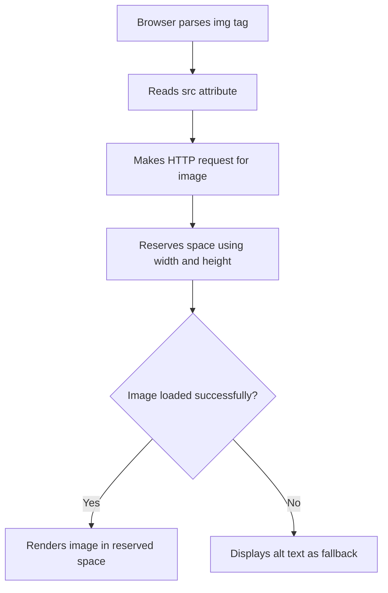
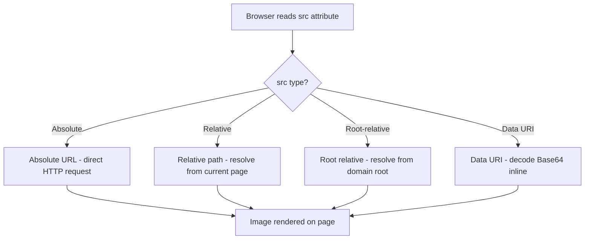
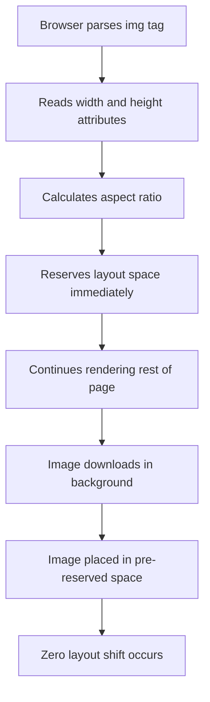
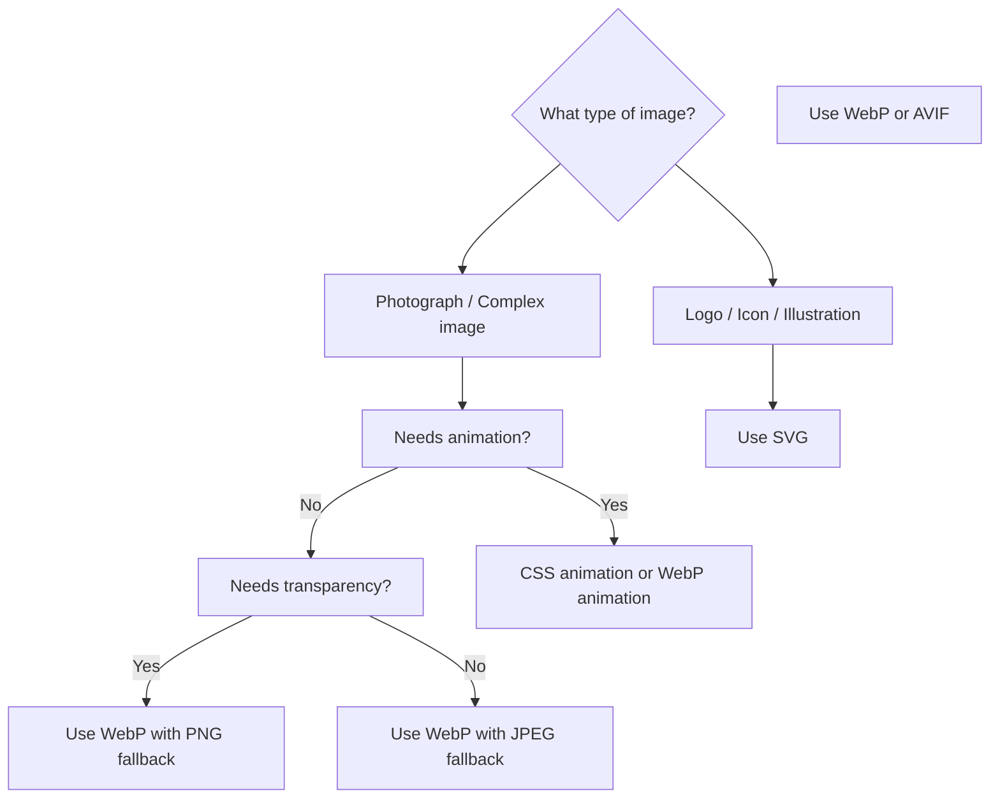
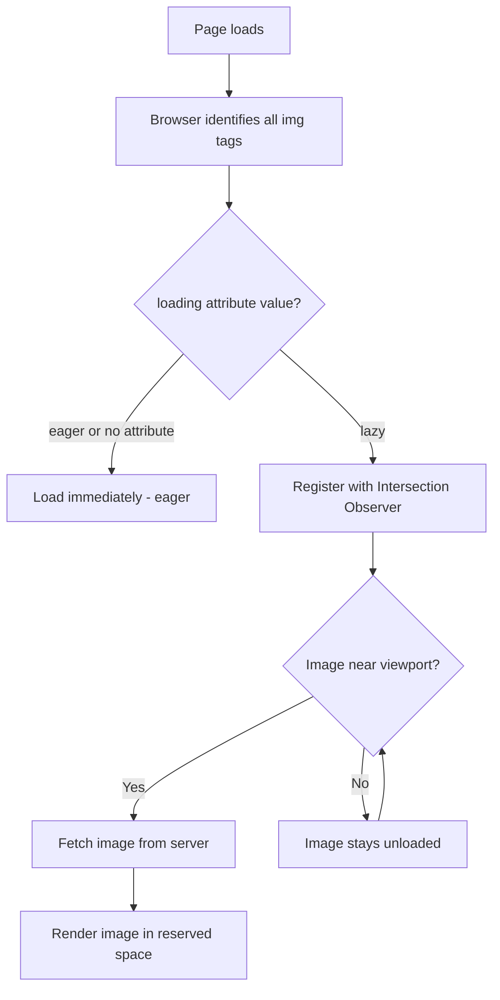
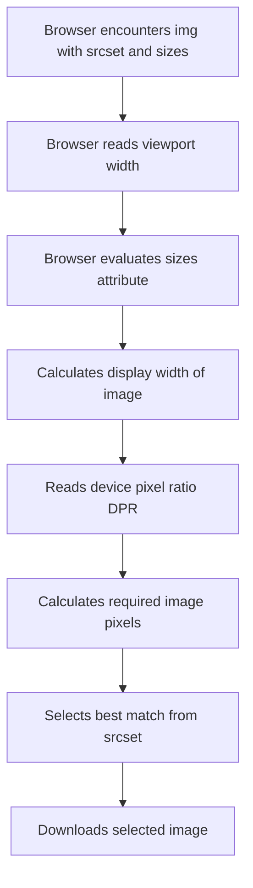
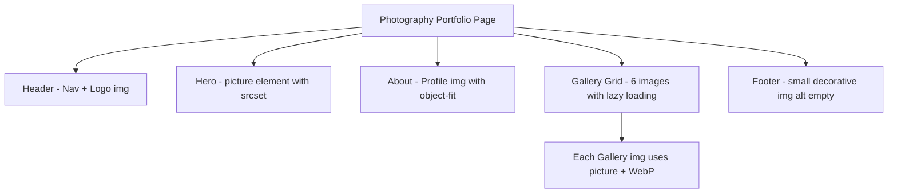

<a id="chapter-11-images-html"></a>

# Chapter 11: Images in HTML

[⬅ Previous Chapter](#chapter-10-html-lists) | [📖 Main Index](#main-index) | [Next Chapter ➡](#chapter-12-audio-video-iframes)

---

## 📌 Learning Objectives

By the end of this chapter, you will:

**Understand:**
- How the `` element works and why it is a void element
- The purpose of `src`, `alt`, `width`, `height` attributes
- All major image formats and when to use each
- How lazy loading improves page performance
- How to make images responsive for all screen sizes

**Interview Concepts Covered:**
- Difference between decorative and informative images
- Why `alt` attribute matters for accessibility and SEO
- `width` and `height` attributes and Cumulative Layout Shift (CLS)
- WebP vs PNG vs JPEG vs SVG — when to use which
- `loading="lazy"` — how it works internally
- `srcset` and `sizes` for responsive images
- `object-fit` and `object-position` for image styling

**Practical Skills:**
- Write semantic, accessible image markup
- Implement lazy loading correctly
- Build responsive image systems using `srcset` and `sizes`
- Style images with CSS for real-world layouts
- Avoid common image-related performance mistakes

---

<a id="chapter-index-table-11"></a>

## Chapter Index Table

| Topic No. | Topic Name | Subtopics |
|-----------|-----------|-----------|
| 11.1 | [The `` Element](#111-the-img-element) | What is it · Void element · Basic syntax · How browser loads images |
| 11.2 | [src Attribute](#112-src-attribute) | Absolute URL · Relative path · Data URI · Common mistakes |
| 11.3 | [alt Attribute](#113-alt-attribute) | Purpose · Accessibility · SEO · Decorative images · Common mistakes |
| 11.4 | [width and height Attributes](#114-width-and-height-attributes) | Pixel values · Aspect ratio · CLS prevention · CSS vs HTML sizing |
| 11.5 | [Image Formats](#115-image-formats) | JPEG · PNG · GIF · SVG · WebP · AVIF · When to use which |
| 11.6 | [Lazy Loading](#116-lazy-loading) | What is it · `loading` attribute · Eager vs Lazy · Internal working · Performance |
| 11.7 | [Responsive Images](#117-responsive-images) | `srcset` · `sizes` · `w` descriptor · `x` descriptor · Art direction |

---

## 11.1 The `` Element

<a id="111-the-img-element"></a>

### What is it?

The `` element is an HTML element used to **embed images** into a web page. It is a **void element** — meaning it has no closing tag and no content between tags. It is purely self-closing.

```html
<!-- Correct — void element, no closing tag needed -->


<!-- Also valid in HTML5 — self-closing syntax -->

```

> [!NOTE]
> In HTML5, the trailing slash (`/>`) is optional for void elements. Both `` and `` are valid. However, pick one style and stay consistent across your project.

---

### Why is it needed?

Images are one of the most fundamental content types on the web. The `` element provides a **semantic, accessible, and performant** way to embed images — carrying information about the image source, its text alternative, its dimensions, and its loading strategy all in one element.

---

### What problem does it solve?

Without ``:
- You could use CSS `background-image` — but that is **not semantic** (screen readers cannot describe it)
- You would have no way to provide `alt` text for accessibility
- You would have no way to give browsers dimension hints to prevent layout shifts
- There would be no standard way to implement lazy loading or responsive images

---

### How does it work?

```html

```

When the browser encounters ``:
1. Parses the `src` attribute to determine image URL
2. Makes an HTTP request to fetch the image file
3. Reserves space using `width` and `height` attributes (prevents layout shift)
4. Decodes and renders the image into the reserved space
5. Uses `alt` text if image fails to load or for screen readers

---

### Internal Working



---

### Key Characteristics

| Feature | Detail |
|--------|--------|
| Tag | `` |
| Element Type | Void element — no closing tag |
| Display | Inline by default |
| Required Attributes | `src`, `alt` |
| Optional Attributes | `width`, `height`, `loading`, `srcset`, `sizes`, `decoding`, `crossorigin` |
| Accessibility | `alt` attribute provides text alternative |

---

### `` as an Inline Element

By default, `` is an **inline element**. This means:
- It flows with surrounding text
- It respects `vertical-align`
- It can have unexpected bottom whitespace in some layouts (fix with `display: block`)

```html
<!-- Image sits inline with text -->
<p>
  Our logo  
  represents quality.
</p>

<!-- Fix for layout — make image block level -->

```

---

### 🧠 Hinglish Intuition

> `` ek **window** ki tarah hai jo tumhare web page mein ek image dikhata hai. Jaise ghar ki wall mein ek frame lagao — frame khud kuch nahi contain karta, woh sirf ek jagah reserve karta hai aur bahar se photo lata hai.
>
> `src` bolta hai "photo kahan se lao." `alt` bolta hai "agar photo na aaye, toh yeh text dikho." `width` aur `height` bolta hai "itni jagah reserve karo abhi — baad mein photo aayegi."
>
> Yeh ek **void element** hai — matlab iske andar kuch nahi hota, koi closing tag nahi hota. Jaise ek picture frame — frame ke andar content nahi hota, frame khud EK cheez hai.

---

### Practical Applications

- Product images on e-commerce pages
- Profile photos on social platforms
- Hero images on landing pages
- Blog post featured images
- Icons and logos
- Thumbnails in card components
- Gallery images

---

### Advantages

- Semantic — screen readers can describe images via `alt`
- Supports lazy loading natively via `loading` attribute
- Supports responsive images via `srcset` and `sizes`
- Browser can reserve layout space early using `width`/`height`
- Works with HTTP caching for performance

---

### Limitations

- Requires HTTP request (network overhead for each image)
- Large images can significantly slow page load
- No built-in lazy loading before HTML5.2 (required JavaScript)
- Cannot be styled as richly as CSS background images for certain effects

---

### Common Mistakes

```html
<!-- ❌ WRONG: Missing alt attribute -->


<!-- ❌ WRONG: Using closing tag -->
</img>

<!-- ❌ WRONG: Meaningless alt text -->


<!-- ✅ CORRECT: Proper img element -->

```

---

### Best Practices

- Always include `alt` attribute — even for decorative images (use `alt=""`)
- Always include `width` and `height` to prevent Cumulative Layout Shift
- Use `display: block` on images that should be block-level (removes bottom gap)
- Use appropriate image format for content type (WebP where possible)
- Compress images before serving — never serve raw uncompressed files

---

### Interview Perspective

> [!IMPORTANT]
> **Common Question:** "Is `` a void element? What does that mean?"
> Answer: Yes. Void elements have no content and no closing tag. ``, `<br>`, `<hr>`, `<input>` are all void elements.
>
> **Common Question:** "What is the default display value of ``?"
> Answer: `inline`. This is why images sometimes have unexpected bottom whitespace — fix with `display: block`.
>
> **Common Question:** "What happens when an image fails to load?"
> Answer: The browser displays the `alt` text in place of the image, and screen readers announce the `alt` text.

👉 <a href="#chapter-index-table-11">Go to Top 🔝</a>

---

## 11.2 src Attribute

<a id="112-src-attribute"></a>

### What is it?

The `src` (source) attribute specifies the **URL or path of the image file** to be displayed. It is a **required attribute** — without it, the browser has no image to load.

---

### Why is it needed?

The `` element itself is just a placeholder. The `src` attribute is the actual **pointer** that tells the browser where to fetch the image from — whether from the same server, a different domain, or encoded directly in the HTML.

---

### Types of `src` Values

#### 1. Absolute URL

Points to an image hosted on an external server using the full URL:

```html
<!-- Image from an external CDN or server -->

```

**When to use:**
- External CDN-hosted images
- Third-party images (avatars, social media images)
- APIs that return image URLs

---

#### 2. Relative Path

Points to an image relative to the **current HTML file's location**:

```html
<!-- Image in the same folder as HTML file -->


<!-- Image in a subfolder -->


<!-- Image in a parent folder -->


<!-- Image in a sibling folder -->

```

**Folder structure context:**

```text
project/
│
├── index.html
├── about.html
│
├── images/
│   ├── hero.jpg
│   └── logo.png
│
└── assets/
    └── icons/
        └── star.svg
```

```html
<!-- In index.html -->


```

---

#### 3. Root-Relative Path

Starts from the **root of the website** (starts with `/`):

```html
<!-- Always resolves from website root, regardless of current page location -->


```

**When to use:**
- Large websites where pages exist at multiple directory levels
- Ensures the path is always correct regardless of which page uses it
- Navigation elements, headers, footers — shared across many pages

---

#### 4. Data URI (Base64 Encoded)

Embeds the image data directly in the HTML using Base64 encoding:

```html
<!-- Base64 encoded small image embedded directly in HTML -->

```

**When to use:**
- Very small images (icons, tiny placeholders)
- Eliminating HTTP requests for critical small assets
- Email templates where external images may be blocked

**When NOT to use:**
- Large images — Base64 encoding increases file size by ~33%
- Images used in multiple places — defeats caching benefits

---

### Internal Working



---

### 🧠 Hinglish Intuition

> `src` ek **address** hai — jaise tum kisi ko ghar ka address dete ho. Browser ko batao "yeh photo kahan hai" — woh wahan jaata hai aur laata hai.
>
> **Absolute URL** — pura address: "Delhi, Connaught Place, Block A, Shop 5"
> **Relative path** — partial address: "mere ghar se do gali seedha"
> **Root-relative** — building se count karo: "/floor-3/room-201"
> **Data URI** — photo ko letter ke andar paste kar do — koi address nahi, sab kuch letter mein hi hai
>
> Relative path sabse common hai local projects mein. Root-relative large websites ke liye best hai. Data URI sirf tiny images ke liye.

---

### Practical Applications

```html
<!-- E-commerce product image — CDN hosted -->


<!-- Blog post featured image — local relative path -->


<!-- Site logo — root-relative for use across all pages -->

```

---

### Common Mistakes

```html
<!-- ❌ WRONG: Broken path — wrong folder name -->

<!-- Should be: images/hero.jpg -->

<!-- ❌ WRONG: Windows backslash path (only works on Windows servers) -->

<!-- ✅ Always use forward slashes -->


<!-- ❌ WRONG: Using absolute path with localhost -->

<!-- This only works on YOUR computer, breaks everywhere else -->

<!-- ✅ CORRECT: Relative path that works everywhere -->


<!-- ❌ WRONG: Missing src entirely -->

<!-- Browser has nothing to load -->
```

---

### Best Practices

- Use **relative paths** for local project images
- Use **root-relative paths** for images shared across multiple page levels
- Use **absolute URLs** for CDN-hosted or external images
- Always use **forward slashes** (`/`) — backslashes (`\`) are not cross-platform
- Never use local file system paths (`C:/...`) — they only work on the developer's machine
- Use CDN URLs for performance — images served from geographically closer servers

---

### Interview Perspective

> [!IMPORTANT]
> **Common Question:** "What is the difference between absolute, relative, and root-relative paths?"
> - **Absolute:** Full URL including protocol and domain
> - **Relative:** Relative to current file location
> - **Root-relative:** Relative to website root, starts with `/`
>
> **Common Question:** "When would you use a Data URI for an image?"
> Answer: Only for very small images (< 2KB) where eliminating an HTTP request outweighs the Base64 size overhead. Not for large images — increases size by ~33%.

👉 <a href="#chapter-index-table-11">Go to Top 🔝</a>

---

## 11.3 alt Attribute

<a id="113-alt-attribute"></a>

### What is it?

The `alt` (alternative text) attribute provides a **text description of an image**. It is displayed when the image cannot be loaded, and read aloud by screen readers for visually impaired users.

```html

```

---

### Why is it needed?

The `alt` attribute serves three critical purposes:

1. **Accessibility** — Screen readers announce `alt` text to visually impaired users
2. **Fallback** — Displays when image fails to load (broken link, slow connection)
3. **SEO** — Search engines read `alt` text to understand image content

---

### What problem does it solve?

Without `alt`:
- Blind users using screen readers get zero information about the image
- If the image fails to load, users see a broken image icon with no context
- Search engines cannot index image content, reducing SEO value
- In text-only browsers, images have no representation

---

### How does it work?

```html
<!-- When image loads successfully -->

<!-- User sees: the image of the cat -->

<!-- When image fails to load -->

<!-- User sees: [Orange tabby cat sleeping on a sofa] with broken image icon -->

<!-- Screen reader behavior -->
<!-- Screen reader announces: "Image: Orange tabby cat sleeping on a sofa" -->
```

---

### Informative vs Decorative Images

This is one of the **most important interview topics** about `alt`.

#### Informative Images — Write descriptive alt text

An informative image **conveys meaning** that is relevant to the content:

```html
<!-- Product image — describes what user needs to know -->


<!-- Chart or diagram -->


<!-- Person photo in an article -->

```

---

#### Decorative Images — Use empty alt (`alt=""`)

A decorative image adds **visual interest only** — removing it would not affect content understanding:

```html
<!-- Decorative divider image -->


<!-- Background pattern or texture image -->


<!-- Purely stylistic icon that has adjacent text label -->

<span>Read More</span>
<!-- The "Read More" text already explains the purpose -->
```

> [!IMPORTANT]
> For decorative images, use `alt=""` (empty string) — NOT missing `alt`. Missing `alt` causes screen readers to read the filename (e.g., "decorative-wave-pattern-2024-final-v3.svg") which is terrible for accessibility. Empty `alt=""` tells screen readers to skip the image entirely.

---

#### Functional Images — Describe the function, not the appearance

When an image is inside a link or button, `alt` should describe what the **function** does:

```html
<!-- ❌ WRONG: Describes appearance -->
<a href="/">
  
</a>

<!-- ✅ CORRECT: Describes function -->
<a href="/">
  
</a>

<!-- Search button with icon -->
<button>
  
</button>
```

---

### Alt Text Quality Guide

| Image Type | Alt Text Approach | Example |
|-----------|-------------------|---------|
| Product photo | Describe product name, color, key features | `"Red Nike Air Max sneakers, size 10"` |
| Decorative | Empty string | `alt=""` |
| Logo in link | Describe destination | `"CompanyName - Go to homepage"` |
| Chart/Graph | Describe the data insight | `"Sales grew 30% in Q3 2024"` |
| Portrait | Name and context | `"Dr. Sarah Lee, Cardiologist"` |
| Icon in button | Describe the action | `"Close dialog"` |
| Infographic | Summarize key information | `"5 steps to healthy eating: ..."` |

---

### SEO Impact of alt Text

Search engines like Google use `alt` text to:
- **Index images** for image search results
- **Understand page content** through image context
- **Rank pages** for relevant search queries

```html
<!-- Poor SEO -->


<!-- Good SEO + Accessibility -->

```

---

### 🧠 Hinglish Intuition

> `alt` text ek **caption** ki tarah hai jo tab dikhta hai jab image nahi dikhti — ya phir blind users ke liye screen reader jo padhta hai.
>
> Soch ek blind dost tumhare page pe aya. Woh image nahi dekh sakta. Screen reader bolta hai "Image: [alt text]." Agar alt text achha hai — woh samajh jaata hai. Agar `alt=""` hai — screen reader skip karta hai (decorative image ke liye theek hai). Agar alt hi nahi hai — screen reader filename padhta hai: "decorative-banner-final-v2-UPDATED.jpg" — yeh terrible experience hai!
>
> **Rule of thumb:** "Agar image hatao toh kya content miss hoga?" Agar haan — informative image, achha alt likho. Agar nahi — decorative image, `alt=""` likho.

---

### Practical Applications

```html
<!-- Blog article with featured image -->
<article>
  
  <h2>10 JavaScript Tips for 2024</h2>
</article>

<!-- Team member cards -->
<div class="team-card">
  
  <h3>Priya Sharma</h3>
  <p>Lead Designer</p>
</div>

<!-- Decorative section divider -->

```

---

### Common Mistakes

```html
<!-- ❌ WRONG: Missing alt entirely -->


<!-- ❌ WRONG: Redundant "image of" prefix -->

<!-- Screen reader already says "Image:" before reading alt -->

<!-- ❌ WRONG: Keyword stuffing in alt -->


<!-- ❌ WRONG: Using filename as alt -->


<!-- ❌ WRONG: "decorative" as alt for decorative images -->

<!-- Use alt="" instead — screen reader will still read "decorative" -->

<!-- ✅ CORRECT -->


```

---

### Best Practices

- Always include `alt` — it is required for valid, accessible HTML
- Use `alt=""` for purely decorative images — not missing `alt`
- Be concise but descriptive — aim for under 125 characters
- Never start with "image of" or "picture of" — screen readers say this automatically
- For complex images (charts, infographics), provide a longer description nearby or use `longdesc`
- Avoid keyword stuffing — write for humans, not search engines

---

### Interview Perspective

> [!IMPORTANT]
> **Most Asked Question:** "What is the `alt` attribute and why is it important?"
> Answer covers: accessibility (screen readers), fallback (broken images), SEO (search indexing).
>
> **Important Distinction:** "What is the difference between `alt=""` and missing `alt`?"
> - `alt=""` — tells screen readers image is decorative, skip it
> - Missing `alt` — screen readers read the filename (bad UX)
>
> **Scenario Question:** "When should alt text describe appearance vs function?"
> - Informative images — describe appearance/content
> - Functional images (in links/buttons) — describe the action/destination

👉 <a href="#chapter-index-table-11">Go to Top 🔝</a>

---

## 11.4 width and height Attributes

<a id="114-width-and-height-attributes"></a>

### What is it?

The `width` and `height` attributes specify the **dimensions of an image in pixels**. They tell the browser how much space to reserve for the image before it has finished loading.

```html

```

---

### Why is it needed?

Without `width` and `height`, the browser does not know the image's dimensions until the image file has fully downloaded. This causes the page layout to **shift** when the image finally loads — a jarring user experience that also negatively impacts Google's Core Web Vitals score (specifically **Cumulative Layout Shift — CLS**).

---

### What problem does it solve?

```
Without width/height:
Page loads → text renders → image downloads → image pushes text down → LAYOUT SHIFT ❌

With width/height:
Page loads → browser reserves exact space → text renders → image downloads into reserved space → NO SHIFT ✅
```

---

### How does it work?

```html
<!-- Browser immediately reserves 800x450px of space -->

```

The browser uses `width` and `height` to calculate the image's **aspect ratio** and reserve the correct space in the layout — even before the image bytes arrive. This eliminates Cumulative Layout Shift.

---

### Internal Working



---

### Cumulative Layout Shift (CLS) Explained

**CLS** is a Google Core Web Vitals metric that measures how much the page layout shifts during loading. A high CLS score hurts:
- User experience (content jumps around)
- Google search ranking

```html
<!-- ❌ Without dimensions — causes CLS -->

<p>This text will jump down when the image loads above it.</p>

<!-- ✅ With dimensions — prevents CLS -->

<p>This text stays in place because space is pre-reserved above.</p>
```

---

### HTML Attributes vs CSS for Sizing

There are two ways to control image dimensions:

#### Method 1: HTML Attributes (for intrinsic dimensions)

```html
<!-- Sets the intrinsic size hint for the browser -->

```

#### Method 2: CSS (for visual display size)

```css
/* CSS overrides the visual display size */
img {
  width: 100%;
  height: auto;
}
```

#### The Best Practice — Use BOTH Together

```html
<!-- HTML attributes: tell browser intrinsic size (for CLS prevention) -->
<!-- CSS: control actual display size responsively -->

```

```css
/* CSS makes it responsive while maintaining aspect ratio */
img {
  max-width: 100%;
  height: auto;  /* Maintains aspect ratio */
}
```

> [!IMPORTANT]
> Setting `width` and `height` HTML attributes AND `height: auto` in CSS is the **recommended modern approach**. HTML attributes give the browser the aspect ratio information. CSS `height: auto` makes it scale responsively. Both work together without conflict.

---

### Aspect Ratio Preservation

```html
<!-- Set only width in CSS, height:auto preserves aspect ratio -->

```

```css
img {
  width: 400px;  /* Display at half size */
  height: auto;  /* Browser maintains 16:9 aspect ratio automatically */
}
```

---

### Common Dimension Scenarios

```html
<!-- Fixed size icon -->


<!-- Hero banner -->


<!-- Product thumbnail -->


<!-- Avatar/profile photo -->


<!-- Blog featured image (16:9 ratio) -->

```

---

### 🧠 Hinglish Intuition

> Imagine tum ek newspaper layout bana rahe ho. Pehle tum **empty boxes** draw karte ho — "yahan photo aayegi, 10cm x 8cm." Phir article ka text boxes ke around likhte ho. Jab photo arrive hoti hai, woh exactly us box mein fit ho jaati hai. Text idhar udhar nahi jaata.
>
> Yahi kaam karta hai `width` aur `height`. Browser ko pehle hi bata do "yahan 800x450 pixels ki image aayegi" — woh jagah reserve kar leta hai. Image download ho ya na ho, baaki content apni jagah rehta hai. No jumping, no shifting!
>
> **CLS** — Cumulative Layout Shift — Google ka ek score hai jo measure karta hai kitna content jump karta hai page load pe. `width` aur `height` attributes is score ko improve karte hain directly.

---

### Practical Applications

```html
<!-- Complete real-world example with all best practices -->
<figure>
  
  <figcaption>Dell XPS 15 — Premium Performance Laptop</figcaption>
</figure>
```

```css
/* Responsive CSS — works with HTML width/height for CLS prevention */
img {
  max-width: 100%;
  height: auto;
  display: block;
}
```

---

### Common Mistakes

```html
<!-- ❌ WRONG: No width/height — causes CLS -->


<!-- ❌ WRONG: Wrong aspect ratio values — image stretches/squishes -->

<!-- Actual image is 800x450 — this will squish it vertically -->

<!-- ❌ WRONG: Using width/height to drastically resize -->
<!-- Don't serve a 4000px wide image but display it at 200px -->
<!-- Always serve appropriately sized images -->

<!-- ✅ CORRECT: Correct intrinsic dimensions -->

```

```css
/* ❌ WRONG: Hard-coding height without auto — breaks aspect ratio */
img {
  width: 100%;
  height: 300px; /* Forces fixed height — distorts non-matching images */
}

/* ✅ CORRECT: Use object-fit if you need fixed height */
img {
  width: 100%;
  height: 300px;
  object-fit: cover; /* Crops to fit without distorting */
}
```

---

### Best Practices

- Always add `width` and `height` that match the **actual intrinsic dimensions** of the image
- Use both HTML attributes AND `height: auto` CSS together for responsive + CLS-free images
- Use `object-fit: cover` when CSS forces a fixed height different from natural aspect ratio
- Never use HTML `width`/`height` to compensate for serving an oversized image — resize the image file itself

---

### Interview Perspective

> [!IMPORTANT]
> **Most Asked:** "Why should you always add `width` and `height` to `` tags?"
> Answer: To prevent **Cumulative Layout Shift (CLS)** — a Google Core Web Vitals metric. The browser can reserve the correct layout space before the image loads.
>
> **Follow-up:** "Doesn't setting `width` and `height` make images not responsive?"
> Answer: No — combine HTML `width`/`height` (for aspect ratio hint) with CSS `max-width: 100%; height: auto;` for fully responsive, CLS-free images.
>
> **Advanced:** "What is CLS and how do images affect it?"
> Answer: CLS measures unexpected layout shifts during page load. Images without dimensions cause text/content to shift when images load — hurting UX and Google ranking.

👉 <a href="#chapter-index-table-11">Go to Top 🔝</a>

---

## 11.5 Image Formats

<a id="115-image-formats"></a>

### What is it?

An **image format** defines how pixel or vector data is encoded, compressed, and stored in an image file. Different formats are optimized for different types of content — photographs, graphics, icons, animations.

---

### Why is it needed?

Choosing the wrong image format can result in:
- **Unnecessarily large file sizes** (slow page loads)
- **Loss of visual quality** (blurry photos, jagged edges)
- **Browser compatibility issues**
- **Poor SEO scores** (page speed impacts ranking)

---

### Major Image Formats Explained

#### JPEG / JPG

| Property | Detail |
|----------|--------|
| Full Name | Joint Photographic Experts Group |
| Extension | `.jpg`, `.jpeg` |
| Compression | Lossy |
| Transparency | ❌ Not supported |
| Animation | ❌ Not supported |
| Best For | Photographs, realistic images, complex color gradients |
| File Size | Small to medium |

```html
<!-- JPEG: Perfect for photographs -->

```

**How JPEG compression works:**
JPEG removes color information that the human eye is less sensitive to. Quality can be set from 1–100. Quality 70–85 gives excellent visual quality with significant size reduction.

> [!TIP]
> For product photos and blog images, save as JPEG at quality 75–85. You get ~60–70% smaller files than PNG with barely noticeable quality loss.

---

#### PNG

| Property | Detail |
|----------|--------|
| Full Name | Portable Network Graphics |
| Extension | `.png` |
| Compression | Lossless |
| Transparency | ✅ Supported (alpha channel) |
| Animation | ✅ APNG (limited support) |
| Best For | Logos, icons, screenshots, images requiring transparency |
| File Size | Larger than JPEG |

```html
<!-- PNG: Perfect for logos with transparent background -->


<!-- PNG for screenshot with text -->

```

**Key advantage:** PNG preserves every pixel exactly — no quality loss. Essential when transparency or sharp text/lines are required.

---

#### GIF

| Property | Detail |
|----------|--------|
| Full Name | Graphics Interchange Format |
| Extension | `.gif` |
| Compression | Lossless (limited 256 colors) |
| Transparency | ✅ Binary (on/off, no semi-transparency) |
| Animation | ✅ Native animation support |
| Best For | Simple animations, memes, simple graphics |
| File Size | Medium to large for animations |

```html
<!-- GIF: Animated loading spinner -->

```

> [!NOTE]
> GIF is largely replaced by WebP for animations and CSS animations for UI effects. However, GIF is still widely used for memes and simple social media animations due to universal support.

---

#### SVG

| Property | Detail |
|----------|--------|
| Full Name | Scalable Vector Graphics |
| Extension | `.svg` |
| Type | Vector (not pixel-based) |
| Transparency | ✅ Supported |
| Animation | ✅ Via CSS or SMIL |
| Best For | Icons, logos, illustrations, charts |
| File Size | Very small for simple graphics |
| Scalability | ✅ Perfect at any size — no pixelation |

```html
<!-- SVG: Perfect for icons that appear at multiple sizes -->


<!-- SVG inline — allows CSS styling -->
<svg width="24" height="24" viewBox="0 0 24 24">
  <path d="M3 18h18v-2H3v2zm0-5h18v-2H3v2zm0-7v2h18V6H3z"/>
</svg>
```

**Key SVG advantage:** Vector-based — scales to any resolution without pixelation. A 24px icon SVG looks equally sharp on a 4K display and a standard monitor.

---

#### WebP

| Property | Detail |
|----------|--------|
| Full Name | Web Picture format (by Google) |
| Extension | `.webp` |
| Compression | Both lossy and lossless |
| Transparency | ✅ Supported |
| Animation | ✅ Supported |
| Best For | Almost everything — modern replacement for JPEG and PNG |
| File Size | 25–35% smaller than JPEG/PNG at equivalent quality |
| Browser Support | All modern browsers (Chrome, Firefox, Safari 14+, Edge) |

```html
<!-- WebP: Modern format for photos -->

```

> [!IMPORTANT]
> **WebP is the recommended format for most web images today.** It is 25–35% smaller than equivalent JPEG/PNG files with the same visual quality. Use `<picture>` element to provide WebP with JPEG fallback for older browsers.

---

#### AVIF

| Property | Detail |
|----------|--------|
| Full Name | AV1 Image File Format |
| Extension | `.avif` |
| Compression | Lossy and lossless |
| Transparency | ✅ Supported |
| Animation | ✅ Supported |
| Best For | Next-gen format for highest compression |
| File Size | Up to 50% smaller than JPEG |
| Browser Support | Chrome, Firefox, Safari 16+ (growing) |

```html
<!-- AVIF with WebP and JPEG fallbacks -->
<picture>
  <source srcset="hero.avif" type="image/avif">
  <source srcset="hero.webp" type="image/webp">
  
</picture>
```

---

### Format Comparison Table

| Format | Photos | Transparency | Animation | Vector | Modern Web |
|--------|--------|-------------|-----------|--------|-----------|
| JPEG | ✅ Best | ❌ | ❌ | ❌ | ✅ Still used |
| PNG | ⚠️ Large | ✅ | ❌ | ❌ | ✅ For transparency |
| GIF | ❌ Poor | ⚠️ Binary | ✅ | ❌ | ⚠️ Legacy |
| SVG | ❌ | ✅ | ✅ | ✅ Best | ✅ For icons |
| WebP | ✅ Best | ✅ | ✅ | ❌ | ✅ Recommended |
| AVIF | ✅ Best | ✅ | ✅ | ❌ | ✅ Next-gen |

---

### When to Use Which Format



---

### 🧠 Hinglish Intuition

> Image formats ko **different types of containers** ki tarah samjho:
>
> **JPEG** — Ek compressed ZIP bag. Photo ka size chhota karta hai, thodi quality jati hai. Photos ke liye perfect — insaan ki aankh kuch pixels ki kami notice nahi karti.
>
> **PNG** — Ek glass box. Kuch bhi nahi chhupata, exact copy. Transparent background support karta hai. Lekin bada hota hai.
>
> **SVG** — Mathematical formulas ka set. "Yahan ek circle, radius 50." Screen size badha lo ya chhota karo — woh khud calculate karta hai. Icons ke liye perfect.
>
> **WebP** — Naya smart container. JPEG se 30% chhota, PNG ki tarah transparency bhi hai, animation bhi. Modern websites ke liye **best choice**.
>
> **AVIF** — Aur bhi smart. WebP se bhi chhota. Future hai, par abhi sab browsers fully support nahi karte.

---

### Practical Applications

```html
<!-- Photography site — use WebP with JPEG fallback -->
<picture>
  <source srcset="gallery/photo-001.webp" type="image/webp">
  
</picture>

<!-- Logo — use SVG for scalability -->


<!-- Animated loader — use CSS or WebP animation instead of GIF -->


<!-- Icon in navigation — use SVG -->

```

---

### Common Mistakes

```html
<!-- ❌ WRONG: Using PNG for a photograph (huge file size) -->

<!-- Should be JPEG or WebP -->

<!-- ❌ WRONG: Using JPEG for logo (loses sharp edges, no transparency) -->

<!-- Should be SVG or PNG -->

<!-- ❌ WRONG: Using GIF for animations in 2024 -->

<!-- Use WebP animation or CSS animation instead -->

<!-- ✅ CORRECT: Right format for right content -->


```

---

### Best Practices

- Use **WebP** as the primary format for photos and general images
- Provide **JPEG/PNG fallbacks** using `<picture>` for older browsers
- Use **SVG** for all icons, logos, and illustrations
- Use **PNG** only when WebP is not an option and transparency is required
- Avoid **GIF** — use CSS animations or WebP animations instead
- Always **compress images** before serving — tools: Squoosh, TinyPNG, ImageOptim

---

### Interview Perspective

> [!IMPORTANT]
> **Most Asked:** "What is the difference between JPEG and PNG?"
> - JPEG: Lossy compression, no transparency, best for photos
> - PNG: Lossless compression, transparency support, best for logos/icons
>
> **Most Asked:** "What is WebP and why is it preferred?"
> Answer: Google's modern format — 25–35% smaller than JPEG/PNG at same quality, supports transparency and animation. Supported by all modern browsers.
>
> **Common Question:** "When would you use SVG over PNG?"
> Answer: SVG for logos and icons that need to scale perfectly at any size. SVG files are also very small for simple graphics and can be styled with CSS.

👉 <a href="#chapter-index-table-11">Go to Top 🔝</a>

---

## 11.6 Lazy Loading

<a id="116-lazy-loading"></a>

### What is it?

**Lazy loading** is a performance optimization technique where images are **not downloaded until they are about to enter the user's viewport** (visible screen area). Images below the fold are deferred until the user scrolls near them.

```html
<!-- Native HTML lazy loading -->

```

---

### Why is it needed?

A typical web page might have 20–50 images. Without lazy loading, the browser downloads **all images simultaneously** when the page loads — even images the user may never scroll to see. This:
- Wastes bandwidth (user's data)
- Slows initial page load
- Delays Time to Interactive (TTI)
- Hurts Core Web Vitals scores

---

### What problem does it solve?

```
Without lazy loading:
Page loads → Browser downloads ALL 50 images immediately
→ User only sees top 5 images → 45 images wasted bandwidth → Slow page ❌

With lazy loading:
Page loads → Browser downloads only visible images
→ User scrolls → Browser downloads next batch just before they appear → Fast page ✅
```

---

### The `loading` Attribute

HTML5 introduced the native `loading` attribute with three values:

| Value | Behavior |
|-------|---------|
| `eager` | Load image immediately, regardless of position (default behavior) |
| `lazy` | Defer loading until image is near viewport |
| `auto` | Browser decides (behaves like `eager` in most browsers) |

```html
<!-- Above the fold: always load eagerly -->


<!-- Below the fold: lazy load -->


```

---

### Internal Working of Lazy Loading



**Internally, the browser uses the `Intersection Observer API`** to monitor when a lazy image approaches the viewport. When the image is within a certain distance (threshold), the browser initiates the fetch.

---

### Above the Fold vs Below the Fold

> [!IMPORTANT]
> **Above the fold** — content visible without scrolling. These images should NEVER be lazy loaded. Lazy loading above-the-fold images actually **hurts** Largest Contentful Paint (LCP) score.
>
> **Below the fold** — content visible only after scrolling. These images are **perfect candidates** for lazy loading.

```html
<!-- Hero section — ABOVE the fold — NEVER lazy load -->


<!-- Product grid — BELOW the fold — PERFECT for lazy loading -->
<div class="product-grid">
  
  
  
  
</div>
```

---

### `decoding` Attribute — Related Performance Attribute

The `decoding` attribute controls when the browser decodes the image:

| Value | Behavior |
|-------|---------|
| `sync` | Decode synchronously — may block rendering |
| `async` | Decode asynchronously — does not block rendering |
| `auto` | Browser decides (default) |

```html
<!-- Best practice for performance: lazy + async decoding -->

```

---

### Browser Support

`loading="lazy"` is natively supported in:
- Chrome 77+
- Firefox 75+
- Safari 15.4+
- Edge 79+

For older browsers, `loading="lazy"` is simply **ignored** — images load normally. No JavaScript polyfill needed for graceful degradation.

---

### Performance Impact of Lazy Loading

| Metric | Without Lazy Loading | With Lazy Loading |
|--------|---------------------|------------------|
| Initial page load | Downloads all images | Downloads only visible images |
| Bandwidth usage | High (all images) | Low (only needed images) |
| Time to Interactive | Slower | Faster |
| LCP (hero images) | Faster (eager) | Slower if wrongly applied to LCP image |
| User experience | Layout shifts possible | Smooth with width/height set |

---

### 🧠 Hinglish Intuition

> Soch ek restaurant mein tum khana order karte ho. **Eager loading** — waiter sabhi 10 courses ek saath lata hai table pe. Pehla course kha rahe ho, aur baaki 9 dishes thandi ho rahi hain — waste!
>
> **Lazy loading** — waiter pehla course laata hai. Jab tum khatam karne wale hote ho, woh pehle se hi agla course kitchen se mangwaata hai. Perfect timing, no waste.
>
> Web pe yahi hota hai. 50 images ek saath download karna = bandwidth waste. Lazy loading = sirf woh images load karo jo user dekhne wala hai. User ko pata bhi nahi chalta — sab smooth lagta hai.
>
> **Ek important rule:** Hero image — jo pehle dikhti hai — KABHI lazy mat karo. Warna user ko blank space dikhega pehle — bad experience!

---

### Complete Real-World Implementation

```html
<!DOCTYPE html>
<html lang="en">
<head>
  <meta charset="UTF-8">
  <title>Product Gallery with Lazy Loading</title>
</head>
<body>

  <!-- HERO: Above fold — eager loading (default) -->
  <header>
    
  </header>

  <!-- PRODUCT GRID: Below fold — lazy loading -->
  <main>
    <h2>Featured Products</h2>
    <div class="products">
      
      
      
      
      
      
    </div>
  </main>

</body>
</html>
```

---

### Common Mistakes

```html
<!-- ❌ WRONG: Lazy loading the hero/LCP image — hurts LCP score -->


<!-- ❌ WRONG: Lazy loading without width/height — causes CLS when image loads -->


<!-- ❌ WRONG: Using lazy loading for tiny icons -->

<!-- Tiny icons load instantly anyway — lazy loading adds unnecessary overhead -->

<!-- ✅ CORRECT: Lazy loading with dimensions, for below-fold images -->

```

---

### Best Practices

- Always lazy load images that are **below the fold**
- **Never** lazy load the hero image or LCP (Largest Contentful Paint) image
- Always combine `loading="lazy"` with `width` and `height` to prevent CLS
- Add `decoding="async"` alongside `loading="lazy"` for best performance
- Do not lazy load small icons — the overhead is not worth it
- Test lazy loading with Chrome DevTools Network tab (throttle connection to see deferred loading)

---

### Interview Perspective

> [!IMPORTANT]
> **Most Asked:** "What is lazy loading and how do you implement it in HTML?"
> Answer: `loading="lazy"` attribute on ``. Browser defers image download until it approaches the viewport.
>
> **Important:** "Should you lazy load the hero image?"
> Answer: **No!** The hero image is the LCP element — lazy loading it delays LCP and hurts Core Web Vitals score.
>
> **Advanced:** "How does native lazy loading work internally?"
> Answer: Browser uses the **Intersection Observer API** to monitor when lazy images approach the viewport threshold, then initiates fetch.
>
> **Common Trap:** "Is `loading='lazy'` supported in all browsers?"
> Answer: Not IE11, but all modern browsers support it. Unsupported browsers simply ignore the attribute and load images normally — graceful degradation.

👉 <a href="#chapter-index-table-11">Go to Top 🔝</a>

---

## 11.7 Responsive Images

<a id="117-responsive-images"></a>

### What is it?

**Responsive images** are images that **adapt to different screen sizes, resolutions, and device capabilities** — serving the most appropriate image file for each context. This avoids serving large desktop images to mobile users who only need smaller files.

---

### Why is it needed?

Consider a hero image:
- Desktop monitor: needs 1440px wide image
- Tablet: needs 768px wide image
- Mobile: needs 375px wide image

Without responsive images, a mobile user downloads a 1440px image and their browser scales it down — **wasting bandwidth and slowing load time**.

---

### What problem does it solve?

```
Without responsive images:
Mobile user → Downloads 1440px × 3MB image → Browser scales down to 375px
→ Wasted 2.5MB of data → Slow load → Bad UX ❌

With responsive images:
Mobile user → Browser selects 375px × 120KB image → Fast load → Good UX ✅
```

---

### Method 1: `srcset` with Width Descriptors (`w`)

The `srcset` attribute provides **multiple image sources** with width descriptors. The browser selects the best one based on device width and pixel density.

```html

```

**How the browser decides:**
- Device viewport width: 375px
- Device pixel ratio: 2x (Retina)
- Effective pixels needed: 375 × 2 = 750px
- Browser selects: `hero-800.jpg` (closest match ≥ 750px)

---

### Method 2: `srcset` with Pixel Density Descriptors (`x`)

The `x` descriptor serves different resolution images based on screen pixel density:

```html
<!-- 1x for standard screens, 2x for Retina/HiDPI screens -->

```

**Best for:** Fixed-size images like logos, icons, avatars where the display size doesn't change.

---

### Method 3: `srcset` + `sizes`

The `sizes` attribute tells the browser **how wide the image will be displayed** at different viewport sizes. This helps the browser make a better selection from `srcset`.

```html

```

**`sizes` breakdown:**
- On screens ≤ 480px: image is 100% of viewport width
- On screens ≤ 768px: image is 50% of viewport width
- On larger screens: image is 33% of viewport width

The browser uses this information together with `srcset` to pick the optimal file.

---

### Internal Working of `srcset` + `sizes`



---

### Method 4: `<picture>` Element for Art Direction

The `<picture>` element provides **art direction** — serving completely different image crops or compositions for different screen sizes:

```html
<picture>
  <!-- Mobile: vertically cropped, portrait orientation -->
  <source 
    media="(max-width: 480px)" 
    srcset="hero-portrait-480.jpg"
  >
  <!-- Tablet: square crop -->
  <source 
    media="(max-width: 768px)" 
    srcset="hero-square-768.jpg"
  >
  <!-- Desktop: wide landscape crop -->
  
</picture>
```

**Art direction vs resolution switching:**
- **Resolution switching** (`srcset`) — same image, different sizes
- **Art direction** (`<picture>`) — different crops/compositions per breakpoint

---

### `<picture>` for Format Switching (WebP Fallback)

```html
<!-- Serve WebP to browsers that support it, JPEG as fallback -->
<picture>
  <source srcset="hero.avif" type="image/avif">
  <source srcset="hero.webp" type="image/webp">
  
</picture>
```

**How browser processes `<picture>`:**
1. Checks `<source>` elements from top to bottom
2. Uses first `<source>` whose `media` and `type` conditions match
3. Falls back to `` if no `<source>` matches

> [!IMPORTANT]
> The `` inside `<picture>` is **mandatory** — it serves as the fallback and also carries the `alt`, `width`, `height`, and `loading` attributes that apply to all variants.

---

### CSS for Responsive Images

Beyond HTML attributes, CSS also plays a key role:

```css
/* Make all images responsive by default */
img {
  max-width: 100%;
  height: auto;
  display: block;
}

/* Fixed-height image container with object-fit */
.card-image {
  width: 100%;
  height: 200px;
  overflow: hidden;
}

.card-image img {
  width: 100%;
  height: 100%;
  object-fit: cover;        /* Crop to fill — no distortion */
  object-position: center;  /* Crop from center */
}
```

#### `object-fit` Values

| Value | Behavior |
|-------|---------|
| `fill` | Stretches to fill — may distort (default) |
| `contain` | Scales to fit — letterbox effect, no crop |
| `cover` | Scales to fill — crops edges, no distortion |
| `none` | Original size — may overflow container |
| `scale-down` | Uses smaller of `none` or `contain` |

```css
/* Profile photos — always square, no distortion */
.avatar {
  width: 64px;
  height: 64px;
}

.avatar img {
  width: 100%;
  height: 100%;
  object-fit: cover;
  border-radius: 50%;
}
```

---

### 🧠 Hinglish Intuition

> Soch ek photographer ke paas ek photo hai. Desktop user ko full 4K photo chahiye. Mobile user ko sirf thumbnail.
>
> **Purana tarika** — sab ko 4K photo do. Mobile user 4MB download karta hai, phir browser chhota kar ke dikhata hai. Data waste, slow load.
>
> **`srcset` tarika** — "Bhai browser, maine teen sizes ready kiye hain — 400px, 800px, 1200px. Tu dekh user ka screen kitna bada hai, woh waali de do." Browser khud decide karta hai. Smart!
>
> **`sizes` add karo** — "Aur sun, yeh image desktop pe half screen pe dikhegi, mobile pe full screen." Ab browser aur better decide kar sakta hai.
>
> **`<picture>` tarika** — Art direction. Mobile pe portrait crop, desktop pe landscape crop. Sirf size nahi, composition bhi alag!

---

### Complete Responsive Image Implementation

```html
<!-- Production-quality responsive image with all best practices -->
<picture>
  <!-- AVIF for cutting-edge browsers -->
  <source 
    type="image/avif"
    srcset="
      product-400.avif 400w,
      product-800.avif 800w,
      product-1200.avif 1200w
    "
    sizes="
      (max-width: 480px) 100vw,
      (max-width: 768px) 50vw,
      400px
    "
  >
  <!-- WebP for modern browsers -->
  <source 
    type="image/webp"
    srcset="
      product-400.webp 400w,
      product-800.webp 800w,
      product-1200.webp 1200w
    "
    sizes="
      (max-width: 480px) 100vw,
      (max-width: 768px) 50vw,
      400px
    "
  >
  <!-- JPEG fallback for all browsers -->
  
</picture>
```

---

### Practical Applications

- **Hero images** — `<picture>` with different crops for mobile/desktop
- **Product images** — `srcset` with multiple sizes + WebP/JPEG formats
- **Blog thumbnails** — `srcset` for resolution switching
- **Avatars/Profiles** — `srcset` with 1x and 2x for Retina displays
- **Logo** — SVG (naturally resolution-independent, no srcset needed)

---

### Common Mistakes

```html
<!-- ❌ WRONG: srcset without sizes — browser guesses display size -->


<!-- ✅ CORRECT: Always pair srcset with sizes -->


<!-- ❌ WRONG: Forgetting img fallback inside picture -->
<picture>
  <source srcset="image.webp" type="image/webp">
  <!-- No img fallback! Will break in unsupported browsers -->
</picture>

<!-- ✅ CORRECT: Always include img fallback -->
<picture>
  <source srcset="image.webp" type="image/webp">
  
</picture>
```

---

### Best Practices

- Always provide `srcset` with multiple size variants for large images
- Always pair `w` descriptor `srcset` with a `sizes` attribute
- Use `<picture>` for format fallbacks (WebP → JPEG) and art direction
- The `` inside `<picture>` must always be present — it is the fallback
- Use `object-fit: cover` when placing images in fixed-height containers
- Use SVG for logos — naturally resolution-independent, no `srcset` needed

---

### Interview Perspective

> [!IMPORTANT]
> **Most Asked:** "What is the difference between `srcset` and `<picture>`?"
> - `srcset` — Resolution switching: same image, different sizes/densities. Browser chooses best.
> - `<picture>` — Art direction: different image compositions per breakpoint. Developer controls which is used.
>
> **Most Asked:** "What does `sizes` attribute do?"
> Answer: Tells browser how wide the image will be displayed at each breakpoint, helping it select the optimal file from `srcset`.
>
> **Common Question:** "What is `object-fit: cover` and when is it used?"
> Answer: Makes an image scale to completely fill its container while maintaining aspect ratio — cropping the edges. Used when images must fit a fixed-height container without distortion.
>
> **Important:** "What must always be inside a `<picture>` element?"
> Answer: An `` element — it serves as the fallback and carries accessibility attributes.

👉 <a href="#chapter-index-table-11">Go to Top 🔝</a>

---

## 💡 Interview Questions

### Conceptual Questions

**Q1. What is the `` element? Is it a void element?**

**Answer:** The `` element embeds images into HTML documents. It is a **void element** — it has no content and no closing tag. Both `` and `` are valid in HTML5. Required attributes are `src` (image source) and `alt` (text alternative).

---

**Q2. What is the purpose of the `alt` attribute? What is the difference between `alt=""` and missing `alt`?**

**Answer:**
- `alt` provides a text description of the image for screen readers (accessibility), displays as fallback when image fails to load, and is indexed by search engines (SEO).
- `alt=""` (empty string) — tells screen readers the image is decorative and should be skipped. Correct for purely visual images.
- Missing `alt` — screen readers read the filename (e.g., "hero-banner-final-v2.jpg"), creating terrible UX. Also makes HTML invalid.

---

**Q3. Why should you always add `width` and `height` attributes to ``?**

**Answer:** To prevent **Cumulative Layout Shift (CLS)** — a Google Core Web Vitals metric. When `width` and `height` are set, the browser can reserve the correct layout space before the image downloads. Without them, page content shifts when images load, causing poor UX and lower search rankings.

---

**Q4. What is the difference between JPEG, PNG, WebP, and SVG? When should you use each?**

**Answer:**
- **JPEG** — Lossy compression, no transparency, best for photographs
- **PNG** — Lossless, supports transparency, best for logos and screenshots
- **WebP** — Modern format by Google, 25–35% smaller than JPEG/PNG, supports transparency and animation — recommended for most images
- **SVG** — Vector format, resolution-independent, perfect for icons, logos, and illustrations

---

**Q5. What is lazy loading? How do you implement it in HTML?**

**Answer:** Lazy loading defers image downloads until the image approaches the user's viewport. Implemented with `loading="lazy"` attribute. Browser uses **Intersection Observer API** internally. Should never be applied to above-the-fold/hero images as it hurts LCP score.

---

**Q6. What is the difference between `srcset` and the `<picture>` element?**

**Answer:**
- **`srcset`** — Resolution switching. Provides multiple sizes of the same image. Browser automatically selects the best match based on viewport and pixel density.
- **`<picture>`** — Art direction. Developer explicitly controls which image is shown at which breakpoint. Different crops/compositions for different screens. Also used for format switching (WebP with JPEG fallback).

---

**Q7. What does the `sizes` attribute do?**

**Answer:** `sizes` tells the browser how wide the image will be displayed at different viewport widths. Combined with `srcset` (width descriptors), it allows the browser to calculate exactly which image file to download before layout is computed — making smarter, more accurate selections.

---

**Q8. What is `object-fit: cover` and when is it used?**

**Answer:** `object-fit: cover` makes an image scale to completely fill its container while maintaining aspect ratio, cropping the edges. Used when images must fit inside a fixed-height container without distortion — common in card layouts, hero sections, and thumbnail grids.

---

### Scenario-Based Questions

**Q9. A product page has 50 product images. How would you optimize image loading?**

**Answer:**
1. Use **WebP format** with JPEG fallback via `<picture>`
2. Add **`width` and `height`** attributes on all images
3. Apply **`loading="lazy"`** and **`decoding="async"`** to all below-fold product images
4. Keep hero/featured images as `loading="eager"`
5. Use **`srcset` and `sizes`** to serve appropriately sized images for different devices
6. Compress all images before deployment

---

**Q10. How do you handle a case where you need the same image to be cropped differently on mobile vs desktop?**

**Answer:** Use the `<picture>` element with `<source media="...">` for art direction:

```html
<picture>
  <source media="(max-width: 480px)" srcset="hero-portrait.jpg">
  <source media="(max-width: 768px)" srcset="hero-square.jpg">
  
</picture>
```

---

### Output-Based Questions

**Q11. What will the screen reader announce for each of these?**

```html
<!-- A -->


<!-- B -->


<!-- C -->

```

**Answer:**
- **A:** Screen reader reads the filename: "banner dot jpg" — bad UX
- **B:** Screen reader skips the image entirely — correct for decorative images
- **C:** Screen reader announces: "Image: Summer sale banner showing 50% off" — correct for informative images

---

**Q12. Which image will be selected from this `srcset` on a 375px wide, 2x DPR device?**

```html

```

**Answer:**
- Display width: 375px (100vw on 375px viewport)
- DPR: 2x
- Effective pixels needed: 375 × 2 = 750px
- Browser selects: **`img-800.jpg`** (closest available size ≥ 750px)

---

### Advanced Questions

**Q13. Explain Cumulative Layout Shift (CLS) and how images cause it.**

**Answer:** CLS is a Google Core Web Vitals metric that measures the sum of all unexpected layout shifts during a page's lifetime. Images without `width` and `height` cause CLS because:
1. Browser renders page → Text flows into position → Image downloads → Browser discovers image is 600px tall → Everything shifts down
2. Fix: Set `width` and `height` HTML attributes matching actual image dimensions so browser reserves space upfront.

---

**Q14. What is the difference between `loading="lazy"` and JavaScript-based lazy loading?**

**Answer:**
| | Native `loading="lazy"` | JavaScript Lazy Loading |
|--|--|--|
| Implementation | HTML attribute | JS + Intersection Observer |
| Browser support | All modern browsers | Universal with polyfills |
| Performance overhead | Minimal (browser-native) | Slight JS overhead |
| Control | Limited | Full customization |
| Reliability | High | Depends on JS execution |
Native lazy loading is preferred today — simpler, faster, no JS dependency.

---

## 🧪 Practice Problems

### Coding Questions

**1.** Create an image gallery with 8 product images that implements: correct `alt` text, `width`/`height` attributes, `loading="lazy"` on below-fold images, and WebP format with JPEG fallback using `<picture>`.

**2.** Build a team member card component where each card has a profile photo that is always circular (50% border-radius), fills a 120×120px space using `object-fit: cover`, and has proper `alt` text including name and role.

**3.** Implement a responsive hero image that: serves a portrait crop on mobile (≤480px), a square crop on tablet (≤768px), and a landscape crop on desktop using `<picture>` with art direction.

**4.** Create an image with `srcset` and `sizes` attributes that serves three different image widths (400px, 800px, 1200px) and displays at 100% width on mobile, 50% on tablet, and 33% on desktop.

**5.** Build a logo component using SVG that scales perfectly at sizes 24px, 48px, and 96px without any pixelation, demonstrating why SVG is superior to PNG for logos.

---

### Theory Questions

**1.** Explain the complete lifecycle of an `` element from HTML parsing to final render. What happens at each step?

**2.** What are the three roles of the `alt` attribute? Describe a scenario where each role is critical.

**3.** Explain the difference between `w` descriptor and `x` descriptor in `srcset`. When should you use each?

**4.** What is the difference between `object-fit: contain` and `object-fit: cover`? Draw an ASCII diagram showing both behaviors.

**5.** Explain why you should never lazy load the LCP (Largest Contentful Paint) image. What performance metric does it affect and how?

---

### Machine Coding Problems

**Problem 1: Responsive Image Gallery**

Build a responsive photo gallery using only HTML and CSS.

Requirements:
- Minimum 9 images arranged in a CSS Grid layout
- 3 columns on desktop, 2 on tablet, 1 on mobile
- Each image uses `object-fit: cover` to fill equal-height grid cells
- Correct `alt` text on all images
- `width` and `height` attributes on all images
- `loading="lazy"` on all images except the first 3
- `<picture>` element with WebP and JPEG sources for each image
- Hover effect: image slightly zooms (CSS transform scale)
- Caption below each image using `<figcaption>` inside `<figure>`

---

**Problem 2: Product Image Showcase**

Build a product page image showcase with a main large image and thumbnail strip.

Requirements:
- One large main product image (600×600px display area, `object-fit: cover`)
- Row of 4 thumbnail images below (80×80px each, `object-fit: cover`)
- Clicking a thumbnail (use CSS `:target` or `:focus` technique — no JS) shows that image as the main image
- All images have correct `alt` text
- `srcset` on the main image with 3 size variants
- WebP format with JPEG fallback
- Responsive: thumbnails stack in 2×2 on mobile

---

## 🚀 Mini Project

### Problem Statement

Build a **Photography Portfolio Page** using only HTML and CSS, demonstrating all image concepts taught in this chapter — ``, `alt`, `width`/`height`, image formats (via `<picture>`), lazy loading, and responsive images.

---

### Features

- Hero section with a large responsive image
- About section with profile photo using `object-fit: cover`
- Gallery grid with 6 portfolio images using lazy loading
- Each gallery image uses `<picture>` for WebP/JPEG format switching
- All images have correct, descriptive `alt` text
- All images have `width` and `height` for CLS prevention
- Responsive layout — mobile, tablet, desktop
- Hover effects on gallery images using CSS only

---

### Architecture



---

### Folder Structure

```text
photography-portfolio/
│
├── index.html
├── style.css
│
└── images/
    ├── logo.svg
    ├── hero.jpg
    ├── hero.webp
    ├── profile.jpg
    ├── gallery-1.jpg
    ├── gallery-1.webp
    ├── gallery-2.jpg
    ├── gallery-2.webp
    ├── gallery-3.jpg
    ├── gallery-3.webp
    ├── gallery-4.jpg
    ├── gallery-4.webp
    ├── gallery-5.jpg
    ├── gallery-5.webp
    └── gallery-6.jpg
    └── gallery-6.webp
```

---

### Implementation

**index.html**

```html
<!DOCTYPE html>
<html lang="en">
<head>
  <meta charset="UTF-8">
  <meta name="viewport" content="width=device-width, initial-scale=1.0">
  <meta name="description" content="Arjun Mehta Photography — Landscape and portrait photography portfolio">
  <title>Arjun Mehta Photography</title>
  <link rel="stylesheet" href="style.css">
</head>
<body>

  <!-- =====================
    HEADER
  ===================== -->
  <header class="site-header">
    <!-- SVG Logo — resolution independent -->
    <a href="/" class="logo-link">
      
    </a>

    <nav aria-label="Main Navigation">
      <ul class="nav-links" role="list">
        <li><a href="#hero">Home</a></li>
        <li><a href="#about">About</a></li>
        <li><a href="#gallery">Gallery</a></li>
        <li><a href="#contact">Contact</a></li>
      </ul>
    </nav>
  </header>

  <!-- =====================
    HERO SECTION
    Above fold — eager loading, picture for format + art direction
  ===================== -->
  <section id="hero" class="hero-section">
    <picture>
      <!-- WebP format for modern browsers — landscape -->
      <source 
        type="image/webp"
        media="(min-width: 769px)"
        srcset="images/hero.webp"
      >
      <!-- JPEG fallback — landscape -->
      <source 
        media="(min-width: 769px)"
        srcset="images/hero.jpg"
      >
      <!-- WebP portrait crop for mobile -->
      <source 
        type="image/webp"
        media="(max-width: 768px)"
        srcset="images/hero-mobile.webp"
      >
      <!-- Fallback img — required inside picture -->
      
    </picture>

    <div class="hero-overlay">
      <h1>Capturing Light,<br>Telling Stories</h1>
      <p>Landscape &amp; Portrait Photography by Arjun Mehta</p>
      <a href="#gallery" class="cta-button">View Gallery</a>
    </div>
  </section>

  <!-- =====================
    ABOUT SECTION
    Profile image with object-fit: cover
  ===================== -->
  <section id="about" class="about-section">
    <div class="about-image-wrapper">
      
    </div>

    <div class="about-content">
      <h2>About Arjun</h2>
      <p>
        With over 10 years behind the lens, I specialize in landscape 
        and portrait photography across India and Southeast Asia. 
        My work has been featured in National Geographic Traveller India, 
        Outlook Traveller, and multiple international exhibitions.
      </p>
      <p>
        I believe every moment of light is fleeting — my mission is 
        to freeze it forever.
      </p>
    </div>
  </section>

  <!-- =====================
    GALLERY SECTION
    6 images — lazy loaded, picture element for WebP/JPEG
  ===================== -->
  <section id="gallery" class="gallery-section">
    <h2>Portfolio</h2>
    <p class="gallery-subtitle">A selection of recent works</p>

    <div class="gallery-grid">

      <!-- Gallery Image 1 — lazy loaded with picture for format switching -->
      <figure class="gallery-item">
        <picture>
          <source srcset="images/gallery-1.webp" type="image/webp">
          
        </picture>
        <figcaption>Himalayan Mirror — Ladakh, 2023</figcaption>
      </figure>

      <!-- Gallery Image 2 -->
      <figure class="gallery-item">
        <picture>
          <source srcset="images/gallery-2.webp" type="image/webp">
          
        </picture>
        <figcaption>The Fisherman — Kerala, 2023</figcaption>
      </figure>

      <!-- Gallery Image 3 -->
      <figure class="gallery-item">
        <picture>
          <source srcset="images/gallery-3.webp" type="image/webp">
          
        </picture>
        <figcaption>Before the Storm — Punjab, 2022</figcaption>
      </figure>

      <!-- Gallery Image 4 -->
      <figure class="gallery-item">
        <picture>
          <source srcset="images/gallery-4.webp" type="image/webp">
          
        </picture>
        <figcaption>Street Cricket — Old Delhi, 2022</figcaption>
      </figure>

      <!-- Gallery Image 5 -->
      <figure class="gallery-item">
        <picture>
          <source srcset="images/gallery-5.webp" type="image/webp">
          
        </picture>
        <figcaption>Cosmic Heritage — Hampi, 2023</figcaption>
      </figure>

      <!-- Gallery Image 6 -->
      <figure class="gallery-item">
        <picture>
          <source srcset="images/gallery-6.webp" type="image/webp">
          
        </picture>
        <figcaption>The Gaze — Ranthambore, 2021</figcaption>
      </figure>

    </div>
  </section>

  <!-- =====================
    CONTACT SECTION
  ===================== -->
  <section id="contact" class="contact-section">
    <h2>Get in Touch</h2>
    <p>For print orders, licensing, and collaboration inquiries:</p>
    <p class="contact-email">
      <a href="mailto:arjun@arjunmehta.photography">
        arjun@arjunmehta.photography
      </a>
    </p>
  </section>

  <!-- =====================
    FOOTER
    Decorative image — alt=""
  ===================== -->
  <footer class="site-footer">
    <!-- Decorative wave divider — purely visual, alt="" -->
    
    <div class="footer-content">
      <p>© 2024 Arjun Mehta Photography. All rights reserved.</p>
      <p class="footer-tagline">
        <em>Every moment of light is fleeting.</em>
      </p>
    </div>
  </footer>

</body>
</html>
```

---

**style.css**

```css
/* ===========================
   CSS RESET & BASE
=========================== */
*, *::before, *::after {
  box-sizing: border-box;
  margin: 0;
  padding: 0;
}

/* Responsive images — global rule */
img {
  max-width: 100%;
  height: auto;
  display: block;
}

body {
  font-family: 'Georgia', serif;
  color: #1a1a1a;
  background-color: #0d0d0d;
  line-height: 1.7;
}

/* ===========================
   HEADER
=========================== */
.site-header {
  position: fixed;
  top: 0;
  left: 0;
  right: 0;
  z-index: 100;
  display: flex;
  justify-content: space-between;
  align-items: center;
  padding: 16px 48px;
  background: rgba(13, 13, 13, 0.9);
  backdrop-filter: blur(10px);
  border-bottom: 1px solid rgba(255,255,255,0.08);
}

.logo-link img {
  /* SVG logo — already set width/height in HTML */
  filter: brightness(0) invert(1); /* Makes dark logo white */
}

ul.nav-links {
  list-style: none;
  padding: 0;
  margin: 0;
  display: flex;
  gap: 32px;
}

ul.nav-links li a {
  color: #ccc;
  text-decoration: none;
  font-size: 14px;
  letter-spacing: 1.5px;
  text-transform: uppercase;
  transition: color 0.3s ease;
}

ul.nav-links li a:hover {
  color: #f0c840;
}

/* ===========================
   HERO SECTION
=========================== */
.hero-section {
  position: relative;
  width: 100%;
  height: 100vh;
  overflow: hidden;
}

.hero-image {
  /* Override global img reset for hero */
  width: 100%;
  height: 100%;
  object-fit: cover;
  object-position: center;
}

.hero-overlay {
  position: absolute;
  inset: 0;
  display: flex;
  flex-direction: column;
  justify-content: center;
  align-items: center;
  text-align: center;
  background: linear-gradient(
    to bottom,
    rgba(0,0,0,0.2) 0%,
    rgba(0,0,0,0.5) 100%
  );
  color: white;
  padding: 20px;
}

.hero-overlay h1 {
  font-size: clamp(32px, 6vw, 72px);
  font-weight: 300;
  letter-spacing: 4px;
  line-height: 1.3;
  margin-bottom: 16px;
  text-shadow: 0 2px 20px rgba(0,0,0,0.5);
}

.hero-overlay p {
  font-size: clamp(14px, 2vw, 20px);
  letter-spacing: 3px;
  text-transform: uppercase;
  opacity: 0.85;
  margin-bottom: 36px;
}

.cta-button {
  display: inline-block;
  padding: 14px 40px;
  border: 1px solid rgba(255,255,255,0.7);
  color: white;
  text-decoration: none;
  letter-spacing: 2px;
  text-transform: uppercase;
  font-size: 13px;
  transition: background 0.3s, color 0.3s;
}

.cta-button:hover {
  background: white;
  color: #0d0d0d;
}

/* ===========================
   ABOUT SECTION
=========================== */
.about-section {
  display: flex;
  gap: 60px;
  align-items: center;
  padding: 100px 80px;
  background: #f8f5f0;
  color: #1a1a1a;
}

.about-image-wrapper {
  flex-shrink: 0;
  width: 280px;
  height: 280px;
  border-radius: 50%;
  overflow: hidden;
  box-shadow: 0 8px 32px rgba(0,0,0,0.2);
}

/* Profile photo — fixed container, object-fit cover */
.profile-photo {
  width: 100%;
  height: 100%;
  object-fit: cover;
  object-position: center top; /* Keep face in frame */
}

.about-content h2 {
  font-size: 36px;
  font-weight: 300;
  letter-spacing: 2px;
  margin-bottom: 20px;
  color: #333;
}

.about-content p {
  font-size: 16px;
  color: #555;
  line-height: 1.9;
  margin-bottom: 16px;
  max-width: 560px;
}

/* ===========================
   GALLERY SECTION
=========================== */
.gallery-section {
  padding: 80px 48px;
  background: #111;
  color: white;
}

.gallery-section h2 {
  text-align: center;
  font-size: 40px;
  font-weight: 300;
  letter-spacing: 4px;
  text-transform: uppercase;
  margin-bottom: 8px;
  color: #f0f0f0;
}

.gallery-subtitle {
  text-align: center;
  font-size: 14px;
  color: #888;
  letter-spacing: 2px;
  text-transform: uppercase;
  margin-bottom: 48px;
}

/* CSS Grid gallery — 3 cols desktop, 2 tablet, 1 mobile */
.gallery-grid {
  display: grid;
  grid-template-columns: repeat(3, 1fr);
  gap: 16px;
  max-width: 1200px;
  margin: 0 auto;
}

.gallery-item {
  position: relative;
  overflow: hidden;
  border-radius: 4px;
  background: #222;
  cursor: pointer;
}

/* Fixed-height grid cells — images fill with object-fit cover */
.gallery-img {
  width: 100%;
  height: 280px;
  object-fit: cover;
  object-position: center;
  transition: transform 0.5s ease, filter 0.5s ease;
}

/* Hover: zoom in image */
.gallery-item:hover .gallery-img {
  transform: scale(1.06);
  filter: brightness(0.75);
}

/* Figcaption overlay */
.gallery-item figcaption {
  position: absolute;
  bottom: 0;
  left: 0;
  right: 0;
  padding: 16px;
  background: linear-gradient(to top, rgba(0,0,0,0.8), transparent);
  color: white;
  font-size: 13px;
  letter-spacing: 1px;
  transform: translateY(100%);
  transition: transform 0.4s ease;
}

/* Show caption on hover */
.gallery-item:hover figcaption {
  transform: translateY(0);
}

/* ===========================
   CONTACT SECTION
=========================== */
.contact-section {
  text-align: center;
  padding: 80px 20px;
  background: #f8f5f0;
  color: #333;
}

.contact-section h2 {
  font-size: 36px;
  font-weight: 300;
  letter-spacing: 3px;
  margin-bottom: 16px;
}

.contact-section p {
  font-size: 16px;
  color: #666;
  margin-bottom: 12px;
}

.contact-email a {
  color: #8b5e3c;
  text-decoration: none;
  font-size: 18px;
  letter-spacing: 1px;
  border-bottom: 1px solid #8b5e3c;
  padding-bottom: 2px;
  transition: color 0.3s;
}

.contact-email a:hover {
  color: #c0392b;
  border-color: #c0392b;
}

/* ===========================
   FOOTER
=========================== */
.site-footer {
  background: #0d0d0d;
  color: #555;
}

.footer-wave {
  /* Decorative wave — alt="" in HTML */
  width: 100%;
  height: auto;
  display: block;
  opacity: 0.3;
}

.footer-content {
  text-align: center;
  padding: 32px 20px;
}

.footer-content p {
  font-size: 13px;
  margin-bottom: 8px;
  color: #555;
}

.footer-tagline {
  color: #444;
  font-size: 14px;
}

/* ===========================
   RESPONSIVE BREAKPOINTS
=========================== */
@media (max-width: 1024px) {
  .gallery-grid {
    grid-template-columns: repeat(2, 1fr);
  }

  .about-section {
    padding: 80px 48px;
    gap: 40px;
  }
}

@media (max-width: 768px) {
  .site-header {
    padding: 14px 24px;
  }

  ul.nav-links {
    gap: 20px;
  }

  ul.nav-links li a {
    font-size: 12px;
  }

  .about-section {
    flex-direction: column;
    padding: 60px 24px;
    text-align: center;
  }

  .about-image-wrapper {
    width: 220px;
    height: 220px;
  }

  .gallery-section {
    padding: 60px 24px;
  }

  .gallery-grid {
    grid-template-columns: repeat(2, 1fr);
    gap: 12px;
  }

  .gallery-img {
    height: 200px;
  }
}

@media (max-width: 480px) {
  .gallery-grid {
    grid-template-columns: 1fr;
  }

  .gallery-img {
    height: 260px;
  }

  .gallery-item figcaption {
    transform: translateY(0);
    /* Always show caption on mobile — no hover */
  }
}
```

---

### Code Breakdown

| Section | HTML Technique | CSS Technique |
|---------|---------------|---------------|
| Logo | `` SVG — resolution-independent | `filter: brightness invert` for color inversion |
| Hero image | `<picture>` with art direction + format switching | `object-fit: cover`, full viewport height |
| Profile photo | `` with `loading="lazy"` | Fixed circular container + `object-fit: cover` |
| Gallery images | `<picture>` WebP/JPEG + `loading="lazy"` + `decoding="async"` | CSS Grid, `object-fit: cover`, hover transform |
| Figcaption | `<figure>` + `<figcaption>` semantic structure | Absolute overlay, `transform: translateY` reveal |
| Footer wave | Decorative `` with `alt=""` | `opacity: 0.3` for subtle visual effect |

---

### Interview Discussion Points

**Q: Why use `<picture>` instead of just `srcset` on the hero image?**
> The hero uses `<picture>` for two reasons: **format switching** (WebP → JPEG) AND **art direction** (portrait crop on mobile, landscape on desktop). `srcset` alone only handles resolution switching of the same image.

**Q: Why does the profile photo use `object-fit: cover`?**
> The profile container is a fixed 280×280px circle. The actual photo may have different dimensions. `object-fit: cover` makes it fill the entire circle without distortion, cropping excess. `object-position: center top` keeps the face (typically upper portion) in frame.

**Q: Why is `alt=""` used on the footer wave image?**
> The wave is purely decorative — it adds no meaningful information. `alt=""` (empty string) tells screen readers to skip it entirely. Using missing `alt` would cause screen readers to read "wave-divider.svg" — meaningless noise.

**Q: Why is the hero image `loading="eager"` while gallery images are `loading="lazy"`?**
> The hero image is **above the fold** — the first thing users see. Lazy loading it would delay the LCP (Largest Contentful Paint) metric, hurting Core Web Vitals. Gallery images are below the fold — lazy loading them saves bandwidth and speeds initial page load.

**Q: Why do all images have `width` and `height` attributes when CSS controls the actual display size?**
> HTML `width`/`height` gives the browser the **aspect ratio** early — before CSS is fully processed. This allows the browser to reserve the correct layout space and prevent CLS. CSS then controls the actual visual size. Both work together, not in conflict.

---

## ⚡ Quick Revision

### Key Definitions

| Term | Definition |
|------|-----------|
| `` | Void element for embedding images — no closing tag |
| `src` | Specifies the URL or path of the image to load |
| `alt` | Text alternative for accessibility, SEO, and fallback |
| `width` / `height` | Intrinsic dimensions — prevents CLS |
| `loading="lazy"` | Defers image load until near viewport |
| `loading="eager"` | Loads immediately regardless of position (default) |
| `srcset` | Multiple image sources with size/density descriptors |
| `sizes` | Tells browser display width at each breakpoint |
| `<picture>` | Container for art direction and format switching |
| `object-fit` | How image fills its container (cover, contain, fill) |
| CLS | Cumulative Layout Shift — layout instability metric |
| WebP | Modern image format — 25–35% smaller than JPEG/PNG |
| SVG | Vector format — resolution-independent, perfect for icons |

---

### Important Facts

- `` is a **void element** — no closing tag, no content
- `` is **inline** by default — use `display: block` to remove bottom whitespace
- `alt` is **required** for valid, accessible HTML
- `alt=""` (empty) = decorative; missing `alt` = screen reader reads filename
- **Never** start `alt` text with "image of" — screen readers say this automatically
- `width` and `height` prevent **CLS** — always include them
- Combine HTML `width`/`height` with CSS `height: auto` for responsive + CLS-free images
- `loading="lazy"` uses **Intersection Observer API** internally
- **Never** lazy load hero / LCP images — it hurts LCP metric
- `srcset` with `w` descriptors needs `sizes` attribute to work correctly
- `<picture>` element **always** requires `` as fallback
- **WebP** is the recommended format for most web images today
- **SVG** is vector — scales perfectly at any resolution, no `srcset` needed

---

### Common Interview Traps

| Trap | Correct Answer |
|------|----------------|
| Should hero image be lazy loaded? | **No** — it's the LCP element, use `loading="eager"` |
| Does `alt=""` mean same as missing `alt`? | **No** — `alt=""` = skip image; missing = reads filename |
| Does setting HTML width/height break responsiveness? | **No** — combine with CSS `height: auto` |
| Can `<picture>` work without `` inside? | **No** — `` is mandatory fallback |
| Is `loading="lazy"` supported in IE11? | **No** — ignored (graceful degradation, loads normally) |
| When to use `srcset` vs `<picture>`? | `srcset` = resolution switching; `<picture>` = art direction or format |
| What does `object-fit: cover` do? | Fills container, maintains ratio, crops edges |
| Best format for logos? | **SVG** — vector, scales perfectly, tiny file size |
| Best format for photos today? | **WebP** with JPEG fallback |

---

### Revision Bullets

- ✅ `` = void element, inline, requires `src` and `alt`
- ✅ `alt=""` for decorative, descriptive text for informative, never missing
- ✅ Always add `width` + `height` = prevents CLS
- ✅ `max-width: 100%; height: auto` = responsive images in CSS
- ✅ `loading="lazy"` = below fold; `loading="eager"` = above fold/LCP
- ✅ `srcset` + `sizes` = resolution switching (same image, different sizes)
- ✅ `<picture>` = art direction (different crops) + format switching (WebP/JPEG)
- ✅ `` inside `<picture>` is mandatory — serves as fallback
- ✅ `object-fit: cover` = fill container, maintain ratio, crop edges
- ✅ SVG for icons/logos, WebP for photos, PNG when transparency needed without WebP

---

## 📌 Chapter Summary

### Most Important Interview Points

1. `` is a **void element** — no closing tag, inline by default
2. `alt` serves accessibility, SEO, and fallback — **always include it**
3. `alt=""` for decorative images; missing `alt` causes filename to be read
4. `width` and `height` prevent **CLS (Cumulative Layout Shift)**
5. **WebP** is the recommended modern format — 25–35% smaller than JPEG/PNG
6. **SVG** for logos and icons — vector, scales perfectly at any size
7. `loading="lazy"` uses Intersection Observer — **never apply to LCP/hero image**
8. `srcset` + `sizes` for resolution switching; `<picture>` for art direction
9. `` is **mandatory inside `<picture>`** — it is the fallback
10. `object-fit: cover` fills fixed containers without distortion

### Key Concepts

- Choosing the right image format dramatically impacts page performance
- Responsive images (`srcset`, `sizes`, `<picture>`) serve optimal images per device
- Lazy loading combined with proper `width`/`height` = fast, CLS-free pages
- `alt` text is not optional — it is a fundamental accessibility and SEO requirement

### Practical Takeaways

- Every production image should have: correct format, compressed file, `width`/`height`, descriptive `alt`, `loading="lazy"` (if below fold)
- Navigation/logo images: use SVG — no `srcset` needed
- Gallery/product images: `<picture>` + WebP/JPEG + `srcset` + `sizes` + `loading="lazy"`
- Hero images: `<picture>` + `loading="eager"` — never lazy load

### Common Mistakes to Avoid

| Mistake | Fix |
|---------|-----|
| Missing `alt` attribute | Always include `alt` — use `alt=""` for decorative |
| No `width` and `height` | Always add — prevents CLS |
| Lazy loading hero image | Use `loading="eager"` on LCP/above-fold images |
| `srcset` without `sizes` | Always pair `w` descriptors with `sizes` |
| Missing `` inside `<picture>` | `` is mandatory fallback |
| PNG for photographs | Use JPEG or WebP instead |
| JPEG for logos | Use SVG or PNG (for transparency) |
| `object-fit` without fixed container height | Set explicit height on container |

---

[⬅ Previous Chapter](#chapter-10-html-lists) | [📖 Main Index](#main-index) | [Next Chapter ➡](#chapter-12-audio-video-iframes)