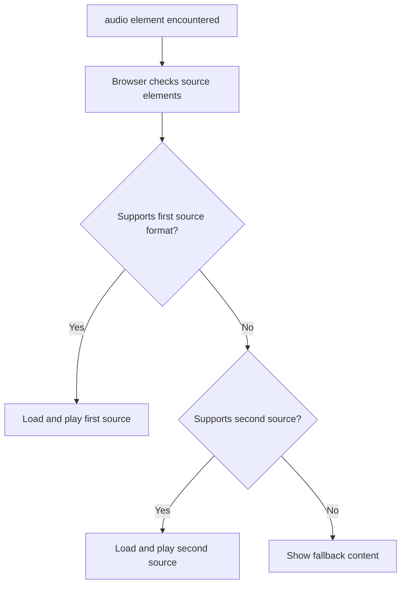
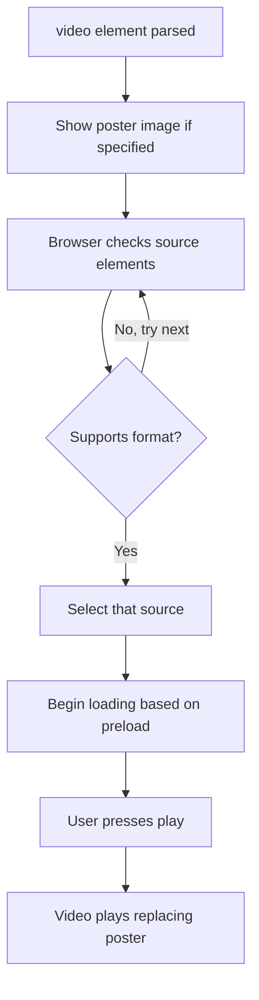
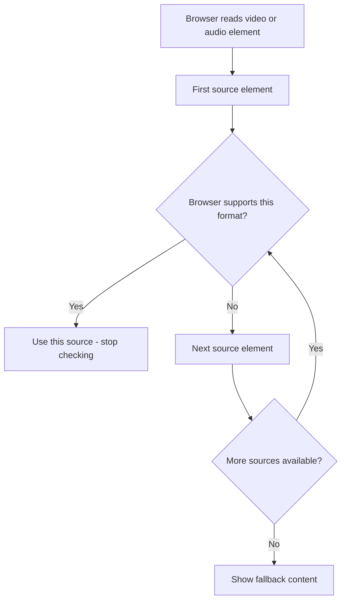
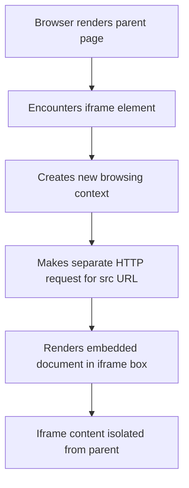
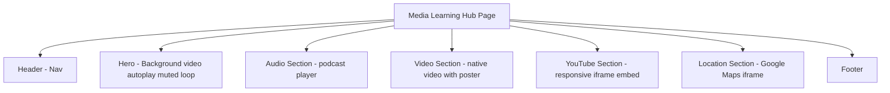

<a id="chapter-12-audio-video-iframes"></a>

# Chapter 12: Audio, Video & Iframes

[⬅ Previous Chapter](#chapter-11-images-html) | [📖 Main Index](#main-index) | [Next Chapter ➡](#chapter-13-figure-picture-svg)

---

## 📌 Learning Objectives

By the end of this chapter, you will:

**Understand:**
- How `<audio>` and `<video>` elements work natively in HTML5
- All major attributes — `controls`, `autoplay`, `muted`, `loop`, `poster`, `preload`
- How `<source>` provides multiple format fallbacks
- How `<iframe>` embeds external content into a web page
- How to embed YouTube videos and Google Maps correctly

**Interview Concepts Covered:**
- Why autoplay requires `muted` in modern browsers
- Difference between `preload="auto"`, `"metadata"`, and `"none"`
- Security concerns with iframes — `sandbox`, `allow`, `referrerpolicy`
- Accessibility requirements for audio and video content
- Performance implications of embedding iframes
- `allow="fullscreen"` and `allowfullscreen` — old vs new

**Practical Skills:**
- Build a fully functional HTML5 audio player
- Embed video with poster image and multiple format fallbacks
- Embed YouTube videos responsively
- Embed Google Maps with correct attributes
- Apply security best practices to iframe embeds

---

<a id="chapter-index-table-12"></a>

## Chapter Index Table

| Topic No. | Topic Name | Subtopics |
|-----------|-----------|-----------|
| 12.1 | [The `<audio>` Element](#121-the-audio-element) | Basic syntax · `controls` · `autoplay` · `muted` · `loop` · `preload` · `<source>` fallback |
| 12.2 | [The `<video>` Element](#122-the-video-element) | Basic syntax · `poster` · `controls` · `autoplay` · `muted` · `loop` · `preload` · `<source>` |
| 12.3 | [The `<source>` Element](#123-the-source-element) | Multiple formats · `type` attribute · Format fallback · Audio formats · Video formats |
| 12.4 | [The `<track>` Element](#124-the-track-element) | Subtitles · Captions · `kind` · `srclang` · `label` · Accessibility |
| 12.5 | [The `<iframe>` Element](#125-the-iframe-element) | What is iframe · `src` · `width` · `height` · `title` · `sandbox` · `allow` · Security |
| 12.6 | [Embedding YouTube](#126-embedding-youtube) | YouTube embed URL · Parameters · Responsive iframe · Privacy-enhanced mode |
| 12.7 | [Embedding Google Maps](#127-embedding-google-maps) | Google Maps embed · API vs iframe · `allowfullscreen` · Responsive map |

---

## 12.1 The `<audio>` Element

<a id="121-the-audio-element"></a>

### What is it?

The `<audio>` element is an HTML5 element that **embeds audio content** — music, podcasts, sound effects, voice recordings — directly into a web page without requiring any third-party plugin (like Flash, which is now deprecated).

```html
<audio controls>
  <source src="podcast.mp3" type="audio/mpeg">
  <source src="podcast.ogg" type="audio/ogg">
  Your browser does not support the audio element.
</audio>
```

---

### Why is it needed?

Before HTML5, web audio required browser plugins like Adobe Flash or RealPlayer — both fragile, insecure, and not universally available. The `<audio>` element provides a **native, plugin-free, accessible** solution built directly into the browser.

---

### What problem does it solve?

- No plugins required — works natively in all modern browsers
- Accessible — screen readers understand it as audio content
- Controllable via HTML attributes and JavaScript
- Supports multiple formats for cross-browser compatibility
- Falls back gracefully when not supported

---

### How does it work?

```html
<!-- Minimal audio player -->
<audio controls src="music.mp3">
  Your browser does not support audio.
</audio>

<!-- Audio with multiple source fallbacks -->
<audio controls>
  <source src="music.mp3" type="audio/mpeg">
  <source src="music.ogg" type="audio/ogg">
  <source src="music.wav" type="audio/wav">
  <p>
    Your browser does not support HTML5 audio. 
    <a href="music.mp3">Download the audio file</a>.
  </p>
</audio>
```

The browser reads `<source>` elements **top to bottom** and uses the **first format it supports**. If no format is supported, the fallback text or element is displayed.

---

### Internal Working



---

### Key Attributes of `<audio>`

#### `controls`

Displays the browser's built-in audio player UI — play/pause button, seek bar, volume control, duration display.

```html
<!-- Without controls: audio loads but no UI is shown -->
<audio src="music.mp3"></audio>

<!-- With controls: browser renders native player UI -->
<audio controls src="music.mp3"></audio>
```

> [!NOTE]
> Without `controls`, the audio is invisible — it can only be controlled via JavaScript. For user-facing players, always include `controls` unless you are building a custom JavaScript player.

---

#### `autoplay`

Starts playing the audio automatically when the page loads.

```html
<audio autoplay src="background-music.mp3"></audio>
```

> [!IMPORTANT]
> Modern browsers **block autoplay** for audio with sound. Chrome, Firefox, and Safari require a user gesture (click) before allowing audio with volume to play. This policy was introduced to prevent annoying auto-playing audio on websites.
>
> **Exception:** Autoplay is allowed if the audio is `muted`.

---

#### `muted`

Starts playback with volume set to zero (silent).

```html
<!-- Muted audio can autoplay in modern browsers -->
<audio autoplay muted loop src="ambient-background.mp3"></audio>
```

---

#### `loop`

Restarts the audio automatically when it reaches the end.

```html
<!-- Background ambient audio that loops forever -->
<audio autoplay muted loop src="ambient.mp3"></audio>

<!-- Podcast with loop (unusual but valid) -->
<audio controls loop src="podcast-episode.mp3"></audio>
```

---

#### `preload`

Controls how much of the audio file the browser loads before the user plays it.

| Value | Behavior |
|-------|---------|
| `none` | Do not preload anything — saves bandwidth |
| `metadata` | Load only metadata (duration, track info) — default in many browsers |
| `auto` | Load entire audio file — fastest playback start |

```html
<!-- Podcast page: preload metadata to show duration -->
<audio controls preload="metadata" src="episode-42.mp3"></audio>

<!-- Background music: preload auto for instant play -->
<audio autoplay muted loop preload="auto" src="bg-music.mp3"></audio>

<!-- Gallery page with many audio clips: save bandwidth -->
<audio controls preload="none" src="clip-001.mp3"></audio>
```

---

### Complete Attribute Reference

| Attribute | Type | Purpose |
|-----------|------|---------|
| `src` | URL | Audio file source (alternative to `<source>`) |
| `controls` | Boolean | Show browser player UI |
| `autoplay` | Boolean | Start playing automatically |
| `muted` | Boolean | Start with volume at zero |
| `loop` | Boolean | Restart when audio ends |
| `preload` | `none`/`metadata`/`auto` | How much to preload |
| `crossorigin` | `anonymous`/`use-credentials` | CORS setting for audio |

---

### Audio Format Support

| Format | MIME Type | Chrome | Firefox | Safari | Edge |
|--------|-----------|--------|---------|--------|------|
| MP3 | `audio/mpeg` | ✅ | ✅ | ✅ | ✅ |
| OGG | `audio/ogg` | ✅ | ✅ | ❌ | ✅ |
| WAV | `audio/wav` | ✅ | ✅ | ✅ | ✅ |
| AAC | `audio/aac` | ✅ | ✅ | ✅ | ✅ |
| WebM | `audio/webm` | ✅ | ✅ | ❌ | ✅ |

> [!TIP]
> Provide **MP3 as primary** (universal support) and **OGG as fallback** for older Firefox versions. MP3 alone now covers 99%+ of users.

---

### 🧠 Hinglish Intuition

> `<audio>` ek **built-in music player** hai tumhare browser mein. Purane zamaane mein Flash plugin chahiye hota tha music ke liye — ek alag software install karo, phir bhi security risks. HTML5 ne yeh sab hataya.
>
> `controls` attribute ek remote control ki tarah hai — uske bina audio chal sakta hai par user ke paas koi button nahi hoga.
>
> `autoplay` ka rule yaad rakh — agar audio mein awaaz hai, browser block kar deta hai. Sochlo kitna irritating hota agar har website pe khud se gaana bajne lage! Isliye browsers ne rule banaya — "autoplay sirf tab allowed hai jab `muted` ho."
>
> `preload="none"` = "abhi kuch mat download karo, user ne abhi suna nahi." `preload="auto"` = "pura file pehle se load kar lo, user click karte hi instantly bajega."

---

### Accessibility for Audio

```html
<!-- Accessible audio with transcript link -->
<figure>
  <figcaption>
    <strong>Episode 42:</strong> Understanding HTML5 APIs
  </figcaption>
  <audio controls preload="metadata">
    <source src="episode-42.mp3" type="audio/mpeg">
    <source src="episode-42.ogg" type="audio/ogg">
    <p>
      Your browser doesn't support HTML5 audio.
      <a href="episode-42.mp3">Download Episode 42 (MP3, 24MB)</a>
    </p>
  </audio>
  <p>
    <a href="episode-42-transcript.html">Read full transcript</a>
  </p>
</figure>
```

> [!IMPORTANT]
> Always provide a **text transcript** or **download link** alongside audio content. Users who are deaf or hard of hearing cannot access audio-only content. This is also required by WCAG 2.1 accessibility guidelines.

---

### Real World Usage

```html
<!-- Podcast player on a blog -->
<section class="podcast-player">
  <h3>🎙️ Listen to This Episode</h3>
  <audio controls preload="metadata" style="width: 100%;">
    <source src="podcasts/html5-deep-dive.mp3" type="audio/mpeg">
    <source src="podcasts/html5-deep-dive.ogg" type="audio/ogg">
    <p>
      Browser does not support audio. 
      <a href="podcasts/html5-deep-dive.mp3">Download MP3</a>
    </p>
  </audio>
</section>

<!-- Sound effect for a game (no controls, JS controlled) -->
<audio id="jump-sound" src="sounds/jump.mp3" preload="auto"></audio>
```

---

### Common Mistakes

```html
<!-- ❌ WRONG: autoplay without muted — blocked by browsers -->
<audio autoplay src="music.mp3"></audio>

<!-- ✅ CORRECT: autoplay with muted works -->
<audio autoplay muted src="music.mp3"></audio>

<!-- ❌ WRONG: No fallback content -->
<audio controls>
  <source src="music.mp3" type="audio/mpeg">
</audio>

<!-- ✅ CORRECT: Fallback for unsupported browsers -->
<audio controls>
  <source src="music.mp3" type="audio/mpeg">
  <source src="music.ogg" type="audio/ogg">
  <p>Your browser does not support audio. 
     <a href="music.mp3">Download here</a>.</p>
</audio>

<!-- ❌ WRONG: No controls and no autoplay — audio is invisible and silent -->
<audio src="music.mp3"></audio>
```

---

### Best Practices

- Always include `controls` for user-facing audio players
- Provide at least MP3 + OGG sources for maximum compatibility
- Use `preload="metadata"` as a balanced default
- Never use `autoplay` without `muted` — modern browsers block it
- Always provide a transcript or download link for accessibility
- Use `<figure>` + `<figcaption>` for semantic audio context

---

### Interview Perspective

> [!IMPORTANT]
> **Most Asked:** "Why doesn't `autoplay` work for audio in modern browsers?"
> Answer: Browsers block autoplay for audio with sound to prevent disruptive auto-playing. Autoplay is only allowed when `muted` attribute is present.
>
> **Common Question:** "What is the difference between `preload='none'`, `'metadata'`, and `'auto'`?"
> - `none` — No preloading. Best for bandwidth conservation.
> - `metadata` — Load only duration and basic info. Good default.
> - `auto` — Preload entire file. Best for instant playback.
>
> **Accessibility Question:** "How do you make audio content accessible?"
> Answer: Provide a text transcript and/or download link alongside the `<audio>` element.

👉 <a href="#chapter-index-table-12">Go to Top 🔝</a>

---

## 12.2 The `<video>` Element

<a id="122-the-video-element"></a>

### What is it?

The `<video>` element is an HTML5 element that **embeds video content** directly into a web page — no Flash, no plugins required. It supports playback controls, multiple format fallbacks, poster images, and subtitles.

```html
<video controls width="800" height="450">
  <source src="movie.mp4" type="video/mp4">
  <source src="movie.webm" type="video/webm">
  Your browser does not support HTML5 video.
</video>
```

---

### Why is it needed?

Before HTML5, video on the web required Flash Player — a third-party plugin with serious security vulnerabilities that was eventually discontinued. The `<video>` element provides native, secure, accessible video playback across all modern browsers.

---

### How does it work?

The browser processes `<video>` similarly to `<audio>`:
1. Checks `<source>` elements from top to bottom
2. Selects the first supported format
3. Requests the video file via HTTP
4. Renders the player with configured attributes
5. Shows poster image while video is loading or paused (if specified)

---

### Internal Working



---

### The `poster` Attribute

The `poster` attribute specifies an **image to display before the video plays** — like a movie thumbnail or cover image. It appears while the video is loading and when playback has not started.

```html
<video 
  controls 
  width="800" 
  height="450"
  poster="thumbnails/course-intro-thumb.jpg"
>
  <source src="videos/course-intro.mp4" type="video/mp4">
  <source src="videos/course-intro.webm" type="video/webm">
</video>
```

**Why `poster` matters:**
- Shows users what the video is about before they click play
- Prevents a blank/black rectangle before the video loads
- Significantly improves perceived performance and user experience
- Acts like the cover of a DVD — sets context and entices viewing

> [!TIP]
> Always add a `poster` image for any video visible above the fold. Choose a frame that represents the video content well. Recommended size: same aspect ratio as the video (16:9 = 1280×720px or 1920×1080px).

---

### All `<video>` Attributes

| Attribute | Type | Purpose |
|-----------|------|---------|
| `src` | URL | Video source (alternative to `<source>`) |
| `controls` | Boolean | Show browser player UI |
| `autoplay` | Boolean | Start playing automatically |
| `muted` | Boolean | Start with volume at zero |
| `loop` | Boolean | Restart when video ends |
| `poster` | URL | Thumbnail image shown before playback |
| `preload` | `none`/`metadata`/`auto` | How much to preload |
| `width` | Integer (px) | Display width |
| `height` | Integer (px) | Display height |
| `playsinline` | Boolean | Play inline on iOS (not fullscreen) |
| `crossorigin` | `anonymous`/`use-credentials` | CORS setting |
| `disablepictureinpicture` | Boolean | Prevents picture-in-picture mode |

---

### `autoplay` + `muted` for Background Videos

The most common modern use of video autoplay is **background/hero videos** on landing pages:

```html
<!-- Background hero video — autoplaying, muted, looping -->
<video 
  autoplay 
  muted 
  loop 
  playsinline
  preload="auto"
  poster="hero-poster.jpg"
  class="hero-video"
>
  <source src="hero-background.mp4" type="video/mp4">
  <source src="hero-background.webm" type="video/webm">
</video>
```

```css
.hero-video {
  position: absolute;
  top: 0;
  left: 0;
  width: 100%;
  height: 100%;
  object-fit: cover;
  z-index: -1;
}
```

> [!IMPORTANT]
> `playsinline` is **critical for iOS Safari**. Without it, videos open in fullscreen on iPhones instead of playing inline on the page. Always add `playsinline` when using `autoplay muted loop` for background videos.

---

### Video Format Support

| Format | MIME Type | Chrome | Firefox | Safari | Edge |
|--------|-----------|--------|---------|--------|------|
| MP4 (H.264) | `video/mp4` | ✅ | ✅ | ✅ | ✅ |
| WebM (VP9) | `video/webm` | ✅ | ✅ | ✅ | ✅ |
| OGG | `video/ogg` | ✅ | ✅ | ❌ | ✅ |
| AV1 | `video/mp4;codecs=av01` | ✅ | ✅ | ✅ | ✅ |

> [!TIP]
> Provide **MP4 (H.264) as primary** for universal support, and **WebM (VP9)** as secondary for better compression in browsers that support it. WebM files are typically 30–40% smaller than equivalent MP4 files.

---

### `preload` for Video

```html
<!-- Tutorial library: preload metadata to show duration in list -->
<video controls preload="metadata" poster="thumb.jpg" width="640" height="360">
  <source src="tutorial.mp4" type="video/mp4">
</video>

<!-- Hero video: preload auto for instant play -->
<video autoplay muted loop preload="auto" poster="hero.jpg">
  <source src="hero.mp4" type="video/mp4">
</video>

<!-- Video gallery: save bandwidth, user may not watch all -->
<video controls preload="none" poster="thumb.jpg" width="320" height="180">
  <source src="clip.mp4" type="video/mp4">
</video>
```

---

### 🧠 Hinglish Intuition

> `<video>` ek **built-in cinema screen** hai tumhare browser mein. HTML5 se pehle Flash chahiye hota tha — ek alag plugin jo slow, insecure aur mobile pe kaam nahi karta tha. Steve Jobs ne iPhone mein Flash support refuse kiya — yahi ek reason tha HTML5 video ka itna important hona.
>
> `poster` attribute — socho DVD ka cover. Video open karo toh pehle cover dikhta hai. Player click karo toh video shuru hota hai. Usi tarah `poster` ek image dikhata hai jab tak video nahi bajti.
>
> `autoplay muted loop playsinline` — yeh combination landing pages pe background video ke liye perfect hai. Muted isliye ki browser allow kare. Loop isliye ki infinite chale. Playsinline isliye ki iPhone pe fullscreen na ho jaaye.

---

### Real World Usage — Complete Video Player

```html
<!-- Production-quality video player -->
<figure class="video-container">
  <video 
    controls
    width="854"
    height="480"
    poster="images/course-preview-thumb.jpg"
    preload="metadata"
    crossorigin="anonymous"
  >
    <!-- WebM first — smaller file size -->
    <source src="videos/course-preview.webm" type="video/webm">
    <!-- MP4 fallback — universal support -->
    <source src="videos/course-preview.mp4" type="video/mp4">
    <!-- Subtitles -->
    <track 
      kind="subtitles" 
      src="captions/course-preview-en.vtt" 
      srclang="en" 
      label="English"
      default
    >
    <track 
      kind="subtitles" 
      src="captions/course-preview-hi.vtt" 
      srclang="hi" 
      label="Hindi"
    >
    <!-- Fallback for unsupported browsers -->
    <p>
      Your browser doesn't support HTML5 video. 
      <a href="videos/course-preview.mp4">Download the video</a>.
    </p>
  </video>
  <figcaption>Course Preview: HTML5 & CSS3 Fundamentals</figcaption>
</figure>
```

---

### CSS for Responsive Video

```css
/* Method 1: Simple max-width approach */
video {
  max-width: 100%;
  height: auto;
  display: block;
}

/* Method 2: Aspect ratio container (16:9) */
.video-wrapper {
  position: relative;
  padding-bottom: 56.25%; /* 16:9 ratio */
  height: 0;
  overflow: hidden;
}

.video-wrapper video {
  position: absolute;
  top: 0;
  left: 0;
  width: 100%;
  height: 100%;
  object-fit: cover;
}

/* Method 3: Modern aspect-ratio property */
video {
  width: 100%;
  aspect-ratio: 16 / 9;
  object-fit: cover;
}
```

---

### Common Mistakes

```html
<!-- ❌ WRONG: autoplay without muted — blocked by browsers -->
<video autoplay src="video.mp4"></video>

<!-- ✅ CORRECT -->
<video autoplay muted loop playsinline src="video.mp4"></video>

<!-- ❌ WRONG: No poster — black rectangle before video loads -->
<video controls src="tutorial.mp4"></video>

<!-- ✅ CORRECT: Always add poster for visible videos -->
<video controls poster="tutorial-thumb.jpg" src="tutorial.mp4"></video>

<!-- ❌ WRONG: No width/height — causes layout shift -->
<video controls>
  <source src="video.mp4" type="video/mp4">
</video>

<!-- ✅ CORRECT -->
<video controls width="854" height="480" poster="thumb.jpg">
  <source src="video.mp4" type="video/mp4">
</video>
```

---

### Best Practices

- Always add `poster` image for user-facing videos
- Always add `width` and `height` to prevent layout shift
- Provide MP4 + WebM for best format coverage
- Use `autoplay muted loop playsinline` for background videos
- Use `preload="metadata"` as default; `preload="none"` for gallery pages
- Add `<track>` for captions/subtitles for accessibility
- Use `object-fit: cover` when video fills a fixed-size container

---

### Interview Perspective

> [!IMPORTANT]
> **Most Asked:** "What is the `poster` attribute on `<video>`?"
> Answer: Specifies a thumbnail image displayed before the video plays or while it is loading. Improves UX by showing context instead of a blank/black rectangle.
>
> **Common Question:** "What combination of attributes is needed for a background video?"
> Answer: `autoplay muted loop playsinline` — all four are required. `autoplay` needs `muted` to work in modern browsers. `playsinline` prevents fullscreen on iOS.
>
> **Format Question:** "Which video format should be listed first in `<source>`?"
> Answer: **WebM first** (better compression, wide support), then **MP4** as universal fallback.

👉 <a href="#chapter-index-table-12">Go to Top 🔝</a>

---

## 12.3 The `<source>` Element

<a id="123-the-source-element"></a>

### What is it?

The `<source>` element is a **void element** used inside `<audio>`, `<video>`, and `<picture>` to specify **multiple media resources**. The browser evaluates each `<source>` in order and uses the first one it can play or display.

```html
<video controls>
  <source src="video.webm" type="video/webm">
  <source src="video.mp4" type="video/mp4">
</video>
```

---

### Why is it needed?

Different browsers support different audio and video formats. Without `<source>`, you would need to pick a single format — and it might not be supported by all browsers. `<source>` allows you to provide **format fallbacks**, ensuring maximum compatibility.

---

### How does it work?



---

### `<source>` Attributes

| Attribute | Purpose |
|-----------|---------|
| `src` | URL of the media file |
| `type` | MIME type of the media (helps browser decide without downloading) |
| `media` | Media query (used in `<picture>` for art direction) |
| `srcset` | Multiple image sources (used in `<picture>`) |
| `sizes` | Image size hints (used in `<picture>`) |

---

### The Importance of the `type` Attribute

The `type` attribute tells the browser the **MIME type of the file** so it can decide compatibility **without downloading the file**. Without `type`, the browser must start downloading each file to determine if it can play it — wasting bandwidth.

```html
<!-- ❌ Without type: browser may download to check compatibility -->
<video controls>
  <source src="video.webm">
  <source src="video.mp4">
</video>

<!-- ✅ With type: browser knows immediately which it supports -->
<video controls>
  <source src="video.webm" type="video/webm">
  <source src="video.mp4" type="video/mp4">
</video>
```

---

### Audio Format MIME Types

| Format | MIME Type |
|--------|-----------|
| MP3 | `audio/mpeg` |
| OGG Vorbis | `audio/ogg` |
| WAV | `audio/wav` |
| AAC | `audio/aac` |
| WebM Audio | `audio/webm` |
| FLAC | `audio/flac` |

---

### Video Format MIME Types

| Format | MIME Type |
|--------|-----------|
| MP4 (H.264) | `video/mp4` |
| WebM (VP8/VP9) | `video/webm` |
| OGG Theora | `video/ogg` |
| AV1 in MP4 | `video/mp4; codecs="av01.0.05M.08"` |

---

### Codec Specification in `type`

For more precise browser matching, you can specify the codec:

```html
<video controls>
  <!-- VP9 codec in WebM container -->
  <source src="video-vp9.webm" type='video/webm; codecs="vp9"'>
  <!-- H.264 codec in MP4 container -->
  <source src="video-h264.mp4" type='video/mp4; codecs="avc1.42E01E"'>
</video>
```

---

### 🧠 Hinglish Intuition

> `<source>` ek **backup plan** hai. Sochlo tum restaurant gaye aur main dish "Rogan Josh" order ki. Waiter bola "Sorry, nahi hai." Tum bolo "Theek hai, Dal Makhani chalega." Yeh fallback system hai.
>
> `type` attribute — waiter ko pehle hi bata do kya available hai. "Aaj Rogan Josh hai?" "Nahi." "Dal Makhani?" "Haan!" — Bina item taste kiye pata chal jaata hai. Browser ke liye bhi yahi — `type` attribute se browser ko file download kiye bina pata chal jaata hai ki support hai ya nahi.
>
> **Order matters** — jo format best hai, woh pehle rakho (WebM for video, MP3 for audio). Fallback baad mein.

---

### Real World Usage

```html
<!-- Complete audio with all common fallbacks -->
<audio controls preload="metadata">
  <!-- Best quality, modern browsers -->
  <source src="audio/music.webm" type="audio/webm">
  <!-- Universal fallback -->
  <source src="audio/music.mp3" type="audio/mpeg">
  <!-- For very old browsers -->
  <source src="audio/music.ogg" type="audio/ogg">
  <p>
    Browser does not support HTML5 audio.
    <a href="audio/music.mp3">Download MP3</a>
  </p>
</audio>

<!-- Complete video with format priority -->
<video controls width="854" height="480" poster="thumb.jpg">
  <!-- WebM first — better compression -->
  <source src="video/tutorial.webm" type="video/webm">
  <!-- MP4 fallback — universal support -->
  <source src="video/tutorial.mp4" type="video/mp4">
  <p>
    Browser does not support HTML5 video.
    <a href="video/tutorial.mp4">Download MP4</a>
  </p>
</video>
```

---

### Common Mistakes

```html
<!-- ❌ WRONG: Wrong MIME type — browser may reject valid file -->
<source src="video.mp4" type="video/mpeg">
<!-- Correct MIME for MP4 is video/mp4 -->

<!-- ❌ WRONG: Source outside media element -->
<source src="audio.mp3" type="audio/mpeg">
<!-- Must be inside audio, video, or picture -->

<!-- ✅ CORRECT: Proper parent-child relationship -->
<audio controls>
  <source src="audio.mp3" type="audio/mpeg">
</audio>
```

---

### Best Practices

- Always include the `type` attribute — saves browser from downloading to check format
- Order sources: best/most compressed format first, most compatible last
- For video: WebM → MP4
- For audio: WebM → MP3 → OGG
- Always include a text fallback inside the media element after all `<source>` elements
- Test across Chrome, Firefox, and Safari to verify format selection

---

### Interview Perspective

> [!IMPORTANT]
> **Common Question:** "Why do we use multiple `<source>` elements inside `<video>`?"
> Answer: Different browsers support different formats. Multiple `<source>` elements provide format fallbacks — the browser picks the first one it supports.
>
> **Technical Question:** "Why is the `type` attribute important on `<source>`?"
> Answer: It tells the browser the MIME type without requiring it to download the file to check. Without `type`, the browser may download each file to determine compatibility — wasting bandwidth.

👉 <a href="#chapter-index-table-12">Go to Top 🔝</a>

---

## 12.4 The `<track>` Element

<a id="124-the-track-element"></a>

### What is it?

The `<track>` element adds **text tracks** to `<audio>` and `<video>` elements — providing subtitles, captions, chapters, descriptions, or metadata synchronized with media playback. It uses the **WebVTT** (Web Video Text Tracks) format.

```html
<video controls width="854" height="480" poster="thumb.jpg">
  <source src="lecture.mp4" type="video/mp4">
  <track 
    kind="subtitles" 
    src="subtitles/lecture-en.vtt" 
    srclang="en" 
    label="English"
    default
  >
  <track 
    kind="subtitles" 
    src="subtitles/lecture-hi.vtt" 
    srclang="hi" 
    label="Hindi"
  >
</video>
```

---

### Why is it needed?

- Deaf or hard-of-hearing users cannot access audio content without captions
- Non-native speakers benefit from subtitle support
- Search engines can index video content via track files
- Legal accessibility requirements (WCAG 2.1) in many countries mandate captions

---

### `<track>` Attributes

| Attribute | Purpose |
|-----------|---------|
| `src` | URL of the `.vtt` text track file |
| `kind` | Type of text track (see below) |
| `srclang` | Language of the track (BCP 47 code: `en`, `hi`, `fr`) |
| `label` | Human-readable label shown in player menu |
| `default` | Boolean — this track is active by default |

---

### `kind` Attribute Values

| Value | Purpose |
|-------|---------|
| `subtitles` | Translation of spoken dialogue — for foreign language viewers |
| `captions` | Dialogue + sound effects — for deaf/hard-of-hearing users |
| `descriptions` | Visual descriptions — for blind users |
| `chapters` | Chapter markers for navigation |
| `metadata` | Track data for JavaScript — not displayed to users |

---

### WebVTT File Format

```vtt
WEBVTT

00:00:01.000 --> 00:00:04.000
Welcome to Chapter 12: Audio, Video and Iframes.

00:00:04.500 --> 00:00:08.000
In this chapter, we will learn about HTML5 media elements.

00:00:08.500 --> 00:00:12.000
Let's start with the audio element.
```

---

### 🧠 Hinglish Intuition

> `<track>` ek **subtitle file** hai jaise YouTube pe CC (Closed Captions) hota hai. VTT file mein timestamps hote hain aur unke corresponding text. Browser timing ke saath text dikhaata hai.
>
> `captions` vs `subtitles` — subtle difference: `subtitles` sirf dialogue translate karta hai. `captions` mein "[phone ringing]", "[dramatic music]" jaise sound descriptions bhi hote hain — deaf users ke liye.

---

### Accessibility Requirement

> [!IMPORTANT]
> WCAG 2.1 Level AA requires that **all pre-recorded video content** must have captions. Level AAA requires captions for live video and audio descriptions for pre-recorded video. Adding `<track kind="captions">` is the HTML implementation of this requirement.

---

### Interview Perspective

> [!IMPORTANT]
> **Common Question:** "What is the difference between `kind='subtitles'` and `kind='captions'`?"
> - **Subtitles** — translate dialogue for viewers who don't understand the language
> - **Captions** — include dialogue AND non-speech audio information (sound effects, music) for deaf/hard-of-hearing users
>
> **Accessibility Question:** "How do you make video content accessible?"
> Answer: Add `<track kind="captions">` with a `.vtt` file. Also provide a transcript. Consider audio descriptions for visual content.

👉 <a href="#chapter-index-table-12">Go to Top 🔝</a>

---

## 12.5 The `<iframe>` Element

<a id="125-the-iframe-element"></a>

### What is it?

The `<iframe>` (Inline Frame) element **embeds another HTML document** — or any web content — inside the current web page. The embedded content is completely independent, running in its own browsing context.

```html
<iframe 
  src="https://www.example.com" 
  width="800" 
  height="450"
  title="Example Website"
>
</iframe>
```

---

### Why is it needed?

Iframes solve the problem of **embedding external content** without rebuilding it — YouTube videos, Google Maps, social media widgets, payment forms, external dashboards, and third-party tools can all be embedded via `<iframe>` without any server-side integration.

---

### What problem does it solve?

- Embed YouTube videos on your page without hosting the video
- Embed Google Maps without writing map code
- Embed payment forms from Stripe/PayPal securely
- Embed social media timelines, widgets, and buttons
- Sandbox third-party content so it cannot access parent page

---

### How does it work?



The iframe creates a **completely isolated browsing context** — the embedded page has its own document, window object, CSS, and JavaScript environment. By default, it cannot access the parent page's JavaScript or DOM (for security).

---

### Key `<iframe>` Attributes

| Attribute | Purpose |
|-----------|---------|
| `src` | URL of the document to embed |
| `width` | Width of the iframe (pixels or %) |
| `height` | Height of the iframe (pixels or %) |
| `title` | Accessible description of iframe content (required for accessibility) |
| `sandbox` | Applies security restrictions to embedded content |
| `allow` | Grants specific permissions to embedded content |
| `allowfullscreen` | Allows fullscreen mode (legacy — prefer `allow="fullscreen"`) |
| `loading` | `lazy` or `eager` — same as `` lazy loading |
| `referrerpolicy` | Controls referrer header sent with iframe requests |
| `name` | Name for the iframe (used as link target) |
| `frameborder` | Deprecated — use CSS `border: none` instead |

---

### The `title` Attribute — Accessibility Requirement

> [!IMPORTANT]
> The `title` attribute is **required for accessibility**. Screen readers announce the iframe's title to users so they know what content they are entering. Without it, screen readers say "frame" with no context — useless for blind users.

```html
<!-- ❌ WRONG: No title — inaccessible -->
<iframe src="https://maps.google.com/..."></iframe>

<!-- ✅ CORRECT: Descriptive title -->
<iframe 
  src="https://maps.google.com/..." 
  title="Google Maps showing our office location in Mumbai"
>
</iframe>
```

---

### The `sandbox` Attribute — Security

The `sandbox` attribute applies **security restrictions** to the embedded content, preventing potentially malicious iframe content from harming the parent page.

```html
<!-- Maximum restriction — empty sandbox applies all restrictions -->
<iframe src="https://external-widget.com" sandbox title="External Widget"></iframe>
```

**Sandbox restrictions (applied when `sandbox` is present):**
- ❌ Cannot run JavaScript
- ❌ Cannot submit forms
- ❌ Cannot open popups
- ❌ Cannot navigate the parent page
- ❌ Cannot access cookies or localStorage

**Selectively allow specific features:**

```html
<!-- Allow forms and scripts, but block everything else -->
<iframe 
  src="https://payment-form.com" 
  sandbox="allow-forms allow-scripts"
  title="Secure Payment Form"
>
</iframe>
```

---

### Sandbox Permission Values

| Value | What it allows |
|-------|---------------|
| `allow-scripts` | JavaScript execution |
| `allow-forms` | Form submission |
| `allow-popups` | Opening new windows/tabs |
| `allow-same-origin` | iframe treated as same origin (use carefully!) |
| `allow-top-navigation` | Navigate parent window |
| `allow-downloads` | Trigger file downloads |
| `allow-fullscreen` | Enter fullscreen mode |
| `allow-pointer-lock` | Pointer lock API |

> [!IMPORTANT]
> Never use `sandbox="allow-scripts allow-same-origin"` together on untrusted content. This combination allows the iframe to escape the sandbox and access the parent page's DOM and cookies — defeating the entire purpose of sandboxing.

---

### The `allow` Attribute — Feature Permissions

The `allow` attribute grants specific browser API permissions to the iframe content using the **Permissions Policy** (formerly Feature Policy):

```html
<iframe 
  src="https://video-call.com/room/abc123"
  allow="camera; microphone; fullscreen; display-capture"
  title="Video Conference Room"
>
</iframe>
```

**Common `allow` values:**

| Permission | Purpose |
|-----------|---------|
| `camera` | Access device camera |
| `microphone` | Access device microphone |
| `fullscreen` | Enter fullscreen |
| `geolocation` | Access location |
| `payment` | Payment Request API |
| `autoplay` | Autoplay media |
| `picture-in-picture` | Picture-in-picture mode |
| `display-capture` | Screen sharing |

---

### `loading="lazy"` for Iframes

Just like images, iframes support native lazy loading:

```html
<!-- Lazy load iframes below the fold -->
<iframe 
  src="https://www.youtube.com/embed/VIDEO_ID"
  width="560"
  height="315"
  title="Tutorial video"
  loading="lazy"
  allow="fullscreen"
>
</iframe>
```

> [!TIP]
> Lazy loading iframes is **extremely impactful** for performance. Each iframe creates a completely new browsing context with its own HTTP requests, JavaScript, and CSS. Defer offscreen iframes and your page load time can improve dramatically.

---

### `referrerpolicy` Attribute

Controls what information is sent in the HTTP Referer header when the iframe makes requests:

```html
<iframe 
  src="https://external.com/widget"
  referrerpolicy="no-referrer"
  title="External Widget"
>
</iframe>
```

| Value | Behavior |
|-------|---------|
| `no-referrer` | No referrer information sent |
| `origin` | Only domain sent (no path) |
| `strict-origin` | Domain only, only for HTTPS→HTTPS |
| `no-referrer-when-downgrade` | Default — full URL for HTTPS, nothing for HTTP |

---

### 🧠 Hinglish Intuition

> `<iframe>` ek **window ke andar window** hai. Socho ek picture frame ke andar ek aur chhota TV screen. Woh TV screen apna alag channel chala raha hai — parent screen se bilkul alag.
>
> YouTube embed karo — YouTube ka poora player tumhare page pe aa jaata hai, lekin woh YouTube ka code hai, tumhara nahi. Google Maps embed karo — Google ka Maps app tumhare page pe.
>
> **Security angle:** `sandbox` attribute ek **jail** ki tarah hai iframe ke liye. Bahar ki content ko andar baithao, lekin kuch karne ki permission mat do. Koi script nahi, koi form submit nahi, koi popup nahi. Sirf woh karo jo tum explicitly allow karo.
>
> `title` attribute hamesha lagao — screen reader users ko pata hona chahiye "main kahan ja raha hoon" jab iframe mein enter karte hain.

---

### Common Mistakes

```html
<!-- ❌ WRONG: No title — inaccessible -->
<iframe src="https://example.com"></iframe>

<!-- ❌ WRONG: Using frameborder (deprecated) -->
<iframe src="page.html" frameborder="0"></iframe>

<!-- ✅ CORRECT: Use CSS border instead -->
<iframe src="page.html" title="Embedded page" style="border: none;"></iframe>

<!-- ❌ WRONG: sandbox with allow-scripts + allow-same-origin on untrusted content -->
<iframe src="https://untrusted.com" sandbox="allow-scripts allow-same-origin"></iframe>

<!-- ✅ CORRECT: Minimal permissions for untrusted content -->
<iframe 
  src="https://widget.com" 
  sandbox="allow-scripts" 
  title="Widget"
>
</iframe>

<!-- ❌ WRONG: No width/height — iframe collapses -->
<iframe src="https://example.com" title="Example"></iframe>

<!-- ✅ CORRECT: Always set dimensions -->
<iframe 
  src="https://example.com" 
  width="800" 
  height="450"
  title="Example page"
>
</iframe>
```

---

### Best Practices

- Always include `title` attribute — accessibility requirement
- Use `sandbox` for untrusted third-party content
- Use `loading="lazy"` for iframes below the fold
- Use CSS `border: none` instead of deprecated `frameborder="0"`
- Use `allow` to grant only the minimum required permissions
- Set explicit `width` and `height` to prevent layout collapse
- Prefer `referrerpolicy="no-referrer"` for privacy-sensitive embeds

---

### Interview Perspective

> [!IMPORTANT]
> **Most Asked:** "What is the `sandbox` attribute on `<iframe>`?"
> Answer: Applies security restrictions to embedded content — prevents JS execution, form submission, popups, and parent page access by default. Specific capabilities can be selectively re-enabled using space-separated values.
>
> **Security Question:** "Why is `sandbox='allow-scripts allow-same-origin'` dangerous?"
> Answer: It allows the iframe content to run JavaScript AND treat itself as same-origin — meaning it can access the parent page's DOM, cookies, and localStorage, completely defeating the sandboxing.
>
> **Accessibility Question:** "What accessibility attribute is required on `<iframe>`?"
> Answer: The `title` attribute — screen readers announce it when users enter the iframe.

👉 <a href="#chapter-index-table-12">Go to Top 🔝</a>

---

## 12.6 Embedding YouTube

<a id="126-embedding-youtube"></a>

### What is it?

Embedding YouTube means placing a YouTube video player directly inside your web page using an `<iframe>` with a special YouTube embed URL format. The video plays within your page without redirecting users to YouTube.

---

### Why is it needed?

Hosting video yourself requires:
- Expensive storage and bandwidth
- Video encoding in multiple formats (MP4, WebM, OGG)
- Building a custom player with controls, quality switching, fullscreen

YouTube hosting provides all of this for free. Embedding lets you leverage YouTube's infrastructure while keeping users on your page.

---

### Basic YouTube Embed

**Step 1:** Get the YouTube video ID from the URL:
```
https://www.youtube.com/watch?v=dQw4w9WgXcQ
                                  ^^^^^^^^^^^^
                                  This is the video ID
```

**Step 2:** Use the embed URL format:
```
https://www.youtube.com/embed/VIDEO_ID
```

**Step 3:** Place in iframe:

```html
<iframe
  width="560"
  height="315"
  src="https://www.youtube.com/embed/dQw4w9WgXcQ"
  title="YouTube video: HTML5 Tutorial for Beginners"
  allow="accelerometer; autoplay; clipboard-write; encrypted-media; gyroscope; picture-in-picture; web-share"
  allowfullscreen
  loading="lazy"
>
</iframe>
```

---

### YouTube URL Parameters

You can control the YouTube player behavior by appending parameters to the embed URL:

| Parameter | Values | Effect |
|-----------|--------|--------|
| `autoplay` | `0` / `1` | Autoplay video on load |
| `mute` | `0` / `1` | Start muted |
| `loop` | `0` / `1` | Loop video (requires `playlist` param too) |
| `controls` | `0` / `1` | Show/hide player controls |
| `start` | Seconds | Start at specific timestamp |
| `end` | Seconds | End at specific timestamp |
| `rel` | `0` / `1` | Show related videos from same channel (0) or any (1) |
| `modestbranding` | `0` / `1` | Reduce YouTube branding |
| `cc_load_policy` | `1` | Force captions on by default |
| `hl` | Language code | Interface language |
| `color` | `white` / `red` | Progress bar color |

```html
<!-- YouTube embed with custom parameters -->
<iframe
  width="560"
  height="315"
  src="https://www.youtube.com/embed/VIDEO_ID?autoplay=1&mute=1&loop=1&playlist=VIDEO_ID&controls=1&rel=0&start=30"
  title="Product demo video"
  allow="accelerometer; autoplay; clipboard-write; encrypted-media; gyroscope; picture-in-picture"
  allowfullscreen
  loading="lazy"
>
</iframe>
```

> [!NOTE]
> For `loop=1` to work on YouTube, you must also add `playlist=VIDEO_ID` with the same video ID. This is a YouTube API quirk.

---

### Privacy-Enhanced Mode

YouTube's **privacy-enhanced embed URL** (`youtube-nocookie.com`) does not track visitors or set cookies until they interact with the player:

```html
<!-- Standard embed — sets cookies immediately -->
<iframe src="https://www.youtube.com/embed/VIDEO_ID" ...></iframe>

<!-- Privacy-enhanced embed — GDPR friendly -->
<iframe src="https://www.youtube-nocookie.com/embed/VIDEO_ID" ...></iframe>
```

> [!IMPORTANT]
> For GDPR compliance and privacy-conscious websites, always use `youtube-nocookie.com` instead of `youtube.com` for embeds. This prevents YouTube from setting tracking cookies until the user actually plays the video.

---

### Responsive YouTube Embed

YouTube's default embed has fixed `width` and `height`. To make it responsive:

#### Method 1: Padding Hack (Legacy but widely supported)

```css
.youtube-wrapper {
  position: relative;
  padding-bottom: 56.25%; /* 16:9 aspect ratio */
  height: 0;
  overflow: hidden;
  max-width: 100%;
}

.youtube-wrapper iframe {
  position: absolute;
  top: 0;
  left: 0;
  width: 100%;
  height: 100%;
  border: none;
}
```

```html
<div class="youtube-wrapper">
  <iframe
    src="https://www.youtube-nocookie.com/embed/VIDEO_ID"
    title="Tutorial: HTML5 Media Elements"
    allow="accelerometer; autoplay; clipboard-write; encrypted-media; gyroscope; picture-in-picture"
    allowfullscreen
    loading="lazy"
  >
  </iframe>
</div>
```

#### Method 2: Modern `aspect-ratio` CSS Property

```css
.youtube-wrapper {
  width: 100%;
  aspect-ratio: 16 / 9;
}

.youtube-wrapper iframe {
  width: 100%;
  height: 100%;
  border: none;
}
```

---

### `allowfullscreen` vs `allow="fullscreen"`

```html
<!-- Legacy approach — still works but outdated -->
<iframe allowfullscreen></iframe>

<!-- Modern approach using Permissions Policy -->
<iframe allow="fullscreen"></iframe>

<!-- Both together — maximum compatibility -->
<iframe allow="accelerometer; autoplay; clipboard-write; encrypted-media; gyroscope; picture-in-picture" allowfullscreen></iframe>
```

> [!NOTE]
> YouTube's official embed code uses both `allow="..."` and `allowfullscreen` for maximum browser compatibility. Follow YouTube's generated embed code as the standard.

---

### 🧠 Hinglish Intuition

> YouTube embed ek **TV channel** ki tarah hai jo tumhare drawing room ke ek chhote screen pe chal raha hai. Main TV YouTube ka server hai — tumhara page sirf ek window hai jiske through woh content dekh sakte ho.
>
> `youtube-nocookie.com` — socho ek camera-free zone. Normal YouTube embed aate hi camera on kar deta hai (cookies track karna shuru). `nocookie` tab tak kuch nahi karta jab tak user video play nahi karta. GDPR compliance ke liye yahi sahi hai.
>
> Responsive embed ka padding hack — "56.25% padding-bottom" = 9/16 × 100 = 56.25%. Yeh 16:9 aspect ratio maintain karta hai. Container ki height 0 karo, phir padding se height create karo — browser aspect ratio maintain karta hai automatically.

---

### Complete YouTube Embed Example

```html
<!-- Production-quality YouTube embed -->
<section class="video-section">
  <h2>Watch Our Course Preview</h2>
  
  <div class="youtube-wrapper">
    <iframe
      src="https://www.youtube-nocookie.com/embed/VIDEO_ID?rel=0&cc_load_policy=1"
      title="Course Preview: HTML5 and CSS3 Complete Guide"
      allow="accelerometer; autoplay; clipboard-write; encrypted-media; gyroscope; picture-in-picture; web-share"
      allowfullscreen
      loading="lazy"
      referrerpolicy="strict-origin-when-cross-origin"
    >
    </iframe>
  </div>
  
  <p class="video-description">
    Get a sneak peek at what you will learn in this comprehensive 
    HTML5 and CSS3 course.
  </p>
</section>
```

---

### Common Mistakes

```html
<!-- ❌ WRONG: Using watch URL instead of embed URL -->
<iframe src="https://www.youtube.com/watch?v=VIDEO_ID"></iframe>
<!-- YouTube blocks direct watch page embedding -->

<!-- ✅ CORRECT: Always use /embed/ URL -->
<iframe src="https://www.youtube.com/embed/VIDEO_ID"></iframe>

<!-- ❌ WRONG: No title — inaccessible -->
<iframe src="https://www.youtube.com/embed/VIDEO_ID"></iframe>

<!-- ❌ WRONG: No allowfullscreen — users cannot go fullscreen -->
<iframe src="https://www.youtube.com/embed/VIDEO_ID" title="Video"></iframe>

<!-- ✅ CORRECT: Complete, accessible, fullscreen-enabled embed -->
<iframe
  src="https://www.youtube-nocookie.com/embed/VIDEO_ID"
  title="Descriptive video title"
  allow="accelerometer; autoplay; clipboard-write; encrypted-media; gyroscope; picture-in-picture"
  allowfullscreen
  loading="lazy"
>
</iframe>
```

---

### Best Practices

- Always use `/embed/` URL format — not `/watch?v=`
- Use `youtube-nocookie.com` for GDPR-friendly embeds
- Always include `title` attribute
- Add `allowfullscreen` and `allow="...fullscreen"` for fullscreen support
- Make embeds responsive using `aspect-ratio: 16/9` CSS
- Use `loading="lazy"` for YouTube embeds below the fold
- Add `rel=0` to show only related videos from same channel

---

### Interview Perspective

> [!IMPORTANT]
> **Most Asked:** "How do you embed a YouTube video responsively?"
> Answer: Use `<iframe>` with embed URL inside a wrapper `<div>`. Apply `aspect-ratio: 16/9` and `width: 100%` to make it responsive.
>
> **Privacy Question:** "What is `youtube-nocookie.com`?"
> Answer: YouTube's privacy-enhanced embed domain. Does not set tracking cookies until the user interacts with the player — important for GDPR compliance.
>
> **Common Mistake:** "What URL format must be used for YouTube embeds?"
> Answer: Must use `/embed/VIDEO_ID` format — not `/watch?v=VIDEO_ID`. The watch URL is blocked from being embedded.

👉 <a href="#chapter-index-table-12">Go to Top 🔝</a>

---

## 12.7 Embedding Google Maps

<a id="127-embedding-google-maps"></a>

### What is it?

Embedding Google Maps means placing an interactive Google Maps view — showing a location, route, or street view — inside your web page using an `<iframe>` with a Google Maps embed URL.

---

### Why is it needed?

Showing a physical location on a website (shop address, event venue, office) is far more useful when it is an **interactive map** rather than a static image. Users can:
- Zoom in and out
- Get directions from their current location
- Switch between map, satellite, and street view
- Click to open in Google Maps for navigation

---

### How to Get the Google Maps Embed URL

**Method 1: From Google Maps directly**

1. Go to [maps.google.com](https://maps.google.com)
2. Search for your location
3. Click **Share** → **Embed a map**
4. Copy the `<iframe>` code

**Method 2: Manual URL construction**

```
https://www.google.com/maps/embed?pb=ENCODED_LOCATION_DATA
```

---

### Basic Google Maps Embed

```html
<!-- Google Maps embed — location view -->
<iframe
  src="https://www.google.com/maps/embed?pb=!1m18!1m12!1m3!1d3771.8979869856406!2d72.82779!3d19.07283!2m3!1f0!2f0!3f0!3m2!1i1024!2i768!4f13.1!3m3!1m2!1s0x3be7c6306644edc1%3A0x5da4ed8f8d648c69!2sMumbai%2C+Maharashtra!5e0!3m2!1sen!2sin!4v1234567890"
  width="600"
  height="450"
  style="border: none;"
  allowfullscreen
  loading="lazy"
  referrerpolicy="no-referrer-when-downgrade"
  title="Google Maps showing our Mumbai office location"
>
</iframe>
```

---

### Maps Embed API vs iframe Embed

| | iframe Embed | Maps JavaScript API |
|--|--|--|
| Setup | Copy-paste from Google Maps | Requires API key + JavaScript |
| Cost | Free | Free up to usage limits, then paid |
| Customization | Limited | Full — custom markers, styles, overlays |
| Interactivity | Basic pan/zoom | Full programmatic control |
| Best for | Simple location display | Complex map applications |

> [!NOTE]
> For simple "show our office location" use cases, the **iframe embed is free and requires no API key**. Use the Maps JavaScript API only when you need custom markers, route calculation, or programmatic map control.

---

### Responsive Google Maps Embed

```css
/* Method 1: Aspect ratio wrapper */
.map-wrapper {
  width: 100%;
  aspect-ratio: 4 / 3;
  overflow: hidden;
  border-radius: 12px;
  box-shadow: 0 4px 20px rgba(0,0,0,0.15);
}

.map-wrapper iframe {
  width: 100%;
  height: 100%;
  border: none;
}
```

```html
<div class="map-wrapper">
  <iframe
    src="https://www.google.com/maps/embed?pb=LOCATION_DATA"
    title="Our office location in Connaught Place, New Delhi"
    allowfullscreen
    loading="lazy"
    referrerpolicy="no-referrer-when-downgrade"
  >
  </iframe>
</div>
```

---

### Google Maps Embed Types

```html
<!-- 1. Place view — show a specific location -->
<iframe
  src="https://www.google.com/maps/embed/v1/place?key=API_KEY&q=Taj+Mahal,Agra"
  title="Taj Mahal location on Google Maps"
  allowfullscreen
  loading="lazy"
>
</iframe>

<!-- 2. Directions view — show route between two points -->
<iframe
  src="https://www.google.com/maps/embed/v1/directions?key=API_KEY&origin=Delhi&destination=Mumbai"
  title="Route from Delhi to Mumbai on Google Maps"
  allowfullscreen
  loading="lazy"
>
</iframe>

<!-- 3. Search view — show search results -->
<iframe
  src="https://www.google.com/maps/embed/v1/search?key=API_KEY&q=restaurants+near+Connaught+Place"
  title="Restaurant search results near Connaught Place"
  allowfullscreen
  loading="lazy"
>
</iframe>
```

---

### `allowfullscreen` and `referrerpolicy`

```html
<iframe
  src="https://www.google.com/maps/embed?pb=..."
  width="100%"
  height="450"
  style="border: none;"
  allowfullscreen          <!-- Allow user to expand map to fullscreen -->
  loading="lazy"           <!-- Defer map load until near viewport -->
  referrerpolicy="no-referrer-when-downgrade"  <!-- Standard for Maps -->
  title="Google Maps: Our office at MG Road, Bengaluru"
>
</iframe>
```

**Why `referrerpolicy="no-referrer-when-downgrade"`?**
This is Google's recommended setting for Maps embeds. It sends the full referrer URL when going from HTTPS to HTTPS (standard), but sends nothing when going HTTPS to HTTP (security downgrade).

---

### 🧠 Hinglish Intuition

> Google Maps embed ek **GPS device** ki tarah hai jo tumhare page pe lagao. Ek static image sirf "yahan hoon" bolta hai. Interactive map bolta hai "yahan hoon, zoom karo, street view dekho, directions lo."
>
> Yeh bilkul free hai — koi API key nahi chahiye simple embed ke liye. Google Maps ka `<iframe>` code Google ke servers se map render karta hai aur tumhare page pe dikhata hai.
>
> `loading="lazy"` yahan bahut zaroori hai — Google Maps ek bahut heavy embed hai. Agar tum contact page pe map rakho jo page ke bottom pe hai, lazy loading se page fast load hota hai aur map tab load hota hai jab user scroll karke wahan pahunche.

---

### Complete Contact Page with Google Maps

```html
<section class="contact-location">
  <div class="contact-info">
    <h2>Find Us</h2>
    <address>
      <p>📍 42, Tech Park, MG Road</p>
      <p>Bengaluru, Karnataka 560001</p>
      <p>📞 <a href="tel:+918012345678">+91 80 1234 5678</a></p>
      <p>✉️ <a href="mailto:hello@techcorp.in">hello@techcorp.in</a></p>
    </address>
  </div>

  <div class="map-container">
    <iframe
      src="https://www.google.com/maps/embed?pb=LOCATION_EMBED_DATA"
      width="100%"
      height="400"
      style="border: none; border-radius: 8px;"
      allowfullscreen
      loading="lazy"
      referrerpolicy="no-referrer-when-downgrade"
      title="TechCorp office location at MG Road, Bengaluru on Google Maps"
    >
    </iframe>
  </div>
</section>
```

---

### Common Mistakes

```html
<!-- ❌ WRONG: No title on Maps iframe -->
<iframe src="https://www.google.com/maps/embed?pb=..."></iframe>

<!-- ❌ WRONG: Using frameborder (deprecated) -->
<iframe src="..." frameborder="0"></iframe>

<!-- ✅ CORRECT: Use CSS border instead -->
<iframe src="..." style="border: none;" title="Map location"></iframe>

<!-- ❌ WRONG: Fixed width breaks responsiveness -->
<iframe src="..." width="600" height="450" title="Map"></iframe>

<!-- ✅ CORRECT: Responsive map -->
<div style="width: 100%; aspect-ratio: 4/3;">
  <iframe 
    src="..." 
    width="100%" 
    height="100%" 
    style="border: none;"
    title="Office location on Google Maps"
    allowfullscreen
    loading="lazy"
  >
  </iframe>
</div>
```

---

### Best Practices

- Always include `title` attribute describing what the map shows
- Use `loading="lazy"` — Maps is heavy and should be deferred
- Use CSS `border: none` instead of deprecated `frameborder="0"`
- Make the map responsive using `aspect-ratio` wrapper
- Use `allowfullscreen` so users can expand the map
- Get embed code from Google Maps directly for accurate location data
- Use `referrerpolicy="no-referrer-when-downgrade"` as recommended by Google

---

### Interview Perspective

> [!IMPORTANT]
> **Common Question:** "Do you need an API key to embed Google Maps?"
> Answer: **No.** The basic iframe embed from Google Maps is free and requires no API key. API keys are only needed for the Maps JavaScript API (custom programmatic maps).
>
> **Performance Question:** "How do you optimize a Google Maps embed for page performance?"
> Answer: Use `loading="lazy"` to defer the Maps iframe load until the user scrolls near it. Google Maps is a heavy embed — lazy loading significantly improves initial page load.
>
> **Accessibility Question:** "What must every Maps iframe include?"
> Answer: A descriptive `title` attribute explaining what location or area the map shows.

👉 <a href="#chapter-index-table-12">Go to Top 🔝</a>

---

## 💡 Interview Questions

### Conceptual Questions

**Q1. Why doesn't `autoplay` work for audio and video in modern browsers? What is the workaround?**

**Answer:** Modern browsers implement an **Autoplay Policy** that blocks media with sound from autoplaying to prevent disruptive user experiences. The workaround is to combine `autoplay` with `muted` — browsers allow muted media to autoplay. For video background elements, use `autoplay muted loop playsinline`.

---

**Q2. What is the difference between `<audio>` with `src` attribute vs `<audio>` with `<source>` children?**

**Answer:**
```html
<!-- Method 1: src attribute — single source -->
<audio controls src="music.mp3"></audio>

<!-- Method 2: source children — multiple fallbacks -->
<audio controls>
  <source src="music.webm" type="audio/webm">
  <source src="music.mp3" type="audio/mpeg">
</audio>
```
The `<source>` approach is preferred because it provides **format fallbacks** — the browser picks the first format it supports, ensuring cross-browser compatibility.

---

**Q3. What is the `poster` attribute on `<video>` and why is it important?**

**Answer:** `poster` specifies a thumbnail image displayed before the video plays and while it is loading. It improves UX by showing meaningful context instead of a blank/black rectangle, sets user expectations about video content, and improves perceived performance.

---

**Q4. What is the `sandbox` attribute on `<iframe>` and what does it prevent?**

**Answer:** `sandbox` applies security restrictions to embedded iframe content. When present (even as empty string), it prevents:
- JavaScript execution
- Form submission
- Popup windows
- Parent page navigation
- Cookie and localStorage access

Specific capabilities can be re-enabled with space-separated values like `sandbox="allow-scripts allow-forms"`.

---

**Q5. Why is the `title` attribute required on `<iframe>` elements?**

**Answer:** For accessibility — screen readers announce the `title` when users navigate into an iframe. Without it, screen readers just say "frame" with no context. The title should describe what content the iframe contains (e.g., "Google Maps showing our office location" or "YouTube tutorial video on HTML5").

---

**Q6. What is the difference between `allowfullscreen` attribute and `allow="fullscreen"` in iframes?**

**Answer:**
- `allowfullscreen` — legacy boolean attribute from older HTML specifications
- `allow="fullscreen"` — modern Permissions Policy syntax

Both achieve the same result. YouTube's official embed code includes both for maximum browser compatibility. The `allow` attribute is more flexible as it can specify multiple permissions in one attribute.

---

**Q7. What is the difference between `preload="none"`, `preload="metadata"`, and `preload="auto"`?**

**Answer:**
- `none` — Browser does not preload anything. Saves bandwidth. Best for pages with many media elements the user may never play.
- `metadata` — Browser loads only metadata (duration, dimensions, basic info). Good balanced default.
- `auto` — Browser preloads the entire media file. Best for instant playback but wastes bandwidth if user doesn't play.

---

**Q8. What is the `<track>` element and what is the difference between `kind="subtitles"` and `kind="captions"`?**

**Answer:** `<track>` adds synchronized text tracks (WebVTT files) to audio/video.
- `subtitles` — Translates dialogue for viewers who don't understand the language. Does not include sound effect descriptions.
- `captions` — Includes dialogue AND non-speech audio (music, sound effects, "[phone ringing]") for deaf/hard-of-hearing users. Required for WCAG 2.1 AA compliance.

---

### Scenario-Based Questions

**Q9. A client wants an autoplaying background video on their landing page. How do you implement it correctly?**

**Answer:**

```html
<video 
  autoplay 
  muted 
  loop 
  playsinline
  preload="auto"
  poster="hero-poster.jpg"
  class="bg-video"
>
  <source src="hero.webm" type="video/webm">
  <source src="hero.mp4" type="video/mp4">
</video>
```

```css
.bg-video {
  position: fixed;
  top: 0; left: 0;
  width: 100%; height: 100%;
  object-fit: cover;
  z-index: -1;
}
```

Key points: `autoplay muted` required for browser permission. `loop` for infinite play. `playsinline` for iOS. `preload="auto"` for instant start. `poster` as fallback. WebM before MP4 for compression.

---

**Q10. How do you embed a YouTube video that is GDPR-compliant, responsive, and accessible?**

**Answer:**

```html
<div class="video-wrapper">
  <iframe
    src="https://www.youtube-nocookie.com/embed/VIDEO_ID?rel=0"
    title="Descriptive title of what the video contains"
    allow="accelerometer; autoplay; clipboard-write; encrypted-media; gyroscope; picture-in-picture"
    allowfullscreen
    loading="lazy"
    referrerpolicy="strict-origin-when-cross-origin"
  >
  </iframe>
</div>
```

```css
.video-wrapper {
  width: 100%;
  aspect-ratio: 16 / 9;
}
.video-wrapper iframe {
  width: 100%; height: 100%;
  border: none;
}
```

GDPR: `youtube-nocookie.com`. Accessible: `title`. Responsive: `aspect-ratio`. Performance: `loading="lazy"`.

---

### Output-Based Questions

**Q11. What will happen when this page loads in Chrome?**

```html
<audio autoplay src="music.mp3">
  Your browser does not support audio.
</audio>
```

**Answer:** The audio will **NOT play automatically**. Chrome blocks autoplay for audible media. The fallback text "Your browser does not support audio" will also NOT be shown because Chrome does support `<audio>` — fallback text only shows when the entire `<audio>` element is unsupported. The audio element will load silently with no UI (no `controls` attribute). To autoplay: add `muted` attribute.

---

**Q12. Which source will the browser use?**

```html
<video controls>
  <source src="video.webm" type="video/webm">
  <source src="video.mp4" type="video/mp4">
  <source src="video.ogg" type="video/ogg">
</video>
```

**Answer:** It depends on the browser:
- **Chrome/Firefox/Edge:** Uses `video.webm` (first source, supported)
- **Safari:** Skips `video.webm` (not supported in older Safari), uses `video.mp4`
- If neither webm nor mp4 supported (very old browsers): tries `video.ogg`

---

### Advanced Questions

**Q13. Explain the security risks of using `<iframe>` and how `sandbox` mitigates them.**

**Answer:** Without `sandbox`, an embedded iframe can:
- Run JavaScript that interacts with the parent page (if same-origin)
- Submit forms and phish data
- Open popup windows
- Redirect the parent page via `window.top.location`
- Perform clickjacking attacks

`sandbox` attribute applies restrictions that prevent all of the above by default. Selective capabilities can be re-enabled. The dangerous combination to never use on untrusted content: `sandbox="allow-scripts allow-same-origin"` — this allows the iframe to bypass all sandbox restrictions by accessing the parent DOM.

---

**Q14. How does the browser decide which `<source>` to use inside `<video>` or `<audio>`?**

**Answer:** The browser evaluates `<source>` elements **sequentially** (top to bottom):
1. Reads the `type` attribute MIME type — if provided, immediately checks if the browser supports that MIME type
2. If `type` not present, browser may partially download the file to determine format
3. Selects the **first `<source>`** whose format is supported
4. Stops evaluating further sources
5. If no sources are supported, falls back to content inside the media element

This is why `type` attribute is important — it prevents unnecessary network requests.

---

## 🧪 Practice Problems

### Coding Questions

**1.** Build a podcast player page with: an `<audio>` element showing controls, MP3 and OGG source fallbacks, `preload="metadata"`, episode title using `<figcaption>`, a transcript download link, and full responsive CSS styling.

**2.** Create a video gallery with 4 videos, each having: a `poster` image, MP4 and WebM sources, `loading="lazy"`, `preload="none"`, and responsive CSS that shows 2 videos per row on desktop and 1 on mobile.

**3.** Build a contact page with: a Google Maps embed wrapped in a responsive container, office address using `<address>` tag, `loading="lazy"` on the map iframe, and proper `title` and `allowfullscreen` attributes.

**4.** Embed a YouTube video responsively with: `youtube-nocookie.com` domain, `rel=0` parameter, `cc_load_policy=1`, responsive wrapper using `aspect-ratio: 16/9`, `loading="lazy"`, and all required accessibility and permission attributes.

**5.** Create a secure embedded widget section using `<iframe>` with: `sandbox="allow-scripts allow-forms"`, `title` attribute, `loading="lazy"`, CSS `border: none`, `referrerpolicy="no-referrer"`, and explicit `width`/`height`.

---

### Theory Questions

**1.** Explain the browser autoplay policy. Why was it introduced? What combinations of attributes are allowed to autoplay? Which attribute combinations are blocked?

**2.** Describe the complete process of how a browser selects which `<source>` to use inside a `<video>` element. Why is the `type` attribute important in this process?

**3.** Compare `<video>` hosted on your own server vs embedded YouTube iframe. List 4 advantages and 2 disadvantages of each approach.

**4.** Explain the difference between `sandbox` attribute values: `allow-scripts`, `allow-same-origin`, and `allow-forms`. Why is combining `allow-scripts` and `allow-same-origin` dangerous for untrusted content?

**5.** What accessibility requirements apply to audio and video content? Name the relevant HTML elements and attributes, and reference the WCAG guideline level they address.

---

### Machine Coding Problems

**Problem 1: Video Course Player Page**

Build a complete video course player page using only HTML and CSS.

Requirements:
- Header with logo and navigation
- Main video player area with:
  - `<video>` element with controls, poster image
  - MP4 and WebM source elements
  - English and Hindi `<track>` elements (create sample `.vtt` content inline in code comments)
  - `preload="metadata"`
  - Responsive — fills container width
- Sidebar with 5 lesson thumbnails (use `<video>` with `preload="none"` and poster)
- Each lesson item shows: lesson number, title, duration
- Active lesson highlighted with CSS
- Mobile: sidebar moves below video player
- Footer with download link for the video

---

**Problem 2: Media-Rich Landing Page**

Build a landing page using only HTML and CSS that demonstrates all media elements.

Requirements:
- **Hero section:** Background video using `autoplay muted loop playsinline` with a text overlay and CTA button
- **Demo section:** YouTube embed (responsive, `youtube-nocookie.com`, with custom parameters `rel=0`)
- **Testimonial section:** `<audio>` player with 3 customer audio testimonials, each with `controls`, episode title, and download link
- **Location section:** Google Maps iframe embed, responsive, with office address
- Full responsive layout (mobile, tablet, desktop)
- Accessible: all iframes have `title`, all audio/video have descriptive `alt`-equivalent information

---

## 🚀 Mini Project

### Problem Statement

Build a **Media Learning Hub** — an educational page about HTML5 media — using only HTML and CSS, demonstrating `<audio>`, `<video>`, `<iframe>`, YouTube embed, and Google Maps embed in a real-world context.

---

### Features

- Navigation header with smooth anchor links
- Hero section with background video (muted, autoplay, loop)
- Audio lesson section with podcast-style audio player
- Video tutorial section with native `<video>` and poster
- Embedded YouTube preview section (responsive)
- Location/Contact section with Google Maps embed
- Fully accessible — all media elements have proper attributes
- Fully responsive layout

---

### Architecture



---

### Folder Structure

```text
media-learning-hub/
│
├── index.html
├── style.css
│
├── videos/
│   ├── hero-bg.mp4
│   ├── hero-bg.webm
│   ├── tutorial.mp4
│   ├── tutorial.webm
│   └── tutorial-thumb.jpg
│
├── audio/
│   ├── lesson-01.mp3
│   └── lesson-01.ogg
│
└── images/
    ├── logo.svg
    └── hero-poster.jpg
```

---

### Implementation

**index.html**

```html
<!DOCTYPE html>
<html lang="en">
<head>
  <meta charset="UTF-8">
  <meta name="viewport" content="width=device-width, initial-scale=1.0">
  <meta name="description" content="Media Learning Hub — Learn HTML5 audio, video, and iframe embedding">
  <title>Media Learning Hub — HTML5 Media Elements</title>
  <link rel="stylesheet" href="style.css">
</head>
<body>

  <!-- ================================
    HEADER NAVIGATION
  ================================ -->
  <header class="site-header">
    <div class="logo">
      🎬 MediaHub
    </div>
    <nav aria-label="Main Navigation">
      <ul class="nav-list" role="list">
        <li><a href="#audio-section">Audio</a></li>
        <li><a href="#video-section">Video</a></li>
        <li><a href="#youtube-section">YouTube</a></li>
        <li><a href="#maps-section">Location</a></li>
      </ul>
    </nav>
  </header>

  <!-- ================================
    HERO SECTION
    Background video: autoplay, muted, loop, playsinline
  ================================ -->
  <section class="hero-section" id="home">
    <!-- Background video -->
    <video
      class="hero-bg-video"
      autoplay
      muted
      loop
      playsinline
      preload="auto"
      poster="images/hero-poster.jpg"
    >
      <source src="videos/hero-bg.webm" type="video/webm">
      <source src="videos/hero-bg.mp4" type="video/mp4">
    </video>

    <!-- Overlay content -->
    <div class="hero-overlay">
      <div class="hero-content">
        <h1>Master HTML5 Media</h1>
        <p>
          Learn to embed audio, video, YouTube and maps 
          directly in your web pages
        </p>
        <div class="hero-buttons">
          <a href="#audio-section" class="btn btn-primary">Start Learning</a>
          <a href="#youtube-section" class="btn btn-outline">Watch Preview</a>
        </div>
      </div>
    </div>
  </section>

  <!-- ================================
    FEATURES STRIP
  ================================ -->
  <section class="features-strip">
    <div class="features-grid">
      <div class="feature-item">
        <span class="feature-icon">🎵</span>
        <span class="feature-label">HTML5 Audio</span>
      </div>
      <div class="feature-item">
        <span class="feature-icon">🎥</span>
        <span class="feature-label">HTML5 Video</span>
      </div>
      <div class="feature-item">
        <span class="feature-icon">▶️</span>
        <span class="feature-label">YouTube Embed</span>
      </div>
      <div class="feature-item">
        <span class="feature-icon">🗺️</span>
        <span class="feature-label">Google Maps</span>
      </div>
    </div>
  </section>

  <main class="main-content">

    <!-- ================================
      AUDIO SECTION
      Podcast-style audio player
    ================================ -->
    <section id="audio-section" class="content-section audio-section">
      <div class="section-header">
        <h2>🎵 HTML5 Audio Element</h2>
        <p class="section-desc">
          Learn how to embed audio natively in your web pages 
          without any plugins.
        </p>
      </div>

      <div class="audio-player-card">
        <div class="episode-info">
          <div class="episode-icon">🎙️</div>
          <div class="episode-details">
            <h3>Lesson 01: Introduction to HTML5 Audio</h3>
            <p>Duration: 12:34 &nbsp;|&nbsp; Series: HTML5 Media</p>
          </div>
        </div>

        <!-- Audio element with controls, multiple sources, preload metadata -->
        <audio
          controls
          preload="metadata"
          class="audio-player"
        >
          <source src="audio/lesson-01.mp3" type="audio/mpeg">
          <source src="audio/lesson-01.ogg" type="audio/ogg">
          <p>
            Your browser does not support HTML5 audio.
            <a href="audio/lesson-01.mp3">Download Lesson 01 (MP3)</a>
          </p>
        </audio>

        <div class="audio-actions">
          <a href="audio/lesson-01.mp3" class="download-link" download>
            ⬇️ Download MP3
          </a>
          <a href="transcripts/lesson-01.txt" class="transcript-link">
            📄 Read Transcript
          </a>
        </div>
      </div>

      <!-- Code explanation card -->
      <div class="code-info-card">
        <h4>Key Attributes Used:</h4>
        <ul role="list">
          <li><code>controls</code> — Shows browser audio UI</li>
          <li><code>preload="metadata"</code> — Loads duration info only</li>
          <li>Multiple <code>&lt;source&gt;</code> — MP3 + OGG fallbacks</li>
          <li>Fallback text — For unsupported browsers</li>
        </ul>
      </div>
    </section>

    <!-- ================================
      VIDEO SECTION
      Native HTML5 video with poster
    ================================ -->
    <section id="video-section" class="content-section video-section">
      <div class="section-header">
        <h2>🎥 HTML5 Video Element</h2>
        <p class="section-desc">
          Embed video natively with controls, poster images, 
          subtitles, and multiple format support.
        </p>
      </div>

      <div class="video-player-card">
        <!-- Native HTML5 video with all best practices -->
        <figure class="video-figure">
          <video
            controls
            width="854"
            height="480"
            poster="videos/tutorial-thumb.jpg"
            preload="metadata"
            class="tutorial-video"
          >
            <!-- WebM first — better compression -->
            <source src="videos/tutorial.webm" type="video/webm">
            <!-- MP4 universal fallback -->
            <source src="videos/tutorial.mp4" type="video/mp4">
            <!-- Subtitles track -->
            <track
              kind="captions"
              src="captions/tutorial-en.vtt"
              srclang="en"
              label="English Captions"
              default
            >
            <p>
              Your browser does not support HTML5 video.
              <a href="videos/tutorial.mp4">Download Tutorial Video</a>
            </p>
          </video>
          <figcaption>
            Tutorial: HTML5 Video Element — Complete Guide
          </figcaption>
        </figure>
      </div>

      <!-- Code explanation card -->
      <div class="code-info-card">
        <h4>Key Attributes Used:</h4>
        <ul role="list">
          <li><code>poster</code> — Thumbnail before video plays</li>
          <li><code>preload="metadata"</code> — Load duration only</li>
          <li><code>controls</code> — Shows browser video player UI</li>
          <li><code>&lt;track&gt;</code> — English captions for accessibility</li>
          <li>WebM → MP4 source order for best compatibility</li>
        </ul>
      </div>
    </section>

    <!-- ================================
      YOUTUBE SECTION
      Responsive YouTube embed
    ================================ -->
    <section id="youtube-section" class="content-section youtube-section">
      <div class="section-header">
        <h2>▶️ Embedding YouTube Videos</h2>
        <p class="section-desc">
          Leverage YouTube's infrastructure to serve video — 
          responsive, GDPR-friendly, and accessible.
        </p>
      </div>

      <div class="youtube-card">
        <!-- Responsive YouTube embed wrapper -->
        <div class="youtube-wrapper">
          <iframe
            src="https://www.youtube-nocookie.com/embed/dQw4w9WgXcQ?rel=0&cc_load_policy=1"
            title="YouTube Video: HTML5 Media Elements Complete Tutorial"
            allow="accelerometer; autoplay; clipboard-write; encrypted-media; gyroscope; picture-in-picture; web-share"
            allowfullscreen
            loading="lazy"
            referrerpolicy="strict-origin-when-cross-origin"
          >
          </iframe>
        </div>

        <div class="youtube-meta">
          <p>
            <strong>Privacy Note:</strong> This embed uses 
            <code>youtube-nocookie.com</code> — no cookies are set 
            until you play the video.
          </p>
        </div>
      </div>

      <!-- Code explanation card -->
      <div class="code-info-card">
        <h4>Best Practices Applied:</h4>
        <ul role="list">
          <li><code>youtube-nocookie.com</code> — GDPR compliant</li>
          <li><code>rel=0</code> — Show only related channel videos</li>
          <li><code>loading="lazy"</code> — Defer load for performance</li>
          <li>Responsive wrapper — <code>aspect-ratio: 16/9</code></li>
          <li><code>title</code> — Required for accessibility</li>
          <li><code>allowfullscreen</code> — Enable fullscreen mode</li>
        </ul>
      </div>
    </section>

    <!-- ================================
      GOOGLE MAPS SECTION
      Responsive Maps embed
    ================================ -->
    <section id="maps-section" class="content-section maps-section">
      <div class="section-header">
        <h2>🗺️ Embedding Google Maps</h2>
        <p class="section-desc">
          Embed interactive maps to help users find your 
          physical location without any API key.
        </p>
      </div>

      <div class="maps-card">
        <div class="maps-layout">

          <!-- Address info -->
          <div class="maps-info">
            <h3>Our Learning Centre</h3>
            <address>
              <p>📍 MediaHub Campus</p>
              <p>Sector 18, Noida</p>
              <p>Uttar Pradesh 201301</p>
              <br>
              <p>📞 <a href="tel:+911204567890">+91 120 456 7890</a></p>
              <p>✉️ <a href="mailto:learn@mediahub.in">learn@mediahub.in</a></p>
            </address>
            <div class="maps-hours">
              <h4>Opening Hours</h4>
              <ul role="list">
                <li>Monday – Friday: 9 AM – 6 PM</li>
                <li>Saturday: 10 AM – 4 PM</li>
                <li>Sunday: Closed</li>
              </ul>
            </div>
          </div>

          <!-- Responsive Google Maps iframe -->
          <div class="map-wrapper">
            <iframe
              src="https://www.google.com/maps/embed?pb=!1m18!1m12!1m3!1d3503.0!2d77.3261!3d28.5706!2m3!1f0!2f0!3f0!3m2!1i1024!2i768!4f13.1!3m3!1m2!1s0x0%3A0x0!2zMjjCsDM0JzE0LjIiTiA3N8KwMTknMzQuMCJF!5e0!3m2!1sen!2sin!4v1234567890"
              title="MediaHub Learning Centre location in Sector 18, Noida on Google Maps"
              allowfullscreen
              loading="lazy"
              referrerpolicy="no-referrer-when-downgrade"
            >
            </iframe>
          </div>

        </div>
      </div>

      <!-- Code explanation card -->
      <div class="code-info-card">
        <h4>Key Attributes Used:</h4>
        <ul role="list">
          <li><code>title</code> — Describes map for screen readers</li>
          <li><code>loading="lazy"</code> — Defers heavy Maps load</li>
          <li><code>allowfullscreen</code> — Enable map fullscreen</li>
          <li><code>referrerpolicy</code> — Google's recommended setting</li>
          <li>No <code>frameborder</code> — Use CSS <code>border: none</code></li>
        </ul>
      </div>
    </section>

  </main>

  <!-- ================================
    FOOTER
  ================================ -->
  <footer class="site-footer">
    <div class="footer-grid">
      <div class="footer-brand">
        <div class="footer-logo">🎬 MediaHub</div>
        <p>Learn HTML5 media elements — audio, video, and iframes.</p>
      </div>
      <div class="footer-links">
        <h4>Quick Links</h4>
        <ul role="list">
          <li><a href="#audio-section">Audio Element</a></li>
          <li><a href="#video-section">Video Element</a></li>
          <li><a href="#youtube-section">YouTube Embed</a></li>
          <li><a href="#maps-section">Google Maps</a></li>
        </ul>
      </div>
    </div>
    <div class="footer-bottom">
      <p>© 2024 MediaHub. Built with HTML5 & CSS3. No frameworks used.</p>
    </div>
  </footer>

</body>
</html>
```

---

**style.css**

```css
/* ==============================
   RESET & BASE STYLES
============================== */
*, *::before, *::after {
  box-sizing: border-box;
  margin: 0;
  padding: 0;
}

:root {
  --color-primary: #6c63ff;
  --color-dark: #0f0f1a;
  --color-dark-2: #1a1a2e;
  --color-dark-3: #16213e;
  --color-light: #f0f0f8;
  --color-text: #e0e0f0;
  --color-text-muted: #9090b0;
  --color-accent: #ff6584;
  --color-audio: #00b4d8;
  --color-video: #e76f51;
  --color-youtube: #ff0000;
  --color-maps: #34a853;
  --radius: 12px;
  --shadow: 0 8px 32px rgba(0,0,0,0.3);
  --transition: 0.3s ease;
}

img, video, audio, iframe {
  max-width: 100%;
  display: block;
}

body {
  font-family: 'Segoe UI', system-ui, -apple-system, sans-serif;
  background-color: var(--color-dark);
  color: var(--color-text);
  line-height: 1.7;
}

/* ==============================
   HEADER
============================== */
.site-header {
  position: sticky;
  top: 0;
  z-index: 100;
  display: flex;
  justify-content: space-between;
  align-items: center;
  padding: 16px 48px;
  background: rgba(15, 15, 26, 0.95);
  backdrop-filter: blur(12px);
  border-bottom: 1px solid rgba(108, 99, 255, 0.2);
}

.logo {
  font-size: 20px;
  font-weight: 700;
  color: var(--color-primary);
  letter-spacing: 1px;
}

ul.nav-list {
  list-style: none;
  padding: 0;
  margin: 0;
  display: flex;
  gap: 32px;
}

ul.nav-list li a {
  color: var(--color-text-muted);
  text-decoration: none;
  font-size: 14px;
  font-weight: 500;
  letter-spacing: 0.5px;
  transition: color var(--transition);
  padding-bottom: 4px;
  border-bottom: 2px solid transparent;
}

ul.nav-list li a:hover {
  color: var(--color-primary);
  border-bottom-color: var(--color-primary);
}

/* ==============================
   HERO SECTION
============================== */
.hero-section {
  position: relative;
  height: 100vh;
  min-height: 600px;
  display: flex;
  align-items: center;
  justify-content: center;
  overflow: hidden;
}

/* Background video — fills entire hero */
.hero-bg-video {
  position: absolute;
  inset: 0;
  width: 100%;
  height: 100%;
  object-fit: cover;
  z-index: 0;
}

.hero-overlay {
  position: absolute;
  inset: 0;
  background: linear-gradient(
    135deg,
    rgba(15, 15, 26, 0.85) 0%,
    rgba(108, 99, 255, 0.3) 100%
  );
  z-index: 1;
  display: flex;
  align-items: center;
  justify-content: center;
}

.hero-content {
  text-align: center;
  padding: 20px;
  max-width: 700px;
}

.hero-content h1 {
  font-size: clamp(36px, 6vw, 72px);
  font-weight: 800;
  line-height: 1.2;
  margin-bottom: 20px;
  background: linear-gradient(135deg, #ffffff, var(--color-primary));
  -webkit-background-clip: text;
  -webkit-text-fill-color: transparent;
  background-clip: text;
}

.hero-content p {
  font-size: clamp(16px, 2.5vw, 22px);
  color: rgba(255,255,255,0.8);
  margin-bottom: 36px;
  line-height: 1.6;
}

.hero-buttons {
  display: flex;
  gap: 16px;
  justify-content: center;
  flex-wrap: wrap;
}

.btn {
  display: inline-block;
  padding: 14px 36px;
  border-radius: 50px;
  text-decoration: none;
  font-size: 15px;
  font-weight: 600;
  letter-spacing: 0.5px;
  transition: all var(--transition);
}

.btn-primary {
  background: var(--color-primary);
  color: white;
  box-shadow: 0 4px 20px rgba(108, 99, 255, 0.4);
}

.btn-primary:hover {
  background: #5a52d5;
  transform: translateY(-2px);
  box-shadow: 0 8px 28px rgba(108, 99, 255, 0.5);
}

.btn-outline {
  border: 2px solid rgba(255,255,255,0.5);
  color: white;
}

.btn-outline:hover {
  border-color: var(--color-primary);
  color: var(--color-primary);
  background: rgba(108, 99, 255, 0.1);
}

/* ==============================
   FEATURES STRIP
============================== */
.features-strip {
  background: var(--color-dark-2);
  border-bottom: 1px solid rgba(108, 99, 255, 0.15);
}

.features-grid {
  max-width: 900px;
  margin: 0 auto;
  display: grid;
  grid-template-columns: repeat(4, 1fr);
  gap: 0;
}

.feature-item {
  display: flex;
  flex-direction: column;
  align-items: center;
  gap: 8px;
  padding: 28px 16px;
  border-right: 1px solid rgba(108, 99, 255, 0.15);
  transition: background var(--transition);
}

.feature-item:last-child {
  border-right: none;
}

.feature-item:hover {
  background: rgba(108, 99, 255, 0.08);
}

.feature-icon {
  font-size: 28px;
}

.feature-label {
  font-size: 13px;
  color: var(--color-text-muted);
  font-weight: 500;
  text-align: center;
}

/* ==============================
   MAIN CONTENT & SECTIONS
============================== */
.main-content {
  max-width: 1000px;
  margin: 0 auto;
  padding: 0 24px;
}

.content-section {
  padding: 80px 0;
  border-bottom: 1px solid rgba(255,255,255,0.06);
}

.content-section:last-child {
  border-bottom: none;
}

.section-header {
  margin-bottom: 40px;
}

.section-header h2 {
  font-size: 32px;
  font-weight: 700;
  margin-bottom: 12px;
  color: #ffffff;
}

.section-desc {
  font-size: 16px;
  color: var(--color-text-muted);
  max-width: 600px;
  line-height: 1.7;
}

/* ==============================
   CODE INFO CARD
============================== */
.code-info-card {
  margin-top: 28px;
  background: rgba(108, 99, 255, 0.08);
  border: 1px solid rgba(108, 99, 255, 0.2);
  border-radius: var(--radius);
  padding: 24px;
}

.code-info-card h4 {
  font-size: 14px;
  text-transform: uppercase;
  letter-spacing: 1px;
  color: var(--color-primary);
  margin-bottom: 12px;
}

.code-info-card ul {
  list-style: none;
  padding: 0;
  display: flex;
  flex-direction: column;
  gap: 8px;
}

.code-info-card li {
  font-size: 14px;
  color: var(--color-text-muted);
  padding-left: 20px;
  position: relative;
}

.code-info-card li::before {
  content: "✓";
  position: absolute;
  left: 0;
  color: var(--color-primary);
  font-weight: bold;
}

.code-info-card code {
  background: rgba(108, 99, 255, 0.15);
  color: var(--color-primary);
  padding: 2px 6px;
  border-radius: 4px;
  font-size: 13px;
  font-family: 'Courier New', monospace;
}

/* ==============================
   AUDIO SECTION
============================== */
.audio-player-card {
  background: var(--color-dark-2);
  border: 1px solid rgba(0, 180, 216, 0.2);
  border-radius: var(--radius);
  padding: 32px;
  box-shadow: var(--shadow);
}

.episode-info {
  display: flex;
  align-items: center;
  gap: 20px;
  margin-bottom: 28px;
}

.episode-icon {
  font-size: 48px;
  flex-shrink: 0;
}

.episode-details h3 {
  font-size: 18px;
  font-weight: 600;
  color: white;
  margin-bottom: 4px;
}

.episode-details p {
  font-size: 13px;
  color: var(--color-text-muted);
}

/* Style the native audio player */
.audio-player {
  width: 100%;
  margin-bottom: 20px;
  border-radius: 8px;
  accent-color: var(--color-audio);
}

.audio-actions {
  display: flex;
  gap: 16px;
  flex-wrap: wrap;
}

.download-link,
.transcript-link {
  color: var(--color-audio);
  text-decoration: none;
  font-size: 14px;
  font-weight: 500;
  padding: 8px 16px;
  border: 1px solid var(--color-audio);
  border-radius: 6px;
  transition: all var(--transition);
}

.download-link:hover,
.transcript-link:hover {
  background: var(--color-audio);
  color: white;
}

/* ==============================
   VIDEO SECTION
============================== */
.video-player-card {
  background: var(--color-dark-2);
  border: 1px solid rgba(231, 111, 81, 0.2);
  border-radius: var(--radius);
  overflow: hidden;
  box-shadow: var(--shadow);
}

.video-figure {
  margin: 0;
}

/* Responsive video */
.tutorial-video {
  width: 100%;
  height: auto;
  display: block;
  background: #000;
}

.video-figure figcaption {
  padding: 16px 24px;
  font-size: 14px;
  color: var(--color-text-muted);
  background: var(--color-dark-2);
  border-top: 1px solid rgba(255,255,255,0.06);
}

/* ==============================
   YOUTUBE SECTION
============================== */
.youtube-card {
  background: var(--color-dark-2);
  border: 1px solid rgba(255, 0, 0, 0.2);
  border-radius: var(--radius);
  overflow: hidden;
  box-shadow: var(--shadow);
}

/* Responsive YouTube wrapper — 16:9 aspect ratio */
.youtube-wrapper {
  width: 100%;
  aspect-ratio: 16 / 9;
}

.youtube-wrapper iframe {
  width: 100%;
  height: 100%;
  border: none;
}

.youtube-meta {
  padding: 16px 24px;
  font-size: 13px;
  color: var(--color-text-muted);
  background: var(--color-dark-3);
  border-top: 1px solid rgba(255,255,255,0.06);
}

.youtube-meta code {
  background: rgba(255, 0, 0, 0.15);
  color: #ff6666;
  padding: 2px 6px;
  border-radius: 4px;
  font-size: 12px;
}

/* ==============================
   GOOGLE MAPS SECTION
============================== */
.maps-card {
  background: var(--color-dark-2);
  border: 1px solid rgba(52, 168, 83, 0.2);
  border-radius: var(--radius);
  overflow: hidden;
  box-shadow: var(--shadow);
}

.maps-layout {
  display: grid;
  grid-template-columns: 1fr 2fr;
  min-height: 400px;
}

.maps-info {
  padding: 36px 32px;
  background: var(--color-dark-3);
  border-right: 1px solid rgba(52, 168, 83, 0.15);
}

.maps-info h3 {
  font-size: 20px;
  font-weight: 700;
  color: white;
  margin-bottom: 16px;
}

.maps-info address {
  font-style: normal;
  font-size: 14px;
  color: var(--color-text-muted);
  line-height: 1.9;
  margin-bottom: 24px;
}

.maps-info address a {
  color: var(--color-maps);
  text-decoration: none;
}

.maps-info address a:hover {
  text-decoration: underline;
}

.maps-hours h4 {
  font-size: 13px;
  text-transform: uppercase;
  letter-spacing: 1px;
  color: var(--color-maps);
  margin-bottom: 10px;
}

.maps-hours ul {
  list-style: none;
  padding: 0;
  font-size: 13px;
  color: var(--color-text-muted);
  line-height: 1.9;
}

/* Responsive map wrapper */
.map-wrapper {
  position: relative;
}

.map-wrapper iframe {
  width: 100%;
  height: 100%;
  min-height: 400px;
  border: none;
  display: block;
}

/* ==============================
   FOOTER
============================== */
.site-footer {
  background: var(--color-dark-2);
  border-top: 1px solid rgba(108, 99, 255, 0.2);
  margin-top: 0;
}

.footer-grid {
  max-width: 1000px;
  margin: 0 auto;
  display: grid;
  grid-template-columns: 2fr 1fr;
  gap: 48px;
  padding: 48px 24px;
}

.footer-logo {
  font-size: 18px;
  font-weight: 700;
  color: var(--color-primary);
  margin-bottom: 12px;
}

.footer-brand p {
  font-size: 14px;
  color: var(--color-text-muted);
  max-width: 300px;
  line-height: 1.7;
}

.footer-links h4 {
  font-size: 13px;
  text-transform: uppercase;
  letter-spacing: 1px;
  color: var(--color-primary);
  margin-bottom: 16px;
}

.footer-links ul {
  list-style: none;
  padding: 0;
  display: flex;
  flex-direction: column;
  gap: 10px;
}

.footer-links li a {
  color: var(--color-text-muted);
  text-decoration: none;
  font-size: 14px;
  transition: color var(--transition);
}

.footer-links li a:hover {
  color: var(--color-primary);
}

.footer-bottom {
  text-align: center;
  padding: 20px;
  border-top: 1px solid rgba(255,255,255,0.06);
  font-size: 13px;
  color: var(--color-text-muted);
}

/* ==============================
   RESPONSIVE BREAKPOINTS
============================== */
@media (max-width: 1024px) {
  .maps-layout {
    grid-template-columns: 1fr;
  }

  .maps-info {
    border-right: none;
    border-bottom: 1px solid rgba(52, 168, 83, 0.15);
  }

  .map-wrapper iframe {
    min-height: 350px;
  }
}

@media (max-width: 768px) {
  .site-header {
    padding: 14px 20px;
    flex-direction: column;
    gap: 12px;
  }

  ul.nav-list {
    gap: 20px;
  }

  .features-grid {
    grid-template-columns: repeat(2, 1fr);
  }

  .feature-item:nth-child(2) {
    border-right: none;
  }

  .content-section {
    padding: 56px 0;
  }

  .section-header h2 {
    font-size: 26px;
  }

  .footer-grid {
    grid-template-columns: 1fr;
    gap: 32px;
  }
}

@media (max-width: 480px) {
  .site-header {
    padding: 12px 16px;
  }

  ul.nav-list {
    flex-wrap: wrap;
    justify-content: center;
    gap: 12px;
  }

  .features-grid {
    grid-template-columns: repeat(2, 1fr);
  }

  .hero-content h1 {
    font-size: 32px;
  }

  .audio-player-card {
    padding: 20px;
  }

  .episode-info {
    flex-direction: column;
    text-align: center;
  }
}
```

---

### Code Breakdown

| Section | HTML Element | Key Attributes | CSS Technique |
|---------|-------------|----------------|---------------|
| Hero background | `<video>` | `autoplay muted loop playsinline preload="auto" poster` | `object-fit: cover`, absolute positioning |
| Audio player | `<audio>` | `controls preload="metadata"` + MP3/OGG `<source>` | `width: 100%`, `accent-color` |
| Tutorial video | `<video>` | `controls poster preload="metadata"` + WebM/MP4 + `<track>` | `width: 100%; height: auto` |
| YouTube embed | `<iframe>` | `src="youtube-nocookie.com"` `title` `allowfullscreen` `loading="lazy"` | `aspect-ratio: 16/9` |
| Google Maps | `<iframe>` | `title` `allowfullscreen` `loading="lazy"` `referrerpolicy` | Grid layout, `height: 100%` |

---

### Interview Discussion Points

**Q: Why does the hero video use `playsinline`?**
> Without `playsinline`, iOS Safari opens the video in native fullscreen player instead of playing it inline on the page. For background videos, this completely breaks the design on iPhones. `playsinline` forces inline playback.

**Q: Why is `youtube-nocookie.com` used instead of `youtube.com`?**
> GDPR compliance. `youtube.com` sets tracking cookies the moment the iframe loads. `youtube-nocookie.com` waits until the user interacts with the player before setting cookies. This is important for websites that serve EU visitors.

**Q: What is the purpose of `<track kind="captions">` inside the video?**
> WCAG 2.1 Level AA accessibility requirement. Captions provide a text alternative for the audio portion of video — including dialogue, sound effects, and music descriptions — for deaf or hard-of-hearing users.

**Q: Why use `preload="metadata"` instead of `preload="auto"` for the tutorial video?**
> The tutorial video is content the user may or may not watch. `preload="auto"` would download the entire video on page load — wasting bandwidth. `preload="metadata"` loads only the duration and dimensions, allowing the player UI to show correctly without downloading the full video.

**Q: Why is `loading="lazy"` on the Google Maps iframe so important?**
> Google Maps is one of the heaviest embeds on the web — it loads dozens of JavaScript files, tiles, and makes many network requests. Without lazy loading, it fires all of these requests on page load even if the user never scrolls to see the map. Lazy loading defers all of this until the user is near the map section.

---

## ⚡ Quick Revision

### Key Definitions

| Term | Definition |
|------|-----------|
| `<audio>` | HTML5 element for embedding audio — no plugins required |
| `<video>` | HTML5 element for embedding video — no plugins required |
| `<source>` | Void element providing multiple media format fallbacks |
| `<track>` | Adds text tracks (subtitles, captions) to media elements |
| `<iframe>` | Embeds an external document inside the current page |
| `controls` | Boolean — shows browser-native media player UI |
| `autoplay` | Boolean — starts media automatically on page load |
| `muted` | Boolean — starts media with volume at zero |
| `loop` | Boolean — restarts media when it ends |
| `poster` | Image shown before video plays or while loading |
| `preload` | Controls how much media is loaded before user plays |
| `sandbox` | Applies security restrictions to iframe content |
| `allow` | Grants specific browser API permissions to iframe |
| `playsinline` | Plays video inline on iOS (not fullscreen) |

---

### Important Facts

- **Autoplay + sound = blocked** by modern browsers. Fix: add `muted`
- **`autoplay muted loop playsinline`** — the four-attribute combo for background videos
- `preload="metadata"` — good default; `preload="none"` — save bandwidth; `preload="auto"` — instant play
- `<source>` evaluated **top to bottom** — put best format first (WebM → MP4)
- `type` attribute on `<source>` — prevents unnecessary downloads for format checking
- `<track kind="captions">` required for WCAG 2.1 Level AA compliance
- `title` on `<iframe>` is **required for accessibility** — screen readers announce it
- `sandbox=""` (empty) applies all restrictions; `sandbox="allow-scripts"` selectively re-enables
- **Never** combine `allow-scripts + allow-same-origin` on untrusted iframe content
- YouTube embed URL format: `/embed/VIDEO_ID` — NOT `/watch?v=VIDEO_ID`
- `youtube-nocookie.com` — GDPR-friendly, no cookies until user plays
- Google Maps basic iframe embed — **free, no API key needed**
- `loading="lazy"` works on both `` and `<iframe>` — defer offscreen heavy content
- `playsinline` critical for iOS — without it, videos go fullscreen on iPhones
- `frameborder` is deprecated — use CSS `border: none` instead

---

### Common Interview Traps

| Trap | Correct Answer |
|------|----------------|
| Does `autoplay` work for audio? | **No** (unless `muted`) — browsers block it |
| What does `poster` do on `<video>`? | Shows thumbnail image before video plays |
| Is `frameborder` valid in HTML5? | **Deprecated** — use CSS `border: none` |
| `type` attribute on `<source>` — necessary? | Yes — prevents browser from downloading to check format |
| YouTube embed URL format? | Must use `/embed/VIDEO_ID` — not `/watch?v=` |
| Does Google Maps iframe need API key? | **No** — basic embed is free without API key |
| `sandbox` with allow-scripts + allow-same-origin on untrusted? | **Dangerous** — allows escaping sandbox |
| `kind="subtitles"` vs `kind="captions"`? | Subtitles = dialogue only; Captions = dialogue + sound effects |
| Why `playsinline` on background videos? | Prevents fullscreen on iOS Safari |
| `loading="lazy"` on iframes — which attribute? | Same `loading="lazy"` as images — HTML standard |

---

### Revision Bullets

- ✅ `<audio>` and `<video>` are HTML5 — no Flash, no plugins needed
- ✅ `autoplay` requires `muted` to work in modern browsers
- ✅ Background video: `autoplay muted loop playsinline preload="auto" poster`
- ✅ Always add `poster` to `<video>` — prevents blank rectangle
- ✅ `<source>` provides format fallbacks — browser picks first supported
- ✅ `type` on `<source>` is important — saves bandwidth during format detection
- ✅ WebM before MP4 for video; MP3 before OGG for audio
- ✅ `<track kind="captions">` required for video accessibility (WCAG 2.1 AA)
- ✅ `title` on `<iframe>` is required for accessibility
- ✅ `sandbox` = security restriction; `allow` = permission grants
- ✅ YouTube: `/embed/` URL, `youtube-nocookie.com` for GDPR, `allowfullscreen`
- ✅ Google Maps: free iframe embed, no API key, `loading="lazy"`, `title` required
- ✅ `loading="lazy"` works on both `` and `<iframe>`

---

## 📌 Chapter Summary

### Most Important Interview Points

1. `<audio>` and `<video>` are **HTML5 native** — no plugins required
2. `autoplay` is **blocked for audio with sound** — must combine with `muted`
3. Background videos need **all four**: `autoplay muted loop playsinline`
4. `poster` attribute — thumbnail image shown before video plays — always include
5. `<source>` elements — browser evaluates **top to bottom**, picks first supported
6. `type` attribute on `<source>` — prevents unnecessary downloads for format detection
7. `<track>` — adds captions/subtitles — required for **WCAG 2.1 AA** accessibility
8. `<iframe>` `title` attribute — **required for accessibility** — screen readers announce it
9. `sandbox` — restricts iframe capabilities; `allow` — grants specific permissions
10. YouTube: must use `/embed/` URL; `youtube-nocookie.com` for GDPR compliance
11. Google Maps: free basic iframe embed — no API key needed
12. `loading="lazy"` works on both `` and `<iframe>` — defer heavy embeds

### Key Concepts

- HTML5 media elements brought native audio/video to browsers — eliminating Flash dependency
- Browser autoplay policies protect users from unwanted sound
- Format fallbacks via `<source>` ensure cross-browser compatibility
- Iframe security (`sandbox`, `allow`) protects parent page from embedded content
- Responsive embeds require CSS wrapper with `aspect-ratio`

### Practical Takeaways

- Every video should have `poster`, `width`/`height`, and captions via `<track>`
- Every YouTube embed should use `youtube-nocookie.com`, `loading="lazy"`, and `title`
- Every iframe should have `title` attribute and `loading="lazy"` if below fold
- `sandbox` should be used for any untrusted third-party iframe content
- For performance: `preload="metadata"` for content videos, `preload="none"` for galleries

### Common Mistakes to Avoid

| Mistake | Fix |
|---------|-----|
| `autoplay` without `muted` | Add `muted` attribute |
| Background video without `playsinline` | Add `playsinline` for iOS |
| No `poster` on visible video | Always add poster image |
| YouTube `/watch?v=` URL | Use `/embed/VIDEO_ID` |
| No `title` on iframe | Always add descriptive `title` |
| `frameborder="0"` on iframe | Use CSS `border: none` |
| No `type` on `<source>` | Always specify MIME type |
| `sandbox="allow-scripts allow-same-origin"` on untrusted | Never combine these two |
| Heavy iframe without `loading="lazy"` | Add `loading="lazy"` for below-fold iframes |
| No captions on video | Add `<track kind="captions">` for accessibility |

---

[⬅ Previous Chapter](#chapter-11-images-html) | [📖 Main Index](#main-index) | [Next Chapter ➡](#chapter-13-figure-picture-svg)