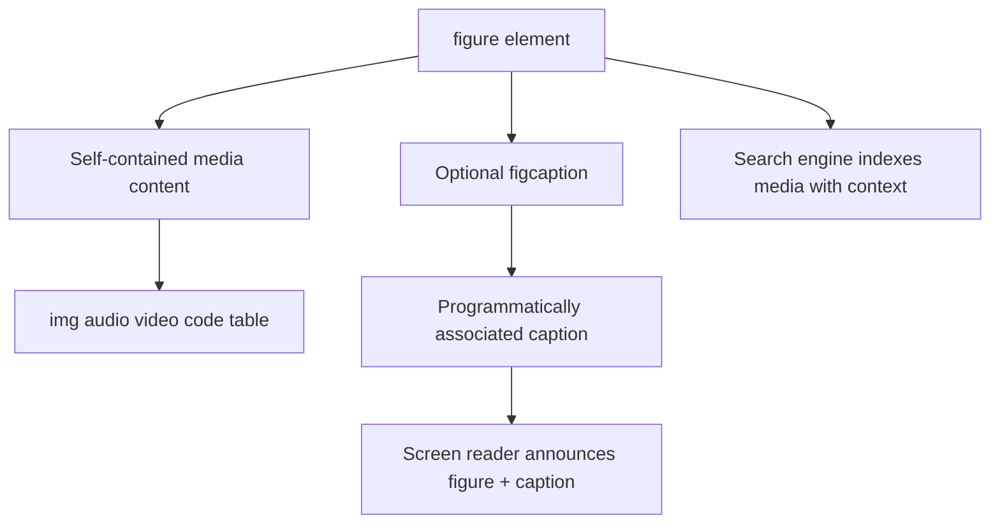
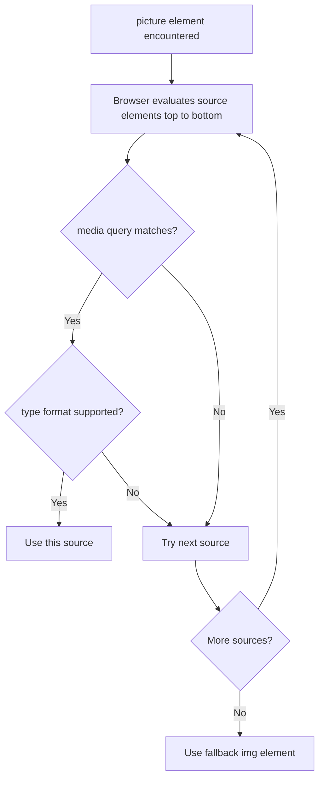
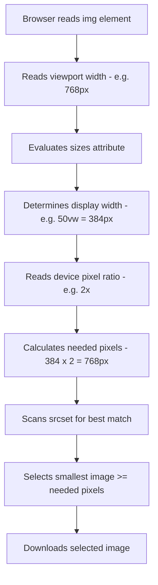
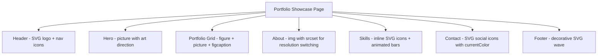

<a id="chapter-13-figure-picture-svg"></a>

# Chapter 13: Figure, Picture & SVG

[⬅ Previous Chapter](#chapter-12-audio-video-iframes) | [📖 Main Index](#main-index) | [Next Chapter ➡](#chapter-14-html-tables)

---

## 📌 Learning Objectives

By the end of this chapter, you will:

**Understand:**
- How `<figure>` and `<figcaption>` create semantic media containers
- How `<picture>` enables art direction and format switching
- How `srcset` and `sizes` work together for responsive images
- SVG fundamentals — what it is, how it works, and why it matters
- How to use SVG inline, as ``, and as CSS background

**Interview Concepts Covered:**
- Difference between `<figure>` and a plain `<div>`
- When to use `<picture>` vs `srcset` on ``
- Art direction vs resolution switching
- SVG vs PNG/JPEG — when to choose which
- Inline SVG advantages over ``
- `viewBox` attribute and SVG coordinate system
- Accessibility for SVG elements

**Practical Skills:**
- Wrap media semantically with `<figure>` and `<figcaption>`
- Build a fully responsive image system using `<picture>`
- Write and style inline SVG directly in HTML
- Use SVG for icons, logos, and illustrations
- Create accessible SVG with `<title>` and `aria-*` attributes

---

<a id="chapter-index-table-13"></a>

## Chapter Index Table

| Topic No. | Topic Name | Subtopics |
|-----------|-----------|-----------|
| 13.1 | [The `<figure>` Element](#131-the-figure-element) | What is it · Semantic purpose · Usage with images · Usage with audio/video · Usage with code |
| 13.2 | [The `<figcaption>` Element](#132-the-figcaption-element) | What is it · Placement rules · Styling · Relationship with figure · Accessibility |
| 13.3 | [The `<picture>` Element](#133-the-picture-element) | What is it · `<source>` inside picture · `media` attribute · `type` attribute · Fallback `` |
| 13.4 | [srcset and sizes Deep Dive](#134-srcset-and-sizes-deep-dive) | `w` descriptor · `x` descriptor · `sizes` attribute · How browser selects · Art direction vs resolution switching |
| 13.5 | [SVG Basics](#135-svg-basics) | What is SVG · Vector vs raster · `viewBox` · Basic shapes · `fill` · `stroke` |
| 13.6 | [SVG in HTML — Four Methods](#136-svg-in-html-four-methods) | Inline SVG · `` · CSS background · `<object>` · Pros and cons |
| 13.7 | [Accessible and Responsive SVG](#137-accessible-and-responsive-svg) | `<title>` · `<desc>` · `aria-label` · `role` · Responsive SVG · CSS styling of SVG |

---

## 13.1 The `<figure>` Element

<a id="131-the-figure-element"></a>

### What is it?

The `<figure>` element is an HTML5 **semantic container** used to wrap self-contained content that is referenced from the main document flow — typically images, diagrams, illustrations, code snippets, audio, or video — along with an optional caption.

```html
<figure>
  
  <figcaption>Figure 1: Q4 2024 Revenue Growth by Region</figcaption>
</figure>
```

---

### Why is it needed?

Before HTML5, developers wrapped images in `<div>` elements with no semantic meaning. A `<div>` communicates nothing about the nature of its content to browsers, screen readers, or search engines. `<figure>` communicates: **"this is a self-contained unit of referenced media content."**

---

### What problem does it solve?

| Without `<figure>` | With `<figure>` |
|-------------------|-----------------|
| `<div>` — no semantic meaning | Semantic — communicates content type |
| Screen reader treats it as generic container | Screen reader understands it as figure |
| Caption has no structural association | `<figcaption>` is programmatically associated |
| Search engines cannot identify media context | Better indexing of media with caption context |

---

### How does it work?

```html
<!-- Generic div approach — no semantic meaning -->
<div class="image-wrapper">
  
  <p class="caption">Sales data for 2024</p>
</div>

<!-- Semantic figure approach — meaningful structure -->
<figure>
  
  <figcaption>Monthly sales performance across all regions — 2024</figcaption>
</figure>
```

---

### Internal Working



---

### Key Characteristics

| Feature | Detail |
|--------|--------|
| Tag | `<figure>` |
| Element Type | Block-level, sectioning element |
| HTML Version | HTML5 |
| Children | Any content + optional `<figcaption>` |
| `<figcaption>` Position | First or last child only |
| Default Styling | Browser adds margin on left and right |
| Semantic Role | Self-contained referenced content unit |

---

### `<figure>` with Different Content Types

#### With Images

```html
<figure>
  
  <figcaption>
    Figure 2: Standard three-tier web application architecture
  </figcaption>
</figure>
```

---

#### With Video

```html
<figure>
  <video controls width="854" height="480" poster="thumb.jpg">
    <source src="tutorial.mp4" type="video/mp4">
  </video>
  <figcaption>
    Video 1: Setting up your first HTML5 project from scratch
  </figcaption>
</figure>
```

---

#### With Audio

```html
<figure>
  <audio controls preload="metadata">
    <source src="interview.mp3" type="audio/mpeg">
  </audio>
  <figcaption>
    Podcast Episode 7: Interview with a Senior Frontend Engineer
    <a href="transcript.html">(Read transcript)</a>
  </figcaption>
</figure>
```

---

#### With Code

```html
<figure>
  <pre><code>
function greet(name) {
  return `Hello, ${name}!`;
}
  </code></pre>
  <figcaption>
    Listing 1: JavaScript template literal greeting function
  </figcaption>
</figure>
```

---

#### With a Table

```html
<figure>
  <table>
    <thead>
      <tr><th>Month</th><th>Revenue</th><th>Growth</th></tr>
    </thead>
    <tbody>
      <tr><td>January</td><td>₹4.2L</td><td>+12%</td></tr>
      <tr><td>February</td><td>₹4.8L</td><td>+14%</td></tr>
    </tbody>
  </table>
  <figcaption>Table 1: Monthly revenue data — Q1 2024</figcaption>
</figure>
```

---

### `<figure>` and Document Flow

> [!IMPORTANT]
> The `<figure>` element is designed for content that could theoretically be **moved to an appendix or sidebar** without disrupting the main document flow. If removing the element would break the content's meaning — it should NOT be in a `<figure>`. If it can stand alone as a referenced item — it belongs in `<figure>`.

---

### 🧠 Hinglish Intuition

> Socho ek textbook — "Figure 3.2: DNA double helix structure." Woh diagram apne aap mein ek complete unit hai. Uska ek caption hai jo usse describe karta hai. Aur main text mein "...as shown in Figure 3.2..." likha hota hai.
>
> Yahi `<figure>` karta hai. Ek self-contained unit banata hai — image ya koi bhi media — uske saath ek caption.
>
> **`<div>` vs `<figure>`** — `<div>` sirf ek box hai. `<figure>` ek labeled, semantic box hai jo browser aur screen readers ko batata hai "yeh content ek referenced, self-contained unit hai."

---

### CSS Resetting Figure Default Styles

```css
/* Browsers add default margin to figure — reset it */
figure {
  margin: 0;
  padding: 0;
}

/* Custom styling */
figure {
  margin: 32px 0;
  border-radius: 8px;
  overflow: hidden;
}

figure img {
  width: 100%;
  height: auto;
  display: block;
}
```

---

### Practical Applications

- Wrapping article images with numbered captions
- Video players with descriptive titles
- Code listings with explanation captions
- Data tables with source attribution
- Audio players with episode information
- Diagrams and charts in technical documentation
- Photo galleries with per-photo descriptions

---

### Common Mistakes

```html
<!-- ❌ WRONG: figure used for layout container -->
<figure>
  <div class="card">Product card content</div>
</figure>
<!-- figure is for self-contained REFERENCED media, not generic containers -->

<!-- ❌ WRONG: figcaption not first or last child -->
<figure>
  <figcaption>Caption here</figcaption>
  <p>Some text</p>
  
</figure>

<!-- ❌ WRONG: Multiple figcaptions -->
<figure>
  
  <figcaption>Caption One</figcaption>
  <figcaption>Caption Two</figcaption>
</figure>
<!-- Only ONE figcaption allowed per figure -->

<!-- ✅ CORRECT -->
<figure>
  
  <figcaption>Sunrise over the Himalayas — Manali, 2024</figcaption>
</figure>
```

---

### Best Practices

- Use `<figure>` only for self-contained content referenced from main text
- Reset browser default margin with CSS
- Always pair with `<figcaption>` for numbered/titled figures
- `<figcaption>` must be **first or last child** of `<figure>`
- Only **one `<figcaption>`** per `<figure>`
- Works with any media type — not just images

---

### Interview Perspective

> [!IMPORTANT]
> **Most Asked:** "What is the difference between wrapping an image in `<div>` vs `<figure>`?"
> Answer: `<div>` is a generic container with no semantic meaning. `<figure>` is a semantic HTML5 element that tells browsers, screen readers, and search engines that the content is a self-contained, referenced media unit. `<figcaption>` inside `<figure>` creates a programmatic association between media and caption.
>
> **Common Question:** "Can `<figure>` contain only a `<figcaption>`?"
> Answer: No. `<figure>` should contain meaningful content (image, video, code, etc.) alongside an optional `<figcaption>`. A `<figure>` with only `<figcaption>` is invalid usage.
>
> **Position Question:** "Where must `<figcaption>` appear inside `<figure>`?"
> Answer: It must be either the **first** or **last** child of `<figure>` — not in the middle.

👉 <a href="#chapter-index-table-13">Go to Top 🔝</a>

---

## 13.2 The `<figcaption>` Element

<a id="132-the-figcaption-element"></a>

### What is it?

The `<figcaption>` element provides a **caption or legend** for its parent `<figure>` element. It creates a **programmatic, semantic association** between the caption text and the figure content — something a `<p>` or `<span>` with a class cannot achieve.

```html
<figure>
  
  <figcaption>The eight planets of our solar system, shown approximately to scale.</figcaption>
</figure>
```

---

### Why is it needed?

Without `<figcaption>`:
- A `<p>` below an image has no semantic relationship to the image
- Screen readers announce them as separate, unrelated elements
- No structural association exists between media and its description
- Search engines cannot confidently associate caption text with the media

With `<figcaption>`:
- The caption is **programmatically linked** to its figure
- Screen readers announce: "Figure: [content]. Caption: [figcaption text]"
- Search engines understand the caption describes the figure
- The relationship is structural, not just visual

---

### How does it work?

```html
<!-- figcaption as last child (most common) -->
<figure>
  
  <figcaption>
    The recommended learning path for aspiring web developers — 2024 Edition
  </figcaption>
</figure>

<!-- figcaption as first child (for captions above the media) -->
<figure>
  <figcaption>
    Figure 4: Server response time comparison — Apache vs Nginx
  </figcaption>
  
</figure>
```

---

### Key Characteristics

| Feature | Detail |
|--------|--------|
| Tag | `<figcaption>` |
| Parent | Must be `<figure>` |
| Position | First or last child of `<figure>` |
| Count | Only ONE per `<figure>` |
| Content | Flow content (text, links, `<em>`, `<strong>`, etc.) |
| Display | Block-level |
| Semantic Role | Caption/legend for the figure |

---

### Rich `<figcaption>` Content

`<figcaption>` can contain rich inline content:

```html
<figure>
  
  <figcaption>
    The MediaHub team at the 2024 Annual Retreat, Coorg. 
    <em>Photography by Ravi Shankar.</em> 
    <a href="team.html">Meet the full team →</a>
  </figcaption>
</figure>
```

---

### CSS Styling for `<figcaption>`

```css
/* Basic figcaption styling */
figure {
  margin: 0 0 32px;
  border-radius: 8px;
  overflow: hidden;
  background: #f8f9fa;
  border: 1px solid #e0e0e0;
}

figure img {
  width: 100%;
  height: auto;
  display: block;
}

figcaption {
  padding: 12px 16px;
  font-size: 14px;
  color: #666;
  font-style: italic;
  line-height: 1.6;
  border-top: 1px solid #e0e0e0;
  background: #f8f9fa;
}

/* Numbered figure captions */
figure {
  counter-increment: figure-counter;
}

figcaption::before {
  content: "Figure " counter(figure-counter) ": ";
  font-weight: bold;
  font-style: normal;
  color: #333;
}
```

---

### Automatic Figure Numbering with CSS Counters

```css
/* On the article or section that contains figures */
article {
  counter-reset: figure-counter;
}

figure {
  counter-increment: figure-counter;
}

figcaption::before {
  content: "Fig. " counter(figure-counter) " — ";
  font-weight: 700;
  color: #1a1a2e;
}
```

```html
<article>
  <p>The architecture is shown below.</p>

  <figure>
    
    <figcaption>Client-Server architecture showing request-response cycle</figcaption>
    <!-- Renders: "Fig. 1 — Client-Server architecture..." -->
  </figure>

  <p>The database schema is illustrated next.</p>

  <figure>
    
    <figcaption>Database schema for a blog application</figcaption>
    <!-- Renders: "Fig. 2 — Database schema..." -->
  </figure>
</article>
```

---

### 🧠 Hinglish Intuition

> Newspaper mein ek photo hoti hai aur neeche likha hota hai "Prime Minister Mann ki Baat ke dauran — New Delhi, Somwar." Woh neeche wala text caption hai — `<figcaption>`.
>
> `<p>` tag se bhi caption likh sakte the, par woh sirf visually neeche hota. `<figcaption>` HTML structure mein bolta hai "main is figure ka official caption hoon" — screen readers aur search engines dono samajhte hain.
>
> CSS counter trick — automatically Fig. 1, Fig. 2, Fig. 3 numbers add karo bina manually likhne ke. Ek bhi figure add ya remove karo, sab numbers khud update ho jaate hain.

---

### Accessibility Behavior

```
Screen reader announcement for figure with figcaption:

"Figure: [image alt text]. Caption: [figcaption content]"
```

```html
<!-- Screen reader will announce: -->
<!-- "Figure. Image: Bar chart showing Q4 sales. -->
<!--  Caption: Monthly sales performance — Q4 2024" -->
<figure>
  
  <figcaption>Monthly sales performance — Q4 2024</figcaption>
</figure>
```

---

### Common Mistakes

```html
<!-- ❌ WRONG: figcaption without figure parent -->

<figcaption>Mountain at sunrise</figcaption>
<!-- figcaption MUST be inside figure -->

<!-- ❌ WRONG: Multiple figcaptions -->
<figure>
  
  <figcaption>Primary Caption</figcaption>
  <figcaption>Secondary Caption</figcaption>
</figure>

<!-- ❌ WRONG: figcaption in middle of figure -->
<figure>
  
  <figcaption>Comparison Images</figcaption>
  
</figure>

<!-- ✅ CORRECT: figcaption as last child with both images -->
<figure>
  
  
  <figcaption>Room organization — before and after comparison</figcaption>
</figure>
```

---

### Best Practices

- Always use `<figcaption>` inside `<figure>` — never standalone
- Keep only one `<figcaption>` per `<figure>`
- Position as first or last child — never middle
- Keep captions concise but descriptive
- Can include links, citations, and inline formatting
- Use CSS counters for automatic figure numbering in documentation

---

### Interview Perspective

> [!IMPORTANT]
> **Common Question:** "What is the difference between `<figcaption>` and a `<p>` tag below an image?"
> Answer: `<figcaption>` creates a **programmatic, semantic association** with the parent `<figure>` element. Screen readers announce it as the figure's caption. A `<p>` tag has no structural relationship to the image — it is just adjacent text.
>
> **Position Question:** "Where can `<figcaption>` appear inside `<figure>`?"
> Answer: Only as the **first or last child**. It cannot be in the middle.
>
> **Count Question:** "How many `<figcaption>` elements can a `<figure>` have?"
> Answer: **Only one.**

👉 <a href="#chapter-index-table-13">Go to Top 🔝</a>

---

## 13.3 The `<picture>` Element

<a id="133-the-picture-element"></a>

### What is it?

The `<picture>` element is an HTML5 **container element** that allows browsers to choose the most appropriate image from a set of `<source>` elements based on **media conditions, image format support, or device characteristics**. It always contains a fallback `` element.

```html
<picture>
  <source media="(min-width: 1024px)" srcset="hero-desktop.jpg">
  <source media="(min-width: 768px)" srcset="hero-tablet.jpg">
  
</picture>
```

---

### Why is it needed?

`<picture>` solves two distinct problems that `srcset` on `` cannot solve alone:

1. **Art Direction** — Serving completely different image compositions (different crops, different subjects) for different screen sizes
2. **Format Switching** — Serving modern formats (AVIF, WebP) to supporting browsers with JPEG/PNG fallback for older browsers

---

### What problem does it solve?

```
Problem 1 — Art Direction:
Desktop: Wide landscape photo (1440×600) showing full team
Mobile: Portrait crop (400×600) showing just the face
→ <picture> with media queries solves this

Problem 2 — Format Switching:
Modern Chrome: Serve .avif (smallest file size)
Modern browsers: Serve .webp (good compression)
Old browsers: Serve .jpg (universal support)
→ <picture> with type attribute solves this
```

---

### How does it work?



---

### `<source>` Inside `<picture>` — Key Attributes

| Attribute | Purpose |
|-----------|---------|
| `srcset` | One or more image URLs with optional descriptors |
| `media` | CSS media query — use this source when query matches |
| `type` | MIME type — use this source if format is supported |
| `sizes` | Display size hints (same as on ``) |
| `width` | Intrinsic width hint |
| `height` | Intrinsic height hint |

---

### Use Case 1: Art Direction (Different Crops per Breakpoint)

```html
<picture>
  <!-- Large desktop: panoramic landscape crop -->
  <source 
    media="(min-width: 1200px)" 
    srcset="hero-wide-1600.jpg"
  >
  <!-- Tablet: moderate landscape crop -->
  <source 
    media="(min-width: 768px)" 
    srcset="hero-medium-900.jpg"
  >
  <!-- Mobile: portrait crop focused on subject -->
  <source 
    media="(max-width: 767px)" 
    srcset="hero-portrait-480.jpg"
  >
  <!-- Fallback img — required -->
  
</picture>
```

**Why this matters:**
- A wide landscape photo at desktop looks beautiful
- Scaled down to mobile: the subject becomes tiny, details are lost
- Art direction lets you serve a tighter portrait crop on mobile — **same story, better composition**

---

### Use Case 2: Format Switching (Modern Formats with Fallback)

```html
<picture>
  <!-- AVIF: smallest file size, newest browsers -->
  <source srcset="product.avif" type="image/avif">
  <!-- WebP: 25-35% smaller than JPEG, all modern browsers -->
  <source srcset="product.webp" type="image/webp">
  <!-- JPEG: universal fallback -->
  
</picture>
```

---

### Use Case 3: Art Direction + Format Switching Combined

```html
<picture>
  <!-- Desktop + AVIF -->
  <source 
    media="(min-width: 1024px)" 
    srcset="hero-desktop.avif" 
    type="image/avif"
  >
  <!-- Desktop + WebP -->
  <source 
    media="(min-width: 1024px)" 
    srcset="hero-desktop.webp" 
    type="image/webp"
  >
  <!-- Desktop + JPEG fallback -->
  <source 
    media="(min-width: 1024px)" 
    srcset="hero-desktop.jpg"
  >
  <!-- Mobile + AVIF -->
  <source 
    media="(max-width: 1023px)" 
    srcset="hero-mobile.avif" 
    type="image/avif"
  >
  <!-- Mobile + WebP -->
  <source 
    media="(max-width: 1023px)" 
    srcset="hero-mobile.webp" 
    type="image/webp"
  >
  <!-- Final fallback -->
  
</picture>
```

---

### The Mandatory `` Inside `<picture>`

> [!IMPORTANT]
> The `` element inside `<picture>` is **mandatory and serves three purposes:**
> 1. **Fallback** — Used when no `<source>` matches
> 2. **Attributes carrier** — `alt`, `width`, `height`, `loading`, `class` apply from `` to ALL variants
> 3. **Rendering** — The browser always uses `` to actually render the selected image
>
> Do NOT add `src` to `<source>` elements — they use `srcset`. Only `` uses `src`.

---

### `<picture>` vs `srcset` on `` — Key Difference

| | `srcset` on `` | `<picture>` element |
|--|--|--|
| Decision maker | **Browser** (chooses best size/density) | **Developer** (controls exactly which source) |
| Use for | Resolution switching — same image, different sizes | Art direction + format switching |
| Different crops | ❌ Not possible | ✅ Yes — different `<source>` with `media` |
| Format fallback | ❌ Not possible | ✅ Yes — `<source>` with `type` |
| Complexity | Simple | More complex markup |

---

### 🧠 Hinglish Intuition

> `<picture>` ek **smart image selector** hai. Tum multiple options rakhte ho, browser conditions check karta hai — screen size, format support — aur best option choose karta hai.
>
> **`srcset` pe browser ka control hai** — "inme se jo best fit ho woh le lo." Browser apni marzi se choose karta hai.
>
> **`<picture>` pe tumhara control hai** — "1024px se bada screen ho toh yeh image, chhota screen ho toh woh image." Developer explicitly specify karta hai.
>
> **Art direction** — sochlo ek company ka banner. Desktop pe CEO aur poori team dikhti hai wide shot mein. Mobile pe sirf CEO ka face close-up. Yeh same image ka different crop hai — same data, different composition. `<picture>` se yeh possible hai.
>
> **Format switching** — "Bhai agar tera browser AVIF samajhta hai, woh de. WebP samajhta hai, woh de. Kuch nahi toh JPEG de." Automatic fallback.

---

### Practical Applications

- Hero images with different crops for mobile/tablet/desktop
- Product images in different aspect ratios for different layouts
- Blog thumbnails — landscape on desktop, square on mobile
- Serving WebP/AVIF with JPEG/PNG fallback for all images
- Team photos — full group shot on desktop, individual portraits on mobile

---

### Common Mistakes

```html
<!-- ❌ WRONG: No img fallback inside picture -->
<picture>
  <source srcset="image.webp" type="image/webp">
  <!-- No img! Browser has no fallback. -->
</picture>

<!-- ❌ WRONG: alt on source instead of img -->
<picture>
  <source srcset="image.webp" alt="Description"> <!-- alt not valid on source -->
  
</picture>

<!-- ❌ WRONG: src on source element -->
<picture>
  <source src="image.webp" type="image/webp"> <!-- should be srcset -->
  
</picture>

<!-- ✅ CORRECT -->
<picture>
  <source srcset="image.webp" type="image/webp">
  
</picture>
```

---

### Best Practices

- Always include `` as the last child of `<picture>` — it is mandatory
- Put `alt`, `width`, `height`, `loading` on the `` — they apply to all variants
- Use `type` for format switching — no `media` query needed
- Use `media` for art direction — different compositions per breakpoint
- Order `<source>` from most specific to least specific
- For format switching: AVIF → WebP → JPEG/PNG order
- Never put `src` on `<source>` — use `srcset` instead

---

### Interview Perspective

> [!IMPORTANT]
> **Most Asked:** "What is the difference between `<picture>` and `srcset` on ``?"
> - `srcset` on `` — browser has control, chooses best resolution/density. Same image, different sizes.
> - `<picture>` — developer has control via `media` and `type`. Art direction (different crops) and format switching.
>
> **Critical Rule:** "What is mandatory inside `<picture>`?"
> Answer: An `` element as fallback. Without it, `<picture>` does not render anything.
>
> **Common Question:** "Can `<source>` inside `<picture>` have an `alt` attribute?"
> Answer: **No.** The `alt` attribute goes on the `` element, not on `<source>`.

👉 <a href="#chapter-index-table-13">Go to Top 🔝</a>

---

## 13.4 srcset and sizes Deep Dive

<a id="134-srcset-and-sizes-deep-dive"></a>

### What is it?

`srcset` and `sizes` are attributes on `` (and `<source>`) that enable **responsive images** — serving the most appropriately sized or resolution-matched image based on device viewport and pixel density, without the developer needing to manually select the image.

---

### Why is it needed?

A single fixed image cannot serve all devices optimally:
- **Desktop (1440px, 1x):** needs a 1440px wide image
- **Retina MacBook (1440px viewport, 2x DPR):** needs a 2880px wide image
- **Mobile (375px, 3x DPR):** needs a 1125px wide image

Without `srcset`, you serve the largest image to everyone — mobile users waste bandwidth downloading desktop images.

---

### The `srcset` Attribute — Two Descriptor Types

#### Width Descriptor (`w`) — For Resolution Switching

The `w` descriptor specifies the **intrinsic width of the image file** in pixels:

```html

```

The browser uses this information combined with viewport width and device pixel ratio to calculate the optimal image.

---

#### Pixel Density Descriptor (`x`) — For Fixed-Size Images

The `x` descriptor specifies the **device pixel ratio** this image is intended for:

```html
<!-- Same display size, different resolutions -->

```

**When to use `x` descriptor:**
- Fixed-size elements: logos, avatars, icons, thumbnails
- When the display size never changes
- When you want explicit control per pixel density

**When to use `w` descriptor:**
- Fluid-width images that scale with viewport
- When combined with `sizes` for precise control
- Most images in responsive layouts

---

### The `sizes` Attribute

The `sizes` attribute tells the browser **how wide the image will be displayed** at different viewport conditions. The browser needs this information to correctly pick from `srcset` before layout is computed.

```html

```

**`sizes` breakdown:**
- On screens ≤ 480px: image displays at 100% of viewport width
- On screens ≤ 768px: image displays at 50% of viewport width
- On screens ≤ 1200px: image displays at 33% of viewport width
- On larger screens: image displays at 25% of viewport width

---

### How Browser Selects the Image — Step by Step



---

### Worked Example — Browser Calculation

Given this markup:

```html

```

**Scenario 1: Mobile phone**
- Viewport: 375px
- `sizes` evaluates: 375px ≤ 600px → display width = 100vw = 375px
- Device pixel ratio: 2x
- Needed pixels: 375 × 2 = 750px
- Best match in srcset: `img-800.jpg` (800w ≥ 750px) ✅

**Scenario 2: Desktop**
- Viewport: 1280px
- `sizes` evaluates: 1280px > 600px → display width = 50vw = 640px
- Device pixel ratio: 1x
- Needed pixels: 640 × 1 = 640px
- Best match in srcset: `img-800.jpg` (800w ≥ 640px) ✅

**Scenario 3: Retina MacBook**
- Viewport: 1440px
- `sizes`: 50vw = 720px
- DPR: 2x
- Needed: 720 × 2 = 1440px
- Best match: `img-1200.jpg` is 1200w — actually `img-1600.jpg` if available, else `img-1200.jpg` as closest

---

### `srcset` Without `sizes` — What Happens?

```html
<!-- srcset without sizes — browser assumes 100vw -->

```

Without `sizes`, the browser **assumes the image will be displayed at 100% of viewport width**. This often results in unnecessarily large images being downloaded for images that are actually displayed at 30% or 50% of viewport width.

> [!IMPORTANT]
> Always pair `srcset` with `w` descriptors with a `sizes` attribute. Without `sizes`, the browser defaults to assuming `100vw` display size — potentially downloading images much larger than needed.

---

### Art Direction vs Resolution Switching Summary

| | Resolution Switching | Art Direction |
|--|--|--|
| HTML element | `` | `<picture>` with `<source media>` |
| Who decides | Browser | Developer (via media queries) |
| Image content | Same subject, different sizes | Different crops/compositions |
| Use case | Fluid-width content images | Hero images, banner images |
| Complexity | Simple | More complex |
| Format switching | ❌ | ✅ via `type` attribute |

---

### 🧠 Hinglish Intuition

> `srcset` browser ko options deta hai. `sizes` browser ko hint deta hai ki image kitni badi dikhegi. Browser dono milake best image select karta hai.
>
> Bina `sizes` ke — browser sochta hai "yeh image poore screen pe dikhegi" — toh badi wali download karta hai. Actually image sirf 33% screen pe thi — bandwidth waste!
>
> **`w` descriptor** — "is file ka actual size 400 pixels hai." Real file width.
> **`x` descriptor** — "yeh file 2x screen ke liye hai." DPR target.
>
> Calculation: viewport width × DPR = needed pixels → srcset mein pehli image jo yeh cover kare, woh select hoti hai.

---

### Real World `srcset` + `sizes` Implementation

```html
<!-- Blog post featured image — responsive across all devices -->
<figure>
  <picture>
    <!-- WebP format sources with srcset -->
    <source 
      type="image/webp"
      srcset="
        blog-thumb-400.webp 400w,
        blog-thumb-800.webp 800w,
        blog-thumb-1200.webp 1200w
      "
      sizes="
        (max-width: 480px) 100vw,
        (max-width: 1024px) 80vw,
        720px
      "
    >
    <!-- JPEG fallback with srcset -->
    
  </picture>
  <figcaption>Responsive web design works across all screen sizes and devices</figcaption>
</figure>
```

---

### Common Mistakes

```html
<!-- ❌ WRONG: w descriptor without sizes -->

<!-- Browser assumes 100vw — may download oversized image -->

<!-- ❌ WRONG: Mixing w and x descriptors -->

<!-- Cannot mix w and x descriptors in same srcset -->

<!-- ❌ WRONG: Using px instead of w in srcset -->

<!-- Descriptor is 'w' not 'px' -->

<!-- ✅ CORRECT -->

```

---

### Best Practices

- Always pair `w` descriptor `srcset` with a `sizes` attribute
- Generate 3–4 size variants: small (400px), medium (800px), large (1200px), xlarge (1600px)
- Match your `sizes` breakpoints to your actual CSS layout breakpoints
- Use `x` descriptors only for fixed-size elements (logos, icons, avatars)
- Never mix `w` and `x` descriptors in the same `srcset`
- Combine with `<picture>` when format switching is also needed

---

### Interview Perspective

> [!IMPORTANT]
> **Most Asked:** "What is the difference between `srcset` with `w` descriptor vs `x` descriptor?"
> - `w` descriptor — specifies intrinsic image file width. Used with `sizes` for fluid-width images. Browser calculates needed pixels from viewport × DPR.
> - `x` descriptor — specifies target device pixel ratio. Used for fixed-size images. Direct match to screen DPR.
>
> **Important:** "What does `sizes` do and why is it needed?"
> Answer: Tells browser how wide the image will be displayed at each viewport size. Without it, browser assumes 100vw — potentially downloads images much larger than needed.
>
> **Calculation Question:** "On a 375px wide, 2x DPR device with `sizes='100vw'`, which image from `srcset='img-400.jpg 400w, img-800.jpg 800w'` is selected?"
> Answer: 375 × 2 = 750px needed. `img-800.jpg` (800w ≥ 750px) is selected.

👉 <a href="#chapter-index-table-13">Go to Top 🔝</a>

---

## 13.5 SVG Basics

<a id="135-svg-basics"></a>

### What is it?

**SVG (Scalable Vector Graphics)** is an XML-based format for describing **two-dimensional vector graphics**. Unlike raster images (JPEG, PNG) that store pixel data, SVG stores **mathematical descriptions** of shapes, paths, and colors — allowing them to scale to any size without losing quality.

```html
<!-- A simple SVG circle -->
<svg width="100" height="100" viewBox="0 0 100 100">
  <circle cx="50" cy="50" r="40" fill="#6c63ff" stroke="#333" stroke-width="2"/>
</svg>
```

---

### Why is it needed?

| Problem | SVG Solution |
|---------|-------------|
| PNG logo pixelates at large sizes | SVG scales perfectly at any resolution |
| PNG icons need multiple sizes (16px, 32px, 64px) | One SVG file works at all sizes |
| Raster images cannot be styled with CSS | SVG shapes can be styled with CSS |
| Raster images cannot be animated with CSS | SVG can be animated with CSS/JS |
| Large PNG files for complex icons | SVG icons are typically very small files |

---

### Vector vs Raster — The Core Difference

```
RASTER (JPEG, PNG, GIF):
- Stores color data for each pixel
- 800×600 image = 480,000 pixels
- Enlarging = browser fills in missing pixels = BLURRY
- File size depends on pixel count

VECTOR (SVG):
- Stores mathematical instructions: "draw a circle at x,y with radius r"
- Resolution independent — no pixels
- Enlarging = browser recalculates math = ALWAYS SHARP
- File size depends on number of shapes/paths
```

---

### Basic SVG Structure

```html
<svg 
  xmlns="http://www.w3.org/2000/svg"
  width="200" 
  height="200"
  viewBox="0 0 200 200"
>
  <!-- SVG content goes here -->
</svg>
```

**Root `<svg>` attributes:**

| Attribute | Purpose |
|-----------|---------|
| `xmlns` | XML namespace — required for SVG in standalone files |
| `width` | Display width |
| `height` | Display height |
| `viewBox` | Coordinate system — `"minX minY width height"` |

---

### The `viewBox` Attribute — Most Important SVG Concept

`viewBox` defines the **internal coordinate system** of the SVG. It is the most fundamental SVG concept and the key to making SVGs responsive.

```html
<svg viewBox="0 0 100 100" width="200" height="200">
  <!-- This SVG uses a 100x100 coordinate space -->
  <!-- Displayed at 200x200 pixels -->
  <!-- Everything scales proportionally -->
  <circle cx="50" cy="50" r="40" fill="blue"/>
</svg>
```

**`viewBox="minX minY width height"`:**
- `minX` — Left edge of coordinate space (usually 0)
- `minY` — Top edge of coordinate space (usually 0)
- `width` — Width of coordinate space
- `height` — Height of coordinate space

```html
<!-- viewBox="0 0 24 24" is standard for icons -->
<!-- Means: coordinate space is 24x24 units -->
<!-- Display size can be anything — CSS controls it -->
<svg viewBox="0 0 24 24" width="24" height="24">
  <path d="M3 18h18v-2H3v2zm0-5h18v-2H3v2zm0-7v2h18V6H3z"/>
</svg>
```

---

### Basic SVG Shapes

#### Rectangle — `<rect>`

```html
<svg viewBox="0 0 200 100" width="200" height="100">
  <rect 
    x="10"           <!-- Top-left X position -->
    y="10"           <!-- Top-left Y position -->
    width="180"      <!-- Rectangle width -->
    height="80"      <!-- Rectangle height -->
    rx="8"           <!-- Border radius X -->
    ry="8"           <!-- Border radius Y -->
    fill="#6c63ff"   
    stroke="#333"    
    stroke-width="2"
  />
</svg>
```

---

#### Circle — `<circle>`

```html
<svg viewBox="0 0 100 100" width="100" height="100">
  <circle 
    cx="50"          <!-- Center X -->
    cy="50"          <!-- Center Y -->
    r="40"           <!-- Radius -->
    fill="#ff6584"
    stroke="#333"
    stroke-width="2"
  />
</svg>
```

---

#### Ellipse — `<ellipse>`

```html
<svg viewBox="0 0 200 100" width="200" height="100">
  <ellipse 
    cx="100"         <!-- Center X -->
    cy="50"          <!-- Center Y -->
    rx="90"          <!-- Horizontal radius -->
    ry="40"          <!-- Vertical radius -->
    fill="#43aa8b"
  />
</svg>
```

---

#### Line — `<line>`

```html
<svg viewBox="0 0 200 100" width="200" height="100">
  <line 
    x1="10"  y1="10"   <!-- Start point -->
    x2="190" y2="90"   <!-- End point -->
    stroke="#333"
    stroke-width="3"
    stroke-linecap="round"
  />
</svg>
```

---

#### Polygon — `<polygon>`

```html
<svg viewBox="0 0 100 100" width="100" height="100">
  <!-- Triangle -->
  <polygon 
    points="50,10 90,90 10,90"
    fill="#f4a261"
    stroke="#333"
    stroke-width="2"
  />
</svg>
```

---

#### Path — `<path>` (Most Powerful)

The `<path>` element can draw any shape using path commands:

```html
<svg viewBox="0 0 24 24" width="24" height="24">
  <!-- Heart shape using path -->
  <path 
    d="M12 21.593c-5.63-5.539-11-10.297-11-14.402 
       0-3.791 3.068-5.191 5.281-5.191 
       1.312 0 4.151.501 5.719 4.457 
       1.59-3.968 4.464-4.447 5.726-4.447 
       2.54 0 5.274 1.621 5.274 5.181 
       0 4.069-5.136 8.625-11 14.402z"
    fill="#e63946"
  />
</svg>
```

**Common Path Commands:**

| Command | Meaning |
|---------|---------|
| `M x y` | Move to (x, y) — start point |
| `L x y` | Line to (x, y) |
| `H x` | Horizontal line to x |
| `V y` | Vertical line to y |
| `C x1 y1 x2 y2 x y` | Cubic Bezier curve |
| `A rx ry rotation large-arc sweep x y` | Arc |
| `Z` | Close path |

---

### SVG Styling Attributes

```html
<svg viewBox="0 0 100 100" width="100" height="100">
  <rect
    x="10" y="10" width="80" height="80"
    fill="#6c63ff"          <!-- Fill color -->
    fill-opacity="0.8"      <!-- Fill transparency -->
    stroke="#333"           <!-- Border color -->
    stroke-width="3"        <!-- Border thickness -->
    stroke-opacity="0.5"    <!-- Border transparency -->
    stroke-dasharray="5,3"  <!-- Dashed border: 5px dash, 3px gap -->
    stroke-linecap="round"  <!-- Line end style: butt/round/square -->
    stroke-linejoin="round" <!-- Corner style: miter/round/bevel -->
  />
</svg>
```

---

### SVG Text — `<text>`

```html
<svg viewBox="0 0 200 50" width="200" height="50">
  <text 
    x="100"              <!-- X position -->
    y="35"               <!-- Y position (baseline) -->
    text-anchor="middle" <!-- Horizontal alignment: start/middle/end -->
    font-size="24"
    font-family="Arial, sans-serif"
    fill="#1a1a2e"
    font-weight="bold"
  >
    Hello SVG
  </text>
</svg>
```

---

### SVG Groups — `<g>`

`<g>` groups multiple SVG elements together — transformations and styles applied to `<g>` affect all children:

```html
<svg viewBox="0 0 200 200" width="200" height="200">
  <!-- Group with shared styling -->
  <g fill="none" stroke="#6c63ff" stroke-width="2">
    <circle cx="100" cy="100" r="80"/>
    <line x1="100" y1="20" x2="100" y2="180"/>
    <line x1="20" y1="100" x2="180" y2="100"/>
  </g>
</svg>
```

---

### SVG Gradients

```html
<svg viewBox="0 0 200 100" width="200" height="100">
  <defs>
    <!-- Define a linear gradient -->
    <linearGradient id="myGradient" x1="0%" y1="0%" x2="100%" y2="0%">
      <stop offset="0%" stop-color="#6c63ff"/>
      <stop offset="100%" stop-color="#ff6584"/>
    </linearGradient>
  </defs>

  <!-- Use the gradient -->
  <rect x="0" y="0" width="200" height="100" 
        fill="url(#myGradient)" rx="8"/>
</svg>
```

---

### 🧠 Hinglish Intuition

> SVG ek **mathematical recipe** hai image ke liye. PNG mein likha hota hai "row 1, col 1 = red; row 1, col 2 = blue..." — lakhon pixels. SVG mein likha hota hai "ek circle banao center (50,50) pe, radius 40." Sirf ek line!
>
> Zoom karo 10x — PNG blurry ho jaata hai kyunki pixels stretch hote hain. SVG? Browser dobara calculate karta hai — "center (50,50), radius 40" — perfect circle, kisi bhi size pe.
>
> **`viewBox`** — coordinate grid hai. `viewBox="0 0 24 24"` matlab "yeh SVG 24×24 unit grid pe bana hai." Ab CSS se 48px ya 200px pe dikhao — browser proportionally scale karta hai. Isliye ek SVG icon file kisi bhi size pe perfect lagti hai.

---

### Practical Applications

- Navigation and UI icons
- Company logos (always sharp at any size)
- Simple illustrations and decorations
- Charts and data visualizations
- Animated loaders and spinners
- Progress bars and gauges
- Map illustrations
- Background patterns

---

### Common Mistakes

```html
<!-- ❌ WRONG: Missing viewBox — SVG cannot scale responsively -->
<svg width="100" height="100">
  <circle cx="50" cy="50" r="40" fill="blue"/>
</svg>

<!-- ✅ CORRECT: Always include viewBox -->
<svg viewBox="0 0 100 100" width="100" height="100">
  <circle cx="50" cy="50" r="40" fill="blue"/>
</svg>

<!-- ❌ WRONG: Using raster image attributes on SVG shapes -->
<circle src="circle.jpg"/> <!-- Circles don't have src! -->

<!-- ❌ WRONG: Forgetting xmlns for standalone SVG files -->
<!-- When saving as .svg file, xmlns is required -->
<svg viewBox="0 0 100 100"> <!-- Missing xmlns -->

<!-- ✅ CORRECT: xmlns for .svg files -->
<svg xmlns="http://www.w3.org/2000/svg" viewBox="0 0 100 100">
```

---

### Best Practices

- Always include `viewBox` for responsive SVGs
- Use `viewBox="0 0 24 24"` as the standard grid for icons
- Use `<defs>` for reusable elements (gradients, patterns, filters)
- Use `<g>` to group related elements
- Keep SVG markup clean — remove editor-generated metadata when embedding inline
- Use CSS classes instead of inline styles for theme-able SVGs

---

### Interview Perspective

> [!IMPORTANT]
> **Most Asked:** "What is the difference between SVG and PNG/JPEG?"
> - SVG is vector — mathematical, resolution-independent, scales perfectly
> - PNG/JPEG are raster — pixel-based, quality degrades when scaled up
>
> **Most Asked:** "What is the `viewBox` attribute?"
> Answer: Defines the internal coordinate system of the SVG. Allows the SVG to scale responsively — CSS controls display size, `viewBox` controls the internal grid.
>
> **Practical Question:** "Why use SVG for icons instead of PNG?"
> Answer: One SVG works at 16px, 48px, 200px — always sharp. PNG needs separate files for each size. SVG is also smaller, CSS-styleable, and animatable.

👉 <a href="#chapter-index-table-13">Go to Top 🔝</a>

---

## 13.6 SVG in HTML — Four Methods

<a id="136-svg-in-html-four-methods"></a>

### What is it?

SVG can be included in an HTML document in **four different ways**, each with different capabilities, styling options, and use cases. Choosing the right method significantly impacts what you can do with the SVG.

---

### Method 1: Inline SVG

SVG markup written **directly inside the HTML document**:

```html
<body>
  <header>
    <!-- Inline SVG icon in navigation -->
    <button class="menu-button" aria-label="Open menu">
      <svg viewBox="0 0 24 24" width="24" height="24" aria-hidden="true">
        <path d="M3 18h18v-2H3v2zm0-5h18v-2H3v2zm0-7v2h18V6H3z" fill="currentColor"/>
      </svg>
    </button>
  </header>
</body>
```

**Capabilities of Inline SVG:**

| Feature | Inline SVG |
|---------|-----------|
| CSS styling (fill, stroke, opacity) | ✅ Full access |
| CSS animations and transitions | ✅ Full access |
| JavaScript DOM manipulation | ✅ Full access |
| CSS variables for theming | ✅ Yes |
| `currentColor` for icon color | ✅ Yes |
| Extra HTTP request | ❌ No request needed |
| Cacheable by browser | ❌ No (part of HTML) |
| Clean HTML markup | ❌ Adds SVG markup to HTML |

---

#### `currentColor` — Powerful Inline SVG Feature

`currentColor` makes the SVG inherit the CSS `color` property of its parent:

```html
<style>
  .icon { color: #6c63ff; }
  .icon:hover { color: #ff6584; }
</style>

<button class="icon">
  <svg viewBox="0 0 24 24" width="20" height="20">
    <!-- fill: currentColor inherits the button's CSS color -->
    <path d="M12 2C6.48 2 2 6.48 2 12s4.48 10 10 10 10-4.48 10-10S17.52 2 12 2z" 
          fill="currentColor"/>
  </svg>
  Settings
</button>
```

On hover, the button's `color` changes to `#ff6584` — the SVG icon automatically inherits the new color. No JavaScript needed.

---

### Method 2: ``

Reference the SVG as an external file using ``:

```html

```

**Capabilities:**

| Feature | `` |
|---------|-------------------|
| CSS styling of SVG internals | ❌ Cannot style inside SVG |
| CSS animations of SVG | ❌ External SVG CSS not applied |
| JavaScript access to SVG DOM | ❌ Not accessible |
| `currentColor` | ❌ Not supported |
| Browser caching | ✅ Yes — cached as external file |
| Extra HTTP request | ✅ One request |
| Clean HTML | ✅ Single img tag |
| Accessible with alt | ✅ Yes |
| Easy to use | ✅ Simplest method |

**Best use case:** Static logos, images where CSS styling of SVG internals is not needed.

---

### Method 3: CSS `background-image`

Use SVG as a CSS background:

```css
/* SVG as external background */
.icon-home {
  width: 24px;
  height: 24px;
  background-image: url('icons/home.svg');
  background-size: contain;
  background-repeat: no-repeat;
  background-position: center;
}

/* Inline SVG as data URI in CSS */
.icon-star {
  width: 24px;
  height: 24px;
  background-image: url("data:image/svg+xml,%3Csvg xmlns='http://www.w3.org/2000/svg' viewBox='0 0 24 24'%3E%3Cpath d='M12 2l3.09 6.26L22 9.27l-5 4.87 1.18 6.88L12 17.77l-6.18 3.25L7 14.14 2 9.27l6.91-1.01L12 2z' fill='%236c63ff'/%3E%3C/svg%3E");
  background-size: contain;
}
```

**Capabilities:**

| Feature | CSS background SVG |
|---------|-------------------|
| CSS styling of SVG internals | ❌ Cannot modify SVG |
| Accessible | ❌ Decorative only |
| alt text | ❌ Not applicable |
| `currentColor` | ❌ Not supported |
| Browser caching | ✅ Yes |
| Best for | Decorative icons, patterns |

**Best use case:** Purely decorative icons and patterns where accessibility is not required.

---

### Method 4: `<object>` Element

```html
<object 
  data="diagram.svg" 
  type="image/svg+xml"
  width="500" 
  height="300"
  aria-label="System architecture diagram"
>
  <!-- Fallback for browsers that don't support SVG via object -->
  
</object>
```

**Capabilities:**

| Feature | `<object>` |
|---------|-----------|
| CSS styling of SVG | ❌ External context |
| Internal SVG CSS (within .svg file) | ✅ Yes |
| JavaScript from parent page | ❌ Limited |
| Browser caching | ✅ Yes |
| Fallback content | ✅ Yes |
| Common in modern code | ❌ Rarely used today |

**Best use case:** Complex SVG documents that have their own internal CSS and behavior. Rarely needed in modern development.

---

### Comparison Table — All Four Methods

| Feature | Inline SVG | `` | CSS background | `<object>` |
|---------|-----------|---------|---------------|-----------|
| CSS style SVG internals | ✅ | ❌ | ❌ | ❌ |
| CSS animation | ✅ | ❌ | ❌ | Partial |
| JavaScript access | ✅ | ❌ | ❌ | Limited |
| `currentColor` | ✅ | ❌ | ❌ | ❌ |
| Accessible with alt | Via aria | ✅ | ❌ | Via fallback |
| Browser cache | ❌ | ✅ | ✅ | ✅ |
| Clean HTML | ❌ | ✅ | ✅ | ✅ |
| HTTP request | ❌ | ✅ | ✅ | ✅ |
| Best for | Icons, animated SVG | Static logos | Decorative | Complex SVG docs |

---

### 🧠 Hinglish Intuition

> Char methods — char alag situations:
>
> **Inline SVG** — Direct SVG code HTML mein likho. CSS se color badlo, animate karo, JS se control karo. Best for icons jo CSS hover se color change karte hain.
>
> **``** — Sab se simple. Ek line mein kaam. Lekin andar kuch style nahi kar sakte. Logo ke liye perfect jo change nahi hota.
>
> **CSS background** — Decorative icons ke liye. Accessibility nahi hai, alt text nahi. Sirf dikhane ke liye.
>
> **`<object>`** — Complex SVG documents ke liye. Modern projects mein rarely use hota hai.
>
> **Interview tip:** "SVG icons ke liye inline method best hai kyunki `currentColor` aur CSS animations kaam karte hain. Static logos ke liye `` simple aur cacheable hai."

---

### Practical Example — Icon System with Inline SVG

```html
<!-- Reusable SVG icon component pattern -->
<style>
  .icon {
    display: inline-block;
    width: 1em;
    height: 1em;
    fill: currentColor;
    vertical-align: middle;
  }
</style>

<!-- Icons inherit color from parent CSS color property -->
<button style="color: #6c63ff; font-size: 18px;">
  <svg class="icon" viewBox="0 0 24 24" aria-hidden="true">
    <path d="M19 6.41L17.59 5 12 10.59 6.41 5 5 6.41 10.59 12 5 17.59 6.41 19 12 13.41 17.59 19 19 17.59 13.41 12z"/>
  </svg>
  Close
</button>

<a href="/home" style="color: #333;">
  <svg class="icon" viewBox="0 0 24 24" aria-hidden="true">
    <path d="M10 20v-6h4v6h5v-8h3L12 3 2 12h3v8z"/>
  </svg>
  Home
</a>
```

---

### Common Mistakes

```html
<!-- ❌ WRONG: Using img for SVG that needs CSS hover color change -->

<!-- Cannot change SVG fill color on hover via CSS -->

<!-- ✅ CORRECT: Inline SVG for CSS-styleable icons -->
<svg viewBox="0 0 24 24" width="24" height="24" aria-label="Settings">
  <path d="M12 15.5A3.5..." fill="currentColor"/>
</svg>

<!-- ❌ WRONG: Decorative SVG without aria-hidden when inline -->
<svg viewBox="0 0 100 100">  <!-- Screen reader reads this unnecessarily -->
  <circle cx="50" cy="50" r="40" fill="blue"/>
</svg>

<!-- ✅ CORRECT: aria-hidden for decorative inline SVG -->
<svg viewBox="0 0 100 100" aria-hidden="true" focusable="false">
  <circle cx="50" cy="50" r="40" fill="blue"/>
</svg>
```

---

### Best Practices

- Use **inline SVG** for icons that need CSS hover effects and color theming
- Use **``** for static logos and images
- Use **CSS background** only for purely decorative patterns
- Add `aria-hidden="true"` and `focusable="false"` to decorative inline SVGs
- Use `currentColor` in inline SVGs to inherit parent CSS color
- Use `fill="currentColor"` in icon SVGs for maximum CSS flexibility

---

### Interview Perspective

> [!IMPORTANT]
> **Most Asked:** "What are the different ways to use SVG in HTML and when would you use each?"
> Answer: Four methods — inline, ``, CSS background, `<object>`. Inline for CSS-styleable interactive icons. `` for static logos. CSS background for decorative patterns.
>
> **Important Feature:** "What is `currentColor` in SVG?"
> Answer: A CSS keyword that makes the SVG's `fill` or `stroke` inherit the CSS `color` property of its parent element. Enables icon color changes via CSS `color` — no need to change the SVG directly.
>
> **Caching Question:** "Which SVG method benefits from browser caching?"
> Answer: ``, CSS background, and `<object>` — all reference external files that browsers cache. Inline SVG is part of the HTML document and is not independently cached.

👉 <a href="#chapter-index-table-13">Go to Top 🔝</a>

---

## 13.7 Accessible and Responsive SVG

<a id="137-accessible-and-responsive-svg"></a>

### What is it?

**Accessible SVG** means adding the correct semantic markup and ARIA attributes so that screen readers can correctly interpret and announce SVG content. **Responsive SVG** means making SVGs scale fluidly with their container using CSS.

---

### Why is it needed?

SVG is invisible to screen readers without proper markup. A complex chart or diagram without accessibility markup provides zero information to blind users. Additionally, SVGs with fixed pixel dimensions do not adapt to different screen sizes.

---

### Accessible SVG — The `<title>` Element

The `<title>` element inside an SVG provides a **text description** for screen readers — equivalent to `alt` text on ``:

```html
<!-- Informative SVG — needs title for screen readers -->
<svg viewBox="0 0 24 24" width="24" height="24" role="img" aria-labelledby="icon-title">
  <title id="icon-title">Search</title>
  <path d="M15.5 14h-.79l-.28-.27A6.471 6.471 0 0 0 16 9.5 6.5 6.5 0 1 0 9.5 16c1.61 0 3.09-.59 4.23-1.57l.27.28v.79l5 4.99L20.49 19l-4.99-5zm-6 0C7.01 14 5 11.99 5 9.5S7.01 5 9.5 5 14 7.01 14 9.5 11.99 14 9.5 14z" fill="currentColor"/>
</svg>
```

---

### Accessible SVG — The `<desc>` Element

`<desc>` provides a **longer description** for complex SVGs (charts, diagrams):

```html
<svg 
  viewBox="0 0 400 300" 
  width="400" 
  height="300"
  role="img"
  aria-labelledby="chart-title"
  aria-describedby="chart-desc"
>
  <title id="chart-title">Monthly Sales Chart — Q4 2024</title>
  <desc id="chart-desc">
    Bar chart showing monthly sales. October: ₹2.4 lakhs. 
    November: ₹3.1 lakhs. December: ₹4.8 lakhs. 
    Overall Q4 growth: 100%.
  </desc>

  <!-- Chart bars -->
  <rect x="50" y="150" width="60" height="120" fill="#6c63ff"/>
  <rect x="170" y="90" width="60" height="180" fill="#6c63ff"/>
  <rect x="290" y="30" width="60" height="240" fill="#6c63ff"/>
</svg>
```

---

### ARIA Roles for SVG

| Scenario | ARIA Approach |
|----------|--------------|
| Informative SVG (icon with meaning) | `role="img"` + `aria-label` or `aria-labelledby` pointing to `<title>` |
| Decorative SVG (visual only) | `aria-hidden="true"` + `focusable="false"` |
| Interactive SVG | `role="button"` or appropriate role + keyboard handling |
| Complex data visualization | `role="img"` + `<title>` + `<desc>` |

---

### Decorative SVG — Hide from Screen Readers

```html
<!-- Decorative SVG separator/background — hide from screen readers -->
<svg 
  viewBox="0 0 1440 100" 
  aria-hidden="true" 
  focusable="false"
>
  <path d="M0,50 C360,100 1080,0 1440,50 L1440,100 L0,100 Z" fill="#f0f0f8"/>
</svg>
```

> [!IMPORTANT]
> Always add `aria-hidden="true"` AND `focusable="false"` to decorative inline SVGs. In Internet Explorer, SVG elements are focusable by default — `focusable="false"` prevents keyboard users from getting stuck on decorative SVGs.

---

### Complete Accessible SVG Icon Pattern

```html
<!-- Pattern 1: Icon with visible text label (most common) -->
<button type="button">
  <svg viewBox="0 0 24 24" width="20" height="20" aria-hidden="true" focusable="false">
    <path d="M19 13H5v-2h14v2z" fill="currentColor"/>
  </svg>
  Remove Item
</button>
<!-- aria-hidden on SVG because button text "Remove Item" provides the label -->

<!-- Pattern 2: Icon-only button (no visible text) -->
<button type="button" aria-label="Remove item from cart">
  <svg viewBox="0 0 24 24" width="20" height="20" aria-hidden="true" focusable="false">
    <path d="M19 13H5v-2h14v2z" fill="currentColor"/>
  </svg>
</button>
<!-- aria-label on button provides the label; SVG still aria-hidden -->

<!-- Pattern 3: Standalone informative SVG -->
<svg viewBox="0 0 24 24" width="24" height="24" role="img" aria-label="Warning: This action cannot be undone">
  <path d="M1 21h22L12 2 1 21zm12-3h-2v-2h2v2zm0-4h-2v-4h2v4z" fill="#f4a261"/>
</svg>
```

---

### Responsive SVG — Making SVGs Scale

#### Method 1: Remove Fixed Width/Height — Let CSS Control

```html
<!-- SVG with no width/height — CSS controls size -->
<svg viewBox="0 0 24 24" aria-hidden="true">
  <path d="M..." fill="currentColor"/>
</svg>
```

```css
/* CSS controls the responsive size */
svg {
  width: 1.5em;  /* Scales with font size */
  height: 1.5em;
}

/* Or fluid width */
.hero-illustration svg {
  width: 100%;
  height: auto;
}
```

#### Method 2: CSS Width 100% on SVG

```css
/* SVG scales to fill container */
.logo-container svg {
  width: 100%;
  height: auto;  /* Maintains aspect ratio via viewBox */
}
```

#### Method 3: Inline SVG in Responsive Container

```html
<div style="width: 100%; max-width: 400px;">
  <!-- SVG inherits 100% width from parent -->
  <svg viewBox="0 0 400 300" style="width: 100%; height: auto;">
    <!-- Chart content -->
  </svg>
</div>
```

> [!TIP]
> The `viewBox` attribute is what makes responsive SVG possible. When `width` and `height` on the SVG element are removed or set to `100%`, the browser uses `viewBox` to maintain the correct aspect ratio as it scales.

---

### CSS Styling of Inline SVG

Since inline SVG is part of the DOM, it can be styled with external CSS:

```css
/* Style SVG elements with CSS */
.my-icon {
  fill: #6c63ff;
  transition: fill 0.3s ease;
}

.my-icon:hover {
  fill: #ff6584;
}

/* Using CSS variables for theming */
:root {
  --icon-color: #6c63ff;
}

svg path {
  fill: var(--icon-color);
}

/* Dark mode SVG theming */
@media (prefers-color-scheme: dark) {
  :root {
    --icon-color: #a9a4ff;
  }
}
```

---

### SVG Animations with CSS

```html
<style>
  @keyframes spin {
    from { transform: rotate(0deg); }
    to   { transform: rotate(360deg); }
  }

  @keyframes pulse {
    0%, 100% { opacity: 1; }
    50%       { opacity: 0.3; }
  }

  .spinner {
    animation: spin 1s linear infinite;
    transform-origin: center;
  }

  .pulse-dot {
    animation: pulse 1.5s ease-in-out infinite;
  }
</style>

<!-- Spinning loader -->
<svg viewBox="0 0 24 24" width="40" height="40" aria-label="Loading...">
  <circle 
    class="spinner"
    cx="12" cy="12" r="10" 
    fill="none" 
    stroke="#6c63ff" 
    stroke-width="3"
    stroke-dasharray="60"
    stroke-dashoffset="20"
    stroke-linecap="round"
  />
</svg>

<!-- Pulsing status dot -->
<svg viewBox="0 0 20 20" width="16" height="16" aria-label="Online">
  <circle class="pulse-dot" cx="10" cy="10" r="8" fill="#43aa8b"/>
</svg>
```

---

### 🧠 Hinglish Intuition

> **Accessibility** — Screen reader SVG ko "blindly" skip karta hai agar tum kuch nahi batao. `<title>` tag SVG ka `alt` text jaisa hai. `aria-hidden="true"` bolta hai "yeh decorative hai, skip karo."
>
> **Rule yaad karo:**
> - Icon ke saath text hai → `aria-hidden="true"` SVG pe (text already label hai)
> - Icon-only button → `aria-label` button pe + `aria-hidden` SVG pe
> - Complex chart → `role="img"` + `<title>` + `<desc>` SVG pe
>
> **Responsive SVG** — sirf `viewBox` hona chahiye. Width/height CSS mein do. `viewBox` aspect ratio maintain karta hai — SVG kabhi distort nahi hota, sirf scale hota hai.

---

### Complete Accessible Icon System

```html
<!DOCTYPE html>
<html lang="en">
<head>
  <style>
    /* Reusable icon system */
    .icon {
      display: inline-block;
      width: 1em;
      height: 1em;
      fill: currentColor;
      vertical-align: -0.125em; /* Optical alignment with text */
    }

    /* Icon sizes */
    .icon-sm { font-size: 16px; }
    .icon-md { font-size: 24px; }
    .icon-lg { font-size: 48px; }

    /* Button with icon */
    .btn-icon {
      display: inline-flex;
      align-items: center;
      gap: 8px;
      padding: 10px 20px;
      background: #6c63ff;
      color: white;
      border: none;
      border-radius: 6px;
      cursor: pointer;
      font-size: 15px;
      transition: background 0.3s;
    }

    .btn-icon:hover {
      background: #5a52d5;
      /* currentColor in SVG automatically changes! */
    }
  </style>
</head>
<body>

  <!-- Icon with text — aria-hidden on SVG -->
  <button class="btn-icon icon-md" type="button">
    <svg class="icon" viewBox="0 0 24 24" aria-hidden="true" focusable="false">
      <path d="M19 13H5v-2h14v2z"/>
    </svg>
    Delete
  </button>

  <!-- Icon only — aria-label on button -->
  <button class="btn-icon icon-md" type="button" aria-label="Close dialog">
    <svg class="icon" viewBox="0 0 24 24" aria-hidden="true" focusable="false">
      <path d="M19 6.41L17.59 5 12 10.59 6.41 5 5 6.41 10.59 12 5 17.59 6.41 19 12 13.41 17.59 19 19 17.59 13.41 12z"/>
    </svg>
  </button>

  <!-- Informative standalone SVG -->
  <svg 
    class="icon icon-lg" 
    viewBox="0 0 24 24" 
    role="img" 
    aria-label="Success: Your order has been placed"
    style="color: #43aa8b;"
  >
    <path d="M9 16.17L4.83 12l-1.42 1.41L9 19 21 7l-1.41-1.41L9 16.17z"/>
  </svg>

</body>
</html>
```

---

### Common Mistakes

```html
<!-- ❌ WRONG: Informative SVG with no accessibility markup -->
<svg viewBox="0 0 24 24" width="24" height="24">
  <path d="M12 2..."/> <!-- What does this icon mean? Screen reader: silence -->
</svg>

<!-- ❌ WRONG: Decorative SVG without aria-hidden -->
<svg viewBox="0 0 1440 100"> <!-- Screen reader tries to read empty SVG -->
  <path d="M0,50 C360..."/>
</svg>

<!-- ❌ WRONG: SVG without viewBox — cannot scale responsively -->
<svg width="24" height="24">
  <circle cx="12" cy="12" r="10" fill="blue"/>
</svg>

<!-- ✅ CORRECT: Informative SVG -->
<svg viewBox="0 0 24 24" role="img" aria-label="Warning">
  <path d="M1 21h22L12 2 1 21zm12-3h-2v-2h2v2zm0-4h-2v-4h2v4z" fill="currentColor"/>
</svg>

<!-- ✅ CORRECT: Decorative SVG -->
<svg viewBox="0 0 24 24" aria-hidden="true" focusable="false">
  <path d="..." fill="currentColor"/>
</svg>
```

---

### Best Practices

- Informative SVG: use `role="img"` + `aria-label` or `<title>` + `aria-labelledby`
- Decorative SVG: use `aria-hidden="true"` + `focusable="false"`
- Always include `viewBox` for responsive scaling
- Remove `width` and `height` from SVG element — control size via CSS
- Use `fill="currentColor"` for CSS-controllable icon colors
- Add `<desc>` for complex data visualizations
- Use CSS `@keyframes` for SVG animations — more performant than SMIL

---

### Interview Perspective

> [!IMPORTANT]
> **Most Asked:** "How do you make SVG accessible?"
> Answer:
> - Informative SVG: Add `role="img"` and either `aria-label` or `<title>` with `aria-labelledby`
> - Decorative SVG: Add `aria-hidden="true"` and `focusable="false"`
>
> **Common Question:** "What is the difference between `<title>` in SVG and `alt` on ``?"
> Answer: Both provide text descriptions for screen readers. `alt` is an attribute on ``. `<title>` is a child element inside `<svg>`. Both serve the same accessibility purpose for their respective elements.
>
> **Responsive Question:** "How do you make an SVG responsive?"
> Answer: Add `viewBox` to the SVG, remove fixed `width` and `height` attributes, and control the display size via CSS (`width: 100%; height: auto` or `width: 1em; height: 1em`).

👉 <a href="#chapter-index-table-13">Go to Top 🔝</a>

---

## 💡 Interview Questions

### Conceptual Questions

**Q1. What is the difference between `<figure>` and a `<div>` for wrapping images?**

**Answer:** `<div>` is a generic, non-semantic container. `<figure>` is a semantic HTML5 element that communicates to browsers, screen readers, and search engines that the content is a self-contained, referenced media unit. `<figcaption>` inside `<figure>` creates a programmatic association between the media and its caption — a relationship that `<p>` below a `<div>` cannot establish.

---

**Q2. What is the mandatory element inside `<picture>` and why?**

**Answer:** The `` element is mandatory. It serves three purposes:
1. **Fallback** — Used when no `<source>` matches
2. **Attributes carrier** — `alt`, `width`, `height`, `loading` from `` apply to all variants
3. **Rendering** — The browser always renders the selected source through the `` element

---

**Q3. What is the difference between `<picture>` with `<source media>` and `srcset` on ``?**

**Answer:**
- `srcset` on `` — browser decides. Used for resolution switching (same image, different sizes/densities). Browser selects based on viewport and DPR.
- `<picture>` with `<source media>` — developer decides. Used for art direction (different compositions per breakpoint) and format switching (AVIF/WebP/JPEG).

---

**Q4. What is the `viewBox` attribute in SVG and why is it important?**

**Answer:** `viewBox` defines the internal coordinate system of an SVG. Format: `"minX minY width height"`. It is critical because:
1. It enables responsive scaling — set `width: 100%` via CSS and SVG scales proportionally using `viewBox` for aspect ratio
2. It separates the internal drawing space from the display size
3. Without `viewBox`, removing fixed `width`/`height` makes the SVG collapse or scale incorrectly

---

**Q5. What is the difference between SVG and raster images (JPEG/PNG)?**

**Answer:**
- **SVG (Vector)** — stores mathematical descriptions of shapes. Resolution-independent — scales perfectly at any size. Small file size for simple graphics. CSS/JS-styleable (inline). Best for logos, icons, illustrations.
- **JPEG/PNG (Raster)** — stores color per pixel. Quality degrades when scaled up. File size depends on pixel count. Best for photographs and complex images.

---

**Q6. What are the four ways to include SVG in HTML and when should each be used?**

**Answer:**
1. **Inline SVG** — SVG code directly in HTML. Best for icons needing CSS styling, hover effects, `currentColor`, and JavaScript access.
2. **``** — Reference external SVG file. Best for static logos. Simple, cacheable, accessible via `alt`.
3. **CSS `background-image`** — SVG as background. Best for decorative icons and patterns. No accessibility.
4. **`<object>`** — For complex SVG documents with internal CSS/behavior. Rarely used in modern development.

---

**Q7. What is `currentColor` in SVG and why is it powerful?**

**Answer:** `currentColor` is a CSS keyword used as a `fill` or `stroke` value in SVG. It makes the SVG inherit the CSS `color` property of its parent element. This means changing the parent's `color` (via CSS hover, dark mode, theming, etc.) automatically changes the SVG icon's color — with zero JavaScript.

---

**Q8. How do you make an SVG accessible? What is the difference for informative vs decorative SVGs?**

**Answer:**
- **Informative SVG:** Add `role="img"` and either `aria-label="description"` directly, or `<title id="t">` inside SVG + `aria-labelledby="t"` on the SVG. For complex visuals, also add `<desc>` with `aria-describedby`.
- **Decorative SVG:** Add `aria-hidden="true"` and `focusable="false"`. This tells screen readers to skip the element entirely.

---

### Scenario-Based Questions

**Q9. A hero image looks great on desktop (wide landscape) but the subject is too small on mobile. How do you solve this?**

**Answer:** Use `<picture>` with art direction:

```html
<picture>
  <source media="(max-width: 767px)" srcset="hero-portrait-480.jpg">
  <source media="(min-width: 768px)" srcset="hero-landscape-1440.jpg">
  
</picture>
```

Mobile gets a tighter portrait crop focused on the chef's face. Desktop gets the wide landscape showing the full kitchen environment.

---

**Q10. You need an icon that changes color on hover and adapts to dark mode. What is the best approach?**

**Answer:** Use inline SVG with `currentColor` and CSS custom properties:

```html
<style>
  :root { --icon-color: #333; }
  @media (prefers-color-scheme: dark) { :root { --icon-color: #fff; } }
  .nav-icon { color: var(--icon-color); }
  .nav-icon:hover { color: #6c63ff; }
</style>

<button class="nav-icon">
  <svg viewBox="0 0 24 24" width="24" height="24" aria-hidden="true" focusable="false">
    <path d="M3 18h18v-2H3v2zm0-5h18v-2H3v2zm0-7v2h18V6H3z" fill="currentColor"/>
  </svg>
  Menu
</button>
```

---

### Output-Based Questions

**Q11. Which image is selected and why?**

```html

```

Device: 400px viewport, 3x DPR

**Answer:**
- Viewport: 400px ≤ 600px → sizes = 100vw = 400px display width
- DPR: 3x
- Needed: 400 × 3 = 1200px
- `large.jpg` (1200w) is selected — it's the smallest image ≥ 1200px needed

---

**Q12. What is wrong with this SVG?**

```html
<svg width="100" height="100">
  <circle cx="50" cy="50" r="40" fill="blue"/>
</svg>
```

**Answer:** Missing `viewBox` attribute. Without `viewBox`, the SVG cannot scale responsively. If you set `width: 100%` via CSS, the SVG scales but the circle may not scale correctly because there is no coordinate system reference. The fix:

```html
<svg viewBox="0 0 100 100" width="100" height="100">
  <circle cx="50" cy="50" r="40" fill="blue"/>
</svg>
```

---

### Advanced Questions

**Q13. Explain how the browser selects an image from `srcset` with `sizes`. Walk through the algorithm.**

**Answer:**
1. Browser reads `sizes` attribute and evaluates media conditions against current viewport
2. First matching condition determines the display width (e.g., `50vw` on 1024px = 512px)
3. Browser multiplies display width by device pixel ratio (512 × 2 = 1024px)
4. Browser scans `srcset` and selects the **smallest image file whose width descriptor is ≥ the calculated needed pixels**
5. Selected image is downloaded and rendered

The browser may also factor in network conditions and cached images when making the final decision.

---

**Q14. What is the difference between `<figcaption>` and a `<p>` tag below an image, from a semantic and accessibility perspective?**

**Answer:**
- **`<p>` below image:** No structural relationship. Screen reader announces: "Image [alt text]" then separately "Text [paragraph content]". Search engines see adjacent but unrelated content.
- **`<figcaption>` inside `<figure>`:** Programmatic, semantic association. Screen reader may announce: "Figure. Image: [alt text]. Caption: [figcaption content]". Search engines understand the caption describes the figure. The HTML structure itself communicates the relationship — not just visual proximity.

---

## 🧪 Practice Problems

### Coding Questions

**1.** Create a blog post page with three `<figure>` elements — one containing an image with `<figcaption>`, one containing a `<video>` with caption, and one containing a `<pre><code>` block with a "Listing" caption. Use CSS counter for automatic figure numbering.

**2.** Build a product page hero section using `<picture>` that: serves AVIF to AVIF-supporting browsers, WebP to WebP-supporting browsers, and JPEG as fallback — and shows a portrait crop (400×600) on mobile and a landscape crop (1200×400) on desktop.

**3.** Create a responsive image grid of 6 images where each image uses `srcset` with three size variants (400w, 800w, 1200w) and `sizes` attribute that shows 1 column on mobile, 2 on tablet, 3 on desktop.

**4.** Build a custom SVG icon set with 5 icons (home, search, menu, close, user) as inline SVGs. Create a button component that uses `currentColor` so button hover state automatically changes icon color. All icons must be accessible.

**5.** Create an SVG data visualization showing a simple bar chart with 4 bars using `<rect>` elements, axis labels using `<text>`, a gradient fill using `<linearGradient>`, and proper accessibility via `<title>` and `<desc>`.

---

### Theory Questions

**1.** Explain when it is semantically correct to use `<figure>` and when it is not. Give two examples of correct usage and two examples where `<div>` would be more appropriate.

**2.** Compare all four SVG embedding methods in detail — inline, ``, CSS background, `<object>`. For each method, describe exactly what CSS styling capabilities are available.

**3.** Explain the complete browser algorithm for selecting an image from `srcset` with `w` descriptors and `sizes`. Why is `sizes` critical for this process?

**4.** Describe three specific scenarios where `<picture>` with `<source media>` is necessary and `srcset` on `` alone is insufficient. Explain why for each.

**5.** What is the `viewBox` attribute and how does it enable responsive SVG? Explain what happens if you remove `viewBox` from an SVG and set its CSS width to 100%.

---

### Machine Coding Problems

**Problem 1: Responsive Image Gallery with `<picture>` and `<figure>`**

Build a responsive photography gallery page using only HTML and CSS.

Requirements:
- Minimum 6 gallery items
- Each item: `<figure>` wrapping `<picture>` + `<figcaption>`
- Each `<picture>` has AVIF, WebP, JPEG sources
- `srcset` with 3 sizes (400w, 800w, 1200w) on all sources
- `sizes` attribute matching CSS grid layout
- CSS Grid: 3 columns desktop, 2 tablet, 1 mobile
- Each image: `object-fit: cover`, fixed height per grid cell
- `loading="lazy"` on all images except first 3
- Hover effect: caption slides up over image (CSS only)
- Automatic figure numbering using CSS counters

---

**Problem 2: SVG Icon Dashboard Widget**

Build a dashboard stats widget using inline SVG icons and responsive layout.

Requirements:
- 4 stat cards (Users, Revenue, Orders, Growth)
- Each card has an inline SVG icon (different for each)
- Icons use `currentColor` — card color scheme changes icon color
- Each card has a different accent color (use CSS variables)
- SVG icons are accessible: `aria-hidden="true"` since card text provides context
- One card contains an SVG mini bar chart (4 bars using `<rect>`)
- Bar chart has `<title>` and `<desc>` for accessibility
- Responsive: 4 columns desktop, 2 tablet, 1 mobile
- Hover effect: card lifts (CSS `transform: translateY`)

---

## 🚀 Mini Project

### Problem Statement

Build a **Creative Portfolio Showcase Page** using only HTML and CSS, demonstrating `<figure>`, `<figcaption>`, `<picture>`, `srcset`, `sizes`, and inline SVG in a real-world, production-quality context.

---

### Features

- Fixed navigation with inline SVG logo and icons
- Hero section with `<picture>` — different art direction for mobile/desktop
- Portfolio grid using `<figure>` + `<picture>` + `<figcaption>`
- About section with profile image using `srcset` for resolution switching
- Skills section with inline SVG icons and progress indicators
- Contact section with inline SVG social media icons
- Fully accessible — all images, SVGs, and figures properly marked up
- Fully responsive using `<picture>`, `srcset`, `sizes`, and CSS Grid

---

### Architecture



---

### Folder Structure

```text
portfolio-showcase/
│
├── index.html
├── style.css
│
└── images/
    ├── hero-desktop.jpg
    ├── hero-desktop.webp
    ├── hero-mobile.jpg
    ├── hero-mobile.webp
    ├── profile-1x.jpg
    ├── profile-2x.jpg
    ├── project-1.jpg
    ├── project-1.webp
    ├── project-2.jpg
    ├── project-2.webp
    ├── project-3.jpg
    ├── project-3.webp
    ├── project-4.jpg
    ├── project-4.webp
    ├── project-5.jpg
    ├── project-5.webp
    └── project-6.jpg
    └── project-6.webp
```

---

### Implementation

**index.html**

```html
<!DOCTYPE html>
<html lang="en">
<head>
  <meta charset="UTF-8">
  <meta name="viewport" content="width=device-width, initial-scale=1.0">
  <meta name="description" content="Priya Sharma — UI/UX Designer and Frontend Developer Portfolio">
  <title>Priya Sharma — Creative Portfolio</title>
  <link rel="stylesheet" href="style.css">
</head>
<body>

  <!-- =====================================
    HEADER — Inline SVG logo + nav icons
  ===================================== -->
  <header class="site-header">

    <!-- Inline SVG Logo -->
    <a href="/" class="logo" aria-label="Priya Sharma — Go to homepage">
      <svg viewBox="0 0 120 40" aria-hidden="true" focusable="false">
        <rect x="0" y="0" width="40" height="40" rx="8" fill="#6c63ff"/>
        <text x="20" y="27" text-anchor="middle" 
              font-size="20" font-weight="bold" 
              font-family="Arial" fill="white">PS</text>
        <text x="50" y="15" font-size="11" fill="#6c63ff" 
              font-family="Arial" font-weight="700">PRIYA</text>
        <text x="50" y="30" font-size="11" fill="#999" 
              font-family="Arial">SHARMA</text>
      </svg>
    </a>

    <nav aria-label="Main Navigation">
      <ul class="nav-list" role="list">
        <li><a href="#work">Work</a></li>
        <li><a href="#about">About</a></li>
        <li><a href="#skills">Skills</a></li>
        <li><a href="#contact">Contact</a></li>
      </ul>
    </nav>

    <!-- Inline SVG menu icon for mobile -->
    <button class="menu-toggle" aria-label="Open navigation menu">
      <svg viewBox="0 0 24 24" width="24" height="24" aria-hidden="true" focusable="false">
        <path d="M3 18h18v-2H3v2zm0-5h18v-2H3v2zm0-7v2h18V6H3z" fill="currentColor"/>
      </svg>
    </button>

  </header>

  <!-- =====================================
    HERO — picture element with art direction
    Desktop: wide landscape
    Mobile: portrait crop
  ===================================== -->
  <section class="hero-section">
    <div class="hero-media">
      <picture>
        <!-- Desktop: wide landscape format -->
        <source
          media="(min-width: 768px)"
          type="image/webp"
          srcset="images/hero-desktop.webp"
        >
        <source
          media="(min-width: 768px)"
          srcset="images/hero-desktop.jpg"
        >
        <!-- Mobile: portrait crop showing face clearly -->
        <source
          type="image/webp"
          srcset="images/hero-mobile.webp"
        >
        
      </picture>
    </div>

    <div class="hero-content">
      <p class="hero-eyebrow">UI/UX Designer & Frontend Developer</p>
      <h1>Crafting digital<br>experiences that<br>
        <span class="hero-highlight">inspire</span>
      </h1>
      <p class="hero-sub">
        Based in Bengaluru — available for freelance and full-time roles
      </p>
      <div class="hero-cta">
        <a href="#work" class="btn btn-primary">View My Work</a>
        <a href="#contact" class="btn btn-ghost">Get In Touch</a>
      </div>
    </div>
  </section>

  <!-- =====================================
    PORTFOLIO GRID
    figure + picture + figcaption
  ===================================== -->
  <section id="work" class="work-section">
    <div class="section-intro">
      <h2>Selected Work</h2>
      <p>A curated selection of recent design and development projects</p>
    </div>

    <!-- CSS counter auto-numbers figures -->
    <div class="portfolio-grid">

      <!-- Project 1 -->
      <figure class="portfolio-item portfolio-item--large">
        <picture>
          <source srcset="images/project-1.webp" type="image/webp">
          
        </picture>
        <figcaption>
          <span class="project-category">Mobile App</span>
          <h3>FinTrack — Personal Finance Dashboard</h3>
          <p>UI/UX Design · React Native · 2024</p>
        </figcaption>
      </figure>

      <!-- Project 2 -->
      <figure class="portfolio-item">
        <picture>
          <source srcset="images/project-2.webp" type="image/webp">
          
        </picture>
        <figcaption>
          <span class="project-category">Web Design</span>
          <h3>Bloom — E-Commerce Platform</h3>
          <p>UI Design · HTML/CSS · 2024</p>
        </figcaption>
      </figure>

      <!-- Project 3 -->
      <figure class="portfolio-item">
        <picture>
          <source srcset="images/project-3.webp" type="image/webp">
          
        </picture>
        <figcaption>
          <span class="project-category">Dashboard</span>
          <h3>MedBook — Clinic Management System</h3>
          <p>UX Research · Figma · 2023</p>
        </figcaption>
      </figure>

      <!-- Project 4 -->
      <figure class="portfolio-item">
        <picture>
          <source srcset="images/project-4.webp" type="image/webp">
          
        </picture>
        <figcaption>
          <span class="project-category">Mobile App</span>
          <h3>Pulse — Fitness Tracking App</h3>
          <p>UI/UX Design · Prototyping · 2023</p>
        </figcaption>
      </figure>

      <!-- Project 5 -->
      <figure class="portfolio-item">
        <picture>
          <source srcset="images/project-5.webp" type="image/webp">
          
        </picture>
        <figcaption>
          <span class="project-category">Web Design</span>
          <h3>Arthaus — Digital Gallery Website</h3>
          <p>Brand Identity · Web Design · 2023</p>
        </figcaption>
      </figure>

      <!-- Project 6 -->
      <figure class="portfolio-item">
        <picture>
          <source srcset="images/project-6.webp" type="image/webp">
          
        </picture>
        <figcaption>
          <span class="project-category">EdTech</span>
          <h3>LearnSpace — E-Learning Platform</h3>
          <p>UX Design · Design System · 2022</p>
        </figcaption>
      </figure>

    </div>
  </section>

  <!-- =====================================
    ABOUT — Profile image with srcset (x descriptor)
  ===================================== -->
  <section id="about" class="about-section">
    <div class="about-image-col">
      <figure class="profile-figure">
        <!-- srcset with x descriptor for 1x/2x resolution switching -->
        
        <figcaption>
          Priya Sharma — UI/UX Designer
        </figcaption>
      </figure>
    </div>

    <div class="about-content-col">
      <h2>About Me</h2>
      <p>
        I am a UI/UX designer and frontend developer with 5 years of 
        experience creating digital products that are beautiful, 
        accessible, and fast. I believe the best design is invisible — 
        users should achieve their goals effortlessly.
      </p>
      <p>
        My process begins with deep user research, moves through 
        wireframing and prototyping, and ends with pixel-perfect 
        implementation using semantic HTML, CSS, and modern JavaScript.
      </p>

      <dl class="about-stats">
        <div class="stat-item">
          <dt>Projects Delivered</dt>
          <dd>42+</dd>
        </div>
        <div class="stat-item">
          <dt>Years Experience</dt>
          <dd>5</dd>
        </div>
        <div class="stat-item">
          <dt>Happy Clients</dt>
          <dd>28</dd>
        </div>
      </dl>
    </div>
  </section>

  <!-- =====================================
    SKILLS — Inline SVG icons
  ===================================== -->
  <section id="skills" class="skills-section">
    <h2>Skills & Tools</h2>

    <div class="skills-grid">

      <!-- Skill: Figma -->
      <div class="skill-card">
        <!-- Inline SVG icon — aria-hidden, text provides context -->
        <div class="skill-icon" style="--skill-color: #f24e1e;">
          <svg viewBox="0 0 24 24" aria-hidden="true" focusable="false">
            <path d="M8 24c2.208 0 4-1.792 4-4v-4H8c-2.208 0-4 1.792-4 4s1.792 4 4 4z" fill="currentColor" opacity="0.6"/>
            <path d="M4 12c0-2.208 1.792-4 4-4h4v8H8c-2.208 0-4-1.792-4-4z" fill="currentColor" opacity="0.8"/>
            <path d="M4 4c0-2.208 1.792-4 4-4h4v8H8C5.792 8 4 6.208 4 4z" fill="currentColor"/>
            <path d="M12 0h4c2.208 0 4 1.792 4 4s-1.792 4-4 4h-4V0z" fill="currentColor" opacity="0.7"/>
            <path d="M20 12c0 2.208-1.792 4-4 4s-4-1.792-4-4 1.792-4 4-4 4 1.792 4 4z" fill="currentColor" opacity="0.5"/>
          </svg>
        </div>
        <h3>Figma</h3>
        <p>UI Design & Prototyping</p>
        <div class="skill-bar" style="--skill-level: 95%;" role="img" aria-label="Figma proficiency: 95%">
          <div class="skill-fill"></div>
        </div>
      </div>

      <!-- Skill: HTML/CSS -->
      <div class="skill-card">
        <div class="skill-icon" style="--skill-color: #e34c26;">
          <svg viewBox="0 0 24 24" aria-hidden="true" focusable="false">
            <path d="M1.5 0h21l-1.91 21.563L11.977 24l-8.565-2.438L1.5 0zm17.09 4.413L5.41 4.41l.213 2.622 10.125.002-.255 2.716h-6.64l.24 2.573h6.182l-.366 3.523-2.91.804-2.956-.81-.188-2.11h-2.61l.29 3.855L12 19.288l5.373-1.53L18.59 4.414z" fill="currentColor"/>
          </svg>
        </div>
        <h3>HTML / CSS</h3>
        <p>Semantic & Responsive</p>
        <div class="skill-bar" style="--skill-level: 90%;" role="img" aria-label="HTML CSS proficiency: 90%">
          <div class="skill-fill"></div>
        </div>
      </div>

      <!-- Skill: JavaScript -->
      <div class="skill-card">
        <div class="skill-icon" style="--skill-color: #f7df1e;">
          <svg viewBox="0 0 24 24" aria-hidden="true" focusable="false">
            <path d="M0 0h24v24H0V0zm22.034 18.276c-.175-1.095-.888-2.015-3.003-2.873-.736-.345-1.554-.585-1.797-1.14-.091-.33-.105-.51-.046-.705.15-.646.915-.84 1.515-.66.39.12.75.42.976.9 1.034-.676 1.034-.676 1.755-1.125-.27-.42-.404-.601-.586-.78-.63-.705-1.469-1.065-2.834-1.034l-.705.089c-.676.165-1.32.525-1.71 1.005-1.14 1.291-.811 3.541.569 4.471 1.365 1.02 3.361 1.244 3.616 2.205.24 1.17-.87 1.545-1.966 1.41-.811-.18-1.26-.586-1.755-1.336l-1.83 1.051c.21.48.45.689.81 1.109 1.74 1.756 6.09 1.666 6.871-1.004.029-.09.24-.705.074-1.65l.046.067zm-8.983-7.245h-2.248c0 1.938-.009 3.864-.009 5.805 0 1.232.063 2.363-.138 2.711-.33.689-1.18.601-1.566.48-.396-.196-.597-.466-.83-.855-.063-.105-.11-.196-.127-.196l-1.825 1.125c.305.63.75 1.172 1.324 1.517.855.51 2.004.675 3.207.405.783-.226 1.458-.691 1.811-1.411.51-.93.402-2.07.397-3.346.012-2.054 0-4.109 0-6.179l.004-.056z" fill="currentColor"/>
          </svg>
        </div>
        <h3>JavaScript</h3>
        <p>Vanilla JS & ES6+</p>
        <div class="skill-bar" style="--skill-level: 80%;" role="img" aria-label="JavaScript proficiency: 80%">
          <div class="skill-fill"></div>
        </div>
      </div>

      <!-- Skill: SVG/Animation -->
      <div class="skill-card">
        <div class="skill-icon" style="--skill-color: #ff6584;">
          <svg viewBox="0 0 24 24" aria-hidden="true" focusable="false">
            <path d="M12 2C6.486 2 2 6.486 2 12s4.486 10 10 10 10-4.486 10-10S17.514 2 12 2zm0 18c-4.411 0-8-3.589-8-8s3.589-8 8-8 8 3.589 8 8-3.589 8-8 8z" fill="currentColor"/>
            <path d="M12 6c-3.309 0-6 2.691-6 6s2.691 6 6 6 6-2.691 6-6-2.691-6-6-6zm0 10c-2.206 0-4-1.794-4-4s1.794-4 4-4 4 1.794 4 4-1.794 4-4 4z" fill="currentColor" opacity="0.7"/>
            <circle cx="12" cy="12" r="2" fill="currentColor" opacity="0.5"/>
          </svg>
        </div>
        <h3>SVG & Animation</h3>
        <p>Inline SVG & CSS Animations</p>
        <div class="skill-bar" style="--skill-level: 85%;" role="img" aria-label="SVG and Animation proficiency: 85%">
          <div class="skill-fill"></div>
        </div>
      </div>

    </div>
  </section>

  <!-- =====================================
    CONTACT — SVG social icons with currentColor
  ===================================== -->
  <section id="contact" class="contact-section">
    <div class="contact-inner">
      <h2>Let's Work Together</h2>
      <p>
        Available for freelance projects and full-time opportunities. 
        Let's create something remarkable.
      </p>

      <a href="mailto:priya@priyasharma.design" class="email-link">
        priya@priyasharma.design
      </a>

      <div class="social-links">

        <!-- GitHub icon — inline SVG with currentColor -->
        <a 
          href="https://github.com/" 
          class="social-link" 
          aria-label="Priya Sharma on GitHub"
          target="_blank"
          rel="noopener noreferrer"
        >
          <svg viewBox="0 0 24 24" aria-hidden="true" focusable="false">
            <path d="M12 0C5.374 0 0 5.373 0 12c0 5.302 3.438 9.8 8.207 11.387.599.111.793-.261.793-.577v-2.234c-3.338.726-4.033-1.416-4.033-1.416-.546-1.387-1.333-1.756-1.333-1.756-1.089-.745.083-.729.083-.729 1.205.084 1.839 1.237 1.839 1.237 1.07 1.834 2.807 1.304 3.492.997.107-.775.418-1.305.762-1.604-2.665-.305-5.467-1.334-5.467-5.931 0-1.311.469-2.381 1.236-3.221-.124-.303-.535-1.524.117-3.176 0 0 1.008-.322 3.301 1.23A11.509 11.509 0 0 1 12 5.803c1.02.005 2.047.138 3.006.404 2.291-1.552 3.297-1.23 3.297-1.23.653 1.653.242 2.874.118 3.176.77.84 1.235 1.911 1.235 3.221 0 4.609-2.807 5.624-5.479 5.921.43.372.823 1.102.823 2.222v3.293c0 .319.192.694.801.576C20.566 21.797 24 17.3 24 12c0-6.627-5.373-12-12-12z" fill="currentColor"/>
          </svg>
        </a>

        <!-- LinkedIn icon -->
        <a 
          href="https://linkedin.com/" 
          class="social-link" 
          aria-label="Priya Sharma on LinkedIn"
          target="_blank"
          rel="noopener noreferrer"
        >
          <svg viewBox="0 0 24 24" aria-hidden="true" focusable="false">
            <path d="M20.447 20.452h-3.554v-5.569c0-1.328-.027-3.037-1.852-3.037-1.853 0-2.136 1.445-2.136 2.939v5.667H9.351V9h3.414v1.561h.046c.477-.9 1.637-1.85 3.37-1.85 3.601 0 4.267 2.37 4.267 5.455v6.286zM5.337 7.433a2.062 2.062 0 0 1-2.063-2.065 2.064 2.064 0 1 1 2.063 2.065zm1.782 13.019H3.555V9h3.564v11.452zM22.225 0H1.771C.792 0 0 .774 0 1.729v20.542C0 23.227.792 24 1.771 24h20.451C23.2 24 24 23.227 24 22.271V1.729C24 .774 23.2 0 22.222 0h.003z" fill="currentColor"/>
          </svg>
        </a>

        <!-- Dribbble icon -->
        <a 
          href="https://dribbble.com/" 
          class="social-link" 
          aria-label="Priya Sharma on Dribbble"
          target="_blank"
          rel="noopener noreferrer"
        >
          <svg viewBox="0 0 24 24" aria-hidden="true" focusable="false">
            <path d="M12 24C5.385 24 0 18.615 0 12S5.385 0 12 0s12 5.385 12 12-5.385 12-12 12zm10.12-10.358c-.35-.11-3.17-.953-6.384-.438 1.34 3.684 1.887 6.684 1.992 7.308 2.3-1.555 3.936-4.02 4.395-6.87zm-6.115 7.808c-.153-.9-.75-4.032-2.19-7.77l-.066.02c-5.79 2.015-7.86 6.017-8.04 6.4 1.73 1.358 3.92 2.166 6.29 2.166 1.42 0 2.77-.29 4-.816zm-11.62-2.073c.232-.4 3.045-5.055 8.332-6.765.135-.045.27-.084.405-.12-.26-.585-.54-1.167-.832-1.74C7.17 11.775 2.206 11.71 1.756 11.7l-.004.312c0 2.633.998 5.037 2.634 6.855zm-2.42-8.955c.46.008 4.683.026 9.477-1.248-1.698-3.018-3.53-5.558-3.8-5.928-2.868 1.35-5.01 3.99-5.676 7.176zM9.6 2.052c.282.38 2.145 2.914 3.822 6 3.645-1.365 5.19-3.44 5.373-3.702-1.81-1.61-4.19-2.586-6.795-2.586-.825 0-1.63.1-2.4.285zm10.335 3.483c-.218.29-1.935 2.493-5.724 4.04.24.49.47.985.68 1.486.08.18.15.36.22.53 3.41-.43 6.8.26 7.14.33-.02-2.42-.88-4.64-2.31-6.386z" fill="currentColor"/>
          </svg>
        </a>

      </div>
    </div>
  </section>

  <!-- =====================================
    FOOTER — Decorative SVG wave
  ===================================== -->
  <footer class="site-footer">
    <!-- Decorative SVG wave — aria-hidden -->
    <svg 
      class="footer-wave" 
      viewBox="0 0 1440 80" 
      preserveAspectRatio="none"
      aria-hidden="true" 
      focusable="false"
    >
      <path d="M0,40 C240,80 480,0 720,40 C960,80 1200,0 1440,40 L1440,80 L0,80 Z" 
            fill="#6c63ff" opacity="0.15"/>
    </svg>

    <div class="footer-content">
      <p>
        Designed and built by Priya Sharma using semantic HTML5 and CSS3.
      </p>
      <p class="footer-tech">
        <!-- Inline SVG heart icon — decorative, aria-hidden -->
        Made with
        <svg viewBox="0 0 24 24" width="16" height="16" 
             aria-hidden="true" focusable="false" 
             style="display:inline; vertical-align:middle;">
          <path d="M12 21.35l-1.45-1.32C5.4 15.36 2 12.28 2 8.5 2 5.42 4.42 3 7.5 3c1.74 0 3.41.81 4.5 2.09C13.09 3.81 14.76 3 16.5 3 19.58 3 22 5.42 22 8.5c0 3.78-3.4 6.86-8.55 11.54L12 21.35z" fill="#ff6584"/>
        </svg>
        HTML, CSS &amp; SVG
      </p>
      <p>© 2024 Priya Sharma. All rights reserved.</p>
    </div>
  </footer>

</body>
</html>
```

---

**style.css**

```css
/* ==============================
   RESET & BASE
============================== */
*, *::before, *::after {
  box-sizing: border-box;
  margin: 0;
  padding: 0;
}

:root {
  --primary: #6c63ff;
  --primary-dark: #5a52d5;
  --accent: #ff6584;
  --dark: #0f0f1a;
  --dark-2: #1a1a2e;
  --dark-3: #16213e;
  --light: #f8f8ff;
  --text: #2c2c3e;
  --text-muted: #888;
  --radius: 12px;
  --shadow: 0 8px 32px rgba(0,0,0,0.12);
  --transition: 0.3s ease;
}

img, svg {
  max-width: 100%;
  display: block;
}

body {
  font-family: 'Segoe UI', system-ui, sans-serif;
  color: var(--text);
  background: var(--light);
  line-height: 1.7;
}

/* ==============================
   HEADER
============================== */
.site-header {
  position: sticky;
  top: 0;
  z-index: 100;
  display: flex;
  align-items: center;
  justify-content: space-between;
  padding: 16px 60px;
  background: rgba(248,248,255,0.95);
  backdrop-filter: blur(12px);
  border-bottom: 1px solid rgba(108,99,255,0.1);
}

.logo svg {
  height: 40px;
  width: auto;
}

ul.nav-list {
  list-style: none;
  display: flex;
  gap: 36px;
}

ul.nav-list a {
  color: var(--text);
  text-decoration: none;
  font-size: 14px;
  font-weight: 500;
  letter-spacing: 0.5px;
  transition: color var(--transition);
}

ul.nav-list a:hover {
  color: var(--primary);
}

.menu-toggle {
  display: none;
  background: none;
  border: none;
  color: var(--text);
  cursor: pointer;
  padding: 8px;
}

/* ==============================
   HERO SECTION
============================== */
.hero-section {
  display: grid;
  grid-template-columns: 1fr 1fr;
  min-height: 90vh;
  align-items: center;
  overflow: hidden;
}

.hero-media {
  height: 100%;
  min-height: 500px;
}

.hero-image {
  width: 100%;
  height: 100%;
  object-fit: cover;
  object-position: center top;
}

.hero-content {
  padding: 60px;
  display: flex;
  flex-direction: column;
  gap: 20px;
}

.hero-eyebrow {
  font-size: 13px;
  text-transform: uppercase;
  letter-spacing: 3px;
  color: var(--primary);
  font-weight: 600;
}

.hero-content h1 {
  font-size: clamp(36px, 4vw, 56px);
  font-weight: 800;
  line-height: 1.2;
  color: var(--dark);
}

.hero-highlight {
  color: var(--primary);
  position: relative;
}

.hero-sub {
  font-size: 16px;
  color: var(--text-muted);
}

.hero-cta {
  display: flex;
  gap: 16px;
  flex-wrap: wrap;
}

.btn {
  display: inline-block;
  padding: 14px 32px;
  border-radius: 50px;
  text-decoration: none;
  font-size: 14px;
  font-weight: 600;
  letter-spacing: 0.5px;
  transition: all var(--transition);
}

.btn-primary {
  background: var(--primary);
  color: white;
  box-shadow: 0 4px 20px rgba(108,99,255,0.3);
}

.btn-primary:hover {
  background: var(--primary-dark);
  transform: translateY(-2px);
}

.btn-ghost {
  border: 2px solid var(--primary);
  color: var(--primary);
}

.btn-ghost:hover {
  background: var(--primary);
  color: white;
}

/* ==============================
   PORTFOLIO GRID
   figure + picture + figcaption
============================== */
.work-section {
  padding: 100px 60px;
  background: var(--dark);
}

.section-intro {
  text-align: center;
  margin-bottom: 60px;
  color: white;
}

.section-intro h2 {
  font-size: 40px;
  font-weight: 700;
  margin-bottom: 12px;
}

.section-intro p {
  font-size: 16px;
  color: #888;
}

/* CSS counter for automatic figure numbering */
.portfolio-grid {
  counter-reset: portfolio-counter;
  display: grid;
  grid-template-columns: repeat(3, 1fr);
  gap: 24px;
  max-width: 1200px;
  margin: 0 auto;
}

/* Large first item spans 2 columns */
.portfolio-item--large {
  grid-column: span 2;
}

/* figure reset and styling */
.portfolio-item {
  counter-increment: portfolio-counter;
  position: relative;
  border-radius: var(--radius);
  overflow: hidden;
  background: var(--dark-2);
  cursor: pointer;
}

/* Portfolio image fills cell */
.portfolio-item img {
  width: 100%;
  height: 280px;
  object-fit: cover;
  transition: transform 0.5s ease;
}

.portfolio-item--large img {
  height: 380px;
}

/* Image zoom on hover */
.portfolio-item:hover img {
  transform: scale(1.04);
}

/* figcaption — slides up on hover */
.portfolio-item figcaption {
  position: absolute;
  bottom: 0;
  left: 0;
  right: 0;
  padding: 24px;
  background: linear-gradient(to top, rgba(0,0,0,0.9) 0%, transparent 100%);
  color: white;
  transform: translateY(60px);
  transition: transform 0.4s ease;
}

.portfolio-item:hover figcaption {
  transform: translateY(0);
}

/* Auto project number from CSS counter */
.portfolio-item figcaption::before {
  content: "0" counter(portfolio-counter);
  display: block;
  font-size: 11px;
  letter-spacing: 3px;
  color: var(--primary);
  margin-bottom: 6px;
  font-weight: 700;
}

.project-category {
  display: inline-block;
  font-size: 11px;
  text-transform: uppercase;
  letter-spacing: 2px;
  background: rgba(108,99,255,0.3);
  color: #a9a4ff;
  padding: 3px 10px;
  border-radius: 20px;
  margin-bottom: 8px;
}

.portfolio-item figcaption h3 {
  font-size: 16px;
  font-weight: 700;
  margin-bottom: 4px;
}

.portfolio-item figcaption p {
  font-size: 12px;
  color: #aaa;
}

/* ==============================
   ABOUT SECTION
============================== */
.about-section {
  display: grid;
  grid-template-columns: 1fr 1.5fr;
  gap: 80px;
  align-items: center;
  padding: 100px 80px;
  background: white;
}

.profile-figure {
  margin: 0;
}

.profile-photo {
  width: 100%;
  height: 480px;
  object-fit: cover;
  border-radius: var(--radius);
  box-shadow: var(--shadow);
}

.profile-figure figcaption {
  text-align: center;
  margin-top: 14px;
  font-size: 13px;
  color: var(--text-muted);
  font-style: italic;
}

.about-content-col h2 {
  font-size: 36px;
  font-weight: 700;
  color: var(--dark);
  margin-bottom: 20px;
}

.about-content-col p {
  font-size: 16px;
  color: var(--text-muted);
  line-height: 1.9;
  margin-bottom: 20px;
}

.about-stats {
  display: flex;
  gap: 40px;
  margin-top: 40px;
}

.stat-item dt {
  font-size: 12px;
  text-transform: uppercase;
  letter-spacing: 1.5px;
  color: var(--text-muted);
  margin-bottom: 4px;
}

.stat-item dd {
  font-size: 36px;
  font-weight: 800;
  color: var(--primary);
}

/* ==============================
   SKILLS SECTION
============================== */
.skills-section {
  padding: 100px 60px;
  background: var(--light);
}

.skills-section h2 {
  text-align: center;
  font-size: 36px;
  font-weight: 700;
  margin-bottom: 60px;
  color: var(--dark);
}

.skills-grid {
  display: grid;
  grid-template-columns: repeat(4, 1fr);
  gap: 24px;
  max-width: 1000px;
  margin: 0 auto;
}

.skill-card {
  background: white;
  border-radius: var(--radius);
  padding: 32px 24px;
  text-align: center;
  box-shadow: var(--shadow);
  transition: transform var(--transition);
}

.skill-card:hover {
  transform: translateY(-6px);
}

/* SVG icon container — uses CSS variable for color */
.skill-icon {
  width: 60px;
  height: 60px;
  margin: 0 auto 20px;
  color: var(--skill-color, var(--primary));
  /* currentColor in SVG inherits this */
}

.skill-icon svg {
  width: 100%;
  height: 100%;
}

.skill-card h3 {
  font-size: 16px;
  font-weight: 700;
  color: var(--dark);
  margin-bottom: 4px;
}

.skill-card p {
  font-size: 13px;
  color: var(--text-muted);
  margin-bottom: 20px;
}

/* Skill progress bar */
.skill-bar {
  height: 6px;
  background: #eee;
  border-radius: 3px;
  overflow: hidden;
}

.skill-fill {
  height: 100%;
  width: var(--skill-level, 0%);
  background: linear-gradient(90deg, var(--primary), var(--accent));
  border-radius: 3px;
  transition: width 1s ease;
}

/* ==============================
   CONTACT SECTION
============================== */
.contact-section {
  background: var(--dark);
  padding: 100px 40px;
}

.contact-inner {
  max-width: 600px;
  margin: 0 auto;
  text-align: center;
}

.contact-inner h2 {
  font-size: 40px;
  font-weight: 700;
  color: white;
  margin-bottom: 16px;
}

.contact-inner > p {
  font-size: 16px;
  color: #888;
  margin-bottom: 40px;
  line-height: 1.8;
}

.email-link {
  display: inline-block;
  font-size: 20px;
  color: var(--primary);
  text-decoration: none;
  border-bottom: 2px solid var(--primary);
  padding-bottom: 4px;
  margin-bottom: 48px;
  transition: color var(--transition);
}

.email-link:hover {
  color: var(--accent);
  border-color: var(--accent);
}

.social-links {
  display: flex;
  gap: 24px;
  justify-content: center;
}

/* Social icon link — currentColor changes SVG fill on hover */
.social-link {
  display: flex;
  align-items: center;
  justify-content: center;
  width: 48px;
  height: 48px;
  border-radius: 50%;
  border: 2px solid rgba(255,255,255,0.15);
  color: #888;  /* SVG inherits this via currentColor */
  transition: all var(--transition);
}

.social-link:hover {
  color: white;  /* SVG automatically becomes white */
  border-color: white;
  background: rgba(255,255,255,0.1);
  transform: translateY(-3px);
}

.social-link svg {
  width: 20px;
  height: 20px;
}

/* ==============================
   FOOTER
============================== */
.site-footer {
  background: var(--dark-2);
  border-top: 1px solid rgba(108,99,255,0.15);
}

.footer-wave {
  width: 100%;
  height: 80px;
  display: block;
}

.footer-content {
  text-align: center;
  padding: 32px 20px;
}

.footer-content p {
  font-size: 13px;
  color: #555;
  margin-bottom: 8px;
}

.footer-tech {
  color: #666;
  display: flex;
  align-items: center;
  justify-content: center;
  gap: 6px;
}

/* ==============================
   RESPONSIVE BREAKPOINTS
============================== */
@media (max-width: 1024px) {
  .portfolio-grid {
    grid-template-columns: repeat(2, 1fr);
  }

  .portfolio-item--large {
    grid-column: span 2;
  }

  .skills-grid {
    grid-template-columns: repeat(2, 1fr);
  }
}

@media (max-width: 768px) {
  .site-header {
    padding: 14px 24px;
  }

  ul.nav-list {
    display: none;
  }

  .menu-toggle {
    display: block;
  }

  .hero-section {
    grid-template-columns: 1fr;
    min-height: auto;
  }

  .hero-media {
    height: 50vw;
    min-height: 280px;
  }

  .hero-content {
    padding: 40px 24px;
  }

  .work-section,
  .skills-section {
    padding: 60px 24px;
  }

  .portfolio-grid {
    grid-template-columns: 1fr;
  }

  .portfolio-item--large {
    grid-column: span 1;
  }

  .portfolio-item figcaption {
    transform: translateY(0);
    /* Always show on mobile — no hover */
    background: rgba(0,0,0,0.85);
  }

  .about-section {
    grid-template-columns: 1fr;
    padding: 60px 24px;
    gap: 40px;
  }

  .profile-photo {
    height: 360px;
  }

  .about-stats {
    flex-direction: column;
    gap: 20px;
  }
}

@media (max-width: 480px) {
  .skills-grid {
    grid-template-columns: 1fr;
  }

  .contact-inner h2 {
    font-size: 30px;
  }

  .email-link {
    font-size: 15px;
    word-break: break-all;
  }
}
```

---

### Code Breakdown

| Section | HTML Technique | Key Concepts Demonstrated |
|---------|---------------|--------------------------|
| Logo | Inline SVG with `<text>` | SVG in HTML, no external file |
| Hero | `<picture>` + art direction | Different crops: landscape desktop, portrait mobile |
| Portfolio | `<figure>` + `<picture>` + `<figcaption>` | Semantic figure, CSS counter auto-numbering |
| Portfolio images | `srcset` with `w` + `sizes` | Resolution switching per grid layout |
| About photo | `` + `srcset` with `x` descriptor | 1x/2x resolution for fixed-size photo |
| Skills | Inline SVG + `currentColor` | CSS-controlled icon colors via parent `color` |
| Social links | Inline SVG + `currentColor` | Hover color change via CSS `color` |
| Footer wave | Decorative `<svg>` + `aria-hidden` | Decorative SVG accessibility pattern |
| Footer heart | Inline decorative SVG + `aria-hidden` | Small decorative icon pattern |

---

### Interview Discussion Points

**Q: Why use `<picture>` for the hero image instead of just `srcset` on ``?**
> The hero needs **art direction** — a wide landscape crop on desktop showing the full workspace, and a portrait crop on mobile focusing on the face. `srcset` alone only changes image size, not composition. `<picture>` with `<source media>` lets us serve completely different image crops based on breakpoint.

**Q: Why use `x` descriptor (`1x`/`2x`) for the profile photo instead of `w` descriptor?**
> The profile photo has a **fixed display size** — it is always rendered at the same CSS dimensions regardless of viewport. The `x` descriptor is designed for fixed-size elements where we want to serve higher resolution images to Retina displays. `w` descriptor with `sizes` is for fluid-width images.

**Q: Why are the social link SVGs `aria-hidden` when the links have `aria-label`?**
> The `aria-label` on the `<a>` element provides the accessible name (e.g., "Priya Sharma on GitHub"). Adding accessible markup to the SVG inside would create duplicate announcements — screen reader would say "Priya Sharma on GitHub [link]. GitHub logo [image]." The SVG is `aria-hidden` because the link's `aria-label` already fully describes the action.

**Q: How does `currentColor` work in the social icons?**
> The `.social-link` CSS sets `color: #888`. The SVG inside uses `fill="currentColor"` — it inherits `#888`. On hover, `.social-link:hover` changes `color` to `white`. The SVG icon automatically becomes white because `currentColor` always reads the current CSS `color` value. Zero JavaScript needed.

**Q: Why does the `<figure>` have `counter-increment` and not the ``?**
> CSS counters apply to the element they are declared on. Since we want to number **each portfolio project** (each being one `<figure>`), we increment on `<figure>`. The `figcaption::before` pseudo-element reads the counter value. This automatically numbers figures 01, 02, 03... without any JavaScript or manual numbering.

---

## ⚡ Quick Revision

### Key Definitions

| Term | Definition |
|------|-----------|
| `<figure>` | Semantic container for self-contained referenced media content |
| `<figcaption>` | Caption/legend for its parent `<figure>` — programmatically associated |
| `<picture>` | Container for art direction and format switching — needs `` fallback |
| `srcset` | Multiple image sources with width (`w`) or pixel density (`x`) descriptors |
| `sizes` | Tells browser how wide the image will be displayed at each viewport size |
| Art direction | Serving different image compositions for different screen sizes |
| Resolution switching | Serving same image at different sizes/densities for different screens |
| SVG | Scalable Vector Graphics — XML-based vector format, resolution-independent |
| `viewBox` | Defines SVG's internal coordinate system — enables responsive scaling |
| `currentColor` | CSS keyword — SVG inherits the `color` property of parent element |
| Inline SVG | SVG markup written directly in HTML — CSS/JS accessible |
| `aria-hidden="true"` | Hides element from screen readers — for decorative SVG |

---

### Important Facts

- `<figcaption>` must be **first or last** child of `<figure>` — never middle
- Only **one `<figcaption>`** allowed per `<figure>`
- `` inside `<picture>` is **mandatory** — fallback + attributes carrier
- `alt`, `width`, `height`, `loading` go on `` inside `<picture>` — NOT on `<source>`
- `<source>` inside `<picture>` uses **`srcset`** — not `src`
- `alt` is NOT valid on `<source>` elements
- Always pair `w` descriptor with **`sizes`** attribute
- Never mix `w` and `x` descriptors in same `srcset`
- `viewBox` is what makes SVG **responsive** — without it, SVG cannot scale
- `currentColor` in SVG inherits parent's CSS `color` property
- Decorative inline SVG needs **both** `aria-hidden="true"` AND `focusable="false"`
- **Browser caches** `` but NOT inline SVG
- `<picture>` gives developer control; `srcset` on `` gives browser control

---

### Common Interview Traps

| Trap | Correct Answer |
|------|----------------|
| Where does `alt` go in `<picture>`? | On the `` — NOT on `<source>` |
| Does `<source>` inside `<picture>` use `src` or `srcset`? | **`srcset`** — `src` is not valid on `<source>` |
| Can `<picture>` work without ``? | **No** — `` is mandatory |
| `w` descriptor without `sizes` — what happens? | Browser assumes **100vw** — may download oversized image |
| Can you mix `w` and `x` descriptors? | **No** — use one or the other |
| What makes SVG responsive? | **`viewBox`** attribute |
| `<figure>` vs `<div>` for images? | `<figure>` = semantic, accessible; `<div>` = generic, no meaning |
| Where must `<figcaption>` be? | First or last child of `<figure>` |
| Decorative inline SVG — what attributes needed? | `aria-hidden="true"` + `focusable="false"` |
| `currentColor` — what CSS property does it read? | The CSS **`color`** property of parent element |
| Which SVG method benefits from browser caching? | ``, CSS background, `<object>` — NOT inline SVG |

---

### Revision Bullets

- ✅ `<figure>` = semantic media container; `<figcaption>` = its associated caption
- ✅ `<figcaption>` — first or last child only, one per figure
- ✅ `<picture>` for art direction (different crops) and format switching (WebP/JPEG)
- ✅ `` inside `<picture>` is mandatory — fallback + attributes (alt, width, height)
- ✅ `srcset` on `` — browser decides; `<picture>` with `<source media>` — developer decides
- ✅ `w` descriptor + `sizes` = resolution switching for fluid images
- ✅ `x` descriptor = pixel density switching for fixed-size images
- ✅ SVG = vector, resolution-independent, perfect at any size
- ✅ `viewBox` = coordinate system, enables responsive scaling
- ✅ Inline SVG = CSS/JS access, `currentColor`, no caching
- ✅ `` = static, cacheable, no internal CSS access
- ✅ `currentColor` = SVG inherits parent's CSS `color` property
- ✅ Informative SVG: `role="img"` + `aria-label` or `<title>` + `aria-labelledby`
- ✅ Decorative SVG: `aria-hidden="true"` + `focusable="false"`

---

## 📌 Chapter Summary

### Most Important Interview Points

1. `<figure>` is a **semantic container** — not a generic wrapper like `<div>`
2. `<figcaption>` creates a **programmatic association** between media and caption
3. `<figcaption>` must be **first or last child** — only **one** per `<figure>`
4. `<picture>` — developer controls which image via `media` and `type` attributes
5. `srcset` on `` — browser controls which image via viewport + DPR calculation
6. **`` inside `<picture>` is mandatory** — carries `alt`, `width`, `height`, `loading`
7. `w` descriptor needs `sizes` — without it, browser assumes `100vw`
8. SVG is **vector** — resolution-independent, scales perfectly, CSS-styleable (inline)
9. **`viewBox`** enables responsive SVG — always include it
10. **`currentColor`** makes inline SVG inherit parent CSS `color` — powerful for theming
11. Decorative SVG: `aria-hidden="true"` + `focusable="false"` — both required
12. Informative SVG: `role="img"` + `aria-label` or `<title>` + `aria-labelledby`

### Key Concepts

- Semantic HTML gives meaning to structure — `<figure>` communicates more than `<div>`
- Responsive images save bandwidth — mobile users should never download desktop-sized images
- `<picture>` solves art direction AND format compatibility in one element
- SVG is the correct choice for all icons, logos, and simple illustrations in modern web development

### Practical Takeaways

- Every image in an article should be inside `<figure>` with `<figcaption>`
- Every hero/banner image should use `<picture>` with art direction + format switching
- Every portfolio/product image should use `srcset` + `sizes` + `<picture>` for format
- Use inline SVG for icons that need hover effects, `currentColor`, or dark mode support
- Use `` for static logos that never change color

### Common Mistakes to Avoid

| Mistake | Fix |
|---------|-----|
| `<figcaption>` in middle of `<figure>` | Move to first or last child |
| Multiple `<figcaption>` in one `<figure>` | Keep only one |
| Missing `` inside `<picture>` | Always add `` as fallback |
| `alt` on `<source>` inside `<picture>` | Put `alt` on `` |
| `src` on `<source>` inside `<picture>` | Use `srcset` on `<source>` |
| `srcset` with `w` but no `sizes` | Always add `sizes` with `w` descriptor |
| SVG without `viewBox` | Always include `viewBox` |
| Decorative inline SVG without `aria-hidden` | Add `aria-hidden="true"` + `focusable="false"` |
| Using `` for SVG icons that need CSS hover color | Use inline SVG with `currentColor` |
| Mixing `w` and `x` in same `srcset` | Use only one descriptor type per `srcset` |

---

[⬅ Previous Chapter](#chapter-12-audio-video-iframes) | [📖 Main Index](#main-index) | [Next Chapter ➡](#chapter-14-html-tables)