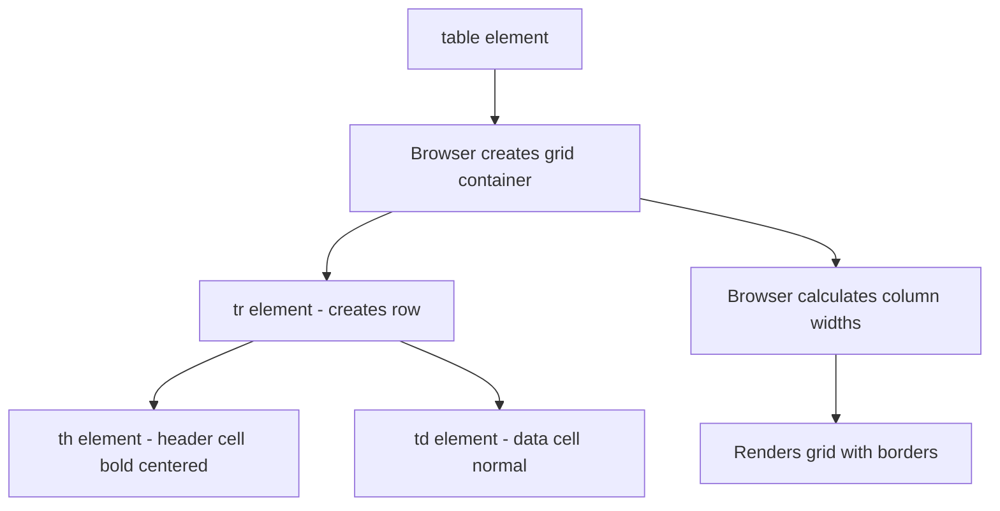
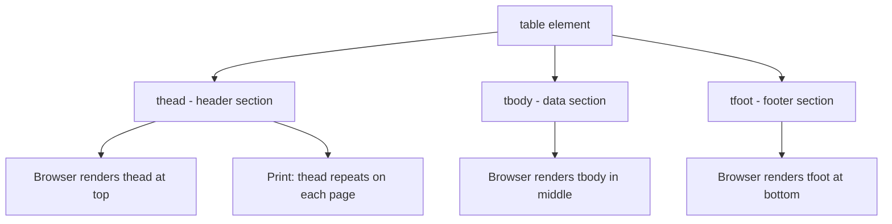
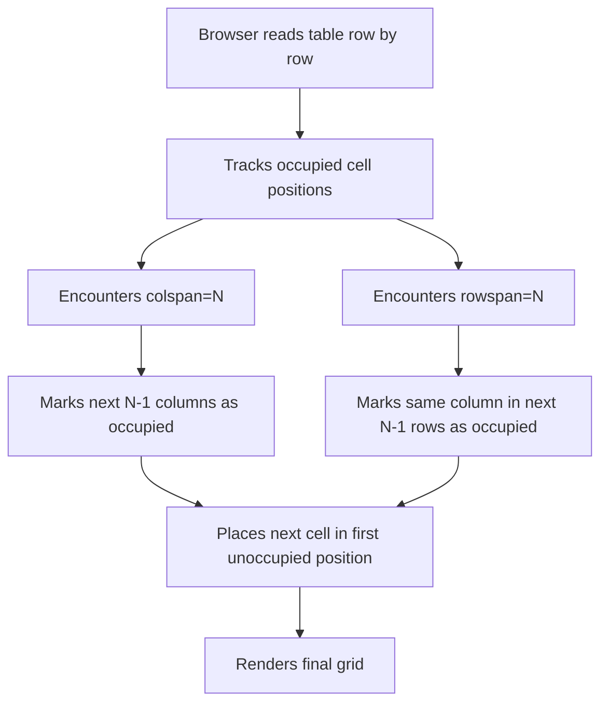
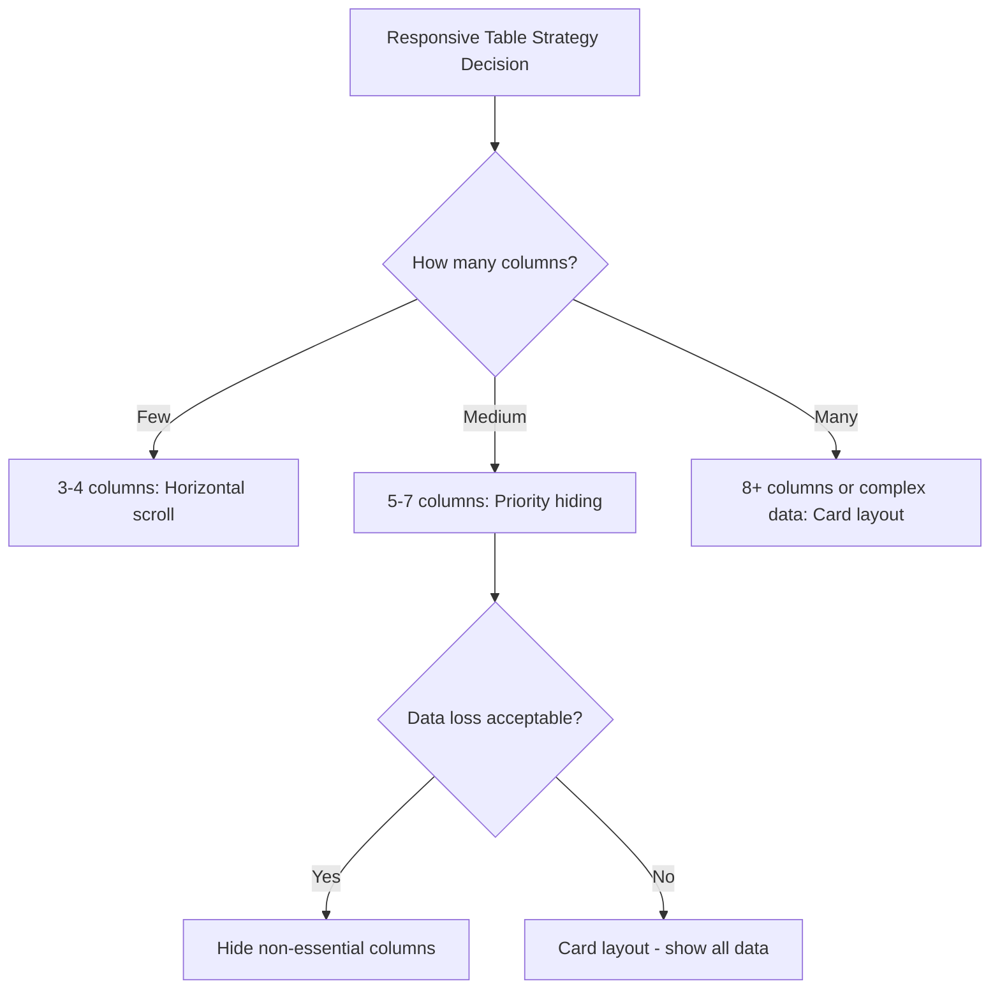
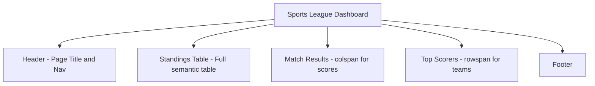

<a id="chapter-14-html-tables"></a>

# Chapter 14: HTML Tables

[⬅ Previous Chapter](#chapter-13-figure-picture-svg) | [📖 Main Index](#main-index) | [Next Chapter ➡](#chapter-15-html-forms-basics)

---

## 📌 Learning Objectives

By the end of this chapter, you will:

**Understand:**
- How HTML tables are structured using semantic elements
- The role of every table element — `<table>`, `<tr>`, `<td>`, `<th>`, `<thead>`, `<tbody>`, `<tfoot>`
- How `colspan` and `rowspan` merge cells across columns and rows
- How `<caption>`, `<colgroup>`, and `<col>` enhance table semantics
- When to use tables and when NOT to use them

**Interview Concepts Covered:**
- Difference between `<td>` and `<th>` — semantic and accessibility impact
- Why `<thead>`, `<tbody>`, `<tfoot>` matter for accessibility and printing
- How `colspan` and `rowspan` values are calculated
- Table accessibility — `scope`, `headers`, `summary` attributes
- CSS techniques for responsive tables
- "Tables for layout" — why it is wrong and what the alternative is

**Practical Skills:**
- Build fully semantic, accessible HTML tables
- Merge cells using `colspan` and `rowspan`
- Style tables with CSS — hover effects, zebra striping, borders
- Make tables responsive using CSS techniques
- Build a complete data table with all structural elements

---

<a id="chapter-index-table-14"></a>

## Chapter Index Table

| Topic No. | Topic Name | Subtopics |
|-----------|-----------|-----------|
| 14.1 | [Basic Table Structure](#141-basic-table-structure) | `<table>` · `<tr>` · `<td>` · `<th>` · Basic syntax · How browser renders tables |
| 14.2 | [Table Sections](#142-table-sections) | `<thead>` · `<tbody>` · `<tfoot>` · Why sections matter · Accessibility · Printing |
| 14.3 | [Table Caption and Column Groups](#143-table-caption-and-column-groups) | `<caption>` · `<colgroup>` · `<col>` · `span` attribute · Semantic purpose |
| 14.4 | [colspan and rowspan](#144-colspan-and-rowspan) | What they do · How to calculate · colspan examples · rowspan examples · Combined |
| 14.5 | [Table Attributes and Accessibility](#145-table-attributes-and-accessibility) | `scope` · `headers` · `id` · `abbr` · `summary` · ARIA roles · Screen reader behavior |
| 14.6 | [Styling Tables with CSS](#146-styling-tables-with-css) | `border-collapse` · Zebra striping · Hover effects · Sticky headers · Column highlighting |
| 14.7 | [Responsive Tables](#147-responsive-tables) | Overflow scroll · Priority columns · Card layout · Responsive strategies |

---

## 14.1 Basic Table Structure

<a id="141-basic-table-structure"></a>

### What is it?

An HTML table is a **structured grid of rows and columns** used to represent **tabular data** — information that has a natural relationship between rows and columns. The basic building blocks are:

| Element | Purpose |
|---------|---------|
| `<table>` | The table container |
| `<tr>` | Table Row — a horizontal row |
| `<td>` | Table Data — a regular data cell |
| `<th>` | Table Header — a header cell |

---

### Why is it needed?

Tabular data has a natural two-dimensional structure — a spreadsheet, a price comparison, a schedule, a leaderboard. HTML tables provide the **semantic structure** to represent this correctly, giving browsers and screen readers the information they need to navigate the data meaningfully.

---

### What problem does it solve?

Without tables:
- Tabular data would need to be represented with `<div>` grids — no semantic relationship between cells
- Screen readers could not navigate column by column or row by row
- Data relationships (which value belongs to which header) would be lost
- Printing and copying data would lose structure

---

### How does it work?

```html
<!-- Minimal valid table -->
<table>
  <tr>
    <th>Name</th>
    <th>Age</th>
    <th>City</th>
  </tr>
  <tr>
    <td>Priya</td>
    <td>28</td>
    <td>Mumbai</td>
  </tr>
  <tr>
    <td>Arjun</td>
    <td>32</td>
    <td>Delhi</td>
  </tr>
</table>
```

**Rendered Output:**

| Name | Age | City |
|------|-----|------|
| Priya | 28 | Mumbai |
| Arjun | 32 | Delhi |

---

### Internal Working



The browser uses a **table layout algorithm** to calculate column widths based on content. By default, it tries to fit all columns within the available width, distributing space proportionally.

---

### `<td>` vs `<th>` — The Critical Difference

> [!IMPORTANT]
> This is one of the **most asked interview questions** about tables.

| Feature | `<td>` (Table Data) | `<th>` (Table Header) |
|---------|---------------------|----------------------|
| Semantic meaning | Regular data cell | Header cell — describes a row or column |
| Default styling | Normal weight, left-aligned | **Bold**, centered |
| Screen reader | Read as data | Announced as "column header" or "row header" |
| `scope` attribute | Not applicable | `scope="col"` or `scope="row"` |
| SEO | Treated as content | Treated as structural label |

```html
<table>
  <tr>
    <!-- th: These cells describe what the column contains -->
    <th scope="col">Product</th>
    <th scope="col">Price</th>
    <th scope="col">Stock</th>
  </tr>
  <tr>
    <!-- td: These are the actual data values -->
    <td>MacBook Pro</td>
    <td>₹1,49,900</td>
    <td>In Stock</td>
  </tr>
</table>
```

---

### Key Characteristics

| Feature | Detail |
|--------|--------|
| `<table>` | Block-level container, creates table formatting context |
| `<tr>` | Must be direct child of `<table>`, `<thead>`, `<tbody>`, or `<tfoot>` |
| `<td>` | Must be direct child of `<tr>` |
| `<th>` | Must be direct child of `<tr>`, used for header cells |
| Default border | None — add via CSS |
| Column width | Auto-calculated by browser |

---

### Row Headers vs Column Headers

`<th>` can be used for both column headers (top row) AND row headers (first column):

```html
<table>
  <tr>
    <th scope="col">Day</th>
    <th scope="col">Morning</th>
    <th scope="col">Afternoon</th>
    <th scope="col">Evening</th>
  </tr>
  <tr>
    <!-- Row header — describes entire row -->
    <th scope="row">Monday</th>
    <td>HTML Basics</td>
    <td>CSS Layouts</td>
    <td>JavaScript</td>
  </tr>
  <tr>
    <th scope="row">Tuesday</th>
    <td>SVG & Images</td>
    <td>Tables & Forms</td>
    <td>Review</td>
  </tr>
</table>
```

---

### 🧠 Hinglish Intuition

> Table ek **Excel spreadsheet** ki tarah hai HTML mein. Rows horizontal hote hain (`<tr>`), columns vertical. Har cell ya toh data hoti hai (`<td>`) ya header hoti hai (`<th>`).
>
> `<th>` aur `<td>` ka fark — `<th>` label hai, `<td>` value hai. Jaise ek form mein "Name:" label hai (`<th>`) aur "Priya" value hai (`<td>`).
>
> Screen readers tables ko navigate karte hain cell by cell. Jab `<th>` properly lagaya ho, toh screen reader bolta hai "Column: Price — ₹1,49,900." Bina `<th>` ke sirf "₹1,49,900" bolta hai — kaunsi column hai yeh pata nahi chalta.

---

### Real World Usage

```html
<!-- Price comparison table -->
<table>
  <tr>
    <th scope="col">Plan</th>
    <th scope="col">Storage</th>
    <th scope="col">Users</th>
    <th scope="col">Price/Month</th>
  </tr>
  <tr>
    <th scope="row">Starter</th>
    <td>10 GB</td>
    <td>1</td>
    <td>Free</td>
  </tr>
  <tr>
    <th scope="row">Pro</th>
    <td>100 GB</td>
    <td>5</td>
    <td>₹499</td>
  </tr>
  <tr>
    <th scope="row">Enterprise</th>
    <td>Unlimited</td>
    <td>Unlimited</td>
    <td>₹2,999</td>
  </tr>
</table>
```

---

### Practical Applications

- Pricing comparison tables
- Sports league standings
- Financial data (stock prices, budgets)
- Timetables and schedules
- Product specifications
- Data reports and analytics
- Leaderboards and rankings
- Employee directories

---

### Common Mistakes

```html
<!-- ❌ WRONG: Using table for page layout -->
<table>
  <tr>
    <td>Navigation</td>
    <td>Main Content</td>
    <td>Sidebar</td>
  </tr>
</table>
<!-- Tables are for DATA, not page layout! Use CSS Grid or Flexbox -->

<!-- ❌ WRONG: Using td for header cells -->
<tr>
  <td><strong>Name</strong></td>
  <td><strong>Age</strong></td>
</tr>
<!-- Use th for semantic header cells -->

<!-- ✅ CORRECT -->
<tr>
  <th scope="col">Name</th>
  <th scope="col">Age</th>
</tr>

<!-- ❌ WRONG: Nesting table elements incorrectly -->
<table>
  <td>Direct td in table</td> <!-- Missing tr -->
</table>

<!-- ✅ CORRECT: td must be inside tr -->
<table>
  <tr>
    <td>Data</td>
  </tr>
</table>
```

---

### Best Practices

- Use `<table>` **only for tabular data** — never for layout
- Use `<th>` for all header cells — both column and row headers
- Always add `scope="col"` or `scope="row"` to `<th>` elements
- Never put `<td>` or `<th>` directly inside `<table>` — always inside `<tr>`
- Never put `<tr>` directly in `<table>` without using `<thead>`, `<tbody>`, `<tfoot>` (covered next topic)

---

### Interview Perspective

> [!IMPORTANT]
> **Most Asked:** "What is the difference between `<td>` and `<th>`?"
> Answer: `<td>` is a data cell — regular table content. `<th>` is a header cell — describes what a column or row contains. `<th>` is bold and centered by default. Screen readers announce `<th>` as a header, establishing context for all related `<td>` cells. Use `scope="col"` or `scope="row"` on `<th>` for full accessibility.
>
> **Wrong Answer Alert:** "Tables should be used for page layout" — this was a 1990s practice, completely wrong in modern HTML. Tables are for tabular data only.

👉 <a href="#chapter-index-table-14">Go to Top 🔝</a>

---

## 14.2 Table Sections

<a id="142-table-sections"></a>

### What is it?

HTML tables can be divided into three semantic sections:

| Element | Purpose |
|---------|---------|
| `<thead>` | Table Head — contains column header rows |
| `<tbody>` | Table Body — contains the main data rows |
| `<tfoot>` | Table Foot — contains summary/totals rows |

---

### Why is it needed?

Without sections, all rows are treated identically — the browser has no way to distinguish header rows from data rows from footer rows. With sections:
- Screen readers can announce "header row" vs "data row"
- When printing long tables, `<thead>` repeats on each page automatically
- `<tfoot>` can appear at the bottom even if declared before `<tbody>` in HTML
- CSS can target each section independently for styling

---

### How does it work?

```html
<table>
  <!-- THEAD: Column headers -->
  <thead>
    <tr>
      <th scope="col">Product</th>
      <th scope="col">Units Sold</th>
      <th scope="col">Revenue</th>
    </tr>
  </thead>

  <!-- TBODY: Main data rows -->
  <tbody>
    <tr>
      <td>Laptop</td>
      <td>142</td>
      <td>₹78,50,000</td>
    </tr>
    <tr>
      <td>Smartphone</td>
      <td>389</td>
      <td>₹46,68,000</td>
    </tr>
    <tr>
      <td>Tablet</td>
      <td>67</td>
      <td>₹10,05,000</td>
    </tr>
  </tbody>

  <!-- TFOOT: Summary/totals -->
  <tfoot>
    <tr>
      <th scope="row">Total</th>
      <td>598</td>
      <td>₹1,35,23,000</td>
    </tr>
  </tfoot>
</table>
```

---

### Internal Working



---

### Printing Behavior — Why `<thead>` Matters

> [!IMPORTANT]
> When a table is longer than one printed page, `<thead>` **automatically repeats** at the top of each printed page. Without `<thead>`, column headers only appear on the first page, making subsequent pages unreadable.
>
> This is a real-world, production-critical feature for invoice tables, reports, and data exports.

---

### Multiple `<tbody>` Elements

A table can have **multiple `<tbody>` elements** — useful for grouping related data:

```html
<table>
  <thead>
    <tr>
      <th scope="col">Item</th>
      <th scope="col">Category</th>
      <th scope="col">Amount</th>
    </tr>
  </thead>

  <!-- First group: Income -->
  <tbody>
    <tr>
      <th scope="row" colspan="3">Income</th>
    </tr>
    <tr>
      <td>Salary</td>
      <td>Employment</td>
      <td>₹85,000</td>
    </tr>
    <tr>
      <td>Freelance</td>
      <td>Contract</td>
      <td>₹20,000</td>
    </tr>
  </tbody>

  <!-- Second group: Expenses -->
  <tbody>
    <tr>
      <th scope="row" colspan="3">Expenses</th>
    </tr>
    <tr>
      <td>Rent</td>
      <td>Housing</td>
      <td>₹25,000</td>
    </tr>
    <tr>
      <td>Groceries</td>
      <td>Food</td>
      <td>₹8,000</td>
    </tr>
  </tbody>

  <tfoot>
    <tr>
      <th scope="row" colspan="2">Net Balance</th>
      <td>₹72,000</td>
    </tr>
  </tfoot>
</table>
```

---

### Browser Implicit Behavior

> [!NOTE]
> Even if you don't write `<tbody>` in your HTML, the browser **automatically inserts it** in the DOM. If you inspect any `<table>` in browser DevTools, you will always find a `<tbody>` even if you didn't write one.
>
> This means CSS selectors like `table > tr` will NOT work — you must use `table > tbody > tr`. Always write explicit `<tbody>` to avoid confusion.

---

### CSS Targeting Table Sections

```css
/* Target each section differently */
thead {
  background-color: #1a1a2e;
  color: white;
}

tbody {
  background-color: white;
}

tfoot {
  background-color: #f0f0f8;
  font-weight: bold;
  border-top: 2px solid #6c63ff;
}

/* Zebra striping — only in tbody */
tbody tr:nth-child(even) {
  background-color: #f8f8ff;
}

/* Hover only on tbody rows — not header/footer */
tbody tr:hover {
  background-color: #e8e8ff;
}
```

---

### 🧠 Hinglish Intuition

> Table ko teen hisso mein sochna — jaise ek newspaper ka layout:
>
> **`<thead>`** — Newspaper ka headline row. "Name | Age | City" — yeh labels hain, data nahi. Printing pe yeh har page pe repeat hota hai — bahut important feature!
>
> **`<tbody>`** — Newspaper ka content. Actual data rows. Yahan `nth-child` se zebra striping aur hover effects lagate hain.
>
> **`<tfoot>`** — Newspaper ka summary box. "Total: ₹1,35,23,000" — summary ya totals. HTML mein `<tfoot>` `<tbody>` se pehle bhi likh sakte hain, browser phir bhi usse neeche render karta hai.
>
> **Browser implicit `<tbody>`** — ek hidden feature. Tum `<tbody>` nahi likhte, browser khud add kar deta hai DOM mein. Isliye `table > tr` selector kaam nahi karta — `tbody` beech mein aa jaata hai.

---

### Real World Usage — Invoice Table

```html
<table class="invoice-table">
  <caption>Invoice #INV-2024-042 — Priya Sharma</caption>

  <thead>
    <tr>
      <th scope="col">#</th>
      <th scope="col">Description</th>
      <th scope="col">Qty</th>
      <th scope="col">Rate</th>
      <th scope="col">Amount</th>
    </tr>
  </thead>

  <tbody>
    <tr>
      <td>1</td>
      <td>UI Design — Homepage</td>
      <td>1</td>
      <td>₹25,000</td>
      <td>₹25,000</td>
    </tr>
    <tr>
      <td>2</td>
      <td>HTML/CSS Development</td>
      <td>40 hrs</td>
      <td>₹800/hr</td>
      <td>₹32,000</td>
    </tr>
    <tr>
      <td>3</td>
      <td>Responsive Testing</td>
      <td>8 hrs</td>
      <td>₹600/hr</td>
      <td>₹4,800</td>
    </tr>
  </tbody>

  <tfoot>
    <tr>
      <td colspan="4">Subtotal</td>
      <td>₹61,800</td>
    </tr>
    <tr>
      <td colspan="4">GST (18%)</td>
      <td>₹11,124</td>
    </tr>
    <tr class="total-row">
      <th scope="row" colspan="4">Total Due</th>
      <td>₹72,924</td>
    </tr>
  </tfoot>
</table>
```

---

### Common Mistakes

```html
<!-- ❌ WRONG: No table sections — all rows identical -->
<table>
  <tr>
    <th>Name</th><th>Score</th>
  </tr>
  <tr>
    <td>Priya</td><td>95</td>
  </tr>
</table>

<!-- ✅ CORRECT: Semantic sections -->
<table>
  <thead>
    <tr><th scope="col">Name</th><th scope="col">Score</th></tr>
  </thead>
  <tbody>
    <tr><td>Priya</td><td>95</td></tr>
  </tbody>
</table>

<!-- ❌ WRONG: tr directly in table — browser adds implicit tbody -->
<table>
  <thead>...</thead>
  <tr><td>Data</td></tr> <!-- Goes into implicit tbody -->
</table>

<!-- ✅ CORRECT: Explicit tbody -->
<table>
  <thead>...</thead>
  <tbody>
    <tr><td>Data</td></tr>
  </tbody>
</table>
```

---

### Best Practices

- Always use all three sections: `<thead>`, `<tbody>`, `<tfoot>`
- Use `<tfoot>` for totals, summaries, or grand totals
- Use multiple `<tbody>` to group related data rows
- Always write explicit `<tbody>` — never rely on browser's implicit insertion
- Target sections separately in CSS for precise styling control

---

### Interview Perspective

> [!IMPORTANT]
> **Most Asked:** "What is the purpose of `<thead>`, `<tbody>`, and `<tfoot>`?"
> Answer: They provide semantic structure to tables. `<thead>` marks header rows (repeats when printing). `<tbody>` marks data rows. `<tfoot>` marks summary/total rows. They enable independent CSS styling per section and improve screen reader navigation.
>
> **Tricky Question:** "Does the browser add any element automatically to tables?"
> Answer: Yes — even without explicit `<tbody>` in HTML, the browser inserts a `<tbody>` in the DOM. This means CSS `table > tr` selector fails — you must use `tbody > tr`.
>
> **Printing Question:** "How do you make table headers repeat on every printed page?"
> Answer: Place headers inside `<thead>` — browsers automatically repeat `<thead>` content on each page when printing.

👉 <a href="#chapter-index-table-14">Go to Top 🔝</a>

---

## 14.3 Table Caption and Column Groups

<a id="143-table-caption-and-column-groups"></a>

### What is it?

Beyond rows and cells, HTML tables have two more semantic elements:

| Element | Purpose |
|---------|---------|
| `<caption>` | Provides a title/description for the entire table |
| `<colgroup>` | Groups one or more columns for styling |
| `<col>` | Represents a single column within `<colgroup>` |

---

### The `<caption>` Element

`<caption>` is the **title of the table** — programmatically associated with the `<table>` element. It is the table equivalent of `<figcaption>` for `<figure>`.

```html
<table>
  <!-- caption must be first child of table -->
  <caption>Q4 2024 Sales Performance by Region</caption>

  <thead>
    <tr>
      <th scope="col">Region</th>
      <th scope="col">Target</th>
      <th scope="col">Achieved</th>
      <th scope="col">Growth</th>
    </tr>
  </thead>
  <tbody>
    <tr>
      <th scope="row">North</th>
      <td>₹50L</td>
      <td>₹62L</td>
      <td>+24%</td>
    </tr>
    <tr>
      <th scope="row">South</th>
      <td>₹40L</td>
      <td>₹38L</td>
      <td>-5%</td>
    </tr>
  </tbody>
</table>
```

**Why `<caption>` matters:**
- Screen readers announce the caption before reading table content — "Table: Q4 2024 Sales Performance by Region"
- Provides context before user starts navigating cells
- Search engines understand the table's subject
- Much better than putting a `<h3>` or `<p>` before the table

---

### Caption Placement

By default, `<caption>` renders **above** the table. CSS can move it:

```css
/* Caption above table (default) */
caption {
  caption-side: top;
  font-size: 16px;
  font-weight: bold;
  text-align: left;
  padding: 8px 0 12px;
  color: #1a1a2e;
}

/* Caption below table */
caption {
  caption-side: bottom;
  font-size: 13px;
  color: #888;
  font-style: italic;
  text-align: right;
  padding: 8px 0 0;
}
```

---

### The `<colgroup>` and `<col>` Elements

`<colgroup>` groups columns together so you can apply CSS styles to entire columns without targeting each cell individually.

```html
<table>
  <caption>Monthly Budget Tracker</caption>

  <colgroup>
    <!-- First column: category names -->
    <col class="col-category">
    <!-- Next 3 columns: monthly data -->
    <col class="col-data">
    <col class="col-data">
    <col class="col-data">
    <!-- Last column: totals — highlighted -->
    <col class="col-total">
  </colgroup>

  <thead>
    <tr>
      <th scope="col">Category</th>
      <th scope="col">January</th>
      <th scope="col">February</th>
      <th scope="col">March</th>
      <th scope="col">Q1 Total</th>
    </tr>
  </thead>
  <tbody>
    <tr>
      <th scope="row">Rent</th>
      <td>₹25,000</td>
      <td>₹25,000</td>
      <td>₹25,000</td>
      <td>₹75,000</td>
    </tr>
    <tr>
      <th scope="row">Food</th>
      <td>₹8,200</td>
      <td>₹7,800</td>
      <td>₹9,100</td>
      <td>₹25,100</td>
    </tr>
  </tbody>
</table>
```

```css
/* Style entire columns via col classes */
.col-category {
  width: 160px;
  background-color: #f0f0f8;
}

.col-data {
  width: 120px;
  text-align: right;
}

.col-total {
  width: 130px;
  background-color: #e8e8ff;
  font-weight: bold;
}
```

---

### `<col>` with `span` Attribute

The `span` attribute on `<col>` applies the same style to **multiple consecutive columns**:

```html
<table>
  <colgroup>
    <col>                        <!-- Column 1: no style -->
    <col span="3" class="quarter-cols"> <!-- Columns 2,3,4: same style -->
    <col class="total-col">      <!-- Column 5: different style -->
  </colgroup>

  <!-- rest of table... -->
</table>
```

```css
.quarter-cols {
  background-color: #fef9f0;
  text-align: right;
}

.total-col {
  background-color: #6c63ff;
  color: white;
  text-align: right;
  font-weight: bold;
}
```

---

### CSS Limitations on `<col>`

> [!IMPORTANT]
> CSS properties that work on `<col>` are very limited. Only these properties are supported:
> - `width`
> - `background` / `background-color`
> - `border`
> - `visibility`
>
> Properties like `text-align`, `padding`, `font-*` do **NOT** apply to `<col>` elements. For those, you must target the cells directly using CSS column-targeting techniques.

---

### 🧠 Hinglish Intuition

> **`<caption>`** — Table ka **title tag** hai. Jaise photo ke neeche caption hota hai `<figcaption>`, table ke upar/neeche description hoti hai `<caption>`. Screen reader pehle yeh padhta hai — "Table: Q4 Sales Data" — phir cells navigate karta hai. Ek `<h3>` se better hai kyunki `<caption>` table ke saath programmatically linked hota hai.
>
> **`<colgroup>` aur `<col>`** — Socho ek spreadsheet mein puri column select karo aur background color change karo — ek click mein sab cells. Yahi kaam karta hai `<col>`. Har row mein `td` ko alag alag style karne ki zaroorat nahi — ek `<col>` se puri column style hoti hai.
>
> **Limitation** yaad karo — `<col>` pe sirf `width`, `background`, `border`, `visibility` kaam karte hain. `text-align` yahan kaam nahi karta — cells pe lagao seedha.

---

### Real World Usage — Full Table with Caption and Colgroup

```html
<figure>
  <table class="data-table">
    <caption>
      Employee Performance Review — Annual 2024
      <span class="caption-source">Source: HR Department, December 2024</span>
    </caption>

    <colgroup>
      <col class="col-name">
      <col class="col-dept">
      <col span="4" class="col-score">
      <col class="col-final">
    </colgroup>

    <thead>
      <tr>
        <th scope="col">Employee</th>
        <th scope="col">Department</th>
        <th scope="col">Q1</th>
        <th scope="col">Q2</th>
        <th scope="col">Q3</th>
        <th scope="col">Q4</th>
        <th scope="col">Annual</th>
      </tr>
    </thead>

    <tbody>
      <tr>
        <th scope="row">Priya Sharma</th>
        <td>Design</td>
        <td>92</td>
        <td>88</td>
        <td>95</td>
        <td>91</td>
        <td>91.5</td>
      </tr>
      <tr>
        <th scope="row">Arjun Mehta</th>
        <td>Engineering</td>
        <td>85</td>
        <td>90</td>
        <td>88</td>
        <td>94</td>
        <td>89.3</td>
      </tr>
    </tbody>

    <tfoot>
      <tr>
        <th scope="row" colspan="2">Team Average</th>
        <td>88.5</td>
        <td>89.0</td>
        <td>91.5</td>
        <td>92.5</td>
        <td>90.4</td>
      </tr>
    </tfoot>
  </table>
</figure>
```

---

### Common Mistakes

```html
<!-- ❌ WRONG: caption not first child of table -->
<table>
  <thead>...</thead>
  <caption>Table Title</caption> <!-- Must be FIRST child -->
</table>

<!-- ✅ CORRECT: caption is first child -->
<table>
  <caption>Table Title</caption>
  <thead>...</thead>
  <tbody>...</tbody>
</table>

<!-- ❌ WRONG: Trying to text-align via col -->
<col style="text-align: right;"> <!-- Does NOT work -->

<!-- ✅ CORRECT: text-align on cells -->
td.number-col { text-align: right; }
```

---

### Best Practices

- Always add `<caption>` to data tables — it is the table's accessible name
- Place `<caption>` as the **first child** of `<table>`
- Use `<colgroup>` and `<col>` for column-level width and background styling
- Use `span` attribute on `<col>` to apply same style to multiple columns
- Remember CSS limitations on `<col>` — only `width`, `background`, `border`, `visibility`

---

### Interview Perspective

> [!IMPORTANT]
> **Common Question:** "What is `<caption>` and how is it different from a heading before the table?"
> Answer: `<caption>` is a child element of `<table>` — programmatically associated with the table. Screen readers announce it as the table's title before reading cells. A `<h3>` before the table has no structural relationship to the table.
>
> **Technical Question:** "What CSS properties work on `<col>` elements?"
> Answer: Only `width`, `background`/`background-color`, `border`, and `visibility`. Most other CSS properties (including `text-align` and `padding`) have no effect on `<col>`.

👉 <a href="#chapter-index-table-14">Go to Top 🔝</a>

---

## 14.4 colspan and rowspan

<a id="144-colspan-and-rowspan"></a>

### What is it?

`colspan` and `rowspan` are attributes that allow a single table cell to **span across multiple columns or rows** — creating merged cells similar to "Merge Cells" in Excel or Google Sheets.

| Attribute | Direction | Effect |
|-----------|-----------|--------|
| `colspan` | Horizontal | Cell spans across N columns |
| `rowspan` | Vertical | Cell spans down N rows |

---

### Why is it needed?

Real-world tabular data often has group headers, merged categories, or summary rows that span multiple columns or rows. `colspan` and `rowspan` allow these complex data structures to be represented accurately without visual hacks.

---

### How `colspan` Works

`colspan="N"` makes a cell span across **N columns**. You must **remove the cells** that the spanning cell replaces.

```html
<!-- colspan="2": spans 2 columns -->
<table>
  <thead>
    <tr>
      <!-- This single th spans both "Q1" and "Q2" columns -->
      <th scope="col" colspan="2">First Half 2024</th>
      <!-- This single th spans both "Q3" and "Q4" columns -->
      <th scope="col" colspan="2">Second Half 2024</th>
    </tr>
    <tr>
      <th scope="col">Q1</th>
      <th scope="col">Q2</th>
      <th scope="col">Q3</th>
      <th scope="col">Q4</th>
    </tr>
  </thead>
  <tbody>
    <tr>
      <td>₹12L</td>
      <td>₹15L</td>
      <td>₹18L</td>
      <td>₹22L</td>
    </tr>
  </tbody>
</table>
```

**Visual Result:**

```
| First Half 2024 | Second Half 2024 |
|    Q1    |    Q2    |    Q3    |    Q4    |
| ₹12L     | ₹15L     | ₹18L     | ₹22L     |
```

---

### colspan Calculation Rule

> [!IMPORTANT]
> When you use `colspan="N"`, you must **remove N-1 cells** from that row to maintain correct column count.
>
> Rule: `cells with colspan + cells without colspan = total number of columns`

```html
<!-- 4 columns total -->
<table>
  <tr>
    <th colspan="2">Group A</th>  <!-- takes up 2 columns -->
    <th colspan="2">Group B</th>  <!-- takes up 2 columns -->
    <!-- 2 + 2 = 4 columns ✅ -->
  </tr>
  <tr>
    <td>A1</td>  <!-- 1 column -->
    <td>A2</td>  <!-- 1 column -->
    <td>B1</td>  <!-- 1 column -->
    <td>B2</td>  <!-- 1 column -->
    <!-- 1+1+1+1 = 4 columns ✅ -->
  </tr>
</table>
```

---

### How `rowspan` Works

`rowspan="N"` makes a cell span down across **N rows**. You must **remove cells from subsequent rows** in the column position the spanning cell occupies.

```html
<table>
  <thead>
    <tr>
      <th scope="col">Category</th>
      <th scope="col">Item</th>
      <th scope="col">Price</th>
    </tr>
  </thead>
  <tbody>
    <tr>
      <!-- "Electronics" spans 3 rows vertically -->
      <th scope="rowgroup" rowspan="3">Electronics</th>
      <td>Laptop</td>
      <td>₹75,000</td>
    </tr>
    <tr>
      <!-- Note: NO td for Category column — rowspan covers it -->
      <td>Smartphone</td>
      <td>₹35,000</td>
    </tr>
    <tr>
      <!-- Still no Category td — rowspan still active -->
      <td>Tablet</td>
      <td>₹25,000</td>
    </tr>
    <tr>
      <!-- New category: "Clothing" spans 2 rows -->
      <th scope="rowgroup" rowspan="2">Clothing</th>
      <td>Shirt</td>
      <td>₹1,200</td>
    </tr>
    <tr>
      <td>Jeans</td>
      <td>₹2,500</td>
    </tr>
  </tbody>
</table>
```

**Visual Result:**

```
| Category    | Item       | Price   |
|-------------|------------|---------|
| Electronics | Laptop     | ₹75,000 |
|             | Smartphone | ₹35,000 |
|             | Tablet     | ₹25,000 |
| Clothing    | Shirt      | ₹1,200  |
|             | Jeans      | ₹2,500  |
```

---

### rowspan Calculation Rule

> [!IMPORTANT]
> When you use `rowspan="N"`:
> - In the **starting row**: include the cell with `rowspan`
> - In the **next N-1 rows**: remove the cell for that column position entirely
>
> Forgetting to remove cells causes the table to render incorrectly — extra cells push other content out of alignment.

---

### Combining colspan and rowspan

A single cell can use **both** `colspan` and `rowspan` simultaneously:

```html
<table>
  <caption>School Timetable — Week Overview</caption>
  <thead>
    <tr>
      <th scope="col">Period</th>
      <th scope="col">Monday</th>
      <th scope="col">Tuesday</th>
      <th scope="col">Wednesday</th>
      <th scope="col">Thursday</th>
      <th scope="col">Friday</th>
    </tr>
  </thead>
  <tbody>
    <tr>
      <th scope="row">Period 1</th>
      <td>Maths</td>
      <td>English</td>
      <!-- Science spans 2 columns (Wed + Thu) -->
      <td colspan="2">Science Lab</td>
      <td>History</td>
    </tr>
    <tr>
      <th scope="row">Period 2</th>
      <!-- Assembly spans 2 rows (Period 2 + Period 3) AND 5 columns (Mon-Fri) -->
      <td colspan="5" rowspan="2" class="assembly">
        🎓 School Assembly
      </td>
    </tr>
    <tr>
      <th scope="row">Period 3</th>
      <!-- No cells — covered by the rowspan+colspan above -->
    </tr>
    <tr>
      <th scope="row">Period 4</th>
      <td>Physics</td>
      <td>Chemistry</td>
      <td>Biology</td>
      <td>Maths</td>
      <td>English</td>
    </tr>
  </tbody>
</table>
```

---

### Internal Working — Cell Positioning Algorithm



---

### Complex colspan + rowspan Example — Schedule Table

```html
<table>
  <caption>Conference Room Booking — December 2024</caption>
  <thead>
    <tr>
      <th scope="col">Time</th>
      <th scope="col">Room A</th>
      <th scope="col">Room B</th>
      <th scope="col">Room C</th>
    </tr>
  </thead>
  <tbody>
    <tr>
      <th scope="row">9:00 AM</th>
      <!-- Project Kickoff in Room A only, 2 hours -->
      <td rowspan="2">Project Kickoff</td>
      <!-- All-Hands in Room B + C, 1 hour -->
      <td colspan="2">All-Hands Meeting</td>
    </tr>
    <tr>
      <th scope="row">10:00 AM</th>
      <!-- Room A still occupied by Project Kickoff (rowspan) -->
      <!-- Room B: free -->
      <td>Free</td>
      <!-- Design Review in Room C -->
      <td>Design Review</td>
    </tr>
    <tr>
      <th scope="row">11:00 AM</th>
      <td>Client Call</td>
      <td>Free</td>
      <td>Free</td>
    </tr>
  </tbody>
</table>
```

---

### 🧠 Hinglish Intuition

> `colspan` aur `rowspan` ko Excel ka "Merge Cells" feature samjho.
>
> **`colspan="3"`** — "Yeh cell teen columns pe phail jaati hai." Jaise ek title row mein "Sales Data 2024" likhna hai jo teeno quarterly columns ke upar hoga. Teen cells ki jagah ek cell — lekin `colspan="3"` batata hai ki woh teen columns cover karti hai.
>
> **`rowspan="3"`** — "Yeh cell teen rows tak neeche jaati hai." Jaise Electronics category ek cell mein honi chahiye lekin 3 products hain neeche. Ek Category cell — teeno rows cover karti hai.
>
> **Critical rule:** `colspan="3"` lagaya toh us row mein 2 kam cells likhni hain. `rowspan="3"` lagaya toh agali 2 rows mein us column ki cell nahi likhni. Bhool gaye toh table tedhaa ho jaata hai!

---

### Common Mistakes

```html
<!-- ❌ WRONG: Not removing covered cells with colspan -->
<tr>
  <th colspan="2">Merged Header</th>
  <th>Col 3</th>  <!-- Now 3 columns but only 2 declared above = WRONG -->
  <th>Col 4</th>
</tr>
<!-- Should be: colspan covers 2, so only 2 more headers needed for 4 total -->

<!-- ✅ CORRECT -->
<tr>
  <th colspan="2">Merged Header</th>  <!-- covers col 1 + col 2 -->
  <th>Col 3</th>
  <th>Col 4</th>
</tr>

<!-- ❌ WRONG: Not removing covered cells with rowspan -->
<tr>
  <td rowspan="2">Category</td>
  <td>Item 1</td>
</tr>
<tr>
  <td>Category AGAIN</td>  <!-- ❌ Should be removed — rowspan covers it -->
  <td>Item 2</td>
</tr>

<!-- ✅ CORRECT: Remove cell in rowspan-covered position -->
<tr>
  <td rowspan="2">Category</td>
  <td>Item 1</td>
</tr>
<tr>
  <!-- No td for first column — covered by rowspan above -->
  <td>Item 2</td>
</tr>
```

---

### Best Practices

- Always verify column count is consistent across all rows after using `colspan`
- Always remove cells from subsequent rows after using `rowspan`
- Keep `colspan` and `rowspan` values as small as necessary — complex spans are hard to maintain
- Add comments in HTML to document which cells are covered by spans
- Test table in browser DevTools — column misalignment is immediately visible

---

### Interview Perspective

> [!IMPORTANT]
> **Most Asked:** "What is `colspan` and `rowspan`? What is the key rule when using them?"
> Answer: `colspan="N"` makes a cell span N columns horizontally. `rowspan="N"` makes a cell span N rows vertically. Key rule: remove the cells that the spanning cell replaces. With `colspan="3"`, remove 2 cells from that row. With `rowspan="3"`, remove that column's cell from the next 2 rows.
>
> **Output Question:** "How many cells should Row 2 have if Row 1 has `<th colspan='3'>` and one regular `<th>`?"
> Answer: 4 total columns. Row 1: `colspan=3` (counts as 3) + 1 = 4. Row 2: must have exactly 4 `<td>` elements.

👉 <a href="#chapter-index-table-14">Go to Top 🔝</a>

---

## 14.5 Table Attributes and Accessibility

<a id="145-table-attributes-and-accessibility"></a>

### What is it?

Table accessibility attributes allow screen readers to navigate tables meaningfully — announcing which header describes each data cell, enabling users to understand data relationships without visual context.

---

### Why is it needed?

Sighted users can scan a table visually — looking at the row header and column header simultaneously to understand a cell's value. Screen reader users navigate cell by cell — they need the browser to programmatically tell them "this cell's value relates to this column header and this row header."

---

### The `scope` Attribute

The `scope` attribute on `<th>` tells the browser (and screen readers) **which cells this header describes**:

| Value | Meaning |
|-------|---------|
| `scope="col"` | This header describes all cells in its **column** |
| `scope="row"` | This header describes all cells in its **row** |
| `scope="colgroup"` | This header describes cells in a **column group** |
| `scope="rowgroup"` | This header describes cells in a **row group** |

```html
<table>
  <thead>
    <tr>
      <th scope="col">Employee</th>      <!-- Describes entire Employee column -->
      <th scope="col">Department</th>    <!-- Describes entire Department column -->
      <th scope="col">Salary</th>        <!-- Describes entire Salary column -->
    </tr>
  </thead>
  <tbody>
    <tr>
      <th scope="row">Priya Sharma</th>  <!-- Describes entire row for Priya -->
      <td>Design</td>
      <td>₹85,000</td>
    </tr>
    <tr>
      <th scope="row">Arjun Mehta</th>  <!-- Describes entire row for Arjun -->
      <td>Engineering</td>
      <td>₹95,000</td>
    </tr>
  </tbody>
</table>
```

**Screen reader navigation:**
> "Column: Salary, Row: Arjun Mehta — ₹95,000"

---

### The `headers` Attribute — For Complex Tables

For tables with complex merged headers where `scope` is insufficient, use `headers` to explicitly associate cells with their headers using IDs:

```html
<table>
  <thead>
    <tr>
      <th id="product" scope="col">Product</th>
      <!-- Group header spanning 2 columns -->
      <th id="q1-group" scope="colgroup" colspan="2">Q1 2024</th>
      <th id="q2-group" scope="colgroup" colspan="2">Q2 2024</th>
    </tr>
    <tr>
      <th id="product-blank"></th>
      <th id="q1-units" headers="q1-group" scope="col">Units</th>
      <th id="q1-revenue" headers="q1-group" scope="col">Revenue</th>
      <th id="q2-units" headers="q2-group" scope="col">Units</th>
      <th id="q2-revenue" headers="q2-group" scope="col">Revenue</th>
    </tr>
  </thead>
  <tbody>
    <tr>
      <th id="laptop" scope="row">Laptop</th>
      <!-- This cell relates to: product + q1-group + q1-units + laptop -->
      <td headers="laptop q1-group q1-units">142</td>
      <td headers="laptop q1-group q1-revenue">₹78.5L</td>
      <td headers="laptop q2-group q2-units">168</td>
      <td headers="laptop q2-group q2-revenue">₹92.4L</td>
    </tr>
  </tbody>
</table>
```

> [!NOTE]
> Use `headers` attribute for complex tables with multiple levels of headers. For simple tables with one header row and one header column, `scope` alone is sufficient.

---

### The `abbr` Attribute

The `abbr` attribute on `<th>` provides an **abbreviated version** of the header — used by screen readers when announcing headers repeatedly:

```html
<tr>
  <th scope="col" abbr="Prod">Product Name</th>
  <th scope="col" abbr="Qty">Quantity in Stock</th>
  <th scope="col" abbr="Price">Unit Price (INR)</th>
</tr>
```

Instead of saying "Product Name, Quantity in Stock, Unit Price (INR)" for every single data cell, the screen reader uses the abbreviated version — much better UX.

---

### ARIA for Tables

When using CSS-styled non-table elements that **look** like tables (using `<div>`), add ARIA roles:

```html
<!-- CSS grid/flex layout styled as table — needs ARIA -->
<div role="table" aria-label="Employee Data">
  <div role="rowgroup">
    <div role="row">
      <span role="columnheader">Name</span>
      <span role="columnheader">Department</span>
    </div>
  </div>
  <div role="rowgroup">
    <div role="row">
      <span role="cell">Priya Sharma</span>
      <span role="cell">Design</span>
    </div>
  </div>
</div>
```

> [!IMPORTANT]
> This ARIA approach is complex and error-prone. **Always prefer native `<table>` elements** for tabular data — they have full accessibility built in. Use ARIA table roles only when you absolutely cannot use `<table>` elements (e.g., a CSS grid-based virtual table for performance in large datasets).

---

### Screen Reader Behavior

```
With proper scope on a simple table:
Screen reader announces each cell as:
"[Column Header], [Row Header] — [Cell Value]"

Example: "Salary column, Arjun Mehta row — ₹95,000"

With headers attribute on complex table:
"Q1 2024, Units column, Laptop row — 142"
```

---

### Table Accessibility Checklist

```
✅ <caption> — Provides table title/description
✅ <th> for all header cells (not <td><strong>)
✅ scope="col" on column headers
✅ scope="row" on row headers
✅ headers attribute for complex merged-header tables
✅ abbr attribute for long header names
✅ <thead>, <tbody>, <tfoot> structural sections
✅ No table for layout — data tables only
```

---

### 🧠 Hinglish Intuition

> Imagine tum ek massive spreadsheet mein ho aur aankhein band hain. Koi cell pe jaate ho — "yeh value kaunse column ki hai? Kaunsi row ki?" Yeh information sirf visually available hai normally.
>
> `scope="col"` — "Main is column ka header hoon." Browser track karta hai — jab screen reader us column ki koi cell pe jaata hai, woh column header announce karta hai automatically.
>
> `scope="row"` — "Main is row ka header hoon." Wahi kaam — row header announce hota hai cell navigate karte waqt.
>
> `headers` attribute — complex tables ke liye jahan ek cell multiple headers se associated ho. IDs se explicitly link karo. Jaise "yeh cell — Laptop row, Q1 group, Units column — 142."

---

### Real World Accessible Table

```html
<table>
  <caption>
    Student Exam Results — Final Semester 2024
    <small>All scores out of 100</small>
  </caption>

  <thead>
    <tr>
      <th scope="col" abbr="Student">Student Name</th>
      <th scope="col" abbr="HTML">HTML & CSS</th>
      <th scope="col" abbr="JS">JavaScript</th>
      <th scope="col" abbr="React">React</th>
      <th scope="col" abbr="Total">Total Score</th>
      <th scope="col">Grade</th>
    </tr>
  </thead>

  <tbody>
    <tr>
      <th scope="row">Priya Sharma</th>
      <td>92</td>
      <td>88</td>
      <td>94</td>
      <td>274</td>
      <td>A+</td>
    </tr>
    <tr>
      <th scope="row">Arjun Mehta</th>
      <td>85</td>
      <td>90</td>
      <td>87</td>
      <td>262</td>
      <td>A</td>
    </tr>
    <tr>
      <th scope="row">Neha Gupta</th>
      <td>78</td>
      <td>82</td>
      <td>79</td>
      <td>239</td>
      <td>B+</td>
    </tr>
  </tbody>

  <tfoot>
    <tr>
      <th scope="row">Class Average</th>
      <td>85.0</td>
      <td>86.7</td>
      <td>86.7</td>
      <td>258.3</td>
      <td>A</td>
    </tr>
  </tfoot>
</table>
```

---

### Common Mistakes

```html
<!-- ❌ WRONG: No scope on th -->
<th>Product</th>

<!-- ✅ CORRECT: Always add scope -->
<th scope="col">Product</th>

<!-- ❌ WRONG: Using td+strong for visual headers -->
<td><strong>Employee Name</strong></td>

<!-- ✅ CORRECT: Semantic th -->
<th scope="col">Employee Name</th>

<!-- ❌ WRONG: No caption — table has no accessible name -->
<table>
  <thead>...</thead>
  <tbody>...</tbody>
</table>

<!-- ✅ CORRECT: Add caption -->
<table>
  <caption>Sales Data Q4 2024</caption>
  <thead>...</thead>
  <tbody>...</tbody>
</table>
```

---

### Best Practices

- Always add `scope` attribute to every `<th>` element
- Use `headers` attribute for complex tables with multiple header levels
- Use `abbr` on long header names to improve screen reader experience
- Always include `<caption>` — it is the table's accessible name
- Test with a screen reader (NVDA, VoiceOver, JAWS) — verify correct announcements
- Use `<th>` not `<td><strong>` for visual headers

---

### Interview Perspective

> [!IMPORTANT]
> **Most Asked:** "How do you make an HTML table accessible?"
> Answer: Use `<th>` for all headers (not `<td>`), add `scope="col"` and `scope="row"`, include `<caption>`, use `<thead>`/`<tbody>`/`<tfoot>` sections, and for complex multi-level headers use `id` + `headers` attributes.
>
> **Specific Question:** "What is the difference between `scope` and `headers` attributes on table cells?"
> - `scope` — declares that a `<th>` is the header for its column or row. Simple approach for most tables.
> - `headers` — on `<td>` cells, explicitly lists the IDs of all `<th>` elements that describe it. Used for complex tables with multiple levels of headers.

👉 <a href="#chapter-index-table-14">Go to Top 🔝</a>

---

## 14.6 Styling Tables with CSS

<a id="146-styling-tables-with-css"></a>

### What is it?

CSS provides specific properties for table styling plus general properties that can transform plain HTML tables into beautiful, readable data displays. The most important table-specific CSS property is `border-collapse`.

---

### Why is it needed?

Default browser table styling is minimal and inconsistent across browsers. CSS gives complete control over borders, spacing, colors, typography, and interactive states — creating professional-looking data tables.

---

### `border-collapse` — Most Important Table CSS Property

By default, table cells have **separate borders** — each cell has its own border creating a doubled border effect. `border-collapse` merges adjacent borders into one:

```css
/* Default: separate borders — double border lines between cells */
table {
  border-collapse: separate;
  border-spacing: 4px; /* Gap between separate borders */
}

/* Collapsed: single border between cells */
table {
  border-collapse: collapse;
}
```

> [!IMPORTANT]
> `border-collapse: collapse` is used in **virtually every real-world table**. Always set it first. Without it, borders look doubled and unprofessional.

---

### Complete Table Reset and Base Styles

```css
/* ==============================
   Table Reset & Base
============================== */
table {
  width: 100%;
  border-collapse: collapse;
  border-spacing: 0;
  font-size: 14px;
  font-family: 'Segoe UI', system-ui, sans-serif;
}

/* Remove default margin from figure wrapper if used */
figure {
  margin: 0;
  overflow-x: auto; /* Responsive overflow */
}
```

---

### Full Table Styling — Professional Data Table

```css
/* ==============================
   CAPTION
============================== */
caption {
  caption-side: top;
  text-align: left;
  font-size: 18px;
  font-weight: 700;
  color: #1a1a2e;
  padding: 0 0 16px;
}

/* ==============================
   THEAD — Header Section
============================== */
thead {
  background-color: #1a1a2e;
  color: white;
}

thead th {
  padding: 14px 16px;
  text-align: left;
  font-size: 12px;
  font-weight: 600;
  text-transform: uppercase;
  letter-spacing: 1px;
  white-space: nowrap;
  border-bottom: 2px solid #6c63ff;
}

/* ==============================
   TBODY — Data Section
============================== */
tbody td,
tbody th {
  padding: 12px 16px;
  border-bottom: 1px solid #e8e8f0;
  color: #333;
  vertical-align: middle;
}

/* Zebra striping — alternating row colors */
tbody tr:nth-child(even) {
  background-color: #f8f8ff;
}

tbody tr:nth-child(odd) {
  background-color: white;
}

/* Row hover effect */
tbody tr:hover {
  background-color: #e8e8ff;
  transition: background-color 0.2s ease;
}

/* Row header cells in tbody */
tbody th {
  font-weight: 600;
  color: #1a1a2e;
  background-color: #f0f0f8;
  border-right: 2px solid #e0e0f0;
}

/* ==============================
   TFOOT — Footer Section
============================== */
tfoot td,
tfoot th {
  padding: 14px 16px;
  font-weight: 700;
  border-top: 2px solid #6c63ff;
  background-color: #f0f0f8;
  color: #1a1a2e;
}
```

---

### Sticky Table Headers

For long tables, sticky headers keep column labels visible while scrolling:

```css
/* Sticky header — stays visible on scroll */
thead th {
  position: sticky;
  top: 0;
  z-index: 10;
  background-color: #1a1a2e; /* Must set background — transparent shows content behind */
  box-shadow: 0 2px 4px rgba(0,0,0,0.1);
}

/* Container must have max-height and overflow for sticky to work */
.table-container {
  max-height: 400px;
  overflow-y: auto;
  border-radius: 8px;
  border: 1px solid #e0e0f0;
}
```

```html
<div class="table-container">
  <table>
    <thead>
      <tr>
        <th scope="col">...</th>
      </tr>
    </thead>
    <tbody>
      <!-- Many rows... -->
    </tbody>
  </table>
</div>
```

---

### Column Highlighting

Highlight an entire column on hover using CSS:

```css
/* Column highlighting — target all cells in same column position */
/* Use :nth-child to target specific columns */
td:nth-child(2),
th:nth-child(2) {
  background-color: rgba(108, 99, 255, 0.05);
}

/* Highlight on table row hover — specific column */
tr:hover td:nth-child(2) {
  background-color: rgba(108, 99, 255, 0.15);
}
```

---

### Sortable Column Visual Indicator

```css
/* Sortable column header styling */
th[aria-sort] {
  cursor: pointer;
  user-select: none;
  position: relative;
  padding-right: 28px;
}

th[aria-sort]::after {
  content: "↕";
  position: absolute;
  right: 10px;
  opacity: 0.4;
  font-size: 12px;
}

th[aria-sort="ascending"]::after {
  content: "↑";
  opacity: 1;
  color: #6c63ff;
}

th[aria-sort="descending"]::after {
  content: "↓";
  opacity: 1;
  color: #6c63ff;
}
```

---

### Status Cell Colors

```css
/* Color-coded status cells */
.status-active {
  color: #2d6a4f;
  background-color: #d8f3dc;
  padding: 4px 10px;
  border-radius: 20px;
  font-size: 12px;
  font-weight: 600;
  display: inline-block;
}

.status-inactive {
  color: #6b2737;
  background-color: #ffd6e0;
  padding: 4px 10px;
  border-radius: 20px;
  font-size: 12px;
  font-weight: 600;
  display: inline-block;
}

.status-pending {
  color: #7d4f00;
  background-color: #fff3cd;
  padding: 4px 10px;
  border-radius: 20px;
  font-size: 12px;
  font-weight: 600;
  display: inline-block;
}
```

---

### Number Alignment

```css
/* Numbers should be right-aligned for easy comparison */
td.number,
th.number {
  text-align: right;
  font-variant-numeric: tabular-nums; /* Fixed-width digits for column alignment */
  font-family: 'Courier New', monospace;
}

/* Positive/negative number coloring */
td.positive { color: #2d6a4f; }
td.negative { color: #c0392b; }
```

---

### 🧠 Hinglish Intuition

> Table styling mein sabse pehla kaam — `border-collapse: collapse`. Default mein double borders aate hain — bilkul bakwaas lagta hai. `collapse` se ek clean single border milti hai.
>
> **Zebra striping** — `tbody tr:nth-child(even)` pe light background. Yeh readability improve karta hai — lambi tables mein same row track karna easy ho jaata hai.
>
> **Sticky headers** — `position: sticky; top: 0` thead pe. Container pe `overflow-y: auto; max-height: 400px`. Tab header scroll karte waqt bhi top pe rehta hai. Zaroor background color dena sticky element ko — transparent sticky element peeche se content show karta hai.
>
> **`font-variant-numeric: tabular-nums`** — numbers ke liye. Har digit same width ki hoti hai — column mein numbers perfectly align hote hain. Interview mein agar batao yeh tip, examiner impress ho jaata hai!

---

### Complete CSS Styled Table — Full Example

```css
/* Complete professional table stylesheet */

.data-table-wrapper {
  overflow-x: auto;
  border-radius: 12px;
  box-shadow: 0 4px 24px rgba(0,0,0,0.08);
  border: 1px solid #e0e0f0;
}

.data-table {
  width: 100%;
  border-collapse: collapse;
  font-size: 14px;
  font-family: 'Segoe UI', system-ui, sans-serif;
  min-width: 600px; /* Prevent table from collapsing on small screens */
}

.data-table caption {
  caption-side: top;
  text-align: left;
  font-size: 18px;
  font-weight: 700;
  color: #1a1a2e;
  padding: 0 0 16px;
}

.data-table thead th {
  background: #1a1a2e;
  color: white;
  padding: 14px 20px;
  text-align: left;
  font-size: 12px;
  font-weight: 600;
  text-transform: uppercase;
  letter-spacing: 1px;
  white-space: nowrap;
  position: sticky;
  top: 0;
}

.data-table thead th:first-child { border-radius: 12px 0 0 0; }
.data-table thead th:last-child  { border-radius: 0 12px 0 0; }

.data-table tbody td,
.data-table tbody th {
  padding: 13px 20px;
  border-bottom: 1px solid #eeeef8;
  vertical-align: middle;
  color: #333;
}

.data-table tbody th {
  background: #f4f4fc;
  font-weight: 600;
  color: #1a1a2e;
  border-right: 2px solid #e0e0f0;
  text-align: left;
}

.data-table tbody tr:nth-child(even) td { background-color: #fafaff; }
.data-table tbody tr:nth-child(odd) td  { background-color: #ffffff; }

.data-table tbody tr:hover td {
  background-color: #ebebff;
  transition: background-color 0.15s ease;
}

.data-table tfoot td,
.data-table tfoot th {
  padding: 14px 20px;
  font-weight: 700;
  background-color: #f0f0f8;
  border-top: 2px solid #6c63ff;
  color: #1a1a2e;
}

.data-table tfoot tr:last-child td:first-child { border-radius: 0 0 0 12px; }
.data-table tfoot tr:last-child td:last-child  { border-radius: 0 0 12px 0; }
```

---

### Common Mistakes

```css
/* ❌ WRONG: Forgetting border-collapse */
table {
  border: 1px solid #ccc; /* Double borders everywhere */
}

/* ✅ CORRECT */
table {
  border-collapse: collapse;
  border: 1px solid #ccc;
}

/* ❌ WRONG: Hover on all tr including thead */
tr:hover { background: yellow; }
/* Header row also gets yellow on hover! */

/* ✅ CORRECT: Only hover tbody rows */
tbody tr:hover { background: #ebebff; }

/* ❌ WRONG: No min-width on table — collapses on mobile */
table { width: 100%; }

/* ✅ CORRECT: Set min-width and wrap in overflow container */
.table-wrapper { overflow-x: auto; }
table { width: 100%; min-width: 600px; }
```

---

### Best Practices

- Always set `border-collapse: collapse` first
- Wrap table in `overflow-x: auto` container for responsive behavior
- Apply hover effects only to `tbody tr` — not `thead` or `tfoot`
- Use `position: sticky; top: 0` for headers in long scrollable tables
- Use `font-variant-numeric: tabular-nums` for number columns
- Right-align numeric columns for easy vertical comparison
- Use `white-space: nowrap` on headers to prevent text wrapping

---

### Interview Perspective

> [!IMPORTANT]
> **Most Asked:** "What is `border-collapse` and what are its values?"
> Answer: CSS property that controls whether adjacent table cell borders are merged or separate. `collapse` — borders merge into a single line (standard for all professional tables). `separate` — each cell has its own border (can set `border-spacing` for gaps between cells).
>
> **CSS Trick Question:** "How do you apply hover effects only to data rows, not header rows?"
> Answer: Target `tbody tr:hover` instead of `tr:hover` — the `tbody` selector ensures only body rows are affected.
>
> **Sticky Headers:** "How do you make table column headers sticky when scrolling?"
> Answer: `position: sticky; top: 0` on `thead th`, with the table inside a container with `overflow-y: auto` and `max-height`.

👉 <a href="#chapter-index-table-14">Go to Top 🔝</a>

---

## 14.7 Responsive Tables

<a id="147-responsive-tables"></a>

### What is it?

**Responsive tables** adapt to smaller screen sizes where wide tables would overflow and require horizontal scrolling — or become completely unreadable when squeezed into a narrow viewport.

---

### Why is it needed?

Tables are inherently two-dimensional structures — they need both width for columns and height for rows. On mobile screens (320px–480px wide), a table with 6+ columns simply cannot fit without intervention.

---

### What problem does it solve?

```
Desktop: 1200px wide — table with 8 columns fits perfectly
Mobile: 375px wide — same table overflows, user must scroll horizontally
         AND text may be squished to illegible sizes
```

---

### Strategy 1: Horizontal Scroll (Simplest)

Wrap the table in a container with `overflow-x: auto`:

```html
<div class="table-scroll">
  <table>
    <!-- Wide table content -->
  </table>
</div>
```

```css
.table-scroll {
  overflow-x: auto;
  -webkit-overflow-scrolling: touch; /* Smooth scrolling on iOS */
  border-radius: 8px;
}

table {
  width: 100%;
  min-width: 600px; /* Force minimum width — prevents column squishing */
  border-collapse: collapse;
}
```

**Pros:** Simple, maintains table structure, no data loss
**Cons:** Users must scroll horizontally — not immediately obvious on mobile

---

### Strategy 2: Priority Columns — Hide Less Important Columns

Use responsive CSS to hide less important columns on small screens:

```html
<table>
  <thead>
    <tr>
      <th scope="col">Name</th>                         <!-- Always visible -->
      <th scope="col" class="hide-mobile">Department</th>  <!-- Hidden on mobile -->
      <th scope="col">Score</th>                        <!-- Always visible -->
      <th scope="col" class="hide-mobile">Start Date</th>  <!-- Hidden on mobile -->
      <th scope="col" class="hide-tablet">Manager</th>     <!-- Hidden on tablet too -->
      <th scope="col">Status</th>                       <!-- Always visible -->
    </tr>
  </thead>
  <tbody>
    <tr>
      <th scope="row">Priya Sharma</th>
      <td class="hide-mobile">Design</td>
      <td>92</td>
      <td class="hide-mobile">Jan 2022</td>
      <td class="hide-tablet">Rohan Verma</td>
      <td><span class="status-active">Active</span></td>
    </tr>
  </tbody>
</table>
```

```css
@media (max-width: 768px) {
  .hide-mobile {
    display: none;
  }
}

@media (max-width: 1024px) {
  .hide-tablet {
    display: none;
  }
}
```

**Pros:** Table structure maintained, most important data always visible
**Cons:** Data is hidden — use only for truly non-essential columns

---

### Strategy 3: Card Layout — Transform Rows into Cards

Transform each row into a vertical card on mobile using CSS only:

```html
<table class="responsive-card-table">
  <thead>
    <tr>
      <th scope="col">Employee</th>
      <th scope="col">Department</th>
      <th scope="col">Score</th>
      <th scope="col">Status</th>
    </tr>
  </thead>
  <tbody>
    <tr>
      <td data-label="Employee">Priya Sharma</td>
      <td data-label="Department">Design</td>
      <td data-label="Score">92</td>
      <td data-label="Status">Active</td>
    </tr>
    <tr>
      <td data-label="Employee">Arjun Mehta</td>
      <td data-label="Department">Engineering</td>
      <td data-label="Score">88</td>
      <td data-label="Status">Active</td>
    </tr>
  </tbody>
</table>
```

```css
/* Desktop: Normal table */
.responsive-card-table {
  width: 100%;
  border-collapse: collapse;
}

/* Mobile: Transform rows to cards */
@media (max-width: 600px) {

  /* Hide the original thead */
  .responsive-card-table thead {
    position: absolute;
    width: 1px;
    height: 1px;
    overflow: hidden;
    clip: rect(0 0 0 0);
    white-space: nowrap;
  }

  /* Each row becomes a card */
  .responsive-card-table tbody tr {
    display: block;
    margin-bottom: 16px;
    border: 1px solid #e0e0f0;
    border-radius: 8px;
    overflow: hidden;
    box-shadow: 0 2px 8px rgba(0,0,0,0.06);
  }

  /* Each cell becomes a row inside the card */
  .responsive-card-table tbody td {
    display: flex;
    justify-content: space-between;
    align-items: center;
    padding: 12px 16px;
    border-bottom: 1px solid #eee;
    text-align: right;
  }

  .responsive-card-table tbody td:last-child {
    border-bottom: none;
  }

  /* Show label before each cell value using data-label attribute */
  .responsive-card-table tbody td::before {
    content: attr(data-label);
    font-weight: 700;
    color: #1a1a2e;
    font-size: 12px;
    text-transform: uppercase;
    letter-spacing: 0.5px;
    text-align: left;
    flex-shrink: 0;
    margin-right: 16px;
  }
}
```

**Pros:** All data visible, mobile-friendly card UI, no horizontal scrolling
**Cons:** More complex CSS, table semantics change on mobile

---

### Internal Working



---

### Strategy 4: Viewport Units for Fixed Columns

For tables with a fixed first column (row headers) and scrollable data columns:

```css
.sticky-first-col-table {
  display: block;
  overflow-x: auto;
  white-space: nowrap;
}

/* First column sticky while rest scrolls */
.sticky-first-col-table th:first-child,
.sticky-first-col-table td:first-child {
  position: sticky;
  left: 0;
  background: white;
  z-index: 1;
  border-right: 2px solid #e0e0f0;
}

/* Header top-left cell needs higher z-index */
.sticky-first-col-table thead th:first-child {
  background: #1a1a2e;
  z-index: 2;
}
```

---

### 🧠 Hinglish Intuition

> Mobile pe table dikhana — ek real challenge hai. Teen strategies hain:
>
> **Scroll** — Sabse simple. Container mein `overflow-x: auto` lagao. User horizontally scroll kare. Ek arrow indicator add karo CSS se taaki user ko pata chale scrolling possible hai.
>
> **Hide columns** — "Mobile pe department aur manager nahi dikhana, sirf naam aur score." `data-label` attribute ke bina simple — sirf `display: none` responsively. Data chhupp jaata hai — isliye sirf non-critical columns ke liye.
>
> **Card layout** — Sabse user-friendly par sabse complex CSS. Har `<tr>` ek card ban jaata hai. `data-label` attribute se labels `::before` pseudo-element se dikhate hain. Screen reader ke liye `<thead>` visually hide karo lekin DOM mein rakho — accessible rahna chahiye.

---

### Responsive Table Accessibility Note

When hiding `<thead>` visually for card layout, always keep it in the DOM for screen readers:

```css
/* Visually hidden but accessible to screen readers */
.sr-only {
  position: absolute;
  width: 1px;
  height: 1px;
  padding: 0;
  margin: -1px;
  overflow: hidden;
  clip: rect(0, 0, 0, 0);
  white-space: nowrap;
  border-width: 0;
}
```

```html
<!-- Apply sr-only to thead, not display:none -->
<thead class="sr-only">
  <tr>
    <th scope="col">Employee</th>
    ...
  </tr>
</thead>
```

> [!IMPORTANT]
> Never use `display: none` or `visibility: hidden` on `<thead>` in the card layout pattern — this hides it from screen readers too. Use the `.sr-only` visually-hidden technique instead — it removes visual display while keeping the element accessible.

---

### Common Mistakes

```css
/* ❌ WRONG: No overflow container — table overflows page */
table { width: 100%; }

/* ✅ CORRECT: Wrap in overflow container */
.table-wrapper { overflow-x: auto; }
table { width: 100%; min-width: 600px; }

/* ❌ WRONG: display:none on thead in card layout — hides from screen readers */
@media (max-width: 600px) {
  thead { display: none; }
}

/* ✅ CORRECT: Visually hide but keep accessible */
@media (max-width: 600px) {
  thead { 
    position: absolute;
    width: 1px; height: 1px;
    overflow: hidden;
    clip: rect(0 0 0 0);
  }
}
```

---

### Best Practices

- Wrap ALL tables in `overflow-x: auto` container as baseline
- Add `min-width` to tables to prevent column content from squishing
- Use horizontal scroll for simple tables with few columns
- Use column hiding for medium-complexity tables — hide truly non-essential columns only
- Use card layout for mobile-first data presentation
- In card layout: use `.sr-only` not `display: none` for `<thead>`
- Add `data-label` attributes to all `<td>` elements when using card layout
- Test on actual mobile devices — emulation in DevTools is insufficient

---

### Interview Perspective

> [!IMPORTANT]
> **Most Asked:** "How do you make an HTML table responsive?"
> Answer: Three strategies — (1) Horizontal scroll: wrap in `overflow-x: auto` container. (2) Column hiding: use media queries to hide non-essential columns with `display: none`. (3) Card layout: transform rows into vertical cards on mobile using CSS display changes and `data-label` attribute with `::before` content.
>
> **Accessibility Trap:** "In the card layout pattern, why shouldn't you use `display: none` on `<thead>`?"
> Answer: `display: none` hides elements from screen readers too — blind users lose the column header information. Use the `.sr-only` visually-hidden technique which removes visual display while keeping the element in the accessibility tree.

👉 <a href="#chapter-index-table-14">Go to Top 🔝</a>

---

## 💡 Interview Questions

### Conceptual Questions

**Q1. What is the difference between `<td>` and `<th>`? Why does it matter?**

**Answer:** `<td>` (Table Data) is a regular data cell. `<th>` (Table Header) is a header cell that describes a row or column. Differences:
- **Default styling:** `<th>` is bold and centered; `<td>` is normal weight, left-aligned
- **Semantics:** `<th>` communicates "this is a label for this column/row"
- **Screen readers:** `<th>` is announced as a header; screen readers use it to provide context when reading `<td>` cells
- **SEO:** `<th>` content is weighted as structural labels
It matters because using `<td><strong>` for visual headers destroys accessibility — screen readers never know those cells are headers.

---

**Q2. What is `border-collapse` in CSS and what are its values?**

**Answer:** `border-collapse` controls whether adjacent table cell borders merge or stay separate.
- `collapse` — Adjacent borders merge into a single line. Standard for professional tables — eliminates doubled borders.
- `separate` — Each cell has its own independent border. `border-spacing` property sets gap between cells.
`border-collapse: collapse` is the first CSS property to set on any table.

---

**Q3. What does `colspan` do? What is the key rule for using it correctly?**

**Answer:** `colspan="N"` makes a cell span horizontally across N columns. Key rule: you must **remove N-1 cells** from that row to maintain correct column count. If `colspan="3"` is used, remove 2 cells from that row. The total column count across all rows must remain consistent throughout the table.

---

**Q4. What is `rowspan`? What must you remove from subsequent rows?**

**Answer:** `rowspan="N"` makes a cell span vertically down N rows. You must **remove the cell for that column position from the next N-1 rows**. If `rowspan="3"` is used in row 1, the cell must not appear in rows 2 and 3 in that same column position. Forgetting to remove cells causes columns to misalign.

---

**Q5. Why should you use `<thead>`, `<tbody>`, and `<tfoot>` instead of just putting all rows in `<table>` directly?**

**Answer:** Three reasons:
1. **Semantics** — Communicates which rows are headers, data, and summaries
2. **Printing** — `<thead>` content automatically repeats on each printed page for long tables
3. **Styling** — CSS can target each section independently for different colors, fonts, and borders
4. **Screen readers** — Navigate sections as distinct regions
Also: without explicit `<tbody>`, the browser inserts it implicitly in the DOM — causing `table > tr` CSS selectors to fail.

---

**Q6. What is the `scope` attribute on `<th>` and what values can it take?**

**Answer:** `scope` declares which cells a `<th>` describes, enabling screen readers to announce the header when reading related data cells.
- `scope="col"` — Header describes all cells in its column
- `scope="row"` — Header describes all cells in its row
- `scope="colgroup"` — Header describes a group of columns (used with `colspan` headers)
- `scope="rowgroup"` — Header describes a group of rows (used with multiple `<tbody>`)

---

**Q7. What CSS properties work on `<col>` elements inside `<colgroup>`?**

**Answer:** Only four CSS properties work on `<col>`:
- `width`
- `background` / `background-color`
- `border`
- `visibility`

Properties like `text-align`, `padding`, `font-*`, `color` do NOT work on `<col>`. For those, target the cells directly with CSS selectors or classes.

---

**Q8. When should you NOT use HTML tables?**

**Answer:** Never use tables for **page layout** — structuring page sections (header, sidebar, content, footer) in table rows and cells. This was a practice from the 1990s when CSS was immature.

Use tables only for **tabular data** — information with a natural relationship between rows and columns (like a spreadsheet). For layout: use CSS Grid or Flexbox. A good test: "Would this data make sense in a spreadsheet?" If yes → table. If no → CSS layout.

---

### Scenario-Based Questions

**Q9. You need to create a table where "Electronics" is a category header that covers 3 product rows. How do you structure it?**

**Answer:** Use `rowspan="3"` on the `<th>` in the first row, and remove that column's cell from the next 2 rows:

```html
<tr>
  <th scope="rowgroup" rowspan="3">Electronics</th>
  <td>Laptop</td>
  <td>₹75,000</td>
</tr>
<tr>
  <!-- No th for Electronics — covered by rowspan -->
  <td>Phone</td>
  <td>₹35,000</td>
</tr>
<tr>
  <!-- Still no th for Electronics -->
  <td>Tablet</td>
  <td>₹25,000</td>
</tr>
```

---

**Q10. A client reports that on mobile, their 8-column data table is completely unusable. How do you fix it?**

**Answer:** Three-step approach:
1. **Immediate fix:** Wrap in `overflow-x: auto` container — `min-width` on table prevents squishing
2. **Better UX:** Use CSS to hide non-essential columns on mobile using media queries and `display: none` on `.hide-mobile` columns
3. **Best UX:** Implement card layout using `data-label` attributes on `<td>` and CSS `::before` to show labels — transforms each row into a vertical card on mobile. Use `.sr-only` on `<thead>` (not `display: none`) to maintain screen reader accessibility

---

### Output-Based Questions

**Q11. How many `<td>` elements should Row 3 have in this table?**

```html
<table>
  <tr>
    <th colspan="3">Header A</th>
    <th>Header B</th>
  </tr>
  <tr>
    <td>Cell 1</td>
    <td>Cell 2</td>
    <td>Cell 3</td>
    <td>Cell 4</td>
  </tr>
  <tr>
    <!-- How many td here? -->
  </tr>
</table>
```

**Answer:** Row 1: `colspan=3` + 1 regular = 4 total columns. Row 3 must also have **4 `<td>` elements** to maintain table structure consistency.

---

**Q12. What is wrong with this CSS for a table?**

```css
table tr:hover {
  background-color: yellow;
}
```

**Answer:** The selector targets `<tr>` elements everywhere — including `<thead>`, `<tbody>`, and `<tfoot>`. The header row gets a yellow background on hover, which is undesirable. Fix:

```css
tbody tr:hover {
  background-color: #ebebff; /* Only data rows, not headers/footers */
}
```

---

### Advanced Questions

**Q13. Explain the difference between `scope` and `headers` attributes for table accessibility. When would you use each?**

**Answer:**
- **`scope`** — Placed on `<th>` elements. Declares which direction the header applies: `col` (entire column) or `row` (entire row). Used for simple tables with one header row and/or one header column. The browser/screen reader automatically associates related `<td>` cells.
- **`headers`** — Placed on `<td>` elements. Contains space-separated IDs of all `<th>` elements that describe this cell. Used for complex tables with multiple header levels, merged headers, or when a cell has more than two header associations (e.g., "this cell relates to: the row header, the sub-column header, and the group header above it").

Use `scope` for most tables. Use `headers` when tables have complex multi-level merged headers where `scope` alone cannot establish all relationships.

---

**Q14. The browser automatically inserts `<tbody>` into the DOM. What practical CSS problem does this cause?**

**Answer:** If you write HTML without `<tbody>`:

```html
<table>
  <tr><td>Data</td></tr>
</table>
```

The browser inserts `<tbody>` in the DOM:

```html
<table>
  <tbody>  <!-- auto-inserted -->
    <tr><td>Data</td></tr>
  </tbody>
</table>
```

This breaks CSS selectors that assume `<tr>` is a direct child of `<table>`:

```css
/* ❌ Doesn't work — tbody is between table and tr */
table > tr { color: red; }

/* ✅ Works — accounts for implicit tbody */
table > tbody > tr { color: red; }
```

**Fix:** Always write explicit `<tbody>` in HTML to make the DOM structure predictable and avoid this selector issue.

---

## 🧪 Practice Problems

### Coding Questions

**1.** Build a fully accessible pricing comparison table for three software plans (Free, Pro, Enterprise) with features listed as rows and plans as columns. Use `<thead>`, `<tbody>`, `<tfoot>` (for price row), `<caption>`, `scope` on all `<th>` elements, and full CSS styling with zebra striping and hover effects.

**2.** Create a school timetable using nested `colspan` and `rowspan`. Include: period numbers as row headers, days as column headers, at least two subjects that span multiple periods (rowspan), one subject that covers multiple days (colspan), and a lunch break spanning all day columns.

**3.** Build a financial report table with `<colgroup>` and `<col>` elements. Style the total column differently from data columns using `<col>` classes. Include sticky header, number right-alignment, and `font-variant-numeric: tabular-nums` on number cells.

**4.** Create a responsive table that uses the **card layout** strategy on mobile (≤ 600px) using `data-label` attributes and CSS `::before`. The table should have 5 columns and at least 5 data rows. Ensure `<thead>` is visually hidden on mobile but accessible to screen readers using `.sr-only`.

**5.** Build a complex employee directory table with: two levels of column headers using `colspan` (Department Group → Individual Departments), row headers using `rowspan` for employee groups, `id` and `headers` attributes for accessibility, and full CSS styling.

---

### Theory Questions

**1.** Explain why `border-collapse: collapse` is almost always used in real-world tables. What does `border-collapse: separate` do and when would you actually use it?

**2.** Describe three ways the `<thead>` element provides value beyond visual styling. Why is a `<tr>` at the top of a table without `<thead>` semantically inferior?

**3.** Compare the three responsive table strategies (horizontal scroll, column hiding, card layout). For each strategy, describe one use case where it is the best choice and one where it would be inappropriate.

**4.** Explain why "tables for layout" is considered a bad practice in modern web development. What problems does it cause and what should be used instead?

**5.** What is `font-variant-numeric: tabular-nums`? How does it improve table readability and when should it be applied?

---

### Machine Coding Problems

**Problem 1: Data Dashboard Table**

Build a complete employee performance dashboard table using only HTML and CSS.

Requirements:
- `<caption>` with title and subtitle
- `<colgroup>` with column-specific styling (name column, score columns, status column)
- `<thead>` with sticky header using `position: sticky`
- `<tbody>` with minimum 8 rows
- `<tfoot>` with average row
- Both column headers (`scope="col"`) and row headers (`scope="row"`)
- Zebra striping on `tbody` rows
- Hover highlight on `tbody` rows
- Status column with color-coded badge spans (Active/Inactive/On Leave)
- Number columns right-aligned with `tabular-nums`
- `abbr` attribute on long column header names
- Full responsive: horizontal scroll on mobile with `min-width`
- Professional dark header, light zebra, purple accent color scheme

---

**Problem 2: Responsive Invoice Table**

Build a printable, responsive invoice table using only HTML and CSS.

Requirements:
- Company header with logo text (SVG or styled text)
- Invoice metadata (Invoice #, Date, Client) in a `<dl>` above the table
- Main invoice `<table>` with `<caption>`, `<thead>`, `<tbody>`, `<tfoot>`
- At least 5 line items in `<tbody>`
- `<tfoot>` with: Subtotal, GST (18%), and Total rows
- `colspan` on total rows (label spans 4 of 5 columns, amount in last column)
- CSS `@media print` styles: remove shadows, ensure borders print, repeat `<thead>` (native browser behavior with proper thead)
- Responsive: card layout on mobile using `data-label` and `::before`
- Full professional invoice styling

---

## 🚀 Mini Project

### Problem Statement

Build a **Sports League Dashboard** — a complete data-heavy page displaying football league standings, match results, and top scorers using HTML tables with full accessibility, responsive design, and professional CSS styling.

---

### Features

- League standings table with full semantic markup
- Match results table with `colspan` for match headers
- Top scorers table with `rowspan` for team grouping
- All tables: `<caption>`, `<thead>`, `<tbody>`, `<tfoot>`, `scope` attributes
- Responsive: horizontal scroll with sticky first column
- Color-coded status (Win/Draw/Loss) with CSS badges
- Zebra striping, hover effects, sticky headers
- Fully accessible — complete ARIA and semantic markup

---

### Architecture



---

### Folder Structure

```text
sports-league-dashboard/
│
├── index.html
└── style.css
```

---

### Implementation

**index.html**

```html
<!DOCTYPE html>
<html lang="en">
<head>
  <meta charset="UTF-8">
  <meta name="viewport" content="width=device-width, initial-scale=1.0">
  <meta name="description" content="Premier Football League 2024 — Standings, Results, and Top Scorers">
  <title>Premier League Dashboard 2024</title>
  <link rel="stylesheet" href="style.css">
</head>
<body>

  <!-- =====================================
    HEADER
  ===================================== -->
  <header class="site-header">
    <div class="header-inner">
      <div class="site-logo">
        <!-- Inline SVG trophy icon -->
        <svg viewBox="0 0 24 24" width="28" height="28" aria-hidden="true" focusable="false">
          <path d="M19 5h-2V3H7v2H5c-1.1 0-2 .9-2 2v1c0 2.55 1.92 4.63 4.39 4.94.63 1.5 1.98 2.63 3.61 2.96V19H7v2h10v-2h-4v-3.1c1.63-.33 2.98-1.46 3.61-2.96C19.08 12.63 21 10.55 21 8V7c0-1.1-.9-2-2-2zM7 10.82C5.84 10.4 5 9.3 5 8V7h2v3.82zM19 8c0 1.3-.84 2.4-2 2.82V7h2v1z" fill="currentColor"/>
        </svg>
        Premier League 2024
      </div>
      <nav aria-label="Dashboard Navigation">
        <ul class="nav-list" role="list">
          <li><a href="#standings">Standings</a></li>
          <li><a href="#results">Results</a></li>
          <li><a href="#scorers">Top Scorers</a></li>
        </ul>
      </nav>
    </div>
  </header>

  <main class="main-content">

    <!-- =====================================
      SECTION 1: LEAGUE STANDINGS TABLE
      Full semantic table with all elements
    ===================================== -->
    <section id="standings" class="dashboard-section">
      <div class="section-header">
        <h2>
          <svg viewBox="0 0 24 24" width="22" height="22" aria-hidden="true" focusable="false">
            <path d="M4 6H2v14c0 1.1.9 2 2 2h14v-2H4V6zm16-4H8c-1.1 0-2 .9-2 2v12c0 1.1.9 2 2 2h12c1.1 0 2-.9 2-2V4c0-1.1-.9-2-2-2zm-1 9H9V9h10v2zm-4 4H9v-2h6v2zm4-8H9V5h10v2z" fill="currentColor"/>
          </svg>
          League Standings
        </h2>
        <p>Season 2024 — Matchweek 28 of 38</p>
      </div>

      <div class="table-wrapper">
        <table class="league-table">
          <caption>
            Premier Football League 2024 — Current Standings
            <span class="caption-meta">Updated after Matchweek 28 · All times IST</span>
          </caption>

          <!-- Column groups for visual highlighting -->
          <colgroup>
            <col class="col-pos">
            <col class="col-team">
            <col span="5" class="col-stats">
            <col class="col-gd">
            <col class="col-points">
          </colgroup>

          <thead>
            <tr>
              <th scope="col" abbr="Pos">#</th>
              <th scope="col">Club</th>
              <th scope="col" abbr="Played">Pld</th>
              <th scope="col" abbr="Won">W</th>
              <th scope="col" abbr="Drawn">D</th>
              <th scope="col" abbr="Lost">L</th>
              <th scope="col" abbr="Goals For">GF</th>
              <th scope="col" abbr="Goal Difference">GD</th>
              <th scope="col" abbr="Points">Pts</th>
            </tr>
          </thead>

          <tbody>
            <!-- Champion Zone — rows 1-4 -->
            <tr class="zone-champions">
              <th scope="row">1</th>
              <td class="team-name">
                <span class="team-badge" style="background:#c00;">MC</span>
                Mumbai City FC
              </td>
              <td>28</td>
              <td>20</td>
              <td>5</td>
              <td>3</td>
              <td>62</td>
              <td class="positive">+38</td>
              <td class="points-cell">65</td>
            </tr>
            <tr class="zone-champions">
              <th scope="row">2</th>
              <td class="team-name">
                <span class="team-badge" style="background:#00308F;">BFC</span>
                Bengaluru FC
              </td>
              <td>28</td>
              <td>18</td>
              <td>6</td>
              <td>4</td>
              <td>55</td>
              <td class="positive">+28</td>
              <td class="points-cell">60</td>
            </tr>
            <tr class="zone-champions">
              <th scope="row">3</th>
              <td class="team-name">
                <span class="team-badge" style="background:#004225;">KER</span>
                Kerala Blasters
              </td>
              <td>28</td>
              <td>16</td>
              <td>7</td>
              <td>5</td>
              <td>48</td>
              <td class="positive">+18</td>
              <td class="points-cell">55</td>
            </tr>
            <tr class="zone-champions">
              <th scope="row">4</th>
              <td class="team-name">
                <span class="team-badge" style="background:#FF6B00;">HFC</span>
                Hyderabad FC
              </td>
              <td>28</td>
              <td>15</td>
              <td>8</td>
              <td>5</td>
              <td>44</td>
              <td class="positive">+14</td>
              <td class="points-cell">53</td>
            </tr>

            <!-- Mid-table rows 5-8 -->
            <tr>
              <th scope="row">5</th>
              <td class="team-name">
                <span class="team-badge" style="background:#8B0000;">ATK</span>
                ATK Mohun Bagan
              </td>
              <td>28</td>
              <td>13</td>
              <td>6</td>
              <td>9</td>
              <td>40</td>
              <td class="positive">+8</td>
              <td class="points-cell">45</td>
            </tr>
            <tr>
              <th scope="row">6</th>
              <td class="team-name">
                <span class="team-badge" style="background:#003399;">NEUFC</span>
                NorthEast United
              </td>
              <td>28</td>
              <td>12</td>
              <td>7</td>
              <td>9</td>
              <td>38</td>
              <td class="neutral">0</td>
              <td class="points-cell">43</td>
            </tr>
            <tr>
              <th scope="row">7</th>
              <td class="team-name">
                <span class="team-badge" style="background:#6600CC;">OFC</span>
                Odisha FC
              </td>
              <td>28</td>
              <td>10</td>
              <td>9</td>
              <td>9</td>
              <td>35</td>
              <td class="neutral">-2</td>
              <td class="points-cell">39</td>
            </tr>
            <tr>
              <th scope="row">8</th>
              <td class="team-name">
                <span class="team-badge" style="background:#00827F;">CFC</span>
                Chennaiyin FC
              </td>
              <td>28</td>
              <td>9</td>
              <td>8</td>
              <td>11</td>
              <td>32</td>
              <td class="negative">-6</td>
              <td class="points-cell">35</td>
            </tr>

            <!-- Relegation zone 9-10 -->
            <tr class="zone-relegation">
              <th scope="row">9</th>
              <td class="team-name">
                <span class="team-badge" style="background:#FF4500;">JSCFC</span>
                Jamshedpur FC
              </td>
              <td>28</td>
              <td>7</td>
              <td>5</td>
              <td>16</td>
              <td>26</td>
              <td class="negative">-22</td>
              <td class="points-cell">26</td>
            </tr>
            <tr class="zone-relegation">
              <th scope="row">10</th>
              <td class="team-name">
                <span class="team-badge" style="background:#556B2F;">SCEB</span>
                SC East Bengal
              </td>
              <td>28</td>
              <td>4</td>
              <td>4</td>
              <td>20</td>
              <td>18</td>
              <td class="negative">-36</td>
              <td class="points-cell">16</td>
            </tr>
          </tbody>

          <tfoot>
            <tr>
              <td colspan="9">
                <span class="legend">
                  <span class="legend-item champions">Top 4: Champions League</span>
                  <span class="legend-item relegation">Bottom 2: Relegation</span>
                </span>
              </td>
            </tr>
          </tfoot>
        </table>
      </div>
    </section>

    <!-- =====================================
      SECTION 2: MATCH RESULTS TABLE
      colspan for score display
    ===================================== -->
    <section id="results" class="dashboard-section">
      <div class="section-header">
        <h2>
          <svg viewBox="0 0 24 24" width="22" height="22" aria-hidden="true" focusable="false">
            <path d="M11.99 2C6.47 2 2 6.48 2 12s4.47 10 9.99 10C17.52 22 22 17.52 22 12S17.52 2 11.99 2zm4.24 16L12 15.45 7.77 18l1.12-4.81-3.73-3.23 4.92-.42L12 5l1.92 4.53 4.92.42-3.73 3.23L16.23 18z" fill="currentColor"/>
          </svg>
          Recent Results — Matchweek 28
        </h2>
        <p>Saturday 14 December · Sunday 15 December 2024</p>
      </div>

      <div class="table-wrapper">
        <table class="results-table">
          <caption>
            Matchweek 28 Results — Premier Football League 2024
          </caption>

          <thead>
            <tr>
              <th scope="col">Date</th>
              <th scope="col">Home Team</th>
              <!-- Score spans two columns: Home Score | Away Score -->
              <th scope="col" colspan="2">Score</th>
              <th scope="col">Away Team</th>
              <th scope="col">Venue</th>
              <th scope="col">Result</th>
            </tr>
          </thead>

          <tbody>
            <tr>
              <td>14 Dec</td>
              <td class="team-home">Mumbai City FC</td>
              <td class="score score-home">3</td>
              <td class="score score-away">1</td>
              <td class="team-away">SC East Bengal</td>
              <td>Mumbai Football Arena</td>
              <td><span class="result-badge win">H WIN</span></td>
            </tr>
            <tr>
              <td>14 Dec</td>
              <td class="team-home">Odisha FC</td>
              <td class="score score-home">1</td>
              <td class="score score-away">1</td>
              <td class="team-away">ATK Mohun Bagan</td>
              <td>Kalinga Stadium</td>
              <td><span class="result-badge draw">DRAW</span></td>
            </tr>
            <tr>
              <td>14 Dec</td>
              <td class="team-home">Jamshedpur FC</td>
              <td class="score score-home">0</td>
              <td class="score score-away">2</td>
              <td class="team-away">Bengaluru FC</td>
              <td>JRD Tata Sports Complex</td>
              <td><span class="result-badge loss">A WIN</span></td>
            </tr>
            <tr>
              <td>15 Dec</td>
              <td class="team-home">Hyderabad FC</td>
              <td class="score score-home">2</td>
              <td class="score score-away">0</td>
              <td class="team-away">Chennaiyin FC</td>
              <td>GMC Balayogi Stadium</td>
              <td><span class="result-badge win">H WIN</span></td>
            </tr>
            <tr>
              <td>15 Dec</td>
              <td class="team-home">NorthEast United</td>
              <td class="score score-home">1</td>
              <td class="score score-away">3</td>
              <td class="team-away">Kerala Blasters</td>
              <td>Indira Gandhi Athletic Stadium</td>
              <td><span class="result-badge loss">A WIN</span></td>
            </tr>
          </tbody>
        </table>
      </div>
    </section>

    <!-- =====================================
      SECTION 3: TOP SCORERS TABLE
      rowspan for team grouping
    ===================================== -->
    <section id="scorers" class="dashboard-section">
      <div class="section-header">
        <h2>
          <svg viewBox="0 0 24 24" width="22" height="22" aria-hidden="true" focusable="false">
            <path d="M12 2C6.48 2 2 6.48 2 12s4.48 10 10 10 10-4.48 10-10S17.52 2 12 2zm-2 14.5v-9l6 4.5-6 4.5z" fill="currentColor"/>
          </svg>
          Top Scorers
        </h2>
        <p>Season 2024 — All Competitions</p>
      </div>

      <div class="table-wrapper">
        <table class="scorers-table">
          <caption>
            Top Goal Scorers — Premier Football League 2024 Season
            <span class="caption-meta">Grouped by club · Regular season goals only</span>
          </caption>

          <thead>
            <tr>
              <th scope="col" abbr="Rank">Rnk</th>
              <th scope="col">Player</th>
              <!-- Club spans across multiple player rows using rowspan -->
              <th scope="col">Club</th>
              <th scope="col" abbr="Appearances">Apps</th>
              <th scope="col" abbr="Goals">Gls</th>
              <th scope="col" abbr="Assists">Ast</th>
              <th scope="col" abbr="Goals per game">G/G</th>
            </tr>
          </thead>

          <tbody>
            <!-- Mumbai City FC — rowspan="2" covers two players -->
            <tr>
              <th scope="row">1</th>
              <td class="player-name">
                <strong>Vikram Parthasarathy</strong>
                <span class="player-nat">🇮🇳 India</span>
              </td>
              <!-- Club cell spans 2 rows — covers both Mumbai players -->
              <td class="club-cell" rowspan="2">
                <span class="team-badge" style="background:#c00;">MC</span>
                Mumbai City FC
              </td>
              <td>26</td>
              <td class="goals-cell">18</td>
              <td>7</td>
              <td>0.69</td>
            </tr>
            <tr>
              <th scope="row">3</th>
              <td class="player-name">
                <strong>Rahul Bheke</strong>
                <span class="player-nat">🇮🇳 India</span>
              </td>
              <!-- No club cell — covered by rowspan above -->
              <td>24</td>
              <td class="goals-cell">12</td>
              <td>3</td>
              <td>0.50</td>
            </tr>

            <!-- Bengaluru FC — single player -->
            <tr>
              <th scope="row">2</th>
              <td class="player-name">
                <strong>Sunil Chhetri</strong>
                <span class="player-nat">🇮🇳 India</span>
              </td>
              <td class="club-cell">
                <span class="team-badge" style="background:#00308F;">BFC</span>
                Bengaluru FC
              </td>
              <td>27</td>
              <td class="goals-cell">15</td>
              <td>9</td>
              <td>0.56</td>
            </tr>

            <!-- Hyderabad FC — rowspan="3" covers three players -->
            <tr>
              <th scope="row">4</th>
              <td class="player-name">
                <strong>Bartholomew Ogbeche</strong>
                <span class="player-nat">🇳🇬 Nigeria</span>
              </td>
              <!-- Club spans 3 rows -->
              <td class="club-cell" rowspan="3">
                <span class="team-badge" style="background:#FF6B00;">HFC</span>
                Hyderabad FC
              </td>
              <td>25</td>
              <td class="goals-cell">11</td>
              <td>2</td>
              <td>0.44</td>
            </tr>
            <tr>
              <th scope="row">6</th>
              <td class="player-name">
                <strong>Halicharan Narzary</strong>
                <span class="player-nat">🇮🇳 India</span>
              </td>
              <!-- No club — rowspan covers it -->
              <td>28</td>
              <td class="goals-cell">9</td>
              <td>11</td>
              <td>0.32</td>
            </tr>
            <tr>
              <th scope="row">8</th>
              <td class="player-name">
                <strong>Joao Victor</strong>
                <span class="player-nat">🇧🇷 Brazil</span>
              </td>
              <!-- No club — rowspan covers it -->
              <td>22</td>
              <td class="goals-cell">8</td>
              <td>4</td>
              <td>0.36</td>
            </tr>

            <!-- Kerala Blasters — single player -->
            <tr>
              <th scope="row">5</th>
              <td class="player-name">
                <strong>Adrian Luna</strong>
                <span class="player-nat">🇺🇾 Uruguay</span>
              </td>
              <td class="club-cell">
                <span class="team-badge" style="background:#004225;">KER</span>
                Kerala Blasters
              </td>
              <td>26</td>
              <td class="goals-cell">10</td>
              <td>6</td>
              <td>0.38</td>
            </tr>

            <!-- ATK Mohun Bagan — single player -->
            <tr>
              <th scope="row">7</th>
              <td class="player-name">
                <strong>Roy Krishna</strong>
                <span class="player-nat">🇫🇯 Fiji</span>
              </td>
              <td class="club-cell">
                <span class="team-badge" style="background:#8B0000;">ATK</span>
                ATK Mohun Bagan
              </td>
              <td>27</td>
              <td class="goals-cell">8</td>
              <td>5</td>
              <td>0.30</td>
            </tr>
          </tbody>

          <tfoot>
            <tr>
              <th scope="row" colspan="4">Total Goals Scored (Season)</th>
              <td colspan="3">318 goals across 28 matchweeks</td>
            </tr>
          </tfoot>
        </table>
      </div>
    </section>

  </main>

  <!-- =====================================
    FOOTER
  ===================================== -->
  <footer class="site-footer">
    <p>
      © 2024 Premier Football League India. 
      Data is for demonstration purposes only.
    </p>
    <p>Built with semantic HTML5 tables and CSS3.</p>
  </footer>

</body>
</html>
```

---

**style.css**

```css
/* ==============================
   CSS RESET & VARIABLES
============================== */
*, *::before, *::after {
  box-sizing: border-box;
  margin: 0;
  padding: 0;
}

:root {
  --primary: #6c63ff;
  --primary-dark: #5a52d5;
  --dark: #0f0f1a;
  --dark-2: #1a1a2e;
  --dark-3: #16213e;
  --light: #f4f4f8;
  --border: #e0e0f0;
  --text: #2c2c3e;
  --text-muted: #888;
  --champions: #1a6b3c;
  --champions-bg: #d4edda;
  --relegation: #7b1d1d;
  --relegation-bg: #fde8e8;
  --win-color: #1a6b3c;
  --win-bg: #d4edda;
  --loss-color: #7b1d1d;
  --loss-bg: #fde8e8;
  --draw-color: #856404;
  --draw-bg: #fff3cd;
  --radius: 12px;
  --shadow: 0 4px 24px rgba(0,0,0,0.08);
}

body {
  font-family: 'Segoe UI', system-ui, -apple-system, sans-serif;
  background: var(--light);
  color: var(--text);
  line-height: 1.6;
}

/* ==============================
   HEADER
============================== */
.site-header {
  background: var(--dark-2);
  color: white;
  position: sticky;
  top: 0;
  z-index: 100;
  border-bottom: 2px solid var(--primary);
}

.header-inner {
  max-width: 1200px;
  margin: 0 auto;
  padding: 16px 24px;
  display: flex;
  justify-content: space-between;
  align-items: center;
}

.site-logo {
  display: flex;
  align-items: center;
  gap: 10px;
  font-size: 18px;
  font-weight: 700;
  color: white;
}

.site-logo svg {
  color: var(--primary);
}

ul.nav-list {
  list-style: none;
  display: flex;
  gap: 28px;
}

ul.nav-list a {
  color: #aaa;
  text-decoration: none;
  font-size: 14px;
  font-weight: 500;
  transition: color 0.2s;
}

ul.nav-list a:hover {
  color: white;
}

/* ==============================
   MAIN CONTENT
============================== */
.main-content {
  max-width: 1200px;
  margin: 0 auto;
  padding: 40px 24px;
  display: flex;
  flex-direction: column;
  gap: 60px;
}

/* ==============================
   SECTION HEADER
============================== */
.dashboard-section {}

.section-header {
  margin-bottom: 20px;
}

.section-header h2 {
  display: flex;
  align-items: center;
  gap: 10px;
  font-size: 22px;
  font-weight: 700;
  color: var(--dark-2);
  margin-bottom: 4px;
}

.section-header h2 svg {
  color: var(--primary);
  flex-shrink: 0;
}

.section-header p {
  font-size: 13px;
  color: var(--text-muted);
  margin-left: 32px;
}

/* ==============================
   TABLE WRAPPER — Responsive scroll
============================== */
.table-wrapper {
  overflow-x: auto;
  border-radius: var(--radius);
  box-shadow: var(--shadow);
  border: 1px solid var(--border);
  -webkit-overflow-scrolling: touch;
}

/* ==============================
   BASE TABLE STYLES
============================== */
table {
  width: 100%;
  border-collapse: collapse;
  font-size: 14px;
  min-width: 640px;
  background: white;
}

/* CAPTION */
caption {
  caption-side: top;
  text-align: left;
  font-size: 15px;
  font-weight: 700;
  color: var(--dark-2);
  padding: 0 0 14px;
  display: block;
}

.caption-meta {
  display: block;
  font-size: 12px;
  font-weight: 400;
  color: var(--text-muted);
  margin-top: 3px;
}

/* THEAD */
thead th {
  background: var(--dark-2);
  color: white;
  padding: 13px 16px;
  text-align: left;
  font-size: 11px;
  font-weight: 700;
  text-transform: uppercase;
  letter-spacing: 1px;
  white-space: nowrap;
  border-bottom: 3px solid var(--primary);
}

/* TBODY cells */
tbody td,
tbody th {
  padding: 12px 16px;
  border-bottom: 1px solid var(--border);
  vertical-align: middle;
}

/* Zebra striping — only tbody */
tbody tr:nth-child(even) td,
tbody tr:nth-child(even) th {
  background-color: #fafaff;
}

/* Hover — only tbody rows */
tbody tr:hover td,
tbody tr:hover th {
  background-color: #ebebff;
  transition: background-color 0.15s ease;
}

/* TFOOT */
tfoot td,
tfoot th {
  padding: 13px 16px;
  font-weight: 700;
  background: var(--light);
  border-top: 2px solid var(--primary);
  color: var(--dark-2);
  font-size: 13px;
}

/* ==============================
   LEAGUE TABLE SPECIFIC
============================== */

/* Colgroup styling */
.col-pos    { width: 48px; }
.col-team   { width: 200px; }
.col-stats  { width: 52px; text-align: center; }
.col-gd     { width: 60px; }
.col-points { width: 60px; background-color: rgba(108,99,255,0.05); }

/* Zone colors */
tr.zone-champions td {
  border-left: 3px solid var(--champions);
}

tr.zone-relegation td {
  border-left: 3px solid #c0392b;
}

/* Team name cell */
.team-name {
  display: flex;
  align-items: center;
  gap: 10px;
  font-weight: 600;
  white-space: nowrap;
}

.team-badge {
  display: inline-flex;
  align-items: center;
  justify-content: center;
  min-width: 36px;
  height: 24px;
  padding: 0 6px;
  border-radius: 4px;
  color: white;
  font-size: 10px;
  font-weight: 800;
  letter-spacing: 0.5px;
  flex-shrink: 0;
}

/* Goal difference coloring */
.positive { color: var(--champions); font-weight: 600; }
.negative { color: #c0392b; font-weight: 600; }
.neutral  { color: var(--text-muted); }

/* Points column styling */
.points-cell {
  font-weight: 800;
  font-size: 16px;
  color: var(--primary);
  font-variant-numeric: tabular-nums;
  text-align: center;
}

/* Legend in tfoot */
.legend {
  display: flex;
  gap: 24px;
  font-size: 12px;
  font-weight: 500;
}

.legend-item {
  display: flex;
  align-items: center;
  gap: 8px;
}

.legend-item::before {
  content: "";
  display: inline-block;
  width: 14px;
  height: 14px;
  border-radius: 2px;
  flex-shrink: 0;
}

.legend-item.champions::before {
  background: var(--champions);
}

.legend-item.relegation::before {
  background: #c0392b;
}

/* ==============================
   RESULTS TABLE SPECIFIC
============================== */
.results-table .team-home,
.results-table .team-away {
  font-weight: 600;
  white-space: nowrap;
}

/* Score cells — large, bold, centered */
.score {
  font-size: 22px;
  font-weight: 800;
  text-align: center;
  font-variant-numeric: tabular-nums;
  color: var(--dark-2);
  padding: 12px 8px !important;
  width: 40px;
}

.score-home {
  text-align: right;
  border-right: 1px solid var(--border);
}

.score-away {
  text-align: left;
  border-left: 1px solid var(--border);
}

/* Result badges */
.result-badge {
  display: inline-block;
  padding: 4px 10px;
  border-radius: 20px;
  font-size: 11px;
  font-weight: 700;
  letter-spacing: 0.5px;
  white-space: nowrap;
}

.result-badge.win {
  background: var(--win-bg);
  color: var(--win-color);
}

.result-badge.loss {
  background: var(--loss-bg);
  color: var(--loss-color);
}

.result-badge.draw {
  background: var(--draw-bg);
  color: var(--draw-color);
}

/* ==============================
   SCORERS TABLE SPECIFIC
============================== */

/* Club cell — rowspan styling */
.club-cell {
  background: #f8f8ff !important;
  font-weight: 600;
  font-size: 13px;
  white-space: nowrap;
  border-left: 3px solid var(--primary);
  text-align: center;
  vertical-align: middle !important;
}

.club-cell .team-badge {
  margin: 0 auto 6px;
  display: flex;
}

/* Player name cell */
.player-name {
  min-width: 180px;
}

.player-name strong {
  display: block;
  color: var(--dark-2);
  font-size: 14px;
}

.player-nat {
  font-size: 12px;
  color: var(--text-muted);
}

/* Goals cell — highlighted */
.goals-cell {
  font-weight: 800;
  font-size: 18px;
  color: var(--primary);
  text-align: center;
  font-variant-numeric: tabular-nums;
}

/* ==============================
   FOOTER
============================== */
.site-footer {
  background: var(--dark-2);
  color: #555;
  text-align: center;
  padding: 32px 20px;
  font-size: 13px;
  line-height: 1.9;
}

/* ==============================
   RESPONSIVE BREAKPOINTS
============================== */
@media (max-width: 768px) {
  .header-inner {
    flex-direction: column;
    gap: 12px;
    text-align: center;
  }

  ul.nav-list {
    gap: 20px;
  }

  .main-content {
    padding: 28px 16px;
    gap: 44px;
  }

  .section-header h2 {
    font-size: 18px;
  }

  .section-header p {
    margin-left: 0;
  }

  caption {
    font-size: 13px;
  }

  thead th {
    padding: 11px 12px;
    font-size: 10px;
  }

  tbody td,
  tbody th {
    padding: 10px 12px;
    font-size: 13px;
  }
}

@media (max-width: 480px) {
  ul.nav-list {
    flex-wrap: wrap;
    justify-content: center;
    gap: 12px;
  }

  .legend {
    flex-direction: column;
    gap: 8px;
  }

  .points-cell {
    font-size: 14px;
  }

  .goals-cell {
    font-size: 15px;
  }
}
```

---

### Code Breakdown

| Section | HTML Technique | CSS Technique |
|---------|---------------|---------------|
| Standings table | `<caption>`, `<colgroup>`, `<col span>`, `<thead>`, `<tbody>`, `<tfoot>`, `scope`, `abbr` | Zebra striping, zone border colors, sticky header possible, `tabular-nums` |
| Standings zones | `class="zone-champions"` and `class="zone-relegation"` on `<tr>` | `border-left` color coding per zone |
| Results table | `colspan="2"` on Score header | Score cells styled large with `text-align` and separating border |
| Score display | Two adjacent `<td>` elements side by side | `font-size: 22px`, `font-weight: 800`, `tabular-nums` |
| Result badges | `<span class="result-badge win/draw/loss">` | Color-coded badge with `border-radius: 20px` |
| Scorers table | `rowspan="2"` and `rowspan="3"` for club cells | Club cells with `border-left` accent, centered content |
| Club grouping | `<td class="club-cell" rowspan="N">` | Background color + left border to visually group rows |
| All tables | `<th scope="col">` and `<th scope="row">` throughout | `border-collapse: collapse`, hover only on `tbody tr` |

---

### Interview Discussion Points

**Q: Why does the Standings table use `<colgroup>` and `<col>`?**
> The `<col>` elements set `width` for each column and apply a subtle background to the Points column (`col-points`). This is more efficient than setting width on every cell individually — one `<col>` declaration styles all 10+ cells in that column. The `span="5"` on `col-stats` applies the same stats column width to all five stat columns.

**Q: How does `rowspan` work in the Top Scorers table?**
> When two Mumbai City players are listed, the Club cell uses `rowspan="2"` — it spans both player rows. The second player's row has no club `<td>` at all — the browser knows the first column is already occupied by the rowspan. The same pattern with `rowspan="3"` for Hyderabad's three players.

**Q: Why use `colspan="2"` on the Score header in Results?**
> Each match score is actually two numbers — home goals and away goals — displayed in adjacent cells with visual separation. The Score header spans both columns to correctly label them as a unit. Internally they remain separate `<td>` elements for proper column alignment.

**Q: Why is `font-variant-numeric: tabular-nums` used?**
> Numbers in tables should be fixed-width so they align correctly in columns. With proportional fonts, "1" is narrower than "8" — numbers in a column won't be right-aligned correctly. `tabular-nums` gives all digits equal width — "18" and "62" align perfectly in the same column. It is a small detail that makes tables much more professional.

**Q: What accessibility features are present throughout all tables?**
> Every `<th>` has a `scope` attribute (`col` or `row`). Long headers have `abbr` (e.g., `abbr="Appearances"` for "Apps"). Every table has `<caption>`. Sections are properly wrapped in `<thead>`, `<tbody>`, `<tfoot>`. Row headers use `<th scope="row">` not `<td>`. The entire table system is screen-reader navigable.

---

## ⚡ Quick Revision

### Key Definitions

| Term | Definition |
|------|-----------|
| `<table>` | Container for tabular data — creates a grid context |
| `<tr>` | Table Row — horizontal grouping of cells |
| `<td>` | Table Data — regular data cell |
| `<th>` | Table Header — describes a row or column |
| `<thead>` | Table Head section — header rows; repeats when printing |
| `<tbody>` | Table Body section — main data rows |
| `<tfoot>` | Table Foot section — summary/totals rows |
| `<caption>` | Title of the table — must be first child of `<table>` |
| `<colgroup>` | Groups columns for collective styling |
| `<col>` | Single column — applies width/background |
| `colspan` | Horizontal span — cell covers N columns |
| `rowspan` | Vertical span — cell covers N rows |
| `scope` | On `<th>` — declares which cells this header describes |
| `headers` | On `<td>` — lists IDs of associated `<th>` elements |
| `border-collapse` | CSS — merges (`collapse`) or separates cell borders |

---

### Important Facts

- `<td>` inside `<tr>` inside `<table>` — always this order
- `<caption>` must be the **first child** of `<table>`
- `<figcaption>` goes on `<figure>`, `<caption>` goes on `<table>` — different elements
- Browser **implicitly inserts `<tbody>`** even if not written — breaks `table > tr` selector
- `<thead>` content **repeats on each printed page** automatically
- `colspan="N"` — remove **N-1** cells from that row
- `rowspan="N"` — remove that column cell from the **next N-1 rows**
- `border-collapse: collapse` — **always** set this on tables
- Hover effects should target `tbody tr:hover` — NOT `tr:hover`
- CSS on `<col>`: only `width`, `background`, `border`, `visibility` work
- `font-variant-numeric: tabular-nums` — fixed-width digits for column alignment
- `scope="col"` — column header; `scope="row"` — row header
- `headers` attribute — for complex tables with multi-level merged headers
- Responsive card layout — use `.sr-only` on `<thead>`, NOT `display: none`
- Tables for layout — **always wrong** in modern HTML

---

### Common Interview Traps

| Trap | Correct Answer |
|------|----------------|
| Can you use `<table>` for page layout? | **No** — only for tabular data |
| Does browser add `<tbody>` automatically? | **Yes** — even without writing it |
| `table > tr` CSS selector works? | **No** — browser inserts tbody between table and tr |
| Where must `<caption>` be placed? | **First child** of `<table>` |
| `colspan="3"` — how many cells to remove? | **2** (N-1) from that row |
| `rowspan="3"` — from how many rows to remove cell? | **2** (next N-1 rows) |
| What CSS properties work on `<col>`? | `width`, `background`, `border`, `visibility` only |
| Hover only on data rows — which selector? | `tbody tr:hover` — not `tr:hover` |
| Card layout: hide thead how? | `.sr-only` — NOT `display: none` |
| `<th>` vs `<td>` for visual headers? | Always use `<th>` — semantic, accessible |
| `scope` vs `headers` — when use `headers`? | Complex multi-level merged headers |

---

### Revision Bullets

- ✅ `<table>` = data only, never layout
- ✅ `<th>` for ALL headers — column AND row headers
- ✅ Always use `scope="col"` or `scope="row"` on every `<th>`
- ✅ `<caption>` = first child of table = table's accessible name
- ✅ `<thead>` + `<tbody>` + `<tfoot>` = full semantic structure
- ✅ Browser auto-inserts `<tbody>` — always write it explicitly
- ✅ `<thead>` repeats automatically when printing
- ✅ `colspan="N"` → remove N-1 cells from row
- ✅ `rowspan="N"` → remove cell from next N-1 rows in that column
- ✅ `border-collapse: collapse` — first CSS rule on every table
- ✅ Zebra striping: `tbody tr:nth-child(even)` — never `tr:nth-child`
- ✅ Hover: `tbody tr:hover` — never `tr:hover`
- ✅ Responsive: wrap in `overflow-x: auto` container
- ✅ Card layout: `.sr-only` on `<thead>`, `data-label` on `<td>`, `::before` shows labels
- ✅ `font-variant-numeric: tabular-nums` for number columns

---

## 📌 Chapter Summary

### Most Important Interview Points

1. `<table>` is for **tabular data only** — never for page layout
2. `<th>` is semantically correct for headers — `<td><strong>` is wrong
3. `scope="col"` and `scope="row"` are **required** on all `<th>` elements
4. `<caption>` is the table's accessible name — **always include it**
5. `<thead>`, `<tbody>`, `<tfoot>` provide semantic structure — use all three
6. Browser **auto-inserts `<tbody>`** — breaking `table > tr` CSS selectors
7. **`colspan="N"` → remove N-1 cells from row; `rowspan="N"` → remove cell from next N-1 rows**
8. `border-collapse: collapse` is the **first CSS property** to set on any table
9. Hover effects: always `tbody tr:hover` — never `tr:hover`
10. Responsive card layout: `.sr-only` on `<thead>` (not `display: none`) + `data-label` on `<td>`

### Key Concepts

- Semantic table structure communicates data relationships to browsers, screen readers, and search engines
- `colspan` and `rowspan` represent real-world data hierarchy — the removal rule is critical
- CSS `border-collapse`, zebra striping, and sticky headers transform plain tables into professional UIs
- Responsive tables require a deliberate strategy — horizontal scroll, column hiding, or card layout

### Practical Takeaways

- Every real-world table needs: `<caption>`, `<thead>`, `<tbody>`, `<tfoot>`, `scope` on all `<th>` elements
- Wrap all tables in `overflow-x: auto` containers for baseline responsive support
- Use `font-variant-numeric: tabular-nums` on all numeric columns
- `<colgroup>` + `<col>` for efficient column-level width and background styling
- Test tables with screen reader to verify correct header announcements

### Common Mistakes to Avoid

| Mistake | Fix |
|---------|-----|
| Tables for layout | Use CSS Grid or Flexbox |
| `<td><strong>` for headers | Use `<th scope="col">` |
| Missing `<caption>` | Always add — it's the accessible table name |
| No `scope` on `<th>` | Add `scope="col"` or `scope="row"` |
| Forgetting to remove cells with colspan/rowspan | Remove N-1 cells for colspan, N-1 rows for rowspan |
| Missing `border-collapse: collapse` | Always set first in table CSS |
| `tr:hover` instead of `tbody tr:hover` | Use `tbody tr:hover` |
| `display: none` on `<thead>` in card layout | Use `.sr-only` pattern |
| Relying on implicit `<tbody>` | Always write explicit `<tbody>` |
| No `overflow-x: auto` wrapper | Always wrap tables for responsive behavior |

---

[⬅ Previous Chapter](#chapter-13-figure-picture-svg) | [📖 Main Index](#main-index) | [Next Chapter ➡](#chapter-15-html-forms-basics)