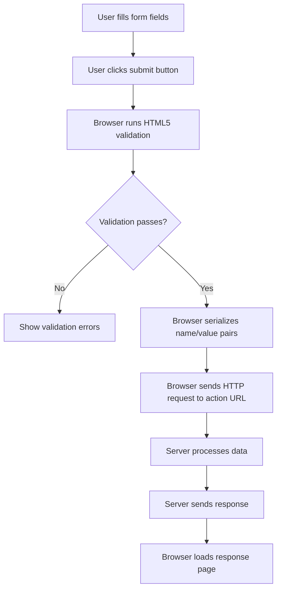
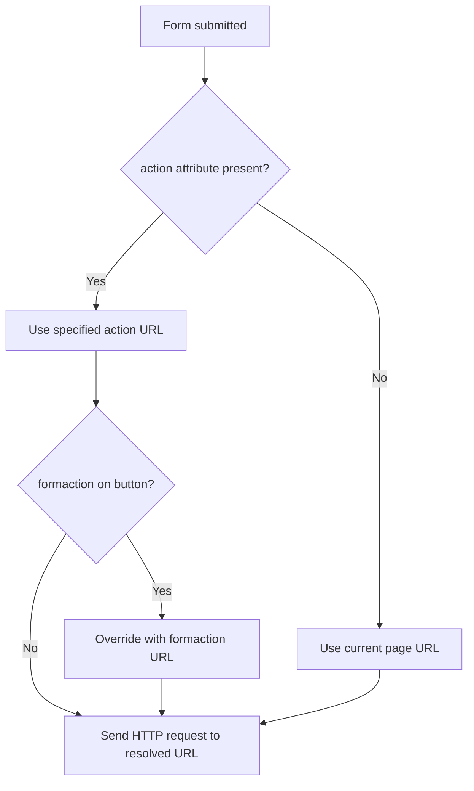
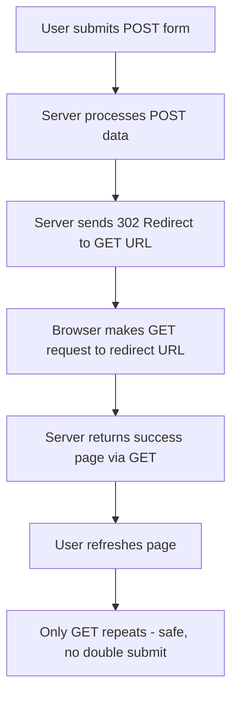
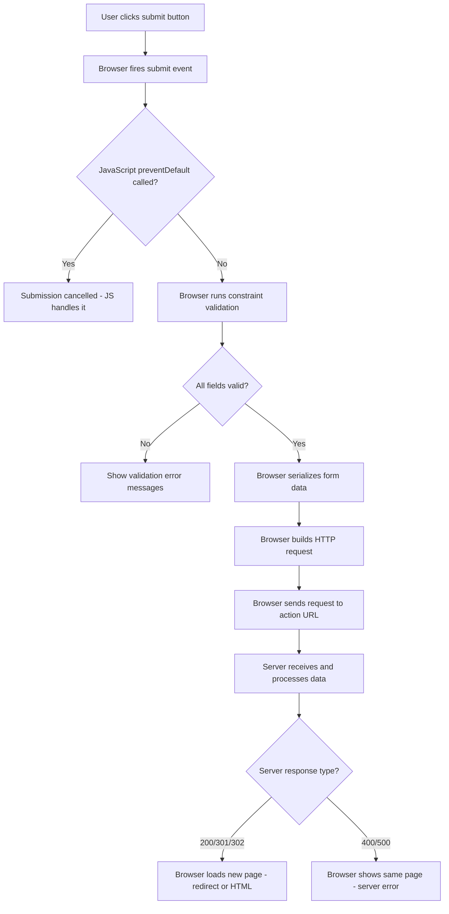
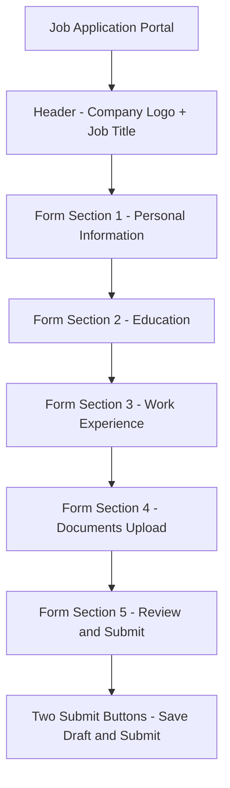

<a id="chapter-15-html-forms-basics"></a>

# Chapter 15: HTML Forms Basics

[⬅ Previous Chapter](#chapter-14-html-tables) | [📖 Main Index](#main-index) | [Next Chapter ➡](#chapter-16-html-input-types)

---

## 📌 Learning Objectives

By the end of this chapter, you will:

**Understand:**
- How the `<form>` element works and its role in web applications
- The `action` and `method` attributes — what they control
- The fundamental difference between GET and POST methods
- How form submission works — the complete request-response cycle
- How name/value pairs carry form data to the server

**Interview Concepts Covered:**
- GET vs POST — differences, use cases, security implications
- What happens when a form is submitted — step by step
- Why `name` attribute is critical on form controls
- `enctype` attribute and when to use `multipart/form-data`
- Form accessibility — `<label>`, `for`, `id` association
- Difference between `action=""` and no `action` attribute
- `target` attribute on forms — `_self`, `_blank`, `_top`

**Practical Skills:**
- Build semantic, accessible HTML forms
- Understand form data transmission
- Implement GET forms for search
- Implement POST forms for data submission
- Handle form submission correctly

---

<a id="chapter-index-table-15"></a>

## Chapter Index Table

| Topic No. | Topic Name | Subtopics |
|-----------|-----------|-----------|
| 15.1 | [The `<form>` Element](#151-the-form-element) | What is it · Basic syntax · Role in web apps · Void vs container · Key attributes overview |
| 15.2 | [The `action` Attribute](#152-the-action-attribute) | What it does · Absolute URL · Relative URL · Empty action · No action · JavaScript action |
| 15.3 | [The `method` Attribute](#153-the-method-attribute) | GET method · POST method · Default method · How data is sent · Security comparison |
| 15.4 | [GET vs POST — Deep Dive](#154-get-vs-post-deep-dive) | URL encoding · Request body · Bookmarkable · Caching · Idempotency · When to use which |
| 15.5 | [Form Submission — Complete Flow](#155-form-submission-complete-flow) | What happens on submit · Browser steps · Server response · Validation order · Redirect |
| 15.6 | [name/value Pairs](#156-namevalue-pairs) | What they are · How browser builds them · Missing name · Multiple values · URL encoding |
| 15.7 | [Form Attributes Deep Dive](#157-form-attributes-deep-dive) | `enctype` · `target` · `novalidate` · `autocomplete` · `rel` · Form accessibility basics |

---

## 15.1 The `<form>` Element

<a id="151-the-form-element"></a>

### What is it?

The `<form>` element is an HTML **container element** that groups interactive controls — inputs, buttons, checkboxes, dropdowns — and defines how the collected data should be **transmitted to a server** when the user submits the form.

```html
<form action="/submit" method="POST">
  <label for="username">Username:</label>
  <input type="text" id="username" name="username">
  <button type="submit">Submit</button>
</form>
```

---

### Why is it needed?

Every interactive web application — login, registration, search, checkout, contact — requires collecting user input and sending it somewhere for processing. The `<form>` element is the **fundamental HTML mechanism** for this. It:

- Groups related input controls together
- Defines the destination (`action`) where data goes
- Defines the method (`GET`/`POST`) of transmission
- Triggers browser-native data serialization and submission
- Enables built-in HTML5 validation
- Provides accessibility through semantic grouping

---

### What problem does it solve?

Without `<form>`:
- No native way to collect and transmit multiple input values together
- No built-in browser validation
- No semantic grouping of related inputs
- Every submission would require custom JavaScript
- Accessibility tools cannot identify interactive regions

---

### How does it work?

```html
<!-- Complete minimal form -->
<form action="https://example.com/login" method="POST">

  <!-- Label associated with input -->
  <label for="email">Email Address</label>
  <input type="email" id="email" name="email" required>

  <!-- Password field -->
  <label for="password">Password</label>
  <input type="password" id="password" name="password" required>

  <!-- Submit button triggers form submission -->
  <button type="submit">Log In</button>

</form>
```

When the user clicks **Log In**:
1. Browser validates all inputs
2. Browser collects all `name=value` pairs
3. Browser sends an HTTP `POST` request to `https://example.com/login`
4. Server processes the request and responds

---

### Internal Working



---

### Key Characteristics

| Feature | Detail |
|--------|--------|
| Tag | `<form>` |
| Element Type | Block-level container |
| Required Attributes | None technically, but `action` and `method` are essential |
| Children | Any flow content including inputs, buttons, labels |
| Nesting | Forms **cannot** be nested inside other forms |
| Default Method | `GET` |
| Default Action | Current page URL |

---

### Forms Cannot Be Nested

> [!IMPORTANT]
> HTML does **not** allow nesting one `<form>` inside another. The browser will ignore the inner form — only the outermost form is recognized. If you need multiple forms on a page, place them as **siblings**, not nested.

```html
<!-- ❌ WRONG: Nested forms — invalid HTML -->
<form action="/outer" method="POST">
  <input name="field1">
  <form action="/inner" method="POST"> <!-- INVALID -->
    <input name="field2">
  </form>
</form>

<!-- ✅ CORRECT: Sibling forms -->
<form action="/form-one" method="POST">
  <input name="field1">
  <button type="submit">Submit One</button>
</form>

<form action="/form-two" method="POST">
  <input name="field2">
  <button type="submit">Submit Two</button>
</form>
```

---

### `<form>` as a Semantic Landmark

The `<form>` element creates an implicit **form landmark** in the accessibility tree. Screen readers announce it as a form region, helping users understand they are inside an interactive data entry area.

```html
<!-- Adding aria-label makes the landmark more descriptive -->
<form action="/contact" method="POST" aria-label="Contact Us Form">
  <!-- form controls -->
</form>

<!-- Or use aria-labelledby pointing to a heading -->
<h2 id="contact-heading">Contact Us</h2>
<form action="/contact" method="POST" aria-labelledby="contact-heading">
  <!-- form controls -->
</form>
```

---

### 🧠 Hinglish Intuition

> `<form>` ek **collection box** hai — jaise post office ka letterbox. Tum andar kuch daalo (inputs), address likho (action), aur delivery method choose karo (method GET ya POST). Jab submit karo, browser sab kuch pack karke us address pe bhej deta hai.
>
> Bina `<form>` ke inputs sirf dikh te hain — kuch hota nahi. `<form>` inhe activate karta hai — "yeh sab data is jagah bhejo."
>
> Ek important baat — `<form>` ke andar doosra `<form>` nahi rakh sakte. Jaise ek letterbox ke andar doosra letterbox nahi hota. Agar do alag forms chahiye toh side by side rakho.

---

### Real World Usage

```html
<!-- Search form — GET method -->
<form action="/search" method="GET" role="search">
  <label for="query">Search:</label>
  <input type="search" id="query" name="q" placeholder="Search products...">
  <button type="submit">
    Search
  </button>
</form>

<!-- Login form — POST method -->
<form action="/api/login" method="POST" autocomplete="on">
  <h2>Sign In</h2>

  <div class="form-group">
    <label for="email">Email</label>
    <input type="email" id="email" name="email" required autocomplete="email">
  </div>

  <div class="form-group">
    <label for="pass">Password</label>
    <input type="password" id="pass" name="password" required autocomplete="current-password">
  </div>

  <button type="submit">Sign In</button>
</form>
```

---

### Common Mistakes

```html
<!-- ❌ WRONG: Form without action or method — relies on defaults -->
<form>
  <input name="data">
  <button type="submit">Go</button>
</form>
<!-- Submits to current page via GET — often unintentional -->

<!-- ❌ WRONG: Submit button outside form — does nothing -->
<form action="/submit" method="POST">
  <input name="data">
</form>
<button type="submit">Submit</button>
<!-- This button is outside the form — clicking it does nothing -->

<!-- ✅ CORRECT: Button inside form -->
<form action="/submit" method="POST">
  <input name="data">
  <button type="submit">Submit</button>
</form>

<!-- ✅ ALSO CORRECT: Button outside form using form attribute -->
<form id="myForm" action="/submit" method="POST">
  <input name="data">
</form>
<button type="submit" form="myForm">Submit</button>
```

---

### Best Practices

- Always specify both `action` and `method` explicitly — never rely on defaults
- Use `aria-label` or `aria-labelledby` for multiple forms on a page
- Never nest `<form>` elements
- Group related inputs with `<fieldset>` and `<legend>` (covered in Chapter 17)
- Use `role="search"` on search forms for better accessibility

---

### Interview Perspective

> [!IMPORTANT]
> **Most Asked:** "What is the default method of a form if `method` is not specified?"
> Answer: **GET** — the form submits via GET request to the current page URL.
>
> **Common Question:** "Can you nest forms in HTML?"
> Answer: **No** — HTML does not allow nested forms. The inner form is ignored by the browser. Use sibling forms instead.
>
> **Practical Question:** "How can a submit button outside a `<form>` element submit that form?"
> Answer: Use the `form` attribute on the button pointing to the form's `id`: `<button type="submit" form="myFormId">`.

👉 <a href="#chapter-index-table-15">Go to Top 🔝</a>

---

## 15.2 The `action` Attribute

<a id="152-the-action-attribute"></a>

### What is it?

The `action` attribute specifies the **URL where the form data is sent** when the form is submitted. It is the destination address for the form's data payload.

```html
<form action="/api/register" method="POST">
  <!-- form data goes to /api/register on submission -->
</form>
```

---

### Why is it needed?

Without `action`, the browser has no destination for the data. The `action` attribute is the critical link between the HTML form (client side) and the server-side handler that processes the data.

---

### Types of `action` Values

#### Absolute URL

Points to a fully qualified URL — can be on the same or different domain:

```html
<!-- Same domain, full URL -->
<form action="https://mysite.com/contact" method="POST">

<!-- Different domain (cross-origin) -->
<form action="https://api.example.com/submit" method="POST">

<!-- Third-party payment processor -->
<form action="https://checkout.stripe.com/pay" method="POST">
```

---

#### Relative URL

Relative to the current page's location:

```html
<!-- Sends to /submit on the same server -->
<form action="/submit" method="POST">

<!-- Sends to submit.php in the same folder as current page -->
<form action="submit.php" method="POST">

<!-- Sends to parent folder's handler -->
<form action="../process/handler.php" method="POST">
```

---

#### Empty `action` — `action=""`

Explicitly submits to the **current page URL**:

```html
<!-- Submits to the current page -->
<form action="" method="POST">
  <!-- The same page handles submission -->
</form>
```

Used in server-side frameworks where the same URL handles both displaying and processing the form.

---

#### No `action` Attribute

If `action` is completely omitted, the browser submits to the **current page URL** — same behavior as `action=""`:

```html
<!-- Submits to current page (same as action="") -->
<form method="POST">
  <input name="data">
  <button type="submit">Submit</button>
</form>
```

> [!NOTE]
> While `action=""` and missing `action` both submit to the current page, it is best practice to **always explicitly write the `action`**. Missing `action` is ambiguous — a reader cannot tell if it was intentional or forgotten.

---

#### `action` with JavaScript

The `action` can be overridden dynamically, or you can prevent default submission and handle it with JavaScript:

```html
<!-- Form action can be changed via JavaScript -->
<form id="dynamicForm" action="/default-endpoint" method="POST">
  <input name="data" value="test">
  <button type="submit">Submit</button>
</form>

<script>
  // Override action before submission
  document.getElementById('dynamicForm').addEventListener('submit', function(e) {
    e.preventDefault(); // Stop native submission
    this.action = '/new-endpoint'; // Change destination
    this.submit(); // Submit programmatically
  });
</script>
```

---

### `action` on Individual Submit Buttons — `formaction`

The `formaction` attribute on a submit button **overrides the form's `action`** for that specific button:

```html
<form action="/save" method="POST">
  <input type="text" name="content">

  <!-- This button uses form's action: /save -->
  <button type="submit">Save Draft</button>

  <!-- This button overrides action to /publish -->
  <button type="submit" formaction="/publish">Publish Now</button>

  <!-- This button overrides action to /delete -->
  <button type="submit" formaction="/delete">Delete</button>
</form>
```

> [!TIP]
> `formaction` is extremely useful for forms with multiple submission destinations — like a blog editor with "Save Draft", "Preview", and "Publish" buttons that each send to different endpoints without needing multiple `<form>` elements.

---

### 🧠 Hinglish Intuition

> `action` ek **delivery address** hai form ke liye. Jaise courier box pe address likhte ho — "yeh parcel XYZ warehouse jaana chahiye." Form submit hone pe browser us address pe data bhejta hai.
>
> Agar address nahi likha (`action` missing) — courier apne aap current location pe wapas aa jaata hai (current page URL). Technically kaam karta hai, but confusing hai.
>
> `formaction` ek smart feature hai — same form ke alag alag buttons alag alag addresses pe bhej sakte hain. Jaise ek form se "Save", "Publish", "Delete" — teeno alag servers pe jaate hain.

---

### Internal Working



---

### Common Mistakes

```html
<!-- ❌ WRONG: Typo in action URL — 404 error on submit -->
<form action="/subimt" method="POST">
<!-- Should be /submit -->

<!-- ❌ WRONG: action pointing to wrong resource -->
<form action="style.css" method="POST">
<!-- CSS file cannot process form data -->

<!-- ❌ WRONG: Using # as action — submits to same page with hash -->
<form action="#" method="POST">
<!-- Causes page jump on submission -->

<!-- ✅ CORRECT: Use action="" for same-page submission -->
<form action="" method="POST">
```

---

### Best Practices

- Always explicitly write `action` — never rely on the omitted default
- Use relative paths for same-server endpoints — easier to maintain
- Use absolute URLs for cross-domain or external API endpoints
- Use `formaction` on buttons when one form needs multiple submission targets
- Test the action URL independently before connecting the form

---

### Interview Perspective

> [!IMPORTANT]
> **Common Question:** "What is the difference between `action=""` and no `action` attribute?"
> Answer: Both submit to the current page URL. But `action=""` is explicit and intentional. Missing `action` is ambiguous — could be intentional or a mistake. Always write `action` explicitly.
>
> **Practical Question:** "How can different submit buttons in the same form send data to different URLs?"
> Answer: Use the `formaction` attribute on individual `<button type="submit">` elements. `formaction` overrides the form's `action` for that specific button only.

👉 <a href="#chapter-index-table-15">Go to Top 🔝</a>

---

## 15.3 The `method` Attribute

<a id="153-the-method-attribute"></a>

### What is it?

The `method` attribute specifies the **HTTP method** used to send form data to the server. It tells the browser how to package and transmit the form data.

```html
<!-- GET method -->
<form action="/search" method="GET">

<!-- POST method -->
<form action="/login" method="POST">
```

---

### Why is it needed?

HTTP has multiple methods for different types of operations. `method` tells the browser which HTTP verb to use — which determines **how data is transmitted**, **where data appears**, and **how the server should interpret** the request.

---

### Valid `method` Values for HTML Forms

| Value | HTTP Method | Data Location | Use Case |
|-------|-------------|---------------|---------|
| `get` | GET | URL query string | Search, filtering, navigation |
| `post` | POST | Request body | Login, registration, file upload |
| `dialog` | N/A | Closes dialog | Inside `<dialog>` element only |

> [!NOTE]
> HTML forms natively support only **GET** and **POST**. Other HTTP methods (PUT, PATCH, DELETE) are not supported by HTML forms — they require JavaScript (`fetch` or `XMLHttpRequest`).

---

### GET Method — How Data is Sent

With `method="GET"`, form data is **appended to the URL as query parameters**:

```html
<form action="/search" method="GET">
  <input type="text" name="q" value="HTML forms">
  <input type="text" name="category" value="tutorial">
  <button type="submit">Search</button>
</form>
```

**Resulting URL after submission:**
```
/search?q=HTML+forms&category=tutorial
```

The data becomes visible in the address bar as `?name=value&name=value` pairs.

---

### POST Method — How Data is Sent

With `method="POST"`, form data is sent in the **HTTP request body** — not in the URL:

```html
<form action="/login" method="POST">
  <input type="email" name="email" value="user@example.com">
  <input type="password" name="password" value="secret123">
  <button type="submit">Login</button>
</form>
```

**HTTP Request:**
```
POST /login HTTP/1.1
Host: example.com
Content-Type: application/x-www-form-urlencoded

email=user%40example.com&password=secret123
```

The data is in the **request body** — not visible in the URL.

---

### Default Method

If `method` is omitted, the form uses **GET** by default:

```html
<!-- These are identical: -->
<form action="/search">
<form action="/search" method="GET">
<form action="/search" method="get">
```

> [!IMPORTANT]
> The `method` attribute is **case-insensitive** — `GET`, `get`, `Get` all work. Convention is to use uppercase for clarity.

---

### `formmethod` on Buttons

Like `formaction`, the `formmethod` attribute on a submit button overrides the form's `method`:

```html
<form action="/process" method="POST">
  <input type="text" name="data">

  <!-- Uses form's POST method -->
  <button type="submit">Save (POST)</button>

  <!-- Overrides to GET for preview -->
  <button type="submit" formmethod="GET" formaction="/preview">Preview (GET)</button>
</form>
```

---

### 🧠 Hinglish Intuition

> `method` decide karta hai data **kaise bheja jaayega**.
>
> **GET** — Data URL mein chipka do. Jaise ek postcard pe sab kuch likho — sab log dekh sakte hain. Search queries ke liye perfect — Google ka URL dekho: `google.com/search?q=html+forms`. Woh GET hai.
>
> **POST** — Data ek sealed envelope mein daalo. URL mein kuch nahi dikhta. Login, password, credit card details — yeh sab POST mein jaata hai kyunki sensitive hai aur URL mein nahi dikhna chahiye.
>
> Default GET hai — agar method nahi likha toh URL mein data jaayega. Isliye hamesha method explicitly likho.

---

### Real World Usage

```html
<!-- Search form: GET — URL shareable, bookmarkable -->
<form action="/products" method="GET">
  <input type="search" name="q" placeholder="Search products...">
  <select name="category">
    <option value="electronics">Electronics</option>
    <option value="clothing">Clothing</option>
  </select>
  <input type="number" name="max_price" placeholder="Max price">
  <button type="submit">Search</button>
</form>
<!-- Produces: /products?q=laptop&category=electronics&max_price=50000 -->

<!-- Contact form: POST — data in body, not URL -->
<form action="/contact" method="POST">
  <input type="text" name="name" placeholder="Your name">
  <input type="email" name="email" placeholder="Your email">
  <textarea name="message" placeholder="Your message"></textarea>
  <button type="submit">Send Message</button>
</form>
```

---

### Common Mistakes

```html
<!-- ❌ WRONG: Using GET for sensitive data -->
<form action="/login" method="GET">
  <input type="password" name="password">
</form>
<!-- Password appears in URL: /login?password=secret123 — NEVER do this -->

<!-- ❌ WRONG: Using POST for search/filter forms -->
<form action="/search" method="POST">
  <input type="text" name="q">
</form>
<!-- Search results not bookmarkable, not shareable, breaks back button -->

<!-- ✅ CORRECT: GET for search -->
<form action="/search" method="GET">
  <input type="text" name="q">
</form>

<!-- ✅ CORRECT: POST for login -->
<form action="/login" method="POST">
  <input type="password" name="password">
</form>
```

---

### Best Practices

- Use **GET** for: search, filtering, navigation, any idempotent read operation
- Use **POST** for: login, registration, payment, file upload, any data-changing operation
- Never use **GET** for sensitive data — passwords, credit cards, personal info
- Always explicitly write `method` — never rely on the GET default

---

### Interview Perspective

> [!IMPORTANT]
> **Most Asked:** "What is the default form method if `method` is not specified?"
> Answer: **GET** — data is appended to the URL as query parameters.
>
> **Common Question:** "What HTTP methods can HTML forms use natively?"
> Answer: Only **GET** and **POST**. PUT, PATCH, DELETE require JavaScript.
>
> **Security Question:** "Why should you never use GET for password forms?"
> Answer: GET appends data to the URL. Passwords in URLs appear in browser history, server logs, referrer headers, and are visible to anyone who can see the screen — a severe security risk.

👉 <a href="#chapter-index-table-15">Go to Top 🔝</a>

---

## 15.4 GET vs POST — Deep Dive

<a id="154-get-vs-post-deep-dive"></a>

### What is it?

GET and POST are the two HTTP methods available to HTML forms. They differ fundamentally in **how data is transmitted**, **what the data is used for**, and **what security and performance implications** each carries.

---

### Why is it needed?

Understanding GET vs POST is fundamental to web development and one of the **most frequently asked interview questions**. The correct choice affects security, usability, caching, bookmarking, and server-side processing.

---

### Complete Comparison Table

| Feature | GET | POST |
|---------|-----|------|
| **Data location** | URL query string | HTTP request body |
| **Visibility** | Visible in URL | Not visible in URL |
| **Browser history** | Saved in history | Not saved |
| **Bookmarkable** | ✅ Yes | ❌ No |
| **Cacheable** | ✅ Yes | ❌ No (by default) |
| **Data length limit** | ~2048 characters (browser dependent) | No practical limit |
| **Data types** | ASCII text only | Any data type including binary |
| **File upload** | ❌ Not supported | ✅ Supported |
| **Idempotent** | ✅ Yes (same result each call) | ❌ No (may create/modify data) |
| **Safe** | ✅ Read-only semantics | ❌ May modify server data |
| **Back button** | Re-submits without warning | Browser shows re-submission warning |
| **Security** | Less secure (data in URL) | More secure (data in body) |
| **Server logs** | URL logged (data visible) | Body not typically logged |

---

### GET — Detailed Explanation

```http
GET /search?q=html+tutorial&lang=en&page=2 HTTP/1.1
Host: example.com
```

**What happens:**
- Form data becomes part of the URL
- URL can be shared, bookmarked, indexed by search engines
- Subsequent identical requests return same result (idempotent)
- No side effects — GET should never modify server data
- Browser can cache the response

**Real-world GET examples:**
- Google search: `google.com/search?q=your+query`
- E-commerce filter: `/products?category=shoes&color=red&size=10`
- Pagination: `/articles?page=3&per_page=20`
- Sorting: `/users?sort=name&order=asc`

---

### POST — Detailed Explanation

```http
POST /register HTTP/1.1
Host: example.com
Content-Type: application/x-www-form-urlencoded
Content-Length: 47

name=Priya+Sharma&email=priya%40example.com
```

**What happens:**
- Form data goes into the HTTP request body
- URL remains clean — no data appended
- Not idempotent — submitting twice may create two records
- Browser warns before re-submission (back button / refresh)
- Not cached by default
- Supports any data size and binary data (file uploads)

**Real-world POST examples:**
- User login: sends credentials securely
- Registration: creates new user account
- File upload: sends binary file data
- Payment: sends transaction details
- Comment submission: creates new comment

---

### URL Encoding

Both GET and POST encode special characters in data. The default encoding is `application/x-www-form-urlencoded`:

```
Original: Hello World! & name=Priya
Encoded:  Hello+World%21+%26+name%3DPriya
```

| Character | Encoded |
|-----------|---------|
| Space | `+` or `%20` |
| `&` | `%26` |
| `=` | `%3D` |
| `@` | `%40` |
| `/` | `%2F` |
| `?` | `%3F` |

---

### Idempotency — Critical Concept

> [!IMPORTANT]
> **Idempotent** means making the same request multiple times produces the same result.
>
> **GET is idempotent** — searching "HTML tutorial" 100 times gives 100 identical results. No data changes.
>
> **POST is NOT idempotent** — submitting a "Create Order" form 3 times creates 3 separate orders. This is why browsers show "Are you sure you want to resubmit?" when you press Back/Refresh after a POST.

---

### The POST-Redirect-GET Pattern

To solve the double-submission problem with POST, servers use the **PRG (Post/Redirect/Get)** pattern:



```
1. User submits: POST /checkout
2. Server creates order, sends: 302 Redirect → /order-confirmation?id=12345
3. Browser follows: GET /order-confirmation?id=12345
4. User sees confirmation page
5. User refreshes → Only GET /order-confirmation repeats → Safe!
```

---

### 🧠 Hinglish Intuition

> **GET** — Postcard. Sab kuch openly likha hai — naam, address, message. Koi bhi dekh sakta hai. Bookmark kar sakte ho, share kar sakte ho. Search queries ke liye perfect — "main kya search kar raha tha" URL se pata chalta hai.
>
> **POST** — Sealed envelope. Andar kya hai, sirf receiver jaanta hai. Password, credit card — yeh sab envelope mein jaata hai. URL clean rehti hai.
>
> **Idempotency trick** — GET baar baar karo, same result. POST baar baar karo, naya naya record banta hai. Isliye browser POST ke baad refresh pe warning deta hai: "Kya aap form dobara submit karna chahte ho?" — kyunki second submit ek naya order/account bana sakta hai.
>
> **PRG Pattern** — Best practice. POST karo → server process kare → 302 redirect bheje → browser GET pe jaaye. Ab refresh safe hai — sirf GET repeat hota hai, POST nahi.

---

### Security Comparison

```
GET Security Issues:
❌ Data visible in URL bar
❌ Data stored in browser history
❌ Data appears in server access logs
❌ Data in Referer header when navigating away
❌ Data visible on screen (shoulder surfing)
❌ No protection for sensitive data

POST Security Improvements:
✅ Data not in URL (not in history, logs)
✅ HTTPS encrypts entire request including body
⚠️ Still NOT secure without HTTPS
⚠️ Data still visible in browser DevTools
⚠️ Not a replacement for proper encryption
```

> [!IMPORTANT]
> POST does not make data secure by itself. POST simply keeps data **out of the URL**. For true security, you must use **HTTPS** (TLS encryption). Without HTTPS, POST data can still be intercepted in transit.

---

### Practical Comparison Examples

```html
<!-- ✅ CORRECT: GET for product search -->
<form action="/products" method="GET">
  <input type="text" name="q" placeholder="Search...">
  <select name="sort">
    <option value="price_asc">Price: Low to High</option>
    <option value="price_desc">Price: High to Low</option>
  </select>
  <button type="submit">Search</button>
</form>
<!-- URL: /products?q=laptop&sort=price_asc — shareable, bookmarkable -->

<!-- ✅ CORRECT: POST for account creation -->
<form action="/register" method="POST">
  <input type="text" name="fullname" placeholder="Full Name">
  <input type="email" name="email" placeholder="Email">
  <input type="password" name="password" placeholder="Password">
  <button type="submit">Create Account</button>
</form>
<!-- Data in request body — not in URL -->
```

---

### Common Mistakes

```html
<!-- ❌ WRONG: GET for login with password -->
<form action="/login" method="GET">
  <input type="email" name="email">
  <input type="password" name="password">
  <button type="submit">Login</button>
</form>
<!-- URL becomes: /login?email=user@example.com&password=MyPassword123 -->
<!-- Catastrophic security failure! -->

<!-- ❌ WRONG: POST for a search form -->
<form action="/search" method="POST">
  <input type="text" name="query">
  <button type="submit">Search</button>
</form>
<!-- Search results cannot be bookmarked or shared -->
<!-- Back button shows re-submission warning -->
```

---

### Best Practices

- **GET**: Search, filters, sorting, pagination, any read-only operation
- **POST**: Create, update, delete, login, payment, file upload
- Never send passwords, tokens, or sensitive data via GET
- Always use HTTPS for POST forms with sensitive data
- Implement PRG pattern on server to prevent double POST submission
- Test both methods in browser DevTools Network tab to verify data location

---

### Interview Perspective

> [!IMPORTANT]
> **Most Asked Interview Question:** "What is the difference between GET and POST?"
> This is asked in nearly every frontend/backend interview. Cover:
> 1. Data location (URL vs body)
> 2. Visibility and security
> 3. Bookmarkable/cacheable (GET yes, POST no)
> 4. Data size limits
> 5. Idempotency
> 6. When to use each
>
> **Advanced Follow-up:** "What is the PRG pattern?"
> Answer: Post/Redirect/Get — after a POST, server redirects to a GET URL. Prevents double submission on browser refresh. Standard pattern for form-based web applications.

👉 <a href="#chapter-index-table-15">Go to Top 🔝</a>

---

## 15.5 Form Submission — Complete Flow

<a id="155-form-submission-complete-flow"></a>

### What is it?

Form submission is the **complete sequence of events** that occurs from the moment a user clicks a submit button to when the browser displays the server's response. Understanding this flow is fundamental to debugging forms and building reliable web applications.

---

### Why is it needed?

Understanding the complete submission flow helps you:
- Debug why forms are not submitting
- Understand where validation happens
- Know when to use `preventDefault()`
- Understand server responses and redirects
- Build reliable form handling

---

### Complete Submission Flow — Step by Step



---

### Step 1: Submit Event Fires

When a user clicks a submit button (or presses Enter in a text field), the browser fires the `submit` event on the `<form>` element:

```html
<form id="myForm" action="/submit" method="POST">
  <input type="text" name="username" required>
  <button type="submit">Submit</button>
</form>
```

```javascript
// JavaScript can intercept the submit event
document.getElementById('myForm').addEventListener('submit', function(event) {
  // event fires BEFORE browser sends the request
  console.log('Form submit event fired');

  // event.preventDefault() stops native submission
  // event.preventDefault();
});
```

---

### Step 2: Constraint Validation

Before sending any data, the browser runs **HTML5 constraint validation** — checking `required`, `minlength`, `type`, `pattern`, and other validation attributes:

```html
<form action="/register" method="POST">
  <!-- required: field cannot be empty -->
  <input type="text" name="name" required>

  <!-- type="email": must be valid email format -->
  <input type="email" name="email" required>

  <!-- minlength: minimum character count -->
  <input type="password" name="password" required minlength="8">

  <button type="submit">Register</button>
</form>
```

If any validation fails:
- Browser shows native validation error tooltip
- Form does **not** submit
- No HTTP request is made
- The `submit` event does **not** fire (validation happens before the event in some browsers)

> [!NOTE]
> Technically, the `submit` event fires **after** constraint validation in modern browsers. If validation fails, no `submit` event fires. This is why `event.preventDefault()` in a submit handler does not bypass HTML5 validation — the event only fires if validation passes.

---

### Step 3: Data Serialization

After validation passes, the browser collects all form control values with a `name` attribute:

```html
<form action="/order" method="POST">
  <input type="text"   name="product"  value="Laptop">
  <input type="number" name="quantity" value="2">
  <input type="text"   name="coupon"   value="">
  <!-- No name attribute — NOT included -->
  <input type="text" value="ignored">
  <button type="submit" name="action" value="buy">Buy Now</button>
</form>
```

**Serialized data:**
```
product=Laptop&quantity=2&coupon=&action=buy
```

Rules:
- Only controls with a `name` attribute are included
- Disabled controls are excluded
- Empty values are included (as empty string)
- The clicked submit button's name/value IS included

---

### Step 4: HTTP Request Construction

Browser builds the HTTP request based on `method` and `enctype`:

**GET request:**
```http
GET /search?q=html+tutorial&page=1 HTTP/1.1
Host: example.com
```

**POST request:**
```http
POST /order HTTP/1.1
Host: example.com
Content-Type: application/x-www-form-urlencoded
Content-Length: 43

product=Laptop&quantity=2&action=buy
```

---

### Step 5: Server Processing and Response

The server receives the request, processes the data, and responds with one of:

| Response | Browser Behavior |
|----------|-----------------|
| `200 OK` + HTML | Browser renders the HTML in place |
| `301 Moved Permanently` | Browser follows redirect to new URL |
| `302 Found` (Temporary Redirect) | Browser follows redirect — standard PRG pattern |
| `400 Bad Request` | Browser shows error page |
| `500 Internal Server Error` | Browser shows error page |

---

### Triggering Submission Programmatically

```html
<form id="autoForm" action="/submit" method="POST">
  <input type="hidden" name="timestamp" id="ts">
  <input type="text" name="data">
  <button type="submit">Submit</button>
</form>

<script>
  // Set timestamp before submission
  document.getElementById('ts').value = Date.now();

  // Programmatic submission — bypasses HTML5 validation
  document.getElementById('autoForm').submit();
  // Note: .submit() does NOT fire the submit event
  // and does NOT run HTML5 constraint validation

  // To submit with validation and event:
  document.getElementById('autoForm')
    .querySelector('[type=submit]')
    .click(); // Simulates click — fires event and runs validation
</script>
```

> [!IMPORTANT]
> `form.submit()` called via JavaScript **bypasses HTML5 constraint validation** and does **not fire the submit event**. If you need validation, trigger a click on the submit button instead, or validate manually before calling `.submit()`.

---

### Preventing Default Submission

In modern web apps, JavaScript often intercepts form submission to:
- Send data via AJAX (Fetch API) instead of page reload
- Perform custom validation
- Show loading states

```html
<form id="ajaxForm" action="/api/subscribe" method="POST">
  <input type="email" name="email" required placeholder="Enter email">
  <button type="submit">Subscribe</button>
</form>

<script>
  document.getElementById('ajaxForm').addEventListener('submit', async function(e) {
    e.preventDefault(); // Stop native form submission (page reload)

    // Collect form data
    const formData = new FormData(this);

    try {
      // Send via Fetch API — no page reload
      const response = await fetch(this.action, {
        method: this.method,
        body: new URLSearchParams(formData)
      });

      const result = await response.json();
      console.log('Success:', result);
    } catch (error) {
      console.error('Error:', error);
    }
  });
</script>
```

---

### 🧠 Hinglish Intuition

> Form submit hone ki poori kahani:
>
> 1. **User click karta hai** → Browser "submit" event fire karta hai
> 2. **JavaScript check** → Agar `preventDefault()` call hua → submission ruk jaata hai
> 3. **Validation** → Browser required, email format, minlength check karta hai → fail? Error dikhao, submit nahi
> 4. **Data collect** → Sab `name` wale inputs ki values collect hoti hain
> 5. **Request banta hai** → GET? URL mein data. POST? Body mein data
> 6. **Server pe jaata hai** → Server process karta hai
> 7. **Response aata hai** → Browser naya page load karta hai
>
> `form.submit()` JavaScript se call karo → validation skip hoti hai, event nahi firta. Isliye agar validation chahiye toh submit button ka `.click()` simulate karo.

---

### Common Mistakes

```html
<!-- ❌ WRONG: Button type not specified — may not submit -->
<button>Submit</button>
<!-- Default type inside form is "submit" but explicit is better -->

<!-- ✅ CORRECT: Always specify type -->
<button type="submit">Submit</button>

<!-- ❌ WRONG: Input type="button" — does NOT submit form -->
<input type="button" value="Submit">
<!-- type="button" never submits — must be type="submit" -->

<!-- ✅ CORRECT: type="submit" -->
<input type="submit" value="Submit">
<!-- Or: -->
<button type="submit">Submit</button>
```

---

### Best Practices

- Always use `<button type="submit">` — explicit and flexible (can contain HTML)
- Add loading state to submit button during submission to prevent double-clicks
- Use PRG pattern on server for POST forms
- Test submission in DevTools Network tab — verify request method, URL, and body
- Handle submission errors gracefully — show user-friendly error messages

---

### Interview Perspective

> [!IMPORTANT]
> **Common Question:** "What happens when a form is submitted?"
> Answer: Submit event fires → browser validates → serializes name/value pairs → builds HTTP request → sends to action URL → server responds → browser loads response.
>
> **Tricky Question:** "Does `form.submit()` in JavaScript run HTML5 validation?"
> Answer: **No.** `form.submit()` bypasses constraint validation and does not fire the submit event. To trigger validation, simulate a click on the submit button.
>
> **AJAX Question:** "How do you prevent form from reloading the page on submit?"
> Answer: Use `event.preventDefault()` in the submit event listener, then send data via `fetch()` or `XMLHttpRequest`.

👉 <a href="#chapter-index-table-15">Go to Top 🔝</a>

---

## 15.6 name/value Pairs

<a id="156-namevalue-pairs"></a>

### What is it?

**Name/value pairs** are the fundamental data unit of HTML form submission. Every form control that participates in submission must have a `name` attribute — this becomes the **key**, and the user's input becomes the **value**.

```html
<!-- name="username" → key -->
<!-- value entered by user → value -->
<input type="text" name="username" value="Priya">
<!-- Produces: username=Priya -->
```

---

### Why is it needed?

The server needs to know **which input corresponds to which data field**. If you send `Priya` without context, the server doesn't know if it's a username, a city, or a product name. The `name` attribute provides the label — `username=Priya` is unambiguous.

---

### How the Browser Builds Name/Value Pairs

```html
<form action="/profile" method="POST">
  <input type="text"     name="fullname"  value="Priya Sharma">
  <input type="email"    name="email"     value="priya@example.com">
  <input type="number"   name="age"       value="28">
  <input type="checkbox" name="newsletter" checked>
  <select name="country">
    <option value="IN" selected>India</option>
    <option value="US">USA</option>
  </select>
  <textarea name="bio">Frontend developer</textarea>
  <button type="submit" name="action" value="save">Save Profile</button>
</form>
```

**Serialized data sent to server:**
```
fullname=Priya+Sharma&email=priya%40example.com&age=28&newsletter=on&country=IN&bio=Frontend+developer&action=save
```

---

### The `name` Attribute is CRITICAL

> [!IMPORTANT]
> A form control **without a `name` attribute is completely excluded** from form submission — its value is never sent to the server. This is one of the most common debugging issues beginners face.

```html
<form action="/submit" method="POST">
  <!-- ✅ Included in submission: name="username" -->
  <input type="text" name="username" value="Priya">

  <!-- ❌ NOT included: no name attribute -->
  <input type="text" id="city" value="Mumbai">

  <!-- ❌ NOT included: disabled elements -->
  <input type="text" name="code" value="ABC123" disabled>

  <!-- ✅ Included: readonly elements ARE sent -->
  <input type="text" name="plan" value="Pro" readonly>

  <button type="submit">Submit</button>
</form>
```

**Serialized data:** only `username=Priya&plan=Pro` — city and code are excluded.

---

### Rules for Form Control Inclusion

| Condition | Included in Submission? |
|-----------|------------------------|
| Has `name` attribute | ✅ Yes |
| Missing `name` attribute | ❌ No |
| Has `disabled` attribute | ❌ No |
| Has `readonly` attribute | ✅ Yes (readonly is included) |
| Unchecked checkbox | ❌ No (nothing sent for unchecked) |
| Checked checkbox | ✅ Yes (sends `name=on` or `name=value`) |
| Unselected radio | ❌ No |
| Selected radio | ✅ Yes |
| `<button type="submit">` — clicked | ✅ Yes (if has name) |
| `<button type="submit">` — not clicked | ❌ No (only clicked submit button) |

---

### Checkbox Behavior

Checkboxes have unique behavior — if unchecked, nothing is sent:

```html
<form action="/preferences" method="POST">
  <!-- Checked: sends newsletter=on -->
  <input type="checkbox" name="newsletter" checked>

  <!-- Unchecked: sends NOTHING for this field -->
  <input type="checkbox" name="promotions">

  <!-- Custom value when checked: sends alerts=email -->
  <input type="checkbox" name="alerts" value="email" checked>

  <button type="submit">Save</button>
</form>
```

**Sent data (when first and third are checked):**
```
newsletter=on&alerts=email
```

**Server trick:** To know if a checkbox was unchecked, send a hidden field with the same name:

```html
<!-- Hidden field acts as default "off" value -->
<input type="hidden" name="newsletter" value="off">
<!-- Checkbox value "on" overrides hidden if checked -->
<input type="checkbox" name="newsletter" value="on">
```

---

### Multiple Values with Same Name

Multiple controls can share the same `name` — the server receives an array:

```html
<form action="/order" method="POST">
  <!-- Multiple checkboxes with same name -->
  <input type="checkbox" name="sizes" value="S" checked>Small
  <input type="checkbox" name="sizes" value="M" checked>Medium
  <input type="checkbox" name="sizes" value="L">Large

  <!-- Multiple select -->
  <select name="colors" multiple>
    <option value="red" selected>Red</option>
    <option value="blue" selected>Blue</option>
    <option value="green">Green</option>
  </select>

  <button type="submit">Order</button>
</form>
```

**Sent data:**
```
sizes=S&sizes=M&colors=red&colors=blue
```

Server receives `sizes` as array `["S", "M"]` and `colors` as `["red", "blue"]`.

---

### Hidden Fields — `type="hidden"`

Hidden inputs pass data to the server that the user doesn't see or change:

```html
<form action="/update-profile" method="POST">
  <!-- Hidden: user ID — user can't see or change -->
  <input type="hidden" name="user_id" value="12345">
  <input type="hidden" name="csrf_token" value="abc123xyz">
  <input type="hidden" name="timestamp" value="1703001600">

  <!-- Visible inputs user fills -->
  <input type="text" name="display_name" placeholder="Display Name">

  <button type="submit">Update</button>
</form>
```

**Sent data:**
```
user_id=12345&csrf_token=abc123xyz&timestamp=1703001600&display_name=Priya
```

> [!IMPORTANT]
> Hidden fields are **not secure** — they are visible in page source (right-click → View Source). Never use hidden fields for sensitive data like passwords. Use them for non-sensitive context data like user IDs, CSRF tokens, and page states.

---

### URL Encoding in Name/Value Pairs

Special characters in names and values are URL-encoded:

```
Original:  name="user email", value="priya@example.com"
Encoded:   user+email=priya%40example.com

Original:  name="message", value="Hello & Goodbye!"
Encoded:   message=Hello+%26+Goodbye%21
```

The browser handles encoding automatically — you write normal values and the browser encodes them before transmission.

---

### The `FormData` API

JavaScript can inspect name/value pairs using `FormData`:

```html
<form id="myForm" action="/submit" method="POST">
  <input type="text" name="username" value="Priya">
  <input type="email" name="email" value="priya@example.com">
  <button type="submit">Submit</button>
</form>

<script>
  document.getElementById('myForm').addEventListener('submit', function(e) {
    e.preventDefault();

    // FormData automatically collects all name/value pairs
    const formData = new FormData(this);

    // Iterate all pairs
    for (let [name, value] of formData.entries()) {
      console.log(`${name}: ${value}`);
      // username: Priya
      // email: priya@example.com
    }

    // Get specific value
    console.log(formData.get('username')); // "Priya"

    // Convert to URL-encoded string
    const urlEncoded = new URLSearchParams(formData).toString();
    console.log(urlEncoded); // username=Priya&email=priya%40example.com
  });
</script>
```

---

### 🧠 Hinglish Intuition

> Name/value pairs ek **labeled packet system** hai. Sirf value bhejne se kaam nahi chalta — "Priya" — server nahi jaanta yeh kya hai.
>
> `name="username"` + `value="Priya"` = "username ka packet hai jisme Priya hai."
>
> **Sabse common mistake** — `name` attribute bhool jaana. Bina name ke input ka data kabhi server pe nahi pahunchta. Form mein data type karo, submit karo — server pe kuch nahi? Pehle check karo sab inputs pe `name` hai ya nahi.
>
> **Checkbox trick** — Unchecked checkbox kuch nahi bhejta. Agar server ko "off" condition bhi jaanni hai, ek hidden field same name se pehle daalo. Checkbox checked hoga toh uski value override karegi hidden value ko.

---

### Common Mistakes

```html
<!-- ❌ WRONG: Missing name — data never sent -->
<input type="text" id="username" placeholder="Username">
<!-- id is for CSS/JS, name is for form submission — different! -->

<!-- ✅ CORRECT: Both id (for label/JS) and name (for submission) -->
<input type="text" id="username" name="username" placeholder="Username">

<!-- ❌ WRONG: Assuming disabled fields are sent -->
<input type="text" name="code" value="PROMO20" disabled>
<!-- disabled fields are NOT sent to server -->

<!-- ✅ CORRECT: Use readonly if you want the value sent -->
<input type="text" name="code" value="PROMO20" readonly>
```

---

### Best Practices

- Always add `name` attribute to every input that should be submitted
- Use `id` for CSS/JavaScript targeting, `name` for form submission
- Remember: `disabled` = not submitted; `readonly` = submitted
- Use `type="hidden"` for context data (user ID, CSRF tokens, timestamps)
- Use `FormData` API in JavaScript to inspect what data would be submitted
- Name your fields clearly — server-side handlers depend on these names

---

### Interview Perspective

> [!IMPORTANT]
> **Most Asked:** "Why is the `name` attribute important on form inputs?"
> Answer: The `name` attribute is the **key** in the key-value pair sent to the server. Without `name`, the browser excludes the input entirely from form submission — the value is never transmitted.
>
> **Tricky Question:** "What is the difference between `id` and `name` on an input element?"
> - `id` — Unique identifier for CSS styling, JavaScript selection, and `<label for>` association
> - `name` — Key for form submission. The server receives data as `name=value`
> They serve completely different purposes and should both be present on form inputs.
>
> **Checkbox Question:** "What value does an unchecked checkbox send?"
> Answer: **Nothing** — unchecked checkboxes are completely excluded from form data. Checked checkboxes send `name=on` (or `name=customvalue` if `value` attribute is set).

👉 <a href="#chapter-index-table-15">Go to Top 🔝</a>

---

## 15.7 Form Attributes Deep Dive

<a id="157-form-attributes-deep-dive"></a>

### What is it?

Beyond `action` and `method`, the `<form>` element supports several important attributes that control **encoding, target window, validation behavior, autocomplete, and security**.

---

### The `enctype` Attribute

`enctype` (encoding type) specifies how the form data is encoded before sending to the server. Only relevant for **POST** method.

| Value | When to Use |
|-------|-------------|
| `application/x-www-form-urlencoded` | Default — all text data |
| `multipart/form-data` | **Required** for file uploads |
| `text/plain` | Plain text — rarely used, for debugging |

---

#### `application/x-www-form-urlencoded` (Default)

```html
<!-- Default enctype — no need to write it explicitly -->
<form action="/submit" method="POST" enctype="application/x-www-form-urlencoded">
  <input type="text" name="name" value="Priya Sharma">
  <input type="text" name="city" value="Mumbai">
  <button type="submit">Submit</button>
</form>
```

**Request body:**
```
name=Priya+Sharma&city=Mumbai
```

Data is URL-encoded. Works for all text data. Does NOT work for file uploads.

---

#### `multipart/form-data` — File Uploads

```html
<!-- REQUIRED for file uploads -->
<form action="/upload" method="POST" enctype="multipart/form-data">
  <input type="text" name="username" value="Priya">
  <input type="file" name="avatar">
  <button type="submit">Upload</button>
</form>
```

**Request body (multipart):**
```
--boundary12345
Content-Disposition: form-data; name="username"

Priya
--boundary12345
Content-Disposition: form-data; name="avatar"; filename="photo.jpg"
Content-Type: image/jpeg

[binary file data here]
--boundary12345--
```

> [!IMPORTANT]
> If you have `<input type="file">` in your form, you **MUST** set `enctype="multipart/form-data"`. Without it, only the filename is sent — not the actual file content. This is one of the most common file upload bugs.

---

#### `formenctype` on Buttons

Like `formaction` and `formmethod`, `formenctype` on a submit button overrides the form's `enctype`:

```html
<form action="/submit" method="POST">
  <input type="text" name="data">
  <input type="file" name="file">

  <!-- Normal text submission -->
  <button type="submit">Submit Text Only</button>

  <!-- File upload submission -->
  <button type="submit" formenctype="multipart/form-data">
    Upload File
  </button>
</form>
```

---

### The `target` Attribute

`target` specifies where to display the server's response after form submission:

| Value | Behavior |
|-------|---------|
| `_self` | Current tab/window (default) |
| `_blank` | New tab/window |
| `_parent` | Parent frame |
| `_top` | Full browser window (breaks out of frames) |
| `framename` | Specific named `<iframe>` |

```html
<!-- Opens response in new tab -->
<form action="/generate-report" method="POST" target="_blank">
  <input type="date" name="from_date">
  <input type="date" name="to_date">
  <button type="submit">Generate Report</button>
</form>

<!-- Opens response in named iframe -->
<iframe name="preview-frame" title="Preview Area"></iframe>
<form action="/preview" method="POST" target="preview-frame">
  <textarea name="content"></textarea>
  <button type="submit">Preview</button>
</form>
```

---

### The `novalidate` Attribute

`novalidate` is a boolean attribute that **disables HTML5 browser validation** for the form:

```html
<!-- Disables all browser validation -->
<form action="/submit" method="POST" novalidate>
  <input type="email" name="email" required>
  <!-- Browser will NOT validate email format or required -->
  <button type="submit">Submit</button>
</form>
```

**When to use `novalidate`:**
- When implementing custom JavaScript validation with better UX
- When testing form submission without fighting validation
- When server-side validation is the only validation needed
- When building custom validation UI that conflicts with browser defaults

```html
<!-- Practical: use novalidate for custom validation -->
<form id="customForm" action="/register" method="POST" novalidate>
  <div class="field-group">
    <label for="email">Email</label>
    <input type="email" id="email" name="email" required>
    <span class="error-message" id="email-error"></span>
  </div>
  <button type="submit">Register</button>
</form>

<script>
  document.getElementById('customForm').addEventListener('submit', function(e) {
    e.preventDefault();
    const email = document.getElementById('email');

    if (!email.value) {
      document.getElementById('email-error').textContent = 'Email is required';
      return;
    }

    if (!/^[^\s@]+@[^\s@]+\.[^\s@]+$/.test(email.value)) {
      document.getElementById('email-error').textContent = 'Please enter a valid email';
      return;
    }

    this.submit(); // All custom validation passed
  });
</script>
```

---

### The `autocomplete` Attribute

`autocomplete` controls whether the browser should offer to auto-fill form fields:

```html
<!-- Enable autocomplete for entire form (default) -->
<form action="/login" method="POST" autocomplete="on">
  <input type="email" name="email" autocomplete="email">
  <input type="password" name="password" autocomplete="current-password">
</form>

<!-- Disable autocomplete for entire form -->
<form action="/otp-verify" method="POST" autocomplete="off">
  <input type="text" name="otp" placeholder="Enter OTP">
</form>

<!-- Mixed: form off, but specific field on -->
<form autocomplete="off">
  <input name="username" autocomplete="username">
  <!-- This specific field still gets autocomplete -->
</form>
```

**Common `autocomplete` values for inputs:**

| Value | Meaning |
|-------|---------|
| `name` | Full name |
| `email` | Email address |
| `username` | Username |
| `current-password` | Current password |
| `new-password` | New password |
| `tel` | Phone number |
| `address-line1` | Street address |
| `postal-code` | Postal/ZIP code |
| `cc-number` | Credit card number |
| `off` | Do not autocomplete |

---

### The `rel` Attribute

The `rel` attribute on forms specifies the relationship between the current document and the form's target:

```html
<!-- noopener noreferrer for external form targets -->
<form action="https://external-service.com/api" method="POST" 
      target="_blank" rel="noopener noreferrer">
  <!-- Prevents the new tab from accessing window.opener -->
</form>
```

---

### Form Accessibility Basics

Every form needs accessible markup — associating labels with inputs:

```html
<!-- Method 1: for/id association (most common) -->
<label for="email">Email Address</label>
<input type="email" id="email" name="email" required>

<!-- Method 2: Wrapping label (implicit association) -->
<label>
  Email Address
  <input type="email" name="email" required>
</label>

<!-- Method 3: aria-label for inputs without visible label -->
<input type="search" name="q" aria-label="Search products">

<!-- Method 4: aria-labelledby -->
<span id="email-label">Email Address</span>
<input type="email" name="email" aria-labelledby="email-label">
```

> [!IMPORTANT]
> Every visible form input must have an associated `<label>`. Without a label:
> - Screen readers announce the input as "Edit text" with no context
> - Clicking the label doesn't focus the input
> - Touch target is smaller (only the input, not label + input)
> The `for` attribute on label must match the `id` on input — NOT the `name`.

---

### Complete Form with All Best-Practice Attributes

```html
<form
  id="registration-form"
  action="/api/register"
  method="POST"
  enctype="application/x-www-form-urlencoded"
  autocomplete="on"
  novalidate
  aria-labelledby="form-heading"
>
  <h2 id="form-heading">Create Your Account</h2>

  <div class="form-group">
    <label for="reg-name">Full Name <span aria-hidden="true">*</span></label>
    <input
      type="text"
      id="reg-name"
      name="fullname"
      required
      autocomplete="name"
      aria-required="true"
      placeholder="Priya Sharma"
    >
  </div>

  <div class="form-group">
    <label for="reg-email">Email Address <span aria-hidden="true">*</span></label>
    <input
      type="email"
      id="reg-email"
      name="email"
      required
      autocomplete="email"
      aria-required="true"
      placeholder="priya@example.com"
    >
  </div>

  <div class="form-group">
    <label for="reg-password">Password <span aria-hidden="true">*</span></label>
    <input
      type="password"
      id="reg-password"
      name="password"
      required
      autocomplete="new-password"
      aria-required="true"
      minlength="8"
    >
  </div>

  <!-- Hidden: CSRF token for security -->
  <input type="hidden" name="csrf_token" value="abc123xyz">

  <button type="submit">Create Account</button>

</form>
```

---

### 🧠 Hinglish Intuition

> **`enctype`** — Data ka packaging format. Normal text ke liye default (`x-www-form-urlencoded`) theek hai. File upload ke liye `multipart/form-data` zaroori hai — agar bhool gaye, file kabhi server pe nahi pahunchegi.
>
> **`novalidate`** — Browser ka built-in validation band karo. Tab use karo jab apna custom validation banana ho — jaise professional forms mein custom error messages aur styling chahiye.
>
> **`autocomplete`** — Browser ki yaaddasht. `autocomplete="email"` se browser saved emails suggest karta hai. OTP ya PIN ke liye `autocomplete="off"` rakho — wahan purani values suggest nahi karni.
>
> **`target="_blank"`** — Response naye tab mein khulega. PDF reports ya preview ke liye useful. Saath mein `rel="noopener noreferrer"` zaroori hai security ke liye.

---

### Common Mistakes

```html
<!-- ❌ WRONG: File upload without multipart enctype -->
<form action="/upload" method="POST">
  <input type="file" name="document">
  <button type="submit">Upload</button>
</form>
<!-- Only filename sent, not actual file! -->

<!-- ✅ CORRECT: File upload with correct enctype -->
<form action="/upload" method="POST" enctype="multipart/form-data">
  <input type="file" name="document">
  <button type="submit">Upload</button>
</form>

<!-- ❌ WRONG: label without for, input without id — not associated -->
<label>Email</label>
<input type="email" name="email">

<!-- ✅ CORRECT: Properly associated -->
<label for="email">Email</label>
<input type="email" id="email" name="email">
```

---

### Best Practices

- Set `enctype="multipart/form-data"` for any form with `<input type="file">`
- Use `novalidate` when implementing custom JavaScript validation
- Set `autocomplete` values correctly — improves UX significantly on mobile
- Always associate `<label>` with inputs via `for`/`id` — accessibility requirement
- Use `target="_blank"` with `rel="noopener noreferrer"` for security
- Add `aria-labelledby` on `<form>` pointing to the form's heading

---

### Interview Perspective

> [!IMPORTANT]
> **Most Asked:** "What is `enctype` and when do you need `multipart/form-data`?"
> Answer: `enctype` controls how form data is encoded before sending. `multipart/form-data` is **required** for file uploads. Without it, only the filename is transmitted, not the file content.
>
> **Common Question:** "What is `novalidate` and when would you use it?"
> Answer: Boolean attribute that disables browser's native HTML5 validation. Used when implementing custom JavaScript validation to avoid conflicts with browser's default validation UI.
>
> **Accessibility:** "What is the relationship between `<label for>` and `<input id>`?"
> Answer: The `for` attribute on `<label>` must match the `id` attribute of the associated `<input>`. This creates an accessible association — clicking the label focuses the input, and screen readers announce the label when the input is focused.

👉 <a href="#chapter-index-table-15">Go to Top 🔝</a>

---

## 💡 Interview Questions

### Conceptual Questions

**Q1. What is the default `method` of an HTML form? What happens if `action` is not specified?**

**Answer:**
- Default method: **GET** — data is appended to the URL as query parameters
- If `action` is not specified (or `action=""`): form submits to the **current page URL**
Both defaults are valid but should always be explicitly written for clarity and maintainability.

---

**Q2. What are all the differences between GET and POST form methods?**

**Answer:**

| Aspect | GET | POST |
|--------|-----|------|
| Data location | URL query string | Request body |
| Visible | Yes — in URL bar | No |
| Bookmarkable | Yes | No |
| Cacheable | Yes | No |
| Data size limit | ~2048 chars | No limit |
| File upload | No | Yes |
| Idempotent | Yes | No |
| Security | Less secure | More secure (but needs HTTPS) |
| Back/Refresh | Safe | Shows re-submission warning |

---

**Q3. Why is the `name` attribute critical on form inputs?**

**Answer:** The `name` attribute is the **key** in the key-value pair transmitted to the server. A form control without `name` is completely excluded from submission — the server never receives its value. `id` is for JavaScript/CSS, `name` is for form data. Both serve different purposes and both should be present.

---

**Q4. What is `enctype="multipart/form-data"` and when must it be used?**

**Answer:** `enctype` controls how form data is encoded for transmission. `multipart/form-data` is **required** for forms containing `<input type="file">`. Without it, only the filename string is sent — not the actual file content. The `multipart` format sends each field as a separate "part" separated by boundaries, supporting binary data.

---

**Q5. What is the PRG (Post/Redirect/Get) pattern and why is it used?**

**Answer:** PRG is a server-side pattern to prevent double form submission:
1. User submits **POST** form
2. Server processes data and sends **302 Redirect** response
3. Browser follows redirect with a **GET** request
4. User sees confirmation page via GET

Without PRG, pressing browser Back/Refresh after a POST shows "resubmit?" warning and can create duplicate records. With PRG, the final page is a GET request — refreshing is safe.

---

**Q6. What is the difference between `disabled` and `readonly` on form inputs regarding submission?**

**Answer:**
- `disabled` — Input is non-interactive AND **excluded from form submission**. Value never sent to server.
- `readonly` — Input is non-interactive (cannot be edited by user) BUT **included in form submission**. Value IS sent to server.

---

**Q7. What is `novalidate` on a form and when would you use it?**

**Answer:** `novalidate` is a boolean attribute that disables HTML5 browser-native constraint validation. Used when:
- Implementing custom JavaScript validation with better UX/styling
- Testing form submission without validation blocking
- Server-side validation is the primary validation mechanism
- Custom error message positioning conflicts with browser defaults

---

**Q8. How can a submit button outside a `<form>` element submit that form?**

**Answer:** Use the `form` attribute on the button, pointing to the form's `id`:

```html
<form id="myForm" action="/submit" method="POST">
  <input type="text" name="data">
</form>
<button type="submit" form="myForm">Submit from outside</button>
```

---

### Scenario-Based Questions

**Q9. A file upload form is not sending the file to the server — only the filename arrives. What is the likely cause and fix?**

**Answer:** Missing `enctype="multipart/form-data"` on the form. Without it, the default `application/x-www-form-urlencoded` encoding is used, which can only encode text — it sends the filename string but not binary file data.

**Fix:**
```html
<form action="/upload" method="POST" enctype="multipart/form-data">
  <input type="file" name="document">
  <button type="submit">Upload</button>
</form>
```

---

**Q10. A user complains that clicking "Back" after checkout shows a "resubmit form?" dialog. How do you fix this server-side?**

**Answer:** Implement the **PRG (Post/Redirect/Get) pattern**:
1. Process the POST (save order to database)
2. Instead of returning HTML directly, send a `302` redirect response to an order confirmation URL
3. Browser follows the redirect with a GET request
4. User sees confirmation page
5. Now clicking Back/Refresh repeats only the safe GET request

---

### Output-Based Questions

**Q11. What data is sent when this form is submitted?**

```html
<form action="/submit" method="POST">
  <input type="text" name="a" value="Hello">
  <input type="text" id="b" value="World">
  <input type="text" name="c" value="Test" disabled>
  <input type="text" name="d" value="Readonly" readonly>
  <input type="checkbox" name="e" value="checked">
  <input type="checkbox" name="f" value="checked" checked>
  <button type="submit" name="btn" value="submit">Go</button>
</form>
```

**Answer:**
- `a=Hello` ✅ (has name)
- `b` ❌ (no name attribute — excluded)
- `c` ❌ (disabled — excluded)
- `d=Readonly` ✅ (readonly included)
- `e` ❌ (unchecked checkbox — excluded)
- `f=checked` ✅ (checked checkbox with value)
- `btn=submit` ✅ (clicked submit button with name)

**Final:** `a=Hello&d=Readonly&f=checked&btn=submit`

---

**Q12. What URL does this form submit to and what does the resulting URL look like?**

```html
<form action="/search" method="GET">
  <input type="text" name="q" value="HTML5 forms">
  <input type="number" name="page" value="2">
  <select name="sort">
    <option value="relevance" selected>Relevance</option>
  </select>
  <button type="submit">Search</button>
</form>
```

**Answer:**
URL: `/search?q=HTML5+forms&page=2&sort=relevance`

The form submits via GET, appending all name/value pairs as query parameters. Spaces become `+`. The selected option value `relevance` is sent.

---

### Advanced Questions

**Q13. What is the difference between `form.submit()` and simulating a click on the submit button via JavaScript?**

**Answer:**

| | `form.submit()` | `submitBtn.click()` |
|--|--|--|
| Fires submit event | ❌ No | ✅ Yes |
| Runs HTML5 validation | ❌ No | ✅ Yes |
| Can be prevented | ❌ No | ✅ Yes (via event.preventDefault()) |
| Use case | Auto-submit without validation | Programmatic submit with full flow |

`form.submit()` should be avoided in modern code unless you deliberately want to bypass validation and the submit event.

---

**Q14. A form has `method="GET"` and the URL after submission is very long (over 2000 characters). What problems can occur and how would you solve them?**

**Answer:**
**Problems:**
- Some browsers and servers have URL length limits (~2048 characters)
- Long URLs are truncated — data is lost
- URLs become unreadable and hard to share
- Some proxies reject excessively long URLs

**Solutions:**
1. Change `method="POST"` if the data is not meant to be bookmarkable
2. Reduce the number/size of form fields sent
3. Use pagination instead of sending all filter values at once
4. Store some state server-side (session) instead of in URL parameters
5. Use shorter field names (e.g., `q` instead of `search_query`)

---

## 🧪 Practice Problems

### Coding Questions

**1.** Build a complete contact form with: `action`, `method="POST"`, proper `<label for>` associations, `name` attributes on all inputs (name, email, subject, message), CSRF hidden field, `autocomplete` attributes, and full CSS styling with focus states.

**2.** Create a search/filter form using `method="GET"` with: text search input, category dropdown, price range (min/max), sort order select, and pagination hidden field. Style it as a sidebar filter panel. Verify the URL structure after submission.

**3.** Build a multi-button form for a blog post editor with three submit buttons: "Save Draft" (POST to `/drafts`), "Preview" (GET to `/preview` in new tab), and "Publish" (POST to `/publish`). Use `formaction`, `formmethod`, and `formtarget` appropriately.

**4.** Create a file upload form with: `enctype="multipart/form-data"`, file input, text fields for metadata (title, description), file type validation message, and styled upload button. Demonstrate what happens without the correct `enctype`.

**5.** Build a registration form with `novalidate` and custom JavaScript validation that shows inline error messages below each field. Validate: required fields, email format, password minimum 8 characters, and password confirmation match.

---

### Theory Questions

**1.** Explain what happens step-by-step when a user fills a form and clicks submit — from the click event to the browser rendering the server's response.

**2.** Why does pressing "Refresh" after a POST form submission show a browser warning? How does the PRG pattern solve this and what HTTP status code is used in the redirect?

**3.** Describe three situations where unchecked checkboxes cause server-side bugs and explain the hidden field workaround pattern.

**4.** What is URL encoding? Give five examples of characters and their URL-encoded equivalents. Why do GET forms require URL encoding but POST forms with `multipart/form-data` do not?

**5.** Compare `autocomplete="new-password"` vs `autocomplete="current-password"`. Why does this distinction matter for password managers and browser autofill behavior?

---

### Machine Coding Problems

**Problem 1: Complete Registration Form**

Build a production-quality user registration form using only HTML and CSS.

Requirements:
- `<form>` with correct `action`, `method="POST"`, `enctype`, `autocomplete`, `novalidate`, `aria-labelledby`
- Fields: Full Name, Username, Email, Password, Confirm Password, Date of Birth, Phone, Country (select), Profile Picture (file upload), Terms checkbox
- Every field: proper `<label for>`, `name`, `id`, `autocomplete` values
- Hidden fields: CSRF token, form version
- Two submit buttons: "Create Account" (primary) and "Save for Later" (secondary with different `formaction`)
- Complete CSS: card layout, focus states, input styling, button hover, responsive
- Field grouping with `<fieldset>` and `<legend>` (personal info group, security group)

---

**Problem 2: Search and Filter Page**

Build a product search page with a GET form sidebar filter.

Requirements:
- Search form with `method="GET"` and `action="/products"`
- Filter controls: text search, category checkboxes (multiple), price range (two number inputs), rating (radio buttons), in-stock only (checkbox), sort dropdown
- All controls have correct `name` attributes for clean URL generation
- Results area (mockup with static HTML cards — 6 products)
- Form reset button (`type="reset"`)
- "Apply Filters" submit button
- Show what the resulting URL would look like as static text
- Responsive: filters collapse/expand on mobile (CSS only using `<details>` + `<summary>`)
- Full CSS: sidebar layout, filter card styling, product grid

---

## 🚀 Mini Project

### Problem Statement

Build a **Job Application Portal** — a multi-section job application form using only HTML and CSS, demonstrating all form fundamentals: `<form>`, `action`, `method`, `enctype`, name/value pairs, hidden fields, multiple submit buttons, and full accessibility.

---

### Features

- Multi-section application form (Personal Info, Education, Experience, Upload, Submit)
- Correct `method="POST"` and `enctype="multipart/form-data"` for file upload
- All inputs with proper `name`, `id`, `label`, `autocomplete` attributes
- Hidden fields for job ID, application date, form version
- Two submit buttons: "Save Draft" and "Submit Application" with different `formaction`
- Complete CSS: professional multi-section form layout
- Fully accessible: `<fieldset>`, `<legend>`, `aria-labelledby`, `aria-required`
- Responsive design

---

### Architecture



---

### Folder Structure

```text
job-application-portal/
│
├── index.html
└── style.css
```

---

### Implementation

**index.html**

```html
<!DOCTYPE html>
<html lang="en">
<head>
  <meta charset="UTF-8">
  <meta name="viewport" content="width=device-width, initial-scale=1.0">
  <meta name="description" content="Apply for Senior Frontend Developer position at TechCorp India">
  <title>Job Application — Senior Frontend Developer | TechCorp India</title>
  <link rel="stylesheet" href="style.css">
</head>
<body>

  <!-- =====================================
    HEADER
  ===================================== -->
  <header class="site-header">
    <div class="header-inner">
      <div class="company-brand">
        <div class="company-logo" aria-hidden="true">TC</div>
        <div class="company-info">
          <span class="company-name">TechCorp India</span>
          <span class="company-tagline">Building the future, together</span>
        </div>
      </div>
      <div class="job-meta">
        <span class="job-badge">Now Hiring</span>
        <span class="job-location">📍 Bengaluru, India · Hybrid</span>
      </div>
    </div>
  </header>

  <!-- =====================================
    JOB SUMMARY BANNER
  ===================================== -->
  <div class="job-banner">
    <div class="job-banner-inner">
      <h1 class="job-title">Senior Frontend Developer</h1>
      <dl class="job-details">
        <div class="job-detail-item">
          <dt>Department</dt>
          <dd>Engineering · Web Platform</dd>
        </div>
        <div class="job-detail-item">
          <dt>Experience</dt>
          <dd>4–7 Years</dd>
        </div>
        <div class="job-detail-item">
          <dt>CTC</dt>
          <dd>₹18L – ₹28L per annum</dd>
        </div>
        <div class="job-detail-item">
          <dt>Apply By</dt>
          <dd>31 December 2024</dd>
        </div>
      </dl>
    </div>
  </div>

  <!-- =====================================
    APPLICATION FORM
    method="POST" — sensitive data
    enctype="multipart/form-data" — file upload
  ===================================== -->
  <main class="main-content">

    <form
      id="job-application-form"
      action="/careers/apply"
      method="POST"
      enctype="multipart/form-data"
      autocomplete="on"
      novalidate
      aria-labelledby="form-main-heading"
      class="application-form"
    >

      <!-- Hidden fields — context data -->
      <input type="hidden" name="job_id" value="JOB-2024-FE-042">
      <input type="hidden" name="job_title" value="Senior Frontend Developer">
      <input type="hidden" name="department" value="Engineering">
      <input type="hidden" name="application_source" value="careers_page">
      <input type="hidden" name="csrf_token" value="csrf_abc123xyz789">
      <input type="hidden" name="form_version" value="2.1">

      <h2 id="form-main-heading" class="form-main-heading">
        Your Application
      </h2>
      <p class="form-intro">
        Fields marked with <span class="required-star" aria-hidden="true">*</span>
        <span class="sr-only">asterisk</span> are required.
      </p>

      <!-- ===================================
        SECTION 1: PERSONAL INFORMATION
      =================================== -->
      <fieldset class="form-section">
        <legend class="section-legend">
          <span class="section-number">01</span>
          Personal Information
        </legend>

        <div class="form-grid form-grid-2">

          <div class="form-group">
            <label for="first-name">
              First Name
              <span class="required-star" aria-hidden="true">*</span>
            </label>
            <input
              type="text"
              id="first-name"
              name="first_name"
              required
              autocomplete="given-name"
              aria-required="true"
              placeholder="Priya"
              class="form-input"
            >
          </div>

          <div class="form-group">
            <label for="last-name">
              Last Name
              <span class="required-star" aria-hidden="true">*</span>
            </label>
            <input
              type="text"
              id="last-name"
              name="last_name"
              required
              autocomplete="family-name"
              aria-required="true"
              placeholder="Sharma"
              class="form-input"
            >
          </div>

          <div class="form-group">
            <label for="email">
              Email Address
              <span class="required-star" aria-hidden="true">*</span>
            </label>
            <input
              type="email"
              id="email"
              name="email"
              required
              autocomplete="email"
              aria-required="true"
              placeholder="priya@example.com"
              class="form-input"
            >
          </div>

          <div class="form-group">
            <label for="phone">
              Phone Number
              <span class="required-star" aria-hidden="true">*</span>
            </label>
            <input
              type="tel"
              id="phone"
              name="phone"
              required
              autocomplete="tel"
              aria-required="true"
              placeholder="+91 98765 43210"
              class="form-input"
            >
          </div>

          <div class="form-group">
            <label for="dob">Date of Birth</label>
            <input
              type="date"
              id="dob"
              name="date_of_birth"
              autocomplete="bday"
              class="form-input"
            >
          </div>

          <div class="form-group">
            <label for="gender">Gender</label>
            <select
              id="gender"
              name="gender"
              autocomplete="sex"
              class="form-input form-select"
            >
              <option value="">Prefer not to say</option>
              <option value="female">Female</option>
              <option value="male">Male</option>
              <option value="non-binary">Non-binary</option>
              <option value="other">Other</option>
            </select>
          </div>

          <div class="form-group form-group-full">
            <label for="address">Current Address</label>
            <input
              type="text"
              id="address"
              name="address"
              autocomplete="street-address"
              placeholder="House/Flat No., Street, Area"
              class="form-input"
            >
          </div>

          <div class="form-group">
            <label for="city">City</label>
            <input
              type="text"
              id="city"
              name="city"
              autocomplete="address-level2"
              placeholder="Bengaluru"
              class="form-input"
            >
          </div>

          <div class="form-group">
            <label for="pincode">PIN Code</label>
            <input
              type="text"
              id="pincode"
              name="pincode"
              autocomplete="postal-code"
              placeholder="560001"
              pattern="[0-9]{6}"
              class="form-input"
            >
          </div>

        </div>
      </fieldset>

      <!-- ===================================
        SECTION 2: EDUCATION
      =================================== -->
      <fieldset class="form-section">
        <legend class="section-legend">
          <span class="section-number">02</span>
          Education
        </legend>

        <div class="form-grid form-grid-2">

          <div class="form-group">
            <label for="degree">
              Highest Degree
              <span class="required-star" aria-hidden="true">*</span>
            </label>
            <select
              id="degree"
              name="highest_degree"
              required
              aria-required="true"
              class="form-input form-select"
            >
              <option value="">Select degree</option>
              <option value="diploma">Diploma</option>
              <option value="btech">B.Tech / B.E.</option>
              <option value="bsc">B.Sc (Computer Science)</option>
              <option value="bca">BCA</option>
              <option value="mtech">M.Tech / M.E.</option>
              <option value="msc">M.Sc</option>
              <option value="mca">MCA</option>
              <option value="other">Other</option>
            </select>
          </div>

          <div class="form-group">
            <label for="specialization">Specialization</label>
            <input
              type="text"
              id="specialization"
              name="specialization"
              placeholder="Computer Science & Engineering"
              class="form-input"
            >
          </div>

          <div class="form-group">
            <label for="university">University / Institution</label>
            <input
              type="text"
              id="university"
              name="university"
              placeholder="IIT Bengaluru"
              class="form-input"
            >
          </div>

          <div class="form-group">
            <label for="graduation-year">Year of Graduation</label>
            <input
              type="number"
              id="graduation-year"
              name="graduation_year"
              min="1990"
              max="2030"
              placeholder="2020"
              class="form-input"
            >
          </div>

          <div class="form-group">
            <label for="percentage">Percentage / CGPA</label>
            <input
              type="text"
              id="percentage"
              name="percentage_cgpa"
              placeholder="8.5 CGPA / 85%"
              class="form-input"
            >
          </div>

        </div>
      </fieldset>

      <!-- ===================================
        SECTION 3: WORK EXPERIENCE
      =================================== -->
      <fieldset class="form-section">
        <legend class="section-legend">
          <span class="section-number">03</span>
          Work Experience
        </legend>

        <div class="form-grid form-grid-2">

          <div class="form-group">
            <label for="total-exp">
              Total Experience
              <span class="required-star" aria-hidden="true">*</span>
            </label>
            <select
              id="total-exp"
              name="total_experience"
              required
              aria-required="true"
              class="form-input form-select"
            >
              <option value="">Select experience</option>
              <option value="0-1">Less than 1 year</option>
              <option value="1-2">1–2 years</option>
              <option value="2-4">2–4 years</option>
              <option value="4-6">4–6 years</option>
              <option value="6-8">6–8 years</option>
              <option value="8+">8+ years</option>
            </select>
          </div>

          <div class="form-group">
            <label for="current-ctc">Current CTC (Annual)</label>
            <input
              type="text"
              id="current-ctc"
              name="current_ctc"
              placeholder="₹12,00,000"
              class="form-input"
            >
          </div>

          <div class="form-group">
            <label for="expected-ctc">Expected CTC (Annual)</label>
            <input
              type="text"
              id="expected-ctc"
              name="expected_ctc"
              placeholder="₹20,00,000"
              class="form-input"
            >
          </div>

          <div class="form-group">
            <label for="notice-period">Notice Period</label>
            <select
              id="notice-period"
              name="notice_period"
              class="form-input form-select"
            >
              <option value="">Select notice period</option>
              <option value="immediate">Immediate Joiner</option>
              <option value="15days">15 Days</option>
              <option value="30days">30 Days</option>
              <option value="60days">60 Days</option>
              <option value="90days">90 Days</option>
            </select>
          </div>

          <div class="form-group">
            <label for="current-company">Current Company</label>
            <input
              type="text"
              id="current-company"
              name="current_company"
              placeholder="Acme Corp Pvt. Ltd."
              class="form-input"
            >
          </div>

          <div class="form-group">
            <label for="current-role">Current Designation</label>
            <input
              type="text"
              id="current-role"
              name="current_designation"
              placeholder="Frontend Developer"
              class="form-input"
            >
          </div>

          <div class="form-group form-group-full">
            <label for="skills">
              Key Skills
              <span class="required-star" aria-hidden="true">*</span>
            </label>
            <input
              type="text"
              id="skills"
              name="key_skills"
              required
              aria-required="true"
              placeholder="HTML, CSS, JavaScript, React, TypeScript, Git"
              class="form-input"
            >
            <small class="field-hint">Comma-separated list of your top skills</small>
          </div>

          <div class="form-group form-group-full">
            <label for="cover-letter">Cover Letter / Summary</label>
            <textarea
              id="cover-letter"
              name="cover_letter"
              rows="5"
              placeholder="Tell us about yourself, why you want to join TechCorp, and what makes you a great fit for this role..."
              class="form-input form-textarea"
            ></textarea>
            <small class="field-hint">Maximum 500 words recommended</small>
          </div>

        </div>

        <!-- Skills checkboxes -->
        <div class="skills-checkboxes">
          <p class="checkbox-group-label" id="tech-skills-label">
            Technologies you are proficient in:
          </p>
          <div
            class="checkbox-grid"
            role="group"
            aria-labelledby="tech-skills-label"
          >
            <label class="checkbox-label">
              <input type="checkbox" name="tech_skills" value="html_css">
              HTML & CSS
            </label>
            <label class="checkbox-label">
              <input type="checkbox" name="tech_skills" value="javascript">
              JavaScript (ES6+)
            </label>
            <label class="checkbox-label">
              <input type="checkbox" name="tech_skills" value="react">
              React
            </label>
            <label class="checkbox-label">
              <input type="checkbox" name="tech_skills" value="vue">
              Vue.js
            </label>
            <label class="checkbox-label">
              <input type="checkbox" name="tech_skills" value="typescript">
              TypeScript
            </label>
            <label class="checkbox-label">
              <input type="checkbox" name="tech_skills" value="nodejs">
              Node.js
            </label>
            <label class="checkbox-label">
              <input type="checkbox" name="tech_skills" value="git">
              Git / GitHub
            </label>
            <label class="checkbox-label">
              <input type="checkbox" name="tech_skills" value="figma">
              Figma
            </label>
          </div>
        </div>

      </fieldset>

      <!-- ===================================
        SECTION 4: DOCUMENTS
        enctype="multipart/form-data" required!
      =================================== -->
      <fieldset class="form-section">
        <legend class="section-legend">
          <span class="section-number">04</span>
          Documents & Links
        </legend>

        <div class="form-grid form-grid-2">

          <div class="form-group">
            <label for="resume">
              Resume / CV
              <span class="required-star" aria-hidden="true">*</span>
            </label>
            <div class="file-input-wrapper">
              <input
                type="file"
                id="resume"
                name="resume"
                required
                aria-required="true"
                accept=".pdf,.doc,.docx"
                class="form-input-file"
              >
              <small class="field-hint">PDF or DOCX only · Max 5MB</small>
            </div>
          </div>

          <div class="form-group">
            <label for="cover-doc">Cover Letter (Document)</label>
            <div class="file-input-wrapper">
              <input
                type="file"
                id="cover-doc"
                name="cover_letter_doc"
                accept=".pdf,.doc,.docx"
                class="form-input-file"
              >
              <small class="field-hint">PDF or DOCX only · Optional</small>
            </div>
          </div>

          <div class="form-group">
            <label for="portfolio-url">Portfolio Website</label>
            <input
              type="url"
              id="portfolio-url"
              name="portfolio_url"
              placeholder="https://priyasharma.dev"
              class="form-input"
            >
          </div>

          <div class="form-group">
            <label for="linkedin-url">LinkedIn Profile</label>
            <input
              type="url"
              id="linkedin-url"
              name="linkedin_url"
              placeholder="https://linkedin.com/in/priya-sharma"
              class="form-input"
            >
          </div>

          <div class="form-group">
            <label for="github-url">GitHub Profile</label>
            <input
              type="url"
              id="github-url"
              name="github_url"
              placeholder="https://github.com/priya-sharma"
              class="form-input"
            >
          </div>

        </div>
      </fieldset>

      <!-- ===================================
        SECTION 5: ADDITIONAL INFORMATION
      =================================== -->
      <fieldset class="form-section">
        <legend class="section-legend">
          <span class="section-number">05</span>
          Additional Information
        </legend>

        <div class="form-grid form-grid-2">

          <div class="form-group">
            <label for="how-heard">How did you hear about this role?</label>
            <select
              id="how-heard"
              name="referral_source"
              class="form-input form-select"
            >
              <option value="">Select source</option>
              <option value="linkedin">LinkedIn</option>
              <option value="naukri">Naukri.com</option>
              <option value="indeed">Indeed</option>
              <option value="company_site">TechCorp Careers Page</option>
              <option value="referral">Employee Referral</option>
              <option value="other">Other</option>
            </select>
          </div>

          <div class="form-group">
            <label for="referral-name">Referral Name (if applicable)</label>
            <input
              type="text"
              id="referral-name"
              name="referral_name"
              placeholder="Colleague's name"
              class="form-input"
            >
          </div>

          <div class="form-group form-group-full">
            <fieldset class="radio-fieldset">
              <legend class="radio-legend">
                Are you currently employed?
              </legend>
              <div class="radio-group">
                <label class="radio-label">
                  <input
                    type="radio"
                    name="currently_employed"
                    value="yes"
                  >
                  Yes, currently employed
                </label>
                <label class="radio-label">
                  <input
                    type="radio"
                    name="currently_employed"
                    value="no"
                  >
                  No, currently not employed
                </label>
                <label class="radio-label">
                  <input
                    type="radio"
                    name="currently_employed"
                    value="freelance"
                  >
                  Freelancing / Self-employed
                </label>
              </div>
            </fieldset>
          </div>

        </div>
      </fieldset>

      <!-- ===================================
        TERMS AND SUBMIT
      =================================== -->
      <div class="form-section form-submit-section">

        <!-- Terms checkbox -->
        <div class="terms-group">
          <label class="checkbox-label terms-label">
            <input
              type="checkbox"
              name="terms_accepted"
              value="yes"
              required
              aria-required="true"
              id="terms"
            >
            <span>
              I confirm that all information provided is accurate and true.
              I agree to the
              <a href="/privacy-policy" target="_blank" rel="noopener">
                Privacy Policy
              </a>
              and consent to TechCorp India processing my personal data
              for recruitment purposes.
              <span class="required-star" aria-hidden="true">*</span>
            </span>
          </label>
        </div>

        <!-- Newsletter opt-in -->
        <div class="terms-group">
          <label class="checkbox-label">
            <input
              type="checkbox"
              name="newsletter_consent"
              value="yes"
            >
            <span>
              Keep me informed about future job openings at TechCorp India
            </span>
          </label>
        </div>

        <!-- Submit buttons -->
        <div class="submit-buttons">

          <!-- Primary: Submit Application -->
          <!-- Uses form's action="/careers/apply" and method="POST" -->
          <button
            type="submit"
            name="submission_type"
            value="submit"
            class="btn btn-primary"
          >
            Submit Application
          </button>

          <!-- Secondary: Save as Draft -->
          <!-- formaction overrides form's action for this button only -->
          <button
            type="submit"
            name="submission_type"
            value="draft"
            formaction="/careers/save-draft"
            class="btn btn-secondary"
          >
            Save as Draft
          </button>

          <!-- Tertiary: Reset form -->
          <button type="reset" class="btn btn-ghost">
            Clear Form
          </button>

        </div>

        <p class="submit-note">
          After submitting, you will receive a confirmation email at
          the address provided. Our HR team typically responds within
          5–7 business days.
        </p>

      </div>

    </form>
  </main>

  <!-- =====================================
    FOOTER
  ===================================== -->
  <footer class="site-footer">
    <div class="footer-inner">
      <p>© 2024 TechCorp India Pvt. Ltd. · All Rights Reserved</p>
      <nav aria-label="Footer Navigation">
        <ul class="footer-nav" role="list">
          <li><a href="/privacy-policy">Privacy Policy</a></li>
          <li><a href="/terms">Terms of Use</a></li>
          <li><a href="/contact-hr">Contact HR</a></li>
        </ul>
      </nav>
    </div>
  </footer>

</body>
</html>
```

---

**style.css**

```css
/* ==============================
   CSS VARIABLES & RESET
============================== */
*, *::before, *::after {
  box-sizing: border-box;
  margin: 0;
  padding: 0;
}

:root {
  --primary: #6c63ff;
  --primary-dark: #5a52d5;
  --primary-light: #ebebff;
  --accent: #ff6584;
  --dark: #0f0f1a;
  --dark-2: #1a1a2e;
  --text: #2c2c3e;
  --text-muted: #666;
  --border: #d8d8f0;
  --border-focus: #6c63ff;
  --bg: #f4f4f8;
  --white: #ffffff;
  --success: #2d6a4f;
  --success-bg: #d8f3dc;
  --error: #c0392b;
  --error-bg: #fde8e8;
  --required: #c0392b;
  --radius: 8px;
  --radius-lg: 12px;
  --shadow: 0 4px 20px rgba(0,0,0,0.08);
  --shadow-sm: 0 2px 8px rgba(0,0,0,0.06);
  --transition: 0.2s ease;
}

body {
  font-family: 'Segoe UI', system-ui, -apple-system, sans-serif;
  background: var(--bg);
  color: var(--text);
  line-height: 1.6;
}

/* Screen reader only utility */
.sr-only {
  position: absolute;
  width: 1px;
  height: 1px;
  padding: 0;
  margin: -1px;
  overflow: hidden;
  clip: rect(0,0,0,0);
  white-space: nowrap;
  border: 0;
}

/* ==============================
   HEADER
============================== */
.site-header {
  background: var(--dark-2);
  border-bottom: 3px solid var(--primary);
  position: sticky;
  top: 0;
  z-index: 100;
}

.header-inner {
  max-width: 900px;
  margin: 0 auto;
  padding: 16px 24px;
  display: flex;
  justify-content: space-between;
  align-items: center;
}

.company-brand {
  display: flex;
  align-items: center;
  gap: 14px;
}

.company-logo {
  width: 44px;
  height: 44px;
  background: var(--primary);
  color: white;
  border-radius: var(--radius);
  display: flex;
  align-items: center;
  justify-content: center;
  font-size: 16px;
  font-weight: 800;
  letter-spacing: 1px;
}

.company-name {
  display: block;
  font-size: 16px;
  font-weight: 700;
  color: white;
}

.company-tagline {
  display: block;
  font-size: 12px;
  color: #888;
}

.job-meta {
  display: flex;
  align-items: center;
  gap: 16px;
}

.job-badge {
  background: var(--primary);
  color: white;
  padding: 4px 12px;
  border-radius: 20px;
  font-size: 12px;
  font-weight: 700;
  letter-spacing: 0.5px;
}

.job-location {
  font-size: 13px;
  color: #888;
}

/* ==============================
   JOB BANNER
============================== */
.job-banner {
  background: linear-gradient(135deg, var(--dark-2), #2d2d50);
  color: white;
  padding: 48px 24px;
}

.job-banner-inner {
  max-width: 900px;
  margin: 0 auto;
}

.job-title {
  font-size: clamp(28px, 4vw, 42px);
  font-weight: 800;
  margin-bottom: 28px;
  letter-spacing: -0.5px;
}

.job-details {
  display: flex;
  gap: 40px;
  flex-wrap: wrap;
}

.job-detail-item {
  display: flex;
  flex-direction: column;
  gap: 4px;
}

.job-detail-item dt {
  font-size: 11px;
  text-transform: uppercase;
  letter-spacing: 1.5px;
  color: #888;
  font-weight: 600;
}

.job-detail-item dd {
  font-size: 15px;
  color: white;
  font-weight: 500;
}

/* ==============================
   MAIN CONTENT
============================== */
.main-content {
  max-width: 900px;
  margin: 48px auto;
  padding: 0 24px 80px;
}

/* ==============================
   APPLICATION FORM
============================== */
.application-form {}

.form-main-heading {
  font-size: 28px;
  font-weight: 700;
  color: var(--dark-2);
  margin-bottom: 8px;
}

.form-intro {
  font-size: 14px;
  color: var(--text-muted);
  margin-bottom: 36px;
}

.required-star {
  color: var(--required);
  font-weight: 700;
  margin-left: 2px;
}

/* ==============================
   FORM SECTIONS (fieldset)
============================== */
.form-section {
  background: var(--white);
  border: 1px solid var(--border);
  border-radius: var(--radius-lg);
  padding: 36px;
  margin-bottom: 28px;
  box-shadow: var(--shadow);
  /* Remove default fieldset styling */
  border-top: none;
  position: relative;
}

.section-legend {
  display: flex;
  align-items: center;
  gap: 12px;
  font-size: 18px;
  font-weight: 700;
  color: var(--dark-2);
  padding: 0 8px;
  margin-bottom: 28px;
  /* float trick to make legend work with border */
  float: left;
  width: 100%;
  margin-top: -48px;
  padding-top: 36px;
  padding-bottom: 16px;
  border-bottom: 2px solid var(--border);
  background: var(--white);
  border-radius: var(--radius-lg) var(--radius-lg) 0 0;
}

/* Reset float after legend */
.form-section::after {
  content: "";
  display: table;
  clear: both;
}

.section-number {
  background: var(--primary);
  color: white;
  width: 32px;
  height: 32px;
  border-radius: 50%;
  display: flex;
  align-items: center;
  justify-content: center;
  font-size: 13px;
  font-weight: 800;
  flex-shrink: 0;
}

/* ==============================
   FORM GRID
============================== */
.form-grid {
  display: grid;
  gap: 20px;
}

.form-grid-2 {
  grid-template-columns: repeat(2, 1fr);
}

.form-group-full {
  grid-column: 1 / -1;
}

/* ==============================
   FORM GROUPS & LABELS
============================== */
.form-group {
  display: flex;
  flex-direction: column;
  gap: 6px;
}

.form-group label {
  font-size: 14px;
  font-weight: 600;
  color: var(--dark-2);
}

/* ==============================
   FORM INPUTS
============================== */
.form-input {
  width: 100%;
  padding: 11px 14px;
  border: 1.5px solid var(--border);
  border-radius: var(--radius);
  font-size: 15px;
  color: var(--text);
  background: var(--white);
  transition: border-color var(--transition), box-shadow var(--transition);
  font-family: inherit;
  outline: none;
}

.form-input:focus {
  border-color: var(--border-focus);
  box-shadow: 0 0 0 3px rgba(108, 99, 255, 0.15);
}

.form-input::placeholder {
  color: #bbb;
}

.form-select {
  cursor: pointer;
  appearance: none;
  background-image: url("data:image/svg+xml,%3Csvg xmlns='http://www.w3.org/2000/svg' viewBox='0 0 24 24' width='16' height='16'%3E%3Cpath d='M7 10l5 5 5-5z' fill='%23666'/%3E%3C/svg%3E");
  background-repeat: no-repeat;
  background-position: right 12px center;
  padding-right: 36px;
}

.form-textarea {
  resize: vertical;
  min-height: 120px;
  line-height: 1.6;
}

.field-hint {
  font-size: 12px;
  color: var(--text-muted);
  margin-top: 2px;
}

/* ==============================
   FILE INPUT
============================== */
.file-input-wrapper {
  display: flex;
  flex-direction: column;
  gap: 4px;
}

.form-input-file {
  width: 100%;
  padding: 10px 14px;
  border: 1.5px dashed var(--border);
  border-radius: var(--radius);
  font-size: 14px;
  color: var(--text-muted);
  background: #fafaff;
  cursor: pointer;
  transition: border-color var(--transition);
}

.form-input-file:focus {
  border-color: var(--primary);
  outline: 2px solid rgba(108,99,255,0.15);
}

.form-input-file:hover {
  border-color: var(--primary);
  background: var(--primary-light);
}

/* ==============================
   CHECKBOXES & RADIOS
============================== */
.skills-checkboxes {
  margin-top: 24px;
}

.checkbox-group-label {
  font-size: 14px;
  font-weight: 600;
  color: var(--dark-2);
  margin-bottom: 14px;
}

.checkbox-grid {
  display: grid;
  grid-template-columns: repeat(auto-fill, minmax(180px, 1fr));
  gap: 10px;
}

.checkbox-label {
  display: flex;
  align-items: center;
  gap: 10px;
  font-size: 14px;
  color: var(--text);
  cursor: pointer;
  padding: 10px 14px;
  border: 1.5px solid var(--border);
  border-radius: var(--radius);
  transition: all var(--transition);
  user-select: none;
}

.checkbox-label:hover {
  border-color: var(--primary);
  background: var(--primary-light);
}

.checkbox-label input[type="checkbox"]:checked + * {
  color: var(--primary);
  font-weight: 600;
}

.checkbox-label input[type="checkbox"] {
  width: 18px;
  height: 18px;
  accent-color: var(--primary);
  flex-shrink: 0;
  cursor: pointer;
}

/* Radio group */
.radio-fieldset {
  border: none;
  padding: 0;
}

.radio-legend {
  font-size: 14px;
  font-weight: 600;
  color: var(--dark-2);
  margin-bottom: 12px;
}

.radio-group {
  display: flex;
  flex-direction: column;
  gap: 10px;
}

.radio-label {
  display: flex;
  align-items: center;
  gap: 10px;
  font-size: 14px;
  color: var(--text);
  cursor: pointer;
}

.radio-label input[type="radio"] {
  width: 18px;
  height: 18px;
  accent-color: var(--primary);
  cursor: pointer;
}

/* ==============================
   TERMS & SUBMIT SECTION
============================== */
.form-submit-section {
  background: var(--white);
  border: 1px solid var(--border);
  border-radius: var(--radius-lg);
  padding: 36px;
  box-shadow: var(--shadow);
}

.terms-group {
  margin-bottom: 16px;
}

.terms-label {
  align-items: flex-start;
  gap: 12px;
  padding: 0;
  border: none;
  font-size: 14px;
  line-height: 1.6;
}

.terms-label input {
  margin-top: 3px;
  flex-shrink: 0;
}

.terms-label a {
  color: var(--primary);
  text-decoration: underline;
}

/* ==============================
   SUBMIT BUTTONS
============================== */
.submit-buttons {
  display: flex;
  gap: 14px;
  flex-wrap: wrap;
  margin-top: 32px;
  margin-bottom: 20px;
}

.btn {
  display: inline-flex;
  align-items: center;
  justify-content: center;
  padding: 14px 32px;
  border-radius: 50px;
  font-size: 15px;
  font-weight: 600;
  font-family: inherit;
  cursor: pointer;
  border: none;
  transition: all var(--transition);
  letter-spacing: 0.3px;
  text-decoration: none;
}

.btn-primary {
  background: var(--primary);
  color: white;
  box-shadow: 0 4px 16px rgba(108,99,255,0.3);
}

.btn-primary:hover {
  background: var(--primary-dark);
  transform: translateY(-2px);
  box-shadow: 0 8px 24px rgba(108,99,255,0.4);
}

.btn-primary:active {
  transform: translateY(0);
}

.btn-secondary {
  background: var(--white);
  color: var(--primary);
  border: 2px solid var(--primary);
}

.btn-secondary:hover {
  background: var(--primary-light);
}

.btn-ghost {
  background: transparent;
  color: var(--text-muted);
  border: 2px solid var(--border);
}

.btn-ghost:hover {
  background: var(--bg);
  color: var(--text);
  border-color: #aaa;
}

.submit-note {
  font-size: 13px;
  color: var(--text-muted);
  line-height: 1.6;
  padding: 16px;
  background: var(--bg);
  border-radius: var(--radius);
  border-left: 3px solid var(--primary);
}

/* ==============================
   FOOTER
============================== */
.site-footer {
  background: var(--dark-2);
  color: #555;
  padding: 28px 24px;
  border-top: 1px solid rgba(255,255,255,0.05);
}

.footer-inner {
  max-width: 900px;
  margin: 0 auto;
  display: flex;
  justify-content: space-between;
  align-items: center;
  flex-wrap: wrap;
  gap: 16px;
}

.footer-inner p {
  font-size: 13px;
}

.footer-nav {
  list-style: none;
  display: flex;
  gap: 24px;
}

.footer-nav a {
  color: #555;
  text-decoration: none;
  font-size: 13px;
  transition: color var(--transition);
}

.footer-nav a:hover {
  color: var(--primary);
}

/* ==============================
   RESPONSIVE BREAKPOINTS
============================== */
@media (max-width: 768px) {
  .header-inner {
    flex-direction: column;
    gap: 12px;
    text-align: center;
  }

  .job-details {
    gap: 24px;
  }

  .form-grid-2 {
    grid-template-columns: 1fr;
  }

  .form-section {
    padding: 24px 20px;
  }

  .section-legend {
    font-size: 16px;
    padding-top: 28px;
    margin-top: -40px;
  }

  .checkbox-grid {
    grid-template-columns: 1fr;
  }

  .submit-buttons {
    flex-direction: column;
  }

  .btn {
    width: 100%;
    text-align: center;
  }

  .footer-inner {
    flex-direction: column;
    text-align: center;
  }

  .footer-nav {
    flex-wrap: wrap;
    justify-content: center;
    gap: 16px;
  }
}

@media (max-width: 480px) {
  .main-content {
    padding: 0 16px 60px;
    margin-top: 28px;
  }

  .job-banner {
    padding: 32px 16px;
  }

  .job-details {
    flex-direction: column;
    gap: 16px;
  }
}
```

---

### Code Breakdown

| Feature | HTML Implementation | Why It Matters |
|---------|-------------------|----------------|
| Form method | `method="POST"` | Sensitive data (name, DOB) in request body, not URL |
| File upload encoding | `enctype="multipart/form-data"` | Required for resume/CV file upload to work |
| Novalidate | `novalidate` | Custom validation can be added via JS |
| CSRF protection | `<input type="hidden" name="csrf_token">` | Security token against cross-site request forgery |
| Context hidden fields | `job_id`, `job_title`, `form_version` | Server knows which job was applied for |
| Label association | `<label for="id">` on every input | Full accessibility — clicking label focuses input |
| Autocomplete | `autocomplete="given-name"`, `autocomplete="email"` etc. | Browser fills saved values — improves mobile UX |
| Multiple submit buttons | `formaction="/careers/save-draft"` on Draft button | Same form, different destinations per button |
| Checkbox same name | `name="tech_skills"` on multiple checkboxes | Server receives array of selected skills |
| Radio group | `name="currently_employed"` on all radios | Only one value selected from the group |
| Required star | `aria-hidden="true"` on `*` + `.sr-only` on "asterisk" | Screen readers announce "required" without reading symbol |
| Form landmark | `aria-labelledby="form-main-heading"` | Screen readers identify form by its heading |
| Fieldset grouping | `<fieldset>` + `<legend>` for each section | Semantic grouping of related fields |

---

### Interview Discussion Points

**Q: Why is `method="POST"` used instead of `method="GET"` for this application form?**
> The form collects sensitive personal data — date of birth, phone number, current CTC, address. GET would append all this to the URL: `/apply?first_name=Priya&dob=1996-03-15&phone=9876543210&current_ctc=1200000...` — visible in browser history, server logs, and on screen. POST sends everything in the request body — not in the URL.

**Q: Why is `enctype="multipart/form-data"` necessary?**
> The form has `<input type="file">` for resume upload. The default `application/x-www-form-urlencoded` encoding only handles text data — it would send only the filename string, not the actual PDF/DOCX binary content. `multipart/form-data` sends each field as a separate "part" and supports binary file data.

**Q: Why does the "Save as Draft" button have `formaction="/careers/save-draft"`?**
> Both "Submit Application" and "Save as Draft" are in the same form. They collect the same data but send it to different server endpoints. `formaction` on the Draft button overrides the form's `action="/careers/apply"` for only that button. Clicking Submit goes to `/careers/apply`, clicking Draft goes to `/careers/save-draft`. No need for two separate `<form>` elements.

**Q: What are the hidden fields for and why are they "hidden"?**
> Hidden fields pass contextual data the user doesn't see or need to interact with: `job_id` tells the server which job was applied for, `csrf_token` protects against cross-site request forgery attacks, `form_version` helps the server handle different form versions. They are "hidden" because they are implementation details — not user-facing fields. Note: hidden fields are visible in page source — never put sensitive/security-critical data in them.

**Q: Why use `<fieldset>` and `<legend>` for each section?**
> `<fieldset>` semantically groups related form controls. `<legend>` provides an accessible label for the group. Screen readers announce the legend when entering a fieldset: "Personal Information group — First Name, edit text." Without fieldsets, all inputs are announced without section context. This significantly improves form navigation for keyboard and screen reader users.

---

## ⚡ Quick Revision

### Key Definitions

| Term | Definition |
|------|-----------|
| `<form>` | HTML container that groups inputs and defines data transmission |
| `action` | URL where form data is sent on submission |
| `method` | HTTP method — GET (URL) or POST (body) |
| `enctype` | Encoding format for POST data |
| `name` attribute | Key in name/value pair — required for submission |
| `value` | Data sent for a field — set by user or HTML |
| Name/value pair | `name=value` — fundamental unit of form data |
| `novalidate` | Disables browser's native HTML5 validation |
| `formaction` | Button-level override of form's `action` attribute |
| `formmethod` | Button-level override of form's `method` attribute |
| PRG Pattern | Post → Redirect → Get — prevents double submission |
| `FormData` | JavaScript API to inspect form's name/value pairs |
| Idempotent | Same request produces same result each time |
| `multipart/form-data` | `enctype` required for file uploads |

---

### Important Facts

- Default form method: **GET** — always write method explicitly
- Default action: **current page URL** — always write action explicitly
- Forms **cannot be nested** — browser ignores inner form
- Controls without `name` are **excluded from submission**
- `disabled` controls are **excluded**; `readonly` controls are **included**
- Unchecked checkboxes send **nothing** — not even empty string
- Only the **clicked** submit button's name/value is sent
- `form.submit()` bypasses validation and does not fire submit event
- `multipart/form-data` is **mandatory** for file uploads
- GET data is in **URL** — visible, bookmarkable, cached
- POST data is in **request body** — not in URL, not bookmarkable
- POST is NOT secure without **HTTPS**
- Browser shows re-submit warning on **Back/Refresh after POST**
- PRG pattern solves the double-submission problem
- `formaction`, `formmethod`, `formenctype` on buttons override form attributes

---

### Common Interview Traps

| Trap | Correct Answer |
|------|----------------|
| Default form method? | **GET** |
| Default action? | **Current page URL** |
| Can you nest forms? | **No** — inner form ignored |
| Does `disabled` field submit? | **No** — excluded |
| Does `readonly` field submit? | **Yes** — included |
| Unchecked checkbox submits what? | **Nothing** — completely excluded |
| Does `form.submit()` validate? | **No** — bypasses validation |
| POST secure without HTTPS? | **No** — HTTPS encrypts POST body |
| File upload needs which enctype? | **`multipart/form-data`** |
| GET vs POST for search? | **GET** — bookmarkable, shareable |
| GET vs POST for login? | **POST** — password not in URL |
| What is PRG? | Post → 302 Redirect → Get — prevents double submit |
| `id` vs `name` on input? | `id` = JS/CSS/label; `name` = form submission key |

---

### Revision Bullets

- ✅ Always write `action` and `method` explicitly — never rely on defaults
- ✅ GET = data in URL, bookmarkable, cacheable, idempotent — use for search/filter
- ✅ POST = data in body, not bookmarkable, not cached — use for login/register/upload
- ✅ Never use GET for passwords or sensitive data
- ✅ `name` attribute is mandatory for form submission — no name = not sent
- ✅ `disabled` = excluded from submission; `readonly` = included
- ✅ Unchecked checkboxes = nothing sent
- ✅ `enctype="multipart/form-data"` = required for file uploads
- ✅ `novalidate` = disables browser validation
- ✅ `formaction` on button = overrides form action for that button
- ✅ `form.submit()` = no validation, no submit event
- ✅ PRG pattern = POST → 302 Redirect → GET = safe refreshing
- ✅ Always associate `<label for>` with `<input id>` — accessibility requirement
- ✅ POST without HTTPS = data still visible in transit

---

## 📌 Chapter Summary

### Most Important Interview Points

1. Default form method is **GET** — always write `method` explicitly
2. Default action is **current page URL** — always write `action` explicitly
3. **GET** — data in URL, bookmarkable, cacheable, for read operations
4. **POST** — data in body, not bookmarkable, for create/modify operations
5. **Never** use GET for passwords, credit cards, or sensitive data
6. **`name` attribute is mandatory** — without it, the control is not submitted
7. `disabled` controls are excluded; `readonly` controls are included in submission
8. **`enctype="multipart/form-data"`** is required for file uploads
9. **`form.submit()`** bypasses HTML5 validation and submit event
10. **PRG pattern** prevents double submission on Back/Refresh after POST
11. `formaction`, `formmethod`, `formenctype` on buttons override form-level attributes
12. POST is NOT inherently secure — HTTPS is required for real security

### Key Concepts

- `<form>` is the fundamental HTML mechanism for user data collection and transmission
- GET and POST serve different semantic purposes — choosing correctly matters for security, UX, and functionality
- Name/value pairs are the data model of HTML forms — every submission is a collection of these pairs
- Browser validation runs before submission — `form.submit()` bypasses this

### Practical Takeaways

- Every form should have explicit `action`, `method`, and for POST with files: `enctype`
- Use `FormData` API to debug what data your form actually sends
- Implement PRG pattern server-side for all POST forms that change data
- Add `autocomplete` values to inputs — dramatically improves mobile UX
- Use `formaction` for multi-destination forms instead of multiple `<form>` elements

### Common Mistakes to Avoid

| Mistake | Fix |
|---------|-----|
| Missing `name` on inputs | Add `name` to every submittable control |
| GET for password fields | Use POST — passwords must never appear in URL |
| Missing `enctype` for file upload | Add `enctype="multipart/form-data"` |
| Relying on `form.submit()` for validated submission | Use `submitButton.click()` or validate manually first |
| Nested forms | Use sibling forms or `form` attribute on external buttons |
| Missing `<label for>` | Associate every input with a label for accessibility |
| No CSRF token on POST forms | Add hidden CSRF token field |
| Using GET for large data | GET URL has ~2048 char limit — use POST for large data |

---

[⬅ Previous Chapter](#chapter-14-html-tables) | [📖 Main Index](#main-index) | [Next Chapter ➡](#chapter-16-html-input-types)