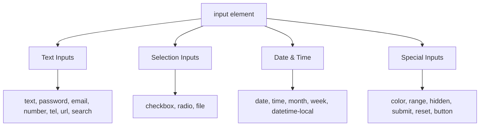
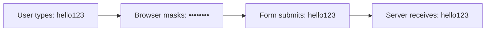
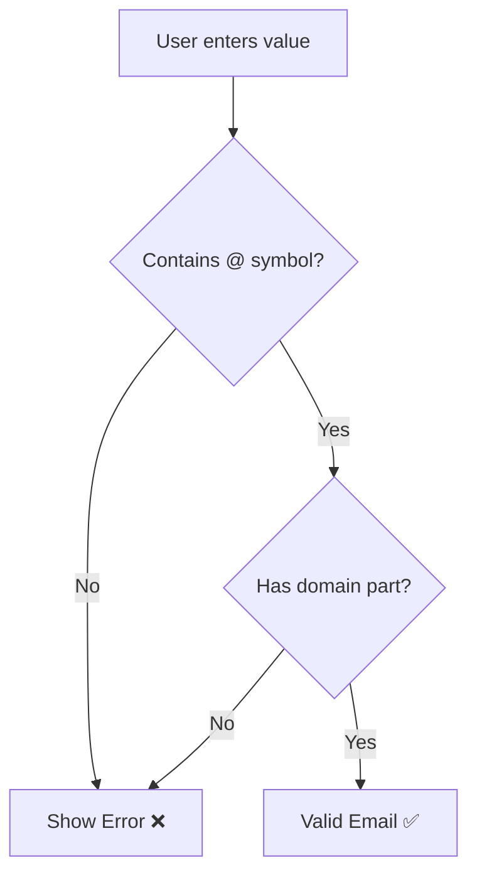
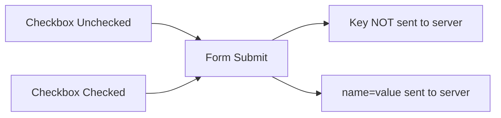
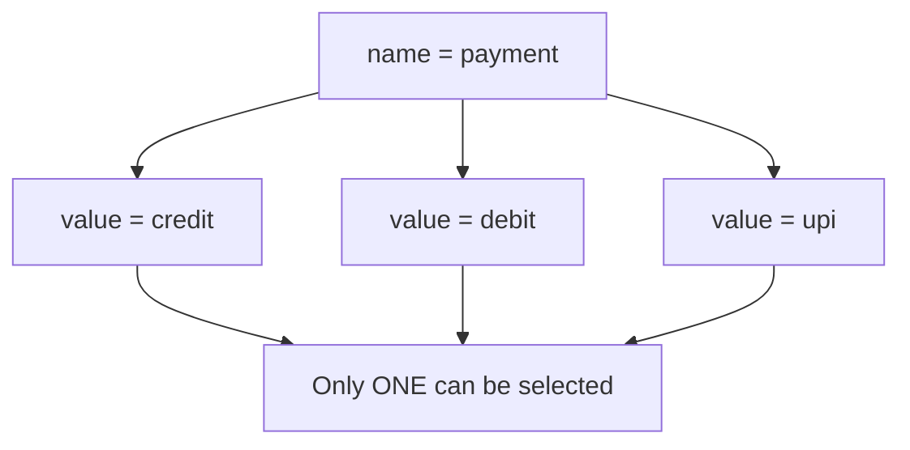
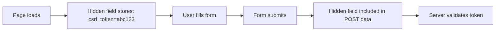
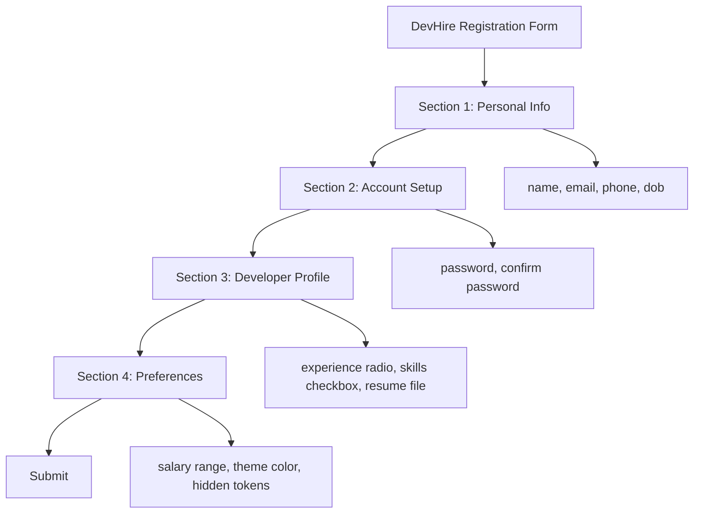

<a id="chapter-16-html-input-types"></a>

# Chapter 16: HTML Input Types

[⬅ Previous Chapter](#chapter-15-html-forms-basics) | [📖 Main Index](#main-index) | [Next Chapter ➡](#chapter-17-form-elements-attributes)

---

## 📌 Learning Objectives

By the end of this chapter, you will:

- Understand all major HTML input types and their purpose
- Know when to use which input type for better UX and validation
- Understand how browsers handle different input types natively
- Learn accessibility and semantic best practices for inputs
- Be able to answer input-type-related interview questions confidently
- Build a real-world styled registration form using only HTML and CSS

---

<a id="chapter-index-table-16"></a>

## Chapter Index Table

| Topic No. | Topic Name | Subtopics |
|-----------|------------|-----------|
| 16.1 | [Overview of Input Types](#161-overview-of-input-types) | What is `<input>`<br>Type attribute<br>Default type<br>Browser behavior |
| 16.2 | [text](#162-input-type-text) | Basic text input<br>Attributes<br>Use cases |
| 16.3 | [password](#163-input-type-password) | Masking<br>Security<br>Attributes |
| 16.4 | [email](#164-input-type-email) | Validation<br>Mobile keyboard<br>Pattern |
| 16.5 | [number](#165-input-type-number) | Min/Max/Step<br>Spinners<br>Validation |
| 16.6 | [checkbox](#166-input-type-checkbox) | Checked state<br>Multiple selection<br>Value |
| 16.7 | [radio](#167-input-type-radio) | Group behavior<br>Name attribute<br>Single select |
| 16.8 | [file](#168-input-type-file) | Accept attribute<br>Multiple files<br>Limitations |
| 16.9 | [date](#169-input-type-date) | Date picker<br>Min/Max<br>Browser support |
| 16.10 | [color](#1610-input-type-color) | Color picker<br>Default value<br>Use cases |
| 16.11 | [range](#1611-input-type-range) | Slider<br>Min/Max/Step<br>Output pairing |
| 16.12 | [hidden](#1612-input-type-hidden) | Hidden fields<br>Security<br>CSRF tokens |
| 16.13 | [Other Input Types](#1613-other-input-types) | tel, url, search, time, datetime-local, month, week, submit, reset, button, image |
| 16.14 | [Interview Questions](#1614-interview-questions) | Conceptual, Scenario, Output-based, Advanced |
| 16.15 | [Practice Problems](#1615-practice-problems) | Coding, Theory, Machine Coding |
| 16.16 | [Mini Project](#1616-mini-project) | Styled Registration Form |

---

## 16.1 Overview of Input Types

<a id="161-overview-of-input-types"></a>

### What is `<input>`?

The `<input>` element is the most versatile and widely used form element in HTML. It is a **void element** (self-closing) that collects user data. The behavior, appearance, and validation of an input are controlled by its **`type`** attribute.

```html
<input type="text" name="username" placeholder="Enter username">
```

### Why is the `type` attribute important?

The `type` attribute tells the browser:
- What **UI control** to render (text box, slider, color picker, etc.)
- What **keyboard** to show on mobile devices
- What **built-in validation** to apply
- What **data format** to expect

### Default Type

If no `type` attribute is specified, the browser defaults to:

```html
<input>
<!-- Same as -->
<input type="text">
```

> [!NOTE]
> Always explicitly set the `type` attribute. Relying on defaults reduces clarity and accessibility.

### Complete Input Type Overview



### Common Attributes Shared by All Input Types

| Attribute | Purpose |
|-----------|---------|
| `type` | Defines input behavior |
| `name` | Key used when form is submitted |
| `id` | Used with `<label for="">` |
| `value` | Default or submitted value |
| `placeholder` | Hint text shown inside input |
| `required` | Marks field as mandatory |
| `disabled` | Disables the input |
| `readonly` | Prevents editing |
| `autofocus` | Auto-focuses on page load |
| `autocomplete` | Controls browser autocomplete |
| `form` | Associates input with a form by ID |

---

### 🧠 Hinglish Intuition

> Socho ek government form jo tum physically fill karte ho. Kuch jagah pe sirf number likhna hota hai, kuch jagah signature hoti hai, kuch jagah tick mark lagana hota hai.
>
> HTML `<input type="">` exactly yahi kaam karta hai — browser ko batata hai ki **is jagah pe kya type ka data chahiye**. Agar tum `type="email"` likhoge toh browser khud check karega ki valid email hai ya nahi. Smart, right? 😎

---

👉 <a href="#chapter-index-table-16">Go to Top 🔝</a>

---

## 16.2 Input Type: text

<a id="162-input-type-text"></a>

### What is it?

`type="text"` is the most basic input type. It renders a single-line text field that accepts **any string value**.

```html
<label for="username">Username:</label>
<input 
  type="text" 
  id="username" 
  name="username" 
  placeholder="Enter your username"
  maxlength="20"
  minlength="3"
  required
>
```

### Key Attributes for `type="text"`

| Attribute | Purpose | Example |
|-----------|---------|---------|
| `placeholder` | Ghost text inside input | `placeholder="John Doe"` |
| `maxlength` | Max characters allowed | `maxlength="50"` |
| `minlength` | Min characters required | `minlength="3"` |
| `size` | Visual width in characters | `size="30"` |
| `pattern` | Regex validation | `pattern="[A-Za-z]+"` |
| `autocomplete` | Enable/disable autocomplete | `autocomplete="off"` |
| `spellcheck` | Browser spell checking | `spellcheck="true"` |

### Code Breakdown

```html
<form>
  <!-- Label linked via 'for' and 'id' -->
  <label for="fullname">Full Name:</label>

  <!-- text input with validation attributes -->
  <input 
    type="text"           <!-- type: single-line text -->
    id="fullname"         <!-- matches label's for attribute -->
    name="fullname"       <!-- key sent to server -->
    placeholder="e.g. John Doe"  <!-- hint text -->
    minlength="2"         <!-- minimum 2 characters -->
    maxlength="60"        <!-- maximum 60 characters -->
    autocomplete="name"   <!-- browser can autocomplete -->
    required              <!-- cannot submit if empty -->
  >
</form>
```

### When to Use

- Names, usernames, titles
- Search fields (though `type="search"` is more semantic)
- Any free-form single-line text

### 🧠 Hinglish Intuition

> `type="text"` ek **blank page** ki tarah hai — kuch bhi likh sakte ho. Lekin `minlength`, `maxlength`, `pattern` se tum us page pe **rules laga sakte ho** — jaise ek teacher jo kehta hai "sirf 3 se 20 characters me answer likho."

> [!TIP]
> Use `autocomplete="name"` for name fields — this improves UX on mobile devices and helps password managers work correctly.

---

👉 <a href="#chapter-index-table-16">Go to Top 🔝</a>

---

## 16.3 Input Type: password

<a id="163-input-type-password"></a>

### What is it?

`type="password"` renders a text input where the characters are **masked** (replaced with dots or asterisks). It prevents shoulder-surfing but does NOT encrypt the data in transit.

```html
<label for="pwd">Password:</label>
<input 
  type="password" 
  id="pwd" 
  name="password"
  placeholder="Enter password"
  minlength="8"
  required
>
```

### How it Works



> [!IMPORTANT]
> Masking is **only visual**. The actual value is still transmitted as plain text unless you use **HTTPS**. Always use HTTPS for password fields.

### Key Attributes

| Attribute | Purpose |
|-----------|---------|
| `minlength` | Minimum password length |
| `maxlength` | Maximum password length |
| `pattern` | Enforce complexity (regex) |
| `autocomplete` | `"current-password"` or `"new-password"` |

### Practical Example: Password with Complexity

```html
<form>
  <label for="newpwd">New Password:</label>
  <input 
    type="password"
    id="newpwd"
    name="new_password"
    placeholder="Min 8 chars, 1 uppercase, 1 number"
    minlength="8"
    maxlength="64"
    pattern="(?=.*\d)(?=.*[a-z])(?=.*[A-Z]).{8,}"
    autocomplete="new-password"
    required
  >

  <label for="confirmpwd">Confirm Password:</label>
  <input 
    type="password"
    id="confirmpwd"
    name="confirm_password"
    placeholder="Re-enter password"
    autocomplete="new-password"
    required
  >
</form>
```

### Common Mistakes

| ❌ Wrong | ✅ Right |
|---------|---------|
| Using `type="text"` for passwords | Always use `type="password"` |
| Not setting `minlength` | Enforce at least 8 characters |
| Using `autocomplete="off"` on new-password | Use `autocomplete="new-password"` |
| Skipping HTTPS | Always use HTTPS with passwords |

### 🧠 Hinglish Intuition

> Socho tum ek ATM machine pe PIN daal rahe ho — screen pe `****` dikhta hai, lekin machine ko pata hai tumne kya type kiya. Exactly yahi `type="password"` karta hai. **Dikhta nahi, kaam karta hai** — lekin yeh encryption nahi hai, sirf visual masking hai!

---

👉 <a href="#chapter-index-table-16">Go to Top 🔝</a>

---

## 16.4 Input Type: email

<a id="164-input-type-email"></a>

### What is it?

`type="email"` creates a text input specifically for **email addresses**. The browser automatically validates that the entered value matches an email format (`something@domain.tld`) before form submission.

```html
<label for="useremail">Email Address:</label>
<input 
  type="email" 
  id="useremail" 
  name="email"
  placeholder="you@example.com"
  required
>
```

### Key Benefits

| Benefit | Description |
|---------|-------------|
| Built-in validation | Browser checks `@` and domain format |
| Mobile keyboard | Shows email-optimized keyboard (`@` key visible) |
| Accessibility | Screen readers announce "email input" |
| UX improvement | Users get instant feedback on invalid format |

### Key Attributes

| Attribute | Purpose | Example |
|-----------|---------|---------|
| `multiple` | Accept comma-separated emails | `multiple` |
| `pattern` | Custom email regex | `pattern="[a-z0-9._%+-]+@[a-z0-9.-]+\.[a-z]{2,}$"` |

### Example: Multiple Emails

```html
<!-- Accept multiple email addresses -->
<label for="ccemails">CC Emails (comma-separated):</label>
<input 
  type="email" 
  id="ccemails" 
  name="cc"
  multiple
  placeholder="a@example.com, b@example.com"
>
```

### Validation Behavior



> [!NOTE]
> `type="email"` validation is **client-side only**. Always validate emails on the server side as well.

### 🧠 Hinglish Intuition

> Jaise post office wala letter tab accept karta hai jab address format sahi ho — `name@city.country`. Browser bhi exactly yahi karta hai `type="email"` ke saath. Galat format doge toh browser form submit hi nahi karega!

---

👉 <a href="#chapter-index-table-16">Go to Top 🔝</a>

---

## 16.5 Input Type: number

<a id="165-input-type-number"></a>

### What is it?

`type="number"` creates an input that accepts only **numeric values**. Browsers typically render it with **spinner arrows** (up/down controls) and show a numeric keyboard on mobile devices.

```html
<label for="age">Age:</label>
<input 
  type="number" 
  id="age" 
  name="age"
  min="1"
  max="120"
  step="1"
  placeholder="Enter your age"
  required
>
```

### Key Attributes

| Attribute | Purpose | Example |
|-----------|---------|---------|
| `min` | Minimum allowed value | `min="0"` |
| `max` | Maximum allowed value | `max="100"` |
| `step` | Increment/decrement step | `step="0.5"` |
| `value` | Default numeric value | `value="18"` |

### Practical Examples

```html
<!-- Quantity selector -->
<label for="qty">Quantity:</label>
<input type="number" id="qty" name="quantity" min="1" max="99" step="1" value="1">

<!-- Price with decimals -->
<label for="price">Price (USD):</label>
<input type="number" id="price" name="price" min="0.01" max="9999.99" step="0.01" placeholder="0.00">

<!-- Rating out of 10 -->
<label for="rating">Rating:</label>
<input type="number" id="rating" name="rating" min="1" max="10" step="1">
```

### Number vs Text for Phone Numbers

> [!IMPORTANT]
> Do NOT use `type="number"` for phone numbers. Phone numbers can start with `0`, contain `+`, `-`, spaces, and parentheses. Use `type="tel"` instead.

| Use Case | Correct Type |
|----------|-------------|
| Age | `type="number"` |
| Quantity | `type="number"` |
| Phone Number | `type="tel"` |
| Zip Code | `type="text"` (pattern) |
| Credit Card | `type="text"` (pattern) |

### 🧠 Hinglish Intuition

> `type="number"` ek **calculator keyboard** ki tarah hai — sirf numbers chahiye. `min` aur `max` se tum range set karte ho, `step` se batate ho kitne kitne ka jump hoga. Jaise lift me floor buttons hote hain — directly relevant floors pe hi ja sakte ho!

---

👉 <a href="#chapter-index-table-16">Go to Top 🔝</a>

---

## 16.6 Input Type: checkbox

<a id="166-input-type-checkbox"></a>

### What is it?

`type="checkbox"` renders a small square box that users can **tick or untick**. It represents a **boolean choice** (true/false, on/off) or allows **multiple selections** from a group.

```html
<input type="checkbox" id="agree" name="agree" value="yes">
<label for="agree">I agree to Terms & Conditions</label>
```

### Key Characteristics

| Characteristic | Detail |
|----------------|--------|
| Default state | Unchecked |
| Checked attribute | Pre-checks the box |
| Value submitted | Only when checked |
| Multiple checkboxes | Same `name`, different `value` |

### Checked vs Unchecked Submission



> [!IMPORTANT]
> When a checkbox is **unchecked**, its name and value are **NOT included** in the form submission at all. This is a common interview trap.

### Multiple Checkboxes (Group Selection)

```html
<fieldset>
  <legend>Select your skills:</legend>

  <input type="checkbox" id="html" name="skills" value="html">
  <label for="html">HTML</label>

  <input type="checkbox" id="css" name="skills" value="css">
  <label for="css">CSS</label>

  <input type="checkbox" id="js" name="skills" value="javascript">
  <label for="js">JavaScript</label>

  <!-- Pre-checked -->
  <input type="checkbox" id="git" name="skills" value="git" checked>
  <label for="git">Git</label>
</fieldset>
```

### Code Breakdown

```html
<input 
  type="checkbox"   <!-- renders a checkbox -->
  id="newsletter"   <!-- linked to label -->
  name="newsletter" <!-- key sent in form data -->
  value="subscribed" <!-- value sent ONLY when checked -->
  checked            <!-- pre-checked by default -->
>
```

### 🧠 Hinglish Intuition

> Checkbox ek **agreement box** ki tarah hai — jab tak tick nahi kiya, form ko pata hi nahi chalta. Jaise Amazon pe "Same day delivery chahiye?" — agar tick kiya, request jayegi; nahi kiya, kuch nahi bheja. **Unchecked = silent = server ko kuch nahi milta.**

---

👉 <a href="#chapter-index-table-16">Go to Top 🔝</a>

---

## 16.7 Input Type: radio

<a id="167-input-type-radio"></a>

### What is it?

`type="radio"` creates a circular button for **single selection from a group**. Multiple radio buttons sharing the same `name` attribute form a **mutually exclusive group** — only one can be selected at a time.

```html
<fieldset>
  <legend>Select your gender:</legend>

  <input type="radio" id="male" name="gender" value="male">
  <label for="male">Male</label>

  <input type="radio" id="female" name="gender" value="female">
  <label for="female">Female</label>

  <input type="radio" id="other" name="gender" value="other" checked>
  <label for="other">Prefer not to say</label>
</fieldset>
```

### Radio vs Checkbox

| Feature | Radio | Checkbox |
|---------|-------|---------|
| Selection | Single from group | Multiple |
| Shape | Circle | Square |
| Grouping | By `name` attribute | By `name` attribute |
| Use case | Gender, payment method | Skills, hobbies |
| Deselection | Cannot deselect once selected | Can toggle |

### How Grouping Works



### Practical Example: Payment Method

```html
<fieldset>
  <legend>Payment Method:</legend>

  <input type="radio" id="credit" name="payment" value="credit_card" checked>
  <label for="credit">💳 Credit Card</label>

  <input type="radio" id="debit" name="payment" value="debit_card">
  <label for="debit">🏦 Debit Card</label>

  <input type="radio" id="upi" name="payment" value="upi">
  <label for="upi">📱 UPI</label>

  <input type="radio" id="cod" name="payment" value="cod">
  <label for="cod">💵 Cash on Delivery</label>
</fieldset>
```

> [!TIP]
> Always wrap radio groups in `<fieldset>` with a `<legend>`. This improves accessibility significantly — screen readers will announce the group name before each option.

### 🧠 Hinglish Intuition

> Radio buttons MCQ ke options ki tarah hain — **sirf ek answer sahi ho sakta hai**. Jaise exam me "Choose one: A, B, C, D" — ek select karo, baaki automatically deselect ho jaate hain. Yahi kaam `name` attribute karta hai — same name wale sab radio ek hi group me hote hain.

---

👉 <a href="#chapter-index-table-16">Go to Top 🔝</a>

---

## 16.8 Input Type: file

<a id="168-input-type-file"></a>

### What is it?

`type="file"` renders a **file picker button** that allows users to select one or more files from their device. It is used for uploading documents, images, videos, etc.

```html
<label for="resume">Upload Resume:</label>
<input 
  type="file" 
  id="resume" 
  name="resume"
  accept=".pdf,.doc,.docx"
  required
>
```

### Key Attributes

| Attribute | Purpose | Example |
|-----------|---------|---------|
| `accept` | Filter file types shown | `accept="image/*"` |
| `multiple` | Allow multiple file selection | `multiple` |
| `capture` | Use device camera/mic | `capture="camera"` |

### Accept Attribute Values

| Accept Value | Files Allowed |
|-------------|--------------|
| `image/*` | All image formats |
| `video/*` | All video formats |
| `audio/*` | All audio formats |
| `.pdf` | PDF files only |
| `.jpg,.png,.gif` | Specific extensions |
| `application/pdf` | MIME type specific |

### Comprehensive Example

```html
<form enctype="multipart/form-data" method="post" action="/upload">
  
  <!-- Single image upload -->
  <label for="avatar">Profile Picture:</label>
  <input 
    type="file" 
    id="avatar" 
    name="avatar"
    accept="image/png, image/jpeg, image/webp"
  >

  <!-- Multiple document upload -->
  <label for="docs">Upload Documents (max 3):</label>
  <input 
    type="file" 
    id="docs" 
    name="documents[]"
    accept=".pdf,.doc,.docx"
    multiple
  >

</form>
```

> [!IMPORTANT]
> For file uploads, the `<form>` must have `enctype="multipart/form-data"`. Without this, only the filename is sent, not the actual file content.

### Limitations

- Cannot set a default file value (security restriction)
- Cannot read file contents with HTML alone (requires JavaScript)
- File size limits must be enforced server-side
- `accept` is a UI hint only — not a security measure. Validate file types on the server.

### 🧠 Hinglish Intuition

> `type="file"` ek **courier box** ki tarah hai — tum koi bhi cheez andar rakh sakte ho aur server ko bhej sakte ho. `accept` attribute ek **customs filter** ki tarah hai — sirf specific cheezein allow karta hai. Lekin yaad rakho, yeh sirf user ko dikhane ke liye hai — server pe bhi check karna zaroori hai!

---

👉 <a href="#chapter-index-table-16">Go to Top 🔝</a>

---

## 16.9 Input Type: date

<a id="169-input-type-date"></a>

### What is it?

`type="date"` renders a **native date picker** widget in supported browsers. The value is always stored in `YYYY-MM-DD` format internally, regardless of how it's displayed to the user (which depends on locale).

```html
<label for="dob">Date of Birth:</label>
<input 
  type="date" 
  id="dob" 
  name="date_of_birth"
  min="1900-01-01"
  max="2010-12-31"
  required
>
```

### Key Attributes

| Attribute | Purpose | Example |
|-----------|---------|---------|
| `min` | Earliest selectable date | `min="2024-01-01"` |
| `max` | Latest selectable date | `max="2024-12-31"` |
| `step` | Step in days | `step="7"` (weekly) |
| `value` | Default date | `value="2024-01-01"` |

### Practical Examples

```html
<!-- Event booking: only future dates -->
<label for="booking">Select Event Date:</label>
<input 
  type="date" 
  id="booking" 
  name="event_date"
  min="2024-06-01"
  max="2025-12-31"
>

<!-- Appointment: specific week days using step -->
<label for="appt">Appointment Date (weekly):</label>
<input 
  type="date"
  id="appt"
  name="appointment"
  step="7"
>
```

### Related Date/Time Input Types

| Type | Renders | Format |
|------|---------|--------|
| `date` | Date picker | `YYYY-MM-DD` |
| `time` | Time picker | `HH:MM` |
| `datetime-local` | Date + Time picker | `YYYY-MM-DDTHH:MM` |
| `month` | Month + Year picker | `YYYY-MM` |
| `week` | Week picker | `YYYY-Www` |

### 🧠 Hinglish Intuition

> `type="date"` ek **calendar widget** ki tarah hai jo browser khud dikhata hai — tum dates click karke choose karte ho. `min` aur `max` se tum calendar ki **available range** set karte ho. Jaise train booking me sirf agle 3 months ki dates dikhti hain, waise hi!

> [!NOTE]
> Date input rendering varies significantly across browsers. For consistent styling, many production applications use custom JavaScript date picker libraries instead.

---

👉 <a href="#chapter-index-table-16">Go to Top 🔝</a>

---

## 16.10 Input Type: color

<a id="1610-input-type-color"></a>

### What is it?

`type="color"` renders a **color picker widget** — a small colored swatch that opens a full color palette when clicked. The value is always a **hex color string** in `#rrggbb` format.

```html
<label for="themecolor">Choose Theme Color:</label>
<input 
  type="color" 
  id="themecolor" 
  name="theme_color"
  value="#3498db"
>
```

### Key Points

| Point | Detail |
|-------|--------|
| Default value | `#000000` (black) |
| Value format | Always `#rrggbb` hex |
| Alpha support | Not natively supported in value |
| Browser UI | Native OS color picker |

### Practical Example: Live Theme Customizer

```html
<!DOCTYPE html>
<html lang="en">
<head>
  <title>Color Picker Demo</title>
  <style>
    body { font-family: Arial, sans-serif; padding: 20px; }
    .color-display {
      width: 200px;
      height: 100px;
      border: 2px solid #ccc;
      border-radius: 8px;
      margin-top: 10px;
      background-color: #3498db;
    }
    label { font-weight: bold; }
  </style>
</head>
<body>
  <label for="picker">Pick a Color:</label>
  <input type="color" id="picker" name="color" value="#3498db">
  <div class="color-display" id="display"></div>

  <script>
    const picker = document.getElementById('picker');
    const display = document.getElementById('display');
    picker.addEventListener('input', () => {
      display.style.backgroundColor = picker.value;
    });
  </script>
</body>
</html>
```

> [!NOTE]
> The JavaScript part above is for demonstration only. Color input works perfectly in HTML forms without JavaScript — the selected color value is submitted as the form field value.

### 🧠 Hinglish Intuition

> `type="color"` ek **paint palette** ki tarah hai — click karo, color choose karo, aur wo hex code form me submit ho jaata hai. Bilkul waisi tarah jaise graphic designers ke tools me hota hai, lekin browser ke andar built-in!

---

👉 <a href="#chapter-index-table-16">Go to Top 🔝</a>

---

## 16.11 Input Type: range

<a id="1611-input-type-range"></a>

### What is it?

`type="range"` renders a **horizontal slider** (track with a draggable thumb). It lets users select a numeric value within a defined range. Unlike `type="number"`, the exact value is not directly visible by default.

```html
<label for="volume">Volume:</label>
<input 
  type="range" 
  id="volume" 
  name="volume"
  min="0"
  max="100"
  step="5"
  value="50"
>
```

### Key Attributes

| Attribute | Purpose | Example |
|-----------|---------|---------|
| `min` | Minimum value | `min="0"` |
| `max` | Maximum value | `max="100"` |
| `step` | Increment step | `step="10"` |
| `value` | Initial position | `value="50"` |

### Displaying the Current Value with `<output>`

```html
<form>
  <label for="brightness">Brightness: </label>
  <input 
    type="range" 
    id="brightness" 
    name="brightness"
    min="0"
    max="100"
    step="1"
    value="70"
    oninput="brightnessVal.value = this.value"
  >
  <output id="brightnessVal" name="brightnessVal">70</output>%
</form>
```

### Practical Use Cases

| Use Case | min | max | step |
|----------|-----|-----|------|
| Volume control | 0 | 100 | 1 |
| Price filter | 0 | 10000 | 100 |
| Star rating | 1 | 5 | 1 |
| Zoom level | 50 | 200 | 10 |
| Font size | 10 | 72 | 2 |

### CSS Styling the Range Slider

```css
/* Style the track */
input[type="range"] {
  -webkit-appearance: none;
  appearance: none;
  width: 100%;
  height: 6px;
  background: #ddd;
  border-radius: 5px;
  outline: none;
}

/* Style the thumb */
input[type="range"]::-webkit-slider-thumb {
  -webkit-appearance: none;
  appearance: none;
  width: 20px;
  height: 20px;
  background: #3498db;
  border-radius: 50%;
  cursor: pointer;
}
```

### 🧠 Hinglish Intuition

> `type="range"` ek **volume knob** ki tarah hai — left side pe minimum, right side pe maximum. Tum slider drag karte ho aur value change hoti hai. Jaise TV remote pe brightness adjust karte ho — exact number nahi dikhta, bas feel se adjust karte ho!

---

👉 <a href="#chapter-index-table-16">Go to Top 🔝</a>

---

## 16.12 Input Type: hidden

<a id="1612-input-type-hidden"></a>

### What is it?

`type="hidden"` creates an **invisible input field** — it has no visual representation but its `name` and `value` are submitted with the form. It is used to pass data that the user should not see or modify.

```html
<input type="hidden" name="user_id" value="12345">
<input type="hidden" name="csrf_token" value="abc123xyz789">
<input type="hidden" name="form_version" value="2.1">
```

### Common Use Cases

| Use Case | Example |
|----------|---------|
| CSRF token | Security token to prevent cross-site request forgery |
| User ID | Pass logged-in user ID with form |
| Record ID | Which database record to update |
| Form version | Track which version of form was used |
| Referral source | Track where user came from |
| Session data | Pass session identifiers |

### How it Works



### Security Note

> [!IMPORTANT]
> Hidden fields are **NOT secure**. Anyone can inspect the HTML source or use browser DevTools to see and modify hidden field values. Never store sensitive data (passwords, security keys) in hidden fields.

### Practical Example: Edit Form with Record ID

```html
<form method="post" action="/update-profile">
  
  <!-- Hidden: tells server which record to update -->
  <input type="hidden" name="user_id" value="9876">
  <input type="hidden" name="csrf_token" value="f3a8b2c1d4e5">
  
  <!-- Visible fields user can edit -->
  <label for="fname">First Name:</label>
  <input type="text" id="fname" name="first_name" value="John">

  <label for="lname">Last Name:</label>
  <input type="text" id="lname" name="last_name" value="Doe">

  <button type="submit">Update Profile</button>
</form>
```

### 🧠 Hinglish Intuition

> Hidden input ek **secret message** ki tarah hai jo form ke saath server ko bheja jaata hai lekin user ko nahi dikhta. Jaise hotel me check-in karte waqt tumhara room number backend me automatically set hota hai — tum sirf naam aur ID card dete ho, lekin form ke saath room number bhi jaata hai!

---

👉 <a href="#chapter-index-table-16">Go to Top 🔝</a>

---

## 16.13 Other Input Types

<a id="1613-other-input-types"></a>

### `type="tel"` — Telephone Number

```html
<label for="phone">Phone Number:</label>
<input 
  type="tel" 
  id="phone" 
  name="phone"
  placeholder="+91 9876543210"
  pattern="[+]{1}[0-9]{1,3}[0-9]{9,12}"
>
```

- Shows numeric/phone keyboard on mobile
- No built-in format validation (use `pattern`)
- Accepts `+`, `-`, `()`, spaces

---

### `type="url"` — URL / Website Address

```html
<label for="website">Website:</label>
<input 
  type="url" 
  id="website" 
  name="website"
  placeholder="https://www.example.com"
>
```

- Browser validates URL format (must include `http://` or `https://`)
- Shows URL-optimized keyboard on mobile

---

### `type="search"` — Search Field

```html
<label for="search">Search:</label>
<input 
  type="search" 
  id="search" 
  name="q"
  placeholder="Search products..."
>
```

- Renders with a clear (×) button in some browsers
- Same as `text` functionally but more semantic
- May use different styling or behavior on some platforms

---

### `type="submit"` — Submit Button

```html
<!-- Default submit -->
<input type="submit" value="Submit Form">

<!-- Custom label -->
<input type="submit" value="Create Account">
```

---

### `type="reset"` — Reset Button

```html
<input type="reset" value="Clear Form">
```

> [!NOTE]
> Avoid `type="reset"` in modern UX. Users accidentally click it and lose all their form data. It provides poor user experience.

---

### `type="button"` — Generic Button

```html
<input type="button" value="Click Me" onclick="doSomething()">
```

- Does NOT submit the form
- Used with JavaScript event handlers
- Prefer `<button type="button">` for more flexibility

---

### `type="image"` — Image Submit Button

```html
<input 
  type="image" 
  src="submit-btn.png" 
  alt="Submit" 
  width="100" 
  height="40"
>
```

- Submits the form when clicked
- Also sends click coordinates (x, y) as form data

---

### `type="datetime-local"` — Date and Time Picker

```html
<label for="meeting">Schedule Meeting:</label>
<input 
  type="datetime-local" 
  id="meeting" 
  name="meeting_time"
  min="2024-01-01T09:00"
  max="2025-12-31T18:00"
>
```

---

### `type="month"` — Month and Year Picker

```html
<label for="expiry">Card Expiry:</label>
<input type="month" id="expiry" name="expiry" min="2024-01">
```

---

### `type="week"` — Week Picker

```html
<label for="reportweek">Report Week:</label>
<input type="week" id="reportweek" name="week">
```

---

### Complete Input Types Reference Table

| Type | UI Rendered | Built-in Validation | Mobile Keyboard |
|------|------------|---------------------|-----------------|
| `text` | Text box | None | Default |
| `password` | Masked text box | None | Default |
| `email` | Text box | Email format | Email keyboard |
| `number` | Number spinner | Numeric only | Numeric |
| `tel` | Text box | None | Phone keyboard |
| `url` | Text box | URL format | URL keyboard |
| `search` | Search box + clear | None | Default |
| `checkbox` | Check box | None | N/A |
| `radio` | Radio button | None | N/A |
| `file` | File picker | None | N/A |
| `date` | Date picker | Date format | N/A |
| `time` | Time picker | Time format | N/A |
| `datetime-local` | Date+Time picker | DateTime format | N/A |
| `month` | Month picker | Month format | N/A |
| `week` | Week picker | Week format | N/A |
| `color` | Color swatch | None | N/A |
| `range` | Slider | Min/Max | N/A |
| `hidden` | Nothing (invisible) | None | N/A |
| `submit` | Submit button | N/A | N/A |
| `reset` | Reset button | N/A | N/A |
| `button` | Generic button | N/A | N/A |
| `image` | Image button | N/A | N/A |

### 🧠 Hinglish Intuition

> Sochlo HTML input types ek **stationery shop** ki tarah hain — `text` ek blank paper hai, `checkbox` ek tick list hai, `radio` MCQ hai, `file` ek envelope hai, `color` ek paint brush hai, `range` ek dimmer switch hai, aur `hidden` ek sealed envelope hai jo sirf delivery waale ko pata hai. Har item ka apna use case hai!

---

👉 <a href="#chapter-index-table-16">Go to Top 🔝</a>

---

## 16.14 Interview Questions

<a id="1614-interview-questions"></a>

### 💡 Interview Questions

---

### 🔵 Conceptual Questions

**Q1. What is the default `type` of an `<input>` element if the `type` attribute is omitted?**

**Answer:** The default type is `text`. The browser renders a single-line text input.

---

**Q2. What is the difference between `type="button"`, `type="submit"`, and `type="reset"`?**

**Answer:**

| Type | Behavior |
|------|---------|
| `submit` | Submits the form to the server |
| `reset` | Clears all form fields to default values |
| `button` | Does nothing by default — requires JavaScript |

---

**Q3. Why should you NOT use `type="number"` for phone numbers?**

**Answer:** Phone numbers may start with `0`, include `+`, `-`, `()`, and spaces. `type="number"` strips leading zeros and doesn't allow non-numeric characters. Use `type="tel"` instead with a `pattern` for custom validation.

---

**Q4. What happens to an unchecked checkbox when a form is submitted?**

**Answer:** An unchecked checkbox is **completely omitted** from the form submission data. The server receives no key-value pair for that field. This is a common source of bugs — developers must check for the absence of the key on the server side.

---

**Q5. What is the difference between `type="text"` and `type="search"`?**

**Answer:** Functionally they are nearly identical — both accept any string. The semantic difference:
- `type="search"` tells the browser and assistive technologies this is a search field
- Some browsers add a clear (×) button to `type="search"`
- Search inputs may receive different styling in some OS environments

---

**Q6. What format does `type="date"` use internally for its value?**

**Answer:** Always `YYYY-MM-DD` format, regardless of how it's displayed to the user. The display format depends on the user's locale/browser settings.

---

**Q7. What format does `type="color"` return as its value?**

**Answer:** Always a lowercase 6-digit hex color string in `#rrggbb` format (e.g., `#ff5733`). It does NOT support alpha transparency in its value.

---

### 🟡 Scenario-Based Questions

**Q8. A client wants users to select their subscription start date but only from dates in the next 30 days. How would you implement this?**

**Answer:**

```html
<!-- Use min/max with JavaScript to set dynamic dates -->
<input type="date" id="start" name="start_date" min="" max="">

<script>
  const today = new Date();
  const max = new Date();
  max.setDate(today.getDate() + 30);

  const toYMD = d => d.toISOString().split('T')[0];

  document.getElementById('start').min = toYMD(today);
  document.getElementById('start').max = toYMD(max);
</script>
```

---

**Q9. How would you allow users to upload only PDF and Word documents, with a maximum of 5 files?**

**Answer:**

```html
<input 
  type="file" 
  name="documents[]"
  accept=".pdf,.doc,.docx,application/pdf,application/msword"
  multiple
>
```

Note: Also validate server-side — `accept` is UI-only.

---

**Q10. How do you group radio buttons so only one can be selected at a time?**

**Answer:** By giving all related radio buttons the **same `name` attribute**. The `name` attribute creates the mutual exclusivity group — not nesting or positioning.

---

### 🔴 Output-Based Questions

**Q11. What value is submitted for this input when the form is submitted?**

```html
<input type="color" name="bg" value="#ff0000">
```

**Answer:** `bg=#ff0000` — hex color string.

---

**Q12. What does this render?**

```html
<input type="range" min="10" max="50" step="10" value="30">
```

**Answer:** A horizontal slider from 10 to 50, incrementing in steps of 10, initially positioned at 30.

---

**Q13. Will this form field be included in form submission data?**

```html
<input type="checkbox" name="newsletter" value="yes">
```

**(Left unchecked by the user)**

**Answer:** **No.** Unchecked checkboxes are NOT included in form submission. The server will not see the `newsletter` key at all.

---

### 🟣 Advanced Questions

**Q14. What is the security concern with `type="hidden"` fields?**

**Answer:** Hidden inputs are visible in the page source and can be modified using browser DevTools. An attacker can change the values before form submission. Never store sensitive data in hidden fields, and always validate hidden field values on the server.

---

**Q15. How does the `multiple` attribute behave differently on `type="email"` vs `type="file"`?**

**Answer:**
- On `type="email"`: Accepts comma-separated email addresses in a single text input
- On `type="file"`: Opens a file dialog that allows selecting multiple files at once

---

👉 <a href="#chapter-index-table-16">Go to Top 🔝</a>

---

## 16.15 Practice Problems

<a id="1615-practice-problems"></a>

## 🧪 Practice Problems

---

### 💻 Coding Questions

**1. Create a user registration input section with: name (text), email, password, date of birth, and agree to terms (checkbox).**

```html
<form method="post" action="/register">
  
  <label for="reg-name">Full Name:</label>
  <input type="text" id="reg-name" name="name" placeholder="John Doe" minlength="2" maxlength="60" required>

  <label for="reg-email">Email:</label>
  <input type="email" id="reg-email" name="email" placeholder="john@example.com" required>

  <label for="reg-pwd">Password:</label>
  <input type="password" id="reg-pwd" name="password" minlength="8" placeholder="Min 8 characters" required>

  <label for="reg-dob">Date of Birth:</label>
  <input type="date" id="reg-dob" name="dob" max="2006-01-01" required>

  <input type="checkbox" id="reg-terms" name="terms" value="agreed" required>
  <label for="reg-terms">I agree to Terms & Conditions</label>

  <input type="submit" value="Register">
</form>
```

---

**2. Build a product filter with price range slider, category checkboxes, and sort radio buttons.**

```html
<form method="get" action="/products">

  <fieldset>
    <legend>Price Range</legend>
    <label>Min: <input type="range" name="min_price" min="0" max="5000" step="100" value="0" oninput="minOut.value=this.value"></label>
    <output id="minOut">0</output>
    
    <label>Max: <input type="range" name="max_price" min="0" max="5000" step="100" value="5000" oninput="maxOut.value=this.value"></label>
    <output id="maxOut">5000</output>
  </fieldset>

  <fieldset>
    <legend>Category</legend>
    <input type="checkbox" id="cat-electronics" name="category" value="electronics">
    <label for="cat-electronics">Electronics</label>

    <input type="checkbox" id="cat-clothing" name="category" value="clothing">
    <label for="cat-clothing">Clothing</label>

    <input type="checkbox" id="cat-books" name="category" value="books">
    <label for="cat-books">Books</label>
  </fieldset>

  <fieldset>
    <legend>Sort By</legend>
    <input type="radio" id="sort-price" name="sort" value="price" checked>
    <label for="sort-price">Price: Low to High</label>

    <input type="radio" id="sort-name" name="sort" value="name">
    <label for="sort-name">Name: A-Z</label>

    <input type="radio" id="sort-rating" name="sort" value="rating">
    <label for="sort-rating">Rating</label>
  </fieldset>

  <input type="submit" value="Apply Filters">
</form>
```

---

**3. Create a color theme customizer with 3 color inputs (primary, secondary, accent).**

```html
<form>
  <label for="primary-color">Primary Color:</label>
  <input type="color" id="primary-color" name="primary" value="#3498db">

  <label for="secondary-color">Secondary Color:</label>
  <input type="color" id="secondary-color" name="secondary" value="#2ecc71">

  <label for="accent-color">Accent Color:</label>
  <input type="color" id="accent-color" name="accent" value="#e74c3c">

  <input type="submit" value="Apply Theme">
</form>
```

---

**4. Build a resume upload form accepting PDF and DOCX only, allowing up to 3 files.**

```html
<form method="post" enctype="multipart/form-data" action="/upload-resume">
  <label for="res-upload">Upload Resume(s):</label>
  <input 
    type="file" 
    id="res-upload"
    name="resumes[]"
    accept=".pdf,.docx,application/pdf,application/vnd.openxmlformats-officedocument.wordprocessingml.document"
    multiple
    required
  >
  <p><small>Accepted: PDF, DOCX | Max 3 files</small></p>
  <input type="submit" value="Upload">
</form>
```

---

**5. Create a hidden field-based form that tracks a referral source.**

```html
<form method="post" action="/contact">
  <input type="hidden" name="referral_source" value="google_ads">
  <input type="hidden" name="campaign_id" value="CAMP2024SUMMER">
  <input type="hidden" name="csrf_token" value="9fXk2Lp8mQ">

  <label for="contact-name">Name:</label>
  <input type="text" id="contact-name" name="name" required>

  <label for="contact-email">Email:</label>
  <input type="email" id="contact-email" name="email" required>

  <input type="submit" value="Send Message">
</form>
```

---

### 📖 Theory Questions

**1. Explain the difference between `checked` and `selected` attributes. Which input types use each?**

> `checked` is used with `type="checkbox"` and `type="radio"` to pre-select an option. `selected` is used with `<option>` elements inside `<select>` dropdowns to pre-select a dropdown option.

---

**2. Why does `type="file"` require `enctype="multipart/form-data"` on the form?**

> File data is binary and cannot be encoded as standard URL-encoded form data. `enctype="multipart/form-data"` tells the browser to package the file as a separate part of the request body, preserving binary data integrity.

---

**3. What is the purpose of the `name` attribute on radio buttons and checkboxes?**

> For **radio buttons**: The `name` attribute groups them — all radio inputs with the same `name` are mutually exclusive (only one selectable).
> For **checkboxes**: The `name` identifies the field in form submission. Using the same name for multiple checkboxes (usually with `[]`) allows multiple values to be submitted for that key.

---

**4. Explain why `type="reset"` is considered bad UX practice.**

> `type="reset"` clears all form inputs instantly with no confirmation dialog. Users can accidentally click it after filling a long form and lose all their data with no way to recover it. Modern UX prefers a custom "Clear" button with a confirmation dialog, or simply not offering a reset option.

---

**5. What is the difference between the `disabled` and `readonly` attributes on inputs?**

| | `disabled` | `readonly` |
|--|-----------|------------|
| Visual | Grayed out | Normal |
| User can focus | No | Yes |
| Submitted with form | **No** | **Yes** |
| Use case | Unavailable option | Show data, prevent editing |

---

### ⚙️ Machine Coding Problems

**Problem 1: Multi-Step Form Navigation (Pure HTML/CSS)**

Build a multi-step visual registration form with 3 clearly labeled sections using only HTML and CSS.

```html
<!DOCTYPE html>
<html lang="en">
<head>
  <meta charset="UTF-8">
  <meta name="viewport" content="width=device-width, initial-scale=1.0">
  <title>Multi-Step Form Mockup</title>
  <style>
    * { box-sizing: border-box; margin: 0; padding: 0; }
    body { font-family: 'Segoe UI', Tahoma, sans-serif; background: #f0f2f5; display: flex; justify-content: center; padding: 40px 20px; }

    .form-container {
      background: white;
      border-radius: 12px;
      box-shadow: 0 4px 20px rgba(0,0,0,0.1);
      padding: 40px;
      width: 100%;
      max-width: 600px;
    }

    .steps-indicator {
      display: flex;
      justify-content: space-between;
      margin-bottom: 32px;
      position: relative;
    }

    .steps-indicator::before {
      content: '';
      position: absolute;
      top: 18px;
      left: 0;
      right: 0;
      height: 2px;
      background: #e0e0e0;
      z-index: 0;
    }

    .step {
      display: flex;
      flex-direction: column;
      align-items: center;
      gap: 8px;
      z-index: 1;
    }

    .step-number {
      width: 36px;
      height: 36px;
      border-radius: 50%;
      display: flex;
      align-items: center;
      justify-content: center;
      font-weight: bold;
      font-size: 14px;
      border: 2px solid #e0e0e0;
      background: white;
      color: #999;
    }

    .step.active .step-number {
      background: #3498db;
      border-color: #3498db;
      color: white;
    }

    .step.done .step-number {
      background: #2ecc71;
      border-color: #2ecc71;
      color: white;
    }

    .step-label { font-size: 12px; color: #999; font-weight: 500; }
    .step.active .step-label { color: #3498db; }
    .step.done .step-label { color: #2ecc71; }

    h2 { font-size: 22px; color: #2c3e50; margin-bottom: 24px; }

    .form-group { margin-bottom: 20px; }

    label {
      display: block;
      font-size: 14px;
      font-weight: 600;
      color: #555;
      margin-bottom: 6px;
    }

    input[type="text"],
    input[type="email"],
    input[type="password"],
    input[type="date"],
    input[type="tel"] {
      width: 100%;
      padding: 12px 16px;
      border: 2px solid #e0e0e0;
      border-radius: 8px;
      font-size: 15px;
      transition: border-color 0.2s;
      outline: none;
    }

    input:focus { border-color: #3498db; }

    .form-row { display: grid; grid-template-columns: 1fr 1fr; gap: 16px; }

    .note { font-size: 12px; color: #999; margin-top: 4px; }
  </style>
</head>
<body>
  <div class="form-container">

    <!-- Step Indicator -->
    <div class="steps-indicator">
      <div class="step done">
        <div class="step-number">✓</div>
        <div class="step-label">Account</div>
      </div>
      <div class="step active">
        <div class="step-number">2</div>
        <div class="step-label">Personal</div>
      </div>
      <div class="step">
        <div class="step-number">3</div>
        <div class="step-label">Review</div>
      </div>
    </div>

    <!-- Step 2 Form Content (Personal Info) -->
    <h2>Personal Information</h2>

    <form method="post" action="/register/step2">
      <input type="hidden" name="step" value="2">
      <input type="hidden" name="user_token" value="abc123def456">

      <div class="form-row">
        <div class="form-group">
          <label for="firstname">First Name</label>
          <input type="text" id="firstname" name="first_name" placeholder="John" required>
        </div>
        <div class="form-group">
          <label for="lastname">Last Name</label>
          <input type="text" id="lastname" name="last_name" placeholder="Doe" required>
        </div>
      </div>

      <div class="form-group">
        <label for="phone">Phone Number</label>
        <input type="tel" id="phone" name="phone" placeholder="+91 98765 43210" pattern="[+]{1}[0-9]{1,3}[0-9]{9,12}">
        <p class="note">Format: +91 followed by 10 digits</p>
      </div>

      <div class="form-group">
        <label for="dob">Date of Birth</label>
        <input type="date" id="dob" name="dob" max="2006-01-01" required>
      </div>

      <input type="submit" value="Continue to Review →" style="width:100%;padding:14px;background:#3498db;color:white;border:none;border-radius:8px;font-size:16px;font-weight:600;cursor:pointer;margin-top:8px;">
    </form>

  </div>
</body>
</html>
```

---

**Problem 2: Survey Form with All Major Input Types**

```html
<!DOCTYPE html>
<html lang="en">
<head>
  <meta charset="UTF-8">
  <meta name="viewport" content="width=device-width, initial-scale=1.0">
  <title>Developer Survey</title>
  <style>
    * { box-sizing: border-box; margin: 0; padding: 0; }
    body { font-family: 'Segoe UI', sans-serif; background: #f5f7fa; padding: 30px 15px; }

    .survey-wrap {
      max-width: 680px;
      margin: 0 auto;
      background: white;
      border-radius: 12px;
      box-shadow: 0 2px 16px rgba(0,0,0,0.08);
      overflow: hidden;
    }

    .survey-header {
      background: linear-gradient(135deg, #667eea, #764ba2);
      color: white;
      padding: 32px 40px;
    }

    .survey-header h1 { font-size: 24px; margin-bottom: 8px; }
    .survey-header p { font-size: 14px; opacity: 0.85; }

    .survey-body { padding: 36px 40px; }

    .question { margin-bottom: 30px; padding-bottom: 30px; border-bottom: 1px solid #f0f0f0; }
    .question:last-of-type { border-bottom: none; }

    .q-label {
      display: block;
      font-size: 15px;
      font-weight: 600;
      color: #2c3e50;
      margin-bottom: 12px;
    }

    .q-label .required { color: #e74c3c; margin-left: 4px; }

    input[type="text"],
    input[type="email"] {
      width: 100%;
      padding: 11px 15px;
      border: 2px solid #e8ecf0;
      border-radius: 8px;
      font-size: 14px;
      outline: none;
      transition: border-color 0.2s;
    }

    input[type="text"]:focus,
    input[type="email"]:focus { border-color: #667eea; }

    .radio-group, .check-group { display: flex; flex-direction: column; gap: 10px; }

    .radio-item, .check-item {
      display: flex;
      align-items: center;
      gap: 10px;
      padding: 10px 14px;
      border: 2px solid #e8ecf0;
      border-radius: 8px;
      cursor: pointer;
      transition: border-color 0.2s, background 0.2s;
    }

    .radio-item:hover, .check-item:hover {
      border-color: #667eea;
      background: #f8f6ff;
    }

    .radio-item input, .check-item input { accent-color: #667eea; width: 16px; height: 16px; }
    .radio-item label, .check-item label { font-size: 14px; color: #444; cursor: pointer; }

    .range-wrap { display: flex; align-items: center; gap: 12px; }

    input[type="range"] {
      flex: 1;
      accent-color: #667eea;
      height: 6px;
    }

    .range-val {
      background: #667eea;
      color: white;
      padding: 4px 10px;
      border-radius: 20px;
      font-size: 13px;
      font-weight: 600;
      min-width: 36px;
      text-align: center;
    }

    .color-wrap { display: flex; align-items: center; gap: 14px; }
    input[type="color"] { width: 56px; height: 40px; border: 2px solid #e8ecf0; border-radius: 8px; cursor: pointer; padding: 2px; }
    .color-hex { font-size: 14px; color: #666; font-family: monospace; }

    .submit-btn {
      display: block;
      width: 100%;
      padding: 15px;
      background: linear-gradient(135deg, #667eea, #764ba2);
      color: white;
      border: none;
      border-radius: 10px;
      font-size: 16px;
      font-weight: 600;
      cursor: pointer;
      margin-top: 10px;
      letter-spacing: 0.5px;
    }

    .submit-btn:hover { opacity: 0.92; }
  </style>
</head>
<body>
  <div class="survey-wrap">

    <div class="survey-header">
      <h1>🧑‍💻 Developer Experience Survey</h1>
      <p>Help us understand the developer community better. Takes ~3 minutes.</p>
    </div>

    <div class="survey-body">
      <form method="post" action="/survey/submit">

        <!-- Hidden tracking fields -->
        <input type="hidden" name="survey_id" value="DEV2024Q3">
        <input type="hidden" name="csrf_token" value="token_xyz_secure_789">

        <!-- Q1: Name -->
        <div class="question">
          <label class="q-label" for="s-name">Full Name <span class="required">*</span></label>
          <input type="text" id="s-name" name="name" placeholder="Your name" required>
        </div>

        <!-- Q2: Email -->
        <div class="question">
          <label class="q-label" for="s-email">Email Address <span class="required">*</span></label>
          <input type="email" id="s-email" name="email" placeholder="you@company.com" required>
        </div>

        <!-- Q3: Experience (Radio) -->
        <div class="question">
          <span class="q-label">Years of Experience <span class="required">*</span></span>
          <div class="radio-group">
            <div class="radio-item">
              <input type="radio" id="exp-0" name="experience" value="0-1" required>
              <label for="exp-0">0–1 years (Beginner)</label>
            </div>
            <div class="radio-item">
              <input type="radio" id="exp-2" name="experience" value="2-4">
              <label for="exp-2">2–4 years (Junior)</label>
            </div>
            <div class="radio-item">
              <input type="radio" id="exp-5" name="experience" value="5-8">
              <label for="exp-5">5–8 years (Mid-Senior)</label>
            </div>
            <div class="radio-item">
              <input type="radio" id="exp-8p" name="experience" value="8+">
              <label for="exp-8p">8+ years (Senior/Lead)</label>
            </div>
          </div>
        </div>

        <!-- Q4: Skills (Checkbox) -->
        <div class="question">
          <span class="q-label">Technologies you work with:</span>
          <div class="check-group">
            <div class="check-item">
              <input type="checkbox" id="sk-html" name="skills" value="html">
              <label for="sk-html">HTML & CSS</label>
            </div>
            <div class="check-item">
              <input type="checkbox" id="sk-js" name="skills" value="javascript">
              <label for="sk-js">JavaScript</label>
            </div>
            <div class="check-item">
              <input type="checkbox" id="sk-react" name="skills" value="react">
              <label for="sk-react">React / Vue / Angular</label>
            </div>
            <div class="check-item">
              <input type="checkbox" id="sk-node" name="skills" value="nodejs">
              <label for="sk-node">Node.js / Backend</label>
            </div>
          </div>
        </div>

        <!-- Q5: Satisfaction (Range) -->
        <div class="question">
          <label class="q-label" for="s-satisfaction">Job Satisfaction Score (1–10)</label>
          <div class="range-wrap">
            <span style="font-size:13px;color:#999;">1</span>
            <input 
              type="range" 
              id="s-satisfaction" 
              name="satisfaction"
              min="1" max="10" step="1" value="7"
              oninput="satVal.textContent = this.value"
            >
            <span style="font-size:13px;color:#999;">10</span>
            <span class="range-val" id="satVal">7</span>
          </div>
        </div>

        <!-- Q6: Favorite Color -->
        <div class="question">
          <label class="q-label" for="s-color">Favorite IDE Theme Color</label>
          <div class="color-wrap">
            <input 
              type="color" 
              id="s-color" 
              name="fav_color"
              value="#667eea"
              oninput="colorHex.textContent = this.value"
            >
            <span class="color-hex" id="colorHex">#667eea</span>
          </div>
        </div>

        <!-- Submit -->
        <button type="submit" class="submit-btn">Submit Survey 🚀</button>

      </form>
    </div>
  </div>
</body>
</html>
```

---

👉 <a href="#chapter-index-table-16">Go to Top 🔝</a>

---

## 16.16 Mini Project

<a id="1616-mini-project"></a>

## 🚀 Mini Project: Comprehensive Registration Form

---

### Problem Statement

Build a **fully styled, multi-section registration form** for a developer job portal called **"DevHire"** that collects complete profile information using all major input types learned in this chapter.

---

### Features

- ✅ Personal Information section (text, email, tel, date)
- ✅ Account Setup section (password with confirm)
- ✅ Developer Profile section (file upload, checkboxes, radio)
- ✅ Preferences section (range, color, hidden)
- ✅ Full CSS styling with focus states
- ✅ Accessibility — every input has a linked label
- ✅ Responsive layout
- ✅ Form submission button with hover effect

---

### Architecture



---

### Folder Structure

```text
mini-project-devhire-form/
│
├── index.html
└── style.css
```

---

### Implementation

#### `index.html`

```html
<!DOCTYPE html>
<html lang="en">
<head>
  <meta charset="UTF-8">
  <meta name="viewport" content="width=device-width, initial-scale=1.0">
  <title>DevHire – Developer Registration</title>
  <link rel="stylesheet" href="style.css">
</head>
<body>

  <div class="page-wrapper">

    <!-- Header -->
    <header class="form-header">
      <div class="brand">
        <span class="brand-icon">💼</span>
        <span class="brand-name">DevHire</span>
      </div>
      <h1 class="form-title">Create Your Developer Profile</h1>
      <p class="form-subtitle">Join 50,000+ developers and get hired faster</p>
    </header>

    <!-- Main Form -->
    <main>
      <form class="reg-form" method="post" action="/register" enctype="multipart/form-data" novalidate>

        <!-- Hidden Fields (Security + Tracking) -->
        <input type="hidden" name="csrf_token" value="csrf_secure_token_abc123">
        <input type="hidden" name="source" value="organic_signup">
        <input type="hidden" name="form_version" value="3.0">

        <!-- ===== SECTION 1: Personal Information ===== -->
        <section class="form-section">
          <div class="section-header">
            <span class="section-number">01</span>
            <div>
              <h2 class="section-title">Personal Information</h2>
              <p class="section-desc">Tell us who you are</p>
            </div>
          </div>

          <div class="form-grid">
            <div class="form-group">
              <label for="firstname" class="form-label">
                First Name <span class="req">*</span>
              </label>
              <input 
                type="text" 
                id="firstname" 
                name="first_name"
                class="form-input"
                placeholder="e.g. Rahul"
                minlength="2"
                maxlength="50"
                autocomplete="given-name"
                required
              >
            </div>

            <div class="form-group">
              <label for="lastname" class="form-label">
                Last Name <span class="req">*</span>
              </label>
              <input 
                type="text" 
                id="lastname" 
                name="last_name"
                class="form-input"
                placeholder="e.g. Sharma"
                minlength="2"
                maxlength="50"
                autocomplete="family-name"
                required
              >
            </div>

            <div class="form-group">
              <label for="email" class="form-label">
                Email Address <span class="req">*</span>
              </label>
              <input 
                type="email" 
                id="email" 
                name="email"
                class="form-input"
                placeholder="rahul@gmail.com"
                autocomplete="email"
                required
              >
              <span class="field-hint">We'll send job alerts here</span>
            </div>

            <div class="form-group">
              <label for="phone" class="form-label">Phone Number</label>
              <input 
                type="tel" 
                id="phone" 
                name="phone"
                class="form-input"
                placeholder="+91 98765 43210"
                pattern="[+]{0,1}[0-9\s\-]{10,15}"
                autocomplete="tel"
              >
            </div>

            <div class="form-group">
              <label for="dob" class="form-label">
                Date of Birth <span class="req">*</span>
              </label>
              <input 
                type="date" 
                id="dob" 
                name="date_of_birth"
                class="form-input"
                min="1950-01-01"
                max="2006-12-31"
                required
              >
              <span class="field-hint">Must be 18+ to register</span>
            </div>

            <div class="form-group">
              <label for="location" class="form-label">Current Location</label>
              <input 
                type="text" 
                id="location" 
                name="location"
                class="form-input"
                placeholder="e.g. Mumbai, India"
                autocomplete="address-level2"
              >
            </div>
          </div>
        </section>

        <!-- ===== SECTION 2: Account Setup ===== -->
        <section class="form-section">
          <div class="section-header">
            <span class="section-number">02</span>
            <div>
              <h2 class="section-title">Account Setup</h2>
              <p class="section-desc">Secure your account</p>
            </div>
          </div>

          <div class="form-grid">
            <div class="form-group full-width">
              <label for="username" class="form-label">
                Username <span class="req">*</span>
              </label>
              <input 
                type="text" 
                id="username" 
                name="username"
                class="form-input"
                placeholder="e.g. rahul_dev"
                pattern="[a-zA-Z0-9_]{4,20}"
                minlength="4"
                maxlength="20"
                autocomplete="username"
                required
              >
              <span class="field-hint">4–20 characters. Letters, numbers, underscores only.</span>
            </div>

            <div class="form-group">
              <label for="password" class="form-label">
                Password <span class="req">*</span>
              </label>
              <input 
                type="password" 
                id="password" 
                name="password"
                class="form-input"
                placeholder="Minimum 8 characters"
                minlength="8"
                maxlength="64"
                pattern="(?=.*\d)(?=.*[a-z])(?=.*[A-Z]).{8,}"
                autocomplete="new-password"
                required
              >
              <span class="field-hint">Min 8 chars, 1 uppercase, 1 number</span>
            </div>

            <div class="form-group">
              <label for="confirm-password" class="form-label">
                Confirm Password <span class="req">*</span>
              </label>
              <input 
                type="password" 
                id="confirm-password" 
                name="confirm_password"
                class="form-input"
                placeholder="Re-enter password"
                minlength="8"
                autocomplete="new-password"
                required
              >
            </div>
          </div>
        </section>

        <!-- ===== SECTION 3: Developer Profile ===== -->
        <section class="form-section">
          <div class="section-header">
            <span class="section-number">03</span>
            <div>
              <h2 class="section-title">Developer Profile</h2>
              <p class="section-desc">Showcase your skills</p>
            </div>
          </div>

          <!-- Experience Level (Radio) -->
          <div class="form-group">
            <span class="form-label">Experience Level <span class="req">*</span></span>
            <div class="option-grid">
              <div class="option-card">
                <input type="radio" id="exp-fresh" name="experience_level" value="fresher" required>
                <label for="exp-fresh">
                  <span class="option-icon">🌱</span>
                  <span class="option-title">Fresher</span>
                  <span class="option-sub">0–1 years</span>
                </label>
              </div>
              <div class="option-card">
                <input type="radio" id="exp-junior" name="experience_level" value="junior">
                <label for="exp-junior">
                  <span class="option-icon">⚡</span>
                  <span class="option-title">Junior</span>
                  <span class="option-sub">1–3 years</span>
                </label>
              </div>
              <div class="option-card">
                <input type="radio" id="exp-mid" name="experience_level" value="mid" checked>
                <label for="exp-mid">
                  <span class="option-icon">🚀</span>
                  <span class="option-title">Mid-Level</span>
                  <span class="option-sub">3–6 years</span>
                </label>
              </div>
              <div class="option-card">
                <input type="radio" id="exp-senior" name="experience_level" value="senior">
                <label for="exp-senior">
                  <span class="option-icon">🏆</span>
                  <span class="option-title">Senior</span>
                  <span class="option-sub">6+ years</span>
                </label>
              </div>
            </div>
          </div>

          <!-- Skills (Checkbox) -->
          <div class="form-group">
            <span class="form-label">Technical Skills (Select all that apply)</span>
            <div class="skills-grid">
              <div class="skill-item">
                <input type="checkbox" id="skill-html" name="skills" value="html_css" checked>
                <label for="skill-html">🎨 HTML & CSS</label>
              </div>
              <div class="skill-item">
                <input type="checkbox" id="skill-js" name="skills" value="javascript">
                <label for="skill-js">⚡ JavaScript</label>
              </div>
              <div class="skill-item">
                <input type="checkbox" id="skill-react" name="skills" value="react">
                <label for="skill-react">⚛️ React</label>
              </div>
              <div class="skill-item">
                <input type="checkbox" id="skill-vue" name="skills" value="vue">
                <label for="skill-vue">💚 Vue.js</label>
              </div>
              <div class="skill-item">
                <input type="checkbox" id="skill-node" name="skills" value="nodejs">
                <label for="skill-node">🟢 Node.js</label>
              </div>
              <div class="skill-item">
                <input type="checkbox" id="skill-python" name="skills" value="python">
                <label for="skill-python">🐍 Python</label>
              </div>
              <div class="skill-item">
                <input type="checkbox" id="skill-sql" name="skills" value="sql">
                <label for="skill-sql">🗄️ SQL</label>
              </div>
              <div class="skill-item">
                <input type="checkbox" id="skill-git" name="skills" value="git" checked>
                <label for="skill-git">📦 Git</label>
              </div>
            </div>
          </div>

          <!-- Resume Upload (File) -->
          <div class="form-group">
            <label for="resume" class="form-label">
              Upload Resume <span class="req">*</span>
            </label>
            <div class="file-upload-area">
              <input 
                type="file" 
                id="resume" 
                name="resume"
                accept=".pdf,.doc,.docx"
                required
              >
              <div class="file-upload-ui">
                <span class="file-icon">📄</span>
                <span class="file-text">Click to upload or drag & drop</span>
                <span class="file-hint">PDF, DOC, DOCX — Max 5MB</span>
              </div>
            </div>
          </div>

        </section>

        <!-- ===== SECTION 4: Preferences ===== -->
        <section class="form-section">
          <div class="section-header">
            <span class="section-number">04</span>
            <div>
              <h2 class="section-title">Preferences</h2>
              <p class="section-desc">Customize your experience</p>
            </div>
          </div>

          <!-- Salary Expectation (Range) -->
          <div class="form-group">
            <label for="salary" class="form-label">
              Expected Annual Salary (₹ LPA)
            </label>
            <div class="range-container">
              <span class="range-min">3 LPA</span>
              <input 
                type="range" 
                id="salary" 
                name="salary_expectation"
                min="3"
                max="50"
                step="1"
                value="15"
                class="salary-range"
                oninput="salaryOutput.textContent = '₹' + this.value + ' LPA'"
              >
              <span class="range-max">50 LPA</span>
              <output id="salaryOutput" class="range-output">₹15 LPA</output>
            </div>
          </div>

          <!-- Profile Color (Color) -->
          <div class="form-group">
            <label for="profile-color" class="form-label">Profile Theme Color</label>
            <div class="color-picker-wrap">
              <input 
                type="color" 
                id="profile-color" 
                name="profile_color"
                value="#3498db"
                oninput="colorLabel.textContent = this.value"
              >
              <div class="color-info">
                <span id="colorLabel" class="color-code">#3498db</span>
                <span class="color-desc">This color appears on your public profile</span>
              </div>
            </div>
          </div>

          <!-- Job Alerts (Checkbox) -->
          <div class="form-group">
            <div class="consent-item">
              <input type="checkbox" id="job-alerts" name="job_alerts" value="yes" checked>
              <label for="job-alerts">📩 Send me job recommendations via email</label>
            </div>
            <div class="consent-item">
              <input type="checkbox" id="newsletter" name="newsletter" value="yes">
              <label for="newsletter">📰 Subscribe to weekly developer newsletter</label>
            </div>
          </div>

          <!-- Terms (Checkbox - Required) -->
          <div class="form-group">
            <div class="consent-item terms-item">
              <input type="checkbox" id="terms" name="terms" value="agreed" required>
              <label for="terms">
                I agree to the <a href="/terms" class="link">Terms of Service</a> and 
                <a href="/privacy" class="link">Privacy Policy</a> 
                <span class="req">*</span>
              </label>
            </div>
          </div>

        </section>

        <!-- Submit Button -->
        <div class="form-actions">
          <button type="submit" class="submit-btn">
            Create My Profile 🚀
          </button>
          <button type="reset" class="reset-btn">
            Clear Form
          </button>
        </div>

      </form>
    </main>

    <!-- Footer -->
    <footer class="form-footer">
      <p>Already have an account? <a href="/login" class="link">Sign In</a></p>
    </footer>

  </div>

</body>
</html>
```

---

#### `style.css`

```css
/* ===========================
   CSS RESET & BASE STYLES
   =========================== */
*, *::before, *::after {
  box-sizing: border-box;
  margin: 0;
  padding: 0;
}

:root {
  --primary: #3498db;
  --primary-dark: #2980b9;
  --secondary: #2ecc71;
  --danger: #e74c3c;
  --text-dark: #2c3e50;
  --text-mid: #555;
  --text-light: #888;
  --border: #e0e6ed;
  --bg-page: #f0f2f5;
  --bg-card: #ffffff;
  --bg-section: #fafbfc;
  --radius: 10px;
  --radius-sm: 6px;
  --shadow: 0 4px 24px rgba(0, 0, 0, 0.08);
  --transition: 0.2s ease;
}

html {
  font-size: 16px;
  scroll-behavior: smooth;
}

body {
  font-family: 'Segoe UI', Tahoma, Geneva, Verdana, sans-serif;
  background-color: var(--bg-page);
  color: var(--text-dark);
  line-height: 1.6;
  min-height: 100vh;
  padding: 30px 16px;
}

/* ===========================
   PAGE WRAPPER
   =========================== */
.page-wrapper {
  max-width: 780px;
  margin: 0 auto;
}

/* ===========================
   FORM HEADER
   =========================== */
.form-header {
  text-align: center;
  margin-bottom: 28px;
  padding: 36px 24px;
  background: linear-gradient(135deg, #1a1a2e, #16213e, #0f3460);
  border-radius: 16px;
  color: white;
}

.brand {
  display: flex;
  align-items: center;
  justify-content: center;
  gap: 10px;
  margin-bottom: 14px;
}

.brand-icon { font-size: 28px; }

.brand-name {
  font-size: 24px;
  font-weight: 800;
  letter-spacing: 1px;
  color: #64b5f6;
}

.form-title {
  font-size: 26px;
  font-weight: 700;
  margin-bottom: 8px;
  color: white;
}

.form-subtitle {
  font-size: 15px;
  color: rgba(255,255,255,0.70);
}

/* ===========================
   FORM CARD
   =========================== */
.reg-form {
  background: var(--bg-card);
  border-radius: 16px;
  box-shadow: var(--shadow);
  overflow: hidden;
  margin-bottom: 20px;
}

/* ===========================
   FORM SECTIONS
   =========================== */
.form-section {
  padding: 32px 36px;
  border-bottom: 1px solid var(--border);
  background: var(--bg-card);
}

.form-section:last-of-type { border-bottom: none; }

.section-header {
  display: flex;
  align-items: flex-start;
  gap: 16px;
  margin-bottom: 26px;
}

.section-number {
  font-size: 13px;
  font-weight: 800;
  color: var(--primary);
  background: #e8f4fd;
  padding: 6px 10px;
  border-radius: var(--radius-sm);
  letter-spacing: 1px;
  flex-shrink: 0;
  margin-top: 2px;
}

.section-title {
  font-size: 18px;
  font-weight: 700;
  color: var(--text-dark);
  margin-bottom: 3px;
}

.section-desc {
  font-size: 13px;
  color: var(--text-light);
}

/* ===========================
   FORM GRID
   =========================== */
.form-grid {
  display: grid;
  grid-template-columns: 1fr 1fr;
  gap: 20px;
}

.full-width {
  grid-column: 1 / -1;
}

/* ===========================
   FORM GROUPS & LABELS
   =========================== */
.form-group {
  display: flex;
  flex-direction: column;
  gap: 6px;
}

.form-label {
  font-size: 13px;
  font-weight: 700;
  color: var(--text-mid);
  letter-spacing: 0.3px;
  text-transform: uppercase;
}

.req {
  color: var(--danger);
  margin-left: 2px;
}

.field-hint {
  font-size: 11px;
  color: var(--text-light);
  margin-top: 2px;
}

/* ===========================
   TEXT INPUTS
   =========================== */
.form-input {
  width: 100%;
  padding: 12px 16px;
  border: 2px solid var(--border);
  border-radius: var(--radius-sm);
  font-size: 14px;
  color: var(--text-dark);
  background: white;
  outline: none;
  transition: border-color var(--transition), box-shadow var(--transition);
}

.form-input::placeholder {
  color: #bbb;
}

.form-input:focus {
  border-color: var(--primary);
  box-shadow: 0 0 0 3px rgba(52, 152, 219, 0.12);
}

.form-input:valid:not(:placeholder-shown) {
  border-color: var(--secondary);
}

input[type="date"].form-input {
  color: var(--text-dark);
}

/* ===========================
   OPTION CARDS (RADIO)
   =========================== */
.option-grid {
  display: grid;
  grid-template-columns: repeat(4, 1fr);
  gap: 12px;
}

.option-card {
  position: relative;
}

.option-card input[type="radio"] {
  position: absolute;
  opacity: 0;
  width: 0;
  height: 0;
}

.option-card label {
  display: flex;
  flex-direction: column;
  align-items: center;
  gap: 6px;
  padding: 16px 12px;
  border: 2px solid var(--border);
  border-radius: var(--radius);
  cursor: pointer;
  text-align: center;
  transition: all var(--transition);
  background: var(--bg-section);
}

.option-card label:hover {
  border-color: var(--primary);
  background: #e8f4fd;
}

.option-card input[type="radio"]:checked + label {
  border-color: var(--primary);
  background: #e8f4fd;
  box-shadow: 0 0 0 3px rgba(52, 152, 219, 0.15);
}

.option-icon { font-size: 24px; }
.option-title { font-size: 13px; font-weight: 700; color: var(--text-dark); }
.option-sub { font-size: 11px; color: var(--text-light); }

/* ===========================
   SKILLS GRID (CHECKBOX)
   =========================== */
.skills-grid {
  display: grid;
  grid-template-columns: repeat(4, 1fr);
  gap: 10px;
}

.skill-item {
  position: relative;
}

.skill-item input[type="checkbox"] {
  position: absolute;
  opacity: 0;
  width: 0;
  height: 0;
}

.skill-item label {
  display: flex;
  align-items: center;
  gap: 6px;
  padding: 10px 12px;
  border: 2px solid var(--border);
  border-radius: var(--radius-sm);
  font-size: 13px;
  font-weight: 500;
  color: var(--text-mid);
  cursor: pointer;
  background: var(--bg-section);
  transition: all var(--transition);
}

.skill-item label:hover {
  border-color: var(--primary);
  background: #e8f4fd;
}

.skill-item input[type="checkbox"]:checked + label {
  border-color: var(--primary);
  background: var(--primary);
  color: white;
  box-shadow: 0 2px 8px rgba(52, 152, 219, 0.3);
}

/* ===========================
   FILE UPLOAD
   =========================== */
.file-upload-area {
  position: relative;
  border: 2px dashed var(--border);
  border-radius: var(--radius);
  padding: 28px;
  text-align: center;
  background: var(--bg-section);
  transition: border-color var(--transition), background var(--transition);
  cursor: pointer;
}

.file-upload-area:hover {
  border-color: var(--primary);
  background: #e8f4fd;
}

.file-upload-area input[type="file"] {
  position: absolute;
  top: 0;
  left: 0;
  width: 100%;
  height: 100%;
  opacity: 0;
  cursor: pointer;
}

.file-upload-ui {
  display: flex;
  flex-direction: column;
  align-items: center;
  gap: 6px;
  pointer-events: none;
}

.file-icon { font-size: 32px; }
.file-text { font-size: 14px; font-weight: 600; color: var(--text-mid); }
.file-hint { font-size: 12px; color: var(--text-light); }

/* ===========================
   RANGE SLIDER
   =========================== */
.range-container {
  display: flex;
  align-items: center;
  gap: 14px;
  margin-top: 4px;
}

.range-min, .range-max {
  font-size: 12px;
  color: var(--text-light);
  white-space: nowrap;
}

.salary-range {
  flex: 1;
  -webkit-appearance: none;
  appearance: none;
  height: 6px;
  background: linear-gradient(to right, var(--primary) 0%, var(--primary) 30%, #e0e6ed 30%);
  border-radius: 10px;
  outline: none;
}

.salary-range::-webkit-slider-thumb {
  -webkit-appearance: none;
  appearance: none;
  width: 22px;
  height: 22px;
  background: var(--primary);
  border: 3px solid white;
  border-radius: 50%;
  cursor: pointer;
  box-shadow: 0 2px 8px rgba(52, 152, 219, 0.4);
  transition: transform var(--transition);
}

.salary-range::-webkit-slider-thumb:hover {
  transform: scale(1.15);
}

.range-output {
  background: var(--primary);
  color: white;
  padding: 5px 12px;
  border-radius: 20px;
  font-size: 13px;
  font-weight: 700;
  white-space: nowrap;
}

/* ===========================
   COLOR PICKER
   =========================== */
.color-picker-wrap {
  display: flex;
  align-items: center;
  gap: 16px;
  padding: 12px 16px;
  border: 2px solid var(--border);
  border-radius: var(--radius-sm);
  background: var(--bg-section);
  width: fit-content;
}

input[type="color"] {
  width: 48px;
  height: 48px;
  border: 2px solid var(--border);
  border-radius: var(--radius-sm);
  cursor: pointer;
  padding: 2px;
  background: none;
}

.color-code {
  font-family: 'Courier New', monospace;
  font-size: 15px;
  font-weight: 700;
  color: var(--text-dark);
}

.color-desc {
  display: block;
  font-size: 11px;
  color: var(--text-light);
  margin-top: 2px;
}

/* ===========================
   CONSENT ITEMS
   =========================== */
.consent-item {
  display: flex;
  align-items: flex-start;
  gap: 10px;
  padding: 12px 0;
}

.consent-item + .consent-item {
  border-top: 1px solid var(--border);
}

.consent-item input[type="checkbox"] {
  width: 18px;
  height: 18px;
  accent-color: var(--primary);
  flex-shrink: 0;
  margin-top: 2px;
  cursor: pointer;
}

.consent-item label {
  font-size: 14px;
  color: var(--text-mid);
  cursor: pointer;
  line-height: 1.5;
}

.terms-item label {
  font-weight: 600;
}

.link {
  color: var(--primary);
  text-decoration: none;
}

.link:hover {
  text-decoration: underline;
}

/* ===========================
   SUBMIT / RESET BUTTONS
   =========================== */
.form-actions {
  display: flex;
  gap: 14px;
  padding: 28px 36px;
  background: var(--bg-section);
  border-top: 1px solid var(--border);
}

.submit-btn {
  flex: 1;
  padding: 16px 24px;
  background: linear-gradient(135deg, #3498db, #2980b9);
  color: white;
  border: none;
  border-radius: var(--radius);
  font-size: 16px;
  font-weight: 700;
  cursor: pointer;
  letter-spacing: 0.5px;
  transition: transform var(--transition), box-shadow var(--transition);
}

.submit-btn:hover {
  transform: translateY(-2px);
  box-shadow: 0 6px 20px rgba(52, 152, 219, 0.4);
}

.submit-btn:active {
  transform: translateY(0);
  box-shadow: none;
}

.reset-btn {
  padding: 16px 24px;
  background: white;
  color: var(--danger);
  border: 2px solid var(--danger);
  border-radius: var(--radius);
  font-size: 15px;
  font-weight: 600;
  cursor: pointer;
  transition: all var(--transition);
}

.reset-btn:hover {
  background: var(--danger);
  color: white;
}

/* ===========================
   FOOTER
   =========================== */
.form-footer {
  text-align: center;
  padding: 20px;
  font-size: 14px;
  color: var(--text-light);
}

/* ===========================
   RESPONSIVE DESIGN
   =========================== */
@media (max-width: 640px) {
  .form-section { padding: 24px 20px; }
  .form-grid { grid-template-columns: 1fr; }
  .option-grid { grid-template-columns: repeat(2, 1fr); }
  .skills-grid { grid-template-columns: repeat(2, 1fr); }
  .form-actions { flex-direction: column; padding: 20px; }
  .form-title { font-size: 20px; }
}

@media (max-width: 400px) {
  .option-grid { grid-template-columns: 1fr 1fr; }
  .skills-grid { grid-template-columns: 1fr 1fr; }
}
```

---

### Interview Discussion Points

| Question | Answer |
|----------|--------|
| Why use `enctype="multipart/form-data"`? | Required for file upload inputs to send binary data |
| Why are hidden fields used? | To pass CSRF tokens, tracking data without user interaction |
| Why is `type="tel"` used instead of `type="number"` for phone? | Phone numbers need `+`, `-`, spaces; `number` strips these |
| Why wrap radio buttons in `<fieldset>`? | Groups them semantically; screen readers announce group legend |
| What happens if a user unchecks all skills checkboxes? | No `skills` key is sent at all — handle this server-side |
| How does `accent-color` improve accessibility? | Colors native checkboxes/radios to match brand without custom CSS |

---

👉 <a href="#chapter-index-table-16">Go to Top 🔝</a>

---

## ⚡ Quick Revision

| Input Type | Key Purpose | Key Attribute |
|------------|-------------|---------------|
| `text` | Free-form single line text | `minlength`, `maxlength`, `pattern` |
| `password` | Masked text for secrets | `minlength`, `autocomplete="new-password"` |
| `email` | Email with built-in validation | `multiple` |
| `number` | Numeric input with spinner | `min`, `max`, `step` |
| `checkbox` | Binary / multiple choice | `checked`, `value` |
| `radio` | Single choice from group | `name` (for grouping) |
| `file` | File upload | `accept`, `multiple`, form needs `enctype` |
| `date` | Date picker | `min`, `max`, format: `YYYY-MM-DD` |
| `color` | Color picker | `value` (hex), format: `#rrggbb` |
| `range` | Slider | `min`, `max`, `step`, pair with `<output>` |
| `hidden` | Invisible data field | Not secure — always validate server-side |

### ⚠️ Common Interview Traps

1. **Unchecked checkbox** → NOT submitted with form
2. **`type="number"` for phones** → Wrong! Use `type="tel"`
3. **`accept` in file input** → UI hint only, NOT security
4. **`type="hidden"`** → Visible in source, never for secrets
5. **`type="password"` masking** → Visual only, NOT encryption
6. **`type="reset"`** → Bad UX, no confirmation before clearing
7. **`min`/`max` validation** → Client-side only, validate server-side too
8. **Radio grouping** → Same `name` = one group, not nesting

---

## 📌 Chapter Summary

### 🎯 Most Important Interview Points

1. **`type` attribute** is the most important attribute of `<input>` — it determines everything: UI, keyboard, validation
2. **Default type** is `text` when `type` is omitted
3. **Checkbox unchecked** = completely absent from form data
4. **Radio grouping** is done via same `name` attribute
5. **File upload forms** MUST have `enctype="multipart/form-data"`
6. **`hidden` inputs are NOT secure** — visible in page source
7. **`type="password`" masks visually** but does NOT encrypt
8. **`type="number"`** is wrong for phone numbers — use `type="tel"`
9. **`accept` attribute** on file inputs is only a UI filter
10. **Date format** is always `YYYY-MM-DD` internally

### 🔑 Key Concepts

- HTML provides **22+ input types** covering most form data needs
- Native input types provide **mobile-optimized keyboards** automatically
- Built-in validation (`email`, `url`, `number`, `date`) is **client-side only**
- Always combine HTML validation with **server-side validation**
- Pair `<label for="">` with every input for **accessibility**
- Use `<fieldset>` and `<legend>` to group related inputs

### 💼 Practical Takeaways

- Always explicitly declare `type` — never rely on defaults
- Use semantic types (`search`, `tel`, `email`) for better UX
- Pre-check logical defaults with `checked` / `value`
- Use `<output>` element to display live range slider values
- Wrap radio and checkbox groups in `<fieldset>` + `<legend>`
- Test forms on mobile devices — different types trigger different keyboards

---

[⬅ Previous Chapter](#chapter-15-html-forms-basics) | [📖 Main Index](#main-index) | [Next Chapter ➡](#chapter-17-form-elements-attributes)