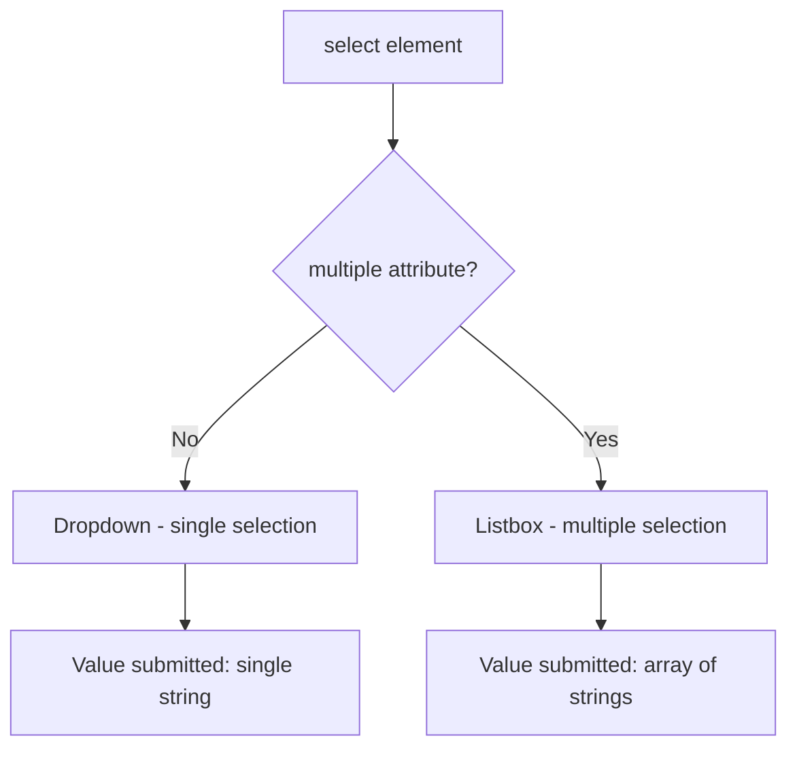
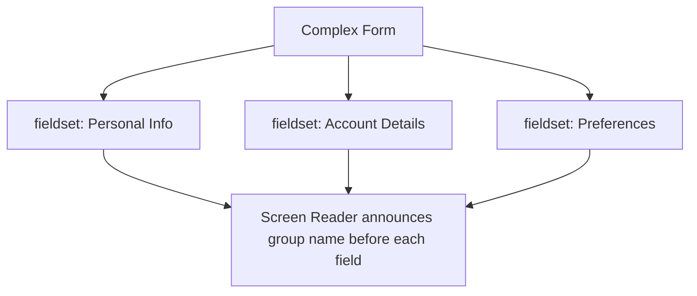
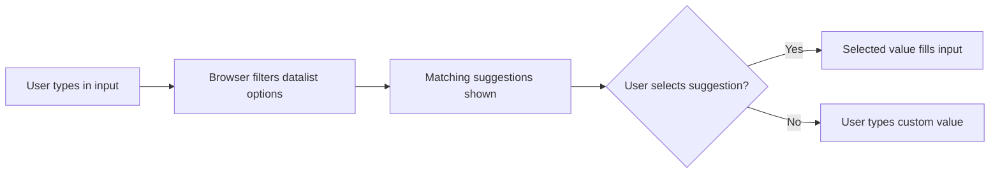
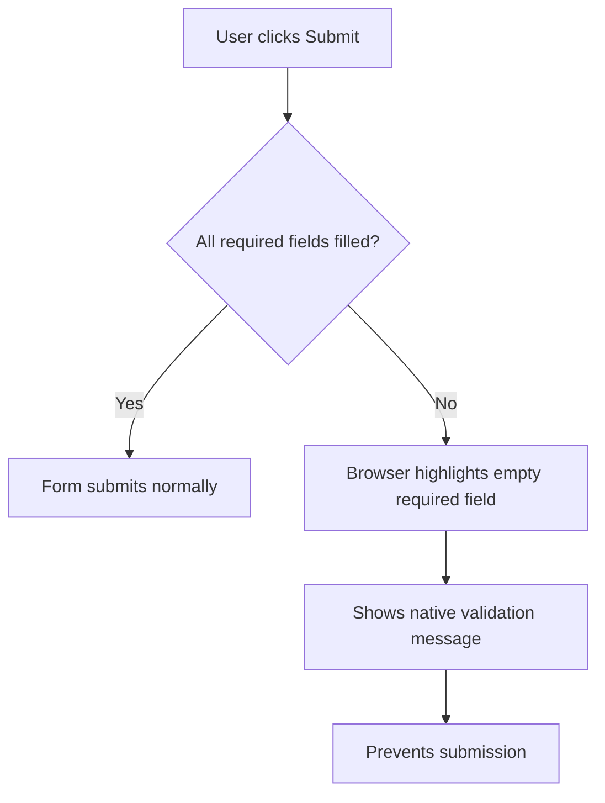
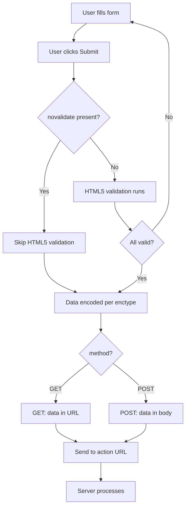
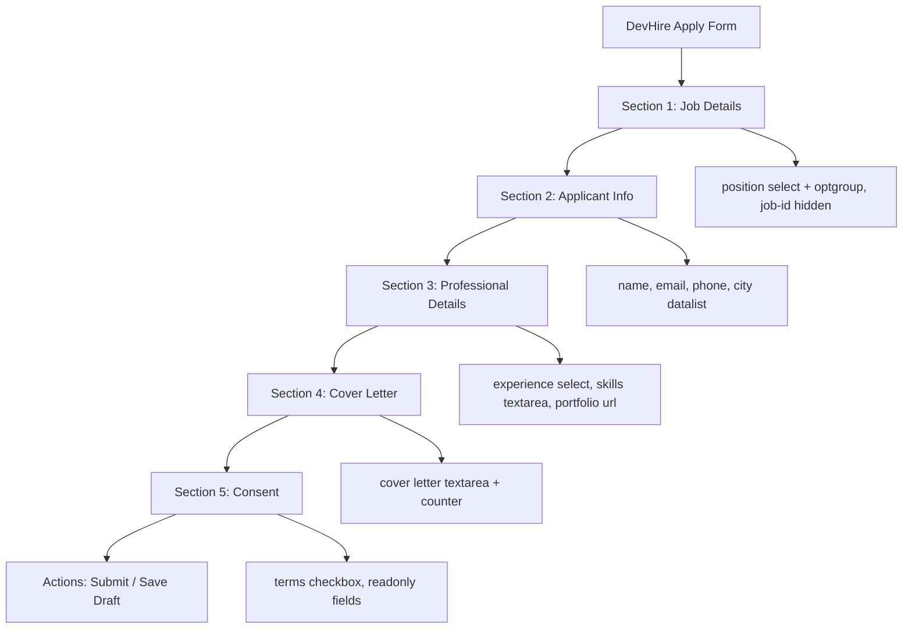

<a id="chapter-17-form-elements-attributes"></a>

# Chapter 17: Form Elements & Attributes

[⬅ Previous Chapter](#chapter-16-html-input-types) | [📖 Main Index](#main-index) | [Next Chapter ➡](#chapter-18-html5-form-validation)

---

## 📌 Learning Objectives

By the end of this chapter, you will:

- Understand every major HTML form element beyond `<input>`
- Know how `<label>`, `<textarea>`, `<select>`, `<option>`, and `<button>` work
- Master critical form attributes: `placeholder`, `required`, `disabled`, `readonly`, `autofocus`, `name`, `value`, `action`, `method`, and more
- Understand the difference between `<button>` and `<input type="submit">`
- Learn how `<optgroup>`, `<datalist>`, `<fieldset>`, and `<legend>` enhance forms
- Be able to answer form element interview questions confidently
- Build a fully styled job application form using only HTML and CSS

---

<a id="chapter-index-table-17"></a>

## Chapter Index Table

| Topic No. | Topic Name | Subtopics |
|-----------|------------|-----------|
| 17.1 | [The `<label>` Element](#171-the-label-element) | for attribute, implicit vs explicit, accessibility |
| 17.2 | [The `<textarea>` Element](#172-the-textarea-element) | rows, cols, resize, wrap, placeholder |
| 17.3 | [The `<select>` Element](#173-the-select-element) | name, multiple, size, default value |
| 17.4 | [The `<option>` Element](#174-the-option-element) | value, selected, disabled |
| 17.5 | [The `<optgroup>` Element](#175-the-optgroup-element) | label, grouping, disabled |
| 17.6 | [The `<button>` Element](#176-the-button-element) | type, submit vs reset vs button, vs input |
| 17.7 | [The `<fieldset>` & `<legend>` Elements](#177-fieldset-and-legend) | grouping, accessibility, disabled fieldset |
| 17.8 | [The `<datalist>` Element](#178-the-datalist-element) | id linking, autocomplete suggestions |
| 17.9 | [The `<output>` Element](#179-the-output-element) | for, name, live calculation |
| 17.10 | [Critical Form Attributes](#1710-critical-form-attributes) | placeholder, required, disabled, readonly, autofocus, name, value, autocomplete, novalidate |
| 17.11 | [Form-Level Attributes](#1711-form-level-attributes) | action, method, enctype, target, novalidate |
| 17.12 | [Interview Questions](#1712-interview-questions) | Conceptual, Scenario, Output-based, Advanced |
| 17.13 | [Practice Problems](#1713-practice-problems) | Coding, Theory, Machine Coding |
| 17.14 | [Mini Project](#1714-mini-project) | Job Application Form |

---

## 17.1 The `<label>` Element

<a id="171-the-label-element"></a>

### What is it?

The `<label>` element defines a **text label** for a form control. It is one of the most important yet most often misused elements in HTML forms. A properly used label dramatically improves both **accessibility** and **usability**.

### Why is it needed?

- Screen readers announce the label text when the input is focused
- Clicking the label focuses or activates its associated input
- Improves click/tap target area (especially for checkboxes and radios)
- Required for WCAG accessibility compliance

### Two Ways to Associate a Label

#### Method 1: Explicit Association (Recommended)

```html
<!-- 'for' attribute must match input's 'id' -->
<label for="username">Username</label>
<input type="text" id="username" name="username">
```

#### Method 2: Implicit Association (Wrapping)

```html
<!-- Input is nested inside label — no for/id needed -->
<label>
  Username
  <input type="text" name="username">
</label>
```

### Explicit vs Implicit Comparison

| Feature | Explicit (`for`/`id`) | Implicit (wrapping) |
|---------|----------------------|---------------------|
| Flexibility | Label and input can be far apart in DOM | Must be nested |
| CSS targeting | Easier to style independently | Slightly harder |
| Screen reader support | Excellent | Good |
| Recommended | ✅ Yes | ⚠️ Use with care |

### Label with Checkboxes and Radio Buttons

```html
<!-- Clicking label text checks/unchecks the box -->
<input type="checkbox" id="agree" name="agree" value="yes">
<label for="agree">I agree to the Terms & Conditions</label>

<!-- Clicking label selects the radio -->
<input type="radio" id="male" name="gender" value="male">
<label for="male">Male</label>
```

> [!IMPORTANT]
> Every `<input>`, `<textarea>`, `<select>`, and `<button>` should have an associated `<label>`. This is not optional for accessibility — it is a **WCAG 2.1 requirement** (Success Criterion 1.3.1).

### What NOT to Do

```html
<!-- ❌ Wrong: no label at all -->
<input type="text" name="username" placeholder="Username">

<!-- ❌ Wrong: for and id don't match -->
<label for="user">Username</label>
<input type="text" id="username" name="username">

<!-- ✅ Correct -->
<label for="username">Username</label>
<input type="text" id="username" name="username">
```

> [!NOTE]
> `placeholder` is NOT a replacement for `<label>`. Placeholder text disappears when the user starts typing, leaving users confused about what the field expects.

### 🧠 Hinglish Intuition

> Socho school ka attendance register — har student ke naam ke saamne ek box hota hai. `<label>` woh naam hai aur `<input>` woh box. Agar naam aur box ka connection nahi hai toh confusion hoga — exactly yahi hota hai jab label aur input properly linked nahi hote. Screen reader ek andhey insaan ki tarah hai — bina label ke use pata hi nahi chalta ki kaunsa field kya maangta hai!

---

👉 <a href="#chapter-index-table-17">Go to Top 🔝</a>

---

## 17.2 The `<textarea>` Element

<a id="172-the-textarea-element"></a>

### What is it?

`<textarea>` creates a **multi-line text input** field. Unlike `<input type="text">` which is single-line, textarea allows users to enter paragraphs, descriptions, messages, and other long-form text.

```html
<label for="bio">About Yourself:</label>
<textarea 
  id="bio" 
  name="bio"
  rows="5"
  cols="40"
  placeholder="Tell us about yourself..."
  maxlength="500"
  required
></textarea>
```

### Key Differences from `<input type="text">`

| Feature | `<input type="text">` | `<textarea>` |
|---------|----------------------|--------------|
| Lines | Single line | Multi-line |
| Self-closing | Yes (void element) | No (requires closing tag) |
| Default value | `value` attribute | Content between tags |
| Resizable | No | Yes (by default) |
| Use case | Short data | Long-form content |

### Key Attributes

| Attribute | Purpose | Example |
|-----------|---------|---------|
| `rows` | Visible number of lines | `rows="6"` |
| `cols` | Visible width in characters | `cols="50"` |
| `maxlength` | Max characters allowed | `maxlength="1000"` |
| `minlength` | Min characters required | `minlength="20"` |
| `placeholder` | Hint text | `placeholder="Write here..."` |
| `wrap` | Text wrapping behavior | `wrap="soft"` or `wrap="hard"` |
| `readonly` | Prevent editing | `readonly` |
| `disabled` | Disable entirely | `disabled` |
| `required` | Make mandatory | `required` |
| `autofocus` | Auto-focus on load | `autofocus` |

### Setting Default Value

```html
<!-- Default value goes BETWEEN the tags (not in value attribute) -->
<textarea id="notes" name="notes">
This is the default text content.
  </textarea>

<!-- ❌ Wrong: value attribute does NOT work on textarea -->
<textarea value="This won't work"></textarea>
```

> [!IMPORTANT]
> The default value of a `<textarea>` is set by placing text **between the opening and closing tags**, NOT via a `value` attribute. This is a very common interview question.

### Controlling Resize with CSS

```css
/* Prevent all resizing */
textarea { resize: none; }

/* Allow only vertical resize (most common UX choice) */
textarea { resize: vertical; }

/* Allow only horizontal resize */
textarea { resize: horizontal; }

/* Allow both (default browser behavior) */
textarea { resize: both; }
```

### The `wrap` Attribute

| Value | Behavior |
|-------|---------|
| `soft` (default) | Text wraps visually but newlines NOT inserted in submitted value |
| `hard` | Newlines ARE inserted in submitted value at wrap points |
| `off` | No wrapping — horizontal scroll appears |

### Full Practical Example

```html
<form method="post" action="/submit-feedback">

  <div class="form-group">
    <label for="feedback">Your Feedback:</label>
    <textarea 
      id="feedback"
      name="feedback"
      rows="6"
      placeholder="Share your detailed feedback here (minimum 50 characters)..."
      minlength="50"
      maxlength="1000"
      required
      style="width: 100%; resize: vertical;"
    ></textarea>
    <small>Characters: 0 / 1000</small>
  </div>

</form>
```

### 🧠 Hinglish Intuition

> `<input type="text">` ek **WhatsApp message box** ki tarah hai — ek hi line. `<textarea>` ek **email compose box** ki tarah hai — jitna chaaho likho, scroll hota jaata hai. `rows` aur `cols` se tum box ka initial size set karte ho — jaise ek blank notebook me pages aur columns define karna.

---

👉 <a href="#chapter-index-table-17">Go to Top 🔝</a>

---

## 17.3 The `<select>` Element

<a id="173-the-select-element"></a>

### What is it?

`<select>` creates a **dropdown list** (combo box) that lets users choose one or more options from a predefined list. It is always used together with `<option>` elements inside it.

```html
<label for="country">Country:</label>
<select id="country" name="country">
  <option value="">-- Select Country --</option>
  <option value="in">India</option>
  <option value="us">United States</option>
  <option value="uk">United Kingdom</option>
</select>
```

### Key Attributes

| Attribute | Purpose | Example |
|-----------|---------|---------|
| `name` | Key sent in form data | `name="country"` |
| `id` | Links to `<label>` | `id="country"` |
| `multiple` | Allow multi-selection | `multiple` |
| `size` | Visible rows (listbox mode) | `size="4"` |
| `required` | Mandate selection | `required` |
| `disabled` | Disable dropdown | `disabled` |
| `autofocus` | Focus on load | `autofocus` |
| `form` | Associate with external form | `form="formId"` |

### `multiple` and `size` Attributes

```html
<!-- Multi-select listbox -->
<label for="languages">Programming Languages (hold Ctrl/Cmd to select multiple):</label>
<select id="languages" name="languages[]" multiple size="5">
  <option value="html">HTML</option>
  <option value="css">CSS</option>
  <option value="js">JavaScript</option>
  <option value="python">Python</option>
  <option value="java">Java</option>
  <option value="cpp">C++</option>
</select>
```

> [!TIP]
> When using `multiple`, add `[]` to the `name` attribute (e.g., `name="languages[]"`) to indicate to the server that multiple values should be received as an array.

### Single vs Multi Select Behavior



### 🧠 Hinglish Intuition

> `<select>` ek **restaurant menu** ki tarah hai — waiter tumhe ek list deta hai, tum ek item choose karte ho. `multiple` attribute ke saath yeh ek **buffet** ban jaata hai — kai items ek saath choose kar sakte ho. `size` attribute decide karta hai ki menu me ek waqt kitne items dikhenge.

---

👉 <a href="#chapter-index-table-17">Go to Top 🔝</a>

---

## 17.4 The `<option>` Element

<a id="174-the-option-element"></a>

### What is it?

`<option>` defines **individual items** inside a `<select>` dropdown or `<datalist>`. Each option has a display text and an optional `value` that gets submitted with the form.

```html
<select name="role">
  <option value="">-- Choose Role --</option>
  <option value="dev">Developer</option>
  <option value="des" selected>Designer</option>
  <option value="pm" disabled>Product Manager (Coming Soon)</option>
</select>
```

### Key Attributes

| Attribute | Purpose | Example |
|-----------|---------|---------|
| `value` | The value submitted to server | `value="dev"` |
| `selected` | Pre-selects this option | `selected` |
| `disabled` | Grays out, not selectable | `disabled` |
| `label` | Alternative display text | `label="Dev"` |

### Value vs Display Text

```html
<option value="in">India</option>
<!--         ↑              ↑
       submitted to     shown to
          server          user    -->
```

> [!IMPORTANT]
> If `value` is omitted, the **text content** of the `<option>` is used as the submitted value. Always explicitly set `value` for clarity and server-side consistency.

### Placeholder Option Pattern

```html
<!-- Common pattern: first option as placeholder -->
<select name="department" required>
  <!-- disabled + selected + value="" = required validation works -->
  <option value="" disabled selected>-- Select Department --</option>
  <option value="eng">Engineering</option>
  <option value="design">Design</option>
  <option value="marketing">Marketing</option>
</select>
```

> [!TIP]
> Using `value=""`, `disabled`, and `selected` together on the first option creates a **proper placeholder** for `<select>`. The `required` attribute then forces the user to choose a real option since the empty value fails validation.

### 🧠 Hinglish Intuition

> `<option>` ek **menu ka individual item** hai. `value` woh hai jo kitchen ko order jaata hai (server data), text woh hai jo customer menu me padhta hai (display). Jaise menu me "Paneer Tikka" likha hota hai lekin kitchen order slip pe "PT-04" jaata hai — display aur value alag ho sakte hain!

---

👉 <a href="#chapter-index-table-17">Go to Top 🔝</a>

---

## 17.5 The `<optgroup>` Element

<a id="175-the-optgroup-element"></a>

### What is it?

`<optgroup>` groups related `<option>` elements inside a `<select>` dropdown under a **labeled heading**. The group label is displayed but is NOT selectable — it is purely organizational.

```html
<label for="tech-stack">Tech Stack:</label>
<select id="tech-stack" name="tech_stack">

  <optgroup label="🌐 Frontend">
    <option value="react">React</option>
    <option value="vue">Vue.js</option>
    <option value="angular">Angular</option>
  </optgroup>

  <optgroup label="⚙️ Backend">
    <option value="nodejs">Node.js</option>
    <option value="django">Django</option>
    <option value="springboot">Spring Boot</option>
  </optgroup>

  <optgroup label="🗄️ Database">
    <option value="mysql">MySQL</option>
    <option value="mongodb">MongoDB</option>
    <option value="postgresql">PostgreSQL</option>
  </optgroup>

</select>
```

### Key Attributes

| Attribute | Purpose | Example |
|-----------|---------|---------|
| `label` | Group heading text (required) | `label="Frontend"` |
| `disabled` | Disables entire group | `disabled` |

### When to Use `<optgroup>`

- When a dropdown has **10+ options** from different categories
- Country selectors grouped by continent
- Product categories grouped by department
- Tech stack grouped by layer (frontend, backend, database)

### 🧠 Hinglish Intuition

> `<optgroup>` ek **menu ka section header** hai — jaise restaurant menu me "Starters", "Main Course", "Desserts" ke headings hote hain. Yeh headings khud order nahi ho sakti, sirf organization ke liye hain. Exactly yahi `<optgroup>` karta hai!

---

👉 <a href="#chapter-index-table-17">Go to Top 🔝</a>

---

## 17.6 The `<button>` Element

<a id="176-the-button-element"></a>

### What is it?

`<button>` creates a **clickable button**. Unlike `<input type="submit">`, the `<button>` element can contain **HTML content** — text, icons, images, SVGs, and even other inline elements — making it far more flexible.

```html
<!-- Simple text button -->
<button type="submit">Submit Form</button>

<!-- Button with icon and text -->
<button type="submit">
  <span>🚀</span> Launch Application
</button>

<!-- Button with image -->
<button type="button">
   Save Draft
</button>
```

### The Three Types of `<button>`

| Type | Behavior | Use Case |
|------|---------|---------|
| `type="submit"` | Submits the form | Form submission button |
| `type="reset"` | Resets all form fields | Clear form (use sparingly) |
| `type="button"` | Does nothing by default | JavaScript actions |

> [!IMPORTANT]
> If you omit the `type` attribute on a `<button>`, it **defaults to `type="submit"`**. This means a button inside a form without `type="button"` will submit the form when clicked — a very common bug.

### `<button>` vs `<input type="submit">`

| Feature | `<button type="submit">` | `<input type="submit">` |
|---------|--------------------------|------------------------|
| Can contain HTML | ✅ Yes | ❌ No (text only) |
| Icon inside | ✅ Yes | ❌ No |
| CSS styling | ✅ Easier | ⚠️ More limited |
| Closing tag | Required | Not needed (void) |
| Default type | `submit` | Always submit |
| Recommended | ✅ Yes | Legacy use |

### Practical Examples

```html
<form method="post" action="/register">

  <!-- Submit: submits the form -->
  <button type="submit">
    ✅ Create Account
  </button>

  <!-- Reset: clears all fields -->
  <button type="reset">
    🔄 Clear Form
  </button>

  <!-- Button: custom JS action, does NOT submit -->
  <button type="button" onclick="saveDraft()">
    💾 Save Draft
  </button>

</form>

<!-- Button outside form, linked via form attribute -->
<button type="submit" form="my-form">
  Submit External Form
</button>
```

### Button with `disabled` State

```html
<!-- Disabled button - not clickable, grayed out -->
<button type="submit" disabled>
  Processing... ⏳
</button>
```

### 🧠 Hinglish Intuition

> `<button>` ek **multifunctional remote control button** ki tarah hai — same button pe alag alag kaam ho sakta hai depending on `type`. `submit` matlab TV band karo, `reset` matlab factory reset, `button` matlab kuch mat karo jab tak JavaScript na bole. Aur agar type nahi likha toh browser assume karta hai `submit` — yeh sabse common bug hai!

---

👉 <a href="#chapter-index-table-17">Go to Top 🔝</a>

---

## 17.7 Fieldset and Legend

<a id="177-fieldset-and-legend"></a>

### What are they?

`<fieldset>` groups related form elements together visually and semantically. `<legend>` provides a **caption/title** for the fieldset group. Together they are the HTML standard for organizing complex forms.

```html
<fieldset>
  <legend>Personal Information</legend>

  <label for="name">Full Name:</label>
  <input type="text" id="name" name="name" required>

  <label for="email">Email:</label>
  <input type="email" id="email" name="email" required>
</fieldset>
```

### Why Use Fieldset and Legend?



### Disabling an Entire Fieldset

```html
<!-- ALL inputs inside a disabled fieldset are automatically disabled -->
<fieldset disabled>
  <legend>Payment Details (Currently Unavailable)</legend>
  <input type="text" name="card_number" placeholder="Card Number">
  <input type="text" name="cvv" placeholder="CVV">
</fieldset>
```

> [!TIP]
> Adding `disabled` to a `<fieldset>` automatically disables ALL form controls inside it. This is far more efficient than adding `disabled` to each individual input.

### Accessibility Benefits

| Benefit | Detail |
|---------|--------|
| Screen readers | Announce the legend before each field in the group |
| Keyboard navigation | Users understand field context |
| Visual grouping | Clear sections in complex forms |
| Semantic structure | Meaningful HTML hierarchy |

### Styling Fieldset

```css
fieldset {
  border: 2px solid #e0e6ed;
  border-radius: 10px;
  padding: 20px 24px;
  margin-bottom: 24px;
}

legend {
  font-size: 15px;
  font-weight: 700;
  color: #3498db;
  padding: 0 10px;
  background: white;
}
```

### 🧠 Hinglish Intuition

> `<fieldset>` ek **form ka section divider** hai — jaise ek bade form ko pages me divide karna. `<legend>` us section ka heading hota hai. Screen reader ke liye yeh ek **chapter heading** ki tarah kaam karta hai — jab user navigate karta hai toh pehle legend padhta hai, phir uske andar ke fields. `disabled` fieldset ek **locked counter** ki tarah hai — andar sab kuch band ho jaata hai ek command se!

---

👉 <a href="#chapter-index-table-17">Go to Top 🔝</a>

---

## 17.8 The `<datalist>` Element

<a id="178-the-datalist-element"></a>

### What is it?

`<datalist>` provides a list of **predefined suggestions** for an `<input>` element while still allowing the user to type any custom value. It creates a native autocomplete/suggestion dropdown without JavaScript.

```html
<label for="framework">Preferred Framework:</label>
<input 
  type="text" 
  id="framework" 
  name="framework"
  list="framework-options"
  placeholder="Type or choose..."
>

<datalist id="framework-options">
  <option value="React">
  <option value="Vue.js">
  <option value="Angular">
  <option value="Svelte">
  <option value="Next.js">
  <option value="Nuxt.js">
</datalist>
```

### How It Works



### `<datalist>` vs `<select>`

| Feature | `<datalist>` | `<select>` |
|---------|-------------|-----------|
| Free text input | ✅ Yes | ❌ No |
| Predefined options | ✅ Yes | ✅ Yes |
| Forces choice from list | ❌ No | ✅ Yes |
| Searchable/filterable | ✅ Yes (native) | ❌ No (native) |
| Use case | Suggestions with custom option | Strict choice required |

### Works with Multiple Input Types

```html
<!-- With type="color" -->
<input type="color" list="brand-colors">
<datalist id="brand-colors">
  <option value="#3498db">
  <option value="#2ecc71">
  <option value="#e74c3c">
</datalist>

<!-- With type="range" -->
<input type="range" list="range-ticks" min="0" max="100" step="25">
<datalist id="range-ticks">
  <option value="0" label="Min">
  <option value="25" label="25%">
  <option value="50" label="Mid">
  <option value="75" label="75%">
  <option value="100" label="Max">
</datalist>
```

### 🧠 Hinglish Intuition

> `<datalist>` Google Search ke autocomplete suggestions ki tarah hai — type karo, suggestions aate hain. Lekin `<select>` se farak yeh hai ki tum apna khud ka value bhi type kar sakte ho, sirf suggestions ke alawa. Jaise Google Maps — suggested locations dikhata hai lekin tum koi bhi address type kar sakte ho!

---

👉 <a href="#chapter-index-table-17">Go to Top 🔝</a>

---

## 17.9 The `<output>` Element

<a id="179-the-output-element"></a>

### What is it?

`<output>` represents the **result of a calculation or user action**. It is semantically paired with form controls (like `<input type="range">`) to display live computed values.

```html
<form oninput="total.value = parseInt(qty.value) * parseInt(price.value)">
  
  <label for="qty">Quantity:</label>
  <input type="number" id="qty" name="qty" value="1" min="1">

  <label for="price">Price (₹):</label>
  <input type="number" id="price" name="price" value="100" min="0">

  <label for="total">Total:</label>
  <output id="total" name="total" for="qty price">100</output>

</form>
```

### Key Attributes

| Attribute | Purpose | Example |
|-----------|---------|---------|
| `for` | Space-separated list of related input IDs | `for="qty price"` |
| `name` | Name for form submission | `name="total"` |
| `form` | Associate with a form by ID | `form="calc-form"` |

### Common Use with Range Slider

```html
<form>
  <label for="vol">Volume:</label>
  <input 
    type="range" 
    id="vol" 
    name="volume"
    min="0" max="100" step="1" value="50"
    oninput="volDisplay.value = this.value + '%'"
  >
  <output id="volDisplay" for="vol">50%</output>
</form>
```

### 🧠 Hinglish Intuition

> `<output>` ek **calculator screen** ki tarah hai — tum inputs dete ho, aur result screen pe dikhta hai. `for` attribute batata hai ki yeh output kis input ke calculations se aaya hai. Jaise calculator pe 5 × 20 type karo, aur screen pe 100 dikhe — exactly yahi `<output>` karta hai!

---

👉 <a href="#chapter-index-table-17">Go to Top 🔝</a>

---

## 17.10 Critical Form Attributes

<a id="1710-critical-form-attributes"></a>

### Overview

These attributes apply to most form elements (`<input>`, `<textarea>`, `<select>`, `<button>`) and control behavior, validation, and accessibility.

---

### `placeholder`

Displays **hint text** inside an empty input that disappears when the user starts typing.

```html
<input type="text" placeholder="e.g. John Doe">
<textarea placeholder="Write your message here..."></textarea>
```

**Rules & Best Practices:**

```css
/* Style placeholder text */
input::placeholder {
  color: #aaa;
  font-style: italic;
  font-size: 14px;
}
```

> [!IMPORTANT]
> `placeholder` is NOT a substitute for `<label>`. Use both together. Placeholder disappears on typing, leaving users confused about field purpose. Labels are always visible.

---

### `required`

Makes a field **mandatory**. The form cannot be submitted if a required field is empty (or has invalid value).

```html
<input type="text" name="name" required>
<textarea name="message" required></textarea>
<select name="country" required>
  <option value="" disabled selected>Select Country</option>
  <option value="in">India</option>
</select>
```

**How Required Validation Works:**



---

### `disabled`

Completely **disables** a form control — it cannot be interacted with and its value is **NOT submitted** with the form.

```html
<input type="text" name="field" value="Read only data" disabled>
<button type="submit" disabled>Processing...</button>
<select name="region" disabled>...</select>
```

**Disabled Behavior:**

| Characteristic | Detail |
|----------------|--------|
| User interaction | Blocked |
| Keyboard focus | Cannot be focused |
| Form submission | Value NOT included |
| Visual appearance | Grayed out |
| CSS targeting | `:disabled` pseudo-class |

---

### `readonly`

Prevents the user from **editing** the value, but unlike `disabled`, the value IS still submitted with the form and the field CAN receive focus.

```html
<input type="text" name="user_id" value="USR-12345" readonly>
<textarea name="generated_code" readonly>function hello() {}</textarea>
```

### `disabled` vs `readonly` Comparison

| Feature | `disabled` | `readonly` |
|---------|-----------|------------|
| User can edit | ❌ No | ❌ No |
| User can focus | ❌ No | ✅ Yes |
| User can copy text | ❌ No | ✅ Yes |
| Value submitted | ❌ No | ✅ Yes |
| Styling | Grayed out | Normal |
| CSS pseudo-class | `:disabled` | `:read-only` |

---

### `autofocus`

**Automatically focuses** the specified input when the page loads. Only ONE element per page should have `autofocus`.

```html
<!-- Cursor appears here immediately on page load -->
<input type="search" name="q" autofocus placeholder="Search...">
```

> [!NOTE]
> Use `autofocus` carefully. It can disorient screen reader users who expect to start at the top of the page. Only use it on pages where the primary action is clearly filling a specific field (like a search page or a login page).

---

### `name`

The `name` attribute defines the **key** that is sent to the server when the form is submitted. Without `name`, the input's value will NOT be included in form submission.

```html
<input type="text" id="username" name="username" value="rahul">
<!-- Submitted as: username=rahul -->

<input type="text" id="username">
<!-- No name = NOT submitted at all -->
```

---

### `value`

Sets the **default value** of a form control. For most inputs, this is also what gets submitted.

```html
<!-- Pre-filled text input -->
<input type="text" name="city" value="Mumbai">

<!-- Pre-selected checkbox -->
<input type="checkbox" name="subscribe" value="yes" checked>
<!-- Submitted value when checked: subscribe=yes -->

<!-- Hidden field with fixed value -->
<input type="hidden" name="source" value="homepage">
```

---

### `autocomplete`

Controls whether the browser should **auto-fill** the input from previously entered data.

```html
<!-- Allow autocomplete (default) -->
<input type="email" name="email" autocomplete="email">

<!-- Disable autocomplete -->
<input type="text" name="otp" autocomplete="off">

<!-- New password (tells password manager this is a new password) -->
<input type="password" name="new_pwd" autocomplete="new-password">

<!-- Current password (for login) -->
<input type="password" name="pwd" autocomplete="current-password">
```

**Common `autocomplete` Values:**

| Value | Purpose |
|-------|---------|
| `on` | Allow browser autocomplete |
| `off` | Disable autocomplete |
| `name` | Full name |
| `email` | Email address |
| `tel` | Phone number |
| `username` | Username |
| `current-password` | Login password |
| `new-password` | Registration/change password |
| `address-line1` | Street address |
| `postal-code` | Zip/postal code |
| `cc-number` | Credit card number |

---

### `tabindex`

Controls the **keyboard tab order** of form elements.

```html
<input type="text" name="first" tabindex="1">
<input type="text" name="third" tabindex="3">
<input type="text" name="second" tabindex="2">
<!-- Tab order: first → second → third -->

<!-- Remove from tab order -->
<button type="button" tabindex="-1">Not in Tab Order</button>
```

### 🧠 Hinglish Intuition

> Yeh attributes form ka **traffic control system** hain:
> - `required` = red light — bina fill kiye aage nahi ja sakte
> - `disabled` = road closed — koi interaction nahi, data submit nahi
> - `readonly` = one-way mirror — dekh sakte ho, touch nahi kar sakte, lekin data submit hoga
> - `placeholder` = road sign — direction batata hai, permanent nahi
> - `autofocus` = VIP entrance — seedha wahan le jaata hai
> - `name` = envelope ka address — bina address ke letter deliver nahi hoga!

---

👉 <a href="#chapter-index-table-17">Go to Top 🔝</a>

---

## 17.11 Form-Level Attributes

<a id="1711-form-level-attributes"></a>

### The `<form>` Element — Complete Reference

The `<form>` element wraps all form controls and defines **how data is collected and sent**.

```html
<form 
  id="registration-form"
  action="/register"
  method="post"
  enctype="multipart/form-data"
  target="_self"
  novalidate
  autocomplete="on"
>
  <!-- Form controls go here -->
</form>
```

### Key Form-Level Attributes

---

#### `action`

Specifies the **URL** where form data is sent on submission.

```html
<!-- Absolute URL -->
<form action="https://api.example.com/submit">

<!-- Relative URL -->
<form action="/submit">
<form action="./process.php">

<!-- Empty action: submits to current page -->
<form action="">
<form action="#">
```

---

#### `method`

Defines the **HTTP method** used to send form data.

| Value | HTTP Method | Data Location | Use Case |
|-------|------------|---------------|---------|
| `get` | GET | URL query string | Search forms, filters |
| `post` | POST | Request body | Login, registration, file upload |
| `dialog` | — | Closes dialog | Inside `<dialog>` element |

```html
<!-- GET: data appears in URL -->
<!-- /search?q=html&category=tutorial -->
<form method="get" action="/search">
  <input type="text" name="q">
  <select name="category">...</select>
</form>

<!-- POST: data in request body, not visible in URL -->
<form method="post" action="/login">
  <input type="email" name="email">
  <input type="password" name="password">
</form>
```

**GET vs POST:**

| Feature | GET | POST |
|---------|-----|------|
| Data location | URL query string | Request body |
| Visibility | Visible in URL | Not visible |
| Bookmarkable | ✅ Yes | ❌ No |
| Browser history | Saved | Not saved |
| Max data size | ~2000 chars | No limit |
| File upload | ❌ No | ✅ Yes |
| Sensitive data | ❌ Never | ✅ Preferred |
| Idempotent | ✅ Yes | ❌ No |

---

#### `enctype`

Specifies **how form data is encoded** before sending. Only relevant when `method="post"`.

| Value | Use Case |
|-------|---------|
| `application/x-www-form-urlencoded` | Default. Standard form data |
| `multipart/form-data` | **Required for file uploads** |
| `text/plain` | Plain text — rarely used, debugging only |

```html
<!-- File upload MUST use multipart/form-data -->
<form method="post" action="/upload" enctype="multipart/form-data">
  <input type="file" name="avatar">
  <button type="submit">Upload</button>
</form>
```

---

#### `target`

Specifies where to display the **response** after form submission.

| Value | Behavior |
|-------|---------|
| `_self` | Default. Load in same tab |
| `_blank` | Open in new tab |
| `_parent` | Load in parent frame |
| `_top` | Load in full window |
| `frameName` | Load in named iframe |

---

#### `novalidate`

**Disables** the browser's built-in HTML5 validation entirely. Used when you want to handle validation with custom JavaScript.

```html
<form method="post" action="/submit" novalidate>
  <!-- Browser won't validate required, email format, etc. -->
  <!-- Custom JS validation handles everything -->
</form>
```

---

#### `autocomplete` (on form level)

Controls autocomplete for the **entire form**.

```html
<!-- Enable autocomplete for entire form -->
<form autocomplete="on">

<!-- Disable autocomplete for entire form -->
<form autocomplete="off">
```

### Complete Form Flow Diagram



### 🧠 Hinglish Intuition

> `<form>` attributes ek **courier service ka form** ki tarah hain:
> - `action` = delivery address (kahan bhejna hai)
> - `method` = shipping type (GET = postcard — sab dikhta hai; POST = sealed envelope — andar kya hai nahi dikhta)
> - `enctype` = packaging type (normal envelope vs special box for heavy items/files)
> - `target` = delivery instructions (same address pe raho ya nayi jagah kholo)
> - `novalidate` = "seal mat check karo" — customs ko bypass karna

---

👉 <a href="#chapter-index-table-17">Go to Top 🔝</a>

---

## 17.12 Interview Questions

<a id="1712-interview-questions"></a>

## 💡 Interview Questions

---

### 🔵 Conceptual Questions

**Q1. What is the difference between `disabled` and `readonly` attributes?**

**Answer:**

| | `disabled` | `readonly` |
|--|-----------|------------|
| Can edit | ❌ No | ❌ No |
| Can focus | ❌ No | ✅ Yes |
| Value submitted | ❌ No | ✅ Yes |
| Appearance | Grayed out | Normal |

The most critical interview point: a `disabled` field's value is **NOT sent** to the server, while a `readonly` field's value **IS sent**.

---

**Q2. What is the default value of the `type` attribute on a `<button>` element?**

**Answer:** `type="submit"`. This means any `<button>` inside a `<form>` without an explicit `type` attribute will submit the form when clicked. This is one of the most common HTML bugs — a button meant to trigger a JavaScript action unexpectedly submits the form.

---

**Q3. What is the difference between `<button type="submit">` and `<input type="submit">`?**

**Answer:**
- `<button>` can contain **HTML content** (icons, images, spans, SVGs)
- `<input type="submit">` can only show **plain text** via the `value` attribute
- `<button>` is more flexible and easier to style with CSS
- `<button>` is the modern recommended approach

---

**Q4. How do you set a default value for `<textarea>`?**

**Answer:** By placing text **between the opening and closing tags**:
```html
<textarea name="bio">This is the default text.</textarea>
```
The `value` attribute does NOT work on `<textarea>`. This is a very common interview trick question.

---

**Q5. What is the purpose of the `for` attribute on `<label>`?**

**Answer:** The `for` attribute creates an **association** between the label and a form control by matching the input's `id` attribute. This serves two purposes:
1. Clicking the label focuses/activates the associated input
2. Screen readers announce the label text when the input receives focus

---

**Q6. What is the difference between `<select>` and `<datalist>`?**

**Answer:**
- `<select>` forces the user to choose from a **fixed list** of options only
- `<datalist>` provides **suggestions** but allows the user to type any custom value
- `<select>` always renders as a dropdown/listbox
- `<datalist>` is attached to a regular `<input>` via the `list` attribute

---

**Q7. When would you use `method="get"` vs `method="post"`?**

**Answer:**
- **GET**: Search forms, filters, navigation — when data is not sensitive, should be bookmarkable, or needs to appear in URL
- **POST**: Login, registration, file upload, payment — when data is sensitive, large, or causes a server-side change

---

**Q8. Why is `placeholder` not a replacement for `<label>`?**

**Answer:**
1. Placeholder **disappears** when user starts typing — they can't refer back to it
2. Placeholder has **low contrast** by default (accessibility failure)
3. Screen readers may not always announce placeholder text as a field label
4. Older browsers have inconsistent placeholder support
5. Labels are always visible; placeholders are transient hints

---

### 🟡 Scenario-Based Questions

**Q9. A button inside your form is accidentally submitting the form. How do you fix it?**

**Answer:** Add `type="button"` explicitly:
```html
<!-- Before fix: accidentally submits form -->
<button onclick="validateStep()">Next Step</button>

<!-- After fix: only runs JS, doesn't submit -->
<button type="button" onclick="validateStep()">Next Step</button>
```

---

**Q10. How would you disable all form fields in a section without adding `disabled` to each one individually?**

**Answer:** Wrap the section in a `<fieldset>` and add `disabled` to the fieldset:
```html
<fieldset disabled>
  <legend>Payment (Unavailable)</legend>
  <input type="text" name="card">
  <input type="text" name="cvv">
  <!-- All inputs automatically disabled -->
</fieldset>
```

---

**Q11. How do you make a `<select>` dropdown show a placeholder without allowing the user to submit an empty value?**

**Answer:**
```html
<select name="role" required>
  <option value="" disabled selected>-- Select Role --</option>
  <option value="dev">Developer</option>
  <option value="des">Designer</option>
</select>
```
Three attributes together: `value=""` + `disabled` + `selected`. The `required` attribute ensures the empty value fails validation.

---

### 🔴 Output-Based Questions

**Q12. Will this field's value be submitted with the form?**

```html
<input type="text" name="city" value="Mumbai" disabled>
```

**Answer:** **No.** `disabled` inputs are excluded from form submission entirely.

---

**Q13. What does this render, and what happens when Submit is clicked?**

```html
<form method="get" action="/search">
  <input type="text" name="q" value="HTML">
  <button>Search</button>
</form>
```

**Answer:** Renders a text input with "HTML" pre-filled and a submit button. When clicked, navigates to: `/search?q=HTML`. The `<button>` defaults to `type="submit"`.

---

**Q14. What is wrong with this code?**

```html
<textarea name="bio" value="Default text"></textarea>
```

**Answer:** `<textarea>` does NOT support the `value` attribute. The default text must be placed between opening and closing tags:
```html
<textarea name="bio">Default text</textarea>
```

---

### 🟣 Advanced Questions

**Q15. What is the difference between `enctype="application/x-www-form-urlencoded"` and `enctype="multipart/form-data"`?**

**Answer:**
- `application/x-www-form-urlencoded` (default): Encodes form data as key=value pairs separated by `&`. Special characters are percent-encoded. Cannot handle binary file data.
- `multipart/form-data`: Sends data as separate "parts" in the request body, each with its own headers. Required for file uploads because it preserves binary data.

---

**Q16. Can a form element be associated with a `<form>` that it is NOT nested inside? How?**

**Answer:** Yes, using the `form` attribute. Any form control can be placed anywhere in the document and associated with a specific form using `form="formId"`:
```html
<form id="my-form" action="/submit" method="post">
  <input type="text" name="username">
</form>

<!-- Outside the form tag, but associated via form attribute -->
<button type="submit" form="my-form">Submit</button>
<input type="hidden" name="source" value="external" form="my-form">
```

---

👉 <a href="#chapter-index-table-17">Go to Top 🔝</a>

---

## 17.13 Practice Problems

<a id="1713-practice-problems"></a>

## 🧪 Practice Problems

---

### 💻 Coding Questions

**1. Build a contact form with label, textarea, select, and button.**

```html
<form method="post" action="/contact">

  <div class="form-group">
    <label for="contact-name">Full Name *</label>
    <input type="text" id="contact-name" name="name" 
           placeholder="John Doe" required>
  </div>

  <div class="form-group">
    <label for="contact-email">Email *</label>
    <input type="email" id="contact-email" name="email" 
           placeholder="john@example.com" required>
  </div>

  <div class="form-group">
    <label for="contact-subject">Subject *</label>
    <select id="contact-subject" name="subject" required>
      <option value="" disabled selected>-- Select Subject --</option>
      <option value="support">Technical Support</option>
      <option value="billing">Billing Inquiry</option>
      <option value="feedback">General Feedback</option>
      <option value="partnership">Partnership</option>
    </select>
  </div>

  <div class="form-group">
    <label for="contact-message">Message *</label>
    <textarea 
      id="contact-message" 
      name="message"
      rows="6"
      placeholder="Describe your issue or question in detail..."
      minlength="20"
      maxlength="1000"
      required
    ></textarea>
  </div>

  <div class="form-actions">
    <button type="submit">📨 Send Message</button>
    <button type="reset">🔄 Clear</button>
  </div>

</form>
```

---

**2. Create a grouped select dropdown for tech stack using `<optgroup>`.**

```html
<label for="stack">Primary Technology:</label>
<select id="stack" name="primary_tech" required>
  <option value="" disabled selected>-- Choose Your Stack --</option>

  <optgroup label="🌐 Frontend">
    <option value="react">React.js</option>
    <option value="vue">Vue.js</option>
    <option value="angular">Angular</option>
    <option value="svelte">Svelte</option>
  </optgroup>

  <optgroup label="⚙️ Backend">
    <option value="nodejs">Node.js</option>
    <option value="django">Django (Python)</option>
    <option value="rails">Ruby on Rails</option>
    <option value="spring">Spring Boot (Java)</option>
  </optgroup>

  <optgroup label="📱 Mobile">
    <option value="react-native">React Native</option>
    <option value="flutter">Flutter</option>
    <option value="swift">Swift (iOS)</option>
  </optgroup>

  <optgroup label="☁️ DevOps / Cloud">
    <option value="docker">Docker</option>
    <option value="k8s">Kubernetes</option>
    <option value="aws">AWS</option>
  </optgroup>

</select>
```

---

**3. Build a salary calculator using `<input type="range">` and `<output>`.**

```html
<form oninput="
  monthly.value = '₹' + parseInt(salary.value * 100000 / 12).toLocaleString('en-IN');
  annual.value = '₹' + parseInt(salary.value).toLocaleString('en-IN') + ' LPA';
">
  <fieldset>
    <legend>💰 Salary Calculator</legend>

    <label for="salary">Expected Salary:</label>
    <div style="display:flex; align-items:center; gap:12px;">
      <span>3 LPA</span>
      <input type="range" id="salary" name="salary_lpa" 
             min="3" max="100" step="1" value="15">
      <span>100 LPA</span>
    </div>

    <div>
      <label>Annual CTC: </label>
      <output id="annual" name="annual" for="salary">₹15 LPA</output>
    </div>

    <div>
      <label>Monthly Take-home (approx): </label>
      <output id="monthly" name="monthly" for="salary">
        ₹1,25,000
      </output>
    </div>
  </fieldset>
</form>
```

---

**4. Create a city search with `<datalist>` suggestions.**

```html
<label for="city">City:</label>
<input 
  type="text" 
  id="city" 
  name="city"
  list="indian-cities"
  placeholder="Type a city name..."
  autocomplete="off"
>

<datalist id="indian-cities">
  <option value="Mumbai">
  <option value="Delhi">
  <option value="Bangalore">
  <option value="Chennai">
  <option value="Kolkata">
  <option value="Hyderabad">
  <option value="Pune">
  <option value="Ahmedabad">
  <option value="Jaipur">
  <option value="Surat">
  <option value="Lucknow">
  <option value="Chandigarh">
</datalist>
```

---

**5. Build an accessible form section using `<fieldset>`, `<legend>`, and proper labels.**

```html
<form method="post" action="/profile/update">

  <fieldset>
    <legend>🧑 Personal Details</legend>

    <div class="form-row">
      <label for="p-fname">First Name *</label>
      <input type="text" id="p-fname" name="first_name" 
             autocomplete="given-name" required>
    </div>

    <div class="form-row">
      <label for="p-lname">Last Name *</label>
      <input type="text" id="p-lname" name="last_name" 
             autocomplete="family-name" required>
    </div>

    <div class="form-row">
      <label for="p-dob">Date of Birth</label>
      <input type="date" id="p-dob" name="dob" 
             max="2006-12-31" autocomplete="bday">
    </div>
  </fieldset>

  <fieldset>
    <legend>📍 Address</legend>

    <div class="form-row">
      <label for="p-street">Street Address</label>
      <input type="text" id="p-street" name="street" 
             autocomplete="address-line1">
    </div>

    <div class="form-row">
      <label for="p-city">City</label>
      <input type="text" id="p-city" name="city" 
             list="indian-cities" autocomplete="address-level2">
      <datalist id="indian-cities">
        <option value="Mumbai">
        <option value="Delhi">
        <option value="Bangalore">
      </datalist>
    </div>

    <div class="form-row">
      <label for="p-pin">PIN Code</label>
      <input type="text" id="p-pin" name="pincode" 
             pattern="[0-9]{6}" maxlength="6" 
             placeholder="6-digit PIN" autocomplete="postal-code">
    </div>
  </fieldset>

  <!-- Disabled fieldset example -->
  <fieldset disabled>
    <legend>🔒 Account Security (Contact Admin to Change)</legend>
    <div class="form-row">
      <label for="p-email">Registered Email</label>
      <input type="email" id="p-email" name="email" value="user@example.com">
    </div>
  </fieldset>

  <button type="submit">💾 Save Profile</button>

</form>
```

---

### 📖 Theory Questions

**1. Why does `<button>` default to `type="submit"` and why is this a problem?**

> The HTML spec defines `button`'s default type as `submit`. This is problematic because any button added to a form for non-submission purposes (like toggling UI, running JS, etc.) will accidentally submit the form if `type="button"` is forgotten. The fix is to **always explicitly declare `type`** on every `<button>`.

---

**2. Explain why `placeholder` should not be the only label for a form field.**

> Placeholder text disappears once the user starts typing. This means users who need to pause mid-form have no reminder of what the field requires. Additionally, placeholder text typically renders in light gray with poor contrast ratios, failing WCAG accessibility standards. Screen readers may not consistently read placeholder text as a field label.

---

**3. What is the significance of the `name` attribute? What happens without it?**

> The `name` attribute defines the **key** in the key=value pair sent to the server. Without a `name` attribute, the browser completely ignores the input during form submission. The `id` attribute is for DOM/CSS targeting — `name` is specifically for form data transmission. A common mistake is using only `id` and forgetting `name`.

---

**4. Explain the `for` attribute on `<label>` in depth.**

> The `for` attribute on `<label>` creates a **programmatic association** between the label and a form control. The value of `for` must exactly match the `id` of the target control. This serves two critical roles:
> 1. **Usability**: Clicking the label focuses (text inputs) or toggles (checkboxes/radios) the associated control, increasing the tap target size
> 2. **Accessibility**: Screen readers announce the label text when the associated control receives focus, allowing visually impaired users to understand each field

---

**5. What is the difference between `<optgroup>` label and `<option>` value?**

> - `<optgroup label="">` sets a **non-selectable section heading** in a dropdown — it organizes options visually but cannot be selected or submitted
> - `<option value="">` sets the **data value** submitted when that specific option is selected — it can differ from the displayed text

---

### ⚙️ Machine Coding Problems

**Problem 1: Feedback Form with Dynamic Character Counter**

```html
<!DOCTYPE html>
<html lang="en">
<head>
  <meta charset="UTF-8">
  <meta name="viewport" content="width=device-width, initial-scale=1.0">
  <title>Feedback Form</title>
  <style>
    *, *::before, *::after { box-sizing: border-box; margin: 0; padding: 0; }

    body {
      font-family: 'Segoe UI', sans-serif;
      background: #f0f2f5;
      display: flex;
      justify-content: center;
      align-items: flex-start;
      padding: 40px 16px;
      min-height: 100vh;
    }

    .card {
      background: white;
      border-radius: 16px;
      box-shadow: 0 4px 24px rgba(0,0,0,0.08);
      padding: 40px;
      width: 100%;
      max-width: 560px;
    }

    h2 {
      font-size: 22px;
      color: #2c3e50;
      margin-bottom: 8px;
    }

    .subtitle {
      font-size: 14px;
      color: #888;
      margin-bottom: 30px;
    }

    .form-group { margin-bottom: 22px; }

    label {
      display: block;
      font-size: 13px;
      font-weight: 700;
      text-transform: uppercase;
      letter-spacing: 0.4px;
      color: #555;
      margin-bottom: 7px;
    }

    .req { color: #e74c3c; }

    input[type="text"],
    input[type="email"],
    select,
    textarea {
      width: 100%;
      padding: 12px 16px;
      border: 2px solid #e8ecf0;
      border-radius: 8px;
      font-size: 14px;
      font-family: inherit;
      color: #2c3e50;
      outline: none;
      transition: border-color 0.2s, box-shadow 0.2s;
    }

    input:focus, select:focus, textarea:focus {
      border-color: #3498db;
      box-shadow: 0 0 0 3px rgba(52,152,219,0.1);
    }

    textarea {
      resize: vertical;
      min-height: 130px;
    }

    .char-counter {
      display: flex;
      justify-content: flex-end;
      margin-top: 5px;
    }

    .char-count {
      font-size: 12px;
      color: #aaa;
    }

    .char-count.warn { color: #e67e22; }
    .char-count.limit { color: #e74c3c; font-weight: 700; }

    .rating-group {
      display: flex;
      gap: 8px;
    }

    .rating-group input[type="radio"] {
      display: none;
    }

    .rating-group label {
      display: flex;
      align-items: center;
      justify-content: center;
      width: 44px;
      height: 44px;
      border: 2px solid #e8ecf0;
      border-radius: 50%;
      font-size: 16px;
      font-weight: 700;
      cursor: pointer;
      text-transform: none;
      letter-spacing: 0;
      color: #888;
      margin-bottom: 0;
      transition: all 0.2s;
    }

    .rating-group input[type="radio"]:checked + label {
      background: #3498db;
      border-color: #3498db;
      color: white;
    }

    .rating-group label:hover {
      border-color: #3498db;
      color: #3498db;
    }

    .btn-group {
      display: flex;
      gap: 12px;
      margin-top: 28px;
    }

    .btn-submit {
      flex: 1;
      padding: 14px;
      background: #3498db;
      color: white;
      border: none;
      border-radius: 8px;
      font-size: 15px;
      font-weight: 700;
      cursor: pointer;
      transition: background 0.2s, transform 0.1s;
    }

    .btn-submit:hover { background: #2980b9; transform: translateY(-1px); }
    .btn-submit:active { transform: none; }

    .btn-reset {
      padding: 14px 20px;
      background: white;
      color: #888;
      border: 2px solid #e8ecf0;
      border-radius: 8px;
      font-size: 15px;
      font-weight: 600;
      cursor: pointer;
      transition: all 0.2s;
    }

    .btn-reset:hover { border-color: #e74c3c; color: #e74c3c; }
  </style>
</head>
<body>
  <div class="card">
    <h2>💬 Share Your Feedback</h2>
    <p class="subtitle">Help us improve. Your feedback matters to us.</p>

    <form method="post" action="/feedback">
      <input type="hidden" name="source" value="feedback-widget">

      <div class="form-group">
        <label for="fb-name">Name <span class="req">*</span></label>
        <input type="text" id="fb-name" name="name"
               placeholder="Your full name" required autocomplete="name">
      </div>

      <div class="form-group">
        <label for="fb-email">Email <span class="req">*</span></label>
        <input type="email" id="fb-email" name="email"
               placeholder="you@example.com" required autocomplete="email">
      </div>

      <div class="form-group">
        <label for="fb-category">Category <span class="req">*</span></label>
        <select id="fb-category" name="category" required>
          <option value="" disabled selected>-- Select Category --</option>
          <optgroup label="Product">
            <option value="feature-request">Feature Request</option>
            <option value="bug-report">Bug Report</option>
            <option value="ux-feedback">UX / Design Feedback</option>
          </optgroup>
          <optgroup label="Support">
            <option value="billing">Billing Issue</option>
            <option value="technical">Technical Problem</option>
          </optgroup>
          <optgroup label="General">
            <option value="compliment">Compliment 😊</option>
            <option value="other">Other</option>
          </optgroup>
        </select>
      </div>

      <div class="form-group">
        <label>Overall Rating <span class="req">*</span></label>
        <div class="rating-group">
          <input type="radio" id="r1" name="rating" value="1" required>
          <label for="r1">1</label>
          <input type="radio" id="r2" name="rating" value="2">
          <label for="r2">2</label>
          <input type="radio" id="r3" name="rating" value="3">
          <label for="r3">3</label>
          <input type="radio" id="r4" name="rating" value="4">
          <label for="r4">4</label>
          <input type="radio" id="r5" name="rating" value="5">
          <label for="r5">5</label>
        </div>
      </div>

      <div class="form-group">
        <label for="fb-message">
          Your Feedback <span class="req">*</span>
        </label>
        <textarea
          id="fb-message"
          name="message"
          placeholder="Share your experience, suggestions, or concerns..."
          minlength="30"
          maxlength="500"
          required
          oninput="updateCounter(this)"
        ></textarea>
        <div class="char-counter">
          <span class="char-count" id="counter">0 / 500</span>
        </div>
      </div>

      <div class="btn-group">
        <button type="submit" class="btn-submit">📨 Submit Feedback</button>
        <button type="reset" class="btn-reset">Clear</button>
      </div>
    </form>
  </div>

  <script>
    function updateCounter(el) {
      const count = el.value.length;
      const max = parseInt(el.getAttribute('maxlength'));
      const counter = document.getElementById('counter');
      counter.textContent = count + ' / ' + max;
      counter.className = 'char-count';
      if (count >= max * 0.9) counter.classList.add('limit');
      else if (count >= max * 0.75) counter.classList.add('warn');
    }
  </script>
</body>
</html>
```

---

**Problem 2: Multi-Fieldset Settings Form**

```html
<!DOCTYPE html>
<html lang="en">
<head>
  <meta charset="UTF-8">
  <meta name="viewport" content="width=device-width, initial-scale=1.0">
  <title>Account Settings</title>
  <style>
    *, *::before, *::after { box-sizing: border-box; margin: 0; padding: 0; }

    body {
      font-family: 'Segoe UI', sans-serif;
      background: #f5f7fa;
      padding: 32px 16px;
      color: #2c3e50;
    }

    .settings-wrap {
      max-width: 640px;
      margin: 0 auto;
    }

    h1 {
      font-size: 24px;
      margin-bottom: 6px;
      color: #1a1a2e;
    }

    .page-sub {
      font-size: 14px;
      color: #888;
      margin-bottom: 28px;
    }

    fieldset {
      background: white;
      border: 2px solid #e8ecf0;
      border-radius: 12px;
      padding: 28px;
      margin-bottom: 20px;
    }

    legend {
      font-size: 15px;
      font-weight: 700;
      color: #3498db;
      padding: 0 12px;
      background: white;
    }

    .field { margin-bottom: 18px; }
    .field:last-child { margin-bottom: 0; }

    label.field-label {
      display: block;
      font-size: 13px;
      font-weight: 600;
      color: #555;
      margin-bottom: 6px;
      text-transform: uppercase;
      letter-spacing: 0.3px;
    }

    .field-hint {
      font-size: 12px;
      color: #aaa;
      margin-top: 4px;
    }

    input[type="text"],
    input[type="email"],
    input[type="password"],
    select,
    textarea {
      width: 100%;
      padding: 11px 15px;
      border: 2px solid #e8ecf0;
      border-radius: 8px;
      font-size: 14px;
      font-family: inherit;
      color: #2c3e50;
      outline: none;
      transition: border-color 0.2s;
    }

    input:focus, select:focus, textarea:focus {
      border-color: #3498db;
    }

    input[readonly] {
      background: #f8f9fa;
      color: #888;
      cursor: not-allowed;
    }

    textarea { resize: vertical; }

    fieldset[disabled] {
      opacity: 0.55;
    }

    fieldset[disabled] legend {
      color: #aaa;
    }

    .disabled-note {
      font-size: 12px;
      color: #e74c3c;
      margin-top: 8px;
      font-style: italic;
    }

    .toggle-row {
      display: flex;
      justify-content: space-between;
      align-items: center;
      padding: 12px 0;
      border-bottom: 1px solid #f0f0f0;
    }

    .toggle-row:last-child { border-bottom: none; }

    .toggle-info { flex: 1; }
    .toggle-title { font-size: 14px; font-weight: 600; color: #2c3e50; }
    .toggle-desc { font-size: 12px; color: #aaa; margin-top: 2px; }

    input[type="checkbox"] {
      width: 18px;
      height: 18px;
      accent-color: #3498db;
      cursor: pointer;
      flex-shrink: 0;
    }

    .actions {
      display: flex;
      gap: 12px;
      justify-content: flex-end;
      margin-top: 8px;
    }

    .btn-save {
      padding: 13px 28px;
      background: #2ecc71;
      color: white;
      border: none;
      border-radius: 8px;
      font-size: 15px;
      font-weight: 700;
      cursor: pointer;
      transition: background 0.2s;
    }

    .btn-save:hover { background: #27ae60; }

    .btn-cancel {
      padding: 13px 28px;
      background: white;
      color: #666;
      border: 2px solid #e8ecf0;
      border-radius: 8px;
      font-size: 15px;
      font-weight: 600;
      cursor: pointer;
      transition: all 0.2s;
    }

    .btn-cancel:hover { border-color: #ccc; }

    @media (max-width: 480px) {
      fieldset { padding: 20px 16px; }
      .actions { flex-direction: column; }
      .btn-save, .btn-cancel { width: 100%; text-align: center; }
    }
  </style>
</head>
<body>
  <div class="settings-wrap">

    <h1>⚙️ Account Settings</h1>
    <p class="page-sub">Manage your profile and preferences</p>

    <form method="post" action="/settings/save">
      <input type="hidden" name="user_id" value="USR-78901">
      <input type="hidden" name="csrf_token" value="csrf_secure_abc">

      <!-- Personal Info Fieldset -->
      <fieldset>
        <legend>👤 Personal Information</legend>

        <div class="field">
          <label class="field-label" for="s-fname">First Name</label>
          <input type="text" id="s-fname" name="first_name"
                 value="Rahul" autocomplete="given-name">
        </div>

        <div class="field">
          <label class="field-label" for="s-lname">Last Name</label>
          <input type="text" id="s-lname" name="last_name"
                 value="Sharma" autocomplete="family-name">
        </div>

        <div class="field">
          <label class="field-label" for="s-bio">Bio</label>
          <textarea id="s-bio" name="bio" rows="3"
                    placeholder="Tell others about yourself..."
                    maxlength="300">Full-stack developer with 4+ years experience.</textarea>
          <p class="field-hint">Max 300 characters</p>
        </div>

        <div class="field">
          <label class="field-label" for="s-city">City</label>
          <input type="text" id="s-city" name="city"
                 list="cities-list" value="Mumbai"
                 autocomplete="address-level2">
          <datalist id="cities-list">
            <option value="Mumbai">
            <option value="Delhi">
            <option value="Bangalore">
            <option value="Pune">
            <option value="Hyderabad">
          </datalist>
        </div>
      </fieldset>

      <!-- Account (readonly email) Fieldset -->
      <fieldset>
        <legend>🔐 Account Details</legend>

        <div class="field">
          <label class="field-label" for="s-email">
            Registered Email
          </label>
          <input type="email" id="s-email" name="email"
                 value="rahul.sharma@example.com"
                 readonly autocomplete="email">
          <p class="field-hint">
            Contact support to change your email address
          </p>
        </div>

        <div class="field">
          <label class="field-label" for="s-new-pwd">
            New Password
          </label>
          <input type="password" id="s-new-pwd" name="new_password"
                 placeholder="Leave blank to keep current password"
                 minlength="8" autocomplete="new-password">
        </div>
      </fieldset>

      <!-- Notifications Fieldset -->
      <fieldset>
        <legend>🔔 Notifications</legend>

        <div class="toggle-row">
          <div class="toggle-info">
            <div class="toggle-title">Job Alerts</div>
            <div class="toggle-desc">
              Get notified about matching jobs
            </div>
          </div>
          <input type="checkbox" id="notif-jobs" 
                 name="notif_jobs" value="yes" checked>
          <label for="notif-jobs" style="display:none">Job Alerts</label>
        </div>

        <div class="toggle-row">
          <div class="toggle-info">
            <div class="toggle-title">Profile Views</div>
            <div class="toggle-desc">
              Know when recruiters view your profile
            </div>
          </div>
          <input type="checkbox" id="notif-views"
                 name="notif_views" value="yes" checked>
          <label for="notif-views" style="display:none">
            Profile Views
          </label>
        </div>

        <div class="toggle-row">
          <div class="toggle-info">
            <div class="toggle-title">Newsletter</div>
            <div class="toggle-desc">
              Weekly developer digest
            </div>
          </div>
          <input type="checkbox" id="notif-newsletter"
                 name="newsletter" value="yes">
          <label for="notif-newsletter" style="display:none">
            Newsletter
          </label>
        </div>
      </fieldset>

      <!-- Disabled Fieldset Example -->
      <fieldset disabled>
        <legend>🏢 Organization (Enterprise Only)</legend>
        <div class="field">
          <label class="field-label" for="s-org">Organization Name</label>
          <input type="text" id="s-org" name="org_name"
                 placeholder="Your company name">
        </div>
        <div class="field">
          <label class="field-label" for="s-role">Org Role</label>
          <select id="s-role" name="org_role">
            <option value="">-- Select --</option>
            <option value="admin">Admin</option>
            <option value="member">Member</option>
          </select>
        </div>
        <p class="disabled-note">
          🔒 Upgrade to Enterprise to enable organization features
        </p>
      </fieldset>

      <!-- Actions -->
      <div class="actions">
        <button type="reset" class="btn-cancel">Cancel</button>
        <button type="submit" class="btn-save">💾 Save Changes</button>
      </div>

    </form>
  </div>
</body>
</html>
```

---

👉 <a href="#chapter-index-table-17">Go to Top 🔝</a>

---

## 17.14 Mini Project

<a id="1714-mini-project"></a>

## 🚀 Mini Project: Job Application Form — DevHire Apply

---

### Problem Statement

Build a **comprehensive, fully-styled job application form** for a developer job portal called **"DevHire"**. The form must use ALL major form elements taught in this chapter: `<label>`, `<textarea>`, `<select>`, `<option>`, `<optgroup>`, `<fieldset>`, `<legend>`, `<datalist>`, `<button>`, and key attributes including `placeholder`, `required`, `disabled`, `readonly`, and `autocomplete`.

---

### Features

- ✅ Personal information section with proper labels
- ✅ Position applied for using `<select>` with `<optgroup>`
- ✅ Skills textarea with character counter
- ✅ Cover letter textarea
- ✅ Location with `<datalist>` suggestions
- ✅ Experience level with grouped select
- ✅ Availability and work mode (radio buttons)
- ✅ Portfolio URL input (readonly referral source)
- ✅ Terms & privacy consent (checkbox, required)
- ✅ Submit and Save Draft buttons with correct types
- ✅ Disabled section for premium features
- ✅ Full responsive CSS styling

---

### Architecture



---

### Folder Structure

```text
mini-project-devhire-apply/
│
├── index.html
└── style.css
```

---

### Implementation

#### `index.html`

```html
<!DOCTYPE html>
<html lang="en">
<head>
  <meta charset="UTF-8">
  <meta name="viewport" content="width=device-width, initial-scale=1.0">
  <title>DevHire – Apply Now</title>
  <link rel="stylesheet" href="style.css">
</head>
<body>

<div class="page">

  <!-- Top Banner -->
  <header class="app-banner">
    <div class="banner-inner">
      <div class="brand-row">
        <span class="brand-logo">💼</span>
        <span class="brand-text">DevHire</span>
      </div>
      <div class="banner-job">
        <h1 class="job-title">Senior Frontend Developer</h1>
        <div class="job-meta">
          <span>🏢 TechCorp Pvt Ltd</span>
          <span>📍 Bangalore, India</span>
          <span>💰 ₹18–28 LPA</span>
          <span>⏰ Full Time</span>
        </div>
      </div>
    </div>
  </header>

  <!-- Application Form -->
  <main class="app-main">
    <form 
      id="job-application"
      class="apply-form"
      method="post" 
      action="/apply/submit"
      enctype="multipart/form-data"
      autocomplete="on"
      novalidate
    >

      <!-- Hidden tracking fields -->
      <input type="hidden" name="job_id" value="JOB-2024-FE-089">
      <input type="hidden" name="posting_source" value="direct_apply">
      <input type="hidden" name="csrf_token" value="csrf_xyz_secure_987">
      <input type="hidden" name="applied_role" value="senior_frontend_dev">

      <!-- ===== SECTION 1: Position Details ===== -->
      <fieldset class="form-section">
        <legend>
          <span class="legend-num">01</span>
          Position Details
        </legend>

        <div class="field-grid">

          <div class="field full">
            <label class="flabel" for="position">
              Applying For <span class="req">*</span>
            </label>
            <select id="position" name="position" required>
              <option value="" disabled selected>
                -- Select Position --
              </option>
              <optgroup label="🌐 Frontend Roles">
                <option value="sr-frontend" selected>
                  Senior Frontend Developer
                </option>
                <option value="jr-frontend">
                  Junior Frontend Developer
                </option>
                <option value="react-specialist">
                  React.js Specialist
                </option>
                <option value="ui-engineer">
                  UI Engineer
                </option>
              </optgroup>
              <optgroup label="⚙️ Backend Roles">
                <option value="sr-backend">
                  Senior Backend Developer
                </option>
                <option value="nodejs-dev">
                  Node.js Developer
                </option>
                <option value="python-dev">
                  Python Developer
                </option>
              </optgroup>
              <optgroup label="🎨 Design Roles">
                <option value="ui-designer">
                  UI/UX Designer
                </option>
                <option value="product-designer">
                  Product Designer
                </option>
              </optgroup>
              <optgroup label="🔬 Fullstack & Other">
                <option value="fullstack">
                  Fullstack Developer
                </option>
                <option value="devops">
                  DevOps Engineer
                </option>
              </optgroup>
            </select>
          </div>

          <div class="field">
            <label class="flabel" for="work-mode">
              Work Mode Preference <span class="req">*</span>
            </label>
            <select id="work-mode" name="work_mode" required>
              <option value="" disabled selected>
                -- Select Mode --
              </option>
              <option value="remote">🏠 Remote</option>
              <option value="onsite">🏢 On-site</option>
              <option value="hybrid" selected>
                🔄 Hybrid
              </option>
            </select>
          </div>

          <div class="field">
            <label class="flabel" for="availability">
              Available to Join
            </label>
            <select id="availability" name="notice_period">
              <option value="immediate">Immediately</option>
              <option value="15days">Within 15 Days</option>
              <option value="30days" selected>
                Within 30 Days
              </option>
              <option value="60days">Within 60 Days</option>
              <option value="90days">Within 90 Days</option>
            </select>
          </div>

        </div>
      </fieldset>

      <!-- ===== SECTION 2: Personal Information ===== -->
      <fieldset class="form-section">
        <legend>
          <span class="legend-num">02</span>
          Personal Information
        </legend>

        <div class="field-grid">

          <div class="field">
            <label class="flabel" for="app-fname">
              First Name <span class="req">*</span>
            </label>
            <input 
              type="text" 
              id="app-fname" 
              name="first_name"
              class="finput"
              placeholder="e.g. Rahul"
              minlength="2"
              maxlength="50"
              autocomplete="given-name"
              required
            >
          </div>

          <div class="field">
            <label class="flabel" for="app-lname">
              Last Name <span class="req">*</span>
            </label>
            <input 
              type="text" 
              id="app-lname" 
              name="last_name"
              class="finput"
              placeholder="e.g. Sharma"
              minlength="2"
              maxlength="50"
              autocomplete="family-name"
              required
            >
          </div>

          <div class="field full">
            <label class="flabel" for="app-email">
              Email Address <span class="req">*</span>
            </label>
            <input 
              type="email" 
              id="app-email" 
              name="email"
              class="finput"
              placeholder="rahul@gmail.com"
              autocomplete="email"
              required
            >
            <p class="fhint">
              Your application confirmation will be sent here
            </p>
          </div>

          <div class="field">
            <label class="flabel" for="app-phone">
              Phone Number <span class="req">*</span>
            </label>
            <input 
              type="tel" 
              id="app-phone" 
              name="phone"
              class="finput"
              placeholder="+91 98765 43210"
              pattern="[+]{0,1}[0-9\s\-]{10,15}"
              autocomplete="tel"
              required
            >
          </div>

          <div class="field">
            <label class="flabel" for="app-city">
              Current City <span class="req">*</span>
            </label>
            <input 
              type="text" 
              id="app-city" 
              name="city"
              class="finput"
              list="city-suggestions"
              placeholder="Type your city..."
              autocomplete="address-level2"
              required
            >
            <datalist id="city-suggestions">
              <option value="Mumbai">
              <option value="Delhi">
              <option value="Bangalore">
              <option value="Hyderabad">
              <option value="Chennai">
              <option value="Pune">
              <option value="Kolkata">
              <option value="Ahmedabad">
              <option value="Jaipur">
              <option value="Noida">
              <option value="Gurugram">
            </datalist>
          </div>

        </div>
      </fieldset>

      <!-- ===== SECTION 3: Professional Details ===== -->
      <fieldset class="form-section">
        <legend>
          <span class="legend-num">03</span>
          Professional Details
        </legend>

        <div class="field-grid">

          <div class="field">
            <label class="flabel" for="experience">
              Total Experience <span class="req">*</span>
            </label>
            <select id="experience" name="experience" required>
              <option value="" disabled selected>
                -- Select Experience --
              </option>
              <option value="fresher">Fresher (0–1 yr)</option>
              <option value="1-2">1–2 Years</option>
              <option value="2-4">2–4 Years</option>
              <option value="4-6" selected>4–6 Years</option>
              <option value="6-8">6–8 Years</option>
              <option value="8-10">8–10 Years</option>
              <option value="10+">10+ Years</option>
            </select>
          </div>

          <div class="field">
            <label class="flabel" for="current-ctc">
              Current CTC (LPA)
            </label>
            <input 
              type="text" 
              id="current-ctc" 
              name="current_ctc"
              class="finput"
              placeholder="e.g. 18.5"
              pattern="[0-9]+(\.[0-9]{1,2})?"
            >
          </div>

          <div class="field">
            <label class="flabel" for="expected-ctc">
              Expected CTC (LPA) <span class="req">*</span>
            </label>
            <input 
              type="text" 
              id="expected-ctc" 
              name="expected_ctc"
              class="finput"
              placeholder="e.g. 24.0"
              pattern="[0-9]+(\.[0-9]{1,2})?"
              required
            >
          </div>

          <div class="field full">
            <label class="flabel" for="portfolio">
              Portfolio / GitHub URL
            </label>
            <input 
              type="url" 
              id="portfolio" 
              name="portfolio_url"
              class="finput"
              placeholder="https://github.com/yourusername"
              autocomplete="url"
            >
          </div>

          <div class="field full">
            <label class="flabel" for="app-skills">
              Key Skills <span class="req">*</span>
            </label>
            <textarea
              id="app-skills"
              name="skills"
              class="ftextarea"
              rows="3"
              placeholder="e.g. React, JavaScript, TypeScript, Node.js, REST APIs, Git..."
              minlength="10"
              maxlength="300"
              required
              oninput="updateCounter('skills-count', this, 300)"
            ></textarea>
            <div class="counter-row">
              <span class="fhint">
                Separate skills with commas
              </span>
              <span class="char-count" id="skills-count">0/300</span>
            </div>
          </div>

          <!-- Read-only referred by field -->
          <div class="field full">
            <label class="flabel" for="referred-by">
              Referred By
            </label>
            <input 
              type="text" 
              id="referred-by" 
              name="referred_by"
              class="finput"
              value="DevHire Direct Apply — Job Board"
              readonly
            >
            <p class="fhint">
              Auto-filled based on your application source
            </p>
          </div>

        </div>
      </fieldset>

      <!-- ===== SECTION 4: Cover Letter ===== -->
      <fieldset class="form-section">
        <legend>
          <span class="legend-num">04</span>
          Cover Letter
        </legend>

        <div class="field">
          <label class="flabel" for="cover-letter">
            Why are you a great fit for this role? 
            <span class="req">*</span>
          </label>
          <textarea
            id="cover-letter"
            name="cover_letter"
            class="ftextarea cover-ta"
            rows="8"
            placeholder="Dear Hiring Manager,

I am excited to apply for the Senior Frontend Developer position at TechCorp Pvt Ltd. With 4+ years of experience in React.js and modern JavaScript...

Share your background, relevant projects, and why you're passionate about this role."
            minlength="100"
            maxlength="2000"
            required
            oninput="updateCounter('cover-count', this, 2000)"
          ></textarea>
          <div class="counter-row">
            <span class="fhint">
              Minimum 100 characters. Be specific and genuine.
            </span>
            <span class="char-count" id="cover-count">0/2000</span>
          </div>
        </div>
      </fieldset>

      <!-- ===== SECTION 5: Premium (Disabled) ===== -->
      <fieldset class="form-section" disabled>
        <legend>
          <span class="legend-num">🔒</span>
          Video Introduction (DevHire Premium)
        </legend>

        <div class="premium-banner">
          <span class="premium-icon">⭐</span>
          <div>
            <strong>Upgrade to Premium</strong>
            <p>Add a 60-second video intro to stand out from 
               other candidates</p>
          </div>
          <button type="button" class="upgrade-btn" tabindex="-1">
            Upgrade
          </button>
        </div>

        <div class="field-grid">
          <div class="field full">
            <label class="flabel" for="video-url">
              Video Introduction URL
            </label>
            <input 
              type="url" 
              id="video-url"
              name="video_intro_url"
              class="finput"
              placeholder="https://loom.com/share/your-video"
            >
          </div>
          <div class="field full">
            <label class="flabel" for="video-desc">
              Video Description
            </label>
            <textarea 
              id="video-desc"
              name="video_description"
              class="ftextarea"
              rows="2"
              placeholder="Brief description of your video..."
            ></textarea>
          </div>
        </div>
      </fieldset>

      <!-- ===== SECTION 6: Consent ===== -->
      <fieldset class="form-section consent-section">
        <legend>
          <span class="legend-num">05</span>
          Declarations & Consent
        </legend>

        <div class="consent-list">

          <div class="consent-row">
            <input 
              type="checkbox" 
              id="c-accurate" 
              name="info_accurate" 
              value="yes"
              required
            >
            <label for="c-accurate">
              I confirm that all information provided in this 
              application is accurate and truthful. 
              <span class="req">*</span>
            </label>
          </div>

          <div class="consent-row">
            <input 
              type="checkbox" 
              id="c-terms" 
              name="terms_accepted" 
              value="yes"
              required
            >
            <label for="c-terms">
              I have read and agree to the 
              <a href="/terms" class="flink">Terms of Service</a> 
              and 
              <a href="/privacy" class="flink">Privacy Policy</a>. 
              <span class="req">*</span>
            </label>
          </div>

          <div class="consent-row">
            <input 
              type="checkbox" 
              id="c-alerts" 
              name="job_alerts" 
              value="yes"
              checked
            >
            <label for="c-alerts">
              Send me similar job recommendations via email
            </label>
          </div>

          <div class="consent-row">
            <input 
              type="checkbox" 
              id="c-profile" 
              name="profile_visible" 
              value="yes"
              checked
            >
            <label for="c-profile">
              Make my profile visible to other recruiters 
              on DevHire
            </label>
          </div>

        </div>
      </fieldset>

      <!-- ===== FORM ACTIONS ===== -->
      <div class="form-actions">
        <button type="button" class="btn-draft">
          💾 Save as Draft
        </button>
        <button type="reset" class="btn-reset">
          🔄 Clear Form
        </button>
        <button type="submit" class="btn-submit">
          🚀 Submit Application
        </button>
      </div>

    </form>
  </main>

  <!-- Footer -->
  <footer class="app-footer">
    <p>
      Having issues? 
      <a href="/support" class="flink">Contact Support</a> · 
      <a href="/faq" class="flink">FAQ</a>
    </p>
  </footer>

</div>

<script>
  function updateCounter(counterId, textarea, max) {
    const count = textarea.value.length;
    const el = document.getElementById(counterId);
    el.textContent = count + '/' + max;
    el.className = 'char-count';
    if (count >= max * 0.95) el.classList.add('at-limit');
    else if (count >= max * 0.8) el.classList.add('near-limit');
  }
</script>

</body>
</html>
```

---

#### `style.css`

```css
/* ===========================
   RESET & VARIABLES
   =========================== */
*, *::before, *::after {
  box-sizing: border-box;
  margin: 0;
  padding: 0;
}

:root {
  --primary:       #2563eb;
  --primary-dark:  #1d4ed8;
  --primary-light: #eff6ff;
  --success:       #16a34a;
  --warning:       #d97706;
  --danger:        #dc2626;
  --text-h:        #111827;
  --text-b:        #374151;
  --text-m:        #6b7280;
  --text-l:        #9ca3af;
  --border:        #e5e7eb;
  --bg-page:       #f3f4f6;
  --bg-card:       #ffffff;
  --radius:        12px;
  --radius-sm:     8px;
  --shadow-sm:     0 1px 4px rgba(0,0,0,0.06);
  --shadow-md:     0 4px 20px rgba(0,0,0,0.08);
  --transition:    0.2s ease;
}

html { scroll-behavior: smooth; }

body {
  font-family: 'Segoe UI', system-ui, -apple-system, sans-serif;
  background: var(--bg-page);
  color: var(--text-b);
  line-height: 1.6;
  min-height: 100vh;
}

/* ===========================
   PAGE WRAPPER
   =========================== */
.page {
  max-width: 760px;
  margin: 0 auto;
  padding: 0 16px 40px;
}

/* ===========================
   BANNER / HEADER
   =========================== */
.app-banner {
  background: linear-gradient(135deg, #0f172a 0%, #1e3a5f 50%, #0f4c81 100%);
  color: white;
  border-radius: 0 0 20px 20px;
  margin: 0 -16px 28px;
  padding: 28px 32px 32px;
}

.banner-inner { max-width: 760px; margin: 0 auto; }

.brand-row {
  display: flex;
  align-items: center;
  gap: 8px;
  margin-bottom: 18px;
}

.brand-logo { font-size: 22px; }

.brand-text {
  font-size: 18px;
  font-weight: 800;
  letter-spacing: 1px;
  color: #60a5fa;
}

.job-title {
  font-size: 24px;
  font-weight: 800;
  margin-bottom: 10px;
  color: white;
}

.job-meta {
  display: flex;
  flex-wrap: wrap;
  gap: 16px;
  font-size: 13px;
  color: rgba(255,255,255,0.72);
}

.job-meta span {
  display: flex;
  align-items: center;
  gap: 5px;
}

/* ===========================
   FORM SECTIONS (FIELDSET)
   =========================== */
.apply-form {
  display: flex;
  flex-direction: column;
  gap: 20px;
}

.form-section {
  background: var(--bg-card);
  border: 2px solid var(--border);
  border-radius: var(--radius);
  padding: 28px 32px;
  box-shadow: var(--shadow-sm);
  transition: box-shadow var(--transition);
}

.form-section:focus-within {
  box-shadow: var(--shadow-md);
  border-color: #bfdbfe;
}

.form-section[disabled] {
  opacity: 0.55;
  background: #fafafa;
}

.form-section legend {
  display: flex;
  align-items: center;
  gap: 10px;
  font-size: 15px;
  font-weight: 700;
  color: var(--primary);
  background: var(--bg-card);
  padding: 0 12px;
  letter-spacing: 0.2px;
}

.form-section[disabled] legend {
  color: var(--text-m);
}

.legend-num {
  display: inline-flex;
  align-items: center;
  justify-content: center;
  width: 26px;
  height: 26px;
  background: var(--primary-light);
  color: var(--primary);
  border-radius: 50%;
  font-size: 12px;
  font-weight: 800;
}

/* ===========================
   FIELD GRID & GROUPS
   =========================== */
.field-grid {
  display: grid;
  grid-template-columns: 1fr 1fr;
  gap: 18px;
  margin-top: 6px;
}

.field {
  display: flex;
  flex-direction: column;
  gap: 5px;
}

.field.full {
  grid-column: 1 / -1;
}

/* ===========================
   LABELS
   =========================== */
.flabel {
  font-size: 12px;
  font-weight: 700;
  color: var(--text-m);
  text-transform: uppercase;
  letter-spacing: 0.5px;
}

.req { color: var(--danger); margin-left: 1px; }

.fhint {
  font-size: 11px;
  color: var(--text-l);
  margin-top: 2px;
}

/* ===========================
   TEXT INPUTS
   =========================== */
.finput {
  width: 100%;
  padding: 11px 15px;
  border: 2px solid var(--border);
  border-radius: var(--radius-sm);
  font-size: 14px;
  font-family: inherit;
  color: var(--text-h);
  background: white;
  outline: none;
  transition: border-color var(--transition), 
              box-shadow var(--transition);
}

.finput::placeholder { color: var(--text-l); }

.finput:focus {
  border-color: var(--primary);
  box-shadow: 0 0 0 3px rgba(37, 99, 235, 0.1);
}

.finput[readonly] {
  background: #f9fafb;
  color: var(--text-m);
  cursor: default;
}

.finput:valid:not(:placeholder-shown):not([readonly]) {
  border-color: #86efac;
}

/* ===========================
   SELECT
   =========================== */
select.finput,
select {
  width: 100%;
  padding: 11px 15px;
  border: 2px solid var(--border);
  border-radius: var(--radius-sm);
  font-size: 14px;
  font-family: inherit;
  color: var(--text-h);
  background: white;
  outline: none;
  cursor: pointer;
  transition: border-color var(--transition);
  appearance: none;
  background-image: url("data:image/svg+xml,%3Csvg xmlns='http://www.w3.org/2000/svg' width='12' height='12' viewBox='0 0 12 12'%3E%3Cpath fill='%236b7280' d='M6 8L1 3h10z'/%3E%3C/svg%3E");
  background-repeat: no-repeat;
  background-position: right 14px center;
  padding-right: 38px;
}

select:focus {
  border-color: var(--primary);
  box-shadow: 0 0 0 3px rgba(37,99,235,0.1);
}

/* ===========================
   TEXTAREA
   =========================== */
.ftextarea {
  width: 100%;
  padding: 12px 15px;
  border: 2px solid var(--border);
  border-radius: var(--radius-sm);
  font-size: 14px;
  font-family: inherit;
  color: var(--text-h);
  background: white;
  outline: none;
  resize: vertical;
  min-height: 90px;
  line-height: 1.6;
  transition: border-color var(--transition), 
              box-shadow var(--transition);
}

.ftextarea::placeholder { color: var(--text-l); }

.ftextarea:focus {
  border-color: var(--primary);
  box-shadow: 0 0 0 3px rgba(37,99,235,0.1);
}

.cover-ta { min-height: 200px; }

.counter-row {
  display: flex;
  justify-content: space-between;
  align-items: center;
  margin-top: 4px;
}

.char-count {
  font-size: 11px;
  font-weight: 600;
  color: var(--text-l);
  font-family: monospace;
}

.char-count.near-limit { color: var(--warning); }
.char-count.at-limit   { color: var(--danger); }

/* ===========================
   PREMIUM BANNER (DISABLED SECTION)
   =========================== */
.premium-banner {
  display: flex;
  align-items: center;
  gap: 14px;
  background: #fffbeb;
  border: 2px solid #fde68a;
  border-radius: var(--radius-sm);
  padding: 14px 18px;
  margin-bottom: 20px;
}

.premium-icon { font-size: 24px; flex-shrink: 0; }

.premium-banner strong {
  display: block;
  font-size: 14px;
  color: #92400e;
}

.premium-banner p {
  font-size: 12px;
  color: #b45309;
}

.upgrade-btn {
  margin-left: auto;
  padding: 8px 16px;
  background: #f59e0b;
  color: white;
  border: none;
  border-radius: 6px;
  font-size: 13px;
  font-weight: 700;
  cursor: not-allowed;
  opacity: 0.7;
  flex-shrink: 0;
}

/* ===========================
   CONSENT SECTION
   =========================== */
.consent-section { padding: 24px 32px; }

.consent-list {
  display: flex;
  flex-direction: column;
  gap: 0;
  margin-top: 6px;
}

.consent-row {
  display: flex;
  align-items: flex-start;
  gap: 12px;
  padding: 14px 0;
  border-bottom: 1px solid var(--border);
}

.consent-row:last-child { border-bottom: none; }

.consent-row input[type="checkbox"] {
  width: 17px;
  height: 17px;
  accent-color: var(--primary);
  cursor: pointer;
  flex-shrink: 0;
  margin-top: 2px;
}

.consent-row label {
  font-size: 14px;
  color: var(--text-b);
  cursor: pointer;
  line-height: 1.5;
}

/* ===========================
   FORM ACTIONS
   =========================== */
.form-actions {
  display: flex;
  gap: 12px;
  align-items: center;
  padding: 24px 0 8px;
}

.btn-submit {
  flex: 1;
  padding: 15px 20px;
  background: var(--primary);
  color: white;
  border: none;
  border-radius: var(--radius-sm);
  font-size: 15px;
  font-weight: 700;
  cursor: pointer;
  letter-spacing: 0.3px;
  transition: background var(--transition), 
              transform var(--transition);
}

.btn-submit:hover {
  background: var(--primary-dark);
  transform: translateY(-2px);
}

.btn-submit:active { transform: none; }

.btn-draft {
  padding: 15px 20px;
  background: white;
  color: var(--primary);
  border: 2px solid var(--primary);
  border-radius: var(--radius-sm);
  font-size: 14px;
  font-weight: 700;
  cursor: pointer;
  transition: all var(--transition);
  white-space: nowrap;
}

.btn-draft:hover {
  background: var(--primary-light);
}

.btn-reset {
  padding: 15px 16px;
  background: white;
  color: var(--text-m);
  border: 2px solid var(--border);
  border-radius: var(--radius-sm);
  font-size: 14px;
  font-weight: 600;
  cursor: pointer;
  transition: all var(--transition);
  white-space: nowrap;
}

.btn-reset:hover {
  border-color: var(--danger);
  color: var(--danger);
}

/* ===========================
   LINKS
   =========================== */
.flink {
  color: var(--primary);
  text-decoration: none;
  font-weight: 600;
}

.flink:hover { text-decoration: underline; }

/* ===========================
   FOOTER
   =========================== */
.app-footer {
  text-align: center;
  padding: 16px;
  font-size: 13px;
  color: var(--text-l);
  border-top: 1px solid var(--border);
  margin-top: 12px;
}

/* ===========================
   RESPONSIVE
   =========================== */
@media (max-width: 580px) {
  .app-banner { padding: 22px 20px 26px; border-radius: 0 0 16px 16px; }
  .job-title { font-size: 19px; }
  .form-section { padding: 20px 18px; }
  .field-grid { grid-template-columns: 1fr; }
  .field.full { grid-column: 1; }
  .form-actions { flex-direction: column; }
  .btn-submit, .btn-draft, .btn-reset { width: 100%; text-align: center; }
  .job-meta { gap: 10px; }
}

@media (max-width: 380px) {
  .form-section { padding: 16px 14px; }
  .job-title { font-size: 17px; }
}
```

---

### Interview Discussion Points

| Question | Answer |
|----------|--------|
| Why is `enctype="multipart/form-data"` on the form? | Required when form has file inputs (future enhancement) and best practice for complex forms |
| Why does the "Save as Draft" button have `type="button"`? | To prevent accidental form submission — only runs JavaScript |
| Why is `novalidate` on the form? | To implement custom JS validation instead of browser defaults |
| Why does the disabled fieldset have `tabindex="-1"` on its button? | To ensure the disabled section's button cannot be reached via Tab key |
| How does the `readonly` referred-by field differ from hidden? | `readonly` is visible to the user (transparency); `hidden` is invisible. Both submit their values. |
| What happens if user unchecks the "Terms" checkbox and submits? | The `required` attribute prevents submission — checkbox required validation works like text inputs |
| Why use `<optgroup>` in the position dropdown? | Groups 10+ options into logical categories for better UX and faster scanning |
| Why use `<datalist>` for city instead of `<select>`? | Allows typing any city (not in India) while suggesting common ones — more flexible than forced selection |

---

👉 <a href="#chapter-index-table-17">Go to Top 🔝</a>

---

## ⚡ Quick Revision

### All Form Elements at a Glance

| Element | Purpose | Key Attribute |
|---------|---------|---------------|
| `<label>` | Text label for input | `for` (matches input's `id`) |
| `<textarea>` | Multi-line text input | `rows`, `cols`, default value between tags |
| `<select>` | Dropdown list | `name`, `multiple`, `size` |
| `<option>` | Dropdown item | `value`, `selected`, `disabled` |
| `<optgroup>` | Group options in dropdown | `label` (required), `disabled` |
| `<button>` | Clickable button | `type` (submit/reset/button) |
| `<fieldset>` | Group related controls | `disabled` (disables all inside) |
| `<legend>` | Caption for fieldset | — |
| `<datalist>` | Autocomplete suggestions | Linked via input's `list` attribute |
| `<output>` | Display calculated result | `for`, `name` |

### Critical Attribute Summary

| Attribute | On | Effect |
|-----------|-----|--------|
| `placeholder` | input, textarea | Hint text — disappears on typing |
| `required` | input, select, textarea | Prevents submission if empty/invalid |
| `disabled` | any control, fieldset | No interaction, NOT submitted |
| `readonly` | input, textarea | No editing, IS submitted |
| `autofocus` | any control | Auto-focuses on page load |
| `name` | any control | Key in form submission data |
| `value` | input | Submitted value / default value |
| `autocomplete` | input, form | Browser autofill hints |
| `novalidate` | form | Disable HTML5 validation |
| `enctype` | form | Encoding (use multipart for files) |
| `method` | form | GET or POST |
| `action` | form | URL to send data to |

### ⚠️ Top Interview Traps

1. **`<button>` default type** → `submit`, not `button`
2. **`<textarea>` default value** → between tags, NOT `value=""` attribute
3. **`disabled` vs `readonly`** → disabled NOT submitted; readonly IS submitted
4. **`placeholder` vs `<label>`** → placeholder is NOT a label replacement
5. **`<optgroup>` label** → non-selectable, only organizational
6. **`<datalist>` vs `<select>`** → datalist allows custom input, select does not
7. **`name` attribute missing** → field silently excluded from form data
8. **`for` and `id` mismatch** → label not actually linked to input
9. **`required` on `<select>`** → needs `value=""` on placeholder option
10. **`enctype` for file upload** → MUST be `multipart/form-data`

---

## 📌 Chapter Summary

### 🎯 Most Important Interview Points

1. `<label for="">` must match the input's `id` — not `name`
2. `<button>` defaults to `type="submit"` — always declare `type` explicitly
3. `<textarea>` sets default value between tags, NOT via `value` attribute
4. `disabled` = not submitted + not focusable; `readonly` = submitted + focusable
5. `<fieldset disabled>` disables ALL controls inside with one attribute
6. `<datalist>` provides suggestions but allows free text; `<select>` forces a choice
7. A form control without `name` is **never submitted** to the server
8. `enctype="multipart/form-data"` is **required** for file uploads
9. `GET` data appears in URL (bookmarkable); `POST` data is in request body (secure)
10. `placeholder` is not accessible as a label — always use both

### 🔑 Key Concepts

- HTML provides rich form elements beyond just `<input>` — each solves a specific UX problem
- `<fieldset>` + `<legend>` is the HTML standard for grouping and accessibility
- `<optgroup>` dramatically improves usability for large dropdowns
- `<datalist>` gives the flexibility of a text input with the convenience of a dropdown
- `<output>` semantically represents computed values — better than a bare `<span>`
- Every form attribute has a specific purpose — none are decorative

### 💼 Practical Takeaways

- Always pair `<label for="">` with every form control
- Use `<fieldset>` to group and `disabled` it to lock entire sections
- Use `<optgroup>` when a `<select>` has more than 7–8 options from different categories
- Never use `type="reset"` without a confirmation — it's bad UX
- Use `autocomplete` attributes properly to help password managers and mobile users
- Use `<datalist>` for city, country, tag, and skill inputs where suggestions help but custom values are valid

---

[⬅ Previous Chapter](#chapter-16-html-input-types) | [📖 Main Index](#main-index) | [Next Chapter ➡](#chapter-18-html5-form-validation)