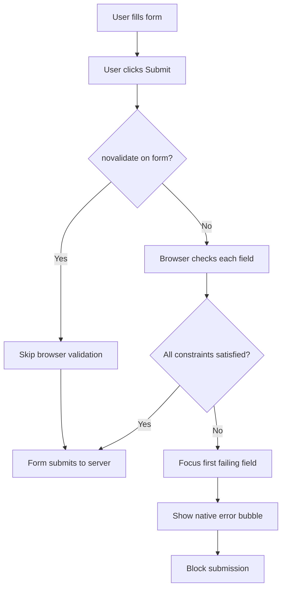
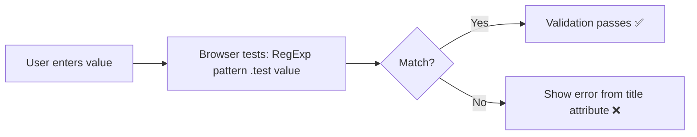
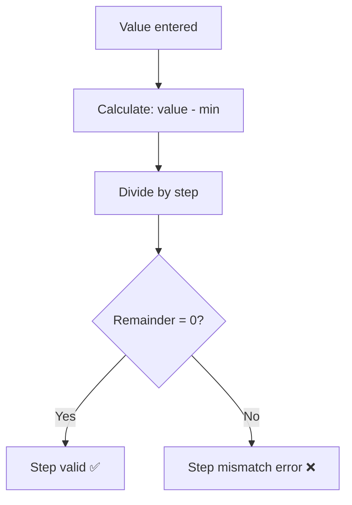
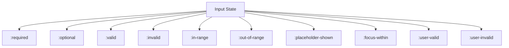
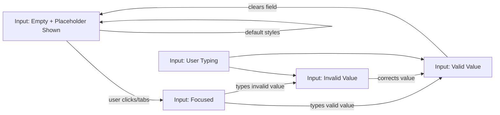
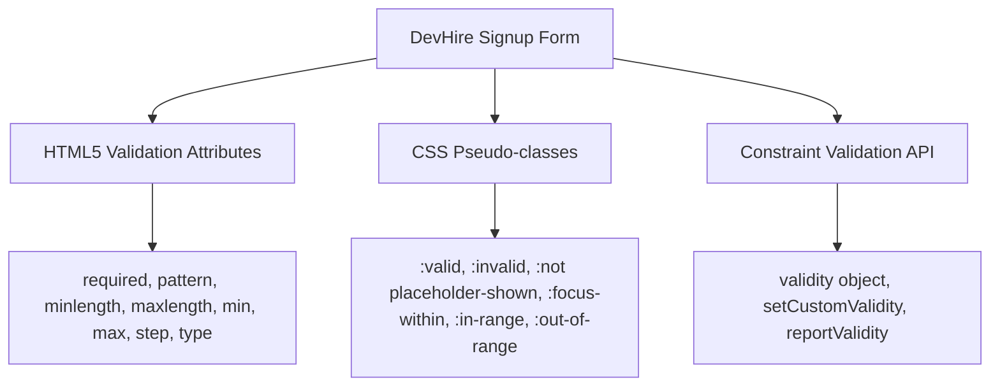

<a id="chapter-18-html5-form-validation"></a>

# Chapter 18: HTML5 Form Validation

[⬅ Previous Chapter](#chapter-17-form-elements-attributes) | [📖 Main Index](#main-index) | [Next Chapter ➡](#chapter-19-semantic-html)

---

## 📌 Learning Objectives

By the end of this chapter, you will:

- Understand how HTML5 built-in form validation works without JavaScript
- Master all validation attributes: `required`, `pattern`, `minlength`, `maxlength`, `min`, `max`, `step`
- Know how to use CSS validation pseudo-classes: `:valid`, `:invalid`, `:required`, `:optional`, `:in-range`, `:out-of-range`, `:placeholder-shown`, `:focus-within`
- Understand the Constraint Validation API
- Know when to use HTML5 validation vs custom JavaScript validation
- Build a fully validated form with real-time CSS feedback using only HTML and CSS
- Answer validation-related interview questions confidently

---

<a id="chapter-index-table-18"></a>

## Chapter Index Table

| Topic No. | Topic Name | Subtopics |
|-----------|------------|-----------|
| 18.1 | [How HTML5 Validation Works](#181-how-html5-validation-works) | Browser validation pipeline, constraint validation, novalidate |
| 18.2 | [required](#182-required-attribute) | Behavior on all elements, empty value, select placeholder |
| 18.3 | [pattern](#183-pattern-attribute) | Regex syntax, common patterns, title attribute |
| 18.4 | [minlength & maxlength](#184-minlength-and-maxlength) | Text inputs, textarea, difference from min/max |
| 18.5 | [min & max](#185-min-and-max) | Number, date, time, range, step interaction |
| 18.6 | [step](#186-step-attribute) | Step validation, step mismatch, any keyword |
| 18.7 | [type-based Validation](#187-type-based-validation) | email, url, number, date — built-in format validation |
| 18.8 | [CSS Validation Pseudo-classes](#188-css-validation-pseudo-classes) | :valid, :invalid, :required, :optional, :in-range, :out-of-range, :placeholder-shown, :focus-within, :user-valid, :user-invalid |
| 18.9 | [Constraint Validation API](#189-constraint-validation-api) | validity object, checkValidity, reportValidity, setCustomValidity |
| 18.10 | [Custom Error Messages](#1810-custom-error-messages) | setCustomValidity, title attribute, oninvalid |
| 18.11 | [novalidate & formnovalidate](#1811-novalidate-and-formnovalidate) | Bypassing validation, when to use |
| 18.12 | [Validation UX Best Practices](#1812-validation-ux-best-practices) | When to show errors, inline validation, accessible errors |
| 18.13 | [Interview Questions](#1813-interview-questions) | Conceptual, Scenario, Output-based, Advanced |
| 18.14 | [Practice Problems](#1814-practice-problems) | Coding, Theory, Machine Coding |
| 18.15 | [Mini Project](#1815-mini-project) | Real-time Validated Signup Form |

---

## 18.1 How HTML5 Validation Works

<a id="181-how-html5-validation-works"></a>

### What is HTML5 Form Validation?

HTML5 introduced a **built-in Constraint Validation** system that allows browsers to validate form inputs automatically — without any JavaScript. When a user submits a form, the browser checks each input against its defined constraints and either allows submission or blocks it while highlighting the failing fields with native error messages.

### Why is it needed?

Before HTML5, ALL form validation required JavaScript. Developers had to write custom code for every check — email format, required fields, number ranges, etc. HTML5 validation:

- Reduces JavaScript boilerplate code
- Provides accessible native error messages
- Works without JavaScript being enabled
- Improves form UX with instant feedback
- Reduces server load by catching errors early

### The Validation Pipeline



### Constraint Validation Checks (in order)

| Check | What it Tests |
|-------|--------------|
| 1. **Suffering from being missing** | `required` + empty value |
| 2. **Suffering from type mismatch** | Value doesn't match input `type` format |
| 3. **Suffering from pattern mismatch** | Value doesn't match `pattern` regex |
| 4. **Suffering from too long** | Value length > `maxlength` |
| 5. **Suffering from too short** | Value length < `minlength` |
| 6. **Suffering from underflow** | Value < `min` |
| 7. **Suffering from overflow** | Value > `max` |
| 8. **Suffering from step mismatch** | Value not on valid `step` |
| 9. **Custom validity** | `setCustomValidity()` message set |

### Which Elements Support Constraint Validation?

| Element | Supports Validation |
|---------|-------------------|
| `<input>` (most types) | ✅ Yes |
| `<textarea>` | ✅ Yes |
| `<select>` | ✅ Yes (required only) |
| `<button>` | ❌ No |
| `<input type="hidden">` | ❌ No |
| `<input type="button">` | ❌ No |
| `<input type="image">` | ❌ No |
| `<input type="reset">` | ❌ No |
| `<input type="submit">` | ❌ No |
| Disabled elements | ❌ No (excluded) |

> [!IMPORTANT]
> **Disabled** form controls are **completely excluded** from constraint validation. They are also excluded from form submission. This is a frequent interview question.

### 🧠 Hinglish Intuition

> Socho HTML5 validation ek **automatic security guard** ki tarah hai form ke gate pe. Jab tum submit karte ho, guard har field ko check karta hai — kya yeh field bhari hai? kya email format sahi hai? kya number range me hai? Agar koi bhi check fail hota hai, guard tumhe rok leta hai aur batata hai "yeh field galat hai." JavaScript ke bina, sirf HTML attributes se yeh sab hota hai — bilkul passport check karne wale officer ki tarah!

---

👉 <a href="#chapter-index-table-18">Go to Top 🔝</a>

---

## 18.2 Required Attribute

<a id="182-required-attribute"></a>

### What is it?

The `required` attribute marks a form field as **mandatory**. The form cannot be submitted if a required field is empty or contains only whitespace.

```html
<input type="text" name="username" required>
<textarea name="message" required></textarea>
<select name="country" required>
  <option value="" disabled selected>Select Country</option>
  <option value="in">India</option>
</select>
```

### How `required` Works on Different Elements

| Element | Validation Fails When |
|---------|----------------------|
| `<input type="text">` | Value is empty string or whitespace |
| `<input type="email">` | Empty OR invalid email format |
| `<input type="checkbox">` | Checkbox is unchecked |
| `<input type="radio">` | No radio in the group is selected |
| `<textarea>` | Value is empty |
| `<select>` | Selected option has `value=""` |

### The `required` + `<select>` Pattern

```html
<!-- Without this pattern, required on select doesn't work properly -->
<select name="role" required>
  <!-- value="" + disabled + selected = proper placeholder -->
  <option value="" disabled selected>-- Select Role --</option>
  <option value="dev">Developer</option>
  <option value="des">Designer</option>
</select>
```

> [!IMPORTANT]
> For `required` to work on `<select>`, the placeholder option MUST have `value=""`. If the placeholder has no `value` attribute, its text content becomes the value, which is non-empty and passes validation incorrectly.

### `required` on Radio Button Groups

```html
<!-- Only ONE radio in the group needs 'required' -->
<!-- But adding to all is safer for screen readers -->
<fieldset>
  <legend>Experience Level *</legend>
  
  <input type="radio" id="jr" name="level" value="junior" required>
  <label for="jr">Junior</label>

  <input type="radio" id="mid" name="level" value="mid">
  <label for="mid">Mid-level</label>

  <input type="radio" id="sr" name="level" value="senior">
  <label for="sr">Senior</label>
</fieldset>
```

> [!NOTE]
> For a radio group, adding `required` to just the **first** radio button is sufficient — the browser treats the entire group as one logical control. However, for maximum screen reader compatibility, add `required` to all radios in the group.

### CSS Targeting Required Fields

```css
/* Style required inputs */
input:required,
textarea:required,
select:required {
  border-left: 3px solid #e74c3c;
}

/* Style optional inputs differently */
input:optional {
  border-left: 3px solid #e0e0e0;
}
```

### 🧠 Hinglish Intuition

> `required` ek **asterisk (*) wala mandatory field** hai — jaise government forms me kuch fields pe star hota hai. `required` lagane ke baad browser khud check karta hai ki field bhari hai ya nahi. Agar empty hai toh submit nahi hoga — bilkul usi tarah jaise bank form incomplete submit nahi hota!

---

👉 <a href="#chapter-index-table-18">Go to Top 🔝</a>

---

## 18.3 Pattern Attribute

<a id="183-pattern-attribute"></a>

### What is it?

The `pattern` attribute accepts a **JavaScript Regular Expression (regex)** that the input's value must match for validation to pass. It is applied to text-based inputs: `text`, `email`, `password`, `tel`, `url`, `search`.

```html
<input 
  type="text" 
  name="username"
  pattern="[a-zA-Z0-9_]{4,20}"
  title="4-20 characters: letters, numbers, underscores only"
  required
>
```

### How Pattern Matching Works



> [!IMPORTANT]
> The `pattern` is implicitly wrapped with `^` and `$` anchors by the browser. This means the pattern must match the **entire value**, not just part of it. You do NOT need to add `^` and `$` yourself.

### The `title` Attribute with `pattern`

The `title` attribute provides the **custom error message** shown when pattern validation fails. Without it, browsers show a generic unhelpful message.

```html
<!-- Without title: generic error -->
<input type="text" pattern="[0-9]{10}" required>
<!-- Error: "Please match the requested format" -->

<!-- With title: helpful error -->
<input type="text" pattern="[0-9]{10}" 
       title="Enter exactly 10 digits" required>
<!-- Error: "Please match the requested format: Enter exactly 10 digits" -->
```

### Common Pattern Examples

#### Indian Phone Number

```html
<input 
  type="tel" 
  name="phone"
  pattern="[6-9][0-9]{9}"
  title="Enter a valid 10-digit Indian mobile number starting with 6-9"
  placeholder="9876543210"
>
```

#### Username (alphanumeric + underscore)

```html
<input 
  type="text" 
  name="username"
  pattern="[a-zA-Z0-9_]{4,20}"
  title="4–20 characters: letters, numbers, underscores only"
>
```

#### Strong Password

```html
<input 
  type="password" 
  name="password"
  pattern="(?=.*[a-z])(?=.*[A-Z])(?=.*\d)(?=.*[@$!%*?&])[A-Za-z\d@$!%*?&]{8,}"
  title="Min 8 chars: at least 1 uppercase, 1 lowercase, 1 number, 1 special character"
>
```

#### Indian PIN Code

```html
<input 
  type="text" 
  name="pincode"
  pattern="[1-9][0-9]{5}"
  title="Valid 6-digit Indian PIN code"
  maxlength="6"
  placeholder="400001"
>
```

#### Vehicle Registration Number (India)

```html
<input 
  type="text" 
  name="vehicle_no"
  pattern="[A-Z]{2}[0-9]{2}[A-Z]{2}[0-9]{4}"
  title="Format: MH12AB1234"
  placeholder="MH12AB1234"
  style="text-transform: uppercase"
>
```

#### URL with HTTPS only

```html
<input 
  type="url" 
  name="website"
  pattern="https://.*"
  title="URL must start with https://"
  placeholder="https://example.com"
>
```

#### Time (HH:MM 24-hour format)

```html
<input 
  type="text"
  name="time_24"
  pattern="([01]?[0-9]|2[0-3]):[0-5][0-9]"
  title="Time in 24-hour format HH:MM (e.g. 14:30)"
  placeholder="14:30"
>
```

### Common Regex Quick Reference

| Pattern | Matches |
|---------|---------|
| `[a-z]` | Single lowercase letter |
| `[A-Z]` | Single uppercase letter |
| `[0-9]` | Single digit |
| `[a-zA-Z0-9]` | Single alphanumeric |
| `[a-z]{3,10}` | 3–10 lowercase letters |
| `.{8,}` | Any 8+ characters |
| `\d` | Any digit (same as `[0-9]`) |
| `\w` | Word character (letter, digit, `_`) |
| `(?=.*\d)` | Lookahead: must contain a digit |
| `[^<>]` | Any character except `<` and `>` |

### 🧠 Hinglish Intuition

> `pattern` ek **rubber stamp ka design** ki tarah hai — jab bhi koi value enter karo, browser us value ko is stamp ke design se compare karta hai. Agar design match nahi karta (jaise 10 digit phone number ki jagah 8 digits dale), toh validation fail ho jaati hai. `title` attribute woh message hai jo user ko samjhaata hai ki stamp ka design kya hai — otherwise user confuse ho jaata hai!

---

👉 <a href="#chapter-index-table-18">Go to Top 🔝</a>

---

## 18.4 minlength and maxlength

<a id="184-minlength-and-maxlength"></a>

### What are they?

- `minlength` — the **minimum number of characters** required in a text input or textarea
- `maxlength` — the **maximum number of characters** allowed in a text input or textarea

Both count in **Unicode code points** (characters), not bytes.

```html
<!-- Username: 3–20 characters -->
<input 
  type="text" 
  name="username"
  minlength="3"
  maxlength="20"
  placeholder="3–20 characters"
>

<!-- Bio: 50–300 characters -->
<textarea 
  name="bio"
  minlength="50"
  maxlength="300"
  placeholder="Write at least 50 characters..."
></textarea>
```

### Key Difference: `maxlength` vs `max`

| Attribute | Applies To | What it Limits |
|-----------|-----------|---------------|
| `maxlength` | text, password, email, search, tel, url, textarea | **Number of characters** typed |
| `max` | number, range, date, time, month, week | **Numeric/date value** |

> [!IMPORTANT]
> `maxlength` **physically prevents** typing beyond the limit — the browser stops accepting input at the character limit. `minlength`, however, only validates on form submission — it does NOT prevent the user from typing fewer characters.

### Behavior Comparison

```html
<!-- maxlength: user literally cannot type more than 10 chars -->
<input type="text" maxlength="10" placeholder="Max 10 chars">

<!-- minlength: user CAN type 2 chars but submission will be blocked -->
<input type="text" minlength="8" placeholder="Need min 8 chars">
```

### Combined with `pattern`

When both `pattern` and `minlength`/`maxlength` are used, **both must pass**:

```html
<input 
  type="text" 
  name="code"
  pattern="[A-Z0-9]+"
  minlength="6"
  maxlength="12"
  title="6–12 uppercase letters and numbers only"
>
```

### Apply to Input Types

| Input Type | `minlength` | `maxlength` |
|------------|------------|------------|
| `text` | ✅ | ✅ |
| `password` | ✅ | ✅ |
| `email` | ✅ | ✅ |
| `search` | ✅ | ✅ |
| `tel` | ✅ | ✅ |
| `url` | ✅ | ✅ |
| `textarea` | ✅ | ✅ |
| `number` | ❌ | ❌ (use `min`/`max`) |
| `date` | ❌ | ❌ (use `min`/`max`) |
| `checkbox` | ❌ | ❌ |

### 🧠 Hinglish Intuition

> `maxlength` ek **glass ki capacity** ki tarah hai — jitna glass bhar jaata hai, aur paani nahi daala ja sakta, physically ruk jaata hai. `minlength` ek **minimum order requirement** ki tarah hai — jab tum submit karo tab check hota hai ki minimum quantity puri hai ya nahi, lekin typing pe koi rok nahi. Dono different levels pe kaam karte hain!

---

👉 <a href="#chapter-index-table-18">Go to Top 🔝</a>

---

## 18.5 min and max

<a id="185-min-and-max"></a>

### What are they?

`min` and `max` define the **minimum and maximum allowed values** for numeric and date/time inputs. Unlike `minlength`/`maxlength` which count characters, `min`/`max` compare the **actual value**.

```html
<!-- Number range -->
<input type="number" name="age" min="18" max="99">

<!-- Date range -->
<input type="date" name="event_date" 
       min="2024-01-01" max="2024-12-31">

<!-- Time range -->
<input type="time" name="meeting_time" min="09:00" max="18:00">

<!-- Range slider -->
<input type="range" name="volume" min="0" max="100">
```

### Supported Input Types

| Type | `min` format | `max` format |
|------|-------------|-------------|
| `number` | Integer or decimal | Integer or decimal |
| `range` | Number | Number |
| `date` | `YYYY-MM-DD` | `YYYY-MM-DD` |
| `time` | `HH:MM` | `HH:MM` |
| `datetime-local` | `YYYY-MM-DDTHH:MM` | `YYYY-MM-DDTHH:MM` |
| `month` | `YYYY-MM` | `YYYY-MM` |
| `week` | `YYYY-Www` | `YYYY-Www` |

### Practical Examples

```html
<!-- Age: must be adult (18+), max realistic age -->
<label for="age">Age:</label>
<input 
  type="number" 
  id="age" 
  name="age"
  min="18"
  max="120"
  placeholder="Your age"
  required
>

<!-- Booking: only future dates within next year -->
<label for="booking">Booking Date:</label>
<input 
  type="date" 
  id="booking" 
  name="booking_date"
  min="2024-06-01"
  max="2025-06-01"
>

<!-- Office hours appointment -->
<label for="appt">Appointment Time:</label>
<input 
  type="time" 
  id="appt" 
  name="appointment"
  min="09:00"
  max="17:30"
>

<!-- Price filter -->
<label for="budget">Budget (₹):</label>
<input 
  type="number" 
  id="budget" 
  name="budget"
  min="0"
  max="1000000"
  step="1000"
>
```

### Validation with `:in-range` and `:out-of-range`

```css
/* Value within min/max range */
input[type="number"]:in-range {
  border-color: #2ecc71;
}

/* Value outside min/max range */
input[type="number"]:out-of-range {
  border-color: #e74c3c;
  background: #fff5f5;
}
```

### 🧠 Hinglish Intuition

> `min` aur `max` ek **elevator ke floor buttons** ki tarah hain — tum sirf allowed floors pe ja sakte ho. Agar building me 5 floors hain (max=5) aur basement se shuru hota hai (min=0), toh tum -1 ya 6 type nahi kar sakte. Dates ke liye bhi yahi kaam karta hai — jaise flight booking me sirf agle 6 months ki dates available hoti hain!

---

👉 <a href="#chapter-index-table-18">Go to Top 🔝</a>

---

## 18.6 Step Attribute

<a id="186-step-attribute"></a>

### What is it?

The `step` attribute defines the **legal number intervals** for numeric and date inputs. A value is valid only if it equals `min + (n × step)` for some integer `n`. It also controls the increment/decrement amount for spinner controls.

```html
<!-- Only multiples of 5 allowed: 0, 5, 10, 15... -->
<input type="number" name="qty" min="0" max="100" step="5">

<!-- Only even numbers: 0, 2, 4, 6... -->
<input type="number" name="even" min="0" step="2">

<!-- Half-star ratings: 0.5, 1.0, 1.5... -->
<input type="number" name="rating" min="0.5" max="5" step="0.5">

<!-- Weekly dates only -->
<input type="date" name="week_start" step="7">

<!-- 15-minute time intervals -->
<input type="time" name="slot" min="09:00" max="17:00" step="900">
```

### How Step Validation Works



### Step for Different Types

| Input Type | Default Step | Step Unit |
|------------|-------------|-----------|
| `number` | 1 | The numeric value |
| `range` | 1 | The numeric value |
| `date` | 1 | Days |
| `time` | 60 | Seconds |
| `datetime-local` | 60 | Seconds |
| `month` | 1 | Months |
| `week` | 1 | Weeks |

### The `any` Keyword

Using `step="any"` allows **any value** within min/max — no step constraint is applied:

```html
<!-- Allow any decimal: 1.23, 5.678, etc. -->
<input type="number" name="price" min="0" max="9999" step="any">

<!-- Any time value (not restricted to seconds) -->
<input type="time" name="precise_time" step="any">
```

### Practical Example: Appointment Slot Booking

```html
<label for="slot">Select Time Slot:</label>
<input 
  type="time" 
  id="slot"
  name="appointment_slot"
  min="10:00"
  max="17:00"
  step="1800"
  title="Slots available every 30 minutes"
>
<!-- Valid: 10:00, 10:30, 11:00... Invalid: 10:15, 10:45 -->
```

### 🧠 Hinglish Intuition

> `step` ek **staircase ki step size** ki tarah hai — tum sirf ek poori step pe khadey ho sakte ho, beech me nahi. Agar step=5 hai toh sirf 0, 5, 10, 15 pe khadey ho sakte ho — 3 ya 7 pe nahi. `step="any"` matlab staircase hatao, ramp banao — koi bhi position pe khadey ho sakte ho!

---

👉 <a href="#chapter-index-table-18">Go to Top 🔝</a>

---

## 18.7 Type-based Validation

<a id="187-type-based-validation"></a>

### What is it?

Certain `<input>` types have **built-in format validation** just by virtue of their type — no additional attributes needed. The browser validates the format automatically.

### Type Validation Summary

| Input Type | What Browser Validates |
|------------|----------------------|
| `email` | Must contain `@` and a valid domain part |
| `url` | Must be a valid URL (http/https/ftp) |
| `number` | Must be a valid number |
| `date` | Must be a valid calendar date |
| `time` | Must be a valid time |
| `datetime-local` | Must be a valid date+time |
| `month` | Must be a valid year-month |
| `week` | Must be a valid year-week |
| `color` | Always valid (picker prevents invalid input) |
| `range` | Always valid (slider prevents invalid input) |
| `text` | No format validation |
| `tel` | No format validation (use `pattern`) |
| `search` | No format validation |

### Email Validation Details

```html
<input type="email" name="email" required>
```

The browser validates that the value:
- Contains at least one `@` symbol
- Has at least one character before `@`
- Has at least one character after `@`
- Has at least one dot after `@`

**Valid:** `user@example.com`, `user+tag@sub.domain.org`  
**Invalid:** `user@`, `@example.com`, `userexample.com`, `user@.com`

> [!NOTE]
> `type="email"` validation is intentionally permissive. It won't catch all invalid emails (e.g., `user@example` passes in some browsers). Always validate email on the server side too.

### URL Validation Details

```html
<input type="url" name="website" required>
```

Must begin with a valid scheme: `http://`, `https://`, `ftp://`

**Valid:** `https://example.com`, `http://sub.domain.org/path`  
**Invalid:** `example.com`, `www.example.com` (missing scheme)

### Number Type Validation

```html
<input type="number" name="score" required>
```

**Valid:** `42`, `-5`, `3.14`, `1e3`  
**Invalid:** `abc`, `12px`, `one`

### 🧠 Hinglish Intuition

> Input type ek **specialist doctor** ki tarah hai — `type="email"` sirf emails check karta hai, `type="number"` sirf numbers. Tum usse koi bhi input doge, woh apne specialty ke hisaab se judge karega. Jaise ek cardiologist heart check karta hai, `type="email"` @ aur domain check karta hai — automatically, bina koi extra instruction ke!

---

👉 <a href="#chapter-index-table-18">Go to Top 🔝</a>

---

## 18.8 CSS Validation Pseudo-classes

<a id="188-css-validation-pseudo-classes"></a>

### What are they?

CSS provides **validation pseudo-classes** that let you style form elements based on their current validation state. This enables **real-time visual feedback** — inputs turn green when valid, red when invalid — all with pure CSS, no JavaScript.

### Complete Pseudo-class Reference



---

### `:valid` and `:invalid`

Matches elements that **currently satisfy** or **fail** their validation constraints.

```css
/* Green border when valid */
input:valid {
  border-color: #2ecc71;
  background: #f0fff4;
}

/* Red border when invalid */
input:invalid {
  border-color: #e74c3c;
  background: #fff5f5;
}
```

> [!IMPORTANT]
> `:invalid` applies **immediately on page load** for required fields — even before the user has touched the form. This creates a bad UX where the entire form appears red from the start. Always combine with `:placeholder-shown`, `:focus`, or `:user-invalid` to avoid this.

---

### `:required` and `:optional`

Matches elements based on the presence of the `required` attribute.

```css
/* Add asterisk indicator to required fields */
input:required + label::before,
label:has(+ input:required)::after {
  content: " *";
  color: #e74c3c;
  font-weight: bold;
}

/* Style optional fields */
input:optional {
  border-style: dashed;
}
```

---

### `:in-range` and `:out-of-range`

Matches numeric inputs whose values are inside or outside the `min`/`max` range.

```css
/* Value within range */
input[type="number"]:in-range {
  border-color: #2ecc71;
}

/* Value outside range */
input[type="number"]:out-of-range {
  border-color: #e74c3c;
}

input[type="number"]:out-of-range + .error-msg {
  display: block;
}
```

---

### `:placeholder-shown`

Matches an input **when its placeholder is visible** — meaning the field is empty. This is extremely useful for avoiding the "red on load" problem.

```css
/* Only show invalid styling when user has typed something */
/* (placeholder hidden = user has typed something) */
input:not(:placeholder-shown):invalid {
  border-color: #e74c3c;
  background: #fff5f5;
}

/* Green when placeholder hidden AND valid */
input:not(:placeholder-shown):valid {
  border-color: #2ecc71;
  background: #f0fff4;
}
```

> [!TIP]
> `input:not(:placeholder-shown):invalid` is the **golden pattern** for avoiding premature red validation states. It only shows invalid styling after the user has actually typed something.

---

### `:focus-within`

Matches a **parent element** when any of its descendants has focus. Perfect for styling form groups when an input inside them is active.

```css
/* Highlight entire form group when input inside is focused */
.form-group:focus-within {
  background: #f8f9ff;
  border-radius: 8px;
  box-shadow: 0 0 0 2px rgba(52, 152, 219, 0.2);
}

/* Highlight label when its input is focused */
.form-group:focus-within label {
  color: #3498db;
  font-weight: 700;
}
```

---

### `:user-valid` and `:user-invalid` (Modern)

These are **newer pseudo-classes** (CSS Selectors Level 4) that only apply AFTER the user has **interacted** with the input — solving the "red on load" problem natively.

```css
/* Only shows after user has interacted */
input:user-invalid {
  border-color: #e74c3c;
  background: #fff5f5;
}

input:user-valid {
  border-color: #2ecc71;
  background: #f0fff4;
}
```

> [!NOTE]
> `:user-valid` and `:user-invalid` have good modern browser support (Chrome 119+, Firefox 88+, Safari 16.5+). For older browser support, use the `:not(:placeholder-shown)` technique instead.

---

### Combining Pseudo-classes: Complete Validation CSS

```css
/* Base input styles */
input, textarea, select {
  width: 100%;
  padding: 12px 16px;
  border: 2px solid #e0e6ed;
  border-radius: 8px;
  font-size: 14px;
  outline: none;
  transition: border-color 0.2s, background 0.2s, box-shadow 0.2s;
}

/* Focus state */
input:focus,
textarea:focus,
select:focus {
  border-color: #3498db;
  box-shadow: 0 0 0 3px rgba(52, 152, 219, 0.12);
}

/* Valid state - only after user has interacted */
input:not(:placeholder-shown):valid,
textarea:not(:placeholder-shown):valid {
  border-color: #2ecc71;
  background: #f0fff4;
}

/* Invalid state - only after user has interacted */
input:not(:placeholder-shown):invalid,
textarea:not(:placeholder-shown):invalid {
  border-color: #e74c3c;
  background: #fff5f5;
}

/* Show/hide error messages */
.error-msg {
  display: none;
  font-size: 12px;
  color: #e74c3c;
  margin-top: 4px;
}

input:not(:placeholder-shown):invalid ~ .error-msg {
  display: block;
}

/* Number range feedback */
input[type="number"]:in-range:not(:placeholder-shown) {
  border-color: #2ecc71;
}

input[type="number"]:out-of-range {
  border-color: #e74c3c;
}

/* Focus-within: highlight form group */
.form-group:focus-within > label {
  color: #3498db;
}

/* Required field indicator */
label.required::after {
  content: " *";
  color: #e74c3c;
}
```

### Visual State Machine



### 🧠 Hinglish Intuition

> CSS validation pseudo-classes ek **traffic light system** ki tarah hain form ke liye:
> - `:valid` = green light (sab theek hai)
> - `:invalid` = red light (kuch galat hai)
> - `:placeholder-shown` = light off (abhi tak kuch enter nahi kiya)
> - `:focus-within` = yellow glow (is lane me activity ho rahi hai)
>
> Problem yeh hai ki default me red light page load pe hi jal jaati hai — isliye `not(:placeholder-shown)` filter lagaate hain — matlab "sirf tab red dikhao jab user ne kuch type kiya ho!" Smart traffic system!

---

👉 <a href="#chapter-index-table-18">Go to Top 🔝</a>

---

## 18.9 Constraint Validation API

<a id="189-constraint-validation-api"></a>

### What is it?

The **Constraint Validation API** is a set of JavaScript properties and methods available on form elements that lets you programmatically check, read, and set validation state. It is the bridge between HTML5 validation and custom JavaScript validation.

### Key API Members

| Member | Type | Description |
|--------|------|-------------|
| `element.validity` | Object | ValidityState object with boolean flags |
| `element.validationMessage` | String | Browser's current error message |
| `element.willValidate` | Boolean | Whether element will be validated |
| `element.checkValidity()` | Method | Returns true/false, fires invalid event |
| `element.reportValidity()` | Method | Returns true/false, shows browser error UI |
| `element.setCustomValidity(msg)` | Method | Sets custom error message |

### The `validity` Object

The `validity` property returns a `ValidityState` object with these boolean properties:

| Property | True When |
|----------|----------|
| `validity.valueMissing` | `required` + empty value |
| `validity.typeMismatch` | Value doesn't match input type format |
| `validity.patternMismatch` | Value doesn't match `pattern` |
| `validity.tooLong` | Value exceeds `maxlength` |
| `validity.tooShort` | Value below `minlength` |
| `validity.rangeUnderflow` | Value < `min` |
| `validity.rangeOverflow` | Value > `max` |
| `validity.stepMismatch` | Value not on valid `step` |
| `validity.customError` | `setCustomValidity()` has non-empty message |
| `validity.valid` | ALL above are false (field is valid) |

### Practical Usage Examples

```html
<form id="demo-form">
  <input type="email" id="email-input" name="email" required>
  <button type="submit">Submit</button>
</form>

<script>
  const emailInput = document.getElementById('email-input');
  const form = document.getElementById('demo-form');

  // Check validity programmatically
  emailInput.addEventListener('blur', () => {
    const validity = emailInput.validity;

    if (validity.valueMissing) {
      console.log('Email is required');
    } else if (validity.typeMismatch) {
      console.log('Please enter a valid email address');
    } else if (validity.valid) {
      console.log('Email is valid!');
    }
  });

  // Check entire form validity
  form.addEventListener('submit', (e) => {
    if (!form.checkValidity()) {
      e.preventDefault();
      form.reportValidity(); // Shows browser error UI
    }
  });
</script>
```

### `checkValidity()` vs `reportValidity()`

| Method | Returns | Side Effect |
|--------|---------|------------|
| `checkValidity()` | Boolean | Fires `invalid` event on failing fields |
| `reportValidity()` | Boolean | Fires `invalid` event + **shows browser error UI** |

```javascript
// checkValidity: silent check
const isValid = form.checkValidity(); // true or false

// reportValidity: check + show errors to user
const isValid = form.reportValidity(); // true or false + error bubbles shown
```

### 🧠 Hinglish Intuition

> Constraint Validation API ek **X-ray machine** ki tarah hai — tumhara JavaScript form ke andar jhank ke dekh sakta hai ki kaunsa field kis wajah se invalid hai. `validity.valueMissing` se pata chalta hai "field khali hai," `validity.patternMismatch` se pata chalta hai "format galat hai." Yeh API JavaScript aur HTML5 validation ke beech ka **translator** hai!

---

👉 <a href="#chapter-index-table-18">Go to Top 🔝</a>

---

## 18.10 Custom Error Messages

<a id="1810-custom-error-messages"></a>

### What is it?

By default, browser validation error messages are **generic and in the browser's language**. HTML5 provides two ways to customize these messages:

1. **`title` attribute** — appended to the browser's error message for `pattern` mismatch
2. **`setCustomValidity()`** — completely replaces the browser error message via JavaScript

### Method 1: `title` Attribute

```html
<!-- title shown as part of pattern error message -->
<input 
  type="text"
  name="username"
  pattern="[a-z0-9]{4,16}"
  title="Username must be 4–16 lowercase letters and numbers"
  required
>
```

Browser error: *"Please match the requested format: Username must be 4–16 lowercase letters and numbers"*

### Method 2: `setCustomValidity()`

```html
<input type="text" id="username" name="username" 
       minlength="4" required>

<script>
const username = document.getElementById('username');

username.addEventListener('input', () => {
  if (username.value.length < 4 && username.value.length > 0) {
    username.setCustomValidity('Username must be at least 4 characters long');
  } else {
    // IMPORTANT: clear custom error when valid
    username.setCustomValidity('');
  }
});
</script>
```

> [!IMPORTANT]
> Always call `setCustomValidity('')` (empty string) to **clear** a custom error when the value becomes valid. Forgetting this leaves the field permanently invalid even after the user fixes it.

### Password Confirmation Validation

A classic use case for custom validity:

```html
<form id="pwd-form">
  <label for="pwd">Password:</label>
  <input type="password" id="pwd" name="password" 
         minlength="8" required>

  <label for="pwd-confirm">Confirm Password:</label>
  <input type="password" id="pwd-confirm" name="confirm_password" 
         required>

  <button type="submit">Register</button>
</form>

<script>
  const pwd = document.getElementById('pwd');
  const pwdConfirm = document.getElementById('pwd-confirm');

  function checkPasswordMatch() {
    if (pwdConfirm.value !== pwd.value) {
      pwdConfirm.setCustomValidity('Passwords do not match');
    } else {
      pwdConfirm.setCustomValidity('');
    }
  }

  pwd.addEventListener('input', checkPasswordMatch);
  pwdConfirm.addEventListener('input', checkPasswordMatch);
</script>
```

### `oninvalid` Event Handler

```html
<input 
  type="email" 
  name="email"
  required
  oninvalid="this.setCustomValidity(
    this.validity.valueMissing 
      ? 'Please enter your email address' 
      : 'Please enter a valid email format'
  )"
  oninput="this.setCustomValidity('')"
>
```

### 🧠 Hinglish Intuition

> Default browser error messages angrezi me hote hain aur generic hote hain — "Please fill in this field." `setCustomValidity()` tumhe apna message set karne deta hai — Hindi me bhi! Jaise ek bank customer care agent ki jagah ek custom message: "Yahan aapka 10-digit account number likhein." Lekin yaad rakho: jab value sahi ho jaaye toh `setCustomValidity('')` se message clear karna zaroori hai — warna field hamesha galat dikhayi dega!

---

👉 <a href="#chapter-index-table-18">Go to Top 🔝</a>

---

## 18.11 novalidate and formnovalidate

<a id="1811-novalidate-and-formnovalidate"></a>

### `novalidate` on `<form>`

Adding `novalidate` to a `<form>` element **completely disables browser validation** for the entire form. The form will submit regardless of field states.

```html
<!-- Browser will NOT validate ANY field in this form -->
<form method="post" action="/submit" novalidate>
  <input type="email" name="email" required>
  <!-- The 'required' and email format are both ignored -->
  <button type="submit">Submit</button>
</form>
```

### When to Use `novalidate`

- When implementing **custom JavaScript validation** that replaces native validation
- When using a **validation library** (Yup, Zod, Vuelidate, React Hook Form)
- When you want **full control** over error message display and styling
- When testing forms during development

### `formnovalidate` on `<button>` or `<input type="submit">`

`formnovalidate` bypasses validation **for a specific submit button only** — useful when you have multiple submit buttons with different behaviors.

```html
<form method="post" action="/submit">
  <input type="email" name="email" required>
  <input type="text" name="name" required>

  <!-- This button: validates normally -->
  <button type="submit">Submit Application</button>

  <!-- This button: bypasses validation (saves draft) -->
  <button type="submit" formnovalidate formaction="/save-draft">
    Save as Draft
  </button>
</form>
```

> [!TIP]
> `formnovalidate` is perfect for "Save Draft" buttons where you want to save incomplete form data without triggering validation errors. The `formaction` attribute lets you also specify a different URL for this specific button.

### `formaction`, `formmethod`, `formenctype` on Buttons

Buttons can override form-level attributes:

```html
<form method="post" action="/submit" enctype="application/x-www-form-urlencoded">
  
  <input type="text" name="name" required>

  <!-- Normal submit -->
  <button type="submit">Submit</button>

  <!-- Different action, method, validation -->
  <button 
    type="submit"
    formaction="/preview"
    formmethod="get"
    formnovalidate
  >
    Preview (No Validation)
  </button>

</form>
```

### 🧠 Hinglish Intuition

> `novalidate` ek **VIP pass** ki tarah hai — form ke saare security checks bypass ho jaate hain. `formnovalidate` ek **specific button ka VIP pass** hai — sirf usi button se submit karne pe checks bypass hote hain, baki buttons pe nahi. Jaise "Save Draft" button — incomplete information ke saath bhi save hona chahiye, lekin "Final Submit" button pe sab validation hona chahiye!

---

👉 <a href="#chapter-index-table-18">Go to Top 🔝</a>

---

## 18.12 Validation UX Best Practices

<a id="1812-validation-ux-best-practices"></a>

### The Core Principle

> **Show errors at the right time, in the right place, with the right message.**

### When to Show Errors

| Timing | Approach | Recommendation |
|--------|---------|---------------|
| On page load | All required fields red | ❌ Never — creates anxiety |
| On first keystroke | Show errors while typing | ❌ Too aggressive |
| On blur (leaving field) | Show error when field loses focus | ✅ Best for most cases |
| On submit | Show all errors at once | ✅ Always show on submit |
| Inline real-time | Show after user has typed enough | ✅ Good for passwords |

### Error Message Best Practices

```html
<!-- ❌ Bad: Vague error -->
<span class="error">Invalid input</span>

<!-- ❌ Bad: Technical jargon -->
<span class="error">Pattern mismatch: [a-z]{3,}</span>

<!-- ✅ Good: Specific and actionable -->
<span class="error">Username must be 3–20 lowercase letters only</span>

<!-- ✅ Good: Tells user what to do -->
<span class="error">Please enter a valid email like: name@example.com</span>
```

### Accessible Error Implementation

```html
<!-- Link error message to input via aria-describedby -->
<div class="form-group">
  <label for="email-field">Email Address *</label>
  <input 
    type="email" 
    id="email-field" 
    name="email"
    aria-describedby="email-error"
    aria-invalid="false"
    required
  >
  <span 
    id="email-error" 
    class="error-msg" 
    role="alert"
    aria-live="polite"
  ></span>
</div>
```

### Complete Validation UX Checklist

| ✅ Do | ❌ Don't |
|------|---------|
| Show errors after blur or submit | Show all errors on page load |
| Place errors directly below the field | Show errors in a generic banner |
| Use specific, actionable messages | Use "Invalid input" |
| Keep label visible at all times | Rely on placeholder as the label |
| Mark required fields clearly | Assume users know which fields are required |
| Show success state (green) | Only show error states |
| Preserve user input on error | Clear fields on failed submission |
| Auto-focus first error field | Let user scroll to find errors |

### HTML5 vs Custom Validation

| Aspect | HTML5 Native | Custom JS |
|--------|-------------|-----------|
| Setup effort | Minimal | High |
| Styling control | Limited | Full control |
| Error message control | Limited (+ title) | Full control |
| Timing control | Submit only (mostly) | Any event |
| Cross-browser consistency | Variable | Consistent |
| Accessibility | Browser handles | Must implement |
| Works without JS | ✅ Yes | ❌ No |
| Recommended for | Simple forms | Complex forms |

### 🧠 Hinglish Intuition

> Validation UX ek **supportive teacher** ki tarah honi chahiye — jo sirf galtiyan na dikhaye balki yeh bhi bataye ki sahi kaise karna hai. "Galat hai!" kehna helpful nahi hai — "Username me sirf 4-20 letters aur numbers allowed hain" kehna helpful hai. Aur galti tab dikhao jab student ne kuch galat kiya ho — exam ke pehle hi fail mark mat karo!

---

👉 <a href="#chapter-index-table-18">Go to Top 🔝</a>

---

## 18.13 Interview Questions

<a id="1813-interview-questions"></a>

## 💡 Interview Questions

---

### 🔵 Conceptual Questions

**Q1. What is the difference between `minlength` and `min` attributes?**

**Answer:**

| | `minlength` | `min` |
|--|------------|-------|
| Applies to | Text-based inputs, textarea | Number, date, time, range |
| What it limits | Number of **characters** | The **value** itself |
| Example | `minlength="8"` → at least 8 chars | `min="18"` → value must be ≥ 18 |

---

**Q2. Why does `:invalid` apply to inputs immediately on page load, and how do you fix this?**

**Answer:** `:invalid` matches any input that currently fails validation — including empty `required` fields before the user has touched them. This causes the entire form to appear red on load.

Fix: Use `:not(:placeholder-shown):invalid` to only apply invalid styles when the placeholder is hidden (i.e., the user has typed something):

```css
input:not(:placeholder-shown):invalid {
  border-color: red;
}
```

Or use the newer `:user-invalid` pseudo-class which only applies after user interaction.

---

**Q3. How does the `pattern` attribute differ from server-side validation?**

**Answer:**
- `pattern` is **client-side only** — any user can bypass it by disabling JavaScript or modifying the HTML
- Server-side validation is **authoritative** and cannot be bypassed
- `pattern` improves UX (instant feedback) but never replaces server-side validation
- Always validate on both client AND server

---

**Q4. What is the Constraint Validation API and name its key methods?**

**Answer:** The Constraint Validation API is a JavaScript API that exposes the validation state of form elements. Key members:
- `element.validity` — ValidityState object with boolean flags
- `element.validationMessage` — current error message string
- `element.checkValidity()` — returns boolean, fires invalid event
- `element.reportValidity()` — returns boolean, shows browser error UI
- `element.setCustomValidity(msg)` — sets custom error message

---

**Q5. What does `step="any"` do?**

**Answer:** `step="any"` removes the step constraint entirely — any decimal or fractional value within `min`/`max` is valid. Without it, `type="number"` with default `step="1"` would reject decimal values.

---

**Q6. When would you use `novalidate` on a form?**

**Answer:**
- When implementing custom JavaScript validation logic
- When using validation libraries (React Hook Form, Formik, Yup)
- When the native browser error UI doesn't match your design system
- For "Save Draft" functionality where incomplete data should be saved
- During development/testing to bypass validation temporarily

---

**Q7. How does `required` validation work differently for `<checkbox>` vs `<text>` input?**

**Answer:**
- `<input type="text" required>`: Fails if value is empty or only whitespace
- `<input type="checkbox" required>`: Fails if checkbox is **unchecked** — the checkbox must be checked for `required` to pass

---

**Q8. What is the difference between `checkValidity()` and `reportValidity()`?**

**Answer:**
- Both return a boolean (true if valid, false if invalid)
- Both fire the `invalid` event on failing elements
- `reportValidity()` additionally **shows the browser's native validation error UI** (the error bubble/tooltip)
- Use `checkValidity()` when you want a silent validity check
- Use `reportValidity()` when you want to trigger native error display programmatically

---

### 🟡 Scenario-Based Questions

**Q9. A user can bypass your `pattern="[0-9]{10}"` phone validation by inspecting and removing the pattern attribute. How do you address this?**

**Answer:** HTML5 validation is client-side and can always be bypassed. The solution is **always validate on the server side** as well. The pattern attribute only improves UX — never rely on it for security. Server-side: use regex validation in your backend language (Python, Node.js, PHP, etc.) before processing the data.

---

**Q10. How would you implement a form where clicking "Submit" validates everything but clicking "Save Draft" saves without validation?**

**Answer:** Use `formnovalidate` on the Save Draft button and a different `formaction`:

```html
<form method="post" action="/submit">
  <input type="email" name="email" required>
  <input type="text" name="title" required>

  <button type="submit">Submit</button>
  <button type="submit" formnovalidate formaction="/save-draft">
    Save Draft
  </button>
</form>
```

---

**Q11. How do you validate that two password fields match using HTML5 APIs?**

**Answer:**

```javascript
const pwd = document.getElementById('password');
const confirm = document.getElementById('confirm');

function validate() {
  if (confirm.value !== pwd.value) {
    confirm.setCustomValidity('Passwords must match');
  } else {
    confirm.setCustomValidity(''); // Clear error when matching
  }
}

pwd.addEventListener('input', validate);
confirm.addEventListener('input', validate);
```

---

### 🔴 Output-Based Questions

**Q12. Will this field pass validation when the value is "abc123"?**

```html
<input type="text" pattern="[a-z]{3,}" minlength="5" value="abc123">
```

**Answer:** No. The `pattern="[a-z]{3,}"` requires only lowercase letters (no numbers). "abc123" contains numbers so `patternMismatch` is true. Even though `minlength="5"` is satisfied (6 chars), the pattern check fails.

---

**Q13. What happens when this form is submitted with an empty email field?**

```html
<form novalidate>
  <input type="email" name="email" required>
  <button type="submit">Submit</button>
</form>
```

**Answer:** The form **submits successfully** with an empty email. The `novalidate` attribute on the form completely disables browser validation — `required` and email format are both ignored. The empty value is sent to the server.

---

**Q14. Which `validity` property is true for this input when value is "5"?**

```html
<input type="number" min="10" max="100" step="5">
<!-- value entered: 5 -->
```

**Answer:** `validity.rangeUnderflow` is true — the value (5) is less than `min` (10). Also `validity.valid` is false. Note: even though 5 is a valid step (0 + 5×1), the underflow takes priority.

---

### 🟣 Advanced Questions

**Q15. Explain the difference between `:valid`/`:invalid` and `:user-valid`/`:user-invalid`.**

**Answer:**
- `:valid`/`:invalid` apply **immediately** based on current validation state — even on empty required fields on page load
- `:user-valid`/`:user-invalid` only apply **after the user has interacted** with the field (typed, blurred, etc.)
- `:user-valid`/`:user-invalid` solve the "red on load" UX problem natively
- `:user-valid`/`:user-invalid` require modern browsers (Chrome 119+, Firefox 88+)
- For older browser support, use `:not(:placeholder-shown):invalid`

---

**Q16. How does constraint validation interact with `disabled` fieldsets?**

**Answer:** Form controls inside a `<fieldset disabled>` are:
1. **Completely excluded from constraint validation** — their `required`, `pattern`, etc. are all ignored
2. **Not submitted** with the form
3. Cannot be focused or interacted with
4. Their `willValidate` property returns `false`

This is why disabling a fieldset is a convenient way to make an entire section optional and non-submitting.

---

👉 <a href="#chapter-index-table-18">Go to Top 🔝</a>

---

## 18.14 Practice Problems

<a id="1814-practice-problems"></a>

## 🧪 Practice Problems

---

### 💻 Coding Questions

**1. Create a registration form with all major validation attributes.**

```html
<form method="post" action="/register" novalidate id="reg-form">

  <!-- Name: text, required, minlength -->
  <div class="field-group">
    <label for="r-name">Full Name *</label>
    <input 
      type="text" 
      id="r-name" 
      name="name"
      required
      minlength="2"
      maxlength="60"
      pattern="[A-Za-z\s]+"
      title="Name can only contain letters and spaces"
      placeholder="John Doe"
    >
    <span class="err">Please enter your full name (letters only)</span>
  </div>

  <!-- Email: type validation + required -->
  <div class="field-group">
    <label for="r-email">Email *</label>
    <input 
      type="email" 
      id="r-email" 
      name="email"
      required
      placeholder="you@example.com"
    >
    <span class="err">Please enter a valid email address</span>
  </div>

  <!-- Phone: pattern for Indian number -->
  <div class="field-group">
    <label for="r-phone">Mobile Number *</label>
    <input 
      type="tel" 
      id="r-phone" 
      name="phone"
      required
      pattern="[6-9][0-9]{9}"
      title="Enter a valid 10-digit Indian mobile number"
      maxlength="10"
      placeholder="9876543210"
    >
    <span class="err">Enter valid 10-digit number starting with 6-9</span>
  </div>

  <!-- Password: pattern for strong password -->
  <div class="field-group">
    <label for="r-pwd">Password *</label>
    <input 
      type="password" 
      id="r-pwd" 
      name="password"
      required
      minlength="8"
      pattern="(?=.*[a-z])(?=.*[A-Z])(?=.*\d).{8,}"
      title="Min 8 chars: at least 1 uppercase, 1 lowercase, 1 number"
      placeholder="Min 8 chars"
      autocomplete="new-password"
    >
    <span class="err">
      Min 8 characters with 1 uppercase, 1 lowercase, 1 number
    </span>
  </div>

  <!-- Age: number with min/max -->
  <div class="field-group">
    <label for="r-age">Age *</label>
    <input 
      type="number" 
      id="r-age" 
      name="age"
      required
      min="18"
      max="65"
      step="1"
      placeholder="18–65"
    >
    <span class="err">Age must be between 18 and 65</span>
  </div>

  <!-- Website: URL type validation -->
  <div class="field-group">
    <label for="r-url">Portfolio URL</label>
    <input 
      type="url" 
      id="r-url" 
      name="portfolio"
      placeholder="https://your-portfolio.com"
    >
    <span class="err">Enter a valid URL starting with https://</span>
  </div>

  <button type="submit">Create Account</button>

</form>

<style>
  .field-group { margin-bottom: 16px; }
  label { display: block; font-size: 13px; font-weight: 600; margin-bottom: 4px; }
  input { width: 100%; padding: 10px; border: 2px solid #ddd; border-radius: 6px; font-size: 14px; outline: none; }
  input:focus { border-color: #3498db; }
  input:not(:placeholder-shown):valid { border-color: #2ecc71; }
  input:not(:placeholder-shown):invalid { border-color: #e74c3c; }
  .err { display: none; font-size: 12px; color: #e74c3c; margin-top: 3px; }
  input:not(:placeholder-shown):invalid ~ .err { display: block; }
</style>
```

---

**2. Build a number input with range validation and live `:in-range`/`:out-of-range` CSS feedback.**

```html
<style>
  .range-demo { max-width: 400px; padding: 24px; }
  label { display: block; font-weight: 600; margin-bottom: 6px; }
  input[type="number"] {
    width: 100%; padding: 12px; font-size: 16px;
    border: 2px solid #ddd; border-radius: 8px; outline: none;
    transition: border-color 0.2s, background 0.2s;
  }
  input[type="number"]:focus { border-color: #3498db; }
  input[type="number"]:in-range:not(:placeholder-shown) {
    border-color: #2ecc71;
    background: #f0fff4;
  }
  input[type="number"]:out-of-range {
    border-color: #e74c3c;
    background: #fff5f5;
  }
  .hint { font-size: 12px; color: #888; margin-top: 4px; }
  .range-label { font-size: 13px; margin-top: 8px; }
  .range-label span { font-weight: 700; color: #3498db; }
</style>

<div class="range-demo">
  <label for="salary-input">Expected Salary (₹ LPA)</label>
  <input 
    type="number" 
    id="salary-input"
    name="salary"
    min="3"
    max="50"
    step="0.5"
    placeholder="Enter amount"
  >
  <p class="hint">Valid range: ₹3 LPA – ₹50 LPA, in steps of 0.5</p>
  <p class="range-label">
    Green = in range | Red = out of range | 
    Steps: <span>0.5 LPA</span>
  </p>
</div>
```

---

**3. Implement custom error messages using `setCustomValidity()`.**

```html
<form id="custom-form">
  <div style="margin-bottom: 16px;">
    <label for="cf-username">Username</label>
    <input type="text" id="cf-username" name="username" 
           required minlength="4" maxlength="20"
           placeholder="4-20 characters">
  </div>

  <div style="margin-bottom: 16px;">
    <label for="cf-pwd">Password</label>
    <input type="password" id="cf-pwd" name="password" 
           required minlength="8"
           placeholder="Minimum 8 characters"
           autocomplete="new-password">
  </div>

  <div style="margin-bottom: 16px;">
    <label for="cf-confirm">Confirm Password</label>
    <input type="password" id="cf-confirm" name="confirm_password" 
           required placeholder="Re-enter password"
           autocomplete="new-password">
  </div>

  <button type="submit">Register</button>
</form>

<script>
  const username = document.getElementById('cf-username');
  const pwd = document.getElementById('cf-pwd');
  const confirm = document.getElementById('cf-confirm');

  // Username custom messages
  username.addEventListener('input', () => {
    if (username.validity.valueMissing) {
      username.setCustomValidity('Username is required');
    } else if (username.validity.tooShort) {
      username.setCustomValidity(
        `Username needs ${4 - username.value.length} more characters`
      );
    } else {
      username.setCustomValidity('');
    }
  });

  // Password custom messages
  pwd.addEventListener('input', () => {
    if (pwd.validity.valueMissing) {
      pwd.setCustomValidity('Password is required');
    } else if (pwd.validity.tooShort) {
      pwd.setCustomValidity('Password must be at least 8 characters');
    } else {
      pwd.setCustomValidity('');
    }
    // Re-check confirm when password changes
    validateConfirm();
  });

  // Password match validation
  function validateConfirm() {
    if (confirm.value && confirm.value !== pwd.value) {
      confirm.setCustomValidity('Passwords do not match');
    } else {
      confirm.setCustomValidity('');
    }
  }

  confirm.addEventListener('input', validateConfirm);
</script>
```

---

**4. Create a date input that only allows dates within the next 30 days.**

```html
<label for="event-date">Event Date (next 30 days only):</label>
<input type="date" id="event-date" name="event_date" required>

<script>
  const dateInput = document.getElementById('event-date');
  
  const today = new Date();
  const maxDate = new Date();
  maxDate.setDate(today.getDate() + 30);
  
  const toYMD = d => d.toISOString().split('T')[0];
  
  dateInput.min = toYMD(today);
  dateInput.max = toYMD(maxDate);
  dateInput.value = toYMD(today); // Default: today
</script>

<style>
  input[type="date"] {
    padding: 10px;
    border: 2px solid #ddd;
    border-radius: 8px;
    font-size: 14px;
    outline: none;
  }
  input[type="date"]:in-range { border-color: #2ecc71; }
  input[type="date"]:out-of-range { border-color: #e74c3c; }
</style>
```

---

**5. Build a step-validated time slot picker.**

```html
<style>
  .time-picker { max-width: 380px; padding: 24px; font-family: sans-serif; }
  label { display: block; font-weight: 700; margin-bottom: 8px; color: #333; }
  input[type="time"] {
    width: 100%; padding: 12px 16px;
    border: 2px solid #e0e0e0; border-radius: 8px;
    font-size: 16px; outline: none;
    transition: border-color 0.2s;
  }
  input[type="time"]:focus { border-color: #3498db; }
  input[type="time"]:valid:not(:placeholder-shown) { border-color: #2ecc71; }
  input[type="time"]:invalid { border-color: #e74c3c; }
  .info { font-size: 12px; color: #888; margin-top: 6px; }
</style>

<div class="time-picker">
  <label for="slot-picker">
    Appointment Time Slot
  </label>
  <input 
    type="time"
    id="slot-picker"
    name="slot"
    min="09:00"
    max="17:00"
    step="1800"
    required
    title="Slots available at 9:00, 9:30, 10:00... up to 17:00"
  >
  <p class="info">
    ⏰ Available: 9:00 AM – 5:00 PM, every 30 minutes
  </p>
</div>
```

---

### 📖 Theory Questions

**1. Explain why HTML5 form validation is not sufficient for security.**

> HTML5 validation is entirely **client-side**. Any user can:
> - Inspect the HTML and remove `required`, `pattern`, `min`, `max` attributes
> - Use browser DevTools to modify attribute values
> - Bypass the form entirely using tools like Postman or curl
> - Disable JavaScript
>
> Server-side validation is mandatory because only the server controls what data is accepted and processed. Client-side validation is purely a UX enhancement for faster feedback.

---

**2. What is the difference between `:valid` appearing on page load vs after user interaction?**

> `:valid` is a CSS pseudo-class that reflects the **current** validation state of an input at all times — including immediately on page load. An empty `required` field is `:invalid` from the moment the page loads, causing the entire form to appear red before the user has done anything.
>
> Solution: Use `:not(:placeholder-shown):invalid` to only style inputs after the user has entered (and then removed) content, or use the modern `:user-invalid` pseudo-class which inherently waits for user interaction.

---

**3. How does the browser determine "step mismatch"?**

> Step mismatch occurs when the entered value is not equal to `min + (n × step)` for any non-negative integer `n`. For example, with `min="0"` and `step="5"`, valid values are 0, 5, 10, 15... The value 3 would be a step mismatch because `(3 - 0) / 5 = 0.6`, which is not an integer.

---

**4. Explain `validity.valid` — when is it true?**

> `validity.valid` is `true` only when **ALL** other ValidityState properties are `false` — meaning `valueMissing`, `typeMismatch`, `patternMismatch`, `tooLong`, `tooShort`, `rangeUnderflow`, `rangeOverflow`, `stepMismatch`, and `customError` are ALL false simultaneously.

---

**5. What is the difference between `formaction` and `action`? When would you use both?**

> - `action` on `<form>`: Default URL for all submissions from this form
> - `formaction` on `<button>` or `<input type="submit">`: Overrides `action` for just that specific submit button
>
> Use case: A form with both "Submit for Review" (→ `/submit`) and "Save Draft" (→ `/save-draft`) buttons. The form has `action="/submit"` but the draft button has `formaction="/save-draft"`.

---

### ⚙️ Machine Coding Problems

**Problem 1: Complete Real-time Validated Form with CSS Pseudo-classes**

```html
<!DOCTYPE html>
<html lang="en">
<head>
  <meta charset="UTF-8">
  <meta name="viewport" content="width=device-width, initial-scale=1.0">
  <title>Real-time Validated Form</title>
  <style>
    *, *::before, *::after { box-sizing: border-box; margin: 0; padding: 0; }

    body {
      font-family: 'Segoe UI', sans-serif;
      background: #f0f2f5;
      display: flex;
      justify-content: center;
      padding: 40px 16px;
    }

    .card {
      background: white;
      border-radius: 16px;
      box-shadow: 0 4px 24px rgba(0,0,0,0.08);
      padding: 40px;
      width: 100%;
      max-width: 500px;
    }

    h2 { font-size: 22px; color: #1a1a2e; margin-bottom: 6px; }
    .sub { font-size: 14px; color: #888; margin-bottom: 28px; }

    .fg {
      margin-bottom: 20px;
      position: relative;
    }

    /* Label styling */
    .fg label {
      display: block;
      font-size: 12px;
      font-weight: 700;
      text-transform: uppercase;
      letter-spacing: 0.5px;
      color: #666;
      margin-bottom: 6px;
      transition: color 0.2s;
    }

    /* Label color on focus-within */
    .fg:focus-within label { color: #3498db; }

    /* Base input */
    .fg input, .fg textarea {
      width: 100%;
      padding: 12px 40px 12px 14px;
      border: 2px solid #e0e6ed;
      border-radius: 8px;
      font-size: 14px;
      font-family: inherit;
      color: #333;
      outline: none;
      transition: border-color 0.25s, background 0.25s, box-shadow 0.25s;
      background: white;
    }

    /* Focus state */
    .fg input:focus, .fg textarea:focus {
      border-color: #3498db;
      box-shadow: 0 0 0 3px rgba(52,152,219,0.12);
    }

    /* Valid state: only after user typed */
    .fg input:not(:placeholder-shown):valid {
      border-color: #2ecc71;
      background: #f0fff4;
    }

    /* Invalid state: only after user typed */
    .fg input:not(:placeholder-shown):invalid {
      border-color: #e74c3c;
      background: #fff5f5;
    }

    /* Status icon container */
    .fg .icon {
      position: absolute;
      right: 12px;
      top: 36px;
      font-size: 16px;
      pointer-events: none;
      opacity: 0;
      transition: opacity 0.2s;
    }

    .fg input:not(:placeholder-shown):valid ~ .icon::after { content: '✅'; }
    .fg input:not(:placeholder-shown):invalid ~ .icon::after { content: '❌'; }
    .fg input:not(:placeholder-shown) ~ .icon { opacity: 1; }

    /* Error message */
    .fg .errmsg {
      display: none;
      font-size: 12px;
      color: #e74c3c;
      margin-top: 5px;
      padding-left: 4px;
    }

    .fg input:not(:placeholder-shown):invalid ~ .errmsg { display: block; }

    /* Strength indicator for password */
    .strength-bar {
      height: 4px;
      border-radius: 4px;
      margin-top: 6px;
      background: #e0e0e0;
      overflow: hidden;
    }

    .strength-fill {
      height: 100%;
      border-radius: 4px;
      width: 0%;
      transition: width 0.3s, background 0.3s;
    }

    /* Number range */
    input[type="number"]:in-range:not(:placeholder-shown) {
      border-color: #2ecc71;
      background: #f0fff4;
    }

    input[type="number"]:out-of-range:not(:placeholder-shown) {
      border-color: #e74c3c;
      background: #fff5f5;
    }

    /* Submit button */
    .submit-btn {
      width: 100%;
      padding: 14px;
      background: #3498db;
      color: white;
      border: none;
      border-radius: 8px;
      font-size: 15px;
      font-weight: 700;
      cursor: pointer;
      transition: background 0.2s, transform 0.1s;
      margin-top: 8px;
    }

    .submit-btn:hover { background: #2980b9; transform: translateY(-1px); }

    /* Progress bar at top */
    .progress-bar {
      height: 4px;
      background: #e0e0e0;
      border-radius: 4px;
      margin-bottom: 28px;
      overflow: hidden;
    }

    .progress-fill {
      height: 100%;
      background: linear-gradient(90deg, #3498db, #2ecc71);
      border-radius: 4px;
      width: 0%;
      transition: width 0.3s;
    }
  </style>
</head>
<body>
  <div class="card">
    <h2>Create Account</h2>
    <p class="sub">All fields marked * are required</p>

    <div class="progress-bar">
      <div class="progress-fill" id="form-progress"></div>
    </div>

    <form id="validated-form" method="post" action="/register" novalidate>

      <!-- Full Name -->
      <div class="fg">
        <label for="vf-name">Full Name *</label>
        <input 
          type="text" 
          id="vf-name"
          name="name"
          placeholder="John Doe"
          minlength="3"
          maxlength="60"
          pattern="[A-Za-z\s]+"
          title="Letters and spaces only"
          required
        >
        <span class="icon"></span>
        <span class="errmsg">
          Please enter your full name (letters and spaces only)
        </span>
      </div>

      <!-- Email -->
      <div class="fg">
        <label for="vf-email">Email Address *</label>
        <input 
          type="email" 
          id="vf-email"
          name="email"
          placeholder="you@example.com"
          required
        >
        <span class="icon"></span>
        <span class="errmsg">
          Enter a valid email address (e.g., name@example.com)
        </span>
      </div>

      <!-- Phone -->
      <div class="fg">
        <label for="vf-phone">Mobile Number *</label>
        <input 
          type="tel" 
          id="vf-phone"
          name="phone"
          placeholder="9876543210"
          pattern="[6-9][0-9]{9}"
          title="10-digit Indian mobile number"
          maxlength="10"
          required
        >
        <span class="icon"></span>
        <span class="errmsg">
          Enter a valid 10-digit number starting with 6, 7, 8, or 9
        </span>
      </div>

      <!-- Age -->
      <div class="fg">
        <label for="vf-age">Age * (18–65)</label>
        <input 
          type="number" 
          id="vf-age"
          name="age"
          placeholder="Your age"
          min="18"
          max="65"
          step="1"
          required
        >
        <span class="icon"></span>
        <span class="errmsg">Age must be between 18 and 65</span>
      </div>

      <!-- Password -->
      <div class="fg">
        <label for="vf-pwd">Password *</label>
        <input 
          type="password" 
          id="vf-pwd"
          name="password"
          placeholder="Min 8 chars"
          minlength="8"
          pattern="(?=.*[a-z])(?=.*[A-Z])(?=.*\d).{8,}"
          title="Min 8 chars: uppercase, lowercase, number"
          required
          autocomplete="new-password"
        >
        <span class="icon"></span>
        <span class="errmsg">
          Min 8 characters with uppercase, lowercase, and number
        </span>
        <div class="strength-bar">
          <div class="strength-fill" id="pwd-strength"></div>
        </div>
      </div>

      <!-- PIN Code -->
      <div class="fg">
        <label for="vf-pin">PIN Code *</label>
        <input 
          type="text" 
          id="vf-pin"
          name="pincode"
          placeholder="400001"
          pattern="[1-9][0-9]{5}"
          title="Valid 6-digit Indian PIN code"
          maxlength="6"
          required
        >
        <span class="icon"></span>
        <span class="errmsg">
          Enter a valid 6-digit PIN code
        </span>
      </div>

      <button type="submit" class="submit-btn">Create Account 🚀</button>

    </form>
  </div>

  <script>
    // Password strength meter
    const pwdInput = document.getElementById('vf-pwd');
    const strengthFill = document.getElementById('pwd-strength');

    pwdInput.addEventListener('input', () => {
      const val = pwdInput.value;
      let score = 0;
      if (val.length >= 8) score++;
      if (/[A-Z]/.test(val)) score++;
      if (/[a-z]/.test(val)) score++;
      if (/\d/.test(val)) score++;
      if (/[@$!%*?&]/.test(val)) score++;

      const pct = (score / 5) * 100;
      strengthFill.style.width = pct + '%';
      strengthFill.style.background =
        score <= 2 ? '#e74c3c' :
        score === 3 ? '#f39c12' :
        score === 4 ? '#3498db' : '#2ecc71';
    });

    // Form progress tracker
    const form = document.getElementById('validated-form');
    const progressFill = document.getElementById('form-progress');
    const allInputs = form.querySelectorAll('input[required]');

    function updateProgress() {
      const valid = [...allInputs].filter(i => i.validity.valid).length;
      progressFill.style.width = (valid / allInputs.length * 100) + '%';
    }

    allInputs.forEach(input => {
      input.addEventListener('input', updateProgress);
    });

    // Form submit handler
    form.addEventListener('submit', (e) => {
      e.preventDefault();
      let firstInvalid = null;
      allInputs.forEach(input => {
        if (!input.validity.valid && !firstInvalid) {
          firstInvalid = input;
        }
      });
      if (firstInvalid) {
        firstInvalid.focus();
        firstInvalid.reportValidity();
      } else {
        alert('Form submitted successfully! ✅');
      }
    });
  </script>
</body>
</html>
```

---

**Problem 2: Multi-Step Validated Form**

```html
<!DOCTYPE html>
<html lang="en">
<head>
  <meta charset="UTF-8">
  <meta name="viewport" content="width=device-width, initial-scale=1.0">
  <title>Multi-Step Validated Form</title>
  <style>
    *, *::before, *::after { box-sizing: border-box; margin: 0; padding: 0; }

    body {
      font-family: 'Segoe UI', sans-serif;
      background: #f0f2f5;
      display: flex;
      justify-content: center;
      align-items: flex-start;
      padding: 40px 16px;
    }

    .wizard {
      background: white;
      border-radius: 16px;
      box-shadow: 0 4px 24px rgba(0,0,0,0.08);
      width: 100%;
      max-width: 520px;
      overflow: hidden;
    }

    /* Step indicator */
    .step-nav {
      display: flex;
      background: #f8f9fa;
      border-bottom: 1px solid #e0e0e0;
    }

    .step-tab {
      flex: 1;
      padding: 16px 8px;
      text-align: center;
      font-size: 12px;
      font-weight: 700;
      color: #aaa;
      border-bottom: 3px solid transparent;
      transition: all 0.2s;
    }

    .step-tab.active {
      color: #3498db;
      border-bottom-color: #3498db;
      background: white;
    }

    .step-tab.done {
      color: #2ecc71;
      border-bottom-color: #2ecc71;
    }

    .step-num {
      display: block;
      font-size: 18px;
      margin-bottom: 2px;
    }

    /* Step panels */
    .step-panel { display: none; padding: 32px; }
    .step-panel.active { display: block; }

    .panel-title {
      font-size: 20px;
      font-weight: 700;
      color: #1a1a2e;
      margin-bottom: 6px;
    }

    .panel-sub { font-size: 13px; color: #888; margin-bottom: 24px; }

    /* Field styles */
    .fg { margin-bottom: 18px; }

    .fg label {
      display: block;
      font-size: 12px;
      font-weight: 700;
      text-transform: uppercase;
      letter-spacing: 0.4px;
      color: #666;
      margin-bottom: 5px;
    }

    .fg input, .fg select {
      width: 100%;
      padding: 11px 14px;
      border: 2px solid #e0e6ed;
      border-radius: 8px;
      font-size: 14px;
      font-family: inherit;
      color: #333;
      outline: none;
      transition: border-color 0.2s;
    }

    .fg input:focus, .fg select:focus {
      border-color: #3498db;
      box-shadow: 0 0 0 3px rgba(52,152,219,0.1);
    }

    .fg input:not(:placeholder-shown):valid { border-color: #2ecc71; }
    .fg input:not(:placeholder-shown):invalid { border-color: #e74c3c; }

    .errmsg {
      font-size: 11px;
      color: #e74c3c;
      margin-top: 4px;
      display: none;
    }

    .fg input:not(:placeholder-shown):invalid ~ .errmsg {
      display: block;
    }

    /* Navigation buttons */
    .nav-btns {
      display: flex;
      gap: 12px;
      justify-content: flex-end;
      margin-top: 24px;
      padding-top: 20px;
      border-top: 1px solid #f0f0f0;
    }

    .btn-prev, .btn-next, .btn-final {
      padding: 12px 24px;
      border-radius: 8px;
      font-size: 14px;
      font-weight: 700;
      cursor: pointer;
      border: none;
      transition: all 0.2s;
    }

    .btn-prev {
      background: white;
      color: #666;
      border: 2px solid #e0e0e0;
    }

    .btn-prev:hover { border-color: #3498db; color: #3498db; }

    .btn-next {
      background: #3498db;
      color: white;
    }

    .btn-next:hover { background: #2980b9; }

    .btn-final {
      background: #2ecc71;
      color: white;
    }

    .btn-final:hover { background: #27ae60; }

    /* Summary panel */
    .summary-item {
      display: flex;
      justify-content: space-between;
      padding: 10px 0;
      border-bottom: 1px solid #f0f0f0;
      font-size: 14px;
    }

    .summary-item:last-child { border-bottom: none; }
    .summary-key { color: #888; font-weight: 600; }
    .summary-val { color: #333; font-weight: 700; }
  </style>
</head>
<body>
  <div class="wizard">

    <!-- Step Navigation -->
    <div class="step-nav">
      <div class="step-tab active" id="tab-1">
        <span class="step-num">1️⃣</span> Personal
      </div>
      <div class="step-tab" id="tab-2">
        <span class="step-num">2️⃣</span> Account
      </div>
      <div class="step-tab" id="tab-3">
        <span class="step-num">3️⃣</span> Review
      </div>
    </div>

    <form id="wizard-form" novalidate>

      <!-- Step 1: Personal Info -->
      <div class="step-panel active" id="panel-1">
        <h3 class="panel-title">Personal Information</h3>
        <p class="panel-sub">Tell us about yourself</p>

        <div class="fg">
          <label for="w-fname">First Name *</label>
          <input type="text" id="w-fname" name="first_name"
                 placeholder="John" minlength="2" maxlength="30"
                 pattern="[A-Za-z]+" title="Letters only" required>
          <span class="errmsg">Letters only, min 2 characters</span>
        </div>

        <div class="fg">
          <label for="w-lname">Last Name *</label>
          <input type="text" id="w-lname" name="last_name"
                 placeholder="Doe" minlength="2" maxlength="30"
                 pattern="[A-Za-z]+" title="Letters only" required>
          <span class="errmsg">Letters only, min 2 characters</span>
        </div>

        <div class="fg">
          <label for="w-phone">Phone *</label>
          <input type="tel" id="w-phone" name="phone"
                 placeholder="9876543210"
                 pattern="[6-9][0-9]{9}"
                 title="10-digit Indian mobile number"
                 maxlength="10" required>
          <span class="errmsg">
            Valid 10-digit number starting with 6-9
          </span>
        </div>

        <div class="fg">
          <label for="w-dob">Date of Birth *</label>
          <input type="date" id="w-dob" name="dob"
                 max="2006-12-31" min="1950-01-01" required>
        </div>

        <div class="nav-btns">
          <button type="button" class="btn-next" 
                  onclick="goNext(1)">
            Next →
          </button>
        </div>
      </div>

      <!-- Step 2: Account -->
      <div class="step-panel" id="panel-2">
        <h3 class="panel-title">Account Setup</h3>
        <p class="panel-sub">Create your login credentials</p>

        <div class="fg">
          <label for="w-email">Email *</label>
          <input type="email" id="w-email" name="email"
                 placeholder="you@example.com" required>
          <span class="errmsg">Enter a valid email address</span>
        </div>

        <div class="fg">
          <label for="w-pwd">Password *</label>
          <input type="password" id="w-pwd" name="password"
                 placeholder="Min 8 characters"
                 minlength="8"
                 pattern="(?=.*[a-z])(?=.*[A-Z])(?=.*\d).{8,}"
                 title="Min 8 chars: upper, lower, number"
                 required autocomplete="new-password">
          <span class="errmsg">
            Min 8 chars with uppercase, lowercase, number
          </span>
        </div>

        <div class="fg">
          <label for="w-confirm">Confirm Password *</label>
          <input type="password" id="w-confirm" 
                 name="confirm_password"
                 placeholder="Re-enter password"
                 required autocomplete="new-password">
          <span class="errmsg" id="confirm-err">
            Passwords do not match
          </span>
        </div>

        <div class="nav-btns">
          <button type="button" class="btn-prev"
                  onclick="goPrev(2)">
            ← Back
          </button>
          <button type="button" class="btn-next"
                  onclick="goNext(2)">
            Next →
          </button>
        </div>
      </div>

      <!-- Step 3: Review -->
      <div class="step-panel" id="panel-3">
        <h3 class="panel-title">Review & Submit</h3>
        <p class="panel-sub">Confirm your information</p>

        <div id="summary"></div>

        <div class="nav-btns">
          <button type="button" class="btn-prev"
                  onclick="goPrev(3)">
            ← Edit
          </button>
          <button type="submit" class="btn-final">
            ✅ Confirm & Submit
          </button>
        </div>
      </div>

    </form>
  </div>

  <script>
    const form = document.getElementById('wizard-form');
    const pwd = document.getElementById('w-pwd');
    const confirm = document.getElementById('w-confirm');

    // Password match validation
    function checkMatch() {
      if (confirm.value && confirm.value !== pwd.value) {
        confirm.setCustomValidity('Passwords do not match');
      } else {
        confirm.setCustomValidity('');
      }
    }
    pwd.addEventListener('input', checkMatch);
    confirm.addEventListener('input', checkMatch);

    // Validate all required inputs in a panel
    function validatePanel(panelNum) {
      const panel = document.getElementById('panel-' + panelNum);
      const inputs = panel.querySelectorAll('input[required]');
      let allValid = true;

      inputs.forEach(input => {
        if (!input.checkValidity()) {
          input.reportValidity();
          allValid = false;
          return;
        }
      });

      return allValid;
    }

    function setTab(num, state) {
      const tab = document.getElementById('tab-' + num);
      tab.className = 'step-tab ' + state;
    }

    function showPanel(num) {
      document.querySelectorAll('.step-panel').forEach(p => {
        p.classList.remove('active');
      });
      document.getElementById('panel-' + num).classList.add('active');
    }

    function goNext(currentStep) {
      if (!validatePanel(currentStep)) return;
      setTab(currentStep, 'done');
      setTab(currentStep + 1, 'active');
      showPanel(currentStep + 1);

      if (currentStep + 1 === 3) buildSummary();
    }

    function goPrev(currentStep) {
      setTab(currentStep, '');
      setTab(currentStep - 1, 'active');
      showPanel(currentStep - 1);
    }

    function buildSummary() {
      const fields = {
        'First Name': document.getElementById('w-fname').value,
        'Last Name': document.getElementById('w-lname').value,
        'Phone': document.getElementById('w-phone').value,
        'Date of Birth': document.getElementById('w-dob').value,
        'Email': document.getElementById('w-email').value,
        'Password': '••••••••'
      };

      const summary = document.getElementById('summary');
      summary.innerHTML = Object.entries(fields).map(([k, v]) => `
        <div class="summary-item">
          <span class="summary-key">${k}</span>
          <span class="summary-val">${v || '—'}</span>
        </div>
      `).join('');
    }

    form.addEventListener('submit', (e) => {
      e.preventDefault();
      alert('🎉 Registration complete! Welcome aboard!');
    });
  </script>
</body>
</html>
```

---

👉 <a href="#chapter-index-table-18">Go to Top 🔝</a>

---

## 18.15 Mini Project

<a id="1815-mini-project"></a>

## 🚀 Mini Project: Real-time Validated Signup Form — DevHire

---

### Problem Statement

Build a **production-quality signup form** for the DevHire platform with **complete real-time validation feedback** using only HTML5 validation attributes and CSS pseudo-classes. The form must show live visual feedback, progress tracking, and accessible error messages — all without custom JavaScript validation logic.

---

### Features

- ✅ Full name with pattern validation
- ✅ Email with type validation
- ✅ Indian phone with pattern
- ✅ Age with min/max range
- ✅ Password with strength pattern
- ✅ PIN code with pattern
- ✅ Website URL with type validation (optional)
- ✅ Date of birth with min/max
- ✅ Real-time CSS feedback using `:valid`, `:invalid`, `:not(:placeholder-shown)`, `:focus-within`, `:in-range`, `:out-of-range`
- ✅ Form completion progress bar (JavaScript)
- ✅ Accessible ARIA labels and roles
- ✅ Fully responsive

---

### Architecture



---

### Folder Structure

```text
mini-project-devhire-signup/
│
├── index.html
└── style.css
```

---

### Implementation

#### `index.html`

```html
<!DOCTYPE html>
<html lang="en">
<head>
  <meta charset="UTF-8">
  <meta name="viewport" content="width=device-width, initial-scale=1.0">
  <title>DevHire – Create Account</title>
  <link rel="stylesheet" href="style.css">
</head>
<body>

<div class="page">

  <!-- Split Layout: Left brand panel, Right form -->
  <div class="split-layout">

    <!-- Left: Brand Panel -->
    <aside class="brand-panel" aria-hidden="true">
      <div class="brand-content">
        <div class="brand-logo">💼</div>
        <h1 class="brand-name">DevHire</h1>
        <p class="brand-tagline">
          Join 50,000+ developers. Get hired faster.
        </p>

        <ul class="brand-features">
          <li>✅ Profile visible to 500+ companies</li>
          <li>✅ AI-matched job recommendations</li>
          <li>✅ One-click apply to top companies</li>
          <li>✅ Salary insights & negotiation tips</li>
          <li>✅ Free forever for developers</li>
        </ul>

        <div class="brand-stats">
          <div class="stat">
            <span class="stat-num">50K+</span>
            <span class="stat-label">Developers</span>
          </div>
          <div class="stat">
            <span class="stat-num">500+</span>
            <span class="stat-label">Companies</span>
          </div>
          <div class="stat">
            <span class="stat-num">₹8L+</span>
            <span class="stat-label">Avg Package</span>
          </div>
        </div>
      </div>
    </aside>

    <!-- Right: Form Panel -->
    <main class="form-panel">

      <div class="form-header">
        <div class="mobile-brand">💼 DevHire</div>
        <h2>Create Your Account</h2>
        <p>Already have an account? 
          <a href="/login" class="link">Sign In</a>
        </p>
      </div>

      <!-- Progress Bar -->
      <div class="progress-wrap" aria-label="Form completion progress">
        <div class="progress-track">
          <div class="progress-fill" id="progress-fill" 
               role="progressbar" 
               aria-valuenow="0" 
               aria-valuemin="0" 
               aria-valuemax="100">
          </div>
        </div>
        <span class="progress-label" id="progress-label">
          0% complete
        </span>
      </div>

      <!-- Signup Form -->
      <form 
        id="signup-form"
        method="post" 
        action="/register"
        enctype="application/x-www-form-urlencoded"
        novalidate
        autocomplete="on"
      >

        <!-- Hidden tracking -->
        <input type="hidden" name="csrf_token" value="csrf_token_xyz">
        <input type="hidden" name="signup_source" value="organic">

        <!-- ===== PERSONAL SECTION ===== -->
        <div class="section-divider">
          <span>Personal Details</span>
        </div>

        <!-- Name Row -->
        <div class="field-row">

          <div class="fg" id="fg-fname">
            <label for="fname" class="flabel required-label">
              First Name
            </label>
            <div class="input-wrap">
              <input 
                type="text"
                id="fname"
                name="first_name"
                class="finput"
                placeholder="John"
                minlength="2"
                maxlength="30"
                pattern="[A-Za-z\s]+"
                title="First name: letters only"
                autocomplete="given-name"
                required
                aria-required="true"
                aria-describedby="fname-err"
              >
              <span class="input-icon" aria-hidden="true"></span>
            </div>
            <p class="errmsg" id="fname-err" role="alert">
              ⚠️ First name must be 2–30 letters
            </p>
          </div>

          <div class="fg" id="fg-lname">
            <label for="lname" class="flabel required-label">
              Last Name
            </label>
            <div class="input-wrap">
              <input 
                type="text"
                id="lname"
                name="last_name"
                class="finput"
                placeholder="Doe"
                minlength="2"
                maxlength="30"
                pattern="[A-Za-z\s]+"
                title="Last name: letters only"
                autocomplete="family-name"
                required
                aria-required="true"
                aria-describedby="lname-err"
              >
              <span class="input-icon" aria-hidden="true"></span>
            </div>
            <p class="errmsg" id="lname-err" role="alert">
              ⚠️ Last name must be 2–30 letters
            </p>
          </div>

        </div>

        <!-- Email -->
        <div class="fg" id="fg-email">
          <label for="email" class="flabel required-label">
            Email Address
          </label>
          <div class="input-wrap">
            <input 
              type="email"
              id="email"
              name="email"
              class="finput"
              placeholder="you@example.com"
              autocomplete="email"
              required
              aria-required="true"
              aria-describedby="email-err"
            >
            <span class="input-icon" aria-hidden="true"></span>
          </div>
          <p class="errmsg" id="email-err" role="alert">
            ⚠️ Enter a valid email: name@domain.com
          </p>
        </div>

        <!-- Phone + Age Row -->
        <div class="field-row">

          <div class="fg" id="fg-phone">
            <label for="phone" class="flabel required-label">
              Mobile Number
            </label>
            <div class="input-wrap">
              <input 
                type="tel"
                id="phone"
                name="phone"
                class="finput"
                placeholder="9876543210"
                pattern="[6-9][0-9]{9}"
                title="10-digit Indian mobile starting with 6-9"
                maxlength="10"
                autocomplete="tel"
                required
                aria-required="true"
                aria-describedby="phone-err"
              >
              <span class="input-icon" aria-hidden="true"></span>
            </div>
            <p class="errmsg" id="phone-err" role="alert">
              ⚠️ Valid 10-digit number (starts with 6-9)
            </p>
          </div>

          <div class="fg" id="fg-age">
            <label for="age" class="flabel required-label">
              Age (18–60)
            </label>
            <div class="input-wrap">
              <input 
                type="number"
                id="age"
                name="age"
                class="finput"
                placeholder="25"
                min="18"
                max="60"
                step="1"
                required
                aria-required="true"
                aria-describedby="age-err"
              >
              <span class="input-icon" aria-hidden="true"></span>
            </div>
            <p class="errmsg" id="age-err" role="alert">
              ⚠️ Age must be between 18 and 60
            </p>
          </div>

        </div>

        <!-- Date of Birth + Location -->
        <div class="field-row">

          <div class="fg" id="fg-dob">
            <label for="dob" class="flabel required-label">
              Date of Birth
            </label>
            <div class="input-wrap">
              <input 
                type="date"
                id="dob"
                name="dob"
                class="finput"
                min="1960-01-01"
                max="2006-12-31"
                required
                aria-required="true"
                aria-describedby="dob-err"
              >
              <span class="input-icon" aria-hidden="true"></span>
            </div>
            <p class="errmsg" id="dob-err" role="alert">
              ⚠️ Must be 18+ years old
            </p>
          </div>

          <div class="fg" id="fg-pin">
            <label for="pincode" class="flabel required-label">
              PIN Code
            </label>
            <div class="input-wrap">
              <input 
                type="text"
                id="pincode"
                name="pincode"
                class="finput"
                placeholder="400001"
                pattern="[1-9][0-9]{5}"
                title="Valid 6-digit Indian PIN code"
                maxlength="6"
                required
                aria-required="true"
                aria-describedby="pin-err"
              >
              <span class="input-icon" aria-hidden="true"></span>
            </div>
            <p class="errmsg" id="pin-err" role="alert">
              ⚠️ Enter a valid 6-digit PIN code
            </p>
          </div>

        </div>

        <!-- ===== ACCOUNT SECTION ===== -->
        <div class="section-divider">
          <span>Account Security</span>
        </div>

        <!-- Password -->
        <div class="fg" id="fg-pwd">
          <label for="pwd" class="flabel required-label">
            Password
          </label>
          <div class="input-wrap">
            <input 
              type="password"
              id="pwd"
              name="password"
              class="finput"
              placeholder="Create a strong password"
              minlength="8"
              maxlength="64"
              pattern="(?=.*[a-z])(?=.*[A-Z])(?=.*\d)(?=.*[@$!%*?&])[A-Za-z\d@$!%*?&]{8,}"
              title="Min 8 chars: uppercase, lowercase, number, special char"
              autocomplete="new-password"
              required
              aria-required="true"
              aria-describedby="pwd-err pwd-strength-label"
              oninput="updateStrength(this.value)"
            >
            <span class="input-icon" aria-hidden="true"></span>
          </div>

          <!-- Strength bar -->
          <div class="strength-wrap">
            <div class="strength-track">
              <div class="strength-fill" id="strength-fill"></div>
            </div>
            <span class="strength-text" id="strength-text">
              Strength: —
            </span>
          </div>

          <p class="field-hint" id="pwd-strength-label">
            Min 8 chars · Uppercase · Lowercase · Number · 
            Special char (@$!%*?&)
          </p>
          <p class="errmsg" id="pwd-err" role="alert">
            ⚠️ Password doesn't meet requirements above
          </p>
        </div>

        <!-- Confirm Password -->
        <div class="fg" id="fg-confirm">
          <label for="confirm-pwd" class="flabel required-label">
            Confirm Password
          </label>
          <div class="input-wrap">
            <input 
              type="password"
              id="confirm-pwd"
              name="confirm_password"
              class="finput"
              placeholder="Re-enter your password"
              autocomplete="new-password"
              required
              aria-required="true"
              aria-describedby="confirm-err"
            >
            <span class="input-icon" aria-hidden="true"></span>
          </div>
          <p class="errmsg" id="confirm-err" role="alert">
            ⚠️ Passwords do not match
          </p>
        </div>

        <!-- ===== OPTIONAL SECTION ===== -->
        <div class="section-divider">
          <span>Optional Details</span>
        </div>

        <!-- Portfolio URL (optional) -->
        <div class="fg" id="fg-portfolio">
          <label for="portfolio" class="flabel">
            Portfolio / GitHub URL
            <span class="optional-badge">Optional</span>
          </label>
          <div class="input-wrap">
            <input 
              type="url"
              id="portfolio"
              name="portfolio_url"
              class="finput"
              placeholder="https://github.com/yourusername"
              autocomplete="url"
              aria-describedby="portfolio-err"
            >
            <span class="input-icon" aria-hidden="true"></span>
          </div>
          <p class="errmsg" id="portfolio-err" role="alert">
            ⚠️ Enter a valid URL starting with https://
          </p>
        </div>

        <!-- ===== CONSENT ===== -->
        <div class="consent-section">

          <div class="consent-row">
            <input 
              type="checkbox" 
              id="terms"
              name="terms_accepted"
              value="yes"
              required
              aria-required="true"
            >
            <label for="terms">
              I agree to the 
              <a href="/terms" class="link">Terms of Service</a>
              and 
              <a href="/privacy" class="link">Privacy Policy</a>
              <span class="req-star">*</span>
            </label>
          </div>

          <div class="consent-row">
            <input 
              type="checkbox"
              id="marketing"
              name="marketing"
              value="yes"
              checked
            >
            <label for="marketing">
              Send me job alerts and developer newsletter
            </label>
          </div>

        </div>

        <!-- Submit -->
        <button type="submit" class="submit-btn" id="submit-btn">
          Create My DevHire Account 🚀
        </button>

        <p class="signin-link">
          Already registered? 
          <a href="/login" class="link">Sign in instead</a>
        </p>

      </form>
    </main>
  </div>
</div>

<script>
  const form = document.getElementById('signup-form');
  const pwdInput = document.getElementById('pwd');
  const confirmInput = document.getElementById('confirm-pwd');
  const progressFill = document.getElementById('progress-fill');
  const progressLabel = document.getElementById('progress-label');

  // ===== Password match validation =====
  function checkPasswordMatch() {
    if (!confirmInput.value) {
      confirmInput.setCustomValidity('');
      return;
    }
    if (confirmInput.value !== pwdInput.value) {
      confirmInput.setCustomValidity('Passwords do not match');
    } else {
      confirmInput.setCustomValidity('');
    }
  }

  pwdInput.addEventListener('input', checkPasswordMatch);
  confirmInput.addEventListener('input', checkPasswordMatch);

  // ===== Password strength meter =====
  function updateStrength(value) {
    const fill = document.getElementById('strength-fill');
    const text = document.getElementById('strength-text');
    let score = 0;

    if (value.length >= 8) score++;
    if (value.length >= 12) score++;
    if (/[A-Z]/.test(value)) score++;
    if (/[a-z]/.test(value)) score++;
    if (/\d/.test(value)) score++;
    if (/[@$!%*?&]/.test(value)) score++;

    const pct = Math.min(100, Math.round((score / 6) * 100));
    fill.style.width = pct + '%';

    const levels = [
      { max: 1, color: '#e74c3c', label: 'Very Weak' },
      { max: 2, color: '#e67e22', label: 'Weak' },
      { max: 3, color: '#f39c12', label: 'Fair' },
      { max: 4, color: '#3498db', label: 'Good' },
      { max: 5, color: '#2ecc71', label: 'Strong' },
      { max: 6, color: '#27ae60', label: 'Very Strong' }
    ];

    const level = levels.find(l => score <= l.max) || levels[5];
    fill.style.background = level.color;
    text.textContent = 'Strength: ' + level.label;
    text.style.color = level.color;
  }

  // ===== Form progress tracker =====
  const requiredFields = form.querySelectorAll('input[required]');

  function updateProgress() {
    const validCount = [...requiredFields].filter(
      f => f.validity.valid
    ).length;
    const pct = Math.round((validCount / requiredFields.length) * 100);

    progressFill.style.width = pct + '%';
    progressFill.setAttribute('aria-valuenow', pct);
    progressLabel.textContent = pct + '% complete';

    if (pct === 100) {
      progressFill.style.background = '#2ecc71';
      progressLabel.style.color = '#2ecc71';
    }
  }

  requiredFields.forEach(field => {
    field.addEventListener('input', updateProgress);
    field.addEventListener('change', updateProgress);
  });

  // ===== Form submit handler =====
  form.addEventListener('submit', (e) => {
    e.preventDefault();

    let firstError = null;
    requiredFields.forEach(field => {
      if (!field.validity.valid && !firstError) {
        firstError = field;
      }
    });

    if (firstError) {
      firstError.focus();
      firstError.reportValidity();
    } else {
      const btn = document.getElementById('submit-btn');
      btn.textContent = '✅ Account Created!';
      btn.style.background = '#2ecc71';
      btn.disabled = true;
      setTimeout(() => {
        alert('Welcome to DevHire! Redirecting to your dashboard...');
      }, 500);
    }
  });
</script>

</body>
</html>
```

---

#### `style.css`

```css
/* ===========================
   RESET & VARIABLES
   =========================== */
*, *::before, *::after {
  box-sizing: border-box;
  margin: 0;
  padding: 0;
}

:root {
  --primary:        #2563eb;
  --primary-dark:   #1d4ed8;
  --primary-light:  #eff6ff;
  --success:        #16a34a;
  --success-light:  #f0fdf4;
  --danger:         #dc2626;
  --danger-light:   #fef2f2;
  --warning:        #d97706;
  --text-h:         #111827;
  --text-b:         #374151;
  --text-m:         #6b7280;
  --text-l:         #9ca3af;
  --border:         #e5e7eb;
  --border-focus:   #93c5fd;
  --bg:             #f3f4f6;
  --bg-card:        #ffffff;
  --radius:         10px;
  --radius-sm:      7px;
  --shadow:         0 4px 24px rgba(0, 0, 0, 0.07);
  --transition:     0.2s ease;
}

html { scroll-behavior: smooth; font-size: 16px; }

body {
  font-family: 'Segoe UI', system-ui, -apple-system, sans-serif;
  background: var(--bg);
  color: var(--text-b);
  min-height: 100vh;
  line-height: 1.6;
}

/* ===========================
   PAGE & LAYOUT
   =========================== */
.page {
  min-height: 100vh;
  display: flex;
  align-items: stretch;
}

.split-layout {
  display: flex;
  width: 100%;
  min-height: 100vh;
}

/* ===========================
   LEFT: BRAND PANEL
   =========================== */
.brand-panel {
  width: 340px;
  flex-shrink: 0;
  background: linear-gradient(160deg, #0f172a 0%, #1e3a5f 60%, #0369a1 100%);
  color: white;
  padding: 48px 36px;
  display: flex;
  align-items: center;
  position: sticky;
  top: 0;
  height: 100vh;
}

.brand-content { width: 100%; }

.brand-logo {
  font-size: 48px;
  display: block;
  margin-bottom: 12px;
}

.brand-name {
  font-size: 28px;
  font-weight: 900;
  letter-spacing: 1.5px;
  color: #60a5fa;
  margin-bottom: 10px;
}

.brand-tagline {
  font-size: 15px;
  color: rgba(255,255,255,0.75);
  margin-bottom: 32px;
  line-height: 1.5;
}

.brand-features {
  list-style: none;
  margin-bottom: 36px;
}

.brand-features li {
  font-size: 14px;
  color: rgba(255,255,255,0.80);
  padding: 8px 0;
  border-bottom: 1px solid rgba(255,255,255,0.08);
}

.brand-features li:last-child { border-bottom: none; }

.brand-stats {
  display: flex;
  gap: 0;
  border-top: 1px solid rgba(255,255,255,0.15);
  padding-top: 24px;
}

.stat {
  flex: 1;
  text-align: center;
  border-right: 1px solid rgba(255,255,255,0.15);
  padding: 0 8px;
}

.stat:last-child { border-right: none; }

.stat-num {
  display: block;
  font-size: 20px;
  font-weight: 800;
  color: #60a5fa;
  margin-bottom: 2px;
}

.stat-label {
  font-size: 11px;
  color: rgba(255,255,255,0.60);
  text-transform: uppercase;
  letter-spacing: 0.5px;
}

/* ===========================
   RIGHT: FORM PANEL
   =========================== */
.form-panel {
  flex: 1;
  padding: 48px 52px;
  overflow-y: auto;
  max-width: 580px;
}

/* ===========================
   FORM HEADER
   =========================== */
.mobile-brand {
  display: none;
  font-size: 20px;
  font-weight: 800;
  color: var(--primary);
  margin-bottom: 16px;
}

.form-header {
  margin-bottom: 28px;
}

.form-header h2 {
  font-size: 26px;
  font-weight: 800;
  color: var(--text-h);
  margin-bottom: 4px;
}

.form-header p {
  font-size: 14px;
  color: var(--text-m);
}

/* ===========================
   PROGRESS BAR
   =========================== */
.progress-wrap {
  margin-bottom: 28px;
}

.progress-track {
  height: 6px;
  background: var(--border);
  border-radius: 10px;
  overflow: hidden;
  margin-bottom: 6px;
}

.progress-fill {
  height: 100%;
  background: linear-gradient(90deg, var(--primary), #60a5fa);
  border-radius: 10px;
  width: 0%;
  transition: width 0.4s ease, background 0.3s;
}

.progress-label {
  font-size: 12px;
  font-weight: 600;
  color: var(--text-m);
  transition: color 0.3s;
}

/* ===========================
   SECTION DIVIDER
   =========================== */
.section-divider {
  display: flex;
  align-items: center;
  gap: 12px;
  margin: 24px 0 20px;
}

.section-divider::before,
.section-divider::after {
  content: '';
  flex: 1;
  height: 1px;
  background: var(--border);
}

.section-divider span {
  font-size: 12px;
  font-weight: 700;
  color: var(--text-m);
  text-transform: uppercase;
  letter-spacing: 0.8px;
  white-space: nowrap;
}

/* ===========================
   FIELD ROW & GROUPS
   =========================== */
.field-row {
  display: grid;
  grid-template-columns: 1fr 1fr;
  gap: 16px;
}

.fg {
  margin-bottom: 18px;
  position: relative;
}

/* ===========================
   LABELS
   =========================== */
.flabel {
  display: flex;
  align-items: center;
  gap: 6px;
  font-size: 12px;
  font-weight: 700;
  text-transform: uppercase;
  letter-spacing: 0.5px;
  color: var(--text-m);
  margin-bottom: 6px;
  transition: color var(--transition);
}

/* Label highlights on focus-within */
.fg:focus-within .flabel {
  color: var(--primary);
}

/* Required asterisk via CSS */
.required-label::after {
  content: " *";
  color: var(--danger);
  font-size: 13px;
}

.optional-badge {
  font-size: 10px;
  font-weight: 600;
  background: #f0f9ff;
  color: #0369a1;
  padding: 2px 7px;
  border-radius: 20px;
  text-transform: none;
  letter-spacing: 0;
}

/* ===========================
   INPUT WRAPPER & INPUT
   =========================== */
.input-wrap {
  position: relative;
}

.finput {
  width: 100%;
  padding: 11px 40px 11px 14px;
  border: 2px solid var(--border);
  border-radius: var(--radius-sm);
  font-size: 14px;
  font-family: inherit;
  color: var(--text-h);
  background: white;
  outline: none;
  transition: border-color var(--transition),
              background var(--transition),
              box-shadow var(--transition);
}

.finput::placeholder { color: var(--text-l); }

/* Focus */
.finput:focus {
  border-color: var(--primary);
  box-shadow: 0 0 0 3px rgba(37, 99, 235, 0.10);
}

/* Valid — only after typing */
.finput:not(:placeholder-shown):valid {
  border-color: #4ade80;
  background: var(--success-light);
}

/* Invalid — only after typing */
.finput:not(:placeholder-shown):invalid {
  border-color: var(--danger);
  background: var(--danger-light);
}

/* Number: in-range */
input[type="number"].finput:in-range:not(:placeholder-shown) {
  border-color: #4ade80;
  background: var(--success-light);
}

/* Number: out-of-range */
input[type="number"].finput:out-of-range {
  border-color: var(--danger);
  background: var(--danger-light);
}

/* Date: valid */
input[type="date"].finput:valid {
  border-color: #4ade80;
  background: var(--success-light);
}

/* ===========================
   STATUS ICONS (CSS only)
   =========================== */
.input-icon {
  position: absolute;
  right: 12px;
  top: 50%;
  transform: translateY(-50%);
  font-size: 15px;
  pointer-events: none;
  opacity: 0;
  transition: opacity var(--transition);
}

/* Show valid icon */
.finput:not(:placeholder-shown):valid ~ .input-icon::after {
  content: '✓';
  color: #16a34a;
  font-weight: 700;
}

/* Show invalid icon */
.finput:not(:placeholder-shown):invalid ~ .input-icon::after {
  content: '✗';
  color: var(--danger);
  font-weight: 700;
}

/* Make icon visible after user typed */
.finput:not(:placeholder-shown) ~ .input-icon {
  opacity: 1;
}

/* ===========================
   ERROR MESSAGES
   =========================== */
.errmsg {
  display: none;
  font-size: 12px;
  color: var(--danger);
  margin-top: 5px;
  line-height: 1.4;
}

/* Show error only when invalid AND placeholder hidden */
.finput:not(:placeholder-shown):invalid ~ .errmsg {
  display: block;
}

/* ===========================
   FIELD HINTS
   =========================== */
.field-hint {
  font-size: 11px;
  color: var(--text-l);
  margin-top: 5px;
  line-height: 1.5;
}

/* ===========================
   STRENGTH METER
   =========================== */
.strength-wrap {
  display: flex;
  align-items: center;
  gap: 10px;
  margin-top: 8px;
}

.strength-track {
  flex: 1;
  height: 5px;
  background: var(--border);
  border-radius: 10px;
  overflow: hidden;
}

.strength-fill {
  height: 100%;
  width: 0%;
  border-radius: 10px;
  background: var(--danger);
  transition: width 0.35s ease, background 0.35s;
}

.strength-text {
  font-size: 11px;
  font-weight: 700;
  color: var(--text-m);
  white-space: nowrap;
  min-width: 100px;
  transition: color 0.35s;
}

/* ===========================
   CONSENT
   =========================== */
.consent-section {
  margin: 8px 0 24px;
  display: flex;
  flex-direction: column;
  gap: 0;
}

.consent-row {
  display: flex;
  align-items: flex-start;
  gap: 10px;
  padding: 12px 0;
  border-bottom: 1px solid var(--border);
}

.consent-row:last-child { border-bottom: none; }

.consent-row input[type="checkbox"] {
  width: 17px;
  height: 17px;
  accent-color: var(--primary);
  cursor: pointer;
  flex-shrink: 0;
  margin-top: 2px;
}

.consent-row label {
  font-size: 13px;
  color: var(--text-b);
  cursor: pointer;
  line-height: 1.5;
}

.req-star {
  color: var(--danger);
  margin-left: 2px;
}

/* ===========================
   SUBMIT BUTTON
   =========================== */
.submit-btn {
  display: block;
  width: 100%;
  padding: 15px 24px;
  background: var(--primary);
  color: white;
  border: none;
  border-radius: var(--radius);
  font-size: 16px;
  font-weight: 700;
  cursor: pointer;
  letter-spacing: 0.3px;
  transition: background var(--transition),
              transform var(--transition),
              box-shadow var(--transition);
  margin-bottom: 16px;
}

.submit-btn:hover {
  background: var(--primary-dark);
  transform: translateY(-2px);
  box-shadow: 0 6px 20px rgba(37, 99, 235, 0.35);
}

.submit-btn:active {
  transform: none;
  box-shadow: none;
}

.submit-btn:disabled {
  cursor: not-allowed;
  opacity: 0.85;
  transform: none;
}

/* ===========================
   LINKS
   =========================== */
.link {
  color: var(--primary);
  text-decoration: none;
  font-weight: 600;
}

.link:hover { text-decoration: underline; }

.signin-link {
  text-align: center;
  font-size: 13px;
  color: var(--text-m);
}

/* ===========================
   RESPONSIVE
   =========================== */
@media (max-width: 900px) {
  .brand-panel { display: none; }
  .form-panel { max-width: 100%; padding: 32px 24px; }
  .mobile-brand { display: block; }
}

@media (max-width: 520px) {
  .field-row { grid-template-columns: 1fr; }
  .form-panel { padding: 24px 16px; }
  .form-header h2 { font-size: 22px; }
}
```

---

### Interview Discussion Points

| Question | Answer |
|----------|--------|
| Why is `novalidate` on the form if you're using HTML5 validation attributes? | To control validation trigger timing and use `reportValidity()` programmatically for better UX (focus first error) |
| How does `:not(:placeholder-shown):invalid` solve the "red on load" problem? | Placeholder visible = field empty = user hasn't typed yet = don't show errors yet |
| Why use `aria-describedby` on inputs? | Links error message element to input for screen readers — when input receives focus, screen reader reads the error message too |
| What is the role of `setCustomValidity('')`? | Clears the custom error — without it, the field stays invalid even after passwords match |
| Why are required-label asterisks added via CSS `::after` instead of HTML? | Decorative asterisks in HTML are announced by screen readers unnecessarily. CSS-generated content is typically ignored by screen readers. |
| How does the strength meter work without server-side checks? | Pure JavaScript scoring — each condition (length, uppercase, number, special char) adds to score. Visual only, not a security mechanism. |
| What is `:in-range` vs `:valid` for number inputs? | `:in-range` specifically targets inputs with `min`/`max` that have a value within range. `:valid` is broader — covers all validity checks. |
| Why `enctype="application/x-www-form-urlencoded"` instead of `multipart/form-data`? | No file uploads in this form. The default encoding is correct and more efficient for text-only data. |

---

👉 <a href="#chapter-index-table-18">Go to Top 🔝</a>

---

## ⚡ Quick Revision

### Validation Attributes Cheat Sheet

| Attribute | Applies To | What it Validates |
|-----------|-----------|-------------------|
| `required` | All form elements | Non-empty value |
| `pattern` | Text-based inputs | Regex match (full value) |
| `minlength` | Text, textarea | Minimum character count |
| `maxlength` | Text, textarea | Maximum character count |
| `min` | Number, date, time | Minimum value |
| `max` | Number, date, time | Maximum value |
| `step` | Number, date, time | Valid intervals |
| `type` | input | Format (email, url, number) |

### CSS Pseudo-classes Cheat Sheet

| Pseudo-class | Matches When |
|-------------|-------------|
| `:valid` | All constraints satisfied |
| `:invalid` | Any constraint fails |
| `:required` | Has `required` attribute |
| `:optional` | No `required` attribute |
| `:in-range` | Value within `min`/`max` |
| `:out-of-range` | Value outside `min`/`max` |
| `:placeholder-shown` | Placeholder is visible (field empty) |
| `:focus-within` | A descendant has focus |
| `:user-valid` | Valid after user interaction |
| `:user-invalid` | Invalid after user interaction |

### ValidityState Properties Cheat Sheet

| Property | True When |
|----------|----------|
| `valueMissing` | `required` + empty |
| `typeMismatch` | Wrong format for type |
| `patternMismatch` | Doesn't match `pattern` |
| `tooShort` | Below `minlength` |
| `tooLong` | Exceeds `maxlength` |
| `rangeUnderflow` | Below `min` |
| `rangeOverflow` | Above `max` |
| `stepMismatch` | Not on valid `step` |
| `customError` | `setCustomValidity()` set |
| `valid` | ALL above are false |

### ⚠️ Top Interview Traps

1. **`:invalid` on page load** → red form before user types — fix with `:not(:placeholder-shown)`
2. **`pattern` is anchored** → browser adds `^` and `$` automatically
3. **`maxlength` prevents typing** → `minlength` only validates on submit
4. **`step` mismatch** → value must equal `min + (n × step)` exactly
5. **`novalidate` disables everything** → `required`, `pattern`, all ignored
6. **`setCustomValidity('')`** → MUST clear to remove custom error
7. **`disabled` + validation** → disabled elements skip validation entirely
8. **`title` + `pattern`** → title is appended, not replaced in error message
9. **HTML5 validation = security risk** → always validate server-side too
10. **`step="any"`** → removes step constraint, allows any decimal

---

## 📌 Chapter Summary

### 🎯 Most Important Interview Points

1. HTML5 validation is **client-side only** — never a security mechanism
2. `:invalid` fires on page load — use `:not(:placeholder-shown):invalid` or `:user-invalid` to fix
3. `pattern` regex is **automatically anchored** — entire value must match
4. `maxlength` **physically blocks** input; `minlength` only validates on submit
5. `min`/`max` are for **values**; `minlength`/`maxlength` are for **character count**
6. `step="any"` removes step constraint entirely
7. `setCustomValidity('')` MUST be called to clear custom errors
8. `novalidate` on form or `formnovalidate` on button bypasses ALL validation
9. **Disabled elements** are excluded from both validation and form submission
10. Always combine HTML5 validation with **server-side validation**

### 🔑 Key Concepts

- The Constraint Validation API (`validity`, `checkValidity`, `reportValidity`, `setCustomValidity`) is the JavaScript interface to HTML5 validation
- CSS pseudo-classes provide zero-JavaScript real-time visual feedback
- The "golden pattern" for validation CSS: `input:not(:placeholder-shown):invalid`
- `formnovalidate` on a button enables "Save Draft" pattern without JavaScript
- Accessible validation requires `aria-describedby`, `aria-invalid`, and `role="alert"`

### 💼 Practical Takeaways

- Use `required` + `type` as minimum validation for all forms
- Add `pattern` + `title` for format-specific fields (phone, PIN, username)
- Use `min`/`max` for all numeric and date inputs to constrain ranges
- Combine `:not(:placeholder-shown)` with `:valid`/`:invalid` for UX-friendly validation CSS
- Use `setCustomValidity()` for cross-field validation (password confirmation)
- Always place error messages immediately below their associated input with `aria-describedby`
- Test all validation both with and without JavaScript enabled

---

[⬅ Previous Chapter](#chapter-17-form-elements-attributes) | [📖 Main Index](#main-index) | [Next Chapter ➡](#chapter-19-semantic-html)