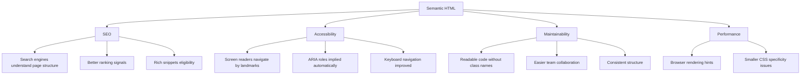
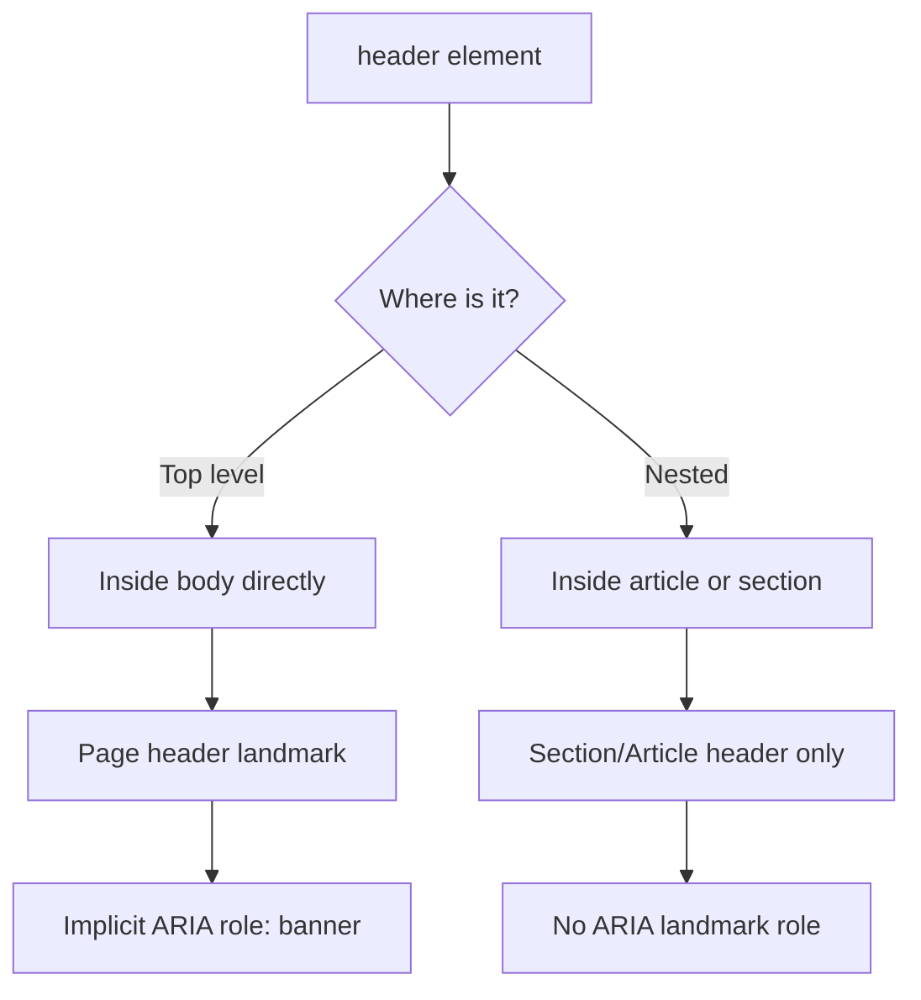
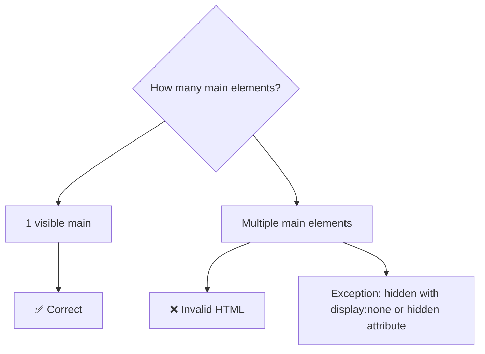
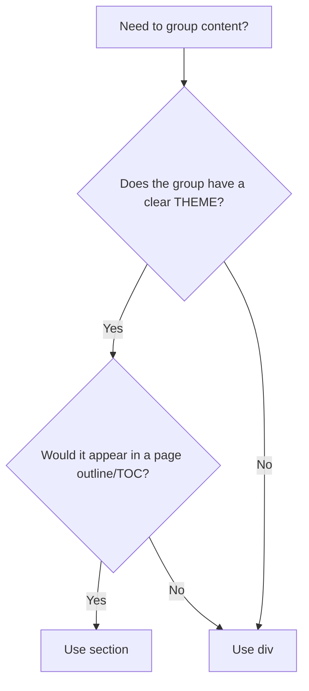
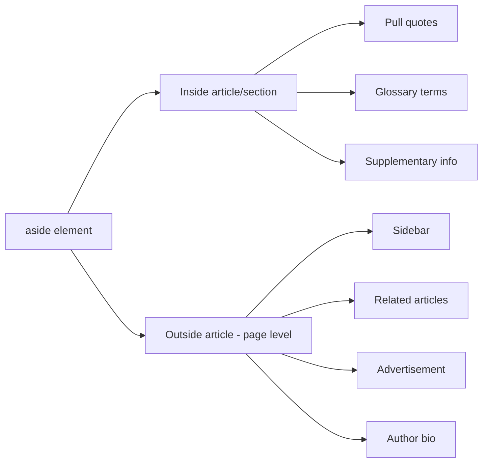
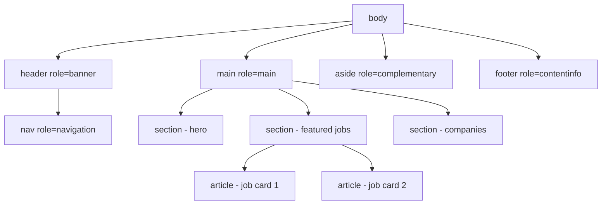
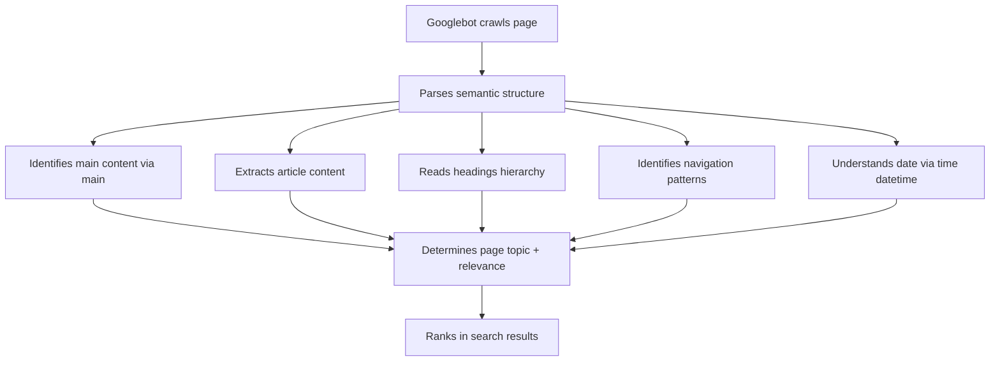
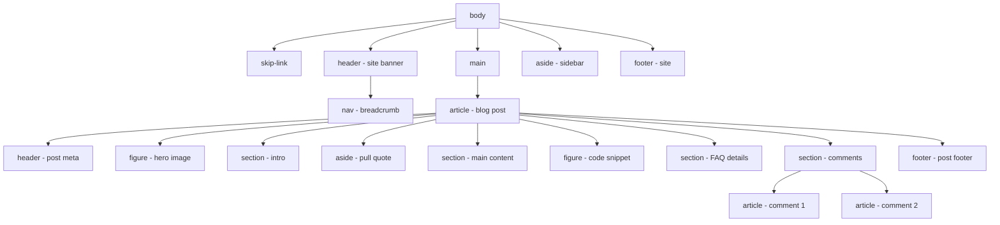

<a id="chapter-19-semantic-html"></a>

# Chapter 19: Semantic HTML

[⬅ Previous Chapter](#chapter-18-html5-form-validation) | [📖 Main Index](#main-index) | [Next Chapter ➡](#chapter-20-html-accessibility-seo)

---

## 📌 Learning Objectives

By the end of this chapter, you will:

- Understand what semantic HTML is and why it matters deeply
- Know every major semantic element: `<header>`, `<nav>`, `<main>`, `<section>`, `<article>`, `<aside>`, `<footer>`, `<time>`, `<address>`, `<figure>`, `<figcaption>`, `<mark>`, `<details>`, `<summary>`
- Understand the difference between semantic and non-semantic elements
- Know how semantic HTML improves SEO, accessibility, and maintainability
- Build correct page structure using semantic elements
- Avoid common semantic HTML mistakes made in interviews
- Build a fully semantic blog page using only HTML and CSS

---

<a id="chapter-index-table-19"></a>

## Chapter Index Table

| Topic No. | Topic Name | Subtopics |
|-----------|------------|-----------|
| 19.1 | [What is Semantic HTML?](#191-what-is-semantic-html) | Definition, semantic vs non-semantic, why it matters |
| 19.2 | [`<header>`](#192-header-element) | Page header vs section header, what goes inside, common mistakes |
| 19.3 | [`<nav>`](#193-nav-element) | Navigation landmark, multiple navs, aria-label |
| 19.4 | [`<main>`](#194-main-element) | One per page rule, skip navigation, landmark role |
| 19.5 | [`<section>`](#195-section-element) | Thematic grouping, heading requirement, vs div |
| 19.6 | [`<article>`](#196-article-element) | Self-contained content, syndication test, vs section |
| 19.7 | [`<aside>`](#197-aside-element) | Tangentially related content, sidebar, pull quotes |
| 19.8 | [`<footer>`](#198-footer-element) | Page footer vs section footer, what belongs inside |
| 19.9 | [Supporting Semantic Elements](#199-supporting-semantic-elements) | time, address, figure, figcaption, mark, details, summary, dialog |
| 19.10 | [Semantic Page Structure](#1910-semantic-page-structure) | Complete page anatomy, nesting rules, landmark regions |
| 19.11 | [Semantic vs Non-Semantic](#1911-semantic-vs-non-semantic) | div soup, when to use div and span, migration |
| 19.12 | [SEO & Accessibility Benefits](#1912-seo-and-accessibility-benefits) | How search engines read semantics, screen reader landmarks |
| 19.13 | [Interview Questions](#1913-interview-questions) | Conceptual, Scenario, Output-based, Advanced |
| 19.14 | [Practice Problems](#1914-practice-problems) | Coding, Theory, Machine Coding |
| 19.15 | [Mini Project](#1915-mini-project) | Semantic Blog Page |

---

## 19.1 What is Semantic HTML?

<a id="191-what-is-semantic-html"></a>

### What is it?

**Semantic HTML** means using HTML elements that carry **meaning** about the content they contain — not just presentational markup. A semantic element clearly describes its purpose to both the browser and the developer.

The word *semantic* comes from Greek: **semantikos** — *significant*, *meaningful*.

```html
<!-- ❌ Non-semantic: tells nothing about content purpose -->
<div class="header">
  <div class="nav">
    <div class="nav-item">Home</div>
  </div>
</div>

<!-- ✅ Semantic: meaning is self-evident -->
<header>
  <nav>
    <a href="/">Home</a>
  </nav>
</header>
```

### Semantic vs Non-Semantic Elements

| Semantic Elements | Non-Semantic Elements |
|------------------|----------------------|
| `<header>` | `<div>` |
| `<nav>` | `<span>` |
| `<main>` | `<div class="main">` |
| `<section>` | `<div class="section">` |
| `<article>` | `<div class="post">` |
| `<aside>` | `<div class="sidebar">` |
| `<footer>` | `<div class="footer">` |
| `<figure>` | `<div class="image-wrap">` |
| `<time>` | `<span class="date">` |
| `<mark>` | `<span class="highlight">` |

### Why Does Semantic HTML Matter?



### The Four Pillars of Why Semantic HTML Matters

#### 1. Search Engine Optimization (SEO)
Search engine crawlers (Googlebot, Bingbot) parse semantic HTML to understand page structure and content hierarchy. A `<article>` tells Google "this is a complete, standalone piece of content." An `<h1>` inside it tells Google "this is the title."

#### 2. Accessibility
Screen readers like NVDA, JAWS, and VoiceOver use semantic elements as **navigation landmarks**. A blind user can jump directly to `<main>` content, skip the `<nav>`, or navigate between `<section>` headings — only if the HTML is semantic.

#### 3. Developer Experience
Semantic HTML is self-documenting. When you see `<footer>`, you instantly know what it contains. `<div class="bottom-section">` tells you nothing without reading the content.

#### 4. Future-proofing
Semantic elements have **implicit ARIA roles** built in. As web standards evolve, browsers and assistive technologies automatically improve their handling of semantic elements.

> [!IMPORTANT]
> HTML5 semantic elements do NOT add any visual styling by default. They are purely about **meaning and structure**. All visual presentation is still handled by CSS.

### 🧠 Hinglish Intuition

> Socho ek library me books rakhne ke do tarike hain:
>
> **Tarika 1 (Non-semantic):** Saari books ek bade darwaze me daldo, alag alag colored bags me. Bag ka color sirf decorator ko pata hai.
>
> **Tarika 2 (Semantic):** "Fiction Section", "Science Section", "Reference Desk" — clearly labeled sections. Koi bhi aake directly apni cheez dhundh sakta hai.
>
> Semantic HTML bilkul tarika 2 hai — `<nav>` ka matlab navigation, `<article>` ka matlab ek complete content piece, `<footer>` ka matlab page ke neeche ka section. Browser, search engine, screen reader — sab samajh jaate hain bina class names padhe!

---

👉 <a href="#chapter-index-table-19">Go to Top 🔝</a>

---

## 19.2 `<header>` Element

<a id="192-header-element"></a>

### What is it?

`<header>` represents **introductory content** for its nearest sectioning ancestor. It typically contains a logo, site title, navigation, or search bar. It can appear multiple times on a page — once as the page header and again as section/article headers.

```html
<!-- Page-level header -->
<header>
  <a href="/" class="logo">
    
  </a>
  <nav>
    <a href="/jobs">Jobs</a>
    <a href="/companies">Companies</a>
    <a href="/blog">Blog</a>
  </nav>
  <button>Sign In</button>
</header>

<!-- Article-level header -->
<article>
  <header>
    <h2>10 Tips for React Developers</h2>
    <p>By <a href="/authors/rahul">Rahul Sharma</a></p>
    <time datetime="2024-06-15">June 15, 2024</time>
  </header>
  <p>Article body...</p>
</article>
```

### What Belongs in `<header>`?

| ✅ Appropriate | ❌ Not Appropriate |
|--------------|------------------|
| Site logo / brand | Main article content |
| Site title (`<h1>`) | Long paragraphs |
| Primary navigation (`<nav>`) | `<footer>` content |
| Search form | `<aside>` content |
| Hero section content | `<main>` content |
| Article title + meta | |
| Skip-to-main link | |

### Key Rules



> [!IMPORTANT]
> A `<header>` at the **top level** (direct child of `<body>`) has an implicit ARIA role of `banner` — a page-level landmark. A `<header>` nested inside `<article>` or `<section>` has NO landmark role — it's just an article/section header.

### Common Mistakes

```html
<!-- ❌ Wrong: header inside header -->
<header>
  <header>Site Title</header> <!-- nested headers = wrong -->
  <nav>...</nav>
</header>

<!-- ❌ Wrong: footer content in header -->
<header>
  <p>Copyright 2024</p> <!-- belongs in footer -->
</header>

<!-- ❌ Wrong: main content in header -->
<header>
  <article>...</article> <!-- articles are main content -->
</header>

<!-- ✅ Correct: header with logo, nav, and CTA -->
<header>
  <a href="/" class="brand">DevHire 💼</a>
  <nav aria-label="Primary navigation">
    <ul>
      <li><a href="/jobs">Find Jobs</a></li>
      <li><a href="/companies">Companies</a></li>
    </ul>
  </nav>
  <a href="/signup" class="cta-btn">Get Started</a>
</header>
```

### 🧠 Hinglish Intuition

> `<header>` ek **building ka entrance lobby** hai — jahan company ka naam, reception desk, aur directions hote hain. Yeh ek baar page ke shuru me hota hai (main lobby), lekin har floor (section/article) ka apna chhota reception bhi ho sakta hai. Andar ka content wahan nahi hota — sirf introductory cheezein!

---

👉 <a href="#chapter-index-table-19">Go to Top 🔝</a>

---

## 19.3 `<nav>` Element

<a id="193-nav-element"></a>

### What is it?

`<nav>` represents a section of a page that contains **major navigation links** — either within the current page or to other pages. Not every group of links needs `<nav>` — only major navigation blocks.

```html
<!-- Primary site navigation -->
<nav aria-label="Primary">
  <ul>
    <li><a href="/">Home</a></li>
    <li><a href="/about">About</a></li>
    <li><a href="/services">Services</a></li>
    <li><a href="/contact">Contact</a></li>
  </ul>
</nav>

<!-- Breadcrumb navigation -->
<nav aria-label="Breadcrumb">
  <ol>
    <li><a href="/">Home</a></li>
    <li><a href="/blog">Blog</a></li>
    <li aria-current="page">HTML5 Semantic Elements</li>
  </ol>
</nav>

<!-- Pagination navigation -->
<nav aria-label="Pagination">
  <a href="/page/1" aria-label="Previous page">← Prev</a>
  <a href="/page/3" aria-label="Next page">Next →</a>
</nav>
```

### Multiple `<nav>` Elements

You CAN have multiple `<nav>` elements on a page. When you do, use `aria-label` to differentiate them:

```html
<header>
  <!-- Primary navigation -->
  <nav aria-label="Primary navigation">
    <a href="/">Home</a>
    <a href="/jobs">Jobs</a>
    <a href="/blog">Blog</a>
  </nav>
</header>

<aside>
  <!-- Secondary/sidebar navigation -->
  <nav aria-label="Category navigation">
    <a href="/frontend">Frontend</a>
    <a href="/backend">Backend</a>
    <a href="/devops">DevOps</a>
  </nav>
</aside>

<footer>
  <!-- Footer navigation -->
  <nav aria-label="Footer navigation">
    <a href="/privacy">Privacy Policy</a>
    <a href="/terms">Terms</a>
    <a href="/sitemap">Sitemap</a>
  </nav>
</footer>
```

### When NOT to Use `<nav>`

```html
<!-- ❌ Wrong: minor/incidental links don't need nav -->
<nav> <!-- too minor for nav -->
  <a href="/share/twitter">Share on Twitter</a>
  <a href="/share/facebook">Share on Facebook</a>
</nav>

<!-- ✅ Right: just a div for minor links -->
<div class="share-links">
  <a href="/share/twitter">Share on Twitter</a>
  <a href="/share/facebook">Share on Facebook</a>
</div>

<!-- ❌ Wrong: single link doesn't need nav -->
<nav>
  <a href="/next-article">Next Article →</a>
</nav>

<!-- ✅ Right: just an anchor -->
<a href="/next-article">Next Article →</a>
```

> [!TIP]
> The rule of thumb: use `<nav>` for links that help users **navigate the site or page**. Social share links, "Related articles" (one-off), or inline text links do NOT need `<nav>`.

### Implicit ARIA Role

`<nav>` has an implicit ARIA role of `navigation`. Screen readers expose all `<nav>` elements as navigation landmarks, letting users jump directly to navigation sections.

### 🧠 Hinglish Intuition

> `<nav>` ek **building ka direction board** hai — "Lift is taraf, Conference Room us taraf, Exit yahan." Sirf important navigation links wahan jaate hain. Har ek link group `<nav>` nahi hota — jaise ek room me "Please close the door" sign ko direction board nahi kehte. Multiple `<nav>` elements allowed hain, lekin har ek ko `aria-label` se naam dena zaroori hai taaki screen reader confuse na ho!

---

👉 <a href="#chapter-index-table-19">Go to Top 🔝</a>

---

## 19.4 `<main>` Element

<a id="194-main-element"></a>

### What is it?

`<main>` represents the **dominant/primary content** of the document — the content that is unique to that page, excluding repeated content like headers, footers, and sidebars.

```html
<!DOCTYPE html>
<html lang="en">
<head>...</head>
<body>

  <header>...</header>  <!-- repeated across pages -->
  <nav>...</nav>        <!-- repeated across pages -->

  <main>
    <!-- UNIQUE page content goes here -->
    <h1>JavaScript Tutorial</h1>
    <article>...</article>
    <section>...</section>
  </main>

  <aside>...</aside>    <!-- supplementary content -->
  <footer>...</footer>  <!-- repeated across pages -->

</body>
</html>
```

### The One-Per-Page Rule



> [!IMPORTANT]
> There must be **only ONE visible `<main>` element** per page. Multiple `<main>` elements are invalid HTML unless all but one have `hidden` attribute (used in single-page app patterns where different "pages" are pre-rendered).

### `<main>` Must NOT Be Nested

```html
<!-- ❌ Wrong: main inside header, nav, aside, footer, or article -->
<header>
  <main>...</main> <!-- INVALID -->
</header>

<!-- ❌ Wrong: main nested inside another main -->
<main>
  <main>...</main> <!-- INVALID -->
</main>

<!-- ✅ Correct: main is a direct child of body (or equivalent) -->
<body>
  <header>...</header>
  <main>
    <h1>Page Title</h1>
    <article>...</article>
  </main>
  <footer>...</footer>
</body>
```

### Skip Navigation Pattern

`<main>` is the target for **skip links** — a critical accessibility feature:

```html
<!-- Skip link: first element in body -->
<a href="#main-content" class="skip-link">
  Skip to main content
</a>

<header>...</header>
<nav>...</nav>

<!-- Target of skip link -->
<main id="main-content">
  <h1>Page Heading</h1>
  ...
</main>
```

```css
/* Visually hidden but accessible */
.skip-link {
  position: absolute;
  top: -100%;
  left: 0;
  background: #000;
  color: #fff;
  padding: 8px 16px;
  z-index: 9999;
  text-decoration: none;
  font-weight: 700;
}

/* Visible when focused (keyboard users) */
.skip-link:focus {
  top: 0;
}
```

### Implicit ARIA Role

`<main>` has an implicit ARIA role of `main`. Screen reader users can jump directly to the main content using a keyboard shortcut — but only if `<main>` is used correctly.

### 🧠 Hinglish Intuition

> `<main>` ek **newspaper ka front page article** hai — yeh woh content hai jo is specific page ke liye unique hai. Header, nav, footer toh har page pe hote hain — lekin `<main>` ke andar jo hai woh sirf is page ki baat hai. Ek page pe sirf ek `<main>` — bilkul ek newspaper me sirf ek main headline hoti hai!

---

👉 <a href="#chapter-index-table-19">Go to Top 🔝</a>

---

## 19.5 `<section>` Element

<a id="195-section-element"></a>

### What is it?

`<section>` represents a **thematic grouping of content** — a standalone section of a document that has a clear, distinct theme. Every `<section>` should ideally have a heading (`<h1>`–`<h6>`) to describe its content.

```html
<main>
  <section>
    <h2>Featured Jobs</h2>
    <div class="jobs-grid">
      <!-- job cards -->
    </div>
  </section>

  <section>
    <h2>Top Companies</h2>
    <div class="companies-grid">
      <!-- company cards -->
    </div>
  </section>

  <section>
    <h2>Developer Resources</h2>
    <ul>
      <!-- resources -->
    </ul>
  </section>
</main>
```

### The Heading Requirement

Every `<section>` should have a heading. If you can't give it a heading, it probably shouldn't be a `<section>`:

```html
<!-- ❌ Wrong: section without heading -->
<section>
  <p>Some random paragraph without a theme.</p>
</section>

<!-- ✅ Correct: section with clear heading -->
<section>
  <h2>Latest Blog Posts</h2>
  <article>...</article>
  <article>...</article>
</section>

<!-- ✅ Acceptable: visually hidden heading for accessibility -->
<section>
  <h2 class="visually-hidden">Newsletter Signup</h2>
  <form>...</form>
</section>
```

### `<section>` vs `<div>`: The Key Decision



| Use `<section>` | Use `<div>` |
|----------------|------------|
| Content has a distinct theme | Pure layout/styling grouping |
| Would appear in a table of contents | No thematic meaning |
| Has (or should have) a heading | Just a container |
| Part of the document outline | CSS hook only |

### Nesting Sections

```html
<main>
  <section>
    <h2>Frontend Development</h2>

    <section>
      <h3>HTML & CSS</h3>
      <p>...</p>
    </section>

    <section>
      <h3>JavaScript</h3>
      <p>...</p>
    </section>

  </section>
</main>
```

> [!NOTE]
> Sections can be nested. When nesting, heading levels should descend appropriately (h2 inside h1's section, h3 inside h2's section).

### 🧠 Hinglish Intuition

> `<section>` ek **book ka chapter** hai — har chapter ka ek naam hota hai (heading) aur ek specific topic hota hai. Agar koi chapter bina naam ke ho ya topic clear na ho, toh woh chapter nahi — sirf pages ka bundle hai. Waise hi, `<section>` bina heading ke ya bina clear theme ke sirf `<div>` hona chahiye!

---

👉 <a href="#chapter-index-table-19">Go to Top 🔝</a>

---

## 19.6 `<article>` Element

<a id="196-article-element"></a>

### What is it?

`<article>` represents a **self-contained, independently distributable** piece of content. The key test: could this content be **lifted from the page and published elsewhere** (a news feed, RSS, another website) and still make complete sense on its own?

```html
<!-- Blog post article -->
<article>
  <header>
    <h2>Getting Started with React Hooks</h2>
    <p>By <a href="/author/priya">Priya Patel</a></p>
    <time datetime="2024-06-20">June 20, 2024</time>
  </header>

  <p>React Hooks changed everything about how we write components...</p>

  <section>
    <h3>useState Hook</h3>
    <p>...</p>
  </section>

  <section>
    <h3>useEffect Hook</h3>
    <p>...</p>
  </section>

  <footer>
    <p>Tags: <a href="/tag/react">React</a>, <a href="/tag/hooks">Hooks</a></p>
  </footer>
</article>
```

### The "Syndication Test"

Ask yourself: **"Could this content be syndicated (published in an RSS feed or another website) independently?"**

| Content | `<article>`? |
|---------|-------------|
| Blog post | ✅ Yes |
| News story | ✅ Yes |
| Product review | ✅ Yes |
| Forum post | ✅ Yes |
| Comment on a blog | ✅ Yes (nested article) |
| User profile card | ✅ Yes |
| Widget with live data | ✅ Yes |
| Navigation menu | ❌ No |
| Page header | ❌ No |
| Related links sidebar | ❌ No |

### Articles Can Be Nested

Comments on a blog post are themselves articles, nested inside the parent article:

```html
<article>
  <header>
    <h2>Why TypeScript is Worth Learning</h2>
  </header>
  <p>Article body content...</p>

  <!-- Comments section -->
  <section>
    <h3>Comments (3)</h3>

    <!-- Each comment is its own article -->
    <article>
      <header>
        <strong>Amit Kumar</strong>
        <time datetime="2024-06-21">June 21, 2024</time>
      </header>
      <p>Great article! TypeScript saved my team so much debugging time.</p>
    </article>

    <article>
      <header>
        <strong>Sneha Gupta</strong>
        <time datetime="2024-06-22">June 22, 2024</time>
      </header>
      <p>Agreed. The IDE support alone makes it worth it.</p>
    </article>

  </section>
</article>
```

### `<article>` vs `<section>`

| Feature | `<article>` | `<section>` |
|---------|------------|------------|
| Self-contained? | ✅ Must be | Not necessarily |
| Can be syndicated? | ✅ Yes | No |
| Can exist alone? | ✅ Yes | Only within document |
| Can contain sections? | ✅ Yes | Can contain articles |
| Heading required? | Strongly recommended | Yes (required) |
| Implicit ARIA role | `article` | `region` (if has accessible name) |

> [!TIP]
> Simple rule: `<article>` = complete standalone piece. `<section>` = thematic chunk of a larger whole. An article can contain sections. Sections can contain articles (like a "Latest Posts" section containing multiple post articles).

### 🧠 Hinglish Intuition

> `<article>` ek **newspaper ki individual khabar** hai — tum use page se kaat ke apne doston ko de sakte ho aur woh samjhenge without baaki newspaper. Blog post, product review, forum reply — yeh sab khud mein complete hain.
>
> `<section>` ek **newspaper ka column** hai — jaise "Sports Section" ya "Business Section." Yeh standalone nahi hai — sirf us newspaper ke context me meaningful hai. Dono alag alag hain!

---

👉 <a href="#chapter-index-table-19">Go to Top 🔝</a>

---

## 19.7 `<aside>` Element

<a id="197-aside-element"></a>

### What is it?

`<aside>` represents content that is **tangentially related** to the content around it — content that could be considered separate from the main content flow. It's used for sidebars, pull quotes, related links, advertisements, and supplementary information.

```html
<main>
  <article>
    <h2>Introduction to CSS Grid</h2>
    <p>CSS Grid is a two-dimensional layout system...</p>

    <!-- Pull quote inside article - tangentially related -->
    <aside>
      <blockquote>
        "CSS Grid is the most powerful layout tool CSS has ever had."
        — Jen Simmons
      </blockquote>
    </aside>

    <p>Continue reading the article...</p>
  </article>

  <!-- Sidebar aside - outside article, related to main content -->
  <aside aria-label="Related content">
    <section>
      <h3>Related Articles</h3>
      <ul>
        <li><a href="/css-flexbox">CSS Flexbox Guide</a></li>
        <li><a href="/css-positioning">CSS Positioning</a></li>
      </ul>
    </section>

    <section>
      <h3>Quick Reference</h3>
      <dl>
        <dt>grid-template-columns</dt>
        <dd>Defines column tracks</dd>
        <dt>grid-gap</dt>
        <dd>Sets gap between cells</dd>
      </dl>
    </section>
  </aside>
</main>
```

### Two Common Use Cases



### What Belongs in `<aside>`

| ✅ Appropriate | ❌ Not Appropriate |
|--------------|------------------|
| Sidebar navigation | Main article content |
| Related links | Primary page content |
| Advertisement | Navigation links |
| Author biography | Page footer |
| Pull quotes | Headers |
| Glossary/definitions | Forms (usually) |
| Social media widgets | |
| Tag clouds | |

### `<aside>` vs `<section>` vs `<div>`

```html
<!-- aside: tangentially related to main content -->
<aside>
  <h3>About the Author</h3>
  <p>Rahul Sharma is a senior frontend developer...</p>
</aside>

<!-- section: thematic part OF the main content -->
<section>
  <h2>Advanced Techniques</h2>
  <p>This is part of the main article...</p>
</section>

<!-- div: pure layout, no semantic meaning needed -->
<div class="two-column-wrapper">
  <div class="column">...</div>
  <div class="column">...</div>
</div>
```

### Implicit ARIA Role

`<aside>` at page level (not nested in `<article>` or `<section>`) has an implicit ARIA role of `complementary`. When nested inside article/section, it loses the landmark role.

### 🧠 Hinglish Intuition

> `<aside>` ek **book ka sidebar note** hai — jab tum koi textbook padhte ho aur margin me "Did you know?" ya "Fun Fact" boxes hote hain. Woh main topic se related hote hain lekin directly us topic ka part nahi hote. Agar woh sidebar notes hata do, main text still complete hogi. Yahi `<aside>` hai — "additional context, not essential content."

---

👉 <a href="#chapter-index-table-19">Go to Top 🔝</a>

---

## 19.8 `<footer>` Element

<a id="198-footer-element"></a>

### What is it?

`<footer>` represents the **closing/concluding content** for its nearest sectioning ancestor. Like `<header>`, it can appear at the page level or inside sections/articles. It typically contains authorship info, copyright notices, related links, contact information, or secondary navigation.

```html
<!-- Page-level footer -->
<footer>
  <div class="footer-grid">

    <div class="footer-brand">
      <a href="/">💼 DevHire</a>
      <p>Connecting developers with their dream jobs.</p>
    </div>

    <nav aria-label="Company links">
      <h3>Company</h3>
      <ul>
        <li><a href="/about">About Us</a></li>
        <li><a href="/careers">Careers</a></li>
        <li><a href="/press">Press</a></li>
      </ul>
    </nav>

    <nav aria-label="Legal links">
      <h3>Legal</h3>
      <ul>
        <li><a href="/privacy">Privacy Policy</a></li>
        <li><a href="/terms">Terms of Service</a></li>
      </ul>
    </nav>

    <div class="footer-contact">
      <h3>Contact</h3>
      <address>
        <a href="mailto:hello@devhire.com">hello@devhire.com</a>
        <a href="tel:+919876543210">+91 98765 43210</a>
      </address>
    </div>

  </div>

  <div class="footer-bottom">
    <p>
      <small>© 2024 DevHire Pvt Ltd. All rights reserved.</small>
    </p>
  </div>
</footer>

<!-- Article-level footer -->
<article>
  <h2>Article Title</h2>
  <p>Article content...</p>

  <footer>
    <p>Published by <a href="/author/rahul">Rahul Sharma</a></p>
    <p>
      <time datetime="2024-06-15">June 15, 2024</time>
    </p>
    <p>Tags: <a href="/tag/html">HTML</a>, <a href="/tag/css">CSS</a></p>
  </footer>
</article>
```

### What Belongs in `<footer>`

| ✅ Appropriate | ❌ Not Appropriate |
|--------------|------------------|
| Copyright notice | Main navigation |
| Author information | Hero content |
| Contact details | Main article body |
| Legal links | `<header>` content |
| Secondary navigation | Forms (mostly) |
| Social media links | Ads/promotions |
| Sitemap links | |
| Back-to-top link | |

### Implicit ARIA Role

A `<footer>` that is a direct descendant of `<body>` (page-level) has implicit ARIA role of `contentinfo`. When nested inside `<article>` or `<section>`, it has no landmark role.

### Multiple Footers

```html
<body>

  <main>
    <article>
      <h2>Post 1</h2>
      <p>Content...</p>
      <footer> <!-- Article footer: no landmark role -->
        <p>By Rahul | June 2024</p>
      </footer>
    </article>
  </main>

  <footer> <!-- Page footer: role=contentinfo -->
    <p>© 2024 DevHire</p>
  </footer>

</body>
```

### 🧠 Hinglish Intuition

> `<footer>` ek **letter ka ending** hai — "Yours sincerely, + Signature + Date." Page footer me copyright, contact, aur legal links hote hain — woh cheezein jo content ke baad aati hain. Article footer me "By Author | Date | Tags" hota hai. Jaise header ka ek page-level aur article-level version hota hai, waise hi footer ka bhi!

---

👉 <a href="#chapter-index-table-19">Go to Top 🔝</a>

---

## 19.9 Supporting Semantic Elements

<a id="199-supporting-semantic-elements"></a>

### `<time>` — Machine-readable Dates & Times

`<time>` represents a **specific period in time**. The `datetime` attribute provides the machine-readable format while the element's content shows a human-friendly version.

```html
<!-- Published date -->
<time datetime="2024-06-15">June 15, 2024</time>

<!-- Time with timezone -->
<time datetime="2024-06-15T14:30:00+05:30">2:30 PM IST</time>

<!-- Duration -->
<time datetime="PT2H30M">2 hours 30 minutes</time>

<!-- Year only -->
<time datetime="2024">This year</time>

<!-- Month only -->
<time datetime="2024-06">Last month</time>
```

**`datetime` Format Reference:**

| Format | Example | Meaning |
|--------|---------|---------|
| Date | `2024-06-15` | June 15, 2024 |
| Time | `14:30` | 2:30 PM |
| DateTime | `2024-06-15T14:30` | June 15 at 2:30 PM |
| DateTime+TZ | `2024-06-15T14:30+05:30` | With IST timezone |
| Duration | `PT2H30M` | 2 hours 30 minutes |
| Year-Month | `2024-06` | June 2024 |

---

### `<address>` — Contact Information

`<address>` provides **contact information** for its nearest `<article>` or `<body>` ancestor. It typically appears inside `<footer>`.

```html
<!-- Contact info for the page/organization -->
<address>
  <strong>DevHire Pvt Ltd</strong><br>
  123 Tech Park, Whitefield<br>
  Bangalore, Karnataka 560066<br>
  <a href="mailto:contact@devhire.com">contact@devhire.com</a><br>
  <a href="tel:+918012345678">+91 80 1234 5678</a>
</address>

<!-- Article author contact info -->
<article>
  <h2>Article Title</h2>
  <address>
    Written by <a href="/author/rahul">Rahul Sharma</a>
  </address>
</article>
```

> [!IMPORTANT]
> `<address>` is for **contact information**, NOT for postal addresses in general. If you're showing a user's home address as data (not as contact info for the document), use `<p>` or `<div>` instead.

---

### `<figure>` and `<figcaption>` — Self-contained Media

`<figure>` wraps **self-contained content** referenced from the main flow — images, code snippets, diagrams, charts, etc. `<figcaption>` provides a caption for it.

```html
<!-- Image with caption -->
<figure>
  
  <figcaption>
    Figure 1: CSS Grid layout with 3 columns and 2 rows
  </figcaption>
</figure>

<!-- Code snippet with caption -->
<figure>
  <pre><code>
const greeting = (name) => `Hello, ${name}!`;
console.log(greeting('World'));
  </code></pre>
  <figcaption>
    Listing 1: Arrow function with template literal
  </figcaption>
</figure>

<!-- Multiple images in one figure -->
<figure>
  
  
  <figcaption>
    Before and after applying CSS Grid layout
  </figcaption>
</figure>
```

---

### `<mark>` — Highlighted/Relevant Text

`<mark>` represents text that is **highlighted for reference** — relevant to the user's current context (like search results highlighting).

```html
<!-- Search result highlighting -->
<p>
  Learn <mark>HTML5</mark> semantic elements and how 
  <mark>HTML5</mark> improves accessibility.
</p>

<!-- Highlighting relevant passage -->
<blockquote>
  "The web is for everyone, and accessibility is not 
  <mark>optional</mark> — it is fundamental."
</blockquote>
```

```css
mark {
  background: #fff176;
  color: inherit;
  padding: 0 2px;
  border-radius: 2px;
}
```

---

### `<details>` and `<summary>` — Disclosure Widget

`<details>` creates a **disclosure widget** (accordion/collapsible) natively in HTML. `<summary>` is the visible heading that toggles the content.

```html
<!-- FAQ item -->
<details>
  <summary>What is semantic HTML?</summary>
  <p>
    Semantic HTML uses elements that carry meaning about 
    their content. Elements like header, nav, main, article, 
    and footer describe their role rather than just their 
    presentation.
  </p>
</details>

<!-- Open by default -->
<details open>
  <summary>Installation Instructions</summary>
  <ol>
    <li>Clone the repository</li>
    <li>Run npm install</li>
    <li>Run npm start</li>
  </ol>
</details>

<!-- Styled details/summary -->
<details class="faq-item">
  <summary class="faq-question">
    Is HTML5 validation enough for security?
  </summary>
  <div class="faq-answer">
    <p>
      No. HTML5 validation is client-side only and can be 
      bypassed. Always validate on the server too.
    </p>
  </div>
</details>
```

```css
details {
  border: 1px solid #e0e0e0;
  border-radius: 8px;
  padding: 12px 16px;
  margin-bottom: 8px;
}

summary {
  cursor: pointer;
  font-weight: 600;
  list-style: none;
  display: flex;
  justify-content: space-between;
  align-items: center;
}

summary::after {
  content: '+';
  font-size: 20px;
  color: #3498db;
}

details[open] summary::after {
  content: '−';
}

details .faq-answer {
  margin-top: 12px;
  padding-top: 12px;
  border-top: 1px solid #f0f0f0;
}
```

---

### `<dialog>` — Native Modal Dialog

`<dialog>` represents a **dialog box or modal** natively in HTML.

```html
<dialog id="confirm-dialog">
  <h3>Confirm Action</h3>
  <p>Are you sure you want to delete this item?</p>
  <div class="dialog-actions">
    <button id="cancel-btn">Cancel</button>
    <button id="confirm-btn">Delete</button>
  </div>
</dialog>

<button id="open-btn">Delete Item</button>

<script>
  const dialog = document.getElementById('confirm-dialog');
  const openBtn = document.getElementById('open-btn');
  const cancelBtn = document.getElementById('cancel-btn');

  openBtn.addEventListener('click', () => dialog.showModal());
  cancelBtn.addEventListener('click', () => dialog.close());
</script>
```

---

### Complete Supporting Elements Reference

| Element | Purpose | Key Attribute |
|---------|---------|--------------|
| `<time>` | Date/time with machine-readable value | `datetime` |
| `<address>` | Contact information | — |
| `<figure>` | Self-contained referenced content | — |
| `<figcaption>` | Caption for `<figure>` | — |
| `<mark>` | Highlighted/relevant text | — |
| `<details>` | Disclosure/accordion widget | `open` |
| `<summary>` | Heading for `<details>` | — |
| `<dialog>` | Modal dialog | `open` |
| `<abbr>` | Abbreviation with expansion | `title` |
| `<cite>` | Reference to creative work | — |
| `<blockquote>` | Extended quotation | `cite` |
| `<code>` | Inline code | — |
| `<pre>` | Preformatted text | — |
| `<kbd>` | Keyboard input | — |
| `<samp>` | Sample output | — |
| `<var>` | Mathematical variable | — |
| `<del>` | Deleted text | `datetime` |
| `<ins>` | Inserted text | `datetime` |

### 🧠 Hinglish Intuition

> Yeh sab **specialist workers** hain ek office me:
> - `<time>` = receptionist jo date-time precisely record karta hai
> - `<address>` = visiting card wala — contact info ka official jagah
> - `<figure>` + `<figcaption>` = photographer jo photo ke saath caption likhta hai
> - `<mark>` = highlighter pen — important text pe yellow marker
> - `<details>` + `<summary>` = foldable drawer — click karo toh khulta hai
> - `<dialog>` = conference room jo reserve hota hai jab needed ho
>
> Har ek ka specific kaam hai — generic `<div>` ya `<span>` se zyada meaningful!

---

👉 <a href="#chapter-index-table-19">Go to Top 🔝</a>

---

## 19.10 Semantic Page Structure

<a id="1910-semantic-page-structure"></a>

### Complete Page Anatomy

A well-structured semantic HTML page looks like this:

```html
<!DOCTYPE html>
<html lang="en">
<head>
  <meta charset="UTF-8">
  <meta name="viewport" content="width=device-width, initial-scale=1.0">
  <title>DevHire – Find Developer Jobs</title>
  <meta name="description" content="Find your next developer job">
</head>
<body>

  <!-- Skip navigation link (accessibility) -->
  <a href="#main-content" class="skip-link">Skip to main content</a>

  <!-- Page header: logo + primary nav -->
  <header>
    <a href="/" class="brand">💼 DevHire</a>
    <nav aria-label="Primary navigation">
      <ul>
        <li><a href="/jobs">Jobs</a></li>
        <li><a href="/companies">Companies</a></li>
        <li><a href="/blog">Blog</a></li>
        <li><a href="/resources">Resources</a></li>
      </ul>
    </nav>
    <div class="header-actions">
      <a href="/login">Sign In</a>
      <a href="/signup">Get Started</a>
    </div>
  </header>

  <!-- Main content: unique to this page -->
  <main id="main-content">

    <!-- Hero section -->
    <section class="hero-section">
      <h1>Find Your Dream Developer Job</h1>
      <p>Connect with 500+ companies hiring senior developers</p>
      <form role="search" action="/jobs/search" method="get">
        <input type="search" name="q" placeholder="Job title, skill...">
        <button type="submit">Search Jobs</button>
      </form>
    </section>

    <!-- Featured jobs section -->
    <section>
      <h2>Featured Jobs</h2>
      <div class="jobs-grid">

        <!-- Each job is an article: self-contained -->
        <article class="job-card">
          <header>
            <h3>Senior React Developer</h3>
            <p>TechCorp · Bangalore · ₹25–35 LPA</p>
          </header>
          <p>We're looking for an experienced React developer...</p>
          <footer>
            <time datetime="2024-06-15">Posted 2 days ago</time>
            <a href="/jobs/senior-react-dev">View Job →</a>
          </footer>
        </article>

        <article class="job-card">
          <header>
            <h3>Full Stack Engineer</h3>
            <p>StartupXYZ · Remote · ₹18–28 LPA</p>
          </header>
          <p>Join our fast-growing team as a full stack engineer...</p>
          <footer>
            <time datetime="2024-06-14">Posted 3 days ago</time>
            <a href="/jobs/fullstack-engineer">View Job →</a>
          </footer>
        </article>

      </div>
    </section>

    <!-- Top companies section -->
    <section>
      <h2>Top Hiring Companies</h2>
      <ul class="company-list">
        <li><a href="/company/google">Google</a></li>
        <li><a href="/company/microsoft">Microsoft</a></li>
        <li><a href="/company/amazon">Amazon</a></li>
      </ul>
    </section>

  </main>

  <!-- Sidebar: supplementary content -->
  <aside aria-label="Sidebar">
    <section>
      <h2>Salary Insights</h2>
      <dl>
        <dt>React Developer</dt>
        <dd>₹12–35 LPA avg</dd>
        <dt>Node.js Developer</dt>
        <dd>₹10–30 LPA avg</dd>
      </dl>
    </section>

    <section>
      <h2>Trending Skills</h2>
      <ul>
        <li><a href="/skill/react">React</a></li>
        <li><a href="/skill/typescript">TypeScript</a></li>
        <li><a href="/skill/docker">Docker</a></li>
      </ul>
    </section>
  </aside>

  <!-- Page footer -->
  <footer>
    <div class="footer-top">

      <div class="footer-brand">
        <strong>💼 DevHire</strong>
        <p>Connecting developers with opportunities.</p>
      </div>

      <nav aria-label="Product links">
        <h3>Product</h3>
        <ul>
          <li><a href="/jobs">Browse Jobs</a></li>
          <li><a href="/companies">Companies</a></li>
          <li><a href="/salary">Salary Guide</a></li>
        </ul>
      </nav>

      <nav aria-label="Resources links">
        <h3>Resources</h3>
        <ul>
          <li><a href="/blog">Blog</a></li>
          <li><a href="/tutorials">Tutorials</a></li>
          <li><a href="/interview-prep">Interview Prep</a></li>
        </ul>
      </nav>

      <address>
        <strong>Contact Us</strong><br>
        <a href="mailto:hello@devhire.com">hello@devhire.com</a>
      </address>

    </div>

    <div class="footer-bottom">
      <small>
        © <time datetime="2024">2024</time> DevHire Pvt Ltd. 
        All rights reserved.
      </small>
      <nav aria-label="Legal links">
        <a href="/privacy">Privacy</a>
        <a href="/terms">Terms</a>
      </nav>
    </div>
  </footer>

</body>
</html>
```

### Landmark Regions Diagram



### ARIA Landmark Roles — Implicit Mapping

| HTML Element | Implicit ARIA Role | Screen Reader Label |
|-------------|-------------------|---------------------|
| `<header>` (top-level) | `banner` | "banner" |
| `<nav>` | `navigation` | "navigation" |
| `<main>` | `main` | "main" |
| `<aside>` (top-level) | `complementary` | "complementary" |
| `<footer>` (top-level) | `contentinfo` | "content info" |
| `<section>` (with name) | `region` | "region" |
| `<article>` | `article` | "article" |
| `<form>` (with name) | `form` | "form" |
| `<form role="search">` | `search` | "search" |

### 🧠 Hinglish Intuition

> Ek complete semantic page ek **organized office building** ki tarah hai:
> - `<header>` = main entrance + reception
> - `<nav>` = direction signs / elevator buttons
> - `<main>` = main work area (floors 2–10)
> - `<section>` = individual departments (HR, Engineering, Marketing)
> - `<article>` = individual desks / workstations
> - `<aside>` = notice board / supplementary info board
> - `<footer>` = basement with legal/contact/utilities
>
> Screen readers are like **visually impaired visitors** who rely on these labeled areas to navigate. Without semantic HTML, it's like a building with no signs — impossible to navigate!

---

👉 <a href="#chapter-index-table-19">Go to Top 🔝</a>

---

## 19.11 Semantic vs Non-Semantic

<a id="1911-semantic-vs-non-semantic"></a>

### The "Div Soup" Problem

Before HTML5 semantic elements, developers used only `<div>` and `<span>` with class names for structure. This created unreadable, unmaintainable code called **"div soup"**:

```html
<!-- ❌ Div Soup: what does any of this mean? -->
<div class="wrapper">
  <div class="top-bar">
    <div class="logo-area">
      <div class="brand-text">DevHire</div>
    </div>
    <div class="menu-container">
      <div class="menu-item"><a href="/">Home</a></div>
      <div class="menu-item"><a href="/jobs">Jobs</a></div>
    </div>
  </div>
  <div class="content-area">
    <div class="main-column">
      <div class="post-container">
        <div class="post-title">Article Title</div>
        <div class="post-body">Content...</div>
        <div class="post-meta">By Author | June 2024</div>
      </div>
    </div>
    <div class="side-column">
      <div class="widget">Related articles...</div>
    </div>
  </div>
  <div class="bottom-bar">
    <div class="copyright">© 2024</div>
  </div>
</div>
```

```html
<!-- ✅ Semantic HTML: self-explanatory -->
<body>
  <header>
    <a href="/" class="brand">DevHire</a>
    <nav>
      <a href="/">Home</a>
      <a href="/jobs">Jobs</a>
    </nav>
  </header>

  <main>
    <article>
      <h2>Article Title</h2>
      <p>Content...</p>
      <footer>
        <address>By Author</address>
        <time datetime="2024-06">June 2024</time>
      </footer>
    </article>
  </main>

  <aside>Related articles...</aside>

  <footer>
    <small>© 2024</small>
  </footer>
</body>
```

### When to Still Use `<div>` and `<span>`

`<div>` and `<span>` are NOT bad — they are **layout/styling containers** with no semantic meaning. Use them when:

| Use `<div>` when | Use `<span>` when |
|-----------------|------------------|
| Pure layout wrapper | Inline text styling |
| CSS grid/flex container | Inline icon wrapper |
| JavaScript hook | Highlight part of text |
| No semantic element fits | No semantic element fits |
| Grouping for animation | Part of larger element |

```html
<!-- div for layout grid — no semantic equivalent -->
<div class="three-column-grid">
  <article>...</article>
  <article>...</article>
  <article>...</article>
</div>

<!-- span for inline styling — no semantic equivalent -->
<p>
  Price: <span class="price">₹999</span>
  <span class="original-price">₹1,999</span>
</p>

<!-- span for icon — no semantic equivalent -->
<button>
  <span class="icon" aria-hidden="true">🔍</span>
  Search
</button>
```

### Migration: From Div Soup to Semantic HTML

```html
<!-- Before -->
<div class="header"> → <header>
<div class="nav">   → <nav>
<div class="main">  → <main>
<div class="post">  → <article>
<div class="section"> → <section>
<div class="sidebar"> → <aside>
<div class="footer"> → <footer>
<div class="date">   → <time datetime="">
<div class="author-contact"> → <address>
<div class="image-caption"> → <figcaption> inside <figure>
```

### 🧠 Hinglish Intuition

> Div soup ek aise restaurant ki tarah hai jahan menu me sirf "Item 1", "Item 2", "Item 3" likha ho — koi bhi samajh nahi sakta kya order karna chahiye. Semantic HTML us restaurant ki tarah hai jahan clearly likha ho "Starters", "Main Course", "Desserts", "Beverages."
>
> `<div>` aur `<span>` bure nahi hain — woh transparent containers hain jo tab kaam aate hain jab koi specific semantic element fit nahi hota. Sirf hamesha woh use karna **lazy coding** hai!

---

👉 <a href="#chapter-index-table-19">Go to Top 🔝</a>

---

## 19.12 SEO and Accessibility Benefits

<a id="1912-seo-and-accessibility-benefits"></a>

### How Search Engines Use Semantic HTML



### SEO Impact of Semantic Elements

| Element | SEO Signal |
|---------|-----------|
| `<main>` | Identifies primary content for indexing |
| `<article>` | Signals standalone indexable content |
| `<h1>`–`<h6>` inside articles | Keyword hierarchy |
| `<time datetime>` | Enables "freshness" ranking signals |
| `<nav>` | Site structure understanding |
| `<figure>` + `<figcaption>` | Image content context |
| `<address>` | Local SEO signals |

### How Screen Readers Use Semantic HTML

Screen readers expose semantic HTML as a **landmark navigation system**. Users can:

- Press `H` to jump between headings
- Press `1`–`6` to jump to headings by level
- Press `R` to navigate between regions (landmarks)
- Press `B` to jump between buttons
- Press `F` to jump between form fields
- Press `L` to jump between lists

```html
<!-- Without semantic HTML: screen reader reads everything linearly -->
<div class="header">
  <div class="logo">DevHire</div>
  <div class="nav">Home Jobs Blog</div>
</div>
<div class="content">Article text...</div>

<!-- With semantic HTML: screen reader announces landmarks -->
<header>        <!-- "banner landmark" -->
  <a href="/">DevHire</a>
  <nav>         <!-- "navigation landmark: Primary navigation" -->
    <a href="/">Home</a>
    <a href="/jobs">Jobs</a>
  </nav>
</header>
<main>          <!-- "main landmark" -->
  <article>     <!-- "article" -->
    Article text...
  </article>
</main>
```

### WCAG and Semantic HTML

The **Web Content Accessibility Guidelines (WCAG)** specifically require:

| WCAG Criterion | Semantic HTML Solution |
|---------------|----------------------|
| 1.3.1 Info and Relationships | Use semantic elements to convey structure |
| 2.4.1 Bypass Blocks | Skip link targeting `<main>` |
| 2.4.6 Headings and Labels | Proper heading hierarchy in sections |
| 4.1.2 Name, Role, Value | Implicit ARIA roles from semantic elements |

### Rich Snippets from Semantic HTML

Google uses semantic HTML structure to generate **rich snippets** in search results:

```html
<!-- Article with structured data signals -->
<article>
  <header>
    <h1>How to Learn CSS Grid</h1>
    <!-- Author signal -->
    <address>By <a rel="author" href="/author/priya">Priya Patel</a></address>
    <!-- Date signal for freshness -->
    <time datetime="2024-06-15">June 15, 2024</time>
  </header>
  <p>CSS Grid is the most powerful layout tool...</p>
</article>
```

This helps Google display the author name, publication date, and article title in search results as rich snippets.

### 🧠 Hinglish Intuition

> Semantic HTML Google ke liye ek **well-organized resume** ki tarah hai — jahan clearly sections hain: "Experience", "Education", "Skills." Google (recruiter) ek glance me samajh jaata hai ki candidate ka profile kya hai.
>
> Screen reader ke liye yeh ek **Braille book ka proper formatting** hai — jo visually impaired reader ko efficiently navigate karne deta hai: "Chapter 3 skip karo, seedha Chapter 5 jao." Bina semantic HTML ke, screen reader ko poori page linearly padhna padta hai — jaise unformatted text block — extremely inefficient!

---

👉 <a href="#chapter-index-table-19">Go to Top 🔝</a>

---

## 19.13 Interview Questions

<a id="1913-interview-questions"></a>

## 💡 Interview Questions

---

### 🔵 Conceptual Questions

**Q1. What is the difference between `<section>` and `<article>`?**

**Answer:**

| | `<article>` | `<section>` |
|--|------------|------------|
| Self-contained | ✅ Yes | ❌ Not necessarily |
| Syndication test | ✅ Can be lifted and republished | ❌ Only makes sense in context |
| Heading required | Strongly recommended | Yes, required |
| Contains sections? | ✅ Yes | Can contain articles |
| Use case | Blog post, news story, product review, comment | Chapter, grouped content, thematic area |

Simple rule: If it passes the "Can I copy this to another website and it makes sense?" test → `<article>`. If it's just a thematic grouping within the page → `<section>`.

---

**Q2. How many `<main>` elements can a page have?**

**Answer:** Only **ONE visible `<main>` element**. Multiple `<main>` elements are technically invalid unless all but one are hidden (`hidden` attribute or `display:none`). The single-page application pattern sometimes uses multiple `<main>` elements where only one is visible at a time.

---

**Q3. What is the difference between `<header>` and `<head>`?**

**Answer:**

| | `<head>` | `<header>` |
|--|---------|-----------|
| Location | Inside `<html>`, before `<body>` | Inside `<body>` |
| Purpose | Document metadata (title, meta, CSS, JS links) | Introductory content (logo, nav, hero) |
| Visible to user | ❌ No | ✅ Yes |
| Multiple per page | ❌ Only one | ✅ Multiple allowed |

---

**Q4. What implicit ARIA roles do semantic elements carry?**

**Answer:**

| Element | Implicit ARIA Role |
|---------|-------------------|
| `<header>` (top-level) | `banner` |
| `<nav>` | `navigation` |
| `<main>` | `main` |
| `<aside>` (top-level) | `complementary` |
| `<footer>` (top-level) | `contentinfo` |
| `<article>` | `article` |
| `<section>` (with name) | `region` |

---

**Q5. When should you use `<aside>` vs `<section>`?**

**Answer:**
- `<aside>`: Content **tangentially related** to the surrounding content — if removed, the main content still makes complete sense. Example: sidebar, pull quotes, related articles, ads.
- `<section>`: Content that is **part of** the main content, just grouped thematically. Example: chapters of an article, tabs on a product page.

If removing the element would still leave the main content complete → `<aside>`. If it's an integral part of the content → `<section>`.

---

**Q6. What is "div soup" and why is it a problem?**

**Answer:** "Div soup" refers to HTML that uses only `<div>` and `<span>` with class names for all structure — no semantic elements. Problems:
1. **Accessibility**: Screen readers can't identify landmarks — users must read everything linearly
2. **SEO**: Search engines can't determine content hierarchy or importance
3. **Maintainability**: Code is hard to read without semantic context
4. **No implicit ARIA roles**: Must manually add `role` attributes for accessibility

---

**Q7. What does the `datetime` attribute on `<time>` do?**

**Answer:** It provides a **machine-readable date/time value** that browsers, search engines, and assistive technologies can process, while the element's text content can be any human-friendly format. Example:
```html
<time datetime="2024-06-15">Last updated: Jun 15th, '24</time>
```
Google uses this for "freshness" ranking signals. Without `datetime`, the human-readable text may be ambiguous ("June 15" without year, "6/15" with US/UK ambiguity).

---

**Q8. Can `<header>` be nested inside `<article>`? Can `<footer>` be nested inside `<article>`?**

**Answer:** Yes, both are allowed and semantically correct:
- `<article>` can have its own `<header>` (for article title, author, date)
- `<article>` can have its own `<footer>` (for tags, publish info, related links)

When nested this way, they do NOT carry ARIA landmark roles — they are article-level headers/footers, not page-level banner/contentinfo.

---

### 🟡 Scenario-Based Questions

**Q9. A developer has built a blog page using only `<div>` elements with class names. What specific problems does this cause, and how would you fix it?**

**Answer:**

**Problems:**
1. Screen reader users can't navigate by landmarks — no skip navigation possible
2. Search engines can't identify the main article content vs sidebar vs navigation
3. No implicit ARIA roles — must add `role="banner"`, `role="navigation"`, etc. manually
4. Team collaboration is harder — need to read class names to understand structure
5. No rich snippet eligibility for article dates, author attribution

**Fix:** Replace:
- `.header` div → `<header>`
- `.nav` div → `<nav aria-label="Primary">`
- `.main-content` div → `<main>`
- `.post` div → `<article>`
- `.sidebar` div → `<aside>`
- `.footer` div → `<footer>`
- `.date` span → `<time datetime="YYYY-MM-DD">`
- `.author-contact` div → `<address>`

---

**Q10. When would you use `<details>` and `<summary>` instead of a custom JavaScript accordion?**

**Answer:**
- `<details>`/`<summary>` is a **native HTML solution** requiring zero JavaScript
- Works without JS enabled
- Automatically accessible (keyboard navigable, screen reader friendly)
- Supported in all modern browsers

Use `<details>`/`<summary>` for:
- FAQ sections
- Code examples in documentation
- Settings panels
- Simple show/hide toggles

Use custom JS accordion when:
- You need animation/transitions
- You need to control multiple panels opening simultaneously
- You need complex state management

---

**Q11. How would you structure a blog post page semantically?**

**Answer:**

```html
<body>
  <header><!-- site header --></header>
  <nav><!-- primary nav --></nav>

  <main>
    <article>
      <header>
        <h1>Post Title</h1>
        <address>By <a href="/author">Author</a></address>
        <time datetime="2024-06-15">June 15, 2024</time>
      </header>

      <section>
        <h2>Introduction</h2>
        <p>...</p>
      </section>

      <section>
        <h2>Main Content</h2>
        <figure>
          
          <figcaption>Figure 1: Diagram</figcaption>
        </figure>
      </section>

      <footer>
        <p>Tags: <a href="/tag/html">HTML</a></p>
      </footer>

      <section aria-label="Comments">
        <h2>Comments</h2>
        <article><!-- comment 1 --></article>
        <article><!-- comment 2 --></article>
      </section>
    </article>
  </main>

  <aside><!-- related posts --></aside>
  <footer><!-- site footer --></footer>
</body>
```

---

### 🔴 Output-Based Questions

**Q12. What ARIA landmark roles do these elements have?**

```html
<header><!-- top level --></header>
<nav>...</nav>
<main>...</main>
<article>
  <header><!-- nested --></header>
  <aside><!-- nested --></aside>
</article>
<aside><!-- top level --></aside>
<footer><!-- top level --></footer>
```

**Answer:**
- Top-level `<header>` → `banner`
- `<nav>` → `navigation`
- `<main>` → `main`
- Article's `<header>` → **No landmark role** (nested in article)
- Article's `<aside>` → **No landmark role** (nested in article)
- Top-level `<aside>` → `complementary`
- Top-level `<footer>` → `contentinfo`

---

**Q13. Is this valid HTML? What is wrong?**

```html
<main>
  <main>
    <article>...</article>
  </main>
</main>
```

**Answer:** **Invalid HTML.** There can only be one visible `<main>` per document. Nesting `<main>` inside another `<main>` violates the HTML spec. Also, `<main>` should not be used as a generic container — it specifically represents the primary content of the document.

---

### 🟣 Advanced Questions

**Q14. How does semantic HTML relate to the Document Outline Algorithm?**

**Answer:** HTML5 introduced a theoretical **Document Outline Algorithm** where heading levels are relative to their sectioning context (body, article, section, aside, nav). For example, multiple `<h1>` elements could be used — one per `<article>` — and they'd each be independent heading level 1s in their article's outline.

However, **no browser currently implements this algorithm**. For maximum compatibility, still use heading levels correctly (h1 → h2 → h3) in a single hierarchy. The practical rule: one `<h1>` per page for the main title, then h2, h3, etc. for subsections.

---

**Q15. What is the difference between `<b>` and `<strong>`, and `<i>` and `<em>`?**

**Answer:**

| | Visual | Semantic meaning | Screen reader |
|--|--------|-----------------|---------------|
| `<b>` | **Bold** | No semantic meaning | No announcement |
| `<strong>` | **Bold** | Strong importance | May emphasize |
| `<i>` | *Italic* | No semantic meaning | No announcement |
| `<em>` | *Italic* | Stress emphasis | Emphasized |

Use `<strong>` for important content, `<em>` for stressed emphasis. Use `<b>` and `<i>` only for stylistic purposes (like technical terms, book titles) without semantic importance.

---

👉 <a href="#chapter-index-table-19">Go to Top 🔝</a>

---

## 19.14 Practice Problems

<a id="1914-practice-problems"></a>

## 🧪 Practice Problems

---

### 💻 Coding Questions

**1. Convert this div soup into semantic HTML:**

```html
<!-- Before: Div Soup -->
<div class="page-header">
  <div class="logo">MyBlog</div>
  <div class="site-nav">
    <a href="/">Home</a>
    <a href="/posts">Posts</a>
    <a href="/about">About</a>
  </div>
</div>
<div class="page-content">
  <div class="blog-post">
    <div class="post-title">My First Blog Post</div>
    <div class="post-date">June 15, 2024</div>
    <div class="post-author">By Rahul</div>
    <div class="post-body">This is my first post content...</div>
    <div class="post-tags">
      <a href="/tag/html">HTML</a>
      <a href="/tag/css">CSS</a>
    </div>
  </div>
</div>
<div class="sidebar">
  <div class="recent-posts">
    <div class="widget-title">Recent Posts</div>
    <a href="/post-2">Another post</a>
  </div>
</div>
<div class="page-footer">
  <div class="copyright">© 2024 MyBlog</div>
</div>
```

```html
<!-- After: Semantic HTML Solution -->
<header>
  <a href="/" class="logo">MyBlog</a>
  <nav aria-label="Primary navigation">
    <a href="/">Home</a>
    <a href="/posts">Posts</a>
    <a href="/about">About</a>
  </nav>
</header>

<main>
  <article>
    <header>
      <h1>My First Blog Post</h1>
      <address>By <a href="/author/rahul">Rahul</a></address>
      <time datetime="2024-06-15">June 15, 2024</time>
    </header>

    <p>This is my first post content...</p>

    <footer>
      <p>Tags: 
        <a href="/tag/html">HTML</a>, 
        <a href="/tag/css">CSS</a>
      </p>
    </footer>
  </article>
</main>

<aside aria-label="Blog sidebar">
  <section>
    <h2>Recent Posts</h2>
    <nav aria-label="Recent posts navigation">
      <a href="/post-2">Another post</a>
    </nav>
  </section>
</aside>

<footer>
  <small>© <time datetime="2024">2024</time> MyBlog</small>
</footer>
```

---

**2. Write a semantic FAQ section using `<details>` and `<summary>`:**

```html
<section aria-labelledby="faq-heading">
  <h2 id="faq-heading">Frequently Asked Questions</h2>

  <details>
    <summary>What is HTML5?</summary>
    <p>
      HTML5 is the fifth major version of the HyperText Markup 
      Language. It introduced semantic elements, multimedia support, 
      form improvements, and new APIs.
    </p>
  </details>

  <details>
    <summary>What is the difference between div and section?</summary>
    <p>
      <code>&lt;div&gt;</code> is a generic container with no semantic 
      meaning — used for layout/styling. <code>&lt;section&gt;</code> 
      represents a thematic grouping of content with a clear topic, 
      and should have a heading.
    </p>
  </details>

  <details>
    <summary>How does semantic HTML help SEO?</summary>
    <p>
      Search engines use semantic elements to understand content 
      structure, identify main content via <code>&lt;main&gt;</code>, 
      extract article content from <code>&lt;article&gt;</code>, and 
      read dates from <code>&lt;time datetime&gt;</code> for freshness 
      signals.
    </p>
  </details>

  <details open>
    <summary>Is semantic HTML required?</summary>
    <p>
      Not technically required — pages work without it. But it is 
      strongly recommended for accessibility (WCAG compliance), SEO, 
      and maintainability. It's considered a professional best practice.
    </p>
  </details>
</section>
```

---

**3. Create a semantic job listing card:**

```html
<article class="job-card">
  <header class="job-header">
    <div class="company-logo">
      
    </div>
    <div class="job-info">
      <h2>Senior Frontend Engineer</h2>
      <p class="company-name">Google India</p>
    </div>
  </header>

  <div class="job-details">
    <ul>
      <li>📍 Bangalore, India (Hybrid)</li>
      <li>💰 ₹40–65 LPA</li>
      <li>⏰ Full Time</li>
      <li>🎯 5+ years experience</li>
    </ul>
  </div>

  <p class="job-excerpt">
    Join our team to build world-class web experiences using 
    React, TypeScript, and modern web standards...
  </p>

  <footer class="job-footer">
    <time datetime="2024-06-13">Posted 4 days ago</time>
    <div class="job-actions">
      <a href="/job/google-sfe" class="btn-apply">Apply Now</a>
      <button type="button" class="btn-save">Save Job</button>
    </div>
  </footer>
</article>
```

---

**4. Write a semantic page header with logo, nav, and search:**

```html
<header class="site-header">
  
  <a href="/" class="site-brand">
    
    <span>DevHire</span>
  </a>

  <nav aria-label="Primary navigation">
    <ul>
      <li><a href="/jobs" aria-current="page">Find Jobs</a></li>
      <li><a href="/companies">Companies</a></li>
      <li><a href="/salary">Salary Guide</a></li>
      <li><a href="/blog">Blog</a></li>
    </ul>
  </nav>

  <form role="search" action="/search" method="get" class="header-search">
    <label for="global-search" class="visually-hidden">
      Search jobs
    </label>
    <input 
      type="search"
      id="global-search"
      name="q"
      placeholder="Search jobs, skills..."
      autocomplete="off"
    >
    <button type="submit" aria-label="Submit search">🔍</button>
  </form>

  <div class="header-auth">
    <a href="/login">Sign In</a>
    <a href="/signup" class="btn-primary">Post Resume</a>
  </div>

</header>
```

---

**5. Create a semantic blog post with article, sections, figure, time, and address:**

```html
<main>
  <article>

    <header>
      <nav aria-label="Breadcrumb">
        <ol>
          <li><a href="/">Home</a></li>
          <li><a href="/blog">Blog</a></li>
          <li aria-current="page">CSS Grid Complete Guide</li>
        </ol>
      </nav>

      <h1>CSS Grid: The Complete Guide for 2024</h1>

      <div class="post-meta">
        <address>
          By <a rel="author" href="/author/priya">Priya Patel</a>
        </address>
        <time datetime="2024-06-15T10:30:00+05:30">
          June 15, 2024 at 10:30 AM IST
        </time>
        <span>12 min read</span>
      </div>
    </header>

    <figure class="post-hero">
      
      <figcaption>
        CSS Grid enables complex two-dimensional layouts 
        with minimal code
      </figcaption>
    </figure>

    <section>
      <h2>What is CSS Grid?</h2>
      <p>
        CSS Grid Layout is a two-dimensional layout system that 
        handles both columns and rows simultaneously...
      </p>
    </section>

    <section>
      <h2>When to Use Grid vs Flexbox</h2>
      <p>
        Use <mark>CSS Grid</mark> for two-dimensional layouts. 
        Use Flexbox for one-dimensional layouts.
      </p>

      <details>
        <summary>Quick comparison table</summary>
        <table>
          <thead>
            <tr>
              <th>Feature</th>
              <th>Grid</th>
              <th>Flexbox</th>
            </tr>
          </thead>
          <tbody>
            <tr>
              <td>Dimensions</td>
              <td>2D (rows + columns)</td>
              <td>1D (row OR column)</td>
            </tr>
          </tbody>
        </table>
      </details>
    </section>

    <section>
      <h2>Code Example</h2>
      <figure>
        <pre><code>
.grid-container {
  display: grid;
  grid-template-columns: repeat(3, 1fr);
  gap: 24px;
}
        </code></pre>
        <figcaption>
          Listing 1: Basic 3-column CSS Grid
        </figcaption>
      </figure>
    </section>

    <footer>
      <p>
        Tags: 
        <a href="/tag/css">CSS</a>, 
        <a href="/tag/grid">CSS Grid</a>, 
        <a href="/tag/layout">Layout</a>
      </p>
      <p>
        Last updated: 
        <time datetime="2024-06-20">June 20, 2024</time>
      </p>
    </footer>

  </article>
</main>
```

---

### 📖 Theory Questions

**1. What is the "syndication test" for `<article>`?**

> The syndication test asks: "Could this content be taken out of its current page and published on a completely different website (like an RSS reader or news aggregator) and still make complete, independent sense?" If yes → `<article>`. If it only makes sense in the context of the current page → `<section>` or `<div>`.

---

**2. Why does `<aside>` have a different ARIA role when nested inside `<article>` vs at page level?**

> At page level, `<aside>` represents content complementary to the entire page — so it gets the `complementary` ARIA landmark role, allowing screen reader users to jump to it directly. When nested inside `<article>`, the `<aside>` represents content complementary only to that article — it's a local aside, not a page-level landmark. Making it a landmark in that context would clutter the landmark navigation with too many regions.

---

**3. Why is one `<h1>` per page still the recommended practice despite HTML5's document outline algorithm?**

> HTML5 theoretically introduced a document outline algorithm where heading levels could reset within each `<article>` or `<section>`. In theory, multiple `<h1>` elements could each be "level 1" in their respective contexts. However, **no browser or assistive technology implements this algorithm**. Screen readers and browsers still treat heading levels in a flat hierarchy. Therefore, the practical recommendation remains: one `<h1>` for the page title, then `<h2>` for major sections, `<h3>` for sub-sections, etc.

---

**4. When is it acceptable to use `<div>` instead of a semantic element?**

> Use `<div>` when:
> 1. You need a layout container (grid wrapper, flex container) with no semantic meaning
> 2. You're creating a CSS hook for styling a group of elements
> 3. You need a JavaScript target for event delegation
> 4. No semantic HTML5 element accurately describes the content's role
> 5. The grouping is purely visual/structural with no semantic purpose

---

**5. How do `<header>` and `<footer>` behave differently at page level vs inside `<article>`?**

> **At page level** (direct child of `<body>`):
> - `<header>` → implicit ARIA role: `banner` (page-level landmark)
> - `<footer>` → implicit ARIA role: `contentinfo` (page-level landmark)
> - Screen reader users can navigate directly to them
>
> **Inside `<article>` or `<section>`:**
> - `<header>` → **No ARIA landmark role** (just an article/section header)
> - `<footer>` → **No ARIA landmark role** (just an article/section footer)
> - They are semantic section delimiters, not page landmarks

---

### ⚙️ Machine Coding Problems

**Problem 1: Semantic Blog Listing Page**

```html
<!DOCTYPE html>
<html lang="en">
<head>
  <meta charset="UTF-8">
  <meta name="viewport" content="width=device-width, initial-scale=1.0">
  <title>DevBlog – Latest Articles</title>
  <style>
    *, *::before, *::after { box-sizing: border-box; margin: 0; padding: 0; }

    body {
      font-family: 'Segoe UI', sans-serif;
      background: #f8f9fa;
      color: #333;
      line-height: 1.6;
    }

    /* Skip link */
    .skip-link {
      position: absolute;
      top: -100%;
      left: 0;
      background: #2563eb;
      color: white;
      padding: 10px 20px;
      font-weight: 700;
      text-decoration: none;
      z-index: 9999;
    }

    .skip-link:focus { top: 0; }

    /* Header */
    .site-header {
      background: white;
      border-bottom: 1px solid #e0e0e0;
      padding: 0 24px;
      display: flex;
      align-items: center;
      justify-content: space-between;
      height: 64px;
      position: sticky;
      top: 0;
      z-index: 100;
    }

    .brand {
      font-size: 20px;
      font-weight: 800;
      color: #2563eb;
      text-decoration: none;
    }

    .site-nav ul {
      display: flex;
      gap: 28px;
      list-style: none;
    }

    .site-nav a {
      text-decoration: none;
      color: #555;
      font-size: 14px;
      font-weight: 600;
      transition: color 0.2s;
    }

    .site-nav a:hover,
    .site-nav a[aria-current="page"] { color: #2563eb; }

    /* Main layout */
    .page-layout {
      max-width: 1100px;
      margin: 40px auto;
      padding: 0 24px;
      display: grid;
      grid-template-columns: 1fr 320px;
      gap: 36px;
    }

    /* Articles list */
    .articles-section h1 {
      font-size: 26px;
      color: #111;
      margin-bottom: 24px;
    }

    .article-card {
      background: white;
      border-radius: 12px;
      overflow: hidden;
      border: 1px solid #e8ecf0;
      margin-bottom: 24px;
      transition: box-shadow 0.2s, transform 0.2s;
    }

    .article-card:hover {
      box-shadow: 0 4px 20px rgba(0,0,0,0.08);
      transform: translateY(-2px);
    }

    .article-img {
      width: 100%;
      height: 200px;
      object-fit: cover;
      display: block;
      background: linear-gradient(135deg, #667eea, #764ba2);
    }

    .article-img-placeholder {
      width: 100%;
      height: 200px;
      display: flex;
      align-items: center;
      justify-content: center;
      font-size: 48px;
    }

    .article-body { padding: 24px; }

    .article-category {
      display: inline-block;
      background: #eff6ff;
      color: #2563eb;
      font-size: 11px;
      font-weight: 700;
      padding: 3px 10px;
      border-radius: 20px;
      text-transform: uppercase;
      letter-spacing: 0.5px;
      margin-bottom: 12px;
      text-decoration: none;
    }

    .article-card h2 {
      font-size: 19px;
      color: #111;
      margin-bottom: 8px;
      line-height: 1.3;
    }

    .article-card h2 a {
      text-decoration: none;
      color: inherit;
    }

    .article-card h2 a:hover { color: #2563eb; }

    .article-excerpt {
      font-size: 14px;
      color: #666;
      margin-bottom: 16px;
      line-height: 1.6;
    }

    .article-meta {
      display: flex;
      align-items: center;
      gap: 12px;
      font-size: 12px;
      color: #999;
      padding-top: 16px;
      border-top: 1px solid #f0f0f0;
    }

    .author-avatar {
      width: 28px;
      height: 28px;
      border-radius: 50%;
      background: #2563eb;
      color: white;
      display: flex;
      align-items: center;
      justify-content: center;
      font-size: 12px;
      font-weight: 700;
      flex-shrink: 0;
    }

    .article-meta address { font-style: normal; }

    .article-meta address a {
      color: #555;
      text-decoration: none;
      font-weight: 600;
    }

    .meta-dot { color: #ccc; }

    .read-more {
      display: inline-block;
      margin-top: 14px;
      font-size: 13px;
      font-weight: 700;
      color: #2563eb;
      text-decoration: none;
    }

    .read-more:hover { text-decoration: underline; }

    /* Sidebar */
    .sidebar { }

    .sidebar-section {
      background: white;
      border-radius: 12px;
      border: 1px solid #e8ecf0;
      padding: 24px;
      margin-bottom: 24px;
    }

    .sidebar-section h2 {
      font-size: 15px;
      font-weight: 700;
      color: #111;
      margin-bottom: 16px;
      padding-bottom: 12px;
      border-bottom: 2px solid #eff6ff;
    }

    .sidebar-section ul {
      list-style: none;
    }

    .sidebar-section ul li {
      padding: 8px 0;
      border-bottom: 1px solid #f5f5f5;
      font-size: 14px;
    }

    .sidebar-section ul li:last-child { border-bottom: none; }

    .sidebar-section ul a {
      text-decoration: none;
      color: #444;
      transition: color 0.2s;
    }

    .sidebar-section ul a:hover { color: #2563eb; }

    .tag-cloud { display: flex; flex-wrap: wrap; gap: 8px; }

    .tag {
      background: #f5f7ff;
      color: #4b5563;
      padding: 5px 12px;
      border-radius: 20px;
      font-size: 12px;
      font-weight: 600;
      text-decoration: none;
      border: 1px solid #e8ecf0;
      transition: all 0.2s;
    }

    .tag:hover {
      background: #2563eb;
      color: white;
      border-color: #2563eb;
    }

    /* Footer */
    .site-footer {
      background: #111827;
      color: #9ca3af;
      padding: 48px 24px 24px;
      margin-top: 60px;
    }

    .footer-grid {
      max-width: 1100px;
      margin: 0 auto;
      display: grid;
      grid-template-columns: 2fr 1fr 1fr 1fr;
      gap: 40px;
      margin-bottom: 36px;
    }

    .footer-brand-name {
      font-size: 20px;
      font-weight: 800;
      color: #60a5fa;
      margin-bottom: 10px;
    }

    .footer-tagline {
      font-size: 13px;
      line-height: 1.6;
    }

    .footer-col h3 {
      color: white;
      font-size: 13px;
      font-weight: 700;
      text-transform: uppercase;
      letter-spacing: 0.8px;
      margin-bottom: 14px;
    }

    .footer-col ul { list-style: none; }

    .footer-col ul li { margin-bottom: 10px; }

    .footer-col a {
      color: #9ca3af;
      text-decoration: none;
      font-size: 13px;
      transition: color 0.2s;
    }

    .footer-col a:hover { color: #60a5fa; }

    .footer-bottom {
      max-width: 1100px;
      margin: 0 auto;
      padding-top: 24px;
      border-top: 1px solid #374151;
      display: flex;
      justify-content: space-between;
      align-items: center;
      font-size: 12px;
    }

    .footer-legal { display: flex; gap: 20px; }
    .footer-legal a { color: #9ca3af; text-decoration: none; }
    .footer-legal a:hover { color: #60a5fa; }

    @media (max-width: 768px) {
      .page-layout { grid-template-columns: 1fr; }
      .footer-grid { grid-template-columns: 1fr 1fr; }
      .footer-bottom { flex-direction: column; gap: 12px; }
      .site-nav ul { gap: 16px; }
    }

    @media (max-width: 480px) {
      .footer-grid { grid-template-columns: 1fr; }
      .site-nav { display: none; }
    }
  </style>
</head>
<body>

  <!-- Skip to main content -->
  <a href="#main-content" class="skip-link">Skip to main content</a>

  <!-- Site Header -->
  <header class="site-header">
    <a href="/" class="brand">📝 DevBlog</a>

    <nav class="site-nav" aria-label="Primary navigation">
      <ul>
        <li><a href="/" aria-current="page">Home</a></li>
        <li><a href="/tutorials">Tutorials</a></li>
        <li><a href="/interview">Interview Prep</a></li>
        <li><a href="/projects">Projects</a></li>
        <li><a href="/about">About</a></li>
      </ul>
    </nav>

    <a href="/subscribe" style="background:#2563eb;color:white;padding:8px 18px;border-radius:8px;text-decoration:none;font-size:13px;font-weight:700;">
      Subscribe
    </a>
  </header>

  <!-- Main Content + Sidebar -->
  <div class="page-layout">

    <!-- Main: Article Listing -->
    <main id="main-content">

      <section class="articles-section" aria-labelledby="latest-heading">
        <h1 id="latest-heading">Latest Articles</h1>

        <!-- Article 1 -->
        <article class="article-card">
          <div class="article-img-placeholder" style="background:linear-gradient(135deg,#667eea,#764ba2);">
            🌐
          </div>
          <div class="article-body">
            <a href="/category/html" class="article-category">HTML</a>
            <h2>
              <a href="/articles/semantic-html-guide">
                The Complete Guide to Semantic HTML5 Elements
              </a>
            </h2>
            <p class="article-excerpt">
              Learn how to use header, nav, main, article, section, 
              aside, and footer correctly. Understand the SEO and 
              accessibility benefits that semantic HTML provides.
            </p>
            <footer class="article-meta">
              <div class="author-avatar">RS</div>
              <address>
                By <a href="/author/rahul">Rahul Sharma</a>
              </address>
              <span class="meta-dot">·</span>
              <time datetime="2024-06-15">June 15, 2024</time>
              <span class="meta-dot">·</span>
              <span>8 min read</span>
            </footer>
            <a href="/articles/semantic-html-guide" class="read-more">
              Read Article →
            </a>
          </div>
        </article>

        <!-- Article 2 -->
        <article class="article-card">
          <div class="article-img-placeholder" style="background:linear-gradient(135deg,#f093fb,#f5576c);">
            🎨
          </div>
          <div class="article-body">
            <a href="/category/css" class="article-category">CSS</a>
            <h2>
              <a href="/articles/css-grid-mastery">
                CSS Grid Mastery: From Basics to Advanced Layouts
              </a>
            </h2>
            <p class="article-excerpt">
              Master CSS Grid with hands-on examples. Learn 
              grid-template-columns, grid-template-rows, grid areas, 
              and how to build responsive layouts without media queries.
            </p>
            <footer class="article-meta">
              <div class="author-avatar">PP</div>
              <address>
                By <a href="/author/priya">Priya Patel</a>
              </address>
              <span class="meta-dot">·</span>
              <time datetime="2024-06-12">June 12, 2024</time>
              <span class="meta-dot">·</span>
              <span>12 min read</span>
            </footer>
            <a href="/articles/css-grid-mastery" class="read-more">
              Read Article →
            </a>
          </div>
        </article>

        <!-- Article 3 -->
        <article class="article-card">
          <div class="article-img-placeholder" style="background:linear-gradient(135deg,#4facfe,#00f2fe);">
            ⚡
          </div>
          <div class="article-body">
            <a href="/category/javascript" class="article-category">
              JavaScript
            </a>
            <h2>
              <a href="/articles/js-promises-explained">
                JavaScript Promises Explained with Real Examples
              </a>
            </h2>
            <p class="article-excerpt">
              Promises, async/await, Promise.all, Promise.race — 
              understand asynchronous JavaScript with clear analogies 
              and practical code examples from real projects.
            </p>
            <footer class="article-meta">
              <div class="author-avatar">AK</div>
              <address>
                By <a href="/author/amit">Amit Kumar</a>
              </address>
              <span class="meta-dot">·</span>
              <time datetime="2024-06-10">June 10, 2024</time>
              <span class="meta-dot">·</span>
              <span>10 min read</span>
            </footer>
            <a href="/articles/js-promises-explained" class="read-more">
              Read Article →
            </a>
          </div>
        </article>

      </section>

    </main>

    <!-- Sidebar: Supplementary Content -->
    <aside aria-label="Blog sidebar">

      <!-- Newsletter signup -->
      <div class="sidebar-section">
        <h2>📬 Newsletter</h2>
        <p style="font-size:13px;color:#666;margin-bottom:14px;">
          Get weekly articles, tutorials, and interview tips.
        </p>
        <form action="/subscribe" method="post">
          <input 
            type="email" 
            name="email" 
            placeholder="your@email.com"
            required
            style="width:100%;padding:10px;border:2px solid #e0e0e0;border-radius:6px;font-size:13px;margin-bottom:8px;outline:none;"
          >
          <button 
            type="submit"
            style="width:100%;padding:10px;background:#2563eb;color:white;border:none;border-radius:6px;font-weight:700;cursor:pointer;font-size:13px;"
          >
            Subscribe Free
          </button>
        </form>
      </div>

      <!-- Popular articles -->
      <section class="sidebar-section" aria-labelledby="popular-heading">
        <h2 id="popular-heading">🔥 Popular This Week</h2>
        <ul>
          <li>
            <a href="/articles/flexbox-guide">
              CSS Flexbox: Complete Guide
            </a>
          </li>
          <li>
            <a href="/articles/html-interview-questions">
              Top 50 HTML Interview Questions
            </a>
          </li>
          <li>
            <a href="/articles/css-animations">
              CSS Animations from Zero to Pro
            </a>
          </li>
          <li>
            <a href="/articles/responsive-design">
              Responsive Design Best Practices
            </a>
          </li>
        </ul>
      </section>

      <!-- Topics/Tags -->
      <section class="sidebar-section" aria-labelledby="topics-heading">
        <h2 id="topics-heading">🏷️ Browse Topics</h2>
        <nav aria-label="Topic tags" class="tag-cloud">
          <a href="/tag/html" class="tag">HTML</a>
          <a href="/tag/css" class="tag">CSS</a>
          <a href="/tag/javascript" class="tag">JavaScript</a>
          <a href="/tag/react" class="tag">React</a>
          <a href="/tag/accessibility" class="tag">A11y</a>
          <a href="/tag/seo" class="tag">SEO</a>
          <a href="/tag/performance" class="tag">Performance</a>
          <a href="/tag/interview" class="tag">Interview</a>
        </nav>
      </section>

    </aside>

  </div>

  <!-- Site Footer -->
  <footer class="site-footer">

    <div class="footer-grid">

      <div class="footer-brand">
        <p class="footer-brand-name">📝 DevBlog</p>
        <p class="footer-tagline">
          Quality tutorials, interview prep, and career resources 
          for web developers at every level.
        </p>
      </div>

      <div class="footer-col">
        <nav aria-label="Content links">
          <h3>Content</h3>
          <ul>
            <li><a href="/tutorials">Tutorials</a></li>
            <li><a href="/interview">Interview Prep</a></li>
            <li><a href="/projects">Projects</a></li>
            <li><a href="/cheatsheets">Cheat Sheets</a></li>
          </ul>
        </nav>
      </div>

      <div class="footer-col">
        <nav aria-label="Company links">
          <h3>Company</h3>
          <ul>
            <li><a href="/about">About Us</a></li>
            <li><a href="/write-for-us">Write for Us</a></li>
            <li><a href="/advertise">Advertise</a></li>
            <li><a href="/contact">Contact</a></li>
          </ul>
        </nav>
      </div>

      <div class="footer-col">
        <h3>Contact</h3>
        <address style="font-style:normal;">
          <ul style="list-style:none;">
            <li style="margin-bottom:10px;">
              <a href="mailto:hello@devblog.in"
                 style="color:#9ca3af;text-decoration:none;font-size:13px;">
                hello@devblog.in
              </a>
            </li>
            <li>
              <a href="https://twitter.com/devblog"
                 style="color:#9ca3af;text-decoration:none;font-size:13px;">
                @devblog on Twitter
              </a>
            </li>
          </ul>
        </address>
      </div>

    </div>

    <div class="footer-bottom">
      <small>
        © <time datetime="2024">2024</time> DevBlog. 
        All rights reserved.
      </small>
      <nav class="footer-legal" aria-label="Legal navigation">
        <a href="/privacy">Privacy Policy</a>
        <a href="/terms">Terms of Service</a>
        <a href="/sitemap">Sitemap</a>
      </nav>
    </div>

  </footer>

</body>
</html>
```

---

👉 <a href="#chapter-index-table-19">Go to Top 🔝</a>

---

## 19.15 Mini Project

<a id="1915-mini-project"></a>

## 🚀 Mini Project: Semantic Blog Article Page

---

### Problem Statement

Build a **fully semantic, single blog article page** for "DevBlog" using every major semantic element covered in this chapter. The page must demonstrate correct usage of `<header>`, `<nav>`, `<main>`, `<article>`, `<section>`, `<aside>`, `<footer>`, `<figure>`, `<figcaption>`, `<time>`, `<address>`, `<mark>`, `<details>`, and `<summary>`.

---

### Features

- ✅ Semantic page structure with all major elements
- ✅ Skip navigation link for accessibility
- ✅ Sticky site header with nav and breadcrumb
- ✅ Article with header (title, author, date), sections, figures
- ✅ Pull quote aside inside article
- ✅ FAQ section using `<details>` / `<summary>`
- ✅ Code snippets with `<figure>` and `<figcaption>`
- ✅ Highlighted text with `<mark>`
- ✅ Comments section with nested `<article>` elements
- ✅ Sidebar `<aside>` with related articles and tags
- ✅ Semantic page footer with `<address>`, `<time>`, `<nav>`
- ✅ Fully responsive CSS

---

### Architecture



---

### Folder Structure

```text
mini-project-semantic-blog/
│
├── index.html
└── style.css
```

---

### Implementation

#### `index.html`

```html
<!DOCTYPE html>
<html lang="en">
<head>
  <meta charset="UTF-8">
  <meta name="viewport" content="width=device-width, initial-scale=1.0">
  <meta name="description" 
        content="Complete guide to Semantic HTML5 - learn header, nav, main, article, section, aside, footer and more.">
  <title>Semantic HTML5: The Complete Guide – DevBlog</title>
  <link rel="stylesheet" href="style.css">
</head>
<body>

  <!-- ===== SKIP NAVIGATION ===== -->
  <a href="#main-content" class="skip-link">
    Skip to main content
  </a>

  <!-- ===== SITE HEADER ===== -->
  <header class="site-header">
    <div class="header-inner">

      <a href="/" class="site-brand">
        <span class="brand-icon">📝</span>
        <span class="brand-name">DevBlog</span>
      </a>

      <nav class="primary-nav" aria-label="Primary navigation">
        <ul>
          <li><a href="/">Home</a></li>
          <li><a href="/html" aria-current="true">HTML</a></li>
          <li><a href="/css">CSS</a></li>
          <li><a href="/javascript">JavaScript</a></li>
          <li><a href="/interview">Interview</a></li>
        </ul>
      </nav>

      <a href="/subscribe" class="subscribe-btn">Subscribe</a>

    </div>

    <!-- Breadcrumb navigation -->
    <div class="breadcrumb-wrap">
      <div class="header-inner">
        <nav class="breadcrumb" aria-label="Breadcrumb">
          <ol>
            <li><a href="/">Home</a></li>
            <li><a href="/html">HTML</a></li>
            <li aria-current="page">Semantic HTML5 Guide</li>
          </ol>
        </nav>
      </div>
    </div>
  </header>

  <!-- ===== PAGE BODY ===== -->
  <div class="page-body">

    <!-- ===== MAIN CONTENT ===== -->
    <main id="main-content" class="main-content">

      <!-- ===== BLOG ARTICLE ===== -->
      <article class="blog-article">

        <!-- Article Header -->
        <header class="article-header">
          <div class="article-category-row">
            <a href="/html" class="article-category">HTML</a>
            <span class="article-badge">Complete Guide</span>
          </div>

          <h1 class="article-title">
            Semantic HTML5: The Complete Developer Guide
          </h1>

          <p class="article-lead">
            Learn how to use HTML5 semantic elements correctly — 
            improve your SEO, accessibility, and code quality with 
            <mark>header</mark>, <mark>nav</mark>, <mark>main</mark>, 
            <mark>article</mark>, <mark>section</mark>, 
            <mark>aside</mark>, and <mark>footer</mark>.
          </p>

          <div class="article-meta-bar">
            <div class="author-block">
              <div class="author-avatar" aria-hidden="true">RS</div>
              <div class="author-info">
                <address>
                  By <a rel="author" href="/author/rahul">
                    Rahul Sharma
                  </a>
                </address>
                <span class="author-title">
                  Senior Frontend Engineer
                </span>
              </div>
            </div>
            <div class="meta-info">
              <span>
                Published: 
                <time datetime="2024-06-15">June 15, 2024</time>
              </span>
              <span>·</span>
              <span>
                Updated: 
                <time datetime="2024-06-20">June 20, 2024</time>
              </span>
              <span>·</span>
              <span>15 min read</span>
            </div>
          </div>
        </header>

        <!-- Hero Figure -->
        <figure class="article-hero-figure">
          <div class="hero-image-placeholder" aria-hidden="true">
            🏗️
          </div>
          <figcaption>
            Semantic HTML provides meaning to your page structure — 
            browsers, search engines, and screen readers all benefit
          </figcaption>
        </figure>

        <!-- Table of Contents -->
        <nav class="toc-nav" aria-label="Table of contents">
          <h2 class="toc-title">📋 In This Article</h2>
          <ol class="toc-list">
            <li><a href="#what-is-semantic">What is Semantic HTML?</a></li>
            <li><a href="#major-elements">Major Semantic Elements</a></li>
            <li><a href="#page-structure">Page Structure</a></li>
            <li><a href="#seo-benefits">SEO & Accessibility</a></li>
            <li><a href="#common-mistakes">Common Mistakes</a></li>
            <li><a href="#faq">FAQ</a></li>
          </ol>
        </nav>

        <!-- Section 1: What is Semantic HTML -->
        <section id="what-is-semantic" class="article-section">
          <h2>What is Semantic HTML?</h2>

          <p>
            Semantic HTML uses elements that carry <strong>meaning</strong> 
            about their content. Instead of wrapping everything in 
            <code>&lt;div&gt;</code> tags with class names, semantic 
            elements tell browsers, developers, and assistive technologies 
            exactly what the content represents.
          </p>

          <!-- Pull quote aside -->
          <aside class="pull-quote">
            <blockquote>
              "Semantic HTML is the foundation of web accessibility. 
              Without it, the web is a wall of text that machines 
              cannot understand."
            </blockquote>
            <cite>— W3C Web Accessibility Initiative</cite>
          </aside>

          <p>
            The difference between <code>&lt;div class="nav"&gt;</code> 
            and <code>&lt;nav&gt;</code> seems small, but the impact 
            is enormous. The <mark>nav element</mark> carries implicit 
            ARIA role of "navigation" — zero JavaScript required for 
            accessibility.
          </p>
        </section>

        <!-- Section 2: Major Elements -->
        <section id="major-elements" class="article-section">
          <h2>Major Semantic Elements</h2>

          <p>
            HTML5 introduced a rich set of semantic elements. 
            Here are the most important ones every developer must know:
          </p>

          <figure class="code-figure">
            <pre class="code-block"><code>&lt;!-- Complete semantic page structure --&gt;
&lt;body&gt;
  &lt;header&gt;        &lt;!-- Site banner --&gt;
    &lt;nav&gt;...&lt;/nav&gt;  &lt;!-- Navigation --&gt;
  &lt;/header&gt;

  &lt;main&gt;          &lt;!-- Primary content --&gt;
    &lt;article&gt;     &lt;!-- Self-contained content --&gt;
      &lt;section&gt;   &lt;!-- Thematic grouping --&gt;
        ...
      &lt;/section&gt;
    &lt;/article&gt;
  &lt;/main&gt;

  &lt;aside&gt;...&lt;/aside&gt;  &lt;!-- Supplementary --&gt;
  &lt;footer&gt;...&lt;/footer&gt; &lt;!-- Site footer --&gt;
&lt;/body&gt;</code></pre>
            <figcaption>
              Listing 1: Complete semantic page structure — 
              every element has a clear, meaningful purpose
            </figcaption>
          </figure>

          <section class="subsection">
            <h3>The header Element</h3>
            <p>
              <code>&lt;header&gt;</code> contains introductory content — 
              logos, titles, and navigation. At page level, it has an 
              implicit ARIA role of <mark>banner</mark>. It can appear 
              multiple times — once for the page, and once per 
              article/section.
            </p>
          </section>

          <section class="subsection">
            <h3>The article Element</h3>
            <p>
              <code>&lt;article&gt;</code> represents self-contained, 
              independently distributable content. Apply the 
              <strong>syndication test</strong>: could this content be 
              published on another website and still make complete sense?
              If yes — it's an article.
            </p>
          </section>

          <section class="subsection">
            <h3>The aside Element</h3>
            <p>
              <code>&lt;aside&gt;</code> holds content 
              <em>tangentially related</em> to the surrounding content. 
              Sidebars, pull quotes, and related links all belong in 
              <mark>aside</mark>.
            </p>
          </section>
        </section>

        <!-- Section 3: Page Structure -->
        <section id="page-structure" class="article-section">
          <h2>Building Correct Page Structure</h2>

          <p>
            A properly structured semantic page creates a clear 
            document outline — like a table of contents — that search 
            engines and screen readers can navigate efficiently.
          </p>

          <figure class="diagram-figure">
            <div class="page-diagram" aria-label="Semantic page structure diagram">
              <div class="diag-header">header (banner)</div>
              <div class="diag-nav">nav (navigation)</div>
              <div class="diag-body">
                <div class="diag-main">
                  main (main)
                  <div class="diag-article">
                    article
                    <div class="diag-section">section</div>
                    <div class="diag-section">section</div>
                  </div>
                </div>
                <div class="diag-aside">aside (complementary)</div>
              </div>
              <div class="diag-footer">footer (contentinfo)</div>
            </div>
            <figcaption>
              Figure 1: Semantic landmark regions and their 
              implicit ARIA roles
            </figcaption>
          </figure>
        </section>

        <!-- Section 4: SEO Benefits -->
        <section id="seo-benefits" class="article-section">
          <h2>SEO & Accessibility Benefits</h2>

          <p>
            Using semantic HTML provides measurable benefits beyond 
            just cleaner code:
          </p>

          <ul class="benefits-list">
            <li>
              <strong>Search Engine Ranking:</strong> Google identifies 
              main content via <code>&lt;main&gt;</code>, extracts 
              article content from <code>&lt;article&gt;</code>, and 
              reads publication dates from 
              <code>&lt;time datetime&gt;</code>
            </li>
            <li>
              <strong>Screen Reader Navigation:</strong> Users can jump 
              between landmarks (H for headings, R for regions) — 
              only possible with semantic markup
            </li>
            <li>
              <strong>Rich Snippets:</strong> Structured author 
              information via <code>&lt;address&gt;</code> and 
              <code>&lt;time&gt;</code> enables Google rich results
            </li>
            <li>
              <strong>WCAG Compliance:</strong> Semantic HTML satisfies 
              multiple WCAG 2.1 success criteria automatically
            </li>
          </ul>
        </section>

        <!-- Section 5: Common Mistakes -->
        <section id="common-mistakes" class="article-section">
          <h2>Common Mistakes to Avoid</h2>

          <figure class="code-figure">
            <pre class="code-block"><code>&lt;!-- ❌ Common mistakes --&gt;

&lt;!-- 1: Multiple main elements --&gt;
&lt;main&gt;&lt;main&gt;...&lt;/main&gt;&lt;/main&gt;

&lt;!-- 2: Section without heading --&gt;
&lt;section&gt;
  &lt;p&gt;Just some content...&lt;/p&gt;
&lt;/section&gt;

&lt;!-- 3: Using aside for main content --&gt;
&lt;aside&gt;
  &lt;h1&gt;Main Article Title&lt;/h1&gt;
&lt;/aside&gt;

&lt;!-- 4: Nav for every link group --&gt;
&lt;nav&gt;&lt;a href="/share"&gt;Share&lt;/a&gt;&lt;/nav&gt;</code></pre>
            <figcaption>
              Listing 2: Common semantic HTML mistakes — 
              avoid these in your code and interviews
            </figcaption>
          </figure>
        </section>

        <!-- FAQ Section with details/summary -->
        <section id="faq" class="article-section faq-section">
          <h2>Frequently Asked Questions</h2>

          <details class="faq-item">
            <summary class="faq-q">
              Can I use multiple nav elements on one page?
            </summary>
            <div class="faq-a">
              <p>
                Yes. Multiple <code>&lt;nav&gt;</code> elements are 
                allowed. Use <code>aria-label</code> to differentiate 
                them: primary navigation, breadcrumb, footer navigation, 
                pagination, etc.
              </p>
            </div>
          </details>

          <details class="faq-item">
            <summary class="faq-q">
              Is div completely replaced by semantic elements?
            </summary>
            <div class="faq-a">
              <p>
                No. <code>&lt;div&gt;</code> is still useful for 
                layout containers, CSS hooks, and grouping elements 
                without semantic meaning. Use semantic elements when 
                they accurately describe the content; use 
                <code>&lt;div&gt;</code> for purely presentational 
                grouping.
              </p>
            </div>
          </details>

          <details class="faq-item" open>
            <summary class="faq-q">
              Do semantic elements add any visual styling?
            </summary>
            <div class="faq-a">
              <p>
                No. Semantic HTML elements carry <strong>no default 
                visual styling</strong> beyond browser defaults. All 
                visual presentation is controlled by CSS. 
                <code>&lt;main&gt;</code> renders like a 
                <code>&lt;div&gt;</code> visually.
              </p>
            </div>
          </details>

          <details class="faq-item">
            <summary class="faq-q">
              Should every section have a heading?
            </summary>
            <div class="faq-a">
              <p>
                Yes, every <code>&lt;section&gt;</code> should have 
                a heading (<code>h1</code>–<code>h6</code>). If you 
                can't give it a heading, it probably shouldn't be a 
                <code>&lt;section&gt;</code> — use 
                <code>&lt;div&gt;</code> instead. Visually hidden 
                headings (via CSS) are acceptable for accessibility.
              </p>
            </div>
          </details>

        </section>

        <!-- Article Footer -->
        <footer class="article-footer">
          <div class="article-tags">
            <strong>Tags:</strong>
            <nav aria-label="Article tags">
              <a href="/tag/html" class="tag">HTML</a>
              <a href="/tag/html5" class="tag">HTML5</a>
              <a href="/tag/semantic" class="tag">Semantic</a>
              <a href="/tag/accessibility" class="tag">Accessibility</a>
              <a href="/tag/seo" class="tag">SEO</a>
            </nav>
          </div>

          <div class="article-author-card">
            <div class="author-avatar-lg" aria-hidden="true">RS</div>
            <div class="author-card-info">
              <strong>Rahul Sharma</strong>
              <address>
                Senior Frontend Engineer · 
                <a href="mailto:rahul@devblog.in">
                  rahul@devblog.in
                </a>
              </address>
              <p>
                Rahul writes about HTML, CSS, JavaScript, and 
                frontend best practices. 5+ years building 
                accessible web applications.
              </p>
            </div>
          </div>
        </footer>

        <!-- Comments Section -->
        <section class="comments-section" aria-labelledby="comments-heading">
          <h2 id="comments-heading">
            Comments <span class="comment-count">(3)</span>
          </h2>

          <!-- Comment 1 -->
          <article class="comment">
            <header class="comment-header">
              <div class="comment-avatar" aria-hidden="true">AK</div>
              <div>
                <strong class="comment-author">Amit Kumar</strong>
                <time datetime="2024-06-16" class="comment-time">
                  June 16, 2024
                </time>
              </div>
            </header>
            <p class="comment-body">
              Excellent explanation! The distinction between 
              <code>article</code> and <code>section</code> was 
              always confusing to me. The "syndication test" 
              makes it crystal clear. Bookmarked!
            </p>
          </article>

          <!-- Comment 2 -->
          <article class="comment">
            <header class="comment-header">
              <div class="comment-avatar" aria-hidden="true">SG</div>
              <div>
                <strong class="comment-author">Sneha Gupta</strong>
                <time datetime="2024-06-17" class="comment-time">
                  June 17, 2024
                </time>
              </div>
            </header>
            <p class="comment-body">
              I never knew about the ARIA landmark roles being 
              implicit in semantic elements. This is going to 
              help a lot in our company's accessibility audit. 
              Thank you Rahul!
            </p>
          </article>

          <!-- Comment 3 -->
          <article class="comment">
            <header class="comment-header">
              <div class="comment-avatar" aria-hidden="true">VP</div>
              <div>
                <strong class="comment-author">Vikram Patel</strong>
                <time datetime="2024-06-18" class="comment-time">
                  June 18, 2024
                </time>
              </div>
            </header>
            <p class="comment-body">
              Great article! One question — should the 
              <mark>details/summary</mark> element replace all 
              JavaScript accordions? What about animations?
            </p>
          </article>

          <!-- Add Comment Form -->
          <section class="add-comment" aria-labelledby="add-comment-heading">
            <h3 id="add-comment-heading">Leave a Comment</h3>
            <form method="post" action="/comments/add">
              <input type="hidden" name="article_id" value="semantic-html-guide">

              <div class="comment-form-row">
                <div class="fg">
                  <label for="comment-name">Name *</label>
                  <input type="text" id="comment-name" 
                         name="name" required
                         placeholder="Your name">
                </div>
                <div class="fg">
                  <label for="comment-email">Email *</label>
                  <input type="email" id="comment-email" 
                         name="email" required
                         placeholder="your@email.com">
                </div>
              </div>

              <div class="fg">
                <label for="comment-body">Comment *</label>
                <textarea id="comment-body" name="comment"
                          rows="4" required
                          placeholder="Share your thoughts..."
                          minlength="20" maxlength="1000">
                </textarea>
              </div>

              <button type="submit" class="submit-comment-btn">
                Post Comment
              </button>
            </form>
          </section>

        </section>

      </article>

    </main>

    <!-- ===== SIDEBAR ===== -->
    <aside class="page-sidebar" aria-label="Article sidebar">

      <!-- Author card -->
      <section class="sidebar-card" aria-labelledby="author-sidebar-heading">
        <h2 id="author-sidebar-heading">About the Author</h2>
        <div class="sidebar-author">
          <div class="sidebar-avatar" aria-hidden="true">RS</div>
          <strong>Rahul Sharma</strong>
          <address>
            <a href="mailto:rahul@devblog.in">
              rahul@devblog.in
            </a>
          </address>
          <p>Senior Frontend Engineer writing about HTML, CSS & JS.</p>
        </div>
      </section>

      <!-- Related articles -->
      <section class="sidebar-card" aria-labelledby="related-heading">
        <h2 id="related-heading">Related Articles</h2>
        <nav aria-label="Related articles">
          <ul class="related-list">
            <li>
              <a href="/html/html5-form-validation">
                HTML5 Form Validation Guide
              </a>
              <time datetime="2024-06-10">Jun 10</time>
            </li>
            <li>
              <a href="/html/accessibility-best-practices">
                HTML Accessibility Best Practices
              </a>
              <time datetime="2024-06-05">Jun 5</time>
            </li>
            <li>
              <a href="/css/css-grid-complete-guide">
                CSS Grid Complete Guide
              </a>
              <time datetime="2024-05-28">May 28</time>
            </li>
            <li>
              <a href="/html/meta-tags-seo">
                Meta Tags & SEO Guide
              </a>
              <time datetime="2024-05-20">May 20</time>
            </li>
          </ul>
        </nav>
      </section>

      <!-- Tags -->
      <section class="sidebar-card" aria-labelledby="tags-sidebar-heading">
        <h2 id="tags-sidebar-heading">Browse by Tag</h2>
        <nav aria-label="Tag navigation" class="sidebar-tags">
          <a href="/tag/html" class="s-tag">HTML</a>
          <a href="/tag/css" class="s-tag">CSS</a>
          <a href="/tag/js" class="s-tag">JavaScript</a>
          <a href="/tag/a11y" class="s-tag">Accessibility</a>
          <a href="/tag/seo" class="s-tag">SEO</a>
          <a href="/tag/react" class="s-tag">React</a>
          <a href="/tag/interview" class="s-tag">Interview</a>
        </nav>
      </section>

      <!-- Quick facts -->
      <section class="sidebar-card facts-card" aria-labelledby="facts-heading">
        <h2 id="facts-heading">📌 Quick Facts</h2>
        <dl class="facts-list">
          <div class="fact-item">
            <dt>Introduced</dt>
            <dd><time datetime="2014">HTML5 (2014)</time></dd>
          </div>
          <div class="fact-item">
            <dt>Key Benefit</dt>
            <dd>Accessibility + SEO</dd>
          </div>
          <div class="fact-item">
            <dt>ARIA roles</dt>
            <dd>Implicit (no JS needed)</dd>
          </div>
          <div class="fact-item">
            <dt>Browser Support</dt>
            <dd>All modern browsers</dd>
          </div>
        </dl>
      </section>

    </aside>

  </div>

  <!-- ===== SITE FOOTER ===== -->
  <footer class="site-footer">
    <div class="footer-inner">

      <div class="footer-top">

        <div class="footer-brand-col">
          <strong class="footer-brand">📝 DevBlog</strong>
          <p>Quality web development tutorials and resources for 
             developers at every level.</p>
        </div>

        <nav aria-label="Tutorials navigation">
          <h3>Tutorials</h3>
          <ul>
            <li><a href="/html">HTML Guide</a></li>
            <li><a href="/css">CSS Guide</a></li>
            <li><a href="/javascript">JavaScript</a></li>
            <li><a href="/react">React</a></li>
          </ul>
        </nav>

        <nav aria-label="Resources navigation">
          <h3>Resources</h3>
          <ul>
            <li><a href="/cheatsheets">Cheat Sheets</a></li>
            <li><a href="/interview">Interview Prep</a></li>
            <li><a href="/projects">Project Ideas</a></li>
            <li><a href="/tools">Dev Tools</a></li>
          </ul>
        </nav>

        <div class="footer-contact-col">
          <h3>Contact</h3>
          <address>
            <a href="mailto:hello@devblog.in">
              hello@devblog.in
            </a><br>
            <a href="https://twitter.com/devblogin">
              @devblogin
            </a>
          </address>
        </div>

      </div>

      <div class="footer-bottom">
        <small>
          © <time datetime="2024">2024</time> DevBlog. 
          Made with ❤️ for developers.
        </small>
        <nav aria-label="Legal" class="legal-nav">
          <a href="/privacy">Privacy</a>
          <a href="/terms">Terms</a>
          <a href="/sitemap.xml">Sitemap</a>
        </nav>
      </div>

    </div>
  </footer>

</body>
</html>
```

---

#### `style.css`

```css
/* ===========================
   RESET & VARIABLES
   =========================== */
*, *::before, *::after {
  box-sizing: border-box;
  margin: 0;
  padding: 0;
}

:root {
  --primary:       #2563eb;
  --primary-light: #eff6ff;
  --primary-dark:  #1d4ed8;
  --text-h:        #111827;
  --text-b:        #374151;
  --text-m:        #6b7280;
  --text-l:        #9ca3af;
  --border:        #e5e7eb;
  --bg:            #f9fafb;
  --bg-card:       #ffffff;
  --code-bg:       #1e293b;
  --radius:        12px;
  --radius-sm:     8px;
  --shadow:        0 2px 12px rgba(0,0,0,0.06);
  --transition:    0.2s ease;
  --max-width:     1200px;
}

html {
  font-size: 16px;
  scroll-behavior: smooth;
}

body {
  font-family: 'Segoe UI', system-ui, -apple-system, sans-serif;
  background: var(--bg);
  color: var(--text-b);
  line-height: 1.7;
}

/* ===========================
   SKIP LINK
   =========================== */
.skip-link {
  position: absolute;
  top: -100%;
  left: 12px;
  background: var(--primary);
  color: white;
  padding: 10px 20px;
  border-radius: 0 0 var(--radius-sm) var(--radius-sm);
  font-weight: 700;
  font-size: 14px;
  text-decoration: none;
  z-index: 9999;
  transition: top 0.2s;
}

.skip-link:focus { top: 0; }

/* ===========================
   SITE HEADER
   =========================== */
.site-header {
  background: white;
  border-bottom: 1px solid var(--border);
  position: sticky;
  top: 0;
  z-index: 200;
  box-shadow: 0 1px 8px rgba(0,0,0,0.05);
}

.header-inner {
  max-width: var(--max-width);
  margin: 0 auto;
  padding: 0 24px;
  display: flex;
  align-items: center;
  gap: 32px;
  height: 64px;
}

.site-brand {
  display: flex;
  align-items: center;
  gap: 8px;
  text-decoration: none;
  flex-shrink: 0;
}

.brand-icon { font-size: 22px; }

.brand-name {
  font-size: 18px;
  font-weight: 800;
  color: var(--primary);
  letter-spacing: 0.5px;
}

.primary-nav { flex: 1; }

.primary-nav ul {
  display: flex;
  gap: 8px;
  list-style: none;
}

.primary-nav a {
  display: block;
  padding: 6px 12px;
  text-decoration: none;
  font-size: 14px;
  font-weight: 600;
  color: var(--text-m);
  border-radius: 6px;
  transition: all var(--transition);
}

.primary-nav a:hover,
.primary-nav a[aria-current="true"] {
  color: var(--primary);
  background: var(--primary-light);
}

.subscribe-btn {
  flex-shrink: 0;
  padding: 8px 18px;
  background: var(--primary);
  color: white;
  border-radius: var(--radius-sm);
  text-decoration: none;
  font-size: 13px;
  font-weight: 700;
  transition: background var(--transition);
}

.subscribe-btn:hover { background: var(--primary-dark); }

/* Breadcrumb */
.breadcrumb-wrap {
  border-top: 1px solid var(--border);
  background: #fafbff;
}

.breadcrumb-wrap .header-inner {
  height: 38px;
}

.breadcrumb ol {
  display: flex;
  align-items: center;
  gap: 0;
  list-style: none;
  font-size: 13px;
}

.breadcrumb li {
  display: flex;
  align-items: center;
  color: var(--text-l);
}

.breadcrumb li + li::before {
  content: '/';
  margin: 0 10px;
  color: var(--border);
}

.breadcrumb a {
  color: var(--text-m);
  text-decoration: none;
  font-weight: 500;
}

.breadcrumb a:hover { color: var(--primary); }

.breadcrumb [aria-current="page"] {
  color: var(--primary);
  font-weight: 600;
}

/* ===========================
   PAGE BODY LAYOUT
   =========================== */
.page-body {
  max-width: var(--max-width);
  margin: 36px auto;
  padding: 0 24px;
  display: grid;
  grid-template-columns: 1fr 300px;
  gap: 36px;
  align-items: start;
}

/* ===========================
   BLOG ARTICLE
   =========================== */
.blog-article {
  background: var(--bg-card);
  border-radius: var(--radius);
  border: 1px solid var(--border);
  overflow: hidden;
}

/* Article Header */
.article-header {
  padding: 40px 48px 32px;
  border-bottom: 1px solid var(--border);
}

.article-category-row {
  display: flex;
  align-items: center;
  gap: 10px;
  margin-bottom: 16px;
}

.article-category {
  display: inline-block;
  background: var(--primary-light);
  color: var(--primary);
  font-size: 11px;
  font-weight: 700;
  padding: 3px 12px;
  border-radius: 20px;
  text-transform: uppercase;
  letter-spacing: 0.8px;
  text-decoration: none;
}

.article-category:hover { background: var(--primary); color: white; }

.article-badge {
  background: #fef3c7;
  color: #92400e;
  font-size: 11px;
  font-weight: 700;
  padding: 3px 10px;
  border-radius: 20px;
  text-transform: uppercase;
  letter-spacing: 0.5px;
}

.article-title {
  font-size: 32px;
  font-weight: 800;
  color: var(--text-h);
  line-height: 1.25;
  margin-bottom: 16px;
}

.article-lead {
  font-size: 17px;
  color: var(--text-m);
  line-height: 1.7;
  margin-bottom: 24px;
}

/* Mark styling */
mark {
  background: #fef9c3;
  color: #713f12;
  padding: 1px 3px;
  border-radius: 3px;
}

.article-meta-bar {
  display: flex;
  align-items: center;
  justify-content: space-between;
  flex-wrap: wrap;
  gap: 16px;
  padding-top: 20px;
  border-top: 1px solid var(--border);
}

.author-block {
  display: flex;
  align-items: center;
  gap: 12px;
}

.author-avatar {
  width: 40px;
  height: 40px;
  border-radius: 50%;
  background: linear-gradient(135deg, var(--primary), #7c3aed);
  color: white;
  display: flex;
  align-items: center;
  justify-content: center;
  font-size: 13px;
  font-weight: 700;
  flex-shrink: 0;
}

.author-info address { font-style: normal; }

.author-info address a {
  color: var(--text-h);
  text-decoration: none;
  font-weight: 700;
  font-size: 14px;
}

.author-title {
  display: block;
  font-size: 12px;
  color: var(--text-l);
}

.meta-info {
  display: flex;
  align-items: center;
  gap: 8px;
  font-size: 13px;
  color: var(--text-l);
  flex-wrap: wrap;
}

/* Hero figure */
.article-hero-figure {
  margin: 0;
}

.hero-image-placeholder {
  width: 100%;
  height: 300px;
  background: linear-gradient(135deg, #667eea 0%, #764ba2 100%);
  display: flex;
  align-items: center;
  justify-content: center;
  font-size: 80px;
}

.article-hero-figure figcaption {
  padding: 10px 48px;
  font-size: 13px;
  color: var(--text-l);
  font-style: italic;
  background: #fafbfc;
  border-bottom: 1px solid var(--border);
  text-align: center;
}

/* ===========================
   TABLE OF CONTENTS
   =========================== */
.toc-nav {
  margin: 0;
  padding: 24px 48px;
  background: #f8faff;
  border-bottom: 1px solid var(--border);
}

.toc-title {
  font-size: 14px;
  font-weight: 700;
  color: var(--text-h);
  margin-bottom: 12px;
}

.toc-list {
  padding-left: 20px;
  display: grid;
  grid-template-columns: 1fr 1fr;
  gap: 4px 24px;
}

.toc-list li { font-size: 13px; }

.toc-list a {
  color: var(--primary);
  text-decoration: none;
  line-height: 1.8;
}

.toc-list a:hover { text-decoration: underline; }

/* ===========================
   ARTICLE SECTIONS
   =========================== */
.article-section {
  padding: 36px 48px;
  border-bottom: 1px solid var(--border);
}

.article-section:last-of-type {
  border-bottom: none;
}

.article-section h2 {
  font-size: 24px;
  font-weight: 700;
  color: var(--text-h);
  margin-bottom: 16px;
  padding-bottom: 12px;
  border-bottom: 2px solid var(--primary-light);
}

.article-section h3 {
  font-size: 18px;
  font-weight: 700;
  color: var(--text-h);
  margin: 20px 0 10px;
}

.article-section p {
  font-size: 15px;
  color: var(--text-b);
  margin-bottom: 16px;
  line-height: 1.8;
}

.article-section p:last-child { margin-bottom: 0; }

code {
  font-family: 'Consolas', 'Courier New', monospace;
  background: #f1f5f9;
  color: #e11d48;
  padding: 2px 6px;
  border-radius: 4px;
  font-size: 0.875em;
}

.subsection {
  padding: 20px 0;
  border-top: 1px solid #f0f0f0;
}

.subsection:first-child { border-top: none; }

/* Pull quote aside */
.pull-quote {
  margin: 24px 0;
  padding: 20px 28px;
  background: #f0f4ff;
  border-left: 4px solid var(--primary);
  border-radius: 0 var(--radius-sm) var(--radius-sm) 0;
}

.pull-quote blockquote {
  font-size: 16px;
  font-style: italic;
  color: #1e3a5f;
  line-height: 1.6;
  margin-bottom: 8px;
}

.pull-quote cite {
  font-size: 13px;
  color: var(--text-m);
  font-style: normal;
  font-weight: 600;
}

/* Benefits list */
.benefits-list {
  padding-left: 0;
  list-style: none;
  display: flex;
  flex-direction: column;
  gap: 12px;
}

.benefits-list li {
  padding: 14px 16px;
  background: #f8faff;
  border-radius: var(--radius-sm);
  border-left: 3px solid var(--primary);
  font-size: 14px;
  line-height: 1.6;
}

/* Code figure */
.code-figure {
  margin: 20px 0;
  border-radius: var(--radius-sm);
  overflow: hidden;
  border: 1px solid var(--border);
}

.code-block {
  background: var(--code-bg);
  color: #e2e8f0;
  padding: 24px;
  font-family: 'Consolas', 'Courier New', monospace;
  font-size: 13px;
  line-height: 1.7;
  overflow-x: auto;
  margin: 0;
}

.code-block code {
  background: none;
  color: inherit;
  padding: 0;
  font-size: inherit;
}

.code-figure figcaption {
  padding: 10px 16px;
  background: #1e293b;
  color: #64748b;
  font-size: 12px;
  border-top: 1px solid #334155;
}

/* Diagram figure */
.diagram-figure { margin: 20px 0; }

.page-diagram {
  border: 2px solid var(--border);
  border-radius: var(--radius-sm);
  overflow: hidden;
  font-size: 12px;
  font-weight: 700;
  font-family: monospace;
}

.diag-header {
  background: #dbeafe;
  color: #1e40af;
  padding: 12px 16px;
  text-align: center;
}

.diag-nav {
  background: #dcfce7;
  color: #166534;
  padding: 8px 16px;
  text-align: center;
  border-top: 1px solid var(--border);
}

.diag-body {
  display: grid;
  grid-template-columns: 1fr 140px;
  border-top: 1px solid var(--border);
}

.diag-main {
  background: #fef9c3;
  color: #713f12;
  padding: 12px 16px;
  border-right: 1px solid var(--border);
}

.diag-article {
  background: #fef3c7;
  color: #92400e;
  padding: 8px 12px;
  margin-top: 8px;
  border-radius: 4px;
  border: 1px dashed #f59e0b;
}

.diag-section {
  background: #fff7ed;
  padding: 4px 8px;
  margin-top: 4px;
  border-radius: 3px;
  border-left: 2px solid #f97316;
}

.diag-aside {
  background: #fce7f3;
  color: #9d174d;
  padding: 12px 8px;
  text-align: center;
  display: flex;
  align-items: center;
  justify-content: center;
}

.diag-footer {
  background: #f3f4f6;
  color: #374151;
  padding: 10px 16px;
  text-align: center;
  border-top: 1px solid var(--border);
}

.diagram-figure figcaption {
  text-align: center;
  font-size: 12px;
  color: var(--text-l);
  font-style: italic;
  padding: 8px;
}

/* ===========================
   FAQ SECTION
   =========================== */
.faq-section { }

.faq-item {
  border: 1px solid var(--border);
  border-radius: var(--radius-sm);
  margin-bottom: 10px;
  overflow: hidden;
}

.faq-q {
  display: flex;
  justify-content: space-between;
  align-items: center;
  padding: 16px 20px;
  font-size: 15px;
  font-weight: 600;
  color: var(--text-h);
  cursor: pointer;
  list-style: none;
  background: #fafbfc;
  transition: background var(--transition);
}

.faq-q::-webkit-details-marker { display: none; }

.faq-q:hover { background: var(--primary-light); }

.faq-q::after {
  content: '+';
  font-size: 22px;
  font-weight: 300;
  color: var(--primary);
  flex-shrink: 0;
  margin-left: 16px;
}

details[open] .faq-q::after { content: '−'; }
details[open] .faq-q { background: var(--primary-light); color: var(--primary); }

.faq-a {
  padding: 16px 20px;
  background: white;
  border-top: 1px solid var(--border);
}

.faq-a p {
  font-size: 14px;
  color: var(--text-b);
  line-height: 1.7;
  margin: 0;
}

/* ===========================
   ARTICLE FOOTER
   =========================== */
.article-footer {
  padding: 28px 48px;
  background: #f8faff;
  border-top: 1px solid var(--border);
}

.article-tags {
  display: flex;
  align-items: center;
  gap: 10px;
  flex-wrap: wrap;
  margin-bottom: 24px;
  font-size: 14px;
  font-weight: 600;
  color: var(--text-m);
}

.article-tags nav { display: flex; flex-wrap: wrap; gap: 6px; }

.tag, .s-tag {
  display: inline-block;
  background: white;
  color: var(--text-m);
  padding: 4px 12px;
  border-radius: 20px;
  font-size: 12px;
  font-weight: 600;
  text-decoration: none;
  border: 1px solid var(--border);
  transition: all var(--transition);
}

.tag:hover, .s-tag:hover {
  background: var(--primary);
  color: white;
  border-color: var(--primary);
}

.article-author-card {
  display: flex;
  align-items: flex-start;
  gap: 16px;
  padding: 20px;
  background: white;
  border-radius: var(--radius-sm);
  border: 1px solid var(--border);
}

.author-avatar-lg {
  width: 56px;
  height: 56px;
  border-radius: 50%;
  background: linear-gradient(135deg, var(--primary), #7c3aed);
  color: white;
  display: flex;
  align-items: center;
  justify-content: center;
  font-size: 18px;
  font-weight: 700;
  flex-shrink: 0;
}

.author-card-info strong {
  display: block;
  font-size: 15px;
  color: var(--text-h);
  margin-bottom: 2px;
}

.author-card-info address {
  font-size: 13px;
  color: var(--text-m);
  font-style: normal;
  margin-bottom: 6px;
}

.author-card-info address a {
  color: var(--primary);
  text-decoration: none;
}

.author-card-info p {
  font-size: 13px;
  color: var(--text-m);
  margin: 0;
}

/* ===========================
   COMMENTS SECTION
   =========================== */
.comments-section {
  padding: 36px 48px;
  border-top: 2px solid var(--border);
}

.comments-section > h2 {
  font-size: 20px;
  font-weight: 700;
  color: var(--text-h);
  margin-bottom: 24px;
}

.comment-count {
  font-size: 15px;
  color: var(--text-l);
  font-weight: 400;
}

.comment {
  padding: 20px 0;
  border-bottom: 1px solid var(--border);
}

.comment:last-of-type { border-bottom: none; }

.comment-header {
  display: flex;
  align-items: center;
  gap: 12px;
  margin-bottom: 10px;
}

.comment-avatar {
  width: 36px;
  height: 36px;
  border-radius: 50%;
  background: linear-gradient(135deg, #f093fb, #f5576c);
  color: white;
  display: flex;
  align-items: center;
  justify-content: center;
  font-size: 12px;
  font-weight: 700;
  flex-shrink: 0;
}

.comment-author {
  display: block;
  font-size: 14px;
  color: var(--text-h);
}

.comment-time {
  display: block;
  font-size: 12px;
  color: var(--text-l);
  margin-top: 1px;
}

.comment-body {
  font-size: 14px;
  color: var(--text-b);
  line-height: 1.7;
}

/* Add comment form */
.add-comment {
  margin-top: 32px;
  padding-top: 28px;
  border-top: 1px solid var(--border);
}

.add-comment h3 {
  font-size: 17px;
  font-weight: 700;
  color: var(--text-h);
  margin-bottom: 18px;
}

.comment-form-row {
  display: grid;
  grid-template-columns: 1fr 1fr;
  gap: 16px;
  margin-bottom: 16px;
}

.fg { display: flex; flex-direction: column; gap: 5px; }

.fg label {
  font-size: 12px;
  font-weight: 700;
  text-transform: uppercase;
  letter-spacing: 0.4px;
  color: var(--text-m);
}

.fg input, .fg textarea {
  padding: 10px 14px;
  border: 2px solid var(--border);
  border-radius: var(--radius-sm);
  font-size: 14px;
  font-family: inherit;
  color: var(--text-h);
  outline: none;
  transition: border-color var(--transition);
}

.fg input:focus, .fg textarea:focus { border-color: var(--primary); }
.fg textarea { resize: vertical; }

.submit-comment-btn {
  padding: 11px 24px;
  background: var(--primary);
  color: white;
  border: none;
  border-radius: var(--radius-sm);
  font-size: 14px;
  font-weight: 700;
  cursor: pointer;
  transition: background var(--transition);
  margin-top: 12px;
}

.submit-comment-btn:hover { background: var(--primary-dark); }

/* ===========================
   SIDEBAR
   =========================== */
.page-sidebar {
  display: flex;
  flex-direction: column;
  gap: 20px;
  position: sticky;
  top: 112px;
}

.sidebar-card {
  background: var(--bg-card);
  border-radius: var(--radius);
  border: 1px solid var(--border);
  padding: 22px;
}

.sidebar-card h2 {
  font-size: 14px;
  font-weight: 700;
  color: var(--text-h);
  text-transform: uppercase;
  letter-spacing: 0.5px;
  margin-bottom: 14px;
  padding-bottom: 10px;
  border-bottom: 2px solid var(--primary-light);
}

.sidebar-author {
  display: flex;
  flex-direction: column;
  align-items: center;
  text-align: center;
  gap: 6px;
}

.sidebar-avatar {
  width: 52px;
  height: 52px;
  border-radius: 50%;
  background: linear-gradient(135deg, var(--primary), #7c3aed);
  color: white;
  display: flex;
  align-items: center;
  justify-content: center;
  font-size: 16px;
  font-weight: 700;
  margin-bottom: 4px;
}

.sidebar-author strong {
  font-size: 15px;
  color: var(--text-h);
}

.sidebar-author address {
  font-size: 12px;
  color: var(--text-l);
  font-style: normal;
}

.sidebar-author address a {
  color: var(--primary);
  text-decoration: none;
}

.sidebar-author p {
  font-size: 12px;
  color: var(--text-m);
  line-height: 1.5;
}

/* Related list */
.related-list {
  list-style: none;
  display: flex;
  flex-direction: column;
  gap: 0;
}

.related-list li {
  display: flex;
  justify-content: space-between;
  align-items: flex-start;
  gap: 8px;
  padding: 10px 0;
  border-bottom: 1px solid #f5f5f5;
}

.related-list li:last-child { border-bottom: none; }

.related-list a {
  font-size: 13px;
  color: var(--text-b);
  text-decoration: none;
  line-height: 1.4;
  flex: 1;
  transition: color var(--transition);
}

.related-list a:hover { color: var(--primary); }

.related-list time {
  font-size: 11px;
  color: var(--text-l);
  white-space: nowrap;
  flex-shrink: 0;
}

/* Tags */
.sidebar-tags {
  display: flex;
  flex-wrap: wrap;
  gap: 6px;
}

/* Facts card */
.facts-list {
  display: flex;
  flex-direction: column;
  gap: 0;
}

.fact-item {
  display: flex;
  justify-content: space-between;
  padding: 9px 0;
  border-bottom: 1px solid #f5f5f5;
  font-size: 13px;
}

.fact-item:last-child { border-bottom: none; }

.fact-item dt { color: var(--text-m); font-weight: 600; }

.fact-item dd {
  color: var(--text-h);
  font-weight: 700;
  text-align: right;
}

/* ===========================
   SITE FOOTER
   =========================== */
.site-footer {
  background: #111827;
  color: #9ca3af;
  margin-top: 60px;
  padding: 56px 0 0;
}

.footer-inner {
  max-width: var(--max-width);
  margin: 0 auto;
  padding: 0 24px;
}

.footer-top {
  display: grid;
  grid-template-columns: 2fr 1fr 1fr 1fr;
  gap: 48px;
  margin-bottom: 48px;
}

.footer-brand {
  display: block;
  font-size: 20px;
  font-weight: 800;
  color: #60a5fa;
  margin-bottom: 10px;
}

.footer-brand-col p {
  font-size: 13px;
  line-height: 1.7;
}

.footer-top h3 {
  color: white;
  font-size: 12px;
  font-weight: 700;
  text-transform: uppercase;
  letter-spacing: 0.8px;
  margin-bottom: 16px;
}

.footer-top ul { list-style: none; }

.footer-top li { margin-bottom: 10px; }

.footer-top a {
  color: #9ca3af;
  text-decoration: none;
  font-size: 13px;
  transition: color var(--transition);
}

.footer-top a:hover { color: #60a5fa; }

.footer-contact-col address {
  font-style: normal;
  font-size: 13px;
  line-height: 2;
}

.footer-contact-col address a {
  color: #9ca3af;
  text-decoration: none;
  transition: color var(--transition);
}

.footer-contact-col address a:hover { color: #60a5fa; }

.footer-bottom {
  border-top: 1px solid #374151;
  padding: 20px 0;
  display: flex;
  justify-content: space-between;
  align-items: center;
  font-size: 12px;
}

.legal-nav {
  display: flex;
  gap: 20px;
}

.legal-nav a {
  color: #9ca3af;
  text-decoration: none;
  font-size: 12px;
  transition: color var(--transition);
}

.legal-nav a:hover { color: #60a5fa; }

/* ===========================
   RESPONSIVE
   =========================== */
@media (max-width: 1024px) {
  .page-body { grid-template-columns: 1fr; }
  .page-sidebar { position: static; }
  .footer-top { grid-template-columns: 1fr 1fr; gap: 32px; }
}

@media (max-width: 768px) {
  .article-header { padding: 28px 24px 20px; }
  .article-title { font-size: 24px; }
  .article-section { padding: 28px 24px; }
  .article-footer { padding: 24px; }
  .comments-section { padding: 28px 24px; }
  .toc-nav { padding: 20px 24px; }
  .toc-list { grid-template-columns: 1fr; }
  .article-hero-figure figcaption { padding: 10px 24px; }
  .comment-form-row { grid-template-columns: 1fr; }
  .article-meta-bar { flex-direction: column; align-items: flex-start; }
  .primary-nav ul { gap: 4px; }
  .primary-nav a { padding: 6px 8px; font-size: 13px; }
  .footer-top { grid-template-columns: 1fr 1fr; }
  .footer-bottom { flex-direction: column; gap: 12px; text-align: center; }
}

@media (max-width: 520px) {
  .primary-nav { display: none; }
  .page-body { padding: 0 16px; margin: 20px auto; }
  .article-title { font-size: 20px; }
  .footer-top { grid-template-columns: 1fr; }
  .article-author-card { flex-direction: column; }
}
```

---

### Interview Discussion Points

| Question | Answer |
|----------|--------|
| Why is there a skip link at the top? | Keyboard/screen reader users can bypass the repeated header/nav and jump directly to `<main>` |
| Why does the site `<header>` use `aria-label` on each `<nav>`? | Multiple nav elements on a page need distinct labels so screen reader users can distinguish "Primary navigation" from "Breadcrumb" from "Table of contents" |
| Why are comments nested `<article>` elements? | Comments are self-contained content that passes the syndication test — each can stand alone |
| Why use `<address>` for author info? | `<address>` semantically marks contact information for the nearest article/body ancestor — correct for author attribution |
| Why `<figure>` wrapping code blocks? | Code listings are self-contained, referenced content — `<figure>` + `<figcaption>` is semantically correct and enables "Listing 1" captioning |
| Why `<time datetime="">` instead of plain text? | Machine-readable dates enable Google freshness signals, calendar apps, and assistive technology date parsing |
| Why `<details>`/`<summary>` for FAQ? | Native HTML disclosure widget — zero JavaScript, automatically accessible, keyboard navigable |
| Why is sidebar `<aside>` at page level but pull quote `<aside>` inside `<article>`? | Page-level aside = `complementary` ARIA landmark (sidebar). Article-level aside = local supplementary content (pull quote), no landmark role |
| What is `aria-current="page"` on the nav link? | Tells screen readers which link represents the current page — critical for navigation accessibility |

---

👉 <a href="#chapter-index-table-19">Go to Top 🔝</a>

---

## ⚡ Quick Revision

### Semantic Elements Cheat Sheet

| Element | Purpose | ARIA Role (top-level) |
|---------|---------|----------------------|
| `<header>` | Introductory content, logo, nav | `banner` |
| `<nav>` | Major navigation links | `navigation` |
| `<main>` | Primary page content (one only) | `main` |
| `<section>` | Thematic content grouping (needs heading) | `region` (if named) |
| `<article>` | Self-contained, syndication-ready content | `article` |
| `<aside>` | Tangentially related content | `complementary` |
| `<footer>` | Closing content, copyright, links | `contentinfo` |
| `<figure>` | Self-contained referenced media | — |
| `<figcaption>` | Caption for figure | — |
| `<time>` | Date/time with machine-readable value | — |
| `<address>` | Contact information | — |
| `<mark>` | Highlighted/relevant text | — |
| `<details>` | Disclosure/collapsible widget | — |
| `<summary>` | Heading for details | — |

### ⚠️ Top Interview Traps

1. **Multiple `<main>` elements** → Invalid HTML (only one visible)
2. **`<header>` vs `<head>`** → header is visible body content; head is metadata
3. **`<section>` without heading** → Should be `<div>` instead
4. **`<aside>` ARIA role changes when nested** → No landmark role inside article
5. **`<header>`/`<footer>` ARIA role changes when nested** → No banner/contentinfo inside article
6. **`<address>` for any address** → Only for contact information, not postal data
7. **`<nav>` for every link group** → Only for major navigation blocks
8. **`<article>` for non-standalone content** → Must pass the syndication test
9. **Semantic HTML adds styling** → FALSE — purely semantic, CSS handles visuals
10. **`<div>` is always wrong** → FALSE — use div for layout and non-semantic containers

---

## 📌 Chapter Summary

### 🎯 Most Important Interview Points

1. Semantic HTML adds **meaning**, not visual styling — CSS handles presentation
2. `<main>` must be **unique per page** — only one visible `<main>`
3. `<article>` must pass the **syndication test** — independently publishable
4. `<section>` requires a **heading** — otherwise use `<div>`
5. `<aside>` at page level = `complementary` landmark; nested = no landmark
6. `<header>`/`<footer>` at page level = `banner`/`contentinfo`; nested = no landmark
7. `<nav>` needs `aria-label` when **multiple navs** exist on a page
8. `<time datetime="">` provides **machine-readable dates** for SEO
9. `<address>` is for **contact information**, not generic postal addresses
10. **Div soup is bad** — semantic elements improve SEO, accessibility, and maintainability

### 🔑 Key Concepts

- Semantic HTML creates implicit ARIA landmark roles — zero JavaScript needed
- Screen reader users navigate by landmarks: H (headings), R (regions), B (buttons)
- The document outline is created by headings inside sectioning elements
- `<details>` + `<summary>` = native zero-JS accordion/disclosure widget
- Skip navigation (`<a href="#main-content">`) requires a `<main id="main-content">` target
- Articles can contain sections; sections can contain articles

### 💼 Practical Takeaways

- Always add a `skip-link` → `<main id="main-content">` pattern
- Use `aria-label` on every `<nav>` when more than one exists
- Add `datetime` attribute to every `<time>` element
- Wrap images with captions in `<figure>` + `<figcaption>`
- Replace JavaScript accordions with native `<details>` + `<summary>` where possible
- Test page with a screen reader (NVDA/VoiceOver) to verify landmark navigation

---

[⬅ Previous Chapter](#chapter-18-html5-form-validation) | [📖 Main Index](#main-index) | [Next Chapter ➡](#chapter-20-html-accessibility-seo)