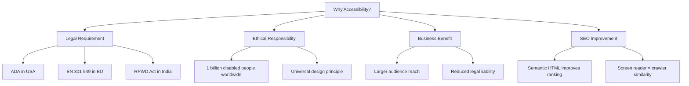
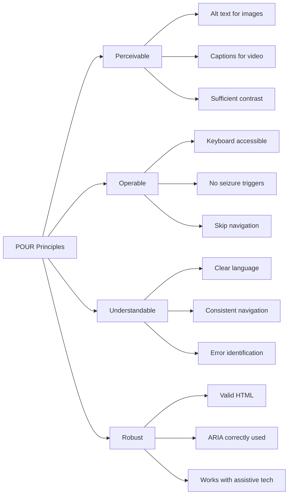
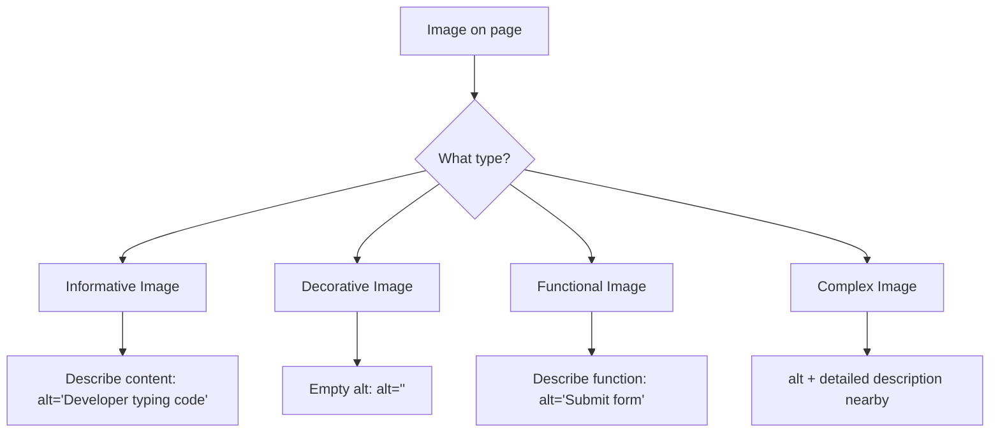
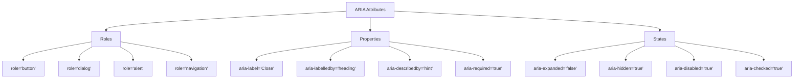
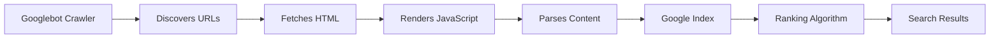

<a id="chapter-20-html-accessibility-seo"></a>

# Chapter 20: HTML Accessibility & SEO

[⬅ Previous Chapter](#chapter-19-semantic-html) | [📖 Main Index](#main-index) | [Next Chapter ➡](#chapter-21-html5-apis-overview)

---

## 📌 Learning Objectives

By the end of this chapter, you will:

- Understand what web accessibility (a11y) means and why it is legally and ethically required
- Master `alt` text for images — when to use it, when to leave it empty
- Know how to use labels correctly for all form elements
- Understand ARIA basics: `aria-label`, `aria-labelledby`, `aria-describedby`, `aria-hidden`, `role`
- Build correct heading hierarchies for SEO and accessibility
- Know which semantic tags directly impact SEO rankings
- Master all critical meta tags: description, Open Graph, Twitter Cards, robots, canonical
- Understand WCAG guidelines at a practical level
- Answer accessibility and SEO interview questions confidently
- Build a fully accessible and SEO-optimized landing page

---

<a id="chapter-index-table-20"></a>

## Chapter Index Table

| Topic No. | Topic Name | Subtopics |
|-----------|------------|-----------|
| 20.1 | [Web Accessibility Fundamentals](#201-web-accessibility-fundamentals) | What is a11y, WCAG, POUR principles, disability types |
| 20.2 | [Alt Text for Images](#202-alt-text-for-images) | When to use, empty alt, decorative vs informative, complex images |
| 20.3 | [Labels for Form Elements](#203-labels-for-form-elements) | for/id, aria-label, aria-labelledby, visible vs hidden labels |
| 20.4 | [ARIA Basics](#204-aria-basics) | Roles, properties, states, aria-label, aria-hidden, aria-live |
| 20.5 | [Heading Hierarchy](#205-heading-hierarchy) | h1–h6 rules, one h1, skip levels, SEO impact |
| 20.6 | [Keyboard Accessibility](#206-keyboard-accessibility) | tabindex, focus management, skip links, focus-visible |
| 20.7 | [Color & Contrast](#207-color-and-contrast) | WCAG contrast ratios, tools, not color-only info |
| 20.8 | [HTML SEO Fundamentals](#208-html-seo-fundamentals) | How crawlers work, indexing, ranking signals |
| 20.9 | [Meta Tags for SEO](#209-meta-tags-for-seo) | title, description, robots, canonical, viewport |
| 20.10 | [Open Graph & Social Meta Tags](#2010-open-graph-and-social-meta-tags) | og:title, og:description, og:image, Twitter Cards |
| 20.11 | [Structured Data Basics](#2011-structured-data-basics) | JSON-LD, schema.org, rich snippets |
| 20.12 | [SEO Best Practices in HTML](#2012-seo-best-practices-in-html) | URL structure, links, images, performance signals |
| 20.13 | [Interview Questions](#2013-interview-questions) | Conceptual, Scenario, Output-based, Advanced |
| 20.14 | [Practice Problems](#2014-practice-problems) | Coding, Theory, Machine Coding |
| 20.15 | [Mini Project](#2015-mini-project) | Accessible & SEO-Optimized Landing Page |

---

## 20.1 Web Accessibility Fundamentals

<a id="201-web-accessibility-fundamentals"></a>

### What is Web Accessibility?

**Web Accessibility (a11y)** means designing and building websites so that people with disabilities can **perceive, understand, navigate, and interact** with the web equally. The "a11y" abbreviation comes from "accessibility" having 11 letters between 'a' and 'y'.

Disabilities that affect web use include:

| Disability Type | Examples | Web Impact |
|----------------|---------|-----------|
| **Visual** | Blindness, low vision, color blindness | Cannot see images, poor contrast |
| **Auditory** | Deafness, hard of hearing | Cannot hear audio/video |
| **Motor** | Paralysis, tremors, RSI | Cannot use mouse precisely |
| **Cognitive** | Dyslexia, ADHD, memory issues | Complex layouts, jargon |
| **Neurological** | Epilepsy, migraines | Flashing content triggers seizures |
| **Speech** | Aphasia, stuttering | Voice interfaces don't work |

### Why Accessibility Matters



> [!IMPORTANT]
> Web accessibility is a **legal requirement** in many countries. The Americans with Disabilities Act (ADA), Section 508, and the EU Web Accessibility Directive all mandate accessible websites. Inaccessible websites face lawsuits and significant fines.

### WCAG — Web Content Accessibility Guidelines

**WCAG** (pronounced "wuh-kag") is the international standard for web accessibility, published by W3C. The current version is **WCAG 2.1** with WCAG 2.2 being the latest.

#### Conformance Levels

| Level | Name | Description |
|-------|------|-------------|
| **A** | Minimum | Basic accessibility — must be met |
| **AA** | Standard | Required by most laws — target this |
| **AAA** | Enhanced | Highest level — aspirational for most sites |

### The POUR Principles

WCAG is organized around four principles — content must be:



### 🧠 Hinglish Intuition

> Web accessibility socho ek **public building ke ramps aur lifts** ki tarah. Sirf stairs hona physically disabled logon ko exclude karta hai. Similarly, agar website sirf mouse se use ho sake, ya images me alt text na ho, toh disabled users excluded hain.
>
> WCAG ek **building code** ki tarah hai — government ne standards set kiye hain ki accessible building kaisi honi chahiye. A, AA, AAA teen grades hain — jaise Basic, Standard, Premium certification. Most websites ko AA target karna chahiye!

---

👉 <a href="#chapter-index-table-20">Go to Top 🔝</a>

---

## 20.2 Alt Text for Images

<a id="202-alt-text-for-images"></a>

### What is Alt Text?

The `alt` attribute on `` provides a **text alternative** for images. Screen readers announce the alt text to blind users. Search engines use it to understand image content. It also displays when images fail to load.

```html

```

### The Four Types of Images and Their Alt Text Rules



---

### Type 1: Informative Images

Convey information essential to understanding the content.

```html
<!-- ✅ Describes the actual information conveyed -->


<!-- ✅ Photo with meaningful context -->


<!-- ❌ Useless alt text -->


```

---

### Type 2: Decorative Images

Images that are purely visual — they don't add information to the content. Use an **empty alt attribute** (`alt=""`). Do NOT omit the attribute entirely.

```html
<!-- ✅ Empty alt: screen reader skips it -->


<!-- ❌ Wrong: no alt attribute at all -->

<!-- Screen reader announces: "decorative-wave dot svg" — confusing! -->

<!-- ❌ Wrong: descriptive alt for decorative image -->

<!-- Noise for screen reader users — adds no value -->
```

> [!IMPORTANT]
> There is a critical difference between `alt=""` (empty string — tells screen reader to skip this image) and omitting `alt` entirely (screen reader announces the filename — confusing and bad UX).

---

### Type 3: Functional Images

Images used as buttons, links, or interactive controls. Alt text should describe the **function**, not the appearance.

```html
<!-- ✅ Describes what the button does -->
<a href="/home">
  
</a>

<button>
  
</button>

<button>
  
</button>

<!-- ❌ Wrong: describes appearance, not function -->
<button>
  
</button>
```

---

### Type 4: Complex Images

Charts, graphs, diagrams, infographics — images that convey complex data. Need alt text PLUS a full text description nearby.

```html
<!-- Method 1: Short alt + longdesc or nearby description -->
<figure>
  
  <figcaption id="salary-chart-desc">
    Average annual salaries: Frontend Developer ₹12L, 
    Backend Developer ₹14L, Full Stack ₹16L, 
    DevOps Engineer ₹18L, Data Scientist ₹20L.
    All figures represent median CTC in Indian Rupees.
  </figcaption>
</figure>

<!-- Method 2: Details element with full data -->
<figure>
  
  <details>
    <summary>Text description of this diagram</summary>
    <p>The system has three layers: Client (React), 
       API Gateway (Node.js), and Database (MongoDB). 
       The client connects to the API Gateway via HTTPS REST calls.
       The API Gateway connects to MongoDB via TCP on port 27017.</p>
  </details>
</figure>
```

### Alt Text Writing Guide

| ✅ Good Alt Text | ❌ Bad Alt Text |
|----------------|---------------|
| Specific and descriptive | "image", "photo", "picture" |
| Describes content, not appearance | Redundant ("image of...") |
| Functional: describes action | Same as surrounding text |
| Concise (under 150 chars) | Extremely long paragraphs |
| Context-appropriate | Keyword-stuffed |

```html
<!-- ❌ Redundant - "image of" is implied by img tag -->


<!-- ✅ Just describe what it shows -->


<!-- ❌ Keyword stuffed (bad for SEO and accessibility) -->


<!-- ✅ Natural description -->

```

### CSS Background Images

Images set via CSS `background-image` cannot have `alt` text. If they convey information, they should be HTML `` elements instead.

```css
/* Decorative background - OK as CSS */
.hero { background-image: url('hero-bg.jpg'); }

/* ❌ Informative image as CSS background - inaccessible */
.company-logo { background-image: url('logo.png'); }
```

```html
<!-- ✅ Informative images must be HTML img with alt -->

```

### 🧠 Hinglish Intuition

> Alt text ek **blind person ke liye radio commentary** hai — jaise cricket match ka blind fan radio pe sun raha ho. Jo TV viewer dekh raha hai woh radio commentator words me describe karta hai.
>
> Decorative image ke liye empty alt = commentator kehta hai "yahan sirf background music hai, koi important content nahi." Screen reader skip kar deta hai — user ka time save hota hai!

---

👉 <a href="#chapter-index-table-20">Go to Top 🔝</a>

---

## 20.3 Labels for Form Elements

<a id="203-labels-for-form-elements"></a>

### Why Labels Are Critical for Accessibility

Without proper labels, screen reader users hear only "edit text" or "checkbox" — no idea what the field is for. Labels are the **names** of form controls.

```html
<!-- ❌ Screen reader: "edit text" - useless -->
<input type="text" placeholder="Enter your name">

<!-- ✅ Screen reader: "Full Name, edit text" - perfect -->
<label for="fullname">Full Name</label>
<input type="text" id="fullname" name="name">
```

### Four Methods of Labeling

#### Method 1: `<label>` with `for`/`id` — Recommended

```html
<label for="email">Email Address *</label>
<input type="email" id="email" name="email" required>
```

#### Method 2: Wrapping `<label>` — Implicit

```html
<label>
  Email Address *
  <input type="email" name="email" required>
</label>
```

#### Method 3: `aria-label` — When No Visible Label

```html
<!-- Search bar with no visible label text -->
<input 
  type="search" 
  aria-label="Search jobs by title or skill"
  placeholder="React Developer..."
>

<!-- Icon-only button -->
<button aria-label="Close dialog">
  <span aria-hidden="true">×</span>
</button>
```

#### Method 4: `aria-labelledby` — Use Existing Text as Label

```html
<h2 id="billing-heading">Billing Address</h2>
<div role="group" aria-labelledby="billing-heading">
  <label for="street">Street</label>
  <input type="text" id="street" name="street">
</div>

<!-- Multiple elements as label -->
<span id="qty-label">Quantity</span>
<span id="qty-unit">(in pieces)</span>
<input 
  type="number" 
  id="qty" 
  name="qty"
  aria-labelledby="qty-label qty-unit"
>
<!-- Screen reader announces: "Quantity in pieces, number input" -->
```

### `aria-describedby` — Additional Description

```html
<label for="pwd">Password *</label>
<input 
  type="password" 
  id="pwd" 
  name="password"
  aria-describedby="pwd-requirements"
  required
>
<p id="pwd-requirements" class="hint">
  Must be 8+ characters with uppercase, number, and special character
</p>
<!-- Screen reader: "Password, required, edit text. 
     Must be 8+ characters..." -->
```

### Labeling Groups

```html
<!-- Fieldset + Legend for radio/checkbox groups -->
<fieldset>
  <legend>Preferred Work Mode *</legend>
  <label>
    <input type="radio" name="work_mode" value="remote">
    Remote
  </label>
  <label>
    <input type="radio" name="work_mode" value="hybrid">
    Hybrid
  </label>
  <label>
    <input type="radio" name="work_mode" value="onsite">
    On-site
  </label>
</fieldset>
```

### Visually Hidden Labels

Sometimes the design shows no label, but accessibility requires one:

```css
/* Visually hidden but accessible to screen readers */
.visually-hidden {
  position: absolute;
  width: 1px;
  height: 1px;
  padding: 0;
  margin: -1px;
  overflow: hidden;
  clip: rect(0, 0, 0, 0);
  white-space: nowrap;
  border: 0;
}
```

```html
<label for="search-input" class="visually-hidden">
  Search jobs
</label>
<input type="search" id="search-input" placeholder="Job title...">
```

> [!IMPORTANT]
> Never use `display:none` or `visibility:hidden` to hide labels — these remove them from the accessibility tree entirely. Use the visually-hidden CSS technique instead.

### 🧠 Hinglish Intuition

> Form labels ek **sticky note** ki tarah hain jo har field ke upar lagi hoti hai — "Yahan apna naam likho", "Yahan email likho." Screen reader yeh note padhta hai jab focus us field pe jaata hai.
>
> `aria-label` tab use karte hain jab sticky note dikhani nahi — jaise search bar me — lekin screen reader ko fir bhi batana hai ki yeh field kisliye hai. `aria-describedby` extra instructions ki tarah hai — jaise "Password: 8 characters minimum chahiye."

---

👉 <a href="#chapter-index-table-20">Go to Top 🔝</a>

---

## 20.4 ARIA Basics

<a id="204-aria-basics"></a>

### What is ARIA?

**ARIA** (Accessible Rich Internet Applications) is a set of HTML attributes defined by W3C that add accessibility information to elements when native HTML semantics are insufficient.

> [!IMPORTANT]
> **The First Rule of ARIA:** Don't use ARIA if native HTML can do it. `<button>` is better than `<div role="button">`. `<nav>` is better than `<div role="navigation">`. ARIA supplements HTML — it does not replace it.

### The Three Types of ARIA Attributes



### Essential ARIA Attributes

---

#### `aria-label`

Provides an **invisible label** for elements with no visible text label.

```html
<!-- Icon button with no text -->
<button aria-label="Open navigation menu">
  <span aria-hidden="true">☰</span>
</button>

<!-- Search input -->
<input type="search" aria-label="Search jobs" placeholder="React Developer...">

<!-- Landmark with a name -->
<nav aria-label="Main navigation">...</nav>
<nav aria-label="Footer navigation">...</nav>
```

---

#### `aria-labelledby`

Points to the ID(s) of element(s) that **label** the current element.

```html
<h2 id="modal-title">Confirm Deletion</h2>
<div role="dialog" aria-labelledby="modal-title" aria-modal="true">
  <p>Are you sure you want to delete this item?</p>
  <button>Cancel</button>
  <button>Delete</button>
</div>
```

---

#### `aria-describedby`

Points to element(s) that provide **additional description** (not the label).

```html
<label for="username">Username *</label>
<input 
  type="text" 
  id="username" 
  name="username"
  aria-describedby="username-rules username-error"
  required
>
<p id="username-rules">4–20 characters, letters and numbers only</p>
<p id="username-error" role="alert" aria-live="polite"></p>
```

---

#### `aria-hidden`

Hides elements from the **accessibility tree** (screen readers) while keeping them visually visible.

```html
<!-- Decorative icon - hide from screen readers -->
<button>
  <span aria-hidden="true">🚀</span>
  Launch Application
</button>

<!-- Decorative separator -->
<span aria-hidden="true"> | </span>

<!-- Duplicate text (already announced via aria-labelledby) -->
<span aria-hidden="true">Close</span>
```

> [!IMPORTANT]
> Never use `aria-hidden="true"` on focusable elements (links, buttons, inputs). If a keyboard user can reach it, a screen reader user must be able to hear it.

---

#### `aria-expanded`

Indicates whether a **collapsible element** is expanded or collapsed.

```html
<button 
  aria-expanded="false" 
  aria-controls="dropdown-menu"
  onclick="toggleMenu()"
>
  Menu ▼
</button>

<ul id="dropdown-menu" hidden>
  <li><a href="/jobs">Jobs</a></li>
  <li><a href="/blog">Blog</a></li>
</ul>

<script>
function toggleMenu() {
  const btn = document.querySelector('[aria-expanded]');
  const menu = document.getElementById('dropdown-menu');
  const isExpanded = btn.getAttribute('aria-expanded') === 'true';
  btn.setAttribute('aria-expanded', !isExpanded);
  menu.hidden = isExpanded;
}
</script>
```

---

#### `aria-live` — Live Regions

Announces **dynamic content changes** to screen readers without requiring focus.

```html
<!-- polite: waits for user to finish current activity -->
<div aria-live="polite" id="search-status">
  <!-- Dynamically updated: "Showing 24 results for React" -->
</div>

<!-- assertive: interrupts immediately (use sparingly) -->
<div aria-live="assertive" role="alert" id="error-msg">
  <!-- Critical errors only -->
</div>
```

| `aria-live` value | Behavior | Use case |
|------------------|---------|---------|
| `off` (default) | Never announced | Static content |
| `polite` | Waits for pause | Search results, status updates |
| `assertive` | Interrupts immediately | Critical errors, session timeout |

---

#### `role` Attribute

Overrides or supplements the native role of an element.

```html
<!-- Custom accordion that isn't a native details element -->
<div role="button" tabindex="0" aria-expanded="false">
  Accordion Heading
</div>

<!-- Tab panel -->
<div role="tabpanel" aria-labelledby="tab-1">
  Tab content...
</div>

<!-- Alert for error messages -->
<div role="alert">
  ⚠️ Form submission failed. Please try again.
</div>

<!-- Status for non-critical updates -->
<div role="status" aria-live="polite">
  ✅ Profile saved successfully
</div>
```

### Common ARIA Patterns

```html
<!-- ===== Accessible Modal Dialog ===== -->
<div 
  role="dialog" 
  aria-modal="true"
  aria-labelledby="dialog-title"
  aria-describedby="dialog-desc"
>
  <h2 id="dialog-title">Delete Account</h2>
  <p id="dialog-desc">
    This action is permanent and cannot be undone.
  </p>
  <button>Cancel</button>
  <button>Confirm Delete</button>
</div>

<!-- ===== Accessible Tabs ===== -->
<div role="tablist" aria-label="Job categories">
  <button role="tab" aria-selected="true" aria-controls="frontend-panel" id="frontend-tab">
    Frontend
  </button>
  <button role="tab" aria-selected="false" aria-controls="backend-panel" id="backend-tab">
    Backend
  </button>
</div>

<div role="tabpanel" id="frontend-panel" aria-labelledby="frontend-tab">
  <!-- Frontend jobs -->
</div>
<div role="tabpanel" id="backend-panel" aria-labelledby="backend-tab" hidden>
  <!-- Backend jobs -->
</div>

<!-- ===== Accessible Breadcrumb ===== -->
<nav aria-label="Breadcrumb">
  <ol>
    <li><a href="/">Home</a></li>
    <li><a href="/jobs">Jobs</a></li>
    <li><span aria-current="page">React Developer</span></li>
  </ol>
</nav>

<!-- ===== Loading State ===== -->
<button 
  aria-busy="true" 
  aria-label="Submitting application..."
  disabled
>
  <span aria-hidden="true">⏳</span>
  Submitting...
</button>
```

### 🧠 Hinglish Intuition

> ARIA ek **translator** ki tarah hai jo browser ko batata hai ki yeh custom element kya hai. Jab tum native `<button>` use karte ho, browser automatically jaanta hai — yeh ek button hai, Tab se focus milti hai, Enter/Space se activate hota hai, screen reader "button" announce karta hai.
>
> Jab tum `<div>` se button banate ho (bad practice, but sometimes necessary), toh ARIA se batana padta hai — `role="button"`, `tabindex="0"`, `aria-label="Close"` — yeh sab manually add karna padta hai. Isliye native HTML hamesha prefer karo — ARIA sirf jab native nahi hai tab use karo!

---

👉 <a href="#chapter-index-table-20">Go to Top 🔝</a>

---

## 20.5 Heading Hierarchy

<a id="205-heading-hierarchy"></a>

### What is Heading Hierarchy?

Heading hierarchy is the **logical, nested structure** of `<h1>` through `<h6>` elements on a page. Like a book's table of contents, headings create a navigable outline.

```html
<!-- ✅ Correct heading hierarchy -->
<h1>CSS Complete Guide</h1>         <!-- Page title: ONE per page -->

  <h2>Box Model</h2>                 <!-- Major section -->
    <h3>Content Area</h3>            <!-- Subsection -->
    <h3>Padding</h3>                 <!-- Subsection -->
    <h3>Border</h3>                  <!-- Subsection -->
      <h4>Border Shorthand</h4>      <!-- Sub-subsection -->

  <h2>Flexbox</h2>                   <!-- Next major section -->
    <h3>Flex Container</h3>
    <h3>Flex Items</h3>

  <h2>CSS Grid</h2>
```

### The One `<h1>` Per Page Rule

```html
<!-- ✅ Correct: One h1 for the main page topic -->
<h1>JavaScript Interview Questions</h1>

<!-- ❌ Wrong: Multiple h1 elements -->
<h1>JavaScript Interview Questions</h1>
<h1>HTML Interview Questions</h1>   <!-- Should be h2 -->
<h1>CSS Interview Questions</h1>    <!-- Should be h2 -->
```

> [!IMPORTANT]
> Use **exactly one `<h1>`** per page. The `<h1>` represents the primary topic of the page. Multiple `<h1>` elements confuse both screen readers (which use headings as navigation landmarks) and search engines (which use `<h1>` as the primary topic signal).

### Never Skip Heading Levels

```html
<!-- ❌ Wrong: Skipped from h2 to h4 -->
<h2>Section Title</h2>
<h4>Subsection</h4>   <!-- h3 was skipped! -->

<!-- ✅ Correct: Sequential levels -->
<h2>Section Title</h2>
<h3>Subsection</h3>
<h4>Sub-subsection</h4>
```

### Headings for Navigation vs Presentation

```html
<!-- ❌ Wrong: Using heading for size/style only -->
<h3>Looking for a big bold text here</h3>

<!-- ✅ Correct: Use CSS for visual size -->
<p class="large-bold-text">Looking for big bold text</p>

<!-- ❌ Wrong: Using div instead of heading for structure -->
<div class="section-title">About Us</div>

<!-- ✅ Correct: Use actual heading element -->
<h2>About Us</h2>
```

### SEO Impact of Headings

| Heading | SEO Weight | Best Practice |
|---------|-----------|--------------|
| `<h1>` | Highest | Contains primary keyword — one per page |
| `<h2>` | High | Section keywords, secondary topics |
| `<h3>` | Medium | Subsection detail, supporting keywords |
| `<h4>`–`<h6>` | Lower | Fine-grained structure |

```html
<!-- ✅ SEO-optimized heading structure for a tutorial page -->
<h1>React Hooks Tutorial: Complete Guide for Beginners</h1>

<h2>What are React Hooks?</h2>
  <h3>Why Hooks Were Introduced</h3>
  <h3>Rules of Hooks</h3>

<h2>useState Hook Explained</h2>
  <h3>Basic Counter Example</h3>
  <h3>useState with Objects</h3>

<h2>useEffect Hook Explained</h2>
  <h3>Dependency Array</h3>
  <h3>Cleanup Function</h3>

<h2>Common Interview Questions about Hooks</h2>
```

### Screen Reader Heading Navigation

Screen reader users press `H` to jump between headings, `1`–`6` to jump to headings by level. A proper heading hierarchy is the most used navigation method for screen reader users — more than landmark navigation.

### 🧠 Hinglish Intuition

> Headings ek **book ka index** hain — h1 = book title, h2 = chapter names, h3 = section names, h4 = subsection names. Agar index me chapters ke beech random sub-topics jump ho jayein (chapter 1, phir subsection 3.2, phir chapter 7), reader confuse hoga.
>
> Search engine bhi same tarah sochta hai — h1 se page ka main topic samajhta hai, h2–h3 se subtopics. Headings me keywords hona SEO ke liye important hai, lekin **sirf SEO ke liye** unhe use mat karo — structure meaningful hona chahiye!

---

👉 <a href="#chapter-index-table-20">Go to Top 🔝</a>

---

## 20.6 Keyboard Accessibility

<a id="206-keyboard-accessibility"></a>

### Why Keyboard Accessibility?

Many users navigate websites exclusively with a keyboard — people with motor disabilities, power users, screen reader users. WCAG 2.1.1 requires all functionality to be available via keyboard.

### Natural Tab Order

By default, keyboard focus follows the DOM order. Interactive elements receive focus in this order:
1. `<a href>` links
2. `<button>` elements
3. `<input>`, `<select>`, `<textarea>` form elements
4. Elements with `tabindex="0"`

```html
<!-- ✅ Natural DOM order = natural tab order -->
<header>
  <nav>
    <a href="/">Home</a>       <!-- Tab 1 -->
    <a href="/jobs">Jobs</a>   <!-- Tab 2 -->
  </nav>
  <button>Sign In</button>     <!-- Tab 3 -->
</header>

<main>
  <input type="search">        <!-- Tab 4 -->
  <button type="submit">Search</button>  <!-- Tab 5 -->
</main>
```

### `tabindex` Attribute

```html
<!-- tabindex="0": Add to tab order (natural position in DOM) -->
<div 
  role="button" 
  tabindex="0"
  onclick="doAction()"
  onkeydown="if(event.key==='Enter'||event.key===' ')doAction()"
>
  Custom Interactive Element
</div>

<!-- tabindex="-1": Remove from tab order but focusable via JS -->
<div id="modal-content" tabindex="-1">
  Modal content (focused programmatically when modal opens)
</div>

<!-- tabindex="1+" : AVOID — creates confusing tab order -->
<!-- Only use positive tabindex in very specific, justified cases -->
<input tabindex="3">   <!-- ❌ Avoid -->
<input tabindex="1">   <!-- ❌ Avoid -->
```

> [!WARNING]
> Avoid positive `tabindex` values (1, 2, 3...). They override the natural DOM order and create confusing, unpredictable tab sequences. The only acceptable values are `0` (include in natural order) and `-1` (focusable but not in tab order).

### Focus Visible Styles

Every focusable element must have a **visible focus indicator** when focused via keyboard.

```css
/* ❌ Never do this — removes focus visibility completely */
*:focus { outline: none; }
button:focus { outline: 0; }

/* ✅ Style focus without removing it */
:focus-visible {
  outline: 3px solid #2563eb;
  outline-offset: 2px;
  border-radius: 4px;
}

/* ✅ Custom focus styles */
button:focus-visible {
  outline: 3px solid #2563eb;
  outline-offset: 3px;
  box-shadow: 0 0 0 6px rgba(37, 99, 235, 0.15);
}

/* ✅ Remove outline for mouse users only (keeps it for keyboard) */
button:focus:not(:focus-visible) {
  outline: none;
}
```

### Skip Links

```html
<!-- First element in body - keyboard users can skip to main content -->
<a href="#main-content" class="skip-link">
  Skip to main content
</a>
```

```css
.skip-link {
  position: absolute;
  top: -100%;
  left: 16px;
  z-index: 9999;
  background: #1a1a2e;
  color: white;
  padding: 10px 20px;
  border-radius: 0 0 8px 8px;
  font-weight: 700;
  text-decoration: none;
  transition: top 0.15s;
}

.skip-link:focus {
  top: 0;  /* Visible when focused */
}
```

### 🧠 Hinglish Intuition

> Keyboard accessibility socho ek **building me ramp aur elevator** ki tarah — mouse users lift use karte hain, keyboard users stairs/ramp. Dono ke liye path clear hona chahiye.
>
> `tabindex="0"` matlab "is element ko Tab sequence me dalo", `tabindex="-1"` matlab "JavaScript se focus karo jab needed ho lekin Tab se direct access mat do." Focus styles hata dena ek visually impaired user ke liye ek building me signs hata dene jaisa hai — woh kho jayega!

---

👉 <a href="#chapter-index-table-20">Go to Top 🔝</a>

---

## 20.7 Color and Contrast

<a id="207-color-and-contrast"></a>

### WCAG Contrast Requirements

**Contrast ratio** measures the difference in luminance between foreground (text) and background colors. Higher ratio = more readable.

| Content | WCAG AA | WCAG AAA |
|---------|---------|---------|
| Normal text (< 18px) | **4.5:1** minimum | 7:1 |
| Large text (≥ 18px bold, ≥ 24px) | **3:1** minimum | 4.5:1 |
| UI components, icons | **3:1** minimum | — |
| Decorative text | No requirement | — |

```html
<!-- ❌ Insufficient contrast: light gray on white -->
<p style="color: #aaa; background: #fff;">
  This text has ~2.3:1 contrast ratio — fails WCAG AA
</p>

<!-- ✅ Sufficient contrast: dark text on white -->
<p style="color: #333; background: #fff;">
  This text has ~10:1 contrast ratio — passes WCAG AAA
</p>

<!-- ✅ Primary blue on white -->
<p style="color: #2563eb; background: #fff;">
  This text has 5.9:1 contrast ratio — passes WCAG AA
</p>
```

### Color Not the Only Indicator

Never use color alone to convey information:

```html
<!-- ❌ Wrong: only color differentiates error from success -->
<p style="color: red;">Form error</p>
<p style="color: green;">Success</p>

<!-- ✅ Correct: icon + color + text -->
<p class="error">
  <span aria-hidden="true">⚠️</span>
  <strong>Error:</strong> Email address is invalid
</p>

<p class="success">
  <span aria-hidden="true">✅</span>
  <strong>Success:</strong> Profile saved
</p>

<!-- ❌ Wrong: required fields shown only by red border -->
<input style="border-color: red;">

<!-- ✅ Correct: label text marks required -->
<label for="name">Full Name <span class="required-marker">*</span></label>
<input id="name" type="text" aria-required="true">
<p class="req-note">* Required field</p>
```

### Tools for Checking Contrast

- **WebAIM Contrast Checker**: webaim.org/resources/contrastchecker
- **Chrome DevTools**: Accessibility panel, color picker shows ratio
- **axe DevTools**: Browser extension for full a11y audit
- **Lighthouse**: Built into Chrome DevTools

### 🧠 Hinglish Intuition

> Contrast ratio ek **printing ka bold vs light text** jaisa hai. Agar light gray pe light white text likho, ek normal user bhi mushkil se padh sakta hai — color-blind user ke liye toh almost invisible. WCAG ka 4.5:1 ratio ek minimum safety standard hai — jaise road ke markings kitne bright hone chahiye!

---

👉 <a href="#chapter-index-table-20">Go to Top 🔝</a>

---

## 20.8 HTML SEO Fundamentals

<a id="208-html-seo-fundamentals"></a>

### How Search Engines Work



### What Search Engines Parse from HTML

| HTML Element | SEO Signal |
|-------------|-----------|
| `<title>` | Primary ranking signal for page topic |
| `<meta name="description">` | Search result snippet text |
| `<h1>` | Primary topic confirmation |
| `<h2>`–`<h6>` | Topic and subtopic signals |
| `<a href>` links | PageRank distribution, crawl paths |
| `alt` on `` | Image search ranking |
| `<strong>`, `<em>` | Slight emphasis signal |
| `<article>`, `<main>` | Content identification |
| `<time datetime>` | Content freshness |
| `<canonical>` | Duplicate content resolution |

### Crawlability Rules

```html
<!-- ✅ Crawlable link (href with URL) -->
<a href="/about">About Us</a>
<a href="https://external.com">External Link</a>

<!-- ❌ NOT crawlable by Google (no href or js: href) -->
<a href="#">About Us</a>         <!-- No destination -->
<a onclick="navigate()">About</a> <!-- No href -->
<a href="javascript:void(0)">About</a> <!-- JS href -->

<!-- ✅ Crawlable with rel attributes -->
<a href="/partner-site" rel="nofollow">Partner</a>   <!-- Don't pass PageRank -->
<a href="/sponsored" rel="sponsored">Ad Link</a>     <!-- Paid link -->
<a href="/ugc-link" rel="ugc">User Content Link</a>  <!-- User-generated -->
```

### 🧠 Hinglish Intuition

> Search engine ek **library cataloger** ki tarah hai — woh har website ko padhta hai, catalog karta hai, aur jab koi search karta hai toh relevant results dikhata hai. Catalog karne ke liye woh title, headings, links, content padhta hai. Agar page ka HTML well-structured hai, cataloger easily samajhta hai ki page kiske baare me hai. Poor HTML = poor catalog entry = low ranking!

---

👉 <a href="#chapter-index-table-20">Go to Top 🔝</a>

---

## 20.9 Meta Tags for SEO

<a id="209-meta-tags-for-seo"></a>

### The Most Important Meta Tags

All meta tags go inside `<head>`:

```html
<head>
  <!-- ===== ESSENTIAL META TAGS ===== -->

  <!-- Character encoding - FIRST in head -->
  <meta charset="UTF-8">

  <!-- Viewport - CRITICAL for mobile SEO -->
  <meta name="viewport" content="width=device-width, initial-scale=1.0">

  <!-- Page title - MOST IMPORTANT SEO element -->
  <title>React Hooks Tutorial: Complete Beginner Guide 2024 | DevBlog</title>

  <!-- Meta description - shown in search results -->
  <meta 
    name="description" 
    content="Learn React Hooks from scratch with hands-on examples. Master useState, useEffect, useContext, and custom hooks. Updated for React 18."
  >

  <!-- Canonical URL - prevents duplicate content issues -->
  <link rel="canonical" href="https://devblog.in/react-hooks-tutorial">

  <!-- Robots directive -->
  <meta name="robots" content="index, follow">

  <!-- Language declaration -->
  <meta http-equiv="content-language" content="en-IN">

  <!-- Author -->
  <meta name="author" content="Rahul Sharma">

</head>
```

### `<title>` Tag — Most Critical

```html
<!-- ✅ Best practices: keyword + brand, 50-60 chars -->
<title>React Hooks Tutorial: Complete Guide 2024 | DevBlog</title>

<!-- ❌ Too short: no keyword context -->
<title>Tutorial</title>

<!-- ❌ Too long (gets truncated in SERPs): -->
<title>The Most Complete and Comprehensive React Hooks Tutorial You Will Ever Find Online for Beginners and Advanced Developers in 2024</title>

<!-- ❌ Keyword stuffed: penalized by Google -->
<title>React Hooks React Tutorial React Guide React 2024 React Learn</title>

<!-- ❌ Same title on every page (common mistake) -->
<title>DevBlog</title>
```

**Title Tag Rules:**

| Rule | Detail |
|------|--------|
| Length | 50–60 characters (600px width) |
| Keywords | Primary keyword near the beginning |
| Brand | Brand name at end separated by `|` or `-` |
| Unique | Every page must have a unique title |
| Readable | Natural language, not keyword list |

### `<meta name="description">` — Search Result Snippet

```html
<!-- ✅ Good: compelling, includes keywords, CTA -->
<meta 
  name="description" 
  content="Master React Hooks with 30+ practical examples. 
           Learn useState, useEffect, useReducer, and custom hooks. 
           Free tutorial with code examples. Updated 2024."
>

<!-- ❌ Too short -->
<meta name="description" content="React tutorial">

<!-- ❌ Too long (truncated at ~155 chars in SERPs) -->
<meta name="description" content="This is a very long description that goes on and on past 155 characters and will be truncated by Google in the search results so users will see it cut off mid-sentence which creates a poor user experience">

<!-- ❌ Duplicate description on multiple pages -->
<meta name="description" content="DevBlog - Learn Web Development">
```

**Description Rules:**

| Rule | Detail |
|------|--------|
| Length | 150–160 characters |
| Keywords | Include primary keyword naturally |
| Compelling | Encourage click-through |
| Unique | Different for every page |
| Active voice | "Learn...", "Master...", "Discover..." |

### `<meta name="robots">`

```html
<!-- Default: index and follow all links -->
<meta name="robots" content="index, follow">

<!-- Don't index this page, but follow its links -->
<meta name="robots" content="noindex, follow">

<!-- Index page, but don't follow links (no PageRank passed) -->
<meta name="robots" content="index, nofollow">

<!-- Don't index, don't follow -->
<meta name="robots" content="noindex, nofollow">

<!-- Don't show snippet or cached version -->
<meta name="robots" content="index, follow, nosnippet, nocache">

<!-- Max snippet length -->
<meta name="robots" content="max-snippet:160">
```

**When to Use `noindex`:**
- Thank-you pages
- Internal search results
- Admin/login pages
- Duplicate content pages
- Staging/development environments

### `<link rel="canonical">` — Prevent Duplicate Content

```html
<!-- Tell Google: this is the "official" URL for this content -->
<link rel="canonical" href="https://devblog.in/react-hooks-tutorial">

<!-- Use when same content appears at multiple URLs: -->
<!-- https://devblog.in/react-hooks-tutorial -->
<!-- https://devblog.in/react-hooks-tutorial?utm_source=twitter -->
<!-- https://www.devblog.in/react-hooks-tutorial -->
<!-- All should canonical to the same preferred URL -->
```

### Complete `<head>` SEO Template

```html
<head>
  <!-- === Critical (always first) === -->
  <meta charset="UTF-8">
  <meta name="viewport" content="width=device-width, initial-scale=1.0">

  <!-- === Title & Description === -->
  <title>Page Title | Brand Name</title>
  <meta name="description" content="150-160 char description">

  <!-- === Canonical === -->
  <link rel="canonical" href="https://example.com/page-url">

  <!-- === Robots === -->
  <meta name="robots" content="index, follow">

  <!-- === Author & Language === -->
  <meta name="author" content="Author Name">
  <meta name="language" content="English">

  <!-- === Open Graph (Social) === -->
  <meta property="og:type" content="article">
  <meta property="og:title" content="Page Title">
  <meta property="og:description" content="Description">
  <meta property="og:image" content="https://example.com/image.jpg">
  <meta property="og:url" content="https://example.com/page">
  <meta property="og:site_name" content="Brand Name">

  <!-- === Twitter Card === -->
  <meta name="twitter:card" content="summary_large_image">
  <meta name="twitter:title" content="Page Title">
  <meta name="twitter:description" content="Description">
  <meta name="twitter:image" content="https://example.com/image.jpg">

  <!-- === Favicon === -->
  <link rel="icon" type="image/svg+xml" href="/favicon.svg">
  <link rel="apple-touch-icon" href="/apple-touch-icon.png">

  <!-- === Performance === -->
  <link rel="preconnect" href="https://fonts.googleapis.com">
  <link rel="dns-prefetch" href="//cdn.example.com">

  <!-- === Stylesheet === -->
  <link rel="stylesheet" href="/style.css">
</head>
```

### 🧠 Hinglish Intuition

> Meta tags ek **book ke cover aur back page** ki tarah hain. Title = book ka naam (cover pe), description = back page synopsis (reader decide karta hai ki padhna hai ya nahi). Canonical = "yeh original edition hai, duplicate editions ko ignore karo."
>
> Google `<title>` aur `<meta description>` directly search results me dikhata hai — yeh teri website ka **first impression** hai. Agar title boring hai ya description vague hai, user click nahi karega despite high ranking!

---

👉 <a href="#chapter-index-table-20">Go to Top 🔝</a>

---

## 20.10 Open Graph and Social Meta Tags

<a id="2010-open-graph-and-social-meta-tags"></a>

### What is Open Graph?

**Open Graph (OG)** is a protocol developed by Facebook that controls how web pages appear when shared on social media — Facebook, LinkedIn, WhatsApp, Telegram, Discord, and more.

```html
<!-- Basic Open Graph tags -->
<meta property="og:title" content="React Hooks: Complete Guide 2024">
<meta property="og:description" content="Master useState, useEffect and custom hooks with 30+ examples. Free tutorial for beginners.">
<meta property="og:image" content="https://devblog.in/images/react-hooks-og.jpg">
<meta property="og:url" content="https://devblog.in/react-hooks-tutorial">
<meta property="og:type" content="article">
<meta property="og:site_name" content="DevBlog">
<meta property="og:locale" content="en_IN">
```

### OG Image Requirements

| Platform | Recommended Size | Aspect Ratio |
|---------|-----------------|-------------|
| Facebook/LinkedIn | 1200 × 630px | 1.91:1 |
| Twitter Summary Large | 1200 × 628px | 1.91:1 |
| WhatsApp | 400 × 300px minimum | Any |

```html
<!-- OG Image with dimensions specified -->
<meta property="og:image" content="https://devblog.in/og-react-hooks.jpg">
<meta property="og:image:width" content="1200">
<meta property="og:image:height" content="630">
<meta property="og:image:alt" content="React Hooks tutorial cover image with React logo">
<meta property="og:image:type" content="image/jpeg">
```

### Content-Type Specific OG Tags

```html
<!-- For articles/blog posts -->
<meta property="og:type" content="article">
<meta property="article:published_time" content="2024-06-15T10:00:00+05:30">
<meta property="article:modified_time" content="2024-06-20T14:30:00+05:30">
<meta property="article:author" content="https://devblog.in/author/rahul">
<meta property="article:section" content="JavaScript">
<meta property="article:tag" content="React">
<meta property="article:tag" content="Hooks">

<!-- For websites/homepages -->
<meta property="og:type" content="website">

<!-- For products -->
<meta property="og:type" content="product">
```

### Twitter Cards

```html
<!-- Summary with large image -->
<meta name="twitter:card" content="summary_large_image">
<meta name="twitter:site" content="@devblogin">
<meta name="twitter:creator" content="@rahulcodes">
<meta name="twitter:title" content="React Hooks: Complete Guide 2024">
<meta name="twitter:description" content="Master useState, useEffect and custom hooks">
<meta name="twitter:image" content="https://devblog.in/og-react-hooks.jpg">
<meta name="twitter:image:alt" content="React Hooks tutorial cover">

<!-- Summary (small image) -->
<meta name="twitter:card" content="summary">
```

| Twitter Card Type | Description |
|-----------------|-------------|
| `summary` | Small square thumbnail |
| `summary_large_image` | Large banner image |
| `app` | Mobile app download card |
| `player` | Embedded video/audio |

### 🧠 Hinglish Intuition

> Open Graph tags ek **visiting card** ki tarah hain jo tab kaam aata hai jab tum apni website ka link WhatsApp ya LinkedIn pe share karte ho. Without OG tags, social media ek random image aur title pick karta hai — often wrong! OG tags se tum exactly control karte ho — kaunsa title dikhega, kaunsi image, kaunsa description. Yeh click-through rate directly improve karta hai!

---

👉 <a href="#chapter-index-table-20">Go to Top 🔝</a>

---

## 20.11 Structured Data Basics

<a id="2011-structured-data-basics"></a>

### What is Structured Data?

**Structured data** is machine-readable data added to HTML that helps search engines understand content context and enables **rich snippets** in search results — star ratings, breadcrumbs, FAQs, events, recipes, etc.

The most common format is **JSON-LD** (JavaScript Object Notation for Linked Data), recommended by Google.

### JSON-LD Examples

```html
<!-- ===== Article Schema ===== -->
<script type="application/ld+json">
{
  "@context": "https://schema.org",
  "@type": "Article",
  "headline": "React Hooks: Complete Guide 2024",
  "description": "Master React Hooks with 30+ examples",
  "image": "https://devblog.in/og-react-hooks.jpg",
  "author": {
    "@type": "Person",
    "name": "Rahul Sharma",
    "url": "https://devblog.in/author/rahul"
  },
  "publisher": {
    "@type": "Organization",
    "name": "DevBlog",
    "logo": {
      "@type": "ImageObject",
      "url": "https://devblog.in/logo.png"
    }
  },
  "datePublished": "2024-06-15",
  "dateModified": "2024-06-20"
}
</script>

<!-- ===== FAQ Schema (enables FAQ rich snippet) ===== -->
<script type="application/ld+json">
{
  "@context": "https://schema.org",
  "@type": "FAQPage",
  "mainEntity": [
    {
      "@type": "Question",
      "name": "What are React Hooks?",
      "acceptedAnswer": {
        "@type": "Answer",
        "text": "React Hooks are functions that let you use state and other React features in functional components."
      }
    },
    {
      "@type": "Question",
      "name": "When were Hooks introduced?",
      "acceptedAnswer": {
        "@type": "Answer",
        "text": "React Hooks were introduced in React 16.8 in February 2019."
      }
    }
  ]
}
</script>

<!-- ===== Breadcrumb Schema ===== -->
<script type="application/ld+json">
{
  "@context": "https://schema.org",
  "@type": "BreadcrumbList",
  "itemListElement": [
    {
      "@type": "ListItem",
      "position": 1,
      "name": "Home",
      "item": "https://devblog.in"
    },
    {
      "@type": "ListItem",
      "position": 2,
      "name": "JavaScript",
      "item": "https://devblog.in/javascript"
    },
    {
      "@type": "ListItem",
      "position": 3,
      "name": "React Hooks Tutorial",
      "item": "https://devblog.in/react-hooks-tutorial"
    }
  ]
}
</script>

<!-- ===== Organization Schema ===== -->
<script type="application/ld+json">
{
  "@context": "https://schema.org",
  "@type": "Organization",
  "name": "DevHire",
  "url": "https://devhire.in",
  "logo": "https://devhire.in/logo.png",
  "contactPoint": {
    "@type": "ContactPoint",
    "telephone": "+91-80-12345678",
    "contactType": "customer service"
  },
  "sameAs": [
    "https://twitter.com/devhire",
    "https://linkedin.com/company/devhire"
  ]
}
</script>
```

### Rich Result Types

| Schema Type | Rich Result |
|------------|------------|
| `Article` | Author, date in results |
| `FAQPage` | Expandable Q&A in results |
| `BreadcrumbList` | Breadcrumb path in results |
| `Product` | Price, rating, availability |
| `Recipe` | Cooking time, rating, ingredients |
| `Event` | Date, location, ticket info |
| `JobPosting` | Job details directly in results |
| `HowTo` | Step-by-step in results |
| `Review` | Star ratings |

### 🧠 Hinglish Intuition

> Structured data ek **menu card** ki tarah hai jo waiter (Google) ko exactly batata hai ki dish kaisi hai — ingredients, price, time. Without menu card, waiter guess karta hai. With menu card, woh confidently recommend karta hai — aur tumhara restaurant search results me "Featured" hota hai with extra info (rich snippets)!

---

👉 <a href="#chapter-index-table-20">Go to Top 🔝</a>

---

## 20.12 SEO Best Practices in HTML

<a id="2012-seo-best-practices-in-html"></a>

### Complete SEO HTML Checklist

```html
<!DOCTYPE html>
<html lang="en">
<!--          ↑ lang attribute: tells Google the language -->

<head>
  <meta charset="UTF-8">
  <meta name="viewport" content="width=device-width, initial-scale=1">

  <!-- ✅ Descriptive, keyword-rich, unique title -->
  <title>Primary Keyword – Secondary Keyword | Brand</title>

  <!-- ✅ Compelling description, 150-160 chars -->
  <meta name="description" content="...">

  <!-- ✅ Canonical URL -->
  <link rel="canonical" href="https://...">

  <!-- ✅ Open Graph -->
  <meta property="og:title" content="...">
  <meta property="og:description" content="...">
  <meta property="og:image" content="https://...">

  <!-- ✅ Structured data -->
  <script type="application/ld+json">{ ... }</script>

  <!-- ✅ Preconnect for performance -->
  <link rel="preconnect" href="https://fonts.googleapis.com">

  <!-- ✅ CSS before JavaScript -->
  <link rel="stylesheet" href="styles.css">
</head>

<body>

  <!-- ✅ Skip link for accessibility (also SEO-friendly) -->
  <a href="#main" class="skip-link">Skip to content</a>

  <!-- ✅ Semantic header with nav -->
  <header>
    <!-- ✅ Alt text on logo image -->
    <a href="/"></a>
    <nav aria-label="Primary">
      <!-- ✅ Descriptive link text (not "click here") -->
      <a href="/jobs">Find Developer Jobs</a>
      <a href="/blog">Web Dev Blog</a>
    </nav>
  </header>

  <main id="main">

    <!-- ✅ ONE h1 with primary keyword -->
    <h1>Primary Keyword: Page Topic</h1>

    <!-- ✅ Descriptive h2 with secondary keywords -->
    <section>
      <h2>Secondary Topic Keyword</h2>
      <p>Content...</p>

      <!-- ✅ Images with descriptive alt text -->
      

      <!-- ✅ Internal links with descriptive anchor text -->
      <a href="/related-page">Learn more about related topic</a>

      <!-- ✅ NOT: -->
      <a href="/related-page">Click here</a> <!-- ❌ -->
      <a href="/related-page">Read more</a>  <!-- ❌ -->
    </section>

  </main>

  <footer>
    <!-- ✅ Structured contact info -->
    <address>
      <a href="mailto:hello@brand.com">hello@brand.com</a>
    </address>
    <!-- ✅ Semantic copyright with time -->
    <small>© <time datetime="2024">2024</time> Brand Name</small>
  </footer>

</body>
</html>
```

### SEO Anti-Patterns to Avoid

```html
<!-- ❌ Multiple h1 elements -->
<h1>Topic 1</h1>
<h1>Topic 2</h1>

<!-- ❌ Generic link text -->
<a href="/pricing">Click here</a>
<a href="/docs">Read more</a>

<!-- ❌ Images without alt text -->


<!-- ❌ Hidden keyword stuffing -->
<div style="display:none">
  react hooks tutorial react guide react 2024...
</div>

<!-- ❌ Thin content with no semantic structure -->
<div>
  <div>React is good</div>
  <div>Use hooks</div>
</div>

<!-- ❌ Not specifying lang -->
<html>  <!-- Google must guess language -->

<!-- ❌ No canonical on paginated content -->
<!-- /blog?page=1, /blog?page=2 without canonicals = duplicate issues -->
```

### Link Best Practices

```html
<!-- ✅ Descriptive anchor text -->
<a href="/css-grid-guide">Learn CSS Grid Layout</a>

<!-- ✅ External links with rel attributes -->
<a href="https://reactjs.org" rel="noopener noreferrer" target="_blank">
  Official React Documentation
</a>

<!-- ✅ nofollow for untrusted user content -->
<a href="https://user-submitted-url.com" rel="nofollow noopener">
  User submitted link
</a>

<!-- ❌ Vague anchor text (poor SEO signal) -->
<a href="/css-grid-guide">Click here</a>
<a href="/css-grid-guide">Read more</a>
<a href="/css-grid-guide">This article</a>
```

### Performance as SEO Signal

Google's **Core Web Vitals** are ranking factors:

```html
<!-- ✅ Specify image dimensions to prevent layout shift (CLS) -->


<!-- ✅ Lazy load below-fold images (improves LCP) -->


<!-- ✅ Eager load above-fold images -->


<!-- ✅ Preload critical resources -->
<link rel="preload" as="image" href="hero.jpg">
<link rel="preload" as="font" href="font.woff2" crossorigin>

<!-- ✅ Async/defer non-critical scripts -->
<script src="analytics.js" defer></script>
<script src="widget.js" async></script>
```

### 🧠 Hinglish Intuition

> SEO HTML best practices ek **well-organized CV/Resume** ki tarah hain. H1 = job title (main topic), H2-H3 = experience sections, alt text = certificate descriptions, meta description = objective statement.
>
> Google recruiter ki tarah hai — agar CV boring ya unstructured hai, skip ho jaata hai. Agar structured, keyword-rich, aur readable hai — shortlist hota hai. "Click here" links = "See attached" in CV — useless context!

---

👉 <a href="#chapter-index-table-20">Go to Top 🔝</a>

---

## 20.13 Interview Questions

<a id="2013-interview-questions"></a>

## 💡 Interview Questions

---

### 🔵 Conceptual Questions

**Q1. What is the difference between `alt=""` and omitting the `alt` attribute entirely?**

**Answer:**
- `alt=""` (empty string): Explicitly tells screen readers this image is decorative — skip it. Correct for decorative images.
- No `alt` attribute: Screen readers announce the filename (e.g., "decorative-wave-pattern.svg") — confusing and poor UX.
- WCAG requires the `alt` attribute to be present on all `` elements. Its value may be empty for decorative images, but it must not be absent.

---

**Q2. What is ARIA, and what is the first rule of ARIA?**

**Answer:** ARIA (Accessible Rich Internet Applications) is a set of HTML attributes that add accessibility semantics to elements when native HTML is insufficient.

The First Rule of ARIA: **Don't use ARIA if native HTML can achieve the same result.** Examples:
- Use `<button>` not `<div role="button">`
- Use `<nav>` not `<div role="navigation">`
- Use `<input required>` not `<input aria-required="true">` (use both actually)

---

**Q3. What is the difference between `aria-label`, `aria-labelledby`, and `aria-describedby`?**

**Answer:**

| Attribute | Purpose | When to Use |
|-----------|---------|------------|
| `aria-label` | Provides invisible label text directly | No visible label exists |
| `aria-labelledby` | Points to ID of existing element that IS the label | Visible label already exists elsewhere in DOM |
| `aria-describedby` | Points to additional description (not the label) | Extra hint text, error messages, instructions |

```html
<!-- aria-label: when no visible label -->
<button aria-label="Close dialog">×</button>

<!-- aria-labelledby: reuse existing element as label -->
<h2 id="modal-h">Delete Account</h2>
<dialog aria-labelledby="modal-h">...</dialog>

<!-- aria-describedby: supplementary description -->
<input aria-describedby="pwd-hint">
<p id="pwd-hint">Min 8 chars required</p>
```

---

**Q4. How many `<h1>` elements should a page have, and why?**

**Answer:** Exactly **one `<h1>`** per page. The `<h1>` represents the primary topic of the entire page. Multiple `<h1>` elements:
- Confuse screen reader users who navigate by headings
- Dilute the SEO signal — Google uses `<h1>` to confirm the page's primary topic
- Create an invalid document outline

Note: HTML5's theoretical document outline algorithm allows multiple `<h1>` per `<article>`, but no browser or assistive technology implements this, so the practical rule remains: one `<h1>` per page.

---

**Q5. What is the difference between `<meta name="description">` and `<title>` for SEO?**

**Answer:**

| | `<title>` | `<meta name="description">` |
|--|---------|-------------------------|
| Shown in | Browser tab + SERP title | SERP snippet below title |
| SEO impact | **Direct ranking factor** | Indirect (affects CTR) |
| Length | 50–60 characters | 150–160 characters |
| Importance | Critical | Important |
| Unique per page | Must be | Must be |

---

**Q6. What is a canonical URL and when do you need it?**

**Answer:** A canonical URL (`<link rel="canonical" href="...">`) tells search engines which URL is the "official" version when the same content is accessible via multiple URLs. Use it when:
- Same page accessible with/without `www`
- URL parameters create duplicates (`?utm_source=email`)
- Paginated content (`?page=2`)
- HTTP vs HTTPS versions
- Trailing slash differences (`/about` vs `/about/`)
- Syndicated content published on multiple sites

---

**Q7. What WCAG contrast ratio is required for normal body text (WCAG AA)?**

**Answer:** **4.5:1** for normal text (under 18px regular or 14px bold). **3:1** for large text (18px+ regular or 14px+ bold). WCAG AAA requires 7:1 and 4.5:1 respectively.

---

**Q8. What does `tabindex="-1"` do and when would you use it?**

**Answer:** `tabindex="-1"` removes an element from the natural Tab key order but allows it to receive focus programmatically via JavaScript (`element.focus()`). Use cases:
- Modal dialogs (focus the modal container when it opens)
- Skip link targets (`<main tabindex="-1">`)
- Custom keyboard navigation within components
- Elements that should only be reachable via application logic, not Tab key

---

### 🟡 Scenario-Based Questions

**Q9. A design shows a button with only an icon (no text). How do you make it accessible?**

**Answer:**
```html
<!-- Method 1: aria-label -->
<button aria-label="Submit search">
  <svg aria-hidden="true" focusable="false"><!-- search icon --></svg>
</button>

<!-- Method 2: visually hidden text -->
<button>
  <svg aria-hidden="true" focusable="false"><!-- icon --></svg>
  <span class="visually-hidden">Submit search</span>
</button>
```

The icon must have `aria-hidden="true"` to prevent screen readers from announcing it (often announces "svg" or nothing useful).

---

**Q10. How would you structure the head section for a blog article page for maximum SEO?**

**Answer:**
```html
<head>
  <meta charset="UTF-8">
  <meta name="viewport" content="width=device-width, initial-scale=1">
  <title>React useState Hook: Complete Guide with Examples | DevBlog</title>
  <meta name="description" content="Learn useState hook with 10 practical examples. Covers basic state, objects, arrays, and common patterns. Updated 2024.">
  <link rel="canonical" href="https://devblog.in/react-usestate-guide">
  <meta name="robots" content="index, follow">
  <meta name="author" content="Rahul Sharma">

  <!-- Open Graph -->
  <meta property="og:type" content="article">
  <meta property="og:title" content="React useState Hook: Complete Guide">
  <meta property="og:description" content="Learn useState with 10 practical examples">
  <meta property="og:image" content="https://devblog.in/og/react-usestate.jpg">
  <meta property="og:url" content="https://devblog.in/react-usestate-guide">
  <meta property="article:published_time" content="2024-06-15T10:00:00+05:30">

  <!-- Twitter -->
  <meta name="twitter:card" content="summary_large_image">
  <meta name="twitter:title" content="React useState Hook: Complete Guide">
  <meta name="twitter:image" content="https://devblog.in/og/react-usestate.jpg">

  <!-- Schema -->
  <script type="application/ld+json">
  {
    "@context": "https://schema.org",
    "@type": "Article",
    "headline": "React useState Hook: Complete Guide with Examples",
    "author": {"@type": "Person", "name": "Rahul Sharma"},
    "datePublished": "2024-06-15"
  }
  </script>

  <link rel="stylesheet" href="/style.css">
</head>
```

---

**Q11. A client says "our website looks fine" but accessibility audit fails. What are the top 5 things you'd check?**

**Answer:**
1. **Images**: Do all `` elements have `alt` attributes? Are decorative images using `alt=""`?
2. **Form labels**: Is every form control associated with a `<label>` or `aria-label`?
3. **Color contrast**: Do all text elements meet 4.5:1 ratio? Use Chrome DevTools or axe.
4. **Keyboard navigation**: Can all interactive elements be reached and activated via Tab/Enter/Space?
5. **Heading structure**: Is there exactly one `<h1>`? Do headings follow correct sequential order?

---

### 🔴 Output-Based Questions

**Q12. What will screen readers announce for each of these?**

```html
<!-- A -->


<!-- B -->


<!-- C -->


<!-- D -->
<button></button>

<!-- E -->
<button aria-label="Close dialog"></button>
```

**Answer:**
- **A**: "hero dot jpg" or "hero" — announces filename. Bad UX.
- **B**: Nothing — screen reader skips it. Correct for decorative images.
- **C**: "Developer coding at a standing desk" — correct.
- **D**: "close dot png" — announces image filename since no button label.
- **E**: "Close dialog, button" — correct. Image is decorative (alt=""), button has aria-label.

---

**Q13. What is wrong with this SEO markup?**

```html
<head>
  <title>Home</title>
  <meta name="description" content="Welcome to our website">
</head>
<body>
  <h1>Welcome!</h1>
  <h1>About Us</h1>
  <h1>Services</h1>
  
  <a href="/about">Click here</a>
</body>
```

**Answer:** Multiple problems:
1. `<title>` is too vague — "Home" tells Google nothing
2. `<meta description>` is generic — same on every page likely
3. Three `<h1>` elements — should be one
4. `` has no `alt` attribute
5. Link text "Click here" is non-descriptive — no keyword signal
6. No canonical URL
7. No Open Graph tags

---

### 🟣 Advanced Questions

**Q14. What is the difference between `aria-hidden="true"` and `display:none`/`visibility:hidden`?**

**Answer:**

| | `aria-hidden="true"` | `display:none` | `visibility:hidden` |
|--|---------------------|---------------|-------------------|
| Visually hidden | ❌ No (still visible) | ✅ Yes | ✅ Yes |
| Hidden from AT | ✅ Yes | ✅ Yes | ✅ Yes |
| Takes up space | ✅ Yes | ❌ No | ✅ Yes |
| Focusable | ✅ Yes (bad!) | ❌ No | ❌ No |
| Use case | Decorative elements | Hidden content | Layout preservation |

**Critical warning**: Never put `aria-hidden="true"` on focusable elements — keyboard users can still reach them but screen readers can't announce them.

---

**Q15. How does Google use structured data differently from semantic HTML?**

**Answer:**
- **Semantic HTML** (header, main, article, h1, etc.): Helps Google understand **page structure and content hierarchy**. Implicit — no extra markup needed beyond proper element choice.
- **Structured data** (JSON-LD with Schema.org): Provides **explicit, machine-readable metadata** about specific entities (articles, products, events, people). Enables **rich snippets** in search results — star ratings, FAQ dropdowns, breadcrumbs.

Semantic HTML = telling Google "this is the main article content." Structured data = telling Google "this article was published on June 15, 2024 by Rahul Sharma and has a 4.8 star rating from 127 reviews."

---

👉 <a href="#chapter-index-table-20">Go to Top 🔝</a>

---

## 20.14 Practice Problems

<a id="2014-practice-problems"></a>

## 🧪 Practice Problems

---

### 💻 Coding Questions

**1. Fix all accessibility issues in this form:**

```html
<!-- Before: Inaccessible form -->
<div>
  <input type="text" placeholder="Name">
  <input type="email" placeholder="Email">
  <input type="password" placeholder="Password">
  <div onclick="submit()">Submit</div>
</div>
```

```html
<!-- After: Accessible form -->
<form id="contact-form" novalidate>

  <div class="fg">
    <label for="acc-name">Full Name *</label>
    <input 
      type="text" 
      id="acc-name" 
      name="name"
      autocomplete="name"
      aria-required="true"
      aria-describedby="name-error"
      required
    >
    <p id="name-error" role="alert" aria-live="polite" class="error-msg"></p>
  </div>

  <div class="fg">
    <label for="acc-email">Email Address *</label>
    <input 
      type="email" 
      id="acc-email" 
      name="email"
      autocomplete="email"
      aria-required="true"
      aria-describedby="email-error"
      required
    >
    <p id="email-error" role="alert" aria-live="polite" class="error-msg"></p>
  </div>

  <div class="fg">
    <label for="acc-pwd">Password *</label>
    <input 
      type="password" 
      id="acc-pwd" 
      name="password"
      autocomplete="new-password"
      aria-required="true"
      aria-describedby="pwd-hint pwd-error"
      minlength="8"
      required
    >
    <p id="pwd-hint" class="hint">Minimum 8 characters required</p>
    <p id="pwd-error" role="alert" aria-live="polite" class="error-msg"></p>
  </div>

  <button type="submit">Submit Form</button>

</form>
```

---

**2. Write a complete `<head>` section for a product page:**

```html
<head>
  <meta charset="UTF-8">
  <meta name="viewport" content="width=device-width, initial-scale=1.0">

  <title>iPhone 15 Pro - Buy Online | TechStore India</title>
  <meta 
    name="description" 
    content="Buy iPhone 15 Pro at best price in India. 
             Titanium design, A17 Pro chip, 48MP camera. 
             Free delivery. EMI from ₹4,999/month."
  >
  <link rel="canonical" href="https://techstore.in/iphone-15-pro">
  <meta name="robots" content="index, follow">
  <meta name="author" content="TechStore India">

  <!-- Open Graph -->
  <meta property="og:type" content="product">
  <meta property="og:title" content="iPhone 15 Pro | TechStore India">
  <meta 
    property="og:description" 
    content="Buy iPhone 15 Pro at best price. 
             Free delivery across India."
  >
  <meta 
    property="og:image" 
    content="https://techstore.in/images/iphone-15-pro-og.jpg"
  >
  <meta 
    property="og:url" 
    content="https://techstore.in/iphone-15-pro"
  >
  <meta property="og:site_name" content="TechStore India">
  <meta property="og:image:width" content="1200">
  <meta property="og:image:height" content="630">

  <!-- Twitter -->
  <meta name="twitter:card" content="summary_large_image">
  <meta name="twitter:site" content="@techstoreindia">
  <meta name="twitter:title" content="iPhone 15 Pro | TechStore India">
  <meta 
    name="twitter:description" 
    content="Buy at best price. Free delivery."
  >
  <meta 
    name="twitter:image" 
    content="https://techstore.in/images/iphone-15-pro-og.jpg"
  >

  <!-- Structured data -->
  <script type="application/ld+json">
  {
    "@context": "https://schema.org",
    "@type": "Product",
    "name": "iPhone 15 Pro",
    "description": "Apple iPhone 15 Pro with A17 Pro chip",
    "brand": {"@type": "Brand", "name": "Apple"},
    "offers": {
      "@type": "Offer",
      "price": "134900",
      "priceCurrency": "INR",
      "availability": "https://schema.org/InStock",
      "seller": {"@type": "Organization", "name": "TechStore India"}
    }
  }
  </script>

  <link rel="icon" href="/favicon.svg" type="image/svg+xml">
  <link rel="preconnect" href="https://fonts.googleapis.com">
  <link rel="stylesheet" href="/style.css">
</head>
```

---

**3. Create an accessible image gallery:**

```html
<section aria-labelledby="gallery-heading">
  <h2 id="gallery-heading">Project Screenshots</h2>

  <div class="gallery-grid" role="list">

    <figure role="listitem" class="gallery-item">
      <a href="/screenshots/dashboard-full.jpg" 
         aria-label="View full size: Admin dashboard screenshot">
        
      </a>
      <figcaption>Admin Dashboard</figcaption>
    </figure>

    <figure role="listitem" class="gallery-item">
      <a href="/screenshots/mobile-full.jpg"
         aria-label="View full size: Mobile app screenshot">
        
      </a>
      <figcaption>Mobile App</figcaption>
    </figure>

    <!-- Decorative divider image -->
    

  </div>
</section>
```

---

**4. Write accessible navigation with current page indicator:**

```html
<header>
  <a href="#main-content" class="skip-link">Skip to main content</a>

  <a href="/" class="brand">
    
  </a>

  <nav aria-label="Primary navigation">
    <ul role="list">
      <li>
        <a href="/" aria-current="page">
          Home
        </a>
      </li>
      <li>
        <a href="/jobs">
          Find Jobs
        </a>
      </li>
      <li>
        <a href="/companies">
          Companies
        </a>
      </li>
      <li>
        <!-- Dropdown nav item -->
        <button 
          aria-expanded="false"
          aria-haspopup="true"
          aria-controls="resources-dropdown"
        >
          Resources
          <span aria-hidden="true">▾</span>
        </button>
        <ul id="resources-dropdown" hidden role="list">
          <li><a href="/blog">Blog</a></li>
          <li><a href="/tutorials">Tutorials</a></li>
          <li><a href="/interview-prep">Interview Prep</a></li>
        </ul>
      </li>
    </ul>
  </nav>

  <div class="header-actions">
    <a href="/login" class="btn-ghost">Sign In</a>
    <a href="/signup" class="btn-primary">Post Resume</a>
  </div>
</header>
```

---

**5. Fix the heading hierarchy and SEO issues:**

```html
<!-- Before: Multiple issues -->
<div>
  <h3>About DevHire</h3>
  <h1>Features</h1>
  <h1>Why Choose Us</h1>
  <h2>Find Your Dream Job</h2>
  <h5>AI Matching</h5>
</div>
```

```html
<!-- After: Correct hierarchy -->
<main>
  <!-- ONE h1: primary page topic with keyword -->
  <h1>DevHire: AI-Powered Developer Job Portal</h1>

  <section aria-labelledby="about-heading">
    <h2 id="about-heading">About DevHire</h2>
    <p>India's leading platform connecting developers with top companies.</p>
  </section>

  <section aria-labelledby="features-heading">
    <h2 id="features-heading">Key Features</h2>

    <section aria-labelledby="ai-heading">
      <h3 id="ai-heading">AI-Powered Job Matching</h3>
      <p>Our AI matches your skills with the perfect opportunities.</p>
    </section>

    <section aria-labelledby="salary-heading">
      <h3 id="salary-heading">Salary Transparency</h3>
      <p>Every listing shows the full salary range upfront.</p>
    </section>
  </section>

  <section aria-labelledby="why-heading">
    <h2 id="why-heading">Why Choose DevHire?</h2>
    <p>50,000+ developers. 500+ companies. ₹8L+ average package.</p>
  </section>
</main>
```

---

### 📖 Theory Questions

**1. What is the POUR principle in WCAG and give one example of each?**

> **Perceivable**: Information must be presentable in ways users can perceive. Example: alt text for images enables blind users to perceive image content.
>
> **Operable**: UI components and navigation must be operable. Example: all functionality available via keyboard — no mouse required.
>
> **Understandable**: Content and UI must be understandable. Example: clear error messages that explain what went wrong and how to fix it.
>
> **Robust**: Content must be interpreted by assistive technologies. Example: valid HTML with correct ARIA roles that screen readers can process.

---

**2. Why is `display:none` different from `visibility:hidden` for accessibility?**

> Both hide elements visually and from the accessibility tree. The difference:
> - `display:none`: Element takes up NO space. Completely removed from layout.
> - `visibility:hidden`: Element takes up SPACE but is invisible.
>
> For accessibility, both hide content from screen readers equally. For the **visually-hidden CSS technique** (content visible to AT but not visually), neither works — use the `clip`/`position:absolute`/`width:1px` technique instead.

---

**3. What is keyword stuffing and why is it penalized?**

> Keyword stuffing is the practice of overloading content with keywords in an unnatural way — in visible text, alt text, meta tags, or hidden text — to manipulate search rankings. Examples: repeating the same keyword dozens of times, listing variations with no context, adding invisible text.
>
> Google's algorithm penalizes keyword stuffing because it creates poor user experience. Modern algorithms evaluate **natural language patterns**, topic relevance, and content quality — not keyword density. Stuffed pages rank lower than naturally written, comprehensive content.

---

**4. When should you use `aria-live="assertive"` vs `aria-live="polite"`?**

> - `aria-live="polite"`: Announces updates when the user is idle. For non-critical updates: search results count, form save confirmation, filter results.
> - `aria-live="assertive"`: Interrupts the user immediately. For critical information only: session timeout warning, payment error, security alert, critical validation failure.
>
> **Rule**: Default to `polite`. Only use `assertive` for genuinely critical, time-sensitive information. Overusing `assertive` creates a terrible screen reader experience.

---

**5. How does Open Graph affect SEO?**

> Open Graph doesn't directly affect Google ranking. However, it significantly impacts **Click-Through Rate (CTR)** when pages are shared on social media. Higher CTR from social shares can indirectly benefit SEO through:
> 1. Increased traffic signals to Google
> 2. More backlinks from people who discovered the content via social
> 3. Brand awareness leading to direct searches
>
> Without OG tags, social platforms show unpredictable images and titles — often wrong or unappealing — reducing click rates significantly.

---

### ⚙️ Machine Coding Problems

**Problem 1: Accessible Job Card Component**

```html
<!DOCTYPE html>
<html lang="en">
<head>
  <meta charset="UTF-8">
  <meta name="viewport" content="width=device-width, initial-scale=1.0">
  <title>Accessible Job Listings | DevHire</title>
  <style>
    *, *::before, *::after { box-sizing: border-box; margin: 0; padding: 0; }

    body {
      font-family: 'Segoe UI', sans-serif;
      background: #f3f4f6;
      padding: 32px 16px;
      color: #374151;
    }

    h1 {
      font-size: 26px;
      font-weight: 800;
      color: #111827;
      margin-bottom: 24px;
      text-align: center;
    }

    .jobs-grid {
      max-width: 800px;
      margin: 0 auto;
      display: flex;
      flex-direction: column;
      gap: 16px;
    }

    /* Job card article */
    .job-card {
      background: white;
      border-radius: 12px;
      border: 2px solid #e5e7eb;
      padding: 24px;
      transition: border-color 0.2s, box-shadow 0.2s;
    }

    .job-card:hover {
      border-color: #2563eb;
      box-shadow: 0 4px 20px rgba(37, 99, 235, 0.1);
    }

    /* Focus-within: highlight card when any element inside is focused */
    .job-card:focus-within {
      border-color: #2563eb;
      box-shadow: 0 0 0 3px rgba(37, 99, 235, 0.15);
    }

    .job-header {
      display: flex;
      align-items: flex-start;
      gap: 16px;
      margin-bottom: 12px;
    }

    .company-logo {
      width: 52px;
      height: 52px;
      border-radius: 10px;
      border: 1px solid #e5e7eb;
      display: flex;
      align-items: center;
      justify-content: center;
      font-size: 22px;
      flex-shrink: 0;
      background: #f9fafb;
    }

    .job-title-block { flex: 1; }

    .job-title {
      font-size: 17px;
      font-weight: 700;
      color: #111827;
      margin-bottom: 3px;
    }

    .company-name {
      font-size: 14px;
      color: #6b7280;
      font-weight: 500;
    }

    .job-meta {
      display: flex;
      flex-wrap: wrap;
      gap: 12px;
      font-size: 13px;
      color: #6b7280;
      margin-bottom: 14px;
    }

    .job-meta span {
      display: flex;
      align-items: center;
      gap: 4px;
    }

    .job-tags {
      display: flex;
      flex-wrap: wrap;
      gap: 6px;
      margin-bottom: 16px;
    }

    .tag {
      background: #eff6ff;
      color: #1d4ed8;
      padding: 3px 10px;
      border-radius: 20px;
      font-size: 12px;
      font-weight: 600;
    }

    .job-footer {
      display: flex;
      align-items: center;
      justify-content: space-between;
      padding-top: 14px;
      border-top: 1px solid #f3f4f6;
    }

    /* Focus-visible for keyboard accessibility */
    .btn-apply:focus-visible,
    .btn-save:focus-visible {
      outline: 3px solid #2563eb;
      outline-offset: 3px;
    }

    .btn-apply {
      padding: 10px 20px;
      background: #2563eb;
      color: white;
      border: none;
      border-radius: 8px;
      font-size: 14px;
      font-weight: 700;
      cursor: pointer;
      text-decoration: none;
      transition: background 0.2s;
    }

    .btn-apply:hover { background: #1d4ed8; }

    .btn-save {
      padding: 10px 16px;
      background: white;
      color: #6b7280;
      border: 2px solid #e5e7eb;
      border-radius: 8px;
      font-size: 14px;
      font-weight: 600;
      cursor: pointer;
      transition: all 0.2s;
      display: flex;
      align-items: center;
      gap: 6px;
    }

    .btn-save:hover {
      border-color: #2563eb;
      color: #2563eb;
    }

    .btn-save[aria-pressed="true"] {
      background: #eff6ff;
      border-color: #2563eb;
      color: #2563eb;
    }

    /* Skip link */
    .skip-link {
      position: absolute;
      top: -100%;
      left: 12px;
      background: #1a1a2e;
      color: white;
      padding: 10px 20px;
      border-radius: 0 0 8px 8px;
      font-weight: 700;
      text-decoration: none;
      z-index: 9999;
    }

    .skip-link:focus { top: 0; }

    /* Status live region */
    #save-status {
      position: absolute;
      left: -9999px;
    }
  </style>
</head>
<body>

  <a href="#job-listings" class="skip-link">Skip to job listings</a>

  <!-- Live region for save status announcements -->
  <div id="save-status" aria-live="polite" aria-atomic="true"></div>

  <main>
    <h1>Featured Developer Jobs</h1>

    <div 
      class="jobs-grid" 
      id="job-listings"
      role="list"
      aria-label="Job listings"
    >

      <!-- Job Card 1 -->
      <article 
        class="job-card" 
        role="listitem"
        aria-labelledby="job-title-1"
      >
        <header class="job-header">
          <div 
            class="company-logo" 
            aria-hidden="true"
            title="Google"
          >
            🔵
          </div>
          <div class="job-title-block">
            <h2 class="job-title" id="job-title-1">
              Senior Frontend Engineer
            </h2>
            <p class="company-name">Google India · Bangalore</p>
          </div>
        </header>

        <div class="job-meta" aria-label="Job details">
          <span>
            <span aria-hidden="true">💰</span>
            <span>₹40–65 LPA</span>
          </span>
          <span>
            <span aria-hidden="true">⏰</span>
            <span>Full Time</span>
          </span>
          <span>
            <span aria-hidden="true">🏠</span>
            <span>Hybrid</span>
          </span>
          <span>
            <span aria-hidden="true">🎯</span>
            <span>5+ years</span>
          </span>
        </div>

        <div class="job-tags" aria-label="Required skills">
          <span class="tag">React</span>
          <span class="tag">TypeScript</span>
          <span class="tag">Node.js</span>
          <span class="tag">GraphQL</span>
        </div>

        <footer class="job-footer">
          <div>
            <time datetime="2024-06-14" aria-label="Posted June 14, 2024">
              Posted 3 days ago
            </time>
          </div>
          <div style="display:flex; gap:10px;">
            <button 
              class="btn-save"
              aria-pressed="false"
              aria-label="Save Senior Frontend Engineer at Google India job"
              onclick="toggleSave(this, 'Senior Frontend Engineer at Google India')"
            >
              <span aria-hidden="true">🔖</span>
              <span class="save-text">Save</span>
            </button>
            <a 
              href="/apply/google-senior-fe"
              class="btn-apply"
              aria-label="Apply for Senior Frontend Engineer at Google India"
            >
              Apply Now
            </a>
          </div>
        </footer>
      </article>

      <!-- Job Card 2 -->
      <article 
        class="job-card" 
        role="listitem"
        aria-labelledby="job-title-2"
      >
        <header class="job-header">
          <div class="company-logo" aria-hidden="true" title="Flipkart">
            🟡
          </div>
          <div class="job-title-block">
            <h2 class="job-title" id="job-title-2">
              Full Stack Developer
            </h2>
            <p class="company-name">Flipkart · Remote</p>
          </div>
        </header>

        <div class="job-meta" aria-label="Job details">
          <span>
            <span aria-hidden="true">💰</span>
            <span>₹20–35 LPA</span>
          </span>
          <span>
            <span aria-hidden="true">⏰</span>
            <span>Full Time</span>
          </span>
          <span>
            <span aria-hidden="true">🏠</span>
            <span>Remote</span>
          </span>
          <span>
            <span aria-hidden="true">🎯</span>
            <span>3+ years</span>
          </span>
        </div>

        <div class="job-tags" aria-label="Required skills">
          <span class="tag">React</span>
          <span class="tag">Java</span>
          <span class="tag">Spring Boot</span>
          <span class="tag">MySQL</span>
        </div>

        <footer class="job-footer">
          <time datetime="2024-06-15" aria-label="Posted June 15, 2024">
            Posted 2 days ago
          </time>
          <div style="display:flex; gap:10px;">
            <button 
              class="btn-save"
              aria-pressed="false"
              aria-label="Save Full Stack Developer at Flipkart job"
              onclick="toggleSave(this, 'Full Stack Developer at Flipkart')"
            >
              <span aria-hidden="true">🔖</span>
              <span class="save-text">Save</span>
            </button>
            <a 
              href="/apply/flipkart-fullstack"
              class="btn-apply"
              aria-label="Apply for Full Stack Developer at Flipkart"
            >
              Apply Now
            </a>
          </div>
        </footer>
      </article>

    </div>
  </main>

  <script>
    function toggleSave(button, jobTitle) {
      const isPressed = button.getAttribute('aria-pressed') === 'true';
      const newState = !isPressed;

      button.setAttribute('aria-pressed', newState);

      const saveText = button.querySelector('.save-text');
      saveText.textContent = newState ? 'Saved' : 'Save';

      // Announce to screen readers via live region
      const status = document.getElementById('save-status');
      status.textContent = newState
        ? `${jobTitle} saved to your list`
        : `${jobTitle} removed from saved jobs`;

      // Clear after announcement
      setTimeout(() => { status.textContent = ''; }, 3000);
    }
  </script>

</body>
</html>
```

---

👉 <a href="#chapter-index-table-20">Go to Top 🔝</a>

---

## 20.15 Mini Project

<a id="2015-mini-project"></a>

## 🚀 Mini Project: Accessible & SEO-Optimized Landing Page

---

### Problem Statement

Build a **fully accessible and SEO-optimized landing page** for DevHire that demonstrates every concept from this chapter — correct alt text, ARIA attributes, heading hierarchy, meta tags, Open Graph, structured data, keyboard accessibility, skip links, focus styles, and color contrast.

---

### Features

- ✅ Complete `<head>` with title, meta description, canonical, OG, Twitter, structured data
- ✅ Skip navigation link
- ✅ Semantic header with accessible nav and aria-labels
- ✅ One `<h1>` with primary keyword
- ✅ Correct heading hierarchy (h1 → h2 → h3)
- ✅ All images with appropriate alt text (decorative = empty alt)
- ✅ All form controls with labels and ARIA
- ✅ ARIA live region for dynamic feedback
- ✅ Focus-visible styles for all interactive elements
- ✅ Color contrast meeting WCAG AA
- ✅ Accessible stats and feature cards
- ✅ Keyboard-navigable navigation with aria-expanded
- ✅ Structured footer with address and time

---

### Folder Structure

```text
mini-project-a11y-seo-landing/
│
├── index.html
└── style.css
```

---

### Implementation

#### `index.html`

```html
<!DOCTYPE html>
<html lang="en">
<head>
  <!-- ===== CRITICAL META ===== -->
  <meta charset="UTF-8">
  <meta name="viewport" content="width=device-width, initial-scale=1.0">

  <!-- ===== SEO TITLE & DESCRIPTION ===== -->
  <title>
    DevHire: Find Developer Jobs in India – React, Node.js, Python
  </title>
  <meta 
    name="description" 
    content="Find your next developer job in India. 
             10,000+ jobs from 500+ companies. 
             React, Node.js, Python, Java and more. 
             Free for developers. Join 50,000+ members."
  >

  <!-- ===== CANONICAL ===== -->
  <link rel="canonical" href="https://devhire.in">

  <!-- ===== ROBOTS ===== -->
  <meta name="robots" content="index, follow">
  <meta name="author" content="DevHire Team">
  <meta name="language" content="en-IN">

  <!-- ===== OPEN GRAPH ===== -->
  <meta property="og:type" content="website">
  <meta property="og:title" 
        content="DevHire: Find Developer Jobs in India">
  <meta property="og:description" 
        content="10,000+ developer jobs from 500+ companies. 
                 Join 50,000+ developers. Free to join.">
  <meta property="og:image" 
        content="https://devhire.in/og-homepage.jpg">
  <meta property="og:image:width" content="1200">
  <meta property="og:image:height" content="630">
  <meta property="og:image:alt" 
        content="DevHire landing page showing developer job listings">
  <meta property="og:url" content="https://devhire.in">
  <meta property="og:site_name" content="DevHire">
  <meta property="og:locale" content="en_IN">

  <!-- ===== TWITTER CARD ===== -->
  <meta name="twitter:card" content="summary_large_image">
  <meta name="twitter:site" content="@devhirein">
  <meta name="twitter:title" 
        content="DevHire: Find Developer Jobs in India">
  <meta name="twitter:description" 
        content="10,000+ jobs. 500+ companies. Free for devs.">
  <meta name="twitter:image" 
        content="https://devhire.in/og-homepage.jpg">
  <meta name="twitter:image:alt" 
        content="DevHire developer job portal">

  <!-- ===== STRUCTURED DATA ===== -->
  <script type="application/ld+json">
  {
    "@context": "https://schema.org",
    "@type": "WebSite",
    "name": "DevHire",
    "url": "https://devhire.in",
    "description": "Developer job portal connecting developers with top companies in India",
    "potentialAction": {
      "@type": "SearchAction",
      "target": {
        "@type": "EntryPoint",
        "urlTemplate": "https://devhire.in/jobs?q={search_term_string}"
      },
      "query-input": "required name=search_term_string"
    }
  }
  </script>

  <script type="application/ld+json">
  {
    "@context": "https://schema.org",
    "@type": "Organization",
    "name": "DevHire",
    "url": "https://devhire.in",
    "logo": "https://devhire.in/logo.svg",
    "sameAs": [
      "https://twitter.com/devhirein",
      "https://linkedin.com/company/devhire"
    ],
    "contactPoint": {
      "@type": "ContactPoint",
      "contactType": "customer support",
      "email": "hello@devhire.in"
    }
  }
  </script>

  <!-- ===== FAVICON ===== -->
  <link rel="icon" type="image/svg+xml" href="/favicon.svg">
  <link rel="apple-touch-icon" href="/apple-touch-icon.png">

  <!-- ===== PERFORMANCE ===== -->
  <link rel="preconnect" href="https://fonts.googleapis.com">

  <!-- ===== STYLESHEET ===== -->
  <link rel="stylesheet" href="style.css">
</head>
<body>

  <!-- ===== SKIP NAVIGATION ===== -->
  <a href="#main-content" class="skip-link">
    Skip to main content
  </a>

  <!-- ===== LIVE REGION for dynamic announcements ===== -->
  <div 
    id="live-region" 
    aria-live="polite" 
    aria-atomic="true"
    class="sr-only"
  ></div>

  <!-- ===== SITE HEADER ===== -->
  <header class="site-header" role="banner">
    <div class="header-inner">

      <!-- Brand: functional image with alt describing destination -->
      <a href="/" class="brand" aria-label="DevHire - Go to homepage">
        <span class="brand-emoji" aria-hidden="true">💼</span>
        <span class="brand-text">DevHire</span>
      </a>

      <!-- Primary Navigation -->
      <nav class="primary-nav" aria-label="Primary navigation">
        <ul role="list">
          <li>
            <a href="/jobs">Find Jobs</a>
          </li>
          <li>
            <a href="/companies">Companies</a>
          </li>
          <li>
            <a href="/salary">Salary Guide</a>
          </li>
          <li>
            <!-- Dropdown button -->
            <button
              class="nav-dropdown-btn"
              aria-expanded="false"
              aria-haspopup="true"
              aria-controls="resources-menu"
              id="resources-btn"
            >
              Resources
              <span aria-hidden="true" class="chevron">▾</span>
            </button>
            <ul 
              id="resources-menu"
              class="dropdown-menu"
              role="list"
              hidden
              aria-labelledby="resources-btn"
            >
              <li>
                <a href="/blog">
                  <span aria-hidden="true">📝</span>
                  Blog &amp; Tutorials
                </a>
              </li>
              <li>
                <a href="/interview-prep">
                  <span aria-hidden="true">💡</span>
                  Interview Prep
                </a>
              </li>
              <li>
                <a href="/resume-tips">
                  <span aria-hidden="true">📄</span>
                  Resume Tips
                </a>
              </li>
            </ul>
          </li>
        </ul>
      </nav>

      <!-- Auth buttons -->
      <div class="header-auth">
        <a href="/login" class="btn-ghost">Sign In</a>
        <a href="/signup" class="btn-primary">Post Resume Free</a>
      </div>

    </div>
  </header>

  <!-- ===== MAIN CONTENT ===== -->
  <main id="main-content">

    <!-- ===== HERO SECTION ===== -->
    <section class="hero-section" aria-labelledby="hero-heading">

      <div class="hero-content">

        <div class="hero-badge" aria-label="New feature announcement">
          <span aria-hidden="true">✨</span>
          AI-Powered Job Matching — Now Live
        </div>

        <!-- ONE H1: Primary keyword first -->
        <h1 id="hero-heading">
          Find Developer Jobs in India — Faster with AI
        </h1>

        <p class="hero-description">
          Connect with <strong>500+ top companies</strong> hiring 
          React, Node.js, Python, Java, and DevOps engineers. 
          Free for developers. Get hired <em>3× faster</em>.
        </p>

        <!-- Hero search form -->
        <form 
          class="hero-search-form"
          role="search"
          action="/jobs/search"
          method="get"
          aria-label="Job search"
        >
          <div class="search-fields">

            <div class="search-field">
              <label for="job-search" class="sr-only">
                Job title or skill
              </label>
              <span class="field-icon" aria-hidden="true">🔍</span>
              <input 
                type="search"
                id="job-search"
                name="q"
                class="search-input"
                placeholder="React Developer, Node.js..."
                autocomplete="off"
                aria-label="Search by job title or skill"
              >
            </div>

            <div class="search-field">
              <label for="location-search" class="sr-only">
                Location
              </label>
              <span class="field-icon" aria-hidden="true">📍</span>
              <input 
                type="text"
                id="location-search"
                name="location"
                class="search-input"
                placeholder="Bangalore, Remote..."
                list="city-options"
                autocomplete="off"
                aria-label="Search by city or select remote"
              >
              <datalist id="city-options">
                <option value="Bangalore">
                <option value="Mumbai">
                <option value="Delhi">
                <option value="Hyderabad">
                <option value="Chennai">
                <option value="Pune">
                <option value="Remote">
              </datalist>
            </div>

            <button type="submit" class="btn-search">
              Search Jobs
            </button>

          </div>

          <p class="search-hint" aria-live="polite" id="search-hint">
            Popular: 
            <a href="/jobs?q=react">React</a>, 
            <a href="/jobs?q=nodejs">Node.js</a>, 
            <a href="/jobs?q=python">Python</a>, 
            <a href="/jobs?q=remote">Remote Jobs</a>
          </p>

        </form>

      </div>

      <!-- Hero image: informative -->
      <div class="hero-visual" aria-hidden="true">
        <div class="hero-illustration">
          <div class="mock-dashboard">
            <div class="mock-header">
              <div class="mock-dot red"></div>
              <div class="mock-dot yellow"></div>
              <div class="mock-dot green"></div>
            </div>
            <div class="mock-content">
              <div class="mock-job-item"></div>
              <div class="mock-job-item"></div>
              <div class="mock-job-item"></div>
              <div class="mock-job-item short"></div>
            </div>
          </div>
        </div>
      </div>

    </section>

    <!-- ===== STATS SECTION ===== -->
    <section class="stats-section" aria-labelledby="stats-heading">
      <h2 id="stats-heading" class="sr-only">Platform Statistics</h2>

      <div class="stats-grid">

        <div class="stat-card">
          <p class="stat-number" aria-label="50,000 plus developers">
            50K+
          </p>
          <p class="stat-label">Developers</p>
        </div>

        <div class="stat-card">
          <p class="stat-number" aria-label="500 plus companies">
            500+
          </p>
          <p class="stat-label">Companies Hiring</p>
        </div>

        <div class="stat-card">
          <p class="stat-number" 
             aria-label="10,000 plus active jobs">
            10K+
          </p>
          <p class="stat-label">Active Jobs</p>
        </div>

        <div class="stat-card">
          <p class="stat-number" 
             aria-label="Average package 8 lakh per annum plus">
            ₹8L+
          </p>
          <p class="stat-label">Avg Package</p>
        </div>

      </div>
    </section>

    <!-- ===== FEATURES SECTION ===== -->
    <section class="features-section" aria-labelledby="features-heading">

      <div class="section-header">
        <h2 id="features-heading">
          Why Developers Choose DevHire
        </h2>
        <p>Everything you need to land your next developer role</p>
      </div>

      <div class="features-grid" role="list">

        <!-- Feature 1 -->
        <article class="feature-card" role="listitem">
          <div class="feature-icon" aria-hidden="true">🤖</div>
          <h3>AI Job Matching</h3>
          <p>
            Our AI analyzes your skills, experience, and preferences 
            to surface the most relevant opportunities — saving you 
            hours of manual searching.
          </p>
        </article>

        <!-- Feature 2 -->
        <article class="feature-card" role="listitem">
          <div class="feature-icon" aria-hidden="true">💰</div>
          <h3>Salary Transparency</h3>
          <p>
            Every job listing shows the full salary range upfront. 
            No more wasting time on interviews that don't match 
            your expectations.
          </p>
        </article>

        <!-- Feature 3 -->
        <article class="feature-card" role="listitem">
          <div class="feature-icon" aria-hidden="true">⚡</div>
          <h3>One-Click Apply</h3>
          <p>
            Apply to multiple jobs with your saved profile. 
            Recruiters receive a complete application 
            instantly — no repetitive form filling.
          </p>
        </article>

        <!-- Feature 4 -->
        <article class="feature-card" role="listitem">
          <div class="feature-icon" aria-hidden="true">📊</div>
          <h3>Interview Insights</h3>
          <p>
            Access real interview questions, company culture reviews, 
            and hiring process details shared by developers who 
            interviewed there.
          </p>
        </article>

        <!-- Feature 5 -->
        <article class="feature-card" role="listitem">
          <div class="feature-icon" aria-hidden="true">🔔</div>
          <h3>Smart Job Alerts</h3>
          <p>
            Set up personalized alerts and get notified the moment 
            a matching job is posted — before most candidates 
            even know it exists.
          </p>
        </article>

        <!-- Feature 6 -->
        <article class="feature-card" role="listitem">
          <div class="feature-icon" aria-hidden="true">🔒</div>
          <h3>Private Profile Mode</h3>
          <p>
            Control who sees your profile. Let recruiters find you 
            without your current employer knowing you're 
            looking for new opportunities.
          </p>
        </article>

      </div>
    </section>

    <!-- ===== NEWSLETTER SECTION ===== -->
    <section 
      class="newsletter-section" 
      aria-labelledby="newsletter-heading"
    >
      <h2 id="newsletter-heading">
        Get Weekly Developer Job Alerts
      </h2>
      <p>
        Join 50,000+ developers getting curated job alerts, 
        salary insights, and interview tips every week.
      </p>

      <form 
        class="newsletter-form"
        method="post"
        action="/newsletter/subscribe"
        novalidate
        aria-label="Newsletter subscription form"
      >

        <div class="newsletter-fields">

          <div class="form-group">
            <label for="nl-name">Your Name</label>
            <input 
              type="text"
              id="nl-name"
              name="name"
              class="nl-input"
              placeholder="Rahul Sharma"
              autocomplete="given-name"
              aria-describedby="nl-name-hint"
            >
            <span id="nl-name-hint" class="sr-only">
              Enter your first name
            </span>
          </div>

          <div class="form-group">
            <label for="nl-email">
              Email Address 
              <span class="req-star" aria-hidden="true">*</span>
              <span class="sr-only">(required)</span>
            </label>
            <input 
              type="email"
              id="nl-email"
              name="email"
              class="nl-input"
              placeholder="rahul@gmail.com"
              autocomplete="email"
              required
              aria-required="true"
              aria-describedby="nl-email-error"
            >
            <span 
              id="nl-email-error"
              role="alert"
              aria-live="polite"
              class="error-msg"
            ></span>
          </div>

          <div class="form-group">
            <label for="nl-role">Primary Role</label>
            <select 
              id="nl-role"
              name="role"
              class="nl-select"
              aria-describedby="nl-role-hint"
            >
              <option value="">All Roles</option>
              <option value="frontend">Frontend Developer</option>
              <option value="backend">Backend Developer</option>
              <option value="fullstack">Full Stack Developer</option>
              <option value="devops">DevOps Engineer</option>
              <option value="mobile">Mobile Developer</option>
            </select>
            <span id="nl-role-hint" class="sr-only">
              Filter job alerts by your primary role
            </span>
          </div>

        </div>

        <div class="newsletter-consent">
          <input 
            type="checkbox"
            id="nl-consent"
            name="consent"
            value="yes"
            required
            aria-required="true"
          >
          <label for="nl-consent">
            I agree to receive weekly job alerts and career tips. 
            Unsubscribe anytime. 
            <a href="/privacy">Privacy Policy</a>.
            <span class="req-star" aria-hidden="true">*</span>
          </label>
        </div>

        <button 
          type="submit"
          class="btn-newsletter"
          id="nl-submit-btn"
        >
          Subscribe Free — No Spam
        </button>

        <!-- Success message (hidden until form submitted) -->
        <div 
          id="nl-success"
          role="status"
          aria-live="polite"
          class="success-msg hidden"
        >
          <span aria-hidden="true">✅</span>
          Successfully subscribed! Check your inbox.
        </div>

      </form>
    </section>

  </main>

  <!-- ===== SITE FOOTER ===== -->
  <footer class="site-footer" role="contentinfo">
    <div class="footer-inner">

      <div class="footer-top">

        <div class="footer-brand-col">
          <a href="/" class="footer-brand" 
             aria-label="DevHire - Back to homepage">
            <span aria-hidden="true">💼</span> DevHire
          </a>
          <p>
            India's most developer-friendly job portal. 
            Free forever for developers.
          </p>

          <!-- Social links -->
          <div class="social-links" aria-label="Social media links">
            <a 
              href="https://twitter.com/devhirein"
              target="_blank"
              rel="noopener noreferrer"
              aria-label="DevHire on Twitter (opens in new tab)"
            >
              <span aria-hidden="true">🐦</span>
            </a>
            <a 
              href="https://linkedin.com/company/devhire"
              target="_blank"
              rel="noopener noreferrer"
              aria-label="DevHire on LinkedIn (opens in new tab)"
            >
              <span aria-hidden="true">💼</span>
            </a>
            <a 
              href="https://github.com/devhire"
              target="_blank"
              rel="noopener noreferrer"
              aria-label="DevHire on GitHub (opens in new tab)"
            >
              <span aria-hidden="true">🐙</span>
            </a>
          </div>
        </div>

        <nav aria-label="Jobs navigation">
          <h3>For Developers</h3>
          <ul role="list">
            <li><a href="/jobs">Browse All Jobs</a></li>
            <li><a href="/jobs?type=remote">Remote Jobs</a></li>
            <li><a href="/salary">Salary Guide</a></li>
            <li><a href="/profile">Create Profile</a></li>
            <li><a href="/interview-prep">Interview Prep</a></li>
          </ul>
        </nav>

        <nav aria-label="Employers navigation">
          <h3>For Employers</h3>
          <ul role="list">
            <li><a href="/post-job">Post a Job</a></li>
            <li><a href="/pricing">Pricing</a></li>
            <li><a href="/talent-search">Search Talent</a></li>
            <li><a href="/employer-brand">Employer Branding</a></li>
          </ul>
        </nav>

        <div class="footer-contact-col">
          <h3>Contact Us</h3>
          <address>
            <ul role="list" style="list-style:none">
              <li>
                <a href="mailto:hello@devhire.in">
                  hello@devhire.in
                </a>
              </li>
              <li>
                <a href="tel:+918012345678">
                  +91 80 1234 5678
                </a>
              </li>
              <li>
                Koramangala, Bangalore<br>
                Karnataka 560034, India
              </li>
            </ul>
          </address>
        </div>

      </div>

      <div class="footer-bottom">
        <small>
          © <time datetime="2024">2024</time> 
          DevHire Technologies Pvt Ltd. 
          All rights reserved.
        </small>
        <nav aria-label="Legal and policies">
          <ul role="list" class="legal-links">
            <li><a href="/privacy">Privacy Policy</a></li>
            <li><a href="/terms">Terms of Service</a></li>
            <li><a href="/accessibility">Accessibility</a></li>
            <li><a href="/sitemap.xml">Sitemap</a></li>
          </ul>
        </nav>
      </div>

    </div>
  </footer>

  <script>
    // ===== Dropdown Navigation =====
    const dropdownBtn = document.getElementById('resources-btn');
    const dropdownMenu = document.getElementById('resources-menu');

    dropdownBtn.addEventListener('click', () => {
      const isExpanded = 
        dropdownBtn.getAttribute('aria-expanded') === 'true';
      dropdownBtn.setAttribute('aria-expanded', !isExpanded);
      dropdownMenu.hidden = isExpanded;
    });

    // Close on click outside
    document.addEventListener('click', (e) => {
      if (!dropdownBtn.contains(e.target) && 
          !dropdownMenu.contains(e.target)) {
        dropdownBtn.setAttribute('aria-expanded', 'false');
        dropdownMenu.hidden = true;
      }
    });

    // Close on Escape key
    document.addEventListener('keydown', (e) => {
      if (e.key === 'Escape' && 
          dropdownBtn.getAttribute('aria-expanded') === 'true') {
        dropdownBtn.setAttribute('aria-expanded', 'false');
        dropdownMenu.hidden = true;
        dropdownBtn.focus();
      }
    });

    // ===== Newsletter Form =====
    const nlForm = document.querySelector('.newsletter-form');
    const nlEmail = document.getElementById('nl-email');
    const nlError = document.getElementById('nl-email-error');
    const nlSuccess = document.getElementById('nl-success');
    const nlBtn = document.getElementById('nl-submit-btn');

    nlEmail.addEventListener('input', () => {
      if (nlEmail.validity.valid) {
        nlError.textContent = '';
        nlEmail.setAttribute('aria-invalid', 'false');
      }
    });

    nlForm.addEventListener('submit', (e) => {
      e.preventDefault();

      if (!nlEmail.validity.valid) {
        nlError.textContent = '⚠️ Please enter a valid email address';
        nlEmail.setAttribute('aria-invalid', 'true');
        nlEmail.focus();
        return;
      }

      // Simulate submission
      nlBtn.textContent = 'Subscribing...';
      nlBtn.disabled = true;
      nlBtn.setAttribute('aria-busy', 'true');

      setTimeout(() => {
        nlSuccess.classList.remove('hidden');
        nlBtn.textContent = '✅ Subscribed!';

        // Announce to screen readers
        const liveRegion = document.getElementById('live-region');
        liveRegion.textContent = 
          'Successfully subscribed to DevHire newsletter!';
        setTimeout(() => { liveRegion.textContent = ''; }, 4000);
      }, 1500);
    });
  </script>

</body>
</html>
```

---

#### `style.css`

```css
/* ===========================
   RESET & VARIABLES
   =========================== */
*, *::before, *::after {
  box-sizing: border-box;
  margin: 0;
  padding: 0;
}

:root {
  /* Colors - all meet WCAG AA contrast */
  --primary:        #2563eb;  /* 5.9:1 on white */
  --primary-dark:   #1d4ed8;  /* 7.2:1 on white */
  --primary-light:  #eff6ff;
  --success:        #16a34a;  /* 4.6:1 on white */
  --danger:         #dc2626;  /* 5.9:1 on white */
  --text-h:         #111827;  /* 17:1 on white */
  --text-b:         #374151;  /* 10:1 on white */
  --text-m:         #4b5563;  /* 7:1 on white */
  --text-l:         #6b7280;  /* 4.6:1 on white */
  --border:         #e5e7eb;
  --bg:             #f9fafb;
  --bg-card:        #ffffff;
  --bg-dark:        #111827;

  /* Spacing */
  --radius:    12px;
  --radius-sm: 8px;
  --shadow:    0 2px 12px rgba(0,0,0,0.06);
  --shadow-md: 0 4px 24px rgba(0,0,0,0.09);

  /* Transition */
  --t: 0.2s ease;

  /* Max width */
  --max: 1100px;
}

html { scroll-behavior: smooth; font-size: 16px; }

body {
  font-family: 'Segoe UI', system-ui, -apple-system, sans-serif;
  background: var(--bg);
  color: var(--text-b);
  line-height: 1.6;
}

/* ===========================
   ACCESSIBILITY UTILITIES
   =========================== */

/* Visually hidden (screen reader only) */
.sr-only {
  position: absolute;
  width: 1px;
  height: 1px;
  padding: 0;
  margin: -1px;
  overflow: hidden;
  clip: rect(0, 0, 0, 0);
  white-space: nowrap;
  border: 0;
}

/* Skip link */
.skip-link {
  position: absolute;
  top: -100%;
  left: 16px;
  z-index: 9999;
  background: var(--primary-dark);
  color: white;
  padding: 12px 24px;
  border-radius: 0 0 var(--radius-sm) var(--radius-sm);
  font-size: 14px;
  font-weight: 700;
  text-decoration: none;
  transition: top 0.15s;
}

.skip-link:focus { top: 0; }

/* Global focus-visible styles */
:focus-visible {
  outline: 3px solid var(--primary);
  outline-offset: 3px;
  border-radius: 4px;
}

/* Remove outline for mouse users */
:focus:not(:focus-visible) {
  outline: none;
}

/* ===========================
   SITE HEADER
   =========================== */
.site-header {
  background: var(--bg-card);
  border-bottom: 1px solid var(--border);
  position: sticky;
  top: 0;
  z-index: 100;
  box-shadow: 0 1px 8px rgba(0,0,0,0.05);
}

.header-inner {
  max-width: var(--max);
  margin: 0 auto;
  padding: 0 24px;
  height: 68px;
  display: flex;
  align-items: center;
  gap: 32px;
}

/* Brand */
.brand {
  display: flex;
  align-items: center;
  gap: 8px;
  text-decoration: none;
  flex-shrink: 0;
}

.brand-emoji { font-size: 24px; }

.brand-text {
  font-size: 20px;
  font-weight: 900;
  color: var(--primary);
  letter-spacing: 0.5px;
}

/* Primary nav */
.primary-nav { flex: 1; }

.primary-nav ul {
  display: flex;
  align-items: center;
  gap: 4px;
  list-style: none;
}

.primary-nav a {
  display: block;
  padding: 7px 14px;
  font-size: 14px;
  font-weight: 600;
  color: var(--text-m);
  text-decoration: none;
  border-radius: var(--radius-sm);
  transition: all var(--t);
}

.primary-nav a:hover {
  color: var(--primary);
  background: var(--primary-light);
}

/* Dropdown button in nav */
.nav-dropdown-btn {
  display: flex;
  align-items: center;
  gap: 4px;
  padding: 7px 14px;
  font-size: 14px;
  font-weight: 600;
  color: var(--text-m);
  background: none;
  border: none;
  border-radius: var(--radius-sm);
  cursor: pointer;
  transition: all var(--t);
}

.nav-dropdown-btn:hover {
  color: var(--primary);
  background: var(--primary-light);
}

.nav-dropdown-btn[aria-expanded="true"] {
  color: var(--primary);
  background: var(--primary-light);
}

.chevron {
  font-size: 11px;
  transition: transform var(--t);
}

.nav-dropdown-btn[aria-expanded="true"] .chevron {
  transform: rotate(180deg);
}

/* Dropdown menu */
.primary-nav li {
  position: relative;
}

.dropdown-menu {
  position: absolute;
  top: calc(100% + 8px);
  left: 0;
  background: white;
  border: 1px solid var(--border);
  border-radius: var(--radius);
  box-shadow: var(--shadow-md);
  min-width: 200px;
  list-style: none;
  padding: 8px;
  z-index: 200;
}

.dropdown-menu a {
  display: flex;
  align-items: center;
  gap: 10px;
  padding: 10px 12px;
  font-size: 14px;
  color: var(--text-b);
  text-decoration: none;
  border-radius: var(--radius-sm);
  transition: all var(--t);
}

.dropdown-menu a:hover {
  background: var(--primary-light);
  color: var(--primary);
}

/* Header auth buttons */
.header-auth {
  display: flex;
  align-items: center;
  gap: 10px;
  flex-shrink: 0;
}

/* ===========================
   BUTTONS
   =========================== */
.btn-ghost {
  padding: 8px 18px;
  color: var(--text-m);
  font-size: 14px;
  font-weight: 600;
  text-decoration: none;
  border-radius: var(--radius-sm);
  border: 2px solid var(--border);
  background: white;
  transition: all var(--t);
  display: inline-block;
}

.btn-ghost:hover {
  border-color: var(--primary);
  color: var(--primary);
}

.btn-primary {
  padding: 9px 20px;
  background: var(--primary);
  color: white;
  font-size: 14px;
  font-weight: 700;
  text-decoration: none;
  border-radius: var(--radius-sm);
  border: none;
  cursor: pointer;
  transition: background var(--t), transform var(--t);
  display: inline-block;
}

.btn-primary:hover {
  background: var(--primary-dark);
  transform: translateY(-1px);
}

/* ===========================
   HERO SECTION
   =========================== */
.hero-section {
  background: linear-gradient(135deg, #0f172a 0%, #1e3a5f 60%, #0f4c81 100%);
  color: white;
  padding: 72px 24px;
  display: flex;
  align-items: center;
  justify-content: center;
  gap: 60px;
  min-height: 560px;
}

.hero-content {
  max-width: 560px;
  flex-shrink: 0;
}

.hero-badge {
  display: inline-flex;
  align-items: center;
  gap: 6px;
  background: rgba(96, 165, 250, 0.15);
  border: 1px solid rgba(96, 165, 250, 0.3);
  color: #93c5fd;
  font-size: 13px;
  font-weight: 600;
  padding: 6px 14px;
  border-radius: 20px;
  margin-bottom: 20px;
}

h1 {
  font-size: 42px;
  font-weight: 900;
  line-height: 1.2;
  color: white;
  margin-bottom: 18px;
  letter-spacing: -0.5px;
}

.hero-description {
  font-size: 18px;
  color: rgba(255,255,255,0.80);
  margin-bottom: 32px;
  line-height: 1.7;
}

/* Hero search form */
.hero-search-form {
  background: white;
  border-radius: var(--radius);
  padding: 8px;
  box-shadow: 0 8px 32px rgba(0,0,0,0.3);
  margin-bottom: 16px;
}

.search-fields {
  display: flex;
  gap: 8px;
  align-items: center;
}

.search-field {
  flex: 1;
  position: relative;
  display: flex;
  align-items: center;
}

.field-icon {
  position: absolute;
  left: 12px;
  font-size: 16px;
  pointer-events: none;
}

.search-input {
  width: 100%;
  padding: 12px 14px 12px 38px;
  border: 2px solid var(--border);
  border-radius: var(--radius-sm);
  font-size: 14px;
  color: var(--text-h);
  outline: none;
  transition: border-color var(--t);
  background: white;
}

.search-input:focus {
  border-color: var(--primary);
  box-shadow: 0 0 0 3px rgba(37,99,235,0.1);
}

.btn-search {
  padding: 13px 24px;
  background: var(--primary);
  color: white;
  border: none;
  border-radius: var(--radius-sm);
  font-size: 15px;
  font-weight: 700;
  cursor: pointer;
  white-space: nowrap;
  transition: background var(--t);
  flex-shrink: 0;
}

.btn-search:hover { background: var(--primary-dark); }

.search-hint {
  font-size: 13px;
  color: rgba(255,255,255,0.65);
}

.search-hint a {
  color: #93c5fd;
  text-decoration: none;
  font-weight: 600;
}

.search-hint a:hover { text-decoration: underline; }

/* Hero visual */
.hero-visual {
  flex-shrink: 0;
}

.hero-illustration {
  width: 340px;
}

.mock-dashboard {
  background: rgba(255,255,255,0.08);
  border: 1px solid rgba(255,255,255,0.15);
  border-radius: var(--radius);
  overflow: hidden;
  backdrop-filter: blur(10px);
}

.mock-header {
  display: flex;
  gap: 6px;
  padding: 12px 16px;
  background: rgba(0,0,0,0.2);
  border-bottom: 1px solid rgba(255,255,255,0.1);
}

.mock-dot {
  width: 10px;
  height: 10px;
  border-radius: 50%;
}

.mock-dot.red { background: #f87171; }
.mock-dot.yellow { background: #fbbf24; }
.mock-dot.green { background: #4ade80; }

.mock-content {
  padding: 16px;
  display: flex;
  flex-direction: column;
  gap: 10px;
}

.mock-job-item {
  height: 52px;
  background: rgba(255,255,255,0.08);
  border-radius: 8px;
  border: 1px solid rgba(255,255,255,0.08);
}

.mock-job-item.short { height: 36px; width: 60%; }

/* ===========================
   STATS SECTION
   =========================== */
.stats-section {
  background: var(--bg-card);
  border-bottom: 1px solid var(--border);
  padding: 36px 24px;
}

.stats-grid {
  max-width: var(--max);
  margin: 0 auto;
  display: grid;
  grid-template-columns: repeat(4, 1fr);
  gap: 0;
}

.stat-card {
  text-align: center;
  padding: 16px 24px;
  border-right: 1px solid var(--border);
}

.stat-card:last-child { border-right: none; }

.stat-number {
  font-size: 32px;
  font-weight: 900;
  color: var(--primary);
  line-height: 1;
  margin-bottom: 6px;
}

.stat-label {
  font-size: 14px;
  color: var(--text-m);
  font-weight: 600;
}

/* ===========================
   FEATURES SECTION
   =========================== */
.features-section {
  padding: 72px 24px;
  max-width: var(--max);
  margin: 0 auto;
}

.section-header {
  text-align: center;
  margin-bottom: 48px;
}

.section-header h2 {
  font-size: 30px;
  font-weight: 800;
  color: var(--text-h);
  margin-bottom: 10px;
}

.section-header p {
  font-size: 16px;
  color: var(--text-m);
}

.features-grid {
  display: grid;
  grid-template-columns: repeat(3, 1fr);
  gap: 24px;
}

.feature-card {
  background: var(--bg-card);
  border: 2px solid var(--border);
  border-radius: var(--radius);
  padding: 28px;
  transition: all var(--t);
}

.feature-card:hover {
  border-color: var(--primary);
  box-shadow: var(--shadow-md);
  transform: translateY(-2px);
}

.feature-icon {
  font-size: 32px;
  margin-bottom: 14px;
  display: block;
}

.feature-card h3 {
  font-size: 17px;
  font-weight: 700;
  color: var(--text-h);
  margin-bottom: 10px;
}

.feature-card p {
  font-size: 14px;
  color: var(--text-m);
  line-height: 1.7;
}

/* ===========================
   NEWSLETTER SECTION
   =========================== */
.newsletter-section {
  background: linear-gradient(135deg, #1e3a5f, #1d4ed8);
  color: white;
  padding: 64px 24px;
  text-align: center;
}

.newsletter-section h2 {
  font-size: 28px;
  font-weight: 800;
  color: white;
  margin-bottom: 10px;
}

.newsletter-section > p {
  font-size: 16px;
  color: rgba(255,255,255,0.80);
  margin-bottom: 36px;
}

.newsletter-form {
  max-width: 680px;
  margin: 0 auto;
  text-align: left;
}

.newsletter-fields {
  display: grid;
  grid-template-columns: 1fr 1fr 1fr;
  gap: 14px;
  margin-bottom: 14px;
}

.form-group {
  display: flex;
  flex-direction: column;
  gap: 5px;
}

.form-group label {
  font-size: 12px;
  font-weight: 700;
  color: rgba(255,255,255,0.80);
  text-transform: uppercase;
  letter-spacing: 0.5px;
}

.nl-input, .nl-select {
  padding: 11px 14px;
  border: 2px solid rgba(255,255,255,0.2);
  border-radius: var(--radius-sm);
  background: rgba(255,255,255,0.1);
  color: white;
  font-size: 14px;
  font-family: inherit;
  outline: none;
  transition: border-color var(--t), background var(--t);
}

.nl-input::placeholder { color: rgba(255,255,255,0.5); }

.nl-input:focus, .nl-select:focus {
  border-color: rgba(255,255,255,0.6);
  background: rgba(255,255,255,0.15);
  box-shadow: 0 0 0 3px rgba(255,255,255,0.15);
}

.nl-select option { color: var(--text-h); background: white; }

.newsletter-consent {
  display: flex;
  align-items: flex-start;
  gap: 10px;
  margin-bottom: 20px;
  font-size: 13px;
  color: rgba(255,255,255,0.75);
}

.newsletter-consent input[type="checkbox"] {
  width: 17px;
  height: 17px;
  accent-color: #60a5fa;
  flex-shrink: 0;
  margin-top: 2px;
  cursor: pointer;
}

.newsletter-consent a {
  color: #93c5fd;
  text-decoration: none;
}

.newsletter-consent a:hover { text-decoration: underline; }

.req-star { color: #fca5a5; margin-left: 2px; }

.btn-newsletter {
  display: block;
  width: 100%;
  padding: 15px;
  background: white;
  color: var(--primary);
  border: none;
  border-radius: var(--radius-sm);
  font-size: 16px;
  font-weight: 800;
  cursor: pointer;
  transition: all var(--t);
  margin-bottom: 16px;
}

.btn-newsletter:hover {
  background: #f0f9ff;
  transform: translateY(-2px);
  box-shadow: 0 6px 20px rgba(0,0,0,0.2);
}

.btn-newsletter:disabled {
  opacity: 0.7;
  cursor: not-allowed;
  transform: none;
}

/* Error and success messages */
.error-msg {
  font-size: 12px;
  color: #fca5a5;
  min-height: 16px;
  display: block;
}

.success-msg {
  display: flex;
  align-items: center;
  gap: 8px;
  font-size: 14px;
  color: #4ade80;
  font-weight: 600;
  justify-content: center;
  padding: 12px;
  background: rgba(74, 222, 128, 0.1);
  border-radius: var(--radius-sm);
  border: 1px solid rgba(74, 222, 128, 0.3);
}

.success-msg.hidden { display: none; }

/* ===========================
   SITE FOOTER
   =========================== */
.site-footer {
  background: var(--bg-dark);
  color: #9ca3af;
  padding: 56px 0 0;
}

.footer-inner {
  max-width: var(--max);
  margin: 0 auto;
  padding: 0 24px;
}

.footer-top {
  display: grid;
  grid-template-columns: 2fr 1fr 1fr 1.2fr;
  gap: 48px;
  padding-bottom: 48px;
}

.footer-brand {
  display: flex;
  align-items: center;
  gap: 8px;
  font-size: 20px;
  font-weight: 800;
  color: #60a5fa;
  text-decoration: none;
  margin-bottom: 12px;
}

.footer-brand-col p {
  font-size: 13px;
  line-height: 1.7;
  margin-bottom: 16px;
}

.social-links {
  display: flex;
  gap: 10px;
}

.social-links a {
  width: 36px;
  height: 36px;
  background: rgba(255,255,255,0.08);
  border-radius: 8px;
  display: flex;
  align-items: center;
  justify-content: center;
  font-size: 16px;
  text-decoration: none;
  transition: background var(--t);
  color: white;
}

.social-links a:hover { background: rgba(255,255,255,0.15); }

.footer-top nav h3 {
  font-size: 12px;
  font-weight: 700;
  text-transform: uppercase;
  letter-spacing: 0.8px;
  color: white;
  margin-bottom: 16px;
}

.footer-top ul { list-style: none; }

.footer-top li { margin-bottom: 10px; }

.footer-top a {
  color: #9ca3af;
  text-decoration: none;
  font-size: 13px;
  transition: color var(--t);
}

.footer-top a:hover { color: #60a5fa; }

.footer-contact-col h3 {
  font-size: 12px;
  font-weight: 700;
  text-transform: uppercase;
  letter-spacing: 0.8px;
  color: white;
  margin-bottom: 16px;
}

.footer-contact-col address {
  font-style: normal;
}

.footer-contact-col li {
  margin-bottom: 10px;
  font-size: 13px;
  line-height: 1.6;
}

.footer-contact-col a {
  color: #9ca3af;
  text-decoration: none;
  transition: color var(--t);
}

.footer-contact-col a:hover { color: #60a5fa; }

.footer-bottom {
  border-top: 1px solid #374151;
  padding: 20px 0;
  display: flex;
  justify-content: space-between;
  align-items: center;
  font-size: 12px;
}

.legal-links {
  display: flex;
  gap: 20px;
  list-style: none;
}

.legal-links a {
  color: #9ca3af;
  text-decoration: none;
  font-size: 12px;
  transition: color var(--t);
}

.legal-links a:hover { color: #60a5fa; }

/* ===========================
   RESPONSIVE
   =========================== */
@media (max-width: 1024px) {
  .features-grid { grid-template-columns: repeat(2, 1fr); }
  .footer-top { grid-template-columns: 1fr 1fr; gap: 32px; }
  .hero-section { flex-direction: column; text-align: center; }
  .hero-visual { display: none; }
  h1 { font-size: 34px; }
}

@media (max-width: 768px) {
  .stats-grid { grid-template-columns: repeat(2, 1fr); }
  .newsletter-fields { grid-template-columns: 1fr; }
  .features-grid { grid-template-columns: 1fr; }
  .primary-nav { display: none; }
  .footer-bottom { flex-direction: column; gap: 12px; }
  .footer-top { grid-template-columns: 1fr 1fr; }
  h1 { font-size: 28px; }
  .search-fields { flex-direction: column; }
  .hero-section { padding: 48px 24px; }
}

@media (max-width: 480px) {
  .stats-grid { grid-template-columns: repeat(2, 1fr); }
  .footer-top { grid-template-columns: 1fr; }
  .legal-links { flex-wrap: wrap; justify-content: center; }
}
```

---

### Interview Discussion Points

| Question | Answer |
|----------|--------|
| Why skip link as first element? | Keyboard users Tab through header before reaching content. Skip link lets them bypass repeated navigation directly to `<main>`. |
| Why `aria-live="polite"` for newsletter success? | Non-critical success message should wait for user to finish current activity. `assertive` would interrupt rudely. |
| Why `aria-hidden="true"` on emoji/icons? | Emojis are announced literally by screen readers ("sparkles" etc.) — distracting. Nearby meaningful text already conveys the information. |
| Why `role="list"` on styled `<ul>`? | When `list-style:none` is applied to `<ul>`, Safari's VoiceOver removes list semantics. `role="list"` restores them. |
| Why `aria-label` on social links? | The link text is just an emoji — no descriptive text. `aria-label` provides full context including "(opens in new tab)". |
| How does the heading hierarchy serve SEO? | Single `<h1>` "Find Developer Jobs in India" = primary keyword. `<h2>` headings "Why Developers Choose DevHire" = secondary keywords. Correct hierarchy signals content structure to Google. |
| Why `<address>` in footer? | `<address>` semantically marks contact information for the organization — improves local SEO signals and schema.org compatibility. |
| What makes the form accessible? | Every input has `<label>`. `aria-required` supplements `required`. `aria-describedby` links hints. `role="alert"` + `aria-live` announces errors. `aria-invalid` communicates validation state. |

---

👉 <a href="#chapter-index-table-20">Go to Top 🔝</a>

---

## ⚡ Quick Revision

### Accessibility Cheat Sheet

| Topic | Key Rule |
|-------|---------|
| Alt text | Informative → describe content; Decorative → `alt=""`; Never omit `alt` |
| Labels | Every form control needs a label via `for`/`id`, `aria-label`, or `aria-labelledby` |
| Headings | One `<h1>` per page; never skip levels; don't use for styling |
| Keyboard | All functionality keyboard accessible; visible focus styles; skip links |
| Contrast | Normal text 4.5:1; Large text 3:1; UI components 3:1 |
| ARIA | First rule: use native HTML; ARIA supplements, not replaces |
| `aria-hidden` | Hides from AT; never on focusable elements |
| `aria-live` | `polite` for updates; `assertive` for critical alerts only |
| Color | Never convey info by color alone — add text/icon |
| `tabindex` | 0 = natural order; -1 = JS focus only; positive = avoid |

### SEO Cheat Sheet

| Element | SEO Rule |
|---------|---------|
| `<title>` | 50–60 chars; primary keyword first; unique per page |
| `<meta description>` | 150–160 chars; compelling; unique per page |
| `<h1>` | One per page; primary keyword; matches user intent |
| `<h2>`–`<h6>` | Secondary keywords; logical hierarchy |
| `alt` text | Descriptive for informative images; empty for decorative |
| Links | Descriptive anchor text; not "click here"; `rel` for external |
| `<link rel="canonical">` | Prevents duplicate content issues |
| Open Graph | `og:title`, `og:description`, `og:image` (1200×630px) |
| Structured data | JSON-LD for rich snippets |
| `lang` attribute | On `<html>` — tells Google the page language |

### ⚠️ Top Interview Traps

1. **Missing `alt` vs empty `alt`** → Missing = announces filename; Empty = screen reader skips
2. **`display:none` for screen readers** → Use `.sr-only` CSS technique instead
3. **`aria-hidden` on focusable elements** → Never do this
4. **Multiple `<h1>` elements** → Only one per page
5. **Skipping heading levels** → h2 directly after h1, never h4 after h2
6. **Placeholder as label** → Placeholder disappears; always use `<label>`
7. **Positive tabindex** → Avoid; disrupts natural tab order
8. **Keywords in hidden divs** → Google penalizes hidden keyword stuffing
9. **No canonical on paginated pages** → Creates duplicate content issues
10. **`aria-label` on `<div>` without role** → Must add role for AT to recognize landmark

---

## 📌 Chapter Summary

### 🎯 Most Important Interview Points

1. **Accessibility is legal** — ADA, Section 508, RPWD Act mandate it
2. **WCAG POUR** — Perceivable, Operable, Understandable, Robust
3. **Alt text rules** — informative = describe, decorative = `alt=""`, functional = describe action
4. **The First Rule of ARIA** — use native HTML first
5. **`aria-label` vs `aria-labelledby` vs `aria-describedby`** — know the difference
6. **One `<h1>` per page** — never skip heading levels
7. **4.5:1 contrast ratio** — WCAG AA requirement for normal text
8. **`tabindex` values** — 0 (natural), -1 (JS only), positive (avoid)
9. **`<title>` is the #1 SEO element** — 50–60 chars, keyword first, unique
10. **Open Graph** — controls social media appearance, not search ranking directly

### 🔑 Key Concepts

- Accessibility and SEO are **closely related** — well-structured semantic HTML benefits both
- Screen readers and search engine crawlers parse content similarly — both benefit from semantic HTML
- `aria-live` regions are the **only way** to notify screen reader users of dynamic content changes
- Focus management is critical for modal dialogs, single-page apps, and custom widgets
- Core Web Vitals (LCP, FID, CLS) are Google ranking factors — performance = SEO

### 💼 Practical Takeaways

- Always test with keyboard-only navigation (Tab, Enter, Space, Escape, Arrow keys)
- Use axe DevTools or Lighthouse to audit accessibility automatically
- Check all color combinations with a contrast checker tool
- Add structured data JSON-LD for articles, FAQs, products, and events
- Create unique, descriptive `<title>` and `<meta description>` for every page
- Use Open Graph tags so social media previews look correct when pages are shared

---

[⬅ Previous Chapter](#chapter-19-semantic-html) | [📖 Main Index](#main-index) | [Next Chapter ➡](#chapter-21-html5-apis-overview)