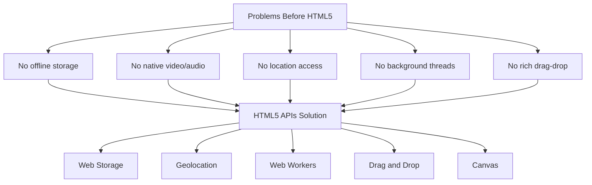
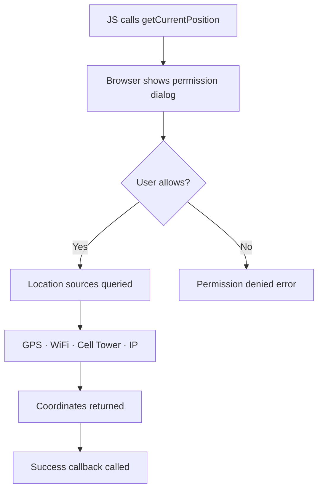
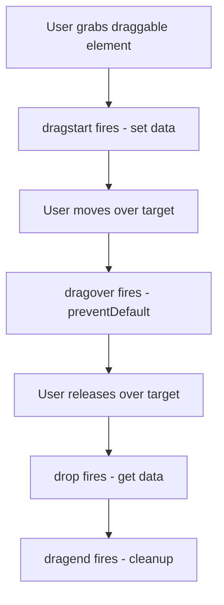
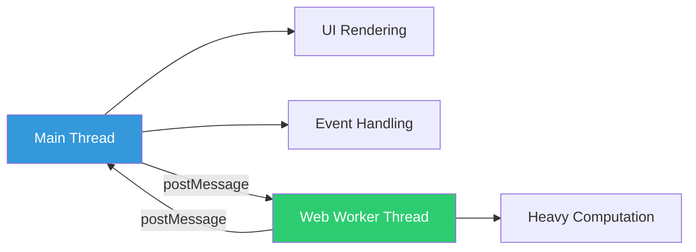
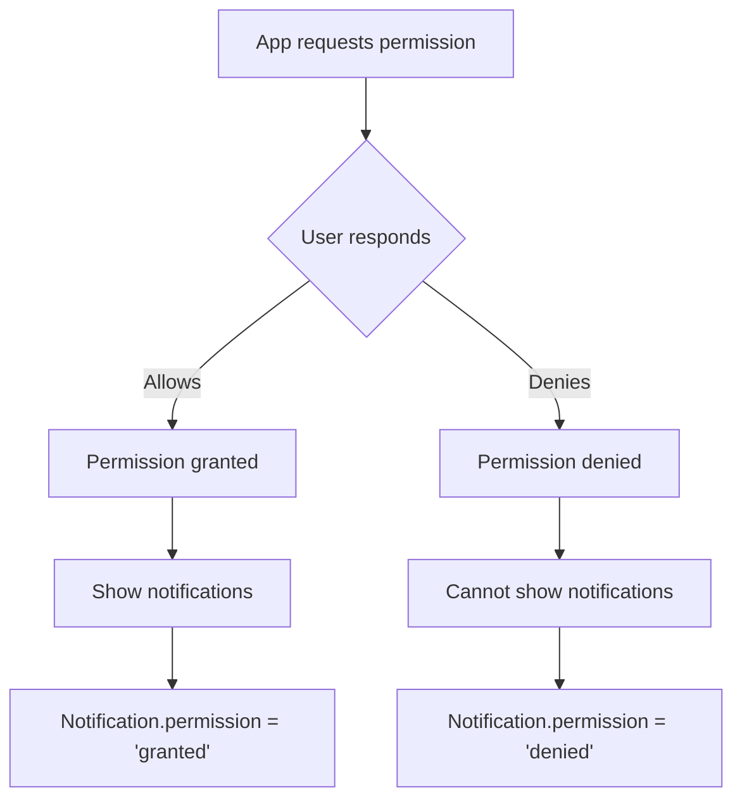
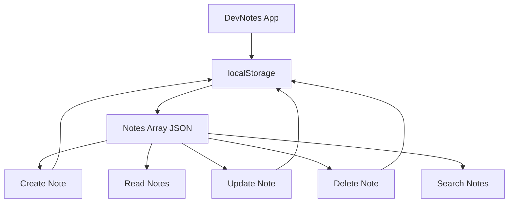

<a id="chapter-21-html5-apis-overview"></a>

# Chapter 21: HTML5 APIs Overview

[⬅ Previous Chapter](#chapter-20-html-accessibility-seo) | [📖 Main Index](#main-index) | [Next Chapter ➡](#chapter-22-canvas-svg-graphics)

---

## 📌 Learning Objectives

By the end of this chapter, you will:

- Understand what HTML5 APIs are and why they were introduced
- Master Web Storage API — `localStorage` and `sessionStorage`
- Understand the Geolocation API and how to get user location
- Know how the Drag and Drop API works natively in HTML5
- Understand the Canvas API for 2D drawing and graphics
- Know the History API for SPA navigation without page reload
- Understand Web Workers for background thread execution
- Know the File API, Notification API, and Intersection Observer
- Answer HTML5 API interview questions confidently
- Build a real-world notes app using Web Storage API

---

<a id="chapter-index-table-21"></a>

## Chapter Index Table

| Topic No. | Topic Name | Subtopics |
|-----------|------------|-----------|
| 21.1 | [What are HTML5 APIs?](#211-what-are-html5-apis) | Definition, why introduced, browser support, API categories |
| 21.2 | [Web Storage API](#212-web-storage-api) | localStorage, sessionStorage, differences, CRUD operations, storage events |
| 21.3 | [Geolocation API](#213-geolocation-api) | getCurrentPosition, watchPosition, coordinates, permissions, error handling |
| 21.4 | [Drag and Drop API](#214-drag-and-drop-api) | draggable, dragstart, dragover, drop events, dataTransfer |
| 21.5 | [Canvas API](#215-canvas-api) | getContext, drawing shapes, text, images, animation loop |
| 21.6 | [History API](#216-history-api) | pushState, replaceState, popstate, SPA navigation |
| 21.7 | [Web Workers API](#217-web-workers-api) | Worker thread, postMessage, onmessage, limitations, use cases |
| 21.8 | [File API](#218-file-api) | FileReader, readAsText, readAsDataURL, input file reading |
| 21.9 | [Intersection Observer API](#219-intersection-observer-api) | Lazy loading, infinite scroll, viewport detection |
| 21.10 | [Notification API](#2110-notification-api) | Permission, show notification, options, use cases |
| 21.11 | [Interview Questions](#2111-interview-questions) | Conceptual, Scenario, Output-based, Advanced |
| 21.12 | [Practice Problems](#2112-practice-problems) | Coding, Theory, Machine Coding |
| 21.13 | [Mini Project](#2113-mini-project) | Local Notes App with Web Storage |

---

## 21.1 What are HTML5 APIs?

<a id="211-what-are-html5-apis"></a>

### What is it?

**HTML5 APIs** are a collection of JavaScript interfaces introduced as part of the HTML5 specification that expose powerful browser capabilities to web developers — without requiring browser plugins, Flash, or native applications.

Before HTML5, web developers needed:
- **Flash** for video playback and animation
- **Java applets** for rich applications
- **Server round-trips** for every piece of dynamic behavior
- **External plugins** for geolocation, file access, offline storage

HTML5 APIs brought these capabilities natively into the browser.

### Why Were They Introduced?



### HTML5 API Categories

| Category | APIs | Purpose |
|----------|------|---------|
| **Storage** | Web Storage, IndexedDB, Cache API | Persist data client-side |
| **Graphics** | Canvas, WebGL, SVG | Draw and animate |
| **Communication** | WebSocket, Fetch, SSE | Real-time data exchange |
| **Device** | Geolocation, Battery, Vibration | Access device hardware |
| **Performance** | Web Workers, Service Workers | Background processing |
| **Navigation** | History API | SPA routing |
| **Interaction** | Drag and Drop, Pointer Events | Rich user interactions |
| **Media** | MediaStream, Web Audio | Camera, microphone, audio |
| **Observation** | Intersection Observer, Mutation Observer | DOM monitoring |

### Browser Support Approach

```html
<!-- Feature detection — always check before using -->
<script>
  if ('geolocation' in navigator) {
    // Geolocation supported
    navigator.geolocation.getCurrentPosition(success, error);
  } else {
    console.log('Geolocation not supported in this browser');
  }

  if (typeof localStorage !== 'undefined') {
    // Web Storage supported
    localStorage.setItem('key', 'value');
  }

  if ('serviceWorker' in navigator) {
    // Service Worker supported
  }
</script>
```

> [!TIP]
> Always use **feature detection** (checking if the API exists) rather than **browser detection** (checking `navigator.userAgent`). Feature detection is future-proof and more reliable.

### 🧠 Hinglish Intuition

> HTML5 APIs socho ek **Swiss Army Knife** ki tarah — ek hi browser me ek saath storage, camera, location, drawing, background processing sab kuch. Pehle yeh sab alag alag plugins se karna padta tha — Flash, Java, etc. Ab browser khud yeh sab handle karta hai natively!
>
> Jaise ek smartphone ka camera, GPS, gyroscope sab ek hi device me hota hai — HTML5 APIs browser ke andar yahi kaam karti hain developer ke liye!

---

👉 <a href="#chapter-index-table-21">Go to Top 🔝</a>

---

## 21.2 Web Storage API

<a id="212-web-storage-api"></a>

### What is it?

The **Web Storage API** provides mechanisms for storing key-value pairs in the browser — persistently across sessions (`localStorage`) or temporarily for the current session (`sessionStorage`). It is much simpler than cookies and stores data entirely client-side.

### `localStorage` vs `sessionStorage`

| Feature | `localStorage` | `sessionStorage` |
|---------|---------------|-----------------|
| **Persistence** | Until explicitly cleared | Tab/window session only |
| **Scope** | All tabs of same origin | Current tab only |
| **Capacity** | ~5–10 MB | ~5 MB |
| **Accessible across tabs** | ✅ Yes | ❌ No |
| **Survives page refresh** | ✅ Yes | ✅ Yes |
| **Survives browser close** | ✅ Yes | ❌ No |
| **Use case** | User prefs, theme, auth token | Form data, tab state |

### Web Storage CRUD Operations

```javascript
// ===== localStorage =====

// CREATE / UPDATE
localStorage.setItem('username', 'rahul_sharma');
localStorage.setItem('theme', 'dark');

// READ
const username = localStorage.getItem('username');
console.log(username); // "rahul_sharma"

// Non-existent key returns null
const missing = localStorage.getItem('nonexistent');
console.log(missing); // null

// DELETE one item
localStorage.removeItem('theme');

// DELETE all items
localStorage.clear();

// CHECK number of stored items
console.log(localStorage.length); // number of keys

// GET key by index
console.log(localStorage.key(0)); // first key name

// ===== sessionStorage (same API) =====
sessionStorage.setItem('currentStep', '2');
const step = sessionStorage.getItem('currentStep');
sessionStorage.removeItem('currentStep');
sessionStorage.clear();
```

### Storing Objects (JSON serialization)

> [!IMPORTANT]
> Web Storage can only store **strings**. To store objects or arrays, you must serialize them with `JSON.stringify()` and deserialize with `JSON.parse()`.

```javascript
// ===== Storing objects =====
const user = {
  name: 'Priya Patel',
  role: 'developer',
  skills: ['React', 'Node.js', 'CSS'],
  age: 28
};

// Serialize before storing
localStorage.setItem('user', JSON.stringify(user));

// Deserialize when reading
const storedUser = JSON.parse(localStorage.getItem('user'));
console.log(storedUser.name);   // "Priya Patel"
console.log(storedUser.skills); // ["React", "Node.js", "CSS"]

// ===== Safe reading with fallback =====
function getFromStorage(key, defaultValue = null) {
  try {
    const item = localStorage.getItem(key);
    return item ? JSON.parse(item) : defaultValue;
  } catch (error) {
    console.error('Storage read error:', error);
    return defaultValue;
  }
}

// ===== Safe writing =====
function saveToStorage(key, value) {
  try {
    localStorage.setItem(key, JSON.stringify(value));
    return true;
  } catch (error) {
    // QuotaExceededError — storage full
    console.error('Storage write error:', error);
    return false;
  }
}
```

### Storage Event

The `storage` event fires on **other tabs** of the same origin when `localStorage` changes. This enables cross-tab communication:

```javascript
// Tab A: sets a value
localStorage.setItem('notification', 'New job posted!');

// Tab B: listens for changes
window.addEventListener('storage', (event) => {
  console.log('Key changed:', event.key);
  console.log('Old value:', event.oldValue);
  console.log('New value:', event.newValue);
  console.log('URL:', event.url);

  if (event.key === 'notification') {
    showNotificationBanner(event.newValue);
  }
});
```

> [!NOTE]
> The `storage` event does NOT fire in the same tab that made the change — only in **other tabs** of the same origin. This is by design for cross-tab communication.

### localStorage vs Cookies vs IndexedDB

| Feature | localStorage | Cookies | IndexedDB |
|---------|-------------|---------|-----------|
| Storage size | ~5–10 MB | ~4 KB | 50+ MB |
| Sent to server | ❌ No | ✅ Yes (every request) | ❌ No |
| Accessible via JS | ✅ Yes | ✅ Yes | ✅ Yes |
| Expiry control | Manual | Yes (expires) | Manual |
| Complex data | JSON string | String only | Structured data |
| Best for | User preferences | Auth sessions | Large offline data |

### Practical Use Cases

```javascript
// ===== Theme preference =====
function setTheme(theme) {
  document.body.classList.toggle('dark', theme === 'dark');
  localStorage.setItem('theme', theme);
}

// Load saved theme on page start
const savedTheme = localStorage.getItem('theme') || 'light';
setTheme(savedTheme);

// ===== Shopping cart =====
function addToCart(product) {
  const cart = JSON.parse(localStorage.getItem('cart')) || [];
  cart.push(product);
  localStorage.setItem('cart', JSON.stringify(cart));
}

function getCart() {
  return JSON.parse(localStorage.getItem('cart')) || [];
}

// ===== Remember form progress =====
document.getElementById('email').addEventListener('input', (e) => {
  sessionStorage.setItem('formEmail', e.target.value);
});

// Restore on page load
const savedEmail = sessionStorage.getItem('formEmail');
if (savedEmail) {
  document.getElementById('email').value = savedEmail;
}
```

### 🧠 Hinglish Intuition

> `localStorage` ek **permanent diary** ki tarah hai — browser band karo, kuch dino baad wapas aao, sab kuch wahi milega. `sessionStorage` ek **sticky note** ki tarah hai — jab tab band karo, note bhi gayab.
>
> Dono me sirf strings store hoti hain — isliye objects ko `JSON.stringify()` se convert karna padta hai — jaise ek box me rakhne se pehle cheez ko wrap karna padta hai. Khote time `JSON.parse()` se unwrap karo!

---

👉 <a href="#chapter-index-table-21">Go to Top 🔝</a>

---

## 21.3 Geolocation API

<a id="213-geolocation-api"></a>

### What is it?

The **Geolocation API** allows web applications to access the user's geographic location — latitude, longitude, altitude, accuracy, and speed — with the user's explicit permission. It works via GPS, Wi-Fi triangulation, cell tower data, or IP address.

### How Geolocation Works



### `getCurrentPosition` — One-time Location

```javascript
// Check if supported first
if ('geolocation' in navigator) {

  // Options object
  const options = {
    enableHighAccuracy: true,  // Use GPS if available (slower, more battery)
    timeout: 10000,            // Max wait: 10 seconds
    maximumAge: 60000          // Accept cached location up to 1 minute old
  };

  // Success callback
  function onSuccess(position) {
    const coords = position.coords;

    console.log('Latitude:', coords.latitude);
    console.log('Longitude:', coords.longitude);
    console.log('Accuracy:', coords.accuracy, 'meters');
    console.log('Altitude:', coords.altitude); // null if unavailable
    console.log('Speed:', coords.speed);       // null if unavailable
    console.log('Heading:', coords.heading);   // null if unavailable
    console.log('Timestamp:', position.timestamp);

    // Open in Google Maps
    const mapsUrl = 
      `https://maps.google.com?q=${coords.latitude},${coords.longitude}`;
    console.log('Maps URL:', mapsUrl);
  }

  // Error callback
  function onError(error) {
    switch(error.code) {
      case error.PERMISSION_DENIED:
        console.error('User denied location access');
        break;
      case error.POSITION_UNAVAILABLE:
        console.error('Location information unavailable');
        break;
      case error.TIMEOUT:
        console.error('Request timed out');
        break;
      default:
        console.error('Unknown error:', error.message);
    }
  }

  navigator.geolocation.getCurrentPosition(onSuccess, onError, options);

} else {
  console.log('Geolocation not supported');
}
```

### `watchPosition` — Continuous Tracking

```javascript
// Returns a watchId for later stopping
const watchId = navigator.geolocation.watchPosition(
  (position) => {
    const { latitude, longitude } = position.coords;
    updateMapMarker(latitude, longitude);
    console.log(`Updated: ${latitude}, ${longitude}`);
  },
  (error) => {
    console.error('Watch error:', error.message);
  },
  {
    enableHighAccuracy: true,
    timeout: 5000,
    maximumAge: 0  // Always get fresh position
  }
);

// Stop watching when done (important for battery!)
function stopTracking() {
  navigator.geolocation.clearWatch(watchId);
}

// Stop after 5 minutes
setTimeout(stopTracking, 5 * 60 * 1000);
```

### Geolocation Coordinates Object

| Property | Type | Description |
|----------|------|-------------|
| `latitude` | Number | Decimal degrees (-90 to 90) |
| `longitude` | Number | Decimal degrees (-180 to 180) |
| `accuracy` | Number | Accuracy radius in meters |
| `altitude` | Number or null | Height above sea level (meters) |
| `altitudeAccuracy` | Number or null | Altitude accuracy in meters |
| `heading` | Number or null | Direction of travel (degrees) |
| `speed` | Number or null | Speed in meters/second |

### Practical Example: Nearest Store Finder

```javascript
function findNearestStore() {
  const stores = [
    { name: 'DevStore Koramangala', lat: 12.9352, lng: 77.6245 },
    { name: 'DevStore Whitefield',  lat: 12.9698, lng: 77.7499 },
    { name: 'DevStore Indiranagar', lat: 12.9784, lng: 77.6408 }
  ];

  navigator.geolocation.getCurrentPosition((position) => {
    const userLat = position.coords.latitude;
    const userLng = position.coords.longitude;

    // Calculate distance using Haversine formula (simplified)
    function distance(lat1, lng1, lat2, lng2) {
      const R = 6371; // Earth radius km
      const dLat = (lat2 - lat1) * Math.PI / 180;
      const dLng = (lng2 - lng1) * Math.PI / 180;
      const a = Math.sin(dLat/2) ** 2 +
                Math.cos(lat1 * Math.PI / 180) *
                Math.cos(lat2 * Math.PI / 180) *
                Math.sin(dLng/2) ** 2;
      return R * 2 * Math.atan2(Math.sqrt(a), Math.sqrt(1-a));
    }

    const nearest = stores.reduce((closest, store) => {
      const d = distance(userLat, userLng, store.lat, store.lng);
      return d < closest.distance ? { ...store, distance: d } : closest;
    }, { distance: Infinity });

    document.getElementById('result').textContent =
      `Nearest: ${nearest.name} (${nearest.distance.toFixed(1)} km away)`;
  });
}
```

> [!IMPORTANT]
> Geolocation requires **HTTPS** in modern browsers (except `localhost`). It will not work on HTTP pages. Always handle the permission-denied error gracefully — never assume the user will grant permission.

### 🧠 Hinglish Intuition

> Geolocation API ek **GPS tracker** ki tarah hai jo browser ke andar built-in hai. Pehle user se permission maangta hai — jaise Swiggy app location access maangti hai. User allow kare toh latitude/longitude milta hai.
>
> `getCurrentPosition` = ek baar location lo (like a snapshot). `watchPosition` = continuously track karo (like live tracking on Ola/Uber). Battery drain rokne ke liye jab kaam ho jaaye, `clearWatch()` se band karo!

---

👉 <a href="#chapter-index-table-21">Go to Top 🔝</a>

---

## 21.4 Drag and Drop API

<a id="214-drag-and-drop-api"></a>

### What is it?

The **HTML5 Drag and Drop API** enables native drag-and-drop interactions without external libraries. Elements can be made draggable and drop targets can be defined using HTML attributes and JavaScript event listeners.

### Key Events and Attributes

| Event/Attribute | Fires On | When |
|----------------|---------|------|
| `draggable="true"` | Source element | Makes element draggable |
| `dragstart` | Source | Drag begins |
| `drag` | Source | During drag (continuous) |
| `dragend` | Source | Drag ends (dropped or cancelled) |
| `dragenter` | Target | Dragged item enters target |
| `dragover` | Target | Dragged item is over target |
| `dragleave` | Target | Dragged item leaves target |
| `drop` | Target | Item is dropped on target |

### Drag and Drop Flow



### Basic Drag and Drop Implementation

```html
<!DOCTYPE html>
<html lang="en">
<head>
  <title>Drag and Drop Demo</title>
  <style>
    .drag-item {
      padding: 12px 20px;
      background: #3498db;
      color: white;
      border-radius: 8px;
      cursor: grab;
      display: inline-block;
      margin: 8px;
      user-select: none;
    }

    .drag-item:active { cursor: grabbing; }

    .drag-item.dragging {
      opacity: 0.4;
    }

    .drop-zone {
      width: 300px;
      min-height: 150px;
      border: 3px dashed #ccc;
      border-radius: 12px;
      padding: 16px;
      margin: 16px 0;
      transition: all 0.2s;
    }

    .drop-zone.drag-over {
      border-color: #3498db;
      background: #eff6ff;
    }
  </style>
</head>
<body>

  <!-- Draggable items -->
  <div 
    class="drag-item" 
    draggable="true"
    data-id="item-1"
    id="item-1"
  >
    🚀 React Developer
  </div>

  <div 
    class="drag-item" 
    draggable="true"
    data-id="item-2"
    id="item-2"
  >
    🎨 UI Designer
  </div>

  <!-- Drop zones -->
  <div class="drop-zone" id="zone-shortlist">
    <p>📋 Shortlisted</p>
  </div>

  <div class="drop-zone" id="zone-rejected">
    <p>❌ Rejected</p>
  </div>

  <script>
    // ===== Drag Source Events =====
    document.querySelectorAll('.drag-item').forEach(item => {

      item.addEventListener('dragstart', (e) => {
        // Store data to transfer
        e.dataTransfer.setData('text/plain', item.dataset.id);
        e.dataTransfer.effectAllowed = 'move';

        // Visual feedback
        setTimeout(() => item.classList.add('dragging'), 0);
      });

      item.addEventListener('dragend', (e) => {
        item.classList.remove('dragging');
      });

    });

    // ===== Drop Target Events =====
    document.querySelectorAll('.drop-zone').forEach(zone => {

      zone.addEventListener('dragenter', (e) => {
        e.preventDefault();
        zone.classList.add('drag-over');
      });

      zone.addEventListener('dragover', (e) => {
        // CRITICAL: must preventDefault to allow drop
        e.preventDefault();
        e.dataTransfer.dropEffect = 'move';
      });

      zone.addEventListener('dragleave', (e) => {
        zone.classList.remove('drag-over');
      });

      zone.addEventListener('drop', (e) => {
        e.preventDefault();
        zone.classList.remove('drag-over');

        // Get transferred data
        const itemId = e.dataTransfer.getData('text/plain');
        const draggedItem = document.getElementById(itemId);

        if (draggedItem) {
          zone.appendChild(draggedItem);
          console.log(`${itemId} dropped in ${zone.id}`);
        }
      });

    });
  </script>
</body>
</html>
```

### `dataTransfer` Object

```javascript
// Setting data (in dragstart)
e.dataTransfer.setData('text/plain', 'simple text');
e.dataTransfer.setData('text/html', '<b>bold text</b>');
e.dataTransfer.setData('application/json', JSON.stringify({ id: 1 }));

// Getting data (in drop)
const text = e.dataTransfer.getData('text/plain');
const json = JSON.parse(e.dataTransfer.getData('application/json'));

// Effect types
e.dataTransfer.effectAllowed = 'copy';   // Only copy
e.dataTransfer.effectAllowed = 'move';   // Only move
e.dataTransfer.effectAllowed = 'copyMove'; // Both allowed
e.dataTransfer.dropEffect = 'copy';      // Show copy cursor

// Custom drag image
const img = new Image();
img.src = 'custom-drag-image.png';
e.dataTransfer.setDragImage(img, 0, 0);
```

> [!IMPORTANT]
> `dragover` event MUST call `e.preventDefault()` to allow dropping. Without this, the drop event never fires. This is the most common mistake in Drag & Drop implementations.

### 🧠 Hinglish Intuition

> Drag and Drop API ek **file manager** ki tarah hai — jaise Windows me files ko ek folder se doosre folder me drag karte hain. `dragstart` pe data set karo (kya drag ho raha hai), `dragover` pe `preventDefault()` karo (drop zone as ready), `drop` pe data lo aur action perform karo.
>
> Sabse important rule yaad rakho: **`dragover` me `preventDefault()` nahin kiya toh `drop` event kabhi fire nahi hoga** — yeh most common bug hai!

---

👉 <a href="#chapter-index-table-21">Go to Top 🔝</a>

---

## 21.5 Canvas API

<a id="215-canvas-api"></a>

### What is it?

The **Canvas API** provides a `<canvas>` HTML element and a 2D drawing context that allows rendering graphics, animations, charts, games, and image manipulation entirely in the browser using JavaScript.

### Canvas vs SVG

| Feature | Canvas | SVG |
|---------|--------|-----|
| Type | Raster (pixel-based) | Vector (math-based) |
| Scalability | Pixelates when scaled | Scales perfectly |
| Performance | Better for many objects | Better for few complex shapes |
| DOM | Single DOM element | Each shape is a DOM element |
| Animation | Manual (requestAnimationFrame) | CSS/SMIL animations |
| Interactivity | Must track coordinates | Click events on each shape |
| Best for | Games, image processing | Icons, diagrams, charts |

### Basic Canvas Setup

```html
<!-- HTML: define the canvas element -->
<canvas 
  id="myCanvas" 
  width="600" 
  height="400"
  style="border: 1px solid #ccc; border-radius: 8px;"
>
  Your browser does not support the canvas element.
</canvas>
```

```javascript
// Get the canvas element
const canvas = document.getElementById('myCanvas');

// Get the 2D rendering context
const ctx = canvas.getContext('2d');

// Canvas dimensions
console.log(canvas.width);  // 600
console.log(canvas.height); // 400
```

### Drawing Shapes

```javascript
const canvas = document.getElementById('myCanvas');
const ctx = canvas.getContext('2d');

// ===== RECTANGLES =====
// Filled rectangle
ctx.fillStyle = '#3498db';
ctx.fillRect(50, 50, 200, 100); // x, y, width, height

// Outlined rectangle
ctx.strokeStyle = '#e74c3c';
ctx.lineWidth = 3;
ctx.strokeRect(300, 50, 200, 100);

// Clear a rectangle area
ctx.clearRect(75, 75, 50, 50);

// ===== PATHS =====
ctx.beginPath();
ctx.moveTo(50, 200);    // Start point
ctx.lineTo(250, 200);   // Line to
ctx.lineTo(150, 300);   // Another line
ctx.closePath();         // Close path back to start

ctx.fillStyle = '#2ecc71';
ctx.fill();
ctx.strokeStyle = '#27ae60';
ctx.lineWidth = 2;
ctx.stroke();

// ===== CIRCLES / ARCS =====
ctx.beginPath();
// arc(x, y, radius, startAngle, endAngle, anticlockwise)
ctx.arc(400, 250, 60, 0, Math.PI * 2); // Full circle
ctx.fillStyle = '#9b59b6';
ctx.fill();

// Semi-circle
ctx.beginPath();
ctx.arc(500, 300, 40, 0, Math.PI); // Half circle
ctx.strokeStyle = '#e67e22';
ctx.lineWidth = 4;
ctx.stroke();

// ===== ROUNDED RECTANGLE (modern) =====
ctx.beginPath();
ctx.roundRect(50, 330, 150, 50, 10); // x,y,w,h,radius
ctx.fillStyle = '#1abc9c';
ctx.fill();
```

### Drawing Text

```javascript
// Text styling
ctx.font = 'bold 24px Segoe UI, sans-serif';
ctx.fillStyle = '#2c3e50';
ctx.textAlign = 'center';     // left | center | right
ctx.textBaseline = 'middle';  // top | middle | bottom

// Fill text
ctx.fillText('DevHire', canvas.width / 2, 50);

// Stroke text (outline)
ctx.font = '32px Arial';
ctx.strokeStyle = '#e74c3c';
ctx.lineWidth = 1;
ctx.strokeText('Hello Canvas!', canvas.width / 2, 100);

// Measure text width
const metrics = ctx.measureText('Hello');
console.log(metrics.width); // pixel width of text
```

### Working with Images

```javascript
// Draw image on canvas
const img = new Image();
img.src = 'photo.jpg';

img.onload = () => {
  // drawImage(image, dx, dy)
  ctx.drawImage(img, 0, 0);

  // drawImage(image, dx, dy, dWidth, dHeight) — scaled
  ctx.drawImage(img, 0, 0, 300, 200);

  // drawImage(image, sx, sy, sWidth, sHeight, dx, dy, dWidth, dHeight) — cropped
  ctx.drawImage(img, 100, 100, 200, 200, 50, 50, 150, 150);

  // Export canvas as image
  const dataURL = canvas.toDataURL('image/png');
  const link = document.createElement('a');
  link.download = 'canvas-export.png';
  link.href = dataURL;
  link.click();
};
```

### Canvas Transformations

```javascript
// Save current state
ctx.save();

// Translate origin
ctx.translate(300, 200);

// Rotate (in radians)
ctx.rotate(Math.PI / 4); // 45 degrees

// Scale
ctx.scale(1.5, 1.5);

// Draw after transforms
ctx.fillStyle = 'red';
ctx.fillRect(-50, -50, 100, 100);

// Restore previous state
ctx.restore();
```

### Simple Animation Loop

```javascript
let x = 0;
const speed = 2;

function animate() {
  // Clear entire canvas
  ctx.clearRect(0, 0, canvas.width, canvas.height);

  // Draw moving circle
  ctx.beginPath();
  ctx.arc(x, canvas.height / 2, 30, 0, Math.PI * 2);
  ctx.fillStyle = '#3498db';
  ctx.fill();

  // Update position
  x += speed;
  if (x > canvas.width + 30) x = -30; // Wrap around

  // Continue loop
  requestAnimationFrame(animate);
}

// Start animation
animate();
```

### 🧠 Hinglish Intuition

> Canvas API ek **blank drawing board** ki tarah hai jahan tum JavaScript se paint brush lekar draw karte ho. `getContext('2d')` matlab "mujhe 2D drawing tools do." `fillRect` matlab "yahan ek filled box banao", `arc` matlab "circle banao."
>
> Canvas raster-based hai — jaise ek photograph. SVG vector-based hai — jaise ek architect ka blueprint. Canvas games aur image processing ke liye better hai, SVG icons aur diagrams ke liye better. Dono ki apni jagah hai!

---

👉 <a href="#chapter-index-table-21">Go to Top 🔝</a>

---

## 21.6 History API

<a id="216-history-api"></a>

### What is it?

The **History API** allows JavaScript to manipulate the browser's session history — adding, modifying, and navigating between history entries — **without triggering a full page reload**. This is the foundation of **Single Page Application (SPA)** routing.

### The Problem it Solves

Without History API:
- SPAs had to use URL hash (`#/about`, `#/contact`) for routing
- URLs were ugly and not shareable in a meaningful way
- Back/forward buttons didn't work as expected
- Server-side routing was impossible for specific URLs

With History API:
- Clean URLs like `/about`, `/contact`, `/jobs/123`
- Back/forward works correctly
- URLs are shareable and bookmarkable
- Server can serve the same HTML for all routes (with proper config)

### Core Methods

```javascript
// ===== pushState: Add new history entry =====
// history.pushState(state, title, url)
history.pushState(
  { page: 'about', userId: 42 },  // State object (any serializable data)
  'About Us',                      // Title (mostly ignored by browsers)
  '/about'                         // New URL (must be same origin)
);
// URL changes to /about, NO page reload, new history entry added

// ===== replaceState: Modify current history entry =====
history.replaceState(
  { page: 'about', filtered: true },
  'About Us - Filtered',
  '/about?filter=active'
);
// URL changes, NO page reload, NO new history entry (replaces current)

// ===== Navigation =====
history.back();    // Same as browser Back button
history.forward(); // Same as browser Forward button
history.go(-1);    // Go 1 step back
history.go(2);     // Go 2 steps forward
history.go(0);     // Reload current page
```

### `popstate` Event — Handle Back/Forward

```javascript
// Fires when user navigates with browser back/forward buttons
// OR when history.back() / history.forward() / history.go() is called
window.addEventListener('popstate', (event) => {
  console.log('State:', event.state);
  // event.state = the state object passed to pushState/replaceState

  if (event.state) {
    // Load content based on state
    loadPage(event.state.page);
  } else {
    // No state (initial page load)
    loadPage('home');
  }
});
```

> [!IMPORTANT]
> `popstate` does NOT fire when `pushState()` or `replaceState()` is called — only when the user navigates using browser buttons or `history.back()`/`history.forward()`. You must manually update the view when calling `pushState`.

### Simple SPA Router Implementation

```javascript
// ===== Minimal SPA Router =====

const routes = {
  '/': homeComponent,
  '/about': aboutComponent,
  '/jobs': jobsComponent,
  '/jobs/detail': jobDetailComponent
};

function navigate(path, state = {}) {
  history.pushState(state, '', path);
  renderRoute(path, state);
}

function renderRoute(path, state) {
  const component = routes[path] || notFoundComponent;
  document.getElementById('app').innerHTML = component(state);
}

// Handle browser back/forward
window.addEventListener('popstate', (e) => {
  renderRoute(location.pathname, e.state);
});

// Handle link clicks (prevent full reload)
document.addEventListener('click', (e) => {
  const link = e.target.closest('a[data-spa]');
  if (link) {
    e.preventDefault();
    navigate(link.getAttribute('href'));
  }
});

// Components (simple string-returning functions)
function homeComponent() {
  return '<h1>Home Page</h1><a href="/about" data-spa>About</a>';
}

function aboutComponent() {
  return '<h1>About DevHire</h1><a href="/" data-spa>Home</a>';
}

function jobsComponent(state) {
  return `<h1>Jobs ${state.filter || ''}</h1>`;
}

function notFoundComponent() {
  return '<h1>404 — Page Not Found</h1>';
}

// Initial render
renderRoute(location.pathname, history.state);
```

### History State vs Hash Routing

| Feature | History API | Hash Routing |
|---------|------------|-------------|
| URL pattern | `/about`, `/jobs/1` | `/#/about`, `/#/jobs/1` |
| URL quality | Clean, professional | Ugly hash symbol |
| Server config needed | ✅ Yes (serve same file for all) | ❌ No |
| Browser support | Modern browsers | All browsers |
| SEO friendly | ✅ Better | ⚠️ Less ideal |
| `popstate` event | ✅ Yes | `hashchange` event |

### 🧠 Hinglish Intuition

> History API ek **browser ke Back button ka remote control** hai. `pushState` matlab "browser ke history me ek naya page add karo lekin actually page reload mat karo." URL change hota hai, user ko lagta hai naya page aaya, lekin actually wohi page hai — sirf JavaScript ne content swap kiya.
>
> Jaise ek magic show me actor stage pe jaata hai aur instantly costume change karta hai — audience ko lagta hai naya scene hai, lekin same stage hai! Yehi SPA routing ka jadoo hai!

---

👉 <a href="#chapter-index-table-21">Go to Top 🔝</a>

---

## 21.7 Web Workers API

<a id="217-web-workers-api"></a>

### What is it?

**Web Workers** allow JavaScript code to run in **background threads** separate from the main UI thread. Since JavaScript is single-threaded, heavy computations block the UI — causing freezes. Web Workers solve this by offloading work to a separate thread.

### The Problem: JavaScript is Single-Threaded

```javascript
// ❌ This freezes the UI for seconds
function heavyComputation() {
  let result = 0;
  for (let i = 0; i < 1_000_000_000; i++) {
    result += Math.sqrt(i);
  }
  return result;
}

// UI is completely frozen while this runs
document.getElementById('result').textContent = heavyComputation();
```

### Web Worker Architecture



### Creating and Using a Web Worker

```javascript
// ===== worker.js (separate file) =====
// This code runs in a separate thread

// Listen for messages from main thread
self.addEventListener('message', (event) => {
  const { type, data } = event.data;

  if (type === 'CALCULATE') {
    const result = heavyCalculation(data.limit);
    // Send result back to main thread
    self.postMessage({ type: 'RESULT', result });
  }
});

function heavyCalculation(limit) {
  let sum = 0;
  for (let i = 0; i < limit; i++) {
    sum += Math.sqrt(i);
  }
  return sum;
}
```

```javascript
// ===== main.js (main thread) =====

// Create worker
const worker = new Worker('worker.js');

// Send data to worker
worker.postMessage({
  type: 'CALCULATE',
  data: { limit: 1_000_000_000 }
});

// Receive results from worker
worker.addEventListener('message', (event) => {
  const { type, result } = event.data;

  if (type === 'RESULT') {
    document.getElementById('result').textContent = result;
    console.log('Calculation complete:', result);
  }
});

// Handle errors
worker.addEventListener('error', (error) => {
  console.error('Worker error:', error.message);
});

// Terminate worker when done (important!)
function stopWorker() {
  worker.terminate();
}
```

### Inline Worker (No Separate File)

```javascript
// Create worker from a Blob — no separate file needed
const workerCode = `
  self.addEventListener('message', (e) => {
    const { numbers } = e.data;
    const sorted = [...numbers].sort((a, b) => a - b);
    self.postMessage({ sorted });
  });
`;

const blob = new Blob([workerCode], { type: 'application/javascript' });
const worker = new Worker(URL.createObjectURL(blob));

worker.postMessage({ numbers: [64, 34, 25, 12, 22, 11, 90] });

worker.addEventListener('message', (e) => {
  console.log('Sorted:', e.data.sorted);
  worker.terminate();
});
```

### Web Worker Limitations

| Limitation | Detail |
|-----------|--------|
| No DOM access | Cannot read or modify the DOM |
| No `window` object | `self` is used instead |
| No `localStorage` | Can use `IndexedDB` though |
| Same-origin only | Worker script must be same origin |
| No `document` | Cannot access document object |
| File required | Needs a separate `.js` file (or Blob) |

### Types of Workers

| Type | Description | Use Case |
|------|-------------|---------|
| **Dedicated Worker** | One page, one worker | Heavy computation |
| **Shared Worker** | Multiple pages, one worker | Cross-tab state |
| **Service Worker** | Intercepts network requests | Offline caching, PWA |

### 🧠 Hinglish Intuition

> JavaScript normally ek **single cashier** ki tarah hai — ek kaam pe ek baar me. Agar wo heavy calculation kare (count karta rahe 1 to 1 billion), baaki sab customers (UI events) wait karte hain — page freeze!
>
> Web Worker ek **extra cashier** hire karne jaisa hai — main cashier (main thread) customers serve karta rahe, naya cashier (worker) background me heavy work kare. Kaam complete hone pe result wapas bhejta hai. **UI kabhi freeze nahi hoti!**

---

👉 <a href="#chapter-index-table-21">Go to Top 🔝</a>

---

## 21.8 File API

<a id="218-file-api"></a>

### What is it?

The **File API** allows web applications to read the contents of files selected by users through `<input type="file">` or drag-and-drop. It provides `FileReader` for asynchronous reading of file contents.

### FileReader Methods

| Method | Returns | Use Case |
|--------|---------|---------|
| `readAsText(file)` | String | Read `.txt`, `.csv`, `.json` files |
| `readAsDataURL(file)` | Base64 data URL | Preview images |
| `readAsArrayBuffer(file)` | ArrayBuffer | Binary files, audio, video |
| `readAsBinaryString(file)` | Binary string | Legacy (prefer ArrayBuffer) |

### Reading Text Files

```html
<input type="file" id="file-input" accept=".txt,.csv,.json">
<pre id="file-content"></pre>
```

```javascript
const fileInput = document.getElementById('file-input');
const output = document.getElementById('file-content');

fileInput.addEventListener('change', (event) => {
  const file = event.target.files[0];

  if (!file) return;

  // File metadata
  console.log('Name:', file.name);
  console.log('Size:', file.size, 'bytes');
  console.log('Type:', file.type);
  console.log('Last Modified:', new Date(file.lastModified));

  const reader = new FileReader();

  // Called when reading completes
  reader.addEventListener('load', (e) => {
    output.textContent = e.target.result;
  });

  // Called during reading
  reader.addEventListener('progress', (e) => {
    if (e.lengthComputable) {
      const percent = (e.loaded / e.total * 100).toFixed(1);
      console.log(`Reading: ${percent}%`);
    }
  });

  // Called on error
  reader.addEventListener('error', () => {
    console.error('Error reading file:', reader.error);
  });

  reader.readAsText(file, 'UTF-8');
});
```

### Image Preview

```javascript
function previewImage(file) {
  if (!file.type.startsWith('image/')) {
    console.error('Not an image file');
    return;
  }

  const reader = new FileReader();

  reader.addEventListener('load', (e) => {
    const img = document.getElementById('preview');
    img.src = e.target.result; // base64 data URL
    img.style.display = 'block';
  });

  reader.readAsDataURL(file);
}

document.getElementById('avatar-input').addEventListener('change', (e) => {
  const file = e.target.files[0];
  if (file) previewImage(file);
});
```

### Multiple File Reading

```javascript
fileInput.addEventListener('change', (event) => {
  const files = Array.from(event.target.files);

  files.forEach((file) => {
    const reader = new FileReader();

    reader.addEventListener('load', (e) => {
      console.log(`${file.name}: ${e.target.result.length} chars`);
    });

    reader.readAsText(file);
  });
});
```

### Modern Alternative: `file.text()` and `file.arrayBuffer()`

```javascript
// Modern promise-based API (no FileReader needed)
fileInput.addEventListener('change', async (event) => {
  const file = event.target.files[0];

  // Read as text
  const text = await file.text();
  console.log(text);

  // Read as array buffer
  const buffer = await file.arrayBuffer();
  console.log(buffer);
});
```

### 🧠 Hinglish Intuition

> File API ek **document scanner** ki tarah hai — user file choose karta hai, browser usse scan karta hai aur content JavaScript ko deta hai. `FileReader` async hai — matlab yeh background me parta hai aur jab complete ho, `load` event fire hota hai.
>
> `readAsText` = text file padhna (jaise Notepad), `readAsDataURL` = image ko base64 me convert karna (jaise photo preview), `readAsArrayBuffer` = binary data (jaise MP3 file ke bytes). Modern browsers me `file.text()` simple promise-based shortcut hai!

---

👉 <a href="#chapter-index-table-21">Go to Top 🔝</a>

---

## 21.9 Intersection Observer API

<a id="219-intersection-observer-api"></a>

### What is it?

The **Intersection Observer API** provides an efficient way to asynchronously observe when an element enters or exits the browser's viewport (or another ancestor element). It replaced expensive scroll event listeners for lazy loading, infinite scroll, and animation triggers.

### Why Use It Instead of Scroll Events?

```javascript
// ❌ OLD WAY: Expensive scroll listener
window.addEventListener('scroll', () => {
  const elements = document.querySelectorAll('.lazy-img');
  elements.forEach((el) => {
    const rect = el.getBoundingClientRect();
    if (rect.top < window.innerHeight) {
      // Load image — BUT this runs on EVERY scroll tick!
    }
  });
});

// ✅ NEW WAY: Intersection Observer — runs only when needed
const observer = new IntersectionObserver((entries) => {
  entries.forEach((entry) => {
    if (entry.isIntersecting) {
      loadImage(entry.target);
      observer.unobserve(entry.target); // Stop observing after loading
    }
  });
});

document.querySelectorAll('.lazy-img').forEach((img) => {
  observer.observe(img);
});
```

### Basic Usage

```javascript
// Options
const options = {
  root: null,        // null = viewport; or a DOM element
  rootMargin: '0px', // Margin around root (like CSS margin)
  threshold: 0.5     // 0 = any pixel visible; 1 = fully visible; 0.5 = 50%
};

// Callback receives entries array
const observer = new IntersectionObserver((entries, observer) => {
  entries.forEach((entry) => {
    console.log('Element:', entry.target);
    console.log('Is intersecting:', entry.isIntersecting);
    console.log('Intersection ratio:', entry.intersectionRatio);
    console.log('Bounding rect:', entry.boundingClientRect);
  });
}, options);

// Observe an element
const target = document.getElementById('my-element');
observer.observe(target);

// Stop observing
observer.unobserve(target);

// Stop all observations
observer.disconnect();
```

### Lazy Image Loading

```html
<!-- Use data-src instead of src to prevent immediate loading -->

```

```javascript
const lazyImages = document.querySelectorAll('.lazy-img');

const imageObserver = new IntersectionObserver((entries) => {
  entries.forEach((entry) => {
    if (entry.isIntersecting) {
      const img = entry.target;

      // Swap placeholder with real image
      img.src = img.dataset.src;
      img.classList.remove('lazy-img');
      img.classList.add('loaded');

      // Stop observing this image
      imageObserver.unobserve(img);
    }
  });
}, {
  rootMargin: '200px 0px', // Start loading 200px before viewport
  threshold: 0
});

lazyImages.forEach((img) => imageObserver.observe(img));
```

### Animation Trigger on Scroll

```javascript
const animateObserver = new IntersectionObserver((entries) => {
  entries.forEach((entry) => {
    if (entry.isIntersecting) {
      entry.target.classList.add('animate-in');
      animateObserver.unobserve(entry.target); // Animate once only
    }
  });
}, {
  threshold: 0.2 // Trigger when 20% visible
});

document.querySelectorAll('.animate-on-scroll').forEach((el) => {
  animateObserver.observe(el);
});
```

```css
.animate-on-scroll {
  opacity: 0;
  transform: translateY(30px);
  transition: opacity 0.6s ease, transform 0.6s ease;
}

.animate-on-scroll.animate-in {
  opacity: 1;
  transform: translateY(0);
}
```

### Infinite Scroll

```javascript
const sentinel = document.getElementById('scroll-sentinel');
let page = 1;

const infiniteObserver = new IntersectionObserver((entries) => {
  if (entries[0].isIntersecting) {
    page++;
    loadMoreItems(page);
  }
}, {
  threshold: 1.0 // Fully visible
});

infiniteObserver.observe(sentinel);

async function loadMoreItems(page) {
  const response = await fetch(`/api/jobs?page=${page}`);
  const jobs = await response.json();
  renderJobs(jobs);
}
```

### 🧠 Hinglish Intuition

> Intersection Observer ek **security guard** ki tarah hai jo door khada rahta hai. Jab koi element viewport me enter kare, guard batata hai — "yeh element aa gaya!" Phir tum action lete ho (image load karo, animation start karo).
>
> Pehle log `scroll` event use karte the — jaise har ek second pe guard check karta "koi aaya kya? koi aaya kya?" — bahut expensive! Intersection Observer smart hai — sirf tab batata hai jab actually kuch change hota hai. Battery aur performance dono bachti hai!

---

👉 <a href="#chapter-index-table-21">Go to Top 🔝</a>

---

## 21.10 Notification API

<a id="2110-notification-api"></a>

### What is it?

The **Notification API** allows web applications to display native OS-level push notifications to users — even when the browser tab is in the background or minimized. It requires explicit user permission.

### Notification Flow



### Requesting Permission and Showing Notifications

```javascript
// ===== Check and request permission =====
async function requestNotificationPermission() {
  // Check current permission status
  if (Notification.permission === 'granted') {
    return true;
  }

  if (Notification.permission === 'denied') {
    console.log('Notifications blocked by user');
    return false;
  }

  // Request permission
  const permission = await Notification.requestPermission();
  return permission === 'granted';
}

// ===== Show a notification =====
async function showNotification(title, options = {}) {
  const granted = await requestNotificationPermission();

  if (!granted) return;

  const notification = new Notification(title, {
    body: options.body || '',
    icon: options.icon || '/icon.png',
    badge: options.badge || '/badge.png',
    tag: options.tag || 'default',       // Replace existing notification with same tag
    requireInteraction: options.requireInteraction || false,
    silent: options.silent || false,
    data: options.data || {}              // Custom data
  });

  // Event handlers
  notification.addEventListener('click', (e) => {
    console.log('Notification clicked');
    window.focus();
    notification.close();
    // Navigate or perform action
    if (notification.data?.url) {
      window.location.href = notification.data.url;
    }
  });

  notification.addEventListener('close', () => {
    console.log('Notification closed');
  });

  notification.addEventListener('error', (e) => {
    console.error('Notification error:', e);
  });

  // Auto-close after 5 seconds
  setTimeout(() => notification.close(), 5000);
}

// ===== Usage =====
showNotification('New Job Alert! 🚀', {
  body: 'Senior React Developer at Google India — ₹50 LPA. Apply Now!',
  icon: '/devhire-icon.png',
  tag: 'job-alert',
  data: { url: '/jobs/google-react-dev' }
});
```

### Permission States

| State | Value | Meaning |
|-------|-------|---------|
| Default | `'default'` | User hasn't been asked yet |
| Granted | `'granted'` | User allowed notifications |
| Denied | `'denied'` | User blocked notifications |

```javascript
// Check without requesting
console.log(Notification.permission); // 'default' | 'granted' | 'denied'

// Permission cannot be re-requested once denied
// User must manually change in browser settings
```

> [!IMPORTANT]
> Notifications require **HTTPS** (except localhost). **Never request notification permission immediately on page load** — this is terrible UX and users almost always deny it. Request only after user interaction that clearly justifies notifications (like clicking "Enable Alerts").

### 🧠 Hinglish Intuition

> Notification API ek **doorbell** ki tarah hai jo tab bhi bajaaye jab tum doosre room me ho (browser minimized). Browser pehle user se permission leta hai — jaise building ke andar aane se pehle intercom pe press karna padta hai.
>
> Permission ek baar milne ke baad, `new Notification()` se notification show karo. `tag` use karo taaki ek hi topic ki multiple notifications stack na ho jayein — naya notification pehle wale ko replace karta hai!

---

👉 <a href="#chapter-index-table-21">Go to Top 🔝</a>

---

## 21.11 Interview Questions

<a id="2111-interview-questions"></a>

## 💡 Interview Questions

---

### 🔵 Conceptual Questions

**Q1. What is the difference between `localStorage` and `sessionStorage`?**

**Answer:**

| Feature | `localStorage` | `sessionStorage` |
|---------|---------------|-----------------|
| Persistence | Until manually cleared | Tab/session only |
| Cross-tab access | ✅ Yes | ❌ No |
| Survives browser close | ✅ Yes | ❌ No |
| Storage limit | ~5–10 MB | ~5 MB |
| Use case | User prefs, themes | Form drafts, tab state |

---

**Q2. Why can't you store objects directly in `localStorage`?**

**Answer:** Web Storage only stores **strings**. If you try to store an object directly, JavaScript calls `.toString()` on it, which results in `"[object Object]"` — losing all data. You must use `JSON.stringify()` before storing and `JSON.parse()` after reading:

```javascript
// ❌ Wrong
localStorage.setItem('user', { name: 'Rahul' });
localStorage.getItem('user'); // "[object Object]"

// ✅ Correct
localStorage.setItem('user', JSON.stringify({ name: 'Rahul' }));
JSON.parse(localStorage.getItem('user')); // { name: 'Rahul' }
```

---

**Q3. What is the most common mistake in Drag and Drop implementation?**

**Answer:** Forgetting to call `e.preventDefault()` in the `dragover` event handler. Without this, the browser treats the drop zone as non-droppable and the `drop` event never fires. This is the #1 Drag & Drop bug:

```javascript
zone.addEventListener('dragover', (e) => {
  e.preventDefault(); // CRITICAL — without this, drop never fires
  e.dataTransfer.dropEffect = 'move';
});
```

---

**Q4. What is the difference between `history.pushState()` and `history.replaceState()`?**

**Answer:**
- `pushState()`: Adds a **new entry** to the browser's history stack. Back button returns to previous URL.
- `replaceState()`: **Modifies** the current history entry without adding a new one. Back button skips this state.

Use `pushState` for navigation between pages. Use `replaceState` for updating URL parameters without adding to history (like filter changes).

---

**Q5. What are Web Workers and what are their limitations?**

**Answer:** Web Workers run JavaScript in background threads, separate from the main UI thread, preventing UI freezes during heavy computation.

**Limitations:**
- Cannot access the DOM
- No `window`, `document`, or `localStorage`
- Must be same-origin
- Communication only via `postMessage` / `onmessage`
- Require separate file (or Blob URL)
- Cannot use `alert()`, `confirm()`

---

**Q6. What is the Intersection Observer API and when would you use it?**

**Answer:** Intersection Observer efficiently detects when elements enter/exit the viewport without polling via scroll events.

Use cases:
- **Lazy loading images**: Load images only when near viewport
- **Infinite scroll**: Load more data when sentinel element is visible
- **Animation triggers**: Animate elements as they scroll into view
- **Ad visibility tracking**: Know when ads are actually seen
- **Video autoplay**: Play video when visible, pause when hidden

---

**Q7. What does `e.dataTransfer.setData()` do and when do you use it?**

**Answer:** `dataTransfer.setData(type, data)` stores data that is transferred during a drag operation. Called in `dragstart`. The data is retrieved in the `drop` event using `dataTransfer.getData(type)`. This is how the dragged element identifies itself to the drop target.

```javascript
// In dragstart:
e.dataTransfer.setData('text/plain', item.id);

// In drop:
const id = e.dataTransfer.getData('text/plain');
```

---

**Q8. How does the Geolocation API determine user location?**

**Answer:** The browser uses a cascade of location sources depending on available hardware and permissions:

1. **GPS** — Most accurate (meters), used on mobile, slower, high battery usage
2. **Wi-Fi triangulation** — Very accurate (tens of meters), fast
3. **Cell tower triangulation** — Less accurate (hundreds of meters)
4. **IP address geolocation** — Least accurate (city-level), no permission needed

Setting `enableHighAccuracy: true` prefers GPS. Setting `maximumAge` allows cached results.

---

### 🟡 Scenario-Based Questions

**Q9. A user reports that your web app "freezes" when processing a large CSV file. How do you fix this using HTML5 APIs?**

**Answer:** The heavy CSV processing is blocking the main thread. Solution: move processing to a **Web Worker**.

```javascript
// worker.js
self.addEventListener('message', (e) => {
  const csvText = e.data;
  const rows = csvText.split('\n').map(row => row.split(','));
  self.postMessage({ rows, total: rows.length });
});

// main.js
const worker = new Worker('worker.js');
worker.postMessage(csvText);
worker.addEventListener('message', (e) => {
  displayData(e.data.rows);
  worker.terminate();
});
```

---

**Q10. How would you implement "Remember Me" for a login form using Web Storage?**

**Answer:**

```javascript
// On login form submit
function handleLogin(email, password, rememberMe) {
  // ... authenticate user ...

  if (rememberMe) {
    // Persist: survives browser close
    localStorage.setItem('rememberedEmail', email);
    localStorage.setItem('authToken', token);
  } else {
    // Session only: cleared when browser closes
    sessionStorage.setItem('authToken', token);
  }
}

// On page load
const savedEmail = localStorage.getItem('rememberedEmail');
if (savedEmail) {
  document.getElementById('email').value = savedEmail;
  document.getElementById('remember').checked = true;
}

// On logout
function logout() {
  localStorage.removeItem('authToken');
  sessionStorage.removeItem('authToken');
  // Note: keep rememberedEmail for next login convenience
}
```

---

**Q11. How would you build a progress indicator showing reading progress as a user scrolls through an article?**

**Answer:** Use Intersection Observer to track which section is in view:

```javascript
const sections = document.querySelectorAll('article section');
const progressBar = document.getElementById('reading-progress');

const observer = new IntersectionObserver((entries) => {
  entries.forEach(entry => {
    if (entry.isIntersecting) {
      const index = Array.from(sections).indexOf(entry.target);
      const progress = ((index + 1) / sections.length) * 100;
      progressBar.style.width = `${progress}%`;
    }
  });
}, { threshold: 0.5 });

sections.forEach(s => observer.observe(s));
```

---

### 🔴 Output-Based Questions

**Q12. What is the output of this code?**

```javascript
localStorage.setItem('count', 1);
localStorage.setItem('count', localStorage.getItem('count') + 1);
console.log(localStorage.getItem('count'));
console.log(typeof localStorage.getItem('count'));
```

**Answer:**
- Output: `"11"` — NOT `2`
- Type: `"string"`
- **Why**: `localStorage.getItem()` returns a **string**. `"1" + 1` = `"11"` (string concatenation, not addition). You must parse: `parseInt(localStorage.getItem('count')) + 1`.

---

**Q13. What is wrong with this code and what will happen?**

```javascript
zone.addEventListener('dragover', (e) => {
  // No preventDefault here
  e.dataTransfer.dropEffect = 'move';
});

zone.addEventListener('drop', (e) => {
  console.log('Dropped!'); // Will this fire?
});
```

**Answer:** The `drop` event will **NEVER fire**. Without `e.preventDefault()` in `dragover`, the browser treats the element as a non-droppable zone and the drop event is suppressed. The browser may also show a "no-drop" cursor.

---

### 🟣 Advanced Questions

**Q14. Can `localStorage` be accessed across different domains? What security mechanism prevents this?**

**Answer:** No. Web Storage follows the **Same-Origin Policy**. Storage is completely isolated by origin (protocol + domain + port). 
- `https://devhire.in` and `http://devhire.in` → Different origins (protocol differs)
- `https://devhire.in` and `https://api.devhire.in` → Different origins (subdomain differs)  
- `https://devhire.in` and `https://devhire.in:8080` → Different origins (port differs)

This prevents cross-site data theft.

---

**Q15. What is the difference between `canvas.toDataURL()` and `canvas.toBlob()`?**

**Answer:**
- `toDataURL()`: Returns a **synchronous** base64-encoded data URL string. Convenient but may be large and slow for big canvases.
- `toBlob()`: **Asynchronous**, returns a Blob object via callback. More efficient for large images, supports more control over quality and type. Better for server upload.

```javascript
// toDataURL - synchronous
const dataURL = canvas.toDataURL('image/png');

// toBlob - asynchronous
canvas.toBlob((blob) => {
  const formData = new FormData();
  formData.append('image', blob, 'canvas.png');
  fetch('/upload', { method: 'POST', body: formData });
}, 'image/jpeg', 0.9); // type, quality
```

---

👉 <a href="#chapter-index-table-21">Go to Top 🔝</a>

---

## 21.12 Practice Problems

<a id="2112-practice-problems"></a>

## 🧪 Practice Problems

---

### 💻 Coding Questions

**1. Implement a theme toggle (dark/light) that persists using `localStorage`.**

```javascript
function initTheme() {
  const saved = localStorage.getItem('theme') || 'light';
  document.body.dataset.theme = saved;
  document.getElementById('theme-toggle').textContent =
    saved === 'dark' ? '☀️ Light Mode' : '🌙 Dark Mode';
}

function toggleTheme() {
  const current = document.body.dataset.theme;
  const next = current === 'dark' ? 'light' : 'dark';
  document.body.dataset.theme = next;
  localStorage.setItem('theme', next);
  document.getElementById('theme-toggle').textContent =
    next === 'dark' ? '☀️ Light Mode' : '🌙 Dark Mode';
}

document.getElementById('theme-toggle').addEventListener('click', toggleTheme);
initTheme();
```

```css
body[data-theme="dark"] {
  background: #1a1a2e;
  color: #e0e0e0;
}

body[data-theme="light"] {
  background: #ffffff;
  color: #333333;
}
```

---

**2. Create a geolocation-based "Find My Location" button.**

```javascript
function findMyLocation() {
  const btn = document.getElementById('locate-btn');
  const output = document.getElementById('location-output');

  btn.textContent = '🔍 Locating...';
  btn.disabled = true;

  if (!('geolocation' in navigator)) {
    output.textContent = 'Geolocation not supported';
    btn.textContent = '📍 Find My Location';
    btn.disabled = false;
    return;
  }

  navigator.geolocation.getCurrentPosition(
    (position) => {
      const { latitude, longitude, accuracy } = position.coords;
      output.innerHTML = `
        <p>📍 Latitude: <strong>${latitude.toFixed(6)}</strong></p>
        <p>📍 Longitude: <strong>${longitude.toFixed(6)}</strong></p>
        <p>🎯 Accuracy: <strong>±${Math.round(accuracy)} meters</strong></p>
        <a href="https://maps.google.com?q=${latitude},${longitude}" 
           target="_blank" rel="noopener noreferrer">
          Open in Google Maps 🗺️
        </a>
      `;
      btn.textContent = '📍 Find My Location';
      btn.disabled = false;
    },
    (error) => {
      const messages = {
        1: 'Location access denied. Please allow in browser settings.',
        2: 'Location unavailable. Try again.',
        3: 'Request timed out. Try again.'
      };
      output.textContent = messages[error.code] || 'Unknown error';
      btn.textContent = '📍 Find My Location';
      btn.disabled = false;
    },
    { enableHighAccuracy: true, timeout: 10000, maximumAge: 0 }
  );
}

document.getElementById('locate-btn').addEventListener('click', findMyLocation);
```

---

**3. Build a Canvas bar chart from an array of data.**

```javascript
function drawBarChart(canvas, data, labels) {
  const ctx = canvas.getContext('2d');
  const W = canvas.width;
  const H = canvas.height;
  const padding = 60;
  const maxVal = Math.max(...data);
  const barWidth = (W - padding * 2) / data.length - 10;

  // Clear
  ctx.clearRect(0, 0, W, H);

  // Background
  ctx.fillStyle = '#f8f9fa';
  ctx.fillRect(0, 0, W, H);

  // Title
  ctx.fillStyle = '#2c3e50';
  ctx.font = 'bold 16px Segoe UI';
  ctx.textAlign = 'center';
  ctx.fillText('Developer Salaries (LPA)', W / 2, 30);

  // Draw bars
  data.forEach((value, index) => {
    const x = padding + index * (barWidth + 10);
    const barHeight = ((value / maxVal) * (H - padding * 2));
    const y = H - padding - barHeight;

    // Bar
    ctx.fillStyle = `hsl(${200 + index * 25}, 70%, 55%)`;
    ctx.fillRect(x, y, barWidth, barHeight);

    // Value label on top
    ctx.fillStyle = '#2c3e50';
    ctx.font = 'bold 13px Segoe UI';
    ctx.textAlign = 'center';
    ctx.fillText(`₹${value}L`, x + barWidth / 2, y - 8);

    // Category label below
    ctx.fillStyle = '#555';
    ctx.font = '12px Segoe UI';
    ctx.fillText(labels[index], x + barWidth / 2, H - padding + 18);
  });

  // X axis line
  ctx.beginPath();
  ctx.moveTo(padding, H - padding);
  ctx.lineTo(W - padding, H - padding);
  ctx.strokeStyle = '#ccc';
  ctx.lineWidth = 2;
  ctx.stroke();
}

// Usage
const canvas = document.getElementById('chart');
canvas.width = 600;
canvas.height = 400;
drawBarChart(
  canvas,
  [12, 16, 20, 18, 25],
  ['Frontend', 'Backend', 'FullStack', 'DevOps', 'ML']
);
```

---

**4. Implement a Web Worker for prime number calculation.**

```javascript
// worker-primes.js
self.addEventListener('message', (e) => {
  const { limit } = e.data;
  const primes = [];

  for (let i = 2; i <= limit; i++) {
    let isPrime = true;
    for (let j = 2; j <= Math.sqrt(i); j++) {
      if (i % j === 0) { isPrime = false; break; }
    }
    if (isPrime) primes.push(i);

    // Report progress every 10000 numbers
    if (i % 10000 === 0) {
      self.postMessage({ type: 'progress', progress: (i / limit * 100).toFixed(1) });
    }
  }

  self.postMessage({ type: 'done', primes, count: primes.length });
});
```

```javascript
// main.js
const worker = new Worker('worker-primes.js');

document.getElementById('calculate-btn').addEventListener('click', () => {
  const limit = parseInt(document.getElementById('limit').value);
  document.getElementById('status').textContent = 'Calculating...';

  worker.postMessage({ limit });

  worker.addEventListener('message', (e) => {
    if (e.data.type === 'progress') {
      document.getElementById('status').textContent =
        `Progress: ${e.data.progress}%`;
    } else if (e.data.type === 'done') {
      document.getElementById('status').textContent =
        `Found ${e.data.count} primes up to ${limit}`;
      worker.terminate();
    }
  });
});
```

---

**5. Create an image preview using FileReader.**

```javascript
function setupImagePreview() {
  const input = document.getElementById('image-input');
  const preview = document.getElementById('image-preview');
  const info = document.getElementById('file-info');

  input.addEventListener('change', (e) => {
    const file = e.target.files[0];

    if (!file) return;

    if (!file.type.startsWith('image/')) {
      info.textContent = '❌ Please select an image file';
      preview.style.display = 'none';
      return;
    }

    // File info
    const sizeKB = (file.size / 1024).toFixed(1);
    info.textContent = `📁 ${file.name} | ${file.type} | ${sizeKB} KB`;

    const reader = new FileReader();

    reader.addEventListener('load', (e) => {
      preview.src = e.target.result;
      preview.style.display = 'block';
      preview.style.maxWidth = '100%';
      preview.style.borderRadius = '8px';
      preview.style.marginTop = '12px';
    });

    reader.addEventListener('progress', (e) => {
      if (e.lengthComputable) {
        console.log(`Loading: ${(e.loaded / e.total * 100).toFixed(0)}%`);
      }
    });

    reader.readAsDataURL(file);
  });
}

setupImagePreview();
```

---

### 📖 Theory Questions

**1. Explain the difference between Web Storage and cookies.**

> Web Storage (`localStorage`/`sessionStorage`) stores data client-side only — it is **never automatically sent to the server**. Storage limit is 5–10 MB. Cookies are sent with **every HTTP request** automatically, have a 4 KB limit, support expiry dates, and can be made HTTP-only (inaccessible to JavaScript) for security. Use cookies for session authentication. Use Web Storage for client-side UI preferences.

---

**2. Why must `dragover` call `preventDefault()`?**

> By default, HTML elements are not valid drop targets. The browser prevents drops on most elements. Calling `e.preventDefault()` in `dragover` tells the browser "this element accepts drops" — which enables the `drop` event to fire. Without it, the `drop` event is never dispatched and the dragged item returns to its original position.

---

**3. What are the differences between a Dedicated Worker and a Service Worker?**

> **Dedicated Worker**: Created per page, runs while that page is open, used for background computation. Communicates via `postMessage`. Terminates when page closes.
>
> **Service Worker**: Runs independently of any page (even when browser closed), intercepts network requests, enables offline caching and PWA features, has its own lifecycle (install, activate, fetch). Persists across page loads. Much more powerful but complex.

---

**4. What is the difference between `pushState` and hash routing for SPAs?**

> **Hash routing** (`/#/about`): Hash changes don't trigger server requests. Works without server configuration. Ugly URLs. `hashchange` event. Supported in all browsers.
>
> **History API** (`/about`): Clean URLs. Requires server to serve the same HTML file for all routes. Uses `pushState`/`popstate`. SEO-friendly (Googlebot can follow clean URLs). Supported in all modern browsers.

---

**5. When should you use `watchPosition` vs `getCurrentPosition`?**

> `getCurrentPosition`: One-time snapshot of location. Use for "Find nearby restaurants when I click Search" — you only need location once.
>
> `watchPosition`: Continuous real-time tracking. Use for turn-by-turn navigation, live location sharing, fitness tracking apps. Returns a `watchId` that must be cleaned up with `clearWatch()` to stop tracking and save battery.

---

### ⚙️ Machine Coding Problems

**Problem 1: Kanban Board with Drag and Drop**

```html
<!DOCTYPE html>
<html lang="en">
<head>
  <meta charset="UTF-8">
  <meta name="viewport" content="width=device-width, initial-scale=1.0">
  <title>DevHire Kanban Board</title>
  <style>
    *, *::before, *::after { box-sizing: border-box; margin: 0; padding: 0; }

    body {
      font-family: 'Segoe UI', sans-serif;
      background: #f0f2f5;
      padding: 24px;
      min-height: 100vh;
    }

    h1 {
      text-align: center;
      color: #1a1a2e;
      margin-bottom: 24px;
      font-size: 24px;
    }

    .board {
      display: grid;
      grid-template-columns: repeat(3, 1fr);
      gap: 20px;
      max-width: 1000px;
      margin: 0 auto;
    }

    .column {
      background: white;
      border-radius: 12px;
      padding: 16px;
      box-shadow: 0 2px 8px rgba(0,0,0,0.06);
      min-height: 400px;
    }

    .column-header {
      font-size: 14px;
      font-weight: 700;
      text-transform: uppercase;
      letter-spacing: 0.5px;
      margin-bottom: 14px;
      padding-bottom: 10px;
      border-bottom: 2px solid #f0f0f0;
      display: flex;
      align-items: center;
      gap: 8px;
    }

    .count-badge {
      background: #f0f0f0;
      border-radius: 20px;
      padding: 2px 8px;
      font-size: 12px;
      color: #666;
      margin-left: auto;
    }

    .drop-zone {
      min-height: 300px;
      border-radius: 8px;
      padding: 8px;
      transition: background 0.2s, border 0.2s;
      border: 2px dashed transparent;
    }

    .drop-zone.drag-over {
      background: #eff6ff;
      border-color: #2563eb;
    }

    .card {
      background: white;
      border: 1px solid #e8ecf0;
      border-radius: 8px;
      padding: 14px;
      margin-bottom: 10px;
      cursor: grab;
      box-shadow: 0 1px 4px rgba(0,0,0,0.06);
      transition: box-shadow 0.2s, transform 0.1s;
      user-select: none;
    }

    .card:hover {
      box-shadow: 0 4px 12px rgba(0,0,0,0.1);
      transform: translateY(-1px);
    }

    .card.dragging {
      opacity: 0.3;
      transform: rotate(2deg);
    }

    .card-title {
      font-size: 14px;
      font-weight: 600;
      color: #1a1a2e;
      margin-bottom: 6px;
    }

    .card-company {
      font-size: 12px;
      color: #6b7280;
      margin-bottom: 8px;
    }

    .card-tags {
      display: flex;
      flex-wrap: wrap;
      gap: 4px;
    }

    .card-tag {
      background: #eff6ff;
      color: #1d4ed8;
      font-size: 10px;
      font-weight: 600;
      padding: 2px 8px;
      border-radius: 20px;
    }

    .add-card-btn {
      width: 100%;
      padding: 10px;
      background: none;
      border: 2px dashed #e0e0e0;
      border-radius: 8px;
      color: #aaa;
      font-size: 13px;
      cursor: pointer;
      transition: all 0.2s;
      margin-top: 8px;
    }

    .add-card-btn:hover {
      border-color: #2563eb;
      color: #2563eb;
      background: #f8f9ff;
    }

    .status-bar {
      text-align: center;
      margin-top: 20px;
      font-size: 13px;
      color: #888;
    }
  </style>
</head>
<body>

  <h1>🗂️ DevHire Application Tracker</h1>

  <div class="board">

    <!-- To Apply Column -->
    <div class="column">
      <div class="column-header">
        <span>📋 To Apply</span>
        <span class="count-badge" id="count-apply">0</span>
      </div>
      <div 
        class="drop-zone" 
        id="zone-apply"
        data-column="apply"
      >
        <!-- Cards inserted here -->
      </div>
      <button class="add-card-btn" onclick="addCard('apply')">
        + Add Application
      </button>
    </div>

    <!-- Applied Column -->
    <div class="column">
      <div class="column-header">
        <span>🚀 Applied</span>
        <span class="count-badge" id="count-applied">0</span>
      </div>
      <div 
        class="drop-zone" 
        id="zone-applied"
        data-column="applied"
      >
      </div>
      <button class="add-card-btn" onclick="addCard('applied')">
        + Add Application
      </button>
    </div>

    <!-- Interview Column -->
    <div class="column">
      <div class="column-header">
        <span>🎯 Interview</span>
        <span class="count-badge" id="count-interview">0</span>
      </div>
      <div 
        class="drop-zone" 
        id="zone-interview"
        data-column="interview"
      >
      </div>
      <button class="add-card-btn" onclick="addCard('interview')">
        + Add Application
      </button>
    </div>

  </div>

  <div class="status-bar" id="status-bar">
    Drag cards between columns to track your applications
  </div>

  <script>
    // ===== Initial Data =====
    const initialCards = [
      {
        id: 'card-1',
        title: 'Senior Frontend Developer',
        company: 'Google India · Bangalore',
        tags: ['React', 'TypeScript'],
        column: 'apply'
      },
      {
        id: 'card-2',
        title: 'Full Stack Engineer',
        company: 'Flipkart · Remote',
        tags: ['Node.js', 'React', 'MySQL'],
        column: 'apply'
      },
      {
        id: 'card-3',
        title: 'React Developer',
        company: 'Razorpay · Bangalore',
        tags: ['React', 'Redux'],
        column: 'applied'
      },
      {
        id: 'card-4',
        title: 'UI Engineer',
        company: 'Swiggy · Bangalore',
        tags: ['CSS', 'React'],
        column: 'interview'
      }
    ];

    let cardCounter = initialCards.length + 1;

    // ===== Load board state from localStorage =====
    function loadState() {
      const saved = localStorage.getItem('kanban-board');
      return saved ? JSON.parse(saved) : initialCards;
    }

    function saveState() {
      const cards = [];
      document.querySelectorAll('.card').forEach(card => {
        const zone = card.closest('.drop-zone');
        cards.push({
          id: card.id,
          title: card.querySelector('.card-title').textContent,
          company: card.querySelector('.card-company').textContent,
          tags: Array.from(card.querySelectorAll('.card-tag'))
                     .map(t => t.textContent),
          column: zone.dataset.column
        });
      });
      localStorage.setItem('kanban-board', JSON.stringify(cards));
    }

    // ===== Create card element =====
    function createCardElement(card) {
      const el = document.createElement('div');
      el.className = 'card';
      el.id = card.id;
      el.draggable = true;

      el.innerHTML = `
        <div class="card-title">${card.title}</div>
        <div class="card-company">${card.company}</div>
        <div class="card-tags">
          ${card.tags.map(t => `<span class="card-tag">${t}</span>`).join('')}
        </div>
      `;

      // Drag events on card
      el.addEventListener('dragstart', (e) => {
        e.dataTransfer.setData('text/plain', el.id);
        e.dataTransfer.effectAllowed = 'move';
        setTimeout(() => el.classList.add('dragging'), 0);
      });

      el.addEventListener('dragend', () => {
        el.classList.remove('dragging');
        updateCounts();
        saveState();
      });

      return el;
    }

    // ===== Setup drop zones =====
    function setupDropZones() {
      document.querySelectorAll('.drop-zone').forEach(zone => {

        zone.addEventListener('dragenter', (e) => {
          e.preventDefault();
          zone.classList.add('drag-over');
        });

        zone.addEventListener('dragover', (e) => {
          e.preventDefault(); // CRITICAL
          e.dataTransfer.dropEffect = 'move';
        });

        zone.addEventListener('dragleave', (e) => {
          // Only remove if leaving the zone entirely
          if (!zone.contains(e.relatedTarget)) {
            zone.classList.remove('drag-over');
          }
        });

        zone.addEventListener('drop', (e) => {
          e.preventDefault();
          zone.classList.remove('drag-over');

          const cardId = e.dataTransfer.getData('text/plain');
          const card = document.getElementById(cardId);

          if (card && card.closest('.drop-zone') !== zone) {
            zone.appendChild(card);
            updateStatus(`Moved to ${zone.dataset.column}`);
          }
        });

      });
    }

    // ===== Add new card =====
    function addCard(column) {
      const title = prompt('Job title:');
      if (!title) return;
      const company = prompt('Company:') || 'Unknown Company';

      const card = {
        id: `card-${cardCounter++}`,
        title,
        company,
        tags: [],
        column
      };

      const zone = document.getElementById(`zone-${column}`);
      zone.appendChild(createCardElement(card));
      updateCounts();
      saveState();
    }

    // ===== Update column counts =====
    function updateCounts() {
      ['apply', 'applied', 'interview'].forEach(col => {
        const count = document.getElementById(`zone-${col}`)
                              .querySelectorAll('.card').length;
        document.getElementById(`count-${col}`).textContent = count;
      });
    }

    // ===== Status bar =====
    function updateStatus(msg) {
      document.getElementById('status-bar').textContent = `✅ ${msg}`;
      setTimeout(() => {
        document.getElementById('status-bar').textContent =
          'Drag cards between columns to track your applications';
      }, 2000);
    }

    // ===== Initialize board =====
    function initBoard() {
      const cards = loadState();

      cards.forEach(card => {
        const zone = document.getElementById(`zone-${card.column}`);
        if (zone) zone.appendChild(createCardElement(card));
      });

      setupDropZones();
      updateCounts();
    }

    initBoard();
  </script>

</body>
</html>
```

---

**Problem 2: Drawing App using Canvas API**

```html
<!DOCTYPE html>
<html lang="en">
<head>
  <meta charset="UTF-8">
  <meta name="viewport" content="width=device-width, initial-scale=1.0">
  <title>Canvas Drawing App</title>
  <style>
    *, *::before, *::after { box-sizing: border-box; margin: 0; padding: 0; }

    body {
      font-family: 'Segoe UI', sans-serif;
      background: #1a1a2e;
      display: flex;
      flex-direction: column;
      align-items: center;
      padding: 20px;
      min-height: 100vh;
    }

    h1 {
      color: white;
      font-size: 20px;
      margin-bottom: 16px;
    }

    .toolbar {
      display: flex;
      align-items: center;
      gap: 12px;
      background: #16213e;
      padding: 12px 20px;
      border-radius: 12px;
      margin-bottom: 16px;
      flex-wrap: wrap;
      justify-content: center;
    }

    .tool-group {
      display: flex;
      align-items: center;
      gap: 8px;
    }

    .tool-label {
      color: #aaa;
      font-size: 12px;
      text-transform: uppercase;
    }

    input[type="color"] {
      width: 40px;
      height: 36px;
      border: 2px solid #333;
      border-radius: 6px;
      cursor: pointer;
      background: none;
      padding: 2px;
    }

    input[type="range"] {
      width: 80px;
      accent-color: #3498db;
    }

    .btn {
      padding: 8px 16px;
      border-radius: 8px;
      border: none;
      font-size: 13px;
      font-weight: 600;
      cursor: pointer;
      transition: all 0.2s;
    }

    .btn-primary {
      background: #3498db;
      color: white;
    }

    .btn-primary:hover { background: #2980b9; }

    .btn-danger {
      background: #e74c3c;
      color: white;
    }

    .btn-danger:hover { background: #c0392b; }

    .btn-success {
      background: #2ecc71;
      color: white;
    }

    .btn-success:hover { background: #27ae60; }

    .tool-btn {
      padding: 8px 14px;
      border: 2px solid #333;
      background: #16213e;
      color: #aaa;
      border-radius: 8px;
      cursor: pointer;
      font-size: 13px;
      transition: all 0.2s;
    }

    .tool-btn.active {
      border-color: #3498db;
      color: #3498db;
      background: rgba(52, 152, 219, 0.1);
    }

    canvas {
      background: white;
      border-radius: 12px;
      cursor: crosshair;
      touch-action: none;
      box-shadow: 0 8px 32px rgba(0,0,0,0.4);
    }

    .size-display {
      color: #fff;
      font-size: 12px;
      min-width: 24px;
      text-align: center;
    }
  </style>
</head>
<body>

  <h1>🎨 Canvas Drawing App</h1>

  <div class="toolbar">
    <!-- Tool selection -->
    <div class="tool-group">
      <span class="tool-label">Tool:</span>
      <button class="tool-btn active" id="btn-pen" 
              onclick="setTool('pen', this)">✏️ Pen</button>
      <button class="tool-btn" id="btn-eraser" 
              onclick="setTool('eraser', this)">🧹 Eraser</button>
    </div>

    <!-- Color -->
    <div class="tool-group">
      <span class="tool-label">Color:</span>
      <input type="color" id="color-picker" value="#2563eb">
    </div>

    <!-- Brush size -->
    <div class="tool-group">
      <span class="tool-label">Size:</span>
      <input type="range" id="size-slider" min="1" max="50" value="5">
      <span class="size-display" id="size-display">5</span>
    </div>

    <!-- Actions -->
    <div class="tool-group">
      <button class="btn btn-danger" onclick="clearCanvas()">
        🗑️ Clear
      </button>
      <button class="btn btn-success" onclick="saveCanvas()">
        💾 Save PNG
      </button>
    </div>
  </div>

  <canvas id="drawing-canvas" width="700" height="500"></canvas>

  <script>
    const canvas = document.getElementById('drawing-canvas');
    const ctx = canvas.getContext('2d');

    // State
    let isDrawing = false;
    let lastX = 0;
    let lastY = 0;
    let currentTool = 'pen';

    // Setup context defaults
    ctx.lineCap = 'round';
    ctx.lineJoin = 'round';

    // ===== Get canvas coordinates =====
    function getPos(e) {
      const rect = canvas.getBoundingClientRect();
      const clientX = e.touches ? e.touches[0].clientX : e.clientX;
      const clientY = e.touches ? e.touches[0].clientY : e.clientY;
      return {
        x: clientX - rect.left,
        y: clientY - rect.top
      };
    }

    // ===== Drawing =====
    function startDrawing(e) {
      isDrawing = true;
      const { x, y } = getPos(e);
      lastX = x;
      lastY = y;

      // Draw a dot for click without move
      ctx.beginPath();
      ctx.arc(x, y, ctx.lineWidth / 2, 0, Math.PI * 2);
      ctx.fillStyle = ctx.strokeStyle;
      ctx.fill();
    }

    function draw(e) {
      if (!isDrawing) return;
      e.preventDefault();

      const { x, y } = getPos(e);

      ctx.beginPath();
      ctx.moveTo(lastX, lastY);
      ctx.lineTo(x, y);
      ctx.stroke();

      lastX = x;
      lastY = y;
    }

    function stopDrawing() {
      isDrawing = false;
    }

    // ===== Event listeners =====
    canvas.addEventListener('mousedown', startDrawing);
    canvas.addEventListener('mousemove', draw);
    canvas.addEventListener('mouseup', stopDrawing);
    canvas.addEventListener('mouseleave', stopDrawing);

    // Touch support
    canvas.addEventListener('touchstart', startDrawing, { passive: false });
    canvas.addEventListener('touchmove', draw, { passive: false });
    canvas.addEventListener('touchend', stopDrawing);

    // ===== Controls =====
    function setTool(tool, btn) {
      currentTool = tool;

      document.querySelectorAll('.tool-btn').forEach(b => {
        b.classList.remove('active');
      });
      btn.classList.add('active');

      if (tool === 'eraser') {
        ctx.globalCompositeOperation = 'destination-out';
        ctx.lineWidth = 20;
      } else {
        ctx.globalCompositeOperation = 'source-over';
        ctx.lineWidth = parseInt(document.getElementById('size-slider').value);
        ctx.strokeStyle = document.getElementById('color-picker').value;
      }
    }

    document.getElementById('color-picker').addEventListener('input', (e) => {
      if (currentTool !== 'eraser') {
        ctx.strokeStyle = e.target.value;
      }
    });

    document.getElementById('size-slider').addEventListener('input', (e) => {
      ctx.lineWidth = parseInt(e.target.value);
      document.getElementById('size-display').textContent = e.target.value;
    });

    function clearCanvas() {
      if (confirm('Clear the entire canvas?')) {
        ctx.clearRect(0, 0, canvas.width, canvas.height);
      }
    }

    function saveCanvas() {
      const link = document.createElement('a');
      link.download = `drawing-${Date.now()}.png`;
      link.href = canvas.toDataURL('image/png');
      link.click();
    }

    // Initialize
    ctx.strokeStyle = '#2563eb';
    ctx.lineWidth = 5;
  </script>

</body>
</html>
```

---

👉 <a href="#chapter-index-table-21">Go to Top 🔝</a>

---

## 21.13 Mini Project

<a id="2113-mini-project"></a>

## 🚀 Mini Project: Local Notes App with Web Storage

---

### Problem Statement

Build a **fully functional notes application** called "DevNotes" that persists all data using `localStorage`. Users can create, read, update, delete, and search notes — all without a backend or database.

---

### Features

- ✅ Create new notes with title and content
- ✅ View all saved notes in a grid
- ✅ Edit existing notes
- ✅ Delete notes with confirmation
- ✅ Search/filter notes in real-time
- ✅ Character count display
- ✅ Auto-save to `localStorage`
- ✅ Note creation timestamp display
- ✅ Responsive grid layout
- ✅ Empty state when no notes exist

---

### Architecture



---

### Folder Structure

```text
mini-project-devnotes/
│
├── index.html
└── style.css
```

---

### Implementation

#### `index.html`

```html
<!DOCTYPE html>
<html lang="en">
<head>
  <meta charset="UTF-8">
  <meta name="viewport" content="width=device-width, initial-scale=1.0">
  <title>DevNotes — Your Personal Notes</title>
  <link rel="stylesheet" href="style.css">
</head>
<body>

  <!-- ===== HEADER ===== -->
  <header class="app-header">
    <div class="header-inner">
      <div class="brand">
        <span class="brand-icon">📝</span>
        <span class="brand-name">DevNotes</span>
      </div>
      <div class="header-stats" id="notes-count">
        0 notes
      </div>
    </div>
  </header>

  <!-- ===== MAIN APP ===== -->
  <main class="app-main">
    <div class="app-inner">

      <!-- Toolbar: search + add button -->
      <div class="toolbar">
        <div class="search-wrap">
          <span class="search-icon" aria-hidden="true">🔍</span>
          <input 
            type="search"
            id="search-input"
            class="search-input"
            placeholder="Search notes..."
            autocomplete="off"
            aria-label="Search notes"
          >
        </div>
        <button 
          class="btn-add-note"
          id="btn-add-note"
          onclick="openModal()"
          aria-label="Create new note"
        >
          + New Note
        </button>
      </div>

      <!-- Notes grid -->
      <div 
        class="notes-grid" 
        id="notes-grid"
        role="list"
        aria-label="Your notes"
      >
        <!-- Notes rendered here by JS -->
      </div>

      <!-- Empty state -->
      <div class="empty-state" id="empty-state" hidden>
        <div class="empty-icon">📭</div>
        <h2>No notes yet</h2>
        <p>Create your first note to get started!</p>
        <button class="btn-add-note" onclick="openModal()">
          + Create First Note
        </button>
      </div>

      <!-- No search results state -->
      <div class="no-results" id="no-results" hidden>
        <div class="empty-icon">🔍</div>
        <h2>No matching notes</h2>
        <p>Try a different search term</p>
      </div>

    </div>
  </main>

  <!-- ===== MODAL: Create / Edit Note ===== -->
  <div 
    class="modal-overlay" 
    id="modal-overlay"
    role="dialog"
    aria-modal="true"
    aria-labelledby="modal-title"
    hidden
  >
    <div class="modal">
      <div class="modal-header">
        <h2 id="modal-title">New Note</h2>
        <button 
          class="modal-close"
          onclick="closeModal()"
          aria-label="Close dialog"
        >
          ✕
        </button>
      </div>

      <div class="modal-body">
        <div class="form-group">
          <label for="note-title" class="form-label">
            Title <span class="req" aria-hidden="true">*</span>
          </label>
          <input 
            type="text"
            id="note-title"
            class="form-input"
            placeholder="Note title..."
            maxlength="100"
            required
            aria-required="true"
          >
        </div>

        <div class="form-group">
          <label for="note-content" class="form-label">
            Content <span class="req" aria-hidden="true">*</span>
          </label>
          <textarea
            id="note-content"
            class="form-textarea"
            placeholder="Write your note here..."
            rows="8"
            maxlength="2000"
            required
            aria-required="true"
            oninput="updateCharCount(this)"
          ></textarea>
          <div class="char-counter">
            <span id="char-count">0</span> / 2000
          </div>
        </div>

        <div class="form-group">
          <label for="note-color" class="form-label">
            Card Color
          </label>
          <div class="color-picker" id="color-picker" role="group" aria-label="Note color">
            <!-- Colors rendered by JS -->
          </div>
        </div>
      </div>

      <div class="modal-footer">
        <button 
          class="btn-secondary" 
          onclick="closeModal()"
        >
          Cancel
        </button>
        <button 
          class="btn-primary" 
          id="btn-save-note"
          onclick="saveNote()"
        >
          Save Note
        </button>
      </div>
    </div>
  </div>

  <!-- ===== DELETE CONFIRM DIALOG ===== -->
  <div 
    class="confirm-overlay"
    id="confirm-overlay"
    role="alertdialog"
    aria-modal="true"
    aria-labelledby="confirm-title"
    hidden
  >
    <div class="confirm-dialog">
      <div class="confirm-icon">🗑️</div>
      <h3 id="confirm-title">Delete this note?</h3>
      <p>This action cannot be undone.</p>
      <div class="confirm-actions">
        <button class="btn-secondary" onclick="closeConfirm()">
          Cancel
        </button>
        <button class="btn-danger" id="btn-confirm-delete">
          Delete
        </button>
      </div>
    </div>
  </div>

  <script>
    // ===========================
    // DATA LAYER
    // ===========================

    const STORAGE_KEY = 'devnotes-data';

    function loadNotes() {
      try {
        const data = localStorage.getItem(STORAGE_KEY);
        return data ? JSON.parse(data) : [];
      } catch (e) {
        console.error('Failed to load notes:', e);
        return [];
      }
    }

    function saveNotes(notes) {
      try {
        localStorage.setItem(STORAGE_KEY, JSON.stringify(notes));
        return true;
      } catch (e) {
        console.error('Failed to save notes:', e);
        alert('Storage full! Please delete some notes.');
        return false;
      }
    }

    function generateId() {
      return `note-${Date.now()}-${Math.random().toString(36).slice(2, 7)}`;
    }

    // ===========================
    // STATE
    // ===========================

    let notes = loadNotes();
    let editingId = null;
    let deleteId = null;
    let searchQuery = '';
    let selectedColor = '#ffffff';
    let confirmCallback = null;

    const NOTE_COLORS = [
      { hex: '#ffffff', label: 'White' },
      { hex: '#fef9c3', label: 'Yellow' },
      { hex: '#dcfce7', label: 'Green' },
      { hex: '#dbeafe', label: 'Blue' },
      { hex: '#fce7f3', label: 'Pink' },
      { hex: '#f3e8ff', label: 'Purple' },
      { hex: '#ffedd5', label: 'Orange' },
    ];

    // ===========================
    // RENDER
    // ===========================

    function renderColorPicker() {
      const container = document.getElementById('color-picker');
      container.innerHTML = NOTE_COLORS.map(color => `
        <button
          type="button"
          class="color-swatch ${selectedColor === color.hex ? 'selected' : ''}"
          style="background: ${color.hex}"
          aria-label="${color.label}"
          aria-pressed="${selectedColor === color.hex}"
          onclick="selectColor('${color.hex}', this)"
          title="${color.label}"
        ></button>
      `).join('');
    }

    function selectColor(hex, btn) {
      selectedColor = hex;
      document.querySelectorAll('.color-swatch').forEach(s => {
        s.classList.remove('selected');
        s.setAttribute('aria-pressed', 'false');
      });
      btn.classList.add('selected');
      btn.setAttribute('aria-pressed', 'true');
    }

    function formatDate(timestamp) {
      const date = new Date(timestamp);
      const now = new Date();
      const diffMs = now - date;
      const diffMins = Math.floor(diffMs / 60000);
      const diffHours = Math.floor(diffMs / 3600000);
      const diffDays = Math.floor(diffMs / 86400000);

      if (diffMins < 1) return 'just now';
      if (diffMins < 60) return `${diffMins}m ago`;
      if (diffHours < 24) return `${diffHours}h ago`;
      if (diffDays < 7) return `${diffDays}d ago`;
      return date.toLocaleDateString('en-IN', {
        day: 'numeric', month: 'short', year: 'numeric'
      });
    }

    function truncate(text, max = 150) {
      return text.length > max ? text.slice(0, max) + '...' : text;
    }

    function renderNotes() {
      const grid = document.getElementById('notes-grid');
      const emptyState = document.getElementById('empty-state');
      const noResults = document.getElementById('no-results');

      // Filter by search
      const filtered = notes.filter(note => {
        if (!searchQuery) return true;
        const q = searchQuery.toLowerCase();
        return note.title.toLowerCase().includes(q) ||
               note.content.toLowerCase().includes(q);
      });

      // Update count
      document.getElementById('notes-count').textContent =
        `${notes.length} ${notes.length === 1 ? 'note' : 'notes'}`;

      // Show/hide states
      if (notes.length === 0) {
        grid.innerHTML = '';
        emptyState.hidden = false;
        noResults.hidden = true;
        return;
      }

      emptyState.hidden = true;

      if (filtered.length === 0) {
        grid.innerHTML = '';
        noResults.hidden = false;
        return;
      }

      noResults.hidden = true;

      // Render cards
      grid.innerHTML = filtered.map(note => `
        <article
          class="note-card"
          role="listitem"
          style="background: ${note.color || '#ffffff'}"
          aria-label="Note: ${note.title}"
        >
          <div class="note-card-header">
            <h3 class="note-title">${escapeHtml(note.title)}</h3>
            <div class="note-actions">
              <button
                class="note-btn edit-btn"
                onclick="openEditModal('${note.id}')"
                aria-label="Edit ${note.title}"
                title="Edit note"
              >
                ✏️
              </button>
              <button
                class="note-btn delete-btn"
                onclick="confirmDelete('${note.id}')"
                aria-label="Delete ${note.title}"
                title="Delete note"
              >
                🗑️
              </button>
            </div>
          </div>
          <p class="note-content">${escapeHtml(truncate(note.content))}</p>
          <div class="note-footer">
            <time datetime="${new Date(note.updatedAt).toISOString()}">
              ${note.updatedAt !== note.createdAt ? 'Edited' : 'Created'} 
              ${formatDate(note.updatedAt)}
            </time>
            <span class="note-chars">
              ${note.content.length} chars
            </span>
          </div>
        </article>
      `).join('');
    }

    function escapeHtml(text) {
      const div = document.createElement('div');
      div.textContent = text;
      return div.innerHTML;
    }

    // ===========================
    // MODAL: CREATE / EDIT
    // ===========================

    function openModal(noteId = null) {
      editingId = noteId;
      const modal = document.getElementById('modal-overlay');
      const title = document.getElementById('modal-title');
      const noteTitleInput = document.getElementById('note-title');
      const noteContentInput = document.getElementById('note-content');

      selectedColor = '#ffffff';

      if (noteId) {
        const note = notes.find(n => n.id === noteId);
        if (!note) return;
        title.textContent = 'Edit Note';
        noteTitleInput.value = note.title;
        noteContentInput.value = note.content;
        selectedColor = note.color || '#ffffff';
        updateCharCount(noteContentInput);
      } else {
        title.textContent = 'New Note';
        noteTitleInput.value = '';
        noteContentInput.value = '';
        document.getElementById('char-count').textContent = '0';
      }

      renderColorPicker();
      modal.hidden = false;
      setTimeout(() => noteTitleInput.focus(), 50);
    }

    function openEditModal(id) {
      openModal(id);
    }

    function closeModal() {
      document.getElementById('modal-overlay').hidden = true;
      editingId = null;
    }

    function updateCharCount(textarea) {
      document.getElementById('char-count').textContent =
        textarea.value.length;
    }

    function saveNote() {
      const title = document.getElementById('note-title').value.trim();
      const content = document.getElementById('note-content').value.trim();

      if (!title) {
        document.getElementById('note-title').focus();
        alert('Please enter a title for your note');
        return;
      }

      if (!content) {
        document.getElementById('note-content').focus();
        alert('Please enter some content for your note');
        return;
      }

      const now = Date.now();

      if (editingId) {
        // Update existing note
        notes = notes.map(n => n.id === editingId
          ? { ...n, title, content, color: selectedColor, updatedAt: now }
          : n
        );
      } else {
        // Create new note
        const newNote = {
          id: generateId(),
          title,
          content,
          color: selectedColor,
          createdAt: now,
          updatedAt: now
        };
        notes = [newNote, ...notes];
      }

      saveNotes(notes);
      closeModal();
      renderNotes();
    }

    // ===========================
    // DELETE
    // ===========================

    function confirmDelete(id) {
      deleteId = id;
      const overlay = document.getElementById('confirm-overlay');
      overlay.hidden = false;

      document.getElementById('btn-confirm-delete').onclick = () => {
        notes = notes.filter(n => n.id !== deleteId);
        saveNotes(notes);
        renderNotes();
        closeConfirm();
      };
    }

    function closeConfirm() {
      document.getElementById('confirm-overlay').hidden = true;
      deleteId = null;
    }

    // ===========================
    // SEARCH
    // ===========================

    document.getElementById('search-input').addEventListener('input', (e) => {
      searchQuery = e.target.value;
      renderNotes();
    });

    // ===========================
    // KEYBOARD SHORTCUTS
    // ===========================

    document.addEventListener('keydown', (e) => {
      // Escape closes modal
      if (e.key === 'Escape') {
        if (!document.getElementById('modal-overlay').hidden) closeModal();
        if (!document.getElementById('confirm-overlay').hidden) closeConfirm();
      }

      // Ctrl/Cmd + N = new note
      if ((e.ctrlKey || e.metaKey) && e.key === 'n') {
        e.preventDefault();
        openModal();
      }

      // Ctrl/Cmd + Enter = save note (when modal is open)
      if ((e.ctrlKey || e.metaKey) && e.key === 'Enter') {
        if (!document.getElementById('modal-overlay').hidden) saveNote();
      }
    });

    // ===========================
    // CLOSE ON OVERLAY CLICK
    // ===========================

    document.getElementById('modal-overlay').addEventListener('click', (e) => {
      if (e.target === document.getElementById('modal-overlay')) closeModal();
    });

    document.getElementById('confirm-overlay').addEventListener('click', (e) => {
      if (e.target === document.getElementById('confirm-overlay')) closeConfirm();
    });

    // ===========================
    // INIT
    // ===========================

    // Add sample notes if first time
    if (notes.length === 0) {
      notes = [
        {
          id: generateId(),
          title: 'Welcome to DevNotes! 👋',
          content: 'This is your personal notes app. Create, edit, and organize your notes. All data is saved locally in your browser using localStorage — no account needed!',
          color: '#dbeafe',
          createdAt: Date.now(),
          updatedAt: Date.now()
        },
        {
          id: generateId(),
          title: 'HTML5 APIs to Study 📚',
          content: 'Web Storage API\nGeolocation API\nDrag and Drop API\nCanvas API\nHistory API\nWeb Workers\nFile API\nIntersection Observer\nNotification API',
          color: '#dcfce7',
          createdAt: Date.now() - 86400000,
          updatedAt: Date.now() - 86400000
        }
      ];
      saveNotes(notes);
    }

    renderNotes();
  </script>

</body>
</html>
```

---

#### `style.css`

```css
/* ===========================
   RESET & VARIABLES
   =========================== */
*, *::before, *::after {
  box-sizing: border-box;
  margin: 0;
  padding: 0;
}

:root {
  --primary:       #2563eb;
  --primary-dark:  #1d4ed8;
  --primary-light: #eff6ff;
  --danger:        #dc2626;
  --danger-dark:   #b91c1c;
  --text-h:        #111827;
  --text-b:        #374151;
  --text-m:        #6b7280;
  --text-l:        #9ca3af;
  --border:        #e5e7eb;
  --bg:            #f3f4f6;
  --bg-card:       #ffffff;
  --radius:        12px;
  --radius-sm:     8px;
  --shadow-sm:     0 1px 4px rgba(0,0,0,0.06);
  --shadow-md:     0 4px 20px rgba(0,0,0,0.10);
  --transition:    0.2s ease;
}

html { font-size: 16px; scroll-behavior: smooth; }

body {
  font-family: 'Segoe UI', system-ui, -apple-system, sans-serif;
  background: var(--bg);
  color: var(--text-b);
  min-height: 100vh;
}

/* ===========================
   HEADER
   =========================== */
.app-header {
  background: var(--bg-card);
  border-bottom: 1px solid var(--border);
  position: sticky;
  top: 0;
  z-index: 100;
  box-shadow: var(--shadow-sm);
}

.header-inner {
  max-width: 1100px;
  margin: 0 auto;
  padding: 0 24px;
  height: 60px;
  display: flex;
  align-items: center;
  justify-content: space-between;
}

.brand {
  display: flex;
  align-items: center;
  gap: 8px;
}

.brand-icon { font-size: 22px; }

.brand-name {
  font-size: 18px;
  font-weight: 800;
  color: var(--primary);
  letter-spacing: 0.5px;
}

.header-stats {
  font-size: 13px;
  color: var(--text-m);
  font-weight: 600;
  background: var(--bg);
  padding: 4px 12px;
  border-radius: 20px;
}

/* ===========================
   MAIN
   =========================== */
.app-main { padding: 28px 0 60px; }

.app-inner {
  max-width: 1100px;
  margin: 0 auto;
  padding: 0 24px;
}

/* ===========================
   TOOLBAR
   =========================== */
.toolbar {
  display: flex;
  gap: 12px;
  align-items: center;
  margin-bottom: 24px;
  flex-wrap: wrap;
}

.search-wrap {
  flex: 1;
  position: relative;
  max-width: 480px;
}

.search-icon {
  position: absolute;
  left: 14px;
  top: 50%;
  transform: translateY(-50%);
  font-size: 15px;
  pointer-events: none;
}

.search-input {
  width: 100%;
  padding: 11px 16px 11px 42px;
  border: 2px solid var(--border);
  border-radius: var(--radius-sm);
  font-size: 14px;
  font-family: inherit;
  color: var(--text-h);
  outline: none;
  background: var(--bg-card);
  transition: border-color var(--transition), box-shadow var(--transition);
}

.search-input:focus {
  border-color: var(--primary);
  box-shadow: 0 0 0 3px rgba(37,99,235,0.1);
}

.btn-add-note {
  padding: 11px 22px;
  background: var(--primary);
  color: white;
  border: none;
  border-radius: var(--radius-sm);
  font-size: 14px;
  font-weight: 700;
  cursor: pointer;
  white-space: nowrap;
  transition: background var(--transition), transform var(--transition);
}

.btn-add-note:hover {
  background: var(--primary-dark);
  transform: translateY(-1px);
}

.btn-add-note:focus-visible {
  outline: 3px solid var(--primary);
  outline-offset: 3px;
}

/* ===========================
   NOTES GRID
   =========================== */
.notes-grid {
  display: grid;
  grid-template-columns: repeat(auto-fill, minmax(280px, 1fr));
  gap: 18px;
}

/* ===========================
   NOTE CARD
   =========================== */
.note-card {
  border-radius: var(--radius);
  border: 2px solid var(--border);
  padding: 20px;
  display: flex;
  flex-direction: column;
  gap: 10px;
  box-shadow: var(--shadow-sm);
  transition: box-shadow var(--transition), transform var(--transition),
              border-color var(--transition);
  min-height: 160px;
}

.note-card:hover {
  box-shadow: var(--shadow-md);
  transform: translateY(-2px);
  border-color: #d1d5db;
}

.note-card-header {
  display: flex;
  align-items: flex-start;
  justify-content: space-between;
  gap: 8px;
}

.note-title {
  font-size: 15px;
  font-weight: 700;
  color: var(--text-h);
  line-height: 1.4;
  word-break: break-word;
}

.note-actions {
  display: flex;
  gap: 4px;
  flex-shrink: 0;
  opacity: 0;
  transition: opacity var(--transition);
}

.note-card:hover .note-actions { opacity: 1; }

.note-btn {
  width: 30px;
  height: 30px;
  border: none;
  border-radius: 6px;
  background: rgba(0,0,0,0.06);
  cursor: pointer;
  font-size: 13px;
  display: flex;
  align-items: center;
  justify-content: center;
  transition: background var(--transition);
}

.note-btn:hover { background: rgba(0,0,0,0.12); }

.note-btn:focus-visible {
  outline: 2px solid var(--primary);
  outline-offset: 2px;
}

.note-content {
  font-size: 13px;
  color: var(--text-m);
  line-height: 1.65;
  white-space: pre-line;
  flex: 1;
  word-break: break-word;
}

.note-footer {
  display: flex;
  justify-content: space-between;
  align-items: center;
  font-size: 11px;
  color: var(--text-l);
  padding-top: 10px;
  border-top: 1px solid rgba(0,0,0,0.06);
}

.note-chars {
  font-weight: 600;
  background: rgba(0,0,0,0.05);
  padding: 2px 7px;
  border-radius: 20px;
}

/* ===========================
   EMPTY / NO RESULTS STATES
   =========================== */
.empty-state,
.no-results {
  text-align: center;
  padding: 80px 24px;
  display: flex;
  flex-direction: column;
  align-items: center;
  gap: 12px;
}

.empty-icon { font-size: 56px; margin-bottom: 8px; }

.empty-state h2,
.no-results h2 {
  font-size: 20px;
  font-weight: 700;
  color: var(--text-h);
}

.empty-state p,
.no-results p {
  font-size: 14px;
  color: var(--text-m);
  margin-bottom: 8px;
}

/* ===========================
   MODAL
   =========================== */
.modal-overlay {
  position: fixed;
  inset: 0;
  background: rgba(0,0,0,0.5);
  display: flex;
  align-items: center;
  justify-content: center;
  z-index: 200;
  padding: 20px;
  backdrop-filter: blur(4px);
}

.modal {
  background: var(--bg-card);
  border-radius: 16px;
  width: 100%;
  max-width: 520px;
  box-shadow: 0 20px 60px rgba(0,0,0,0.2);
  overflow: hidden;
  animation: modalIn 0.2s ease;
}

@keyframes modalIn {
  from { opacity: 0; transform: scale(0.95) translateY(10px); }
  to   { opacity: 1; transform: scale(1) translateY(0); }
}

.modal-header {
  display: flex;
  align-items: center;
  justify-content: space-between;
  padding: 20px 24px;
  border-bottom: 1px solid var(--border);
}

.modal-header h2 {
  font-size: 18px;
  font-weight: 700;
  color: var(--text-h);
}

.modal-close {
  width: 32px;
  height: 32px;
  border: none;
  background: var(--bg);
  border-radius: 8px;
  font-size: 14px;
  cursor: pointer;
  display: flex;
  align-items: center;
  justify-content: center;
  color: var(--text-m);
  transition: all var(--transition);
}

.modal-close:hover { background: #fee2e2; color: var(--danger); }

.modal-body {
  padding: 24px;
  display: flex;
  flex-direction: column;
  gap: 18px;
}

.form-group { display: flex; flex-direction: column; gap: 6px; }

.form-label {
  font-size: 12px;
  font-weight: 700;
  text-transform: uppercase;
  letter-spacing: 0.5px;
  color: var(--text-m);
}

.req { color: #dc2626; }

.form-input {
  padding: 11px 14px;
  border: 2px solid var(--border);
  border-radius: var(--radius-sm);
  font-size: 14px;
  font-family: inherit;
  color: var(--text-h);
  outline: none;
  transition: border-color var(--transition);
}

.form-input:focus {
  border-color: var(--primary);
  box-shadow: 0 0 0 3px rgba(37,99,235,0.08);
}

.form-textarea {
  padding: 12px 14px;
  border: 2px solid var(--border);
  border-radius: var(--radius-sm);
  font-size: 14px;
  font-family: inherit;
  color: var(--text-h);
  outline: none;
  resize: vertical;
  line-height: 1.6;
  transition: border-color var(--transition);
}

.form-textarea:focus {
  border-color: var(--primary);
  box-shadow: 0 0 0 3px rgba(37,99,235,0.08);
}

.char-counter {
  text-align: right;
  font-size: 11px;
  color: var(--text-l);
  margin-top: 2px;
}

/* Color picker */
.color-picker {
  display: flex;
  gap: 8px;
  flex-wrap: wrap;
}

.color-swatch {
  width: 32px;
  height: 32px;
  border-radius: 50%;
  border: 3px solid #e0e0e0;
  cursor: pointer;
  transition: all var(--transition);
  position: relative;
}

.color-swatch:hover {
  transform: scale(1.15);
  border-color: #aaa;
}

.color-swatch.selected {
  border-color: var(--primary);
  transform: scale(1.2);
  box-shadow: 0 0 0 2px white, 0 0 0 4px var(--primary);
}

.color-swatch:focus-visible {
  outline: 3px solid var(--primary);
  outline-offset: 3px;
}

.modal-footer {
  display: flex;
  gap: 10px;
  justify-content: flex-end;
  padding: 16px 24px;
  border-top: 1px solid var(--border);
  background: #fafbfc;
}

/* ===========================
   BUTTONS
   =========================== */
.btn-primary {
  padding: 11px 24px;
  background: var(--primary);
  color: white;
  border: none;
  border-radius: var(--radius-sm);
  font-size: 14px;
  font-weight: 700;
  cursor: pointer;
  transition: background var(--transition);
}

.btn-primary:hover { background: var(--primary-dark); }

.btn-secondary {
  padding: 11px 20px;
  background: white;
  color: var(--text-m);
  border: 2px solid var(--border);
  border-radius: var(--radius-sm);
  font-size: 14px;
  font-weight: 600;
  cursor: pointer;
  transition: all var(--transition);
}

.btn-secondary:hover {
  border-color: #aaa;
  color: var(--text-b);
}

.btn-danger {
  padding: 11px 20px;
  background: var(--danger);
  color: white;
  border: none;
  border-radius: var(--radius-sm);
  font-size: 14px;
  font-weight: 700;
  cursor: pointer;
  transition: background var(--transition);
}

.btn-danger:hover { background: var(--danger-dark); }

/* ===========================
   CONFIRM DIALOG
   =========================== */
.confirm-overlay {
  position: fixed;
  inset: 0;
  background: rgba(0,0,0,0.5);
  display: flex;
  align-items: center;
  justify-content: center;
  z-index: 300;
  padding: 20px;
  backdrop-filter: blur(4px);
}

.confirm-dialog {
  background: white;
  border-radius: 16px;
  padding: 32px;
  max-width: 360px;
  width: 100%;
  text-align: center;
  box-shadow: 0 20px 60px rgba(0,0,0,0.2);
  animation: modalIn 0.2s ease;
}

.confirm-icon { font-size: 44px; margin-bottom: 12px; }

.confirm-dialog h3 {
  font-size: 18px;
  font-weight: 700;
  color: var(--text-h);
  margin-bottom: 8px;
}

.confirm-dialog p {
  font-size: 14px;
  color: var(--text-m);
  margin-bottom: 24px;
}

.confirm-actions {
  display: flex;
  gap: 10px;
  justify-content: center;
}

/* ===========================
   FOCUS VISIBLE
   =========================== */
:focus-visible {
  outline: 3px solid var(--primary);
  outline-offset: 3px;
  border-radius: 4px;
}

:focus:not(:focus-visible) { outline: none; }

/* ===========================
   RESPONSIVE
   =========================== */
@media (max-width: 640px) {
  .app-inner { padding: 0 16px; }
  .notes-grid { grid-template-columns: 1fr; }
  .toolbar { flex-direction: column; align-items: stretch; }
  .search-wrap { max-width: 100%; }
  .btn-add-note { width: 100%; text-align: center; }
  .modal { border-radius: 12px; }
  .modal-body { padding: 18px; }
}

@media (max-width: 480px) {
  .confirm-actions { flex-direction: column; }
}
```

---

### Interview Discussion Points

| Question | Answer |
|----------|--------|
| Why use `localStorage` for this app? | Data should persist across browser sessions. User's notes should survive closing and reopening the browser — `sessionStorage` would lose them. |
| Why `JSON.stringify` / `JSON.parse`? | `localStorage` only stores strings. Arrays of note objects must be serialized to JSON strings for storage and deserialized back on reading. |
| How do you handle `localStorage` being full? | Wrap `setItem` in try-catch. When storage quota is exceeded, a `QuotaExceededError` is thrown — catch it and inform the user. |
| Why generate IDs with `Date.now()`? | Ensures uniqueness — timestamps are unique per millisecond. The random suffix further prevents collisions if two notes are created in the same millisecond. |
| How would you sync notes across devices? | `localStorage` is device-specific. Syncing requires a backend — user authentication, REST API or WebSocket, and storing notes server-side in a database. |
| How does search work without a database? | All notes are loaded into memory (`notes` array). `Array.filter()` checks if title or content includes the search query. For larger datasets, consider debouncing the search input. |
| Why `hidden` attribute instead of `display:none`? | `hidden` is semantic HTML — it communicates to screen readers that content is not currently relevant. It also applies `display:none` by default via browser stylesheet. |

---

👉 <a href="#chapter-index-table-21">Go to Top 🔝</a>

---

## ⚡ Quick Revision

### HTML5 APIs Summary Table

| API | Key Objects/Methods | Primary Use Case |
|-----|-------------------|-----------------|
| **Web Storage** | `localStorage`, `sessionStorage`, `.setItem()`, `.getItem()`, `.removeItem()`, `.clear()` | Client-side data persistence |
| **Geolocation** | `navigator.geolocation.getCurrentPosition()`, `watchPosition()`, `clearWatch()` | User location access |
| **Drag & Drop** | `draggable`, `dragstart`, `dragover`, `drop`, `dataTransfer` | Native DnD interactions |
| **Canvas** | `canvas.getContext('2d')`, `fillRect`, `arc`, `drawImage`, `toDataURL()` | 2D graphics & animation |
| **History** | `history.pushState()`, `replaceState()`, `popstate` event | SPA navigation |
| **Web Workers** | `new Worker()`, `postMessage()`, `onmessage`, `terminate()` | Background computation |
| **File API** | `FileReader`, `readAsText()`, `readAsDataURL()`, `file.text()` | Client-side file reading |
| **Intersection Observer** | `new IntersectionObserver()`, `observe()`, `unobserve()`, `disconnect()` | Viewport detection |
| **Notification** | `Notification.requestPermission()`, `new Notification()` | Push notifications |

### ⚠️ Top Interview Traps

1. **`localStorage` stores only strings** → Must use `JSON.stringify`/`JSON.parse` for objects
2. **`dragover` must call `preventDefault()`** → Without it, `drop` never fires
3. **`popstate` doesn't fire on `pushState()`** → Only fires on browser back/forward
4. **Web Workers can't access DOM** → Communication only via `postMessage`
5. **`sessionStorage` is per-tab** → Not shared between tabs (unlike `localStorage`)
6. **Geolocation needs HTTPS** → Won't work on HTTP (except localhost)
7. **Notifications need HTTPS** → Won't work on HTTP
8. **`storage` event fires on OTHER tabs** → Not the tab that made the change
9. **Canvas is raster** → Pixelates when scaled (use SVG for scalable graphics)
10. **`localStorage` is synchronous** → Blocks the main thread (avoid large reads/writes)

### Key Differences to Remember

| Question | Answer |
|----------|--------|
| `localStorage` vs `sessionStorage` | localStorage persists; sessionStorage is tab-only |
| `pushState` vs `replaceState` | pushState adds history; replaceState modifies current |
| Canvas vs SVG | Canvas = raster, performance; SVG = vector, scalable |
| `getCurrentPosition` vs `watchPosition` | One-time vs continuous tracking |
| `dragover` vs `drop` | `dragover` must preventDefault; `drop` does the actual action |

---

## 📌 Chapter Summary

### 🎯 Most Important Interview Points

1. **Web Storage** stores strings only — use `JSON.stringify`/`JSON.parse` for objects
2. **`localStorage`** persists indefinitely; **`sessionStorage`** is tab-session only
3. **`dragover` must call `e.preventDefault()`** — otherwise `drop` never fires
4. **History API `pushState`** changes URL without page reload — foundation of SPA routing
5. **`popstate` event** fires only on browser navigation (back/forward) — NOT on `pushState()`
6. **Web Workers** run in separate threads — cannot access DOM or `localStorage`
7. **Geolocation and Notifications** require HTTPS and explicit user permission
8. **Canvas** is raster (pixel-based); SVG is vector — each has different use cases
9. **Intersection Observer** is far more efficient than scroll event listeners
10. **`storage` event** fires in other tabs — not the tab that wrote to `localStorage`

### 🔑 Key Concepts

- HTML5 APIs eliminated the need for Flash, Java applets, and external plugins
- Feature detection (`'geolocation' in navigator`) is preferred over browser detection
- Web Workers enable true parallel processing in the browser
- The History API with `pushState` enables clean URL SPAs without hash routing
- Intersection Observer replaced expensive scroll event polling for lazy loading
- The File API enables client-side file processing without server round-trips

### 💼 Practical Takeaways

- Always wrap `localStorage` operations in try-catch for `QuotaExceededError`
- Always call `navigator.geolocation.clearWatch()` when tracking is no longer needed
- Always implement error handlers for Geolocation (`PERMISSION_DENIED`, `TIMEOUT`)
- Terminate Web Workers with `worker.terminate()` when computation is complete
- Use `rootMargin` in Intersection Observer to pre-load content before it's visible
- Never request Notification permission on page load — wait for user interaction

---

[⬅ Previous Chapter](#chapter-20-html-accessibility-seo) | [📖 Main Index](#main-index) | [Next Chapter ➡](#chapter-22-canvas-svg-graphics)