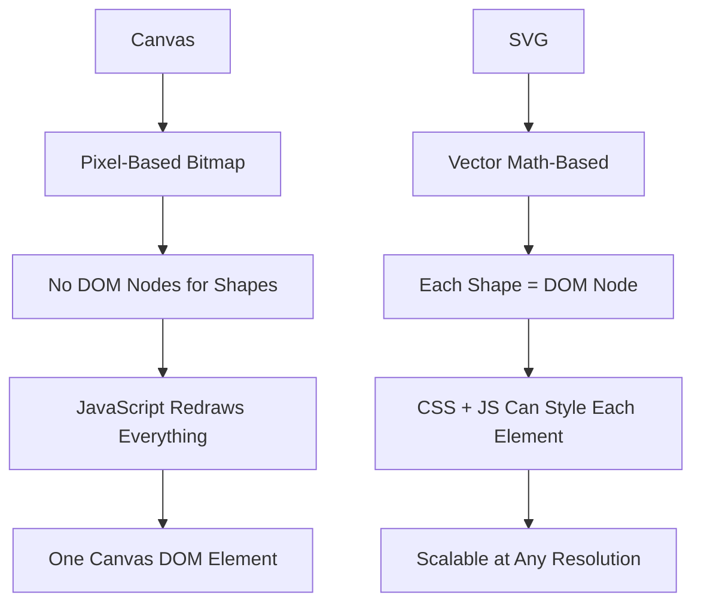
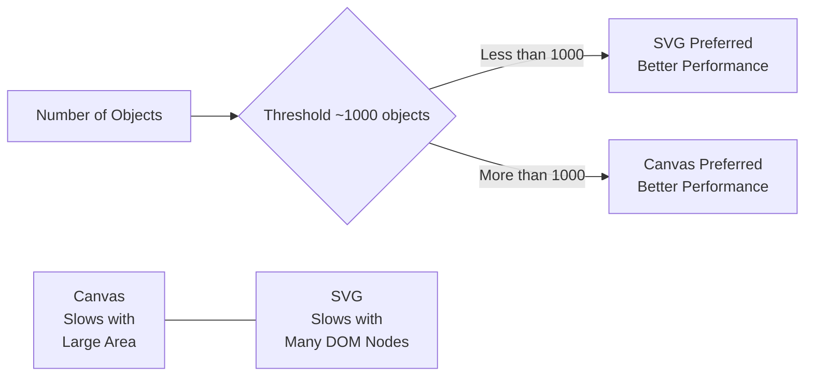
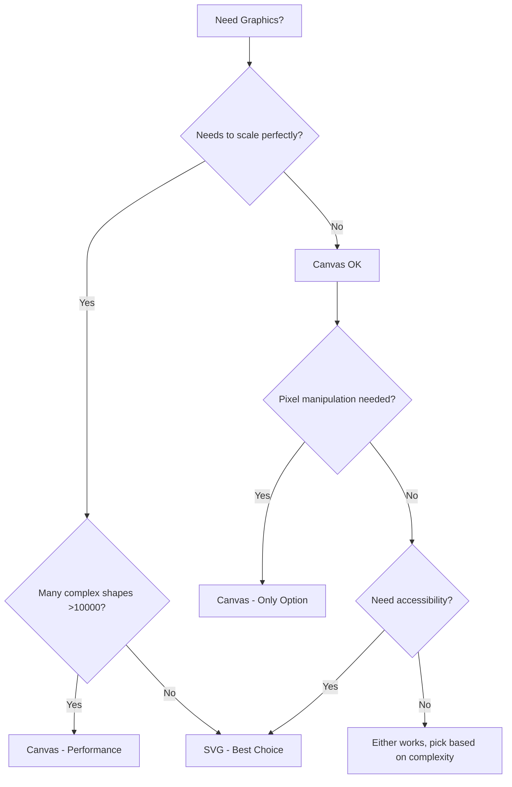
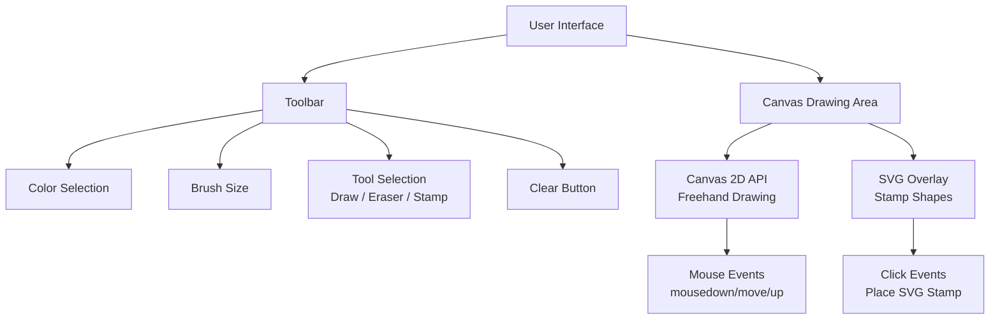

<a id="chapter-22-canvas-svg-graphics"></a>

# Chapter 22: Canvas, SVG & Graphics

[⬅ Previous Chapter](#chapter-21-html5-apis-overview) | [📖 Main Index](#main-index) | [Next Chapter ➡](#chapter-23-html-best-practices)

---

## 📌 Learning Objectives

By the end of this chapter, you will:

* Understand what `<canvas>` and `<svg>` are and how they differ fundamentally
* Know when to use Canvas vs SVG in real-world projects
* Be able to draw shapes, paths, text, and images using the Canvas 2D API
* Understand SVG syntax, elements, attributes, and inline usage
* Know how scalability, interactivity, and performance differ between Canvas and SVG
* Be confident answering Canvas vs SVG interview questions at beginner to advanced level
* Build a mini graphics project using Canvas and SVG

---

<a id="chapter-index-table-22"></a>

## Chapter Index Table

| Topic No. | Topic Name | Subtopics |
|-----------|------------|-----------|
| 22.1 | [Introduction to Web Graphics](#221-introduction-to-web-graphics) | Why graphics on web<br>Types of graphics<br>Raster vs Vector |
| 22.2 | [HTML Canvas Element](#222-html-canvas-element) | What is Canvas<br>Setup<br>2D Context<br>Drawing API |
| 22.3 | [Drawing on Canvas](#223-drawing-on-canvas) | Rectangles<br>Paths<br>Circles<br>Text<br>Images |
| 22.4 | [Canvas Styling and State](#224-canvas-styling-and-state) | Fill<br>Stroke<br>Save/Restore<br>Transform |
| 22.5 | [SVG Basics](#225-svg-basics) | What is SVG<br>SVG vs IMG<br>Inline SVG<br>SVG Elements |
| 22.6 | [SVG Drawing Elements](#226-svg-drawing-elements) | rect<br>circle<br>ellipse<br>line<br>polygon<br>path<br>text |
| 22.7 | [SVG Styling and Attributes](#227-svg-styling-and-attributes) | fill<br>stroke<br>viewBox<br>CSS in SVG<br>Animations |
| 22.8 | [Canvas vs SVG — Deep Comparison](#228-canvas-vs-svg-deep-comparison) | Performance<br>Scalability<br>Interactivity<br>Use Cases |
| 22.9 | [Interview Questions](#229-interview-questions) | Conceptual<br>Scenario<br>Output-based<br>Advanced |
| 22.10 | [Practice Problems](#2210-practice-problems) | Coding<br>Theory<br>Machine Coding |
| 22.11 | [Mini Project](#2211-mini-project) | Drawing Board App |
| 22.12 | [Quick Revision](#2212-quick-revision) | Key Points<br>Traps<br>Bullets |
| 22.13 | [Chapter Summary](#2213-chapter-summary) | Final Takeaways |

---

## 221 Introduction to Web Graphics

<a id="221-introduction-to-web-graphics"></a>

### 🔷 What is Web Graphics?

Web graphics refer to visual elements rendered directly in the browser — shapes, charts, animations, diagrams, icons, and images — without relying on external image files for every piece of visual content.

HTML5 introduced two powerful native approaches for creating graphics on the web:

1. **`<canvas>`** — A pixel-based drawing surface (Raster/Bitmap)
2. **`<svg>`** — A markup-based vector drawing system (Vector)

---

### 🔷 Why Do We Need Web Graphics?

| Need | Example |
|------|---------|
| Data Visualization | Charts, Graphs, Dashboards |
| Game Development | 2D/3D browser games |
| Animations | Smooth UI transitions |
| Diagrams | Flowcharts, Network maps |
| Icons | Scalable icon systems |
| Image Editing | Browser-based photo tools |

---

### 🔷 Raster vs Vector Graphics

| Feature | Raster (Bitmap) | Vector |
|---------|----------------|--------|
| Definition | Made of pixels | Made of mathematical paths |
| Scaling | Loses quality on zoom | Always sharp at any size |
| File Size | Large | Small |
| Example Formats | PNG, JPG, GIF | SVG, PDF |
| HTML Equivalent | `<canvas>` | `<svg>` |
| Best For | Photos, games, pixel art | Icons, logos, diagrams |

---

### 🧠 Hinglish Intuition

> **Canvas** ek blank drawing paper jaisa hai jahan aap brush se pixels paint karte ho — ek baar paint ho gaya, toh woh sirf ek picture hai.
>
> **SVG** ek architect ka blueprint jaisa hai — sab kuch mathematically defined hai. Chahe chhota karo ya bada, lines hamesha sharp rahenge.
>
> Canvas = **Painter ka canvas**
> SVG = **Engineer ka blueprint**

---

👉 <a href="#chapter-index-table-22">Go to Top 🔝</a>

---

## 222 HTML Canvas Element

<a id="222-html-canvas-element"></a>

### 🔷 What is `<canvas>`?

`<canvas>` is an HTML5 element that provides a resolution-dependent bitmap canvas — a rectangular area on the page where you can draw graphics using JavaScript.

The `<canvas>` element itself does **nothing** visually. All drawing happens via JavaScript using the **Canvas API**.

> [!IMPORTANT]
> Canvas is a **JavaScript-driven** graphics system. Without JS, a `<canvas>` element is just a blank rectangle.

---

### 🔷 Basic Canvas Setup

```html
<!DOCTYPE html>
<html lang="en">
<head>
  <meta charset="UTF-8">
  <title>Canvas Basics</title>
  <style>
    canvas {
      border: 2px solid #333;
      display: block;
      margin: 20px auto;
      background-color: #f9f9f9;
    }
  </style>
</head>
<body>

  <!-- Step 1: Create canvas element with width and height -->
  <canvas id="myCanvas" width="500" height="400">
    <!-- Fallback content for browsers that don't support canvas -->
    Your browser does not support the canvas element.
  </canvas>

  <script>
    // Step 2: Get reference to the canvas element
    const canvas = document.getElementById('myCanvas');

    // Step 3: Get the 2D drawing context
    const ctx = canvas.getContext('2d');

    // Step 4: Draw something!
    ctx.fillStyle = 'steelblue';
    ctx.fillRect(50, 50, 200, 100);
  </script>

</body>
</html>
```

**Code Breakdown:**

| Line | Explanation |
|------|-------------|
| `<canvas id="myCanvas" width="500" height="400">` | Creates a 500×400 pixel drawing area |
| `canvas.getContext('2d')` | Gets the 2D rendering context object |
| `ctx.fillStyle = 'steelblue'` | Sets the fill color |
| `ctx.fillRect(50, 50, 200, 100)` | Draws a filled rectangle at x=50, y=50 with width=200, height=100 |

---

### 🔷 Canvas Coordinate System

```
(0,0) ──────────────────────► X axis
  │
  │
  │
  ▼
  Y axis
```

> [!NOTE]
> Canvas origin `(0,0)` is at the **top-left** corner. X increases to the right, Y increases **downward** (opposite to traditional math graphs).

---

### 🔷 Width and Height — Important Rule

> [!IMPORTANT]
> Always set `width` and `height` **as HTML attributes**, NOT via CSS.
>
> Setting canvas size via CSS only stretches/scales the canvas visually but does NOT change the actual drawing resolution — causing blurry output.

```html
<!-- ✅ Correct -->
<canvas width="500" height="400"></canvas>

<!-- ❌ Wrong — causes blurry canvas -->
<canvas style="width: 500px; height: 400px;"></canvas>
```

---

### 🔷 Canvas Rendering Contexts

| Context | Method | Purpose |
|---------|--------|---------|
| 2D | `getContext('2d')` | 2D shapes, images, text |
| WebGL | `getContext('webgl')` | 3D graphics (GPU accelerated) |
| WebGL2 | `getContext('webgl2')` | Enhanced 3D graphics |
| Bitmap | `getContext('bitmaprenderer')` | ImageBitmap rendering |

> In this chapter, we focus on `'2d'` context only.

---

### 🧠 Hinglish Intuition

> `getContext('2d')` ek **paintbrush set** lena jaisa hai. Canvas toh sirf ek blank paper hai — lekin context ke through hi aap actually kuch draw kar sakte ho.
>
> Bina context ke, canvas sirf ek transparent box hai.

---

👉 <a href="#chapter-index-table-22">Go to Top 🔝</a>

---

## 223 Drawing on Canvas

<a id="223-drawing-on-canvas"></a>

### 🔷 Drawing Rectangles

Canvas has **three built-in rectangle methods**:

```javascript
// Filled rectangle
ctx.fillRect(x, y, width, height);

// Outlined rectangle (border only)
ctx.strokeRect(x, y, width, height);

// Clear/erase a rectangular area
ctx.clearRect(x, y, width, height);
```

**Complete Example:**

```html
<!DOCTYPE html>
<html lang="en">
<head>
  <meta charset="UTF-8">
  <title>Canvas Rectangles</title>
</head>
<body>
  <canvas id="c1" width="500" height="300" style="border:1px solid #ccc;"></canvas>

  <script>
    const ctx = document.getElementById('c1').getContext('2d');

    // Filled rectangle — solid blue
    ctx.fillStyle = 'royalblue';
    ctx.fillRect(30, 30, 150, 100);

    // Stroked rectangle — red border only
    ctx.strokeStyle = 'crimson';
    ctx.lineWidth = 3;
    ctx.strokeRect(220, 30, 150, 100);

    // Clear a portion of the filled rectangle
    ctx.clearRect(60, 60, 60, 40);
  </script>
</body>
</html>
```

---

### 🔷 Drawing Paths and Lines

A **path** is a sequence of points connected by lines or curves.

**Path Workflow:**
1. `beginPath()` — Start a new path
2. `moveTo(x, y)` — Move to starting point (pen up)
3. `lineTo(x, y)` — Draw a line to next point (pen down)
4. `closePath()` — Connect last point to first
5. `stroke()` or `fill()` — Render the path

```html
<!DOCTYPE html>
<html lang="en">
<head>
  <meta charset="UTF-8">
  <title>Canvas Paths</title>
</head>
<body>
  <canvas id="c2" width="500" height="300" style="border:1px solid #ccc;"></canvas>

  <script>
    const ctx = document.getElementById('c2').getContext('2d');

    // === Draw a Triangle ===
    ctx.beginPath();           // Start new path
    ctx.moveTo(250, 30);       // Top vertex
    ctx.lineTo(100, 250);      // Bottom-left vertex
    ctx.lineTo(400, 250);      // Bottom-right vertex
    ctx.closePath();           // Connect back to top

    ctx.fillStyle = 'orange';
    ctx.fill();                // Fill triangle with orange

    ctx.strokeStyle = 'black';
    ctx.lineWidth = 2;
    ctx.stroke();              // Draw black outline
  </script>
</body>
</html>
```

---

### 🔷 Drawing Circles and Arcs

The `arc()` method draws circular shapes:

```javascript
ctx.arc(x, y, radius, startAngle, endAngle, counterclockwise);
```

| Parameter | Description |
|-----------|-------------|
| `x, y` | Center coordinates |
| `radius` | Radius in pixels |
| `startAngle` | Start angle in **radians** |
| `endAngle` | End angle in **radians** |
| `counterclockwise` | Optional. Default: `false` (clockwise) |

> [!TIP]
> Full circle = `0` to `2 * Math.PI`
> Half circle = `0` to `Math.PI`

```html
<!DOCTYPE html>
<html lang="en">
<head>
  <meta charset="UTF-8">
  <title>Canvas Circles</title>
</head>
<body>
  <canvas id="c3" width="500" height="300" style="border:1px solid #ccc;"></canvas>

  <script>
    const ctx = document.getElementById('c3').getContext('2d');

    // Full Circle
    ctx.beginPath();
    ctx.arc(120, 150, 80, 0, 2 * Math.PI); // Full circle
    ctx.fillStyle = 'mediumseagreen';
    ctx.fill();
    ctx.strokeStyle = '#333';
    ctx.lineWidth = 2;
    ctx.stroke();

    // Half Circle (semicircle)
    ctx.beginPath();
    ctx.arc(320, 150, 80, 0, Math.PI); // Half circle (bottom)
    ctx.fillStyle = 'tomato';
    ctx.fill();

    // Arc only (no fill)
    ctx.beginPath();
    ctx.arc(450, 150, 40, 0, 1.5 * Math.PI); // 3/4 arc
    ctx.strokeStyle = 'purple';
    ctx.lineWidth = 4;
    ctx.stroke();
  </script>
</body>
</html>
```

---

### 🔷 Drawing Text on Canvas

```javascript
// Filled text
ctx.fillText(text, x, y, maxWidth);

// Outlined text
ctx.strokeText(text, x, y, maxWidth);
```

```html
<!DOCTYPE html>
<html lang="en">
<head>
  <meta charset="UTF-8">
  <title>Canvas Text</title>
</head>
<body>
  <canvas id="c4" width="500" height="200" style="border:1px solid #ccc;"></canvas>

  <script>
    const ctx = document.getElementById('c4').getContext('2d');

    // Set font (same format as CSS font shorthand)
    ctx.font = 'bold 36px Arial';

    // Filled text
    ctx.fillStyle = 'navy';
    ctx.fillText('Hello, Canvas!', 60, 80);

    // Stroked (outlined) text
    ctx.font = 'italic 28px Georgia';
    ctx.strokeStyle = 'crimson';
    ctx.lineWidth = 1;
    ctx.strokeText('Web Graphics', 100, 140);

    // Text alignment
    ctx.textAlign = 'center';     // 'left' | 'center' | 'right'
    ctx.textBaseline = 'middle';  // 'top' | 'middle' | 'bottom'
  </script>
</body>
</html>
```

---

### 🔷 Drawing Images on Canvas

```javascript
ctx.drawImage(image, dx, dy);                         // Basic
ctx.drawImage(image, dx, dy, dWidth, dHeight);        // With scaling
ctx.drawImage(image, sx, sy, sWidth, sHeight, dx, dy, dWidth, dHeight); // Crop + scale
```

```html
<!DOCTYPE html>
<html lang="en">
<head>
  <meta charset="UTF-8">
  <title>Canvas Image</title>
</head>
<body>
  <canvas id="c5" width="500" height="300" style="border:1px solid #ccc;"></canvas>

  <script>
    const ctx = document.getElementById('c5').getContext('2d');

    const img = new Image();
    img.src = 'https://via.placeholder.com/200x150';

    // IMPORTANT: Wait for image to load before drawing
    img.onload = function() {
      ctx.drawImage(img, 50, 50);           // Draw at (50,50) — original size
      ctx.drawImage(img, 280, 50, 180, 120); // Draw at (280,50) — scaled to 180×120
    };
  </script>
</body>
</html>
```

> [!IMPORTANT]
> Always draw images inside the `img.onload` callback. Drawing before the image loads results in nothing being rendered.

---

### 🧠 Hinglish Intuition

> Canvas drawing ko samjho ek step-by-step painting process ki tarah:
>
> 1. **`beginPath()`** = Nayi paintbrush uthao
> 2. **`moveTo()`** = Brush ko starting point pe rakho (bina paint liye)
> 3. **`lineTo()`** = Brush se line khecho
> 4. **`fill()` / `stroke()`** = Paint lagao ya outline banao
>
> Agar `beginPath()` use nahi kiya, toh purani path bhi fill ho jaayegi — ek common mistake!

---

👉 <a href="#chapter-index-table-22">Go to Top 🔝</a>

---

## 224 Canvas Styling and State

<a id="224-canvas-styling-and-state"></a>

### 🔷 Fill and Stroke Properties

| Property | Description | Example |
|----------|-------------|---------|
| `fillStyle` | Fill color/gradient/pattern | `'red'`, `'#ff0'`, `rgba(0,0,255,0.5)` |
| `strokeStyle` | Border/line color | `'blue'`, `rgb(255,0,0)` |
| `lineWidth` | Line thickness in pixels | `2`, `5`, `0.5` |
| `lineCap` | Line end style | `'butt'`, `'round'`, `'square'` |
| `lineJoin` | Corner style | `'miter'`, `'round'`, `'bevel'` |
| `globalAlpha` | Overall transparency (0–1) | `0.5` |

---

### 🔷 Gradients on Canvas

**Linear Gradient:**

```javascript
const canvas = document.getElementById('grad');
const ctx = canvas.getContext('2d');

// Create gradient: from (x0,y0) to (x1,y1)
const gradient = ctx.createLinearGradient(0, 0, 400, 0);

gradient.addColorStop(0, 'royalblue');   // Start color
gradient.addColorStop(0.5, 'white');     // Middle color
gradient.addColorStop(1, 'crimson');     // End color

ctx.fillStyle = gradient;
ctx.fillRect(0, 0, 400, 150);
```

**Radial Gradient:**

```javascript
// createRadialGradient(x0, y0, r0, x1, y1, r1)
const radGrad = ctx.createRadialGradient(200, 150, 20, 200, 150, 120);
radGrad.addColorStop(0, 'yellow');
radGrad.addColorStop(1, 'darkorange');

ctx.fillStyle = radGrad;
ctx.fillRect(0, 0, 400, 300);
```

---

### 🔷 Canvas Save and Restore State

`save()` and `restore()` are critical for managing canvas state.

> [!IMPORTANT]
> Canvas state includes: `fillStyle`, `strokeStyle`, `lineWidth`, `font`, `globalAlpha`, and all transformation matrices.
>
> `save()` pushes current state onto a **stack**.
> `restore()` pops and restores the last saved state.

```javascript
const ctx = document.getElementById('canvas').getContext('2d');

ctx.fillStyle = 'blue';
ctx.fillRect(10, 10, 100, 100);   // Blue rectangle

ctx.save();                        // Save state (blue fill)

ctx.fillStyle = 'red';
ctx.fillRect(150, 10, 100, 100);  // Red rectangle

ctx.restore();                     // Restore state (back to blue)

ctx.fillRect(290, 10, 100, 100);  // Blue again!
```

---

### 🔷 Canvas Transformations

| Method | Description |
|--------|-------------|
| `translate(x, y)` | Move origin to (x, y) |
| `rotate(angle)` | Rotate by angle in radians |
| `scale(sx, sy)` | Scale horizontally and vertically |
| `transform(a,b,c,d,e,f)` | Apply custom transformation matrix |
| `resetTransform()` | Reset all transformations |

```javascript
const ctx = document.getElementById('canvas').getContext('2d');

ctx.save();

// Translate origin to center
ctx.translate(200, 150);

// Rotate 45 degrees
ctx.rotate(Math.PI / 4);

// Draw rotated rectangle centered at origin
ctx.fillStyle = 'purple';
ctx.fillRect(-60, -30, 120, 60);

ctx.restore(); // Undo translate + rotate
```

---

### 🧠 Hinglish Intuition

> `save()` aur `restore()` ko socho jaise ek **game ka checkpoint** hai.
>
> Agar aap canvas pe koi temporary effect lagana chahte ho (jaise rotation ya color change), toh pehle `save()` karo, kaam karo, phir `restore()` se wapas aa jao — baki drawing affect nahi hogi.
>
> Bina `save/restore` ke, ek rectangle ka rotation poore canvas ko affect kar sakta hai!

---

👉 <a href="#chapter-index-table-22">Go to Top 🔝</a>

---

## 225 SVG Basics

<a id="225-svg-basics"></a>

### 🔷 What is SVG?

**SVG (Scalable Vector Graphics)** is an XML-based markup language for describing 2D vector graphics. SVG images are defined using mathematical formulas (paths, coordinates, curves) rather than pixels.

SVG is a **W3C standard** and is natively supported in all modern browsers.

> [!IMPORTANT]
> SVG is **part of the DOM** — just like HTML elements. This means you can:
> * Apply CSS styles to SVG elements
> * Manipulate SVG with JavaScript
> * Attach event listeners to individual SVG shapes

---

### 🔷 Ways to Use SVG in HTML

| Method | Syntax | CSS | JS | Scalable |
|--------|--------|-----|-----|----------|
| Inline SVG | `<svg>...</svg>` in HTML | ✅ Full | ✅ Full | ✅ |
| `` | `` tag | ❌ Limited | ❌ No | ✅ |
| CSS Background | `background-image: url(file.svg)` | ❌ | ❌ | ✅ |
| `<object>` / `<embed>` | `<object data="file.svg">` | ⚠️ Limited | ⚠️ Limited | ✅ |

> [!TIP]
> For maximum control (styling + animation + interactivity), always use **inline SVG** directly in HTML.

---

### 🔷 Basic Inline SVG Structure

```html
<!DOCTYPE html>
<html lang="en">
<head>
  <meta charset="UTF-8">
  <title>SVG Basics</title>
</head>
<body>

  <!-- SVG element with width, height, and viewBox -->
  <svg 
    width="500"          
    height="300"         
    viewBox="0 0 500 300"
    xmlns="http://www.w3.org/2000/svg"
  >
    <!-- Everything inside SVG is drawn here -->
    <rect x="50" y="50" width="200" height="100" fill="steelblue" />
    <circle cx="350" cy="100" r="60" fill="tomato" />
  </svg>

</body>
</html>
```

---

### 🔷 Key SVG Attributes

| Attribute | Description |
|-----------|-------------|
| `width` | Width of the SVG viewport |
| `height` | Height of the SVG viewport |
| `viewBox` | Defines the coordinate system: `min-x min-y width height` |
| `xmlns` | XML namespace (required in standalone SVG files) |
| `preserveAspectRatio` | How SVG scales within its viewport |

---

### 🔷 The `viewBox` Attribute Explained

```html
<svg width="500" height="300" viewBox="0 0 100 60">
```

| Part | Meaning |
|------|---------|
| `width="500"` | SVG element is 500px wide on screen |
| `height="300"` | SVG element is 300px tall on screen |
| `viewBox="0 0 100 60"` | Internal coordinate system is 100 units wide, 60 units tall |

> The SVG maps its internal 100×60 coordinate space onto the 500×300 pixel display — effectively **5x scaling**. This is what makes SVG scalable!

---

### 🧠 Hinglish Intuition

> **SVG** ko socho jaise ek **rubber stamp ka design** — design ek baar banao, chahe stamp chhota lagao ya bada, design hamesha clear aayega.
>
> **viewBox** ek zoom setting jaisa hai. Aap ek 100×100 unit ka drawing banate ho, aur browser usse 500×500 pixels mein stretch karta hai — bina kisi blurriness ke.
>
> Yahi SVG ki superpower hai — **infinite scalability without quality loss**.

---

👉 <a href="#chapter-index-table-22">Go to Top 🔝</a>

---

## 226 SVG Drawing Elements

<a id="226-svg-drawing-elements"></a>

### 🔷 `<rect>` — Rectangle

```html
<svg width="400" height="200" xmlns="http://www.w3.org/2000/svg">

  <!-- Basic rectangle -->
  <rect 
    x="20"           
    y="20"           
    width="150"      
    height="100"     
    fill="royalblue"
    stroke="navy"
    stroke-width="3"
  />

  <!-- Rounded rectangle using rx and ry -->
  <rect 
    x="220" 
    y="20" 
    width="150" 
    height="100" 
    rx="20"          
    ry="20"          
    fill="mediumseagreen"
  />

</svg>
```

| Attribute | Description |
|-----------|-------------|
| `x`, `y` | Top-left corner coordinates |
| `width`, `height` | Dimensions |
| `rx`, `ry` | Corner radius (for rounded rectangles) |
| `fill` | Fill color |
| `stroke` | Border color |
| `stroke-width` | Border thickness |

---

### 🔷 `<circle>` — Circle

```html
<svg width="400" height="200" xmlns="http://www.w3.org/2000/svg">

  <circle 
    cx="100"         
    cy="100"         
    r="70"           
    fill="gold"
    stroke="darkorange"
    stroke-width="3"
  />

</svg>
```

| Attribute | Description |
|-----------|-------------|
| `cx`, `cy` | Center coordinates |
| `r` | Radius |

---

### 🔷 `<ellipse>` — Ellipse

```html
<svg width="400" height="200" xmlns="http://www.w3.org/2000/svg">

  <ellipse 
    cx="200"         
    cy="100"         
    rx="150"         
    ry="70"          
    fill="mediumpurple"
    stroke="#333"
    stroke-width="2"
  />

</svg>
```

| Attribute | Description |
|-----------|-------------|
| `cx`, `cy` | Center |
| `rx` | Horizontal radius |
| `ry` | Vertical radius |

---

### 🔷 `<line>` — Line

```html
<svg width="400" height="200" xmlns="http://www.w3.org/2000/svg">

  <line 
    x1="20"    
    y1="20"    
    x2="380"   
    y2="180"   
    stroke="crimson"
    stroke-width="4"
    stroke-linecap="round"
  />

</svg>
```

---

### 🔷 `<polyline>` and `<polygon>` — Multiple Points

```html
<svg width="400" height="250" xmlns="http://www.w3.org/2000/svg">

  <!-- Polyline: connected lines (open path) -->
  <polyline 
    points="20,200 80,50 140,150 200,30 260,120 320,60 380,180"
    fill="none"
    stroke="steelblue"
    stroke-width="3"
  />

  <!-- Polygon: closed shape -->
  <polygon 
    points="200,20 240,90 320,90 260,140 280,220 200,170 120,220 140,140 80,90 160,90"
    fill="gold"
    stroke="darkorange"
    stroke-width="2"
  />

</svg>
```

> [!NOTE]
> `<polyline>` — open path (first and last points NOT connected)
> `<polygon>` — closed path (first and last points automatically connected)

---

### 🔷 `<path>` — The Most Powerful SVG Element

The `<path>` element can draw any shape using the `d` attribute with path commands.

| Command | Meaning | Example |
|---------|---------|---------|
| `M x,y` | Move to | `M 50,50` |
| `L x,y` | Line to | `L 200,50` |
| `H x` | Horizontal line | `H 300` |
| `V y` | Vertical line | `V 200` |
| `C` | Cubic Bézier curve | `C 100,50 200,50 300,100` |
| `Q` | Quadratic Bézier | `Q 200,0 300,100` |
| `A` | Arc | `A rx ry x-rot large-arc sweep x,y` |
| `Z` | Close path | `Z` |

> Uppercase = absolute coordinates | Lowercase = relative coordinates

```html
<svg width="400" height="300" xmlns="http://www.w3.org/2000/svg">

  <!-- Heart shape using path commands -->
  <path 
    d="M 200,100
       C 200,70 240,50 260,80
       C 280,110 240,150 200,180
       C 160,150 120,110 140,80
       C 160,50 200,70 200,100
       Z"
    fill="crimson"
    stroke="darkred"
    stroke-width="2"
  />

</svg>
```

---

### 🔷 `<text>` — Text in SVG

```html
<svg width="400" height="150" xmlns="http://www.w3.org/2000/svg">

  <text 
    x="200"              
    y="80"               
    font-family="Arial"
    font-size="32"
    font-weight="bold"
    fill="navy"
    text-anchor="middle" 
  >
    Hello, SVG!
  </text>

  <!-- Text along a path -->
  <defs>
    <path id="curve" d="M 50,120 Q 200,20 350,120"/>
  </defs>
  <text font-size="16" fill="purple">
    <textPath href="#curve">Text following a curve path</textPath>
  </text>

</svg>
```

| Attribute | Description |
|-----------|-------------|
| `x`, `y` | Text anchor position |
| `font-family`, `font-size`, `font-weight` | Font styling |
| `text-anchor` | `start` / `middle` / `end` |
| `fill` | Text color |

---

### 🧠 Hinglish Intuition

> SVG elements ko socho jaise HTML tags — sirf ye drawing ke liye hain.
>
> Jaise HTML mein `<div>`, `<p>`, `<span>` hote hain, SVG mein `<rect>`, `<circle>`, `<path>` hote hain.
>
> Aur sabse powerful element hai **`<path>`** — jo ek Swiss Army Knife ki tarah hai. Isse aap har shape bana sakte ho — lines, curves, arcs, kuch bhi!

---

👉 <a href="#chapter-index-table-22">Go to Top 🔝</a>

---

## 227 SVG Styling and Attributes

<a id="227-svg-styling-and-attributes"></a>

### 🔷 Three Ways to Style SVG

**1. Presentation Attributes (Inline on Element):**

```html
<circle cx="100" cy="100" r="50" fill="red" stroke="black" stroke-width="2"/>
```

**2. Inline Style Attribute:**

```html
<circle cx="100" cy="100" r="50" style="fill: red; stroke: black; stroke-width: 2px;"/>
```

**3. External/Internal CSS:**

```html
<style>
  .my-circle {
    fill: red;
    stroke: black;
    stroke-width: 2;
    transition: fill 0.3s ease;
  }
  .my-circle:hover {
    fill: blue;
  }
</style>

<svg>
  <circle class="my-circle" cx="100" cy="100" r="50"/>
</svg>
```

> [!IMPORTANT]
> CSS takes priority over presentation attributes but NOT over inline `style` attribute.
> Priority: `style=""` > `<style>` CSS > Presentation attributes

---

### 🔷 Common SVG Styling Properties

| Property | Description |
|----------|-------------|
| `fill` | Fill color of the shape |
| `fill-opacity` | Transparency of fill (0–1) |
| `stroke` | Outline/border color |
| `stroke-width` | Border thickness |
| `stroke-opacity` | Transparency of stroke |
| `stroke-dasharray` | Dashed line pattern |
| `stroke-linecap` | End cap style: `butt`, `round`, `square` |
| `stroke-linejoin` | Corner style: `miter`, `round`, `bevel` |
| `opacity` | Overall element transparency |
| `visibility` | `visible` / `hidden` |

---

### 🔷 SVG Dashed Lines

```html
<svg width="400" height="100" xmlns="http://www.w3.org/2000/svg">

  <!-- Dashed line: 10px dash, 5px gap -->
  <line x1="20" y1="50" x2="380" y2="50"
        stroke="steelblue" stroke-width="3"
        stroke-dasharray="10 5"/>

  <!-- Dotted line: 2px dot, 6px gap -->
  <line x1="20" y1="80" x2="380" y2="80"
        stroke="crimson" stroke-width="3"
        stroke-dasharray="2 6"
        stroke-linecap="round"/>

</svg>
```

---

### 🔷 SVG Gradients

```html
<svg width="400" height="200" xmlns="http://www.w3.org/2000/svg">

  <!-- Define gradients in <defs> -->
  <defs>

    <!-- Linear Gradient -->
    <linearGradient id="linGrad" x1="0%" y1="0%" x2="100%" y2="0%">
      <stop offset="0%"   stop-color="royalblue"/>
      <stop offset="100%" stop-color="mediumpurple"/>
    </linearGradient>

    <!-- Radial Gradient -->
    <radialGradient id="radGrad" cx="50%" cy="50%" r="50%">
      <stop offset="0%"   stop-color="yellow"/>
      <stop offset="100%" stop-color="darkorange"/>
    </radialGradient>

  </defs>

  <!-- Use gradients with url() reference -->
  <rect x="20" y="20" width="160" height="100" fill="url(#linGrad)"/>
  <circle cx="300" cy="70" r="60" fill="url(#radGrad)"/>

</svg>
```

---

### 🔷 SVG CSS Animations

SVG elements can be animated using pure CSS:

```html
<style>
  .spinning-gear {
    transform-origin: center;
    animation: spin 3s linear infinite;
  }

  @keyframes spin {
    from { transform: rotate(0deg); }
    to   { transform: rotate(360deg); }
  }

  .pulsing-circle {
    animation: pulse 1.5s ease-in-out infinite;
  }

  @keyframes pulse {
    0%, 100% { r: 40; opacity: 1; }
    50%       { r: 60; opacity: 0.6; }
  }
</style>

<svg width="400" height="200" xmlns="http://www.w3.org/2000/svg">

  <!-- Spinning rectangle -->
  <rect class="spinning-gear"
        x="160" y="60" width="80" height="80"
        fill="steelblue" rx="10"/>

  <!-- Pulsing circle -->
  <circle class="pulsing-circle"
          cx="320" cy="100" r="40"
          fill="tomato"/>

</svg>
```

---

### 🔷 SVG Groups and Transforms

```html
<svg width="400" height="300" xmlns="http://www.w3.org/2000/svg">

  <!-- Group multiple elements together -->
  <g fill="royalblue" stroke="navy" stroke-width="2"
     transform="translate(50, 50) rotate(15)">
    <rect x="0" y="0" width="80" height="60"/>
    <circle cx="40" cy="30" r="25" fill="white"/>
  </g>

  <!-- Another group with different transform -->
  <g transform="translate(200, 100) scale(1.5)">
    <rect x="0" y="0" width="80" height="60" fill="tomato"/>
  </g>

</svg>
```

| Transform Function | Description |
|-------------------|-------------|
| `translate(x, y)` | Move elements |
| `rotate(angle)` | Rotate around origin |
| `scale(sx, sy)` | Scale elements |
| `skewX(angle)` | Skew horizontally |
| `skewY(angle)` | Skew vertically |

---

### 🧠 Hinglish Intuition

> SVG mein `<defs>` ek **storeroom** jaisa hai jahan aap gradient, pattern, filter define karte ho — aur phir `url(#id)` se use karte ho.
>
> `<g>` ek **folder** ki tarah hai — multiple shapes ko ek group mein rakh sakte ho aur ek saath transform ya style kar sakte ho.
>
> CSS animations SVG pe exactly HTML elements jaisi hi kaam karti hain — kyunki SVG DOM ka part hai!

---

👉 <a href="#chapter-index-table-22">Go to Top 🔝</a>

---

## 228 Canvas vs SVG — Deep Comparison

<a id="228-canvas-vs-svg-deep-comparison"></a>

### 🔷 Core Architecture Difference



---

### 🔷 Comprehensive Comparison Table

| Feature | Canvas | SVG |
|---------|--------|-----|
| **Technology Type** | Raster / Bitmap | Vector / XML |
| **Scalability** | ❌ Pixelates on zoom | ✅ Always sharp |
| **DOM Integration** | ❌ No (one element) | ✅ Yes (each shape is a DOM node) |
| **Event Handling** | ❌ Manual pixel math | ✅ Native per-element events |
| **CSS Styling** | ❌ Not directly | ✅ Full CSS support |
| **JavaScript Control** | ✅ Via Canvas API | ✅ Via DOM manipulation |
| **Performance (many elements)** | ✅ Better (>10,000 objects) | ❌ Slower with many DOM nodes |
| **Performance (large area)** | ❌ Slower (all pixels) | ✅ Better (math-based) |
| **Accessibility** | ❌ Limited (ARIA workaround) | ✅ Native text, titles, descriptions |
| **Search Engine Indexing** | ❌ Not indexed | ✅ Text inside SVG is indexable |
| **Animation** | ✅ via JS (requestAnimationFrame) | ✅ via CSS or SMIL |
| **Printing Quality** | ❌ Depends on resolution | ✅ Perfect print quality |
| **File Format** | N/A (HTML element) | `.svg` standalone file |
| **Learning Curve** | ⚠️ Moderate (JS drawing) | ⚠️ Moderate (XML markup) |
| **Browser Support** | ✅ All modern browsers | ✅ All modern browsers |

---

### 🔷 When to Use Canvas

✅ Use Canvas when:

* Building **games** (many moving elements, redraws every frame)
* **Image manipulation** (filters, pixel operations, photo editing)
* **Real-time data visualization** with thousands of data points
* **Video processing** (frame-by-frame analysis)
* Complex **particle systems** or physics simulations
* When you need pixel-level control

---

### 🔷 When to Use SVG

✅ Use SVG when:

* Building **icons** that need to scale at any size
* **Logos and brand graphics** (resolution independence)
* **Data charts** with moderate data points (D3.js, Chart.js)
* **Maps** and geographic visualizations
* **Animations** driven by CSS
* Anything requiring **accessibility** (screen readers)
* Graphics that need **SEO** (text content inside)
* **UI illustrations** that respond to hover/click

---

### 🔷 Performance Characteristics



> [!IMPORTANT]
> **Canvas** performance degrades with large canvas area (more pixels to process)
>
> **SVG** performance degrades with large numbers of DOM nodes (many shapes)
>
> Rule of thumb: **< 1,000 shapes** → SVG | **> 10,000 elements** → Canvas

---

### 🔷 Event Handling Comparison

**Canvas — Manual Hit Detection:**

```javascript
canvas.addEventListener('click', function(e) {
  const rect = canvas.getBoundingClientRect();
  const mouseX = e.clientX - rect.left;
  const mouseY = e.clientY - rect.top;

  // Manual check: is click inside our circle?
  const circleX = 200, circleY = 150, radius = 60;
  const distance = Math.sqrt(
    Math.pow(mouseX - circleX, 2) + Math.pow(mouseY - circleY, 2)
  );

  if (distance <= radius) {
    console.log('Circle was clicked!');
  }
});
```

**SVG — Native Event Handling:**

```html
<svg>
  <!-- Click directly on the shape element! -->
  <circle cx="200" cy="150" r="60" fill="blue"
          onclick="console.log('Circle was clicked!')"
          style="cursor: pointer;"/>
</svg>
```

> [!NOTE]
> SVG event handling is **dramatically simpler** because each shape is a real DOM element.

---

### 🔷 Quick Decision Flowchart



---

### 🧠 Hinglish Intuition

> **Canvas vs SVG** ko samjhne ka sabse aasaan tarika:
>
> **Canvas = MS Paint**
> Aap pixels paint karte ho. Ek baar paint ho gaya, usse individually select nahi kar sakte. Agar ek circle ko move karna hai, poora canvas erase karke re-draw karo.
>
> **SVG = PowerPoint Shapes**
> Har shape ek independent object hai. Aap kisi bhi shape ko click karo, drag karo, color badlo — independently. Sab kuch DOM mein hai.
>
> **Canvas** = Speed ke liye (games, animations)
> **SVG** = Quality aur interactivity ke liye (logos, charts, icons)

---

👉 <a href="#chapter-index-table-22">Go to Top 🔝</a>

---

## 229 Interview Questions

<a id="229-interview-questions"></a>

### 💡 Interview Questions

---

#### 🔹 Conceptual Questions

**Q1. What is the fundamental difference between Canvas and SVG?**

**Answer:**
Canvas is a **raster-based** (pixel-based) drawing API. Once you draw on Canvas, the resulting pixels become part of a bitmap image — individual shapes have no separate existence in the DOM. All drawing is done via JavaScript.

SVG is a **vector-based** markup language. Each SVG shape is a real DOM element with its own node, attributes, styles, and event listeners. SVG graphics are defined mathematically and scale perfectly at any resolution.

| Aspect | Canvas | SVG |
|--------|--------|-----|
| Technology | Raster/Bitmap | Vector/XML |
| DOM Nodes | Only `<canvas>` | Each shape is a node |
| Scalability | Pixelates | Always sharp |
| Styling | Via JS only | CSS + JS |

---

**Q2. Can you style Canvas elements with CSS?**

**Answer:**
You **cannot** style individual shapes drawn on Canvas with CSS. The `<canvas>` element itself can be styled with CSS (border, width, height, opacity etc.), but the content drawn inside — rectangles, circles, paths — are just pixels with no CSS access.

You must set all visual properties (color, size, stroke) programmatically using the Canvas API before drawing.

```javascript
ctx.fillStyle = 'red';       // Not CSS — this is Canvas API
ctx.strokeStyle = 'blue';    // Canvas property
ctx.fillRect(10, 10, 100, 100);
```

---

**Q3. Why is `beginPath()` important in Canvas?**

**Answer:**
`beginPath()` starts a fresh drawing path. Without it, new drawing commands append to the existing path.

```javascript
ctx.beginPath();
ctx.arc(100, 100, 50, 0, 2 * Math.PI);
ctx.fillStyle = 'red';
ctx.fill();

// Without beginPath() here, the red circle's path remains active
ctx.beginPath();  // ← MUST clear old path
ctx.arc(250, 100, 50, 0, 2 * Math.PI);
ctx.fillStyle = 'blue';
ctx.fill();
```

Without `beginPath()` before the second circle, `fill()` would fill **both** circles with blue.

---

**Q4. What is the `viewBox` attribute in SVG?**

**Answer:**
`viewBox` defines the **internal coordinate system** of an SVG independently of its display size. It has four values: `min-x min-y width height`.

```html
<svg width="400" height="200" viewBox="0 0 100 50">
```

This SVG's internal space is 100×50 units, but it's displayed at 400×200 pixels — a 4x scale factor. Any shape positioned at `(50, 25)` appears in the center regardless of the display size.

This is what makes SVG truly **scalable and responsive** — you design in abstract units, the browser handles the pixel mapping.

---

**Q5. How does event handling differ between Canvas and SVG?**

**Answer:**

In **Canvas**, there are no event listeners per shape. You listen on the entire canvas element and must manually calculate whether the click coordinates fall within a drawn shape using math (hit detection).

```javascript
canvas.addEventListener('click', (e) => {
  // Calculate if click is inside a specific drawn area
  if (Math.abs(e.offsetX - circleX) < radius) { /* ... */ }
});
```

In **SVG**, every shape is a DOM node, so you can attach event listeners directly:

```html
<circle cx="100" cy="100" r="50" onclick="handleClick()"/>
```

SVG event handling is simpler, more maintainable, and closer to how normal HTML events work.

---

#### 🔹 Scenario-Based Questions

**Q6. A developer needs to build a browser-based photo editor that applies filters (grayscale, blur) to uploaded images. Should they use Canvas or SVG?**

**Answer:**
**Canvas** is the correct choice because:

1. Canvas provides **pixel-level access** via `getImageData()` and `putImageData()`
2. You can manipulate individual pixel values (R, G, B, A channels)
3. CSS Filters on SVG don't provide raw pixel manipulation
4. Canvas is ideal for **image processing algorithms**

```javascript
const imageData = ctx.getImageData(0, 0, canvas.width, canvas.height);
const data = imageData.data; // Uint8ClampedArray [R,G,B,A, R,G,B,A, ...]

// Apply grayscale filter manually
for (let i = 0; i < data.length; i += 4) {
  const avg = (data[i] + data[i+1] + data[i+2]) / 3;
  data[i] = data[i+1] = data[i+2] = avg;
}

ctx.putImageData(imageData, 0, 0);
```

---

**Q7. A team is building an interactive world map where users can hover over countries to see population data. Canvas or SVG?**

**Answer:**
**SVG** is the correct choice because:

1. Maps need **perfect scalability** at any zoom level
2. Each country is an **individual clickable/hoverable path**
3. SVG native event listeners on each `<path>` are simple
4. CSS `:hover` styles work perfectly
5. Screen readers can read country names (accessibility)
6. D3.js (the standard mapping library) uses SVG

With Canvas, you'd need complex hit detection math to determine which country was clicked — extremely difficult for irregular geographic shapes.

---

**Q8. You have a dashboard with a real-time stock chart receiving 60 data point updates per second. Canvas or SVG?**

**Answer:**
**Canvas** is the correct choice because:

1. 60 updates/second = 60 redraws/second (use `requestAnimationFrame`)
2. SVG would create/destroy hundreds of DOM nodes per second — huge performance cost
3. Canvas clears and redraws the entire chart efficiently in one GPU-accelerated operation
4. Memory usage is constant with Canvas (just a bitmap) vs growing with SVG nodes

---

#### 🔹 Output-Based Questions

**Q9. What will this code draw?**

```javascript
const ctx = canvas.getContext('2d');

ctx.fillStyle = 'red';
ctx.fillRect(10, 10, 100, 100);

ctx.fillStyle = 'blue';
ctx.fillRect(60, 60, 100, 100);
```

**Answer:**
This draws a **red rectangle** at position (10,10) with size 100×100, and then a **blue rectangle** at position (60,60) with size 100×100. The blue rectangle **overlaps** the bottom-right quarter of the red rectangle, covering that portion (Canvas draws on top of existing pixels). The result is a red square with its bottom-right portion covered by blue.

---

**Q10. What is wrong with this SVG?**

```html
<svg width="200" height="200">
  <circle cx="100" cy="100" r="80" color="blue"/>
</svg>
```

**Answer:**
The `color` attribute is **wrong**. SVG uses `fill` (not `color`) for shape color:

```html
<!-- ✅ Correct -->
<circle cx="100" cy="100" r="80" fill="blue"/>
```

`color` is a CSS property that SVG inherits but doesn't directly use for shape rendering. The circle would render with its default fill (black) if `color` is used instead of `fill`.

---

#### 🔹 Advanced Questions

**Q11. What is `requestAnimationFrame` and why is it used with Canvas?**

**Answer:**
`requestAnimationFrame(callback)` is a browser API that calls your function before the browser's next repaint — typically 60 times per second (60 FPS). It's the recommended way to create Canvas animations because:

1. **Synchronized with display refresh** — no tearing or stuttering
2. **Pauses when tab is hidden** — saves CPU/battery
3. **Optimized by browser** — browser can batch operations

```javascript
let x = 0;

function animate() {
  ctx.clearRect(0, 0, canvas.width, canvas.height); // Clear
  ctx.fillRect(x, 100, 50, 50);                      // Draw
  x = (x + 2) % canvas.width;                        // Update
  requestAnimationFrame(animate);                      // Loop
}

requestAnimationFrame(animate); // Start
```

---

**Q12. Explain the Canvas `save()` and `restore()` stack mechanism.**

**Answer:**
Canvas maintains a **state stack** (LIFO — Last In, First Out). `save()` pushes the complete current state onto this stack. `restore()` pops and applies the last saved state.

State includes: `fillStyle`, `strokeStyle`, `lineWidth`, `font`, `globalAlpha`, `globalCompositeOperation`, clipping region, and all transformation matrices.

```javascript
ctx.fillStyle = 'red';       // State: red
ctx.save();                   // Stack: [red]

ctx.fillStyle = 'blue';      // State: blue
ctx.save();                   // Stack: [red, blue]

ctx.fillStyle = 'green';     // State: green

ctx.restore();               // Pop blue → State: blue, Stack: [red]
ctx.restore();               // Pop red → State: red, Stack: []
```

This is critical for nested transformations — save before transforming, restore after drawing, so subsequent drawings aren't affected.

---

👉 <a href="#chapter-index-table-22">Go to Top 🔝</a>

---

## 2210 Practice Problems

<a id="2210-practice-problems"></a>

### 🧪 Practice Problems

---

#### 🔷 Coding Questions

**Q1. Draw a traffic light using Canvas** — Three circles (red, yellow, green) stacked vertically inside a rounded black rectangle.

```html
<!DOCTYPE html>
<html lang="en">
<head>
  <meta charset="UTF-8">
  <title>Traffic Light Canvas</title>
</head>
<body>
  <canvas id="traffic" width="200" height="400" style="display:block; margin:auto;"></canvas>

  <script>
    const canvas = document.getElementById('traffic');
    const ctx = canvas.getContext('2d');

    // Draw housing (dark rectangle with rounded corners)
    ctx.fillStyle = '#222';
    ctx.beginPath();
    ctx.roundRect(50, 20, 100, 340, 20); // x, y, w, h, radius
    ctx.fill();

    // Draw lights
    const lights = [
      { y: 90,  color: 'red' },
      { y: 190, color: 'yellow' },
      { y: 290, color: 'limegreen' }
    ];

    lights.forEach(light => {
      ctx.beginPath();
      ctx.arc(100, light.y, 38, 0, 2 * Math.PI);
      ctx.fillStyle = light.color;
      ctx.fill();
      ctx.strokeStyle = '#111';
      ctx.lineWidth = 3;
      ctx.stroke();
    });

    // Label
    ctx.font = 'bold 14px Arial';
    ctx.fillStyle = 'white';
    ctx.textAlign = 'center';
    ctx.fillText('Traffic Light', 100, 385);
  </script>
</body>
</html>
```

---

**Q2. Create an SVG bar chart** — Display 5 bars of different heights representing sales data with labels.

```html
<!DOCTYPE html>
<html lang="en">
<head>
  <meta charset="UTF-8">
  <title>SVG Bar Chart</title>
  <style>
    .bar { transition: opacity 0.3s; cursor: pointer; }
    .bar:hover { opacity: 0.7; }
    body { font-family: Arial, sans-serif; text-align: center; }
  </style>
</head>
<body>
  <h2>Monthly Sales</h2>

  <svg width="500" height="300" viewBox="0 0 500 300" xmlns="http://www.w3.org/2000/svg">

    <!-- Background grid lines -->
    <line x1="60" y1="20" x2="60" y2="240" stroke="#ccc" stroke-width="1"/>
    <line x1="60" y1="240" x2="480" y2="240" stroke="#333" stroke-width="2"/>

    <!-- Data: [label, height, color] -->
    <!-- Max value = 200, chart height = 220 -->

    <!-- Jan: 120 -->
    <rect class="bar" x="80" y="120" width="60" height="120" fill="royalblue" rx="4"/>
    <text x="110" y="258" text-anchor="middle" font-size="13">Jan</text>
    <text x="110" y="115" text-anchor="middle" font-size="12" fill="#333">120</text>

    <!-- Feb: 180 -->
    <rect class="bar" x="180" y="60" width="60" height="180" fill="mediumseagreen" rx="4"/>
    <text x="210" y="258" text-anchor="middle" font-size="13">Feb</text>
    <text x="210" y="55" text-anchor="middle" font-size="12" fill="#333">180</text>

    <!-- Mar: 90 -->
    <rect class="bar" x="280" y="150" width="60" height="90" fill="tomato" rx="4"/>
    <text x="310" y="258" text-anchor="middle" font-size="13">Mar</text>
    <text x="310" y="145" text-anchor="middle" font-size="12" fill="#333">90</text>

    <!-- Apr: 200 -->
    <rect class="bar" x="380" y="40" width="60" height="200" fill="gold" rx="4"/>
    <text x="410" y="258" text-anchor="middle" font-size="13">Apr</text>
    <text x="410" y="35" text-anchor="middle" font-size="12" fill="#333">200</text>

    <!-- Chart title -->
    <text x="270" y="290" text-anchor="middle" font-size="13" fill="#666">Units Sold (in thousands)</text>

  </svg>

</body>
</html>
```

---

**Q3. Draw a clock face using Canvas** — Static clock face with hour markers and numbers.

```html
<!DOCTYPE html>
<html lang="en">
<head>
  <meta charset="UTF-8">
  <title>Canvas Clock Face</title>
</head>
<body>
  <canvas id="clock" width="300" height="300" style="display:block; margin:20px auto;"></canvas>

  <script>
    const canvas = document.getElementById('clock');
    const ctx = canvas.getContext('2d');
    const cx = 150, cy = 150, r = 130;

    // Clock face
    ctx.beginPath();
    ctx.arc(cx, cy, r, 0, 2 * Math.PI);
    ctx.fillStyle = '#f8f8f8';
    ctx.fill();
    ctx.strokeStyle = '#333';
    ctx.lineWidth = 4;
    ctx.stroke();

    // Hour markers and numbers
    for (let i = 1; i <= 12; i++) {
      const angle = (i * 30 - 90) * (Math.PI / 180);

      // Hour marker tick
      ctx.save();
      ctx.translate(cx, cy);
      ctx.rotate(angle);
      ctx.beginPath();
      ctx.moveTo(r - 20, 0);
      ctx.lineTo(r - 5, 0);
      ctx.strokeStyle = '#333';
      ctx.lineWidth = 3;
      ctx.stroke();
      ctx.restore();

      // Hour number
      const numX = cx + (r - 40) * Math.cos(angle);
      const numY = cy + (r - 40) * Math.sin(angle);
      ctx.font = 'bold 16px Arial';
      ctx.fillStyle = '#333';
      ctx.textAlign = 'center';
      ctx.textBaseline = 'middle';
      ctx.fillText(i, numX, numY);
    }

    // Center dot
    ctx.beginPath();
    ctx.arc(cx, cy, 6, 0, 2 * Math.PI);
    ctx.fillStyle = '#333';
    ctx.fill();
  </script>
</body>
</html>
```

---

**Q4. Create an SVG icon set** — Five common UI icons (home, search, settings gear, heart, user) using SVG paths.

```html
<!DOCTYPE html>
<html lang="en">
<head>
  <meta charset="UTF-8">
  <title>SVG Icons</title>
  <style>
    .icon-set { display: flex; gap: 30px; justify-content: center; padding: 40px; }
    .icon-wrapper { text-align: center; cursor: pointer; }
    .icon-wrapper svg { fill: #444; transition: fill 0.3s, transform 0.3s; }
    .icon-wrapper:hover svg { fill: royalblue; transform: scale(1.2); }
    .icon-wrapper p { margin-top: 8px; font-size: 13px; color: #666; font-family: Arial; }
  </style>
</head>
<body>
  <div class="icon-set">

    <!-- Home Icon -->
    <div class="icon-wrapper">
      <svg width="40" height="40" viewBox="0 0 24 24" xmlns="http://www.w3.org/2000/svg">
        <path d="M10 20v-6h4v6h5v-8h3L12 3 2 12h3v8z"/>
      </svg>
      <p>Home</p>
    </div>

    <!-- Search Icon -->
    <div class="icon-wrapper">
      <svg width="40" height="40" viewBox="0 0 24 24" xmlns="http://www.w3.org/2000/svg">
        <path d="M15.5 14h-.79l-.28-.27A6.471 6.471 0 0 0 16 9.5 6.5 6.5 0 1 0 9.5 16c1.61 0 3.09-.59 4.23-1.57l.27.28v.79l5 4.99L20.49 19l-4.99-5zm-6 0C7.01 14 5 11.99 5 9.5S7.01 5 9.5 5 14 7.01 14 9.5 11.99 14 9.5 14z"/>
      </svg>
      <p>Search</p>
    </div>

    <!-- Heart Icon -->
    <div class="icon-wrapper">
      <svg width="40" height="40" viewBox="0 0 24 24" xmlns="http://www.w3.org/2000/svg">
        <path d="M12 21.35l-1.45-1.32C5.4 15.36 2 12.28 2 8.5 2 5.42 4.42 3 7.5 3c1.74 0 3.41.81 4.5 2.09C13.09 3.81 14.76 3 16.5 3 19.58 3 22 5.42 22 8.5c0 3.78-3.4 6.86-8.55 11.54L12 21.35z"/>
      </svg>
      <p>Heart</p>
    </div>

    <!-- User Icon -->
    <div class="icon-wrapper">
      <svg width="40" height="40" viewBox="0 0 24 24" xmlns="http://www.w3.org/2000/svg">
        <path d="M12 12c2.21 0 4-1.79 4-4s-1.79-4-4-4-4 1.79-4 4 1.79 4 4 4zm0 2c-2.67 0-8 1.34-8 4v2h16v-2c0-2.66-5.33-4-8-4z"/>
      </svg>
      <p>User</p>
    </div>

    <!-- Settings Icon -->
    <div class="icon-wrapper">
      <svg width="40" height="40" viewBox="0 0 24 24" xmlns="http://www.w3.org/2000/svg">
        <path d="M19.14,12.94c0.04-0.3,0.06-0.61,0.06-0.94c0-0.32-0.02-0.64-0.07-0.94l2.03-1.58c0.18-0.14,0.23-0.41,0.12-0.61 l-1.92-3.32c-0.12-0.22-0.37-0.29-0.59-0.22l-2.39,0.96c-0.5-0.38-1.03-0.7-1.62-0.94L14.4,2.81c-0.04-0.24-0.24-0.41-0.48-0.41 h-3.84c-0.24,0-0.43,0.17-0.47,0.41L9.25,5.35C8.66,5.59,8.12,5.92,7.63,6.29L5.24,5.33c-0.22-0.08-0.47,0-0.59,0.22L2.74,8.87 C2.62,9.08,2.66,9.34,2.86,9.48l2.03,1.58C4.84,11.36,4.8,11.69,4.8,12s0.02,0.64,0.07,0.94l-2.03,1.58 c-0.18,0.14-0.23,0.41-0.12,0.61l1.92,3.32c0.12,0.22,0.37,0.29,0.59,0.22l2.39-0.96c0.5,0.38,1.03,0.7,1.62,0.94l0.36,2.54 c0.05,0.24,0.24,0.41,0.48,0.41h3.84c0.24,0,0.44-0.17,0.47-0.41l0.36-2.54c0.59-0.24,1.13-0.56,1.62-0.94l2.39,0.96 c0.22,0.08,0.47,0,0.59-0.22l1.92-3.32c0.12-0.22,0.07-0.47-0.12-0.61L19.14,12.94z M12,15.6c-1.98,0-3.6-1.62-3.6-3.6 s1.62-3.6,3.6-3.6s3.6,1.62,3.6,3.6S13.98,15.6,12,15.6z"/>
      </svg>
      <p>Settings</p>
    </div>

  </div>
</body>
</html>
```

---

**Q5. Animate a bouncing ball using Canvas and `requestAnimationFrame`**

```html
<!DOCTYPE html>
<html lang="en">
<head>
  <meta charset="UTF-8">
  <title>Bouncing Ball</title>
  <style> canvas { border: 2px solid #333; display: block; margin: 20px auto; } </style>
</head>
<body>
  <canvas id="bounce" width="500" height="400"></canvas>

  <script>
    const canvas = document.getElementById('bounce');
    const ctx = canvas.getContext('2d');

    // Ball state
    let x = 60, y = 60;
    let dx = 3, dy = 2;
    const radius = 25;

    function draw() {
      // Clear canvas
      ctx.clearRect(0, 0, canvas.width, canvas.height);

      // Draw ball
      ctx.beginPath();
      ctx.arc(x, y, radius, 0, 2 * Math.PI);
      const gradient = ctx.createRadialGradient(x - 8, y - 8, 4, x, y, radius);
      gradient.addColorStop(0, 'lightblue');
      gradient.addColorStop(1, 'royalblue');
      ctx.fillStyle = gradient;
      ctx.fill();
      ctx.strokeStyle = 'navy';
      ctx.lineWidth = 2;
      ctx.stroke();

      // Update position
      x += dx;
      y += dy;

      // Bounce off walls
      if (x + radius > canvas.width || x - radius < 0)  dx *= -1;
      if (y + radius > canvas.height || y - radius < 0) dy *= -1;

      requestAnimationFrame(draw);
    }

    requestAnimationFrame(draw);
  </script>
</body>
</html>
```

---

#### 🔷 Theory Questions

**T1.** What is the coordinate system origin in HTML Canvas and how does it differ from a standard math graph?

**T2.** Explain the difference between `fill()` and `stroke()` in Canvas. When would you use each?

**T3.** What SVG element would you use to reuse a definition (like a gradient or filter) multiple times? How is it referenced?

**T4.** Why does setting Canvas size via CSS cause blurry output? What is the correct approach?

**T5.** What does `preserveAspectRatio` do in SVG? Give a practical example of when it matters.

---

#### 🔷 Machine Coding Problems

**MP1. Mini Paint Application**

Build a browser drawing pad where:
- User can draw freely by clicking and dragging on Canvas
- Toolbar with 3 color options
- Clear button to erase
- Uses only HTML, CSS, Canvas API

```html
<!DOCTYPE html>
<html lang="en">
<head>
  <meta charset="UTF-8">
  <title>Mini Paint</title>
  <style>
    * { box-sizing: border-box; margin: 0; padding: 0; }
    body { display: flex; flex-direction: column; align-items: center; padding: 20px; font-family: Arial, sans-serif; background: #f0f0f0; }
    h2 { margin-bottom: 15px; color: #333; }
    #toolbar {
      display: flex; gap: 12px; align-items: center;
      background: white; padding: 12px 20px; border-radius: 8px;
      box-shadow: 0 2px 8px rgba(0,0,0,0.15); margin-bottom: 15px;
    }
    .color-btn {
      width: 32px; height: 32px; border-radius: 50%; border: 3px solid transparent;
      cursor: pointer; transition: transform 0.2s;
    }
    .color-btn.active { border-color: #333; transform: scale(1.2); }
    .color-btn:hover { transform: scale(1.1); }
    label { font-size: 14px; color: #555; }
    input[type="range"] { width: 80px; }
    button {
      padding: 6px 16px; background: #e74c3c; color: white;
      border: none; border-radius: 6px; cursor: pointer; font-size: 14px;
    }
    button:hover { background: #c0392b; }
    canvas {
      border-radius: 8px; cursor: crosshair;
      box-shadow: 0 4px 12px rgba(0,0,0,0.2);
    }
  </style>
</head>
<body>
  <h2>🎨 Mini Paint</h2>

  <div id="toolbar">
    <div class="color-btn active" style="background: #e74c3c;" data-color="#e74c3c"></div>
    <div class="color-btn"        style="background: #3498db;" data-color="#3498db"></div>
    <div class="color-btn"        style="background: #2ecc71;" data-color="#2ecc71"></div>
    <div class="color-btn"        style="background: #333333;" data-color="#333333"></div>
    <div class="color-btn"        style="background: #f39c12;" data-color="#f39c12"></div>

    <label>Size: <input type="range" id="brushSize" min="2" max="40" value="6"/></label>

    <button id="clearBtn">🗑 Clear</button>
  </div>

  <canvas id="paintCanvas" width="700" height="450" style="background:white;"></canvas>

  <script>
    const canvas = document.getElementById('paintCanvas');
    const ctx = canvas.getContext('2d');
    const brushSizeInput = document.getElementById('brushSize');
    const clearBtn = document.getElementById('clearBtn');
    const colorBtns = document.querySelectorAll('.color-btn');

    let isDrawing = false;
    let currentColor = '#e74c3c';
    let lastX = 0, lastY = 0;

    // Color selection
    colorBtns.forEach(btn => {
      btn.addEventListener('click', () => {
        colorBtns.forEach(b => b.classList.remove('active'));
        btn.classList.add('active');
        currentColor = btn.dataset.color;
      });
    });

    // Drawing logic
    canvas.addEventListener('mousedown', (e) => {
      isDrawing = true;
      [lastX, lastY] = [e.offsetX, e.offsetY];
    });

    canvas.addEventListener('mousemove', (e) => {
      if (!isDrawing) return;
      ctx.beginPath();
      ctx.moveTo(lastX, lastY);
      ctx.lineTo(e.offsetX, e.offsetY);
      ctx.strokeStyle = currentColor;
      ctx.lineWidth = brushSizeInput.value;
      ctx.lineCap = 'round';
      ctx.lineJoin = 'round';
      ctx.stroke();
      [lastX, lastY] = [e.offsetX, e.offsetY];
    });

    canvas.addEventListener('mouseup', () => isDrawing = false);
    canvas.addEventListener('mouseout', () => isDrawing = false);

    // Clear
    clearBtn.addEventListener('click', () => {
      ctx.clearRect(0, 0, canvas.width, canvas.height);
    });
  </script>
</body>
</html>
```

---

**MP2. SVG Animated Loading Spinner Set**

Build 4 different SVG-based loading spinners purely with SVG + CSS animations:

```html
<!DOCTYPE html>
<html lang="en">
<head>
  <meta charset="UTF-8">
  <title>SVG Spinners</title>
  <style>
    body { display: flex; flex-direction: column; align-items: center; padding: 40px; font-family: Arial; background: #1a1a2e; color: white; }
    h2 { margin-bottom: 40px; }
    .spinner-row { display: flex; gap: 60px; align-items: center; }
    .spinner-box { text-align: center; }
    .spinner-box p { margin-top: 16px; font-size: 13px; color: #aaa; }

    /* Spinner 1: Rotating circle arc */
    @keyframes rotate { to { transform: rotate(360deg); } }
    .spin-1 { animation: rotate 1s linear infinite; transform-origin: center; }

    /* Spinner 2: Pulsing circle */
    @keyframes pulse-scale {
      0%, 100% { transform: scale(1); opacity: 1; }
      50% { transform: scale(1.5); opacity: 0.4; }
    }
    .spin-2 { animation: pulse-scale 1.2s ease-in-out infinite; transform-origin: center; }

    /* Spinner 3: Dash animation */
    @keyframes dash {
      0%   { stroke-dashoffset: 283; }
      100% { stroke-dashoffset: 0; }
    }
    @keyframes rotate2 { to { transform: rotate(360deg); } }
    .spin-3-group { animation: rotate2 2s linear infinite; transform-origin: 50px 50px; }
    .spin-3-circle {
      stroke-dasharray: 283;
      stroke-dashoffset: 283;
      animation: dash 2s ease-in-out infinite;
    }

    /* Spinner 4: Dots */
    .dot { animation: dot-bounce 1.4s ease-in-out infinite; }
    .dot:nth-child(2) { animation-delay: 0.2s; }
    .dot:nth-child(3) { animation-delay: 0.4s; }
    @keyframes dot-bounce {
      0%, 80%, 100% { transform: translateY(0); }
      40% { transform: translateY(-15px); }
    }
  </style>
</head>
<body>
  <h2>SVG Loading Spinners</h2>

  <div class="spinner-row">

    <!-- Spinner 1: Arc Spinner -->
    <div class="spinner-box">
      <svg width="60" height="60" viewBox="0 0 60 60" xmlns="http://www.w3.org/2000/svg">
        <circle cx="30" cy="30" r="25" fill="none" stroke="#334" stroke-width="5"/>
        <path class="spin-1"
              d="M 30,5 A 25,25 0 0,1 55,30"
              fill="none" stroke="#4ecdc4" stroke-width="5" stroke-linecap="round"/>
      </svg>
      <p>Arc Spinner</p>
    </div>

    <!-- Spinner 2: Pulse -->
    <div class="spinner-box">
      <svg width="60" height="60" viewBox="0 0 60 60" xmlns="http://www.w3.org/2000/svg">
        <circle class="spin-2" cx="30" cy="30" r="22"
                fill="none" stroke="#ff6b6b" stroke-width="4"/>
        <circle cx="30" cy="30" r="8" fill="#ff6b6b"/>
      </svg>
      <p>Pulse</p>
    </div>

    <!-- Spinner 3: Dash Draw -->
    <div class="spinner-box">
      <svg width="60" height="60" viewBox="0 0 100 100" xmlns="http://www.w3.org/2000/svg">
        <g class="spin-3-group">
          <circle class="spin-3-circle"
                  cx="50" cy="50" r="45"
                  fill="none" stroke="#45b7d1" stroke-width="8"
                  stroke-linecap="round"/>
        </g>
      </svg>
      <p>Draw</p>
    </div>

    <!-- Spinner 4: Bouncing Dots -->
    <div class="spinner-box">
      <svg width="80" height="40" viewBox="0 0 80 40" xmlns="http://www.w3.org/2000/svg">
        <circle class="dot" cx="15" cy="30" r="8" fill="#a29bfe"/>
        <circle class="dot" cx="40" cy="30" r="8" fill="#a29bfe"/>
        <circle class="dot" cx="65" cy="30" r="8" fill="#a29bfe"/>
      </svg>
      <p>Dots</p>
    </div>

  </div>

</body>
</html>
```

---

👉 <a href="#chapter-index-table-22">Go to Top 🔝</a>

---

## 2211 Mini Project

<a id="2211-mini-project"></a>

### 🚀 Mini Project: Interactive Drawing Board

---

#### 🔷 Problem Statement

Build a **dual-mode drawing application** that lets users draw using Canvas (freehand drawing) and also display SVG-based shape stamps that can be inserted into the scene. This combines both technologies in one coherent tool.

---

#### 🔷 Features

* ✅ Freehand Canvas drawing with mouse
* ✅ Color picker with 6 preset colors
* ✅ Brush size control
* ✅ Eraser tool
* ✅ SVG stamp shapes (circle, star, heart) placeable on click
* ✅ Clear canvas button
* ✅ Mode indicator (Draw / Stamp)
* ✅ Responsive toolbar

---

#### 🔷 Architecture



---

#### 🔷 Folder Structure

```text
mini-drawing-board/
│
├── index.html         ← Main file (HTML + inline CSS + inline JS)
└── (no external files needed)
```

---

#### 🔷 Full Implementation

```html
<!DOCTYPE html>
<html lang="en">
<head>
  <meta charset="UTF-8">
  <meta name="viewport" content="width=device-width, initial-scale=1.0">
  <title>Interactive Drawing Board</title>

  <style>
    /* ===== Reset & Base ===== */
    * { box-sizing: border-box; margin: 0; padding: 0; }
    body {
      min-height: 100vh;
      background: linear-gradient(135deg, #1a1a2e, #16213e, #0f3460);
      display: flex;
      flex-direction: column;
      align-items: center;
      padding: 20px;
      font-family: 'Segoe UI', Arial, sans-serif;
      color: white;
    }

    /* ===== Header ===== */
    header {
      margin-bottom: 16px;
      text-align: center;
    }
    header h1 {
      font-size: 1.8rem;
      background: linear-gradient(90deg, #4ecdc4, #45b7d1, #a29bfe);
      -webkit-background-clip: text;
      -webkit-text-fill-color: transparent;
      background-clip: text;
      margin-bottom: 4px;
    }
    header p {
      font-size: 0.85rem;
      color: #8892a4;
    }

    /* ===== Toolbar ===== */
    #toolbar {
      display: flex;
      flex-wrap: wrap;
      gap: 16px;
      align-items: center;
      justify-content: center;
      background: rgba(255,255,255,0.05);
      border: 1px solid rgba(255,255,255,0.1);
      backdrop-filter: blur(10px);
      border-radius: 16px;
      padding: 14px 24px;
      margin-bottom: 16px;
      width: 100%;
      max-width: 900px;
    }

    .toolbar-section {
      display: flex;
      align-items: center;
      gap: 8px;
    }
    .toolbar-label {
      font-size: 12px;
      color: #8892a4;
      text-transform: uppercase;
      letter-spacing: 0.5px;
    }

    /* ===== Color Buttons ===== */
    .color-btn {
      width: 28px;
      height: 28px;
      border-radius: 50%;
      border: 3px solid transparent;
      cursor: pointer;
      transition: transform 0.2s, border-color 0.2s;
      outline: none;
    }
    .color-btn:hover { transform: scale(1.2); }
    .color-btn.active {
      border-color: white;
      transform: scale(1.15);
      box-shadow: 0 0 10px rgba(255,255,255,0.4);
    }

    /* ===== Tool Buttons ===== */
    .tool-btn {
      padding: 7px 16px;
      border: 2px solid rgba(255,255,255,0.2);
      border-radius: 8px;
      background: transparent;
      color: #aaa;
      cursor: pointer;
      font-size: 13px;
      transition: all 0.2s;
    }
    .tool-btn:hover { border-color: #4ecdc4; color: #4ecdc4; }
    .tool-btn.active {
      background: rgba(78,205,196,0.2);
      border-color: #4ecdc4;
      color: #4ecdc4;
    }

    /* ===== Stamp Buttons ===== */
    .stamp-btn {
      width: 38px;
      height: 38px;
      background: rgba(255,255,255,0.05);
      border: 2px solid rgba(255,255,255,0.15);
      border-radius: 8px;
      cursor: pointer;
      display: flex;
      align-items: center;
      justify-content: center;
      transition: all 0.2s;
      padding: 4px;
    }
    .stamp-btn:hover { border-color: #a29bfe; background: rgba(162,155,254,0.15); }
    .stamp-btn.active { border-color: #a29bfe; background: rgba(162,155,254,0.25); }

    /* ===== Brush Size ===== */
    input[type="range"] {
      width: 80px;
      accent-color: #4ecdc4;
    }
    #sizeLabel { font-size: 12px; color: #4ecdc4; min-width: 24px; }

    /* ===== Clear Button ===== */
    #clearBtn {
      padding: 7px 18px;
      background: rgba(231,76,60,0.2);
      border: 2px solid #e74c3c;
      color: #e74c3c;
      border-radius: 8px;
      cursor: pointer;
      font-size: 13px;
      transition: all 0.2s;
    }
    #clearBtn:hover { background: rgba(231,76,60,0.4); }

    /* ===== Mode Indicator ===== */
    #modeIndicator {
      background: rgba(78,205,196,0.15);
      border: 1px solid #4ecdc4;
      border-radius: 20px;
      padding: 4px 14px;
      font-size: 12px;
      color: #4ecdc4;
      letter-spacing: 0.5px;
    }

    /* ===== Drawing Area ===== */
    #drawingArea {
      position: relative;
      border-radius: 12px;
      overflow: hidden;
      box-shadow: 0 8px 32px rgba(0,0,0,0.5);
      border: 2px solid rgba(255,255,255,0.1);
    }

    #drawCanvas {
      display: block;
      background: white;
      cursor: crosshair;
    }

    /* SVG overlay sits on top of canvas (transparent) */
    #svgOverlay {
      position: absolute;
      top: 0;
      left: 0;
      pointer-events: none; /* Pass clicks to canvas by default */
    }

    #svgOverlay.stamp-mode {
      pointer-events: all; /* Capture clicks when in stamp mode */
      cursor: copy;
    }

    /* ===== Footer ===== */
    footer {
      margin-top: 14px;
      font-size: 12px;
      color: #4a5568;
      text-align: center;
    }
  </style>
</head>

<body>

  <header>
    <h1>🎨 Interactive Drawing Board</h1>
    <p>Canvas freehand drawing + SVG stamps — in one app</p>
  </header>

  <!-- ===== TOOLBAR ===== -->
  <div id="toolbar">

    <!-- Mode Indicator -->
    <span id="modeIndicator">✏️ Draw Mode</span>

    <!-- Colors -->
    <div class="toolbar-section">
      <span class="toolbar-label">Color</span>
      <button class="color-btn active" style="background:#e74c3c;" data-color="#e74c3c" title="Red"></button>
      <button class="color-btn"        style="background:#3498db;" data-color="#3498db" title="Blue"></button>
      <button class="color-btn"        style="background:#2ecc71;" data-color="#2ecc71" title="Green"></button>
      <button class="color-btn"        style="background:#f39c12;" data-color="#f39c12" title="Orange"></button>
      <button class="color-btn"        style="background:#9b59b6;" data-color="#9b59b6" title="Purple"></button>
      <button class="color-btn"        style="background:#1a1a2e;" data-color="#1a1a2e" title="Black"></button>
    </div>

    <!-- Brush Size -->
    <div class="toolbar-section">
      <span class="toolbar-label">Size</span>
      <input type="range" id="brushSize" min="2" max="40" value="6"/>
      <span id="sizeLabel">6</span>
    </div>

    <!-- Tools -->
    <div class="toolbar-section">
      <span class="toolbar-label">Tool</span>
      <button class="tool-btn active" data-tool="draw">✏️ Draw</button>
      <button class="tool-btn"        data-tool="eraser">🧹 Eraser</button>
    </div>

    <!-- SVG Stamps -->
    <div class="toolbar-section">
      <span class="toolbar-label">Stamps</span>

      <button class="stamp-btn" data-stamp="circle" title="Circle Stamp">
        <svg width="24" height="24" viewBox="0 0 24 24" fill="none"
             stroke="#a29bfe" stroke-width="2.5" xmlns="http://www.w3.org/2000/svg">
          <circle cx="12" cy="12" r="9"/>
        </svg>
      </button>

      <button class="stamp-btn" data-stamp="star" title="Star Stamp">
        <svg width="24" height="24" viewBox="0 0 24 24" fill="#f39c12" xmlns="http://www.w3.org/2000/svg">
          <polygon points="12,2 15.09,8.26 22,9.27 17,14.14 18.18,21.02 12,17.77 5.82,21.02 7,14.14 2,9.27 8.91,8.26"/>
        </svg>
      </button>

      <button class="stamp-btn" data-stamp="heart" title="Heart Stamp">
        <svg width="24" height="24" viewBox="0 0 24 24" fill="#e74c3c" xmlns="http://www.w3.org/2000/svg">
          <path d="M12 21.35l-1.45-1.32C5.4 15.36 2 12.28 2 8.5 2 5.42 4.42 3 7.5 3c1.74 0 3.41.81 4.5 2.09C13.09 3.81 14.76 3 16.5 3 19.58 3 22 5.42 22 8.5c0 3.78-3.4 6.86-8.55 11.54L12 21.35z"/>
        </svg>
      </button>

      <button class="stamp-btn" data-stamp="diamond" title="Diamond Stamp">
        <svg width="24" height="24" viewBox="0 0 24 24" fill="#4ecdc4" xmlns="http://www.w3.org/2000/svg">
          <polygon points="12,2 22,12 12,22 2,12"/>
        </svg>
      </button>
    </div>

    <!-- Clear -->
    <button id="clearBtn">🗑️ Clear</button>

  </div>

  <!-- ===== DRAWING AREA ===== -->
  <div id="drawingArea">
    <canvas id="drawCanvas" width="860" height="500"></canvas>

    <!-- SVG overlay for stamps -->
    <svg id="svgOverlay" width="860" height="500"
         viewBox="0 0 860 500"
         xmlns="http://www.w3.org/2000/svg">
      <!-- Stamps are injected here by JavaScript -->
    </svg>
  </div>

  <footer>
    <p>Built with Canvas API + Inline SVG | Chapter 22 — HTML Notes & CSS</p>
  </footer>

  <!-- ===== JAVASCRIPT ===== -->
  <script>

    // ============ SETUP ============
    const canvas = document.getElementById('drawCanvas');
    const ctx = canvas.getContext('2d');
    const svgOverlay = document.getElementById('svgOverlay');
    const modeIndicator = document.getElementById('modeIndicator');
    const brushSizeInput = document.getElementById('brushSize');
    const sizeLabel = document.getElementById('sizeLabel');
    const clearBtn = document.getElementById('clearBtn');

    // State
    let isDrawing = false;
    let currentColor = '#e74c3c';
    let currentTool = 'draw';
    let currentStamp = null;
    let lastX = 0, lastY = 0;

    // ============ COLOR SELECTION ============
    const colorBtns = document.querySelectorAll('.color-btn');
    colorBtns.forEach(btn => {
      btn.addEventListener('click', () => {
        colorBtns.forEach(b => b.classList.remove('active'));
        btn.classList.add('active');
        currentColor = btn.dataset.color;
        // Switch back to draw mode when color selected
        if (currentTool === 'stamp') {
          setTool('draw');
        }
      });
    });

    // ============ BRUSH SIZE ============
    brushSizeInput.addEventListener('input', () => {
      sizeLabel.textContent = brushSizeInput.value;
    });

    // ============ TOOL SELECTION ============
    const toolBtns = document.querySelectorAll('.tool-btn');
    function setTool(toolName) {
      currentTool = toolName;
      currentStamp = null;

      // Update tool buttons
      toolBtns.forEach(b => b.classList.remove('active'));
      const activeBtn = document.querySelector(`[data-tool="${toolName}"]`);
      if (activeBtn) activeBtn.classList.add('active');

      // Update stamp buttons
      document.querySelectorAll('.stamp-btn').forEach(b => b.classList.remove('active'));

      // Update SVG overlay pointer events
      svgOverlay.classList.remove('stamp-mode');

      // Update cursor and mode indicator
      if (toolName === 'eraser') {
        canvas.style.cursor = 'cell';
        modeIndicator.textContent = '🧹 Eraser Mode';
        modeIndicator.style.borderColor = '#e74c3c';
        modeIndicator.style.color = '#e74c3c';
        modeIndicator.style.background = 'rgba(231,76,60,0.15)';
      } else {
        canvas.style.cursor = 'crosshair';
        modeIndicator.textContent = '✏️ Draw Mode';
        modeIndicator.style.borderColor = '#4ecdc4';
        modeIndicator.style.color = '#4ecdc4';
        modeIndicator.style.background = 'rgba(78,205,196,0.15)';
      }
    }

    toolBtns.forEach(btn => {
      btn.addEventListener('click', () => setTool(btn.dataset.tool));
    });

    // ============ STAMP SELECTION ============
    const stampBtns = document.querySelectorAll('.stamp-btn');
    stampBtns.forEach(btn => {
      btn.addEventListener('click', () => {
        stampBtns.forEach(b => b.classList.remove('active'));
        btn.classList.add('active');
        toolBtns.forEach(b => b.classList.remove('active'));

        currentTool = 'stamp';
        currentStamp = btn.dataset.stamp;

        svgOverlay.classList.add('stamp-mode');
        modeIndicator.textContent = `🔖 Stamp: ${currentStamp}`;
        modeIndicator.style.borderColor = '#a29bfe';
        modeIndicator.style.color = '#a29bfe';
        modeIndicator.style.background = 'rgba(162,155,254,0.15)';
      });
    });

    // ============ CANVAS DRAWING ============
    canvas.addEventListener('mousedown', (e) => {
      if (currentTool === 'stamp') return;
      isDrawing = true;
      [lastX, lastY] = [e.offsetX, e.offsetY];

      // Draw a dot at click point
      ctx.beginPath();
      ctx.arc(e.offsetX, e.offsetY,
        (currentTool === 'eraser' ? parseInt(brushSizeInput.value) * 2 : parseInt(brushSizeInput.value) / 2),
        0, 2 * Math.PI);
      ctx.fillStyle = currentTool === 'eraser' ? 'white' : currentColor;
      ctx.fill();
    });

    canvas.addEventListener('mousemove', (e) => {
      if (!isDrawing || currentTool === 'stamp') return;

      ctx.beginPath();
      ctx.moveTo(lastX, lastY);
      ctx.lineTo(e.offsetX, e.offsetY);
      ctx.strokeStyle = currentTool === 'eraser' ? 'white' : currentColor;
      ctx.lineWidth = currentTool === 'eraser'
        ? parseInt(brushSizeInput.value) * 2
        : parseInt(brushSizeInput.value);
      ctx.lineCap = 'round';
      ctx.lineJoin = 'round';
      ctx.stroke();

      [lastX, lastY] = [e.offsetX, e.offsetY];
    });

    canvas.addEventListener('mouseup',  () => isDrawing = false);
    canvas.addEventListener('mouseout', () => isDrawing = false);

    // ============ SVG STAMP PLACEMENT ============
    svgOverlay.addEventListener('click', (e) => {
      if (currentTool !== 'stamp' || !currentStamp) return;

      const rect = svgOverlay.getBoundingClientRect();
      const x = e.clientX - rect.left;
      const y = e.clientY - rect.top;

      placeStamp(currentStamp, x, y, currentColor);
    });

    function placeStamp(type, x, y, color) {
      const ns = 'http://www.w3.org/2000/svg';
      let el;

      switch (type) {

        case 'circle':
          el = document.createElementNS(ns, 'circle');
          el.setAttribute('cx', x);
          el.setAttribute('cy', y);
          el.setAttribute('r', 24);
          el.setAttribute('fill', color);
          el.setAttribute('fill-opacity', '0.8');
          el.setAttribute('stroke', 'white');
          el.setAttribute('stroke-width', '2');
          break;

        case 'star':
          el = document.createElementNS(ns, 'polygon');
          const starPoints = generateStarPoints(x, y, 5, 24, 12);
          el.setAttribute('points', starPoints);
          el.setAttribute('fill', color);
          el.setAttribute('fill-opacity', '0.85');
          el.setAttribute('stroke', 'white');
          el.setAttribute('stroke-width', '1.5');
          break;

        case 'heart':
          el = document.createElementNS(ns, 'path');
          // Heart path centered at (x,y) with size ~30
          const s = 1.5;
          el.setAttribute('d', `
            M ${x},${y + 6 * s}
            C ${x},${y + 3 * s} ${x - 4 * s},${y - 2 * s} ${x - 8 * s},${y - 2 * s}
            C ${x - 14 * s},${y - 2 * s} ${x - 16 * s},${y + 5 * s} ${x - 16 * s},${y + 9 * s}
            C ${x - 16 * s},${y + 17 * s} ${x},${y + 22 * s} ${x},${y + 22 * s}
            C ${x},${y + 22 * s} ${x + 16 * s},${y + 17 * s} ${x + 16 * s},${y + 9 * s}
            C ${x + 16 * s},${y + 5 * s} ${x + 14 * s},${y - 2 * s} ${x + 8 * s},${y - 2 * s}
            C ${x + 4 * s},${y - 2 * s} ${x},${y + 3 * s} ${x},${y + 6 * s}
            Z
          `);
          el.setAttribute('fill', color);
          el.setAttribute('fill-opacity', '0.85');
          break;

        case 'diamond':
          el = document.createElementNS(ns, 'polygon');
          const d = 24;
          el.setAttribute('points', `${x},${y - d} ${x + d},${y} ${x},${y + d} ${x - d},${y}`);
          el.setAttribute('fill', color);
          el.setAttribute('fill-opacity', '0.85');
          el.setAttribute('stroke', 'white');
          el.setAttribute('stroke-width', '1.5');
          break;
      }

      if (el) {
        // Add click-to-remove on placed stamps
        el.style.cursor = 'pointer';
        el.title = 'Click to remove';
        el.addEventListener('click', (e) => {
          e.stopPropagation();
          svgOverlay.removeChild(el);
        });

        svgOverlay.appendChild(el);
      }
    }

    // Helper: Generate star polygon points
    function generateStarPoints(cx, cy, points, outerR, innerR) {
      let result = '';
      for (let i = 0; i < points * 2; i++) {
        const angle = (i * Math.PI / points) - Math.PI / 2;
        const r = i % 2 === 0 ? outerR : innerR;
        const px = cx + r * Math.cos(angle);
        const py = cy + r * Math.sin(angle);
        result += `${px},${py} `;
      }
      return result.trim();
    }

    // ============ CLEAR ============
    clearBtn.addEventListener('click', () => {
      ctx.clearRect(0, 0, canvas.width, canvas.height);
      // Remove all SVG stamps
      while (svgOverlay.firstChild) {
        svgOverlay.removeChild(svgOverlay.firstChild);
      }
    });

  </script>

</body>
</html>
```

---

#### 🔷 Interview Discussion Points

When discussing this project in an interview, highlight:

**1. Why Canvas for freehand drawing?**
> Canvas is ideal because freehand drawing generates thousands of pixel operations per second — Canvas handles this without DOM overhead.

**2. Why SVG for stamps?**
> Each stamp is an independent DOM node. You can click-to-remove individual stamps, style them with CSS, and they scale perfectly. With Canvas, you'd need to redraw everything to "remove" a shape.

**3. Why `pointer-events: none` on SVG overlay normally?**
> Without it, the SVG layer would intercept all mouse events, breaking Canvas drawing. We enable `pointer-events: all` only in stamp mode.

**4. What is the architectural pattern here?**
> **Layered rendering** — Canvas for dynamic pixel content, SVG overlay for interactive discrete objects. This is used in professional tools like Figma (Canvas for rendering, DOM for UI).

---

👉 <a href="#chapter-index-table-22">Go to Top 🔝</a>

---

## 2212 Quick Revision

<a id="2212-quick-revision"></a>

### ⚡ Quick Revision

---

#### 🔷 Key Definitions

| Term | Definition |
|------|------------|
| **Canvas** | HTML5 element providing a bitmap drawing surface controlled entirely by JavaScript |
| **SVG** | XML-based vector graphics format; shapes are DOM nodes, scalable without quality loss |
| **2D Context** | Object returned by `getContext('2d')` providing all Canvas drawing methods |
| **Path** | A series of points/commands defining a shape before rendering |
| **viewBox** | SVG attribute defining internal coordinate system independent of display size |
| **`<defs>`** | SVG section for reusable definitions (gradients, filters, patterns) |
| **`<g>`** | SVG grouping element; applies transforms/styles to all children |
| **Hit Detection** | Manually checking if mouse coordinates fall within a Canvas-drawn shape |
| **requestAnimationFrame** | Browser API for smooth Canvas animation synchronized with display refresh |
| **save/restore** | Canvas state stack mechanism to preserve and restore drawing context settings |

---

#### 🔷 Important Facts

* Canvas `(0,0)` = **top-left corner**, Y increases **downward**
* Always set Canvas width/height as **HTML attributes**, not CSS
* `beginPath()` **MUST** be called before each new path to clear previous path data
* SVG uses `fill` attribute (not `color`) for shape color
* Canvas `arc()` angles are in **radians**, not degrees (`360° = 2π radians`)
* `viewBox` has 4 values: `min-x min-y width height`
* SVG `<defs>` reusable resources are referenced with `url(#id)`
* Canvas has only **1 DOM node** total; SVG creates a DOM node **per shape**
* SVG `:hover` CSS works natively; Canvas requires manual hit detection
* `requestAnimationFrame` runs approximately **60 times per second**

---

#### 🔷 Common Interview Traps

| Trap | Correct Understanding |
|------|----------------------|
| "Canvas is better because it uses less memory" | Only true for MANY shapes. For few shapes, SVG is lighter |
| "SVG can't be animated" | SVG fully supports CSS animations and SMIL animations |
| "Canvas elements can be styled with CSS" | Only the `<canvas>` element can; drawn content cannot |
| "SVG is always slower" | SVG is faster for small numbers of shapes; Canvas wins at scale |
| "You can select individual shapes on Canvas" | ❌ False — Canvas is a flat bitmap; no shape selection |
| "`color` attribute colors SVG shapes" | ❌ Wrong — use `fill` attribute for shape fill color |
| "Canvas width in CSS = drawing resolution" | ❌ Wrong — CSS stretches the canvas; always use HTML attributes |
| "SVG doesn't support JavaScript events" | ❌ Wrong — SVG shapes are DOM nodes; all events work |

---

#### 🔷 Revision Bullets

* 🎯 **Canvas** = Pixel painting = JS-driven = No DOM per shape = Good for games/animations
* 🎯 **SVG** = Vector math = XML markup = Each shape is DOM = Good for icons/charts/logos
* 🎯 Canvas drawing flow: `beginPath()` → `moveTo()` → `lineTo()/arc()` → `fill()/stroke()`
* 🎯 SVG shape elements: `rect`, `circle`, `ellipse`, `line`, `polygon`, `path`, `text`
* 🎯 `save()` / `restore()` = Canvas state stack (LIFO)
* 🎯 Canvas performance: degrades with large **area** | SVG performance: degrades with many **nodes**
* 🎯 Use `requestAnimationFrame` for Canvas animation — never `setInterval`
* 🎯 Inline SVG = full CSS + JS control | `` = No CSS/JS inside SVG

---

👉 <a href="#chapter-index-table-22">Go to Top 🔝</a>

---

## 2213 Chapter Summary

<a id="2213-chapter-summary"></a>

### 📌 Chapter Summary

---

#### 🔷 Most Important Interview Points

1. **Canvas is raster; SVG is vector** — The most fundamental difference. Canvas = pixels; SVG = mathematical paths.

2. **SVG shapes are DOM nodes** — They support CSS, JavaScript events, and accessibility natively. Canvas shapes are just pixels — no DOM existence.

3. **Canvas is better for performance with many elements** — Above ~1,000–10,000 objects, Canvas significantly outperforms SVG due to DOM overhead.

4. **SVG scales infinitely without quality loss** — Perfect for icons, logos, and any resolution-independent graphics.

5. **Canvas requires beginPath()** — Forgetting it causes paths to compound, leading to unexpected fills — a classic bug.

6. **viewBox enables SVG scalability** — It defines an abstract coordinate system that maps to any display size.

7. **Event handling** — SVG: native per-element events. Canvas: manual hit detection required.

8. **Use Canvas for**: Games, image processing, real-time data, particle systems, animations with 60fps.

9. **Use SVG for**: Icons, logos, maps, interactive charts, animations, accessibility-required graphics.

10. **`requestAnimationFrame`** is the correct way to animate Canvas — browser-optimized, pauses on hidden tabs.

---

#### 🔷 Key Concepts Recap

| Concept | Canvas | SVG |
|---------|--------|-----|
| Type | Raster | Vector |
| DOM | 1 node total | 1 node per shape |
| CSS styling | ❌ (on `<canvas>` only) | ✅ Full support |
| JS Events | Manual hit detection | Native per-element |
| Scalability | Pixelates | Always sharp |
| Performance (many shapes) | ✅ | ❌ |
| Accessibility | Limited | Full support |
| Animation | JS + rAF | CSS + SMIL |
| Image processing | ✅ (pixel access) | ❌ |

---

#### 🔷 Practical Takeaways

* **Always** set Canvas dimensions via HTML attributes, not CSS
* **Always** call `beginPath()` before drawing a new independent path
* **Use `save()/restore()`** to sandbox transformation and style changes
* **Use inline SVG** for full CSS and JS control
* **Use `<defs>`** to define reusable gradients, patterns, and filters
* **Use `requestAnimationFrame`** for all Canvas animations
* **Choose Canvas** when you exceed 1,000 frequently-updating elements
* **Choose SVG** when elements need individual interactivity or perfect scaling

---

#### 🔷 Common Mistakes to Avoid

| Mistake | Fix |
|---------|-----|
| Setting Canvas size via CSS | Use `width="..."` and `height="..."` HTML attributes |
| Forgetting `beginPath()` | Always call before new path |
| Drawing image before `onload` | Use `img.onload` callback |
| Using `color` attribute in SVG | Use `fill` attribute |
| Modifying global context without save/restore | Wrap in `ctx.save()` ... `ctx.restore()` |
| `setInterval` for Canvas animation | Use `requestAnimationFrame` |
| Using SVG for 10,000+ data points | Switch to Canvas for performance |

---

[⬅ Previous Chapter](#chapter-21-html5-apis-overview) | [📖 Main Index](#main-index) | [Next Chapter ➡](#chapter-23-html-best-practices)

---

👉 <a href="#chapter-index-table-22">Go to Top 🔝</a>