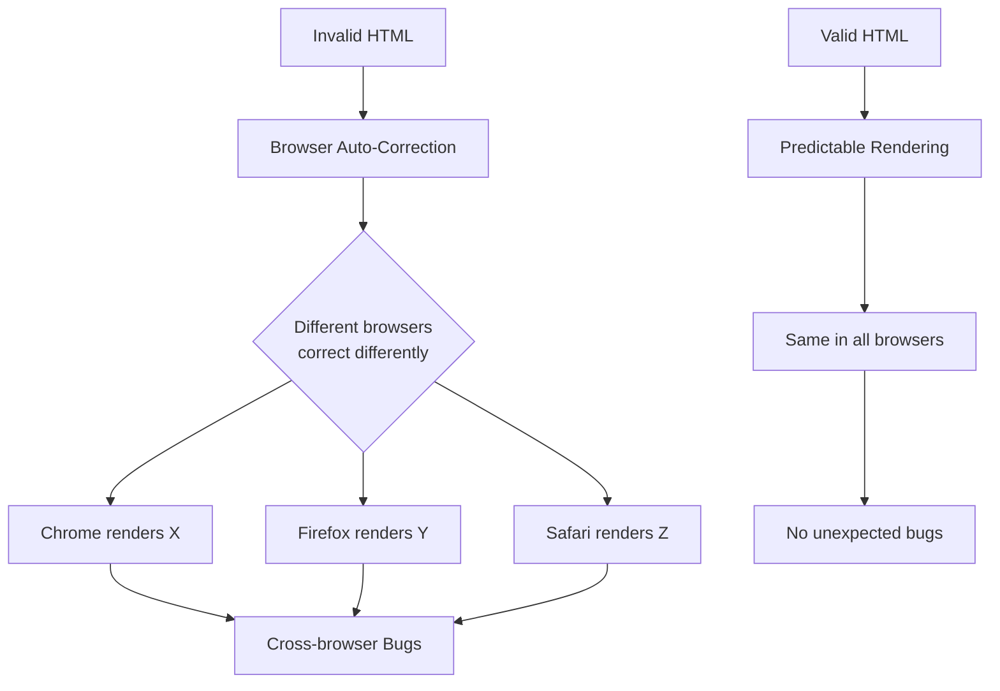
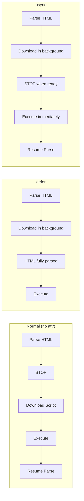
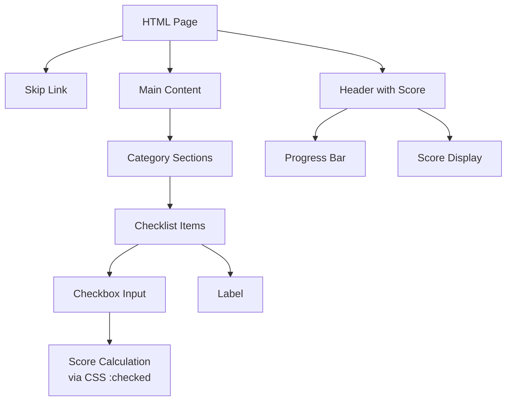

<a id="chapter-23-html-best-practices"></a>

# Chapter 23: HTML Best Practices

[⬅ Previous Chapter](#chapter-22-canvas-svg-graphics) | [📖 Main Index](#main-index) | [Next Chapter ➡](#chapter-24-html-deprecated-tags)

---

## 📌 Learning Objectives

By the end of this chapter, you will:

* Understand what constitutes professional, production-quality HTML
* Know how to write clean, readable, and maintainable HTML structure
* Understand HTML validation and why it matters
* Apply semantic markup correctly for accessibility and SEO
* Know performance best practices for HTML documents
* Identify and fix common HTML anti-patterns
* Be confident discussing HTML best practices in technical interviews
* Write HTML that passes W3C validation and accessibility audits

---

<a id="chapter-index-table-23"></a>

## Chapter Index Table

| Topic No. | Topic Name | Subtopics |
|-----------|------------|-----------|
| 23.1 | [What Are HTML Best Practices?](#231-what-are-html-best-practices) | Definition<br>Why They Matter<br>Who Sets Standards |
| 23.2 | [Clean Document Structure](#232-clean-document-structure) | DOCTYPE<br>lang attribute<br>charset<br>viewport<br>Proper nesting |
| 23.3 | [Semantic Markup Best Practices](#233-semantic-markup-best-practices) | Right element for right job<br>Heading hierarchy<br>Landmark elements |
| 23.4 | [HTML Validation](#234-html-validation) | W3C Validator<br>Common errors<br>Fixing validation errors |
| 23.5 | [Accessibility Best Practices](#235-accessibility-best-practices) | alt text<br>ARIA<br>Labels<br>Keyboard navigation<br>Color contrast |
| 23.6 | [Performance Best Practices](#236-performance-best-practices) | Resource loading<br>defer/async<br>Lazy loading<br>Critical path |
| 23.7 | [Forms Best Practices](#237-forms-best-practices) | Labels<br>Input types<br>Validation<br>Autofill<br>Error messages |
| 23.8 | [Links and Navigation Best Practices](#238-links-and-navigation-best-practices) | Descriptive text<br>target<br>rel<br>Skip links |
| 23.9 | [Images and Media Best Practices](#239-images-and-media-best-practices) | alt<br>width/height<br>lazy loading<br>srcset<br>formats |
| 23.10 | [Code Style and Maintainability](#2310-code-style-and-maintainability) | Indentation<br>Naming<br>Comments<br>Case conventions |
| 23.11 | [Common HTML Mistakes to Avoid](#2311-common-html-mistakes-to-avoid) | Anti-patterns<br>Bad habits<br>Fixes |
| 23.12 | [Interview Questions](#2312-interview-questions) | Conceptual<br>Scenario<br>Output-based<br>Advanced |
| 23.13 | [Practice Problems](#2313-practice-problems) | Coding<br>Theory<br>Machine Coding |
| 23.14 | [Mini Project](#2314-mini-project) | Best Practices Audit Checklist Page |
| 23.15 | [Quick Revision](#2315-quick-revision) | Key Points<br>Traps<br>Bullets |
| 23.16 | [Chapter Summary](#2316-chapter-summary) | Final Takeaways |

---

## 231 What Are HTML Best Practices?

<a id="231-what-are-html-best-practices"></a>

### 🔷 What Are HTML Best Practices?

HTML best practices are a set of **guidelines, conventions, and standards** that define how HTML should be written to ensure:

* **Correctness** — Valid, error-free markup
* **Readability** — Code that developers can understand and maintain
* **Accessibility** — Content usable by everyone including people with disabilities
* **Performance** — Fast loading and rendering
* **SEO** — Correct signals to search engines
* **Interoperability** — Works across all browsers and devices

---

### 🔷 Why Do HTML Best Practices Matter?

| Without Best Practices | With Best Practices |
|------------------------|---------------------|
| Browsers auto-correct errors (inconsistently) | Consistent cross-browser behavior |
| Screen readers fail to navigate | Full accessibility compliance |
| Search engines miss content | Better SEO rankings |
| Slow page loads | Optimized performance |
| Difficult to maintain | Clean, scalable codebase |
| Security vulnerabilities | More secure markup |

---

### 🔷 Who Sets the Standards?

| Organization | Role |
|-------------|------|
| **W3C** (World Wide Web Consortium) | HTML specification, accessibility guidelines (WCAG) |
| **WHATWG** (Web Hypertext Application Technology Working Group) | Living HTML standard (html.spec.whatwg.org) |
| **Google** | SEO best practices, Core Web Vitals |
| **WAI** (Web Accessibility Initiative) | ARIA, WCAG accessibility standards |
| **MDN Web Docs** | Developer documentation and best practices |

---

### 🧠 Hinglish Intuition

> HTML best practices ko socho jaise **traffic rules** — technically aap wrong side pe bhi gadi chala sakte ho, koi rokne nahi aayega immediately. Lekin accidents hote hain, fines lagte hain, aur dusron ko problems hote hain.
>
> Browser bhi aise hi hai — galat HTML ko fix karke render kar deta hai, lekin result unexpected hota hai. Professional code mein **rules follow karna zaroori hai** — warna production mein bugs aate hain jo samajh nahi aate.

---

👉 <a href="#chapter-index-table-23">Go to Top 🔝</a>

---

## 232 Clean Document Structure

<a id="232-clean-document-structure"></a>

### 🔷 The Gold Standard HTML Template

Every HTML document should start with this proven structure:

```html
<!DOCTYPE html>
<html lang="en">
<head>
  <meta charset="UTF-8">
  <meta name="viewport" content="width=device-width, initial-scale=1.0">
  <meta name="description" content="A clear, concise page description for SEO (max 160 chars)">
  <meta name="author" content="Your Name">

  <!-- Favicon -->
  <link rel="icon" type="image/png" href="/favicon.png">

  <!-- Page Title: Unique, descriptive, 50-60 chars -->
  <title>Page Title | Brand Name</title>

  <!-- CSS — in <head>, before content -->
  <link rel="stylesheet" href="styles.css">
</head>
<body>

  <!-- Skip link for keyboard users -->
  <a class="skip-link" href="#main-content">Skip to main content</a>

  <!-- Semantic landmark elements -->
  <header>
    <nav aria-label="Main navigation">
      <!-- Navigation here -->
    </nav>
  </header>

  <main id="main-content">
    <!-- Primary page content here -->
  </main>

  <footer>
    <!-- Footer content here -->
  </footer>

  <!-- Scripts — at end of body -->
  <script src="app.js" defer></script>

</body>
</html>
```

---

### 🔷 Rule 1: Always Declare DOCTYPE

```html
<!-- ✅ Correct: HTML5 DOCTYPE -->
<!DOCTYPE html>

<!-- ❌ Wrong: Missing DOCTYPE -->
<html>

<!-- ❌ Wrong: Old HTML4 DOCTYPE (don't use) -->
<!DOCTYPE HTML PUBLIC "-//W3C//DTD HTML 4.01//EN"
  "http://www.w3.org/TR/html4/strict.dtd">
```

> [!IMPORTANT]
> Without `<!DOCTYPE html>`, browsers enter **Quirks Mode** — an old compatibility mode that renders pages differently across browsers. Always include DOCTYPE as the very first line.

---

### 🔷 Rule 2: Always Set the `lang` Attribute

```html
<!-- ✅ Correct -->
<html lang="en">
<html lang="hi">
<html lang="fr">
<html lang="ar">   <!-- Arabic: right-to-left -->
<html lang="en-US"><!-- English, US variant -->
<html lang="en-GB"><!-- English, British variant -->

<!-- ❌ Wrong: Missing lang -->
<html>
```

**Why `lang` matters:**
- Screen readers use it to select the correct pronunciation engine
- Search engines use it to determine page language for regional results
- CSS `hyphens` property depends on lang for correct hyphenation
- Browser translation tools trigger based on `lang`

---

### 🔷 Rule 3: Always Set charset

```html
<!-- ✅ Correct: UTF-8 supports all languages and characters -->
<meta charset="UTF-8">

<!-- ❌ Old way (still valid but unnecessary) -->
<meta http-equiv="Content-Type" content="text/html; charset=UTF-8">

<!-- ❌ Wrong: ASCII only — breaks international characters -->
<meta charset="ASCII">
```

> [!IMPORTANT]
> `charset` declaration must appear **within the first 1024 bytes** of the HTML file. Put it as the very first `<meta>` tag inside `<head>`.

---

### 🔷 Rule 4: Always Set the Viewport Meta Tag

```html
<!-- ✅ Correct: Responsive viewport -->
<meta name="viewport" content="width=device-width, initial-scale=1.0">

<!-- ❌ Wrong: Missing viewport — mobile users see desktop layout zoomed out -->
<!-- (no viewport meta tag) -->

<!-- ❌ Wrong: Disabling user zoom — accessibility violation -->
<meta name="viewport" content="width=device-width, initial-scale=1.0, user-scalable=no">
```

> [!NOTE]
> Never use `user-scalable=no` or `maximum-scale=1`. This prevents users with visual impairments from zooming — an **accessibility violation** under WCAG 2.1.

---

### 🔷 Rule 5: Correct Nesting — Never Overlap Tags

```html
<!-- ✅ Correct: Properly nested -->
<p>This is <strong>bold and <em>italic</em></strong> text.</p>

<!-- ❌ Wrong: Overlapping/crossed tags -->
<p>This is <strong>bold and <em>italic</strong></em> text.</p>

<!-- ✅ Correct: Block inside block -->
<div>
  <article>
    <p>Content here.</p>
  </article>
</div>

<!-- ❌ Wrong: Inline cannot contain block -->
<span>
  <div>Block inside inline</div>   <!-- Invalid! -->
</span>

<!-- ❌ Wrong: p cannot contain block elements -->
<p>
  <div>Div inside paragraph</div>  <!-- Invalid! -->
</p>
```

---

### 🔷 Rule 6: One `<h1>` Per Page

```html
<!-- ✅ Correct: Single H1 as main page heading -->
<h1>Main Page Topic</h1>
<h2>Section One</h2>
  <h3>Subsection A</h3>
  <h3>Subsection B</h3>
<h2>Section Two</h2>
  <h3>Subsection C</h3>

<!-- ❌ Wrong: Multiple H1s -->
<h1>Page Title</h1>
<h1>Another Main Heading</h1>  <!-- Breaks heading hierarchy -->

<!-- ❌ Wrong: Skipping heading levels -->
<h1>Page Title</h1>
<h3>Section</h3>  <!-- Skipped h2! -->
```

> [!IMPORTANT]
> Heading levels should **never skip** — always go h1 → h2 → h3 in order. Screen readers use the heading outline to navigate pages. Skipped levels confuse both users and search engines.

---

### 🔷 Rule 7: Close All Tags

```html
<!-- ✅ Correct: All tags closed -->
<ul>
  <li>Item one</li>
  <li>Item two</li>
</ul>

<!-- ❌ Wrong: Unclosed tags -->
<ul>
  <li>Item one
  <li>Item two
</ul>

<!-- Void elements: self-closing by nature — no closing tag needed -->
<br>
<hr>

<input type="text">
<meta charset="UTF-8">
<link rel="stylesheet" href="style.css">
```

---

### 🧠 Hinglish Intuition

> Clean document structure ko socho jaise ek **ghar ki neenv (foundation)**. Agar neenv galat hai, toh upar ki building chahe kitni bhi sundar ho — andar se kamzor rahegi.
>
> `DOCTYPE`, `lang`, `charset`, `viewport` — ye char cheezein ek strong foundation banati hain. Bina inke, aapka HTML ek shaky building pe khada hai.
>
> **Heading hierarchy** ko socho jaise **kitab ka table of contents** — Chapter 1, Section 1.1, Subsection 1.1.1. Koi bhi chapter skip nahi hota. Waise hi headings bhi skip nahi honi chahiye.

---

👉 <a href="#chapter-index-table-23">Go to Top 🔝</a>

---

## 233 Semantic Markup Best Practices

<a id="233-semantic-markup-best-practices"></a>

### 🔷 Use the Right Element for the Right Job

The core principle of semantic HTML: **choose elements based on meaning, not appearance**.

```html
<!-- ❌ Non-semantic: Using div for everything -->
<div class="header">
  <div class="nav">
    <div class="nav-item">Home</div>
  </div>
</div>
<div class="main-content">
  <div class="article">
    <div class="title">My Article</div>
    <div class="content">Article text here...</div>
  </div>
</div>
<div class="footer">Copyright 2024</div>

<!-- ✅ Semantic: Meaningful elements -->
<header>
  <nav>
    <a href="/">Home</a>
  </nav>
</header>
<main>
  <article>
    <h1>My Article</h1>
    <p>Article text here...</p>
  </article>
</main>
<footer>Copyright 2024</footer>
```

---

### 🔷 Semantic Element Reference

| Element | Correct Usage | Wrong Usage |
|---------|--------------|-------------|
| `<header>` | Page header or section header | Every top-of-block div |
| `<nav>` | Navigation link groups | Any div containing links |
| `<main>` | Primary page content (once per page) | Multiple main elements |
| `<article>` | Self-contained reusable content (blog post, product card) | Any content block |
| `<section>` | Thematically grouped content with a heading | Generic container (use `<div>`) |
| `<aside>` | Related but not essential content (sidebar, callout) | Decorative boxes |
| `<footer>` | Page or section footer | Bottom-of-section divs |
| `<figure>` | Image + caption unit | Any image wrapper |
| `<figcaption>` | Caption for `<figure>` | Generic image description |
| `<time>` | Dates and times | Plain text dates |
| `<address>` | Contact information | Physical address only |
| `<mark>` | Highlighted/relevant text | Bold styling |
| `<abbr>` | Abbreviation with expansion | Any short text |

---

### 🔷 When to Use `<div>` and `<span>`

```html
<!-- ✅ Use <div> for layout containers with NO semantic meaning -->
<div class="card-grid">
  <article class="card">...</article>
  <article class="card">...</article>
</div>

<!-- ✅ Use <span> for inline styling with NO semantic meaning -->
<p>Price: <span class="price-highlight">₹999</span></p>

<!-- ❌ Using div/span when a semantic element exists -->
<div class="navigation">...</div>       <!-- Should be <nav> -->
<div class="article-content">...</div>  <!-- Should be <article> -->
<span class="important">Warning</span>  <!-- Should be <strong> or <em> -->
```

> [!TIP]
> The rule: **Ask yourself "what does this content mean?"** If there's a semantic element that matches that meaning, use it. Only use `<div>` and `<span>` when no semantic element fits.

---

### 🔷 Button vs Link — A Critical Distinction

```html
<!-- ✅ Use <a> for navigation (going somewhere) -->
<a href="/about">About Us</a>
<a href="https://example.com" rel="noopener noreferrer" target="_blank">
  External Site
</a>

<!-- ✅ Use <button> for actions (doing something) -->
<button type="button" onclick="openModal()">Open Modal</button>
<button type="submit">Submit Form</button>
<button type="button" onclick="deleteItem()">Delete</button>

<!-- ❌ Wrong: Using <a> without href for action -->
<a onclick="openModal()">Open Modal</a>  <!-- Not navigating anywhere! -->

<!-- ❌ Wrong: Using <div> as button -->
<div onclick="submitForm()">Submit</div>  <!-- No keyboard access! -->

<!-- ❌ Wrong: Using <button> for navigation -->
<button onclick="window.location='/about'">About</button>  <!-- Should be <a> -->
```

> [!IMPORTANT]
> `<button>` is keyboard-accessible by default (Tab + Enter/Space). A `<div>` with `onclick` is not keyboard-accessible and is not announced by screen readers as interactive. This is a very common accessibility bug.

---

### 🔷 Lists — Use Them Correctly

```html
<!-- ✅ Unordered list: items without sequence -->
<ul>
  <li>HTML</li>
  <li>CSS</li>
  <li>JavaScript</li>
</ul>

<!-- ✅ Ordered list: steps with sequence -->
<ol>
  <li>Open the terminal</li>
  <li>Run npm install</li>
  <li>Run npm start</li>
</ol>

<!-- ✅ Description list: term-definition pairs -->
<dl>
  <dt>HTML</dt>
  <dd>HyperText Markup Language — the structure of web pages</dd>

  <dt>CSS</dt>
  <dd>Cascading Style Sheets — the presentation of web pages</dd>
</dl>

<!-- ❌ Wrong: Using manual line breaks/dashes instead of lists -->
<p>- HTML<br>- CSS<br>- JavaScript</p>

<!-- ❌ Wrong: Nesting lists incorrectly -->
<ul>
  <li>Item 1</li>
  <ul>           <!-- ❌ ul/ol must be inside li -->
    <li>Sub item</li>
  </ul>
</ul>

<!-- ✅ Correct nested list -->
<ul>
  <li>Item 1
    <ul>
      <li>Sub item</li>
    </ul>
  </li>
</ul>
```

---

### 🧠 Hinglish Intuition

> Semantic HTML ko socho jaise **apni baat clearly bolna** — agar aap kehte ho "mujhe paani chahiye" toh waiter samjhega. Agar sirf "kuch do" kehte ho toh confusing hai.
>
> Browser aur screen reader ke liye bhi aisa hi hai. `<nav>` bolne se clearly pata chalta hai "yahan navigation hai". Sirf `<div class="nav">` se browser ko manually class padna padta hai — aur screen reader ko pata hi nahi chalta.
>
> **Semantic = Apni content ki language bolna** — aise bolna ki machine bhi samjhe, human bhi samjhe.

---

👉 <a href="#chapter-index-table-23">Go to Top 🔝</a>

---

## 234 HTML Validation

<a id="234-html-validation"></a>

### 🔷 What is HTML Validation?

HTML validation is the process of checking your HTML code against the **official W3C specification** to ensure it contains no syntax errors, invalid nesting, missing attributes, or deprecated elements.

**Primary Tool:** [validator.w3.org](https://validator.w3.org)

---

### 🔷 Why Validate HTML?



---

### 🔷 Common Validation Errors and Fixes

**Error 1: Missing `alt` attribute on images**

```html
<!-- ❌ Error: Element img is missing required attribute alt -->


<!-- ✅ Fix: Add descriptive alt text -->


<!-- ✅ Fix: Decorative image — empty alt -->

```

---

**Error 2: Duplicate `id` attributes**

```html
<!-- ❌ Error: Duplicate ID "header" -->
<div id="header">Main Header</div>
<div id="header">Sub Header</div>  <!-- Same ID! -->

<!-- ✅ Fix: IDs must be unique per page -->
<div id="main-header">Main Header</div>
<div id="sub-header">Sub Header</div>
```

---

**Error 3: Invalid nesting**

```html
<!-- ❌ Error: p element cannot contain block-level elements -->
<p>
  <div>Block inside paragraph</div>
</p>

<!-- ✅ Fix: Use appropriate container -->
<div>
  <p>Paragraph content</p>
  <div>Block content</div>
</div>

<!-- ❌ Error: Inline element containing block -->
<span>
  <h2>Heading inside span</h2>
</span>

<!-- ✅ Fix -->
<div>
  <h2>Heading</h2>
  <span>Inline content</span>
</div>
```

---

**Error 4: Stray tags / Unclosed elements**

```html
<!-- ❌ Error: Stray end tag </div> -->
<div>
  <p>Content</p>
</div>
</div>  <!-- Extra closing tag! -->

<!-- ❌ Error: Unclosed element -->
<ul>
  <li>Item one
  <li>Item two
</ul>

<!-- ✅ Fix -->
<ul>
  <li>Item one</li>
  <li>Item two</li>
</ul>
```

---

**Error 5: Obsolete/deprecated elements**

```html
<!-- ❌ Error: Obsolete element <center> -->
<center>Centered text</center>

<!-- ✅ Fix: Use CSS -->
<p style="text-align: center;">Centered text</p>

<!-- ❌ Error: Obsolete element <font> -->
<font color="red" size="5">Big red text</font>

<!-- ✅ Fix: Use CSS -->
<p style="color: red; font-size: 1.5rem;">Big red text</p>
```

---

**Error 6: Missing required attributes**

```html
<!-- ❌ Error: input type="submit" has no value -->
<!-- (Not an error per spec, but best practice) -->
<input type="submit">

<!-- ✅ Best practice: explicit label -->
<input type="submit" value="Submit Form">

<!-- ❌ Error: form with no method or action -->
<form>...</form>

<!-- ✅ Best practice -->
<form method="post" action="/submit">...</form>

<!-- ❌ Error: script without type in HTML4 (OK in HTML5) -->
<!-- In HTML5, type is optional for JS -->
<script src="app.js"></script>  <!-- ✅ Fine in HTML5 -->
```

---

### 🔷 How to Validate

**Method 1: W3C Validator Online**
```
https://validator.w3.org/
→ Enter URL, upload file, or paste HTML
→ Review errors and warnings
→ Fix each issue
→ Re-validate
```

**Method 2: Browser DevTools**
```
F12 → Console tab
→ Look for HTML parsing warnings
→ Elements tab shows corrected DOM
   (compare to your source to find auto-corrections)
```

**Method 3: VS Code Extensions**
```
→ Install "HTMLHint" extension
→ Install "W3C Web Validator" extension
→ Real-time validation as you type
```

---

> [!TIP]
> Aim for **zero errors** and review all **warnings**. Some warnings are acceptable (like ARIA role redundancy on semantic elements), but all errors should be fixed.

---

### 🧠 Hinglish Intuition

> HTML validation ko socho jaise **grammar check** — jaise Word processor aapko spelling mistakes batata hai, W3C validator HTML mistakes batata hai.
>
> Browser ek forgiving teacher ki tarah hai — galat HTML ko khud fix kar leta hai. Lekin different browsers alag-alag fix karte hain. Isliye **validated HTML** likhna zaroori hai — taaki aap khud control mein raho, browser par depend mat karo.
>
> Production code mein validation failures = **technical debt** = future bugs.

---

👉 <a href="#chapter-index-table-23">Go to Top 🔝</a>

---

## 235 Accessibility Best Practices

<a id="235-accessibility-best-practices"></a>

### 🔷 What is Web Accessibility?

Web accessibility means making websites usable by **everyone** — including people with:
- Visual impairments (blindness, low vision, color blindness)
- Hearing impairments
- Motor impairments (cannot use mouse, uses keyboard only)
- Cognitive impairments

> [!IMPORTANT]
> WCAG 2.1 (Web Content Accessibility Guidelines) is the international standard. Many countries legally require Level AA compliance. Failing accessibility audits can result in lawsuits.

---

### 🔷 Rule 1: Always Provide `alt` Text for Images

```html
<!-- ✅ Informative image: describe what it shows -->


<!-- ✅ Functional image (button/link): describe the action -->
<a href="/home">
  
</a>

<!-- ✅ Decorative image: empty alt (screen reader skips it) -->


<!-- ✅ Complex image: use alt + longdesc or nearby description -->

<p id="chart-description">
  Q1: ₹2M, Q2: ₹3.5M, Q3: ₹2.8M, Q4: ₹4.2M. Sales peaked in Q4.
</p>

<!-- ❌ Wrong: Filename as alt -->


<!-- ❌ Wrong: "image of" or "photo of" (screen readers say "image" automatically) -->
       <!-- Redundant -->
        <!-- ✅ Better -->
```

---

### 🔷 Rule 2: Use Proper Form Labels

```html
<!-- ✅ Explicit label: for attribute matches input id -->
<label for="email">Email Address</label>
<input type="email" id="email" name="email" required>

<!-- ✅ Implicit label: input wrapped inside label -->
<label>
  Password
  <input type="password" name="password" required>
</label>

<!-- ✅ aria-label: when visual label isn't possible -->
<input type="search" aria-label="Search products" placeholder="Search...">

<!-- ✅ aria-labelledby: using existing text as label -->
<h2 id="billing-heading">Billing Address</h2>
<input type="text" aria-labelledby="billing-heading" placeholder="Street address">

<!-- ❌ Wrong: Placeholder as only label -->
<input type="email" placeholder="Enter your email">
<!-- Placeholder disappears on typing — user loses context -->

<!-- ❌ Wrong: Visual text but no programmatic connection -->
<span>Email</span>
<input type="email">  <!-- No for/id connection! Screen reader can't link them -->
```

---

### 🔷 Rule 3: ARIA — Use Sparingly and Correctly

ARIA (Accessible Rich Internet Applications) attributes add semantic meaning when HTML alone isn't sufficient.

```html
<!-- ✅ aria-label: name for element without visible text -->
<button aria-label="Close dialog">
  <svg><!-- X icon SVG --></svg>
</button>

<!-- ✅ aria-expanded: communicate toggle state -->
<button aria-expanded="false" aria-controls="menu" id="menu-btn">
  Menu
</button>
<ul id="menu" hidden>
  <li><a href="/">Home</a></li>
</ul>

<!-- ✅ aria-live: announce dynamic updates -->
<div aria-live="polite" id="status-message">
  <!-- JS updates this — screen reader announces changes -->
</div>

<!-- ✅ aria-required: for required fields -->
<input type="email" aria-required="true">

<!-- ✅ aria-invalid: indicate validation errors -->
<input type="email" aria-invalid="true" aria-describedby="email-error">
<span id="email-error" role="alert">Please enter a valid email address</span>

<!-- ✅ role="alert": immediately announce important messages -->
<div role="alert">Your session will expire in 5 minutes.</div>

<!-- ❌ Wrong: Redundant ARIA on semantic elements -->
<button role="button">Click</button>   <!-- role="button" is redundant on <button> -->
<nav role="navigation">...</nav>       <!-- role="navigation" is redundant on <nav> -->
<h1 role="heading">Title</h1>         <!-- role="heading" is redundant on <h1> -->

<!-- ❌ Wrong: ARIA instead of semantic HTML -->
<div role="button" onclick="submit()">Submit</div>
<!-- Use actual <button> — it's keyboard accessible natively -->
```

> [!IMPORTANT]
> **First Rule of ARIA:** No ARIA is better than bad ARIA. Incorrect ARIA is worse than no ARIA — it actively misleads screen readers.

---

### 🔷 Rule 4: Keyboard Navigation

```html
<!-- ✅ Tab order follows DOM order — use logical DOM structure -->
<form>
  <input type="text" name="first">    <!-- Tab 1 -->
  <input type="text" name="last">     <!-- Tab 2 -->
  <button type="submit">Submit</button><!-- Tab 3 -->
</form>

<!-- ✅ Skip navigation link (for keyboard users to jump to main content) -->
<style>
  .skip-link {
    position: absolute;
    top: -40px;
    left: 0;
    background: #000;
    color: #fff;
    padding: 8px;
    z-index: 100;
    text-decoration: none;
  }
  .skip-link:focus {
    top: 0;   /* Becomes visible when focused via keyboard */
  }
</style>
<a class="skip-link" href="#main-content">Skip to main content</a>
<header><!-- Long navigation --></header>
<main id="main-content"><!-- Page content --></main>

<!-- ✅ tabindex="0": make custom elements keyboard focusable -->
<div tabindex="0" role="button" onclick="activate()" onkeydown="handleKey(event)">
  Custom Interactive Element
</div>

<!-- ❌ Wrong: tabindex > 0 (breaks natural tab order) -->
<input tabindex="3" type="text">  <!-- Disrupts natural flow -->
<input tabindex="1" type="text">
<input tabindex="2" type="text">

<!-- ✅ Use tabindex="0" or tabindex="-1" only -->
<!-- tabindex="-1": focusable via JS but NOT in tab flow -->
<div tabindex="-1" id="modal">...</div>
<!-- JS: document.getElementById('modal').focus() -->
```

---

### 🔷 Rule 5: Color and Contrast

```html
<!-- Ensure sufficient color contrast ratios: -->
<!-- WCAG AA: Normal text → 4.5:1 minimum -->
<!-- WCAG AA: Large text (18pt+) → 3:1 minimum -->
<!-- WCAG AAA: Normal text → 7:1 -->

<!-- ❌ Wrong: Relying only on color to convey meaning -->
<p>Required fields are shown in <span style="color:red">red</span>.</p>
<!-- Color-blind users can't distinguish red -->

<!-- ✅ Better: Color + additional indicator -->
<p>Required fields are marked with <span style="color:red">*</span></p>
<label for="name">
  Full Name <span aria-label="required" style="color:red">*</span>
</label>
<input type="text" id="name" required aria-required="true">
```

---

### 🧠 Hinglish Intuition

> Accessibility ko socho jaise ek **ramp jo wheelchair users ke liye banai jaati hai** — lekin actually wo sab ke liye helpful hai: delivery wale, pram wale, heavy bags wale.
>
> Accessible HTML bhi aisa hi hai — visually impaired logon ke liye banate ho, lekin SEO better hoti hai, mobile users ko benefit hota hai, aur code bhi cleaner hota hai.
>
> **ARIA** ko use karo sirf tab jab semantic HTML kaam na kare. Galat ARIA use karna aise hai jaise road signs galat direction mein laga do — helpful hone ki jagah confusing ho jaata hai.

---

👉 <a href="#chapter-index-table-23">Go to Top 🔝</a>

---

## 236 Performance Best Practices

<a id="236-performance-best-practices"></a>

### 🔷 Script Loading — `defer` vs `async`

```html
<!-- ❌ Wrong: Script in <head> without defer/async -->
<!-- Blocks HTML parsing until script downloads + executes -->
<head>
  <script src="large-library.js"></script>  <!-- Blocks! -->
</head>

<!-- ✅ Option 1: defer — Download parallel, execute after HTML parsed -->
<!-- Maintains script execution order -->
<head>
  <script src="library.js" defer></script>
  <script src="app.js" defer></script>  <!-- Executes after library.js -->
</head>

<!-- ✅ Option 2: async — Download parallel, execute immediately when ready -->
<!-- Does NOT maintain order — for independent scripts only -->
<head>
  <script src="analytics.js" async></script>  <!-- Independent, order doesn't matter -->
</head>

<!-- ✅ Option 3: Scripts at end of body (old standard) -->
<body>
  <!-- All HTML content -->
  <script src="app.js"></script>  <!-- After DOM is ready -->
</body>
```

**Visual Comparison:**



---

### 🔷 Resource Hints

```html
<head>
  <!-- preconnect: establish connection early to third-party domains -->
  <link rel="preconnect" href="https://fonts.googleapis.com">
  <link rel="preconnect" href="https://fonts.gstatic.com" crossorigin>

  <!-- preload: fetch critical resources immediately (high priority) -->
  <link rel="preload" href="/fonts/main-font.woff2" as="font" type="font/woff2" crossorigin>
  <link rel="preload" href="/images/hero.webp" as="image">
  <link rel="preload" href="/styles/critical.css" as="style">

  <!-- prefetch: fetch resource for future navigation (low priority) -->
  <link rel="prefetch" href="/next-page.html">

  <!-- dns-prefetch: resolve DNS early (lighter than preconnect) -->
  <link rel="dns-prefetch" href="//cdn.example.com">
</head>
```

| Hint | Priority | Use Case |
|------|----------|----------|
| `preconnect` | High | CDN, Google Fonts, API domains |
| `preload` | High | Critical fonts, hero images, above-fold CSS |
| `prefetch` | Low | Next page resources |
| `dns-prefetch` | Lowest | Third-party domains |

---

### 🔷 Lazy Loading Images and iframes

```html
<!-- ✅ Lazy loading: browser loads only when near viewport -->


<!-- ✅ Eager loading: for above-the-fold critical images -->


<!-- ✅ Lazy loading iframes -->
<iframe src="https://www.youtube.com/embed/VIDEO_ID"
        title="Product demo video"
        loading="lazy"
        width="560"
        height="315">
</iframe>
```

> [!IMPORTANT]
> **Always specify `width` and `height` on images.** Without these, the browser doesn't know the image dimensions before downloading — causing **layout shift** (CLS — Cumulative Layout Shift), which hurts Core Web Vitals scores.

---

### 🔷 Eliminate Render-Blocking Resources

```html
<!-- ✅ Critical CSS: inline above-the-fold styles -->
<head>
  <style>
    /* Only critical above-fold styles here */
    body { margin: 0; font-family: sans-serif; }
    header { background: #333; color: white; padding: 1rem; }
    .hero { min-height: 60vh; }
  </style>

  <!-- Non-critical CSS: load async -->
  <link rel="preload" href="styles.css" as="style" onload="this.onload=null;this.rel='stylesheet'">
  <noscript><link rel="stylesheet" href="styles.css"></noscript>
</head>

<!-- ✅ Minimize inline styles and scripts in <head> -->
<!-- ✅ Use external files that can be cached -->
```

---

### 🔷 Metadata for SEO Performance

```html
<head>
  <!-- Title: 50-60 characters, unique per page -->
  <title>Buy Running Shoes Online | FitStore India</title>

  <!-- Meta description: 150-160 chars, compelling summary -->
  <meta name="description"
        content="Shop premium running shoes from top brands. Free delivery over ₹999. 30-day easy returns. Find your perfect fit today.">

  <!-- Open Graph: for social media sharing -->
  <meta property="og:title" content="Buy Running Shoes Online | FitStore">
  <meta property="og:description" content="Premium running shoes with free delivery.">
  <meta property="og:image" content="https://fitstore.com/og-image.jpg">
  <meta property="og:url" content="https://fitstore.com/shoes/running">
  <meta property="og:type" content="website">

  <!-- Twitter Card -->
  <meta name="twitter:card" content="summary_large_image">
  <meta name="twitter:title" content="Buy Running Shoes | FitStore">
  <meta name="twitter:image" content="https://fitstore.com/og-image.jpg">

  <!-- Canonical URL: prevent duplicate content -->
  <link rel="canonical" href="https://fitstore.com/shoes/running">
</head>
```

---

### 🧠 Hinglish Intuition

> Performance best practices ko socho jaise **khana order karna** — agar aap pehle dessert order karo, phir starter, phir main course toh timing bilkul galat hogi. Script loading bhi aisa hi hai.
>
> `defer` = Script download karo background mein, serve karo jab HTML ready ho jaye
> `async` = Independent dish — jab bhi ready ho, serve karo
>
> **Images ka width/height** likhna ek **table reserve karna** jaisa hai — browser ko pata hota hai jagah kitni chahiye, toh baaki content shift nahi karta. Bina reserve ke sab shift ho jaata hai — annoying!

---

👉 <a href="#chapter-index-table-23">Go to Top 🔝</a>

---

## 237 Forms Best Practices

<a id="237-forms-best-practices"></a>

### 🔷 Complete Form Best Practices Example

```html
<form
  method="post"
  action="/register"
  novalidate
  aria-labelledby="form-title"
>
  <h2 id="form-title">Create Account</h2>

  <!-- ✅ Fieldset + legend for grouped fields -->
  <fieldset>
    <legend>Personal Information</legend>

    <!-- ✅ Explicit label + correct input type + autocomplete -->
    <div class="form-group">
      <label for="full-name">Full Name <span aria-label="required">*</span></label>
      <input
        type="text"
        id="full-name"
        name="fullName"
        autocomplete="name"
        required
        aria-required="true"
        aria-describedby="name-hint"
        placeholder="e.g. Rahul Sharma"
      >
      <small id="name-hint">Enter your name as on official ID</small>
    </div>

    <div class="form-group">
      <label for="email">Email Address <span aria-label="required">*</span></label>
      <input
        type="email"
        id="email"
        name="email"
        autocomplete="email"
        required
        aria-required="true"
        aria-describedby="email-error"
        aria-invalid="false"
      >
      <!-- Error message — hidden until validation -->
      <span id="email-error" role="alert" hidden>
        Please enter a valid email address (e.g. name@example.com)
      </span>
    </div>

    <div class="form-group">
      <label for="phone">Phone Number</label>
      <input
        type="tel"
        id="phone"
        name="phone"
        autocomplete="tel"
        pattern="[0-9]{10}"
        placeholder="10-digit number"
        aria-describedby="phone-hint"
      >
      <small id="phone-hint">Indian mobile number (10 digits, no spaces)</small>
    </div>

  </fieldset>

  <fieldset>
    <legend>Account Security</legend>

    <div class="form-group">
      <label for="password">Password <span aria-label="required">*</span></label>
      <input
        type="password"
        id="password"
        name="password"
        autocomplete="new-password"
        required
        aria-required="true"
        minlength="8"
        aria-describedby="password-hint"
      >
      <small id="password-hint">At least 8 characters including a number</small>
    </div>

  </fieldset>

  <!-- ✅ Descriptive submit button -->
  <button type="submit">Create My Account</button>

  <!-- ✅ Link to alternative action -->
  <p>Already have an account? <a href="/login">Sign in</a></p>

</form>
```

---

### 🔷 Form Best Practice Rules

| Rule | ✅ Do | ❌ Don't |
|------|-------|---------|
| Labels | Use `<label for="id">` | Use placeholder as only label |
| Input types | Match to data: `email`, `tel`, `number`, `date` | Use `type="text"` for everything |
| Autocomplete | Add `autocomplete` attribute | Leave it off |
| Required fields | Mark with `required` + `aria-required` | Rely only on color |
| Error messages | Link with `aria-describedby` | Show errors without context |
| Grouping | Use `<fieldset>` + `<legend>` | Group without semantic wrapper |
| Submit button | Use descriptive text ("Create Account") | Use "Submit" or "Click Here" |
| `method` | Use `post` for sensitive data | Use `get` for passwords |

---

### 🧠 Hinglish Intuition

> Form best practices ko socho jaise **ek sarkari form** — jab form mein clearly likha hota hai "Naam (jaise aadhar card mein)" toh confusion nahi hota. Jab sirf ek blank box hota hai bina label ke, toh log guess karte hain.
>
> `<label>` wohi kaam karta hai — clearly batata hai ki is field mein kya bharna hai. Aur `autocomplete` aise hai jaise form ke saath ek helper baitha ho jo pehle se jaanta hai — naam, email, address — sab fill kar deta hai.

---

👉 <a href="#chapter-index-table-23">Go to Top 🔝</a>

---

## 238 Links and Navigation Best Practices

<a id="238-links-and-navigation-best-practices"></a>

### 🔷 Descriptive Link Text

```html
<!-- ❌ Wrong: Non-descriptive link text -->
<a href="/report.pdf">Click here</a>
<a href="/about">Read more</a>
<a href="/products">Here</a>

<!-- ✅ Correct: Descriptive link text (makes sense out of context) -->
<a href="/report.pdf">Download Annual Report 2024 (PDF, 2MB)</a>
<a href="/about">Read more about our company mission</a>
<a href="/products">Browse all products</a>

<!-- ✅ When visual text is short, add aria-label for context -->
<a href="/blog/html-tips" aria-label="Read more about HTML best practices tips">
  Read more
</a>
```

> [!IMPORTANT]
> Screen reader users often navigate by listing all links on a page. "Click here" listed 20 times tells them nothing. **Every link must make sense in isolation.**

---

### 🔷 External Links

```html
<!-- ✅ External links: open in new tab with security attributes -->
<a href="https://external-site.com"
   target="_blank"
   rel="noopener noreferrer">
  Visit External Site
  <!-- Optionally add visual indicator -->
  <span aria-label="(opens in new tab)"> ↗</span>
</a>

<!-- Why rel="noopener noreferrer"? -->
<!-- noopener:   Prevents new page accessing window.opener (security) -->
<!-- noreferrer: Doesn't send referrer header (privacy) -->
<!-- Without these, malicious sites can manipulate your page! -->

<!-- ❌ Wrong: External link without rel -->
<a href="https://malicious.com" target="_blank">Visit</a>
<!-- The opened page can do: window.opener.location = 'phishing-site.com' -->
```

---

### 🔷 Navigation Landmark

```html
<!-- ✅ Label multiple nav elements distinctly -->
<nav aria-label="Main navigation">
  <ul>
    <li><a href="/">Home</a></li>
    <li><a href="/products">Products</a></li>
    <li><a href="/contact">Contact</a></li>
  </ul>
</nav>

<nav aria-label="Breadcrumb">
  <ol>
    <li><a href="/">Home</a></li>
    <li><a href="/products">Products</a></li>
    <li aria-current="page">Running Shoes</li>
  </ol>
</nav>

<nav aria-label="Footer links">
  <ul>
    <li><a href="/privacy">Privacy Policy</a></li>
    <li><a href="/terms">Terms of Service</a></li>
  </ul>
</nav>
```

> [!NOTE]
> If a page has multiple `<nav>` elements, each must have a unique `aria-label` so screen reader users can distinguish them.

---

### 🔷 Active/Current Page Indication

```html
<!-- ✅ Indicate current page in navigation -->
<nav aria-label="Main navigation">
  <ul>
    <li><a href="/">Home</a></li>
    <li><a href="/about" aria-current="page">About</a></li>  <!-- Current page -->
    <li><a href="/contact">Contact</a></li>
  </ul>
</nav>

<!-- aria-current="page" tells screen readers "you are here" -->
<!-- Style it visually with CSS too -->
```

---

### 🧠 Hinglish Intuition

> Link text ko socho jaise **WhatsApp forward message** — agar koi sirf link text padhta hai (bina context ke), toh usse samajh aana chahiye ki link kahan jaayega.
>
> "Click here" ek WhatsApp message ki tarah hai jisme sirf likha ho "Yahan dekho" — kahan?! Kya?! Context nahi hai.
>
> `rel="noopener noreferrer"` ek **security lock** ki tarah hai jo naya tab khulne par lagaate ho — warna woh naya tab aapka pehla tab control kar sakta hai. Simple-si attribute, bada impact.

---

👉 <a href="#chapter-index-table-23">Go to Top 🔝</a>

---

## 239 Images and Media Best Practices

<a id="239-images-and-media-best-practices"></a>

### 🔷 Always Specify `width` and `height`

```html
<!-- ✅ Always specify dimensions to prevent layout shift -->


<!-- ❌ Wrong: No dimensions — browser doesn't know space to reserve -->

```

---

### 🔷 Use Modern Image Formats

```html
<!-- ✅ Use <picture> with WebP + fallback -->
<picture>
  <!-- AVIF: best compression (very modern) -->
  <source srcset="image.avif" type="image/avif">
  <!-- WebP: excellent compression (widely supported) -->
  <source srcset="image.webp" type="image/webp">
  <!-- Fallback: JPEG for older browsers -->
  
</picture>
```

| Format | Compression | Support | Best For |
|--------|------------|---------|----------|
| AVIF | Best | Modern browsers | Photos, highest quality |
| WebP | Excellent | Good (95%+ browsers) | General purpose |
| JPEG | Good | Universal | Photos, complex images |
| PNG | Lossless | Universal | Logos, screenshots, transparency |
| SVG | Vector | Universal | Icons, logos, simple graphics |
| GIF | Poor | Universal | Simple animations (prefer WebP/video) |

---

### 🔷 Responsive Images with `srcset`

```html
<!-- ✅ Provide multiple resolutions for different screen sizes -->

<!-- Browser picks the most appropriate resolution automatically -->
```

---

### 🔷 Audio and Video Best Practices

```html
<!-- ✅ Video best practices -->
<video
  width="720"
  height="405"
  controls
  preload="metadata"
  poster="video-thumbnail.jpg"
  aria-label="Product feature demonstration"
>
  <source src="demo.webm" type="video/webm">
  <source src="demo.mp4" type="video/mp4">
  <!-- Captions for deaf/hard-of-hearing users (WCAG requirement) -->
  <track kind="captions" src="demo-en.vtt" srclang="en" label="English" default>
  <track kind="captions" src="demo-hi.vtt" srclang="hi" label="Hindi">
  <p>Your browser doesn't support video.
     <a href="demo.mp4">Download the video</a> instead.
  </p>
</video>

<!-- ✅ Audio best practices -->
<audio controls preload="metadata" aria-label="Podcast Episode 12">
  <source src="podcast-ep12.ogg" type="audio/ogg">
  <source src="podcast-ep12.mp3" type="audio/mpeg">
  <a href="podcast-ep12.mp3">Download MP3</a>
</audio>
```

> [!IMPORTANT]
> Providing captions/subtitles for video is a **WCAG Level A requirement**. Videos without captions exclude deaf and hard-of-hearing users.

---

### 🧠 Hinglish Intuition

> Images ko width/height dena aise hai jaise parking mein pehle se jagah reserve karna — browser ko pata hota hai kitni jagah chahiye, toh baaki content shift nahi hota jab image load hoti hai.
>
> `<picture>` element ek **smart waiter** ki tarah hai — alag-alag customers (browsers) ko unke support ke hisaab se best format serve karta hai. New browser ko AVIF milta hai, purana browser ko JPEG — sab khush!

---

👉 <a href="#chapter-index-table-23">Go to Top 🔝</a>

---

## 2310 Code Style and Maintainability

<a id="2310-code-style-and-maintainability"></a>

### 🔷 Indentation and Formatting

```html
<!-- ✅ Consistent 2-space indentation -->
<!DOCTYPE html>
<html lang="en">
<head>
  <meta charset="UTF-8">
  <title>Page Title</title>
</head>
<body>
  <header>
    <nav>
      <ul>
        <li><a href="/">Home</a></li>
        <li><a href="/about">About</a></li>
      </ul>
    </nav>
  </header>

  <main>
    <section>
      <h1>Welcome</h1>
      <p>Page content here.</p>
    </section>
  </main>
</body>
</html>

<!-- ❌ Wrong: No consistent indentation -->
<body>
<header>
<nav><ul>
<li><a href="/">Home</a></li></ul>
</nav></header>
<main><section>
<h1>Welcome</h1>
<p>Content</p>
</section></main>
</body>
```

---

### 🔷 Lowercase Everything

```html
<!-- ✅ Lowercase tags and attributes (HTML5 standard) -->
<div class="container">
  <input type="text" id="username" name="username">
</div>

<!-- ❌ Wrong: Uppercase tags (valid but inconsistent/outdated) -->
<DIV CLASS="container">
  <INPUT TYPE="text" ID="username" NAME="username">
</DIV>
```

---

### 🔷 Attribute Quoting

```html
<!-- ✅ Always quote attribute values -->

<input type="text" id="name" name="name" required>

<!-- ❌ Wrong: Unquoted attributes (valid but fragile) -->


<!-- ❌ Wrong: Inconsistent quoting -->


<!-- ✅ Double quotes are the HTML convention (use consistently) -->
```

---

### 🔷 Meaningful Class and ID Names

```html
<!-- ✅ Descriptive, purpose-based names -->
<div class="product-card">
  
  <h2 class="product-name">...</h2>
  <span class="product-price">₹999</span>
  <button class="add-to-cart-btn" type="button">Add to Cart</button>
</div>

<!-- ❌ Wrong: Presentation-based names (fragile — breaks when design changes) -->
<div class="red-box">         <!-- What if it becomes blue? -->
  <div class="big-text">...</div>
  <div class="right-aligned">...</div>
</div>

<!-- ❌ Wrong: Meaningless names -->
<div class="div1">
  <div class="thing">...</div>
  <div class="stuff">...</div>
</div>

<!-- ❌ Wrong: Abbreviated to unreadability -->
<div class="pd-crd">
  <h2 class="pd-nm">...</h2>
</div>
```

---

### 🔷 HTML Comments — Use Wisely

```html
<!-- ✅ Section dividers for long files -->

<!-- ==================== HEADER ==================== -->
<header>...</header>

<!-- ==================== MAIN CONTENT ==================== -->
<main>...</main>

<!-- ==================== FOOTER ==================== -->
<footer>...</footer>

<!-- ✅ Explain non-obvious decisions -->
<!-- tabindex="-1" so JS can programmatically focus this without tab order -->
<div id="modal" tabindex="-1" role="dialog">...</div>

<!-- ✅ Mark conditional/template sections -->
<!-- BEGIN: User is logged in -->
<div class="user-profile">...</div>
<!-- END: User is logged in -->

<!-- ❌ Wrong: Obvious comments that add no value -->
<!-- This is a paragraph -->
<p>Content here.</p>

<!-- ❌ Wrong: Leaving dead code commented out in production -->
<!-- <div class="old-hero">old code</div> -->
<!-- Use version control (Git) instead of commenting out code -->
```

---

### 🔷 Separation of Concerns

```html
<!-- ✅ Structure (HTML), Presentation (CSS), Behavior (JS) separated -->
<button class="primary-btn" type="button" id="openModal">
  Open Modal
</button>
<!-- CSS in .css file, JS in .js file -->

<!-- ❌ Wrong: Inline styles (mixes structure and presentation) -->
<button style="background:blue; color:white; padding:10px 20px; border-radius:5px;"
        type="button">
  Open Modal
</button>

<!-- ❌ Wrong: Inline event handlers (mixes structure and behavior) -->
<button onclick="document.getElementById('modal').style.display='block';
                 document.body.classList.add('no-scroll');"
        type="button">
  Open Modal
</button>

<!-- ✅ Exception: Critical above-fold styles can be inlined in <style> -->
<style>
  /* Only truly critical CSS here */
</style>
```

---

### 🧠 Hinglish Intuition

> Code style aur maintainability aise hai jaise **apna room organized rakhna**. Aap akele kaam karte ho toh shayad chalta hai, lekin jab team aaye, toh sab ko samajh aana chahiye kahan kya hai.
>
> Meaningful class names aise hain jaise **labeled drawers** — `product-card` clearly batata hai, lekin `div3` kuch nahi batata.
>
> Separation of concerns aise hai jaise **kitchen, bedroom, bathroom alag hona** — ek hi jagah sab mix karo toh chaos ho jaata hai. HTML structure, CSS looks, JS behavior — teeno alag files mein.

---

👉 <a href="#chapter-index-table-23">Go to Top 🔝</a>

---

## 2311 Common HTML Mistakes to Avoid

<a id="2311-common-html-mistakes-to-avoid"></a>

### 🔷 Top 15 HTML Anti-Patterns

| # | Anti-Pattern | Problem | Fix |
|---|-------------|---------|-----|
| 1 | `<div>` for everything | No semantic meaning, no accessibility | Use semantic elements |
| 2 | Missing `alt` on `` | Screen readers say "image" | Add descriptive alt |
| 3 | `<br>` for spacing | Layout via HTML | Use CSS `margin`/`padding` |
| 4 | `<table>` for layout | Breaks accessibility, not responsive | Use CSS Flexbox/Grid |
| 5 | Inline styles | No reusability, maintenance nightmare | Move to CSS classes |
| 6 | `placeholder` as label | Disappears on typing | Use `<label>` element |
| 7 | `<b>` and `<i>` for emphasis | Presentational, not semantic | Use `<strong>` and `<em>` |
| 8 | Missing `lang` attribute | Screen readers use wrong language | `<html lang="en">` |
| 9 | Duplicate `id` attributes | JS/CSS selector conflicts | IDs must be unique |
| 10 | Empty headings | SEO and accessibility | Add meaningful content |
| 11 | `target="_blank"` without `rel` | Security vulnerability | Add `rel="noopener noreferrer"` |
| 12 | `<a>` without `href` | Not keyboard navigable | Add valid `href` or use `<button>` |
| 13 | Skipping heading levels | Broken document outline | Sequential hierarchy |
| 14 | Images without dimensions | Layout shift (bad CLS score) | Add `width` and `height` |
| 15 | Scripts in `<head>` without defer | Render blocking | Add `defer` attribute |

---

### 🔷 Detailed Examples of Each

```html
<!-- ❌ Anti-pattern 3: <br> for spacing -->
<p>Name: Rahul<br><br><br>
Email: rahul@example.com</p>

<!-- ✅ Fix: CSS margin -->
<p class="detail-item">Name: Rahul</p>
<p class="detail-item">Email: rahul@example.com</p>
<!-- .detail-item { margin-bottom: 1rem; } -->

<!-- ❌ Anti-pattern 4: Table for layout -->
<table>
  <tr>
    <td></td>
    <td><h1>Page Title</h1></td>
    <td><nav>...</nav></td>
  </tr>
</table>

<!-- ✅ Fix: CSS Flexbox -->
<header style="display: flex; align-items: center; gap: 1rem;">
  
  <h1>Page Title</h1>
  <nav>...</nav>
</header>

<!-- ❌ Anti-pattern 7: <b> and <i> for emphasis -->
<p>Warning: This action is <b>irreversible</b></p>
<p>The term <i>HTML</i> stands for HyperText Markup Language</p>

<!-- ✅ Fix: Semantic strong and em -->
<p>Warning: This action is <strong>irreversible</strong></p>
<p>The term <em>HTML</em> stands for HyperText Markup Language</p>

<!-- ❌ Anti-pattern 10: Empty heading -->
<h2></h2>
<h2>   </h2>  <!-- Whitespace only -->

<!-- ❌ Anti-pattern 12: a without href -->
<a onclick="showMenu()">Menu</a>  <!-- Not keyboard focusable via Tab! -->

<!-- ✅ Fix: Use button for actions -->
<button type="button" onclick="showMenu()">Menu</button>

<!-- Or if it must be <a> -->
<a href="#" onclick="showMenu(event); return false;">Menu</a>
<!-- Though button is still better -->
```

---

### 🧠 Hinglish Intuition

> Common HTML mistakes waise hain jaise **cooking mein shortcut lena** — thoda time bachta hai but dish ka taste kharab ho jaata hai.
>
> `<br>` se spacing karna ek temporary jugaad hai — kal design change hua toh sab manually badalna padega. CSS se spacing karo — ek jagah change karo, sab change ho jaata hai.
>
> `<table>` for layout 2000s ki baat thi — jab CSS available nahi tha. Aaj 2024 mein table for layout use karna ek senior developer ke saath interview mein red flag hai.

---

👉 <a href="#chapter-index-table-23">Go to Top 🔝</a>

---

## 2312 Interview Questions

<a id="2312-interview-questions"></a>

### 💡 Interview Questions

---

#### 🔹 Conceptual Questions

**Q1. What is the purpose of `<!DOCTYPE html>` and what happens if it's omitted?**

**Answer:**
`<!DOCTYPE html>` is a **document type declaration** that tells the browser which version of HTML the document uses. The HTML5 DOCTYPE is the simplest form — just `<!DOCTYPE html>`.

Without it, browsers enter **Quirks Mode** — a backward-compatibility mode that mimics the buggy behavior of old browsers (Internet Explorer 5.5, Netscape Navigator 4). In Quirks Mode:
- The CSS box model works differently (border-box vs content-box)
- Many CSS properties behave inconsistently
- The same page renders differently across different browsers

With `<!DOCTYPE html>`, browsers use **Standards Mode** — consistent, predictable behavior across all modern browsers.

> [!IMPORTANT]
> `<!DOCTYPE html>` must be the very first line of the HTML file — before anything else, including whitespace.

---

**Q2. Why is `lang` attribute on the `<html>` element important?**

**Answer:**
The `lang` attribute on `<html>` serves multiple critical purposes:

1. **Screen Readers:** Use the language to select the correct text-to-speech pronunciation engine. `lang="en"` uses English pronunciation; `lang="hi"` uses Hindi. Without it, screen readers may mispronounce content.

2. **Search Engines:** Use `lang` to determine which regional results to show the page in and for content language signals.

3. **CSS:** The `hyphens: auto` property requires a correct `lang` attribute to insert hyphens at grammatically correct positions.

4. **Browser Translation:** Chrome's automatic translation feature triggers based on `lang` — if it mismatches, wrong translation options appear.

5. **Spell Checkers:** Built-in browser spell checkers use `lang` for the correct dictionary.

```html
<html lang="en">    <!-- English -->
<html lang="hi">    <!-- Hindi -->
<html lang="en-IN"> <!-- English, India variant -->
```

---

**Q3. What is the difference between `<strong>` and `<b>`, and `<em>` and `<i>`?**

**Answer:**

| Element | Type | Meaning | Screen Reader Behavior |
|---------|------|---------|----------------------|
| `<strong>` | Semantic | **Important** content | Announces as "important" |
| `<b>` | Presentational | Bold styling only | No semantic announcement |
| `<em>` | Semantic | **Stressed emphasis** | Changes vocal tone |
| `<i>` | Presentational | Italic styling | No semantic announcement |

```html
<!-- strong: content is critically important -->
<p><strong>Warning:</strong> This will permanently delete your data.</p>

<!-- b: draw attention without importance (keywords, product names) -->
<p>The <b>Pro Plan</b> includes unlimited storage.</p>

<!-- em: spoken stress changes meaning -->
<p>I <em>never</em> said she stole the money.</p>
<p>I never said <em>she</em> stole the money.</p>

<!-- i: technical terms, foreign words, thoughts -->
<p>The word <i lang="fr">déjà vu</i> means "already seen".</p>
```

Use semantic elements when the content has importance meaning. Use `<b>` and `<i>` for purely stylistic bold/italic where the semantics don't apply.

---

**Q4. When should you use `async` vs `defer` for script loading?**

**Answer:**

Both `async` and `defer` download the script in parallel with HTML parsing (non-blocking download).

**`defer`:**
- Executes **after** HTML is fully parsed
- Maintains **execution order** of deferred scripts
- Best for: Scripts that depend on DOM or on each other (main app scripts, libraries + app)

```html
<script src="jquery.js" defer></script>
<script src="app.js" defer></script>
<!-- jquery.js always executes before app.js -->
```

**`async`:**
- Executes **immediately** when downloaded (pauses HTML parsing briefly)
- Does **NOT** maintain execution order
- Best for: Completely independent scripts (analytics, ads, tracking)

```html
<script src="analytics.js" async></script>  <!-- Doesn't depend on anything -->
```

**Decision Rule:**
- Script depends on DOM or other scripts? → `defer`
- Script is completely standalone? → `async`
- Script is tiny and critical? → Inline in `<head>`

---

**Q5. What is the first rule of ARIA?**

**Answer:**
The **First Rule of ARIA** states: **"Do not use ARIA if you can use a native HTML element or attribute with the semantics and behavior you require."**

In other words: prefer native HTML semantics over ARIA workarounds.

```html
<!-- ❌ Avoid: ARIA role on a div to simulate a button -->
<div role="button" tabindex="0" onclick="submit()">Submit</div>
<!-- You must manually handle: keyboard events, focus, ARIA state -->

<!-- ✅ Better: Native HTML button -->
<button type="submit">Submit</button>
<!-- All semantics, keyboard handling, ARIA role built-in automatically -->
```

ARIA is a **supplement** to HTML semantics, not a replacement. Incorrect ARIA is worse than no ARIA because it actively provides wrong information to assistive technologies.

---

#### 🔹 Scenario-Based Questions

**Q6. A developer notices their webpage renders fine on Chrome but differently on Firefox and Safari. What HTML issue might cause this?**

**Answer:**
The most likely cause is **missing `<!DOCTYPE html>`** — without it, browsers enter Quirks Mode independently, each using their own legacy interpretation rules.

Other possible causes:
- **Invalid HTML nesting** — different browsers auto-correct differently
- **Missing `<meta charset="UTF-8">`** — character encoding interpreted differently
- **Browser-specific default styles** — without a CSS reset, browsers apply different margins, padding, and font sizes to HTML elements

**Fix process:**
1. Add `<!DOCTYPE html>` as the first line
2. Validate with W3C Validator — fix all errors
3. Add a CSS normalize/reset stylesheet
4. Test across browsers

---

**Q7. Your company's website fails a WCAG accessibility audit. The auditor mentions "form inputs have no accessible names." What does this mean and how do you fix it?**

**Answer:**
"Accessible name" is the text that screen readers announce when focusing on a form element. Without it, a screen reader user hears "edit text" or "text field" with no context about what to enter.

**Diagnosis:** Looking for inputs without connected labels:

```html
<!-- ❌ No accessible name: -->
<input type="email" placeholder="Email">
<!-- Screen reader says: "Edit text" — no context! -->

<span>Email</span>
<input type="email">
<!-- Span is not programmatically connected to input -->
```

**Fixes:**

```html
<!-- ✅ Fix 1: Explicit label with for/id -->
<label for="email">Email Address</label>
<input type="email" id="email">

<!-- ✅ Fix 2: Implicit label (wrapping) -->
<label>
  Email Address
  <input type="email">
</label>

<!-- ✅ Fix 3: aria-label (when no visible label possible) -->
<input type="search" aria-label="Search products">

<!-- ✅ Fix 4: aria-labelledby (using existing text) -->
<h2 id="contact-title">Contact Form</h2>
<input type="email" aria-labelledby="contact-title">
```

---

**Q8. A performance audit shows your page has a high CLS (Cumulative Layout Shift) score. Images are identified as the cause. How do you fix this?**

**Answer:**
CLS measures unexpected layout shifts during page load. Images without dimensions are the most common cause — the browser reserves no space for them, then shifts content when images load.

**Fix:**

```html
<!-- ❌ Causes layout shift: no dimensions -->


<!-- ✅ Prevents layout shift: explicit dimensions -->


<!-- ✅ For responsive images: use aspect-ratio in CSS -->

<!-- CSS computes aspect ratio from width/height attributes automatically -->
```

Additional CLS fixes:
- Set dimensions on `<video>` elements too
- Avoid inserting content above existing content (banners, ads)
- Use `font-display: swap` carefully for web fonts

---

#### 🔹 Output-Based Questions

**Q9. What is wrong with this code and what will happen?**

```html
<a href="/products" target="_blank">View Products</a>
```

**Answer:**
The link opens in a new tab (`target="_blank"`) but is missing `rel="noopener noreferrer"`.

**Security Problem (Tabnapping):** The newly opened page can access `window.opener` — a reference to your original page. A malicious site could do:

```javascript
// On the malicious page that opened:
window.opener.location = 'https://phishing-site.com/fake-login';
```

This redirects the user's original tab to a phishing page without their knowledge.

**Fix:**
```html
<a href="/products" target="_blank" rel="noopener noreferrer">
  View Products
</a>
```

---

**Q10. What output/behavior does this produce and is it correct?**

```html
<ul>
  <li>HTML
  <li>CSS
  <ul>
    <li>Selectors</li>
  </ul>
  <li>JavaScript</li>
</ul>
```

**Answer:**
This HTML has **two errors**:
1. `<li>HTML` and `<li>CSS` — unclosed `<li>` tags (browsers auto-close, but it's invalid)
2. `<ul>` is a direct child of `<ul>` — the nested `<ul>` must be inside an `<li>`

**What browsers render:** Most browsers will render it visually similar to the intended output, but the DOM structure is invalid and screen readers may have unexpected behavior.

**Correct code:**
```html
<ul>
  <li>HTML</li>
  <li>CSS
    <ul>
      <li>Selectors</li>
    </ul>
  </li>
  <li>JavaScript</li>
</ul>
```

---

#### 🔹 Advanced Questions

**Q11. Explain the concept of "progressive enhancement" in HTML.**

**Answer:**
Progressive enhancement is a strategy where you build a solid **baseline HTML experience** that works everywhere, then enhance it with CSS and JavaScript for browsers that support them.

**Three layers:**
1. **HTML** — Semantic markup that works without CSS or JS (core content accessible to all)
2. **CSS** — Visual enhancement (layout, colors, animations)
3. **JavaScript** — Behavioral enhancement (interactivity, dynamic features)

```html
<!-- ✅ Progressive enhancement example: Form -->

<!-- Layer 1: HTML only - works without CSS/JS -->
<!-- Native form submission, browser validation, accessible labels -->
<form method="post" action="/subscribe">
  <label for="email">Email</label>
  <input type="email" id="email" name="email" required>
  <button type="submit">Subscribe</button>
</form>

<!-- Layer 2: CSS enhances visual presentation -->
<!-- Layer 3: JS adds AJAX submission, real-time validation, animations -->
<!-- But the core WORKS even without layers 2 and 3 -->
```

vs. **Graceful degradation** (opposite approach): Build full experience first, then handle what breaks in limited environments.

---

**Q12. What is the difference between `<section>` and `<div>`, and when should you use each?**

**Answer:**

| Aspect | `<section>` | `<div>` |
|--------|------------|---------|
| Semantic value | Yes — thematic grouping | None — generic container |
| Accessibility | Creates a landmark region | No landmark |
| Heading requirement | Should contain a heading | No requirement |
| SEO value | Signals content structure | No SEO signal |
| Use case | Related content with a theme and heading | Layout wrapper, styling hook |

```html
<!-- ✅ Use <section>: thematically grouped content with heading -->
<section>
  <h2>Our Services</h2>
  <p>We offer web development, design, and SEO...</p>
</section>

<section>
  <h2>Client Testimonials</h2>
  <!-- Testimonial cards -->
</section>

<!-- ✅ Use <div>: layout container, no semantic meaning -->
<div class="card-grid">
  <article class="card">...</article>
  <article class="card">...</article>
</div>

<!-- ❌ Wrong: section without a heading -->
<section>
  <p>Some random content without a theme or heading</p>
</section>
<!-- Use <div> instead -->

<!-- ❌ Wrong: div when semantic element fits -->
<div class="features-section">
  <h2>Features</h2>
  <!-- Use <section> instead -->
</div>
```

---

👉 <a href="#chapter-index-table-23">Go to Top 🔝</a>

---

## 2313 Practice Problems

<a id="2313-practice-problems"></a>

### 🧪 Practice Problems

---

#### 🔷 Coding Questions

**Q1. Fix all the HTML best practice violations in this code:**

```html
<!-- BROKEN CODE — Find and fix all issues -->
<HTML>
<head>
<title>My Page</title>
</head>
<BODY>
<div class="header">
  <div class="nav">
    <a onclick="goHome()">Home</a>
    <a onclick="goAbout()">About</a>
  </div>
</div>
<div class="main">
  <h1>Welcome</h1>
  <h3>Our Services</h3>
  
  <div onclick="submitForm()" style="background:blue; color:white; padding:10px;">
    Submit
  </div>
  <center>Copyright 2024</center>
</div>
</BODY>
</HTML>
```

**Corrected Version:**

```html
<!DOCTYPE html>
<html lang="en">
<head>
  <meta charset="UTF-8">
  <meta name="viewport" content="width=device-width, initial-scale=1.0">
  <title>My Page</title>
  <link rel="stylesheet" href="styles.css">
</head>
<body>

  <a class="skip-link" href="#main-content">Skip to main content</a>

  <header>
    <nav aria-label="Main navigation">
      <ul>
        <li><a href="/">Home</a></li>
        <li><a href="/about">About</a></li>
      </ul>
    </nav>
  </header>

  <main id="main-content">
    <h1>Welcome</h1>
    <h2>Our Services</h2>  <!-- Fixed: h1 → h2 (no skip) -->

    <!-- Fixed: added alt, width, height, loading -->
    

    <!-- Fixed: div → button, inline style → CSS class -->
    <button type="button" class="primary-btn" onclick="submitForm()">
      Submit
    </button>
  </main>

  <footer>
    <!-- Fixed: center → CSS, added semantic footer -->
    <p style="text-align: center;">Copyright 2024</p>
  </footer>

  <script src="app.js" defer></script>
</body>
</html>
```

---

**Q2. Write a fully accessible contact form following all best practices:**

```html
<!DOCTYPE html>
<html lang="en">
<head>
  <meta charset="UTF-8">
  <meta name="viewport" content="width=device-width, initial-scale=1.0">
  <title>Contact Us | Our Company</title>
  <style>
    * { box-sizing: border-box; }
    body { font-family: Arial, sans-serif; max-width: 600px; margin: 40px auto; padding: 0 20px; }
    .form-group { margin-bottom: 1.5rem; }
    label { display: block; margin-bottom: 0.4rem; font-weight: bold; color: #333; }
    input, textarea, select {
      width: 100%; padding: 10px 12px; border: 2px solid #ccc;
      border-radius: 6px; font-size: 1rem; transition: border-color 0.2s;
    }
    input:focus, textarea:focus, select:focus {
      outline: none; border-color: #0066cc;
      box-shadow: 0 0 0 3px rgba(0,102,204,0.2);
    }
    .required-mark { color: #cc0000; margin-left: 3px; }
    .hint { font-size: 0.85rem; color: #666; margin-top: 4px; }
    .error-msg { font-size: 0.85rem; color: #cc0000; margin-top: 4px; display: none; }
    fieldset { border: 1px solid #ddd; border-radius: 8px; padding: 20px; margin-bottom: 20px; }
    legend { font-weight: bold; padding: 0 8px; color: #333; }
    .form-note { font-size: 0.9rem; color: #555; margin-bottom: 20px; }
    .submit-btn {
      background: #0066cc; color: white; border: none;
      padding: 12px 28px; border-radius: 6px; font-size: 1rem;
      cursor: pointer; transition: background 0.2s;
    }
    .submit-btn:hover { background: #0052a3; }
    .submit-btn:focus {
      outline: 3px solid #0066cc; outline-offset: 3px;
    }
  </style>
</head>
<body>

  <main>
    <h1>Contact Us</h1>
    <p>We typically respond within 24 hours on business days.</p>

    <form method="post" action="/contact" novalidate aria-labelledby="contact-form-title">
      <h2 id="contact-form-title" class="visually-hidden">Contact Form</h2>

      <p class="form-note">
        Fields marked with <span aria-label="required">*</span> are required.
      </p>

      <fieldset>
        <legend>Your Details</legend>

        <div class="form-group">
          <label for="contact-name">
            Full Name<span class="required-mark" aria-label="required">*</span>
          </label>
          <input
            type="text"
            id="contact-name"
            name="name"
            autocomplete="name"
            required
            aria-required="true"
            aria-describedby="name-error"
            placeholder="e.g. Priya Sharma"
          >
          <span class="error-msg" id="name-error" role="alert">
            Please enter your full name.
          </span>
        </div>

        <div class="form-group">
          <label for="contact-email">
            Email Address<span class="required-mark" aria-label="required">*</span>
          </label>
          <input
            type="email"
            id="contact-email"
            name="email"
            autocomplete="email"
            required
            aria-required="true"
            aria-describedby="email-hint email-error"
            placeholder="you@example.com"
          >
          <small class="hint" id="email-hint">We'll send our reply here.</small>
          <span class="error-msg" id="email-error" role="alert">
            Please enter a valid email (e.g. name@example.com).
          </span>
        </div>

        <div class="form-group">
          <label for="contact-phone">Phone Number</label>
          <input
            type="tel"
            id="contact-phone"
            name="phone"
            autocomplete="tel"
            pattern="[0-9]{10}"
            aria-describedby="phone-hint"
            placeholder="10-digit mobile number"
          >
          <small class="hint" id="phone-hint">Optional. Indian mobile only (10 digits).</small>
        </div>
      </fieldset>

      <fieldset>
        <legend>Your Message</legend>

        <div class="form-group">
          <label for="contact-subject">
            Subject<span class="required-mark" aria-label="required">*</span>
          </label>
          <select
            id="contact-subject"
            name="subject"
            required
            aria-required="true"
          >
            <option value="">-- Select a topic --</option>
            <option value="general">General Enquiry</option>
            <option value="support">Technical Support</option>
            <option value="billing">Billing Question</option>
            <option value="feedback">Feedback</option>
            <option value="other">Other</option>
          </select>
        </div>

        <div class="form-group">
          <label for="contact-message">
            Message<span class="required-mark" aria-label="required">*</span>
          </label>
          <textarea
            id="contact-message"
            name="message"
            rows="6"
            required
            aria-required="true"
            aria-describedby="message-hint message-error"
            placeholder="Describe your query in detail..."
          ></textarea>
          <small class="hint" id="message-hint">Minimum 20 characters.</small>
          <span class="error-msg" id="message-error" role="alert">
            Please enter your message (minimum 20 characters).
          </span>
        </div>
      </fieldset>

      <button type="submit" class="submit-btn">Send Message</button>

      <p style="margin-top: 1rem; font-size: 0.9rem;">
        Or email us directly at
        <a href="mailto:support@ourcompany.com">support@ourcompany.com</a>
      </p>
    </form>
  </main>

</body>
</html>
```

---

**Q3. Apply performance best practices to this unoptimized HTML:**

```html
<!-- UNOPTIMIZED — Apply all performance best practices -->
<!DOCTYPE html>
<html>
<head>
  <script src="jquery.js"></script>
  <script src="bootstrap.js"></script>
  <script src="app.js"></script>
  <link rel="stylesheet" href="styles.css">
</head>
<body>
  
  
  
  
</body>
</html>
```

**Optimized version:**

```html
<!DOCTYPE html>
<html lang="en">
<head>
  <meta charset="UTF-8">
  <meta name="viewport" content="width=device-width, initial-scale=1.0">
  <title>Optimized Page</title>

  <!-- Preconnect to CDN if used -->
  <link rel="preconnect" href="https://cdn.example.com">

  <!-- Preload critical above-fold image -->
  <link rel="preload" href="hero.webp" as="image">

  <!-- CSS loads non-blocking -->
  <link rel="stylesheet" href="styles.css">

  <!-- Scripts: defer maintains order, non-blocking -->
  <script src="jquery.js" defer></script>
  <script src="bootstrap.js" defer></script>
  <script src="app.js" defer></script>
</head>
<body>

  <!-- Hero: above fold, eager load, explicit dimensions, modern format -->
  <picture>
    <source srcset="hero.webp" type="image/webp">
    
  </picture>

  <!-- Products: below fold, lazy load -->
  <picture>
    <source srcset="product1.webp" type="image/webp">
    
  </picture>

  <picture>
    <source srcset="product2.webp" type="image/webp">
    
  </picture>

  <picture>
    <source srcset="product3.webp" type="image/webp">
    
  </picture>

</body>
</html>
```

---

#### 🔷 Theory Questions

**T1.** Explain the difference between `id` and `class` attributes. What are the rules for each?

**T2.** What is the purpose of `<meta name="viewport">` and what happens on mobile without it?

**T3.** What is the difference between `noopener` and `noreferrer` in `rel` attribute?

**T4.** Explain what WCAG Level A, AA, and AAA mean. Which level do most organizations target?

**T5.** Why should you avoid using `tabindex` values greater than 0? What problems does it cause?

---

#### 🔷 Machine Coding Problems

**MP1. HTML Validation Fixer**

Given this broken HTML, identify every violation and produce a fully corrected, validated version:

```html
<html>
<Head>
<TITLE>Product Page</TITLE>
</Head>
<body>
<div id="nav">
  <a>Home</a>
  <a>Products</a>
  <a target="_blank" href="https://partner.com">Partner</a>
</div>
<div id="content">
  <H1>Products</H1>
  <H1>Featured Items</H1>
  
  <div id="nav">
    <a onclick="goBack()">Go Back</a>
  </div>
  <p>Price: <DIV>₹999</DIV></p>
  <input type="text" placeholder="Search">
  <div onclick="addCart()" style="color:white;background:green;padding:5px">
    Add to Cart
  </div>
</div>
<div id="footer">
  <center>© 2024 MyStore</center>
</div>
</body>
</html>
```

**MP2. Accessible Navigation Component**

Build a complete accessible navigation bar including:
- Logo with proper alt text
- Main navigation links with current page indication
- Mobile menu button (semantic `<button>`)
- Skip navigation link
- Breadcrumb navigation
- All WCAG AA compliant

---

👉 <a href="#chapter-index-table-23">Go to Top 🔝</a>

---

## 2314 Mini Project

<a id="2314-mini-project"></a>

### 🚀 Mini Project: HTML Best Practices Audit Checklist Page

---

#### 🔷 Problem Statement

Build an **interactive HTML Best Practices Audit Checklist** — a single-page web application where developers can audit their HTML files by checking items off a categorized checklist, tracking their compliance score in real-time.

---

#### 🔷 Features

* ✅ Categorized checklist (Structure, Semantics, Accessibility, Performance, Code Style)
* ✅ Real-time compliance score (percentage + progress bar)
* ✅ Visual pass/fail indicators per category
* ✅ Items are checkable and unchecked state is tracked
* ✅ Summary section showing passed and remaining items
* ✅ The page itself follows all best practices it lists
* ✅ Fully keyboard accessible
* ✅ Print-friendly layout

---

#### 🔷 Architecture



---

#### 🔷 Folder Structure

```text
html-audit-checklist/
│
└── index.html    ← Complete self-contained file
```

---

#### 🔷 Full Implementation

```html
<!DOCTYPE html>
<html lang="en">
<head>
  <meta charset="UTF-8">
  <meta name="viewport" content="width=device-width, initial-scale=1.0">
  <meta name="description"
        content="Interactive HTML Best Practices Audit Checklist for web developers. Check your HTML quality against WCAG, W3C, and performance standards.">
  <title>HTML Best Practices Audit Checklist | Web Dev Tools</title>

  <style>
    /* ===== CSS RESET & BASE ===== */
    *, *::before, *::after { box-sizing: border-box; margin: 0; padding: 0; }

    :root {
      --color-primary:    #2563eb;
      --color-success:    #16a34a;
      --color-warning:    #d97706;
      --color-danger:     #dc2626;
      --color-bg:         #f8fafc;
      --color-surface:    #ffffff;
      --color-border:     #e2e8f0;
      --color-text:       #1e293b;
      --color-text-muted: #64748b;
      --radius:           10px;
      --shadow:           0 2px 8px rgba(0,0,0,0.08);
      --transition:       0.2s ease;
    }

    body {
      font-family: 'Segoe UI', system-ui, -apple-system, sans-serif;
      background: var(--color-bg);
      color: var(--color-text);
      line-height: 1.6;
    }

    /* ===== SKIP LINK ===== */
    .skip-link {
      position: absolute;
      top: -100%;
      left: 16px;
      background: var(--color-primary);
      color: white;
      padding: 10px 20px;
      border-radius: 0 0 var(--radius) var(--radius);
      text-decoration: none;
      font-weight: bold;
      z-index: 9999;
      transition: top var(--transition);
    }
    .skip-link:focus { top: 0; }

    /* ===== HEADER ===== */
    header {
      background: var(--color-surface);
      border-bottom: 2px solid var(--color-border);
      padding: 20px;
      position: sticky;
      top: 0;
      z-index: 100;
      box-shadow: var(--shadow);
    }

    .header-inner {
      max-width: 900px;
      margin: 0 auto;
    }

    header h1 {
      font-size: 1.5rem;
      color: var(--color-primary);
      margin-bottom: 4px;
    }

    .header-subtitle {
      font-size: 0.9rem;
      color: var(--color-text-muted);
      margin-bottom: 16px;
    }

    /* Score display */
    .score-area {
      display: flex;
      align-items: center;
      gap: 16px;
      flex-wrap: wrap;
    }

    .score-badge {
      display: flex;
      align-items: center;
      gap: 8px;
      background: var(--color-bg);
      border: 2px solid var(--color-border);
      border-radius: 50px;
      padding: 6px 16px;
      font-weight: bold;
      font-size: 1.1rem;
    }

    .score-number {
      color: var(--color-primary);
      font-size: 1.4rem;
    }

    .progress-wrapper {
      flex: 1;
      min-width: 200px;
    }

    .progress-label {
      font-size: 0.8rem;
      color: var(--color-text-muted);
      margin-bottom: 4px;
    }

    .progress-bar-bg {
      background: var(--color-border);
      border-radius: 50px;
      height: 12px;
      overflow: hidden;
    }

    .progress-bar-fill {
      height: 100%;
      background: linear-gradient(90deg, var(--color-primary), #7c3aed);
      border-radius: 50px;
      transition: width 0.4s ease;
      width: 0%;
    }

    .reset-btn {
      padding: 8px 18px;
      background: transparent;
      border: 2px solid var(--color-danger);
      color: var(--color-danger);
      border-radius: 8px;
      cursor: pointer;
      font-size: 0.9rem;
      transition: all var(--transition);
    }
    .reset-btn:hover { background: var(--color-danger); color: white; }
    .reset-btn:focus {
      outline: 3px solid var(--color-danger);
      outline-offset: 2px;
    }

    /* ===== MAIN CONTENT ===== */
    main {
      max-width: 900px;
      margin: 0 auto;
      padding: 24px 20px 60px;
    }

    /* ===== INTRO ===== */
    .intro-card {
      background: linear-gradient(135deg, #dbeafe, #ede9fe);
      border: 1px solid #bfdbfe;
      border-radius: var(--radius);
      padding: 20px 24px;
      margin-bottom: 28px;
    }
    .intro-card h2 { font-size: 1.1rem; color: var(--color-primary); margin-bottom: 6px; }
    .intro-card p  { font-size: 0.9rem; color: #374151; }

    /* ===== CATEGORY SECTIONS ===== */
    .category {
      background: var(--color-surface);
      border: 1px solid var(--color-border);
      border-radius: var(--radius);
      margin-bottom: 20px;
      overflow: hidden;
      box-shadow: var(--shadow);
    }

    .category-header {
      display: flex;
      align-items: center;
      justify-content: space-between;
      padding: 16px 20px;
      background: linear-gradient(135deg, #f8fafc, #f1f5f9);
      border-bottom: 1px solid var(--color-border);
    }

    .category-title-group {
      display: flex;
      align-items: center;
      gap: 10px;
    }

    .category-icon {
      font-size: 1.4rem;
      line-height: 1;
    }

    .category-title {
      font-size: 1.1rem;
      font-weight: 700;
      color: var(--color-text);
    }

    .category-count {
      font-size: 0.8rem;
      background: var(--color-border);
      color: var(--color-text-muted);
      padding: 2px 10px;
      border-radius: 50px;
      font-weight: 600;
    }
    .category-count.all-done {
      background: #dcfce7;
      color: var(--color-success);
    }

    /* ===== CHECKLIST ITEMS ===== */
    .checklist {
      list-style: none;
    }

    .checklist-item {
      border-bottom: 1px solid var(--color-border);
    }
    .checklist-item:last-child { border-bottom: none; }

    .checklist-item label {
      display: flex;
      align-items: flex-start;
      gap: 14px;
      padding: 14px 20px;
      cursor: pointer;
      transition: background var(--transition);
    }

    .checklist-item label:hover {
      background: #f8fafc;
    }

    /* Custom checkbox */
    .checklist-item input[type="checkbox"] {
      appearance: none;
      -webkit-appearance: none;
      width: 22px;
      height: 22px;
      border: 2px solid var(--color-border);
      border-radius: 6px;
      background: white;
      cursor: pointer;
      flex-shrink: 0;
      margin-top: 2px;
      transition: all var(--transition);
      position: relative;
    }

    .checklist-item input[type="checkbox"]:focus {
      outline: 3px solid var(--color-primary);
      outline-offset: 2px;
    }

    .checklist-item input[type="checkbox"]:checked {
      background: var(--color-success);
      border-color: var(--color-success);
    }

    .checklist-item input[type="checkbox"]:checked::after {
      content: '✓';
      position: absolute;
      top: 50%;
      left: 50%;
      transform: translate(-50%, -50%);
      color: white;
      font-size: 14px;
      font-weight: bold;
    }

    .item-content {
      flex: 1;
    }

    .item-text {
      font-size: 0.95rem;
      color: var(--color-text);
      font-weight: 500;
      transition: color var(--transition);
      line-height: 1.4;
    }

    .item-detail {
      font-size: 0.82rem;
      color: var(--color-text-muted);
      margin-top: 3px;
    }

    .checklist-item input:checked ~ .item-content .item-text {
      text-decoration: line-through;
      color: var(--color-text-muted);
    }

    .priority-badge {
      font-size: 0.72rem;
      padding: 2px 8px;
      border-radius: 50px;
      font-weight: 600;
      flex-shrink: 0;
      align-self: flex-start;
      margin-top: 4px;
    }
    .priority-critical { background: #fee2e2; color: var(--color-danger); }
    .priority-high     { background: #fef9c3; color: #854d0e; }
    .priority-medium   { background: #dbeafe; color: #1d4ed8; }

    /* ===== SUMMARY SECTION ===== */
    .summary-section {
      margin-top: 32px;
      padding: 24px;
      background: var(--color-surface);
      border: 1px solid var(--color-border);
      border-radius: var(--radius);
      box-shadow: var(--shadow);
    }

    .summary-section h2 {
      font-size: 1.2rem;
      margin-bottom: 16px;
      color: var(--color-text);
    }

    .summary-grid {
      display: grid;
      grid-template-columns: repeat(auto-fit, minmax(150px, 1fr));
      gap: 12px;
      margin-bottom: 20px;
    }

    .summary-card {
      text-align: center;
      padding: 16px;
      border-radius: 8px;
      border: 2px solid;
    }
    .summary-card.checked   { border-color: var(--color-success); background: #f0fdf4; }
    .summary-card.unchecked { border-color: var(--color-warning); background: #fffbeb; }
    .summary-card.total     { border-color: var(--color-primary); background: #eff6ff; }

    .summary-number {
      font-size: 2rem;
      font-weight: 800;
      display: block;
    }
    .summary-card.checked   .summary-number { color: var(--color-success); }
    .summary-card.unchecked .summary-number { color: var(--color-warning); }
    .summary-card.total     .summary-number { color: var(--color-primary); }

    .summary-label {
      font-size: 0.85rem;
      color: var(--color-text-muted);
      font-weight: 600;
    }

    .completion-message {
      padding: 16px;
      border-radius: 8px;
      font-weight: 600;
      text-align: center;
      font-size: 0.95rem;
    }
    .completion-message.great  { background: #dcfce7; color: #15803d; border: 1px solid #bbf7d0; }
    .completion-message.good   { background: #dbeafe; color: #1d4ed8; border: 1px solid #bfdbfe; }
    .completion-message.needs-work { background: #fef9c3; color: #854d0e; border: 1px solid #fde68a; }

    /* ===== PRINT STYLES ===== */
    @media print {
      header { position: static; box-shadow: none; }
      .reset-btn, .skip-link { display: none; }
      .category { break-inside: avoid; }
      body { background: white; }
    }

    /* ===== RESPONSIVE ===== */
    @media (max-width: 600px) {
      header h1 { font-size: 1.2rem; }
      .score-area { flex-direction: column; align-items: flex-start; }
      .category-header { flex-direction: column; align-items: flex-start; gap: 8px; }
    }
  </style>
</head>

<body>

  <!-- Skip link for keyboard/screen reader users -->
  <a class="skip-link" href="#main-content">Skip to main content</a>

  <!-- ===== HEADER ===== -->
  <header>
    <div class="header-inner">
      <h1>🔍 HTML Best Practices Audit Checklist</h1>
      <p class="header-subtitle">Check your HTML against professional standards — WCAG, W3C, and performance guidelines</p>

      <div class="score-area">
        <div class="score-badge" aria-live="polite" aria-atomic="true">
          <span>Score:</span>
          <span class="score-number" id="scorePercent">0%</span>
          <span id="scoreRatio" style="color: var(--color-text-muted); font-size:0.9rem;">(0/0)</span>
        </div>

        <div class="progress-wrapper">
          <p class="progress-label">Completion Progress</p>
          <div class="progress-bar-bg" role="progressbar"
               aria-valuenow="0" aria-valuemin="0" aria-valuemax="100"
               aria-label="Checklist completion percentage"
               id="progressBar">
            <div class="progress-bar-fill" id="progressFill"></div>
          </div>
        </div>

        <button class="reset-btn" type="button" id="resetBtn"
                aria-label="Reset all checklist items">
          ↺ Reset All
        </button>
      </div>
    </div>
  </header>

  <!-- ===== MAIN CONTENT ===== -->
  <main id="main-content">

    <div class="intro-card" role="note">
      <h2>📋 How to Use This Checklist</h2>
      <p>
        Review each item against your HTML file and check it off when satisfied.
        The score updates in real-time. Aim for 100% on all <strong>Critical</strong>
        items, and as high as possible on High and Medium priority items.
        Use <kbd>Tab</kbd> and <kbd>Space</kbd> to navigate and check items with keyboard.
      </p>
    </div>

    <!-- ===== CATEGORY 1: DOCUMENT STRUCTURE ===== -->
    <section class="category" aria-labelledby="cat-structure">
      <div class="category-header">
        <div class="category-title-group">
          <span class="category-icon" aria-hidden="true">🏗️</span>
          <h2 class="category-title" id="cat-structure">Document Structure</h2>
        </div>
        <span class="category-count" id="count-structure" aria-live="polite">0/6 done</span>
      </div>

      <ul class="checklist" aria-label="Document structure checklist">

        <li class="checklist-item">
          <label>
            <input type="checkbox" class="audit-item" data-category="structure"
                   aria-label="DOCTYPE html declaration is present as first line">
            <span class="item-content">
              <span class="item-text">DOCTYPE declaration present</span>
              <span class="item-detail">
                <code>&lt;!DOCTYPE html&gt;</code> is the very first line — no whitespace before it
              </span>
            </span>
            <span class="priority-badge priority-critical">Critical</span>
          </label>
        </li>

        <li class="checklist-item">
          <label>
            <input type="checkbox" class="audit-item" data-category="structure"
                   aria-label="html element has lang attribute">
            <span class="item-content">
              <span class="item-text">Language attribute set on <code>&lt;html&gt;</code></span>
              <span class="item-detail">e.g. <code>lang="en"</code>, <code>lang="hi"</code>, <code>lang="en-IN"</code></span>
            </span>
            <span class="priority-badge priority-critical">Critical</span>
          </label>
        </li>

        <li class="checklist-item">
          <label>
            <input type="checkbox" class="audit-item" data-category="structure"
                   aria-label="charset UTF-8 meta tag is present">
            <span class="item-content">
              <span class="item-text">Character encoding declared</span>
              <span class="item-detail"><code>&lt;meta charset="UTF-8"&gt;</code> — first meta tag in &lt;head&gt;</span>
            </span>
            <span class="priority-badge priority-critical">Critical</span>
          </label>
        </li>

        <li class="checklist-item">
          <label>
            <input type="checkbox" class="audit-item" data-category="structure"
                   aria-label="viewport meta tag present for responsive design">
            <span class="item-content">
              <span class="item-text">Viewport meta tag present</span>
              <span class="item-detail"><code>&lt;meta name="viewport" content="width=device-width, initial-scale=1.0"&gt;</code></span>
            </span>
            <span class="priority-badge priority-critical">Critical</span>
          </label>
        </li>

        <li class="checklist-item">
          <label>
            <input type="checkbox" class="audit-item" data-category="structure"
                   aria-label="Page has a unique descriptive title element">
            <span class="item-content">
              <span class="item-text">Unique, descriptive <code>&lt;title&gt;</code></span>
              <span class="item-detail">50–60 characters, unique per page, includes brand name</span>
            </span>
            <span class="priority-badge priority-high">High</span>
          </label>
        </li>

        <li class="checklist-item">
          <label>
            <input type="checkbox" class="audit-item" data-category="structure"
                   aria-label="Tags are correctly nested with no overlapping">
            <span class="item-content">
              <span class="item-text">All tags correctly nested and closed</span>
              <span class="item-detail">No overlapping tags, no unclosed elements, no stray closing tags</span>
            </span>
            <span class="priority-badge priority-critical">Critical</span>
          </label>
        </li>

      </ul>
    </section>

    <!-- ===== CATEGORY 2: SEMANTIC MARKUP ===== -->
    <section class="category" aria-labelledby="cat-semantic">
      <div class="category-header">
        <div class="category-title-group">
          <span class="category-icon" aria-hidden="true">🏷️</span>
          <h2 class="category-title" id="cat-semantic">Semantic Markup</h2>
        </div>
        <span class="category-count" id="count-semantic" aria-live="polite">0/6 done</span>
      </div>

      <ul class="checklist" aria-label="Semantic markup checklist">

        <li class="checklist-item">
          <label>
            <input type="checkbox" class="audit-item" data-category="semantic"
                   aria-label="Semantic landmark elements used: header, main, footer, nav, article, section">
            <span class="item-content">
              <span class="item-text">Semantic landmark elements used</span>
              <span class="item-detail"><code>&lt;header&gt;</code>, <code>&lt;main&gt;</code>, <code>&lt;footer&gt;</code>, <code>&lt;nav&gt;</code>, <code>&lt;article&gt;</code>, <code>&lt;section&gt;</code> where appropriate</span>
            </span>
            <span class="priority-badge priority-critical">Critical</span>
          </label>
        </li>

        <li class="checklist-item">
          <label>
            <input type="checkbox" class="audit-item" data-category="semantic"
                   aria-label="Only one h1 element per page with sequential heading hierarchy">
            <span class="item-content">
              <span class="item-text">Single <code>&lt;h1&gt;</code>, sequential heading hierarchy</span>
              <span class="item-detail">One h1 per page; levels not skipped (h1→h2→h3, never h1→h3)</span>
            </span>
            <span class="priority-badge priority-critical">Critical</span>
          </label>
        </li>

        <li class="checklist-item">
          <label>
            <input type="checkbox" class="audit-item" data-category="semantic"
                   aria-label="Buttons used for actions, links used for navigation">
            <span class="item-content">
              <span class="item-text">Buttons for actions, links for navigation</span>
              <span class="item-detail">No <code>&lt;div onclick&gt;</code> or <code>&lt;a onclick&gt;</code> where <code>&lt;button&gt;</code> should be used</span>
            </span>
            <span class="priority-badge priority-critical">Critical</span>
          </label>
        </li>

        <li class="checklist-item">
          <label>
            <input type="checkbox" class="audit-item" data-category="semantic"
                   aria-label="Lists used correctly for navigation and grouped items">
            <span class="item-content">
              <span class="item-text">Lists used for list-type content</span>
              <span class="item-detail">Navigation uses <code>&lt;ul&gt;</code>, steps use <code>&lt;ol&gt;</code>, no manual <code>- </code> or <code>•</code> in paragraphs</span>
            </span>
            <span class="priority-badge priority-high">High</span>
          </label>
        </li>

        <li class="checklist-item">
          <label>
            <input type="checkbox" class="audit-item" data-category="semantic"
                   aria-label="strong and em used instead of b and i for emphasis">
            <span class="item-content">
              <span class="item-text"><code>&lt;strong&gt;</code> and <code>&lt;em&gt;</code> for emphasis</span>
              <span class="item-detail">Not <code>&lt;b&gt;</code>/<code>&lt;i&gt;</code> when semantic emphasis is intended</span>
            </span>
            <span class="priority-badge priority-medium">Medium</span>
          </label>
        </li>

        <li class="checklist-item">
          <label>
            <input type="checkbox" class="audit-item" data-category="semantic"
                   aria-label="No deprecated or obsolete elements used">
            <span class="item-content">
              <span class="item-text">No deprecated elements used</span>
              <span class="item-detail">No <code>&lt;center&gt;</code>, <code>&lt;font&gt;</code>, <code>&lt;marquee&gt;</code>, <code>&lt;blink&gt;</code>, <code>&lt;frame&gt;</code></span>
            </span>
            <span class="priority-badge priority-high">High</span>
          </label>
        </li>

      </ul>
    </section>

    <!-- ===== CATEGORY 3: ACCESSIBILITY ===== -->
    <section class="category" aria-labelledby="cat-a11y">
      <div class="category-header">
        <div class="category-title-group">
          <span class="category-icon" aria-hidden="true">♿</span>
          <h2 class="category-title" id="cat-a11y">Accessibility</h2>
        </div>
        <span class="category-count" id="count-a11y" aria-live="polite">0/6 done</span>
      </div>

      <ul class="checklist" aria-label="Accessibility checklist">

        <li class="checklist-item">
          <label>
            <input type="checkbox" class="audit-item" data-category="a11y"
                   aria-label="All images have meaningful alt text or empty alt for decorative">
            <span class="item-content">
              <span class="item-text">All images have <code>alt</code> text</span>
              <span class="item-detail">Descriptive alt for informative images; <code>alt=""</code> for decorative; never filename as alt</span>
            </span>
            <span class="priority-badge priority-critical">Critical</span>
          </label>
        </li>

        <li class="checklist-item">
          <label>
            <input type="checkbox" class="audit-item" data-category="a11y"
                   aria-label="All form inputs have programmatically associated labels">
            <span class="item-content">
              <span class="item-text">All form inputs have associated labels</span>
              <span class="item-detail">Using <code>&lt;label for="id"&gt;</code>, wrapping, or <code>aria-label</code> — not just placeholder</span>
            </span>
            <span class="priority-badge priority-critical">Critical</span>
          </label>
        </li>

        <li class="checklist-item">
          <label>
            <input type="checkbox" class="audit-item" data-category="a11y"
                   aria-label="Skip navigation link present for keyboard users">
            <span class="item-content">
              <span class="item-text">Skip navigation link present</span>
              <span class="item-detail"><code>&lt;a href="#main-content"&gt;Skip to main content&lt;/a&gt;</code> visible on focus</span>
            </span>
            <span class="priority-badge priority-high">High</span>
          </label>
        </li>

        <li class="checklist-item">
          <label>
            <input type="checkbox" class="audit-item" data-category="a11y"
                   aria-label="Page is fully keyboard navigable in logical order">
            <span class="item-content">
              <span class="item-text">Fully keyboard navigable</span>
              <span class="item-detail">Tab order logical; no tabindex &gt; 0; all interactive elements focusable</span>
            </span>
            <span class="priority-badge priority-critical">Critical</span>
          </label>
        </li>

        <li class="checklist-item">
          <label>
            <input type="checkbox" class="audit-item" data-category="a11y"
                   aria-label="Multiple nav elements have distinct aria-label attributes">
            <span class="item-content">
              <span class="item-text">Multiple <code>&lt;nav&gt;</code> elements distinctly labeled</span>
              <span class="item-detail">Each <code>&lt;nav&gt;</code> has unique <code>aria-label</code> (e.g. "Main navigation", "Breadcrumb")</span>
            </span>
            <span class="priority-badge priority-high">High</span>
          </label>
        </li>

        <li class="checklist-item">
          <label>
            <input type="checkbox" class="audit-item" data-category="a11y"
                   aria-label="Color alone not used to convey important information">
            <span class="item-content">
              <span class="item-text">Information not conveyed by color alone</span>
              <span class="item-detail">Required fields use * + aria-label, errors use icons + text, not just red color</span>
            </span>
            <span class="priority-badge priority-critical">Critical</span>
          </label>
        </li>

      </ul>
    </section>

    <!-- ===== CATEGORY 4: PERFORMANCE ===== -->
    <section class="category" aria-labelledby="cat-perf">
      <div class="category-header">
        <div class="category-title-group">
          <span class="category-icon" aria-hidden="true">⚡</span>
          <h2 class="category-title" id="cat-perf">Performance</h2>
        </div>
        <span class="category-count" id="count-perf" aria-live="polite">0/5 done</span>
      </div>

      <ul class="checklist" aria-label="Performance checklist">

        <li class="checklist-item">
          <label>
            <input type="checkbox" class="audit-item" data-category="perf"
                   aria-label="Scripts use defer or async, or placed at end of body">
            <span class="item-content">
              <span class="item-text">Scripts use <code>defer</code> or <code>async</code></span>
              <span class="item-detail">No render-blocking scripts in <code>&lt;head&gt;</code> without <code>defer</code>/<code>async</code></span>
            </span>
            <span class="priority-badge priority-critical">Critical</span>
          </label>
        </li>

        <li class="checklist-item">
          <label>
            <input type="checkbox" class="audit-item" data-category="perf"
                   aria-label="All images have explicit width and height attributes">
            <span class="item-content">
              <span class="item-text">Images have explicit <code>width</code> and <code>height</code></span>
              <span class="item-detail">Prevents Cumulative Layout Shift (CLS); browser reserves space before load</span>
            </span>
            <span class="priority-badge priority-critical">Critical</span>
          </label>
        </li>

        <li class="checklist-item">
          <label>
            <input type="checkbox" class="audit-item" data-category="perf"
                   aria-label="Below-fold images use loading=lazy">
            <span class="item-content">
              <span class="item-text">Below-fold images use <code>loading="lazy"</code></span>
              <span class="item-detail">Above-fold hero image uses <code>loading="eager"</code> or omits attribute</span>
            </span>
            <span class="priority-badge priority-high">High</span>
          </label>
        </li>

        <li class="checklist-item">
          <label>
            <input type="checkbox" class="audit-item" data-category="perf"
                   aria-label="Page has descriptive meta description for SEO">
            <span class="item-content">
              <span class="item-text">Meta description present and descriptive</span>
              <span class="item-detail">150–160 characters, unique per page, compelling call to action</span>
            </span>
            <span class="priority-badge priority-high">High</span>
          </label>
        </li>

        <li class="checklist-item">
          <label>
            <input type="checkbox" class="audit-item" data-category="perf"
                   aria-label="Resource hints used for preconnect to third-party domains">
            <span class="item-content">
              <span class="item-text">Resource hints for critical third-party domains</span>
              <span class="item-detail"><code>&lt;link rel="preconnect"&gt;</code> for CDN, fonts; <code>preload</code> for critical fonts/images</span>
            </span>
            <span class="priority-badge priority-medium">Medium</span>
          </label>
        </li>

      </ul>
    </section>

    <!-- ===== CATEGORY 5: CODE STYLE ===== -->
    <section class="category" aria-labelledby="cat-style">
      <div class="category-header">
        <div class="category-title-group">
          <span class="category-icon" aria-hidden="true">✨</span>
          <h2 class="category-title" id="cat-style">Code Style</h2>
        </div>
        <span class="category-count" id="count-style" aria-live="polite">0/4 done</span>
      </div>

      <ul class="checklist" aria-label="Code style checklist">

        <li class="checklist-item">
          <label>
            <input type="checkbox" class="audit-item" data-category="style"
                   aria-label="All tags and attributes are lowercase">
            <span class="item-content">
              <span class="item-text">All tags and attributes lowercase</span>
              <span class="item-detail">No <code>&lt;DIV&gt;</code>, <code>&lt;INPUT TYPE="TEXT"&gt;</code> etc. — lowercase is HTML5 convention</span>
            </span>
            <span class="priority-badge priority-medium">Medium</span>
          </label>
        </li>

        <li class="checklist-item">
          <label>
            <input type="checkbox" class="audit-item" data-category="style"
                   aria-label="All attribute values are quoted with double quotes">
            <span class="item-content">
              <span class="item-text">Attribute values consistently double-quoted</span>
              <span class="item-detail">No unquoted attributes; consistent use of double quotes throughout</span>
            </span>
            <span class="priority-badge priority-medium">Medium</span>
          </label>
        </li>

        <li class="checklist-item">
          <label>
            <input type="checkbox" class="audit-item" data-category="style"
                   aria-label="No inline styles used except for critical above-fold CSS">
            <span class="item-content">
              <span class="item-text">No inline styles (except critical CSS)</span>
              <span class="item-detail">All presentation in CSS classes; no <code>style=""</code> attributes for regular styling</span>
            </span>
            <span class="priority-badge priority-high">High</span>
          </label>
        </li>

        <li class="checklist-item">
          <label>
            <input type="checkbox" class="audit-item" data-category="style"
                   aria-label="All IDs are unique and class names are semantic and descriptive">
            <span class="item-content">
              <span class="item-text">Unique IDs; semantic, descriptive class names</span>
              <span class="item-detail">No duplicate IDs; class names reflect purpose not appearance (<code>product-card</code> not <code>blue-box</code>)</span>
            </span>
            <span class="priority-badge priority-high">High</span>
          </label>
        </li>

      </ul>
    </section>

    <!-- ===== SUMMARY ===== -->
    <section class="summary-section" aria-labelledby="summary-title">
      <h2 id="summary-title">📊 Audit Summary</h2>

      <div class="summary-grid">
        <div class="summary-card checked">
          <span class="summary-number" id="summaryChecked">0</span>
          <span class="summary-label">Items Passed ✅</span>
        </div>
        <div class="summary-card unchecked">
          <span class="summary-number" id="summaryUnchecked">27</span>
          <span class="summary-label">Items Remaining ⚠️</span>
        </div>
        <div class="summary-card total">
          <span class="summary-number">27</span>
          <span class="summary-label">Total Items 📋</span>
        </div>
      </div>

      <div class="completion-message needs-work" id="completionMessage" aria-live="polite">
        🚀 Start checking items to audit your HTML quality!
      </div>
    </section>

  </main>

  <!-- ===== JAVASCRIPT ===== -->
  <script>
    // All checklist items
    const items = document.querySelectorAll('.audit-item');
    const totalItems = items.length;

    // Score display elements
    const scorePercent  = document.getElementById('scorePercent');
    const scoreRatio    = document.getElementById('scoreRatio');
    const progressFill  = document.getElementById('progressFill');
    const progressBar   = document.getElementById('progressBar');
    const summaryChecked   = document.getElementById('summaryChecked');
    const summaryUnchecked = document.getElementById('summaryUnchecked');
    const completionMsg    = document.getElementById('completionMessage');
    const resetBtn         = document.getElementById('resetBtn');

    // Category counts
    const categoryCounts = {
      structure: document.getElementById('count-structure'),
      semantic:  document.getElementById('count-semantic'),
      a11y:      document.getElementById('count-a11y'),
      perf:      document.getElementById('count-perf'),
      style:     document.getElementById('count-style'),
    };

    // Category totals
    const categoryTotals = {};
    items.forEach(item => {
      const cat = item.dataset.category;
      categoryTotals[cat] = (categoryTotals[cat] || 0) + 1;
    });

    function updateScore() {
      const checked = document.querySelectorAll('.audit-item:checked').length;
      const percent = totalItems > 0 ? Math.round((checked / totalItems) * 100) : 0;

      // Update header score
      scorePercent.textContent = percent + '%';
      scoreRatio.textContent   = `(${checked}/${totalItems})`;
      progressFill.style.width = percent + '%';
      progressBar.setAttribute('aria-valuenow', percent);

      // Update summary
      summaryChecked.textContent   = checked;
      summaryUnchecked.textContent = totalItems - checked;

      // Completion message
      if (checked === 0) {
        completionMsg.textContent = '🚀 Start checking items to audit your HTML quality!';
        completionMsg.className = 'completion-message needs-work';
      } else if (percent === 100) {
        completionMsg.textContent = '🎉 Perfect score! Your HTML follows all best practices. Excellent work!';
        completionMsg.className = 'completion-message great';
      } else if (percent >= 80) {
        completionMsg.textContent = `✅ Great job! ${percent}% complete. Just ${totalItems - checked} items left to reach perfection.`;
        completionMsg.className = 'completion-message great';
      } else if (percent >= 50) {
        completionMsg.textContent = `👍 Good progress! ${checked} of ${totalItems} items checked. Keep going!`;
        completionMsg.className = 'completion-message good';
      } else {
        completionMsg.textContent = `⚠️ ${checked} of ${totalItems} items checked. Focus on Critical items first!`;
        completionMsg.className = 'completion-message needs-work';
      }

      // Update per-category counts
      Object.keys(categoryCounts).forEach(cat => {
        const catChecked = document.querySelectorAll(`.audit-item[data-category="${cat}"]:checked`).length;
        const catTotal   = categoryTotals[cat] || 0;
        const el         = categoryCounts[cat];
        if (el) {
          el.textContent = `${catChecked}/${catTotal} done`;
          el.className   = catChecked === catTotal ? 'category-count all-done' : 'category-count';
        }
      });
    }

    // Listen to all checkbox changes
    items.forEach(item => {
      item.addEventListener('change', updateScore);
    });

    // Reset all
    resetBtn.addEventListener('click', () => {
      if (confirm('Reset all checklist items? This cannot be undone.')) {
        items.forEach(item => item.checked = false);
        updateScore();
      }
    });

    // Initialize counts
    updateScore();
  </script>

</body>
</html>
```

---

#### 🔷 Interview Discussion Points

**1. Why does this page itself follow best practices?**
> The page is the best demonstration of the content it teaches — DOCTYPE, lang, charset, viewport, skip link, semantic landmarks, accessible form controls (checkboxes with labels), ARIA live regions for score updates, keyboard navigation, no inline styles beyond critical CSS.

**2. Why use `aria-live="polite"` on the score and category counts?**
> When a user checks an item, the score updates dynamically. Without `aria-live`, screen reader users would never hear the updated score. `polite` announces the change after the user's current interaction completes — non-disruptive.

**3. Why use `<section>` with `aria-labelledby` for each category?**
> Each category is a thematically distinct group of items with a heading. `<section>` with `aria-labelledby` creates a landmark region named after the category heading — screen reader users can jump between sections using landmark navigation.

**4. Why `role="progressbar"` with `aria-valuenow`?**
> The visual progress bar is meaningless to screen readers without semantic meaning. `role="progressbar"` with `aria-valuenow`, `aria-valuemin`, `aria-valuemax` announces the current progress percentage when the element is focused or when `aria-live` updates.

---

👉 <a href="#chapter-index-table-23">Go to Top 🔝</a>

---

## 2315 Quick Revision

<a id="2315-quick-revision"></a>

### ⚡ Quick Revision

---

#### 🔷 Key Definitions

| Term | Definition |
|------|------------|
| **DOCTYPE** | Declaration telling browser which HTML version to use; prevents Quirks Mode |
| **Quirks Mode** | Browser backward-compatibility mode triggered by missing DOCTYPE; inconsistent rendering |
| **Semantic HTML** | Using elements based on meaning rather than appearance |
| **WCAG** | Web Content Accessibility Guidelines — international standard for web accessibility |
| **ARIA** | Accessible Rich Internet Applications — attributes that add semantic meaning to HTML |
| **alt text** | Text description of an image read by screen readers and shown when image fails |
| **`defer`** | Script attribute: download parallel, execute after HTML parsing complete, order preserved |
| **`async`** | Script attribute: download parallel, execute immediately when ready, order NOT preserved |
| **CLS** | Cumulative Layout Shift — Core Web Vital measuring unexpected layout movement |
| **Progressive Enhancement** | Build solid HTML baseline, enhance with CSS then JS |
| **Skip Link** | Hidden link visible on keyboard focus to jump past navigation to main content |
| **Accessible Name** | The text a screen reader announces for an interactive element |

---

#### 🔷 Important Facts

* `<!DOCTYPE html>` must be the **absolutely first thing** in the file
* `lang` attribute → screen readers select correct pronunciation engine
* `charset="UTF-8"` must be within first **1024 bytes** of the document
* Never use `user-scalable=no` — accessibility violation
* `<section>` needs a heading; `<div>` has no such requirement
* `<button>` is keyboard accessible by default; `<div onclick>` is NOT
* Only **one `<h1>`** per page; heading levels must not skip
* Every `id` must be **unique** per page
* `target="_blank"` always needs `rel="noopener noreferrer"`
* `defer` preserves execution order; `async` does NOT
* Images need `width` and `height` attributes to prevent layout shift (CLS)
* First rule of ARIA: use native HTML semantics first; ARIA is a last resort

---

#### 🔷 Common Interview Traps

| Trap | Correct Answer |
|------|---------------|
| "alt='image of a cat' is good alt text" | ❌ Remove "image of" — screen readers already say "image" |
| "You can use `color` attribute for SVG fill" | ❌ Use `fill` attribute for SVG shapes |
| "Placeholder is a good substitute for label" | ❌ Placeholder disappears on typing — always use `<label>` |
| "`<b>` and `<strong>` are the same" | ❌ `<strong>` is semantic importance; `<b>` is visual only |
| "`async` and `defer` both maintain script order" | ❌ Only `defer` maintains order; `async` does NOT |
| "Multiple H1s are fine for SEO" | ❌ One H1 per page; use H2-H6 for sections |
| "`<section>` is just a styled div" | ❌ `<section>` creates a landmark region; `<div>` does not |
| "ARIA can replace semantic HTML" | ❌ Native HTML semantics always preferred over ARIA |
| "`tabindex='5'`is fine for custom order" | ❌ Never use tabindex > 0; disrupts natural flow |
| "Images don't need width/height if CSS handles it" | ❌ HTML attributes needed for CLS prevention before CSS loads |

---

#### 🔷 Revision Bullets

* 🎯 **Foundation Four:** DOCTYPE → lang → charset → viewport (in this order in every document)
* 🎯 **Semantic > div:** `<nav>`, `<header>`, `<main>`, `<footer>`, `<article>`, `<section>`, `<aside>`
* 🎯 **Accessibility Big Three:** alt text + form labels + keyboard navigation
* 🎯 **Performance Big Three:** defer/async + lazy loading + image dimensions
* 🎯 **Link safety:** `target="_blank"` always with `rel="noopener noreferrer"`
* 🎯 **Forms:** label + input type + autocomplete + required + aria-required
* 🎯 **IDs are unique; classes are reusable**
* 🎯 **Validate at:** validator.w3.org — aim for zero errors
* 🎯 **ARIA First Rule:** native HTML first; ARIA only when no HTML element exists
* 🎯 **Progressive Enhancement:** HTML works → CSS enhances → JS enriches

---

👉 <a href="#chapter-index-table-23">Go to Top 🔝</a>

---

## 2316 Chapter Summary

<a id="2316-chapter-summary"></a>

### 📌 Chapter Summary

---

#### 🔷 Most Important Interview Points

1. **DOCTYPE prevents Quirks Mode** — Without it, browsers render inconsistently. Always first line.

2. **`lang` attribute is critical for accessibility** — Screen readers use it; missing it means wrong language pronunciation for visually impaired users.

3. **Semantic HTML has real impact** — It's not just code style; it directly affects screen readers, SEO, browser behavior, and maintainability.

4. **`<button>` for actions, `<a>` for navigation** — This is a fundamental distinction. Confusing them creates critical accessibility bugs.

5. **Every image needs `alt`** — Descriptive for informative images, empty (`alt=""`) for decorative. No filename, no "image of".

6. **Forms need proper labels** — Placeholder is NOT a label. Use `<label for="id">` or wrapping label.

7. **`defer` vs `async`** — Most scripts should use `defer`. Only truly independent scripts (analytics) use `async`.

8. **Image dimensions prevent CLS** — Always specify `width` and `height` on `` elements.

9. **`rel="noopener noreferrer"`** — Required whenever `target="_blank"` is used. Security, not optional.

10. **Validate your HTML** — W3C validator catches errors browsers silently auto-correct, causing subtle cross-browser bugs.

---

#### 🔷 Key Concepts Recap

| Category | Top Rules |
|----------|-----------|
| **Structure** | DOCTYPE + lang + charset + viewport + correct nesting |
| **Semantics** | Right element for right meaning; no `<div>` for everything |
| **Validation** | W3C validator; unique IDs; no deprecated elements |
| **Accessibility** | alt text; form labels; skip link; keyboard nav; ARIA sparingly |
| **Performance** | defer/async; lazy loading; image dimensions; resource hints |
| **Forms** | Label + correct type + autocomplete + ARIA attributes |
| **Links** | Descriptive text; noopener noreferrer; aria-label for context |
| **Code Style** | Lowercase; double quotes; no inline styles; meaningful names |

---

#### 🔷 Practical Takeaways

* Start every project from the validated gold-standard HTML template
* Run W3C validation before every deployment — fix all errors
* Run Lighthouse accessibility audit (Chrome DevTools) — target 90+ score
* Never use `<div>` if a semantic element exists for that content
* Test keyboard navigation on every interactive component
* Check every image has alt text, width, height, and correct loading attribute
* Review every form for labels, correct input types, and autocomplete
* Lint HTML with VSCode HTMLHint extension for real-time feedback
* Progressive enhancement: does the page work with JS disabled?

---

#### 🔷 Common Mistakes Avoided After This Chapter

| Mistake | Now You Know |
|---------|-------------|
| Missing DOCTYPE | Add as absolute first line |
| No `lang` attribute | `<html lang="en">` always |
| `<div>` for everything | Use semantic elements |
| Placeholder as label | Use `<label for="id">` |
| `<b>` for emphasis | Use `<strong>` semantically |
| `target="_blank"` alone | Add `rel="noopener noreferrer"` |
| Scripts blocking render | Use `defer` in `<head>` |
| Images without dimensions | Add `width` and `height` |
| Skipping heading levels | Sequential h1→h2→h3 always |
| Duplicate IDs | All IDs must be unique per page |

---

[⬅ Previous Chapter](#chapter-22-canvas-svg-graphics) | [📖 Main Index](#main-index) | [Next Chapter ➡](#chapter-24-html-deprecated-tags)

---

👉 <a href="#chapter-index-table-23">Go to Top 🔝</a>