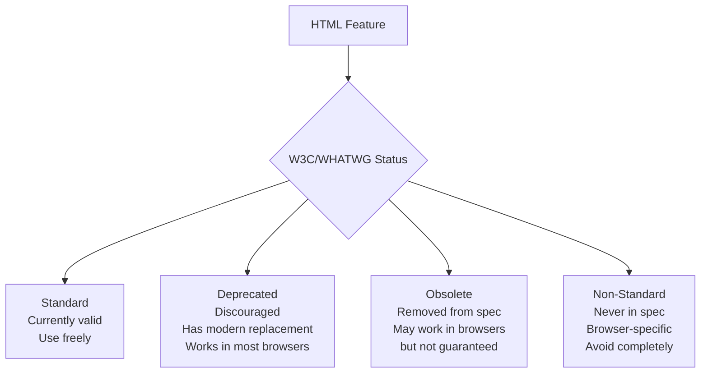
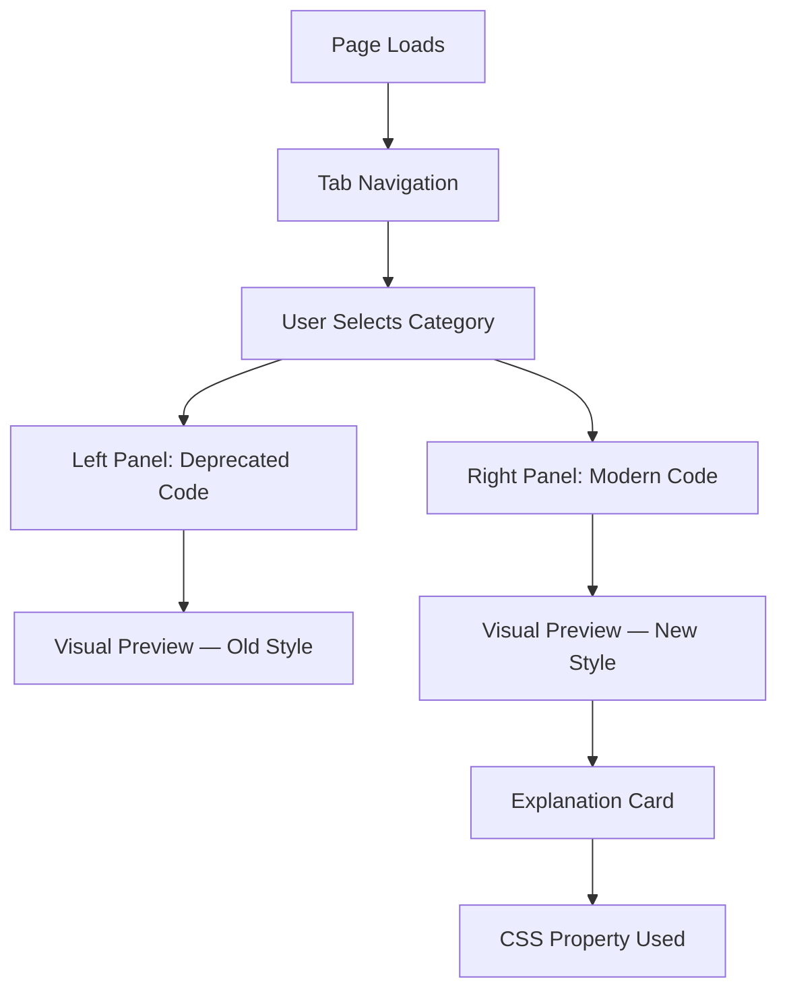

<a id="chapter-24-html-deprecated-tags"></a>

# Chapter 24: HTML Deprecated Tags

[⬅ Previous Chapter](#chapter-23-html-best-practices) | [📖 Main Index](#main-index) | [Next Chapter ➡](#chapter-25-html-interview-questions)

---

## 📌 Learning Objectives

By the end of this chapter, you will:

* Understand what deprecated and obsolete HTML elements are and why they were removed
* Know every major deprecated HTML tag, its original purpose, and its modern CSS replacement
* Understand the difference between "deprecated" and "obsolete" in HTML specification terms
* Be able to identify deprecated tags in legacy codebases and refactor them correctly
* Know why browsers still render deprecated tags and why that is dangerous to rely on
* Apply modern CSS alternatives for every deprecated presentational tag
* Answer interview questions about deprecated HTML with confidence
* Recognize deprecated attributes on still-valid HTML elements

---

<a id="chapter-index-table-24"></a>

## Chapter Index Table

| Topic No. | Topic Name | Subtopics |
|-----------|------------|-----------|
| 24.1 | [What is Deprecated HTML?](#241-what-is-deprecated-html) | Deprecated vs Obsolete<br>Why tags get removed<br>Browser behavior |
| 24.2 | [Presentational Tags](#242-presentational-tags) | `<font>` `<center>` `<b>` `<i>` `<u>` `<s>` `<strike>` `<big>` `<small>` `<tt>` |
| 24.3 | [Layout and Structure Tags](#243-layout-and-structure-tags) | `<frame>` `<frameset>` `<noframes>` `<basefont>` |
| 24.4 | [Animation and Effect Tags](#244-animation-and-effect-tags) | `<marquee>` `<blink>` |
| 24.5 | [Other Deprecated Tags](#245-other-deprecated-tags) | `<acronym>` `<applet>` `<dir>` `<isindex>` `<listing>` `<plaintext>` `<xmp>` `<nextid>` |
| 24.6 | [Deprecated Attributes](#246-deprecated-attributes) | align<br>bgcolor<br>border<br>color<br>width/height on non-img<br>cellpadding<br>cellspacing |
| 24.7 | [Modern CSS Alternatives](#247-modern-css-alternatives) | Complete replacement reference<br>Migration patterns |
| 24.8 | [Legacy Code Refactoring](#248-legacy-code-refactoring) | Identifying deprecated code<br>Step-by-step refactoring |
| 24.9 | [Interview Questions](#249-interview-questions) | Conceptual<br>Scenario<br>Output-based<br>Advanced |
| 24.10 | [Practice Problems](#2410-practice-problems) | Coding<br>Theory<br>Machine Coding |
| 24.11 | [Mini Project](#2411-mini-project) | Legacy Page Modernizer |
| 24.12 | [Quick Revision](#2412-quick-revision) | Key Points<br>Traps<br>Bullets |
| 24.13 | [Chapter Summary](#2413-chapter-summary) | Final Takeaways |

---

## 241 What is Deprecated HTML?

<a id="241-what-is-deprecated-html"></a>

### 🔷 What Does "Deprecated" Mean?

In web standards, **deprecated** means an HTML element or attribute has been **officially discouraged** by the W3C/WHATWG specification — it still exists in browsers for backward compatibility, but:

* It should **not be used** in new code
* It may be **removed** from browsers in the future
* It signals **poor code quality** in modern development
* It often causes **accessibility and maintainability problems**

**Obsolete** is stronger — it means the feature has been **removed from the specification entirely** and browsers are NOT required to support it (though many still do for legacy reasons).

---

### 🔷 Deprecated vs Obsolete vs Non-Standard



| Status | Example | Browser Support | Use in New Code? |
|--------|---------|----------------|-----------------|
| **Standard** | `<div>`, `<section>`, `<nav>` | ✅ Full | ✅ Yes |
| **Deprecated** | `<font>`, `<center>` | ✅ Most browsers (legacy) | ❌ No |
| **Obsolete** | `<marquee>`, `<blink>` | ⚠️ Some browsers | ❌ Never |
| **Non-Standard** | `<bgsound>` (IE only) | ❌ Unreliable | ❌ Never |

---

### 🔷 Why Were These Tags Deprecated?

| Reason | Explanation | Example |
|--------|-------------|---------|
| **Separation of concerns** | HTML should define structure; CSS should define presentation | `<font color="red">` mixes both |
| **Accessibility failures** | Presentational tags carry no semantic meaning | `<b>` vs `<strong>` |
| **Maintainability** | Changing design requires editing every HTML element | `<center>` on every page |
| **Scalability** | Cannot update style globally from one stylesheet | `<font>` on 10,000 pages |
| **Better alternatives** | CSS can do the job far more powerfully | `<marquee>` vs CSS animation |
| **Security** | Some features had inherent security issues | `<applet>` (Java plugins) |

---

### 🔷 Why Do Browsers Still Support Them?

> [!IMPORTANT]
> Browsers support deprecated tags because of **Postel's Law** ("be liberal in what you accept") and the massive amount of legacy HTML on the internet — breaking old websites would lose users. This is called **backward compatibility**.

However, this does NOT mean you should use them:
- Browser support can be removed anytime
- Behavior may differ across browsers
- They will fail HTML validation
- They signal unprofessional code in interviews and code reviews

---

### 🧠 Hinglish Intuition

> Deprecated tags ko socho jaise **purana Nokia phone** — abhi bhi calls kar sakta hai, lekin:
> - Koi naya app nahi milega
> - Security updates nahi honge
> - Kal band ho sakta hai
> - Professional setting mein use karna embarrassing hai
>
> Browsers unhe support karte hain kyunki internet pe lakhon purani websites hain — unhe todna theek nahi. Lekin naya code likhte waqt in tags ka use karna ek **red flag** hai interviewer ke liye.

---

👉 <a href="#chapter-index-table-24">Go to Top 🔝</a>

---

## 242 Presentational Tags

<a id="242-presentational-tags"></a>

### 🔷 `<font>` — The Most Infamous Deprecated Tag

The `<font>` tag was used to set typeface, size, and color of text directly in HTML.

**What it did:**
```html
<!-- ❌ DEPRECATED: font tag -->
<font face="Arial" size="5" color="red">
  This is big red Arial text
</font>

<font face="Georgia" size="3" color="#0066cc">
  <b>Bold blue Georgia text</b>
</font>

<!-- Nightmare scenario: changing color on entire site meant editing EVERY page -->
<font color="blue">Heading</font>
<font color="blue">Subheading</font>
<font color="blue">Every single paragraph...</font>
```

**Why it was terrible:**
- Zero reusability — changing brand color meant editing thousands of files
- No semantic meaning — pure presentation in markup
- Fails completely for screen readers
- Impossible to maintain at scale

**✅ Modern CSS Replacement:**
```html
<!-- HTML: clean structure only -->
<p class="intro-text">This is styled text</p>
<p class="highlight-text">This is highlighted text</p>

<!-- CSS: all presentation in one place -->
<style>
  .intro-text {
    font-family: Arial, sans-serif;
    font-size: 1.25rem;   /* rem units — relative, accessible */
    color: #cc0000;
  }

  .highlight-text {
    font-family: Georgia, serif;
    font-size: 1rem;
    color: #0066cc;
    font-weight: bold;
  }

  /* Change brand color site-wide: edit ONE line here */
  :root {
    --brand-color: #0066cc;
  }
</style>
```

---

### 🔷 `<center>` — The Layout Crutch

`<center>` centered its content horizontally. It was used everywhere — for headers, images, navigation, text.

```html
<!-- ❌ DEPRECATED: center tag -->
<center>
  <h1>Welcome to My Website</h1>
</center>

<center>
  
</center>

<center>
  <table>...</table>
</center>
```

**✅ Modern CSS Replacement:**
```html
<!-- HTML -->
<h1 class="page-title">Welcome to My Website</h1>


<div class="centered-container">
  <table>...</table>
</div>

<!-- CSS -->
<style>
  /* Center text */
  .page-title {
    text-align: center;
  }

  /* Center block element */
  .logo {
    display: block;
    margin: 0 auto;
  }

  /* Center with Flexbox */
  .centered-container {
    display: flex;
    justify-content: center;
    align-items: center;
  }

  /* Center with CSS Grid */
  .grid-center {
    display: grid;
    place-items: center;
  }
</style>
```

---

### 🔷 `<b>` and `<i>` — Presentational vs Semantic

> [!NOTE]
> `<b>` and `<i>` are technically **not deprecated** in HTML5 — they were redefined with new (limited) semantic meaning. However, they are frequently misused where `<strong>` and `<em>` should be used instead.

```html
<!-- ❌ MISUSE: b/i used for semantic emphasis -->
<p>Warning: <b>Do not delete this file</b></p>   <!-- Should be <strong> -->
<p>Please read this <i>carefully</i></p>          <!-- Should be <em> -->

<!-- ✅ CORRECT use of <b>: draw attention without importance -->
<p>The <b>Pro Plan</b> costs ₹999/month.</p>
<p>Look for the <b>Settings</b> button in the top menu.</p>

<!-- ✅ CORRECT use of <i>: technical terms, foreign words, thoughts -->
<p>The <i lang="la">carpe diem</i> philosophy guides our work.</p>
<p>She was thinking, <i>this can't be happening</i>.</p>
<p>The <i>Homo sapiens</i> fossil was found in 2019.</p>

<!-- ✅ CORRECT use of <strong>: important, serious, urgent content -->
<p><strong>Warning:</strong> This action cannot be undone.</p>
<p>Password must be <strong>at least 8 characters</strong>.</p>

<!-- ✅ CORRECT use of <em>: stress emphasis that changes meaning -->
<p>I <em>never</em> said she stole the money.</p>
<p>I never said <em>she</em> stole the money.</p>
```

| Element | Status | Semantic Meaning | When to Use |
|---------|--------|-----------------|------------|
| `<strong>` | ✅ Current | Important/critical | Warnings, key info, urgency |
| `<em>` | ✅ Current | Stressed emphasis | Changing spoken stress |
| `<b>` | ⚠️ Redefined | Attention without importance | Keywords, product names, UI labels |
| `<i>` | ⚠️ Redefined | Technical/alternate voice | Foreign terms, taxonomy, thoughts |

---

### 🔷 `<u>` — Underline

`<u>` was purely presentational in HTML4. In HTML5, it was redefined but remains limited.

```html
<!-- ❌ OLD misuse: underline for styling -->
<u>This is underlined text</u>
<!-- Problem: users confuse underlined text with links! -->

<!-- ✅ HTML5 redefined use of <u>: unarticulated annotation -->
<!-- Spell-check errors, proper nouns in Chinese, etc. -->
<p>He said he was from <u class="spelling-error">Bombay</u>
   (the city is now called Mumbai).</p>

<!-- ✅ Better: For actual emphasis, use CSS -->
<style>
  .custom-underline {
    text-decoration: underline;
    text-decoration-color: #0066cc;
    text-decoration-style: wavy;  /* solid | dashed | dotted | wavy */
    text-underline-offset: 3px;
  }
</style>
<p class="custom-underline">Stylized underline with CSS</p>
```

---

### 🔷 `<s>` and `<strike>` — Strikethrough

```html
<!-- ❌ DEPRECATED: strike -->
<strike>Old price: ₹2000</strike>

<!-- ✅ <s> is current HTML5 — for no-longer-accurate content -->
<p>
  <s>Original price: ₹2,000</s>
  Sale price: <strong>₹999</strong>
</p>

<!-- ✅ <del> for editorially deleted content (with <ins>) -->
<p>
  Meeting scheduled for
  <del datetime="2024-01-15">Monday</del>
  <ins datetime="2024-01-16">Tuesday</ins>
</p>
```

| Element | Status | Use Case |
|---------|--------|----------|
| `<strike>` | ❌ Deprecated | Don't use |
| `<s>` | ✅ Current | Content no longer accurate/relevant |
| `<del>` | ✅ Current | Editorially deleted text (with timestamp) |

---

### 🔷 `<big>` and `<small>`

```html
<!-- ❌ DEPRECATED: big -->
<big>This text is bigger</big>

<!-- ✅ Use CSS for larger text -->
<p style="font-size: 1.25em;">Larger text</p>
<p class="lead-text">Lead paragraph text</p>

<!-- ✅ <small> is still valid in HTML5 — redefined meaning -->
<!-- For side comments, fine print, legal text -->
<p>
  Buy now for ₹999
  <small>(inclusive of all taxes)</small>
</p>
<p><small>© 2024 Company Name. All rights reserved.</small></p>
```

---

### 🔷 `<tt>` — Teletype Text

```html
<!-- ❌ DEPRECATED: tt (teletype/monospace) -->
<tt>monospace text like code</tt>

<!-- ✅ Use semantic code elements instead -->
<code>console.log('Hello');</code>    <!-- Inline code -->
<kbd>Ctrl + C</kbd>                    <!-- Keyboard input -->
<samp>Error: File not found</samp>     <!-- Sample output -->
<var>x = y + z</var>                   <!-- Mathematical variable -->

<!-- Or CSS for generic monospace -->
<span style="font-family: monospace;">monospace text</span>
```

---

### 🧠 Hinglish Intuition

> Presentational tags ko socho jaise **purani diary mein har page pe manually margin banana** — pencil se line khichna, color pencil se highlight karna, har page alag.
>
> CSS aane ke baad, ek baar `margin: 20px` likho — poori diary set ho gayi. Yahi fark hai `<font>` aur CSS ke beech.
>
> `<b>` vs `<strong>` ka fark samajhne ka tarika: `<b>` ek **highlighter** hai — dhyan attract karta hai. `<strong>` ek **red alarm** hai — "yeh important hai, seriously pado!"

---

👉 <a href="#chapter-index-table-24">Go to Top 🔝</a>

---

## 243 Layout and Structure Tags

<a id="243-layout-and-structure-tags"></a>

### 🔷 `<frame>`, `<frameset>`, `<noframes>` — The Frame Era

Frames were used in the late 1990s to divide browser windows into multiple independently scrollable panels, each loading a separate HTML file.

```html
<!-- ❌ OBSOLETE: Frames-based layout (entire approach is obsolete) -->

<!-- frameset.html — the master layout file -->
<!DOCTYPE HTML PUBLIC "-//W3C//DTD HTML 4.01 Frameset//EN">
<html>
<head>
  <title>Old Frames Layout</title>
</head>
<frameset cols="200, *">                    <!-- Two columns -->
  <frame src="sidebar.html" name="sidebar" scrolling="no">
  <frameset rows="80, *">                   <!-- Nested frameset -->
    <frame src="header.html" name="header">
    <frame src="content.html" name="main">
  </frameset>
  <noframes>
    <!-- Shown to browsers that don't support frames -->
    <body>
      <p>Your browser does not support frames.
         <a href="content.html">Click here</a> to view content.</p>
    </body>
  </noframes>
</frameset>
</html>
```

**Why Frames Were Terrible:**
- Broken browser back button behavior
- URL never changed — no bookmarking individual pages
- Search engines couldn't index framed content properly
- Accessibility nightmare — screen readers lost context
- Printing was broken
- Security issues — clickjacking attacks
- Each frame = separate HTTP request

**✅ Modern Replacement — CSS Layout:**
```html
<!-- ✅ Modern equivalent using CSS Grid -->
<!DOCTYPE html>
<html lang="en">
<head>
  <meta charset="UTF-8">
  <title>Modern Layout</title>
  <style>
    * { box-sizing: border-box; margin: 0; padding: 0; }

    body {
      display: grid;
      grid-template-areas:
        "header  header"
        "sidebar main"
        "footer  footer";
      grid-template-columns: 220px 1fr;
      grid-template-rows: 80px 1fr 60px;
      min-height: 100vh;
    }

    header  { grid-area: header;  background: #2c3e50; color: white; padding: 1rem; }
    nav     { grid-area: sidebar; background: #ecf0f1; padding: 1rem; overflow-y: auto; }
    main    { grid-area: main;    padding: 2rem; overflow-y: auto; }
    footer  { grid-area: footer;  background: #2c3e50; color: white; padding: 1rem; }
  </style>
</head>
<body>
  <header><h1>Site Title</h1></header>
  <nav><!-- Sidebar navigation --></nav>
  <main><!-- Page content --></main>
  <footer><!-- Footer --></footer>
</body>
</html>
```

**✅ For Genuinely Embedded Content — Use `<iframe>`:**
```html
<!-- iframe is still valid and current — for embedding external content -->
<iframe
  src="https://www.youtube.com/embed/VIDEO_ID"
  title="Tutorial: Introduction to HTML"
  width="560"
  height="315"
  loading="lazy"
  allowfullscreen
  referrerpolicy="strict-origin-when-cross-origin"
></iframe>
```

> [!IMPORTANT]
> `<iframe>` is completely different from `<frame>`. `<iframe>` is valid HTML5 for embedding content within a page. `<frame>` and `<frameset>` — the full-page frame layout system — are obsolete.

---

### 🔷 `<basefont>` — Global Default Font

```html
<!-- ❌ DEPRECATED: basefont — set default font for entire document -->
<head>
  <basefont face="Arial" size="3" color="#333333">
</head>
<body>
  <p>This paragraph inherits the basefont settings</p>
</body>

<!-- ✅ Modern replacement: CSS on body or :root -->
<style>
  /* Global typography defaults */
  :root {
    --font-family-base: 'Segoe UI', Arial, sans-serif;
    --font-size-base: 1rem;         /* 16px typically */
    --color-text: #333333;
  }

  body {
    font-family: var(--font-family-base);
    font-size: var(--font-size-base);
    color: var(--color-text);
    line-height: 1.6;
  }
</style>
```

---

### 🧠 Hinglish Intuition

> Frames ko socho jaise **purani government office** jahan har kaam ke liye alag-alag room mein jaana padta tha — ek room mein form lo, doosre mein sign karo, teesre mein submit karo. Har step ke baad pichli jagah yaad nahi rehti thi (no back button!).
>
> Modern CSS Grid ek **single modern office** ki tarah hai — sab kuch ek hi jagah, clearly organized, smooth flow.
>
> `<frameset>` = Purani government office
> CSS Grid = Modern open-plan office

---

👉 <a href="#chapter-index-table-24">Go to Top 🔝</a>

---

## 244 Animation and Effect Tags

<a id="244-animation-and-effect-tags"></a>

### 🔷 `<marquee>` — The Scrolling Text Disaster

`<marquee>` created horizontally or vertically scrolling text/content. It was infamous for making 1990s websites feel chaotic and unprofessional.

```html
<!-- ❌ OBSOLETE: marquee — scrolling text -->

<!-- Basic scrolling text -->
<marquee>Welcome to my awesome website! ← Scrolling text!</marquee>

<!-- With all attributes -->
<marquee
  direction="left"          <!-- left | right | up | down -->
  behavior="scroll"         <!-- scroll | slide | alternate -->
  scrollamount="5"          <!-- Speed -->
  scrolldelay="60"          <!-- Delay between moves (ms) -->
  loop="3"                  <!-- Number of loops (-1 = infinite) -->
  width="400"
  height="50"
  bgcolor="#ffff00"
>
  SALE! 50% OFF ALL ITEMS! BUY NOW! FREE SHIPPING!
</marquee>

<!-- Nested marquees (the horror!) -->
<marquee direction="left">
  <marquee direction="up">
    Spinning chaos!
  </marquee>
</marquee>
```

**Why `<marquee>` Was Terrible:**
- Extremely distracting — violates UX principles
- Inaccessible — screen readers struggle; seizure risk for photosensitive users
- Uncontrollable — user can't pause (accessibility WCAG violation)
- Removed from official spec (obsolete)

**✅ Modern CSS Replacement — Controlled Ticker:**
```html
<!DOCTYPE html>
<html lang="en">
<head>
  <meta charset="UTF-8">
  <title>CSS Ticker</title>
  <style>
    /* ===== NEWS TICKER — Accessible CSS Alternative ===== */
    .ticker-wrapper {
      width: 100%;
      overflow: hidden;
      background: #1a1a2e;
      padding: 12px 0;
      border-top: 2px solid #e74c3c;
      border-bottom: 2px solid #e74c3c;
    }

    .ticker-label {
      display: inline-block;
      background: #e74c3c;
      color: white;
      padding: 4px 12px;
      font-weight: bold;
      font-size: 0.85rem;
      margin-right: 16px;
      vertical-align: middle;
    }

    .ticker-track {
      display: inline-block;
      white-space: nowrap;
      animation: ticker-scroll 20s linear infinite;
      color: white;
      font-size: 0.95rem;
    }

    /* Pause on hover/focus for accessibility */
    .ticker-wrapper:hover .ticker-track,
    .ticker-wrapper:focus-within .ticker-track {
      animation-play-state: paused;
    }

    @keyframes ticker-scroll {
      from { transform: translateX(100vw); }
      to   { transform: translateX(-100%); }
    }

    /* Respect user preference: no motion */
    @media (prefers-reduced-motion: reduce) {
      .ticker-track {
        animation: none;
        white-space: normal;
        padding: 0 16px;
      }
    }
  </style>
</head>
<body>

  <!-- Accessible ticker with ARIA -->
  <div class="ticker-wrapper"
       role="marquee"
       aria-label="News ticker — pauses on hover"
       aria-live="off">
    <span class="ticker-label" aria-hidden="true">BREAKING</span>
    <span class="ticker-track">
      🎉 Summer Sale: Up to 50% off all products &nbsp;&nbsp;|&nbsp;&nbsp;
      📦 Free delivery on orders above ₹999 &nbsp;&nbsp;|&nbsp;&nbsp;
      🚀 New arrivals every Friday &nbsp;&nbsp;|&nbsp;&nbsp;
      💳 EMI options available on orders above ₹2000
    </span>
  </div>

</body>
</html>
```

---

### 🔷 `<blink>` — The Most Hated Tag

`<blink>` made text flash on and off repeatedly. It was a Netscape-specific tag, never standardized, universally despised by web developers.

```html
<!-- ❌ OBSOLETE (and never standardized): blink -->
<blink>SALE! LIMITED TIME OFFER!</blink>

<!-- This was so bad that even Netscape's creator later apologized for it -->
```

**Why `<blink>` was harmful:**
- Extremely distracting — violates every UX principle
- Can trigger epileptic seizures (WCAG failure: Success Criterion 2.3.1)
- Never part of any W3C standard
- Removed from all browsers (Firefox removed it in 2013, Chrome never supported it)

**✅ Modern CSS Alternative — Subtle Attention Effect:**
```html
<style>
  /* Subtle, accessible attention effect */
  .badge-new {
    display: inline-block;
    background: #e74c3c;
    color: white;
    padding: 2px 8px;
    border-radius: 4px;
    font-size: 0.75rem;
    font-weight: bold;
    animation: gentle-pulse 2s ease-in-out infinite;
  }

  @keyframes gentle-pulse {
    0%, 100% { opacity: 1; transform: scale(1); }
    50%       { opacity: 0.7; transform: scale(0.98); }
  }

  /* Respect reduced-motion preferences */
  @media (prefers-reduced-motion: reduce) {
    .badge-new { animation: none; }
  }
</style>

<span class="badge-new">NEW</span>
```

> [!IMPORTANT]
> Any animation that **blinks or flashes** more than 3 times per second violates **WCAG 2.1 Success Criterion 2.3.1** and can trigger photosensitive epilepsy. Always use `@media (prefers-reduced-motion: reduce)` for all animations.

---

### 🧠 Hinglish Intuition

> `<marquee>` aur `<blink>` ko socho jaise woh **dukaan wala jo bahut zyada chillata hai** — "AAYIYE! AAYIYE! SALE HAI! DISCOUNT HAI!" — itna annoying hota hai ki log seedha chale jaate hain.
>
> Agar aapko kisi cheez pe dhyan attract karna hai, CSS animations karo — subtle, controlled, professional. **Har cheez jo blink kare woh accessible nahi hoti** — epilepsy ka risk hota hai. Isliye `prefers-reduced-motion` use karna best practice hai.

---

👉 <a href="#chapter-index-table-24">Go to Top 🔝</a>

---

## 245 Other Deprecated Tags

<a id="245-other-deprecated-tags"></a>

### 🔷 Complete Reference of Other Deprecated/Obsolete Tags

---

#### `<acronym>` — Abbreviation (Deprecated in HTML5)

```html
<!-- ❌ DEPRECATED: acronym -->
<acronym title="HyperText Markup Language">HTML</acronym>

<!-- ✅ Use <abbr> for all abbreviations and acronyms -->
<abbr title="HyperText Markup Language">HTML</abbr>
<abbr title="Cascading Style Sheets">CSS</abbr>
<abbr title="World Wide Web Consortium">W3C</abbr>

<!-- Style abbr for visual indicator -->
<style>
  abbr[title] {
    text-decoration: underline dotted;
    cursor: help;
  }
</style>
```

---

#### `<applet>` — Java Applets (Obsolete)

```html
<!-- ❌ OBSOLETE: applet — embedded Java application -->
<applet code="Calculator.class" width="300" height="400">
  <param name="bgcolor" value="ffffff">
  Your browser does not support Java applets.
</applet>

<!-- Context: Java applets required Java browser plugin (removed from all browsers) -->
<!-- Java plugin support removed: Chrome 45 (2015), Firefox 52 (2017) -->

<!-- ✅ Modern replacements depending on use case: -->
<!-- For calculations: JavaScript -->
<!-- For visualizations: Canvas / WebGL / Three.js -->
<!-- For data processing: Web Workers + JavaScript -->
<!-- For file processing: File API + JavaScript -->
```

---

#### `<dir>` — Directory List (Obsolete)

```html
<!-- ❌ OBSOLETE: dir — meant for file directory listings -->
<dir>
  <li>index.html</li>
  <li>about.html</li>
  <li>contact.html</li>
</dir>

<!-- ✅ Use <ul> for unordered lists -->
<ul>
  <li>index.html</li>
  <li>about.html</li>
  <li>contact.html</li>
</ul>
```

---

#### `<isindex>` — Single-Line Search Input (Obsolete)

```html
<!-- ❌ OBSOLETE: isindex — ancient search field -->
<isindex prompt="Search this site:">

<!-- ✅ Use proper form with input -->
<form action="/search" method="get" role="search">
  <label for="search-query">Search this site:</label>
  <input type="search" id="search-query" name="q"
         placeholder="Type to search...">
  <button type="submit">Search</button>
</form>
```

---

#### `<listing>`, `<plaintext>`, `<xmp>` — Preformatted Text (Obsolete)

```html
<!-- ❌ OBSOLETE: listing, plaintext, xmp — all display raw text -->
<listing>
  function hello() {
    return "world";
  }
</listing>

<xmp>
  <p>This would show the tags literally</p>
</xmp>

<!-- ✅ Modern replacement -->
<pre><code>
function hello() {
  return "world";
}
</code></pre>

<!-- For syntax highlighting: use a library like Prism.js or highlight.js -->
<pre><code class="language-javascript">
function hello() {
  return "world";
}
</code></pre>
```

---

#### `<menu>` — Redefined (Not Deprecated, but Changed)

```html
<!-- HTML4: <menu> was a menu list (deprecated then) -->
<!-- HTML5: <menu> redefined as context/toolbar menu — barely supported -->

<!-- ✅ Best practice: use <ul> for navigation, <nav> for navigation landmark -->
<nav aria-label="Main menu">
  <ul>
    <li><a href="/">Home</a></li>
    <li><a href="/products">Products</a></li>
    <li><a href="/contact">Contact</a></li>
  </ul>
</nav>
```

---

### 🔷 Complete Deprecated Tags Reference Table

| Tag | Era | Reason Deprecated | Modern Replacement |
|-----|-----|------------------|--------------------|
| `<font>` | HTML4 | Presentational; CSS handles typography | CSS `font-family`, `font-size`, `color` |
| `<center>` | HTML4 | Presentational; CSS handles alignment | CSS `text-align: center` / `margin: auto` |
| `<big>` | HTML4 | Presentational; CSS handles size | CSS `font-size` |
| `<strike>` | HTML4 | Semantic overlap; clarity | `<s>` or `<del>` |
| `<tt>` | HTML4 | Presentational; semantic alternatives exist | `<code>`, `<kbd>`, `<samp>` |
| `<acronym>` | HTML5 | `<abbr>` covers both cases | `<abbr title="...">` |
| `<applet>` | HTML5 | Java plugin obsolete; security risk | JavaScript, Canvas, WebGL |
| `<basefont>` | HTML4 | CSS handles global defaults | CSS on `body` / `:root` |
| `<dir>` | HTML4 | `<ul>` is the correct element | `<ul>` |
| `<isindex>` | HTML4 | Proper form elements exist | `<form>` with `<input type="search">` |
| `<listing>` | HTML3 | `<pre><code>` is correct | `<pre><code>` |
| `<plaintext>` | HTML3 | Never properly standardized | `<pre>` |
| `<xmp>` | HTML3 | `<pre><code>` is correct | `<pre><code>` |
| `<nextid>` | HTML2 | Internal tool, never for authors | N/A |
| `<frameset>` | HTML4 | Layout via CSS | CSS Grid / Flexbox |
| `<frame>` | HTML4 | Single-file layouts via CSS | CSS Grid / Flexbox |
| `<noframes>` | HTML4 | Frames obsolete | N/A |
| `<marquee>` | Netscape | Accessibility failure; CSS animations | CSS `animation` + `transform` |
| `<blink>` | Netscape | Never standardized; seizure risk | CSS subtle animations |

---

### 🧠 Hinglish Intuition

> Ye sab deprecated tags 1990s aur early 2000s ki technology constraints ki wajah se aaye the. Tab CSS itna powerful nahi tha, JavaScript itna capable nahi tha.
>
> `<applet>` Java plugin pe depend karta tha — tab browser mein Java install karna padta tha. Aaj har computer pe JS already hai. Isliye Java applets gaye.
>
> `<acronym>` vs `<abbr>` — dono basically same kaam karte the, toh W3C ne ek hi rakha: `<abbr>`. Simple.
>
> Har deprecated tag ke peeche ek **"why it made sense in its time"** story hai, aur ek **"why CSS/JS made it obsolete"** reason hai.

---

👉 <a href="#chapter-index-table-24">Go to Top 🔝</a>

---

## 246 Deprecated Attributes

<a id="246-deprecated-attributes"></a>

### 🔷 Deprecated Attributes on HTML Elements

Not just elements — many **attributes** on otherwise valid elements are also deprecated in HTML5. These are presentational attributes that CSS now handles.

---

#### `align` Attribute (Deprecated)

```html
<!-- ❌ DEPRECATED: align attribute on various elements -->
<h1 align="center">Centered Heading</h1>
<p align="right">Right-aligned paragraph</p>

<table align="center">...</table>
<td align="center">Cell content</td>
<div align="justify">Justified text</div>

<!-- ✅ Modern CSS replacement -->
<style>
  .center-heading  { text-align: center; }
  .right-text      { text-align: right; }
  .float-left      { float: left; margin-right: 16px; }
  .centered-table  { margin: 0 auto; }
  .cell-center     { text-align: center; }
  .justify-text    { text-align: justify; }
</style>
```

---

#### `bgcolor` Attribute (Deprecated)

```html
<!-- ❌ DEPRECATED: bgcolor on body, table, tr, td -->
<body bgcolor="#f0f0f0">
<table bgcolor="#ffffff">
<tr bgcolor="#eeeeee">
<td bgcolor="#ccffcc">Green cell</td>

<!-- ✅ Modern CSS replacement -->
<style>
  body { background-color: #f0f0f0; }
  table { background-color: #ffffff; }
  tr.alternate { background-color: #eeeeee; }
  td.highlight { background-color: #ccffcc; }
</style>
```

---

#### `border` Attribute (Deprecated on most elements)

```html
<!-- ❌ DEPRECATED: border on table, img -->
<table border="1">...</table>


<!-- ✅ CSS replacement -->
<style>
  table {
    border-collapse: collapse;
    border: 1px solid #ddd;
  }
  td, th {
    border: 1px solid #ddd;
    padding: 8px;
  }
  .bordered-image {
    border: 3px solid #333;
  }
</style>
```

---

#### `color` Attribute (Deprecated)

```html
<!-- ❌ DEPRECATED: color on hr, li, font -->
<hr color="red">
<li color="blue">List item</li>

<!-- ✅ CSS replacement -->
<style>
  hr { border-color: red; border-top: 2px solid red; }
  li.colored { color: blue; }
</style>
```

---

#### `width` and `height` on Non-Image Elements (Deprecated)

```html
<!-- ❌ DEPRECATED: width/height as presentational on table elements -->
<table width="100%" height="400">
<td width="200" height="50">Cell</td>
<hr width="50%">

<!-- NOTE: width/height on , <video>, <canvas> are STILL valid -->
  <!-- ✅ Valid -->

<!-- ✅ CSS replacement for table/hr/other elements -->
<style>
  table { width: 100%; }
  td    { width: 200px; height: 50px; }
  hr    { width: 50%; margin: 0 auto; }
</style>
```

---

#### Table-Specific Deprecated Attributes

```html
<!-- ❌ DEPRECATED: cellpadding, cellspacing on table -->
<table cellpadding="10" cellspacing="0">

<!-- ✅ CSS replacement -->
<style>
  table { border-collapse: collapse; }  /* cellspacing: 0 */
  td, th { padding: 10px; }             /* cellpadding */

  /* For separated borders: */
  table { border-collapse: separate; border-spacing: 5px; }
</style>

<!-- ❌ DEPRECATED: valign on td/th -->
<td valign="top">Content</td>
<td valign="middle">Content</td>

<!-- ✅ CSS replacement -->
<style>
  td { vertical-align: top; }
  td.middle { vertical-align: middle; }
</style>

<!-- ❌ DEPRECATED: nowrap on td -->
<td nowrap>Text that should not wrap</td>

<!-- ✅ CSS replacement -->
<style>
  td.no-wrap { white-space: nowrap; }
</style>
```

---

#### `language` Attribute on `<script>` (Deprecated)

```html
<!-- ❌ DEPRECATED: language attribute on script -->
<script language="JavaScript">
  alert('Hello');
</script>

<script language="VBScript">  <!-- VBScript: IE only, long dead -->
  MsgBox "Hello"
</script>

<!-- ✅ Modern: type is also optional in HTML5 for JavaScript -->
<script>
  console.log('Hello');
</script>

<!-- type only needed for non-JS: module, JSON data, templates -->
<script type="module" src="app.js"></script>
<script type="application/json" id="page-data">
  {"user": "Rahul", "role": "admin"}
</script>
```

---

#### `name` Attribute on `<a>` (Deprecated for Anchors)

```html
<!-- ❌ DEPRECATED: name on anchor for fragment navigation -->
<a name="section-2">Section 2 Heading</a>

<!-- ✅ Use id attribute on any element instead -->
<h2 id="section-2">Section 2 Heading</h2>
<section id="contact-section">...</section>

<!-- The link to it remains the same -->
<a href="#section-2">Jump to Section 2</a>
<a href="#contact-section">Jump to Contact</a>
```

---

### 🔷 Complete Deprecated Attributes Reference

| Attribute | Element(s) | CSS Replacement |
|-----------|------------|-----------------|
| `align` | `h1-h6`, `p`, `div`, `table`, `td`, `img` | `text-align`, `margin: auto`, `float` |
| `bgcolor` | `body`, `table`, `tr`, `td` | `background-color` |
| `border` | `table`, `img` | `border`, `border-collapse` |
| `color` | `hr`, `li`, `font` | `color`, `border-color` |
| `width`/`height` | `table`, `td`, `hr` (not `img`) | `width`, `height` CSS properties |
| `cellpadding` | `table` | `padding` on `td`/`th` |
| `cellspacing` | `table` | `border-spacing`, `border-collapse` |
| `valign` | `td`, `th` | `vertical-align` |
| `nowrap` | `td` | `white-space: nowrap` |
| `language` | `script` | Remove (use `type` if needed) |
| `name` | `a` (as anchor) | Use `id` on target element |
| `type` | `ol` (for `1`,`a`,`A`,`i`,`I`) | CSS `list-style-type` |
| `start` | `ol` | `counter-reset`, `start` still valid |
| `vlink`, `alink`, `link` | `body` | CSS `:visited`, `:active`, `a` selectors |
| `background` | `body`, `table`, `td` | CSS `background-image` |

---

### 🧠 Hinglish Intuition

> Deprecated attributes woh hain jaise **apne kapdon pe seedha marker se style likhna** — "BLUE SHIRT" likhna apni shirt pe taaki sab samjhen. Koi sense nahi — CSS ek separate wardrobe ki tarah hai jahan har style defined hai.
>
> `cellpadding="10"` vs `td { padding: 10px; }` — dono same kaam karte hain, lekin CSS wala ek jagah se poore table ke liye kaam karta hai. Attribute wala har table mein manually likhna padega.
>
> **Rule of thumb:** Agar koi attribute directly **visual appearance** set karta hai (color, size, alignment), 99% chances hain ki wo deprecated hai — CSS use karo.

---

👉 <a href="#chapter-index-table-24">Go to Top 🔝</a>

---

## 247 Modern CSS Alternatives

<a id="247-modern-css-alternatives"></a>

### 🔷 Complete Migration Reference

Every deprecated tag mapped to its exact modern CSS equivalent with working code:

---

#### Typography Replacements

```html
<!-- DEPRECATED TYPOGRAPHY TAGS → CSS EQUIVALENTS -->

<style>
  /* ===== Font family ===== */
  /* <font face="Arial"> */
  .arial-text { font-family: Arial, Helvetica, sans-serif; }

  /* ===== Font size ===== */
  /* <font size="1"> to <font size="7"> roughly maps to: */
  .size-1 { font-size: 0.6rem;  }
  .size-2 { font-size: 0.8rem;  }
  .size-3 { font-size: 1rem;    }  /* Default */
  .size-4 { font-size: 1.125rem;}
  .size-5 { font-size: 1.5rem;  }
  .size-6 { font-size: 2rem;    }
  .size-7 { font-size: 3rem;    }

  /* ===== Font color ===== */
  /* <font color="red"> */
  .text-red   { color: #e74c3c; }
  .text-blue  { color: #3498db; }
  .text-green { color: #2ecc71; }

  /* ===== Combined (what <font> did in one CSS class) ===== */
  .page-heading {
    font-family: Georgia, 'Times New Roman', serif;
    font-size: 2.5rem;
    color: #2c3e50;
    font-weight: bold;
  }

  /* ===== Big text: <big> ===== */
  .lead { font-size: 1.25em; }

  /* ===== Monospace: <tt> ===== */
  .monospace { font-family: 'Courier New', Courier, monospace; }

  /* ===== Strikethrough: <strike> ===== */
  .old-price  { text-decoration: line-through; color: #999; }

  /* ===== Underline: <u> (as styling) ===== */
  .custom-underline {
    text-decoration: underline;
    text-decoration-color: #3498db;
    text-decoration-style: solid;
    text-underline-offset: 4px;
  }
</style>
```

---

#### Layout Replacements

```html
<style>
  /* ===== Center: <center> ===== */

  /* Center text */
  .text-center { text-align: center; }

  /* Center block element horizontally */
  .block-center {
    display: block;
    margin-left: auto;
    margin-right: auto;
  }

  /* Center with Flexbox */
  .flex-center {
    display: flex;
    justify-content: center;
    align-items: center;
  }

  /* Center with Grid */
  .grid-center {
    display: grid;
    place-items: center;
  }

  /* ===== Frame-like layouts: <frameset> ===== */

  /* Two-column layout (sidebar + content) */
  .frame-layout {
    display: grid;
    grid-template-columns: 240px 1fr;
    grid-template-rows: auto 1fr auto;
    grid-template-areas:
      "header  header"
      "sidebar main"
      "footer  footer";
    min-height: 100vh;
  }
  .frame-layout > header  { grid-area: header;  }
  .frame-layout > nav     { grid-area: sidebar; }
  .frame-layout > main    { grid-area: main;    }
  .frame-layout > footer  { grid-area: footer;  }
</style>
```

---

#### Animation Replacements

```html
<style>
  /* ===== Marquee: <marquee> ===== */

  .scroll-ticker {
    overflow: hidden;
    white-space: nowrap;
  }
  .scroll-ticker-inner {
    display: inline-block;
    animation: scroll-left 15s linear infinite;
  }
  .scroll-ticker:hover .scroll-ticker-inner {
    animation-play-state: paused;  /* Accessible pause on hover */
  }

  @keyframes scroll-left {
    from { transform: translateX(100%); }
    to   { transform: translateX(-100%); }
  }

  /* ===== Blink: <blink> ===== */

  /* NEVER recreate true blinking — accessibility violation */
  /* Instead: subtle pulse */
  .subtle-pulse {
    animation: soft-pulse 3s ease-in-out infinite;
  }

  @keyframes soft-pulse {
    0%, 100% { opacity: 1; }
    50%       { opacity: 0.6; }
  }

  /* Always add reduced motion support */
  @media (prefers-reduced-motion: reduce) {
    .scroll-ticker-inner,
    .subtle-pulse {
      animation: none;
    }
  }
</style>
```

---

#### Table Replacements

```html
<!-- BEFORE: Deprecated table attributes -->
<table width="100%" cellpadding="12" cellspacing="0" border="1" bgcolor="#ffffff">
  <tr bgcolor="#f0f0f0">
    <th align="center" valign="middle" nowrap>Name</th>
    <th align="center" valign="middle" nowrap>Score</th>
  </tr>
  <tr>
    <td align="left" valign="top">Rahul</td>
    <td align="right" valign="top">95</td>
  </tr>
</table>

<!-- AFTER: Modern CSS table -->
<style>
  .data-table {
    width: 100%;
    border-collapse: collapse;
    background-color: #ffffff;
  }
  .data-table thead tr {
    background-color: #f0f0f0;
  }
  .data-table th {
    text-align: center;
    vertical-align: middle;
    white-space: nowrap;
    padding: 12px;
    border: 1px solid #ddd;
    font-weight: bold;
  }
  .data-table td {
    padding: 12px;
    border: 1px solid #ddd;
    vertical-align: top;
  }
  .data-table td:first-child { text-align: left;  }
  .data-table td:last-child  { text-align: right; }
</style>

<table class="data-table">
  <thead>
    <tr>
      <th scope="col">Name</th>
      <th scope="col">Score</th>
    </tr>
  </thead>
  <tbody>
    <tr>
      <td>Rahul</td>
      <td>95</td>
    </tr>
  </tbody>
</table>
```

---

### 🧠 Hinglish Intuition

> CSS replacements ek **universal remote** ki tarah hain — ek jagah se sab control karo. Deprecated HTML attributes aise hain jaise har device ka alag remote tha — TV ka alag, AC ka alag, fan ka alag.
>
> CSS variables (`--brand-color: blue`) aur alag CSS file ka combination ek **design system** banata hai — ek change, poori website update. Ye scale hota hai. HTML attributes kabhi scale nahi karte.

---

👉 <a href="#chapter-index-table-24">Go to Top 🔝</a>

---

## 248 Legacy Code Refactoring

<a id="248-legacy-code-refactoring"></a>

### 🔷 Step-by-Step Legacy HTML Refactoring

**Scenario:** You inherit a legacy HTML page from 2003. Here is how to modernize it systematically.

---

**Step 1: Identify All Deprecated Tags and Attributes**

```html
<!-- LEGACY PAGE — circa 2003 -->
<!-- Deprecated items marked with ❌ -->

<HTML>                                    <!-- ❌ Uppercase -->
<HEAD>
<TITLE>My Company Website</TITLE>
<basefont face="Verdana" size="2" color="#333"> <!-- ❌ basefont -->
</HEAD>

<BODY bgcolor="#f5f5f5" text="#333333"         <!-- ❌ bgcolor, text -->
      link="#0000ff" vlink="#800080">          <!-- ❌ link, vlink -->

<center>                                       <!-- ❌ center -->
  <font face="Arial" size="6" color="#cc0000"> <!-- ❌ font -->
    <b>WELCOME TO OUR COMPANY</b>
  </font>
</center>

<table width="800" cellpadding="8"             <!-- ❌ width, cellpadding -->
       cellspacing="0" border="1"              <!-- ❌ cellspacing, border attr -->
       align="center" bgcolor="#ffffff">       <!-- ❌ align, bgcolor -->
  <tr bgcolor="#003366">                       <!-- ❌ bgcolor on tr -->
    <td align="center" valign="middle"         <!-- ❌ align, valign -->
        nowrap>                                <!-- ❌ nowrap -->
      <font color="#ffffff" size="3">          <!-- ❌ font -->
        <b>Products</b>
      </font>
    </td>
    <td align="center" valign="middle" nowrap>
      <font color="#ffffff" size="3">
        <b>Price</b>
      </font>
    </td>
  </tr>
  <tr>
    <td align="left">Widget A</td>
    <td align="right">₹999</td>
  </tr>
</table>

<br><br><br>                                   <!-- ❌ br for spacing -->

<center>                                       <!-- ❌ center -->
  <marquee scrollamount="3" bgcolor="#ffffcc"> <!-- ❌ marquee -->
    SALE! Buy 2 get 1 FREE! Limited time offer!
  </marquee>
</center>

<br>
<center><font size="1" color="#999999">        <!-- ❌ center, font -->
  Copyright 2003 My Company. All rights reserved.
</font></center>

</BODY>
</HTML>
```

---

**Step 2: Apply Modern Refactoring**

```html
<!DOCTYPE html>
<html lang="en">
<head>
  <meta charset="UTF-8">
  <meta name="viewport" content="width=device-width, initial-scale=1.0">
  <title>My Company Website</title>

  <style>
    /* ===== BASE ===== */
    *, *::before, *::after { box-sizing: border-box; margin: 0; padding: 0; }

    :root {
      --color-primary:    #cc0000;
      --color-brand-dark: #003366;
      --color-text:       #333333;
      --color-bg:         #f5f5f5;
      --color-surface:    #ffffff;
      --color-muted:      #999999;
      --font-base:        Verdana, Geneva, sans-serif;
      --font-heading:     Arial, Helvetica, sans-serif;
    }

    body {
      font-family: var(--font-base);
      font-size: 0.875rem;    /* Was basefont size="2" */
      color: var(--color-text);
      background-color: var(--color-bg);
      line-height: 1.6;
    }

    a        { color: #0000ff; }
    a:visited { color: #800080; }

    /* ===== HEADER ===== */
    .page-header {
      text-align: center;        /* Was <center> */
      padding: 2rem 1rem;
    }

    .page-title {
      font-family: var(--font-heading);
      font-size: 2.5rem;         /* Was <font size="6"> */
      color: var(--color-primary);/* Was <font color="#cc0000"> */
      font-weight: bold;
    }

    /* ===== TABLE ===== */
    .products-table {
      width: 800px;
      max-width: 100%;
      margin: 0 auto;            /* Was align="center" */
      border-collapse: collapse; /* Was cellspacing="0" */
      background-color: var(--color-surface); /* Was bgcolor="#ffffff" */
    }

    .products-table th,
    .products-table td {
      padding: 8px;              /* Was cellpadding="8" */
      border: 1px solid #cccccc;/* Was border="1" attribute */
    }

    .products-table thead tr {
      background-color: var(--color-brand-dark); /* Was bgcolor on tr */
      color: white;
    }

    .products-table th {
      text-align: center;        /* Was align="center" */
      vertical-align: middle;    /* Was valign="middle" */
      white-space: nowrap;       /* Was nowrap */
      font-size: 1rem;           /* Was <font size="3"> */
    }

    .products-table td:first-child { text-align: left;  }
    .products-table td:last-child  { text-align: right; }

    /* ===== TICKER (replaces marquee) ===== */
    .ticker-section {
      margin: 2rem auto;
      max-width: 800px;
    }

    .ticker-wrapper {
      overflow: hidden;
      background-color: #ffffcc;
      padding: 10px 0;
      border: 1px solid #cccc00;
      border-radius: 4px;
    }

    .ticker-track {
      display: inline-block;
      white-space: nowrap;
      animation: ticker 18s linear infinite;
    }

    .ticker-wrapper:hover .ticker-track {
      animation-play-state: paused;
    }

    @keyframes ticker {
      from { transform: translateX(100vw); }
      to   { transform: translateX(-100%); }
    }

    @media (prefers-reduced-motion: reduce) {
      .ticker-track { animation: none; padding: 0 1rem; }
    }

    /* ===== FOOTER ===== */
    .page-footer {
      text-align: center;        /* Was <center> */
      font-size: 0.75rem;        /* Was <font size="1"> */
      color: var(--color-muted); /* Was <font color="#999999"> */
      padding: 2rem 1rem;
      margin-top: 2rem;
      border-top: 1px solid #ddd;
    }
  </style>
</head>

<body>

  <!-- HEADER — replaces <center><font size="6" color="#cc0000"> -->
  <header class="page-header">
    <h1 class="page-title">Welcome to Our Company</h1>
  </header>

  <!-- MAIN CONTENT -->
  <main>

    <!-- TABLE — all deprecated attributes replaced with CSS -->
    <table class="products-table">
      <caption class="visually-hidden">Product price list</caption>
      <thead>
        <tr>
          <th scope="col">Products</th>
          <th scope="col">Price</th>
        </tr>
      </thead>
      <tbody>
        <tr>
          <td>Widget A</td>
          <td>₹999</td>
        </tr>
        <tr>
          <td>Widget B</td>
          <td>₹1,499</td>
        </tr>
      </tbody>
    </table>

    <!-- TICKER — replaces <marquee> -->
    <div class="ticker-section">
      <div class="ticker-wrapper"
           role="marquee"
           aria-label="Promotional offers — pauses on hover">
        <span class="ticker-track">
          🎉 SALE! Buy 2 get 1 FREE! &nbsp;&nbsp;|&nbsp;&nbsp;
          Limited time offer! &nbsp;&nbsp;|&nbsp;&nbsp;
          Free shipping on orders above ₹999
        </span>
      </div>
    </div>

  </main>

  <!-- FOOTER — replaces <center><font size="1" color="#999"> -->
  <footer class="page-footer">
    <p>Copyright &copy; 2024 My Company. All rights reserved.</p>
  </footer>

</body>
</html>
```

---

### 🔷 Refactoring Checklist

```markdown
## Legacy HTML Refactoring Checklist

### Tags
- [ ] Replace <font> with CSS font-family, font-size, color
- [ ] Replace <center> with CSS text-align: center or margin: auto
- [ ] Replace <big> with CSS font-size
- [ ] Replace <strike> with <s> or <del>
- [ ] Replace <tt> with <code>, <kbd>, or <samp>
- [ ] Replace <acronym> with <abbr>
- [ ] Replace <marquee> with CSS animation
- [ ] Replace <frameset>/<frame> with CSS Grid layout
- [ ] Replace <basefont> with CSS on body/:root
- [ ] Replace <dir> with <ul>
- [ ] Replace <applet> with JavaScript equivalent

### Attributes
- [ ] Remove align="..." → use CSS text-align
- [ ] Remove bgcolor="..." → use CSS background-color
- [ ] Remove border="..." on table → use CSS border
- [ ] Remove cellpadding/cellspacing → use CSS padding/border-spacing
- [ ] Remove valign="..." → use CSS vertical-align
- [ ] Remove nowrap → use CSS white-space: nowrap
- [ ] Remove width/height on table elements → use CSS
- [ ] Remove language="..." on script
- [ ] Remove name="..." on <a> anchors → use id on target element
- [ ] Remove color="..." attribute → use CSS color
- [ ] Remove <br><br><br> spacing → use CSS margin/padding
- [ ] Remove inline style="" where possible → move to CSS classes

### Validation
- [ ] Run through W3C Validator — fix all errors
- [ ] Test in Chrome, Firefox, Safari, Edge
- [ ] Run Lighthouse accessibility audit
```

---

### 🧠 Hinglish Intuition

> Legacy HTML refactoring ek **purani haveli renovate karna** jaisa hai — structure toh solid hai (HTML structure), lekin andar sab painting, tiles, wiring purani hai (deprecated presentation).
>
> Smart approach: HTML structure rakhho, sab presentational cheezein CSS mein move karo, aur W3C validator se verify karo. Ek baar CSS mein sab aa gaya, design changes ek jagah se hoga — poori "haveli" ke liye.

---

👉 <a href="#chapter-index-table-24">Go to Top 🔝</a>

---

## 249 Interview Questions

<a id="249-interview-questions"></a>

### 💡 Interview Questions

---

#### 🔹 Conceptual Questions

**Q1. What is the difference between a deprecated and an obsolete HTML element?**

**Answer:**

**Deprecated** means the element or attribute has been **officially discouraged** by the W3C/WHATWG specification. It still appears in the spec (marked as deprecated), browsers are expected to support it for backward compatibility, but developers should not use it in new code.

**Obsolete** is stronger — the element has been **removed from the specification entirely**. Browsers are NOT required to support obsolete elements, though many still do for legacy compatibility. Using an obsolete element is even more risky than using a deprecated one.

```
Deprecated → "Please stop using this — we have better alternatives"
Obsolete   → "This is gone from the spec — we warned you"
```

Examples:
- `<font>` — Deprecated (in the spec but discouraged)
- `<marquee>` — Obsolete (removed from spec entirely)
- `<blink>` — Was never standardized, now removed from browsers

---

**Q2. Why were presentational HTML tags like `<font>` and `<center>` deprecated?**

**Answer:**
They violate the fundamental principle of **separation of concerns**:

* **HTML** = Structure and meaning (what content IS)
* **CSS** = Presentation (how content LOOKS)
* **JavaScript** = Behavior (what content DOES)

`<font face="Arial" size="5" color="red">` mixes presentation (font, size, color) directly into structure. Problems this causes:

1. **Maintainability:** Changing brand color requires editing every HTML file. With CSS, one line in a stylesheet updates the entire site.

2. **Scalability:** A site with 10,000 pages using `<font>` is nearly impossible to restyle. One CSS class change = instant update everywhere.

3. **Accessibility:** `<font>` carries no semantic meaning. CSS communicates nothing to screen readers, but at least it keeps HTML clean.

4. **Reusability:** CSS classes are reusable. `<font>` attributes are not.

5. **Caching:** A single CSS file can be cached by the browser. `<font>` attributes are embedded in every page, downloaded every time.

---

**Q3. Why do browsers still render deprecated tags if they're officially discouraged?**

**Answer:**
This is because of **Postel's Law** and the principle of **backward compatibility**:

> "Be conservative in what you send, liberal in what you accept."

The internet has **billions of legacy HTML pages** — some dating back to the 1990s. If browsers stopped rendering `<font>` and `<center>`, all those sites would break immediately. This would be catastrophic user experience.

Browser vendors (Google, Mozilla, Apple, Microsoft) have a strong incentive to keep legacy content rendering — losing users to a competitor that renders old sites correctly is bad business.

However, this creates a trap for developers: just because something renders today doesn't mean it will render tomorrow. Browser vendors CAN and DO remove obsolete features (e.g., `<applet>` stopped working when Chrome 45 removed Java plugin support in 2015).

> [!IMPORTANT]
> "Works in the browser" ≠ "Should be used." Always write to the current specification, not to current browser behavior.

---

**Q4. Is `<b>` the same as `<strong>`? When would you use each?**

**Answer:**
They are NOT the same — they have different semantic meanings in HTML5:

**`<strong>`** conveys **importance, seriousness, or urgency**. Screen readers may emphasize it. The content MATTERS — it's critical information the reader should not miss.

```html
<p><strong>Warning:</strong> This will permanently delete all your data.</p>
<p>You must be <strong>18 years or older</strong> to register.</p>
```

**`<b>`** draws **attention without implying importance**. It's for keywords, product names, UI labels — stylistically highlighted but not semantically critical.

```html
<p>Click the <b>Settings</b> button in the top menu.</p>
<p>The <b>MacBook Pro</b> features M3 chip technology.</p>
```

**CSS `font-weight: bold`** — purely visual, no semantic meaning at all.

```html
<span style="font-weight: bold;">Just visually bold, no meaning</span>
```

**Rule:** Ask "does this being bold carry meaning that the reader MUST understand?" → `<strong>`. "Am I just making it visually stand out?" → `<b>`. "Do I just need it to look bold?" → CSS.

---

**Q5. What were HTML frames and why are they obsolete?**

**Answer:**
HTML Frames (`<frameset>`, `<frame>`) were a mechanism to divide the browser window into multiple panels, each loading and displaying a separate HTML file independently.

```html
<!-- Frames were used for persistent sidebars and headers -->
<frameset cols="200,*">
  <frame src="sidebar.html">
  <frame src="main.html">
</frameset>
```

**Why They Failed:**

| Problem | Impact |
|---------|--------|
| No URL changes on navigation | Cannot bookmark pages, share links |
| Broken back button | Users couldn't navigate history |
| Poor SEO | Search engines couldn't index frame content properly |
| Accessibility failures | Screen readers lost context switching frames |
| Printing broken | Only active frame printed |
| Clickjacking vulnerability | Malicious sites embedded others in frames |
| Complexity | Debugging across multiple HTML files was difficult |

**Modern replacement:** CSS Grid creates equivalent multi-panel layouts within a single HTML document — better performance, correct URLs, full accessibility, proper SEO.

---

#### 🔹 Scenario-Based Questions

**Q6. You're auditing a legacy e-commerce site built in 2004. The markup uses `<table>` for layout with `bgcolor`, `cellpadding`, and `align` attributes everywhere. The client wants it modernized. How do you approach this?**

**Answer:**
This is a phased migration approach:

**Phase 1: Audit**
- Run through W3C Validator to identify every deprecated element/attribute
- Document all the deprecated patterns (how many `<table>` layouts, how many `<font>` tags)
- Assess risk: some legacy sites have JS that manipulates deprecated elements

**Phase 2: CSS First**
- Add a CSS file with resets for the deprecated presentational attributes
- Move all `cellpadding`, `align`, `bgcolor` values into CSS classes
- This is safe — you're adding CSS without breaking existing HTML

**Phase 3: HTML Refactoring**
- Replace `<table>` layout with CSS Grid/Flexbox
- Replace `<font>` with CSS classes
- Replace `<center>` with CSS `text-align`/`margin: auto`
- Replace `<b>`/`<i>` with appropriate semantic alternatives

**Phase 4: Validate and Test**
- Zero errors on W3C Validator
- Cross-browser testing
- Lighthouse accessibility audit (target 90+)
- Visual regression testing (screenshots before/after)

---

**Q7. A junior developer on your team used `<marquee>` to create a "breaking news" ticker for a news website. How do you explain why this is wrong and what to use instead?**

**Answer:**
Three problems with `<marquee>`:

1. **Obsolete:** `<marquee>` is not part of the HTML5 specification. The WHATWG HTML Living Standard marks it as obsolete. It may stop rendering in browsers without notice.

2. **Accessibility violation:** WCAG 2.1 Success Criterion 2.2.2 requires that any moving, blinking, or scrolling content that starts automatically and lasts more than 5 seconds must have a mechanism to pause, stop, or hide it. `<marquee>` provides no such mechanism. Screen readers also struggle with `<marquee>` content.

3. **No control:** You cannot customize speed, pause behavior, or response to `prefers-reduced-motion` with `<marquee>`.

**Replacement:** CSS `animation` with `transform: translateX()` — fully controllable, accessible (pause on hover/focus), respects `prefers-reduced-motion`, consistent across browsers.

```css
@keyframes ticker { from { transform: translateX(100%); } to { transform: translateX(-100%); } }
.ticker { animation: ticker 20s linear infinite; }
.ticker-wrap:hover .ticker { animation-play-state: paused; }
@media (prefers-reduced-motion: reduce) { .ticker { animation: none; } }
```

---

#### 🔹 Output-Based Questions

**Q8. What will this HTML produce and what are the issues?**

```html
<body bgcolor="yellow" text="blue" link="red">
  <center>
    <font face="Comic Sans MS" size="7" color="green">
      Hello World
    </font>
  </center>
  <marquee>Scrolling text</marquee>
</body>
```

**Answer:**
Most modern browsers will still render this (backward compatibility):
- Yellow background, blue text color
- Green, large "Hello World" in Comic Sans MS, centered
- "Scrolling text" scrolling from right to left

**Issues:**
- `bgcolor`, `text`, `link` on `body` are deprecated attributes — use CSS
- `<center>` is deprecated — use CSS `text-align: center`
- `<font>` with all attributes is deprecated — use CSS typography
- `<marquee>` is obsolete — removed from HTML5 spec; use CSS animation
- Comic Sans MS has no fallback fonts specified
- No `<!DOCTYPE html>`, no `lang`, no `charset`, no `viewport` meta tag
- This would fail W3C validation with multiple errors
- Accessibility failures — no semantic structure, `<marquee>` inaccessible

---

**Q9. Which of these is the correct modern equivalent of `<acronym title="HTML">HTML</acronym>`?**

A) `<abbr title="HyperText Markup Language">HTML</abbr>`
B) `<span title="HyperText Markup Language">HTML</span>`
C) `<dfn title="HyperText Markup Language">HTML</dfn>`
D) `<em title="HyperText Markup Language">HTML</em>`

**Answer: A**

`<abbr>` is the direct replacement for `<acronym>` in HTML5. `<acronym>` was deprecated because `<abbr>` already handled both abbreviations (Mr., etc.) and acronyms (HTML, CSS, etc.) — having two elements for essentially the same thing was redundant.

`<dfn>` is for marking the defining instance of a term — when you first introduce and define it, not for every subsequent use. `<span>` and `<em>` carry no abbreviation semantics.

---

#### 🔹 Advanced Questions

**Q10. Explain the concept of "paving the cowpaths" in relation to HTML deprecated elements.**

**Answer:**
"Paving the cowpaths" is an HTML design philosophy where the W3C/WHATWG **formalize what browsers and developers already do widely**, rather than inventing ideal solutions from scratch.

In relation to deprecated elements:

Some elements that "should" have been deprecated weren't — because too many websites used them. Instead, some were **redefined** with new semantics:

- `<b>` — Should have been deprecated (just use CSS `font-weight: bold`) but was given new meaning: "draw attention without implying importance"
- `<i>` — Should have been deprecated but was given new meaning: "alternate voice/mood" (technical terms, foreign words)
- `<small>` — Redefined as "side comments, fine print" instead of just "smaller text"
- `<s>` — Redefined as "content no longer accurate" instead of just "strikethrough"

This approach is pragmatic — it acknowledges that developers won't stop using `<b>` and `<i>` just because they're deprecated, so giving them meaningful semantics is better than leaving them purely presentational. Browsers paved the cowpaths developers had already created.

---

👉 <a href="#chapter-index-table-24">Go to Top 🔝</a>

---

## 2410 Practice Problems

<a id="2410-practice-problems"></a>

### 🧪 Practice Problems

---

#### 🔷 Coding Questions

**Q1. Replace every deprecated element in this snippet with modern equivalents:**

```html
<!-- ORIGINAL: Identify and fix all deprecated tags/attributes -->
<font face="Times New Roman" size="4" color="#003366">
  <b>Company Newsletter</b> - Issue #42
</font>
<br><br>
<center>
  <font size="2">
    <i>Published every Monday morning</i>
  </font>
</center>
<hr color="#003366" width="80%" align="center">
<font face="Arial" size="2">
  <acronym title="Frequently Asked Questions">FAQ</acronym>:
  Answers to common questions are available
  <a href="/faq">here</a>.
</font>
```

**Answer:**

```html
<!-- MODERNIZED: All deprecated elements replaced -->
<style>
  .newsletter-title {
    font-family: 'Times New Roman', Times, serif;
    font-size: 1.125rem;
    color: #003366;
  }
  .newsletter-subtitle {
    text-align: center;
    font-size: 0.875rem;
    font-style: italic;     /* Was <i> for visual style */
    margin: 0.5rem 0 1rem;
  }
  .newsletter-divider {
    border: none;
    border-top: 2px solid #003366;
    width: 80%;
    margin: 1rem auto;
  }
  .newsletter-body {
    font-family: Arial, Helvetica, sans-serif;
    font-size: 0.875rem;
  }
  abbr[title] {
    text-decoration: underline dotted;
    cursor: help;
  }
</style>

<p class="newsletter-title">
  <strong>Company Newsletter</strong> — Issue #42
</p>

<p class="newsletter-subtitle">
  Published every Monday morning
</p>

<hr class="newsletter-divider">

<p class="newsletter-body">
  <abbr title="Frequently Asked Questions">FAQ</abbr>:
  Answers to common questions are available
  <a href="/faq">here</a>.
</p>
```

---

**Q2. Convert this frames-based layout to a modern CSS Grid layout:**

```html
<!-- ORIGINAL: frameset layout (obsolete) -->
<!DOCTYPE HTML PUBLIC "-//W3C//DTD HTML 4.01 Frameset//EN">
<html>
<head><title>Old Site</title></head>
<frameset rows="70,*,50">
  <frame src="header.html" name="header" scrolling="no" noresize>
  <frameset cols="180,*">
    <frame src="nav.html" name="nav" scrolling="auto">
    <frame src="main.html" name="main" scrolling="auto">
  </frameset>
  <frame src="footer.html" name="footer" scrolling="no" noresize>
  <noframes>
    <body><p>Frames not supported. <a href="main.html">Enter site</a></p></body>
  </noframes>
</frameset>
</html>
```

**Answer:**

```html
<!DOCTYPE html>
<html lang="en">
<head>
  <meta charset="UTF-8">
  <meta name="viewport" content="width=device-width, initial-scale=1.0">
  <title>Modern Site</title>
  <style>
    *, *::before, *::after { box-sizing: border-box; margin: 0; padding: 0; }

    body {
      display: grid;
      grid-template-areas:
        "header"
        "content"
        "footer";
      grid-template-rows: 70px 1fr 50px;
      min-height: 100vh;
    }

    site-header {
      grid-area: header;
      display: flex;
      align-items: center;
      padding: 0 1.5rem;
      background: #003366;
      color: white;
      position: sticky;
      top: 0;
      z-index: 100;
    }

    .content-area {
      grid-area: content;
      display: grid;
      grid-template-columns: 180px 1fr;
      grid-template-areas: "nav main";
      overflow: hidden;
    }

    site-nav {
      grid-area: nav;
      background: #f0f0f0;
      padding: 1rem;
      overflow-y: auto;
      border-right: 1px solid #ddd;
    }

    site-main {
      grid-area: main;
      padding: 1.5rem;
      overflow-y: auto;
    }

    site-footer {
      grid-area: footer;
      display: flex;
      align-items: center;
      justify-content: center;
      background: #003366;
      color: white;
      font-size: 0.85rem;
    }

    @media (max-width: 600px) {
      .content-area {
        grid-template-columns: 1fr;
        grid-template-areas: "nav" "main";
      }
    }
  </style>
</head>
<body>

  <header>
    <h1>Site Title</h1>
  </header>

  <div class="content-area">
    <nav aria-label="Main navigation">
      <ul>
        <li><a href="/">Home</a></li>
        <li><a href="/about">About</a></li>
        <li><a href="/products">Products</a></li>
        <li><a href="/contact">Contact</a></li>
      </ul>
    </nav>

    <main>
      <h2>Main Content</h2>
      <p>Page content goes here.</p>
    </main>
  </div>

  <footer>
    <p>&copy; 2024 Company Name</p>
  </footer>

</body>
</html>
```

---

#### 🔷 Theory Questions

**T1.** What is the `<noscript>` element and is it deprecated? When is it appropriate to use?

**T2.** Explain why `<applet>` was removed. What modern Web APIs replace Java applet functionality?

**T3.** What is the difference between `<s>` and `<del>`? Give a real-world example for each.

**T4.** Why is it dangerous to use `<blink>` or recreate true blinking with CSS? Which WCAG criterion does it violate?

**T5.** What happened to the `type` attribute on `<ol>`? Is it still valid or deprecated?

---

#### 🔷 Machine Coding Problems

**MP1. Legacy HTML Modernizer Tool**
Build an HTML page that shows a "before" (deprecated HTML) and "after" (modern HTML) side-by-side comparison panel for 5 common deprecated patterns. Each comparison should show the deprecated code, the problem, and the modern solution with visual demonstration.

**MP2. Accessible Announcement Banner**
Build a modern replacement for a `<marquee>`-based announcement system with:
- CSS animation that scrolls text
- Pause on hover (mouse) and on focus (keyboard)
- Respects `prefers-reduced-motion`
- Has a Play/Pause toggle button (accessible)
- Screen reader accessible with `aria-live`

---

👉 <a href="#chapter-index-table-24">Go to Top 🔝</a>

---

## 2411 Mini Project

<a id="2411-mini-project"></a>

### 🚀 Mini Project: Legacy Page Modernizer — Before & After Showcase

---

#### 🔷 Problem Statement

Build an interactive **"Before vs After" showcase page** that demonstrates the transformation of a legacy HTML page (full of deprecated tags) into a modern, clean, accessible version — with a visual side-by-side toggle comparison.

---

#### 🔷 Features

* ✅ Side-by-side Before (deprecated) and After (modern) code display
* ✅ 6 deprecated patterns demonstrated with live visual preview
* ✅ Tabbed interface to switch between categories
* ✅ Highlighted deprecated code with explanatory badges
* ✅ Modern replacement preview rendered live
* ✅ "Why it's bad" explanation for each deprecated pattern
* ✅ Fully semantic, accessible HTML throughout
* ✅ Responsive layout

---

#### 🔷 Flow Diagram



---

#### 🔷 Full Implementation

```html
<!DOCTYPE html>
<html lang="en">
<head>
  <meta charset="UTF-8">
  <meta name="viewport" content="width=device-width, initial-scale=1.0">
  <meta name="description"
        content="Interactive before-and-after showcase of deprecated HTML tags vs modern CSS alternatives.">
  <title>Deprecated HTML → Modern CSS | Chapter 24</title>

  <style>
    /* ===== BASE RESET ===== */
    *, *::before, *::after { box-sizing: border-box; margin: 0; padding: 0; }

    :root {
      --red:    #e74c3c;
      --green:  #27ae60;
      --blue:   #2980b9;
      --dark:   #2c3e50;
      --light:  #ecf0f1;
      --muted:  #95a5a6;
      --bg:     #f8f9fa;
      --white:  #ffffff;
      --radius: 10px;
      --shadow: 0 2px 12px rgba(0,0,0,0.1);
      --mono:   'Courier New', Courier, monospace;
    }

    body {
      font-family: 'Segoe UI', system-ui, sans-serif;
      background: var(--bg);
      color: var(--dark);
      line-height: 1.6;
    }

    /* ===== SKIP LINK ===== */
    .skip-link {
      position: absolute; top: -50px; left: 0;
      background: var(--blue); color: white;
      padding: 10px 20px; text-decoration: none;
      border-radius: 0 0 8px 0; z-index: 9999;
      transition: top 0.2s;
    }
    .skip-link:focus { top: 0; }

    /* ===== HEADER ===== */
    header {
      background: linear-gradient(135deg, var(--dark), #34495e);
      color: white;
      padding: 2rem 1rem;
      text-align: center;
    }
    header h1 { font-size: 1.8rem; margin-bottom: 0.5rem; }
    header p  { color: #bdc3c7; font-size: 0.95rem; max-width: 600px; margin: 0 auto; }

    /* ===== MAIN LAYOUT ===== */
    main {
      max-width: 1100px;
      margin: 0 auto;
      padding: 2rem 1rem 4rem;
    }

    /* ===== INTRO BANNER ===== */
    .intro-banner {
      background: #fff3cd;
      border: 1px solid #ffc107;
      border-left: 5px solid #ffc107;
      border-radius: var(--radius);
      padding: 1rem 1.5rem;
      margin-bottom: 2rem;
      font-size: 0.9rem;
      color: #856404;
    }
    .intro-banner strong { display: block; margin-bottom: 4px; font-size: 1rem; }

    /* ===== TAB NAVIGATION ===== */
    .tab-nav {
      display: flex;
      flex-wrap: wrap;
      gap: 8px;
      margin-bottom: 0;
      border-bottom: 2px solid var(--light);
      padding-bottom: 0;
    }

    .tab-btn {
      padding: 10px 20px;
      border: none;
      background: var(--light);
      color: var(--dark);
      border-radius: var(--radius) var(--radius) 0 0;
      cursor: pointer;
      font-size: 0.88rem;
      font-weight: 600;
      transition: all 0.2s;
      border: 2px solid transparent;
      border-bottom: none;
      position: relative;
      bottom: -2px;
    }
    .tab-btn:hover { background: #dfe6e9; }
    .tab-btn[aria-selected="true"] {
      background: var(--white);
      border-color: var(--light);
      color: var(--blue);
      border-bottom: 2px solid var(--white);
    }
    .tab-btn:focus {
      outline: 3px solid var(--blue);
      outline-offset: 2px;
    }

    /* ===== TAB PANELS ===== */
    .tab-panel { display: none; }
    .tab-panel[aria-hidden="false"] { display: block; }

    /* ===== COMPARISON CARD ===== */
    .comparison-card {
      background: var(--white);
      border: 1px solid var(--light);
      border-radius: 0 var(--radius) var(--radius) var(--radius);
      box-shadow: var(--shadow);
      overflow: hidden;
    }

    .comparison-header {
      padding: 1.25rem 1.5rem;
      border-bottom: 1px solid var(--light);
      background: #f9f9f9;
    }
    .comparison-header h2 { font-size: 1.15rem; color: var(--dark); }
    .comparison-header p  { font-size: 0.875rem; color: var(--muted); margin-top: 4px; }

    /* Side-by-side grid */
    .comparison-grid {
      display: grid;
      grid-template-columns: 1fr 1fr;
    }

    @media (max-width: 700px) {
      .comparison-grid { grid-template-columns: 1fr; }
    }

    .side {
      padding: 1.25rem;
      border-right: 1px solid var(--light);
    }
    .side:last-child { border-right: none; }

    .side-label {
      display: inline-flex;
      align-items: center;
      gap: 6px;
      font-size: 0.78rem;
      font-weight: 800;
      text-transform: uppercase;
      letter-spacing: 0.05em;
      padding: 3px 12px;
      border-radius: 50px;
      margin-bottom: 12px;
    }
    .side-label.deprecated { background: #fee2e2; color: var(--red); }
    .side-label.modern     { background: #dcfce7; color: var(--green); }

    /* Code blocks */
    pre {
      background: #1e2937;
      color: #e2e8f0;
      font-family: var(--mono);
      font-size: 0.78rem;
      padding: 1rem;
      border-radius: 8px;
      overflow-x: auto;
      line-height: 1.5;
      margin-bottom: 12px;
      white-space: pre-wrap;
      word-break: break-word;
    }

    .code-deprecated { border-left: 3px solid var(--red); }
    .code-modern     { border-left: 3px solid var(--green); }

    .code-tag  { color: #f97316; }
    .code-attr { color: #60a5fa; }
    .code-val  { color: #86efac; }
    .code-css-prop { color: #c084fc; }
    .code-css-val  { color: #86efac; }
    .code-comment  { color: #64748b; font-style: italic; }

    /* Live preview box */
    .preview-box {
      border: 1px dashed var(--light);
      border-radius: 8px;
      padding: 1rem;
      min-height: 60px;
      display: flex;
      align-items: center;
      justify-content: center;
      flex-wrap: wrap;
      gap: 8px;
    }
    .preview-label {
      font-size: 0.72rem;
      color: var(--muted);
      margin-bottom: 6px;
      font-weight: 600;
      text-transform: uppercase;
    }

    /* ===== EXPLANATION STRIP ===== */
    .explanation-strip {
      padding: 1rem 1.5rem;
      background: #eff6ff;
      border-top: 1px solid #bfdbfe;
      font-size: 0.875rem;
      color: #1e3a5f;
    }
    .explanation-strip strong { color: var(--blue); }

    .tags-row {
      display: flex;
      flex-wrap: wrap;
      gap: 6px;
      margin-top: 8px;
    }
    .tag-pill {
      background: #dbeafe;
      color: #1d4ed8;
      font-size: 0.75rem;
      padding: 2px 10px;
      border-radius: 50px;
      font-family: var(--mono);
      font-weight: 600;
    }

    /* ===== LIVE PREVIEW STYLES (demonstrating deprecated vs modern) ===== */

    /* --- 1: font → CSS typography --- */
    .demo-old-font {
      font-family: 'Comic Sans MS', cursive;
      font-size: 1.5rem;
      color: #cc0000;
    }
    .demo-new-font {
      font-family: 'Segoe UI', system-ui, sans-serif;
      font-size: 1.5rem;
      color: #2980b9;
      font-weight: 700;
    }

    /* --- 2: center → CSS --- */
    .demo-old-center { text-align: center; }
    .demo-new-center {
      display: flex;
      justify-content: center;
      align-items: center;
      gap: 8px;
      width: 100%;
    }
    .demo-box {
      width: 60px; height: 40px;
      background: linear-gradient(135deg, var(--blue), #8e44ad);
      border-radius: 6px;
    }

    /* --- 3: marquee → CSS animation --- */
    .ticker-outer {
      overflow: hidden; width: 100%;
      background: #ffffcc;
      padding: 8px 0;
      border-radius: 6px;
      border: 1px solid #ccc;
    }
    .ticker-text {
      display: inline-block;
      white-space: nowrap;
      animation: tick 10s linear infinite;
      font-size: 0.875rem;
    }
    .ticker-outer:hover .ticker-text { animation-play-state: paused; }
    @keyframes tick {
      from { transform: translateX(200px); }
      to   { transform: translateX(-100%); }
    }
    @media (prefers-reduced-motion: reduce) {
      .ticker-text { animation: none; padding: 0 1rem; }
    }

    /* --- 4: table attrs → CSS --- */
    .demo-table-old {
      width: 100%;
      font-size: 0.8rem;
    }
    .demo-table-new {
      width: 100%;
      border-collapse: collapse;
      font-size: 0.8rem;
    }
    .demo-table-new th {
      background: var(--dark); color: white;
      padding: 6px 10px; text-align: left;
    }
    .demo-table-new td {
      padding: 6px 10px;
      border-bottom: 1px solid var(--light);
    }
    .demo-table-new tr:hover td { background: #f0f7ff; }

    /* --- 5: b/i vs strong/em --- */
    .compare-text { font-size: 0.9rem; line-height: 2; }

    /* --- 6: abbr vs acronym --- */
    abbr[title] {
      text-decoration: underline dotted var(--blue);
      cursor: help;
      color: var(--blue);
    }

    /* ===== FOOTER ===== */
    footer {
      text-align: center;
      padding: 2rem;
      background: var(--dark);
      color: #95a5a6;
      font-size: 0.85rem;
    }
  </style>
</head>

<body>

  <a class="skip-link" href="#main-content">Skip to main content</a>

  <header>
    <h1>🗑️ Deprecated HTML → ✅ Modern CSS</h1>
    <p>
      Interactive before-and-after showcase of deprecated HTML tags
      and their modern, accessible CSS replacements
    </p>
  </header>

  <main id="main-content">

    <div class="intro-banner" role="note">
      <strong>📖 How to Use</strong>
      Select a category from the tabs below. Each panel shows the deprecated code on the left,
      the modern replacement on the right, and a live visual comparison.
      Hover over the scrolling ticker to see the accessible pause behavior.
    </div>

    <!-- ===== TAB NAVIGATION ===== -->
    <nav aria-label="Deprecated tag categories" class="tab-nav" role="tablist">
      <button class="tab-btn" role="tab" aria-selected="true"
              aria-controls="tab-font"    id="btn-font">📝 &lt;font&gt;</button>
      <button class="tab-btn" role="tab" aria-selected="false"
              aria-controls="tab-center"  id="btn-center">⬜ &lt;center&gt;</button>
      <button class="tab-btn" role="tab" aria-selected="false"
              aria-controls="tab-marquee" id="btn-marquee">📢 &lt;marquee&gt;</button>
      <button class="tab-btn" role="tab" aria-selected="false"
              aria-controls="tab-table"   id="btn-table">📊 Table Attrs</button>
      <button class="tab-btn" role="tab" aria-selected="false"
              aria-controls="tab-bi"      id="btn-bi">&lt;b&gt; vs &lt;strong&gt;</button>
      <button class="tab-btn" role="tab" aria-selected="false"
              aria-controls="tab-abbr"    id="btn-abbr">🔤 &lt;acronym&gt;</button>
    </nav>

    <!-- ===== TAB 1: font ===== -->
    <div class="tab-panel" id="tab-font" role="tabpanel"
         aria-labelledby="btn-font" aria-hidden="false">
      <div class="comparison-card">

        <div class="comparison-header">
          <h2>&lt;font&gt; Tag → CSS Typography</h2>
          <p>The most notorious deprecated tag — mixed presentation into structure</p>
        </div>

        <div class="comparison-grid">

          <!-- DEPRECATED SIDE -->
          <div class="side">
            <span class="side-label deprecated">❌ Deprecated</span>
            <pre class="code-deprecated"
>&lt;<span class="code-tag">font</span>
  <span class="code-attr">face</span>=<span class="code-val">"Comic Sans MS"</span>
  <span class="code-attr">size</span>=<span class="code-val">"5"</span>
  <span class="code-attr">color</span>=<span class="code-val">"#cc0000"</span>
&gt;
  Welcome!
&lt;/<span class="code-tag">font</span>&gt;

<span class="code-comment">/* To change color on 1000 pages:
   edit 1000 HTML files */</span></pre>

            <p class="preview-label">Live Preview</p>
            <div class="preview-box">
              <span class="demo-old-font">Welcome!</span>
            </div>
          </div>

          <!-- MODERN SIDE -->
          <div class="side">
            <span class="side-label modern">✅ Modern</span>
            <pre class="code-modern"
><span class="code-comment">/* CSS — one place, all pages */</span>
<span class="code-css-prop">:root</span> {
  --heading-font: 'Segoe UI', sans-serif;
  --brand-color: #2980b9;
}
<span class="code-css-prop">.page-heading</span> {
  <span class="code-css-prop">font-family</span>: <span class="code-css-val">var(--heading-font)</span>;
  <span class="code-css-prop">font-size</span>: <span class="code-css-val">1.5rem</span>;
  <span class="code-css-prop">color</span>: <span class="code-css-val">var(--brand-color)</span>;
  <span class="code-css-prop">font-weight</span>: <span class="code-css-val">700</span>;
}</pre>

            <p class="preview-label">Live Preview</p>
            <div class="preview-box">
              <span class="demo-new-font">Welcome!</span>
            </div>
          </div>

        </div>

        <div class="explanation-strip">
          <strong>Why deprecated:</strong> Mixes presentation with structure.
          To change font/color site-wide, you must edit every HTML file.
          CSS allows one-line changes that propagate everywhere via a stylesheet.
          <div class="tags-row">
            <span class="tag-pill">font-family</span>
            <span class="tag-pill">font-size</span>
            <span class="tag-pill">color</span>
            <span class="tag-pill">CSS Custom Properties</span>
          </div>
        </div>

      </div>
    </div>

    <!-- ===== TAB 2: center ===== -->
    <div class="tab-panel" id="tab-center" role="tabpanel"
         aria-labelledby="btn-center" aria-hidden="true">
      <div class="comparison-card">

        <div class="comparison-header">
          <h2>&lt;center&gt; Tag → CSS Centering</h2>
          <p>Block-level centering used everywhere in 1990s-2000s sites</p>
        </div>

        <div class="comparison-grid">

          <div class="side">
            <span class="side-label deprecated">❌ Deprecated</span>
            <pre class="code-deprecated"
>&lt;<span class="code-tag">center</span>&gt;
  &lt;<span class="code-tag">h1</span>&gt;Page Title&lt;/<span class="code-tag">h1</span>&gt;
  &lt;<span class="code-tag">img</span> <span class="code-attr">src</span>=<span class="code-val">"logo.png"</span>&gt;
&lt;/<span class="code-tag">center</span>&gt;

<span class="code-comment">/* No semantic meaning
   Pure presentational wrapper */</span></pre>

            <p class="preview-label">Live Preview</p>
            <div class="preview-box">
              <div class="demo-old-center" style="width:100%">
                <strong>Page Title</strong>
                <div class="demo-box"></div>
              </div>
            </div>
          </div>

          <div class="side">
            <span class="side-label modern">✅ Modern</span>
            <pre class="code-modern"
><span class="code-comment">/* Text centering */</span>
<span class="code-css-prop">.center-text</span> {
  <span class="code-css-prop">text-align</span>: <span class="code-css-val">center</span>;
}

<span class="code-comment">/* Block centering */</span>
<span class="code-css-prop">.center-block</span> {
  <span class="code-css-prop">margin</span>: <span class="code-css-val">0 auto</span>;
}

<span class="code-comment">/* Flexbox centering */</span>
<span class="code-css-prop">.flex-center</span> {
  <span class="code-css-prop">display</span>: <span class="code-css-val">flex</span>;
  <span class="code-css-prop">justify-content</span>: <span class="code-css-val">center</span>;
  <span class="code-css-prop">align-items</span>: <span class="code-css-val">center</span>;
}</pre>

            <p class="preview-label">Live Preview</p>
            <div class="preview-box">
              <div class="demo-new-center">
                <strong>Page Title</strong>
                <div class="demo-box"></div>
              </div>
            </div>
          </div>

        </div>

        <div class="explanation-strip">
          <strong>Why deprecated:</strong> Pure presentation element with no semantic value.
          CSS `text-align`, `margin: auto`, and Flexbox/Grid provide far more
          centering options with full control.
          <div class="tags-row">
            <span class="tag-pill">text-align: center</span>
            <span class="tag-pill">margin: 0 auto</span>
            <span class="tag-pill">display: flex</span>
            <span class="tag-pill">justify-content: center</span>
            <span class="tag-pill">place-items: center</span>
          </div>
        </div>

      </div>
    </div>

    <!-- ===== TAB 3: marquee ===== -->
    <div class="tab-panel" id="tab-marquee" role="tabpanel"
         aria-labelledby="btn-marquee" aria-hidden="true">
      <div class="comparison-card">

        <div class="comparison-header">
          <h2>&lt;marquee&gt; → CSS Animation Ticker</h2>
          <p>Obsolete scrolling element — removed from HTML5 specification</p>
        </div>

        <div class="comparison-grid">

          <div class="side">
            <span class="side-label deprecated">❌ Obsolete</span>
            <pre class="code-deprecated"
>&lt;<span class="code-tag">marquee</span>
  <span class="code-attr">scrollamount</span>=<span class="code-val">"3"</span>
  <span class="code-attr">bgcolor</span>=<span class="code-val">"#ffffcc"</span>
&gt;
  🎉 SALE! 50% OFF TODAY!
&lt;/<span class="code-tag">marquee</span>&gt;

<span class="code-comment">/* Problems:
   - Removed from HTML5 spec
   - No pause control (WCAG fail)
   - Screen reader unfriendly */</span></pre>

            <p class="preview-label">Live Preview (browser may still render)</p>
            <div class="preview-box" style="background:#ffffcc; overflow:hidden;">
              <marquee style="width:100%; font-size:0.875rem;">
                🎉 SALE! 50% OFF TODAY! (This is the deprecated marquee)
              </marquee>
            </div>
          </div>

          <div class="side">
            <span class="side-label modern">✅ Modern</span>
            <pre class="code-modern"
><span class="code-css-prop">@keyframes</span> ticker {
  from { transform: translateX(100%); }
  to   { transform: translateX(-100%); }
}
<span class="code-css-prop">.ticker</span> {
  <span class="code-css-prop">animation</span>: <span class="code-css-val">ticker 10s linear infinite</span>;
}
<span class="code-css-prop">.wrap:hover .ticker</span> {
  <span class="code-css-prop">animation-play-state</span>: <span class="code-css-val">paused</span>;
}
<span class="code-comment">/* Hover to pause! */</span>
<span class="code-css-prop">@media (prefers-reduced-motion: reduce)</span> {
  <span class="code-css-prop">.ticker</span> { <span class="code-css-prop">animation</span>: <span class="code-css-val">none</span>; }
}</pre>

            <p class="preview-label">Live Preview — hover to pause ↓</p>
            <div class="preview-box" style="padding:0; display:block;">
              <div class="ticker-outer">
                <span class="ticker-text">
                  &nbsp;&nbsp;🎉 SALE! 50% OFF TODAY! &nbsp;&nbsp;|&nbsp;&nbsp;
                  Free shipping on ₹999+ &nbsp;&nbsp;|&nbsp;&nbsp;
                  New arrivals every Friday &nbsp;&nbsp;
                </span>
              </div>
            </div>
          </div>

        </div>

        <div class="explanation-strip">
          <strong>Why obsolete:</strong> Removed from the HTML5 specification entirely.
          Inaccessible (WCAG 2.2.2 — no pause mechanism). CSS animations provide
          full control: speed, pause-on-hover, pause-on-focus, and respect for
          user motion preferences via <code>prefers-reduced-motion</code>.
          <div class="tags-row">
            <span class="tag-pill">@keyframes</span>
            <span class="tag-pill">animation</span>
            <span class="tag-pill">animation-play-state</span>
            <span class="tag-pill">prefers-reduced-motion</span>
          </div>
        </div>

      </div>
    </div>

    <!-- ===== TAB 4: table attributes ===== -->
    <div class="tab-panel" id="tab-table" role="tabpanel"
         aria-labelledby="btn-table" aria-hidden="true">
      <div class="comparison-card">

        <div class="comparison-header">
          <h2>Deprecated Table Attributes → CSS</h2>
          <p>cellpadding, cellspacing, bgcolor, align, valign, nowrap on tables</p>
        </div>

        <div class="comparison-grid">

          <div class="side">
            <span class="side-label deprecated">❌ Deprecated Attributes</span>
            <pre class="code-deprecated"
>&lt;<span class="code-tag">table</span>
  <span class="code-attr">width</span>=<span class="code-val">"100%"</span>
  <span class="code-attr">cellpadding</span>=<span class="code-val">"8"</span>
  <span class="code-attr">cellspacing</span>=<span class="code-val">"0"</span>
  <span class="code-attr">border</span>=<span class="code-val">"1"</span>
  <span class="code-attr">bgcolor</span>=<span class="code-val">"#fff"</span>
&gt;
&lt;<span class="code-tag">tr</span> <span class="code-attr">bgcolor</span>=<span class="code-val">"#003366"</span>&gt;
  &lt;<span class="code-tag">td</span> <span class="code-attr">align</span>=<span class="code-val">"center"</span>
    <span class="code-attr">valign</span>=<span class="code-val">"middle"</span>
    <span class="code-attr">nowrap</span>&gt;Name&lt;/<span class="code-tag">td</span>&gt;
&lt;/<span class="code-tag">tr</span>&gt;
&lt;/<span class="code-tag">table</span>&gt;</pre>

            <p class="preview-label">Live Preview</p>
            <div class="preview-box" style="display:block; padding:8px;">
              <table class="demo-table-old" border="1" cellpadding="8"
                     cellspacing="0" bgcolor="#fff" width="100%">
                <tr bgcolor="#003366">
                  <td align="center" valign="middle"
                      nowrap style="color:white;">Name</td>
                  <td align="center" valign="middle"
                      nowrap style="color:white;">Score</td>
                </tr>
                <tr>
                  <td align="left">Rahul</td>
                  <td align="right">95</td>
                </tr>
              </table>
            </div>
          </div>

          <div class="side">
            <span class="side-label modern">✅ Modern CSS</span>
            <pre class="code-modern"
><span class="code-css-prop">.data-table</span> {
  <span class="code-css-prop">width</span>: <span class="code-css-val">100%</span>;
  <span class="code-css-prop">border-collapse</span>: <span class="code-css-val">collapse</span>;
}
<span class="code-css-prop">.data-table th, td</span> {
  <span class="code-css-prop">padding</span>: <span class="code-css-val">8px</span>;
  <span class="code-css-prop">border</span>: <span class="code-css-val">1px solid #ddd</span>;
}
<span class="code-css-prop">.data-table thead tr</span> {
  <span class="code-css-prop">background</span>: <span class="code-css-val">#003366</span>;
  <span class="code-css-prop">color</span>: <span class="code-css-val">white</span>;
}
<span class="code-css-prop">.data-table th</span> {
  <span class="code-css-prop">text-align</span>: <span class="code-css-val">center</span>;
  <span class="code-css-prop">vertical-align</span>: <span class="code-css-val">middle</span>;
  <span class="code-css-prop">white-space</span>: <span class="code-css-val">nowrap</span>;
}</pre>

            <p class="preview-label">Live Preview</p>
            <div class="preview-box" style="display:block; padding:8px;">
              <table class="demo-table-new">
                <thead>
                  <tr>
                    <th scope="col">Name</th>
                    <th scope="col">Score</th>
                  </tr>
                </thead>
                <tbody>
                  <tr>
                    <td>Rahul</td>
                    <td style="text-align:right">95</td>
                  </tr>
                  <tr>
                    <td>Priya</td>
                    <td style="text-align:right">98</td>
                  </tr>
                </tbody>
              </table>
            </div>
          </div>

        </div>

        <div class="explanation-strip">
          <strong>Why deprecated:</strong> Presentational attributes directly in HTML.
          CSS table properties provide identical control while keeping structure and
          presentation properly separated. Hover effects and responsive design impossible
          with HTML attributes alone.
          <div class="tags-row">
            <span class="tag-pill">border-collapse</span>
            <span class="tag-pill">padding</span>
            <span class="tag-pill">background-color</span>
            <span class="tag-pill">vertical-align</span>
            <span class="tag-pill">white-space: nowrap</span>
          </div>
        </div>

      </div>
    </div>

    <!-- ===== TAB 5: b vs strong ===== -->
    <div class="tab-panel" id="tab-bi" role="tabpanel"
         aria-labelledby="btn-bi" aria-hidden="true">
      <div class="comparison-card">

        <div class="comparison-header">
          <h2>&lt;b&gt; / &lt;i&gt; Misuse → &lt;strong&gt; / &lt;em&gt;</h2>
          <p>&lt;b&gt; and &lt;i&gt; were redefined in HTML5 — but are still commonly misused</p>
        </div>

        <div class="comparison-grid">

          <div class="side">
            <span class="side-label deprecated">❌ Misused (Semantic Mismatch)</span>
            <pre class="code-deprecated"
><span class="code-comment">/* b/i used for semantic emphasis */</span>
&lt;<span class="code-tag">p</span>&gt;
  Warning: &lt;<span class="code-tag">b</span>&gt;delete is permanent&lt;/<span class="code-tag">b</span>&gt;
&lt;/<span class="code-tag">p</span>&gt;

&lt;<span class="code-tag">p</span>&gt;
  Read &lt;<span class="code-tag">i</span>&gt;very carefully&lt;/<span class="code-tag">i</span>&gt;
&lt;/<span class="code-tag">p</span>&gt;

<span class="code-comment">/* Screen readers: NO difference!
   <b> = same as plain text */</span></pre>

            <p class="preview-label">Live Preview</p>
            <div class="preview-box" style="display:block;">
              <p class="compare-text">
                Warning: <b>delete is permanent</b><br>
                Read <i>very carefully</i>
              </p>
            </div>
          </div>

          <div class="side">
            <span class="side-label modern">✅ Semantic Elements</span>
            <pre class="code-modern"
><span class="code-comment">/* strong = IMPORTANT content */</span>
&lt;<span class="code-tag">p</span>&gt;
  Warning:
  &lt;<span class="code-tag">strong</span>&gt;delete is permanent&lt;/<span class="code-tag">strong</span>&gt;
&lt;/<span class="code-tag">p</span>&gt;

<span class="code-comment">/* em = stressed emphasis */</span>
&lt;<span class="code-tag">p</span>&gt;
  Read &lt;<span class="code-tag">em</span>&gt;very carefully&lt;/<span class="code-tag">em</span>&gt;
&lt;/<span class="code-tag">p</span>&gt;

<span class="code-comment">/* Screen readers announce importance
   and change vocal emphasis */</span></pre>

            <p class="preview-label">Live Preview</p>
            <div class="preview-box" style="display:block;">
              <p class="compare-text">
                Warning: <strong>delete is permanent</strong><br>
                Read <em>very carefully</em>
              </p>
            </div>
          </div>

        </div>

        <div class="explanation-strip">
          <strong>Key distinction:</strong>
          <code>&lt;strong&gt;</code> = critically important (warnings, requirements).
          <code>&lt;em&gt;</code> = spoken stress emphasis.
          <code>&lt;b&gt;</code> = visual attention without importance (keywords, product names).
          <code>&lt;i&gt;</code> = alternate voice (foreign terms, technical terms, thoughts).
          <div class="tags-row">
            <span class="tag-pill">&lt;strong&gt; = important</span>
            <span class="tag-pill">&lt;em&gt; = emphasis</span>
            <span class="tag-pill">&lt;b&gt; = attention</span>
            <span class="tag-pill">&lt;i&gt; = alternate voice</span>
          </div>
        </div>

      </div>
    </div>

    <!-- ===== TAB 6: acronym vs abbr ===== -->
    <div class="tab-panel" id="tab-abbr" role="tabpanel"
         aria-labelledby="btn-abbr" aria-hidden="true">
      <div class="comparison-card">

        <div class="comparison-header">
          <h2>&lt;acronym&gt; (Deprecated) → &lt;abbr&gt;</h2>
          <p>HTML5 unified abbreviation and acronym handling into a single element</p>
        </div>

        <div class="comparison-grid">

          <div class="side">
            <span class="side-label deprecated">❌ Deprecated</span>
            <pre class="code-deprecated"
>&lt;<span class="code-tag">acronym</span>
  <span class="code-attr">title</span>=<span class="code-val">"HyperText Markup Language"</span>
&gt;HTML&lt;/<span class="code-tag">acronym</span>&gt;

&lt;<span class="code-tag">acronym</span>
  <span class="code-attr">title</span>=<span class="code-val">"Cascading Style Sheets"</span>
&gt;CSS&lt;/<span class="code-tag">acronym</span>&gt;

<span class="code-comment">/* Deprecated in HTML5
   <abbr> handles all cases */</span></pre>

            <p class="preview-label">Live Preview (hover for tooltip)</p>
            <div class="preview-box" style="gap:16px;">
              <acronym title="HyperText Markup Language"
                       style="border-bottom:1px dotted; cursor:help;">HTML</acronym>
              <acronym title="Cascading Style Sheets"
                       style="border-bottom:1px dotted; cursor:help;">CSS</acronym>
            </div>
          </div>

          <div class="side">
            <span class="side-label modern">✅ Modern</span>
            <pre class="code-modern"
>&lt;<span class="code-tag">abbr</span>
  <span class="code-attr">title</span>=<span class="code-val">"HyperText Markup Language"</span>
&gt;HTML&lt;/<span class="code-tag">abbr</span>&gt;

&lt;<span class="code-tag">abbr</span>
  <span class="code-attr">title</span>=<span class="code-val">"Cascading Style Sheets"</span>
&gt;CSS&lt;/<span class="code-tag">abbr</span>&gt;

<span class="code-css-prop">abbr[title]</span> {
  <span class="code-css-prop">text-decoration</span>: <span class="code-css-val">underline dotted</span>;
  <span class="code-css-prop">cursor</span>: <span class="code-css-val">help</span>;
}</pre>

            <p class="preview-label">Live Preview (hover for tooltip)</p>
            <div class="preview-box" style="gap:16px;">
              <abbr title="HyperText Markup Language">HTML</abbr>
              <abbr title="Cascading Style Sheets">CSS</abbr>
              <abbr title="JavaScript">JS</abbr>
            </div>
          </div>

        </div>

        <div class="explanation-strip">
          <strong>Why deprecated:</strong>
          <code>&lt;acronym&gt;</code> was redundant — <code>&lt;abbr&gt;</code> already
          handled abbreviations. HTML5 removed the redundancy by deprecating
          <code>&lt;acronym&gt;</code> and using <code>&lt;abbr title=""&gt;</code>
          for all cases. CSS styles the dotted underline and help cursor natively.
          <div class="tags-row">
            <span class="tag-pill">&lt;abbr title="..."&gt;</span>
            <span class="tag-pill">text-decoration: underline dotted</span>
            <span class="tag-pill">cursor: help</span>
          </div>
        </div>

      </div>
    </div>

  </main>

  <footer>
    <p>Chapter 24: HTML Deprecated Tags | HTML &amp; CSS Notes</p>
  </footer>

  <!-- ===== TAB INTERACTION SCRIPT ===== -->
  <script defer>
    const tabBtns   = document.querySelectorAll('.tab-btn');
    const tabPanels = document.querySelectorAll('.tab-panel');

    function activateTab(targetBtn) {
      // Deactivate all
      tabBtns.forEach(btn => {
        btn.setAttribute('aria-selected', 'false');
        btn.tabIndex = -1;
      });
      tabPanels.forEach(panel => {
        panel.setAttribute('aria-hidden', 'true');
      });

      // Activate selected
      targetBtn.setAttribute('aria-selected', 'true');
      targetBtn.tabIndex = 0;

      const panelId = targetBtn.getAttribute('aria-controls');
      const panel = document.getElementById(panelId);
      if (panel) panel.setAttribute('aria-hidden', 'false');
    }

    tabBtns.forEach(btn => {
      btn.addEventListener('click', () => activateTab(btn));

      // Keyboard navigation: arrow keys between tabs
      btn.addEventListener('keydown', (e) => {
        const btns = [...tabBtns];
        const idx  = btns.indexOf(btn);

        if (e.key === 'ArrowRight') {
          e.preventDefault();
          const next = btns[(idx + 1) % btns.length];
          next.focus();
          activateTab(next);
        }
        if (e.key === 'ArrowLeft') {
          e.preventDefault();
          const prev = btns[(idx - 1 + btns.length) % btns.length];
          prev.focus();
          activateTab(prev);
        }
        if (e.key === 'Home') {
          e.preventDefault();
          btns[0].focus();
          activateTab(btns[0]);
        }
        if (e.key === 'End') {
          e.preventDefault();
          btns[btns.length - 1].focus();
          activateTab(btns[btns.length - 1]);
        }
      });
    });

    // Initialize: first tab active, rest deactivated
    tabBtns.forEach((btn, i) => {
      btn.tabIndex = i === 0 ? 0 : -1;
    });
  </script>

</body>
</html>
```

---

#### 🔷 Interview Discussion Points

**1. Why show the deprecated code at all in the project?**
> Developers inherit legacy codebases. Recognizing deprecated patterns instantly is a professional skill. Seeing them side-by-side with modern alternatives builds pattern recognition faster than reading theory alone.

**2. Why implement keyboard navigation on the tabs using arrow keys?**
> ARIA tab pattern (WAI-ARIA Authoring Practices) specifies that tab lists use arrow key navigation between tabs, not Tab key. Tab key moves focus INTO the tab panel. This follows the established interaction model for tab components.

**3. Why use `aria-hidden` on panels instead of `display: none`?**
> `aria-hidden="true"` removes the panel from the accessibility tree. This could also be combined with `display: none` (CSS) for visual hiding. The combination ensures both visual and screen reader users experience the correct panel state.

---

👉 <a href="#chapter-index-table-24">Go to Top 🔝</a>

---

## 2412 Quick Revision

<a id="2412-quick-revision"></a>

### ⚡ Quick Revision

---

#### 🔷 Key Definitions

| Term | Definition |
|------|------------|
| **Deprecated** | Officially discouraged; has modern replacement; browsers still render it |
| **Obsolete** | Removed from specification; browsers not required to support it |
| **Presentational Tag** | Tag that controls appearance, not meaning — violation of separation of concerns |
| **Separation of Concerns** | HTML = structure, CSS = presentation, JS = behavior |
| **Backward Compatibility** | Browsers continue rendering old/invalid code to not break legacy sites |
| **Quirks Mode** | Browser compatibility mode triggered by missing DOCTYPE |
| **`<marquee>`** | Obsolete scrolling element — removed from HTML5 spec |
| **`<font>`** | Deprecated typographic element — replaced entirely by CSS |
| **`<frameset>`** | Obsolete multi-panel layout system — replaced by CSS Grid |
| **`<acronym>`** | Deprecated in HTML5 — use `<abbr>` for all abbreviations |
| **`cellpadding`** | Deprecated table attribute — use CSS `padding` on `td`/`th` |
| **`align`** | Deprecated attribute on many elements — use CSS `text-align` / `float` |

---

#### 🔷 Important Facts

* `<font>` — Most notorious deprecated tag; no CSS equivalent needed, CSS is the replacement
* `<center>` — Deprecated; modern: `text-align: center` or `margin: auto` or Flexbox
* `<marquee>` — **Obsolete** (stronger than deprecated); removed from HTML5 spec
* `<blink>` — Was **never standardized**; removed from all browsers
* `<b>` and `<i>` — NOT deprecated in HTML5 — they were **redefined** with new semantics
* `<small>` — NOT deprecated — redefined as side comments, fine print
* `<acronym>` — Deprecated; use `<abbr>` for both abbreviations AND acronyms
* `<applet>` — Obsolete; required Java browser plugin (removed from all browsers by 2017)
* `<frame>` / `<frameset>` — Obsolete; use CSS Grid for layouts
* `<iframe>` — Still valid and current (different from frames!)
* `cellpadding` / `cellspacing` → CSS `padding` / `border-collapse: collapse`
* `bgcolor` on any element → CSS `background-color`
* `align` on any element → CSS `text-align` or `margin: auto`
* `language="JavaScript"` on `<script>` → deprecated; `type` optional in HTML5

---

#### 🔷 Common Interview Traps

| Trap | Correct Answer |
|------|---------------|
| "`<b>` is deprecated" | ❌ Wrong — `<b>` was **redefined** in HTML5, not deprecated |
| "`<small>` is deprecated" | ❌ Wrong — `<small>` was **redefined** as side comments |
| "`<marquee>` is just deprecated" | ❌ Wrong — `<marquee>` is **obsolete** (stronger) — removed from spec |
| "`<iframe>` is deprecated like `<frame>`" | ❌ Wrong — `<iframe>` is fully valid HTML5 |
| "`<s>` and `<strike>` are the same" | ❌ Wrong — `<s>` is valid HTML5; `<strike>` is deprecated |
| "Deprecated tags don't work in browsers" | ❌ Wrong — browsers render most for backward compatibility |
| "`<acronym>` is the correct tag for acronyms" | ❌ Wrong — deprecated; use `<abbr>` |
| "`<applet>` still works with Java" | ❌ Wrong — Java plugin removed from all browsers |
| "`align` attribute is fine on `<table>`" | ❌ Wrong — deprecated; use CSS `margin: auto` |
| "Frames and iframes are the same concept" | ❌ Wrong — completely different; `<iframe>` is still valid |

---

#### 🔷 Revision Bullets

* 🎯 **`<font>`** → CSS `font-family`, `font-size`, `color`
* 🎯 **`<center>`** → CSS `text-align: center` / `margin: 0 auto` / Flexbox
* 🎯 **`<marquee>`** → CSS `animation` + `transform: translateX()`
* 🎯 **`<blink>`** → CSS subtle animation (but respect `prefers-reduced-motion`)
* 🎯 **`<frameset>`** → CSS Grid layout
* 🎯 **`<frame>`** → CSS Grid (for layout); `<iframe>` for embedded content
* 🎯 **`<basefont>`** → CSS on `body` / `:root` CSS custom properties
* 🎯 **`<acronym>`** → `<abbr title="...">`
* 🎯 **`<applet>`** → JavaScript + Canvas/WebGL
* 🎯 **`<strike>`** → `<s>` (HTML5 current) or `<del>` (editorial)
* 🎯 **`<tt>`** → `<code>`, `<kbd>`, `<samp>`, or CSS `font-family: monospace`
* 🎯 **`<big>`** → CSS `font-size: larger` or specific rem values
* 🎯 **`<dir>`** → `<ul>`
* 🎯 **`align` attribute** → CSS `text-align`, `margin: auto`, `float`
* 🎯 **`bgcolor` attribute** → CSS `background-color`
* 🎯 **`cellpadding`** → CSS `padding` on `td`/`th`
* 🎯 **`cellspacing`** → CSS `border-collapse: collapse` or `border-spacing`
* 🎯 **`valign`** → CSS `vertical-align`
* 🎯 **`nowrap` on `<td>`** → CSS `white-space: nowrap`

---

👉 <a href="#chapter-index-table-24">Go to Top 🔝</a>

---

## 2413 Chapter Summary

<a id="2413-chapter-summary"></a>

### 📌 Chapter Summary

---

#### 🔷 Most Important Interview Points

1. **Deprecated ≠ Broken** — Deprecated tags still render in most browsers due to backward compatibility. Never use this as justification for using them in new code.

2. **`<font>` was deprecated because CSS solved the problem better** — One CSS class vs one HTML attribute per element. At scale, CSS wins completely. This is the core reason for the entire deprecation movement.

3. **`<marquee>` is obsolete, not just deprecated** — It was removed from the HTML5 specification. It also violates WCAG accessibility guidelines (no pause mechanism). Use CSS `animation` instead.

4. **`<b>` and `<i>` were NOT deprecated — they were redefined** — HTML5 gave them specific (if limited) semantic roles. The common interview trap is thinking they're deprecated.

5. **`<frame>`/`<frameset>` are completely obsolete** — CSS Grid renders equivalent layouts with far better accessibility, SEO, and URL behavior. `<iframe>` (for embedding) is entirely different and still valid.

6. **Every deprecated attribute has a CSS equivalent** — `bgcolor` → `background-color`, `align` → `text-align`, `cellpadding` → `padding`, `valign` → `vertical-align`, etc.

7. **`<acronym>` → `<abbr>`** — HTML5 unified abbreviation handling. One element covers all cases.

8. **Separation of concerns is the unifying principle** — All deprecated tags were removed because they mixed presentation into structure. HTML describes WHAT, CSS describes HOW IT LOOKS.

9. **`prefers-reduced-motion` always** — Any CSS animation that replaces `<marquee>` or `<blink>` must include `@media (prefers-reduced-motion: reduce)` for accessibility.

10. **Legacy code recognition is a professional skill** — Being able to spot deprecated patterns in inherited codebases and systematically modernize them is expected at mid-level and senior developer roles.

---

#### 🔷 Key Concepts Recap

| Category | Deprecated | Modern Replacement |
|----------|-----------|-------------------|
| Typography | `<font>`, `<basefont>`, `<big>`, `<tt>` | CSS `font-*`, `color`, `font-size` |
| Layout | `<center>`, `<frameset>`, `<frame>` | CSS `text-align`, Grid, Flexbox |
| Animation | `<marquee>`, `<blink>` | CSS `@keyframes` + `animation` |
| Abbreviation | `<acronym>` | `<abbr title="">` |
| Lists | `<dir>` | `<ul>` |
| Plugins | `<applet>` | JavaScript, Canvas, WebGL |
| Attributes | `align`, `bgcolor`, `cellpadding` | Equivalent CSS properties |
| Script | `language=""` | Remove (type optional in HTML5) |
| Anchors | `<a name="">` | `id=""` on target element |

---

#### 🔷 Practical Takeaways

* Run the W3C Validator on all HTML — every deprecated element/attribute shows as an error
* When inheriting legacy code, make a deprecated tags audit list before touching any code
* Remember that fixing deprecated tags is an opportunity to also add semantic elements and improve accessibility
* CSS custom properties (`--brand-color`) make refactoring `<font color>` dramatically easier
* Always test after refactoring — visual regression can reveal unexpected dependencies on deprecated behavior
* The `@media (prefers-reduced-motion: reduce)` query must accompany every CSS animation that replaces `<marquee>`

---

[⬅ Previous Chapter](#chapter-23-html-best-practices) | [📖 Main Index](#main-index) | [Next Chapter ➡](#chapter-25-html-interview-questions)

---

👉 <a href="#chapter-index-table-24">Go to Top 🔝</a>