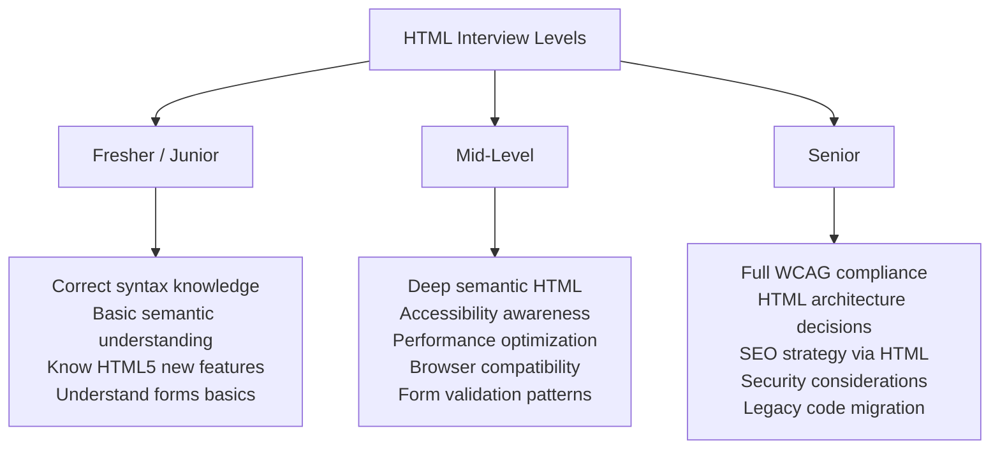
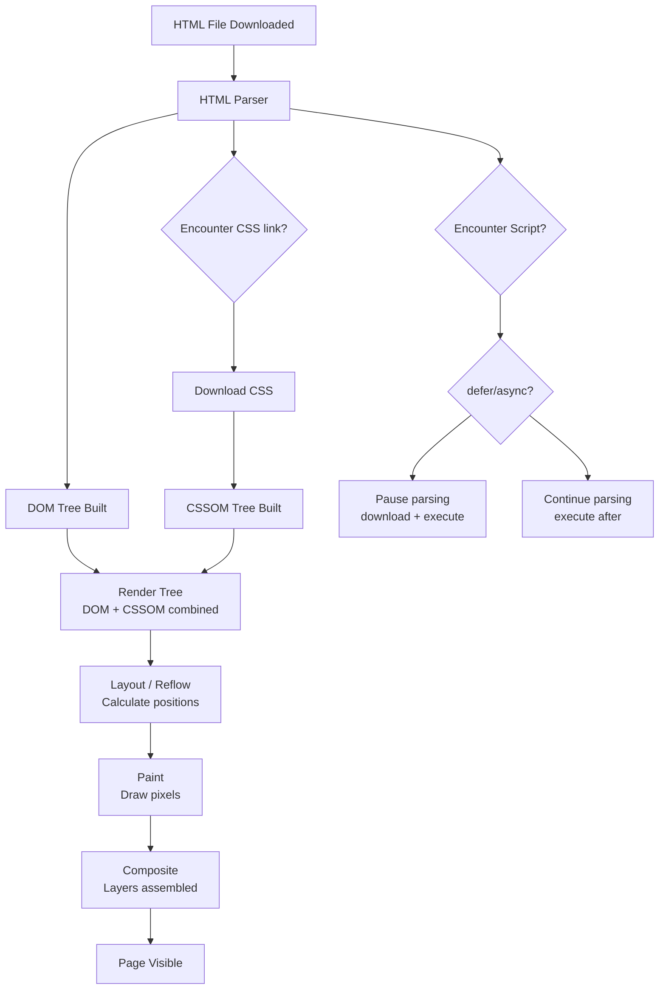

<a id="chapter-25-html-interview-questions"></a>

# Chapter 25: HTML Interview Questions

[⬅ Previous Chapter](#chapter-24-html-deprecated-tags) | [📖 Main Index](#main-index) | [Next Chapter ➡](#chapter-26-introduction-to-css)

---

## 📌 Learning Objectives

By the end of this chapter, you will:

* Have a complete bank of HTML interview questions across all difficulty levels
* Know exactly what interviewers look for in HTML answers at fresher, mid-level, and senior levels
* Understand how to structure answers using the STAR and "What → Why → How" frameworks
* Be confident answering basic, intermediate, advanced, semantic, form, and accessibility questions
* Know common output-based and scenario-based HTML questions with detailed answers
* Identify and avoid common interview traps and misconceptions about HTML
* Have a ready revision resource for last-minute interview preparation

---

<a id="chapter-index-table-25"></a>

## Chapter Index Table

| Topic No. | Topic Name | Subtopics |
|-----------|------------|-----------|
| 25.1 | [How to Answer HTML Interview Questions](#251-how-to-answer-html-interview-questions) | Answer framework<br>What interviewers look for<br>Levels |
| 25.2 | [Basic HTML Questions](#252-basic-html-questions) | Fundamentals<br>Tags<br>Attributes<br>Structure |
| 25.3 | [Intermediate HTML Questions](#253-intermediate-html-questions) | Forms<br>Tables<br>Media<br>Links<br>Lists |
| 25.4 | [Semantic HTML Questions](#254-semantic-html-questions) | Semantic elements<br>Document outline<br>Landmarks |
| 25.5 | [HTML Forms and Input Questions](#255-html-forms-and-input-questions) | Input types<br>Validation<br>Accessibility<br>Attributes |
| 25.6 | [HTML Accessibility Questions](#256-html-accessibility-questions) | WCAG<br>ARIA<br>Screen readers<br>Keyboard nav |
| 25.7 | [HTML5 Features Questions](#257-html5-features-questions) | New elements<br>APIs<br>Storage<br>Canvas vs SVG |
| 25.8 | [Advanced HTML Questions](#258-advanced-html-questions) | Performance<br>SEO<br>Security<br>Meta tags |
| 25.9 | [Output-Based Questions](#259-output-based-questions) | Predict output<br>Find bugs<br>Fix code |
| 25.10 | [Scenario-Based Questions](#2510-scenario-based-questions) | Real-world problems<br>Architecture decisions |
| 25.11 | [Tricky and Trap Questions](#2511-tricky-and-trap-questions) | Common misconceptions<br>Edge cases |
| 25.12 | [Quick Revision](#2512-quick-revision) | Last-minute prep<br>Cheat sheet |
| 25.13 | [Chapter Summary](#2513-chapter-summary) | Final Takeaways |

---

## 251 How to Answer HTML Interview Questions

<a id="251-how-to-answer-html-interview-questions"></a>

### 🔷 The "What → Why → How" Answer Framework

Every strong HTML interview answer follows this structure:

```
WHAT:  Define the concept clearly in one sentence
WHY:   Explain why it exists / what problem it solves
HOW:   Show how it works with a concise example
BONUS: Mention edge cases, best practices, or interview-relevant details
```

**Example — Question: "What is the `alt` attribute?"**

```
WHAT:  The alt attribute provides alternative text for images
       when they cannot be displayed.

WHY:   It's needed for screen reader accessibility, SEO, and
       graceful degradation when images fail to load.

HOW:   
       Decorative images use alt="" (empty) to be skipped by screen readers.

BONUS: Never use the filename as alt text. "Image of" prefix is redundant —
       screen readers already announce "image". WCAG requires all informative
       images to have meaningful alt text.
```

---

### 🔷 What Interviewers Look For at Each Level



---

### 🔷 Interview Answer Quality Levels

| Level | Poor Answer | Good Answer | Excellent Answer |
|-------|-------------|-------------|-----------------|
| Basic | "It makes text bold" | "strong marks important text" | "strong = semantic importance; b = visual attention only; different screen reader behavior" |
| Intermediate | "It's for accessibility" | "alt text helps screen readers" | "alt text serves screen readers, SEO, failed image fallback; empty alt for decorative; no filename; no 'image of'" |
| Advanced | "defer loads later" | "defer downloads async, runs after parse" | "defer = async download + post-parse execution + order preserved; async = async download + immediate execution + order NOT preserved; use defer for app scripts, async for analytics" |

---

### 🧠 Hinglish Intuition

> Interview answers ko socho jaise **ek doctor ka diagnosis** — pehle clearly batao kya problem hai (WHAT), phir explain karo kyun aisa hota hai (WHY), phir solution dikhao (HOW).
>
> Sirf "haan, `alt` attribute images ke liye hota hai" ek junior answer hai. Senior answer mein screen readers, WCAG, SEO, decorative vs informative images, aur common mistakes sab aata hai — ek sawaal se poori breadth dikhti hai.
>
> **Har HTML interview question ke peeche ek deeper concept hai** — surface se deeper jao, aur interviewer impress hoga.

---

👉 <a href="#chapter-index-table-25">Go to Top 🔝</a>

---

## 252 Basic HTML Questions

<a id="252-basic-html-questions"></a>

### 💡 Basic HTML Questions

---

**Q1. What is HTML? What does it stand for?**

**Answer:**
HTML stands for **HyperText Markup Language**. It is the standard language used to create and structure content on the web.

- **HyperText:** Text that contains links to other documents (hyperlinks)
- **Markup:** System of tags/annotations that define the structure and meaning of content
- **Language:** A set of rules and syntax for writing documents

HTML describes the **structure and semantic meaning** of web content — headings, paragraphs, links, images, forms, tables. It does NOT handle styling (CSS) or behavior (JavaScript).

```html
<!DOCTYPE html>
<html lang="en">
<head>
  <meta charset="UTF-8">
  <title>My Page</title>
</head>
<body>
  <h1>Hello, World!</h1>
  <p>This is an HTML document.</p>
</body>
</html>
```

---

**Q2. What is the difference between HTML elements, tags, and attributes?**

**Answer:**

| Concept | Definition | Example |
|---------|------------|---------|
| **Tag** | The markup notation using angle brackets | `<p>`, `</p>`, `` |
| **Element** | The complete unit: opening tag + content + closing tag | `<p>Hello</p>` |
| **Attribute** | Additional information inside the opening tag | `class="intro"` in `<p class="intro">` |

```html
<!-- Tag: just the markup syntax -->
<a>  </a>

<!-- Element: complete unit -->
<a href="/about">About Us</a>

<!-- Attribute: name="value" pairs inside the opening tag -->

<!--     ↑ attr      ↑ attr            ↑ attr        ↑ attr     ↑ attr        -->

<!-- Boolean attribute: presence = true, absence = false -->
<input type="checkbox" checked>   <!-- checked has no value needed -->
<input type="text" required>      <!-- required is a boolean attribute -->
<video controls autoplay muted>   <!-- multiple boolean attributes -->
```

---

**Q3. What is `<!DOCTYPE html>` and why is it important?**

**Answer:**
`<!DOCTYPE html>` is a **Document Type Declaration** (DTD) that must appear as the very first line of every HTML document. It tells the browser which version of HTML the document uses.

The HTML5 DOCTYPE is intentionally simple: `<!DOCTYPE html>`

**Why it's important:**
- Without it, browsers enter **Quirks Mode** — a backward-compatibility mode that simulates buggy behavior of old browsers
- In Quirks Mode, CSS box model and other properties behave inconsistently across browsers
- With `<!DOCTYPE html>`, browsers use **Standards Mode** — consistent, predictable rendering

```html
<!-- ✅ Correct: First line of every HTML file -->
<!DOCTYPE html>
<html lang="en">...

<!-- ❌ Wrong: Missing DOCTYPE → Quirks Mode → cross-browser bugs -->
<html lang="en">...

<!-- ❌ Wrong: HTML4 DOCTYPE (complex, unnecessary) -->
<!DOCTYPE HTML PUBLIC "-//W3C//DTD HTML 4.01 Transitional//EN"
  "http://www.w3.org/TR/html4/loose.dtd">
```

> [!IMPORTANT]
> `<!DOCTYPE html>` is NOT an HTML tag — it's an instruction to the browser. It has no closing tag and is case-insensitive (though lowercase is conventional).

---

**Q4. What is the difference between block-level and inline elements?**

**Answer:**

| Feature | Block-Level | Inline |
|---------|------------|--------|
| Display | Starts on new line, full width | Flows within text, only as wide as content |
| Width | 100% of parent by default | Content width only |
| Height/Width CSS | Can set width and height | Cannot set width/height (for most) |
| Can contain | Block + inline elements | Only inline elements (generally) |
| Examples | `<div>`, `<p>`, `<h1>`-`<h6>`, `<section>`, `<article>`, `<ul>`, `<table>` | `<span>`, `<a>`, `<strong>`, `<em>`, ``, `<input>` |

```html
<!-- Block elements: each starts on new line -->
<div>First block</div>
<p>Second block — pushed to next line automatically</p>

<!-- Inline elements: flow together in a line -->
<span>This</span> <strong>flows</strong> <em>together</em>
on <a href="#">one line</a>.

<!-- CSS can change display behavior -->
<span style="display: block;">Now this span is block-level</span>
<div style="display: inline;">Now this div is inline</div>
```

---

**Q5. What is the difference between `<head>` and `<body>`?**

**Answer:**

| `<head>` | `<body>` |
|---------|---------|
| Contains metadata — not visible to users | Contains all visible page content |
| Info FOR the browser/search engines | Info FOR the user |
| `<title>`, `<meta>`, `<link>`, `<script>`, `<style>` | `<header>`, `<main>`, `<footer>`, headings, text, images, forms |
| No visible rendering | All visual rendering happens here |

```html
<!DOCTYPE html>
<html lang="en">
<head>
  <!-- NOT visible to users: metadata -->
  <meta charset="UTF-8">
  <meta name="viewport" content="width=device-width, initial-scale=1.0">
  <meta name="description" content="Page description for SEO">
  <title>Page Title — appears in browser tab, not on page</title>
  <link rel="stylesheet" href="styles.css">
  <script src="analytics.js" async></script>
</head>
<body>
  <!-- Visible to users: content -->
  <h1>This appears on the page</h1>
  <p>All visible content goes here.</p>
</body>
</html>
```

---

**Q6. What are void (self-closing) elements in HTML?**

**Answer:**
Void elements are HTML elements that **cannot have any content** and therefore have no closing tag. They are self-closing by nature.

```html
<!-- Complete list of HTML void elements -->
<area>      <!-- Image map area -->
<base>      <!-- Base URL for relative links -->
<br>        <!-- Line break -->
<col>       <!-- Table column -->
<embed>     <!-- External content embed -->
<hr>        <!-- Thematic break / horizontal rule -->
       <!-- Image -->
<input>     <!-- Form input -->
<link>      <!-- External resource link -->
<meta>      <!-- Metadata -->
<param>     <!-- Plugin parameter -->
<source>    <!-- Media source -->
<track>     <!-- Text track for media -->
<wbr>       <!-- Word break opportunity -->

<!-- In HTML5: no trailing slash needed (but allowed for XHTML compatibility) -->
<br>        <!-- ✅ HTML5 style -->
<br />      <!-- ✅ Also valid (XHTML style, often used in JSX/React) -->
<br/>       <!-- ✅ Also valid -->

<!-- ❌ Wrong: void elements cannot have closing tags -->
<br></br>
</img>
```

---

**Q7. What is the difference between `id` and `class` attributes?**

**Answer:**

| Feature | `id` | `class` |
|---------|------|---------|
| Uniqueness | Must be unique per page | Reusable — multiple elements |
| Usage | One element only | Any number of elements |
| CSS selector | `#id-name` (higher specificity) | `.class-name` |
| JS selector | `getElementById()` (fastest) | `getElementsByClassName()`, `querySelectorAll()` |
| Fragment navigation | `href="#id"` links to element | Cannot link to class |
| Multiple values | Only one ID per element | Multiple classes per element |

```html
<!-- id: unique identifier — ONE per page -->
<main id="main-content">...</main>
<section id="contact-section">...</section>

<!-- class: reusable styling hook — MANY elements -->
<div class="card">Product 1</div>
<div class="card featured">Product 2</div>  <!-- Multiple classes -->
<div class="card">Product 3</div>

<!-- CSS -->
<style>
  #main-content { padding: 2rem; }          /* ID — high specificity */
  .card          { border: 1px solid #ddd; } /* Class — lower specificity */
  .card.featured { border-color: gold; }     /* Combined classes */
</style>

<!-- Fragment navigation via id -->
<a href="#contact-section">Jump to Contact</a>
```

---

**Q8. What is the purpose of the `<meta>` tag? Give 5 important examples.**

**Answer:**
`<meta>` tags provide **metadata** about the HTML document — information for browsers, search engines, and social media platforms that is not displayed on the page.

```html
<head>
  <!-- 1. Character encoding — always first meta tag -->
  <meta charset="UTF-8">
  <!-- Ensures all characters (including Unicode/emoji) render correctly -->

  <!-- 2. Viewport — essential for responsive design -->
  <meta name="viewport" content="width=device-width, initial-scale=1.0">
  <!-- Without this: mobile shows desktop layout zoomed out -->

  <!-- 3. Description — for SEO and search result snippets -->
  <meta name="description"
        content="Shop premium running shoes online. Free delivery on ₹999+.">
  <!-- 150-160 characters max; shown in Google search results -->

  <!-- 4. Open Graph — for social media sharing -->
  <meta property="og:title" content="FitStore — Premium Running Shoes">
  <meta property="og:description" content="Free delivery on ₹999+">
  <meta property="og:image" content="https://fitstore.com/og-image.jpg">
  <meta property="og:url" content="https://fitstore.com">
  <!-- Controls appearance when shared on Facebook, LinkedIn, etc. -->

  <!-- 5. Robots — control search engine crawling -->
  <meta name="robots" content="index, follow">
  <!-- index: page appears in search results -->
  <!-- follow: crawler follows links on this page -->
  <!-- noindex, nofollow: private/duplicate pages -->

  <!-- 6. Refresh/Redirect -->
  <meta http-equiv="refresh" content="5; url=https://newsite.com">
  <!-- Redirects after 5 seconds (use server-side redirect instead) -->

  <!-- 7. Theme color (mobile browser UI) -->
  <meta name="theme-color" content="#2563eb">
</head>
```

---

**Q9. What is the difference between relative, absolute, and root-relative URLs?**

**Answer:**

| Type | Format | Resolves Against | Use Case |
|------|--------|-----------------|----------|
| **Absolute** | `https://example.com/page` | Independent — full URL | External links, canonical URLs |
| **Root-relative** | `/images/photo.jpg` | Domain root always | Internal links (preferred) |
| **Relative** | `../images/photo.jpg` | Current file location | When file structure is critical |

```html
<!-- File structure:
     website/
     ├── index.html
     ├── about/
     │   └── team.html    ← We are here
     └── images/
         └── logo.png
-->

<!-- From team.html: -->

<!-- Absolute URL: full path, works from anywhere -->
<a href="https://example.com/about/team.html">Team</a>


<!-- Root-relative: starts from domain root -->
<a href="/about/team.html">Team</a>    <!-- /about/team.html from domain root -->

<!-- ✅ Preferred for internal links — works regardless of current directory -->

<!-- Relative: relative to current file location (team.html is in /about/) -->
<a href="team.html">Team</a>           <!-- Same directory -->

<!-- ../  = go up one directory -->
```

---

**Q10. What does the `<title>` tag do and what are best practices for it?**

**Answer:**
The `<title>` element defines the document title displayed in:
- Browser tab/window title
- Search engine result pages (SERPs) as the clickable headline
- Browser bookmarks
- Social media shares (if no og:title is set)
- Screen reader page announcement

```html
<!-- ✅ Best practice: Brand + Page (or Page + Brand) -->
<title>Buy Running Shoes | FitStore India</title>

<!-- ✅ Homepage: Brand name prominent -->
<title>FitStore India — Premium Sports & Running Gear</title>

<!-- ✅ Article: specific title first -->
<title>10 HTML Best Practices Every Developer Should Know | WebBlog</title>

<!-- ❌ Wrong: Too short / meaningless -->
<title>Page</title>
<title>Untitled</title>

<!-- ❌ Wrong: Too long (over 60 chars gets truncated in Google) -->
<title>The Complete Comprehensive Guide To Buying Running Shoes Online In India With Free Delivery</title>

<!-- ❌ Wrong: Same title on every page -->
<title>FitStore India</title>  <!-- On every single page — bad for SEO -->
```

**Best practices:**
- 50–60 characters maximum
- Unique per page
- Front-load important keywords
- Include brand name (usually at end)
- Describe page content accurately

---

👉 <a href="#chapter-index-table-25">Go to Top 🔝</a>

---

## 253 Intermediate HTML Questions

<a id="253-intermediate-html-questions"></a>

### 💡 Intermediate HTML Questions

---

**Q11. What is the difference between `<ol>`, `<ul>`, and `<dl>`?**

**Answer:**

| Element | Full Name | Use When | Default Style |
|---------|-----------|----------|--------------|
| `<ul>` | Unordered List | Items have no particular sequence | Bullet points |
| `<ol>` | Ordered List | Sequence/order matters | Numbers (1, 2, 3...) |
| `<dl>` | Description List | Term-definition pairs | No marker |

```html
<!-- ul: navigation, features, ingredients — order doesn't matter -->
<ul>
  <li>HTML</li>
  <li>CSS</li>
  <li>JavaScript</li>
</ul>

<!-- ol: steps, rankings, recipes — order MATTERS -->
<ol>
  <li>Open terminal</li>
  <li>Run <code>npm install</code></li>
  <li>Run <code>npm start</code></li>
</ol>

<!-- ol with type attribute -->
<ol type="A">  <!-- A, B, C... -->
<ol type="i">  <!-- i, ii, iii... -->
<ol start="5"> <!-- Start from 5 -->

<!-- dl: glossary, FAQ, metadata pairs -->
<dl>
  <dt>HTML</dt>
  <dd>HyperText Markup Language — structure of web pages</dd>

  <dt>CSS</dt>
  <dd>Cascading Style Sheets — presentation of web pages</dd>

  <dt>API</dt>
  <dd>Application Programming Interface</dd>
</dl>
```

---

**Q12. Explain the HTML table structure. What are all the elements involved?**

**Answer:**

```html
<table>
  <!-- caption: table title (accessibility) -->
  <caption>Q4 2024 Sales Report</caption>

  <!-- colgroup/col: column-level styling -->
  <colgroup>
    <col style="background: #f0f8ff;">
    <col span="3" style="background: #fff;">
  </colgroup>

  <!-- thead: column headers -->
  <thead>
    <tr>
      <th scope="col">Product</th>
      <th scope="col">Q1</th>
      <th scope="col">Q2</th>
      <th scope="col">Total</th>
    </tr>
  </thead>

  <!-- tbody: data rows -->
  <tbody>
    <tr>
      <th scope="row">Widget A</th>  <!-- Row header -->
      <td>₹10,000</td>
      <td>₹12,000</td>
      <td>₹22,000</td>
    </tr>
    <tr>
      <th scope="row">Widget B</th>
      <td>₹8,000</td>
      <td>₹9,500</td>
      <td>₹17,500</td>
    </tr>
  </tbody>

  <!-- tfoot: summary row -->
  <tfoot>
    <tr>
      <th scope="row">Total</th>
      <td>₹18,000</td>
      <td>₹21,500</td>
      <td>₹39,500</td>
    </tr>
  </tfoot>
</table>
```

**Cell spanning:**
```html
<td colspan="2">Spans 2 columns</td>  <!-- Horizontal merge -->
<td rowspan="3">Spans 3 rows</td>     <!-- Vertical merge -->
```

**`scope` attribute for accessibility:**
- `scope="col"` on `<th>` → header for entire column
- `scope="row"` on `<th>` → header for entire row
- `scope="colgroup"` / `scope="rowgroup"` → for spanning headers

---

**Q13. How do HTML links work? Explain all `<a>` tag attributes.**

**Answer:**

```html
<!-- Basic link -->
<a href="https://example.com">Visit Example</a>

<!-- All important attributes: -->
<a
  href="https://example.com/page"    <!-- Destination URL (required) -->
  target="_blank"                     <!-- Open in new tab -->
  rel="noopener noreferrer"           <!-- Security for target="_blank" -->
  title="Visit Example Website"       <!-- Tooltip on hover -->
  download="filename.pdf"            <!-- Force download, optional filename -->
  hreflang="en"                      <!-- Language of linked document -->
  type="application/pdf"             <!-- MIME type of linked resource -->
  aria-label="Read our full report"  <!-- Accessible name override -->
>
  Link Text
</a>

<!-- Link types by href value -->
<a href="https://external.com">External absolute URL</a>
<a href="/about">Internal root-relative</a>
<a href="contact.html">Internal relative</a>
<a href="#section-2">Fragment — jump to element with id="section-2"</a>
<a href="mailto:hello@example.com">Email link</a>
<a href="tel:+919876543210">Phone link</a>
<a href="sms:+919876543210">SMS link</a>
<a href="javascript:void(0)">❌ Avoid — use button instead</a>

<!-- target values -->
<a href="..." target="_blank">  <!-- New tab/window -->
<a href="..." target="_self">   <!-- Same tab (default) -->
<a href="..." target="_parent"> <!-- Parent frame -->
<a href="..." target="_top">    <!-- Top-level browsing context -->

<!-- Download link -->
<a href="/reports/annual-2024.pdf" download>Download Annual Report</a>
<a href="/reports/annual-2024.pdf" download="Annual-Report-2024.pdf">
  Download with custom filename
</a>
```

> [!IMPORTANT]
> Always use `rel="noopener noreferrer"` with `target="_blank"`. Without `noopener`, the opened page can access `window.opener` and redirect your original page — a **tabnapping** security vulnerability.

---

**Q14. What is the difference between `` and CSS `background-image`?**

**Answer:**

| Aspect | `` | `background-image` |
|--------|---------|-------------------|
| **Nature** | Content image | Decorative/presentational |
| **Alt text** | ✅ Required (accessibility) | ❌ Not possible |
| **Screen readers** | ✅ Announced | ❌ Ignored |
| **SEO** | ✅ Images indexed | ❌ Not indexed |
| **Print** | ✅ Printed by default | ❌ Often not printed |
| **Lazy loading** | ✅ `loading="lazy"` | ❌ More complex |
| **Responsive** | ✅ `srcset`, `<picture>` | ⚠️ Media queries |
| **Right-click save** | ✅ Users can save | ❌ Not easily saved |

```html
<!-- ✅ Use  for: content images, product photos, logos, illustrations -->


<!-- ✅ Use background-image for: decorative patterns, hero backgrounds, UI textures -->
<style>
  .hero-section {
    background-image: url('hero-bg.webp');
    background-size: cover;
    background-position: center;
    height: 80vh;
  }

  .card-pattern {
    background-image: url('dot-pattern.png');
    background-repeat: repeat;
  }
</style>
```

**Rule of thumb:** If removing the image would make the content less understandable → use ``. If it's purely decorative → use CSS `background-image`.

---

**Q15. What is the difference between `<script>` placement in `<head>` vs end of `<body>`?**

**Answer:**

```html
<!-- Option 1: Script in <head> WITHOUT defer/async — BLOCKS rendering -->
<head>
  <script src="app.js"></script>
  <!-- Browser STOPS parsing HTML until:
       1. Script downloads completely
       2. Script executes completely
       Then resumes HTML parsing
       BAD for performance — user sees blank page -->
</head>

<!-- Option 2: Script in <head> WITH defer — RECOMMENDED for most scripts -->
<head>
  <script src="app.js" defer></script>
  <!-- Browser:
       - Continues parsing HTML while downloading script in background
       - Executes script only AFTER HTML is fully parsed
       - Maintains execution order for multiple deferred scripts
       GOOD: Non-blocking, DOM ready when script runs -->
</head>

<!-- Option 3: Script in <head> WITH async — for independent scripts -->
<head>
  <script src="analytics.js" async></script>
  <!-- Browser:
       - Continues parsing while downloading
       - Executes IMMEDIATELY when downloaded (may interrupt parsing)
       - Does NOT maintain execution order
       GOOD for: Analytics, ads, independent tools -->
</head>

<!-- Option 4: Script at end of <body> — old standard, works -->
<body>
  <!-- All HTML content -->
  <script src="app.js"></script>
  <!-- DOM is ready when script runs
       But: browser must finish downloading HTML before it can start
       downloading this script — sub-optimal -->
</body>

<!-- RECOMMENDATION: Use defer in <head> for app scripts -->
```

---

**Q16. Explain the `<picture>` element and when to use it vs ``.**

**Answer:**
`<picture>` provides **art direction and format negotiation** — serving different images based on screen size, resolution, or format support.

```html
<!-- Simple  with srcset: same image, different resolutions -->


<!-- <picture>: art direction + format support -->
<picture>
  <!-- Most modern browsers: AVIF (best compression) -->
  <source
    srcset="hero-mobile.avif 480w, hero-desktop.avif 1200w"
    sizes="(max-width: 600px) 480px, 1200px"
    type="image/avif"
  >
  <!-- Fallback: WebP (wide support) -->
  <source
    srcset="hero-mobile.webp 480w, hero-desktop.webp 1200w"
    sizes="(max-width: 600px) 480px, 1200px"
    type="image/webp"
  >
  <!-- Art direction: completely different crop for mobile -->
  <source
    media="(max-width: 600px)"
    srcset="hero-portrait.jpg"
  >
  <!-- Final fallback:  (always required inside <picture>) -->
  
</picture>
```

**When to use each:**
- `` alone → single image, maybe with srcset for different resolutions
- `<picture>` → different image crops for different screen sizes (art direction) OR different formats (AVIF/WebP with JPEG fallback)

---

**Q17. What are data attributes (`data-*`) and when should you use them?**

**Answer:**
Data attributes allow you to store **custom private data** directly on HTML elements — accessible via JavaScript without requiring extra AJAX calls or hidden inputs.

```html
<!-- Store custom data on elements -->
<button
  class="add-to-cart"
  data-product-id="SKU-12345"
  data-product-name="Blue Running Shoes"
  data-price="999"
  data-category="footwear"
  data-in-stock="true"
  type="button"
>
  Add to Cart
</button>

<!-- Access in JavaScript -->
<script>
  const btn = document.querySelector('.add-to-cart');

  // Read data attributes
  console.log(btn.dataset.productId);    // "SKU-12345"
  console.log(btn.dataset.productName);  // "Blue Running Shoes"
  console.log(btn.dataset.price);        // "999" (always string)
  console.log(parseInt(btn.dataset.price)); // 999 (parsed to number)

  // Set data attributes
  btn.dataset.inStock = 'false';
  btn.setAttribute('data-quantity', '3');

  // Use in event listener
  btn.addEventListener('click', function() {
    addToCart({
      id:       this.dataset.productId,
      name:     this.dataset.productName,
      price:    parseFloat(this.dataset.price),
      category: this.dataset.category,
    });
  });
</script>

<!-- Also useful for CSS attribute selectors -->
<style>
  [data-in-stock="false"] {
    opacity: 0.5;
    cursor: not-allowed;
  }
  [data-category="sale"]::after {
    content: " 🔥 SALE";
    color: red;
  }
</style>
```

**Naming convention:** `data-product-id` in HTML → `dataset.productId` in JS (camelCase conversion automatic)

**When to use:**
✅ Passing config data to JavaScript without extra DOM queries
✅ Storing state that CSS can react to via attribute selectors
✅ Progressive enhancement data

**When NOT to use:**
❌ Sensitive data (visible in DevTools)
❌ Data that needs to be in the server-side model
❌ Replacing proper state management in complex apps

---

👉 <a href="#chapter-index-table-25">Go to Top 🔝</a>

---

## 254 Semantic HTML Questions

<a id="254-semantic-html-questions"></a>

### 💡 Semantic HTML Questions

---

**Q18. What is semantic HTML and why does it matter?**

**Answer:**
Semantic HTML means using HTML elements that **convey the meaning** of the content they contain — not just its visual appearance.

**Non-semantic:**
```html
<!-- div soup — no meaning, just containers -->
<div class="header">
  <div class="nav">
    <div class="nav-item"><a href="/">Home</a></div>
  </div>
</div>
<div class="main">
  <div class="article">
    <div class="title">My Post</div>
    <div class="content">Content here</div>
  </div>
</div>
```

**Semantic:**
```html
<!-- Meaningful structure — browser, search engine, screen reader understand it -->
<header>
  <nav aria-label="Main navigation">
    <ul>
      <li><a href="/">Home</a></li>
    </ul>
  </nav>
</header>
<main>
  <article>
    <h1>My Post</h1>
    <p>Content here</p>
  </article>
</main>
```

**Why semantic HTML matters:**

| Benefit | How |
|---------|-----|
| **Accessibility** | Screen readers use semantic structure to navigate (jump to `<main>`, `<nav>`, etc.) |
| **SEO** | Search engines weight content in `<article>`, `<h1>`, etc. more heavily |
| **Maintainability** | Code is self-documenting — intent is clear |
| **Browser behavior** | Semantic elements get correct default focus, click, and keyboard behavior |
| **Interoperability** | Works correctly with browser extensions, reading modes, print styles |

---

**Q19. Explain all HTML5 semantic/structural elements and when to use each.**

**Answer:**

```html
<!-- <header>: Introductory content or navigational aids -->
<!-- Can appear inside <body> (page header) or <article>/<section> (section header) -->
<header>
  <h1>Site Name</h1>
  <nav>...</nav>
</header>

<!-- <nav>: Section of navigation links -->
<!-- Not every group of links — only MAJOR navigation -->
<nav aria-label="Main navigation">
  <ul>
    <li><a href="/">Home</a></li>
    <li><a href="/about">About</a></li>
  </ul>
</nav>

<!-- <main>: Primary content of the page -->
<!-- ONE per page; skip to main content target -->
<main id="main-content">
  <!-- The dominant content unique to this page -->
</main>

<!-- <article>: Self-contained, independently distributable content -->
<!-- Could stand alone: blog post, news article, product card, comment, tweet -->
<article>
  <header>
    <h2>Blog Post Title</h2>
    <time datetime="2024-01-15">January 15, 2024</time>
  </header>
  <p>Blog post content...</p>
  <footer>
    <p>Author: Rahul Sharma</p>
  </footer>
</article>

<!-- <section>: Thematically grouped content with a heading -->
<!-- Generic document section; more semantic than div but less specific than article -->
<!-- ALWAYS needs a heading child element -->
<section aria-labelledby="services-heading">
  <h2 id="services-heading">Our Services</h2>
  <p>We offer...</p>
</section>

<!-- <aside>: Content tangentially related to surrounding content -->
<!-- Sidebar, callout boxes, related links, advertisements -->
<aside aria-label="Related articles">
  <h3>Related Posts</h3>
  <ul>...</ul>
</aside>

<!-- <footer>: Footer for nearest sectioning content or body -->
<!-- Can appear in article, section, or body -->
<footer>
  <p>&copy; 2024 Company. <a href="/privacy">Privacy Policy</a></p>
</footer>

<!-- <figure> and <figcaption>: self-contained figure with optional caption -->
<figure>
  
  <figcaption>
    Figure 1: Q4 2024 Sales by Product Category
  </figcaption>
</figure>

<!-- <time>: Dates and times — machine-readable -->
<time datetime="2024-01-15T09:30:00+05:30">
  January 15, 2024 at 9:30 AM IST
</time>

<!-- <address>: Contact information for nearest article/body -->
<address>
  <p>Contact: <a href="mailto:support@example.com">support@example.com</a></p>
  <p>Phone: <a href="tel:+919876543210">+91 98765 43210</a></p>
</address>

<!-- <mark>: Highlighted/marked text (search result highlighting) -->
<p>Search results for <mark>HTML tutorial</mark>: 45 results found</p>

<!-- <details> and <summary>: native accordion/disclosure widget -->
<details>
  <summary>What is your return policy?</summary>
  <p>We accept returns within 30 days of purchase with original receipt.</p>
</details>
```

---

**Q20. What is the document outline and how does heading hierarchy affect it?**

**Answer:**
The **document outline** is the hierarchical structure of a page's content as understood by browsers, screen readers, and search engines — derived from the heading elements (h1–h6) used in the document.

```html
<!-- ✅ Correct heading hierarchy: generates clear document outline -->
<h1>Web Development Complete Guide</h1>     <!-- Level 1: Main topic -->
  <h2>HTML Fundamentals</h2>               <!-- Level 2: Section -->
    <h3>Document Structure</h3>            <!-- Level 3: Subsection -->
    <h3>Semantic Elements</h3>
      <h4>Header and Footer</h4>           <!-- Level 4: Sub-subsection -->
      <h4>Main and Section</h4>
  <h2>CSS Styling</h2>
    <h3>Selectors</h3>
    <h3>Box Model</h3>
  <h2>JavaScript Basics</h2>

<!-- Document outline generated:
     1. Web Development Complete Guide
        1.1 HTML Fundamentals
            1.1.1 Document Structure
            1.1.2 Semantic Elements
                  Header and Footer
                  Main and Section
        1.2 CSS Styling
            1.2.1 Selectors
            1.2.2 Box Model
        1.3 JavaScript Basics -->

<!-- ❌ Wrong: Skipped heading levels -->
<h1>Guide</h1>
<h3>Section</h3>   <!-- Skipped h2! -->
<h5>Subsection</h5> <!-- Skipped h4! -->

<!-- ❌ Wrong: Multiple h1s (document loses clear hierarchy) -->
<h1>Main Title</h1>
<h1>Another Main Title</h1>  <!-- Confuses document outline -->

<!-- ❌ Wrong: Using headings for visual size, not structure -->
<h4>Big button label</h4>  <!-- Not a document heading! Use CSS font-size -->
```

> [!IMPORTANT]
> Screen readers allow users to **navigate by headings** — pressing H key to jump through headings. A broken heading hierarchy means broken navigation for screen reader users. This is a WCAG Level A failure.

---

**Q21. When should you use `<section>` vs `<div>` vs `<article>`?**

**Answer:**

```
Decision Tree:
├── Is this content self-contained and independently distributable?
│   (Could it be syndicated via RSS? Reused on another page?)
│   YES → <article>
│
├── Is this a thematic grouping of content WITH its own heading?
│   (A distinct topic section of the page)
│   YES → <section>
│
└── Is this purely a layout container or styling hook with NO semantic meaning?
    YES → <div>
```

```html
<!-- <article>: blog post, news item, product card, comment, tweet -->
<!-- Self-contained — meaningful without surrounding context -->
<article class="blog-post">
  <h2>10 HTML Tips</h2>
  <p>Published: <time datetime="2024-01-15">Jan 15</time></p>
  <p>Content that makes sense standalone...</p>
</article>

<!-- <section>: chapter, tabbed content area, form step -->
<!-- Part of a larger document; has a heading; NOT independently meaningful -->
<main>
  <section aria-labelledby="about-heading">
    <h2 id="about-heading">About Our Company</h2>
    <p>Founded in 2010...</p>
  </section>

  <section aria-labelledby="team-heading">
    <h2 id="team-heading">Our Team</h2>
    <!-- Team member cards -->
  </section>
</main>

<!-- <div>: wrapper for CSS layout; no semantic meaning needed -->
<div class="card-grid">           <!-- Layout container -->
  <article class="product-card"> <!-- Each card is self-contained -->
    <h3>Product Name</h3>
    <p>₹999</p>
  </article>
</div>

<!-- ❌ Common mistake: section without heading -->
<section>
  <p>Just some content with no heading...</p>
</section>
<!-- Use <div> here instead -->
```

---

👉 <a href="#chapter-index-table-25">Go to Top 🔝</a>

---

## 255 HTML Forms and Input Questions

<a id="255-html-forms-and-input-questions"></a>

### 💡 HTML Forms and Input Questions

---

**Q22. What is the difference between GET and POST form methods?**

**Answer:**

| Feature | GET | POST |
|---------|-----|------|
| Data location | URL query string (`?name=val`) | Request body (hidden) |
| Visibility | Visible in URL, browser history | Not visible in URL |
| Bookmarkable | ✅ Yes | ❌ No |
| Cacheable | ✅ Yes | ❌ No |
| Data limit | ~2000 characters (URL limit) | No practical limit |
| Security | ❌ Exposed in URL, logs | ✅ Not in URL (use HTTPS too) |
| Use for | Search forms, filters, pagination | Login, registration, file upload, purchases |
| Idempotent | ✅ (same result every time) | ❌ (creates/modifies data) |

```html
<!-- GET: search, filter — data in URL, bookmarkable -->
<form method="get" action="/search">
  <label for="q">Search:</label>
  <input type="search" id="q" name="q" placeholder="Search products...">
  <button type="submit">Search</button>
</form>
<!-- Submits to: /search?q=running+shoes -->

<!-- POST: login, registration — data in request body -->
<form method="post" action="/login">
  <label for="email">Email:</label>
  <input type="email" id="email" name="email" autocomplete="email" required>

  <label for="pwd">Password:</label>
  <input type="password" id="pwd" name="password" autocomplete="current-password" required>

  <button type="submit">Sign In</button>
</form>
<!-- Data NOT in URL — sent in HTTP request body -->
<!-- Always use HTTPS with POST for sensitive data -->
```

---

**Q23. List all HTML5 input types and explain when to use each.**

**Answer:**

```html
<form>
  <!-- Text inputs -->
  <input type="text">       <!-- Generic single-line text -->
  <input type="email">      <!-- Email — validates format, shows email keyboard on mobile -->
  <input type="password">   <!-- Hidden characters, prevents browser password save by default -->
  <input type="search">     <!-- Search box — may show clear button (X) -->
  <input type="url">        <!-- URL — validates format, shows URL keyboard on mobile -->
  <input type="tel">        <!-- Phone number — shows number pad on mobile -->

  <!-- Number inputs -->
  <input type="number" min="1" max="100" step="1">  <!-- Spinner arrows -->
  <input type="range"  min="0" max="100" step="5">  <!-- Slider -->

  <!-- Date/Time inputs -->
  <input type="date">               <!-- Date picker -->
  <input type="time">               <!-- Time picker -->
  <input type="datetime-local">     <!-- Date + Time picker -->
  <input type="month">              <!-- Month and year -->
  <input type="week">               <!-- Week number -->

  <!-- Other inputs -->
  <input type="color">              <!-- Color picker (#rrggbb) -->
  <input type="file">               <!-- File upload dialog -->
  <input type="file" multiple>      <!-- Multiple file upload -->
  <input type="file" accept=".pdf,.jpg,.png">  <!-- File type filter -->

  <!-- Checkbox and Radio -->
  <input type="checkbox" name="agree" value="yes">  <!-- Boolean toggle -->
  <input type="radio" name="size" value="S">        <!-- One of group -->
  <input type="radio" name="size" value="M">
  <input type="radio" name="size" value="L">

  <!-- Hidden -->
  <input type="hidden" name="csrf_token" value="abc123">  <!-- Not shown to user -->

  <!-- Buttons (prefer <button> elements) -->
  <input type="submit" value="Submit Form">
  <input type="reset"  value="Clear Form">
  <input type="button" value="Click Me" onclick="doSomething()">
  <input type="image"  src="submit-btn.png" alt="Submit">  <!-- Image submit button -->
</form>
```

**Mobile keyboard advantages:**
- `type="email"` → shows `@` and `.` keys prominently
- `type="tel"` → shows number keypad
- `type="number"` → shows number keypad
- `type="url"` → shows `/` and `.com` keys

---

**Q24. What is the purpose of `name`, `id`, and `value` attributes on form inputs?**

**Answer:**

| Attribute | Purpose | Required? | Example |
|-----------|---------|-----------|---------|
| `name` | Form data key sent to server | ✅ For submission | `name="email"` → `email=user@mail.com` |
| `id` | Connects `<label for="id">` | For accessibility | `id="user-email"` |
| `value` | Default/current value | Context-dependent | `value="India"` |

```html
<form method="post" action="/register">

  <!-- name: sent to server as form data key -->
  <!-- id: used by label for accessibility connection -->
  <label for="user-email">Email:</label>
  <input
    type="email"
    name="email"          <!-- Server receives: email=user@example.com -->
    id="user-email"       <!-- Label connects here: for="user-email" -->
    value=""              <!-- Default value (empty) -->
  >

  <!-- Radio: same name groups them; value determines what's sent -->
  <fieldset>
    <legend>Account Type</legend>
    <label>
      <input type="radio" name="account_type" value="personal"> Personal
    </label>
    <label>
      <input type="radio" name="account_type" value="business" checked> Business
    </label>
  </fieldset>
  <!-- Server receives: account_type=business (the checked one) -->

  <!-- Checkbox: sent only when checked -->
  <label>
    <input type="checkbox" name="newsletter" value="yes"> Subscribe to newsletter
  </label>
  <!-- If checked → server gets: newsletter=yes -->
  <!-- If unchecked → nothing sent for this field -->

  <!-- Select: option value sent, not displayed text -->
  <label for="country">Country:</label>
  <select name="country" id="country">
    <option value="">-- Select --</option>
    <option value="IN">India</option>         <!-- Sends "IN" not "India" -->
    <option value="US">United States</option>
    <option value="GB">United Kingdom</option>
  </select>

  <!-- Hidden: always sent, not visible -->
  <input type="hidden" name="page_source" value="homepage-cta">

  <button type="submit">Register</button>
</form>
```

---

**Q25. What HTML5 form validation attributes are available?**

**Answer:**

```html
<form novalidate>  <!-- Disable browser validation (use JS instead) -->

  <!-- required: field must have a value -->
  <input type="text" required>

  <!-- minlength / maxlength: text length constraints -->
  <input type="text"
         minlength="3"
         maxlength="50"
         placeholder="3-50 characters">

  <!-- min / max: numeric/date range -->
  <input type="number" min="18" max="120">
  <input type="date" min="2024-01-01" max="2024-12-31">

  <!-- step: numeric increments -->
  <input type="number" min="0" max="100" step="5">  <!-- 0,5,10,15... -->
  <input type="range"  min="0" max="1"  step="0.1"> <!-- 0.0,0.1,0.2... -->

  <!-- pattern: regex validation -->
  <input type="text"
         pattern="[A-Za-z]{3,}"
         title="At least 3 letters only">

  <input type="tel"
         pattern="[0-9]{10}"
         title="10-digit phone number">

  <input type="text"
         pattern="[A-Z]{2}[0-9]{6}"
         title="Passport: 2 uppercase letters followed by 6 digits">

  <!-- multiple: allow multiple values -->
  <input type="email" multiple>  <!-- Multiple emails: a@b.com, c@d.com -->
  <input type="file" multiple>   <!-- Multiple file selection -->

  <!-- autocomplete: browser autofill hints -->
  <input type="text"     autocomplete="name">
  <input type="email"    autocomplete="email">
  <input type="tel"      autocomplete="tel">
  <input type="password" autocomplete="new-password">  <!-- Registration -->
  <input type="password" autocomplete="current-password">  <!-- Login -->
  <input type="text"     autocomplete="street-address">
  <input type="text"     autocomplete="postal-code">

  <!-- CSS validation state selectors -->
  <!-- input:valid   { border-color: green; } -->
  <!-- input:invalid { border-color: red; } -->
  <!-- input:required{ border-left: 3px solid gold; } -->

</form>
```

---

**Q26. What is `<fieldset>` and `<legend>` used for?**

**Answer:**
`<fieldset>` groups related form controls together; `<legend>` provides a caption for that group.

```html
<!-- Primary use: group related inputs -->
<form method="post" action="/checkout">

  <fieldset>
    <legend>Personal Information</legend>

    <div class="form-row">
      <label for="fname">First Name</label>
      <input type="text" id="fname" name="firstName"
             autocomplete="given-name" required>
    </div>

    <div class="form-row">
      <label for="lname">Last Name</label>
      <input type="text" id="lname" name="lastName"
             autocomplete="family-name" required>
    </div>
  </fieldset>

  <fieldset>
    <legend>Delivery Address</legend>

    <div class="form-row">
      <label for="address">Street Address</label>
      <input type="text" id="address" name="address"
             autocomplete="street-address" required>
    </div>

    <div class="form-row">
      <label for="pincode">PIN Code</label>
      <input type="text" id="pincode" name="pincode"
             pattern="[0-9]{6}" autocomplete="postal-code" required>
    </div>
  </fieldset>

  <!-- Critical use: group radio buttons / checkboxes -->
  <fieldset>
    <legend>Preferred Contact Method</legend>

    <label>
      <input type="radio" name="contact" value="email"> Email
    </label>
    <label>
      <input type="radio" name="contact" value="phone"> Phone
    </label>
    <label>
      <input type="radio" name="contact" value="sms"> SMS
    </label>
  </fieldset>

  <button type="submit">Place Order</button>
</form>
```

> [!IMPORTANT]
> `<fieldset>` + `<legend>` is especially critical for **radio button and checkbox groups**. Without it, screen reader users hear each radio button in isolation without knowing they're part of a group choice. With `<legend>`, they hear "Preferred Contact Method — Email — radio button 1 of 3".

---

👉 <a href="#chapter-index-table-25">Go to Top 🔝</a>

---

## 256 HTML Accessibility Questions

<a id="256-html-accessibility-questions"></a>

### 💡 HTML Accessibility Questions

---

**Q27. What is WCAG and what are its three levels?**

**Answer:**
**WCAG (Web Content Accessibility Guidelines)** is the international standard for web accessibility published by the W3C's Web Accessibility Initiative (WAI). It defines how to make web content accessible to people with disabilities.

**Four Principles (POUR):**
1. **Perceivable** — Information must be presentable in ways all users can perceive
2. **Operable** — Interface must be operable by everyone (keyboard, assistive tech)
3. **Understandable** — Information and UI must be understandable
4. **Robust** — Content must be robust enough for assistive technologies

**Three Conformance Levels:**

| Level | Description | Examples |
|-------|-------------|---------|
| **A** (Minimum) | Must satisfy — without this, some users can't access content at all | alt text on images, captions for video, keyboard accessible |
| **AA** (Standard) | Should satisfy — most organizations target this for legal compliance | Color contrast 4.5:1, no keyboard traps, error identification |
| **AAA** (Enhanced) | May satisfy — highest level; not always achievable for all content | Color contrast 7:1, sign language for video, no time limits |

**Legal relevance:** Many countries require WCAG 2.1 Level AA compliance (India's GIGW guidelines, USA's Section 508, EU's EN 301 549).

---

**Q28. What is ARIA? When should and shouldn't you use it?**

**Answer:**
**ARIA (Accessible Rich Internet Applications)** is a set of HTML attributes defined by WAI that add semantic meaning to elements that don't have it natively.

```html
<!-- ARIA roles: define what an element IS -->
<div role="button">Custom Button</div>   <!-- Tells AT: this is a button -->
<div role="dialog">Modal</div>           <!-- Tells AT: this is a dialog -->
<div role="alert">Error occurred!</div>  <!-- Tells AT: announce immediately -->
<div role="tablist">Tab bar</div>
<div role="tab" role="tabpanel">...</div>

<!-- ARIA states: define current state -->
<button aria-expanded="false">Menu</button>  <!-- Toggle state -->
<input aria-invalid="true">                   <!-- Invalid field -->
<button aria-pressed="true">Bold</button>     <!-- Toggle button -->
<div aria-hidden="true">Decorative</div>      <!-- Hide from AT -->
<li aria-selected="true">Active item</li>     <!-- Selected item -->
<button aria-disabled="true">Disabled</button>

<!-- ARIA properties: define relationships -->
<button aria-label="Close dialog">×</button>   <!-- Override announced name -->
<input aria-labelledby="heading-id">           <!-- Point to existing text as label -->
<input aria-describedby="hint-id error-id">    <!-- Point to description -->
<div aria-live="polite">Dynamic content</div>  <!-- Announce changes -->
<div aria-live="assertive">Urgent update</div> <!-- Announce immediately -->
<nav aria-controls="main-menu">...</nav>        <!-- References controlled element -->

<!-- ARIA required on forms -->
<input type="text" aria-required="true" required>
```

**The First Rule of ARIA:**
> "If you can use a native HTML element or attribute with the semantics and behavior you require already built in, instead of re-purposing an element and adding an ARIA role, state or property to make it accessible, then do so."

```html
<!-- ❌ Wrong: ARIA on wrong element -->
<div role="button" tabindex="0" onclick="submit()">Submit</div>
<!-- You must manually handle: keyboard (Enter/Space), focus, state -->

<!-- ✅ Right: Native HTML -->
<button type="submit">Submit</button>
<!-- All accessibility built-in automatically -->

<!-- ✅ Use ARIA when native HTML is insufficient -->
<div role="tablist" aria-label="Dashboard sections">
  <button role="tab" aria-selected="true" aria-controls="panel-1" id="tab-1">
    Overview
  </button>
  <button role="tab" aria-selected="false" aria-controls="panel-2" id="tab-2">
    Analytics
  </button>
</div>
<div role="tabpanel" id="panel-1" aria-labelledby="tab-1">...</div>
```

---

**Q29. How do you make a website keyboard accessible?**

**Answer:**

```html
<!-- 1. Skip Navigation Link -->
<style>
  .skip-link {
    position: absolute; top: -40px; left: 0;
    background: #000; color: #fff; padding: 8px 16px;
    text-decoration: none; z-index: 9999;
  }
  .skip-link:focus { top: 0; }
</style>
<a class="skip-link" href="#main-content">Skip to main content</a>

<!-- 2. Logical DOM order (Tab follows DOM order by default) -->
<!-- Arrange HTML in the logical reading/interaction order -->

<!-- 3. All interactive elements must be natively focusable -->
<!-- ✅ Native focusable: a[href], button, input, select, textarea, details -->
<button type="button">Focusable by default</button>
<a href="/page">Focusable by default</a>

<!-- 4. Custom interactive elements need tabindex -->
<div tabindex="0" role="button"
     onkeydown="if(e.key==='Enter'||e.key===' ')this.click()">
  Custom focusable element
</div>

<!-- tabindex values: -->
<!-- tabindex="0"  → in natural tab order -->
<!-- tabindex="-1" → focusable via JS (element.focus()), NOT in tab flow -->
<!-- tabindex="1+" → AVOID! breaks natural tab order -->

<!-- 5. Visible focus indicators -->
<style>
  /* Never remove focus outline without replacement */
  :focus { outline: 3px solid #005fcc; outline-offset: 2px; }
  :focus:not(:focus-visible) { outline: none; } /* Remove for mouse, keep for keyboard */
  :focus-visible { outline: 3px solid #005fcc; }
</style>

<!-- 6. Keyboard interaction patterns -->
<!-- Dialogs: trap focus inside while open -->
<!-- Menus: arrow keys navigate, Escape closes -->
<!-- Tabs: arrow keys switch tabs -->
<!-- Sliders: arrow keys change value -->

<!-- 7. No keyboard traps -->
<!-- Focus must not get stuck in an element with no way to leave via keyboard -->

<!-- 8. aria-current for current page in navigation -->
<nav>
  <a href="/" aria-current="page">Home</a>  <!-- Current page -->
  <a href="/about">About</a>
</nav>
```

---

**Q30. What is the purpose of `tabindex` and what are its valid values?**

**Answer:**

```html
<!-- tabindex controls keyboard focus behavior -->

<!-- tabindex="0": Add element to natural tab order -->
<!-- Use for: custom interactive elements that need keyboard access -->
<div tabindex="0" role="button" aria-label="Toggle sidebar">
  Custom interactive element
</div>

<!-- tabindex="-1": Focusable via JavaScript but NOT in tab order -->
<!-- Use for: modal dialogs, focus management, programmatic focus -->
<div tabindex="-1" id="modal" role="dialog" aria-modal="true"
     aria-labelledby="modal-title">
  <h2 id="modal-title">Confirm Action</h2>
  <p>Are you sure?</p>
</div>

<script>
  // Programmatically focus the modal when opened
  document.getElementById('modal').focus();
</script>

<!-- tabindex="1" or higher: NEVER USE -->
<!-- Creates unpredictable tab order — jumps around the page -->
<!-- Breaks the natural tab sequence that users expect -->
<input tabindex="3"> <!-- ❌ Jumps to this before tabindex="1" elements -->
<input tabindex="1"> <!-- ❌ Terrible UX -->
<button tabindex="5"> <!-- ❌ Never do this -->

<!-- ✅ Rule: Only use tabindex="0" or tabindex="-1" -->
<!-- Fix tab order issues by reordering the DOM, not using tabindex > 0 -->
```

---

👉 <a href="#chapter-index-table-25">Go to Top 🔝</a>

---

## 257 HTML5 Features Questions

<a id="257-html5-features-questions"></a>

### 💡 HTML5 Features Questions

---

**Q31. What are the major new features introduced in HTML5?**

**Answer:**

```html
<!-- 1. SEMANTIC ELEMENTS (new structural vocabulary) -->
<header>, <footer>, <main>, <nav>, <article>,
<section>, <aside>, <figure>, <figcaption>,
<time>, <mark>, <details>, <summary>

<!-- 2. NEW FORM INPUT TYPES -->
<input type="email">  <input type="tel">    <input type="url">
<input type="number"> <input type="range">  <input type="date">
<input type="time">   <input type="color">  <input type="search">
<input type="week">   <input type="month">  <input type="datetime-local">

<!-- 3. NEW FORM ATTRIBUTES -->
placeholder, required, autofocus, autocomplete,
pattern, min, max, step, minlength, maxlength, multiple

<!-- 4. MULTIMEDIA WITHOUT PLUGINS -->
<audio controls>
  <source src="audio.mp3" type="audio/mpeg">
  <source src="audio.ogg" type="audio/ogg">
</audio>

<video controls width="720" height="405" poster="thumb.jpg">
  <source src="video.mp4" type="video/mp4">
  <source src="video.webm" type="video/webm">
  <track kind="captions" src="captions.vtt" srclang="en" default>
</video>

<!-- 5. CANVAS API -->
<canvas id="gameCanvas" width="800" height="600">
  Your browser doesn't support canvas.
</canvas>
<script>
  const ctx = document.getElementById('gameCanvas').getContext('2d');
  ctx.fillRect(10, 10, 100, 100);
</script>

<!-- 6. SVG INLINE -->
<svg width="100" height="100" xmlns="http://www.w3.org/2000/svg">
  <circle cx="50" cy="50" r="40" fill="royalblue"/>
</svg>

<!-- 7. WEB STORAGE -->
<script>
  localStorage.setItem('theme', 'dark');       // Persistent
  sessionStorage.setItem('step', '2');          // Session only
  console.log(localStorage.getItem('theme'));   // 'dark'
</script>

<!-- 8. GEOLOCATION API -->
<script>
  navigator.geolocation.getCurrentPosition(pos => {
    console.log(pos.coords.latitude, pos.coords.longitude);
  });
</script>

<!-- 9. DRAG AND DROP API -->
<div draggable="true" ondragstart="drag(event)">Drag me</div>
<div ondrop="drop(event)" ondragover="allowDrop(event)">Drop here</div>

<!-- 10. WEB WORKERS -->
<script>
  const worker = new Worker('background.js');
  worker.postMessage({ task: 'heavyCalculation', data: [1,2,3] });
  worker.onmessage = (e) => console.log('Result:', e.data);
</script>
```

---

**Q32. What is the difference between `localStorage`, `sessionStorage`, and cookies?**

**Answer:**

| Feature | localStorage | sessionStorage | Cookies |
|---------|-------------|---------------|---------|
| **Lifetime** | Until manually cleared | Until tab/browser closes | Set expiry date |
| **Capacity** | ~5-10 MB | ~5-10 MB | ~4 KB |
| **Sent to server** | ❌ Never | ❌ Never | ✅ Automatically with every request |
| **Accessible via** | JavaScript only | JavaScript only | JavaScript + HTTP headers |
| **Scope** | Same origin, all tabs | Same tab/window only | Same origin (or domain/path) |
| **Security** | XSS vulnerable | XSS vulnerable | Can be HttpOnly (JS-inaccessible) |
| **Use for** | User preferences, themes, drafts | Form step data, temp session | Authentication tokens, tracking |

```javascript
// localStorage — persists across sessions
localStorage.setItem('theme', 'dark');
localStorage.setItem('language', 'en');
const theme = localStorage.getItem('theme');  // 'dark'
localStorage.removeItem('theme');
localStorage.clear();  // Remove all

// sessionStorage — lost when tab closes
sessionStorage.setItem('checkout_step', '3');
sessionStorage.setItem('cart_temp', JSON.stringify([{id:1, qty:2}]));
const step = sessionStorage.getItem('checkout_step');  // '3'

// Store objects: must JSON.stringify/parse
const user = { name: 'Rahul', role: 'admin' };
localStorage.setItem('user', JSON.stringify(user));
const retrieved = JSON.parse(localStorage.getItem('user'));

// Cookies (set via JavaScript — limited use, prefer server-side)
document.cookie = "username=Rahul; max-age=86400; SameSite=Strict; Secure";
```

---

**Q33. What is the difference between Canvas and SVG?**

**Answer:**

| Feature | Canvas | SVG |
|---------|--------|-----|
| Technology | Raster (pixel-based) | Vector (math-based) |
| DOM | One element (no shapes in DOM) | Each shape is a DOM node |
| Scalability | Pixelates when zoomed | Always sharp |
| CSS Styling | ❌ Cannot style drawn content | ✅ Full CSS support |
| Event Handling | Manual hit detection | Native per-element events |
| Performance (many objects) | ✅ Better (>1000 objects) | ❌ DOM overhead |
| Accessibility | ❌ Limited | ✅ Text is accessible, indexable |
| Use cases | Games, image processing, real-time data, particle systems | Icons, logos, charts, maps, interactive diagrams |

```html
<!-- Canvas: JavaScript draws pixels -->
<canvas id="c" width="300" height="200"></canvas>
<script>
  const ctx = document.getElementById('c').getContext('2d');
  ctx.fillStyle = 'royalblue';
  ctx.beginPath();
  ctx.arc(150, 100, 80, 0, 2 * Math.PI);
  ctx.fill();
  // Click on circle? Manual math required to detect it
</script>

<!-- SVG: Each shape is a DOM node -->
<svg width="300" height="200" xmlns="http://www.w3.org/2000/svg">
  <circle cx="150" cy="100" r="80"
          fill="royalblue"
          onclick="alert('Circle clicked!')"
          style="cursor:pointer"/>
  <!-- Click on circle? Native event listener on the element! -->
</svg>
```

---

👉 <a href="#chapter-index-table-25">Go to Top 🔝</a>

---

## 258 Advanced HTML Questions

<a id="258-advanced-html-questions"></a>

### 💡 Advanced HTML Questions

---

**Q34. How does the browser render an HTML page? Explain the critical rendering path.**

**Answer:**



**Key steps:**

1. **Parse HTML** → Build **DOM** (Document Object Model) tree
2. **Encounter CSS** → Download CSS, build **CSSOM** (CSS Object Model)
3. **Combine DOM + CSSOM** → **Render Tree** (only visible elements)
4. **Layout (Reflow)** → Calculate exact position and size of every element
5. **Paint** → Draw pixels for each element (text, colors, images, borders)
6. **Composite** → Assemble layers, apply transforms, display on screen

**Performance implications:**
- CSS in `<head>` → render-blocking until CSSOM is built (necessary)
- Scripts without `defer`/`async` → render-blocking (PROBLEM)
- Large images without dimensions → causes layout reflow after load (bad CLS)
- Web fonts → can cause FOUT/FOIT (flash of unstyled/invisible text)

---

**Q35. What are the different ways to improve HTML for SEO?**

**Answer:**

```html
<!-- 1. Unique, keyword-rich title (50-60 chars) -->
<title>Buy Running Shoes Online | Free Delivery | FitStore India</title>

<!-- 2. Meta description (150-160 chars, compelling) -->
<meta name="description"
      content="Shop premium running shoes from Nike, Adidas, Puma. Free delivery on ₹999+. 30-day returns. 500+ styles available.">

<!-- 3. Canonical URL (prevent duplicate content) -->
<link rel="canonical" href="https://fitstore.com/running-shoes">

<!-- 4. Correct heading hierarchy (h1 contains primary keyword) -->
<h1>Running Shoes for Men and Women</h1>  <!-- ONE h1, primary keyword -->
<h2>Nike Running Shoes</h2>
<h2>Adidas Running Shoes</h2>

<!-- 5. Semantic markup (search engines weight semantic content) -->
<article itemscope itemtype="https://schema.org/Product">
  <h1 itemprop="name">Nike Air Max 2024</h1>
  <p itemprop="description">Lightweight cushioning for long-distance runs.</p>
  <span itemprop="price" content="3999">₹3,999</span>
</article>

<!-- 6. Schema.org structured data (rich snippets) -->
<script type="application/ld+json">
{
  "@context": "https://schema.org",
  "@type": "Product",
  "name": "Nike Air Max 2024",
  "image": "https://fitstore.com/images/air-max.jpg",
  "description": "Lightweight running shoe",
  "brand": { "@type": "Brand", "name": "Nike" },
  "offers": {
    "@type": "Offer",
    "price": "3999",
    "priceCurrency": "INR",
    "availability": "https://schema.org/InStock"
  },
  "aggregateRating": {
    "@type": "AggregateRating",
    "ratingValue": "4.5",
    "reviewCount": "234"
  }
}
</script>

<!-- 7. Alt text on images (indexed by search engines) -->


<!-- 8. Open Graph for social sharing (indirect SEO signal) -->
<meta property="og:title" content="Nike Air Max 2024 | FitStore">
<meta property="og:image" content="https://fitstore.com/og-airmax.jpg">

<!-- 9. Robots meta (control indexing) -->
<meta name="robots" content="index, follow">

<!-- 10. Hreflang for international sites -->
<link rel="alternate" hreflang="en-IN" href="https://fitstore.com/en-in/shoes">
<link rel="alternate" hreflang="hi-IN" href="https://fitstore.com/hi-in/shoes">
```

---

**Q36. What HTML security considerations should developers know?**

**Answer:**

```html
<!-- 1. Content Security Policy (CSP) via meta tag -->
<!-- Prevents XSS by restricting resource sources -->
<meta http-equiv="Content-Security-Policy"
      content="default-src 'self'; script-src 'self' 'nonce-RANDOM123'; style-src 'self'">
<!-- Better: set via HTTP header (meta is not all-powerful) -->

<!-- 2. X-Frame-Options equivalent -->
<!-- Prevents clickjacking — embedding your site in an iframe -->
<meta http-equiv="X-Frame-Options" content="SAMEORIGIN">
<!-- Better: set via HTTP header -->

<!-- 3. rel="noopener noreferrer" on external links -->
<a href="https://external.com" target="_blank" rel="noopener noreferrer">
  External Link
</a>
<!-- noopener: prevents window.opener manipulation (tabnapping) -->
<!-- noreferrer: doesn't send referrer header (privacy) -->

<!-- 4. Never trust user input directly in HTML -->
<!-- ❌ WRONG: XSS vulnerability -->
<!-- document.getElementById('output').innerHTML = userInput; -->

<!-- ✅ RIGHT: textContent is safe (no HTML parsing) -->
<!-- document.getElementById('output').textContent = userInput; -->

<!-- 5. Form security -->
<form method="post" action="/login">
  <!-- CSRF token (server-generated, validates form origin) -->
  <input type="hidden" name="csrf_token" value="SERVER_GENERATED_TOKEN">

  <!-- Autocomplete off for sensitive fields -->
  <input type="text" name="card_number" autocomplete="off">

  <!-- Use HTTPS — indicated by action URL -->
  <!-- Always submit forms to HTTPS endpoints -->
</form>

<!-- 6. iframe sandboxing -->
<iframe
  src="https://external-widget.com"
  sandbox="allow-scripts allow-same-origin"
  <!-- Without sandbox: iframe can navigate top-level window, execute plugins -->
  <!-- sandbox with no value: maximum restrictions -->
  <!-- allow-scripts: permit script execution -->
  <!-- allow-forms: permit form submission -->
  <!-- allow-same-origin: permits cookies/storage access -->
></iframe>

<!-- 7. Download attribute — be careful with untrusted sources -->
<!-- 8. Never expose sensitive data in data-* attributes -->
<div data-user-id="123">  <!-- OK: non-sensitive ID -->
<div data-password="..."> <!-- ❌ NEVER: sensitive data visible in DevTools -->
```

---

**Q37. What is the difference between `<link>` and `<script>` in terms of loading behavior?**

**Answer:**

```html
<!-- <link rel="stylesheet">: RENDER BLOCKING -->
<!-- Browser must download and parse CSS before rendering content -->
<!-- This is CORRECT behavior — unstyled content flash is worse -->
<head>
  <link rel="stylesheet" href="critical.css">
  <!-- HTML parsing continues but rendering waits for CSS -->
</head>

<!-- <link rel="preload">: Non-blocking, high priority download -->
<link rel="preload" href="font.woff2" as="font" crossorigin>
<link rel="preload" href="hero.webp" as="image">
<!-- Downloads at high priority but doesn't block rendering -->

<!-- <link rel="prefetch">: Non-blocking, low priority -->
<link rel="prefetch" href="/next-page.html">
<!-- Downloads in background for future navigation -->

<!-- <script>: Behavior depends on attributes -->

<!-- No attributes: FULLY blocking -->
<script src="app.js"></script>
<!-- Stops HTML parsing completely until downloaded AND executed -->

<!-- defer: Non-blocking, executes after parsing -->
<script src="app.js" defer></script>
<!-- Downloads in parallel, executes AFTER HTML fully parsed -->
<!-- MAINTAINS execution order with other deferred scripts -->

<!-- async: Non-blocking, executes immediately when ready -->
<script src="analytics.js" async></script>
<!-- Downloads in parallel, executes IMMEDIATELY when downloaded -->
<!-- DOES NOT maintain execution order -->

<!-- type="module": Behaves like defer by default -->
<script type="module" src="app.js"></script>
<!-- ES modules: deferred by default, strict mode, own scope -->

<!-- Inline scripts: immediate execution, no network request -->
<script>
  // Executes immediately when browser reaches this tag
  document.documentElement.classList.add('js-enabled');
</script>
```

---

👉 <a href="#chapter-index-table-25">Go to Top 🔝</a>

---

## 259 Output-Based Questions

<a id="259-output-based-questions"></a>

### 💡 Output-Based Questions

---

**Q38. What does this code produce? Is there an issue?**

```html
<p>This is a paragraph
<p>This is another paragraph</p>
```

**Answer:**
Browsers will auto-close the first `<p>` tag when they encounter the second `<p>`. The result is two separate paragraphs rendered correctly visually.

However, this is **invalid HTML** — the first `<p>` is unclosed. The W3C validator will flag this. Different browsers may handle the auto-correction differently.

```html
<!-- ✅ Correct version -->
<p>This is a paragraph</p>
<p>This is another paragraph</p>
```

---

**Q39. What is the output and issue with this code?**

```html
<ul>
  <li>Item 1
  <ul>
    <li>Nested Item</li>
  </ul>
  <li>Item 2</li>
</ul>
```

**Answer:**
Two issues:
1. `<li>Item 1` is not closed before the nested `<ul>`
2. The nested `<ul>` is a direct child of `<ul>` — it must be inside an `<li>`

Most browsers will render this visually acceptably (Item 1 with a nested list, then Item 2), but the HTML is invalid.

```html
<!-- ✅ Correct: nested ul inside li -->
<ul>
  <li>Item 1
    <ul>
      <li>Nested Item</li>
    </ul>
  </li>
  <li>Item 2</li>
</ul>
```

---

**Q40. What will happen with this form submission?**

```html
<form method="get" action="/search">
  <input type="text" id="keyword" value="shoes">
  <input type="email" name="email" value="user@test.com">
  <button type="submit">Search</button>
</form>
```

**Answer:**
The form will submit to `/search?email=user%40test.com`

**Why only email?** The text input has `id="keyword"` but **no `name` attribute**. Only form fields with a `name` attribute are included in form submission. The `id` attribute is for DOM/label connections, not form submission.

```html
<!-- ✅ Fix: add name to text input -->
<input type="text" id="keyword" name="q" value="shoes">
<!-- Now submits: /search?q=shoes&email=user%40test.com -->
```

---

**Q41. What's wrong with this link and what's the security risk?**

```html
<a href="https://partner-site.com" target="_blank">Visit Partner</a>
```

**Answer:**
Missing `rel="noopener noreferrer"`.

**Security risk (Tabnapping):** The newly opened page (`partner-site.com`) can access `window.opener` — a reference to the original page. A malicious site could execute:

```javascript
window.opener.location = 'https://phishing-site.com/fake-login';
```

This silently redirects the user's original tab to a phishing page without their knowledge.

```html
<!-- ✅ Fix -->
<a href="https://partner-site.com"
   target="_blank"
   rel="noopener noreferrer">
  Visit Partner
</a>
```

---

**Q42. What is the difference between these two image tags in terms of accessibility?**

```html
<!-- Tag A -->


<!-- Tag B -->


<!-- Tag C -->

```

**Answer:**

| Tag | alt value | Screen Reader Behavior | Use When |
|-----|-----------|----------------------|----------|
| **A** | "Company Logo" | Announces: "image, Company Logo" | Informative image — logo, product photo |
| **B** | `""` (empty) | Completely SKIPPED | Decorative image — purely visual, no meaning |
| **C** | Missing | Announces: "image, logo.png" (filename!) | ❌ Never — WCAG violation |

Key points:
- Omitting `alt` entirely is a WCAG Level A failure
- Using filename as alt (or "image of") is poor practice
- Empty `alt=""` tells screen readers to ignore the image
- Never remove `alt` — always include it, set empty if decorative

---

**Q43. What does this meta tag do and is the value correct?**

```html
<meta name="viewport" content="width=device-width, initial-scale=1.0, user-scalable=no">
```

**Answer:**
This meta tag sets the viewport for responsive design. However, `user-scalable=no` is **problematic**.

`user-scalable=no` prevents users from pinching/zooming on mobile devices. This is an **accessibility violation** under WCAG 2.1 Success Criterion 1.4.4 (Resize Text — Level AA) — users with visual impairments rely on zoom functionality.

```html
<!-- ❌ Problematic: blocks user zoom -->
<meta name="viewport" content="width=device-width, initial-scale=1.0, user-scalable=no">

<!-- ✅ Correct: allows zoom -->
<meta name="viewport" content="width=device-width, initial-scale=1.0">

<!-- Also wrong equivalents: -->
<meta name="viewport" content="width=device-width, initial-scale=1.0, maximum-scale=1">
```

---

**Q44. Find the bug in this form:**

```html
<form>
  <label>Name</label>
  <input type="text" id="name">

  <label for="email">Email</label>
  <input type="email" id="email-field">

  <button>Submit</button>
</form>
```

**Answer:**
Two accessibility bugs:

**Bug 1:** First `<label>` has no `for` attribute — not connected to the input. Screen readers can't associate "Name" label with the text input.

**Bug 2:** Second `<label>` has `for="email"` but input has `id="email-field"` — mismatched IDs mean the label is NOT connected to the input.

```html
<!-- ✅ Fixed -->
<form method="post" action="/submit">
  <!-- Bug 1 fix: add for attribute matching input id -->
  <label for="name">Name</label>
  <input type="text" id="name" name="name" autocomplete="name" required>

  <!-- Bug 2 fix: make for and id match -->
  <label for="email">Email</label>
  <input type="email" id="email" name="email" autocomplete="email" required>

  <!-- Always specify button type -->
  <button type="submit">Submit</button>
</form>
```

---

👉 <a href="#chapter-index-table-25">Go to Top 🔝</a>

---

## 2510 Scenario-Based Questions

<a id="2510-scenario-based-questions"></a>

### 💡 Scenario-Based Questions

---

**Q45. A website gets a complaint that visually impaired users can't fill the registration form. What HTML issues would you check and how would you fix them?**

**Answer:**
Systematic accessibility audit for forms:

```html
<!-- AUDIT CHECKLIST AND FIXES -->

<!-- ✅ 1. Every input has a programmatically associated label -->
<!-- Check: label for= matches input id= -->
<label for="full-name">Full Name <span aria-label="required">*</span></label>
<input type="text" id="full-name" name="fullName"
       required aria-required="true" autocomplete="name">

<!-- ✅ 2. Required fields indicated without color alone -->
<p>Fields marked <span aria-label="required">*</span> are required</p>

<!-- ✅ 3. Error messages linked to inputs -->
<input type="email" id="email" aria-invalid="true"
       aria-describedby="email-error">
<span id="email-error" role="alert">
  Please enter a valid email address (example: name@domain.com)
</span>

<!-- ✅ 4. Radio/checkbox groups use fieldset + legend -->
<fieldset>
  <legend>Account Type (required)</legend>
  <label><input type="radio" name="type" value="personal"> Personal</label>
  <label><input type="radio" name="type" value="business"> Business</label>
</fieldset>

<!-- ✅ 5. Keyboard accessible — correct tab order -->
<!-- Ensure DOM order matches visual order -->

<!-- ✅ 6. Correct autocomplete attributes -->
<input type="text" autocomplete="given-name">
<input type="email" autocomplete="email">
<input type="tel" autocomplete="tel">

<!-- ✅ 7. No placeholder-only labels -->
<input type="text" placeholder="Enter your name">  <!-- ❌ -->
<label for="name">Full Name</label>                  <!-- ✅ -->
<input type="text" id="name">

<!-- ✅ 8. Submit button has descriptive text -->
<button type="submit">Create Account</button>  <!-- ✅ -->
<button type="submit">Submit</button>           <!-- ❌ Not descriptive -->
```

---

**Q46. You need to build a navigation that works correctly for keyboard users, screen readers, and mobile users. How would you structure the HTML?**

**Answer:**

```html
<!DOCTYPE html>
<html lang="en">
<head>
  <meta charset="UTF-8">
  <meta name="viewport" content="width=device-width, initial-scale=1.0">
  <style>
    /* Skip link */
    .skip-link {
      position: absolute; top: -50px; left: 0;
      background: #003;  color: white;
      padding: 10px 20px; text-decoration: none; z-index: 999;
      transition: top 0.2s;
    }
    .skip-link:focus { top: 0; }

    /* Hide mobile menu button on desktop */
    .nav-toggle { display: none; }
    @media (max-width: 768px) {
      .nav-toggle { display: block; }
      .nav-menu[aria-expanded="false"] + .nav-list { display: none; }
    }

    /* Current page highlight */
    [aria-current="page"] { font-weight: bold; text-decoration: underline; }
  </style>
</head>
<body>

  <!-- 1. Skip navigation link (keyboard accessibility) -->
  <a class="skip-link" href="#main-content">Skip to main content</a>

  <header>

    <!-- 2. Logo with descriptive alt -->
    <a href="/" aria-label="FitStore Home">
      
    </a>

    <!-- 3. Mobile toggle button (semantic <button>, ARIA state) -->
    <button
      class="nav-toggle"
      type="button"
      aria-expanded="false"
      aria-controls="main-nav-list"
      aria-label="Toggle main navigation"
    >
      ☰ Menu
    </button>

    <!-- 4. Main navigation with ARIA label -->
    <nav aria-label="Main navigation">
      <ul id="main-nav-list" role="list">

        <!-- 5. Current page indicated with aria-current -->
        <li><a href="/" aria-current="page">Home</a></li>
        <li><a href="/products">Products</a></li>

        <!-- 6. Dropdown: uses aria-expanded + aria-haspopup -->
        <li>
          <button
            type="button"
            aria-expanded="false"
            aria-haspopup="true"
            aria-controls="categories-menu"
          >
            Categories ▾
          </button>
          <ul id="categories-menu" role="list" hidden>
            <li><a href="/running">Running</a></li>
            <li><a href="/training">Training</a></li>
            <li><a href="/casual">Casual</a></li>
          </ul>
        </li>

        <li><a href="/about">About</a></li>
        <li><a href="/contact">Contact</a></li>
      </ul>
    </nav>

    <!-- 7. Search with accessible label -->
    <form role="search" action="/search" method="get">
      <label for="site-search" class="visually-hidden">Search products</label>
      <input type="search" id="site-search" name="q"
             placeholder="Search products..." autocomplete="off">
      <button type="submit" aria-label="Submit search">🔍</button>
    </form>

  </header>

  <!-- 8. Main content target for skip link -->
  <main id="main-content">
    <h1>Welcome to FitStore</h1>
  </main>

  <!-- 9. Breadcrumb navigation -->
  <nav aria-label="Breadcrumb">
    <ol>
      <li><a href="/">Home</a></li>
      <li><a href="/products">Products</a></li>
      <li aria-current="page">Running Shoes</li>
    </ol>
  </nav>

</body>
</html>
```

---

**Q47. Your page score on Lighthouse shows poor performance due to render-blocking resources and large layout shift. What HTML changes would you make?**

**Answer:**

```html
<!-- BEFORE: Performance problems -->
<head>
  <script src="jquery.js"></script>     <!-- Render blocking -->
  <script src="app.js"></script>        <!-- Render blocking -->
  <link rel="stylesheet" href="all-styles.css"> <!-- One huge file -->
</head>
<body>
        <!-- No dimensions: CLS -->
     <!-- No lazy loading -->
</body>

<!-- AFTER: Performance optimized -->
<head>
  <meta charset="UTF-8">
  <meta name="viewport" content="width=device-width, initial-scale=1.0">

  <!-- Preconnect to external domains used for fonts/CDN -->
  <link rel="preconnect" href="https://fonts.googleapis.com">
  <link rel="preconnect" href="https://cdn.fitstore.com">

  <!-- Preload critical above-fold image -->
  <link rel="preload" href="hero.webp" as="image">

  <!-- Critical CSS inline (above-fold only) -->
  <style>
    /* Only styles needed for above-fold content */
    body { margin: 0; font-family: sans-serif; }
    header { background: #333; color: white; }
    .hero { min-height: 60vh; }
  </style>

  <!-- Non-critical CSS: loaded without blocking -->
  <link rel="preload" href="styles.css" as="style"
        onload="this.onload=null;this.rel='stylesheet'">
  <noscript><link rel="stylesheet" href="styles.css"></noscript>

  <!-- Scripts: defer eliminates render blocking -->
  <script src="jquery.js" defer></script>
  <script src="app.js"    defer></script>

  <!-- Prefetch next likely page -->
  <link rel="prefetch" href="/products">
</head>
<body>

  <!-- Hero: eager load, explicit dimensions, modern format -->
  <picture>
    <source srcset="hero.avif" type="image/avif">
    <source srcset="hero.webp" type="image/webp">
        <!-- Above fold: eager -->
  </picture>

  <!-- Products: lazy load, explicit dimensions -->
  <picture>
    <source srcset="product.webp" type="image/webp">
         <!-- Below fold: lazy -->
  </picture>

</body>
```

---

👉 <a href="#chapter-index-table-25">Go to Top 🔝</a>

---

## 2511 Tricky and Trap Questions

<a id="2511-tricky-and-trap-questions"></a>

### 💡 Tricky and Trap Questions

---

**Q48. True or False: `<br>` is a deprecated tag.**

**Answer:** **FALSE** ❌

`<br>` is a **valid, current HTML5 void element**. It represents a line break within text content. It's NOT deprecated.

However, `<br>` is often **misused**:

```html
<!-- ❌ MISUSE: using <br> for spacing between elements -->
<p>Name: Rahul</p>
<br><br>
<p>Email: rahul@example.com</p>

<!-- ✅ Correct use of <br>: line breaks within continuous text -->
<address>
  FitStore India<br>
  123 MG Road<br>
  Bangalore, Karnataka 560001<br>
  India
</address>

<p>
  "To be, or not to be,<br>
  that is the question."<br>
  — William Shakespeare
</p>

<!-- Spacing between elements → use CSS margin/padding -->
<style>
  p + p { margin-top: 1rem; }
</style>
```

---

**Q49. True or False: `` is a self-closing tag.**

**Answer:** **Technically FALSE in HTML5** (though it renders fine both ways)

In HTML5, void elements like `` don't need a closing slash. Both are valid:

```html
     <!-- ✅ HTML5 style (preferred) -->
   <!-- ✅ XHTML style (also valid in HTML5) -->
</img> <!-- ❌ Wrong: void elements have no closing tag -->
```

In JSX/React, the self-closing slash is **required**: ``

---

**Q50. What is the difference between `disabled` and `readonly` on form inputs?**

**Answer:**

| Feature | `disabled` | `readonly` |
|---------|-----------|-----------|
| User can type | ❌ No | ❌ No |
| User can focus | ❌ No (skipped in tab) | ✅ Yes |
| Value submitted | ❌ Not submitted | ✅ Submitted |
| Can be selected/copied | ❌ No | ✅ Yes |
| CSS selector | `:disabled` | `:read-only` |
| Use for | Unavailable options | Display-only confirmed values |

```html
<!-- disabled: completely unavailable, not submitted -->
<input type="text" name="promo" value="SUMMER50" disabled>
<!-- Tab skips this; value NOT sent to server -->

<!-- readonly: can see and copy, IS submitted -->
<input type="text" name="order_id" value="ORD-12345" readonly>
<!-- Can focus and select text; value IS sent to server -->

<!-- Practical example: confirm-before-edit pattern -->
<input type="email" name="email" value="user@example.com"
       id="email-field" readonly>
<button type="button" onclick="enableEdit()">Edit</button>

<script>
  function enableEdit() {
    document.getElementById('email-field').removeAttribute('readonly');
    document.getElementById('email-field').focus();
  }
</script>
```

---

**Q51. Can a `<section>` contain an `<article>`, and can an `<article>` contain a `<section>`?**

**Answer:** **Both are valid!** HTML5 allows flexible nesting of sectioning elements.

```html
<!-- ✅ section containing articles (blog listing page) -->
<section aria-labelledby="latest-heading">
  <h2 id="latest-heading">Latest Articles</h2>

  <article>
    <h3>HTML Best Practices</h3>
    <p>Article content...</p>
  </article>

  <article>
    <h3>CSS Grid Guide</h3>
    <p>Article content...</p>
  </article>
</section>

<!-- ✅ article containing sections (long-form blog post) -->
<article>
  <header>
    <h1>Complete Guide to Running</h1>
  </header>

  <section aria-labelledby="beginner-heading">
    <h2 id="beginner-heading">For Beginners</h2>
    <p>Start with...</p>
  </section>

  <section aria-labelledby="advanced-heading">
    <h2 id="advanced-heading">Advanced Techniques</h2>
    <p>Once you've mastered...</p>
  </section>

  <footer>
    <p>Author: Fitness Expert</p>
  </footer>
</article>
```

**Decision rule:** Use whichever nesting makes semantic sense for your content. The key question for each element is always: "Does this content match what this element means?"

---

**Q52. What is the difference between `<b>` and `<strong>`, and between `<i>` and `<em>`? Are `<b>` and `<i>` deprecated?**

**Answer:**
Common trap: **`<b>` and `<i>` are NOT deprecated in HTML5** — they were redefined.

```html
<!-- <strong>: Important, serious, urgent content -->
<!-- Screen readers may announce importance, or change vocal stress -->
<p><strong>Warning:</strong> Filing deadline is tomorrow.</p>
<p>You must be <strong>18 years or older</strong> to proceed.</p>

<!-- <b>: Draw attention without semantic importance -->
<!-- No extra screen reader emphasis — purely visual convention -->
<p>Press the <b>Settings</b> button to continue.</p>
<p>The <b>iPhone 15 Pro</b> features titanium build.</p>

<!-- <em>: Stress emphasis that changes meaning -->
<!-- Screen readers change vocal stress/tone -->
<p>I <em>never</em> said she stole the money.</p>   <!-- Never = stress on never -->
<p>I never said <em>she</em> stole the money.</p>   <!-- She = emphasis on she -->

<!-- <i>: Alternate voice, technical terms, foreign words -->
<!-- No screen reader emphasis change — conventional italic -->
<p>The CSS property <i>transform</i> enables 2D/3D effects.</p>
<p>She thought, <i>this can't be happening to me</i>.</p>
<p><i lang="la">Homo sapiens</i> evolved approximately 300,000 years ago.</p>
<p>The ship <i>Titanic</i> sank in 1912.</p>

<!-- CSS bold/italic: purely visual, no semantics -->
<span style="font-weight: bold;">Just visually bold</span>
<span style="font-style: italic;">Just visually italic</span>
```

---

**Q53. What happens to whitespace in HTML?**

**Answer:**

```html
<!-- HTML collapses multiple whitespace characters (spaces, tabs, newlines) into one -->

<!-- This: -->
<p>Hello     World</p>   <!-- Multiple spaces collapsed to one -->
<p>Hello
   World</p>             <!-- Newline + spaces collapsed to one space -->

<!-- Renders as: "Hello World" in both cases -->

<!-- To preserve whitespace: use <pre> or CSS white-space -->
<pre>
  Hello     World
  This      preserves
  All       whitespace
</pre>

<p style="white-space: pre-wrap;">
  Hello     World
  This preserves whitespace
</p>

<!-- HTML entities for special whitespace -->
&nbsp;    <!-- Non-breaking space — prevents line break at this point -->
&ensp;    <!-- En space — half the width of em -->
&emsp;    <!-- Em space — same width as font size -->

<!-- Example: non-breaking space prevents awkward line breaks -->
<p>Version&nbsp;2.0</p>  <!-- "Version" and "2.0" always stay together -->
<p>₹&nbsp;999</p>        <!-- Currency symbol stays with amount -->
```

---

**Q54. Can `<head>` contain `<body>` content? What happens if elements are misplaced?**

**Answer:**
Browsers are very forgiving about misplaced elements, but the behavior is unpredictable:

```html
<!-- What developers sometimes accidentally write -->
<html>
<head>
  <title>Test</title>
  <p>This paragraph is in head!</p>  <!-- ❌ Block element in head -->
</head>
<body>
  <h1>Normal content</h1>
</body>
</html>

<!-- What browsers do:
     Most browsers will MOVE the misplaced <p> to the body
     (before the actual <body> tag)
     But this is browser-specific auto-correction behavior!
     
     Chrome might render differently than Firefox or Safari
     Never rely on browser auto-correction -->

<!-- Another common mistake: content before doctype -->
<!-- Any content before <!DOCTYPE html> triggers quirks mode -->
<!DOCTYPE html>  <!-- Must be ABSOLUTELY first -->
<html>...

<!-- Whitespace is OK before doctype in some cases, but safest to have nothing before it -->
```

---

👉 <a href="#chapter-index-table-25">Go to Top 🔝</a>

---

## 2512 Quick Revision

<a id="2512-quick-revision"></a>

### ⚡ Quick Revision

---

#### 🔷 Last-Minute Interview Cheat Sheet

**Essential Definitions:**

| Concept | One-Line Answer |
|---------|----------------|
| HTML | HyperText Markup Language — structure and meaning of web content |
| DOCTYPE | Tells browser which HTML version; prevents Quirks Mode |
| Semantic HTML | Using elements based on meaning, not appearance |
| Void element | Element with no content/closing tag: ``, `<br>`, `<input>` |
| Block element | Takes full width, starts new line: `<div>`, `<p>`, `<section>` |
| Inline element | Only as wide as content, flows with text: `<span>`, `<a>`, `<strong>` |
| DOM | Document Object Model — browser's tree representation of HTML |
| ARIA | Accessible Rich Internet Applications — adds semantics for assistive tech |
| WCAG | Web Content Accessibility Guidelines — accessibility standard |
| defer | Script downloads async, executes AFTER HTML parsed, order preserved |
| async | Script downloads async, executes IMMEDIATELY when ready, order NOT preserved |
| CLS | Cumulative Layout Shift — metric for layout stability during load |
| data-* | Custom data attributes for storing private data on HTML elements |

---

#### 🔷 Most Common Interview Questions — Quick Answers

```
Q: DOCTYPE purpose?
A: Prevents Quirks Mode; tells browser to use Standards Mode

Q: head vs body?
A: head = metadata (not visible); body = content (visible to user)

Q: id vs class?
A: id = unique per page, one per element; class = reusable, multiple elements

Q: GET vs POST?
A: GET = data in URL, bookmarkable, for reading; POST = data in body, for creating/modifying

Q: defer vs async?
A: defer = after parse, order preserved; async = immediate when ready, no order

Q: alt attribute?
A: Accessibility text for images; empty for decorative; required on all 

Q: semantic HTML?
A: Elements that convey meaning: <article>, <nav>, <main> vs <div> for everything

Q: block vs inline?
A: block = full width, new line; inline = content width, same line

Q: ARIA first rule?
A: Use native HTML elements first; ARIA only when no semantic HTML option exists

Q: tabindex values?
A: 0 = in tab flow; -1 = focusable via JS, not in tab; >0 = NEVER USE

Q: <strong> vs <b>?
A: strong = semantic importance (screen readers announce); b = visual attention, no semantic weight

Q: <em> vs <i>?
A: em = stress emphasis changing meaning; i = alternate voice (technical terms, foreign words)

Q: localStorage vs sessionStorage vs cookies?
A: local = persistent; session = tab only; cookies = sent to server, small, expiry

Q: Canvas vs SVG?
A: Canvas = raster/pixels/JS-driven; SVG = vector/DOM-nodes/CSS+JS accessible

Q: target="_blank" security?
A: Always add rel="noopener noreferrer" to prevent tabnapping
```

---

#### 🔷 Biggest Interview Traps

| Trap | Truth |
|------|-------|
| "`<b>` is deprecated" | ❌ WRONG — redefined in HTML5 |
| "`<br>` is deprecated" | ❌ WRONG — valid void element |
| "`<small>` is deprecated" | ❌ WRONG — redefined as side comments |
| "async maintains script order" | ❌ WRONG — only defer maintains order |
| "CSS sets canvas content style" | ❌ WRONG — Canvas API only; CSS affects `<canvas>` element only |
| "id and class work the same way" | ❌ WRONG — different uniqueness, specificity, usage |
| "placeholder replaces label" | ❌ WRONG — placeholder is not accessible as label |
| "disabled fields are submitted" | ❌ WRONG — disabled fields are NOT submitted |
| "`<iframe>` is obsolete like `<frame>`" | ❌ WRONG — `<iframe>` is current HTML5 |
| "any tabindex is fine" | ❌ WRONG — only 0 and -1; never positive values |

---

#### 🔷 HTML5 New Elements — Quick List

```
Structural:    header, footer, main, nav, article, section, aside
Media:         audio, video, source, track, figure, figcaption, picture
Interactive:   details, summary, dialog, menu
Text:          mark, time, output, progress, meter, wbr
Form:          datalist, keygen(obsolete)
Graphics:      canvas, svg (inline)
New inputs:    email, url, tel, number, range, date, time, color, search, month, week
```

---

#### 🔷 Accessibility Quick Reference

```
Required for ALL images:  alt attribute
Required for form inputs: <label for="id"> matching input id
Required for navigation:  <nav> landmark + aria-label if multiple navs
Required for keyboard:    Skip link + visible focus + logical tab order
Required for dynamic:     aria-live for announcements
Required for errors:      aria-invalid + aria-describedby to error message
Required for toggles:     aria-expanded on trigger button
Required for required:    required + aria-required="true"
```

---

### 🧠 Hinglish Intuition

> Interview ki tayyari ke liye ek golden rule yaad rakho: **"WHAT → WHY → HOW"**
>
> Har HTML question ke liye:
> - **WHAT:** Definition ek sentence mein
> - **WHY:** Kyun zaroori hai / kya problem solve karta hai
> - **HOW:** Ek chhota code example
> - **BONUS:** Edge case ya best practice
>
> Interviewer chahta hai ki aap **depth** dikhao, sirf "haan ye hota hai" nahi. `alt` attribute ke baare mein sirf itna mat kaho ki "images ke liye hota hai" — screen readers, SEO, decorative vs informative, WCAG violation — sab ek saath explain karo. **Yahi senior aur junior mein fark hai.**

---

👉 <a href="#chapter-index-table-25">Go to Top 🔝</a>

---

## 2513 Chapter Summary

<a id="2513-chapter-summary"></a>

### 📌 Chapter Summary

---

#### 🔷 Most Important Interview Points

1. **Always use the "What → Why → How" framework** — define, explain purpose, demonstrate with code. Single-sentence answers are junior-level. Add depth with best practices and edge cases.

2. **DOCTYPE prevents Quirks Mode** — This is the #1 most common "why does it matter" follow-up for basic HTML questions.

3. **Semantic HTML has real impact** — Not just code style. Affects screen readers, SEO, browser behavior, and maintainability. Always explain these four benefits when asked.

4. **`alt` attribute has three cases** — Informative (descriptive text), decorative (`alt=""`), missing (WCAG violation). Know all three cold.

5. **`defer` vs `async`** — Critical performance question. Key: defer = order preserved + after parse. async = no order + immediate execution. Only defer for app scripts.

6. **Form input `name` attribute sends data; `id` attribute connects labels** — Very common output-based trap. Missing `name` = field not submitted.

7. **`target="_blank"` always needs `rel="noopener noreferrer"`** — Security. Tabnapping. This appears in almost every intermediate HTML interview.

8. **`<b>` and `<i>` are NOT deprecated** — They were redefined. `<b>` = visual attention. `<i>` = alternate voice. Common trap answered wrong.

9. **ARIA first rule: native HTML first** — Never use ARIA when a native HTML element provides the same semantics. Wrong ARIA is worse than no ARIA.

10. **tabindex: only 0 and -1** — Never positive tabindex values. Fix tab order by reordering DOM, not by using tabindex > 0.

---

#### 🔷 Key Concepts Recap

| Category | Key Points |
|----------|-----------|
| **Basics** | DOCTYPE → Standards Mode; head = metadata; body = content; id unique; class reusable |
| **Semantics** | Right element for right job; one h1; heading hierarchy never skips; section needs heading |
| **Forms** | name for submission; id for labels; GET = URL; POST = body; fieldset+legend for groups |
| **Accessibility** | alt on images; label on inputs; skip link; keyboard nav; ARIA sparingly |
| **Performance** | defer for scripts; lazy loading; image dimensions; preload critical resources |
| **Security** | rel="noopener noreferrer"; CSP; CSRF tokens; never sensitive data in data-* |
| **HTML5** | New semantic elements; new input types; localStorage; Canvas; Web Workers |

---

#### 🔷 Interview Confidence Builders

* You now have answers for 54+ HTML interview questions
* You understand the "why" behind every HTML concept — not just syntax
* You know the common traps and can correct misconceptions confidently
* You can structure answers using the "What → Why → How" framework
* You're prepared for basic, intermediate, advanced, output-based, and scenario-based questions
* You know exactly what interviewers at different levels expect

---

[⬅ Previous Chapter](#chapter-24-html-deprecated-tags) | [📖 Main Index](#main-index) | [Next Chapter ➡](#chapter-26-introduction-to-css)

---

👉 <a href="#chapter-index-table-25">Go to Top 🔝</a>