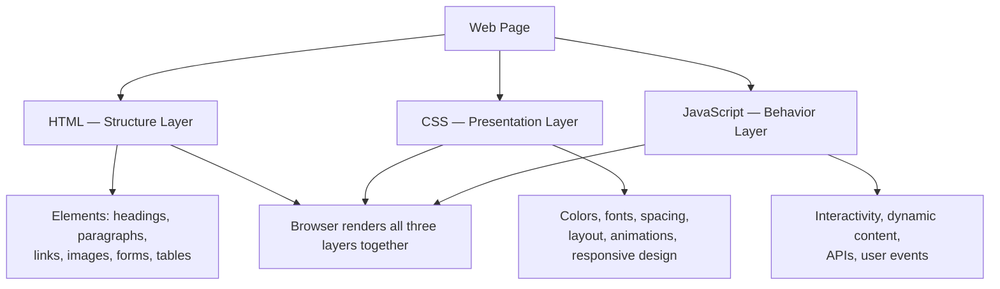
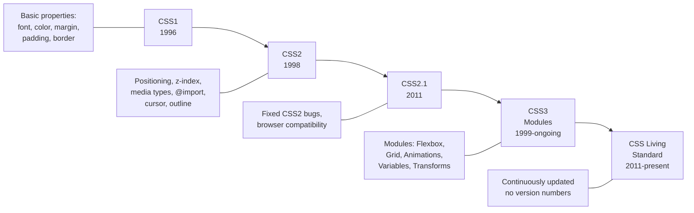
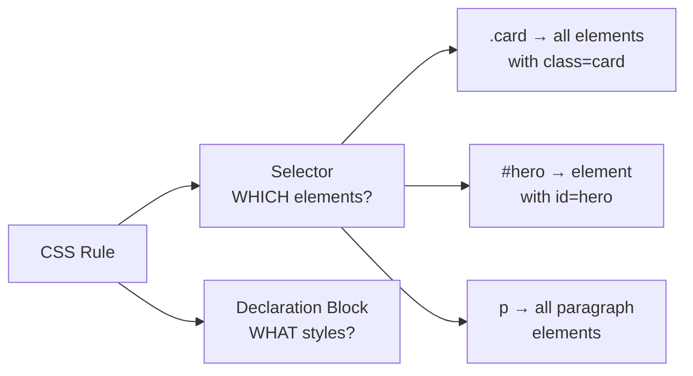
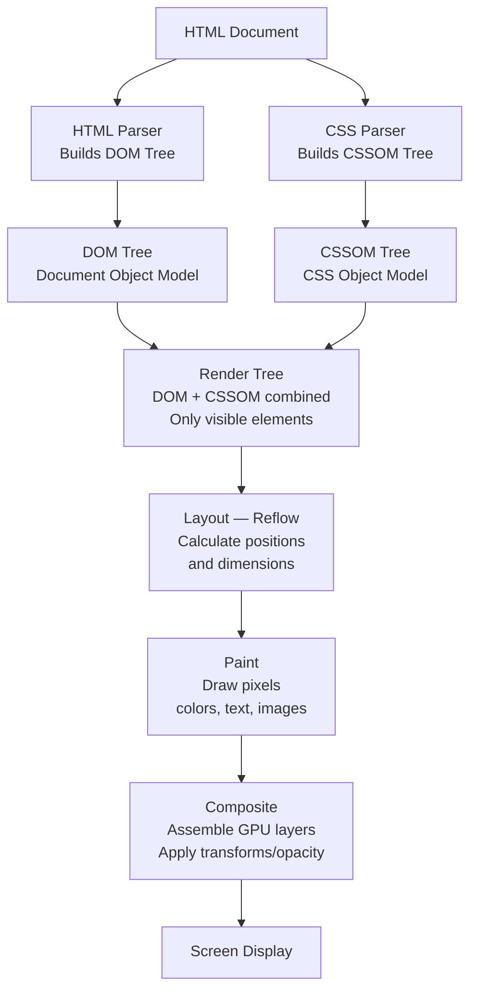
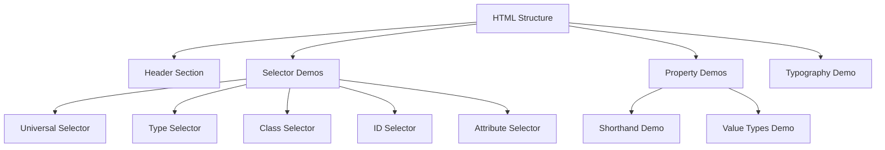

<a id="chapter-26-introduction-to-css"></a>

# Chapter 26: Introduction to CSS

[⬅ Previous Chapter](#chapter-25-html-interview-questions) | [📖 Main Index](#main-index) | [Next Chapter ➡](#chapter-27-ways-to-add-css)

---

## 📌 Learning Objectives

By the end of this chapter, you will:

* Understand what CSS is and the fundamental role it plays in web development
* Know the complete history and evolution of CSS from CSS1 to CSS3 and beyond
* Master CSS syntax — rules, declarations, selectors, properties, and values
* Understand how CSS works with HTML through the browser rendering process
* Know all basic CSS selector types and how they target HTML elements
* Understand CSS comments, whitespace rules, and code formatting conventions
* Be able to write valid CSS from scratch without any framework
* Answer all basic and intermediate CSS introduction interview questions confidently

---

<a id="chapter-index-table-26"></a>

## Chapter Index Table

| Topic No. | Topic Name | Subtopics |
|-----------|------------|-----------|
| 26.1 | [What is CSS?](#261-what-is-css) | Definition<br>Role in web dev<br>Separation of concerns<br>Without CSS vs with CSS |
| 26.2 | [History and Evolution of CSS](#262-history-and-evolution-of-css) | CSS1<br>CSS2<br>CSS3<br>Living standard<br>Browser support |
| 26.3 | [CSS Syntax Deep Dive](#263-css-syntax-deep-dive) | Rule<br>Selector<br>Declaration block<br>Property<br>Value<br>Semicolons |
| 26.4 | [CSS Selectors — Introduction](#264-css-selectors-introduction) | Universal<br>Type<br>Class<br>ID<br>Attribute<br>Grouping |
| 26.5 | [CSS Properties and Values](#265-css-properties-and-values) | Property types<br>Value types<br>Shorthand vs longhand<br>Initial values |
| 26.6 | [CSS Comments and Formatting](#266-css-comments-and-formatting) | Comment syntax<br>Code style<br>Organization<br>Conventions |
| 26.7 | [How the Browser Applies CSS](#267-how-the-browser-applies-css) | CSSOM<br>Render tree<br>Cascade overview<br>Computed styles |
| 26.8 | [CSS and HTML Relationship](#268-css-and-html-relationship) | Separation of concerns<br>Why not inline<br>Multiple stylesheets<br>Reusability |
| 26.9 | [Interview Questions](#269-interview-questions) | Conceptual<br>Scenario<br>Output-based<br>Advanced |
| 26.10 | [Practice Problems](#2610-practice-problems) | Coding<br>Theory<br>Machine Coding |
| 26.11 | [Mini Project](#2611-mini-project) | CSS Introduction Showcase Card |
| 26.12 | [Quick Revision](#2612-quick-revision) | Key Points<br>Traps<br>Bullets |
| 26.13 | [Chapter Summary](#2613-chapter-summary) | Final Takeaways |

---

## 261 What is CSS?

<a id="261-what-is-css"></a>

### 🔷 Definition

**CSS (Cascading Style Sheets)** is a stylesheet language used to describe the **presentation** — the visual appearance and layout — of HTML documents.

If HTML is the **skeleton** of a webpage (structure and content), then CSS is the **skin, clothing, and makeup** — it controls how everything looks: colors, fonts, spacing, layout, animations, and responsive behavior.

```
HTML  → Structure    → What content IS
CSS   → Presentation → How content LOOKS
JS    → Behavior     → What content DOES
```

---

### 🔷 The Three Layers of the Web



---

### 🔷 What Does CSS Control?

| Category | CSS Controls |
|----------|-------------|
| **Typography** | Font family, size, weight, style, line height, letter spacing |
| **Color** | Text color, background color, border color, gradient |
| **Spacing** | Margin, padding, gap between elements |
| **Layout** | Flexbox, Grid, positioning, float |
| **Sizing** | Width, height, min/max dimensions |
| **Borders** | Border style, width, color, radius (rounded corners) |
| **Backgrounds** | Background color, image, repeat, position, size |
| **Visibility** | Display, visibility, opacity |
| **Animation** | Transitions, keyframe animations, transforms |
| **Responsive** | Media queries, viewport units, flexible layouts |
| **Print** | Print-specific styles |

---

### 🔷 Without CSS vs With CSS

```html
<!-- HTML WITHOUT CSS — raw, unstyled -->
<!DOCTYPE html>
<html lang="en">
<head>
  <meta charset="UTF-8">
  <title>No CSS Page</title>
  <!-- No stylesheet linked -->
</head>
<body>
  <h1>FitStore India</h1>
  <nav>
    <a href="/">Home</a>
    <a href="/products">Products</a>
    <a href="/contact">Contact</a>
  </nav>
  <main>
    <h2>Running Shoes</h2>
    <p>Premium running shoes for every athlete.</p>
    <button>Shop Now</button>
  </main>
</body>
</html>
<!-- Result: Black text, white background, browser default fonts.
             Times New Roman everywhere. Blue underlined links.
             Generic gray button. No layout. Completely functional
             but visually unappealing. -->
```

```html
<!-- SAME HTML WITH CSS — transformed completely -->
<!DOCTYPE html>
<html lang="en">
<head>
  <meta charset="UTF-8">
  <title>FitStore India</title>
  <style>
    /* Reset browser defaults */
    * { box-sizing: border-box; margin: 0; padding: 0; }

    body {
      font-family: 'Segoe UI', system-ui, sans-serif;
      background: #f8fafc;
      color: #1e293b;
    }

    h1 {
      font-size: 2.5rem;
      color: #2563eb;
      text-align: center;
      padding: 2rem 0 1rem;
    }

    nav {
      background: #1e293b;
      padding: 1rem 2rem;
      display: flex;
      gap: 2rem;
      justify-content: center;
    }

    nav a {
      color: white;
      text-decoration: none;
      font-weight: 500;
      transition: color 0.2s;
    }

    nav a:hover { color: #60a5fa; }

    main {
      max-width: 800px;
      margin: 3rem auto;
      padding: 2rem;
      background: white;
      border-radius: 12px;
      box-shadow: 0 4px 20px rgba(0,0,0,0.08);
      text-align: center;
    }

    h2 {
      font-size: 1.75rem;
      margin-bottom: 1rem;
      color: #0f172a;
    }

    p { color: #64748b; margin-bottom: 2rem; }

    button {
      background: #2563eb;
      color: white;
      border: none;
      padding: 12px 32px;
      border-radius: 8px;
      font-size: 1rem;
      font-weight: 600;
      cursor: pointer;
      transition: background 0.2s, transform 0.1s;
    }

    button:hover {
      background: #1d4ed8;
      transform: translateY(-1px);
    }
  </style>
</head>
<body>
  <!-- Same exact HTML — completely different appearance with CSS -->
  <h1>FitStore India</h1>
  <nav>
    <a href="/">Home</a>
    <a href="/products">Products</a>
    <a href="/contact">Contact</a>
  </nav>
  <main>
    <h2>Running Shoes</h2>
    <p>Premium running shoes for every athlete.</p>
    <button>Shop Now</button>
  </main>
</body>
</html>
```

> [!IMPORTANT]
> The HTML is **identical** in both examples. CSS alone transforms the visual experience completely. This is the power of **separation of concerns** — change the look by editing CSS, not HTML.

---

### 🔷 Why CSS Matters — The Business Case

| Benefit | Explanation |
|---------|-------------|
| **Maintainability** | Change brand color in ONE place → updates entire website |
| **Reusability** | Write a button style once → use it on 1000 pages |
| **Performance** | One cached CSS file serves every page vs inline styles repeated everywhere |
| **Separation** | Designers edit CSS; developers edit HTML/JS — parallel work |
| **Accessibility** | CSS handles visual presentation without corrupting semantic HTML |
| **Responsive** | Media queries adapt one HTML file to any screen size |

---

### 🧠 Hinglish Intuition

> CSS ko socho jaise **ek interior designer** aur HTML ek **architect** hai.
>
> Architect (HTML) decide karta hai — yahan bedroom hai, yahan kitchen hai, yahan living room hai. Usne structure banaya.
>
> Interior designer (CSS) decide karta hai — bedroom ka color cream hoga, curtains silk ki hongi, lighting warm hogi, furniture minimalist hoga.
>
> Agar aap color change karna chahte ho — architect ko disturb mat karo. Sirf designer ko bolo — "sofa ka color blue se green kar do." Ek jagah change, poora ghar update.
>
> **Yehi CSS ki power hai** — ek stylesheet se poori website ki look badal jaati hai.

---

👉 <a href="#chapter-index-table-26">Go to Top 🔝</a>

---

## 262 History and Evolution of CSS

<a id="262-history-and-evolution-of-css"></a>

### 🔷 The Problem CSS Solved

Before CSS (1994 and earlier), HTML contained BOTH structure AND presentation:

```html
<!-- Pre-CSS: Presentation mixed into HTML — nightmare! -->
<font face="Arial" size="5" color="#cc0000">
  <b>Welcome to My Website</b>
</font>
<table width="100%" bgcolor="#eeeeee" cellpadding="10">
  <tr>
    <td align="center" valign="middle">
      <font color="blue" size="3">Content here</font>
    </td>
  </tr>
</table>
```

In 1994, **Håkon Wium Lie** (working at CERN with Tim Berners-Lee) proposed CSS. **Bert Bos** collaborated on the specification. The W3C published CSS1 in 1996.

---

### 🔷 CSS Version Timeline



---

### 🔷 CSS1 (1996) — The Beginning

First CSS specification. Covered fundamental styling:

```css
/* CSS1 capabilities */
body      { font-family: Arial; color: #333; }
h1        { font-size: 24pt; font-weight: bold; }
p         { margin: 10px; text-align: justify; }
a         { color: blue; text-decoration: underline; }
a:hover   { color: darkblue; }  /* Pseudo-classes introduced */
.intro    { font-style: italic; }  /* Class selectors */
#header   { background-color: #333; }  /* ID selectors */
```

---

### 🔷 CSS2 / CSS2.1 (1998 / 2011) — Layout Power

CSS2 added positioning, z-index, and more selectors:

```css
/* CSS2 new capabilities */

/* Positioning */
.fixed-header {
  position: fixed;
  top: 0;
  left: 0;
  width: 100%;
  z-index: 1000;
}

/* Media types */
@media print {
  .no-print { display: none; }
}

/* More pseudo-classes and pseudo-elements */
p:first-child  { font-weight: bold; }
p::first-line  { font-variant: small-caps; }
p::first-letter { font-size: 3em; float: left; }

/* Attribute selectors */
input[type="email"] { border-color: blue; }
a[href^="https"]    { color: green; }
```

---

### 🔷 CSS3 (1999–ongoing) — The Modern Era

CSS3 isn't a single version — it's a collection of **independent modules**, each at different stages of standardization. Major modules:

```css
/* CSS3 Selectors Module */
li:nth-child(2n)   { background: #f0f0f0; }  /* Zebra striping */
p:not(.special)    { color: #333; }
input:placeholder-shown { border: 1px dashed; }

/* CSS3 Box Model / Backgrounds */
.card {
  border-radius: 12px;          /* Rounded corners */
  box-shadow: 0 4px 20px rgba(0,0,0,0.1);  /* Drop shadow */
  background: linear-gradient(135deg, #667eea, #764ba2);  /* Gradient */
}

/* CSS3 Transitions */
.button {
  transition: background 0.3s ease, transform 0.2s ease;
}
.button:hover { transform: scale(1.05); }

/* CSS3 Animations */
@keyframes fadeIn {
  from { opacity: 0; transform: translateY(20px); }
  to   { opacity: 1; transform: translateY(0); }
}
.hero { animation: fadeIn 0.6s ease forwards; }

/* CSS3 Flexbox */
.nav {
  display: flex;
  justify-content: space-between;
  align-items: center;
  gap: 1rem;
}

/* CSS3 Grid */
.layout {
  display: grid;
  grid-template-columns: 240px 1fr;
  grid-template-rows: auto 1fr auto;
  min-height: 100vh;
}

/* CSS3 Custom Properties (Variables) */
:root {
  --color-primary: #2563eb;
  --spacing-lg: 2rem;
  --border-radius: 8px;
}
.button { background: var(--color-primary); padding: var(--spacing-lg); }

/* CSS3 Media Queries */
@media (max-width: 768px) {
  .layout { grid-template-columns: 1fr; }
}

/* CSS3 Transforms */
.card:hover { transform: rotate(2deg) scale(1.02); }
```

---

### 🔷 CSS Living Standard (2011–present)

Since 2011, CSS is maintained as a **Living Standard** by the W3C (similar to HTML). There is no "CSS4" — instead, individual CSS modules evolve independently:

| Module | Status | Key Feature |
|--------|--------|-------------|
| CSS Selectors Level 4 | Working Draft | `:has()`, `:is()`, `:where()` |
| CSS Grid Level 2 | Candidate Rec | Subgrid |
| CSS Container Queries | CR | `@container` |
| CSS Cascade Level 5 | Working Draft | `@layer`, `:where()` |
| CSS Color Level 5 | Working Draft | `oklch()`, `color-mix()` |
| CSS Nesting | Living Standard | Native CSS nesting |

---

### 🧠 Hinglish Intuition

> CSS ki history ek **jugaad se luxury** ki taraf ki journey hai.
>
> **1996:** Ek basic toolkit tha — color, font, margin. Jaise ek simple hardware store.
>
> **2000s:** CSS2 aaya — thoda better, positioning, z-index. Lekin browser support patchy tha, Internet Explorer sab kuch alag-alag render karta tha. Web developers ka dard tha.
>
> **2010s:** CSS3 aaya aur game change ho gaya — rounded corners, shadows, gradients, flexbox, grid, animations. Sab kuch jo pehle JavaScript ya images se karna padta tha, ab pure CSS se hone laga.
>
> **Aaj:** CSS ek living standard hai — continuously evolve ho raha hai. `container queries`, `@layer`, CSS nesting — hamesha kuch naya aa raha hai.

---

👉 <a href="#chapter-index-table-26">Go to Top 🔝</a>

---

## 263 CSS Syntax Deep Dive

<a id="263-css-syntax-deep-dive"></a>

### 🔷 The CSS Rule — Complete Anatomy

A CSS **rule** (also called a **ruleset**) has two main parts:

```
selector { declaration-block }
```

Let's dissect every component:

```css
/*
 ┌─────────────── SELECTOR ───────────────┐
 │                                         │
 h1                                        │
 │                                         │
 └─────────────────────────────────────────┘
    ┌──────────── DECLARATION BLOCK ───────────────┐
    {                                               │
      color:    red;                                │
    │ ─────    ─── ─                               │
    │  │        │   └── Semicolon (;) terminates   │
    │  │        └────── VALUE                      │
    │  └─────────────── PROPERTY                   │
    │  └─────────────────────── DECLARATION        │
      font-size: 24px;                              │
      margin:    0 auto;                            │
    }                                               │
    └───────────────────────────────────────────────┘
*/

/* Reading it: */
/* "For all h1 elements: set color to red, font-size to 24px, margin to 0 auto" */
h1 {
  color:     red;
  font-size: 24px;
  margin:    0 auto;
}
```

---

### 🔷 Every Part Explained

**Selector:**
```css
/* Targets which HTML elements the styles apply to */
h1          /* All <h1> elements */
.card       /* All elements with class="card" */
#logo       /* The element with id="logo" */
p, span     /* All <p> AND all <span> elements */
```

**Property:**
```css
/* The aspect of the element you want to style */
/* Always a predefined CSS keyword */
color           /* Text color */
font-size       /* Text size */
background      /* Background */
margin          /* Outer spacing */
padding         /* Inner spacing */
display         /* How element is rendered */
```

**Value:**
```css
/* What you want the property to be */
/* Must be valid for that specific property */
color: red;              /* Named color */
color: #ff0000;          /* Hex color */
color: rgb(255, 0, 0);   /* RGB color */
color: oklch(50% 0.2 29);/* Modern color */
font-size: 16px;         /* Pixels */
font-size: 1rem;         /* Root em */
font-size: 120%;         /* Percentage */
margin: auto;            /* Keyword */
margin: 10px 20px;       /* Multiple values */
```

**Declaration:**
```css
/* One property: value pair */
color: royalblue;    /* This entire line is one declaration */
```

**Declaration Block:**
```css
/* Everything between { } */
{
  color: royalblue;
  font-size: 1.5rem;
  font-weight: bold;
  margin: 0 auto;
}
```

**Rule / Ruleset:**
```css
/* Selector + Declaration Block = Complete Rule */
.page-title {
  color: royalblue;
  font-size: 1.5rem;
  font-weight: bold;
  margin: 0 auto;
}
```

---

### 🔷 Complete Syntax Reference

```css
/* ===== SINGLE RULE ===== */
selector {
  property: value;
}

/* ===== MULTIPLE DECLARATIONS ===== */
h2 {
  color: #1e293b;
  font-size: 1.5rem;
  font-weight: 700;
  line-height: 1.4;
  margin-bottom: 1rem;
}

/* ===== MULTIPLE SELECTORS — same styles ===== */
h1,
h2,
h3 {
  font-family: 'Segoe UI', sans-serif;
  color: #0f172a;
}

/* ===== NESTED SELECTOR (descendant) ===== */
nav a {
  /* Targets <a> elements INSIDE <nav> */
  color: white;
  text-decoration: none;
}

/* ===== AT-RULES ===== */
@media (max-width: 768px) {
  /* Rules that apply only on small screens */
  .sidebar { display: none; }
}

@keyframes slideIn {
  from { transform: translateX(-100%); }
  to   { transform: translateX(0); }
}

@import url('typography.css');

@font-face {
  font-family: 'MyFont';
  src: url('myfont.woff2') format('woff2');
}

/* ===== SEMICOLONS ===== */
h1 {
  color: red;         /* Semicolon required between declarations */
  font-size: 24px;    /* Semicolon required */
  margin: 0;          /* Last declaration: semicolon optional but BEST PRACTICE to include */
}

/* ===== WHITESPACE ===== */
/* CSS ignores extra whitespace — all equivalent: */
h1{color:red;font-size:24px;}                  /* Minified */
h1 { color: red; font-size: 24px; }            /* Compact */
h1 {                                            /* Expanded (preferred) */
  color: red;
  font-size: 24px;
}
```

---

### 🔷 CSS Values — Types Reference

```css
.example {
  /* Length values */
  width: 300px;          /* Absolute: pixels */
  width: 50%;            /* Relative: percentage of parent */
  width: 20rem;          /* Relative: root element font size */
  width: 10em;           /* Relative: current element font size */
  width: 50vw;           /* Relative: viewport width */
  width: 50vh;           /* Relative: viewport height */
  width: 50vmin;         /* Smaller of vw/vh */
  width: 50vmax;         /* Larger of vw/vh */
  width: fit-content;    /* Keyword */
  width: auto;           /* Keyword — browser decides */

  /* Color values */
  color: red;                     /* Named color */
  color: #ff0000;                 /* Hex (6 digits) */
  color: #f00;                    /* Hex shorthand (3 digits) */
  color: #ff000080;               /* Hex with alpha (8 digits) */
  color: rgb(255, 0, 0);          /* RGB */
  color: rgba(255, 0, 0, 0.5);   /* RGB with alpha */
  color: hsl(0, 100%, 50%);      /* HSL */
  color: hsla(0, 100%, 50%, 0.5);/* HSL with alpha */
  color: oklch(50% 0.2 29);      /* Modern: OKLCH */

  /* Numeric values */
  opacity: 0.5;          /* Decimal number (0 to 1) */
  z-index: 100;          /* Integer */
  font-weight: 700;      /* Numeric weight */
  flex: 1;               /* Unitless number */

  /* String values */
  font-family: 'Arial', sans-serif;  /* Font name in quotes */
  content: 'Required';               /* String content */

  /* URL values */
  background-image: url('pattern.png');
  background-image: url('https://cdn.example.com/bg.jpg');

  /* Function values */
  width: calc(100% - 40px);          /* calc() */
  background: linear-gradient(135deg, #667eea, #764ba2);
  transform: translateX(50px) rotate(45deg);
  color: var(--brand-color);          /* CSS variable */

  /* Keyword values */
  display: flex;
  position: absolute;
  overflow: hidden;
  cursor: pointer;
  text-align: center;
  visibility: hidden;
}
```

---

### 🔷 Shorthand vs Longhand Properties

```css
/* ===== MARGIN ===== */
/* Longhand: */
margin-top:    10px;
margin-right:  20px;
margin-bottom: 10px;
margin-left:   20px;

/* Shorthand (top right bottom left — clockwise from top): */
margin: 10px 20px 10px 20px;  /* All 4 sides */
margin: 10px 20px;             /* top+bottom=10px, left+right=20px */
margin: 10px;                  /* All sides = 10px */
margin: 10px 20px 30px;        /* top=10px, left+right=20px, bottom=30px */

/* ===== PADDING ===== */
/* Same pattern as margin */
padding: 16px 24px;           /* top+bottom=16px, left+right=24px */

/* ===== BORDER ===== */
/* Longhand: */
border-width: 2px;
border-style: solid;
border-color: #333;
/* Shorthand: */
border: 2px solid #333;

/* ===== FONT ===== */
/* Longhand: */
font-style:   italic;
font-variant: normal;
font-weight:  700;
font-size:    1.25rem;
line-height:  1.6;
font-family:  'Segoe UI', sans-serif;
/* Shorthand (specific order required!): */
font: italic 700 1.25rem/1.6 'Segoe UI', sans-serif;
/*    style  wt  size/lh   family */

/* ===== BACKGROUND ===== */
background-color:      #1e293b;
background-image:      url('pattern.png');
background-repeat:     no-repeat;
background-position:   center center;
background-size:       cover;
background-attachment: fixed;
/* Shorthand: */
background: #1e293b url('pattern.png') no-repeat center center / cover fixed;

/* ===== TRANSITION ===== */
transition-property:        background, transform;
transition-duration:        0.3s;
transition-timing-function: ease;
transition-delay:           0s;
/* Shorthand: */
transition: background 0.3s ease, transform 0.2s ease 0.1s;

/* ===== ANIMATION ===== */
animation-name:            slideIn;
animation-duration:        0.5s;
animation-timing-function: ease-out;
animation-delay:           0.2s;
animation-iteration-count: 1;
animation-fill-mode:       forwards;
/* Shorthand: */
animation: slideIn 0.5s ease-out 0.2s 1 forwards;
```

> [!TIP]
> Shorthand properties set ALL related longhand values — including resetting any you don't specify to their initial values. Be careful: `border: 2px solid;` resets `border-color` to `currentColor`. Always check what shorthand resets.

---

### 🧠 Hinglish Intuition

> CSS syntax ek **simple sentence structure** ki tarah hai:
>
> **"Kaun?" → "Kya?" → "Kitna/Kaisa?"**
>
> `h1` (kaun?) `{ color:` (kya change?) `red; }` (kaise?)
>
> Matlab: "Sare h1 elements ka color red karo."
>
> Shorthand properties ek **combo meal** ki tarah hain — ek order mein sab kuch aa jaata hai. `border: 2px solid red` — teen alag lines likhne ki jagah ek mein sab. Lekin dhyan raho — agar koi value specify na karo toh wo reset ho jaati hai initial value pe.

---

👉 <a href="#chapter-index-table-26">Go to Top 🔝</a>

---

## 264 CSS Selectors — Introduction

<a id="264-css-selectors-introduction"></a>

### 🔷 What Are CSS Selectors?

A **CSS selector** is the part of a CSS rule that **targets** which HTML elements the declarations should apply to. Think of it as the "address" that tells CSS where to deliver the styling.



---

### 🔷 Universal Selector `*`

Targets **every single element** on the page.

```css
/* Universal selector */
* {
  box-sizing: border-box;  /* Very common: apply box-sizing to all */
  margin: 0;
  padding: 0;
}

/* Also works in combination */
.card * {
  /* All elements INSIDE .card */
}

article > * {
  /* All DIRECT children of article */
}
```

> [!NOTE]
> The universal selector has **zero specificity** — it can be overridden by any other selector. It's commonly used in CSS resets.

---

### 🔷 Type Selector (Element Selector)

Targets all elements of a specific **HTML tag type**.

```css
/* Targets ALL <h1> elements */
h1 {
  font-size: 2.5rem;
  font-weight: 800;
  color: #0f172a;
}

/* Targets ALL <p> elements */
p {
  font-size: 1rem;
  line-height: 1.7;
  color: #475569;
  margin-bottom: 1rem;
}

/* Targets ALL <a> elements */
a {
  color: #2563eb;
  text-decoration: underline;
}

/* Targets ALL <button> elements */
button {
  cursor: pointer;
  border: none;
  font-family: inherit;
  font-size: inherit;
}

/* Targets ALL <input> elements */
input {
  font-family: inherit;
  font-size: 1rem;
  border: 1px solid #cbd5e1;
  border-radius: 6px;
  padding: 8px 12px;
}

/* Multiple type selectors with same styles */
h1, h2, h3, h4, h5, h6 {
  font-family: 'Inter', system-ui, sans-serif;
  line-height: 1.2;
  color: #0f172a;
}
```

---

### 🔷 Class Selector `.`

Targets all elements that have a specific **class attribute value**. The most commonly used selector in modern CSS.

```html
<!-- HTML with classes -->
<div class="card">Default card</div>
<div class="card featured">Featured card — two classes</div>
<p class="card">Paragraph with card class</p>
<button class="btn btn-primary">Primary button</button>
<button class="btn btn-secondary">Secondary button</button>
```

```css
/* .classname — targets any element with class="classname" */
.card {
  background: white;
  border: 1px solid #e2e8f0;
  border-radius: 12px;
  padding: 1.5rem;
  box-shadow: 0 2px 8px rgba(0,0,0,0.08);
}

/* Modifier class — adds to base styles */
.featured {
  border-color: #2563eb;
  box-shadow: 0 4px 20px rgba(37,99,235,0.2);
}

/* Both classes together — targets elements with BOTH classes */
.card.featured {
  background: linear-gradient(135deg, #eff6ff, #dbeafe);
}

/* Button base styles */
.btn {
  padding: 10px 24px;
  border-radius: 8px;
  font-weight: 600;
  cursor: pointer;
  border: 2px solid transparent;
  transition: all 0.2s;
}

/* Button variants */
.btn-primary {
  background: #2563eb;
  color: white;
}
.btn-primary:hover {
  background: #1d4ed8;
}

.btn-secondary {
  background: transparent;
  color: #2563eb;
  border-color: #2563eb;
}
.btn-secondary:hover {
  background: #eff6ff;
}
```

---

### 🔷 ID Selector `#`

Targets the **single element** with a specific `id` attribute. IDs must be unique per page.

```html
<!-- HTML with IDs -->
<header id="site-header">...</header>
<main id="main-content">...</main>
<nav id="main-nav">...</nav>
<footer id="site-footer">...</footer>
```

```css
/* #id-name — very high specificity */
#site-header {
  position: sticky;
  top: 0;
  z-index: 100;
  background: white;
  box-shadow: 0 2px 8px rgba(0,0,0,0.1);
}

#main-content {
  max-width: 1200px;
  margin: 0 auto;
  padding: 2rem 1rem;
}

#main-nav {
  display: flex;
  gap: 2rem;
  align-items: center;
}
```

> [!IMPORTANT]
> ID selectors have **very high specificity** — they override class and type selectors. In modern CSS architecture, prefer class selectors for styling (more flexible, reusable). Use IDs for: JavaScript hooks, fragment navigation (`href="#section"`), form label connections (`for="id"`).

---

### 🔷 Attribute Selector `[]`

Targets elements based on the **presence or value of HTML attributes**.

```html
<!-- HTML elements with various attributes -->
<input type="text">
<input type="email">
<input type="password">
<a href="https://external.com">External link</a>
<a href="/internal">Internal link</a>
<button disabled>Disabled button</button>

```

```css
/* [attr] — element HAS this attribute (any value) */
input[required] {
  border-left: 3px solid #e74c3c;
}
[disabled] {
  opacity: 0.5;
  cursor: not-allowed;
}

/* [attr="value"] — attribute equals EXACTLY this value */
input[type="email"] {
  padding-left: 2.5rem;  /* Space for email icon */
}
input[type="password"] {
  letter-spacing: 0.2em; /* Space between password dots */
}
input[type="checkbox"] {
  width: 1.2rem;
  height: 1.2rem;
  accent-color: #2563eb;
}

/* [attr^="value"] — attribute STARTS WITH this value */
a[href^="https"] {
  color: #16a34a;        /* External HTTPS links — green */
}
a[href^="mailto"] {
  color: #7c3aed;        /* Email links — purple */
}
a[href^="tel"] {
  color: #0369a1;        /* Phone links — blue */
}

/* [attr$="value"] — attribute ENDS WITH this value */
a[href$=".pdf"] {
  padding-right: 1.5rem;
  /* Add PDF icon as background */
}
a[href$=".pdf"]::after {
  content: ' 📄';
}
img[src$=".svg"] {
  /* SVG-specific styles */
}

/* [attr*="value"] — attribute CONTAINS this value */
[class*="btn-"] {
  /* All elements with class containing "btn-" */
  display: inline-flex;
  align-items: center;
  gap: 0.5rem;
}
[class*="-error"] {
  color: #dc2626;
}

/* [attr~="value"] — attribute word list CONTAINS this word */
/* (for space-separated values like class) */
[class~="featured"] {
  /* Same as .featured for most purposes */
}

/* [attr|="value"] — attribute equals value OR starts with value- */
/* Common for language: lang="en", lang="en-US", lang="en-GB" */
[lang|="en"] {
  font-family: 'Segoe UI', sans-serif;
}
[lang|="ar"] {
  direction: rtl;
  font-family: 'Noto Naskh Arabic', serif;
}
```

---

### 🔷 Grouping Selector `,`

Apply the **same declarations to multiple selectors**.

```css
/* Instead of writing the same styles three times: */
h1 { font-family: 'Inter', sans-serif; color: #0f172a; }
h2 { font-family: 'Inter', sans-serif; color: #0f172a; }
h3 { font-family: 'Inter', sans-serif; color: #0f172a; }

/* Use grouping — separated by commas */
h1,
h2,
h3 {
  font-family: 'Inter', sans-serif;
  color: #0f172a;
}

/* Mix any selector types */
h1,
.page-title,
#hero-heading,
[data-type="title"] {
  font-size: clamp(1.5rem, 4vw, 3rem);
  line-height: 1.2;
}

/* Commonly used reset grouping */
*,
*::before,
*::after {
  box-sizing: border-box;
}

/* Form element normalization */
input,
textarea,
select,
button {
  font-family: inherit;
  font-size: inherit;
}
```

---

### 🔷 Selector Specificity Overview (Introduction)

Every selector has a **specificity weight** that determines which rule wins when multiple rules target the same element:

```
Specificity (from highest to lowest):
!important          → Overrides everything (avoid if possible)
Inline style        → style="" attribute: (1,0,0,0)
ID selector         → #id: (0,1,0,0)
Class selector      → .class: (0,0,1,0)
Attribute selector  → [type]: (0,0,1,0)
Type selector       → h1: (0,0,0,1)
Universal selector  → *: (0,0,0,0)
```

```css
/* Lower specificity — overridden by class below */
h1 { color: black; }           /* (0,0,0,1) */

/* Higher specificity — wins */
.page-title { color: blue; }   /* (0,0,1,0) */

/* Even higher — wins over class */
#hero-title { color: red; }    /* (0,1,0,0) */

/* Nuclear option — overrides everything (avoid!) */
h1 { color: green !important; }
```

> [!NOTE]
> Specificity is covered in full detail in Chapter 30. This is just an introduction to understand why some CSS rules override others.

---

### 🧠 Hinglish Intuition

> CSS selectors ek **address system** ki tarah hain — jaise courier delivery.
>
> - **Type selector** (`h1`) = "Sheher ke sare H1 wale ghar" — bahut broad
> - **Class selector** (`.card`) = "Jo bhi ghar par 'CARD' ka label laga hai" — specific aur reusable
> - **ID selector** (`#hero`) = "Exact ek ghar — 101 Main Street" — unique, high priority
> - **Attribute selector** (`[type="email"]`) = "Wo sab ghar jahan email-type ka sign laga hai"
>
> Sabse zyada use hone wala: **class selector** — kyunki reusable hai, flexible hai, aur specificity medium hoti hai jo maintain karna easy hai.

---

👉 <a href="#chapter-index-table-26">Go to Top 🔝</a>

---

## 265 CSS Properties and Values

<a id="265-css-properties-and-values"></a>

### 🔷 Categories of CSS Properties

CSS has hundreds of properties. Here are the main categories with key examples:

```css
/* ===== 1. TYPOGRAPHY PROPERTIES ===== */
.text-example {
  font-family:     'Segoe UI', Arial, sans-serif; /* Font stack */
  font-size:       1.125rem;    /* Text size */
  font-weight:     600;         /* 100-900 or named: bold, normal */
  font-style:      italic;      /* normal | italic | oblique */
  font-variant:    small-caps;  /* Variant */
  line-height:     1.6;         /* Space between lines (unitless preferred) */
  letter-spacing:  0.05em;      /* Space between characters */
  word-spacing:    0.1em;       /* Space between words */
  text-align:      center;      /* left | right | center | justify */
  text-decoration: underline;   /* underline | line-through | overline | none */
  text-transform:  uppercase;   /* uppercase | lowercase | capitalize */
  text-indent:     2em;         /* First line indent */
  white-space:     nowrap;      /* How whitespace is handled */
  word-break:      break-word;  /* How words break */
  color:           #1e293b;     /* Text color */
}

/* ===== 2. BACKGROUND PROPERTIES ===== */
.bg-example {
  background-color:      #f8fafc;
  background-image:      url('bg.jpg');
  background-repeat:     no-repeat; /* repeat | repeat-x | repeat-y | no-repeat */
  background-position:   center top;
  background-size:       cover;     /* cover | contain | auto | 100% */
  background-attachment: fixed;     /* scroll | fixed | local */
  background-clip:       border-box;
  background-origin:     padding-box;
  /* Shorthand: */
  background: #f8fafc url('bg.jpg') no-repeat center / cover;
}

/* ===== 3. BOX MODEL PROPERTIES ===== */
.box-example {
  width:   400px;
  height:  300px;
  max-width:  100%;    /* Responsive constraint */
  min-height: 200px;
  padding: 1.5rem 2rem;
  margin:  2rem auto;
  border:  2px solid #e2e8f0;
  border-radius: 12px;
  box-sizing: border-box; /* Include padding/border in width calculation */
  overflow: hidden;       /* visible | hidden | scroll | auto */
}

/* ===== 4. DISPLAY AND LAYOUT PROPERTIES ===== */
.layout-example {
  display:   flex;       /* block | inline | flex | grid | none | inline-flex */
  position:  relative;  /* static | relative | absolute | fixed | sticky */
  top:       0;
  left:      0;
  z-index:   10;
  float:     left;       /* left | right | none */
  clear:     both;       /* left | right | both | none */
  visibility: visible;  /* visible | hidden */
  opacity:   0.8;        /* 0 (transparent) to 1 (opaque) */
}

/* ===== 5. FLEXBOX PROPERTIES ===== */
.flex-container {
  display:         flex;
  flex-direction:  row;          /* row | column | row-reverse | column-reverse */
  flex-wrap:       wrap;         /* nowrap | wrap | wrap-reverse */
  justify-content: space-between;/* flex-start | flex-end | center | space-between | space-around */
  align-items:     center;      /* flex-start | flex-end | center | stretch | baseline */
  gap:             1rem;
}
.flex-item {
  flex:       1;          /* flex-grow flex-shrink flex-basis shorthand */
  align-self: flex-start; /* Override align-items for this item */
  order:      2;          /* Change visual order */
}

/* ===== 6. GRID PROPERTIES ===== */
.grid-container {
  display:               grid;
  grid-template-columns: repeat(3, 1fr);
  grid-template-rows:    auto 1fr auto;
  gap:                   1.5rem;
  grid-template-areas:   "header header header"
                         "sidebar main main"
                         "footer footer footer";
}
.grid-item {
  grid-column: 1 / 3;    /* Span columns */
  grid-row:    1 / 2;
  grid-area:   header;   /* Place in named area */
}

/* ===== 7. VISUAL EFFECTS ===== */
.effects-example {
  box-shadow:  0 4px 20px rgba(0,0,0,0.15), inset 0 1px 0 rgba(255,255,255,0.1);
  text-shadow: 2px 2px 4px rgba(0,0,0,0.3);
  filter:      blur(4px) brightness(0.8) contrast(1.2);
  opacity:     0.9;
  transform:   translateX(10px) rotate(5deg) scale(1.1);
  clip-path:   circle(50%);
  backdrop-filter: blur(10px);
}

/* ===== 8. ANIMATION PROPERTIES ===== */
.animated {
  transition:  all 0.3s ease;
  animation:   fadeIn 0.5s ease forwards;
}
@keyframes fadeIn {
  from { opacity: 0; }
  to   { opacity: 1; }
}

/* ===== 9. COLOR (modern) ===== */
.color-example {
  color:            oklch(50% 0.2 240);
  background-color: color-mix(in srgb, #2563eb 80%, white);
  border-color:     hsl(220deg 90% 56%);
}
```

---

### 🔷 CSS Initial, Inherited, and Computed Values

```css
/* INHERITED properties: children automatically get parent's value */
/* Typography properties are inherited: */
body {
  font-family: 'Segoe UI', sans-serif;
  font-size: 16px;
  color: #333;
  line-height: 1.6;
}
/* All descendant elements inherit these — no need to re-declare */
p, span, h1, li /* ... */ { /* Automatically inherit font/color from body */ }

/* NON-INHERITED properties: each element has its own initial value */
/* Box model, background, border — NOT inherited: */
div { border: 2px solid red; }
p { /* Does NOT get the border — not inherited */ }

/* Explicitly inherit: */
.child {
  border-color: inherit;      /* Inherit from parent */
  font-size: inherit;         /* Inherit (usually already would) */
}

/* Reset to initial value: */
.reset {
  all: initial;               /* Reset all properties to initial values */
  color: initial;             /* initial = browser default (black for color) */
  margin: initial;            /* initial = 0 */
}

/* Inherit ALL properties from parent: */
.inherit-all {
  all: inherit;
}
```

---

### 🧠 Hinglish Intuition

> CSS properties do types ki hoti hain jab inheritance ki baat ho:
>
> **Inherited properties** = family traits — `font-family`, `color`, `line-height` — jaise parents ki aankhein bacchon mein aa jaati hain. `body` pe `font-family` set karo — poora page us font mein ho jaata hai.
>
> **Non-inherited properties** = personal cheezein — `border`, `background`, `margin` — ye khud ke liye hain. Aapki shirt ka color aapke bête ko nahi milega!
>
> Shorthand properties ek **jugaad** hain — `border: 2px solid red` teen alag properties ek saath set karta hai. Lekin dhyan raho — jo value specify na karo wo **initial value** pe reset ho jaata hai. Isliye kabhi kabhi longhand zyada safe hota hai jab specific override karna ho.

---

👉 <a href="#chapter-index-table-26">Go to Top 🔝</a>

---

## 266 CSS Comments and Formatting

<a id="266-css-comments-and-formatting"></a>

### 🔷 CSS Comment Syntax

CSS supports only **one type of comment**: `/* ... */`

```css
/* ===== Single line comment ===== */
h1 { color: red; } /* Inline comment */

/*
 * Multi-line comment
 * spanning multiple lines
 * useful for documentation
 */

/* ===== Section divider comments ===== */
/* ============================================================
   TYPOGRAPHY
   ============================================================ */
h1 { font-size: 2.5rem; }

/* ============================================================
   LAYOUT
   ============================================================ */
.container { max-width: 1200px; }

/* ===== Todo comments ===== */
/* TODO: Add dark mode support for this component */
/* FIXME: Button hover color broken in Safari */
/* HACK: Force repaint — remove after Chrome bug fix */

/* ===== Disable/debug rules ===== */
/* .debug * { outline: 1px solid red !important; } */
.card {
  /* border: 2px solid green; */ /* Temporarily disabled */
  background: white;
}
```

> [!NOTE]
> CSS does NOT support single-line comments like `//`. The only valid comment syntax is `/* ... */`. Using `//` in CSS will cause unexpected behavior — the browser may ignore the entire line OR the next declaration.

---

### 🔷 Professional CSS File Organization

```css
/* ============================================================
   FILE: main.css
   Author: Rahul Sharma
   Description: Main stylesheet for FitStore website
   Version: 2.1.0
   Last Modified: 2024-01-15
   ============================================================ */


/* ============================================================
   TABLE OF CONTENTS
   1. CSS Custom Properties (Variables)
   2. CSS Reset / Normalize
   3. Base / Typography
   4. Layout
   5. Header & Navigation
   6. Hero Section
   7. Product Cards
   8. Forms
   9. Footer
   10. Utilities
   11. Media Queries
   ============================================================ */


/* ============================================================
   1. CSS CUSTOM PROPERTIES
   ============================================================ */
:root {
  /* Colors */
  --color-primary:    #2563eb;
  --color-primary-dark: #1d4ed8;
  --color-secondary:  #7c3aed;
  --color-success:    #16a34a;
  --color-danger:     #dc2626;
  --color-warning:    #d97706;
  --color-text:       #1e293b;
  --color-text-muted: #64748b;
  --color-bg:         #f8fafc;
  --color-surface:    #ffffff;
  --color-border:     #e2e8f0;

  /* Typography */
  --font-base:    'Segoe UI', system-ui, -apple-system, sans-serif;
  --font-heading: 'Inter', var(--font-base);
  --font-mono:    'JetBrains Mono', 'Courier New', monospace;

  /* Spacing scale */
  --space-1: 0.25rem;   /*  4px */
  --space-2: 0.5rem;    /*  8px */
  --space-3: 0.75rem;   /* 12px */
  --space-4: 1rem;      /* 16px */
  --space-6: 1.5rem;    /* 24px */
  --space-8: 2rem;      /* 32px */
  --space-12: 3rem;     /* 48px */
  --space-16: 4rem;     /* 64px */

  /* Border radius */
  --radius-sm: 4px;
  --radius-md: 8px;
  --radius-lg: 12px;
  --radius-full: 9999px;

  /* Shadows */
  --shadow-sm: 0 1px 3px rgba(0,0,0,0.1);
  --shadow-md: 0 4px 12px rgba(0,0,0,0.1);
  --shadow-lg: 0 8px 30px rgba(0,0,0,0.12);

  /* Transitions */
  --transition-fast: 150ms ease;
  --transition-base: 250ms ease;
  --transition-slow: 400ms ease;
}


/* ============================================================
   2. CSS RESET
   ============================================================ */
*,
*::before,
*::after {
  box-sizing: border-box;
}

* {
  margin: 0;
  padding: 0;
}

html {
  font-size: 16px;     /* 1rem = 16px */
  scroll-behavior: smooth;
}

body {
  font-family: var(--font-base);
  font-size: 1rem;
  line-height: 1.6;
  color: var(--color-text);
  background-color: var(--color-bg);
  -webkit-font-smoothing: antialiased;
  -moz-osx-font-smoothing: grayscale;
}

img,
video {
  max-width: 100%;
  height: auto;
  display: block;
}

/* ============================================================
   3. BASE / TYPOGRAPHY
   ============================================================ */
h1, h2, h3, h4, h5, h6 {
  font-family: var(--font-heading);
  font-weight: 700;
  line-height: 1.2;
  color: var(--color-text);
}

h1 { font-size: clamp(2rem, 5vw, 3.5rem); }
h2 { font-size: clamp(1.5rem, 3vw, 2.5rem); }
h3 { font-size: clamp(1.25rem, 2vw, 1.75rem); }
h4 { font-size: 1.25rem; }
h5 { font-size: 1.125rem; }
h6 { font-size: 1rem; }

p { margin-bottom: var(--space-4); }

a {
  color: var(--color-primary);
  text-decoration: underline;
  text-underline-offset: 3px;
  transition: color var(--transition-fast);
}
a:hover { color: var(--color-primary-dark); }

/* ... more sections ... */
```

---

### 🔷 CSS Formatting Conventions

```css
/* ===== PROPERTY ORDER (recommended) ===== */
.element {
  /* 1. Display and positioning */
  display: flex;
  position: relative;
  top: 0;
  left: 0;
  z-index: 10;
  float: none;
  clear: none;

  /* 2. Box model (outside to inside) */
  width: 100%;
  height: auto;
  max-width: 1200px;
  min-height: 200px;
  margin: 0 auto;
  padding: 1rem 2rem;
  border: 1px solid #ddd;
  border-radius: 8px;
  outline: none;

  /* 3. Typography */
  font-family: sans-serif;
  font-size: 1rem;
  font-weight: 400;
  line-height: 1.6;
  color: #333;
  text-align: left;

  /* 4. Visual */
  background: white;
  box-shadow: 0 2px 8px rgba(0,0,0,0.1);
  opacity: 1;
  visibility: visible;
  overflow: hidden;

  /* 5. Animation */
  transition: all 0.3s ease;
  transform: none;
  animation: none;

  /* 6. Miscellaneous */
  cursor: pointer;
  pointer-events: auto;
  user-select: none;
}

/* ===== NAMING CONVENTIONS ===== */

/* BEM (Block Element Modifier) — popular methodology */
.card { }                    /* Block */
.card__title { }             /* Element (double underscore) */
.card__image { }             /* Element */
.card--featured { }          /* Modifier (double dash) */
.card--large { }             /* Modifier */
.card__title--highlighted { }/* Element + Modifier */

/* Utility classes — descriptive, single-purpose */
.text-center { text-align: center; }
.mt-4        { margin-top: 1rem; }
.hidden      { display: none; }
.flex        { display: flex; }
.sr-only     { /* Screen reader only */ }

/* State classes */
.is-active   { }
.is-open     { }
.has-error   { }
.is-loading  { }
```

---

### 🧠 Hinglish Intuition

> CSS file organization ek **library** jaisi hoti hai — agar sab books beech mein pheki hain toh dhundhna mushkil hai. Lekin agar sections hain — fiction, non-fiction, reference — toh easily mil jaata hai.
>
> Comments section dividers hain. `/* ===== TYPOGRAPHY ===== */` bolne se dusra developer seedha us section pe jump kar sakta hai.
>
> **BEM naming** ek postal address system ki tarah hai: `card` = building, `card__title` = flat number, `card--featured` = special floor. Clearly batata hai kya related hai, kya variant hai.

---

👉 <a href="#chapter-index-table-26">Go to Top 🔝</a>

---

## 267 How the Browser Applies CSS

<a id="267-how-the-browser-applies-css"></a>

### 🔷 The Browser's CSS Processing Pipeline



---

### 🔷 Step 1: Parsing CSS → CSSOM

The browser downloads CSS and builds the **CSSOM (CSS Object Model)** — a tree structure of all CSS rules:

```css
/* Browser processes this CSS: */
body { font-family: sans-serif; }
h1   { font-size: 2rem; color: blue; }
.card { padding: 1rem; background: white; }
.card h2 { font-size: 1.25rem; }
```

```
CSSOM Tree:
└── body
    ├── font-family: sans-serif
    └── h1
        ├── font-size: 2rem (+ inherited font-family)
        └── color: blue
    └── .card
        ├── padding: 1rem
        ├── background: white
        └── h2 (inside .card)
            ├── font-size: 1.25rem
            └── (inherited: font-family, color from parent chain)
```

> [!IMPORTANT]
> CSS is **render-blocking** — the browser will NOT display any content until it has downloaded and processed ALL CSS linked in `<head>`. This is why CSS placement matters for performance.

---

### 🔷 Step 2: Cascade and Specificity Resolution

Before building the render tree, the browser resolves conflicts where multiple rules target the same element and property:

```css
/* Multiple rules targeting h1 color: */
h1            { color: black; }   /* Specificity: (0,0,0,1) */
.page-title   { color: blue; }    /* Specificity: (0,0,1,0) → WINS */
#hero-heading { color: red; }     /* Specificity: (0,1,0,0) → WINS if applied */

/* The cascade algorithm: */
/* 1. Filter rules that apply to this element */
/* 2. Sort by origin (author > user > browser default) */
/* 3. Sort by specificity (highest wins) */
/* 4. Sort by source order (later wins if equal specificity) */
```

---

### 🔷 Step 3: Computed Styles

The browser **computes** the final value of every CSS property for every element:

```css
/* Declared (what you write): */
.card {
  font-size: 1.25rem;
  padding: 1em;
  width: 50%;
  color: hsl(220, 90%, 56%);
}

/* Computed (what browser calculates): */
/* font-size: 20px (1.25 × 16px base) */
/* padding: 20px (1em × 20px computed font-size) */
/* width: 400px (50% of 800px parent) */
/* color: rgb(28, 111, 235) (converted from HSL) */
```

You can see computed styles in browser DevTools → Elements → Computed tab.

---

### 🔷 Step 4: Layout (Reflow)

The browser calculates the **exact position and size** of every element in the render tree:

```
Layout process:
- Determine which elements are displayed (display: none → removed from render tree)
- Calculate width/height based on content, padding, border, margin
- Position elements according to float, flexbox, grid, position rules
- Handle text wrapping and line breaks
- Calculate overflow areas
```

**What triggers reflow (expensive):**
- Changing width/height/margin/padding
- Adding/removing elements from DOM
- Changing font size
- Changing position properties
- Resizing the window

---

### 🔷 Step 5: Paint and Composite

```
Paint: Draw the visual content pixel by pixel
- Background colors and images
- Text
- Borders
- Box shadows, outlines

Composite: Assemble layers on GPU
- Elements with transform, opacity, will-change create own layer
- GPU composites layers = FAST
- CSS transforms and opacity animate on GPU = smooth 60fps
- Color changes, width changes = CPU repaint = potentially janky
```

> [!TIP]
> For smooth animations, animate `transform` and `opacity` properties — they run on the GPU compositor layer without triggering layout or repaint. Avoid animating `width`, `height`, `margin`, `top`, `left` — these trigger expensive reflow.

---

### 🧠 Hinglish Intuition

> Browser ka CSS processing ek **dhaba order system** ki tarah hai:
>
> 1. **Menu padho (Parse CSS)** — Saari CSS rules padhi jaati hain
> 2. **Conflict resolve karo (Cascade)** — Do items same naam ke hain? Specificity decide karta hai kaun milega
> 3. **Final price calculate karo (Computed)** — `1.25rem` → `20px`, `50%` → `400px`
> 4. **Table arrange karo (Layout)** — Har element ki exact position calculate hoti hai
> 5. **Khana serve karo (Paint/Composite)** — Screen pe pixels draw hote hain
>
> **Tip:** `transform` aur `opacity` animate karna ek **premium delivery** ki tarah hai — sidha GPU pe jaata hai, layout disturb nahi hota, smooth hai. `width` ya `height` animate karna sara dhaba reset karne jaisa hai — sab dobara calculate hota hai.

---

👉 <a href="#chapter-index-table-26">Go to Top 🔝</a>

---

## 268 CSS and HTML Relationship

<a id="268-css-and-html-relationship"></a>

### 🔷 Separation of Concerns — Why It Matters

```
HTML = "What is this content?"
CSS  = "How does this content look?"
```

```html
<!-- ❌ ANTI-PATTERN: Presentation mixed into HTML -->
<table width="100%" cellpadding="10" bgcolor="#ffffff">
  <tr bgcolor="#003366">
    <td align="center">
      <font face="Arial" size="4" color="white">
        <b>Product Name</b>
      </font>
    </td>
  </tr>
</table>

<!-- Problem: Change brand color → edit 500 HTML files -->
<!-- Problem: Screen reader gets no semantic info from font/color tags -->
<!-- Problem: Impossible to maintain at scale -->

<!-- ✅ CORRECT: Structure in HTML, presentation in CSS -->
<table class="product-table">
  <thead>
    <tr>
      <th scope="col">Product Name</th>
    </tr>
  </thead>
</table>
```

```css
/* All presentation in CSS — one file to rule them all */
.product-table thead tr {
  background-color: #003366;
}
.product-table th {
  text-align: center;
  font-family: Arial, sans-serif;
  font-size: 1rem;
  color: white;
  font-weight: bold;
  padding: 10px;
}

/* Change brand color: edit ONE LINE here */
/* brand-dark changes from #003366 to anything → all tables update */
```

---

### 🔷 One CSS File — Many HTML Pages

This is CSS's greatest power: **one stylesheet serves an entire website**:

```
website/
├── index.html          ← links to styles.css
├── about.html          ← links to styles.css
├── products.html       ← links to styles.css
├── contact.html        ← links to styles.css
├── blog/
│   ├── post-1.html     ← links to styles.css
│   └── post-2.html     ← links to styles.css
└── styles.css          ← ONE FILE styles ALL pages
```

```html
<!-- Same link in every HTML file -->
<link rel="stylesheet" href="/styles.css">

<!-- Browser caches styles.css after first download -->
<!-- Every subsequent page = ZERO CSS download time -->
```

---

### 🔷 Multiple Stylesheets — Organized Architecture

```html
<head>
  <!-- Reset: normalize browser defaults -->
  <link rel="stylesheet" href="/css/reset.css">

  <!-- Base: global typography, colors, variables -->
  <link rel="stylesheet" href="/css/base.css">

  <!-- Layout: header, footer, grid system -->
  <link rel="stylesheet" href="/css/layout.css">

  <!-- Components: buttons, cards, forms, modals -->
  <link rel="stylesheet" href="/css/components.css">

  <!-- Page-specific: only for this page -->
  <link rel="stylesheet" href="/css/pages/home.css">

  <!-- Utilities: helper classes -->
  <link rel="stylesheet" href="/css/utilities.css">
</head>

<!-- Note: Multiple HTTP requests vs one large file is a tradeoff -->
<!-- Modern solution: CSS preprocessors or bundlers (Vite, webpack) merge into one -->
```

---

### 🔷 CSS Reusability — The Power of Classes

```css
/* Write ONCE */
.btn {
  display: inline-flex;
  align-items: center;
  justify-content: center;
  gap: 0.5rem;
  padding: 10px 24px;
  border: 2px solid transparent;
  border-radius: 8px;
  font-size: 1rem;
  font-weight: 600;
  font-family: inherit;
  cursor: pointer;
  text-decoration: none;
  transition: all 0.2s ease;
}

.btn-primary   { background: #2563eb; color: white; }
.btn-secondary { background: transparent; color: #2563eb; border-color: #2563eb; }
.btn-danger    { background: #dc2626; color: white; }
.btn-sm        { padding: 6px 16px; font-size: 0.875rem; }
.btn-lg        { padding: 14px 32px; font-size: 1.125rem; }
```

```html
<!-- Use EVERYWHERE — on any element, in any context -->
<button class="btn btn-primary" type="submit">Create Account</button>
<button class="btn btn-secondary btn-sm" type="button">Cancel</button>
<a href="/delete" class="btn btn-danger">Delete Item</a>
<button class="btn btn-primary btn-lg" type="button">Get Started</button>
```

---

### 🧠 Hinglish Intuition

> HTML aur CSS ka relationship ek **actor aur costume designer** ka hai:
>
> Actor (HTML) ka kaam hai dialogue bolna, role play karna — content deliver karna. Wo ek baar apna character define karta hai.
>
> Costume designer (CSS) decide karta hai ki actor kaise dikhega — superhero ke liye cape aur mask, villain ke liye black suit, hero ke liye casual. Ek hi actor (HTML element) alag-alag costumes (CSS classes) mein alag-alag dikhta hai.
>
> **Aur ek costume designer** (ek CSS file) **puri film cast** (poori website) ke costumes manage karta hai. Agar director bolta hai "sab ke shirts blue kar do" — costume designer ek jagah se change karta hai. Har actor ke paas jaane ki zaroorat nahi.

---

👉 <a href="#chapter-index-table-26">Go to Top 🔝</a>

---

## 269 Interview Questions

<a id="269-interview-questions"></a>

### 💡 Interview Questions

---

#### 🔹 Conceptual Questions

**Q1. What is CSS and what problem does it solve?**

**Answer:**
CSS (Cascading Style Sheets) is a stylesheet language that describes the **visual presentation** of HTML documents. It solves the fundamental problem of **separation of concerns** in web development.

Before CSS, HTML contained both structure AND presentation — `<font>` tags, `bgcolor` attributes, `cellpadding` — mixed throughout every file. Changing a brand color required editing thousands of HTML files.

CSS solves this by:
1. **Centralization:** All visual styling in one file; change once, update everywhere
2. **Reusability:** Write `.btn` class once, use on 1000 elements
3. **Performance:** One cached CSS file serves every page of a website
4. **Separation:** HTML defines meaning; CSS defines appearance; cleaner, more maintainable code
5. **Power:** Responsive design, animations, complex layouts impossible with HTML alone

```css
/* Before CSS — edit 1000 files to change color */
/* <font color="blue"> on every element */

/* With CSS — edit ONE line */
:root { --brand-color: blue; }  /* Change to any color → everything updates */
```

---

**Q2. Explain the full anatomy of a CSS rule.**

**Answer:**
A CSS rule has two main parts: **selector** and **declaration block**.

```css
/*   SELECTOR    DECLARATION BLOCK
     ↓            ↓               */
.product-card {
/*  PROPERTY   VALUE
    ↓          ↓  */
  background: white;        /* ← DECLARATION (property: value;) */
  border:     1px solid #ddd;
  padding:    1.5rem;
  border-radius: 12px;
}
```

- **Selector:** Targets which HTML elements receive the styles (`.product-card` = all elements with class "product-card")
- **Declaration Block:** Everything between `{ }` — contains one or more declarations
- **Declaration:** One property-value pair terminated by semicolon
- **Property:** The CSS attribute being set (`background`, `border`, `padding`)
- **Value:** What the property is set to (`white`, `1px solid #ddd`, `1.5rem`)
- **Semicolon:** Terminates each declaration (required between declarations, optional on last)

---

**Q3. What does "Cascading" mean in Cascading Style Sheets?**

**Answer:**
The "Cascading" refers to the algorithm that determines **which CSS rule wins** when multiple rules conflict — i.e., when multiple rules target the same element and set the same property to different values.

The cascade considers three factors in order:

**1. Origin and Importance:**
```
Browser defaults (lowest) < User styles < Author styles < !important author < !important user (highest)
```

**2. Specificity:**
```
Universal (0,0,0,0) < Type (0,0,0,1) < Class/Attribute (0,0,1,0) < ID (0,1,0,0) < Inline (1,0,0,0)
```

**3. Source Order:**
```
Later rules win when specificity is equal
```

```css
/* Example of cascade in action: */
h1 { color: black; }          /* Type selector: (0,0,0,1) */
.title { color: blue; }       /* Class selector: (0,0,1,0) — wins over type */
#main-title { color: red; }   /* ID selector: (0,1,0,0) — wins over class */

/* Applied to: <h1 class="title" id="main-title"> */
/* Final color: RED (ID wins) */
```

The cascade is why styles "flow down" from general to specific, with more specific rules overriding less specific ones — like water cascading down a waterfall.

---

**Q4. What is the difference between a class selector and an ID selector?**

**Answer:**

| Feature | Class `.class` | ID `#id` |
|---------|---------------|----------|
| HTML attribute | `class="name"` | `id="name"` |
| Uniqueness | Can repeat — multiple elements | Must be unique per page |
| Reusability | ✅ Apply to many elements | ❌ Only one element |
| Specificity | (0,0,1,0) — lower | (0,1,0,0) — higher |
| CSS selector | `.btn` | `#header` |
| JS access | `querySelectorAll('.btn')` | `getElementById('header')` |
| Fragment links | ❌ Not linkable | ✅ `href="#header"` |
| Use case | **Styling** — preferred for CSS | JS hooks, fragment nav, label connections |

```css
/* Prefer class for styling — reusable, flexible */
.card { border-radius: 12px; }

/* Use ID sparingly — high specificity creates maintenance issues */
#hero { background: linear-gradient(135deg, #667eea, #764ba2); }
/* If you later need to override #hero styles, you need another ID selector
   or !important — both are bad practices */
```

**Best practice:** Use classes for CSS styling. Reserve IDs for: JavaScript `getElementById()`, `href="#id"` fragment navigation, and `<label for="id">` form connections.

---

**Q5. What are the different types of values in CSS?**

**Answer:**

| Value Type | Examples | Used In |
|------------|---------|---------|
| **Length — Absolute** | `px`, `pt`, `cm`, `mm`, `in` | Precise fixed sizes |
| **Length — Relative** | `em`, `rem`, `%`, `vw`, `vh`, `vmin`, `vmax` | Responsive, scalable sizing |
| **Color — Named** | `red`, `royalblue`, `transparent` | Quick color application |
| **Color — Hex** | `#ff0000`, `#f00`, `#ff000080` | Precise color specification |
| **Color — RGB/A** | `rgb(255,0,0)`, `rgba(0,0,255,0.5)` | Color with alpha |
| **Color — HSL/A** | `hsl(220, 90%, 56%)` | Human-readable color |
| **Color — Modern** | `oklch(50% 0.2 240)` | Perceptually uniform color |
| **Keywords** | `auto`, `none`, `inherit`, `initial`, `block`, `flex` | Standard behaviors |
| **Strings** | `'Arial'`, `"content text"` | Font names, content property |
| **Functions** | `calc()`, `var()`, `url()`, `linear-gradient()`, `clamp()` | Computed values |
| **Numbers** | `0.5`, `1`, `700`, `2` | Unitless values |
| **Angles** | `45deg`, `0.5turn`, `3.14rad` | Gradients, transforms |
| **Time** | `0.3s`, `300ms` | Transitions, animations |

---

#### 🔹 Scenario-Based Questions

**Q6. A developer writes this CSS. What color will the `<h1>` be?**

```html
<h1 id="title" class="heading">Hello</h1>
```

```css
h1       { color: black; }
.heading { color: blue; }
#title   { color: red; }
h1.heading { color: green; }
```

**Answer:**
The `<h1>` will be **RED**.

Specificity calculation:
- `h1` → (0,0,0,1) = 1 point
- `.heading` → (0,0,1,0) = 10 points
- `h1.heading` → (0,0,1,1) = 11 points
- `#title` → (0,1,0,0) = 100 points ← **HIGHEST → WINS**

The ID selector `#title` has the highest specificity, so `color: red` wins regardless of source order.

---

**Q7. Why does this CSS not work as expected?**

```css
// This is a comment
h1 { color: red; }
```

**Answer:**
CSS does NOT support `//` comments. The `//` is interpreted as part of the CSS value, causing a parse error. The browser may ignore the entire declaration or the rule depending on where the `//` appears.

The only valid CSS comment syntax is `/* ... */`:

```css
/* ✅ Correct CSS comment */
h1 { color: red; }
```

The `//` style is common in JavaScript and C-style languages but is invalid in CSS. This is a very common mistake for developers coming from JavaScript backgrounds.

---

#### 🔹 Output-Based Questions

**Q8. What does this CSS produce?**

```css
p {
  color: red;
  color: blue;
  color: green;
}
```

**Answer:**
The text color will be **green**.

When the same property appears multiple times in the same declaration block, the **last declaration wins** (source order). The browser reads all declarations and the final valid value for each property is applied.

This is called **source order cascade** within a single rule.

---

**Q9. Which element will the following CSS affect?**

```css
[href^="https"][href$=".pdf"] {
  color: green;
}
```

**Answer:**
This targets any element where the `href` attribute:
- **Starts with** (`^=`) `"https"` **AND**
- **Ends with** (`$=`) `".pdf"`

So this targets links like:
```html
<a href="https://example.com/report.pdf">Annual Report</a>  <!-- ✅ Affected -->
<a href="https://example.com/page">Page</a>                 <!-- ❌ Doesn't end with .pdf -->
<a href="http://example.com/file.pdf">File</a>              <!-- ❌ Doesn't start with https -->
<a href="/local/file.pdf">Local</a>                         <!-- ❌ Doesn't start with https -->
```

Only HTTPS links to PDF files would be styled green.

---

#### 🔹 Advanced Questions

**Q10. What is the difference between `em` and `rem` units in CSS?**

**Answer:**

| Unit | Relative To | Compounding | Use Case |
|------|------------|-------------|----------|
| `em` | **Current element's** `font-size` (or parent's if own not set) | Yes — can compound! | Component-relative sizing |
| `rem` | **Root element's** (`<html>`) `font-size` | No — always same base | Consistent sizing across page |

```css
html { font-size: 16px; }   /* 1rem = 16px always */

.parent {
  font-size: 20px;
  padding: 1em;   /* 1em = 20px (parent's font-size) */
}

.child {
  font-size: 1.5em;  /* 1.5 × 20px = 30px */
  padding: 1em;      /* 1em = 30px (child's OWN font-size) */
}

/* em compounding problem: */
.grandchild {
  font-size: 1.5em;  /* 1.5 × 30px = 45px — compounded! */
}

/* rem — consistent, no compounding: */
.element {
  font-size: 1.25rem;  /* 1.25 × 16px = 20px — always */
  padding: 1rem;        /* 16px — always */
}
```

**Best practice:**
- `rem` for font-sizes, margins, paddings — consistent across components
- `em` for properties that should scale with the element's font size (like `padding` on buttons)
- Never use `px` for font sizes — breaks browser accessibility zoom settings

---

**Q11. What is the `all` property in CSS?**

**Answer:**
The `all` shorthand property resets all CSS properties (except `direction` and `unicode-bidi`) to a specified value.

```css
/* all: initial → resets EVERYTHING to browser defaults */
.isolated {
  all: initial;
  /* Now this element has zero styles from any stylesheet */
}

/* all: inherit → ALL properties inherit from parent */
.full-inherit {
  all: inherit;
}

/* all: unset → inherited props inherit; non-inherited props set to initial */
.smart-reset {
  all: unset;
}

/* all: revert → reverts to user-agent (browser) stylesheet */
.browser-default {
  all: revert;
}

/* Practical use: isolate a widget from page styles */
.third-party-widget {
  all: initial;
  /* Now apply only widget-specific styles */
  display: block;
  font-family: inherit;
}
```

---

👉 <a href="#chapter-index-table-26">Go to Top 🔝</a>

---

## 2610 Practice Problems

<a id="2610-practice-problems"></a>

### 🧪 Practice Problems

---

#### 🔷 Coding Questions

**Q1. Write CSS that styles a complete typographic hierarchy:**

```css
/* Typography Hierarchy */
:root {
  --font-heading: 'Georgia', 'Times New Roman', serif;
  --font-body:    'Segoe UI', system-ui, sans-serif;
  --color-heading: #0f172a;
  --color-body:    #334155;
  --color-muted:   #64748b;
}

body {
  font-family: var(--font-body);
  font-size:   1rem;         /* 16px */
  line-height: 1.7;
  color:       var(--color-body);
}

h1 {
  font-family:   var(--font-heading);
  font-size:     clamp(2rem, 5vw, 3.5rem);
  font-weight:   800;
  line-height:   1.1;
  color:         var(--color-heading);
  margin-bottom: 1rem;
  letter-spacing: -0.02em;
}

h2 {
  font-family:   var(--font-heading);
  font-size:     clamp(1.5rem, 3vw, 2.25rem);
  font-weight:   700;
  line-height:   1.2;
  color:         var(--color-heading);
  margin-bottom: 0.75rem;
  margin-top:    2rem;
}

h3 {
  font-size:     1.375rem;
  font-weight:   600;
  color:         var(--color-heading);
  margin-bottom: 0.5rem;
  margin-top:    1.5rem;
}

p {
  margin-bottom: 1rem;
  max-width:     65ch; /* Optimal reading line length */
}

p.lead {
  font-size:   1.25rem;
  color:       var(--color-muted);
  font-weight: 400;
}

a {
  color:                  #2563eb;
  text-decoration:        underline;
  text-underline-offset:  3px;
  text-decoration-thickness: 1px;
  transition:             all 0.15s ease;
}

a:hover {
  color:                  #1d4ed8;
  text-decoration-thickness: 2px;
}

small, .text-sm {
  font-size:   0.875rem;
  color:       var(--color-muted);
  line-height: 1.5;
}

code {
  font-family:      'JetBrains Mono', 'Courier New', monospace;
  font-size:        0.875em;
  background:       #f1f5f9;
  color:            #e11d48;
  padding:          0.15em 0.4em;
  border-radius:    4px;
}
```

---

**Q2. Create a complete button system using only class selectors:**

```css
/* Button System */
.btn {
  display:         inline-flex;
  align-items:     center;
  justify-content: center;
  gap:             0.5rem;
  padding:         10px 24px;
  border:          2px solid transparent;
  border-radius:   8px;
  font-size:       1rem;
  font-weight:     600;
  font-family:     inherit;
  line-height:     1;
  cursor:          pointer;
  text-decoration: none;
  white-space:     nowrap;
  transition:      background 0.2s ease, color 0.2s ease,
                   border-color 0.2s ease, transform 0.1s ease,
                   box-shadow 0.2s ease;
  user-select:     none;
}

.btn:focus-visible {
  outline:        3px solid #2563eb;
  outline-offset: 3px;
}

.btn:active { transform: translateY(1px); }

/* Variants */
.btn-primary {
  background: #2563eb;
  color:      white;
}
.btn-primary:hover {
  background: #1d4ed8;
  box-shadow: 0 4px 12px rgba(37,99,235,0.4);
}

.btn-secondary {
  background:   transparent;
  color:        #2563eb;
  border-color: #2563eb;
}
.btn-secondary:hover {
  background: #eff6ff;
}

.btn-danger {
  background: #dc2626;
  color:      white;
}
.btn-danger:hover {
  background: #b91c1c;
}

.btn-ghost {
  background: transparent;
  color:      #475569;
}
.btn-ghost:hover {
  background: #f1f5f9;
  color:      #1e293b;
}

/* Sizes */
.btn-sm { padding: 6px 14px; font-size: 0.875rem; }
.btn-lg { padding: 14px 32px; font-size: 1.125rem; }

/* State */
.btn:disabled,
.btn[disabled] {
  opacity:        0.5;
  cursor:         not-allowed;
  pointer-events: none;
}
```

---

**Q3. Write attribute selectors for a complete link styling system:**

```css
/* Link Styling System Using Attribute Selectors */

/* Base link styles */
a { color: #2563eb; }

/* External links (start with http:// or https://) */
a[href^="http"]::after {
  content:      ' ↗';
  font-size:    0.75em;
  opacity:      0.7;
}

/* HTTPS vs HTTP visual indicator */
a[href^="https"] { color: #16a34a; }  /* Secure: green */
a[href^="http:"]:not([href^="https"]) { /* Insecure: orange */
  color: #d97706;
}

/* PDF links */
a[href$=".pdf"] { color: #dc2626; }
a[href$=".pdf"]::before { content: '📄 '; }

/* Download links */
a[download] { font-weight: 600; }
a[download]::before { content: '⬇ '; }

/* Email links */
a[href^="mailto"] { color: #7c3aed; }
a[href^="mailto"]::before { content: '✉ '; }

/* Phone links */
a[href^="tel"] { color: #0369a1; }

/* Disabled links */
a[aria-disabled="true"] {
  color:          #94a3b8;
  cursor:         not-allowed;
  pointer-events: none;
}
```

---

#### 🔷 Theory Questions

**T1.** What is the difference between `display: none` and `visibility: hidden`?

**T2.** Explain why CSS is called a "cascading" language. What are the three factors in the cascade algorithm?

**T3.** What does `box-sizing: border-box` do and why is it commonly added to all elements in a CSS reset?

**T4.** What is the difference between `em` and `rem` units? When would you use each?

**T5.** Why should you never use `tabindex` values greater than 0 when styling forms with CSS?

---

#### 🔷 Machine Coding Problems

**MP1. CSS Profile Card Component**

Build a profile card using ONLY HTML and CSS with:
- Circular avatar image
- Name (h2), role (p), bio text
- Social link buttons with hover effects
- Shadow, border-radius, smooth transitions
- Uses only class selectors (no IDs for styling)

**MP2. CSS Navigation Bar**

Build a horizontal navigation bar with:
- Logo on left, links on right
- Active page indicator (different color/underline)
- Hover effects on all links
- `target="_blank"` external link styled differently
- Uses type + class + attribute selectors

---

👉 <a href="#chapter-index-table-26">Go to Top 🔝</a>

---

## 2611 Mini Project

<a id="2611-mini-project"></a>

### 🚀 Mini Project: CSS Introduction Showcase — Selector Playground

---

#### 🔷 Problem Statement

Build an interactive **CSS Selector Showcase** page that visually demonstrates every type of CSS selector introduced in this chapter — with live examples, color-coded highlighting, and explanatory labels. This page itself demonstrates CSS in action.

---

#### 🔷 Features

* ✅ Demonstrates Universal, Type, Class, ID, and Attribute selectors with live examples
* ✅ Color-coded sections for each selector type
* ✅ Shorthand vs Longhand property comparison
* ✅ Before CSS vs After CSS visual comparison
* ✅ Typography hierarchy demonstration
* ✅ Fully responsive and accessible
* ✅ All styling uses the concepts taught in this chapter

---

#### 🔷 Architecture



---

#### 🔷 Full Implementation

```html
<!DOCTYPE html>
<html lang="en">
<head>
  <meta charset="UTF-8">
  <meta name="viewport" content="width=device-width, initial-scale=1.0">
  <meta name="description"
        content="CSS Introduction Showcase — live demonstration of CSS selectors, properties and values.">
  <title>CSS Introduction Showcase | Chapter 26</title>

  <style>
    /* ============================================================
       CSS CUSTOM PROPERTIES
       ============================================================ */
    :root {
      --color-universal:  #7c3aed;
      --color-type:       #2563eb;
      --color-class:      #16a34a;
      --color-id:         #dc2626;
      --color-attribute:  #d97706;
      --color-text:       #1e293b;
      --color-text-muted: #64748b;
      --color-bg:         #f8fafc;
      --color-surface:    #ffffff;
      --color-border:     #e2e8f0;
      --font-base:        'Segoe UI', system-ui, -apple-system, sans-serif;
      --font-mono:        'JetBrains Mono', 'Courier New', monospace;
      --radius-md:        8px;
      --radius-lg:        12px;
      --shadow-sm:        0 1px 3px rgba(0,0,0,0.08);
      --shadow-md:        0 4px 16px rgba(0,0,0,0.1);
      --transition:       0.2s ease;
    }

    /* ============================================================
       RESET
       ============================================================ */
    *,
    *::before,
    *::after { box-sizing: border-box; }

    * { margin: 0; padding: 0; }

    body {
      font-family:    var(--font-base);
      font-size:      1rem;
      line-height:    1.6;
      color:          var(--color-text);
      background:     var(--color-bg);
      -webkit-font-smoothing: antialiased;
    }

    img { max-width: 100%; display: block; }

    /* ============================================================
       SKIP LINK
       ============================================================ */
    .skip-link {
      position:   absolute;
      top:        -50px;
      left:       0;
      background: var(--color-type);
      color:      white;
      padding:    10px 20px;
      z-index:    9999;
      text-decoration: none;
      font-weight: bold;
      transition: top var(--transition);
    }
    .skip-link:focus { top: 0; }

    /* ============================================================
       HEADER
       ============================================================ */
    .site-header {
      background:  linear-gradient(135deg, #1e293b 0%, #334155 100%);
      color:       white;
      padding:     3rem 1rem;
      text-align:  center;
    }

    .site-header h1 {
      font-size:      clamp(1.75rem, 4vw, 3rem);
      font-weight:    800;
      margin-bottom:  0.5rem;
      letter-spacing: -0.02em;
    }

    .site-header .subtitle {
      color:     #94a3b8;
      font-size: 1.1rem;
    }

    .chapter-badge {
      display:       inline-block;
      background:    rgba(37,99,235,0.3);
      color:         #93c5fd;
      border:        1px solid rgba(147,197,253,0.3);
      border-radius: 50px;
      padding:       4px 16px;
      font-size:     0.8rem;
      font-weight:   600;
      margin-bottom: 1rem;
      letter-spacing: 0.05em;
      text-transform: uppercase;
    }

    /* ============================================================
       MAIN LAYOUT
       ============================================================ */
    main {
      max-width: 1000px;
      margin:    0 auto;
      padding:   3rem 1rem 5rem;
    }

    /* ============================================================
       SECTION STYLES
       ============================================================ */
    .demo-section {
      margin-bottom: 3rem;
    }

    .section-header {
      display:       flex;
      align-items:   center;
      gap:           0.75rem;
      margin-bottom: 1.25rem;
      padding-bottom: 0.75rem;
      border-bottom: 2px solid var(--color-border);
    }

    .section-icon {
      width:          40px;
      height:         40px;
      border-radius:  var(--radius-md);
      display:        flex;
      align-items:    center;
      justify-content: center;
      font-size:      1.2rem;
      flex-shrink:    0;
    }

    .section-header h2 {
      font-size:   1.25rem;
      font-weight: 700;
      color:       var(--color-text);
    }

    .section-header .selector-syntax {
      font-family: var(--font-mono);
      font-size:   0.9rem;
      color:       var(--color-text-muted);
    }

    /* ============================================================
       DEMO CARD
       ============================================================ */
    .demo-card {
      background:    var(--color-surface);
      border:        1px solid var(--color-border);
      border-radius: var(--radius-lg);
      overflow:      hidden;
      box-shadow:    var(--shadow-sm);
    }

    .demo-card-header {
      padding:         12px 16px;
      font-size:       0.78rem;
      font-weight:     700;
      text-transform:  uppercase;
      letter-spacing:  0.05em;
      display:         flex;
      align-items:     center;
      gap:             6px;
    }

    .demo-grid {
      display:               grid;
      grid-template-columns: 1fr 1fr;
      gap:                   1px;
      background:            var(--color-border);
    }

    @media (max-width: 600px) {
      .demo-grid { grid-template-columns: 1fr; }
    }

    .demo-pane {
      background: var(--color-surface);
      padding:    1.25rem;
    }

    .demo-pane-label {
      font-size:     0.72rem;
      font-weight:   700;
      text-transform: uppercase;
      letter-spacing: 0.06em;
      color:         var(--color-text-muted);
      margin-bottom: 0.75rem;
      padding-bottom: 0.5rem;
      border-bottom:  1px dashed var(--color-border);
    }

    /* ============================================================
       CODE BLOCK
       ============================================================ */
    .code-block {
      background:    #0f172a;
      color:         #e2e8f0;
      font-family:   var(--font-mono);
      font-size:     0.8rem;
      padding:       1rem;
      border-radius: var(--radius-md);
      overflow-x:    auto;
      line-height:   1.6;
      white-space:   pre;
    }

    .code-selector  { color: #93c5fd; }
    .code-property  { color: #c084fc; }
    .code-value     { color: #86efac; }
    .code-comment   { color: #64748b; font-style: italic; }
    .code-tag       { color: #f97316; }
    .code-attr      { color: #60a5fa; }
    .code-string    { color: #86efac; }
    .code-punct     { color: #94a3b8; }

    /* ============================================================
       EXPLANATION STRIP
       ============================================================ */
    .explanation {
      padding:     1rem 1.25rem;
      background:  #f8fafc;
      border-top:  1px solid var(--color-border);
      font-size:   0.875rem;
      color:       var(--color-text-muted);
      line-height: 1.6;
    }
    .explanation strong { color: var(--color-text); }

    /* ============================================================
       SELECTOR COLOR THEMES
       ============================================================ */
    .theme-universal .section-icon { background: rgba(124,58,237,0.1); color: var(--color-universal); }
    .theme-universal .demo-card-header { background: rgba(124,58,237,0.08); color: var(--color-universal); }

    .theme-type .section-icon { background: rgba(37,99,235,0.1); color: var(--color-type); }
    .theme-type .demo-card-header { background: rgba(37,99,235,0.08); color: var(--color-type); }

    .theme-class .section-icon { background: rgba(22,163,74,0.1); color: var(--color-class); }
    .theme-class .demo-card-header { background: rgba(22,163,74,0.08); color: var(--color-class); }

    .theme-id .section-icon { background: rgba(220,38,38,0.1); color: var(--color-id); }
    .theme-id .demo-card-header { background: rgba(220,38,38,0.08); color: var(--color-id); }

    .theme-attribute .section-icon { background: rgba(217,119,6,0.1); color: var(--color-attribute); }
    .theme-attribute .demo-card-header { background: rgba(217,119,6,0.08); color: var(--color-attribute); }

    /* ============================================================
       LIVE DEMO STYLES — Universal Selector
       ============================================================ */
    .universal-demo-box * {
      box-sizing:    border-box;
      outline:       2px solid var(--color-universal);
      outline-offset: 2px;
    }
    .universal-demo-box {
      padding:       12px;
      border-radius: var(--radius-md);
      background:    rgba(124,58,237,0.03);
    }
    .universal-demo-box p  { margin-bottom: 8px; }
    .universal-demo-box ul { padding-left: 20px; }
    .universal-demo-box li { margin-bottom: 4px; }

    /* ============================================================
       LIVE DEMO STYLES — Type Selector
       ============================================================ */
    .type-demo h3 {
      color:         var(--color-type);
      font-size:     1.1rem;
      margin-bottom: 8px;
    }
    .type-demo p {
      color:         #475569;
      font-size:     0.9rem;
      margin-bottom: 8px;
    }
    .type-demo a {
      color:           var(--color-type);
      font-weight:     600;
      text-decoration: underline;
    }
    .type-demo ul {
      padding-left: 20px;
      font-size:    0.9rem;
      color:        #334155;
    }

    /* ============================================================
       LIVE DEMO STYLES — Class Selector
       ============================================================ */
    .class-demo-card {
      border:        2px solid var(--color-border);
      border-radius: var(--radius-md);
      padding:       12px;
      margin-bottom: 8px;
      font-size:     0.9rem;
      transition:    all var(--transition);
    }
    .class-demo-card:hover {
      border-color:  var(--color-class);
      box-shadow:    0 2px 8px rgba(22,163,74,0.15);
    }
    .class-demo-card.highlighted {
      background:    rgba(22,163,74,0.08);
      border-color:  var(--color-class);
      font-weight:   600;
      color:         var(--color-class);
    }
    .class-demo-card.muted {
      opacity:       0.5;
      border-style:  dashed;
    }
    .badge {
      display:       inline-block;
      padding:       2px 10px;
      border-radius: 50px;
      font-size:     0.72rem;
      font-weight:   700;
      text-transform: uppercase;
    }
    .badge-green  { background: #dcfce7; color: #16a34a; }
    .badge-blue   { background: #dbeafe; color: #2563eb; }
    .badge-orange { background: #fef3c7; color: #d97706; }

    /* ============================================================
       LIVE DEMO STYLES — ID Selector
       ============================================================ */
    #hero-demo-element {
      background:    linear-gradient(135deg, rgba(220,38,38,0.1), rgba(220,38,38,0.05));
      border:        2px solid var(--color-id);
      border-radius: var(--radius-md);
      padding:       16px;
      text-align:    center;
    }
    #hero-demo-element h3 {
      color:         var(--color-id);
      font-size:     1rem;
      margin-bottom: 4px;
    }
    #hero-demo-element p {
      font-size:     0.85rem;
      color:         var(--color-text-muted);
    }

    /* ============================================================
       LIVE DEMO STYLES — Attribute Selector
       ============================================================ */
    .attr-demo a { display: block; margin-bottom: 8px; font-size: 0.9rem; }
    .attr-demo a[href^="https"] { color: #16a34a; }
    .attr-demo a[href^="https"]::before { content: '🔒 '; }
    .attr-demo a[href^="mailto"] { color: #7c3aed; }
    .attr-demo a[href^="mailto"]::before { content: '✉ '; }
    .attr-demo a[href$=".pdf"] { color: #dc2626; }
    .attr-demo a[href$=".pdf"]::after { content: ' 📄'; }
    .attr-demo a[href^="tel"] { color: #0369a1; }
    .attr-demo a[href^="tel"]::before { content: '📞 '; }
    .attr-demo input[type="text"]  { border-color: var(--color-attribute); }
    .attr-demo input[type="email"] { border-color: var(--color-type); }
    .attr-demo input[disabled]     { opacity: 0.4; cursor: not-allowed; }
    .attr-demo input {
      display:       block;
      width:         100%;
      margin-bottom: 8px;
      padding:       8px 12px;
      border:        2px solid var(--color-border);
      border-radius: var(--radius-md);
      font-family:   inherit;
      font-size:     0.875rem;
    }

    /* ============================================================
       SHORTHAND DEMO
       ============================================================ */
    .shorthand-compare {
      display:    grid;
      grid-template-columns: 1fr 1fr;
      gap:        1px;
      background: var(--color-border);
      border-radius: var(--radius-md);
      overflow:   hidden;
      margin-top: 1rem;
    }
    @media (max-width: 500px) { .shorthand-compare { grid-template-columns: 1fr; } }
    .shorthand-pane {
      background: var(--color-surface);
      padding:    1rem;
    }
    .shorthand-pane h4 {
      font-size:     0.8rem;
      text-transform: uppercase;
      letter-spacing: 0.05em;
      color:         var(--color-text-muted);
      margin-bottom: 0.75rem;
    }
    .shorthand-result {
      border:        3px solid var(--color-border);
      padding:       16px 24px;
      margin-top:    0.75rem;
      border-radius: var(--radius-md);
      font-size:     0.9rem;
      color:         var(--color-text);
      background:    #fafafa;
    }

    /* ============================================================
       TYPOGRAPHY HIERARCHY DEMO
       ============================================================ */
    .typo-demo {
      background:    var(--color-surface);
      border:        1px solid var(--color-border);
      border-radius: var(--radius-lg);
      padding:       2rem;
      box-shadow:    var(--shadow-sm);
    }
    .typo-demo h1 { font-size: 2.5rem; color: #0f172a; margin-bottom: 0.5rem; }
    .typo-demo h2 { font-size: 1.75rem; color: #1e293b; margin: 1.5rem 0 0.5rem; }
    .typo-demo h3 { font-size: 1.25rem; color: #334155; margin: 1.25rem 0 0.4rem; }
    .typo-demo p  { font-size: 1rem; color: #475569; margin-bottom: 0.75rem; max-width: 60ch; }
    .typo-demo .lead { font-size: 1.125rem; color: #64748b; }
    .typo-demo small { font-size: 0.85rem; color: #94a3b8; }
    .typo-demo code {
      font-family: var(--font-mono);
      font-size: 0.875em;
      background: #f1f5f9;
      color: #e11d48;
      padding: 0.1em 0.4em;
      border-radius: 4px;
    }
    .typo-label {
      display:       inline-block;
      font-family:   var(--font-mono);
      font-size:     0.7rem;
      color:         #94a3b8;
      background:    #f1f5f9;
      padding:       2px 8px;
      border-radius: 50px;
      margin-left:   8px;
      vertical-align: middle;
    }

    /* ============================================================
       FOOTER
       ============================================================ */
    .site-footer {
      text-align:  center;
      padding:     2rem;
      background:  #1e293b;
      color:       #64748b;
      font-size:   0.85rem;
      margin-top:  3rem;
    }
    .site-footer strong { color: #94a3b8; }
  </style>
</head>

<body>

  <a class="skip-link" href="#main-content">Skip to main content</a>

  <!-- ===== HEADER ===== -->
  <header class="site-header">
    <div class="chapter-badge">Chapter 26</div>
    <h1>CSS Introduction Showcase</h1>
    <p class="subtitle">Live demonstrations of CSS selectors, properties, and values</p>
  </header>

  <!-- ===== MAIN ===== -->
  <main id="main-content">

    <!-- ====================================================
         1. UNIVERSAL SELECTOR
         ==================================================== -->
    <section class="demo-section theme-universal" aria-labelledby="universal-heading">
      <div class="section-header">
        <div class="section-icon">✳</div>
        <div>
          <h2 id="universal-heading">Universal Selector</h2>
          <div class="selector-syntax">* { property: value; }</div>
        </div>
      </div>

      <div class="demo-card">
        <div class="demo-card-header">✳ Targets every single element on the page</div>

        <div class="demo-grid">

          <div class="demo-pane">
            <div class="demo-pane-label">CSS Code</div>
            <div class="code-block"
><span class="code-comment">/* Universal selector — zero specificity */</span>
<span class="code-selector">*</span> <span class="code-punct">{</span>
  <span class="code-property">box-sizing</span>: <span class="code-value">border-box</span>;
  <span class="code-property">margin</span>:     <span class="code-value">0</span>;
  <span class="code-property">padding</span>:    <span class="code-value">0</span>;
<span class="code-punct">}</span>

<span class="code-comment">/* Purple outline applied to ALL elements below */</span>
<span class="code-selector">.universal-demo-box *</span> <span class="code-punct">{</span>
  <span class="code-property">outline</span>: <span class="code-value">2px solid purple</span>;
<span class="code-punct">}</span></div>
          </div>

          <div class="demo-pane">
            <div class="demo-pane-label">Live Preview — every element outlined</div>
            <div class="universal-demo-box" aria-label="Universal selector demo">
              <p>Paragraph element <strong>with strong</strong> inside</p>
              <ul>
                <li>List item one</li>
                <li>List item two</li>
              </ul>
              <p>Another <em>paragraph</em> with <span>span</span></p>
            </div>
          </div>

        </div>

        <div class="explanation">
          <strong>Use case:</strong> CSS resets — apply <code>box-sizing: border-box</code> to all elements.
          Has <strong>zero specificity</strong> — any other selector overrides it.
          Commonly written as <code>*, *::before, *::after { box-sizing: border-box; }</code>
        </div>
      </div>
    </section>

    <!-- ====================================================
         2. TYPE SELECTOR
         ==================================================== -->
    <section class="demo-section theme-type" aria-labelledby="type-heading">
      <div class="section-header">
        <div class="section-icon">H</div>
        <div>
          <h2 id="type-heading">Type Selector (Element Selector)</h2>
          <div class="selector-syntax">h1 { } p { } a { } button { }</div>
        </div>
      </div>

      <div class="demo-card">
        <div class="demo-card-header">Targets all elements of a specific HTML tag</div>

        <div class="demo-grid">

          <div class="demo-pane">
            <div class="demo-pane-label">CSS Code</div>
            <div class="code-block"
><span class="code-selector">h3</span> <span class="code-punct">{</span>
  <span class="code-property">color</span>: <span class="code-value">#2563eb</span>;
  <span class="code-property">font-size</span>: <span class="code-value">1.1rem</span>;
  <span class="code-property">margin-bottom</span>: <span class="code-value">8px</span>;
<span class="code-punct">}</span>

<span class="code-selector">p</span> <span class="code-punct">{</span>
  <span class="code-property">color</span>: <span class="code-value">#475569</span>;
  <span class="code-property">font-size</span>: <span class="code-value">0.9rem</span>;
<span class="code-punct">}</span>

<span class="code-selector">a</span> <span class="code-punct">{</span>
  <span class="code-property">color</span>: <span class="code-value">#2563eb</span>;
  <span class="code-property">font-weight</span>: <span class="code-value">600</span>;
<span class="code-punct">}</span>

<span class="code-comment">/* Grouping: same styles */</span>
<span class="code-selector">h1, h2, h3</span> <span class="code-punct">{</span>
  <span class="code-property">font-family</span>: <span class="code-value">sans-serif</span>;
<span class="code-punct">}</span></div>
          </div>

          <div class="demo-pane">
            <div class="demo-pane-label">Live Preview</div>
            <div class="type-demo">
              <h3>This is an h3 element</h3>
              <p>This is a paragraph element with default type selector styles applied.</p>
              <p>Another paragraph with a <a href="#">link element</a> inside.</p>
              <ul>
                <li>Unordered list item</li>
                <li>Another list item</li>
              </ul>
            </div>
          </div>

        </div>

        <div class="explanation">
          <strong>Specificity:</strong> (0,0,0,1) — lowest after universal.
          Type selectors apply to <strong>ALL instances</strong> of that tag —
          great for setting global defaults. Style <code>body</code> for font/color
          inheritance to all children.
        </div>
      </div>
    </section>

    <!-- ====================================================
         3. CLASS SELECTOR
         ==================================================== -->
    <section class="demo-section theme-class" aria-labelledby="class-heading">
      <div class="section-header">
        <div class="section-icon">.</div>
        <div>
          <h2 id="class-heading">Class Selector</h2>
          <div class="selector-syntax">.class-name { } .card.featured { }</div>
        </div>
      </div>

      <div class="demo-card">
        <div class="demo-card-header">Most used selector — reusable, flexible</div>

        <div class="demo-grid">

          <div class="demo-pane">
            <div class="demo-pane-label">CSS Code</div>
            <div class="code-block"
><span class="code-selector">.demo-card</span> <span class="code-punct">{</span>
  <span class="code-property">border</span>: <span class="code-value">2px solid #e2e8f0</span>;
  <span class="code-property">border-radius</span>: <span class="code-value">8px</span>;
  <span class="code-property">padding</span>: <span class="code-value">12px</span>;
<span class="code-punct">}</span>

<span class="code-comment">/* Modifier: .highlighted adds to .demo-card */</span>
<span class="code-selector">.demo-card.highlighted</span> <span class="code-punct">{</span>
  <span class="code-property">background</span>: <span class="code-value">rgba(22,163,74,0.08)</span>;
  <span class="code-property">border-color</span>: <span class="code-value">#16a34a</span>;
  <span class="code-property">color</span>: <span class="code-value">#16a34a</span>;
<span class="code-punct">}</span>

<span class="code-selector">.badge-green</span> <span class="code-punct">{</span>
  <span class="code-property">background</span>: <span class="code-value">#dcfce7</span>;
  <span class="code-property">color</span>: <span class="code-value">#16a34a</span>;
<span class="code-punct">}</span></div>
          </div>

          <div class="demo-pane">
            <div class="demo-pane-label">Live Preview</div>
            <div class="class-demo-card">
              Default card <span class="badge badge-blue">default</span>
            </div>
            <div class="class-demo-card highlighted">
              Highlighted card <span class="badge badge-green">featured</span>
            </div>
            <div class="class-demo-card muted">
              Muted card <span class="badge badge-orange">disabled</span>
            </div>
          </div>

        </div>

        <div class="explanation">
          <strong>Best practice:</strong> Use class selectors for <strong>all CSS styling</strong>.
          Multiple classes on one element: <code>class="card highlighted large"</code>.
          Combined selector <code>.card.highlighted</code> targets elements with <strong>both</strong> classes.
          Specificity: (0,0,1,0).
        </div>
      </div>
    </section>

    <!-- ====================================================
         4. ID SELECTOR
         ==================================================== -->
    <section class="demo-section theme-id" aria-labelledby="id-heading">
      <div class="section-header">
        <div class="section-icon">#</div>
        <div>
          <h2 id="id-heading">ID Selector</h2>
          <div class="selector-syntax">#unique-id { }</div>
        </div>
      </div>

      <div class="demo-card">
        <div class="demo-card-header">Targets ONE unique element — highest non-inline specificity</div>

        <div class="demo-grid">

          <div class="demo-pane">
            <div class="demo-pane-label">CSS Code</div>
            <div class="code-block"
><span class="code-comment">/* ID — must be unique per page */</span>
<span class="code-selector">#hero-demo-element</span> <span class="code-punct">{</span>
  <span class="code-property">background</span>: <span class="code-value">rgba(220,38,38,0.08)</span>;
  <span class="code-property">border</span>: <span class="code-value">2px solid #dc2626</span>;
  <span class="code-property">border-radius</span>: <span class="code-value">8px</span>;
  <span class="code-property">padding</span>: <span class="code-value">16px</span>;
  <span class="code-property">text-align</span>: <span class="code-value">center</span>;
<span class="code-punct">}</span>

<span class="code-comment">/* Specificity: (0,1,0,0)
   Overrides any class selector */</span></div>
          </div>

          <div class="demo-pane">
            <div class="demo-pane-label">Live Preview</div>
            <div id="hero-demo-element">
              <h3>ID-Styled Element</h3>
              <p>This element is styled via its unique id="hero-demo-element"</p>
            </div>
            <p style="font-size:0.8rem; color:#64748b; margin-top:8px;">
              ⚠️ Prefer classes for styling — IDs create high-specificity conflicts
            </p>
          </div>

        </div>

        <div class="explanation">
          <strong>Best practice:</strong> Reserve IDs for <strong>JavaScript hooks</strong>
          (<code>getElementById</code>), <strong>fragment navigation</strong> (<code>href="#section"</code>),
          and <strong>form labels</strong> (<code>for="id"</code>). Avoid for CSS styling — high
          specificity (0,1,0,0) makes overrides require another ID or <code>!important</code>.
        </div>
      </div>
    </section>

    <!-- ====================================================
         5. ATTRIBUTE SELECTOR
         ==================================================== -->
    <section class="demo-section theme-attribute" aria-labelledby="attr-heading">
      <div class="section-header">
        <div class="section-icon">[ ]</div>
        <div>
          <h2 id="attr-heading">Attribute Selector</h2>
          <div class="selector-syntax">[attr] [attr="val"] [attr^="val"] [attr$="val"] [attr*="val"]</div>
        </div>
      </div>

      <div class="demo-card">
        <div class="demo-card-header">Target elements by their HTML attributes</div>

        <div class="demo-grid">

          <div class="demo-pane">
            <div class="demo-pane-label">CSS Code</div>
            <div class="code-block"
><span class="code-comment">/* Link type by href attribute */</span>
<span class="code-selector">a[href^="https"]</span> <span class="code-punct">{</span> <span class="code-property">color</span>: <span class="code-value">green</span>; <span class="code-punct">}</span>
<span class="code-selector">a[href^="mailto"]</span> <span class="code-punct">{</span> <span class="code-property">color</span>: <span class="code-value">purple</span>; <span class="code-punct">}</span>
<span class="code-selector">a[href$=".pdf"]</span> <span class="code-punct">{</span> <span class="code-property">color</span>: <span class="code-value">red</span>; <span class="code-punct">}</span>
<span class="code-selector">a[href^="tel"]</span> <span class="code-punct">{</span> <span class="code-property">color</span>: <span class="code-value">blue</span>; <span class="code-punct">}</span>

<span class="code-comment">/* Input type styling */</span>
<span class="code-selector">input[type="email"]</span> <span class="code-punct">{</span>
  <span class="code-property">border-color</span>: <span class="code-value">blue</span>;
<span class="code-punct">}</span>
<span class="code-selector">input[disabled]</span> <span class="code-punct">{</span>
  <span class="code-property">opacity</span>: <span class="code-value">0.4</span>;
<span class="code-punct">}</span></div>
          </div>

          <div class="demo-pane">
            <div class="demo-pane-label">Live Preview</div>
            <div class="attr-demo">
              <a href="https://example.com">HTTPS external link</a>
              <a href="http://old-site.com">HTTP link</a>
              <a href="mailto:hello@example.com">Email link</a>
              <a href="/report.pdf">PDF document</a>
              <a href="tel:+919876543210">Phone number</a>
              <input type="text" placeholder="Text input (orange border)">
              <input type="email" placeholder="Email input (blue border)">
              <input type="text" placeholder="Disabled input" disabled>
            </div>
          </div>

        </div>

        <div class="explanation">
          <strong>Power:</strong> Style elements based on their attributes without adding classes.
          <code>^=</code> starts with, <code>$=</code> ends with, <code>*=</code> contains,
          <code>=</code> exact match, <code>[attr]</code> presence only.
          Specificity same as class: (0,0,1,0).
        </div>
      </div>
    </section>

    <!-- ====================================================
         6. SHORTHAND vs LONGHAND
         ==================================================== -->
    <section class="demo-section" aria-labelledby="shorthand-heading">
      <div class="section-header">
        <div class="section-icon" style="background:#f1f5f9; color:#475569;">⇄</div>
        <div>
          <h2 id="shorthand-heading">Shorthand vs Longhand Properties</h2>
          <div class="selector-syntax">border: 2px solid red  vs  border-width + border-style + border-color</div>
        </div>
      </div>

      <div class="demo-card">
        <div class="demo-card-header" style="background:#f8fafc; color:#475569;">
          One shorthand property sets multiple longhand properties
        </div>

        <div class="demo-pane" style="border:none;">
          <div class="shorthand-compare">
            <div class="shorthand-pane">
              <h4>📝 Longhand (Explicit)</h4>
              <div class="code-block"
><span class="code-comment">/* MARGIN — longhand */</span>
<span class="code-selector">.box</span> <span class="code-punct">{</span>
  <span class="code-property">margin-top</span>:    <span class="code-value">10px</span>;
  <span class="code-property">margin-right</span>:  <span class="code-value">20px</span>;
  <span class="code-property">margin-bottom</span>: <span class="code-value">10px</span>;
  <span class="code-property">margin-left</span>:   <span class="code-value">20px</span>;
<span class="code-punct">}</span>

<span class="code-comment">/* BORDER — longhand */</span>
<span class="code-selector">.box</span> <span class="code-punct">{</span>
  <span class="code-property">border-width</span>: <span class="code-value">2px</span>;
  <span class="code-property">border-style</span>: <span class="code-value">solid</span>;
  <span class="code-property">border-color</span>: <span class="code-value">#2563eb</span>;
<span class="code-punct">}</span></div>
              <div class="shorthand-result"
                   style="margin:10px 20px; border-width:2px; border-style:solid; border-color:#2563eb;">
                Longhand result: margin + border applied
              </div>
            </div>

            <div class="shorthand-pane">
              <h4>⚡ Shorthand (Concise)</h4>
              <div class="code-block"
><span class="code-comment">/* MARGIN — shorthand */</span>
<span class="code-selector">.box</span> <span class="code-punct">{</span>
  <span class="code-comment">/* top right bottom left */</span>
  <span class="code-property">margin</span>: <span class="code-value">10px 20px 10px 20px</span>;
  <span class="code-comment">/* OR: top+bottom right+left */</span>
  <span class="code-property">margin</span>: <span class="code-value">10px 20px</span>;
<span class="code-punct">}</span>

<span class="code-comment">/* BORDER — shorthand */</span>
<span class="code-selector">.box</span> <span class="code-punct">{</span>
  <span class="code-property">border</span>: <span class="code-value">2px solid #2563eb</span>;
<span class="code-punct">}</span></div>
              <div class="shorthand-result"
                   style="margin:10px 20px; border:2px solid #2563eb;">
                Shorthand result: same output, fewer lines
              </div>
            </div>
          </div>
        </div>

        <div class="explanation">
          <strong>Rule:</strong> Shorthand sets ALL related longhand values — including resetting
          unspecified ones to their <strong>initial values</strong>.
          <code>border: 2px solid</code> resets <code>border-color</code> to <code>currentColor</code>.
          Use longhand when you only want to change ONE aspect of a shorthand property.
        </div>
      </div>
    </section>

    <!-- ====================================================
         7. TYPOGRAPHY HIERARCHY DEMO
         ==================================================== -->
    <section class="demo-section" aria-labelledby="typo-heading">
      <div class="section-header">
        <div class="section-icon" style="background:#fef3c7; color:#d97706;">T</div>
        <div>
          <h2 id="typo-heading">Typography via CSS Type Selectors</h2>
          <div class="selector-syntax">h1, h2, h3, p, a, code, small styled via type selectors</div>
        </div>
      </div>

      <div class="typo-demo" aria-label="Typography hierarchy demonstration">
        <h1>
          Heading Level 1
          <span class="typo-label">h1 · 2.5rem · weight 800</span>
        </h1>
        <p class="lead">
          Lead paragraph — slightly larger introductory text set via
          <code>.lead</code> class.
          <span class="typo-label">1.125rem · muted</span>
        </p>

        <h2>
          Heading Level 2
          <span class="typo-label">h2 · 1.75rem · weight 700</span>
        </h2>
        <p>
          Body paragraph text with default sizing and color. Optimum line length
          is maintained with <code>max-width: 60ch</code> — the <code>ch</code>
          unit equals the width of the "0" character, perfect for text.
        </p>

        <h3>
          Heading Level 3
          <span class="typo-label">h3 · 1.25rem · weight 600</span>
        </h3>
        <p>
          Paragraph with an inline <a href="#">anchor link element</a> styled
          via the type selector <code>a { color: blue; }</code>.
          Links have <code>text-underline-offset</code> for better readability.
        </p>

        <p>
          <small>Small text for fine print, captions, and legal notes.
          <span class="typo-label">0.85rem · muted</span></small>
        </p>
      </div>
    </section>

  </main>

  <footer class="site-footer">
    <p>
      <strong>Chapter 26: Introduction to CSS</strong> —
      CSS Syntax · Selectors · Properties · Values · Browser Rendering
    </p>
  </footer>

</body>
</html>
```

---

#### 🔷 Interview Discussion Points

**1. Why does this project use CSS Custom Properties (`--color-*`)?**
> Demonstrates practical CSS variable usage — change `--color-class` once and all green theme elements update automatically. Shows real-world CSS architecture thinking, not just isolated rules.

**2. Why are sections color-coded by selector type?**
> Visual differentiation helps learning. Each color consistently associated with a selector type (purple = universal, blue = type, green = class, red = ID, orange = attribute) creates mental anchors for remembering each selector's purpose.

**3. Why not use JavaScript for the "live preview" interactivity?**
> This chapter covers CSS introduction only. All "interactivity" is achieved through CSS `:hover` pseudo-class, CSS animations, and static rendered examples. Keeping to the chapter scope (only concepts taught so far) demonstrates that CSS alone is powerful without JavaScript.

**4. What does the `aria-label` on demo containers achieve?**
> The `aria-label="Universal selector demo"` on the demo box tells screen reader users what they're navigating into — context that sighted users get from visual labels but that would otherwise be missing.

---

👉 <a href="#chapter-index-table-26">Go to Top 🔝</a>

---

## 2612 Quick Revision

<a id="2612-quick-revision"></a>

### ⚡ Quick Revision

---

#### 🔷 Key Definitions

| Term | Definition |
|------|------------|
| **CSS** | Cascading Style Sheets — language for describing the visual presentation of HTML |
| **Rule / Ruleset** | Complete CSS statement: selector + declaration block |
| **Selector** | Part of the rule that targets which HTML elements receive styles |
| **Declaration** | One property-value pair: `color: red;` |
| **Property** | The CSS attribute being set: `color`, `font-size`, `margin` |
| **Value** | What the property is set to: `red`, `1.5rem`, `auto` |
| **Cascade** | Algorithm determining which rule wins when multiple rules conflict |
| **Specificity** | Weight of a selector: ID > Class > Type > Universal |
| **Inheritance** | Typography properties pass down from parent to child elements |
| **CSSOM** | CSS Object Model — browser's tree representation of parsed CSS |
| **Shorthand** | One property setting multiple related longhand properties |
| **`em`** | Length relative to current element's font-size (compounds) |
| **`rem`** | Length relative to root `<html>` element's font-size (no compounding) |
| **Void element** | HTML element with no content/closing tag — not CSS-related |

---

#### 🔷 Important Facts

* CSS stands for **Cascading Style Sheets** — the cascade is the conflict-resolution algorithm
* CSS comment syntax: `/* comment */` — NOT `//` (that's JavaScript)
* **Semicolons** separate declarations; optional on last declaration but best practice to include
* CSS ignores extra **whitespace** — minified and expanded CSS produce identical results
* **`*`** = universal selector; zero specificity; overridden by everything
* **Type selector** specificity = (0,0,0,1)
* **Class selector** specificity = (0,0,1,0)
* **ID selector** specificity = (0,1,0,0)
* When specificity is equal → **later rule wins** (source order)
* **Inherited** properties: `color`, `font-*`, `line-height`, `text-*`
* **Non-inherited**: `margin`, `padding`, `border`, `background`, `width`, `height`
* CSS is **render-blocking** — browser waits for CSS before painting content
* `transform` and `opacity` animations run on **GPU compositor** — smooth 60fps
* **`rem`** is preferred for font-sizes over `em` — no compounding, predictable
* `box-sizing: border-box` makes width include padding and border (not just content)

---

#### 🔷 Common Interview Traps

| Trap | Correct Answer |
|------|---------------|
| "CSS supports `//` comments" | ❌ WRONG — only `/* */` syntax |
| "`em` is same as `rem`" | ❌ WRONG — `em` relative to parent; `rem` relative to html root |
| "ID can be used multiple times" | ❌ WRONG — IDs must be unique per page |
| "Last rule always wins" | ❌ WRONG — specificity is checked FIRST; source order only breaks ties |
| "All CSS properties are inherited" | ❌ WRONG — box model properties are not inherited |
| "Universal selector has highest specificity" | ❌ WRONG — it has ZERO specificity |
| "`!important` is a good practice" | ❌ WRONG — creates maintenance nightmares; use only as last resort |
| "CSS is case sensitive" | ⚠️ PARTIAL — property names are NOT case sensitive; values may be |
| "Shorthand is always better" | ❌ WRONG — shorthand resets unspecified values; sometimes longhand is safer |
| "CSS animations are slow" | ❌ WRONG — `transform` and `opacity` animations run on GPU at 60fps |

---

#### 🔷 Revision Bullets

* 🎯 **CSS rule anatomy:** `selector { property: value; }` — selector + declaration block
* 🎯 **Cascade order:** `!important` → Origin → Specificity → Source order
* 🎯 **Specificity order:** Universal (0) → Type (1) → Class/Attribute (10) → ID (100)
* 🎯 **Class selector** = most used for styling; reusable, flexible, medium specificity
* 🎯 **ID selector** = for JS hooks, fragment nav, form labels — NOT for CSS styling
* 🎯 **Attribute selectors:** `[attr]`, `[attr="val"]`, `[attr^="val"]`, `[attr$="val"]`, `[attr*="val"]`
* 🎯 **Inheritance:** Typography inherits; box model does not
* 🎯 **rem > em** for font sizes — no compounding, consistent
* 🎯 **CSSOM** = browser's tree of CSS rules (analogous to DOM for HTML)
* 🎯 **Render-blocking:** CSS blocks rendering until downloaded and parsed
* 🎯 **GPU animations:** `transform` and `opacity` — smooth; avoid animating layout properties
* 🎯 **Comment syntax:** `/* single or multi-line */` — `//` does NOT work in CSS
* 🎯 **Shorthand resets:** unspecified values go to initial — know what each shorthand resets

---

👉 <a href="#chapter-index-table-26">Go to Top 🔝</a>

---

## 2613 Chapter Summary

<a id="2613-chapter-summary"></a>

### 📌 Chapter Summary

---

#### 🔷 Most Important Interview Points

1. **CSS solves separation of concerns** — HTML = structure, CSS = presentation. One CSS file styles entire websites; changing brand colors in ONE place updates everywhere.

2. **CSS syntax: selector + declaration block** — Every rule has a selector (which elements) and a declaration block (what styles). Declarations are property-value pairs separated by semicolons.

3. **The cascade resolves conflicts** — When multiple rules target the same element, the cascade algorithm uses: Origin → Specificity → Source Order. Understanding specificity is critical.

4. **Class selector is king** — Most CSS should use class selectors. IDs are for JS, anchors, and form labels — not for CSS styling. Universal selector is for resets only.

5. **`rem` over `em` for font sizes** — `rem` is always relative to the root element. `em` compounds through nesting and causes unpredictable results.

6. **CSS is render-blocking** — Browser won't paint until CSS is downloaded and parsed. This is why CSS goes in `<head>` and critical CSS should be minimal.

7. **Shorthand properties reset unspecified values** — `border: 2px solid` resets `border-color`. When only changing one aspect of a shorthand, use the specific longhand property.

8. **Inheritance** — Typography properties (`font-family`, `color`, `line-height`) inherit from parent to child. Box model properties (`margin`, `padding`, `border`) do NOT inherit.

9. **GPU animations** — Animate `transform` and `opacity` for smooth 60fps performance. Animating layout properties like `width`, `height`, `margin` triggers expensive reflow.

10. **CSS comments: only `/* */`** — No `//` in CSS. A common mistake for JavaScript developers that causes silent failures.

---

#### 🔷 Key Concepts Recap

| Concept | Key Point |
|---------|-----------|
| **What is CSS** | Stylesheet language for visual presentation of HTML |
| **CSS Syntax** | `selector { property: value; }` — rule = selector + declaration block |
| **Universal `*`** | Zero specificity; targets everything; used in resets |
| **Type selector** | Targets by tag name; specificity (0,0,0,1); global defaults |
| **Class selector** | Most used; reusable; specificity (0,0,1,0); preferred for styling |
| **ID selector** | Unique per page; specificity (0,1,0,0); avoid for CSS styling |
| **Attribute selector** | Targets by attribute presence/value; specificity (0,0,1,0) |
| **Cascade** | Origin → Specificity → Source Order → Winner determined |
| **Inheritance** | Typography inherits; box model doesn't; use `inherit` keyword to force |
| **Shorthand** | Sets multiple related properties; resets unspecified to initial |
| **CSSOM** | Browser's parsed CSS tree; render-blocking process |
| **em vs rem** | `em` = current font-size (compounds); `rem` = root font-size (consistent) |

---

#### 🔷 What's Coming Next

Chapter 27 covers **Ways to Add CSS** — the three methods of applying CSS to HTML:
- **Inline CSS** (`style=""` attribute)
- **Internal CSS** (`<style>` in `<head>`)
- **External CSS** (`<link rel="stylesheet">`)

You'll learn the priority order, performance implications, and when to use each method.

---

[⬅ Previous Chapter](#chapter-25-html-interview-questions) | [📖 Main Index](#main-index) | [Next Chapter ➡](#chapter-27-ways-to-add-css)

---

👉 <a href="#chapter-index-table-26">Go to Top 🔝</a>