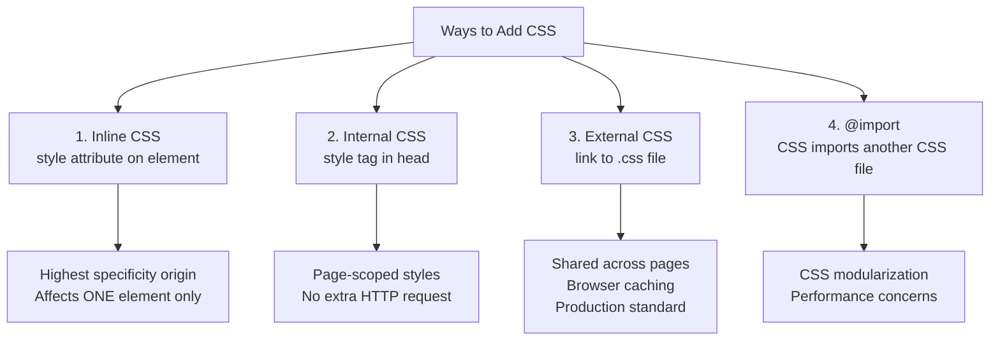
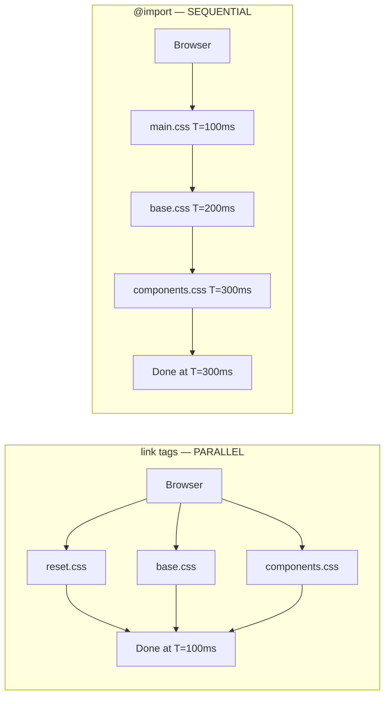
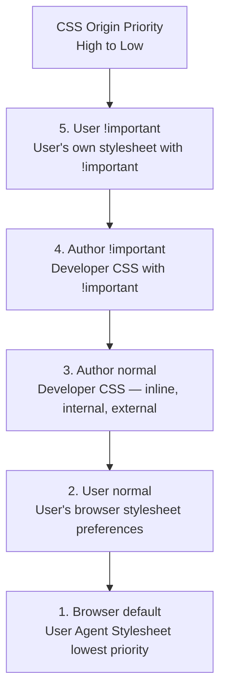
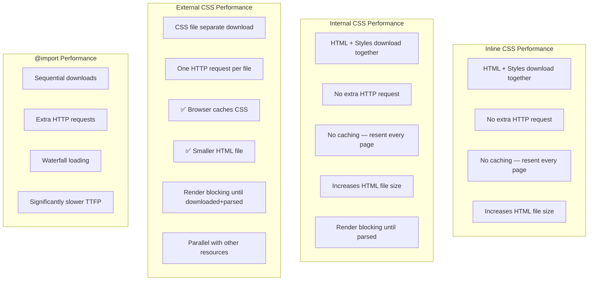
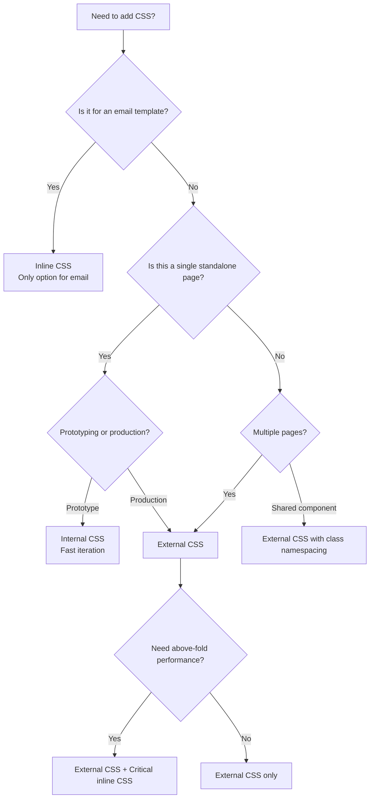

<a id="chapter-27-ways-to-add-css"></a>

# Chapter 27: Ways to Add CSS

[⬅ Previous Chapter](#chapter-26-introduction-to-css) | [📖 Main Index](#main-index) | [Next Chapter ➡](#chapter-28-css-selectors)

---

## 📌 Learning Objectives

By the end of this chapter, you will:

* Understand all four ways to add CSS to an HTML document
* Know the exact priority order when multiple methods conflict
* Master inline, internal, external CSS and `@import` with complete code examples
* Understand the performance implications of each method
* Know when to use each method in real-world projects
* Understand the advantages and disadvantages of every approach
* Be able to explain CSS loading behavior to interviewers with confidence
* Apply best practices for CSS architecture in production projects

---

<a id="chapter-index-table-27"></a>

## Chapter Index Table

| Topic No. | Topic Name | Subtopics |
|-----------|------------|-----------|
| 27.1 | [Overview — Four Ways to Add CSS](#271-overview-four-ways-to-add-css) | All methods<br>Priority order<br>Quick comparison |
| 27.2 | [Inline CSS](#272-inline-css) | Syntax<br>How it works<br>Advantages<br>Disadvantages<br>When to use |
| 27.3 | [Internal CSS](#273-internal-css) | Syntax<br>How it works<br>Advantages<br>Disadvantages<br>When to use |
| 27.4 | [External CSS](#274-external-css) | Syntax<br>How it works<br>link attributes<br>Advantages<br>Disadvantages<br>When to use |
| 27.5 | [`@import` Rule](#275-import-rule) | Syntax<br>How it works<br>Performance issues<br>When to use<br>Alternatives |
| 27.6 | [Priority Order Deep Dive](#276-priority-order-deep-dive) | Cascade origin<br>Specificity interaction<br>Real examples<br>!important |
| 27.7 | [Performance Comparison](#277-performance-comparison) | Loading behavior<br>Render blocking<br>Caching<br>Critical CSS |
| 27.8 | [Real-World CSS Architecture](#278-real-world-css-architecture) | When to use which<br>Project structure<br>Best practices |
| 27.9 | [Interview Questions](#279-interview-questions) | Conceptual<br>Scenario<br>Output-based<br>Advanced |
| 27.10 | [Practice Problems](#2710-practice-problems) | Coding<br>Theory<br>Machine Coding |
| 27.11 | [Mini Project](#2711-mini-project) | CSS Methods Showcase |
| 27.12 | [Quick Revision](#2712-quick-revision) | Key Points<br>Traps<br>Bullets |
| 27.13 | [Chapter Summary](#2713-chapter-summary) | Final Takeaways |

---

## 271 Overview — Four Ways to Add CSS

<a id="271-four-ways-to-add-css"></a>

### 🔷 The Four Methods

There are exactly **four ways** to apply CSS to an HTML document:



---

### 🔷 Priority Order (Highest to Lowest)

When the same property is set by multiple methods, this is the winning order:

```
Priority (highest wins):
1. Inline CSS          style="color: red"           → Wins over everything
2. Internal CSS        <style> in <head>             → Wins over external (if later in source)
3. External CSS        <link rel="stylesheet">       → Standard for production
4. @import             @import url('file.css')       → Loaded last, lower priority
5. Browser defaults    User Agent Stylesheet         → Lowest priority
```

> [!IMPORTANT]
> Priority between Internal and External CSS is actually determined by **source order** — whichever appears LATER in the HTML wins (if specificity is equal). The order above assumes typical document structure.

---

### 🔷 Quick Comparison Table

| Feature | Inline | Internal | External | @import |
|---------|--------|----------|----------|---------|
| Syntax | `style=""` attribute | `<style>` tag | `<link>` tag | `@import url()` |
| Scope | One element | One page | Multiple pages | One CSS file |
| Reusability | ❌ None | ⚠️ Page only | ✅ Site-wide | ⚠️ Module only |
| Performance | ❌ No caching | ⚠️ No caching | ✅ Cached | ❌ Blocking |
| Maintainability | ❌ Very poor | ⚠️ Page level | ✅ Excellent | ✅ Good |
| Specificity | Highest | Normal | Normal | Normal |
| Extra HTTP Request | ❌ None | ❌ None | ✅ One per file | ✅ Cascading requests |
| Best For | Quick fixes, JS-generated | Single pages, prototypes | Production sites | CSS architecture |

---

### 🧠 Hinglish Intuition

> Socho CSS apply karna jaise **kapde pehnna**:
>
> - **Inline CSS** = Directly skin pe tattoo — permanent, specific, override karna mushkil
> - **Internal CSS** = Aaj ki outfit decide karna — sirf aaj ke liye, kal phir decide karna padega
> - **External CSS** = Wardrobe ka system — sab kuch organized, ek jagah, sab outfits available
> - **@import** = Wardrobe ke andar ek aur wardrobe — kaam karta hai but slow hai
>
> **Production mein hamesha External CSS use karo** — jaise ek proper wardrobe system.

---

👉 <a href="#chapter-index-table-27">Go to Top 🔝</a>

---

## 272 Inline CSS

<a id="272-inline-css"></a>

### 🔷 What is Inline CSS?

Inline CSS applies styles **directly to an individual HTML element** using the `style` attribute. It is written as a string of CSS declarations inside the element's opening tag.

```html
<!-- Inline CSS syntax -->
<element style="property: value; property: value;">Content</element>
```

---

### 🔷 Complete Inline CSS Examples

```html
<!DOCTYPE html>
<html lang="en">
<head>
  <meta charset="UTF-8">
  <title>Inline CSS Demo</title>
</head>
<body>

  <!-- Single property -->
  <h1 style="color: royalblue;">Blue Heading</h1>

  <!-- Multiple properties — semicolon separated -->
  <p style="color: #333; font-size: 1.1rem; line-height: 1.7; margin-bottom: 1rem;">
    This paragraph has multiple inline styles applied.
  </p>

  <!-- Box styling inline -->
  <div style="
    background-color: #fff3cd;
    border: 2px solid #ffc107;
    border-left: 5px solid #ff9800;
    border-radius: 8px;
    padding: 16px 20px;
    margin: 16px 0;
    font-family: Arial, sans-serif;
  ">
    ⚠️ This warning box is styled entirely with inline CSS.
    Notice how verbose and unreadable it becomes.
  </div>

  <!-- Button with inline styles -->
  <button style="
    background: #2563eb;
    color: white;
    border: none;
    padding: 10px 24px;
    border-radius: 8px;
    font-size: 1rem;
    font-weight: 600;
    cursor: pointer;
  ">
    Inline Styled Button
  </button>

  <!-- Image styling inline -->
  

  <!-- Inline CSS cannot use pseudo-classes or media queries -->
  <!-- This is NOT possible with inline CSS: -->
  <!-- style=":hover { color: red; }"  ← INVALID -->
  <!-- style="@media (max-width: 600px) { font-size: 0.875rem; }"  ← INVALID -->

</body>
</html>
```

---

### 🔷 What Inline CSS CAN and CANNOT Do

```html
<!-- ✅ CAN: Set any CSS property -->
<div style="display: flex; gap: 1rem; align-items: center;">...</div>
<p style="background: linear-gradient(to right, #667eea, #764ba2); color: white;">...</p>

<!-- ✅ CAN: Use CSS functions -->
<div style="width: calc(100% - 40px); color: var(--brand-color);">...</div>

<!-- ✅ CAN: Use CSS custom properties -->
<div style="--card-color: #2563eb; background: var(--card-color);">...</div>

<!-- ❌ CANNOT: Use pseudo-classes -->
<!-- style="color: red; :hover { color: blue; }"  ← INVALID -->

<!-- ❌ CANNOT: Use pseudo-elements -->
<!-- style="::before { content: '→'; }"  ← INVALID -->

<!-- ❌ CANNOT: Use media queries -->
<!-- style="@media (max-width: 600px) { display: none; }"  ← INVALID -->

<!-- ❌ CANNOT: Use @keyframes animations -->
<!-- style="@keyframes fade { from { opacity: 0; } }"  ← INVALID -->

<!-- ❌ CANNOT: Style child elements -->
<!-- style="p { color: red; }"  ← INVALID -->
```

---

### 🔷 Inline CSS and JavaScript

One of the most common (and legitimate) uses of inline CSS is through JavaScript:

```html
<div id="progress-bar" style="width: 0%; background: #2563eb; height: 8px; border-radius: 4px;">
</div>

<script>
  // JavaScript dynamically sets inline styles
  const bar = document.getElementById('progress-bar');

  // Set individual property
  bar.style.width = '75%';
  bar.style.backgroundColor = '#16a34a';  // camelCase in JS

  // Set multiple via cssText
  bar.style.cssText = 'width: 75%; background: #16a34a; transition: width 0.3s ease;';

  // Remove inline style
  bar.style.width = '';  // Empty string removes the property

  // Read inline style
  console.log(bar.style.width);  // '75%' — reads inline only, not computed

  // Read COMPUTED style (accounts for all CSS)
  const computed = getComputedStyle(bar);
  console.log(computed.width);  // '450px' (computed pixel value)
</script>
```

> [!NOTE]
> In JavaScript, CSS property names become **camelCase**: `background-color` → `backgroundColor`, `font-size` → `fontSize`, `border-radius` → `borderRadius`.

---

### 🔷 Advantages of Inline CSS

| Advantage | Explanation |
|-----------|-------------|
| **Highest priority** | Overrides internal and external CSS (short of `!important`) |
| **No extra file** | No additional HTTP request or file needed |
| **Element-specific** | Applies only to that exact element |
| **Quick testing** | Fast way to test a single style change |
| **JS integration** | Natural interface for JavaScript dynamic styling |
| **Email templates** | Many email clients only support inline CSS |

---

### 🔷 Disadvantages of Inline CSS

| Disadvantage | Explanation |
|--------------|-------------|
| **No reusability** | Must be copied to every element that needs same style |
| **Maintenance nightmare** | Change color on 500 elements = edit 500 places |
| **No pseudo-classes** | Cannot use `:hover`, `:focus`, `:active`, `:nth-child` |
| **No pseudo-elements** | Cannot use `::before`, `::after` |
| **No media queries** | Cannot create responsive behavior |
| **No animations** | Cannot use `@keyframes` directly |
| **Readability** | HTML becomes cluttered and hard to read |
| **Specificity pollution** | Very high specificity makes overriding from CSS difficult |
| **Violates separation** | Mixes presentation into structure |
| **No caching** | Styles download with every page view |

---

### 🔷 When to Use Inline CSS

```html
<!-- ✅ LEGITIMATE USE 1: Email HTML templates -->
<!-- Email clients like Gmail strip <style> tags — inline is necessary -->
<td style="background-color: #2563eb; padding: 20px; text-align: center;">
  <a href="https://example.com" style="color: white; text-decoration: none; font-weight: bold;">
    Click Here
  </a>
</td>

<!-- ✅ LEGITIMATE USE 2: JavaScript dynamic styling -->
<div id="tooltip" style="display: none; position: absolute; top: 0; left: 0;">
  Tooltip content
</div>
<script>
  // JS positions tooltip dynamically — coordinates change per interaction
  const tooltip = document.getElementById('tooltip');
  document.addEventListener('mousemove', (e) => {
    tooltip.style.top  = e.clientY + 10 + 'px';
    tooltip.style.left = e.clientX + 10 + 'px';
  });
</script>

<!-- ✅ LEGITIMATE USE 3: Quick prototyping / testing one-off idea -->
<div style="background: hotpink;">Testing this color concept...</div>

<!-- ✅ LEGITIMATE USE 4: CSS Custom Property overrides per-element -->
<!-- Set different theme colors for individual cards -->
<div class="theme-card" style="--accent: #e74c3c;">Card 1</div>
<div class="theme-card" style="--accent: #2563eb;">Card 2</div>
<div class="theme-card" style="--accent: #16a34a;">Card 3</div>
<!-- .theme-card { border-color: var(--accent); color: var(--accent); } -->

<!-- ❌ DO NOT USE for general page styling -->
<!-- ❌ DO NOT USE when a CSS class would work -->
<!-- ❌ DO NOT USE for hover/responsive behavior -->
```

---

### 🧠 Hinglish Intuition

> Inline CSS ek **post-it note** ki tarah hai — kisi specific jagah pe chipka do, woh sirf wahi kaam karta hai. Quick hai, immediate hai, but:
>
> - 500 jagah chipkane padte hain agar 500 elements hain
> - Agar color change karna hai, 500 post-it notes change karne padte hain
> - Hover effect nahi ho sakta — post-it note status ke hisaab se change nahi hota
>
> **Email templates mein inline CSS king hai** — Gmail aur Outlook ne decide kiya ki wo `<style>` tags nahi maanenge, toh designers ko har `<td>` aur `<a>` pe style likhna padta hai. Ye unki limitation hai, aapki nahi.

---

👉 <a href="#chapter-index-table-27">Go to Top 🔝</a>

---

## 273 Internal CSS

<a id="273-internal-css"></a>

### 🔷 What is Internal CSS?

Internal CSS (also called **embedded CSS**) places CSS rules inside a `<style>` element within the HTML document's `<head>` section. It applies to the **entire page** but only that single HTML file.

```html
<!DOCTYPE html>
<html lang="en">
<head>
  <meta charset="UTF-8">
  <title>Page Title</title>

  <!-- Internal CSS goes inside <style> tag in <head> -->
  <style>
    /* All CSS rules here apply to this page */
    body {
      font-family: 'Segoe UI', sans-serif;
      color: #333;
      margin: 0;
    }

    h1 {
      color: #2563eb;
      font-size: 2rem;
    }
  </style>
</head>
<body>
  <h1>Page Heading</h1>
  <p>Content here.</p>
</body>
</html>
```

---

### 🔷 Complete Internal CSS Example

```html
<!DOCTYPE html>
<html lang="en">
<head>
  <meta charset="UTF-8">
  <meta name="viewport" content="width=device-width, initial-scale=1.0">
  <title>Product Page — Internal CSS</title>

  <style>
    /* ===== RESET ===== */
    *,
    *::before,
    *::after {
      box-sizing: border-box;
      margin: 0;
      padding: 0;
    }

    /* ===== BASE ===== */
    body {
      font-family: 'Segoe UI', system-ui, sans-serif;
      background: #f8fafc;
      color: #1e293b;
      line-height: 1.6;
    }

    /* ===== LAYOUT ===== */
    .container {
      max-width: 900px;
      margin: 0 auto;
      padding: 2rem 1rem;
    }

    /* ===== HEADER ===== */
    header {
      background: #1e293b;
      color: white;
      padding: 1rem 2rem;
      display: flex;
      justify-content: space-between;
      align-items: center;
    }

    header h1 { font-size: 1.5rem; }

    nav { display: flex; gap: 1.5rem; }

    nav a {
      color: #94a3b8;
      text-decoration: none;
      transition: color 0.2s;
    }

    nav a:hover   { color: white; }
    nav a.active  { color: #60a5fa; font-weight: 600; }

    /* ===== PRODUCT CARD ===== */
    .product-grid {
      display: grid;
      grid-template-columns: repeat(auto-fit, minmax(250px, 1fr));
      gap: 1.5rem;
      margin-top: 2rem;
    }

    .product-card {
      background: white;
      border: 1px solid #e2e8f0;
      border-radius: 12px;
      overflow: hidden;
      transition: transform 0.2s, box-shadow 0.2s;
    }

    .product-card:hover {
      transform: translateY(-4px);
      box-shadow: 0 12px 30px rgba(0,0,0,0.12);
    }

    .product-card img {
      width: 100%;
      height: 200px;
      object-fit: cover;
    }

    .product-card-body { padding: 1.25rem; }

    .product-name {
      font-size: 1.1rem;
      font-weight: 600;
      margin-bottom: 0.5rem;
    }

    .product-price {
      font-size: 1.25rem;
      color: #2563eb;
      font-weight: 700;
      margin-bottom: 1rem;
    }

    .btn-buy {
      width: 100%;
      background: #2563eb;
      color: white;
      border: none;
      padding: 10px;
      border-radius: 8px;
      font-size: 1rem;
      font-weight: 600;
      cursor: pointer;
      transition: background 0.2s;
    }

    .btn-buy:hover { background: #1d4ed8; }

    /* ===== INTERNAL CSS CAN USE PSEUDO-CLASSES AND MEDIA QUERIES ===== */
    .product-card:nth-child(2) {
      border-color: #2563eb;
    }

    /* ===== MEDIA QUERY — responsive ===== */
    @media (max-width: 600px) {
      header {
        flex-direction: column;
        gap: 1rem;
        text-align: center;
      }
    }
  </style>
</head>
<body>

  <header>
    <h1>ShopNow</h1>
    <nav>
      <a href="/">Home</a>
      <a href="/products" class="active">Products</a>
      <a href="/cart">Cart</a>
    </nav>
  </header>

  <div class="container">
    <h2 style="margin-top: 0;">Featured Products</h2>

    <div class="product-grid">
      <div class="product-card">
        
        <div class="product-card-body">
          <h3 class="product-name">Nike Air Max</h3>
          <div class="product-price">₹3,999</div>
          <button class="btn-buy" type="button">Add to Cart</button>
        </div>
      </div>

      <div class="product-card">
        
        <div class="product-card-body">
          <h3 class="product-name">Adidas Ultraboost</h3>
          <div class="product-price">₹4,499</div>
          <button class="btn-buy" type="button">Add to Cart</button>
        </div>
      </div>

      <div class="product-card">
        
        <div class="product-card-body">
          <h3 class="product-name">Puma RS-X</h3>
          <div class="product-price">₹2,999</div>
          <button class="btn-buy" type="button">Add to Cart</button>
        </div>
      </div>
    </div>
  </div>

</body>
</html>
```

---

### 🔷 The `<style>` Tag — All Attributes

```html
<!-- Standard usage — no attributes needed in HTML5 -->
<style>
  h1 { color: red; }
</style>

<!-- type attribute — optional in HTML5, was required in HTML4 -->
<style type="text/css">
  h1 { color: red; }
</style>

<!-- media attribute — apply style only for specific media -->
<style media="print">
  /* These styles apply only when printing */
  nav, footer, .no-print { display: none; }
  body { font-size: 12pt; color: black; }
  a::after { content: ' (' attr(href) ')'; }
</style>

<style media="screen">
  /* These styles apply only on screen */
  body { background: #f8fafc; }
</style>

<style media="(max-width: 600px)">
  /* These styles apply only on small screens */
  .sidebar { display: none; }
</style>

<!-- Multiple style tags are allowed on one page -->
<style>
  body { font-family: sans-serif; }
</style>
<style>
  /* This is completely valid — rules from both are applied */
  h1 { color: blue; }
</style>
```

---

### 🔷 Internal CSS — Can vs Cannot

```html
<style>
  /* ✅ CAN: Use all CSS selectors */
  h1 { color: blue; }
  .card { border-radius: 12px; }
  #hero  { background: gradient; }
  [href^="https"] { color: green; }

  /* ✅ CAN: Use pseudo-classes */
  a:hover    { color: darkblue; }
  li:nth-child(odd) { background: #f0f0f0; }
  input:focus { border-color: blue; }
  button:disabled { opacity: 0.5; }

  /* ✅ CAN: Use pseudo-elements */
  p::first-line  { font-weight: bold; }
  h2::before     { content: '→ '; }
  .card::after   { content: ''; display: block; }

  /* ✅ CAN: Use media queries */
  @media (max-width: 768px) {
    .nav { flex-direction: column; }
  }

  /* ✅ CAN: Use @keyframes animations */
  @keyframes fadeIn {
    from { opacity: 0; }
    to   { opacity: 1; }
  }
  .hero { animation: fadeIn 0.5s ease; }

  /* ✅ CAN: Use CSS Custom Properties */
  :root { --primary: #2563eb; }
  .btn  { background: var(--primary); }

  /* ✅ CAN: Use @font-face */
  @font-face {
    font-family: 'MyFont';
    src: url('/fonts/myfont.woff2') format('woff2');
  }

  /* ✅ CAN: Use @import (loads before these styles) */
  @import url('reset.css');
</style>
```

---

### 🔷 Advantages of Internal CSS

| Advantage | Explanation |
|-----------|-------------|
| **Full CSS power** | Supports all selectors, pseudo-classes, media queries, animations |
| **No extra HTTP request** | Styles embedded in HTML — one less network request |
| **Page-scoped** | Styles only affect this page — no side effects on other pages |
| **Faster prototyping** | All code in one file — easier to work with for single pages |
| **Good for single pages** | Landing pages, email-to-browser, standalone tools |
| **Override external** | Can override external stylesheet for page-specific changes |

---

### 🔷 Disadvantages of Internal CSS

| Disadvantage | Explanation |
|--------------|-------------|
| **Not reusable** | Must copy/paste to every HTML file that needs same styles |
| **No caching** | CSS downloads with every page view (embedded in HTML) |
| **Larger HTML file** | Page size increases — slower initial load |
| **Maintenance** | Updating styles across 50 pages = editing 50 HTML files |
| **Separation violation** | Presentation mixed with structure in same file |
| **Scalability** | Impossible to maintain for large websites |

---

### 🔷 When to Use Internal CSS

```
✅ USE Internal CSS for:
├── Single-page applications or standalone HTML files
├── Email-to-browser versions (where you can use <style>)
├── Quick prototypes and proof-of-concept demos
├── Page-specific style overrides on top of external stylesheet
├── Critical above-the-fold CSS (performance optimization technique)
└── Component documentation / style guides (isolated examples)

❌ DO NOT USE Internal CSS for:
├── Multi-page websites (use external CSS)
├── Shared components (navigation, buttons, cards)
├── Any styles that repeat across pages
└── Production projects with more than 2-3 pages
```

---

### 🧠 Hinglish Intuition

> Internal CSS ek **personal diary** ki tarah hai — aap usme kuch bhi likh sakte ho (unlike post-it note / inline), full sentences, paragraphs, structure. Lekin wo sirf aapki diary hai — doosra page nahi padega.
>
> Agar aap 50 pages ki book likh rahe ho aur har page pe same rules apply karne hain — toh har diary alag-alag likhoge? No! Ek **style guide** banao jo sab pages follow karein. Yahi External CSS hai.
>
> **Internal CSS ka best use case:** Prototype banate waqt — ek file mein sab kuch rakhte ho, kaam karta hai, clean hai. Jab production ke liye ready ho toh External mein move karo.

---

👉 <a href="#chapter-index-table-27">Go to Top 🔝</a>

---

## 274 External CSS

<a id="274-external-css"></a>

### 🔷 What is External CSS?

External CSS stores all CSS rules in a **separate `.css` file** which is linked to one or more HTML files using the `<link>` element. This is the **standard, production-ready approach** for all real-world websites.

```
project/
├── index.html          ← links to styles.css
├── about.html          ← links to styles.css
├── products.html       ← links to styles.css
└── css/
    └── styles.css      ← ONE file styles ALL pages
```

---

### 🔷 The `<link>` Element — Complete Reference

```html
<head>
  <!-- Standard external CSS link -->
  <link rel="stylesheet" href="styles.css">

  <!-- All attributes explained -->
  <link
    rel="stylesheet"              <!-- Relationship: this is a stylesheet (required) -->
    href="/css/main.css"          <!-- Path to CSS file (required) -->
    type="text/css"               <!-- MIME type (optional in HTML5) -->
    media="screen"                <!-- When to apply: screen | print | all (default: all) -->
    crossorigin="anonymous"       <!-- For cross-origin CSS files with CORS -->
    integrity="sha256-abc123..."  <!-- Subresource Integrity hash for security -->
  >

  <!-- Media-specific stylesheets -->
  <link rel="stylesheet" href="screen.css"  media="screen">
  <link rel="stylesheet" href="print.css"   media="print">
  <link rel="stylesheet" href="mobile.css"  media="(max-width: 768px)">

  <!-- Multiple stylesheets — all loaded, later overrides earlier (same specificity) -->
  <link rel="stylesheet" href="/css/reset.css">
  <link rel="stylesheet" href="/css/base.css">
  <link rel="stylesheet" href="/css/components.css">
  <link rel="stylesheet" href="/css/pages/home.css">
</head>
```

---

### 🔷 The CSS File Structure

```css
/* ============================================================
   FILE: /css/main.css
   Project: FitStore India
   ============================================================ */

/* ===== 1. VARIABLES ===== */
:root {
  --color-primary:    #2563eb;
  --color-secondary:  #7c3aed;
  --color-text:       #1e293b;
  --color-bg:         #f8fafc;
  --font-base:        'Segoe UI', system-ui, sans-serif;
  --radius-md:        8px;
  --shadow-md:        0 4px 16px rgba(0,0,0,0.1);
  --transition:       0.2s ease;
}

/* ===== 2. RESET ===== */
*,
*::before,
*::after { box-sizing: border-box; }
* { margin: 0; padding: 0; }
img, video { max-width: 100%; height: auto; display: block; }

/* ===== 3. BASE STYLES ===== */
html { font-size: 16px; scroll-behavior: smooth; }

body {
  font-family: var(--font-base);
  font-size:   1rem;
  line-height: 1.6;
  color:       var(--color-text);
  background:  var(--color-bg);
}

/* ===== 4. TYPOGRAPHY ===== */
h1, h2, h3, h4, h5, h6 {
  font-weight: 700;
  line-height: 1.2;
  margin-bottom: 0.75rem;
}
h1 { font-size: clamp(2rem, 5vw, 3rem); }
h2 { font-size: clamp(1.5rem, 3vw, 2rem); }
h3 { font-size: 1.375rem; }

p { margin-bottom: 1rem; }

a {
  color: var(--color-primary);
  text-decoration: underline;
  text-underline-offset: 3px;
  transition: color var(--transition);
}
a:hover { color: #1d4ed8; }

/* ===== 5. BUTTONS ===== */
.btn {
  display: inline-flex;
  align-items: center;
  justify-content: center;
  gap: 0.5rem;
  padding: 10px 24px;
  border: 2px solid transparent;
  border-radius: var(--radius-md);
  font-size: 1rem;
  font-weight: 600;
  font-family: inherit;
  cursor: pointer;
  text-decoration: none;
  transition: all var(--transition);
}

.btn-primary   { background: var(--color-primary); color: white; }
.btn-primary:hover { background: #1d4ed8; }
.btn-secondary { background: transparent; color: var(--color-primary); border-color: var(--color-primary); }
.btn-secondary:hover { background: #eff6ff; }

/* ===== 6. LAYOUT ===== */
.container {
  width: 100%;
  max-width: 1200px;
  margin-inline: auto;
  padding-inline: 1rem;
}

/* ===== 7. COMPONENTS ===== */
.card {
  background: white;
  border: 1px solid #e2e8f0;
  border-radius: 12px;
  overflow: hidden;
  box-shadow: var(--shadow-md);
  transition: transform var(--transition), box-shadow var(--transition);
}
.card:hover {
  transform: translateY(-4px);
  box-shadow: 0 8px 30px rgba(0,0,0,0.15);
}

/* ===== 8. MEDIA QUERIES ===== */
@media (max-width: 768px) {
  .container { padding-inline: 0.75rem; }
  h1 { text-align: center; }
}

@media (max-width: 480px) {
  .btn { width: 100%; justify-content: center; }
}
```

---

### 🔷 Linking External CSS — All Scenarios

```html
<!-- Same directory -->
<link rel="stylesheet" href="styles.css">

<!-- Subdirectory -->
<link rel="stylesheet" href="css/styles.css">
<link rel="stylesheet" href="./css/styles.css">  <!-- Explicit relative -->

<!-- Root-relative (from domain root — preferred) -->
<link rel="stylesheet" href="/css/styles.css">
<link rel="stylesheet" href="/assets/css/main.css">

<!-- Parent directory -->
<link rel="stylesheet" href="../shared/styles.css">

<!-- Absolute URL (CDN, third-party) -->
<link
  rel="stylesheet"
  href="https://cdn.jsdelivr.net/npm/bootstrap@5.3.0/dist/css/bootstrap.min.css"
  crossorigin="anonymous"
  integrity="sha384-..."
>

<!-- Google Fonts (external CSS loading another CSS) -->
<link rel="preconnect" href="https://fonts.googleapis.com">
<link rel="preconnect" href="https://fonts.gstatic.com" crossorigin>
<link
  rel="stylesheet"
  href="https://fonts.googleapis.com/css2?family=Inter:wght@400;600;700&display=swap"
>
```

---

### 🔷 Advantages of External CSS

| Advantage | Explanation |
|-----------|-------------|
| **Browser caching** | CSS file cached after first download — every subsequent page = zero CSS load time |
| **Site-wide reusability** | One stylesheet styles all 1000 pages |
| **Maintainability** | Change brand color once → updates everywhere |
| **Separation of concerns** | HTML and CSS in separate files — clean architecture |
| **Team collaboration** | Designers edit CSS; developers edit HTML simultaneously |
| **Full CSS power** | Supports all selectors, pseudo-classes, media queries, animations |
| **Performance** | Smaller HTML files; CSS cached independently |
| **Scalability** | Works for 5-page site or 50,000-page website |
| **DevTools** | Easy debugging in browser DevTools |

---

### 🔷 Disadvantages of External CSS

| Disadvantage | Explanation |
|--------------|-------------|
| **Extra HTTP request** | Browser must download CSS file separately from HTML |
| **Render blocking** | Browser waits for CSS before showing content |
| **FOUC risk** | Flash of Unstyled Content if CSS loads slowly |
| **File management** | Need to maintain and version CSS files |
| **Initial setup** | Slightly more work than inline/internal for tiny projects |

---

### 🔷 When to Use External CSS

```
✅ ALWAYS use External CSS for:
├── Any website with more than one page
├── All production websites
├── Any project with shared components (header, footer, buttons)
├── Team projects
├── Projects requiring browser caching optimization
└── Any professional/commercial web development

📝 File naming conventions:
├── main.css / styles.css    ← Primary stylesheet
├── reset.css / normalize.css← Reset/normalize
├── components.css           ← UI components
├── utilities.css            ← Utility classes
├── print.css                ← Print styles
└── theme-dark.css           ← Dark mode theme
```

---

### 🧠 Hinglish Intuition

> External CSS ek **company ka HR policy document** ki tarah hai — ek jagah likh do sab rules, sab employees follow karenge. Koi rule change karna hai, HR document mein ek jagah change karo — sab update ho jaata hai.
>
> **Browser caching** ki wajah se External CSS ki ek superpower hai: User pehli baar page kholta hai, CSS download hoti hai. Dusri baar koi bhi page kholta hai — CSS pehle se memory mein hai, ZERO download. Yahi performance ka secret hai.
>
> **Production mein 99% cases mein External CSS hi use karni chahiye.** Ye industry standard hai.

---

👉 <a href="#chapter-index-table-27">Go to Top 🔝</a>

---

## 275 @import Rule

<a id="275-import-rule"></a>

### 🔷 What is `@import`?

The `@import` CSS at-rule allows one CSS file to **import another CSS file** — enabling CSS modularization and organization within the CSS world itself.

```css
/* Inside a CSS file — import other CSS files */
@import url('reset.css');
@import url('typography.css');
@import url('components.css');
```

Or in HTML (inside `<style>` tag):

```html
<style>
  @import url('styles.css');
</style>
```

---

### 🔷 `@import` Syntax — All Forms

```css
/* All valid @import syntax forms */

/* With url() function */
@import url('variables.css');
@import url("typography.css");        /* Double quotes also valid */
@import url(/css/reset.css);          /* No quotes — valid but not recommended */

/* Without url() — shorthand (CSS3+) */
@import 'variables.css';
@import "typography.css";

/* With media query — conditional import */
@import url('mobile.css') screen and (max-width: 768px);
@import url('print.css') print;
@import url('dark.css') (prefers-color-scheme: dark);

/* With layer — CSS Cascade Layers (modern) */
@import url('reset.css') layer(reset);
@import url('base.css')  layer(base);

/* @import MUST come before any other rules (except @charset and @layer) */
/* ✅ Correct: */
@import url('reset.css');
@import url('base.css');
body { color: red; }

/* ❌ Wrong: @import after rules — ignored! */
body { color: red; }
@import url('reset.css');  /* This is IGNORED by browsers */
```

---

### 🔷 @import in Practice — CSS Architecture

```css
/* main.css — master file that imports all modules */

/* Must be first — before any rules */
@import url('reset.css');
@import url('variables.css');
@import url('typography.css');
@import url('layout.css');
@import url('header.css');
@import url('navigation.css');
@import url('buttons.css');
@import url('cards.css');
@import url('forms.css');
@import url('footer.css');
@import url('utilities.css');
@import url('media-queries.css');

/* Any styles after imports apply AFTER imported styles */
/* Page-specific overrides: */
.homepage-hero {
  min-height: 80vh;
  background: linear-gradient(135deg, #1e293b, #334155);
}
```

```html
<!-- In HTML: link only ONE file -->
<link rel="stylesheet" href="main.css">
<!-- Browser loads main.css, which triggers loading of all imported files -->
```

---

### 🔷 The Critical Performance Problem with @import

> [!IMPORTANT]
> `@import` creates **sequential (waterfall) loading** instead of parallel loading. Each imported file is only discovered after the previous file is downloaded and parsed. This significantly increases page load time.

```
<!-- Using <link> tags: PARALLEL loading (FAST) -->
<link rel="stylesheet" href="reset.css">
<link rel="stylesheet" href="base.css">
<link rel="stylesheet" href="components.css">

Timeline:
T=0ms   → Browser discovers all 3 files simultaneously
T=100ms → All 3 files downloaded in parallel
T=100ms → Page rendered

<!-- Using @import: SEQUENTIAL loading (SLOW) -->
<link rel="stylesheet" href="main.css">
<!-- main.css contains: -->
<!-- @import url('base.css'); -->
<!-- @import url('components.css'); -->

Timeline:
T=0ms   → Browser downloads main.css
T=100ms → main.css done → discovers base.css → starts downloading
T=200ms → base.css done → discovers components.css → starts downloading
T=300ms → components.css done → page rendered
```



---

### 🔷 `@import` vs `<link>` Comparison

| Feature | `@import` | `<link>` |
|---------|-----------|---------|
| Loading | Sequential (waterfall) | Parallel (simultaneous) |
| Performance | ❌ Slower | ✅ Faster |
| Location | Inside CSS or `<style>` | HTML `<head>` |
| Media queries | ✅ Supported | ✅ Supported |
| Browser support | ✅ All browsers | ✅ All browsers |
| FOUC risk | Higher | Lower |
| Modern alternative | `@layer` + build tools | Still preferred |

---

### 🔷 When `@import` is Acceptable

```css
/* ✅ ACCEPTABLE: CSS preprocessors (Sass/LESS) */
/* Sass @import/@use compiles all files into ONE CSS file before serving */
/* No runtime performance penalty — merged at build time */

/* styles.scss */
@use 'variables';
@use 'mixins';
@use 'components/button';
@use 'components/card';
/* Compiles to: one styles.css file — no sequential loading */

/* ✅ ACCEPTABLE: Small number of imports for development */
@import url('variables.css');  /* Just 1-2 imports */
@import url('reset.css');

/* ✅ ACCEPTABLE: Conditional @import with media queries */
@import url('print.css') print;  /* Only loaded when printing */
@import url('dark.css') (prefers-color-scheme: dark);

/* ✅ ACCEPTABLE: Third-party font imports */
@import url('https://fonts.googleapis.com/css2?family=Inter:wght@400;700&display=swap');

/* ❌ NOT ACCEPTABLE in production: Large number of @imports */
/* Use build tools (Webpack, Vite, Parcel) to bundle CSS instead */
```

---

### 🔷 Modern Alternatives to @import

```css
/* MODERN ALTERNATIVE 1: CSS @layer with <link> tags */
/* Order control without @import performance penalty */
@layer reset, base, components, utilities;

/* Each layer imported via <link> or defined inline */
@layer reset {
  * { box-sizing: border-box; margin: 0; }
}
@layer base {
  body { font-family: sans-serif; }
}
@layer components {
  .card { border-radius: 12px; }
}

/* MODERN ALTERNATIVE 2: Build tools */
/* Vite, Webpack, Parcel — bundle all CSS into one file at build time */
/* Performance of @import without the runtime penalty */
/* Use in source, not in output */
```

---

### 🧠 Hinglish Intuition

> `@import` ko socho jaise **chain se kaam karne wala daftar** — pehle person kaam karta hai, phir doosre ko deta hai, phir teesra karta hai. Ek ke baad ek. Slow!
>
> `<link>` tags ek **parallel team** ki tarah hain — sab ek saath kaam shuru karte hain, sab ek saath khatam hote hain. Fast!
>
> **Practically:** Development mein CSS files ko organize karne ke liye `@import` use karo (Sass/LESS mein) — lekin production mein build tool (Vite, Webpack) sab files ko ek file mein **bundle** kar deta hai, toh runtime pe koi @import nahi hota. Best of both worlds.

---

👉 <a href="#chapter-index-table-27">Go to Top 🔝</a>

---

## 276 Priority Order Deep Dive

<a id="276-priority-order-deep-dive"></a>

### 🔷 The Complete Cascade Origin Order

The CSS cascade considers **origin** as the first priority factor:



---

### 🔷 Priority Within Author Styles

Within developer ("author") CSS, priority follows this order:

```html
<!DOCTYPE html>
<html lang="en">
<head>
  <link rel="stylesheet" href="external.css">  <!-- external.css: h1 { color: blue; } -->

  <style>
    /* Internal CSS */
    h1 { color: green; }
  </style>
</head>
<body>

  <!-- Inline CSS -->
  <h1 style="color: red;">What color am I?</h1>

  <!-- Answer: RED — inline wins -->
  <!-- Even though internal says green, even though external says blue -->
  <!-- Inline CSS always overrides internal and external CSS -->
</body>
</html>
```

---

### 🔷 Source Order — When Specificity is Equal

When two rules have **identical specificity**, the one that appears **later** in the document wins:

```html
<head>
  <!-- Loaded first -->
  <link rel="stylesheet" href="reset.css">
  <!-- reset.css: h1 { color: black; } -->

  <!-- Loaded second — overrides reset.css for same specificity rules -->
  <link rel="stylesheet" href="theme.css">
  <!-- theme.css: h1 { color: #2563eb; } -->

  <!-- Loaded third — overrides both above -->
  <style>
    h1 { color: #dc2626; }  /* This wins — comes after both link tags */
  </style>
</head>
<body>
  <h1>What color?</h1>
  <!-- Answer: #dc2626 (red) — internal CSS comes after external CSS links -->
</body>
```

```css
/* Same file — source order within a file */
.card { color: blue; }   /* Declared first */
.card { color: red; }    /* Declared later — WINS */

/* Even across selectors with same specificity */
.btn-primary { background: blue; }     /* (0,0,1,0) */
.btn-large   { background: green; }    /* (0,0,1,0) — if element has both classes, green wins */

/* <button class="btn-primary btn-large"> → background: green */
/* Because .btn-large is declared LATER in the CSS file */
```

---

### 🔷 `!important` — The Nuclear Option

```css
/* !important overrides ALL normal declarations regardless of specificity or source order */

/* external.css */
#hero { color: red; }  /* (0,1,0,0) — Very high specificity */

/* internal CSS */
h1 { color: blue !important; }  /* !important — WINS over #hero color: red */
```

```html
<!-- What color? -->
<h1 id="hero">This text color?</h1>
<!-- Answer: BLUE — !important on h1 type selector overrides ID selector -->
<!-- !important elevates the rule above normal cascade -->
```

**`!important` Priority Order:**

```
!important rules cascade separately:
1. User !important (highest)        → Browser accessibility preferences
2. Author !important                → Developer CSS with !important
3. Author normal                    → Regular developer CSS
4. User normal                      → User browser preferences
5. Browser defaults (lowest)        → UA stylesheet
```

```css
/* !important best practices */

/* ❌ BAD: Overusing !important */
.card { color: red !important; }
.card-title { color: blue !important; }
.card-body { color: green !important; }
/* Creates a mess — overriding !important needs another !important */

/* ✅ ACCEPTABLE: Utility classes that must always win */
.hidden    { display: none !important; }
.sr-only   { position: absolute !important; width: 1px !important; }
.text-red  { color: red !important; }  /* Utility always overrides component */

/* ✅ ACCEPTABLE: Overriding third-party CSS you can't modify */
/* Bootstrap sets padding: 0 — you need to override it */
.my-btn { padding: 12px 24px !important; }

/* ✅ ACCEPTABLE: Debugging */
* { outline: 1px solid red !important; }  /* Temporary debugging only */
```

---

### 🔷 Complete Priority Demonstration

```html
<!DOCTYPE html>
<html lang="en">
<head>
  <meta charset="UTF-8">
  <title>CSS Priority Demo</title>

  <!-- 1. External CSS — linked first (lowest in author normal) -->
  <style>
    /* Simulating what external.css would contain */
    p { color: navy; }           /* Source order: 1st */
  </style>

  <!-- 2. Internal CSS — linked after (higher source order) -->
  <style>
    p { color: forestgreen; }    /* Source order: 2nd — overrides navy */
    .special { color: purple; }  /* Higher specificity: class selector */
    #unique { color: orange; }   /* Even higher: ID selector */
  </style>
</head>
<body>

  <!-- Case 1: Type selector only — last rule wins -->
  <p>Navy or Forest Green?</p>
  <!-- Answer: Forest Green (second <style> tag comes later) -->

  <!-- Case 2: Class selector — higher specificity wins -->
  <p class="special">Purple via class selector</p>
  <!-- Answer: Purple (.special has higher specificity than p) -->

  <!-- Case 3: ID selector — even higher specificity -->
  <p id="unique" class="special">Orange via ID selector</p>
  <!-- Answer: Orange (#unique highest specificity among non-inline) -->

  <!-- Case 4: Inline CSS — highest priority of all -->
  <p id="unique" class="special" style="color: crimson;">Crimson via inline</p>
  <!-- Answer: Crimson (inline always wins) -->

  <!-- Case 5: !important overrides inline? -->
  <!-- In <style>: p { color: gold !important; } -->
  <!-- Inline: style="color: crimson;" -->
  <!-- Answer: Gold — !important author > inline (in author !important category) -->
  <!-- Wait — actually: inline style is still "author" origin -->
  <!-- !important in stylesheet BEATS inline style -->

</body>
</html>
```

> [!IMPORTANT]
> **Summary of winning order (same element, same property):**
> 1. Author `!important` in any CSS (beats inline!)
> 2. Inline `style=""` attribute
> 3. ID selector in any stylesheet
> 4. Class/Attribute selector in any stylesheet
> 5. Type selector in any stylesheet
> 6. Universal selector
> 7. Browser default styles

---

### 🧠 Hinglish Intuition

> Priority order ek **court system** ki tarah hai:
>
> - **Inline CSS** = Police ka direct order — immediate, specific, koi argue nahi kar sakta (normally)
> - **ID selector** = High Court ka decision — bahut strong
> - **Class selector** = Lower court — ache hain but override ho sakte hain
> - **Type selector** = Local magistrate — basic rules
> - **!important** = Supreme Court का special order — sab ko override karta hai (abuse mat karo)
>
> **Source order** = Same court mein do judges ne alag faisla diya? Jo **baad** mein bola, woh valid — latest order wins.

---

👉 <a href="#chapter-index-table-27">Go to Top 🔝</a>

---

## 277 Performance Comparison

<a id="277-performance-comparison"></a>

### 🔷 How Each Method Affects Page Loading



---

### 🔷 Browser Caching — The External CSS Superpower

```
FIRST PAGE VISIT:
Browser → Downloads index.html (10KB) + styles.css (50KB) = 60KB total
Browser → Saves styles.css in cache with max-age header

SECOND PAGE VISIT (same site, different page):
Browser → Downloads about.html (8KB)
Browser → styles.css? Already cached! → 0 bytes downloaded
Total: 8KB only

TENTH PAGE VISIT:
Browser → Downloads products.html (12KB)
Browser → styles.css? Still cached! → 0 bytes
Total: 12KB only

VS INTERNAL CSS:
FIRST PAGE:  index.html (60KB — HTML + embedded CSS)
SECOND PAGE: about.html (58KB — same CSS repeated every time!)
TENTH PAGE:  products.html (65KB — same CSS again!)
```

---

### 🔷 Render Blocking Deep Dive

All CSS methods are **render-blocking** — browser won't show content until CSS is processed:

```html
<head>
  <!-- ❌ Render blocking: browser downloads + parses before rendering -->
  <link rel="stylesheet" href="styles.css">

  <!-- ✅ Performance optimization 1: Preload critical CSS -->
  <link rel="preload" href="critical.css" as="style"
        onload="this.onload=null;this.rel='stylesheet'">
  <noscript><link rel="stylesheet" href="critical.css"></noscript>

  <!-- ✅ Performance optimization 2: Inline critical CSS (above-fold only) -->
  <style>
    /* ONLY styles needed for above-the-fold content */
    body { margin: 0; font-family: sans-serif; background: #f8fafc; }
    header { background: #1e293b; color: white; padding: 1rem 2rem; }
    .hero  { min-height: 60vh; display: flex; align-items: center; }
    /* ~1-5KB of critical styles inline */
  </style>

  <!-- Non-critical CSS loaded without blocking render -->
  <link rel="preload" href="main.css" as="style"
        onload="this.onload=null;this.rel='stylesheet'">
  <noscript><link rel="stylesheet" href="main.css"></noscript>
</head>
```

---

### 🔷 Performance Best Practice Summary

```html
<!DOCTYPE html>
<html lang="en">
<head>
  <meta charset="UTF-8">
  <meta name="viewport" content="width=device-width, initial-scale=1.0">

  <!-- 1. Preconnect to external CSS sources -->
  <link rel="preconnect" href="https://fonts.googleapis.com">
  <link rel="preconnect" href="https://fonts.gstatic.com" crossorigin>

  <!-- 2. Critical CSS inline — prevents FOUC for above-fold content -->
  <style>
    /* Minimal critical styles: ~2-5KB max */
    *, *::before, *::after { box-sizing: border-box; }
    * { margin: 0; padding: 0; }
    body { font-family: system-ui, sans-serif; background: #fff; }
    .hero { min-height: 100vh; background: #1e293b; }
  </style>

  <!-- 3. Main CSS as high-priority external file -->
  <link rel="stylesheet" href="/css/main.css">

  <!-- 4. Non-critical CSS deferred -->
  <link rel="preload" href="/css/animations.css" as="style"
        onload="this.onload=null;this.rel='stylesheet'">
  <noscript><link rel="stylesheet" href="/css/animations.css"></noscript>

  <!-- 5. Print CSS — only loads when printing -->
  <link rel="stylesheet" href="/css/print.css" media="print">

  <!-- 6. No @import in production HTML — use build tools instead -->
</head>
```

---

### 🔷 Performance Scores by Method

| Method | Initial Load | Repeat Visits | FOUC Risk | Recommendation |
|--------|-------------|---------------|-----------|----------------|
| **Inline** | Fast (no extra request) | Slow (no cache) | None | ❌ Avoid for styling |
| **Internal** | Fast (no extra request) | Slow (no cache) | None | ⚠️ Prototype only |
| **External** | Moderate (extra request) | ✅ Fastest (cached) | Some | ✅ Production standard |
| **@import** | ❌ Slowest (sequential) | Cached after first | High | ❌ Avoid in production |
| **Critical inline + External** | ✅ Fastest | ✅ Fastest | None | ✅ Best practice |

---

### 🧠 Hinglish Intuition

> Browser caching ko socho jaise **doodhwala** — pehli baar aata hai, aap usse address dete ho. Doosri baar se wo khud aa jaata hai bina puchhe. CSS caching bhi aisa hai — pehli baar download, phir browser yaad rakhta hai.
>
> **Critical CSS inline** = Ghar mein thoda doodh hamesha rakho (emergency ke liye). Baki content ke liye doodhwala aata rahega.
>
> **@import waterfall** = Ek ke baad ek delivery person bhejo — pehla aata hai, usse pata chalta hai doosra chahiye, doosre ko bhejo, usse pata chalta hai teesra chahiye... Ye slow hai. Sab ko parallel bhejo (`<link>` tags) — fast!

---

👉 <a href="#chapter-index-table-27">Go to Top 🔝</a>

---

## 278 Real-World CSS Architecture

<a id="278-real-world-css-architecture"></a>

### 🔷 When to Use Which Method

```
PROJECT TYPE                → RECOMMENDED APPROACH
─────────────────────────────────────────────────────────────────
Single HTML page            → Internal CSS (or External if reusing)
Multi-page website          → External CSS always
Email template              → Inline CSS (email client limitation)
React/Vue/Angular component → CSS Modules / Styled Components / CSS-in-JS
Quick prototype (1 page)    → Internal CSS (faster iteration)
Production website          → External CSS + Critical inline CSS
WordPress/CMS theme         → External CSS via theme
Shared component library    → External CSS with namespaced classes
Debug/testing               → Inline CSS temporarily
Print stylesheet            → Separate external CSS (media="print")
```

---

### 🔷 Professional Multi-File External CSS Architecture

```
project/
│
├── index.html
├── about.html
├── products.html
│
└── css/
    ├── main.css              ← Master file (linked in HTML)
    │
    ├── base/
    │   ├── reset.css         ← Browser reset/normalize
    │   ├── variables.css     ← CSS custom properties
    │   └── typography.css    ← Font styles
    │
    ├── layout/
    │   ├── grid.css          ← Grid system
    │   ├── header.css        ← Site header
    │   └── footer.css        ← Site footer
    │
    ├── components/
    │   ├── buttons.css       ← Button variants
    │   ├── cards.css         ← Card components
    │   ├── forms.css         ← Form elements
    │   ├── navigation.css    ← Nav menus
    │   └── modals.css        ← Modal dialogs
    │
    ├── pages/
    │   ├── home.css          ← Home page specific
    │   ├── about.css         ← About page specific
    │   └── products.css      ← Products page specific
    │
    └── utilities/
        ├── helpers.css       ← Utility classes
        └── print.css         ← Print styles
```

```html
<!-- index.html — link ONLY main.css -->
<head>
  <link rel="stylesheet" href="/css/main.css">
  <link rel="stylesheet" href="/css/pages/home.css">
</head>
```

```css
/* main.css — central file links everything via @import */
/* (In production, build tool merges all into one file) */
@import url('base/reset.css');
@import url('base/variables.css');
@import url('base/typography.css');
@import url('layout/grid.css');
@import url('layout/header.css');
@import url('layout/footer.css');
@import url('components/buttons.css');
@import url('components/cards.css');
@import url('components/forms.css');
@import url('components/navigation.css');
@import url('utilities/helpers.css');
```

> [!TIP]
> In development, `@import` in main.css is fine for organization. In production, a build tool (Vite, Webpack, Parcel) bundles all CSS into one file, eliminating @import performance issues. You get the organization benefits without the performance penalty.

---

### 🔷 The Critical CSS Pattern

This is the most important performance pattern for production websites:

```html
<!DOCTYPE html>
<html lang="en">
<head>
  <meta charset="UTF-8">
  <meta name="viewport" content="width=device-width, initial-scale=1.0">
  <title>FitStore — Home</title>

  <!-- STEP 1: Critical CSS inline -->
  <!-- Only styles needed to render above-the-fold content -->
  <!-- Generated by tools like Critical, PurgeCSS, or manually -->
  <style>
    /* Reset essentials */
    *, *::before, *::after { box-sizing: border-box; }
    * { margin: 0; padding: 0; }

    /* Body base */
    body {
      font-family: 'Segoe UI', system-ui, sans-serif;
      color: #1e293b;
      background: #f8fafc;
    }

    /* Header (always visible above fold) */
    .site-header {
      background: #1e293b;
      color: white;
      padding: 1rem 2rem;
      display: flex;
      justify-content: space-between;
      align-items: center;
      position: sticky;
      top: 0;
      z-index: 100;
    }

    /* Hero section (above fold) */
    .hero {
      min-height: 80vh;
      background: linear-gradient(135deg, #1e293b, #334155);
      display: flex;
      align-items: center;
      justify-content: center;
      color: white;
      text-align: center;
      padding: 2rem;
    }

    .hero h1 {
      font-size: clamp(2rem, 5vw, 3.5rem);
      font-weight: 800;
      margin-bottom: 1rem;
    }
  </style>

  <!-- STEP 2: Non-critical CSS loaded async (below fold styles) -->
  <link rel="preload" href="/css/main.css" as="style"
        onload="this.onload=null;this.rel='stylesheet'">
  <noscript><link rel="stylesheet" href="/css/main.css"></noscript>
</head>
<body>

  <!-- Renders immediately with critical CSS -->
  <header class="site-header">
    <a href="/" aria-label="FitStore Home">FitStore</a>
    <nav aria-label="Main navigation">...</nav>
  </header>

  <section class="hero">
    <div>
      <h1>Run Further. Run Better.</h1>
      <p>Premium running shoes delivered to your door.</p>
    </div>
  </section>

  <!-- Below fold content — styled by main.css when it loads -->
  <main>...</main>
  <footer>...</footer>

</body>
</html>
```

---

### 🔷 Method Selection Decision Tree



---

### 🧠 Hinglish Intuition

> Real-world CSS architecture ek **organized kitchen** ki tarah hai:
>
> - `reset.css` = Kitchen ko pehle saaf karo (browser defaults remove karo)
> - `variables.css` = Masale ki rack — ek jagah pe sab (CSS custom properties)
> - `typography.css` = Font-related sab kuch ek jagah
> - `components/buttons.css` = Button ki sabse badi batcha — variations including primary, secondary, danger
> - `pages/home.css` = Aaj sirf home page ke liye special dish
>
> **Build tool** (Vite/Webpack) = Head chef jo sab ingredients ko ek dish mein mix karta hai serve karne se pehle. User ke paas ek complete dish pahunchi, 12 alag boxes nahi.

---

👉 <a href="#chapter-index-table-27">Go to Top 🔝</a>

---

## 279 Interview Questions

<a id="279-interview-questions"></a>

### 💡 Interview Questions

---

#### 🔹 Conceptual Questions

**Q1. What are the four ways to add CSS to an HTML document?**

**Answer:**

The four ways to add CSS are:

**1. Inline CSS** — Using the `style` attribute directly on an HTML element:
```html
<p style="color: red; font-size: 1.2rem;">Text</p>
```

**2. Internal CSS** — Using a `<style>` tag inside the `<head>` section:
```html
<head>
  <style>
    p { color: red; font-size: 1.2rem; }
  </style>
</head>
```

**3. External CSS** — Linking a separate `.css` file using `<link>`:
```html
<head>
  <link rel="stylesheet" href="styles.css">
</head>
```

**4. CSS `@import`** — Importing one CSS file inside another CSS file:
```css
/* In a .css file or <style> tag */
@import url('styles.css');
```

**Priority order** (highest to lowest in author styles): Inline → Internal/External (by source order) → @import → Browser defaults.

---

**Q2. What is the priority order between inline, internal, and external CSS?**

**Answer:**

The priority order depends on specificity and source order:

**1. Inline CSS always wins** (when no `!important` involved) because it has the highest specificity: `(1,0,0,0)`.

**2. Between Internal and External CSS** — neither is inherently higher than the other. The one that appears **later in the HTML document** wins, assuming equal specificity.

```html
<head>
  <link rel="stylesheet" href="external.css">  <!-- Loaded first -->
  <style>
    h1 { color: green; }   <!-- Loaded second — wins over external.css -->
  </style>
</head>
```

If `external.css` is linked AFTER the `<style>` tag, it wins.

**3. `!important`** overrides inline CSS in all normal situations.

```css
/* external.css */
h1 { color: blue !important; }
```
```html
<h1 style="color: red;">What color?</h1>
<!-- Answer: BLUE — !important beats inline style -->
```

---

**Q3. Why is `@import` considered bad for performance?**

**Answer:**

`@import` causes **sequential (waterfall) loading** of CSS files, significantly increasing page load time.

When a browser encounters:
```css
/* main.css */
@import url('base.css');
@import url('components.css');
@import url('utilities.css');
```

It must:
1. Download `main.css` (100ms)
2. Parse `main.css`, discover `@import`, start downloading `base.css` (another 100ms)
3. Parse `base.css`, discover next `@import`, download `components.css` (another 100ms)
4. And so on...

Total: 400ms for 4 files

With `<link>` tags:
```html
<link rel="stylesheet" href="base.css">
<link rel="stylesheet" href="components.css">
<link rel="stylesheet" href="utilities.css">
```
Browser downloads all 3 **in parallel** → Total: ~100ms

**Acceptable uses:** CSS preprocessors (Sass) where `@import` is compiled to one file at build time; Google Fonts imports; small number of imports in development.

---

**Q4. What is the main advantage of external CSS over internal CSS?**

**Answer:**

The primary advantage is **browser caching**.

With external CSS:
- Browser downloads `styles.css` on the first page visit
- Stores it in cache with an expiry period
- On every subsequent page visit on the same site, `styles.css` is served from cache — zero download time
- Result: only the HTML changes between pages; CSS is instant

With internal CSS:
- The CSS is embedded in every HTML file
- Every page visit downloads the full CSS again (as part of the HTML)
- No caching benefit for the CSS portion
- As a site grows to 100 pages, each page downloads the same CSS 100 times

Secondary advantages of external CSS: reusability across pages, maintainability (change once → updates everywhere), cleaner code separation, easier team collaboration.

---

**Q5. When would you use inline CSS in modern web development?**

**Answer:**

While generally discouraged for styling, inline CSS has legitimate use cases:

1. **HTML email templates** — Email clients (Gmail, Outlook) strip `<style>` tags from HTML emails. Inline CSS is the only reliable styling method for email.

2. **JavaScript dynamic styling** — When JavaScript needs to set pixel-precise values computed at runtime (tooltip positions, animated progress bars, dynamic element dimensions):
```javascript
element.style.left  = mouseX + 'px';
element.style.width = computedWidth + 'px';
```

3. **CSS Custom Property values per element** — Setting different theme values on individual elements:
```html
<div class="theme-card" style="--accent: #e74c3c;">Card 1</div>
<div class="theme-card" style="--accent: #2563eb;">Card 2</div>
```

4. **Quick debugging/prototyping** — Testing a specific value without creating a class.

5. **CMS-generated content** — Some CMS platforms generate inline styles for user-specified colors/fonts.

---

#### 🔹 Scenario-Based Questions

**Q6. A website loads CSS slowly causing a Flash of Unstyled Content (FOUC). The developer uses a single large external CSS file. What solutions would you recommend?**

**Answer:**

Multiple strategies to eliminate FOUC and improve CSS loading:

**Strategy 1: Critical CSS Pattern**
```html
<head>
  <!-- Inline critical CSS — styles needed for above-fold content only -->
  <style>
    /* ~2-5KB: header, hero, navigation styles */
    body { margin: 0; font-family: sans-serif; }
    header { background: #333; color: white; }
  </style>

  <!-- Load full CSS asynchronously -->
  <link rel="preload" href="main.css" as="style"
        onload="this.onload=null;this.rel='stylesheet'">
  <noscript><link rel="stylesheet" href="main.css"></noscript>
</head>
```

**Strategy 2: Split CSS by priority**
```html
<!-- Critical path CSS — render-blocking but small -->
<link rel="stylesheet" href="critical.css">   <!-- 5KB -->
<!-- Non-critical — preloaded, applied after render -->
<link rel="preload" href="non-critical.css" as="style"
      onload="this.onload=null;this.rel='stylesheet'">
```

**Strategy 3: Reduce CSS file size**
- Remove unused CSS (PurgeCSS, UnCSS)
- Minify CSS (removes whitespace, comments)
- Use gzip/Brotli compression on the server
- Split into multiple files linked in parallel

**Strategy 4: CDN**
- Serve CSS from a CDN close to the user
- Reduces download latency

---

**Q7. You're building a WordPress theme. Which CSS method should you use and how would you organize it?**

**Answer:**

**External CSS** is the only appropriate method for a WordPress theme.

WordPress themes use `wp_enqueue_style()` to register and enqueue external stylesheets:

```php
/* functions.php */
function my_theme_styles() {
  // Main stylesheet — WordPress uses this by convention
  wp_enqueue_style(
    'my-theme-style',
    get_stylesheet_uri(),
    array(),
    '1.0.0'
  );

  // Additional stylesheets
  wp_enqueue_style(
    'my-theme-components',
    get_template_directory_uri() . '/css/components.css',
    array('my-theme-style'),  // Depends on main style
    '1.0.0'
  );
}
add_action('wp_enqueue_scripts', 'my_theme_styles');
```

**File structure:**
```
theme/
├── style.css           ← Required: theme header + base styles
├── css/
│   ├── variables.css
│   ├── typography.css
│   ├── components.css
│   └── responsive.css
└── functions.php       ← Enqueue stylesheets here
```

WordPress's `wp_enqueue_style()` handles dependencies, versioning, deduplication, and placement — never use inline or `@import` in WordPress themes (except for Google Fonts in `<style>`).

---

#### 🔹 Output-Based Questions

**Q8. What color will the paragraph be?**

```html
<head>
  <style>
    p { color: blue; }
    p { color: green; }
  </style>
  <style>
    p { color: purple; }
  </style>
</head>
<body>
  <p style="color: red;">What color?</p>
</body>
```

**Answer:** **RED**

Reasoning:
- `color: blue` — first declaration
- `color: green` — same block, later wins over blue
- `color: purple` — second `<style>` tag, later than first, wins over green
- `style="color: red"` — inline CSS, HIGHEST priority, WINS over all stylesheet declarations

**Final: RED** (inline always wins over any stylesheet CSS, absent `!important`)

---

**Q9. What is wrong with this CSS and what will happen?**

```html
<style>
  h1 { color: red; }
  @import url('extra.css');
  p  { color: blue; }
</style>
```

**Answer:**

The `@import` rule is **invalid here and will be ignored** by the browser.

CSS specification requires `@import` rules to come **before any other rules** in a stylesheet (except `@charset` and `@layer`). When `@import` appears after any rule (here `h1 { color: red; }`), it is silently ignored.

The result: `extra.css` is **never loaded**. Only `h1 { color: red; }` and `p { color: blue; }` are applied.

**Fix:**
```html
<style>
  @import url('extra.css');  /* MUST come first */
  h1 { color: red; }
  p  { color: blue; }
</style>
```

---

#### 🔹 Advanced Questions

**Q10. Explain the difference between how `<link rel="stylesheet">` and `@import` handle CSS loading, and why this matters for Core Web Vitals.**

**Answer:**

`<link rel="stylesheet">` tags in `<head>` are discovered by the browser's **preload scanner** simultaneously while the HTML parser is processing the document. All linked stylesheets begin downloading **in parallel** immediately.

`@import` rules are only discovered after the parent CSS file has been **downloaded and parsed** first. Each `@import` creates a new download request that cannot begin until the previous file completes — creating a sequential "waterfall."

**Impact on Core Web Vitals:**

**LCP (Largest Contentful Paint):** CSS is render-blocking. Sequential @import waterfall delays when any content is painted. Parallel `<link>` loading minimizes render-blocking duration.

**CLS (Cumulative Layout Shift):** Delayed CSS loading means content first renders unstyled, then reflowed when CSS arrives — causing layout shift. Faster CSS loading reduces this risk.

**FID/INP:** Less directly affected, but longer render-blocking periods reduce interactivity window.

**Example:**
```
3 CSS files, each 100ms download time:
<link> tags:    100ms total  (parallel)
@import chain:  300ms total  (sequential)
Difference:     200ms extra blocking time → significantly higher LCP
```

In Google's PageSpeed Insights, `@import` in production CSS is flagged as a performance issue. The recommendation is always `<link>` tags or build-tool CSS bundling.

---

👉 <a href="#chapter-index-table-27">Go to Top 🔝</a>

---

## 2710 Practice Problems

<a id="2710-practice-problems"></a>

### 🧪 Practice Problems

---

#### 🔷 Coding Questions

**Q1. Convert this inline CSS to proper external CSS architecture:**

```html
<!-- BEFORE: All inline CSS — convert to external -->
<!DOCTYPE html>
<html lang="en">
<head>
  <meta charset="UTF-8">
  <title>Blog Post</title>
</head>
<body>
  <header style="background: #1e293b; color: white; padding: 1rem 2rem; display: flex; justify-content: space-between;">
    <h1 style="font-size: 1.5rem; margin: 0;">Tech Blog</h1>
    <nav>
      <a href="/" style="color: #94a3b8; text-decoration: none; margin-left: 1rem;">Home</a>
      <a href="/articles" style="color: white; text-decoration: none; margin-left: 1rem; font-weight: 600;">Articles</a>
    </nav>
  </header>
  <main style="max-width: 760px; margin: 2rem auto; padding: 0 1rem;">
    <article>
      <h2 style="font-size: 2rem; color: #0f172a; margin-bottom: 0.5rem;">Article Title</h2>
      <p style="color: #64748b; font-size: 0.9rem; margin-bottom: 1.5rem;">By Author • Jan 2024 • 5 min read</p>
      <p style="color: #334155; line-height: 1.8; margin-bottom: 1rem;">Article content goes here...</p>
    </article>
  </main>
</body>
</html>
```

**Answer — External CSS:**

```css
/* blog.css */
*,
*::before,
*::after { box-sizing: border-box; }
* { margin: 0; padding: 0; }

body {
  font-family: 'Segoe UI', system-ui, sans-serif;
  color: #1e293b;
  background: #f8fafc;
}

/* Header */
.site-header {
  background: #1e293b;
  color: white;
  padding: 1rem 2rem;
  display: flex;
  justify-content: space-between;
  align-items: center;
}

.site-header h1 {
  font-size: 1.5rem;
  font-weight: 700;
}

.site-nav a {
  color: #94a3b8;
  text-decoration: none;
  margin-left: 1rem;
  transition: color 0.2s;
}

.site-nav a:hover,
.site-nav a.active {
  color: white;
  font-weight: 600;
}

/* Main layout */
.blog-main {
  max-width: 760px;
  margin: 2rem auto;
  padding: 0 1rem;
}

/* Article */
.article-title {
  font-size: 2rem;
  color: #0f172a;
  margin-bottom: 0.5rem;
  line-height: 1.2;
}

.article-meta {
  color: #64748b;
  font-size: 0.9rem;
  margin-bottom: 1.5rem;
}

.article-body {
  color: #334155;
  line-height: 1.8;
}

.article-body p { margin-bottom: 1rem; }
```

```html
<!-- AFTER: Clean HTML with external CSS -->
<!DOCTYPE html>
<html lang="en">
<head>
  <meta charset="UTF-8">
  <meta name="viewport" content="width=device-width, initial-scale=1.0">
  <title>Blog Post — Tech Blog</title>
  <link rel="stylesheet" href="blog.css">
</head>
<body>
  <header class="site-header">
    <h1>Tech Blog</h1>
    <nav class="site-nav">
      <a href="/">Home</a>
      <a href="/articles" class="active">Articles</a>
    </nav>
  </header>
  <main class="blog-main">
    <article>
      <h2 class="article-title">Article Title</h2>
      <p class="article-meta">By Author • Jan 2024 • 5 min read</p>
      <div class="article-body">
        <p>Article content goes here...</p>
      </div>
    </article>
  </main>
</body>
</html>
```

---

**Q2. Create a proper multi-file CSS architecture for a 5-page website:**

```
Solution: File structure and content

project/
├── index.html
├── about.html
├── products.html
├── blog.html
├── contact.html
│
└── css/
    ├── reset.css          ← Browser default overrides
    ├── variables.css      ← Design tokens
    ├── base.css           ← Body, typography, links
    ├── components/
    │   ├── header.css     ← Site header + nav
    │   ├── footer.css     ← Site footer
    │   ├── buttons.css    ← Button system
    │   └── cards.css      ← Card components
    ├── pages/
    │   ├── home.css       ← Home page only
    │   ├── products.css   ← Products page only
    │   └── contact.css    ← Contact page only
    └── main.css           ← Imports all (or use individual links)
```

```html
<!-- index.html -->
<head>
  <link rel="stylesheet" href="/css/main.css">
  <link rel="stylesheet" href="/css/pages/home.css">
</head>

<!-- products.html -->
<head>
  <link rel="stylesheet" href="/css/main.css">
  <link rel="stylesheet" href="/css/pages/products.css">
</head>
```

---

#### 🔷 Theory Questions

**T1.** Can you have multiple `<style>` tags on one page? If yes, how do they interact?

**T2.** What is FOUC (Flash of Unstyled Content) and which CSS method is most prone to causing it?

**T3.** Explain why `<link rel="stylesheet">` must be in `<head>` and what happens if you put it in `<body>`.

**T4.** What does `media="print"` on a `<link>` tag do? Does it still download the file?

**T5.** If both an external stylesheet and inline CSS set the same property on an element, which wins? Does `!important` in external CSS change the answer?

---

#### 🔷 Machine Coding Problems

**MP1. CSS Architecture Refactor**

You receive a legacy HTML file with 200 lines of inline CSS scattered throughout. Refactor it into a proper external CSS file with organized sections (reset, variables, typography, layout, components). The HTML should have zero `style=""` attributes when done.

**MP2. Critical CSS Implementation**

Given a landing page HTML file, implement the Critical CSS pattern:
- Extract above-fold styles into an inline `<style>` block (max 3KB)
- Load the remaining CSS asynchronously using `rel="preload"`
- Include a `<noscript>` fallback
- Demonstrate the performance improvement with before/after structure

---

👉 <a href="#chapter-index-table-27">Go to Top 🔝</a>

---

## 2711 Mini Project

<a id="2711-mini-project"></a>

### 🚀 Mini Project: CSS Methods Showcase — Live Comparison Tool

---

#### 🔷 Problem Statement

Build an interactive **CSS Methods Comparison Showcase** — a single-page tool that visually demonstrates all four ways to add CSS, shows their priority order in action, and provides a live priority calculator where users can select which methods are active and see which wins.

---

#### 🔷 Features

* ✅ Visual demonstration of all 4 CSS methods with live examples
* ✅ Priority order visualization — which method wins and why
* ✅ Interactive "method selector" — toggle methods on/off to see cascade in action
* ✅ Performance comparison visual (loading timelines)
* ✅ Code examples for each method with syntax highlighting
* ✅ Real-world use case recommendations
* ✅ Fully accessible, semantic HTML throughout

---

#### 🔷 Full Implementation

```html
<!DOCTYPE html>
<html lang="en">
<head>
  <meta charset="UTF-8">
  <meta name="viewport" content="width=device-width, initial-scale=1.0">
  <meta name="description"
        content="Interactive showcase of all four ways to add CSS: inline, internal, external, and @import with live priority demonstration.">
  <title>CSS Methods Showcase | Chapter 27</title>

  <!-- ============================================================
       INTERNAL CSS — demonstrating this method in action!
       This is the Internal CSS for this page
       ============================================================ -->
  <style>

    /* ===== CSS CUSTOM PROPERTIES ===== */
    :root {
      --color-inline:   #dc2626;
      --color-internal: #d97706;
      --color-external: #16a34a;
      --color-import:   #7c3aed;
      --color-browser:  #64748b;

      --color-text:     #1e293b;
      --color-muted:    #64748b;
      --color-bg:       #f8fafc;
      --color-surface:  #ffffff;
      --color-border:   #e2e8f0;

      --font-base:      'Segoe UI', system-ui, -apple-system, sans-serif;
      --font-mono:      'JetBrains Mono', 'Courier New', monospace;

      --radius-sm:      6px;
      --radius-md:      10px;
      --radius-lg:      14px;

      --shadow-sm:      0 1px 4px rgba(0,0,0,0.07);
      --shadow-md:      0 4px 16px rgba(0,0,0,0.1);
      --shadow-lg:      0 8px 32px rgba(0,0,0,0.12);

      --transition:     0.2s ease;
    }

    /* ===== RESET ===== */
    *, *::before, *::after { box-sizing: border-box; }
    * { margin: 0; padding: 0; }
    img { max-width: 100%; display: block; }
    button { font-family: inherit; cursor: pointer; }

    /* ===== BASE ===== */
    body {
      font-family:    var(--font-base);
      font-size:      1rem;
      line-height:    1.6;
      color:          var(--color-text);
      background:     var(--color-bg);
      -webkit-font-smoothing: antialiased;
    }

    /* ===== SKIP LINK ===== */
    .skip-link {
      position:   absolute;
      top:        -50px;
      left:       0;
      background: #1e293b;
      color:      white;
      padding:    10px 20px;
      z-index:    9999;
      text-decoration: none;
      font-weight: bold;
      border-radius: 0 0 var(--radius-sm) 0;
      transition: top var(--transition);
    }
    .skip-link:focus { top: 0; }

    /* ===== HEADER ===== */
    .site-header {
      background:    linear-gradient(135deg, #1e293b 0%, #334155 100%);
      color:         white;
      padding:       2.5rem 1rem;
      text-align:    center;
    }

    .site-header .chapter-tag {
      display:        inline-block;
      background:     rgba(255,255,255,0.1);
      border:         1px solid rgba(255,255,255,0.2);
      color:          #93c5fd;
      padding:        3px 14px;
      border-radius:  50px;
      font-size:      0.78rem;
      font-weight:    700;
      text-transform: uppercase;
      letter-spacing: 0.06em;
      margin-bottom:  1rem;
    }

    .site-header h1 {
      font-size:      clamp(1.75rem, 4vw, 2.75rem);
      font-weight:    800;
      margin-bottom:  0.5rem;
      letter-spacing: -0.02em;
    }

    .site-header p {
      color:     #94a3b8;
      font-size: 1rem;
      max-width: 500px;
      margin:    0 auto;
    }

    /* ===== MAIN LAYOUT ===== */
    main {
      max-width: 1000px;
      margin:    0 auto;
      padding:   3rem 1rem 5rem;
    }

    /* ===== SECTION TITLES ===== */
    .section-title {
      font-size:     1.5rem;
      font-weight:   800;
      color:         var(--color-text);
      margin-bottom: 1.5rem;
      display:       flex;
      align-items:   center;
      gap:           0.5rem;
    }
    .section-title::after {
      content:     '';
      flex:        1;
      height:      2px;
      background:  var(--color-border);
      margin-left: 0.5rem;
    }

    /* ===== METHOD CARDS GRID ===== */
    .methods-grid {
      display:               grid;
      grid-template-columns: repeat(auto-fit, minmax(220px, 1fr));
      gap:                   1.25rem;
      margin-bottom:         3rem;
    }

    .method-card {
      background:    var(--color-surface);
      border:        2px solid var(--color-border);
      border-radius: var(--radius-lg);
      padding:       1.5rem;
      box-shadow:    var(--shadow-sm);
      transition:    transform var(--transition), box-shadow var(--transition);
      position:      relative;
      overflow:      hidden;
    }

    .method-card::before {
      content:  '';
      position: absolute;
      top:      0;
      left:     0;
      right:    0;
      height:   4px;
    }

    .method-card.inline::before   { background: var(--color-inline); }
    .method-card.internal::before { background: var(--color-internal); }
    .method-card.external::before { background: var(--color-external); }
    .method-card.import::before   { background: var(--color-import); }

    .method-card:hover {
      transform:   translateY(-3px);
      box-shadow:  var(--shadow-md);
    }

    .method-icon {
      font-size:     2rem;
      margin-bottom: 0.75rem;
    }

    .method-name {
      font-size:     1.1rem;
      font-weight:   700;
      margin-bottom: 0.5rem;
    }

    .method-card.inline   .method-name { color: var(--color-inline); }
    .method-card.internal .method-name { color: var(--color-internal); }
    .method-card.external .method-name { color: var(--color-external); }
    .method-card.import   .method-name { color: var(--color-import); }

    .method-syntax {
      font-family:  var(--font-mono);
      font-size:    0.75rem;
      background:   #f1f5f9;
      color:        #475569;
      padding:      4px 8px;
      border-radius: var(--radius-sm);
      margin-bottom: 0.75rem;
      display:       block;
    }

    .method-desc {
      font-size:  0.875rem;
      color:      var(--color-muted);
      line-height: 1.5;
      margin-bottom: 1rem;
    }

    .method-tags {
      display:    flex;
      flex-wrap:  wrap;
      gap:        5px;
    }

    .tag {
      font-size:     0.7rem;
      padding:       2px 8px;
      border-radius: 50px;
      font-weight:   600;
    }

    .tag-good  { background: #dcfce7; color: #16a34a; }
    .tag-bad   { background: #fee2e2; color: #dc2626; }
    .tag-ok    { background: #fef3c7; color: #d97706; }

    /* ===== PRIORITY LADDER ===== */
    .priority-section { margin-bottom: 3rem; }

    .priority-ladder {
      background:    var(--color-surface);
      border:        1px solid var(--color-border);
      border-radius: var(--radius-lg);
      overflow:      hidden;
      box-shadow:    var(--shadow-sm);
    }

    .priority-step {
      display:     flex;
      align-items: center;
      gap:         1rem;
      padding:     1rem 1.5rem;
      border-bottom: 1px solid var(--color-border);
      transition:  background var(--transition);
    }
    .priority-step:last-child { border-bottom: none; }
    .priority-step:hover { background: #f8fafc; }

    .priority-rank {
      width:           36px;
      height:          36px;
      border-radius:   50%;
      display:         flex;
      align-items:     center;
      justify-content: center;
      font-size:       1rem;
      font-weight:     800;
      flex-shrink:     0;
      color:           white;
    }

    .rank-1 { background: #dc2626; }
    .rank-2 { background: #d97706; }
    .rank-3 { background: #2563eb; }
    .rank-4 { background: #7c3aed; }
    .rank-5 { background: #64748b; }

    .priority-info { flex: 1; }

    .priority-title {
      font-weight: 700;
      font-size:   0.95rem;
      margin-bottom: 2px;
    }

    .priority-detail {
      font-size:  0.82rem;
      color:      var(--color-muted);
      font-family: var(--font-mono);
    }

    .priority-bar {
      height:        8px;
      border-radius: 50px;
      width:         var(--bar-width);
      transition:    width 0.5s ease;
    }

    .bar-inline   { background: var(--color-inline);   --bar-width: 100%; }
    .bar-internal { background: var(--color-internal); --bar-width: 75%; }
    .bar-external { background: var(--color-external); --bar-width: 50%; }
    .bar-import   { background: var(--color-import);   --bar-width: 30%; }
    .bar-browser  { background: var(--color-browser);  --bar-width: 10%; }

    /* ===== LIVE DEMO ===== */
    .live-demo-section { margin-bottom: 3rem; }

    .demo-container {
      background:    var(--color-surface);
      border:        1px solid var(--color-border);
      border-radius: var(--radius-lg);
      overflow:      hidden;
      box-shadow:    var(--shadow-sm);
    }

    .demo-header {
      padding:         12px 20px;
      background:      #f1f5f9;
      border-bottom:   1px solid var(--color-border);
      display:         flex;
      align-items:     center;
      justify-content: space-between;
    }

    .demo-header h3 {
      font-size:  0.9rem;
      font-weight: 700;
      color:       var(--color-text);
    }

    .demo-body { padding: 1.5rem; }

    /* The demo box that changes color based on active method */
    .color-demo-box {
      border-radius: var(--radius-md);
      padding:       2rem;
      text-align:    center;
      font-weight:   700;
      font-size:     1.1rem;
      margin-bottom: 1.5rem;
      transition:    background 0.3s ease, color 0.3s ease;
    }

    /* DEFAULT: External CSS styling (simulated) */
    .color-demo-box {
      background: #dbeafe;
      color:      #1d4ed8;
      border:     3px solid #93c5fd;
    }

    /* Toggle controls */
    .toggle-group {
      display:   flex;
      flex-wrap: wrap;
      gap:       0.75rem;
      justify-content: center;
    }

    .toggle-btn {
      padding:       8px 18px;
      border:        2px solid var(--color-border);
      border-radius: 50px;
      background:    white;
      color:         var(--color-muted);
      font-size:     0.875rem;
      font-weight:   600;
      transition:    all var(--transition);
    }

    .toggle-btn:hover { border-color: #94a3b8; color: var(--color-text); }

    .toggle-btn.active-inline   { background: var(--color-inline);   border-color: var(--color-inline);   color: white; }
    .toggle-btn.active-internal { background: var(--color-internal); border-color: var(--color-internal); color: white; }
    .toggle-btn.active-external { background: var(--color-external); border-color: var(--color-external); color: white; }
    .toggle-btn.active-import   { background: var(--color-import);   border-color: var(--color-import);   color: white; }

    .winner-display {
      margin-top:    1rem;
      padding:       12px 20px;
      border-radius: var(--radius-md);
      font-size:     0.9rem;
      font-weight:   600;
      text-align:    center;
      background:    #f8fafc;
      border:        1px solid var(--color-border);
    }

    /* ===== PERFORMANCE TIMELINE ===== */
    .perf-section { margin-bottom: 3rem; }

    .timeline-container {
      background:    var(--color-surface);
      border:        1px solid var(--color-border);
      border-radius: var(--radius-lg);
      padding:       1.5rem;
      box-shadow:    var(--shadow-sm);
    }

    .timeline-row {
      display:       grid;
      grid-template-columns: 100px 1fr 60px;
      align-items:   center;
      gap:           1rem;
      margin-bottom: 1rem;
    }
    .timeline-row:last-child { margin-bottom: 0; }

    .timeline-label {
      font-size:  0.8rem;
      font-weight: 700;
      color:       var(--color-text);
    }

    .timeline-bar-wrap {
      height:        28px;
      background:    #f1f5f9;
      border-radius: 6px;
      overflow:      hidden;
      position:      relative;
    }

    .timeline-bar {
      height:        100%;
      border-radius: 6px;
      display:       flex;
      align-items:   center;
      padding-left:  8px;
      font-size:     0.7rem;
      color:         white;
      font-weight:   700;
      transition:    width 0.6s ease;
    }

    .tbar-link   { background: var(--color-external); width: 25%; }
    .tbar-inline { background: var(--color-inline);   width: 15%; }
    .tbar-int    { background: var(--color-internal); width: 18%; }
    .tbar-import { background: var(--color-import);   width: 75%; }

    .timeline-time {
      font-size:  0.8rem;
      font-weight: 700;
      color:       var(--color-muted);
      text-align:  right;
    }

    /* ===== CODE BLOCK ===== */
    .code-block {
      background:    #0f172a;
      color:         #e2e8f0;
      font-family:   var(--font-mono);
      font-size:     0.78rem;
      padding:       1rem 1.25rem;
      border-radius: var(--radius-md);
      overflow-x:    auto;
      line-height:   1.6;
      white-space:   pre;
      margin-bottom: 1rem;
    }

    .c-tag    { color: #f97316; }
    .c-attr   { color: #60a5fa; }
    .c-str    { color: #86efac; }
    .c-prop   { color: #c084fc; }
    .c-val    { color: #86efac; }
    .c-comment{ color: #475569; font-style: italic; }
    .c-sel    { color: #93c5fd; }

    /* ===== RECOMMENDATION TABLE ===== */
    .rec-section { margin-bottom: 3rem; }

    .rec-table {
      width:          100%;
      border-collapse: collapse;
      background:     var(--color-surface);
      border-radius:  var(--radius-lg);
      overflow:       hidden;
      box-shadow:     var(--shadow-sm);
      font-size:      0.9rem;
    }

    .rec-table th {
      background:  #1e293b;
      color:       white;
      padding:     12px 16px;
      text-align:  left;
      font-weight: 700;
      font-size:   0.82rem;
      text-transform: uppercase;
      letter-spacing: 0.04em;
    }

    .rec-table td {
      padding:       10px 16px;
      border-bottom: 1px solid var(--color-border);
      vertical-align: top;
    }

    .rec-table tr:last-child td { border-bottom: none; }
    .rec-table tr:hover td { background: #f8fafc; }

    .rec-use { color: var(--color-external); font-weight: 600; }

    /* ===== FOOTER ===== */
    .site-footer {
      text-align:  center;
      padding:     2rem;
      background:  #1e293b;
      color:       #64748b;
      font-size:   0.85rem;
    }
    .site-footer strong { color: #94a3b8; }

    /* ===== RESPONSIVE ===== */
    @media (max-width: 640px) {
      .methods-grid          { grid-template-columns: 1fr; }
      .timeline-row          { grid-template-columns: 80px 1fr 50px; }
      .priority-step         { flex-direction: column; align-items: flex-start; }
      .priority-bar          { width: 100% !important; }
    }
  </style>
</head>

<body>

  <a class="skip-link" href="#main-content">Skip to main content</a>

  <!-- ===== HEADER ===== -->
  <header class="site-header">
    <div class="chapter-tag">Chapter 27</div>
    <h1>Ways to Add CSS</h1>
    <p>Inline · Internal · External · @import — live comparison and priority order</p>
  </header>

  <!-- ===== MAIN ===== -->
  <main id="main-content">

    <!-- ====================================================
         SECTION 1: THE FOUR METHODS
         ==================================================== -->
    <section aria-labelledby="methods-title">
      <h2 class="section-title" id="methods-title">📋 The Four Methods</h2>

      <div class="methods-grid">

        <!-- Inline CSS Card -->
        <article class="method-card inline" aria-labelledby="inline-title">
          <div class="method-icon">🖊️</div>
          <h3 class="method-name" id="inline-title">Inline CSS</h3>
          <code class="method-syntax">style="prop: val;"</code>
          <p class="method-desc">
            Applied directly to individual HTML elements via the
            <code>style</code> attribute. Highest specificity.
          </p>
          <div class="method-tags">
            <span class="tag tag-good">Highest Priority</span>
            <span class="tag tag-good">No Extra File</span>
            <span class="tag tag-bad">Not Reusable</span>
            <span class="tag tag-bad">No Pseudo-class</span>
          </div>
        </article>

        <!-- Internal CSS Card -->
        <article class="method-card internal" aria-labelledby="internal-title">
          <div class="method-icon">📄</div>
          <h3 class="method-name" id="internal-title">Internal CSS</h3>
          <code class="method-syntax">&lt;style&gt; rules &lt;/style&gt;</code>
          <p class="method-desc">
            CSS rules inside a <code>&lt;style&gt;</code> tag in
            <code>&lt;head&gt;</code>. Applies to entire page.
            Full CSS power.
          </p>
          <div class="method-tags">
            <span class="tag tag-good">Full CSS Power</span>
            <span class="tag tag-good">No Extra Request</span>
            <span class="tag tag-bad">Page Scope Only</span>
            <span class="tag tag-bad">No Caching</span>
          </div>
        </article>

        <!-- External CSS Card -->
        <article class="method-card external" aria-labelledby="external-title">
          <div class="method-icon">🗂️</div>
          <h3 class="method-name" id="external-title">External CSS</h3>
          <code class="method-syntax">&lt;link rel="stylesheet"&gt;</code>
          <p class="method-desc">
            Separate <code>.css</code> file linked via
            <code>&lt;link&gt;</code>. Production standard.
            Browser caching enabled.
          </p>
          <div class="method-tags">
            <span class="tag tag-good">Browser Cached</span>
            <span class="tag tag-good">Site-wide Reuse</span>
            <span class="tag tag-good">Best Practice</span>
            <span class="tag tag-ok">Extra HTTP Request</span>
          </div>
        </article>

        <!-- @import Card -->
        <article class="method-card import" aria-labelledby="import-title">
          <div class="method-icon">📥</div>
          <h3 class="method-name" id="import-title">@import</h3>
          <code class="method-syntax">@import url('file.css')</code>
          <p class="method-desc">
            CSS imports another CSS file. Creates sequential
            downloads. Use in Sass/build tools, avoid in
            production HTML.
          </p>
          <div class="method-tags">
            <span class="tag tag-ok">CSS Modular</span>
            <span class="tag tag-bad">Sequential Load</span>
            <span class="tag tag-bad">Performance Issue</span>
          </div>
        </article>

      </div>
    </section>

    <!-- ====================================================
         SECTION 2: PRIORITY LADDER
         ==================================================== -->
    <section class="priority-section" aria-labelledby="priority-title">
      <h2 class="section-title" id="priority-title">🏆 Priority Order</h2>

      <div class="priority-ladder" role="list">

        <div class="priority-step" role="listitem">
          <div class="priority-rank rank-1" aria-label="Priority 1">1</div>
          <div class="priority-info">
            <div class="priority-title" style="color: var(--color-inline);">Inline CSS</div>
            <div class="priority-detail">style="color: red;" → Specificity: (1,0,0,0)</div>
          </div>
          <div class="priority-bar bar-inline" role="progressbar"
               aria-valuenow="100" aria-valuemin="0" aria-valuemax="100"
               aria-label="100% priority strength"></div>
        </div>

        <div class="priority-step" role="listitem">
          <div class="priority-rank rank-2" aria-label="Priority 2">2</div>
          <div class="priority-info">
            <div class="priority-title">Internal/External CSS</div>
            <div class="priority-detail">Source order decides when specificity equal</div>
          </div>
          <div class="priority-bar bar-internal" role="progressbar"
               aria-valuenow="75" aria-valuemin="0" aria-valuemax="100"
               aria-label="75% priority strength"></div>
        </div>

        <div class="priority-step" role="listitem">
          <div class="priority-rank rank-3" aria-label="Priority 3">3</div>
          <div class="priority-info">
            <div class="priority-title" style="color: var(--color-external);">External CSS</div>
            <div class="priority-detail">&lt;link rel="stylesheet" href="styles.css"&gt;</div>
          </div>
          <div class="priority-bar bar-external" role="progressbar"
               aria-valuenow="50" aria-valuemin="0" aria-valuemax="100"
               aria-label="50% priority strength"></div>
        </div>

        <div class="priority-step" role="listitem">
          <div class="priority-rank rank-4" aria-label="Priority 4">4</div>
          <div class="priority-info">
            <div class="priority-title" style="color: var(--color-import);">@import CSS</div>
            <div class="priority-detail">Loaded last, can be overridden by later rules</div>
          </div>
          <div class="priority-bar bar-import" role="progressbar"
               aria-valuenow="30" aria-valuemin="0" aria-valuemax="100"
               aria-label="30% priority strength"></div>
        </div>

        <div class="priority-step" role="listitem">
          <div class="priority-rank rank-5" aria-label="Priority 5">5</div>
          <div class="priority-info">
            <div class="priority-title" style="color: var(--color-browser);">Browser Defaults</div>
            <div class="priority-detail">User Agent Stylesheet — lowest priority</div>
          </div>
          <div class="priority-bar bar-browser" role="progressbar"
               aria-valuenow="10" aria-valuemin="0" aria-valuemax="100"
               aria-label="10% priority strength"></div>
        </div>

      </div>
    </section>

    <!-- ====================================================
         SECTION 3: CODE EXAMPLES
         ==================================================== -->
    <section aria-labelledby="code-title">
      <h2 class="section-title" id="code-title">💻 Code Examples</h2>

      <div class="demo-container" style="margin-bottom: 1.25rem;">
        <div class="demo-header">
          <h3>🖊️ Inline CSS Syntax</h3>
          <span class="tag tag-bad">Avoid for general styling</span>
        </div>
        <div class="demo-body">
          <div class="code-block"
><span class="c-comment">&lt;!-- Inline CSS: style attribute on element --&gt;</span>
&lt;<span class="c-tag">p</span> <span class="c-attr">style</span>=<span class="c-str">"color: red; font-size: 1.2rem; margin: 0 auto;"</span>&gt;
  Styled text
&lt;/<span class="c-tag">p</span>&gt;

&lt;<span class="c-tag">div</span> <span class="c-attr">style</span>=<span class="c-str">"
  background: #eff6ff;
  border: 2px solid #2563eb;
  border-radius: 8px;
  padding: 16px;
"</span>&gt;
  Card content
&lt;/<span class="c-tag">div</span>&gt;</div>
        </div>
      </div>

      <div class="demo-container" style="margin-bottom: 1.25rem;">
        <div class="demo-header">
          <h3>📄 Internal CSS Syntax</h3>
          <span class="tag tag-ok">Good for single pages</span>
        </div>
        <div class="demo-body">
          <div class="code-block"
>&lt;<span class="c-tag">head</span>&gt;
  &lt;<span class="c-tag">style</span>&gt;
    <span class="c-comment">/* Full CSS power: pseudo-classes, media queries */</span>
    <span class="c-sel">body</span> { <span class="c-prop">font-family</span>: <span class="c-val">sans-serif</span>; }

    <span class="c-sel">.card</span> {
      <span class="c-prop">border-radius</span>: <span class="c-val">12px</span>;
      <span class="c-prop">padding</span>: <span class="c-val">1.5rem</span>;
    }

    <span class="c-sel">.card:hover</span> { <span class="c-prop">transform</span>: <span class="c-val">translateY(-4px)</span>; }

    <span class="c-sel">@media (max-width: 600px)</span> {
      <span class="c-sel">.card</span> { <span class="c-prop">padding</span>: <span class="c-val">1rem</span>; }
    }
  &lt;/<span class="c-tag">style</span>&gt;
&lt;/<span class="c-tag">head</span>&gt;</div>
        </div>
      </div>

      <div class="demo-container" style="margin-bottom: 1.25rem;">
        <div class="demo-header">
          <h3>🗂️ External CSS Syntax</h3>
          <span class="tag tag-good">Production standard</span>
        </div>
        <div class="demo-body">
          <div class="code-block"
><span class="c-comment">&lt;!-- In HTML &lt;head&gt; --&gt;</span>
&lt;<span class="c-tag">link</span> <span class="c-attr">rel</span>=<span class="c-str">"stylesheet"</span> <span class="c-attr">href</span>=<span class="c-str">"/css/main.css"</span>&gt;
&lt;<span class="c-tag">link</span> <span class="c-attr">rel</span>=<span class="c-str">"stylesheet"</span> <span class="c-attr">href</span>=<span class="c-str">"/css/pages/home.css"</span>&gt;
&lt;<span class="c-tag">link</span> <span class="c-attr">rel</span>=<span class="c-str">"stylesheet"</span> <span class="c-attr">href</span>=<span class="c-str">"/css/print.css"</span> <span class="c-attr">media</span>=<span class="c-str">"print"</span>&gt;

<span class="c-comment">/* main.css — reused across all pages */</span>
<span class="c-sel">:root</span> { <span class="c-prop">--primary</span>: <span class="c-val">#2563eb</span>; }
<span class="c-sel">body</span>  { <span class="c-prop">font-family</span>: <span class="c-val">system-ui</span>; }
<span class="c-sel">.btn</span> { <span class="c-prop">background</span>: <span class="c-val">var(--primary)</span>; }
<span class="c-comment">/* Changes here update ALL pages instantly */</span></div>
        </div>
      </div>

      <div class="demo-container" style="margin-bottom: 1.25rem;">
        <div class="demo-header">
          <h3>📥 @import Syntax</h3>
          <span class="tag tag-bad">Avoid in production HTML</span>
        </div>
        <div class="demo-body">
          <div class="code-block"
><span class="c-comment">/* Must be FIRST — before any rules */</span>
<span class="c-sel">@import</span> <span class="c-val">url('reset.css')</span>;
<span class="c-sel">@import</span> <span class="c-val">url('variables.css')</span>;
<span class="c-sel">@import</span> <span class="c-val">url('components.css')</span>;

<span class="c-comment">/* With media query */</span>
<span class="c-sel">@import</span> <span class="c-val">url('print.css')</span> print;
<span class="c-sel">@import</span> <span class="c-val">url('dark.css')</span> (prefers-color-scheme: dark);

<span class="c-comment">/* ❌ After ANY rule — @import is IGNORED */</span>
<span class="c-sel">body</span> { <span class="c-prop">color</span>: <span class="c-val">red</span>; }
<span class="c-sel">@import</span> <span class="c-val">url('ignored.css')</span>; <span class="c-comment">/* IGNORED! */</span></div>
        </div>
      </div>
    </section>

    <!-- ====================================================
         SECTION 4: PERFORMANCE TIMELINE
         ==================================================== -->
    <section class="perf-section" aria-labelledby="perf-title">
      <h2 class="section-title" id="perf-title">⚡ Loading Performance</h2>
      <p style="color: var(--color-muted); margin-bottom: 1.5rem; font-size: 0.9rem;">
        Simulated loading timelines for 3 CSS files of equal size. Wider bar = longer wait.
      </p>

      <div class="timeline-container">

        <div class="timeline-row">
          <div class="timeline-label">🗂️ &lt;link&gt; tags</div>
          <div class="timeline-bar-wrap">
            <div class="timeline-bar tbar-link">Parallel</div>
          </div>
          <div class="timeline-time">100ms ✅</div>
        </div>

        <div class="timeline-row">
          <div class="timeline-label">🖊️ Inline CSS</div>
          <div class="timeline-bar-wrap">
            <div class="timeline-bar tbar-inline">Embedded</div>
          </div>
          <div class="timeline-time">0ms extra</div>
        </div>

        <div class="timeline-row">
          <div class="timeline-label">📄 Internal CSS</div>
          <div class="timeline-bar-wrap">
            <div class="timeline-bar tbar-int">In HTML</div>
          </div>
          <div class="timeline-time">0ms extra</div>
        </div>

        <div class="timeline-row">
          <div class="timeline-label">📥 @import</div>
          <div class="timeline-bar-wrap">
            <div class="timeline-bar tbar-import">Sequential waterfall loading</div>
          </div>
          <div class="timeline-time">300ms ❌</div>
        </div>

        <p style="font-size: 0.78rem; color: var(--color-muted); padding: 1rem 0 0; border-top: 1px solid var(--color-border); margin-top: 1rem;">
          ⚠️ Inline and Internal CSS embed in HTML — no separate CSS request, but no browser caching either.
          External <code>&lt;link&gt;</code> tags enable browser caching — fastest for repeat visits.
        </p>
      </div>
    </section>

    <!-- ====================================================
         SECTION 5: RECOMMENDATION TABLE
         ==================================================== -->
    <section class="rec-section" aria-labelledby="rec-title">
      <h2 class="section-title" id="rec-title">✅ When to Use What</h2>

      <table class="rec-table">
        <caption style="text-align:left; padding:0 0 0.75rem; font-weight:600; color: var(--color-muted); font-size:0.85rem;">
          CSS method selection guide by use case
        </caption>
        <thead>
          <tr>
            <th scope="col">Use Case</th>
            <th scope="col">Recommended Method</th>
            <th scope="col">Reason</th>
          </tr>
        </thead>
        <tbody>
          <tr>
            <td>HTML Email templates</td>
            <td class="rec-use">Inline CSS</td>
            <td>Email clients strip &lt;style&gt; tags</td>
          </tr>
          <tr>
            <td>JS dynamic positioning</td>
            <td class="rec-use">Inline CSS via JS</td>
            <td>Runtime pixel values computed in JS</td>
          </tr>
          <tr>
            <td>Quick prototype / 1 page</td>
            <td class="rec-use">Internal CSS</td>
            <td>All code in one file — faster iteration</td>
          </tr>
          <tr>
            <td>Multi-page website</td>
            <td class="rec-use">External CSS</td>
            <td>Shared across pages, browser cached</td>
          </tr>
          <tr>
            <td>Production website</td>
            <td class="rec-use">External + Critical Inline</td>
            <td>Cached + fastest above-fold render</td>
          </tr>
          <tr>
            <td>CSS modularization (dev)</td>
            <td class="rec-use">@import in Sass/build tool</td>
            <td>Compiled to one file — no waterfall</td>
          </tr>
          <tr>
            <td>Third-party overrides</td>
            <td class="rec-use">External CSS + !important</td>
            <td>Isolated overrides without touching source</td>
          </tr>
          <tr>
            <td>Print styles</td>
            <td class="rec-use">External CSS media="print"</td>
            <td>Only loaded when printing — no screen impact</td>
          </tr>
        </tbody>
      </table>
    </section>

  </main>

  <footer class="site-footer">
    <p>
      <strong>Chapter 27: Ways to Add CSS</strong> —
      Inline · Internal · External · @import · Priority Order · Performance
    </p>
  </footer>

</body>
</html>
```

---

👉 <a href="#chapter-index-table-27">Go to Top 🔝</a>

---

## 2712 Quick Revision

<a id="2712-quick-revision"></a>

### ⚡ Quick Revision

---

#### 🔷 Key Definitions

| Term | Definition |
|------|------------|
| **Inline CSS** | CSS applied via `style=""` attribute directly on an element |
| **Internal CSS** | CSS in a `<style>` tag inside HTML `<head>` |
| **External CSS** | CSS in a separate `.css` file linked via `<link rel="stylesheet">` |
| **@import** | CSS rule that imports another CSS file into the current stylesheet |
| **Render blocking** | CSS that prevents the browser from painting content until downloaded/parsed |
| **FOUC** | Flash of Unstyled Content — visible unstyled HTML before CSS loads |
| **Browser caching** | Browser saves downloaded resources for reuse on future page visits |
| **Critical CSS** | Minimum CSS needed to render above-fold content — often inlined for speed |
| **Cascade origin** | Source of the CSS rule (author, user, browser) — affects priority |
| **Source order** | Rule that appears later in CSS wins when specificity is equal |

---

#### 🔷 Important Facts

* **Inline CSS** = highest specificity `(1,0,0,0)` — beats all stylesheet CSS unless `!important`
* **Internal vs External** — neither is inherently higher priority; **source order** decides
* **`@import` MUST come before any CSS rules** — `@import` after any rule is silently ignored
* **`@import` causes sequential loading** — each file discovered only after previous downloads
* **`<link>` tags load in parallel** — all CSS files download simultaneously
* **External CSS is browser cached** — repeat page visits = zero CSS download time
* **Internal CSS is NOT cached** — embedded in HTML, redownloaded with every page
* **Inline CSS CANNOT use** `:hover`, `:focus`, `::before`, media queries, `@keyframes`
* **Internal CSS CAN use** all selectors, pseudo-classes, media queries, animations
* **Critical CSS pattern** = inline above-fold styles + async-load full stylesheet
* **Email templates** require inline CSS — email clients strip `<style>` tags
* **`!important` beats inline** — `author !important` > inline style
* **`<style media="print">`** — browser still downloads it but only applies when printing

---

#### 🔷 Common Interview Traps

| Trap | Correct Answer |
|------|---------------|
| "Internal CSS has higher priority than External" | ❌ WRONG — source order decides, not method |
| "@import loads files in parallel" | ❌ WRONG — sequential/waterfall loading |
| "Inline CSS can use :hover" | ❌ WRONG — pseudo-classes impossible in inline CSS |
| "External CSS is render-blocking" | ⚠️ TRUE — but solved with critical CSS + preload |
| "@import can appear anywhere in CSS" | ❌ WRONG — must be before all rules (except @charset) |
| "Internal CSS is cached by browser" | ❌ WRONG — embedded in HTML, not cached separately |
| "Inline CSS always wins" | ⚠️ PARTIAL — `!important` in stylesheet beats inline |
| "Multiple `<style>` tags are invalid" | ❌ WRONG — multiple `<style>` tags are perfectly valid |
| "`<link>` must specify type='text/css'" | ❌ WRONG — type is optional in HTML5 |
| "@import is the same performance as link" | ❌ WRONG — significantly slower (sequential) |

---

#### 🔷 Revision Bullets

* 🎯 **4 methods:** Inline (`style=""`) → Internal (`<style>`) → External (`<link>`) → @import
* 🎯 **Priority:** Inline > (Internal/External by source order) > @import > Browser defaults
* 🎯 **Inline can't:** `:hover`, `::before`, `@media`, `@keyframes`, style child elements
* 🎯 **@import must be first:** Any rule before @import causes it to be ignored
* 🎯 **External CSS advantage:** Browser caching — repeat visits = 0 CSS download
* 🎯 **@import disadvantage:** Sequential waterfall — each file waits for previous
* 🎯 **Email templates:** Must use inline CSS — email clients strip `<style>` tags
* 🎯 **Critical CSS pattern:** Inline above-fold + async full CSS = best performance
* 🎯 **`!important` > inline:** Author `!important` in stylesheet beats `style=""` attribute
* 🎯 **Production standard:** External CSS always for multi-page websites

---

👉 <a href="#chapter-index-table-27">Go to Top 🔝</a>

---

## 2713 Chapter Summary

<a id="2713-chapter-summary"></a>

### 📌 Chapter Summary

---

#### 🔷 Most Important Interview Points

1. **Four ways to add CSS** — Inline (`style=""`), Internal (`<style>`), External (`<link>`), and `@import`. Know the exact syntax, use case, advantage, and disadvantage of each.

2. **Priority order is nuanced** — Inline always wins (absent `!important`). Between internal and external, source order determines the winner. `!important` in a stylesheet beats inline style.

3. **`@import` causes waterfall loading** — Each imported file is discovered only after the previous one downloads. Three files via `@import` = 3× longer load time vs `<link>` parallel loading. Never use in production HTML.

4. **External CSS enables browser caching** — The single biggest performance advantage. First visit downloads CSS; every subsequent visit serves from cache instantly. Internal/inline CSS gets no caching benefit.

5. **`@import` must come first** — Any CSS rule before `@import` causes all subsequent `@import` statements to be silently ignored. This is a common silent failure.

6. **Inline CSS limitations** — Cannot use `:hover`, `:focus`, `::before/::after`, `@media`, `@keyframes`. These require a `<style>` tag or external stylesheet.

7. **Email requires inline CSS** — Gmail, Outlook, and most email clients strip `<style>` tags. Inline CSS is the only reliable styling method for HTML emails.

8. **Critical CSS pattern** — Inline the minimal CSS needed for above-fold rendering (1-5KB), then async-load the full stylesheet. This eliminates FOUC and improves LCP (Largest Contentful Paint).

9. **Production architecture** — Always external CSS for multi-page sites. One master CSS file with organized sections (variables, reset, typography, components, utilities). Build tools bundle multiple files into one.

10. **`<style media="print">`** — Media-specific stylesheets are still downloaded by the browser but only applied under the specified condition. Not a performance shortcut.

---

#### 🔷 Key Concepts Recap

| Method | Syntax | Priority | Scope | Use Case |
|--------|--------|----------|-------|----------|
| **Inline** | `style=""` | Highest | One element | Emails, JS dynamic styling |
| **Internal** | `<style>` in head | Source order | One page | Prototypes, single pages |
| **External** | `<link rel="stylesheet">` | Source order | Site-wide | All production sites |
| **@import** | `@import url()` | Last loaded | CSS module | Dev organization (build tools) |

---

#### 🔷 What's Coming Next

Chapter 28 covers **CSS Selectors** in complete depth — all selector types, combinators, pseudo-classes, and pseudo-elements. You'll learn exactly how to target any HTML element with precision and understand the full specificity calculation system.

---

[⬅ Previous Chapter](#chapter-26-introduction-to-css) | [📖 Main Index](#main-index) | [Next Chapter ➡](#chapter-28-css-selectors)

---

👉 <a href="#chapter-index-table-27">Go to Top 🔝</a>