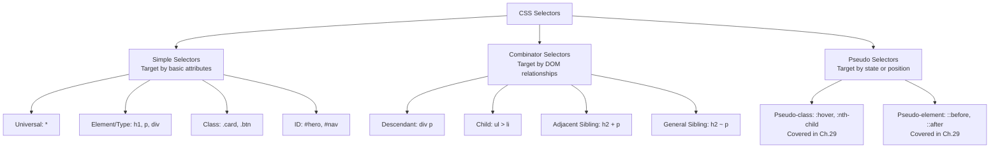

<a id="chapter-28-css-selectors"></a>

# Chapter 28: CSS Selectors

[⬅ Previous Chapter](#chapter-27-ways-to-add-css) | [📖 Main Index](#main-index) | [Next Chapter ➡](#chapter-29-advanced-css-selectors)

---

## 📌 Learning Objectives

By the end of this chapter, you will:

* Master all fundamental CSS selectors — universal, element, class, ID, and grouping
* Understand all combinator selectors — descendant, child, adjacent sibling, general sibling
* Know exactly how each selector targets HTML elements
* Understand selector specificity for each selector type
* Be able to combine selectors for precise element targeting
* Know the performance implications of different selectors
* Apply best practices for selector naming and architecture
* Confidently answer all CSS selector interview questions at every level

---

<a id="chapter-index-table-28"></a>

## Chapter Index Table

| Topic No. | Topic Name | Subtopics |
|-----------|------------|-----------|
| 28.1 | [CSS Selector Overview](#281-css-selector-overview) | What selectors are<br>Selector categories<br>Specificity intro |
| 28.2 | [Universal Selector](#282-universal-selector) | Syntax<br>How it works<br>Use cases<br>Performance |
| 28.3 | [Element (Type) Selector](#283-element-type-selector) | Syntax<br>How it works<br>Global defaults<br>Grouping |
| 28.4 | [Class Selector](#284-class-selector) | Syntax<br>Multiple classes<br>Chaining<br>BEM methodology |
| 28.5 | [ID Selector](#285-id-selector) | Syntax<br>Uniqueness rule<br>Specificity impact<br>When to use |
| 28.6 | [Grouping Selector](#286-grouping-selector) | Syntax<br>DRY principle<br>Selector lists |
| 28.7 | [Descendant Combinator](#287-descendant-combinator) | Syntax<br>How it works<br>Deep nesting<br>Performance |
| 28.8 | [Child Combinator](#288-child-combinator) | Syntax<br>Direct children only<br>vs Descendant |
| 28.9 | [Adjacent Sibling Combinator](#289-adjacent-sibling-combinator) | Syntax<br>Immediately after<br>Use cases |
| 28.10 | [General Sibling Combinator](#2810-general-sibling-combinator) | Syntax<br>All following siblings<br>Use cases |
| 28.11 | [Selector Specificity Deep Dive](#2811-selector-specificity-deep-dive) | Calculation<br>Conflicts<br>!important<br>Best practices |
| 28.12 | [Combining Selectors](#2812-combining-selectors) | Complex selectors<br>Real-world patterns |
| 28.13 | [Interview Questions](#2813-interview-questions) | Conceptual<br>Scenario<br>Output-based<br>Advanced |
| 28.14 | [Practice Problems](#2814-practice-problems) | Coding<br>Theory<br>Machine Coding |
| 28.15 | [Mini Project](#2815-mini-project) | CSS Selector Showcase UI |
| 28.16 | [Quick Revision](#2816-quick-revision) | Key Points<br>Traps<br>Bullets |
| 28.17 | [Chapter Summary](#2817-chapter-summary) | Final Takeaways |

---

## 281 CSS Selector Overview

<a id="281-css-selector-overview"></a>

### 🔷 What is a CSS Selector?

A **CSS selector** is the pattern that tells the browser **which HTML elements** a set of CSS declarations should be applied to. Every CSS rule starts with a selector.

```css
/*  SELECTOR
    ↓         */
h1 { color: blue; font-size: 2rem; }
/*  ↑
    Targets ALL <h1> elements on the page */

.card { background: white; border-radius: 12px; }
/*  ↑
    Targets ALL elements with class="card" */

#hero { min-height: 80vh; }
/*  ↑
    Targets the ONE element with id="hero" */
```

---

### 🔷 Categories of CSS Selectors



> [!NOTE]
> This chapter covers **Simple Selectors** and **Combinator Selectors**. Pseudo-classes and pseudo-elements are covered in Chapter 29 (Advanced CSS Selectors).

---

### 🔷 Specificity — Quick Introduction

Specificity is a **weight** calculated for every selector. When multiple rules target the same element and property, the rule with the **highest specificity wins**.

```
Specificity notation: (A, B, C)
A = Number of ID selectors
B = Number of class/attribute selectors
C = Number of type/element selectors

Universal *      → (0, 0, 0)
Element h1       → (0, 0, 1)
Class .card      → (0, 1, 0)
ID #hero         → (1, 0, 0)
Inline style=""  → (1, 0, 0, 0) — separate category
```

We will explore this deeply in topic 28.11.

---

### 🧠 Hinglish Intuition

> CSS selectors ek **search engine** ki tarah hain — aap describe karo ki kaise elements chahiye, browser dhundh ke laata hai.
>
> Jaise Google mein aap search karo:
> - "India" → sabse broad result (universal selector)
> - "India cricket" → thoda specific (element + descendant)
> - "India cricket World Cup 2024 final" → bahut specific (combined selectors)
>
> CSS selectors mein bhi — jitna specific selector, utna precise targeting, aur generally utni zyada specificity (winning power).

---

👉 <a href="#chapter-index-table-28">Go to Top 🔝</a>

---

## 282 Universal Selector

<a id="282-universal-selector"></a>

### 🔷 What is the Universal Selector?

The **universal selector** (`*`) matches **every single HTML element** in the document. It is the broadest possible selector.

```css
/* Basic universal selector */
* {
  box-sizing: border-box;
}
/* Applies box-sizing to: html, body, div, p, h1, span, a, img, input... EVERYTHING */
```

---

### 🔷 Syntax and Variations

```css
/* 1. Global — targets all elements */
* {
  box-sizing: border-box;
  margin:     0;
  padding:    0;
}

/* 2. Scoped — targets all elements INSIDE .card */
.card * {
  color: inherit;
}

/* 3. With pseudo-elements — best practice CSS reset */
*,
*::before,
*::after {
  box-sizing: border-box;
}

/* 4. Direct children only (child combinator + universal) */
.container > * {
  margin-bottom: 1rem;
}

/* 5. Any sibling after .header (general sibling + universal) */
.header ~ * {
  padding-top: 60px;   /* Account for fixed header */
}

/* 6. Namespace-qualified (rarely used) */
*|*    { color: black; }  /* All elements in any namespace */
html|* { color: black; }  /* All elements in HTML namespace */
```

---

### 🔷 Most Common Real-World Use Cases

```css
/* ===== USE CASE 1: Box-sizing reset (MOST COMMON) ===== */
/*
   Problem: By default, width/height don't include padding and border.
   padding: 20px on a width: 200px element makes it 240px wide!
   Solution: border-box includes padding + border IN the width.
*/
*,
*::before,
*::after {
  box-sizing: border-box;
}

/* ===== USE CASE 2: CSS Reset (Zero out browser defaults) ===== */
* {
  margin:     0;
  padding:    0;
}
/* Browsers apply default margin to h1-h6, p, ul, etc.
   Universal reset removes all these defaults consistently */

/* ===== USE CASE 3: Debugging — visualize all elements ===== */
* {
  outline: 1px solid red !important;
  /* Temporarily see all element boundaries */
  /* REMOVE before production */
}

/* ===== USE CASE 4: Inherit font from body ===== */
*,
*::before,
*::after {
  font-family: inherit;
  font-size:   inherit;
  line-height: inherit;
}

/* ===== USE CASE 5: Animations on all elements ===== */
* {
  transition: all 0.2s ease;
  /* Apply transition to ALL property changes */
  /* Warning: Performance cost — use selectively */
}

/* ===== USE CASE 6: Focus outline for all interactive elements ===== */
*:focus-visible {
  outline:        3px solid #2563eb;
  outline-offset: 2px;
}
```

---

### 🔷 Universal Selector Performance

> [!IMPORTANT]
> The universal selector `*` has **zero specificity** — it is overridden by ANY other selector. This means:
> ```css
> * { color: red; }         /* (0,0,0) — zero specificity */
> p { color: blue; }        /* (0,0,1) — wins over * */
> .text { color: green; }   /* (0,1,0) — wins over p and * */
> ```

**Performance note:** Modern browsers handle `*` very efficiently. The performance concern was relevant in older browsers. Using `* { box-sizing: border-box; }` is perfectly fine in production. However, avoid `* { transition: all 0.2s; }` — this creates animation overhead on every property change.

---

### 🔷 Complete Example: CSS Reset with Universal Selector

```html
<!DOCTYPE html>
<html lang="en">
<head>
  <meta charset="UTF-8">
  <title>Universal Selector Demo</title>
  <style>
    /* THE MODERN CSS RESET — using universal selector */

    /* Include pseudo-elements in box-sizing reset */
    *,
    *::before,
    *::after {
      box-sizing: border-box;
    }

    /* Remove default margin and padding */
    * {
      margin:  0;
      padding: 0;
    }

    /* Improve text rendering */
    html {
      -webkit-text-size-adjust: 100%;
    }

    /* Reset body defaults */
    body {
      min-height:              100vh;
      font-family:             system-ui, sans-serif;
      line-height:             1.5;
      -webkit-font-smoothing:  antialiased;
    }

    /* Improve media defaults */
    img,
    picture,
    video,
    canvas,
    svg {
      display:   block;
      max-width: 100%;
    }

    /* Remove built-in form typography styles */
    input,
    button,
    textarea,
    select {
      font: inherit;
    }

    /* Avoid text overflows */
    p,
    h1, h2, h3, h4, h5, h6 {
      overflow-wrap: break-word;
    }

    /* DEBUGGING: Show all element boxes (remove in production!) */
    /* * { outline: 1px solid rgba(255,0,0,0.2) !important; } */

    /* ===== Page styles after reset ===== */
    body {
      background:  #f8fafc;
      color:       #1e293b;
      padding:     2rem;
    }

    .box {
      background: white;
      padding:    20px;       /* With border-box: total width includes padding */
      border:     2px solid #2563eb;
      width:      300px;
      margin:     1rem 0;
    }
  </style>
</head>
<body>
  <h1>Universal Selector Demo</h1>
  <p>All elements have margin:0 and box-sizing:border-box applied.</p>
  <div class="box">
    This box is exactly 300px wide
    (padding + border are INSIDE the 300px)
  </div>
</body>
</html>
```

---

### 🧠 Hinglish Intuition

> Universal selector `*` ek **blanket policy** ki tarah hai — poori company pe apply hoti hai, har employee, har department.
>
> `box-sizing: border-box` universal selector ke saath = "Company ki policy hai ki sab apne allocated desk space ke andar hi kaam karenge — bahar nahi failenge."
>
> Specificity mein `*` sabse weak hai — koi bhi specific rule ise override kar sakta hai. Isliye reset ke liye perfect hai — aap general defaults set karte ho, phir specific elements ke liye alag styles likhte ho.

---

👉 <a href="#chapter-index-table-28">Go to Top 🔝</a>

---

## 283 Element (Type) Selector

<a id="283-element-type-selector"></a>

### 🔷 What is the Element Selector?

The **element selector** (also called **type selector**) targets all HTML elements of a specific tag type. It matches every occurrence of that element on the page.

```css
/* Targets ALL <h1> elements */
h1 { font-size: 2.5rem; color: #0f172a; }

/* Targets ALL <p> elements */
p { line-height: 1.7; color: #334155; margin-bottom: 1rem; }

/* Targets ALL <a> elements */
a { color: #2563eb; text-decoration: underline; }

/* Targets ALL <button> elements */
button { cursor: pointer; border: none; font-family: inherit; }
```

---

### 🔷 Complete Reference — Common Element Selectors

```css
/* ===== DOCUMENT STRUCTURE ===== */
html {
  font-size:      16px;     /* Base font size — 1rem = this */
  scroll-behavior: smooth;
}

body {
  font-family: 'Segoe UI', system-ui, sans-serif;
  font-size:   1rem;
  line-height: 1.6;
  color:       #1e293b;
  background:  #f8fafc;
}

/* ===== HEADINGS ===== */
h1 { font-size: clamp(2rem, 5vw, 3.5rem); font-weight: 800; }
h2 { font-size: clamp(1.5rem, 3vw, 2.5rem); font-weight: 700; }
h3 { font-size: 1.375rem; font-weight: 600; }
h4 { font-size: 1.125rem; font-weight: 600; }
h5 { font-size: 1rem;     font-weight: 600; }
h6 { font-size: 0.875rem; font-weight: 600; }

h1, h2, h3, h4, h5, h6 {
  /* Grouped — same for all headings */
  font-family:   'Inter', system-ui, sans-serif;
  line-height:   1.2;
  color:         #0f172a;
  margin-bottom: 0.75rem;
}

/* ===== TEXT ELEMENTS ===== */
p {
  margin-bottom: 1rem;
  max-width:     70ch;     /* Optimal reading line length */
}

a {
  color:                   #2563eb;
  text-decoration:         underline;
  text-underline-offset:   3px;
  text-decoration-color:   #93c5fd;
  transition:              color 0.2s, text-decoration-color 0.2s;
}
a:hover {
  color:                   #1d4ed8;
  text-decoration-color:   #2563eb;
}

strong { font-weight: 700; }
em     { font-style: italic; }

code {
  font-family:   'JetBrains Mono', 'Courier New', monospace;
  font-size:     0.875em;
  background:    #f1f5f9;
  color:         #e11d48;
  padding:       0.125em 0.375em;
  border-radius: 4px;
}

pre {
  font-family: 'JetBrains Mono', monospace;
  font-size:   0.875rem;
  background:  #0f172a;
  color:       #e2e8f0;
  padding:     1.25rem;
  border-radius: 8px;
  overflow-x:  auto;
  line-height: 1.6;
}

pre code {
  /* Override inline code styles when inside pre */
  background:    transparent;
  color:         inherit;
  padding:       0;
  border-radius: 0;
  font-size:     inherit;
}

blockquote {
  border-left:  4px solid #2563eb;
  padding:      1rem 1.5rem;
  margin:       1.5rem 0;
  background:   #eff6ff;
  border-radius: 0 8px 8px 0;
  font-style:   italic;
  color:        #1e40af;
}

/* ===== LISTS ===== */
ul, ol {
  padding-left: 1.5rem;
  margin-bottom: 1rem;
}

li { margin-bottom: 0.25rem; }

/* Definition list */
dt {
  font-weight:   700;
  color:         #0f172a;
  margin-top:    1rem;
}
dd {
  padding-left: 1rem;
  color:        #475569;
  margin-bottom: 0.5rem;
}

/* ===== MEDIA ===== */
img {
  display:   block;
  max-width: 100%;
  height:    auto;
}

video {
  display:   block;
  max-width: 100%;
}

/* ===== FORMS ===== */
input,
textarea,
select {
  font:          inherit;
  font-size:     1rem;
  border:        1px solid #cbd5e1;
  border-radius: 6px;
  padding:       8px 12px;
  width:         100%;
  transition:    border-color 0.2s, box-shadow 0.2s;
  background:    white;
  color:         inherit;
}

input:focus,
textarea:focus,
select:focus {
  outline:      none;
  border-color: #2563eb;
  box-shadow:   0 0 0 3px rgba(37, 99, 235, 0.15);
}

button {
  cursor:      pointer;
  font-family: inherit;
  font-size:   inherit;
  border:      none;
  background:  none;
}

/* ===== TABLE ===== */
table {
  width:           100%;
  border-collapse: collapse;
  margin-bottom:   1.5rem;
}

th {
  background:    #1e293b;
  color:         white;
  padding:       10px 16px;
  text-align:    left;
  font-weight:   600;
  font-size:     0.875rem;
  text-transform: uppercase;
  letter-spacing: 0.04em;
}

td {
  padding:       10px 16px;
  border-bottom: 1px solid #e2e8f0;
}

tr:hover td { background: #f8fafc; }

/* ===== LAYOUT ELEMENTS ===== */
header {
  background: white;
  border-bottom: 1px solid #e2e8f0;
  padding: 1rem 2rem;
}

nav { display: flex; gap: 1.5rem; align-items: center; }

main {
  max-width: 1200px;
  margin:    0 auto;
  padding:   2rem 1rem;
}

section { margin-bottom: 3rem; }

article {
  background:    white;
  border-radius: 12px;
  padding:       2rem;
  box-shadow:    0 2px 8px rgba(0,0,0,0.08);
}

aside {
  background: #f8fafc;
  border:     1px solid #e2e8f0;
  border-radius: 8px;
  padding:    1.5rem;
}

footer {
  background: #1e293b;
  color:      #94a3b8;
  padding:    2rem;
  text-align: center;
}

/* ===== UTILITY ELEMENTS ===== */
hr {
  border:     none;
  border-top: 1px solid #e2e8f0;
  margin:     2rem 0;
}

mark {
  background: #fef08a;
  color:      #713f12;
  padding:    0.1em 0.3em;
  border-radius: 3px;
}

details {
  border:        1px solid #e2e8f0;
  border-radius: 8px;
  padding:       1rem;
  margin-bottom: 1rem;
}

summary {
  cursor:      pointer;
  font-weight: 600;
  color:       #1e293b;
}

summary:hover { color: #2563eb; }
```

---

### 🔷 Element Selector Specificity

```css
/* Element selector: specificity (0, 0, 1) */
p   { color: blue; }      /* (0,0,1) */
div { color: red;  }      /* (0,0,1) — same specificity */

/* Last rule wins when specificity is equal: */
/* <div><p> → color is blue (p rule comes after div) */

/* Class beats element: */
p         { color: blue; }   /* (0,0,1) */
.highlight { color: orange; } /* (0,1,0) — wins */

/* Multiple elements don't add up like classes: */
div p span { color: green; } /* (0,0,3) — still loses to .class (0,1,0)? */
/* NO! (0,0,3) vs (0,1,0) → class wins because B column (1) > C column (3) */
/* Columns are compared LEFT to RIGHT, not summed! */
```

> [!IMPORTANT]
> Specificity columns are compared **left to right** and are **never added across columns**. 100 type selectors `(0,0,100)` do NOT beat one class selector `(0,1,0)` because the B column (class) is compared first and 1 > 0.

---

### 🧠 Hinglish Intuition

> Element selector ek **government notification** ki tarah hai — "Desh ke sare engineers ko yeh rule follow karna hai." Sab `<engineer>` elements affected.
>
> Specific notification `p { color: blue }` = "Sare paragraph elements blue honge."
>
> Isse bhi specific (class selector) = "Sirf senior engineers (`.senior`) ko ye benefit milega." Class selector wins because it's more specific.
>
> **Element selectors** global defaults set karne ke liye best hain — `body`, `h1`-`h6`, `a`, `button`, `input` — ye sab type selectors se set ho jaate hain, phir specific components ke liye classes use karte hain.

---

👉 <a href="#chapter-index-table-28">Go to Top 🔝</a>

---

## 284 Class Selector

<a id="284-class-selector"></a>

### 🔷 What is the Class Selector?

The **class selector** targets all elements that have a specific value in their `class` attribute. It is the **most widely used** selector in modern CSS because it is reusable, flexible, and has medium specificity.

```css
/* Syntax: .classname */
.card { background: white; border-radius: 12px; }
/* Targets: <div class="card">, <article class="card">, ANY element with class="card" */
```

---

### 🔷 Class Selector — Complete Patterns

```html
<!-- HTML examples for all patterns below -->
<div class="card">Basic card</div>
<div class="card featured">Featured card — has TWO classes</div>
<div class="card featured large">Three classes</div>
<p class="card">Paragraph with card class</p>
<button class="btn btn-primary">Primary button</button>
<button class="btn btn-secondary btn-sm">Small secondary button</button>
```

```css
/* ===== PATTERN 1: Basic class selector ===== */
.card {
  background:    white;
  border:        1px solid #e2e8f0;
  border-radius: 12px;
  padding:       1.5rem;
  box-shadow:    0 2px 8px rgba(0,0,0,0.08);
}
/* Targets: ALL elements with class="card" (div, p, article — any tag) */

/* ===== PATTERN 2: Combined class selectors (element + class) ===== */
div.card {
  display: flex;
  flex-direction: column;
}
/* Targets: ONLY <div> elements with class="card" */
/* Does NOT target <p class="card"> or <article class="card"> */
/* Specificity: (0,1,1) — element + class */

/* ===== PATTERN 3: Multiple classes on one element (chaining) ===== */
.card.featured {
  border-color:  #2563eb;
  box-shadow:    0 4px 20px rgba(37,99,235,0.2);
  background:    linear-gradient(135deg, #eff6ff, #dbeafe);
}
/* Targets: elements that have BOTH class="card" AND class="featured" */
/* <div class="card featured"> ← MATCHES */
/* <div class="card"> ← Does NOT match (no "featured" class) */
/* <div class="featured"> ← Does NOT match (no "card" class) */
/* Specificity: (0,2,0) — two class selectors */

.card.featured.large {
  padding: 2.5rem;
  font-size: 1.1rem;
}
/* Targets: elements with ALL THREE classes */

/* ===== PATTERN 4: Button system with class variations ===== */
/* Base button styles */
.btn {
  display:         inline-flex;
  align-items:     center;
  justify-content: center;
  gap:             0.5rem;
  padding:         10px 24px;
  border:          2px solid transparent;
  border-radius:   8px;
  font-size:       1rem;
  font-weight:     600;
  font-family:     inherit;
  cursor:          pointer;
  text-decoration: none;
  transition:      all 0.2s ease;
  white-space:     nowrap;
  user-select:     none;
}

/* Color variants */
.btn-primary   { background: #2563eb; color: white; }
.btn-secondary { background: transparent; color: #2563eb; border-color: #2563eb; }
.btn-danger    { background: #dc2626; color: white; }
.btn-success   { background: #16a34a; color: white; }
.btn-ghost     { background: transparent; color: #475569; }

/* Hover states */
.btn-primary:hover   { background: #1d4ed8; transform: translateY(-1px); }
.btn-secondary:hover { background: #eff6ff; }
.btn-danger:hover    { background: #b91c1c; }

/* Size variants */
.btn-sm { padding: 6px 14px; font-size: 0.875rem; }
.btn-md { padding: 10px 24px; font-size: 1rem; }     /* Default */
.btn-lg { padding: 14px 32px; font-size: 1.125rem; }
.btn-xl { padding: 18px 40px; font-size: 1.25rem; }

/* State variants */
.btn:disabled,
.btn.disabled {
  opacity:        0.5;
  cursor:         not-allowed;
  pointer-events: none;
}

.btn.loading {
  color:          transparent;
  pointer-events: none;
}

/* ===== PATTERN 5: Utility classes ===== */
/* Single-purpose utility classes — each does ONE thing */
.text-center  { text-align: center; }
.text-right   { text-align: right; }
.text-left    { text-align: left; }

.font-bold    { font-weight: 700; }
.font-medium  { font-weight: 500; }
.font-light   { font-weight: 300; }

.text-sm      { font-size: 0.875rem; }
.text-base    { font-size: 1rem; }
.text-lg      { font-size: 1.125rem; }
.text-xl      { font-size: 1.25rem; }
.text-2xl     { font-size: 1.5rem; }

.text-primary { color: #2563eb; }
.text-danger  { color: #dc2626; }
.text-success { color: #16a34a; }
.text-muted   { color: #64748b; }

.hidden       { display: none !important; }
.invisible    { visibility: hidden; }
.sr-only {     /* Screen reader only */
  position:  absolute;
  width:     1px;
  height:    1px;
  padding:   0;
  margin:    -1px;
  overflow:  hidden;
  clip:      rect(0,0,0,0);
  white-space: nowrap;
  border:    0;
}

.flex         { display: flex; }
.flex-col     { flex-direction: column; }
.items-center { align-items: center; }
.justify-between { justify-content: space-between; }
.gap-4        { gap: 1rem; }

.mt-4         { margin-top: 1rem; }
.mb-4         { margin-bottom: 1rem; }
.pt-4         { padding-top: 1rem; }
.pb-4         { padding-bottom: 1rem; }
.p-4          { padding: 1rem; }
.px-4         { padding-left: 1rem; padding-right: 1rem; }
.py-4         { padding-top: 1rem;  padding-bottom: 1rem; }

.rounded      { border-radius: 8px; }
.rounded-full { border-radius: 9999px; }

.shadow-sm    { box-shadow: 0 1px 3px rgba(0,0,0,0.1); }
.shadow-md    { box-shadow: 0 4px 16px rgba(0,0,0,0.1); }
.shadow-lg    { box-shadow: 0 8px 32px rgba(0,0,0,0.12); }

.w-full       { width: 100%; }
.max-w-sm     { max-width: 384px; }
.max-w-md     { max-width: 448px; }
.max-w-lg     { max-width: 512px; }
.max-w-xl     { max-width: 576px; }
```

---

### 🔷 BEM — Block Element Modifier Methodology

BEM is a popular CSS class naming convention that uses class selectors:

```css
/* BEM: Block__Element--Modifier */

/* ===== BLOCK: standalone component ===== */
.card { }                    /* The block itself */

/* ===== ELEMENT: part of the block (double underscore __) ===== */
.card__header { }            /* Header inside card */
.card__body   { }            /* Body inside card */
.card__footer { }            /* Footer inside card */
.card__title  { }            /* Title inside card */
.card__image  { }            /* Image inside card */
.card__badge  { }            /* Badge inside card */

/* ===== MODIFIER: variation of block or element (double dash --) ===== */
.card--featured   { }        /* Featured variation of card */
.card--dark       { }        /* Dark theme card */
.card--horizontal { }        /* Horizontal layout card */

.card__title--large { }      /* Large variation of card title */
.card__badge--new   { }      /* "New" badge variation */
```

```html
<!-- BEM HTML structure -->
<article class="card card--featured">
  <div class="card__header">
    <span class="card__badge card__badge--new">New</span>
  </div>
  
  <div class="card__body">
    <h2 class="card__title card__title--large">Product Name</h2>
    <p class="card__description">Product description text.</p>
  </div>
  <div class="card__footer">
    <button class="btn btn-primary">Add to Cart</button>
  </div>
</article>
```

```css
/* BEM CSS */
.card {
  background:    white;
  border:        1px solid #e2e8f0;
  border-radius: 12px;
  overflow:      hidden;
}

.card--featured {
  border-color: #2563eb;
  box-shadow:   0 0 0 3px rgba(37,99,235,0.1);
}

.card--dark {
  background: #1e293b;
  color:      white;
  border-color: #334155;
}

.card__header {
  position:   relative;
  padding:    1rem;
}

.card__image {
  width:      100%;
  height:     200px;
  object-fit: cover;
}

.card__body {
  padding: 1.25rem;
}

.card__title {
  font-size:     1.1rem;
  font-weight:   700;
  margin-bottom: 0.5rem;
  color:         #0f172a;
}

.card__title--large {
  font-size: 1.5rem;
}

.card__badge {
  display:       inline-block;
  padding:       3px 10px;
  border-radius: 50px;
  font-size:     0.72rem;
  font-weight:   700;
  text-transform: uppercase;
}

.card__badge--new     { background: #dcfce7; color: #16a34a; }
.card__badge--sale    { background: #fee2e2; color: #dc2626; }
.card__badge--popular { background: #fef3c7; color: #d97706; }

.card__footer {
  padding:   1rem 1.25rem;
  border-top: 1px solid #f1f5f9;
}
```

---

### 🧠 Hinglish Intuition

> Class selector sabse **versatile tool** hai CSS ka — jaise ek Swiss Army knife.
>
> - `.card` = "Sab cards ko ye style do" — reusable
> - `.card.featured` = "Sirf wo cards jo featured bhi hain" — precise
> - `.btn.btn-primary.btn-lg` = "Large primary button" — composition pattern
>
> **BEM** ek naming system hai — Block (kya component hai?), Element (is component ka kya part?), Modifier (kaunsa variation?). Isse class names meaningful hote hain, conflicts nahi hoti, aur code self-documenting ho jaata hai.
>
> **Rule:** CSS mein 90% styling class selectors se honi chahiye. IDs avoid karo styling ke liye. Type selectors sirf global defaults ke liye.

---

👉 <a href="#chapter-index-table-28">Go to Top 🔝</a>

---

## 285 ID Selector

<a id="285-id-selector"></a>

### 🔷 What is the ID Selector?

The **ID selector** targets the **single, unique element** that has a specific `id` attribute value. IDs must be unique within a page — only one element can have a given ID.

```css
/* Syntax: #id-name */
#site-header  { position: sticky; top: 0; z-index: 100; }
#main-content { max-width: 1200px; margin: 0 auto; }
#site-footer  { background: #1e293b; color: white; }
```

---

### 🔷 ID Selector Syntax and Patterns

```html
<!-- HTML with IDs -->
<header id="site-header">
  <nav id="main-nav">...</nav>
</header>
<main id="main-content">
  <aside id="sidebar">...</aside>
  <article id="featured-post">...</article>
</main>
<footer id="site-footer">...</footer>
```

```css
/* ===== Basic ID selectors ===== */
#site-header {
  position:      sticky;
  top:           0;
  z-index:       1000;
  background:    white;
  box-shadow:    0 2px 8px rgba(0,0,0,0.1);
  padding:       1rem 2rem;
}

#main-content {
  max-width:  1200px;
  margin:     0 auto;
  padding:    2rem 1rem;
  min-height: 60vh;
}

#sidebar {
  width:         280px;
  background:    #f8fafc;
  border-right:  1px solid #e2e8f0;
  padding:       1.5rem;
}

#featured-post {
  background:    white;
  border:        2px solid #2563eb;
  border-radius: 12px;
  padding:       2rem;
}

#site-footer {
  background: #0f172a;
  color:      #94a3b8;
  padding:    3rem 2rem;
  margin-top: auto;
}

/* ===== ID combined with element ===== */
header#site-header {
  /* More specific — targets ONLY <header> with id="site-header" */
  /* Specificity: (1,0,1) */
  display: flex;
  justify-content: space-between;
}

/* ===== ID combined with class ===== */
#featured-post.highlighted {
  /* Specificity: (1,1,0) — very high! */
  background: linear-gradient(135deg, #eff6ff, #dbeafe);
}
```

---

### 🔷 The Uniqueness Rule

```html
<!-- ✅ Correct: Each ID appears ONCE per page -->
<header id="site-header">...</header>
<main id="main-content">...</main>
<footer id="site-footer">...</footer>

<!-- ❌ WRONG: Duplicate IDs — HTML spec violation -->
<div id="card">Card 1</div>
<div id="card">Card 2</div>
<!-- Both get styled, but JavaScript getElementById() returns only FIRST -->
<!-- W3C Validator will flag this as an error -->
```

---

### 🔷 High Specificity Problem

```css
/* The specificity problem with IDs */

/* Normal styling with class: (0,1,0) */
.btn { background: #2563eb; color: white; }

/* Override attempts — ALL of these FAIL because #submit has higher specificity */
#submit { background: #dc2626; }  /* (1,0,0) — overrides .btn */

/* Now if you want to override #submit... */
/* Option 1: Another ID — bad practice */
#special-submit { background: green; }  /* Not semantically different */

/* Option 2: !important — creates maintenance nightmare */
.btn { background: blue !important; }   /* Now nothing can override this */

/* Option 3: Increase specificity artificially */
body #submit { background: green; }    /* (1,0,1) — works but ugly */

/* LESSON: High specificity IDs create a "specificity war" */
/* SOLUTION: Don't use ID selectors for styling */
```

---

### 🔷 When to Use IDs vs When NOT To

```
✅ USE IDs for:
├── Fragment navigation: <a href="#section-2"> targets <section id="section-2">
├── Form labels:         <label for="email"> targets <input id="email">
├── JavaScript:          document.getElementById('modal') — fastest DOM lookup
├── ARIA references:     aria-labelledby="heading-id"
└── Landmark skipping:   <a href="#main-content">Skip to main</a>

❌ DO NOT USE IDs for:
├── CSS styling          — High specificity creates conflicts
├── Repeating elements   — Cards, buttons, list items can't have same ID
├── Reusable components  — A component styled with #id can only exist once
└── Team projects        — Others can't reuse ID-styled components easily
```

---

### 🔷 ID vs Class — Practical Comparison

```html
<!-- ❌ ID for styling — only works once, can't be reused -->
<style>
  #product-card { border-radius: 12px; background: white; }
</style>
<div id="product-card">Product 1</div>
<!-- Can't have a second product card with same style! -->

<!-- ✅ Class for styling — reusable, scalable -->
<style>
  .product-card { border-radius: 12px; background: white; }
</style>
<div class="product-card">Product 1</div>
<div class="product-card">Product 2</div>
<div class="product-card">Product 3</div>
<!-- Works perfectly for as many products as needed -->
```

---

### 🧠 Hinglish Intuition

> ID selector ek **Aadhar card** ki tarah hai — ek desh mein ek vyakti ka ek hi Aadhar number. Duplicate nahi ho sakta.
>
> CSS mein bhi — ek page pe ek ID ek baar. JavaScript ke liye perfect (`getElementById` — fastest lookup). Styling ke liye? Problematic.
>
> **Specificity problem:** ID ka weight class se 10 guna zyada hai (roughly). Agar aapne styling ID se ki, toh bad mein override karna bahut mushkil ho jaata hai. Isliye professional CSS mein IDs for styling avoid karte hain — sirf classes use karte hain.
>
> **Golden Rule:** ID = unique identifier (form, JS, anchors). Class = reusable style hook.

---

👉 <a href="#chapter-index-table-28">Go to Top 🔝</a>

---

## 286 Grouping Selector

<a id="286-grouping-selector"></a>

### 🔷 What is the Grouping Selector?

The **grouping selector** (also called **selector list**) applies the same CSS declarations to **multiple different selectors** by separating them with commas. It is the DRY (Don't Repeat Yourself) principle in CSS.

```css
/* Without grouping — REPETITIVE */
h1 { font-family: 'Inter', sans-serif; color: #0f172a; line-height: 1.2; }
h2 { font-family: 'Inter', sans-serif; color: #0f172a; line-height: 1.2; }
h3 { font-family: 'Inter', sans-serif; color: #0f172a; line-height: 1.2; }
h4 { font-family: 'Inter', sans-serif; color: #0f172a; line-height: 1.2; }
h5 { font-family: 'Inter', sans-serif; color: #0f172a; line-height: 1.2; }
h6 { font-family: 'Inter', sans-serif; color: #0f172a; line-height: 1.2; }

/* With grouping — DRY */
h1, h2, h3, h4, h5, h6 {
  font-family: 'Inter', sans-serif;
  color:       #0f172a;
  line-height: 1.2;
}
```

---

### 🔷 Grouping Selector Syntax

```css
/* Comma separates selectors — each selector independently targets its elements */
selector1,
selector2,
selector3 {
  shared-property: value;
}

/* IMPORTANT: Commas mean OR, not AND */
/* "Apply these styles to selector1 OR selector2 OR selector3" */
/* (AND is achieved with chaining — no space between selectors) */
```

---

### 🔷 Complete Examples

```css
/* ===== Example 1: Form element normalization ===== */
/* All form controls get the same font treatment */
input,
textarea,
select,
button {
  font-family: inherit;
  font-size:   1rem;
  line-height: 1.5;
}

/* ===== Example 2: Heading base styles ===== */
/* All headings share base styles */
h1, h2, h3, h4, h5, h6 {
  font-family:   'Inter', system-ui, sans-serif;
  font-weight:   700;
  line-height:   1.2;
  color:         #0f172a;
  margin-bottom: 0.75rem;
}

/* Then individual sizes */
h1 { font-size: 3rem;   font-weight: 800; }
h2 { font-size: 2.25rem; }
h3 { font-size: 1.75rem; }
h4 { font-size: 1.375rem; }
h5 { font-size: 1.125rem; }
h6 { font-size: 1rem;   }

/* ===== Example 3: Mixed selector types ===== */
/* Group ANY type of selectors together */
.error,
.warning,
.alert,
[role="alert"] {
  padding:       12px 16px;
  border-radius: 8px;
  border:        1px solid;
  font-weight:   500;
  display:       flex;
  align-items:   flex-start;
  gap:           8px;
}

/* ===== Example 4: Navigation and links ===== */
nav a,
.breadcrumb a,
.sidebar-menu a {
  color:           inherit;
  text-decoration: none;
  transition:      color 0.2s;
}

nav a:hover,
.breadcrumb a:hover,
.sidebar-menu a:hover {
  color: #2563eb;
}

/* ===== Example 5: Reset/Normalize patterns ===== */
/* Remove list styles from nav lists */
nav ul,
nav ol,
.menu,
.nav-list {
  list-style: none;
  margin:     0;
  padding:    0;
}

/* Remove link decoration in specific contexts */
header a,
footer a,
nav a {
  text-decoration: none;
}

/* ===== Example 6: State-based grouping ===== */
/* All disabled states look the same */
button:disabled,
input:disabled,
select:disabled,
textarea:disabled,
.disabled {
  opacity:        0.5;
  cursor:         not-allowed;
  pointer-events: none;
}

/* ===== Example 7: Media-specific grouping ===== */
@media (max-width: 768px) {
  /* Multiple things hide on mobile */
  .sidebar,
  .desktop-only,
  .nav-full,
  .hero-decoration {
    display: none;
  }
}

/* ===== Example 8: Complex grouped selectors ===== */
/* All article headings inside main */
main article h1,
main article h2,
main article h3 {
  margin-top: 2rem;
}

/* All interactive elements that should show focus */
a:focus-visible,
button:focus-visible,
input:focus-visible,
select:focus-visible,
textarea:focus-visible,
[tabindex]:focus-visible {
  outline:        3px solid #2563eb;
  outline-offset: 3px;
}
```

---

### 🔷 Grouping — Important Gotcha

> [!IMPORTANT]
> **If one selector in a grouped list is invalid, ALL rules for the group are ignored by older browsers.**
>
> ```css
> /* This works in modern browsers — :is() handles invalid selectors gracefully */
> :is(h1, h2, h3, :unsupported-selector) { color: blue; }
>
> /* This — if browser doesn't understand :unsupported-selector,
>    the ENTIRE rule is dropped in old browsers */
> h1, h2, h3, :unsupported-selector { color: blue; }
> /* Old browsers: h1, h2, h3 also get no color — entire rule dropped */
> ```
>
> Modern solution: Use `:is()` pseudo-class (Chapter 29) which is error-forgiving.

---

### 🧠 Hinglish Intuition

> Grouping selector ek **circular** ki tarah hai — "Ye rule sab ke liye applicable hai: Rahul, Priya, Amit, Sara."
>
> DRY principle = "Don't Repeat Yourself" — ek hi rule baar baar mat likho. Group karo.
>
> **Important trap:** Comma = OR, not AND.
> `h1, h2` = h1 OR h2 (dono ko style mile)
> `h1 h2` = h2 INSIDE h1 (descendant — alag concept)
> `h1.heading` = h1 AND .heading class (dono conditions sath) — no comma, no space

---

👉 <a href="#chapter-index-table-28">Go to Top 🔝</a>

---

## 287 Descendant Combinator

<a id="287-descendant-combinator"></a>

### 🔷 What is the Descendant Combinator?

The **descendant combinator** (a **space** between two selectors) targets elements that are **anywhere inside** (at any nesting level) another element. It selects descendants — children, grandchildren, great-grandchildren, etc.

```css
/* Syntax: ancestor descendant */
/*         (space between them) */

nav a {
  color: white;
  text-decoration: none;
}
/* Targets: ALL <a> elements ANYWHERE inside <nav> */
/* Whether direct child or nested 5 levels deep */
```

---

### 🔷 How the Descendant Combinator Works

```html
<nav>
  <ul>
    <li>
      <a href="/">Home</a>          <!-- ← nav a MATCHES this -->
      <ul>
        <li>
          <a href="/sub">Sub</a>    <!-- ← nav a ALSO MATCHES this (nested) -->
        </li>
      </ul>
    </li>
    <li><a href="/about">About</a> <!-- ← nav a MATCHES this too -->
    </li>
  </ul>
</nav>

<footer>
  <a href="/privacy">Privacy</a>   <!-- ← nav a does NOT match (not inside nav) -->
</footer>
```

```css
/* nav a: targets ALL <a> inside <nav> — regardless of depth */
nav a {
  color:           #e2e8f0;
  text-decoration: none;
  font-weight:     500;
  transition:      color 0.2s;
}

nav a:hover {
  color: white;
}

/* footer a: separately targets <a> inside <footer> */
footer a {
  color:           #64748b;
  text-decoration: underline;
}

footer a:hover {
  color: #94a3b8;
}
```

---

### 🔷 Descendant Combinator — Complete Examples

```css
/* ===== COMMON REAL-WORLD PATTERNS ===== */

/* 1. Navigation links */
header nav a             { color: white; text-decoration: none; }
footer nav a             { color: #94a3b8; }
.sidebar nav a           { color: #1e293b; padding: 0.5rem 0; display: block; }

/* 2. Article typography — apply styles to elements inside articles */
article h1               { font-size: 2.5rem; }
article h2               { font-size: 1.75rem; border-bottom: 1px solid #e2e8f0; padding-bottom: 0.5rem; }
article p                { line-height: 1.8; margin-bottom: 1.5rem; }
article img              { border-radius: 8px; margin: 1.5rem auto; }
article blockquote       { background: #eff6ff; border-left: 4px solid #2563eb; }
article code             { font-size: 0.875em; }
article a                { color: #2563eb; text-decoration: underline; }
article ul, article ol   { margin-left: 1.5rem; margin-bottom: 1rem; }

/* 3. Form within a specific context */
.modal form input        { border-color: #6366f1; }
.modal form button       { width: 100%; }

.sidebar form            { display: flex; gap: 0.5rem; }
.sidebar form input      { flex: 1; }
.sidebar form button     { flex-shrink: 0; }

/* 4. Dark theme context */
.dark-theme p            { color: #e2e8f0; }
.dark-theme h1           { color: white; }
.dark-theme a            { color: #93c5fd; }
.dark-theme code         { background: #1e293b; color: #f8fafc; }
.dark-theme input        { background: #1e293b; border-color: #334155; color: white; }

/* 5. Card content */
.card p                  { color: #475569; font-size: 0.9rem; }
.card h3                 { color: #0f172a; margin-bottom: 0.5rem; }
.card .badge             { font-size: 0.72rem; }
.product-card .price     { font-size: 1.25rem; color: #2563eb; font-weight: 700; }
.product-card .old-price { text-decoration: line-through; color: #94a3b8; font-size: 0.9rem; }

/* 6. Table inside different contexts */
.report-section table    { font-size: 0.875rem; }
.report-section th       { background: #1e293b; color: white; }
.comparison-table th     { background: #2563eb; }
.pricing-table td        { text-align: center; padding: 1rem; }

/* 7. Deep nesting (multiple levels) */
.page-wrapper main article section p {
  /* This targets <p> inside <section> inside <article> inside <main> inside .page-wrapper */
  /* Specificity: (0,1,4) — one class + four element selectors */
  max-width: 65ch;
}

/* ===== RESET PATTERNS WITH DESCENDANT ===== */

/* Remove margin from last child in containers */
.card p:last-child,
.card li:last-child,
.card h1:last-child,
.card h2:last-child,
.card h3:last-child {
  margin-bottom: 0;
}
```

---

### 🔷 Descendant Combinator — Performance Consideration

```css
/* ❌ Too broad — browser has to check every element on page */
* a { color: blue; }
div p span { font-weight: bold; }

/* ✅ Better — specific enough to target correctly */
.article-body a  { color: #2563eb; }
.card-body p     { font-size: 0.9rem; }

/* ❌ Deep descendant chains — slow and over-specific */
.page .section .container .card .card-body .card-text span {
  color: red;
}

/* ✅ Better — target the element more directly */
.card-text span { color: red; }
/* Or even better: */
.card-highlight { color: red; }
```

> [!TIP]
> CSS selectors are read **right to left** by the browser for performance. `nav a` means: "Find all `<a>` elements, then check if each has a `<nav>` ancestor." Keep the rightmost selector as specific as possible for better performance.

---

### 🧠 Hinglish Intuition

> Descendant combinator ek **family tree** ki tarah hai — "Sharma family ke sab members (chahe beta, pota, parpota) ko yeh rule follow karna hai."
>
> `nav a` = "Navigation ke andar kahin bhi jo bhi `<a>` tag hai — chahe seedha nav ke andar ho ya 5 levels deep nested ho — sab ko style karo."
>
> **Real-world use:** Articles ke andar ke links differently style karo vs navigation ke andar ke links. Dono `<a>` hain, but context alag hai — descendant combinator se context se style karo.
>
> **Performance tip:** Browser right se left padhta hai — `article.blog p.intro span` mein pehle saare `span` dhundhe jaate hain, phir check hota hai ki kya `.intro` wala `p` ke andar hain. Isliye rightmost selector specific rakho.

---

👉 <a href="#chapter-index-table-28">Go to Top 🔝</a>

---

## 288 Child Combinator

<a id="288-child-combinator"></a>

### 🔷 What is the Child Combinator?

The **child combinator** (`>`) selects elements that are **direct children only** of a specified parent. Unlike the descendant combinator (space), it does NOT select grandchildren or deeper descendants.

```css
/* Syntax: parent > direct-child */
ul > li {
  list-style-type: disc;
  color: #1e293b;
}
/* Targets: ONLY <li> elements that are DIRECT children of <ul> */
/* Does NOT target <li> inside nested <ul> */
```

---

### 🔷 Child vs Descendant — The Key Difference

```html
<div class="parent">
  <p class="direct-child">I am a direct child</p>       <!-- > targets THIS -->
  <div class="intermediate">
    <p class="grandchild">I am a grandchild</p>          <!-- > does NOT target this -->
    <div>
      <p class="great-grandchild">Great grandchild</p>   <!-- > does NOT target this -->
    </div>
  </div>
  <p class="another-direct">I am also a direct child</p> <!-- > targets THIS -->
</div>
```

```css
/* Descendant combinator — matches ALL levels */
.parent p {
  color: blue;
}
/* Targets: .direct-child, .grandchild, .great-grandchild, .another-direct */
/* All 4 paragraphs get blue */

/* Child combinator — ONLY direct children */
.parent > p {
  color: red;
}
/* Targets: ONLY .direct-child and .another-direct */
/* .grandchild and .great-grandchild are NOT targeted */
```

---

### 🔷 Child Combinator — Complete Examples

```html
<!-- HTML structure for all examples -->
<nav class="main-nav">
  <ul>
    <li class="nav-item">
      <a href="/">Home</a>
    </li>
    <li class="nav-item has-dropdown">
      <a href="/products">Products</a>
      <ul class="dropdown">        <!-- Nested ul — direct child of li, NOT of nav>ul -->
        <li><a href="/shoes">Shoes</a></li>
        <li><a href="/bags">Bags</a></li>
      </ul>
    </li>
    <li class="nav-item">
      <a href="/about">About</a>
    </li>
  </ul>
</nav>
```

```css
/* ===== NAVIGATION WITH CHILD COMBINATOR ===== */

/* Style ONLY direct li children of nav's ul */
.main-nav > ul > li {
  display:       inline-block;
  position:      relative;
}
/* Does NOT affect dropdown ul > li items */

/* Style top-level links only */
.main-nav > ul > li > a {
  color:       white;
  padding:     1rem 1.25rem;
  display:     block;
  font-weight: 600;
}

/* Dropdown items styled differently */
.main-nav .dropdown > li > a {
  color:   #1e293b;
  padding: 0.5rem 1rem;
}

/* ===== LAYOUT PATTERNS ===== */

/* Direct children of flex container get equal sizing */
.flex-container > * {
  flex: 1;
}

/* Only immediate section children get margin */
main > section {
  margin-bottom: 4rem;
}

/* Direct children of grid */
.grid > * {
  background: white;
  padding:    1rem;
  border-radius: 8px;
}

/* ===== FORM PATTERNS ===== */

/* Form groups that are direct children of form */
form > .form-group {
  margin-bottom: 1.5rem;
}

/* Direct label-input pairs */
.form-group > label {
  display:      block;
  margin-bottom: 0.4rem;
  font-weight:  600;
  font-size:    0.9rem;
}

.form-group > input,
.form-group > select,
.form-group > textarea {
  width:      100%;
  padding:    10px 14px;
  border:     2px solid #e2e8f0;
  border-radius: 8px;
}

/* ===== CARD PATTERNS ===== */

/* Only direct children of card body get bottom margin */
.card-body > * {
  margin-bottom: 1rem;
}

/* Last direct child — remove bottom margin */
.card-body > *:last-child {
  margin-bottom: 0;
}

/* ===== LIST PATTERNS ===== */

/* First-level list items only */
.menu > li {
  border-bottom: 1px solid #e2e8f0;
}

/* Nested list items — different style */
.menu li li {
  border-bottom:  none;
  padding-left:   1rem;
  font-size:      0.9rem;
}

/* ===== PREVENTING DEEP STYLE LEAKAGE ===== */

/* Style ONLY first-level paragraphs in a section */
/* Without bleeding into nested articles/divs */
.blog-section > p {
  font-size:   1.1rem;
  color:       #475569;
  line-height: 1.8;
}

/* Articles inside blog-section can have different p styles */
.blog-section article p {
  font-size:   1rem;
  line-height: 1.7;
}
```

---

### 🔷 When to Use Child vs Descendant

| Use | Combinator | Reason |
|-----|-----------|--------|
| Style nav links but not dropdown links | `>` (child) | Prevent dropdown from inheriting top-level nav styles |
| Style all links in article | ` ` (descendant) | Want all levels of nesting to get the style |
| Style first-level list items differently | `>` (child) | Nested lists should have different styling |
| Style all paragraphs in a section | ` ` (descendant) | Want all p regardless of nesting |
| Apply margin to container's direct children | `>` (child) | Don't want margin on nested elements |
| Apply theme color to all text in dark div | ` ` (descendant) | All text regardless of nesting |

---

### 🧠 Hinglish Intuition

> Child combinator `>` ek **strict parent** ki tarah hai — "Meri baat sirf mere seedhe bache sunenge, pote-poti nahi."
>
> Descendant combinator (space) ek **dada-dadi** ki tarah hai — "Poora khandaan meri policy follow karega — beta, pota, parpota, sab."
>
> **Real-world example:** Navigation mein top-level links white color ke hain, dropdown links dark hain. Agar descendant use karo `nav a { color: white }` toh dropdown bhi white ho jaayenge — problem! `nav > ul > li > a { color: white }` sirf top-level links ko white karega — dropdown alag style pe rehega.

---

👉 <a href="#chapter-index-table-28">Go to Top 🔝</a>

---

## 289 Adjacent Sibling Combinator

<a id="289-adjacent-sibling-combinator"></a>

### 🔷 What is the Adjacent Sibling Combinator?

The **adjacent sibling combinator** (`+`) selects an element that is the **immediately following sibling** of another element. Both elements must share the same parent, and the target must come **directly after** the first element.

```css
/* Syntax: element + adjacent-sibling */
h1 + p {
  font-size:   1.25rem;
  color:       #64748b;
  font-weight: 400;
}
/* Targets: ONLY the <p> that comes IMMEDIATELY after an <h1> */
/* Both must be siblings (same parent) */
```

---

### 🔷 How the Adjacent Sibling Combinator Works

```html
<div class="content">
  <h1>Page Title</h1>
  <p>This IS targeted by h1 + p</p>          <!-- ← MATCHES (immediately after h1) -->
  <p>This is NOT targeted by h1 + p</p>      <!-- ← Does NOT match (not immediately after h1) -->
  <p>This is also NOT targeted</p>           <!-- ← Does NOT match -->

  <h2>Section Heading</h2>
  <p>This IS targeted by h2 + p</p>          <!-- ← MATCHES -->
  <ul>
    <li>Item 1</li>
    <li>Item 2</li>
  </ul>
  <p>NOT targeted by h2 + p (ul is between)</p>  <!-- ← Does NOT match (ul is between) -->
</div>
```

---

### 🔷 Adjacent Sibling — Complete Examples

```css
/* ===== TYPOGRAPHY PATTERNS ===== */

/* Lead paragraph — first p after h1 gets special styling */
h1 + p {
  font-size:   1.2rem;
  color:       #64748b;
  font-weight: 400;
  line-height: 1.7;
  margin-top:  0.25rem;
}

/* Remove top margin from element immediately after heading */
h2 + p,
h2 + ul,
h2 + ol,
h3 + p,
h3 + ul {
  margin-top: 0;
}

/* Subheading that immediately follows heading */
h1 + h2,
h2 + h3,
h3 + h4 {
  margin-top: 0.5rem;  /* Less gap when headings are adjacent */
}

/* ===== FORM PATTERNS ===== */

/* Error message immediately after input */
input + .error-msg,
select + .error-msg,
textarea + .error-msg {
  display:   block;
  color:     #dc2626;
  font-size: 0.8rem;
  margin-top: 4px;
}

/* Hint text immediately after input */
input + .hint,
textarea + .hint {
  display:    block;
  color:      #64748b;
  font-size:  0.8rem;
  margin-top: 4px;
}

/* Label immediately after checkbox/radio */
input[type="checkbox"] + label,
input[type="radio"] + label {
  cursor:      pointer;
  user-select: none;
  padding-left: 0.5rem;
  font-weight: 400;
}

/* ===== LIST PATTERNS ===== */

/* Add divider between adjacent list items */
li + li {
  border-top: 1px solid #f1f5f9;
  padding-top: 0.75rem;
  margin-top:  0.75rem;
}

/* ===== LAYOUT PATTERNS ===== */

/* Section spacing — add top margin to sections following sections */
section + section {
  margin-top: 4rem;
  padding-top: 4rem;
  border-top: 1px solid #e2e8f0;
}

/* Article after article (blog listing) */
article + article {
  margin-top:  2rem;
  padding-top: 2rem;
  border-top:  1px solid #e2e8f0;
}

/* ===== BUTTON PATTERNS ===== */

/* Space between adjacent buttons */
.btn + .btn {
  margin-left: 0.75rem;
}

/* Or with flexbox gap */
.button-group {
  display: flex;
  gap:     0.75rem;
}

/* ===== CHECKBOX PATTERNS ===== */

/* Checked checkbox reveals adjacent sibling content */
/* (Pure CSS show/hide — no JavaScript!) */
input[type="checkbox"] + .toggle-content {
  display: none;
}

input[type="checkbox"]:checked + .toggle-content {
  display: block;
}
```

---

### 🔷 Practical Pattern: The "Lobotomized Owl" Selector

A famous CSS pattern using adjacent sibling combinator:

```css
/* "Lobotomized Owl" — * + * */
/* Adds top margin to every element that has a preceding sibling */
/* Result: consistent spacing between EVERY sibling element */

.content > * + * {
  margin-top: 1.5rem;
}

/* This is more flexible than margin-bottom on everything */
/* It only adds margin when there IS a preceding sibling */
/* No extra space at top of container */

/* Can be scoped to specific elements: */
p + p     { margin-top: 1rem; }
li + li   { margin-top: 0.5rem; }
h2 + *    { margin-top: 0.5rem; }
```

---

### 🧠 Hinglish Intuition

> Adjacent sibling `+` ek **queue system** ki tarah hai — "Jo banda seedha mere peeche khada hai (next in line), sirf usse special treatment milega."
>
> `h1 + p` = "Jo paragraph seedha heading ke baad aata hai, woh lead paragraph style milega."
>
> **Real-world use:** Blog articles mein h1 ke baad wala pehla paragraph ek "intro/lead" hota hai — badi font size, muted color. Baki paragraphs normal. Adjacent sibling perfectly handle karta hai ye bina extra class diye.
>
> **Tricky point:** Agar element ke beech kuch aur hai, adjacent nahi raha. `h1 + p` sirf tab match karta hai jab `p` seedha `h1` ke baad hai — koi bhi element beech mein nahi hona chahiye.

---

👉 <a href="#chapter-index-table-28">Go to Top 🔝</a>

---

## 2810 General Sibling Combinator

<a id="2810-general-sibling-combinator"></a>

### 🔷 What is the General Sibling Combinator?

The **general sibling combinator** (`~`) selects **all following siblings** of an element that match the second selector. Unlike adjacent sibling (`+`), it doesn't require the element to be immediately after — it matches all later siblings regardless of what's between them.

```css
/* Syntax: element ~ general-sibling */
h2 ~ p {
  color: #475569;
}
/* Targets: ALL <p> elements that come AFTER an <h2> and share the same parent */
/* The <p> doesn't have to be immediately after the <h2> */
```

---

### 🔷 Adjacent `+` vs General `~` Sibling

```html
<div class="container">
  <h2>Heading</h2>
  <p class="p1">Paragraph 1</p>  <!-- h2 + p targets this, h2 ~ p targets this -->
  <div>Some div</div>
  <p class="p2">Paragraph 2</p>  <!-- h2 + p does NOT target, h2 ~ p targets this -->
  <p class="p3">Paragraph 3</p>  <!-- h2 + p does NOT target, h2 ~ p targets this -->
  <span>Some span</span>
  <p class="p4">Paragraph 4</p>  <!-- h2 + p does NOT target, h2 ~ p targets this -->
</div>
```

```css
/* h2 + p: ONLY p1 */
h2 + p { color: #2563eb; font-size: 1.1rem; }

/* h2 ~ p: p1, p2, p3, p4 (all p after h2) */
h2 ~ p { color: #475569; line-height: 1.7; }
```

---

### 🔷 General Sibling — Complete Examples

```css
/* ===== SECTION STYLING AFTER DIVIDERS ===== */

/* Style all paragraphs after a blockquote in same parent */
blockquote ~ p {
  font-style: italic;
  color:      #64748b;
}

/* All sections after the first section */
section ~ section {
  border-top:  2px solid #e2e8f0;
  padding-top: 3rem;
  margin-top:  3rem;
}

/* ===== PURE CSS TRICKS ===== */

/* Highlight all cards that come after a ".highlighted" card */
.card.highlighted ~ .card {
  opacity:    0.7;
  filter:     grayscale(30%);
}

/* Show content when radio is selected */
/* (Famous CSS technique for tab-like behavior) */
#tab1:checked ~ .tab-content-1 { display: block; }
#tab2:checked ~ .tab-content-2 { display: block; }
#tab3:checked ~ .tab-content-3 { display: block; }

/* Default all tab content hidden */
.tab-content-1,
.tab-content-2,
.tab-content-3 { display: none; }

/* ===== FORM PATTERNS ===== */

/* All form elements after a .form-section heading */
.form-section-title ~ .form-group {
  padding-left: 1rem;
  border-left:  3px solid #e2e8f0;
}

/* ===== LIST PATTERNS ===== */

/* Style all list items after a "separator" item */
li.separator ~ li {
  color:    #64748b;
  font-size: 0.9rem;
}

/* ===== ERROR STATE ===== */

/* After invalid input, style all following elements in form group */
input:invalid ~ .error-msg {
  display:    block;
  color:      #dc2626;
  font-size:  0.8rem;
  margin-top: 4px;
}

input:invalid ~ .success-msg {
  display: none;
}

input:valid ~ .error-msg   { display: none; }
input:valid ~ .success-msg { display: block; color: #16a34a; }

/* ===== DARK MODE TOGGLE ===== */
/* Checkbox before main content — toggle dark mode without JS */
#dark-mode-toggle { display: none; }

#dark-mode-toggle:checked ~ .page-wrapper {
  background: #0f172a;
  color:      #f8fafc;
}

#dark-mode-toggle:checked ~ .page-wrapper .card {
  background:   #1e293b;
  border-color: #334155;
}

/* ===== NAVIGATION ACTIVE STATE ===== */

/* All nav items after active item get subtle styling */
.nav-item.active ~ .nav-item {
  opacity: 0.7;
}
```

---

### 🔷 Summary: All Four Combinators Compared

```html
<div class="parent">
  <p>Sibling 1 (before h2)</p>
  <h2>The Reference Element</h2>
  <p class="p2">Sibling 2</p>        <!-- immediately after h2 -->
  <div>Sibling 3</div>
  <p class="p4">Sibling 4</p>        <!-- not immediately after h2 -->
  <div>
    <p class="p5">Child of sibling</p> <!-- not a sibling of h2 -->
  </div>
</div>
```

| Combinator | Syntax | Targets in above | Count |
|-----------|--------|-----------------|-------|
| Descendant | `div p` | p2, p4, p5 | 3 |
| Child | `div > p` | p2, p4 | 2 |
| Adjacent Sibling | `h2 + p` | p2 only | 1 |
| General Sibling | `h2 ~ p` | p2, p4 | 2 |

```css
div p    { }  /* descendant: p2, p4, p5 */
div > p  { }  /* child: p2, p4 */
h2 + p   { }  /* adjacent sibling: p2 only */
h2 ~ p   { }  /* general sibling: p2, p4 */
```

---

### 🧠 Hinglish Intuition

> `~` General sibling ek **senior employee rule** ki tarah hai — "Jo bhi junior employees mere baad hire hue (sab, chahe directly mere baad ya kuch time baad), unhe yeh training leni padegi."
>
> `+` Adjacent sibling = "Sirf mere directly baad wala junior"
> `~` General sibling = "Mere baad aane wale sab juniors"
>
> **Pure CSS use case:** Radio buttons + general sibling combinator se JavaScript ke bina tabs bana sakte hain. Radio button `checked` state se corresponding content show/hide hota hai — ye ek powerful pattern hai!
>
> **Note:** Dono sibling selectors (+ aur ~) sirf **AFTER** wale siblings ko target karte hain. **BEFORE** wale siblings target nahi hote. CSS mein peeche nahi jaate.

---

👉 <a href="#chapter-index-table-28">Go to Top 🔝</a>

---

## 2811 Selector Specificity Deep Dive

<a id="2811-selector-specificity-deep-dive"></a>

### 🔷 The Specificity Calculation System

Specificity is calculated as a **three-column score**: `(A, B, C)` where:

```
A = Count of ID selectors (#id)
B = Count of class (.class), attribute ([type]), pseudo-class (:hover) selectors
C = Count of element (div, p) and pseudo-element (::before) selectors

Universal selector (*) and combinators (+, >, ~, space) = (0, 0, 0)
Inline style="" = (1, 0, 0, 0) — separate column, highest
!important = Breaks out of normal specificity entirely
```

---

### 🔷 Specificity Calculation Examples

```css
/* Calculating specificity for each selector: */

/* Element selectors */
p              /* (0,0,1) */
h1             /* (0,0,1) */
div            /* (0,0,1) */

/* Multiple elements */
div p          /* (0,0,2) — descendant: div(1) + p(1) */
ul > li        /* (0,0,2) — child: ul(1) + li(1) */
h1 + p         /* (0,0,2) — adjacent: h1(1) + p(1) */
div p span     /* (0,0,3) */

/* Class selectors */
.card          /* (0,1,0) */
.card.featured /* (0,2,0) — two classes */
.btn.btn-lg.active /* (0,3,0) — three classes */

/* ID selectors */
#hero          /* (1,0,0) */
#nav           /* (1,0,0) */

/* Mixed selectors */
.card h2            /* (0,1,1) — class + element */
#hero p             /* (1,0,1) — ID + element */
#nav .link          /* (1,1,0) — ID + class */
#nav .link:hover    /* (1,2,0) — ID + class + pseudo-class */
div.card > p        /* (0,1,2) — class + 2 elements */
header#site-header  /* (1,0,1) — ID + element */

/* Attribute selectors (same weight as class) */
[type="email"]      /* (0,1,0) — same as .class */
input[type="email"] /* (0,1,1) — attribute + element */

/* Pseudo-classes (same weight as class) */
a:hover             /* (0,1,1) */
li:nth-child(2)     /* (0,1,1) */
p:not(.special)     /* (0,1,1) — :not() itself adds 0, but its argument adds */
p:not(#id)          /* (1,0,1) — the ID inside :not() counts! */

/* Pseudo-elements (same weight as element) */
p::first-line       /* (0,0,2) */
.card::after        /* (0,1,1) */

/* Universal selector */
*                   /* (0,0,0) */
*.card              /* (0,1,0) — same as .card */
* > p               /* (0,0,1) — only p counts */
```

---

### 🔷 Specificity Comparison — Who Wins?

```css
/* Rule 1: Compare columns LEFT to RIGHT */
/* STOP when one column is higher — that selector WINS */

/* Example 1: */
#hero { color: red; }   /* (1,0,0) */
.card { color: blue; }  /* (0,1,0) */
/* A column: 1 vs 0 → ID WINS (1 > 0) */
/* B column not even checked — A decided it */

/* Example 2: */
.card.featured  { color: red; }  /* (0,2,0) */
.card           { color: blue; } /* (0,1,0) */
/* A column: 0 vs 0 → tie, check B */
/* B column: 2 vs 1 → .card.featured WINS */

/* Example 3: */
div p span { color: red; }   /* (0,0,3) */
.highlight { color: blue; }  /* (0,1,0) */
/* A column: 0 vs 0 → tie */
/* B column: 0 vs 1 → .highlight WINS (0 < 1) */
/* C column not checked */
/* 3 elements do NOT beat 1 class! */

/* Example 4: Equal specificity — SOURCE ORDER decides */
.btn-primary { background: blue; }   /* (0,1,0) — declared first */
.btn-active  { background: green; }  /* (0,1,0) — declared later → WINS */
/* <button class="btn-primary btn-active"> → green */
```

---

### 🔷 Specificity Visualization

```
            A    B    C
            |    |    |
            ↓    ↓    ↓
Inline      1    0    0    0  ← Separate column
ID          0    1    0    0
Class       0    0    1    0
Element     0    0    0    1
Universal   0    0    0    0

Real examples:
#nav .link:hover   =   0  1  2  0   (ID=1, class=1, pseudo-class=1, element=0)
article.blog > p   =   0  0  1  2   (ID=0, class=1, element=2)
div#hero.card h2   =   0  1  2  2   (ID=1, class=1, pseudo=0, el=2)
```

---

### 🔷 The `!important` Rule

```css
/* !important breaks out of normal specificity */
/* It goes into a SEPARATE specificity layer */

/* Without !important: specificity determines winner */
.card p { color: blue; }    /* (0,1,1) */
#unique p { color: red; }   /* (1,0,1) → wins normally */

/* With !important on lower specificity: */
.card p { color: blue !important; }  /* (0,1,1) + !important */
#unique p { color: red; }            /* (1,0,1) */
/* Blue wins! !important overrides even higher specificity */

/* Two !important rules: specificity of selectors decides */
.card p { color: blue !important; }    /* (0,1,1) + !important */
#unique p { color: red !important; }   /* (1,0,1) + !important */
/* Red wins — both have !important, so specificity (1,0,1) > (0,1,1) */

/* User !important > Author !important */
/* (User accessibility preferences override developer !important) */
```

---

### 🔷 Specificity Best Practices

```css
/* ===== BEST PRACTICE 1: Keep specificity low ===== */
/* Use class selectors for most styling */
.card { }         /* (0,1,0) — easy to override */
.card-title { }   /* (0,1,0) — easy to override */

/* ===== BEST PRACTICE 2: Avoid ID selectors for CSS ===== */
/* High specificity creates "specificity wars" */
/* ❌ Avoid: */
#header { background: blue; }   /* (1,0,0) — hard to override */

/* ✅ Better: */
.site-header { background: blue; }  /* (0,1,0) — easy to override */

/* ===== BEST PRACTICE 3: Avoid !important except for utilities ===== */
/* ✅ Acceptable uses of !important: */
.hidden   { display: none !important; }    /* Utility that must ALWAYS win */
.sr-only  { position: absolute !important; }
.no-scroll{ overflow: hidden !important; }

/* ❌ Never !important as a debugging hack left in production */
.card { background: red !important; }  /* Remove this! Fix specificity instead */

/* ===== BEST PRACTICE 4: The specificity graph should slope upward ===== */
/* Low specificity for base/reset styles */
/* Medium specificity for components */
/* Higher specificity for modifiers and states */
/* !important only for utilities that must always apply */

/* ===== BEST PRACTICE 5: Use :where() to reduce specificity ===== */
/* :where() selector has ZERO specificity — always easy to override */
:where(h1, h2, h3) { margin-bottom: 0.75rem; }  /* (0,0,0) — no specificity added */
/* h1 { margin-bottom: 1rem; } would override this easily */

/* vs :is() which takes the specificity of its most specific argument */
:is(h1, h2, h3) { margin-bottom: 0.75rem; }  /* Takes h1's specificity: (0,0,1) */
```

---

### 🧠 Hinglish Intuition

> Specificity ek **salary structure** ki tarah hai:
>
> - **CEO (ID)** = 100 rupees
> - **Manager (Class)** = 10 rupees
> - **Employee (Element)** = 1 rupee
> - **`!important`** = Directly board ka order — salary structure bypass
>
> 100 employees (100 type selectors) bhi ek Manager (class) ko override nahi kar sakte — `(0,0,100)` vs `(0,1,0)` — class wins!
>
> Columns left se right compare hote hain:
> - A column (IDs) pehle dekhte hain
> - Agar tie, B column (classes)
> - Agar phir tie, C column (elements)
> - Phir bhi tie? Source order (jo baad mein likha woh jeeta)
>
> **Goal:** Specificity graph ko slope-up rakhna — resets pe lowest, utilities pe highest. Kabhi bhi "specificity war" mat shuru karo — har escalation problem banata hai.

---

👉 <a href="#chapter-index-table-28">Go to Top 🔝</a>

---

## 2812 Combining Selectors

<a id="2812-combining-selectors"></a>

### 🔷 Combining Multiple Selectors for Precision

Real-world CSS requires combining multiple selectors to target elements precisely:

```css
/* ===== REAL-WORLD COMPLEX SELECTORS ===== */

/* 1. Navigation with active state */
.main-nav > ul > li.active > a {
  color:          white;
  font-weight:    700;
  background:     rgba(255,255,255,0.1);
  border-radius:  6px;
}
/* Specificity: (0,3,3) */

/* 2. Form validation states */
.form-group input:invalid + .error-message {
  display:   block;
  color:     #dc2626;
  font-size: 0.8rem;
}
/* Specificity: (0,2,2) */

/* 3. Article content styling */
article.blog-post > .content > p:first-child {
  font-size:   1.2rem;
  font-weight: 400;
  color:       #475569;
}
/* Specificity: (0,3,2) */

/* 4. Table zebra striping */
.data-table > tbody > tr:nth-child(even) > td {
  background: #f8fafc;
}
/* Specificity: (0,3,3) */

/* 5. Dropdown navigation */
.nav-item.has-dropdown:hover > .dropdown {
  display:  block;
  opacity:  1;
  transform: translateY(0);
}
/* Specificity: (0,3,1) */

/* 6. Card hover with featured modifier */
.product-grid > .card.featured:hover {
  transform:   translateY(-8px);
  box-shadow:  0 20px 40px rgba(37,99,235,0.25);
  border-color: #2563eb;
}
/* Specificity: (0,3,1) */

/* 7. Breadcrumb navigation */
nav[aria-label="breadcrumb"] > ol > li + li::before {
  content:     ' / ';
  color:       #94a3b8;
  padding:     0 0.5rem;
}
/* Specificity: (0,2,3) */

/* 8. Footer link columns */
.footer-links > section > h3 ~ a {
  display:     block;
  color:       #94a3b8;
  font-size:   0.875rem;
  padding:     0.25rem 0;
  transition:  color 0.2s;
}
/* Specificity: (0,1,3) */

/* 9. Sidebar menu with active and hover */
.sidebar-menu li.active > a,
.sidebar-menu li > a:hover {
  color:            #2563eb;
  background:       #eff6ff;
  padding-left:     1.25rem;
  border-left:      3px solid #2563eb;
}
/* Specificity: (0,2,2) */

/* 10. Price with discount */
.product-card:not(.out-of-stock) .price.discounted {
  color:    #dc2626;
  font-weight: 700;
}
/* Specificity: (0,3,1) */
```

---

### 🔷 Common Patterns Reference

```css
/* PATTERN: Owl selector — space between siblings */
.flow > * + * { margin-top: 1.5rem; }

/* PATTERN: Card grid with equal height */
.card-grid { display: grid; grid-template-columns: repeat(auto-fit, minmax(280px, 1fr)); gap: 1.5rem; }
.card-grid > .card { display: flex; flex-direction: column; }
.card-grid > .card > .card-body { flex: 1; }

/* PATTERN: First and last child exceptions */
.list > li:first-child { border-top: none; }
.list > li:last-child  { border-bottom: none; }

/* PATTERN: Adjacent button groups */
.btn-group > .btn + .btn {
  border-left: none;
  border-radius: 0;
}
.btn-group > .btn:first-child { border-radius: 8px 0 0 8px; }
.btn-group > .btn:last-child  { border-radius: 0 8px 8px 0; }

/* PATTERN: Responsive sidebar toggle (no JS) */
#sidebar-toggle { display: none; }
#sidebar-toggle:checked ~ .page-layout > .sidebar {
  transform: translateX(0);
  box-shadow: 4px 0 20px rgba(0,0,0,0.3);
}

/* PATTERN: Theme context styles */
[data-theme="dark"] {
  background: #0f172a;
  color:      #f8fafc;
}
[data-theme="dark"] .card {
  background:   #1e293b;
  border-color: #334155;
}
[data-theme="dark"] a { color: #93c5fd; }
[data-theme="dark"] code { background: #0f172a; }
```

---

### 🧠 Hinglish Intuition

> Complex selectors ek **GPS address** ki tarah hain — jitni zyada detail, utna precise location.
>
> `.main-nav > ul > li.active > a` matlab:
> "Main navigation ke andar, ul ka direct child, sirf active wala li, uska direct child a tag"
>
> Ye GPS address ek specific link target karta hai — navigation ke dusre links affect nahi hote.
>
> **Balance:** Bahut broad selector = unintended elements style ho jaate hain. Bahut specific = maintenance nightmare, high specificity. Middle ground = specific enough to work, general enough to maintain.

---

👉 <a href="#chapter-index-table-28">Go to Top 🔝</a>

---

## 2813 Interview Questions

<a id="2813-interview-questions"></a>

### 💡 Interview Questions

---

#### 🔹 Conceptual Questions

**Q1. What is the difference between the descendant combinator and the child combinator?**

**Answer:**
Both target elements based on parent-child relationships, but at different depths:

**Descendant combinator** (space): Selects ALL descendants — children, grandchildren, great-grandchildren — at any nesting depth.

**Child combinator** (`>`): Selects ONLY **direct children** — one level deep.

```html
<div class="parent">
  <p>Direct child</p>                    <!-- Both match -->
  <div>
    <p>Grandchild</p>                    <!-- Only descendant matches -->
    <div><p>Great-grandchild</p></div>   <!-- Only descendant matches -->
  </div>
</div>
```

```css
.parent p   { color: blue; }   /* All p at any depth: direct + grandchild + great-grandchild */
.parent > p { color: red; }    /* ONLY direct child p */
```

**Use case:** Use `>` when you need to style direct children differently from nested descendants — e.g., nav top-level links vs dropdown links.

---

**Q2. What is specificity and how is it calculated?**

**Answer:**
Specificity is a **weight system** that determines which CSS rule wins when multiple rules target the same element and property. It's calculated as a three-column score `(A, B, C)`:

| Column | What it counts | Examples |
|--------|---------------|---------|
| A | ID selectors | `#hero` = 1 |
| B | Class, attribute, pseudo-class selectors | `.card`, `[type]`, `:hover` = 1 each |
| C | Element and pseudo-element selectors | `p`, `h1`, `::before` = 1 each |

```css
p                  /* (0,0,1) */
.card              /* (0,1,0) */
#hero              /* (1,0,0) */
.card h2           /* (0,1,1) */
#hero .card p      /* (1,1,1) */
```

Comparison: Left to right, first column where they differ determines the winner. A class `(0,1,0)` ALWAYS beats any number of element selectors `(0,0,n)`.

Inline `style=""` is `(1,0,0,0)` — a separate fourth column that beats all selectors. `!important` breaks out of normal specificity entirely.

---

**Q3. What is the difference between `h2 + p` and `h2 ~ p`?**

**Answer:**

**`h2 + p` (Adjacent sibling):** Targets the `<p>` that comes **immediately after** `<h2>`. Both must share the same parent. If anything comes between them, the selector doesn't match.

**`h2 ~ p` (General sibling):** Targets **ALL `<p>` elements that come after** `<h2>`, regardless of what's between them. All matching siblings after the reference element are selected.

```html
<div>
  <h2>Heading</h2>
  <p class="p1">Adjacent — h2 + p MATCHES, h2 ~ p MATCHES</p>
  <div>A div between</div>
  <p class="p2">After div — h2 + p does NOT match, h2 ~ p MATCHES</p>
  <p class="p3">Another — h2 + p does NOT match, h2 ~ p MATCHES</p>
</div>
```

```css
h2 + p { font-size: 1.2rem; }   /* Only p1 */
h2 ~ p { color: #475569; }      /* p1, p2, p3 */
```

---

**Q4. Why should you avoid using ID selectors for CSS styling?**

**Answer:**
Three key reasons:

**1. High specificity causes conflicts:** ID has specificity `(1,0,0)` — vastly higher than classes `(0,1,0)`. Once you use an ID for styling, overriding it requires another ID selector or `!important`, creating a "specificity war."

**2. Not reusable:** IDs must be unique per page. If you style with `#product-card`, you can only have one product card. Classes are reusable for any number of elements.

**3. Cannot compose:** CSS components need multiple instances (button, card, list item). ID-based styling fundamentally prevents this.

```css
/* ❌ ID for styling — one instance, hard to override */
#btn { background: blue; }
/* To override: needs #unique-btn or !important */

/* ✅ Class for styling — reusable, composable, easy to override */
.btn { background: blue; }
.btn-danger { background: red; }  /* Simple override */
```

**Best practice:** Use IDs for JavaScript (`getElementById`), fragment navigation (`href="#section"`), and form labels (`for="input-id"`). Use classes for all CSS styling.

---

**Q5. What does the universal selector `*` do and what is its specificity?**

**Answer:**
The universal selector `*` matches **every single element** in the document — `html`, `body`, `div`, `p`, `span`, `input`, everything.

**Specificity:** `(0,0,0)` — zero specificity. It is overridden by ANY other selector including element selectors `(0,0,1)`.

```css
* { color: red; }    /* (0,0,0) — applies to everything */
p { color: blue; }   /* (0,0,1) — overrides * for paragraphs */
```

**Common uses:**
- `*, *::before, *::after { box-sizing: border-box; }` — CSS resets
- `* { margin: 0; padding: 0; }` — remove browser defaults
- `* { outline: 1px solid red; }` — debugging (temporary)
- `*:focus-visible { outline: 3px solid blue; }` — global focus styles

---

#### 🔹 Scenario-Based Questions

**Q6. You have this HTML and CSS. The developer expects the link to be green but it's blue. Why?**

```html
<nav id="main-nav">
  <a href="/" class="nav-link active">Home</a>
</nav>
```

```css
a.nav-link        { color: green; }   /* Developer expects this to win */
#main-nav a       { color: blue; }    /* This one wins instead */
```

**Answer:**
The `#main-nav a` rule wins because of its **higher specificity**:

- `a.nav-link` = `(0,1,1)` — element(1) + class(1)
- `#main-nav a` = `(1,0,1)` — ID(1) + element(1)

The A column (ID count) of `#main-nav a` is `1`, while `a.nav-link` has `0` in the A column. A column always beats B and C columns, so `#main-nav a` wins regardless of source order.

**Fix options:**
```css
/* Option 1: Add specificity to the green rule */
#main-nav a.nav-link { color: green; }  /* (1,1,1) — now wins */

/* Option 2: Avoid using ID selector for nav styling */
.main-nav a        { color: blue; }    /* (0,1,1) */
.main-nav a.active { color: green; }   /* (0,2,1) — wins */

/* Option 3: !important (last resort) */
a.nav-link { color: green !important; }
```

---

**Q7. How would you select every other row in a table using only CSS selectors?**

**Answer:**
Using the `:nth-child()` pseudo-class (covered fully in Chapter 29, but relevant here for context):

```css
/* Zebra striping — every even row */
tr:nth-child(even) { background: #f8fafc; }

/* Or every odd row */
tr:nth-child(odd) { background: #f8fafc; }

/* With child combinator — only direct tr children of tbody */
tbody > tr:nth-child(even) { background: #f8fafc; }

/* Complete table striping */
.data-table > tbody > tr:nth-child(even) > td {
  background: #f8fafc;
}

/* Hover state that overrides striping */
.data-table > tbody > tr:hover > td {
  background: #eff6ff;
}
```

---

#### 🔹 Output-Based Questions

**Q8. What color will the paragraph be?**

```html
<div id="container" class="wrapper">
  <p class="text">What color?</p>
</div>
```

```css
div p           { color: green; }   /* A */
.wrapper .text  { color: blue; }    /* B */
#container p    { color: red; }     /* C */
p.text          { color: orange; }  /* D */
```

**Answer:** **RED** — rule C wins.

Specificity comparison:
- A: `div p` = `(0,0,2)` — two elements
- B: `.wrapper .text` = `(0,2,0)` — two classes
- C: `#container p` = `(1,0,1)` — ID + element ← **WINS**
- D: `p.text` = `(0,1,1)` — class + element

Comparing A column: C has `1`, all others have `0`. C wins immediately.

---

**Q9. Which elements are selected by `.nav > .item + .item ~ .item`?**

```html
<ul class="nav">
  <li class="item">Item 1</li>    <!-- li.item A -->
  <li class="item">Item 2</li>    <!-- li.item B -->
  <li class="item">Item 3</li>    <!-- li.item C -->
  <li class="item">Item 4</li>    <!-- li.item D -->
</ul>
```

**Answer:**
Breaking down `.nav > .item + .item ~ .item`:
1. `.nav > .item` — direct children of `.nav` with class `.item` (all four)
2. `+ .item` — the `.item` immediately after (adjacent sibling)
3. `~ .item` — all `.item` siblings that come after that adjacent sibling

So the pattern is: "Find an `.item` that is an adjacent sibling of an `.item`, then find all `.item` general siblings after it."

- B is the first `.item + .item` (adjacent to A)
- `~ .item` finds all `.item` after B

**Selected: C and D** (all `.item` elements that come after the first adjacent `.item` pair)

---

#### 🔹 Advanced Questions

**Q10. Explain how CSS selectors are matched by the browser and why selector performance matters.**

**Answer:**
CSS selectors are evaluated by browsers **from right to left** (right-to-left matching):

```css
/* For: .content article h2 + p */
/* Browser reads: */
/* 1. Find all <p> elements on page */
/* 2. Check if each has h2 as adjacent preceding sibling */
/* 3. Check if that h2 is inside an <article> */
/* 4. Check if that article is inside .content */
```

This is why the **rightmost selector (key selector)** should be as specific as possible:

```css
/* ❌ Slow: key selector is very broad */
.nav-wrapper .header .menu ul li a { }
/* Browser finds ALL <a> tags, checks ancestry chain for each */

/* ✅ Better: more specific key selector */
.nav-wrapper .menu-link { }
/* Browser finds only .menu-link elements, checks one ancestor */
```

**Modern browsers** (Chrome, Firefox, Safari) have extremely optimized CSS engines. The performance difference between most selectors is negligible for typical webpages (< 1000 DOM nodes). Selector performance matters primarily for:
- Pages with very large DOM (10,000+ nodes)
- Selectors that run repeatedly (layout/paint triggers)
- Animating properties that force style recalculation

**Practical rule:** Optimize for **maintainability** over micro-performance. Very deep selectors hurt maintenance more than performance.

---

👉 <a href="#chapter-index-table-28">Go to Top 🔝</a>

---

## 2814 Practice Problems

<a id="2814-practice-problems"></a>

### 🧪 Practice Problems

---

#### 🔷 Coding Questions

**Q1. Write CSS selectors for each requirement without HTML changes:**

```html
<!-- HTML Structure (do not modify) -->
<header id="site-header">
  <nav class="main-nav">
    <ul>
      <li class="nav-item active"><a href="/">Home</a></li>
      <li class="nav-item"><a href="/about">About</a></li>
      <li class="nav-item has-dropdown">
        <a href="/products">Products</a>
        <ul class="dropdown">
          <li><a href="/shoes">Shoes</a></li>
          <li><a href="/bags">Bags</a></li>
        </ul>
      </li>
    </ul>
  </nav>
</header>
```

```css
/* Write selectors for: */

/* 1. All links in main navigation */
.main-nav a { color: white; text-decoration: none; }

/* 2. Only top-level navigation links (not dropdown) */
.main-nav > ul > li > a { font-weight: 600; }

/* 3. Only the active nav item's link */
.nav-item.active > a { color: #60a5fa; }

/* 4. Only dropdown links */
.dropdown a { color: #1e293b; font-size: 0.9rem; }

/* 5. All list items except the first */
.main-nav > ul > li + li { border-left: 1px solid rgba(255,255,255,0.2); }

/* 6. The dropdown that appears after a .has-dropdown li */
.nav-item.has-dropdown > a + ul { display: none; }
.nav-item.has-dropdown:hover > ul { display: block; }
```

---

**Q2. Calculate specificity for each selector:**

```css
/* Answer format: (A, B, C) */

p                           /* (0, 0, 1) */
.card                       /* (0, 1, 0) */
#hero                       /* (1, 0, 0) */
h1.title                    /* (0, 1, 1) */
#nav .link                  /* (1, 1, 0) */
div > p + span              /* (0, 0, 3) */
.card:hover                 /* (0, 2, 0) */
#header nav > ul li a       /* (1, 0, 4) */
.form-group input[required] /* (0, 2, 1) */
article.blog > h2 ~ p       /* (0, 1, 2) */
```

---

**Q3. Write a complete CSS file using only the selectors learned in this chapter to style a blog layout:**

```css
/* Complete Blog CSS — using Chapter 28 selectors only */

/* Reset */
*, *::before, *::after { box-sizing: border-box; }
* { margin: 0; padding: 0; }

/* Base */
html { font-size: 16px; }
body {
  font-family: 'Georgia', serif;
  line-height: 1.7;
  color:       #2d2d2d;
  background:  #fafafa;
}

/* Typography */
h1, h2, h3 { font-family: 'Inter', system-ui, sans-serif; line-height: 1.2; }
h1 { font-size: 2.5rem; margin-bottom: 0.5rem; }
h2 { font-size: 1.75rem; margin: 2rem 0 0.75rem; }
h3 { font-size: 1.25rem; margin: 1.5rem 0 0.5rem; }
p  { margin-bottom: 1.25rem; }
a  { color: #2563eb; }

/* Header */
header { background: #1e293b; color: white; padding: 1rem 2rem; }
header > nav { display: flex; gap: 2rem; justify-content: flex-end; margin-top: 0.5rem; }
header nav a { color: #94a3b8; text-decoration: none; font-size: 0.9rem; }
header nav a:hover { color: white; }

/* Layout */
main { max-width: 800px; margin: 0 auto; padding: 3rem 1rem; }

/* Article styles */
article { background: white; border-radius: 12px; padding: 2rem; margin-bottom: 2rem; box-shadow: 0 2px 8px rgba(0,0,0,0.08); }
article + article { border-top: none; }

/* Article heading after article intro */
article h1 + p { font-size: 1.15rem; color: #64748b; margin-bottom: 2rem; }
article h2 ~ p { color: #374151; }

/* Article links */
article a { color: #2563eb; text-decoration: underline; text-underline-offset: 3px; }
article a:hover { color: #1d4ed8; }

/* Lists in articles */
article ul, article ol { padding-left: 1.5rem; margin-bottom: 1rem; }
article li + li { margin-top: 0.4rem; }

/* Code */
article code { font-family: monospace; background: #f1f5f9; padding: 0.15em 0.4em; border-radius: 4px; font-size: 0.875em; color: #e11d48; }
article pre { background: #0f172a; color: #e2e8f0; padding: 1.25rem; border-radius: 8px; overflow-x: auto; margin-bottom: 1.5rem; }
article pre code { background: transparent; color: inherit; padding: 0; }

/* Sidebar */
aside { background: white; border: 1px solid #e2e8f0; border-radius: 12px; padding: 1.5rem; }
aside > h3 { font-size: 1rem; text-transform: uppercase; letter-spacing: 0.08em; color: #64748b; margin-bottom: 1rem; }
aside > h3 ~ ul { list-style: none; }
aside > h3 ~ ul > li + li { border-top: 1px solid #f1f5f9; margin-top: 0.5rem; padding-top: 0.5rem; }

/* Footer */
footer { background: #1e293b; color: #94a3b8; padding: 3rem 2rem; text-align: center; }
footer > p + p { margin-top: 0.5rem; }
footer a { color: #64748b; }
footer a:hover { color: #94a3b8; }
```

---

#### 🔷 Theory Questions

**T1.** What is the difference between `.card.featured` and `.card .featured`? Write an HTML example for each.

**T2.** Why does `(0,0,100)` not beat `(0,1,0)` in specificity? Explain how column comparison works.

**T3.** If a rule uses `!important` and another rule also uses `!important` for the same property, what determines the winner?

**T4.** Can you select an element's **previous** sibling using CSS combinators? Why or why not?

**T5.** What is the "Lobotomized Owl" selector `* + *` and what problem does it solve?

---

#### 🔷 Machine Coding Problems

**MP1. Pure CSS Accordion**
Build a CSS-only accordion (FAQ section) using:
- `<details>` and `<summary>` elements (or checkbox + adjacent sibling technique)
- CSS selectors to show/hide content
- Adjacent sibling combinator for content visibility
- No JavaScript whatsoever

**MP2. CSS Navigation with Dropdowns**
Build a horizontal navigation bar with dropdown menus using:
- Type selectors for base styles
- Class selectors for component styles
- Child combinator for top-level vs dropdown styles
- Adjacent/general sibling combinators where appropriate
- `:hover` pseudo-class for dropdown reveal
- No JavaScript

---

👉 <a href="#chapter-index-table-28">Go to Top 🔝</a>

---

## 2815 Mini Project

<a id="2815-mini-project"></a>

### 🚀 Mini Project: CSS Selector Showcase UI — Interactive Reference Card

---

#### 🔷 Problem Statement

Build a comprehensive **CSS Selector Visual Reference Card** — a beautiful, interactive single-page reference that demonstrates every selector type covered in this chapter with live color-coded examples, selector syntax display, and specificity scores.

---

#### 🔷 Features

* ✅ All 8 selector types visually demonstrated with live HTML structure
* ✅ Color-coded selector highlighting — each type has its own color
* ✅ Specificity score displayed for each example
* ✅ Combinator relationship diagrams using pure HTML/CSS
* ✅ Hover interactions demonstrate selector targeting
* ✅ Responsive grid layout
* ✅ Fully accessible with semantic HTML

---

#### 🔷 Full Implementation

```html
<!DOCTYPE html>
<html lang="en">
<head>
  <meta charset="UTF-8">
  <meta name="viewport" content="width=device-width, initial-scale=1.0">
  <meta name="description" content="CSS Selector Visual Reference — Chapter 28 showcase of all CSS selector types with live examples.">
  <title>CSS Selector Reference | Chapter 28</title>

  <style>
    /* ============================================================
       DESIGN TOKENS
       ============================================================ */
    :root {
      --sel-universal: #7c3aed;
      --sel-element:   #2563eb;
      --sel-class:     #16a34a;
      --sel-id:        #dc2626;
      --sel-group:     #d97706;
      --sel-desc:      #0891b2;
      --sel-child:     #9333ea;
      --sel-adj:       #db2777;
      --sel-gen:       #ea580c;

      --text:    #1e293b;
      --muted:   #64748b;
      --bg:      #f8fafc;
      --surface: #ffffff;
      --border:  #e2e8f0;
      --font:    'Segoe UI', system-ui, sans-serif;
      --mono:    'JetBrains Mono', 'Courier New', monospace;
      --radius:  10px;
      --shadow:  0 2px 12px rgba(0,0,0,0.08);
    }

    /* ============================================================
       RESET
       ============================================================ */
    *, *::before, *::after { box-sizing: border-box; }
    * { margin: 0; padding: 0; }
    body {
      font-family: var(--font);
      background:  var(--bg);
      color:       var(--text);
      font-size:   1rem;
      line-height: 1.6;
      -webkit-font-smoothing: antialiased;
    }

    /* ============================================================
       SKIP LINK
       ============================================================ */
    .skip-link {
      position: absolute; top: -50px; left: 0;
      background: var(--sel-element); color: white;
      padding: 10px 20px; text-decoration: none;
      font-weight: bold; z-index: 9999;
      transition: top 0.2s;
    }
    .skip-link:focus { top: 0; }

    /* ============================================================
       HEADER
       ============================================================ */
    .site-header {
      background: linear-gradient(135deg, #0f172a 0%, #1e293b 100%);
      color: white;
      padding: 3rem 1rem;
      text-align: center;
    }

    .site-header .tag {
      display: inline-block;
      background: rgba(255,255,255,0.08);
      border: 1px solid rgba(255,255,255,0.15);
      color: #93c5fd;
      padding: 3px 14px;
      border-radius: 50px;
      font-size: 0.75rem;
      font-weight: 700;
      text-transform: uppercase;
      letter-spacing: 0.07em;
      margin-bottom: 1rem;
    }

    .site-header h1 {
      font-size: clamp(1.75rem, 4vw, 2.75rem);
      font-weight: 800;
      letter-spacing: -0.02em;
      margin-bottom: 0.5rem;
    }

    .site-header p { color: #94a3b8; font-size: 1rem; }

    /* ============================================================
       MAIN
       ============================================================ */
    main { max-width: 1100px; margin: 0 auto; padding: 3rem 1rem 5rem; }

    /* ============================================================
       SELECTOR CARDS GRID
       ============================================================ */
    .selector-grid {
      display: grid;
      grid-template-columns: repeat(auto-fit, minmax(300px, 1fr));
      gap: 1.5rem;
      margin-bottom: 4rem;
    }

    /* ============================================================
       SELECTOR CARD
       ============================================================ */
    .sel-card {
      background:    var(--surface);
      border:        1px solid var(--border);
      border-radius: var(--radius);
      overflow:      hidden;
      box-shadow:    var(--shadow);
      transition:    transform 0.2s, box-shadow 0.2s;
    }

    .sel-card:hover {
      transform:   translateY(-3px);
      box-shadow:  0 8px 28px rgba(0,0,0,0.12);
    }

    /* Color accent strip at top */
    .sel-card::before {
      content:  '';
      display:  block;
      height:   4px;
    }

    .sel-card[data-type="universal"]::before { background: var(--sel-universal); }
    .sel-card[data-type="element"]::before   { background: var(--sel-element); }
    .sel-card[data-type="class"]::before     { background: var(--sel-class); }
    .sel-card[data-type="id"]::before        { background: var(--sel-id); }
    .sel-card[data-type="group"]::before     { background: var(--sel-group); }
    .sel-card[data-type="desc"]::before      { background: var(--sel-desc); }
    .sel-card[data-type="child"]::before     { background: var(--sel-child); }
    .sel-card[data-type="adj"]::before       { background: var(--sel-adj); }
    .sel-card[data-type="gen"]::before       { background: var(--sel-gen); }

    /* Card header */
    .card-head {
      padding: 1rem 1.25rem 0;
      display: flex;
      align-items: flex-start;
      gap: 0.75rem;
    }

    .card-icon {
      width:  40px;
      height: 40px;
      border-radius: 8px;
      display: flex;
      align-items: center;
      justify-content: center;
      font-size: 1.1rem;
      flex-shrink: 0;
      font-weight: 800;
      font-family: var(--mono);
    }

    [data-type="universal"] .card-icon { background: rgba(124,58,237,0.1);  color: var(--sel-universal); }
    [data-type="element"]   .card-icon { background: rgba(37,99,235,0.1);   color: var(--sel-element); }
    [data-type="class"]     .card-icon { background: rgba(22,163,74,0.1);   color: var(--sel-class); }
    [data-type="id"]        .card-icon { background: rgba(220,38,38,0.1);   color: var(--sel-id); }
    [data-type="group"]     .card-icon { background: rgba(217,119,6,0.1);   color: var(--sel-group); }
    [data-type="desc"]      .card-icon { background: rgba(8,145,178,0.1);   color: var(--sel-desc); }
    [data-type="child"]     .card-icon { background: rgba(147,51,234,0.1);  color: var(--sel-child); }
    [data-type="adj"]       .card-icon { background: rgba(219,39,119,0.1);  color: var(--sel-adj); }
    [data-type="gen"]       .card-icon { background: rgba(234,88,12,0.1);   color: var(--sel-gen); }

    .card-title-group h2 {
      font-size:   1rem;
      font-weight: 700;
      line-height: 1.2;
    }

    [data-type="universal"] .card-title-group h2 { color: var(--sel-universal); }
    [data-type="element"]   .card-title-group h2 { color: var(--sel-element); }
    [data-type="class"]     .card-title-group h2 { color: var(--sel-class); }
    [data-type="id"]        .card-title-group h2 { color: var(--sel-id); }
    [data-type="group"]     .card-title-group h2 { color: var(--sel-group); }
    [data-type="desc"]      .card-title-group h2 { color: var(--sel-desc); }
    [data-type="child"]     .card-title-group h2 { color: var(--sel-child); }
    [data-type="adj"]       .card-title-group h2 { color: var(--sel-adj); }
    [data-type="gen"]       .card-title-group h2 { color: var(--sel-gen); }

    .card-syntax {
      font-family:   var(--mono);
      font-size:     0.72rem;
      color:         var(--muted);
      margin-top:    2px;
    }

    /* Card body */
    .card-body { padding: 1rem 1.25rem; }

    .card-desc {
      font-size:     0.875rem;
      color:         var(--muted);
      margin-bottom: 1rem;
      line-height:   1.5;
    }

    /* Specificity badge */
    .spec-badge {
      display:       inline-flex;
      align-items:   center;
      gap:           6px;
      background:    #f1f5f9;
      border:        1px solid var(--border);
      border-radius: 50px;
      padding:       3px 12px;
      font-size:     0.72rem;
      font-weight:   700;
      font-family:   var(--mono);
      margin-bottom: 1rem;
    }

    .spec-label { color: var(--muted); font-weight: 400; }

    /* DOM tree demo */
    .dom-tree {
      background:    #0f172a;
      border-radius: 8px;
      padding:       1rem;
      font-family:   var(--mono);
      font-size:     0.78rem;
      line-height:   1.7;
      color:         #94a3b8;
    }

    .dom-node {
      display: block;
    }

    /* Indentation levels */
    .level-0 { padding-left: 0; }
    .level-1 { padding-left: 1.25rem; }
    .level-2 { padding-left: 2.5rem; }
    .level-3 { padding-left: 3.75rem; }

    /* Highlighted = selected by the selector */
    .dom-node.selected { color: #f0fdf4; font-weight: 700; }

    [data-type="universal"] .selected { color: #e9d5ff; }
    [data-type="element"]   .selected { color: #bfdbfe; }
    [data-type="class"]     .selected { color: #bbf7d0; }
    [data-type="id"]        .selected { color: #fecaca; }
    [data-type="group"]     .selected { color: #fde68a; }
    [data-type="desc"]      .selected { color: #a5f3fc; }
    [data-type="child"]     .selected { color: #e9d5ff; }
    [data-type="adj"]       .selected { color: #fbcfe8; }
    [data-type="gen"]       .selected { color: #fed7aa; }

    /* Tag coloring */
    .t  { color: #f97316; }  /* tag */
    .a  { color: #60a5fa; }  /* attribute name */
    .v  { color: #86efac; }  /* attribute value */
    .p  { color: #94a3b8; }  /* punctuation */

    /* Explanation strip */
    .card-explanation {
      padding:    0.875rem 1.25rem;
      background: #f8fafc;
      border-top: 1px solid var(--border);
      font-size:  0.8rem;
      color:      var(--muted);
      line-height: 1.5;
    }
    .card-explanation strong { color: var(--text); }

    /* ============================================================
       SPECIFICITY SECTION
       ============================================================ */
    .spec-section { margin-bottom: 4rem; }

    .spec-section h2 {
      font-size:     1.5rem;
      font-weight:   800;
      margin-bottom: 1.5rem;
      display:       flex;
      align-items:   center;
      gap:           0.5rem;
      color:         var(--text);
    }

    .spec-table-wrapper {
      background:    var(--surface);
      border:        1px solid var(--border);
      border-radius: var(--radius);
      overflow:      hidden;
      box-shadow:    var(--shadow);
    }

    .spec-table {
      width:           100%;
      border-collapse: collapse;
      font-size:       0.875rem;
    }

    .spec-table th {
      background:     #1e293b;
      color:          white;
      padding:        10px 16px;
      text-align:     left;
      font-weight:    600;
      font-size:      0.78rem;
      text-transform: uppercase;
      letter-spacing: 0.05em;
    }

    .spec-table td {
      padding:       10px 16px;
      border-bottom: 1px solid var(--border);
      vertical-align: middle;
    }

    .spec-table tr:last-child td { border-bottom: none; }
    .spec-table tr:hover td { background: #f8fafc; }

    .spec-table td:nth-child(2) { font-family: var(--mono); font-size: 0.8rem; }
    .spec-table td:nth-child(3) {
      font-family: var(--mono);
      font-weight: 700;
      font-size: 0.85rem;
    }

    .spec-col-a { color: var(--sel-id); }
    .spec-col-b { color: var(--sel-class); }
    .spec-col-c { color: var(--sel-element); }

    /* Combinator diagram */
    .combinator-section { margin-bottom: 3rem; }
    .combinator-section h2 {
      font-size: 1.5rem; font-weight: 800;
      margin-bottom: 1.5rem;
    }

    .combinator-grid {
      display: grid;
      grid-template-columns: repeat(auto-fit, minmax(240px, 1fr));
      gap: 1rem;
    }

    .combinator-card {
      background:    var(--surface);
      border:        1px solid var(--border);
      border-radius: var(--radius);
      padding:       1.25rem;
      box-shadow:    var(--shadow);
    }

    .combinator-card h3 {
      font-size:     0.9rem;
      font-weight:   700;
      margin-bottom: 0.5rem;
    }

    .combinator-syntax {
      font-family:   var(--mono);
      font-size:     1.1rem;
      font-weight:   800;
      padding:       6px 12px;
      border-radius: 6px;
      display:       inline-block;
      margin-bottom: 0.75rem;
    }

    .combinator-card[data-c="space"] .combinator-syntax { background: rgba(8,145,178,0.1);  color: var(--sel-desc); }
    .combinator-card[data-c="gt"]    .combinator-syntax { background: rgba(147,51,234,0.1); color: var(--sel-child); }
    .combinator-card[data-c="plus"]  .combinator-syntax { background: rgba(219,39,119,0.1); color: var(--sel-adj); }
    .combinator-card[data-c="tilde"] .combinator-syntax { background: rgba(234,88,12,0.1);  color: var(--sel-gen); }

    .combinator-desc { font-size: 0.82rem; color: var(--muted); line-height: 1.5; }

    /* ============================================================
       FOOTER
       ============================================================ */
    .site-footer {
      text-align: center;
      padding: 2rem;
      background: #1e293b;
      color: #64748b;
      font-size: 0.85rem;
    }
    .site-footer strong { color: #94a3b8; }

    /* ============================================================
       RESPONSIVE
       ============================================================ */
    @media (max-width: 640px) {
      .selector-grid { grid-template-columns: 1fr; }
      .combinator-grid { grid-template-columns: 1fr 1fr; }
    }
    @media (max-width: 400px) {
      .combinator-grid { grid-template-columns: 1fr; }
    }
  </style>
</head>

<body>

  <a class="skip-link" href="#main-content">Skip to main content</a>

  <header class="site-header">
    <div class="tag">Chapter 28</div>
    <h1>CSS Selectors Reference</h1>
    <p>Universal · Element · Class · ID · Grouping · Descendant · Child · Sibling</p>
  </header>

  <main id="main-content">

    <!-- ============================================================
         SELECTOR CARDS
         ============================================================ -->
    <section aria-labelledby="selectors-heading" style="margin-bottom: 4rem;">
      <h2 id="selectors-heading" style="font-size:1.5rem; font-weight:800; margin-bottom:1.5rem;">
        🎯 All Selector Types
      </h2>

      <div class="selector-grid">

        <!-- 1. Universal Selector -->
        <article class="sel-card" data-type="universal" aria-labelledby="universal-h">
          <div class="card-head">
            <div class="card-icon">*</div>
            <div class="card-title-group">
              <h2 id="universal-h">Universal Selector</h2>
              <div class="card-syntax">* { property: value; }</div>
            </div>
          </div>
          <div class="card-body">
            <p class="card-desc">
              Matches every element. Zero specificity — overridden by any other selector.
            </p>
            <div class="spec-badge">
              <span class="spec-label">Specificity:</span>
              <span><span class="spec-col-a">0</span>,<span class="spec-col-b">0</span>,<span class="spec-col-c">0</span></span>
            </div>
            <div class="dom-tree" aria-label="DOM tree showing * selector targets all elements">
              <span class="dom-node level-0 selected"><span class="t">html</span></span>
              <span class="dom-node level-1 selected"><span class="t">body</span></span>
              <span class="dom-node level-2 selected"><span class="t">div</span></span>
              <span class="dom-node level-3 selected"><span class="t">p</span></span>
              <span class="dom-node level-3 selected"><span class="t">span</span></span>
              <span class="dom-node level-2 selected"><span class="t">footer</span></span>
            </div>
          </div>
          <div class="card-explanation">
            <strong>Best use:</strong> CSS resets —
            <code>*, *::before, *::after { box-sizing: border-box; }</code>
          </div>
        </article>

        <!-- 2. Element Selector -->
        <article class="sel-card" data-type="element" aria-labelledby="element-h">
          <div class="card-head">
            <div class="card-icon">h2</div>
            <div class="card-title-group">
              <h2 id="element-h">Element Selector</h2>
              <div class="card-syntax">p { } h1 { } a { } button { }</div>
            </div>
          </div>
          <div class="card-body">
            <p class="card-desc">
              Targets all elements of a specific HTML tag type. Used for global defaults.
            </p>
            <div class="spec-badge">
              <span class="spec-label">Specificity:</span>
              <span><span class="spec-col-a">0</span>,<span class="spec-col-b">0</span>,<span class="spec-col-c">1</span></span>
            </div>
            <div class="dom-tree" aria-label="DOM tree showing p selector targets paragraph elements">
              <span class="dom-node level-0"><span class="t">div</span></span>
              <span class="dom-node level-1 selected"><span class="t">p</span></span>
              <span class="dom-node level-1"><span class="t">span</span></span>
              <span class="dom-node level-1 selected"><span class="t">p</span></span>
              <span class="dom-node level-2"><span class="t">em</span></span>
            </div>
          </div>
          <div class="card-explanation">
            <strong>CSS:</strong> <code>p { color: #475569; line-height: 1.7; }</code>
            — targets the 2 highlighted <code>&lt;p&gt;</code> elements
          </div>
        </article>

        <!-- 3. Class Selector -->
        <article class="sel-card" data-type="class" aria-labelledby="class-h">
          <div class="card-head">
            <div class="card-icon">.c</div>
            <div class="card-title-group">
              <h2 id="class-h">Class Selector</h2>
              <div class="card-syntax">.classname { } .a.b { }</div>
            </div>
          </div>
          <div class="card-body">
            <p class="card-desc">
              Targets elements with a specific class. Reusable across elements. Most used selector.
            </p>
            <div class="spec-badge">
              <span class="spec-label">Specificity:</span>
              <span><span class="spec-col-a">0</span>,<span class="spec-col-b">1</span>,<span class="spec-col-c">0</span></span>
            </div>
            <div class="dom-tree" aria-label="DOM tree showing .card selector targeting elements with card class">
              <span class="dom-node level-0"><span class="t">div</span></span>
              <span class="dom-node level-1 selected"><span class="t">div</span> <span class="a">class</span><span class="p">=</span><span class="v">"card"</span></span>
              <span class="dom-node level-1"><span class="t">div</span></span>
              <span class="dom-node level-1 selected"><span class="t">article</span> <span class="a">class</span><span class="p">=</span><span class="v">"card"</span></span>
              <span class="dom-node level-2"><span class="t">h3</span></span>
            </div>
          </div>
          <div class="card-explanation">
            <strong>CSS:</strong> <code>.card { border-radius: 12px; }</code>
            — targets both highlighted elements regardless of tag type
          </div>
        </article>

        <!-- 4. ID Selector -->
        <article class="sel-card" data-type="id" aria-labelledby="id-h">
          <div class="card-head">
            <div class="card-icon">#id</div>
            <div class="card-title-group">
              <h2 id="id-h">ID Selector</h2>
              <div class="card-syntax">#unique-id { }</div>
            </div>
          </div>
          <div class="card-body">
            <p class="card-desc">
              Targets a single unique element. High specificity. Avoid for CSS styling — use classes instead.
            </p>
            <div class="spec-badge">
              <span class="spec-label">Specificity:</span>
              <span><span class="spec-col-a">1</span>,<span class="spec-col-b">0</span>,<span class="spec-col-c">0</span></span>
            </div>
            <div class="dom-tree" aria-label="DOM tree showing #hero selector targeting one unique element">
              <span class="dom-node level-0"><span class="t">main</span></span>
              <span class="dom-node level-1 selected"><span class="t">section</span> <span class="a">id</span><span class="p">=</span><span class="v">"hero"</span></span>
              <span class="dom-node level-1"><span class="t">section</span></span>
              <span class="dom-node level-1"><span class="t">section</span></span>
            </div>
          </div>
          <div class="card-explanation">
            <strong>Best use:</strong> Fragment links (<code>href="#hero"</code>),
            JS (<code>getElementById</code>), form labels. Not for CSS styling.
          </div>
        </article>

        <!-- 5. Grouping Selector -->
        <article class="sel-card" data-type="group" aria-labelledby="group-h">
          <div class="card-head">
            <div class="card-icon">a,b</div>
            <div class="card-title-group">
              <h2 id="group-h">Grouping Selector</h2>
              <div class="card-syntax">sel1, sel2, sel3 { }</div>
            </div>
          </div>
          <div class="card-body">
            <p class="card-desc">
              Applies same styles to multiple selectors. DRY principle. Comma means OR.
            </p>
            <div class="spec-badge">
              <span class="spec-label">Specificity:</span>
              <span>Each selector's own specificity</span>
            </div>
            <div class="dom-tree" aria-label="DOM tree showing h1, h2, h3 grouping selector">
              <span class="dom-node level-0"><span class="t">article</span></span>
              <span class="dom-node level-1 selected"><span class="t">h1</span></span>
              <span class="dom-node level-1"><span class="t">p</span></span>
              <span class="dom-node level-1 selected"><span class="t">h2</span></span>
              <span class="dom-node level-1"><span class="t">p</span></span>
              <span class="dom-node level-1 selected"><span class="t">h3</span></span>
            </div>
          </div>
          <div class="card-explanation">
            <strong>CSS:</strong> <code>h1, h2, h3 { font-family: 'Inter'; }</code>
            — all three headings highlighted, paragraphs not affected
          </div>
        </article>

        <!-- 6. Descendant Combinator -->
        <article class="sel-card" data-type="desc" aria-labelledby="desc-h">
          <div class="card-head">
            <div class="card-icon">A B</div>
            <div class="card-title-group">
              <h2 id="desc-h">Descendant Combinator</h2>
              <div class="card-syntax">ancestor descendant { }</div>
            </div>
          </div>
          <div class="card-body">
            <p class="card-desc">
              Targets elements ANYWHERE inside ancestor — all nesting levels.
            </p>
            <div class="spec-badge">
              <span class="spec-label">Specificity:</span>
              <span>Sum of both selectors</span>
            </div>
            <div class="dom-tree" aria-label="DOM tree showing nav a descendant selector — targets all a inside nav">
              <span class="dom-node level-0"><span class="t">nav</span></span>
              <span class="dom-node level-1"><span class="t">ul</span></span>
              <span class="dom-node level-2"><span class="t">li</span></span>
              <span class="dom-node level-3 selected"><span class="t">a</span></span>
              <span class="dom-node level-2"><span class="t">li</span></span>
              <span class="dom-node level-3"><span class="t">ul</span></span>
              <span class="dom-node level-3 selected"><span class="t">a</span> ← also selected</span>
            </div>
          </div>
          <div class="card-explanation">
            <strong>CSS:</strong> <code>nav a { color: white; }</code>
            — targets ALL highlighted <code>&lt;a&gt;</code> at any depth in <code>&lt;nav&gt;</code>
          </div>
        </article>

        <!-- 7. Child Combinator -->
        <article class="sel-card" data-type="child" aria-labelledby="child-h">
          <div class="card-head">
            <div class="card-icon">A>B</div>
            <div class="card-title-group">
              <h2 id="child-h">Child Combinator</h2>
              <div class="card-syntax">parent > direct-child { }</div>
            </div>
          </div>
          <div class="card-body">
            <p class="card-desc">
              Targets ONLY direct children — one level deep. Grandchildren not included.
            </p>
            <div class="spec-badge">
              <span class="spec-label">Specificity:</span>
              <span>Sum of both selectors</span>
            </div>
            <div class="dom-tree" aria-label="DOM tree showing ul > li child selector — only direct li children">
              <span class="dom-node level-0"><span class="t">ul</span></span>
              <span class="dom-node level-1 selected"><span class="t">li</span> ← direct child ✓</span>
              <span class="dom-node level-1 selected"><span class="t">li</span> ← direct child ✓</span>
              <span class="dom-node level-2"><span class="t">ul</span></span>
              <span class="dom-node level-2"><span class="t">li</span> ← NOT direct child ✗</span>
            </div>
          </div>
          <div class="card-explanation">
            <strong>CSS:</strong> <code>ul > li { list-style: disc; }</code>
            — targets highlighted direct children only, NOT nested <code>&lt;li&gt;</code>
          </div>
        </article>

        <!-- 8. Adjacent Sibling -->
        <article class="sel-card" data-type="adj" aria-labelledby="adj-h">
          <div class="card-head">
            <div class="card-icon">A+B</div>
            <div class="card-title-group">
              <h2 id="adj-h">Adjacent Sibling</h2>
              <div class="card-syntax">element + next-sibling { }</div>
            </div>
          </div>
          <div class="card-body">
            <p class="card-desc">
              Targets the element IMMEDIATELY after. Must be direct sibling, nothing between.
            </p>
            <div class="spec-badge">
              <span class="spec-label">Specificity:</span>
              <span>Sum of both selectors</span>
            </div>
            <div class="dom-tree" aria-label="DOM tree showing h2 + p adjacent sibling — only immediately following p">
              <span class="dom-node level-0"><span class="t">div</span></span>
              <span class="dom-node level-1"><span class="t">h2</span> ← reference</span>
              <span class="dom-node level-1 selected"><span class="t">p</span> ← immediately after ✓</span>
              <span class="dom-node level-1"><span class="t">div</span></span>
              <span class="dom-node level-1"><span class="t">p</span> ← NOT immediately after ✗</span>
            </div>
          </div>
          <div class="card-explanation">
            <strong>CSS:</strong> <code>h2 + p { font-size: 1.15rem; }</code>
            — only the first highlighted <code>&lt;p&gt;</code> gets larger size
          </div>
        </article>

        <!-- 9. General Sibling -->
        <article class="sel-card" data-type="gen" aria-labelledby="gen-h">
          <div class="card-head">
            <div class="card-icon">A~B</div>
            <div class="card-title-group">
              <h2 id="gen-h">General Sibling</h2>
              <div class="card-syntax">element ~ all-following { }</div>
            </div>
          </div>
          <div class="card-body">
            <p class="card-desc">
              Targets ALL following siblings. Elements between don't matter. Must share same parent.
            </p>
            <div class="spec-badge">
              <span class="spec-label">Specificity:</span>
              <span>Sum of both selectors</span>
            </div>
            <div class="dom-tree" aria-label="DOM tree showing h2 ~ p general sibling — all following p siblings">
              <span class="dom-node level-0"><span class="t">div</span></span>
              <span class="dom-node level-1"><span class="t">h2</span> ← reference</span>
              <span class="dom-node level-1 selected"><span class="t">p</span> ← following ✓</span>
              <span class="dom-node level-1"><span class="t">div</span></span>
              <span class="dom-node level-1 selected"><span class="t">p</span> ← also following ✓</span>
              <span class="dom-node level-1 selected"><span class="t">p</span> ← also following ✓</span>
            </div>
          </div>
          <div class="card-explanation">
            <strong>CSS:</strong> <code>h2 ~ p { color: #475569; }</code>
            — ALL three highlighted <code>&lt;p&gt;</code> elements get the style
          </div>
        </article>

      </div>
    </section>

    <!-- ============================================================
         COMBINATOR SUMMARY
         ============================================================ -->
    <section class="combinator-section" aria-labelledby="comb-heading">
      <h2 id="comb-heading">⚡ Combinator Quick Reference</h2>

      <div class="combinator-grid">

        <div class="combinator-card" data-c="space">
          <h3>Descendant</h3>
          <div class="combinator-syntax">A B</div>
          <p class="combinator-desc">
            <strong>Space</strong> between selectors.
            B is anywhere inside A — any depth.
            <code>nav a</code> targets all links in nav.
          </p>
        </div>

        <div class="combinator-card" data-c="gt">
          <h3>Child</h3>
          <div class="combinator-syntax">A > B</div>
          <p class="combinator-desc">
            <strong>Greater-than</strong> sign.
            B is a DIRECT child of A only.
            <code>ul > li</code> = direct list items.
          </p>
        </div>

        <div class="combinator-card" data-c="plus">
          <h3>Adjacent Sibling</h3>
          <div class="combinator-syntax">A + B</div>
          <p class="combinator-desc">
            <strong>Plus</strong> sign.
            B immediately follows A, same parent.
            <code>h2 + p</code> = first paragraph after heading.
          </p>
        </div>

        <div class="combinator-card" data-c="tilde">
          <h3>General Sibling</h3>
          <div class="combinator-syntax">A ~ B</div>
          <p class="combinator-desc">
            <strong>Tilde</strong> sign.
            All B siblings that follow A, same parent.
            <code>h2 ~ p</code> = all paragraphs after heading.
          </p>
        </div>

      </div>
    </section>

    <!-- ============================================================
         SPECIFICITY TABLE
         ============================================================ -->
    <section class="spec-section" aria-labelledby="spec-heading">
      <h2 id="spec-heading">🏆 Specificity Reference Table</h2>

      <div class="spec-table-wrapper">
        <table class="spec-table">
          <caption style="text-align:left; padding:0.75rem 1rem; font-size:0.8rem; color:var(--muted); background:var(--surface);">
            Specificity = (A, B, C) — compared left to right. Higher column wins.
          </caption>
          <thead>
            <tr>
              <th scope="col">Selector</th>
              <th scope="col">Example</th>
              <th scope="col">
                <span class="spec-col-a">A</span>,
                <span class="spec-col-b">B</span>,
                <span class="spec-col-c">C</span>
              </th>
              <th scope="col">Notes</th>
            </tr>
          </thead>
          <tbody>
            <tr>
              <td>Universal</td>
              <td>*</td>
              <td><span class="spec-col-a">0</span>,<span class="spec-col-b">0</span>,<span class="spec-col-c">0</span></td>
              <td>Zero specificity — overridden by everything</td>
            </tr>
            <tr>
              <td>Element</td>
              <td>p, h1, div</td>
              <td><span class="spec-col-a">0</span>,<span class="spec-col-b">0</span>,<span class="spec-col-c">1</span></td>
              <td>One per element in selector</td>
            </tr>
            <tr>
              <td>Class</td>
              <td>.card, .btn</td>
              <td><span class="spec-col-a">0</span>,<span class="spec-col-b">1</span>,<span class="spec-col-c">0</span></td>
              <td>Always beats element selectors</td>
            </tr>
            <tr>
              <td>Attribute</td>
              <td>[type="email"]</td>
              <td><span class="spec-col-a">0</span>,<span class="spec-col-b">1</span>,<span class="spec-col-c">0</span></td>
              <td>Same weight as class</td>
            </tr>
            <tr>
              <td>ID</td>
              <td>#hero, #nav</td>
              <td><span class="spec-col-a">1</span>,<span class="spec-col-b">0</span>,<span class="spec-col-c">0</span></td>
              <td>Always beats class selectors</td>
            </tr>
            <tr>
              <td>Element + Class</td>
              <td>h2.title</td>
              <td><span class="spec-col-a">0</span>,<span class="spec-col-b">1</span>,<span class="spec-col-c">1</span></td>
              <td>Class beats element in B column</td>
            </tr>
            <tr>
              <td>ID + Class</td>
              <td>#nav .link</td>
              <td><span class="spec-col-a">1</span>,<span class="spec-col-b">1</span>,<span class="spec-col-c">0</span></td>
              <td>Very high — ID + class combination</td>
            </tr>
            <tr>
              <td>Inline style</td>
              <td>style="..."</td>
              <td style="font-style:italic;">1, 0, 0, 0</td>
              <td>4th column — beats all selectors</td>
            </tr>
            <tr>
              <td>!important</td>
              <td>color: red !important</td>
              <td style="font-style:italic;">Breaks cascade</td>
              <td>Separate layer — use sparingly</td>
            </tr>
          </tbody>
        </table>
      </div>
    </section>

  </main>

  <footer class="site-footer">
    <p>
      <strong>Chapter 28: CSS Selectors</strong> —
      Universal · Element · Class · ID · Grouping · Descendant · Child · Adjacent · General Sibling
    </p>
  </footer>

</body>
</html>
```

---

👉 <a href="#chapter-index-table-28">Go to Top 🔝</a>

---

## 2816 Quick Revision

<a id="2816-quick-revision"></a>

### ⚡ Quick Revision

---

#### 🔷 Key Definitions

| Term | Definition |
|------|------------|
| **Selector** | Pattern that targets which HTML elements CSS rules apply to |
| **Universal (`*`)** | Matches all elements; zero specificity `(0,0,0)` |
| **Element/Type** | Targets by HTML tag name; specificity `(0,0,1)` |
| **Class (`.`)** | Targets by class attribute; specificity `(0,1,0)`; reusable |
| **ID (`#`)** | Targets unique element; specificity `(1,0,0)`; avoid for CSS |
| **Grouping (`,`)** | Apply same styles to multiple selectors; comma = OR |
| **Descendant (` `)** | Targets any descendant at any depth; space between selectors |
| **Child (`>`)** | Targets direct children only; one level deep |
| **Adjacent Sibling (`+`)** | Targets immediately following sibling only |
| **General Sibling (`~`)** | Targets all following siblings; not just immediate |
| **Specificity** | Weight system `(A,B,C)` determining which rule wins conflicts |
| **Cascade** | Algorithm: origin → specificity → source order |
| **BEM** | Block__Element--Modifier — CSS class naming convention |
| **Key Selector** | Rightmost selector in a rule; browser matches this first |

---

#### 🔷 Important Facts

* **Specificity never carries across columns** — 100 type selectors `(0,0,100)` lose to 1 class `(0,1,0)`
* **Comma means OR** in grouping — `h1, h2` means "h1 OR h2" not "h2 inside h1"
* **No space means chaining** — `.card.featured` means "has BOTH classes"
* **Browser reads selectors right-to-left** — key selector (rightmost) is matched first
* **Descendant combinator** = any depth; **Child combinator** = direct children only
* **Adjacent sibling** = immediately following; **General sibling** = all following
* **Sibling selectors target only FORWARD** — cannot select previous siblings in CSS
* **Universal selector** can be implicit — `*.card` = `.card` (same specificity)
* **`!important`** breaks out of normal cascade — specificity of the rule still matters when two `!important` rules compete
* **Inline styles** have a separate fourth specificity column `(1,0,0,0)`
* **Source order** is the tiebreaker — later rule wins when specificity is identical
* **`:not()` pseudo-class** — the selector inside counts toward specificity
* **Combinators themselves** (`>`, `+`, `~`, space) have zero specificity

---

#### 🔷 Common Interview Traps

| Trap | Correct Answer |
|------|---------------|
| "100 type selectors beat 1 class" | ❌ WRONG — columns never carry over; class always wins |
| "Descendant and child are the same" | ❌ WRONG — descendant = any depth; child = direct only |
| "Adjacent and general sibling are the same" | ❌ WRONG — `+` = immediately after; `~` = all after |
| "Grouping selector creates higher specificity" | ❌ WRONG — each selector retains its own specificity |
| "You can select previous siblings with CSS" | ❌ WRONG — sibling selectors only go forward |
| "Universal selector is render-blocking slow" | ❌ WRONG — modern browsers handle `*` efficiently |
| "ID is just like class but unique" | ❌ WRONG — ID has 100x specificity; avoid for CSS styling |
| ".card .title and .card > .title are the same" | ❌ WRONG — `.card .title` = any depth; `.card > .title` = direct child |
| "Specificity is added across columns" | ❌ WRONG — columns compared independently left to right |
| "Later @import overrides earlier" | ❌ WRONG — @import order and CSS cascade separately |

---

#### 🔷 Revision Bullets

* 🎯 **`*`** = All elements, (0,0,0), use for resets
* 🎯 **`p`** = All paragraphs, (0,0,1), global defaults
* 🎯 **`.card`** = All elements with class card, (0,1,0), most used selector
* 🎯 **`#hero`** = Unique element, (1,0,0), avoid for styling
* 🎯 **`h1, h2, h3`** = Grouping, each retains own specificity, DRY principle
* 🎯 **`nav a`** = Descendant, any depth inside nav (0,0,2)
* 🎯 **`ul > li`** = Child, direct children only (0,0,2)
* 🎯 **`h2 + p`** = Adjacent sibling, immediately following (0,0,2)
* 🎯 **`h2 ~ p`** = General sibling, all following (0,0,2)
* 🎯 **Specificity** = (A,B,C), A=ID, B=class/attr/pseudo-class, C=element/pseudo-element
* 🎯 **Comparison** = left to right, first column difference decides winner
* 🎯 **Inline** > **ID** > **Class** > **Element** > **Universal**
* 🎯 **`!important`** = breaks normal cascade, use only for utilities
* 🎯 **BEM**: `.block__element--modifier` — structured class naming

---

👉 <a href="#chapter-index-table-28">Go to Top 🔝</a>

---

## 2817 Chapter Summary

<a id="2817-chapter-summary"></a>

### 📌 Chapter Summary

---

#### 🔷 Most Important Interview Points

1. **Eight selector types** — Universal (`*`), Element (`p`), Class (`.card`), ID (`#hero`), Grouping (`h1,h2`), Descendant (`nav a`), Child (`ul>li`), Adjacent sibling (`h2+p`), General sibling (`h2~p`). Know syntax, behavior, and specificity of each.

2. **Specificity is `(A,B,C)`** — A = IDs, B = classes/attributes/pseudo-classes, C = elements. Columns are compared left to right, NEVER carried across. 100 type selectors do not beat 1 class.

3. **Class selector is the workhorse** — Use for 90%+ of CSS styling. Reusable, composable, medium specificity `(0,1,0)`. Never use IDs for CSS styling — too specific, not reusable.

4. **Descendant vs Child** — Space targets all descendants at any depth. `>` targets only direct children. Critical distinction for navigation menus, nested lists, and component isolation.

5. **Adjacent vs General sibling** — `+` targets ONLY the immediately following sibling. `~` targets ALL following siblings. Neither targets previous siblings — CSS has no "previous sibling" selector.

6. **BEM methodology** — Block__Element--Modifier. Structured class naming that prevents specificity conflicts and makes code self-documenting.

7. **Universal selector is for resets** — `*{box-sizing:border-box}` is the most common use. Zero specificity — everything overrides it.

8. **Grouping comma means OR** — `h1,h2` styles both independently. NOT `h2 inside h1`. No comma with space = descendant. No comma with nothing = chaining.

9. **Chaining vs Descendant** — `.card.featured` (no space) = element with BOTH classes. `.card .featured` (space) = `.featured` inside `.card`.

10. **Source order is the tiebreaker** — When two rules have identical specificity, the later rule in the CSS wins. This is why CSS file organization and import order matter.

---

#### 🔷 Key Concepts Recap

| Selector | Targets | Specificity | Best For |
|----------|---------|-------------|---------|
| `*` | All elements | (0,0,0) | CSS resets |
| `p` | All p elements | (0,0,1) | Global typography defaults |
| `.card` | Elements with class | (0,1,0) | Component styling |
| `#hero` | Unique element | (1,0,0) | JS hooks, fragment links |
| `h1,h2,h3` | Multiple selectors | Each own | DRY shared styles |
| `nav a` | Any a inside nav | (0,0,2) | Context-scoped styles |
| `ul > li` | Direct li children | (0,0,2) | Direct child isolation |
| `h2 + p` | Immediately next p | (0,0,2) | Lead paragraphs |
| `h2 ~ p` | All following p | (0,0,2) | All following siblings |

---

#### 🔷 What's Coming Next

Chapter 29 covers **Advanced CSS Selectors** — pseudo-classes (`:hover`, `:nth-child`, `:not`, `:is`, `:where`, `:has`) and pseudo-elements (`::before`, `::after`, `::first-line`, `::placeholder`). These selectors enable state-based styling, structural targeting, and generated content without any JavaScript.

---

[⬅ Previous Chapter](#chapter-27-ways-to-add-css) | [📖 Main Index](#main-index) | [Next Chapter ➡](#chapter-29-advanced-css-selectors)

---

👉 <a href="#chapter-index-table-28">Go to Top 🔝</a>