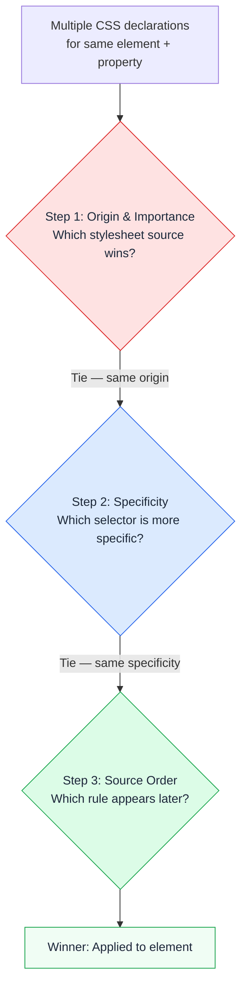
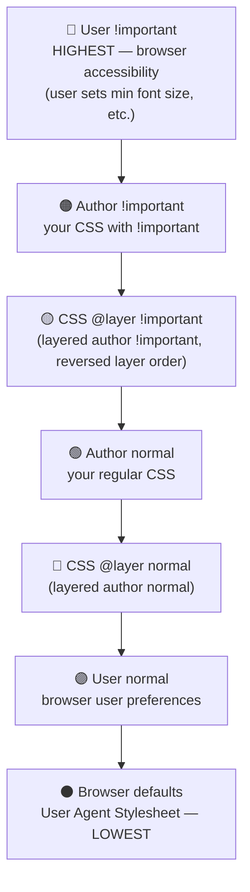
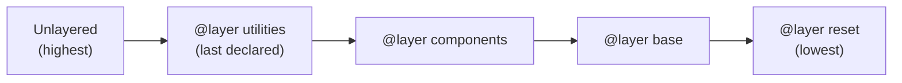

<a id="chapter-30-css-cascade-specificity-inheritance"></a>

# Chapter 30: CSS Cascade, Specificity & Inheritance

[⬅ Previous Chapter](#chapter-29-advanced-css-selectors) | [📖 Main Index](#main-index) | [Next Chapter ➡](#chapter-31-css-colors-backgrounds)

---

## 📌 Learning Objectives

By the end of this chapter, you will:

* Understand the complete CSS cascade algorithm — every step in order
* Master specificity calculation with the `(A,B,C)` system and complex examples
* Know the difference between cascade origin layers and why they matter
* Understand `!important` — when it's acceptable and when it's a code smell
* Know exactly which CSS properties are inherited and which are not
* Use `inherit`, `initial`, `unset`, `revert`, and `revert-layer` keywords correctly
* Understand CSS Cascade Layers (`@layer`) — the modern solution to specificity wars
* Debug cascade conflicts confidently using browser DevTools
* Answer all cascade, specificity, and inheritance interview questions at every level

---

<a id="chapter-index-table-30"></a>

## Chapter Index Table

| Topic No. | Topic Name | Subtopics |
|-----------|------------|-----------|
| 30.1 | [The CSS Cascade — What and Why](#301-the-css-cascade-what-and-why) | Definition<br>Why cascade exists<br>The algorithm overview |
| 30.2 | [Cascade Step 1 — Origin and Importance](#302-cascade-step-1-origin-and-importance) | Author<br>User<br>Browser defaults<br>!important layers |
| 30.3 | [Cascade Step 2 — Specificity](#303-cascade-step-2-specificity) | (A,B,C) system<br>Calculation rules<br>Complex examples<br>Common mistakes |
| 30.4 | [Cascade Step 3 — Source Order](#304-cascade-step-3-source-order) | Last rule wins<br>File order<br>Import order |
| 30.5 | [The `!important` Declaration](#305-the-important-declaration) | How it works<br>When to use<br>When NOT to use<br>!important wars |
| 30.6 | [CSS Inheritance](#306-css-inheritance) | What is inheritance<br>Inherited properties list<br>Non-inherited properties |
| 30.7 | [Inheritance Control Keywords](#307-inheritance-control-keywords) | `inherit`<br>`initial`<br>`unset`<br>`revert`<br>`revert-layer`<br>`all` |
| 30.8 | [CSS Cascade Layers (`@layer`)](#308-css-cascade-layers-layer) | What are layers<br>Syntax<br>Layer order<br>Unlayered styles<br>!important in layers |
| 30.9 | [Debugging the Cascade](#309-debugging-the-cascade) | Browser DevTools<br>Computed tab<br>Styles panel<br>Common issues |
| 30.10 | [Interview Questions](#3010-interview-questions) | Conceptual<br>Scenario<br>Output-based<br>Advanced |
| 30.11 | [Practice Problems](#3011-practice-problems) | Coding<br>Theory<br>Machine Coding |
| 30.12 | [Mini Project](#3012-mini-project) | Cascade & Specificity Visual Debugger |
| 30.13 | [Quick Revision](#3013-quick-revision) | Key Points<br>Traps<br>Bullets |
| 30.14 | [Chapter Summary](#3014-chapter-summary) | Final Takeaways |

---

## 301 The CSS Cascade — What and Why

<a id="301-the-css-cascade-what-and-why"></a>

### 🔷 What is the CSS Cascade?

The **CSS Cascade** is the algorithm browsers use to determine **which CSS declaration wins** when multiple declarations target the same element and property with conflicting values.

The word "Cascading" in Cascading Style Sheets refers directly to this algorithm — styles cascade through a series of rules, and the winner is determined by a strict priority system.

```css
/* Multiple rules targeting the same property: */
p { color: blue; }          /* Rule 1 */
.text { color: green; }     /* Rule 2 */
#intro { color: red; }      /* Rule 3 */

/* <p class="text" id="intro"> — which color wins? */
/* The cascade algorithm decides: RED (#intro wins — highest specificity) */
```

---

### 🔷 Why Does the Cascade Exist?

Without the cascade, CSS would be impossible to use in practice:

```
1. Multiple stylesheets compete:
   - Browser default stylesheet (User Agent)
   - Your reset/normalize.css
   - Third-party library CSS (Bootstrap, etc.)
   - Your component CSS
   - Your page-specific CSS
   - Inline styles

2. Multiple selectors on one page can all target the same element.

3. Without a resolution algorithm, the last rule would ALWAYS win
   — impossible to manage at scale.

4. The cascade gives CSS its power to override defaults,
   compose styles from multiple sources, and maintain
   predictable visual results.
```

---

### 🔷 The Cascade Algorithm — Three Steps in Order



> [!IMPORTANT]
> The three steps are checked **in order**. If Step 1 produces a winner, Steps 2 and 3 are irrelevant. Only if Step 1 is a tie does Step 2 apply. Only if both Step 1 and 2 tie does Step 3 decide.

---

### 🧠 Hinglish Intuition

> CSS Cascade ek **Supreme Court case** ki tarah hai — jab do parties ek property ke liye argue karein:
>
> **Round 1 (Origin):** Kaun zyada authoritative hai? Supreme Court > High Court > Local Court
>
> **Round 2 (Specificity):** Dono same level ke hain? Toh kaun zyada specific argument deta hai?
>
> **Round 3 (Source Order):** Dono bilkul same hain? Toh jo baad mein bola (latest testimony), woh wins.
>
> Yahi CSS cascade hai — ek fair, predictable, documented resolution system.

---

👉 <a href="#chapter-index-table-30">Go to Top 🔝</a>

---

## 302 Cascade Step 1 — Origin and Importance

<a id="302-cascade-step-1-origin-and-importance"></a>

### 🔷 CSS Origin — Three Sources

CSS rules come from three distinct origins:

| Origin | Source | Example |
|--------|--------|---------|
| **Browser (User Agent)** | Built-in browser stylesheet | `h1 { font-size: 2em; }` default |
| **User** | User's custom browser stylesheet | Accessibility preferences |
| **Author** | Developer's CSS | Your `styles.css` |

---

### 🔷 Origin Priority — The Full Stack

When `!important` is NOT involved, the priority order is:

```
Priority (High → Low):
1. Author styles       (your CSS)         ← Highest normal priority
2. User styles         (browser preferences)
3. Browser defaults    (User Agent)        ← Lowest priority
```

When `!important` IS used, the order REVERSES for the `!important` declarations:

```
!important declarations — REVERSED order:
1. User !important      ← HIGHEST (accessibility overrides)
2. Author !important    ← Your !important
3. Browser !important   ← Rare, almost never used

Normal declarations — normal order:
4. Author normal
5. User normal
6. Browser defaults     ← LOWEST
```

---

### 🔷 The Complete Origin + Importance Priority Stack



> [!NOTE]
> The reversal of `!important` origin order ensures **user accessibility preferences always win** over developer styles. If a user has set minimum font size for readability, developer `!important` shouldn't be able to override it.

---

### 🔷 Browser Default (User Agent) Stylesheet

Every browser has a built-in stylesheet that defines default styles for all HTML elements. These are the "unstyled" defaults you see before any CSS:

```css
/* Browser Default Styles (approximate) */
h1 { display: block; font-size: 2em; font-weight: bold; margin: 0.67em 0; }
h2 { display: block; font-size: 1.5em; font-weight: bold; margin: 0.83em 0; }
p  { display: block; margin: 1em 0; }
ul { display: block; list-style-type: disc; margin: 1em 0; padding-left: 40px; }
a  { color: blue; text-decoration: underline; }
a:visited { color: purple; }
strong { font-weight: bold; }
em     { font-style: italic; }
table  { display: table; border-collapse: separate; border-spacing: 2px; }
```

This is why we need **CSS resets** — to normalize these browser defaults before applying our own styles.

---

### 🔷 Why This Matters Practically

```css
/* Understanding why CSS resets are needed: */

/* Browser default: h1 has margin */
/* h1 { margin: 0.67em 0; }  ← from UA stylesheet */

/* Your reset.css overrides it: */
h1 { margin: 0; }  /* Author > Browser — this wins */

/* But if browser had: h1 { margin: 0.67em 0 !important; } */
/* (it doesn't, but hypothetically) */
/* Your reset would LOSE because: */
/* Author !important > Author normal — but User !important > Author !important */

/* Real takeaway: Browser defaults have LOWEST priority */
/* Your author styles always override browser defaults */
/* Unless browser uses !important (extremely rare) */
```

---

### 🧠 Hinglish Intuition

> Origin ko socho jaise **authority levels**:
>
> - **Browser defaults** = Nagar Panchayat ke rules — sabse basic, easily override hote hain
> - **Author CSS** = State Government — browser se zyada powerful
> - **User preferences** = Central Government — state ko override kar sakta hai (accessibility)
>
> **`!important` reversal** = Emergency powers — jo normally sab se upar ho, woh "emergency" mein peeche ho jaata hai. User ki accessibility settings emergency hain — developer ka `!important` user ki accessibility override nahi kar sakta.
>
> Ye design deliberate hai — blindness ya low vision wale users apna minimum font size set karte hain. Agar developer `!important` se override kar sake, toh accessibility break ho jaaye.

---

👉 <a href="#chapter-index-table-30">Go to Top 🔝</a>

---

## 303 Cascade Step 2 — Specificity

<a id="303-cascade-step-2-specificity"></a>

### 🔷 The Specificity System

Specificity is a **three-column weight** `(A, B, C)` calculated from the selectors in a CSS rule:

```
(A, B, C)
 |  |  |
 |  |  └── C: Count of element selectors (p, h1, div) and pseudo-elements (::before)
 |  └───── B: Count of class (.card), attribute ([type]), pseudo-class (:hover) selectors
 └──────── A: Count of ID selectors (#hero, #nav)

Inline style → (1,0,0,0) — a FOURTH column, beats all selectors
!important   → Separate layer entirely
```

---

### 🔷 Specificity Calculation — Complete Reference

```css
/* ===== ZERO SPECIFICITY ===== */
*                    /* (0,0,0) — universal */
div > * + *          /* (0,0,1) — only div element counts; combinators and * = 0 */

/* ===== C COLUMN — ELEMENTS AND PSEUDO-ELEMENTS ===== */
p                    /* (0,0,1) */
h1                   /* (0,0,1) */
div                  /* (0,0,1) */
p::first-line        /* (0,0,2) — p(1) + ::first-line(1) */
li::before           /* (0,0,2) — li(1) + ::before(1) */
div p span           /* (0,0,3) — three elements */
article section p    /* (0,0,3) */

/* ===== B COLUMN — CLASSES, ATTRIBUTES, PSEUDO-CLASSES ===== */
.card                /* (0,1,0) */
[type="email"]       /* (0,1,0) — attribute selector = class weight */
:hover               /* (0,1,0) — pseudo-class = class weight */
:nth-child(2)        /* (0,1,0) */
.card.featured       /* (0,2,0) — two classes */
.card:hover          /* (0,2,0) — class + pseudo-class */
[type]:focus         /* (0,2,0) — attribute + pseudo-class */
.nav.open:hover      /* (0,3,0) — three class-weight selectors */

/* ===== A COLUMN — ID SELECTORS ===== */
#hero                /* (1,0,0) */
#nav                 /* (1,0,0) */
#hero.featured       /* (1,1,0) — ID + class */
#nav > ul > li > a   /* (1,0,3) — ID + three elements */

/* ===== MIXED SELECTORS ===== */
div.card             /* (0,1,1) — class + element */
nav a:hover          /* (0,1,2) — pseudo-class + two elements */
header#site-header   /* (1,0,1) — ID + element */
.nav-list > li.active > a  /* (0,2,2) — 2 classes + 2 elements */
#main article.post h2 { }  /* (1,1,2) — ID + class + 2 elements */

/* ===== :NOT(), :IS(), :WHERE() ===== */
:not(p)              /* (0,0,1) — argument 'p' adds (0,0,1) */
:not(.card)          /* (0,1,0) — argument '.card' adds (0,1,0) */
:not(#hero)          /* (1,0,0) — argument '#hero' adds (1,0,0) */
p:not(.special)      /* (0,1,1) — p(0,0,1) + :not(.special)(0,1,0) */

:is(h1, .title, #hero)  /* (1,0,0) — most specific arg: #hero */
:is(h1, h2, h3)         /* (0,0,1) — all elements */
:where(h1, .title, #hero) /* (0,0,0) — always zero */

/* ===== INLINE STYLE — SEPARATE FOURTH COLUMN ===== */
/* <p style="color: red;"> */
/* Specificity: (1,0,0,0) — beats ALL selector-based rules */
/* Only !important author/user styles can override */
```

---

### 🔷 Specificity Comparison — Column Rules

```css
/* RULE: Compare columns LEFT TO RIGHT. Stop at first difference. */
/* The column with the higher number WINS. */
/* Columns NEVER carry over. 10+1 in C does NOT beat 1 in B. */

/* Example 1: A column decides */
#hero { color: red; }      /* (1,0,0) */
.card.featured { color: blue; } /* (0,2,0) */
/* A: 1 vs 0 → #hero WINS — B and C not even checked */

/* Example 2: A tied, B decides */
#hero.card { color: red; }     /* (1,1,0) */
#hero.card.featured { color: blue; } /* (1,2,0) */
/* A: 1 vs 1 → TIE */
/* B: 1 vs 2 → second rule WINS */
/* C: not checked */

/* Example 3: A and B tied, C decides */
.card p span { color: red; }   /* (0,1,2) */
.card p { color: blue; }       /* (0,1,1) */
/* A: 0 vs 0 → TIE */
/* B: 1 vs 1 → TIE */
/* C: 2 vs 1 → first rule WINS */

/* Example 4: All tied — SOURCE ORDER decides */
.card { color: red; }    /* (0,1,0) — declared first */
.featured { color: blue; } /* (0,1,0) — declared later → WINS */
/* A: 0 vs 0, B: 1 vs 1, C: 0 vs 0 → all tied */
/* Source order: later rule wins */

/* CRITICAL: 100 C-column selectors do NOT beat 1 B-column selector */
div div div div div div div div div div p /* (0,0,11) */
.card                                      /* (0,1,0) */
/* B: 0 vs 1 → .card WINS despite 11 element selectors */
```

---

### 🔷 Visual Specificity Calculator

```
Selector: #nav > .menu-list li:first-child > a:hover

Breaking it down:
  #nav          → ID selector    → A+1 → A=1
  .menu-list    → class selector → B+1 → B=1
  li            → element        → C+1 → C=1
  :first-child  → pseudo-class   → B+1 → B=2
  a             → element        → C+1 → C=2
  :hover        → pseudo-class   → B+1 → B=3
  >  (combinator) → 0
  > (combinator)  → 0

Final: (A=1, B=3, C=2) = (1,3,2)
```

```css
/* Verify: */
#nav > .menu-list li:first-child > a:hover {
  color: white;
}
/* Specificity: (1,3,2) */
```

---

### 🔷 Specificity in DevTools

```
Chrome DevTools → Elements panel → Styles tab
- Shows all rules targeting selected element
- Struck-through rules = overridden by higher specificity
- Hover over selector to see specificity tooltip
- Computed tab shows final applied values

Firefox DevTools → Inspector → Rules tab
- Shows specificity as (A,B,C) next to each selector
- Overridden properties are greyed out
```

---

### 🧠 Hinglish Intuition

> Specificity ek **salary scale** ki tarah hai:
>
> - **A column (ID)** = Director level salary: ₹1,00,000/month
> - **B column (Class/Attribute/Pseudo-class)** = Manager level: ₹10,000/month
> - **C column (Element/Pseudo-element)** = Employee level: ₹1,000/month
>
> Ab salary compare karo:
> - `#hero` = ₹1,00,000 (Director)
> - `.card.featured` = ₹10,000 + ₹10,000 = ₹20,000 (Two managers)
> - Director WINS — chahe 100 managers bhi ho jaayein
>
> **Critical insight:** 10 employees (₹10,000 total) 1 manager (₹10,000) se beat nahi kar sakte — ye salaries add nahi hoti alag categories mein. Columns are independent.
>
> `(0,0,100)` never beats `(0,1,0)` — just like 100 employees never earn more than 1 manager in separate pay scales.

---

👉 <a href="#chapter-index-table-30">Go to Top 🔝</a>

---

## 304 Cascade Step 3 — Source Order

<a id="304-cascade-step-3-source-order"></a>

### 🔷 What is Source Order?

Source order is the **tiebreaker** — when two rules have identical origin AND identical specificity, the rule that appears **later** in the CSS source wins.

```css
/* Same specificity (0,1,0): */
.btn-primary  { background: blue; }   /* Declared first */
.btn-active   { background: green; }  /* Declared later → WINS for element with both */

/* <button class="btn-primary btn-active"> → background is GREEN */
/* .btn-active comes after .btn-primary in the CSS file */
/* Note: The ORDER OF CLASSES IN HTML doesn't matter */
/* Only the order in CSS matters */
```

---

### 🔷 Source Order Across Multiple Files

```html
<!-- HTML: The order of <link> tags matters -->
<head>
  <link rel="stylesheet" href="reset.css">      <!-- Loaded 1st -->
  <link rel="stylesheet" href="base.css">       <!-- Loaded 2nd -->
  <link rel="stylesheet" href="components.css"> <!-- Loaded 3rd -->
  <link rel="stylesheet" href="theme.css">      <!-- Loaded 4th — last = highest source order -->

  <!-- Internal <style> comes AFTER all links → wins over all linked CSS -->
  <style>
    .card { border-color: blue; }  /* Overrides components.css if same specificity */
  </style>
</head>
```

```css
/* reset.css */
.card { padding: 0; }       /* Set first */

/* components.css */
.card { padding: 1.5rem; }  /* Set later — overrides reset.css */

/* theme.css */
.card { padding: 2rem; }    /* Set even later — overrides both */

/* Final result: padding: 2rem */
```

---

### 🔷 Source Order Within a File

```css
/* IMPORTANT: Order within a CSS file matters */

/* Example 1: Hover state order */
/* ❌ Wrong order */
a:hover   { color: darkblue; }
a:link    { color: blue; }  /* Same specificity but declared later */
/* Result: :hover state shows blue, not darkblue — :link overrides :hover */

/* ✅ Correct LVHA order */
a:link    { color: blue; }      /* 1. unvisited */
a:visited { color: purple; }    /* 2. visited */
a:hover   { color: darkblue; }  /* 3. hover — overrides :link and :visited */
a:active  { color: red; }       /* 4. active — overrides all above */

/* Example 2: Media query source order */
/* Mobile-first approach */
.card { padding: 1rem; }       /* Base: mobile */
@media (min-width: 768px) {
  .card { padding: 1.5rem; }   /* Tablet: declared later — wins on tablet+ */
}
@media (min-width: 1200px) {
  .card { padding: 2rem; }     /* Desktop: declared even later — wins on desktop */
}

/* Desktop-first approach */
.card { padding: 2rem; }       /* Base: desktop */
@media (max-width: 768px) {
  .card { padding: 1rem; }     /* Mobile: overrides base when query matches */
}
```

---

### 🔷 HTML Class Order Does NOT Matter

```html
<!-- HTML class order is IRRELEVANT to CSS specificity/source order -->
<div class="card featured">...</div>
<div class="featured card">...</div>
<!-- Both elements will look IDENTICAL -->
<!-- CSS cares about declaration order in .css file, NOT HTML class order -->
```

```css
.card     { background: white; }  /* (0,1,0) — declared first */
.featured { background: gold; }   /* (0,1,0) — declared later → WINS */

/* Both <div class="card featured"> AND <div class="featured card"> */
/* will have background: gold — because .featured is declared later in CSS */
```

> [!IMPORTANT]
> The order of class names in the HTML `class` attribute is completely irrelevant to CSS cascade. Only the order in the CSS file matters for source order tiebreaking.

---

### 🧠 Hinglish Intuition

> Source order ek **court testimony** ki tarah hai — jo last mein bola, woh record mein last aata hai aur zyada "fresh" maana jaata hai.
>
> Lekin ye sirf tiebreaker hai — pehle origin aur specificity check hoti hai. Source order sirf tab matter karta hai jab baaki sab equal ho.
>
> **Common mistake:** Sochna ki HTML mein `class="featured card"` se `.featured` pehle apply hoga. Nahi! CSS file mein jo baad mein hai, woh jeetta hai — HTML class order irrelevant hai.
>
> **LVHA** rule bhi source order ka example hai — `:hover` ko `:link` ke baad declare karo, warna hover state override ho jaayegi.

---

👉 <a href="#chapter-index-table-30">Go to Top 🔝</a>

---

## 305 The `!important` Declaration

<a id="305-the-important-declaration"></a>

### 🔷 What Does `!important` Do?

`!important` adds emphasis to a CSS declaration that **elevates it outside normal specificity rules** into a separate "important" layer that overrides all normal declarations regardless of specificity.

```css
/* Syntax */
property: value !important;

/* Examples */
.card { color: red !important; }
#hero { background: blue !important; }
p { font-size: 1rem !important; }
```

---

### 🔷 How `!important` Fits in the Cascade

```css
/* Without !important: #hero wins (higher specificity) */
#hero { color: red; }       /* (1,0,0) — wins normally */
p { color: blue; }          /* (0,0,1) — loses */

/* With !important on p: p wins despite lower specificity */
#hero { color: red; }       /* (1,0,0) normal */
p { color: blue !important; } /* (0,0,1) !important — WINS */
/* !important elevates to separate layer above all normal declarations */

/* When TWO rules both have !important: */
/* Normal specificity rules apply WITHIN the !important layer */
#hero { color: red !important; }   /* (1,0,0) !important */
p { color: blue !important; }      /* (0,0,1) !important */
/* Applied to <p id="hero">: RED wins */
/* Both !important — so specificity decides within the !important layer */
/* (1,0,0) > (0,0,1) → red wins */
```

---

### 🔷 When `!important` is Acceptable

```css
/* ===== ACCEPTABLE USE 1: Utility/helper classes ===== */
/* These must always win regardless of what component they're applied to */
.hidden    { display: none !important; }
.sr-only   { position: absolute !important; clip: rect(0,0,0,0) !important; }
.no-scroll { overflow: hidden !important; }
.truncate  { overflow: hidden !important; white-space: nowrap !important; text-overflow: ellipsis !important; }
.clearfix::after { content: '' !important; display: table !important; clear: both !important; }

/* ===== ACCEPTABLE USE 2: Overriding third-party CSS ===== */
/* You cannot modify Bootstrap source — need to override specific rules */
/* Bootstrap sets: .btn { padding: 0.375rem 0.75rem; } with high specificity */
.my-btn { padding: 12px 28px !important; }  /* Override Bootstrap */

/* ===== ACCEPTABLE USE 3: Accessibility overrides ===== */
/* Ensure accessibility-critical styles always apply */
[aria-hidden="true"] { display: none !important; }
.focus-visible:focus { outline: 3px solid #2563eb !important; }

/* ===== ACCEPTABLE USE 4: Debugging (TEMPORARY ONLY) ===== */
/* Quickly test if a style is applying */
.suspect-element { background: hotpink !important; } /* Remove before production */
```

---

### 🔷 When `!important` is a Code Smell

```css
/* ===== AVOID: Using !important to fix specificity problems ===== */
/* ❌ The problem */
#sidebar .widget h3 { color: blue; }  /* (1,0,2) — too specific */
.custom-heading { color: red; }       /* (0,1,0) — loses */

/* ❌ Bad fix: adding !important */
.custom-heading { color: red !important; } /* "works" but causes escalation */

/* ✅ Better fix: match or exceed specificity properly */
.sidebar .custom-heading { color: red; }  /* (0,2,0) — beats (1,0,2)? NO */
/* Actually: still loses to ID (1,0,2). Need to include the ID: */
#sidebar .custom-heading { color: red; }  /* (1,1,0) — beats (1,0,2) */

/* ✅ Best fix: refactor original selector to be less specific */
.sidebar-widget h3 { color: blue; }  /* (0,1,1) — easy to override now */
.custom-heading { color: red; }      /* (0,1,0) — loses... hmm */
/* Solution: .sidebar-widget .custom-heading { color: red; } — (0,2,0) wins */

/* ===== THE ESCALATION PROBLEM ===== */
/* Step 1: Original rule */
.component h2 { color: blue; }  /* (0,1,1) */

/* Step 2: Override needed */
.custom-h2 { color: red !important; }  /* Works but... */

/* Step 3: Now someone needs to override the !important */
.special-h2 { color: green !important; }
/* Oops — now which !important wins? Back to specificity within !important layer */

/* Step 4: The "war" escalates until code is unmaintainable */
/* Avoid this entirely with good specificity architecture */
```

---

### 🔷 `!important` Rules Summary

```
!important is FINE for:
✅ Single-purpose utility classes (.hidden, .sr-only, .no-scroll)
✅ Overriding third-party CSS you cannot modify
✅ Temporary debugging (REMOVE before production)

!important is a CODE SMELL for:
❌ Fixing specificity problems (refactor the selector instead)
❌ Getting quick wins in complex CSS (creates future maintenance debt)
❌ Multiple competing !important rules (start of a specificity war)
❌ Any inline style override via stylesheet (fix HTML structure instead)
```

---

### 🧠 Hinglish Intuition

> `!important` ek **emergency override button** ki tarah hai — jaise fire alarm ka red button. Hamesha available hai, lekin sirf emergency mein use karo.
>
> Agar aap `!important` isliye use kar rahe ho kyunki "kuch kaam nahi kar raha" — that's a signal ki CSS architecture mein problem hai, `!important` solution nahi hai.
>
> **!important wars:** Ek baar `!important` laga do, doosra developer `!important` se override karne ki koshish karega. Phir pehla developer aur zyada specific `!important` lagayega. Eventually — unmaintainable mess. Ye "specificity arms race" hai.
>
> **Good rule:** Agar aap `!important` likhte waqt uncomfortable feel karo — that's the right instinct. Refactor karo.

---

👉 <a href="#chapter-index-table-30">Go to Top 🔝</a>

---

## 306 CSS Inheritance

<a id="306-css-inheritance"></a>

### 🔷 What is CSS Inheritance?

CSS inheritance is the mechanism by which certain CSS properties **automatically flow from parent elements to their child elements** when no explicit value is set on the child.

```html
<article style="color: #1e293b; font-family: Arial;">
  <h2>Heading</h2>    <!-- Inherits: color #1e293b, font-family Arial -->
  <p>Paragraph       <!-- Inherits: color #1e293b, font-family Arial -->
    <strong>bold</strong>  <!-- Also inherits -->
    <em>italic</em>        <!-- Also inherits -->
  </p>
</article>
```

```css
/* Set on body — inherited by ALL descendants */
body {
  font-family: 'Segoe UI', system-ui, sans-serif; /* Inherited ✅ */
  font-size:   1rem;    /* Inherited ✅ */
  color:       #1e293b; /* Inherited ✅ */
  line-height: 1.6;     /* Inherited ✅ */
  background:  #f8fafc; /* NOT inherited ❌ */
  padding:     2rem;    /* NOT inherited ❌ */
  border:      1px solid #ddd; /* NOT inherited ❌ */
}

/* Descendants automatically get inherited typography */
/* No need to set font-family on every <h1>, <p>, <span>, etc. */
```

---

### 🔷 Inherited Properties — Complete Reference

These properties inherit from parent to child by default:

```css
/* ===== TYPOGRAPHY (ALL INHERITED) ===== */
color             /* Text color */
font-family       /* Font family */
font-size         /* Font size — children get inherited COMPUTED value */
font-style        /* italic, normal */
font-variant      /* small-caps, normal */
font-weight       /* bold, normal, 100-900 */
font-stretch      /* condensed, normal, expanded */
line-height       /* Line spacing */
letter-spacing    /* Character spacing */
word-spacing      /* Word spacing */
text-align        /* left, center, right, justify */
text-indent       /* First line indent */
text-transform    /* uppercase, lowercase, capitalize */
text-decoration   /* Partially — color and style inherit, but underline itself doesn't */
white-space       /* nowrap, pre, etc. */
word-break        /* break-word, break-all */
overflow-wrap     /* break-word */
direction         /* ltr, rtl */
writing-mode      /* horizontal-tb, vertical-rl */
unicode-bidi      /* Bidi algorithm */
tab-size          /* Tab character width */

/* ===== VISIBILITY ===== */
visibility        /* visible, hidden (NOTE: not display) */
opacity           /* Partially — creates stacking context */
cursor            /* pointer, default, etc. */

/* ===== LIST PROPERTIES ===== */
list-style-type   /* disc, circle, decimal */
list-style-image  /* Custom list marker image */
list-style-position /* inside, outside */
list-style        /* Shorthand — all three above */

/* ===== TABLE PROPERTIES ===== */
border-collapse   /* collapse, separate */
border-spacing    /* Space between table cells */
caption-side      /* top, bottom */
empty-cells       /* show, hide */

/* ===== QUOTE PROPERTIES ===== */
quotes            /* open-quote, close-quote values */

/* ===== POINTER EVENTS ===== */
pointer-events    /* none, auto — SVG specifically */

/* ===== MISC ===== */
speak             /* CSS speech */
```

---

### 🔷 Non-Inherited Properties — Complete Reference

These properties do NOT inherit — each element starts with its initial value:

```css
/* ===== BOX MODEL — NONE INHERITED ===== */
width             /* auto */
height            /* auto */
min-width, max-width
min-height, max-height
margin            /* 0 */
padding           /* 0 */
border            /* medium none currentColor */
border-radius     /* 0 */
box-sizing        /* content-box */
overflow          /* visible */

/* ===== BACKGROUND — NONE INHERITED ===== */
background-color  /* transparent */
background-image  /* none */
background-repeat /* repeat */
background-size   /* auto */
background-position /* 0% 0% */
background        /* shorthand */

/* ===== DISPLAY AND LAYOUT — NONE INHERITED ===== */
display           /* inline */
position          /* static */
top, right, bottom, left
float             /* none */
clear             /* none */
z-index           /* auto */
flex              /* shorthand */
grid              /* shorthand */

/* ===== VISUAL — MOSTLY NOT INHERITED ===== */
box-shadow        /* none */
text-shadow       /* none (EXCEPTION — text-shadow IS inherited!) */
filter            /* none */
transform         /* none */
transition        /* none */
animation         /* none */

/* ===== EXCEPTION ===== */
text-shadow { } /* IS inherited — despite being visual, not text property */
```

> [!IMPORTANT]
> `text-shadow` IS inherited despite looking like a visual/layout property. This surprises many developers.

---

### 🔷 Why Certain Properties Inherit

The logic behind which properties inherit is practical:

```
✅ INHERIT — Properties that make sense to flow through text:
- Typography (font, color, size) — all text in a section should share style
- List styles — items share their parent list's bullet style
- Text alignment — paragraphs inherit alignment from container

❌ DON'T INHERIT — Properties that would cause chaos if they did:
- Background — every nested element would have parent's background
- Border — every element inside a bordered box would also have border
- Margin/Padding — spacing would compound unpredictably
- Width/Height — child would inherit parent's dimensions — chaos
- Display — every child would be 'flex' if parent is 'display: flex'
```

---

### 🔷 Inheritance in Action

```html
<article class="blog-post">
  <header>
    <h1>Article Title</h1>
    <p class="byline">By Author • Date</p>
  </header>
  <section>
    <h2>Section</h2>
    <p>Content with <strong>bold</strong> and <a href="#">link</a></p>
    <ul>
      <li>Item one</li>
      <li>Item two</li>
    </ul>
  </section>
</article>
```

```css
/* Set typography on the article — ALL descendants inherit */
.blog-post {
  font-family: 'Georgia', serif;  /* ✅ All text uses Georgia */
  font-size:   1.1rem;            /* ✅ Base size for all text */
  color:       #1e293b;           /* ✅ All text is dark */
  line-height: 1.8;               /* ✅ All lines have 1.8 spacing */

  /* These do NOT inherit: */
  background:    white;           /* ❌ Children don't inherit white background */
  border:        1px solid #ddd;  /* ❌ Children don't get border */
  padding:       2rem;            /* ❌ Children don't get padding */
}

/* h1 inherits font-family, color, line-height from .blog-post */
/* But overrides font-size with its own value: */
.blog-post h1 { font-size: 2.5rem; } /* Overrides inherited 1.1rem */

/* h2 also overrides font-size */
.blog-post h2 { font-size: 1.75rem; }

/* Links inherit color — but browser default overrides this */
/* We need to explicitly set: */
.blog-post a { color: #2563eb; } /* Override browser default blue */

/* strong inherits everything — naturally shows bold text */
```

---

### 🔷 The font-size Inheritance Gotcha

```css
/* ⚠️ font-size inheritance passes the COMPUTED value, not the declared value */
/* This is important for em units */

body { font-size: 16px; }        /* Computed: 16px */
article { font-size: 1.25em; }   /* Computed: 16 × 1.25 = 20px */
p { font-size: 1em; }            /* Inherits 20px (article's computed), em × 1 = 20px */
span { font-size: 0.8em; }       /* Inherits 20px (p's computed), 20 × 0.8 = 16px */

/* Compare rem (always relative to html/root): */
span { font-size: 0.8rem; }      /* Always: 16px × 0.8 = 12.8px — predictable! */
```

---

### 🧠 Hinglish Intuition

> CSS inheritance ek **family genetics** ki tarah hai — kuch traits parents se automatically bacchon mein aate hain:
>
> **Inherits (genes jo transfer hote hain):** Color, font, line-height — text related sab kuch
>
> **Doesn't inherit (har vyakti apna khud banata hai):** Background, border, margin, padding, width — har element ka apna body hai
>
> **Practical wisdom:** `body { font-family: sans-serif; color: #333; }` ek baar likho — poori website ke liye. Ye inheritance ki power hai. Bina inheritance ke, har `p`, `h1`, `li`, `td` pe separately font likhna padta.
>
> **`text-shadow` exception** — ye inherited hai even though visual lagta hai. Interview mein ye trap question aata hai!

---

👉 <a href="#chapter-index-table-30">Go to Top 🔝</a>

---

## 307 Inheritance Control Keywords

<a id="307-inheritance-control-keywords"></a>

### 🔷 Five CSS Keywords for Controlling Inheritance

These keywords can be used as values for ANY CSS property to control how inheritance behaves:

```css
property: inherit;       /* Force inherit from parent */
property: initial;       /* Reset to browser-spec initial value */
property: unset;         /* inherit if inherited, initial if not */
property: revert;        /* Reset to browser's UA stylesheet value */
property: revert-layer;  /* Reset to previous cascade layer */
```

---

### 🔷 `inherit` — Force Inheritance

Forces a property to inherit from its parent, even if it normally wouldn't:

```css
/* Use case 1: Make non-inheritable property inherit */
.child {
  background-color: inherit; /* Child gets parent's background */
  border:           inherit; /* Child gets parent's border */
  padding:          inherit; /* Child gets parent's padding */
  width:            inherit; /* Child gets parent's width */
}

/* Use case 2: Buttons inherit font from parent (common reset) */
button, input, select, textarea {
  font-family: inherit; /* Override browser default that doesn't inherit */
  font-size:   inherit;
  color:       inherit;
}

/* Use case 3: Links in navigation inherit parent color */
nav a { color: inherit; }  /* Don't use blue link color — inherit nav's color */

/* Use case 4: Restore inheritance overridden by another rule */
.special-container p { color: #666; }  /* Sets color */
.special-container .reset-color { color: inherit; } /* Override back to inherited */

/* Use case 5: currentColor keyword (related to inherit) */
/* currentColor uses the element's own color value */
button {
  color:        #2563eb;
  border-color: currentColor; /* Border matches text color — same as inherit for color */
  box-shadow:   0 0 0 3px currentColor;
}
```

---

### 🔷 `initial` — Reset to Specification Default

Resets a property to its **initial value as defined in the CSS specification** — NOT the browser default, not the inherited value.

```css
/* Initial values from the CSS specification */
/* color: initial          → black (spec default, not browser default) */
/* display: initial        → inline (spec says inline is initial) */
/* font-size: initial      → medium (spec default) */
/* background-color: initial → transparent */
/* margin: initial         → 0 */
/* border: initial         → medium none currentColor */

/* Use case: Reset a property completely */
.reset-color { color: initial; }  /* Forces black, ignores inheritance */
.reset-display { display: initial; } /* Forces inline — careful! */

/* Difference from revert: */
/* initial → CSS spec initial value */
/* revert  → browser's UA stylesheet value */

/* Example where they differ: */
/* h1 { display: initial; }  → display: inline (spec initial) */
/* h1 { display: revert; }   → display: block  (UA stylesheet default for h1) */
/* The difference: browser sets h1 to block; spec says inline is initial */
```

---

### 🔷 `unset` — Smart Reset

`unset` applies different behavior based on whether the property is naturally inherited:
- If the property **inherits** by default → `unset` acts like `inherit`
- If the property **doesn't inherit** → `unset` acts like `initial`

```css
/* For inherited properties (color, font): unset = inherit */
.text { color: unset; }     /* Same as color: inherit */
.text { font-size: unset; } /* Same as font-size: inherit */

/* For non-inherited properties (background, border): unset = initial */
.box { background: unset; }  /* Same as background: initial (transparent) */
.box { padding: unset; }     /* Same as padding: initial (0) */

/* USE CASE: The 'all: unset' pattern */
/* Reset ALL properties to their "natural" state */
.completely-reset {
  all: unset;
  /* All inherited props → inherit from parent */
  /* All non-inherited props → initial value */
  /* Then add only what you need: */
  display: block;
  font-family: inherit;
}

/* Practical: Reset a third-party widget */
.my-widget {
  all: unset;
  /* Now start fresh */
  display: flex;
  padding: 1rem;
  background: white;
}
```

---

### 🔷 `revert` — Reset to Browser Stylesheet

`revert` resets a property to the **user agent (browser) stylesheet value** — as if no author CSS existed for that property.

```css
/* revert vs initial: */
h1 { display: initial; }  /* → inline (CSS spec says so) */
h1 { display: revert; }   /* → block (browser says h1 is block) */

/* Practical use: Remove all custom styles from an element */
.button {
  all: revert; /* Remove ALL our styles — back to browser defaults */
}
/* Now <button class="button"> looks like a plain browser button again */

/* Use case: In a component that should look "native" */
.native-button {
  all: revert;
  /* Now it looks like a regular browser button */
}

/* Use case: Email template where you want browser defaults */
.email-content * {
  all: revert;
}

/* Difference summary: */
/* initial   → CSS specification's initial value (abstract) */
/* revert    → Browser's actual stylesheet value (practical) */
/* For most properties they're the same, but for display on h1, p, etc. they differ */
```

---

### 🔷 `revert-layer` — Reset Within Cascade Layers

Used within `@layer` to reset a property to the value it had in the previous layer:

```css
@layer base {
  .card { background: white; padding: 1rem; }
}

@layer theme {
  .card {
    background: #eff6ff;
    padding: revert-layer; /* Reverts to base layer value: 1rem */
  }
}

/* revert-layer: "Undo this layer's change, use the previous layer's value" */
```

---

### 🔷 `all` — Reset All Properties

The `all` shorthand applies one of the keywords to EVERY CSS property at once:

```css
/* all: initial — every property to spec initial value */
.full-reset { all: initial; }

/* all: inherit — every property inherits from parent */
.full-inherit { all: inherit; }

/* all: unset — smartly resets based on inheritability */
.smart-reset { all: unset; }

/* all: revert — every property back to browser default */
.browser-reset { all: revert; }

/* Practical usage: */
/* Reset a button to look native: */
.native { all: revert; }

/* Isolate a component from page styles: */
.isolated-widget {
  all: initial;
  /* Then apply only what the widget needs */
  display: block;
  font-family: system-ui, sans-serif;
  font-size: 1rem;
  color: #1e293b;
}
```

---

### 🔷 Complete Keyword Comparison

| Keyword | Inherited property | Non-inherited property | Common Use |
|---------|-------------------|----------------------|------------|
| `inherit` | Gets parent value | Gets parent value (forced) | Force non-inherited to inherit |
| `initial` | CSS spec initial | CSS spec initial | Hard reset ignoring browser |
| `unset` | Gets parent value (= inherit) | CSS spec initial (= initial) | Smart reset |
| `revert` | Browser UA value | Browser UA value | Reset to browser defaults |
| `revert-layer` | Previous layer value | Previous layer value | Cascade layer management |

---

### 🧠 Hinglish Intuition

> Ye keywords ek **time machine** ki tarah hain:
>
> - `inherit` = "Apne parent se lo" — koi bhi property parent se
> - `initial` = "CSS specification ki book mein jo likha hai, woh lo" — factory settings
> - `unset` = "Samajhdar choice karo — agar normally inherit karta hai toh parent se lo, nahi toh initial"
> - `revert` = "Browser ne initially kya set kiya tha, woh lo" — browser defaults
> - `revert-layer` = "Previous CSS layer ne kya set kiya tha, woh lo"
>
> **`all: unset`** — ek element ko clean slate pe laane ka fastest tarika. Phir sirf jo chahiye wo apply karo. Third-party widgets reset karne ke liye popular.
>
> **Interview tip:** `initial` vs `revert` ka fark pucha jaata hai. `display: initial` = inline (spec); `display: revert` = block (for h1/p — browser sets these to block).

---

👉 <a href="#chapter-index-table-30">Go to Top 🔝</a>

---

## 308 CSS Cascade Layers (`@layer`)

<a id="308-css-cascade-layers-layer"></a>

### 🔷 What are Cascade Layers?

CSS Cascade Layers (`@layer`) are a modern CSS feature that allows developers to **explicitly define the order of specificity precedence** between groups of styles — without relying on selector specificity or source order hacks.

Introduced in 2022 and supported in all modern browsers (Chrome 99+, Firefox 97+, Safari 15.4+).

---

### 🔷 The Problem Layers Solve

```css
/* THE CLASSIC PROBLEM: Specificity conflicts */

/* Third-party library uses: */
.btn.btn-primary { background: blue; }  /* (0,2,0) */

/* You want to override: */
.my-btn { background: red; }  /* (0,1,0) — LOSES to library! */

/* "Solution" 1: Increase specificity — ugly */
.page-content .wrapper .my-btn { background: red; }  /* (0,3,0) — wins, but fragile */

/* "Solution" 2: !important — creates wars */
.my-btn { background: red !important; }  /* Works but unmaintainable */

/* REAL SOLUTION: Cascade Layers */
@layer library {
  .btn.btn-primary { background: blue; }
}

@layer custom {
  .my-btn { background: red; }  /* (0,1,0) — wins because custom > library layer */
}
/* Later layers ALWAYS win over earlier layers, regardless of specificity */
```

---

### 🔷 `@layer` Syntax — Complete Reference

```css
/* ===== METHOD 1: Define layer order first, then fill them ===== */
/* Layer order declaration — establishes precedence */
@layer reset, base, theme, components, utilities;
/* Later in the list = higher priority */
/* utilities > components > theme > base > reset */

/* Fill layers (can be in any order after declaration) */
@layer reset {
  * { box-sizing: border-box; margin: 0; padding: 0; }
}

@layer base {
  body { font-family: system-ui; font-size: 1rem; color: #1e293b; }
  h1, h2, h3 { font-weight: 700; line-height: 1.2; }
  a { color: #2563eb; text-decoration: underline; }
}

@layer theme {
  :root {
    --color-primary: #2563eb;
    --color-secondary: #7c3aed;
    --font-base: 'Segoe UI', system-ui, sans-serif;
  }
  body { font-family: var(--font-base); }
}

@layer components {
  .btn { display: inline-flex; padding: 10px 24px; border-radius: 8px; font-weight: 600; }
  .btn-primary { background: var(--color-primary); color: white; }
  .card { background: white; border-radius: 12px; box-shadow: 0 2px 8px rgba(0,0,0,0.08); }
}

@layer utilities {
  .hidden  { display: none; }
  .sr-only { position: absolute; width: 1px; height: 1px; overflow: hidden; clip: rect(0,0,0,0); }
  .mt-4    { margin-top: 1rem; }
  .text-center { text-align: center; }
}

/* ===== METHOD 2: Inline (layer created and filled together) ===== */
@layer reset {
  * { box-sizing: border-box; }
}

@layer components {
  .card { border-radius: 12px; }
}
/* Layer order = order of first appearance: reset < components */

/* ===== METHOD 3: Anonymous layers (no name) ===== */
@layer {
  /* Unlabeled layer — can't be referenced later */
  .widget { color: gray; }
}
/* Each @layer {} block without a name creates a new anonymous layer */

/* ===== METHOD 4: Import with layer assignment ===== */
@import url('bootstrap.css') layer(bootstrap);
@import url('theme.css') layer(theme);
/* Now bootstrap styles are in their own layer */
```

---

### 🔷 Layer Priority — The Key Rule

```css
/* RULE: Styles in LATER layers ALWAYS beat earlier layers */
/* This is regardless of specificity! */

@layer low-priority, high-priority;  /* high > low */

@layer high-priority {
  p { color: red; }  /* (0,0,1) */
}

@layer low-priority {
  #super-specific-id p.extra.classes { color: blue; }  /* (1,2,1) — MUCH higher specificity */
}

/* Applied to <p>: RED wins */
/* Even though low-priority has (1,2,1) vs high-priority's (0,0,1) */
/* Layer order trumps specificity BETWEEN layers */
/* Specificity only matters WITHIN the same layer */
```

---

### 🔷 Unlayered Styles Beat All Layers

```css
/* IMPORTANT: Styles NOT in any @layer beat ALL layered styles */

@layer utilities { .hidden { display: none; } }
@layer components { .card { display: block; } }

/* Unlayered style — beats BOTH layers */
.my-display { display: flex; }

/* Priority order: */
/* unlayered styles > last @layer > ... > first @layer */
```



---

### 🔷 `!important` in Layers — Reversed Order

```css
/* !important reverses layer order for important declarations */

@layer base, components, utilities;

/* Normal: utilities > components > base */
/* !important: base !important > components !important > utilities !important */

@layer base {
  .btn { background: gray !important; }  /* base !important — WINS */
}

@layer utilities {
  .btn { background: blue !important; }  /* utilities !important — LOSES to base */
}

/* This mirrors the author/user !important reversal */
/* Important: lower layers get to enforce their !important rules */
```

---

### 🔷 Real-World Cascade Layers Architecture

```css
/* ===== PRODUCTION LAYER ARCHITECTURE ===== */

/* Declare layer order — priority from LOW to HIGH */
@layer
  reset,        /* Lowest — normalize browser */
  tokens,       /* Design tokens/CSS variables */
  base,         /* Global element defaults */
  layout,       /* Grid, flexbox layout systems */
  components,   /* UI component styles */
  patterns,     /* Composed UI patterns */
  utilities,    /* Single-purpose utility classes */
  overrides;    /* Exception/page-specific — highest */

/* ===== RESET LAYER ===== */
@layer reset {
  *, *::before, *::after { box-sizing: border-box; }
  * { margin: 0; padding: 0; }
  img, video { max-width: 100%; height: auto; display: block; }
  input, button, textarea, select { font: inherit; }
}

/* ===== TOKENS LAYER ===== */
@layer tokens {
  :root {
    --color-primary:   #2563eb;
    --color-secondary: #7c3aed;
    --color-success:   #16a34a;
    --color-danger:    #dc2626;
    --color-text:      #1e293b;
    --color-bg:        #f8fafc;
    --font-base:       'Segoe UI', system-ui, sans-serif;
    --radius-md:       8px;
    --radius-lg:       12px;
    --shadow-md:       0 4px 16px rgba(0,0,0,0.1);
    --transition:      0.2s ease;
  }
}

/* ===== BASE LAYER ===== */
@layer base {
  html { font-size: 16px; scroll-behavior: smooth; }
  body { font-family: var(--font-base); color: var(--color-text); background: var(--color-bg); }
  h1, h2, h3, h4, h5, h6 { font-weight: 700; line-height: 1.2; }
  a { color: var(--color-primary); }
  img { border-style: none; }
}

/* ===== COMPONENTS LAYER ===== */
@layer components {
  .btn {
    display: inline-flex;
    align-items: center;
    padding: 10px 24px;
    border: 2px solid transparent;
    border-radius: var(--radius-md);
    font-weight: 600;
    cursor: pointer;
    transition: all var(--transition);
  }
  .btn-primary { background: var(--color-primary); color: white; }
  .btn-primary:hover { background: #1d4ed8; }

  .card {
    background: white;
    border: 1px solid #e2e8f0;
    border-radius: var(--radius-lg);
    box-shadow: var(--shadow-md);
  }
}

/* ===== UTILITIES LAYER ===== */
@layer utilities {
  .hidden       { display: none !important; }
  .sr-only      { position: absolute; width: 1px; height: 1px; overflow: hidden; }
  .text-center  { text-align: center; }
  .font-bold    { font-weight: 700; }
  .mt-4         { margin-top: 1rem; }
  .mb-4         { margin-bottom: 1rem; }
  .p-4          { padding: 1rem; }
  .flex         { display: flex; }
  .items-center { align-items: center; }
  .gap-4        { gap: 1rem; }
  .w-full       { width: 100%; }
  .rounded      { border-radius: var(--radius-md); }
}
```

---

### 🧠 Hinglish Intuition

> `@layer` ek **filing cabinet** ki tarah hai — alag-alag drawers (layers) mein files rakhte ho, aur decide karte ho kaunsa drawer zyada important hai:
>
> `@layer reset, base, components, utilities;`
> = "Reset sabse pehla drawer, utilities sabse last (= zyada important)"
>
> **Key insight:** Layer order hi priority decide karta hai — specificity se koi lena-dena nahi drawers ke beech. Jo baad wale drawer mein hai, woh pehle wale ko override karta hai — chahe pehle wale mein #ID selector ho aur baad wale mein sirf `p` element selector.
>
> **Unlayered styles** = File cabinet ke BAHAR rakhi hui files — sab drawers se zyada important.
>
> **Ye modern approach hai specificity wars khatam karne ki** — Netflix, GitHub, aur major companies adopt kar rahe hain.

---

👉 <a href="#chapter-index-table-30">Go to Top 🔝</a>

---

## 309 Debugging the Cascade

<a id="309-debugging-the-cascade"></a>

### 🔷 Using Browser DevTools to Debug CSS

```
Chrome DevTools — Step by step:

1. Right-click element → "Inspect" (or F12)
2. Elements panel → select element in DOM
3. Styles panel (right side):
   - Shows ALL rules targeting this element
   - Struck-through (line-through) = overridden rule
   - At top: inline styles (highest priority)
   - Below: rules in specificity order
   - Specificity shown as tooltip on hover over selector
   
4. Computed panel:
   - Shows FINAL computed value of every property
   - Click property → jumps to winning rule in Styles panel
   - Filter box to search specific properties
   
5. Inheritance view:
   - Computed panel shows inherited values (greyed out)
   - Indicates which parent they come from
```

---

### 🔷 Common Cascade Debugging Scenarios

```css
/* ===== SCENARIO 1: Style not applying — why? ===== */
/* Symptom: CSS rule not affecting element */

/* Check 1: Typo in selector */
.btn-primray { color: white; }  /* ❌ Typo: primray instead of primary */
.btn-primary { color: white; }  /* ✅ Correct */

/* Check 2: Selector not matching due to HTML structure */
nav > a { color: white; }  /* Only direct children of nav */
/* If <a> is inside <nav><ul><li><a> — not a direct child — selector fails */

/* Check 3: Higher specificity rule overriding */
/* DevTools shows the winning rule with strikethrough on others */
#nav a { color: red; }       /* (1,0,1) — wins */
.nav-link { color: white; }  /* (0,1,0) — loses — shown struck-through */

/* ===== SCENARIO 2: Specificity conflict — solution steps ===== */
/* Step 1: Check DevTools → Styles panel for struck-through rules */
/* Step 2: Find which rule has higher specificity */
/* Step 3: Options to fix: */

/* Option A: Increase specificity of your rule */
.header .nav-link { color: white; }  /* (0,2,0) > (0,1,0) */

/* Option B: Reduce specificity of conflicting rule */
/* Change #nav a to .nav a */
.nav a { color: red; }          /* (0,1,1) */
.nav-link { color: white; }     /* (0,1,0) — still loses */
.nav .nav-link { color: white; }/* (0,2,0) — wins now */

/* Option C: Use @layer to control precedence */
@layer library { #nav a { color: red; } }
@layer custom { .nav-link { color: white; } }  /* custom > library — wins */

/* ===== SCENARIO 3: !important war debugging ===== */
/* Symptom: !important not working */
/* Reason: Another !important with higher specificity */
.btn { color: red !important; }     /* (0,1,0) !important */
#special-btn { color: blue !important; }  /* (1,0,0) !important — WINS */
/* Even in !important layer, specificity still decides between !important rules */

/* ===== SCENARIO 4: Inheritance not working as expected ===== */
/* Symptom: Child element not getting parent's color */
.parent { color: #333; }
.child { }  /* Should inherit but shows different color */

/* Reason 1: Browser default overrides — links and form elements resist inheritance */
a { }  /* Browser sets a { color: blue } with higher specificity in UA sheet */
/* Fix: */
.parent a { color: inherit; }  /* Force inheritance */

/* Reason 2: Another rule is setting the color */
/* Check Computed tab → click the color value → see which rule set it */
```

---

### 🔷 DevTools Specificity Visualization

```
In Chrome DevTools:
Hover over a CSS selector → Tooltip shows specificity:
"Specificity: (0, 1, 2)" for ".card h2 span"

Styles panel visual order:
┌─────────────────────────────────────────┐
│ element.style {                          │  ← Inline styles (highest)
│   color: red;                            │
│ }                                        │
├─────────────────────────────────────────┤
│ #hero p { (specificity: 1,0,1)          │  ← ID wins
│   color: green;                          │
│ }                                        │
├─────────────────────────────────────────┤
│ .card p { (specificity: 0,1,1)          │  ← Class — shown struck-through
│   ~~color: blue;~~                       │  ← Overridden by #hero p
│ }                                        │
├─────────────────────────────────────────┤
│ p { (specificity: 0,0,1)               │  ← Element — also struck-through
│   ~~color: black;~~                      │
│ }                                        │
└─────────────────────────────────────────┘
```

---

### 🧠 Hinglish Intuition

> CSS debugging ek **detective work** hai — symptom hai "color apply nahi ho raha", aur aapko criminal (conflicting rule) dhundhna hai.
>
> **DevTools = Magnifying glass:**
> - Elements panel = Scene of crime (HTML structure)
> - Styles panel = Evidence board (all rules, winner highlighted)
> - Struck-through rules = Witnesses jo overridden ho gaye
> - Computed panel = Final verdict
>
> **Debugging order:**
> 1. Kya rule apply ho raha hai? (Selector match kar raha hai?)
> 2. Kaun override kar raha hai? (Struck-through rule kaun hai?)
> 3. Kyun override kar raha hai? (Specificity check karo)
> 4. Fix karo (specificity badhao, selector simplify karo, ya @layer use karo)

---

👉 <a href="#chapter-index-table-30">Go to Top 🔝</a>

---

## 3010 Interview Questions

<a id="3010-interview-questions"></a>

### 💡 Interview Questions

---

#### 🔹 Conceptual Questions

**Q1. Explain the CSS cascade algorithm in order. What are the three steps?**

**Answer:**
The CSS cascade is the algorithm browsers use to determine which CSS declaration wins when multiple rules target the same element and property. It checks three factors in order:

**Step 1: Origin and Importance**
Rules come from three origins: Browser (User Agent), User (browser preferences), and Author (developer CSS). Normal author styles beat user and browser styles. When `!important` is involved, the order reverses: user `!important` > author `!important` > normal author > normal user > browser defaults.

**Step 2: Specificity**
If two rules from the same origin compete, the one with higher specificity wins. Calculated as `(A,B,C)`: A = ID selectors, B = class/attribute/pseudo-class selectors, C = element/pseudo-element selectors. Compared left to right; columns never carry over.

**Step 3: Source Order**
If specificity is identical, the rule declared later in the CSS wins. This includes rules in later `<link>` tags and rules later within the same file.

```css
/* Example demonstrating all three steps: */
/* Step 1: Author > Browser → our styles override defaults */
/* Step 2: .featured p (0,1,1) beats p (0,0,1) */
/* Step 3: If two (0,1,1) rules exist, the latter wins */
```

---

**Q2. What is the specificity of these selectors? Which wins when they conflict?**

```css
/* A */ div#hero .card p:hover     { color: A; }
/* B */ .page-wrap .section .card  { color: B; }
/* C */ #hero .card                { color: C; }
```

**Answer:**

| Rule | Selector breakdown | Specificity |
|------|------------------|-------------|
| A | `div`(0,0,1) + `#hero`(1,0,0) + `.card`(0,1,0) + `p`(0,0,1) + `:hover`(0,1,0) | **(1,2,2)** |
| B | `.page-wrap`(0,1,0) + `.section`(0,1,0) + `.card`(0,1,0) | **(0,3,0)** |
| C | `#hero`(1,0,0) + `.card`(0,1,0) | **(1,1,0)** |

**Comparison:**
- A vs B: A column — A has 1, B has 0 → **A wins**
- A vs C: A column — both have 1 (tie); B column — A has 2, C has 1 → **A wins**
- B vs C: A column — B has 0, C has 1 → **C wins**

**Final winner: Rule A** `(1,2,2)`

---

**Q3. What is the difference between `inherit`, `initial`, `unset`, and `revert`?**

**Answer:**

```css
/* All four used as property values to control inheritance */

/* inherit — force the element to inherit from its parent */
button { font-family: inherit; }  /* Browsers don't inherit font by default */

/* initial — reset to CSS specification's initial value */
/* NOT the browser default — the abstract spec value */
h1 { display: initial; }  /* → 'inline' (spec), not 'block' (browser) */

/* unset — smart combination: */
/* If normally inherited → acts like inherit */
/* If not normally inherited → acts like initial */
p { color: unset; }       /* color inherits → same as inherit */
p { background: unset; }  /* background doesn't inherit → same as initial (transparent) */

/* revert — reset to browser's UA (user agent) stylesheet value */
h1 { display: revert; }   /* → 'block' (what browser sets for h1) */
/* More practical than initial for HTML elements */
```

| Keyword | Result |
|---------|--------|
| `inherit` | Value from parent element |
| `initial` | CSS spec initial value |
| `unset` | `inherit` if inherited property, `initial` if not |
| `revert` | Browser's UA stylesheet value |

---

**Q4. What are CSS Cascade Layers (`@layer`) and what problem do they solve?**

**Answer:**
CSS Cascade Layers are a CSS feature that allows grouping styles into named layers with explicitly controlled priority order. Styles in later-declared layers win over earlier layers, **regardless of specificity**.

**Problem they solve:** The specificity war between third-party libraries and custom styles.

```css
/* Old problem: Library uses high specificity, you can't override */
/* .component .header .title { color: blue; } — (0,3,0) */
/* .my-title { color: red; } — (0,1,0) — loses */

/* Solution with @layer */
@layer library, custom;  /* custom declared later = higher priority */

@layer library {
  .component .header .title { color: blue; }  /* (0,3,0) */
}

@layer custom {
  .my-title { color: red; }  /* (0,1,0) — WINS because custom > library layer */
}
```

**Key rules:**
1. Later layers win over earlier layers (regardless of specificity within)
2. Unlayered styles win over ALL layers
3. `!important` reverses layer order for important declarations

---

**Q5. Why does `!important` sometimes not work? What can override it?**

**Answer:**
Several things can "override" `!important`:

**1. Another `!important` with higher specificity:**
```css
.card { color: red !important; }    /* (0,1,0) !important */
#special { color: blue !important; } /* (1,0,0) !important — WINS */
/* Both !important → specificity decides between them */
```

**2. User `!important` (accessibility preferences):**
User stylesheets with `!important` have higher priority than author `!important`. A user who sets minimum font size via browser accessibility settings will override developer `!important` for font-size.

**3. Cascade Layers with `!important`:**
```css
@layer base, utilities;
@layer utilities { .text { color: green !important; } }
@layer base      { .text { color: red !important; } }
/* !important reverses layer order: base !important > utilities !important */
/* → red wins (base !important beats utilities !important) */
```

**4. Inline style with `!important`:**
`style="color: red !important"` is author `!important` and beats stylesheet `!important` only by source order (it's "inline" which processes separately).

---

#### 🔹 Scenario-Based Questions

**Q6. A developer is fighting a third-party CSS library. The library uses `.widget .header h2 { color: blue; }` and the developer's `.custom-title { color: red; }` is being overridden. What are three solutions without using `!important`?**

**Answer:**

```css
/* Library selector: .widget .header h2 → (0,2,1) */
/* Developer: .custom-title → (0,1,0) — LOSES */

/* Solution 1: Match or exceed specificity */
.widget .header .custom-title { color: red; }  /* (0,3,0) > (0,2,1) — WINS */

/* Solution 2: Use @layer */
@import url('library.css') layer(library);

@layer library {}  /* Lower priority */
/* Unlayered custom styles beat all layers */
.custom-title { color: red; }  /* Unlayered — always beats library */

/* Solution 3: More specific context selector */
.my-page .widget .custom-title { color: red; }  /* (0,3,0) — WINS */
```

---

**Q7. A component works correctly in isolation but inherits unwanted styles when placed in a page. How would you isolate it?**

**Answer:**

```css
/* Problem: Component inheriting page-level color, font, spacing */

/* Solution 1: all: initial — reset everything */
.isolated-widget {
  all: initial;
  /* Dangerous: resets ALL properties including display */
  /* Must re-add needed properties */
  display: block;
  font-family: system-ui, sans-serif;
  font-size: 1rem;
  color: #1e293b;
}

/* Solution 2: all: revert — back to browser defaults */
.isolated-widget {
  all: revert;  /* More predictable — browser baseline */
}

/* Solution 3: Selectively override inherited properties */
.isolated-widget {
  color:       #1e293b;  /* Override inherited color */
  font-family: 'Widget Font', sans-serif;  /* Override inherited font */
  font-size:   1rem;  /* Override inherited size */
  line-height: 1.5;   /* Override inherited line-height */
}

/* Solution 4: Use @layer — place widget in isolated layer */
@layer page-styles, widget;
@layer widget {
  .isolated-widget { /* Widget styles always win */ }
}
```

---

#### 🔹 Output-Based Questions

**Q8. What color will the `<p>` be in this scenario?**

```html
<div id="main" class="container">
  <p class="text important-text" style="color: purple;">Hello</p>
</div>
```

```css
/* File 1 (loaded first) */
#main p { color: green; }           /* A */
.container .text { color: blue; }   /* B */

/* File 2 (loaded second) */
.important-text { color: orange; }  /* C */
p { color: black !important; }      /* D */
```

**Answer:** **BLACK** — Rule D wins.

Analysis:
- Rule A: `#main p` = (1,0,1) — ID + element
- Rule B: `.container .text` = (0,2,0) — two classes
- Rule C: `.important-text` = (0,1,0) — one class
- Rule D: `p { color: black !important; }` = (0,0,1) normal specificity, but **!important**
- Inline style: `color: purple` — author inline = (1,0,0,0) normal origin

Without `!important`, inline would win. But Rule D has `!important` — it elevates to the "author !important" layer. In that layer, there's only one rule competing (Rule D). The inline style is "author normal" which is lower than "author !important".

**Winner: Rule D → `color: black`**

---

**Q9. What properties will `<p>` inherit from this structure?**

```html
<div style="color: red; background: blue; font-size: 1.5rem; border: 3px solid black; padding: 2rem;">
  <p>Paragraph text</p>
</div>
```

**Answer:**

The `<p>` will inherit:
- ✅ `color: red` — color is inherited
- ✅ `font-size: 1.5rem` — font-size is inherited (p gets computed value: 1.5 × 16px = 24px)

The `<p>` will NOT inherit:
- ❌ `background: blue` — background-color is NOT inherited (default: transparent)
- ❌ `border: 3px solid black` — border is NOT inherited (default: none)
- ❌ `padding: 2rem` — padding is NOT inherited (default: 0)

---

#### 🔹 Advanced Questions

**Q10. Explain the complete specificity of `:is(h1, .title, #hero) + p:not(.skip)::first-line`**

**Answer:**

Breaking down each selector component:

| Part | Type | Contributes |
|------|------|------------|
| `:is(h1, .title, #hero)` | `:is()` takes most specific arg | `#hero` = (1,0,0) |
| `+` | Adjacent combinator | (0,0,0) — combinators don't add |
| `p` | Element selector | (0,0,1) |
| `:not(.skip)` | `:not()` — argument `.skip` counts | (0,1,0) |
| `::first-line` | Pseudo-element | (0,0,1) |

**Total: (1,1,2)**

- A: 1 (from `#hero` inside `:is()`)
- B: 1 (from `.skip` inside `:not()`)
- C: 2 (from `p` element + `::first-line` pseudo-element)

---

👉 <a href="#chapter-index-table-30">Go to Top 🔝</a>

---

## 3011 Practice Problems

<a id="3011-practice-problems"></a>

### 🧪 Practice Problems

---

#### 🔷 Coding Questions

**Q1. Calculate specificity for each selector and rank them from highest to lowest:**

```css
/* SELECTORS — Calculate and rank */

/* 1 */ * { }
/* 2 */ p { }
/* 3 */ .card { }
/* 4 */ #hero { }
/* 5 */ .card.featured { }
/* 6 */ #hero.card { }
/* 7 */ div.card > p.text:hover { }
/* 8 */ :not(#main) .card h2 { }
/* 9 */ body#main article.blog-post h2::first-letter { }
/* 10 */ :is(.a, .b, #id) + p:focus-visible { }

/* ANSWERS:
1.  (0,0,0) — universal: zero
2.  (0,0,1) — one element
3.  (0,1,0) — one class
4.  (1,0,0) — one ID
5.  (0,2,0) — two classes
6.  (1,1,0) — ID + class
7.  (0,2,3) — 2 classes (including :hover) + 3 elements
8.  (1,1,1) — :not(#main) adds #main's(1,0,0) + .card(0,1,0) + h2(0,0,1)
9.  (1,1,3) — body(0,0,1) + #main(1,0,0) + article(0,0,1) + .blog-post(0,1,0) + h2(0,0,1) + ::first-letter(0,0,1)
10. (1,1,1) — :is adds #id's(1,0,0) + p(0,0,1) + :focus-visible(0,1,0)

Ranking (highest to lowest):
9 (1,1,3) > 10 (1,1,1) = 8 (1,1,1) > 6 (1,1,0) > 4 (1,0,0) >
7 (0,2,3) > 5 (0,2,0) > 3 (0,1,0) > 2 (0,0,1) > 1 (0,0,0)
*/
```

---

**Q2. Refactor this code to use `@layer` and eliminate the specificity wars:**

```css
/* BEFORE: Specificity wars */
/* reset.css */
* { margin: 0; padding: 0; box-sizing: border-box; }

/* bootstrap.css */
.container { max-width: 1200px; margin: 0 auto; padding: 0 15px; }
.btn { display: inline-block; padding: 6px 12px; border-radius: 4px; }
.btn.btn-primary { background-color: #007bff; color: white; }
.btn.btn-primary:hover { background-color: #0056b3; }

/* our-theme.css */
.btn { padding: 10px 24px !important; border-radius: 8px !important; }
.btn-primary { background: #2563eb !important; }

/* AFTER: Using @layer */
@layer reset, bootstrap, theme;

@layer reset {
  *, *::before, *::after { box-sizing: border-box; }
  * { margin: 0; padding: 0; }
}

@layer bootstrap {
  .container { max-width: 1200px; margin: 0 auto; padding: 0 15px; }
  .btn { display: inline-block; padding: 6px 12px; border-radius: 4px; }
  .btn.btn-primary { background-color: #007bff; color: white; }
  .btn.btn-primary:hover { background-color: #0056b3; }
}

@layer theme {
  /* theme > bootstrap — no !important needed */
  .btn { padding: 10px 24px; border-radius: 8px; }
  .btn-primary { background: #2563eb; }
  .btn-primary:hover { background: #1d4ed8; }
}
```

---

**Q3. Demonstrate inheritance with a practical typography system:**

```css
/* Typography System Using Inheritance */

/* Set inherited typography on root */
:root {
  font-size: 16px;
}

body {
  /* These all inherit to descendants */
  font-family:   'Segoe UI', system-ui, sans-serif;
  font-size:     1rem;
  line-height:   1.6;
  color:         #1e293b;
  letter-spacing: 0.01em;

  /* These do NOT inherit */
  background:    #f8fafc;
  padding:       2rem;
  margin:        0;
}

/* Headings inherit font-family, color from body */
/* Override only what changes */
h1 { font-size: clamp(2rem, 5vw, 3rem); font-weight: 800; line-height: 1.1; letter-spacing: -0.02em; }
h2 { font-size: clamp(1.5rem, 3vw, 2rem); font-weight: 700; line-height: 1.2; letter-spacing: -0.01em; }
h3 { font-size: 1.375rem; font-weight: 600; }

/* p inherits everything — just remove bottom margin behavior */
p { margin-bottom: 1rem; }
p:last-child { margin-bottom: 0; }

/* Links would inherit color but browser default overrides it */
/* Force inheritance for specific contexts: */
nav a          { color: inherit; text-decoration: none; }
footer a       { color: inherit; opacity: 0.7; }
.breadcrumb a  { color: inherit; }

/* Form elements DON'T inherit font — must force it */
input, select, textarea, button { font: inherit; }

/* Code inherits color but needs its own font */
code { font-family: 'JetBrains Mono', monospace; font-size: 0.875em; }
/* Note: em relative to INHERITED (parent's computed) font-size */
```

---

#### 🔷 Theory Questions

**T1.** Explain why `user !important` beats `author !important` in the cascade. What is the practical reason for this design decision?

**T2.** In CSS Cascade Layers, if a property is set in both `@layer base` and `@layer utilities`, which wins? What if the base layer rule uses `!important`?

**T3.** What is the difference between the `all: initial` and `all: revert` properties? When would you choose each?

**T4.** Explain why the HTML class order `class="card featured"` and `class="featured card"` produce identical results.

**T5.** A button inherits `color: #1e293b` from its parent, but you want it to use the default browser link color. Which keyword would you use and why?

---

#### 🔷 Machine Coding Problems

**MP1. Cascade Visualization Tool**
Build an HTML page that demonstrates cascade conflict resolution:
- Three competing CSS rules for the same element
- Visual display showing which rule wins and why (specificity comparison)
- Highlight the winning rule, cross out the losing rules
- Show specificity score for each rule

**MP2. CSS Architecture with @layer**
Build a complete CSS architecture file using `@layer` for a mini component library:
- Layers: reset, tokens, base, layout, components, utilities
- Each layer contains appropriate styles
- Demonstrate that utilities override components without `!important`
- Show how third-party CSS can be imported into a named layer

---

👉 <a href="#chapter-index-table-30">Go to Top 🔝</a>

---

## 3012 Mini Project

<a id="3012-mini-project"></a>

### 🚀 Mini Project: CSS Cascade & Specificity Visual Debugger

---

#### 🔷 Problem Statement

Build an interactive **CSS Cascade & Specificity Debugger** — a visual tool that shows the complete cascade algorithm in action, calculates specificity scores, demonstrates inheritance, and shows which CSS rule wins and why.

---

#### 🔷 Features

* ✅ Specificity calculator with visual `(A,B,C)` score display
* ✅ Cascade algorithm visualization — origin → specificity → source order steps
* ✅ Inheritance demonstration — shows which properties inherit
* ✅ `@layer` priority visualization
* ✅ Before/after comparison of rule winning
* ✅ Common cascade conflict examples with explanations
* ✅ Fully accessible and semantic HTML

---

#### 🔷 Full Implementation

```html
<!DOCTYPE html>
<html lang="en">
<head>
  <meta charset="UTF-8">
  <meta name="viewport" content="width=device-width, initial-scale=1.0">
  <meta name="description" content="CSS Cascade and Specificity Visual Debugger — Chapter 30 interactive tool demonstrating cascade algorithm, specificity calculation, and inheritance.">
  <title>CSS Cascade Debugger | Chapter 30</title>

  <style>
    /* ============================================================
       DESIGN TOKENS
       ============================================================ */
    :root {
      --c-origin:    #7c3aed;
      --c-spec:      #2563eb;
      --c-order:     #16a34a;
      --c-inherit:   #d97706;
      --c-layer:     #db2777;
      --c-important: #dc2626;
      --c-win:       #16a34a;
      --c-lose:      #94a3b8;

      --col-a:  #dc2626;  /* ID column */
      --col-b:  #2563eb;  /* Class column */
      --col-c:  #16a34a;  /* Element column */

      --text:    #1e293b;
      --muted:   #64748b;
      --bg:      #f8fafc;
      --surface: #ffffff;
      --border:  #e2e8f0;

      --font:  'Segoe UI', system-ui, sans-serif;
      --mono:  'JetBrains Mono', 'Courier New', monospace;
      --radius: 10px;
      --shadow: 0 2px 12px rgba(0,0,0,0.08);
    }

    /* ============================================================
       RESET
       ============================================================ */
    *, *::before, *::after { box-sizing: border-box; }
    * { margin: 0; padding: 0; }
    body { font-family: var(--font); background: var(--bg); color: var(--text); line-height: 1.6; -webkit-font-smoothing: antialiased; }

    /* ============================================================
       SKIP LINK
       ============================================================ */
    .skip-link { position: absolute; top: -50px; left: 0; background: var(--c-spec); color: white; padding: 10px 20px; text-decoration: none; font-weight: bold; z-index: 9999; transition: top 0.2s; }
    .skip-link:focus { top: 0; }

    /* ============================================================
       HEADER
       ============================================================ */
    .site-header { background: linear-gradient(135deg, #0f172a, #1e293b); color: white; padding: 2.5rem 1rem; text-align: center; }
    .chapter-tag { display: inline-block; background: rgba(255,255,255,0.08); border: 1px solid rgba(255,255,255,0.15); color: #93c5fd; padding: 3px 14px; border-radius: 50px; font-size: 0.75rem; font-weight: 700; text-transform: uppercase; letter-spacing: 0.07em; margin-bottom: 1rem; }
    .site-header h1 { font-size: clamp(1.5rem, 4vw, 2.5rem); font-weight: 800; letter-spacing: -0.02em; margin-bottom: 0.5rem; }
    .site-header p { color: #94a3b8; }

    /* ============================================================
       MAIN
       ============================================================ */
    main { max-width: 1000px; margin: 0 auto; padding: 3rem 1rem 5rem; }

    .section-title {
      font-size: 1.3rem; font-weight: 800; margin-bottom: 1.25rem;
      padding-bottom: 0.75rem; border-bottom: 2px solid var(--border);
      display: flex; align-items: center; gap: 0.75rem;
    }

    /* ============================================================
       CASCADE ALGORITHM VISUALIZATION
       ============================================================ */
    .cascade-steps { display: flex; flex-direction: column; gap: 1.5rem; margin-bottom: 3rem; }

    .cascade-step {
      background: var(--surface); border: 1px solid var(--border);
      border-radius: var(--radius); overflow: hidden; box-shadow: var(--shadow);
    }

    .step-header {
      display: flex; align-items: center; gap: 1rem;
      padding: 1rem 1.25rem; border-bottom: 1px solid var(--border);
    }

    .step-number {
      width: 36px; height: 36px; border-radius: 50%;
      display: flex; align-items: center; justify-content: center;
      font-weight: 800; font-size: 1rem; color: white; flex-shrink: 0;
    }

    .step-1 .step-number { background: var(--c-origin); }
    .step-2 .step-number { background: var(--c-spec); }
    .step-3 .step-number { background: var(--c-order); }

    .step-title { font-weight: 700; font-size: 1rem; }
    .step-1 .step-title { color: var(--c-origin); }
    .step-2 .step-title { color: var(--c-spec); }
    .step-3 .step-title { color: var(--c-order); }

    .step-body { padding: 1.25rem; }

    .step-desc { font-size: 0.875rem; color: var(--muted); margin-bottom: 1rem; line-height: 1.6; }

    /* Origin stack */
    .origin-stack { display: flex; flex-direction: column; gap: 4px; }
    .origin-row {
      display: flex; align-items: center; gap: 0.75rem;
      padding: 8px 12px; border-radius: 8px; font-size: 0.85rem;
    }
    .origin-important { background: #fef2f2; border: 1px solid #fca5a5; }
    .origin-author    { background: #eff6ff; border: 1px solid #93c5fd; }
    .origin-user      { background: #f0fdf4; border: 1px solid #86efac; }
    .origin-browser   { background: #f8fafc; border: 1px solid #e2e8f0; }

    .origin-label { font-weight: 700; min-width: 160px; font-size: 0.8rem; }
    .origin-important .origin-label { color: var(--c-important); }
    .origin-author    .origin-label { color: var(--c-spec); }
    .origin-user      .origin-label { color: var(--c-order); }
    .origin-browser   .origin-label { color: var(--muted); }

    .priority-bar-mini { height: 6px; border-radius: 50px; flex: 1; }
    .pbar-1 { background: var(--c-important); width: 100%; }
    .pbar-2 { background: var(--c-spec);      width: 80%; }
    .pbar-3 { background: var(--c-order);     width: 60%; }
    .pbar-4 { background: #94a3b8;            width: 40%; }
    .pbar-5 { background: #cbd5e1;            width: 20%; }
    .pbar-6 { background: #e2e8f0;            width: 10%; }

    /* ============================================================
       SPECIFICITY CALCULATOR
       ============================================================ */
    .spec-section { margin-bottom: 3rem; }

    .spec-examples { display: flex; flex-direction: column; gap: 0.75rem; }

    .spec-row {
      display: grid;
      grid-template-columns: 1fr auto auto;
      align-items: center;
      gap: 1rem;
      padding: 0.875rem 1.25rem;
      background: var(--surface);
      border: 1px solid var(--border);
      border-radius: var(--radius);
      box-shadow: var(--shadow);
    }

    .spec-selector {
      font-family: var(--mono);
      font-size: 0.82rem;
      color: var(--text);
    }

    .spec-score {
      display: flex;
      gap: 4px;
    }

    .spec-col {
      width:  36px;
      height: 36px;
      border-radius: 8px;
      display: flex;
      align-items: center;
      justify-content: center;
      font-weight: 800;
      font-size: 1rem;
      color: white;
    }

    .spec-col-a { background: var(--col-a); }
    .spec-col-b { background: var(--col-b); }
    .spec-col-c { background: var(--col-c); }

    .spec-label-row {
      display: flex;
      gap: 4px;
      justify-content: flex-end;
    }

    .spec-label-col {
      width: 36px;
      text-align: center;
      font-size: 0.62rem;
      font-weight: 700;
      text-transform: uppercase;
      letter-spacing: 0.06em;
    }

    .label-a { color: var(--col-a); }
    .label-b { color: var(--col-b); }
    .label-c { color: var(--col-c); }

    /* ============================================================
       CASCADE CONFLICT DEMO
       ============================================================ */
    .conflict-section { margin-bottom: 3rem; }

    .conflict-demo {
      background: var(--surface); border: 1px solid var(--border);
      border-radius: var(--radius); overflow: hidden; box-shadow: var(--shadow);
      margin-bottom: 1.5rem;
    }

    .conflict-demo-head {
      padding: 10px 16px; background: #f8fafc;
      border-bottom: 1px solid var(--border);
      font-size: 0.78rem; font-weight: 700;
      text-transform: uppercase; letter-spacing: 0.05em; color: var(--muted);
    }

    .conflict-demo-body { padding: 1.25rem; }

    .rules-list { display: flex; flex-direction: column; gap: 0.6rem; }

    .rule-item {
      display: flex; align-items: flex-start;
      gap: 0.75rem; padding: 0.75rem 1rem;
      border-radius: 8px; border: 2px solid transparent;
    }

    .rule-item.winner {
      background: #f0fdf4;
      border-color: var(--c-win);
    }

    .rule-item.loser {
      background: #f8fafc;
      border-color: transparent;
      opacity: 0.65;
    }

    .rule-win-badge {
      font-size: 0.65rem; font-weight: 800; text-transform: uppercase;
      letter-spacing: 0.05em; padding: 2px 8px; border-radius: 50px;
      flex-shrink: 0; margin-top: 2px;
    }
    .rule-item.winner .rule-win-badge { background: #dcfce7; color: var(--c-win); }
    .rule-item.loser  .rule-win-badge { background: var(--border); color: var(--c-lose); }

    .rule-code {
      font-family: var(--mono); font-size: 0.78rem; flex: 1; line-height: 1.5;
    }

    .rule-item.loser .rule-code { text-decoration: line-through; }

    .win-reason {
      font-size: 0.78rem; color: var(--muted);
      margin-top: 0.75rem; padding: 0.75rem;
      background: #f0fdf4; border-radius: 6px;
      border-left: 3px solid var(--c-win);
    }
    .win-reason strong { color: var(--c-win); }

    /* ============================================================
       INHERITANCE TABLE
       ============================================================ */
    .inherit-section { margin-bottom: 3rem; }

    .inherit-grid {
      display: grid;
      grid-template-columns: 1fr 1fr;
      gap: 1.5rem;
    }

    @media (max-width: 600px) {
      .inherit-grid { grid-template-columns: 1fr; }
    }

    .inherit-card {
      background: var(--surface); border: 1px solid var(--border);
      border-radius: var(--radius); overflow: hidden; box-shadow: var(--shadow);
    }

    .inherit-card-head {
      padding: 10px 16px; border-bottom: 1px solid var(--border);
      font-weight: 700; font-size: 0.875rem;
    }

    .inherit-card-head.yes { background: #f0fdf4; color: var(--c-win); }
    .inherit-card-head.no  { background: #fff1f2; color: var(--c-important); }

    .inherit-list { list-style: none; padding: 0.75rem; display: flex; flex-wrap: wrap; gap: 4px; }
    .inherit-tag {
      font-family: var(--mono); font-size: 0.72rem; padding: 3px 10px;
      border-radius: 50px; font-weight: 600;
    }
    .inherit-tag.yes { background: #dcfce7; color: #166534; }
    .inherit-tag.no  { background: #fee2e2; color: #991b1b; }

    /* ============================================================
       LAYER VISUALIZATION
       ============================================================ */
    .layer-section { margin-bottom: 3rem; }

    .layer-stack { display: flex; flex-direction: column; gap: 4px; }

    .layer-row {
      display: flex; align-items: center; gap: 1rem;
      padding: 10px 16px; border-radius: 8px; border: 1px solid;
    }

    .layer-unlayered { background: #0f172a; border-color: #334155; color: white; }
    .layer-4 { background: #eff6ff; border-color: #93c5fd; }
    .layer-3 { background: #f0fdf4; border-color: #86efac; }
    .layer-2 { background: #fef3c7; border-color: #fde68a; }
    .layer-1 { background: #fff1f2; border-color: #fca5a5; }

    .layer-name { font-family: var(--mono); font-size: 0.82rem; font-weight: 700; min-width: 150px; }
    .layer-unlayered .layer-name { color: #93c5fd; }
    .layer-4 .layer-name { color: #1d4ed8; }
    .layer-3 .layer-name { color: #15803d; }
    .layer-2 .layer-name { color: #92400e; }
    .layer-1 .layer-name { color: #991b1b; }

    .layer-priority-bar { height: 8px; border-radius: 50px; flex: 1; }
    .layer-unlayered .layer-priority-bar { background: #3b82f6; width: 100%; }
    .layer-4 .layer-priority-bar { background: #2563eb; width: 80%; }
    .layer-3 .layer-priority-bar { background: #16a34a; width: 60%; }
    .layer-2 .layer-priority-bar { background: #d97706; width: 40%; }
    .layer-1 .layer-priority-bar { background: #dc2626; width: 20%; }

    .layer-note { font-size: 0.75rem; color: var(--muted); }
    .layer-unlayered .layer-note { color: #94a3b8; }

    /* ============================================================
       KEYWORD COMPARISON TABLE
       ============================================================ */
    .keyword-section { margin-bottom: 3rem; }

    .keyword-table-wrapper {
      background: var(--surface); border: 1px solid var(--border);
      border-radius: var(--radius); overflow: hidden; box-shadow: var(--shadow);
    }

    .keyword-table { width: 100%; border-collapse: collapse; font-size: 0.875rem; }

    .keyword-table th {
      background: #1e293b; color: white;
      padding: 10px 16px; text-align: left;
      font-weight: 600; font-size: 0.78rem;
      text-transform: uppercase; letter-spacing: 0.05em;
    }

    .keyword-table td { padding: 10px 16px; border-bottom: 1px solid var(--border); vertical-align: top; }
    .keyword-table tr:last-child td { border-bottom: none; }
    .keyword-table tr:hover td { background: #f8fafc; }

    .keyword-table td:first-child {
      font-family: var(--mono); font-size: 0.8rem; font-weight: 700;
      color: var(--c-spec); white-space: nowrap;
    }

    /* ============================================================
       FOOTER
       ============================================================ */
    .site-footer { text-align: center; padding: 2rem; background: #1e293b; color: #64748b; font-size: 0.85rem; margin-top: 3rem; }
    .site-footer strong { color: #94a3b8; }
  </style>
</head>

<body>

  <a class="skip-link" href="#main-content">Skip to main content</a>

  <header class="site-header">
    <div class="chapter-tag">Chapter 30</div>
    <h1>CSS Cascade, Specificity & Inheritance</h1>
    <p>Visual debugger — cascade algorithm · specificity scores · inheritance · @layer</p>
  </header>

  <main id="main-content">

    <!-- ============================================================
         1. CASCADE ALGORITHM — 3 STEPS
         ============================================================ -->
    <section aria-labelledby="cascade-title" style="margin-bottom: 3rem;">
      <h2 class="section-title" id="cascade-title">
        ⚡ The Cascade Algorithm — 3 Steps
      </h2>

      <div class="cascade-steps">

        <!-- Step 1: Origin -->
        <div class="cascade-step step-1">
          <div class="step-header">
            <div class="step-number">1</div>
            <div>
              <div class="step-title">Origin & Importance</div>
              <div style="font-size:0.8rem; color:var(--muted);">Which stylesheet source wins?</div>
            </div>
          </div>
          <div class="step-body">
            <p class="step-desc">
              Rules from different origins are ranked. Normal author styles beat browser defaults.
              With <code>!important</code>, user preferences override all author styles
              (protecting accessibility settings).
            </p>
            <div class="origin-stack" role="list" aria-label="CSS origin priority from highest to lowest">
              <div class="origin-row origin-important" role="listitem">
                <span class="origin-label">User !important</span>
                <div class="priority-bar-mini pbar-1" role="progressbar" aria-valuenow="100" aria-label="Highest priority"></div>
                <span style="font-size:0.7rem; color:var(--c-important); font-weight:700;">HIGHEST</span>
              </div>
              <div class="origin-row origin-important" role="listitem">
                <span class="origin-label">Author !important</span>
                <div class="priority-bar-mini pbar-2" role="progressbar" aria-valuenow="80" aria-label="Second highest"></div>
              </div>
              <div class="origin-row origin-author" role="listitem">
                <span class="origin-label">Author normal</span>
                <div class="priority-bar-mini pbar-3" role="progressbar" aria-valuenow="60" aria-label="Third"></div>
              </div>
              <div class="origin-row origin-user" role="listitem">
                <span class="origin-label">User normal</span>
                <div class="priority-bar-mini pbar-4" role="progressbar" aria-valuenow="40" aria-label="Fourth"></div>
              </div>
              <div class="origin-row origin-browser" role="listitem">
                <span class="origin-label">Browser defaults</span>
                <div class="priority-bar-mini pbar-6" role="progressbar" aria-valuenow="10" aria-label="Lowest"></div>
                <span style="font-size:0.7rem; color:var(--muted); font-weight:700;">LOWEST</span>
              </div>
            </div>
          </div>
        </div>

        <!-- Step 2: Specificity -->
        <div class="cascade-step step-2">
          <div class="step-header">
            <div class="step-number">2</div>
            <div>
              <div class="step-title">Specificity</div>
              <div style="font-size:0.8rem; color:var(--muted);">Which selector is more specific?</div>
            </div>
          </div>
          <div class="step-body">
            <p class="step-desc">
              Calculated as <strong>(A, B, C)</strong>:
              <span style="color:var(--col-a); font-weight:700;">A = IDs</span>,
              <span style="color:var(--col-b); font-weight:700;">B = Classes/Attributes/Pseudo-classes</span>,
              <span style="color:var(--col-c); font-weight:700;">C = Elements/Pseudo-elements</span>.
              Compared left to right. Columns never carry over.
            </p>

            <div style="display:flex; gap:0.5rem; margin-bottom:0.5rem; justify-content:flex-end;">
              <div style="width:36px; text-align:center; font-size:0.65rem; font-weight:800; color:var(--col-a); text-transform:uppercase;">ID</div>
              <div style="width:36px; text-align:center; font-size:0.65rem; font-weight:800; color:var(--col-b); text-transform:uppercase;">CLS</div>
              <div style="width:36px; text-align:center; font-size:0.65rem; font-weight:800; color:var(--col-c); text-transform:uppercase;">EL</div>
            </div>

            <div class="spec-examples">

              <div class="spec-row">
                <code class="spec-selector">*</code>
                <span style="font-size:0.72rem; color:var(--muted); text-align:right;">Universal</span>
                <div class="spec-score">
                  <div class="spec-col spec-col-a">0</div>
                  <div class="spec-col spec-col-b">0</div>
                  <div class="spec-col spec-col-c">0</div>
                </div>
              </div>

              <div class="spec-row">
                <code class="spec-selector">p, h1, div</code>
                <span style="font-size:0.72rem; color:var(--muted); text-align:right;">Elements</span>
                <div class="spec-score">
                  <div class="spec-col spec-col-a">0</div>
                  <div class="spec-col spec-col-b">0</div>
                  <div class="spec-col spec-col-c">1</div>
                </div>
              </div>

              <div class="spec-row">
                <code class="spec-selector">.card, :hover, [type]</code>
                <span style="font-size:0.72rem; color:var(--muted); text-align:right;">Class-weight</span>
                <div class="spec-score">
                  <div class="spec-col spec-col-a">0</div>
                  <div class="spec-col spec-col-b">1</div>
                  <div class="spec-col spec-col-c">0</div>
                </div>
              </div>

              <div class="spec-row">
                <code class="spec-selector">.card.featured p:hover</code>
                <span style="font-size:0.72rem; color:var(--muted); text-align:right;">Mixed</span>
                <div class="spec-score">
                  <div class="spec-col spec-col-a">0</div>
                  <div class="spec-col spec-col-b">3</div>
                  <div class="spec-col spec-col-c">1</div>
                </div>
              </div>

              <div class="spec-row">
                <code class="spec-selector">#hero</code>
                <span style="font-size:0.72rem; color:var(--muted); text-align:right;">ID</span>
                <div class="spec-score">
                  <div class="spec-col spec-col-a">1</div>
                  <div class="spec-col spec-col-b">0</div>
                  <div class="spec-col spec-col-c">0</div>
                </div>
              </div>

              <div class="spec-row">
                <code class="spec-selector">#nav .link:hover span</code>
                <span style="font-size:0.72rem; color:var(--muted); text-align:right;">Complex</span>
                <div class="spec-score">
                  <div class="spec-col spec-col-a">1</div>
                  <div class="spec-col spec-col-b">2</div>
                  <div class="spec-col spec-col-c">1</div>
                </div>
              </div>

            </div>
          </div>
        </div>

        <!-- Step 3: Source Order -->
        <div class="cascade-step step-3">
          <div class="step-header">
            <div class="step-number">3</div>
            <div>
              <div class="step-title">Source Order</div>
              <div style="font-size:0.8rem; color:var(--muted);">Which rule appears later?</div>
            </div>
          </div>
          <div class="step-body">
            <p class="step-desc">
              When origin and specificity are identical, the rule declared
              <strong>later in the CSS</strong> wins. This applies within a file
              and across multiple linked stylesheets (later <code>&lt;link&gt;</code> wins).
              <br><br>
              ⚠️ HTML class order is <strong>completely irrelevant</strong> —
              <code>class="card featured"</code> and <code>class="featured card"</code> behave identically.
            </p>

            <div style="background: #0f172a; border-radius: 8px; padding: 1rem; font-family: var(--mono); font-size: 0.78rem; color: #e2e8f0; line-height: 1.8;">
              <span style="color:#f97316;">.btn-primary</span>  { background: <span style="color:#86efac;">blue</span>; }  <span style="color:#475569;">/* declared 1st */</span><br>
              <span style="color:#f97316;">.btn-active</span>    { background: <span style="color:#86efac;">green</span>; } <span style="color:#475569;">/* declared 2nd — WINS */</span><br>
              <br>
              <span style="color:#475569;">/* &lt;button class="btn-primary btn-active"&gt; */</span><br>
              <span style="color:#475569;">/* Both (0,1,0) — source order decides: GREEN */</span>
            </div>
          </div>
        </div>

      </div>
    </section>

    <!-- ============================================================
         2. CASCADE CONFLICT EXAMPLES
         ============================================================ -->
    <section class="conflict-section" aria-labelledby="conflict-title">
      <h2 class="section-title" id="conflict-title">
        🏆 Cascade Conflicts — Live Examples
      </h2>

      <!-- Example 1 -->
      <div class="conflict-demo">
        <div class="conflict-demo-head">Example 1: Specificity Conflict</div>
        <div class="conflict-demo-body">
          <div class="rules-list" role="list">
            <div class="rule-item winner" role="listitem">
              <span class="rule-win-badge">WINS</span>
              <div class="rule-code">
                #main p { color: red; }
                <br><span style="font-size:0.7em; color:var(--muted);">Specificity: (1,0,1)</span>
              </div>
            </div>
            <div class="rule-item loser" role="listitem">
              <span class="rule-win-badge">LOSES</span>
              <div class="rule-code">
                .content .text { color: blue; }
                <br><span style="font-size:0.7em; color:var(--muted);">Specificity: (0,2,0)</span>
              </div>
            </div>
            <div class="rule-item loser" role="listitem">
              <span class="rule-win-badge">LOSES</span>
              <div class="rule-code">
                p { color: green; }
                <br><span style="font-size:0.7em; color:var(--muted);">Specificity: (0,0,1)</span>
              </div>
            </div>
          </div>
          <div class="win-reason">
            <strong>Why:</strong> A column comparison — #main p has A=1, others have A=0.
            ID selector always beats any number of class selectors in column A.
          </div>
        </div>
      </div>

      <!-- Example 2 -->
      <div class="conflict-demo">
        <div class="conflict-demo-head">Example 2: !important Override</div>
        <div class="conflict-demo-body">
          <div class="rules-list" role="list">
            <div class="rule-item loser" role="listitem">
              <span class="rule-win-badge">LOSES</span>
              <div class="rule-code">
                #hero { color: red; }
                <br><span style="font-size:0.7em; color:var(--muted);">Specificity: (1,0,0) — Normal</span>
              </div>
            </div>
            <div class="rule-item winner" role="listitem">
              <span class="rule-win-badge">WINS</span>
              <div class="rule-code">
                p { color: blue <strong>!important</strong>; }
                <br><span style="font-size:0.7em; color:var(--muted);">Specificity: (0,0,1) — but !important</span>
              </div>
            </div>
          </div>
          <div class="win-reason">
            <strong>Why:</strong> !important elevates the declaration to the "author important" layer,
            which is higher than all "author normal" declarations regardless of specificity.
          </div>
        </div>
      </div>

      <!-- Example 3 -->
      <div class="conflict-demo">
        <div class="conflict-demo-head">Example 3: @layer Priority</div>
        <div class="conflict-demo-body">
          <div class="rules-list" role="list">
            <div class="rule-item loser" role="listitem">
              <span class="rule-win-badge">LOSES</span>
              <div class="rule-code">
                @layer library { #header h1.title { color: blue; } }
                <br><span style="font-size:0.7em; color:var(--muted);">Specificity: (1,1,1) — in 'library' layer</span>
              </div>
            </div>
            <div class="rule-item winner" role="listitem">
              <span class="rule-win-badge">WINS</span>
              <div class="rule-code">
                @layer custom { h1 { color: red; } }
                <br><span style="font-size:0.7em; color:var(--muted);">Specificity: (0,0,1) — in 'custom' layer</span>
              </div>
            </div>
          </div>
          <div class="win-reason">
            <strong>Why:</strong> <code>@layer library, custom;</code> declares custom as the later (higher priority) layer.
            Layer order beats specificity between layers. (0,0,1) in 'custom' always beats (1,1,1) in 'library'.
          </div>
        </div>
      </div>

    </section>

    <!-- ============================================================
         3. @LAYER VISUALIZATION
         ============================================================ -->
    <section class="layer-section" aria-labelledby="layer-title">
      <h2 class="section-title" id="layer-title">
        📚 @Layer Priority Stack
      </h2>
      <p style="color:var(--muted); font-size:0.875rem; margin-bottom:1.25rem;">
        Declared as: <code>@layer reset, base, components, utilities;</code>
        Later in list = higher priority. Unlayered styles beat everything.
      </p>

      <div class="layer-stack" role="list" aria-label="CSS layer priority from highest to lowest">

        <div class="layer-row layer-unlayered" role="listitem">
          <div class="layer-name">/* unlayered styles */</div>
          <div class="layer-priority-bar" role="progressbar" aria-valuenow="100" aria-label="Highest priority"></div>
          <span style="font-size:0.7rem; color:#93c5fd; font-weight:700;">HIGHEST</span>
        </div>

        <div class="layer-row layer-4" role="listitem">
          <div class="layer-name">@layer utilities</div>
          <div class="layer-priority-bar" role="progressbar" aria-valuenow="80" aria-label="Second"></div>
          <span class="layer-note">Last declared → second highest</span>
        </div>

        <div class="layer-row layer-3" role="listitem">
          <div class="layer-name">@layer components</div>
          <div class="layer-priority-bar" role="progressbar" aria-valuenow="60" aria-label="Third"></div>
          <span class="layer-note">Third declared → third priority</span>
        </div>

        <div class="layer-row layer-2" role="listitem">
          <div class="layer-name">@layer base</div>
          <div class="layer-priority-bar" role="progressbar" aria-valuenow="40" aria-label="Fourth"></div>
          <span class="layer-note">Second declared → fourth</span>
        </div>

        <div class="layer-row layer-1" role="listitem">
          <div class="layer-name">@layer reset</div>
          <div class="layer-priority-bar" role="progressbar" aria-valuenow="20" aria-label="Lowest"></div>
          <span class="layer-note" style="color:var(--c-important);">First declared → LOWEST</span>
        </div>

      </div>
    </section>

    <!-- ============================================================
         4. INHERITANCE REFERENCE
         ============================================================ -->
    <section class="inherit-section" aria-labelledby="inherit-title">
      <h2 class="section-title" id="inherit-title">
        🧬 Inheritance Reference
      </h2>

      <div class="inherit-grid">

        <div class="inherit-card">
          <div class="inherit-card-head yes">✅ Inherited Properties</div>
          <ul class="inherit-list" aria-label="Properties that inherit from parent">
            <li><span class="inherit-tag yes">color</span></li>
            <li><span class="inherit-tag yes">font-family</span></li>
            <li><span class="inherit-tag yes">font-size</span></li>
            <li><span class="inherit-tag yes">font-weight</span></li>
            <li><span class="inherit-tag yes">font-style</span></li>
            <li><span class="inherit-tag yes">line-height</span></li>
            <li><span class="inherit-tag yes">letter-spacing</span></li>
            <li><span class="inherit-tag yes">text-align</span></li>
            <li><span class="inherit-tag yes">text-transform</span></li>
            <li><span class="inherit-tag yes">text-indent</span></li>
            <li><span class="inherit-tag yes">word-spacing</span></li>
            <li><span class="inherit-tag yes">white-space</span></li>
            <li><span class="inherit-tag yes">visibility</span></li>
            <li><span class="inherit-tag yes">cursor</span></li>
            <li><span class="inherit-tag yes">list-style</span></li>
            <li><span class="inherit-tag yes">text-shadow ⚠️</span></li>
            <li><span class="inherit-tag yes">quotes</span></li>
            <li><span class="inherit-tag yes">direction</span></li>
          </ul>
        </div>

        <div class="inherit-card">
          <div class="inherit-card-head no">❌ Not Inherited Properties</div>
          <ul class="inherit-list" aria-label="Properties that do not inherit">
            <li><span class="inherit-tag no">background</span></li>
            <li><span class="inherit-tag no">border</span></li>
            <li><span class="inherit-tag no">margin</span></li>
            <li><span class="inherit-tag no">padding</span></li>
            <li><span class="inherit-tag no">width</span></li>
            <li><span class="inherit-tag no">height</span></li>
            <li><span class="inherit-tag no">display</span></li>
            <li><span class="inherit-tag no">position</span></li>
            <li><span class="inherit-tag no">top/right/bottom/left</span></li>
            <li><span class="inherit-tag no">float</span></li>
            <li><span class="inherit-tag no">overflow</span></li>
            <li><span class="inherit-tag no">box-shadow</span></li>
            <li><span class="inherit-tag no">transform</span></li>
            <li><span class="inherit-tag no">transition</span></li>
            <li><span class="inherit-tag no">animation</span></li>
            <li><span class="inherit-tag no">z-index</span></li>
            <li><span class="inherit-tag no">border-radius</span></li>
            <li><span class="inherit-tag no">opacity</span></li>
          </ul>
        </div>

      </div>
    </section>

    <!-- ============================================================
         5. KEYWORD REFERENCE TABLE
         ============================================================ -->
    <section class="keyword-section" aria-labelledby="keyword-title">
      <h2 class="section-title" id="keyword-title">
        🔑 Inheritance Control Keywords
      </h2>

      <div class="keyword-table-wrapper">
        <table class="keyword-table">
          <caption style="text-align:left; padding:0.75rem 1rem; font-size:0.8rem; color:var(--muted); background:var(--surface);">
            These keywords can be used as values for any CSS property
          </caption>
          <thead>
            <tr>
              <th scope="col">Keyword</th>
              <th scope="col">Behavior</th>
              <th scope="col">Best Use Case</th>
            </tr>
          </thead>
          <tbody>
            <tr>
              <td>inherit</td>
              <td>Forces property to take value from parent element</td>
              <td>Make non-inheritable properties inherit (button font, border)</td>
            </tr>
            <tr>
              <td>initial</td>
              <td>Resets to CSS specification's initial value (may differ from browser default)</td>
              <td>Hard reset; <code>display: initial</code> = inline (not browser's block)</td>
            </tr>
            <tr>
              <td>unset</td>
              <td>If inherited → inherit; If not inherited → initial</td>
              <td>Smart reset; <code>all: unset</code> for clean component isolation</td>
            </tr>
            <tr>
              <td>revert</td>
              <td>Resets to browser's user agent stylesheet value</td>
              <td>More practical reset; <code>display: revert</code> on h1 = block</td>
            </tr>
            <tr>
              <td>revert-layer</td>
              <td>Resets to value from previous @layer</td>
              <td>Managing styles within @layer cascade architecture</td>
            </tr>
          </tbody>
        </table>
      </div>
    </section>

  </main>

  <footer class="site-footer">
    <p>
      <strong>Chapter 30: CSS Cascade, Specificity & Inheritance</strong> —
      Cascade Algorithm · Specificity · !important · Inheritance · @layer
    </p>
  </footer>

</body>
</html>
```

---

👉 <a href="#chapter-index-table-30">Go to Top 🔝</a>

---

## 3013 Quick Revision

<a id="3013-quick-revision"></a>

### ⚡ Quick Revision

---

#### 🔷 Key Definitions

| Term | Definition |
|------|------------|
| **Cascade** | Algorithm browsers use to determine which CSS declaration wins conflicts |
| **Origin** | Source of CSS: Browser (UA), User, Author |
| **Specificity** | Weight `(A,B,C)` of a selector; A=IDs, B=classes/attrs/pseudo-classes, C=elements |
| **Source Order** | Tiebreaker — later rule wins when origin and specificity are identical |
| **`!important`** | Elevates declaration to separate "important" layer above normal declarations |
| **Inheritance** | CSS properties flowing automatically from parent to child elements |
| **Inherited property** | Property that flows to children: color, font, text properties |
| **Non-inherited** | Property that doesn't flow: background, border, margin, padding, width |
| **`inherit`** | Keyword: force any property to inherit from parent |
| **`initial`** | Keyword: reset to CSS spec's initial value (not browser default) |
| **`unset`** | Keyword: inherit if inheritable, initial if not |
| **`revert`** | Keyword: reset to browser's UA stylesheet value |
| **`all`** | Shorthand: apply one keyword to ALL properties at once |
| **`@layer`** | CSS Cascade Layers — group styles into explicitly ordered priority layers |
| **User Agent Stylesheet** | Browser's built-in default styles for HTML elements |
| **Computed value** | Final value after cascade and inheritance, ready for layout |

---

#### 🔷 Important Facts

* **Cascade order:** User !important > Author !important > Author normal > User normal > Browser defaults
* **Specificity:** `(A,B,C)` — A=IDs, B=class/attr/pseudo-class, C=element/pseudo-element
* **Columns NEVER carry over** — 100 type selectors `(0,0,100)` never beat 1 class `(0,1,0)`
* **HTML class order is irrelevant** — only CSS declaration order matters
* **`!important` reversal:** User !important > Author !important (accessibility protection)
* **When two `!important` rules conflict** — specificity decides within the important layer
* **Inherited properties:** color, font-*, text-*, line-height, letter-spacing, cursor, visibility, list-style
* **Non-inherited:** background, border, margin, padding, width, height, display, position, overflow
* **`text-shadow` IS inherited** — common trap question
* **`opacity` is NOT inherited** — children get transparency through stacking context, not property value
* **`initial` ≠ `revert`** — `display: initial` = inline (spec); `display: revert` = block (for h1/p)
* **`@layer` later = higher priority** — `@layer reset, utilities` means utilities > reset
* **Unlayered styles beat all @layers** — always
* **`!important` in @layers** — reverses layer order for important declarations
* **`font-size` inheritance** — passes COMPUTED value (px), not declared value (em)

---

#### 🔷 Common Interview Traps

| Trap | Correct Answer |
|------|---------------|
| "100 element selectors beat 1 class" | ❌ WRONG — columns never carry over; class always wins |
| "HTML class order determines which style applies" | ❌ WRONG — CSS declaration order is what matters |
| "!important always wins" | ❌ WRONG — User !important beats Author !important |
| "text-shadow is not inherited" | ❌ WRONG — text-shadow IS inherited |
| "opacity is inherited" | ❌ WRONG — opacity is NOT directly inherited |
| "initial = browser default" | ❌ WRONG — initial = CSS spec value; use revert for browser defaults |
| "Later @layer means lower priority" | ❌ WRONG — later @layer = HIGHER priority |
| "Unlayered styles are lowest priority" | ❌ WRONG — unlayered styles BEAT all @layer styles |
| "!important reverses everything" | ❌ WRONG — reverses origin order; within same origin, specificity still applies |
| "revert and unset are the same" | ❌ WRONG — revert = browser UA value; unset = inherit or initial based on property |

---

#### 🔷 Revision Bullets

* 🎯 **3 cascade steps in order:** Origin & Importance → Specificity → Source Order
* 🎯 **Specificity `(A,B,C)`:** A=ID, B=class/attr/pseudo-class, C=element/pseudo-element
* 🎯 **Column comparison:** left to right; stop at first difference; no carry-over
* 🎯 **`!important` moves to separate layer** above all normal declarations
* 🎯 **User `!important` > Author `!important`** — accessibility protection
* 🎯 **Inherited:** color, font-*, text-*, line-height, list-style, cursor, visibility, text-shadow
* 🎯 **NOT inherited:** background, border, margin, padding, width, height, display, position
* 🎯 **`inherit`** = force parent value; **`initial`** = CSS spec; **`unset`** = smart; **`revert`** = browser UA
* 🎯 **`@layer` order:** later declared = higher priority; unlayered > all layers
* 🎯 **`!important` in @layer:** reverses — earlier layer's !important beats later layer's !important
* 🎯 **Debugging:** DevTools Styles panel → struck-through = overridden; Computed tab = final value

---

👉 <a href="#chapter-index-table-30">Go to Top 🔝</a>

---

## 3014 Chapter Summary

<a id="3014-chapter-summary"></a>

### 📌 Chapter Summary

---

#### 🔷 Most Important Interview Points

1. **Cascade is a three-step algorithm** — Step 1: Origin & Importance (most decisive). Step 2: Specificity (A,B,C columns). Step 3: Source Order (tiebreaker). Never skip to step 3 without checking steps 1 and 2 first.

2. **Specificity columns never carry over** — The most commonly misunderstood CSS fact. 100 type selectors `(0,0,100)` always lose to 1 class selector `(0,1,0)`. Compare columns left to right independently.

3. **HTML class order is irrelevant** — `class="card featured"` and `class="featured card"` produce identical results. Only CSS declaration order matters.

4. **`!important` doesn't always win** — User `!important` beats Author `!important`. Two `!important` rules compete on specificity within the important layer. `@layer` `!important` reverses layer order.

5. **Inheritance is about typography** — color, font-family, font-size, line-height, text-align, etc. inherit by default. Box model (background, border, margin, padding, width) does NOT inherit. `text-shadow` IS inherited (common trap).

6. **`initial` ≠ browser default** — `display: initial` = inline (CSS spec). `display: revert` = block (browser's actual default for h1, p, etc.). Use `revert` for practical resets.

7. **`@layer` solves specificity wars** — Later declared layers win regardless of specificity within. Unlayered styles always beat all layers. This is the modern solution to third-party CSS conflicts.

8. **`all: unset` or `all: revert`** — Fastest way to reset an element. `unset` = smart (inherit if inheritable, initial if not). `revert` = back to browser defaults.

9. **Source order within @layer is normal** — Within a single layer, specificity and source order work exactly as usual. Only between layers does layer order override specificity.

10. **Debugging workflow** — DevTools Elements panel → Styles tab → struck-through rules = overridden → hover selector for specificity → Computed tab for final value → trace back to winning rule.

---

#### 🔷 Key Concepts Recap

| Concept | Key Rule |
|---------|----------|
| **Cascade Step 1** | User !important > Author !important > Author normal > User > Browser |
| **Cascade Step 2** | (A,B,C) — A=IDs, B=classes, C=elements; left to right; no carry-over |
| **Cascade Step 3** | Later source wins when origin and specificity are equal |
| **!important** | OK for utilities/third-party; avoid for specificity hacks |
| **Inheritance** | Typography flows down; box model doesn't; text-shadow IS inherited |
| **inherit** | Force any property to get parent's value |
| **initial** | CSS spec's initial value (may differ from browser default) |
| **unset** | inherit if inheritable, initial if not |
| **revert** | Browser's UA stylesheet value |
| **@layer** | Later declared = higher priority; unlayered beats all; !important reverses |

---

#### 🔷 What's Coming Next

Chapter 31 covers **CSS Colors and Backgrounds** — every color format (named, hex, RGB, HSL, OKLCH), background-color, background-image, gradients, background-size and position, multiple backgrounds, and modern color features like `color-mix()` and wide-gamut colors.

---

[⬅ Previous Chapter](#chapter-29-advanced-css-selectors) | [📖 Main Index](#main-index) | [Next Chapter ➡](#chapter-31-css-colors-backgrounds)

---

👉 <a href="#chapter-index-table-30">Go to Top 🔝</a>