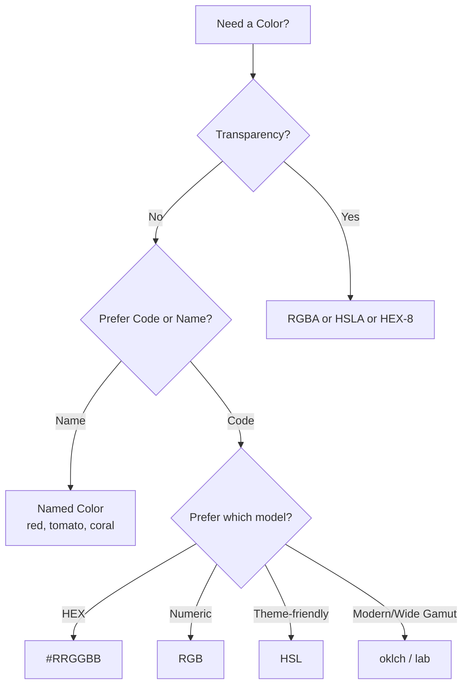
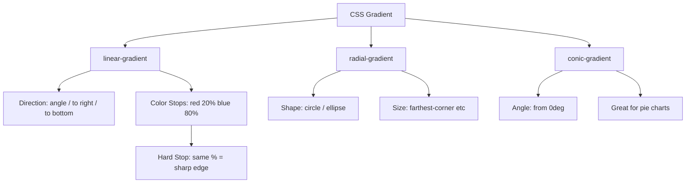
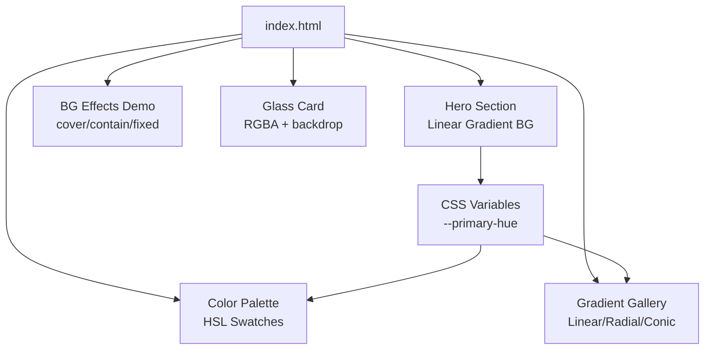

<a id="chapter-31-css-colors-backgrounds"></a>

# Chapter 31: CSS Colors & Backgrounds

[⬅ Previous Chapter](#chapter-30-css-cascade-specificity-inheritance) | [📖 Main Index](#main-index) | [Next Chapter ➡](#chapter-32-css-box-model)

---

## 📌 Learning Objectives

By the end of this chapter, you will:

- **Understand** all CSS color formats: Named, HEX, RGB, RGBA, HSL, HSLA, HWB, and modern color functions
- **Master** background properties: color, image, repeat, position, size, attachment, origin, clip
- **Learn** how gradients work: linear, radial, and conic
- **Apply** multiple backgrounds and shorthand syntax
- **Know** interview-level concepts: color transparency, gradient stops, background-blend-mode
- **Build** a real mini project using only colors and backgrounds
- **Crack** interview questions on color specificity, transparency tricks, and gradient fallbacks

---

<a id="chapter-index-table-31"></a>

## Chapter Index Table

| Topic No. | Topic Name | Subtopics |
|-----------|-----------|-----------|
| 31.1 | [CSS Color Formats Overview](#31-1-color-formats-overview) | Named Colors, HEX, RGB, RGBA, HSL, HSLA, HWB, currentColor |
| 31.2 | [Named Colors](#31-2-named-colors) | 140+ names, keyword colors, transparent |
| 31.3 | [HEX Colors](#31-3-hex-colors) | 3-digit, 6-digit, 8-digit (alpha), shorthand |
| 31.4 | [RGB and RGBA](#31-4-rgb-rgba) | Channels, Alpha, Transparency |
| 31.5 | [HSL and HSLA](#31-5-hsl-hsla) | Hue, Saturation, Lightness, Alpha |
| 31.6 | [Modern Color Functions](#31-6-modern-color-functions) | HWB, lab(), lch(), color(), oklch() |
| 31.7 | [CSS Gradients](#31-7-css-gradients) | Linear, Radial, Conic, Gradient Stops |
| 31.8 | [Background Color](#31-8-background-color) | bg-color, transparent, currentColor |
| 31.9 | [Background Image](#31-9-background-image) | url(), none, multiple images |
| 31.10 | [Background Repeat](#31-10-background-repeat) | repeat, no-repeat, round, space |
| 31.11 | [Background Position](#31-11-background-position) | keywords, px, %, center |
| 31.12 | [Background Size](#31-12-background-size) | cover, contain, px, % |
| 31.13 | [Background Attachment](#31-13-background-attachment) | scroll, fixed, local |
| 31.14 | [Background Origin & Clip](#31-14-background-origin-clip) | border-box, padding-box, content-box |
| 31.15 | [Background Shorthand](#31-15-background-shorthand) | Full shorthand syntax and order |
| 31.16 | [Multiple Backgrounds](#31-16-multiple-backgrounds) | Layering, Stacking, Comma-separated |
| 31.17 | [Background Blend Mode](#31-17-background-blend-mode) | multiply, screen, overlay, etc. |

---

---

<a id="31-1-color-formats-overview"></a>

## 31.1 CSS Color Formats Overview

---

### 🧠 Hinglish Intuition

> Socho tumhare paas ek paint box hai. Us box mein colors express karne ke alag-alag tarike hain — koi color ka **naam** bolta hai (red, blue), koi **formula** deta hai (rgb(255,0,0)), koi **code** deta hai (#FF0000). CSS mein bhi exactly yahi hota hai — ek hi color ko multiple formats mein likhte hain. Sabka result same ho sakta hai, lekin har format ka apna use case aur power hoti hai.

---

### What is it?

CSS provides **multiple formats** to specify colors. Every format is a different way to describe the same color space. Browsers convert all formats internally to their rendering engine's color model.

---

### Color Format Family Tree

```
CSS Color Formats
│
├── Keyword Based
│   ├── Named Colors        → red, blue, tomato, coral
│   ├── System Colors       → ButtonText, Canvas, LinkText
│   └── Special Keywords    → transparent, currentColor, inherit
│
├── Numeric Models
│   ├── HEX                 → #RGB  #RRGGBB  #RRGGBBAA
│   ├── RGB                 → rgb(255, 0, 0)
│   ├── RGBA                → rgba(255, 0, 0, 0.5)
│   ├── HSL                 → hsl(0, 100%, 50%)
│   └── HSLA                → hsla(0, 100%, 50%, 0.5)
│
└── Modern (CSS Color Level 4+)
    ├── HWB                 → hwb(0 0% 0%)
    ├── lab()               → lab(50 40 30)
    ├── lch()               → lch(50 40 30)
    ├── oklch()             → oklch(0.5 0.2 30)
    └── color()             → color(display-p3 1 0 0)
```

---

### Visual Color Model Comparison

```
┌─────────────────────────────────────────────────────────────────┐
│                    CSS COLOR FORMATS AT A GLANCE                │
├──────────────┬────────────────────────┬────────────────────────┤
│   FORMAT     │       EXAMPLE          │    ALPHA SUPPORT?      │
├──────────────┼────────────────────────┼────────────────────────┤
│ Named        │ red                    │ ❌ No (except          │
│              │ tomato                 │    transparent)        │
├──────────────┼────────────────────────┼────────────────────────┤
│ HEX 3-digit  │ #F00                   │ ❌ No                  │
│ HEX 6-digit  │ #FF0000                │ ❌ No                  │
│ HEX 8-digit  │ #FF000080              │ ✅ Yes (last 2 digits) │
├──────────────┼────────────────────────┼────────────────────────┤
│ RGB          │ rgb(255, 0, 0)         │ ❌ No                  │
│ RGBA         │ rgba(255, 0, 0, 0.5)   │ ✅ Yes (0 to 1)       │
├──────────────┼────────────────────────┼────────────────────────┤
│ HSL          │ hsl(0, 100%, 50%)      │ ❌ No                  │
│ HSLA         │ hsla(0, 100%, 50%, .5) │ ✅ Yes (0 to 1)       │
├──────────────┼────────────────────────┼────────────────────────┤
│ HWB          │ hwb(0 0% 0%)           │ ✅ Yes (4th arg)       │
│ lab()        │ lab(50 40 30)          │ ✅ Yes                 │
│ oklch()      │ oklch(0.5 0.2 30)      │ ✅ Yes                 │
└──────────────┴────────────────────────┴────────────────────────┘
```

---

### When to Use Which Format?

```
┌────────────────────────────────────────────────────────────────┐
│                   FORMAT SELECTION GUIDE                       │
├───────────────────────┬────────────────────────────────────────┤
│ USE CASE              │ RECOMMENDED FORMAT                     │
├───────────────────────┼────────────────────────────────────────┤
│ Quick prototype       │ Named colors (red, blue)               │
│ Designer color codes  │ HEX (#FF5733)                         │
│ Transparency needed   │ RGBA or HSLA                           │
│ Dynamic theming       │ HSL (easy to adjust lightness)         │
│ CSS Variables system  │ HSL or OKLCH                           │
│ Wide color gamut      │ oklch() or color()                     │
│ Icon/text color match │ currentColor                           │
└───────────────────────┴────────────────────────────────────────┘
```

---



---

👉 <a href="#chapter-index-table-31">Go to Top 🔝</a>

---

<a id="31-2-named-colors"></a>

## 31.2 Named Colors

---

### 🧠 Hinglish Intuition

> Ye CSS ke pre-defined color names hain — jaise crayon box mein already labeled crayons hote hain. "Red crayon utha lo" — exactly waise hi `color: red` likh do. 140+ named colors hain CSS mein. Beginners ke liye best, lekin precise control ke liye baaki formats use karo.

---

### What are Named Colors?

CSS supports **140+ predefined color names** that browsers recognize. These are defined in the CSS Color specification. Every named color maps to a specific HEX/RGB value internally.

---

### Color Name Categories

```
┌──────────────────────────────────────────────────────────────┐
│                  NAMED COLOR CATEGORIES                      │
├────────────────────┬─────────────────────────────────────────┤
│ CATEGORY           │ EXAMPLES                               │
├────────────────────┼─────────────────────────────────────────┤
│ Basic Colors       │ red, green, blue, yellow, black, white │
│ Extended Colors    │ tomato, coral, salmon, khaki           │
│ Gray Shades        │ gray, silver, dimgray, lightgray       │
│ Special Keywords   │ transparent, currentColor, inherit     │
│ CSS System Colors  │ Canvas, ButtonText, LinkText           │
└────────────────────┴─────────────────────────────────────────┘
```

---

### Most Useful Named Colors Visual

```
REDS & ORANGES
━━━━━━━━━━━━━━━━━━━━━━━━━━━━━━━━━━━━━━━━━━━━━━━━━━━
  red       #FF0000    tomato    #FF6347
  coral     #FF7F50    salmon    #FA8072
  orangered #FF4500    orange    #FFA500

BLUES & PURPLES
━━━━━━━━━━━━━━━━━━━━━━━━━━━━━━━━━━━━━━━━━━━━━━━━━━━
  blue      #0000FF    navy      #000080
  royalblue #4169E1    dodgerblue#1E90FF
  purple    #800080    violet    #EE82EE

GREENS
━━━━━━━━━━━━━━━━━━━━━━━━━━━━━━━━━━━━━━━━━━━━━━━━━━━
  green     #008000    lime      #00FF00
  teal      #008080    olive     #808000
  seagreen  #2E8B57    darkgreen #006400

NEUTRALS
━━━━━━━━━━━━━━━━━━━━━━━━━━━━━━━━━━━━━━━━━━━━━━━━━━━
  black     #000000    white     #FFFFFF
  gray      #808080    silver    #C0C0C0
  lightgray #D3D3D3    darkgray  #A9A9A9
```

---

### Special Keyword Colors

```css
/* transparent = rgba(0,0,0,0) — fully invisible */
.ghost-button {
  background-color: transparent;
  border: 2px solid blue;
}

/* currentColor = inherits the element's color value */
.icon-box {
  color: #e74c3c;            /* text color = red */
  border: 2px solid currentColor; /* border ALSO becomes red */
}

/* inherit = takes parent's color value */
.child {
  color: inherit;
}
```

> [!IMPORTANT]
> **`currentColor`** is one of the most powerful keywords in CSS. It makes borders, shadows, SVG fills automatically match the text color — eliminating the need to duplicate color values.

---

### Code Example — Named Colors in Practice

```html
<!DOCTYPE html>
<html>
<head>
  <style>
    /* Named colors — simple and readable */
    .box-red    { background-color: tomato; }
    .box-blue   { background-color: steelblue; }
    .box-green  { background-color: seagreen; }

    /* currentColor trick */
    .icon-card {
      color: darkorange;        /* 1. Set text color */
      border: 3px solid currentColor; /* 2. Border inherits it */
      padding: 16px;
    }

    /* transparent use case */
    .ghost-btn {
      background: transparent;
      border: 2px solid tomato;
      color: tomato;
      padding: 8px 16px;
      cursor: pointer;
    }
  </style>
</head>
<body>
  <div class="box-red">Tomato Box</div>
  <div class="box-blue">Steel Blue Box</div>
  <div class="box-green">Sea Green Box</div>
  <div class="icon-card">Card with currentColor border</div>
  <button class="ghost-btn">Ghost Button</button>
</body>
</html>
```

**Code Breakdown:**
- `tomato` → #FF6347 — more interesting than plain `red`
- `currentColor` → border automatically matches text color
- `transparent` → zero opacity background, border still visible

---

> [!TIP]
> Always prefer **`transparent`** over `rgba(0,0,0,0)` for clarity. Both are identical, but `transparent` is self-documenting.

---

👉 <a href="#chapter-index-table-31">Go to Top 🔝</a>

---

<a id="31-3-hex-colors"></a>

## 31.3 HEX Colors

---

### 🧠 Hinglish Intuition

> HEX color ek secret code ki tarah hai. `#FF5733` mein — pehle 2 characters (`FF`) red amount batate hain, beech ke 2 (`57`) green, aur aakhri 2 (`33`) blue. Hexadecimal mein count hota hai: 0,1,2,3,4,5,6,7,8,9,A,B,C,D,E,F — yani 16 symbols. FF = 255 (maximum), 00 = 0 (minimum). Ye designers ka sabse favorite format hai.

---

### What is HEX?

HEX (Hexadecimal) color is a 6-digit (or 3/8-digit) code representing **Red, Green, Blue** channels using the base-16 number system.

---

### HEX Format Anatomy

```
Full HEX Color Breakdown
━━━━━━━━━━━━━━━━━━━━━━━━━━━━━━━━━━━━━━━━━━━━━━━━━━━━━━━

  # F F 5 7 3 3
  │ ├──┤ ├──┤ └──┘
  │  R    G    B
  │
  └─ Hash symbol (mandatory prefix)

  FF = 255 (max red)
  57 = 87  (medium green)
  33 = 51  (low blue)

━━━━━━━━━━━━━━━━━━━━━━━━━━━━━━━━━━━━━━━━━━━━━━━━━━━━━━━

Hexadecimal Scale:
  00 01 02 03 04 05 06 07 08 09 0A 0B 0C 0D 0E 0F
  10 ...                                       1F
  ...
  F0 F1 F2 F3 F4 F5 F6 F7 F8 F9 FA FB FC FD FE FF

  Decimal 0 = HEX 00  (none of this channel)
  Decimal 255 = HEX FF (full of this channel)
```

---

### HEX Variants — 3, 6, 8 Digit

```
┌────────────────────────────────────────────────────────┐
│                   HEX FORMAT VARIANTS                  │
├────────────┬──────────┬─────────────────────────────── │
│  FORMAT    │ EXAMPLE  │ EXPLANATION                    │
├────────────┼──────────┼────────────────────────────────┤
│  #RGB      │ #F00     │ 3-digit shorthand              │
│  (3-digit) │          │ Each digit DOUBLED             │
│            │          │ #F00 → #FF0000 = pure red      │
├────────────┼──────────┼────────────────────────────────┤
│  #RRGGBB   │ #FF5733  │ Standard 6-digit format        │
│  (6-digit) │          │ Full precision                 │
│            │          │ Most common in design tools    │
├────────────┼──────────┼────────────────────────────────┤
│  #RRGGBBAA │ #FF573380│ 8-digit with alpha channel     │
│  (8-digit) │          │ Last 2 digits = opacity        │
│            │          │ FF=opaque, 80=50%, 00=invisible│
└────────────┴──────────┴────────────────────────────────┘
```

---

### 3-Digit HEX Shorthand Rules

```
3-digit HEX only works when BOTH digits of each pair are identical:

  #RRGGBB → #RGB  (ONLY if R1=R2, G1=G2, B1=B2)

  ✅  #FF0000 → #F00   (FF, 00, 00 → pairs match)
  ✅  #AABBCC → #ABC   (AA, BB, CC → pairs match)
  ✅  #FFFFFF → #FFF   (all white)
  ✅  #000000 → #000   (all black)

  ❌  #FF5733 → Cannot shorten (57 and 33 don't have matching pairs)
  ❌  #A1B2C3 → Cannot shorten
```

---

### 8-Digit HEX Alpha Values

```
Alpha Channel in 8-digit HEX:

  #RRGGBBAA

  AA = 00  →  0%   opacity  (fully transparent)
  AA = 40  →  25%  opacity
  AA = 80  →  50%  opacity
  AA = BF  →  75%  opacity
  AA = FF  →  100% opacity  (fully opaque)

Common Conversions:
┌────────┬──────────┬──────────────┐
│  HEX   │ Decimal  │ Opacity %    │
├────────┼──────────┼──────────────┤
│  00    │    0     │    0%        │
│  1A    │   26     │   10%        │
│  33    │   51     │   20%        │
│  4D    │   77     │   30%        │
│  66    │  102     │   40%        │
│  80    │  128     │   50%        │
│  99    │  153     │   60%        │
│  B3    │  179     │   70%        │
│  CC    │  204     │   80%        │
│  E6    │  230     │   90%        │
│  FF    │  255     │  100%        │
└────────┴──────────┴──────────────┘
```

---

### Code Example

```css
/* 3-digit HEX */
.box-a { background-color: #F00;    } /* → #FF0000 — red  */
.box-b { background-color: #0F0;    } /* → #00FF00 — green */
.box-c { background-color: #00F;    } /* → #0000FF — blue  */
.box-d { background-color: #FFF;    } /* → #FFFFFF — white */
.box-e { background-color: #000;    } /* → #000000 — black */

/* 6-digit HEX */
.box-f { background-color: #FF5733; } /* Orange-red */
.box-g { background-color: #2ECC71; } /* Emerald green */
.box-h { background-color: #3498DB; } /* Peter river blue */

/* 8-digit HEX with alpha */
.box-i { background-color: #FF573380; } /* 50% transparent orange-red */
.box-j { background-color: #3498DB33; } /* 20% transparent blue */
.box-k { background-color: #00000080; } /* 50% black overlay */
```

---

> [!NOTE]
> HEX values are **case-insensitive**. `#ff5733` and `#FF5733` and `#Ff5733` are all identical. However, use **uppercase consistently** for readability (industry convention).

---

> [!IMPORTANT]
> **8-digit HEX alpha** is a newer feature. Always check browser support for older codebases. For maximum compatibility, prefer `rgba()` for transparency.

---

👉 <a href="#chapter-index-table-31">Go to Top 🔝</a>

---

<a id="31-4-rgb-rgba"></a>

## 31.4 RGB and RGBA

---

### 🧠 Hinglish Intuition

> RGB ek mixing model hai — jaise paani mein colors mila rahe ho. `rgb(255, 0, 0)` matlab: "255 part red, 0 part green, 0 part blue." Sab milao — pure red milega! RGBA mein ek extra `A` (Alpha) hota hai jo batata hai ki color kitna transparent hai. A=1 matlab fully visible, A=0 matlab bilkul invisible. Beech ki values mein semi-transparent effect aata hai — jaise frosted glass.

---

### What is RGB?

**RGB (Red, Green, Blue)** is an additive color model where colors are created by mixing three light channels. Each channel ranges from **0 to 255**.

---

### RGB Color Mixing Visual

```
RGB Additive Color Model
━━━━━━━━━━━━━━━━━━━━━━━━━━━━━━━━━━━━━━━━━━━━━━━━━━━━

    R=255  G=0    B=0    →  RED
    R=0    G=255  B=0    →  GREEN
    R=0    G=0    B=255  →  BLUE

    R=255  G=255  B=0    →  YELLOW  (R+G)
    R=255  G=0    B=255  →  MAGENTA (R+B)
    R=0    G=255  B=255  →  CYAN    (G+B)

    R=255  G=255  B=255  →  WHITE   (all max)
    R=0    G=0    B=0    →  BLACK   (all zero)
    R=128  G=128  B=128  →  MEDIUM GRAY (all equal)

━━━━━━━━━━━━━━━━━━━━━━━━━━━━━━━━━━━━━━━━━━━━━━━━━━━━

Channel Range:
  0   ─────────────────────────────── 255
  MIN                                 MAX
  (none of this color)         (full of this color)
```

---

### RGBA Alpha Channel Visual

```
RGBA Alpha Transparency Scale

rgba(231, 76, 60, α)   — A tomato-red color at different alphas

  α = 1.0  ████████████████████  Fully opaque    (solid)
  α = 0.8  ▓▓▓▓▓▓▓▓▓▓▓▓▓▓▓▓    80% opaque
  α = 0.6  ▒▒▒▒▒▒▒▒▒▒▒▒        60% opaque
  α = 0.4  ░░░░░░░░            40% opaque
  α = 0.2  ·   ·   ·   ·       20% opaque
  α = 0.0                       Fully transparent (invisible)

Alpha accepts:
  0    to  1      →  decimal  (0.0, 0.5, 1.0)
  0%   to  100%   →  percentage (CSS Color Level 4)
```

---

### RGB Syntax Variants

```
Modern CSS supports BOTH old and new syntax:

OLD SYNTAX (comma-separated):
  rgb(255, 0, 0)
  rgba(255, 0, 0, 0.5)

NEW SYNTAX (CSS Color Level 4 — space-separated):
  rgb(255 0 0)
  rgb(255 0 0 / 0.5)    ← alpha with slash notation
  rgb(255 0 0 / 50%)    ← alpha as percentage

Both syntaxes work in modern browsers.
Old syntax has wider browser support.
```

---

### Code Example — RGB in Real Use

```css
/* Basic RGB colors */
.bg-red     { background-color: rgb(231, 76, 60);  }  /* Alizarin red */
.bg-blue    { background-color: rgb(52, 152, 219); }  /* Peter river  */
.bg-green   { background-color: rgb(46, 204, 113); }  /* Emerald      */

/* RGBA for overlays and transparency */
.overlay {
  position: absolute;
  top: 0; left: 0;
  width: 100%; height: 100%;
  background-color: rgba(0, 0, 0, 0.5);  /* 50% black overlay */
}

/* RGBA for card shadows and glass effect */
.glass-card {
  background-color: rgba(255, 255, 255, 0.15);  /* semi-transparent white */
  border: 1px solid rgba(255, 255, 255, 0.3);
  backdrop-filter: blur(10px);
}

/* RGBA for tooltip background */
.tooltip {
  background-color: rgba(0, 0, 0, 0.8);   /* 80% black */
  color: white;
  padding: 6px 12px;
  border-radius: 4px;
}

/* Modern slash notation */
.modern {
  background-color: rgb(52 152 219 / 0.7);  /* 70% opacity blue */
  color: rgb(255 255 255 / 90%);            /* 90% white text   */
}
```

---

> [!TIP]
> Use `rgba(0, 0, 0, 0.5)` for **dark overlays** on hero sections and `rgba(255, 255, 255, 0.1)` for **glassmorphism** card backgrounds. These are the two most common RGBA use cases in modern UI.

---

### RGB vs HEX Comparison

```
┌────────────────────────────────────────────────────────┐
│                  RGB vs HEX                            │
├──────────────────────┬─────────────────────────────────┤
│        RGB           │           HEX                   │
├──────────────────────┼─────────────────────────────────┤
│ rgb(255, 0, 0)       │ #FF0000                         │
│ Human-readable       │ Designer tool output            │
│ Easy to adjust       │ Compact format                  │
│ Alpha with rgba()    │ Alpha with 8-digit (#RRGGBBAA)  │
│ Good for dynamic CSS │ Good for static design          │
│ JavaScript friendly  │ Less JS-friendly                │
└──────────────────────┴─────────────────────────────────┘
```

---

👉 <a href="#chapter-index-table-31">Go to Top 🔝</a>

---

<a id="31-5-hsl-hsla"></a>

## 31.5 HSL and HSLA

---

### 🧠 Hinglish Intuition

> HSL ek artist ki language hai. **H (Hue)** = color ka type — 0° se 360° tak chakkar lagao color wheel par. 0°=Red, 120°=Green, 240°=Blue. **S (Saturation)** = rang kitna "gehra" hai — 0% matlab gray, 100% matlab pure color. **L (Lightness)** = rang kitna ujala hai — 0% matlab black, 100% matlab white, 50% matlab perfect color. HSL ka fayda: sirf Lightness change karke aap easily dark/light theme bana sakte ho!

---

### What is HSL?

**HSL (Hue, Saturation, Lightness)** is a human-friendly color model that describes colors the way artists think about them — by the color type, its intensity, and its brightness.

---

### HSL Color Wheel

```
HSL Color Wheel — Hue Values
━━━━━━━━━━━━━━━━━━━━━━━━━━━━━━━━━━━━━━━━━━━━━━━━━━━━━━━━━━━━

                     0° / 360°
                      RED
                       │
          330° ROSE ───┼─── 30° ORANGE
                       │
    300° MAGENTA ──────┼──────── 60° YELLOW
                       │
     270° VIOLET ──────┼──────── 90° CHARTREUSE
                       │
         240° BLUE ────┼──────── 120° GREEN
                       │
    210° AZURE ─────── ┼ ─────── 150° SPRING GREEN
                       │
                   180° CYAN

━━━━━━━━━━━━━━━━━━━━━━━━━━━━━━━━━━━━━━━━━━━━━━━━━━━━━━━━━━━━
  Key Hue Values:
  0°   = Red        60°  = Yellow     120° = Green
  180° = Cyan       240° = Blue       300° = Magenta
```

---

### Saturation Effect Visual

```
Saturation: hsl(200, S%, 50%)  ← Blue-ish, medium lightness

  S = 0%   ████████████████  Pure Gray   (no color at all)
  S = 20%  ████████████████  Grayish blue
  S = 40%  ████████████████  Muted blue
  S = 60%  ████████████████  Medium blue
  S = 80%  ████████████████  Vivid blue
  S = 100% ████████████████  Pure saturated blue

Think of it as:
  0% = Black & White TV
  100% = Full color OLED display
```

---

### Lightness Effect Visual

```
Lightness: hsl(200, 100%, L%)  ← Pure saturated blue

  L = 0%   ████████████████  BLACK (no light at all)
  L = 10%  ████████████████  Very dark blue
  L = 20%  ████████████████  Dark blue
  L = 30%  ████████████████  Dark-medium blue
  L = 40%  ████████████████  Medium blue
  L = 50%  ████████████████  Pure color (normal)
  L = 60%  ████████████████  Light blue
  L = 70%  ████████████████  Lighter blue
  L = 80%  ████████████████  Very light blue
  L = 90%  ████████████████  Near white blue
  L = 100% ████████████████  WHITE (full light)

Sweet spot = 50% Lightness for pure, vivid colors
```

---

### HSL vs RGB — Why HSL Wins for Theming

```
PROBLEM: Create a color and its dark variant

Using RGB:
  Normal:  rgb(52, 152, 219)    ← What's the pattern? Hard to derive!
  Dark:    rgb(41, 128, 185)    ← Had to look this up separately

Using HSL:
  Normal:  hsl(204, 70%, 53%)   ← L=53%
  Dark:    hsl(204, 70%, 40%)   ← Just lower the L! Easy!
  Light:   hsl(204, 70%, 70%)   ← Just raise the L! Easy!
  Muted:   hsl(204, 30%, 53%)   ← Lower S for desaturated version

HSL lets you CREATE a whole palette from ONE hue!
```

---

### HSLA Alpha Values

```
HSLA: hsla(hue, saturation%, lightness%, alpha)

Same alpha rules as RGBA:
  0   = fully transparent
  1   = fully opaque
  0.5 = 50% opacity

Example: hsla(204, 70%, 53%, 0.5)  → 50% transparent blue
```

---

### Code Example — HSL for Design Systems

```css
/* Base color defined in HSL */
:root {
  --hue: 220;              /* Blue family */
  --sat: 80%;
}

/* Generate full palette from one hue */
.color-50  { background-color: hsl(var(--hue), var(--sat), 95%); }
.color-100 { background-color: hsl(var(--hue), var(--sat), 90%); }
.color-200 { background-color: hsl(var(--hue), var(--sat), 80%); }
.color-300 { background-color: hsl(var(--hue), var(--sat), 70%); }
.color-400 { background-color: hsl(var(--hue), var(--sat), 60%); }
.color-500 { background-color: hsl(var(--hue), var(--sat), 50%); } /* Base */
.color-600 { background-color: hsl(var(--hue), var(--sat), 40%); }
.color-700 { background-color: hsl(var(--hue), var(--sat), 30%); }
.color-800 { background-color: hsl(var(--hue), var(--sat), 20%); }
.color-900 { background-color: hsl(var(--hue), var(--sat), 10%); }

/* Dark mode toggle — just flip lightness! */
.light-theme { background: hsl(220, 20%, 98%); color: hsl(220, 20%, 10%); }
.dark-theme  { background: hsl(220, 20%, 10%); color: hsl(220, 20%, 98%); }

/* HSLA for overlay effects */
.modal-backdrop {
  background-color: hsla(220, 20%, 10%, 0.8); /* 80% dark backdrop */
}
```

---

> [!IMPORTANT]
> **HSL is the best format for design systems and theming.** When you change just the Lightness (`L`) value, you get the same color in different brightness levels — perfect for hover states, disabled states, and dark mode.

---

### HSL Formula Reference

```
┌──────────────────────────────────────────────────────────────┐
│  hsl(H, S%, L%)  or  hsla(H, S%, L%, A)                     │
├─────────────┬────────────────────────────────────────────────┤
│  Parameter  │  Value Range                                   │
├─────────────┼────────────────────────────────────────────────┤
│  H (Hue)    │  0deg to 360deg (or 0 to 360, unitless)       │
│  S (Sat.)   │  0% to 100%                                    │
│  L (Light.) │  0% to 100%                                    │
│  A (Alpha)  │  0 to 1  or  0% to 100%                       │
└─────────────┴────────────────────────────────────────────────┘
```

---

👉 <a href="#chapter-index-table-31">Go to Top 🔝</a>

---

<a id="31-6-modern-color-functions"></a>

## 31.6 Modern Color Functions

---

### 🧠 Hinglish Intuition

> Purane RGB/HSL colors sirf ek limited color range cover karte the — jaise purana CRT monitor. Aaj ke OLED aur wide-gamut displays bahut zyada colors show kar sakte hain. Modern CSS color functions jaise `oklch()` aur `color()` un extra colors tak pahunchne dete hain. Abhi interview mein ye sirf "awareness level" ke liye important hain.

---

### Modern Color Functions Overview

```
┌──────────────────────────────────────────────────────────────────┐
│               MODERN CSS COLOR FUNCTIONS                         │
├────────────────┬─────────────────────────────────────────────────┤
│  Function      │  Description                                    │
├────────────────┼─────────────────────────────────────────────────┤
│  hwb()         │  Hue, Whiteness, Blackness                      │
│                │  More intuitive than HSL                        │
│                │  hwb(0 0% 0%) = red                             │
├────────────────┼─────────────────────────────────────────────────┤
│  lab()         │  Perceptual color model                         │
│                │  Based on human vision                          │
│                │  lab(50 40 -20)                                 │
├────────────────┼─────────────────────────────────────────────────┤
│  lch()         │  Lightness, Chroma, Hue                         │
│                │  Cylindrical form of lab                        │
│                │  lch(50 50 30)                                  │
├────────────────┼─────────────────────────────────────────────────┤
│  oklch()       │  Improved lch (better perceptual uniformity)    │
│                │  Best for design systems                        │
│                │  oklch(0.7 0.15 30)                             │
├────────────────┼─────────────────────────────────────────────────┤
│  color()       │  Explicitly specify color space                 │
│                │  color(display-p3 1 0 0) = P3 red              │
│                │  color(srgb 1 0 0) = standard red              │
└────────────────┴─────────────────────────────────────────────────┘
```

---

### Color Space Visual

```
sRGB vs Wide Gamut Color Spaces
━━━━━━━━━━━━━━━━━━━━━━━━━━━━━━━━━━━━━━━━━━━━━━━━━━

  Traditional sRGB (rgb(), hsl(), hex):
  ┌────────────────────────────────┐
  │  ~~~ Limited Color Range ~~~   │
  │  All web colors live here      │
  │  Covers ~35% of human vision   │
  └────────────────────────────────┘

  Display-P3 (color(display-p3 ...)):
  ┌──────────────────────────────────────┐
  │  ~~~~~~~~~~~ Extended Range ~~~~~~~~~~│
  │    Covers ~50% of human vision       │
  │    Used by iPhone, iPad, Mac         │
  │    ┌────────────────────────────┐    │
  │    │   sRGB lives inside here   │    │
  │    └────────────────────────────┘    │
  └──────────────────────────────────────┘

oklch() works across BOTH spaces perceptually.
```

---

### Code Example — Modern Colors

```css
/* HWB — intuitive mixing */
.hwb-red    { color: hwb(0 0% 0%);    }  /* Pure red */
.hwb-pastel { color: hwb(0 30% 0%);   }  /* Red with 30% white = pink */
.hwb-dark   { color: hwb(0 0% 40%);   }  /* Red with 40% black = dark red */

/* oklch — modern design system colors */
:root {
  --brand: oklch(0.65 0.22 250);       /* A beautiful blue */
  --brand-light: oklch(0.85 0.15 250); /* Lighter variant */
  --brand-dark:  oklch(0.45 0.22 250); /* Darker variant */
}

/* color() for wide gamut displays */
@media (color-gamut: p3) {
  .vivid-red {
    color: color(display-p3 1 0 0);   /* P3 red — more vivid than sRGB */
  }
}

/* Fallback pattern for modern colors */
.element {
  color: hsl(250, 70%, 60%);         /* Fallback for older browsers */
  color: oklch(0.65 0.22 250);       /* Progressive enhancement */
}
```

---

> [!NOTE]
> `oklch()` is increasingly used in **design tokens** and **CSS frameworks** (Tailwind v4 uses oklch). For interviews, understand the concept — you don't need to memorize exact values.

---

👉 <a href="#chapter-index-table-31">Go to Top 🔝</a>

---

<a id="31-7-css-gradients"></a>

## 31.7 CSS Gradients

---

### 🧠 Hinglish Intuition

> Gradient matlab ek color se dusre color ki taraf smooth transition. Socho sunrise — kaala se neela, neela se orange, orange se peela. Exactly wahi kaam CSS gradients karte hain. Teen types hain: **Linear** (seedhi line mein), **Radial** (center se bahar), aur **Conic** (chakkar mein). Ye sab `background-image` property pe lagate hain, `background-color` pe nahi.

---

### Gradient Types Overview

```
CSS Gradient Types
━━━━━━━━━━━━━━━━━━━━━━━━━━━━━━━━━━━━━━━━━━━━━━━━━━━━━━━━━━

1. LINEAR GRADIENT — Color flows in a straight line

   ┌─────────────────────────────────────┐
   │ ████████████████░░░░░░░░░░░░░░░░░░░│
   │ ████████████████░░░░░░░░░░░░░░░░░░░│  → direction: to right
   │ ████████████████░░░░░░░░░░░░░░░░░░░│
   └─────────────────────────────────────┘
   Blue ──────────────────────────► Transparent


2. RADIAL GRADIENT — Color flows from center outward

   ┌─────────────────────────────────────┐
   │       ░░░░░░░░░░░░░░░░░░░░░░░░      │
   │     ░░░░░░░░███████░░░░░░░░░░░      │
   │    ░░░░░░███████████████░░░░░░      │  center bright
   │     ░░░░░░░░███████░░░░░░░░░░░      │  edge dark
   │       ░░░░░░░░░░░░░░░░░░░░░░░░      │
   └─────────────────────────────────────┘


3. CONIC GRADIENT — Color flows around a center point

   ┌─────────────────────────────────────┐
   │         ┌──────────┐               │
   │         │  🔴🟡🟢  │               │  sweeps like
   │         │ 🔵 ● 🟠  │               │  a clock hand
   │         │  🟣🟤⚫  │               │
   │         └──────────┘               │
   └─────────────────────────────────────┘
```

---

### Linear Gradient — Direction Options

```
linear-gradient(direction, color-stop1, color-stop2, ...)

Direction Options:
━━━━━━━━━━━━━━━━━━━━━━━━━━━━━━━━━━━━━━━━━━━━━━━━━━━━━━━━━

  to right      →  Left to Right
  to left       ←  Right to Left
  to bottom     ↓  Top to Bottom (DEFAULT)
  to top        ↑  Bottom to Top
  to bottom right ↘  Diagonal
  to bottom left  ↙  Diagonal
  45deg            Any angle (clockwise from top)
  -45deg           Counter direction

━━━━━━━━━━━━━━━━━━━━━━━━━━━━━━━━━━━━━━━━━━━━━━━━━━━━━━━━━

Angle Reference:
  0deg   = to top
  90deg  = to right
  180deg = to bottom (default)
  270deg = to left
```

---

### Gradient Color Stops — Visual Explanation

```
Color Stops = control EXACTLY where colors change

linear-gradient(to right, red, blue)
━━━━━━━━━━━━━━━━━━━━━━━━━━━━━━━━━━━━━━━━━━━━━━━━━━━━━━━━━
  0%                    50%                    100%
  │                      │                      │
  RED ──────────────────────────────────────── BLUE
  (auto-distributed between 0% and 100%)


linear-gradient(to right, red 20%, blue 80%)
━━━━━━━━━━━━━━━━━━━━━━━━━━━━━━━━━━━━━━━━━━━━━━━━━━━━━━━━━
  0%     20%                           80%    100%
  │       │                             │       │
  RED    RED ─────────────────────── BLUE    BLUE
  (solid red first 20%, blend, solid blue last 20%)


linear-gradient(to right, red, yellow 50%, green)
━━━━━━━━━━━━━━━━━━━━━━━━━━━━━━━━━━━━━━━━━━━━━━━━━━━━━━━━━
  0%           25%    50%    75%          100%
  │             │      │      │             │
  RED ──── RED-ORANGE ─ YELLOW ─ YEL-GREEN ─ GREEN


Hard Stop (no blend):
linear-gradient(to right, red 50%, blue 50%)
━━━━━━━━━━━━━━━━━━━━━━━━━━━━━━━━━━━━━━━━━━━━━━━━━━━━━━━━━
  0%                  50%│50%                  100%
  │                      ││                      │
  ████ RED ████████████████│████████ BLUE █████████
                           │
                       Sharp line (no blend!)
```

---

### Linear Gradient Code Examples

```css
/* Basic left-to-right */
.grad-1 {
  background-image: linear-gradient(to right, #667eea, #764ba2);
}

/* Diagonal gradient */
.grad-2 {
  background-image: linear-gradient(135deg, #f093fb, #f5576c);
}

/* Multi-stop gradient */
.grad-3 {
  background-image: linear-gradient(
    to right,
    #ff0000 0%,
    #ff7700 25%,
    #ffff00 50%,
    #00ff00 75%,
    #0000ff 100%
  );
  /* Rainbow effect */
}

/* Hard stop stripe pattern */
.stripes {
  background-image: linear-gradient(
    45deg,
    #f3f3f3 25%,    /* Light */
    #ddd     25%,   /* Hard stop */
    #ddd     50%,   /* Dark */
    #f3f3f3  50%,   /* Hard stop */
    #f3f3f3  75%,
    #ddd     75%
  );
  background-size: 20px 20px;  /* Repeat the pattern */
}

/* Transparent overlay on image */
.hero {
  background-image:
    linear-gradient(
      to bottom,
      rgba(0, 0, 0, 0.1),
      rgba(0, 0, 0, 0.7)
    );
}
```

---

### Radial Gradient — Shape Options

```
radial-gradient(shape size at position, color-stops)

Shape Options:
━━━━━━━━━━━━━━━━━━━━━━━━━━━━━━━━━━━━━━━━━━━━━━━━━━━━━━━━━

  circle    →  Perfect circle (equal radii)
  ellipse   →  Stretched oval (default)

Size Keywords:
━━━━━━━━━━━━━━━━━━━━━━━━━━━━━━━━━━━━━━━━━━━━━━━━━━━━━━━━━

  closest-side    → gradient ends at nearest edge
  closest-corner  → gradient ends at nearest corner
  farthest-side   → gradient ends at farthest edge
  farthest-corner → gradient ends at farthest corner (DEFAULT)

Position (at keyword):
━━━━━━━━━━━━━━━━━━━━━━━━━━━━━━━━━━━━━━━━━━━━━━━━━━━━━━━━━
  at center       → default
  at top left
  at 30% 70%
```

---

### Radial Gradient Visual

```
radial-gradient(circle at center, yellow, orange, red)

  ┌──────────────────────────────────────┐
  │                                      │
  │         ▓▓▓▓▓▓▓▓▓▓▓▓▓▓             │
  │       ▓▓▒▒▒▒▒▒▒▒▒▒▒▒▒▒▓▓           │
  │      ▓▒▒▒░░░░░░░░░░░░▒▒▒▓          │
  │      ▓▒▒░░░YELLOW░░░░▒▒▒▓          │  center = yellow
  │      ▓▒▒░░░░░░░░░░░░▒▒▒▓           │  middle = orange
  │       ▓▓▒▒▒▒▒▒▒▒▒▒▒▒▒▒▓▓           │  edge = red
  │         ▓▓▓▓▓▓▓▓▓▓▓▓▓▓             │
  │                                      │
  └──────────────────────────────────────┘

radial-gradient(circle at top left, blue, transparent)
  ┌──────────────────────────────────────┐
  │▓▓▓▓▓                                │
  │▓▒▒▒▒▒▒▒                             │
  │ ▒▒░░░░░░░░░                          │  glow from corner
  │   ░░░░░░░░░░░░░░                     │
  │        ░░░░░░░░░░░░░░                │
  │                   ░░░░░░            │
  │                          (clear)    │
  └──────────────────────────────────────┘
```

---

### Conic Gradient — Visual Explanation

```
conic-gradient(from angle at position, color-stops)

Standard conic (color wheel):
  ┌──────────────────────────────────────┐
  │           RED (0deg)                 │
  │        ╱            ╲               │
  │  MAGENTA              ORANGE         │
  │      │                   │           │
  │   BLUE          ●      YELLOW        │
  │      │                   │           │
  │   CYAN                GREEN          │
  │        ╲            ╱               │
  │          SPRING GREEN                │
  └──────────────────────────────────────┘

Pie chart effect with hard stops:
conic-gradient(
  red    0%  30%,   ← 30% red slice
  blue  30%  60%,   ← 30% blue slice
  green 60% 100%    ← 40% green slice
)
  ┌──────────────────────────────────────┐
  │          ████████ RED ████           │
  │        ████               ████       │
  │      ███   (30%)     (40%)   ███     │
  │     ██                         ██   │
  │     ██  BLUE      ●   GREEN    ██   │
  │     ██  (30%)                  ██   │
  │      ███                     ███    │
  │        ████               ████      │
  │          ████████████████████       │
  └──────────────────────────────────────┘
```

---

### Conic Gradient Code Examples

```css
/* Color wheel */
.color-wheel {
  width: 200px;
  height: 200px;
  border-radius: 50%;
  background-image: conic-gradient(
    red, yellow, lime, cyan, blue, magenta, red
  );
}

/* Pie chart */
.pie-chart {
  width: 200px;
  height: 200px;
  border-radius: 50%;
  background-image: conic-gradient(
    #e74c3c  0%  35%,   /* Red — 35% */
    #3498db 35%  65%,   /* Blue — 30% */
    #2ecc71 65% 100%    /* Green — 35% */
  );
}

/* Radial conic angle start */
.spinner {
  background-image: conic-gradient(
    from 45deg at 50% 50%,
    transparent,
    #667eea
  );
}
```

---

### Repeating Gradients

```css
/* Repeating linear — creates striped pattern */
.stripes {
  background-image: repeating-linear-gradient(
    45deg,
    #f3f3f3 0px,
    #f3f3f3 10px,
    #e0e0e0 10px,
    #e0e0e0 20px
  );
}

/* Repeating radial — concentric rings */
.rings {
  background-image: repeating-radial-gradient(
    circle at center,
    white 0px,
    white 5px,
    #3498db 5px,
    #3498db 10px
  );
}
```

---



---

> [!TIP]
> **Gradients are images, not colors.** They go on `background-image`, not `background-color`. This means you cannot animate them directly with `transition` — use `opacity` transitions on overlay elements instead.

---

👉 <a href="#chapter-index-table-31">Go to Top 🔝</a>

---

<a id="31-8-background-color"></a>

## 31.8 Background Color

---

### 🧠 Hinglish Intuition

> `background-color` element ke piche solid color fill karta hai. Simple hai lekin kuch important cheezein hain: yeh `background-image` ke NEECHE render hota hai — agar image load fail ho jaye toh background-color fallback ka kaam karta hai. Transparent elements mein parent ka color dikhta hai.

---

### What is background-color?

`background-color` sets the **solid fill color** behind an element's content and padding area. It renders **below** any `background-image`.

---

### Background Color Stack Order

```
Element Rendering Stack (Front to Back)
━━━━━━━━━━━━━━━━━━━━━━━━━━━━━━━━━━━━━━━━━━━━━━━━━━━━━━━━━

  ┌─────────────────────────────────────────┐
  │  4. Text Content & Children             │  ← FRONT (on top)
  ├─────────────────────────────────────────┤
  │  3. background-image (Layer 1, top)     │
  ├─────────────────────────────────────────┤
  │  2. background-image (Layer 2)          │
  ├─────────────────────────────────────────┤
  │  1. background-color                    │  ← BACK (at bottom)
  └─────────────────────────────────────────┘
  IMPORTANT: background-color is ALWAYS below images

This means:
- If image loads → image shows on top of color
- If image fails → background-color shows as fallback
- Gradient + color → color peeks through transparent gradient areas
```

---

### Code Example

```css
/* Basic background color */
.card { background-color: #ffffff; }
.hero { background-color: #1a1a2e; }

/* Using all color formats */
.box-a { background-color: tomato; }
.box-b { background-color: #3498db; }
.box-c { background-color: rgb(46, 204, 113); }
.box-d { background-color: hsl(280, 60%, 50%); }
.box-e { background-color: rgba(0, 0, 0, 0.5); }

/* Fallback pattern for gradients */
.hero-section {
  background-color: #667eea;              /* fallback if gradient unsupported */
  background-image: linear-gradient(135deg, #667eea 0%, #764ba2 100%);
}

/* Transparent background */
.glass {
  background-color: rgba(255, 255, 255, 0.1);
}

/* currentColor usage */
.badge {
  color: #e74c3c;
  background-color: currentColor;  /* Same as color property */
  /* But usually we want a lighter shade instead */
}
```

---

> [!IMPORTANT]
> **Always provide a `background-color` fallback** when using `background-image`. If the image fails to load or the gradient is unsupported, the background color acts as the visual fallback.

---

👉 <a href="#chapter-index-table-31">Go to Top 🔝</a>

---

<a id="31-9-background-image"></a>

## 31.9 Background Image

---

### 🧠 Hinglish Intuition

> `background-image` element ke peeche image ya gradient lagata hai. Ye **decorative image** hai — accessibility ke liye important content `` tag mein honi chahiye, CSS background mein nahi. Multiple images comma se separate karke layer karo — pehli image sabse upar hogi.

---

### Background Image Syntax

```
background-image: url('path/to/image.jpg');
background-image: none;
background-image: linear-gradient(...);
background-image: url('img1.jpg'), url('img2.jpg');  /* multiple */
```

---

### Multiple Background Image Layering

```
Multiple Backgrounds Stack — First listed = TOP layer

background-image:
  url('overlay.png'),      ← Layer 1 (TOP)
  url('texture.png'),      ← Layer 2
  url('hero-bg.jpg');      ← Layer 3 (BOTTOM, closest to bg-color)

  ┌──────────────────────────────────────────┐
  │  [overlay.png]    ← on top               │
  │    [texture.png]  ← middle               │
  │      [hero-bg.jpg] ← bottom              │
  │         [background-color] ← lowest      │
  └──────────────────────────────────────────┘
```

---

### Code Example

```css
/* Single image */
.hero {
  background-image: url('hero.jpg');
  width: 100%;
  height: 400px;
}

/* Gradient over image (most common UI pattern) */
.card {
  background-image:
    linear-gradient(rgba(0,0,0,0.5), rgba(0,0,0,0.5)),
    url('card-bg.jpg');
  /* Gradient on top — darkens the image for text readability */
}

/* Multiple decorative layers */
.fancy {
  background-image:
    url('dots-pattern.png'),    /* dots overlay */
    url('hero-background.jpg'); /* main image   */
}

/* SVG as background */
.icon-bg {
  background-image: url("data:image/svg+xml,%3Csvg...%3E");
}

/* none — remove all background images */
.clean {
  background-image: none;
}
```

---

> [!TIP]
> For text on image backgrounds, always add a **gradient overlay** using multiple backgrounds:
> `background-image: linear-gradient(rgba(0,0,0,0.5), rgba(0,0,0,0.5)), url('image.jpg');`
> This is the #1 most-used pattern in real projects.

---

👉 <a href="#chapter-index-table-31">Go to Top 🔝</a>

---

<a id="31-10-background-repeat"></a>

## 31.10 Background Repeat

---

### 🧠 Hinglish Intuition

> Jab background image element se choti hoti hai, toh browser usse **tile** kar deta hai — jaise bathroom ki tiles. `background-repeat` control karta hai ki ye tiling kaise hogi — horizontal, vertical, dono, ya bilkul nahi.

---

### Background Repeat Options Visual

```
background-repeat values:

━━━━━━━━━━━━━━━━━━━━━━━━━━━━━━━━━━━━━━━━━━━━━━━━━━━━━━━━━

repeat (DEFAULT — tiles in both directions):
  ┌────────────────────────────────────┐
  │ [img][img][img][img][img][img]     │
  │ [img][img][img][img][img][img]     │
  │ [img][img][img][img][img][img]     │
  └────────────────────────────────────┘

repeat-x (tiles only horizontally):
  ┌────────────────────────────────────┐
  │ [img][img][img][img][img][img]     │
  │                                    │
  │                                    │
  └────────────────────────────────────┘

repeat-y (tiles only vertically):
  ┌────────────────────────────────────┐
  │ [img]                              │
  │ [img]                              │
  │ [img]                              │
  └────────────────────────────────────┘

no-repeat (single image, no tiling):
  ┌────────────────────────────────────┐
  │ [img]                              │
  │                                    │
  │                                    │
  └────────────────────────────────────┘

round (tiles, SCALES to fit — no clipping):
  ┌────────────────────────────────────┐
  │ [img ][img ][img ][img ]           │
  │ [img ][img ][img ][img ]           │
  └────────────────────────────────────┘
  Images STRETCHED/SHRUNK so no partial tile at edge

space (tiles, GAPS between — no clipping):
  ┌────────────────────────────────────┐
  │ [img]  [img]  [img]  [img]         │
  │ [img]  [img]  [img]  [img]         │
  └────────────────────────────────────┘
  Images keep original size, GAPS added between them
```

---

### Code Example

```css
/* Common patterns */
.pattern-bg  { background-repeat: repeat; }       /* wallpaper */
.divider      { background-repeat: repeat-x; }    /* horizontal line */
.side-strip   { background-repeat: repeat-y; }    /* left border texture */
.hero-img     { background-repeat: no-repeat; }   /* single hero image */
.icon-grid    { background-repeat: round; }       /* clean tile grid */
.stamp-grid   { background-repeat: space; }       /* spaced stamps */
```

---

👉 <a href="#chapter-index-table-31">Go to Top 🔝</a>

---

<a id="31-11-background-position"></a>

## 31.11 Background Position

---

### 🧠 Hinglish Intuition

> `background-position` batata hai ki image element ke andar **kahan** rakhni hai — left corner mein, center mein, ya right bottom mein. Pixels, percentages, ya keywords use karo. `center center` sabse common hai hero sections ke liye.

---

### Background Position Options Visual

```
background-position values on a 3×3 grid:

  ┌────────────┬────────────┬────────────┐
  │ top left   │   top      │  top right │
  │ (0% 0%)    │  (50% 0%)  │ (100% 0%)  │
  ├────────────┼────────────┼────────────┤
  │   left     │   center   │   right    │
  │  (0% 50%)  │ (50% 50%)  │(100% 50%)  │
  ├────────────┼────────────┼────────────┤
  │ bottom left│  bottom    │bottom right│
  │ (0% 100%)  │(50% 100%)  │(100% 100%) │
  └────────────┴────────────┴────────────┘

Pixel values:
  background-position: 20px 50px;
  → X: 20px from left
  → Y: 50px from top

Percentage values:
  background-position: 30% 70%;
  → X: 30% of (container width - image width)
  → Y: 70% of (container height - image height)
```

---

### Code Example

```css
/* Keywords */
.hero    { background-position: center center; }   /* most common */
.banner  { background-position: top center; }
.sidebar { background-position: left top; }
.footer  { background-position: bottom right; }

/* Pixel offset */
.logo-bg { background-position: 20px 30px; }

/* Percentage */
.dynamic { background-position: 75% 25%; }

/* 4-value syntax (CSS3) — offset FROM a side */
.precise {
  background-position: right 20px bottom 10px;
  /* 20px from right, 10px from bottom */
}
```

---

> [!TIP]
> For hero sections: `background-position: center center` + `background-size: cover` + `background-repeat: no-repeat` is the classic three-property combination used in 90% of real projects.

---

👉 <a href="#chapter-index-table-31">Go to Top 🔝</a>

---

<a id="31-12-background-size"></a>

## 31.12 Background Size

---

### 🧠 Hinglish Intuition

> `background-size` batata hai ki background image kitni badi hogi. `cover` sabse common hai — image poore element ko cover kar leti hai (aspect ratio maintain karte hue, crop ho sakti hai). `contain` pure image dikhata hai — crop nahi hoti par gaps aa sakte hain.

---

### Background Size Values Visual

```
background-size values — element is 400×300px, image is 200×150px

━━━━━━━━━━━━━━━━━━━━━━━━━━━━━━━━━━━━━━━━━━━━━━━━━━━━━━━━━

auto (default — original image size):
  ┌──────────────────────────────────────────┐
  │ ┌────────────────┐                        │
  │ │  200×150 image │                        │  original
  │ └────────────────┘                        │  size kept
  └──────────────────────────────────────────┘

cover — FILLS entire container (crops if needed):
  ┌──────────────────────────────────────────┐
  │██████████████████████████████████████████│
  │██████████████████████████████████████████│  fills ALL
  │██████████████████████████████████████████│  crops edges
  └──────────────────────────────────────────┘
  Image scales UP — may be cropped on sides or top/bottom

contain — FITS inside container (may show gaps):
  ┌──────────────────────────────────────────┐
  │          ┌──────────────────────┐        │
  │          │   Full image fits    │        │  empty
  │          │   (300×225 scaled)   │        │  gaps
  │          └──────────────────────┘        │
  └──────────────────────────────────────────┘
  Full image visible — background-color shows in gaps

100% 100% — stretches to EXACT container size:
  ┌──────────────────────────────────────────┐
  │                                          │
  │   Image stretched to 400×300px          │  may distort
  │                                          │  aspect ratio
  └──────────────────────────────────────────┘

200px 100px — fixed size:
  ┌──────────────────────────────────────────┐
  │ ┌──────────────────┐                     │
  │ │ 200px × 100px    │                     │
  │ └──────────────────┘                     │
  └──────────────────────────────────────────┘
```

---

### Code Example

```css
/* Hero image — full coverage */
.hero {
  background-image: url('hero.jpg');
  background-size: cover;            /* Fill entire div */
  background-position: center;
  background-repeat: no-repeat;
}

/* Logo watermark — fit inside */
.watermark {
  background-image: url('logo.png');
  background-size: contain;
  background-repeat: no-repeat;
  background-position: center;
}

/* Exact size */
.icon {
  background-image: url('icon.svg');
  background-size: 24px 24px;
  background-repeat: no-repeat;
}

/* Width auto, height fixed */
.banner {
  background-size: 100% auto;   /* full width, auto height */
}

/* Multiple backgrounds with different sizes */
.multi {
  background-image: url('dots.png'), url('hero.jpg');
  background-size: 30px 30px, cover;
  /* each layer gets its own size value */
}
```

---

> [!IMPORTANT]
> `cover` vs `contain`:
> - **`cover`** = Always fills the container. Some image may be cropped. No empty space. ← Use for hero backgrounds.
> - **`contain`** = Always shows full image. Gaps possible. ← Use for logos, product images.

---

👉 <a href="#chapter-index-table-31">Go to Top 🔝</a>

---

<a id="31-13-background-attachment"></a>

## 31.13 Background Attachment

---

### 🧠 Hinglish Intuition

> `background-attachment` control karta hai ki jab user page scroll kare toh background image ke saath kya ho. `fixed` se **parallax effect** milta hai — background jagah pe reh jaati hai, content uske upar scroll hota hai. Ye ek popular visual effect hai.

---

### Background Attachment Values

```
background-attachment options:
━━━━━━━━━━━━━━━━━━━━━━━━━━━━━━━━━━━━━━━━━━━━━━━━━━━━━━━━━

scroll (DEFAULT):
  Background scrolls WITH the element's content.
  Normal behavior.

  Before scroll:    After scroll:
  ┌──────────────┐  ┌──────────────┐
  │[bg image]    │  │              │
  │ Content 1    │  │ Content 2    │ ← image moved up with page
  │ Content 2    │  │ Content 3    │
  └──────────────┘  └──────────────┘

fixed:
  Background is FIXED to the viewport.
  Content scrolls OVER the background.

  Before scroll:    After scroll:
  ┌──────────────┐  ┌──────────────┐
  │[bg image]    │  │[bg image]    │ ← image STAYS FIXED
  │ Content 1    │  │ Content 2    │ ← content scrolls over
  │ Content 2    │  │ Content 3    │
  └──────────────┘  └──────────────┘
  → Creates PARALLAX effect!

local:
  Background scrolls with the element's CONTENT,
  not the page viewport.
  Used inside scrollable boxes (overflow: scroll).
```

---

### Code Example

```css
/* Parallax hero section */
.parallax-hero {
  background-image: url('mountain.jpg');
  background-attachment: fixed;       /* creates parallax */
  background-size: cover;
  background-position: center;
  height: 100vh;
}

/* Normal scrolling background */
.normal-section {
  background-image: url('pattern.png');
  background-attachment: scroll;      /* default */
}

/* Scrollable card with its own background */
.scroll-box {
  overflow-y: auto;
  height: 300px;
  background-image: url('texture.png');
  background-attachment: local;       /* bg scrolls with box content */
}
```

---

> [!NOTE]
> `background-attachment: fixed` can cause **performance issues** on mobile devices and may not work correctly on iOS Safari. For production, consider CSS `transform` based parallax as an alternative.

---

👉 <a href="#chapter-index-table-31">Go to Top 🔝</a>

---

<a id="31-14-background-origin-clip"></a>

## 31.14 Background Origin & Clip

---

### 🧠 Hinglish Intuition

> `background-origin` batata hai ki background image **kahaan se shuru** hogi — border ke andar se, padding ke andar se, ya content ke andar se. `background-clip` batata hai ki background **kitne area tak paint** hogi — kya border ke bahar bhi jayegi, ya sirf content area tak?

---

### Box Model Reference for Background

```
Element's Box Model Zones:
━━━━━━━━━━━━━━━━━━━━━━━━━━━━━━━━━━━━━━━━━━━━━━━━━━━━━━━━━

  ┌──────────────────────────────────────────────────────┐
  │                   BORDER AREA                        │  ← border-box
  │   ┌──────────────────────────────────────────────┐   │
  │   │                PADDING AREA                  │   │  ← padding-box
  │   │   ┌──────────────────────────────────────┐   │   │
  │   │   │           CONTENT AREA               │   │   │  ← content-box
  │   │   │                                      │   │   │
  │   │   └──────────────────────────────────────┘   │   │
  │   └──────────────────────────────────────────────┘   │
  └──────────────────────────────────────────────────────┘
```

---

### Background Origin vs Clip

```
background-origin: WHERE image positioning (0,0) starts

  border-box   → starts at border outer edge
  padding-box  → starts at padding outer edge (DEFAULT)
  content-box  → starts at content area

background-clip: WHERE background STOPS rendering (clipping zone)

  border-box   → renders up to and including border (DEFAULT)
  padding-box  → clips at padding edge (border area = transparent)
  content-box  → clips at content edge
  text         → clips to text shape! (text fill effect)

━━━━━━━━━━━━━━━━━━━━━━━━━━━━━━━━━━━━━━━━━━━━━━━━━━━━━━━━━

VISUAL COMPARISON:

background-clip: border-box (default):
  ┌══════════════════════════════════════┐
  ║▓▓▓▓▓▓▓▓▓▓▓▓▓▓▓▓▓▓▓▓▓▓▓▓▓▓▓▓▓▓▓▓▓▓║  ← bg fills border too
  ║▓▓▓┌──────────────────────────┐▓▓▓║
  ║▓▓▓│▓▓▓▓▓▓▓▓▓▓▓▓▓▓▓▓▓▓▓▓▓▓▓▓│▓▓▓║
  ║▓▓▓└──────────────────────────┘▓▓▓║
  ╚══════════════════════════════════════╝

background-clip: content-box:
  ┌══════════════════════════════════════┐
  ║                                      ║  ← border = no bg
  ║      ┌──────────────────────────┐    ║  ← padding = no bg
  ║      │▓▓▓▓▓▓▓▓▓▓▓▓▓▓▓▓▓▓▓▓▓▓▓▓│    ║  ← content = bg here
  ║      └──────────────────────────┘    ║
  ╚══════════════════════════════════════╝

background-clip: text:
  ┌══════════════════════════════════════┐
  │                                      │
  │    ██████  ██████  ██  ██  ████     │  ← background gradient
  │    ██  ██  ██      ██  ██  ██       │    SHOWS THROUGH text
  │    ██████  ██████   ████   ████     │    letters only
  │                                      │
  └══════════════════════════════════════╝
```

---

### Code Example — background-clip: text Effect

```css
/* Gradient text effect — very popular UI technique */
.gradient-text {
  background-image: linear-gradient(135deg, #667eea, #764ba2);
  background-clip: text;
  -webkit-background-clip: text;    /* Safari/Chrome prefix */
  color: transparent;               /* Make text color transparent */
  font-size: 4rem;
  font-weight: bold;
}

/* background-origin example */
.box {
  border: 10px dashed rgba(255, 0, 0, 0.5);
  padding: 20px;
  background-image: url('grid.png');
  background-origin: content-box;   /* image starts at content area */
  background-clip: content-box;     /* clips to content area */
}
```

---

> [!IMPORTANT]
> `background-clip: text` requires `-webkit-background-clip: text` prefix for Chrome/Safari. Always add `color: transparent` alongside — otherwise text color hides the effect.

---

👉 <a href="#chapter-index-table-31">Go to Top 🔝</a>

---

<a id="31-15-background-shorthand"></a>

## 31.15 Background Shorthand

---

### 🧠 Hinglish Intuition

> `background` shorthand mein sari properties ek line mein likh sakte ho. Order ka kuch rules hain — position/size ko slash se separate karte hain. Ek baar samajh lo, phir sab shorthand naturally likhne lagoge.

---

### Background Shorthand Syntax

```
background: [color] [image] [repeat] [attachment] [position] / [size] [origin] [clip];

Full order:
━━━━━━━━━━━━━━━━━━━━━━━━━━━━━━━━━━━━━━━━━━━━━━━━━━━━━━━━━

  background:
    1. color          → #fff / transparent
    2. image          → url() / linear-gradient() / none
    3. repeat         → no-repeat / repeat / repeat-x
    4. attachment     → scroll / fixed / local
    5. position       → center center / top left
       /              → SLASH separates position from size
    6. size           → cover / contain / 100%
    7. origin         → border-box / padding-box / content-box
    8. clip           → border-box / padding-box / content-box

CRITICAL RULE:
  Position MUST appear before Size
  Position/Size are separated by a SLASH (/)
  Color is ONLY allowed on the LAST layer in multi-background

━━━━━━━━━━━━━━━━━━━━━━━━━━━━━━━━━━━━━━━━━━━━━━━━━━━━━━━━━
```

---

### Shorthand Examples

```css
/* Simple shorthand */
.box-1 {
  background: #fff url('image.jpg') no-repeat center / cover;
}

/* Equivalent longhand */
.box-1 {
  background-color: #fff;
  background-image: url('image.jpg');
  background-repeat: no-repeat;
  background-position: center;
  background-size: cover;
}

/* With attachment */
.parallax {
  background: url('mountain.jpg') no-repeat fixed center / cover;
}

/* Gradient shorthand */
.grad {
  background: linear-gradient(135deg, #667eea, #764ba2);
}

/* Multiple backgrounds shorthand */
.multi {
  background:
    url('overlay.png') no-repeat center / contain,  /* layer 1 */
    linear-gradient(to right, #667eea, #764ba2),    /* layer 2 */
    #1a1a2e;                                        /* color on last layer */
}

/* WRONG — color on non-last layer */
.wrong {
  background:
    #1a1a2e,                      /* ❌ color must be on LAST layer */
    url('image.jpg') no-repeat;
}
```

---

### Shorthand Cheat Sheet

```
┌────────────────────────────────────────────────────────────────┐
│            BACKGROUND SHORTHAND CHEAT SHEET                    │
├────────────────────────────────────────────────────────────────┤
│ Most common pattern (hero):                                    │
│   background: url('img.jpg') no-repeat center/cover;          │
│                                                                │
│ With fallback color:                                           │
│   background: #3498db url('img.jpg') no-repeat center/cover;  │
│                                                                │
│ Gradient only:                                                 │
│   background: linear-gradient(135deg, #667eea, #764ba2);      │
│                                                                │
│ Solid color only:                                              │
│   background: #f5f5f5;                                         │
│                                                                │
│ Pattern tile:                                                  │
│   background: url('tile.png') repeat;                         │
└────────────────────────────────────────────────────────────────┘
```

---

👉 <a href="#chapter-index-table-31">Go to Top 🔝</a>

---

<a id="31-16-multiple-backgrounds"></a>

## 31.16 Multiple Backgrounds

---

### 🧠 Hinglish Intuition

> CSS mein ek element par multiple backgrounds stack kar sakte ho — jaise Photoshop layers! Comma se separate karo. Pehla (list mein) sabse upar hoga, aakhri sabse neeche. Color hamesha last mein aata hai.

---

### Multiple Background Layering Visual

```
Multiple Backgrounds — Layer System

.element {
  background-image:
    url('stars.png'),           ← Layer 1 — TOP (front)
    url('clouds.png'),          ← Layer 2
    linear-gradient(blue, dark);← Layer 3 — BOTTOM (back)
}

Rendering Stack:
┌──────────────────────────────────────────────┐
│  ✦ ✦ stars.png (transparent bg)  ✦ ✦        │  ← Layer 1
│     ☁   ☁  clouds.png   ☁  ☁               │  ← Layer 2
│  ▓▓▓▓▓ gradient ▓▓▓▓▓▓▓▓▓▓▓▓▓▓▓▓          │  ← Layer 3
└──────────────────────────────────────────────┘

Each layer can have its own:
  - position
  - size
  - repeat
  - attachment
  - origin
  - clip
```

---

### Code Example

```css
/* Real-world: Dark gradient over image */
.hero-section {
  background-image:
    linear-gradient(
      to bottom,
      rgba(0,0,0,0.1) 0%,
      rgba(0,0,0,0.6) 100%
    ),
    url('hero-bg.jpg');
  background-size: auto, cover;
  background-position: center, center;
  background-repeat: no-repeat, no-repeat;
  height: 100vh;
}

/* Pattern + gradient combo */
.textured-card {
  background-image:
    url('dots-pattern.svg'),
    linear-gradient(135deg, #667eea, #764ba2);
  background-size: 30px 30px, cover;
  background-repeat: repeat, no-repeat;
}

/* Multiple solid patterns */
.grid-paper {
  background-color: white;
  background-image:
    linear-gradient(rgba(0,0,100,0.1) 1px, transparent 1px),
    linear-gradient(90deg, rgba(0,0,100,0.1) 1px, transparent 1px);
  background-size: 20px 20px;
  /* Creates a grid paper effect using two gradients */
}
```

---

> [!NOTE]
> When using multiple backgrounds, every comma-separated value corresponds to the same layer. `background-size: 30px, cover` means layer 1 = 30px, layer 2 = cover. Missing values cycle from the beginning of the list.

---

👉 <a href="#chapter-index-table-31">Go to Top 🔝</a>

---

<a id="31-17-background-blend-mode"></a>

## 31.17 Background Blend Mode

---

### 🧠 Hinglish Intuition

> `background-blend-mode` Photoshop ke layer blend modes jaisa hi kaam karta hai CSS mein. Do backgrounds ko ek saath "mix" karna ho toh blend mode use karo. `multiply` dark areas ko aur dark karta hai, `screen` light areas ko aur light, `overlay` contrast badhata hai.

---

### Blend Modes Visual

```
background-blend-mode values:

SOURCE:    Gradient (top)    +    Image (bottom)
━━━━━━━━━━━━━━━━━━━━━━━━━━━━━━━━━━━━━━━━━━━━━━━━━━━━━━━━━

normal:    Default — top layer covers bottom
multiply:  Multiplies colors — always darker result
           Dark areas stay dark, white = transparent
screen:    Opposite of multiply — always lighter
           Good for bright glow effects
overlay:   Dark areas → multiply, Light areas → screen
           Increases contrast
darken:    Keeps only the darker pixel from each layer
lighten:   Keeps only the lighter pixel from each layer
color-dodge: Brightens bottom layer based on top
color-burn: Darkens bottom layer based on top
difference:  Subtracts colors — high contrast, inverted look
luminosity: Uses top layer's luminosity, bottom layer's color/hue
color:      Uses top layer's hue+saturation, bottom's luminosity
hue:        Top layer's hue, bottom layer's saturation+lightness
saturation: Top layer's saturation, bottom layer's hue+lightness

━━━━━━━━━━━━━━━━━━━━━━━━━━━━━━━━━━━━━━━━━━━━━━━━━━━━━━━━━

Most Common for UI:
  multiply  → Darkening photo for text overlay
  overlay   → Vintage photo effect
  screen    → Light glow on dark image
  color     → Colorize a grayscale photo
```

---

### Code Example

```css
/* Multiply — vintage photo effect */
.vintage-photo {
  background-image:
    linear-gradient(135deg, #f093fb, #f5576c),  /* color layer */
    url('photo.jpg');                             /* photo layer */
  background-blend-mode: multiply;
  background-size: cover;
}

/* Overlay — high contrast */
.high-contrast {
  background-image:
    linear-gradient(rgba(255,255,255,0.5), rgba(255,255,255,0.5)),
    url('image.jpg');
  background-blend-mode: overlay;
}

/* Color — colorize a grayscale image */
.colorized {
  background-image:
    linear-gradient(#3498db, #3498db),
    url('grayscale-photo.jpg');
  background-blend-mode: color;
  background-size: cover;
}

/* Luminosity — preserve texture, apply color */
.tinted {
  background-color: #e74c3c;         /* red tint */
  background-image: url('texture.jpg');
  background-blend-mode: luminosity;
}
```

---

> [!TIP]
> `background-blend-mode: multiply` + a colored gradient over a photo is one of the **quickest ways** to create a branded hero section without Photoshop. Widely used in marketing sites.

---

👉 <a href="#chapter-index-table-31">Go to Top 🔝</a>

---

## 💡 Interview Questions

---

### Conceptual Questions

**Q1. What is the difference between `background-color` and `background-image`?**

> **A:** `background-color` sets a solid flat color. `background-image` sets an image or gradient. Crucially, `background-color` renders **below** `background-image` — making it a fallback. You can use both together: `background-color: red; background-image: url('img.jpg');` — if the image fails, red shows.

---

**Q2. Why are CSS gradients treated as images and not colors?**

> **A:** Because gradients are specified on `background-image`, not `background-color`. This is by design — gradients are computed images, meaning they are rasterized at render time. Consequence: you **cannot directly animate** between two gradients using CSS `transition`. The workaround is animating `opacity` of a pseudo-element overlay.

---

**Q3. What is `currentColor` and where is it useful?**

> **A:** `currentColor` is a CSS keyword that represents the **computed value of the `color` property**. It is useful for: border color matching text color, SVG fill inheriting text color, box-shadow color syncing with text, gradient stops using text color. Example: `border: 2px solid currentColor;` — border automatically matches `color`.

---

**Q4. Explain the difference between `background-origin` and `background-clip`.**

> **A:**
> - `background-origin` — defines the **coordinate origin point** for background-position. It controls WHERE the image placement starts (0,0 reference point).
> - `background-clip` — defines the **painting area** boundary. It controls how much of the background is actually rendered (clipping mask).
> Default: `background-origin: padding-box` (image starts at padding edge). Default: `background-clip: border-box` (background fills border too).

---

**Q5. What is the order of values in the `background` shorthand?**

> **A:** `background: [color] [image] [repeat] [attachment] [position] / [size] [origin] [clip];` — The slash (`/`) between position and size is mandatory when both are specified. Color is only allowed on the **last layer** in multi-background declarations.

---

**Q6. What happens when you use `background-size: cover` vs `contain`?**

> **A:**
> - `cover` — scales image until it **completely fills** the container. Aspect ratio preserved. Overflow/crop may occur. No empty space.
> - `contain` — scales image until the **entire image fits** inside the container. Aspect ratio preserved. Empty space may appear (shows background-color).
> Rule of thumb: `cover` for hero/banner images, `contain` for logos/icons.

---

**Q7. How does HSL make theming easier compared to RGB/HEX?**

> **A:** In HSL, you can change a single axis independently:
> - Change **L (Lightness)** → darker/lighter variants of same color
> - Change **S (Saturation)** → desaturated/vivid variants
> - Change **H (Hue)** → shift to adjacent colors
>
> With RGB/HEX, generating palette variants requires looking up each value separately. With HSL + CSS variables, changing `--hue` alone can recolor an entire design system.

---

**Q8. What is the difference between `auto-fill` and `auto-fit` in gradients?**

> **A:** These are Grid terms, not gradient terms. For gradients: the question would be about `repeating-linear-gradient` vs `linear-gradient`. `repeating-linear-gradient` tiles the color stop pattern infinitely — creating stripes, rings, etc.

---

### Scenario-Based Questions

**Q9. How would you create a dark overlay on a background image for text readability?**

```css
.hero {
  background-image:
    linear-gradient(rgba(0, 0, 0, 0.5), rgba(0, 0, 0, 0.5)),
    url('hero.jpg');
  background-size: cover;
  background-position: center;
}
/* Gradient layer sits on top of image — creates readable text backdrop */
```

---

**Q10. How do you create gradient text in CSS?**

```css
.gradient-text {
  background-image: linear-gradient(135deg, #667eea, #764ba2);
  -webkit-background-clip: text;
  background-clip: text;
  color: transparent;
  /* Background shows THROUGH transparent text */
}
```

---

### Output-Based Questions

**Q11. What color will this produce?**

```css
.box {
  background-color: red;
  background-image: none;
}
```

> **A:** Red. `background-image: none` removes any image. `background-color: red` renders fully.

---

**Q12. What does `rgba(0, 0, 0, 0)` equal in keyword form?**

> **A:** `transparent`. They are identical — both represent fully transparent black (though since alpha is 0, black is irrelevant and it just appears invisible).

---

**Q13. What is the output?**

```css
.box {
  background: red;
}
.box {
  background-color: blue;
}
```

> **A:** The background shorthand `background: red` is applied first. Then `background-color: blue` overrides only the color portion, since it's more specific in source order. Result: **blue background**.

---

### Advanced Questions

**Q14. Why does `background-attachment: fixed` not work on iOS Safari?**

> **A:** iOS Safari uses a **composited scrolling model** that doesn't support `background-attachment: fixed` on non-body elements. The background just renders as `scroll`. The workaround is to use a `::before` pseudo-element with `position: fixed` and a `z-index: -1` to simulate the parallax effect.

---

**Q15. What are the limitations of CSS gradients for animation?**

> **A:** CSS `transition` does not interpolate between gradient values — you cannot `transition: background-image`. Solutions:
> 1. Animate `background-position` with a large gradient
> 2. Use `opacity` transitions on pseudo-elements
> 3. Use CSS `@keyframes` + `background-size` trick
> 4. Use JavaScript/canvas for complex gradient animation

---

## 🧪 Practice Problems

---

### Coding Questions

**P1.** Write CSS to create a full-page hero section with:
- Background image
- Dark overlay gradient (30% to 70% opacity from top to bottom)
- Background size cover, no repeat, centered

**P2.** Create a CSS gradient that produces a rainbow (red → orange → yellow → green → blue → purple) flowing left to right.

**P3.** Using only CSS (no images), create a striped background pattern with alternating white and light gray diagonal stripes (45 degrees, 10px wide).

**P4.** Implement gradient text effect on an `<h1>` element using a blue-to-purple gradient.

**P5.** Create a CSS color palette with 5 shades (light to dark) of blue using only HSL format and CSS custom properties.

---

### Theory Questions

**T1.** Explain the CSS color rendering pipeline — how does the browser convert HSL to screen pixels?

**T2.** What is the difference between opacity and alpha channel (RGBA)? When should you prefer each?

**T3.** Explain the difference between `mix-blend-mode` and `background-blend-mode`.

**T4.** What does `background-clip: text` require to work, and why?

**T5.** When is `background-position: 50% 50%` NOT the same as `background-position: center center`?

---

### Machine Coding Problems

**MC1. CSS Color Swatch Generator**
Create an HTML page that displays color swatches for:
- All named color categories (basic, cool, warm, neutrals)
- Each swatch shows the color name and hex value
- Hover effect: swatch expands and shows RGB breakdown
- Use only HTML and CSS

**MC2. CSS Gradient Gallery**
Build a 6-card grid where each card demonstrates a different gradient type:
- Linear (angle)
- Linear (multi-stop)
- Radial
- Conic (color wheel)
- Repeating linear (stripes)
- Gradient text effect
- Include labels showing the CSS code used

---

## 🚀 Mini Project

---

### Problem Statement

Build a **CSS Color Theme Showcase** page — a visually rich, single-page design that demonstrates the full power of CSS colors and backgrounds using only HTML and CSS.

---

### Features

1. Hero section with gradient background and dark overlay on a CSS-generated pattern
2. Color palette display section showing HEX, RGB, and HSL values
3. Gradient showcase cards (linear, radial, conic)
4. Background image effect demo (cover, contain, parallax-style fixed)
5. Glassmorphism card using RGBA
6. Gradient text headings

---

### Architecture

```
┌─────────────────────────────────────────────────────────┐
│                    PAGE STRUCTURE                       │
├─────────────────────────────────────────────────────────┤
│  [HERO] — gradient bg + text overlay                   │
│  [PALETTE] — color swatches grid                       │
│  [GRADIENTS] — gradient card gallery                   │
│  [BG EFFECTS] — background properties demo             │
│  [GLASS CARD] — RGBA glassmorphism                     │
└─────────────────────────────────────────────────────────┘
```

---

### Flow Diagram



---

### Folder Structure

```
color-showcase/
│
├── index.html
└── style.css
```

---

### Implementation

**index.html:**

```html
<!DOCTYPE html>
<html lang="en">
<head>
  <meta charset="UTF-8" />
  <meta name="viewport" content="width=device-width, initial-scale=1.0" />
  <title>CSS Color & Background Showcase</title>
  <link rel="stylesheet" href="style.css" />
</head>
<body>

  <!-- HERO SECTION -->
  <section class="hero">
    <div class="hero__overlay"></div>
    <div class="hero__content">
      <h1 class="hero__title">CSS Colors &amp; Backgrounds</h1>
      <p class="hero__subtitle">A complete visual reference</p>
    </div>
  </section>

  <!-- COLOR PALETTE SECTION -->
  <section class="section" id="palette">
    <h2 class="section__title">Color Palette</h2>
    <div class="palette-grid">
      <div class="swatch" style="--swatch-hue: 0;">
        <div class="swatch__color"></div>
        <div class="swatch__info">
          <span class="swatch__name">Red</span>
          <span class="swatch__code">hsl(0, 80%, 50%)</span>
        </div>
      </div>
      <div class="swatch" style="--swatch-hue: 30;">
        <div class="swatch__color"></div>
        <div class="swatch__info">
          <span class="swatch__name">Orange</span>
          <span class="swatch__code">hsl(30, 80%, 50%)</span>
        </div>
      </div>
      <div class="swatch" style="--swatch-hue: 60;">
        <div class="swatch__color"></div>
        <div class="swatch__info">
          <span class="swatch__name">Yellow</span>
          <span class="swatch__code">hsl(60, 80%, 50%)</span>
        </div>
      </div>
      <div class="swatch" style="--swatch-hue: 120;">
        <div class="swatch__color"></div>
        <div class="swatch__info">
          <span class="swatch__name">Green</span>
          <span class="swatch__code">hsl(120, 80%, 35%)</span>
        </div>
      </div>
      <div class="swatch" style="--swatch-hue: 200;">
        <div class="swatch__color"></div>
        <div class="swatch__info">
          <span class="swatch__name">Blue</span>
          <span class="swatch__code">hsl(200, 80%, 50%)</span>
        </div>
      </div>
      <div class="swatch" style="--swatch-hue: 270;">
        <div class="swatch__color"></div>
        <div class="swatch__info">
          <span class="swatch__name">Purple</span>
          <span class="swatch__code">hsl(270, 80%, 50%)</span>
        </div>
      </div>
    </div>

    <!-- HSL Shade Scale -->
    <h3 class="subsection__title">HSL Shade Scale (Blue — vary lightness)</h3>
    <div class="shade-scale">
      <div class="shade" style="--l: 95%"><span>L:95%</span></div>
      <div class="shade" style="--l: 80%"><span>L:80%</span></div>
      <div class="shade" style="--l: 65%"><span>L:65%</span></div>
      <div class="shade" style="--l: 50%"><span>L:50%</span></div>
      <div class="shade" style="--l: 35%"><span>L:35%</span></div>
      <div class="shade" style="--l: 20%"><span>L:20%</span></div>
      <div class="shade" style="--l: 10%"><span>L:10%</span></div>
    </div>
  </section>

  <!-- GRADIENT GALLERY -->
  <section class="section section--dark" id="gradients">
    <h2 class="section__title section__title--light">Gradient Gallery</h2>
    <div class="gradient-grid">

      <div class="grad-card">
        <div class="grad-card__preview grad-card__preview--linear-1"></div>
        <div class="grad-card__info">
          <h3>Linear — to right</h3>
          <code>linear-gradient(to right, #667eea, #764ba2)</code>
        </div>
      </div>

      <div class="grad-card">
        <div class="grad-card__preview grad-card__preview--linear-2"></div>
        <div class="grad-card__info">
          <h3>Linear — 135deg multi</h3>
          <code>linear-gradient(135deg, #f093fb, #f5576c, #4facfe)</code>
        </div>
      </div>

      <div class="grad-card">
        <div class="grad-card__preview grad-card__preview--radial"></div>
        <div class="grad-card__info">
          <h3>Radial — circle</h3>
          <code>radial-gradient(circle at center, #ffd89b, #19547b)</code>
        </div>
      </div>

      <div class="grad-card">
        <div class="grad-card__preview grad-card__preview--conic"></div>
        <div class="grad-card__info">
          <h3>Conic — color wheel</h3>
          <code>conic-gradient(red, yellow, lime, cyan, blue, magenta, red)</code>
        </div>
      </div>

      <div class="grad-card">
        <div class="grad-card__preview grad-card__preview--repeating"></div>
        <div class="grad-card__info">
          <h3>Repeating — stripes</h3>
          <code>repeating-linear-gradient(45deg, ...)</code>
        </div>
      </div>

      <div class="grad-card grad-card--text-demo">
        <div class="grad-card__info">
          <h3 class="gradient-text-demo">Gradient Text</h3>
          <code>background-clip: text</code>
        </div>
      </div>

    </div>
  </section>

  <!-- RGBA GLASS CARD SECTION -->
  <section class="section section--glass-bg" id="glass">
    <h2 class="section__title section__title--light">RGBA Glassmorphism</h2>
    <div class="glass-container">
      <div class="glass-card">
        <h3 class="glass-card__title">Glass Card</h3>
        <p class="glass-card__body">
          This card uses <strong>rgba(255, 255, 255, 0.15)</strong> as
          its background with a CSS <code>backdrop-filter: blur</code>.
          The transparency lets the gradient behind show through.
        </p>
        <div class="glass-card__tags">
          <span class="tag">rgba</span>
          <span class="tag">transparency</span>
          <span class="tag">glassmorphism</span>
        </div>
      </div>
    </div>
  </section>

  <!-- BACKGROUND PROPERTIES DEMO -->
  <section class="section" id="bg-properties">
    <h2 class="section__title">Background Properties</h2>
    <div class="bg-demo-grid">

      <div class="bg-demo-card">
        <div class="bg-demo bg-demo--cover"></div>
        <p><strong>background-size: cover</strong></p>
        <p>Fills container, may crop</p>
      </div>

      <div class="bg-demo-card">
        <div class="bg-demo bg-demo--contain"></div>
        <p><strong>background-size: contain</strong></p>
        <p>Fits inside, shows gaps</p>
      </div>

      <div class="bg-demo-card">
        <div class="bg-demo bg-demo--repeat"></div>
        <p><strong>background-repeat: repeat</strong></p>
        <p>Tiles in both directions</p>
      </div>

      <div class="bg-demo-card">
        <div class="bg-demo bg-demo--clip"></div>
        <p><strong>background-clip: text</strong></p>
        <p>Gradient fills text shape</p>
      </div>

    </div>
  </section>

  <!-- FOOTER -->
  <footer class="footer">
    <p>Chapter 31 — CSS Colors &amp; Backgrounds</p>
  </footer>

</body>
</html>
```

**style.css:**

```css
/* ======================================
   CSS COLOR SHOWCASE — style.css
   Chapter 31: CSS Colors & Backgrounds
   ====================================== */

/* ── CSS CUSTOM PROPERTIES ── */
:root {
  --primary-hue: 220;
  --primary: hsl(var(--primary-hue), 80%, 50%);
  --primary-light: hsl(var(--primary-hue), 80%, 95%);
  --primary-dark: hsl(var(--primary-hue), 80%, 20%);
  --gray-50:  hsl(0, 0%, 97%);
  --gray-100: hsl(0, 0%, 93%);
  --gray-200: hsl(0, 0%, 85%);
  --gray-800: hsl(0, 0%, 20%);
  --gray-900: hsl(0, 0%, 10%);
  --white: #ffffff;
  --radius: 12px;
  --shadow: 0 4px 24px rgba(0,0,0,0.12);
  --font: 'Segoe UI', system-ui, sans-serif;
}

/* ── RESET ── */
*, *::before, *::after { box-sizing: border-box; margin: 0; padding: 0; }
body {
  font-family: var(--font);
  background-color: var(--gray-50);
  color: var(--gray-800);
  line-height: 1.6;
}

/* ── HERO ── */
.hero {
  position: relative;
  height: 100vh;
  min-height: 400px;
  display: flex;
  align-items: center;
  justify-content: center;
  text-align: center;

  /* CSS-only geometric background using conic gradient */
  background-color: hsl(var(--primary-hue), 80%, 20%);
  background-image:
    linear-gradient(
      to bottom,
      rgba(0, 0, 0, 0.2),
      rgba(0, 0, 0, 0.6)
    ),
    conic-gradient(
      from 0deg at 50% 50%,
      hsl(220, 80%, 30%) 0deg,
      hsl(270, 80%, 30%) 90deg,
      hsl(200, 80%, 30%) 180deg,
      hsl(250, 80%, 30%) 270deg,
      hsl(220, 80%, 30%) 360deg
    );
}

.hero__overlay {
  position: absolute;
  inset: 0;
  background-image: repeating-linear-gradient(
    45deg,
    rgba(255, 255, 255, 0.03) 0px,
    rgba(255, 255, 255, 0.03) 1px,
    transparent 1px,
    transparent 20px
  );
  /* Subtle diagonal grid overlay */
}

.hero__content {
  position: relative;
  z-index: 1;
  padding: 2rem;
}

.hero__title {
  font-size: clamp(2rem, 5vw, 4rem);
  font-weight: 800;
  /* Gradient text using background-clip */
  background-image: linear-gradient(135deg, #ffffff 0%, #a0c4ff 100%);
  -webkit-background-clip: text;
  background-clip: text;
  color: transparent;
  margin-bottom: 1rem;
}

.hero__subtitle {
  font-size: 1.25rem;
  color: rgba(255, 255, 255, 0.8);
}

/* ── SECTIONS ── */
.section {
  padding: 4rem 2rem;
  max-width: 1200px;
  margin: 0 auto;
}

.section--dark {
  background-color: var(--gray-900);
  max-width: 100%;
  padding: 4rem 2rem;
}

.section__title {
  font-size: 2rem;
  font-weight: 700;
  margin-bottom: 2rem;
  color: var(--gray-900);
}

.section__title--light {
  color: var(--white);
}

.subsection__title {
  font-size: 1.2rem;
  margin: 2rem 0 1rem;
  color: var(--gray-800);
}

/* ── PALETTE GRID ── */
.palette-grid {
  display: grid;
  grid-template-columns: repeat(auto-fit, minmax(150px, 1fr));
  gap: 1rem;
  margin-bottom: 2rem;
}

.swatch {
  border-radius: var(--radius);
  overflow: hidden;
  box-shadow: var(--shadow);
  cursor: pointer;
  transition: transform 0.2s, box-shadow 0.2s;
}

.swatch:hover {
  transform: translateY(-4px);
  box-shadow: 0 8px 32px rgba(0,0,0,0.2);
}

.swatch__color {
  height: 120px;
  /* Uses CSS variable from inline style */
  background-color: hsl(var(--swatch-hue), 80%, 50%);
}

.swatch__info {
  padding: 0.75rem;
  background-color: var(--white);
}

.swatch__name {
  display: block;
  font-weight: 600;
  font-size: 0.9rem;
}

.swatch__code {
  display: block;
  font-size: 0.72rem;
  color: hsl(0, 0%, 50%);
  font-family: monospace;
}

/* ── SHADE SCALE ── */
.shade-scale {
  display: grid;
  grid-template-columns: repeat(7, 1fr);
  border-radius: var(--radius);
  overflow: hidden;
  box-shadow: var(--shadow);
  height: 80px;
}

.shade {
  background-color: hsl(220, 80%, var(--l));
  display: flex;
  align-items: flex-end;
  justify-content: center;
  padding-bottom: 6px;
}

.shade span {
  font-size: 0.65rem;
  font-family: monospace;
  color: rgba(0, 0, 0, 0.6);
  mix-blend-mode: difference;
  color: white;
}

/* ── GRADIENT GALLERY ── */
.gradient-grid {
  display: grid;
  grid-template-columns: repeat(auto-fit, minmax(280px, 1fr));
  gap: 1.5rem;
  max-width: 1200px;
  margin: 0 auto;
  padding: 0 1rem;
}

.grad-card {
  border-radius: var(--radius);
  overflow: hidden;
  box-shadow: 0 4px 24px rgba(0,0,0,0.3);
  background-color: hsl(0, 0%, 15%);
}

.grad-card__preview {
  height: 160px;
}

/* Linear gradient 1 */
.grad-card__preview--linear-1 {
  background-image: linear-gradient(to right, #667eea, #764ba2);
}

/* Linear gradient 2 — multi-stop */
.grad-card__preview--linear-2 {
  background-image: linear-gradient(135deg, #f093fb 0%, #f5576c 50%, #4facfe 100%);
}

/* Radial gradient */
.grad-card__preview--radial {
  background-image: radial-gradient(circle at 30% 40%, #ffd89b, #19547b);
}

/* Conic — color wheel */
.grad-card__preview--conic {
  background-image: conic-gradient(
    red, orange, yellow, lime, cyan, blue, magenta, red
  );
  border-radius: 50% 50% 0 0;
  height: 160px;
}

/* Repeating stripes */
.grad-card__preview--repeating {
  background-color: #1a1a2e;
  background-image: repeating-linear-gradient(
    45deg,
    rgba(255,255,255,0.05) 0px,
    rgba(255,255,255,0.05) 10px,
    rgba(255,255,255,0.12) 10px,
    rgba(255,255,255,0.12) 20px
  );
}

/* Text demo card */
.grad-card--text-demo {
  display: flex;
  align-items: center;
  justify-content: center;
  padding: 2rem;
  background-color: hsl(0, 0%, 8%);
}

.grad-card--text-demo .grad-card__info {
  text-align: center;
}

.gradient-text-demo {
  font-size: 2.5rem;
  font-weight: 800;
  background-image: linear-gradient(135deg, #667eea 0%, #f093fb 50%, #f5576c 100%);
  -webkit-background-clip: text;
  background-clip: text;
  color: transparent;
  margin-bottom: 0.75rem;
}

.grad-card__info {
  padding: 1rem;
}

.grad-card__info h3 {
  font-size: 0.95rem;
  color: var(--white);
  margin-bottom: 0.4rem;
}

.grad-card__info code {
  font-size: 0.72rem;
  color: hsl(0, 0%, 60%);
  font-family: monospace;
  line-height: 1.4;
  display: block;
}

/* ── GLASS SECTION ── */
.section--glass-bg {
  background-color: hsl(var(--primary-hue), 70%, 15%);
  background-image: radial-gradient(
    ellipse at 20% 30%,
    hsl(270, 80%, 40%),
    transparent 60%
  ),
  radial-gradient(
    ellipse at 80% 70%,
    hsl(200, 80%, 40%),
    transparent 60%
  );
  max-width: 100%;
  padding: 4rem 2rem;
  text-align: center;
}

.glass-container {
  display: flex;
  justify-content: center;
  padding: 2rem;
}

.glass-card {
  background-color: rgba(255, 255, 255, 0.12);
  border: 1px solid rgba(255, 255, 255, 0.2);
  backdrop-filter: blur(12px);
  -webkit-backdrop-filter: blur(12px);
  border-radius: var(--radius);
  padding: 2.5rem;
  max-width: 500px;
  width: 100%;
  text-align: left;
  box-shadow: 0 8px 32px rgba(0, 0, 0, 0.3);
}

.glass-card__title {
  font-size: 1.5rem;
  font-weight: 700;
  color: var(--white);
  margin-bottom: 1rem;
}

.glass-card__body {
  color: rgba(255, 255, 255, 0.8);
  font-size: 0.95rem;
  margin-bottom: 1.5rem;
  line-height: 1.7;
}

.glass-card__body strong {
  color: var(--white);
  font-family: monospace;
}

.glass-card__body code {
  background-color: rgba(255,255,255,0.1);
  padding: 2px 6px;
  border-radius: 4px;
  font-size: 0.85em;
  color: #a0c4ff;
}

.glass-card__tags {
  display: flex;
  gap: 0.5rem;
  flex-wrap: wrap;
}

.tag {
  background-color: rgba(255, 255, 255, 0.15);
  border: 1px solid rgba(255, 255, 255, 0.25);
  color: rgba(255, 255, 255, 0.9);
  font-size: 0.78rem;
  padding: 4px 12px;
  border-radius: 100px;
  font-family: monospace;
}

/* ── BACKGROUND PROPERTIES DEMO ── */
.bg-demo-grid {
  display: grid;
  grid-template-columns: repeat(auto-fit, minmax(220px, 1fr));
  gap: 1.5rem;
}

.bg-demo-card {
  background-color: var(--white);
  border-radius: var(--radius);
  padding: 1rem;
  box-shadow: var(--shadow);
  text-align: center;
}

.bg-demo-card p:first-of-type {
  font-weight: 600;
  margin: 0.75rem 0 0.25rem;
  font-size: 0.85rem;
}

.bg-demo-card p:last-of-type {
  color: hsl(0, 0%, 55%);
  font-size: 0.8rem;
}

.bg-demo {
  height: 160px;
  border-radius: 8px;
  border: 1px solid var(--gray-200);
  overflow: hidden;
}

/* background-size: cover demo */
.bg-demo--cover {
  background-color: hsl(200, 80%, 70%);
  background-image:
    radial-gradient(circle at 30% 30%, hsl(200, 80%, 90%), transparent 50%),
    radial-gradient(circle at 70% 70%, hsl(220, 80%, 60%), transparent 50%);
  background-size: cover;
  background-position: center;
}

/* background-size: contain demo */
.bg-demo--contain {
  background-color: var(--gray-100);
  background-image: radial-gradient(circle, hsl(120, 80%, 50%), hsl(120, 80%, 20%));
  background-size: contain;
  background-repeat: no-repeat;
  background-position: center;
}

/* background-repeat demo */
.bg-demo--repeat {
  background-color: white;
  background-image: radial-gradient(
    circle at center,
    hsl(var(--primary-hue), 80%, 70%) 3px,
    transparent 3px
  );
  background-size: 20px 20px;
  background-repeat: repeat;
}

/* background-clip: text demo */
.bg-demo--clip {
  background-color: var(--gray-900);
  display: flex;
  align-items: center;
  justify-content: center;
}

.bg-demo--clip::after {
  content: "CLIP TEXT";
  font-size: 1.6rem;
  font-weight: 900;
  letter-spacing: 2px;
  background-image: linear-gradient(135deg, #f093fb, #f5576c, #4facfe);
  -webkit-background-clip: text;
  background-clip: text;
  color: transparent;
}

/* ── FOOTER ── */
.footer {
  background-color: var(--gray-900);
  color: hsl(0, 0%, 50%);
  text-align: center;
  padding: 2rem;
  font-size: 0.9rem;
}

/* ── RESPONSIVE ── */
@media (max-width: 600px) {
  .shade-scale {
    grid-template-columns: repeat(7, 1fr);
    height: 60px;
  }
  .shade span {
    font-size: 0.5rem;
  }
  .gradient-grid {
    grid-template-columns: 1fr;
  }
}
```

---

### Interview Discussion

**Q: Why use CSS custom properties (`--primary-hue`) instead of hardcoded HSL values?**

> By storing only the hue in a variable, changing `--primary-hue` from `220` to `0` recolors the entire design system from blue to red instantly. This is the foundation of CSS design token systems.

**Q: What is the performance implication of `backdrop-filter: blur()`?**

> `backdrop-filter` triggers GPU compositing — it creates a new stacking context and can be expensive on low-end devices. For mobile, test performance carefully and consider using a semi-transparent colored overlay as fallback.

**Q: Why is `background-clip: text` used with `color: transparent`?**

> The text must be transparent so the background (gradient) behind it shows through the text shape. Without `color: transparent`, the text color paints over the background, hiding the gradient.

**Q: How does the dot grid pattern work?**

> `repeating-linear-gradient` alone cannot make circles. But `radial-gradient` with a small `background-size` tiles into a polka dot grid — each tile contains a tiny circle, and the browser tiles the entire background automatically.

---

## ⚡ Quick Revision

```
COLOR FORMATS QUICK REFERENCE
━━━━━━━━━━━━━━━━━━━━━━━━━━━━━━━━━━━━━━━━━━━━━━━━━━━━━━━━━━━━

Named:    red, tomato, currentColor, transparent
HEX:      #F00 (3) | #FF0000 (6) | #FF000080 (8 = with alpha)
RGB:      rgb(255, 0, 0)
RGBA:     rgba(255, 0, 0, 0.5)     alpha: 0–1
HSL:      hsl(0, 100%, 50%)        H=0–360, S=0–100%, L=0–100%
HSLA:     hsla(0, 100%, 50%, 0.5)
Modern:   oklch(0.65 0.22 250) | color(display-p3 1 0 0)

KEY FACTS:
━━━━━━━━━━━━━━━━━━━━━━━━━━━━━━━━━━━━━━━━━━━━━━━━━━━━━━━━━━━━
✓ transparent = rgba(0,0,0,0)
✓ currentColor = inherits `color` property value
✓ Gradients are background-IMAGE, not background-color
✓ background-color renders BELOW background-image
✓ background shorthand: position/size separated by SLASH (/)
✓ Color only on LAST layer in multi-background

GRADIENT QUICK SYNTAX:
━━━━━━━━━━━━━━━━━━━━━━━━━━━━━━━━━━━━━━━━━━━━━━━━━━━━━━━━━━━━
linear-gradient(to right, red, blue)
linear-gradient(45deg, red 0%, blue 100%)
radial-gradient(circle at center, yellow, red)
conic-gradient(red, yellow, green, red)
repeating-linear-gradient(45deg, white 0, white 10px, gray 10px, gray 20px)

BACKGROUND PROPERTY MEMORY:
━━━━━━━━━━━━━━━━━━━━━━━━━━━━━━━━━━━━━━━━━━━━━━━━━━━━━━━━━━━━
cover   = fills, may crop
contain = fits whole image, may show gaps
fixed   = parallax (beware mobile bugs)
clip:text = gradient inside text letters

COMMON INTERVIEW TRAPS:
━━━━━━━━━━━━━━━━━━━━━━━━━━━━━━━━━━━━━━━━━━━━━━━━━━━━━━━━━━━━
❌ You cannot transition between two gradients directly
❌ background-clip: text needs color: transparent to work
❌ background-attachment: fixed broken on iOS Safari
❌ Color in multi-background MUST be on last layer only
❌ #F00 ≠ #FF0000 in length, but ✅ equals same color
```

---

## 📌 Chapter Summary

### Most Important Interview Points

1. **Six color formats**: Named, HEX (3/6/8 digit), RGB, RGBA, HSL, HSLA — know when to use each
2. **`currentColor`** is a powerful keyword that inherits the element's `color` value into other properties
3. **HSL is best for theming** — change L for light/dark variants, change S for muted/vivid
4. **Gradients are images** — they go on `background-image`, not `background-color`, and cannot be directly animated
5. **`background-color` is always below `background-image`** — use it as fallback
6. **`background` shorthand** — position before `/` then size, color only on last layer
7. **`background-clip: text`** requires `color: transparent` to reveal the background through text
8. **Multiple backgrounds** — comma-separated, first = top layer, last = bottom layer closest to bg-color
9. **`cover` fills (may crop), `contain` shows full image (may show gaps)**
10. **`background-attachment: fixed`** creates parallax but has iOS Safari limitations

### Key Concepts

| Concept | Key Point |
|---------|-----------|
| HEX alpha | 8th digit (#RRGGBBAA) — 80 = 50% opacity |
| HSL hue wheel | 0°=red, 120°=green, 240°=blue |
| Gradient hard stop | Same percentage twice = sharp edge |
| `transparent` | Equals `rgba(0,0,0,0)` |
| `currentColor` | Resolves to computed `color` value |
| Background layer order | First listed = top, last = bottom |
| `background-clip: text` | Must pair with `color: transparent` |
| `repeating-linear-gradient` | Tiles pattern infinitely |

### Common Mistakes

- ❌ Putting gradient on `background-color` instead of `background-image`
- ❌ Forgetting `color: transparent` with `background-clip: text`
- ❌ Forgetting `-webkit-background-clip: text` for Safari
- ❌ Trying to `transition` between two gradients directly
- ❌ Putting `background-color` on a non-last layer in multi-background shorthand
- ❌ Confusing `background-origin` (start point) with `background-clip` (paint area)
- ❌ Expecting `background-attachment: fixed` to work on iOS

### Practical Takeaways

- Use `hsl()` with CSS variables for scalable design systems
- Dark overlay pattern: `linear-gradient(rgba(0,0,0,0.5), rgba(0,0,0,0.5)), url('img.jpg')`
- Dot grid: `radial-gradient(circle, color 2px, transparent 2px)` + `background-size: 20px 20px`
- Glassmorphism: `rgba(255,255,255,0.1)` + `backdrop-filter: blur()`
- Gradient text: `background-clip: text` + `color: transparent`

---

[⬅ Previous Chapter](#chapter-30-css-cascade-specificity-inheritance) | [📖 Main Index](#main-index) | [Next Chapter ➡](#chapter-32-css-box-model)