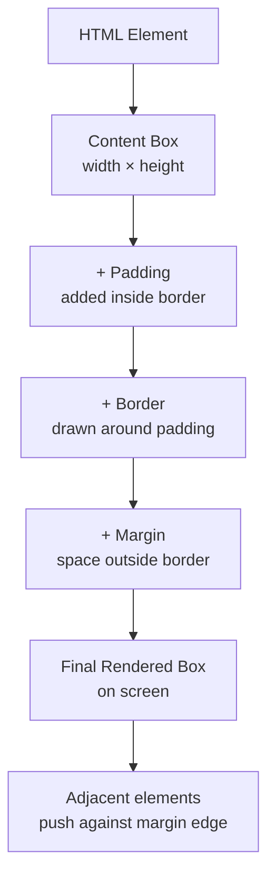
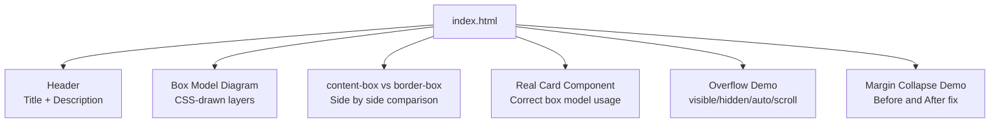

<a id="chapter-32-css-box-model"></a>

# Chapter 32: CSS Box Model

[⬅ Previous Chapter](#chapter-31-css-colors-backgrounds) | [📖 Main Index](#main-index) | [Next Chapter ➡](#chapter-33-margin-padding-border-outline)

---

## 📌 Learning Objectives

By the end of this chapter, you will:

- **Understand** the CSS Box Model — the fundamental layout concept every browser uses
- **Master** all four layers: Content, Padding, Border, Margin
- **Know** the critical difference between `box-sizing: content-box` and `box-sizing: border-box`
- **Calculate** actual rendered dimensions with complete accuracy
- **Understand** width, height, min/max constraints and how they interact
- **Learn** collapsed margins, negative margins, and overflow behavior
- **Crack** the most-asked interview questions on box model calculation
- **Build** a mini project using box model concepts only

---

<a id="chapter-index-table-32"></a>

## Chapter Index Table

| Topic No. | Topic Name | Subtopics |
|-----------|------------|-----------|
| 32.1 | [What is the Box Model?](#32-1-what-is-box-model) | Concept, 4 layers, visual anatomy |
| 32.2 | [Content Area](#32-2-content-area) | width, height, intrinsic sizing |
| 32.3 | [Padding](#32-3-padding) | All syntaxes, visual effect, transparent bg |
| 32.4 | [Border](#32-4-border) | width, style, color, shorthand |
| 32.5 | [Margin](#32-5-margin) | All syntaxes, auto centering, collapsing |
| 32.6 | [box-sizing: content-box](#32-6-box-sizing-content-box) | Default model, calculation formula |
| 32.7 | [box-sizing: border-box](#32-7-box-sizing-border-box) | Why it exists, calculation formula |
| 32.8 | [Width and Height](#32-8-width-height) | px, %, auto, min/max-width, min/max-height |
| 32.9 | [Margin Collapse](#32-9-margin-collapse) | When it happens, how to prevent it |
| 32.10 | [Negative Margins](#32-10-negative-margins) | What they do, use cases |
| 32.11 | [Overflow](#32-11-overflow) | visible, hidden, scroll, auto, clip |
| 32.12 | [Box Model in DevTools](#32-12-devtools) | Reading the box model panel |

---

---

<a id="32-1-what-is-box-model"></a>

## 32.1 What is the CSS Box Model?

---

### 🧠 Hinglish Intuition

> Socho ek parcel box ki tarah. Sab se andar **content** hai — jo actual cheez hai (letter/product). Uske baad **padding** hai — woh bubble wrap jo content ko protect karta hai. Phir **border** hai — cardboard box ka frame. Aur sab se bahar **margin** hai — woh gap jo is box aur dusre boxes ke beech mein hota hai. CSS mein har ek HTML element ek aisa hi box hota hai!

---

### What is it?

The **CSS Box Model** is the fundamental concept that describes how every HTML element is rendered as a rectangular box on screen. Every element — whether `<div>`, `<p>`, `<span>`, or `<button>` — is treated as a box with four distinct layers.

---

### The Four Layers — Full Visual Anatomy

```
THE CSS BOX MODEL — COMPLETE ANATOMY
━━━━━━━━━━━━━━━━━━━━━━━━━━━━━━━━━━━━━━━━━━━━━━━━━━━━━━━━━━━━━━━━━━━

  ┌──────────────────────────────────────────────────────────────────┐
  │                                                                  │
  │   MARGIN  (transparent — shows parent background)               │
  │   ┌──────────────────────────────────────────────────────────┐   │
  │   │  BORDER  (visible line around element)                   │   │
  │   │  ┌────────────────────────────────────────────────────┐  │   │
  │   │  │  PADDING  (space between border and content)       │  │   │
  │   │  │  ┌──────────────────────────────────────────────┐  │  │   │
  │   │  │  │                                              │  │  │   │
  │   │  │  │              CONTENT                         │  │  │   │
  │   │  │  │        (text, images, children)              │  │  │   │
  │   │  │  │                                              │  │  │   │
  │   │  │  └──────────────────────────────────────────────┘  │  │   │
  │   │  │                                                     │  │   │
  │   │  └─────────────────────────────────────────────────────┘  │   │
  │   │                                                            │   │
  │   └────────────────────────────────────────────────────────────┘   │
  │                                                                  │
  └──────────────────────────────────────────────────────────────────┘

━━━━━━━━━━━━━━━━━━━━━━━━━━━━━━━━━━━━━━━━━━━━━━━━━━━━━━━━━━━━━━━━━━━

Layer       Property          Visual Effect
──────────  ────────────────  ──────────────────────────────────────
CONTENT     width, height     Where text/images live
PADDING     padding           Inner spacing — gets element's background
BORDER      border            Visible boundary line
MARGIN      margin            Outer spacing — always transparent
```

---

### Why is it needed?

Without the box model, there would be no systematic way to:
- Space elements from each other
- Add internal breathing room to content
- Draw visible borders
- Calculate actual dimensions on screen

Every layout decision in CSS — flexbox, grid, positioning — still operates on these four box model layers.

---

### How Browser Renders Box Model



---

### What Problem Does it Solve?

```
WITHOUT box model understanding:
━━━━━━━━━━━━━━━━━━━━━━━━━━━━━━━━━━━━━━━━━━━━━━━━━━━━━━━━━━━━━

  .box { width: 300px; padding: 20px; border: 5px solid; }

  Developer EXPECTS: 300px wide box
  Browser RENDERS:   350px wide box  ← SURPRISE!

  300px (content)
  + 20px padding LEFT
  + 20px padding RIGHT
  + 5px border LEFT
  + 5px border RIGHT
  = 350px TOTAL ← this breaks layouts!

WITH box model understanding:
━━━━━━━━━━━━━━━━━━━━━━━━━━━━━━━━━━━━━━━━━━━━━━━━━━━━━━━━━━━━━

  Use box-sizing: border-box → total width stays 300px
  Browser SHRINKS content area to compensate
  Layout becomes predictable!
```

---

> [!IMPORTANT]
> The Box Model is the **single most tested topic** in frontend interviews. Every sizing, spacing, and layout question connects back to it. Master this chapter completely.

---

👉 <a href="#chapter-index-table-32">Go to Top 🔝</a>

---

<a id="32-2-content-area"></a>

## 32.2 Content Area

---

### 🧠 Hinglish Intuition

> Content area woh jagah hai jahan tumhara actual data hota hai — text, image, ya child elements. `width` aur `height` by default sirf is content box ko size karte hain (padding aur border alag se add hoti hai). Agar koi size set na karo toh content apne andar ki cheezein ke hisaab se khud size ho jata hai — ise **intrinsic sizing** kehte hain.

---

### What is the Content Area?

The **content area** is the innermost region of the box model. It contains:
- Text nodes
- Images
- Child HTML elements
- Any rendered content

The `width` and `height` CSS properties (in default `content-box` mode) size **only this layer**.

---

### Content Area Sizing Visual

```
Content Area — How width and height apply

.box {
  width: 300px;
  height: 150px;
}

┌─────────────────────────────────────────────────────────┐
│                    ← 300px →                            │
│   ┌───────────────────────────────────────────────────┐ │
│   │                                                   │ │
│   │              CONTENT AREA                         │ ↕ 150px
│   │         width: 300px  height: 150px               │ │
│   │                                                   │ │
│   └───────────────────────────────────────────────────┘ │
│                 (no padding, no border yet)              │
└─────────────────────────────────────────────────────────┘

The TOTAL rendered size = 300px × 150px
(in default content-box mode, before adding padding/border)
```

---

### Intrinsic vs Extrinsic Sizing

```
INTRINSIC SIZING — element sizes itself based on content:
━━━━━━━━━━━━━━━━━━━━━━━━━━━━━━━━━━━━━━━━━━━━━━━━━━━━━━━━━

  No width set — block element fills parent width:
  ┌────────────────────────────────────────────────────────┐
  │                   PARENT (800px)                       │
  │  ┌──────────────────────────────────────────────────┐  │
  │  │           div (expands to 800px)                 │  │
  │  └──────────────────────────────────────────────────┘  │
  └────────────────────────────────────────────────────────┘

  No width, inline element — shrinks to content:
  ┌────────────────────────────────────────────────────────┐
  │  [span: Hello]  ← only as wide as the text             │
  └────────────────────────────────────────────────────────┘

EXTRINSIC SIZING — developer sets explicit dimensions:
━━━━━━━━━━━━━━━━━━━━━━━━━━━━━━━━━━━━━━━━━━━━━━━━━━━━━━━━━

  width: 300px; height: 200px;
  ┌──────────────────────────────────────────────┐
  │             FIXED: 300 × 200                 │
  │   Content may overflow if too much text      │
  └──────────────────────────────────────────────┘
```

---

### Code Example

```css
/* Extrinsic — fixed size */
.fixed-box {
  width: 300px;
  height: 200px;
  background-color: #3498db;
}

/* Intrinsic — auto sizing (default for blocks) */
.auto-box {
  /* width: auto; ← this is the default */
  height: auto; /* grows with content */
  background-color: #2ecc71;
}

/* Percentage — relative to parent */
.responsive-box {
  width: 50%;      /* 50% of parent's width */
  height: 200px;
  background-color: #e74c3c;
}

/* Content sizing keywords (modern CSS) */
.shrink-box {
  width: fit-content;   /* shrinks to content, won't exceed max */
}
.expand-box {
  width: max-content;   /* expands to content regardless of parent */
}
.fill-box {
  width: min-content;   /* shrinks to smallest possible without overflow */
}
```

---

> [!TIP]
> `width: fit-content`, `width: max-content`, and `width: min-content` are modern intrinsic sizing keywords that solve many layout problems without JavaScript. Know them for interviews.

---

👉 <a href="#chapter-index-table-32">Go to Top 🔝</a>

---

<a id="32-3-padding"></a>

## 32.3 Padding

---

### 🧠 Hinglish Intuition

> Padding matlab content aur border ke beech ka **breathing room**. Socho ek gift box — gift ke baad woh tissue paper ya foam hota hai taaki gift safe rahe aur box ke edges se door rahe. CSS mein padding bilkul wahi kaam karta hai. Important baat: **padding element ki background color leti hai** — transparent nahi hoti. Margin transparent hoti hai, padding nahi.

---

### What is Padding?

**Padding** is the space between the content area and the border. It is part of the element — it takes the element's `background-color` and is clickable/interactive area.

---

### Padding Visual Anatomy

```
Padding — Space between Content and Border

.card {
  padding: 20px;
  background: #3498db;
  border: 2px solid #2980b9;
}

┌──────────────────────────────────────────────────────────┐
│  BORDER (2px solid)                                      │
│  ┌────────────────────────────────────────────────────┐  │
│  │                                                    │  │
│  │   PADDING 20px   ← blue background shows here     │  │
│  │   ┌──────────────────────────────────────────┐    │  │
│  │   │                                          │    │  │
│  │   │  CONTENT  ← blue background here too     │    │  │
│  │   │                                          │    │  │
│  │   └──────────────────────────────────────────┘    │  │
│  │                                                    │  │
│  │   PADDING 20px                                     │  │
│  │                                                    │  │
│  └────────────────────────────────────────────────────┘  │
└──────────────────────────────────────────────────────────┘

KEY: Padding = SAME background as content
     Margin  = TRANSPARENT (shows parent bg)
```

---

### Padding Syntax — All Variants

```
padding shorthand — controls all 4 sides:
━━━━━━━━━━━━━━━━━━━━━━━━━━━━━━━━━━━━━━━━━━━━━━━━━━━━━━━━━━━━━

padding: 20px;
→ ALL four sides = 20px

  ┌──────────────────────────────┐
  │           20px               │
  │  ┌──────────────────────┐   │
20px│  │      CONTENT        │   │20px
  │  └──────────────────────┘   │
  │           20px               │
  └──────────────────────────────┘

━━━━━━━━━━━━━━━━━━━━━━━━━━━━━━━━━━━━━━━━━━━━━━━━━━━━━━━━━━━━━

padding: 10px 20px;
→ TOP/BOTTOM = 10px,  LEFT/RIGHT = 20px

  ┌──────────────────────────────┐
  │           10px               │
  │  ┌──────────────────────┐   │
20px│  │      CONTENT        │   │20px
  │  └──────────────────────┘   │
  │           10px               │
  └──────────────────────────────┘

━━━━━━━━━━━━━━━━━━━━━━━━━━━━━━━━━━━━━━━━━━━━━━━━━━━━━━━━━━━━━

padding: 5px 10px 15px 20px;
→ TOP=5px  RIGHT=10px  BOTTOM=15px  LEFT=20px
  (clockwise from TOP — Remember: TRouBLe = Top Right Bottom Left)

  ┌──────────────────────────────┐
  │            5px               │
  │  ┌──────────────────────┐   │
20px│  │      CONTENT        │   │10px
  │  └──────────────────────┘   │
  │           15px               │
  └──────────────────────────────┘

━━━━━━━━━━━━━━━━━━━━━━━━━━━━━━━━━━━━━━━━━━━━━━━━━━━━━━━━━━━━━

padding: 5px 10px 15px;
→ TOP=5px  RIGHT/LEFT=10px  BOTTOM=15px

━━━━━━━━━━━━━━━━━━━━━━━━━━━━━━━━━━━━━━━━━━━━━━━━━━━━━━━━━━━━━

Individual properties:
  padding-top:    20px;
  padding-right:  15px;
  padding-bottom: 20px;
  padding-left:   15px;
```

---

### Padding Shorthand Memory Trick

```
TRouBLe Mnemonic:
━━━━━━━━━━━━━━━━━━━━━━━━━━━━━━━━━━━━━━━━━━━━━

padding: T  R  B  L
         ↑  ↑  ↑  ↑
         Top  Right  Bottom  Left
         (clockwise from 12 o'clock)

4 values: padding: 5px 10px 15px 20px;
          → T=5  R=10  B=15  L=20

3 values: padding: 5px 10px 15px;
          → T=5  R&L=10  B=15

2 values: padding: 5px 10px;
          → T&B=5  R&L=10

1 value:  padding: 5px;
          → ALL=5
```

---

### Code Example — Padding in Real Components

```css
/* Button — internal breathing room */
.btn {
  padding: 12px 24px;     /* top/bottom: 12, left/right: 24 */
  background-color: #3498db;
  color: white;
  border: none;
  border-radius: 6px;
  cursor: pointer;
}

/* Card — generous padding */
.card {
  padding: 24px;
  background-color: #ffffff;
  border-radius: 12px;
  box-shadow: 0 2px 8px rgba(0,0,0,0.1);
}

/* Input field */
.input {
  padding: 8px 12px;       /* comfortable text input area */
  border: 1px solid #ccc;
  border-radius: 4px;
  width: 100%;
}

/* Navigation item */
.nav-item {
  padding: 16px 20px;      /* creates clickable area */
  display: block;
}

/* Section spacing */
.section {
  padding: 60px 0;          /* vertical breathing room */
}

/* Asymmetric padding */
.toast-notification {
  padding: 12px 16px 12px 48px;  /* left padding for icon space */
}
```

---

> [!IMPORTANT]
> **Padding is NOT transparent.** It takes the element's `background-color`. This means padding increases the **clickable/hoverable area** of elements — which is why buttons have generous padding for better usability.

---

👉 <a href="#chapter-index-table-32">Go to Top 🔝</a>

---

<a id="32-4-border"></a>

## 32.4 Border

---

### 🧠 Hinglish Intuition

> Border element ka visible frame hai — jaise picture frame. Teen cheezein define karo: **width** (kitna mota frame), **style** (solid/dashed/dotted), aur **color** (frame ka rang). Border padding ke baad aur margin se pehle aata hai. Border bhi element ki total width mein add hoti hai (content-box mode mein).

---

### Border Visual

```
Border — The visible frame around an element

.box {
  border-width: 3px;
  border-style: solid;
  border-color: #e74c3c;
}

┌─────────────────────────────────────────────────────────┐
│ ┌──3px──────────────────────────────────────────────┐   │
│ │███████████████████████████████████████████████████│   │
│ │█                                                  │   │
│ │█   PADDING + CONTENT                              │   │
│ │█                                                  │   │
│ │███████████████████████████████████████████████████│   │
│ └───────────────────────────────────────────────────┘   │
└─────────────────────────────────────────────────────────┘
     ↑ Border = 3px thick, solid red line
```

---

### Border Syntax

```
border shorthand:
  border: [width] [style] [color];

  border: 2px solid #333;
  border: 1px dashed red;
  border: 4px double blue;

Individual side control:
  border-top:    2px solid red;
  border-right:  2px solid green;
  border-bottom: 2px solid blue;
  border-left:   2px solid orange;

Individual property control:
  border-width: 2px;
  border-style: solid;
  border-color: #333;

Per-side individual properties:
  border-top-width:  3px;
  border-top-style:  dashed;
  border-top-color:  red;
```

---

### Border Style Options Visual

```
border-style values — what each looks like:
━━━━━━━━━━━━━━━━━━━━━━━━━━━━━━━━━━━━━━━━━━━━━━━━━━━━━━━━━

  solid   → ────────────────────────  continuous line
  dashed  → ─ ─ ─ ─ ─ ─ ─ ─ ─ ─ ─   dashes
  dotted  → · · · · · · · · · · · ·   dots
  double  → ════════════════════════  two lines
  groove  → carved-in 3D effect
  ridge   → raised 3D effect
  inset   → looks pushed in
  outset  → looks pushed out
  none    → no border (default)
  hidden  → same as none (table context: different)

━━━━━━━━━━━━━━━━━━━━━━━━━━━━━━━━━━━━━━━━━━━━━━━━━━━━━━━━━
  IMPORTANT: border-style MUST be set or border won't show!
  border-width and border-color alone → NO visible border
```

---

### Border Width Options

```
border-width values:
━━━━━━━━━━━━━━━━━━━━━━━━━━━━━━━━━━━━━━━━━━━━━━━━━━━━━━━━━

  thin    → 1px  (browser-defined)
  medium  → 3px  (browser-defined)
  thick   → 5px  (browser-defined)
  [px]    → exact pixel value: 1px, 2px, 4px ...
  [em]    → relative to font size

Multi-value syntax (same as padding — TRouBLe):
  border-width: 2px;              → all sides
  border-width: 2px 4px;          → top/bottom=2, left/right=4
  border-width: 1px 2px 3px 4px;  → T R B L
```

---

### Code Example — Borders in Practice

```css
/* Standard card border */
.card {
  border: 1px solid #e0e0e0;
  border-radius: 8px;
}

/* Accent border — only one side */
.alert {
  border: none;
  border-left: 4px solid #e74c3c;   /* left accent line */
  padding: 12px 16px;
  background-color: #fef2f2;
}

/* Input focus border */
.input {
  border: 1px solid #ccc;
  transition: border-color 0.2s;
}
.input:focus {
  border-color: #3498db;
  outline: none;
}

/* Decorative double border */
.title-box {
  border: 3px double #333;
}

/* Dashed placeholder/dropzone */
.dropzone {
  border: 2px dashed #aaa;
  border-radius: 8px;
  padding: 40px;
}

/* Remove default border */
.clean-btn {
  border: none;
  /* or */
  border: 0;
}

/* Different borders per side */
.table-cell {
  border-top: none;
  border-right: 1px solid #eee;
  border-bottom: 1px solid #eee;
  border-left: none;
}
```

---

> [!TIP]
> **`border-left` accent pattern** is one of the most widely used UI patterns for alerts, blockquotes, and notification components. Just `border: none; border-left: 4px solid [color];` creates a clean visual hierarchy.

---

👉 <a href="#chapter-index-table-32">Go to Top 🔝</a>

---

<a id="32-5-margin"></a>

## 32.5 Margin

---

### 🧠 Hinglish Intuition

> Margin woh space hai jo element ke **bahar** hoti hai — doosre elements se door karne ke liye. Ye hamesha **transparent** hoti hai (parent ka background dikhta hai). Margin ka ek unique property hai: **auto** value use karo horizontal centering ke liye. Aur ek ajeeb behavior hai: **margin collapse** — do vertical margins milte hain toh dono ki sum nahi, balki sirf badi wali margin use hoti hai!

---

### What is Margin?

**Margin** is the transparent space **outside** the border. It pushes other elements away. Margin always remains transparent — no background color or image paints in the margin area.

---

### Margin Visual

```
Margin — Space OUTSIDE the border (transparent)

┌─────────────────────────────────────────────────────────────┐
│  PARENT ELEMENT (background: gray)                          │
│                                                             │
│     ← margin →                                              │
│    ┌─────────────────────────────────────────────────────┐  │
│    │                                                     │  │
│    │  BORDER ──────────────────────────────────────────  │  │
│    │  │ PADDING                                         │  │  ↕ margin
│    │  │ │ CONTENT                                       │  │
│    │                                                     │  │
│    └─────────────────────────────────────────────────────┘  │
│                     ↑ margin                                │
│                                                             │
│     ┌─────────────────────────────────────────────────────┐  │
│     │ NEXT ELEMENT                                        │  │
│     └─────────────────────────────────────────────────────┘  │
└─────────────────────────────────────────────────────────────┘

Margin area = GRAY (parent background shows through)
              NO element background painted here
```

---

### Margin Syntax

```
Same shorthand rules as padding (TRouBLe order):
━━━━━━━━━━━━━━━━━━━━━━━━━━━━━━━━━━━━━━━━━━━━━━━━━━━━━━━━━

  margin: 20px;             → all sides
  margin: 10px 20px;        → top/bottom=10, left/right=20
  margin: 10px 20px 30px;   → top=10, L/R=20, bottom=30
  margin: 5px 10px 15px 20px; → T=5 R=10 B=15 L=20

  Individual:
  margin-top:    20px;
  margin-right:  0;
  margin-bottom: 20px;
  margin-left:   0;
```

---

### `margin: auto` — Horizontal Centering

```
margin: auto — The centering trick:
━━━━━━━━━━━━━━━━━━━━━━━━━━━━━━━━━━━━━━━━━━━━━━━━━━━━━━━━━

  .centered {
    width: 600px;
    margin: 0 auto;   ← left and right margins = equal auto
  }

  Parent: 1000px wide
  ┌─────────────────────────────────────────────────────────────────┐
  │               ← 200px auto →  ← 600px →  ← 200px auto →       │
  │               ┌──────────────────────────────────────────────┐  │
  │               │              CENTERED BOX                    │  │
  │               └──────────────────────────────────────────────┘  │
  └─────────────────────────────────────────────────────────────────┘

  Remaining space: 1000 - 600 = 400px
  Auto distributes EQUALLY: 400 / 2 = 200px each side

  REQUIREMENTS for margin auto to work:
  ✅ Block level element
  ✅ Explicit width set (not 100%)
  ✅ Left AND right both set to auto
```

---

### Code Example — Margin in Practice

```css
/* Basic spacing between elements */
.paragraph { margin-bottom: 1em; }

/* Section vertical rhythm */
.section { margin: 60px 0; }

/* Horizontal centering */
.container {
  max-width: 1200px;
  margin: 0 auto;     /* center on page */
  padding: 0 16px;    /* edge breathing room */
}

/* Remove default margins (reset) */
h1, h2, h3, p, ul, ol {
  margin: 0;
}

/* Card grid gap */
.card { margin: 12px; }

/* Push element to one side */
.btn-right {
  margin-left: auto;  /* pushes to right in flex container */
}

/* Vertical spacing between stack items */
.stack > * + * {
  margin-top: 1rem;   /* lobotomized owl — space between all siblings */
}
```

---

> [!IMPORTANT]
> **`margin: auto` only centers horizontally, not vertically.** For vertical centering, use Flexbox (`align-items: center`), Grid, or `position` tricks. Vertical `margin: auto` only works inside flex/grid containers.

---

👉 <a href="#chapter-index-table-32">Go to Top 🔝</a>

---

<a id="32-6-box-sizing-content-box"></a>

## 32.6 box-sizing: content-box

---

### 🧠 Hinglish Intuition

> `content-box` CSS ka **default behavior** hai. Isme `width` sirf content ko size karta hai — phir padding aur border uske upar ADD hoti hai. Yani agar tumne `width: 300px` set kiya aur `padding: 20px, border: 5px` add ki — toh box actually **350px wide** render hoga! Ye confusing aur bug-prone hai — isliye sab log `border-box` prefer karte hain.

---

### What is content-box?

`box-sizing: content-box` is the **CSS default**. In this model:

```
TOTAL WIDTH = width + padding-left + padding-right + border-left + border-right
TOTAL HEIGHT = height + padding-top + padding-bottom + border-top + border-bottom
```

---

### content-box Calculation Visual

```
box-sizing: content-box (DEFAULT)
━━━━━━━━━━━━━━━━━━━━━━━━━━━━━━━━━━━━━━━━━━━━━━━━━━━━━━━━━━━━━━━━━━

CSS:
  .box {
    width: 300px;
    padding: 20px;
    border: 5px solid black;
    box-sizing: content-box;  ← default, no need to write
  }

Box layers laid out:
  ←5px→ ←───20px───→ ←────────300px────────→ ←───20px───→ ←5px→
  ┌────┬──────────────┬──────────────────────┬──────────────┬────┐
  │ B  │   PADDING    │      CONTENT         │   PADDING    │ B  │
  │ 5px│    20px      │       300px          │    20px      │5px │
  └────┴──────────────┴──────────────────────┴──────────────┴────┘

TOTAL RENDERED WIDTH:
  = border-left + padding-left + content-width + padding-right + border-right
  = 5px + 20px + 300px + 20px + 5px
  = 350px  ← ACTUAL rendered width on screen!

Developer set 300px, browser renders 350px — MISMATCH!
━━━━━━━━━━━━━━━━━━━━━━━━━━━━━━━━━━━━━━━━━━━━━━━━━━━━━━━━━━━━━━━━━━

Another example:
  width: 200px; padding: 10px; border: 2px;
  Total = 2 + 10 + 200 + 10 + 2 = 224px
```

---

### Why content-box exists?

The W3C originally specified this model because `width` literally means "content width." It is mathematically consistent — just not practically convenient for developers building layouts.

---

### Code Example

```css
/* Default content-box behavior */
.box-default {
  box-sizing: content-box; /* same as not writing box-sizing at all */
  width: 300px;
  padding: 20px;
  border: 5px solid black;
  /* Total rendered = 350px wide */
}

/* Calculation verification */
.verify {
  width: 100px;       /* content */
  padding: 15px;      /* adds 30px (15 each side) */
  border: 5px solid;  /* adds 10px (5 each side) */
  /* TOTAL = 100 + 30 + 10 = 140px */
}
```

---

> [!NOTE]
> **Margin is NEVER included** in any width calculation — neither in `content-box` nor `border-box`. Margin always lives outside and does not affect the element's own dimensions.

---

👉 <a href="#chapter-index-table-32">Go to Top 🔝</a>

---

<a id="32-7-box-sizing-border-box"></a>

## 32.7 box-sizing: border-box

---

### 🧠 Hinglish Intuition

> `border-box` mein `width` poore box ko size karta hai — content + padding + border sab ek saath. Matlab agar tumne `width: 300px` likha, toh **browser automatically content area ko shrink karta hai** taaki padding aur border ke baad bhi total 300px rahe. Ye sabse intuitive aur practical model hai — isliye har modern project mein `* { box-sizing: border-box; }` global reset use hota hai.

---

### What is border-box?

`box-sizing: border-box` makes `width` and `height` include padding and border. The browser adjusts the **content area** automatically.

```
TOTAL WIDTH = width (includes padding + border)
Content area = width - padding-left - padding-right - border-left - border-right
```

---

### border-box Calculation Visual

```
box-sizing: border-box
━━━━━━━━━━━━━━━━━━━━━━━━━━━━━━━━━━━━━━━━━━━━━━━━━━━━━━━━━━━━━━━━━━

CSS:
  .box {
    width: 300px;
    padding: 20px;
    border: 5px solid black;
    box-sizing: border-box;
  }

The TOTAL box is EXACTLY 300px — guaranteed:
  ←─────────────────── 300px TOTAL ───────────────────────────────→
  ┌────┬──────────────┬──────────────────────┬──────────────┬────┐
  │ B  │   PADDING    │      CONTENT         │   PADDING    │ B  │
  │5px │    20px      │       250px          │    20px      │5px │
  └────┴──────────────┴──────────────────────┴──────────────┴────┘

Content area = 300 - 5 - 20 - 20 - 5 = 250px
Total        = 300px  ← EXACTLY what was set!

━━━━━━━━━━━━━━━━━━━━━━━━━━━━━━━━━━━━━━━━━━━━━━━━━━━━━━━━━━━━━━━━━━

content-box vs border-box — SIDE BY SIDE:
━━━━━━━━━━━━━━━━━━━━━━━━━━━━━━━━━━━━━━━━━━━━━━━━━━━━━━━━━━━━━━━━━━

Both set: width=300px, padding=20px, border=5px

CONTENT-BOX:
  ┌──────────────────────────────────────────────────┐
  │←5→←──20──→←────── 300px content ────→←──20──→←5→│
  │ B │PADDING│         CONTENT          │PADDING│ B │
  └──────────────────────────────────────────────────┘
  Total = 350px   (LARGER than expected)

BORDER-BOX:
  ┌────────────────────────────────────────────┐
  │←5→←─20─→←──── 250px content ────→←─20─→←5→│
  │ B │PAD│         CONTENT          │ PAD │ B │
  └────────────────────────────────────────────┘
  Total = 300px   (EXACTLY what was set)
```

---

### The Universal border-box Reset

```css
/* The single most important CSS reset — used in ALL modern projects */

*,
*::before,
*::after {
  box-sizing: border-box;
}

/*
  Why *::before and *::after?
  Pseudo-elements also create boxes.
  The wildcard alone misses them.
  This is the industry standard reset.
*/
```

---

### Why border-box is Better

```
SCENARIO: Two boxes side by side, each should take 50% of parent

Parent = 1000px

CONTENT-BOX attempt:
  .col { width: 50%; padding: 20px; }
  Content width = 500px
  Total each    = 500 + 40 = 540px
  Together      = 1080px  → OVERFLOW! ❌ Doesn't fit!

  ┌────────────────────────────────────┐ ┌─────────────────────────────────┐
  │←──────────── 540px ───────────────→│ │←──────── 540px ────────────────→│
  │  OVERFLOW outside parent!          │ │  OVERFLOW outside parent!       │
  └────────────────────────────────────┘ └─────────────────────────────────┘

BORDER-BOX solution:
  .col { width: 50%; padding: 20px; box-sizing: border-box; }
  Total each    = exactly 500px  ✅
  Together      = 1000px = fits perfectly!

  ┌───────────────────────────────────┐┌──────────────────────────────────┐
  │←──────────── 500px ──────────────→││←────────── 500px ───────────────→│
  │  FITS exactly in parent!          ││  FITS exactly in parent!         │
  └───────────────────────────────────┘└──────────────────────────────────┘
```

---

### Code Example

```css
/* Global reset — do this in EVERY project */
*, *::before, *::after {
  box-sizing: border-box;
}

/* Now width means TOTAL width — intuitive! */
.sidebar {
  width: 250px;     /* total = exactly 250px */
  padding: 20px;    /* content shrinks, total stays 250px */
  border: 1px solid #eee;
}

.main-content {
  width: calc(100% - 250px);  /* fills remaining space */
  padding: 24px;
  border-left: 1px solid #eee;
}

/* Percentage columns work perfectly */
.col-half   { width: 50%;  padding: 16px; }
.col-third  { width: 33.33%; padding: 16px; }
.col-quarter{ width: 25%;  padding: 16px; }
```

---

> [!IMPORTANT]
> **Always add `*, *::before, *::after { box-sizing: border-box; }` as your first CSS rule.** This is not optional — it is the industry standard. Every CSS framework (Bootstrap, Tailwind, etc.) includes this reset. Without it, width calculations become unpredictable.

---

### content-box vs border-box Summary

```
┌─────────────────────────────────────────────────────────────────┐
│          CONTENT-BOX vs BORDER-BOX COMPARISON                   │
├─────────────────────┬───────────────────────────────────────────┤
│   content-box       │   border-box                              │
├─────────────────────┼───────────────────────────────────────────┤
│ Default behavior    │ Industry standard practice                │
│ width = content     │ width = content + padding + border        │
│ Total > width       │ Total = width (exactly)                   │
│ Hard to calculate   │ Intuitive, predictable                    │
│ Breaks % layouts    │ % layouts work perfectly                  │
│ No reset needed     │ Needs global reset (best practice)        │
└─────────────────────┴───────────────────────────────────────────┘
```

---

👉 <a href="#chapter-index-table-32">Go to Top 🔝</a>

---

<a id="32-8-width-height"></a>

## 32.8 Width and Height

---

### 🧠 Hinglish Intuition

> `width` aur `height` element ki size control karte hain. Lekin sirf fixed values nahi — `%` parent se relative hoti hai, `auto` content ke hisaab se khud adjust hoti hai. `min-width`/`max-width` boundaries set karte hain taaki element bahut chota ya bahut bada na ho. Responsive design mein `max-width` aur `min-height` bahut important hain.

---

### Width Values Visual

```
width property — all values:
━━━━━━━━━━━━━━━━━━━━━━━━━━━━━━━━━━━━━━━━━━━━━━━━━━━━━━━━━━━━━━

  width: 300px;     → fixed pixel width
  ┌──────────────────────────────────────────────────────┐
  │←────────────────── 300px ────────────────────────────→│
  └──────────────────────────────────────────────────────┘

  width: 50%;       → 50% of PARENT element's width
  Parent: 800px → Child: 400px

  width: auto;      → fills available width (block default)
  width: 100%;      → explicitly fill parent (+ padding may overflow!)

  width: min-content;    → shrinks to smallest non-overflow width
  width: max-content;    → expands to fit content in one line
  width: fit-content;    → like auto but respects min/max-content

━━━━━━━━━━━━━━━━━━━━━━━━━━━━━━━━━━━━━━━━━━━━━━━━━━━━━━━━━━━━━━
```

---

### min-width / max-width Visual

```
min-width and max-width — responsive boundaries:
━━━━━━━━━━━━━━━━━━━━━━━━━━━━━━━━━━━━━━━━━━━━━━━━━━━━━━━━━━━━━━

  .container {
    width: 100%;
    max-width: 1200px;
    min-width: 320px;
  }

  Viewport < 320px:
  ┌──────────────────┐
  │←── 320px min ───→│  element stops shrinking at 320px
  └──────────────────┘

  Viewport 600px:
  ┌──────────────────────────────────────────────┐
  │←─── 600px (100% of viewport) ───────────────→│
  └──────────────────────────────────────────────┘

  Viewport 1400px:
  ┌──────────────────────────────────────────────────────────────────┐
  │  VIEWPORT (1400px)                                               │
  │  ┌──────────────────────────────────────────────────────────┐   │
  │  │←────────── 1200px max-width (stops growing) ────────────→│   │
  │  └──────────────────────────────────────────────────────────┘   │
  └──────────────────────────────────────────────────────────────────┘
```

---

### min-height / max-height Visual

```
min-height and max-height — content overflow control:
━━━━━━━━━━━━━━━━━━━━━━━━━━━━━━━━━━━━━━━━━━━━━━━━━━━━━━━━━━━━━━

  .card {
    min-height: 200px;  /* at least 200px tall */
    max-height: 400px;  /* never taller than 400px */
    overflow: auto;     /* scroll if content exceeds 400px */
  }

  SHORT CONTENT (50px text):          TALL CONTENT (500px text):
  ┌─────────────────────────┐         ┌─────────────────────────┐
  │                         │         │ Content...              │ ↕400px
  │ Content (50px text)     │ ↕200px  │ Content...              │ (max)
  │                         │ (min)   │ Content...              │
  │   empty space fills     │         │ ─────────────────────── │
  │   to min-height         │         │ scrollbar appears ↕     │
  └─────────────────────────┘         └─────────────────────────┘
```

---

### Code Example

```css
/* Container pattern — most common in real projects */
.container {
  width: 100%;
  max-width: 1200px;   /* caps at 1200px on wide screens */
  margin: 0 auto;      /* centers it */
  padding: 0 16px;     /* breathing room on edges */
}

/* Full-height section */
.hero {
  min-height: 100vh;    /* at least full viewport height */
  height: auto;         /* grows if content is taller */
}

/* Fixed-size avatar */
.avatar {
  width: 48px;
  height: 48px;
  border-radius: 50%;
  object-fit: cover;
}

/* Responsive image */
.img-responsive {
  width: 100%;
  max-width: 100%;
  height: auto;         /* maintains aspect ratio */
}

/* Sidebar constraints */
.sidebar {
  min-width: 200px;
  max-width: 300px;
  width: 25%;
}

/* Scrollable content area */
.log-window {
  height: 300px;
  max-height: 600px;
  overflow-y: auto;
}
```

---

### Width/Height Calculation Table

```
┌──────────────────────────────────────────────────────────────────┐
│              WIDTH CALCULATION REFERENCE                         │
├────────────────────┬─────────────────────────────────────────────┤
│   Scenario         │   Result                                    │
├────────────────────┼─────────────────────────────────────────────┤
│ width: 200px       │ content = 200px                             │
│ padding: 10px      │ (content-box) total = 220px                 │
│ border: 2px        │ (border-box)  total = 200px, content=176px  │
├────────────────────┼─────────────────────────────────────────────┤
│ width: 50%         │ content = 50% of parent                     │
│ Parent = 800px     │ (content-box) total ≥ 400px                 │
│ padding: 20px      │ (border-box)  total = 400px exactly         │
├────────────────────┼─────────────────────────────────────────────┤
│ width: auto        │ fills container minus its own margins        │
│ (block element)    │ ≠ width: 100% (auto accounts for margin)    │
└────────────────────┴─────────────────────────────────────────────┘
```

---

> [!TIP]
> **`width: auto` vs `width: 100%`**: With `width: auto`, a block element fills available space while still respecting its own horizontal margin. With `width: 100%`, the content/total width equals the parent — adding margin causes overflow. Prefer `auto` for block elements unless explicit 100% is needed.

---

👉 <a href="#chapter-index-table-32">Go to Top 🔝</a>

---

<a id="32-9-margin-collapse"></a>

## 32.9 Margin Collapse

---

### 🧠 Hinglish Intuition

> Margin collapse ek CSS ka surprising behavior hai. Jab do elements ke **vertical margins** adjacent hote hain — toh dono milte nahi, balki sirf **badi wali margin** use hoti hai! Jaise: ek element ka `margin-bottom: 30px` aur doosre ka `margin-top: 20px` — expected gap = 50px, actual gap = **30px** (badi wali). Ye sirf vertical margins mein hota hai, horizontal mein nahi!

---

### What is Margin Collapse?

**Margin collapse** occurs when the vertical margins of two adjacent elements **merge** into a single margin equal to the **larger** of the two values (not the sum).

---

### When Does Margin Collapse Happen?

```
THREE scenarios where margin collapse occurs:
━━━━━━━━━━━━━━━━━━━━━━━━━━━━━━━━━━━━━━━━━━━━━━━━━━━━━━━━━━━━━━━━━━

SCENARIO 1: Adjacent sibling elements
━━━━━━━━━━━━━━━━━━━━━━━━━━━━━━━━━━━━━

  <p style="margin-bottom: 30px">Paragraph 1</p>
  <p style="margin-top: 20px">Paragraph 2</p>

  EXPECTED:          ACTUAL:
  ┌─────────────┐    ┌─────────────┐
  │ Paragraph 1 │    │ Paragraph 1 │
  └─────────────┘    └─────────────┘
       30px                30px      ← only 30px (larger wins)
       20px           ┌─────────────┐
  ┌─────────────┐     │ Paragraph 2 │
  │ Paragraph 2 │     └─────────────┘
  └─────────────┘

  50px expected → 30px actual!

━━━━━━━━━━━━━━━━━━━━━━━━━━━━━━━━━━━━━

SCENARIO 2: Parent and first/last child
━━━━━━━━━━━━━━━━━━━━━━━━━━━━━━━━━━━━━

  <div class="parent">  ← parent has no border/padding
    <p class="child" style="margin-top: 40px">Child</p>
  </div>

  EXPECTED: parent stays at top, child pushed down 40px
  ACTUAL: child's margin-top TRANSFERS to parent!

  ┌────────────────────────────────────┐
  │            40px gap                │  ← gap appears OUTSIDE parent
  │ ┌──────────────────────────────┐   │     not between parent and child
  │ │ PARENT  ┌────────────────┐   │   │
  │ │         │  CHILD         │   │   │
  │ │         └────────────────┘   │   │
  │ └──────────────────────────────┘   │
  └────────────────────────────────────┘

━━━━━━━━━━━━━━━━━━━━━━━━━━━━━━━━━━━━━

SCENARIO 3: Empty elements
━━━━━━━━━━━━━━━━━━━━━━━━━━━━━━━━━━━━━

  <div style="margin-top: 20px; margin-bottom: 30px"></div>
  (empty element with no content/padding/border)

  Its own top and bottom margins collapse into ONE = 30px
```

---

### How to Prevent Margin Collapse

```
Prevention methods — add a "separator" between margins:
━━━━━━━━━━━━━━━━━━━━━━━━━━━━━━━━━━━━━━━━━━━━━━━━━━━━━━━━━━━━━━━━━━

For PARENT-CHILD collapse, add any of:
  ✅ padding-top: 1px;        (even 1px padding blocks collapse)
  ✅ border-top: 1px solid transparent; (even transparent border)
  ✅ overflow: hidden;
  ✅ display: flex;           (flex container doesn't collapse)
  ✅ display: grid;           (grid container doesn't collapse)

For SIBLING collapse:
  ✅ Use only margin-bottom (consistent direction)
  ✅ Add inline element between them
  ✅ Use padding instead of margin
  ✅ Use gap in flex/grid layouts

NOTE: Margin collapse NEVER happens:
  ❌ Horizontally (left/right)
  ❌ Inside flex containers
  ❌ Inside grid containers
  ❌ Absolutely positioned elements
  ❌ Floated elements
```

---

### Code Example

```css
/* PROBLEM — margin collapse */
.heading { margin-bottom: 30px; }
.paragraph { margin-top: 20px; }
/* Gap between them = 30px, not 50px */

/* SOLUTION 1 — use only one direction */
.heading   { margin-bottom: 30px; }
.paragraph { margin-top: 0; }    /* gap = 30px (intentional) */

/* SOLUTION 2 — parent-child collapse fix */
.parent {
  overflow: hidden;     /* creates new block formatting context */
  /* OR */
  padding-top: 0.1px;   /* blocks collapse */
  /* OR */
  display: flow-root;   /* modern BFC creation */
}

/* SOLUTION 3 — use flex/grid (no collapse) */
.stack {
  display: flex;
  flex-direction: column;
  gap: 20px;            /* gap property, not margins */
}
```

---

> [!IMPORTANT]
> Margin collapse is one of the **most common interview questions** about the box model. Remember: it only affects **vertical margins** between **block-level elements** in normal flow. Flexbox and Grid containers do **not** experience margin collapse — which is another reason they're preferred for layouts.

---

👉 <a href="#chapter-index-table-32">Go to Top 🔝</a>

---

<a id="32-10-negative-margins"></a>

## 32.10 Negative Margins

---

### 🧠 Hinglish Intuition

> Negative margins CSS mein allowed hain aur surprisingly useful hain. `margin-top: -20px` matlab element **20px upar khichega** — border ke bahar bhi ja sakta hai. `margin-left: -10px` element left mein shift karta hai. Ye normally avoid karte hain (code complex ho jaata hai), lekin kuch specific use cases mein ye elegant solution deta hai — jaise overlapping card effects ya full-bleed images inside containers.

---

### What are Negative Margins?

**Negative margins** allow an element to move **outside** its normal position or pull adjacent elements closer. Unlike negative padding (which is invalid), negative margin is fully supported.

---

### Negative Margin Visual

```
Negative margins — how they work:
━━━━━━━━━━━━━━━━━━━━━━━━━━━━━━━━━━━━━━━━━━━━━━━━━━━━━━━━━━━━━━━━━━

margin-top: -20px (pulls element UP):

  BEFORE (positive margin):          AFTER (negative margin):
  ┌────────────────────────┐         ┌────────────────────────┐
  │  ELEMENT A             │         │  ELEMENT A             │
  └────────────────────────┘         └────────────────────────┘
        ↕ 20px gap                    ↕ -20px (overlap!)
  ┌────────────────────────┐      ┌────────────────────────┐
  │  ELEMENT B             │      │ ELEMENT A/B overlap    │
  └────────────────────────┘      └────────────────────────┘

━━━━━━━━━━━━━━━━━━━━━━━━━━━━━━━━━━━━━━━━━━━━━━━━━━━━━━━━━━━━━━━━━━

margin-left: negative (full-bleed pattern):

  .container { max-width: 800px; padding: 0 40px; }
  .full-bleed { margin-left: -40px; margin-right: -40px; }

  ┌──────────────────────────────────────────────────────────────┐
  │ VIEWPORT                                                     │
  │   ┌────────────────────────────────────────────────────┐    │
  │   │ container (800px with 40px padding each side)      │    │
  │   │   ┌──────────────────────────────────────────┐     │    │
  │   │   │ Normal content (720px wide)               │     │    │
  │   │   └──────────────────────────────────────────┘     │    │
  │   │ ┌────────────────────────────────────────────────┐ │    │
  │   │ │ .full-bleed (pulls left -40px, right -40px)    │ │    │
  │   │ │ → spans full 800px, ignoring padding!          │ │    │
  │   │ └────────────────────────────────────────────────┘ │    │
  │   └────────────────────────────────────────────────────┘    │
  └──────────────────────────────────────────────────────────────┘
```

---

### Code Example

```css
/* Pull element up — overlap effect */
.card-badge {
  margin-top: -12px;    /* badge overlaps card top edge */
  position: relative;   /* keeps in flow but visually up */
}

/* Full-bleed image inside padded container */
.full-width-image {
  margin-left: -24px;    /* negative of container's padding */
  margin-right: -24px;
  width: calc(100% + 48px);
}

/* Pull adjacent sibling closer */
.tight-pair p:last-child {
  margin-top: -8px;  /* reduce space between heading and subtext */
}

/* Old-school negative margin centering (pre-flexbox) */
.centered-absolute {
  position: absolute;
  top: 50%;
  left: 50%;
  width: 300px;
  height: 200px;
  margin-top: -100px;   /* -(height/2) */
  margin-left: -150px;  /* -(width/2) */
}
```

---

> [!NOTE]
> Negative margins can create hard-to-debug layouts. In modern CSS, most use cases for negative margins are better solved with **Flexbox**, **Grid**, **CSS transforms**, or **relative positioning**. Use negative margins sparingly and always comment why.

---

👉 <a href="#chapter-index-table-32">Go to Top 🔝</a>

---

<a id="32-11-overflow"></a>

## 32.11 Overflow

---

### 🧠 Hinglish Intuition

> Jab element ka content us element ki defined size se zyada ho jaye — toh **overflow** hoti hai. Default mein content bahar nikal jaata hai (`visible`). `overflow: hidden` — bahar ka content clip ho jaata hai (nahi dikhta). `overflow: auto` — sirf zaroorat padne par scrollbar aata hai. `overflow: scroll` — hamesha scrollbar dikhta hai (chahe zaroorat ho ya na ho).

---

### What is Overflow?

**Overflow** defines what happens when an element's content is too large to fit in its defined box. It is controlled by the `overflow` property.

---

### Overflow Values Visual

```
.box { width: 200px; height: 100px; }
Content inside = 400px wide text

━━━━━━━━━━━━━━━━━━━━━━━━━━━━━━━━━━━━━━━━━━━━━━━━━━━━━━━━━━━━━━━━━━

overflow: visible (DEFAULT):
  ┌──────────────────────┐
  │ Short text that is   │ Looong content spills outside ──────────
  │ very long and over   │ the box boundary visually
  └──────────────────────┘

overflow: hidden:
  ┌──────────────────────┐
  │ Short text that is   │
  │ very long and ov     │ ← content CLIPPED at box edge
  └──────────────────────┘   (hidden, not accessible)

overflow: scroll:
  ┌──────────────────────┐
  │ Short text that is ──│→ ← horizontal scrollbar always shows
  │ very long and ov  ↕  │  ← vertical scrollbar always shows
  └──────────────────────┘   (even if not needed)

overflow: auto:
  ┌──────────────────────┐
  │ Short text that is ──│→ ← scrollbar ONLY appears when needed
  └──────────────────────┘   (most user-friendly option)

overflow: clip (newer):
  ┌──────────────────────┐
  │ Short text that is   │  ← like hidden but NO scroll programming API
  └──────────────────────┘     and prevents all overflow painting
```

---

### overflow-x and overflow-y

```
Control each axis independently:
━━━━━━━━━━━━━━━━━━━━━━━━━━━━━━━━━━━━━━━━━━━━━━━━━━━━━━━━━━━━━━━━━━

  overflow-x: hidden;   ← clips horizontal overflow
  overflow-y: auto;     ← scrollbar for vertical overflow only

Common use cases:
  ┌──────────────────────────────────────────────────────────────┐
  │ overflow-x: auto  → horizontal scroll (data tables)          │
  │ overflow-y: auto  → vertical scroll (chat windows, lists)    │
  │ overflow-x: hidden; overflow-y: auto → vertical scroll only  │
  └──────────────────────────────────────────────────────────────┘

NOTE: Setting one axis to anything other than 'visible'
      forces the other axis to 'auto' if it was 'visible'.
      This is a browser specification rule.
```

---

### Code Example

```css
/* Scrollable content area */
.chat-window {
  height: 400px;
  overflow-y: auto;     /* vertical scroll when needed */
  overflow-x: hidden;   /* no horizontal scroll */
}

/* Data table horizontal scroll */
.table-wrapper {
  overflow-x: auto;     /* swipe left/right on mobile */
  width: 100%;
}

/* Clipping rounded corners (classic use) */
.rounded-image-wrapper {
  border-radius: 12px;
  overflow: hidden;      /* child image clips to border-radius */
}

/* Prevent text overflow */
.truncate {
  overflow: hidden;
  white-space: nowrap;
  text-overflow: ellipsis;  /* shows "..." when text is clipped */
  width: 200px;
}

/* Clearfix using overflow (old technique) */
.clearfix {
  overflow: hidden;  /* creates BFC — clears internal floats */
}
```

---

> [!TIP]
> `overflow: hidden` on a parent element creates a **Block Formatting Context (BFC)** — this is why it's used as a clearfix for floats and to prevent parent-child margin collapse. Understanding BFC creation is a common advanced interview topic.

---

👉 <a href="#chapter-index-table-32">Go to Top 🔝</a>

---

<a id="32-12-devtools"></a>

## 32.12 Box Model in Browser DevTools

---

### 🧠 Hinglish Intuition

> Browser DevTools mein Elements panel ke andar ek box model diagram hota hai — bilkul same jaise hum padhe hain. Har layer ke exact pixel values dikhte hain. Ye debugging ka sabse powerful tool hai — kisi bhi element ka select karo aur turant dekho ki uski content, padding, border, margin kya hai. Ye skill interview mein bhi puchhi jaati hai.

---

### Reading the DevTools Box Model Panel

```
Chrome/Firefox DevTools — Box Model Panel
━━━━━━━━━━━━━━━━━━━━━━━━━━━━━━━━━━━━━━━━━━━━━━━━━━━━━━━━━━━━━━━━━━

  ┌────────────────────────────────────────────────────────────┐
  │  Styles  │  Computed  │  Layout  │  ...                   │
  └────────────────────────────────────────────────────────────┘

  [Computed Tab → Box Model visual]

  ┌──────────────────────────────────────────────────────────┐
  │  margin                                                  │
  │  ┌────────────────────────────────────────────────────┐  │
  │  │  border                                            │  │
  │  │  ┌──────────────────────────────────────────────┐  │  │
  │  │  │  padding                                     │  │  │
  │  │  │  ┌────────────────────────────────────────┐  │  │  │
  │  │  │  │                                        │  │  │  │
  │  │  │  │  300 × 150    ← content dimensions     │  │  │  │
  │  │  │  │                                        │  │  │  │
  │  │  │  └────────────────────────────────────────┘  │  │  │
  │  │  │  20  20  20  20 ← padding values T/R/B/L  │  │  │
  │  │  └──────────────────────────────────────────────┘  │  │
  │  │  5    5    5    5  ← border values             │  │
  │  └────────────────────────────────────────────────────┘  │
  │  8  0  8  0            ← margin values T/R/B/L           │
  └──────────────────────────────────────────────────────────┘

Click any value → edit it live in browser!
Hover any layer → that layer highlights on the page!
```

---

### What DevTools Shows

```
┌──────────────────────────────────────────────────────────────────┐
│          DEVTOOLS BOX MODEL INFORMATION                          │
├────────────────────────────┬─────────────────────────────────────┤
│  Value Shown               │  What It Means                     │
├────────────────────────────┼─────────────────────────────────────┤
│  Content: 300 × 150        │  Actual content box dimensions      │
│  Padding: 20 all sides     │  Internal spacing                   │
│  Border: 1                 │  Border thickness                   │
│  Margin: 8 0 8 0           │  External spacing (T/R/B/L)         │
├────────────────────────────┼─────────────────────────────────────┤
│  Total shown at bottom     │  Sum of all layers                  │
│  Negative values shown     │  Negative margin indicated in red   │
│  "auto" shown as computed  │  See calculated pixel value         │
└──────────────────────────────────────────────────────────────────┘
```

---

### DevTools Shortcut Reference

```
Open DevTools:          F12  or  Ctrl+Shift+I  (Cmd+Option+I on Mac)
Inspect element:        Right-click → Inspect
Go to Computed tab:     Click "Computed" in right panel
Find box model:         Scroll down in Computed panel
Edit live value:        Click the number in box model diagram
Toggle class:           .cls button in Styles panel
Force element state:    :hov button → :hover, :focus, :active
```

---

👉 <a href="#chapter-index-table-32">Go to Top 🔝</a>

---

## 💡 Interview Questions

---

### Conceptual Questions

**Q1. What are the four layers of the CSS Box Model?**

> **A:** Content → Padding → Border → Margin (inside out).
> - **Content**: Actual text/images, sized by `width`/`height`
> - **Padding**: Internal spacing, takes element's background color
> - **Border**: Visible frame around padding
> - **Margin**: External transparent spacing between elements

---

**Q2. What is the difference between `box-sizing: content-box` and `box-sizing: border-box`?**

> **A:**
> - **`content-box`** (default): `width` applies to content only. Total rendered width = `width + padding + border`. Adding padding/border makes the element larger than the specified width.
> - **`border-box`**: `width` includes content + padding + border. Total rendered width = exactly the specified `width`. Browser shrinks content area to compensate. This is the preferred model — always set globally with `*, *::before, *::after { box-sizing: border-box; }`.

---

**Q3. Calculate the actual rendered width:**

```css
.box {
  width: 200px;
  padding: 15px;
  border: 3px solid black;
  margin: 10px;
  box-sizing: content-box;
}
```

> **A:** 
> Total = border-left(3) + padding-left(15) + content(200) + padding-right(15) + border-right(3) = **236px**
> Margin(10) does NOT count toward element's own width.

---

**Q4. Same element with `box-sizing: border-box` — what is the rendered width?**

```css
.box {
  width: 200px;
  padding: 15px;
  border: 3px solid black;
  box-sizing: border-box;
}
```

> **A:**
> Total rendered width = **200px** (exactly as set)
> Content area = 200 - 15 - 15 - 3 - 3 = **164px**

---

**Q5. What is margin collapse? When does it happen?**

> **A:** Margin collapse occurs when vertical margins of adjacent block elements merge into a single margin equal to the **larger** value (not the sum).
>
> Three scenarios:
> 1. Adjacent siblings: bottom margin of one + top margin of next → larger one wins
> 2. Parent and first/last child: if parent has no border/padding, child's margin transfers to parent
> 3. Empty element: its own top and bottom margins collapse into one
>
> Does NOT happen: horizontally, in flex/grid containers, floated/absolutely positioned elements.

---

**Q6. What is the difference between `padding` and `margin`?**

```
┌──────────────────────────────────────────────────────────────────┐
│              PADDING vs MARGIN                                   │
├──────────────────────┬───────────────────────────────────────────┤
│  PADDING             │  MARGIN                                   │
├──────────────────────┼───────────────────────────────────────────┤
│ Inside border        │ Outside border                            │
│ Takes background     │ Always transparent                        │
│ Clickable area       │ Not clickable                             │
│ Adds to element size │ Pushes other elements                     │
│ Cannot be negative   │ CAN be negative                           │
│ No collapse          │ Collapses vertically                      │
│ Part of element      │ Space between elements                    │
└──────────────────────┴───────────────────────────────────────────┘
```

---

**Q7. How does `margin: auto` work for centering?**

> **A:** When `margin-left: auto` and `margin-right: auto` are both set on a block element with an explicit `width`, the browser calculates the remaining space (parent width - element width) and distributes it equally to both sides. Requirements: block-level element, explicit width set, both left and right set to auto. `margin: 0 auto` is the shorthand (top/bottom = 0, left/right = auto).

---

**Q8. Why should `border-style` always be set for a border to appear?**

> **A:** `border-style` defaults to `none`. Even if `border-width` and `border-color` are set, without `border-style: solid` (or any visible style), the border will not render. The `border` shorthand sets all three simultaneously: `border: 2px solid red;`.

---

### Scenario-Based Questions

**Q9. A developer sets `width: 100%` and `padding: 20px` on an element. Why does it overflow its parent?**

> **A:** In default `content-box` mode, `width: 100%` sets the content to 100% of the parent. Adding `padding: 20px` adds 40px (20 each side) on top — total = 100% + 40px, causing overflow. Fix: use `box-sizing: border-box` or use `width: calc(100% - 40px)`.

---

**Q10. Two `<p>` elements — first has `margin-bottom: 40px`, second has `margin-top: 30px`. What is the gap between them?**

> **A:** **40px** — not 70px. Margin collapse takes the larger of the two values. This is one of the most commonly missed interview questions.

---

### Output-Based Questions

**Q11. What is the total rendered height of this element?**

```css
.box {
  height: 100px;
  padding-top: 20px;
  padding-bottom: 10px;
  border-top: 5px solid;
  border-bottom: 3px solid;
  box-sizing: content-box;
}
```

> **A:** Total height = border-top(5) + padding-top(20) + content(100) + padding-bottom(10) + border-bottom(3) = **138px**

---

**Q12. What is the total rendered height with `box-sizing: border-box`?**

```css
/* Same as above but box-sizing: border-box */
```

> **A:** Total height = **100px** (exactly as set)
> Content height = 100 - 5 - 20 - 10 - 3 = **62px**

---

### Advanced Questions

**Q13. What is a Block Formatting Context (BFC) and how does `overflow: hidden` create one?**

> **A:** A BFC is an isolated rendering region where elements lay out independently from outside elements. It's created by: `overflow` (anything except `visible`), `display: flow-root`, `float`, `position: absolute/fixed`, `display: flex/grid`.
>
> When `overflow: hidden` creates a BFC: (1) internal floats are contained — clearing floats, (2) margin collapse is prevented with parent's child margins, (3) it doesn't overlap with external floats. `display: flow-root` is the modern, semantically cleaner way to create a BFC explicitly.

---

**Q14. What happens if `min-width` and `max-width` conflict?**

> **A:** `min-width` always wins over `max-width`. If `min-width: 500px` and `max-width: 300px` are both set, the element renders at **500px** — minimum always beats maximum. This is a CSS specification rule: `min-width > max-width > width`.

---

**Q15. Why does `margin: auto` not center vertically?**

> **A:** In normal flow, `height: auto` means the element's height equals its content. There is no "remaining vertical space" to distribute automatically — unlike horizontal layout where the parent's width is always defined. Vertical `margin: auto` resolves to `0` in normal flow. It only works vertically inside **flex** (with `align-self: auto`) or **grid** (with explicit row height) containers where the container has a defined height.

---

## 🧪 Practice Problems

---

### Coding Questions

**P1.** Create a card component (200px wide, 150px tall) using `border-box` sizing with 16px padding, 2px solid border, and 20px margin. Verify the rendered dimensions using browser DevTools.

**P2.** Build a two-column layout where each column takes exactly 50% width with 24px padding, using `border-box` so they fit perfectly side by side without overflow.

**P3.** Create a centered container: `max-width: 960px`, auto horizontal margins, `16px` padding on small screens, `32px` on larger screens — using only CSS (no media queries yet, just the centering structure).

**P4.** Demonstrate margin collapse: create two `<p>` elements, first with `margin-bottom: 50px`, second with `margin-top: 25px`. Then fix the collapse using a flex parent.

**P5.** Create a text truncation component: `width: 250px`, single line, `overflow: hidden`, with ellipsis (`...`) for overflowing text.

---

### Theory Questions

**T1.** Explain why `padding: 10px 20px 30px` has different top and bottom values but the same left and right. What are the exact values for all four sides?

**T2.** A parent has `overflow: hidden` and a child has `margin-top: 40px`. What happens? Why? How does `display: flow-root` solve the same problem more cleanly?

**T3.** What is the difference between `width: auto` and `width: 100%` for block elements? When would you use each?

**T4.** Can `padding` accept negative values? Can `margin`? Explain the behavior of each.

**T5.** A `<div>` has `height: 200px; overflow: hidden;`. The content inside is 400px tall. Explain what the user sees and what happens to the hidden content (is it removed from DOM? Still accessible?).

---

### Machine Coding Problems

**MC1. Box Model Calculator Card**

Build an interactive-looking CSS layout that visually demonstrates the box model with:
- A central "element" box showing content area (labeled with dimensions)
- Visible padding zone with a different background shade
- Visible border (dashed, 3px)
- Margin zone indicated by spacing from other elements
- Labels on each layer ("Content", "Padding", "Border", "Margin")
- A "measurements panel" below showing all pixel values
- Use only HTML and CSS

**MC2. Pricing Cards with Perfect Box Model**

Build three pricing cards (Basic, Pro, Enterprise) in a row where:
- Each card has equal padding (24px all sides)
- Cards have visible border (1px solid with different colors per card)
- Cards have external margin (12px between cards)
- Using `border-box` sizing — card width stays exactly 300px regardless of padding
- Center card has highlighted border (3px solid primary color)
- Each card has a feature list with consistent padding
- Hover state: card lifts with `box-shadow`
- Use only HTML and CSS

---

## 🚀 Mini Project

---

### Problem Statement

Build a **CSS Box Model Visualizer** — an educational tool that shows all four box model layers (margin, border, padding, content) visually labeled, with a real-world card component demonstrating proper box model usage side by side.

---

### Features

1. Labeled box model anatomy diagram (purely CSS)
2. Real-world card component showing correct box model application
3. Comparison: `content-box` vs `border-box` side by side
4. Overflow demo section
5. Margin collapse demo with labels

---

### Flow Diagram



---

### Folder Structure

```
box-model-visualizer/
│
├── index.html
└── style.css
```

---

### Implementation

**index.html:**

```html
<!DOCTYPE html>
<html lang="en">
<head>
  <meta charset="UTF-8" />
  <meta name="viewport" content="width=device-width, initial-scale=1.0" />
  <title>CSS Box Model Visualizer</title>
  <link rel="stylesheet" href="style.css" />
</head>
<body>

  <!-- HEADER -->
  <header class="page-header">
    <h1 class="page-header__title">CSS Box Model Visualizer</h1>
    <p class="page-header__subtitle">
      Chapter 32 — See every layer of the box model, live.
    </p>
  </header>

  <!-- SECTION 1: BOX MODEL ANATOMY -->
  <section class="section">
    <h2 class="section__title">Box Model Anatomy</h2>
    <p class="section__desc">
      Every HTML element is a box. Hover each layer to highlight it.
    </p>

    <div class="bm-diagram">
      <!-- Margin layer -->
      <div class="bm-margin">
        <span class="bm-label bm-label--margin">MARGIN<br><small>transparent · 30px</small></span>

        <!-- Border layer -->
        <div class="bm-border">
          <span class="bm-label bm-label--border">BORDER<br><small>3px solid #333</small></span>

          <!-- Padding layer -->
          <div class="bm-padding">
            <span class="bm-label bm-label--padding">PADDING<br><small>takes bg color · 24px</small></span>

            <!-- Content layer -->
            <div class="bm-content">
              <p class="bm-content__text">CONTENT</p>
              <p class="bm-content__dims">200px × 100px</p>
            </div>

          </div>
        </div>
      </div>
    </div>

    <!-- Layer Legend -->
    <div class="legend">
      <div class="legend__item">
        <span class="legend__color legend__color--margin"></span>
        <span>Margin — <code>margin: 30px</code> — transparent, pushes other elements</span>
      </div>
      <div class="legend__item">
        <span class="legend__color legend__color--border"></span>
        <span>Border — <code>border: 3px solid #333</code> — visible frame</span>
      </div>
      <div class="legend__item">
        <span class="legend__color legend__color--padding"></span>
        <span>Padding — <code>padding: 24px</code> — inner space, takes background</span>
      </div>
      <div class="legend__item">
        <span class="legend__color legend__color--content"></span>
        <span>Content — <code>width: 200px; height: 100px</code> — actual content</span>
      </div>
    </div>
  </section>

  <!-- SECTION 2: content-box vs border-box -->
  <section class="section section--alt">
    <h2 class="section__title">content-box vs border-box</h2>
    <p class="section__desc">
      Both boxes have <code>width: 300px, padding: 20px, border: 5px</code>.
      See how their ACTUAL rendered sizes differ.
    </p>

    <div class="compare-grid">

      <!-- content-box -->
      <div class="compare-card">
        <h3 class="compare-card__title compare-card__title--bad">
          content-box (default)
        </h3>
        <div class="demo-box demo-box--content-box">
          <div class="demo-box__label">
            width: 300px set<br>
            Total renders: 350px ❌
          </div>
        </div>
        <div class="calc-table">
          <div class="calc-row">
            <span>border (×2)</span><span>10px</span>
          </div>
          <div class="calc-row">
            <span>padding (×2)</span><span>40px</span>
          </div>
          <div class="calc-row">
            <span>content</span><span>300px</span>
          </div>
          <div class="calc-row calc-row--total">
            <span>TOTAL</span><span>350px ❌</span>
          </div>
        </div>
        <code class="code-snippet">
          box-sizing: content-box; /* default */<br>
          width: 300px;<br>
          padding: 20px;<br>
          border: 5px solid;
        </code>
      </div>

      <!-- border-box -->
      <div class="compare-card">
        <h3 class="compare-card__title compare-card__title--good">
          border-box (recommended)
        </h3>
        <div class="demo-box demo-box--border-box">
          <div class="demo-box__label">
            width: 300px set<br>
            Total renders: 300px ✅
          </div>
        </div>
        <div class="calc-table">
          <div class="calc-row">
            <span>border (×2)</span><span>10px</span>
          </div>
          <div class="calc-row">
            <span>padding (×2)</span><span>40px</span>
          </div>
          <div class="calc-row">
            <span>content (auto)</span><span>250px</span>
          </div>
          <div class="calc-row calc-row--total">
            <span>TOTAL</span><span>300px ✅</span>
          </div>
        </div>
        <code class="code-snippet">
          box-sizing: border-box; /* recommended */<br>
          width: 300px;<br>
          padding: 20px;<br>
          border: 5px solid;
        </code>
      </div>

    </div>
  </section>

  <!-- SECTION 3: REAL CARD COMPONENT -->
  <section class="section">
    <h2 class="section__title">Real-World Card Component</h2>
    <p class="section__desc">
      A properly built card using <code>border-box</code> sizing,
      consistent padding, border, and margin.
    </p>

    <div class="cards-row">
      <article class="product-card">
        <div class="product-card__badge">NEW</div>
        <div class="product-card__image-area">
          <div class="product-card__image-placeholder">🖼️</div>
        </div>
        <div class="product-card__body">
          <h3 class="product-card__title">Product Name</h3>
          <p class="product-card__desc">
            A quality product with an excellent design.
            Great for everyday use.
          </p>
          <div class="product-card__footer">
            <span class="product-card__price">₹1,299</span>
            <button class="product-card__btn">Add to Cart</button>
          </div>
        </div>
      </article>

      <article class="product-card product-card--featured">
        <div class="product-card__badge product-card__badge--featured">⭐ TOP</div>
        <div class="product-card__image-area">
          <div class="product-card__image-placeholder">🖼️</div>
        </div>
        <div class="product-card__body">
          <h3 class="product-card__title">Premium Product</h3>
          <p class="product-card__desc">
            Our best seller with premium quality and
            exceptional performance.
          </p>
          <div class="product-card__footer">
            <span class="product-card__price">₹2,499</span>
            <button class="product-card__btn product-card__btn--featured">Add to Cart</button>
          </div>
        </div>
      </article>

      <article class="product-card">
        <div class="product-card__badge product-card__badge--sale">SALE</div>
        <div class="product-card__image-area">
          <div class="product-card__image-placeholder">🖼️</div>
        </div>
        <div class="product-card__body">
          <h3 class="product-card__title">Budget Pick</h3>
          <p class="product-card__desc">
            Great value for money. Perfect for those
            starting out.
          </p>
          <div class="product-card__footer">
            <span class="product-card__price">₹699</span>
            <button class="product-card__btn">Add to Cart</button>
          </div>
        </div>
      </article>
    </div>
  </section>

  <!-- SECTION 4: OVERFLOW DEMO -->
  <section class="section section--alt">
    <h2 class="section__title">Overflow Behavior</h2>
    <p class="section__desc">
      All boxes below have <code>width: 220px; height: 100px</code> with
      long content. See how each <code>overflow</code> value behaves.
    </p>

    <div class="overflow-grid">
      <div class="overflow-demo-item">
        <h4>overflow: visible</h4>
        <div class="overflow-box overflow-box--visible">
          This is a very long text that will overflow the box boundary visibly without any clipping or scrollbars.
        </div>
      </div>
      <div class="overflow-demo-item">
        <h4>overflow: hidden</h4>
        <div class="overflow-box overflow-box--hidden">
          This is a very long text that will overflow the box boundary visibly without any clipping or scrollbars.
        </div>
      </div>
      <div class="overflow-demo-item">
        <h4>overflow: scroll</h4>
        <div class="overflow-box overflow-box--scroll">
          This is a very long text that will overflow the box boundary visibly without any clipping or scrollbars.
        </div>
      </div>
      <div class="overflow-demo-item">
        <h4>overflow: auto</h4>
        <div class="overflow-box overflow-box--auto">
          This is a very long text that will overflow the box boundary visibly without any clipping or scrollbars.
        </div>
      </div>
    </div>
  </section>

  <!-- SECTION 5: MARGIN COLLAPSE DEMO -->
  <section class="section">
    <h2 class="section__title">Margin Collapse</h2>
    <p class="section__desc">
      Two paragraphs: first has <code>margin-bottom: 40px</code>,
      second has <code>margin-top: 25px</code>.
      Expected gap = 65px. Actual gap = 40px (larger wins).
    </p>

    <div class="collapse-demo">
      <h3 class="collapse-demo__heading">❌ With Collapse (default flow)</h3>
      <div class="collapse-demo__area">
        <p class="collapse-p collapse-p--bottom">
          Paragraph 1 — margin-bottom: 40px
        </p>
        <p class="collapse-p collapse-p--top">
          Paragraph 2 — margin-top: 25px
        </p>
      </div>
      <p class="collapse-demo__note">
        Actual gap = 40px (not 65px!) — larger margin wins.
      </p>
    </div>

    <div class="collapse-demo collapse-demo--fixed">
      <h3 class="collapse-demo__heading">✅ Fixed (flex container)</h3>
      <div class="collapse-demo__area collapse-demo__area--flex">
        <p class="collapse-p collapse-p--bottom">
          Paragraph 1 — margin-bottom: 40px
        </p>
        <p class="collapse-p collapse-p--top">
          Paragraph 2 — margin-top: 25px
        </p>
      </div>
      <p class="collapse-demo__note">
        Actual gap = 65px — flex container prevents collapse!
      </p>
    </div>
  </section>

  <!-- FOOTER -->
  <footer class="page-footer">
    <p>Chapter 32 — CSS Box Model | Content · Padding · Border · Margin</p>
  </footer>

</body>
</html>
```

---

**style.css:**

```css
/* =============================================
   CSS BOX MODEL VISUALIZER — style.css
   Chapter 32: CSS Box Model
   ============================================= */

/* ── GLOBAL RESET + border-box ── */
*, *::before, *::after {
  box-sizing: border-box;
  margin: 0;
  padding: 0;
}

:root {
  --color-margin:  #fde8c8;
  --color-border:  #fbb86a;
  --color-padding: #c8e6c9;
  --color-content: #90caf9;

  --color-primary: #2563eb;
  --color-success: #16a34a;
  --color-danger:  #dc2626;
  --color-warn:    #d97706;

  --gray-50:  #f9fafb;
  --gray-100: #f3f4f6;
  --gray-200: #e5e7eb;
  --gray-500: #6b7280;
  --gray-700: #374151;
  --gray-900: #111827;

  --white: #ffffff;
  --radius-sm: 6px;
  --radius-md: 12px;
  --radius-lg: 16px;
  --shadow-sm: 0 1px 3px rgba(0,0,0,0.1);
  --shadow-md: 0 4px 16px rgba(0,0,0,0.12);
  --shadow-lg: 0 8px 32px rgba(0,0,0,0.16);
  --font: 'Segoe UI', system-ui, -apple-system, sans-serif;
  --font-mono: 'Fira Code', 'Consolas', monospace;
}

body {
  font-family: var(--font);
  background-color: var(--gray-50);
  color: var(--gray-900);
  line-height: 1.6;
}

/* ── PAGE HEADER ── */
.page-header {
  background-color: var(--gray-900);
  background-image:
    repeating-linear-gradient(
      45deg,
      rgba(255,255,255,0.02) 0px,
      rgba(255,255,255,0.02) 1px,
      transparent 1px,
      transparent 20px
    );
  color: var(--white);
  padding: 48px 24px;
  text-align: center;
}

.page-header__title {
  font-size: clamp(1.8rem, 4vw, 3rem);
  font-weight: 800;
  margin-bottom: 12px;
  letter-spacing: -0.5px;
}

.page-header__subtitle {
  color: rgba(255,255,255,0.65);
  font-size: 1.05rem;
}

/* ── SECTIONS ── */
.section {
  max-width: 1100px;
  margin: 0 auto;
  padding: 60px 24px;
}

.section--alt {
  background-color: var(--gray-100);
  max-width: 100%;
  padding: 60px 24px;
}

.section--alt > * {
  max-width: 1100px;
  margin-left: auto;
  margin-right: auto;
}

.section__title {
  font-size: 1.75rem;
  font-weight: 700;
  margin-bottom: 8px;
  color: var(--gray-900);
}

.section__desc {
  color: var(--gray-500);
  margin-bottom: 36px;
  font-size: 0.95rem;
}

.section__desc code {
  background-color: var(--gray-200);
  padding: 2px 6px;
  border-radius: 4px;
  font-family: var(--font-mono);
  font-size: 0.85em;
}

/* ── BOX MODEL DIAGRAM ── */
.bm-diagram {
  display: flex;
  justify-content: center;
  margin-bottom: 36px;
}

/* MARGIN layer */
.bm-margin {
  position: relative;
  background-color: var(--color-margin);
  padding: 36px;
  border-radius: var(--radius-lg);
  border: 2px dashed var(--color-warn);
  transition: box-shadow 0.2s;
}

.bm-margin:hover {
  box-shadow: 0 0 0 4px rgba(251,184,106,0.4);
}

/* BORDER layer */
.bm-border {
  position: relative;
  background-color: var(--color-border);
  padding: 20px;
  border: 6px solid #a0522d;
  border-radius: var(--radius-md);
  transition: box-shadow 0.2s;
}

.bm-border:hover {
  box-shadow: 0 0 0 4px rgba(160,82,45,0.4);
}

/* PADDING layer */
.bm-padding {
  position: relative;
  background-color: var(--color-padding);
  padding: 28px;
  border-radius: var(--radius-sm);
  transition: box-shadow 0.2s;
}

.bm-padding:hover {
  box-shadow: 0 0 0 4px rgba(22,163,74,0.3);
}

/* CONTENT layer */
.bm-content {
  background-color: var(--color-content);
  width: 220px;
  height: 100px;
  display: flex;
  flex-direction: column;
  align-items: center;
  justify-content: center;
  border-radius: 4px;
  text-align: center;
}

.bm-content__text {
  font-weight: 800;
  font-size: 1rem;
  color: #1e40af;
  letter-spacing: 2px;
}

.bm-content__dims {
  font-size: 0.75rem;
  color: #3b82f6;
  font-family: var(--font-mono);
}

/* LABELS */
.bm-label {
  position: absolute;
  top: 4px;
  left: 8px;
  font-size: 0.65rem;
  font-weight: 700;
  letter-spacing: 1px;
  text-transform: uppercase;
  line-height: 1.3;
}

.bm-label--margin  { color: #92400e; }
.bm-label--border  { color: #7c2d12; }
.bm-label--padding { color: #14532d; }

/* ── LEGEND ── */
.legend {
  display: flex;
  flex-direction: column;
  gap: 8px;
}

.legend__item {
  display: flex;
  align-items: center;
  gap: 12px;
  font-size: 0.9rem;
}

.legend__color {
  width: 20px;
  height: 20px;
  border-radius: 4px;
  flex-shrink: 0;
}

.legend__color--margin  { background-color: var(--color-margin); border: 1px solid var(--color-warn); }
.legend__color--border  { background-color: var(--color-border); border: 2px solid #a0522d; }
.legend__color--padding { background-color: var(--color-padding); }
.legend__color--content { background-color: var(--color-content); }

/* ── COMPARE GRID ── */
.compare-grid {
  display: grid;
  grid-template-columns: repeat(auto-fit, minmax(280px, 1fr));
  gap: 24px;
}

.compare-card {
  background-color: var(--white);
  border-radius: var(--radius-md);
  padding: 24px;
  box-shadow: var(--shadow-md);
}

.compare-card__title {
  font-size: 1rem;
  font-weight: 700;
  margin-bottom: 16px;
  padding: 8px 12px;
  border-radius: var(--radius-sm);
}

.compare-card__title--bad  {
  background-color: #fee2e2;
  color: var(--color-danger);
}

.compare-card__title--good {
  background-color: #dcfce7;
  color: var(--color-success);
}

/* Demo boxes */
.demo-box {
  height: 80px;
  padding: 20px;
  border: 5px solid var(--gray-700);
  display: flex;
  align-items: center;
  justify-content: center;
  margin-bottom: 16px;
  border-radius: 4px;
}

.demo-box--content-box {
  box-sizing: content-box;
  width: 200px;           /* content-box: total = 250px */
  background-color: #fee2e2;
  border-color: var(--color-danger);
}

.demo-box--border-box {
  box-sizing: border-box;
  width: 250px;           /* border-box: total = exactly 250px */
  background-color: #dcfce7;
  border-color: var(--color-success);
}

.demo-box__label {
  font-size: 0.72rem;
  font-weight: 600;
  text-align: center;
  line-height: 1.5;
}

/* Calculation table */
.calc-table {
  border: 1px solid var(--gray-200);
  border-radius: var(--radius-sm);
  overflow: hidden;
  margin-bottom: 16px;
}

.calc-row {
  display: flex;
  justify-content: space-between;
  padding: 6px 12px;
  font-size: 0.82rem;
  border-bottom: 1px solid var(--gray-100);
}

.calc-row:last-child { border-bottom: none; }

.calc-row--total {
  background-color: var(--gray-900);
  color: var(--white);
  font-weight: 700;
}

.code-snippet {
  display: block;
  background-color: var(--gray-900);
  color: #86efac;
  font-family: var(--font-mono);
  font-size: 0.75rem;
  padding: 12px;
  border-radius: var(--radius-sm);
  line-height: 1.8;
}

/* ── PRODUCT CARDS ── */
.cards-row {
  display: grid;
  grid-template-columns: repeat(auto-fit, minmax(240px, 1fr));
  gap: 20px;
}

.product-card {
  box-sizing: border-box;          /* ← border-box in action */
  background-color: var(--white);
  border: 1px solid var(--gray-200);
  border-radius: var(--radius-md);
  padding: 0;
  box-shadow: var(--shadow-sm);
  position: relative;
  overflow: hidden;
  transition: transform 0.2s, box-shadow 0.2s;
}

.product-card:hover {
  transform: translateY(-4px);
  box-shadow: var(--shadow-lg);
}

.product-card--featured {
  border: 2px solid var(--color-primary);
  box-shadow: 0 0 0 4px rgba(37,99,235,0.1), var(--shadow-md);
}

.product-card__badge {
  position: absolute;
  top: 12px;
  right: 12px;
  background-color: var(--gray-900);
  color: var(--white);
  font-size: 0.65rem;
  font-weight: 700;
  letter-spacing: 1px;
  padding: 4px 8px;
  border-radius: 100px;
}

.product-card__badge--featured { background-color: var(--color-primary); }
.product-card__badge--sale     { background-color: var(--color-danger); }

.product-card__image-area {
  background-color: var(--gray-100);
  height: 140px;
  display: flex;
  align-items: center;
  justify-content: center;
}

.product-card__image-placeholder {
  font-size: 3rem;
  opacity: 0.4;
}

.product-card__body {
  padding: 20px;     /* ← padding adds breathing room inside border */
}

.product-card__title {
  font-size: 1rem;
  font-weight: 700;
  margin-bottom: 8px;
  color: var(--gray-900);
}

.product-card__desc {
  font-size: 0.85rem;
  color: var(--gray-500);
  margin-bottom: 20px;
  line-height: 1.5;
}

.product-card__footer {
  display: flex;
  align-items: center;
  justify-content: space-between;
  gap: 12px;
}

.product-card__price {
  font-size: 1.2rem;
  font-weight: 800;
  color: var(--gray-900);
}

.product-card__btn {
  padding: 8px 16px;      /* ← padding creates clickable area */
  background-color: var(--gray-900);
  color: var(--white);
  border: none;
  border-radius: var(--radius-sm);
  font-size: 0.8rem;
  font-weight: 600;
  cursor: pointer;
  transition: background-color 0.2s;
}

.product-card__btn:hover {
  background-color: var(--gray-700);
}

.product-card__btn--featured {
  background-color: var(--color-primary);
}

.product-card__btn--featured:hover {
  background-color: #1d4ed8;
}

/* ── OVERFLOW DEMO ── */
.overflow-grid {
  display: grid;
  grid-template-columns: repeat(auto-fit, minmax(200px, 1fr));
  gap: 24px;
  max-width: 1100px;
  margin: 0 auto;
}

.overflow-demo-item h4 {
  font-size: 0.85rem;
  font-family: var(--font-mono);
  margin-bottom: 8px;
  color: var(--gray-700);
  background-color: var(--gray-200);
  padding: 4px 8px;
  border-radius: 4px;
  display: inline-block;
}

.overflow-box {
  width: 100%;
  height: 100px;
  background-color: var(--white);
  border: 2px solid var(--gray-700);
  border-radius: var(--radius-sm);
  padding: 10px;
  font-size: 0.8rem;
  line-height: 1.5;
  color: var(--gray-700);
}

.overflow-box--visible { overflow: visible;  }
.overflow-box--hidden  { overflow: hidden;   background-color: #fef2f2; border-color: var(--color-danger); }
.overflow-box--scroll  { overflow: scroll;   background-color: #fefce8; border-color: var(--color-warn); }
.overflow-box--auto    { overflow: auto;     background-color: #f0fdf4; border-color: var(--color-success); }

/* ── MARGIN COLLAPSE DEMO ── */
.collapse-demo {
  background-color: var(--white);
  border: 1px solid var(--gray-200);
  border-radius: var(--radius-md);
  padding: 24px;
  margin-bottom: 24px;
  box-shadow: var(--shadow-sm);
}

.collapse-demo--fixed {
  border-color: var(--color-success);
}

.collapse-demo__heading {
  font-size: 1rem;
  font-weight: 700;
  margin-bottom: 16px;
  color: var(--gray-700);
}

.collapse-demo__area {
  background-color: var(--gray-100);
  border-radius: var(--radius-sm);
  padding: 0 16px;
}

.collapse-demo__area--flex {
  display: flex;
  flex-direction: column;
}

.collapse-p {
  background-color: var(--color-content);
  padding: 12px 16px;
  border-radius: var(--radius-sm);
  font-size: 0.85rem;
  font-weight: 600;
  color: #1e40af;
}

.collapse-p--bottom { margin-bottom: 40px; }
.collapse-p--top    { margin-top: 25px; }

.collapse-demo__note {
  margin-top: 12px;
  font-size: 0.82rem;
  color: var(--gray-500);
  font-style: italic;
}

/* ── FOOTER ── */
.page-footer {
  background-color: var(--gray-900);
  color: rgba(255,255,255,0.5);
  text-align: center;
  padding: 24px;
  font-size: 0.85rem;
}

/* ── RESPONSIVE ── */
@media (max-width: 600px) {
  .bm-content {
    width: 140px;
    height: 80px;
  }
  .bm-padding { padding: 16px; }
  .bm-border  { padding: 12px; }
  .bm-margin  { padding: 20px; }
  .compare-grid { grid-template-columns: 1fr; }
  .overflow-grid { grid-template-columns: 1fr 1fr; }
}
```

---

### Interview Discussion

**Q: Why is `*, *::before, *::after { box-sizing: border-box }` always the first CSS rule?**

> Because every element — including pseudo-elements — defaults to `content-box`. Without this reset, padding and border add to the specified width, breaking percentage-based layouts. Setting it globally makes all width calculations predictable. The `::before` and `::after` pseudo-selectors must be included explicitly since `*` alone doesn't match them.

**Q: In the card component, why use `padding` on `product-card__body` instead of on the card itself?**

> The card has an image area at the top (`product-card__image-area`) that should bleed edge-to-edge. If padding was on the `.product-card` directly, the image would also be padded and not touch the edges. By putting padding only on `.product-card__body`, the image fills edge-to-edge while the text content has breathing room.

**Q: How does the margin collapse demo prove the concept?**

> In the first demo (normal flow), `margin-bottom: 40px` and `margin-top: 25px` should sum to 65px — but the visual gap is only 40px (larger wins). In the second demo, wrapping in `display: flex; flex-direction: column` prevents collapse — both margins are respected, giving the full 65px gap.

**Q: Why is `overflow: hidden` added to `.product-card`?**

> To clip the `.product-card__image-area` to the card's `border-radius`. Without `overflow: hidden`, the image's corners would stick out beyond the card's rounded border, breaking the visual. This is the most common use of `overflow: hidden` in component design.

---

## ⚡ Quick Revision

```
BOX MODEL QUICK REFERENCE
━━━━━━━━━━━━━━━━━━━━━━━━━━━━━━━━━━━━━━━━━━━━━━━━━━━━━━━━━━━━━━━━━━

4 LAYERS (inside → out):
  Content → Padding → Border → Margin

PADDING vs MARGIN:
  Padding:  inside border, takes background, clickable, no collapse
  Margin:   outside border, transparent, collapses vertically

SHORTHAND (TRouBLe — T R B L):
  1 value:  all sides
  2 values: top/bottom  left/right
  3 values: top  left/right  bottom
  4 values: top  right  bottom  left

content-box (default):
  Total width = width + padding×2 + border×2

border-box (recommended):
  Total width = width (exactly)
  Content = width - padding×2 - border×2

GLOBAL RESET (always use):
  *, *::before, *::after { box-sizing: border-box; }

margin: auto → centers block horizontally (needs explicit width)

MARGIN COLLAPSE:
  Vertical only → larger value wins (not sum)
  Prevented by: flex, grid, padding, border, overflow:hidden, flow-root

OVERFLOW VALUES:
  visible → default, spills out
  hidden  → clips content, creates BFC
  scroll  → always shows scrollbar
  auto    → scrollbar only when needed ← best UX choice

COMMON INTERVIEW TRAPS:
  ❌ margin adds to element's own rendered size  (NO — margin is outside)
  ❌ padding can be negative                     (NO — padding ≥ 0 always)
  ❌ margin collapses horizontally               (NO — vertical only)
  ❌ border-box is the CSS default               (NO — content-box is default)
  ❌ margin:auto centers vertically in flow      (NO — horizontal only)
  ✅ overflow:hidden creates a BFC               (YES)
  ✅ flex/grid containers prevent margin collapse (YES)
```

---

## 📌 Chapter Summary

### Most Important Interview Points

1. **Four layers** — Content → Padding → Border → Margin (inside to outside)
2. **`content-box` default** — `width` = content only; total = width + padding + border
3. **`border-box` preferred** — `width` = total; content shrinks to fit
4. **Always reset** — `*, *::before, *::after { box-sizing: border-box; }` in every project
5. **Padding takes background** — padding area inherits element's `background-color`
6. **Margin is transparent** — always shows parent background; never takes element background
7. **Margin collapse** — vertical adjacent margins merge to larger value (not sum)
8. **`margin: auto`** — centers block elements horizontally with explicit width
9. **`overflow: hidden`** — creates BFC, prevents margin collapse, clips content, clears floats
10. **Margin ≠ total width** — margin is NEVER counted in element's own width calculation

### Key Concepts

| Concept | Key Point |
|---------|-----------|
| content-box | Total = width + padding×2 + border×2 |
| border-box | Total = width exactly |
| Margin collapse | Vertical only; larger value wins; prevented by flex/grid |
| margin: auto | Centers block element; needs explicit width |
| overflow: hidden | Creates BFC; clips content; clears floats |
| padding | Takes background color; increases clickable area |
| margin | Transparent; can be negative; collapses |
| min-width > max-width | min always beats max if they conflict |

### Common Mistakes

- ❌ Forgetting `box-sizing: border-box` reset → percentage widths break
- ❌ Not knowing margin doesn't count in element's width
- ❌ Assuming margin collapse works horizontally
- ❌ Setting `margin: auto` and expecting vertical centering in normal flow
- ❌ Setting `border-color`/`border-width` without `border-style` → border not visible
- ❌ Using `overflow: scroll` everywhere → scrollbar always visible even when unnecessary
- ❌ Forgetting `overflow: hidden` after `border-radius` on image containers

### Practical Takeaways

- Use `box-sizing: border-box` globally — no exceptions
- Prefer `overflow: auto` over `overflow: scroll` for UX
- Use `display: flex`/`grid` to avoid margin collapse headaches
- `margin: 0 auto` + explicit `max-width` = standard page centering pattern
- `overflow: hidden` on image wrapper = clean border-radius clipping
- Use DevTools box model panel to debug spacing issues instantly

---

[⬅ Previous Chapter](#chapter-31-css-colors-backgrounds) | [📖 Main Index](#main-index) | [Next Chapter ➡](#chapter-33-margin-padding-border-outline)