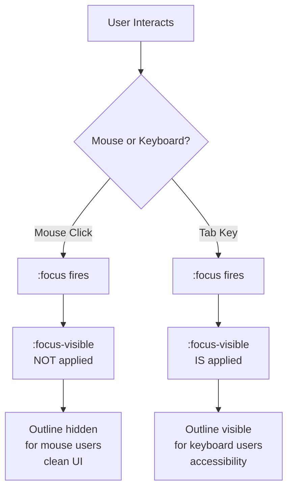
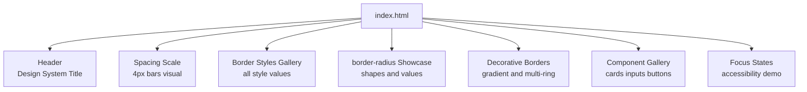

<a id="chapter-33-margin-padding-border-outline"></a>

# Chapter 33: Margin, Padding, Border & Outline

[⬅ Previous Chapter](#chapter-32-css-box-model) | [📖 Main Index](#main-index) | [Next Chapter ➡](#chapter-34-css-units)

---

## 📌 Learning Objectives

By the end of this chapter, you will:

- **Master** all shorthand and longhand syntax for margin, padding, border, and outline
- **Understand** border-radius deeply — circles, pills, ellipses, and individual corner control
- **Know** the critical difference between `outline` and `border` — a top interview question
- **Learn** advanced margin collapse scenarios and all prevention techniques
- **Master** border-image, border styles, and decorative border techniques
- **Understand** outline-offset and accessibility implications of outline
- **Build** a production-quality UI component library demonstrating all concepts
- **Crack** every interview question on spacing, borders, and outlines

---

<a id="chapter-index-table-33"></a>

## Chapter Index Table

| Topic No. | Topic Name | Subtopics |
|-----------|------------|-----------|
| 33.1 | [Margin — Deep Dive](#33-1-margin-deep-dive) | All syntaxes, auto, negative, collapse scenarios |
| 33.2 | [Margin Collapse — All Scenarios](#33-2-margin-collapse-all-scenarios) | 3 scenarios, prevention, BFC |
| 33.3 | [Padding — Deep Dive](#33-3-padding-deep-dive) | All syntaxes, percentage padding, use cases |
| 33.4 | [Border — Deep Dive](#33-4-border-deep-dive) | Shorthand, styles, individual sides, border-image |
| 33.5 | [border-radius](#33-5-border-radius) | px/%, circle, pill, ellipse, individual corners |
| 33.6 | [Outline vs Border](#33-6-outline-vs-border) | Key differences, outline-offset, accessibility |
| 33.7 | [Outline Properties](#33-7-outline-properties) | outline-width, style, color, offset, shorthand |
| 33.8 | [Decorative Border Techniques](#33-8-decorative-border-techniques) | border-image, gradient borders, multi-border tricks |
| 33.9 | [Spacing Patterns & Best Practices](#33-9-spacing-patterns) | Consistent spacing, spacing scale, layout patterns |

---

---

<a id="33-1-margin-deep-dive"></a>

## 33.1 Margin — Deep Dive

---

### 🧠 Hinglish Intuition

> Margin ek element ka "personal space" hai — woh doosre elements ko apne se door rakhta hai. Jaise log public transport mein thoda space chhod ke baithte hain — margin wahi kaam karta hai elements ke beech. **Yaad rakho:** margin transparent hoti hai (parent ka background dikhta hai), negative ho sakti hai, aur vertically collapse hoti hai. `auto` value horizontal centering ka magic karta hai.

---

### Margin Syntax — Complete Reference

```
MARGIN SHORTHAND — ALL VARIANTS
━━━━━━━━━━━━━━━━━━━━━━━━━━━━━━━━━━━━━━━━━━━━━━━━━━━━━━━━━━━━━━━━━━

margin: [top] [right] [bottom] [left];  ← TRouBLe order

━━━━━━━━━━━━━━━━━━━━━━━━━━━━━━━━━━━━━━━━━━━━━━━━━━━━━━━━━━━━━━━━━━

1 value:     margin: 20px;
             ┌─────────────────────┐
             │         20          │
             │  20  [ELEMENT]  20  │
             │         20          │
             └─────────────────────┘

2 values:    margin: 10px 30px;
             ┌─────────────────────┐
             │         10          │
             │  30  [ELEMENT]  30  │
             │         10          │
             └─────────────────────┘
             T/B = 10px,  L/R = 30px

3 values:    margin: 5px 15px 25px;
             ┌─────────────────────┐
             │          5          │
             │  15  [ELEMENT]  15  │
             │         25          │
             └─────────────────────┘
             T=5, L/R=15, B=25

4 values:    margin: 5px 10px 15px 20px;
             ┌─────────────────────┐
             │          5          │
             │  20  [ELEMENT]  10  │
             │         15          │
             └─────────────────────┘
             T=5, R=10, B=15, L=20  ← clockwise

━━━━━━━━━━━━━━━━━━━━━━━━━━━━━━━━━━━━━━━━━━━━━━━━━━━━━━━━━━━━━━━━━━

Individual properties:
  margin-top:    value;
  margin-right:  value;
  margin-bottom: value;
  margin-left:   value;

Accepted values:
  px    → fixed: margin: 20px
  em    → relative to element font-size: margin: 1em
  rem   → relative to root font-size: margin: 1rem
  %     → relative to PARENT WIDTH (even for top/bottom margin!)
  auto  → browser calculates (horizontal centering)
  0     → no margin (unitless zero is valid)
  negative → pulls element toward that direction
```

---

### margin: auto — Complete Behavior

```
margin: auto — When and How it works:
━━━━━━━━━━━━━━━━━━━━━━━━━━━━━━━━━━━━━━━━━━━━━━━━━━━━━━━━━━━━━━━━━━

SCENARIO 1: Horizontal centering (most common)
  .box { width: 600px; margin: 0 auto; }

  Parent: 1000px
  ┌──────────────────────────────────────────────────────────────┐
  │  ← 200px →  ┌──────── 600px ─────────┐  ← 200px →          │
  │    (auto)   │         BOX            │    (auto)            │
  │             └────────────────────────┘                      │
  └──────────────────────────────────────────────────────────────┘
  Remaining = 1000 - 600 = 400px → split equally = 200px each

━━━━━━━━━━━━━━━━━━━━━━━━━━━━━━━━━━━━━━━━━━━━━━━━━━━━━━━━━━━━━━━━━━

SCENARIO 2: Push to right (flex context)
  .item { margin-left: auto; }

  ┌──────────────────────────────────────────────────────────────┐
  │ [Logo]                              [margin-left:auto→] [Btn]│
  └──────────────────────────────────────────────────────────────┘
  margin-left: auto consumes ALL available space → pushes to right

━━━━━━━━━━━━━━━━━━━━━━━━━━━━━━━━━━━━━━━━━━━━━━━━━━━━━━━━━━━━━━━━━━

SCENARIO 3: vertical auto (Normal flow → does NOT work)
  .box { margin-top: auto; } → resolves to 0 in normal flow

SCENARIO 4: vertical auto (Flex/Grid → WORKS!)
  Parent: display: flex; height: 400px;
  Child:  margin-top: auto; → pushes to BOTTOM of flex container

  ┌────────────────────────────────┐
  │ FLEX CONTAINER (400px tall)    │
  │                                │
  │                                │  ← auto top margin fills space
  │                                │
  │ ┌──────────────────────────┐   │
  │ │  CHILD (margin-top:auto) │   │  ← child at bottom
  │ └──────────────────────────┘   │
  └────────────────────────────────┘

━━━━━━━━━━━━━━━━━━━━━━━━━━━━━━━━━━━━━━━━━━━━━━━━━━━━━━━━━━━━━━━━━━
REQUIREMENTS for margin: auto horizontal centering:
  ✅ Block-level element
  ✅ Explicit width set (not auto or 100%)
  ✅ Both margin-left AND margin-right = auto
```

---

### Margin Percentage — The Surprising Rule

```
margin: 10%  — calculated relative to PARENT WIDTH, not height!
━━━━━━━━━━━━━━━━━━━━━━━━━━━━━━━━━━━━━━━━━━━━━━━━━━━━━━━━━━━━━━━━━━

Parent = 1000px wide × 500px tall

.child {
  margin-top:    10%;  → 100px (10% of parent WIDTH, not height!)
  margin-bottom: 10%;  → 100px (10% of parent WIDTH!)
  margin-left:   10%;  → 100px (10% of parent width)
  margin-right:  10%;  → 100px (10% of parent width)
}

ALL four sides calculate percentage based on PARENT WIDTH.
This is a common interview trap!

Use case — equal padding trick (aspect ratio box):
  .aspect-ratio-box {
    padding-top: 56.25%;  /* 16:9 ratio using padding % trick */
  }
```

---

### Code Example — Margin in Real Projects

```css
/* ── Global Reset ── */
*, *::before, *::after {
  box-sizing: border-box;
  margin: 0;       /* remove all default browser margins */
  padding: 0;
}

/* ── Page Container ── */
.container {
  max-width: 1200px;
  margin: 0 auto;          /* horizontal centering */
  padding: 0 24px;
}

/* ── Vertical Rhythm ── */
.section          { margin-bottom: 64px; }
.section__heading { margin-bottom: 24px; }
.section__text    { margin-bottom: 16px; }

/* ── Lobotomized Owl — space between siblings ── */
.stack > * + * {
  margin-top: 1rem;        /* margin only on 2nd, 3rd... children */
}

/* ── Push item to far right in flex ── */
.nav__logo    { margin-right: auto; }  /* pushes all nav links to right */
.modal__close { margin-left: auto; }   /* close button to right */

/* ── Card grid spacing ── */
.card-grid {
  display: grid;
  gap: 20px;               /* prefer gap over margin in grid/flex */
}

/* ── Component-level margins ── */
.btn        { margin: 0; }            /* reset, let parent control spacing */
.form-group { margin-bottom: 20px; }  /* consistent form spacing */
.avatar     { margin-right: 12px; }   /* inline content spacing */
```

---

> [!TIP]
> **Modern best practice**: Use `gap` in flex/grid containers instead of individual `margin` on children. It's cleaner — no need to remove margin from the last item, and no margin collapse issues.

---

👉 <a href="#chapter-index-table-33">Go to Top 🔝</a>

---

<a id="33-2-margin-collapse-all-scenarios"></a>

## 33.2 Margin Collapse — All Scenarios

---

### 🧠 Hinglish Intuition

> Margin collapse ka matlab hai do vertical margins ka "fight" — badi wali jeet jaati hai, choti khatam ho jaati hai. Jaise teen log ek saath ek door se nikalna chahte hain — sirf sabse bada nikal sakta hai, baaki wait karte hain. Ye sirf vertical direction mein hota hai, horizontal mein nahi. Teen scenarios hain: siblings, parent-child, aur empty elements.

---

### Scenario 1 — Adjacent Siblings

```
Adjacent Sibling Margin Collapse
━━━━━━━━━━━━━━━━━━━━━━━━━━━━━━━━━━━━━━━━━━━━━━━━━━━━━━━━━━━━━━━━━━

HTML:
  <p class="first">First paragraph</p>
  <p class="second">Second paragraph</p>

CSS:
  .first  { margin-bottom: 40px; }
  .second { margin-top: 25px; }

EXPECTED (naive calculation):
  ┌─────────────────────────────┐
  │ First paragraph             │
  └─────────────────────────────┘
        ↕ 40px margin-bottom
        ↕ 25px margin-top
        ─────────────────────
        65px total gap
  ┌─────────────────────────────┐
  │ Second paragraph            │
  └─────────────────────────────┘

ACTUAL (collapsed):
  ┌─────────────────────────────┐
  │ First paragraph             │
  └─────────────────────────────┘
        ↕ 40px  ← only larger value!
  ┌─────────────────────────────┐
  │ Second paragraph            │
  └─────────────────────────────┘

Rule: max(40px, 25px) = 40px is used. 25px is absorbed.

━━━━━━━━━━━━━━━━━━━━━━━━━━━━━━━━━━━━━━━━━━━━━━━━━━━━━━━━━━━━━━━━━━
NEGATIVE MARGIN + POSITIVE MARGIN collapse:
  Element A: margin-bottom: 30px
  Element B: margin-top: -10px

  Result = 30 + (-10) = 20px  ← they ADD when one is negative
  (This is the exception — negative + positive = sum, not max!)
```

---

### Scenario 2 — Parent and First/Last Child

```
Parent-Child Margin Collapse
━━━━━━━━━━━━━━━━━━━━━━━━━━━━━━━━━━━━━━━━━━━━━━━━━━━━━━━━━━━━━━━━━━

HTML:
  <div class="parent">
    <p class="child">Child with margin-top: 40px</p>
  </div>

CSS:
  .parent { background: lightblue; /* no border, no padding */ }
  .child  { margin-top: 40px; }

EXPECTED:
  ┌─────────────────────────────────────┐
  │ PARENT (lightblue)                  │
  │ ↕ 40px gap                          │
  │ ┌─────────────────────────────────┐ │
  │ │ CHILD                           │ │
  │ └─────────────────────────────────┘ │
  └─────────────────────────────────────┘

ACTUAL (collapse — margin escapes parent!):
  ↕ 40px gap  ← appears OUTSIDE parent, not inside!
  ┌─────────────────────────────────────┐
  │ PARENT (lightblue)                  │
  │ ┌─────────────────────────────────┐ │
  │ │ CHILD (no gap from parent top)  │ │
  │ └─────────────────────────────────┘ │
  └─────────────────────────────────────┘

WHY? No border or padding separates parent and child margins.
They share a margin boundary → child's margin "bleeds" out.

Same happens with LAST child margin-bottom → bleeds out of parent.
━━━━━━━━━━━━━━━━━━━━━━━━━━━━━━━━━━━━━━━━━━━━━━━━━━━━━━━━━━━━━━━━━━
```

---

### Scenario 3 — Empty Block Elements

```
Empty Element Self-Collapse
━━━━━━━━━━━━━━━━━━━━━━━━━━━━━━━━━━━━━━━━━━━━━━━━━━━━━━━━━━━━━━━━━━

HTML:
  <div style="margin-top: 20px; margin-bottom: 30px"></div>

The element has NO content, NO padding, NO border.
Its own top and bottom margins collapse into ONE.

  Result = max(20px, 30px) = 30px
  (not 50px!)

If this empty element is between two other elements,
ALL three margins collapse into one!

  Element A: margin-bottom: 40px
  Empty div: margin-top: 20px; margin-bottom: 25px
  Element B: margin-top: 15px

  All collapse together → max(40, 20, 25, 15) = 40px total gap
━━━━━━━━━━━━━━━━━━━━━━━━━━━━━━━━━━━━━━━━━━━━━━━━━━━━━━━━━━━━━━━━━━
```

---

### Preventing Margin Collapse — All Methods

```
Prevention Techniques:
━━━━━━━━━━━━━━━━━━━━━━━━━━━━━━━━━━━━━━━━━━━━━━━━━━━━━━━━━━━━━━━━━━

FOR PARENT-CHILD COLLAPSE:
  ✅ Add padding-top to parent (even 1px)
     .parent { padding-top: 1px; }

  ✅ Add border-top to parent (even transparent)
     .parent { border-top: 1px solid transparent; }

  ✅ overflow: hidden/auto/scroll (creates BFC)
     .parent { overflow: hidden; }

  ✅ display: flow-root (modern BFC, no side effects)
     .parent { display: flow-root; }

  ✅ display: flex or grid (no collapse inside)
     .parent { display: flex; flex-direction: column; }

  ✅ position: absolute/fixed on parent
  ✅ float on parent (but don't do this in modern CSS)

FOR SIBLING COLLAPSE:
  ✅ Use ONLY margin-bottom (consistent direction)
  ✅ Use gap in flex/grid instead of margins
  ✅ Insert inline element or non-empty content between

━━━━━━━━━━━━━━━━━━━━━━━━━━━━━━━━━━━━━━━━━━━━━━━━━━━━━━━━━━━━━━━━━━

NEVER COLLAPSES:
  ❌ Horizontal margins (left/right)
  ❌ Inside flex containers
  ❌ Inside grid containers
  ❌ Floated elements
  ❌ Absolutely positioned elements
  ❌ Inline-block elements
  ❌ Elements with overflow ≠ visible
  ❌ Table cells
```

---

### Code Example — Collapse Fix

```css
/* PROBLEM — parent absorbs child's margin */
.section {
  background: #f0f4ff;
  /* no border, no padding → margin collapse happens */
}
.section h2 {
  margin-top: 40px; /* bleeds outside .section! */
}

/* FIX 1 — display: flow-root (recommended, no side effects) */
.section {
  display: flow-root;
}

/* FIX 2 — padding (simplest) */
.section {
  padding-top: 1px;  /* even 1px prevents collapse */
}

/* FIX 3 — transparent border */
.section {
  border-top: 1px solid transparent;
}

/* FIX 4 — flex parent (also gives layout benefits) */
.section {
  display: flex;
  flex-direction: column;
}

/* SIBLING FIX — use gap instead */
.content-stack {
  display: flex;
  flex-direction: column;
  gap: 24px;  /* no margin needed, no collapse possible */
}
```

---

> [!IMPORTANT]
> **`display: flow-root`** is the modern, purpose-built way to create a Block Formatting Context. It has no visual side effects (unlike `overflow: hidden` which clips content). Always prefer `flow-root` for fixing margin collapse when you don't need other BFC effects.

---

👉 <a href="#chapter-index-table-33">Go to Top 🔝</a>

---

<a id="33-3-padding-deep-dive"></a>

## 33.3 Padding — Deep Dive

---

### 🧠 Hinglish Intuition

> Padding element ka "andar ka cushion" hai. Content aur border ke beech ka space jo element ka **background color leta hai**. Ye element ke clickable area ko bhi badhata hai — isliye buttons mein generous padding hoti hai taaki touch screen par easily tap ho sake. Percentage padding ek interesting trick allow karta hai — aspect ratio boxes banana!

---

### Padding Syntax — Complete Reference

```
PADDING SHORTHAND — ALL VARIANTS
━━━━━━━━━━━━━━━━━━━━━━━━━━━━━━━━━━━━━━━━━━━━━━━━━━━━━━━━━━━━━━━━━━

padding: [top] [right] [bottom] [left];  ← TRouBLe order
(same shorthand rules as margin)

Accepted values:
  px    → fixed: padding: 16px
  em    → relative to element font-size
  rem   → relative to root font-size
  %     → relative to PARENT WIDTH (all four sides!)
  0     → no padding

  ❌ auto    → NOT valid for padding
  ❌ negative → NOT valid for padding (margin accepts negative, padding does NOT)

━━━━━━━━━━━━━━━━━━━━━━━━━━━━━━━━━━━━━━━━━━━━━━━━━━━━━━━━━━━━━━━━━━

VISUAL: What padding area looks like vs margin

  Parent background: gray
  Element background: blue

  ┌──────────────────────────────────────────────────────────────┐
  │  GRAY (parent) — margin zone                                 │
  │   ┌──────────────────────────────────────────────────────┐   │
  │   │  BLUE — border edge                                  │   │
  │   │  ┌────────────────────────────────────────────────┐  │   │
  │   │  │  BLUE — padding zone  ← SAME COLOR AS CONTENT  │  │   │
  │   │  │  ┌──────────────────────────────────────────┐  │  │   │
  │   │  │  │  BLUE — content zone                     │  │  │   │
  │   │  │  └──────────────────────────────────────────┘  │  │   │
  │   │  │                                                 │  │   │
  │   │  └─────────────────────────────────────────────────┘  │   │
  │   └──────────────────────────────────────────────────────┘   │
  └──────────────────────────────────────────────────────────────┘

  Padding = BLUE (element background)
  Margin  = GRAY (parent background — transparent)
```

---

### Percentage Padding — Aspect Ratio Trick

```
PERCENTAGE PADDING — All four sides relative to PARENT WIDTH
━━━━━━━━━━━━━━━━━━━━━━━━━━━━━━━━━━━━━━━━━━━━━━━━━━━━━━━━━━━━━━━━━━

The Aspect Ratio Box Trick (pre-CSS aspect-ratio property):

Parent = 600px wide

.video-wrapper {
  width: 100%;
  padding-top: 56.25%;   /* 9/16 = 56.25% → creates 16:9 box! */
  position: relative;
  height: 0;             /* height from padding only */
}

  ┌──────────────────────────────────────────────────┐
  │← ─────────────── 600px ────────────────────────→ │
  │                                                  │
  │                                                  │
  │          56.25% of 600px = 337.5px tall         │ ↕ 337.5px
  │             Maintaining 16:9 ratio!              │
  │                                                  │
  └──────────────────────────────────────────────────┘

This works because padding-top: 56.25% = 56.25% of PARENT WIDTH (600px)
= 337.5px height → 600 ÷ 337.5 = 16:9 ✅

(Modern alternative: aspect-ratio: 16/9; — CSS property)
━━━━━━━━━━━━━━━━━━━━━━━━━━━━━━━━━━━━━━━━━━━━━━━━━━━━━━━━━━━━━━━━━━
```

---

### Padding Use Cases — Spacing Scale

```
Consistent Padding Scale (8px base system):
━━━━━━━━━━━━━━━━━━━━━━━━━━━━━━━━━━━━━━━━━━━━━━━━━━━━━━━━━━━━━━━━━━

  4px  → xs: tight labels, badges, chips
  8px  → sm: compact buttons, table cells
  12px → input fields, nav items
  16px → md: cards, panels, buttons
  20px → sidebar items
  24px → lg: section content
  32px → xl: large cards
  48px → section padding (mobile)
  64px → section padding (desktop)
  80px → hero sections

Component Padding Reference:
┌───────────────────────┬─────────────────────────────────────────┐
│  Component            │  Padding                                │
├───────────────────────┼─────────────────────────────────────────┤
│ Badge / Chip          │ 2px 8px  (tight)                        │
│ Small button          │ 6px 12px                                │
│ Standard button       │ 10px 20px  or  12px 24px               │
│ Large button          │ 14px 28px                               │
│ Input field           │ 8px 12px  or  10px 16px                │
│ Card                  │ 16px  to  24px                         │
│ Modal                 │ 24px  to  32px                         │
│ Section               │ 48px 24px  (top/bottom, left/right)    │
│ Hero section          │ 80px 24px  or  100px 24px              │
│ Table cell            │ 8px 12px                                │
└───────────────────────┴─────────────────────────────────────────┘
```

---

### Code Example — Padding Deep Dive

```css
/* Button padding hierarchy */
.btn-sm  { padding: 6px 12px; }
.btn-md  { padding: 10px 20px; }
.btn-lg  { padding: 14px 28px; }

/* Input fields */
.input {
  padding: 10px 14px;     /* comfortable text area */
  border: 1px solid #ccc;
  border-radius: 6px;
  font-size: 1rem;        /* padding works with font size */
}

/* Card with padding */
.card {
  padding: 24px;          /* all sides */
  border-radius: 12px;
}

/* Asymmetric — icon on left */
.alert {
  padding: 12px 16px 12px 48px;  /* extra left for icon */
  position: relative;
}
.alert::before {
  content: '⚠';
  position: absolute;
  left: 16px;
  top: 50%;
  transform: translateY(-50%);
}

/* Zero padding reset */
.list-clean {
  padding: 0;
  list-style: none;
}

/* Percentage padding for aspect ratio */
.video-embed {
  padding-top: 56.25%;   /* 16:9 aspect ratio */
  position: relative;
  height: 0;
  overflow: hidden;
}

.video-embed iframe {
  position: absolute;
  top: 0; left: 0;
  width: 100%;
  height: 100%;
}

/* Inline padding (horizontal only) */
.tag {
  padding: 0 8px;        /* 0 top/bottom, 8px left/right */
  display: inline-block;
  border-radius: 4px;
}
```

---

> [!NOTE]
> **Padding cannot be negative.** If you need to "pull" an element inward, use negative `margin` instead. Attempting `padding: -10px` will be ignored by browsers.

---

👉 <a href="#chapter-index-table-33">Go to Top 🔝</a>

---

<a id="33-4-border-deep-dive"></a>

## 33.4 Border — Deep Dive

---

### 🧠 Hinglish Intuition

> Border element ka visible frame hai — jaise picture frame. Teen properties milke border banaate hain: **width** (frame ka thickness), **style** (solid/dashed/dotted — frame ka type), aur **color** (frame ka rang). Sabse important rule: **`border-style` set karna mandatory hai** — agar style set nahi kiya toh border dikhegi hi nahi, chahe width aur color set karo. Aur ek advanced technique hai: ek side pe border laga ke CSS se triangle ya divider effects bana sakte hain!

---

### Border Syntax — Complete Reference

```
BORDER — THREE REQUIRED PROPERTIES
━━━━━━━━━━━━━━━━━━━━━━━━━━━━━━━━━━━━━━━━━━━━━━━━━━━━━━━━━━━━━━━━━━

border: [width] [style] [color];

  border: 2px solid #333;      ← most common
  border: 1px dashed #e0e0e0;
  border: 3px double blue;
  border: 4px dotted rgba(0,0,0,0.2);

Individual sides:
  border-top:    2px solid red;
  border-right:  2px solid green;
  border-bottom: 2px solid blue;
  border-left:   2px solid orange;

Granular control:
  border-width: [t] [r] [b] [l];   ← TRouBLe
  border-style: [t] [r] [b] [l];
  border-color: [t] [r] [b] [l];

Examples:
  border-color: red blue green orange;  ← each side different color
  border-style: solid dashed;           ← top/bottom=solid, L/R=dashed
  border-width: 1px 2px 3px 4px;

━━━━━━━━━━━━━━━━━━━━━━━━━━━━━━━━━━━━━━━━━━━━━━━━━━━━━━━━━━━━━━━━━━
```

---

### Border Style Values Visual

```
border-style — all values visualized:
━━━━━━━━━━━━━━━━━━━━━━━━━━━━━━━━━━━━━━━━━━━━━━━━━━━━━━━━━━━━━━━━━━

  none    →  (invisible — default)
  hidden  →  (invisible — same as none in most contexts)

  solid   →  ─────────────────────────────  continuous line
  dashed  →  ─ ─ ─ ─ ─ ─ ─ ─ ─ ─ ─ ─ ─   longer dashes
  dotted  →  · · · · · · · · · · · · · ·   small dots
  double  →  ═════════════════════════════  two parallel lines

  groove  →  chiseled appearance (3D sunken)
  ridge   →  opposite of groove (3D raised)
  inset   →  element appears pressed in
  outset  →  element appears pressed out

━━━━━━━━━━━━━━━━━━━━━━━━━━━━━━━━━━━━━━━━━━━━━━━━━━━━━━━━━━━━━━━━━━

  INTERVIEW TRAP:
  ❌ border: 2px #333;        → NO STYLE → border won't show!
  ❌ border-width: 2px;
     border-color: #333;      → Still won't show without border-style!
  ✅ border: 2px solid #333;  → CORRECT
```

---

### CSS Triangle — Border Magic Trick

```
CSS Triangle using borders:
━━━━━━━━━━━━━━━━━━━━━━━━━━━━━━━━━━━━━━━━━━━━━━━━━━━━━━━━━━━━━━━━━━

When width=0 and height=0, borders form triangles:

.triangle-down {
  width: 0;
  height: 0;
  border-left:  20px solid transparent;
  border-right: 20px solid transparent;
  border-top:   30px solid #333;
}

How it works — 4 border triangles meet at center:
  ┌──────────────────────────────────────────┐
  │  ╱◣  ╲  ← top-left     top-right ╱◤╲   │
  │ ╱  ↑  ╲                           ╲  ╲  │
  │╱   │   ╲                           ╲  ╲ │
  │   top    ↑ left/right = transparent     │
  │  border ╲                              │
  │           ╲  ↓  ╱                      │
  │            ╲ ↓ ╱  ← bottom triangles   │
  └──────────────────────────────────────────┘

Result — pointing DOWN triangle:
         ▲ top border (solid) fills this triangle
        ◤ ◥ left/right borders (transparent) = invisible
        → only the top colored portion is visible = ▲

Practical triangle shapes:
  ▲ up:    border-bottom solid + sides transparent
  ▼ down:  border-top solid + sides transparent
  ◄ left:  border-right solid + top/bottom transparent
  ► right: border-left solid + top/bottom transparent

Used for: tooltips, dropdown arrows, speech bubbles
```

---

### Code Example — Border Techniques

```css
/* Standard borders */
.card          { border: 1px solid #e5e7eb; }
.input         { border: 2px solid #9ca3af; }
.input:focus   { border-color: #2563eb; }
.error-input   { border-color: #dc2626; }

/* Accent border — single side */
.blockquote {
  border: none;
  border-left: 4px solid #2563eb;
  padding: 12px 16px 12px 20px;
  background: #eff6ff;
}

.alert-success {
  border-left: 4px solid #16a34a;
  background: #f0fdf4;
  padding: 12px 16px 12px 48px;
}

/* Different colors per side */
.rainbow-box {
  border-top:    3px solid #e74c3c;
  border-right:  3px solid #3498db;
  border-bottom: 3px solid #2ecc71;
  border-left:   3px solid #f39c12;
}

/* CSS triangle for tooltip arrow */
.tooltip::after {
  content: '';
  display: block;
  width: 0;
  height: 0;
  border-left:   8px solid transparent;
  border-right:  8px solid transparent;
  border-top:    10px solid #333;
  /* creates ▼ pointing down */
}

/* Remove border selectively */
.table td {
  border: 1px solid #e5e7eb;
}
.table td:last-child {
  border-right: none;   /* remove right border from last cell */
}

/* Border as divider */
.divider {
  border: none;
  border-top: 1px solid #e5e7eb;
  margin: 24px 0;
}
```

---

### border-image — Advanced Borders

```css
/* Gradient border using border-image */
.gradient-border {
  border: 3px solid transparent;
  border-image: linear-gradient(135deg, #667eea, #764ba2) 1;
  /* 1 = slice value — how to divide the image */
}

/* Image border (tile pattern) */
.fancy-border {
  border: 30px solid transparent;
  border-image: url('border-pattern.png') 30 round;
}

/*
border-image shorthand:
border-image: source slice width outset repeat;

  source → url() or gradient
  slice  → how to divide the border image (px or %)
  width  → how wide the border image is (default = slice)
  outset → how much border extends beyond border box
  repeat → stretch | repeat | round | space
*/
```

---

> [!TIP]
> **`border-image` with gradients** is the modern way to create gradient borders. The trick: set `border: Xpx solid transparent` then override with `border-image: gradient 1`. The transparent border creates the space; the border-image fills it with gradient.

---

👉 <a href="#chapter-index-table-33">Go to Top 🔝</a>

---

<a id="33-5-border-radius"></a>

## 33.5 border-radius

---

### 🧠 Hinglish Intuition

> `border-radius` corners ko round karta hai — jaise ek rectangle ke corners ko scissors se round cut karo. 50% = perfect circle (agar element square ho). Bahut zyada value = pill shape. Individual corners alag-alag set kar sakte ho — ajeeb shapes bana sakte ho. Ye ek most-used CSS property hai modern UI design mein.

---

### border-radius — Complete Visual Guide

```
border-radius: [value] — what different values look like:
━━━━━━━━━━━━━━━━━━━━━━━━━━━━━━━━━━━━━━━━━━━━━━━━━━━━━━━━━━━━━━━━━━

border-radius: 0 (default — sharp corners):
  ┌────────────────────────────────┐
  │                                │
  │          ELEMENT               │
  │                                │
  └────────────────────────────────┘

border-radius: 8px (slightly rounded):
  ╭────────────────────────────────╮
  │                                │
  │          ELEMENT               │
  │                                │
  ╰────────────────────────────────╯

border-radius: 16px (medium rounded):
  ╭──────────────────────────────╮
  │                              │
  │          ELEMENT             │
  │                              │
  ╰──────────────────────────────╯

border-radius: 50% (circle — needs equal width/height):
  .circle { width: 100px; height: 100px; border-radius: 50%; }

       ╭──────╮
      ╱        ╲
     │  CIRCLE  │
      ╲        ╱
       ╰──────╯

border-radius: 100px (pill — large value on any element):
  ╭──────────────────────────────────────────────────────╮
  │                     PILL BUTTON                      │
  ╰──────────────────────────────────────────────────────╯
  (value > half of shortest side → always full rounding)
```

---

### border-radius Shorthand — Corner Order

```
SHORTHAND — Corner order (TOP-LEFT → clockwise):
━━━━━━━━━━━━━━━━━━━━━━━━━━━━━━━━━━━━━━━━━━━━━━━━━━━━━━━━━━━━━━━━━━

border-radius: [TL] [TR] [BR] [BL];

  TL─────────────────────TR
  │                        │
  │                        │
  BL─────────────────────BR

1 value:  border-radius: 10px;
          → ALL corners = 10px
  ╭──────────────────────────────╮
  │                              │
  ╰──────────────────────────────╯

2 values: border-radius: 10px 30px;
          → TL+BR = 10px,  TR+BL = 30px
  ╭──────────────────────────────╮
  │                              │  ← TR/BL = 30px
  │                              │
  ╰──────────────────────────────╯  ← TL/BR = 10px

3 values: border-radius: 10px 20px 30px;
          → TL=10, TR+BL=20, BR=30

4 values: border-radius: 5px 15px 25px 35px;
          → TL=5, TR=15, BR=25, BL=35

Individual properties:
  border-top-left-radius:     10px;
  border-top-right-radius:    10px;
  border-bottom-right-radius: 10px;
  border-bottom-left-radius:  10px;
━━━━━━━━━━━━━━━━━━━━━━━━━━━━━━━━━━━━━━━━━━━━━━━━━━━━━━━━━━━━━━━━━━
```

---

### Elliptical border-radius — Dual Values

```
border-radius with TWO values per corner (horizontal / vertical):
━━━━━━━━━━━━━━━━━━━━━━━━━━━━━━━━━━━━━━━━━━━━━━━━━━━━━━━━━━━━━━━━━━

Syntax: border-radius: Hpx / Vpx;

  border-radius: 50px / 20px;
  → horizontal radius = 50px, vertical radius = 20px

  ┌──────────────────────────────────────────────┐
  ╱     ← 50px →    ← 50px →                      ╲
  │                                              │ ↕ 20px radius
  │           WIDE ELLIPSE CORNERS               │
  │                                              │
  ╲                                              ╱
  └──────────────────────────────────────────────┘

  border-radius: 20px / 50px;  (tall ellipse corners)
  →
  ╭────────────────────────────────────────────╮
  │↕ 50px vertical                             │  ← narrow but tall
  │                                            │
  ╰────────────────────────────────────────────╯

Full syntax with slash:
  border-radius: TL TR BR BL / TL TR BR BL;
  (horizontal radii / vertical radii for each corner)

━━━━━━━━━━━━━━━━━━━━━━━━━━━━━━━━━━━━━━━━━━━━━━━━━━━━━━━━━━━━━━━━━━
```

---

### Practical border-radius Shapes

```
CREATIVE SHAPES using border-radius:
━━━━━━━━━━━━━━━━━━━━━━━━━━━━━━━━━━━━━━━━━━━━━━━━━━━━━━━━━━━━━━━━━━

LEAF shape:
  .leaf {
    border-radius: 0 50% 0 50%;
  }
  ┌──────────────╮
  │              │
  │   leaf shape │
  │              │
  ╰──────────────┘

EGG shape:
  .egg {
    width: 100px;
    height: 130px;
    border-radius: 50% 50% 50% 50% / 60% 60% 40% 40%;
  }

WAVE / BLOB (modern CSS):
  .blob {
    border-radius: 30% 70% 70% 30% / 30% 30% 70% 70%;
  }
     ╭─────╮
    ╱       ╲
   │  BLOB   │
    ╲       ╱
     ╰───────╯ (asymmetric)

CHAT BUBBLE:
  .bubble-left {
    border-radius: 0 16px 16px 16px;
  }
  ┌──────────────────────────╮
  │ Message text here        │
  └──────────────────────────╯
  ↑ top-left = 0 (sharp corner for "tail")

  .bubble-right {
    border-radius: 16px 0 16px 16px;
  }
  ╭──────────────────────────┐
  │         Message text     │
  ╰──────────────────────────┘
                             ↑ top-right = 0
━━━━━━━━━━━━━━━━━━━━━━━━━━━━━━━━━━━━━━━━━━━━━━━━━━━━━━━━━━━━━━━━━━
```

---

### Code Example — border-radius in Practice

```css
/* Standard UI patterns */
.btn-rounded  { border-radius: 6px; }         /* subtle */
.btn-pill     { border-radius: 100px; }        /* pill */
.avatar       { border-radius: 50%; }          /* circle */
.card         { border-radius: 12px; }         /* card */
.modal        { border-radius: 16px; }         /* modal */
.badge        { border-radius: 4px; }          /* small badge */
.tag          { border-radius: 100px; }        /* tag chip */

/* Always pair border-radius with overflow: hidden for images */
.avatar-wrapper {
  width: 48px;
  height: 48px;
  border-radius: 50%;
  overflow: hidden;       /* clips the image to circle */
}
.avatar-wrapper img {
  width: 100%;
  height: 100%;
  object-fit: cover;
}

/* Chat bubbles */
.msg-received { border-radius: 0 16px 16px 16px; }
.msg-sent     { border-radius: 16px 0 16px 16px; }

/* Custom asymmetric card */
.feature-card {
  border-radius: 24px 4px 24px 4px;  /* alternating corners */
}

/* Squircle (iOS-style icon) */
.app-icon {
  width: 80px;
  height: 80px;
  border-radius: 22%;   /* approximate squircle */
}
```

---

> [!TIP]
> **`border-radius: 50%`** creates a circle **only** when `width` = `height`. On a rectangle, it creates an **ellipse**. To ensure perfect circles in flexible layouts, use `width: Xpx; height: Xpx; border-radius: 50%;` with explicit equal dimensions.

---

👉 <a href="#chapter-index-table-33">Go to Top 🔝</a>

---

<a id="33-6-outline-vs-border"></a>

## 33.6 Outline vs Border

---

### 🧠 Hinglish Intuition

> `outline` aur `border` dono elements ke aas-paas line draw karte hain — lekin bahut fundamental differences hain. **Border** box model ka hissa hai — space leta hai, layout affect karta hai. **Outline** box model ke BAHAR hota hai — koi space nahi leta, layout affect nahi karta. Isiliye browser focus states ke liye outline use karta hai — woh suddenly layout shift nahi karta. Outline keyboard accessibility ke liye critical hai!

---

### Outline vs Border — Side by Side Comparison

```
OUTLINE vs BORDER — KEY DIFFERENCES
━━━━━━━━━━━━━━━━━━━━━━━━━━━━━━━━━━━━━━━━━━━━━━━━━━━━━━━━━━━━━━━━━━

BORDER:
  ┌──────────────────────────────────────────────────────┐
  │  MARGIN                                              │
  │  ┌──────────────────────────────────────────────┐   │
  │  │██████████ BORDER (takes space) ██████████████│   │
  │  │█ PADDING                                    █│   │
  │  │█ CONTENT                                    █│   │
  │  │█                                            █│   │
  │  │█████████████████████████████████████████████│   │
  │  └──────────────────────────────────────────────┘   │
  └──────────────────────────────────────────────────────┘

  Border LIVES inside the box — affects dimensions (content-box)
  Border TAKES SPACE — pushing other elements

OUTLINE:
  ┌──────────────────────────────────────────────────────┐
  │  MARGIN                                              │
  │⊞⊞⊞⊞⊞⊞⊞⊞⊞⊞ OUTLINE (NO space taken) ⊞⊞⊞⊞⊞⊞⊞⊞⊞⊞⊞  │
  │  ┌──────────────────────────────────────────────┐   │
  │  │  BORDER                                      │   │
  │  │  PADDING                                     │   │
  │  │  CONTENT                                     │   │
  │  └──────────────────────────────────────────────┘   │
  └──────────────────────────────────────────────────────┘

  Outline DRAWN OUTSIDE the border — after margin/border edges
  Outline TAKES NO SPACE — layout unchanged when outline appears/disappears

━━━━━━━━━━━━━━━━━━━━━━━━━━━━━━━━━━━━━━━━━━━━━━━━━━━━━━━━━━━━━━━━━━
```

---

### Complete Comparison Table

```
┌─────────────────────────────────┬───────────────────┬───────────────────┐
│  Feature                        │  border           │  outline          │
├─────────────────────────────────┼───────────────────┼───────────────────┤
│ Part of box model?              │ ✅ YES            │ ❌ NO             │
│ Takes up space?                 │ ✅ YES            │ ❌ NO             │
│ Affects layout?                 │ ✅ YES            │ ❌ NO             │
│ Individual sides?               │ ✅ YES (4 sides)  │ ❌ NO (all or nothing)│
│ border-radius applies?          │ ✅ YES            │ ⚠️ Partial (modern)|
│ Offset control?                 │ ❌ NO             │ ✅ outline-offset │
│ Default on focus?               │ ❌ NO             │ ✅ YES (browser)  │
│ Can be removed safely?          │ ✅ Yes            │ ⚠️ Accessibility! │
│ Can overlap other elements?     │ ❌ NO             │ ✅ YES            │
│ Included in element dimensions? │ ✅ YES            │ ❌ NO             │
│ Follows border-radius?          │ ✅ Always         │ ✅ Modern browsers│
└─────────────────────────────────┴───────────────────┴───────────────────┘
```

---

### Where Outline Appears

```
Element with border AND outline:
━━━━━━━━━━━━━━━━━━━━━━━━━━━━━━━━━━━━━━━━━━━━━━━━━━━━━━━━━━━━━━━━━━

  button {
    border: 2px solid #333;
    outline: 3px solid blue;
    outline-offset: 4px;
  }

  Rendering (cross-section):

  ┌─═══════════════════════════════════════════════════════════════┐
  │ ← outline (blue, 3px) — 4px from border edge                  │
  │       ┌ ─ ─ ─ ─ ─ ─ ─ ─ ─ ─ ─ ─ ─ ─ ─ ─ ─ ─ ─ ─ ─ ─ ─ ─ ┐  │
  │       │ ← 4px gap (outline-offset)                          │  │
  │       │ ┌──────────────────────────────────────────────┐    │  │
  │       │ │ BORDER (2px solid #333)                      │    │  │
  │       │ │ ┌──────────────────────────────────────────┐ │    │  │
  │       │ │ │ PADDING + CONTENT                        │ │    │  │
  │       │ │ └──────────────────────────────────────────┘ │    │  │
  │       │ └──────────────────────────────────────────────┘    │  │
  │       └ ─ ─ ─ ─ ─ ─ ─ ─ ─ ─ ─ ─ ─ ─ ─ ─ ─ ─ ─ ─ ─ ─ ─ ─ ┘  │
  └─═══════════════════════════════════════════════════════════════┘

  ORDER (outside to inside): outline → gap → border → padding → content
━━━━━━━━━━━━━━━━━━━━━━━━━━━━━━━━━━━━━━━━━━━━━━━━━━━━━━━━━━━━━━━━━━
```

---

### Accessibility — Why You Must NOT Remove Outline

```
ACCESSIBILITY CRITICAL:
━━━━━━━━━━━━━━━━━━━━━━━━━━━━━━━━━━━━━━━━━━━━━━━━━━━━━━━━━━━━━━━━━━

Browser default: elements show outline on :focus
  → Keyboard users (Tab navigation) rely on this to know where focus is
  → Screen reader users depend on focus indicators

WRONG (accessibility violation):
  * { outline: none; }    ← Removes ALL focus indicators
  *:focus { outline: 0; } ← Same problem

CORRECT approach:
  /* Remove only for MOUSE users, keep for keyboard */
  :focus:not(:focus-visible) {
    outline: none;
  }
  /* :focus-visible = only shows outline for keyboard focus */

  /* OR: Replace with custom styled outline */
  :focus-visible {
    outline: 3px solid #2563eb;
    outline-offset: 2px;
    border-radius: 4px;    /* modern browsers respect this */
  }

WCAG 2.1 requirement:
  Focus indicator must be visible with sufficient contrast.
  Never remove focus indicators without providing an alternative.
━━━━━━━━━━━━━━━━━━━━━━━━━━━━━━━━━━━━━━━━━━━━━━━━━━━━━━━━━━━━━━━━━━
```

---



---

> [!IMPORTANT]
> **Never use `* { outline: none; }` or `*:focus { outline: 0; }` globally.** This is one of the most common accessibility violations. It makes your website unusable for keyboard-only users. Use `:focus-visible` to hide outlines only for mouse users while keeping them for keyboard navigation.

---

👉 <a href="#chapter-index-table-33">Go to Top 🔝</a>

---

<a id="33-7-outline-properties"></a>

## 33.7 Outline Properties

---

### 🧠 Hinglish Intuition

> Outline ke paas border jaisi properties hain — width, style, color — lekin ek extra power hai: **`outline-offset`**. Ye outline ko element se door ya pass kar sakta hai — positive value se door, negative value se andar (element ke andar draw karta hai). Ye effects CSS mein sirf outline se possible hain, border se nahi.

---

### Outline Syntax

```
OUTLINE SYNTAX
━━━━━━━━━━━━━━━━━━━━━━━━━━━━━━━━━━━━━━━━━━━━━━━━━━━━━━━━━━━━━━━━━━

outline: [width] [style] [color];

  outline: 2px solid blue;
  outline: 3px dashed #333;
  outline: 1px dotted rgba(0,0,0,0.5);

Individual properties:
  outline-width: thin | medium | thick | <length>
  outline-style: none | solid | dashed | dotted | double |
                 groove | ridge | inset | outset | auto
  outline-color: <color> | invert

  outline-offset: <length>   ← UNIQUE to outline, no border equivalent

━━━━━━━━━━━━━━━━━━━━━━━━━━━━━━━━━━━━━━━━━━━━━━━━━━━━━━━━━━━━━━━━━━
IMPORTANT: Outline shorthand has NO four-value multi-side syntax.
  ✅ outline: 2px solid blue;     (all sides only)
  ❌ outline-top: 2px solid blue; (doesn't exist!)
━━━━━━━━━━━━━━━━━━━━━━━━━━━━━━━━━━━━━━━━━━━━━━━━━━━━━━━━━━━━━━━━━━
```

---

### outline-offset Visual

```
outline-offset — moves outline away from or into element:
━━━━━━━━━━━━━━━━━━━━━━━━━━━━━━━━━━━━━━━━━━━━━━━━━━━━━━━━━━━━━━━━━━

outline-offset: 0 (default — outline touches border edge):
  ┌──────────────────────────────────┐ ← outline
  │ ┌──────────────────────────────┐ │ ← border
  │ │ CONTENT                      │ │
  │ └──────────────────────────────┘ │
  └──────────────────────────────────┘

outline-offset: 4px (outline pushed OUT 4px):
     ┌──────────────────────────────────────┐ ← outline (4px away)
     │ ← 4px gap →                          │
     │   ┌──────────────────────────────┐   │ ← border
     │   │ CONTENT                      │   │
     │   └──────────────────────────────┘   │
     └──────────────────────────────────────┘

outline-offset: -4px (outline drawn INSIDE the border):
  ┌──────────────────────────────────┐ ← border
  │  ┌────────────────────────────┐  │ ← outline (4px inside)
  │  │ CONTENT                    │  │
  │  └────────────────────────────┘  │
  └──────────────────────────────────┘

Negative offset use case — inset focus ring:
  .btn:focus-visible {
    outline: 2px solid white;
    outline-offset: -4px;  ← draws inside dark button
  }
  Gives a white ring inside the button boundary!
━━━━━━━━━━━━━━━━━━━━━━━━━━━━━━━━━━━━━━━━━━━━━━━━━━━━━━━━━━━━━━━━━━
```

---

### Code Example — Outline in Practice

```css
/* Custom focus styles — accessibility compliant */
:focus-visible {
  outline: 2px solid #2563eb;
  outline-offset: 3px;
}

/* Remove mouse-only focus ring, keep keyboard */
:focus:not(:focus-visible) {
  outline: none;
}

/* Dark button — inset white outline */
.btn-dark:focus-visible {
  outline: 2px solid white;
  outline-offset: -3px;    /* drawn inside button */
}

/* Primary button — external blue ring */
.btn-primary:focus-visible {
  outline: 3px solid #93c5fd;
  outline-offset: 2px;
}

/* Image with focus */
.card-link:focus-visible {
  outline: 3px solid #2563eb;
  outline-offset: 6px;     /* large gap for visual breathing room */
  border-radius: 4px;      /* match card radius */
}

/* Input focus ring */
.input:focus {
  outline: none;                    /* remove default */
  border-color: #2563eb;            /* change border instead */
  box-shadow: 0 0 0 3px rgba(37,99,235,0.2); /* soft ring */
}

/* outline: auto — browser default style (platform-native) */
.btn:focus-visible {
  outline: auto;    /* uses browser's native focus indicator */
}

/* Debugging — see all element boxes */
.debug * {
  outline: 1px solid red;  /* classic CSS debug trick */
}
```

---

> [!NOTE]
> **`outline: auto`** uses the browser's native platform focus indicator — which often looks better than manually styled outlines on some operating systems (macOS blue glow, for example). Consider using it for a more native feel.

---

👉 <a href="#chapter-index-table-33">Go to Top 🔝</a>

---

<a id="33-8-decorative-border-techniques"></a>

## 33.8 Decorative Border Techniques

---

### 🧠 Hinglish Intuition

> CSS mein sirf `border` property se bahut kuch possible hai — triangles, gradient borders, double borders, inset borders, aur corner-only borders. Ye sab "CSS tricks" interview mein puchhe jaate hain kyunki ye creative thinking demonstrate karte hain. Ek element pe ek se zyada "border-like" effect box-shadow aur outline ke combination se bana sakte hain!

---

### Technique 1 — Gradient Border

```css
/* Method 1: border-image with gradient */
.gradient-border-1 {
  border: 3px solid transparent;
  border-image: linear-gradient(135deg, #667eea, #764ba2) 1;
  /* border-radius DOES NOT work with border-image */
}

/* Method 2: background-clip trick (supports border-radius) */
.gradient-border-2 {
  background:
    linear-gradient(white, white) padding-box,  /* white inside */
    linear-gradient(135deg, #667eea, #764ba2) border-box; /* gradient border */
  border: 3px solid transparent;
  border-radius: 12px;  /* THIS works with this method! */
}

/* Method 3: pseudo-element (most flexible) */
.gradient-border-3 {
  position: relative;
  border-radius: 12px;
  background: white;
}
.gradient-border-3::before {
  content: '';
  position: absolute;
  inset: -3px;           /* 3px outside the element */
  background: linear-gradient(135deg, #667eea, #764ba2);
  border-radius: inherit; /* same border-radius as parent */
  z-index: -1;           /* behind the element */
}
```

---

### Technique 2 — Multiple Borders Using box-shadow

```css
/*
  box-shadow can simulate multiple borders!
  box-shadow: x y blur spread color;
  spread = 0, no blur = solid ring (border-like)
*/

/* Double border effect */
.double-ring {
  border: 2px solid #2563eb;
  box-shadow: 0 0 0 4px white,          /* white gap */
              0 0 0 6px #2563eb;         /* outer ring */
}

/* Triple ring effect */
.triple-ring {
  border: 2px solid #2563eb;
  box-shadow: 0 0 0 4px white,
              0 0 0 6px #2563eb,
              0 0 0 10px white,
              0 0 0 12px #93c5fd;
}

/* Colored rings for status indicators */
.status-online {
  box-shadow: 0 0 0 2px white,
              0 0 0 4px #16a34a;  /* green ring */
}
.status-busy {
  box-shadow: 0 0 0 2px white,
              0 0 0 4px #dc2626;  /* red ring */
}
```

---

### Technique 3 — Corner-Only Borders

```
Corner-only border effect (L-shaped corners):
━━━━━━━━━━━━━━━━━━━━━━━━━━━━━━━━━━━━━━━━━━━━━━━━━━━━━━━━━━━━━━━━━━

  ┌───                  ───┐
  │                        │   ← only corner lines show
  │      ELEMENT           │
  │                        │
  └───                  ───┘

Implementation using ::before and ::after:
━━━━━━━━━━━━━━━━━━━━━━━━━━━━━━━━━━━━━━━━━━━━━━━━━━━━━━━━━━━━━━━━━━
```

```css
/* Corner borders — photo frame / hover effect */
.corner-box {
  position: relative;
  padding: 20px;
}

/* Top-left and top-right corners */
.corner-box::before {
  content: '';
  position: absolute;
  top: 0; left: 0;
  width: 30px; height: 30px;
  border-top: 3px solid #2563eb;
  border-left: 3px solid #2563eb;
}

/* Bottom-right and bottom-left corners */
.corner-box::after {
  content: '';
  position: absolute;
  bottom: 0; right: 0;
  width: 30px; height: 30px;
  border-bottom: 3px solid #2563eb;
  border-right: 3px solid #2563eb;
}
```

---

### Technique 4 — CSS Triangles Reference

```
CSS Triangles Cheat Sheet
━━━━━━━━━━━━━━━━━━━━━━━━━━━━━━━━━━━━━━━━━━━━━━━━━━━━━━━━━━━━━━━━━━

Base setup:
  .triangle {
    width: 0;
    height: 0;
  }

▼ DOWN:
  border-left:   15px solid transparent;
  border-right:  15px solid transparent;
  border-top:    20px solid #333;

▲ UP:
  border-left:   15px solid transparent;
  border-right:  15px solid transparent;
  border-bottom: 20px solid #333;

► RIGHT:
  border-top:    15px solid transparent;
  border-bottom: 15px solid transparent;
  border-left:   20px solid #333;

◄ LEFT:
  border-top:    15px solid transparent;
  border-bottom: 15px solid transparent;
  border-right:  20px solid #333;

◢ BOTTOM-RIGHT:
  border-bottom: 20px solid #333;
  border-left:   20px solid transparent;

◣ BOTTOM-LEFT:
  border-bottom: 20px solid #333;
  border-right:  20px solid transparent;
━━━━━━━━━━━━━━━━━━━━━━━━━━━━━━━━━━━━━━━━━━━━━━━━━━━━━━━━━━━━━━━━━━
```

---

### Technique 5 — Inset Border with box-shadow

```css
/* Inset border — border inside element, doesn't affect layout */
.inset-border {
  box-shadow: inset 0 0 0 3px #2563eb;  /* 3px inside border */
  /* No actual border property — no space taken */
}

/* Inset + external shadow combo */
.card-interactive:hover {
  box-shadow:
    inset 0 0 0 2px #2563eb,    /* inner border on hover */
    0 8px 24px rgba(0,0,0,0.1); /* soft shadow */
}
```

---

> [!TIP]
> `box-shadow: inset 0 0 0 Xpx color` is a powerful technique for **adding a border-like ring without affecting layout**. This is especially useful for hover states where adding a real border would cause content to shift.

---

👉 <a href="#chapter-index-table-33">Go to Top 🔝</a>

---

<a id="33-9-spacing-patterns"></a>

## 33.9 Spacing Patterns & Best Practices

---

### 🧠 Hinglish Intuition

> Spacing mein consistency layout ko professional banati hai. Random margins aur padding se design messy lagta hai. Ek **spacing scale** use karo — jaise Tailwind CSS ki 4px base system. Har spacing value is scale ki multiple hoti hai: 4, 8, 12, 16, 20, 24, 32, 40, 48, 64px. Isse pura design harmonious lagta hai.

---

### Spacing Scale System

```
8-Point Grid System (industry standard):
━━━━━━━━━━━━━━━━━━━━━━━━━━━━━━━━━━━━━━━━━━━━━━━━━━━━━━━━━━━━━━━━━━

Base unit = 8px

Scale:
  4px  → xs   (half unit — tight spaces)
  8px  → sm   (1 unit)
  16px → md   (2 units)
  24px → lg   (3 units)
  32px → xl   (4 units)
  48px → 2xl  (6 units)
  64px → 3xl  (8 units)
  80px → 4xl  (10 units)

CSS Variables for consistent spacing:
━━━━━━━━━━━━━━━━━━━━━━━━━━━━━━━━━━━━━━━━━━━━━━━━━━━━━━━━━━━━━━━━━━
```

```css
:root {
  --space-xs:  4px;
  --space-sm:  8px;
  --space-md:  16px;
  --space-lg:  24px;
  --space-xl:  32px;
  --space-2xl: 48px;
  --space-3xl: 64px;
}

/* Usage */
.card       { padding: var(--space-lg); }       /* 24px */
.btn        { padding: var(--space-sm) var(--space-md); } /* 8px 16px */
.section    { margin-bottom: var(--space-3xl); } /* 64px */
.form-group { margin-bottom: var(--space-md); }  /* 16px */
```

---

### Common Spacing Patterns

```
PATTERN 1 — The Lobotomized Owl (between siblings):
━━━━━━━━━━━━━━━━━━━━━━━━━━━━━━━━━━━━━━━━━━━━━━━━━━━━━━━━━━━━━━━━━━

  .stack > * + * { margin-top: 1rem; }

  ┌──────────────────────────┐
  │ Child 1                  │  ← no top margin
  ├──────────────────────────┤
  │     1rem gap             │  ← margin-top on 2nd+
  ├──────────────────────────┤
  │ Child 2                  │
  ├──────────────────────────┤
  │     1rem gap             │
  ├──────────────────────────┤
  │ Child 3                  │
  └──────────────────────────┘

PATTERN 2 — Flex/Grid with gap (preferred modern way):
━━━━━━━━━━━━━━━━━━━━━━━━━━━━━━━━━━━━━━━━━━━━━━━━━━━━━━━━━━━━━━━━━━

  .grid { display: grid; gap: 20px; }

  ┌────────┐ ← 20px → ┌────────┐ ← 20px → ┌────────┐
  │ Card 1 │           │ Card 2 │           │ Card 3 │
  └────────┘           └────────┘           └────────┘
     ↕ 20px               ↕ 20px               ↕ 20px
  ┌────────┐           ┌────────┐           ┌────────┐
  │ Card 4 │           │ Card 5 │           │ Card 6 │
  └────────┘           └────────┘           └────────┘

PATTERN 3 — Centered container:
━━━━━━━━━━━━━━━━━━━━━━━━━━━━━━━━━━━━━━━━━━━━━━━━━━━━━━━━━━━━━━━━━━

  .container {
    max-width: 1200px;
    margin: 0 auto;
    padding-inline: 24px;  /* modern: replaces padding-left + right */
  }

PATTERN 4 — Consistent section spacing:
━━━━━━━━━━━━━━━━━━━━━━━━━━━━━━━━━━━━━━━━━━━━━━━━━━━━━━━━━━━━━━━━━━

  .section { padding-block: 80px; }  /* modern: top + bottom */

  On mobile:
  @media (max-width: 768px) {
    .section { padding-block: 48px; }
  }
```

---

### Best Practices Summary

```
DO:
━━━━━━━━━━━━━━━━━━━━━━━━━━━━━━━━━━━━━━━━━━━━━━━━━━━━━━━━━━━━━━━━━━
  ✅ Use a consistent spacing scale (8px grid)
  ✅ Use CSS custom properties for spacing values
  ✅ Prefer gap over margins in flex/grid layouts
  ✅ Use box-sizing: border-box universally
  ✅ Use display: flow-root to prevent margin collapse
  ✅ Provide visible :focus-visible styles for accessibility
  ✅ Use outline-offset for better focus ring aesthetics
  ✅ Use inset box-shadow for border-like hover effects without layout shift
  ✅ Always set border-style when using border-width/color separately
  ✅ Use overflow: hidden on image containers with border-radius

DON'T:
━━━━━━━━━━━━━━━━━━━━━━━━━━━━━━━━━━━━━━━━━━━━━━━━━━━━━━━━━━━━━━━━━━
  ❌ Remove outline without providing accessible replacement
  ❌ Use * { outline: none; } globally
  ❌ Mix random spacing values (15px, 17px, 23px)
  ❌ Add padding to inline elements expecting vertical effect
  ❌ Use negative padding (invalid CSS)
  ❌ Rely on margin collapse behavior (use flex/grid gap)
  ❌ Forget overflow: hidden on border-radius + image combos
  ❌ Add border without border-style
```

---

👉 <a href="#chapter-index-table-33">Go to Top 🔝</a>

---

## 💡 Interview Questions

---

### Conceptual Questions

**Q1. What is the difference between `outline` and `border`?**

> **A:** Five key differences:
> 1. **Box model**: Border is part of the box model (takes space, affects layout). Outline is outside the box model (takes NO space, doesn't affect layout).
> 2. **Individual sides**: Border can style each side independently (`border-top`, `border-right` etc.). Outline applies to all four sides only.
> 3. **Offset**: Outline has `outline-offset` property to control distance from element. Border has no such property.
> 4. **Focus states**: Browsers apply outline by default on focus. Border is never applied by default.
> 5. **border-radius**: Border always follows border-radius. Outline follows it in modern browsers but wasn't guaranteed in older ones.

---

**Q2. Why should you never use `* { outline: none; }`?**

> **A:** Outline is the browser's built-in focus indicator. Keyboard users (navigating with Tab key) and screen reader users rely on visible focus to know which element is currently focused. Removing it globally makes the website inaccessible for these users — violating WCAG 2.1 accessibility guidelines. The correct approach is to use `:focus:not(:focus-visible) { outline: none; }` to remove outline only for mouse clicks while keeping it for keyboard navigation.

---

**Q3. Explain all three scenarios where margin collapse occurs.**

> **A:**
> 1. **Adjacent siblings**: When two block elements are stacked, the bottom margin of the first and top margin of the second merge into the larger of the two values.
> 2. **Parent and first/last child**: If a parent has no border or padding between itself and its first child, the child's `margin-top` "escapes" and becomes the parent's margin. Same for the last child's `margin-bottom`.
> 3. **Empty elements**: If a block element has no content, padding, or border, its own `margin-top` and `margin-bottom` collapse into one.

---

**Q4. What is `outline-offset` and how is it unique?**

> **A:** `outline-offset` specifies the distance between the outline and the element's border edge. A positive value moves the outline outward (creates a gap). A negative value draws the outline inside the element's border. This property has no equivalent for `border` — you cannot achieve this effect with border alone.

---

**Q5. What are the shorthand corner orders for `border-radius`?**

> **A:** Border-radius shorthand starts from top-left and goes clockwise:
> - 1 value: all four corners
> - 2 values: [TL + BR] [TR + BL] (diagonal pairs)
> - 3 values: [TL] [TR + BL] [BR]
> - 4 values: [TL] [TR] [BR] [BL] (clockwise)
> This differs from padding/margin shorthand which starts from top and goes TRouBLe (Top Right Bottom Left).

---

**Q6. How would you create a border that doesn't affect layout?**

> **A:** Two methods:
> 1. `box-shadow: inset 0 0 0 2px blue;` — inset shadow with no blur and spread of the desired border width creates a visual border inside the element without affecting its dimensions.
> 2. `outline: 2px solid blue;` — outline draws outside the box model and takes no space.
> Both allow adding/removing "border" on hover without layout shift.

---

**Q7. Why does `border-radius: 50%` sometimes create an ellipse instead of a circle?**

> **A:** `border-radius: 50%` creates a shape where the horizontal and vertical radii are each 50% of the element's width and height respectively. If `width ≠ height`, the radii are different values, creating an ellipse. To guarantee a circle, use equal explicit dimensions: `width: 100px; height: 100px; border-radius: 50%;`.

---

**Q8. What happens when `min-width` margin: auto is set vertically?**

> **A:** In normal flow, `margin-top: auto` and `margin-bottom: auto` resolve to `0`. They do not center elements vertically. Vertical auto margins only work as intended inside flex containers (with defined height) or grid containers, where remaining space can be distributed.

---

### Scenario-Based Questions

**Q9. A card has `border-radius: 16px` and an image inside it. The image corners aren't rounded. How do you fix it?**

> **A:** Add `overflow: hidden` to the card container. Without it, the image extends to its natural bounds even though the container has rounded corners. `overflow: hidden` clips all child content to the container's rounded boundary.

```css
.card {
  border-radius: 16px;
  overflow: hidden;    /* clips child image to rounded corners */
}
```

---

**Q10. A developer adds `border: 2px solid blue` on hover but the layout shifts when hovering. How do you fix it without changing the hover style?**

> **A:** Add `border: 2px solid transparent` in the default state. This reserves the border space permanently — so adding a colored border on hover doesn't change the element's dimensions or cause layout shift.
```css
.card {
  border: 2px solid transparent;  /* space reserved */
}
.card:hover {
  border-color: blue;              /* only changes color, no shift */
}
```

---

### Output-Based Questions

**Q11. What is the gap between these two elements?**

```css
.a { margin-bottom: 50px; }
.b { margin-top: -10px; }
```

> **A:** When a positive and negative margin meet in margin collapse: `50 + (-10) = 40px`. The gap is **40px**. Note: negative margin + positive margin is the exception to the "larger wins" rule — they add together algebraically.

---

**Q12. What is the rendered width of this element?**

```css
.box {
  width: 300px;
  border: 10px solid black;
  outline: 5px solid red;
  margin: 20px;
  box-sizing: border-box;
}
```

> **A:** With `border-box`: total rendered width = **300px** (border is included in the 300px). Outline does NOT affect rendered width (outside box model). Margin is outside — also doesn't count. The rendered width of the element itself = **300px**.

---

### Advanced Questions

**Q13. How do you create a gradient border that also works with `border-radius`?**

> **A:** Use the `background-clip` technique:
> ```css
> .gradient-border {
>   border: 3px solid transparent;
>   border-radius: 12px;
>   background:
>     linear-gradient(white, white) padding-box,
>     linear-gradient(135deg, #667eea, #764ba2) border-box;
> }
> ```
> `border-image` with gradients does NOT support `border-radius`. The background-clip approach paints a white background inside `padding-box` and the gradient fills the `border-box` (border area), creating a gradient border that respects border-radius.

---

**Q14. Explain how CSS triangles are created using borders.**

> **A:** When an element has `width: 0; height: 0`, all four borders meet at the center point forming four triangles. By making three sides `transparent` and one side a color, only one triangle is visible. Example for a downward triangle:
> ```css
> .triangle {
>   width: 0; height: 0;
>   border-left: 20px solid transparent;
>   border-right: 20px solid transparent;
>   border-top: 25px solid #333;
> }
> ```
> The colored `border-top` forms the visible downward triangle, while transparent `border-left` and `border-right` create the angled sides.

---

**Q15. What is `display: flow-root` and why is it better than `overflow: hidden` for preventing margin collapse?**

> **A:** Both create a Block Formatting Context (BFC), which prevents margin collapse and contains floats. However:
> - `overflow: hidden` has the side effect of **clipping content** that overflows the element — tooltips, dropdowns, and absolutely-positioned children may be cut off.
> - `display: flow-root` was designed specifically to create a BFC with **no side effects**. It does not clip overflow, does not change scroll behavior, and is semantically clear about its purpose.
> `display: flow-root` is the modern, purpose-built solution preferred over `overflow: hidden` purely for BFC creation.

---

## 🧪 Practice Problems

---

### Coding Questions

**P1.** Create a button component that:
- Has `padding: 10px 24px` with `border-radius: 6px`
- Shows `border: 2px solid transparent` by default
- On hover: changes `border-color` to primary color (no layout shift)
- On focus (keyboard): shows a visible `outline` with `outline-offset: 3px`

**P2.** Build a card with:
- `border-radius: 16px`, `overflow: hidden`
- Image at top (full width, no padding)
- Content area below with `padding: 20px`
- `box-shadow` that creates a double-ring effect on hover

**P3.** Create a chat bubble component with:
- `.msg-received`: `border-radius: 0 16px 16px 16px` (sharp top-left)
- `.msg-sent`: `border-radius: 16px 0 16px 16px` (sharp top-right)
- Both with `padding: 10px 16px` and appropriate background colors

**P4.** Implement the gradient border technique using `background-clip: padding-box, border-box` on a card with `border-radius: 12px`.

**P5.** Fix margin collapse: Create a parent div with a child div where the child has `margin-top: 40px`. The margin must NOT bleed outside the parent — use three different fixing techniques in three separate examples.

---

### Theory Questions

**T1.** Explain why `padding: 10%` on all four sides of a div inside a `500px` wide parent results in the same computed value for all sides. What is that value?

**T2.** A developer sets `outline: none` on an `<input>` and adds `border: 2px solid blue` on focus. Is this accessible? What are the pros and cons?

**T3.** Can `border-radius` be applied to inline elements? What happens?

**T4.** What is the difference between `border: 0` and `border: none`? Are they truly equivalent?

**T5.** Explain `box-shadow: inset 0 0 0 2px blue` — what does each value mean and how does it create a border effect?

---

### Machine Coding Problems

**MC1. CSS Component Library — Spacing & Borders**

Build a UI component showcase page with:
- Button variants: default, hover, active, disabled, focus states (keyboard accessible)
- Input field variants: default, focus, error, success, disabled
- Card variants: flat, raised, outlined, gradient-border
- Badge/chip components with pill border-radius
- Dividers: horizontal, vertical, with label in center
- Alert boxes with left-border accent (info, success, warning, error)
- All using HTML and CSS only — no JavaScript

**MC2. Responsive Profile Card**

Build a profile card that shows:
- Circular avatar image (border-radius: 50%, overflow: hidden)
- Online status indicator (colored dot with `box-shadow` ring)
- User name, role, bio
- Stats row (posts, followers, following) with dividers between them
- Follow button with gradient border
- Card has `border-radius: 20px`, subtle shadow, hover lift effect
- Focus states for all interactive elements
- Use only HTML and CSS

---

## 🚀 Mini Project

---

### Problem Statement

Build a **CSS Spacing & Border Design System** page — a visual reference tool showing all spacing values, border styles, border-radius options, and outline patterns in one organized layout.

---

### Features

1. Spacing scale visualization (4px to 80px bars)
2. Border styles gallery (all 8 styles + colors)
3. border-radius playground (0 to 50% + creative shapes)
4. Gradient border techniques (3 methods)
5. Focus indicator showcase (keyboard accessible)
6. Real component examples using all concepts

---

### Flow Diagram



---

### Folder Structure

```
spacing-border-system/
│
├── index.html
└── style.css
```

---

### Implementation

**index.html:**

```html
<!DOCTYPE html>
<html lang="en">
<head>
  <meta charset="UTF-8" />
  <meta name="viewport" content="width=device-width, initial-scale=1.0" />
  <title>CSS Spacing & Border Design System</title>
  <link rel="stylesheet" href="style.css" />
</head>
<body>

  <!-- PAGE HEADER -->
  <header class="page-header">
    <div class="container">
      <h1 class="page-header__title">CSS Spacing & Border Design System</h1>
      <p class="page-header__sub">
        Chapter 33 — Margin · Padding · Border · Outline · border-radius
      </p>
    </div>
  </header>

  <!-- SECTION 1: SPACING SCALE -->
  <section class="section">
    <div class="container">
      <h2 class="section__title">Spacing Scale</h2>
      <p class="section__desc">8px base grid — all values used in this design system</p>

      <div class="spacing-scale">
        <div class="spacing-row">
          <span class="spacing-label">xs — 4px</span>
          <div class="spacing-bar" style="--size: 4px;"></div>
          <code class="spacing-code">var(--space-xs)</code>
        </div>
        <div class="spacing-row">
          <span class="spacing-label">sm — 8px</span>
          <div class="spacing-bar" style="--size: 8px;"></div>
          <code class="spacing-code">var(--space-sm)</code>
        </div>
        <div class="spacing-row">
          <span class="spacing-label">md — 16px</span>
          <div class="spacing-bar" style="--size: 16px;"></div>
          <code class="spacing-code">var(--space-md)</code>
        </div>
        <div class="spacing-row">
          <span class="spacing-label">lg — 24px</span>
          <div class="spacing-bar" style="--size: 24px;"></div>
          <code class="spacing-code">var(--space-lg)</code>
        </div>
        <div class="spacing-row">
          <span class="spacing-label">xl — 32px</span>
          <div class="spacing-bar" style="--size: 32px;"></div>
          <code class="spacing-code">var(--space-xl)</code>
        </div>
        <div class="spacing-row">
          <span class="spacing-label">2xl — 48px</span>
          <div class="spacing-bar" style="--size: 48px;"></div>
          <code class="spacing-code">var(--space-2xl)</code>
        </div>
        <div class="spacing-row">
          <span class="spacing-label">3xl — 64px</span>
          <div class="spacing-bar" style="--size: 64px;"></div>
          <code class="spacing-code">var(--space-3xl)</code>
        </div>
        <div class="spacing-row">
          <span class="spacing-label">4xl — 80px</span>
          <div class="spacing-bar" style="--size: 80px;"></div>
          <code class="spacing-code">var(--space-4xl)</code>
        </div>
      </div>
    </div>
  </section>

  <!-- SECTION 2: BORDER STYLES -->
  <section class="section section--alt">
    <div class="container">
      <h2 class="section__title">Border Styles</h2>
      <p class="section__desc">All border-style values — 3px width for visibility</p>

      <div class="border-gallery">
        <div class="border-card">
          <div class="border-demo border-demo--solid"></div>
          <code>solid</code>
        </div>
        <div class="border-card">
          <div class="border-demo border-demo--dashed"></div>
          <code>dashed</code>
        </div>
        <div class="border-card">
          <div class="border-demo border-demo--dotted"></div>
          <code>dotted</code>
        </div>
        <div class="border-card">
          <div class="border-demo border-demo--double"></div>
          <code>double</code>
        </div>
        <div class="border-card">
          <div class="border-demo border-demo--groove"></div>
          <code>groove</code>
        </div>
        <div class="border-card">
          <div class="border-demo border-demo--ridge"></div>
          <code>ridge</code>
        </div>
        <div class="border-card">
          <div class="border-demo border-demo--inset"></div>
          <code>inset</code>
        </div>
        <div class="border-card">
          <div class="border-demo border-demo--outset"></div>
          <code>outset</code>
        </div>
      </div>

      <!-- Accent borders -->
      <h3 class="subsection__title">Accent Border Patterns</h3>
      <div class="accent-grid">
        <div class="accent-card accent-card--left-blue">
          <strong>Left Accent</strong>
          <p>border-left: 4px solid</p>
        </div>
        <div class="accent-card accent-card--left-green">
          <strong>Success</strong>
          <p>border-left: 4px solid green</p>
        </div>
        <div class="accent-card accent-card--left-red">
          <strong>Error</strong>
          <p>border-left: 4px solid red</p>
        </div>
        <div class="accent-card accent-card--top">
          <strong>Top Accent</strong>
          <p>border-top: 4px solid</p>
        </div>
      </div>
    </div>
  </section>

  <!-- SECTION 3: BORDER-RADIUS SHOWCASE -->
  <section class="section">
    <div class="container">
      <h2 class="section__title">border-radius Showcase</h2>
      <p class="section__desc">From sharp to circle — all common values</p>

      <div class="radius-grid">
        <div class="radius-card">
          <div class="radius-demo" style="border-radius: 0;"></div>
          <code>0 — square</code>
        </div>
        <div class="radius-card">
          <div class="radius-demo" style="border-radius: 4px;"></div>
          <code>4px</code>
        </div>
        <div class="radius-card">
          <div class="radius-demo" style="border-radius: 8px;"></div>
          <code>8px</code>
        </div>
        <div class="radius-card">
          <div class="radius-demo" style="border-radius: 16px;"></div>
          <code>16px</code>
        </div>
        <div class="radius-card">
          <div class="radius-demo" style="border-radius: 24px;"></div>
          <code>24px</code>
        </div>
        <div class="radius-card">
          <div class="radius-demo" style="border-radius: 50px;"></div>
          <code>50px — pill</code>
        </div>
        <div class="radius-card">
          <div class="radius-demo radius-demo--circle"></div>
          <code>50% — circle</code>
        </div>
        <div class="radius-card">
          <div class="radius-demo" style="border-radius: 30% 70% 70% 30% / 30% 30% 70% 70%;"></div>
          <code>blob shape</code>
        </div>
      </div>

      <!-- Creative shapes -->
      <h3 class="subsection__title">Creative Shapes</h3>
      <div class="shapes-row">
        <div class="shape-item">
          <div class="shape shape--chat-left">msg</div>
          <code>Chat Left</code>
        </div>
        <div class="shape-item">
          <div class="shape shape--chat-right">msg</div>
          <code>Chat Right</code>
        </div>
        <div class="shape-item">
          <div class="shape shape--leaf"></div>
          <code>Leaf</code>
        </div>
        <div class="shape-item">
          <div class="shape shape--squircle"></div>
          <code>Squircle</code>
        </div>
        <div class="shape-item">
          <div class="shape shape--tag"></div>
          <code>Tag Pill</code>
        </div>
      </div>
    </div>
  </section>

  <!-- SECTION 4: DECORATIVE BORDERS -->
  <section class="section section--alt">
    <div class="container">
      <h2 class="section__title">Decorative Border Techniques</h2>
      <p class="section__desc">Gradient borders, multi-rings, corner effects</p>

      <div class="deco-grid">

        <div class="deco-card">
          <div class="deco-demo deco-demo--gradient-1">
            <span>border-image gradient</span>
          </div>
          <code>border-image: linear-gradient() 1</code>
        </div>

        <div class="deco-card">
          <div class="deco-demo deco-demo--gradient-2">
            <span>background-clip method</span>
          </div>
          <code>background: gradient padding-box, gradient border-box</code>
        </div>

        <div class="deco-card">
          <div class="deco-demo deco-demo--multi-ring">
            <span>Multi ring</span>
          </div>
          <code>box-shadow: 0 0 0 4px white, 0 0 0 6px blue</code>
        </div>

        <div class="deco-card">
          <div class="deco-demo deco-demo--corners">
            <span>Corner only</span>
          </div>
          <code>::before + ::after corner trick</code>
        </div>

        <div class="deco-card">
          <div class="deco-demo deco-demo--inset-border">
            <span>Inset border</span>
          </div>
          <code>box-shadow: inset 0 0 0 3px color</code>
        </div>

        <div class="deco-card">
          <div class="deco-demo deco-demo--css-triangle">
            <span>CSS Triangle</span>
          </div>
          <code>border trick — width/height: 0</code>
        </div>

      </div>
    </div>
  </section>

  <!-- SECTION 5: COMPONENT GALLERY -->
  <section class="section">
    <div class="container">
      <h2 class="section__title">Component Gallery</h2>
      <p class="section__desc">Real components using margin, padding, border, outline</p>

      <!-- Buttons -->
      <h3 class="subsection__title">Buttons — Spacing & Border States</h3>
      <div class="btn-row">
        <button class="btn btn--primary">Primary</button>
        <button class="btn btn--outline">Outline</button>
        <button class="btn btn--ghost">Ghost</button>
        <button class="btn btn--pill">Pill Button</button>
        <button class="btn btn--primary" disabled>Disabled</button>
        <button class="btn btn--icon" aria-label="Settings">⚙️</button>
      </div>

      <!-- Inputs -->
      <h3 class="subsection__title">Input Fields — Border States</h3>
      <div class="input-stack">
        <div class="field">
          <label class="field__label">Default Input</label>
          <input type="text" class="field__input" placeholder="Type here..." />
        </div>
        <div class="field">
          <label class="field__label">Error State</label>
          <input type="text" class="field__input field__input--error"
                 placeholder="Invalid value" value="wrong@email" />
          <span class="field__hint field__hint--error">Please enter a valid email</span>
        </div>
        <div class="field">
          <label class="field__label">Success State</label>
          <input type="text" class="field__input field__input--success"
                 placeholder="Valid" value="correct@email.com" />
        </div>
      </div>

      <!-- Alerts -->
      <h3 class="subsection__title">Alert Cards — Left Border Accent</h3>
      <div class="alerts-stack">
        <div class="alert alert--info">
          <strong>ℹ Info:</strong> This is an informational message using border-left accent.
        </div>
        <div class="alert alert--success">
          <strong>✅ Success:</strong> Your changes have been saved successfully.
        </div>
        <div class="alert alert--warning">
          <strong>⚠️ Warning:</strong> Please review before submitting.
        </div>
        <div class="alert alert--error">
          <strong>❌ Error:</strong> Something went wrong. Please try again.
        </div>
      </div>
    </div>
  </section>

  <!-- SECTION 6: FOCUS STATES -->
  <section class="section section--dark">
    <div class="container">
      <h2 class="section__title section__title--light">Focus State Accessibility</h2>
      <p class="section__desc section__desc--light">
        Tab through these elements to see keyboard focus indicators
      </p>

      <div class="focus-demo-grid">
        <div class="focus-item">
          <button class="focus-btn focus-btn--default">
            Default outline
          </button>
          <code class="focus-code">outline: auto</code>
        </div>
        <div class="focus-item">
          <button class="focus-btn focus-btn--custom">
            Custom outline
          </button>
          <code class="focus-code">outline: 3px solid #60a5fa; offset: 3px</code>
        </div>
        <div class="focus-item">
          <button class="focus-btn focus-btn--inset">
            Inset outline
          </button>
          <code class="focus-code">outline-offset: -3px (inside)</code>
        </div>
        <div class="focus-item">
          <a href="#" class="focus-link">Link with focus</a>
          <code class="focus-code">:focus-visible on anchor</code>
        </div>
        <div class="focus-item">
          <input class="focus-input" type="text" placeholder="Focus input" />
          <code class="focus-code">border + box-shadow on focus</code>
        </div>
      </div>

      <p class="focus-note">
        ⌨️ Press <kbd>Tab</kbd> to navigate between elements above and observe focus indicators.
        Mouse clicks will not show outlines (using :focus-visible).
      </p>
    </div>
  </section>

  <!-- FOOTER -->
  <footer class="page-footer">
    <p>Chapter 33 — Margin · Padding · Border · Outline</p>
  </footer>

</body>
</html>
```

---

**style.css:**

```css
/* ===============================================
   CSS SPACING & BORDER DESIGN SYSTEM
   Chapter 33: Margin, Padding, Border & Outline
   =============================================== */

/* ── RESET + border-box ── */
*, *::before, *::after {
  box-sizing: border-box;
  margin: 0;
  padding: 0;
}

/* ── DESIGN TOKENS ── */
:root {
  /* Spacing Scale */
  --space-xs:  4px;
  --space-sm:  8px;
  --space-md:  16px;
  --space-lg:  24px;
  --space-xl:  32px;
  --space-2xl: 48px;
  --space-3xl: 64px;
  --space-4xl: 80px;

  /* Colors */
  --blue-50:   #eff6ff;
  --blue-100:  #dbeafe;
  --blue-400:  #60a5fa;
  --blue-500:  #3b82f6;
  --blue-600:  #2563eb;
  --blue-700:  #1d4ed8;

  --green-50:  #f0fdf4;
  --green-500: #22c55e;
  --green-600: #16a34a;

  --red-50:    #fef2f2;
  --red-400:   #f87171;
  --red-500:   #ef4444;
  --red-600:   #dc2626;

  --yellow-50: #fefce8;
  --yellow-500: #eab308;
  --yellow-600: #ca8a04;

  --purple-500: #8b5cf6;
  --purple-600: #7c3aed;

  --gray-50:  #f9fafb;
  --gray-100: #f3f4f6;
  --gray-200: #e5e7eb;
  --gray-300: #d1d5db;
  --gray-500: #6b7280;
  --gray-700: #374151;
  --gray-800: #1f2937;
  --gray-900: #111827;
  --white: #ffffff;

  /* Border Radius */
  --radius-sm: 4px;
  --radius-md: 8px;
  --radius-lg: 12px;
  --radius-xl: 16px;
  --radius-2xl: 24px;
  --radius-full: 9999px;

  /* Shadows */
  --shadow-sm: 0 1px 3px rgba(0,0,0,0.1), 0 1px 2px rgba(0,0,0,0.06);
  --shadow-md: 0 4px 6px rgba(0,0,0,0.07), 0 2px 4px rgba(0,0,0,0.06);
  --shadow-lg: 0 10px 15px rgba(0,0,0,0.1), 0 4px 6px rgba(0,0,0,0.05);

  --font: 'Segoe UI', system-ui, sans-serif;
  --font-mono: 'Fira Code', 'Consolas', monospace;
}

/* ── BASE ── */
body {
  font-family: var(--font);
  background-color: var(--gray-50);
  color: var(--gray-900);
  line-height: 1.6;
}

/* ── LAYOUT ── */
.container {
  max-width: 1100px;
  margin: 0 auto;
  padding-inline: var(--space-lg);
}

.section {
  padding-block: var(--space-3xl);
}

.section--alt {
  background-color: var(--gray-100);
}

.section--dark {
  background-color: var(--gray-900);
}

.section__title {
  font-size: 1.75rem;
  font-weight: 700;
  margin-bottom: var(--space-sm);
}

.section__title--light { color: var(--white); }

.section__desc {
  color: var(--gray-500);
  margin-bottom: var(--space-xl);
  font-size: 0.95rem;
}

.section__desc--light { color: rgba(255,255,255,0.6); }

.subsection__title {
  font-size: 1.1rem;
  font-weight: 600;
  margin: var(--space-xl) 0 var(--space-md);
  color: var(--gray-700);
}

/* ── PAGE HEADER ── */
.page-header {
  background-color: var(--gray-900);
  background-image: repeating-linear-gradient(
    -45deg,
    rgba(255,255,255,0.02) 0px,
    rgba(255,255,255,0.02) 1px,
    transparent 1px,
    transparent 16px
  );
  padding-block: var(--space-2xl);
  color: var(--white);
  text-align: center;
}

.page-header__title {
  font-size: clamp(1.5rem, 4vw, 2.5rem);
  font-weight: 800;
  margin-bottom: var(--space-sm);
}

.page-header__sub {
  color: rgba(255,255,255,0.55);
  font-size: 0.95rem;
}

/* ── SPACING SCALE ── */
.spacing-scale {
  display: flex;
  flex-direction: column;
  gap: var(--space-sm);
}

.spacing-row {
  display: flex;
  align-items: center;
  gap: var(--space-md);
}

.spacing-label {
  font-size: 0.8rem;
  font-family: var(--font-mono);
  color: var(--gray-500);
  width: 90px;
  flex-shrink: 0;
}

.spacing-bar {
  height: var(--size);
  width: 240px;
  background: linear-gradient(to right, var(--blue-500), var(--purple-500));
  border-radius: 2px;
  min-height: 4px;
}

.spacing-code {
  font-size: 0.75rem;
  font-family: var(--font-mono);
  background-color: var(--gray-200);
  padding: 2px 8px;
  border-radius: var(--radius-sm);
  color: var(--gray-700);
}

/* ── BORDER GALLERY ── */
.border-gallery {
  display: grid;
  grid-template-columns: repeat(auto-fit, minmax(120px, 1fr));
  gap: var(--space-md);
  margin-bottom: var(--space-xl);
}

.border-card {
  background-color: var(--white);
  border-radius: var(--radius-md);
  padding: var(--space-md);
  text-align: center;
  box-shadow: var(--shadow-sm);
}

.border-card code {
  display: block;
  font-size: 0.72rem;
  font-family: var(--font-mono);
  color: var(--gray-500);
  margin-top: var(--space-sm);
}

.border-demo {
  width: 100%;
  height: 50px;
  background: var(--gray-50);
}

.border-demo--solid   { border: 3px solid  var(--blue-500); }
.border-demo--dashed  { border: 3px dashed var(--blue-500); }
.border-demo--dotted  { border: 3px dotted var(--blue-500); }
.border-demo--double  { border: 6px double var(--blue-500); }
.border-demo--groove  { border: 6px groove var(--blue-500); }
.border-demo--ridge   { border: 6px ridge  var(--blue-500); }
.border-demo--inset   { border: 6px inset  var(--blue-500); }
.border-demo--outset  { border: 6px outset var(--blue-500); }

/* ── ACCENT CARDS ── */
.accent-grid {
  display: grid;
  grid-template-columns: repeat(auto-fit, minmax(200px, 1fr));
  gap: var(--space-md);
}

.accent-card {
  background-color: var(--white);
  padding: var(--space-md);
  border-radius: var(--radius-sm);
  box-shadow: var(--shadow-sm);
}

.accent-card strong {
  display: block;
  margin-bottom: var(--space-xs);
}

.accent-card p {
  font-size: 0.8rem;
  font-family: var(--font-mono);
  color: var(--gray-500);
}

.accent-card--left-blue  { border-left: 4px solid var(--blue-600); }
.accent-card--left-green { border-left: 4px solid var(--green-600); }
.accent-card--left-red   { border-left: 4px solid var(--red-600); }
.accent-card--top        { border-top: 4px solid var(--purple-500); }

/* ── BORDER RADIUS SHOWCASE ── */
.radius-grid {
  display: grid;
  grid-template-columns: repeat(auto-fit, minmax(110px, 1fr));
  gap: var(--space-md);
  margin-bottom: var(--space-xl);
}

.radius-card {
  text-align: center;
}

.radius-card code {
  font-size: 0.68rem;
  font-family: var(--font-mono);
  color: var(--gray-500);
  display: block;
  margin-top: var(--space-sm);
}

.radius-demo {
  width: 80px;
  height: 80px;
  background: linear-gradient(135deg, var(--blue-400), var(--purple-500));
  margin: 0 auto;
}

.radius-demo--circle {
  border-radius: 50%;
}

/* ── CREATIVE SHAPES ── */
.shapes-row {
  display: flex;
  flex-wrap: wrap;
  gap: var(--space-xl);
  align-items: center;
}

.shape-item {
  text-align: center;
}

.shape-item code {
  display: block;
  font-size: 0.7rem;
  font-family: var(--font-mono);
  color: var(--gray-500);
  margin-top: var(--space-sm);
}

.shape {
  background: linear-gradient(135deg, var(--blue-500), var(--purple-500));
  color: white;
  font-size: 0.75rem;
  font-weight: 600;
  display: flex;
  align-items: center;
  justify-content: center;
}

.shape--chat-left  { width: 100px; height: 48px; border-radius: 0 16px 16px 16px; }
.shape--chat-right { width: 100px; height: 48px; border-radius: 16px 0 16px 16px; }
.shape--leaf       { width: 80px;  height: 80px; border-radius: 0 50% 0 50%; }
.shape--squircle   { width: 80px;  height: 80px; border-radius: 22%; }
.shape--tag        { width: 90px;  height: 36px; border-radius: var(--radius-full); }

/* ── DECORATIVE BORDER DEMOS ── */
.deco-grid {
  display: grid;
  grid-template-columns: repeat(auto-fit, minmax(260px, 1fr));
  gap: var(--space-lg);
}

.deco-card {
  background: var(--white);
  border-radius: var(--radius-lg);
  padding: var(--space-md);
  box-shadow: var(--shadow-sm);
  text-align: center;
}

.deco-card code {
  display: block;
  font-size: 0.7rem;
  font-family: var(--font-mono);
  color: var(--gray-500);
  margin-top: var(--space-sm);
  word-break: break-all;
}

.deco-demo {
  height: 100px;
  border-radius: var(--radius-md);
  display: flex;
  align-items: center;
  justify-content: center;
  font-size: 0.8rem;
  font-weight: 600;
  color: var(--gray-700);
}

/* Gradient border via border-image */
.deco-demo--gradient-1 {
  border: 3px solid transparent;
  border-image: linear-gradient(135deg, #667eea, #764ba2) 1;
  background: var(--gray-50);
}

/* Gradient border via background-clip (supports border-radius) */
.deco-demo--gradient-2 {
  border: 3px solid transparent;
  border-radius: var(--radius-md);
  background:
    linear-gradient(var(--white), var(--white)) padding-box,
    linear-gradient(135deg, #f093fb, #f5576c, #4facfe) border-box;
  color: var(--gray-700);
}

/* Multi-ring via box-shadow */
.deco-demo--multi-ring {
  background: var(--blue-600);
  color: var(--white);
  border-radius: 50%;
  width: 80px;
  height: 80px;
  margin: 0 auto;
  box-shadow:
    0 0 0 4px var(--white),
    0 0 0 8px var(--blue-400),
    0 0 0 12px var(--blue-100);
}

/* Corner borders via pseudo-elements */
.deco-demo--corners {
  position: relative;
  background: var(--gray-50);
}

.deco-demo--corners::before {
  content: '';
  position: absolute;
  top: 8px; left: 8px;
  width: 24px; height: 24px;
  border-top: 3px solid var(--blue-600);
  border-left: 3px solid var(--blue-600);
}

.deco-demo--corners::after {
  content: '';
  position: absolute;
  bottom: 8px; right: 8px;
  width: 24px; height: 24px;
  border-bottom: 3px solid var(--blue-600);
  border-right: 3px solid var(--blue-600);
}

/* Inset border via box-shadow */
.deco-demo--inset-border {
  background: var(--blue-50);
  box-shadow: inset 0 0 0 3px var(--blue-500);
  border-radius: var(--radius-md);
}

/* CSS triangle showcase */
.deco-demo--css-triangle {
  background: var(--gray-100);
  position: relative;
  overflow: visible;
}

.deco-demo--css-triangle::after {
  content: '';
  display: inline-block;
  width: 0; height: 0;
  border-left:  20px solid transparent;
  border-right: 20px solid transparent;
  border-top:   28px solid var(--blue-600);
}

/* ── BUTTONS ── */
.btn-row {
  display: flex;
  flex-wrap: wrap;
  gap: var(--space-md);
  align-items: center;
  margin-bottom: var(--space-xl);
}

.btn {
  padding: 10px 20px;
  border-radius: var(--radius-md);
  font-size: 0.9rem;
  font-weight: 600;
  cursor: pointer;
  border: 2px solid transparent;
  font-family: var(--font);
  transition: background-color 0.15s, border-color 0.15s, box-shadow 0.15s;
}

.btn:focus-visible {
  outline: 3px solid var(--blue-400);
  outline-offset: 3px;
}

.btn--primary {
  background-color: var(--blue-600);
  color: var(--white);
  border-color: var(--blue-600);
}

.btn--primary:hover {
  background-color: var(--blue-700);
  border-color: var(--blue-700);
}

.btn--primary:disabled {
  opacity: 0.45;
  cursor: not-allowed;
}

.btn--outline {
  background-color: transparent;
  color: var(--blue-600);
  border-color: var(--blue-600);
}

.btn--outline:hover {
  background-color: var(--blue-50);
}

.btn--ghost {
  background-color: transparent;
  color: var(--gray-700);
  border-color: transparent;
}

.btn--ghost:hover {
  background-color: var(--gray-100);
}

.btn--pill {
  background-color: var(--purple-600);
  color: var(--white);
  border-color: var(--purple-600);
  border-radius: var(--radius-full);
  padding: 10px 28px;
}

.btn--icon {
  padding: 10px;
  background-color: var(--gray-100);
  color: var(--gray-700);
  border-color: var(--gray-200);
  border-radius: var(--radius-md);
  font-size: 1.1rem;
  line-height: 1;
}

/* ── INPUT FIELDS ── */
.input-stack {
  display: flex;
  flex-direction: column;
  gap: var(--space-md);
  max-width: 480px;
  margin-bottom: var(--space-xl);
}

.field__label {
  display: block;
  font-size: 0.85rem;
  font-weight: 600;
  color: var(--gray-700);
  margin-bottom: var(--space-xs);
}

.field__input {
  display: block;
  width: 100%;
  padding: 10px 14px;
  border: 2px solid var(--gray-300);
  border-radius: var(--radius-md);
  font-size: 0.95rem;
  font-family: var(--font);
  background-color: var(--white);
  color: var(--gray-900);
  outline: none;
  transition: border-color 0.15s, box-shadow 0.15s;
}

.field__input:focus {
  border-color: var(--blue-500);
  box-shadow: 0 0 0 3px rgba(59,130,246,0.2);
}

.field__input--error {
  border-color: var(--red-500);
}

.field__input--error:focus {
  box-shadow: 0 0 0 3px rgba(239,68,68,0.2);
}

.field__input--success {
  border-color: var(--green-600);
}

.field__input--success:focus {
  box-shadow: 0 0 0 3px rgba(22,163,74,0.2);
}

.field__hint {
  font-size: 0.78rem;
  margin-top: var(--space-xs);
  display: block;
}

.field__hint--error { color: var(--red-600); }

/* ── ALERTS ── */
.alerts-stack {
  display: flex;
  flex-direction: column;
  gap: var(--space-sm);
}

.alert {
  padding: 12px 16px;
  border-radius: var(--radius-sm);
  border-left: 4px solid;
  font-size: 0.9rem;
}

.alert--info {
  background-color: var(--blue-50);
  border-color: var(--blue-500);
  color: var(--blue-700);
}

.alert--success {
  background-color: var(--green-50);
  border-color: var(--green-600);
  color: var(--green-600);
}

.alert--warning {
  background-color: var(--yellow-50);
  border-color: var(--yellow-600);
  color: var(--yellow-600);
}

.alert--error {
  background-color: var(--red-50);
  border-color: var(--red-600);
  color: var(--red-600);
}

/* ── FOCUS STATES DEMO ── */
.focus-demo-grid {
  display: flex;
  flex-wrap: wrap;
  gap: var(--space-xl);
  margin-bottom: var(--space-lg);
}

.focus-item {
  display: flex;
  flex-direction: column;
  align-items: flex-start;
  gap: var(--space-sm);
}

.focus-code {
  font-size: 0.68rem;
  font-family: var(--font-mono);
  color: rgba(255,255,255,0.5);
}

/* Focus buttons */
.focus-btn {
  padding: 10px 20px;
  border-radius: var(--radius-md);
  font-size: 0.9rem;
  font-weight: 600;
  cursor: pointer;
  font-family: var(--font);
  border: 2px solid transparent;
}

/* 1 — Default browser outline */
.focus-btn--default {
  background-color: var(--gray-700);
  color: var(--white);
  border-color: var(--gray-700);
}

.focus-btn--default:focus-visible {
  outline: auto;
}

/* 2 — Custom styled outline */
.focus-btn--custom {
  background-color: var(--blue-600);
  color: var(--white);
  border-color: var(--blue-600);
  outline: none;
}

.focus-btn--custom:focus-visible {
  outline: 3px solid var(--blue-400);
  outline-offset: 3px;
}

/* 3 — Inset outline (negative offset) */
.focus-btn--inset {
  background-color: var(--gray-800);
  color: var(--white);
  border-color: var(--gray-800);
  outline: none;
}

.focus-btn--inset:focus-visible {
  outline: 2px solid var(--white);
  outline-offset: -4px;
}

/* 4 — Focus link */
.focus-link {
  color: var(--blue-400);
  font-size: 0.95rem;
  font-weight: 600;
  text-decoration: underline;
  outline: none;
}

.focus-link:focus-visible {
  outline: 2px solid var(--blue-400);
  outline-offset: 4px;
  border-radius: var(--radius-sm);
  text-decoration: none;
}

/* 5 — Input focus */
.focus-input {
  padding: 10px 14px;
  border: 2px solid var(--gray-600);
  border-radius: var(--radius-md);
  background-color: var(--gray-800);
  color: var(--white);
  font-size: 0.9rem;
  font-family: var(--font);
  outline: none;
}

.focus-input:focus {
  border-color: var(--blue-400);
  box-shadow: 0 0 0 3px rgba(96,165,250,0.25);
}

/* Remove mouse-only outline globally */
:focus:not(:focus-visible) {
  outline: none;
}

/* Keyboard hint */
.focus-note {
  font-size: 0.85rem;
  color: rgba(255,255,255,0.5);
  border: 1px solid rgba(255,255,255,0.1);
  border-radius: var(--radius-md);
  padding: var(--space-md);
}

kbd {
  background-color: rgba(255,255,255,0.1);
  border: 1px solid rgba(255,255,255,0.2);
  border-radius: 4px;
  padding: 2px 8px;
  font-family: var(--font-mono);
  font-size: 0.85em;
  color: var(--white);
}

/* ── PAGE FOOTER ── */
.page-footer {
  background-color: var(--gray-900);
  color: rgba(255,255,255,0.4);
  text-align: center;
  padding: var(--space-lg);
  font-size: 0.85rem;
}

/* ── RESPONSIVE ── */
@media (max-width: 600px) {
  .spacing-bar { width: 140px; }
  .btn-row { gap: var(--space-sm); }
  .focus-demo-grid { gap: var(--space-md); }
  .shapes-row { gap: var(--space-md); }
  .deco-grid { grid-template-columns: 1fr; }
}
```

---

### Interview Discussion

**Q: Why is `:focus-visible` preferred over `:focus` for removing outlines?**

> `:focus` fires for ALL focus events — both keyboard Tab navigation and mouse clicks. Removing the ring on `:focus` globally harms keyboard users. `:focus-visible` is a smart pseudo-class that the browser applies only when it determines the focus was triggered by keyboard or accessibility tools — not mouse clicks. This lets you hide the ring for mouse interactions while keeping it for keyboard navigation — perfect balance of aesthetics and accessibility.

**Q: How does the gradient border with `background-clip: padding-box, border-box` work?**

> The technique stacks two backgrounds on the same element:
> 1. `linear-gradient(white, white) padding-box` — a solid white background that only paints inside the padding area (excluding the border zone)
> 2. `linear-gradient(gradient) border-box` — the gradient paints the entire box including the border zone
> With `border: 3px solid transparent`, the border area is reserved but transparent — allowing the gradient (layer 2) to show through only in the border zone, while the content area shows white (layer 1). This creates a gradient border that also supports `border-radius` — unlike `border-image`.

**Q: Why do we use `border: 2px solid transparent` on buttons in default state?**

> Adding a colored border on hover increases the element's total width/height (in `content-box` mode) or shifts content position — causing layout shift. By permanently reserving the border space with a transparent border in the default state, toggling border color on hover changes only the visual appearance without changing dimensions. This eliminates hover-triggered layout shift.

---

## ⚡ Quick Revision

```
MARGIN — KEY FACTS
━━━━━━━━━━━━━━━━━━━━━━━━━━━━━━━━━━━━━━━━━━━━━━━━━━━━━━━━━━━━━━━━━━
• Transparent — always shows parent background
• Can be negative — pulls element in that direction
• Collapses vertically — larger wins, not sum
• % values = relative to PARENT WIDTH (all four sides!)
• margin: auto = horizontal centering (needs explicit width)
• Vertical auto = 0 in normal flow, works in flex/grid

MARGIN COLLAPSE — 3 SCENARIOS
━━━━━━━━━━━━━━━━━━━━━━━━━━━━━━━━━━━━━━━━━━━━━━━━━━━━━━━━━━━━━━━━━━
• Adjacent siblings → larger margin wins
• Parent + first/last child (no border/padding) → bleeds out
• Empty elements → own top/bottom collapse
Prevention: flow-root | flex/grid | padding | border | overflow:hidden

PADDING — KEY FACTS
━━━━━━━━━━━━━━━━━━━━━━━━━━━━━━━━━━━━━━━━━━━━━━━━━━━━━━━━━━━━━━━━━━
• Takes element's background color
• Increases clickable/hoverable area
• CANNOT be negative (margin can, padding cannot)
• % = relative to PARENT WIDTH (same rule as margin %)
• Aspect ratio trick: padding-top: 56.25% = 16:9

BORDER — KEY FACTS
━━━━━━━━━━━━━━━━━━━━━━━━━━━━━━━━━━━━━━━━━━━━━━━━━━━━━━━━━━━━━━━━━━
• border-style MUST be set or border won't show
• Shorthand: border: width style color
• CSS triangle: width:0; height:0; borders form triangles
• border-image: doesn't support border-radius
• Gradient border with radius: use background-clip trick

BORDER-RADIUS — KEY FACTS
━━━━━━━━━━━━━━━━━━━━━━━━━━━━━━━━━━━━━━━━━━━━━━━━━━━━━━━━━━━━━━━━━━
• Corner order: TL → TR → BR → BL (clockwise from top-left)
• 50% = circle ONLY if width = height, else ellipse
• Always pair with overflow:hidden for image clipping
• Dual value: border-radius: H / V (horizontal/vertical radii)

OUTLINE — KEY FACTS
━━━━━━━━━━━━━━━━━━━━━━━━━━━━━━━━━━━━━━━━━━━━━━━━━━━━━━━━━━━━━━━━━━
• Outside box model — takes NO space, no layout effect
• Cannot style individual sides (all or nothing)
• outline-offset: positive=outside, negative=inside element
• NEVER remove without accessible alternative
• Use :focus-visible not :focus for selective removal
• display: flow-root = modern BFC, no side effects

INTERVIEW TRAPS
━━━━━━━━━━━━━━━━━━━━━━━━━━━━━━━━━━━━━━━━━━━━━━━━━━━━━━━━━━━━━━━━━━
❌ Margin collapses horizontally           (NO — vertical only)
❌ Padding can be negative                 (NO — invalid)
❌ Outline affects layout                  (NO — outside box model)
❌ border-radius shorthand = TRouBLe       (NO — TL TR BR BL clockwise)
❌ border-image supports border-radius     (NO — use bg-clip trick)
❌ outline: none is safe globally          (NO — accessibility violation)
❌ margin:auto centers vertically in flow  (NO — horizontal only)
✅ display: flow-root prevents collapse    (YES)
✅ outline-offset can be negative          (YES — draws inside)
✅ box-shadow inset = layout-safe border   (YES)
```

---

## 📌 Chapter Summary

### Most Important Interview Points

1. **TRouBLe order** — Top Right Bottom Left for margin/padding shorthand (4 values clockwise)
2. **border-radius corner order** — different from margin/padding: TL TR BR BL (clockwise from top-left)
3. **Margin collapse** — only vertical, only in normal flow, three scenarios; prevented by flex/grid/flow-root
4. **Padding cannot be negative** — margin can be negative, padding cannot
5. **Outline ≠ border** — outline takes no space, no individual sides, has outline-offset, critical for accessibility
6. **Never `outline: none` globally** — use `:focus-visible` for selective removal
7. **`border-style` is mandatory** — border won't show without it even with width/color set
8. **Gradient border + border-radius** — use `background-clip: padding-box, border-box` trick (border-image doesn't support border-radius)
9. **`display: flow-root`** — modern BFC creation without side effects (preferred over `overflow: hidden`)
10. **`box-shadow: inset 0 0 0 Xpx color`** — layout-safe border alternative for hover states

### Key Concepts

| Concept | Key Point |
|---------|-----------|
| Margin auto | Centers block horizontally; vertical auto = 0 in normal flow |
| Margin % | ALL four sides relative to PARENT WIDTH (even top/bottom) |
| Margin collapse | Larger wins; positive + negative = algebraic sum |
| Padding aspect ratio | padding-top: 56.25% = 16:9 box using parent width |
| CSS triangle | width:0; height:0; 3 sides transparent, 1 colored |
| border-radius 50% | Circle only when width = height |
| outline-offset negative | Draws outline inside the element |
| :focus-visible | Keyboard focus only; mouse clicks excluded |
| flow-root | Creates BFC, no overflow clipping side effect |
| Inset box-shadow | Visual border without affecting layout dimensions |

### Common Mistakes

- ❌ Assuming margin collapses horizontally — it never does
- ❌ Forgetting border-style and wondering why border doesn't show
- ❌ Using `* { outline: none }` globally — accessibility violation
- ❌ Using `border-image` with `border-radius` expecting rounded gradient border
- ❌ Expecting `border-radius: 50%` to always make a circle
- ❌ Using `overflow: hidden` for BFC when content should overflow (use `flow-root`)
- ❌ Not adding `overflow: hidden` to image containers with border-radius
- ❌ Setting hover border without default transparent border — causes layout shift

### Practical Takeaways

- Always add `*, *::before, *::after { box-sizing: border-box; margin: 0; padding: 0; }`
- Use `gap` in flex/grid instead of margins on children — eliminates collapse concerns
- Use `display: flow-root` on parents where child margin bleeding is a problem
- Add `border: 2px solid transparent` as default when planning a colored border on hover
- Use `overflow: hidden` always when combining `border-radius` with child images
- Style `:focus-visible` not `:focus` for accessible keyboard navigation
- Build a consistent spacing scale (8px grid) and stick to it

---

[⬅ Previous Chapter](#chapter-32-css-box-model) | [📖 Main Index](#main-index) | [Next Chapter ➡](#chapter-34-css-units)