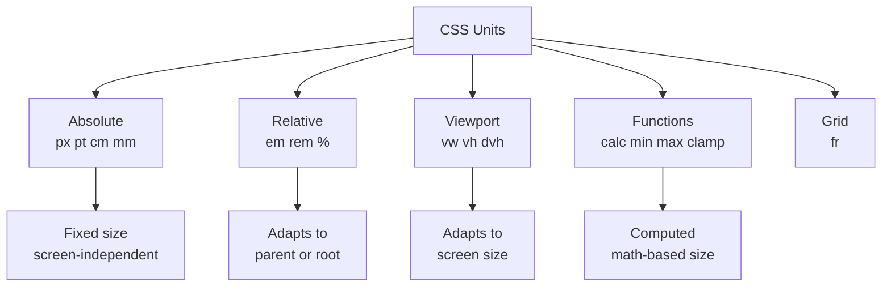
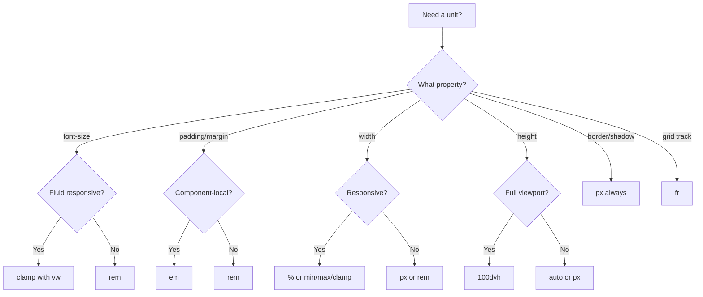
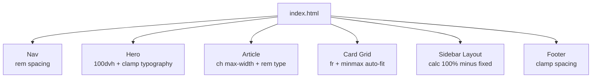

<a id="chapter-34-css-units"></a>

# Chapter 34: CSS Units

[⬅ Previous Chapter](#chapter-33-margin-padding-border-outline) | [📖 Main Index](#main-index) | [Next Chapter ➡](#chapter-35-css-typography)

---

## 📌 Learning Objectives

By the end of this chapter, you will:

- **Understand** every CSS unit — absolute, relative, viewport, and container-based
- **Master** the critical difference between `em` and `rem` — the most-asked interview question on units
- **Know** exactly when to use `px`, `%`, `em`, `rem`, `vw`, `vh`, `ch`, `fr`
- **Learn** `calc()`, `clamp()`, `min()`, and `max()` CSS functions deeply
- **Understand** viewport units and their mobile browser quirks
- **Build** a fluid, responsive layout using only CSS units (no media queries)
- **Crack** every interview and output-based question on CSS units

---

<a id="chapter-index-table-34"></a>

## Chapter Index Table

| Topic No. | Topic Name | Subtopics |
|-----------|------------|-----------|
| 34.1 | [CSS Unit Categories](#34-1-unit-categories) | Absolute, Relative, Viewport, Container |
| 34.2 | [Absolute Units](#34-2-absolute-units) | px, pt, pc, cm, mm, in |
| 34.3 | [Percentage — %](#34-3-percentage) | Relative to parent, context rules |
| 34.4 | [em Unit](#34-4-em-unit) | Font-size relative, compounding problem |
| 34.5 | [rem Unit](#34-5-rem-unit) | Root relative, why it wins over em |
| 34.6 | [em vs rem — Deep Comparison](#34-6-em-vs-rem) | Side-by-side, when to use each |
| 34.7 | [Viewport Units — vw, vh](#34-7-viewport-units) | vw, vh, mobile browser issues |
| 34.8 | [vmin, vmax](#34-8-vmin-vmax) | Smallest/largest viewport dimension |
| 34.9 | [dvh, svh, lvh — New Viewport Units](#34-9-new-viewport-units) | Mobile browser bar problem solved |
| 34.10 | [ch and ex Units](#34-10-ch-ex-units) | Character width, text-based sizing |
| 34.11 | [calc() Function](#34-11-calc) | Mixed units, operations, use cases |
| 34.12 | [min() and max() Functions](#34-12-min-max) | Responsive clamping without media queries |
| 34.13 | [clamp() Function](#34-13-clamp) | Fluid typography and sizing |
| 34.14 | [fr Unit — Grid Fraction](#34-14-fr-unit) | Grid track sizing, fr vs % |
| 34.15 | [Unit Selection Guide](#34-15-unit-guide) | What to use where — complete reference |

---

---

<a id="34-1-unit-categories"></a>

## 34.1 CSS Unit Categories

---

### 🧠 Hinglish Intuition

> CSS units teen categories mein divide hoti hain. **Absolute units** fixed hoti hain — jaise ruler pe centimeter, woh kabhi nahi badhti. **Relative units** kisi cheez ke relative hoti hain — parent ka size, font size, ya root font size. **Viewport units** screen size ke relative hoti hain. Sahi unit choose karna CSS ka sabse important skill hai — yahi decide karta hai ki layout responsive hoga ya nahi.

---

### Unit Category Overview

```
CSS UNITS — COMPLETE FAMILY TREE
━━━━━━━━━━━━━━━━━━━━━━━━━━━━━━━━━━━━━━━━━━━━━━━━━━━━━━━━━━━━━━━━━━

┌─────────────────────────────────────────────────────────────────┐
│                        CSS UNITS                                │
├─────────────────────┬───────────────────────────────────────────┤
│  ABSOLUTE           │  Fixed — not affected by anything         │
│                     │  px, pt, pc, cm, mm, in                  │
├─────────────────────┼───────────────────────────────────────────┤
│  FONT-RELATIVE      │  Relative to font size                   │
│                     │  em, rem, ex, ch, cap, ic                │
├─────────────────────┼───────────────────────────────────────────┤
│  PERCENTAGE         │  Relative to parent element              │
│                     │  % (context-dependent)                   │
├─────────────────────┼───────────────────────────────────────────┤
│  VIEWPORT           │  Relative to browser viewport            │
│                     │  vw, vh, vmin, vmax                      │
│                     │  dvh, svh, lvh (new — mobile fix)        │
├─────────────────────┼───────────────────────────────────────────┤
│  CONTAINER          │  Relative to container query container   │
│                     │  cqw, cqh, cqi, cqb, cqmin, cqmax       │
├─────────────────────┼───────────────────────────────────────────┤
│  GRID FRACTION      │  Available space in grid tracks          │
│                     │  fr                                      │
├─────────────────────┼───────────────────────────────────────────┤
│  CSS FUNCTIONS      │  Math-based sizing                       │
│                     │  calc(), min(), max(), clamp()           │
└─────────────────────┴───────────────────────────────────────────┘
```

---

### Quick Reference — Most Used Units

```
┌──────────┬────────────────────────────────┬────────────────────────┐
│  UNIT    │  RELATIVE TO                   │  BEST USE              │
├──────────┼────────────────────────────────┼────────────────────────┤
│  px      │  Nothing (absolute)            │  Borders, shadows      │
│  %       │  Parent element                │  Widths, layout        │
│  em      │  Element's own font-size       │  Padding, margin       │
│  rem     │  Root (html) font-size         │  Font-size, spacing    │
│  vw      │  Viewport width                │  Hero sections, fluid  │
│  vh      │  Viewport height               │  Full-height layouts   │
│  dvh     │  Dynamic viewport height       │  Mobile full-screen    │
│  ch      │  Width of "0" character        │  Input widths, prose   │
│  calc()  │  Mixed units, math             │  Complex sizing        │
│  clamp() │  min + preferred + max         │  Fluid typography      │
│  fr      │  Grid available space          │  Grid tracks           │
└──────────┴────────────────────────────────┴────────────────────────┘
```

---



---

👉 <a href="#chapter-index-table-34">Go to Top 🔝</a>

---

<a id="34-2-absolute-units"></a>

## 34.2 Absolute Units

---

### 🧠 Hinglish Intuition

> Absolute units ek fixed physical measurement hoti hain — jaise ruler pe 1cm hamesha 1cm hota hai. CSS mein `px` sabse common absolute unit hai. Screen pe `1px` = 1 CSS pixel (jo physical pixels se alag ho sakta hai — high-DPI screens pe). `cm`, `mm`, `in` print layouts ke liye useful hain, screen ke liye rarely use hote hain.

---

### Absolute Units Reference

```
ABSOLUTE UNITS — All values
━━━━━━━━━━━━━━━━━━━━━━━━━━━━━━━━━━━━━━━━━━━━━━━━━━━━━━━━━━━━━━━━━━

┌─────────┬────────────────────────────────────┬─────────────────────┐
│  UNIT   │  DEFINITION                        │  USE CASE           │
├─────────┼────────────────────────────────────┼─────────────────────┤
│  px     │  CSS pixel (1/96 of an inch)       │  Everything digital │
│  pt     │  Point (1/72 of an inch)           │  Print stylesheets  │
│  pc     │  Pica (12 points = 1/6 inch)       │  Print only         │
│  cm     │  Centimeter                        │  Print layouts      │
│  mm     │  Millimeter                        │  Print layouts      │
│  in     │  Inch (96px)                       │  Print only         │
└─────────┴────────────────────────────────────┴─────────────────────┘

Conversion reference:
  1in = 96px = 2.54cm = 25.4mm = 72pt = 6pc

━━━━━━━━━━━━━━━━━━━━━━━━━━━━━━━━━━━━━━━━━━━━━━━━━━━━━━━━━━━━━━━━━━
```

---

### CSS Pixel vs Physical Pixel

```
CSS Pixel vs Physical Pixel (Device Pixel Ratio):
━━━━━━━━━━━━━━━━━━━━━━━━━━━━━━━━━━━━━━━━━━━━━━━━━━━━━━━━━━━━━━━━━━

  Standard Screen (DPR = 1):
  1 CSS px = 1 physical pixel
  ┌─┐ = 1 dot on screen

  Retina / HiDPI (DPR = 2):
  1 CSS px = 2×2 = 4 physical pixels
  ┌─┬─┐
  ├─┼─┤ = 1 CSS px uses a 2×2 block of physical pixels
  └─┴─┘

  iPhone 14 (DPR = 3):
  1 CSS px = 3×3 = 9 physical pixels

  WHY THIS MATTERS:
  → CSS px always the same VISUAL SIZE regardless of DPR
  → Browser scales physical pixels to match CSS pixels
  → You write 16px → looks same size on all screens
  → Physical sharpness is higher on HiDPI — content looks crisp

━━━━━━━━━━━━━━━━━━━━━━━━━━━━━━━━━━━━━━━━━━━━━━━━━━━━━━━━━━━━━━━━━━
```

---

### When to Use px

```
✅ USE px FOR:
  border: 1px solid #333;          → borders (1px physical precision)
  box-shadow: 0 4px 16px rgba();   → shadows
  border-radius: 8px;              → corner rounding
  outline: 2px solid blue;         → outlines
  gap: 4px;                        → very small gaps

❌ AVOID px FOR:
  font-size: 16px;     → use rem (respects user browser settings)
  width: 800px;        → use % or max-width (breaks responsive)
  margin: 40px;        → use rem for vertical rhythm
  padding: 20px;       → ok for components, prefer em/rem for text
```

---

### Code Example

```css
/* Good px usage — fixed decorative values */
.card {
  border: 1px solid #e5e7eb;
  border-radius: 12px;
  box-shadow: 0 4px 16px rgba(0,0,0,0.08);
}

.divider {
  height: 1px;          /* hairline divider */
  background: #e5e7eb;
}

.avatar {
  width: 48px;          /* fixed size avatar */
  height: 48px;
  border-radius: 50%;
}

/* Print stylesheet using physical units */
@media print {
  body { font-size: 12pt; }
  h1   { font-size: 24pt; }
  .page-break { page-break-after: always; }
}
```

---

> [!TIP]
> In modern CSS, use `px` for: borders, outlines, box-shadows, border-radius, and fixed-size decorative elements. For everything that should scale with user preferences (font sizes, spacing), use `rem` or `em`.

---

👉 <a href="#chapter-index-table-34">Go to Top 🔝</a>

---

<a id="34-3-percentage"></a>

## 34.3 Percentage — %

---

### 🧠 Hinglish Intuition

> Percentage ka matlab hai "parent ke kitne percent." Agar parent `500px` wide hai aur child ka `width: 50%` hai — toh child `250px` wide hoga. Lekin tricky part yeh hai: kaunsi property ke liye percentage ka reference point kya hai? Width ke liye parent width, height ke liye parent height — lekin `margin-top: 10%` aur `padding-top: 10%` DONO parent WIDTH se calculate hote hain, height se nahi!

---

### Percentage — Context Rules

```
PERCENTAGE REFERENCE POINTS — Which parent property?
━━━━━━━━━━━━━━━━━━━━━━━━━━━━━━━━━━━━━━━━━━━━━━━━━━━━━━━━━━━━━━━━━━

┌──────────────────────┬─────────────────────────────────────────┐
│  CSS PROPERTY        │  % CALCULATED RELATIVE TO               │
├──────────────────────┼─────────────────────────────────────────┤
│  width               │  Parent's WIDTH                         │
│  max-width           │  Parent's WIDTH                         │
│  min-width           │  Parent's WIDTH                         │
│  height              │  Parent's HEIGHT (only if parent has    │
│                      │  explicit height set!)                  │
│  padding-top         │  Parent's WIDTH  ← SURPRISE!            │
│  padding-bottom      │  Parent's WIDTH  ← SURPRISE!            │
│  padding-left        │  Parent's WIDTH                         │
│  padding-right       │  Parent's WIDTH                         │
│  margin-top          │  Parent's WIDTH  ← SURPRISE!            │
│  margin-bottom       │  Parent's WIDTH  ← SURPRISE!            │
│  margin-left         │  Parent's WIDTH                         │
│  margin-right        │  Parent's WIDTH                         │
│  font-size           │  Parent's FONT-SIZE                     │
│  line-height         │  Element's OWN FONT-SIZE                │
│  border-radius       │  Element's OWN width/height             │
│  transform: translate│  Element's OWN width/height             │
└──────────────────────┴─────────────────────────────────────────┘

CRITICAL INTERVIEW FACT:
  padding-top: 10%  →  10% of PARENT WIDTH (NOT height!)
  margin-top: 10%   →  10% of PARENT WIDTH (NOT height!)

This is why padding-top % creates the aspect ratio box trick!
━━━━━━━━━━━━━━━━━━━━━━━━━━━━━━━━━━━━━━━━━━━━━━━━━━━━━━━━━━━━━━━━━━
```

---

### Percentage Width vs Height

```
Width % — always works (parent always has width):
━━━━━━━━━━━━━━━━━━━━━━━━━━━━━━━━━━━━━━━━━━━━━━━━━━━━━━━━━━━━━━━━━━

  Parent: 800px wide
  .child { width: 50%; }
  → Child = 400px  ✅ Always works

  ┌──────────────────────────────────────────────────────────────┐
  │ PARENT 800px                                                 │
  │ ┌─────────────────────────────┐                             │
  │ │ CHILD 400px (50%)           │                             │
  │ └─────────────────────────────┘                             │
  └──────────────────────────────────────────────────────────────┘

━━━━━━━━━━━━━━━━━━━━━━━━━━━━━━━━━━━━━━━━━━━━━━━━━━━━━━━━━━━━━━━━━━

Height % — only works if parent has EXPLICIT height:
━━━━━━━━━━━━━━━━━━━━━━━━━━━━━━━━━━━━━━━━━━━━━━━━━━━━━━━━━━━━━━━━━━

  Parent: height NOT set (height: auto — grows with content)
  .child { height: 50%; }
  → Child height = 0 or ignored! ❌

  Parent: height: 400px (explicit)
  .child { height: 50%; }
  → Child = 200px  ✅

  To make height % work on full-page layout:
  html, body { height: 100%; }
  .wrapper   { height: 100%; }
  .content   { height: 50%; }   ← now 50% of body works
```

---

### Code Example — Percentage in Practice

```css
/* Responsive columns */
.col-full  { width: 100%; }
.col-half  { width: 50%; }
.col-third { width: 33.333%; }
.col-quarter { width: 25%; }

/* Container that centers and caps width */
.container {
  width: 100%;          /* fills viewport */
  max-width: 1200px;    /* but never wider than 1200px */
  margin: 0 auto;
}

/* Full height page */
html, body { height: 100%; }
.page { min-height: 100%; }

/* Aspect ratio box — 16:9 using padding % trick */
.video-wrapper {
  width: 100%;
  padding-top: 56.25%;  /* 9/16 = 0.5625 → 56.25% of WIDTH */
  position: relative;
  height: 0;
}
.video-wrapper > * {
  position: absolute;
  inset: 0;
}

/* font-size % (relative to parent font-size) */
.parent { font-size: 20px; }
.child  { font-size: 80%; }  /* → 16px (80% of 20px) */
```

---

> [!IMPORTANT]
> `height: 100%` on a child element only works if the parent has an **explicit height** set. If the parent's height is `auto` (default), the child's `height: 100%` resolves to `0`. This is one of the most common bugs beginners face.

---

👉 <a href="#chapter-index-table-34">Go to Top 🔝</a>

---

<a id="34-4-em-unit"></a>

## 34.4 em Unit

---

### 🧠 Hinglish Intuition

> `em` unit ek element ki **apni font-size** ke relative hoti hai. Agar element ki font-size `16px` hai, toh `1em = 16px`, `2em = 32px`. Tricky part yeh hai: agar `font-size` property pe hi `em` use karo — toh woh **parent ki font-size** se calculate hoti hai. Nested elements mein `em` **compound** hoti rehti hai — har level pe multiply hoti jaati hai. Isiliye deeply nested elements mein `em` confusing ho jaata hai.

---

### How em Works — Visual Breakdown

```
em UNIT — How it calculates:
━━━━━━━━━━━━━━━━━━━━━━━━━━━━━━━━━━━━━━━━━━━━━━━━━━━━━━━━━━━━━━━━━━

RULE 1: For font-size property
  → em is relative to PARENT's font-size

RULE 2: For ALL other properties (padding, margin, width, etc.)
  → em is relative to the ELEMENT'S OWN font-size

━━━━━━━━━━━━━━━━━━━━━━━━━━━━━━━━━━━━━━━━━━━━━━━━━━━━━━━━━━━━━━━━━━

Example 1 — Simple em:
  html { font-size: 16px; }

  .box {
    font-size: 20px;    /* explicit px */
    padding: 1em;       /* = 20px (element's own font-size) */
    margin: 0.5em;      /* = 10px (element's own font-size) */
  }

  ┌─────────────────────────────────────────────────────┐
  │  .box (font-size: 20px)                             │
  │  padding: 1em = 20px    margin: 0.5em = 10px        │
  │  ┌─────────────────────────────────────────────┐   │
  │  │  Content                                     │   │
  │  └─────────────────────────────────────────────┘   │
  └─────────────────────────────────────────────────────┘

━━━━━━━━━━━━━━━━━━━━━━━━━━━━━━━━━━━━━━━━━━━━━━━━━━━━━━━━━━━━━━━━━━
```

---

### The Compounding Problem — em in Nested Elements

```
em COMPOUNDING — The major problem with em:
━━━━━━━━━━━━━━━━━━━━━━━━━━━━━━━━━━━━━━━━━━━━━━━━━━━━━━━━━━━━━━━━━━

HTML:
  <div class="level-1">   ← font-size: 1.5em
    <div class="level-2"> ← font-size: 1.5em
      <div class="level-3"> ← font-size: 1.5em
        Text here
      </div>
    </div>
  </div>

CSS:
  html     { font-size: 16px; }
  .level-1 { font-size: 1.5em; }
  .level-2 { font-size: 1.5em; }
  .level-3 { font-size: 1.5em; }

Calculation:
  html     → 16px
  level-1  → 1.5 × 16    = 24px
  level-2  → 1.5 × 24    = 36px    ← keeps growing!
  level-3  → 1.5 × 36    = 54px    ← WAY too big!

  ┌──────────────────────────────────────────────────────┐
  │ level-1  → 24px text                                 │
  │   ┌────────────────────────────────────────────────┐ │
  │   │ level-2 → 36px text                            │ │
  │   │   ┌──────────────────────────────────────────┐ │ │
  │   │   │ level-3 → 54px text  ← HUGE!             │ │ │
  │   │   └──────────────────────────────────────────┘ │ │
  │   └────────────────────────────────────────────────┘ │
  └──────────────────────────────────────────────────────┘

This is the COMPOUNDING PROBLEM — why rem is preferred!
━━━━━━━━━━━━━━━━━━━━━━━━━━━━━━━━━━━━━━━━━━━━━━━━━━━━━━━━━━━━━━━━━━
```

---

### When em IS Useful

```
em IS GREAT for component-internal scaling:
━━━━━━━━━━━━━━━━━━━━━━━━━━━━━━━━━━━━━━━━━━━━━━━━━━━━━━━━━━━━━━━━━━

Use case: Button where padding scales with font-size

  .btn-sm  { font-size: 0.8rem;  padding: 0.5em 1em; }
  .btn-md  { font-size: 1rem;    padding: 0.5em 1em; }
  .btn-lg  { font-size: 1.25rem; padding: 0.5em 1em; }

  .btn-sm padding  → 0.5em = 0.4rem, 1em = 0.8rem
  .btn-md padding  → 0.5em = 0.5rem, 1em = 1rem
  .btn-lg padding  → 0.5em = 0.625rem, 1em = 1.25rem

  The button SCALES PROPORTIONALLY with its own font-size!
  ONE padding rule handles ALL sizes.

  .btn-sm:   [  sm btn  ]   (tight padding)
  .btn-md:   [  medium button  ]   (proportional)
  .btn-lg:   [     large button     ]   (generous)

This is em's SUPERPOWER — component self-scaling!
━━━━━━━━━━━━━━━━━━━━━━━━━━━━━━━━━━━━━━━━━━━━━━━━━━━━━━━━━━━━━━━━━━
```

---

### Code Example

```css
/* em for font-size — relative to parent */
.parent { font-size: 18px; }
.child  { font-size: 1.5em; } /* 1.5 × 18 = 27px */

/* em for padding — relative to own font-size */
.card {
  font-size: 1rem;      /* 16px */
  padding: 1.5em;       /* 1.5 × 16 = 24px */
  border-radius: 0.5em; /* 0.5 × 16 = 8px */
}

/* GOOD em use: button self-scaling */
.btn {
  font-size: 1rem;       /* base: changes per variant */
  padding: 0.625em 1.25em; /* scales with font-size */
  border-radius: 0.375em;
  border: 0.0625em solid;
}

.btn--sm { font-size: 0.875rem; }  /* padding auto-shrinks */
.btn--lg { font-size: 1.125rem; }  /* padding auto-grows */

/* GOOD em use: media queries based on reading size */
@media (min-width: 48em) {  /* 48 × 16 = 768px */
  .sidebar { display: block; }
}
```

---

> [!NOTE]
> `em` in media queries is relative to the browser's default font-size (usually 16px), NOT the root `html` font-size. This is one quirk to know — `48em` in a media query = `768px` based on browser default.

---

👉 <a href="#chapter-index-table-34">Go to Top 🔝</a>

---

<a id="34-5-rem-unit"></a>

## 34.5 rem Unit

---

### 🧠 Hinglish Intuition

> `rem` ka matlab hai **Root EM** — yeh hamesha `html` element ki font-size ke relative hoti hai. Koi compounding nahi, koi nesting issue nahi. Chahe element kitna bhi deep nested ho — `1rem` hamesha root font-size ke barabar hogi. Agar `html { font-size: 16px; }` hai, toh kisi bhi element mein `1rem = 16px` — guaranteed! Isliye `rem` modern CSS ka king hai spacing aur typography ke liye.

---

### rem — How it Works

```
rem UNIT — Always relative to ROOT (html) font-size:
━━━━━━━━━━━━━━━━━━━━━━━━━━━━━━━━━━━━━━━━━━━━━━━━━━━━━━━━━━━━━━━━━━

html { font-size: 16px; }   ← ROOT font-size

Anywhere in the document:
  1rem   = 16px   (1 × 16)
  1.5rem = 24px   (1.5 × 16)
  2rem   = 32px   (2 × 16)
  0.75rem = 12px  (0.75 × 16)
  0.875rem = 14px (0.875 × 16)

NO compounding — same value everywhere:
  ┌──────────────────────────────────────────────────────┐
  │ level-1  → font-size: 1.5rem = 24px                 │
  │   ┌────────────────────────────────────────────────┐ │
  │   │ level-2 → font-size: 1.5rem = 24px ← SAME!    │ │
  │   │   ┌──────────────────────────────────────────┐ │ │
  │   │   │ level-3 → font-size: 1.5rem = 24px ← SAME│ │ │
  │   │   └──────────────────────────────────────────┘ │ │
  │   └────────────────────────────────────────────────┘ │
  └──────────────────────────────────────────────────────┘
  All levels = 24px — predictable, no surprises!

━━━━━━━━━━━━━━━━━━━━━━━━━━━━━━━━━━━━━━━━━━━━━━━━━━━━━━━━━━━━━━━━━━
```

---

### rem — The 62.5% Trick

```
The 62.5% Base Size Trick — makes rem math easy:
━━━━━━━━━━━━━━━━━━━━━━━━━━━━━━━━━━━━━━━━━━━━━━━━━━━━━━━━━━━━━━━━━━

Default browser font-size = 16px (cannot be overridden safely)

PROBLEM: 1rem = 16px → weird math for designers
  24px = ? rem → 24 ÷ 16 = 1.5rem (manageable)
  11px = ? rem → 11 ÷ 16 = 0.6875rem (ugly!)

SOLUTION: html { font-size: 62.5%; }
  62.5% of 16px = 10px → 1rem = 10px!
  Now all math is easy:
  10px  = 1.0rem
  12px  = 1.2rem
  14px  = 1.4rem
  16px  = 1.6rem ← need to reset body!
  18px  = 1.8rem
  20px  = 2.0rem
  24px  = 2.4rem

  ✅ Set body font-size back: body { font-size: 1.6rem; } = 16px
  ✅ Now all rem values map cleanly to familiar px sizes
  ✅ User browser settings still work (% scales with preference)

WHY % NOT px for root?
  html { font-size: 10px; }  ← WRONG! Overrides user browser setting
  html { font-size: 62.5%; } ← CORRECT! Scales with user preference

  If user sets browser to 20px (accessibility need):
  px:  10px stays 10px   → ignores user preference ❌
  %:   62.5% of 20 = 12.5px → respects user preference ✅
━━━━━━━━━━━━━━━━━━━━━━━━━━━━━━━━━━━━━━━━━━━━━━━━━━━━━━━━━━━━━━━━━━
```

---

### rem Type Scale

```
Typographic Scale using rem (16px root):
━━━━━━━━━━━━━━━━━━━━━━━━━━━━━━━━━━━━━━━━━━━━━━━━━━━━━━━━━━━━━━━━━━

  0.75rem  → 12px  xs text, captions, labels
  0.875rem → 14px  sm text, secondary content
  1rem     → 16px  base body text
  1.125rem → 18px  lg text
  1.25rem  → 20px  xl — large body
  1.5rem   → 24px  h4 heading
  1.875rem → 30px  h3 heading
  2.25rem  → 36px  h2 heading
  3rem     → 48px  h1 heading
  3.75rem  → 60px  display heading
  4.5rem   → 72px  hero heading

CSS Variables for type scale:
━━━━━━━━━━━━━━━━━━━━━━━━━━━━━━━━━━━━━━━━━━━━━━━━━━━━━━━━━━━━━━━━━━
```

```css
:root {
  --text-xs:   0.75rem;
  --text-sm:   0.875rem;
  --text-base: 1rem;
  --text-lg:   1.125rem;
  --text-xl:   1.25rem;
  --text-2xl:  1.5rem;
  --text-3xl:  1.875rem;
  --text-4xl:  2.25rem;
  --text-5xl:  3rem;
}

h1 { font-size: var(--text-5xl); }
h2 { font-size: var(--text-4xl); }
h3 { font-size: var(--text-3xl); }
h4 { font-size: var(--text-2xl); }
p  { font-size: var(--text-base); }
small { font-size: var(--text-sm); }
```

---

### Code Example — rem in Real Projects

```css
/* Root setup */
html { font-size: 62.5%; }  /* 1rem = 10px for easy math */
body { font-size: 1.6rem; } /* body text = 16px */

/* Typography */
h1   { font-size: 4.8rem; }  /* 48px */
h2   { font-size: 3.6rem; }  /* 36px */
h3   { font-size: 2.4rem; }  /* 24px */
p    { font-size: 1.6rem; }  /* 16px */
small{ font-size: 1.2rem; }  /* 12px */

/* Spacing (consistent, scales with accessibility) */
.section { padding: 6.4rem 2.4rem; }  /* 64px 24px */
.card    { padding: 2.4rem; }          /* 24px */
.gap     { gap: 1.6rem; }              /* 16px */

/* Accessible font-size that respects user preferences */
html { font-size: 100%; } /* simplest — 1rem = 16px (browser default) */
```

---

> [!IMPORTANT]
> **Always use `rem` for `font-size`** — it respects the user's browser font-size preference (important for accessibility). Users who set a larger base font for readability will have their preference honored. Using `px` for font-size overrides this and violates WCAG accessibility guidelines.

---

👉 <a href="#chapter-index-table-34">Go to Top 🔝</a>

---

<a id="34-6-em-vs-rem"></a>

## 34.6 em vs rem — Deep Comparison

---

### 🧠 Hinglish Intuition

> Simple rule yaad rakho: **`rem` = global, `em` = local**. `rem` puri website ki root se relative hai — consistent aur predictable. `em` sirf us element se relative hai — component ke andar scaling ke liye useful. Font size ke liye `rem` use karo. Padding/margin jo font-size ke saath scale karna chahte ho — `em` use karo.

---

### em vs rem — Complete Visual Comparison

```
em vs rem — SIDE BY SIDE
━━━━━━━━━━━━━━━━━━━━━━━━━━━━━━━━━━━━━━━━━━━━━━━━━━━━━━━━━━━━━━━━━━

Setup: html { font-size: 16px; }

SCENARIO: Three nested levels, all font-size: 1.5[unit]

Using em:                         Using rem:
━━━━━━━━━━━━━━━━━━━━━━━━━━━━━━━━  ━━━━━━━━━━━━━━━━━━━━━━━━━━━━━━━━
html: 16px                        html: 16px
L1: 1.5em = 24px ←24             L1: 1.5rem = 24px ←24
L2: 1.5em = 36px ←grows!         L2: 1.5rem = 24px ←same!
L3: 1.5em = 54px ←out of ctrl    L3: 1.5rem = 24px ←same!

┌──────────────┐                  ┌──────────────┐
│L1: 24px text │                  │L1: 24px text │
│ ┌──────────┐ │                  │ ┌──────────┐ │
│ │L2: 36px  │ │                  │ │L2: 24px  │ │  ← same!
│ │ ┌──────┐ │ │                  │ │ ┌──────┐ │ │
│ │ │L3:54 │ │ │                  │ │ │L3:24 │ │ │  ← same!
│ │ └──────┘ │ │                  │ │ └──────┘ │ │
│ └──────────┘ │                  │ └──────────┘ │
└──────────────┘                  └──────────────┘
em COMPOUNDS ↗                    rem STAYS FLAT →
━━━━━━━━━━━━━━━━━━━━━━━━━━━━━━━━━━━━━━━━━━━━━━━━━━━━━━━━━━━━━━━━━━
```

---

### Decision Table — em vs rem

```
┌──────────────────────────────────────────────────┬────────────────┐
│  USE CASE                                        │  USE           │
├──────────────────────────────────────────────────┼────────────────┤
│  Global font sizes (h1, h2, p, body)             │  rem           │
│  Spacing (margins, padding) — global scale       │  rem           │
│  Design token spacing variables                  │  rem           │
│  Max-width, layout widths                        │  rem or px     │
│  Border radius                                   │  px            │
│  Shadows, borders                                │  px            │
├──────────────────────────────────────────────────┼────────────────┤
│  Button padding (scales WITH button font-size)   │  em            │
│  Icon size relative to surrounding text          │  em            │
│  Component-internal spacing that self-scales     │  em            │
│  Media queries (em preferred by some devs)       │  em            │
└──────────────────────────────────────────────────┴────────────────┘
```

---

### The Real-World Pattern

```css
/* ── RECOMMENDED PATTERN ── */

/* Root — sets the base */
html { font-size: 100%; }   /* = 16px, respects browser settings */

/* Global sizing — use rem */
body  { font-size: 1rem; }
h1    { font-size: 2.5rem; }
h2    { font-size: 2rem; }
p     { font-size: 1rem; }
small { font-size: 0.875rem; }

/* Global spacing — use rem */
:root {
  --space-sm: 0.5rem;
  --space-md: 1rem;
  --space-lg: 1.5rem;
}

/* Component internal — use em */
.btn {
  font-size: 1rem;          /* set in rem — global scale */
  padding: 0.625em 1.25em;  /* em — scales with THIS button's font-size */
}

.btn--sm { font-size: 0.875rem; }  /* padding auto-shrinks via em */
.btn--lg { font-size: 1.125rem; }  /* padding auto-grows via em */
```

---

> [!IMPORTANT]
> **Interview summary**: `em` = relative to element's own font-size (for non-font properties) or parent's font-size (for font-size property). Compounds with nesting. `rem` = always relative to root `html` font-size. No compounding. Use `rem` for global scales, `em` for component self-scaling.

---

👉 <a href="#chapter-index-table-34">Go to Top 🔝</a>

---

<a id="34-7-viewport-units"></a>

## 34.7 Viewport Units — vw, vh

---

### 🧠 Hinglish Intuition

> Viewport units screen size ke relative hoti hain. `1vw = viewport width ka 1%`, `1vh = viewport height ka 1%`. `100vw = full screen width`, `100vh = full screen height`. Ye responsive design ke liye powerful hain — element automatically screen size ke saath scale karta hai. Lekin mobile browsers mein `vh` ek frustrating bug hai — address bar aane-jaane se viewport height change hoti hai, causing layout shifts.

---

### vw and vh Visual

```
Viewport Units — What they represent:
━━━━━━━━━━━━━━━━━━━━━━━━━━━━━━━━━━━━━━━━━━━━━━━━━━━━━━━━━━━━━━━━━━

Browser viewport (visible area):

  ┌──────────────────────────────────────────────────────┐ ↑
  │                                                      │ │
  │                   VIEWPORT                           │ │ 100vh
  │                                                      │ │
  │  ← ─ ─ ─ ─ ─ ─ 100vw ─ ─ ─ ─ ─ ─ ─ →              │ │
  │                                                      │ │
  │  1vw = 1% of this width                              │ │
  │  1vh = 1% of this height                             │ ↓
  └──────────────────────────────────────────────────────┘

On 1440 × 900 viewport:
  1vw   = 14.4px
  1vh   = 9px
  100vw = 1440px (full width)
  100vh = 900px  (full height)
  50vw  = 720px
  50vh  = 450px

━━━━━━━━━━━━━━━━━━━━━━━━━━━━━━━━━━━━━━━━━━━━━━━━━━━━━━━━━━━━━━━━━━
```

---

### The vh Mobile Browser Problem

```
THE 100vh PROBLEM ON MOBILE:
━━━━━━━━━━━━━━━━━━━━━━━━━━━━━━━━━━━━━━━━━━━━━━━━━━━━━━━━━━━━━━━━━━

Mobile browsers have a dynamic address bar that shows/hides:

  Page Load (address bar visible):
  ┌──────────────────────┐ ↑
  │  [browser address bar│ │ ← address bar takes ~60px
  ├──────────────────────┤ │
  │                      │ │
  │   100vh is calculated│ │ 100vh
  │   INCLUDING this     │ │ (full page height including bar)
  │   address bar!       │ │
  │                      │ │
  └──────────────────────┘ ↓

  After scrolling (bar hides):
  ┌──────────────────────┐ ↑
  │                      │ │
  │   CONTENT OVERFLOWS  │ │ Viewport now LARGER
  │   the 100vh element! │ │ but element still
  │                      │ │ sized for smaller vh
  │                      │ │
  │   [overflow appears] │ │
  └──────────────────────┘ ↓

RESULT:
  → On iOS Safari, 100vh element is TALLER than visible area
  → Content gets hidden behind bottom browser toolbar
  → Layout "jumps" when address bar shows/hides

FIX OPTIONS:
  1. Use dvh (dynamic viewport height) — modern fix
  2. JavaScript: document.documentElement.style.setProperty(
       '--vh', `${window.innerHeight * 0.01}px`);
  3. Use min-height instead of height
━━━━━━━━━━━━━━━━━━━━━━━━━━━━━━━━━━━━━━━━━━━━━━━━━━━━━━━━━━━━━━━━━━
```

---

### 100vw and Horizontal Scroll Problem

```
100vw HORIZONTAL SCROLL PROBLEM:
━━━━━━━━━━━━━━━━━━━━━━━━━━━━━━━━━━━━━━━━━━━━━━━━━━━━━━━━━━━━━━━━━━

  .hero { width: 100vw; }

  100vw = full viewport width INCLUDING scrollbar

  But the content area is:
  viewport width - scrollbar width (usually 15-17px)

  RESULT:
  ← ─ ─ ─ ─ ─ ─ 100vw ─ ─ ─ ─ ─ ─ ─ →
  ← ─ ─ content ─ → [scrollbar 17px]

  Element = 100vw but content = 100vw - 17px
  → Horizontal scrollbar appears!

  FIX: Use width: 100% instead of width: 100vw for elements
       that should match the content area width
  OR:  overflow-x: hidden on parent
  OR:  Use 100% (inherits from body which excludes scrollbar)
━━━━━━━━━━━━━━━━━━━━━━━━━━━━━━━━━━━━━━━━━━━━━━━━━━━━━━━━━━━━━━━━━━
```

---

### Code Example — vw and vh

```css
/* Full-viewport hero */
.hero {
  min-height: 100vh;         /* at least full height */
  width: 100%;               /* NOT 100vw — avoids scrollbar issue */
  display: flex;
  align-items: center;
  justify-content: center;
}

/* Fluid typography using vw */
.display-title {
  font-size: 5vw;            /* scales with viewport width */
  /* On 1200px viewport = 60px */
  /* On 800px viewport  = 40px */
  /* But: becomes too small on mobile! Use clamp() instead */
}

/* Better: clamp with vw */
.fluid-title {
  font-size: clamp(1.5rem, 4vw, 4rem);
  /* min=24px, preferred=4vw, max=64px */
}

/* Full-viewport modal */
.modal {
  position: fixed;
  inset: 0;                  /* top:0 right:0 bottom:0 left:0 */
  width: 100vw;
  height: 100vh;             /* ok for position:fixed on desktop */
}

/* Sidebar that fills viewport height */
.sidebar {
  height: 100vh;
  position: sticky;
  top: 0;
  overflow-y: auto;
}

/* Large text based on viewport */
.section-number {
  font-size: 20vw;           /* enormous decorative number */
  opacity: 0.05;
}
```

---

> [!TIP]
> For hero sections and full-height layouts on mobile, use `min-height: 100dvh` (dynamic viewport height) instead of `height: 100vh`. It solves the mobile browser toolbar problem automatically in modern browsers.

---

👉 <a href="#chapter-index-table-34">Go to Top 🔝</a>

---

<a id="34-8-vmin-vmax"></a>

## 34.8 vmin and vmax

---

### 🧠 Hinglish Intuition

> `vmin` viewport ki **choti** dimension ka 1% hai — portrait mode mein width, landscape mein height. `vmax` viewport ki **badi** dimension ka 1% hai. Ye orientation-independent sizing ke liye useful hain — jaise ek element jo hamesha screen ki choti side se relative ho, taaki portrait aur landscape dono mein theek dike.

---

### vmin and vmax Visual

```
vmin / vmax — Smallest / Largest viewport dimension:
━━━━━━━━━━━━━━━━━━━━━━━━━━━━━━━━━━━━━━━━━━━━━━━━━━━━━━━━━━━━━━━━━━

Portrait mode (phone):          Landscape mode (phone rotated):
Width = 375px                   Width = 812px
Height = 812px                  Height = 375px

1vmin = 1% of min(375,812)      1vmin = 1% of min(812,375)
      = 1% of 375               =       1% of 375
      = 3.75px                  =       3.75px ← SAME VALUE!

1vmax = 1% of max(375,812)      1vmax = 1% of max(812,375)
      = 1% of 812               =       1% of 812
      = 8.12px                  =       8.12px ← SAME VALUE!

vmin stays consistent regardless of orientation!
━━━━━━━━━━━━━━━━━━━━━━━━━━━━━━━━━━━━━━━━━━━━━━━━━━━━━━━━━━━━━━━━━━

Practical example — Square that fits on any orientation:
  .square {
    width: 50vmin;
    height: 50vmin;
  }

  Portrait 375×812:
    50vmin = 50% × 375 = 187.5px × 187.5px ← fits in width
  Landscape 812×375:
    50vmin = 50% × 375 = 187.5px × 187.5px ← fits in height
  Always fits! Always square!
━━━━━━━━━━━━━━━━━━━━━━━━━━━━━━━━━━━━━━━━━━━━━━━━━━━━━━━━━━━━━━━━━━
```

---

### Code Example

```css
/* Circular element that always fits on screen */
.badge {
  width: 30vmin;
  height: 30vmin;
  border-radius: 50%;
}

/* Heading that scales with smallest dimension */
.display-heading {
  font-size: 10vmin; /* readable on both portrait and landscape */
}

/* Full-screen background element */
.bg-circle {
  width: 100vmax;    /* covers full screen even in portrait */
  height: 100vmax;
  border-radius: 50%;
  position: fixed;
  top: 50%; left: 50%;
  transform: translate(-50%, -50%);
}
```

---

👉 <a href="#chapter-index-table-34">Go to Top 🔝</a>

---

<a id="34-9-new-viewport-units"></a>

## 34.9 dvh, svh, lvh — New Viewport Units

---

### 🧠 Hinglish Intuition

> Mobile browsers ki address bar problem solve karne ke liye CSS ne 2022 mein nayi viewport units introduce ki. Teen variants hain: **`svh`** (small viewport height — jab browser bar visible ho), **`lvh`** (large viewport height — jab browser bar hidden ho), aur **`dvh`** (dynamic viewport height — automatically changes as bar shows/hides). `dvh` sabse useful hai — mobile browsers ka exact current viewport use karta hai.

---

### New Viewport Units Visual

```
THREE NEW VIEWPORT HEIGHTS:
━━━━━━━━━━━━━━━━━━━━━━━━━━━━━━━━━━━━━━━━━━━━━━━━━━━━━━━━━━━━━━━━━━

  ┌────────────────────────┐ ←───────────────────────────┐
  │ [Address Bar  visible] │ ↑ lvh starts here (top      │
  ├────────────────────────┤ │  of possible viewport)     │
  │                        │ │ svh starts here ─────────► │
  │   VIEWPORT CONTENT     │ │ (accounting for bars)       │ 100lvh
  │                        │ │                             │
  │                        │ │                             │
  ├────────────────────────┤ │ svh ends here ────────────►│
  │ [Bottom browser bar]   │ ↓                            │
  └────────────────────────┘ ←───────────────────────────┘
                               100lvh ends here

  svh = Small Viewport Height
    → Assumes ALL toolbars VISIBLE
    → Most conservative (smallest)
    → Content won't be hidden behind bars

  lvh = Large Viewport Height
    → Assumes ALL toolbars HIDDEN
    → Largest possible viewport
    → Same issue as vh (may be too tall)

  dvh = Dynamic Viewport Height
    → Updates in REAL TIME as bars show/hide
    → Best for most use cases
    → May cause reflow when bar toggles

━━━━━━━━━━━━━━━━━━━━━━━━━━━━━━━━━━━━━━━━━━━━━━━━━━━━━━━━━━━━━━━━━━

Same units exist for WIDTH:
  svw, lvw, dvw

And combined:
  svmin, svmax, lvmin, lvmax, dvmin, dvmax
━━━━━━━━━━━━━━━━━━━━━━━━━━━━━━━━━━━━━━━━━━━━━━━━━━━━━━━━━━━━━━━━━━
```

---

### When to Use Which

```
┌──────────────────────────────────────────────────────────────────┐
│  UNIT    │  WHEN TO USE                                          │
├──────────┼───────────────────────────────────────────────────────┤
│  vh      │  Desktop-only, no mobile bar concern                 │
│  svh     │  Mobile full-screen where NO content should hide     │
│          │  (safest — always accounts for bar space)            │
│  lvh     │  Immersive full-screen apps (bars expected hidden)   │
│  dvh     │  General purpose — dynamically correct              │
│          │  Best overall mobile fix but may cause reflow        │
└──────────┴───────────────────────────────────────────────────────┘
```

---

### Code Example — New Viewport Units

```css
/* BEFORE (mobile broken) */
.hero { height: 100vh; }

/* AFTER (mobile fixed) */
.hero {
  height: 100svh;   /* safe — always within toolbar bounds */
}

/* Best practice — progressive enhancement */
.hero {
  height: 100vh;    /* fallback for old browsers */
  height: 100dvh;   /* override for browsers that support it */
}

/* Full-screen modal — use dvh */
.modal-overlay {
  position: fixed;
  inset: 0;
  height: 100dvh;   /* always matches current visible height */
}

/* Mobile sticky footer — above browser bar */
.sticky-footer {
  position: sticky;
  bottom: 0;
  height: 60px;
  /* dvh ensures layout calculation matches actual visible area */
}
```

---

> [!NOTE]
> Browser support for `dvh`, `svh`, `lvh` is excellent in modern browsers (Chrome 108+, Safari 15.4+, Firefox 101+). Always provide `vh` as a fallback for older browsers.

---

👉 <a href="#chapter-index-table-34">Go to Top 🔝</a>

---

<a id="34-10-ch-ex-units"></a>

## 34.10 ch and ex Units

---

### 🧠 Hinglish Intuition

> `ch` = "0" character ki width. Ye typing/reading ke liye element size karne ka natural unit hai — jaise "input mein 20 characters fit hone chahiye" — `width: 20ch` set karo. Prose reading ke liye optimal line length approximately `60ch` hoti hai. `ex` = current font ki lowercase "x" character ki height — rarely used hai, mostly theoretical.

---

### ch Unit — Character Width

```
ch UNIT — Width of the "0" (zero) character:
━━━━━━━━━━━━━━━━━━━━━━━━━━━━━━━━━━━━━━━━━━━━━━━━━━━━━━━━━━━━━━━━━━

  In the current font: "0" has a specific width
  1ch = that width

  Monospace font (Courier):
    Every character = same width
    1ch is very precise for character counting
    width: 20ch → EXACTLY fits 20 monospace characters

  Variable font (Arial):
    Characters have different widths
    ch = approximate character count
    "W" is wider than "i" — ch is not perfect count

PRACTICAL USE:
  Input that fits 10 characters:
    .input-short { width: 10ch; }

  Readable prose max-width:
    .article { max-width: 65ch; }  /* optimal reading width */

  Phone number input (10 digits + spaces/dashes):
    .phone-input { width: 16ch; }

  ┌──────────────────────────────────────────────────────┐
  │ max-width: 65ch                                      │
  │ This paragraph stays at a comfortable reading width  │
  │ that has been proven by typography research to be    │
  │ optimal for reading — around 45 to 75 characters.   │
  └──────────────────────────────────────────────────────┘

━━━━━━━━━━━━━━━━━━━━━━━━━━━━━━━━━━━━━━━━━━━━━━━━━━━━━━━━━━━━━━━━━━
```

---

### Code Example — ch in Practice

```css
/* Optimal reading width for articles */
.article-body {
  max-width: 65ch;           /* ~650px at 10px char width */
  margin: 0 auto;
}

/* Input sized to content type */
.input-zip     { width: 7ch; }   /* 5 digit zip code */
.input-phone   { width: 16ch; }  /* 10 digit phone */
.input-email   { width: 30ch; }  /* typical email width */
.input-card-no { width: 20ch; }  /* 16 digit + spaces */

/* Code editor / terminal input */
.terminal {
  font-family: 'Courier New', monospace;
  width: 80ch;             /* classic 80-column terminal */
  height: 24em;            /* 24 rows */
}

/* ex unit — rarely used */
.superscript {
  font-size: 0.7em;
  vertical-align: 1ex;    /* align to x-height of surrounding text */
}
```

---

> [!TIP]
> **`max-width: 65ch`** on article/blog content is a typography best practice. Research shows 45–75 characters per line is optimal for reading comprehension. Using `ch` makes this exact regardless of font-size.

---

👉 <a href="#chapter-index-table-34">Go to Top 🔝</a>

---

<a id="34-11-calc"></a>

## 34.11 calc() Function

---

### 🧠 Hinglish Intuition

> `calc()` CSS ka calculator hai — alag-alag units ko math operations se combine karne deta hai. `width: calc(100% - 250px)` — parent ki poori width minus 250px. Yeh powerful hai kyunki normally CSS mein alag units directly mix nahi kar sakte. `calc()` ke andar `+` aur `-` ke sides pe **spaces mandatory** hain — nahi toh kaam nahi karta!

---

### calc() Syntax and Rules

```
calc() SYNTAX:
━━━━━━━━━━━━━━━━━━━━━━━━━━━━━━━━━━━━━━━━━━━━━━━━━━━━━━━━━━━━━━━━━━

  calc(expression)

Operators:
  +    addition        calc(100% + 20px)
  -    subtraction     calc(100% - 250px)
  *    multiplication  calc(2 * 1rem)
  /    division        calc(100% / 3)

CRITICAL RULE: + and - MUST have spaces on BOTH sides!
  ✅  calc(100% - 20px)    → CORRECT
  ❌  calc(100%-20px)      → BROKEN (parsed as negative value)
  ❌  calc(100% -20px)     → BROKEN
  ✅  calc(100% * 2)       → ok (multiplication)
  ✅  calc(100% / 3)       → ok (division)

Mixed units work! (this is the POWER of calc):
  calc(100% - 250px)       → % and px mixed ✅
  calc(100vw - 2rem)       → vw and rem mixed ✅
  calc(50vh - 60px)        → vh and px mixed ✅
  calc(1rem + 2px)         → rem and px mixed ✅

Nesting calc():
  calc(calc(100% - 20px) / 2)  → works but simplified to:
  calc((100% - 20px) / 2)      → cleaner with parentheses
━━━━━━━━━━━━━━━━━━━━━━━━━━━━━━━━━━━━━━━━━━━━━━━━━━━━━━━━━━━━━━━━━━
```

---

### calc() Visual Use Cases

```
USE CASE 1: Sidebar + main layout
━━━━━━━━━━━━━━━━━━━━━━━━━━━━━━━━━━━━━━━━━━━━━━━━━━━━━━━━━━━━━━━━━━

  .sidebar { width: 250px; }
  .main    { width: calc(100% - 250px); }

  ┌──────────────────────────────────────────────────────────────┐
  │← ─ ─ ─ ─ ─ ─ ─ 100% ─ ─ ─ ─ ─ ─ ─ ─ ─ ─ ─ ─ ─ ─ ─ →     │
  │ ┌──────────┐ ┌────────────────────────────────────────────┐  │
  │ │ 250px    │ │   calc(100% - 250px)                       │  │
  │ │ SIDEBAR  │ │   MAIN CONTENT                             │  │
  │ └──────────┘ └────────────────────────────────────────────┘  │
  └──────────────────────────────────────────────────────────────┘

━━━━━━━━━━━━━━━━━━━━━━━━━━━━━━━━━━━━━━━━━━━━━━━━━━━━━━━━━━━━━━━━━━

USE CASE 2: Sticky header offset
━━━━━━━━━━━━━━━━━━━━━━━━━━━━━━━━━━━━━━━━━━━━━━━━━━━━━━━━━━━━━━━━━━

  .header { height: 60px; position: fixed; top: 0; }
  .main   { margin-top: 60px;
            height: calc(100vh - 60px); }

  ┌──────────────────────────────┐ ↑
  │ FIXED HEADER (60px)          │ │ 60px
  ├──────────────────────────────┤ │
  │                              │ │
  │   MAIN = 100vh - 60px        │ │ calc(100vh - 60px)
  │                              │ │
  └──────────────────────────────┘ ↓ = 100vh total

━━━━━━━━━━━━━━━━━━━━━━━━━━━━━━━━━━━━━━━━━━━━━━━━━━━━━━━━━━━━━━━━━━

USE CASE 3: Equal thirds with gaps
━━━━━━━━━━━━━━━━━━━━━━━━━━━━━━━━━━━━━━━━━━━━━━━━━━━━━━━━━━━━━━━━━━

  3 equal columns with 20px gap (2 gaps total):
  .col { width: calc((100% - 40px) / 3); }

  ← ─ ─ ─ ─ ─ ─ ─ ─ ─ ─ 100% ─ ─ ─ ─ ─ ─ ─ ─ ─ ─ ─ ─ →
  ┌──────────────┐  ←20px→  ┌──────────────┐  ←20px→  ┌──────────────┐
  │ (100%-40)/3  │          │ (100%-40)/3  │          │ (100%-40)/3  │
  └──────────────┘          └──────────────┘          └──────────────┘
```

---

### Code Example — calc() in Practice

```css
/* Sidebar layout */
.layout {
  display: flex;
}
.sidebar { width: 260px; flex-shrink: 0; }
.content { width: calc(100% - 260px); }

/* Full-height minus header */
.page-body {
  min-height: calc(100vh - 64px);  /* 64px = header height */
  margin-top: 64px;
}

/* Centered absolute element (old technique) */
.centered {
  position: absolute;
  left: calc(50% - 150px);  /* center: 50% minus half width */
  top:  calc(50% - 75px);
  width: 300px;
  height: 150px;
}

/* Grid-like columns without grid */
.col {
  width: calc(33.333% - 16px);  /* 3 cols with 24px gap */
  margin: 8px;
}

/* Responsive padding using calc + vw */
.section {
  padding: calc(40px + 2vw) calc(20px + 2vw);
  /* padding grows subtly with viewport */
}

/* CSS custom properties in calc */
:root { --sidebar: 280px; }
.main { width: calc(100% - var(--sidebar)); }

/* Font size with calc */
.heading {
  font-size: calc(1.5rem + 1vw); /* fluid between rem and vw */
}
```

---

> [!IMPORTANT]
> **Spaces around `+` and `-` in `calc()` are mandatory.** `calc(100%-20px)` will silently fail — the browser treats it as an invalid expression. Always write `calc(100% - 20px)` with spaces. This is the #1 `calc()` mistake.

---

👉 <a href="#chapter-index-table-34">Go to Top 🔝</a>

---

<a id="34-12-min-max"></a>

## 34.12 min() and max() Functions

---

### 🧠 Hinglish Intuition

> `min()` aur `max()` CSS functions hain jo multiple values mein se choti ya badi value choose karte hain. `min(50%, 400px)` — "50% ya 400px mein jo bhi chota ho." Ye responsive sizing ke liye bahut useful hain — bina media queries ke fluid constraints laga sakte ho. `min()` aur `max()` ke andar `calc()` expressions bhi use kar sakte ho.

---

### min() and max() Visual

```
min() — uses the SMALLEST value from its arguments:
━━━━━━━━━━━━━━━━━━━━━━━━━━━━━━━━━━━━━━━━━━━━━━━━━━━━━━━━━━━━━━━━━━

  width: min(50%, 400px);

  Viewport 1000px → 50% = 500px → min(500, 400) = 400px  ✅
  Viewport 600px  → 50% = 300px → min(300, 400) = 300px  ✅
  Viewport 400px  → 50% = 200px → min(200, 400) = 200px  ✅

  ← 1000px ─────────────────────────────────────────────────────→
  ┌─────────────────────────────────────────────────────────────┐
  │       ┌──────────────────────────────────┐                  │
  │       │   400px (capped — min won here)   │                  │
  │       └──────────────────────────────────┘                  │
  └─────────────────────────────────────────────────────────────┘

  ← 600px ─────────────────────────────────────→
  ┌───────────────────────────────────────────┐
  │       ┌──────────────────────────┐        │
  │       │   300px (50% won here)   │        │
  │       └──────────────────────────┘        │
  └───────────────────────────────────────────┘

  min() = effectively max-width behavior!
  "Give me 50%, but never MORE than 400px"

━━━━━━━━━━━━━━━━━━━━━━━━━━━━━━━━━━━━━━━━━━━━━━━━━━━━━━━━━━━━━━━━━━

max() — uses the LARGEST value:
━━━━━━━━━━━━━━━━━━━━━━━━━━━━━━━━━━━━━━━━━━━━━━━━━━━━━━━━━━━━━━━━━━

  width: max(50%, 200px);

  Viewport 1000px → 50% = 500px → max(500, 200) = 500px
  Viewport 300px  → 50% = 150px → max(150, 200) = 200px

  max() = effectively min-width behavior!
  "Give me 50%, but never LESS than 200px"
━━━━━━━━━━━━━━━━━━━━━━━━━━━━━━━━━━━━━━━━━━━━━━━━━━━━━━━━━━━━━━━━━━
```

---

### Code Example

```css
/* min() — fluid width with cap */
.container {
  width: min(90%, 1200px);
  /* Takes 90% of viewport but never exceeds 1200px */
  /* Replaces: width: 90%; max-width: 1200px; */
  margin: 0 auto;
}

/* max() — fluid with minimum guarantee */
.sidebar {
  width: max(200px, 20%);
  /* At least 200px, but 20% if that's larger */
}

/* min() for padding — generous on large, tight on small */
.card {
  padding: min(5%, 32px);
  /* 5% on small screens, capped at 32px on large */
}

/* min() for font-size */
.title {
  font-size: min(5vw, 3rem);
  /* Fluid but never larger than 3rem */
}

/* Combining min() and max() */
.responsive-img {
  width: min(100%, 600px);   /* full width but max 600px */
  height: max(200px, 30vh);  /* at least 200px or 30vh */
}
```

---

> [!TIP]
> `width: min(90%, 1200px)` is a modern one-liner replacement for the classic `width: 90%; max-width: 1200px` container pattern. Cleaner and more expressive.

---

👉 <a href="#chapter-index-table-34">Go to Top 🔝</a>

---

<a id="34-13-clamp"></a>

## 34.13 clamp() Function

---

### 🧠 Hinglish Intuition

> `clamp()` teen values leta hai: **minimum, preferred, maximum**. "Preferred value use karo, lekin minimum se neeche mat jao aur maximum se upar mat jao." Ye **fluid typography** ka king hai — bina media queries ke font-size screen size ke saath scale karti hai, lekin kabhi bahut chota ya bahut bada nahi hoti. Syntax: `clamp(MIN, PREFERRED, MAX)`.

---

### clamp() Visual

```
clamp(MIN, PREFERRED, MAX) — Bounded flexible value:
━━━━━━━━━━━━━━━━━━━━━━━━━━━━━━━━━━━━━━━━━━━━━━━━━━━━━━━━━━━━━━━━━━

  font-size: clamp(1rem, 4vw, 3rem);
  MIN=16px   PREF=4vw   MAX=48px

  Viewport 300px  → 4vw = 12px < 16px MIN → uses 16px ← MIN wins
  Viewport 500px  → 4vw = 20px ← in range [16-48] → uses 20px
  Viewport 800px  → 4vw = 32px ← in range [16-48] → uses 32px
  Viewport 1200px → 4vw = 48px = MAX → uses 48px ← MAX wins
  Viewport 1600px → 4vw = 64px > 48px MAX → uses 48px ← MAX caps

  Graph of font-size vs viewport width:
           │
  48px MAX ┼─────────────────────────────────────────────╮─────
           │                                           ╱
           │                                        ╱
           │                                     ╱
  20px     │                                  ╱
           │                               ╱  ← 4vw preferred zone
           │                            ╱
  16px MIN ├──────────────────────────╯─────────────────────────
           │
           └──────────────────────────────────────────────────
             300px    500px    800px   1200px   1600px
             viewport width →

━━━━━━━━━━━━━━━━━━━━━━━━━━━━━━━━━━━━━━━━━━━━━━━━━━━━━━━━━━━━━━━━━━
```

---

### Fluid Typography with clamp()

```
FLUID TYPOGRAPHY — No media queries needed:
━━━━━━━━━━━━━━━━━━━━━━━━━━━━━━━━━━━━━━━━━━━━━━━━━━━━━━━━━━━━━━━━━━

BEFORE clamp (media query approach):
  h1 { font-size: 2rem; }
  @media (min-width: 768px)  { h1 { font-size: 2.5rem; } }
  @media (min-width: 1200px) { h1 { font-size: 3.5rem; } }
  → Jumps at breakpoints (not fluid)

AFTER clamp (fluid approach):
  h1 { font-size: clamp(2rem, 5vw, 3.5rem); }
  → Smoothly scales between 32px and 56px
  → Zero media queries!

Complete fluid type scale:
  --text-sm:   clamp(0.8rem,  1.5vw, 0.9rem);
  --text-base: clamp(1rem,    2vw,   1.125rem);
  --text-lg:   clamp(1.125rem,2.5vw, 1.5rem);
  --text-xl:   clamp(1.25rem, 3vw,   2rem);
  --text-2xl:  clamp(1.5rem,  4vw,   2.5rem);
  --text-3xl:  clamp(2rem,    5vw,   3rem);
  --text-4xl:  clamp(2.5rem,  6vw,   4rem);
  --text-5xl:  clamp(3rem,    8vw,   5rem);
━━━━━━━━━━━━━━━━━━━━━━━━━━━━━━━━━━━━━━━━━━━━━━━━━━━━━━━━━━━━━━━━━━
```

---

### clamp() — calc() Inside

```css
/* clamp with calc in preferred value */
h1 {
  font-size: clamp(
    1.75rem,              /* min: 28px */
    1rem + 3vw,           /* preferred: scales with viewport */
    3.5rem                /* max: 56px */
  );
}

/* Fluid padding */
.section {
  padding: clamp(2rem, 5vw, 6rem);
  /* min 32px, max 96px, fluid in between */
}

/* Fluid gap */
.grid {
  gap: clamp(1rem, 3vw, 2rem);
}

/* Container width */
.container {
  width: clamp(320px, 90%, 1200px);
  /* min 320px, max 1200px, 90% in between */
  margin: 0 auto;
}
```

---

### Code Example — Complete Fluid System

```css
/* ── FLUID DESIGN SYSTEM ── */
:root {
  /* Fluid Type Scale */
  --text-xs:   clamp(0.75rem, 1.5vw, 0.875rem);
  --text-sm:   clamp(0.875rem, 2vw,  1rem);
  --text-base: clamp(1rem,    2.5vw, 1.125rem);
  --text-xl:   clamp(1.25rem, 3vw,   1.75rem);
  --text-2xl:  clamp(1.5rem,  4vw,   2.5rem);
  --text-3xl:  clamp(2rem,    5vw,   3.5rem);
  --text-4xl:  clamp(2.5rem,  7vw,   5rem);

  /* Fluid Spacing Scale */
  --space-sm:  clamp(0.5rem,  2vw,   1rem);
  --space-md:  clamp(1rem,    3vw,   2rem);
  --space-lg:  clamp(2rem,    5vw,   4rem);
  --space-xl:  clamp(3rem,    7vw,   6rem);
}

/* Apply to elements */
body    { font-size: var(--text-base); }
h1      { font-size: var(--text-4xl); }
h2      { font-size: var(--text-3xl); }
h3      { font-size: var(--text-2xl); }
.section { padding: var(--space-xl) var(--space-md); }
.card    { padding: var(--space-md); gap: var(--space-sm); }
```

---

> [!IMPORTANT]
> `clamp()` is the **most powerful CSS function for responsive design**. Used for fluid typography, fluid spacing, and fluid sizing — all without media query breakpoints. Mastering `clamp()` is a key differentiator in senior frontend interviews.

---

👉 <a href="#chapter-index-table-34">Go to Top 🔝</a>

---

<a id="34-14-fr-unit"></a>

## 34.14 fr Unit — Grid Fraction

---

### 🧠 Hinglish Intuition

> `fr` (fraction) unit sirf CSS Grid mein use hoti hai. Ye available space ko fractions mein divide karta hai. `1fr 2fr 1fr` — total 4 parts, pehla column 1/4, doosra 2/4, teesra 1/4 space leta hai. Ye `%` se better hai kyunki `fr` automatically gaps account karta hai — `%` mein gaps manually calculate karne padte hain.

---

### fr Unit Visual

```
fr — Fractional unit for CSS Grid:
━━━━━━━━━━━━━━━━━━━━━━━━━━━━━━━━━━━━━━━━━━━━━━━━━━━━━━━━━━━━━━━━━━

grid-template-columns: 1fr 1fr 1fr  (3 equal columns)

Container: 900px, gap: 30px
Available = 900 - 60px(2 gaps) = 840px
Each fr   = 840 / 3 = 280px

┌──────────────┐ ←30px→ ┌──────────────┐ ←30px→ ┌──────────────┐
│   280px(1fr) │        │   280px(1fr) │        │   280px(1fr) │
└──────────────┘        └──────────────┘        └──────────────┘

━━━━━━━━━━━━━━━━━━━━━━━━━━━━━━━━━━━━━━━━━━━━━━━━━━━━━━━━━━━━━━━━━━

grid-template-columns: 1fr 2fr 1fr  (weighted columns)

Available = 840px, total fractions = 4
1fr = 840/4 = 210px
2fr = 840/4 × 2 = 420px

┌───────────────┐ ←30px→ ┌────────────────────────┐ ←30px→ ┌───────────────┐
│   210px(1fr)  │        │      420px (2fr)        │        │   210px(1fr)  │
└───────────────┘        └────────────────────────┘        └───────────────┘

━━━━━━━━━━━━━━━━━━━━━━━━━━━━━━━━━━━━━━━━━━━━━━━━━━━━━━━━━━━━━━━━━━

grid-template-columns: 200px 1fr  (fixed + flexible)

Available = 900 - 200 - 30(gap) = 670px
1fr = 670px (all remaining space)

┌──────────┐ ←30px→ ┌────────────────────────────────────────────┐
│  200px   │        │              670px (1fr)                   │
│ (fixed)  │        │              (all remaining)               │
└──────────┘        └────────────────────────────────────────────┘

━━━━━━━━━━━━━━━━━━━━━━━━━━━━━━━━━━━━━━━━━━━━━━━━━━━━━━━━━━━━━━━━━━

fr vs % — WHY fr WINS:
  Using %:
    3 columns, 20px gap each → col = (100% - 40px) / 3 = calc(33.33% - 13.33px)
    Complex! Easy to get wrong.

  Using fr:
    grid-template-columns: 1fr 1fr 1fr;
    Gap is automatically excluded from fr calculation!
    Simple and correct.
━━━━━━━━━━━━━━━━━━━━━━━━━━━━━━━━━━━━━━━━━━━━━━━━━━━━━━━━━━━━━━━━━━
```

---

### Code Example — fr Unit

```css
/* Equal columns */
.grid-3 {
  display: grid;
  grid-template-columns: 1fr 1fr 1fr;
  gap: 24px;
}

/* Sidebar + main */
.layout {
  display: grid;
  grid-template-columns: 250px 1fr;
  gap: 32px;
}

/* Weighted columns */
.weighted {
  display: grid;
  grid-template-columns: 1fr 2fr 1fr;
  gap: 20px;
}

/* 12-column grid system */
.grid-12 {
  display: grid;
  grid-template-columns: repeat(12, 1fr);
  gap: 16px;
}

.col-4 { grid-column: span 4; } /* 4 of 12 = 33.33% */
.col-6 { grid-column: span 6; } /* half */
.col-8 { grid-column: span 8; }

/* Auto-responsive without media queries */
.responsive-grid {
  display: grid;
  grid-template-columns: repeat(auto-fit, minmax(250px, 1fr));
  gap: 24px;
  /* Items flow into as many columns as fit! */
}
```

---

> [!NOTE]
> `fr` units are **only valid in CSS Grid** contexts (`grid-template-columns`, `grid-template-rows`). They cannot be used in `width`, `margin`, `padding`, or other non-grid properties.

---

👉 <a href="#chapter-index-table-34">Go to Top 🔝</a>

---

<a id="34-15-unit-guide"></a>

## 34.15 Unit Selection Guide

---

### 🧠 Hinglish Intuition

> "Kaunsa unit use karoon?" — ye sabse common confusion hai. Ek simple rule: **font-size = rem, padding/margin = rem (ya em for components), width = %, viewport = vw/vh, fluid sizing = clamp(), borders/shadows = px, grid = fr.** Ye guide yaad kar lo — interview mein confident answer doge.

---

### Complete Unit Selection Reference

```
UNIT SELECTION GUIDE — What to use where:
━━━━━━━━━━━━━━━━━━━━━━━━━━━━━━━━━━━━━━━━━━━━━━━━━━━━━━━━━━━━━━━━━━

TYPOGRAPHY:
┌──────────────────────────────┬─────────────────────────────────┐
│  font-size (global)          │  rem                            │
│  font-size (fluid/responsive)│  clamp(rem, vw, rem)            │
│  line-height                 │  unitless (1.5) or em           │
│  letter-spacing              │  em or px                       │
│  max-width (reading)         │  ch (60-75ch)                   │
└──────────────────────────────┴─────────────────────────────────┘

SPACING:
┌──────────────────────────────┬─────────────────────────────────┐
│  margin (global)             │  rem                            │
│  padding (global)            │  rem                            │
│  padding (component-local)   │  em (scales with component size)│
│  gap (flex/grid)             │  rem or px                      │
│  fluid spacing               │  clamp() or calc() with vw      │
└──────────────────────────────┴─────────────────────────────────┘

SIZING:
┌──────────────────────────────┬─────────────────────────────────┐
│  width (responsive)          │  % or min()/max()               │
│  width (fixed component)     │  px or rem                      │
│  max-width (container)       │  px or rem                      │
│  height (content-driven)     │  auto                           │
│  min-height (full page)      │  100vh or 100dvh                │
│  aspect-ratio box            │  % padding trick or aspect-ratio│
│  grid tracks                 │  fr                             │
│  image sizing                │  % with max-width               │
└──────────────────────────────┴─────────────────────────────────┘

DECORATIVE:
┌──────────────────────────────┬─────────────────────────────────┐
│  border-width                │  px                             │
│  border-radius               │  px or rem                      │
│  box-shadow                  │  px                             │
│  outline-width               │  px                             │
│  outline-offset              │  px                             │
└──────────────────────────────┴─────────────────────────────────┘

RESPONSIVE:
┌──────────────────────────────┬─────────────────────────────────┐
│  Full-height section         │  100dvh (dvh preferred)         │
│  Full-width element          │  100% (not 100vw)               │
│  Fluid font-size             │  clamp()                        │
│  Media query breakpoints     │  em (some) or px (most common)  │
│  Viewport-relative scaling   │  vw, vh, vmin                   │
└──────────────────────────────┴─────────────────────────────────┘
━━━━━━━━━━━━━━━━━━━━━━━━━━━━━━━━━━━━━━━━━━━━━━━━━━━━━━━━━━━━━━━━━━
```

---

### Unit Decision Flowchart



---

👉 <a href="#chapter-index-table-34">Go to Top 🔝</a>

---

## 💡 Interview Questions

---

### Conceptual Questions

**Q1. What is the difference between `em` and `rem`?**

> **A:**
> - **`em`**: Relative to the element's **own font-size** (for non-font-size properties) or the **parent's font-size** (when used on the `font-size` property itself). Compounds with nesting — 1.5em in nested elements keeps multiplying.
> - **`rem`**: Relative to the **root (`html`) element's font-size** always. No compounding. `1rem` = same value anywhere in the document.
>
> Use `rem` for global typography and spacing. Use `em` for component-internal scaling (button padding that grows with button font-size).

---

**Q2. Why should you avoid `px` for font-size?**

> **A:** When users set a larger default font-size in their browser (common accessibility need for visually impaired users), `px` values ignore this preference. `rem` values scale proportionally with the user's browser setting. WCAG 2.1 guidelines require text to be resizable — using `px` for font-size can violate accessibility requirements.

---

**Q3. What does `1vw` equal on a 1440px wide viewport?**

> **A:** `1vw = 1% of viewport width = 1% of 1440 = 14.4px`. So `10vw = 144px`, `100vw = 1440px`.

---

**Q4. Explain the `100vh` problem on mobile browsers.**

> **A:** On mobile browsers (especially iOS Safari), the browser shows/hides its address bar and bottom toolbar as you scroll. `100vh` is calculated including the space where toolbars appear — so when toolbars are visible, `100vh` element is actually taller than the visible area. Content gets hidden behind the toolbars. The fix is to use `100dvh` (dynamic viewport height) which updates in real-time as bars show/hide, or `100svh` which always accounts for toolbar space.

---

**Q5. What is `clamp()` and how does it work?**

> **A:** `clamp(MIN, PREFERRED, MAX)` chooses a value between a minimum and maximum, using the preferred value when it falls within that range.
> - Below min-viewport-size → uses MIN value
> - In the fluid zone → uses PREFERRED value (typically vw-based)  
> - Above max-viewport-size → uses MAX value
>
> `font-size: clamp(1rem, 4vw, 3rem)` = fluid font that's never smaller than 16px or larger than 48px.

---

**Q6. What is the `fr` unit and can it be used outside CSS Grid?**

> **A:** `fr` (fraction unit) represents a fraction of the available space in a grid container's track. `1fr 2fr 1fr` distributes space in a 1:2:1 ratio after fixed-size items and gaps are subtracted. No, `fr` can only be used in `grid-template-columns`, `grid-template-rows`, and `grid` shorthand — not in `width`, `margin`, `padding`, or any other properties.

---

**Q7. What is the critical syntax rule for `calc()`?**

> **A:** The `+` and `-` operators in `calc()` **must be surrounded by spaces**. `calc(100%-20px)` is INVALID and silently fails. `calc(100% - 20px)` is CORRECT. This is because `-` without spaces could be interpreted as part of a negative number. The `*` and `/` operators don't have this requirement but spaces are recommended for readability.

---

**Q8. When does `height: 50%` not work on a child element?**

> **A:** `height: 50%` on a child element only works if the parent has an **explicit height** defined (e.g., `height: 400px` or `height: 100vh`). If the parent's height is `auto` (default — grows to fit content), the child's `50%` height resolves to `0` because there's no reference height to calculate 50% of. This is a fundamental CSS box model rule.

---

### Scenario-Based Questions

**Q9. How would you make a hero section that's exactly full-screen on both desktop and mobile (including handling the mobile browser bar problem)?**

```css
.hero {
  min-height: 100vh;     /* fallback */
  min-height: 100dvh;    /* dynamic — handles mobile bars */
  display: flex;
  align-items: center;
  justify-content: center;
}
```

---

**Q10. Create a fluid heading that is minimum 24px, maximum 64px, and scales with the viewport.**

```css
.heading {
  font-size: clamp(1.5rem, 5vw, 4rem);
  /* 1.5rem = 24px minimum */
  /* 5vw = scales with viewport */
  /* 4rem = 64px maximum */
}
```

---

### Output-Based Questions

**Q11. What are the computed values?**

```css
html { font-size: 20px; }
.parent { font-size: 1.5em; }
.child  { font-size: 1.5em; padding: 1em; }
```

> **A:**
> - `html` = 20px
> - `.parent` = 1.5em × 20px = **30px**
> - `.child` font-size = 1.5em × 30px = **45px** (em compounds!)
> - `.child` padding = 1em × 45px = **45px** (padding em uses own font-size)

---

**Q12. What is the computed value of padding?**

```css
html { font-size: 20px; }
.box { font-size: 1.5rem; padding: 1rem; }
```

> **A:**
> - `html` = 20px (root)
> - `.box` font-size = 1.5rem × 20px = **30px**
> - `.box` padding = 1rem × 20px = **20px** (rem uses ROOT, not element's font-size!)

---

**Q13. Which is larger: `1em` padding or `1rem` padding inside `.box`?**

```css
html { font-size: 16px; }
.box { font-size: 24px; }
/* padding: 1em vs padding: 1rem */
```

> **A:**
> - `1em` padding = 1 × 24px = **24px** (uses element's own font-size)
> - `1rem` padding = 1 × 16px = **16px** (uses root font-size)
> - `1em` is larger in this case.

---

### Advanced Questions

**Q14. What is the difference between `100vw` and `width: 100%` and when does using `100vw` cause a horizontal scrollbar?**

> **A:** `100%` inherits the parent's content width (which excludes the scrollbar on Windows). `100vw` includes the full viewport width INCLUDING the scrollbar space. When a page has a vertical scrollbar (typically ~15-17px wide), an element with `width: 100vw` is wider than the content area — causing a horizontal scrollbar. Fix: use `width: 100%` for elements that should match content area width.

---

**Q15. How does `padding-top: 56.25%` create a 16:9 aspect ratio box?**

> **A:** Percentage `padding-top` (and `padding-bottom`) is calculated as a percentage of the **parent element's WIDTH** — not its height. Setting `padding-top: 56.25%` on a `height: 0` element makes the element's height = 56.25% of its width. The ratio 9/16 = 0.5625 = 56.25% — which gives exactly a 16:9 proportion. If the parent is 800px wide, the element becomes 800 × 56.25% = 450px tall (800:450 = 16:9). Modern alternative: `aspect-ratio: 16/9;`.

---

## 🧪 Practice Problems

---

### Coding Questions

**P1.** Create a type scale using only `rem` units for h1 through h6 and body text. Set `html { font-size: 62.5% }` so that `1rem = 10px`. Verify computed values.

**P2.** Build a button component where padding uses `em` units. Create three size variants (sm, md, lg) by only changing the `font-size` — the padding should automatically scale.

**P3.** Create a full-viewport hero section that works correctly on mobile. Use `100dvh` with a `100vh` fallback. The section should contain centered content.

**P4.** Using `clamp()`, create a fluid heading scale for h1–h4 that smoothly scales between mobile (375px) and desktop (1440px) without any media queries.

**P5.** Build a three-column grid layout using `fr` units with a sidebar (250px fixed), main content area (fills remaining), and an info column (200px fixed).

---

### Theory Questions

**T1.** Explain why `padding-top: 10%` and `padding-bottom: 10%` are both calculated from the parent's WIDTH — not from the parent's height. What CSS specification rule causes this?

**T2.** A user sets their browser font-size to 20px for accessibility. Compare the rendered font-size of `font-size: 16px` vs `font-size: 1rem` vs `font-size: 1em` on a top-level element.

**T3.** What is the difference between `min()` function and `min-width` property? Can they be used interchangeably?

**T4.** Explain `vmin` — when would it be more useful than `vw` or `vh` individually?

**T5.** Why do media queries in `em` units use the browser's default font-size (16px) rather than the CSS-set `html` font-size?

---

### Machine Coding Problems

**MC1. Fluid Typography System**

Build a page that demonstrates a complete fluid type scale using `clamp()`:
- Display heading: large, fluid
- H1 through H4: each with its own `clamp()` values
- Body text: comfortable reading size
- Small/caption text
- A sidebar showing the exact computed font-size at current viewport (hint: CSS custom properties display)
- Max-width article body using `ch` units for optimal reading width
- Use only HTML and CSS

**MC2. CSS Unit Comparison Tool**

Build a visual comparison page showing:
- A row of boxes, each sized with a different unit (px, %, em, rem, vw, ch)
- All targeting approximately the same visual size on desktop
- Resize the viewport to see how each unit responds differently
- A section showing `em` vs `rem` compounding side by side
- A `calc()` demo: sidebar + main with `calc(100% - 250px)`
- A `clamp()` demo: text that never gets too small or too large
- Labels showing the CSS property values used
- Use only HTML and CSS

---

## 🚀 Mini Project

---

### Problem Statement

Build a **Fluid Responsive Layout System** — a complete page layout using CSS units exclusively (no media queries) that demonstrates fluid typography, fluid spacing, viewport units, `clamp()`, `calc()`, `rem`, `em`, `fr`, and `ch` — all in a real, usable design.

---

### Features

1. Fluid hero section using `dvh` and `clamp()` typography
2. Article section with `ch`-based max-width for reading
3. Card grid using `fr` and `auto-fit`/`minmax()`
4. Navigation bar using `rem` spacing
5. Sidebar + main layout using `calc()`
6. Footer with fluid spacing using `clamp()`

---

### Flow Diagram



---

### Folder Structure

```
fluid-layout/
│
├── index.html
└── style.css
```

---

### Implementation

**index.html:**

```html
<!DOCTYPE html>
<html lang="en">
<head>
  <meta charset="UTF-8" />
  <meta name="viewport" content="width=device-width, initial-scale=1.0" />
  <title>Fluid Layout — CSS Units Showcase</title>
  <link rel="stylesheet" href="style.css" />
</head>
<body>

  <!-- NAV — rem spacing -->
  <nav class="nav">
    <div class="nav__container">
      <a class="nav__brand" href="#">FluidCSS</a>
      <ul class="nav__links">
        <li><a href="#hero">Home</a></li>
        <li><a href="#article">Article</a></li>
        <li><a href="#cards">Cards</a></li>
        <li><a href="#sidebar">Sidebar</a></li>
      </ul>
    </div>
  </nav>

  <!-- HERO — 100dvh + clamp() -->
  <section class="hero" id="hero">
    <div class="hero__content">
      <p class="hero__eyebrow">CSS Units Showcase</p>
      <h1 class="hero__title">Fluid Layout<br>Without Breakpoints</h1>
      <p class="hero__sub">
        This entire page uses <code>clamp()</code>, <code>rem</code>,
        <code>dvh</code>, <code>fr</code>, <code>ch</code>, and
        <code>calc()</code> — zero media queries.
      </p>
      <a href="#cards" class="hero__cta">Explore ↓</a>
    </div>
    <!-- Unit badges -->
    <div class="unit-badges">
      <span class="badge">rem</span>
      <span class="badge">em</span>
      <span class="badge">clamp()</span>
      <span class="badge">dvh</span>
      <span class="badge">fr</span>
      <span class="badge">ch</span>
      <span class="badge">calc()</span>
      <span class="badge">vw</span>
    </div>
  </section>

  <!-- ARTICLE — ch max-width -->
  <section class="section" id="article">
    <div class="container">
      <div class="article">
        <span class="article__tag">Typography</span>
        <h2 class="article__title">The Power of ch Units for Readability</h2>
        <p class="article__lead">
          Optimal line length for reading is 45–75 characters per line.
          Using <code>max-width: 65ch</code> achieves this automatically,
          regardless of font size.
        </p>
        <p class="article__body">
          When you set <code>max-width: 65ch</code> on a text container,
          the width adjusts automatically as the font-size changes.
          If a user increases their browser font-size for accessibility,
          the container becomes proportionally narrower — keeping the
          same number of characters per line. This is why <code>ch</code>
          is the ideal unit for prose content.
        </p>
        <p class="article__body">
          Compare this to <code>max-width: 800px</code> — if the user
          increases font-size, the same container fits fewer characters
          per line but the width stays fixed. The reading experience
          degrades. The <code>ch</code> unit solves this elegantly.
        </p>
        <div class="article__meta">
          <span class="article__read-time">5 min read</span>
          <span class="article__unit-note">
            This article uses <code>max-width: 65ch</code>
          </span>
        </div>
      </div>
    </div>
  </section>

  <!-- CARDS — fr + auto-fit + minmax -->
  <section class="section section--alt" id="cards">
    <div class="container">
      <h2 class="section__title">Card Grid</h2>
      <p class="section__desc">
        Using <code>grid-template-columns: repeat(auto-fit, minmax(280px, 1fr))</code>
        — no media queries needed.
      </p>

      <div class="card-grid">
        <article class="card">
          <div class="card__icon">📐</div>
          <h3 class="card__title">rem Units</h3>
          <p class="card__body">
            Root-relative — always consistent, never compounds.
            Perfect for global typography and spacing systems.
          </p>
          <code class="card__code">font-size: 1.5rem</code>
        </article>

        <article class="card">
          <div class="card__icon">🔤</div>
          <h3 class="card__title">em Units</h3>
          <p class="card__body">
            Element-relative — scales with component's own font-size.
            Ideal for button padding that grows with button size.
          </p>
          <code class="card__code">padding: 0.625em 1.25em</code>
        </article>

        <article class="card">
          <div class="card__icon">📺</div>
          <h3 class="card__title">Viewport Units</h3>
          <p class="card__body">
            vw, vh, dvh — screen-relative sizing.
            Use dvh for mobile-safe full-height sections.
          </p>
          <code class="card__code">min-height: 100dvh</code>
        </article>

        <article class="card">
          <div class="card__icon">🧮</div>
          <h3 class="card__title">calc()</h3>
          <p class="card__body">
            Mix units in math expressions. Subtract a fixed
            sidebar width from 100% for flexible main content.
          </p>
          <code class="card__code">width: calc(100% - 260px)</code>
        </article>

        <article class="card">
          <div class="card__icon">📏</div>
          <h3 class="card__title">clamp()</h3>
          <p class="card__body">
            Fluid sizing with boundaries. Typography that scales
            with viewport but never gets too small or too large.
          </p>
          <code class="card__code">font-size: clamp(1rem, 4vw, 3rem)</code>
        </article>

        <article class="card">
          <div class="card__icon">⚡</div>
          <h3 class="card__title">fr Unit</h3>
          <p class="card__body">
            Grid fractions — automatically handle gaps. Cleaner
            than percentages for grid track sizing.
          </p>
          <code class="card__code">grid: 1fr 2fr 1fr</code>
        </article>
      </div>
    </div>
  </section>

  <!-- SIDEBAR LAYOUT — calc() -->
  <section class="section" id="sidebar">
    <div class="container">
      <h2 class="section__title">Sidebar Layout with calc()</h2>
      <p class="section__desc">
        Sidebar = fixed 260px. Main = <code>calc(100% - 260px - gap)</code>
      </p>

      <div class="sidebar-layout">
        <aside class="sidebar-panel">
          <h3 class="sidebar-panel__title">Sidebar</h3>
          <p class="sidebar-panel__width">width: 260px (fixed)</p>
          <nav class="sidebar-nav">
            <a class="sidebar-nav__item sidebar-nav__item--active" href="#">
              px — Absolute
            </a>
            <a class="sidebar-nav__item" href="#">% — Relative</a>
            <a class="sidebar-nav__item" href="#">em — Font-based</a>
            <a class="sidebar-nav__item" href="#">rem — Root-based</a>
            <a class="sidebar-nav__item" href="#">vw vh — Viewport</a>
            <a class="sidebar-nav__item" href="#">dvh — Dynamic</a>
            <a class="sidebar-nav__item" href="#">ch — Character</a>
            <a class="sidebar-nav__item" href="#">fr — Fraction</a>
          </nav>
        </aside>

        <main class="main-panel">
          <h3 class="main-panel__title">Main Content</h3>
          <p class="main-panel__width">
            width: calc(100% - 260px) — fills all remaining space
          </p>
          <div class="unit-demo-grid">
            <div class="unit-demo">
              <div class="unit-demo__bar" style="--pct: 100%;"></div>
              <span>100% width</span>
            </div>
            <div class="unit-demo">
              <div class="unit-demo__bar" style="--pct: 50%;"></div>
              <span>50% width</span>
            </div>
            <div class="unit-demo">
              <div class="unit-demo__bar" style="--pct: 33.33%;"></div>
              <span>1fr (33%)</span>
            </div>
            <div class="unit-demo">
              <div class="unit-demo__bar" style="--pct: 66.66%;"></div>
              <span>2fr (66%)</span>
            </div>
          </div>
        </main>
      </div>
    </div>
  </section>

  <!-- FOOTER — clamp spacing -->
  <footer class="footer">
    <div class="container">
      <p class="footer__text">
        Chapter 34 — CSS Units: px · % · em · rem · vw · vh · dvh · ch · fr · calc() · clamp()
      </p>
      <p class="footer__sub">Built with zero media queries using only CSS units</p>
    </div>
  </footer>

</body>
</html>
```

---

**style.css:**

```css
/* =======================================
   FLUID LAYOUT — CSS UNITS SHOWCASE
   Chapter 34: CSS Units
   ======================================= */

/* ── GLOBAL RESET ── */
*, *::before, *::after {
  box-sizing: border-box;
  margin: 0;
  padding: 0;
}

/* ── ROOT FONT SIZE ──
   html: 62.5% → 1rem = 10px for easy math
   body: 1.6rem → restores body to 16px
*/
html { font-size: 62.5%; }

/* ── DESIGN TOKENS ── */
:root {
  /* Fluid Type Scale — clamp() */
  --text-xs:   clamp(1rem,   1.5vw, 1.2rem);
  --text-sm:   clamp(1.2rem, 2vw,   1.4rem);
  --text-base: clamp(1.4rem, 2.5vw, 1.6rem);
  --text-lg:   clamp(1.6rem, 3vw,   2rem);
  --text-xl:   clamp(2rem,   4vw,   2.8rem);
  --text-2xl:  clamp(2.4rem, 5vw,   3.6rem);
  --text-3xl:  clamp(3rem,   7vw,   5rem);
  --text-hero: clamp(3.6rem, 9vw,   7.2rem);

  /* Fluid Spacing — clamp() */
  --space-sm:  clamp(0.8rem,  2vw,  1.6rem);
  --space-md:  clamp(1.6rem,  3vw,  2.4rem);
  --space-lg:  clamp(2.4rem,  5vw,  4.8rem);
  --space-xl:  clamp(4rem,    7vw,  8rem);
  --space-2xl: clamp(6rem,    10vw, 12rem);

  /* Colors */
  --blue-50:    #eff6ff;
  --blue-100:   #dbeafe;
  --blue-400:   #60a5fa;
  --blue-500:   #3b82f6;
  --blue-600:   #2563eb;
  --blue-700:   #1d4ed8;
  --purple-500: #8b5cf6;
  --purple-600: #7c3aed;
  --gray-50:    #f9fafb;
  --gray-100:   #f3f4f6;
  --gray-200:   #e5e7eb;
  --gray-300:   #d1d5db;
  --gray-500:   #6b7280;
  --gray-700:   #374151;
  --gray-800:   #1f2937;
  --gray-900:   #111827;
  --white:      #ffffff;

  /* Border */
  --radius-sm: 0.6rem;
  --radius-md: 1.2rem;
  --radius-lg: 1.6rem;

  /* Shadows */
  --shadow-sm: 0 0.1rem 0.3rem rgba(0,0,0,0.08);
  --shadow-md: 0 0.4rem 1.6rem rgba(0,0,0,0.10);
  --shadow-lg: 0 1rem 3rem rgba(0,0,0,0.15);

  --font:      'Segoe UI', system-ui, sans-serif;
  --font-mono: 'Fira Code', 'Consolas', monospace;

  /* Sidebar width — used in calc() */
  --sidebar-width: 260px;
}

/* ── BASE ── */
body {
  font-family: var(--font);
  font-size: 1.6rem;      /* 16px — restoring from 62.5% root */
  background-color: var(--gray-50);
  color: var(--gray-900);
  line-height: 1.6;
}

/* ── CONTAINER — min() for clean one-liner ── */
.container {
  width: min(90%, 1100px);   /* 90% but never more than 1100px */
  margin-inline: auto;        /* logical property = margin-left + right */
}

/* ── NAVIGATION — rem spacing ── */
.nav {
  position: sticky;
  top: 0;
  z-index: 100;
  background-color: rgba(255,255,255,0.9);
  backdrop-filter: blur(12px);
  border-bottom: 0.1rem solid var(--gray-200);
}

.nav__container {
  width: min(90%, 1100px);
  margin-inline: auto;
  display: flex;
  align-items: center;
  justify-content: space-between;
  padding-block: 1.6rem;   /* rem — consistent nav height */
}

.nav__brand {
  font-size: 2rem;
  font-weight: 800;
  color: var(--blue-600);
  text-decoration: none;
  letter-spacing: -0.05em; /* em — proportional to font size */
}

.nav__links {
  display: flex;
  list-style: none;
  gap: 2.4rem;             /* rem — consistent gaps */
}

.nav__links a {
  font-size: 1.4rem;       /* rem */
  color: var(--gray-700);
  text-decoration: none;
  font-weight: 500;
  padding: 0.4em 0.8em;   /* em — scales with nav link font-size */
  border-radius: var(--radius-sm);
  transition: background-color 0.15s, color 0.15s;
}

.nav__links a:hover {
  background-color: var(--blue-50);
  color: var(--blue-600);
}

.nav__links a:focus-visible {
  outline: 0.2rem solid var(--blue-400);
  outline-offset: 0.2rem;
}

/* ── HERO — 100dvh + clamp() ── */
.hero {
  min-height: 100vh;       /* fallback */
  min-height: 100dvh;      /* dynamic viewport — mobile safe! */
  display: flex;
  flex-direction: column;
  align-items: center;
  justify-content: center;
  text-align: center;
  padding: var(--space-xl) var(--space-md);
  position: relative;
  overflow: hidden;

  /* Background using vw-relative conic gradient */
  background-color: var(--gray-900);
  background-image:
    radial-gradient(
      ellipse at 20% 30%,
      rgba(37,99,235,0.4) 0%,
      transparent 60%
    ),
    radial-gradient(
      ellipse at 80% 70%,
      rgba(124,58,237,0.3) 0%,
      transparent 60%
    );
}

.hero__eyebrow {
  font-size: var(--text-sm);
  letter-spacing: 0.15em;  /* em — proportional tracking */
  text-transform: uppercase;
  color: var(--blue-400);
  font-weight: 600;
  margin-bottom: var(--space-sm);
}

.hero__title {
  /* clamp() fluid typography — the star of this section */
  font-size: var(--text-hero);
  font-weight: 900;
  line-height: 1.1;
  margin-bottom: var(--space-md);
  color: var(--white);
  letter-spacing: -0.03em;
}

.hero__sub {
  font-size: var(--text-lg);
  color: rgba(255,255,255,0.65);
  max-width: 55ch;          /* ch unit — readable line length */
  margin: 0 auto var(--space-lg);
  line-height: 1.7;
}

.hero__sub code {
  background-color: rgba(255,255,255,0.1);
  color: var(--blue-400);
  padding: 0.1em 0.4em;    /* em — scales with code font size */
  border-radius: 0.3em;
  font-family: var(--font-mono);
  font-size: 0.9em;
}

.hero__cta {
  display: inline-block;
  padding: 1em 2.4em;       /* em — button self-scales */
  background-color: var(--blue-600);
  color: var(--white);
  text-decoration: none;
  border-radius: var(--radius-md);
  font-size: var(--text-base);
  font-weight: 700;
  transition: background-color 0.2s, transform 0.2s;
}

.hero__cta:hover {
  background-color: var(--blue-700);
  transform: translateY(-2px);
}

.hero__cta:focus-visible {
  outline: 0.3rem solid var(--blue-400);
  outline-offset: 0.3rem;
}

/* Unit badges */
.unit-badges {
  position: absolute;
  bottom: var(--space-md);
  display: flex;
  flex-wrap: wrap;
  gap: 0.8rem;
  justify-content: center;
  padding-inline: var(--space-md);
}

.badge {
  background-color: rgba(255,255,255,0.08);
  border: 0.1rem solid rgba(255,255,255,0.15);
  color: rgba(255,255,255,0.7);
  padding: 0.3em 0.8em;    /* em — badge scales with badge font */
  border-radius: var(--radius-sm);
  font-size: var(--text-xs);
  font-family: var(--font-mono);
  font-weight: 500;
}

/* ── SECTIONS ── */
.section {
  padding-block: var(--space-2xl);   /* clamp() spacing */
}

.section--alt {
  background-color: var(--gray-100);
}

.section__title {
  font-size: var(--text-2xl);
  font-weight: 700;
  margin-bottom: 0.8rem;
  color: var(--gray-900);
}

.section__desc {
  font-size: var(--text-base);
  color: var(--gray-500);
  margin-bottom: var(--space-lg);
}

.section__desc code {
  background-color: var(--gray-200);
  padding: 0.1em 0.4em;
  border-radius: 0.3em;
  font-family: var(--font-mono);
  font-size: 0.9em;
}

/* ── ARTICLE — ch max-width ── */
.article {
  max-width: 65ch;           /* ch unit — optimal reading width! */
  margin: 0 auto;
}

.article__tag {
  display: inline-block;
  background-color: var(--blue-100);
  color: var(--blue-700);
  font-size: var(--text-xs);
  font-weight: 700;
  text-transform: uppercase;
  letter-spacing: 0.1em;
  padding: 0.3em 0.8em;
  border-radius: var(--radius-sm);
  margin-bottom: var(--space-sm);
}

.article__title {
  font-size: var(--text-2xl);
  font-weight: 800;
  line-height: 1.2;
  margin-bottom: var(--space-sm);
  color: var(--gray-900);
}

.article__lead {
  font-size: var(--text-lg);
  color: var(--gray-700);
  line-height: 1.7;
  margin-bottom: var(--space-md);
  font-weight: 500;
}

.article__body {
  font-size: var(--text-base);
  color: var(--gray-700);
  line-height: 1.8;
  margin-bottom: var(--space-sm);
}

.article__body code {
  background-color: var(--gray-100);
  padding: 0.1em 0.4em;
  border-radius: 0.3em;
  font-family: var(--font-mono);
  font-size: 0.88em;
  color: var(--blue-700);
}

.article__meta {
  display: flex;
  align-items: center;
  gap: 1.6rem;
  margin-top: var(--space-md);
  padding-top: var(--space-sm);
  border-top: 0.1rem solid var(--gray-200);
  font-size: var(--text-xs);
  color: var(--gray-500);
}

.article__unit-note code {
  font-family: var(--font-mono);
  color: var(--blue-600);
}

/* ── CARD GRID — fr + auto-fit ── */
.card-grid {
  display: grid;
  /* auto-fit + minmax = responsive without media queries! */
  grid-template-columns: repeat(auto-fit, minmax(28rem, 1fr));
  gap: var(--space-md);
}

.card {
  background-color: var(--white);
  border: 0.1rem solid var(--gray-200);
  border-radius: var(--radius-lg);
  padding: var(--space-md);   /* rem — consistent card padding */
  box-shadow: var(--shadow-sm);
  transition: transform 0.2s, box-shadow 0.2s;
}

.card:hover {
  transform: translateY(-0.4rem);
  box-shadow: var(--shadow-lg);
}

.card__icon {
  font-size: 3.2rem;          /* rem — icon size */
  margin-bottom: 1.2rem;
}

.card__title {
  font-size: var(--text-lg);
  font-weight: 700;
  margin-bottom: 0.8rem;
  color: var(--gray-900);
}

.card__body {
  font-size: var(--text-sm);
  color: var(--gray-500);
  line-height: 1.7;
  margin-bottom: 1.6rem;
}

.card__code {
  display: block;
  background-color: var(--gray-900);
  color: #86efac;
  font-family: var(--font-mono);
  font-size: 1.2rem;          /* rem */
  padding: 1em;               /* em — scales with code font size */
  border-radius: var(--radius-sm);
  overflow-x: auto;
}

/* ── SIDEBAR LAYOUT — calc() ── */
.sidebar-layout {
  display: flex;
  gap: var(--space-md);
  align-items: flex-start;
}

/* Sidebar: fixed width — uses CSS custom property */
.sidebar-panel {
  width: var(--sidebar-width);   /* 260px — fixed */
  flex-shrink: 0;
  background-color: var(--white);
  border: 0.1rem solid var(--gray-200);
  border-radius: var(--radius-md);
  padding: var(--space-md);
  box-shadow: var(--shadow-sm);
  position: sticky;
  top: 8rem;                     /* rem — sticky offset from nav */
}

.sidebar-panel__title {
  font-size: var(--text-base);
  font-weight: 700;
  margin-bottom: 0.4rem;
}

.sidebar-panel__width {
  font-size: var(--text-xs);
  font-family: var(--font-mono);
  color: var(--blue-600);
  background-color: var(--blue-50);
  padding: 0.3em 0.6em;
  border-radius: 0.3em;
  margin-bottom: var(--space-sm);
}

.sidebar-nav {
  display: flex;
  flex-direction: column;
  gap: 0.4rem;
}

.sidebar-nav__item {
  display: block;
  padding: 0.7em 1em;          /* em — scales with nav font */
  color: var(--gray-700);
  text-decoration: none;
  font-size: 1.4rem;
  border-radius: var(--radius-sm);
  transition: background-color 0.15s, color 0.15s;
}

.sidebar-nav__item:hover {
  background-color: var(--blue-50);
  color: var(--blue-600);
}

.sidebar-nav__item--active {
  background-color: var(--blue-600);
  color: var(--white);
}

.sidebar-nav__item:focus-visible {
  outline: 0.2rem solid var(--blue-400);
  outline-offset: 0.2rem;
}

/* Main panel: fill remaining with calc() */
.main-panel {
  /* calc() — total minus sidebar width minus gap */
  width: calc(100% - var(--sidebar-width) - var(--space-md));
  background-color: var(--white);
  border: 0.1rem solid var(--gray-200);
  border-radius: var(--radius-md);
  padding: var(--space-md);
  box-shadow: var(--shadow-sm);
}

.main-panel__title {
  font-size: var(--text-lg);
  font-weight: 700;
  margin-bottom: 0.4rem;
}

.main-panel__width {
  font-size: var(--text-xs);
  font-family: var(--font-mono);
  color: var(--purple-600);
  background-color: #f5f3ff;
  padding: 0.3em 0.6em;
  border-radius: 0.3em;
  margin-bottom: var(--space-md);
}

/* Unit demo bars */
.unit-demo-grid {
  display: flex;
  flex-direction: column;
  gap: 1.2rem;
}

.unit-demo {
  display: flex;
  align-items: center;
  gap: 1.2rem;
}

.unit-demo__bar {
  height: 2.4rem;
  width: var(--pct);
  background: linear-gradient(to right, var(--blue-500), var(--purple-500));
  border-radius: 0.4rem;
  min-width: 0.4rem;
}

.unit-demo span {
  font-size: 1.2rem;
  font-family: var(--font-mono);
  color: var(--gray-500);
  white-space: nowrap;
}

/* ── FOOTER — clamp spacing ── */
.footer {
  background-color: var(--gray-900);
  padding-block: var(--space-lg);   /* clamp fluid spacing */
  text-align: center;
}

.footer__text {
  font-size: var(--text-sm);
  color: rgba(255,255,255,0.6);
  margin-bottom: 0.8rem;
}

.footer__sub {
  font-size: var(--text-xs);
  color: rgba(255,255,255,0.3);
  font-family: var(--font-mono);
}

/* ── FOCUS STATES — accessibility ── */
:focus:not(:focus-visible) {
  outline: none;
}
```

---

### Interview Discussion

**Q: This project uses zero media queries but is fully responsive. How?**

> Every size value uses fluid units: `clamp()` for typography and spacing scales with viewport width, `min(90%, 1100px)` for container handles both narrow and wide screens, `repeat(auto-fit, minmax(28rem, 1fr))` for the card grid reflows automatically, `calc(100% - var(--sidebar-width))` for main content always fills remaining space. The entire system adapts mathematically rather than through breakpoint logic.

**Q: Why is `html { font-size: 62.5% }` better than `html { font-size: 10px }`?**

> Both achieve `1rem = 10px` for easy math. But `62.5%` is calculated as a percentage of the browser's default — if a user sets their browser font to 20px (common for accessibility), `62.5%` of 20px = 12.5px root size, so all `rem` values scale up proportionally. With `font-size: 10px`, the root is hardcoded — user preferences are ignored, violating accessibility best practices.

**Q: Why `calc(100% - var(--sidebar-width) - var(--space-md))` for main content?**

> The flex container is 100% wide. The sidebar takes `260px` (--sidebar-width) and the `gap` between them takes `var(--space-md)`. So the main content should be `100% - 260px - gap`. Using CSS custom properties makes this maintainable — changing `--sidebar-width` in one place updates the calculation automatically everywhere it's referenced.

---

## ⚡ Quick Revision

```
CSS UNITS — COMPLETE QUICK REFERENCE
━━━━━━━━━━━━━━━━━━━━━━━━━━━━━━━━━━━━━━━━━━━━━━━━━━━━━━━━━━━━━━━━━━

ABSOLUTE:
  px = CSS pixel = 1/96 inch (most common)
  pt, pc, cm, mm, in → print only

RELATIVE:
  em  = own font-size (non-font props) | parent font-size (font-size prop)
  rem = ROOT (html) font-size — always, no compounding
  ch  = width of "0" character — great for text containers
  ex  = height of "x" — rarely used

PERCENTAGE:
  width/height: % of parent width/height (height needs explicit parent height)
  padding/margin: ALL four sides = % of PARENT WIDTH ← interview trap!
  font-size: % of parent font-size

VIEWPORT:
  vw  = 1% viewport width
  vh  = 1% viewport height (mobile browser bar problem!)
  vmin= 1% of smaller dimension (portrait=width, landscape=height)
  vmax= 1% of larger dimension
  dvh = dynamic viewport height (updates as bar shows/hides) ← BEST for mobile
  svh = small viewport height (bar always counted)
  lvh = large viewport height (bar never counted)

GRID ONLY:
  fr = fraction of available grid space (after fixed sizes and gaps)

FUNCTIONS:
  calc(A + B)     → mixed units math (spaces around + and - required!)
  min(A, B)       → smaller value → acts like max-width
  max(A, B)       → larger value  → acts like min-width
  clamp(MIN, PREF, MAX) → bounded fluid sizing → fluid typography

━━━━━━━━━━━━━━━━━━━━━━━━━━━━━━━━━━━━━━━━━━━━━━━━━━━━━━━━━━━━━━━━━━
em vs rem:
  em  → compounds in nesting (1.5em → 24→36→54px)
  rem → never compounds (1.5rem → 24px everywhere)
  Use rem globally, em for component self-scaling

INTERVIEW TRAPS:
  ❌ em doesn't compound                (IT DOES — that's the problem)
  ❌ padding-top: 10% = 10% of height  (NO — 10% of PARENT WIDTH!)
  ❌ height: 50% always works           (NO — needs explicit parent height)
  ❌ fr can be used in width            (NO — grid only)
  ❌ calc(100%-20px) works             (NO — spaces required: 100% - 20px)
  ❌ 100vw = content area width        (NO — includes scrollbar, use 100%)
  ❌ 100vh works on mobile             (NO — use 100dvh for mobile)
  ✅ rem respects browser font setting  (YES — use rem for font-size)
  ✅ clamp() eliminates many @media     (YES — preferred for fluid design)
  ✅ min(90%, 1200px) = max-width trick (YES — one-liner container)

WHAT TO USE WHERE:
  font-size global   → rem (or clamp for fluid)
  font-size component→ em  (self-scaling)
  spacing global     → rem
  spacing component  → em
  widths responsive  → % or min()/clamp()
  heights full-page  → dvh (with vh fallback)
  borders/shadows    → px
  grid tracks        → fr
  readable text      → max-width: 65ch
  mixed calculation  → calc()
```

---

## 📌 Chapter Summary

### Most Important Interview Points

1. **`rem` vs `em`**: `rem` = root-relative, no compounding. `em` = element-relative, compounds in nesting. Use `rem` globally, `em` for component self-scaling.
2. **`px` for font-size** breaks user accessibility settings — always use `rem` for font sizes
3. **`height: 50%`** only works when the parent has explicit height defined
4. **`padding-top: 10%`** is relative to **parent WIDTH**, not parent height — all padding/margin % use parent width
5. **`100vh` mobile problem** — mobile browser bars cause content to be hidden; use `100dvh` with `100vh` fallback
6. **`100vw` scroll problem** — includes scrollbar width, causing horizontal overflow; use `100%` instead
7. **`calc()` spaces** — `+` and `-` operators MUST have spaces on both sides
8. **`fr` unit** — only valid in CSS Grid, automatically excludes gaps from calculation (better than `%`)
9. **`clamp(MIN, PREF, MAX)`** — fluid sizing without media queries; standard for modern responsive typography
10. **`min()` = one-liner max-width**: `width: min(90%, 1200px)` replaces `width: 90%; max-width: 1200px`

### Key Concepts

| Concept | Key Rule |
|---------|----------|
| em compounding | 1.5em nested 3× deep = 1.5³ = 3.375× original |
| rem no compounding | 1.5rem always = 1.5 × root, anywhere |
| % height | Needs explicit parent height or resolves to 0 |
| % padding (vertical) | Uses parent WIDTH not height |
| calc spaces | `calc(100% - 20px)` ✅ `calc(100%-20px)` ❌ |
| fr calculation | Gaps excluded before fr division |
| clamp syntax | clamp(MIN, PREFERRED, MAX) |
| dvh vs vh | dvh = dynamic (mobile safe), vh = fixed |
| ch unit | Width of "0" character — perfect for line-length |
| 62.5% trick | `html:62.5%` → 1rem = 10px → easy rem math |

### Common Mistakes

- ❌ Using `px` for font-size — breaks accessibility
- ❌ Forgetting spaces in `calc()` around `+` and `-`
- ❌ Using `height: 100%` without setting parent height
- ❌ Using `100vw` for full-width causing horizontal scroll
- ❌ Using `100vh` for mobile hero sections without `dvh` fallback
- ❌ Using `fr` outside CSS Grid context
- ❌ Assuming `em` is same as `rem` in nested elements
- ❌ Using `html { font-size: 10px }` instead of `62.5%` (kills accessibility)

### Practical Takeaways

- Set `html { font-size: 62.5%; }` + `body { font-size: 1.6rem; }` for clean rem math
- Always use `rem` for global font-size, `em` for component padding
- Use `clamp()` for fluid typography — eliminates most type-related media queries
- Use `width: min(90%, 1200px)` as the modern container pattern
- Use `min-height: 100dvh` for hero sections on mobile
- Use `max-width: 65ch` for article/blog content for optimal readability
- Use `fr` units in Grid for track sizing — always cleaner than `%`

---

[⬅ Previous Chapter](#chapter-33-margin-padding-border-outline) | [📖 Main Index](#main-index) | [Next Chapter ➡](#chapter-35-css-typography)