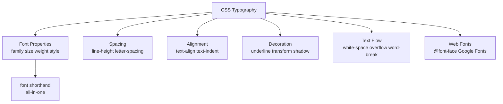
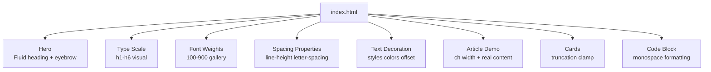

<a id="chapter-35-css-typography"></a>

# Chapter 35: CSS Typography

[⬅ Previous Chapter](#chapter-34-css-units) | [📖 Main Index](#main-index) | [Next Chapter ➡](#chapter-36-css-display-property)

---

## 📌 Learning Objectives

By the end of this chapter, you will:

- **Master** all CSS font properties — `font-family`, `font-size`, `font-weight`, `font-style`, `font-variant`
- **Understand** `line-height`, `letter-spacing`, `word-spacing` deeply with visual examples
- **Know** every `text-align`, `text-decoration`, `text-transform` variant
- **Learn** advanced typography — `text-overflow`, `white-space`, `word-break`, `overflow-wrap`
- **Master** Google Fonts, system font stacks, and variable fonts
- **Understand** `font` shorthand with exact syntax rules
- **Build** a complete typographic design system as a mini project
- **Crack** every interview question on CSS typography

---

<a id="chapter-index-table-35"></a>

## Chapter Index Table

| Topic No. | Topic Name | Subtopics |
|-----------|------------|-----------|
| 35.1 | [Typography Fundamentals](#35-1-typography-fundamentals) | Type anatomy, CSS type model |
| 35.2 | [font-family](#35-2-font-family) | Generic families, stacks, Google Fonts, system fonts |
| 35.3 | [font-size](#35-3-font-size) | px, rem, em, %, clamp, type scale |
| 35.4 | [font-weight](#35-4-font-weight) | Numeric values, named values, variable fonts |
| 35.5 | [font-style & font-variant](#35-5-font-style-variant) | italic, oblique, small-caps |
| 35.6 | [line-height](#35-6-line-height) | Unitless, em, px, leading visual |
| 35.7 | [letter-spacing & word-spacing](#35-7-letter-word-spacing) | Tracking, kerning, use cases |
| 35.8 | [text-align](#35-8-text-align) | left, right, center, justify, start, end |
| 35.9 | [text-decoration](#35-9-text-decoration) | underline, overline, line-through, shorthand |
| 35.10 | [text-transform](#35-10-text-transform) | uppercase, lowercase, capitalize |
| 35.11 | [text-indent & text-shadow](#35-11-text-indent-shadow) | Indenting, single/multi shadows |
| 35.12 | [white-space](#35-12-white-space) | normal, nowrap, pre, pre-wrap, pre-line |
| 35.13 | [text-overflow & overflow](#35-13-text-overflow) | ellipsis, clip, multi-line clamp |
| 35.14 | [word-break & overflow-wrap](#35-14-word-break) | break-all, break-word, hyphens |
| 35.15 | [font Shorthand](#35-15-font-shorthand) | Complete syntax and order rules |
| 35.16 | [Web Fonts & @font-face](#35-16-web-fonts) | Google Fonts, @font-face, font-display |
| 35.17 | [Variable Fonts](#35-17-variable-fonts) | font-variation-settings, axes |

---

---

<a id="35-1-typography-fundamentals"></a>

## 35.1 Typography Fundamentals

---

### 🧠 Hinglish Intuition

> Typography matlab sirf fonts nahi — ye poori art hai text ko readable, beautiful, aur purposeful banane ki. Ek achha developer typography samajhta hai kyunki 90% web content TEXT hai. Font choose karo, size set karo, spacing adjust karo, alignment decide karo — ye sab milke decide karte hain ki user experience kaisa hoga. Interview mein typography questions bahut common hain kyunki ye real-world projects mein roz use hoti hai.

---

### Typography Vocabulary — Visual

```
TYPE ANATOMY — Key Terms:
━━━━━━━━━━━━━━━━━━━━━━━━━━━━━━━━━━━━━━━━━━━━━━━━━━━━━━━━━━━━━━━━━━

          ┌─ Cap Height (top of uppercase)
          │
    ┌─────┼─── Ascender Line (top of b, d, f, h, k, l, t)
    │     │
    │   ──┼─── x-Height (top of lowercase x, a, e, etc.)
    │     │
H e l l o │   Baseline ─────────────────────────────────────
    │     │
    │   ──┼─── Descender Line (bottom of g, p, q, y)
    └─────┘

KEY MEASUREMENTS:
  Cap Height    → height of uppercase letters
  x-Height      → height of lowercase 'x' (affects readability)
  Ascender      → parts that go above x-height (b, d, f, h, k, l)
  Descender     → parts that go below baseline (g, p, q, y)
  Baseline      → the invisible line text "sits on"
  Leading       → line-height (space between text lines)
  Tracking      → letter-spacing (space between all characters)
  Kerning       → space between specific character pairs (AV, Te)

━━━━━━━━━━━━━━━━━━━━━━━━━━━━━━━━━━━━━━━━━━━━━━━━━━━━━━━━━━━━━━━━━━
```

---

### CSS Typography Properties Overview

```
CSS TYPOGRAPHY — Complete Property Map:
━━━━━━━━━━━━━━━━━━━━━━━━━━━━━━━━━━━━━━━━━━━━━━━━━━━━━━━━━━━━━━━━━━

FONT PROPERTIES:
  font-family      → which typeface
  font-size        → how big
  font-weight      → how bold
  font-style       → normal / italic / oblique
  font-variant     → small-caps
  font-stretch     → condensed / expanded
  font             → shorthand for all above

SPACING PROPERTIES:
  line-height      → space between lines (leading)
  letter-spacing   → space between characters (tracking)
  word-spacing     → space between words

TEXT APPEARANCE:
  text-align       → horizontal alignment
  text-decoration  → underline, overline, line-through
  text-transform   → uppercase, lowercase, capitalize
  text-indent      → first-line indentation
  text-shadow      → shadow effects on text

TEXT FLOW/OVERFLOW:
  white-space      → how whitespace is handled
  text-overflow    → what happens when text is too long
  word-break       → where lines can break in words
  overflow-wrap    → allow break to prevent overflow
  hyphens          → automatic hyphenation
  writing-mode     → horizontal / vertical text
  direction        → LTR / RTL
━━━━━━━━━━━━━━━━━━━━━━━━━━━━━━━━━━━━━━━━━━━━━━━━━━━━━━━━━━━━━━━━━━
```

---



---

👉 <a href="#chapter-index-table-35">Go to Top 🔝</a>

---

<a id="35-2-font-family"></a>

## 35.2 font-family

---

### 🧠 Hinglish Intuition

> `font-family` decide karta hai ki text kaunse typeface mein render hoga. Ek se zyada fonts comma se separate karte hain — **font stack** kehte hain isse. Browser pehle font try karta hai, available na ho toh next, phir next — last mein generic family. Generic family hamesha last mein rakhte hain kyunki woh hamesha available hoti hai. Multi-word font names quotes mein likhte hain.

---

### Font Families — The Five Generic Types

```
CSS GENERIC FONT FAMILIES:
━━━━━━━━━━━━━━━━━━━━━━━━━━━━━━━━━━━━━━━━━━━━━━━━━━━━━━━━━━━━━━━━━━

serif          → letters have small feet/strokes at ends
               "This is serif text."
               Examples: Georgia, Times New Roman, Garamond

sans-serif     → letters are clean, no feet
               "This is sans-serif text."
               Examples: Arial, Helvetica, Roboto, Inter

monospace      → every character has SAME width
               "This is mono text."
               Examples: Courier New, Consolas, Fira Code

cursive        → flowing, handwriting-like
               Examples: Brush Script, Dancing Script

fantasy        → decorative, display fonts
               Examples: Impact, Papyrus

system-ui      → OS default UI font (San Francisco on Mac,
               Segoe UI on Windows, Roboto on Android)

━━━━━━━━━━━━━━━━━━━━━━━━━━━━━━━━━━━━━━━━━━━━━━━━━━━━━━━━━━━━━━━━━━
```

---

### Font Stack — How Fallbacks Work

```
FONT STACK — Fallback chain:
━━━━━━━━━━━━━━━━━━━━━━━━━━━━━━━━━━━━━━━━━━━━━━━━━━━━━━━━━━━━━━━━━━

font-family: 'Inter', 'Segoe UI', Roboto, Arial, sans-serif;

Browser checks in ORDER:
  1. 'Inter'       → installed? Use it ✅
  2. 'Segoe UI'    → installed? Use it ✅
  3. Roboto        → installed? Use it ✅
  4. Arial         → installed? Use it ✅
  5. sans-serif    → always available (OS default) ✅

  ┌─────────────────────────────────────────────────────────┐
  │ Try Inter  →  Found?  YES → use Inter, STOP             │
  │                       NO  →                            │
  │ Try Segoe  →  Found?  YES → use Segoe, STOP            │
  │                       NO  →                            │
  │ Try Roboto →  Found?  YES → use Roboto, STOP           │
  │                       NO  →                            │
  │ Try Arial  →  Found?  YES → use Arial, STOP            │
  │                       NO  →                            │
  │ Use sans-serif → ALWAYS available → STOP               │
  └─────────────────────────────────────────────────────────┘

RULES:
  ✅ Multi-word fonts need quotes: 'Times New Roman'
  ✅ Single-word fonts don't need quotes: Arial
  ✅ Generic family ALWAYS last, no quotes: sans-serif
  ✅ Comma-separated with spaces
━━━━━━━━━━━━━━━━━━━━━━━━━━━━━━━━━━━━━━━━━━━━━━━━━━━━━━━━━━━━━━━━━━
```

---

### System Font Stacks

```css
/* ── MODERN SYSTEM UI STACK ── */
/* Uses native OS font — no download, fastest possible */
body {
  font-family: system-ui, -apple-system, BlinkMacSystemFont,
               'Segoe UI', Roboto, Oxygen, Ubuntu, Cantarell,
               'Helvetica Neue', Arial, sans-serif;
}

/*
  system-ui           → generic (CSS spec)
  -apple-system       → San Francisco (macOS/iOS Safari)
  BlinkMacSystemFont  → San Francisco (macOS/iOS Chrome)
  'Segoe UI'          → Windows 10+
  Roboto              → Android, Chrome OS
  Oxygen              → KDE Linux
  Ubuntu              → Ubuntu Linux
  Cantarell           → GNOME Linux
  'Helvetica Neue'    → older macOS
  Arial               → universal fallback
  sans-serif          → generic fallback
*/

/* ── MONOSPACE STACK ── */
.code {
  font-family: 'Fira Code', 'Cascadia Code', 'JetBrains Mono',
               'Source Code Pro', Consolas, 'Courier New', monospace;
}

/* ── SERIF STACK ── */
.article {
  font-family: Georgia, 'Times New Roman', Times, serif;
}
```

---

### Google Fonts Integration

```html
<!-- Method 1: HTML <link> tag (most common) -->
<head>
  <link rel="preconnect" href="https://fonts.googleapis.com">
  <link rel="preconnect" href="https://fonts.gstatic.com" crossorigin>
  <link href="https://fonts.googleapis.com/css2?family=Inter:wght@400;500;600;700&family=Fira+Code:wght@400;500&display=swap" rel="stylesheet">
</head>

<!--
  :wght@400;500;600;700  → load only weights you need
  display=swap           → show fallback font while loading
  preconnect             → hints browser to connect early
-->
```

```css
/* Method 2: CSS @import (inside stylesheet) */
@import url('https://fonts.googleapis.com/css2?family=Inter:wght@400;600;700&display=swap');

/* AFTER importing, use the font */
body {
  font-family: 'Inter', system-ui, sans-serif;
}

code {
  font-family: 'Fira Code', Consolas, monospace;
}
```

---

### Code Example — Font Family Best Practices

```css
/* ── Design System Font Setup ── */
:root {
  --font-sans:  'Inter', system-ui, -apple-system, sans-serif;
  --font-serif: 'Playfair Display', Georgia, serif;
  --font-mono:  'Fira Code', 'Cascadia Code', Consolas, monospace;
}

body           { font-family: var(--font-sans); }
h1, h2, h3    { font-family: var(--font-serif); }
code, pre, kbd { font-family: var(--font-mono); }

/* Font display — controls FOUT (Flash of Unstyled Text) */
/* This is handled in @font-face or Google Fonts URL param */
/* display=swap: show fallback immediately, swap when loaded */
/* display=optional: use fallback if font not cached         */
/* display=block: invisible text until font loads           */
```

---

> [!IMPORTANT]
> Always end your font stack with a **generic family** (`sans-serif`, `serif`, `monospace`). This guarantees text is always visible even if all named fonts fail. Also use `font-display: swap` in web font loading to prevent invisible text (FOIT — Flash of Invisible Text).

---

👉 <a href="#chapter-index-table-35">Go to Top 🔝</a>

---

<a id="35-3-font-size"></a>

## 35.3 font-size

---

### 🧠 Hinglish Intuition

> `font-size` text ka size control karta hai. Hum pichle chapter mein units padh chuke hain — yahan apply karte hain. Rule: **global font-size ke liye `rem` use karo** — kyunki ye user ke browser settings ko respect karta hai. Component-level scaling ke liye `em`, fluid typography ke liye `clamp()`. `px` avoid karo font-size ke liye — accessibility break hoti hai.

---

### font-size Values Visual

```
font-size VALUES — How each looks:
━━━━━━━━━━━━━━━━━━━━━━━━━━━━━━━━━━━━━━━━━━━━━━━━━━━━━━━━━━━━━━━━━━

Absolute keywords (browser-defined):
  xx-small  → ~9px
  x-small   → ~10px
  small     → ~13px
  medium    → 16px   ← browser default
  large     → ~18px
  x-large   → ~24px
  xx-large  → ~32px

Relative keywords (relative to parent):
  smaller   → one size smaller than parent
  larger    → one size larger than parent

Numeric values:
  px    → 16px     (avoid for accessibility)
  rem   → 1rem     (recommended — root relative)
  em    → 1em      (parent/self relative)
  %     → 100%     (% of parent font-size)
  vw    → 4vw      (viewport relative — use with clamp)
  clamp → clamp(1rem, 4vw, 3rem) (fluid — recommended)

━━━━━━━━━━━━━━━━━━━━━━━━━━━━━━━━━━━━━━━━━━━━━━━━━━━━━━━━━━━━━━━━━━
```

---

### Type Scale — Modular Scale

```
MODULAR TYPE SCALE (ratio 1.25 — Major Third):
━━━━━━━━━━━━━━━━━━━━━━━━━━━━━━━━━━━━━━━━━━━━━━━━━━━━━━━━━━━━━━━━━━

Base: 1rem (16px) × ratio (1.25):

  xs:    0.64rem  → 10.24px  ← captions, labels
  sm:    0.8rem   → 12.8px   ← secondary text
  base:  1rem     → 16px     ← body text (base)
  md:    1.25rem  → 20px     ← large body
  lg:    1.563rem → 25px     ← h4
  xl:    1.953rem → 31.25px  ← h3
  2xl:   2.441rem → 39px     ← h2
  3xl:   3.052rem → 48.8px   ← h1
  4xl:   3.815rem → 61px     ← display
  5xl:   4.768rem → 76.3px   ← hero

VISUAL SIZE COMPARISON:
  xs   → small caption
  sm   → secondary text
  base → normal body text — comfortable reading size
  lg   → slightly emphasized text
  xl   → subheading (h4 level)
  2xl  → section heading (h3)
  3xl  → page section title (h2)
  4xl  → main page title (h1)
  5xl  → HERO HEADLINE
━━━━━━━━━━━━━━━━━━━━━━━━━━━━━━━━━━━━━━━━━━━━━━━━━━━━━━━━━━━━━━━━━━
```

---

### Code Example

```css
/* Root setup */
html { font-size: 100%; }  /* = 16px, respects user prefs */

/* Fluid type scale using clamp */
:root {
  --text-xs:   clamp(0.75rem, 1.5vw, 0.875rem);
  --text-sm:   clamp(0.875rem, 2vw, 1rem);
  --text-base: clamp(1rem, 2.5vw, 1.125rem);
  --text-lg:   clamp(1.125rem, 3vw, 1.5rem);
  --text-xl:   clamp(1.25rem, 4vw, 2rem);
  --text-2xl:  clamp(1.5rem, 5vw, 2.5rem);
  --text-3xl:  clamp(2rem, 6vw, 3.5rem);
  --text-4xl:  clamp(2.5rem, 8vw, 5rem);
}

/* Apply to elements */
body  { font-size: var(--text-base); }
h1    { font-size: var(--text-4xl); }
h2    { font-size: var(--text-3xl); }
h3    { font-size: var(--text-2xl); }
h4    { font-size: var(--text-xl); }
h5    { font-size: var(--text-lg); }
h6    { font-size: var(--text-base); }
small { font-size: var(--text-sm); }
```

---

> [!TIP]
> Use `clamp()` for ALL heading font-sizes in modern projects. This gives you fluid, responsive typography with zero breakpoints. The pattern `clamp(minRem, vw-value, maxRem)` is now industry standard.

---

👉 <a href="#chapter-index-table-35">Go to Top 🔝</a>

---

<a id="35-4-font-weight"></a>

## 35.4 font-weight

---

### 🧠 Hinglish Intuition

> `font-weight` text ki boldness control karta hai. Numbers `100` se `900` tak hain — `400` = normal, `700` = bold. Agar specified weight font mein available nahi hai toh browser nearest available weight use karta hai. Variable fonts mein koi bhi weight exact value pe set ho sakti hai — 100 se 900 tak koi bhi number.

---

### font-weight Values Visual

```
FONT-WEIGHT SCALE:
━━━━━━━━━━━━━━━━━━━━━━━━━━━━━━━━━━━━━━━━━━━━━━━━━━━━━━━━━━━━━━━━━━

Value   Keyword        Visual Appearance
─────   ───────────    ────────────────────────────────────────────
100     Thin           This text is weight 100 — very thin
200     Extra Light    This text is weight 200
300     Light          This text is weight 300 — light
400     Normal         This text is weight 400 — normal body text
500     Medium         This text is weight 500 — slightly bold
600     Semi Bold      This text is weight 600 — semi bold
700     Bold           This text is weight 700 — BOLD
800     Extra Bold     This text is weight 800 — EXTRA BOLD
900     Black          This text is weight 900 — HEAVIEST

Named keywords:
  normal → same as 400
  bold   → same as 700
  bolder → one step bolder than parent
  lighter→ one step lighter than parent

━━━━━━━━━━━━━━━━━━━━━━━━━━━━━━━━━━━━━━━━━━━━━━━━━━━━━━━━━━━━━━━━━━

FONT AVAILABILITY:
  Most fonts only have 2-3 weights: 400, 700, sometimes 300
  Web fonts (Google, Adobe) often have full weight range
  Variable fonts support ANY value (123, 456, 567, etc.)

  If weight 500 not available: browser uses nearest (400 or 700)
━━━━━━━━━━━━━━━━━━━━━━━━━━━━━━━━━━━━━━━━━━━━━━━━━━━━━━━━━━━━━━━━━━
```

---

### Code Example

```css
/* Numeric values — recommended (explicit) */
.thin        { font-weight: 100; }
.light       { font-weight: 300; }
.regular     { font-weight: 400; }
.medium      { font-weight: 500; }
.semibold    { font-weight: 600; }
.bold        { font-weight: 700; }
.extrabold   { font-weight: 800; }
.black       { font-weight: 900; }

/* Named keywords */
p    { font-weight: normal; }   /* = 400 */
strong { font-weight: bold; }   /* = 700 */

/* Relative weights */
.bolder-child {
  font-weight: bolder; /* if parent=400 → child=700 */
}

/* Google Fonts — load only needed weights */
/* @import URL with :wght@300;400;500;600;700 */

/* Design system usage */
:root {
  --fw-light:    300;
  --fw-regular:  400;
  --fw-medium:   500;
  --fw-semibold: 600;
  --fw-bold:     700;
  --fw-black:    900;
}

body    { font-weight: var(--fw-regular); }
h1, h2  { font-weight: var(--fw-bold); }
h3, h4  { font-weight: var(--fw-semibold); }
.label  { font-weight: var(--fw-medium); }
caption { font-weight: var(--fw-light); }
```

---

> [!NOTE]
> When you load a Google Font, **only load the weights you actually use**. Each weight is a separate file download. Loading all 9 weights adds significant page weight and slows the site. Use `wght@400;600;700` for example.

---

👉 <a href="#chapter-index-table-35">Go to Top 🔝</a>

---

<a id="35-5-font-style-variant"></a>

## 35.5 font-style & font-variant

---

### 🧠 Hinglish Intuition

> `font-style: italic` text ko italic (tilted) karta hai. `font-style: oblique` bhi text tilt karta hai lekin algorithmically — actual italic glyphs use nahi karta. `font-variant: small-caps` lowercase letters ko SMALL UPPERCASE letters mein convert karta hai — same height as lowercase but styled as capitals. Ye editorial aur display typography mein common hain.

---

### font-style Visual

```
font-style VALUES:
━━━━━━━━━━━━━━━━━━━━━━━━━━━━━━━━━━━━━━━━━━━━━━━━━━━━━━━━━━━━━━━━━━

  normal:  Hello World  ← upright (default)
  italic:  Hello World  ← uses italic typeface glyphs
  oblique: Hello World  ← mathematically slanted normal font

DIFFERENCE — italic vs oblique:
  italic  → uses specially designed italic variant of the font
            (different letterforms, not just slanted)
            "a" italic → ɑ  (different glyph!)

  oblique → takes normal font and mathematically slants it
            "a" oblique → a (same glyph, just slanted)

  If font has no italic variant:
  → italic falls back to oblique

oblique with angle:
  font-style: oblique 20deg;  → slant by 20 degrees
━━━━━━━━━━━━━━━━━━━━━━━━━━━━━━━━━━━━━━━━━━━━━━━━━━━━━━━━━━━━━━━━━━
```

---

### font-variant Visual

```
font-variant: small-caps
━━━━━━━━━━━━━━━━━━━━━━━━━━━━━━━━━━━━━━━━━━━━━━━━━━━━━━━━━━━━━━━━━━

  normal:     Hello World CSS Typography
  small-caps: HELLO WORLD CSS TYPOGRAPHY
              (lowercase becomes SMALL CAPS — uppercase size)

  Use cases:
  → Chapter headings, section labels
  → Abbreviations: HTML, CSS (looks better in small-caps)
  → Elegant editorial headers

font-variant has many sub-properties (CSS Fonts Level 4):
  font-variant-numeric: oldstyle-nums | tabular-nums | etc.
  font-variant-ligatures: common-ligatures | no-ligatures
  font-variant-caps: small-caps | all-small-caps | petite-caps
━━━━━━━━━━━━━━━━━━━━━━━━━━━━━━━━━━━━━━━━━━━━━━━━━━━━━━━━━━━━━━━━━━
```

---

### Code Example

```css
/* font-style */
em, i          { font-style: italic; }
.caption-note  { font-style: italic; color: #6b7280; }
.normal-reset  { font-style: normal; }  /* override inherited italic */

/* font-variant */
.small-caps-heading {
  font-variant: small-caps;
  letter-spacing: 0.05em;  /* small-caps often benefits from tracking */
}

abbr {
  font-variant: small-caps;
  text-decoration: underline dotted; /* indicate abbreviation */
}

/* Numbers formatting */
.price-table {
  font-variant-numeric: tabular-nums;  /* monospace numbers */
  /* Numbers align in columns (great for tables) */
}

.old-style {
  font-variant-numeric: oldstyle-nums; /* elegant 0-9 with ascenders/descenders */
}

/* Ligatures — automatic in most modern fonts */
.ligatures {
  font-variant-ligatures: common-ligatures; /* fi, fl, ff etc. */
}
```

---

👉 <a href="#chapter-index-table-35">Go to Top 🔝</a>

---

<a id="35-6-line-height"></a>

## 35.6 line-height

---

### 🧠 Hinglish Intuition

> `line-height` lines ke beech ki vertical space control karta hai — typography mein ise "leading" kehte hain. **Unitless value sabse best hai** — jaise `line-height: 1.5` — ye automatically font-size ke saath scale karta hai. `1.5` matlab font-size ka 1.5x. Body text ke liye `1.5–1.7`, headings ke liye `1.1–1.3` ideal hai. Bahut kam line-height = text cramped, bahut zyada = disconnected lines.

---

### line-height Visual

```
line-height — Controlling line spacing:
━━━━━━━━━━━━━━━━━━━━━━━━━━━━━━━━━━━━━━━━━━━━━━━━━━━━━━━━━━━━━━━━━━

Font-size: 16px

line-height: 1  (tight — same as font-size)
  ─────────────────────────────────────── ← line box top
  This is a sentence that wraps across
  ─────────────────────────────────────── ← baseline (=line box bottom)
  multiple lines in the paragraph here.  ← no breathing room
  ───────────────────────────────────────

line-height: 1.5  (comfortable — recommended for body)
  ─────────────────────────────────────── ← line box top (24px)
  This is a sentence that wraps across   ← text (16px)
     ↕ 4px above + 4px below (half-leading each side)
  ─────────────────────────────────────── ← next line box
  multiple lines in the paragraph here.
  ─────────────────────────────────────── 24px between baselines

line-height: 2  (loose — too much for body, ok for headings)
  ───────────────────────────────────────
  This is a sentence that wraps
  ↕ large gap (feels disconnected)
  ───────────────────────────────────────
  across multiple lines.
  ───────────────────────────────────────

━━━━━━━━━━━━━━━━━━━━━━━━━━━━━━━━━━━━━━━━━━━━━━━━━━━━━━━━━━━━━━━━━━
HOW LINE-HEIGHT WORKS:
  16px font with line-height: 1.5 = 24px line box
  Half-leading = (24 - 16) / 2 = 4px added above AND below text
  Baseline distance = 24px between consecutive lines

LINE-HEIGHT VALUE TYPES:
  unitless: 1.5    → 1.5 × font-size (RECOMMENDED)
  em:       1.5em  → 1.5 × font-size (same but inherited as fixed px!)
  px:       24px   → fixed, doesn't scale
  %:        150%   → 150% × font-size (same issue as em)
  normal:   default (browser-defined, ~1.2)

WHY UNITLESS IS BEST:
  parent: font-size: 20px; line-height: 1.5;
  child:  font-size: 12px; (inherits line-height)

  With unitless: child line-height = 1.5 × 12 = 18px  ✅ (recalculated)
  With em/px:    child line-height = 1.5 × 20 = 30px  ❌ (too large for 12px text!)
━━━━━━━━━━━━━━━━━━━━━━━━━━━━━━━━━━━━━━━━━━━━━━━━━━━━━━━━━━━━━━━━━━
```

---

### Recommended line-height Values

```
┌──────────────────────────────────────────────────────────────────┐
│  ELEMENT TYPE          │  RECOMMENDED line-height               │
├────────────────────────┼───────────────────────────────────────  │
│  Display/Hero text     │  1.0 – 1.1  (tight, visual impact)    │
│  Headings (h1, h2)    │  1.1 – 1.2  (tight)                   │
│  Subheadings (h3, h4) │  1.2 – 1.3                            │
│  Body text / prose    │  1.5 – 1.7  (comfortable reading)     │
│  Small text / captions│  1.4 – 1.5                            │
│  UI labels / buttons  │  1.0 – 1.2  (single line)            │
│  Code blocks          │  1.5 – 1.7                            │
└──────────────────────────────────────────────────────────────────┘
```

---

### Code Example

```css
/* Global line-height reset */
html { line-height: 1.5; }  /* unitless — scales with all font sizes */

/* Element-specific */
h1, h2        { line-height: 1.1; }
h3, h4        { line-height: 1.2; }
p             { line-height: 1.7; }
.caption      { line-height: 1.4; }
.btn          { line-height: 1;   }  /* single line buttons */
code, pre     { line-height: 1.6; }

/* Design token */
:root {
  --lh-tight:    1.1;
  --lh-snug:     1.3;
  --lh-normal:   1.5;
  --lh-relaxed:  1.7;
  --lh-loose:    2.0;
}

/* Centering single-line text vertically */
.badge {
  height: 32px;
  line-height: 32px;   /* = height → vertically centered text */
  padding: 0 12px;
}
/* Modern alternative: display: flex; align-items: center; */
```

---

> [!IMPORTANT]
> **Always use unitless `line-height`**. When `line-height` uses `em` or `px`, child elements inherit the computed pixel value — not the ratio. This causes line-height to be too large or too small for child elements with different font-sizes. Unitless values are inherited as ratios and recalculated for each element's own font-size.

---

👉 <a href="#chapter-index-table-35">Go to Top 🔝</a>

---

<a id="35-7-letter-word-spacing"></a>

## 35.7 letter-spacing & word-spacing

---

### 🧠 Hinglish Intuition

> `letter-spacing` characters ke beech space badhata ya ghata hai — typography mein "tracking" kehte hain. Uppercase aur small-caps text mein thodi tracking (`0.05em–0.1em`) readability improve karta hai. Body text mein tracking rarely change karte hain. `word-spacing` words ke beech ka space control karta hai — rarely needed lekin special layouts mein useful.

---

### letter-spacing Visual

```
letter-spacing — Character spacing (tracking):
━━━━━━━━━━━━━━━━━━━━━━━━━━━━━━━━━━━━━━━━━━━━━━━━━━━━━━━━━━━━━━━━━━

letter-spacing: 0 (normal):
  Hello World Typography

letter-spacing: 0.05em (subtle — good for headings):
  H e l l o  W o r l d  T y p o g r a p h y

letter-spacing: 0.1em (noticeable — good for ALL CAPS):
  H E L L O  W O R L D  T Y P O G R A P H Y

letter-spacing: 0.3em (wide — decorative):
  H   E   L   L   O   W   O   R   L   D

letter-spacing: -0.05em (tight — for large headings):
  HelloWorldTypography

WHEN TO USE:
  ✅ Uppercase text    → +0.05em to +0.15em  (improves readability)
  ✅ Small-caps        → +0.05em to +0.1em
  ✅ Large display text → -0.02em to -0.05em (tighten)
  ✅ Eyebrow/label text → +0.1em to +0.2em
  ❌ Body paragraph text → leave at 0 (browser default is optimal)

━━━━━━━━━━━━━━━━━━━━━━━━━━━━━━━━━━━━━━━━━━━━━━━━━━━━━━━━━━━━━━━━━━

word-spacing — Space between words:
━━━━━━━━━━━━━━━━━━━━━━━━━━━━━━━━━━━━━━━━━━━━━━━━━━━━━━━━━━━━━━━━━━

word-spacing: normal:
  Hello World CSS Typography

word-spacing: 0.5em:
  Hello   World   CSS   Typography

word-spacing: -0.1em:
  HelloWorldCSSTypography  (words overlap — rarely useful)
━━━━━━━━━━━━━━━━━━━━━━━━━━━━━━━━━━━━━━━━━━━━━━━━━━━━━━━━━━━━━━━━━━
```

---

### Code Example

```css
/* Headings — slightly tight tracking */
h1, h2 {
  letter-spacing: -0.02em;  /* tighten large headings */
}

/* Uppercase labels — always add tracking */
.label,
.badge,
.eyebrow {
  text-transform: uppercase;
  letter-spacing: 0.1em;    /* uppercase NEEDS tracking to breathe */
  font-size: 0.75rem;
  font-weight: 600;
}

/* Section eyebrow text */
.section-eyebrow {
  text-transform: uppercase;
  letter-spacing: 0.15em;
  font-size: 0.7rem;
  color: #6b7280;
  font-weight: 700;
}

/* Small-caps with tracking */
.small-caps {
  font-variant: small-caps;
  letter-spacing: 0.05em;
}

/* Monospace code — usually no adjustment needed */
code { letter-spacing: 0; }

/* word-spacing — rarely used */
.spaced-text {
  word-spacing: 0.3em;
}
```

---

> [!TIP]
> **Rule of thumb**: Always pair `text-transform: uppercase` with `letter-spacing: 0.05em` or more. Capital letters are designed with normal spacing in mind — all-caps text without extra tracking feels cramped and hard to read.

---

👉 <a href="#chapter-index-table-35">Go to Top 🔝</a>

---

<a id="35-8-text-align"></a>

## 35.8 text-align

---

### 🧠 Hinglish Intuition

> `text-align` inline content (text, images) ko horizontal direction mein align karta hai. Ye **block element ke andar** inline content align karta hai — block element khud ko nahi. `justify` text ko dono edges tak stretch karta hai jaise newspaper column — lekin last line left-aligned rehti hai. `start` aur `end` RTL languages ke liye logical values hain.

---

### text-align Visual

```
text-align VALUES:
━━━━━━━━━━━━━━━━━━━━━━━━━━━━━━━━━━━━━━━━━━━━━━━━━━━━━━━━━━━━━━━━━━

left (default in LTR):
  ┌──────────────────────────────────────────────┐
  │ This text is aligned to the left side of     │
  │ the container. Extra spaces on the right.    │
  │ Short line.                                  │
  └──────────────────────────────────────────────┘

right:
  ┌──────────────────────────────────────────────┐
  │     This text is aligned to the right side. │
  │              Spaces on the left side.        │
  │                            Short line right. │
  └──────────────────────────────────────────────┘

center:
  ┌──────────────────────────────────────────────┐
  │    This text is centered within the          │
  │           container width.                   │
  │               Short.                         │
  └──────────────────────────────────────────────┘

justify:
  ┌──────────────────────────────────────────────┐
  │ This  text  is  spread  to  fill  the  full  │
  │ width  of  the  container,  like  newspaper  │
  │ columns. The last line is left-aligned.      │
  └──────────────────────────────────────────────┘

start:
  → left in LTR languages, right in RTL languages
  → recommended over "left" for internationalized content

end:
  → right in LTR, left in RTL

━━━━━━━━━━━━━━━━━━━━━━━━━━━━━━━━━━━━━━━━━━━━━━━━━━━━━━━━━━━━━━━━━━

text-align: justify ISSUE:
  Long words + narrow containers → ugly large gaps between words
  Fix: add hyphens: auto; to allow hyphenation
━━━━━━━━━━━━━━━━━━━━━━━━━━━━━━━━━━━━━━━━━━━━━━━━━━━━━━━━━━━━━━━━━━
```

---

### Code Example

```css
/* Common patterns */
body          { text-align: left; }     /* or start — default */
.hero__title  { text-align: center; }
.text-right   { text-align: right; }
.text-center  { text-align: center; }
.text-justify { text-align: justify; }

/* RTL-aware logical values */
.content {
  text-align: start;   /* left in LTR, right in RTL */
}

/* Justify with hyphenation */
.newspaper-column {
  text-align: justify;
  hyphens: auto;
  -webkit-hyphens: auto;  /* Safari prefix */
  hyphenate-limit-chars: 6 3 3;  /* min 6 chars, 3 before, 3 after hyphen */
}

/* Center hero text */
.hero-content {
  text-align: center;
  max-width: 65ch;
  margin: 0 auto;
}

/* Table column alignment */
.col-price { text-align: right; }   /* numbers right-aligned */
.col-name  { text-align: left; }
.col-status{ text-align: center; }
```

---

> [!NOTE]
> `text-align` **only aligns inline content** — text, inline-block elements, and images. It does NOT center block-level child elements. To center a block element, use `margin: 0 auto` (with explicit width) or flexbox/grid centering.

---

👉 <a href="#chapter-index-table-35">Go to Top 🔝</a>

---

<a id="35-9-text-decoration"></a>

## 35.9 text-decoration

---

### 🧠 Hinglish Intuition

> `text-decoration` text ke upar, neeche, ya beech mein lines draw karta hai. Default mein links underline hote hain. `text-decoration: none` links ki underline hatata hai — navigation mein common. Advanced usage mein decoration ka color, style (solid/dashed/wavy), aur thickness bhi control kar sakte ho.

---

### text-decoration Visual

```
text-decoration VALUES:
━━━━━━━━━━━━━━━━━━━━━━━━━━━━━━━━━━━━━━━━━━━━━━━━━━━━━━━━━━━━━━━━━━

none:          Hello World  ← no decoration
underline:     Hello World  ← line below text
               ━━━━━━━━━━━
overline:      Hello World  ← line above text
               ───────────
line-through:  Hello World  ← line through middle
               ─────H─e─l─
underline overline: (both)
               ───────────
               Hello World
               ━━━━━━━━━━━

━━━━━━━━━━━━━━━━━━━━━━━━━━━━━━━━━━━━━━━━━━━━━━━━━━━━━━━━━━━━━━━━━━

text-decoration-style:
  solid:   Hello World  (standard)
           ━━━━━━━━━━━
  double:  Hello World  (two lines)
           ═══════════
  dotted:  Hello World  (dots)
           ···········
  dashed:  Hello World  (dashes)
           ─ ─ ─ ─ ─ ─
  wavy:    Hello World  (wavy line — spelling error indicator!)
           ~~~~~~~~~~~

text-decoration-color:
  Any color: red underline, blue, rgba, currentColor

text-decoration-thickness:
  auto | from-font | <length> | <percentage>
  2px underline, 4px, etc.

━━━━━━━━━━━━━━━━━━━━━━━━━━━━━━━━━━━━━━━━━━━━━━━━━━━━━━━━━━━━━━━━━━

SHORTHAND:
  text-decoration: underline dashed red 2px;
  text-decoration: [line] [style] [color] [thickness]
━━━━━━━━━━━━━━━━━━━━━━━━━━━━━━━━━━━━━━━━━━━━━━━━━━━━━━━━━━━━━━━━━━
```

---

### Code Example

```css
/* Remove default link underline */
a {
  text-decoration: none;
  color: #2563eb;
}

/* Custom underline on hover */
a:hover {
  text-decoration: underline;
}

/* Fancy colored underline */
.fancy-link {
  text-decoration: underline;
  text-decoration-color: #f59e0b;    /* orange underline */
  text-decoration-thickness: 2px;
  text-underline-offset: 4px;        /* gap between text and line */
}

/* Wavy underline — spell-check effect */
.spelling-error {
  text-decoration: underline wavy red;
}

/* Strikethrough — sale/deleted price */
.original-price {
  text-decoration: line-through;
  text-decoration-color: #ef4444;
  color: #9ca3af;
}

/* Abbreviation underline */
abbr[title] {
  text-decoration: underline dotted;
  cursor: help;
}

/* Navigation — show underline on active */
.nav-link              { text-decoration: none; }
.nav-link--active      { text-decoration: underline; text-underline-offset: 4px; }
.nav-link:focus-visible{ text-decoration: underline; outline: 2px solid #2563eb; }

/* text-underline-offset — gap between text baseline and underline */
.offset-link {
  text-decoration: underline;
  text-underline-offset: 6px;  /* breathing room */
}
```

---

> [!TIP]
> **`text-underline-offset`** is a modern property that adds space between text and the underline. This dramatically improves the aesthetics of underlined text — especially for links. Always pair custom underlines with `text-underline-offset: 3px` or `4px`.

---

👉 <a href="#chapter-index-table-35">Go to Top 🔝</a>

---

<a id="35-10-text-transform"></a>

## 35.10 text-transform

---

### 🧠 Hinglish Intuition

> `text-transform` text ke actual case ko display time change karta hai — HTML source code change nahi hoti. `uppercase` = sab CAPITALS, `lowercase` = sab small, `capitalize` = har word ka pehla letter capital. CSS mein ye visual-only change hai — copy paste karo toh original case milti hai. Uppercase ke saath `letter-spacing` add karna yaad rakho!

---

### text-transform Visual

```
text-transform VALUES:
━━━━━━━━━━━━━━━━━━━━━━━━━━━━━━━━━━━━━━━━━━━━━━━━━━━━━━━━━━━━━━━━━━

HTML source: "hello world css typography"

  none:       hello world css typography  (unchanged)
  uppercase:  HELLO WORLD CSS TYPOGRAPHY
  lowercase:  hello world css typography  (already lower)
  capitalize: Hello World Css Typography  (first letter each word)
  full-width: Converts to fullwidth Unicode characters (CJK use)

HTML source: "HELLO WORLD"
  lowercase:  hello world
  capitalize: Hello World  (already capitalized — no change!)

━━━━━━━━━━━━━━━━━━━━━━━━━━━━━━━━━━━━━━━━━━━━━━━━━━━━━━━━━━━━━━━━━━

Use cases:
  uppercase  → labels, badges, buttons, nav items, section eyebrows
  lowercase  → usernames, email displays, code
  capitalize → title case headings (use with caution — CSS
               capitalizes every word including "and", "the", "of")
━━━━━━━━━━━━━━━━━━━━━━━━━━━━━━━━━━━━━━━━━━━━━━━━━━━━━━━━━━━━━━━━━━
```

---

### Code Example

```css
/* Labels and badges */
.label {
  text-transform: uppercase;
  letter-spacing: 0.08em;   /* always pair uppercase with tracking! */
  font-size: 0.75rem;
  font-weight: 600;
}

/* Navigation */
.nav-item {
  text-transform: uppercase;
  letter-spacing: 0.05em;
  font-size: 0.875rem;
}

/* Section eyebrow */
.eyebrow {
  text-transform: uppercase;
  letter-spacing: 0.12em;
  color: #6b7280;
}

/* Button */
.btn--caps {
  text-transform: uppercase;
  letter-spacing: 0.05em;
}

/* Username display */
.username {
  text-transform: lowercase;
}

/* Input placeholder */
input::placeholder {
  text-transform: none;  /* reset if parent has transform */
}
```

---

👉 <a href="#chapter-index-table-35">Go to Top 🔝</a>

---

<a id="35-11-text-indent-shadow"></a>

## 35.11 text-indent & text-shadow

---

### 🧠 Hinglish Intuition

> `text-indent` paragraph ke pehle line ko indent karta hai — jaise print books mein paragraphs hote hain. Negative value hanging indent (bibliography style) banata hai. `text-shadow` text pe shadow lagata hai — `box-shadow` jaisa syntax: `X-offset Y-offset blur color`. Multiple shadows comma se separate karte hain — layered glow ya 3D effects banana possible hai.

---

### text-indent Visual

```
text-indent VALUES:
━━━━━━━━━━━━━━━━━━━━━━━━━━━━━━━━━━━━━━━━━━━━━━━━━━━━━━━━━━━━━━━━━━

text-indent: 0 (default):
  ┌─────────────────────────────────────────┐
  │ This paragraph starts at the left edge. │
  │ Second line also at the left edge.      │
  └─────────────────────────────────────────┘

text-indent: 2em (positive):
  ┌─────────────────────────────────────────┐
  │         This paragraph has a first line │
  │ indent. Only the first line is indented.│
  └─────────────────────────────────────────┘

text-indent: -2em with padding-left: 2em (hanging indent):
  ┌─────────────────────────────────────────┐
  │ Reference: This is a bibliography entry │
  │     that wraps with hanging indent.     │
  └─────────────────────────────────────────┘
━━━━━━━━━━━━━━━━━━━━━━━━━━━━━━━━━━━━━━━━━━━━━━━━━━━━━━━━━━━━━━━━━━
```

---

### text-shadow Visual

```
text-shadow: [x-offset] [y-offset] [blur] [color];
━━━━━━━━━━━━━━━━━━━━━━━━━━━━━━━━━━━━━━━━━━━━━━━━━━━━━━━━━━━━━━━━━━

text-shadow: 2px 2px 4px rgba(0,0,0,0.3):
  HELLO ← text
  ╲HELLO ← shadow offset right+down, 4px blur, 30% black

text-shadow: 0 0 10px rgba(99, 102, 241, 0.8):
  (no offset, blur only → GLOW effect)
  ✨HELLO✨ ← glowing text

text-shadow: -2px 2px 0 navy, 2px -2px 0 red:
  (multiple shadows → 3D letterpress effect)

text-shadow: 1px 1px white, -1px -1px white, 1px -1px white, -1px 1px white:
  (strokes around text by offsetting in 4 directions)

━━━━━━━━━━━━━━━━━━━━━━━━━━━━━━━━━━━━━━━━━━━━━━━━━━━━━━━━━━━━━━━━━━

MULTIPLE SHADOWS:
  text-shadow: shadow1, shadow2, shadow3;
  First shadow = FRONT (closest to text)
  Last shadow = BACK (farthest)
━━━━━━━━━━━━━━━━━━━━━━━━━━━━━━━━━━━━━━━━━━━━━━━━━━━━━━━━━━━━━━━━━━
```

---

### Code Example

```css
/* text-indent */
/* Classic book-style paragraphs */
.prose p + p {
  text-indent: 1.5em;  /* only paragraphs AFTER first get indent */
  margin-top: 0;       /* no margin between indented paragraphs */
}

/* Hanging indent for references */
.references li {
  padding-left: 2em;
  text-indent: -2em;
}

/* text-shadow */
/* Subtle depth shadow */
.heading-shadow {
  text-shadow: 1px 2px 4px rgba(0, 0, 0, 0.2);
}

/* Glow effect */
.neon-text {
  color: #00ffff;
  text-shadow:
    0 0 5px #00ffff,
    0 0 20px #00ffff,
    0 0 40px #0080ff;
}

/* Hard shadow (no blur) — retro style */
.retro-text {
  color: #fff;
  text-shadow: 3px 3px 0 #000;
}

/* Multi-color shadow */
.multi-shadow {
  text-shadow:
    2px 2px 0 #e74c3c,
    4px 4px 0 #3498db;
}

/* White outline on dark image */
.image-overlay-text {
  color: white;
  text-shadow:
    0 1px 2px rgba(0,0,0,0.8),
    0 0 10px rgba(0,0,0,0.4);
}

/* Lift text off page */
.lifted-text {
  text-shadow:
    0 1px 0 #ccc,
    0 2px 0 #c9c9c9,
    0 3px 0 #bbb,
    0 4px 0 #b9b9b9,
    0 5px 0 #aaa,
    0 6px 8px rgba(0,0,0,0.3);
}
```

---

👉 <a href="#chapter-index-table-35">Go to Top 🔝</a>

---

<a id="35-12-white-space"></a>

## 35.12 white-space

---

### 🧠 Hinglish Intuition

> `white-space` control karta hai ki browser whitespace characters (spaces, tabs, newlines) ko kaise handle kare. By default browser multiple spaces ko ek kar deta hai aur lines ko wrap kar leta hai. `nowrap` wrapping rokta hai — single line mein text rakhta hai. `pre` — whitespace as-is preserve karta hai jaise `<pre>` element. Code blocks aur tabs ke liye important.

---

### white-space Values Visual

```
white-space — Whitespace handling:
━━━━━━━━━━━━━━━━━━━━━━━━━━━━━━━━━━━━━━━━━━━━━━━━━━━━━━━━━━━━━━━━━━

HTML source:
  "Hello    World
   This is  a    test"

┌────────────────────────────┬───────────────┬────────────────────────────────────┐
│  VALUE                     │  COLLAPSES?   │  WRAPS?   │  PRESERVES NEWLINES?   │
├────────────────────────────┼───────────────┼──────────┼────────────────────────┤
│  normal (default)          │  YES          │  YES      │  NO (treated as space) │
│  nowrap                    │  YES          │  NO       │  NO                    │
│  pre                       │  NO           │  NO       │  YES                   │
│  pre-wrap                  │  NO           │  YES      │  YES                   │
│  pre-line                  │  YES          │  YES      │  YES                   │
│  break-spaces              │  NO           │  YES      │  YES                   │
└────────────────────────────┴───────────────┴──────────┴────────────────────────┘

VISUAL:
  normal:   Hello World This is a test  (collapsed, wrapped)
  nowrap:   Hello World This is a test  (one long line, no wrap)
  pre:      Hello    World
              This is  a    test         (exact source)
  pre-wrap: Hello    World
            This is  a    test           (preserves + wraps)
  pre-line: Hello World
            This is a test              (collapses spaces, preserves lines)
━━━━━━━━━━━━━━━━━━━━━━━━━━━━━━━━━━━━━━━━━━━━━━━━━━━━━━━━━━━━━━━━━━
```

---

### Code Example

```css
/* Prevent text wrapping — truncation use cases */
.nowrap-label {
  white-space: nowrap;
  overflow: hidden;
  text-overflow: ellipsis;
}

/* Code/pre blocks */
pre, code {
  white-space: pre-wrap;    /* preserves formatting, wraps at container */
  font-family: var(--font-mono);
}

/* Force single-line button */
.btn {
  white-space: nowrap;      /* button text never wraps */
}

/* Chat message — preserve line breaks from user input */
.chat-message {
  white-space: pre-line;    /* preserves Enter keystrokes, collapses spaces */
}

/* Code editor area */
.code-editor {
  white-space: pre;         /* exact whitespace preservation */
  overflow-x: auto;         /* horizontal scroll for long lines */
}

/* Normal paragraph (default) */
p {
  white-space: normal;      /* this is the default, usually not needed */
}
```

---

👉 <a href="#chapter-index-table-35">Go to Top 🔝</a>

---

<a id="35-13-text-overflow"></a>

## 35.13 text-overflow & overflow

---

### 🧠 Hinglish Intuition

> `text-overflow` batata hai ki overflow hone wala text kaisa dikhega — `clip` (cut off) ya `ellipsis` (...). Lekin `text-overflow` akela kaam nahi karta — iske saath `overflow: hidden` aur `white-space: nowrap` bhi set karne padte hain. Ye teeno properties milke **single-line truncation** banate hain. Multi-line clamp ke liye `-webkit-line-clamp` use karte hain.

---

### text-overflow Visual

```
SINGLE-LINE TRUNCATION — Three properties required:
━━━━━━━━━━━━━━━━━━━━━━━━━━━━━━━━━━━━━━━━━━━━━━━━━━━━━━━━━━━━━━━━━━

.truncate {
  white-space: nowrap;        /* 1. prevent wrapping */
  overflow: hidden;           /* 2. hide overflow */
  text-overflow: ellipsis;    /* 3. show "..." at cut point */
  width: 200px;               /* 4. container needs width */
}

WITHOUT truncation:
  ┌──────────────────────────────────────────────────────────────┐
  │ This is a very long product name that overflows its container│
  └──────────────────────────────────────────────────────────────┘
  (text spills outside — ugly!)

WITH text-overflow: clip:
  ┌───────────────────────┐
  │ This is a very long pr│
  └───────────────────────┘
  (abruptly cut — user has no indication there's more)

WITH text-overflow: ellipsis:
  ┌───────────────────────┐
  │ This is a very long...│
  └───────────────────────┘
  (... signals there is more text — better UX!)

━━━━━━━━━━━━━━━━━━━━━━━━━━━━━━━━━━━━━━━━━━━━━━━━━━━━━━━━━━━━━━━━━━
MULTI-LINE CLAMP — Show N lines then "...":
━━━━━━━━━━━━━━━━━━━━━━━━━━━━━━━━━━━━━━━━━━━━━━━━━━━━━━━━━━━━━━━━━━

.line-clamp-3 {
  display: -webkit-box;
  -webkit-line-clamp: 3;       /* show max 3 lines */
  -webkit-box-orient: vertical;
  overflow: hidden;
}

RESULT (3-line clamp):
  ┌──────────────────────────────────────┐
  │ This is a long description that goes │
  │ on for several lines in the product  │
  │ card. After three lines it shows ... │
  └──────────────────────────────────────┘
  (clean truncation at exactly 3 lines!)
━━━━━━━━━━━━━━━━━━━━━━━━━━━━━━━━━━━━━━━━━━━━━━━━━━━━━━━━━━━━━━━━━━
```

---

### Code Example

```css
/* Single-line truncation — THE most used pattern */
.truncate {
  white-space: nowrap;
  overflow: hidden;
  text-overflow: ellipsis;
}

/* Utility classes */
.text-truncate {
  overflow: hidden;
  text-overflow: ellipsis;
  white-space: nowrap;
}

/* Card title — single line */
.card__title {
  font-size: 1rem;
  font-weight: 700;
  white-space: nowrap;
  overflow: hidden;
  text-overflow: ellipsis;
  max-width: 100%;
}

/* Product description — 2 lines */
.product__desc {
  display: -webkit-box;
  -webkit-line-clamp: 2;
  -webkit-box-orient: vertical;
  overflow: hidden;
  line-height: 1.5;
}

/* Article preview — 3 lines */
.article__preview {
  display: -webkit-box;
  -webkit-line-clamp: 3;
  -webkit-box-orient: vertical;
  overflow: hidden;
}

/* Table cell truncation */
.table td {
  max-width: 200px;
  white-space: nowrap;
  overflow: hidden;
  text-overflow: ellipsis;
}

/* Custom ellipsis text (custom string not well supported) */
.custom-ellipsis {
  text-overflow: '…'; /* browser support limited */
}
```

---

> [!IMPORTANT]
> The **three required properties for truncation** are: `white-space: nowrap` + `overflow: hidden` + `text-overflow: ellipsis`. Miss any one and it won't work. Also, the element needs a defined width — either explicit or via `max-width: 100%` inside a width-constrained container.

---

👉 <a href="#chapter-index-table-35">Go to Top 🔝</a>

---

<a id="35-14-word-break"></a>

## 35.14 word-break & overflow-wrap

---

### 🧠 Hinglish Intuition

> Kabhi kabhi ek bahut lamba word (URL, email, password) container se bahar nikal jaata hai. `word-break` aur `overflow-wrap` control karte hain ki long words kaise break honge. `word-break: break-all` character-by-character break karta hai — URLs ke liye sometimes jagaah nahi thi toh ye use karte hain. `overflow-wrap: break-word` sirf zaroori hone par break karta hai — gentle approach.

---

### word-break Visual

```
Long word overflow problem:
━━━━━━━━━━━━━━━━━━━━━━━━━━━━━━━━━━━━━━━━━━━━━━━━━━━━━━━━━━━━━━━━━━

Content: "Check supercalifragilisticexpialidocious carefully"
Container width: 200px

word-break: normal (default):
  ┌────────────────────────┐
  │ Check                  │
  │ supercalifragilisticexpialidocious│ ← OVERFLOW!
  │ carefully              │
  └────────────────────────┘

word-break: break-all:
  ┌────────────────────────┐
  │ Check supercalifragilis│ ← breaks ANYWHERE
  │ ticexpialidocious care │ ← even mid-syllable
  │ fully                  │
  └────────────────────────┘

overflow-wrap: break-word (gentler):
  ┌────────────────────────┐
  │ Check                  │ ← tries to keep natural breaks first
  │ supercalifragilistic   │ ← only breaks long word at end of line
  │ expialidocious         │
  │ carefully              │
  └────────────────────────┘

hyphens: auto (most readable):
  ┌────────────────────────┐
  │ Check supercalifragilis│ ← adds hyphen at natural syllable break
  │ -ticexpialidocious     │
  │ carefully              │
  └────────────────────────┘
━━━━━━━━━━━━━━━━━━━━━━━━━━━━━━━━━━━━━━━━━━━━━━━━━━━━━━━━━━━━━━━━━━

word-break VALUES:
  normal    → default, only break at natural break points
  break-all → break anywhere (aggressive — for CJK often)
  keep-all  → no break in CJK text (only at spaces)
  break-word→ same as overflow-wrap:break-word (non-standard)

overflow-wrap (formerly word-wrap):
  normal      → break at natural break points only
  break-word  → break long words if needed to prevent overflow
  anywhere    → break anywhere including without overflow risk
━━━━━━━━━━━━━━━━━━━━━━━━━━━━━━━━━━━━━━━━━━━━━━━━━━━━━━━━━━━━━━━━━━
```

---

### Code Example

```css
/* For user-generated content — unknown length text */
.user-content {
  overflow-wrap: break-word;   /* gentle: only breaks if overflow */
  word-break: normal;          /* keep natural word breaks */
}

/* URL display — URLs have no natural break points */
.url-display {
  word-break: break-all;       /* break URLs anywhere */
  overflow-wrap: break-word;
}

/* With hyphenation */
.article-body {
  overflow-wrap: break-word;
  hyphens: auto;
  -webkit-hyphens: auto;       /* Safari */
  lang: en;                    /* hyphens needs lang attribute on HTML */
}

/* Email/code display */
.code-display {
  overflow-wrap: break-word;
  word-break: break-all;
  font-family: monospace;
}

/* Safe default for all content containers */
.container {
  overflow-wrap: break-word;
  min-width: 0;               /* important in flex/grid to allow shrinking */
}
```

---

> [!TIP]
> Add `overflow-wrap: break-word` to any container that might receive user-generated content (comments, messages, form data). URLs and long strings without spaces will cause overflow in fixed-width containers without this property.

---

👉 <a href="#chapter-index-table-35">Go to Top 🔝</a>

---

<a id="35-15-font-shorthand"></a>

## 35.15 font Shorthand

---

### 🧠 Hinglish Intuition

> `font` shorthand sari font properties ek line mein set karta hai. Strict order follow karna padta hai. Kuch properties optional hain, kuch mandatory. **`font-size` aur `font-family` mandatory hain** — agar in dono mein se koi missing ho toh poori `font` property invalid ho jaayegi aur kuch bhi apply nahi hoga.

---

### font Shorthand Syntax

```
font SHORTHAND — Complete Syntax:
━━━━━━━━━━━━━━━━━━━━━━━━━━━━━━━━━━━━━━━━━━━━━━━━━━━━━━━━━━━━━━━━━━

font: [style] [variant] [weight] [stretch] size/line-height family;

  [optional]    [optional] [optional] [optional]   required
      ↓              ↓         ↓          ↓          ↓    ↓
font: italic   small-caps  700        condensed  1rem/1.5  sans-serif;

ORDER IS STRICT:
  1. font-style    (optional) → italic, oblique, normal
  2. font-variant  (optional) → small-caps, normal
  3. font-weight   (optional) → 400, 700, bold, lighter
  4. font-stretch  (optional) → condensed, expanded
  5. font-size     (REQUIRED) → 1rem, 16px, 1.25em
  6. /line-height  (optional) → /1.5, /24px (slash syntax!)
  7. font-family   (REQUIRED) → sans-serif, 'Inter', ...

MANDATORY: font-size AND font-family
  Missing either → entire property INVALID
  ALL other font properties → reset to initial values!

━━━━━━━━━━━━━━━━━━━━━━━━━━━━━━━━━━━━━━━━━━━━━━━━━━━━━━━━━━━━━━━━━━

EXAMPLES:
  font: 1rem sans-serif;                    ← minimal valid
  font: 700 1.25rem/1.5 'Inter', sans-serif; ← with weight and leading
  font: italic small-caps 600 1rem/1.6 Georgia, serif;
  font: normal normal 400 normal 16px/1.5 Arial, sans-serif; ← verbose

RESET DANGER:
  .element { font-weight: 700; font-size: 1.5rem; }
  .element { font: 1rem sans-serif; } ← RESETS font-weight to 400!
  font shorthand resets ALL unspecified font properties to defaults.
━━━━━━━━━━━━━━━━━━━━━━━━━━━━━━━━━━━━━━━━━━━━━━━━━━━━━━━━━━━━━━━━━━
```

---

### Code Example

```css
/* Minimal font shorthand */
.minimal {
  font: 1rem sans-serif;
}

/* Common usage with weight and line-height */
.heading {
  font: 700 2rem/1.2 'Playfair Display', Georgia, serif;
  /* weight=700, size=2rem, leading=1.2, family=Playfair */
}

/* Full body text */
body {
  font: 400 1rem/1.6 'Inter', system-ui, sans-serif;
}

/* With style */
.quote {
  font: italic 400 1.125rem/1.7 Georgia, serif;
}

/* System font shorthand (special keywords) */
.system-font {
  font: caption;        /* system UI caption font */
  font: menu;           /* system UI menu font */
  font: message-box;    /* system UI message box */
  font: status-bar;     /* system UI status bar */
}

/* WARNING — shorthand resets other font properties */
.danger {
  font-weight: 700;
  font-style: italic;
  /* Both ^ get RESET by: */
  font: 1.5rem serif; /* ← weight → 400, style → normal */
}
```

---

> [!IMPORTANT]
> **The `font` shorthand resets ALL unspecified font properties to their initial values.** If you set `font-weight: 700` then later write `font: 1rem sans-serif`, the weight resets to 400. This is a common bug. Prefer individual properties unless you're intentionally resetting all font values.

---

👉 <a href="#chapter-index-table-35">Go to Top 🔝</a>

---

<a id="35-16-web-fonts"></a>

## 35.16 Web Fonts & @font-face

---

### 🧠 Hinglish Intuition

> `@font-face` apne custom font files directly CSS mein load karne deta hai — Google Fonts ke bina bhi. Font files download karke server pe rakhte hain — fastest, no third-party dependency. Multiple formats specify karte hain: `woff2` modern browsers ke liye, `woff` fallback. `font-display` property control karta hai ki loading ke dauraan text kaisa dikhega.

---

### @font-face Syntax

```
@font-face — Custom font loading:
━━━━━━━━━━━━━━━━━━━━━━━━━━━━━━━━━━━━━━━━━━━━━━━━━━━━━━━━━━━━━━━━━━

@font-face {
  font-family: 'MyFont';       /* 1. Name to use in CSS */
  src:
    url('./fonts/myfont.woff2') format('woff2'),  /* 2. File path */
    url('./fonts/myfont.woff')  format('woff');   /* 3. Fallback */
  font-weight: 400;            /* 4. Which weight this file covers */
  font-style: normal;          /* 5. normal or italic */
  font-display: swap;          /* 6. Loading strategy */
}

/* For bold weight — separate @font-face block */
@font-face {
  font-family: 'MyFont';      /* SAME name as above */
  src: url('./fonts/myfont-bold.woff2') format('woff2');
  font-weight: 700;           /* Different weight */
  font-style: normal;
  font-display: swap;
}

/* Usage — same as any font family */
body { font-family: 'MyFont', sans-serif; }
━━━━━━━━━━━━━━━━━━━━━━━━━━━━━━━━━━━━━━━━━━━━━━━━━━━━━━━━━━━━━━━━━━
```

---

### font-display Values

```
font-display — Controls loading behavior:
━━━━━━━━━━━━━━━━━━━━━━━━━━━━━━━━━━━━━━━━━━━━━━━━━━━━━━━━━━━━━━━━━━

  auto      → browser decides (usually same as block)

  block     → 3s invisible text (FOIT) → then web font
              [invisible][invisible][WEB FONT]
              Bad for UX — user sees nothing for 3s

  swap      → fallback immediately → swap to web font when ready
              [FALLBACK][FALLBACK][WEB FONT swaps in]
              Good for text content — always readable
              May cause layout shift (FOUT)

  fallback  → 100ms invisible → fallback → 3s window for swap
              Short FOIT, then fallback, limited swap opportunity

  optional  → 100ms invisible → uses cached or nothing
              No layout shift — best for performance
              Web font may never show on slow connections

RECOMMENDATION:
  Content sites:    font-display: swap     (readability first)
  Performance first: font-display: optional (no shift)
  Branding critical: font-display: block    (but short duration)
━━━━━━━━━━━━━━━━━━━━━━━━━━━━━━━━━━━━━━━━━━━━━━━━━━━━━━━━━━━━━━━━━━
```

---

### Code Example — Complete Web Font Setup

```css
/* ── SELF-HOSTED FONTS ── */

/* Regular */
@font-face {
  font-family: 'Inter';
  src: url('./fonts/inter-regular.woff2') format('woff2'),
       url('./fonts/inter-regular.woff')  format('woff');
  font-weight: 400;
  font-style: normal;
  font-display: swap;
}

/* Semi Bold */
@font-face {
  font-family: 'Inter';
  src: url('./fonts/inter-semibold.woff2') format('woff2');
  font-weight: 600;
  font-style: normal;
  font-display: swap;
}

/* Bold */
@font-face {
  font-family: 'Inter';
  src: url('./fonts/inter-bold.woff2') format('woff2');
  font-weight: 700;
  font-style: normal;
  font-display: swap;
}

/* Italic */
@font-face {
  font-family: 'Inter';
  src: url('./fonts/inter-italic.woff2') format('woff2');
  font-weight: 400;
  font-style: italic;
  font-display: swap;
}

/* ── VARIABLE FONT (single file, all weights) ── */
@font-face {
  font-family: 'Inter Variable';
  src: url('./fonts/inter-variable.woff2') format('woff2 supports variations'),
       url('./fonts/inter-variable.woff2') format('woff2');
  font-weight: 100 900;  /* range of weights this file covers */
  font-display: swap;
}

/* ── PERFORMANCE: preload critical fonts ── */
/* In HTML <head>: */
/* <link rel="preload" href="./fonts/inter-regular.woff2" as="font" type="font/woff2" crossorigin> */

/* ── USAGE ── */
:root {
  --font-sans: 'Inter Variable', 'Inter', system-ui, sans-serif;
}

body { font-family: var(--font-sans); }
```

---

> [!TIP]
> **WOFF2 is the only format you need** for modern browsers. All current browsers (Chrome, Firefox, Safari, Edge) support WOFF2. Keep WOFF only as a safety fallback for legacy browsers. WOFF2 files are typically 30% smaller than WOFF, significantly improving load performance.

---

👉 <a href="#chapter-index-table-35">Go to Top 🔝</a>

---

<a id="35-17-variable-fonts"></a>

## 35.17 Variable Fonts

---

### 🧠 Hinglish Intuition

> Variable fonts ek revolution hai — ek single font file mein infinite weight, width, aur style variations hoti hain. Pehle har weight ke liye alag file chahiye thi (regular.woff2 + bold.woff2 + light.woff2 = 3 files). Variable font mein sab ek file mein — aur beech ki koi bhi value possible hai (weight 423, ya 567). `font-variation-settings` se exact axis control karte hain.

---

### Variable Font Axes

```
VARIABLE FONT AXES:
━━━━━━━━━━━━━━━━━━━━━━━━━━━━━━━━━━━━━━━━━━━━━━━━━━━━━━━━━━━━━━━━━━

REGISTERED AXES (standard across fonts):
  wght → font-weight    (100 to 900)
  wdth → font-stretch   (condensed to expanded, 75-125%)
  ital → font-style     (0=normal, 1=italic)
  slnt → font-style oblique angle
  opsz → optical size   (adjust for small vs large text)

CUSTOM AXES (font-specific, uppercase tag names):
  'GRAD'  → grade (weight without changing width) — Roboto Flex
  'CASL'  → casual (Recursive font — how "casual" the letters look)
  'CRSV'  → cursive
  'MONO'  → monospace degree (Recursive font)

SYNTAX:
  font-variation-settings: 'axis' value, 'axis' value;
  font-variation-settings: 'wght' 550, 'wdth' 85;

OR use standard CSS properties (recommended when available):
  font-weight: 550;         → maps to wght axis
  font-stretch: 85%;        → maps to wdth axis

━━━━━━━━━━━━━━━━━━━━━━━━━━━━━━━━━━━━━━━━━━━━━━━━━━━━━━━━━━━━━━━━━━

VARIABLE FONT ANIMATION:
  Standard fonts: CANNOT animate font-weight (not interpolatable)
  Variable fonts: CAN animate font-weight with CSS transition!

  .animated-text {
    font-weight: 100;
    transition: font-weight 0.3s ease;
  }
  .animated-text:hover {
    font-weight: 900;  ← smoothly transitions through all weights!
  }
━━━━━━━━━━━━━━━━━━━━━━━━━━━━━━━━━━━━━━━━━━━━━━━━━━━━━━━━━━━━━━━━━━
```

---

### Code Example — Variable Fonts

```css
/* Load variable font */
@font-face {
  font-family: 'Inter';
  src: url('./fonts/Inter-Variable.woff2') format('woff2 supports variations'),
       url('./fonts/Inter-Variable.woff2') format('woff2');
  font-weight: 100 900;    /* variable — covers full range */
  font-display: swap;
}

/* Using standard properties (preferred) */
.light     { font-weight: 300; }
.regular   { font-weight: 400; }
.medium    { font-weight: 500; }
.semi      { font-weight: 600; }
.bold      { font-weight: 700; }
.any-value { font-weight: 423; } /* possible with variable font! */

/* Using font-variation-settings */
.precise {
  font-variation-settings: 'wght' 550;
}

/* Width axis */
.condensed {
  font-stretch: 75%;
  /* or: font-variation-settings: 'wdth' 75; */
}

/* Animating weight on hover — only possible with variable fonts! */
.animated-weight {
  font-weight: 400;
  transition: font-weight 0.4s cubic-bezier(0.4, 0, 0.2, 1);
  display: inline-block;
}
.animated-weight:hover {
  font-weight: 800;
}

/* Optical size adjustment */
.small-text {
  font-size: 10px;
  font-optical-sizing: auto;  /* auto-adjusts spacing for small sizes */
}

/* Headline vs body optimization */
.headline {
  font-size: 3rem;
  font-optical-sizing: auto;  /* uses display-optimized glyphs */
}
```

---

> [!NOTE]
> Variable fonts are supported in all modern browsers. Fonts like Inter, Roboto Flex, Source Sans 3, Recursive, and many others come as variable fonts. Using a variable font means downloading ONE file instead of 4-8 separate weight files — significant performance improvement.

---

👉 <a href="#chapter-index-table-35">Go to Top 🔝</a>

---

## 💡 Interview Questions

---

### Conceptual Questions

**Q1. What is the difference between `font-style: italic` and `font-style: oblique`?**

> **A:** `italic` uses the font's specially designed italic typeface — the letterforms are actually different (the "a" in italic is often a different glyph). `oblique` mathematically slants the normal (roman) typeface — same letterforms, just tilted. If a font has no italic variant, the browser falls back to oblique. Oblique can take an angle: `font-style: oblique 20deg`.

---

**Q2. Why is unitless `line-height` recommended over `em` or `px`?**

> **A:** When `line-height` uses `em` or `px`, the computed pixel value is inherited by child elements — not the ratio. If parent has `font-size: 20px; line-height: 1.5em` (= 30px) and a child has `font-size: 12px`, the child inherits `30px` line-height — which is 2.5× the child's font-size (too large). With unitless `1.5`, children inherit the ratio and compute `1.5 × 12px = 18px` — correct and proportional.

---

**Q3. What three properties are required for single-line text truncation with ellipsis?**

> **A:** All three together are required:
> 1. `white-space: nowrap` — prevents the text from wrapping to a new line
> 2. `overflow: hidden` — hides the overflowing text
> 3. `text-overflow: ellipsis` — shows `...` at the cutoff point
>
> Additionally, the element needs a defined width (explicit or via container). Any single property missing and the effect breaks.

---

**Q4. What is FOIT and FOUT in web font loading?**

> **A:**
> - **FOIT (Flash of Invisible Text)**: The browser hides text while the web font loads. `font-display: block` causes this. Users see nothing for up to 3 seconds.
> - **FOUT (Flash of Unstyled Text)**: The browser shows text in the fallback font immediately, then swaps to the web font when loaded. `font-display: swap` causes this. Users always see text, but there's a visible font swap — sometimes causing layout shift.
>
> `font-display: optional` is the most performance-friendly — uses the font only if already cached, never causes layout shift.

---

**Q5. What does the `font` shorthand reset when properties aren't specified?**

> **A:** The `font` shorthand resets ALL unspecified font-related properties to their initial values — including `font-weight`, `font-style`, `font-variant`, `font-stretch`, `line-height`. For example, `font: 1rem sans-serif` would reset `font-weight` to `400` (normal) even if you previously set `font-weight: 700`. This is a common source of bugs — always specify all values you need in the shorthand, or use individual properties instead.

---

**Q6. What is a variable font and what are its advantages?**

> **A:** A variable font stores multiple style variations (weight, width, slant) in a single font file using parametric design axes. Advantages:
> 1. **Performance**: One file vs. 4-8 files for different weights
> 2. **Precision**: Any value on an axis (weight 423, not just 400/700)
> 3. **Animation**: `font-weight` can be smoothly animated/transitioned
> 4. **File size**: Single variable font is often smaller than multiple static fonts combined
> 5. **Design flexibility**: Custom axes allow unique effects

---

**Q7. What is the difference between `word-break: break-all` and `overflow-wrap: break-word`?**

> **A:** Both break long words to prevent overflow, but differ in aggressiveness:
> - `word-break: break-all` — breaks at any character, regardless of whether overflow is occurring. Can break words mid-word even when unnecessary.
> - `overflow-wrap: break-word` — only breaks words when they would overflow the container. Tries to keep natural word boundaries first, breaks only as a last resort.
>
> `overflow-wrap: break-word` is the gentler, more typographically correct option. `word-break: break-all` is for situations where character-by-character breaking is needed (like long URLs or hashes).

---

**Q8. How does `text-align: justify` differ from `text-align: center`?**

> **A:** `center` moves each line to the horizontal center of the container. `justify` stretches each line to fill the full container width by increasing spacing between words — except the last line, which remains left-aligned. `justify` can create "rivers" of whitespace in narrow containers and look better with `hyphens: auto` to allow word hyphenation. It's common in print and newspaper-style layouts.

---

### Scenario-Based Questions

**Q9. How would you implement a product card that shows exactly 2 lines of description with ellipsis?**

```css
.product-card__desc {
  display: -webkit-box;
  -webkit-line-clamp: 2;
  -webkit-box-orient: vertical;
  overflow: hidden;
  line-height: 1.5;
  /* height = 2 lines × line-height: automatically correct */
}
```

---

**Q10. A navigation link's underline looks too close to the text. How do you add space without changing font-size?**

```css
.nav-link {
  text-decoration: underline;
  text-underline-offset: 4px;   /* adds space between text and underline */
  text-decoration-thickness: 2px; /* makes underline slightly thicker */
}
```

---

### Output-Based Questions

**Q11. What is the computed line-height of `.child`?**

```css
.parent { font-size: 20px; line-height: 1.5em; }
.child  { font-size: 12px; }
```

> **A:** `.parent` line-height = 1.5em × 20px = **30px** (computed pixel value). `.child` inherits `30px` (the computed value, NOT the ratio). So `.child` line-height = **30px** — even though its font-size is 12px. This is why unitless is preferred (unitless would give 1.5 × 12 = 18px).

---

**Q12. Will this truncation work?**

```css
.box {
  overflow: hidden;
  text-overflow: ellipsis;
  width: 200px;
}
```

> **A:** **No** — `white-space: nowrap` is missing. Without it, text will wrap to new lines instead of overflowing on a single line. `text-overflow` only works on a single-line overflow. The fix is adding `white-space: nowrap`.

---

**Q13. What happens to `font-weight` after this CSS?**

```css
.text { font-weight: 700; }
.text { font: 1.2rem Georgia, serif; }
```

> **A:** `font-weight` gets **reset to 400 (normal)**. The `font` shorthand resets all unspecified font properties to their defaults. Since `font-weight` is not specified in the second rule's shorthand, it reverts to `400`. The fix is `font: 700 1.2rem Georgia, serif`.

---

### Advanced Questions

**Q14. How would you implement a system that uses a single font family but automatically adjusts the font based on whether it's a heading or body text?**

```css
/* Optical sizing with variable fonts */
@font-face {
  font-family: 'Inter';
  src: url('Inter-Variable.woff2') format('woff2');
  font-weight: 100 900;
}

/* Enable optical sizing — font auto-adjusts for size */
* { font-optical-sizing: auto; }

/* Headings: large, tight, heavy */
h1, h2, h3 {
  font-family: 'Inter', sans-serif;
  font-weight: 700;
  line-height: 1.1;
  letter-spacing: -0.02em;
}

/* Body: comfortable reading */
body {
  font-family: 'Inter', sans-serif;
  font-weight: 400;
  line-height: 1.6;
  letter-spacing: 0;
}
```

---

**Q15. What is the `font-optical-sizing` property?**

> **A:** `font-optical-sizing: auto` enables automatic optical size adjustment in variable fonts that have the `opsz` axis. Small text benefits from wider spacing and slightly different letterforms for readability. Large display text can have tighter, more refined spacing. With `auto`, the font chooses the appropriate optical size settings based on the rendered font-size — improving readability at both extremes without developer intervention.

---

## 🧪 Practice Problems

---

### Coding Questions

**P1.** Create a complete typographic scale for a blog using CSS custom properties and `clamp()` for fluid sizing — include h1–h4, body, small, code, and blockquote styles.

**P2.** Build a card component with: title truncated to 1 line, description truncated to 3 lines, author name in uppercase with letter-spacing, and a "read more" link with custom underline.

**P3.** Implement a navigation bar where: links are uppercase with tracking, active link has custom underline offset, and focus states are visible for keyboard navigation.

**P4.** Create a code block component with: monospace font, `white-space: pre-wrap`, proper line-height, and overflow handling for long code lines.

**P5.** Build a hero section with: fluid heading using clamp(), subtitle with optimal line-height, eyebrow text in uppercase with tracking, and a centered layout.

---

### Theory Questions

**T1.** Explain why `font-weight: bolder` on an element with `font-weight: 600` doesn't always result in `700`. What is the actual algorithm?

**T2.** What is the difference between `text-decoration: underline` and a border-bottom for creating underlines? When would you choose each?

**T3.** Why does `text-align: center` not center a block element? What property would you use instead?

**T4.** Explain the CSS font loading process — from when the HTML parser encounters a `<link>` for Google Fonts to when the text renders with the correct font.

**T5.** What is `font-variant-numeric: tabular-nums` and why is it important for data tables and price displays?

---

### Machine Coding Problems

**MC1. Typography Design System Page**

Build a complete typography showcase page showing:
- All heading levels (h1–h6) with sizes and weights
- Body text at different sizes (base, large, small)
- A modular scale visualization
- Font weight samples (100–900) if Google Font loaded
- line-height comparison (1.0, 1.3, 1.5, 1.8, 2.0)
- letter-spacing examples (negative, 0, positive)
- text-transform gallery
- text-decoration variants (color, style, thickness, offset)
- Truncation examples (1-line, 2-line, 3-line clamp)
- Use only HTML and CSS

**MC2. Article/Blog Layout**

Build a complete blog article page with:
- Fluid typography (no media queries)
- `max-width: 65ch` for article content
- Pull quote with special styling
- Code blocks with monospace and proper formatting
- Blockquote with decorative styling
- Author byline with uppercase label
- Reading progress feel (proper vertical rhythm)
- Link styles with custom underlines
- All accessible (focus states, proper contrast)
- Use only HTML and CSS

---

## 🚀 Mini Project

---

### Problem Statement

Build a **CSS Typography Design System** — a comprehensive, visually stunning typography showcase that demonstrates every major CSS typography concept in a real, usable design. This serves both as a learning reference and a portfolio piece.

---

### Features

1. Complete fluid type scale (h1–h6, body, small, code)
2. Font weight gallery
3. Text decoration showcase
4. Line-height comparison
5. Real article layout with `ch`-based width
6. Card components with truncation
7. Code block component
8. Full accessibility (focus states, proper contrast)

---

### Flow Diagram



---

### Folder Structure

```
typography-system/
│
├── index.html
└── style.css
```

---

### Implementation

**index.html:**

```html
<!DOCTYPE html>
<html lang="en">
<head>
  <meta charset="UTF-8" />
  <meta name="viewport" content="width=device-width, initial-scale=1.0" />
  <title>CSS Typography Design System</title>

  <!-- Google Fonts — Inter (variable) + Playfair Display + Fira Code -->
  <link rel="preconnect" href="https://fonts.googleapis.com">
  <link rel="preconnect" href="https://fonts.gstatic.com" crossorigin>
  <link href="https://fonts.googleapis.com/css2?family=Inter:wght@100;200;300;400;500;600;700;800;900&family=Playfair+Display:ital,wght@0,700;0,900;1,700&family=Fira+Code:wght@400;500&display=swap" rel="stylesheet">

  <link rel="stylesheet" href="style.css" />
</head>
<body>

  <!-- NAV -->
  <nav class="nav">
    <div class="nav__inner">
      <span class="nav__logo">TypeSystem</span>
      <div class="nav__links">
        <a href="#scale" class="nav__link">Scale</a>
        <a href="#weights" class="nav__link">Weights</a>
        <a href="#spacing" class="nav__link">Spacing</a>
        <a href="#article" class="nav__link">Article</a>
        <a href="#cards" class="nav__link">Cards</a>
      </div>
    </div>
  </nav>

  <!-- HERO -->
  <section class="hero">
    <div class="hero__inner">
      <p class="eyebrow">Chapter 35 — CSS Typography</p>
      <h1 class="hero__title">Type is the<br>Voice of Design</h1>
      <p class="hero__sub">
        A complete CSS typography system using fluid scales,
        variable fonts, proper line-height, and accessibility-first
        design decisions.
      </p>
    </div>
  </section>

  <!-- TYPE SCALE -->
  <section class="section" id="scale">
    <div class="container">
      <p class="eyebrow">Typography</p>
      <h2 class="section__heading">Fluid Type Scale</h2>
      <p class="section__lead">
        Using <code>clamp()</code> for fluid sizing — 
        each heading smoothly scales with the viewport.
      </p>

      <div class="scale-list">
        <div class="scale-item">
          <span class="scale-label">Display / 5xl</span>
          <p class="text-5xl">The quick brown fox</p>
          <code class="scale-code">clamp(3rem, 8vw, 5rem)</code>
        </div>
        <div class="scale-item">
          <span class="scale-label">H1 / 4xl</span>
          <h1 class="text-4xl demo-h">The quick brown fox</h1>
          <code class="scale-code">clamp(2.5rem, 6vw, 4rem)</code>
        </div>
        <div class="scale-item">
          <span class="scale-label">H2 / 3xl</span>
          <h2 class="text-3xl demo-h">The quick brown fox</h2>
          <code class="scale-code">clamp(2rem, 5vw, 3rem)</code>
        </div>
        <div class="scale-item">
          <span class="scale-label">H3 / 2xl</span>
          <h3 class="text-2xl demo-h">The quick brown fox</h3>
          <code class="scale-code">clamp(1.5rem, 4vw, 2.25rem)</code>
        </div>
        <div class="scale-item">
          <span class="scale-label">H4 / xl</span>
          <h4 class="text-xl demo-h">The quick brown fox jumps over</h4>
          <code class="scale-code">clamp(1.25rem, 3vw, 1.75rem)</code>
        </div>
        <div class="scale-item">
          <span class="scale-label">Body / base</span>
          <p class="text-base">The quick brown fox jumps over the lazy dog.</p>
          <code class="scale-code">clamp(1rem, 2vw, 1.125rem)</code>
        </div>
        <div class="scale-item">
          <span class="scale-label">Small / sm</span>
          <p class="text-sm">The quick brown fox jumps over the lazy dog. Secondary text size.</p>
          <code class="scale-code">clamp(0.875rem, 1.5vw, 1rem)</code>
        </div>
        <div class="scale-item">
          <span class="scale-label">Caption / xs</span>
          <p class="text-xs">Caption text, labels, metadata — the quick brown fox.</p>
          <code class="scale-code">clamp(0.75rem, 1.2vw, 0.875rem)</code>
        </div>
      </div>
    </div>
  </section>

  <!-- FONT WEIGHTS -->
  <section class="section section--alt" id="weights">
    <div class="container">
      <p class="eyebrow">Font Weights</p>
      <h2 class="section__heading">Weight Gallery</h2>
      <p class="section__lead">
        Inter loaded with weights 100–900.
        Each weight is a distinct typographic voice.
      </p>

      <div class="weight-list">
        <div class="weight-item">
          <span class="weight-badge">100</span>
          <span class="weight-sample" style="font-weight:100;">Thin — The quick brown fox jumps</span>
        </div>
        <div class="weight-item">
          <span class="weight-badge">200</span>
          <span class="weight-sample" style="font-weight:200;">ExtraLight — The quick brown fox jumps</span>
        </div>
        <div class="weight-item">
          <span class="weight-badge">300</span>
          <span class="weight-sample" style="font-weight:300;">Light — The quick brown fox jumps</span>
        </div>
        <div class="weight-item">
          <span class="weight-badge">400</span>
          <span class="weight-sample" style="font-weight:400;">Regular — The quick brown fox jumps</span>
        </div>
        <div class="weight-item">
          <span class="weight-badge">500</span>
          <span class="weight-sample" style="font-weight:500;">Medium — The quick brown fox jumps</span>
        </div>
        <div class="weight-item">
          <span class="weight-badge">600</span>
          <span class="weight-sample" style="font-weight:600;">SemiBold — The quick brown fox jumps</span>
        </div>
        <div class="weight-item">
          <span class="weight-badge">700</span>
          <span class="weight-sample" style="font-weight:700;">Bold — The quick brown fox jumps</span>
        </div>
        <div class="weight-item">
          <span class="weight-badge">800</span>
          <span class="weight-sample" style="font-weight:800;">ExtraBold — The quick brown fox jumps</span>
        </div>
        <div class="weight-item">
          <span class="weight-badge">900</span>
          <span class="weight-sample" style="font-weight:900;">Black — The quick brown fox jumps</span>
        </div>
      </div>
    </div>
  </section>

  <!-- SPACING PROPERTIES -->
  <section class="section" id="spacing">
    <div class="container">
      <p class="eyebrow">Spacing</p>
      <h2 class="section__heading">Spacing Properties</h2>

      <!-- Line height -->
      <h3 class="subsection__title">line-height Comparison</h3>
      <div class="lh-grid">
        <div class="lh-card">
          <code class="lh-label">1.0 — tight</code>
          <p class="lh-sample lh-1">The quick brown fox jumps over the lazy dog near the riverbank.</p>
        </div>
        <div class="lh-card">
          <code class="lh-label">1.3 — snug</code>
          <p class="lh-sample lh-13">The quick brown fox jumps over the lazy dog near the riverbank.</p>
        </div>
        <div class="lh-card lh-card--highlight">
          <code class="lh-label">1.6 — recommended ✓</code>
          <p class="lh-sample lh-16">The quick brown fox jumps over the lazy dog near the riverbank.</p>
        </div>
        <div class="lh-card">
          <code class="lh-label">2.0 — loose</code>
          <p class="lh-sample lh-2">The quick brown fox jumps over the lazy dog near the riverbank.</p>
        </div>
      </div>

      <!-- Letter spacing -->
      <h3 class="subsection__title">letter-spacing (Tracking)</h3>
      <div class="ls-list">
        <div class="ls-item">
          <code>-0.05em (tight)</code>
          <p class="ls-sample" style="letter-spacing:-0.05em; font-weight:700; font-size:1.5rem;">TYPOGRAPHY HEADING</p>
        </div>
        <div class="ls-item">
          <code>0 (normal)</code>
          <p class="ls-sample" style="letter-spacing:0;">Normal paragraph text tracking</p>
        </div>
        <div class="ls-item">
          <code>0.05em</code>
          <p class="ls-sample" style="letter-spacing:0.05em; text-transform:uppercase; font-weight:600;">UPPERCASE LABEL</p>
        </div>
        <div class="ls-item">
          <code>0.15em (wide)</code>
          <p class="ls-sample" style="letter-spacing:0.15em; text-transform:uppercase; font-size:0.75rem; font-weight:700; color:#6b7280;">SECTION EYEBROW TEXT</p>
        </div>
      </div>

      <!-- Text decoration -->
      <h3 class="subsection__title">text-decoration Styles</h3>
      <div class="deco-list">
        <div class="deco-item"><a class="deco-demo" style="text-decoration:underline;">Standard underline</a></div>
        <div class="deco-item"><a class="deco-demo" style="text-decoration:underline; text-underline-offset:4px; text-decoration-thickness:2px;">Offset underline (4px)</a></div>
        <div class="deco-item"><a class="deco-demo" style="text-decoration:underline dotted;">Dotted underline</a></div>
        <div class="deco-item"><a class="deco-demo" style="text-decoration:underline dashed;">Dashed underline</a></div>
        <div class="deco-item"><a class="deco-demo" style="text-decoration:underline wavy red;">Wavy red underline</a></div>
        <div class="deco-item"><a class="deco-demo" style="text-decoration:underline; text-decoration-color:#f59e0b; text-underline-offset:3px;">Colored underline</a></div>
        <div class="deco-item"><span class="deco-demo" style="text-decoration:line-through; color:#9ca3af;">Strikethrough (sale)</span></div>
        <div class="deco-item"><span class="deco-demo" style="text-decoration:overline;">Overline decoration</span></div>
      </div>
    </div>
  </section>

  <!-- ARTICLE DEMO -->
  <section class="section section--alt" id="article">
    <div class="container">
      <p class="eyebrow">Reading Layout</p>
      <h2 class="section__heading">Article Demo — max-width: 65ch</h2>

      <article class="article-demo">
        <div class="article-demo__meta">
          <span class="article-demo__category">CSS Typography</span>
          <span class="article-demo__read">5 min read</span>
        </div>
        <h1 class="article-demo__title">
          Why Typography Is the Foundation of Good Design
        </h1>
        <p class="article-demo__lead">
          Typography is more than choosing a font. It's the art of arranging
          type to make written language legible, readable, and appealing when
          displayed. Get it right and users stay — get it wrong and they leave.
        </p>
        <p class="article-demo__body">
          The most important typographic decision you'll make is
          <strong>line-height</strong>. Too tight (1.0–1.2) and the text becomes
          cramped and hard to scan. Too loose (2.0+) and the lines feel
          disconnected. The sweet spot for body text is
          <strong>1.5 to 1.7</strong> — proven by decades of readability
          research to be optimal for sustained reading.
        </p>
        <blockquote class="article-demo__quote">
          "Typography is the craft of endowing human language with a
          durable visual form."
          <cite>— Robert Bringhurst</cite>
        </blockquote>
        <p class="article-demo__body">
          Notice how this article column has a maximum width of
          <code>65ch</code> — approximately 65 characters per line. This is
          the optimal reading width. Too narrow and eyes jump too frequently.
          Too wide and eyes lose their place when returning to the start of
          the next line. The <code>ch</code> unit is perfect here because it
          scales proportionally with the font-size.
        </p>
        <h2 class="article-demo__h2">Code in Typography</h2>
        <p class="article-demo__body">
          Inline code uses a <code>monospace font</code> with a subtle
          background to distinguish it. Block code should use
          <code>white-space: pre-wrap</code> to preserve formatting while
          allowing responsive line wrapping.
        </p>
        <pre class="article-demo__pre"><code>/* Fluid typography — the modern way */
h1 {
  font-size: clamp(2rem, 5vw, 4rem);
  line-height: 1.1;
  letter-spacing: -0.02em;
}</code></pre>
      </article>
    </div>
  </section>

  <!-- CARDS — TRUNCATION -->
  <section class="section" id="cards">
    <div class="container">
      <p class="eyebrow">Text Overflow</p>
      <h2 class="section__heading">Truncation Patterns</h2>
      <p class="section__lead">
        Cards with controlled text overflow using
        <code>text-overflow: ellipsis</code> and
        <code>-webkit-line-clamp</code>.
      </p>

      <div class="card-grid">
        <article class="t-card">
          <div class="t-card__img-wrapper">
            <div class="t-card__img-placeholder">📚</div>
          </div>
          <div class="t-card__body">
            <span class="t-card__category">Design Systems</span>
            <h3 class="t-card__title">
              Building a Complete Design System from Scratch: A Comprehensive Guide
            </h3>
            <p class="t-card__desc">
              Learn how to create a robust, scalable design system that serves
              as the single source of truth for your product team. We cover
              tokens, components, documentation, and governance.
            </p>
            <div class="t-card__footer">
              <span class="t-card__author">Sarah Johnson</span>
              <span class="t-card__time">8 min</span>
            </div>
          </div>
        </article>

        <article class="t-card">
          <div class="t-card__img-wrapper">
            <div class="t-card__img-placeholder">⚡</div>
          </div>
          <div class="t-card__body">
            <span class="t-card__category">Performance</span>
            <h3 class="t-card__title">
              Web Performance: Core Vitals
            </h3>
            <p class="t-card__desc">
              Core Web Vitals are a set of real-world, user-centered
              metrics that quantify key aspects of the user experience.
              They measure dimensions of web usability such as load time,
              interactivity, and the stability of content as it loads.
            </p>
            <div class="t-card__footer">
              <span class="t-card__author">Alex Chen</span>
              <span class="t-card__time">5 min</span>
            </div>
          </div>
        </article>

        <article class="t-card">
          <div class="t-card__img-wrapper">
            <div class="t-card__img-placeholder">🎨</div>
          </div>
          <div class="t-card__body">
            <span class="t-card__category">CSS</span>
            <h3 class="t-card__title">
              CSS Grid vs Flexbox
            </h3>
            <p class="t-card__desc">
              Understanding when to use Grid versus Flexbox is one of the
              most important decisions in modern CSS layout. This guide
              breaks down the key differences and helps you choose the right
              tool for every situation in your project.
            </p>
            <div class="t-card__footer">
              <span class="t-card__author">Maria Gonzalez</span>
              <span class="t-card__time">6 min</span>
            </div>
          </div>
        </article>
      </div>
    </div>
  </section>

  <!-- FOOTER -->
  <footer class="footer">
    <div class="container">
      <p class="footer__text">Chapter 35 — CSS Typography</p>
      <p class="footer__sub">
        font-family · font-size · font-weight · line-height ·
        letter-spacing · text-align · text-decoration · text-transform ·
        text-overflow · white-space · word-break · @font-face
      </p>
    </div>
  </footer>

</body>
</html>
```

---

**style.css:**

```css
/* ==========================================
   CSS TYPOGRAPHY DESIGN SYSTEM
   Chapter 35: CSS Typography
   ========================================== */

/* ── RESET ── */
*, *::before, *::after {
  box-sizing: border-box;
  margin: 0;
  padding: 0;
}

/* ── DESIGN TOKENS ── */
:root {
  /* Font Families */
  --font-sans:    'Inter', system-ui, -apple-system, sans-serif;
  --font-display: 'Playfair Display', Georgia, serif;
  --font-mono:    'Fira Code', 'Cascadia Code', Consolas, monospace;

  /* Fluid Type Scale */
  --text-xs:   clamp(0.75rem,  1.2vw, 0.875rem);
  --text-sm:   clamp(0.875rem, 1.5vw, 1rem);
  --text-base: clamp(1rem,     2vw,   1.125rem);
  --text-lg:   clamp(1.125rem, 2.5vw, 1.375rem);
  --text-xl:   clamp(1.25rem,  3vw,   1.75rem);
  --text-2xl:  clamp(1.5rem,   4vw,   2.25rem);
  --text-3xl:  clamp(2rem,     5vw,   3rem);
  --text-4xl:  clamp(2.5rem,   6vw,   4rem);
  --text-5xl:  clamp(3rem,     8vw,   5rem);

  /* Font Weights */
  --fw-light:    300;
  --fw-regular:  400;
  --fw-medium:   500;
  --fw-semibold: 600;
  --fw-bold:     700;
  --fw-black:    900;

  /* Line Heights */
  --lh-tight:   1.1;
  --lh-snug:    1.3;
  --lh-normal:  1.5;
  --lh-relaxed: 1.7;
  --lh-loose:   2.0;

  /* Colors */
  --ink-900: #111827;
  --ink-700: #374151;
  --ink-500: #6b7280;
  --ink-400: #9ca3af;
  --ink-200: #e5e7eb;
  --ink-100: #f3f4f6;
  --ink-50:  #f9fafb;

  --blue-600: #2563eb;
  --blue-500: #3b82f6;
  --blue-100: #dbeafe;
  --blue-50:  #eff6ff;

  --amber-400: #fbbf24;
  --amber-500: #f59e0b;

  --white: #ffffff;

  /* Spacing */
  --space-xs: 0.5rem;
  --space-sm: 1rem;
  --space-md: 1.5rem;
  --space-lg: 2.5rem;
  --space-xl: 4rem;
  --space-2xl:6rem;

  /* Radius */
  --r-sm: 4px;
  --r-md: 8px;
  --r-lg: 12px;
}

/* ── BASE ── */
html { font-size: 100%; }

body {
  font-family: var(--font-sans);
  font-size: var(--text-base);
  font-weight: var(--fw-regular);
  line-height: var(--lh-relaxed);
  color: var(--ink-900);
  background-color: var(--white);
}

/* ── UTILITIES ── */
.container {
  width: min(92%, 1100px);
  margin-inline: auto;
}

.eyebrow {
  text-transform: uppercase;
  letter-spacing: 0.12em;
  font-size: var(--text-xs);
  font-weight: var(--fw-bold);
  color: var(--blue-500);
  margin-bottom: var(--space-xs);
}

/* Fluid size utilities */
.text-xs   { font-size: var(--text-xs); }
.text-sm   { font-size: var(--text-sm); }
.text-base { font-size: var(--text-base); }
.text-lg   { font-size: var(--text-lg); }
.text-xl   { font-size: var(--text-xl); }
.text-2xl  { font-size: var(--text-2xl); }
.text-3xl  { font-size: var(--text-3xl); }
.text-4xl  { font-size: var(--text-4xl); }
.text-5xl  { font-size: var(--text-5xl); }

.demo-h {
  font-weight: var(--fw-bold);
  line-height: var(--lh-tight);
  letter-spacing: -0.02em;
  color: var(--ink-900);
}

/* ── NAV ── */
.nav {
  position: sticky;
  top: 0;
  z-index: 50;
  background-color: rgba(255,255,255,0.9);
  backdrop-filter: blur(12px);
  -webkit-backdrop-filter: blur(12px);
  border-bottom: 1px solid var(--ink-200);
}

.nav__inner {
  width: min(92%, 1100px);
  margin-inline: auto;
  display: flex;
  align-items: center;
  justify-content: space-between;
  padding-block: 1rem;
}

.nav__logo {
  font-size: var(--text-lg);
  font-weight: var(--fw-black);
  color: var(--ink-900);
  letter-spacing: -0.02em;
}

.nav__links {
  display: flex;
  gap: 0.25rem;
}

.nav__link {
  text-decoration: none;
  color: var(--ink-500);
  font-size: var(--text-sm);
  font-weight: var(--fw-medium);
  padding: 0.4em 0.8em;
  border-radius: var(--r-md);
  transition: background-color 0.15s, color 0.15s;
}

.nav__link:hover {
  background-color: var(--ink-100);
  color: var(--ink-900);
}

.nav__link:focus-visible {
  outline: 2px solid var(--blue-500);
  outline-offset: 2px;
}

/* ── HERO ── */
.hero {
  min-height: 70vh;
  display: flex;
  align-items: center;
  background-color: var(--ink-900);
  padding: var(--space-2xl) var(--space-sm);
  position: relative;
  overflow: hidden;
}

.hero::before {
  content: '';
  position: absolute;
  inset: 0;
  background-image:
    radial-gradient(ellipse at 30% 50%, rgba(37,99,235,0.25), transparent 60%),
    radial-gradient(ellipse at 70% 30%, rgba(245,158,11,0.1), transparent 50%);
}

.hero__inner {
  position: relative;
  width: min(92%, 1100px);
  margin-inline: auto;
}

.hero .eyebrow {
  color: var(--amber-400);
}

.hero__title {
  font-family: var(--font-display);
  font-size: var(--text-5xl);
  font-weight: var(--fw-black);
  line-height: 1.05;
  color: var(--white);
  letter-spacing: -0.02em;
  margin-bottom: var(--space-md);
}

.hero__sub {
  font-size: var(--text-lg);
  line-height: var(--lh-relaxed);
  color: rgba(255,255,255,0.65);
  max-width: 55ch;
}

/* ── SECTIONS ── */
.section {
  padding-block: var(--space-2xl);
}

.section--alt {
  background-color: var(--ink-50);
}

.section__heading {
  font-size: var(--text-3xl);
  font-weight: var(--fw-bold);
  line-height: var(--lh-tight);
  letter-spacing: -0.02em;
  margin-bottom: var(--space-xs);
}

.section__lead {
  font-size: var(--text-lg);
  color: var(--ink-500);
  margin-bottom: var(--space-xl);
  max-width: 60ch;
}

.section__lead code {
  background-color: var(--blue-50);
  color: var(--blue-600);
  padding: 0.1em 0.35em;
  border-radius: var(--r-sm);
  font-family: var(--font-mono);
  font-size: 0.9em;
}

.subsection__title {
  font-size: var(--text-xl);
  font-weight: var(--fw-semibold);
  margin: var(--space-xl) 0 var(--space-md);
  letter-spacing: -0.01em;
}

/* ── TYPE SCALE ── */
.scale-list {
  display: flex;
  flex-direction: column;
  gap: 0;
}

.scale-item {
  padding: var(--space-md) 0;
  border-bottom: 1px solid var(--ink-200);
  display: grid;
  grid-template-columns: 120px 1fr auto;
  align-items: baseline;
  gap: var(--space-sm);
}

.scale-label {
  font-size: var(--text-xs);
  font-family: var(--font-mono);
  color: var(--ink-400);
  font-weight: var(--fw-medium);
}

.scale-code {
  font-size: 0.7rem;
  font-family: var(--font-mono);
  color: var(--blue-500);
  background-color: var(--blue-50);
  padding: 0.2em 0.5em;
  border-radius: var(--r-sm);
  white-space: nowrap;
}

/* ── FONT WEIGHTS ── */
.weight-list {
  display: flex;
  flex-direction: column;
  gap: 0;
}

.weight-item {
  display: flex;
  align-items: center;
  gap: var(--space-md);
  padding: 1rem 0;
  border-bottom: 1px solid var(--ink-200);
}

.weight-badge {
  font-size: var(--text-xs);
  font-family: var(--font-mono);
  font-weight: var(--fw-medium);
  background-color: var(--ink-100);
  color: var(--ink-500);
  padding: 0.2em 0.6em;
  border-radius: 100px;
  min-width: 40px;
  text-align: center;
  flex-shrink: 0;
}

.weight-sample {
  font-size: clamp(1rem, 2vw, 1.25rem);
  font-family: var(--font-sans);
  color: var(--ink-900);
  line-height: 1.3;
}

/* ── LINE HEIGHT ── */
.lh-grid {
  display: grid;
  grid-template-columns: repeat(auto-fit, minmax(200px, 1fr));
  gap: var(--space-md);
  margin-bottom: var(--space-xl);
}

.lh-card {
  background-color: var(--white);
  border: 1px solid var(--ink-200);
  border-radius: var(--r-lg);
  padding: var(--space-md);
}

.lh-card--highlight {
  border-color: var(--blue-500);
  background-color: var(--blue-50);
}

.lh-label {
  display: block;
  font-size: var(--text-xs);
  font-family: var(--font-mono);
  color: var(--ink-400);
  margin-bottom: var(--space-sm);
}

.lh-card--highlight .lh-label { color: var(--blue-500); }

.lh-sample {
  font-size: var(--text-sm);
  color: var(--ink-700);
}

.lh-1   { line-height: 1.0; }
.lh-13  { line-height: 1.3; }
.lh-16  { line-height: 1.6; }
.lh-2   { line-height: 2.0; }

/* ── LETTER SPACING ── */
.ls-list {
  display: flex;
  flex-direction: column;
  gap: 0;
  margin-bottom: var(--space-xl);
}

.ls-item {
  display: grid;
  grid-template-columns: 200px 1fr;
  align-items: center;
  gap: var(--space-md);
  padding: var(--space-sm) 0;
  border-bottom: 1px solid var(--ink-200);
}

.ls-item code {
  font-size: var(--text-xs);
  font-family: var(--font-mono);
  color: var(--ink-400);
}

.ls-sample {
  color: var(--ink-900);
}

/* ── TEXT DECORATION ── */
.deco-list {
  display: flex;
  flex-wrap: wrap;
  gap: var(--space-md);
}

.deco-item {
  background-color: var(--white);
  border: 1px solid var(--ink-200);
  border-radius: var(--r-md);
  padding: var(--space-sm) var(--space-md);
}

.deco-demo {
  font-size: var(--text-base);
  color: var(--ink-900);
  cursor: pointer;
}

/* ── ARTICLE DEMO ── */
.article-demo {
  max-width: 65ch;         /* THE key ch-based width! */
  margin: 0 auto;
  padding: var(--space-xl) 0;
}

.article-demo__meta {
  display: flex;
  align-items: center;
  gap: var(--space-sm);
  margin-bottom: var(--space-md);
}

.article-demo__category {
  text-transform: uppercase;
  letter-spacing: 0.1em;
  font-size: var(--text-xs);
  font-weight: var(--fw-bold);
  color: var(--blue-600);
  background-color: var(--blue-100);
  padding: 0.3em 0.8em;
  border-radius: 100px;
}

.article-demo__read {
  font-size: var(--text-xs);
  color: var(--ink-400);
}

.article-demo__title {
  font-family: var(--font-display);
  font-size: var(--text-3xl);
  font-weight: var(--fw-bold);
  line-height: var(--lh-snug);
  letter-spacing: -0.02em;
  color: var(--ink-900);
  margin-bottom: var(--space-md);
}

.article-demo__lead {
  font-size: var(--text-lg);
  line-height: var(--lh-relaxed);
  color: var(--ink-700);
  font-weight: var(--fw-medium);
  margin-bottom: var(--space-md);
}

.article-demo__body {
  font-size: var(--text-base);
  line-height: 1.8;
  color: var(--ink-700);
  margin-bottom: var(--space-md);
}

.article-demo__body strong {
  font-weight: var(--fw-semibold);
  color: var(--ink-900);
}

.article-demo__body code {
  font-family: var(--font-mono);
  font-size: 0.9em;
  background-color: var(--ink-100);
  color: var(--blue-600);
  padding: 0.15em 0.4em;
  border-radius: var(--r-sm);
}

.article-demo__quote {
  border: none;
  border-left: 4px solid var(--amber-400);
  margin: var(--space-lg) 0;
  padding: var(--space-sm) var(--space-md);
  background-color: #fffbeb;
  border-radius: 0 var(--r-md) var(--r-md) 0;
  font-style: italic;
  font-size: var(--text-lg);
  line-height: var(--lh-relaxed);
  color: var(--ink-700);
}

.article-demo__quote cite {
  display: block;
  margin-top: var(--space-xs);
  font-size: var(--text-sm);
  font-style: normal;
  font-weight: var(--fw-semibold);
  color: var(--ink-500);
}

.article-demo__h2 {
  font-size: var(--text-2xl);
  font-weight: var(--fw-bold);
  line-height: var(--lh-snug);
  letter-spacing: -0.01em;
  margin: var(--space-lg) 0 var(--space-sm);
}

.article-demo__pre {
  background-color: var(--ink-900);
  border-radius: var(--r-lg);
  padding: var(--space-md);
  overflow-x: auto;
  margin: var(--space-md) 0;
}

.article-demo__pre code {
  font-family: var(--font-mono);
  font-size: var(--text-sm);
  color: #86efac;
  background: none;
  padding: 0;
  white-space: pre;
  line-height: 1.6;
  display: block;
}

/* ── CARDS — TRUNCATION ── */
.card-grid {
  display: grid;
  grid-template-columns: repeat(auto-fit, minmax(280px, 1fr));
  gap: var(--space-md);
}

.t-card {
  background-color: var(--white);
  border: 1px solid var(--ink-200);
  border-radius: var(--r-lg);
  overflow: hidden;
  display: flex;
  flex-direction: column;
  transition: transform 0.2s, box-shadow 0.2s;
}

.t-card:hover {
  transform: translateY(-3px);
  box-shadow: 0 8px 24px rgba(0,0,0,0.1);
}

.t-card__img-wrapper {
  background-color: var(--ink-100);
  height: 120px;
  display: flex;
  align-items: center;
  justify-content: center;
  font-size: 3rem;
}

.t-card__body {
  padding: var(--space-md);
  flex: 1;
  display: flex;
  flex-direction: column;
}

.t-card__category {
  text-transform: uppercase;
  letter-spacing: 0.08em;
  font-size: var(--text-xs);
  font-weight: var(--fw-bold);
  color: var(--blue-500);
  margin-bottom: var(--space-xs);
}

/* SINGLE LINE TRUNCATION */
.t-card__title {
  font-size: var(--text-base);
  font-weight: var(--fw-bold);
  line-height: 1.3;
  margin-bottom: var(--space-xs);
  color: var(--ink-900);

  /* Truncate to 2 lines */
  display: -webkit-box;
  -webkit-line-clamp: 2;
  -webkit-box-orient: vertical;
  overflow: hidden;
}

/* MULTI-LINE CLAMP */
.t-card__desc {
  font-size: var(--text-sm);
  line-height: var(--lh-relaxed);
  color: var(--ink-500);
  flex: 1;
  margin-bottom: var(--space-sm);

  /* Clamp to 3 lines */
  display: -webkit-box;
  -webkit-line-clamp: 3;
  -webkit-box-orient: vertical;
  overflow: hidden;
}

.t-card__footer {
  display: flex;
  justify-content: space-between;
  align-items: center;
  padding-top: var(--space-sm);
  border-top: 1px solid var(--ink-100);
}

/* Single line truncation for author */
.t-card__author {
  font-size: var(--text-xs);
  font-weight: var(--fw-semibold);
  color: var(--ink-700);
  white-space: nowrap;
  overflow: hidden;
  text-overflow: ellipsis;
  max-width: 130px;
}

.t-card__time {
  font-size: var(--text-xs);
  color: var(--ink-400);
  white-space: nowrap;
}

/* ── FOOTER ── */
.footer {
  background-color: var(--ink-900);
  padding-block: var(--space-xl);
  text-align: center;
}

.footer__text {
  font-size: var(--text-base);
  font-weight: var(--fw-semibold);
  color: rgba(255,255,255,0.8);
  margin-bottom: var(--space-xs);
}

.footer__sub {
  font-size: var(--text-xs);
  color: rgba(255,255,255,0.35);
  font-family: var(--font-mono);
  letter-spacing: 0.02em;
}

/* ── FOCUS STATES ── */
:focus:not(:focus-visible) { outline: none; }

:focus-visible {
  outline: 2px solid var(--blue-500);
  outline-offset: 3px;
  border-radius: var(--r-sm);
}

/* ── RESPONSIVE ── */
@media (max-width: 600px) {
  .scale-item {
    grid-template-columns: 1fr;
    gap: 0.25rem;
  }
  .scale-code { display: none; }
  .ls-item    { grid-template-columns: 1fr; }
  .nav__links { gap: 0; }
  .nav__link  { padding: 0.4em 0.4em; font-size: 0.75rem; }
}
```

---

### Interview Discussion

**Q: Why does this project use `max-width: 65ch` for the article rather than `max-width: 700px`?**

> The `ch` unit represents the width of the "0" character in the current font. `65ch` ensures approximately 65 characters per line regardless of the font-size. If a user increases their browser font-size to 20px for accessibility, `65ch` at 20px = fewer pixels, but still ~65 characters per line — maintaining optimal readability. `700px` at 20px font would fit fewer characters per line — degrading the reading experience. Typography-based widths should use typography-based units.

**Q: What is the advantage of loading Inter with all weights 100–900 in this project?**

> Inter is a variable font — all weights are stored in a single file, so loading `wght@100;200;300;400;500;600;700;800;900` doesn't mean 9 file downloads. It's one variable font file that contains the full weight axis. This gives us all weights with a single network request — better performance than even just loading 400 and 700 as separate static files. Additionally, variable fonts enable smooth weight animations not possible with static fonts.

**Q: Why is `letter-spacing: 0.12em` used on `.eyebrow` elements but not on `.t-card__title`?**

> The eyebrow uses `text-transform: uppercase`, and uppercase text always needs extra tracking to be readable — the ALL CAPS letterforms already bring letters visually closer together compared to mixed case. Adding `letter-spacing: 0.12em` restores the optical spacing. The card title uses normal casing at a readable size — adding tracking here would make it feel loose and unnatural. Typography rules: increase tracking for ALL CAPS, reduce it for large display headings, leave it default for body text.

---

## ⚡ Quick Revision

```
CSS TYPOGRAPHY — COMPLETE QUICK REFERENCE
━━━━━━━━━━━━━━━━━━━━━━━━━━━━━━━━━━━━━━━━━━━━━━━━━━━━━━━━━━━━━━━━━━

FONT FAMILY:
  font-family: 'Primary', Fallback, generic-family;
  Generic: serif | sans-serif | monospace | cursive | fantasy
  Always end with generic family (failsafe)
  Multi-word names need quotes: 'Times New Roman'

FONT SIZE:
  Use rem for global sizes (accessibility)
  Use em for component-local sizes (self-scaling)
  Use clamp() for fluid typography (no media queries)
  Avoid px for font-size (breaks user preferences)

FONT WEIGHT:
  100-900 numeric (recommended)
  normal=400, bold=700
  bolder/lighter = relative to parent
  Only load weights you use from Google Fonts

LINE-HEIGHT:
  Use UNITLESS (1.5) — inherited as ratio, not px
  Body text: 1.5–1.7 | Headings: 1.1–1.2 | Buttons: 1
  em/px causes inheritance bugs in nested elements

LETTER-SPACING:
  Always pair uppercase with +0.05em–0.15em tracking
  Large headings: -0.02em to -0.05em (tighten)
  Body text: 0 (default)

TEXT PROPERTIES:
  text-align:  left|right|center|justify|start|end
  text-transform: uppercase|lowercase|capitalize
  text-decoration: underline|overline|line-through|none
  text-underline-offset: 3px–6px (improves aesthetics)
  text-overflow: ellipsis (needs overflow:hidden + nowrap)

TRUNCATION — 3 required properties:
  white-space: nowrap;
  overflow: hidden;
  text-overflow: ellipsis;

MULTI-LINE CLAMP:
  display: -webkit-box;
  -webkit-line-clamp: 3;
  -webkit-box-orient: vertical;
  overflow: hidden;

WHITE-SPACE:
  normal → collapses spaces, wraps (default)
  nowrap → no wrapping
  pre    → preserves all whitespace, no wrap
  pre-wrap → preserves, wraps at container
  pre-line → collapses spaces, preserves newlines, wraps

WORD BREAK:
  overflow-wrap: break-word → gentle (only when overflowing)
  word-break: break-all     → aggressive (anywhere)
  hyphens: auto             → natural syllable breaks

FONT SHORTHAND:
  font: [style] [variant] [weight] [stretch] size/lh family;
  font-size AND font-family = REQUIRED
  Missing values → reset all font properties to defaults!
  Order: style variant weight stretch size/line-height family

WEB FONTS:
  WOFF2 only needed (all modern browsers)
  font-display: swap (show fallback, swap on load)
  preload critical fonts in HTML <head>
  Variable fonts = one file, infinite weights

INTERVIEW TRAPS:
  ❌ px for font-size breaks accessibility     (use rem)
  ❌ text-overflow alone works                 (needs 3 properties!)
  ❌ line-height: 1.5em is same as 1.5        (em = inherited px, causes bugs)
  ❌ font shorthand adds to existing           (RESETS all unspecified!)
  ❌ letter-spacing needed only sometimes      (uppercase ALWAYS needs it)
  ❌ 100vh has no mobile issues                (use dvh for mobile)
  ✅ 65ch = optimal reading width             (use ch for article max-width)
  ✅ variable fonts animate font-weight        (static fonts cannot)
  ✅ font-display: swap prevents FOIT          (shows fallback immediately)
```

---

## 📌 Chapter Summary

### Most Important Interview Points

1. **`rem` for font-size** — respects user browser settings; `px` for font-size violates accessibility
2. **Unitless `line-height`** — `1.5` not `1.5em`. Unitless inherits as ratio; em/px inherits as computed px value
3. **Three properties for truncation** — `white-space: nowrap` + `overflow: hidden` + `text-overflow: ellipsis`
4. **`font` shorthand resets** — resets ALL unspecified font properties; `font-size` and `font-family` are mandatory
5. **Uppercase + tracking** — always pair `text-transform: uppercase` with positive `letter-spacing`
6. **Font stack** — always end with generic family; multi-word names need quotes
7. **FOIT vs FOUT** — `font-display: swap` prevents invisible text (FOIT); shows fallback immediately (FOUT)
8. **`65ch` for articles** — typography-based max-width that scales with user font preferences
9. **italic vs oblique** — italic uses designed italic glyphs; oblique mathematically slants normal
10. **Variable fonts** — single file, all weights, smooth animation of `font-weight` possible

### Key Concepts

| Concept | Key Rule |
|---------|----------|
| em for font-size | Relative to PARENT font-size |
| em for other properties | Relative to OWN font-size |
| rem always | Relative to ROOT html font-size |
| Unitless line-height | Inherited as ratio — children recalculate |
| font shorthand | size + family mandatory; resets everything else |
| Text truncation | 3 properties: nowrap + hidden + ellipsis |
| Multi-line clamp | -webkit-line-clamp (still needs webkit prefix) |
| Uppercase tracking | ALWAYS add positive letter-spacing |
| font-display: swap | FOUT (flash of unstyled) but no invisible text |
| Variable font | font-weight: 100 900 in @font-face |

### Common Mistakes

- ❌ Using `px` for font-size — accessibility violation
- ❌ Using `line-height: 1.5em` instead of `1.5` — inheritance bug
- ❌ Missing `white-space: nowrap` in truncation setup
- ❌ Using `font` shorthand then wondering why weight changed
- ❌ Forgetting generic family at end of font stack
- ❌ Not adding `letter-spacing` on uppercase text
- ❌ Loading all 9 Google Fonts weights when only 3 are used
- ❌ Not using `font-display: swap` — causing invisible text during load
- ❌ Using `px` max-width for article content instead of `ch`

### Practical Takeaways

- System font stack is fastest — no download, native look
- `clamp()` for headings eliminates most typography media queries
- `max-width: 65ch` is the universal optimal reading width
- Always use `rem` for font-size, `em` for padding in components
- Pair every uppercase with `letter-spacing: 0.05em` minimum
- Use `-webkit-line-clamp` for multi-line truncation
- `text-underline-offset: 3px` dramatically improves link aesthetics
- Variable fonts give you everything in one file with animation ability

---

[⬅ Previous Chapter](#chapter-34-css-units) | [📖 Main Index](#main-index) | [Next Chapter ➡](#chapter-36-css-display-property)