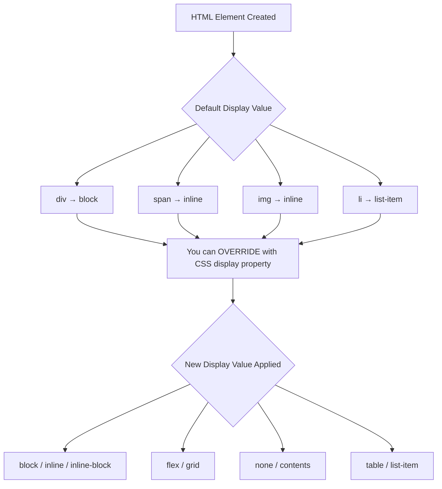
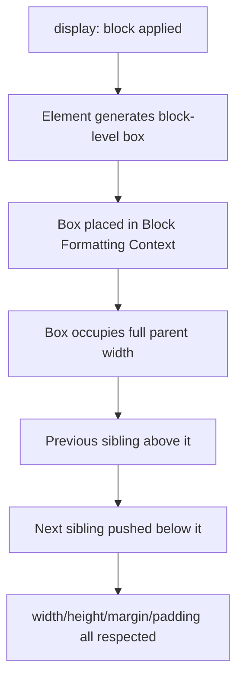
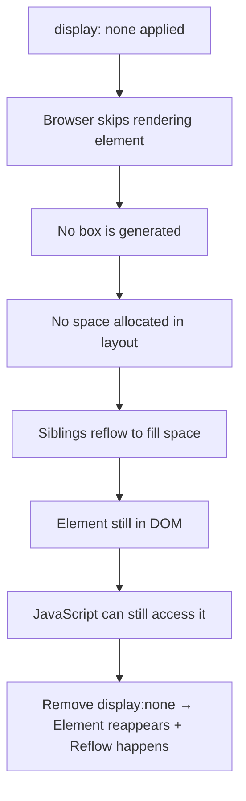
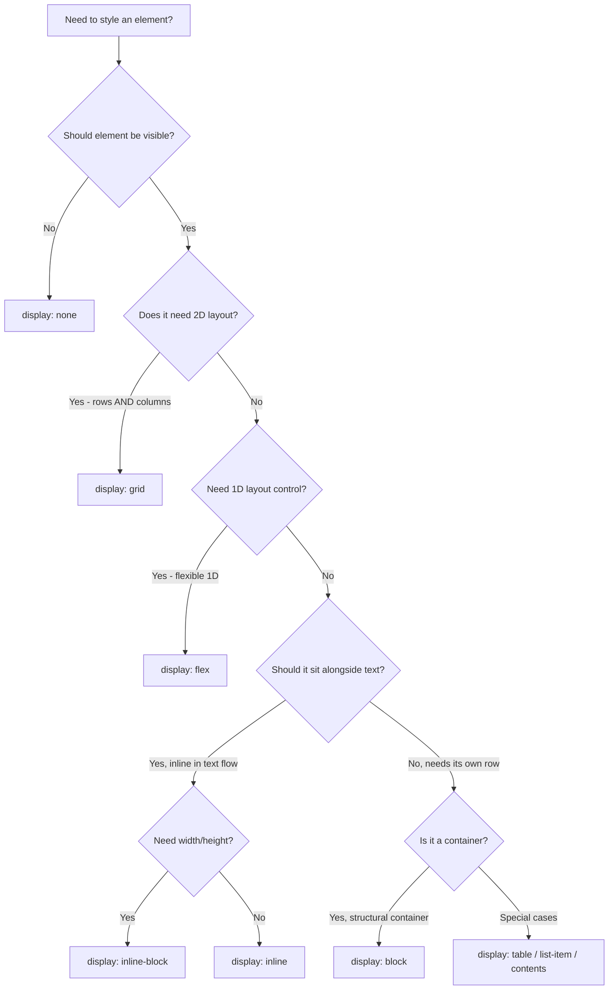
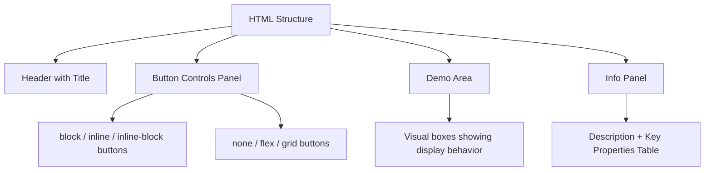
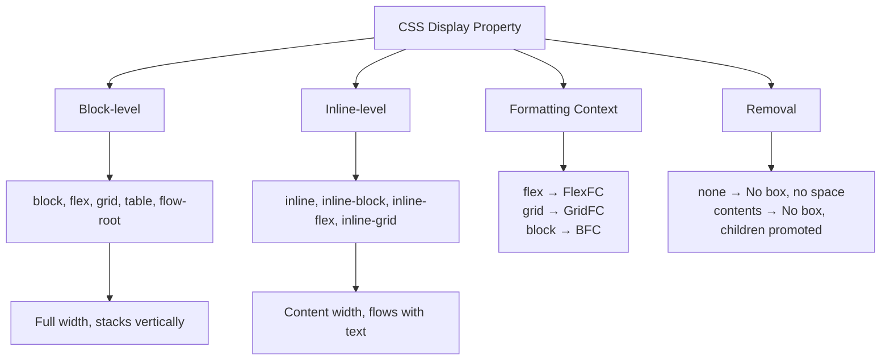

<a id="chapter-36-css-display-property"></a>

# Chapter 36: CSS Display Property

[⬅ Previous Chapter](#chapter-35-css-typography) | [📖 Main Index](#main-index) | [Next Chapter ➡](#chapter-37-css-visibility-opacity-overflow)

---

## 📌 Learning Objectives

By the end of this chapter, you will:

- **Understand** what the `display` property is and why it is the most fundamental CSS property
- **Know** the difference between `block`, `inline`, `inline-block`, `none`, `flex`, `grid`, and `contents`
- **Visualize** exactly how each display value changes element behavior with ASCII diagrams
- **Apply** the right display value to solve real layout problems
- **Explain** interview concepts like formatting context, box generation, and BFC
- **Avoid** common mistakes developers make when switching display values
- **Build** a mini project using only display property concepts

---

<a id="chapter-index-table-36"></a>

## Chapter Index Table

| Topic No. | Topic Name | Subtopics |
|-----------|------------|-----------|
| 36.1 | [What is the Display Property?](#36-1-what-is-display) | Definition, Why it Matters, Formatting Context |
| 36.2 | [display: block](#36-2-display-block) | Block behavior, Width/Height, Margin collapse, BFC |
| 36.3 | [display: inline](#36-3-display-inline) | Inline behavior, No width/height, Baseline, Gaps |
| 36.4 | [display: inline-block](#36-4-display-inline-block) | Hybrid behavior, Use cases, Ghost space |
| 36.5 | [display: none](#36-5-display-none) | Remove from flow, vs visibility hidden, Accessibility |
| 36.6 | [display: flex](#36-6-display-flex) | Flex context, 1D layout, Axis system |
| 36.7 | [display: grid](#36-7-display-grid) | Grid context, 2D layout, Tracks |
| 36.8 | [display: contents](#36-8-display-contents) | Box removal, Children promoted, Use cases |
| 36.9 | [display: table and variants](#36-9-display-table) | table, table-row, table-cell, table-caption |
| 36.10 | [display: list-item](#36-10-display-list-item) | List marker, Custom lists |
| 36.11 | [Display Value Comparison](#36-11-comparison) | Master comparison table, Decision tree |
| 36.12 | [Interview Questions](#36-12-interview) | Conceptual, Scenario, Output-based, Advanced |
| 36.13 | [Practice Problems](#36-13-practice) | Coding, Theory, Machine Coding |
| 36.14 | [Mini Project](#36-14-mini-project) | UI Component Showcase |
| 36.15 | [Quick Revision](#36-15-quick-revision) | Key facts, Traps, Bullets |
| 36.16 | [Chapter Summary](#36-16-chapter-summary) | Key Takeaways |

---

<a id="36-1-what-is-display"></a>

## 36.1 What is the Display Property?

---

### 🧠 Hinglish Intuition

Socho tumhare paas ek **colony hai** (webpage), aur usme alag-alag **ghar hain** (elements).

- **Block element** = ek pura plot lega — poora row apna lega, koi share nahi karega
- **Inline element** = ek chhoti si dukaan — sirf utni jagah lega jitni zarurat hai, baaki log saath chal sakte hain
- **Inline-block** = ek shop with a fixed area — saath chal sakta hai lekin apni height/width bhi maintain karta hai
- **None** = plot bilkul khaali — koi jagah nahi, koi dekhne wala nahi — woh plot exist hi nahi karta

**`display` property batati hai ki ek element apni colony mein kaise behave karega!**

---

### What is it?

The `display` property is a CSS property that **controls how an element is rendered on the page**. It determines:

1. **How the element itself is laid out** (block-level box vs inline-level box)
2. **How the element's children are laid out** (normal flow, flex, grid)
3. **Whether the element participates in the document flow at all**

> [!IMPORTANT]
> The `display` property is arguably the **most important CSS property** because it defines the **formatting context** of an element — the foundational rule that everything else builds upon.

---

### Why is it needed?

Without `display`, every element would render identically with no way to control layout behavior. The `display` property gives you control over:

- **Flow participation** — Is the element in the normal flow?
- **Space consumption** — Does it take full width or just content width?
- **Stacking behavior** — Do elements stack vertically or flow horizontally?
- **Child layout algorithm** — Are children in flex/grid/normal flow?

---

### What problem does it solve?

```
PROBLEM without display control:

<div>Block 1</div>
<span>Inline 1</span>
<div>Block 2</div>

Without display property rules, you couldn't control
whether elements stack or sit side by side.
Layouts would be impossible to design.
```

---

### How does it work?

Every HTML element has a **default display value** set by the browser's user-agent stylesheet. The `display` property lets you **override** that default.



---

### The Two Levels of Display

Modern CSS defines `display` as a **two-value system**:

```
display: <outside> <inside>

Outside = How the element itself appears in flow
Inside  = How the element's CHILDREN are arranged

Examples:
  display: block          = block outside, normal flow inside
  display: inline-flex    = inline outside, flex inside
  display: inline-grid    = inline outside, grid inside
```

```
┌─────────────────────────────────────────────────────────┐
│                 display: block                          │
│                                                         │
│  Outside: BLOCK  →  Takes full row, stacks vertically   │
│  Inside:  FLOW   →  Children flow normally              │
│                                                         │
└─────────────────────────────────────────────────────────┘

┌─────────────────────────────────────────────────────────┐
│                 display: flex                           │
│                                                         │
│  Outside: BLOCK  →  Takes full row like a block         │
│  Inside:  FLEX   →  Children are flex items             │
│                                                         │
└─────────────────────────────────────────────────────────┘

┌─────────────────────────────────────────────────────────┐
│                 display: inline-flex                    │
│                                                         │
│  Outside: INLINE →  Sits inline with other content      │
│  Inside:  FLEX   →  Children are still flex items       │
│                                                         │
└─────────────────────────────────────────────────────────┘
```

---

### Default Display Values by Element

```
┌─────────────────────────────────────────────────────┐
│            DEFAULT DISPLAY VALUES                   │
├─────────────────────┬───────────────────────────────┤
│ Elements            │ Default Display               │
├─────────────────────┼───────────────────────────────┤
│ div, p, h1-h6       │ block                         │
│ section, article    │ block                         │
│ header, footer, nav │ block                         │
│ ul, ol, li*         │ block (*li = list-item)       │
│ form, table         │ block                         │
├─────────────────────┼───────────────────────────────┤
│ span, a, strong     │ inline                        │
│ em, b, i, label     │ inline                        │
│ code, abbr          │ inline                        │
├─────────────────────┼───────────────────────────────┤
│ img                 │ inline (behaves like i-b)     │
│ input, button       │ inline-block                  │
│ textarea, select    │ inline-block                  │
├─────────────────────┼───────────────────────────────┤
│ table               │ table                         │
│ tr                  │ table-row                     │
│ td, th              │ table-cell                    │
└─────────────────────┴───────────────────────────────┘
```

> [!NOTE]
> These defaults come from the browser's built-in stylesheet (`user-agent stylesheet`). You can override any of them with CSS.

---

### Syntax

```css
/* Single value (shorthand) */
display: block;
display: inline;
display: inline-block;
display: none;
display: flex;
display: inline-flex;
display: grid;
display: inline-grid;
display: contents;
display: table;
display: list-item;

/* Two value (modern spec) */
display: block flow;      /* = block */
display: inline flow;     /* = inline */
display: block flex;      /* = flex */
display: inline flex;     /* = inline-flex */
display: block grid;      /* = grid */
display: inline grid;     /* = inline-grid */
```

> [!TIP]
> Two-value syntax has limited browser support. Always use single-value syntax for production code.

---

👉 <a href="#chapter-index-table-36">Go to Top 🔝</a>

---

<a id="36-2-display-block"></a>

## 36.2 display: block

---

### 🧠 Hinglish Intuition

**Block element** ek **ziddi insaan** ki tarah hai — poori row apni occupy kar leta hai, kisi ko saath nahi aane deta. Chahe content chhota ho ya bada — poori width lega.

Jaise ek chhota sa naam likha ho lekin usne poori row book karli:

```
[  Block Element occupies entire row  ]
[  Next Block Element starts below    ]
```

---

### What is display: block?

When an element has `display: block`:
- It **occupies the full width** of its parent container
- It **starts on a new line** and forces the next element to a new line
- You can set `width`, `height`, `margin`, and `padding` on all sides
- It creates a **Block Formatting Context (BFC)**

---

### Visual Behavior

```
Parent Container (600px wide)
┌─────────────────────────────────────────┐
│                                         │
│  ┌─────────────────────────────────┐    │
│  │  display: block (div)           │    │
│  │  Width = 100% of parent = 600px │    │
│  └─────────────────────────────────┘    │
│                                         │
│  ┌─────────────────────────────────┐    │
│  │  Another block element          │    │
│  │  Starts on NEW line             │    │
│  └─────────────────────────────────┘    │
│                                         │
│  ┌──────────┐                           │
│  │ block    │ ← Even with small content │
│  │ (width:  │   still takes full row   │
│  │  120px)  │   unless width is set!   │
│  └──────────┘                           │
│                                         │
└─────────────────────────────────────────┘

NOTE: Unless width is explicitly set, block = 100% of parent width
```

---

### Setting Width on Block Elements

```
Parent = 600px

Case 1: No width set (default)
┌─────────────────────────────────────────┐
│ Block Element (width: auto = 600px)     │
└─────────────────────────────────────────┘

Case 2: width: 50%
┌───────────────────────┐
│ Block Element (300px) │ ← Only 300px, rest is empty
└───────────────────────┘

Case 3: width: 200px + margin: auto (centering)
                ┌──────────┐
                │  200px   │ ← Centered!
                └──────────┘
        margin-left:auto  margin-right:auto
```

---

### How does it work internally?



---

### Block Formatting Context (BFC)

A **BFC** is an isolated layout region. Block elements create a BFC which means:
- Floats inside are **contained**
- Margins of children don't **collapse with parent**
- Overlapping with floats is **prevented**

```
Without BFC:                    With BFC (display: block):
┌──────────────┐                ┌──────────────────────────┐
│ Parent       │                │ Parent (BFC)             │
│   ┌────────┐ │                │   ┌────────┐             │
│   │ Float  │ │                │   │ Float  │             │
│   └────────┘ │                │   └────────┘             │
│ ← Float leaks out!            │ Float CONTAINED inside   │
└──────────────┘                └──────────────────────────┘
```

---

### Code Example

```html
<!DOCTYPE html>
<html>
<head>
<style>
  .box {
    display: block;       /* default for div, explicitly written for clarity */
    background: #3b82f6;
    color: white;
    padding: 15px;
    margin-bottom: 10px;
  }

  .narrow {
    display: block;
    width: 200px;         /* Override full-width behavior */
    background: #ef4444;
    padding: 10px;
    margin: 0 auto;       /* Center using auto margins */
  }
</style>
</head>
<body>
  <div class="box">Block Element 1 - Full Width</div>
  <div class="box">Block Element 2 - Starts Below</div>
  <div class="narrow">Narrow Block - Centered</div>
</body>
</html>
```

**Output:**

```
┌─────────────────────────────────────────────────────┐
│ Block Element 1 - Full Width (blue)                 │
└─────────────────────────────────────────────────────┘
┌─────────────────────────────────────────────────────┐
│ Block Element 2 - Starts Below (blue)               │
└─────────────────────────────────────────────────────┘
                  ┌──────────────┐
                  │ Narrow Block │  (red, centered)
                  └──────────────┘
```

---

### Key Characteristics of block

```
┌─────────────────────────────────────────────────────┐
│            BLOCK ELEMENT RULES                      │
├──────────────────────────┬──────────────────────────┤
│ Property                 │ Behavior                 │
├──────────────────────────┼──────────────────────────┤
│ Default Width            │ 100% of parent           │
│ Default Height           │ Wraps content            │
│ width/height settable?   │ ✅ YES                   │
│ Starts on new line?      │ ✅ YES                   │
│ Forces next to new line? │ ✅ YES                   │
│ margin on all sides?     │ ✅ YES                   │
│ padding on all sides?    │ ✅ YES                   │
│ Can contain block?       │ ✅ YES                   │
│ Can contain inline?      │ ✅ YES                   │
│ Creates BFC?             │ ✅ YES                   │
└──────────────────────────┴──────────────────────────┘
```

---

### Margin Collapse with Block Elements

```
div 1 margin-bottom: 20px
div 2 margin-top: 30px

Expected gap: 20 + 30 = 50px
Actual gap:   max(20, 30) = 30px  ← MARGIN COLLAPSE!

┌─────────────────────────────┐
│  div 1                      │
└─────────────────────────────┘
       ↕ 30px (not 50px!)
┌─────────────────────────────┐
│  div 2                      │
└─────────────────────────────┘
```

> [!IMPORTANT]
> Margin collapse ONLY happens between block elements in normal flow. It does NOT happen with `flex` or `grid` children.

---

### Common Mistakes with block

```css
/* ❌ Mistake: Trying to put two blocks side by side without changing display */
.left  { display: block; width: 50%; }
.right { display: block; width: 50%; }
/* They will STILL stack vertically! */

/* ✅ Fix: Use inline-block, flex, or grid */
.left  { display: inline-block; width: 50%; }
.right { display: inline-block; width: 50%; }

/* ❌ Mistake: Thinking margin auto works on height */
.box { margin: auto; }  /* Only left/right auto centers, not top/bottom */

/* ✅ For vertical centering, use flex or grid */
```

---

### Best Practices

- Use `display: block` for structural containers, headings, paragraphs
- Use `margin: 0 auto` with a set `width` to center block elements
- Be aware of margin collapse between adjacent blocks
- Use block elements for content that needs to be on its own row

---

👉 <a href="#chapter-index-table-36">Go to Top 🔝</a>

---

<a id="36-3-display-inline"></a>

## 36.3 display: inline

---

### 🧠 Hinglish Intuition

**Inline element** ek **shaant aur cooperative insaan** ki tarah hai — sirf utni jagah leta hai jitni zarurat hai, baaki logon ko saath rehne deta hai. Ek hi line pe kaafi log aa sakte hain.

Lekin yeh thoda **stubborn** bhi hai — usse height ya width set karne ki koshish karo toh woh sunta hi nahi!

```
[Word1] [Word2] [Word3] ← All on same line, side by side!
```

---

### What is display: inline?

When an element has `display: inline`:
- It **flows within text** — sits alongside other inline elements
- It **only takes up as much width as its content** needs
- You **CANNOT** set `width` or `height`
- `margin-top` and `margin-bottom` have **no effect**
- `padding-top` and `padding-bottom` **visually apply** but don't affect surrounding layout

---

### Visual Behavior

```
Text content with inline elements flowing:

┌──────────────────────────────────────────────────────────┐
│                                                          │
│  This is normal text [span inline] more text             │
│  [another inline] and some more content that wraps       │
│  to next line [inline element] continues here            │
│                                                          │
│  ← Everything on same line, wrapping naturally →         │
│                                                          │
└──────────────────────────────────────────────────────────┘

Inline elements only take content width:

  ┌─────┐ ┌──────────────────┐ ┌───┐
  │ Hi  │ │  I am inline     │ │ ! │
  └─────┘ └──────────────────┘ └───┘
   (span)    (span)              (span)

  ← content width ← content width ← content width
```

---

### Width and Height Ignorance

```
.inline-box {
  display: inline;
  width: 200px;    /* ← IGNORED! */
  height: 100px;   /* ← IGNORED! */
}

Visual Result:
  ┌─────────────────────┐
  │ content width only  │  ← NOT 200px wide, just content wide
  └─────────────────────┘

Compare with display: block:
  ┌──────────────────────────────────────────────────────┐
  │ 200px wide (or full parent if no width set)          │
  └──────────────────────────────────────────────────────┘
```

---

### Padding and Margin Behavior on Inline

```
Inline Element Padding Behavior:

HORIZONTAL padding (left/right) → Works normally ✅
VERTICAL padding (top/bottom)   → Visually shows but NO layout impact ⚠️

.tag {
  display: inline;
  padding: 20px;   /* top/bottom padding shows visually but overlaps neighbors */
  background: yellow;
}

┌────────────────────────────────────────────────┐
│ Line above                                     │
│    ┌────────────────────────────────────┐      │
│    │  20px top padding (overlaps above!)│      │
│  ┌─┴────────────────────────────────────┴─┐    │
│  │  [     Tag Content with padding       ]│    │
│  └─┬────────────────────────────────────┬─┘    │
│    │  20px bottom padding (overlaps!)   │      │
│    └────────────────────────────────────┘      │
│ Line below                                     │
└────────────────────────────────────────────────┘

Margin Behavior:
  margin-left / margin-right  → Works ✅
  margin-top / margin-bottom  → IGNORED ❌
```

---

### The Inline Gap Problem

> [!IMPORTANT]
> Inline elements have a **whitespace gap** between them when written on separate lines in HTML. This is one of the most common CSS bugs!

```html
<span>Box 1</span>
<span>Box 2</span>
<span>Box 3</span>
```

```
Result:
  ┌───────┐   ┌───────┐   ┌───────┐
  │ Box 1 │ ← │ Box 2 │ ← │ Box 3 │
  └───────┘   └───────┘   └───────┘
               ↑ GAP!      ↑ GAP!

  The whitespace (newline/spaces) in HTML becomes a visible space!

FIXES:
  1. Remove whitespace in HTML: <span>Box 1</span><span>Box 2</span>
  2. Set font-size: 0 on parent, then set font-size on children
  3. Use negative margin: margin-right: -4px
  4. Better: Switch to inline-block with flex on parent
```

---

### Code Example

```html
<!DOCTYPE html>
<html>
<head>
<style>
  .highlight {
    display: inline;
    background: #fef3c7;
    color: #92400e;
    padding: 2px 8px;   /* Left/Right padding works, top/bottom is decorative */
    border-radius: 4px;
  }

  .badge {
    display: inline;
    background: #3b82f6;
    color: white;
    padding: 4px 12px;
    /* width: 200px; ← This would be IGNORED */
    /* margin-top: 20px; ← This would be IGNORED */
  }
</style>
</head>
<body>
  <p>
    This paragraph has <span class="highlight">highlighted text</span>
    and a <span class="badge">badge</span> sitting inline.
    Everything flows naturally with the text content.
  </p>
</body>
</html>
```

---

### Key Characteristics of inline

```
┌──────────────────────────────────────────────────────┐
│            INLINE ELEMENT RULES                      │
├───────────────────────────┬──────────────────────────┤
│ Property                  │ Behavior                 │
├───────────────────────────┼──────────────────────────┤
│ Width                     │ Content width only       │
│ Height                    │ Content height only      │
│ width/height settable?    │ ❌ NO                    │
│ Starts on new line?       │ ❌ NO                    │
│ Forces next to new line?  │ ❌ NO                    │
│ margin-left/right?        │ ✅ YES                   │
│ margin-top/bottom?        │ ❌ NO effect             │
│ padding-left/right?       │ ✅ YES                   │
│ padding-top/bottom?       │ ⚠️ Decorative only       │
│ Can contain block?        │ ❌ INVALID HTML          │
│ Can contain inline?       │ ✅ YES                   │
│ Line wrapping?            │ ✅ YES (wraps to next)   │
└───────────────────────────┴──────────────────────────┘
```

---

### Baseline Alignment

Inline elements align along a **text baseline** by default.

```
                              ← baseline
  ┌─────┐  ┌────────────────┐  ┌────────┐
  │ abc │  │  Taller Text   │  │  xyz   │
  └─────┘  │  with more     │  └────────┘
           │  lines         │
           └────────────────┘
   ↑                ↑                ↑
 align to        dominates         align to
 baseline        the baseline      baseline

Result: abc and xyz appear "low" relative to tall content
Fix:    vertical-align: middle/top/bottom
```

---

### Common Use Cases for inline

```
✅ Hyperlinks (<a> tags)
✅ Text formatting (<strong>, <em>, <span>)
✅ Code snippets within text (<code>)
✅ Abbreviations and acronyms (<abbr>)
✅ Inline images (though img is inline-block)
✅ Text labels within buttons
```

---

### Common Mistakes

```css
/* ❌ Setting width/height on inline */
span {
  display: inline;
  width: 200px;   /* Ignored */
  height: 50px;   /* Ignored */
}

/* ❌ Expecting margin-top to work */
span {
  margin-top: 20px;  /* No effect on inline */
}

/* ❌ Putting block inside inline */
<span><div>Wrong!</div></span>  /* Invalid HTML! */

/* ✅ Correct usage */
span { padding: 0 8px; }  /* Only horizontal padding */
```

---

👉 <a href="#chapter-index-table-36">Go to Top 🔝</a>

---

<a id="36-4-display-inline-block"></a>

## 36.4 display: inline-block

---

### 🧠 Hinglish Intuition

**Inline-block** do duniyaon ka best combo hai!

- **Inline ki tarah**: Baaki elements ke saath ek hi line pe baith sakta hai
- **Block ki tarah**: Width, height, margin, padding sab set ho sakta hai

Socho ek **product card** — woh shelf pe saath-saath rakhi hoti hain (inline behavior), lekin har card apna fixed size maintain karti hai (block behavior).

```
[Card 1] [Card 2] [Card 3] ← Side by side (inline)
 200px    200px    200px   ← But each has fixed width (block)
```

---

### What is display: inline-block?

`display: inline-block` creates an element that:
- **Flows like inline** — sits alongside other inline/inline-block elements
- **Behaves like block** — respects `width`, `height`, `margin`, `padding` on all sides

It is the **bridge** between block and inline behavior.

---

### Visual Behavior

```
display: block
┌────────────────────────────────────────────────────┐
│ Block 1 (full width)                               │
└────────────────────────────────────────────────────┘
┌────────────────────────────────────────────────────┐
│ Block 2 (full width)                               │
└────────────────────────────────────────────────────┘

display: inline
[Inline 1] [Inline 2] [Inline 3] ← No width/height control

display: inline-block
┌──────────┐ ┌──────────┐ ┌──────────┐
│          │ │          │ │          │
│  150px   │ │  150px   │ │  150px   │  ← Side by side
│  50px h  │ │  50px h  │ │  50px h  │  ← But with dimensions!
│          │ │          │ │          │
└──────────┘ └──────────┘ └──────────┘
```

---

### Comparison: block vs inline vs inline-block

```
Property          │  block    │  inline   │ inline-block
──────────────────┼───────────┼───────────┼─────────────
Sits with others  │    ❌     │    ✅     │    ✅
Set width/height  │    ✅     │    ❌     │    ✅
Full-width default│    ✅     │    ❌     │    ❌
Margin all sides  │    ✅     │  LR only  │    ✅
Padding all sides │    ✅     │  visual   │    ✅
New line before   │    ✅     │    ❌     │    ❌
New line after    │    ✅     │    ❌     │    ❌
```

---

### How inline-block differs from inline

```
INLINE:
  <span style="display:inline; width:100px; background:red; height:40px;">
    Text
  </span>

  ┌──────┐
  │ Text │  ← Width and height IGNORED, just fits content
  └──────┘

INLINE-BLOCK:
  <span style="display:inline-block; width:100px; background:blue; height:40px;">
    Text
  </span>

  ┌────────────────────┐
  │ Text               │  ← EXACTLY 100px wide and 40px tall!
  └────────────────────┘
```

---

### Vertical Alignment with inline-block

```css
vertical-align: top | middle | bottom | baseline | text-top | text-bottom
```

```
Default (baseline):
  ┌──────────┐   ┌────────────────────┐
  │ Short    │   │ Tall box           │
  │ box      │   │ with more content  │
  └──────────┘   └────────────────────┘
                                       ← Bottoms misaligned

vertical-align: top:
  ┌──────────┐   ┌────────────────────┐
  │ Short    │   │ Tall box           │  ← Tops aligned!
  │ box      │   │ with more content  │
  └──────────┘   └────────────────────┘

vertical-align: middle:
               ┌──────────┐
  ┌──────────┐ │ Tall box │  ← Short box centered
  │ Short    │ │ with more│
  │ box      │ │ content  │
  └──────────┘ └──────────┘
```

---

### The Ghost Space Problem (MOST IMPORTANT!)

> [!IMPORTANT]
> `inline-block` elements suffer from the **ghost space** problem — whitespace between HTML tags creates visible gaps between boxes.

```html
<div class="box">1</div>
<div class="box">2</div>
<div class="box">3</div>
```

```css
.box { display: inline-block; width: 100px; }
```

```
Result:
┌───────┐   ┌───────┐   ┌───────┐
│   1   │ ← │   2   │ ← │   3   │
└───────┘   └───────┘   └───────┘
            ↑ 4px gap!   ↑ 4px gap!

This gap = whitespace in HTML rendered as text space
```

**Fixes:**

```css
/* Fix 1: font-size: 0 on parent */
.parent { font-size: 0; }
.box { font-size: 16px; display: inline-block; }

/* Fix 2: Negative margin */
.box { display: inline-block; margin-right: -4px; }

/* Fix 3: HTML comments */
```
```html
<div class="box">1</div><!--
--><div class="box">2</div><!--
--><div class="box">3</div>
```

```css
/* Fix 4 (Best): Use flexbox on parent instead */
.parent { display: flex; }
.box { /* no inline-block needed */ }
```

---

### Code Example — Navigation Menu

```html
<!DOCTYPE html>
<html>
<head>
<style>
  nav {
    background: #1e293b;
    font-size: 0;          /* Fix ghost space */
    padding: 0 20px;
  }

  nav a {
    display: inline-block;  /* Sit side by side */
    font-size: 16px;        /* Restore font size */
    color: white;
    text-decoration: none;
    padding: 15px 20px;     /* Vertical padding works! */
    width: 100px;           /* Width works! */
    text-align: center;
    transition: background 0.3s;
  }

  nav a:hover {
    background: #3b82f6;
  }
</style>
</head>
<body>
  <nav>
    <a href="#">Home</a>
    <a href="#">About</a>
    <a href="#">Portfolio</a>
    <a href="#">Contact</a>
  </nav>
</body>
</html>
```

```
Visual Output:
┌────────────────────────────────────────────────────────────────┐
│ dark background                                                │
│  ┌──────────┐┌──────────┐┌──────────┐┌──────────┐            │
│  │   Home   ││  About   ││ Portfolio││ Contact  │            │
│  └──────────┘└──────────┘└──────────┘└──────────┘            │
│   100px each  100px each  100px each  100px each              │
└────────────────────────────────────────────────────────────────┘
```

---

### Real World Usage of inline-block

```
Use Case 1: Navigation links (side-by-side with padding)
Use Case 2: Product cards in older browser support
Use Case 3: Custom button sizes
Use Case 4: Icon + text combos
Use Case 5: Centering an unknown-width element
Use Case 6: Multi-column list layouts
```

> [!TIP]
> In modern CSS, most `inline-block` use cases are better solved by **Flexbox**. However, `inline-block` remains relevant for text-flow scenarios and when mixing with text content.

---

### Advantages

- Simple to use — no need for flex/grid setup
- Works in all browsers including old IE
- Allows sizing of elements that stay in text flow
- Perfect for icon-text combos

### Limitations

- Ghost space problem requires workaround
- Vertical alignment can be tricky
- Replaced by Flexbox for most complex layouts
- No automatic equal-height columns

---

👉 <a href="#chapter-index-table-36">Go to Top 🔝</a>

---

<a id="36-5-display-none"></a>

## 36.5 display: none

---

### 🧠 Hinglish Intuition

`display: none` matlab **element exist hi nahi** karta page pe — naa dikhai deta hai, naa koi space leta hai. Bilkul waise jaise tum kisi ko **ignore karo toh woh exist hi nahi karta** for you!

Lekin yaad raho — **HTML mein woh hota hai, bas browser use render nahi karta.**

---

### What is display: none?

`display: none` **removes the element completely** from the visual rendering:
- The element is **not visible**
- The element **takes no space**
- The element **does not affect layout** of surrounding elements
- **BUT** it still exists in the **DOM**

---

### display: none vs visibility: hidden

```
display: none                 visibility: hidden
┌──────────────────────────┐  ┌──────────────────────────┐
│ Element A                │  │ Element A                │
│                          │  │                          │
│                          │  │                          │
│ [HIDDEN - no space]      │  │ [          ]  ← SPACE    │
│                          │  │  invisible    RESERVED!  │
│ Element C                │  │                          │
│                          │  │ Element C                │
└──────────────────────────┘  └──────────────────────────┘

display:none → Element B GONE, C moves up to fill space
visibility:hidden → Element B invisible but SPACE is kept
```

---

### Visual Demonstration

```
HTML:
  <div class="box">Box 1</div>
  <div class="box hidden">Box 2</div>
  <div class="box">Box 3</div>

display: none on Box 2:
┌─────────────────┐
│     Box 1       │
└─────────────────┘
┌─────────────────┐   ← Box 2 is completely gone!
│     Box 3       │   ← Box 3 moves up immediately
└─────────────────┘

visibility: hidden on Box 2:
┌─────────────────┐
│     Box 1       │
└─────────────────┘
│                 │   ← Box 2 space RESERVED but invisible
└─────────────────┘
┌─────────────────┐   ← Box 3 stays in its original position
│     Box 3       │
└─────────────────┘
```

---

### Comparison Table

```
┌─────────────────────────┬──────────────────┬──────────────────┬──────────────┐
│ Property                │ display: none    │ visibility:      │ opacity: 0   │
│                         │                 │ hidden           │              │
├─────────────────────────┼──────────────────┼──────────────────┼──────────────┤
│ Visible?                │ ❌ No            │ ❌ No            │ ❌ No        │
│ Takes space?            │ ❌ No            │ ✅ Yes           │ ✅ Yes       │
│ Clickable?              │ ❌ No            │ ❌ No            │ ✅ Yes!      │
│ Accessible to AT?       │ ❌ No            │ ❌ No            │ ✅ Sometimes │
│ Can be animated?        │ ❌ Hard          │ ✅ Yes           │ ✅ Yes       │
│ Affects layout?         │ ❌ No            │ ✅ Yes           │ ✅ Yes       │
│ In DOM?                 │ ✅ Yes           │ ✅ Yes           │ ✅ Yes       │
└─────────────────────────┴──────────────────┴──────────────────┴──────────────┘
```

---

### How does it work?



---

### Common Use Cases

```css
/* 1. Toggle visibility (JavaScript controlled) */
.modal { display: none; }
.modal.active { display: block; }

/* 2. Responsive design - hide on mobile */
.desktop-only {
  display: none;
}
@media (min-width: 768px) {
  .desktop-only { display: block; }
}

/* 3. Hide mobile menu on desktop */
.hamburger { display: block; }
@media (min-width: 768px) {
  .hamburger { display: none; }
}

/* 4. Accessibility - hide decorative elements */
.decorative { display: none; }

/* 5. Pure CSS tabs/accordions */
input[type="radio"] { display: none; }
```

---

### Accessibility Warning

> [!IMPORTANT]
> `display: none` hides content from **screen readers** too! If content is important for accessibility but should be visually hidden, use this technique instead:

```css
/* Visually hidden but accessible to screen readers */
.sr-only {
  position: absolute;
  width: 1px;
  height: 1px;
  padding: 0;
  margin: -1px;
  overflow: hidden;
  clip: rect(0, 0, 0, 0);
  white-space: nowrap;
  border: 0;
}
```

---

### Animating display: none — The Problem

```css
/* ❌ Cannot transition FROM display:none */
.box {
  display: none;
  opacity: 0;
  transition: opacity 0.3s;   /* This won't work! */
}
.box.visible {
  display: block;
  opacity: 1;
}

/* ✅ Workaround using visibility + opacity */
.box {
  visibility: hidden;
  opacity: 0;
  transition: opacity 0.3s, visibility 0.3s;
}
.box.visible {
  visibility: visible;
  opacity: 1;
}
```

---

### Code Example

```html
<!DOCTYPE html>
<html>
<head>
<style>
  .panel {
    background: #f0f9ff;
    border: 2px solid #0ea5e9;
    padding: 20px;
    margin: 10px;
  }

  .hidden-panel {
    display: none;  /* Completely removed from layout */
  }

  button {
    display: block;
    padding: 10px 20px;
    background: #3b82f6;
    color: white;
    border: none;
    cursor: pointer;
    margin: 10px;
  }
</style>
</head>
<body>
  <button onclick="togglePanel()">Toggle Panel</button>

  <div class="panel">Panel 1 (always visible)</div>
  <div class="panel hidden-panel" id="togglePanel">
    Panel 2 (hidden by default)
  </div>
  <div class="panel">Panel 3 (moves up when Panel 2 is hidden)</div>

  <script>
    function togglePanel() {
      const panel = document.getElementById('togglePanel');
      if (panel.style.display === 'none' || panel.style.display === '') {
        panel.style.display = 'block';
      } else {
        panel.style.display = 'none';
      }
    }
  </script>
</body>
</html>
```

---

### Best Practices

- Use `display: none` for **JavaScript toggling** of UI components
- Use `display: none` in **media queries** for responsive hiding
- For **accessibility**, prefer `aria-hidden="true"` when element should be in DOM but ignored by AT
- Never use `display: none` on content that needs to be **screen-reader accessible**
- Remember: `display: none` **triggers reflow** when toggled

---

👉 <a href="#chapter-index-table-36">Go to Top 🔝</a>

---

<a id="36-6-display-flex"></a>

## 36.6 display: flex

---

### 🧠 Hinglish Intuition

**Flexbox** ek **railway compartment** ki tarah hai — ek line mein sab kuch arrange hota hai, either left-se-right ya top-se-bottom. Sab items apne conductor (flex container) ke hisaab se space share karte hain.

- Container = Railway compartment
- Items = Passengers
- flex-direction = Train ki direction (horizontal ya vertical)
- justify-content = Seats ka arrangement (spread, bunched, centered)
- align-items = How passengers sit (top/middle/bottom)

---

### What is display: flex?

`display: flex` creates a **Flex Formatting Context**:
- The element itself behaves like a **block** (takes full row)
- Its **children become flex items** arranged along a flex axis
- Enables powerful **1-dimensional layout** (one row or one column at a time)

---

### Block vs Flex Behavior

```
display: block (normal flow):
┌─────────────────────────────────────────┐
│ Child 1                                 │
└─────────────────────────────────────────┘
┌─────────────────────────────────────────┐
│ Child 2                                 │
└─────────────────────────────────────────┘
┌─────────────────────────────────────────┐
│ Child 3                                 │
└─────────────────────────────────────────┘
→ All stack vertically (block default)

display: flex (flex flow):
┌──────────────────────────────────────────────┐
│ ┌─────────┐ ┌─────────┐ ┌─────────┐         │
│ │ Child 1 │ │ Child 2 │ │ Child 3 │         │
│ └─────────┘ └─────────┘ └─────────┘         │
└──────────────────────────────────────────────┘
→ All line up horizontally (flex default!)
```

---

### Flex Container vs Flex Items

```
┌────────────────────────────────────────────────────────────┐
│  FLEX CONTAINER (display: flex)                            │
│                                                            │
│  ┌────────────┐  ┌────────────┐  ┌────────────┐           │
│  │            │  │            │  │            │           │
│  │ FLEX ITEM  │  │ FLEX ITEM  │  │ FLEX ITEM  │           │
│  │            │  │            │  │            │           │
│  └────────────┘  └────────────┘  └────────────┘           │
│                                                            │
│  ←──────────── Main Axis (horizontal by default) ────────►│
│  ↕ Cross Axis (vertical by default)                       │
└────────────────────────────────────────────────────────────┘

Container properties apply to: the flex container
Item properties apply to: individual flex items
```

---

### The Axis System

```
flex-direction: row (default)
┌─────────────────────────────────────────────────────────┐
│                                                         │
│   START                                             END │
│   ──────────────── Main Axis ──────────────────────►   │
│                                                         │
│   ┌──────┐    ┌──────┐    ┌──────┐                     │
│   │  1   │    │  2   │    │  3   │                     │
│   └──────┘    └──────┘    └──────┘                     │
│                                                         │
│   ↕ Cross Axis                                          │
│                                                         │
└─────────────────────────────────────────────────────────┘

flex-direction: column
┌──────────────────────────────────┐
│  ┌──────────────────────────┐    │
│  │           1              │    │
│  └──────────────────────────┘    │
│           ↓ Main Axis            │
│  ┌──────────────────────────┐    │
│  │           2              │    │
│  └──────────────────────────┘    │
│           ↓ Main Axis            │
│  ┌──────────────────────────┐    │
│  │           3              │    │
│  └──────────────────────────┘    │
│                                  │
│  ←────── Cross Axis ────────►   │
└──────────────────────────────────┘
```

---

### justify-content Visual Guide

```
justify-content: flex-start (default)
┌───────────────────────────────────────────────────────┐
│ ┌──────┐ ┌──────┐ ┌──────┐                           │
│ │  1   │ │  2   │ │  3   │                           │
│ └──────┘ └──────┘ └──────┘                           │
└───────────────────────────────────────────────────────┘

justify-content: flex-end
┌───────────────────────────────────────────────────────┐
│                           ┌──────┐ ┌──────┐ ┌──────┐ │
│                           │  1   │ │  2   │ │  3   │ │
│                           └──────┘ └──────┘ └──────┘ │
└───────────────────────────────────────────────────────┘

justify-content: center
┌───────────────────────────────────────────────────────┐
│              ┌──────┐ ┌──────┐ ┌──────┐              │
│              │  1   │ │  2   │ │  3   │              │
│              └──────┘ └──────┘ └──────┘              │
└───────────────────────────────────────────────────────┘

justify-content: space-between
┌───────────────────────────────────────────────────────┐
│ ┌──────┐            ┌──────┐            ┌──────┐      │
│ │  1   │            │  2   │            │  3   │      │
│ └──────┘            └──────┘            └──────┘      │
└───────────────────────────────────────────────────────┘

justify-content: space-around
┌───────────────────────────────────────────────────────┐
│    ┌──────┐        ┌──────┐        ┌──────┐           │
│    │  1   │        │  2   │        │  3   │           │
│    └──────┘        └──────┘        └──────┘           │
│  ←──→          ←──────→          ←──────→         ←──→│
│ half            full              full              half│
└───────────────────────────────────────────────────────┘

justify-content: space-evenly
┌───────────────────────────────────────────────────────┐
│      ┌──────┐        ┌──────┐        ┌──────┐        │
│      │  1   │        │  2   │        │  3   │        │
│      └──────┘        └──────┘        └──────┘        │
│ ←──────→        ←──────→        ←──────→        ←────→│
│   equal           equal           equal          equal │
└───────────────────────────────────────────────────────┘
```

---

### align-items Visual Guide

```
Container has height: 200px, items have different heights

align-items: stretch (default)
┌───────────────────────────────────────────────────────┐
│ ┌──────────────┐ ┌──────────────┐ ┌──────────────┐   │
│ │              │ │              │ │              │   │
│ │   200px      │ │   200px      │ │   200px      │   │
│ │   (stretched)│ │   (stretched)│ │   (stretched)│   │
│ └──────────────┘ └──────────────┘ └──────────────┘   │
└───────────────────────────────────────────────────────┘

align-items: flex-start
┌───────────────────────────────────────────────────────┐
│ ┌──────────────┐ ┌──────────────┐ ┌────────────────┐  │
│ │   Tall       │ │  Medium      │ │  Short         │  │
│ │   100px      │ │   70px       │ └────────────────┘  │
│ │              │ └──────────────┘                     │
│ └──────────────┘                                      │
│                                                       │
└───────────────────────────────────────────────────────┘

align-items: center
┌───────────────────────────────────────────────────────┐
│                                                       │
│ ┌──────────────┐                                      │
│ │   Tall       │ ┌──────────────┐                     │
│ │   100px      │ │  Medium 70px │ ┌────────────────┐  │
│ │              │ │              │ │  Short 40px    │  │
│ │              │ └──────────────┘ └────────────────┘  │
│ └──────────────┘                                      │
│                                                       │
└───────────────────────────────────────────────────────┘

align-items: flex-end
┌───────────────────────────────────────────────────────┐
│                                                       │
│ ┌──────────────┐                                      │
│ │   Tall       │                                      │
│ │   100px      │ ┌──────────────┐                     │
│ │              │ │  Medium 70px │ ┌────────────────┐  │
│ └──────────────┘ └──────────────┘ │  Short 40px    │  │
│                                   └────────────────┘  │
└───────────────────────────────────────────────────────┘
```

---

### display: inline-flex

```
display: flex      → Container is BLOCK (takes full row)
display: inline-flex → Container is INLINE (fits content width)

flex:
┌──────────────────────────────────────────────────────────┐
│ ┌────────┐ ┌────────┐ ┌────────┐                        │
│ │ Item 1 │ │ Item 2 │ │ Item 3 │                        │
│ └────────┘ └────────┘ └────────┘                        │
└──────────────────────────────────────────────────────────┘
← Full parent width taken                                 →

inline-flex:
  ┌──────────────────────────────┐  ← Only as wide as needed
  │ ┌────────┐ ┌────────┐       │
  │ │ Item 1 │ │ Item 2 │       │
  │ └────────┘ └────────┘       │
  └──────────────────────────────┘
  Next element can sit beside this!
```

---

### Code Example

```html
<!DOCTYPE html>
<html>
<head>
<style>
  .flex-container {
    display: flex;
    justify-content: space-between;
    align-items: center;
    gap: 20px;
    background: #f1f5f9;
    padding: 20px;
  }

  .flex-item {
    background: #3b82f6;
    color: white;
    padding: 20px;
    border-radius: 8px;
    flex: 1;              /* Each item takes equal space */
    text-align: center;
  }

  .flex-item:nth-child(2) {
    flex: 2;              /* Middle item takes double space */
  }
</style>
</head>
<body>
  <div class="flex-container">
    <div class="flex-item">Item 1</div>
    <div class="flex-item">Item 2 (double)</div>
    <div class="flex-item">Item 3</div>
  </div>
</body>
</html>
```

```
Visual Output:
┌──────────────────────────────────────────────────────────────────┐
│ ┌──────────────┐  ┌────────────────────────────┐  ┌────────────┐│
│ │              │  │                            │  │           ││
│ │   Item 1     │  │    Item 2 (double)          │  │  Item 3   ││
│ │    (1fr)     │  │         (2fr)              │  │  (1fr)    ││
│ │              │  │                            │  │           ││
│ └──────────────┘  └────────────────────────────┘  └────────────┘│
└──────────────────────────────────────────────────────────────────┘
```

> [!NOTE]
> `display: flex` is covered in depth in Chapter 41 (CSS Flexbox). This section covers its role as a display value.

---

👉 <a href="#chapter-index-table-36">Go to Top 🔝</a>

---

<a id="36-7-display-grid"></a>

## 36.7 display: grid

---

### 🧠 Hinglish Intuition

**CSS Grid** ek **Excel spreadsheet** ki tarah hai — rows aur columns dono hain, aur tum kisi bhi cell mein kuch bhi rakh sakte ho. Ek complex layout ek table ki tarah define karte ho aur elements automatically jagah le lete hain.

Flexbox ek LINE mein kaam karta hai, Grid ek GRID mein — 2D!

---

### What is display: grid?

`display: grid` creates a **Grid Formatting Context**:
- The element itself behaves like a **block** (takes full row)
- Its **children become grid items** placed in a 2D grid of rows and columns
- Enables powerful **2-dimensional layout** (rows AND columns simultaneously)

---

### flex vs grid — The Fundamental Difference

```
FLEXBOX — 1 Dimension:
┌──────────────────────────────────────────────────────────┐
│ ← One axis at a time (row OR column) →                  │
│                                                          │
│  ┌──────┐  ┌──────┐  ┌──────┐  ┌──────┐                │
│  │  1   │  │  2   │  │  3   │  │  4   │                │
│  └──────┘  └──────┘  └──────┘  └──────┘                │
└──────────────────────────────────────────────────────────┘

GRID — 2 Dimensions:
┌──────────────────────────────────────────────────────────┐
│ ← Rows AND Columns simultaneously →                     │
│                                                          │
│  ┌──────┐  ┌──────┐  ┌──────┐                          │
│  │  1   │  │  2   │  │  3   │                          │
│  └──────┘  └──────┘  └──────┘                          │
│  ┌──────┐  ┌──────┐  ┌──────┐                          │
│  │  4   │  │  5   │  │  6   │                          │
│  └──────┘  └──────┘  └──────┘                          │
└──────────────────────────────────────────────────────────┘
```

---

### Grid Container and Tracks

```
grid-template-columns: 1fr 1fr 1fr
grid-template-rows: 100px 100px

          col1       col2       col3
       ┌──────────┬──────────┬──────────┐
row1   │          │          │          │
       │  Cell    │  Cell    │  Cell    │  100px
       │  [1,1]   │  [1,2]   │  [1,3]  │
       ├──────────┼──────────┼──────────┤
row2   │          │          │          │
       │  Cell    │  Cell    │  Cell    │  100px
       │  [2,1]   │  [2,2]   │  [2,3]  │
       └──────────┴──────────┴──────────┘

Column lines: 1    2    3    4
Row lines:    1    2    3
```

---

### display: grid vs display: inline-grid

```
display: grid       → Container is BLOCK (takes full row)
display: inline-grid → Container is INLINE (fits content)

grid:
┌──────────────────────────────────────────────────────────┐
│ ┌─────────┐ ┌─────────┐                                  │
│ │  Item 1 │ │  Item 2 │                                  │
│ └─────────┘ └─────────┘                                  │
└──────────────────────────────────────────────────────────┘
← Full parent width                                       →

inline-grid:
  ┌──────────────────────────┐
  │ ┌─────────┐ ┌─────────┐  │  ← Only as wide as grid tracks
  │ │  Item 1 │ │  Item 2 │  │
  │ └─────────┘ └─────────┘  │
  └──────────────────────────┘
  Text can sit beside this!
```

---

### Code Example

```html
<!DOCTYPE html>
<html>
<head>
<style>
  .grid-container {
    display: grid;
    grid-template-columns: 1fr 2fr 1fr;  /* 3 columns */
    grid-template-rows: 80px 160px 80px; /* 3 rows */
    gap: 10px;
    background: #f1f5f9;
    padding: 10px;
  }

  .header {
    grid-column: 1 / -1;    /* Span all columns */
    background: #1e40af;
    color: white;
    display: flex;
    align-items: center;
    padding: 0 20px;
  }

  .sidebar {
    background: #64748b;
    color: white;
    padding: 20px;
  }

  .main {
    background: #e2e8f0;
    padding: 20px;
  }

  .footer {
    grid-column: 1 / -1;    /* Span all columns */
    background: #1e293b;
    color: white;
    display: flex;
    align-items: center;
    padding: 0 20px;
  }
</style>
</head>
<body>
  <div class="grid-container">
    <header class="header">Header</header>
    <aside class="sidebar">Sidebar</aside>
    <main class="main">Main Content</main>
    <footer class="footer">Footer</footer>
  </div>
</body>
</html>
```

```
Visual Output:
┌─────────────────────────────────────────────────────┐
│  HEADER (spans all 3 columns)                       │  80px
├──────────────┬──────────────────────────┬───────────┤
│              │                          │           │
│   SIDEBAR    │       MAIN CONTENT       │  (empty)  │  160px
│    (1fr)     │         (2fr)            │   (1fr)   │
│              │                          │           │
├──────────────┴──────────────────────────┴───────────┤
│  FOOTER (spans all 3 columns)                       │  80px
└─────────────────────────────────────────────────────┘
```

> [!NOTE]
> `display: grid` is covered in depth in Chapter 43 (CSS Grid). This section covers its role as a display value.

---

👉 <a href="#chapter-index-table-36">Go to Top 🔝</a>

---

<a id="36-8-display-contents"></a>

## 36.8 display: contents

---

### 🧠 Hinglish Intuition

`display: contents` matlab ek **invisible box** — element khud ka koi box nahi banata, lekin uske **children sab bahar aa jaate hain** aur directly parent ke saath interact karte hain.

Socho ek **transparent container** — container dikh nahi raha lekin andar ke items sab visible hain aur parent ke rules follow karte hain.

---

### What is display: contents?

`display: contents` causes the element to:
- **Not generate its own box** — it becomes "invisible" in the layout
- Its **children are treated as if they are direct children of the parent**
- The element's background, border, padding are NOT rendered
- Children participate directly in the parent's formatting context

---

### Visual Explanation

```
WITHOUT display: contents:

PARENT (display: flex)
┌────────────────────────────────────────────────────────┐
│ ┌──────────────────────────────────┐ ┌──────────────┐  │
│ │  WRAPPER div (flex item)         │ │   item3      │  │
│ │  ┌──────────┐ ┌──────────┐       │ └──────────────┘  │
│ │  │  item1   │ │  item2   │       │                   │
│ │  └──────────┘ └──────────┘       │                   │
│ └──────────────────────────────────┘                   │
└────────────────────────────────────────────────────────┘
The wrapper div is ONE flex item → items inside don't flex!

WITH display: contents on WRAPPER:

PARENT (display: flex)
┌────────────────────────────────────────────────────────┐
│ ┌──────────┐ ┌──────────┐ ┌──────────────┐            │
│ │  item1   │ │  item2   │ │    item3     │            │
│ └──────────┘ └──────────┘ └──────────────┘            │
└────────────────────────────────────────────────────────┘
Wrapper DISAPPEARS → item1 and item2 become direct flex items!
```

---

### Code Example

```html
<!DOCTYPE html>
<html>
<head>
<style>
  /* Example 1: Without display: contents */
  .flex-parent {
    display: flex;
    gap: 10px;
    background: #f0f9ff;
    padding: 10px;
    margin-bottom: 20px;
  }

  .group {
    border: 2px dashed red;
    padding: 5px;
    /* Without display:contents, this is ONE flex item */
  }

  .item {
    background: #3b82f6;
    color: white;
    padding: 10px 20px;
    border-radius: 4px;
  }

  /* Example 2: With display: contents */
  .group-transparent {
    display: contents;   /* Box disappears, children participate directly */
    /* border: 2px dashed red; ← This will be IGNORED */
  }
</style>
</head>
<body>
  <h4>Without display:contents - wrapper is ONE flex item</h4>
  <div class="flex-parent">
    <div class="group">
      <div class="item">A</div>
      <div class="item">B</div>
    </div>
    <div class="item">C</div>
  </div>

  <h4>With display:contents - A and B become direct flex items</h4>
  <div class="flex-parent">
    <div class="group-transparent">
      <div class="item">A</div>
      <div class="item">B</div>
    </div>
    <div class="item">C</div>
  </div>
</body>
</html>
```

---

### Use Cases for display: contents

```
Use Case 1: Flatten wrapper divs for flex/grid layouts
Use Case 2: Add semantic grouping without affecting layout
Use Case 3: Workaround for subgrid before subgrid support
Use Case 4: Unwrapping elements for accessibility tree manipulation
```

---

### Accessibility Warning

> [!IMPORTANT]
> `display: contents` has accessibility issues in some browsers. Elements with `display: contents` may be **removed from the accessibility tree** in certain browsers, making their content inaccessible to screen readers. Always test accessibility when using this value.

---

### Browser Support

```
display: contents support:
  ✅ Chrome 65+
  ✅ Firefox 37+
  ✅ Safari 11.1+
  ✅ Edge 79+
  ❌ IE 11 (not supported)
```

---

👉 <a href="#chapter-index-table-36">Go to Top 🔝</a>

---

<a id="36-9-display-table"></a>

## 36.9 display: table and Variants

---

### 🧠 Hinglish Intuition

CSS table display values tabli elements ki tarah behave karte hain bina actual `<table>` HTML use kiye. Yeh ek **purani technique** hai jo ab mostly flexbox/grid ne replace kar di hai — lekin interview mein poochha jata hai!

---

### What are table display values?

CSS provides display values that mimic HTML table behavior:

```
┌────────────────────────────────────────────────────────┐
│          CSS TABLE DISPLAY VALUES                      │
├─────────────────────────┬──────────────────────────────┤
│ CSS Display Value       │ Equivalent HTML Element      │
├─────────────────────────┼──────────────────────────────┤
│ display: table          │ <table>                      │
│ display: table-row      │ <tr>                         │
│ display: table-cell     │ <td> / <th>                  │
│ display: table-header-group │ <thead>                  │
│ display: table-footer-group │ <tfoot>                  │
│ display: table-row-group    │ <tbody>                  │
│ display: table-column       │ <col>                    │
│ display: table-column-group │ <colgroup>               │
│ display: table-caption      │ <caption>                │
│ display: inline-table       │ <table> (inline)         │
└─────────────────────────┴──────────────────────────────┘
```

---

### Visual Structure

```
display: table
┌──────────────────────────────────────────────────────┐
│  display: table-caption                              │
│  "Table Caption"                                     │
├─────────────────┬────────────────────────────────────┤
│ display:        │ display:         │ display:         │
│ table-cell      │ table-cell       │ table-cell       │
│  Cell 1         │  Cell 2          │  Cell 3          │
├─────────────────┼──────────────────┼──────────────────┤
│ display:        │ display:         │ display:         │
│ table-cell      │ table-cell       │ table-cell       │
│  Cell 4         │  Cell 5          │  Cell 6          │
└─────────────────┴──────────────────┴──────────────────┘
Each row = display: table-row
```

---

### Code Example

```html
<!DOCTYPE html>
<html>
<head>
<style>
  .css-table {
    display: table;
    width: 100%;
    border-collapse: collapse;
  }

  .css-row {
    display: table-row;
  }

  .css-cell {
    display: table-cell;
    border: 1px solid #cbd5e1;
    padding: 12px 16px;
    vertical-align: middle;
  }

  .css-header {
    display: table-cell;
    border: 1px solid #cbd5e1;
    padding: 12px 16px;
    background: #1e293b;
    color: white;
    font-weight: bold;
  }
</style>
</head>
<body>
  <div class="css-table">
    <div class="css-row">
      <div class="css-header">Name</div>
      <div class="css-header">Age</div>
      <div class="css-header">City</div>
    </div>
    <div class="css-row">
      <div class="css-cell">Alice</div>
      <div class="css-cell">28</div>
      <div class="css-cell">New York</div>
    </div>
    <div class="css-row">
      <div class="css-cell">Bob</div>
      <div class="css-cell">34</div>
      <div class="css-cell">London</div>
    </div>
  </div>
</body>
</html>
```

---

### Equal-Height Columns Trick

```css
/* Old trick for equal-height columns using table display */
.wrapper { display: table; width: 100%; }
.col     { display: table-cell; vertical-align: top; width: 50%; }

/* Result: Both columns automatically equal height! */
/* Modern equivalent: use flexbox with align-items: stretch */
```

---

> [!TIP]
> While `display: table` still works, use **CSS Grid or Flexbox** for new projects. `display: table` is important to understand for legacy code maintenance.

---

👉 <a href="#chapter-index-table-36">Go to Top 🔝</a>

---

<a id="36-10-display-list-item"></a>

## 36.10 display: list-item

---

### 🧠 Hinglish Intuition

`display: list-item` element ko bullet ya number deta hai — jaise `<li>` element ko milta hai by default. Kisi bhi element ko list item ki tarah banana ho toh yeh use karo!

---

### What is display: list-item?

`display: list-item` generates a block-level box **plus an additional marker box** (the bullet point or number). This is the default for `<li>` elements.

```
Normal block:
┌──────────────────────────────────────┐
│  Content here                        │
└──────────────────────────────────────┘

display: list-item:
•  ┌──────────────────────────────────────┐
   │  Content here                        │
   └──────────────────────────────────────┘
↑
Marker box (bullet)
```

---

### Code Example

```html
<!DOCTYPE html>
<html>
<head>
<style>
  /* Turn any div into a list item */
  .custom-list-item {
    display: list-item;
    list-style-type: disc;
    list-style-position: inside;
    margin-left: 20px;
    padding: 5px 0;
  }

  .custom-number-item {
    display: list-item;
    list-style-type: decimal;
    list-style-position: outside;
    margin-left: 40px;
  }

  .custom-emoji-item {
    display: list-item;
    list-style-type: "🚀 ";  /* CSS 2019+ custom marker */
    margin-left: 20px;
  }
</style>
</head>
<body>
  <div class="custom-list-item">First item (div as list item)</div>
  <div class="custom-list-item">Second item</div>
  <div class="custom-number-item">Numbered item 1</div>
  <div class="custom-number-item">Numbered item 2</div>
  <div class="custom-emoji-item">Rocket item</div>
</body>
</html>
```

---

### list-style Properties

```
list-style-type values:
  disc     → • bullet
  circle   → ○ open circle
  square   → ■ square
  decimal  → 1, 2, 3...
  lower-alpha → a, b, c...
  upper-alpha → A, B, C...
  lower-roman → i, ii, iii...
  upper-roman → I, II, III...
  none     → no marker
  "★"      → custom string (modern browsers)

list-style-position:
  outside  → Marker outside content box (default)
  │  •  Content text here...   │
  │     continued text...      │
  ←marker   ← text box

  inside → Marker inside content box
  │  • Content text here...    │
  │    continued text...       │
  ← marker is part of content box
```

---

👉 <a href="#chapter-index-table-36">Go to Top 🔝</a>

---

<a id="36-11-comparison"></a>

## 36.11 Display Value Comparison

---

### Master Comparison Table

```
┌──────────────────┬────────┬────────┬──────────────┬────────┬────────┬────────┬──────────┐
│ Property         │ block  │ inline │ inline-block │  none  │  flex  │  grid  │ contents │
├──────────────────┼────────┼────────┼──────────────┼────────┼────────┼────────┼──────────┤
│ Takes full width │  ✅    │  ❌    │     ❌       │  N/A   │  ✅    │  ✅    │   N/A    │
│ Set width/height │  ✅    │  ❌    │     ✅       │  N/A   │  ✅    │  ✅    │   N/A    │
│ New line before  │  ✅    │  ❌    │     ❌       │  N/A   │  ✅    │  ✅    │   N/A    │
│ New line after   │  ✅    │  ❌    │     ❌       │  N/A   │  ✅    │  ✅    │   N/A    │
│ margin all sides │  ✅    │ LR only│     ✅       │  N/A   │  ✅    │  ✅    │   N/A    │
│ padding all      │  ✅    │  ⚠️   │     ✅       │  N/A   │  ✅    │  ✅    │   N/A    │
│ 2D layout        │  ❌    │  ❌    │     ❌       │  ❌    │  ❌    │  ✅    │   ❌     │
│ 1D layout ctrl   │  ❌    │  ❌    │     ❌       │  ❌    │  ✅    │  ✅    │   ❌     │
│ Child layout algo│ normal │ normal │    normal    │  none  │  flex  │  grid  │  parent  │
│ Takes space?     │  ✅    │  ✅    │     ✅       │  ❌    │  ✅    │  ✅    │   ❌     │
│ Creates BFC?     │  ✅    │  ❌    │     ✅       │  N/A   │  ✅    │  ✅    │   ❌     │
│ Ghost space bug? │  ❌    │  ✅    │     ✅       │  N/A   │  ❌    │  ❌    │   ❌     │
└──────────────────┴────────┴────────┴──────────────┴────────┴────────┴────────┴──────────┘
```

---

### Decision Tree — Which display value to use?



---

### Real-World Use Case Guide

```
┌─────────────────────────────────────────────────────────────────┐
│                   WHEN TO USE WHAT                              │
├────────────────────────┬────────────────────────────────────────┤
│ Scenario               │ Best Display Value                     │
├────────────────────────┼────────────────────────────────────────┤
│ Page sections, divs    │ block                                  │
│ Text formatting        │ inline                                 │
│ Navigation buttons     │ inline-block (or flex)                 │
│ Hide/show toggle       │ none / block toggle                    │
│ Horizontal nav bar     │ flex (on container)                    │
│ Card grid layout       │ grid (on container)                    │
│ Full page layout       │ grid (on body or main)                 │
│ Vertical centering     │ flex / grid                            │
│ Equal height columns   │ flex / grid                            │
│ CSS-only table         │ table / table-cell                     │
│ Custom bullet list     │ list-item                              │
│ Transparent wrapper    │ contents                               │
└────────────────────────┴────────────────────────────────────────┘
```

---

### Property Quick Reference

```
display: block;         /* Full-width, stacks vertically */
display: inline;        /* Content-width, sits in text flow */
display: inline-block;  /* Inline flow + block sizing */
display: none;          /* Completely removed from layout */
display: flex;          /* Flex container (block outside) */
display: inline-flex;   /* Flex container (inline outside) */
display: grid;          /* Grid container (block outside) */
display: inline-grid;   /* Grid container (inline outside) */
display: contents;      /* Box disappears, children inherit */
display: table;         /* Acts like <table> */
display: table-cell;    /* Acts like <td> */
display: table-row;     /* Acts like <tr> */
display: list-item;     /* Block + marker box (bullet/number) */
display: flow-root;     /* Block that creates new BFC */
display: inherit;       /* Inherit from parent */
display: initial;       /* Reset to default */
display: unset;         /* Inherit if inheritable, else initial */
```

---

### display: flow-root (Bonus)

```css
display: flow-root;
```

Creates a block that **always establishes a new BFC** without any of the side effects of other BFC-creating properties. Think of it as a "clean block that always contains floats."

```
Without flow-root (float leaks out):
┌──────────────────────────────────────┐
│ Parent div                           │
│   ┌──────────┐                       │
│   │  Float   │                       │
│   └──────────┘ ← Float leaks out!    │
                ← Parent has 0 height!

With display: flow-root:
┌──────────────────────────────────────┐
│ Parent div (flow-root)               │
│   ┌──────────┐                       │
│   │  Float   │                       │
│   └──────────┘                       │
└──────────────────────────────────────┘
  ↑ Float contained! Parent has height!
```

---

👉 <a href="#chapter-index-table-36">Go to Top 🔝</a>

---

<a id="36-12-interview"></a>

## 💡 Interview Questions

---

### Conceptual Questions

**Q1. What is the default display value of `<div>` and `<span>`?**

> **Answer:**
> - `<div>` → `display: block` (takes full width, stacks vertically)
> - `<span>` → `display: inline` (content width only, flows with text)
>
> These are browser defaults from the user-agent stylesheet. You can override them with any display value in CSS.

---

**Q2. What is the difference between `display: none` and `visibility: hidden`?**

> **Answer:**
>
> | Feature | display: none | visibility: hidden |
> |---------|--------------|-------------------|
> | Visible | No | No |
> | Takes space | **No** | **Yes** |
> | Affects layout | No | Yes |
> | Accessible (AT) | No | No |
> | Animatable | Hard | Yes |
> | DOM present | Yes | Yes |
>
> Key interview answer: **`display: none` removes the element from layout flow entirely; `visibility: hidden` hides it but reserves the space.**

---

**Q3. Can you set `width` and `height` on an inline element?**

> **Answer:** No! `width` and `height` are **ignored** on `display: inline` elements. The element only takes as much space as its content requires.
>
> To set dimensions, use `display: inline-block` or `display: block`.

---

**Q4. What is the difference between `display: flex` and `display: inline-flex`?**

> **Answer:**
> - `display: flex`: The container itself is a **block-level** element (takes full row width). Children are flex items.
> - `display: inline-flex`: The container itself is an **inline-level** element (only as wide as its content). Children are still flex items.
>
> ```
> flex:        [====FULL ROW====]
> inline-flex: [JUST CONTENT]  text can sit here
> ```

---

**Q5. What is a Block Formatting Context (BFC)?**

> **Answer:** A BFC is an isolated layout region with specific rules:
> 1. Block elements stack vertically inside it
> 2. Floats inside are **contained** (clearfix alternative)
> 3. Adjacent margins don't collapse with elements outside the BFC
> 4. The BFC doesn't overlap with floats
>
> Elements that create a BFC: `display: block`, `display: flow-root`, `display: flex`, `display: grid`, `overflow: hidden/auto/scroll`, `float`, `position: absolute/fixed`.

---

**Q6. What is `display: contents` and when would you use it?**

> **Answer:** `display: contents` makes the element itself invisible — it generates no box — but its children are treated as if they are direct children of the element's parent.
>
> **Use case:** When you have a wrapper div that you need for semantic/JavaScript reasons, but you don't want it to interfere with a flexbox or grid layout of its parent.
>
> ```css
> /* Wrapper disappears, children become flex items of grandparent */
> .wrapper { display: contents; }
> ```
>
> ⚠️ Accessibility concern: Some browsers remove it from the accessibility tree.

---

**Q7. Why do inline-block elements have a ghost space between them?**

> **Answer:** The whitespace (spaces, newlines, tabs) between inline-block elements in HTML is rendered as a single space character. Since inline-block participates in text flow, this space appears as a gap.
>
> **Fixes:**
> 1. `font-size: 0` on parent, restore on children
> 2. Remove whitespace in HTML
> 3. Use HTML comments between elements
> 4. Use `display: flex` instead (recommended)

---

**Q8. What happens to margin-top and margin-bottom on inline elements?**

> **Answer:** They have **no effect** on layout. Vertical margins are completely ignored on `display: inline` elements. Only horizontal margins (`margin-left`, `margin-right`) work.
>
> `padding-top` and `padding-bottom` are **visually applied** but don't push adjacent lines away — they can overlap surrounding content.

---

**Q9. How does margin collapse work with block elements?**

> **Answer:** When two block elements are adjacent vertically, their margins **collapse into one** — the larger margin wins instead of both adding together.
>
> ```
> div1: margin-bottom: 30px
> div2: margin-top: 20px
> Expected gap: 50px
> Actual gap: 30px (only the larger margin is used)
> ```
>
> Margin collapse does NOT happen with flex children or grid children.

---

**Q10. What is `display: flow-root` and why is it better than overflow: hidden for clearfix?**

> **Answer:** `display: flow-root` creates a new BFC **without any visual side effects**. `overflow: hidden` also creates a BFC but can clip content unexpectedly.
>
> ```css
> /* Old clearfix with side effects */
> .container { overflow: hidden; }  /* clips shadows, tooltips! */
>
> /* Modern clean BFC */
> .container { display: flow-root; }  /* No side effects! */
> ```

---

### Scenario-Based Questions

**Q11. You want a navigation bar where items sit side by side and each link has clickable padding around it. Which display value would you use?**

> **Answer:** Two approaches:
>
> **Option 1 (Modern):** `display: flex` on the `<nav>` or `<ul>`, items become flex children automatically with full padding control.
>
> **Option 2 (Classic):** `display: inline-block` on each `<li>` or `<a>`, with `font-size: 0` on parent to eliminate ghost spaces.
>
> Preferred modern approach: Flexbox.

---

**Q12. A developer set `display: none` on an input field. A user can still submit that field's value in a form. Why?**

> **Answer:** `display: none` removes the element from **visual rendering** but the element **still exists in the DOM**. Form submissions include all form fields present in the DOM, regardless of their display value. This is a security concern — never rely on `display: none` to prevent field submission. Use `disabled` attribute or remove the element from DOM for that purpose.

---

**Q13. You want to center a div both horizontally and vertically. Show two approaches using the display property.**

> **Answer:**
>
> **Approach 1: Flex**
> ```css
> .parent {
>   display: flex;
>   justify-content: center;
>   align-items: center;
>   height: 100vh;
> }
> ```
>
> **Approach 2: Grid**
> ```css
> .parent {
>   display: grid;
>   place-items: center;    /* shorthand for align+justify */
>   height: 100vh;
> }
> ```

---

### Output-Based Questions

**Q14. What is the output of this code?**

```html
<style>
  .box {
    display: inline-block;
    width: 100px;
    height: 50px;
    background: blue;
    margin-top: 30px;
  }
</style>
<div class="box">A</div>
<div class="box">B</div>
```

> **Answer:**
> - Two blue boxes, each 100px × 50px, sitting **side by side** (inline behavior)
> - There is a **4px gap** between them (ghost space from newline in HTML)
> - `margin-top: 30px` **works** (unlike pure inline, inline-block respects all margins)
> - The boxes push down 30px from the top due to `margin-top`

---

**Q15. What happens here?**

```html
<style>
  .parent { display: flex; }
  .child { display: none; }
</style>
<div class="parent">
  <div class="child">Hidden</div>
  <div>Visible</div>
</div>
```

> **Answer:**
> - The parent flex container only shows **one flex item** — "Visible"
> - The `display: none` child is **completely removed** from the flex layout
> - No space is reserved for the hidden child
> - The visible child gets all the space (or its natural size if no flex properties set)

---

### Advanced Questions

**Q16. Explain the two-value syntax of the display property.**

> **Answer:** Modern CSS Level 3 defines `display` as having two values:
> - **Outer value**: How the element participates in parent flow (`block` or `inline`)
> - **Inner value**: What formatting context is created for children (`flow`, `flow-root`, `flex`, `grid`, `table`, `ruby`)
>
> ```css
> display: block flex;    /* = old: display: flex */
> display: inline flex;   /* = old: display: inline-flex */
> display: block grid;    /* = old: display: grid */
> display: inline flow;   /* = old: display: inline */
> ```
>
> Single-value shorthand is still the standard for production code.

---

**Q17. What is the difference between `display: table-cell` and actual `<td>`?**

> **Answer:** Functionally very similar — both participate in table formatting context, support `vertical-align`, and match column widths. However:
> - `<td>` only works inside valid table structure
> - `display: table-cell` can be applied to any element
> - `display: table-cell` doesn't inherit table semantic meaning
> - `<td>` is semantically meaningful for tabular data
>
> Use actual table elements for tabular data. Use CSS table display for layout tricks in legacy contexts.

---

👉 <a href="#chapter-index-table-36">Go to Top 🔝</a>

---

<a id="36-13-practice"></a>

## 🧪 Practice Problems

---

### Coding Questions

**Problem 1: Block to Inline Conversion**

Convert all `<div>` elements inside `.menu` to display inline and add spacing between them.

```html
<div class="menu">
  <div>Home</div>
  <div>About</div>
  <div>Contact</div>
</div>
```

Expected output: All items on one line with spacing.

---

**Solution:**

```css
.menu div {
  display: inline;
  padding: 0 15px;
  border-right: 1px solid #ccc;
}

.menu div:last-child {
  border-right: none;
}
```

```
Expected Visual:
  Home | About | Contact
```

---

**Problem 2: Centered Block**

Create a `<div>` that is 400px wide and centered horizontally in its parent.

```css
.centered {
  display: block;
  width: 400px;
  margin: 0 auto;    /* auto left+right centers the block */
  background: #e2e8f0;
  padding: 20px;
}
```

---

**Problem 3: Inline-Block Card Row**

Create 3 cards side by side using `inline-block`, each 200px wide, with elimination of ghost space.

```html
<div class="card-row">
  <div class="card">Card 1</div>
  <div class="card">Card 2</div>
  <div class="card">Card 3</div>
</div>
```

```css
.card-row {
  font-size: 0;   /* Kill ghost space */
  background: #f8fafc;
  padding: 20px;
}

.card {
  display: inline-block;
  font-size: 16px;   /* Restore font */
  width: 200px;
  height: 150px;
  background: #3b82f6;
  color: white;
  margin: 5px;
  padding: 15px;
  vertical-align: top;
  border-radius: 8px;
}
```

---

**Problem 4: Toggle Visibility**

Create a button that toggles `display: none` on a panel.

```html
<button onclick="toggle()">Toggle</button>
<div id="panel" class="panel">
  This panel can be hidden!
</div>
```

```css
.panel {
  background: #fef3c7;
  padding: 20px;
  margin-top: 10px;
  border-radius: 8px;
}
```

```javascript
function toggle() {
  const panel = document.getElementById('panel');
  panel.style.display = panel.style.display === 'none' ? 'block' : 'none';
}
```

---

**Problem 5: display: contents Unwrapper**

Make a flex parent treat grandchildren as direct flex children using `display: contents`.

```html
<div class="flex-parent">
  <div class="group">         <!-- should disappear from layout -->
    <div class="item">A</div>
    <div class="item">B</div>
  </div>
  <div class="item">C</div>
</div>
```

```css
.flex-parent {
  display: flex;
  gap: 10px;
  padding: 10px;
  background: #f1f5f9;
}

.group {
  display: contents;   /* Wrapper disappears! A and B become flex items */
}

.item {
  background: #3b82f6;
  color: white;
  padding: 10px 20px;
}
```

---

### Theory Questions

**T1.** What is the difference between `display: none` and `opacity: 0`? In which case can a user still click the element?

> `opacity: 0` makes element transparent but it's still in the layout and is **clickable**. `display: none` removes it from layout entirely and is **not clickable**.

---

**T2.** Does margin collapse happen between flex children?

> No. Margin collapse is a phenomenon of **block formatting context only**. Flex and grid children do not experience margin collapse.

---

**T3.** What does the `display` property control for an element?

> Two things: (1) The element's own role in its parent's formatting context (block-level vs inline-level), and (2) The formatting context created for the element's children.

---

**T4.** Can you animate between `display: none` and `display: block`?

> Not directly — `display` is not animatable. Common workaround: use `visibility` + `opacity` for fade, or use `max-height` transition, or use JavaScript to add/remove class with a timeout.

---

**T5.** When would you use `display: flow-root` instead of `overflow: hidden`?

> When you need to contain floats (create a BFC) but `overflow: hidden` would clip content like shadows, tooltips, or dropdown menus. `display: flow-root` creates a BFC without clipping.

---

### Machine Coding Problems

**Machine Coding 1: Tabbed Interface using display: none**

Build a tab system where clicking a tab shows its content and hides others.

```html
<!DOCTYPE html>
<html>
<head>
<style>
  .tab-container {
    max-width: 600px;
    font-family: system-ui, sans-serif;
  }

  .tab-buttons {
    display: flex;
    border-bottom: 2px solid #e2e8f0;
  }

  .tab-btn {
    display: inline-block;
    padding: 12px 24px;
    cursor: pointer;
    border: none;
    background: none;
    font-size: 16px;
    color: #64748b;
    border-bottom: 3px solid transparent;
    margin-bottom: -2px;
    transition: color 0.2s;
  }

  .tab-btn.active {
    color: #3b82f6;
    border-bottom-color: #3b82f6;
    font-weight: 600;
  }

  .tab-panel {
    display: none;  /* Hidden by default */
    padding: 24px;
    background: #f8fafc;
    border: 1px solid #e2e8f0;
    border-top: none;
    border-radius: 0 0 8px 8px;
  }

  .tab-panel.active {
    display: block;  /* Shown when active */
  }
</style>
</head>
<body>
<div class="tab-container">
  <div class="tab-buttons">
    <button class="tab-btn active" onclick="showTab('tab1', this)">Profile</button>
    <button class="tab-btn" onclick="showTab('tab2', this)">Settings</button>
    <button class="tab-btn" onclick="showTab('tab3', this)">Security</button>
  </div>

  <div class="tab-panel active" id="tab1">
    <h3>Profile Settings</h3>
    <p>Manage your profile information here.</p>
  </div>

  <div class="tab-panel" id="tab2">
    <h3>General Settings</h3>
    <p>Configure your preferences.</p>
  </div>

  <div class="tab-panel" id="tab3">
    <h3>Security Settings</h3>
    <p>Change password and security options.</p>
  </div>
</div>

<script>
  function showTab(tabId, btn) {
    // Hide all panels
    document.querySelectorAll('.tab-panel').forEach(p => {
      p.classList.remove('active');
      // sets display: none via CSS class
    });

    // Deactivate all buttons
    document.querySelectorAll('.tab-btn').forEach(b => {
      b.classList.remove('active');
    });

    // Show selected panel
    document.getElementById(tabId).classList.add('active');
    btn.classList.add('active');
  }
</script>
</body>
</html>
```

---

**Machine Coding 2: Inline-Block Navigation with Dropdown**

```html
<!DOCTYPE html>
<html>
<head>
<style>
  * { margin: 0; padding: 0; box-sizing: border-box; }

  nav {
    background: #1e293b;
    padding: 0 30px;
    font-family: system-ui, sans-serif;
    font-size: 0;  /* Kill ghost space */
  }

  .nav-item {
    display: inline-block;  /* Side by side */
    font-size: 16px;
    position: relative;     /* For dropdown positioning */
  }

  .nav-link {
    display: block;
    color: #cbd5e1;
    text-decoration: none;
    padding: 18px 20px;
    transition: background 0.2s, color 0.2s;
  }

  .nav-link:hover {
    color: white;
    background: #334155;
  }

  /* Dropdown */
  .dropdown {
    display: none;  /* Hidden by default */
    position: absolute;
    top: 100%;
    left: 0;
    background: #0f172a;
    min-width: 180px;
    border-radius: 0 0 8px 8px;
    box-shadow: 0 4px 20px rgba(0,0,0,0.3);
    z-index: 10;
  }

  .nav-item:hover .dropdown {
    display: block;  /* Show on hover */
  }

  .dropdown a {
    display: block;  /* Each dropdown item is block */
    color: #94a3b8;
    text-decoration: none;
    padding: 12px 20px;
    font-size: 14px;
    transition: background 0.2s;
  }

  .dropdown a:hover {
    background: #1e293b;
    color: white;
  }
</style>
</head>
<body>
  <nav>
    <div class="nav-item">
      <a href="#" class="nav-link">Home</a>
    </div>

    <div class="nav-item">
      <a href="#" class="nav-link">Products ▾</a>
      <div class="dropdown">
        <a href="#">Web Design</a>
        <a href="#">Mobile Apps</a>
        <a href="#">UI Components</a>
      </div>
    </div>

    <div class="nav-item">
      <a href="#" class="nav-link">Portfolio ▾</a>
      <div class="dropdown">
        <a href="#">Case Studies</a>
        <a href="#">Client Work</a>
      </div>
    </div>

    <div class="nav-item">
      <a href="#" class="nav-link">Contact</a>
    </div>
  </nav>
</body>
</html>
```

---

👉 <a href="#chapter-index-table-36">Go to Top 🔝</a>

---

<a id="36-14-mini-project"></a>

## 🚀 Mini Project: UI Component Showcase — Display Property Explorer

---

### Problem Statement

Build an **interactive CSS Display Property Explorer** that visually demonstrates how different `display` values affect element behavior. Users can click on a display value to see a live visual example along with explanation.

---

### Features

- 📱 Interactive selector for display values
- 👁️ Live visual demonstration area
- 📝 Property info panel
- 🎨 Color-coded visual boxes
- 📊 Property comparison sidebar
- ✅ Pure HTML + CSS (with minimal JS for interaction)

---

### Architecture



---

### Folder Structure

```
display-explorer/
├── index.html     (everything in one file)
```

---

### Flow Diagram

```
User clicks "inline-block" button
           ↓
All demo areas hidden (display: none)
           ↓
Inline-block demo shown (display: block)
           ↓
Info panel updated with inline-block description
           ↓
Active button highlighted
           ↓
User sees live example + explanation
```

---

### Full Implementation

```html
<!DOCTYPE html>
<html lang="en">
<head>
  <meta charset="UTF-8">
  <meta name="viewport" content="width=device-width, initial-scale=1.0">
  <title>CSS Display Property Explorer</title>
  <style>
    /* ===========================
       RESET & BASE
    =========================== */
    *, *::before, *::after {
      box-sizing: border-box;
      margin: 0;
      padding: 0;
    }

    body {
      font-family: 'Segoe UI', system-ui, -apple-system, sans-serif;
      background: #0f172a;
      color: #e2e8f0;
      min-height: 100vh;
    }

    /* ===========================
       HEADER
    =========================== */
    .header {
      display: block;
      background: linear-gradient(135deg, #1e40af, #7c3aed);
      padding: 30px 40px;
      text-align: center;
    }

    .header h1 {
      font-size: 2rem;
      font-weight: 700;
      color: white;
      letter-spacing: -0.5px;
    }

    .header p {
      color: #bfdbfe;
      margin-top: 8px;
      font-size: 1rem;
    }

    .badge {
      display: inline-block;       /* inline-block: sits with text but has padding */
      background: rgba(255,255,255,0.2);
      color: white;
      padding: 4px 12px;
      border-radius: 20px;
      font-size: 0.8rem;
      margin-top: 10px;
    }

    /* ===========================
       MAIN LAYOUT
    =========================== */
    .app {
      display: block;
      max-width: 1100px;
      margin: 0 auto;
      padding: 30px 20px;
    }

    /* ===========================
       CONTROL BUTTONS
    =========================== */
    .controls {
      display: block;
      text-align: center;
      margin-bottom: 30px;
    }

    .controls h2 {
      font-size: 1rem;
      color: #94a3b8;
      text-transform: uppercase;
      letter-spacing: 2px;
      margin-bottom: 16px;
    }

    .btn-group {
      font-size: 0;   /* Kill ghost space between inline-block buttons */
    }

    .ctrl-btn {
      display: inline-block;    /* KEY: buttons sit side by side */
      font-size: 14px;
      font-weight: 600;
      padding: 10px 20px;
      margin: 5px;
      border: 2px solid #334155;
      background: #1e293b;
      color: #94a3b8;
      cursor: pointer;
      border-radius: 6px;
      transition: all 0.2s;
      font-family: 'Courier New', monospace;
    }

    .ctrl-btn:hover {
      border-color: #3b82f6;
      color: #3b82f6;
      background: #1e3a5f;
    }

    .ctrl-btn.active {
      background: #3b82f6;
      border-color: #3b82f6;
      color: white;
    }

    /* ===========================
       MAIN CONTENT AREA
    =========================== */
    .content-area {
      display: block;
    }

    /* On wider screens, show side by side */
    @media (min-width: 768px) {
      .content-area {
        display: block;
      }
      .two-col {
        display: flex;
        gap: 24px;
        align-items: flex-start;
      }
      .demo-column {
        flex: 1.5;
      }
      .info-column {
        flex: 1;
      }
    }

    /* ===========================
       DEMO SECTION
    =========================== */
    .demo-section {
      display: none;    /* All hidden by default */
      background: #1e293b;
      border: 1px solid #334155;
      border-radius: 12px;
      padding: 24px;
      margin-bottom: 20px;
    }

    .demo-section.active {
      display: block;   /* Shown when active */
    }

    .demo-title {
      font-size: 1.1rem;
      color: #f1f5f9;
      margin-bottom: 6px;
      font-family: 'Courier New', monospace;
    }

    .demo-subtitle {
      font-size: 0.85rem;
      color: #64748b;
      margin-bottom: 20px;
    }

    .demo-container {
      background: #0f172a;
      border-radius: 8px;
      padding: 20px;
      border: 1px dashed #334155;
      min-height: 120px;
    }

    .demo-label {
      font-size: 0.7rem;
      color: #475569;
      margin-bottom: 8px;
      text-transform: uppercase;
      letter-spacing: 1px;
    }

    /* COLOR SCHEME FOR BOXES */
    .box-blue   { background: #1d4ed8; color: white; }
    .box-green  { background: #16a34a; color: white; }
    .box-red    { background: #dc2626; color: white; }
    .box-orange { background: #d97706; color: white; }
    .box-purple { background: #7c3aed; color: white; }

    /* ===========================
       BLOCK DEMO
    =========================== */
    #demo-block .block-el {
      display: block;     /* Full-width, stacks */
      padding: 12px 16px;
      margin-bottom: 8px;
      border-radius: 4px;
      font-weight: 600;
    }

    /* ===========================
       INLINE DEMO
    =========================== */
    #demo-inline .inline-el {
      display: inline;    /* Flows with text, no width/height */
      padding: 4px 10px;
      border-radius: 4px;
      font-weight: 600;
    }

    #demo-inline .body-text {
      color: #94a3b8;
      line-height: 2.2;
    }

    /* ===========================
       INLINE-BLOCK DEMO
    =========================== */
    #demo-inline-block .ib-wrapper {
      font-size: 0;    /* Kill ghost space */
    }

    #demo-inline-block .ib-el {
      display: inline-block;   /* Side by side + sizing! */
      font-size: 14px;
      width: 100px;
      height: 80px;
      margin: 5px;
      padding: 10px;
      border-radius: 6px;
      font-weight: 700;
      vertical-align: top;
      text-align: center;
      line-height: 60px;
    }

    .ib-tall {
      height: 110px !important;
      line-height: 90px !important;
    }

    /* ===========================
       NONE DEMO
    =========================== */
    #demo-none .none-visible {
      display: block;
      padding: 12px 16px;
      margin-bottom: 8px;
      border-radius: 4px;
      font-weight: 600;
    }

    #demo-none .none-hidden {
      display: none;    /* Completely gone! */
    }

    #demo-none .none-note {
      display: inline-block;
      background: #7f1d1d;
      color: #fca5a5;
      font-size: 0.75rem;
      padding: 4px 10px;
      border-radius: 4px;
      margin-top: 12px;
    }

    /* ===========================
       FLEX DEMO
    =========================== */
    #demo-flex .flex-demo-container {
      display: flex;       /* FLEX: Children in row */
      gap: 10px;
      margin-bottom: 16px;
      align-items: center;
    }

    #demo-flex .flex-el {
      padding: 12px;
      border-radius: 4px;
      font-weight: 600;
      text-align: center;
    }

    #demo-flex .flex-el:nth-child(1) { flex: 1; }
    #demo-flex .flex-el:nth-child(2) { flex: 2; }
    #demo-flex .flex-el:nth-child(3) { flex: 1; }

    .demo-prop-label {
      font-size: 0.7rem;
      color: #475569;
      margin-bottom: 4px;
      font-family: 'Courier New', monospace;
    }

    /* ===========================
       GRID DEMO
    =========================== */
    #demo-grid .grid-demo-container {
      display: grid;     /* GRID: 2D layout */
      grid-template-columns: 1fr 2fr 1fr;
      grid-template-rows: 60px 100px 60px;
      gap: 8px;
    }

    #demo-grid .grid-el {
      border-radius: 4px;
      font-size: 12px;
      font-weight: 600;
      display: flex;
      align-items: center;
      justify-content: center;
    }

    #demo-grid .grid-header {
      grid-column: 1 / -1;
    }

    #demo-grid .grid-footer {
      grid-column: 1 / -1;
    }

    /* ===========================
       INFO PANEL
    =========================== */
    .info-panel {
      display: block;
      background: #1e293b;
      border: 1px solid #334155;
      border-radius: 12px;
      padding: 24px;
      height: fit-content;
    }

    .info-panel h3 {
      font-family: 'Courier New', monospace;
      font-size: 1.2rem;
      color: #3b82f6;
      margin-bottom: 12px;
    }

    .info-description {
      font-size: 0.9rem;
      color: #94a3b8;
      line-height: 1.6;
      margin-bottom: 20px;
    }

    /* Properties Table */
    .props-table {
      display: table;     /* CSS table display! */
      width: 100%;
      border-collapse: collapse;
    }

    .props-row {
      display: table-row;
    }

    .props-cell {
      display: table-cell;   /* CSS table-cell! */
      padding: 8px 10px;
      border-bottom: 1px solid #334155;
      font-size: 0.82rem;
    }

    .props-cell:first-child {
      color: #64748b;
      width: 55%;
    }

    .props-cell:last-child {
      font-weight: 600;
      font-family: 'Courier New', monospace;
    }

    .yes  { color: #22c55e; }
    .no   { color: #ef4444; }
    .warn { color: #f59e0b; }

    /* ===========================
       CODE SNIPPET
    =========================== */
    .code-snippet {
      background: #0f172a;
      border: 1px solid #334155;
      border-radius: 6px;
      padding: 12px;
      font-family: 'Courier New', monospace;
      font-size: 0.82rem;
      color: #7dd3fc;
      margin-top: 16px;
      overflow-x: auto;
    }

    .code-snippet .css-prop { color: #c4b5fd; }
    .code-snippet .css-val  { color: #86efac; }

    /* ===========================
       COMPARISON STRIP
    =========================== */
    .compare-strip {
      display: block;
      background: #1e293b;
      border: 1px solid #334155;
      border-radius: 12px;
      padding: 24px;
      margin-top: 24px;
    }

    .compare-strip h3 {
      font-size: 1rem;
      color: #94a3b8;
      margin-bottom: 16px;
      text-transform: uppercase;
      letter-spacing: 1px;
    }

    .compare-grid {
      display: grid;
      grid-template-columns: repeat(3, 1fr);
      gap: 10px;
    }

    @media (min-width: 768px) {
      .compare-grid {
        grid-template-columns: repeat(6, 1fr);
      }
    }

    .compare-card {
      display: block;
      background: #0f172a;
      border: 1px solid #334155;
      border-radius: 8px;
      padding: 12px 8px;
      text-align: center;
      cursor: pointer;
      transition: all 0.2s;
    }

    .compare-card:hover {
      border-color: #3b82f6;
      transform: translateY(-2px);
    }

    .compare-card .cc-name {
      font-family: 'Courier New', monospace;
      font-size: 0.75rem;
      color: #3b82f6;
      font-weight: bold;
      margin-bottom: 8px;
    }

    .compare-card .cc-box {
      display: block;
      background: #1e40af;
      height: 8px;
      border-radius: 2px;
      margin-bottom: 4px;
    }

    .cc-full { width: 100%; }
    .cc-half { width: 60%; margin: 0 auto 4px; }
    .cc-inline-demo {
      display: block;
      font-size: 0;
    }
    .cc-ib { display: inline-block; width: 30%; height: 8px; background: #1e40af; border-radius: 2px; margin: 0 1px; }

  </style>
</head>
<body>

  <!-- HEADER -->
  <header class="header">
    <h1>🎨 CSS Display Property Explorer</h1>
    <p>Click any display value to see it in action</p>
    <span class="badge">display: inline-block</span>
  </header>

  <!-- MAIN APP -->
  <main class="app">

    <!-- CONTROLS -->
    <div class="controls">
      <h2>Select a Display Value</h2>
      <div class="btn-group">
        <button class="ctrl-btn active" onclick="showDemo('block', this)">block</button>
        <button class="ctrl-btn" onclick="showDemo('inline', this)">inline</button>
        <button class="ctrl-btn" onclick="showDemo('inline-block', this)">inline-block</button>
        <button class="ctrl-btn" onclick="showDemo('none', this)">none</button>
        <button class="ctrl-btn" onclick="showDemo('flex', this)">flex</button>
        <button class="ctrl-btn" onclick="showDemo('grid', this)">grid</button>
      </div>
    </div>

    <!-- CONTENT AREA -->
    <div class="content-area">
      <div class="two-col">

        <!-- DEMO COLUMN -->
        <div class="demo-column">

          <!-- BLOCK DEMO -->
          <div class="demo-section active" id="demo-block">
            <div class="demo-title">display: block</div>
            <div class="demo-subtitle">Elements stack vertically, take full width</div>
            <div class="demo-container">
              <div class="demo-label">Container (full width)</div>
              <div class="block-el box-blue">Block Element 1 — Full Width</div>
              <div class="block-el box-green">Block Element 2 — Starts on New Line</div>
              <div class="block-el box-purple" style="width: 60%;">Block Element 3 — width: 60% set</div>
              <div class="block-el box-orange" style="width: 200px; margin: 0 auto;">Centered Block</div>
            </div>
          </div>

          <!-- INLINE DEMO -->
          <div class="demo-section" id="demo-inline">
            <div class="demo-title">display: inline</div>
            <div class="demo-subtitle">Flows within text, no width/height control</div>
            <div class="demo-container">
              <div class="demo-label">Text with inline elements flowing naturally</div>
              <p class="body-text">
                This is normal text and here is an
                <span class="inline-el box-blue">inline span</span>
                that sits with text. Another
                <span class="inline-el box-green">inline element</span>
                also flows here. Even a
                <span class="inline-el box-red">third one</span>
                wraps naturally. Width and height have no effect on these!
              </p>
            </div>
          </div>

          <!-- INLINE-BLOCK DEMO -->
          <div class="demo-section" id="demo-inline-block">
            <div class="demo-title">display: inline-block</div>
            <div class="demo-subtitle">Side by side + full sizing control</div>
            <div class="demo-container">
              <div class="demo-label">Boxes side by side with width/height set</div>
              <div class="ib-wrapper">
                <div class="ib-el box-blue">100×80</div>
                <div class="ib-el box-green ib-tall">100×110<br>(taller)</div>
                <div class="ib-el box-red">100×80</div>
                <div class="ib-el box-orange">100×80</div>
                <div class="ib-el box-purple">100×80</div>
              </div>
              <p style="font-size: 11px; color: #475569; margin-top: 10px;">
                ⚠️ Ghost space removed with font-size: 0 on parent
              </p>
            </div>
          </div>

          <!-- NONE DEMO -->
          <div class="demo-section" id="demo-none">
            <div class="demo-title">display: none</div>
            <div class="demo-subtitle">Element completely removed from layout</div>
            <div class="demo-container">
              <div class="demo-label">Three elements — middle one has display: none</div>
              <div class="none-visible box-blue">Box 1 — Visible</div>
              <div class="none-visible none-hidden box-green">
                Box 2 — I am GONE (display: none)
              </div>
              <div class="none-visible box-purple">Box 3 — Jumps up to fill space!</div>
              <div class="none-note">
                📭 Box 2 exists in HTML/DOM but takes NO space
              </div>
            </div>
          </div>

          <!-- FLEX DEMO -->
          <div class="demo-section" id="demo-flex">
            <div class="demo-title">display: flex</div>
            <div class="demo-subtitle">1D layout — children become flex items</div>
            <div class="demo-container">

              <div class="demo-prop-label">justify-content: space-between | align-items: center</div>
              <div class="flex-demo-container" style="justify-content: space-between;">
                <div class="flex-el box-blue">flex: 1</div>
                <div class="flex-el box-green" style="flex:2; height: 70px;">flex: 2</div>
                <div class="flex-el box-red">flex: 1</div>
              </div>

              <div class="demo-prop-label" style="margin-top: 12px;">justify-content: center | gap: 10px</div>
              <div class="flex-demo-container" style="justify-content: center;">
                <div class="flex-el box-purple" style="flex: none; padding: 12px 20px;">Item</div>
                <div class="flex-el box-orange" style="flex: none; padding: 12px 20px;">Item</div>
                <div class="flex-el box-blue" style="flex: none; padding: 12px 20px;">Item</div>
              </div>
            </div>
          </div>

          <!-- GRID DEMO -->
          <div class="demo-section" id="demo-grid">
            <div class="demo-title">display: grid</div>
            <div class="demo-subtitle">2D layout — rows AND columns simultaneously</div>
            <div class="demo-container">
              <div class="demo-prop-label">grid-template-columns: 1fr 2fr 1fr | rows: 60px 100px 60px</div>
              <div class="grid-demo-container">
                <div class="grid-el box-blue grid-header">Header (spans 3 cols)</div>
                <div class="grid-el box-green">Sidebar</div>
                <div class="grid-el box-purple">Main (2fr)</div>
                <div class="grid-el box-orange">Aside</div>
                <div class="grid-el box-red grid-footer">Footer (spans 3 cols)</div>
              </div>
            </div>
          </div>

        </div><!-- .demo-column -->

        <!-- INFO PANEL -->
        <div class="info-column">
          <div class="info-panel">
            <h3 id="info-title">display: block</h3>
            <p class="info-description" id="info-desc">
              The element generates a block-level box. It takes the full width of its parent, starts on a new line, and forces subsequent elements to a new line. Width, height, and all-side margins work.
            </p>

            <!-- Properties Table using CSS display: table! -->
            <div class="props-table">
              <div class="props-row">
                <div class="props-cell">Takes full width</div>
                <div class="props-cell yes" id="p-width">✅ Yes</div>
              </div>
              <div class="props-row">
                <div class="props-cell">Set width/height</div>
                <div class="props-cell yes" id="p-size">✅ Yes</div>
              </div>
              <div class="props-row">
                <div class="props-cell">Sits with others</div>
                <div class="props-cell no" id="p-inline">❌ No</div>
              </div>
              <div class="props-row">
                <div class="props-cell">margin-top/bottom</div>
                <div class="props-cell yes" id="p-margin">✅ Yes</div>
              </div>
              <div class="props-row">
                <div class="props-cell">Children layout</div>
                <div class="props-cell" id="p-children">Normal flow</div>
              </div>
              <div class="props-row">
                <div class="props-cell">Creates BFC</div>
                <div class="props-cell yes" id="p-bfc">✅ Yes</div>
              </div>
            </div>

            <!-- Code Snippet -->
            <div class="code-snippet" id="info-code">
<span class="css-prop">.element</span> {<br>
  <span class="css-prop">  display</span>: <span class="css-val">block</span>;<br>
  <span class="css-prop">  width</span>: <span class="css-val">100%</span>;<br>
  <span class="css-prop">  margin</span>: <span class="css-val">0 auto</span>;<br>
}
            </div>

          </div>
        </div><!-- .info-column -->

      </div><!-- .two-col -->

      <!-- COMPARISON STRIP -->
      <div class="compare-strip">
        <h3>All Display Values At a Glance</h3>
        <div class="compare-grid">
          <div class="compare-card" onclick="showDemo('block', document.querySelector('.ctrl-btn'))">
            <div class="cc-name">block</div>
            <div class="cc-box cc-full"></div>
            <div class="cc-box cc-full"></div>
            <div class="cc-box cc-full"></div>
          </div>
          <div class="compare-card" onclick="showDemo('inline', document.querySelectorAll('.ctrl-btn')[1])">
            <div class="cc-name">inline</div>
            <div class="cc-inline-demo">
              <span class="cc-ib"></span>
              <span class="cc-ib" style="width:50%"></span>
              <span class="cc-ib" style="width:20%"></span>
            </div>
          </div>
          <div class="compare-card">
            <div class="cc-name">inline-block</div>
            <div class="cc-inline-demo">
              <span class="cc-ib" style="height:16px"></span>
              <span class="cc-ib" style="height:24px"></span>
              <span class="cc-ib" style="height:16px"></span>
            </div>
          </div>
          <div class="compare-card">
            <div class="cc-name">none</div>
            <div class="cc-box cc-full"></div>
            <div style="height: 8px; border: 1px dashed #334155; border-radius:2px; margin-bottom: 4px;"></div>
            <div class="cc-box cc-full"></div>
          </div>
          <div class="compare-card" style="grid-column: span 1;">
            <div class="cc-name">flex</div>
            <div style="display:flex; gap: 2px; margin-bottom: 4px;">
              <div style="flex:1; height:8px; background:#1e40af; border-radius:2px;"></div>
              <div style="flex:2; height:8px; background:#1e40af; border-radius:2px;"></div>
              <div style="flex:1; height:8px; background:#1e40af; border-radius:2px;"></div>
            </div>
          </div>
          <div class="compare-card">
            <div class="cc-name">grid</div>
            <div style="display:grid; grid-template-columns: 1fr 1fr; gap:2px;">
              <div style="height:8px; background:#1e40af; border-radius:2px; grid-column:1/-1;"></div>
              <div style="height:12px; background:#1e40af; border-radius:2px;"></div>
              <div style="height:12px; background:#1e40af; border-radius:2px;"></div>
              <div style="height:8px; background:#1e40af; border-radius:2px; grid-column:1/-1;"></div>
            </div>
          </div>
        </div>
      </div>

    </div><!-- .content-area -->
  </main>

  <script>
    const demoData = {
      block: {
        title: 'display: block',
        desc: 'The element generates a block-level box. Takes full parent width, starts on a new line, forces next element below. Width, height, and all-side margins and padding work correctly.',
        pWidth: '✅ Yes', pSize: '✅ Yes', pInline: '❌ No',
        pMargin: '✅ Yes', pChildren: 'Normal flow', pBfc: '✅ Yes',
        code: '.element {\n  display: block;\n  width: 100%;\n  margin: 0 auto;\n}'
      },
      inline: {
        title: 'display: inline',
        desc: 'Flows within text content. Only takes content width. Cannot set width or height. margin-top/bottom ignored. padding-top/bottom visual only. Wraps across lines naturally.',
        pWidth: '❌ No', pSize: '❌ No', pInline: '✅ Yes',
        pMargin: '⚠️ LR only', pChildren: 'Normal flow', pBfc: '❌ No',
        code: '.element {\n  display: inline;\n  padding: 2px 8px;\n  /* width/height ignored */\n}'
      },
      'inline-block': {
        title: 'display: inline-block',
        desc: 'Sits alongside other inline elements like inline, but respects width, height, and all-side margin/padding like block. Best of both worlds! Beware of ghost space.',
        pWidth: '❌ No (content)', pSize: '✅ Yes', pInline: '✅ Yes',
        pMargin: '✅ Yes', pChildren: 'Normal flow', pBfc: '✅ Yes',
        code: '.element {\n  display: inline-block;\n  width: 150px;\n  height: 80px;\n  vertical-align: top;\n}'
      },
      none: {
        title: 'display: none',
        desc: 'Completely removes the element from layout. No space is reserved. Surrounding elements reflow to fill the gap. Element still exists in DOM and is accessible via JavaScript.',
        pWidth: 'N/A', pSize: 'N/A', pInline: 'N/A',
        pMargin: 'N/A', pChildren: 'Not rendered', pBfc: '❌ No',
        code: '.element {\n  display: none;\n}\n/* Toggle with JS: */\n.element.show {\n  display: block;\n}'
      },
      flex: {
        title: 'display: flex',
        desc: 'Creates a flex formatting context. Container is block-level. Children become flex items arranged along the main axis. Enables 1D powerful layout with justify-content and align-items.',
        pWidth: '✅ Yes', pSize: '✅ Yes', pInline: '❌ No',
        pMargin: '✅ Yes', pChildren: 'Flex formatting', pBfc: '✅ Yes',
        code: '.container {\n  display: flex;\n  justify-content: space-between;\n  align-items: center;\n  gap: 16px;\n}'
      },
      grid: {
        title: 'display: grid',
        desc: 'Creates a grid formatting context. Container is block-level. Children become grid items placed in 2D rows and columns. Enables powerful 2D layout with grid-template-columns and rows.',
        pWidth: '✅ Yes', pSize: '✅ Yes', pInline: '❌ No',
        pMargin: '✅ Yes', pChildren: 'Grid formatting', pBfc: '✅ Yes',
        code: '.container {\n  display: grid;\n  grid-template-columns: 1fr 2fr 1fr;\n  grid-template-rows: auto;\n  gap: 16px;\n}'
      }
    };

    function showDemo(type, btn) {
      // Hide all demos
      document.querySelectorAll('.demo-section').forEach(el => {
        el.classList.remove('active');
      });

      // Remove active from all buttons
      document.querySelectorAll('.ctrl-btn').forEach(b => {
        b.classList.remove('active');
      });

      // Show selected demo
      const demo = document.getElementById('demo-' + type.replace('-','').replace('-',''));
      if (demo) demo.classList.add('active');

      // Set button active
      if (btn) btn.classList.add('active');

      // Update info panel
      const data = demoData[type];
      if (data) {
        document.getElementById('info-title').textContent = data.title;
        document.getElementById('info-desc').textContent = data.desc;
        document.getElementById('p-width').textContent = data.pWidth;
        document.getElementById('p-size').textContent = data.pSize;
        document.getElementById('p-inline').textContent = data.pInline;
        document.getElementById('p-margin').textContent = data.pMargin;
        document.getElementById('p-children').textContent = data.pChildren;
        document.getElementById('p-bfc').textContent = data.pBfc;

        // Update colors
        ['p-width', 'p-size', 'p-inline', 'p-margin', 'p-bfc'].forEach(id => {
          const el = document.getElementById(id);
          el.className = 'props-cell';
          if (el.textContent.includes('✅')) el.classList.add('yes');
          else if (el.textContent.includes('❌')) el.classList.add('no');
          else if (el.textContent.includes('⚠️')) el.classList.add('warn');
        });

        document.getElementById('info-code').textContent = data.code;
      }
    }

    // Fix demo IDs in showDemo function
    function showDemo(type, btn) {
      document.querySelectorAll('.demo-section').forEach(el => el.classList.remove('active'));
      document.querySelectorAll('.ctrl-btn').forEach(b => b.classList.remove('active'));

      const demoId = 'demo-' + type;
      const demo = document.getElementById(demoId);
      if (demo) demo.classList.add('active');
      if (btn) btn.classList.add('active');

      const data = demoData[type];
      if (data) {
        document.getElementById('info-title').textContent = data.title;
        document.getElementById('info-desc').textContent = data.desc;
        document.getElementById('p-width').textContent = data.pWidth;
        document.getElementById('p-size').textContent = data.pSize;
        document.getElementById('p-inline').textContent = data.pInline;
        document.getElementById('p-margin').textContent = data.pMargin;
        document.getElementById('p-children').textContent = data.pChildren;
        document.getElementById('p-bfc').textContent = data.pBfc;
        document.getElementById('info-code').textContent = data.code;

        ['p-width', 'p-size', 'p-inline', 'p-margin', 'p-bfc'].forEach(id => {
          const el = document.getElementById(id);
          el.className = 'props-cell';
          if (el.textContent.includes('✅')) el.classList.add('yes');
          else if (el.textContent.includes('❌')) el.classList.add('no');
          else if (el.textContent.includes('⚠️')) el.classList.add('warn');
        });
      }
    }
  </script>
</body>
</html>
```

---

### Interview Discussion Points

```
Q: What CSS concepts did you use in this project?
A:
  1. display: block      → Structural sections (header, app)
  2. display: inline-block → Control buttons (side by side with sizing)
  3. display: none + block → Demo panels (hide/show on toggle)
  4. display: flex       → Two-column layout, nav, grid items centering
  5. display: grid       → Comparison strip and grid demo
  6. display: table / table-cell → Properties comparison table in info panel
  7. font-size: 0        → Ghost space elimination on ctrl-btn group

Q: Why did you use CSS table display for the properties table?
A: To demonstrate the concept in context — the info panel uses display: table,
   display: table-row, and display: table-cell to create a data table without
   using actual HTML <table> elements, showing how CSS can mimic table layout.

Q: How does the toggle mechanism work?
A: JavaScript removes the 'active' class from all panels (CSS: display: none)
   and adds 'active' to the selected panel (CSS: display: block). Pure CSS
   controls the visibility — JS only manages the class.
```

---

👉 <a href="#chapter-index-table-36">Go to Top 🔝</a>

---

<a id="36-15-quick-revision"></a>

## ⚡ Quick Revision

---

### Key Definitions

```
display: block        → Full width, new line, stacks vertically
display: inline       → Content width, flows in text, no sizing
display: inline-block → Inline flow + block sizing
display: none         → Completely removed, no space reserved
display: flex         → Block container + 1D flex layout for children
display: inline-flex  → Inline container + 1D flex layout for children
display: grid         → Block container + 2D grid layout for children
display: inline-grid  → Inline container + 2D grid layout for children
display: contents     → Element box removed, children inherit parent context
display: table        → Acts like <table>
display: table-cell   → Acts like <td>, supports vertical-align
display: list-item    → Block + marker box (bullet/number)
display: flow-root    → Block that always creates new BFC
```

---

### Important Facts

```
1. display is the most fundamental CSS layout property
2. Every HTML element has a default display from user-agent stylesheet
3. div = block, span = inline (memorize these defaults!)
4. img = inline but behaves like inline-block (special case)
5. input, button = inline-block by default
6. li = list-item by default
7. display: none removes from DOM rendering, but element stays in DOM
8. Margin collapse only in block formatting context (not flex/grid)
9. Ghost space affects inline and inline-block elements
10. display: flex and grid both create block-level containers by default
11. display: contents removes the box but NOT the element from DOM/AT concerns
```

---

### Common Interview Traps

```
TRAP 1: "display:none removes element from DOM"
✅ CORRECT: "display:none removes element from RENDERING/LAYOUT,
   but the element still EXISTS in the DOM"

TRAP 2: "visibility:hidden = display:none"
✅ CORRECT: "visibility:hidden hides but RESERVES SPACE;
   display:none removes element AND space"

TRAP 3: "margin works the same on all display values"
✅ CORRECT: "On display:inline, margin-top/bottom are IGNORED.
   Only horizontal margins work"

TRAP 4: "You can animate from display:none"
✅ CORRECT: "display is not animatable. Use visibility+opacity
   combo or max-height trick for transitions"

TRAP 5: "inline-block has no ghost space issues"
✅ CORRECT: "inline-block DOES have ghost space. Use font-size:0
   on parent or use flexbox instead"

TRAP 6: "display:flex and display:inline-flex do the same thing"
✅ CORRECT: "flex = block-level container; inline-flex = inline-level
   container. Children behavior is identical in both"
```

---

### Revision Bullets

- `display` controls: (1) element's own flow participation, (2) children's layout algorithm
- Block = full row, Inline = content only, Inline-block = hybrid
- `display: none` → no box, no space, still in DOM
- `visibility: hidden` → no visibility, but SPACE remains
- `opacity: 0` → invisible but SPACE + CLICKABLE
- Flex creates 1D layout, Grid creates 2D layout
- `display: flex` ≠ `display: inline-flex` (container level differs)
- Ghost space: whitespace in HTML = 4px gap between inline/inline-block
- Margin collapse: block elements only, not in flex/grid context
- `display: flow-root` = clean BFC without side effects
- `display: contents` = box disappears, children become parent's direct children

---

👉 <a href="#chapter-index-table-36">Go to Top 🔝</a>

---

<a id="36-16-chapter-summary"></a>

## 📌 Chapter Summary

---

### Most Important Interview Points

```
1. display: block — Full width, stacks, new line, width/height/margin all work
2. display: inline — Content only, no sizing, margin-top/bottom ignored
3. display: inline-block — Sits side by side + full sizing control
4. display: none — Completely removed, no space, still in DOM
5. display: flex — Block container, children are flex items (1D layout)
6. display: grid — Block container, children are grid items (2D layout)
7. display: contents — Element box removed, children inherit parent context
8. Ghost space is a real problem with inline and inline-block (use font-size:0 or flex)
9. Margin collapse only happens in block formatting context
10. display: flow-root = safest way to create a BFC
```

---

### Key Concepts Learned

| Concept | What You Learned |
|---------|-----------------|
| Block vs Inline | Fundamental difference in flow behavior |
| Inline-block | Bridge between inline and block |
| display: none | Total removal from layout, stays in DOM |
| Flex context | 1D layout, children become flex items |
| Grid context | 2D layout, children become grid items |
| BFC | Block Formatting Context, float containment |
| Ghost space | Whitespace-caused gaps between inline elements |
| display: contents | Box disappears, children inherit |
| CSS table values | CSS-based table layout without HTML tables |
| display: list-item | Any element can have a bullet/marker |

---

### Practical Takeaways

```
✅ Use block for structural containers (sections, headers, footers)
✅ Use inline for text formatting (spans, links, labels in text)
✅ Use inline-block for buttons/navs in older code, prefer flex now
✅ Use display: none / block for JS toggle patterns
✅ Use flex for 1D layouts (navbars, card rows, centered content)
✅ Use grid for 2D layouts (page layout, grid of items)
✅ Use flow-root to contain floats without overflow:hidden side effects
✅ Use contents to flatten semantic wrappers in flex/grid parents
✅ Always test display:contents for accessibility impacts
```

---

### Common Mistakes to Avoid

```
❌ Setting width/height on display: inline elements (ignored!)
❌ Expecting margin-top/bottom to work on inline elements
❌ Thinking display:none removes element from DOM
❌ Forgetting ghost space with inline-block (4px gap)
❌ Using display:none for accessibility-sensitive content
❌ Assuming flex and grid make the container inline
❌ Forgetting that margin collapse doesn't happen in flex/grid
❌ Using display:contents without testing screen reader behavior
❌ Trying to animate display:none directly (it's not animatable)
```

---



---

[⬅ Previous Chapter](#chapter-35-css-typography) | [📖 Main Index](#main-index) | [Next Chapter ➡](#chapter-37-css-visibility-opacity-overflow)

---

👉 <a href="#chapter-index-table-36">Go to Top 🔝</a>