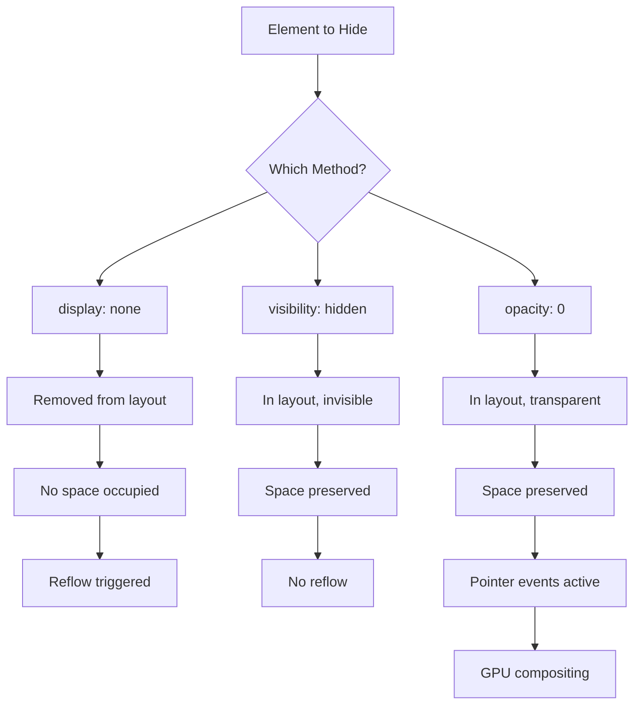
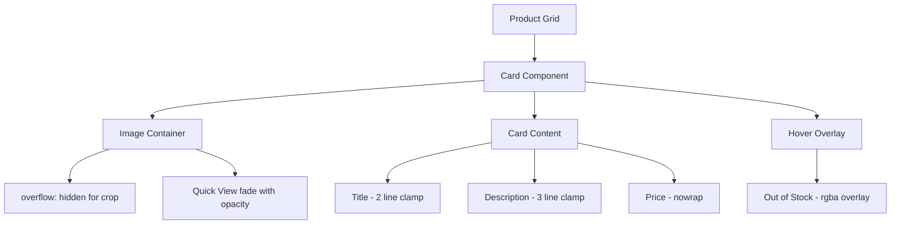

<a id="chapter-37-css-visibility-opacity-overflow"></a>

# Chapter 37: CSS Visibility, Opacity & Overflow

[⬅ Previous Chapter](#chapter-36-css-display-property) | [📖 Main Index](#main-index) | [Next Chapter ➡](#chapter-38-css-positioning)

---

## 📌 Learning Objectives

By the end of this chapter, you will:

**Understand:**
- The fundamental difference between `display: none`, `visibility: hidden`, and `opacity: 0`
- How the browser renders elements with each hiding technique
- What `overflow` does and when each value is appropriate
- How `text-overflow` and `white-space` work together for text clipping

**Interview Concepts Covered:**
- Why `visibility: hidden` keeps space but `display: none` does not
- How `opacity: 0` differs from `visibility: hidden` for events
- When to use `overflow: auto` vs `overflow: scroll`
- Accessibility implications of each hiding method
- Performance considerations for opacity vs display

**Practical Skills:**
- Build show/hide toggle animations using `opacity` + `transition`
- Create scrollable containers with controlled overflow
- Handle long text with `text-overflow: ellipsis`
- Decide the right hiding technique for each real-world scenario

---

<a id="chapter-index-table-37"></a>

## Chapter Index Table

| Topic No. | Topic Name | Subtopics |
|-----------|------------|-----------|
| 37.1 | [Three Ways to Hide Elements](#371-three-ways-to-hide-elements) | display none<br>visibility hidden<br>opacity 0<br>Comparison Table |
| 37.2 | [The visibility Property](#372-the-visibility-property) | visible<br>hidden<br>collapse<br>Nested Visibility |
| 37.3 | [The opacity Property](#373-the-opacity-property) | Values 0–1<br>Transparency<br>Event Handling<br>vs rgba |
| 37.4 | [The overflow Property](#374-the-overflow-property) | visible<br>hidden<br>scroll<br>auto<br>clip |
| 37.5 | [overflow-x and overflow-y](#375-overflow-x-and-overflow-y) | Axis Control<br>Combinations<br>Horizontal Scroll |
| 37.6 | [text-overflow and white-space](#376-text-overflow-and-white-space) | ellipsis<br>clip<br>nowrap<br>Multi-line Clamp |
| 37.7 | [Practical Combinations & Use Cases](#377-practical-combinations-and-use-cases) | Fade In/Out<br>Tooltip<br>Scroll Container<br>Card Clamp |

---

## 37.1 Three Ways to Hide Elements

<a id="371-three-ways-to-hide-elements"></a>

### 🧠 Hinglish Intuition

Socho tumhare ghar mein ek sofa hai. Tumhe usse temporarily hatana hai.

- **`display: none`** → Sofa ghar se **bahar nikal do** — jagah bhi free ho gayi, koi dekh bhi nahi sakta
- **`visibility: hidden`** → Sofa ko **transparent cover se dhak do** — jagah wahi rahi, koi dekh nahi sakta par jagah block hai
- **`opacity: 0`** → Sofa ko **aaine ki tarah transparent bana do** — dikhta nahi, jagah bhi wahi, aur agar koi haath rakh ke touch kare toh feel bhi hoga (click bhi ho sakta hai!)

---

### What is it?

CSS provides **three primary techniques** to hide elements from view. Each behaves differently in terms of layout space, accessibility, pointer events, and animation capability.

---

### The Big Three — Visual Comparison

```
ORIGINAL LAYOUT (all visible):
┌──────────────────────────────────────────┐
│  ┌──────────┐  ┌──────────┐  ┌────────┐ │
│  │  Box A   │  │  Box B   │  │ Box C  │ │
│  │ 200×100  │  │ 200×100  │  │200×100 │ │
│  └──────────┘  └──────────┘  └────────┘ │
└──────────────────────────────────────────┘

─────────────────────────────────────────────
display: none on Box B
─────────────────────────────────────────────
┌──────────────────────────────────────────┐
│  ┌──────────┐  ┌──────────┐             │
│  │  Box A   │  │  Box C   │             │  ← Box B GONE
│  │ 200×100  │  │ 200×100  │             │     Space removed
│  └──────────┘  └──────────┘             │     C moved left
└──────────────────────────────────────────┘

─────────────────────────────────────────────
visibility: hidden on Box B
─────────────────────────────────────────────
┌──────────────────────────────────────────┐
│  ┌──────────┐  ┌ ─ ─ ─ ─ ┐  ┌────────┐ │
│  │  Box A   │  │  (empty) │  │ Box C  │ │  ← Box B INVISIBLE
│  │ 200×100  │  │ 200×100  │  │200×100 │ │     Space PRESERVED
│  └──────────┘  └ ─ ─ ─ ─ ┘  └────────┘ │     C stays in place
└──────────────────────────────────────────┘

─────────────────────────────────────────────
opacity: 0 on Box B
─────────────────────────────────────────────
┌──────────────────────────────────────────┐
│  ┌──────────┐  ┌ ─ ─ ─ ─ ┐  ┌────────┐ │
│  │  Box A   │  │ (ghost!) │  │ Box C  │ │  ← Box B TRANSPARENT
│  │ 200×100  │  │ 200×100  │  │200×100 │ │     Space PRESERVED
│  └──────────┘  └ ─ ─ ─ ─ ┘  └────────┘ │     STILL CLICKABLE!
└──────────────────────────────────────────┘
```

---

### Master Comparison Table

```
┌──────────────────────────┬────────────────┬─────────────────┬──────────────┐
│ Property                 │ display: none  │visibility:hidden│  opacity: 0  │
├──────────────────────────┼────────────────┼─────────────────┼──────────────┤
│ Visible on screen?       │      ❌ No     │      ❌ No      │    ❌ No     │
│ Takes up space?          │      ❌ No     │      ✅ Yes     │    ✅ Yes    │
│ Responds to clicks?      │      ❌ No     │      ❌ No      │    ✅ Yes    │
│ Accessible to screen     │      ❌ No     │      ❌ No      │    ✅ Yes    │
│   readers?               │                │                 │              │
│ Children hidden too?     │      ✅ Yes    │   ✅ Yes*       │    ✅ Yes    │
│ Children can override?   │      ❌ No     │      ✅ Yes     │    ❌ No     │
│ Animatable/Transitionable│      ❌ No     │   ✅ Limited    │    ✅ Yes    │
│ Triggers reflow?         │      ✅ Yes    │      ❌ No      │    ❌ No     │
│ Performance cost?        │     Medium     │      Low        │    Low       │
│ Removes from DOM flow?   │      ✅ Yes    │      ❌ No      │    ❌ No     │
└──────────────────────────┴────────────────┴─────────────────┴──────────────┘
* Children can be made visible: visibility: visible overrides parent's hidden
```

---

### How Does Each One Work?



---

### Code: All Three Methods

```html
<!DOCTYPE html>
<html>
<head>
  <style>
    .container {
      display: flex;
      gap: 16px;
      padding: 20px;
      background: #f1f5f9;
    }

    .box {
      width: 150px;
      height: 80px;
      background: #3b82f6;
      color: white;
      display: flex;
      align-items: center;
      justify-content: center;
      border-radius: 8px;
      font-family: sans-serif;
    }

    /* Method 1: display none */
    .method-display-none {
      display: none;
    }

    /* Method 2: visibility hidden */
    .method-visibility-hidden {
      visibility: hidden;
    }

    /* Method 3: opacity 0 */
    .method-opacity-zero {
      opacity: 0;
    }
  </style>
</head>
<body>
  <div class="container">
    <div class="box">Box A</div>
    <div class="box method-display-none">Box B (display:none)</div>
    <div class="box">Box C</div>
  </div>
</body>
</html>
```

**Code Breakdown:**
- `display: none` → Box B completely leaves the layout; Box C moves left
- `visibility: hidden` → Box B is invisible but its 150px width still reserves space
- `opacity: 0` → Box B is invisible, space reserved, and mouse hover/click still fires

---

### Unique Superpower: visibility can be un-hidden on children

```css
/* Parent is hidden */
.parent {
  visibility: hidden;
}

/* BUT this child overrides and becomes visible */
.child-visible {
  visibility: visible; /* ← This works! Child shows even if parent is hidden */
}
```

```
visibility: hidden — Child Override:
┌────────────────────────────────┐
│ Parent (hidden)                │
│  ░░░░░░░░░░░░░░░░░░░░░░░░░░░  │
│  ░ ┌──────────────────────┐ ░  │
│  ░ │  Child (visible!)    │ ░  │
│  ░ │  This child is seen  │ ░  │
│  ░ └──────────────────────┘ ░  │
│  ░░░░░░░░░░░░░░░░░░░░░░░░░░░  │
└────────────────────────────────┘

opacity: 0 — Child CANNOT override:
┌────────────────────────────────┐
│ Parent (opacity:0)             │
│  ░░░░░░░░░░░░░░░░░░░░░░░░░░░  │
│  ░ ┌──────────────────────┐ ░  │
│  ░ │  Child (opacity:1)   │ ░  │
│  ░ │  STILL INVISIBLE!!   │ ░  │
│  ░ └──────────────────────┘ ░  │
│  ░░░░░░░░░░░░░░░░░░░░░░░░░░░  │
└────────────────────────────────┘
```

> [!IMPORTANT]
> `opacity` cascades multiplicatively. If parent has `opacity: 0`, children **cannot** set `opacity: 1` to become visible. But `visibility: visible` on a child **can** override parent's `visibility: hidden`.

---

### When to Use Which?

```
Decision Tree:
─────────────────────────────────────────────────────────

Need animation/transition?
  YES → Use opacity (smoothly animates 0 → 1)
  NO  ↓

Need to remove element from flow (save space)?
  YES → Use display: none
  NO  ↓

Need to keep space + no click events?
  YES → Use visibility: hidden
  NO  ↓

Need element clickable but invisible?
  YES → Use opacity: 0  ⚠️ Use carefully!
```

---

### Best Practices

- ✅ Use `display: none` for showing/hiding UI panels, modals, dropdowns
- ✅ Use `opacity: 0` + `transition` for smooth fade effects
- ✅ Use `visibility: hidden` for placeholder-preserving toggles
- ❌ Never use `opacity: 0` alone for security — content is still accessible
- ❌ Avoid `display: none` when you need animation (use with JS class toggle)

---

👉 <a href="#chapter-index-table-37">Go to Top 🔝</a>

---

## 37.2 The visibility Property

<a id="372-the-visibility-property"></a>

### 🧠 Hinglish Intuition

Imagine ek magic cloak (Harry Potter wali). Jab pehno — invisible ho jao par jagah wahi raho. Koi dekh nahi sakta, par teri seat abhi bhi occupied hai. Aur agar tumhare bacho ko cloak nahi di — woh sab dekh sakte hain!

---

### What is it?

The `visibility` property controls whether an element is **rendered (painted)** on screen, while **still participating in the document layout**.

---

### All Values of visibility

```
┌─────────────────────────────────────────────────────────────┐
│                    visibility: VALUES                       │
├───────────────┬─────────────────────────────────────────────┤
│ visible       │ Default. Element is shown normally          │
│               │ ┌────────┐                                  │
│               │ │Element │ ← Fully visible                  │
│               │ └────────┘                                  │
├───────────────┼─────────────────────────────────────────────┤
│ hidden        │ Element is invisible, space preserved        │
│               │ ┌ ─ ─ ─ ┐                                  │
│               │  (ghost)  ← Space still here                │
│               │ └ ─ ─ ─ ┘                                  │
├───────────────┼─────────────────────────────────────────────┤
│ collapse      │ For table rows/columns ONLY                  │
│               │ Behaves like display:none for tables         │
│               │ Behaves like hidden for everything else      │
├───────────────┼─────────────────────────────────────────────┤
│ inherit       │ Inherits parent's visibility value           │
└───────────────┴─────────────────────────────────────────────┘
```

---

### visibility: collapse — For Tables

```
Normal Table:
┌───────┬───────┬───────┐
│  TH1  │  TH2  │  TH3  │
├───────┼───────┼───────┤
│  TD1  │  TD2  │  TD3  │   ← Row 2 has visibility: collapse
├───────┼───────┼───────┤
│  TD1  │  TD2  │  TD3  │
└───────┴───────┴───────┘

After visibility: collapse on Row 2:
┌───────┬───────┬───────┐
│  TH1  │  TH2  │  TH3  │
├───────┼───────┼───────┤   ← Row 2 removed (like display:none for table)
│  TD1  │  TD2  │  TD3  │
└───────┴───────┴───────┘

Same on a div (NOT a table row):
┌──────────────────────┐
│ Before               │
├ ─ ─ ─ ─ ─ ─ ─ ─ ─ ─┤  ← Space still reserved (like visibility:hidden)
│ After                │
└──────────────────────┘
```

---

### Code: visibility Property

```css
/* Basic usage */
.tooltip {
  visibility: hidden;    /* Hidden but takes space */
}

.tooltip:hover {
  visibility: visible;   /* Show on hover */
}

/* Nested override - child visible inside hidden parent */
.modal-overlay {
  visibility: hidden;
}

.modal-overlay.active {
  visibility: visible;
}

/* This works! Child can be visible even if parent is hidden */
.hidden-parent {
  visibility: hidden;
}
.visible-child {
  visibility: visible;  /* Child shows through parent's hidden! */
}
```

**Code Breakdown:**
- `visibility: hidden` is perfect for hover-based tooltips where you want the space reserved
- The nested override is the key difference vs `opacity: 0`
- In table context, `collapse` acts like `display: none` to save table space

---

### Transition with visibility

```css
/* visibility IS transitionable — but only as a step function */
.element {
  visibility: hidden;
  opacity: 0;
  transition: opacity 0.3s ease, visibility 0.3s;
}

.element.active {
  visibility: visible;
  opacity: 1;
}
```

```
Timeline of visibility + opacity transition:

opacity:0 → opacity:1     ██████████████████████ (smooth gradient)
visibility:hidden → visible █                     (instant jump at t=0)

Combined effect: Element fades IN smoothly
visibility ensures it DISAPPEARS instantly when fading OUT
```

> [!TIP]
> The classic fade animation pattern combines `visibility` + `opacity` + `transition`. Use `visibility` to control click events and accessibility, `opacity` to control the visual fade.

---

### Accessibility Impact

```
Screen Reader Behavior:
──────────────────────────────────────────────────────
display: none       → Content HIDDEN from screen readers
visibility: hidden  → Content HIDDEN from screen readers
opacity: 0          → Content VISIBLE to screen readers ⚠️

Use aria-hidden="true" if you want opacity:0 to also
be hidden from assistive technology.
```

---

### Common Mistakes

```
❌ WRONG: Using visibility alone for animations
.box {
  visibility: hidden;
  transition: visibility 0.5s; /* Not smooth! */
}

✅ RIGHT: Combining visibility + opacity
.box {
  visibility: hidden;
  opacity: 0;
  transition: opacity 0.4s, visibility 0.4s;
}
.box.show {
  visibility: visible;
  opacity: 1;
}
```

---

👉 <a href="#chapter-index-table-37">Go to Top 🔝</a>

---

## 37.3 The opacity Property

<a id="373-the-opacity-property"></a>

### 🧠 Hinglish Intuition

Socho glass. Kuch glass ekdum transparent hote hain (opacity: 1 — full glass). Kuch frosted hote hain (opacity: 0.5 — aadha transparent). Aur kuch bilkul see-through hote hain (opacity: 0 — invisible glass). Par yaad raho — glass hamesha wahan HAI, sirf dikhta nahi.

---

### What is it?

`opacity` sets the **transparency level** of an element and ALL its children together as a single unit. Value ranges from `0` (fully transparent) to `1` (fully opaque).

---

### opacity Scale Visual

```
opacity: 0          opacity: 0.25       opacity: 0.5
┌──────────────┐    ┌──────────────┐    ┌──────────────┐
│              │    │░░░░░░░░░░░░░░│    │▒▒▒▒▒▒▒▒▒▒▒▒▒▒│
│  (invisible) │    │░░  Box  ░░░░│    │▒▒  Box  ▒▒▒▒│
│              │    │░░░░░░░░░░░░░░│    │▒▒▒▒▒▒▒▒▒▒▒▒▒▒│
└──────────────┘    └──────────────┘    └──────────────┘
  0% visible          25% visible         50% visible

opacity: 0.75       opacity: 1
┌──────────────┐    ┌──────────────┐
│▓▓▓▓▓▓▓▓▓▓▓▓▓│    │██████████████│
│▓▓  Box  ▓▓▓▓│    │██  Box  █████│
│▓▓▓▓▓▓▓▓▓▓▓▓▓│    │██████████████│
└──────────────┘    └──────────────┘
  75% visible        100% visible (default)
```

---

### opacity vs rgba — Critical Difference

```
opacity: 0.5 on parent
──────────────────────────────────────────────────
┌─────────────────────────────────────┐
│ Parent (opacity: 0.5)               │
│  50% transparent                    │
│  ┌───────────────────┐              │
│  │ Child text        │              │
│  │ (ALSO 50% faded!) │ ← affected  │
│  └───────────────────┘              │
└─────────────────────────────────────┘

background: rgba(0, 0, 0, 0.5) on parent
──────────────────────────────────────────────────
┌─────────────────────────────────────┐
│ Parent background: 50% transparent  │
│  ┌───────────────────┐              │
│  │ Child text        │              │
│  │ (FULLY OPAQUE!)   │ ← unaffected│
│  └───────────────────┘              │
└─────────────────────────────────────┘
```

> [!IMPORTANT]
> `opacity` applies to the **entire element including all children** as a group. Use `rgba()` / `hsla()` when you want ONLY the background to be transparent while keeping child content fully opaque.

---

### opacity and Stacking Context

```
opacity < 1 creates a NEW Stacking Context!

Without opacity:             With opacity (any value < 1):
─────────────────            ─────────────────────────────
Normal flow                  Creates stacking context
No z-index isolation         Children isolated from outside
                             z-index only affects internal order
```

---

### Code: opacity in Practice

```css
/* 1. Basic Transparency */
.watermark {
  opacity: 0.15;
  position: absolute;
  font-size: 64px;
}

/* 2. Hover fade effect */
.card {
  opacity: 1;
  transition: opacity 0.3s ease;
}
.card:hover {
  opacity: 0.85;
}

/* 3. Disabled state */
.btn:disabled {
  opacity: 0.4;
  cursor: not-allowed;
  /* pointer-events: none;  ← add this to disable clicks */
}

/* 4. Fade in animation */
.fade-in {
  opacity: 0;
  animation: fadeIn 0.6s ease forwards;
}

@keyframes fadeIn {
  from { opacity: 0; }
  to   { opacity: 1; }
}

/* 5. Semi-transparent overlay */
.modal-backdrop {
  background: rgba(0, 0, 0, 0.6); /* ← rgba, not opacity */
  /* Children (modal box) remain fully visible */
}
```

**Code Breakdown:**
- `opacity: 0.15` for watermarks — faint background text effect
- `transition: opacity 0.3s` gives smooth hover dimming
- `opacity: 0.4` for disabled buttons is a universal UI pattern
- `rgba()` on backdrop lets modal content stay fully visible

---

### opacity + pointer-events

```css
/* opacity: 0 still captures mouse events! */
.ghost-button {
  opacity: 0;
  /* Mouse clicks still fire! Can cause UX bugs */
}

/* Fix: add pointer-events: none */
.ghost-button {
  opacity: 0;
  pointer-events: none; /* ← Now completely non-interactive */
}

/* Or when showing: */
.ghost-button.visible {
  opacity: 1;
  pointer-events: auto;
}
```

```
opacity: 0 WITHOUT pointer-events: none

┌──────────────────────────────────────┐
│ Page Content                         │
│                                      │
│  ┌ ─ ─ ─ ─ ─ ─ ─ ─ ─ ─ ─ ─ ─ ─ ┐  │
│       (invisible element)            │
│   User clicks here → FIRES EVENT!   │
│  └ ─ ─ ─ ─ ─ ─ ─ ─ ─ ─ ─ ─ ─ ─ ┘  │
│                                      │
│  ← User is confused why something   │
│     happened with "empty" area!     │
└──────────────────────────────────────┘
```

> [!NOTE]
> This is a very common bug in production. Always pair `opacity: 0` with `pointer-events: none` unless you intentionally need the element to be clickable while invisible.

---

### GPU Compositing & Performance

```
Browser Rendering Pipeline:
──────────────────────────────────────────────────────
display: none     → Layout recalculation → Paint → Composite
                    (Expensive — reflow!)

visibility:hidden → No layout change → Repaint → Composite
                    (Medium — repaint)

opacity           → No layout → No repaint → Composite only
                    (CHEAPEST — GPU composited!)
                    ✅ Best for animations!
```

> [!TIP]
> `opacity` animations are the **most performant** because they are handled entirely by the GPU compositor. The browser does NOT need to repaint or reflow when only opacity changes.

---

👉 <a href="#chapter-index-table-37">Go to Top 🔝</a>

---

## 37.4 The overflow Property

<a id="374-the-overflow-property"></a>

### 🧠 Hinglish Intuition

Socho ek bucket hai — limited size ki. Agar zyada paani dalo toh kya hoga?

- **`overflow: visible`** → Paani bahar girne do (default) — bucket se overflow ho raha hai par sab dikhta hai
- **`overflow: hidden`** → Bucket full hone ke baad extra paani block kar do — kuch dikhega nahi
- **`overflow: scroll`** → Bucket mein ek tap laga do — pura content andar hai, scroller se dekh sakte ho
- **`overflow: auto`** → Smart bucket — agar content fit hota hai toh no scroll, agar nahi hota toh automatic scroll

---

### What is it?

`overflow` controls **what happens when content is larger than its container**. It decides whether the overflowing content is visible, hidden, scrollable, or automatically managed.

---

### overflow Values — Visual Comparison

```
Container = 200px × 100px
Content   = 200px × 200px (too tall)

────────────────────────────────────────────────────────────────

overflow: visible (default)
┌──────────────────────┐  ← Container boundary (200px)
│  Line 1              │
│  Line 2              │
│  Line 3              │
│  Line 4              │  ← Container ends here
  Line 5               │  ← Content spills OUTSIDE
  Line 6               │     (Overlaps other elements!)
  Line 7               │
  Line 8               │

────────────────────────────────────────────────────────────────

overflow: hidden
┌──────────────────────┐
│  Line 1              │
│  Line 2              │
│  Line 3              │
│  Line 4              │  ← Content is CUT OFF here
└──────────────────────┘     Lines 5-8 are invisible/gone

────────────────────────────────────────────────────────────────

overflow: scroll
┌──────────────────────┬┐
│  Line 1              ││
│  Line 2              ││  ← Scrollbar ALWAYS present
│  Line 3              ││     (even if content fits)
│  Line 4              ││
└──────────────────────┴┘▼  ← Scroll down to see more
─────────────────────────── 

────────────────────────────────────────────────────────────────

overflow: auto
┌──────────────────────┐
│  Line 1              │
│  Line 2              │  ← NO scrollbar if content fits
│  Line 3              │     Scrollbar appears ONLY when needed
│  Line 4              │
└──────────────────────┘

If content overflows:
┌──────────────────────┬┐
│  Line 1              ││
│  Line 2              ││  ← Scrollbar appears automatically
│  Line 3              ││
│  Line 4              ││
└──────────────────────┴┘▼
```

---

### overflow: clip — The New Addition

```css
/* clip is like hidden but STRICTER */
overflow: clip;
overflow-clip-margin: 20px; /* Clip with some breathing room */
```

```
overflow: hidden vs overflow: clip

hidden → Allows programmatic scrolling (scrollTo, etc.)
         Creates new BFC (Block Formatting Context)

clip   → No scrolling at all (not even via JavaScript)
         Does NOT create a new BFC
         Allows overflow-clip-margin for fine-tuning
```

---

### overflow Values Summary Table

```
┌──────────────┬──────────────────┬──────────────────┬──────────────────┐
│ Value        │ Content Visible? │ Scrollbar?       │ BFC Created?     │
├──────────────┼──────────────────┼──────────────────┼──────────────────┤
│ visible      │ ✅ Yes (outside) │ ❌ Never         │ ❌ No            │
│ hidden       │ ❌ No            │ ❌ Never visible │ ✅ Yes           │
│ scroll       │ ❌ No            │ ✅ Always        │ ✅ Yes           │
│ auto         │ ❌ No            │ ✅ When needed   │ ✅ Yes           │
│ clip         │ ❌ No            │ ❌ Never         │ ❌ No            │
└──────────────┴──────────────────┴──────────────────┴──────────────────┘
```

---

### BFC (Block Formatting Context) and overflow

```
overflow: hidden creates a BFC!
This is used to:

1. Contain floated children (clearfix alternative)
2. Prevent margin collapse
3. Contain absolutely positioned children

Before BFC (float not contained):
┌────────────────────────────────┐
│ Container (no overflow)        │   ← Container collapses!
└────────────────────────────────┘
┌──────────┐
│  Float   │  ← Float outside container
└──────────┘

After BFC (overflow: hidden/auto):
┌────────────────────────────────┐
│ Container (overflow: hidden)   │
│  ┌──────────┐                  │
│  │  Float   │  ← Contained!   │
│  └──────────┘                  │
└────────────────────────────────┘
```

---

### Code: overflow in Practice

```css
/* 1. Chat message container — scrollable */
.chat-box {
  width: 300px;
  height: 400px;
  overflow: auto;       /* Scroll only when messages overflow */
  border: 1px solid #e2e8f0;
  padding: 12px;
}

/* 2. Image thumbnail — crop to fit */
.thumbnail {
  width: 200px;
  height: 150px;
  overflow: hidden;     /* Clip image to container shape */
  border-radius: 8px;
}

.thumbnail img {
  width: 100%;
  height: 100%;
  object-fit: cover;    /* Scale image to cover thumbnail */
}

/* 3. Code block — always show scrollbar */
.code-block {
  overflow: scroll;     /* Always scroll, even if code is short */
  background: #1e293b;
  padding: 16px;
  border-radius: 6px;
}

/* 4. Clearfix with overflow: hidden */
.clearfix {
  overflow: hidden;     /* Contains floated children */
}

/* 5. Dropdown container */
.nav-dropdown {
  position: relative;
  overflow: visible;    /* Children (dropdown) show outside */
}
```

> [!NOTE]
> `overflow: auto` is almost always preferred over `overflow: scroll`. Auto only shows the scrollbar when needed, giving a cleaner UI when content fits.

---

### overflow and Position Absolute

```
⚠️ overflow: hidden clips absolutely positioned children
IF the container is the positioned ancestor!

Container: position: relative; overflow: hidden
┌───────────────────────────────────┐
│ Container                         │
│  ┌──────────────────────┐         │
│  │ Positioned Child     │         │
│  │ (clipped if outside) │         │
│  └──────────────────────┘         │
└───────────────────────────────────┘

Container: position: static; overflow: hidden
┌───────────────────────────────────┐
│ Container                         │
│                                   │
└───────────────────────────────────┘
         ┌──────────────────────┐
         │ Positioned Child     │  ← May NOT be clipped
         │ (relative to body)   │     depending on its parent
         └──────────────────────┘
```

---

### Common Mistakes

```
❌ WRONG: Using overflow: scroll on nav that has a dropdown
.nav {
  overflow: hidden; /* This clips the dropdown menu! */
}

✅ RIGHT: Keep overflow: visible for dropdowns
.nav {
  overflow: visible; /* Dropdowns can extend outside */
}
.nav .scrollable-area {
  overflow: auto; /* Only scroll where needed */
}
```

---

👉 <a href="#chapter-index-table-37">Go to Top 🔝</a>

---

## 37.5 overflow-x and overflow-y

<a id="375-overflow-x-and-overflow-y"></a>

### 🧠 Hinglish Intuition

Socho ek drawer hai. `overflow-x` matlab horizontal drawer — left-right mein content control. `overflow-y` matlab vertical drawer — upar-neeche mein control. Tum dono axis alag-alag control kar sakte ho!

---

### What is it?

`overflow-x` and `overflow-y` control overflow **independently on each axis**, giving you precise control over horizontal vs vertical scrolling.

---

### Axis Control Visual

```
overflow-x: hidden, overflow-y: auto
──────────────────────────────────────────

Wide content (horizontal):
┌──────────────────────────────────┬┐
│ Normal text here                 ││ ↑
│ Normal text here                 ││ │
│ [ W i d e   C o n t e n t ..... ││ │ ← Wide content
│   is HIDDEN (clipped)            ││ │   horizontally clipped
│ Normal text here                 ││ │
│                                  ││ ↓
└──────────────────────────────────┴┘
  No horizontal scrollbar          ↕ Vertical scrollbar

overflow-x: auto, overflow-y: hidden
──────────────────────────────────────────
┌──────────────────────────────────┐
│ Normal text here                 │ ← Tall content clipped
│ Normal text here                 │    vertically
└──────────────────────────────────┘
←──────────────────────────────────→
  Horizontal scrollbar present
```

---

### Common overflow-x / overflow-y Combinations

```
┌──────────────────┬──────────────────┬────────────────────────────────┐
│ overflow-x       │ overflow-y       │ Use Case                       │
├──────────────────┼──────────────────┼────────────────────────────────┤
│ auto             │ auto             │ Two-way scroll (spreadsheet)   │
│ hidden           │ auto             │ Vertical scroll, no H-scroll   │
│ auto             │ hidden           │ Horizontal scroll (timeline)   │
│ hidden           │ hidden           │ Full clip (image thumbnail)    │
│ scroll           │ hidden           │ Always-on H-scroll (carousel)  │
│ visible          │ auto             │ Normal + V-scroll only         │
└──────────────────┴──────────────────┴────────────────────────────────┘
```

---

### Horizontal Scroll Container

```css
/* Horizontal scrolling card row */
.card-row {
  display: flex;
  gap: 16px;
  overflow-x: auto;
  overflow-y: hidden;
  padding: 8px 0 16px;    /* Bottom padding for scrollbar space */
  scroll-snap-type: x mandatory;
  -webkit-overflow-scrolling: touch; /* Smooth scroll on iOS */
}

.card-row::-webkit-scrollbar {
  height: 4px;
}

.card-row::-webkit-scrollbar-track {
  background: #f1f5f9;
}

.card-row::-webkit-scrollbar-thumb {
  background: #94a3b8;
  border-radius: 2px;
}

.card-item {
  min-width: 200px;
  scroll-snap-align: start;
}
```

```
Result:
┌─────────────────────────────────────────────────┐
│ ┌───────┐ ┌───────┐ ┌───────┐ ┌──────...        │
│ │ Card │ │ Card │ │ Card │ │ Card │             │
│ │  1   │ │  2   │ │  3   │ │  4  │ →           │
│ └───────┘ └───────┘ └───────┘ └──────...        │
│──────────────────────────────── scrollbar ──────│
└─────────────────────────────────────────────────┘
 Swipe left/right to see more cards
```

---

### The overflow: visible Conflict Rule

```
⚠️ IMPORTANT RULE:
If overflow-x: visible AND overflow-y is anything else
(hidden/scroll/auto), then overflow-x is FORCED to auto!

This is because a scrollable container cannot have
content flowing outside in one axis while the other
axis is controlled.

/* This is what you write: */
overflow-x: visible;  /* ← Browser overrides this! */
overflow-y: auto;

/* Browser computes it as: */
overflow-x: auto;    /* NOT visible anymore! */
overflow-y: auto;
```

> [!IMPORTANT]
> You **cannot** have `overflow-x: visible` when `overflow-y` is `hidden/scroll/auto`. The browser will silently convert `visible` to `auto`. This is a very common source of confusion.

---

### Scrollbar Styling

```css
/* Custom scrollbar (Webkit browsers) */
.scrollable::-webkit-scrollbar {
  width: 8px;       /* Vertical scrollbar width */
  height: 8px;      /* Horizontal scrollbar height */
}

.scrollable::-webkit-scrollbar-track {
  background: #f8fafc;
  border-radius: 4px;
}

.scrollable::-webkit-scrollbar-thumb {
  background: #cbd5e1;
  border-radius: 4px;
}

.scrollable::-webkit-scrollbar-thumb:hover {
  background: #94a3b8;
}

/* Firefox */
.scrollable {
  scrollbar-width: thin;
  scrollbar-color: #cbd5e1 #f8fafc;
}
```

---

👉 <a href="#chapter-index-table-37">Go to Top 🔝</a>

---

## 37.6 text-overflow and white-space

<a id="376-text-overflow-and-white-space"></a>

### 🧠 Hinglish Intuition

Tumne notice kiya hoga YouTube pe video titles bohot lambe hote hain par dikhai sirf "React Tutorial: How to Build a Full-Stack App with..." hi deta hai — baaki "..." se truncate ho jata hai. Yehi hai `text-overflow: ellipsis`! Aur `white-space: nowrap` ensure karta hai ki text ek hi line mein rahe.

---

### What is it?

`text-overflow` controls **what happens when text content overflows its container** — it can show `ellipsis (...)` or simply `clip` the text. It **requires** `white-space: nowrap` and `overflow: hidden` to work.

---

### text-overflow Values

```
Container = 200px wide
Text = "This is a very long title that won't fit"

text-overflow: clip (default behavior)
┌──────────────────────┐
│This is a very long ti│  ← Text is cut at the edge
└──────────────────────┘

text-overflow: ellipsis
┌──────────────────────┐
│This is a very long...│  ← Text shows ... at the end
└──────────────────────┘

text-overflow: "→" (custom character)
┌──────────────────────┐
│This is a very long t→│  ← Custom overflow indicator
└──────────────────────┘
```

---

### The Holy Trinity of Text Truncation

```
Three properties MUST work together:
─────────────────────────────────────

Step 1: overflow: hidden
        Hides the overflowing text

Step 2: white-space: nowrap
        Keeps text on ONE line (prevents wrapping)

Step 3: text-overflow: ellipsis
        Shows "..." at the cut point

Without ANY one of these, ellipsis does NOT work!

❌ Missing white-space: nowrap
┌──────────────────────┐
│This is a very long   │
│title that won't fit  │  ← Text wraps, no ellipsis
└──────────────────────┘

❌ Missing overflow: hidden
This is a very long title that won't fit  ← Overflows container

✅ All three together
┌──────────────────────┐
│This is a very long...│  ← ✅ Clean truncation
└──────────────────────┘
```

---

### white-space Values

```
┌─────────────┬──────────────────┬──────────────────┬──────────────────┐
│ Value       │ Spaces/Tabs      │ Line Breaks      │ Text Wrap        │
├─────────────┼──────────────────┼──────────────────┼──────────────────┤
│ normal      │ Collapsed        │ Collapsed        │ ✅ Wraps         │
│ nowrap      │ Collapsed        │ Collapsed        │ ❌ No wrap       │
│ pre         │ Preserved        │ Preserved        │ ❌ No wrap       │
│ pre-wrap    │ Preserved        │ Preserved        │ ✅ Wraps         │
│ pre-line    │ Collapsed        │ Preserved        │ ✅ Wraps         │
│ break-spaces│ Preserved        │ Preserved        │ ✅ Wraps         │
└─────────────┴──────────────────┴──────────────────┴──────────────────┘
```

```
white-space: normal (default)
"Hello    World
Line 2"
→ Displays as: "Hello World Line 2" (collapses spaces, wraps)

white-space: nowrap
→ Displays as one long line: "Hello World Line 2"

white-space: pre
→ Displays exactly as typed:
  "Hello    World
   Line 2"
  (like <pre> tag)

white-space: pre-wrap
→ Preserves spaces/newlines BUT also wraps at container edge

white-space: pre-line
→ Collapses multiple spaces, preserves newlines, wraps
```

---

### Multi-Line Text Truncation (Line Clamp)

```css
/* Single line truncation — classic */
.single-line-truncate {
  overflow: hidden;
  white-space: nowrap;
  text-overflow: ellipsis;
  max-width: 300px;
}

/* Multi-line truncation — modern CSS */
.multi-line-truncate {
  display: -webkit-box;
  -webkit-line-clamp: 3;           /* Show only 3 lines */
  -webkit-box-orient: vertical;
  overflow: hidden;
  /* No need for white-space: nowrap here! */
}
```

```
Single-line clamp (max-width: 200px):
┌──────────────────────┐
│React Tutorial: How...│  ← 1 line, then ...
└──────────────────────┘

Multi-line clamp (-webkit-line-clamp: 3):
┌──────────────────────┐
│React Tutorial: How   │
│to Build a Full-Stack │
│App with Next.js...   │  ← 3 lines, then ...
└──────────────────────┘
```

---

### Code: Complete Text Overflow Examples

```css
/* 1. Table cell truncation */
.data-table td {
  max-width: 150px;
  overflow: hidden;
  white-space: nowrap;
  text-overflow: ellipsis;
}

/* 2. Card title — 2 line clamp */
.card-title {
  display: -webkit-box;
  -webkit-line-clamp: 2;
  -webkit-box-orient: vertical;
  overflow: hidden;
  font-size: 18px;
  font-weight: 600;
  margin-bottom: 8px;
}

/* 3. Blog excerpt — 4 line clamp */
.blog-excerpt {
  display: -webkit-box;
  -webkit-line-clamp: 4;
  -webkit-box-orient: vertical;
  overflow: hidden;
  color: #64748b;
  line-height: 1.6;
}

/* 4. Navigation link — no wrap */
.nav-link {
  white-space: nowrap;  /* Prevents nav items from wrapping */
  overflow: hidden;
  text-overflow: ellipsis;
  max-width: 120px;
}

/* 5. Code block — preserve formatting */
.code-snippet {
  white-space: pre;     /* Preserve code formatting */
  overflow-x: auto;     /* Horizontal scroll for long lines */
  font-family: 'Courier New', monospace;
}
```

---

### word-break and overflow-wrap

```css
/* For URLs and long words that overflow */
.url-display {
  word-break: break-all;   /* Break ANYWHERE, even mid-word */
}

.paragraph {
  overflow-wrap: break-word; /* Break only when necessary */
  word-wrap: break-word;     /* Legacy alias */
}
```

```
word-break: normal (default)
┌──────────────────────┐
│ Normal text wraps at │
│ word boundaries.     │
│ https://www.very-lon │ ← URL overflows!
└──────────────────────┘

word-break: break-all
┌──────────────────────┐
│ Normal text wraps at │
│ word boundaries.     │
│ https://www.very-lon │
│ g-url-that-wont-fit/ │ ← Breaks anywhere
└──────────────────────┘

overflow-wrap: break-word
┌──────────────────────┐
│ Normal text wraps at │
│ word boundaries.     │
│ https://www.very-    │ ← Breaks only if needed
│ long-url/            │
└──────────────────────┘
```

---

👉 <a href="#chapter-index-table-37">Go to Top 🔝</a>

---

## 37.7 Practical Combinations & Use Cases

<a id="377-practical-combinations-and-use-cases"></a>

### 🧠 Hinglish Intuition

Ab tak tumne sabhi ingredients seekhe. Ab kuch real dishes banate hain — fade-in tooltip, scrollable chat, card with truncation. Yehi asli CSS ka use hai!

---

### Use Case 1: Smooth Fade In/Out Toggle

```css
/* The professional fade toggle pattern */
.overlay {
  /* Start: hidden */
  visibility: hidden;
  opacity: 0;
  transition: opacity 0.3s ease, visibility 0.3s ease;
}

.overlay.is-active {
  /* Active: visible */
  visibility: visible;
  opacity: 1;
}
```

```
State Machine:
────────────────────────────────────────────────────
State: HIDDEN                State: ACTIVE
visibility: hidden           visibility: visible
opacity: 0                   opacity: 1
pointer-events: none         pointer-events: all

Transition:
hidden ──0.3s ease──▶ active  (Fade IN)
active ──0.3s ease──▶ hidden  (Fade OUT)

Why both visibility AND opacity?
opacity:    Controls the visual fade (smooth 0→1)
visibility: Controls pointer events (toggle instantly)
            Also controls accessibility
```

---

### Use Case 2: Tooltip

```css
.tooltip-wrapper {
  position: relative;
  display: inline-block;
}

.tooltip-text {
  position: absolute;
  bottom: calc(100% + 8px);
  left: 50%;
  transform: translateX(-50%);
  background: #1e293b;
  color: #fff;
  padding: 6px 12px;
  border-radius: 6px;
  white-space: nowrap;    /* Tooltip text on one line */
  font-size: 14px;

  /* Hidden state */
  visibility: hidden;
  opacity: 0;
  transition: opacity 0.2s, visibility 0.2s;
}

.tooltip-wrapper:hover .tooltip-text {
  visibility: visible;
  opacity: 1;
}
```

```
Tooltip Flow:
────────────────────────────────────────────────────

Normal state:
┌───────────────────────────────────┐
│                                   │
│      [  Hover Me Button  ]        │
│                                   │
└───────────────────────────────────┘

Hover state:
┌───────────────────────────────────┐
│   ┌─────────────────────────┐     │
│   │  This is the tooltip!   │     │
│   └─────────┬───────────────┘     │
│             │                     │
│      [  Hover Me Button  ]        │
│                                   │
└───────────────────────────────────┘
```

---

### Use Case 3: Scrollable Chat Window

```css
.chat-container {
  display: flex;
  flex-direction: column;
  height: 500px;
  border: 1px solid #e2e8f0;
  border-radius: 12px;
  overflow: hidden;         /* Clip rounded corners */
}

.chat-messages {
  flex: 1;
  overflow-y: auto;         /* Scroll messages vertically */
  overflow-x: hidden;       /* No horizontal scroll */
  padding: 16px;
  display: flex;
  flex-direction: column;
  gap: 12px;
}

.chat-input-area {
  border-top: 1px solid #e2e8f0;
  padding: 12px;
  background: #f8fafc;
  /* No overflow — always visible at bottom */
}
```

```
Chat Layout:
┌────────────────────────────────┐
│                              ▲ │
│  [User] Hey there!           │ │
│                              │ │
│       [AI] Hi! How can I...  │ │
│                              │ │
│  [User] I need help with...  │ │
│                              │ │
│       [AI] Sure! Here is ... │ │
│                              ▼ │
│  overflow-y: auto scrollbar    │
├────────────────────────────────┤
│  Type a message...    [Send]   │  ← Fixed at bottom
└────────────────────────────────┘
```

---

### Use Case 4: Product Card with Text Clamp

```css
.product-card {
  width: 250px;
  border: 1px solid #e2e8f0;
  border-radius: 12px;
  overflow: hidden;         /* Clips image to card border-radius */
  background: white;
}

.product-image {
  width: 100%;
  height: 180px;
  object-fit: cover;
  display: block;
}

.product-info {
  padding: 16px;
}

.product-title {
  font-size: 16px;
  font-weight: 600;
  display: -webkit-box;
  -webkit-line-clamp: 2;    /* Max 2 lines */
  -webkit-box-orient: vertical;
  overflow: hidden;
  margin-bottom: 8px;
}

.product-description {
  font-size: 14px;
  color: #64748b;
  display: -webkit-box;
  -webkit-line-clamp: 3;    /* Max 3 lines */
  -webkit-box-orient: vertical;
  overflow: hidden;
}

.product-price {
  font-size: 20px;
  font-weight: 700;
  color: #0f172a;
  margin-top: 12px;
  white-space: nowrap;      /* Price never wraps */
  overflow: hidden;
  text-overflow: ellipsis;
}
```

---

### Use Case 5: Responsive Horizontal Scroll Table

```css
.table-wrapper {
  overflow-x: auto;        /* Horizontal scroll on small screens */
  overflow-y: visible;
  -webkit-overflow-scrolling: touch;
}

.data-table {
  width: 100%;
  min-width: 600px;        /* Never shrink below 600px */
  border-collapse: collapse;
}

.data-table td,
.data-table th {
  max-width: 200px;
  overflow: hidden;
  white-space: nowrap;
  text-overflow: ellipsis;
  padding: 12px 16px;
  text-align: left;
}
```

```
Desktop (wide screen):
┌────────┬───────────────────────┬──────────┬──────────┐
│  Name  │ Email                 │  Role    │  Status  │
├────────┼───────────────────────┼──────────┼──────────┤
│ John D │ john@example.com      │  Admin   │  Active  │
└────────┴───────────────────────┴──────────┴──────────┘

Mobile (narrow screen):
┌───────────────────────────────┐
│  Name  │ Email         │  Role│ → scroll right
├────────┼───────────────┼──────┤
│ John D │ john@exampl...│ Adm..│
└───────────────────────────────┘
─────────── scrollbar ───────────
```

---

### Complete Pattern Reference

```
┌────────────────────────────────────────────────────────────────────┐
│                    QUICK PATTERN REFERENCE                         │
├────────────────────────┬───────────────────────────────────────────┤
│ Goal                   │ CSS Properties to Use                     │
├────────────────────────┼───────────────────────────────────────────┤
│ Fade in/out smoothly   │ opacity + visibility + transition         │
│ Hide & remove space    │ display: none                             │
│ Hide & keep space      │ visibility: hidden                        │
│ Semi-transparent bg    │ background: rgba()  NOT opacity           │
│ Disabled button        │ opacity: 0.4 + pointer-events: none      │
│ Single line truncation │ overflow:hidden + white-space:nowrap      │
│                        │ + text-overflow:ellipsis                  │
│ Multi-line truncation  │ -webkit-line-clamp + -webkit-box         │
│ Scrollable container   │ overflow: auto + fixed height             │
│ Horizontal card scroll │ overflow-x: auto + overflow-y: hidden    │
│ Image crop to shape    │ overflow: hidden on parent               │
│ Code formatting        │ white-space: pre + overflow-x: auto      │
│ Long URL break         │ overflow-wrap: break-word                 │
│ Table horizontal scroll│ overflow-x: auto on wrapper div          │
│ Tooltip text           │ white-space: nowrap + visibility toggle  │
│ Chat window            │ overflow-y: auto + fixed height           │
└────────────────────────┴───────────────────────────────────────────┘
```

---

👉 <a href="#chapter-index-table-37">Go to Top 🔝</a>

---

## 💡 Interview Questions

### Conceptual Questions

**Q1. What is the difference between `display: none`, `visibility: hidden`, and `opacity: 0`?**

**Answer:**
```
┌─────────────────────┬──────────────┬──────────────┬──────────────┐
│ Aspect              │ display:none │ vis:hidden   │ opacity:0    │
├─────────────────────┼──────────────┼──────────────┼──────────────┤
│ Takes layout space? │ No           │ Yes          │ Yes          │
│ Clickable?          │ No           │ No           │ Yes          │
│ Screen readers?     │ Hidden       │ Hidden       │ Visible      │
│ Animatable?         │ No           │ Limited      │ Yes          │
│ Reflow triggered?   │ Yes          │ No           │ No           │
│ Child can override? │ No           │ Yes          │ No           │
└─────────────────────┴──────────────┴──────────────┴──────────────┘
```

---

**Q2. Why can't you animate `display: none` to `display: block` directly?**

**Answer:** `display` is not an animatable property — it switches instantly between values with no intermediate states. The browser cannot interpolate between `none` and `block`. The correct approach is:
```css
/* Use opacity + visibility for smooth transition */
.element {
  visibility: hidden;
  opacity: 0;
  transition: opacity 0.3s, visibility 0.3s;
}
.element.active {
  visibility: visible;
  opacity: 1;
}
```

---

**Q3. A child element has `visibility: visible` but its parent has `visibility: hidden`. What happens?**

**Answer:** The child becomes **visible**! This is the unique behavior of `visibility`. A child can override parent's `visibility: hidden` by setting `visibility: visible`. This does NOT work with `opacity: 0` — a child cannot set `opacity: 1` to override a parent's `opacity: 0`.

---

**Q4. What is the difference between `overflow: scroll` and `overflow: auto`?**

**Answer:**
- `overflow: scroll` → **Always shows** scrollbars, even if content fits
- `overflow: auto` → **Only shows** scrollbars when content actually overflows

In practice, `auto` is almost always preferred for cleaner UI.

---

**Q5. What is a Block Formatting Context (BFC) and how does `overflow: hidden` create one?**

**Answer:** A BFC is an isolated layout region where floated elements are contained, margins don't collapse with outside elements, and the box contains its children properly. Setting `overflow` to anything except `visible` (hidden, auto, scroll) creates a new BFC. This is why `overflow: hidden` is used as a **clearfix** to contain floated children.

---

**Q6. Why does `text-overflow: ellipsis` not work without `white-space: nowrap` and `overflow: hidden`?**

**Answer:** `text-overflow` only applies when text ACTUALLY overflows its container. Without `white-space: nowrap`, text wraps to the next line (so it never "overflows"). Without `overflow: hidden`, overflow is visible, so there's nothing to truncate. All three must work together.

---

**Q7. What happens if you set `overflow-x: visible` and `overflow-y: auto` on the same element?**

**Answer:** This is a known browser behavior — you **cannot** have `visible` on one axis and a non-`visible` value on the other. The browser **forces** `overflow-x: visible` to become `overflow-x: auto`. This is because a scrollable container cannot simultaneously have content that flows outside it.

---

**Q8. What is `opacity: 0` + `pointer-events: none` used for?**

**Answer:** This combination creates an element that is:
- Invisible (opacity: 0)
- Non-interactive (pointer-events: none)
- Animatable (can transition opacity)
- Space-preserving (still in layout)

Used for animations, tooltips, overlay transitions where you need the element to smoothly appear/disappear.

---

**Q9. How does `opacity` affect `z-index` and stacking context?**

**Answer:** Any element with `opacity < 1` creates a **new stacking context**. This means:
- Its `z-index` values are scoped locally within that element
- Children cannot use `z-index` to appear above elements outside the parent's stacking context
- This can cause confusion with dropdown menus inside modal overlays.

---

**Q10. What is `overflow: clip` and how does it differ from `overflow: hidden`?**

**Answer:**
- `overflow: hidden` → Content is clipped; element creates a BFC; programmatic scrolling (scrollTo) still works
- `overflow: clip` → Content is strictly clipped; NO BFC created; NO scrolling whatsoever (even via JavaScript); use `overflow-clip-margin` for fine-tuning

---

### Scenario-Based Questions

**Q11. You have a modal with `opacity: 0.8` on the overlay. The modal content appears faded. How do you fix it?**

**Answer:** Use `background: rgba(0, 0, 0, 0.8)` on the overlay instead of `opacity: 0.8`. `opacity` affects the entire element and all its children as a group, so the modal content inside also becomes 80% transparent. `rgba()` only makes the background color transparent, leaving child elements at full opacity.

**Q12. Your dropdown menu is being clipped by its parent's `overflow: hidden`. How do you fix it?**

**Answer:**
- Remove `overflow: hidden` from the parent container
- OR use `overflow: visible` on the parent
- OR use `position: fixed` on the dropdown so it escapes the overflow context
- OR restructure HTML so the dropdown is not inside the overflow container

---

### Output-Based Questions

**Q13. What does this CSS produce?**

```css
.parent {
  visibility: hidden;
  width: 300px;
  height: 100px;
  background: blue;
}
.child {
  visibility: visible;
  width: 100px;
  height: 50px;
  background: red;
}
```

**Answer:** The blue parent is invisible. The red child is **VISIBLE** — it shows the red child box even though the parent is hidden. The parent's 300×100 space is still reserved in the layout.

---

**Q14. What is wrong with this code?**

```css
.text {
  overflow: hidden;
  text-overflow: ellipsis;
  max-width: 200px;
}
```

**Answer:** Missing `white-space: nowrap`. Without it, the text wraps to multiple lines instead of staying on one line, so it never technically "overflows" horizontally, and `text-overflow: ellipsis` never triggers. Fix:
```css
.text {
  overflow: hidden;
  white-space: nowrap;
  text-overflow: ellipsis;
  max-width: 200px;
}
```

---

### Advanced Questions

**Q15. Why is `opacity` preferred over `visibility` for CSS animations from a performance perspective?**

**Answer:** `opacity` changes are handled by the **GPU compositor** — the browser does not need to repaint or reflow. It's the cheapest visual change possible. `visibility` changes may trigger a repaint. For high-frequency animations or 60fps transitions, `opacity` is the correct choice. Also, `opacity` can be interpolated between values (0→1 is smooth), while `visibility` is a binary instant switch.

---

## 🧪 Practice Problems

### Coding Questions

**1.** Create a CSS-only "Show More / Show Less" feature using `overflow: hidden` and `max-height` transition.

**2.** Build a product card where the title is clamped to 2 lines and description to 3 lines.

**3.** Create a horizontal scrollable card carousel with custom scrollbar styling.

**4.** Build a tooltip that fades in/out using `opacity` + `visibility` + `transition`.

**5.** Create a table wrapper that allows horizontal scrolling on mobile but not on desktop.

---

### Theory Questions

**1.** Explain why `display: none` triggers a reflow but `visibility: hidden` does not.

**2.** What are the three CSS properties required for single-line text truncation with ellipsis?

**3.** Describe a scenario where `opacity: 0` would cause a bug that `visibility: hidden` would not.

**4.** What is the difference between `word-break: break-all` and `overflow-wrap: break-word`?

**5.** Explain how `overflow: hidden` can be used as an alternative to the clearfix hack.

---

### Machine Coding Problems

**Problem 1: Fade Modal**

Build a modal overlay using HTML and CSS only that:
- Shows when a button is clicked (use `:target` or checkbox hack)
- Fades in smoothly using `opacity` + `visibility` + `transition`
- Has a semi-transparent backdrop (using `rgba`, NOT `opacity`)
- Closes when clicking outside the modal
- Modal content is fully opaque even though overlay has transparency

**Problem 2: Read More Card**

Build a blog card component that:
- Shows the first 3 lines of content
- Has a "Read More" button that expands to show full content
- Uses `max-height` + `overflow: hidden` for the expand animation
- Title is clamped to 2 lines with ellipsis
- Uses CSS-only toggle (no JavaScript)

---

## 🚀 Mini Project

### Problem Statement

Build a **"Product Showcase Card Grid"** — a responsive grid of product cards that demonstrate all the visibility, opacity, and overflow techniques from this chapter.

---

### Features

- Product cards with images (clipped with `overflow: hidden`)
- Title clamped to 2 lines with ellipsis
- Description clamped to 3 lines
- "Out of Stock" overlay using `opacity` + `rgba`
- "Quick View" button that fades in on hover
- Horizontal scroll on mobile
- Custom styled scrollbar

---

### Architecture



---

### Folder Structure

```
product-showcase/
├── index.html
└── style.css
```

---

### Flow Diagram

```
User visits page
        │
        ▼
Product Grid loads (3 cards)
        │
        ├── Card 1: Normal product
        │       Image (clipped)
        │       Title (2-line clamp)
        │       Description (3-line clamp)
        │       Price (nowrap)
        │       [Hover → Quick View fades in]
        │
        ├── Card 2: Long text product
        │       Same structure
        │       Demonstrates text truncation
        │
        └── Card 3: Out of Stock
                Image (clipped)
                Out of Stock overlay (rgba)
                Content (opacity: 0.6 for dimmed effect)
```

---

### Implementation

**index.html**

```html
<!DOCTYPE html>
<html lang="en">
<head>
  <meta charset="UTF-8" />
  <meta name="viewport" content="width=device-width, initial-scale=1.0" />
  <title>Product Showcase — Visibility & Overflow Demo</title>
  <link rel="stylesheet" href="style.css" />
</head>
<body>

  <header class="page-header">
    <h1>Product Showcase</h1>
    <p class="subtitle">Demonstrating CSS Visibility, Opacity &amp; Overflow</p>
  </header>

  <main class="page-main">

    <!-- Section 1: Card Grid -->
    <section class="section">
      <h2 class="section-title">Featured Products</h2>
      <div class="product-grid">

        <!-- Card 1: Normal Product -->
        <article class="product-card">
          <div class="card-image-wrapper">
            
            <div class="quick-view-overlay">
              <button class="quick-view-btn">Quick View</button>
            </div>
          </div>
          <div class="card-body">
            <span class="card-badge">New Arrival</span>
            <h3 class="card-title">
              Premium Minimalist Watch with Leather Strap and Sapphire Crystal Glass
            </h3>
            <p class="card-description">
              A stunning timepiece crafted with precision Swiss movement.
              The case is made from solid stainless steel with a brushed finish.
              Features water resistance up to 100 meters and a scratch-resistant
              sapphire crystal glass face.
            </p>
            <div class="card-footer">
              <span class="card-price">₹12,999</span>
              <button class="add-to-cart-btn">Add to Cart</button>
            </div>
          </div>
        </article>

        <!-- Card 2: Long Content Product -->
        <article class="product-card">
          <div class="card-image-wrapper">
            
            <div class="quick-view-overlay">
              <button class="quick-view-btn">Quick View</button>
            </div>
          </div>
          <div class="card-body">
            <span class="card-badge card-badge--sale">Sale 20% Off</span>
            <h3 class="card-title">
              Luxury Arabian Oud Wood Eau de Parfum Intense — Exclusive Limited Edition Collection
            </h3>
            <p class="card-description">
              An intoxicating blend of rare Oud wood sourced from the forests of Southeast Asia,
              combined with Bulgarian rose absolute, Tahitian vanilla, and white musk.
              This fragrance was created by master perfumer Jean-Claude Ellena and has been
              featured in Vogue, Harper's Bazaar, and Fragrantica's top 100 fragrances of the decade.
            </p>
            <div class="card-footer">
              <span class="card-price">
                <span class="card-price--original">₹8,500</span>
                ₹6,800
              </span>
              <button class="add-to-cart-btn">Add to Cart</button>
            </div>
          </div>
        </article>

        <!-- Card 3: Out of Stock -->
        <article class="product-card product-card--out-of-stock">
          <div class="card-image-wrapper">
            
            <!-- Out of Stock overlay using rgba NOT opacity -->
            <div class="out-of-stock-overlay">
              <span class="out-of-stock-label">Out of Stock</span>
            </div>
          </div>
          <div class="card-body card-body--dimmed">
            <span class="card-badge card-badge--stock">Sold Out</span>
            <h3 class="card-title">
              Nike Air Zoom Pegasus 40 Running Shoes with Flyknit Upper
            </h3>
            <p class="card-description">
              The Pegasus 40 delivers a smooth, responsive ride with Nike's
              React foam cushioning. Features Flyknit upper for breathability
              and a durable rubber outsole for traction on all surfaces.
            </p>
            <div class="card-footer">
              <span class="card-price card-price--unavailable">₹9,495</span>
              <button class="add-to-cart-btn" disabled>Notify Me</button>
            </div>
          </div>
        </article>

      </div>
    </section>

    <!-- Section 2: Horizontal Scroll Demo -->
    <section class="section">
      <h2 class="section-title">Horizontal Scroll Showcase</h2>
      <p class="section-desc">
        Scroll right to see more → (demonstrates <code>overflow-x: auto</code>)
      </p>
      <div class="horizontal-scroll-container">
        <div class="scroll-card">Scroll Card 1<br/><small>Short title</small></div>
        <div class="scroll-card">Scroll Card 2<br/><small>A much longer product title that gets truncated with ellipsis...</small></div>
        <div class="scroll-card">Scroll Card 3<br/><small>Another truncated title</small></div>
        <div class="scroll-card">Scroll Card 4<br/><small>More cards ahead</small></div>
        <div class="scroll-card">Scroll Card 5<br/><small>Keep scrolling</small></div>
        <div class="scroll-card">Scroll Card 6<br/><small>Last card!</small></div>
      </div>
    </section>

    <!-- Section 3: Visibility Demo -->
    <section class="section">
      <h2 class="section-title">Visibility Comparison</h2>
      <div class="visibility-demo">
        <div class="demo-box demo-box--visible">visible</div>
        <div class="demo-box demo-box--display-none">display: none</div>
        <div class="demo-box demo-box--reference">← Gap here?</div>
        <div class="demo-box demo-box--visibility">visibility: hidden</div>
        <div class="demo-box demo-box--reference">← Gap here?</div>
        <div class="demo-box demo-box--opacity">opacity: 0</div>
        <div class="demo-box demo-box--reference">← Gap here?</div>
      </div>
      <div class="demo-legend">
        <p>🔵 <strong>display: none</strong> → No gap (element removed from flow)</p>
        <p>⚪ <strong>visibility: hidden</strong> → Gap present (space reserved)</p>
        <p>⚪ <strong>opacity: 0</strong> → Gap present (space reserved)</p>
      </div>
    </section>

  </main>

  <footer class="page-footer">
    <p>Chapter 37 Mini Project — CSS Visibility, Opacity &amp; Overflow</p>
  </footer>

</body>
</html>
```

---

**style.css**

```css
/* ============================================
   CSS RESET & VARIABLES
   ============================================ */
*, *::before, *::after {
  box-sizing: border-box;
  margin: 0;
  padding: 0;
}

:root {
  --clr-primary: #2563eb;
  --clr-primary-dark: #1d4ed8;
  --clr-success: #16a34a;
  --clr-danger: #dc2626;
  --clr-warning: #d97706;
  --clr-bg: #f8fafc;
  --clr-surface: #ffffff;
  --clr-border: #e2e8f0;
  --clr-text: #0f172a;
  --clr-muted: #64748b;
  --clr-subtle: #94a3b8;

  --radius-sm: 6px;
  --radius-md: 12px;
  --radius-lg: 20px;

  --shadow-sm: 0 1px 3px rgba(0,0,0,0.08);
  --shadow-md: 0 4px 16px rgba(0,0,0,0.10);
  --shadow-lg: 0 8px 32px rgba(0,0,0,0.15);

  --transition-fast: 0.2s ease;
  --transition-med: 0.35s ease;
}

/* ============================================
   BASE STYLES
   ============================================ */
body {
  font-family: -apple-system, BlinkMacSystemFont, 'Segoe UI', Roboto, sans-serif;
  background-color: var(--clr-bg);
  color: var(--clr-text);
  line-height: 1.6;
}

/* ============================================
   PAGE HEADER
   ============================================ */
.page-header {
  background: linear-gradient(135deg, #1e3a5f 0%, #2563eb 100%);
  color: white;
  text-align: center;
  padding: 48px 24px;
}

.page-header h1 {
  font-size: clamp(28px, 5vw, 48px);
  font-weight: 800;
  margin-bottom: 8px;
  letter-spacing: -0.5px;
}

.subtitle {
  font-size: 16px;
  opacity: 0.85;  /* ← opacity usage: subtle dimming of subtitle */
}

/* ============================================
   PAGE MAIN
   ============================================ */
.page-main {
  max-width: 1200px;
  margin: 0 auto;
  padding: 48px 24px;
}

/* ============================================
   SECTION
   ============================================ */
.section {
  margin-bottom: 64px;
}

.section-title {
  font-size: 24px;
  font-weight: 700;
  margin-bottom: 8px;
  color: var(--clr-text);
  position: relative;
  padding-bottom: 12px;
}

.section-title::after {
  content: '';
  position: absolute;
  bottom: 0;
  left: 0;
  width: 48px;
  height: 3px;
  background: var(--clr-primary);
  border-radius: 2px;
}

.section-desc {
  color: var(--clr-muted);
  font-size: 14px;
  margin-bottom: 20px;
}

.section-desc code {
  background: #f1f5f9;
  padding: 2px 6px;
  border-radius: 4px;
  font-size: 13px;
  color: var(--clr-primary);
}

/* ============================================
   PRODUCT GRID
   ============================================ */
.product-grid {
  display: grid;
  grid-template-columns: repeat(auto-fill, minmax(280px, 1fr));
  gap: 24px;
}

/* ============================================
   PRODUCT CARD
   ============================================ */
.product-card {
  background: var(--clr-surface);
  border-radius: var(--radius-md);
  border: 1px solid var(--clr-border);
  box-shadow: var(--shadow-sm);
  overflow: hidden;            /* ← overflow: hidden for card radius clipping */
  transition: box-shadow var(--transition-med),
              transform var(--transition-med);
}

.product-card:hover {
  box-shadow: var(--shadow-lg);
  transform: translateY(-4px);
}

/* Out of Stock card — slightly dimmed */
.product-card--out-of-stock {
  /* Note: using opacity on the card would dim children too.
     We handle it differently below. */
}

/* ============================================
   CARD IMAGE WRAPPER
   Uses overflow: hidden to crop image
   Contains the hover overlay
   ============================================ */
.card-image-wrapper {
  position: relative;
  width: 100%;
  height: 200px;
  overflow: hidden;        /* ← overflow: hidden crops the image */
}

.card-image {
  width: 100%;
  height: 100%;
  object-fit: cover;
  display: block;
  transition: transform 0.5s ease;
}

.product-card:hover .card-image {
  transform: scale(1.05);  /* Subtle zoom on hover */
}

/* ============================================
   QUICK VIEW OVERLAY
   Uses opacity + visibility for fade in/out
   ============================================ */
.quick-view-overlay {
  position: absolute;
  inset: 0;                /* top/right/bottom/left: 0 */
  background: rgba(0, 0, 0, 0.45);   /* ← rgba NOT opacity for backdrop */
  display: flex;
  align-items: center;
  justify-content: center;

  /* Hidden state */
  visibility: hidden;       /* ← visibility for accessibility */
  opacity: 0;               /* ← opacity for visual fade */
  transition: opacity var(--transition-med),
              visibility var(--transition-med);
}

/* Show overlay on card hover */
.product-card:hover .quick-view-overlay {
  visibility: visible;     /* ← Show */
  opacity: 1;              /* ← Fade in */
}

/* Out of stock: overlay always visible */
.out-of-stock-overlay {
  position: absolute;
  inset: 0;
  background: rgba(255, 255, 255, 0.70);   /* ← rgba semi-transparent */
  display: flex;
  align-items: center;
  justify-content: center;
  /* Always visible — no opacity toggle needed */
}

.out-of-stock-label {
  background: var(--clr-danger);
  color: white;
  padding: 8px 20px;
  border-radius: 999px;
  font-weight: 700;
  font-size: 14px;
  letter-spacing: 0.5px;
  text-transform: uppercase;
}

/* ============================================
   QUICK VIEW BUTTON
   ============================================ */
.quick-view-btn {
  background: white;
  color: var(--clr-text);
  border: none;
  padding: 10px 24px;
  border-radius: 999px;
  font-size: 14px;
  font-weight: 600;
  cursor: pointer;
  transition: background var(--transition-fast),
              transform var(--transition-fast);
}

.quick-view-btn:hover {
  background: var(--clr-primary);
  color: white;
  transform: scale(1.05);
}

/* ============================================
   CARD BODY
   ============================================ */
.card-body {
  padding: 20px;
}

/* Dimmed body for out-of-stock (using opacity on body, not card) */
.card-body--dimmed {
  opacity: 0.65;    /* ← opacity on body only; image overlay handles image */
}

/* ============================================
   CARD BADGE
   ============================================ */
.card-badge {
  display: inline-block;
  background: #dbeafe;
  color: var(--clr-primary);
  font-size: 11px;
  font-weight: 700;
  padding: 3px 10px;
  border-radius: 999px;
  text-transform: uppercase;
  letter-spacing: 0.5px;
  margin-bottom: 10px;
}

.card-badge--sale {
  background: #fef3c7;
  color: var(--clr-warning);
}

.card-badge--stock {
  background: #fee2e2;
  color: var(--clr-danger);
}

/* ============================================
   CARD TITLE
   Multi-line truncation: -webkit-line-clamp: 2
   ============================================ */
.card-title {
  font-size: 16px;
  font-weight: 700;
  color: var(--clr-text);
  margin-bottom: 10px;
  line-height: 1.45;

  /* ← Multi-line clamp to 2 lines */
  display: -webkit-box;
  -webkit-line-clamp: 2;
  -webkit-box-orient: vertical;
  overflow: hidden;            /* Required for line-clamp */
}

/* ============================================
   CARD DESCRIPTION
   Multi-line truncation: -webkit-line-clamp: 3
   ============================================ */
.card-description {
  font-size: 14px;
  color: var(--clr-muted);
  line-height: 1.65;
  margin-bottom: 16px;

  /* ← Multi-line clamp to 3 lines */
  display: -webkit-box;
  -webkit-line-clamp: 3;
  -webkit-box-orient: vertical;
  overflow: hidden;           /* Required for line-clamp */
}

/* ============================================
   CARD FOOTER
   ============================================ */
.card-footer {
  display: flex;
  align-items: center;
  justify-content: space-between;
  gap: 12px;
  flex-wrap: nowrap;
}

/* ============================================
   CARD PRICE
   white-space: nowrap prevents price from wrapping
   ============================================ */
.card-price {
  font-size: 20px;
  font-weight: 800;
  color: var(--clr-text);
  white-space: nowrap;        /* ← Price never wraps */
  overflow: hidden;
  text-overflow: ellipsis;
  flex-shrink: 0;
}

.card-price--original {
  font-size: 14px;
  font-weight: 400;
  color: var(--clr-subtle);
  text-decoration: line-through;
  display: block;
  margin-bottom: 2px;
}

.card-price--unavailable {
  color: var(--clr-subtle);
  text-decoration: line-through;
}

/* ============================================
   ADD TO CART BUTTON
   ============================================ */
.add-to-cart-btn {
  background: var(--clr-primary);
  color: white;
  border: none;
  padding: 10px 18px;
  border-radius: var(--radius-sm);
  font-size: 14px;
  font-weight: 600;
  cursor: pointer;
  white-space: nowrap;        /* Button text never wraps */
  transition: background var(--transition-fast),
              opacity var(--transition-fast);
  flex-shrink: 0;
}

.add-to-cart-btn:hover {
  background: var(--clr-primary-dark);
}

/* Disabled button uses opacity */
.add-to-cart-btn:disabled {
  opacity: 0.5;               /* ← opacity for disabled state */
  cursor: not-allowed;
  pointer-events: none;       /* ← pointer-events to block clicks */
  background: var(--clr-muted);
}

/* ============================================
   HORIZONTAL SCROLL CONTAINER
   overflow-x: auto for horizontal scroll
   ============================================ */
.horizontal-scroll-container {
  display: flex;
  gap: 16px;
  overflow-x: auto;           /* ← Horizontal scroll */
  overflow-y: hidden;         /* ← No vertical scroll */
  padding-bottom: 16px;       /* Space for scrollbar */
  scroll-snap-type: x mandatory;
  -webkit-overflow-scrolling: touch;
}

/* Custom scrollbar for horizontal container */
.horizontal-scroll-container::-webkit-scrollbar {
  height: 6px;
}

.horizontal-scroll-container::-webkit-scrollbar-track {
  background: var(--clr-border);
  border-radius: 3px;
}

.horizontal-scroll-container::-webkit-scrollbar-thumb {
  background: var(--clr-primary);
  border-radius: 3px;
}

.horizontal-scroll-container::-webkit-scrollbar-thumb:hover {
  background: var(--clr-primary-dark);
}

/* Firefox scrollbar */
.horizontal-scroll-container {
  scrollbar-width: thin;
  scrollbar-color: var(--clr-primary) var(--clr-border);
}

/* ============================================
   SCROLL CARD
   ============================================ */
.scroll-card {
  min-width: 180px;
  height: 120px;
  background: var(--clr-surface);
  border: 1px solid var(--clr-border);
  border-radius: var(--radius-md);
  padding: 16px;
  display: flex;
  flex-direction: column;
  justify-content: center;
  flex-shrink: 0;
  scroll-snap-align: start;
  font-weight: 600;
  font-size: 14px;
}

.scroll-card small {
  font-weight: 400;
  color: var(--clr-muted);
  font-size: 12px;
  margin-top: 6px;

  /* Single line truncation for small text */
  overflow: hidden;
  white-space: nowrap;        /* ← white-space: nowrap */
  text-overflow: ellipsis;    /* ← text-overflow: ellipsis */
}

/* ============================================
   VISIBILITY DEMO SECTION
   ============================================ */
.visibility-demo {
  display: flex;
  align-items: center;
  gap: 0;
  flex-wrap: wrap;
  padding: 24px;
  background: var(--clr-surface);
  border: 1px solid var(--clr-border);
  border-radius: var(--radius-md);
  margin-bottom: 16px;
}

.demo-box {
  width: 120px;
  height: 60px;
  display: flex;
  align-items: center;
  justify-content: center;
  font-size: 12px;
  font-weight: 600;
  border-radius: var(--radius-sm);
  flex-shrink: 0;
}

.demo-box--visible {
  background: #3b82f6;
  color: white;
}

.demo-box--reference {
  background: #f1f5f9;
  color: var(--clr-muted);
  font-size: 11px;
}

/* Method 1: display: none — removes from flow */
.demo-box--display-none {
  display: none;              /* ← display: none */
  background: #ef4444;
  color: white;
}

/* Method 2: visibility: hidden — space preserved */
.demo-box--visibility {
  visibility: hidden;         /* ← visibility: hidden */
  background: #8b5cf6;
  color: white;
}

/* Method 3: opacity: 0 — space preserved, transparent */
.demo-box--opacity {
  opacity: 0;                 /* ← opacity: 0 */
  background: #f59e0b;
  color: white;
}

/* ============================================
   DEMO LEGEND
   ============================================ */
.demo-legend {
  background: #f8fafc;
  border: 1px solid var(--clr-border);
  border-radius: var(--radius-sm);
  padding: 16px 20px;
  display: flex;
  flex-direction: column;
  gap: 8px;
}

.demo-legend p {
  font-size: 14px;
  color: var(--clr-muted);
}

/* ============================================
   PAGE FOOTER
   ============================================ */
.page-footer {
  background: #1e293b;
  color: #94a3b8;
  text-align: center;
  padding: 24px;
  font-size: 14px;
}

/* ============================================
   RESPONSIVE
   ============================================ */
@media (max-width: 640px) {
  .product-grid {
    grid-template-columns: 1fr;
  }

  .card-footer {
    flex-direction: column;
    align-items: flex-start;
  }

  .add-to-cart-btn {
    width: 100%;
    text-align: center;
  }

  .page-main {
    padding: 32px 16px;
  }
}
```

---

### Interview Discussion Points

```
Things an interviewer might ask about this project:
──────────────────────────────────────────────────────────────────

Q: "Why did you use rgba() for the overlay instead of opacity?"
A: "opacity applies to the entire element including children —
    the 'Out of Stock' label would become transparent too.
    rgba() only makes the background transparent, so the label
    stays fully visible."

Q: "Why use both visibility AND opacity for the Quick View overlay?"
A: "opacity alone would leave the overlay clickable even when invisible.
    visibility: hidden removes it from pointer events and accessibility.
    Together they give a smooth fade AND proper interaction control."

Q: "How does -webkit-line-clamp work?"
A: "It's a combination of display: -webkit-box, -webkit-box-orient: vertical,
    -webkit-line-clamp: N, and overflow: hidden. The webkit-box display
    creates a flex-like layout, line-clamp limits visible lines, and
    overflow: hidden clips the rest."

Q: "Why is pointer-events: none on the disabled button?"
A: "Even with opacity: 0.5 and the 'disabled' attribute, CSS pointer-events
    ensures the button is completely non-interactive. The disabled attribute
    handles form submission, pointer-events handles visual interaction."

Q: "What is scroll-snap-type used for?"
A: "It creates a snapping behavior on the horizontal scroll container,
    so cards align to the start position when the user stops scrolling.
    Combined with scroll-snap-align: start on children, it creates a
    polished carousel-like experience."
```

---

## ⚡ Quick Revision

### Key Definitions

```
display: none       → Element removed from layout entirely. No space. Not accessible.
visibility: hidden  → Element invisible. Space preserved. Not clickable. Children can override.
opacity: 0          → Element transparent. Space preserved. STILL clickable. GPU composited.
overflow: visible   → Content spills outside container (default)
overflow: hidden    → Content clipped. BFC created. Used for clearfix.
overflow: scroll    → Scrollbar always shown
overflow: auto      → Scrollbar shown only when needed
overflow: clip      → Clips content. No BFC. No programmatic scrolling.
text-overflow       → Controls what appears at overflow point (ellipsis, clip)
white-space: nowrap → Prevents text from wrapping to next line
-webkit-line-clamp  → Limits text to N lines then shows ellipsis
```

---

### Important Facts

- ✅ `opacity` changes are GPU composited — best for animations
- ✅ `visibility` allows child to override with `visibility: visible`
- ✅ `opacity` does NOT allow child override
- ✅ `overflow: hidden` creates a Block Formatting Context
- ✅ `text-overflow: ellipsis` requires `overflow: hidden` + `white-space: nowrap`
- ✅ `overflow-x: visible` becomes `auto` when `overflow-y` is not `visible`
- ✅ `opacity < 1` creates a new stacking context

---

### Common Interview Traps

```
TRAP 1: "Can I animate display: none?"
ANSWER: NO. Use opacity + visibility + transition instead.

TRAP 2: "Will opacity: 1 on child override parent's opacity: 0?"
ANSWER: NO. opacity cascades multiplicatively as a group.

TRAP 3: "Does visibility: hidden prevent clicks?"
ANSWER: YES. But opacity: 0 does NOT prevent clicks by itself.

TRAP 4: "I set overflow-x: visible and overflow-y: auto — what happens?"
ANSWER: overflow-x becomes auto. Both will have auto behavior.

TRAP 5: "text-overflow: ellipsis isn't working on my element"
ANSWER: Check if white-space: nowrap and overflow: hidden are also set.

TRAP 6: "Using opacity: 0.8 on modal overlay — modal text is faded"
ANSWER: Use rgba(0,0,0,0.8) on background instead of opacity.
```

---

### Revision Bullets

- 🔵 Three hiding methods: `display:none`, `visibility:hidden`, `opacity:0`
- 🔵 Only `display:none` removes element from document flow
- 🔵 Only `opacity:0` keeps element clickable
- 🔵 `visibility:hidden` children CAN be shown; `opacity:0` children CANNOT
- 🔵 `overflow: auto` > `overflow: scroll` for most UI cases
- 🔵 `overflow: hidden` = clearfix + clip + BFC
- 🔵 Ellipsis trio: `overflow:hidden` + `white-space:nowrap` + `text-overflow:ellipsis`
- 🔵 Multi-line clamp: `-webkit-line-clamp` + `-webkit-box`
- 🔵 `opacity` animations are cheapest (GPU only, no reflow/repaint)
- 🔵 `rgba()` for transparent backgrounds; `opacity` for entire element

---

## 📌 Chapter Summary

### Most Important Interview Points

1. **The Three Hiding Methods**: `display:none` removes from flow, `visibility:hidden` preserves space, `opacity:0` preserves space AND events

2. **Child Override Behavior**: Only `visibility` allows children to override parent with `visibility: visible`. `opacity` does NOT allow this.

3. **Animation**: Use `opacity` + `visibility` together for smooth fade transitions. `display` cannot be animated.

4. **Performance**: `opacity` changes are GPU-composited and the cheapest visual operation possible.

5. **overflow: hidden as Clearfix**: `overflow:hidden` creates a BFC which contains floated children — an alternative to the clearfix hack.

6. **Ellipsis Trio**: All three must be present: `overflow:hidden` + `white-space:nowrap` + `text-overflow:ellipsis`.

7. **rgba vs opacity**: `rgba()` for transparent backgrounds (children unaffected); `opacity` makes everything transparent including children.

---

### Key Concepts

| Concept | Rule |
|---------|------|
| Hiding elements | 3 methods, 3 different behaviors |
| Space preservation | `visibility` and `opacity` preserve; `display:none` removes |
| Animation | Only `opacity` is smoothly animatable |
| BFC creation | `overflow` (non-visible) creates BFC |
| Text truncation | Requires 3 properties working together |
| Multi-line truncation | `-webkit-line-clamp` is now the standard |
| Pointer events | `opacity:0` alone = still clickable (add `pointer-events:none`) |

---

### Practical Takeaways

- Use `display: none` / `display: block` via class toggle for show/hide panels
- Use `opacity` + `visibility` + `transition` for smooth fade animations
- Use `overflow: auto` for scrollable containers (not `scroll`)
- Use `overflow-x: auto` on a wrapper div for responsive tables
- Use `-webkit-line-clamp` for product card description truncation
- Use `rgba()` — not `opacity` — for transparent overlays with visible children
- Always add `pointer-events: none` alongside `opacity: 0` in production

---

### Common Mistakes

1. ❌ Forgetting `white-space: nowrap` with `text-overflow: ellipsis`
2. ❌ Using `opacity` on modal overlay (makes content faded)
3. ❌ Not adding `pointer-events: none` to `opacity: 0` elements
4. ❌ Setting `overflow-x: visible` + `overflow-y: auto` expecting it to work
5. ❌ Trying to animate `display: none` directly
6. ❌ Confusing `opacity: 0` child override (won't work) vs `visibility:hidden` child override (works)

---

[⬅ Previous Chapter](#chapter-36-css-display-property) | [📖 Main Index](#main-index) | [Next Chapter ➡](#chapter-38-css-positioning)