# 📘 The Complete HTML & CSS Mastery Book

⭐⭐⭐⭐⭐⭐⭐⭐⭐⭐⭐⭐⭐⭐⭐⭐⭐⭐⭐⭐⭐⭐⭐⭐⭐⭐⭐⭐⭐⭐⭐⭐

## HTML • CSS • Responsive Web Design • Interview Preparation

**Built for Beginner Learning + Deep Understanding + Interview Mastery**

---

## 📌 About This Notes System

These notes are designed for:

- HTML & CSS Interview Preparation
- Beginner to Advanced Frontend Foundation
- Web Development Basics to Professional Level
- Responsive Website Building
- Real-world UI Development Understanding

Structured for:

- 🧠 Concept clarity  
- 💡 Interview readiness  
- 🚀 Practical frontend development  
- 🎯 Strong HTML/CSS fundamentals  

---

## ✍️ Purpose

A structured roadmap to take you from **complete beginner → interview-ready frontend developer** in HTML and CSS.

⭐⭐⭐⭐⭐⭐⭐⭐⭐⭐⭐⭐⭐⭐⭐⭐⭐⭐⭐⭐⭐⭐⭐⭐⭐⭐⭐⭐⭐⭐⭐⭐

# Contents <a id="main-index"></a>

---

# 📘 PART A: WEB & HTML FUNDAMENTALS

| Chapter No. | Chapter Name | Topics |
|------------|--------------|--------|
| 1. | [Introduction to Web & HTML](#1-introduction-to-web-html) | Internet vs Web, client-server model, browser, website, webpage, what is HTML, role of HTML |
| 2. | [HTML Setup & First Program](#2-html-setup-first-program) | VS Code setup, browser setup, Live Server, creating first HTML file, file extensions |
| 3. | [HTML Document Structure](#3-html-document-structure) | `<!DOCTYPE html>`, `<html>`, `<head>`, `<body>`, page structure, HTML boilerplate |
| 4. | [HTML Head Section](#4-html-head-section) | `<title>`, meta tags, charset, viewport, SEO meta tags, favicon, linking CSS |
| 5. | [HTML Elements, Tags & Attributes](#5-html-elements-tags-attributes) | Opening/closing tags, elements, nested elements, attributes, global attributes |
| 6. | [Block, Inline & Void Elements](#6-block-inline-void-elements) | Block elements, inline elements, inline-block concept, void/self-closing tags |

---

# 📘 PART B: HTML TEXT, LINKS & MEDIA

| Chapter No. | Chapter Name | Topics |
|------------|--------------|--------|
| 7. | [Text Formatting in HTML](#7-text-formatting-html) | Headings, paragraphs, `<br>`, `<hr>`, bold, italic, strong, em, mark, small, sub, sup |
| 8. | [Semantic Text Elements](#8-semantic-text-elements) | `<blockquote>`, `<q>`, `<abbr>`, `<cite>`, `<code>`, `<pre>`, `<kbd>`, `<address>` |
| 9. | [HTML Links & Navigation](#9-html-links-navigation) | `<a>`, href, target, absolute/relative links, mailto, tel, download, nav menus |
| 10. | [HTML Lists](#10-html-lists) | Ordered list, unordered list, description list, nested lists, list attributes |
| 11. | [Images in HTML](#11-images-html) | ``, src, alt, width, height, image formats, lazy loading, responsive images |
| 12. | [Audio, Video & Iframes](#12-audio-video-iframes) | `<audio>`, `<video>`, controls, autoplay, muted, poster, `<iframe>`, embedding YouTube/maps |
| 13. | [Figure, Picture & SVG](#13-figure-picture-svg) | `<figure>`, `<figcaption>`, `<picture>`, `srcset`, SVG basics, responsive media |

---

# 📘 PART C: HTML TABLES, FORMS & SEMANTIC HTML

| Chapter No. | Chapter Name | Topics |
|------------|--------------|--------|
| 14. | [HTML Tables](#14-html-tables) | `<table>`, `<tr>`, `<td>`, `<th>`, `<thead>`, `<tbody>`, `<tfoot>`, colspan, rowspan |
| 15. | [HTML Forms Basics](#15-html-forms-basics) | `<form>`, action, method, GET vs POST, form submission, name/value pairs |
| 16. | [HTML Input Types](#16-html-input-types) | text, password, email, number, checkbox, radio, file, date, color, range, hidden |
| 17. | [Form Elements & Attributes](#17-form-elements-attributes) | `<label>`, `<textarea>`, `<select>`, `<option>`, `<button>`, placeholder, required, disabled |
| 18. | [HTML5 Form Validation](#18-html5-form-validation) | required, pattern, minlength, maxlength, min, max, step, validation pseudo-classes |
| 19. | [Semantic HTML](#19-semantic-html) | `<header>`, `<nav>`, `<main>`, `<section>`, `<article>`, `<aside>`, `<footer>` |
| 20. | [HTML Accessibility & SEO](#20-html-accessibility-seo) | alt text, labels, ARIA basics, heading hierarchy, semantic tags, meta description |

---

# 📘 PART D: HTML ADVANCED & INTERVIEW FOCUS

| Chapter No. | Chapter Name | Topics |
|------------|--------------|--------|
| 21. | [HTML5 APIs Overview](#21-html5-apis-overview) | Web Storage, Geolocation, Drag & Drop, Canvas, History API, Web Workers overview |
| 22. | [Canvas, SVG & Graphics](#22-canvas-svg-graphics) | Canvas vs SVG, drawing basics, use cases, interview differences |
| 23. | [HTML Best Practices](#23-html-best-practices) | Clean structure, validation, semantic markup, accessibility, performance |
| 24. | [HTML Deprecated Tags](#24-html-deprecated-tags) | `<font>`, `<center>`, `<marquee>`, old attributes, modern alternatives |
| 25. | [HTML Interview Questions](#25-html-interview-questions) | Basic, intermediate, advanced, semantic HTML, forms, accessibility questions |

---

# 📘 PART E: CSS FUNDAMENTALS

| Chapter No. | Chapter Name | Topics |
|------------|--------------|--------|
| 26. | [Introduction to CSS](#26-introduction-to-css) | What is CSS, role of CSS, CSS syntax, selector, property, value |
| 27. | [Ways to Add CSS](#27-ways-to-add-css) | Inline CSS, internal CSS, external CSS, `@import`, priority order |
| 28. | [CSS Selectors](#28-css-selectors) | Universal, element, class, id, grouping, descendant, child, sibling selectors |
| 29. | [Advanced CSS Selectors](#29-advanced-css-selectors) | Attribute selectors, pseudo-classes, pseudo-elements, `:hover`, `:focus`, `::before`, `::after` |
| 30. | [CSS Cascade, Specificity & Inheritance](#30-css-cascade-specificity-inheritance) | Cascade rules, specificity calculation, `!important`, inherited properties |
| 31. | [CSS Colors & Backgrounds](#31-css-colors-backgrounds) | Named colors, HEX, RGB, RGBA, HSL, gradients, background properties |

---

# 📘 PART F: CSS BOX MODEL, TYPOGRAPHY & LAYOUT BASICS

| Chapter No. | Chapter Name | Topics |
|------------|--------------|--------|
| 32. | [CSS Box Model](#32-css-box-model) | Content, padding, border, margin, width, height, box-sizing |
| 33. | [Margin, Padding, Border & Outline](#33-margin-padding-border-outline) | Shorthand properties, margin collapse, border-radius, outline vs border |
| 34. | [CSS Units](#34-css-units) | px, %, em, rem, vw, vh, vmin, vmax, ch, calc, clamp |
| 35. | [CSS Typography](#35-css-typography) | font-family, font-size, font-weight, line-height, text-align, text-decoration |
| 36. | [CSS Display Property](#36-css-display-property) | block, inline, inline-block, none, flex, grid, contents |
| 37. | [CSS Visibility, Opacity & Overflow](#37-css-visibility-opacity-overflow) | display none, visibility hidden, opacity 0, overflow hidden/scroll/auto |

---

# 📘 PART G: CSS POSITIONING & MODERN LAYOUT

| Chapter No. | Chapter Name | Topics |
|------------|--------------|--------|
| 38. | [CSS Positioning](#38-css-positioning) | static, relative, absolute, fixed, sticky, top/right/bottom/left |
| 39. | [Z-Index & Stacking Context](#39-z-index-stacking-context) | z-index, stacking order, stacking context, common issues |
| 40. | [CSS Float & Clear](#40-css-float-clear) | float left/right, clear, clearfix, legacy layout |
| 41. | [CSS Flexbox](#41-css-flexbox) | flex container, flex items, main axis, cross axis, justify-content, align-items |
| 42. | [Flexbox Advanced](#42-flexbox-advanced) | flex-grow, flex-shrink, flex-basis, flex shorthand, order, align-self |
| 43. | [CSS Grid](#43-css-grid) | grid container, grid items, rows, columns, gap, grid-template |
| 44. | [CSS Grid Advanced](#44-css-grid-advanced) | grid areas, fr unit, repeat, minmax, auto-fit, auto-fill, implicit grid |
| 45. | [Flexbox vs Grid](#45-flexbox-vs-grid) | One-dimensional vs two-dimensional layout, when to use flex, when to use grid |

---

# 📘 PART H: RESPONSIVE WEB DESIGN

| Chapter No. | Chapter Name | Topics |
|------------|--------------|--------|
| 46. | [Responsive Web Design Basics](#46-responsive-web-design-basics) | Fluid layouts, flexible images, media queries, mobile-first design |
| 47. | [Viewport & Media Queries](#47-viewport-media-queries) | viewport meta tag, min-width, max-width, breakpoints, orientation |
| 48. | [Responsive Images](#48-responsive-images) | max-width 100%, object-fit, object-position, picture, srcset, sizes |
| 49. | [Responsive Typography](#49-responsive-typography) | rem, em, clamp, fluid typography, readable font sizes |
| 50. | [Container Queries](#50-container-queries) | `@container`, container-type, component-based responsiveness |
| 51. | [Responsive Layout Projects](#51-responsive-layout-projects) | Navbar, cards, landing page, portfolio, blog layout, dashboard layout |

---

# 📘 PART I: CSS EFFECTS, ANIMATIONS & ADVANCED STYLING

| Chapter No. | Chapter Name | Topics |
|------------|--------------|--------|
| 52. | [CSS Transforms](#52-css-transforms) | translate, rotate, scale, skew, transform-origin, 2D/3D transforms |
| 53. | [CSS Transitions](#53-css-transitions) | transition-property, duration, timing-function, delay, shorthand |
| 54. | [CSS Animations](#54-css-animations) | `@keyframes`, animation-name, duration, iteration, direction, fill-mode |
| 55. | [CSS Shadows](#55-css-shadows) | box-shadow, text-shadow, inset shadow, multiple shadows |
| 56. | [CSS Filters & Effects](#56-css-filters-effects) | blur, brightness, contrast, grayscale, drop-shadow, backdrop-filter |
| 57. | [CSS Gradients & Blend Modes](#57-css-gradients-blend-modes) | linear-gradient, radial-gradient, conic-gradient, mix-blend-mode |
| 58. | [CSS Clipping & Masking](#58-css-clipping-masking) | clip-path, polygon, circle, mask-image, custom shapes |

---

# 📘 PART J: CSS VARIABLES, ARCHITECTURE & PERFORMANCE

| Chapter No. | Chapter Name | Topics |
|------------|--------------|--------|
| 59. | [CSS Variables](#59-css-variables) | custom properties, `:root`, var function, fallback values, theming |
| 60. | [Dark Mode with CSS](#60-dark-mode-css) | CSS variables, prefers-color-scheme, dark/light theme strategy |
| 61. | [CSS Reset & Normalize](#61-css-reset-normalize) | Browser default styles, reset CSS, normalize.css, modern reset |
| 62. | [CSS Architecture](#62-css-architecture) | BEM, OOCSS, SMACSS, utility classes, scalable CSS |
| 63. | [CSS Preprocessors](#63-css-preprocessors) | SASS/SCSS, variables, nesting, mixins, functions, partials |
| 64. | [CSS Performance](#64-css-performance) | Critical CSS, unused CSS, reflow, repaint, transform/opacity performance |
| 65. | [Cross-Browser Compatibility](#65-cross-browser-compatibility) | Vendor prefixes, `@supports`, caniuse, progressive enhancement |

---

# 📘 PART K: PRACTICAL HTML & CSS PROJECTS

| Chapter No. | Chapter Name | Topics |
|------------|--------------|--------|
| 66. | [Mini Project: Personal Portfolio](#66-mini-project-personal-portfolio) | Header, about, skills, projects, contact form, responsive design |
| 67. | [Mini Project: Landing Page](#67-mini-project-landing-page) | Hero section, services, pricing, testimonials, CTA, footer |
| 68. | [Mini Project: Blog Website](#68-mini-project-blog-website) | Blog cards, sidebar, article page, categories, responsive layout |
| 69. | [Mini Project: Login & Signup UI](#69-mini-project-login-signup-ui) | Forms, validation styling, buttons, layout, accessibility |
| 70. | [Mini Project: Responsive Navbar](#70-mini-project-responsive-navbar) | Desktop nav, mobile menu, hamburger menu, dropdown |
| 71. | [Mini Project: CSS Card Components](#71-mini-project-css-card-components) | Product card, profile card, pricing card, hover effects |
| 72. | [Mini Project: Dashboard Layout](#72-mini-project-dashboard-layout) | Sidebar, topbar, cards, charts placeholder, grid layout |

---

# 📘 PART L: INTERVIEW PREPARATION

| Chapter No. | Chapter Name | Topics |
|------------|--------------|--------|
| 73. | [HTML Interview Questions](#73-html-interview-questions) | Top HTML questions from beginner to advanced |
| 74. | [CSS Interview Questions](#74-css-interview-questions) | Top CSS questions from beginner to advanced |
| 75. | [HTML Output-Based Questions](#75-html-output-based-questions) | Tag behavior, form behavior, semantic structure questions |
| 76. | [CSS Output-Based Questions](#76-css-output-based-questions) | Specificity, cascade, box model, positioning, flex/grid outputs |
| 77. | [Frontend Scenario Questions](#77-frontend-scenario-questions) | Center a div, responsive navbar, sticky footer, image gallery, modal |
| 78. | [Common Interview Tasks](#78-common-interview-tasks) | Build navbar, card grid, responsive page, form UI, layout using flex/grid |
| 79. | [HTML & CSS Cheat Sheets](#79-html-css-cheat-sheets) | Tags, attributes, selectors, units, flexbox, grid, media queries |
| 80. | [Final Interview Revision](#80-final-interview-revision) | Most important concepts, must-know questions, last-minute revision |

---

# 🏁 FINAL PART: INTERVIEW READY ZONE

| Chapter No. | Chapter Name | Topics |
|------------|--------------|--------|
| 81. | [Top 100 HTML Questions](#81-top-100-html-questions) | Semantic HTML, forms, tables, accessibility, SEO |
| 82. | [Top 100 CSS Questions](#82-top-100-css-questions) | Selectors, specificity, box model, flexbox, grid, responsive design |
| 83. | [Most Asked Practical Questions](#83-most-asked-practical-questions) | Center div, sticky navbar, responsive cards, dropdown, modal |
| 84. | [HTML CSS Real Projects](#84-html-css-real-projects) | Portfolio, landing page, blog, dashboard, product page |
| 85. | [Final Roadmap After HTML CSS](#85-final-roadmap-after-html-css) | JavaScript, Git/GitHub, React, APIs, frontend projects |

---

# 🚀 END OF CONTENTS

---

## ✅ Learning Order Recommendation

If you are a beginner, follow this order:

1. **HTML Basics** — Chapters 1 to 13  
2. **Forms + Semantic HTML** — Chapters 14 to 20  
3. **CSS Basics** — Chapters 26 to 37  
4. **Layout Mastery** — Chapters 38 to 45  
5. **Responsive Design** — Chapters 46 to 51  
6. **Animations & Advanced CSS** — Chapters 52 to 65  
7. **Projects** — Chapters 66 to 72  
8. **Interview Preparation** — Chapters 73 to 85  

---

## 🎯 Most Important Interview Topics

### HTML

- Semantic HTML
- Forms and validation
- `GET` vs `POST`
- `id` vs `class`
- Block vs inline elements
- `div` vs `span`
- `section` vs `article`
- `alt` attribute
- Accessibility basics
- SEO meta tags

### CSS

- Box model
- Specificity
- Cascade and inheritance
- Positioning
- `display: none` vs `visibility: hidden` vs `opacity: 0`
- Flexbox
- Grid
- Media queries
- Responsive design
- `em` vs `rem`
- `px` vs `%` vs `vw/vh`
- Transitions vs animations
- CSS variables

---

## 📌 Final Goal

After completing these notes, you should be able to:

- Build complete responsive websites using HTML and CSS
- Understand semantic and accessible markup
- Use Flexbox and Grid confidently
- Create modern responsive layouts
- Answer HTML/CSS interview questions confidently
- Build portfolio-level frontend projects


<a id="1-introduction-to-web-html"></a>

## Chapter 1: Introduction to Web & HTML


[Go to Main Index 🔝](#main-index)

---

<a id="chapter-index-table-1"></a>

## 📌 Chapter 1 — Index Table

| Topic No. | Topic Name | Subtopics |
|-----------|------------|-----------|
| 1.1 | [How the Internet Works](#11-how-internet-works) | Internet vs Web, Client-Server Model, IP Address, DNS, HTTP/HTTPS, TCP/IP |
| 1.2 | [What Happens When You Type a URL](#12-what-happens-url) | DNS Resolution, TCP Handshake, HTTP Request, Server Response, Browser Rendering |
| 1.3 | [What is HTML?](#13-what-is-html) | Full Form, History, Role in Web, HTML is NOT a Programming Language |
| 1.4 | [HTML vs HTML5](#14-html-vs-html5) | Key Differences, New Features in HTML5, Why HTML5? |
| 1.5 | [How Browsers Render HTML](#15-how-browsers-render) | Parsing, DOM Construction, CSSOM, Render Tree, Layout, Paint, Composite |
| 1.6 | [Web Development Layers](#16-web-development-layers) | Structure (HTML), Presentation (CSS), Behavior (JavaScript) |
| 1.7 | [Tools & Setup](#17-tools-setup) | VS Code, Browser DevTools, Live Server, Extensions |
| 1.8 | [Your First HTML Page](#18-first-html-page) | Creating file, Writing HTML, Opening in browser |

---

## 📚 Table of Contents

- [1.1 How the Internet Works](#11-how-internet-works)
- [1.2 What Happens When You Type a URL](#12-what-happens-url)
- [1.3 What is HTML?](#13-what-is-html)
- [1.4 HTML vs HTML5](#14-html-vs-html5)
- [1.5 How Browsers Render HTML](#15-how-browsers-render)
- [1.6 Web Development Layers](#16-web-development-layers)
- [1.7 Tools & Setup](#17-tools-setup)
- [1.8 Your First HTML Page](#18-first-html-page)

---

<a id="11-how-internet-works"></a>

## 1.1 How the Internet Works

<a href="#chapter-index-table-1">Go to Top 🔝</a>

---

### 📖 What is the Internet?

> The **Internet** is a massive global network of interconnected computers and devices that communicate with each other using standardized protocols.

| Concept | Explanation |
|---------|-------------|
| **Internet** | Global network of computers connected together |
| **World Wide Web (WWW)** | A service that runs ON the internet — collection of web pages |
| **Network** | Group of computers connected to share data |
| **Protocol** | Set of rules for communication between devices |

---

### 🔍 Internet vs World Wide Web

| Feature | Internet | World Wide Web |
|---------|----------|----------------|
| **Definition** | Global infrastructure of networks | System of web pages/documents |
| **Type** | Physical + logical network | A service on the internet |
| **Examples** | Email, FTP, Streaming | Websites, web apps |
| **Without the other** | Can exist without WWW | Cannot exist without Internet |
| **Inventor** | ARPANET (1969) | Tim Berners-Lee (1989) |

> [!NOTE]
> The Internet is the highway. The World Wide Web is just one of the vehicles that uses that highway. Email, FTP, and online gaming are other vehicles.

---

### 🏗️ Client-Server Model

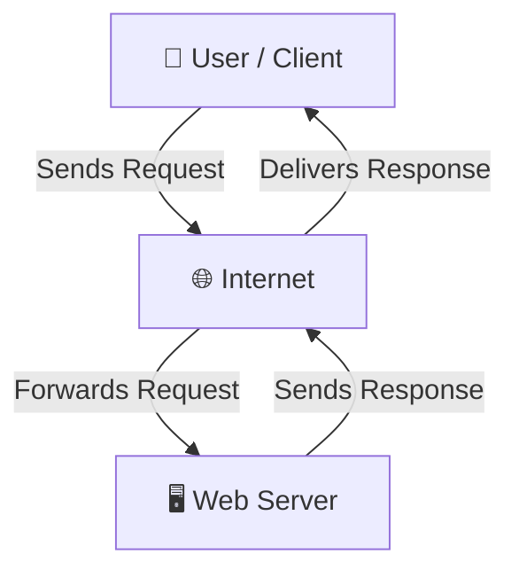

| Term | Meaning |
|------|---------|
| **Client** | Device that requests data (your browser) |
| **Server** | Machine that stores and serves data |
| **Request** | Message sent from client to server |
| **Response** | Data sent back from server to client |

---

### 🔑 Key Internet Concepts

| Concept | What it is | Simple Analogy |
|---------|-----------|----------------|
| **IP Address** | Unique address of every device on internet | Like your home address |
| **DNS** | Converts domain name to IP address | Like a phonebook — name to number |
| **HTTP** | Protocol for transferring web pages (unsecure) | Postcard — anyone can read it |
| **HTTPS** | Secure version of HTTP with encryption | Sealed envelope — only receiver reads |
| **TCP/IP** | Core protocols for data transmission | Rules of the road for data |
| **Port** | Specific channel on a server (80=HTTP, 443=HTTPS) | Door number in an apartment |
| **Bandwidth** | Amount of data transferred per second | Width of a water pipe |
| **Packet** | Small chunk of data sent over network | One page of a book sent separately |

---

### 🌐 How DNS Works

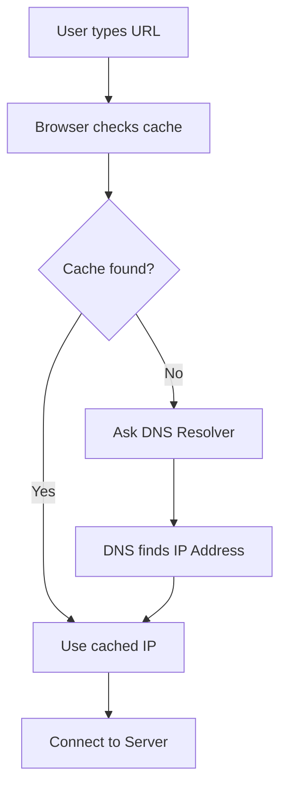

---

### 🎯 Interview Questions — 1.1

| # | Question | Type |
|---|----------|------|
| 1 | What is the difference between the Internet and the World Wide Web? | Conceptual |
| 2 | What is a Client-Server model? Explain with an example. | Conceptual |
| 3 | What is DNS and why is it needed? | Conceptual |
| 4 | What is the difference between HTTP and HTTPS? | Conceptual |
| 5 | What is an IP Address? What are the two types? | Conceptual |
| 6 | What happens when you type google.com in your browser? | Scenario |
| 7 | Why does HTTPS matter for web security? | Scenario |
| 8 | What is TCP/IP and how does it work? | Conceptual |

---

<a id="12-what-happens-url"></a>

## 1.2 What Happens When You Type a URL

<a href="#chapter-index-table-1">Go to Top 🔝</a>

---

### 📖 The Complete URL Journey

> This is one of the **most asked** interview questions in frontend and backend interviews. Understanding this deeply will give you a strong foundation.

---

### 🔗 What is a URL?

| Part | Example | Meaning |
|------|---------|---------|
| **Protocol** | `https://` | Communication protocol |
| **Subdomain** | `www` | Subdivision of domain |
| **Domain** | `google` | Brand/company name |
| **TLD** | `.com` | Top-level domain |
| **Path** | `/search` | Specific page |
| **Query String** | `?q=html` | Data passed to server |
| **Fragment** | `#section` | Scroll to specific part |

**Full URL Example:**
```
https://www.google.com/search?q=html#results
  |        |      |      |      |        |
Protocol  www  Domain  TLD  Path  Query  Fragment
```

---

### 🔄 Step-by-Step: What Happens When You Type a URL

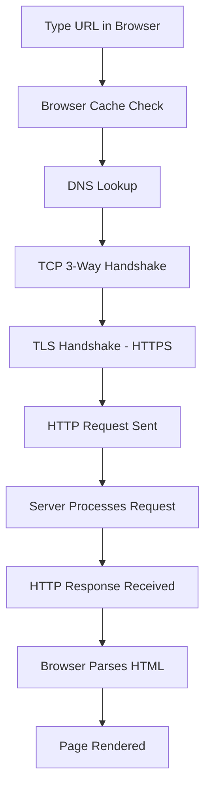

---

### 📋 Detailed Steps Explained

| Step | Name | What Happens |
|------|------|-------------|
| **Step 1** | URL Parsing | Browser splits URL into protocol, domain, path |
| **Step 2** | Browser Cache | Checks if page was visited recently |
| **Step 3** | DNS Resolution | Converts domain name to IP address |
| **Step 4** | TCP Handshake | 3-step connection (SYN → SYN-ACK → ACK) |
| **Step 5** | TLS Handshake | For HTTPS — encrypts the connection |
| **Step 6** | HTTP Request | Browser sends GET request to server |
| **Step 7** | Server Response | Server sends back HTML, CSS, JS files |
| **Step 8** | Browser Rendering | Parses HTML → builds DOM → renders page |

---

### 🤝 TCP 3-Way Handshake

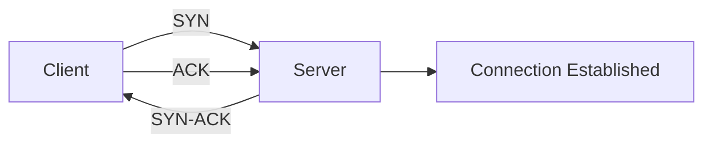

| Step | What | Meaning |
|------|------|---------|
| **SYN** | Synchronize | Client says "I want to connect" |
| **SYN-ACK** | Sync Acknowledge | Server says "OK, I acknowledge" |
| **ACK** | Acknowledge | Client says "Great, let's talk" |

---

### 🔐 HTTP Request Structure

```
GET /index.html HTTP/1.1
Host: www.example.com
User-Agent: Chrome/115
Accept: text/html
Connection: keep-alive
```

| Part | Example | Purpose |
|------|---------|---------|
| **Method** | GET, POST, PUT, DELETE | What action to perform |
| **Path** | /index.html | Which resource to fetch |
| **HTTP Version** | HTTP/1.1, HTTP/2 | Protocol version |
| **Headers** | Host, User-Agent | Extra information |
| **Body** | Form data (POST) | Data sent with request |

---

### 📥 HTTP Response Structure

```
HTTP/1.1 200 OK
Content-Type: text/html
Content-Length: 1234

<!DOCTYPE html>
<html>...</html>
```

| Status Code | Meaning | Example |
|-------------|---------|---------|
| **200** | OK — Success | Page found and returned |
| **301** | Redirect Permanent | Old URL moved to new URL |
| **404** | Not Found | Page does not exist |
| **500** | Server Error | Something broke on server |
| **403** | Forbidden | No permission to access |

---

> [!IMPORTANT]
> The question **"What happens when you type a URL in a browser?"** is asked in almost every frontend interview. You must be able to explain all 8 steps clearly.

---

### 🎯 Interview Questions — 1.2

| # | Question | Type |
|---|----------|------|
| 1 | Explain what happens step by step when you type a URL in the browser | Scenario |
| 2 | What is DNS resolution? How does it work? | Conceptual |
| 3 | What is a TCP 3-way handshake? | Conceptual |
| 4 | What is the difference between HTTP/1.1, HTTP/2, and HTTP/3? | Conceptual |
| 5 | What are HTTP status codes? Give examples. | Conceptual |
| 6 | What is the difference between GET and POST requests? | Conceptual |
| 7 | What is TLS/SSL and why is it important? | Conceptual |
| 8 | What is browser caching and how does it improve performance? | Scenario |

---

<a id="13-what-is-html"></a>

## 1.3 What is HTML?

<a href="#chapter-index-table-1">Go to Top 🔝</a>

---

### 📖 Definition

> **HTML** stands for **HyperText Markup Language**. It is the **standard language** used to create and structure content on the Web.

| Word | Meaning |
|------|---------|
| **Hyper** | Non-linear — you can jump anywhere via links |
| **Text** | The content itself |
| **Markup** | Tags that annotate/structure the content |
| **Language** | A set of rules and syntax |

---

### 📜 Brief History of HTML

| Version | Year | Key Features |
|---------|------|-------------|
| **HTML 1.0** | 1991 | Basic text, links, headings |
| **HTML 2.0** | 1995 | Forms added |
| **HTML 3.2** | 1997 | Tables, scripting |
| **HTML 4.01** | 1999 | CSS support, accessibility |
| **XHTML** | 2000 | Stricter HTML (XML-based) |
| **HTML5** | 2014 | Semantic tags, video, canvas, APIs |
| **HTML Living Standard** | Ongoing | Maintained by WHATWG |

---

### 🎯 Role of HTML in Web Development

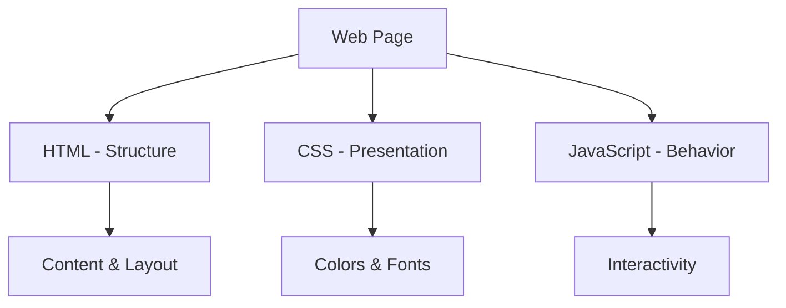

| Layer | Technology | Job |
|-------|-----------|-----|
| **Structure** | HTML | What is on the page |
| **Presentation** | CSS | How it looks |
| **Behavior** | JavaScript | What it does |

---

### ❌ Why HTML is NOT a Programming Language

> [!IMPORTANT]
> HTML is a **Markup Language**, NOT a Programming Language. This is a very common interview question!

| Feature | Programming Language | HTML |
|---------|---------------------|------|
| **Logic** | ✅ Has if/else, loops | ❌ No logic |
| **Variables** | ✅ Can store values | ❌ Cannot store values |
| **Functions** | ✅ Can create functions | ❌ No functions |
| **Computation** | ✅ Can compute results | ❌ Cannot compute |
| **Purpose** | Process and compute | Describe and structure |
| **Examples** | Java, Python, C++ | HTML, XML, Markdown |

> **Real-World Analogy:** HTML is like a blueprint of a house — it defines what rooms exist, where doors are, where windows go. But it cannot control when lights turn on (that's JavaScript) or what color the walls are (that's CSS).

---

### 🔧 What HTML Does

| Task | Example |
|------|---------|
| **Defines headings** | `<h1>` to `<h6>` |
| **Creates paragraphs** | `<p>` |
| **Makes links** | `<a href="">` |
| **Embeds images** | `` |
| **Creates forms** | `<form>` |
| **Structures layout** | `<div>`, `<section>`, `<article>` |
| **Adds tables** | `<table>` |

---

### 🎯 Interview Questions — 1.3

| # | Question | Type |
|---|----------|------|
| 1 | What is HTML? What does it stand for? | Conceptual |
| 2 | Is HTML a programming language? Why or why not? | Conceptual |
| 3 | What is the role of HTML in web development? | Conceptual |
| 4 | Who created HTML and when? | Conceptual |
| 5 | What is HyperText? What makes it "hyper"? | Conceptual |
| 6 | What is the difference between HTML and Markdown? | Conceptual |
| 7 | What is the latest version of HTML? | Conceptual |
| 8 | What organization maintains the HTML standard today? | Conceptual |

---

<a id="14-html-vs-html5"></a>

## 1.4 HTML vs HTML5

<a href="#chapter-index-table-1">Go to Top 🔝</a>

---

### 📖 What is HTML5?

> **HTML5** is the fifth and current major version of HTML. It was officially released in **2014** by the **W3C** and is now maintained as a **Living Standard** by **WHATWG**.

---

### ⚔️ HTML vs HTML5 — Complete Comparison

| Feature | Old HTML (4.01) | HTML5 |
|---------|----------------|-------|
| **Doctype** | `<!DOCTYPE HTML PUBLIC "-//W3C//DTD HTML 4.01//EN">` | `<!DOCTYPE html>` (Simple) |
| **Multimedia** | Needs Flash/plugins | Native `<audio>` `<video>` |
| **Semantic Tags** | Only `<div>` and `<span>` | `<header>`, `<footer>`, `<article>`, `<section>`, `<nav>` |
| **Forms** | Basic input types | 20+ input types (email, date, color, range) |
| **Storage** | Only Cookies | localStorage, sessionStorage |
| **Graphics** | Not supported | `<canvas>`, `<svg>` |
| **Geolocation** | Not supported | Geolocation API |
| **Drag & Drop** | Not supported | Native Drag & Drop API |
| **Character Encoding** | Long declaration | `<meta charset="UTF-8">` |
| **Error Handling** | Strict | More lenient |

---

### 🆕 New Features Introduced in HTML5

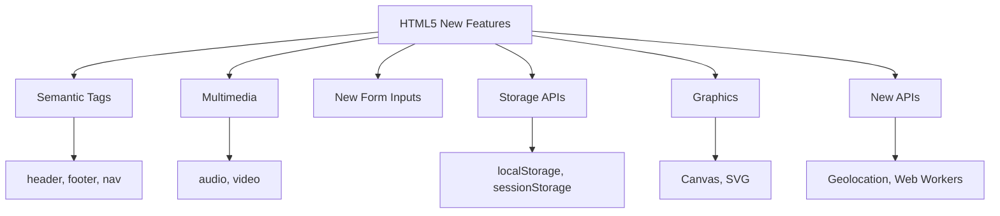

---

### 📋 HTML5 Semantic Elements (New)

| Tag | Purpose |
|-----|---------|
| `<header>` | Top section of page or section |
| `<nav>` | Navigation links |
| `<main>` | Main content of page |
| `<section>` | Thematic group of content |
| `<article>` | Self-contained content piece |
| `<aside>` | Sidebar content |
| `<footer>` | Bottom section of page |
| `<figure>` | Image with caption |
| `<time>` | Date/time representation |
| `<mark>` | Highlighted text |

---

### 📝 HTML5 New Input Types

| Input Type | Use Case |
|------------|---------|
| `type="email"` | Email validation |
| `type="url"` | URL validation |
| `type="number"` | Number with min/max |
| `type="date"` | Date picker |
| `type="color"` | Color picker |
| `type="range"` | Slider |
| `type="search"` | Search box |
| `type="tel"` | Phone number |

---

> [!TIP]
> When asked about HTML5, always mention: **Semantic tags**, **Multimedia support**, **New APIs**, and **Local Storage** as the four key pillars.

---

### 🎯 Interview Questions — 1.4

| # | Question | Type |
|---|----------|------|
| 1 | What are the main differences between HTML and HTML5? | Conceptual |
| 2 | What new semantic elements were introduced in HTML5? | Conceptual |
| 3 | What new input types were added in HTML5? | Conceptual |
| 4 | What is the difference between localStorage and sessionStorage? | Conceptual |
| 5 | What is the HTML5 Canvas element used for? | Conceptual |
| 6 | Why was HTML5 introduced? What problems did it solve? | Conceptual |
| 7 | What is the DOCTYPE in HTML5? Why is it simpler? | Conceptual |
| 8 | Who maintains HTML5 now — W3C or WHATWG? | Conceptual |

---

<a id="15-how-browsers-render"></a>

## 1.5 How Browsers Render HTML

<a href="#chapter-index-table-1">Go to Top 🔝</a>

---

### 📖 What is Browser Rendering?

> When a browser receives HTML, CSS, and JavaScript files from a server, it goes through a series of steps to **convert code into pixels on screen**. This process is called the **Critical Rendering Path**.

---

### 🔄 The Complete Rendering Pipeline

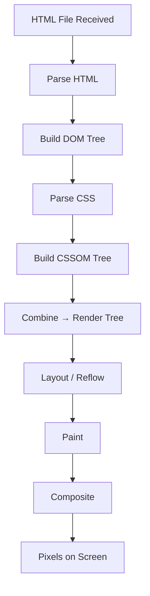

---

### 📋 Each Step Explained

| Step | Name | What Happens |
|------|------|-------------|
| **1** | HTML Parsing | Browser reads HTML top to bottom, converts to tokens |
| **2** | DOM Construction | Tokens become nodes, nodes form the DOM tree |
| **3** | CSS Parsing | Browser reads CSS and builds CSSOM tree |
| **4** | Render Tree | DOM + CSSOM merged into Render Tree (visible nodes only) |
| **5** | Layout (Reflow) | Browser calculates position and size of each element |
| **6** | Paint | Browser fills in colors, text, images, shadows |
| **7** | Composite | Browser layers are combined and sent to GPU |

---

### 🌳 What is the DOM?

> **DOM** stands for **Document Object Model**. It is a **tree-like structure** that represents the HTML document in memory. JavaScript uses the DOM to read and modify the page.

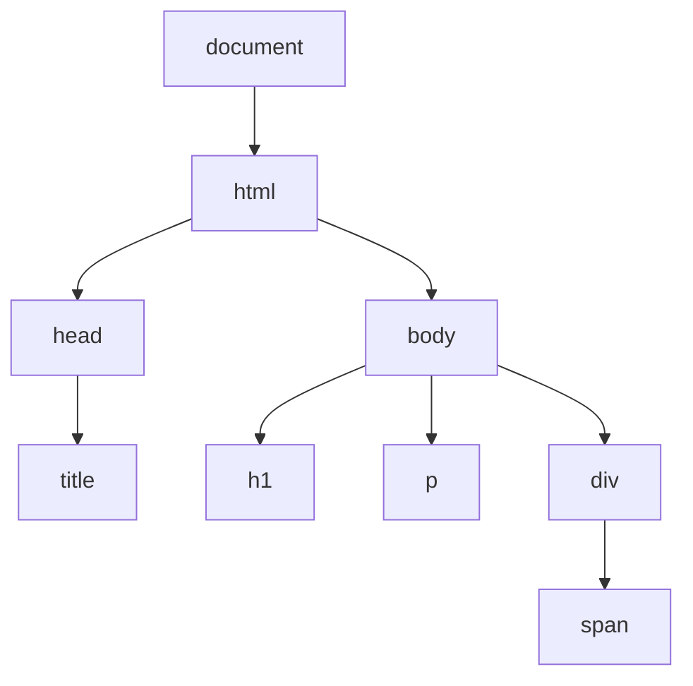

---

### 🆚 DOM vs CSSOM vs Render Tree

| Tree | Built From | Contains | Used For |
|------|-----------|---------|---------|
| **DOM** | HTML | All HTML elements | JavaScript manipulation |
| **CSSOM** | CSS | All CSS rules | Style computation |
| **Render Tree** | DOM + CSSOM | Visible elements only | Layout and paint |

---

### ⚡ Reflow vs Repaint

| Term | Trigger | Cost | Example |
|------|---------|------|---------|
| **Reflow** | Geometry changes | High (expensive) | Changing width, height, margin |
| **Repaint** | Visual changes | Medium | Changing color, background |
| **Composite** | Layer changes | Low (cheap) | Changing opacity, transform |

> [!IMPORTANT]
> For performance optimization — always prefer **transform** and **opacity** animations because they only trigger **Compositing** (cheapest), not Reflow or Repaint.

---

### 🎯 Interview Questions — 1.5

| # | Question | Type |
|---|----------|------|
| 1 | What is the Critical Rendering Path? | Conceptual |
| 2 | What is the DOM? How is it different from HTML? | Conceptual |
| 3 | What is the difference between DOM and CSSOM? | Conceptual |
| 4 | What is Reflow and Repaint? Which is more expensive? | Conceptual |
| 5 | Why should you avoid using `display:none` during animations? | Scenario |
| 6 | What is the Render Tree and how is it built? | Conceptual |
| 7 | Why does placing `<script>` at the bottom of `<body>` improve performance? | Scenario |
| 8 | What is layout thrashing and how can you avoid it? | Scenario |

---

<a id="16-web-development-layers"></a>

## 1.6 Web Development Layers

<a href="#chapter-index-table-1">Go to Top 🔝</a>

---

### 📖 The Three Layers of the Web

> Every web page is built on **three separate layers**, each with a distinct responsibility. This **Separation of Concerns** is a fundamental principle of good web development.

---

### 🏗️ Three Layers Architecture

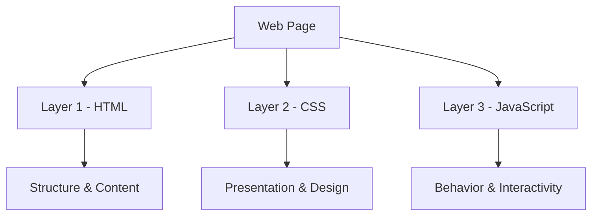

---

### 📋 Layer Comparison Table

| Layer | Technology | Responsibility | Example |
|-------|-----------|---------------|---------|
| **Structure** | HTML | What content exists on the page | Headings, paragraphs, images, forms |
| **Presentation** | CSS | How the content looks | Colors, fonts, spacing, layout |
| **Behavior** | JavaScript | What the content does | Click events, form validation, animations |

---

### 🏠 Real-World Analogy

| Web Layer | House Analogy |
|-----------|--------------|
| **HTML** | Blueprint — walls, rooms, doors, windows |
| **CSS** | Interior design — paint, furniture, lighting |
| **JavaScript** | Electricity — lights turn on, doors open automatically |

---

### ✅ Why Separation of Concerns Matters

| Benefit | Explanation |
|---------|-------------|
| **Maintainability** | Change CSS without touching HTML |
| **Reusability** | Same CSS can style multiple HTML pages |
| **Collaboration** | Designers work on CSS, devs work on JS |
| **Performance** | CSS and JS files can be cached separately |
| **Accessibility** | HTML remains clean and semantic |

---

> [!NOTE]
> A common beginner mistake is using inline CSS (`style=""`) and inline JavaScript (`onclick=""`). While they work, they break the separation of concerns principle.

---

### 🎯 Interview Questions — 1.6

| # | Question | Type |
|---|----------|------|
| 1 | What are the three layers of web development? | Conceptual |
| 2 | What is Separation of Concerns? Why is it important? | Conceptual |
| 3 | What is the role of HTML in web development? | Conceptual |
| 4 | Can a web page work without CSS? Without JavaScript? | Scenario |
| 5 | Why is inline CSS considered a bad practice? | Scenario |
| 6 | What is Progressive Enhancement in web development? | Conceptual |

---

<a id="17-tools-setup"></a>

## 1.7 Tools & Setup

<a href="#chapter-index-table-1">Go to Top 🔝</a>

---

### 🛠️ Essential Tools for HTML Development

| Tool | Category | Purpose | Download |
|------|----------|---------|----------|
| **VS Code** | Code Editor | Write HTML/CSS/JS | code.visualstudio.com |
| **Google Chrome** | Browser | Test and debug websites | google.com/chrome |
| **Live Server** | VS Code Extension | Auto-refresh on save | VS Code marketplace |
| **Chrome DevTools** | Browser Tool | Inspect, debug, test | Built into Chrome (F12) |
| **Prettier** | VS Code Extension | Auto-format code | VS Code marketplace |
| **Auto Rename Tag** | VS Code Extension | Renames closing tag automatically | VS Code marketplace |

---

### ⚙️ VS Code Setup Steps

```
1. Download VS Code from code.visualstudio.com
2. Install Extensions:
   - Live Server (by Ritwick Dey)
   - Prettier - Code formatter
   - Auto Rename Tag
   - HTML CSS Support
3. Create a folder for your project
4. Open folder in VS Code
5. Create index.html file
6. Right-click → "Open with Live Server"
```

---

### 🔍 Chrome DevTools — Key Panels

| Panel | Keyboard | Use Case |
|-------|----------|---------|
| **Elements** | F12 | Inspect HTML structure and CSS styles |
| **Console** | Ctrl+Shift+J | See JavaScript errors and logs |
| **Network** | Ctrl+Shift+I → Network | See all files loaded and their sizes |
| **Performance** | F12 → Performance | Analyze rendering performance |
| **Application** | F12 → Application | View localStorage, cookies, cache |
| **Lighthouse** | F12 → Lighthouse | Audit SEO, accessibility, performance |

---

### 📁 Project Folder Structure (Best Practice)

```
my-website/
│
├── index.html          ← Main HTML file
├── about.html          ← Other pages
│
├── css/
│   └── style.css       ← Stylesheet
│
├── js/
│   └── script.js       ← JavaScript file
│
├── images/
│   └── logo.png        ← Image assets
│
└── fonts/
    └── custom.woff2    ← Custom fonts
```

---

> [!TIP]
> Always name your main HTML file `index.html`. Web servers automatically serve `index.html` when someone visits your domain root (e.g., `https://mysite.com/`).

---

### 🎯 Interview Questions — 1.7

| # | Question | Type |
|---|----------|------|
| 1 | What text editor do you use and why? | Practical |
| 2 | What is Live Server and why is it useful? | Conceptual |
| 3 | How do you inspect HTML elements in the browser? | Practical |
| 4 | What is Chrome DevTools used for? | Conceptual |
| 5 | Why should the main HTML file be named index.html? | Conceptual |

---

<a id="18-first-html-page"></a>

## 1.8 Your First HTML Page

<a href="#chapter-index-table-1">Go to Top 🔝</a>

---

### 📖 The HTML Boilerplate

> Every HTML page starts with the same basic structure called the **boilerplate**. This is the minimum required code for a valid HTML5 document.

---

### 💻 Complete HTML Boilerplate

```html
<!DOCTYPE html>
<html lang="en">
  <head>
    <meta charset="UTF-8" />
    <meta name="viewport" content="width=device-width, initial-scale=1.0" />
    <meta name="description" content="My first HTML page" />
    <title>My First Page</title>
    <link rel="stylesheet" href="css/style.css" />
  </head>
  <body>

    <h1>Hello, World!</h1>
    <p>This is my first HTML page.</p>

    <script src="js/script.js"></script>
  </body>
</html>
```

---

### 🔍 Boilerplate Line-by-Line Explanation

| Line | Code | Purpose |
|------|------|---------|
| **1** | `<!DOCTYPE html>` | Tells browser this is HTML5 |
| **2** | `<html lang="en">` | Root element, lang sets language |
| **3** | `<head>` | Container for metadata (not visible) |
| **4** | `<meta charset="UTF-8">` | Character encoding — supports all languages |
| **5** | `<meta name="viewport" ...>` | Makes page responsive on mobile |
| **6** | `<meta name="description">` | SEO description for search engines |
| **7** | `<title>` | Text shown on browser tab |
| **8** | `<link rel="stylesheet">` | Links external CSS file |
| **9** | `<body>` | All visible content goes here |
| **10** | `<script src="...">` | Links JavaScript (at bottom for performance) |

---

### ❓ Why Script at Bottom?

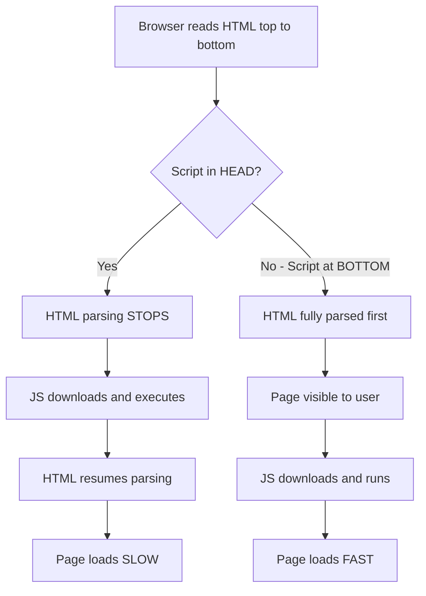

---

### 📄 Creating Your First Page — Step by Step

```
Step 1: Create a folder called "my-first-website"
Step 2: Open VS Code, open that folder
Step 3: Create a file called "index.html"
Step 4: Type "!" and press Tab (Emmet shortcut for boilerplate)
Step 5: Add your content inside <body>
Step 6: Right-click → Open with Live Server
Step 7: See your page in the browser!
```

---

### ⚡ Emmet Shortcuts for HTML

| Shortcut | Output |
|----------|--------|
| `!` + Tab | Full HTML boilerplate |
| `h1` + Tab | `<h1></h1>` |
| `div.container` + Tab | `<div class="container"></div>` |
| `ul>li*3` + Tab | `<ul>` with 3 `<li>` items |
| `a[href="#"]` + Tab | `<a href="#"></a>` |
| `img[src alt]` + Tab | `` |

---

> [!TIP]
> Emmet is built into VS Code. Using Emmet shortcuts will save enormous amounts of time when writing HTML. Learn the most common ones by heart.

---

### 🎯 Interview Questions — 1.8

| # | Question | Type |
|---|----------|------|
| 1 | What is the HTML boilerplate? Why is it needed? | Conceptual |
| 2 | What does `<!DOCTYPE html>` do? What happens if you remove it? | Conceptual |
| 3 | What is the `lang` attribute on the `<html>` tag for? | Conceptual |
| 4 | Why is `<meta charset="UTF-8">` important? | Conceptual |
| 5 | What is the viewport meta tag and why is it essential? | Conceptual |
| 6 | Why should `<script>` tags be placed at the bottom of `<body>`? | Scenario |
| 7 | What is Emmet and how does it help in HTML development? | Practical |
| 8 | What is the difference between `<head>` and `<body>`? | Conceptual |

---

## 🚀 Chapter 1 — Mini Project

<a href="#chapter-index-table-1">Go to Top 🔝</a>

---

### 🎯 Project: Build a "Who Am I?" Introduction Page

**Problem Statement:**
Create a basic personal introduction HTML page using only what you have learned in Chapter 1. The page should be a valid HTML5 document, properly structured, and demonstrate understanding of the HTML boilerplate.

---

**Requirements:**
- Valid HTML5 boilerplate
- Your name as the page title
- An `<h1>` with your name
- A short paragraph about yourself
- A list of your skills
- A link to any website

---

**Expected Output:**

```html
<!DOCTYPE html>
<html lang="en">
  <head>
    <meta charset="UTF-8" />
    <meta name="viewport" content="width=device-width, initial-scale=1.0" />
    <meta name="description" content="Introduction page of Kshitij Guladhe" />
    <title>Kshitij Guladhe — Introduction</title>
  </head>
  <body>

    <h1>Hi, I'm Kshitij Guladhe 👋</h1>

    <p>
      I am a frontend developer learning HTML and CSS.
      I love building web pages and solving problems.
    </p>

    <h2>My Skills:</h2>
    <ul>
      <li>HTML</li>
      <li>CSS</li>
      <li>JavaScript (learning)</li>
    </ul>

    <h2>Connect with me:</h2>
    <p>
      <a href="https://github.com/Kshitijgul/" target="_blank">
        Visit my GitHub
      </a>
    </p>

  </body>
</html>
```

---

**Architecture Diagram:**

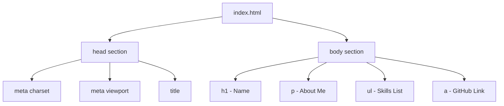

---

## 🧪 Chapter 1 — Practice Section

<a href="#chapter-index-table-1">Go to Top 🔝</a>

---

### 📝 Theory Questions

| # | Question |
|---|----------|
| 1 | In your own words, explain the difference between the Internet and the World Wide Web. |
| 2 | What are the three layers of web development and what does each one do? |
| 3 | Why is HTML not considered a programming language? |
| 4 | Explain the Critical Rendering Path in 5 steps. |
| 5 | What is the purpose of the DOCTYPE declaration in HTML5? |

---

### 💻 Coding Questions

| # | Task |
|---|------|
| 1 | Write a valid HTML5 boilerplate from memory without looking |
| 2 | Create an HTML page with a heading, 3 paragraphs, and a list |
| 3 | Create an HTML page with a link that opens in a new tab |
| 4 | Add a favicon to your HTML page |
| 5 | Create an HTML page with proper meta description for SEO |

---

### 🔨 Machine Coding Problems

| # | Problem |
|---|---------|
| 1 | Build a "My Favorite Books" page with a heading, short description, and ordered list of 5 books. Include proper meta tags for SEO. |
| 2 | Build a simple "Contact Me" page with your name, email (as a mailto link), phone (as a tel link), and links to 3 social media profiles. |

---

## 🧾 Chapter 1 — Key Takeaways

<a href="#chapter-index-table-1">Go to Top 🔝</a>

---

| # | Key Point |
|---|-----------|
| ✅ | The Internet is the infrastructure; the Web is a service on it |
| ✅ | HTML stands for HyperText Markup Language — it is NOT a programming language |
| ✅ | HTML provides **structure**, CSS provides **style**, JS provides **behavior** |
| ✅ | HTML5 introduced semantic tags, native multimedia, new input types, and storage APIs |
| ✅ | Browsers convert HTML → DOM → Render Tree → Layout → Paint → Screen |
| ✅ | Every valid HTML5 page starts with `<!DOCTYPE html>` |
| ✅ | The `<meta charset="UTF-8">` and `<meta name="viewport">` are essential in every page |
| ✅ | `<script>` should be placed at the bottom of `<body>` for best performance |
| ✅ | When you type a URL — DNS → TCP Handshake → HTTP Request → Response → Render |

---

> [!IMPORTANT]
> Chapter 1 forms the FOUNDATION of everything else. If you understand how browsers work, how the internet works, and what HTML's role is — every other chapter becomes much easier to grasp.

---

⭐⭐⭐⭐⭐⭐⭐⭐⭐⭐⭐⭐⭐⭐⭐⭐⭐⭐⭐⭐⭐⭐⭐⭐⭐⭐⭐⭐⭐⭐⭐⭐

HTML • CSS • Responsive Web Design

Built by Kshitij Guladhe | 🔗 [LinkedIn](www.linkedin.com/in/kshitij-guladhe) | 💻 [GitHub](https://github.com/Kshitijgul/)

⭐⭐⭐⭐⭐⭐⭐⭐⭐⭐⭐⭐⭐⭐⭐⭐⭐⭐⭐⭐⭐⭐⭐⭐⭐⭐⭐⭐⭐⭐⭐⭐

[Go to Main Index 🔝](#main-index)

⭐⭐⭐⭐⭐⭐⭐⭐⭐⭐⭐⭐⭐⭐⭐⭐⭐⭐⭐⭐⭐⭐⭐⭐⭐⭐⭐⭐⭐⭐⭐⭐

HTML • CSS • Responsive Web Design

Built by Kshitij Guladhe | 🔗 [LinkedIn](www.linkedin.com/in/kshitij-guladhe) | 💻 [GitHub](https://github.com/Kshitijgul/)

⭐⭐⭐⭐⭐⭐⭐⭐⭐⭐⭐⭐⭐⭐⭐⭐⭐⭐⭐⭐⭐⭐⭐⭐⭐⭐⭐⭐⭐⭐⭐⭐

[Go to Main Index 🔝](#main-index)

---

<a id="2-html-setup-first-program"></a>

## Chapter 2: HTML Setup & First Program

⭐⭐⭐⭐⭐⭐⭐⭐⭐⭐⭐⭐⭐⭐⭐⭐⭐⭐⭐⭐⭐⭐⭐⭐⭐⭐⭐⭐⭐⭐⭐⭐

HTML • CSS • Responsive Web Design

Built by Kshitij Guladhe | 🔗 [LinkedIn](www.linkedin.com/in/kshitij-guladhe) | 💻 [GitHub](https://github.com/Kshitijgul/)

⭐⭐⭐⭐⭐⭐⭐⭐⭐⭐⭐⭐⭐⭐⭐⭐⭐⭐⭐⭐⭐⭐⭐⭐⭐⭐⭐⭐⭐⭐⭐⭐

[Go to Main Index 🔝](#main-index)

---

<a id="3-html-document-structure"></a>

## Chapter 3: HTML Document Structure

⭐⭐⭐⭐⭐⭐⭐⭐⭐⭐⭐⭐⭐⭐⭐⭐⭐⭐⭐⭐⭐⭐⭐⭐⭐⭐⭐⭐⭐⭐⭐⭐

HTML • CSS • Responsive Web Design

Built by Kshitij Guladhe | 🔗 [LinkedIn](www.linkedin.com/in/kshitij-guladhe) | 💻 [GitHub](https://github.com/Kshitijgul/)

⭐⭐⭐⭐⭐⭐⭐⭐⭐⭐⭐⭐⭐⭐⭐⭐⭐⭐⭐⭐⭐⭐⭐⭐⭐⭐⭐⭐⭐⭐⭐⭐

[Go to Main Index 🔝](#main-index)

---

<a id="4-html-head-section"></a>

## Chapter 4: HTML Head Section

⭐⭐⭐⭐⭐⭐⭐⭐⭐⭐⭐⭐⭐⭐⭐⭐⭐⭐⭐⭐⭐⭐⭐⭐⭐⭐⭐⭐⭐⭐⭐⭐

HTML • CSS • Responsive Web Design

Built by Kshitij Guladhe | 🔗 [LinkedIn](www.linkedin.com/in/kshitij-guladhe) | 💻 [GitHub](https://github.com/Kshitijgul/)

⭐⭐⭐⭐⭐⭐⭐⭐⭐⭐⭐⭐⭐⭐⭐⭐⭐⭐⭐⭐⭐⭐⭐⭐⭐⭐⭐⭐⭐⭐⭐⭐

[Go to Main Index 🔝](#main-index)

---

<a id="5-html-elements-tags-attributes"></a>

## Chapter 5: HTML Elements, Tags & Attributes

⭐⭐⭐⭐⭐⭐⭐⭐⭐⭐⭐⭐⭐⭐⭐⭐⭐⭐⭐⭐⭐⭐⭐⭐⭐⭐⭐⭐⭐⭐⭐⭐

HTML • CSS • Responsive Web Design

Built by Kshitij Guladhe | 🔗 [LinkedIn](www.linkedin.com/in/kshitij-guladhe) | 💻 [GitHub](https://github.com/Kshitijgul/)

⭐⭐⭐⭐⭐⭐⭐⭐⭐⭐⭐⭐⭐⭐⭐⭐⭐⭐⭐⭐⭐⭐⭐⭐⭐⭐⭐⭐⭐⭐⭐⭐

[Go to Main Index 🔝](#main-index)

---

<a id="6-block-inline-void-elements"></a>

## Chapter 6: Block, Inline & Void Elements

⭐⭐⭐⭐⭐⭐⭐⭐⭐⭐⭐⭐⭐⭐⭐⭐⭐⭐⭐⭐⭐⭐⭐⭐⭐⭐⭐⭐⭐⭐⭐⭐

HTML • CSS • Responsive Web Design

Built by Kshitij Guladhe | 🔗 [LinkedIn](www.linkedin.com/in/kshitij-guladhe) | 💻 [GitHub](https://github.com/Kshitijgul/)

⭐⭐⭐⭐⭐⭐⭐⭐⭐⭐⭐⭐⭐⭐⭐⭐⭐⭐⭐⭐⭐⭐⭐⭐⭐⭐⭐⭐⭐⭐⭐⭐

[Go to Main Index 🔝](#main-index)

---

<a id="7-text-formatting-html"></a>

## Chapter 7: Text Formatting in HTML

⭐⭐⭐⭐⭐⭐⭐⭐⭐⭐⭐⭐⭐⭐⭐⭐⭐⭐⭐⭐⭐⭐⭐⭐⭐⭐⭐⭐⭐⭐⭐⭐

HTML • CSS • Responsive Web Design

Built by Kshitij Guladhe | 🔗 [LinkedIn](www.linkedin.com/in/kshitij-guladhe) | 💻 [GitHub](https://github.com/Kshitijgul/)

⭐⭐⭐⭐⭐⭐⭐⭐⭐⭐⭐⭐⭐⭐⭐⭐⭐⭐⭐⭐⭐⭐⭐⭐⭐⭐⭐⭐⭐⭐⭐⭐

[Go to Main Index 🔝](#main-index)

---

<a id="8-semantic-text-elements"></a>

## Chapter 8: Semantic Text Elements

⭐⭐⭐⭐⭐⭐⭐⭐⭐⭐⭐⭐⭐⭐⭐⭐⭐⭐⭐⭐⭐⭐⭐⭐⭐⭐⭐⭐⭐⭐⭐⭐

HTML • CSS • Responsive Web Design

Built by Kshitij Guladhe | 🔗 [LinkedIn](www.linkedin.com/in/kshitij-guladhe) | 💻 [GitHub](https://github.com/Kshitijgul/)

⭐⭐⭐⭐⭐⭐⭐⭐⭐⭐⭐⭐⭐⭐⭐⭐⭐⭐⭐⭐⭐⭐⭐⭐⭐⭐⭐⭐⭐⭐⭐⭐

[Go to Main Index 🔝](#main-index)

---

<a id="9-html-links-navigation"></a>

## Chapter 9: HTML Links & Navigation

⭐⭐⭐⭐⭐⭐⭐⭐⭐⭐⭐⭐⭐⭐⭐⭐⭐⭐⭐⭐⭐⭐⭐⭐⭐⭐⭐⭐⭐⭐⭐⭐

HTML • CSS • Responsive Web Design

Built by Kshitij Guladhe | 🔗 [LinkedIn](www.linkedin.com/in/kshitij-guladhe) | 💻 [GitHub](https://github.com/Kshitijgul/)

⭐⭐⭐⭐⭐⭐⭐⭐⭐⭐⭐⭐⭐⭐⭐⭐⭐⭐⭐⭐⭐⭐⭐⭐⭐⭐⭐⭐⭐⭐⭐⭐

[Go to Main Index 🔝](#main-index)

---

<a id="10-html-lists"></a>

## Chapter 10: HTML Lists

⭐⭐⭐⭐⭐⭐⭐⭐⭐⭐⭐⭐⭐⭐⭐⭐⭐⭐⭐⭐⭐⭐⭐⭐⭐⭐⭐⭐⭐⭐⭐⭐

HTML • CSS • Responsive Web Design

Built by Kshitij Guladhe | 🔗 [LinkedIn](www.linkedin.com/in/kshitij-guladhe) | 💻 [GitHub](https://github.com/Kshitijgul/)

⭐⭐⭐⭐⭐⭐⭐⭐⭐⭐⭐⭐⭐⭐⭐⭐⭐⭐⭐⭐⭐⭐⭐⭐⭐⭐⭐⭐⭐⭐⭐⭐

[Go to Main Index 🔝](#main-index)

---

<a id="11-images-html"></a>

## Chapter 11: Images in HTML

⭐⭐⭐⭐⭐⭐⭐⭐⭐⭐⭐⭐⭐⭐⭐⭐⭐⭐⭐⭐⭐⭐⭐⭐⭐⭐⭐⭐⭐⭐⭐⭐

HTML • CSS • Responsive Web Design

Built by Kshitij Guladhe | 🔗 [LinkedIn](www.linkedin.com/in/kshitij-guladhe) | 💻 [GitHub](https://github.com/Kshitijgul/)

⭐⭐⭐⭐⭐⭐⭐⭐⭐⭐⭐⭐⭐⭐⭐⭐⭐⭐⭐⭐⭐⭐⭐⭐⭐⭐⭐⭐⭐⭐⭐⭐

[Go to Main Index 🔝](#main-index)

---

<a id="12-audio-video-iframes"></a>

## Chapter 12: Audio, Video & Iframes

⭐⭐⭐⭐⭐⭐⭐⭐⭐⭐⭐⭐⭐⭐⭐⭐⭐⭐⭐⭐⭐⭐⭐⭐⭐⭐⭐⭐⭐⭐⭐⭐

HTML • CSS • Responsive Web Design

Built by Kshitij Guladhe | 🔗 [LinkedIn](www.linkedin.com/in/kshitij-guladhe) | 💻 [GitHub](https://github.com/Kshitijgul/)

⭐⭐⭐⭐⭐⭐⭐⭐⭐⭐⭐⭐⭐⭐⭐⭐⭐⭐⭐⭐⭐⭐⭐⭐⭐⭐⭐⭐⭐⭐⭐⭐

[Go to Main Index 🔝](#main-index)

---

<a id="13-figure-picture-svg"></a>

## Chapter 13: Figure, Picture & SVG

⭐⭐⭐⭐⭐⭐⭐⭐⭐⭐⭐⭐⭐⭐⭐⭐⭐⭐⭐⭐⭐⭐⭐⭐⭐⭐⭐⭐⭐⭐⭐⭐

HTML • CSS • Responsive Web Design

Built by Kshitij Guladhe | 🔗 [LinkedIn](www.linkedin.com/in/kshitij-guladhe) | 💻 [GitHub](https://github.com/Kshitijgul/)

⭐⭐⭐⭐⭐⭐⭐⭐⭐⭐⭐⭐⭐⭐⭐⭐⭐⭐⭐⭐⭐⭐⭐⭐⭐⭐⭐⭐⭐⭐⭐⭐

[Go to Main Index 🔝](#main-index)

---

<a id="14-html-tables"></a>

## Chapter 14: HTML Tables

⭐⭐⭐⭐⭐⭐⭐⭐⭐⭐⭐⭐⭐⭐⭐⭐⭐⭐⭐⭐⭐⭐⭐⭐⭐⭐⭐⭐⭐⭐⭐⭐

HTML • CSS • Responsive Web Design

Built by Kshitij Guladhe | 🔗 [LinkedIn](www.linkedin.com/in/kshitij-guladhe) | 💻 [GitHub](https://github.com/Kshitijgul/)

⭐⭐⭐⭐⭐⭐⭐⭐⭐⭐⭐⭐⭐⭐⭐⭐⭐⭐⭐⭐⭐⭐⭐⭐⭐⭐⭐⭐⭐⭐⭐⭐

[Go to Main Index 🔝](#main-index)

---

<a id="15-html-forms-basics"></a>

## Chapter 15: HTML Forms Basics

⭐⭐⭐⭐⭐⭐⭐⭐⭐⭐⭐⭐⭐⭐⭐⭐⭐⭐⭐⭐⭐⭐⭐⭐⭐⭐⭐⭐⭐⭐⭐⭐

HTML • CSS • Responsive Web Design

Built by Kshitij Guladhe | 🔗 [LinkedIn](www.linkedin.com/in/kshitij-guladhe) | 💻 [GitHub](https://github.com/Kshitijgul/)

⭐⭐⭐⭐⭐⭐⭐⭐⭐⭐⭐⭐⭐⭐⭐⭐⭐⭐⭐⭐⭐⭐⭐⭐⭐⭐⭐⭐⭐⭐⭐⭐

[Go to Main Index 🔝](#main-index)

---

<a id="16-html-input-types"></a>

## Chapter 16: HTML Input Types

⭐⭐⭐⭐⭐⭐⭐⭐⭐⭐⭐⭐⭐⭐⭐⭐⭐⭐⭐⭐⭐⭐⭐⭐⭐⭐⭐⭐⭐⭐⭐⭐

HTML • CSS • Responsive Web Design

Built by Kshitij Guladhe | 🔗 [LinkedIn](www.linkedin.com/in/kshitij-guladhe) | 💻 [GitHub](https://github.com/Kshitijgul/)

⭐⭐⭐⭐⭐⭐⭐⭐⭐⭐⭐⭐⭐⭐⭐⭐⭐⭐⭐⭐⭐⭐⭐⭐⭐⭐⭐⭐⭐⭐⭐⭐

[Go to Main Index 🔝](#main-index)

---

<a id="17-form-elements-attributes"></a>

## Chapter 17: Form Elements & Attributes

⭐⭐⭐⭐⭐⭐⭐⭐⭐⭐⭐⭐⭐⭐⭐⭐⭐⭐⭐⭐⭐⭐⭐⭐⭐⭐⭐⭐⭐⭐⭐⭐

HTML • CSS • Responsive Web Design

Built by Kshitij Guladhe | 🔗 [LinkedIn](www.linkedin.com/in/kshitij-guladhe) | 💻 [GitHub](https://github.com/Kshitijgul/)

⭐⭐⭐⭐⭐⭐⭐⭐⭐⭐⭐⭐⭐⭐⭐⭐⭐⭐⭐⭐⭐⭐⭐⭐⭐⭐⭐⭐⭐⭐⭐⭐

[Go to Main Index 🔝](#main-index)

---

<a id="18-html5-form-validation"></a>

## Chapter 18: HTML5 Form Validation

⭐⭐⭐⭐⭐⭐⭐⭐⭐⭐⭐⭐⭐⭐⭐⭐⭐⭐⭐⭐⭐⭐⭐⭐⭐⭐⭐⭐⭐⭐⭐⭐

HTML • CSS • Responsive Web Design

Built by Kshitij Guladhe | 🔗 [LinkedIn](www.linkedin.com/in/kshitij-guladhe) | 💻 [GitHub](https://github.com/Kshitijgul/)

⭐⭐⭐⭐⭐⭐⭐⭐⭐⭐⭐⭐⭐⭐⭐⭐⭐⭐⭐⭐⭐⭐⭐⭐⭐⭐⭐⭐⭐⭐⭐⭐

[Go to Main Index 🔝](#main-index)

---

<a id="19-semantic-html"></a>

## Chapter 19: Semantic HTML

⭐⭐⭐⭐⭐⭐⭐⭐⭐⭐⭐⭐⭐⭐⭐⭐⭐⭐⭐⭐⭐⭐⭐⭐⭐⭐⭐⭐⭐⭐⭐⭐

HTML • CSS • Responsive Web Design

Built by Kshitij Guladhe | 🔗 [LinkedIn](www.linkedin.com/in/kshitij-guladhe) | 💻 [GitHub](https://github.com/Kshitijgul/)

⭐⭐⭐⭐⭐⭐⭐⭐⭐⭐⭐⭐⭐⭐⭐⭐⭐⭐⭐⭐⭐⭐⭐⭐⭐⭐⭐⭐⭐⭐⭐⭐

[Go to Main Index 🔝](#main-index)

---

<a id="20-html-accessibility-seo"></a>

## Chapter 20: HTML Accessibility & SEO

⭐⭐⭐⭐⭐⭐⭐⭐⭐⭐⭐⭐⭐⭐⭐⭐⭐⭐⭐⭐⭐⭐⭐⭐⭐⭐⭐⭐⭐⭐⭐⭐

HTML • CSS • Responsive Web Design

Built by Kshitij Guladhe | 🔗 [LinkedIn](www.linkedin.com/in/kshitij-guladhe) | 💻 [GitHub](https://github.com/Kshitijgul/)

⭐⭐⭐⭐⭐⭐⭐⭐⭐⭐⭐⭐⭐⭐⭐⭐⭐⭐⭐⭐⭐⭐⭐⭐⭐⭐⭐⭐⭐⭐⭐⭐

[Go to Main Index 🔝](#main-index)

---

<a id="21-html5-apis-overview"></a>

## Chapter 21: HTML5 APIs Overview

⭐⭐⭐⭐⭐⭐⭐⭐⭐⭐⭐⭐⭐⭐⭐⭐⭐⭐⭐⭐⭐⭐⭐⭐⭐⭐⭐⭐⭐⭐⭐⭐

HTML • CSS • Responsive Web Design

Built by Kshitij Guladhe | 🔗 [LinkedIn](www.linkedin.com/in/kshitij-guladhe) | 💻 [GitHub](https://github.com/Kshitijgul/)

⭐⭐⭐⭐⭐⭐⭐⭐⭐⭐⭐⭐⭐⭐⭐⭐⭐⭐⭐⭐⭐⭐⭐⭐⭐⭐⭐⭐⭐⭐⭐⭐

[Go to Main Index 🔝](#main-index)

---

<a id="22-canvas-svg-graphics"></a>

## Chapter 22: Canvas, SVG & Graphics

⭐⭐⭐⭐⭐⭐⭐⭐⭐⭐⭐⭐⭐⭐⭐⭐⭐⭐⭐⭐⭐⭐⭐⭐⭐⭐⭐⭐⭐⭐⭐⭐

HTML • CSS • Responsive Web Design

Built by Kshitij Guladhe | 🔗 [LinkedIn](www.linkedin.com/in/kshitij-guladhe) | 💻 [GitHub](https://github.com/Kshitijgul/)

⭐⭐⭐⭐⭐⭐⭐⭐⭐⭐⭐⭐⭐⭐⭐⭐⭐⭐⭐⭐⭐⭐⭐⭐⭐⭐⭐⭐⭐⭐⭐⭐

[Go to Main Index 🔝](#main-index)

---

<a id="23-html-best-practices"></a>

## Chapter 23: HTML Best Practices

⭐⭐⭐⭐⭐⭐⭐⭐⭐⭐⭐⭐⭐⭐⭐⭐⭐⭐⭐⭐⭐⭐⭐⭐⭐⭐⭐⭐⭐⭐⭐⭐

HTML • CSS • Responsive Web Design

Built by Kshitij Guladhe | 🔗 [LinkedIn](www.linkedin.com/in/kshitij-guladhe) | 💻 [GitHub](https://github.com/Kshitijgul/)

⭐⭐⭐⭐⭐⭐⭐⭐⭐⭐⭐⭐⭐⭐⭐⭐⭐⭐⭐⭐⭐⭐⭐⭐⭐⭐⭐⭐⭐⭐⭐⭐

[Go to Main Index 🔝](#main-index)

---

<a id="24-html-deprecated-tags"></a>

## Chapter 24: HTML Deprecated Tags

⭐⭐⭐⭐⭐⭐⭐⭐⭐⭐⭐⭐⭐⭐⭐⭐⭐⭐⭐⭐⭐⭐⭐⭐⭐⭐⭐⭐⭐⭐⭐⭐

HTML • CSS • Responsive Web Design

Built by Kshitij Guladhe | 🔗 [LinkedIn](www.linkedin.com/in/kshitij-guladhe) | 💻 [GitHub](https://github.com/Kshitijgul/)

⭐⭐⭐⭐⭐⭐⭐⭐⭐⭐⭐⭐⭐⭐⭐⭐⭐⭐⭐⭐⭐⭐⭐⭐⭐⭐⭐⭐⭐⭐⭐⭐

[Go to Main Index 🔝](#main-index)

---

<a id="25-html-interview-questions"></a>

## Chapter 25: HTML Interview Questions

⭐⭐⭐⭐⭐⭐⭐⭐⭐⭐⭐⭐⭐⭐⭐⭐⭐⭐⭐⭐⭐⭐⭐⭐⭐⭐⭐⭐⭐⭐⭐⭐

HTML • CSS • Responsive Web Design

Built by Kshitij Guladhe | 🔗 [LinkedIn](www.linkedin.com/in/kshitij-guladhe) | 💻 [GitHub](https://github.com/Kshitijgul/)

⭐⭐⭐⭐⭐⭐⭐⭐⭐⭐⭐⭐⭐⭐⭐⭐⭐⭐⭐⭐⭐⭐⭐⭐⭐⭐⭐⭐⭐⭐⭐⭐

[Go to Main Index 🔝](#main-index)

---

<a id="26-introduction-to-css"></a>

## Chapter 26: Introduction to CSS

⭐⭐⭐⭐⭐⭐⭐⭐⭐⭐⭐⭐⭐⭐⭐⭐⭐⭐⭐⭐⭐⭐⭐⭐⭐⭐⭐⭐⭐⭐⭐⭐

HTML • CSS • Responsive Web Design

Built by Kshitij Guladhe | 🔗 [LinkedIn](www.linkedin.com/in/kshitij-guladhe) | 💻 [GitHub](https://github.com/Kshitijgul/)

⭐⭐⭐⭐⭐⭐⭐⭐⭐⭐⭐⭐⭐⭐⭐⭐⭐⭐⭐⭐⭐⭐⭐⭐⭐⭐⭐⭐⭐⭐⭐⭐

[Go to Main Index 🔝](#main-index)

---

<a id="27-ways-to-add-css"></a>

## Chapter 27: Ways to Add CSS

⭐⭐⭐⭐⭐⭐⭐⭐⭐⭐⭐⭐⭐⭐⭐⭐⭐⭐⭐⭐⭐⭐⭐⭐⭐⭐⭐⭐⭐⭐⭐⭐

HTML • CSS • Responsive Web Design

Built by Kshitij Guladhe | 🔗 [LinkedIn](www.linkedin.com/in/kshitij-guladhe) | 💻 [GitHub](https://github.com/Kshitijgul/)

⭐⭐⭐⭐⭐⭐⭐⭐⭐⭐⭐⭐⭐⭐⭐⭐⭐⭐⭐⭐⭐⭐⭐⭐⭐⭐⭐⭐⭐⭐⭐⭐

[Go to Main Index 🔝](#main-index)

---

<a id="28-css-selectors"></a>

## Chapter 28: CSS Selectors

⭐⭐⭐⭐⭐⭐⭐⭐⭐⭐⭐⭐⭐⭐⭐⭐⭐⭐⭐⭐⭐⭐⭐⭐⭐⭐⭐⭐⭐⭐⭐⭐

HTML • CSS • Responsive Web Design

Built by Kshitij Guladhe | 🔗 [LinkedIn](www.linkedin.com/in/kshitij-guladhe) | 💻 [GitHub](https://github.com/Kshitijgul/)

⭐⭐⭐⭐⭐⭐⭐⭐⭐⭐⭐⭐⭐⭐⭐⭐⭐⭐⭐⭐⭐⭐⭐⭐⭐⭐⭐⭐⭐⭐⭐⭐

[Go to Main Index 🔝](#main-index)

---

<a id="29-advanced-css-selectors"></a>

## Chapter 29: Advanced CSS Selectors

⭐⭐⭐⭐⭐⭐⭐⭐⭐⭐⭐⭐⭐⭐⭐⭐⭐⭐⭐⭐⭐⭐⭐⭐⭐⭐⭐⭐⭐⭐⭐⭐

HTML • CSS • Responsive Web Design

Built by Kshitij Guladhe | 🔗 [LinkedIn](www.linkedin.com/in/kshitij-guladhe) | 💻 [GitHub](https://github.com/Kshitijgul/)

⭐⭐⭐⭐⭐⭐⭐⭐⭐⭐⭐⭐⭐⭐⭐⭐⭐⭐⭐⭐⭐⭐⭐⭐⭐⭐⭐⭐⭐⭐⭐⭐

[Go to Main Index 🔝](#main-index)

---

<a id="30-css-cascade-specificity-inheritance"></a>

## Chapter 30: CSS Cascade, Specificity & Inheritance

⭐⭐⭐⭐⭐⭐⭐⭐⭐⭐⭐⭐⭐⭐⭐⭐⭐⭐⭐⭐⭐⭐⭐⭐⭐⭐⭐⭐⭐⭐⭐⭐

HTML • CSS • Responsive Web Design

Built by Kshitij Guladhe | 🔗 [LinkedIn](www.linkedin.com/in/kshitij-guladhe) | 💻 [GitHub](https://github.com/Kshitijgul/)

⭐⭐⭐⭐⭐⭐⭐⭐⭐⭐⭐⭐⭐⭐⭐⭐⭐⭐⭐⭐⭐⭐⭐⭐⭐⭐⭐⭐⭐⭐⭐⭐

[Go to Main Index 🔝](#main-index)

---

<a id="31-css-colors-backgrounds"></a>

## Chapter 31: CSS Colors & Backgrounds

⭐⭐⭐⭐⭐⭐⭐⭐⭐⭐⭐⭐⭐⭐⭐⭐⭐⭐⭐⭐⭐⭐⭐⭐⭐⭐⭐⭐⭐⭐⭐⭐

HTML • CSS • Responsive Web Design

Built by Kshitij Guladhe | 🔗 [LinkedIn](www.linkedin.com/in/kshitij-guladhe) | 💻 [GitHub](https://github.com/Kshitijgul/)

⭐⭐⭐⭐⭐⭐⭐⭐⭐⭐⭐⭐⭐⭐⭐⭐⭐⭐⭐⭐⭐⭐⭐⭐⭐⭐⭐⭐⭐⭐⭐⭐

[Go to Main Index 🔝](#main-index)

---

<a id="32-css-box-model"></a>

## Chapter 32: CSS Box Model

⭐⭐⭐⭐⭐⭐⭐⭐⭐⭐⭐⭐⭐⭐⭐⭐⭐⭐⭐⭐⭐⭐⭐⭐⭐⭐⭐⭐⭐⭐⭐⭐

HTML • CSS • Responsive Web Design

Built by Kshitij Guladhe | 🔗 [LinkedIn](www.linkedin.com/in/kshitij-guladhe) | 💻 [GitHub](https://github.com/Kshitijgul/)

⭐⭐⭐⭐⭐⭐⭐⭐⭐⭐⭐⭐⭐⭐⭐⭐⭐⭐⭐⭐⭐⭐⭐⭐⭐⭐⭐⭐⭐⭐⭐⭐

[Go to Main Index 🔝](#main-index)

---

<a id="33-margin-padding-border-outline"></a>

## Chapter 33: Margin, Padding, Border & Outline

⭐⭐⭐⭐⭐⭐⭐⭐⭐⭐⭐⭐⭐⭐⭐⭐⭐⭐⭐⭐⭐⭐⭐⭐⭐⭐⭐⭐⭐⭐⭐⭐

HTML • CSS • Responsive Web Design

Built by Kshitij Guladhe | 🔗 [LinkedIn](www.linkedin.com/in/kshitij-guladhe) | 💻 [GitHub](https://github.com/Kshitijgul/)

⭐⭐⭐⭐⭐⭐⭐⭐⭐⭐⭐⭐⭐⭐⭐⭐⭐⭐⭐⭐⭐⭐⭐⭐⭐⭐⭐⭐⭐⭐⭐⭐

[Go to Main Index 🔝](#main-index)

---

<a id="34-css-units"></a>

## Chapter 34: CSS Units

⭐⭐⭐⭐⭐⭐⭐⭐⭐⭐⭐⭐⭐⭐⭐⭐⭐⭐⭐⭐⭐⭐⭐⭐⭐⭐⭐⭐⭐⭐⭐⭐

HTML • CSS • Responsive Web Design

Built by Kshitij Guladhe | 🔗 [LinkedIn](www.linkedin.com/in/kshitij-guladhe) | 💻 [GitHub](https://github.com/Kshitijgul/)

⭐⭐⭐⭐⭐⭐⭐⭐⭐⭐⭐⭐⭐⭐⭐⭐⭐⭐⭐⭐⭐⭐⭐⭐⭐⭐⭐⭐⭐⭐⭐⭐

[Go to Main Index 🔝](#main-index)

---

<a id="35-css-typography"></a>

## Chapter 35: CSS Typography

⭐⭐⭐⭐⭐⭐⭐⭐⭐⭐⭐⭐⭐⭐⭐⭐⭐⭐⭐⭐⭐⭐⭐⭐⭐⭐⭐⭐⭐⭐⭐⭐

HTML • CSS • Responsive Web Design

Built by Kshitij Guladhe | 🔗 [LinkedIn](www.linkedin.com/in/kshitij-guladhe) | 💻 [GitHub](https://github.com/Kshitijgul/)

⭐⭐⭐⭐⭐⭐⭐⭐⭐⭐⭐⭐⭐⭐⭐⭐⭐⭐⭐⭐⭐⭐⭐⭐⭐⭐⭐⭐⭐⭐⭐⭐

[Go to Main Index 🔝](#main-index)

---

<a id="36-css-display-property"></a>

## Chapter 36: CSS Display Property

⭐⭐⭐⭐⭐⭐⭐⭐⭐⭐⭐⭐⭐⭐⭐⭐⭐⭐⭐⭐⭐⭐⭐⭐⭐⭐⭐⭐⭐⭐⭐⭐

HTML • CSS • Responsive Web Design

Built by Kshitij Guladhe | 🔗 [LinkedIn](www.linkedin.com/in/kshitij-guladhe) | 💻 [GitHub](https://github.com/Kshitijgul/)

⭐⭐⭐⭐⭐⭐⭐⭐⭐⭐⭐⭐⭐⭐⭐⭐⭐⭐⭐⭐⭐⭐⭐⭐⭐⭐⭐⭐⭐⭐⭐⭐

[Go to Main Index 🔝](#main-index)

---

<a id="37-css-visibility-opacity-overflow"></a>

## Chapter 37: CSS Visibility, Opacity & Overflow

⭐⭐⭐⭐⭐⭐⭐⭐⭐⭐⭐⭐⭐⭐⭐⭐⭐⭐⭐⭐⭐⭐⭐⭐⭐⭐⭐⭐⭐⭐⭐⭐

HTML • CSS • Responsive Web Design

Built by Kshitij Guladhe | 🔗 [LinkedIn](www.linkedin.com/in/kshitij-guladhe) | 💻 [GitHub](https://github.com/Kshitijgul/)

⭐⭐⭐⭐⭐⭐⭐⭐⭐⭐⭐⭐⭐⭐⭐⭐⭐⭐⭐⭐⭐⭐⭐⭐⭐⭐⭐⭐⭐⭐⭐⭐

[Go to Main Index 🔝](#main-index)

---

<a id="38-css-positioning"></a>

## Chapter 38: CSS Positioning

⭐⭐⭐⭐⭐⭐⭐⭐⭐⭐⭐⭐⭐⭐⭐⭐⭐⭐⭐⭐⭐⭐⭐⭐⭐⭐⭐⭐⭐⭐⭐⭐

HTML • CSS • Responsive Web Design

Built by Kshitij Guladhe | 🔗 [LinkedIn](www.linkedin.com/in/kshitij-guladhe) | 💻 [GitHub](https://github.com/Kshitijgul/)

⭐⭐⭐⭐⭐⭐⭐⭐⭐⭐⭐⭐⭐⭐⭐⭐⭐⭐⭐⭐⭐⭐⭐⭐⭐⭐⭐⭐⭐⭐⭐⭐

[Go to Main Index 🔝](#main-index)

---

<a id="39-z-index-stacking-context"></a>

## Chapter 39: Z-Index & Stacking Context

⭐⭐⭐⭐⭐⭐⭐⭐⭐⭐⭐⭐⭐⭐⭐⭐⭐⭐⭐⭐⭐⭐⭐⭐⭐⭐⭐⭐⭐⭐⭐⭐

HTML • CSS • Responsive Web Design

Built by Kshitij Guladhe | 🔗 [LinkedIn](www.linkedin.com/in/kshitij-guladhe) | 💻 [GitHub](https://github.com/Kshitijgul/)

⭐⭐⭐⭐⭐⭐⭐⭐⭐⭐⭐⭐⭐⭐⭐⭐⭐⭐⭐⭐⭐⭐⭐⭐⭐⭐⭐⭐⭐⭐⭐⭐

[Go to Main Index 🔝](#main-index)

---

<a id="40-css-float-clear"></a>

## Chapter 40: CSS Float & Clear

⭐⭐⭐⭐⭐⭐⭐⭐⭐⭐⭐⭐⭐⭐⭐⭐⭐⭐⭐⭐⭐⭐⭐⭐⭐⭐⭐⭐⭐⭐⭐⭐

HTML • CSS • Responsive Web Design

Built by Kshitij Guladhe | 🔗 [LinkedIn](www.linkedin.com/in/kshitij-guladhe) | 💻 [GitHub](https://github.com/Kshitijgul/)

⭐⭐⭐⭐⭐⭐⭐⭐⭐⭐⭐⭐⭐⭐⭐⭐⭐⭐⭐⭐⭐⭐⭐⭐⭐⭐⭐⭐⭐⭐⭐⭐

[Go to Main Index 🔝](#main-index)

---

<a id="41-css-flexbox"></a>

## Chapter 41: CSS Flexbox

⭐⭐⭐⭐⭐⭐⭐⭐⭐⭐⭐⭐⭐⭐⭐⭐⭐⭐⭐⭐⭐⭐⭐⭐⭐⭐⭐⭐⭐⭐⭐⭐

HTML • CSS • Responsive Web Design

Built by Kshitij Guladhe | 🔗 [LinkedIn](www.linkedin.com/in/kshitij-guladhe) | 💻 [GitHub](https://github.com/Kshitijgul/)

⭐⭐⭐⭐⭐⭐⭐⭐⭐⭐⭐⭐⭐⭐⭐⭐⭐⭐⭐⭐⭐⭐⭐⭐⭐⭐⭐⭐⭐⭐⭐⭐

[Go to Main Index 🔝](#main-index)

---

<a id="42-flexbox-advanced"></a>

## Chapter 42: Flexbox Advanced

⭐⭐⭐⭐⭐⭐⭐⭐⭐⭐⭐⭐⭐⭐⭐⭐⭐⭐⭐⭐⭐⭐⭐⭐⭐⭐⭐⭐⭐⭐⭐⭐

HTML • CSS • Responsive Web Design

Built by Kshitij Guladhe | 🔗 [LinkedIn](www.linkedin.com/in/kshitij-guladhe) | 💻 [GitHub](https://github.com/Kshitijgul/)

⭐⭐⭐⭐⭐⭐⭐⭐⭐⭐⭐⭐⭐⭐⭐⭐⭐⭐⭐⭐⭐⭐⭐⭐⭐⭐⭐⭐⭐⭐⭐⭐

[Go to Main Index 🔝](#main-index)

---

<a id="43-css-grid"></a>

## Chapter 43: CSS Grid

⭐⭐⭐⭐⭐⭐⭐⭐⭐⭐⭐⭐⭐⭐⭐⭐⭐⭐⭐⭐⭐⭐⭐⭐⭐⭐⭐⭐⭐⭐⭐⭐

HTML • CSS • Responsive Web Design

Built by Kshitij Guladhe | 🔗 [LinkedIn](www.linkedin.com/in/kshitij-guladhe) | 💻 [GitHub](https://github.com/Kshitijgul/)

⭐⭐⭐⭐⭐⭐⭐⭐⭐⭐⭐⭐⭐⭐⭐⭐⭐⭐⭐⭐⭐⭐⭐⭐⭐⭐⭐⭐⭐⭐⭐⭐

[Go to Main Index 🔝](#main-index)

---

<a id="44-css-grid-advanced"></a>

## Chapter 44: CSS Grid Advanced

⭐⭐⭐⭐⭐⭐⭐⭐⭐⭐⭐⭐⭐⭐⭐⭐⭐⭐⭐⭐⭐⭐⭐⭐⭐⭐⭐⭐⭐⭐⭐⭐

HTML • CSS • Responsive Web Design

Built by Kshitij Guladhe | 🔗 [LinkedIn](www.linkedin.com/in/kshitij-guladhe) | 💻 [GitHub](https://github.com/Kshitijgul/)

⭐⭐⭐⭐⭐⭐⭐⭐⭐⭐⭐⭐⭐⭐⭐⭐⭐⭐⭐⭐⭐⭐⭐⭐⭐⭐⭐⭐⭐⭐⭐⭐

[Go to Main Index 🔝](#main-index)

---

<a id="45-flexbox-vs-grid"></a>

## Chapter 45: Flexbox vs Grid

⭐⭐⭐⭐⭐⭐⭐⭐⭐⭐⭐⭐⭐⭐⭐⭐⭐⭐⭐⭐⭐⭐⭐⭐⭐⭐⭐⭐⭐⭐⭐⭐

HTML • CSS • Responsive Web Design

Built by Kshitij Guladhe | 🔗 [LinkedIn](www.linkedin.com/in/kshitij-guladhe) | 💻 [GitHub](https://github.com/Kshitijgul/)

⭐⭐⭐⭐⭐⭐⭐⭐⭐⭐⭐⭐⭐⭐⭐⭐⭐⭐⭐⭐⭐⭐⭐⭐⭐⭐⭐⭐⭐⭐⭐⭐

[Go to Main Index 🔝](#main-index)

---

<a id="46-responsive-web-design-basics"></a>

## Chapter 46: Responsive Web Design Basics

⭐⭐⭐⭐⭐⭐⭐⭐⭐⭐⭐⭐⭐⭐⭐⭐⭐⭐⭐⭐⭐⭐⭐⭐⭐⭐⭐⭐⭐⭐⭐⭐

HTML • CSS • Responsive Web Design

Built by Kshitij Guladhe | 🔗 [LinkedIn](www.linkedin.com/in/kshitij-guladhe) | 💻 [GitHub](https://github.com/Kshitijgul/)

⭐⭐⭐⭐⭐⭐⭐⭐⭐⭐⭐⭐⭐⭐⭐⭐⭐⭐⭐⭐⭐⭐⭐⭐⭐⭐⭐⭐⭐⭐⭐⭐

[Go to Main Index 🔝](#main-index)

---

<a id="47-viewport-media-queries"></a>

## Chapter 47: Viewport & Media Queries

⭐⭐⭐⭐⭐⭐⭐⭐⭐⭐⭐⭐⭐⭐⭐⭐⭐⭐⭐⭐⭐⭐⭐⭐⭐⭐⭐⭐⭐⭐⭐⭐

HTML • CSS • Responsive Web Design

Built by Kshitij Guladhe | 🔗 [LinkedIn](www.linkedin.com/in/kshitij-guladhe) | 💻 [GitHub](https://github.com/Kshitijgul/)

⭐⭐⭐⭐⭐⭐⭐⭐⭐⭐⭐⭐⭐⭐⭐⭐⭐⭐⭐⭐⭐⭐⭐⭐⭐⭐⭐⭐⭐⭐⭐⭐

[Go to Main Index 🔝](#main-index)

---

<a id="48-responsive-images"></a>

## Chapter 48: Responsive Images

⭐⭐⭐⭐⭐⭐⭐⭐⭐⭐⭐⭐⭐⭐⭐⭐⭐⭐⭐⭐⭐⭐⭐⭐⭐⭐⭐⭐⭐⭐⭐⭐

HTML • CSS • Responsive Web Design

Built by Kshitij Guladhe | 🔗 [LinkedIn](www.linkedin.com/in/kshitij-guladhe) | 💻 [GitHub](https://github.com/Kshitijgul/)

⭐⭐⭐⭐⭐⭐⭐⭐⭐⭐⭐⭐⭐⭐⭐⭐⭐⭐⭐⭐⭐⭐⭐⭐⭐⭐⭐⭐⭐⭐⭐⭐

[Go to Main Index 🔝](#main-index)

---

<a id="49-responsive-typography"></a>

## Chapter 49: Responsive Typography

⭐⭐⭐⭐⭐⭐⭐⭐⭐⭐⭐⭐⭐⭐⭐⭐⭐⭐⭐⭐⭐⭐⭐⭐⭐⭐⭐⭐⭐⭐⭐⭐

HTML • CSS • Responsive Web Design

Built by Kshitij Guladhe | 🔗 [LinkedIn](www.linkedin.com/in/kshitij-guladhe) | 💻 [GitHub](https://github.com/Kshitijgul/)

⭐⭐⭐⭐⭐⭐⭐⭐⭐⭐⭐⭐⭐⭐⭐⭐⭐⭐⭐⭐⭐⭐⭐⭐⭐⭐⭐⭐⭐⭐⭐⭐

[Go to Main Index 🔝](#main-index)

---

<a id="50-container-queries"></a>

## Chapter 50: Container Queries

⭐⭐⭐⭐⭐⭐⭐⭐⭐⭐⭐⭐⭐⭐⭐⭐⭐⭐⭐⭐⭐⭐⭐⭐⭐⭐⭐⭐⭐⭐⭐⭐

HTML • CSS • Responsive Web Design

Built by Kshitij Guladhe | 🔗 [LinkedIn](www.linkedin.com/in/kshitij-guladhe) | 💻 [GitHub](https://github.com/Kshitijgul/)

⭐⭐⭐⭐⭐⭐⭐⭐⭐⭐⭐⭐⭐⭐⭐⭐⭐⭐⭐⭐⭐⭐⭐⭐⭐⭐⭐⭐⭐⭐⭐⭐

[Go to Main Index 🔝](#main-index)

---

<a id="51-responsive-layout-projects"></a>

## Chapter 51: Responsive Layout Projects

⭐⭐⭐⭐⭐⭐⭐⭐⭐⭐⭐⭐⭐⭐⭐⭐⭐⭐⭐⭐⭐⭐⭐⭐⭐⭐⭐⭐⭐⭐⭐⭐

HTML • CSS • Responsive Web Design

Built by Kshitij Guladhe | 🔗 [LinkedIn](www.linkedin.com/in/kshitij-guladhe) | 💻 [GitHub](https://github.com/Kshitijgul/)

⭐⭐⭐⭐⭐⭐⭐⭐⭐⭐⭐⭐⭐⭐⭐⭐⭐⭐⭐⭐⭐⭐⭐⭐⭐⭐⭐⭐⭐⭐⭐⭐

[Go to Main Index 🔝](#main-index)

---

<a id="52-css-transforms"></a>

## Chapter 52: CSS Transforms

⭐⭐⭐⭐⭐⭐⭐⭐⭐⭐⭐⭐⭐⭐⭐⭐⭐⭐⭐⭐⭐⭐⭐⭐⭐⭐⭐⭐⭐⭐⭐⭐

HTML • CSS • Responsive Web Design

Built by Kshitij Guladhe | 🔗 [LinkedIn](www.linkedin.com/in/kshitij-guladhe) | 💻 [GitHub](https://github.com/Kshitijgul/)

⭐⭐⭐⭐⭐⭐⭐⭐⭐⭐⭐⭐⭐⭐⭐⭐⭐⭐⭐⭐⭐⭐⭐⭐⭐⭐⭐⭐⭐⭐⭐⭐

[Go to Main Index 🔝](#main-index)

---

<a id="53-css-transitions"></a>

## Chapter 53: CSS Transitions

⭐⭐⭐⭐⭐⭐⭐⭐⭐⭐⭐⭐⭐⭐⭐⭐⭐⭐⭐⭐⭐⭐⭐⭐⭐⭐⭐⭐⭐⭐⭐⭐

HTML • CSS • Responsive Web Design

Built by Kshitij Guladhe | 🔗 [LinkedIn](www.linkedin.com/in/kshitij-guladhe) | 💻 [GitHub](https://github.com/Kshitijgul/)

⭐⭐⭐⭐⭐⭐⭐⭐⭐⭐⭐⭐⭐⭐⭐⭐⭐⭐⭐⭐⭐⭐⭐⭐⭐⭐⭐⭐⭐⭐⭐⭐

[Go to Main Index 🔝](#main-index)

---

<a id="54-css-animations"></a>

## Chapter 54: CSS Animations

⭐⭐⭐⭐⭐⭐⭐⭐⭐⭐⭐⭐⭐⭐⭐⭐⭐⭐⭐⭐⭐⭐⭐⭐⭐⭐⭐⭐⭐⭐⭐⭐

HTML • CSS • Responsive Web Design

Built by Kshitij Guladhe | 🔗 [LinkedIn](www.linkedin.com/in/kshitij-guladhe) | 💻 [GitHub](https://github.com/Kshitijgul/)

⭐⭐⭐⭐⭐⭐⭐⭐⭐⭐⭐⭐⭐⭐⭐⭐⭐⭐⭐⭐⭐⭐⭐⭐⭐⭐⭐⭐⭐⭐⭐⭐

[Go to Main Index 🔝](#main-index)

---

<a id="55-css-shadows"></a>

## Chapter 55: CSS Shadows

⭐⭐⭐⭐⭐⭐⭐⭐⭐⭐⭐⭐⭐⭐⭐⭐⭐⭐⭐⭐⭐⭐⭐⭐⭐⭐⭐⭐⭐⭐⭐⭐

HTML • CSS • Responsive Web Design

Built by Kshitij Guladhe | 🔗 [LinkedIn](www.linkedin.com/in/kshitij-guladhe) | 💻 [GitHub](https://github.com/Kshitijgul/)

⭐⭐⭐⭐⭐⭐⭐⭐⭐⭐⭐⭐⭐⭐⭐⭐⭐⭐⭐⭐⭐⭐⭐⭐⭐⭐⭐⭐⭐⭐⭐⭐

[Go to Main Index 🔝](#main-index)

---

<a id="56-css-filters-effects"></a>

## Chapter 56: CSS Filters & Effects

⭐⭐⭐⭐⭐⭐⭐⭐⭐⭐⭐⭐⭐⭐⭐⭐⭐⭐⭐⭐⭐⭐⭐⭐⭐⭐⭐⭐⭐⭐⭐⭐

HTML • CSS • Responsive Web Design

Built by Kshitij Guladhe | 🔗 [LinkedIn](www.linkedin.com/in/kshitij-guladhe) | 💻 [GitHub](https://github.com/Kshitijgul/)

⭐⭐⭐⭐⭐⭐⭐⭐⭐⭐⭐⭐⭐⭐⭐⭐⭐⭐⭐⭐⭐⭐⭐⭐⭐⭐⭐⭐⭐⭐⭐⭐

[Go to Main Index 🔝](#main-index)

---

<a id="57-css-gradients-blend-modes"></a>

## Chapter 57: CSS Gradients & Blend Modes

⭐⭐⭐⭐⭐⭐⭐⭐⭐⭐⭐⭐⭐⭐⭐⭐⭐⭐⭐⭐⭐⭐⭐⭐⭐⭐⭐⭐⭐⭐⭐⭐

HTML • CSS • Responsive Web Design

Built by Kshitij Guladhe | 🔗 [LinkedIn](www.linkedin.com/in/kshitij-guladhe) | 💻 [GitHub](https://github.com/Kshitijgul/)

⭐⭐⭐⭐⭐⭐⭐⭐⭐⭐⭐⭐⭐⭐⭐⭐⭐⭐⭐⭐⭐⭐⭐⭐⭐⭐⭐⭐⭐⭐⭐⭐

[Go to Main Index 🔝](#main-index)

---

<a id="58-css-clipping-masking"></a>

## Chapter 58: CSS Clipping & Masking

⭐⭐⭐⭐⭐⭐⭐⭐⭐⭐⭐⭐⭐⭐⭐⭐⭐⭐⭐⭐⭐⭐⭐⭐⭐⭐⭐⭐⭐⭐⭐⭐

HTML • CSS • Responsive Web Design

Built by Kshitij Guladhe | 🔗 [LinkedIn](www.linkedin.com/in/kshitij-guladhe) | 💻 [GitHub](https://github.com/Kshitijgul/)

⭐⭐⭐⭐⭐⭐⭐⭐⭐⭐⭐⭐⭐⭐⭐⭐⭐⭐⭐⭐⭐⭐⭐⭐⭐⭐⭐⭐⭐⭐⭐⭐

[Go to Main Index 🔝](#main-index)

---

<a id="59-css-variables"></a>

## Chapter 59: CSS Variables

⭐⭐⭐⭐⭐⭐⭐⭐⭐⭐⭐⭐⭐⭐⭐⭐⭐⭐⭐⭐⭐⭐⭐⭐⭐⭐⭐⭐⭐⭐⭐⭐

HTML • CSS • Responsive Web Design

Built by Kshitij Guladhe | 🔗 [LinkedIn](www.linkedin.com/in/kshitij-guladhe) | 💻 [GitHub](https://github.com/Kshitijgul/)

⭐⭐⭐⭐⭐⭐⭐⭐⭐⭐⭐⭐⭐⭐⭐⭐⭐⭐⭐⭐⭐⭐⭐⭐⭐⭐⭐⭐⭐⭐⭐⭐

[Go to Main Index 🔝](#main-index)

---

<a id="60-dark-mode-css"></a>

## Chapter 60: Dark Mode with CSS

⭐⭐⭐⭐⭐⭐⭐⭐⭐⭐⭐⭐⭐⭐⭐⭐⭐⭐⭐⭐⭐⭐⭐⭐⭐⭐⭐⭐⭐⭐⭐⭐

HTML • CSS • Responsive Web Design

Built by Kshitij Guladhe | 🔗 [LinkedIn](www.linkedin.com/in/kshitij-guladhe) | 💻 [GitHub](https://github.com/Kshitijgul/)

⭐⭐⭐⭐⭐⭐⭐⭐⭐⭐⭐⭐⭐⭐⭐⭐⭐⭐⭐⭐⭐⭐⭐⭐⭐⭐⭐⭐⭐⭐⭐⭐

[Go to Main Index 🔝](#main-index)

---

<a id="61-css-reset-normalize"></a>

## Chapter 61: CSS Reset & Normalize

⭐⭐⭐⭐⭐⭐⭐⭐⭐⭐⭐⭐⭐⭐⭐⭐⭐⭐⭐⭐⭐⭐⭐⭐⭐⭐⭐⭐⭐⭐⭐⭐

HTML • CSS • Responsive Web Design

Built by Kshitij Guladhe | 🔗 [LinkedIn](www.linkedin.com/in/kshitij-guladhe) | 💻 [GitHub](https://github.com/Kshitijgul/)

⭐⭐⭐⭐⭐⭐⭐⭐⭐⭐⭐⭐⭐⭐⭐⭐⭐⭐⭐⭐⭐⭐⭐⭐⭐⭐⭐⭐⭐⭐⭐⭐

[Go to Main Index 🔝](#main-index)

---

<a id="62-css-architecture"></a>

## Chapter 62: CSS Architecture

⭐⭐⭐⭐⭐⭐⭐⭐⭐⭐⭐⭐⭐⭐⭐⭐⭐⭐⭐⭐⭐⭐⭐⭐⭐⭐⭐⭐⭐⭐⭐⭐

HTML • CSS • Responsive Web Design

Built by Kshitij Guladhe | 🔗 [LinkedIn](www.linkedin.com/in/kshitij-guladhe) | 💻 [GitHub](https://github.com/Kshitijgul/)

⭐⭐⭐⭐⭐⭐⭐⭐⭐⭐⭐⭐⭐⭐⭐⭐⭐⭐⭐⭐⭐⭐⭐⭐⭐⭐⭐⭐⭐⭐⭐⭐

[Go to Main Index 🔝](#main-index)

---

<a id="63-css-preprocessors"></a>

## Chapter 63: CSS Preprocessors

⭐⭐⭐⭐⭐⭐⭐⭐⭐⭐⭐⭐⭐⭐⭐⭐⭐⭐⭐⭐⭐⭐⭐⭐⭐⭐⭐⭐⭐⭐⭐⭐

HTML • CSS • Responsive Web Design

Built by Kshitij Guladhe | 🔗 [LinkedIn](www.linkedin.com/in/kshitij-guladhe) | 💻 [GitHub](https://github.com/Kshitijgul/)

⭐⭐⭐⭐⭐⭐⭐⭐⭐⭐⭐⭐⭐⭐⭐⭐⭐⭐⭐⭐⭐⭐⭐⭐⭐⭐⭐⭐⭐⭐⭐⭐

[Go to Main Index 🔝](#main-index)

---

<a id="64-css-performance"></a>

## Chapter 64: CSS Performance

⭐⭐⭐⭐⭐⭐⭐⭐⭐⭐⭐⭐⭐⭐⭐⭐⭐⭐⭐⭐⭐⭐⭐⭐⭐⭐⭐⭐⭐⭐⭐⭐

HTML • CSS • Responsive Web Design

Built by Kshitij Guladhe | 🔗 [LinkedIn](www.linkedin.com/in/kshitij-guladhe) | 💻 [GitHub](https://github.com/Kshitijgul/)

⭐⭐⭐⭐⭐⭐⭐⭐⭐⭐⭐⭐⭐⭐⭐⭐⭐⭐⭐⭐⭐⭐⭐⭐⭐⭐⭐⭐⭐⭐⭐⭐

[Go to Main Index 🔝](#main-index)

---

<a id="65-cross-browser-compatibility"></a>

## Chapter 65: Cross-Browser Compatibility

⭐⭐⭐⭐⭐⭐⭐⭐⭐⭐⭐⭐⭐⭐⭐⭐⭐⭐⭐⭐⭐⭐⭐⭐⭐⭐⭐⭐⭐⭐⭐⭐

HTML • CSS • Responsive Web Design

Built by Kshitij Guladhe | 🔗 [LinkedIn](www.linkedin.com/in/kshitij-guladhe) | 💻 [GitHub](https://github.com/Kshitijgul/)

⭐⭐⭐⭐⭐⭐⭐⭐⭐⭐⭐⭐⭐⭐⭐⭐⭐⭐⭐⭐⭐⭐⭐⭐⭐⭐⭐⭐⭐⭐⭐⭐

[Go to Main Index 🔝](#main-index)

---

<a id="66-mini-project-personal-portfolio"></a>

## Chapter 66: Mini Project — Personal Portfolio

⭐⭐⭐⭐⭐⭐⭐⭐⭐⭐⭐⭐⭐⭐⭐⭐⭐⭐⭐⭐⭐⭐⭐⭐⭐⭐⭐⭐⭐⭐⭐⭐

HTML • CSS • Responsive Web Design

Built by Kshitij Guladhe | 🔗 [LinkedIn](www.linkedin.com/in/kshitij-guladhe) | 💻 [GitHub](https://github.com/Kshitijgul/)

⭐⭐⭐⭐⭐⭐⭐⭐⭐⭐⭐⭐⭐⭐⭐⭐⭐⭐⭐⭐⭐⭐⭐⭐⭐⭐⭐⭐⭐⭐⭐⭐

[Go to Main Index 🔝](#main-index)

---

<a id="67-mini-project-landing-page"></a>

## Chapter 67: Mini Project — Landing Page

⭐⭐⭐⭐⭐⭐⭐⭐⭐⭐⭐⭐⭐⭐⭐⭐⭐⭐⭐⭐⭐⭐⭐⭐⭐⭐⭐⭐⭐⭐⭐⭐

HTML • CSS • Responsive Web Design

Built by Kshitij Guladhe | 🔗 [LinkedIn](www.linkedin.com/in/kshitij-guladhe) | 💻 [GitHub](https://github.com/Kshitijgul/)

⭐⭐⭐⭐⭐⭐⭐⭐⭐⭐⭐⭐⭐⭐⭐⭐⭐⭐⭐⭐⭐⭐⭐⭐⭐⭐⭐⭐⭐⭐⭐⭐

[Go to Main Index 🔝](#main-index)

---

<a id="68-mini-project-blog-website"></a>

## Chapter 68: Mini Project — Blog Website

⭐⭐⭐⭐⭐⭐⭐⭐⭐⭐⭐⭐⭐⭐⭐⭐⭐⭐⭐⭐⭐⭐⭐⭐⭐⭐⭐⭐⭐⭐⭐⭐

HTML • CSS • Responsive Web Design

Built by Kshitij Guladhe | 🔗 [LinkedIn](www.linkedin.com/in/kshitij-guladhe) | 💻 [GitHub](https://github.com/Kshitijgul/)

⭐⭐⭐⭐⭐⭐⭐⭐⭐⭐⭐⭐⭐⭐⭐⭐⭐⭐⭐⭐⭐⭐⭐⭐⭐⭐⭐⭐⭐⭐⭐⭐

[Go to Main Index 🔝](#main-index)

---

<a id="69-mini-project-login-signup-ui"></a>

## Chapter 69: Mini Project — Login & Signup UI

⭐⭐⭐⭐⭐⭐⭐⭐⭐⭐⭐⭐⭐⭐⭐⭐⭐⭐⭐⭐⭐⭐⭐⭐⭐⭐⭐⭐⭐⭐⭐⭐

HTML • CSS • Responsive Web Design

Built by Kshitij Guladhe | 🔗 [LinkedIn](www.linkedin.com/in/kshitij-guladhe) | 💻 [GitHub](https://github.com/Kshitijgul/)

⭐⭐⭐⭐⭐⭐⭐⭐⭐⭐⭐⭐⭐⭐⭐⭐⭐⭐⭐⭐⭐⭐⭐⭐⭐⭐⭐⭐⭐⭐⭐⭐

[Go to Main Index 🔝](#main-index)

---

<a id="70-mini-project-responsive-navbar"></a>

## Chapter 70: Mini Project — Responsive Navbar

⭐⭐⭐⭐⭐⭐⭐⭐⭐⭐⭐⭐⭐⭐⭐⭐⭐⭐⭐⭐⭐⭐⭐⭐⭐⭐⭐⭐⭐⭐⭐⭐

HTML • CSS • Responsive Web Design

Built by Kshitij Guladhe | 🔗 [LinkedIn](www.linkedin.com/in/kshitij-guladhe) | 💻 [GitHub](https://github.com/Kshitijgul/)

⭐⭐⭐⭐⭐⭐⭐⭐⭐⭐⭐⭐⭐⭐⭐⭐⭐⭐⭐⭐⭐⭐⭐⭐⭐⭐⭐⭐⭐⭐⭐⭐

[Go to Main Index 🔝](#main-index)

---

<a id="71-mini-project-css-card-components"></a>

## Chapter 71: Mini Project — CSS Card Components

⭐⭐⭐⭐⭐⭐⭐⭐⭐⭐⭐⭐⭐⭐⭐⭐⭐⭐⭐⭐⭐⭐⭐⭐⭐⭐⭐⭐⭐⭐⭐⭐

HTML • CSS • Responsive Web Design

Built by Kshitij Guladhe | 🔗 [LinkedIn](www.linkedin.com/in/kshitij-guladhe) | 💻 [GitHub](https://github.com/Kshitijgul/)

⭐⭐⭐⭐⭐⭐⭐⭐⭐⭐⭐⭐⭐⭐⭐⭐⭐⭐⭐⭐⭐⭐⭐⭐⭐⭐⭐⭐⭐⭐⭐⭐

[Go to Main Index 🔝](#main-index)

---

<a id="72-mini-project-dashboard-layout"></a>

## Chapter 72: Mini Project — Dashboard Layout

⭐⭐⭐⭐⭐⭐⭐⭐⭐⭐⭐⭐⭐⭐⭐⭐⭐⭐⭐⭐⭐⭐⭐⭐⭐⭐⭐⭐⭐⭐⭐⭐

HTML • CSS • Responsive Web Design

Built by Kshitij Guladhe | 🔗 [LinkedIn](www.linkedin.com/in/kshitij-guladhe) | 💻 [GitHub](https://github.com/Kshitijgul/)

⭐⭐⭐⭐⭐⭐⭐⭐⭐⭐⭐⭐⭐⭐⭐⭐⭐⭐⭐⭐⭐⭐⭐⭐⭐⭐⭐⭐⭐⭐⭐⭐

[Go to Main Index 🔝](#main-index)

---

<a id="73-html-interview-questions"></a>

## Chapter 73: HTML Interview Questions

⭐⭐⭐⭐⭐⭐⭐⭐⭐⭐⭐⭐⭐⭐⭐⭐⭐⭐⭐⭐⭐⭐⭐⭐⭐⭐⭐⭐⭐⭐⭐⭐

HTML • CSS • Responsive Web Design

Built by Kshitij Guladhe | 🔗 [LinkedIn](www.linkedin.com/in/kshitij-guladhe) | 💻 [GitHub](https://github.com/Kshitijgul/)

⭐⭐⭐⭐⭐⭐⭐⭐⭐⭐⭐⭐⭐⭐⭐⭐⭐⭐⭐⭐⭐⭐⭐⭐⭐⭐⭐⭐⭐⭐⭐⭐

[Go to Main Index 🔝](#main-index)

---

<a id="74-css-interview-questions"></a>

## Chapter 74: CSS Interview Questions

⭐⭐⭐⭐⭐⭐⭐⭐⭐⭐⭐⭐⭐⭐⭐⭐⭐⭐⭐⭐⭐⭐⭐⭐⭐⭐⭐⭐⭐⭐⭐⭐

HTML • CSS • Responsive Web Design

Built by Kshitij Guladhe | 🔗 [LinkedIn](www.linkedin.com/in/kshitij-guladhe) | 💻 [GitHub](https://github.com/Kshitijgul/)

⭐⭐⭐⭐⭐⭐⭐⭐⭐⭐⭐⭐⭐⭐⭐⭐⭐⭐⭐⭐⭐⭐⭐⭐⭐⭐⭐⭐⭐⭐⭐⭐

[Go to Main Index 🔝](#main-index)

---

<a id="75-html-output-based-questions"></a>

## Chapter 75: HTML Output-Based Questions

⭐⭐⭐⭐⭐⭐⭐⭐⭐⭐⭐⭐⭐⭐⭐⭐⭐⭐⭐⭐⭐⭐⭐⭐⭐⭐⭐⭐⭐⭐⭐⭐

HTML • CSS • Responsive Web Design

Built by Kshitij Guladhe | 🔗 [LinkedIn](www.linkedin.com/in/kshitij-guladhe) | 💻 [GitHub](https://github.com/Kshitijgul/)

⭐⭐⭐⭐⭐⭐⭐⭐⭐⭐⭐⭐⭐⭐⭐⭐⭐⭐⭐⭐⭐⭐⭐⭐⭐⭐⭐⭐⭐⭐⭐⭐

[Go to Main Index 🔝](#main-index)

---

<a id="76-css-output-based-questions"></a>

## Chapter 76: CSS Output-Based Questions

⭐⭐⭐⭐⭐⭐⭐⭐⭐⭐⭐⭐⭐⭐⭐⭐⭐⭐⭐⭐⭐⭐⭐⭐⭐⭐⭐⭐⭐⭐⭐⭐

HTML • CSS • Responsive Web Design

Built by Kshitij Guladhe | 🔗 [LinkedIn](www.linkedin.com/in/kshitij-guladhe) | 💻 [GitHub](https://github.com/Kshitijgul/)

⭐⭐⭐⭐⭐⭐⭐⭐⭐⭐⭐⭐⭐⭐⭐⭐⭐⭐⭐⭐⭐⭐⭐⭐⭐⭐⭐⭐⭐⭐⭐⭐

[Go to Main Index 🔝](#main-index)

---

<a id="77-frontend-scenario-questions"></a>

## Chapter 77: Frontend Scenario Questions

⭐⭐⭐⭐⭐⭐⭐⭐⭐⭐⭐⭐⭐⭐⭐⭐⭐⭐⭐⭐⭐⭐⭐⭐⭐⭐⭐⭐⭐⭐⭐⭐

HTML • CSS • Responsive Web Design

Built by Kshitij Guladhe | 🔗 [LinkedIn](www.linkedin.com/in/kshitij-guladhe) | 💻 [GitHub](https://github.com/Kshitijgul/)

⭐⭐⭐⭐⭐⭐⭐⭐⭐⭐⭐⭐⭐⭐⭐⭐⭐⭐⭐⭐⭐⭐⭐⭐⭐⭐⭐⭐⭐⭐⭐⭐

[Go to Main Index 🔝](#main-index)

---

<a id="78-common-interview-tasks"></a>

## Chapter 78: Common Interview Tasks

⭐⭐⭐⭐⭐⭐⭐⭐⭐⭐⭐⭐⭐⭐⭐⭐⭐⭐⭐⭐⭐⭐⭐⭐⭐⭐⭐⭐⭐⭐⭐⭐

HTML • CSS • Responsive Web Design

Built by Kshitij Guladhe | 🔗 [LinkedIn](www.linkedin.com/in/kshitij-guladhe) | 💻 [GitHub](https://github.com/Kshitijgul/)

⭐⭐⭐⭐⭐⭐⭐⭐⭐⭐⭐⭐⭐⭐⭐⭐⭐⭐⭐⭐⭐⭐⭐⭐⭐⭐⭐⭐⭐⭐⭐⭐

[Go to Main Index 🔝](#main-index)

---

<a id="79-html-css-cheat-sheets"></a>

## Chapter 79: HTML & CSS Cheat Sheets

⭐⭐⭐⭐⭐⭐⭐⭐⭐⭐⭐⭐⭐⭐⭐⭐⭐⭐⭐⭐⭐⭐⭐⭐⭐⭐⭐⭐⭐⭐⭐⭐

HTML • CSS • Responsive Web Design

Built by Kshitij Guladhe | 🔗 [LinkedIn](www.linkedin.com/in/kshitij-guladhe) | 💻 [GitHub](https://github.com/Kshitijgul/)

⭐⭐⭐⭐⭐⭐⭐⭐⭐⭐⭐⭐⭐⭐⭐⭐⭐⭐⭐⭐⭐⭐⭐⭐⭐⭐⭐⭐⭐⭐⭐⭐

[Go to Main Index 🔝](#main-index)

---

<a id="80-final-interview-revision"></a>

## Chapter 80: Final Interview Revision

⭐⭐⭐⭐⭐⭐⭐⭐⭐⭐⭐⭐⭐⭐⭐⭐⭐⭐⭐⭐⭐⭐⭐⭐⭐⭐⭐⭐⭐⭐⭐⭐

HTML • CSS • Responsive Web Design

Built by Kshitij Guladhe | 🔗 [LinkedIn](www.linkedin.com/in/kshitij-guladhe) | 💻 [GitHub](https://github.com/Kshitijgul/)

⭐⭐⭐⭐⭐⭐⭐⭐⭐⭐⭐⭐⭐⭐⭐⭐⭐⭐⭐⭐⭐⭐⭐⭐⭐⭐⭐⭐⭐⭐⭐⭐

[Go to Main Index 🔝](#main-index)

---

<a id="81-top-100-html-questions"></a>

## Chapter 81: Top 100 HTML Questions

⭐⭐⭐⭐⭐⭐⭐⭐⭐⭐⭐⭐⭐⭐⭐⭐⭐⭐⭐⭐⭐⭐⭐⭐⭐⭐⭐⭐⭐⭐⭐⭐

HTML • CSS • Responsive Web Design

Built by Kshitij Guladhe | 🔗 [LinkedIn](www.linkedin.com/in/kshitij-guladhe) | 💻 [GitHub](https://github.com/Kshitijgul/)

⭐⭐⭐⭐⭐⭐⭐⭐⭐⭐⭐⭐⭐⭐⭐⭐⭐⭐⭐⭐⭐⭐⭐⭐⭐⭐⭐⭐⭐⭐⭐⭐

[Go to Main Index 🔝](#main-index)

---

<a id="82-top-100-css-questions"></a>

## Chapter 82: Top 100 CSS Questions

⭐⭐⭐⭐⭐⭐⭐⭐⭐⭐⭐⭐⭐⭐⭐⭐⭐⭐⭐⭐⭐⭐⭐⭐⭐⭐⭐⭐⭐⭐⭐⭐

HTML • CSS • Responsive Web Design

Built by Kshitij Guladhe | 🔗 [LinkedIn](www.linkedin.com/in/kshitij-guladhe) | 💻 [GitHub](https://github.com/Kshitijgul/)

⭐⭐⭐⭐⭐⭐⭐⭐⭐⭐⭐⭐⭐⭐⭐⭐⭐⭐⭐⭐⭐⭐⭐⭐⭐⭐⭐⭐⭐⭐⭐⭐

[Go to Main Index 🔝](#main-index)

---

<a id="83-most-asked-practical-questions"></a>

## Chapter 83: Most Asked Practical Questions

⭐⭐⭐⭐⭐⭐⭐⭐⭐⭐⭐⭐⭐⭐⭐⭐⭐⭐⭐⭐⭐⭐⭐⭐⭐⭐⭐⭐⭐⭐⭐⭐

HTML • CSS • Responsive Web Design

Built by Kshitij Guladhe | 🔗 [LinkedIn](www.linkedin.com/in/kshitij-guladhe) | 💻 [GitHub](https://github.com/Kshitijgul/)

⭐⭐⭐⭐⭐⭐⭐⭐⭐⭐⭐⭐⭐⭐⭐⭐⭐⭐⭐⭐⭐⭐⭐⭐⭐⭐⭐⭐⭐⭐⭐⭐

[Go to Main Index 🔝](#main-index)

---

<a id="84-html-css-real-projects"></a>

## Chapter 84: HTML CSS Real Projects

⭐⭐⭐⭐⭐⭐⭐⭐⭐⭐⭐⭐⭐⭐⭐⭐⭐⭐⭐⭐⭐⭐⭐⭐⭐⭐⭐⭐⭐⭐⭐⭐

HTML • CSS • Responsive Web Design

Built by Kshitij Guladhe | 🔗 [LinkedIn](www.linkedin.com/in/kshitij-guladhe) | 💻 [GitHub](https://github.com/Kshitijgul/)

⭐⭐⭐⭐⭐⭐⭐⭐⭐⭐⭐⭐⭐⭐⭐⭐⭐⭐⭐⭐⭐⭐⭐⭐⭐⭐⭐⭐⭐⭐⭐⭐

[Go to Main Index 🔝](#main-index)

---

<a id="85-final-roadmap-after-html-css"></a>

## Chapter 85: Final Roadmap After HTML CSS

⭐⭐⭐⭐⭐⭐⭐⭐⭐⭐⭐⭐⭐⭐⭐⭐⭐⭐⭐⭐⭐⭐⭐⭐⭐⭐⭐⭐⭐⭐⭐⭐

HTML • CSS • Responsive Web Design

Built by Kshitij Guladhe | 🔗 [LinkedIn](www.linkedin.com/in/kshitij-guladhe) | 💻 [GitHub](https://github.com/Kshitijgul/)

⭐⭐⭐⭐⭐⭐⭐⭐⭐⭐⭐⭐⭐⭐⭐⭐⭐⭐⭐⭐⭐⭐⭐⭐⭐⭐⭐⭐⭐⭐⭐⭐

[Go to Main Index 🔝](#main-index)


