# 📚 HTML Complete Notes - Section 1 (Beginner)

> **Interview Focused | Detailed | Project-Based Learning**

---

## 📋 Table of Contents

<div id="top"></div>

- [1. HTML Overview](#html-overview)
  - [Basic HTML Document](#basic-html-document)
  - [HTML Tags](#html-tags)
  - [HTML Document Structure](#html-document-structure)
  - [DOCTYPE Declaration](#doctype-declaration)
- [2. HTML Basic Tags](#html-basic-tags)
  - [Heading Tags](#heading-tags)
  - [Paragraph Tag](#paragraph-tag)
  - [Line Break Tag](#line-break-tag)
  - [Centering Content](#centering-content)
  - [Horizontal Lines](#horizontal-lines)
  - [Preserve Formatting](#preserve-formatting)
  - [Nonbreaking Spaces](#nonbreaking-spaces)
- [3. HTML Elements](#html-elements)
  - [HTML Tag vs Element](#html-tag-vs-element)
  - [Nested HTML Elements](#nested-html-elements)
- [4. HTML Attributes](#html-attributes)
  - [Core Attributes](#core-attributes)
  - [Internationalization Attributes](#internationalization-attributes)
- [5. HTML Formatting](#html-formatting)
  - [Bold Text](#bold-text)
  - [Italic Text](#italic-text)
  - [Underlined Text](#underlined-text)
  - [Strike Text](#strike-text)
  - [Monospaced Font](#monospaced-font)
  - [Superscript and Subscript](#superscript-and-subscript)
  - [Inserted and Deleted Text](#inserted-and-deleted-text)
  - [Larger and Smaller Text](#larger-and-smaller-text)
  - [Grouping Content](#grouping-content)
- [6. HTML Phrase Tags](#html-phrase-tags)
- [7. HTML Meta Tags](#html-meta-tags)
- [8. HTML Comments](#html-comments)
- [🎯 Mini Project - Section 1](#mini-project)
- [💼 Interview Questions](#interview-questions)
- [🏋️ Practice Projects](#practice-projects)

---

# 1. HTML Overview {#html-overview}

## 🤔 Why HTML? Need? Problem it Solves?

> **Ek dum simple bhasha mein:**
> Socho tumhare paas ek blank page hai. Tum browser ko kaise bataaoge ki "ye heading hai, ye paragraph hai, ye image hai"? Yahi kaam HTML karta hai — ek **structure** deta hai web page ko.

```
WITHOUT HTML:                    WITH HTML:
Just plain text                  Structured web page
No headings                   →  Bold Headings
No formatting                    Paragraphs
No links                         Clickable Links
No images                        Beautiful Images
```

**What Problem it Solves?**
- Browser ko samjhaata hai content ka structure
- Data ko meaningful banata hai
- SEO ke liye structure provide karta hai
- Accessibility ke liye important hai

**Where is it Used?**
- Every website on the internet
- Web Applications (Gmail, Facebook, etc.)
- Email Templates
- Documentation Systems

---

## Basic HTML Document {#basic-html-document}

### 🔧 Basic Syntax

```html
<!DOCTYPE html>
<html lang="en">
  <head>
    <meta charset="UTF-8" />
    <meta name="viewport" content="width=device-width, initial-scale=1.0" />
    <title>Page Title</title>
  </head>
  <body>
    <!-- Visible content goes here -->
    <h1>Hello World!</h1>
    <p>This is a paragraph.</p>
  </body>
</html>
```

### 📊 HTML Document Flow

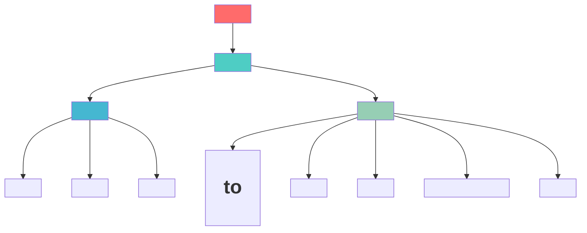

### 💡 Real World Example

```html
<!DOCTYPE html>
<html lang="en">
  <head>
    <meta charset="UTF-8" />
    <title>My First Website</title>
  </head>
  <body>
    <h1>Welcome to My Portfolio</h1>
    <p>I am a web developer.</p>
    <a href="contact.html">Contact Me</a>
  </body>
</html>
```

[🔝 Go to Top](#top)

---

## HTML Tags {#html-tags}

### 🤔 What is a Tag?

> **Tagging system samjho aise:** Jaise tum apni copy mein heading ke liye underline karte ho, HTML mein hum `<h1>...</h1>` use karte hain — ek **opening tag** aur ek **closing tag**.

### Basic Syntax Structure

```
<tagname attribute="value"> Content </tagname>
    ↑                ↑          ↑          ↑
Opening Tag      Attribute   Content   Closing Tag
```

### Types of Tags

```mermaid
flowchart LR
    A[HTML Tags] --> B[Paired Tags\nOpening + Closing]
    A --> C[Self-Closing Tags\nNo Content]
    B --> D["<p>text</p>"]
    B --> E["<h1>heading</h1>"]
    B --> F["<div>...</div>"]
    C --> G["<br/>"]
    C --> H["<img/>"]
    C --> I["<input/>"]
    C --> J["<hr/>"]

    style A fill:#6c5ce7,color:#fff
    style B fill:#00b894,color:#fff
    style C fill:#fd79a8,color:#fff
```

### Code Example

```html
<!-- Paired Tag - needs opening AND closing -->
<p>This is a paragraph</p>

<!-- Self-closing Tag - no content inside -->
<br />

<hr />
<input type="text" />
```

### 🎯 Interview Tip

> **Q: What is difference between paired and void/self-closing elements?**
> **A:** Paired elements have opening and closing tags like `<p></p>`. Void/Self-closing elements don't have closing tags and cannot have children like `<br>`, ``, `<input>`, `<hr>`, `<meta>`, `<link>`.

[🔝 Go to Top](#top)

---

## HTML Document Structure {#html-document-structure}

### 🤔 Why Structure Matters?

> **Ek building ka structure samjho:** Bina foundation ke building nahi banti. Similarly bina proper HTML structure ke webpage properly render nahi hota.

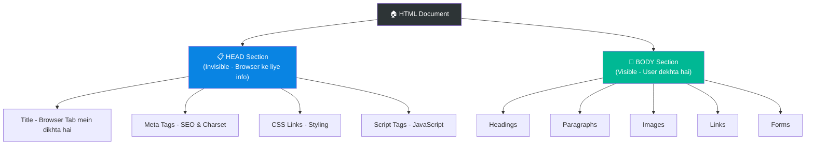

### Detailed Example

```html
<!DOCTYPE html>
<html lang="en">
  <!--=====================-->
  <!-- HEAD: Hidden Section -->
  <!--=====================-->
  <head>
    <!-- Character Encoding -->
    <meta charset="UTF-8" />

    <!-- Responsive Design -->
    <meta name="viewport" content="width=device-width, initial-scale=1.0" />

    <!-- SEO Description -->
    <meta name="description" content="This is my portfolio website" />

    <!-- Tab Title -->
    <title>John Doe - Portfolio</title>

    <!-- External CSS -->
    <link rel="stylesheet" href="style.css" />
  </head>

  <!--======================-->
  <!-- BODY: Visible Section -->
  <!--======================-->
  <body>
    <h1>John Doe</h1>
    <p>Full Stack Developer</p>
    
    <a href="mailto:john@example.com">Contact Me</a>
  </body>
</html>
```

[🔝 Go to Top](#top)

---

## DOCTYPE Declaration {#doctype-declaration}

### 🤔 Why DOCTYPE? What Problem does it Solve?

> **Ek language ka example:** Jaise tum kisi ko bataate ho "main Hindi mein baat karunga" — DOCTYPE browser ko bataata hai "ye HTML5 document hai, isi mode mein render karo."

### Without DOCTYPE - Problem!

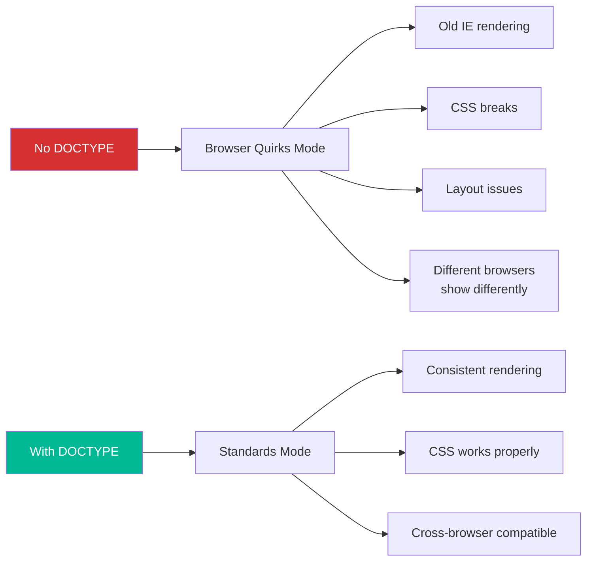

### Syntax

```html
<!-- HTML5 DOCTYPE (Modern - Use This Always) -->
<!DOCTYPE html>

<!-- Old HTML 4.01 DOCTYPE (Don't use) -->
<!DOCTYPE html PUBLIC "-//W3C//DTD HTML 4.01 Transitional//EN" "http://www.w3.org/TR/html4/loose.dtd">

<!-- XHTML DOCTYPE (Old) -->
<!DOCTYPE html PUBLIC "-//W3C//DTD XHTML 1.0 Strict//EN" "http://www.w3.org/TR/xhtml1/DTD/xhtml1-strict.dtd">
```

### 🎯 Key Points for Interview

| Feature | HTML5 DOCTYPE | Old DOCTYPE |
|---|---|---|
| Length | Short `<!DOCTYPE html>` | Very Long |
| Case Sensitive | No | Yes |
| Easy to remember | ✅ Yes | ❌ No |
| Current Standard | ✅ Yes | ❌ Outdated |

> **📝 Note:** DOCTYPE is NOT an HTML tag. It is an **instruction** to the browser. It is always the very first line of HTML document.

[🔝 Go to Top](#top)

---

# 2. HTML Basic Tags {#html-basic-tags}

## Heading Tags {#heading-tags}

### 🤔 Why? Need? Use Case?

> **Newspaper analogy:** Ek newspaper mein main headline sabse bada hota hai, sub-headlines thoda chota, aur body text sabse chota. HTML headings bhi same kaam karte hain.

**Why Headings Matter:**
- 📰 **Structure** - Content hierarchy define karta hai
- 🔍 **SEO** - Google `<h1>` ko sabse important maanta hai
- ♿ **Accessibility** - Screen readers headings se navigate karte hain
- 👁️ **Readability** - Users headings scan karte hain

### Basic Syntax

```html
<h1>Arguments: Text Content</h1>
<h2>Arguments: Text Content</h2>
<h3>Arguments: Text Content</h3>
<h4>Arguments: Text Content</h4>
<h5>Arguments: Text Content</h5>
<h6>Arguments: Text Content</h6>

<!--
Arguments/Attributes it accepts:
- id="value"      → Unique identifier
- class="value"   → CSS class
- style="value"   → Inline CSS
- title="value"   → Tooltip text
- lang="value"    → Language
-->
```

### Code Example

```html
<!DOCTYPE html>
<html lang="en">
  <head>
    <title>Headings Demo</title>
  </head>
  <body>
    <h1>H1 - Main Title (Largest) - Ek page mein sirf ek hona chahiye</h1>
    <h2>H2 - Section Title</h2>
    <h3>H3 - Sub-section Title</h3>
    <h4>H4 - Sub-sub-section Title</h4>
    <h5>H5 - Minor Heading</h5>
    <h6>H6 - Smallest Heading</h6>
  </body>
</html>
```

### Visual Representation

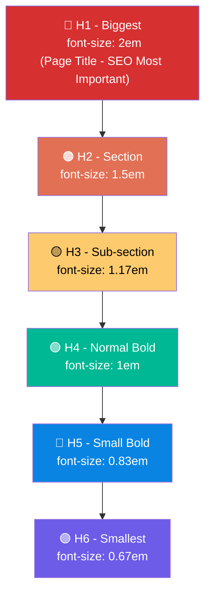

### Real World Use Case - Blog Page

```html
<h1>How to Learn Web Development in 2024</h1>
<!-- Only ONE h1 per page - Main topic -->

<h2>1. Start with HTML</h2>
<!-- Section heading -->

<h3>1.1 Basic Tags</h3>
<!-- Sub-section -->

<h3>1.2 Forms & Tables</h3>

<h2>2. Learn CSS</h2>

<h3>2.1 Flexbox</h3>
<h3>2.2 Grid</h3>
```

### 🚨 Common Mistakes (Interview Point)

```html
<!-- ❌ WRONG - Skip heading levels -->
<h1>Title</h1>
<h4>Sub-section</h4>  <!-- h2, h3 skip kar diya -->

<!-- ✅ CORRECT - Use in order -->
<h1>Title</h1>
<h2>Section</h2>
<h3>Sub-section</h3>
```

[🔝 Go to Top](#top)

---

## Paragraph Tag {#paragraph-tag}

### 🤔 Why? Need? Problem it Solves?

> **Soch ke dekho:** Agar tum directly text likhoge HTML mein bina `<p>` ke, toh browser saari lines ko ek saath jod dega — no spacing, no breaks! `<p>` tag har paragraph ko **alag block** mein rakhta hai automatic top-bottom margin ke saath.

### Basic Syntax

```html
<p>Content goes here</p>

<!--
Attributes it accepts:
- id="value"      → Unique identifier
- class="value"   → CSS class name
- style="value"   → Inline CSS styling
- title="value"   → Tooltip on hover
- align="value"   → left | right | center | justify (deprecated)
-->
```

### Problem it Solves

```html
<!-- ❌ WITHOUT <p> tag - Sab ek line mein aa jaayega -->
This is line one.
This is line two.
This is line three.

<!-- Output: This is line one. This is line two. This is line three. -->

<!-- ✅ WITH <p> tag - Proper paragraphs -->
<p>This is line one.</p>
<p>This is line two.</p>
<p>This is line three.</p>

<!-- Output: 
  This is line one.

  This is line two.

  This is line three.
-->
```

### Practical Example

```html
<!DOCTYPE html>
<html>
  <body>
    <h1>About Me</h1>
    <p>
      My name is Rahul and I am a web developer from Mumbai. I love creating
      beautiful websites and applications.
    </p>
    <p>
      I have 3 years of experience in HTML, CSS, and JavaScript. Currently
      learning React.js and Node.js.
    </p>
    <p style="color: blue; font-size: 18px;">
      Feel free to contact me anytime!
    </p>
  </body>
</html>
```

[🔝 Go to Top](#top)

---

## Line Break Tag {#line-break-tag}

### 🤔 Why? Paragraph se Different Kaise?

> **`<p>` vs `<br>` — dono alag hain:**
> - `<p>` = Naya paragraph shuru karo (extra space above and below)
> - `<br>` = Bas next line pe jao (no extra space) — **Enter key ki tarah**

### Basic Syntax

```html
<br />
<!-- OR -->
<br>

<!--
Self-closing tag hai — koi content nahi, koi closing tag nahi
No special attributes (id, class work karte hain but rarely used)
-->
```

### Use Case Example

```html
<!DOCTYPE html>
<html>
  <body>
    <!-- Address likhne ke liye perfect use case -->
    <p>
      John Doe<br />
      123 Main Street<br />
      New York, NY 10001<br />
      USA
    </p>

    <!-- Poetry / Songs ke liye -->
    <p>
      Roses are red,<br />
      Violets are blue,<br />
      HTML is awesome,<br />
      And so are you!
    </p>

    <!-- <p> vs <br> difference -->
    <p>This is paragraph one.</p>
    <p>This is paragraph two. (Has space above)</p>

    This is line one.<br />
    This is line two. (No extra space, just new line)
  </body>
</html>
```

### 🎯 When to use `<br>` vs `<p>`?

| Situation | Use |
|---|---|
| New paragraph with spacing | `<p>` |
| Address formatting | `<br>` |
| Poem/Song lyrics | `<br>` |
| Article sections | `<p>` |
| Within a paragraph, new line needed | `<br>` |

[🔝 Go to Top](#top)

---

## Centering Content {#centering-content}

### 🤔 Why? Use Case?

> **Note:** `<center>` tag HTML5 mein **deprecated** hai. Lekin interview mein poochha jaata hai! Modern approach CSS use karta hai.

### Basic Syntax

```html
<!-- Old Way (Deprecated - Don't use in new projects) -->
<center>Content here</center>

<!-- Modern Way (Use this) -->
<div style="text-align: center;">Content here</div>

<!-- OR with CSS class -->
<div class="center">Content here</div>
```

### Example

```html
<!DOCTYPE html>
<html>
  <head>
    <style>
      .center {
        text-align: center;
      }
    </style>
  </head>
  <body>
    <!-- Old deprecated way -->
    <center>
      <h1>This is centered (OLD WAY - Avoid)</h1>
    </center>

    <!-- Modern correct way -->
    <div class="center">
      <h1>This is centered (MODERN WAY ✅)</h1>
      <p>This paragraph is also centered</p>
    </div>
  </body>
</html>
```

[🔝 Go to Top](#top)

---

## Horizontal Lines {#horizontal-lines}

### 🤔 Why? Use Case?

> **Newspaper mein dekho:** Sections ke beech ek line hoti hai — `<hr>` exactly wahi kaam karta hai. Content ko visually separate karta hai.

### Basic Syntax

```html
<hr />

<!--
Attributes (mostly deprecated, use CSS instead):
- width="value"   → e.g., "50%" or "200px"
- size="value"    → Height/thickness
- color="value"   → Color name or hex
- align="value"   → left | center | right
- noshade         → Removes 3D shadow effect
-->
```

### Example

```html
<!DOCTYPE html>
<html>
  <head>
    <style>
      .thick-line {
        border: 3px solid black;
      }
      .colored-line {
        border: 2px solid red;
        width: 50%;
      }
      .dashed-line {
        border: 2px dashed blue;
      }
    </style>
  </head>
  <body>
    <h1>Article Title</h1>
    <p>Introduction content here...</p>

    <!-- Default HR -->
    <hr />

    <h2>Section 1</h2>
    <p>Section content...</p>

    <!-- Styled with CSS (Modern Way) -->
    <hr class="thick-line" />

    <h2>Section 2</h2>
    <p>More content...</p>

    <hr class="colored-line" />

    <h2>Section 3</h2>
    <hr class="dashed-line" />

    <!-- Old way (Deprecated) -->
    <hr width="50%" size="5" color="green" />
  </body>
</html>
```

[🔝 Go to Top](#top)

---

## Preserve Formatting {#preserve-formatting}

### 🤔 Why? What Problem it Solves?

> **Problem:** HTML by default **whitespace collapse** karta hai. Matlab agar tum 10 spaces likhoge HTML mein, browser sirf 1 space dikhayega. Newlines bhi ignore ho jaati hain.
>
> **Solution:** `<pre>` tag — **pre**-formatted text. Jo tum likhoge, exactly waisa hi dikhega — spaces, tabs, newlines sab preserve honge.

### Basic Syntax

```html
<pre>Content with preserved whitespace</pre>

<!--
Attributes:
- id="value"    → Unique identifier
- class="value" → CSS class
- style="value" → Inline CSS
- width="value" → Width (deprecated)
-->
```

### Problem Demonstration

```html
<!DOCTYPE html>
<html>
  <body>
    <!-- WITHOUT <pre> - Formatting lost -->
    <p>
      Name:    John Doe
      Age:     25
      City:    Mumbai
    </p>
    <!-- Output: Name: John Doe Age: 25 City: Mumbai (all in one line!) -->

    <hr />

    <!-- WITH <pre> - Formatting preserved -->
    <pre>
Name:    John Doe
Age:     25
City:    Mumbai
    </pre>
    <!-- Output: Exactly as typed with spaces! -->

    <hr />

    <!-- Perfect use case: Code Display -->
    <pre>
function greet(name) {
    console.log("Hello, " + name);
    return true;
}
greet("World");
    </pre>
  </body>
</html>
```

### Use Cases

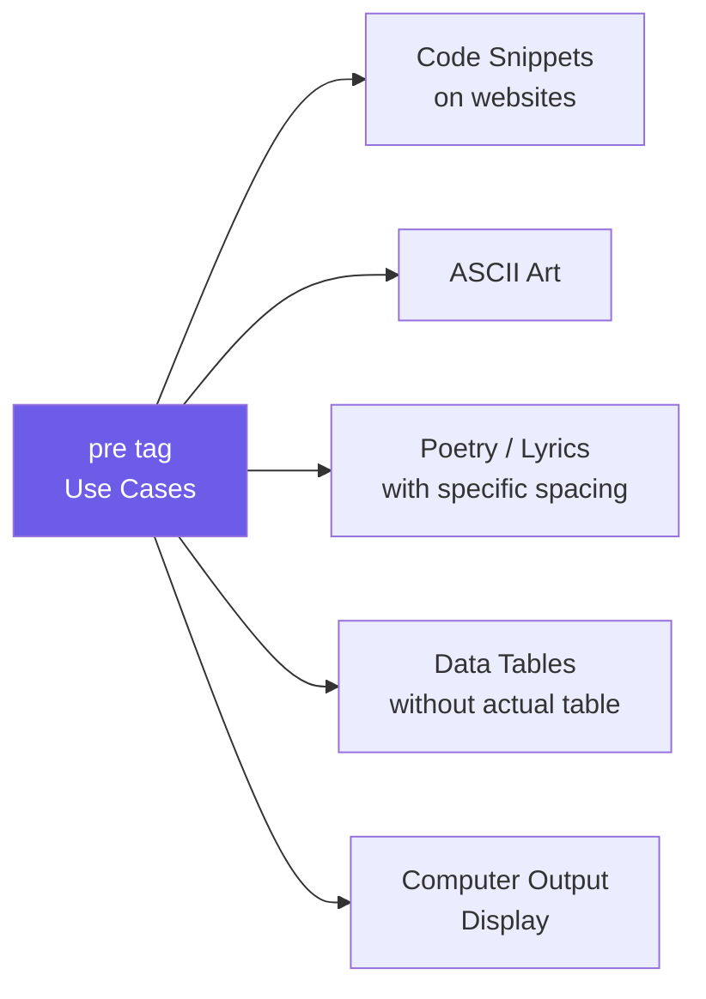

[🔝 Go to Top](#top)

---

## Nonbreaking Spaces {#nonbreaking-spaces}

### 🤔 Why? What Problem it Solves?

> **Problem dekho:** Browser HTML mein multiple spaces ko ek space mein compress kar deta hai. Aur kuch words ko browser alag-alag lines mein tod deta hai jo sometimes theek nahi lagta.
>
> **`&nbsp;` (Non-Breaking Space)** do kaam karta hai:
> 1. Multiple spaces add karna
> 2. Do words ko **ek saath rakhna** — kabhi alag nahi honge different lines mein

### Syntax

```html
&nbsp;   <!-- One non-breaking space -->
&nbsp;&nbsp;&nbsp;  <!-- Three spaces -->

<!-- Common HTML Entities -->
&nbsp;    → Non-breaking space
&lt;      → < (less than)
&gt;      → > (greater than)
&amp;     → & (ampersand)
&copy;    → © (copyright)
&reg;     → ® (registered)
&trade;   → ™ (trademark)
```

### Example

```html
<!DOCTYPE html>
<html>
  <body>
    <!-- Problem: Multiple spaces collapse -->
    <p>Normal spaces:     only one space shows</p>

    <!-- Solution: &nbsp; -->
    <p>With &nbsp;&nbsp;&nbsp;&nbsp;&nbsp; nbsp: 5 spaces!</p>

    <!-- Non-breaking: Words stay together -->
    <p>Phone:&nbsp;+91-9876543210</p>
    <!-- +91 and number will NEVER break across lines -->

    <p>Mr.&nbsp;John&nbsp;Doe</p>
    <!-- Mr. John Doe always stays together -->

    <!-- HTML Entities -->
    <p>Copyright &copy; 2024 My Company</p>
    <p>Price: 5 &lt; 10 (5 is less than 10)</p>
    <p>Write HTML like: &lt;p&gt;Hello&lt;/p&gt;</p>
  </body>
</html>
```

### 🎯 Interview Question

> **Q: Why can't we just press spacebar multiple times in HTML?**
>
> **A:** HTML collapses all consecutive whitespace (spaces, tabs, newlines) into a single space. To add multiple spaces, we use `&nbsp;` entity. It also prevents line breaks between specific words.

[🔝 Go to Top](#top)

---

# 3. HTML Elements {#html-elements}

## HTML Tag vs Element {#html-tag-vs-element}

### 🤔 Difference Kya Hai? (Tricky Interview Question!)

> **Yeh ek common confusion hai — tag aur element same nahi hote!**
>
> - **Tag** = Sirf woh angle bracket wali cheez: `<p>` ya `</p>`
> - **Element** = Opening tag + Content + Closing tag sab milake

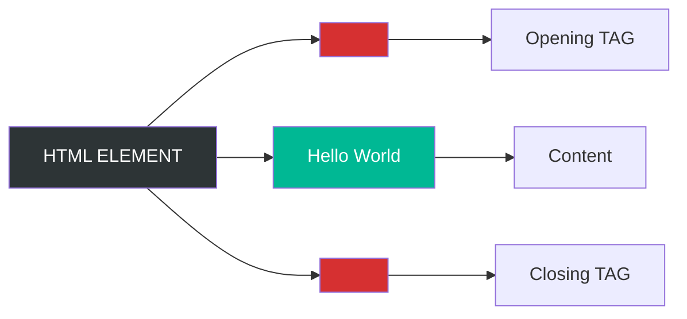

```html
<!-- Tag (sirf ye hissa) -->
<h1>
</h1>

<!-- Element (poora yeh) -->
<h1>Welcome to My Page</h1>
 ↑                      ↑
Opening tag        Closing tag
       ↑
  "Welcome to My Page" = Content

<!-- Poora "   <h1>Welcome to My Page</h1>  " = ELEMENT -->
```

### Self-Closing Elements

```html
<!-- In elements, kuch elements mein content nahi hota -->
<br />     <!-- br element - no content -->
  <!-- img element -->
<input type="text" />  <!-- input element -->
<hr />
<meta charset="UTF-8" />

<!-- Yeh elements void elements kehlaate hain -->
```

[🔝 Go to Top](#top)

---

## Nested HTML Elements {#nested-html-elements}

### 🤔 Why Nesting? What Problem it Solves?

> **Dabbon ka example:** Ek bada dabbe ke andar chote dabbe, unke andar aur chote dabbe. HTML mein bhi elements ek doosre ke andar ho sakte hain — isko **nesting** kehte hain.
>
> **Purpose:** Complex layouts aur structure banane ke liye — text ko bold AND italic dono banana ho, ya list ke andar list banana ho.

### Basic Syntax Rules

```html
<!-- ✅ CORRECT Nesting - Proper order -->
<div>
  <p>
    <strong>Bold text inside paragraph inside div</strong>
  </p>
</div>

<!-- ❌ WRONG Nesting - Overlapping tags -->
<p>
  <strong>
    Bold text
  </p>          <!-- ❌ p closed before strong -->
</strong>       <!-- ❌ This is WRONG -->
```

### Nesting Rules - Like Brackets in Math!

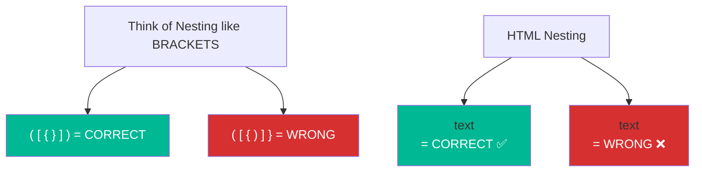

### Practical Examples

```html
<!DOCTYPE html>
<html>
  <body>
    <!-- Example 1: Text Formatting Nesting -->
    <p>
      This is <strong>bold</strong> and this is
      <em>italic</em> and this is
      <strong><em>bold and italic both!</em></strong>
    </p>

    <!-- Example 2: List inside List (Nested Lists) -->
    <ul>
      <li>
        Frontend
        <ul>
          <li>HTML</li>
          <li>CSS</li>
          <li>JavaScript</li>
        </ul>
      </li>
      <li>
        Backend
        <ul>
          <li>Node.js</li>
          <li>Python</li>
        </ul>
      </li>
    </ul>

    <!-- Example 3: Table with nested elements -->
    <table border="1">
      <tr>
        <td>
          <strong>Name</strong>
        </td>
        <td>
          <a href="#">John Doe</a>
        </td>
      </tr>
    </table>

    <!-- Example 4: div nesting for layout -->
    <div id="container">
      <div id="header">
        <h1>My Website</h1>
        <nav>
          <ul>
            <li><a href="#">Home</a></li>
            <li><a href="#">About</a></li>
          </ul>
        </nav>
      </div>
      <div id="content">
        <p>Main content here</p>
      </div>
    </div>
  </body>
</html>
```

### Visual Nesting Tree

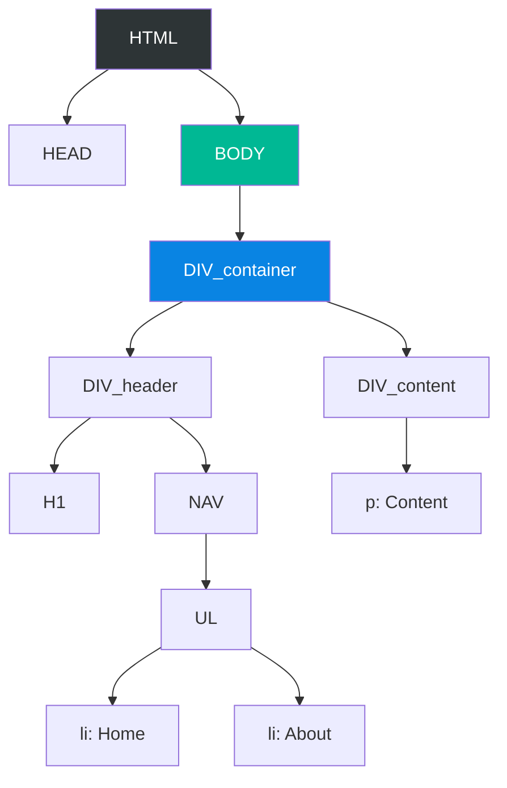

[🔝 Go to Top](#top)

---

# 4. HTML Attributes {#html-attributes}

### 🤔 Why Attributes? What Problem they Solve?

> **Attribute matlab extra information:**
> Jaise tum form mein sirf "city" nahi likhte, "city: Mumbai" likhte ho — same tarah HTML tags ko extra information dene ke liye attributes use hote hain.
>
> Bina attribute ke: `` — browser ko nahi pata kaunsi image dikhani hai!
> With attribute: `` — ab browser jaanta hai!

### Basic Attribute Syntax

```html
<tagname attribute1="value1" attribute2="value2">Content</tagname>
          ↑               ↑
       Key name         Value (quotes mein)

<!-- Examples -->
<a href="https://google.com" target="_blank">Google</a>
   ↑      ↑                    ↑      ↑
Attr    Value                Attr   Value


     ↑       ↑        ↑      ↑        ↑     ↑      ↑      ↑
   Attr   Value     Attr   Value    Attr  Value  Attr   Value
```

---

## Core Attributes {#core-attributes}

### 🎯 4 Core Attributes - Har Element pe kaam karte hain!

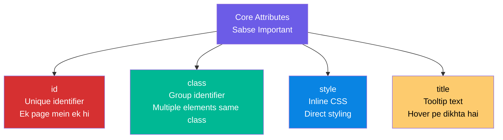

### 1. `id` Attribute

```html
<!--
id Attribute:
- Purpose: Unique identifier for ONE element
- Rule: Ek page mein same id SIRF EK element pe ho sakti hai
- Use: CSS styling (#id), JavaScript (getElementById), anchor links (#section)

Syntax: id="unique-name"
-->

<h1 id="main-title">Welcome</h1>
<p id="intro-para">Hello World</p>
<div id="navigation">Nav content</div>

<!-- Using id for anchor link -->
<a href="#main-title">Go to Title</a>

<!-- Using id in CSS -->
<style>
  #main-title {
    color: red;
    font-size: 30px;
  }
</style>

<!-- Using id in JavaScript -->
<script>
  document.getElementById("main-title").style.color = "blue";
</script>
```

### 2. `class` Attribute

```html
<!--
class Attribute:
- Purpose: Group multiple elements for shared styling
- Rule: Multiple elements can have SAME class
- One element can have MULTIPLE classes
- Use: CSS styling (.class), JavaScript (getElementsByClassName)

Syntax: class="classname"
        class="class1 class2 class3"  (multiple classes)
-->

<!-- Multiple elements with same class -->
<p class="highlight">First highlighted paragraph</p>
<p class="highlight">Second highlighted paragraph</p>
<h2 class="highlight">Highlighted heading too!</h2>

<!-- One element with multiple classes -->
<p class="highlight bold large-text">All three classes applied!</p>

<!-- CSS for classes -->
<style>
  .highlight {
    background-color: yellow;
  }
  .bold {
    font-weight: bold;
  }
  .large-text {
    font-size: 20px;
  }
</style>
```

### id vs class - Key Difference

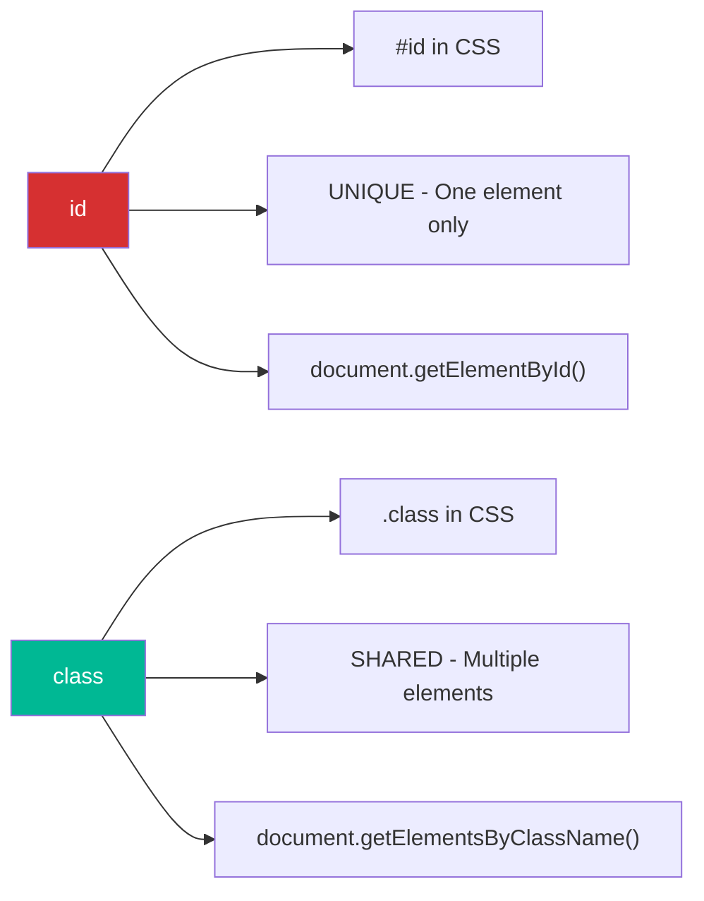

### 3. `style` Attribute (Inline CSS)

```html
<!--
style Attribute:
- Purpose: Apply CSS directly to a single element
- Note: Inline styles override external/internal CSS (highest specificity)
- Not recommended for large projects (hard to maintain)

Syntax: style="property: value; property2: value2;"
-->

<h1 style="color: red; font-size: 30px; text-align: center;">
  Styled Heading
</h1>

<p style="background-color: lightblue; padding: 10px; border: 1px solid blue;">
  This paragraph has inline styling
</p>


```

### 4. `title` Attribute

```html
<!--
title Attribute:
- Purpose: Shows tooltip when user hovers over element
- Works on almost ALL HTML elements
- Also improves accessibility

Syntax: title="Tooltip text here"
-->

<p title="This is a tooltip! Hover over me!">
  Hover your mouse over this text to see tooltip.
</p>

<a href="https://google.com" title="Click to open Google in new tab">
  Google
</a>


<abbr title="HyperText Markup Language">HTML</abbr>
<!-- Perfect use of title - shows full form on hover -->
```

### Practical Example - All Core Attributes Together

```html
<!DOCTYPE html>
<html>
  <head>
    <style>
      .card {
        border: 1px solid #ddd;
        padding: 15px;
        margin: 10px;
        border-radius: 5px;
      }
      .highlight {
        background-color: #fffde7;
      }
      #featured {
        border: 2px solid gold;
      }
    </style>
  </head>
  <body>
    <!-- Using all 4 core attributes -->
    <div
      id="featured"
      class="card highlight"
      style="max-width: 300px;"
      title="This is the featured product card"
    >
      <h2>Featured Product</h2>
      <p>Best seller this week!</p>
    </div>

    <div class="card" title="Regular product">
      <h2>Regular Product</h2>
      <p>Normal product description</p>
    </div>

    <div class="card" title="Another product">
      <h2>Another Product</h2>
      <p>More products here</p>
    </div>
  </body>
</html>
```

[🔝 Go to Top](#top)

---

## Internationalization Attributes {#internationalization-attributes}

### 🤔 Why Internationalization? Need?

> **Global websites ke liye soch:** Amazon India vs Amazon Japan — same website, alag language. HTML ko batana padta hai ki content kaunsi language mein hai, kaunsi direction mein likhna hai (Left-to-Right ya Right-to-Left like Arabic, Hebrew).

### Key Attributes

```html
<!--
1. lang="language-code"
   - Purpose: Content ki language define karna
   - Use: Screen readers, search engines, spell checkers
   - Syntax: lang="en" | "hi" | "ar" | "fr" | "zh" etc.

2. dir="direction"
   - Purpose: Text direction
   - Values: ltr (Left to Right) | rtl (Right to Left) | auto
   - Use: Arabic, Hebrew (RTL languages)

3. xml:lang="value"
   - For XHTML documents
-->
```

### Language Codes Reference

```html
<!-- Common Language Codes -->
lang="en"     <!-- English -->
lang="en-US"  <!-- English (United States) -->
lang="en-GB"  <!-- English (United Kingdom) -->
lang="hi"     <!-- Hindi -->
lang="ar"     <!-- Arabic (RTL) -->
lang="fr"     <!-- French -->
lang="de"     <!-- German -->
lang="zh"     <!-- Chinese -->
lang="ja"     <!-- Japanese -->
lang="es"     <!-- Spanish -->
```

### Practical Example

```html
<!DOCTYPE html>
<html lang="en">
  <!-- Main document is English -->
  <head>
    <meta charset="UTF-8" />
    <title>Multilingual Page</title>
  </head>
  <body>
    <h1>Welcome - Multilingual Example</h1>

    <!-- English paragraph -->
    <p lang="en">
      This is an English paragraph. Screen readers will use English voice.
    </p>

    <!-- Hindi paragraph -->
    <p lang="hi">यह एक हिंदी पैराग्राफ है। स्क्रीन रीडर हिंदी में पढ़ेगा।</p>

    <!-- Arabic paragraph (RTL - Right to Left) -->
    <p lang="ar" dir="rtl">هذا نص عربي يُقرأ من اليمين إلى اليسار</p>

    <!-- French paragraph -->
    <p lang="fr">Bonjour! Ceci est un paragraphe en français.</p>

    <!-- Mixing languages in one paragraph -->
    <p lang="en">
      The word
      <span lang="fr" style="color: blue;">bonjour</span>
      means hello in French.
    </p>

    <!-- RTL Text Example -->
    <div dir="rtl" style="background: #f0f0f0; padding: 10px;">
      <p lang="ar">هذا مثال على النص العربي</p>
      <!-- Text aligns to the right automatically -->
    </div>

    <!-- LTR override inside RTL -->
    <div dir="rtl">
      <p>This text is actually LTR English but in RTL container</p>
      <p dir="ltr">
        This specifically set to LTR
      </p>
    </div>
  </body>
</html>
```

### Direction Visualization

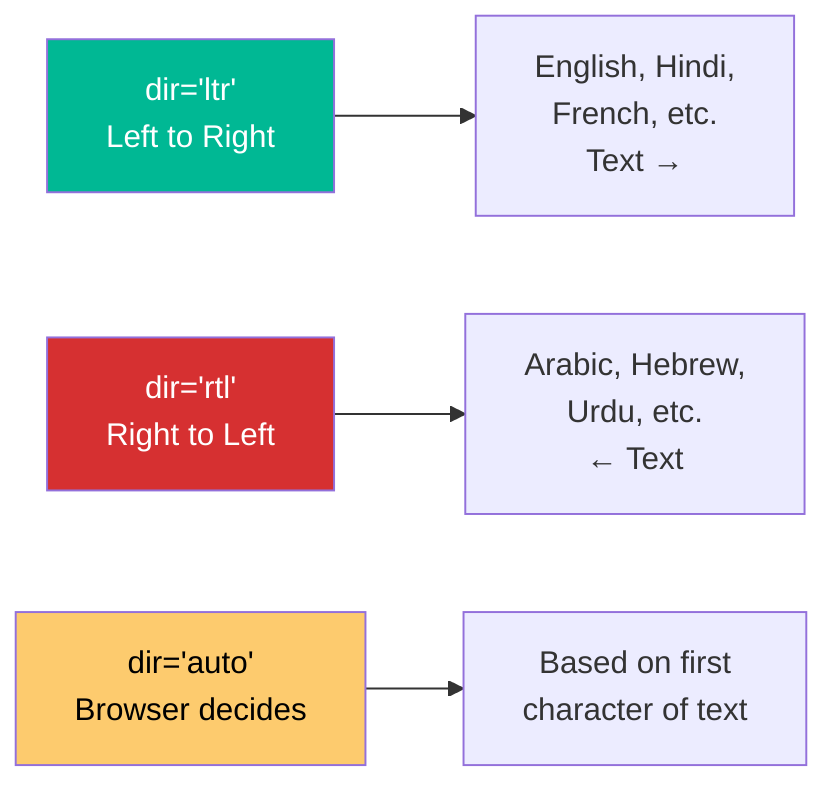

[🔝 Go to Top](#top)

---

# 5. HTML Formatting {#html-formatting}

### 🤔 Why Formatting Tags? Need?

> **Word processor jaisa socho:** MS Word mein tum **Bold**, *Italic*, <u>Underline</u> karte ho buttons se. HTML mein yahi kaam formatting tags karte hain — text ko visually different dikhane ke liye.
>
> **Two types exist:**
> - **Presentational tags** — `<b>`, `<i>`, `<u>` (sirf visual)
> - **Semantic tags** — `<strong>`, `<em>` (meaning bhi convey karte hain)

---

## Bold Text {#bold-text}

```html
<!--
<b> vs <strong> - Very Important Interview Question!

<b> = Bold (Only VISUAL - sirf dikhne ke liye bold)
<strong> = Strong importance (SEMANTIC - screen readers louder padenge, SEO better)

Use <strong> for important content
Use <b> for styling purposes only
-->

<b>Syntax: <b>text</b></b>
<strong>Syntax: <strong>text</strong></strong>
```

```html
<!DOCTYPE html>
<html>
  <body>
    <!-- <b> - Just visual bold -->
    <p>This is <b>bold text</b> using b tag</p>

    <!-- <strong> - Semantic importance + visual bold -->
    <p>
      <strong>WARNING: Do not click this button!</strong>
    </p>

    <!-- Real world example -->
    <p>
      Product Price:
      <b>₹999</b>
      <!-- Just visually highlighting price -->
    </p>

    <p>
      <strong>Important:</strong> Please read the terms carefully.
      <!-- Semantic importance - this is actually important -->
    </p>
  </body>
</html>
```

---

## Italic Text {#italic-text}

```html
<!--
<i> vs <em> - Same concept as b vs strong

<i> = Italic (Visual only - book titles, foreign words, technical terms)
<em> = Emphasis (Semantic - screen reader changes tone)

Syntax:
<i>text</i>
<em>text</em>
-->
```

```html
<!DOCTYPE html>
<html>
  <body>
    <!-- <i> uses - Technical terms, foreign words, book titles -->
    <p>The function <i>getElementById()</i> returns an element.</p>
    <p>The word <i>schadenfreude</i> comes from German.</p>
    <p>I just finished reading <i>The Alchemist</i> by Paulo Coelho.</p>

    <!-- <em> - Stress emphasis -->
    <p>I <em>never</em> said she stole the money.</p>
    <p>I never said <em>she</em> stole the money.</p>
    <!-- Different emphasis = different meaning! -->

    <!-- Combined -->
    <p>
      Read the <i>documentation</i> carefully.
      It is <em>very important</em>.
    </p>
  </body>
</html>
```

---

## Underlined Text {#underlined-text}

```html
<!--
<u> tag:
- Purpose: Underline text
- ⚠️ Warning: Underline looks like a hyperlink!
- Use sparingly - only for specific purposes (spell check, proper nouns in Chinese)
- Deprecated in HTML4, back in HTML5 with semantic meaning

Syntax: <u>text</u>
-->
```

```html
<!DOCTYPE html>
<html>
  <body>
    <p>This is <u>underlined text</u></p>

    <!-- Warning - confusing with links! -->
    <p>
      Click <u>here</u> to proceed.
      <!-- BAD: looks like a link but isn't! -->
    </p>

    <!-- Better use case: spell error indication -->
    <p>
      I went to the <u style="text-decoration: underline wavy red;">storee</u>
      yesterday.
      <!-- CSS wavy red = spell check style -->
    </p>

    <!-- Modern CSS underline alternative -->
    <p>
      This is
      <span style="text-decoration: underline;">underlined with CSS</span>
    </p>
  </body>
</html>
```

---

## Strike Text {#strike-text}

```html
<!--
Strike-through text:
<s> = Text no longer accurate/relevant (HTML5 semantic)
<del> = Deleted text (shows edit/revision history)
<strike> = Deprecated! (Don't use in HTML5)

Syntax:
<s>text</s>
<del>text</del>
-->
```

```html
<!DOCTYPE html>
<html>
  <body>
    <!-- <s> - No longer accurate -->
    <p>
      Original Price:
      <s>₹2,999</s>
      Now: ₹1,499!
    </p>

    <!-- <del> - Document edits -->
    <p>
      The meeting is on
      <del>Monday</del>
      Tuesday.
    </p>

    <!-- Combined del + ins (insertion) -->
    <p>
      <del>Old information</del>
      <ins>New updated information</ins>
    </p>

    <!-- E-commerce use case -->
    <div>
      <span style="color: gray; text-decoration: line-through;">₹5,000</span>
      <span style="color: red; font-weight: bold;">₹2,500</span>
      <span style="color: green;">50% OFF!</span>
    </div>
  </body>
</html>
```

---

## Monospaced Font {#monospaced-font}

```html
<!--
<tt> tag (Teletype Text):
- Shows text in monospaced/fixed-width font (like Courier)
- Deprecated in HTML5! Use CSS font-family: monospace instead
- Or use <code> tag for actual code

Syntax: <tt>text</tt>

Modern Alternative: <code>text</code>
-->
```

```html
<!DOCTYPE html>
<html>
  <body>
    <!-- Old way (deprecated) -->
    <p>Old: <tt>Monospaced text here</tt></p>

    <!-- Modern way - for code -->
    <p>Use the <code>console.log()</code> function to print output.</p>

    <!-- Modern way - CSS -->
    <p>
      Modern:
      <span style="font-family: monospace;">Monospaced with CSS</span>
    </p>

    <!-- Code inline vs block -->
    <p>Run the command: <code>npm install react</code></p>

    <pre><code>
// Multi-line code block
function add(a, b) {
    return a + b;
}
    </code></pre>
  </body>
</html>
```

---

## Superscript and Subscript {#superscript-and-subscript}

```html
<!--
<sup> = Superscript (text goes UP - small)
<sub> = Subscript (text goes DOWN - small)

Syntax:
<sup>text</sup>
<sub>text</sub>

Use cases:
- sup: Math powers (x²), Ordinals (1st, 2nd), Footnotes, Copyright
- sub: Chemical formulas (H₂O), Math variables
-->
```

```html
<!DOCTYPE html>
<html>
  <body>
    <!-- Superscript uses -->
    <h3>Superscript Examples:</h3>
    <p>Einstein's formula: E = mc<sup>2</sup></p>
    <p>Area of circle: πr<sup>2</sup></p>
    <p>Today is 1<sup>st</sup> January, 2024</p>
    <p>She was 2<sup>nd</sup> in the competition</p>
    <p>Copyright<sup>©</sup> 2024</p>

    <!-- Subscript uses -->
    <h3>Subscript Examples:</h3>
    <p>Water formula: H<sub>2</sub>O</p>
    <p>Carbon dioxide: CO<sub>2</sub></p>
    <p>Math: X<sub>1</sub> + X<sub>2</sub> = 10</p>
    <p>Glucose: C<sub>6</sub>H<sub>12</sub>O<sub>6</sub></p>

    <!-- Combined in equation -->
    <p>
      The formula is: a<sup>2</sup> + b<sup>2</sup> = c<sup>2</sup>
    </p>
  </body>
</html>
```

---

## Inserted and Deleted Text {#inserted-and-deleted-text}

```html
<!--
<ins> = Inserted text (underlined by default)
<del> = Deleted text (strikethrough by default)

These are SEMANTIC tags - show document changes/revisions
Browser renders them differently

Syntax:
<ins>newly added text</ins>
<del>removed text</del>

Attributes:
- cite="URL"      → Link to document explaining change
- datetime="YYYY-MM-DDTHH:MM:SSZ"  → When change was made
-->
```

```html
<!DOCTYPE html>
<html>
  <body>
    <h3>Document Revision Example:</h3>

    <p>
      The project deadline is
      <del datetime="2024-01-15" cite="change-log.html">January 20th</del>
      <ins datetime="2024-01-15" cite="change-log.html">January 25th</ins>.
    </p>

    <!-- Blog post edit -->
    <p>
      This article was written by
      <del>John</del>
      <ins>Jane Doe</ins>.
    </p>

    <!-- Price change -->
    <p>
      Price: <del style="color: gray;">₹999</del>
      <ins style="color: green; text-decoration: none;">₹799</ins>
    </p>

    <!-- Terms update -->
    <blockquote>
      <p>
        Users must be
        <del>18</del>
        <ins>16</ins>
        years or older to register.
      </p>
    </blockquote>
  </body>
</html>
```

---

## Larger and Smaller Text {#larger-and-smaller-text}

```html
<!--
<big> = Larger text (Deprecated in HTML5!)
<small> = Smaller text (Still valid in HTML5 - semantic meaning)

<small> in HTML5 = Side comments, fine print, legal text, copyright

Syntax:
<big>text</big>    → DEPRECATED, use CSS font-size instead
<small>text</small> → Valid, use for fine print

Modern alternative for big:
<span style="font-size: larger;">text</span>
-->
```

```html
<!DOCTYPE html>
<html>
  <body>
    <!-- big tag - deprecated but shown for learning -->
    <p>Normal text and <big>bigger text</big> here</p>

    <!-- small tag - valid, use for fine print -->
    <p>
      Buy Now for ₹999!
      <small>(+GST applicable, terms & conditions apply)</small>
    </p>

    <!-- Copyright - perfect use of small -->
    <footer>
      <small>&copy; 2024 My Company. All rights reserved.</small>
    </footer>

    <!-- Legal disclaimer -->
    <p>
      <small>
        *Results may vary. This product is not intended to diagnose, treat,
        cure, or prevent any disease.
      </small>
    </p>

    <!-- Modern way for bigger text -->
    <p>
      Normal text and
      <span style="font-size: 1.5em;">Larger text with CSS</span>
    </p>
  </body>
</html>
```

---

## Grouping Content {#grouping-content}

### `<div>` and `<span>` — The Most Used Tags!

```html
<!--
<div> = Block-level container (Division)
  - Takes FULL WIDTH
  - Starts on NEW LINE
  - Used for grouping BLOCK elements
  - Like a box/container

<span> = Inline container
  - Takes only NEEDED WIDTH
  - Does NOT start on new line
  - Used for grouping INLINE elements
  - Like highlighting within text

Syntax:
<div>block content</div>
<span>inline content</span>
-->
```

```html
<!DOCTYPE html>
<html>
  <head>
    <style>
      .section {
        border: 2px solid blue;
        margin: 10px;
        padding: 10px;
      }
      .highlight {
        background-color: yellow;
        font-weight: bold;
      }
      .error {
        color: red;
      }
      .success {
        color: green;
      }
    </style>
  </head>
  <body>
    <!-- div - Block container -->
    <div class="section">
      <h2>Header Section</h2>
      <p>Some content in this section</p>
    </div>

    <div class="section">
      <h2>Content Section</h2>
      <p>More content here</p>
    </div>

    <!-- span - Inline container -->
    <p>
      My name is <span class="highlight">John Doe</span> and I am a
      <span class="success">Senior Developer</span>.
      I have
      <span style="color: blue; font-weight: bold;">5 years</span>
      of experience.
    </p>

    <!-- Real world: Alert messages -->
    <div style="background: #ffebee; border: 1px solid red; padding: 10px;">
      <span class="error">❌ Error:</span>
      Please fill in all required fields.
    </div>

    <div style="background: #e8f5e9; border: 1px solid green; padding: 10px;">
      <span class="success">✅ Success:</span>
      Your form has been submitted!
    </div>
  </body>
</html>
```

### `<div>` vs `<span>` Visual

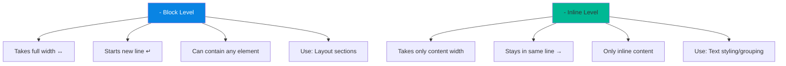

[🔝 Go to Top](#top)

---

# 6. HTML Phrase Tags {#html-phrase-tags}

### 🤔 Why Phrase Tags? Formatting tags se alag kaise?

> **Phrase tags = Semantic meaning dete hain** — sirf dikhaane ke liye nahi, balki content ka **meaning** bhi convey karte hain screen readers, browsers, aur search engines ko.

### Complete Phrase Tags Reference

```html
<!DOCTYPE html>
<html>
  <body>
    <!-- 1. <em> - Emphasized Text (italic + semantic emphasis) -->
    <p>You must <em>never</em> share your password.</p>

    <!-- 2. <mark> - Highlighted/Marked Text -->
    <p>
      Search result: The word
      <mark>HTML</mark>
      appears 5 times.
    </p>

    <!-- 3. <strong> - Strong Importance (bold + semantic) -->
    <p><strong>Warning:</strong> This action cannot be undone!</p>

    <!-- 4. <abbr> - Abbreviation with tooltip -->
    <p>
      I love working with
      <abbr title="HyperText Markup Language">HTML</abbr>
      and
      <abbr title="Cascading Style Sheets">CSS</abbr>.
    </p>

    <!-- 5. <bdo> - Bidirectional Override (force direction) -->
    <p>Normal text</p>
    <p><bdo dir="rtl">This text will appear reversed</bdo></p>

    <!-- 6. <dfn> - Definition Term -->
    <p>
      <dfn>HTML</dfn>
      is the standard markup language for web pages.
    </p>

    <!-- 7. <blockquote> - Long quotation (block level) -->
    <blockquote cite="https://einstein.com">
      "Imagination is more important than knowledge. Knowledge is limited.
      Imagination encircles the world."
      <footer>— Albert Einstein</footer>
    </blockquote>

    <!-- 8. <q> - Short inline quotation -->
    <p>
      Einstein said,
      <q>Imagination is more important than knowledge.</q>
    </p>

    <!-- 9. <cite> - Citation/Reference -->
    <p>
      From the book
      <cite>The Alchemist</cite>
      by Paulo Coelho.
    </p>

    <!-- 10. <code> - Computer code -->
    <p>Use <code>console.log()</code> to debug JavaScript.</p>

    <!-- 11. <kbd> - Keyboard input -->
    <p>Press <kbd>Ctrl</kbd> + <kbd>C</kbd> to copy.</p>
    <p>Press <kbd>Ctrl</kbd> + <kbd>V</kbd> to paste.</p>

    <!-- 12. <var> - Variable in math/programming -->
    <p>The area of a circle is: π<var>r</var><sup>2</sup></p>
    <p>Let <var>x</var> = 5 and <var>y</var> = 10</p>

    <!-- 13. <samp> - Sample computer output -->
    <p>The program outputs: <samp>Hello, World!</samp></p>
    <p>Error: <samp>404 File Not Found</samp></p>

    <!-- 14. <address> - Contact information -->
    <address>
      Written by <a href="mailto:john@example.com">John Doe</a><br />
      Visit us at: 123 Main Street<br />
      Mumbai, Maharashtra 400001<br />
      India
    </address>
  </body>
</html>
```

### Phrase Tags Quick Reference Table

| Tag | Purpose | Default Style | Semantic? |
|---|---|---|---|
| `<em>` | Emphasis | Italic | ✅ Yes |
| `<strong>` | Important | Bold | ✅ Yes |
| `<mark>` | Highlighted | Yellow BG | ✅ Yes |
| `<abbr>` | Abbreviation | Dotted underline | ✅ Yes |
| `<dfn>` | Definition | Italic | ✅ Yes |
| `<blockquote>` | Long quote | Indented | ✅ Yes |
| `<q>` | Short quote | Adds quotes | ✅ Yes |
| `<cite>` | Citation | Italic | ✅ Yes |
| `<code>` | Code | Monospace | ✅ Yes |
| `<kbd>` | Keyboard input | Monospace | ✅ Yes |
| `<var>` | Variable | Italic | ✅ Yes |
| `<samp>` | Output | Monospace | ✅ Yes |
| `<address>` | Contact info | Italic | ✅ Yes |
| `<bdo>` | Text direction | - | ✅ Yes |

[🔝 Go to Top](#top)

---

# 7. HTML Meta Tags {#html-meta-tags}

### 🤔 Why Meta Tags? Problem they Solve?

> **Meta tags = Invisible information:** Browser tab mein kuch nahi dikhta, but browser, search engines (Google), aur social media platforms ke liye bahut important hain.
>
> **Aise samjho:** Meta tags = envelope pe likha address — letter ke andar kya hai, yeh toh baad mein pata chalega, but address pakka hona chahiye delivery ke liye!

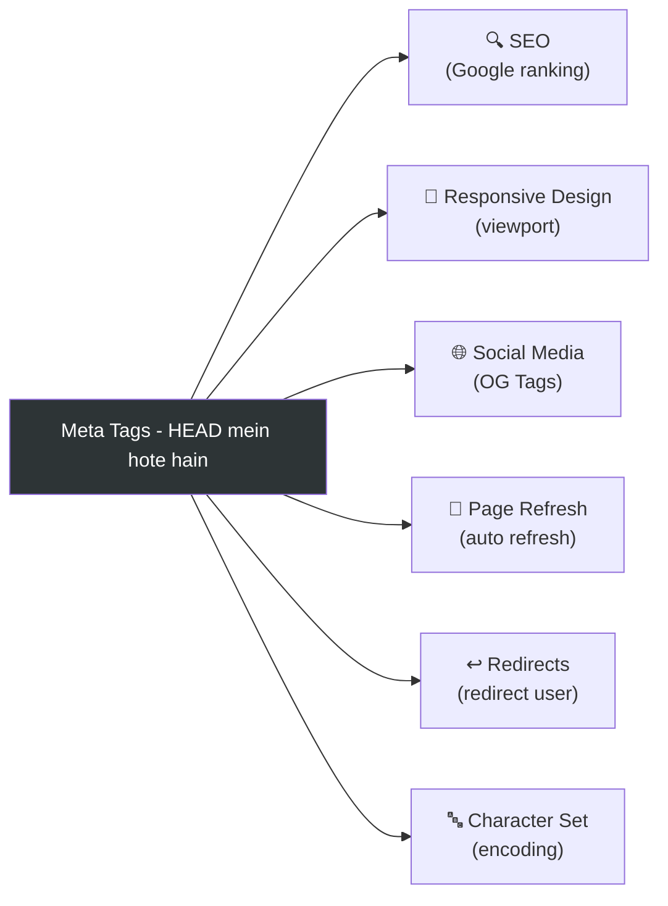

### Basic Meta Tag Syntax

```html
<meta name="property-name" content="value" />
<meta http-equiv="property" content="value" />
<meta charset="UTF-8" />
```

### All Important Meta Tags

```html
<!DOCTYPE html>
<html lang="en">
  <head>
    <!--===============================-->
    <!-- 1. CHARACTER SET - MOST IMP! -->
    <!--===============================-->
    <meta charset="UTF-8" />
    <!-- UTF-8: Supports ALL languages, emojis, special characters -->
    <!-- Without this: Hindi, Arabic, Chinese may not display! -->

    <!--============================-->
    <!-- 2. VIEWPORT (Responsive) -->
    <!--============================-->
    <meta name="viewport" content="width=device-width, initial-scale=1.0" />
    <!-- Makes website mobile-friendly -->
    <!-- width=device-width: page width = screen width -->
    <!-- initial-scale=1.0: no zoom by default -->

    <!--================-->
    <!-- 3. DESCRIPTION -->
    <!--================-->
    <meta
      name="description"
      content="Learn HTML from beginner to expert. Complete tutorial with examples and projects."
    />
    <!-- Shows in Google search results below title -->
    <!-- Recommended: 150-160 characters -->

    <!--==============-->
    <!-- 4. KEYWORDS -->
    <!--==============-->
    <meta name="keywords" content="HTML, CSS, JavaScript, Web Development, Tutorial" />
    <!-- For SEO - what topics this page is about -->
    <!-- Note: Google mostly ignores this now, but still good practice -->

    <!--============-->
    <!-- 5. AUTHOR -->
    <!--============-->
    <meta name="author" content="John Doe" />

    <!--===========================-->
    <!-- 6. ROBOTS (SEO Control) -->
    <!--===========================-->
    <meta name="robots" content="index, follow" />
    <!-- index: Google can index this page -->
    <!-- follow: Google can follow links on this page -->
    <!-- Other values: noindex, nofollow, noarchive -->

    <!--========================-->
    <!-- 7. AUTO REFRESH PAGE -->
    <!--========================-->
    <meta http-equiv="refresh" content="30" />
    <!-- Refreshes page every 30 seconds -->
    <!-- Use case: News sites, live scores, dashboards -->

    <!--======================-->
    <!-- 8. PAGE REDIRECTION -->
    <!--======================-->
    <!-- <meta http-equiv="refresh" content="5; url=https://newsite.com" /> -->
    <!-- Redirect to new URL after 5 seconds -->

    <!--==========================-->
    <!-- 9. SOCIAL MEDIA (OG) -->
    <!--==========================-->
    <meta property="og:title" content="Complete HTML Tutorial" />
    <meta
      property="og:description"
      content="Learn HTML from beginner to expert"
    />
    <meta property="og:image" content="https://example.com/thumbnail.jpg" />
    <meta property="og:url" content="https://example.com/html-tutorial" />
    <meta property="og:type" content="website" />
    <!-- When shared on Facebook, WhatsApp - shows this preview -->

    <!--=====================================-->
    <!-- 10. TWITTER CARD -->
    <!--=====================================-->
    <meta name="twitter:card" content="summary_large_image" />
    <meta name="twitter:title" content="Complete HTML Tutorial" />
    <meta name="twitter:description" content="Learn HTML completely" />

    <!--====================-->
    <!-- 11. THEME COLOR -->
    <!--====================-->
    <meta name="theme-color" content="#4285f4" />
    <!-- Mobile browser address bar color -->

    <title>Complete HTML Tutorial | Learn Web Development</title>
  </head>
  <body>
    <h1>Meta Tags Demo</h1>
  </body>
</html>
```

### Meta Tags Impact Visualization

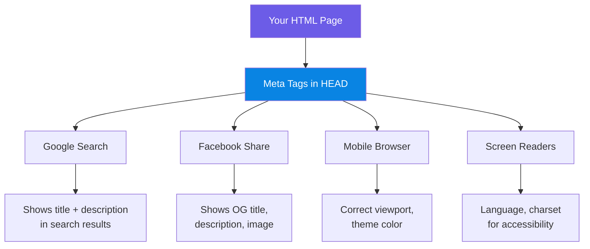

[🔝 Go to Top](#top)

---

# 8. HTML Comments {#html-comments}

### 🤔 Why Comments? Need?

> **Team mein kaam karte ho, 6 mahine baad code dekhte ho — comments life saver hain!**
> Comments browser display nahi karta, but developer ko code samjhne mein help karta hai.

### Basic Syntax

```html
<!-- This is a comment -->

<!-- 
    Multi-line comment
    Browser will ignore all of this
    Very useful for documentation
-->

<!-- Syntax:
     Start: <!--
     End:   - ->
     Content: Anything between these
-->
```

### Types of Comments

```html
<!DOCTYPE html>
<html>
  <body>
    <!-- 1. Single line comment -->
    <h1>Hello World</h1>

    <!-- 
        2. Multi-line comment
        This section handles the navigation
        Author: John Doe
        Date: January 2024
        Version: 1.0
    -->
    <nav>
      <ul>
        <li><a href="#">Home</a></li>
      </ul>
    </nav>

    <!-- 3. Commenting out code (debugging) -->
    <!-- <p>This paragraph is temporarily disabled</p> -->

    <!-- 4. Section markers - Very useful in long files -->
    <!-- ==================== HEADER START ==================== -->
    <header>
      <h1>Website Title</h1>
    </header>
    <!-- ==================== HEADER END ===================== -->

    <!-- ==================== MAIN CONTENT START ============= -->
    <main>
      <p>Main content here</p>
    </main>
    <!-- ==================== MAIN CONTENT END =============== -->

    <!-- ==================== FOOTER START =================== -->
    <footer>
      <p>&copy; 2024</p>
    </footer>
    <!-- ==================== FOOTER END ===================== -->

    <!-- 5. TODO Comments -->
    <!-- TODO: Add responsive navigation here -->
    <!-- TODO: Connect this form to backend API -->
    <!-- FIXME: This div overflows on mobile -->

    <!-- 6. Conditional Comments (OLD IE specific - Historical) -->
    <!--[if IE]>
    <p>You are using Internet Explorer!</p>
    <![endif]-->
  </body>
</html>
```

### 🚨 What NOT to put in Comments (Security!)

```html
<!-- ❌ NEVER DO THIS - Security Risk! -->
<!-- Database password: mypassword123 -->
<!-- API Key: sk-abc123xyz789 -->
<!-- Admin URL: /secret-admin-panel -->

<!-- ✅ Comments are VISIBLE in View Source! -->
<!-- Anyone can press Ctrl+U and see all your comments! -->
<!-- Only put developer notes, never sensitive information -->
```

[🔝 Go to Top](#top)

---

# 🎯 Mini Project - Section 1 {#mini-project}

## Personal Portfolio Page - Sab concepts ek saath!

> **Project mein shamil hai:** DOCTYPE, Structure, Headings, Paragraphs, Formatting, Phrase Tags, Meta Tags, Comments, Attributes, Lists, Links — Section 1 ke **saare concepts**!

```html
<!DOCTYPE html>
<!-- DOCTYPE - Tells browser this is HTML5 -->
<html lang="en">
  <!-- lang attribute for internationalization -->

  <head>
    <!-- Meta Tags for SEO and proper rendering -->
    <meta charset="UTF-8" />
    <!-- Character encoding -->
    <meta name="viewport" content="width=device-width, initial-scale=1.0" />
    <!-- Responsive -->
    <meta
      name="description"
      content="John Doe - Full Stack Web Developer Portfolio"
    />
    <!-- SEO Description -->
    <meta name="author" content="John Doe" />
    <meta
      name="keywords"
      content="web developer, HTML, CSS, JavaScript, portfolio"
    />

    <!-- Social Media Preview -->
    <meta property="og:title" content="John Doe - Web Developer" />
    <meta
      property="og:description"
      content="Portfolio of John Doe, Full Stack Developer"
    />

    <title>John Doe | Full Stack Developer</title>

    <!-- Internal Styling -->
    <style>
      body {
        font-family: Arial, sans-serif;
        max-width: 800px;
        margin: 0 auto;
        padding: 20px;
        background-color: #f5f5f5;
      }

      /* Section styling using class */
      .section {
        background: white;
        padding: 20px;
        margin: 20px 0;
        border-radius: 8px;
        border-left: 4px solid #4285f4;
      }

      /* id for unique elements */
      #hero {
        background: linear-gradient(135deg, #4285f4, #34a853);
        color: white;
        text-align: center;
        padding: 40px;
        border-radius: 8px;
      }

      .highlight {
        background-color: #fff3cd;
        padding: 2px 5px;
        border-radius: 3px;
      }

      .tech-tag {
        display: inline-block;
        background: #e8f0fe;
        color: #4285f4;
        padding: 3px 10px;
        margin: 3px;
        border-radius: 20px;
        font-size: 0.9em;
      }

      kbd {
        background: #f1f1f1;
        border: 1px solid #ccc;
        padding: 2px 6px;
        border-radius: 3px;
        font-size: 0.9em;
      }

      footer {
        text-align: center;
        margin-top: 30px;
        padding: 20px;
        border-top: 1px solid #ddd;
      }
    </style>
  </head>

  <body>
    <!-- =================== HERO SECTION =================== -->
    <div id="hero">
      <h1>John Doe</h1>
      <!-- h1 - Main page title, only one per page -->
      <p><em>Full Stack Web Developer</em> from Mumbai, India 🇮🇳</p>
    </div>
    <!-- =================== HERO SECTION END =============== -->

    <!-- =================== ABOUT SECTION ================= -->
    <div class="section" id="about">
      <h2>👋 About Me</h2>
      <!-- h2 - Section heading -->

      <p>
        Namaste! I am
        <strong>John Doe</strong>, a passionate web developer with
        <mark>5+ years of experience</mark>
        building modern web applications.
      </p>

      <p>
        I specialize in creating
        <em>responsive</em>, <em>accessible</em>, and
        <em>performant</em> web applications. Currently working at
        <abbr title="XYZ Technology Solutions Private Limited">XYZ Tech</abbr>.
      </p>

      <!-- Address using address tag -->
      <address>
        📧 <a href="mailto:john@example.com">john@example.com</a><br />
        📍 Mumbai,&nbsp;Maharashtra,&nbsp;India<br />
        🌐 <a href="https://johndoe.dev" title="My Portfolio Website">johndoe.dev</a>
      </address>
    </div>
    <!-- =================== ABOUT END ==================== -->

    <!-- =================== SKILLS SECTION =============== -->
    <div class="section" id="skills">
      <h2>💻 Technical Skills</h2>

      <h3>Frontend Development</h3>
      <!-- h3 - Sub-section -->
      <p>
        <span class="tech-tag">HTML5</span>
        <span class="tech-tag">CSS3</span>
        <span class="tech-tag">JavaScript</span>
        <span class="tech-tag">React.js</span>
        <span class="tech-tag">TypeScript</span>
      </p>

      <h3>Backend Development</h3>
      <p>
        <span class="tech-tag">Node.js</span>
        <span class="tech-tag">Express.js</span>
        <span class="tech-tag">Python</span>
        <span class="tech-tag">MongoDB</span>
        <span class="tech-tag">PostgreSQL</span>
      </p>

      <h3>Tools & Technologies</h3>
      <p>
        <span class="tech-tag">Git</span>
        <span class="tech-tag">Docker</span>
        <span class="tech-tag">VS Code</span>
        <span class="tech-tag">Linux</span>
      </p>
    </div>
    <!-- =================== SKILLS END ================= -->

    <!-- =================== EXPERIENCE SECTION ========= -->
    <div class="section" id="experience">
      <h2>💼 Work Experience</h2>

      <h3>Senior Frontend Developer</h3>
      <p>
        <strong>XYZ Tech Pvt. Ltd.</strong> |
        <em>Jan 2022 - Present</em>
      </p>
      <p>
        Led a team of 5 developers to build a
        <mark>₹10 Crore e-commerce platform</mark>
        serving
        <strong><span class="highlight">1 Million+ users</span></strong
        > daily.
      </p>

      <hr />
      <!-- Horizontal rule to separate jobs -->

      <h3>Junior Web Developer</h3>
      <p>
        <strong>ABC Solutions</strong> |
        <em>June 2019 - Dec 2021</em>
      </p>
      <p>
        Built responsive websites and web apps. Reduced page load time by
        <del>50%</del>
        <ins>60%</ins>
        through optimization.
      </p>
    </div>
    <!-- =================== EXPERIENCE END ============= -->

    <!-- =================== PROJECTS SECTION =========== -->
    <div class="section" id="projects">
      <h2>🚀 Featured Projects</h2>

      <h3>1. E-Commerce Platform</h3>
      <p>
        <dfn>React.js</dfn>-based shopping platform with real-time inventory.
      </p>
      <p>
        Tech Stack:
        <code>React + Node.js + MongoDB</code>
      </p>

      <blockquote
        cite="https://client-review.com"
        style="
          border-left: 3px solid #4285f4;
          padding-left: 10px;
          color: #555;
        "
      >
        <q>This platform transformed our business. Sales increased by 200%!</q>
        <footer>— <cite>Happy Client, CEO of Retail Co.</cite></footer>
      </blockquote>

      <h3>2. Education Platform</h3>
      <p>Online learning platform for
        <span class="highlight">10,000+ students</span>.
      </p>
      <p>Built with: <code>HTML + CSS + JavaScript + Python</code></p>
    </div>
    <!-- =================== PROJECTS END =============== -->

    <!-- =================== QUICK TIPS SECTION ======== -->
    <div class="section" id="tips">
      <h2>📝 Developer Tips</h2>

      <h3>Useful Keyboard Shortcuts:</h3>
      <ul>
        <!-- Unordered list with nested elements -->
        <li>
          <kbd>Ctrl</kbd> + <kbd>S</kbd> — Save file
        </li>
        <li>
          <kbd>Ctrl</kbd> + <kbd>Z</kbd> — Undo
        </li>
        <li>
          <kbd>Ctrl</kbd> + <kbd>Shift</kbd> + <kbd>I</kbd> — Open DevTools
        </li>
        <li>
          <kbd>F5</kbd> — Refresh page
        </li>
      </ul>

      <h3>Math in Programming:</h3>
      <p>
        Area = πr<sup>2</sup> | Water = H<sub>2</sub>O |
        Speed = ms<sup>-1</sup>
      </p>

      <h3>Sample Code Output:</h3>
      <pre><code>
// JavaScript Example
function greet(name) {
    return `Hello, ${name}!`;
}

console.log(greet("World"));
// Output: Hello, World!
      </code></pre>

      <p>Program says: <samp>Hello, World!</samp></p>
    </div>
    <!-- =================== TIPS END =================== -->

    <!-- =================== FOOTER ==================== -->
    <footer>
      <small>
        &copy; 2024 John Doe. All rights reserved. |
        <a href="#" title="Back to top">Back to Top ↑</a>
      </small>
      <br />
      <small>
        Made with ❤️ using
        <abbr title="HyperText Markup Language version 5">HTML5</abbr>
      </small>
    </footer>
    <!-- =================== FOOTER END ================ -->
  </body>
</html>
```

### Project Structure Overview

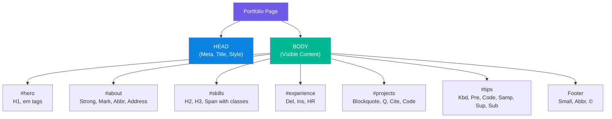

[🔝 Go to Top](#top)

---

# 💼 Interview Questions {#interview-questions}

## Section 1 - Tricky Interview Questions with Answers

---

### Q1. 🔥 Output Question - What will browser display?

```html
<p>
  Hello     World
  How are   you?
</p>
```

**Answer:** `Hello World How are you?`

> **Explanation:** HTML multiple spaces/newlines ko single space mein compress kar deta hai — ise **whitespace collapsing** kehte hain. `<pre>` tag ya `&nbsp;` use karna padega spaces preserve karne ke liye.

---

### Q2. 🔥 What's wrong with this code?

```html
<p>This is <strong>bold and <em>bold-italic</p></em></strong>
```

**Answer:** Nesting order WRONG hai!

```html
<!-- ❌ Wrong -->
<p>...<strong>...<em>...</p></em></strong>

<!-- ✅ Correct -->
<p>...<strong>...<em>...</em></strong></p>
```

> **Explanation:** Tags ko usi order mein close karna chahiye jis order mein open kiye gaye — LIFO (Last In, First Out) principle.

---

### Q3. 🔥 Difference between `<b>` and `<strong>`?

| `<b>` | `<strong>` |
|---|---|
| Only visual bold | Semantic importance + bold |
| No special meaning | Screen readers read with emphasis |
| Styling purpose | Important content |
| `<b>keyword</b>` | `<strong>Warning!</strong>` |

---

### Q4. 🔥 Output Question

```html
<h1 style="font-weight: normal;">This is heading</h1>
```

**Answer:** Text will be displayed at h1 SIZE (large) but NOT BOLD.

> **Explanation:** `font-weight: normal` CSS removes the bold from heading, but size remains h1 size. Style attribute overrides default browser styling.

---

### Q5. 🔥 Can we have multiple `<h1>` tags on one page?

**Answer:** Technically YES, browser won't throw error. But:
- Bad for SEO (Google considers first h1 as main topic)
- Bad for accessibility (screen readers use h1 as page title)
- Goes against semantic HTML principles
- **Best Practice:** One `<h1>` per page

---

### Q6. 🔥 What is the difference between `id` and `class`?

```html
<!-- id = Unique. Like your Aadhar Card - only ONE per person -->
<div id="header">...</div>

<!-- class = Group. Like a school uniform - many people wear same -->
<div class="card">...</div>
<div class="card">...</div>
<div class="card">...</div>
```

| `id` | `class` |
|---|---|
| Unique — one element | Shared — multiple elements |
| CSS: `#id-name` | CSS: `.class-name` |
| JS: `getElementById()` | JS: `getElementsByClassName()` |
| Higher specificity | Lower specificity |

---

### Q7. 🔥 Output Question - Tricky!

```html
<p>Price: <del>₹999</del> Now ₹<b>499</b>!</p>
```

**Answer:** `Price: ~~₹999~~ Now ₹**499**!`

> ₹999 has strikethrough, ₹499 is bold. Browser renders del with line-through and b with bold.

---

### Q8. 🔥 What happens if DOCTYPE is missing?

**Answer:**
- Browser goes into **Quirks Mode**
- Old Internet Explorer rendering engine activates
- CSS behaves differently/unexpectedly  
- Box model changes (IE treats box model differently)
- Layout breaks in different browsers
- Page may look different across browsers

---

### Q9. 🔥 What is the difference between `<em>` and `<i>`?

```html
<i>book title</i>     <!-- Visual italic only - no meaning -->
<em>important word</em> <!-- Semantic emphasis - screen reader changes tone -->
```

> **Screen reader test:** `<em>Never</em> do this` — screen reader will stress "Never". `<i>Never</i> do this` — screen reader reads normally.

---

### Q10. 🔥 Tricky Output - What does this display?

```html
<p>1&lt;2 and 3&gt;2</p>
```

**Answer:** `1<2 and 3>2`

> **Explanation:** HTML entities: `&lt;` = `<` and `&gt;` = `>`. You can't write `<` or `>` directly in HTML content (browser thinks it's a tag), so entities are used.

---

### Q11. 🔥 Scenario Question

**Scenario:** Ek news website hai jo different languages mein content dikhata hai — English, Hindi, aur Arabic. Arabic text right se left mein likhte hain. Kaise handle karoge?

**Answer:**

```html
<html lang="en">
  <body>
    <!-- English content -->
    <p lang="en">Today's top news in English</p>

    <!-- Hindi content -->
    <p lang="hi">आज की मुख्य खबर हिंदी में</p>

    <!-- Arabic content - RTL direction -->
    <p lang="ar" dir="rtl">الأخبار الرئيسية باللغة العربية</p>

    <!-- Whole section RTL -->
    <div lang="ar" dir="rtl">
      <h2>عنوان القسم</h2>
      <p>محتوى القسم</p>
    </div>
  </body>
</html>
```

---

### Q12. 🔥 What are void/empty elements in HTML? Give 5 examples.

**Answer:** Elements jo self-closing hote hain — inke andar content nahi hota, closing tag nahi hota.

```html
<br />    <!-- Line break -->
<hr />    <!-- Horizontal rule -->
   <!-- Image -->
<input /> <!-- Form input -->
<meta />  <!-- Meta information -->
<link />  <!-- External resource link -->
<area />  <!-- Image map area -->
<base />  <!-- Base URL -->
<col />   <!-- Table column -->
<source /> <!-- Media source -->
```

---

### Q13. 🔥 Scenario - Meta Tags

**Scenario:** Your website link jab WhatsApp pe share kiya, toh sirf URL dikh raha hai, koi preview nahi. Kaise fix karoge?

**Answer:** Open Graph (OG) meta tags add karo:

```html
<head>
  <meta property="og:title" content="Amazing Website Title" />
  <meta property="og:description" content="Best website description here" />
  <meta property="og:image" content="https://yoursite.com/preview-image.jpg" />
  <meta property="og:url" content="https://yoursite.com" />
  <meta property="og:type" content="website" />
</head>
```

---

### Q14. 🔥 Output Question

```html
<p>He scored 10<sup>th</sup> position in class X<sub>1</sub></p>
```

**Answer:** `He scored 10^th position in class X₁`

> 10th — 'th' appears as superscript (above baseline, smaller). X₁ — '1' appears as subscript (below baseline, smaller).

---

### Q15. 🔥 Why `alt` attribute in `` is important?

**Answer:** Multiple reasons:
1. **Accessibility:** Screen readers read alt text for visually impaired users
2. **SEO:** Google reads alt text to understand image content
3. **Fallback:** When image fails to load, alt text shows
4. **Legal:** Many countries legally require alt text for accessibility

```html
<!-- ❌ Missing alt -->


<!-- ❌ Empty alt (only for decorative images) -->


<!-- ✅ Descriptive alt -->

```

[🔝 Go to Top](#top)

---

# 🏋️ Practice Projects & Questions {#practice-projects}

## Section 1 Practice Exercises

---

### 🟢 Beginner Level

**Project 1: Personal Bio Card**
```
Create an HTML page with:
✅ Proper DOCTYPE and structure
✅ Your name as H1
✅ Short bio in paragraphs
✅ Bold your skills, italic your interests
✅ Add your address using <address> tag
✅ Use at least 3 meta tags
✅ Add comments explaining each section
```

**Project 2: Recipe Page**
```
Create a recipe page with:
✅ Recipe name as H1
✅ Description in paragraph
✅ Ingredients list (use nested lists)
✅ Steps as ordered list
✅ Nutritional info with sub/superscript
✅ A quote from a food critic using <blockquote>
✅ Tips section using <kbd> for any keyboard shortcut
```

---

### 🟡 Intermediate Level

**Project 3: News Article Page**
```
Create a news article with:
✅ Proper meta tags for SEO (description, keywords, OG tags)
✅ Heading hierarchy (h1 to h4)
✅ Article in multiple paragraphs
✅ Use <mark> for highlighted terms
✅ Use <del> and <ins> for corrections
✅ Different language quotes with lang attribute
✅ Abbreviations with tooltips using <abbr>
✅ Citations using <cite>
✅ Author info using <address>
✅ Horizontal rules to separate sections
```

**Project 4: Technical Documentation Page**
```
Create a docs page:
✅ Multiple sections with id attributes
✅ Internal navigation links (href="#section-id")
✅ Code examples using <code> and <pre>
✅ Keyboard shortcuts using <kbd>
✅ Variables using <var>
✅ Sample output using <samp>
✅ Comments documenting each section
✅ &lt; and &gt; entities for showing HTML in text
```

---

### 🔴 Advanced Level

**Project 5: Complete Portfolio Website (Single Page)**
```
Build a complete portfolio:
✅ Complete meta tags (SEO + OG + Twitter Cards)
✅ Semantic heading hierarchy throughout
✅ Hero section with your name (h1)
✅ About section with formatting tags
✅ Skills section using spans and classes
✅ Projects section with blockquotes/citations
✅ Contact section with address and links
✅ Footer with copyright using &copy;
✅ All images with proper alt text
✅ RTL text example (any Arabic/Hebrew quote)
✅ Comments on every major section
✅ &nbsp; used appropriately
✅ Pre-formatted code examples
✅ Keyboard shortcuts reference
```

---

### 📝 Quick Practice Questions

1. **Code Challenge:** Write HTML that displays: `E = mc²` (with proper superscript)

2. **Debug Challenge:** Find 3 errors in this code:
```html
<html>
<Head>
<title>My Page
</head>
<Body>
<H1>Hello</h1>
<p>Para 1<p>Para 2</p>
</html>
```

3. **Output Predict:** What will this display?
```html
<p><strong><em>Important:</em></strong> Read <abbr title="Terms and Conditions">T&C</abbr></p>
```

4. **Scenario:** User complaints ki unka website Google pe nahi aa raha. Kaunse meta tags add karoge?

5. **Fill in blank:** `___ attribute gives unique identity to an element, while ___ attribute can be shared among multiple elements.`

6. **True/False Questions:**
   - `<br>` needs a closing tag → **False**
   - Multiple `<h1>` tags are invalid HTML → **False** (valid but bad practice)
   - `id` can be applied to multiple elements → **False**
   - `<b>` and `<strong>` look the same in browser → **True** (visually similar)
   - DOCTYPE is an HTML tag → **False**

---

### 📊 Self-Assessment Checklist

```
After completing Section 1, you should be able to:

□ Create a properly structured HTML document from scratch
□ Explain the difference between tag and element
□ Know when to use h1-h6 correctly
□ Understand inline vs block elements (div vs span)
□ Use all formatting tags correctly
□ Add SEO meta tags to any page
□ Write semantic phrase tags
□ Use id and class attributes correctly
□ Handle multilingual content with lang and dir
□ Write useful comments
□ Use HTML entities correctly
□ Answer all 15 interview questions above
```

[🔝 Go to Top](#top)

---

> **✅ Section 1 Complete!**
>
> **Next:** Section 2 covers — Images, Tables, Lists, Links, Image Links, Email Links, Frames, iFrames, Blocks, Backgrounds, Colors, Fonts
>
> **Aur yad rakho:** HTML sikhna ek process hai. Ek baar padho, phir khud likhke dekho — tabhi pakka yaad rahega! 💪

[🔝 Go to Top](#top)


# 📚 HTML Complete Notes - Section 2 (Intermediate)

> **Interview Focused | Detailed | Project-Based Learning**

---

<div id="top"></div>

## 📋 Table of Contents

- [9. HTML Images](#html-images)
  - [Insert Image](#insert-image)
  - [Image Location](#image-location)
  - [Image Width & Height](#image-width-height)
  - [Image Border](#image-border)
  - [Image Alignment](#image-alignment)
- [10. HTML Tables](#html-tables)
  - [Basic Table Structure](#basic-table-structure)
  - [Table Heading](#table-heading)
  - [Cellpadding & Cellspacing](#cellpadding-cellspacing)
  - [Colspan & Rowspan](#colspan-rowspan)
  - [Table Background](#table-background)
  - [Table Height & Width](#table-height-width)
  - [Table Caption](#table-caption)
  - [Table Header Body Footer](#table-header-body-footer)
  - [Nested Tables](#nested-tables)
- [11. HTML Lists](#html-lists)
  - [Unordered Lists](#unordered-lists)
  - [Ordered Lists](#ordered-lists)
  - [Definition Lists](#definition-lists)
- [12. HTML Text Links](#html-text-links)
  - [Linking Documents](#linking-documents)
  - [Target Attribute](#target-attribute)
  - [Base Path](#base-path)
  - [Linking to Page Section](#linking-to-page-section)
  - [Link Colors](#link-colors)
  - [Download Links](#download-links)
- [13. HTML Image Links](#html-image-links)
  - [Mouse Sensitive Images](#mouse-sensitive-images)
  - [Server Side Image Maps](#server-side-image-maps)
  - [Client Side Image Maps](#client-side-image-maps)
- [14. HTML Email Links](#html-email-links)
- [15. HTML Frames](#html-frames)
- [16. HTML iFrames](#html-iframes)
- [17. HTML Blocks](#html-blocks)
- [18. HTML Backgrounds](#html-backgrounds)
- [19. HTML Colors](#html-colors)
- [20. HTML Fonts](#html-fonts)
- [🎯 Mini Project - Section 2](#mini-project-2)
- [💼 Interview Questions](#interview-questions-2)
- [🏋️ Practice Projects](#practice-projects-2)

---

# 9. HTML Images {#html-images}

## 🤔 Why Images? Problem it Solves?

> **Ek picture 1000 words kehti hai** — yahi concept web pe bhi apply hota hai. Bina images ke web sirf plain text hoga. Images content ko engaging, informative, aur visually appealing banati hain.
>
> **Real life analogy:** Jaise ek restaurant ka menu sirf text mein hoga toh boring lagega, but photos ke saath dishes attractive lagti hain — exactly wahi HTML images karte hain!

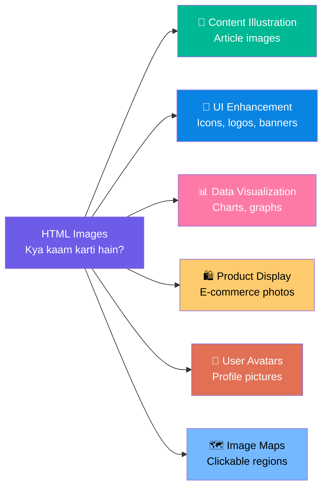

---

## Insert Image {#insert-image}

### Basic Syntax

```html


<!--
REQUIRED Attributes:
  src="path"        → Source/location of image (REQUIRED)
  alt="text"        → Alternative text (REQUIRED for accessibility)

OPTIONAL Attributes:
  width="value"     → Width in pixels or %
  height="value"    → Height in pixels or %
  title="text"      → Tooltip on hover
  loading="lazy"    → Lazy loading (performance)
  id="value"        → Unique identifier
  class="value"     → CSS class
  style="value"     → Inline CSS
-->
```

### Image Formats Supported

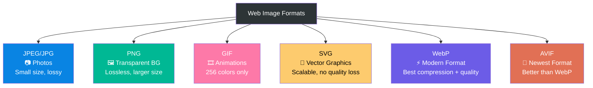

```html
<!DOCTYPE html>
<html>
  <body>
    <!-- Basic image -->
    

    <!-- Image with all common attributes -->
    

    <!-- Different image formats -->
    
    
    

    <!-- Image with inline styling -->
    
  </body>
</html>
```

---

## Image Location {#image-location}

### 🤔 Path Types - Bahut Important!

> **Path matlab raasta** — browser ko batana padta hai image kahan hai. Ghar ka address jaise — relative address (nearby) ya absolute address (full address).

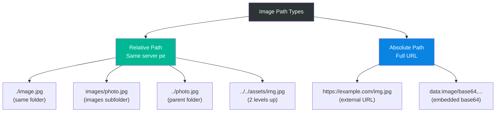

```
📁 Project Structure:
├── index.html          ← You are here
├── about.html
├── images/
│   ├── logo.jpg
│   ├── banner.png
│   └── products/
│       └── shoe.jpg
└── assets/
    └── icons/
        └── star.svg
```

```html
<!DOCTYPE html>
<html>
  <body>
    <!-- 1. Same folder as HTML file -->
    

    <!-- 2. Images subfolder -->
    

    <!-- 3. Nested subfolder -->
    

    <!-- 4. Parent directory (go up one level) -->
    

    <!-- 5. Two levels up -->
    

    <!-- 6. Absolute URL (external image) -->
    

    <!-- 7. Absolute URL (your own domain) -->
    

    <!-- 8. What happens when image not found? -->
    
    <!-- Browser shows: [broken image icon] + alt text -->
  </body>
</html>
```

---

## Image Width & Height {#image-width-height}

### 🤔 Why Specify Width/Height?

> **Performance reason:** Jab browser page load karta hai, agar image ka size pata nahi toh page "jump" karta hai jab image load hoti hai — ise **Layout Shift** kehte hain. Width/height specify karne se browser pehle se space reserve kar leta hai.

```html
<!--
Width/Height Specify Karne ke 3 Ways:

1. HTML attributes (pixels)
2. HTML attributes (percentage)
3. CSS (recommended for responsive design)

Syntax:

-->
```

```html
<!DOCTYPE html>
<html>
  <head>
    <style>
      .responsive-img {
        width: 100%;        /* Full container width */
        height: auto;       /* Maintain aspect ratio */
        max-width: 600px;   /* But not more than 600px */
      }
      .thumbnail {
        width: 100px;
        height: 100px;
        object-fit: cover;  /* Crop to fit, don't stretch */
      }
      .fixed-size {
        width: 300px;
        height: 200px;
      }
    </style>
  </head>
  <body>
    <!-- Pixels (fixed size) -->
    

    <!-- Percentage (relative to parent) -->
    

    <!-- Auto height (maintain aspect ratio) -->
    

    <!-- CSS approach (RECOMMENDED) -->
    

    <!-- Thumbnail with crop -->
    

    <!-- ⚠️ WRONG - Stretching image (always maintain aspect ratio) -->
    
    <!-- This will look distorted! -->

    <!-- ✅ CORRECT - Let height be auto -->
    
    <!-- Height adjusts automatically -->
  </body>
</html>
```

### Aspect Ratio Concept

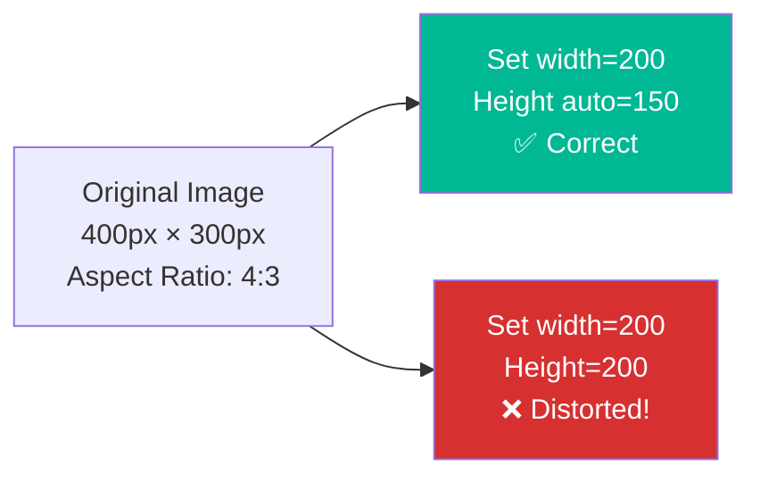

---

## Image Border {#image-border}

```html
<!--
Image Border:
- Old HTML way: border attribute (deprecated in HTML5)
- Modern way: CSS border property

Syntax (Old - Deprecated):


Modern CSS way:

-->
```

```html
<!DOCTYPE html>
<html>
  <head>
    <style>
      .simple-border {
        border: 3px solid black;
      }
      .colored-border {
        border: 4px solid #4285f4;
      }
      .rounded-border {
        border: 3px solid purple;
        border-radius: 10px;        /* Rounded corners */
      }
      .circle-image {
        border: 3px solid gold;
        border-radius: 50%;         /* Perfect circle */
        width: 150px;
        height: 150px;
        object-fit: cover;
      }
      .shadow-image {
        box-shadow: 5px 5px 15px rgba(0,0,0,0.3);
      }
      .fancy-border {
        border: 5px double blue;
        padding: 5px;
      }
    </style>
  </head>
  <body>
    <!-- Old deprecated way -->
    

    <!-- Modern CSS borders -->
    
    
    
    
    
    
  </body>
</html>
```

---

## Image Alignment {#image-alignment}

```html
<!--
Image Alignment:
- Old HTML way: align attribute (deprecated)
- Modern way: CSS float, flexbox, or text-align

align values (deprecated):
  left, right, top, middle, bottom

CSS equivalent:
  float: left/right
  vertical-align: top/middle/bottom (for inline images)
-->
```

```html
<!DOCTYPE html>
<html>
  <head>
    <style>
      .float-left {
        float: left;
        margin: 0 15px 10px 0;
      }
      .float-right {
        float: right;
        margin: 0 0 10px 15px;
      }
      .clearfix::after {
        content: "";
        display: block;
        clear: both;
      }
      .center-image {
        display: block;
        margin: 0 auto;
      }
    </style>
  </head>
  <body>
    <!-- Old deprecated align -->
    

    <!-- Modern: Float left (text wraps right) -->
    <div class="clearfix">
      
      <p>
        This text will wrap around the left-aligned image. Lorem ipsum dolor
        sit amet, consectetur adipiscing elit. Sed do eiusmod tempor incididunt
        ut labore et dolore magna aliqua.
      </p>
    </div>

    <!-- Modern: Float right (text wraps left) -->
    <div class="clearfix">
      
      <p>
        This text will wrap around the right-aligned image. Lorem ipsum dolor
        sit amet, consectetur adipiscing elit.
      </p>
    </div>

    <!-- Center aligned image -->
    

    <!-- Vertical alignment within text -->
    <p>
      Text before
      
      Text after - icon is middle aligned
    </p>
  </body>
</html>
```

[🔝 Go to Top](#top)

---

# 10. HTML Tables {#html-tables}

## 🤔 Why Tables? Need? Problem it Solves?

> **Tables ka asli kaam hai tabular data dikhana** — jaise spreadsheet mein rows aur columns mein data hota hai. Pehle log tables se layout bhi banate the, but ab woh CSS ka kaam hai.
>
> **Real life analogy:** Railway timetable, school report card, price comparison chart — yeh sab tabular data hai aur HTML tables ke liye perfect use case hai!

```mermaid
flowchart LR
    A[HTML Table\nKab use karein?] --> B["✅ Schedule/Timetable"]
    A --> C["✅ Price Comparison"]
    A --> D["✅ Financial Data"]
    A --> E["✅ Sports Scores"]
    A --> F["✅ Inventory Lists"]
    A --> G["❌ Page Layout\n(Use CSS Flexbox/Grid)"]

    style A fill:#6c5ce7,color:#fff
    style G fill:#d63031,color:#fff
```

---

## Basic Table Structure {#basic-table-structure}

### Syntax with Arguments

```html
<table>           <!-- Table container -->
  <tr>            <!-- Table Row -->
    <td>Data</td> <!-- Table Data cell -->
    <th>Head</th> <!-- Table Header cell (bold + centered) -->
  </tr>
</table>

<!--
<table> Attributes:
  border="value"      → Border thickness (deprecated, use CSS)
  width="value"       → Table width
  height="value"      → Table height
  cellpadding="value" → Space inside cells
  cellspacing="value" → Space between cells
  bgcolor="color"     → Background color (deprecated)
  align="value"       → Table alignment (deprecated)
  summary="text"      → Description for accessibility

<tr> Attributes:
  align="left|center|right|justify"
  valign="top|middle|bottom"
  bgcolor="color"

<td> and <th> Attributes:
  colspan="number"  → Span multiple columns
  rowspan="number"  → Span multiple rows
  width="value"     → Cell width
  height="value"    → Cell height
  align="value"     → Horizontal alignment
  valign="value"    → Vertical alignment
  bgcolor="color"   → Background color
  nowrap            → Prevent text wrapping
-->
```

### Basic Table Example

```html
<!DOCTYPE html>
<html>
  <head>
    <style>
      table {
        border-collapse: collapse;  /* Remove double borders */
        width: 100%;
      }
      th, td {
        border: 1px solid #ddd;
        padding: 12px;
        text-align: left;
      }
      th {
        background-color: #4285f4;
        color: white;
      }
      tr:nth-child(even) {
        background-color: #f2f2f2; /* Zebra striping */
      }
      tr:hover {
        background-color: #e8f0fe; /* Highlight on hover */
      }
    </style>
  </head>
  <body>
    <!-- Most Basic Table -->
    <table border="1">
      <tr>
        <td>Cell 1</td>
        <td>Cell 2</td>
        <td>Cell 3</td>
      </tr>
      <tr>
        <td>Cell 4</td>
        <td>Cell 5</td>
        <td>Cell 6</td>
      </tr>
    </table>

    <br />

    <!-- Styled Student Report Card -->
    <table>
      <tr>
        <th>Subject</th>
        <th>Marks Obtained</th>
        <th>Total Marks</th>
        <th>Grade</th>
      </tr>
      <tr>
        <td>Mathematics</td>
        <td>85</td>
        <td>100</td>
        <td>A</td>
      </tr>
      <tr>
        <td>English</td>
        <td>78</td>
        <td>100</td>
        <td>B+</td>
      </tr>
      <tr>
        <td>Science</td>
        <td>92</td>
        <td>100</td>
        <td>A+</td>
      </tr>
      <tr>
        <td>Hindi</td>
        <td>88</td>
        <td>100</td>
        <td>A</td>
      </tr>
      <tr>
        <td><strong>Total</strong></td>
        <td><strong>343</strong></td>
        <td><strong>400</strong></td>
        <td><strong>A</strong></td>
      </tr>
    </table>
  </body>
</html>
```

---

## Table Heading {#table-heading}

```html
<!--
<th> = Table Header
- Bold by default
- Center aligned by default
- Used for column/row headers
- Better accessibility (screen readers announce it as header)
- Can be used in any row, not just first row
-->
```

```html
<!DOCTYPE html>
<html>
  <body>
    <!-- Column headers -->
    <table border="1" style="border-collapse: collapse;">
      <tr>
        <th>Name</th>
        <th>Age</th>
        <th>City</th>
      </tr>
      <tr>
        <td>Rahul</td>
        <td>25</td>
        <td>Mumbai</td>
      </tr>
      <tr>
        <td>Priya</td>
        <td>23</td>
        <td>Delhi</td>
      </tr>
    </table>

    <br />

    <!-- Row headers + Column headers -->
    <table border="1" style="border-collapse: collapse;">
      <tr>
        <th>Day</th>
        <th>9 AM</th>
        <th>11 AM</th>
        <th>2 PM</th>
      </tr>
      <tr>
        <th>Monday</th>
        <td>Math</td>
        <td>English</td>
        <td>Science</td>
      </tr>
      <tr>
        <th>Tuesday</th>
        <td>Hindi</td>
        <td>Math</td>
        <td>English</td>
      </tr>
      <tr>
        <th>Wednesday</th>
        <td>Science</td>
        <td>Hindi</td>
        <td>Math</td>
      </tr>
    </table>
  </body>
</html>
```

---

## Cellpadding & Cellspacing {#cellpadding-cellspacing}

### 🤔 Difference Samjho Visually!

```mermaid
flowchart TD
    A["Table Cell"] --> B["cellpadding\n= Space INSIDE cell\n(between content and border)"]
    A --> C["cellspacing\n= Space BETWEEN cells\n(gap between borders)"]

    style A fill:#6c5ce7,color:#fff
    style B fill:#00b894,color:#fff
    style C fill:#0984e3,color:#fff
```

```
cellpadding visualization:
┌─────────────────┐
│   [padding]     │
│   [content]     │  ← padding = space around content inside cell
│   [padding]     │
└─────────────────┘

cellspacing visualization:
┌──────┐  [space]  ┌──────┐
│ Cell │           │ Cell │  ← spacing = gap between cells
└──────┘           └──────┘
```

```html
<!DOCTYPE html>
<html>
  <body>
    <!-- No padding/spacing (default) -->
    <h3>No Padding, No Spacing:</h3>
    <table border="1">
      <tr>
        <td>Cell 1</td>
        <td>Cell 2</td>
      </tr>
    </table>

    <!-- With cellpadding only -->
    <h3>Cellpadding = 15 (space inside):</h3>
    <table border="1" cellpadding="15">
      <tr>
        <td>Cell 1</td>
        <td>Cell 2</td>
      </tr>
    </table>

    <!-- With cellspacing only -->
    <h3>Cellspacing = 10 (space between):</h3>
    <table border="1" cellspacing="10">
      <tr>
        <td>Cell 1</td>
        <td>Cell 2</td>
      </tr>
    </table>

    <!-- Both combined -->
    <h3>Both Cellpadding=10 & Cellspacing=5:</h3>
    <table border="1" cellpadding="10" cellspacing="5">
      <tr>
        <th>Product</th>
        <th>Price</th>
        <th>Stock</th>
      </tr>
      <tr>
        <td>Laptop</td>
        <td>₹45,000</td>
        <td>In Stock</td>
      </tr>
      <tr>
        <td>Mouse</td>
        <td>₹500</td>
        <td>In Stock</td>
      </tr>
    </table>

    <!-- Modern CSS equivalent -->
    <h3>Modern CSS Way (Recommended):</h3>
    <table style="border-collapse: collapse;">
      <tr>
        <td style="padding: 15px; border: 1px solid #ddd;">Cell 1</td>
        <td style="padding: 15px; border: 1px solid #ddd;">Cell 2</td>
      </tr>
    </table>
  </body>
</html>
```

---

## Colspan & Rowspan {#colspan-rowspan}

### 🤔 Why? Problem it Solves?

> **Merge cells wala feature:** Jaise Excel mein cells merge karte ho — kuch cells ko ek badi cell banana chahte ho. Colspan = horizontal merge (columns), Rowspan = vertical merge (rows).

```mermaid
flowchart LR
    A[colspan] --> B["Spans MULTIPLE COLUMNS\nhorizontally →\ncolspan='3' = 3 columns wide"]
    C[rowspan] --> D["Spans MULTIPLE ROWS\nvertically ↓\nrowspan='2' = 2 rows tall"]

    style A fill:#00b894,color:#fff
    style C fill:#0984e3,color:#fff
```

```html
<!DOCTYPE html>
<html>
  <head>
    <style>
      table { border-collapse: collapse; width: 100%; }
      th, td {
        border: 1px solid #333;
        padding: 10px;
        text-align: center;
      }
      th { background-color: #4285f4; color: white; }
      .merged { background-color: #e8f0fe; }
    </style>
  </head>
  <body>

    <!-- COLSPAN Example -->
    <h3>Colspan (Horizontal Merge):</h3>
    <table>
      <tr>
        <th colspan="3" class="merged">Student Annual Report 2024</th>
        <!-- This header spans ALL 3 columns -->
      </tr>
      <tr>
        <th>Name</th>
        <th>Subject</th>
        <th>Marks</th>
      </tr>
      <tr>
        <td>Rahul</td>
        <td>Math</td>
        <td>85</td>
      </tr>
    </table>

    <br />

    <!-- ROWSPAN Example -->
    <h3>Rowspan (Vertical Merge):</h3>
    <table>
      <tr>
        <th>Student</th>
        <th>Subject</th>
        <th>Marks</th>
      </tr>
      <tr>
        <td rowspan="3" class="merged">
          <strong>Rahul</strong>
          <!-- This cell spans 3 rows -->
        </td>
        <td>Math</td>
        <td>85</td>
      </tr>
      <tr>
        <!-- No first <td> here because rowspan covers it -->
        <td>English</td>
        <td>78</td>
      </tr>
      <tr>
        <td>Science</td>
        <td>92</td>
      </tr>
    </table>

    <br />

    <!-- BOTH COLSPAN + ROWSPAN - Real world invoice table -->
    <h3>Real World: Invoice Table (Both combined):</h3>
    <table>
      <tr>
        <th colspan="4" class="merged">
          🧾 Invoice #001 - XYZ Company
        </th>
      </tr>
      <tr>
        <th>#</th>
        <th>Item</th>
        <th>Qty</th>
        <th>Price</th>
      </tr>
      <tr>
        <td>1</td>
        <td>Laptop</td>
        <td>2</td>
        <td>₹90,000</td>
      </tr>
      <tr>
        <td>2</td>
        <td>Mouse</td>
        <td>5</td>
        <td>₹2,500</td>
      </tr>
      <tr>
        <td colspan="2" class="merged">
          <strong>Subtotal</strong>
        </td>
        <td>7</td>
        <td>₹92,500</td>
      </tr>
      <tr>
        <td colspan="3" style="text-align:right;">
          <strong>GST (18%)</strong>
        </td>
        <td>₹16,650</td>
      </tr>
      <tr>
        <td colspan="3" style="text-align:right; background:#e8f0fe;">
          <strong>Total Amount</strong>
        </td>
        <td style="background:#e8f0fe;">
          <strong>₹1,09,150</strong>
        </td>
      </tr>
    </table>
  </body>
</html>
```

---

## Table Background {#table-background}

```html
<!DOCTYPE html>
<html>
  <head>
    <style>
      .color-table { background-color: #e8f0fe; border-collapse: collapse; }
      .color-table th { background-color: #1a73e8; color: white; padding: 10px; }
      .color-table td { padding: 10px; border: 1px solid #ddd; }
      .color-table tr:nth-child(even) td { background-color: #c5daf6; }
      .color-table tr:hover td { background-color: #a8c7f0; }

      .img-table {
        background-image: url('pattern.png');
        background-repeat: repeat;
        border-collapse: collapse;
      }
      .img-table td {
        background-color: rgba(255,255,255,0.8);  /* semi-transparent cells */
        padding: 10px;
        border: 1px solid white;
      }
    </style>
  </head>
  <body>
    <!-- Color background on full table -->
    <table class="color-table" width="400">
      <tr>
        <th>Employee</th>
        <th>Department</th>
        <th>Salary</th>
      </tr>
      <tr>
        <td>Anjali</td>
        <td>Marketing</td>
        <td>₹45,000</td>
      </tr>
      <tr>
        <td>Ravi</td>
        <td>Tech</td>
        <td>₹65,000</td>
      </tr>
      <tr>
        <td>Priya</td>
        <td>HR</td>
        <td>₹40,000</td>
      </tr>
    </table>

    <br/>

    <!-- Individual cell background colors -->
    <table border="1" style="border-collapse: collapse;">
      <tr>
        <td style="background-color: #ffcdd2;">🔴 Danger</td>
        <td style="background-color: #fff9c4;">🟡 Warning</td>
        <td style="background-color: #c8e6c9;">🟢 Success</td>
        <td style="background-color: #bbdefb;">🔵 Info</td>
      </tr>
    </table>
  </body>
</html>
```

---

## Table Height & Width {#table-height-width}

```html
<!DOCTYPE html>
<html>
  <body>
    <!-- Table width -->
    <table border="1" width="100%" style="border-collapse: collapse;">
      <tr>
        <th width="50%">Half Width Column</th>
        <th width="25%">Quarter Width</th>
        <th width="25%">Quarter Width</th>
      </tr>
      <tr>
        <td>Data 1</td>
        <td>Data 2</td>
        <td>Data 3</td>
      </tr>
    </table>

    <br />

    <!-- Fixed height rows -->
    <table border="1" style="border-collapse: collapse; width: 400px;">
      <tr height="50">
        <td>Row height = 50px</td>
        <td>Same row</td>
      </tr>
      <tr height="100">
        <td>Row height = 100px</td>
        <td>Taller row</td>
      </tr>
    </table>

    <!-- CSS way (Recommended) -->
    <table style="width: 100%; border-collapse: collapse;">
      <colgroup>
        <col style="width: 40%;" />
        <col style="width: 30%;" />
        <col style="width: 30%;" />
      </colgroup>
      <tr>
        <th>Name</th>
        <th>Role</th>
        <th>Status</th>
      </tr>
      <tr>
        <td>John Doe</td>
        <td>Developer</td>
        <td>Active</td>
      </tr>
    </table>
  </body>
</html>
```

---

## Table Caption {#table-caption}

```html
<!--
<caption> tag:
- Table ka title/heading deta hai
- Table ke ANDAR, pehli line mein aata hai
- Automatically center aligned hota hai
- Screen readers ke liye important (accessibility)
- SEO ke liye bhi helpful

Syntax:
<table>
  <caption>Table Title Here</caption>
  ...
</table>

Attributes:
  align="top|bottom|left|right"  (deprecated)
  style="caption-side: bottom;"  (CSS - position caption below)
-->
```

```html
<!DOCTYPE html>
<html>
  <head>
    <style>
      table { border-collapse: collapse; width: 80%; margin: 20px auto; }
      th, td { border: 1px solid #ddd; padding: 10px; }
      th { background: #4285f4; color: white; }
      caption {
        font-size: 1.2em;
        font-weight: bold;
        padding: 10px;
        color: #333;
        caption-side: top;  /* top or bottom */
      }
    </style>
  </head>
  <body>
    <table>
      <caption>📊 Monthly Sales Report - January 2024</caption>
      <tr>
        <th>Product</th>
        <th>Units Sold</th>
        <th>Revenue</th>
      </tr>
      <tr>
        <td>Laptop</td>
        <td>45</td>
        <td>₹20,25,000</td>
      </tr>
      <tr>
        <td>Smartphone</td>
        <td>120</td>
        <td>₹12,00,000</td>
      </tr>
      <tr>
        <td>Tablet</td>
        <td>30</td>
        <td>₹4,50,000</td>
      </tr>
    </table>

    <!-- Caption at bottom -->
    <table>
      <caption style="caption-side: bottom; font-style: italic;">
        Table 1: Sales data for Q1 2024
      </caption>
      <tr>
        <th>Month</th>
        <th>Sales</th>
      </tr>
      <tr>
        <td>January</td>
        <td>₹36,75,000</td>
      </tr>
    </table>
  </body>
</html>
```

---

## Table Header Body Footer {#table-header-body-footer}

### 🤔 Why These Structural Tags?

> **Semantic structure ka fayda:**
> 1. **Printing** — `<thead>` aur `<tfoot>` repeat hote hain har page pe jab table print hoti hai
> 2. **JavaScript** — Specifically manipulate kar sakte ho header/body/footer
> 3. **Accessibility** — Screen readers better navigate kar sakte hain
> 4. **CSS** — Alag-alag style kar sakte ho
> 5. **Browser** — Body ko alag scroll kar sakte ho

```html
<!--
<thead> = Table Header Group
<tbody> = Table Body Group (main data)
<tfoot> = Table Footer Group (summary/totals)

Important: Browser automatically infers tbody even if not written
But explicitly writing is BEST PRACTICE

Syntax:
<table>
  <thead>...</thead>  ← Headers
  <tbody>...</tbody>  ← Main data
  <tfoot>...</tfoot>  ← Totals/Footer
</table>
-->
```

```html
<!DOCTYPE html>
<html>
  <head>
    <style>
      table { border-collapse: collapse; width: 100%; }
      th, td { border: 1px solid #ddd; padding: 12px; text-align: left; }

      /* Separate styling for each section */
      thead { background-color: #1a73e8; color: white; }
      thead th { font-size: 1.1em; }

      tbody tr:nth-child(even) { background-color: #f8f9fa; }
      tbody tr:hover { background-color: #e8f0fe; }

      tfoot { background-color: #34a853; color: white; font-weight: bold; }

      /* Scrollable body */
      .scrollable-table {
        max-height: 300px;
        overflow-y: auto;
        display: block;
      }
    </style>
  </head>
  <body>

    <!-- Complete Table with thead, tbody, tfoot -->
    <table>
      <!-- HEADER -->
      <thead>
        <tr>
          <th>#</th>
          <th>Employee Name</th>
          <th>Department</th>
          <th>Basic Salary</th>
          <th>Bonus</th>
          <th>Total</th>
        </tr>
      </thead>

      <!-- BODY - Main Data -->
      <tbody>
        <tr>
          <td>1</td>
          <td>Rahul Sharma</td>
          <td>Engineering</td>
          <td>₹60,000</td>
          <td>₹5,000</td>
          <td>₹65,000</td>
        </tr>
        <tr>
          <td>2</td>
          <td>Priya Singh</td>
          <td>Marketing</td>
          <td>₹45,000</td>
          <td>₹3,000</td>
          <td>₹48,000</td>
        </tr>
        <tr>
          <td>3</td>
          <td>Amit Kumar</td>
          <td>HR</td>
          <td>₹40,000</td>
          <td>₹2,000</td>
          <td>₹42,000</td>
        </tr>
        <tr>
          <td>4</td>
          <td>Sneha Patel</td>
          <td>Engineering</td>
          <td>₹70,000</td>
          <td>₹8,000</td>
          <td>₹78,000</td>
        </tr>
      </tbody>

      <!-- FOOTER - Totals -->
      <tfoot>
        <tr>
          <td colspan="3">
            <strong>TOTAL (4 Employees)</strong>
          </td>
          <td><strong>₹2,15,000</strong></td>
          <td><strong>₹18,000</strong></td>
          <td><strong>₹2,33,000</strong></td>
        </tr>
      </tfoot>
    </table>

  </body>
</html>
```

---

## Nested Tables {#nested-tables}

### 🤔 Why Nested Tables?

> **Kabhi kabhi complex layouts ke liye** ek table ke andar doosri table chahiye. Example: Ek cell mein alag tabular data dikhana.
>
> ⚠️ **Warning:** Nested tables ko overuse mat karo — code complex aur maintain karna mushkil ho jaata hai. Pehle CSS Flexbox/Grid use karne ki koshish karo.

```html
<!DOCTYPE html>
<html>
  <head>
    <style>
      .outer-table {
        border-collapse: collapse;
        width: 100%;
        border: 2px solid #1a73e8;
      }
      .outer-table th {
        background: #1a73e8;
        color: white;
        padding: 10px;
        border: 1px solid #1557b0;
      }
      .outer-table td {
        padding: 10px;
        border: 1px solid #ddd;
        vertical-align: top;
      }
      .inner-table {
        border-collapse: collapse;
        width: 100%;
      }
      .inner-table td {
        border: 1px solid #999;
        padding: 5px;
        font-size: 0.9em;
      }
      .inner-table th {
        background: #e8f0fe;
        color: #333;
        padding: 5px;
        font-size: 0.85em;
        border: 1px solid #999;
      }
    </style>
  </head>
  <body>

    <h3>Student Department Table (Nested)</h3>

    <table class="outer-table">
      <thead>
        <tr>
          <th>Department</th>
          <th>Students</th>
          <th>Average Score</th>
        </tr>
      </thead>
      <tbody>
        <tr>
          <td><strong>Engineering</strong></td>
          <td>
            <!-- NESTED TABLE inside td -->
            <table class="inner-table">
              <tr>
                <th>Name</th>
                <th>Score</th>
              </tr>
              <tr>
                <td>Rahul</td>
                <td>85</td>
              </tr>
              <tr>
                <td>Amit</td>
                <td>90</td>
              </tr>
              <tr>
                <td>Priya</td>
                <td>88</td>
              </tr>
            </table>
          </td>
          <td>87.7</td>
        </tr>
        <tr>
          <td><strong>Marketing</strong></td>
          <td>
            <!-- Another NESTED TABLE -->
            <table class="inner-table">
              <tr>
                <th>Name</th>
                <th>Score</th>
              </tr>
              <tr>
                <td>Sneha</td>
                <td>79</td>
              </tr>
              <tr>
                <td>Ravi</td>
                <td>82</td>
              </tr>
            </table>
          </td>
          <td>80.5</td>
        </tr>
      </tbody>
    </table>

  </body>
</html>
```

[🔝 Go to Top](#top)

---

# 11. HTML Lists {#html-lists}

## 🤔 Why Lists? Need? Problem it Solves?

> **Lists ka kaam:** Content ko organized, scannable, aur readable banana. Reader ki nazarein bullet points pe quickly jaati hain — paragraphs mein dabi information miss ho jaati hai.
>
> **Real life:** Shopping list, to-do list, recipe steps, navigation menu — sab lists hi hain!

```mermaid
flowchart TD
    A[HTML Lists - 3 Types] --> B["<ul>\nUnordered List\n• Bullets\nOrder matters nahi"]
    A --> C["<ol>\nOrdered List\n1. Numbers\nOrder matters!"]
    A --> D["<dl>\nDefinition List\nTerm: Definition\nDictionary style"]

    style A fill:#6c5ce7,color:#fff
    style B fill:#00b894,color:#fff
    style C fill:#0984e3,color:#fff
    style D fill:#fd79a8,color:#fff
```

---

## Unordered Lists {#unordered-lists}

```html
<!--
<ul> = Unordered List (bullets)
<li> = List Item

Syntax:
<ul type="value">
  <li>Item 1</li>
  <li>Item 2</li>
</ul>

type Attribute (for bullet style):
  disc    → ● (Default - filled circle)
  circle  → ○ (Hollow circle)
  square  → ■ (Filled square)
  none    → No bullet

Modern CSS way:
  list-style-type: disc | circle | square | none
  list-style-image: url('bullet.png')
-->
```

```html
<!DOCTYPE html>
<html>
  <head>
    <style>
      ul { margin: 10px 0; }

      .custom-bullets {
        list-style-type: none;
        padding: 0;
      }
      .custom-bullets li::before {
        content: "🔹 ";  /* Custom emoji bullet */
      }

      .check-list {
        list-style-type: none;
        padding: 0;
      }
      .check-list li::before {
        content: "✅ ";
      }

      .cross-list {
        list-style-type: none;
        padding: 0;
      }
      .cross-list li::before {
        content: "❌ ";
      }
    </style>
  </head>
  <body>

    <!-- Default bullets (disc) -->
    <h3>Default (disc):</h3>
    <ul>
      <li>HTML</li>
      <li>CSS</li>
      <li>JavaScript</li>
    </ul>

    <!-- Circle bullets -->
    <h3>Circle:</h3>
    <ul type="circle">
      <li>React.js</li>
      <li>Vue.js</li>
      <li>Angular</li>
    </ul>

    <!-- Square bullets -->
    <h3>Square:</h3>
    <ul type="square">
      <li>Node.js</li>
      <li>Express.js</li>
      <li>MongoDB</li>
    </ul>

    <!-- No bullets (using CSS) -->
    <h3>No bullets (Navigation menu style):</h3>
    <ul style="list-style-type: none; padding: 0;">
      <li style="display: inline; margin: 0 10px;">
        <a href="#">Home</a>
      </li>
      <li style="display: inline; margin: 0 10px;">
        <a href="#">About</a>
      </li>
      <li style="display: inline; margin: 0 10px;">
        <a href="#">Contact</a>
      </li>
    </ul>

    <!-- Custom emoji bullets -->
    <h3>Custom Emoji Bullets:</h3>
    <ul class="custom-bullets">
      <li>Frontend Development</li>
      <li>Backend Development</li>
      <li>Database Management</li>
    </ul>

    <!-- Pros/Cons List -->
    <h3>Pros & Cons:</h3>
    <div style="display: flex; gap: 30px;">
      <div>
        <h4>Pros:</h4>
        <ul class="check-list">
          <li>Easy to learn</li>
          <li>Universal support</li>
          <li>Free to use</li>
        </ul>
      </div>
      <div>
        <h4>Cons:</h4>
        <ul class="cross-list">
          <li>Not a programming language</li>
          <li>Limited without CSS</li>
        </ul>
      </div>
    </div>

    <!-- NESTED Unordered List -->
    <h3>Nested List (Folder Structure):</h3>
    <ul>
      <li>Frontend
        <ul>
          <li>HTML
            <ul>
              <li>Forms</li>
              <li>Tables</li>
              <li>Media</li>
            </ul>
          </li>
          <li>CSS</li>
          <li>JavaScript</li>
        </ul>
      </li>
      <li>Backend
        <ul>
          <li>Node.js</li>
          <li>Python</li>
          <li>PHP</li>
        </ul>
      </li>
    </ul>

  </body>
</html>
```

---

## Ordered Lists {#ordered-lists}

```html
<!--
<ol> = Ordered List (numbered/lettered)
<li> = List Item

Syntax:
<ol type="value" start="number" reversed>
  <li>Item 1</li>
  <li value="5">Item with custom number</li>
</ol>

type Attribute:
  1  → 1, 2, 3, 4...      (Default - numbers)
  A  → A, B, C, D...      (Uppercase letters)
  a  → a, b, c, d...      (Lowercase letters)
  I  → I, II, III, IV...  (Uppercase Roman)
  i  → i, ii, iii, iv...  (Lowercase Roman)

start Attribute: Kaun se number se shuru karein
  start="5" → 5, 6, 7, 8...

reversed: Ulta count karta hai
  reversed → 5, 4, 3, 2, 1
-->
```

```html
<!DOCTYPE html>
<html>
  <body>

    <!-- Default numbered list -->
    <h3>Default (Numbers):</h3>
    <ol>
      <li>Boil water</li>
      <li>Add tea leaves</li>
      <li>Add milk and sugar</li>
      <li>Strain and serve</li>
    </ol>

    <!-- Uppercase letters -->
    <h3>Type A (Uppercase Letters):</h3>
    <ol type="A">
      <li>Option Alpha</li>
      <li>Option Beta</li>
      <li>Option Gamma</li>
    </ol>

    <!-- Lowercase letters -->
    <h3>Type a (Lowercase Letters):</h3>
    <ol type="a">
      <li>Sub-option one</li>
      <li>Sub-option two</li>
      <li>Sub-option three</li>
    </ol>

    <!-- Uppercase Roman numerals -->
    <h3>Type I (Uppercase Roman):</h3>
    <ol type="I">
      <li>Chapter One</li>
      <li>Chapter Two</li>
      <li>Chapter Three</li>
    </ol>

    <!-- Lowercase Roman numerals -->
    <h3>Type i (Lowercase Roman):</h3>
    <ol type="i">
      <li>Introduction</li>
      <li>Background</li>
      <li>Methodology</li>
    </ol>

    <!-- Starting from custom number -->
    <h3>Start from 5:</h3>
    <ol start="5">
      <li>Fifth item</li>
      <li>Sixth item</li>
      <li>Seventh item</li>
    </ol>

    <!-- Reversed list -->
    <h3>Reversed (Countdown):</h3>
    <ol reversed>
      <li>🥇 First Place - Gold</li>
      <li>🥈 Second Place - Silver</li>
      <li>🥉 Third Place - Bronze</li>
    </ol>

    <!-- Custom value on individual items -->
    <h3>Custom Item Values:</h3>
    <ol>
      <li value="10">Item ten</li>
      <li>Item eleven (auto)</li>
      <li value="20">Item twenty (jumps!)</li>
      <li>Item twenty-one (auto continues)</li>
    </ol>

    <!-- Nested Ordered List - Book Structure -->
    <h3>Nested Ordered (Book Structure):</h3>
    <ol type="1">
      <li>
        Chapter 1: Introduction
        <ol type="A">
          <li>
            What is HTML?
            <ol type="i">
              <li>Definition</li>
              <li>History</li>
              <li>Uses</li>
            </ol>
          </li>
          <li>Why Learn HTML?</li>
        </ol>
      </li>
      <li>
        Chapter 2: Basic Tags
        <ol type="A">
          <li>Headings</li>
          <li>Paragraphs</li>
          <li>Links</li>
        </ol>
      </li>
    </ol>

    <!-- Mixed lists (ol inside ul and vice versa) -->
    <h3>Mixed Lists - Recipe:</h3>
    <ul>
      <li>
        <strong>Ingredients:</strong>
        <ul>
          <li>2 cups flour</li>
          <li>1 cup sugar</li>
          <li>3 eggs</li>
        </ul>
      </li>
      <li>
        <strong>Steps:</strong>
        <ol>
          <li>Mix dry ingredients</li>
          <li>Add eggs and mix</li>
          <li>Bake at 180°C for 30 minutes</li>
        </ol>
      </li>
    </ul>

  </body>
</html>
```

---

## Definition Lists {#definition-lists}

```html
<!--
<dl> = Definition List (dictionary style)
<dt> = Definition Term (the word/term)
<dd> = Definition Description (the explanation)

Syntax:
<dl>
  <dt>Term</dt>
  <dd>Definition of the term</dd>
</dl>

Use cases:
- Glossary/Dictionary
- FAQ sections
- Metadata display
- Key-value pairs
-->
```

```html
<!DOCTYPE html>
<html>
  <head>
    <style>
      dl { margin: 20px 0; }
      dt {
        font-weight: bold;
        color: #1a73e8;
        font-size: 1.1em;
        margin-top: 10px;
      }
      dd {
        margin-left: 30px;
        color: #555;
        margin-bottom: 5px;
      }

      /* FAQ Style */
      .faq dt {
        background: #e8f0fe;
        padding: 10px;
        cursor: pointer;
        border-radius: 5px;
        color: #333;
      }
      .faq dd {
        background: #f8f9fa;
        padding: 10px 10px 10px 30px;
        border-left: 3px solid #1a73e8;
        margin-left: 0;
      }

      /* Profile Card Style */
      .profile dt {
        float: left;
        width: 120px;
        font-weight: bold;
        clear: left;
        color: #555;
      }
      .profile dd {
        margin-left: 130px;
        color: #333;
      }
    </style>
  </head>
  <body>

    <!-- Basic Definition List - Glossary -->
    <h3>HTML Glossary:</h3>
    <dl>
      <dt>HTML</dt>
      <dd>HyperText Markup Language - web pages ka structure banana ke liye use hota hai</dd>

      <dt>CSS</dt>
      <dd>Cascading Style Sheets - web pages ko style karne ke liye use hota hai</dd>

      <dt>JavaScript</dt>
      <dd>Web pages mein interactivity add karne ke liye programming language</dd>

      <!-- One term with multiple definitions -->
      <dt>Tag</dt>
      <dd>HTML mein angle brackets ke andar likha keyword</dd>
      <dd>E.g.: &lt;p&gt;, &lt;h1&gt;, &lt;div&gt;</dd>

      <!-- Multiple terms for same definition -->
      <dt>Frontend</dt>
      <dt>Client-side</dt>
      <dd>Browser mein run hone wala code jo user dekhta hai</dd>
    </dl>

    <!-- FAQ Style Definition List -->
    <h3>Frequently Asked Questions:</h3>
    <dl class="faq">
      <dt>❓ HTML seekhne mein kitna time lagta hai?</dt>
      <dd>Basic HTML 2-4 weeks mein seekha ja sakta hai. Complete mastery ke liye 2-3 mahine.</dd>

      <dt>❓ Kya HTML ek programming language hai?</dt>
      <dd>Nahi! HTML ek markup language hai, programming language nahi. Isme loops, conditions, functions nahi hote.</dd>

      <dt>❓ HTML5 aur HTML4 mein kya fark hai?</dt>
      <dd>HTML5 mein semantic tags, audio/video support, canvas, local storage, aur better form controls aaye.</dd>
    </dl>

    <!-- Profile/Metadata Style -->
    <h3>Developer Profile:</h3>
    <dl class="profile">
      <dt>Name:</dt>
      <dd>John Doe</dd>

      <dt>Age:</dt>
      <dd>27 years</dd>

      <dt>Location:</dt>
      <dd>Mumbai, Maharashtra</dd>

      <dt>Experience:</dt>
      <dd>5 years</dd>

      <dt>Skills:</dt>
      <dd>HTML, CSS, JavaScript, React, Node.js</dd>

      <dt>Email:</dt>
      <dd><a href="mailto:john@example.com">john@example.com</a></dd>
    </dl>

  </body>
</html>
```

[🔝 Go to Top](#top)

---

# 12. HTML Text Links {#html-text-links}

## 🤔 Why Links? Problem it Solves?

> **Web ka backbone hai links!** Bina links ke internet sirf alag-alag pages ka collection hoga — links hi unhe ek network banata hai. Isliye web ko "World Wide **Web**" kehte hain — links se bana ek jaala (web).
>
> **Tim Berners-Lee ne 1989 mein hyperlinks ki concept di** — yahi cheez internet ko internet banati hai!

```mermaid
flowchart LR
    A[HTML Links - <a> tag] --> B["🌐 External Links\nDusri websites pe"]
    A --> C["📄 Internal Links\nSame website ke pages"]
    A --> D["⚓ Anchor Links\nSame page ke sections"]
    A --> E["📧 Email Links\nmailto:"]
    A --> F["📞 Phone Links\ntel:"]
    A --> G["⬇️ Download Links\nFiles download karna"]

    style A fill:#6c5ce7,color:#fff
```

---

## Linking Documents {#linking-documents}

### Basic Syntax

```html
<a href="URL or path">Link Text</a>

<!--
<a> tag Attributes:
  href="value"      → REQUIRED - URL or path to link to
  target="value"    → Where to open the link
  title="text"      → Tooltip on hover
  rel="value"       → Relationship between page and linked resource
  download="name"   → Triggers download instead of navigation
  type="MIME type"  → Type of linked resource

href values:
  "https://google.com"     → Absolute external URL
  "about.html"             → Relative internal page
  "#section-id"            → Same page anchor
  "mailto:email@email.com" → Email link
  "tel:+919876543210"      → Phone number
  "javascript:void(0)"     → No navigation (for JS)
  "#"                      → Empty link (placeholder)
-->
```

```html
<!DOCTYPE html>
<html>
  <body>

    <!-- 1. External link -->
    <p>Visit <a href="https://www.google.com">Google</a></p>

    <!-- 2. Internal page link -->
    <p>Go to <a href="about.html">About Page</a></p>

    <!-- 3. Internal link with path -->
    <p>See <a href="products/laptop.html">Laptop Details</a></p>

    <!-- 4. Link with title tooltip -->
    <p>
      <a href="https://github.com" title="Visit GitHub - World's largest code host">
        My GitHub Profile
      </a>
    </p>

    <!-- 5. Phone link -->
    <p>Call us: <a href="tel:+919876543210">+91-9876543210</a></p>

    <!-- 6. WhatsApp link -->
    <p>
      <a href="https://wa.me/919876543210?text=Hello!">
        Chat on WhatsApp 💬
      </a>
    </p>

    <!-- 7. Link with rel attribute (SEO important!) -->
    <p>
      <a href="https://example.com" rel="noopener noreferrer">
        External Site (Safe)
      </a>
    </p>
    <!--
    rel="noopener"    → Security: Prevents new tab from accessing window.opener
    rel="noreferrer"  → Privacy: Doesn't send referrer info
    rel="nofollow"    → SEO: Tell Google not to follow this link
    rel="sponsored"   → SEO: Marks as paid/sponsored link
    -->

    <!-- 8. Styling links -->
    <p>
      <a href="#" style="color: #1a73e8; text-decoration: none;">
        Styled Link (no underline)
      </a>
    </p>

  </body>
</html>
```

---

## Target Attribute {#target-attribute}

### 🤔 Target Kya Hota Hai?

> **Target = Link kahan khulaega?** Default mein same tab mein khulta hai. Hum control kar sakte hain kahan open ho.

```html
<!--
target Attribute Values:

_self    → Same tab/window (DEFAULT)
_blank   → New tab/window
_parent  → Parent frame (frames use mein)
_top     → Full browser window (frames use mein)
"name"   → Specific named frame/window

Security Note:
  target="_blank" ke saath ALWAYS rel="noopener noreferrer" use karo!
  Warna security vulnerability hoti hai (tab-napping attack)
-->
```

```html
<!DOCTYPE html>
<html>
  <body>

    <!-- Same tab (default) -->
    <a href="page2.html" target="_self">Open in Same Tab (Default)</a>
    <br/>

    <!-- New tab - SECURE WAY -->
    <a
      href="https://google.com"
      target="_blank"
      rel="noopener noreferrer"
    >
      Open Google in New Tab ↗️
    </a>
    <br/>

    <!-- Open in named window -->
    <a href="https://youtube.com" target="myWindow">
      Open YouTube in named window
    </a>
    <br/>

    <!-- Another link targeting same named window -->
    <a href="https://gmail.com" target="myWindow">
      Open Gmail in SAME named window
    </a>

    <!-- Practical use cases -->
    <br/><br/>

    <!-- Social media links - always new tab -->
    <a href="https://linkedin.com" target="_blank" rel="noopener noreferrer">
      LinkedIn 💼
    </a>
    &nbsp;|&nbsp;
    <a href="https://twitter.com" target="_blank" rel="noopener noreferrer">
      Twitter 🐦
    </a>
    &nbsp;|&nbsp;
    <a href="https://github.com" target="_blank" rel="noopener noreferrer">
      GitHub 💻
    </a>

  </body>
</html>
```

---

## Base Path {#base-path}

```html
<!--
<base> tag:
- Page ke saare relative links ke liye DEFAULT base URL/target set karta hai
- HEAD section mein aata hai
- Page mein ek hi <base> tag ho sakta hai

Syntax:
<base href="https://example.com/subfolder/" target="_blank" />

Effect:
<a href="page.html">  →  Opens: https://example.com/subfolder/page.html
  →  Loads: https://example.com/subfolder/logo.png

Override:
Individual elements apna href/target set karke base override kar sakte hain
-->
```

```html
<!DOCTYPE html>
<html>
  <head>
    <meta charset="UTF-8" />
    <title>Base Tag Example</title>

    <!-- All relative links will start from this path -->
    <base href="https://www.mywebsite.com/products/" target="_blank" />
  </head>
  <body>

    <!-- These will open: https://www.mywebsite.com/products/laptop.html -->
    <a href="laptop.html">Laptops</a>
    <a href="phones.html">Phones</a>

    <!-- This image will load from: https://www.mywebsite.com/products/logo.png -->
    

    <!-- Override base with absolute URL -->
    <a href="https://google.com" target="_self">Google (overrides base)</a>

    <!-- Override target only -->
    <a href="about.html" target="_self">About (same tab, overrides target)</a>

  </body>
</html>
```

---

## Linking to Page Section {#linking-to-page-section}

### 🤔 Anchor Links - Jump to Section!

> **Long pages pe bahut useful!** Ek hi page ke andar alag sections pe jump karna — jaise Wikipedia pe "Table of Contents" ke links. Isko **in-page navigation** ya **anchor links** kehte hain.

```html
<!--
Anchor Link Process:
STEP 1: Target element ko id do
STEP 2: Link mein href="#id-name" use karo

Syntax:
Step 1: <h2 id="section-name">Section Title</h2>
Step 2: <a href="#section-name">Go to Section</a>

External page section:
<a href="page.html#section-id">Section on other page</a>
-->
```

```html
<!DOCTYPE html>
<html>
  <head>
    <title>Anchor Links Demo</title>
    <style>
      body { font-family: Arial, sans-serif; padding: 20px; }
      section { min-height: 400px; padding: 20px; margin: 20px 0; }
      #intro { background: #e8f0fe; }
      #skills { background: #e8f5e9; }
      #projects { background: #fff3e0; }
      #contact { background: #fce4ec; }
      .nav-link {
        display: inline-block;
        padding: 8px 15px;
        background: #1a73e8;
        color: white;
        text-decoration: none;
        border-radius: 5px;
        margin: 5px;
      }
      .back-to-top {
        display: inline-block;
        padding: 5px 10px;
        background: #555;
        color: white;
        text-decoration: none;
        border-radius: 3px;
        font-size: 0.8em;
        float: right;
      }
    </style>
  </head>
  <body>

    <!-- Navigation (links to page sections) -->
    <nav id="top">
      <a class="nav-link" href="#intro">📋 Introduction</a>
      <a class="nav-link" href="#skills">💻 Skills</a>
      <a class="nav-link" href="#projects">🚀 Projects</a>
      <a class="nav-link" href="#contact">📬 Contact</a>
    </nav>

    <!-- Sections with IDs (jump targets) -->
    <section id="intro">
      <h2>Introduction</h2>
      <p>Welcome to my portfolio! I am John Doe...</p>
      <a class="back-to-top" href="#top">↑ Top</a>
    </section>

    <section id="skills">
      <h2>My Skills</h2>
      <p>HTML, CSS, JavaScript, React...</p>
      <a class="back-to-top" href="#top">↑ Top</a>
    </section>

    <section id="projects">
      <h2>My Projects</h2>
      <p>E-commerce platform, Blog app...</p>
      <a class="back-to-top" href="#top">↑ Top</a>
    </section>

    <section id="contact">
      <h2>Contact Me</h2>
      <p>Email: john@example.com</p>
      <a class="back-to-top" href="#top">↑ Top</a>
    </section>

    <!-- Link to section on ANOTHER page -->
    <p>
      <a href="about.html#team-section">
        Meet our team (section on about page)
      </a>
    </p>

  </body>
</html>
```

---

## Link Colors {#link-colors}

```html
<!--
Link States (CSS pseudo-classes):
  a:link    → Normal unvisited link
  a:visited → Already visited link
  a:hover   → Mouse hovering over link
  a:active  → Link being clicked (during click)

Order matters! Write in this order: LVHA
  L - link
  V - visited
  H - hover
  A - active

Default browser colors:
  link:    Blue + underline
  visited: Purple
  hover:   Blue (usually)
  active:  Red
-->
```

```html
<!DOCTYPE html>
<html>
  <head>
    <style>
      /* Default link styling */
      a { text-decoration: none; }

      /* Different states */
      a:link    { color: #1a73e8; }       /* Blue for new links */
      a:visited { color: #7b1fa2; }       /* Purple for visited */
      a:hover   { color: #d32f2f; text-decoration: underline; } /* Red on hover */
      a:active  { color: #f57c00; }       /* Orange when clicking */

      /* Button style links */
      .btn-link {
        display: inline-block;
        padding: 10px 20px;
        background: #1a73e8;
        color: white !important;
        border-radius: 5px;
        transition: background 0.3s;
      }
      .btn-link:hover {
        background: #1557b0 !important;
        text-decoration: none !important;
      }

      /* Danger link */
      .danger-link { color: #d32f2f; }
      .success-link { color: #388e3c; }

      /* Body link colors (old HTML way - deprecated) -->
      <!-- Use CSS instead! -->
    </style>
  </head>
  <body>

    <p><a href="#">Normal Link (will show visited after click)</a></p>
    <p><a href="https://google.com">External Link</a></p>
    <p><a href="#" class="btn-link">Button Style Link</a></p>
    <p><a href="#" class="danger-link">⚠️ Delete Account</a></p>
    <p><a href="#" class="success-link">✅ Confirm Action</a></p>

    <!-- Old deprecated way (body attributes) -->
    <!-- NEVER USE IN MODERN HTML -->
    <!--
    <body link="blue" vlink="purple" alink="red">
    -->

  </body>
</html>
```

---

## Download Links {#download-links}

```html
<!--
Download Link:
- href mein file ka path
- download attribute adds download behavior
- download="filename" sets the downloaded file's name

Syntax:
<a href="file-path" download>Download</a>
<a href="file-path" download="custom-name.pdf">Download PDF</a>

Works with:
- PDF files
- Images
- Documents
- Zip files
- Any file type

Note: Only works for SAME ORIGIN files (security reason)
External files will still just open in browser
-->
```

```html
<!DOCTYPE html>
<html>
  <head>
    <style>
      .download-btn {
        display: inline-block;
        padding: 10px 20px;
        background: #34a853;
        color: white;
        text-decoration: none;
        border-radius: 5px;
        margin: 5px;
      }
      .download-btn:hover { background: #2d9249; }
    </style>
  </head>
  <body>

    <!-- Basic download link -->
    <a href="resume.pdf" download>Download My Resume</a>
    <br/>

    <!-- Download with custom filename -->
    <a href="resume.pdf" download="John-Doe-Resume-2024.pdf">
      📄 Download Resume (PDF)
    </a>
    <br/>

    <!-- Download image -->
    <a href="photo.jpg" download="profile-photo.jpg">
      📷 Download Profile Photo
    </a>
    <br/>

    <!-- Styled download buttons -->
    <a href="report.pdf" download="Q1-Report.pdf" class="download-btn">
      ⬇️ Download Q1 Report (PDF)
    </a>

    <a href="data.xlsx" download="sales-data.xlsx" class="download-btn">
      ⬇️ Download Sales Data (Excel)
    </a>

    <a href="source-code.zip" download="project-source.zip" class="download-btn">
      ⬇️ Download Source Code (ZIP)
    </a>

    <!-- Force download of any file type -->
    <a href="image.png" download="company-logo.png">
      Download Logo (forces download not open)
    </a>

  </body>
</html>
```

[🔝 Go to Top](#top)

---

# 13. HTML Image Links {#html-image-links}

## Mouse-Sensitive Images {#mouse-sensitive-images}

### 🤔 Clickable Images!

> **Image ko link banana:** Text link ki jagah image pe click karte ho aur navigate ho jaate ho. Real world: Logo pe click karo toh home page pe jao.

```html
<!DOCTYPE html>
<html>
  <head>
    <style>
      .img-link { display: inline-block; }
      .img-link img {
        border: none;                /* Remove default border on linked images */
        transition: transform 0.3s, opacity 0.3s;
      }
      .img-link:hover img {
        transform: scale(1.05);      /* Zoom effect on hover */
        opacity: 0.9;
      }
    </style>
  </head>
  <body>

    <!-- Basic image link -->
    <a href="https://google.com">
      
    </a>

    <!-- Image link with styling -->
    <a href="index.html" class="img-link" title="Go to Home Page">
      
    </a>

    <!-- Image link opening in new tab -->
    <a href="https://youtube.com" target="_blank" rel="noopener noreferrer">
      
    </a>

    <!-- Image as download link -->
    <a href="full-image.jpg" download="wallpaper.jpg">
      
    </a>

    <!-- Navigation bar with image links -->
    <nav style="display: flex; gap: 20px; align-items: center;">
      <a href="/"></a>
      <a href="/shop"></a>
      <a href="/cart"></a>
      <a href="/profile"></a>
    </nav>

  </body>
</html>
```

---

## Client-Side Image Maps {#client-side-image-maps}

### 🤔 Why Image Maps? What Problem They Solve?

> **Ek image pe multiple clickable areas:** Jaise India ka map — alag states pe click karo, alag-alag page khule. Ya ek body diagram mein different parts pe click karo.
>
> **Image map = Ek image + Multiple hotspot areas**

```mermaid
flowchart TD
    A["Image Map"] --> B["<map> tag\n(Container with areas)"]
    B --> C["<area> tag - rect\nRectangular area"]
    B --> D["<area> tag - circle\nCircular area"]
    B --> E["<area> tag - poly\nPolygon area"]
    B --> F["<area> tag - default\nRest of image"]

    style A fill:#6c5ce7,color:#fff
    style C fill:#00b894,color:#fff
    style D fill:#0984e3,color:#fff
    style E fill:#fd79a8,color:#fff
    style F fill:#fdcb6e,color:#000
```

```html
<!--
<map> Attributes:
  name="map-name"  → REQUIRED - connects map to image via usemap attribute

<area> Attributes:
  shape="value"   → rect | circle | poly | default
  coords="x,y..." → Coordinates of the area
  href="url"      → Link destination
  alt="text"      → Alternative text (REQUIRED)
  title="text"    → Tooltip
  target="value"  → Where to open link

Coordinate System:
  rect:   coords="x1,y1,x2,y2"       (top-left, bottom-right)
  circle: coords="cx,cy,radius"       (center-x, center-y, radius)
  poly:   coords="x1,y1,x2,y2,x3,y3" (polygon points)
-->
```

```html
<!DOCTYPE html>
<html>
  <head>
    <style>
      .map-container {
        position: relative;
        display: inline-block;
      }
    </style>
  </head>
  <body>

    <h3>Clickable Image Map - Office Layout</h3>

    <!-- Image with usemap attribute (connects to map) -->
    

    <!-- Map definition -->
    <map name="office-map">

      <!-- Rectangle area (top-left corner to bottom-right corner) -->
      <area
        shape="rect"
        coords="0,0,200,200"
        href="reception.html"
        alt="Reception Area"
        title="Click to see Reception"
      />

      <!-- Circle area (center-x, center-y, radius) -->
      <area
        shape="circle"
        coords="300,200,80"
        href="meeting-room.html"
        alt="Meeting Room"
        title="Main Conference Room"
        target="_blank"
      />

      <!-- Polygon area (x1,y1, x2,y2, x3,y3...) -->
      <area
        shape="poly"
        coords="400,0,600,0,600,200,500,200,400,100"
        href="cafeteria.html"
        alt="Cafeteria"
        title="Office Cafeteria"
      />

      <!-- Default - rest of the image -->
      <area
        shape="default"
        href="office-overview.html"
        alt="General Office Area"
        title="Click anywhere else for overview"
      />
    </map>

    <!-- ========================= -->
    <!-- Practical Example: India Map regions -->
    <!-- ========================= -->
    <h3>Practical: Country/Region Map</h3>

    

    <map name="india-map">
      <area
        shape="poly"
        coords="195,50,230,45,250,80,220,95,190,75"
        href="jammu-kashmir.html"
        alt="Jammu & Kashmir"
        title="Jammu & Kashmir"
      />
      <area
        shape="rect"
        coords="100,200,200,300"
        href="rajasthan.html"
        alt="Rajasthan"
        title="Rajasthan - Land of Kings"
      />
      <area
        shape="circle"
        coords="250,400,60"
        href="maharashtra.html"
        alt="Maharashtra"
        title="Maharashtra - Mumbai"
      />
    </map>

  </body>
</html>
```

[🔝 Go to Top](#top)

---

# 14. HTML Email Links {#html-email-links}

### 🤔 Why Email Links?

> **`mailto:` protocol** — click karo toh user ka default email app khul jaata hai automatically with pre-filled fields. Contact forms ke alternative ke roop mein use hota hai.

```html
<!--
Email Link Syntax:
<a href="mailto:email@example.com">Link Text</a>

Advanced with pre-filled fields:
<a href="mailto:email@example.com
  ?subject=Email Subject
  &body=Email body text
  &cc=cc@example.com
  &bcc=bcc@example.com">
  Send Email
</a>

Parameters (URL encoded):
  ?subject=  → Pre-fill subject line
  &body=     → Pre-fill email body
  &cc=       → CC email address
  &bcc=      → BCC email address
  %20        → Space in URL encoding
  %0A        → New line in URL encoding

Note: Spaces should be %20, special chars should be URL encoded
-->
```

```html
<!DOCTYPE html>
<html>
  <body>

    <!-- Basic email link -->
    <a href="mailto:john@example.com">Email Me</a>
    <br/>

    <!-- Email with pre-filled subject -->
    <a href="mailto:john@example.com?subject=Job%20Inquiry">
      📧 Job Inquiry Email
    </a>
    <br/>

    <!-- Email with subject and body -->
    <a href="mailto:support@company.com?subject=Help%20Request&body=Hi%20Support%20Team,%0A%0AI%20need%20help%20with...">
      📧 Contact Support
    </a>
    <br/>

    <!-- Email to multiple recipients -->
    <a href="mailto:john@example.com,jane@example.com?subject=Team%20Meeting">
      📧 Email Team
    </a>
    <br/>

    <!-- Full featured email link -->
    <a href="mailto:hr@company.com
      ?cc=manager@company.com
      &bcc=archive@company.com
      &subject=Application%20for%20Frontend%20Developer
      &body=Dear%20HR%20Team,%0A%0AI%20am%20applying%20for%20the%20Frontend%20Developer%20position.%0A%0ARegards,%0AJohn%20Doe">
      📧 Apply for Job (Full Email)
    </a>
    <br/>

    <!-- Styled email button -->
    <a
      href="mailto:hello@mybusiness.com?subject=Business%20Inquiry"
      style="
        display: inline-block;
        padding: 12px 25px;
        background: #1a73e8;
        color: white;
        text-decoration: none;
        border-radius: 5px;
        font-weight: bold;
      "
    >
      📧 Get In Touch
    </a>

  </body>
</html>
```

[🔝 Go to Top](#top)

---

# 15. HTML Frames {#html-frames}

## 🤔 Why Frames? (Historical Context)

> **Frames = Purana concept (1990s-2000s):** Browser window ko multiple sections mein divide karna — ek mein header, ek mein sidebar, ek mein main content. Har section ek alag HTML file load karta tha.
>
> **Ab frames use mat karo! HTML5 mein deprecated hain.** Lekin interview mein poochha jaata hai, isliye jaanna zaroori hai.
>
> **Problem kya tha:**
> - SEO ke liye bura tha
> - Bookmarking kaam nahi karta tha
> - Accessibility issues
> - Browser back button kaafi baar kaam nahi karta tha
> - Mobile pe display problems
>
> **Modern alternative: CSS Flexbox/Grid + iFrame (limited use)**

```mermaid
flowchart LR
    A["Old Frames (Deprecated ❌)"] --> B["<frameset>"]
    B --> C["<frame src='header.html'>"]
    B --> D["<frame src='sidebar.html'>"]
    B --> E["<frame src='content.html'>"]

    F["Modern Alternative ✅"] --> G["CSS Flexbox/Grid"]
    F --> H["Single HTML file"]
    F --> I["<iframe> for embedding only"]

    style A fill:#d63031,color:#fff
    style F fill:#00b894,color:#fff
```

```html
<!--
DEPRECATED - For Knowledge Only!

<frameset> Attributes:
  cols="value"    → Divide into columns: "200,*,200" or "20%,60%,20%"
  rows="value"    → Divide into rows: "100,*,50"
  frameborder="0|1" → Show/hide frame borders
  border="value"  → Border width
  framespacing="value" → Space between frames

<frame> Attributes:
  src="url"         → HTML file to load
  name="value"      → Name for targeting
  scrolling="yes|no|auto" → Scrollbar behavior
  noresize          → Prevent user from resizing frame
  frameborder="0|1" → Frame border
  marginwidth="px"  → Left/right margin
  marginheight="px" → Top/bottom margin
-->
```

```html
<!-- DEPRECATED EXAMPLE - Do Not Use in New Projects! -->

<!-- frameset.html - replaces <body> tag completely! -->
<!DOCTYPE html>
<html>
  <head><title>Frames Example</title></head>
  <!-- NO <body> tag when using frameset! -->

  <!-- Divide into columns: 200px | rest -->
  <frameset cols="200,*">
    <frame src="sidebar.html" name="sidebar" scrolling="no" noresize />
    <frame src="content.html" name="main" />
  </frameset>

  <!-- Fallback for browsers that don't support frames -->
  <noframes>
    <body>
      <p>Your browser does not support frames. Please update your browser.</p>
      <a href="content.html">View Content</a>
    </body>
  </noframes>
</html>

<!-- ================================ -->

<!-- Rows example -->
<frameset rows="100,*,50">
  <frame src="header.html" name="header" scrolling="no" noresize />
  <frame src="main.html" name="content" />
  <frame src="footer.html" name="footer" scrolling="no" noresize />
</frameset>

<!-- ================================ -->

<!-- Nested frames (columns inside rows) -->
<frameset rows="80,*">
  <frame src="header.html" name="header" />
  <frameset cols="200,*">
    <frame src="nav.html" name="nav" />
    <frame src="body.html" name="content" />
  </frameset>
</frameset>
```

### Frame's name and target

```html
<!--
Frame targeting (historical knowledge):
<a href="page.html" target="frameName">Link</a>

Special targets:
  _self    → Current frame
  _blank   → New browser window
  _parent  → Parent frameset
  _top     → Full browser window (exit all frames)
  "name"   → Specific named frame
-->

<!-- sidebar.html content -->
<a href="page1.html" target="main">Page 1</a>
<a href="page2.html" target="main">Page 2</a>
<!-- Clicking these loads pages in the "main" frame -->
```

[🔝 Go to Top](#top)

---

# 16. HTML iFrames {#html-iframes}

## 🤔 Why iFrames? Problem it Solves?

> **iFrame = inline frame:** Ek page ke andar doosra HTML page/external content embed karna. Frames se alag — yeh deprecated nahi hai, but judicious use karo.
>
> **Real world use cases:**
> - Google Maps embed karna
> - YouTube video embed karna
> - Payment gateway (Razorpay, PayPal)
> - Social media widgets
> - Third-party widgets

```html
<!--
<iframe> Syntax:
<iframe src="URL" width="value" height="value" ...></iframe>

Attributes:
  src="url"               → Content URL to embed
  width="value"           → Width (px or %)
  height="value"          → Height (px or %)
  title="text"            → REQUIRED for accessibility
  name="value"            → Name for targeting from links
  frameborder="0|1"       → Border (deprecated, use CSS)
  scrolling="yes|no|auto" → Scrollbars (deprecated)
  allow="feature"         → Feature policy
  allowfullscreen         → Allow fullscreen mode
  sandbox="value"         → Security restrictions
  loading="lazy"          → Lazy load performance
  referrerpolicy="value"  → Referrer policy

sandbox values:
  allow-scripts         → Allow JavaScript
  allow-forms           → Allow forms
  allow-same-origin     → Allow same-origin access
  allow-popups          → Allow popups
  "" (empty)            → Maximum restriction

allow values:
  camera          → Camera access
  microphone      → Mic access
  geolocation     → Location
  fullscreen      → Fullscreen
  payment         → Payment API
-->
```

```html
<!DOCTYPE html>
<html>
  <head>
    <title>iFrame Examples</title>
    <style>
      iframe {
        border: none;           /* Remove default iframe border */
        border-radius: 8px;
        box-shadow: 0 2px 10px rgba(0,0,0,0.2);
      }
      .map-container {
        width: 100%;
        max-width: 600px;
      }
    </style>
  </head>
  <body>

    <!-- 1. Basic iFrame -->
    <h3>Basic iFrame:</h3>
    <iframe
      src="https://example.com"
      width="400"
      height="300"
      title="Example Website Embedded"
    ></iframe>

    <!-- 2. YouTube Video Embed -->
    <h3>YouTube Video:</h3>
    <iframe
      width="560"
      height="315"
      src="https://www.youtube.com/embed/qz0aGYrrlhU"
      title="YouTube video player"
      frameborder="0"
      allow="accelerometer; autoplay; clipboard-write; encrypted-media; gyroscope; picture-in-picture; web-share"
      allowfullscreen
      loading="lazy"
    ></iframe>

    <!-- 3. Google Maps Embed -->
    <h3>Google Maps:</h3>
    <div class="map-container">
      <iframe
        src="https://www.google.com/maps/embed?pb=!1m18!1m12!1m3!1d241317.11609823057!2d72.74110193454843!3d19.08252904974649"
        width="100%"
        height="400"
        style="border:0;"
        allowfullscreen=""
        loading="lazy"
        referrerpolicy="no-referrer-when-downgrade"
        title="Mumbai Location Map"
      ></iframe>
    </div>

    <!-- 4. Sandboxed iFrame (Security) -->
    <h3>Sandboxed iFrame (No JS, No Forms):</h3>
    <iframe
      src="untrusted-content.html"
      width="400"
      height="200"
      sandbox=""
      title="Sandboxed Content"
    ></iframe>

    <!-- 5. Sandboxed but allow scripts -->
    <iframe
      src="widget.html"
      width="300"
      height="200"
      sandbox="allow-scripts allow-same-origin"
      title="Widget"
    ></iframe>

    <!-- 6. iFrame as link target -->
    <h3>Links Opening in iFrame:</h3>
    <iframe
      name="display-frame"
      width="500"
      height="300"
      title="Content Display Area"
      style="border: 2px solid #ddd;"
    ></iframe>
    <br/>
    <a href="page1.html" target="display-frame">Load Page 1 in Frame</a> |
    <a href="page2.html" target="display-frame">Load Page 2 in Frame</a> |
    <a href="https://example.com" target="display-frame">Load Example.com</a>

    <!-- 7. Responsive iFrame -->
    <h3>Responsive iFrame (16:9 ratio):</h3>
    <div style="position: relative; padding-bottom: 56.25%; height: 0; overflow: hidden;">
      <iframe
        src="https://www.youtube.com/embed/dQw4w9WgXcQ"
        style="position: absolute; top: 0; left: 0; width: 100%; height: 100%;"
        frameborder="0"
        allowfullscreen
        title="Responsive Video"
      ></iframe>
    </div>

    <!-- 8. Payment Widget Simulation -->
    <h3>Payment Widget (simulated):</h3>
    <iframe
      src="payment-form.html"
      width="400"
      height="300"
      title="Secure Payment Form"
      sandbox="allow-forms allow-scripts allow-same-origin"
      allow="payment"
    ></iframe>

  </body>
</html>
```

[🔝 Go to Top](#top)

---

# 17. HTML Blocks {#html-blocks}

## 🤔 Block vs Inline - Most Important Concept!

> **Yeh samajh lo achhe se:**
> - **Block elements** = Akele poori line lete hain, jaise ek sofa — doosra sofa saath nahi aa sakta
> - **Inline elements** = Ek line mein ek saath aa sakte hain, jaise chairs — ek hi row mein multiple aa sakte hain

```mermaid
flowchart TD
    A[HTML Elements - 2 Types] --> B["🟦 Block-Level Elements\nPoori width lete hain\nNayi line pe shuru hote hain"]
    A --> C["🟨 Inline Elements\nSirf content ki width lete hain\nSame line mein rehte hain"]

    B --> D["div, p, h1-h6, ul, ol, li\ntable, form, header, footer\nnav, section, article, aside"]

    C --> E["span, a, img, strong, em\nb, i, u, code, kbd\nbr, input, button, label"]

    style A fill:#2d3436,color:#fff
    style B fill:#1a73e8,color:#fff
    style C fill:#34a853,color:#fff
```

```html
<!DOCTYPE html>
<html>
  <head>
    <style>
      /* Visualizing block vs inline */
      .block-demo {
        background-color: #e8f0fe;
        border: 2px solid #1a73e8;
        margin: 5px;
        padding: 5px;
      }
      .inline-demo {
        background-color: #e8f5e9;
        border: 2px solid #34a853;
        margin: 2px;
        padding: 2px;
      }
    </style>
  </head>
  <body>

    <h3>Block Elements (take full width, new line):</h3>
    <div class="block-demo">I am a div (block)</div>
    <div class="block-demo">I am another div (block) - new line automatically!</div>
    <p class="block-demo">I am a p tag (block)</p>

    <h3>Inline Elements (only content width, same line):</h3>
    <span class="inline-demo">I am a span</span>
    <span class="inline-demo">I am another span - SAME LINE!</span>
    <a href="#" class="inline-demo">I am a link</a>
    <strong class="inline-demo">I am strong</strong>

    <h3>Key Difference Demo:</h3>
    <div style="background: lightblue; width: 500px;">
      This div takes FULL width even though content is small.
    </div>
    <span style="background: lightgreen;">
      This span takes ONLY content width.
    </span>
    <span style="background: lightyellow;">
      Second span on SAME LINE!
    </span>

    <!-- CSS Display Property - Change behavior -->
    <h3>CSS can change block/inline behavior:</h3>

    <!-- Make block element inline -->
    <div style="display: inline; background: pink; padding: 5px;">
      I am a div but display:inline makes me inline!
    </div>
    <div style="display: inline; background: lightcoral; padding: 5px;">
      Another div - same line!
    </div>

    <br/><br/>

    <!-- Make inline element block -->
    <span style="display: block; background: lightblue; padding: 5px;">
      I am a span but display:block makes me full width!
    </span>

    <!-- display: inline-block (best of both) -->
    <span style="display: inline-block; width: 100px; height: 100px; background: orange; margin: 5px;">
      inline-block 1
    </span>
    <span style="display: inline-block; width: 100px; height: 100px; background: yellow; margin: 5px;">
      inline-block 2
    </span>

  </body>
</html>
```

### Block vs Inline Quick Reference

| Feature | Block | Inline |
|---|---|---|
| Width | Full container width | Content width only |
| Line | Starts on new line | Stays on same line |
| Width/Height | Can set | Cannot set (mostly) |
| Padding/Margin | All 4 directions | Only left/right |
| Can contain | Block + Inline | Only Inline |
| Examples | div, p, h1-h6 | span, a, strong, em |

[🔝 Go to Top](#top)

---

# 18. HTML Backgrounds {#html-backgrounds}

## 🤔 Why Background Styling?

> **Background = Pehli cheez jo user dekhta hai** — ek boring white background vs ek attractive gradient ya pattern. Visual impact bahut bada hota hai.

```html
<!DOCTYPE html>
<html>
  <head>
    <style>
      /* ========================= */
      /* BACKGROUND COLORS         */
      /* ========================= */

      .bg-named    { background-color: lightblue; }
      .bg-hex      { background-color: #ff6b6b; }
      .bg-rgb      { background-color: rgb(72, 199, 142); }
      .bg-rgba     { background-color: rgba(0, 123, 255, 0.3); }
      .bg-hsl      { background-color: hsl(280, 70%, 70%); }

      /* Gradient backgrounds */
      .bg-gradient-lr { background: linear-gradient(to right, #667eea, #764ba2); }
      .bg-gradient-tb { background: linear-gradient(to bottom, #f093fb, #f5576c); }
      .bg-gradient-diagonal {
        background: linear-gradient(135deg, #667eea 0%, #764ba2 100%);
      }
      .bg-gradient-multi {
        background: linear-gradient(to right, #ff6b6b, #ffd93d, #6bcb77, #4d96ff);
      }
      .bg-radial { background: radial-gradient(circle, #f093fb, #764ba2); }

      /* ========================= */
      /* BACKGROUND IMAGES         */
      /* ========================= */

      .bg-image {
        background-image: url('landscape.jpg');
        background-size: cover;       /* Cover entire area */
        background-position: center;  /* Center the image */
        background-repeat: no-repeat; /* Don't repeat */
        height: 300px;
        color: white;
      }

      .bg-pattern {
        background-image: url('pattern.png');
        background-repeat: repeat;    /* Tile/repeat the pattern */
        background-size: 50px 50px;   /* Pattern tile size */
      }

      .bg-fixed {
        background-image: url('mountains.jpg');
        background-attachment: fixed; /* Parallax effect! */
        background-size: cover;
        background-position: center;
        height: 300px;
      }

      /* ========================= */
      /* BACKGROUND SHORTHAND      */
      /* ========================= */

      .bg-shorthand {
        /* background: color image repeat attachment position / size */
        background: #1a73e8 url('logo.png') no-repeat center / 100px;
      }

      /* Demo box */
      .demo-box {
        padding: 20px;
        margin: 10px;
        min-height: 80px;
        border-radius: 8px;
        color: white;
        font-weight: bold;
        text-shadow: 1px 1px 2px rgba(0,0,0,0.5);
      }
    </style>
  </head>
  <body>

    <h2>Background Color Examples</h2>

    <div class="demo-box bg-named" style="color: black;">Named Color: lightblue</div>
    <div class="demo-box bg-hex">Hex Code: #ff6b6b</div>
    <div class="demo-box bg-rgb">RGB: rgb(72, 199, 142)</div>
    <div class="demo-box bg-rgba" style="color: black;">RGBA (transparent): rgba(0,123,255,0.3)</div>
    <div class="demo-box bg-hsl">HSL: hsl(280, 70%, 70%)</div>

    <h2>Gradient Backgrounds</h2>

    <div class="demo-box bg-gradient-lr">Linear Gradient: Left to Right</div>
    <div class="demo-box bg-gradient-tb">Linear Gradient: Top to Bottom</div>
    <div class="demo-box bg-gradient-diagonal">Linear Gradient: Diagonal</div>
    <div class="demo-box bg-gradient-multi">Multi-color Gradient</div>
    <div class="demo-box bg-radial">Radial Gradient</div>

    <h2>Background Image</h2>

    <div class="bg-image demo-box">
      <h2>Text over Background Image</h2>
      <p>background-size: cover ensures full coverage</p>
    </div>

    <!-- Text overlay on image using semi-transparent div -->
    <div style="position: relative; height: 200px;">
      <div style="
        position: absolute; inset: 0;
        background-image: url('city.jpg');
        background-size: cover;
        background-position: center;
      "></div>
      <div style="
        position: absolute; inset: 0;
        background: rgba(0,0,0,0.5);
        display: flex;
        align-items: center;
        justify-content: center;
        color: white;
        font-size: 2em;
        font-weight: bold;
      ">
        Overlay Text on Image
      </div>
    </div>

    <!-- Old HTML way (deprecated - don't use) -->
    <!-- <body bgcolor="red" background="image.jpg"> -->

  </body>
</html>
```

[🔝 Go to Top](#top)

---

# 19. HTML Colors {#html-colors}

## 🤔 Color Systems in HTML

> **4 ways colors specify karte hain HTML/CSS mein** — har method ka apna use case hai.

```mermaid
flowchart TD
    A[HTML Color Systems] --> B["Color Names\n'red', 'blue', 'coral'\n140+ named colors"]
    A --> C["Hex Codes\n#RRGGBB\n#ff0000 = red\n16.7M colors"]
    A --> D["RGB\nrgb(255, 0, 0) = red\nEach 0-255"]
    A --> E["HSL\nhsl(0, 100%, 50%) = red\nHue, Saturation, Lightness"]
    A --> F["RGBA/HSLA\nWith Alpha (transparency)\n0=transparent, 1=opaque"]

    style A fill:#6c5ce7,color:#fff
    style B fill:#e17055,color:#fff
    style C fill:#00b894,color:#fff
    style D fill:#0984e3,color:#fff
    style E fill:#fd79a8,color:#fff
    style F fill:#fdcb6e,color:#000
```

```html
<!DOCTYPE html>
<html>
  <head>
    <style>
      .color-box {
        padding: 15px;
        margin: 5px;
        border-radius: 5px;
        font-weight: bold;
        display: inline-block;
        min-width: 200px;
      }

      /* ======================== */
      /* 1. COLOR NAMES           */
      /* ======================== */
      .c-red     { background-color: red; color: white; }
      .c-blue    { background-color: blue; color: white; }
      .c-coral   { background-color: coral; color: white; }
      .c-crimson { background-color: crimson; color: white; }
      .c-gold    { background-color: gold; }
      .c-lime    { background-color: lime; }

      /* ======================== */
      /* 2. HEX CODES             */
      /* ======================== */
      .h-red      { background-color: #ff0000; color: white; }
      .h-green    { background-color: #00ff00; }
      .h-blue     { background-color: #0000ff; color: white; }
      .h-white    { background-color: #ffffff; border: 1px solid #ddd; }
      .h-black    { background-color: #000000; color: white; }
      .h-shorthand{ background-color: #f0f; color: white; } /* #ff00ff */
      .h-brand    { background-color: #1a73e8; color: white; } /* Google Blue */

      /* ======================== */
      /* 3. RGB VALUES            */
      /* ======================== */
      .r-red      { background-color: rgb(255, 0, 0); color: white; }
      .r-green    { background-color: rgb(0, 128, 0); color: white; }
      .r-custom   { background-color: rgb(255, 165, 0); }

      /* ======================== */
      /* 4. RGBA (with opacity)   */
      /* ======================== */
      .ra-full    { background-color: rgba(255, 0, 0, 1); color: white; }
      .ra-half    { background-color: rgba(255, 0, 0, 0.5); color: white; }
      .ra-quarter { background-color: rgba(255, 0, 0, 0.25); }
      .ra-zero    { background-color: rgba(255, 0, 0, 0); border: 1px dashed red; }

      /* ======================== */
      /* 5. HSL VALUES            */
      /* ======================== */
      .hsl-red    { background-color: hsl(0, 100%, 50%); color: white; }
      .hsl-yellow { background-color: hsl(60, 100%, 50%); }
      .hsl-green  { background-color: hsl(120, 100%, 50%); }
      .hsl-cyan   { background-color: hsl(180, 100%, 50%); }
      .hsl-blue   { background-color: hsl(240, 100%, 50%); color: white; }
      .hsl-light  { background-color: hsl(240, 100%, 90%); } /* Light blue */
      .hsl-dark   { background-color: hsl(240, 100%, 20%); color: white; } /* Dark blue */

    </style>
  </head>
  <body>

    <h2>1. Color Names (140+ available)</h2>
    <div class="color-box c-red">red</div>
    <div class="color-box c-blue">blue</div>
    <div class="color-box c-coral">coral</div>
    <div class="color-box c-crimson">crimson</div>
    <div class="color-box c-gold">gold</div>
    <div class="color-box c-lime">lime</div>

    <h2>2. Hex Codes (#RRGGBB)</h2>
    <div class="color-box h-red">#ff0000 (Red)</div>
    <div class="color-box h-green">#00ff00 (Green)</div>
    <div class="color-box h-blue">#0000ff (Blue)</div>
    <div class="color-box h-black">#000000 (Black)</div>
    <div class="color-box h-shorthand">#f0f = #ff00ff</div>
    <div class="color-box h-brand">#1a73e8 (Google Blue)</div>

    <h2>3. RGB Values (0-255 each)</h2>
    <div class="color-box r-red">rgb(255, 0, 0)</div>
    <div class="color-box r-green">rgb(0, 128, 0)</div>
    <div class="color-box r-custom">rgb(255, 165, 0) - Orange</div>

    <h2>4. RGBA (With Transparency)</h2>
    <div style="background: #333; padding: 10px; display: inline-block;">
      <div class="color-box ra-full">rgba(255,0,0, 1) - Fully opaque</div><br/>
      <div class="color-box ra-half">rgba(255,0,0, 0.5) - Half transparent</div><br/>
      <div class="color-box ra-quarter">rgba(255,0,0, 0.25) - 75% transparent</div><br/>
      <div class="color-box ra-zero">rgba(255,0,0, 0) - Fully transparent</div>
    </div>

    <h2>5. HSL (Hue, Saturation, Lightness)</h2>
    <div class="color-box hsl-red">hsl(0°, 100%, 50%) Red</div>
    <div class="color-box hsl-yellow">hsl(60°, 100%, 50%) Yellow</div>
    <div class="color-box hsl-green">hsl(120°, 100%, 50%) Green</div>
    <div class="color-box hsl-cyan">hsl(180°, 100%, 50%) Cyan</div>
    <div class="color-box hsl-blue">hsl(240°, 100%, 50%) Blue</div>
    <div class="color-box hsl-light">hsl(240°, 100%, 90%) Light Blue</div>
    <div class="color-box hsl-dark">hsl(240°, 100%, 20%) Dark Blue</div>

    <!-- W3C 16 Standard Colors -->
    <h2>W3C 16 Standard Colors</h2>
    <div style="display: flex; flex-wrap: wrap; gap: 5px;">
      <div style="background:aqua;width:80px;height:40px;display:flex;align-items:center;justify-content:center;font-size:0.7em;">aqua</div>
      <div style="background:black;color:white;width:80px;height:40px;display:flex;align-items:center;justify-content:center;font-size:0.7em;">black</div>
      <div style="background:blue;color:white;width:80px;height:40px;display:flex;align-items:center;justify-content:center;font-size:0.7em;">blue</div>
      <div style="background:fuchsia;color:white;width:80px;height:40px;display:flex;align-items:center;justify-content:center;font-size:0.7em;">fuchsia</div>
      <div style="background:gray;color:white;width:80px;height:40px;display:flex;align-items:center;justify-content:center;font-size:0.7em;">gray</div>
      <div style="background:green;color:white;width:80px;height:40px;display:flex;align-items:center;justify-content:center;font-size:0.7em;">green</div>
      <div style="background:lime;width:80px;height:40px;display:flex;align-items:center;justify-content:center;font-size:0.7em;">lime</div>
      <div style="background:maroon;color:white;width:80px;height:40px;display:flex;align-items:center;justify-content:center;font-size:0.7em;">maroon</div>
      <div style="background:navy;color:white;width:80px;height:40px;display:flex;align-items:center;justify-content:center;font-size:0.7em;">navy</div>
      <div style="background:olive;color:white;width:80px;height:40px;display:flex;align-items:center;justify-content:center;font-size:0.7em;">olive</div>
      <div style="background:purple;color:white;width:80px;height:40px;display:flex;align-items:center;justify-content:center;font-size:0.7em;">purple</div>
      <div style="background:red;color:white;width:80px;height:40px;display:flex;align-items:center;justify-content:center;font-size:0.7em;">red</div>
      <div style="background:silver;width:80px;height:40px;display:flex;align-items:center;justify-content:center;font-size:0.7em;">silver</div>
      <div style="background:teal;color:white;width:80px;height:40px;display:flex;align-items:center;justify-content:center;font-size:0.7em;">teal</div>
      <div style="background:white;border:1px solid #ddd;width:80px;height:40px;display:flex;align-items:center;justify-content:center;font-size:0.7em;">white</div>
      <div style="background:yellow;width:80px;height:40px;display:flex;align-items:center;justify-content:center;font-size:0.7em;">yellow</div>
    </div>

  </body>
</html>
```

### Hex Code Explained

```mermaid
flowchart LR
    A["#FF6B6B"] --> B["FF = Red\n255 in decimal\n(Max Red)"]
    A --> C["6B = Green\n107 in decimal\n(Some Green)"]
    A --> D["6B = Blue\n107 in decimal\n(Some Blue)"]

    E["Shorthand #RGB"] --> F["#f06 = #ff0066"]
    E --> G["Only when pairs match\n#aabbcc = #abc"]

    style A fill:#FF6B6B,color:#fff
    style B fill:#d63031,color:#fff
    style C fill:#00b894,color:#fff
    style D fill:#0984e3,color:#fff
```

[🔝 Go to Top](#top)

---

# 20. HTML Fonts {#html-fonts}

## 🤔 Why Fonts? Problem it Solves?

> **Font = Text ki personality:** Arial is clean and professional, Georgia is elegant and traditional, Courier is technical. Sahi font choose karna brand identity aur readability ke liye bahut important hai.
>
> **Old HTML font tag deprecated hai!** Modern way CSS use karta hai.

```html
<!--
OLD Way (Deprecated <font> tag):
<font size="5" face="Arial" color="red">Text</font>

Modern CSS way:
<p style="font-size: 20px; font-family: Arial; color: red;">Text</p>

CSS Font Properties:
  font-family   → Font name/stack
  font-size     → Size (px, em, rem, %)
  font-weight   → Thickness (normal, bold, 100-900)
  font-style    → Italic, normal, oblique
  font-variant  → small-caps
  line-height   → Space between lines
  letter-spacing → Space between letters
  text-transform → uppercase, lowercase, capitalize
-->
```

```html
<!DOCTYPE html>
<html>
  <head>
    <!-- Google Fonts Import (Modern way to add web fonts) -->
    <link rel="preconnect" href="https://fonts.googleapis.com" />
    <link rel="preconnect" href="https://fonts.gstatic.com" crossorigin />
    <link
      href="https://fonts.googleapis.com/css2?family=Roboto:wght@300;400;700&family=Playfair+Display:ital,wght@0,400;1,400&family=Fira+Code&display=swap"
      rel="stylesheet"
    />

    <style>

      /* ============================= */
      /* FONT FAMILIES                 */
      /* ============================= */

      /* Font Stack: Primary, Fallback, Generic */
      .font-sans   { font-family: Arial, Helvetica, sans-serif; }
      .font-serif  { font-family: Georgia, 'Times New Roman', serif; }
      .font-mono   { font-family: 'Courier New', Courier, monospace; }
      .font-google { font-family: 'Roboto', sans-serif; }
      .font-display{ font-family: 'Playfair Display', serif; }
      .font-code   { font-family: 'Fira Code', 'Courier New', monospace; }

      /* System font stack (fastest - no download) */
      .font-system {
        font-family: -apple-system, BlinkMacSystemFont, 'Segoe UI',
          Roboto, Oxygen, Ubuntu, sans-serif;
      }

      /* ============================= */
      /* FONT SIZES                    */
      /* ============================= */

      .size-px-small  { font-size: 12px; }
      .size-px-medium { font-size: 16px; }
      .size-px-large  { font-size: 24px; }
      .size-em        { font-size: 1.5em; }  /* 1.5× parent size */
      .size-rem       { font-size: 1.5rem; } /* 1.5× root (html) size */
      .size-percent   { font-size: 120%; }
      .size-small     { font-size: small; }  /* Keyword sizes */
      .size-large     { font-size: large; }
      .size-xlarge    { font-size: x-large; }

      /* ============================= */
      /* FONT WEIGHT                   */
      /* ============================= */

      .weight-100 { font-weight: 100; } /* Thin */
      .weight-300 { font-weight: 300; } /* Light */
      .weight-400 { font-weight: 400; } /* Normal */
      .weight-700 { font-weight: 700; } /* Bold */
      .weight-900 { font-weight: 900; } /* Black */
      .weight-bold   { font-weight: bold; }
      .weight-normal { font-weight: normal; }

      /* ============================= */
      /* FONT STYLE & VARIANT          */
      /* ============================= */

      .style-italic  { font-style: italic; }
      .style-oblique { font-style: oblique; }
      .variant-caps  { font-variant: small-caps; }

      /* ============================= */
      /* ADVANCED FONT PROPERTIES      */
      /* ============================= */

      .text-uppercase  { text-transform: uppercase; }
      .text-lowercase  { text-transform: lowercase; }
      .text-capitalize { text-transform: capitalize; }

      .line-height-tight  { line-height: 1; }
      .line-height-normal { line-height: 1.5; }
      .line-height-loose  { line-height: 2; }

      .letter-tight  { letter-spacing: -1px; }
      .letter-normal { letter-spacing: 0; }
      .letter-wide   { letter-spacing: 5px; }

      /* ============================= */
      /* OLD FONT TAG (deprecated)     */
      /* ============================= */

      /* basefont equivalent (deprecated) */
      /* <basefont size="3" face="Arial" color="black"> */

      /* Demo styling */
      .demo {
        padding: 10px;
        margin: 8px;
        border-left: 3px solid #1a73e8;
        background: #f8f9fa;
      }
    </style>
  </head>
  <body>

    <!-- OLD DEPRECATED WAY (Don't use!) -->
    <h3>❌ Old Font Tag (Deprecated):</h3>
    <font size="5" face="Arial" color="red">Old font tag - DEPRECATED!</font>
    <font size="3" face="Georgia">Another old font tag</font>

    <!-- MODERN CSS WAY -->
    <h3>✅ Modern CSS Approach:</h3>

    <h3>Font Families:</h3>
    <p class="demo font-sans">Sans-serif: Arial, Helvetica - Clean, modern</p>
    <p class="demo font-serif">Serif: Georgia, Times - Elegant, traditional</p>
    <p class="demo font-mono">Monospace: Courier - Code, technical</p>
    <p class="demo font-google">Google Font: Roboto - Popular modern font</p>
    <p class="demo font-display">Google Font: Playfair Display - Display/heading font</p>
    <p class="demo font-code">Google Font: Fira Code - For code with ligatures</p>

    <h3>Font Sizes:</h3>
    <p class="size-px-small">12px - Small text</p>
    <p class="size-px-medium">16px - Medium text (default)</p>
    <p class="size-px-large">24px - Large text</p>
    <p class="size-rem">1.5rem - Relative to root</p>
    <p class="size-percent">120% - Percentage</p>

    <h3>Font Weights:</h3>
    <p style="font-weight: 100;">Weight 100 - Thin</p>
    <p style="font-weight: 300;">Weight 300 - Light</p>
    <p style="font-weight: 400;">Weight 400 - Normal (Regular)</p>
    <p style="font-weight: 600;">Weight 600 - Semi-Bold</p>
    <p style="font-weight: 700;">Weight 700 - Bold</p>
    <p style="font-weight: 900;">Weight 900 - Black/Heavy</p>

    <h3>Text Transform:</h3>
    <p class="text-uppercase">uppercase: this becomes all caps</p>
    <p class="text-lowercase">LOWERCASE: THIS BECOMES all small</p>
    <p class="text-capitalize">capitalize: each word gets capital first</p>

    <h3>Letter Spacing:</h3>
    <p class="letter-tight">Tight letter spacing - letters closer</p>
    <p class="letter-normal">Normal letter spacing - default</p>
    <p class="letter-wide">W i d e  l e t t e r  s p a c i n g</p>

    <h3>Line Height:</h3>
    <p class="line-height-tight">
      Tight line height (1).<br/>Lines are very close together.<br/>Hard to read.
    </p>
    <p class="line-height-normal">
      Normal line height (1.5).<br/>Good readability.<br/>Standard for body text.
    </p>
    <p class="line-height-loose">
      Loose line height (2).<br/>Very spacious.<br/>Sometimes used for luxury brands.
    </p>

    <h3>Custom @font-face (Self-hosted fonts):</h3>
    <style>
      @font-face {
        font-family: 'MyCustomFont';
        src: url('myfont.woff2') format('woff2'),
             url('myfont.woff') format('woff');
        font-weight: normal;
        font-style: normal;
      }
      /* Then use it: */
      .custom-font { font-family: 'MyCustomFont', sans-serif; }
    </style>

  </body>
</html>
```

[🔝 Go to Top](#top)

---

# 🎯 Mini Project - Section 2 {#mini-project-2}

## E-Commerce Product Page — Sab Section 2 Concepts!

> **Project mein shamil hai:** Images, Tables, Lists, Links, Image Links, Colors, Fonts, Backgrounds, iFrame, Blocks — Section 2 ke saare concepts!

```html
<!DOCTYPE html>
<html lang="en">
  <head>
    <meta charset="UTF-8" />
    <meta name="viewport" content="width=device-width, initial-scale=1.0" />
    <meta name="description" content="Buy Premium Wireless Headphones - Best price guaranteed" />
    <meta property="og:title" content="Sony WH-1000XM5 Headphones" />
    <meta property="og:image" content="headphones.jpg" />

    <title>Sony WH-1000XM5 | TechStore India</title>

    <link
      href="https://fonts.googleapis.com/css2?family=Roboto:wght@300;400;700&display=swap"
      rel="stylesheet"
    />

    <style>
      /* ===== RESET & BASE ===== */
      * { margin: 0; padding: 0; box-sizing: border-box; }
      body {
        font-family: 'Roboto', sans-serif;
        background-color: #f5f5f5;
        color: #333;
      }

      /* ===== HEADER/NAV ===== */
      header {
        background: linear-gradient(135deg, #1a1a2e, #16213e);
        color: white;
        padding: 15px 30px;
        display: flex;
        justify-content: space-between;
        align-items: center;
      }
      .logo {
        font-size: 1.8em;
        font-weight: 700;
        color: #00b4d8;
        text-decoration: none;
      }
      nav ul {
        list-style: none;
        display: flex;
        gap: 20px;
      }
      nav ul li a {
        color: white;
        text-decoration: none;
        font-size: 0.95em;
        transition: color 0.3s;
      }
      nav ul li a:hover { color: #00b4d8; }

      /* ===== BREADCRUMB ===== */
      .breadcrumb {
        padding: 10px 30px;
        background: white;
        border-bottom: 1px solid #eee;
        font-size: 0.85em;
      }
      .breadcrumb a { color: #1a73e8; text-decoration: none; }
      .breadcrumb span { color: #666; margin: 0 5px; }

      /* ===== MAIN PRODUCT SECTION ===== */
      .product-container {
        max-width: 1200px;
        margin: 20px auto;
        background: white;
        border-radius: 12px;
        overflow: hidden;
        box-shadow: 0 2px 20px rgba(0,0,0,0.1);
        display: flex;
        gap: 0;
      }

      /* ===== IMAGE SECTION ===== */
      .product-images {
        flex: 1;
        padding: 30px;
        background: #f8f9fa;
      }
      .main-image {
        width: 100%;
        height: 400px;
        object-fit: contain;
        border-radius: 8px;
        background: white;
        padding: 20px;
        box-shadow: 0 2px 10px rgba(0,0,0,0.1);
      }
      .thumbnail-row {
        display: flex;
        gap: 10px;
        margin-top: 15px;
      }
      .thumbnail {
        width: 80px;
        height: 80px;
        object-fit: cover;
        border-radius: 6px;
        border: 2px solid transparent;
        cursor: pointer;
        transition: border-color 0.3s;
      }
      .thumbnail:hover, .thumbnail.active {
        border-color: #1a73e8;
      }

      /* ===== PRODUCT INFO ===== */
      .product-info {
        flex: 1.2;
        padding: 30px;
      }
      .brand { color: #666; font-size: 0.9em; letter-spacing: 2px; text-transform: uppercase; }
      .product-title {
        font-size: 1.8em;
        font-weight: 700;
        margin: 10px 0;
        line-height: 1.3;
      }

      /* Rating */
      .rating { display: flex; align-items: center; gap: 10px; margin: 10px 0; }
      .stars { color: #fbbc04; font-size: 1.2em; }
      .rating-count { color: #666; font-size: 0.9em; }

      /* Price */
      .price-section { margin: 20px 0; }
      .current-price {
        font-size: 2.2em;
        font-weight: 700;
        color: #d32f2f;
      }
      .original-price {
        font-size: 1.2em;
        color: #999;
        text-decoration: line-through;
        margin-left: 10px;
      }
      .discount-badge {
        background: #e8f5e9;
        color: #2e7d32;
        padding: 3px 10px;
        border-radius: 20px;
        font-weight: 700;
        font-size: 0.9em;
        margin-left: 10px;
      }
      .savings { color: #2e7d32; font-size: 0.9em; margin-top: 5px; }

      /* Color Options */
      .color-options { margin: 20px 0; }
      .color-label { font-weight: bold; margin-bottom: 10px; display: block; }
      .color-btn {
        width: 35px;
        height: 35px;
        border-radius: 50%;
        border: 3px solid transparent;
        margin-right: 10px;
        cursor: pointer;
        transition: border-color 0.3s;
      }
      .color-btn.active, .color-btn:hover { border-color: #333; }

      /* Buttons */
      .btn-primary {
        display: inline-block;
        padding: 14px 30px;
        background: linear-gradient(135deg, #1a73e8, #0d47a1);
        color: white;
        text-decoration: none;
        border-radius: 8px;
        font-size: 1.05em;
        font-weight: 700;
        margin-right: 10px;
        margin-bottom: 10px;
        transition: transform 0.2s;
        cursor: pointer;
        border: none;
      }
      .btn-primary:hover { transform: translateY(-2px); }
      .btn-secondary {
        display: inline-block;
        padding: 14px 30px;
        background: white;
        color: #1a73e8;
        border: 2px solid #1a73e8;
        text-decoration: none;
        border-radius: 8px;
        font-size: 1.05em;
        font-weight: 700;
        margin-bottom: 10px;
        cursor: pointer;
      }

      /* Delivery info */
      .delivery-info {
        background: #f8f9fa;
        border-radius: 8px;
        padding: 15px;
        margin: 20px 0;
        font-size: 0.9em;
      }
      .delivery-info ul { list-style: none; }
      .delivery-info li { padding: 5px 0; }

      /* ===== LOWER SECTIONS ===== */
      .lower-section {
        max-width: 1200px;
        margin: 20px auto;
        display: grid;
        grid-template-columns: 2fr 1fr;
        gap: 20px;
      }

      .section-card {
        background: white;
        border-radius: 12px;
        padding: 25px;
        box-shadow: 0 2px 10px rgba(0,0,0,0.08);
      }
      .section-card h2 {
        font-size: 1.4em;
        margin-bottom: 20px;
        color: #1a1a2e;
        border-bottom: 2px solid #1a73e8;
        padding-bottom: 10px;
      }

      /* Specs Table */
      .specs-table { width: 100%; border-collapse: collapse; }
      .specs-table tr:nth-child(even) { background: #f8f9fa; }
      .specs-table td {
        padding: 12px;
        border-bottom: 1px solid #eee;
        font-size: 0.95em;
      }
      .specs-table td:first-child { font-weight: bold; color: #555; width: 40%; }

      /* Feature List */
      .feature-list { list-style: none; }
      .feature-list li {
        padding: 8px 0;
        border-bottom: 1px solid #f0f0f0;
        font-size: 0.95em;
      }
      .feature-list li::before { content: "✅ "; }

      /* In box */
      .inbox-list { list-style: none; }
      .inbox-list li {
        padding: 8px 0;
        border-bottom: 1px solid #f0f0f0;
        display: flex;
        justify-content: space-between;
      }

      /* Related Products */
      .related-products {
        max-width: 1200px;
        margin: 20px auto;
        background: white;
        border-radius: 12px;
        padding: 25px;
        box-shadow: 0 2px 10px rgba(0,0,0,0.08);
      }
      .related-products h2 {
        font-size: 1.4em;
        margin-bottom: 20px;
        border-bottom: 2px solid #1a73e8;
        padding-bottom: 10px;
      }
      .related-grid {
        display: grid;
        grid-template-columns: repeat(4, 1fr);
        gap: 15px;
      }
      .related-card {
        border: 1px solid #eee;
        border-radius: 8px;
        overflow: hidden;
        text-decoration: none;
        color: #333;
        transition: box-shadow 0.3s;
        display: block;
      }
      .related-card:hover { box-shadow: 0 5px 20px rgba(0,0,0,0.15); }
      .related-card img {
        width: 100%;
        height: 180px;
        object-fit: cover;
        background: #f8f9fa;
      }
      .related-card-info { padding: 12px; }
      .related-card-info h4 { font-size: 0.9em; margin-bottom: 5px; }
      .related-card-info .price { color: #d32f2f; font-weight: bold; }

      /* Video Section */
      .video-section {
        max-width: 1200px;
        margin: 20px auto;
        background: white;
        border-radius: 12px;
        padding: 25px;
        box-shadow: 0 2px 10px rgba(0,0,0,0.08);
      }

      /* Footer */
      footer {
        background: #1a1a2e;
        color: #ccc;
        padding: 40px 30px 20px;
        margin-top: 40px;
      }
      .footer-grid {
        max-width: 1200px;
        margin: 0 auto;
        display: grid;
        grid-template-columns: repeat(4, 1fr);
        gap: 30px;
        margin-bottom: 30px;
      }
      .footer-section h3 { color: white; margin-bottom: 15px; font-size: 1.1em; }
      .footer-section ul { list-style: none; }
      .footer-section ul li { margin-bottom: 8px; }
      .footer-section ul li a { color: #aaa; text-decoration: none; font-size: 0.9em; }
      .footer-section ul li a:hover { color: white; }
      .footer-bottom {
        max-width: 1200px;
        margin: 0 auto;
        border-top: 1px solid #333;
        padding-top: 20px;
        display: flex;
        justify-content: space-between;
        align-items: center;
      }
    </style>
  </head>

  <body>

    <!-- ============ HEADER ============ -->
    <header>
      <!-- Logo as image link -->
      <a href="/" class="logo">🎧 TechStore</a>

      <!-- Navigation list -->
      <nav>
        <ul>
          <li><a href="#" title="Browse all products">Products</a></li>
          <li><a href="#" title="Today's best deals">Deals</a></li>
          <li><a href="#" title="Electronics category">Electronics</a></li>
          <li><a href="#" title="Your account">Account</a></li>
          <li>
            <a href="#" title="Shopping cart (3 items)" style="color: #fbbc04;">
              🛒 Cart (3)
            </a>
          </li>
        </ul>
      </nav>
    </header>

    <!-- ============ BREADCRUMB ============ -->
    <div class="breadcrumb">
      <a href="/">Home</a>
      <span>›</span>
      <a href="/electronics">Electronics</a>
      <span>›</span>
      <a href="/electronics/audio">Audio</a>
      <span>›</span>
      <a href="/electronics/audio/headphones">Headphones</a>
      <span>›</span>
      Sony WH-1000XM5
    </div>

    <!-- ============ PRODUCT MAIN ============ -->
    <div class="product-container">

      <!-- LEFT: Images -->
      <div class="product-images">
        <!-- Main product image (image with proper alt) -->
        

        <!-- Thumbnail images (image links) -->
        <div class="thumbnail-row">
          <a href="#" title="Front View">
            
          </a>
          <a href="#" title="Side View">
            
          </a>
          <a href="#" title="Top View">
            
          </a>
          <a href="#" title="Package Contents">
            
          </a>
        </div>
      </div>

      <!-- RIGHT: Product Info -->
      <div class="product-info">

        <!-- Brand -->
        <p class="brand">Sony</p>

        <!-- Product title - H1 -->
        <h1 class="product-title">
          Sony WH-1000XM5 Wireless Noise Cancelling Headphones
        </h1>

        <!-- Rating -->
        <div class="rating">
          <span class="stars">★★★★★</span>
          <span style="color: #1a73e8; font-weight: bold;">4.8</span>
          <a href="#reviews" style="color: #666; font-size: 0.9em;">
            (2,847 reviews)
          </a>
          <span style="color: #2e7d32; font-size: 0.9em;">
            | 10,000+ Sold
          </span>
        </div>

        <!-- Price Section -->
        <div class="price-section">
          <span class="current-price">₹24,990</span>
          <span class="original-price">₹34,990</span>
          <span class="discount-badge">29% OFF</span>
          <p class="savings">
            💰 You save: <strong>₹10,000</strong>
            <small>(Inclusive of all taxes)</small>
          </p>
        </div>

        <!-- Color Options -->
        <div class="color-options">
          <span class="color-label">Color: <strong>Midnight Black</strong></span>
          <button class="color-btn active" style="background: #1a1a1a;" title="Midnight Black"></button>
          <button class="color-btn" style="background: #c8b8a0;" title="Platinum Silver"></button>
          <button class="color-btn" style="background: #2c4a6e;" title="Navy Blue"></button>
        </div>

        <!-- Delivery Information List -->
        <div class="delivery-info">
          <ul>
            <li>🚚 <strong>FREE Delivery</strong> by Tomorrow, Jan 15</li>
            <li>⚡ <strong>Express Delivery</strong> available (₹99)</li>
            <li>↩️ <strong>7-day Return</strong> policy</li>
            <li>🛡️ <strong>1-Year Warranty</strong> included</li>
            <li>🏪 In Stock: <strong style="color: #2e7d32;">10 left!</strong></li>
          </ul>
        </div>

        <!-- Action Buttons -->
        <div class="actions">
          <button class="btn-primary">🛒 Add to Cart</button>
          <button class="btn-secondary">⚡ Buy Now</button>
          <br/>
          <a
            href="wishlist.html"
            style="color: #666; font-size: 0.9em; text-decoration: none;"
            title="Save to wishlist"
          >
            ♡ Add to Wishlist
          </a>
          &nbsp;|&nbsp;
          <a
            href="#"
            style="color: #666; font-size: 0.9em; text-decoration: none;"
            title="Share this product"
          >
            📤 Share
          </a>
        </div>

        <!-- EMI Info -->
        <p style="margin-top: 15px; font-size: 0.9em; color: #555;">
          💳 EMI from <strong>₹1,166/month</strong> |
          <a href="#emi-details" style="color: #1a73e8;">View EMI options</a>
        </p>

      </div>
    </div>

    <!-- ============ LOWER SECTIONS ============ -->
    <div class="lower-section">

      <!-- LEFT: Specifications + Features -->
      <div>
        <!-- Specifications Table -->
        <div class="section-card" style="margin-bottom: 20px;">
          <h2>📋 Technical Specifications</h2>
          <table class="specs-table">
            <caption style="text-align: left; font-size: 0.85em; color: #666; margin-bottom: 10px;">
              * Specifications may vary by region
            </caption>
            <thead>
              <tr style="background: #f8f9fa;">
                <td><strong>Specification</strong></td>
                <td><strong>Details</strong></td>
              </tr>
            </thead>
            <tbody>
              <tr>
                <td>Driver Unit</td>
                <td>30mm, Dome Type</td>
              </tr>
              <tr>
                <td>Frequency Response</td>
                <td>4 Hz–40,000 Hz</td>
              </tr>
              <tr>
                <td>Battery Life</td>
                <td>30 hours (ANC ON)</td>
              </tr>
              <tr>
                <td>Charging Time</td>
                <td>3.5 hours (full), 3 min = 3 hours</td>
              </tr>
              <tr>
                <td>Connectivity</td>
                <td>Bluetooth 5.2, USB-C, 3.5mm</td>
              </tr>
              <tr>
                <td>Noise Cancellation</td>
                <td>Industry-leading ANC</td>
              </tr>
              <tr>
                <td colspan="2" style="background: #e8f0fe; text-align: center;">
                  <a href="#full-specs" style="color: #1a73e8;">
                    View Complete Specifications →
                  </a>
                </td>
              </tr>
            </tbody>
          </table>
        </div>

        <!-- Features List -->
        <div class="section-card">
          <h2>⭐ Key Features</h2>
          <ul class="feature-list">
            <li>Industry-leading Noise Cancellation with 8 microphones</li>
            <li>Exceptional Sound Quality with LDAC codec support</li>
            <li>30-hour battery with quick charge (3 min = 3 hours)</li>
            <li>Multipoint connection - connect to 2 devices simultaneously</li>
            <li>Speak-to-Chat technology pauses music automatically</li>
            <li>Wearing detection - auto pause when removed</li>
            <li>Adaptive Sound Control adjusts ANC automatically</li>
            <li>Hi-Res Audio & Hi-Res Audio Wireless certified</li>
          </ul>
        </div>
      </div>

      <!-- RIGHT: In Box + Quick Links -->
      <div>
        <!-- In The Box -->
        <div class="section-card" style="margin-bottom: 20px;">
          <h2>📦 In The Box</h2>
          <ul class="inbox-list">
            <li>
              <span>Headphones</span>
              <span>×1</span>
            </li>
            <li>
              <span>USB-C Cable</span>
              <span>×1</span>
            </li>
            <li>
              <span>3.5mm Audio Cable</span>
              <span>×1</span>
            </li>
            <li>
              <span>Carry Case</span>
              <span>×1</span>
            </li>
            <li>
              <span>Adapter Plug</span>
              <span>×1</span>
            </li>
            <li>
              <span>Quick Start Guide</span>
              <span>×1</span>
            </li>
          </ul>
        </div>

        <!-- Download Links -->
        <div class="section-card">
          <h2>📥 Downloads</h2>
          <ul style="list-style: none;">
            <li style="margin-bottom: 10px;">
              <a
                href="user-manual.pdf"
                download="Sony-WH1000XM5-Manual.pdf"
                style="color: #1a73e8; text-decoration: none; display: flex; align-items: center; gap: 5px;"
              >
                📄 User Manual (PDF)
              </a>
            </li>
            <li style="margin-bottom: 10px;">
              <a
                href="quick-start.pdf"
                download="Quick-Start-Guide.pdf"
                style="color: #1a73e8; text-decoration: none; display: flex; align-items: center; gap: 5px;"
              >
                📄 Quick Start Guide
              </a>
            </li>
            <li>
              <a
                href="drivers.zip"
                download="Sony-Headphones-Connect-App.zip"
                style="color: #1a73e8; text-decoration: none; display: flex; align-items: center; gap: 5px;"
              >
                ⬇️ Headphones Connect App
              </a>
            </li>
          </ul>
        </div>
      </div>

    </div>

    <!-- ============ VIDEO REVIEW (iFrame) ============ -->
    <div class="video-section">
      <h2 style="margin-bottom: 20px; border-bottom: 2px solid #1a73e8; padding-bottom: 10px;">
        🎥 Product Review Video
      </h2>
      <!-- Responsive iFrame container -->
      <div style="position: relative; padding-bottom: 56.25%; height: 0; overflow: hidden; border-radius: 10px;">
        <iframe
          src="https://www.youtube.com/embed/qz0aGYrrlhU"
          title="Sony WH-1000XM5 Full Review"
          style="position: absolute; top: 0; left: 0; width: 100%; height: 100%; border: none; border-radius: 10px;"
          allow="accelerometer; autoplay; clipboard-write; encrypted-media; gyroscope; picture-in-picture"
          allowfullscreen
          loading="lazy"
        ></iframe>
      </div>
    </div>

    <!-- ============ RELATED PRODUCTS (Image Links) ============ -->
    <div class="related-products">
      <h2>🛍️ You May Also Like</h2>
      <div class="related-grid">

        <!-- Related product cards (image links) -->
        <a href="bose-qc45.html" class="related-card" title="Bose QuietComfort 45">
          
          <div class="related-card-info">
            <h4>Bose QuietComfort 45</h4>
            <p class="price">₹27,990</p>
            <p><s style="color:#999; font-size:0.8em;">₹32,990</s></p>
          </div>
        </a>

        <a href="jabra-evolve.html" class="related-card" title="Jabra Evolve2 75">
          
          <div class="related-card-info">
            <h4>Jabra Evolve2 75</h4>
            <p class="price">₹19,990</p>
            <p><s style="color:#999; font-size:0.8em;">₹24,990</s></p>
          </div>
        </a>

        <a href="apple-airpods-max.html" class="related-card" title="Apple AirPods Max">
          
          <div class="related-card-info">
            <h4>Apple AirPods Max</h4>
            <p class="price">₹59,900</p>
            <p><s style="color:#999; font-size:0.8em;">₹64,900</s></p>
          </div>
        </a>

        <a href="samsung-galaxy-buds.html" class="related-card" title="Samsung Galaxy Buds2 Pro">
          
          <div class="related-card-info">
            <h4>Samsung Galaxy Buds2 Pro</h4>
            <p class="price">₹11,990</p>
            <p><s style="color:#999; font-size:0.8em;">₹17,990</s></p>
          </div>
        </a>

      </div>
    </div>

    <!-- ============ FOOTER ============ -->
    <footer>
      <div class="footer-grid">
        <div class="footer-section">
          <h3>🎧 TechStore</h3>
          <p style="font-size: 0.9em; color: #aaa; margin-bottom: 10px;">
            India's #1 Electronics Destination
          </p>
          <p style="font-size: 0.9em; color: #aaa;">
            📧
            <a href="mailto:support@techstore.in" style="color: #00b4d8;">
              support@techstore.in
            </a>
          </p>
          <p style="font-size: 0.9em; color: #aaa;">
            📞
            <a href="tel:+918001234567" style="color: #00b4d8;">
              1800-123-4567
            </a>
          </p>
        </div>

        <div class="footer-section">
          <h3>Quick Links</h3>
          <ul>
            <li><a href="#">About Us</a></li>
            <li><a href="#">Careers</a></li>
            <li><a href="#">Press</a></li>
            <li><a href="#">Blog</a></li>
          </ul>
        </div>

        <div class="footer-section">
          <h3>Customer Service</h3>
          <ul>
            <li><a href="#">Track Order</a></li>
            <li><a href="#">Returns & Refunds</a></li>
            <li><a href="#">Warranty</a></li>
            <li><a href="#">Contact Us</a></li>
          </ul>
        </div>

        <div class="footer-section">
          <h3>Follow Us</h3>
          <ul>
            <li>
              <a href="https://instagram.com/techstore" target="_blank" rel="noopener noreferrer">
                📸 Instagram
              </a>
            </li>
            <li>
              <a href="https://twitter.com/techstore" target="_blank" rel="noopener noreferrer">
                🐦 Twitter
              </a>
            </li>
            <li>
              <a href="https://youtube.com/techstore" target="_blank" rel="noopener noreferrer">
                ▶️ YouTube
              </a>
            </li>
            <li>
              <a href="https://linkedin.com/company/techstore" target="_blank" rel="noopener noreferrer">
                💼 LinkedIn
              </a>
            </li>
          </ul>
        </div>
      </div>

      <div class="footer-bottom">
        <small>&copy; 2024 TechStore India Pvt. Ltd. All rights reserved.</small>
        <div>
          <a href="#top" style="color: #00b4d8; text-decoration: none;">↑ Back to Top</a>
        </div>
      </div>
    </footer>

  </body>
</html>
```

[🔝 Go to Top](#top)

---

# 💼 Interview Questions - Section 2 {#interview-questions-2}

---

### Q1. 🔥 Why is `alt` attribute mandatory in `` tag?

**Answer:**
```html
<!-- Without alt - Multiple problems! -->


<!-- With alt - All problems solved -->

```

**Reasons:**
1. **Accessibility:** Screen readers read alt text for blind/visually impaired
2. **SEO:** Google uses alt text to understand image content for ranking
3. **Broken images:** When image fails to load, alt text shows
4. **Slow connections:** Text shows before image loads
5. **Legal compliance:** Many countries mandate accessibility by law

---

### Q2. 🔥 What is the difference between `border-collapse: collapse` and `border-collapse: separate`?

**Answer:**

```css
/* separate (DEFAULT) - Each cell has its own border */
table { border-collapse: separate; border-spacing: 2px; }
/* Result: Double borders between cells visible */

/* collapse - Adjacent borders merge into one */
table { border-collapse: collapse; }
/* Result: Clean single borders between cells */
```

> **Interview tip:** Always use `border-collapse: collapse` for clean-looking tables!

---

### Q3. 🔥 Output Question - What does this table look like?

```html
<table border="1">
  <tr>
    <td rowspan="2">A</td>
    <td>B</td>
  </tr>
  <tr>
    <td>C</td>
  </tr>
</table>
```

**Answer:**
```
┌───┬───┐
│   │ B │
│ A ├───┤
│   │ C │
└───┴───┘
```

> A spans 2 rows vertically, B and C are separate cells.

---

### Q4. 🔥 Difference between `<ul>` and `<ol>`? When to use which?

| `<ul>` Unordered | `<ol>` Ordered |
|---|---|
| Bullet points | Numbers/letters |
| Order doesn't matter | Order is important |
| Shopping list, features | Recipe steps, instructions |
| Navigation menus | Rankings, tutorials |
| `list-style: disc/circle/square` | `type: 1/A/a/I/i` |

---

### Q5. 🔥 What is the security risk with `target="_blank"`?

**Answer:** **Tab-napping attack!**

```html
<!-- ❌ DANGEROUS -->
<a href="https://evil-site.com" target="_blank">Click Me</a>

<!--
When clicked:
1. New tab opens evil-site.com
2. evil-site.com can access window.opener (your page!)
3. It can redirect YOUR page to a phishing page
4. User goes back to "your" page - it's now a phishing page!
-->

<!-- ✅ SAFE -->
<a href="https://site.com" target="_blank" rel="noopener noreferrer">
  Safe Link
</a>
<!--
rel="noopener"    → window.opener = null (can't access parent)
rel="noreferrer"  → Also doesn't send referrer info
-->
```

---

### Q6. 🔥 What is the difference between absolute and relative paths?

```html
<!-- ABSOLUTE PATH - Full URL/location -->

  <!-- Desktop path - NEVER use this! -->

<!-- RELATIVE PATH - Relative to current file's location -->
          <!-- Same folder -->
   <!-- Subfolder -->
       <!-- Parent folder (go up one level) -->
    <!-- Grandparent folder -->
```

**Use relative paths for internal resources — they work on any server!**
**Use absolute paths for external resources.**

---

### Q7. 🔥 Tricky Output - What will this display?

```html
<ol type="A" start="3">
  <li>First</li>
  <li>Second</li>
  <li>Third</li>
</ol>
```

**Answer:**
```
C. First
D. Second
E. Third
```

> `type="A"` means uppercase letters, `start="3"` means start from 3rd letter (C).

---

### Q8. 🔥 What is lazy loading in images and why is it important?

```html
<!-- Without lazy loading - ALL images load at once (slow!) -->


<!-- With lazy loading - Only loads when visible in viewport -->


<!-- eager = load immediately (default behavior) -->
<!-- Above-the-fold images should use: -->

```

**Benefits:**
- Faster initial page load
- Saves bandwidth
- Better performance score
- Better user experience

---

### Q9. 🔥 Difference between `<iframe>` and `<frame>`?

| `<frame>` (Deprecated) | `<iframe>` (Valid) |
|---|---|
| Part of `<frameset>` | Inline in page body |
| Replaces `<body>` | Used inside `<body>` |
| Divides entire window | Embeds content in specific area |
| HTML5 mein removed | HTML5 mein valid |
| No `sandbox` support | `sandbox` for security |
| SEO bad | Limited use is okay |

---

### Q10. 🔥 Scenario Question

**Scenario:** Client chahta hai ki product images pe hover karne pe zoom effect aaye aur click karne pe larger version khule. HTML se kaise karoge?

**Answer:**

```html
<a href="product-large.jpg" target="_blank" title="Click to see full size">
  
</a>

<!-- OR better with CSS class: -->
<style>
  .zoomable-img {
    transition: transform 0.3s;
    cursor: zoom-in;
  }
  .zoomable-img:hover {
    transform: scale(1.1);
  }
</style>

<a href="product-large.jpg" target="_blank">
  
</a>
```

---

### Q11. 🔥 What is `colspan` and `rowspan`? Tricky Output:

```html
<table border="1">
  <tr>
    <th colspan="2">Header</th>
  </tr>
  <tr>
    <td>A</td>
    <td>B</td>
  </tr>
  <tr>
    <td rowspan="2">C</td>
    <td>D</td>
  </tr>
  <tr>
    <td>E</td>
  </tr>
</table>
```

**Answer:**
```
┌───────────┐
│  Header   │  ← colspan=2
├─────┬─────┤
│  A  │  B  │
├─────┼─────┤
│     │  D  │
│  C  ├─────┤  ← rowspan=2
│     │  E  │
└─────┴─────┘
```

---

### Q12. 🔥 Difference between `#RGB` and `#RRGGBB` hex codes?

```css
/* Shorthand - Only when pairs are same */
color: #f06;    /* = #ff0066 */
color: #abc;    /* = #aabbcc */
color: #fff;    /* = #ffffff (white) */
color: #000;    /* = #000000 (black) */

/* Full form - For any color */
color: #1a73e8; /* Can't be shortened (1≠a, 7≠3, e≠8) */
color: #ff6b6b; /* Can't be shortened (f≠f but 6≠b) */
```

---

### Q13. 🔥 What is the difference between `em` and `rem` for font sizes?

```css
html { font-size: 16px; }  /* Root size */

.parent {
  font-size: 20px;

  .child-em {
    font-size: 1.5em;   /* 1.5 × 20px = 30px (relative to PARENT) */
  }

  .child-rem {
    font-size: 1.5rem;  /* 1.5 × 16px = 24px (relative to ROOT html) */
  }
}

/*
em  = relative to parent element → Can compound/cascade!
rem = relative to root html element → Consistent, predictable
*/
```

---

### Q14. 🔥 Tricky: Can you put block elements inside inline elements?

```html
<!-- ❌ INVALID - Block element inside inline -->
<span>
  <div>Block inside inline</div>
</span>

<!-- ❌ INVALID - Block inside a tag (a is inline) -->
<a href="#">
  <div>This is invalid HTML</div>
</a>

<!-- ✅ VALID - Inline inside block -->
<div>
  <span>Inline inside block is fine</span>
</div>

<!-- ✅ VALID in HTML5 - a tag CAN wrap block elements! -->
<!-- HTML5 made <a> transparent - exception to the rule -->
<a href="#">
  <div>This is valid in HTML5!</div>
</a>
```

---

### Q15. 🔥 What is `sandbox` attribute in iFrame?

```html
<!--
sandbox = Security jail for iFrame content

Empty sandbox = Maximum restriction (no scripts, no forms, nothing!)
sandbox=""

Add permissions one by one:
sandbox="allow-scripts"           → Allow JavaScript
sandbox="allow-forms"             → Allow form submission
sandbox="allow-same-origin"       → Allow cookies, local storage
sandbox="allow-popups"            → Allow popup windows
sandbox="allow-downloads"         → Allow file downloads

Multiple permissions:
sandbox="allow-scripts allow-forms allow-same-origin"
-->

<!-- Scenario: User-generated content embedding (untrusted!) -->
<iframe
  src="user-uploaded-content.html"
  sandbox=""
  title="Sandboxed user content"
>
</iframe>

<!-- Scenario: External widget with some permissions -->
<iframe
  src="https://widget.company.com"
  sandbox="allow-scripts allow-same-origin"
  title="Company Widget"
>
</iframe>
```

[🔝 Go to Top](#top)

---

# 🏋️ Practice Projects - Section 2 {#practice-projects-2}

## 🟢 Beginner Level

**Project 1: Restaurant Menu Page**
```
Create a restaurant menu with:
✅ Restaurant logo as image (with proper alt)
✅ Navigation with anchor links to sections
✅ Ordered list for top dishes (ranked)
✅ Unordered list for ingredients
✅ Table for pricing (with thead, tbody, tfoot)
✅ Background color for header
✅ Google font for typography
✅ Email link for reservations
✅ Phone number link
✅ Footer with copyright
```

**Project 2: Movie Information Card**
```
Create a movie info page with:
✅ Movie poster image with proper alt
✅ Movie title as H1
✅ Unordered list for cast
✅ Table with movie details (director, year, genre, rating)
✅ YouTube trailer embedded via iFrame
✅ Download link for movie poster
✅ External link to IMDb (opens in new tab with security)
✅ Color scheme using hex codes
✅ Definition list for movie terminology
```

---

## 🟡 Intermediate Level

**Project 3: School Report Card System**
```
Create a complete report card:
✅ School logo and header
✅ Student info table (name, class, roll no)
✅ Subject-wise marks table with:
   - thead/tbody/tfoot
   - colspan for merged headers
   - rowspan for merged cells
   - Color coding (green=pass, red=fail)
   - Total row in tfoot
✅ Attendance table
✅ Teacher's remarks definition list
✅ Download buttons for PDF
✅ Parent email link
✅ Print button
```

**Project 4: Travel Blog Article**
```
Create a travel blog post:
✅ Multiple travel photos with proper alt, loading="lazy"
✅ Client-side image map on a destination map
✅ Ordered list for travel itinerary
✅ Unordered list for packing checklist (nested)
✅ Table comparing hotels (price, rating, amenities)
✅ Anchor links for table of contents
✅ Background image for hero section
✅ Google Maps embedded via iFrame
✅ External links to booking sites (with noopener)
✅ Definition list for travel terms glossary
✅ Email link for travel queries
```

---

## 🔴 Advanced Level

**Project 5: Complete E-Commerce Category Page**
```
Build a category page:
✅ Header with logo (image link to home)
✅ Navigation bar (list with links)
✅ Product grid (divs with images, prices, links)
✅ Filter sidebar with lists
✅ Comparison table (colspan/rowspan)
✅ Image maps on banner for different categories
✅ Lazy loading on all product images
✅ YouTube product review iFrame
✅ Color swatches for products
✅ Custom font from Google Fonts
✅ Background patterns/gradients
✅ Anchor navigation within page
✅ Download links for product catalogs
✅ Footer with email, phone, social links
✅ Properly structured thead/tbody/tfoot tables
```

---

## 📝 Quick Practice Questions

1. **HTML:** Create a 3×3 table where center cell spans 2 columns and 2 rows

2. **Debug:** Find errors:
```html
<ul type="1">
  <li>First</li>
  <ol>
    <li>Nested</li>
  </ol>
  <li>Second</li>
</ul>
```

3. **Color Challenge:** Write 5 different ways to write the same blue color (#1a73e8)

4. **Path Challenge:** Given this structure, write correct img src:
```
root/
├── pages/blog/post.html  ← you are here
└── assets/images/photo.jpg  ← target
```

5. **Scenario:** Website pe ek YouTube video embed karna hai jo mobile pe bhi responsive ho. Code likho.

6. **Output Predict:**
```html
<ol type="i" start="4" reversed>
  <li>First</li>
  <li>Second</li>
  <li>Third</li>
</ol>
```

7. **True/False:**
   - `<li>` can only be inside `<ul>` → **False** (also inside `<ol>` and `<menu>`)
   - `alt=""` (empty) is valid for decorative images → **True**
   - `<frame>` is valid in HTML5 → **False**
   - `loading="lazy"` works on all browsers → **Mostly True** (modern browsers)
   - Image maps work on mobile touchscreens → **Limited support**

---

## 📊 Self-Assessment Checklist - Section 2

```
After Section 2, you should:

□ Use  correctly with src, alt, width, height, loading
□ Understand relative vs absolute paths
□ Build complete tables (thead/tbody/tfoot)
□ Use colspan and rowspan correctly
□ Create all three list types (ul, ol, dl)
□ Create internal, external, anchor, email, phone, download links
□ Use target="_blank" safely with rel="noopener noreferrer"
□ Create client-side image maps with <area>
□ Embed content with <iframe> safely using sandbox
□ Understand block vs inline elements
□ Apply background colors, images, gradients
□ Use all 5 color systems (names, hex, RGB, RGBA, HSL)
□ Apply fonts correctly (family, size, weight, style)
□ Import and use Google Fonts
□ Answer all 15 interview questions above
```

---

> **✅ Section 2 Complete!**
>
> **Wah! Bahut achha kiya!** Ab tum ek complete webpage bana sakte ho with images, tables, lists, links, colors, and fonts!
>
> **Next → Section 3:** Forms, Embed Multimedia, Marquees, JavaScript in HTML, CSS in HTML, Layouts, and Tag Reference — Final stretch! 💪

[🔝 Go to Top](#top)


# 📚 HTML Section 3A — Master Notes
## Forms, Embed Multimedia, Marquees & Header Tags

> 📌 **Interview Ready | Project Ready | Production Ready**
> **Section 3A covers: Chapter 21-24**

---

## 📋 Table of Contents

- [21. HTML Forms](#html-forms)
  - [Form Attributes](#form-attributes)
  - [HTML Form Controls](#form-controls)
  - [Text Input Controls](#text-input-controls)
  - [Single-line Text Input](#single-line-text)
  - [Password Input Controls](#password-input)
  - [Multiple-Line Text Input](#multiple-line-text)
  - [Checkbox Control](#checkbox-control)
  - [Radio Button Control](#radio-button)
  - [Select Box Control](#select-box)
  - [File Upload Box](#file-upload)
  - [Button Controls](#button-controls)
  - [Hidden Form Controls](#hidden-controls)
- [22. HTML Embed Multimedia](#embed-multimedia)
  - [The embed Tag](#embed-tag)
  - [Supported Video Types](#supported-video-types)
  - [Background Audio](#background-audio)
  - [HTML Object Tag](#object-tag)
- [23. HTML Marquees](#html-marquees)
  - [Marquee Tag Attributes](#marquee-attributes)
- [24. HTML Header Tags](#html-header-tags)
  - [The title Tag](#title-tag)
  - [The meta Tag](#meta-tag)
  - [The base Tag](#base-tag)
  - [The link Tag](#link-tag)
  - [The style Tag](#style-tag)
  - [The script Tag](#script-tag)
- [Mini Project](#mini-project)
- [Interview Questions](#interview-questions)
- [Practice Projects](#practice-projects)

---

<a id="html-forms"></a>

# 🟢 21. HTML — FORMS

## ❓ Why Forms?

> **Simple bhasha mein:** Socho tum ek bank mein jaate ho. Wahan ek form bharte ho — naam, address, account type. Wahi form bank ko tumhara data deta hai. **HTML Forms bilkul yahi kaam karte hain digital world mein.** User se data collect karna aur server tak pahunchana — yahi forms ka kaam hai.

## 🤔 What Problem it Solves?

Without forms:
- ❌ User koi bhi data server tak nahi bhej sakta
- ❌ Login/Register impossible
- ❌ Online shopping checkout impossible
- ❌ Search bar kaam nahi karega
- ❌ Contact us page useless

With forms:
- ✅ User ↔ Server communication possible
- ✅ Data collection, authentication, e-commerce — sab possible

## 📌 How Forms Work?

```mermaid
flowchart LR
    A[👤 User Form Bharta Hai] --> B[Submit Button Click]
    B --> C{Method?}
    C --> D[GET - Data URL mein]
    C --> E[POST - Data body mein]
    D --> F[🖥️ Server Data Receive Karta Hai]
    E --> F
    F --> G[Server Process Karta Hai]
    G --> H[Response Bhejta Hai]
    H --> I[Browser Response Dikhata Hai]
```

## 📌 Basic Form Syntax

```html
<!--
  <form> Tag Syntax:
  
  <form 
    action="URL"           ← Data kahan jaayega (server endpoint)
    method="GET|POST"      ← Kaise jaayega
    enctype="..."          ← Data ka format
    name="formName"        ← Form ka naam (JS access ke liye)
    id="formId"            ← CSS/JS ke liye unique ID
    target="_blank|_self"  ← Response kahan dikhega
    novalidate             ← HTML validation bypass karo
    autocomplete="on|off"  ← Browser autocomplete on/off
  >
    <!-- Form elements here -->
  </form>
-->
```

---

<a id="form-attributes"></a>

## 📌 Form Attributes — Detailed

```html
<!-- 
  ════════════════════════════════════════
  ACTION ATTRIBUTE
  ════════════════════════════════════════
  Form submit hone par data kahan bhejein
  
  - Relative URL: action="/submit"
  - Absolute URL: action="https://api.example.com/data"
  - Same page: action="" ya action="#"
  - PHP file: action="process.php"
-->
<form action="/api/register">...</form>
<form action="process.php">...</form>
<form action="">...</form>  <!-- Same page submit -->

<!-- 
  ════════════════════════════════════════
  METHOD ATTRIBUTE
  ════════════════════════════════════════
  GET  = Data URL mein dikhta hai (?name=Rahul&age=25)
  POST = Data URL mein nahi dikhta (hidden in request body)
-->
<form method="GET">   <!-- Search forms, filters -->
<form method="POST">  <!-- Login, Registration, File upload -->

<!-- 
  ════════════════════════════════════════
  ENCTYPE ATTRIBUTE
  ════════════════════════════════════════
  Sirf POST method ke saath kaam karta hai
  
  1. application/x-www-form-urlencoded (DEFAULT)
     - Normal text data ke liye
     - Spaces = +, Special chars = %xx
     
  2. multipart/form-data
     - FILE UPLOAD ke liye COMPULSORY
     - Binary data bhejta hai
     
  3. text/plain
     - Testing ke liye
     - Encoding nahi hoti
-->
<form method="POST" enctype="application/x-www-form-urlencoded">
  <!-- Normal form -->
</form>

<form method="POST" enctype="multipart/form-data">
  <!-- File upload form - enctype COMPULSORY hai yahan -->
  <input type="file" name="photo" />
</form>

<!-- 
  ════════════════════════════════════════
  TARGET ATTRIBUTE
  ════════════════════════════════════════
  Response kahan open hoga
  
  _self    = Same tab (default)
  _blank   = New tab
  _parent  = Parent frame
  _top     = Full browser window
  framename = Specific iframe mein
-->
<form action="/submit" target="_blank">  <!-- Result new tab mein -->

<!-- 
  ════════════════════════════════════════
  NOVALIDATE ATTRIBUTE
  ════════════════════════════════════════
  HTML5 built-in validation disable karo
  Jab JavaScript se custom validation karna ho
-->
<form action="/submit" method="POST" novalidate>

<!-- 
  ════════════════════════════════════════
  AUTOCOMPLETE ATTRIBUTE
  ════════════════════════════════════════
  Browser ka auto-fill feature control karo
-->
<form autocomplete="on">   <!-- Browser suggest karega (default) -->
<form autocomplete="off">  <!-- Sensitive forms ke liye (banking, OTP) -->
```

## 📌 GET vs POST — Visual Comparison

```mermaid
flowchart TD
    A[Form Submit] --> B{METHOD}
    
    B --> C["GET"]
    B --> D["POST"]
    
    C --> C1["URL: /search?q=html&page=1"]
    C --> C2["✅ Bookmarkable"]
    C --> C3["✅ Browser Back safe"]
    C --> C4["❌ Sensitive data unsafe"]
    C --> C5["❌ Data limit ~2KB"]
    C --> C6["Use: Search, Filters, Pagination"]
    
    D --> D1["URL: /login (clean)"]
    D --> D2["❌ Not bookmarkable"]  
    D --> D3["⚠️ Back = Resubmit warning"]
    D --> D4["✅ Relatively secure"]
    D --> D5["✅ No size limit"]
    D --> D6["Use: Login, Register, File Upload, Payment"]
    
    style C fill:#99ccff
    style D fill:#99ff99
```

[🔝 Go to Top](#-html-section-3a--master-notes)

---

<a id="form-controls"></a>

## 📌 HTML Form Controls — Overview

```mermaid
flowchart TD
    A[HTML Form Controls] --> B[Input Types]
    A --> C[Textarea]
    A --> D[Select/Dropdown]
    A --> E[Buttons]
    A --> F[Special Controls]
    
    B --> B1[text]
    B --> B2[password]
    B --> B3[email]
    B --> B4[number]
    B --> B5[radio]
    B --> B6[checkbox]
    B --> B7[file]
    B --> B8[hidden]
    B --> B9[submit/reset]
    B --> B10[date/time/color/range]
    
    F --> F1[fieldset]
    F --> F2[legend]
    F --> F3[label]
    F --> F4[datalist]
    F --> F5[output]
```

[🔝 Go to Top](#-html-section-3a--master-notes)

---

<a id="text-input-controls"></a>

## 📌 Text Input Controls

> **Simple bhasha mein:** Text input = ek box jisme user type kar sakta hai. Yahi sabse common form control hai. Gmail mein email field, login mein username field — sab text inputs hain.

<a id="single-line-text"></a>

### 📌 Single-Line Text Input

```html
<!--
  SYNTAX:
  <input 
    type="text"
    name="fieldname"        ← Server par kis naam se data jaayega (REQUIRED)
    id="uniqueId"           ← Label pair karne ke liye + CSS/JS
    value="default text"    ← Pre-filled value
    placeholder="hint"      ← Input khaali hone par hint text
    size="number"           ← Visible characters ki width (visual only)
    maxlength="number"      ← Maximum characters allowed
    minlength="number"      ← Minimum characters required
    readonly                ← Sirf padhna, edit nahi
    disabled                ← Completely disabled (submit nahi hoga)
    required                ← Blank submit nahi hoga
    autofocus               ← Page load par automatically focus
    autocomplete="on|off|name|email..." ← Autocomplete hint
    pattern="regex"         ← Regex validation
    title="error message"   ← Pattern fail hone par message
    tabindex="number"       ← Keyboard tab order
    form="form-id"          ← Form ke bahar input ko form se link karo
  />
  
  NOTE: <input> self-closing tag hai — closing tag NAHI hota
-->

<!-- Basic Text Input -->
<label for="username">Username:</label>
<input type="text" id="username" name="username" />

<!-- With placeholder -->
<input type="text" name="city" placeholder="Enter your city" />

<!-- With default value -->
<input type="text" name="country" value="India" />

<!-- Size control -->
<input type="text" name="zip" size="10" maxlength="6" placeholder="Pincode" />

<!-- Read Only (value dikhega, change nahi hoga) -->
<input type="text" name="userid" value="USR-1234" readonly />

<!-- Disabled (grey out, submit nahi hoga) -->
<input type="text" name="old_email" value="old@email.com" disabled />

<!-- Required field -->
<input type="text" name="fname" required placeholder="First Name*" />

<!-- Pattern Validation -->
<input type="text" 
       name="username"
       pattern="[A-Za-z0-9]{3,20}"
       title="Only letters and numbers, 3-20 characters"
       placeholder="Username (3-20 chars)" />

<!-- Autofocus - Page load par yahan cursor aayega -->
<input type="text" name="search" autofocus placeholder="Search..." />

<!-- Complete example with all attributes -->
<label for="fullname">Full Name <span style="color:red">*</span></label>
<input type="text"
       id="fullname"
       name="fullname"
       placeholder="Rahul Sharma"
       minlength="3"
       maxlength="50"
       required
       autocomplete="name"
       autofocus />
```

### 🎯 Real World Example — Login Form

```html
<form action="/login" method="POST" autocomplete="on">
  <div>
    <label for="login-email">Email Address</label>
    <input type="text" 
           id="login-email" 
           name="email"
           placeholder="you@example.com"
           maxlength="100"
           required
           autocomplete="email" />
  </div>
  <button type="submit">Login</button>
</form>
```

### ⚠️ Common Mistake

```html
<!-- ❌ WRONG - name attribute missing - data server par nahi jaayega! -->
<input type="text" id="username" placeholder="Username" />

<!-- ✅ CORRECT -->
<input type="text" id="username" name="username" placeholder="Username" />

<!-- 
  REMEMBER: 
  - id = CSS/JS aur label ke liye
  - name = Form submission ke liye (SERVER dekhta hai)
  - Dono alag-alag kaam karte hain!
-->
```

[🔝 Go to Top](#-html-section-3a--master-notes)

---

<a id="password-input"></a>

### 📌 Password Input Controls

> **Simple bhasha mein:** Password field = text field jaisa hi hai, but jab tum type karte ho toh *** (asterisks/dots) dikhte hain. Browser text hide kar deta hai shoulder-surfing attacks se bachane ke liye.

```html
<!--
  SYNTAX:
  <input 
    type="password"
    name="fieldname"
    id="uniqueId"
    placeholder="hint"
    minlength="number"      ← Minimum length (security ke liye important)
    maxlength="number"      ← Maximum length
    required
    pattern="regex"         ← Password strength regex
    title="requirements"    ← User ko requirements batao
    autocomplete="current-password|new-password"
    size="number"
  />

  SECURITY NOTE:
  - Password field sirf visual hide karta hai
  - HTTPS use karo - warna network par visible hota hai
  - Server par hamesha hash karo (bcrypt, argon2) - NEVER plain text store karo
-->

<!-- Basic Password Input -->
<label for="password">Password:</label>
<input type="password" id="password" name="password" />

<!-- With minimum length -->
<input type="password" 
       name="password"
       minlength="8"
       placeholder="Minimum 8 characters" />

<!-- Strong Password Pattern -->
<input type="password"
       name="password"
       id="pwd"
       minlength="8"
       maxlength="50"
       required
       pattern="(?=.*[0-9])(?=.*[a-z])(?=.*[A-Z])(?=.*[@#$%]).{8,}"
       title="Must contain: 1 uppercase, 1 lowercase, 1 number, 1 special character (@#$%), minimum 8 chars"
       autocomplete="new-password"
       placeholder="Create strong password" />

<!-- Current Password (Login) -->
<input type="password"
       name="current_password"
       autocomplete="current-password"
       required />

<!-- Password Visibility Toggle (HTML structure) -->
<div style="position: relative; display: inline-block;">
  <input type="password" id="pwd-toggle" name="password" />
  <button type="button" 
          onclick="togglePassword()"
          aria-label="Toggle password visibility">
    👁️
  </button>
</div>

<script>
function togglePassword() {
  const pwd = document.getElementById('pwd-toggle');
  // type toggle karo
  pwd.type = pwd.type === 'password' ? 'text' : 'password';
}
</script>
```

### 🎯 Complete Login Form with Password

```html
<form action="/api/login" method="POST" autocomplete="on" novalidate>
  
  <fieldset>
    <legend>Sign In to Your Account</legend>
    
    <!-- Email Field -->
    <div>
      <label for="email">Email Address <span aria-hidden="true">*</span></label>
      <input type="text" 
             id="email"
             name="email"
             required
             autocomplete="email"
             placeholder="your@email.com" />
    </div>
    
    <!-- Password Field -->
    <div>
      <label for="pwd">Password <span aria-hidden="true">*</span></label>
      <input type="password"
             id="pwd"
             name="password"
             required
             minlength="8"
             autocomplete="current-password"
             placeholder="Enter your password" />
    </div>
    
    <!-- Remember Me -->
    <div>
      <input type="checkbox" id="remember" name="remember_me" value="1" />
      <label for="remember">Remember me for 30 days</label>
    </div>
    
    <!-- Hidden CSRF Token (Security) -->
    <input type="hidden" name="csrf_token" value="abc123xyz" />
    
    <button type="submit">Sign In →</button>
    
  </fieldset>
  
</form>
```

[🔝 Go to Top](#-html-section-3a--master-notes)

---

<a id="multiple-line-text"></a>

### 📌 Multiple-Line Text Input Controls (Textarea)

> **Simple bhasha mein:** Normal text input mein sirf ek line type kar sakte ho. Lekin agar comment, address, bio, description likhna ho toh `<textarea>` chahiye — jaise notebook ka ek page, jisme kai saari lines likh sako. Yeh ek alag tag hai, `<input>` nahi!

```html
<!--
  SYNTAX:
  <textarea
    name="fieldname"        ← Server par kis naam se data jaayega (REQUIRED)
    id="uniqueId"           ← Label ke liye
    rows="number"           ← Visible lines ki height (default: 2)
    cols="number"           ← Visible characters ki width (default: 20)
    placeholder="hint"      ← Input khaali hone par hint
    maxlength="number"      ← Maximum characters allowed
    minlength="number"      ← Minimum characters required
    required                ← Blank submit nahi hoga
    disabled                ← Completely disabled
    readonly                ← Sirf padhna
    wrap="soft|hard|off"    ← Line wrapping behavior
    autofocus               ← Auto focus on page load
    spellcheck="true|false" ← Spell check on/off
    resize="none|both|..."  ← CSS se control (not HTML attr)
  >
    Default content here (yahan likha content pre-filled hoga)
  </textarea>
  
  IMPORTANT DIFFERENCES FROM <input>:
  1. Self-closing nahi hai - closing tag </textarea> ZAROORI hai
  2. Default value placeholder se nahi, tag ke andar se aata hai
  3. Value attribute nahi hota - content between tags hi value hai
  4. Rows aur cols se visual size control hota hai
  
  WRAP ATTRIBUTE:
  - soft = Text visually wrap hoga but submit hone par no line breaks (DEFAULT)
  - hard = Hard line breaks insert karega (cols attribute required)
  - off  = No wrapping, horizontal scroll hoga
-->

<!-- Basic Textarea -->
<label for="bio">Tell us about yourself:</label>
<textarea id="bio" name="bio" rows="4" cols="50"></textarea>

<!-- With placeholder -->
<textarea name="comment" 
          rows="5" 
          placeholder="Write your comment here..."></textarea>

<!-- With default content -->
<textarea name="template" rows="6" cols="60">
Dear Sir/Madam,

I am writing to...

Regards,
</textarea>

<!-- With character limit + counter (HTML structure) -->
<label for="tweet">Tweet (max 280 chars):</label>
<textarea id="tweet" 
          name="tweet" 
          rows="4" 
          maxlength="280"
          oninput="updateCount(this)"
          placeholder="What's happening?"></textarea>
<p id="char-count">0 / 280 characters</p>

<script>
function updateCount(textarea) {
  const count = textarea.value.length;
  document.getElementById('char-count').textContent = `${count} / 280 characters`;
  // Warning when near limit
  if (count > 250) {
    document.getElementById('char-count').style.color = 'red';
  }
}
</script>

<!-- Required textarea -->
<textarea name="address" 
          rows="4" 
          required
          minlength="20"
          placeholder="Full address with pincode..."></textarea>

<!-- Read Only -->
<textarea name="terms" rows="10" readonly>
TERMS AND CONDITIONS

1. By using this service...
2. You agree to...
<!-- User padhega but edit nahi kar sakta -->
</textarea>

<!-- Hard wrap (emails ke liye) -->
<textarea name="email_body" rows="8" cols="72" wrap="hard">
This text will have hard line breaks when submitted.
</textarea>
```

### 🎯 Real World — Contact Form Textarea

```html
<form action="/contact" method="POST">
  
  <div>
    <label for="subject">Subject*</label>
    <input type="text" id="subject" name="subject" required 
           placeholder="Brief description of your query" />
  </div>
  
  <div>
    <label for="message">
      Message* 
      <small id="msg-hint">(Min 30 characters, Max 1000 characters)</small>
    </label>
    <textarea id="message"
              name="message"
              rows="8"
              required
              minlength="30"
              maxlength="1000"
              aria-describedby="msg-hint"
              oninput="updateCount(this)"
              placeholder="Describe your query in detail. The more information you provide, the better we can help you.">
    </textarea>
    <p id="msg-counter" aria-live="polite">0 / 1000 characters</p>
  </div>
  
  <button type="submit">Send Message</button>
</form>

<script>
function updateCount(el) {
  document.getElementById('msg-counter').textContent = 
    `${el.value.length} / 1000 characters`;
}
</script>
```

### ⚠️ Important - Whitespace in Textarea

```html
<!-- 
  ❌ WRONG - Extra spaces/indent inside textarea = pre-filled garbage content
-->
<textarea name="message">
                    <!-- Yeh spaces aur newlines content ban jaate hain! -->
</textarea>

<!-- ✅ CORRECT - Tags same line mein ya bilkul barabar -->
<textarea name="message"></textarea>

<!-- ✅ OR with intentional content -->
<textarea name="message">Pre-filled content here</textarea>
```

[🔝 Go to Top](#-html-section-3a--master-notes)

---

<a id="checkbox-control"></a>

### 📌 Checkbox Control

> **Simple bhasha mein:** Checkbox = Haan ya Nahi ka button. Jaise ek to-do list mein box tikke lagate ho — yahi checkbox hai. **Multiple checkboxes** ek saath select ho sakte hain (unlike radio buttons). Amazon mein "Prime only", "4 stars & above" filter — sab checkboxes hain.

```html
<!--
  SYNTAX:
  <input 
    type="checkbox"
    name="fieldname"        ← Server par kis naam se data jaayega
    id="uniqueId"           ← Label pair karne ke liye
    value="submitted-value" ← Jo value submit hogi AGAR checked hai (default: "on")
    checked                 ← Default checked state (pre-ticked)
    disabled                ← Disabled state
    required                ← At least one must be checked (group ke liye tricky)
    form="form-id"          ← Form ke bahar checkbox
  />

  HOW DATA SUBMITS:
  - Checked   → name=value (e.g., skills=html)
  - Unchecked → Data submit NAHI hota (server ko pata nahi unchecked)
  
  IMPORTANT: Agar multiple checkboxes same name se submit karo,
  server par array milega: skills=html&skills=css&skills=js
  PHP mein: name="skills[]" karenge array ke liye
-->

<!-- Basic Checkbox -->
<input type="checkbox" id="agree" name="agree" value="yes" />
<label for="agree">I agree to terms and conditions</label>

<!-- Pre-checked -->
<input type="checkbox" id="newsletter" name="newsletter" value="1" checked />
<label for="newsletter">Subscribe to newsletter (recommended)</label>

<!-- Multiple checkboxes - skills selection -->
<fieldset>
  <legend>Select Your Skills:</legend>
  
  <div>
    <input type="checkbox" id="skill-html" name="skills" value="html" checked />
    <label for="skill-html">HTML</label>
  </div>
  
  <div>
    <input type="checkbox" id="skill-css" name="skills" value="css" />
    <label for="skill-css">CSS</label>
  </div>
  
  <div>
    <input type="checkbox" id="skill-js" name="skills" value="javascript" />
    <label for="skill-js">JavaScript</label>
  </div>
  
  <div>
    <input type="checkbox" id="skill-react" name="skills" value="react" />
    <label for="skill-react">React</label>
  </div>
</fieldset>
<!-- Submit hone par: skills=html&skills=javascript (sirf checked wale) -->

<!-- Select All pattern -->
<div>
  <input type="checkbox" id="select-all" 
         onchange="toggleAll(this.checked)" />
  <label for="select-all"><strong>Select All</strong></label>
</div>
<div>
  <input type="checkbox" class="item" name="items" value="item1" />
  <label>Item 1</label>
</div>
<div>
  <input type="checkbox" class="item" name="items" value="item2" />
  <label>Item 2</label>
</div>

<script>
function toggleAll(checked) {
  document.querySelectorAll('.item').forEach(cb => cb.checked = checked);
}
</script>

<!-- Disabled checkbox -->
<input type="checkbox" id="premium" name="premium" value="1" checked disabled />
<label for="premium">Premium Member (auto-enrolled)</label>
```

### 🎯 Real World — E-commerce Filter

```html
<form method="GET" action="/products">
  
  <fieldset>
    <legend>Filter by Category</legend>
    <input type="checkbox" id="cat-electronics" name="category" value="electronics" />
    <label for="cat-electronics">Electronics (245)</label>
    
    <input type="checkbox" id="cat-clothing" name="category" value="clothing" checked />
    <label for="cat-clothing">Clothing (180)</label>
    
    <input type="checkbox" id="cat-books" name="category" value="books" />
    <label for="cat-books">Books (320)</label>
  </fieldset>
  
  <fieldset>
    <legend>Filter by Rating</legend>
    <input type="checkbox" id="r4" name="rating" value="4" />
    <label for="r4">⭐⭐⭐⭐ & above</label>
    
    <input type="checkbox" id="r3" name="rating" value="3" />
    <label for="r3">⭐⭐⭐ & above</label>
  </fieldset>
  
  <button type="submit">Apply Filters</button>
  <button type="reset">Clear All</button>
  
</form>
<!-- URL: /products?category=clothing&rating=4 -->
```

[🔝 Go to Top](#-html-section-3a--master-notes)

---

<a id="radio-button"></a>

### 📌 Radio Button Control

> **Simple bhasha mein:** Radio button = Sirf ek hi choose kar sakte ho group mein se. Jaise old FM radio mein buttons hote the — ek dabao toh baaki sab automatically off ho jaate the. Gender select karna (Male/Female/Other), payment method (Card/UPI/Cash) — yahan radio buttons use hote hain.

```html
<!--
  SYNTAX:
  <input 
    type="radio"
    name="groupName"        ← SAME name = SAME group (ek hi select hoga)
    id="uniqueId"           ← Label pair karne ke liye
    value="submitted-value" ← Jo value submit hogi agar selected (REQUIRED!)
    checked                 ← Default selected
    disabled                ← This option disabled
    required                ← Group mein se koi ek ZAROORI
  />

  CRITICAL RULES:
  1. Same group ke sab radio buttons ka NAME SAME hona chahiye
  2. Har radio ka VALUE alag hona chahiye (warna server ko pata nahi kaunsa choose hua)
  3. Ek group mein ek waqt sirf ek hi selected ho sakta hai
  
  HOW DATA SUBMITS:
  Selected radio: name=value (e.g., gender=male)
  No selection: Data submit nahi hota
-->

<!-- Basic Radio Group -->
<fieldset>
  <legend>Select Gender:</legend>
  
  <input type="radio" id="male" name="gender" value="male" checked />
  <label for="male">Male</label>
  
  <input type="radio" id="female" name="gender" value="female" />
  <label for="female">Female</label>
  
  <input type="radio" id="other" name="gender" value="other" />
  <label for="other">Prefer not to say</label>
</fieldset>
<!-- Submit: gender=male (jo bhi selected hoga) -->

<!-- Payment Method Selection -->
<fieldset>
  <legend>Choose Payment Method:</legend>
  
  <div>
    <input type="radio" id="pay-card" name="payment" value="card" checked />
    <label for="pay-card">💳 Credit/Debit Card</label>
  </div>
  
  <div>
    <input type="radio" id="pay-upi" name="payment" value="upi" />
    <label for="pay-upi">📱 UPI (GPay/PhonePe)</label>
  </div>
  
  <div>
    <input type="radio" id="pay-netbanking" name="payment" value="netbanking" />
    <label for="pay-netbanking">🏦 Net Banking</label>
  </div>
  
  <div>
    <input type="radio" id="pay-cod" name="payment" value="cod" />
    <label for="pay-cod">💵 Cash on Delivery</label>
  </div>
</fieldset>

<!-- Multiple SEPARATE radio groups -->
<fieldset>
  <legend>Subscription Plan:</legend>
  <!-- Group 1: Plan type -->
  <p>Plan Duration:</p>
  <input type="radio" id="monthly" name="duration" value="monthly" checked />
  <label for="monthly">Monthly</label>
  
  <input type="radio" id="yearly" name="duration" value="yearly" />
  <label for="yearly">Yearly (Save 20%)</label>
</fieldset>

<fieldset>
  <legend>Plan Level:</legend>
  <!-- Group 2: Plan level (DIFFERENT name = DIFFERENT group) -->
  <input type="radio" id="basic" name="plan" value="basic" checked />
  <label for="basic">Basic - Free</label>
  
  <input type="radio" id="pro" name="plan" value="pro" />
  <label for="pro">Pro - ₹999/mo</label>
  
  <input type="radio" id="enterprise" name="plan" value="enterprise" />
  <label for="enterprise">Enterprise - ₹4999/mo</label>
</fieldset>
```

### 🔄 Radio vs Checkbox — Clear Comparison

```mermaid
flowchart LR
    A[Selection Type] --> B[Radio Button]
    A --> C[Checkbox]
    
    B --> B1["SIRF EK select ho sakta hai"]
    B --> B2["Same name = same group"]
    B --> B3["Gender: Male/Female/Other"]
    B --> B4["Payment: Card/UPI/Cash"]
    
    C --> C1["MULTIPLE select ho sakte hain"]
    C --> C2["Independent selections"]
    C --> C3["Skills: HTML + CSS + JS"]
    C --> C4["Filters: Electronics + Books"]
```

[🔝 Go to Top](#-html-section-3a--master-notes)

---

<a id="select-box"></a>

### 📌 Select Box Control (Dropdown)

> **Simple bhasha mein:** Select box = ek dropdown menu. Click karo toh list khulje, ek option choose karo. Jaise country select karna, state select karna, month/year select karna — sab dropdown hote hain. Radio buttons jab bahut saare options hon toh dropdown zyada achha lagta hai.

```html
<!--
  SYNTAX:
  <select
    name="fieldname"        ← Server par kis naam se data jaayega (REQUIRED)
    id="uniqueId"           ← Label pair karne ke liye
    size="number"           ← Ek baar kitne options dikhein (listbox banata hai)
    multiple                ← Multiple options select karne do (Ctrl/Cmd hold karo)
    required                ← Selection compulsory
    disabled                ← Completely disabled
    form="form-id"          ← Form ke bahar select element
  >
    <option value="val" selected disabled>Display Text</option>
    <optgroup label="Group Name">
      <option value="val2">Option 2</option>
    </optgroup>
  </select>

  <option> attributes:
  value    = Submit hone par kya value jaayegi (REQUIRED unless same as text)
  selected = Default selected option
  disabled = Yeh option choose nahi kar sakte
  hidden   = Option list mein nahi dikhega
  
  <optgroup> attributes:
  label    = Group ka naam (user ko dikhta hai, submit nahi hota)
  disabled = Poora group disable
-->

<!-- Basic Select -->
<label for="country">Country:</label>
<select id="country" name="country">
  <option value="">-- Select Country --</option>
  <option value="india">India</option>
  <option value="usa">United States</option>
  <option value="uk">United Kingdom</option>
</select>

<!-- With default selected -->
<select name="month">
  <option value="">Select Month</option>
  <option value="1">January</option>
  <option value="2" selected>February</option>  <!-- Pre-selected -->
  <option value="3">March</option>
</select>

<!-- With disabled placeholder option -->
<select name="state" required>
  <option value="" disabled selected hidden>-- Select State --</option>
  <option value="mh">Maharashtra</option>
  <option value="dl">Delhi</option>
  <option value="ka">Karnataka</option>
  <option value="tn">Tamil Nadu</option>
</select>

<!-- Grouped options with optgroup -->
<label for="framework">Preferred Framework:</label>
<select id="framework" name="framework">
  <option value="">Select Framework...</option>
  
  <optgroup label="🌐 Frontend">
    <option value="react">React.js</option>
    <option value="vue">Vue.js</option>
    <option value="angular">Angular</option>
    <option value="svelte">Svelte</option>
  </optgroup>
  
  <optgroup label="⚙️ Backend">
    <option value="nodejs">Node.js (Express)</option>
    <option value="django">Django (Python)</option>
    <option value="laravel">Laravel (PHP)</option>
    <option value="spring">Spring Boot (Java)</option>
  </optgroup>
  
  <optgroup label="📱 Mobile">
    <option value="reactnative">React Native</option>
    <option value="flutter">Flutter</option>
  </optgroup>
</select>

<!-- Multiple Selection (Ctrl+Click) -->
<label for="skills">Select Skills (Ctrl+Click for multiple):</label>
<select id="skills" name="skills" multiple size="5">
  <option value="html">HTML</option>
  <option value="css">CSS</option>
  <option value="js" selected>JavaScript</option>
  <option value="react" selected>React</option>
  <option value="node">Node.js</option>
</select>
<!-- Submit: skills=js&skills=react -->

<!-- Listbox (size attribute) - Always visible, no dropdown -->
<select name="priority" size="4">
  <option value="low">🟢 Low</option>
  <option value="medium" selected>🟡 Medium</option>
  <option value="high">🔴 High</option>
  <option value="critical">🚨 Critical</option>
</select>

<!-- Chained/Dependent Dropdowns (HTML structure + JS needed) -->
<select id="country-select" name="country" onchange="updateStates(this.value)">
  <option value="">Select Country</option>
  <option value="india">India</option>
  <option value="usa">USA</option>
</select>

<select id="state-select" name="state">
  <option value="">Select State</option>
  <!-- JS se dynamically populate hoga -->
</select>
```

[🔝 Go to Top](#-html-section-3a--master-notes)

---

<a id="file-upload"></a>

### 📌 File Upload Box

> **Simple bhasha mein:** File upload box = "Browse" button jo click karne par file explorer khulta hai — wahan se apni computer ki file choose karo. Resume upload, profile photo, documents submit karna — sab file upload se hota hai. **Yaad rakho:** File upload ke liye form ka `enctype="multipart/form-data"` COMPULSORY hai!

```html
<!--
  SYNTAX:
  <input 
    type="file"
    name="fieldname"              ← Server par kis naam se file milegi (REQUIRED)
    id="uniqueId"
    accept="MIME-types/extensions" ← Konse file types allow hain
    multiple                       ← Multiple files choose karne do
    required                       ← File select karna compulsory
    capture="user|environment"     ← Mobile camera (user=front, environment=back)
  />

  FORM KA ENCTYPE COMPULSORY: enctype="multipart/form-data"
  Bina iske file data server par nahi pahunchega!
  
  ACCEPT ATTRIBUTE VALUES:
  image/*           = Koi bhi image type
  image/jpeg        = Sirf JPEG
  image/png         = Sirf PNG
  image/jpeg,image/png = JPEG ya PNG
  .pdf              = Sirf PDF
  .doc,.docx        = Word documents
  .pdf,.doc,.docx   = PDF aur Word
  video/*           = Koi bhi video
  audio/*           = Koi bhi audio
  .csv              = CSV files
  application/pdf   = PDF (MIME type se)
-->

<!-- IMPORTANT: Form mein enctype MANDATORY! -->
<form action="/upload" method="POST" enctype="multipart/form-data">
  
  <!-- Basic File Upload -->
  <label for="file1">Choose File:</label>
  <input type="file" id="file1" name="document" />
  
  <!-- Image only upload -->
  <label for="avatar">Profile Photo (JPG/PNG only):</label>
  <input type="file" 
         id="avatar"
         name="avatar"
         accept="image/jpeg, image/png"
         required />
  
  <!-- Multiple files -->
  <label for="gallery">Upload Photos (multiple):</label>
  <input type="file"
         id="gallery"
         name="photos"
         accept="image/*"
         multiple />
  <!-- Submit: photos[0], photos[1], etc. -->
  
  <!-- Document upload with specific formats -->
  <label for="resume">Resume (PDF or Word):</label>
  <input type="file"
         id="resume"
         name="resume"
         accept=".pdf,.doc,.docx,application/pdf,
                 application/msword,
                 application/vnd.openxmlformats-officedocument.wordprocessingml.document"
         required />
  
  <!-- Any file type -->
  <label for="attachment">Attachment:</label>
  <input type="file" id="attachment" name="attachment" />
  
  <!-- Mobile Camera Capture -->
  <!-- Directly camera open karega on mobile -->
  <label for="selfie">Take a Selfie:</label>
  <input type="file" 
         id="selfie"
         name="selfie"
         accept="image/*"
         capture="user" />   <!-- user = front camera, environment = back -->
  
  <button type="submit">Upload Files</button>

</form>

<!-- File size validation (HTML nahi kar sakta - JS se) -->
<form enctype="multipart/form-data" method="POST" action="/upload">
  <input type="file" 
         id="big-file"
         name="file"
         accept=".pdf"
         onchange="validateFileSize(this)" />
  <p id="file-error" style="color: red; display: none;"></p>
  <button type="submit">Upload</button>
</form>

<script>
function validateFileSize(input) {
  const maxSize = 5 * 1024 * 1024; // 5MB in bytes
  const error = document.getElementById('file-error');
  
  if (input.files[0] && input.files[0].size > maxSize) {
    error.textContent = 'File size must be less than 5MB';
    error.style.display = 'block';
    input.value = ''; // Clear the selection
  } else {
    error.style.display = 'none';
  }
}
</script>
```

### ⚠️ File Upload — Common Mistakes

```html
<!-- ❌ WRONG - enctype missing - File data nahi jaayega! -->
<form method="POST" action="/upload">
  <input type="file" name="photo" />
  <button type="submit">Upload</button>
</form>

<!-- ❌ WRONG - method="GET" with file - GET file support nahi karta! -->
<form method="GET" enctype="multipart/form-data" action="/upload">
  <input type="file" name="photo" />
</form>

<!-- ✅ CORRECT -->
<form method="POST" enctype="multipart/form-data" action="/upload">
  <input type="file" name="photo" />
  <button type="submit">Upload</button>
</form>
```

[🔝 Go to Top](#-html-section-3a--master-notes)

---

<a id="button-controls"></a>

### 📌 Button Controls

> **Simple bhasha mein:** Form mein teen tarah ke buttons hote hain: **Submit** (form bhejo), **Reset** (sab clear karo), **Button** (kuch bhi karo — JS se). Isliye `type` attribute bahut important hai — galat type se unexpected behavior hota hai.

```html
<!--
  BUTTON TAG SYNTAX:
  <button
    type="submit|reset|button"  ← MOST IMPORTANT attribute
    name="fieldname"            ← Submit hone par value ke saath jaata hai
    value="submitted-value"     ← Jo value submit hogi
    disabled                    ← Button disabled
    form="form-id"              ← Doosre form se link karo
    formaction="URL"            ← Form action override karo (this button ke liye)
    formmethod="GET|POST"       ← Form method override karo
    formenctype="..."           ← Form enctype override karo
    formnovalidate              ← Validation skip karo (Save Draft ke liye)
    formtarget="_blank|_self"   ← Form target override karo
    autofocus                   ← Page load par focus
  >
    Button Content (text, emoji, HTML)
  </button>

  TYPE VALUES:
  submit = Form submit karo (DEFAULT if inside form!)
  reset  = Form ke sab fields reset karo original values par
  button = Kuch nahi karta - JS se use karo
  
  INPUT AS BUTTON SYNTAX:
  <input type="submit" value="Submit Text" />
  <input type="reset" value="Reset Text" />
  <input type="button" value="Button Text" onclick="..." />
  <input type="image" src="btn.jpg" alt="Submit" />
-->

<!-- Submit Button - Form bhejta hai -->
<button type="submit">📤 Submit Form</button>
<input type="submit" value="Submit Form" />

<!-- Reset Button - Sab fields clear karta hai -->
<button type="reset">🔄 Clear Form</button>
<input type="reset" value="Clear All" />

<!-- Regular Button - Form submit nahi karta -->
<button type="button" onclick="showPreview()">👁️ Preview</button>
<input type="button" value="Click Me" onclick="doSomething()" />

<!-- Image Submit Button -->
<input type="image" src="submit-btn.png" alt="Submit Order" 
       width="120" height="40" />
<!-- Coordinates bhi submit hote hain: x=45&y=12 -->

<!-- Disabled button -->
<button type="submit" disabled>Submitting... ⏳</button>

<!-- Button with icon and text -->
<button type="submit">
  
  Send Message
</button>

<!-- Multiple Submit Buttons with different actions -->
<form action="/article" method="POST">
  <textarea name="content" rows="10"></textarea>
  
  <!-- Different form action for each button -->
  <button type="submit" 
          name="action" 
          value="publish"
          formaction="/article/publish">
    ✅ Publish Article
  </button>
  
  <button type="submit" 
          name="action" 
          value="draft"
          formaction="/article/draft"
          formnovalidate>
    💾 Save as Draft
  </button>
  
  <button type="submit" 
          name="action" 
          value="preview"
          formaction="/article/preview"
          formtarget="_blank">
    👁️ Preview in New Tab
  </button>
  
  <button type="reset">
    🔄 Reset
  </button>
</form>

<!-- Loading state button (common UX pattern) -->
<button type="submit" id="submit-btn" onclick="handleSubmit(this)">
  Submit Order
</button>

<script>
function handleSubmit(btn) {
  btn.disabled = true;
  btn.textContent = '⏳ Processing...';
  // Form will still submit because type="submit"
}
</script>
```

### ⚠️ Button Type = Critical!

```html
<!-- 
  DEFAULT BUTTON TYPE = "submit" 
  Matlab form ke andar koi bhi button bina type ke form submit kar dega!
-->

<!-- ❌ WRONG - Accidentally submits form! -->
<form>
  <input type="text" name="email" />
  <button onclick="showHelp()">❓ Help</button>  <!-- TYPE MISSING = submit! -->
  <button type="submit">Submit</button>
</form>

<!-- ✅ CORRECT -->
<form>
  <input type="text" name="email" />
  <button type="button" onclick="showHelp()">❓ Help</button>  <!-- Won't submit -->
  <button type="submit">Submit</button>
</form>

<!-- INTERVIEW TRICK: Yeh button form submit karega? -->
<form>
  <button>Click Me</button>  <!-- YES! type="submit" is default -->
</form>
```

[🔝 Go to Top](#-html-section-3a--master-notes)

---

<a id="hidden-controls"></a>

### 📌 Hidden Form Controls

> **Simple bhasha mein:** Hidden inputs = ek secret dabba form mein. User ko nahi dikhta, but form submit hone par server ko jaata hai. Socho tum ek order place kar rahe ho — tumhara `user_id`, `session_token`, `product_id` sab hidden inputs mein hote hain. User ko nahi dikhna chahiye but server ko chahiye.

```html
<!--
  SYNTAX:
  <input 
    type="hidden"
    name="fieldname"   ← Server par kis naam se data jaayega (REQUIRED)
    value="data"       ← Jo value submit hogi (REQUIRED)
    id="uniqueId"      ← Optional
  />
  
  PROPERTIES:
  - User ko screen par nahi dikhta
  - Browser DevTools mein visible hai (View Source mein bhi)
  - CSS se hide nahi kiya - genuinely hidden input type
  - User change nahi kar sakta (normally)
  - disabled bhi nahi hona chahiye (submit nahi hoga)
  
  USE CASES:
  1. CSRF Protection Token
  2. User/Session ID
  3. Form Step tracking (multi-step forms)
  4. Record ID for edit forms
  5. Referrer/source tracking
  6. Pre-calculated values
  
  SECURITY WARNING:
  Sensitive data hidden fields mein mat daalo!
  View Source se koi bhi dekh sakta hai.
  Validation server-side bhi karo!
-->

<!-- Basic hidden input -->
<form action="/update-profile" method="POST">
  <!-- User ID - edit karne ke liye kaun sa record update karna hai -->
  <input type="hidden" name="user_id" value="12345" />
  
  <input type="text" name="username" value="Rahul" />
  <button type="submit">Update Profile</button>
</form>

<!-- CSRF Protection Token -->
<form action="/transfer" method="POST">
  <input type="hidden" name="csrf_token" value="a8f3k2m9x1p..." />
  <!-- Har request unique token - prevents Cross-Site Request Forgery -->
  
  <input type="number" name="amount" placeholder="Amount" />
  <input type="text" name="to_account" placeholder="Recipient Account" />
  <button type="submit">Transfer Money</button>
</form>

<!-- Multi-step Form - Current Step Track karna -->
<form action="/register" method="POST">
  <input type="hidden" name="step" value="2" />
  <input type="hidden" name="user_type" value="premium" />
  
  <!-- Step 2 fields only shown here -->
  <input type="text" name="address" placeholder="Your Address" />
  <button type="submit">Next Step →</button>
</form>

<!-- Source/Campaign Tracking (Marketing) -->
<form action="/signup" method="POST">
  <input type="hidden" name="utm_source" value="google" />
  <input type="hidden" name="utm_campaign" value="summer_sale" />
  <input type="hidden" name="referral_page" value="/blog/html-tutorial" />
  
  <input type="email" name="email" placeholder="Your Email" />
  <button type="submit">Get Started Free</button>
</form>

<!-- Edit Form - Record ID pass karna -->
<form action="/article/edit" method="POST">
  <input type="hidden" name="article_id" value="789" />
  <input type="hidden" name="original_author" value="john_doe" />
  
  <input type="text" name="title" value="My Article Title" />
  <textarea name="content">Article content here...</textarea>
  <button type="submit">Save Changes</button>
</form>

<!-- Setting hidden value from JavaScript -->
<form id="dynamic-form" action="/submit" method="POST">
  <input type="hidden" name="selected_items" id="selected-items" value="" />
  <input type="hidden" name="total_price" id="total-price" value="0" />
  
  <!-- User selections happen here -->
  <button type="button" onclick="addItem(1, 299)">Add Item</button>
  <button type="submit">Checkout</button>
</form>

<script>
let items = [];
let total = 0;

function addItem(id, price) {
  items.push(id);
  total += price;
  // Hidden field update karo
  document.getElementById('selected-items').value = items.join(',');
  document.getElementById('total-price').value = total;
}
</script>
```

### 🎯 Complete Form — Putting It All Together

```html
<!DOCTYPE html>
<html lang="en">
<head>
  <meta charset="UTF-8">
  <title>Job Application Form</title>
</head>
<body>

<form action="/apply" method="POST" enctype="multipart/form-data" novalidate>
  
  <!-- Hidden tracking fields -->
  <input type="hidden" name="job_id" value="JOB-2024-001" />
  <input type="hidden" name="csrf_token" value="generated-token-here" />
  <input type="hidden" name="source" value="careers-page" />

  <fieldset>
    <legend>Personal Information</legend>
    
    <label for="fname">First Name*</label>
    <input type="text" id="fname" name="first_name" 
           required minlength="2" maxlength="50"
           autocomplete="given-name" /><br />
    
    <label for="lname">Last Name*</label>
    <input type="text" id="lname" name="last_name"
           required minlength="2" maxlength="50"
           autocomplete="family-name" /><br />
    
    <label for="email">Email*</label>
    <input type="email" id="email" name="email"
           required autocomplete="email" /><br />
    
    <label for="phone">Phone*</label>
    <input type="tel" id="phone" name="phone"
           pattern="[0-9]{10}"
           title="10-digit phone number"
           autocomplete="tel" /><br />
    
    <label for="password">Create Password*</label>
    <input type="password" id="password" name="password"
           required minlength="8"
           pattern="(?=.*[A-Z])(?=.*[0-9]).{8,}"
           title="Min 8 chars, 1 uppercase, 1 number"
           autocomplete="new-password" />
  </fieldset>

  <fieldset>
    <legend>Professional Details</legend>
    
    <label for="experience">Years of Experience:</label>
    <select id="experience" name="experience" required>
      <option value="" disabled selected>Select Experience</option>
      <option value="0-1">0-1 years (Fresher)</option>
      <option value="1-3">1-3 years</option>
      <option value="3-5">3-5 years</option>
      <option value="5+">5+ years (Senior)</option>
    </select><br />
    
    <fieldset>
      <legend>Current Employment Status:</legend>
      <input type="radio" id="employed" name="status" value="employed" checked />
      <label for="employed">Currently Employed</label>
      
      <input type="radio" id="unemployed" name="status" value="unemployed" />
      <label for="unemployed">Looking for Opportunities</label>
      
      <input type="radio" id="freelancer" name="status" value="freelancer" />
      <label for="freelancer">Freelancer</label>
    </fieldset><br />
    
    <fieldset>
      <legend>Technical Skills (Select all that apply):</legend>
      
      <input type="checkbox" id="sk-html" name="skills" value="html" checked />
      <label for="sk-html">HTML/CSS</label>
      
      <input type="checkbox" id="sk-js" name="skills" value="javascript" />
      <label for="sk-js">JavaScript</label>
      
      <input type="checkbox" id="sk-react" name="skills" value="react" />
      <label for="sk-react">React.js</label>
      
      <input type="checkbox" id="sk-node" name="skills" value="nodejs" />
      <label for="sk-node">Node.js</label>
      
      <input type="checkbox" id="sk-sql" name="skills" value="sql" />
      <label for="sk-sql">SQL/Database</label>
    </fieldset>
    
    <label for="cover">Cover Letter*</label>
    <textarea id="cover" name="cover_letter" rows="8"
              required minlength="100" maxlength="2000"
              placeholder="Tell us why you're the perfect candidate..."></textarea>
  </fieldset>

  <fieldset>
    <legend>Documents</legend>
    
    <label for="resume">Resume* (PDF only, max 5MB)</label>
    <input type="file" id="resume" name="resume"
           accept=".pdf,application/pdf"
           required /><br />
    
    <label for="portfolio">Portfolio/Work Samples (optional)</label>
    <input type="file" id="portfolio" name="portfolio"
           accept=".pdf,.zip,image/*"
           multiple /><br />
    
    <label for="photo">Profile Photo (optional)</label>
    <input type="file" id="photo" name="photo"
           accept="image/jpeg,image/png" />
  </fieldset>

  <fieldset>
    <legend>Agreements</legend>
    
    <input type="checkbox" id="background" name="background_check" value="agreed" required />
    <label for="background">I consent to background verification check*</label><br />
    
    <input type="checkbox" id="terms" name="terms" value="agreed" required />
    <label for="terms">I agree to the <a href="/terms">Terms & Conditions</a>*</label>
  </fieldset>

  <div>
    <button type="reset">🔄 Clear Form</button>
    <button type="submit" formnovalidate name="action" value="draft">💾 Save Draft</button>
    <button type="submit" name="action" value="submit">📤 Submit Application</button>
  </div>

</form>

</body>
</html>
```

[🔝 Go to Top](#-html-section-3a--master-notes)

---

<a id="embed-multimedia"></a>

# 🟡 22. HTML — Embed Multimedia

## ❓ Why Embed Multimedia?

> **Simple bhasha mein:** HTML sirf text aur images tak limited nahi hai. Videos, audio, interactive content — sab webpage par embed kar sakte hain. Pehle Flash plugin ki zaroorat hoti thi (jo ab dead hai). HTML5 aur `<embed>`, `<object>` tags ne yeh sab native bana diya.

## 🤔 What Problem it Solves?

```mermaid
flowchart LR
    A[Problem] --> B["Flash Plugin Required - 2000s"]
    B --> C["Security vulnerabilities"]
    C --> D["Mobile support nahi"]
    D --> E["Adobe Flash Dead 2020"]
    
    F[Solution] --> G["HTML5 native media support"]
    G --> H["<embed>, <object>, <video>, <audio>"]
    H --> I["No plugin needed"]
    I --> J["Works everywhere"]
```

<a id="embed-tag"></a>

## 📌 The `<embed>` Tag

```html
<!--
  SYNTAX:
  <embed
    src="file-URL"          ← Embed karne ka content (REQUIRED)
    type="MIME-type"        ← Content ka type (browser ko guide karta hai)
    width="number|%"        ← Width
    height="number"         ← Height
    title="description"     ← Accessibility ke liye
  />
  
  NOTE: 
  - Self-closing tag (void element)
  - HTML5 mein officially supported for external content
  - Browser plugin ke zariye content render karta hai
  - <embed> ke fallback nahi hota (unlike <object>)
  
  COMMON USES:
  - PDF embed karna
  - Flash content (deprecated)
  - Browser-supported media types
  - SVG embed karna
-->

<!-- PDF Embed -->
<embed src="document.pdf" 
       type="application/pdf" 
       width="100%" 
       height="600px"
       title="Company Annual Report PDF" />

<!-- SVG Image Embed -->
<embed src="diagram.svg" 
       type="image/svg+xml"
       width="500" 
       height="300"
       title="System Architecture Diagram" />

<!-- Audio Embed (basic) -->
<embed src="music.mp3" 
       type="audio/mpeg"
       width="300"
       height="50"
       title="Background Music" />

<!-- Video Embed -->
<embed src="demo.mp4"
       type="video/mp4"
       width="640"
       height="360"
       title="Product Demo Video" />

<!-- YouTube via embed (special URL format) -->
<embed src="https://www.youtube.com/embed/VIDEO_ID"
       type="text/html"
       width="560"
       height="315"
       title="YouTube Video" />
```

<a id="supported-video-types"></a>

## 📌 Supported Video Types

```html
<!--
  VIDEO FORMAT COMPATIBILITY:
  
  Format    | MIME Type      | Chrome | Firefox | Safari | Edge  | IE
  ─────────────────────────────────────────────────────────────────────
  MP4/H.264 | video/mp4      |  ✅    |   ✅    |  ✅    |  ✅   | ✅
  WebM/VP8  | video/webm     |  ✅    |   ✅    |  ⚠️*  |  ✅   | ❌
  OGG       | video/ogg      |  ✅    |   ✅    |  ❌   |  ❌   | ❌
  AVI       | video/avi      |  ❌    |   ❌    |  ❌   |  ❌   | ❌
  
  *Safari WebM support limited
  
  BEST PRACTICE: MP4 primary + WebM fallback
-->

<!-- Best Practice - Multiple formats with <source> -->
<video width="640" height="360" controls>
  <source src="video.mp4" type="video/mp4" />        <!-- Primary: all browsers -->
  <source src="video.webm" type="video/webm" />      <!-- Fallback: Firefox/Chrome -->
  <source src="video.ogv" type="video/ogg" />        <!-- Old Firefox -->
  <p>Your browser doesn't support video. 
     <a href="video.mp4">Download here</a>
  </p>
</video>

<!-- OR with embed tag (older approach) -->
<embed src="movie.mp4" type="video/mp4" width="640" height="360" />

<!-- YouTube Embed Best Format -->
<iframe width="560" 
        height="315" 
        src="https://www.youtube.com/embed/dQw4w9WgXcQ?rel=0&autoplay=0"
        title="Video Title"
        frameborder="0"
        allow="accelerometer; autoplay; clipboard-write; encrypted-media; gyroscope; picture-in-picture"
        allowfullscreen
        loading="lazy">
</iframe>
```

<a id="background-audio"></a>

## 📌 Background Audio

> **Simple bhasha mein:** Background audio = Webpage load hote hi automatically music/sound bajne lage. **Lekin modern websites mein yeh BAD PRACTICE hai** — users hate karte hain unexpected audio. Isliye browser bhi ab autoplay block karta hai bina user interaction ke.

```html
<!--
  BACKGROUND AUDIO - OLD APPROACHES (For reference/legacy understanding)
-->

<!-- 
  ⚠️ DEPRECATED: <bgsound> tag (IE only, never standard)
  Sirf Internet Explorer mein kaam karta tha
-->
<bgsound src="music.mid" loop="infinite" volume="-1000" />
<!-- Aaj bilkul kaam nahi karta - purely for historical knowledge -->

<!-- 
  ⚠️ OLD EMBED approach (still seen in legacy code)
-->
<embed src="background.mp3" 
       type="audio/mpeg"
       hidden="true"
       autostart="true"
       loop="true" />

<!-- 
  ✅ MODERN APPROACH - HTML5 Audio with autoplay
  Note: Browser mein autoplay tab hi kaam karta hai jab:
  1. muted ho, OR
  2. User ne pehle interact kiya ho page se
-->
<audio autoplay muted loop>
  <source src="background-music.mp3" type="audio/mpeg" />
  <source src="background-music.ogg" type="audio/ogg" />
</audio>

<!-- 
  ✅ BEST PRACTICE - User-controlled audio
  Auto-play mat karo - user ko control do
-->
<div id="audio-player">
  <audio id="bg-audio" loop>
    <source src="ambient.mp3" type="audio/mpeg" />
  </audio>
  <button type="button" onclick="toggleAudio()" id="audio-btn">
    🔇 Play Background Music
  </button>
</div>

<script>
const audio = document.getElementById('bg-audio');
const btn = document.getElementById('audio-btn');

function toggleAudio() {
  if (audio.paused) {
    audio.play();
    btn.textContent = '🔊 Stop Music';
  } else {
    audio.pause();
    btn.textContent = '🔇 Play Background Music';
  }
}
</script>

<!-- 
  AUDIO FORMAT COMPATIBILITY:
  Format | MIME Type   | Chrome | Firefox | Safari | IE
  MP3    | audio/mpeg  |  ✅    |   ✅    |  ✅    | ✅
  OGG    | audio/ogg   |  ✅    |   ✅    |  ❌   | ❌
  WAV    | audio/wav   |  ✅    |   ✅    |  ✅    | ✅ (partial)
  AAC    | audio/aac   |  ✅    |   ✅    |  ✅    | ✅
  WebM   | audio/webm  |  ✅    |   ✅    |  ❌   | ❌
  FLAC   | audio/flac  |  ✅    |   ✅    |  ✅    | ❌
-->
```

<a id="object-tag"></a>

## 📌 HTML Object Tag

> **Simple bhasha mein:** `<object>` tag = Ek container jo kisi bhi external content ko page mein embed karta hai — PDF, Flash (old), Java applets, images, bhi. `<embed>` se better hai kyunki isme fallback content daal sakte hain.

```html
<!--
  SYNTAX:
  <object
    data="URL"              ← Embed karne ka content URL (like src)
    type="MIME-type"        ← Content ka type
    width="number|%"        ← Width
    height="number"         ← Height
    name="objectName"       ← Object ka naam (JS access)
    form="form-id"          ← Form ke saath associate
    usemap="#mapname"       ← Image map ke saath
  >
    <!-- Fallback content - jab object load nahi hota -->
    <p>Your browser cannot display this content. 
       <a href="file.pdf">Download instead</a>
    </p>
  </object>
  
  ADVANTAGE OVER <embed>:
  - Fallback content support karta hai
  - <param> se additional parameters pass kar sakte hain
  - Nested objects possible
-->

<!-- PDF Embed with fallback -->
<object data="report.pdf" 
        type="application/pdf" 
        width="100%" 
        height="700">
  <!-- Fallback content jab PDF display nahi hoti -->
  <div>
    <p>⚠️ Your browser cannot display PDFs inline.</p>
    <a href="report.pdf">📥 Download PDF Report</a>
  </div>
</object>

<!-- SVG embed with object -->
<object data="logo.svg" 
        type="image/svg+xml"
        width="200" 
        height="100">
  <!-- PNG fallback for older browsers -->
  
</object>

<!-- Video with object -->
<object data="promo.mp4" 
        type="video/mp4"
        width="640" 
        height="360">
  <p>Video not supported. <a href="promo.mp4">Download video</a></p>
</object>

<!-- Using <param> with <object> (for Flash/Java - legacy) -->
<object type="application/x-shockwave-flash"
        data="animation.swf"
        width="400"
        height="300">
  <param name="movie" value="animation.swf" />
  <param name="autoplay" value="true" />
  <param name="loop" value="false" />
  <param name="quality" value="high" />
  <!-- Fallback for non-Flash browsers -->
  <p>Flash not supported. Please update your browser.</p>
</object>

<!-- Nested Objects (Progressive fallback) -->
<object data="interactive.swf" type="application/x-shockwave-flash"
        width="500" height="400">
  <!-- If Flash not available, try video -->
  <object data="fallback.mp4" type="video/mp4" width="500" height="400">
    <!-- If video not available, show image -->
    
  </object>
</object>
```

### 📌 embed vs object vs video/audio — When to Use What

```mermaid
flowchart TD
    A[External Content Embed karna hai?] --> B{Content Type?}
    
    B --> C[Video]
    B --> D[Audio]
    B --> E[PDF Document]
    B --> F[External Website]
    B --> G[SVG/Image]
    
    C --> C1["<video> tag - BEST"]
    D --> D1["<audio> tag - BEST"]
    E --> E1["<object> data='x.pdf'"]
    E --> E2["ya <iframe> src='x.pdf'"]
    F --> F1["<iframe> - BEST"]
    G --> G1[" for simple"]
    G --> G2["<object> for interactive SVG"]
    
    style C1 fill:#99ff99
    style D1 fill:#99ff99
    style F1 fill:#99ff99
```

[🔝 Go to Top](#-html-section-3a--master-notes)

---

<a id="html-marquees"></a>

# 🟡 23. HTML — Marquees

## ❓ What is Marquee?

> **Simple bhasha mein:** Marquee = Scrolling text/content. Jaise news channels ke neeche news ticker chalta hai — "Breaking News: ... LIVE: ...", ya shopping malls ke bahar woh LED boards jisme text ghoomta rehta hai — yahi marquee effect hai. HTML `<marquee>` tag se yeh natively create hota tha.

## ⚠️ IMPORTANT: Marquee is DEPRECATED!

```mermaid
flowchart LR
    A["<marquee> Tag"] --> B["HTML5 mein DEPRECATED"]
    B --> C["W3C standard mein nahi"]
    C --> D["Browser abhi bhi support karte hain (backward compat)"]
    D --> E["Production code mein USE MAT KARO"]
    E --> F["Alternative: CSS animations + JavaScript"]
```

> **Phir bhi interviews mein puchha jaata hai** kyunki legacy code mein milta hai aur concept samajhna zaroori hai.

<a id="marquee-attributes"></a>

## 📌 Marquee Tag Attributes

```html
<!--
  SYNTAX:
  <marquee
    behavior="scroll|slide|alternate"  ← Scrolling behavior
    direction="left|right|up|down"     ← Scroll direction
    scrollamount="number"              ← Speed (pixels per step, default: 6)
    scrolldelay="milliseconds"         ← Delay between each step (default: 85ms)
    loop="number|-1|infinite"          ← Kitni baar scroll kare (-1 = infinite)
    width="pixels|%"                   ← Marquee width
    height="pixels|%"                  ← Marquee height
    bgcolor="color"                    ← Background color (DEPRECATED, use CSS)
    hspace="pixels"                    ← Horizontal space outside
    vspace="pixels"                    ← Vertical space outside
    onmouseover="this.stop()"          ← Stop on hover (JS)
    onmouseout="this.start()"          ← Resume when hover ends (JS)
  >
    Content to scroll
  </marquee>
  
  BEHAVIOR VALUES:
  scroll    = Left se right (ya direction ke according) scroll karo, phir repeat (DEFAULT)
  slide     = Ek baar scroll karo phir rukh jao
  alternate = Left-right-left bounce karo
  
  DIRECTION VALUES:
  left  = Right se left (DEFAULT - News ticker direction)
  right = Left se right
  up    = Bottom se top
  down  = Top se bottom
-->

<!-- Basic Marquee - Default left scroll -->
<marquee>🔴 Breaking News: This text is scrolling automatically!</marquee>

<!-- With Direction -->
<marquee direction="right">Text scrolls from left to right ←</marquee>
<marquee direction="up" height="100">
  Line 1<br />
  Line 2<br />
  Line 3
</marquee>
<marquee direction="down" height="100">Scrolling down ↓</marquee>

<!-- Behavior Examples -->
<marquee behavior="scroll" direction="left">
  SCROLL: Continuous left scroll (default) →
</marquee>

<marquee behavior="slide" direction="left">
  SLIDE: Slides in once and stops ←
</marquee>

<marquee behavior="alternate">
  ALTERNATE: Bounces left and right ↔
</marquee>

<!-- Speed Control -->
<marquee scrollamount="2">Slow scrolling text...</marquee>
<marquee scrollamount="10">Fast scrolling text!</marquee>
<marquee scrollamount="1" scrolldelay="200">Very slow with delay</marquee>

<!-- Loop Control -->
<marquee loop="3">This scrolls only 3 times then stops</marquee>
<marquee loop="-1">This scrolls forever (same as default)</marquee>

<!-- Styling -->
<marquee style="background-color: #1a1a1a; color: #ff0000; 
                font-size: 18px; font-weight: bold; padding: 10px;">
  🔴 LIVE: Breaking News Ticker Style
</marquee>

<!-- Stop on Hover (User Experience) -->
<marquee onmouseover="this.stop()" onmouseout="this.start()"
         style="background: #f0f0f0; padding: 8px;">
  Hover over me to pause | Stock: AAPL $189.30 ▲ | GOOGL $141.50 ▼ | MSFT $374.20 ▲
</marquee>

<!-- News Ticker Style -->
<div style="background: #cc0000; color: white; padding: 5px; overflow: hidden;">
  <strong>LIVE</strong>
  <marquee behavior="scroll" direction="left" scrollamount="4"
           onmouseover="this.stop()" onmouseout="this.start()">
    🔴 India wins World Cup &nbsp;&nbsp;|&nbsp;&nbsp; 
    🔵 New iPhone released &nbsp;&nbsp;|&nbsp;&nbsp;
    🟢 Market hits all-time high &nbsp;&nbsp;|&nbsp;&nbsp;
    🔴 Breaking: Parliament session begins
  </marquee>
</div>

<!-- Vertical Marquee - Stock ticker style -->
<div style="height: 100px; overflow: hidden; border: 1px solid #ddd;">
  <marquee direction="up" scrollamount="2" height="100">
    <table>
      <tr><td>AAPL</td><td style="color:green">$189.30 ▲</td></tr>
      <tr><td>GOOGL</td><td style="color:red">$141.50 ▼</td></tr>
      <tr><td>MSFT</td><td style="color:green">$374.20 ▲</td></tr>
      <tr><td>AMZN</td><td style="color:green">$178.90 ▲</td></tr>
      <tr><td>TSLA</td><td style="color:red">$234.10 ▼</td></tr>
    </table>
  </marquee>
</div>
```

## 📌 Modern Alternative — CSS Animation

```html
<!-- ✅ MODERN WAY - CSS Animation (Production ke liye) -->
<div class="ticker-wrapper">
  <div class="ticker-content">
    🔴 Breaking News: HTML5 is awesome! &nbsp;&nbsp;&nbsp;
    🔵 CSS animations are smooth! &nbsp;&nbsp;&nbsp;
    🟢 JavaScript makes it interactive!
  </div>
</div>

<style>
.ticker-wrapper {
  width: 100%;
  overflow: hidden;
  background: #1a1a1a;
  color: white;
  padding: 10px 0;
}

.ticker-content {
  display: inline-block;
  white-space: nowrap;
  animation: ticker-scroll 20s linear infinite;
}

.ticker-content:hover {
  animation-play-state: paused; /* Hover par pause */
}

@keyframes ticker-scroll {
  0%   { transform: translateX(100vw); }
  100% { transform: translateX(-100%); }
}
</style>
```

[🔝 Go to Top](#-html-section-3a--master-notes)

---

<a id="html-header-tags"></a>

# 🔵 24. HTML — Header Tags (`<head>` Section)

## ❓ Why Head Section?

> **Simple bhasha mein:** HTML page ka head section = Website ka "Brain". Jo kuch bhi user screen par nahi dikhta but browser aur search engines ko bataana hota hai — sab head mein jaata hai. Title bar par jo dikha hai, Google search results mein jo snippet aata hai, Facebook share par jo image aata hai — sab head section se control hota hai.

```mermaid
flowchart TD
    A[<head> Section] --> B[Browser ke liye Info]
    A --> C[Search Engines ke liye]
    A --> D[Social Media ke liye]
    A --> E[Performance ke liye]
    
    B --> B1["<title> - Tab title"]
    B --> B2["<meta charset> - Character encoding"]
    B --> B3["<link rel='stylesheet'> - CSS load"]
    B --> B4["<script> - JS load"]
    B --> B5["<style> - Inline CSS"]
    B --> B6["<base> - Base URL"]
    
    C --> C1["<meta name='description'>"]
    C --> C2["<meta name='robots'>"]
    C --> C3["<meta name='keywords'>"]
    
    D --> D1["<meta property='og:...'>"]
    D --> D2["<meta name='twitter:card'>"]
    
    E --> E1["<link rel='preconnect'>"]
    E --> E2["<link rel='preload'>"]
    E --> E3["<script defer/async>"]
```

<a id="title-tag"></a>

## 📌 The HTML `<title>` Tag

```html
<!--
  SYNTAX:
  <title>Page Title Here</title>
  
  RULES:
  - <head> ke andar hona COMPULSORY
  - Ek page mein sirf EK <title> hona chahiye
  - No HTML tags allowed inside <title>
  - Length: 50-60 characters ideal (Google 60 chars display karta hai)
  
  WHERE IT APPEARS:
  1. Browser tab par
  2. Google search results mein (blue clickable title)
  3. Social sharing mein (Facebook, Twitter)
  4. Bookmark save karne par
  5. Browser history mein
  
  SEO IMPORTANCE: ⭐⭐⭐⭐⭐ (Most important SEO element)
  
  BEST PRACTICES:
  - Primary keyword pehle rakho
  - Brand name last mein
  - "Keyword | Brand Name" format
  - Har page ka unique title hona chahiye
  - 50-60 chars se zyada nahi
-->

<!-- Basic -->
<title>HTML Tutorial Guide</title>

<!-- SEO Optimized Format: Primary Keyword | Brand -->
<title>HTML Forms Tutorial - Complete Guide | TechBlog</title>

<!-- E-commerce -->
<title>Nike Air Max 2024 - Men's Running Shoes | Sports Zone</title>

<!-- Blog Post -->
<title>10 HTML Tips Every Developer Should Know in 2024 | DevGuide</title>

<!-- Home Page -->
<title>TechBlog - Web Development Tutorials & Coding Guides</title>

<!-- Category Page -->
<title>HTML Tutorials - Learn HTML from Scratch | TechBlog</title>

<!-- Error Page -->
<title>404 - Page Not Found | TechBlog</title>

<!-- ❌ WRONG - Too long -->
<title>This is a very long title that goes way beyond the recommended sixty characters and will be truncated by Google in search results</title>

<!-- ❌ WRONG - No keywords, not descriptive -->
<title>Page 1</title>
<title>Untitled Document</title>

<!-- ❌ WRONG - HTML inside title -->
<title><h1>My Page</h1></title>  <!-- HTML tags nahi chalenge -->
```

[🔝 Go to Top](#-html-section-3a--master-notes)

---

<a id="meta-tag"></a>

## 📌 The HTML `<meta>` Tag

> **Simple bhasha mein:** Meta tags = Website ki identity card. Google, Facebook, Twitter — sab yeh card padhte hain aur decide karte hain ki tumhari website ke baare mein kya dikhana hai. User ko screen par nahi dikhta but bahut important hai.

```html
<!--
  SYNTAX:
  <meta name="..." content="..." />           ← Name/value pair
  <meta http-equiv="..." content="..." />     ← HTTP header simulate
  <meta property="..." content="..." />       ← Open Graph (Facebook)
  <meta charset="..." />                      ← Character encoding
  
  All meta tags are SELF-CLOSING (void elements)
  Sab <head> ke andar jaate hain
-->

<!-- 
  ════════════════════════════════════════
  1. CHARACTER ENCODING (FIRST META - Always)
  ════════════════════════════════════════
  Browser ko batao characters kaise decode karne hain
  UTF-8 = Universal - sab languages support (Hindi, Japanese, Arabic, emojis)
-->
<meta charset="UTF-8" />

<!-- 
  ════════════════════════════════════════
  2. VIEWPORT (Mobile Responsive - ESSENTIAL)
  ════════════════════════════════════════
  Mobile browsers ko responsive behavior batao
  
  width=device-width  = Mobile ki actual width use karo
  initial-scale=1.0   = Default zoom level
  maximum-scale=5.0   = Maximum zoom allowed (accessibility)
-->
<meta name="viewport" content="width=device-width, initial-scale=1.0" />

<!-- 
  ════════════════════════════════════════
  3. DESCRIPTION (SEO - Very Important)
  ════════════════════════════════════════
  Google search results mein page ke neeche dikhta hai
  Click-through rate improve karta hai
  150-160 characters ideal
-->
<meta name="description" content="Learn HTML forms completely with examples. Covers all input types, validation, accessibility, and best practices for web development." />

<!-- 
  ════════════════════════════════════════
  4. KEYWORDS (Less important now, but still used)
  ════════════════════════════════════════
  Google ab ignore karta hai, but Bing use karta hai
  Comma-separated keywords
-->
<meta name="keywords" content="HTML forms, HTML tutorial, web forms, input types, form validation" />

<!-- 
  ════════════════════════════════════════
  5. ROBOTS (Search Engine Instructions)
  ════════════════════════════════════════
  Search engine crawlers ko kya karna hai batao
  
  index/noindex     = Page ko index karo ya nahi
  follow/nofollow   = Links follow karo ya nahi
  noarchive         = Cached version mat dikhao
  nosnippet         = Description snippet mat dikhao
-->
<meta name="robots" content="index, follow" />        <!-- Normal pages -->
<meta name="robots" content="noindex, nofollow" />    <!-- Admin/private pages -->
<meta name="robots" content="index, nofollow" />      <!-- Index but links follow nahi -->
<meta name="robots" content="noindex, follow" />      <!-- Crawl links but index nahi -->

<!-- 
  ════════════════════════════════════════
  6. AUTHOR
  ════════════════════════════════════════
-->
<meta name="author" content="Rahul Sharma" />

<!-- 
  ════════════════════════════════════════
  7. HTTP-EQUIV (HTTP Headers simulate)
  ════════════════════════════════════════
-->
<!-- Refresh page after 30 seconds -->
<meta http-equiv="refresh" content="30" />

<!-- Redirect after 5 seconds to new URL -->
<meta http-equiv="refresh" content="5;url=https://newsite.com" />

<!-- Cache control -->
<meta http-equiv="cache-control" content="no-cache" />
<meta http-equiv="pragma" content="no-cache" />
<meta http-equiv="expires" content="0" />

<!-- X-UA-Compatible (IE mein Edge mode) -->
<meta http-equiv="X-UA-Compatible" content="IE=edge" />

<!-- Content Security Policy -->
<meta http-equiv="Content-Security-Policy" content="default-src 'self'" />

<!-- 
  ════════════════════════════════════════
  8. OPEN GRAPH TAGS (Social Media Preview)
  ════════════════════════════════════════
  Facebook, WhatsApp, LinkedIn - link share karne par preview
-->
<meta property="og:type" content="website" />
<meta property="og:url" content="https://techblog.com/html-forms" />
<meta property="og:title" content="HTML Forms Complete Guide" />
<meta property="og:description" content="Master HTML forms with complete examples." />
<meta property="og:image" content="https://techblog.com/images/html-forms-og.jpg" />
<meta property="og:image:width" content="1200" />
<meta property="og:image:height" content="630" />
<meta property="og:site_name" content="TechBlog" />
<meta property="og:locale" content="en_US" />

<!-- 
  ════════════════════════════════════════
  9. TWITTER CARD TAGS
  ════════════════════════════════════════
  Twitter/X par link share karne par preview
-->
<meta name="twitter:card" content="summary_large_image" />
<meta name="twitter:site" content="@TechBlogOfficial" />
<meta name="twitter:creator" content="@RahulSharma" />
<meta name="twitter:title" content="HTML Forms Complete Guide" />
<meta name="twitter:description" content="Master HTML forms with examples." />
<meta name="twitter:image" content="https://techblog.com/images/twitter-card.jpg" />

<!-- 
  ════════════════════════════════════════
  10. THEME COLOR (Mobile browser bar color)
  ════════════════════════════════════════
-->
<meta name="theme-color" content="#2563eb" />
<meta name="theme-color" media="(prefers-color-scheme: light)" content="#ffffff" />
<meta name="theme-color" media="(prefers-color-scheme: dark)" content="#1a1a1a" />
```

[🔝 Go to Top](#-html-section-3a--master-notes)

---

<a id="base-tag"></a>

## 📌 The HTML `<base>` Tag

> **Simple bhasha mein:** `<base>` tag = Page par sab relative URLs ke liye ek default "starting point" set karo. Jaise office mein ek main branch hoti hai — sab departments usi se connected hote hain. Ek baar base set karo, phir sab links usi se relative.

```html
<!--
  SYNTAX:
  <base href="base-URL" target="_blank|_self|_parent|_top" />
  
  ARGUMENTS:
  href   = Base URL (sab relative links isse start honge)
  target = Default link target (sab links ke liye)
  
  RULES:
  - <head> mein hona chahiye
  - Page mein sirf EK <base> tag hona chahiye
  - href ya target mein se koi ek hona chahiye (ya dono)
  - <base> ke baad hi relative URLs work karengi
  
  USE CASES:
  - CDN se files serve karna
  - Subdirectory mein nested pages
  - Consistent link targets set karna
-->

<!-- 
  Bina base tag ke:
  Page URL: https://techblog.com/tutorials/html/
  
  <a href="forms.html">   = https://techblog.com/tutorials/html/forms.html
      = https://techblog.com/tutorials/html/logo.png
  
  Base tag set karne ke baad:
  <base href="https://techblog.com/" />
  
  <a href="tutorials/forms.html">  = https://techblog.com/tutorials/forms.html
        = https://techblog.com/images/logo.png
-->

<!-- Basic base tag -->
<head>
  <base href="https://techblog.com/" />
  <base href="https://cdn.techblog.com/assets/" />  <!-- CDN ke liye -->
</head>

<!-- Default target for all links -->
<head>
  <base target="_blank" />  <!-- Sab links new tab mein khulenge -->
</head>

<!-- Dono saath -->
<head>
  <base href="https://cdn.example.com/v2/" target="_self" />
</head>

<!-- Real world example -->
<!DOCTYPE html>
<html>
<head>
  <base href="https://techblog.com/" target="_self" />
</head>
<body>
  <!-- Yeh sab base se relative ho jaayenge -->
  <link rel="stylesheet" href="css/style.css" />
  <!-- Actual: https://techblog.com/css/style.css -->
  
  
  <!-- Actual: https://techblog.com/images/logo.png -->
  
  <a href="tutorials/html">HTML Tutorials</a>
  <!-- Actual: https://techblog.com/tutorials/html -->
  
  <!-- Absolute URL - base ignore hogi -->
  <a href="https://google.com">Google</a>
  <!-- Absolute URL - base ignore hoti hai -->
  
  <!-- Same-page anchor - base ke baad tricky! -->
  <a href="https://techblog.com/current-page#section1">Section 1</a>
  <!-- Base ke saath simple #section1 kaam nahi karta properly -->
</body>
</html>
```

### ⚠️ Base Tag Gotcha

```html
<!-- 
  ❌ PROBLEM: Base tag ke baad same-page anchors broken ho jaate hain!
  
  Page URL: https://example.com/page.html
  Base: https://cdn.example.com/
  
  <a href="#section1">  ← Yeh redirect karega https://cdn.example.com/#section1
  WRONG! Same page anchor nahi rahega
  
  ✅ SOLUTION: Full URL use karo anchors ke liye
-->
<a href="https://example.com/page.html#section1">Section 1</a>
```

[🔝 Go to Top](#-html-section-3a--master-notes)

---

<a id="link-tag"></a>

## 📌 The HTML `<link>` Tag

> **Simple bhasha mein:** `<link>` tag = Current page ko kisi bahar ki resource se connect karna. CSS file attach karna, favicon set karna, fonts load karna — sab `<link>` se hota hai. Yeh `<a>` tag se alag hai — `<link>` head mein jaata hai, `<a>` body mein.

```html
<!--
  SYNTAX:
  <link
    rel="relationship"     ← Current page aur linked resource ka relationship (REQUIRED)
    href="URL"             ← Linked resource ka URL (REQUIRED)
    type="MIME-type"       ← Resource ka type
    media="media-query"    ← Kab apply karo (screen, print, etc.)
    sizes="dimensions"     ← Icon sizes (favicon ke liye)
    crossorigin="anonymous|use-credentials"  ← CORS settings
    integrity="hash"       ← Subresource Integrity check
    as="resource-type"     ← Preload ke liye resource type
    disabled               ← Link disable karo
  />
  
  Self-closing tag (void element)
  Always <head> mein
  
  REL VALUES:
  stylesheet    = CSS file attach karo
  icon          = Favicon/icon
  apple-touch-icon = iOS home screen icon
  canonical     = Preferred URL for duplicate content
  alternate     = Alternate version (RSS, different language)
  preconnect    = Early connection establish karo
  preload       = Resource pehle se load karo
  prefetch      = Next page ke resources load karo
  dns-prefetch  = DNS lookup pehle se karo
  manifest      = Web app manifest
  author        = Author page
  next/prev     = Pagination
-->

<!-- ════════ CSS STYLESHEET ════════ -->
<link rel="stylesheet" href="css/style.css" />
<link rel="stylesheet" href="https://cdn.example.com/bootstrap.min.css" />

<!-- Print-only stylesheet -->
<link rel="stylesheet" href="css/print.css" media="print" />

<!-- Responsive stylesheet -->
<link rel="stylesheet" href="css/mobile.css" media="(max-width: 768px)" />

<!-- ════════ FAVICON ════════ -->
<!-- Browser tab mein chhota icon -->
<link rel="icon" type="image/x-icon" href="/favicon.ico" />
<link rel="icon" type="image/png" href="/favicon-32x32.png" sizes="32x32" />
<link rel="icon" type="image/png" href="/favicon-16x16.png" sizes="16x16" />
<link rel="icon" type="image/svg+xml" href="/favicon.svg" />

<!-- iOS/Android icon -->
<link rel="apple-touch-icon" sizes="180x180" href="/apple-touch-icon.png" />

<!-- ════════ FONTS ════════ -->
<!-- Google Fonts -->
<link rel="preconnect" href="https://fonts.googleapis.com" />
<link rel="preconnect" href="https://fonts.gstatic.com" crossorigin />
<link rel="stylesheet" 
      href="https://fonts.googleapis.com/css2?family=Inter:wght@400;600;700&display=swap" />

<!-- ════════ CANONICAL URL ════════ -->
<!-- Duplicate content problem solve karta hai -->
<!-- E.g., /page, /page/, /page?ref=social - sab same content -->
<link rel="canonical" href="https://techblog.com/html-tutorial" />

<!-- ════════ PERFORMANCE HINTS ════════ -->
<!-- Preconnect - Third party domain se early connection -->
<link rel="preconnect" href="https://fonts.googleapis.com" />
<link rel="preconnect" href="https://www.google-analytics.com" />

<!-- DNS Prefetch - DNS lookup advance mein -->
<link rel="dns-prefetch" href="//cdn.example.com" />
<link rel="dns-prefetch" href="//fonts.googleapis.com" />

<!-- Preload - Critical resources turant load karo -->
<link rel="preload" href="css/critical.css" as="style" />
<link rel="preload" href="fonts/inter.woff2" as="font" type="font/woff2" crossorigin />
<link rel="preload" href="images/hero.jpg" as="image" />
<link rel="preload" href="js/app.js" as="script" />

<!-- Prefetch - Next page resources load karo -->
<link rel="prefetch" href="/next-article.html" as="document" />
<link rel="prefetch" href="/images/next-page-hero.jpg" as="image" />

<!-- ════════ ALTERNATE VERSIONS ════════ -->
<!-- RSS Feed -->
<link rel="alternate" type="application/rss+xml" 
      title="TechBlog RSS Feed" 
      href="/feed.xml" />

<!-- Different Language versions -->
<link rel="alternate" hreflang="hi" href="https://techblog.com/hi/html-tutorial" />
<link rel="alternate" hreflang="en" href="https://techblog.com/en/html-tutorial" />
<link rel="alternate" hreflang="x-default" href="https://techblog.com/html-tutorial" />

<!-- Pagination -->
<link rel="prev" href="https://techblog.com/blog?page=2" />
<link rel="next" href="https://techblog.com/blog?page=4" />

<!-- ════════ WEB APP MANIFEST ════════ -->
<link rel="manifest" href="/manifest.json" />

<!-- ════════ SECURITY - SUBRESOURCE INTEGRITY ════════ -->
<!-- CDN se CSS load karo + integrity check (tamper protection) -->
<link rel="stylesheet" 
      href="https://cdn.jsdelivr.net/npm/bootstrap@5.3.0/dist/css/bootstrap.min.css"
      integrity="sha384-T3c6CoIi6uLrA9TneNEoa7RxnatzjcDSCmG1MXxSR1GAsXEV/Dwwykc2MPK8M2HN"
      crossorigin="anonymous" />
```

[🔝 Go to Top](#-html-section-3a--master-notes)

---

<a id="style-tag"></a>

## 📌 The HTML `<style>` Tag

> **Simple bhasha mein:** `<style>` tag = HTML page ke andar seedha CSS likhna. Bahar CSS file banana nahi padta. Yeh CSS page ke saath hi aata hai — isliye ek extra HTTP request nahi hoti. Critical CSS ke liye best hai.

```html
<!--
  SYNTAX:
  <style
    type="text/css"        ← CSS type (HTML5 mein optional, default: text/css)
    media="media-query"    ← Kab apply karo (screen, print, all)
    scoped                 ← Sirf parent element par (DEPRECATED in HTML5)
  >
    CSS Rules here
  </style>
  
  WHERE:
  - Mostly <head> mein (best practice)
  - <body> mein bhi technically allowed
  - Multiple <style> tags allowed
  
  USE CASES:
  1. Critical CSS (above-the-fold styles) - performance
  2. Email HTML templates
  3. Single-page tools/prototypes
  4. Component-specific styles
  
  WHEN NOT TO USE:
  - Large stylesheets (external CSS better)
  - Styles shared across multiple pages
-->

<!-- Basic Internal Style -->
<head>
  <style>
    /* Reset */
    * {
      margin: 0;
      padding: 0;
      box-sizing: border-box;
    }
    
    body {
      font-family: 'Segoe UI', Arial, sans-serif;
      color: #333;
      line-height: 1.6;
    }
    
    .container {
      max-width: 1200px;
      margin: 0 auto;
      padding: 0 20px;
    }
    
    /* Form Styles */
    .form-group {
      margin-bottom: 20px;
    }
    
    label {
      display: block;
      margin-bottom: 6px;
      font-weight: 600;
      color: #555;
    }
    
    input[type="text"],
    input[type="email"],
    input[type="password"],
    textarea,
    select {
      width: 100%;
      padding: 10px 14px;
      border: 2px solid #ddd;
      border-radius: 6px;
      font-size: 16px;
      transition: border-color 0.3s;
    }
    
    input:focus,
    textarea:focus,
    select:focus {
      outline: none;
      border-color: #2563eb;
    }
    
    button[type="submit"] {
      background: #2563eb;
      color: white;
      border: none;
      padding: 12px 30px;
      border-radius: 6px;
      font-size: 16px;
      cursor: pointer;
    }
    
    button[type="submit"]:hover {
      background: #1d4ed8;
    }
  </style>
  
  <!-- Print-specific styles -->
  <style media="print">
    nav, .sidebar, footer { display: none; }
    body { font-size: 12pt; }
    a { text-decoration: none; color: black; }
    a::after { content: " (" attr(href) ")"; }
  </style>
</head>

<!-- Critical CSS Pattern (Performance) -->
<head>
  <!-- Inline critical CSS for above-the-fold content -->
  <style>
    /* Hero section ka CSS - turant dikhne ke liye inline -->
    body { margin: 0; font-family: Arial, sans-serif; }
    .hero { 
      background: linear-gradient(135deg, #667eea 0%, #764ba2 100%);
      min-height: 100vh;
      display: flex;
      align-items: center;
      justify-content: center;
      color: white;
      text-align: center;
    }
    .hero h1 { font-size: 3rem; margin-bottom: 20px; }
  </style>
  
  <!-- Non-critical CSS deferred load -->
  <link rel="stylesheet" href="css/below-fold.css" media="print" 
        onload="this.media='all'" />
</head>
```

[🔝 Go to Top](#-html-section-3a--master-notes)

---

<a id="script-tag"></a>

## 📌 The HTML `<script>` Tag

> **Simple bhasha mein:** `<script>` tag = HTML page mein JavaScript add karna. JavaScript page ko interactive banata hai — buttons kaam karte hain, form validate hota hai, animations chalti hain, API calls hote hain. Yeh tag head mein ya body mein daal sakte hain — par kahan daalte hain iska performance par bahut farak padta hai.

```html
<!--
  SYNTAX:
  <script
    src="file.js"              ← External JS file (agar inline nahi)
    type="text/javascript"     ← Script type (HTML5 mein optional, default: text/javascript)
    async                      ← Async download, execute immediately when downloaded
    defer                      ← Download parallel, execute AFTER HTML parsed
    crossorigin="anonymous"    ← CORS settings
    integrity="hash"           ← Subresource Integrity
    nomodule                   ← Sirf non-ES6 browsers ke liye
    nonce="token"              ← CSP nonce
  >
    // Inline JavaScript here (agar src nahi diya)
  </script>
  
  LOADING STRATEGIES:
  
  Normal (no attr): HTML parsing RUKTI HAI jab tak script download+execute na ho
  async: HTML parse hota rehta hai, script download parallel hoti hai,
         execute hoti hai JAISE HI download complete - DOM ready nahi
  defer: HTML parse hota rehta hai, script download parallel hoti hai,
         execute hoti hai BAAD MEIN DOM ready hone ke baad
         Order maintain hota hai (multiple defer scripts)
  
  PLACEMENT RULES:
  - <head> mein normal script = BLOCKS rendering (bad!)
  - <head> mein + defer = Best for most scripts
  - <head> mein + async = Analytics/independent scripts
  - </body> ke pehle = Old way (still works, no defer needed)
-->

<!-- ════════ INLINE SCRIPT ════════ -->
<script>
  // JavaScript seedha HTML mein
  console.log("Hello from inline script!");
  
  function greetUser(name) {
    alert(`Welcome, ${name}!`);
  }
</script>

<!-- ════════ EXTERNAL SCRIPT ════════ -->
<script src="js/app.js"></script>
<script src="https://cdn.example.com/library.min.js"></script>

<!-- ════════ DEFER (BEST for most scripts) ════════ -->
<!-- DOM ready hone ke baad execute hoga -->
<!-- Order maintain hota hai -->
<head>
  <script src="js/utils.js" defer></script>   <!-- Pehle load -->
  <script src="js/app.js" defer></script>     <!-- Baad mein load (utils ke baad) -->
</head>

<!-- ════════ ASYNC (Independent scripts) ════════ -->
<!-- Download parallel, execute jaise hi ready - ORDER NAHI MAINTAIN HOTA -->
<head>
  <script src="https://www.googletagmanager.com/gtag/js" async></script>
  <script src="https://cdn.example.com/ads.js" async></script>
</head>

<!-- ════════ SCRIPT LOADING COMPARISON ════════ -->
<!--
  Normal (blocking):
  HTML: ████████[STOP]████[STOP]████████████████
  Script:         [DOWN][EXEC]
  CSS:                         [DOWN][EXEC]
  Result: Page blocked during script load
  
  Async:
  HTML: ████████████████[STOP]██████████████████
  Script: [DOWN..........][EXEC]
  Result: Parallel download, executes when ready (may interrupt HTML)
  
  Defer:
  HTML: ████████████████████████████████████████
  Script: [DOWN..........................][EXEC] (after HTML done)
  Result: Best! Parallel download, executes after HTML parsed
-->

<!-- ════════ SECURITY - SUBRESOURCE INTEGRITY ════════ -->
<script 
  src="https://cdn.jsdelivr.net/npm/axios/dist/axios.min.js"
  integrity="sha384-..."
  crossorigin="anonymous">
</script>

<!-- ════════ MODULE SCRIPT (ES6 Modules) ════════ -->
<script type="module" src="js/main.mjs"></script>
<!-- Module scripts are automatically deferred! -->
<!-- import/export syntax support karta hai -->

<!-- ════════ JSON-LD (Schema Markup) ════════ -->
<!-- Not executable JS - SEO structured data ke liye -->
<script type="application/ld+json">
{
  "@context": "https://schema.org",
  "@type": "Article",
  "headline": "HTML Forms Complete Guide",
  "author": {
    "@type": "Person",
    "name": "Rahul Sharma"
  },
  "datePublished": "2024-01-15"
}
</script>

<!-- ════════ COMPLETE EXAMPLE - Script placement ════════ -->
<!DOCTYPE html>
<html>
<head>
  <!-- Analytics - Async (independent, no DOM needed) -->
  <script async src="https://www.googletagmanager.com/gtag/js?id=GA_ID"></script>
  
  <!-- App scripts - Defer (DOM needed, order important) -->
  <script src="js/vendor/jquery.min.js" defer></script>
  <script src="js/plugins.js" defer></script>
  <script src="js/app.js" defer></script>
  
  <!-- Inline critical JS (if any) -->
  <script>
    // Dark mode check (must be synchronous to prevent flash)
    if (localStorage.getItem('theme') === 'dark') {
      document.documentElement.classList.add('dark');
    }
  </script>
</head>
<body>
  <!-- Content -->
  
  <!-- Legacy approach: Non-critical scripts at body end -->
  <!-- <script src="js/non-critical.js"></script> -->
</body>
</html>
```

### 📌 Defer vs Async — Visual

```mermaid
flowchart TD
    A[Script Loading] --> B[Normal]
    A --> C[async]
    A --> D[defer]
    
    B --> B1["<script src='app.js'>"]
    B --> B2["HTML parse RUKTI HAI"]
    B --> B3["Script download + execute"]
    B --> B4["Phir HTML parse resume"]
    B --> B5["❌ Slow, Blocking"]
    B --> B6["Use: Inline critical scripts"]
    
    C --> C1["<script src='app.js' async>"]
    C --> C2["HTML parse CHALTA REHTA HAI"]
    C --> C3["Script download parallel"]
    C --> C4["Download hote hi execute (HTML mid-parse)"]
    C --> C5["⚠️ Order guarantee nahi"]
    C --> C6["Use: Analytics, Ads (DOM independent)"]
    
    D --> D1["<script src='app.js' defer>"]
    D --> D2["HTML parse CHALTA REHTA HAI"]
    D --> D3["Script download parallel"]
    D --> D4["HTML completely parsed ke BAAD execute"]
    D --> D5["✅ Order maintain hota hai"]
    D --> D6["Use: App scripts, plugins (DOM needed)"]
    
    style B5 fill:#ffcccc
    style C5 fill:#ffffcc
    style D5 fill:#ccffcc
```

[🔝 Go to Top](#-html-section-3a--master-notes)

---

<a id="mini-project"></a>

# 🔥 Mini Project — Complete Web Page with All Section 3A Concepts

> **Project: "DevConnect" — Developer Job Application Portal**
> Covers: Forms (all controls), Multimedia, Marquee (CSS version), Head Section (complete)

```html
<!DOCTYPE html>
<html lang="en">
<head>
  <!-- ═══════════════ COMPLETE HEAD SECTION ═══════════════ -->
  
  <!-- 1. Character Encoding - First! -->
  <meta charset="UTF-8" />
  <meta http-equiv="X-UA-Compatible" content="IE=edge" />
  
  <!-- 2. Viewport - Mobile Responsive -->
  <meta name="viewport" content="width=device-width, initial-scale=1.0" />
  
  <!-- 3. Title Tag - SEO Optimized -->
  <title>DevConnect - Find Developer Jobs | Apply Now 2024</title>
  
  <!-- 4. Meta Description -->
  <meta name="description" 
        content="Apply for top developer jobs at DevConnect. Frontend, Backend, Full Stack, Mobile development positions available. Submit your application today." />
  
  <!-- 5. Keywords -->
  <meta name="keywords" 
        content="developer jobs, web developer jobs, frontend jobs, backend jobs, apply online" />
  
  <!-- 6. Author -->
  <meta name="author" content="DevConnect Team" />
  
  <!-- 7. Robots -->
  <meta name="robots" content="index, follow" />
  
  <!-- 8. Canonical URL -->
  <link rel="canonical" href="https://devconnect.io/apply" />
  
  <!-- 9. Open Graph Tags -->
  <meta property="og:type" content="website" />
  <meta property="og:url" content="https://devconnect.io/apply" />
  <meta property="og:title" content="DevConnect - Apply for Developer Jobs" />
  <meta property="og:description" content="Find and apply for top developer positions." />
  <meta property="og:image" content="https://devconnect.io/og-image.jpg" />
  <meta property="og:site_name" content="DevConnect" />
  
  <!-- 10. Twitter Card -->
  <meta name="twitter:card" content="summary_large_image" />
  <meta name="twitter:title" content="DevConnect - Developer Job Portal" />
  <meta name="twitter:image" content="https://devconnect.io/twitter-card.jpg" />
  
  <!-- 11. Theme Color -->
  <meta name="theme-color" content="#6366f1" />
  
  <!-- 12. Favicon -->
  <link rel="icon" type="image/x-icon" href="/favicon.ico" />
  <link rel="apple-touch-icon" sizes="180x180" href="/apple-touch-icon.png" />
  
  <!-- 13. Performance Hints -->
  <link rel="preconnect" href="https://fonts.googleapis.com" />
  <link rel="preconnect" href="https://fonts.gstatic.com" crossorigin />
  <link rel="dns-prefetch" href="//cdn.devconnect.io" />
  
  <!-- 14. Base URL -->
  <base href="https://devconnect.io/" />
  
  <!-- 15. Fonts -->
  <link rel="stylesheet" 
        href="https://fonts.googleapis.com/css2?family=Inter:wght@400;500;600;700&display=swap" />
  
  <!-- 16. Internal Styles (Critical CSS) -->
  <style>
    *, *::before, *::after {
      box-sizing: border-box;
      margin: 0;
      padding: 0;
    }
    
    :root {
      --primary: #6366f1;
      --primary-dark: #4f46e5;
      --success: #22c55e;
      --error: #ef4444;
      --gray-100: #f3f4f6;
      --gray-700: #374151;
    }
    
    body {
      font-family: 'Inter', sans-serif;
      color: var(--gray-700);
      background: var(--gray-100);
      line-height: 1.6;
    }
    
    .container {
      max-width: 900px;
      margin: 0 auto;
      padding: 20px;
    }
    
    /* ═════ TICKER (Modern Marquee Alternative) ═════ */
    .ticker-bar {
      background: var(--primary);
      color: white;
      padding: 8px 0;
      overflow: hidden;
    }
    
    .ticker-content {
      display: inline-block;
      white-space: nowrap;
      animation: scroll-ticker 30s linear infinite;
      padding-left: 100%;
    }
    
    .ticker-content:hover {
      animation-play-state: paused;
    }
    
    @keyframes scroll-ticker {
      to { transform: translateX(-100%); }
    }
    
    /* ═════ HEADER ═════ */
    header {
      background: white;
      padding: 16px 0;
      box-shadow: 0 2px 8px rgba(0,0,0,0.08);
    }
    
    .header-inner {
      max-width: 900px;
      margin: 0 auto;
      padding: 0 20px;
      display: flex;
      align-items: center;
      justify-content: space-between;
    }
    
    .logo {
      font-size: 1.5rem;
      font-weight: 700;
      color: var(--primary);
      text-decoration: none;
    }
    
    /* ═════ FORMS ═════ */
    .card {
      background: white;
      border-radius: 12px;
      padding: 30px;
      margin-bottom: 24px;
      box-shadow: 0 2px 8px rgba(0,0,0,0.06);
    }
    
    .card h2 {
      font-size: 1.2rem;
      font-weight: 700;
      margin-bottom: 20px;
      color: var(--primary);
      border-bottom: 2px solid var(--gray-100);
      padding-bottom: 10px;
    }
    
    .form-group {
      margin-bottom: 18px;
    }
    
    label {
      display: block;
      font-weight: 500;
      margin-bottom: 6px;
      font-size: 0.9rem;
    }
    
    input[type="text"],
    input[type="email"],
    input[type="password"],
    input[type="tel"],
    input[type="number"],
    input[type="date"],
    textarea,
    select {
      width: 100%;
      padding: 10px 14px;
      border: 2px solid #e5e7eb;
      border-radius: 8px;
      font-size: 15px;
      font-family: inherit;
      transition: border-color 0.2s;
    }
    
    input:focus,
    textarea:focus,
    select:focus {
      outline: none;
      border-color: var(--primary);
    }
    
    input:invalid:not(:placeholder-shown) {
      border-color: var(--error);
    }
    
    .checkbox-group label,
    .radio-group label {
      display: inline;
      font-weight: 400;
      margin-left: 8px;
    }
    
    .checkbox-item,
    .radio-item {
      display: flex;
      align-items: center;
      margin-bottom: 10px;
    }
    
    .field-hint {
      font-size: 0.8rem;
      color: #6b7280;
      margin-top: 4px;
    }
    
    .btn {
      padding: 12px 28px;
      border-radius: 8px;
      font-size: 15px;
      font-weight: 600;
      cursor: pointer;
      border: none;
      transition: all 0.2s;
    }
    
    .btn-primary {
      background: var(--primary);
      color: white;
    }
    
    .btn-primary:hover {
      background: var(--primary-dark);
      transform: translateY(-1px);
    }
    
    .btn-secondary {
      background: var(--gray-100);
      color: var(--gray-700);
    }
    
    .btn-actions {
      display: flex;
      gap: 12px;
      margin-top: 24px;
    }
    
    /* ═════ VIDEO SECTION ═════ */
    .video-section {
      background: white;
      border-radius: 12px;
      padding: 30px;
      margin-bottom: 24px;
    }
    
    /* ═════ FOOTER ═════ */
    footer {
      text-align: center;
      padding: 30px 20px;
      color: #6b7280;
      font-size: 0.9rem;
    }
    
    fieldset {
      border: none;
      padding: 0;
    }
    
    legend {
      font-weight: 600;
      margin-bottom: 12px;
    }
    
    .two-col {
      display: grid;
      grid-template-columns: 1fr 1fr;
      gap: 16px;
    }
    
    @media (max-width: 600px) {
      .two-col { grid-template-columns: 1fr; }
    }
  </style>
  
  <!-- Defer main script -->
  <script src="js/app.js" defer></script>
</head>

<body>

  <!-- ═══════════════ TICKER (Modern Marquee) ═══════════════ -->
  <div class="ticker-bar" role="marquee" aria-label="Job openings ticker">
    <div class="ticker-content">
      🚀 NEW: Senior React Developer at Google — ₹50 LPA &nbsp;&nbsp;|&nbsp;&nbsp;
      ✅ Node.js Engineer at Flipkart — Apply Now &nbsp;&nbsp;|&nbsp;&nbsp;
      🔥 Full Stack Developer at Startups — Remote Work &nbsp;&nbsp;|&nbsp;&nbsp;
      💼 Frontend Lead at Amazon — Immediate Joining &nbsp;&nbsp;|&nbsp;&nbsp;
      ⭐ 500+ Companies Hiring on DevConnect Today!
    </div>
  </div>

  <!-- ═══════════════ HEADER ═══════════════ -->
  <header>
    <div class="header-inner">
      <a href="/" class="logo">💻 DevConnect</a>
      <nav aria-label="Main Navigation">
        <a href="/jobs" style="margin-right: 16px;">Browse Jobs</a>
        <a href="/companies" style="margin-right: 16px;">Companies</a>
        <a href="/salary">Salary Guide</a>
      </nav>
    </div>
  </header>

  <!-- ═══════════════ MAIN CONTENT ═══════════════ -->
  <main class="container">
    
    <h1 style="text-align: center; padding: 30px 0 10px; font-size: 2rem;">
      Apply for Your Dream Job
    </h1>
    <p style="text-align: center; color: #6b7280; margin-bottom: 30px;">
      Fill out the form below. Our team will review and respond within 48 hours.
    </p>

    <!-- Company Intro Video -->
    <div class="video-section">
      <h2 style="margin-bottom: 16px;">🎬 Why Join DevConnect?</h2>
      
      <!-- Modern Video Tag -->
      <video width="100%" 
             controls 
             poster="images/video-thumbnail.jpg"
             preload="metadata"
             style="border-radius: 8px;"
             aria-label="DevConnect company introduction video">
        <source src="videos/about-devconnect.mp4" type="video/mp4" />
        <source src="videos/about-devconnect.webm" type="video/webm" />
        <p>Your browser doesn't support video. 
           <a href="videos/about-devconnect.mp4">Download to watch</a>
        </p>
      </video>
      
      <!-- Podcast/Audio Teaser -->
      <div style="margin-top: 20px;">
        <h3 style="margin-bottom: 10px;">🎙️ Hear from Our Developers</h3>
        <audio controls preload="metadata" style="width: 100%;">
          <source src="audio/dev-stories.mp3" type="audio/mpeg" />
          <source src="audio/dev-stories.ogg" type="audio/ogg" />
          <a href="audio/dev-stories.mp3">Download Audio</a>
        </audio>
      </div>
      
      <!-- PDF Embed - Job Description -->
      <div style="margin-top: 20px;">
        <h3 style="margin-bottom: 10px;">📄 Detailed Job Description</h3>
        <object data="docs/job-description.pdf" 
                type="application/pdf" 
                width="100%" 
                height="400"
                style="border-radius: 8px; border: 1px solid #e5e7eb;">
          <div style="padding: 20px; background: #f9fafb; border-radius: 8px; text-align: center;">
            <p>📄 PDF viewer not available in your browser.</p>
            <a href="docs/job-description.pdf" class="btn btn-secondary" 
               style="display: inline-block; margin-top: 10px; text-decoration: none;">
              📥 Download Job Description PDF
            </a>
          </div>
        </object>
      </div>
    </div>

    <!-- ═══════════════ JOB APPLICATION FORM ═══════════════ -->
    <form action="/api/apply" method="POST" enctype="multipart/form-data" 
          id="job-application-form" novalidate>
      
      <!-- Hidden Fields -->
      <input type="hidden" name="job_id" value="JOB-2024-FSDV-001" />
      <input type="hidden" name="csrf_token" value="csrf-token-here" />
      <input type="hidden" name="source" value="website-application-page" />
      <input type="hidden" name="utm_source" id="utm-source" value="" />
      
      <!-- ═══ SECTION 1: Personal Information ═══ -->
      <div class="card">
        <h2>📋 Personal Information</h2>
        
        <div class="two-col">
          <div class="form-group">
            <label for="first-name">First Name *</label>
            <input type="text" 
                   id="first-name" 
                   name="first_name"
                   placeholder="Rahul"
                   required
                   minlength="2"
                   maxlength="50"
                   autocomplete="given-name" />
          </div>
          
          <div class="form-group">
            <label for="last-name">Last Name *</label>
            <input type="text" 
                   id="last-name" 
                   name="last_name"
                   placeholder="Sharma"
                   required
                   maxlength="50"
                   autocomplete="family-name" />
          </div>
        </div>
        
        <div class="two-col">
          <div class="form-group">
            <label for="email">Email Address *</label>
            <input type="email" 
                   id="email"
                   name="email"
                   placeholder="rahul@example.com"
                   required
                   autocomplete="email" />
            <p class="field-hint">We'll send interview updates here</p>
          </div>
          
          <div class="form-group">
            <label for="phone">Phone Number *</label>
            <input type="tel" 
                   id="phone"
                   name="phone"
                   placeholder="10-digit number"
                   pattern="[0-9]{10}"
                   title="Please enter a 10-digit phone number"
                   required
                   autocomplete="tel" />
          </div>
        </div>
        
        <div class="two-col">
          <div class="form-group">
            <label for="password">Create Account Password *</label>
            <input type="password" 
                   id="password"
                   name="password"
                   placeholder="Min 8 chars, 1 uppercase, 1 number"
                   required
                   minlength="8"
                   pattern="(?=.*[A-Z])(?=.*[0-9]).{8,}"
                   title="Minimum 8 characters, at least 1 uppercase letter and 1 number"
                   autocomplete="new-password" />
          </div>
          
          <div class="form-group">
            <label for="dob">Date of Birth</label>
            <input type="date" 
                   id="dob"
                   name="dob"
                   max="2006-01-01"
                   min="1950-01-01" />
          </div>
        </div>
        
        <fieldset>
          <legend>Gender</legend>
          <div class="radio-item">
            <input type="radio" id="gender-male" name="gender" value="male" />
            <label for="gender-male">Male</label>
          </div>
          <div class="radio-item">
            <input type="radio" id="gender-female" name="gender" value="female" />
            <label for="gender-female">Female</label>
          </div>
          <div class="radio-item">
            <input type="radio" id="gender-other" name="gender" value="prefer_not_to_say" checked />
            <label for="gender-other">Prefer not to say</label>
          </div>
        </fieldset>
      </div>
      
      <!-- ═══ SECTION 2: Professional Information ═══ -->
      <div class="card">
        <h2>💼 Professional Information</h2>
        
        <div class="form-group">
          <label for="current-role">Current Job Title</label>
          <input type="text"
                 id="current-role"
                 name="current_role"
                 placeholder="e.g., Software Engineer at Infosys"
                 maxlength="100" />
        </div>
        
        <div class="two-col">
          <div class="form-group">
            <label for="experience">Years of Experience *</label>
            <select id="experience" name="experience" required>
              <option value="" disabled selected>Select experience</option>
              <option value="fresher">Fresher (0-1 year)</option>
              <option value="junior">Junior (1-3 years)</option>
              <option value="mid">Mid-level (3-5 years)</option>
              <option value="senior">Senior (5-8 years)</option>
              <option value="lead">Lead (8+ years)</option>
            </select>
          </div>
          
          <div class="form-group">
            <label for="expected-salary">Expected CTC (LPA) *</label>
            <select id="expected-salary" name="expected_ctc" required>
              <option value="" disabled selected>Select range</option>
              <optgroup label="Entry Level">
                <option value="3-6">₹3 - 6 LPA</option>
                <option value="6-10">₹6 - 10 LPA</option>
              </optgroup>
              <optgroup label="Mid Level">
                <option value="10-15">₹10 - 15 LPA</option>
                <option value="15-20">₹15 - 20 LPA</option>
              </optgroup>
              <optgroup label="Senior Level">
                <option value="20-30">₹20 - 30 LPA</option>
                <option value="30+">₹30+ LPA</option>
              </optgroup>
            </select>
          </div>
        </div>
        
        <fieldset>
          <legend>Preferred Work Mode *</legend>
          <div class="radio-item">
            <input type="radio" id="work-remote" name="work_mode" value="remote" />
            <label for="work-remote">🏠 Full Remote</label>
          </div>
          <div class="radio-item">
            <input type="radio" id="work-hybrid" name="work_mode" value="hybrid" checked />
            <label for="work-hybrid">🔄 Hybrid</label>
          </div>
          <div class="radio-item">
            <input type="radio" id="work-office" name="work_mode" value="onsite" />
            <label for="work-office">🏢 Full Onsite</label>
          </div>
        </fieldset>
        
        <br />
        
        <fieldset>
          <legend>Technical Skills (Select all that apply) *</legend>
          
          <div style="display: grid; grid-template-columns: 1fr 1fr; gap: 8px;">
            <div class="checkbox-item">
              <input type="checkbox" id="sk-html" name="skills" value="html_css" checked />
              <label for="sk-html">HTML/CSS</label>
            </div>
            <div class="checkbox-item">
              <input type="checkbox" id="sk-js" name="skills" value="javascript" />
              <label for="sk-js">JavaScript (ES6+)</label>
            </div>
            <div class="checkbox-item">
              <input type="checkbox" id="sk-react" name="skills" value="react" />
              <label for="sk-react">React.js</label>
            </div>
            <div class="checkbox-item">
              <input type="checkbox" id="sk-node" name="skills" value="nodejs" />
              <label for="sk-node">Node.js</label>
            </div>
            <div class="checkbox-item">
              <input type="checkbox" id="sk-python" name="skills" value="python" />
              <label for="sk-python">Python</label>
            </div>
            <div class="checkbox-item">
              <input type="checkbox" id="sk-sql" name="skills" value="sql" />
              <label for="sk-sql">SQL/Database</label>
            </div>
            <div class="checkbox-item">
              <input type="checkbox" id="sk-docker" name="skills" value="docker" />
              <label for="sk-docker">Docker/DevOps</label>
            </div>
            <div class="checkbox-item">
              <input type="checkbox" id="sk-aws" name="skills" value="aws" />
              <label for="sk-aws">AWS/Cloud</label>
            </div>
          </div>
        </fieldset>
        
        <div class="form-group" style="margin-top: 18px;">
          <label for="cover-letter">Cover Letter *</label>
          <textarea id="cover-letter"
                    name="cover_letter"
                    rows="7"
                    required
                    minlength="100"
                    maxlength="2000"
                    oninput="updateCharCount(this, 'cover-count', 2000)"
                    placeholder="Tell us why you're the perfect candidate. Mention your achievements, projects, and what excites you about this role...">
          </textarea>
          <p class="field-hint" id="cover-count" aria-live="polite">0 / 2000 characters</p>
        </div>
        
        <div class="form-group">
          <label for="portfolio-url">Portfolio/GitHub URL</label>
          <input type="url"
                 id="portfolio-url"
                 name="portfolio_url"
                 placeholder="https://github.com/yourusername"
                 autocomplete="url" />
        </div>
      </div>
      
      <!-- ═══ SECTION 3: Document Uploads ═══ -->
      <div class="card">
        <h2>📎 Document Uploads</h2>
        
        <div class="form-group">
          <label for="resume">Resume * (PDF only, max 5MB)</label>
          <input type="file"
                 id="resume"
                 name="resume"
                 accept=".pdf,application/pdf"
                 required
                 onchange="validateFile(this, 5, 'resume-error')" />
          <p class="field-hint" id="resume-error" style="color: var(--error);"></p>
          <p class="field-hint">Accepted: PDF format only. Maximum size: 5MB</p>
        </div>
        
        <div class="form-group">
          <label for="profile-photo">Profile Photo (optional, max 2MB)</label>
          <input type="file"
                 id="profile-photo"
                 name="profile_photo"
                 accept="image/jpeg,image/png,image/webp"
                 onchange="validateFile(this, 2, 'photo-error')" />
          <p class="field-hint" id="photo-error" style="color: var(--error);"></p>
          <p class="field-hint">JPG, PNG, WebP format. Max 2MB.</p>
        </div>
        
        <div class="form-group">
          <label for="portfolio-files">Portfolio Work Samples (optional)</label>
          <input type="file"
                 id="portfolio-files"
                 name="portfolio_files"
                 accept=".pdf,.zip,image/*"
                 multiple />
          <p class="field-hint">Multiple files allowed. PDF, ZIP, or image formats.</p>
        </div>
      </div>
      
      <!-- ═══ SECTION 4: Agreements ═══ -->
      <div class="card">
        <h2>✅ Agreements</h2>
        
        <div class="checkbox-item" style="margin-bottom: 14px;">
          <input type="checkbox" id="bg-check" name="background_check" value="agreed" required />
          <label for="bg-check">
            I consent to a background verification check *
          </label>
        </div>
        
        <div class="checkbox-item" style="margin-bottom: 14px;">
          <input type="checkbox" id="newsletter-opt" name="newsletter" value="yes" checked />
          <label for="newsletter-opt">
            📧 Send me job alerts and career tips (optional)
          </label>
        </div>
        
        <div class="checkbox-item">
          <input type="checkbox" id="terms" name="terms_agreed" value="yes" required />
          <label for="terms">
            I have read and agree to the 
            <a href="/terms" target="_blank" rel="noopener">Terms of Service</a> and 
            <a href="/privacy" target="_blank" rel="noopener">Privacy Policy</a> *
          </label>
        </div>
        
        <div class="btn-actions">
          <button type="reset" class="btn btn-secondary">
            🔄 Clear All
          </button>
          <button type="submit" 
                  name="action" 
                  value="draft"
                  formnovalidate
                  class="btn btn-secondary">
            💾 Save Draft
          </button>
          <button type="submit" 
                  name="action" 
                  value="submit"
                  class="btn btn-primary">
            📤 Submit Application
          </button>
        </div>
      </div>
      
    </form>
    
  </main>

  <!-- ═══════════════ FOOTER ═══════════════ -->
  <footer>
    <address>
      DevConnect Technologies Pvt. Ltd.<br />
      📍 123 Tech Park, Bangalore, Karnataka 560001<br />
      📞 <a href="tel:+918001234567">+91 800-123-4567</a> | 
      ✉️ <a href="mailto:careers@devconnect.io">careers@devconnect.io</a>
    </address>
    <p style="margin-top: 12px;">
      <small>&copy; 2024 DevConnect. All rights reserved.</small>
    </p>
  </footer>

  <!-- Defer Script (Body end bhi allowed) -->
  <script>
    // Character counter for textarea
    function updateCharCount(el, counterId, max) {
      const count = el.value.length;
      const counter = document.getElementById(counterId);
      if (counter) {
        counter.textContent = `${count} / ${max} characters`;
        counter.style.color = count > (max * 0.9) ? '#ef4444' : '#6b7280';
      }
    }
    
    // File size validator
    function validateFile(input, maxMB, errorId) {
      const maxBytes = maxMB * 1024 * 1024;
      const errorEl = document.getElementById(errorId);
      
      if (input.files[0] && input.files[0].size > maxBytes) {
        if (errorEl) errorEl.textContent = `File too large! Maximum size: ${maxMB}MB`;
        input.value = '';
      } else {
        if (errorEl) errorEl.textContent = '';
      }
    }
    
    // UTM tracking via hidden field
    const urlParams = new URLSearchParams(window.location.search);
    const utmSource = urlParams.get('utm_source');
    if (utmSource) {
      const utmField = document.getElementById('utm-source');
      if (utmField) utmField.value = utmSource;
    }
    
    // Form submit feedback
    document.getElementById('job-application-form').addEventListener('submit', function(e) {
      const submitBtn = this.querySelector('button[value="submit"]');
      if (submitBtn) {
        submitBtn.textContent = '⏳ Submitting...';
        submitBtn.disabled = true;
      }
    });
  </script>

</body>
</html>
```

[🔝 Go to Top](#-html-section-3a--master-notes)

---

<a id="interview-questions"></a>

# 🧠 Interview Questions — Section 3A

## 📌 Form Related Questions

---

**Q1: `enctype="multipart/form-data"` kab use karte hain aur kyun?**

**A:** File upload hone par compulsory hai. Normal form data text hota hai jo URL-encoded form mein jaata hai. Binary file data (images, PDFs) URL-encode nahi ho sakta. `multipart/form-data` binary data ko parts mein divide karke bhejta hai. Bina iske file data server par nahi pahunchega — sirf file ka naam jaata hai.

```html
<!-- ❌ File nahi jaayegi - sirf naam jaayega -->
<form method="POST" action="/upload">
  <input type="file" name="photo" />
</form>

<!-- ✅ File properly submit hogi -->
<form method="POST" action="/upload" enctype="multipart/form-data">
  <input type="file" name="photo" />
</form>
```

---

**Q2: Yeh form submit hoga ya nahi? Output kya aayega?**

```html
<form action="/search" method="GET">
  <input type="text" id="query" placeholder="Search..." />
  <input type="checkbox" name="exact" value="1" />
  <input type="text" name="category" value="html" disabled />
  <button>Search</button>
</form>
```

**A:**
- Form submit hoga! (`<button>` bina type ke = `type="submit"` by default)
- URL bnega: `/search` (text field ka name missing! Data nahi jaayega)
- Checkbox unchecked hai toh URL mein `exact` nahi hoga
- `disabled` field submit nahi hogi
- **Result URL:** `/search` (only if checkbox unchecked), `/search?exact=1` (if checked)

---

**Q3: Radio buttons kya yeh sahi hai?**

```html
<input type="radio" id="cat" value="cat" /> <label for="cat">Cat</label>
<input type="radio" id="dog" value="dog" /> <label for="dog">Dog</label>
<input type="radio" id="bird" value="bird" /> <label for="bird">Bird</label>
```

**A:** ❌ GALAT! `name` attribute missing hai. Bina `name` ke:
1. Teeno independent hain — sab ek saath select ho sakte hain
2. Submit hone par koi data nahi jaayega

```html
<!-- ✅ CORRECT - Same name group banata hai -->
<input type="radio" id="cat" name="pet" value="cat" />
<input type="radio" id="dog" name="pet" value="dog" />
<input type="radio" id="bird" name="pet" value="bird" />
```

---

**Q4: Hidden input secure hai?**

**A:** ❌ NAHI! Hidden input:
1. Browser `View Page Source` mein clearly visible hai
2. DevTools mein inspect kar sakte hain
3. User value change kar sakta hai (DevTools se edit)
4. Sirf user ke normal view se hide hota hai

**Security ke liye:**
- Sensitive data hidden fields mein mat rakho
- Server-side validate karo har value
- CSRF tokens hidden mein okay hain (time-limited, one-use)

---

**Q5: `<textarea>` mein whitespace problem kya hai?**

```html
<!-- Yeh code mein kya problem hai? -->
<textarea name="bio">
    
</textarea>
```

**A:** Textarea ke andar jo bhi whitespace hai — newlines, spaces, tabs — sab value ban jaate hain! Yahan `\n    \n` value hogi (blank nahi). Correct way:

```html
<textarea name="bio"></textarea>          <!-- Empty properly -->
<textarea name="bio">Content here</textarea>  <!-- With content, same line mein -->
```

---

**Q6: `<button>` vs `<input type="submit">` — kya difference hai?**

**A:**

| Feature | `<button>` | `<input type="submit">` |
|---------|-----------|------------------------|
| Content | HTML, images, icons allowed | Sirf `value` text |
| Styling | Easy to style | Limited styling |
| Default type | `submit` (inside form) | Always submit |
| Empty text | `<button></button>` | Needs `value` |
| Accessibility | Better | Basic |

```html
<!-- <input> - sirf plain text -->
<input type="submit" value="Submit" />

<!-- <button> - rich content possible -->
<button type="submit">
  
  Send Message
</button>
```

---

**Q7: `<embed>` vs `<object>` vs `<iframe>` kab use karein?**

**A:**

| Tag | Best For | Fallback | Notes |
|-----|---------|----------|-------|
| `<embed>` | Simple media embed | ❌ None | Old/simple embeds |
| `<object>` | PDF, complex media | ✅ Yes | Best for PDF |
| `<iframe>` | Websites, YouTube | ✅ Between tags | Most common |
| `<video>` | HTML5 video | ✅ Yes | Always use for video |
| `<audio>` | HTML5 audio | ✅ Yes | Always use for audio |

---

**Q8: Meta viewport bina kya hoga?**

**A:** Mobile par:
- Desktop size (1200px+) ki website mobile screen (375px) par shrink hogi
- Text bahut chhota, buttons small, unclickable
- Google mobile-first indexing mein penalize karega
- CSS media queries kaam nahi karengi properly
- User manually zoom karna padega

```html
<!-- Is line ke bina - Mobile mein broken site! -->
<meta name="viewport" content="width=device-width, initial-scale=1.0" />
```

---

**Q9: `<script defer>` vs `<script async>` — Tricky Question**

```html
<head>
  <script src="a.js" defer></script>
  <script src="b.js" async></script>
  <script src="c.js" defer></script>
</head>
```

**Q: Kaunsa script pehle execute hoga?**

**A:**
- `b.js` (async) — Jo pehle download complete ho, wo pehle execute. Order nahi maintain hota.
- `a.js` and `c.js` (defer) — Dono HTML parse hone ke BAAD execute honge, ORDER mein: a.js pehle, c.js baad mein.

**Final execute order: b.js (jo bhi pehle ready ho), phir a.js, phir c.js**

---

**Q10: `<base>` tag se kya problem aa sakti hai?**

**A:** Same-page anchor links broken ho jaate hain:

```html
<head>
  <base href="https://cdn.example.com/" />
</head>
<body>
  <!-- ❌ BROKEN - Redirect hoga cdn.example.com/#section -->
  <a href="#section1">Jump to Section</a>
  
  <!-- ✅ CORRECT - Full URL use karo -->
  <a href="https://yoursite.com/page.html#section1">Jump to Section</a>
</body>
```

---

**Q11: Marquee deprecated kyun hua? Modern alternative kya hai?**

**A:** Marquee deprecated hua kyunki:
1. **Accessibility** - Screen readers confuse ho jaate hain
2. **Performance** - Browser optimization difficult
3. **Control** - Fine-grained control nahi
4. **Standard nahi** - Never part of W3C standard properly
5. **UX** - Scrolling text irritating hota hai users ke liye

**Modern alternative:** CSS animations with `@keyframes` + `transform: translateX()`

---

**Q12: Scenario - Form submit hone par "Page expired" error aa raha hai — kya problem?**

**A:** POST form ka Back button dabane par browser "Confirm Form Resubmission" ya "Page Expired" dikhata hai. Solutions:

1. **PRG Pattern** (Post-Redirect-Get) — Server submit ke baad redirect kare GET page par
2. **`formnovalidate`** — Validation issue nahi tha
3. **CSRF token** expired — Session expired, page refresh karo
4. **Double submit prevention** — Submit hone par button disable karo

```html
<!-- Double submit prevention -->
<button type="submit" onclick="this.disabled=true; this.form.submit()">
  Submit Order
</button>
```

[🔝 Go to Top](#-html-section-3a--master-notes)

---

<a id="practice-projects"></a>

# 🚀 Practice Projects — Section 3A

## 🟢 Beginner Level

### Project 1: Simple Contact Form
```
Requirements:
- Name field (text, required)
- Email field (email, required)
- Message textarea (required, min 50 chars)
- Subject dropdown with 5 options
- Submit + Reset buttons
- Proper labels for all fields
- Head section with title, charset, viewport
```

### Project 2: Newsletter Signup Page
```
Requirements:
- Email input (required)
- Name input
- Frequency preference (radio: daily/weekly/monthly)
- Topic checkboxes (Technology, Design, Business, etc.)
- Terms checkbox (required)
- Complete head section with meta description, OG tags
- Hidden field: source = "newsletter-page"
```

---

## 🟡 Intermediate Level

### Project 3: Job Application Form
```
Requirements:
- Personal info (text, email, password, tel, date)
- Experience dropdown with optgroup
- Skills checkboxes (min 10 options)
- Work preference radio buttons
- Cover letter textarea with character counter
- Resume file upload (PDF only, 5MB limit)
- Photo upload (image only)
- Multiple submit buttons (Save Draft + Submit)
- Hidden: job_id, csrf_token
- Complete SEO head section
```

### Project 4: Media Showcase Page
```
Requirements:
- CSS ticker/marquee (modern approach)
- Embedded YouTube video using iframe
- HTML5 audio player with controls
- PDF embed using <object> with fallback
- Background audio (user-controlled, not auto)
- Complete head section with OG + Twitter cards
```

---

## 🔵 Advanced Level

### Project 5: Multi-Step Registration Form
```
Requirements:
- Step 1: Personal Info (text, password, date, radio)
- Step 2: Professional (select, checkboxes, textarea)
- Step 3: Documents (file uploads, multiple)
- Step 4: Review + Submit (hidden fields carry all data)
- Progress indicator showing current step
- Back/Next buttons with validation per step
- Complete head section optimized for SEO
- Accessible throughout (labels, aria, fieldsets)
```

### Project 6: Complete Landing Page
```
Requirements:
- Full optimized <head> section:
  - Title (50-60 chars)
  - Meta description
  - OG tags (all 6)
  - Twitter card
  - Canonical URL
  - Preconnect + DNS prefetch
  - Defer + async scripts
  - Favicon all sizes
- Modern CSS ticker/marquee
- Hero section with video background (muted autoplay)
- Embedded podcast audio
- Registration form (all input types)
- PDF embed using <object>
- Multiple file upload
- Footer with address
```

---

## 📋 Practice Questions

1. **Trick:** Create a form where clicking "Help" button does NOT submit the form but clicking "Go" does. Both are `<button>` elements.

2. **File upload:** Build a form that:
   - Allows only PDF files for resume
   - Shows file size validation (max 5MB) without server
   - Shows selected file name after choosing
   - Has a "Remove" button to clear selection

3. **Head section:** Write complete `<head>` section for a blog post about "HTML Forms Tutorial" — include all meta tags, OG tags, Twitter cards, canonical, and performance hints.

4. **Marquee:** Convert this `<marquee>` to modern CSS animation:
   ```html
   <marquee behavior="alternate" scrollamount="3">
     Sale: 50% Off All Products!
   </marquee>
   ```

5. **Hidden fields:** Create a multi-page checkout process where:
   - Page 1: Address form (city, state, pincode)
   - Page 2: Payment (hidden field carries address from page 1)
   - How would you handle data between pages?

6. **Object vs iframe:** Create a PDF viewer page that:
   - Uses `<object>` with proper fallback
   - Uses `<iframe>` as alternative
   - Has a download link as final fallback

7. **Form validation only HTML:** Create a registration form that validates:
   - Username: Only letters and numbers, 5-15 chars
   - Phone: Exactly 10 digits
   - Password: Min 8 chars, at least 1 uppercase, 1 number
   - Email: Valid email format
   **Only using HTML attributes — no JavaScript!**

---

> 🎓 **Section 3A Complete!**
> 
> **Ab tum kar sakte ho:**
> - ✅ Complex forms banana with all input types
> - ✅ File upload properly handle karna
> - ✅ Media embed karna (video, audio, PDF)
> - ✅ Complete SEO-optimized head section likhna
> - ✅ Modern CSS ticker banana (marquee replacement)
> - ✅ Form security basics samajhna
> - ✅ Performance optimization for scripts and resources

[🔝 Go to Top](#-html-section-3a--master-notes)


