⭐⭐⭐⭐⭐⭐⭐⭐⭐⭐⭐⭐⭐⭐⭐⭐⭐⭐⭐⭐⭐⭐⭐⭐⭐⭐⭐⭐⭐⭐⭐⭐


<a id="1-introduction-to-programming"></a>

# 📘 Chapter 1: Introduction to Programming

> **Part A: Java Fundamentals — Beginner Foundation**
> `Beginner` | `Foundation` | `Must Read`

⭐⭐⭐⭐⭐⭐⭐⭐⭐⭐⭐⭐⭐⭐⭐⭐⭐⭐⭐⭐⭐⭐⭐⭐⭐⭐⭐⭐⭐⭐⭐⭐

Java • Core Java • Interview Preparation

⭐⭐⭐⭐⭐⭐⭐⭐⭐⭐⭐⭐⭐⭐⭐⭐⭐⭐⭐⭐⭐⭐⭐⭐⭐⭐⭐⭐⭐⭐⭐⭐

---

<a id="chapter-index-table-1"></a>

## 📚 Chapter 1 — Index Table

| No. | Topic | Subtopics |
|-----|-------|-----------|
| 1.1 | [Introduction](#11-introduction) | Why Programming, What Computers Understand, Role of Languages |
| 1.2 | [What is Programming Language](#12-what-is-programming-language) | Definition, Types, Syntax vs Semantics, Language Levels |
| 1.3 | [Binary Codes](#13-binary-codes) | Bits & Bytes, ASCII, Unicode, Number Systems |
| 1.4 | [Assembly Language](#14-assembly-language) | Mnemonics, Assembler, Low-level vs High-level |
| 1.5 | [High Level Language](#15-high-level-language) | Abstraction, Examples, Portability |
| 1.6 | [Procedural Language](#16-procedural-language) | Procedures, Flow, Examples (C, Pascal) |
| 1.7 | [Functional Language](#17-functional-language) | Pure Functions, Immutability, Examples |
| 1.8 | [Object Oriented Programming Language](#18-object-oriented-programming-language) | OOP Pillars, Why OOP, Java as OOP |
| 1.9 | [Scripting Language](#19-scripting-language) | Interpreted, Runtime, Use Cases |
| 1.10 | [Compiler & Interpreter](#110-compiler--interpreter) | Compilation Process, Interpretation, Java Hybrid |
| 1.11 | [Statically & Dynamically Typed Language](#111-statically--dynamically-typed-language) | Type Checking, Examples, Pros & Cons |
| 1.12 | [Memory Management](#112-memory-management) | Manual vs Automatic, OS Role, Java Memory |
| 1.13 | [Stack and Heap Memory](#113-stack-and-heap-memory) | Stack vs Heap, Memory Layout, Allocation |
| 1.14 | [What is Reference](#114-what-is-reference) | Reference vs Value, Pointer vs Reference |
| 1.15 | [Garbage Collector](#115-garbage-collector) | GC Working, Eligibility, Algorithms |
| 💡 | [Interview Questions](#1-interview-questions) | 10+ Conceptual · Scenario · Output-based |
| 🧪 | [Practice Problems](#1-practice-problems) | 5 Coding + 5 Theory + 2 Machine Coding |
| 🚀 | [Mini Project](#1-mini-project-language-identifier-tool) | Language Identifier Tool |

---

## 1.1 Introduction

<a id="11-introduction"></a>

### 📌 What is Programming?

```
Programming is the process of giving instructions to a computer
to perform specific tasks.

Just like we give instructions to humans in a language they understand,
we give instructions to computers in a language THEY understand.

Computer only understands: 0s and 1s (Binary)
But we write: Java, Python, C++ (Human-readable)

Programming bridges this gap.
```

### 🧠 Why Do We Need Programming?

```
Without programming:
❌ No apps, no websites, no operating systems
❌ No Google, no Facebook, no YouTube
❌ No ATMs, no medical devices, no satellites

With programming:
✅ Automation of repetitive tasks
✅ Solving complex mathematical problems
✅ Building systems that work 24/7
✅ Processing millions of records in seconds
```

### 🌍 Real-World Analogy

```
Think of a RECIPE BOOK.

A recipe is a set of instructions:
1. Boil water
2. Add pasta
3. Cook for 10 minutes
4. Add sauce

A PROGRAM is exactly this — a set of step-by-step instructions
for the computer to follow.

The difference: Computer follows instructions EXACTLY,
no guessing, no assumptions.
```

### 📊 Evolution of Programming

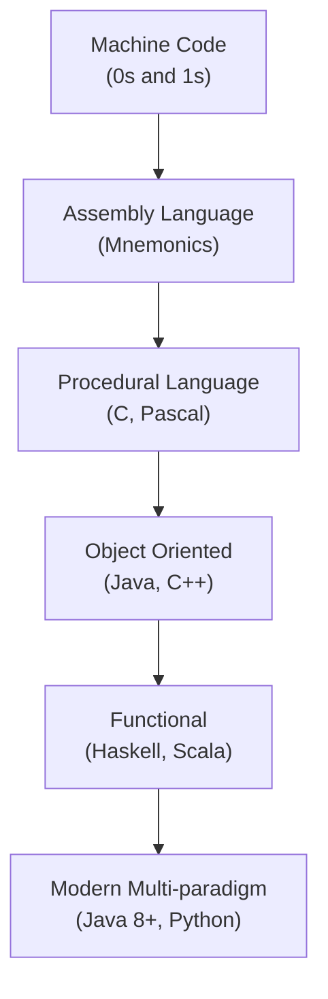

> [!NOTE]
> Programming evolved to make it easier for humans to communicate with machines. Each generation brought more abstraction and power.

<a href="#chapter-index-table-1">Go to Top 🔝</a>

---

## 1.2 What is Programming Language

<a id="12-what-is-programming-language"></a>

### 📌 Definition

```
A Programming Language is a FORMAL LANGUAGE comprising:
→ Set of instructions (Syntax)
→ Rules for combining those instructions (Grammar)
→ Meaning of instructions (Semantics)

It acts as a BRIDGE between human logic and machine execution.
```

### 🔑 Key Concepts

```
SYNTAX    → Rules of writing code (like grammar in English)
           Example: int x = 5;  ✅
                    x int = 5;  ❌ Wrong syntax

SEMANTICS → Meaning of the code
           Example: int x = 5 + 3; → x holds value 8

PROGRAM   → Set of instructions written in a programming language
```

### 📊 Levels of Programming Languages

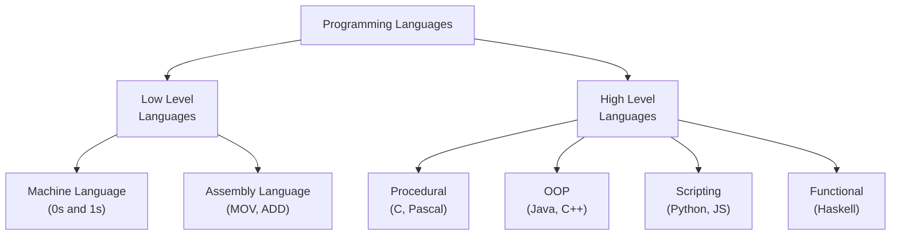

### 📌 Language Categories Summary

```
┌──────────────────────────────────────────────────────────────┐
│  Level          │  Examples          │  Closeness to Machine  │
├─────────────────┼────────────────────┼────────────────────────┤
│  Machine Code   │  0101 1100...      │  Exactly what CPU reads│
│  Assembly       │  MOV AX, 5        │  Very close            │
│  Low-level HLL  │  C                 │  Moderate              │
│  High-level HLL │  Java, Python      │  Far from machine      │
│  Very High-level│  SQL, HTML         │  Very far              │
└──────────────────────────────────────────────────────────────┘
```

> [!IMPORTANT]
> Java is a High-Level, Object-Oriented, Platform-Independent language. It is compiled to Bytecode (not machine code directly), making it unique — it's both compiled and interpreted.

<a href="#chapter-index-table-1">Go to Top 🔝</a>

---

## 1.3 Binary Codes

<a id="13-binary-codes"></a>

### 📌 What is Binary?

```
Computers are electronic machines built with transistors.
A transistor has only 2 states:
→ ON  = 1 (Current flowing)
→ OFF = 0 (No current)

This is why computers use BINARY (Base-2) number system.
Every piece of data — text, image, video — is stored as 0s and 1s.
```

### 🔑 Key Terms

```
BIT  → Smallest unit of data (0 or 1)
BYTE → 8 bits (e.g., 01000001 = 'A' in ASCII)
KB   → 1024 bytes
MB   → 1024 KB
GB   → 1024 MB
TB   → 1024 GB
```

### 📌 Number Systems

```
┌──────────────────────────────────────────────────────────────┐
│  System      │  Base │  Digits Used    │  Example            │
├──────────────┼───────┼─────────────────┼─────────────────────┤
│  Binary      │   2   │  0, 1           │  1010 = 10          │
│  Octal       │   8   │  0–7            │  012 = 10           │
│  Decimal     │  10   │  0–9            │  10 = 10            │
│  Hexadecimal │  16   │  0–9, A–F       │  0xA = 10           │
└──────────────┴───────┴─────────────────┴─────────────────────┘
```

### 📌 How Text is Stored in Binary

```
Character → ASCII Code → Binary

'A' → 65  → 01000001
'B' → 66  → 01000010
'a' → 97  → 01100001
'0' → 48  → 00110000
' ' → 32  → 00100000

Java uses UNICODE (UTF-16) — 2 bytes per character
This supports 65,536+ characters (Chinese, Arabic, etc.)
```

### 📊 Binary Conversion Flow

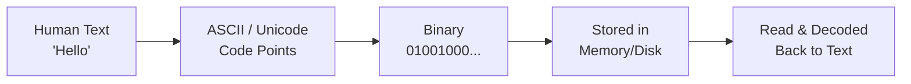

```java
// Java Binary Literals (Java 7+)
int binary = 0b1010;   // 10 in decimal
int hex = 0xFF;        // 255 in decimal
int octal = 012;       // 10 in decimal

System.out.println(binary); // 10
System.out.println(Integer.toBinaryString(65)); // 1000001
System.out.println(Integer.toHexString(255));   // ff
```

> [!TIP]
> In Java interviews, you may be asked about binary operations like bit shifting (`<<`, `>>`, `>>>`) and bitwise operators (`&`, `|`, `^`). Understanding binary is foundational for these.

<a href="#chapter-index-table-1">Go to Top 🔝</a>

---

## 1.4 Assembly Language

<a id="14-assembly-language"></a>

### 📌 What is Assembly Language?

```
Assembly Language is ONE STEP ABOVE machine code.
Instead of writing 01000001, you write human-readable MNEMONICS.

Mnemonic = Short abbreviation for an operation.

MOV → Move data
ADD → Addition
SUB → Subtraction
JMP → Jump to location
```

### 🔑 Key Concepts

```
ASSEMBLER → Converts Assembly code → Machine code
            (Like a translator from English to local language)

Assembly is PROCESSOR-SPECIFIC:
→ x86 assembly runs only on Intel/AMD processors
→ ARM assembly runs only on ARM processors (Mobile phones)
→ NOT portable across different hardware
```

### 📌 Assembly vs High Level Comparison

```
Addition of two numbers:

ASSEMBLY (x86):
   MOV AX, 5     ; Load 5 into register AX
   MOV BX, 3     ; Load 3 into register BX
   ADD AX, BX    ; AX = AX + BX (8)

JAVA:
   int result = 5 + 3;

Same result. Java is far more readable and portable.
```

### 📊 Assembly Execution Flow

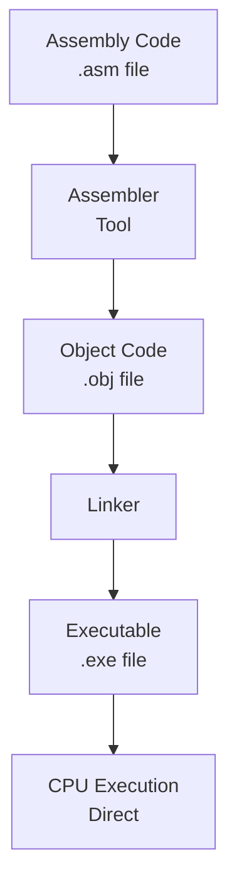

### 📌 Why Learn About Assembly?

```
Even as a Java developer, understanding Assembly helps you:
✅ Understand how CPU works at a fundamental level
✅ Understand why Java has primitive types (int, char...)
✅ Understand stack frames and method calls
✅ Debug performance issues at a low level
✅ Understand JIT compiler optimizations
```

> [!NOTE]
> Java developers never write Assembly. But JVM internally generates optimized machine/native code via the JIT (Just-In-Time) compiler, which is essentially automated assembly generation.

<a href="#chapter-index-table-1">Go to Top 🔝</a>

---

## 1.5 High Level Language

<a id="15-high-level-language"></a>

### 📌 What is a High Level Language?

```
High Level Languages (HLL) are designed to be:
→ Close to HUMAN language (English-like syntax)
→ Far from machine-level operations
→ PORTABLE across different hardware
→ ABSTRACT — hides hardware complexity

You don't manage registers, memory addresses, or CPU instructions.
The language + compiler handles all that for you.
```

### 🔑 Characteristics of High Level Languages

```
✅ Human-readable syntax
✅ Platform independent (mostly)
✅ Rich standard libraries
✅ Automatic memory management (in many)
✅ Object/function abstraction
✅ Error handling built-in
✅ Faster development time
✅ Easier debugging and maintenance
```

### 📌 Popular High Level Languages

```
┌──────────────────────────────────────────────────────────────┐
│  Language  │  Type          │  Primary Use                   │
├────────────┼────────────────┼────────────────────────────────┤
│  Java      │  OOP + HLL     │  Enterprise, Android, Backend  │
│  Python    │  Multi-paradigm│  AI/ML, Data Science, Scripts  │
│  C++       │  OOP + HLL     │  Systems, Games, Performance   │
│  JavaScript│  Multi-paradigm│  Web Frontend, Node.js         │
│  C#        │  OOP           │  Windows Apps, Game Dev        │
│  Kotlin    │  OOP + FP      │  Android, JVM                  │
│  Swift     │  OOP + FP      │  iOS, macOS                    │
└────────────┴────────────────┴────────────────────────────────┘
```

### 📊 Abstraction Levels Diagram

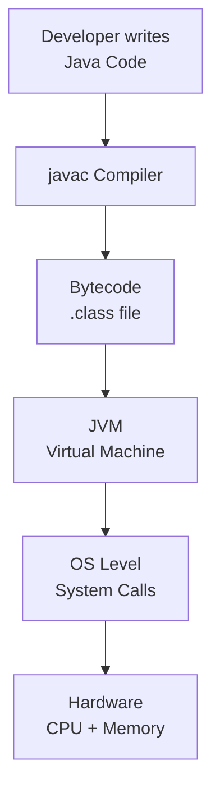

### 🌍 Real-World Analogy

```
Imagine ordering food at a restaurant:

LOW LEVEL:  You go to kitchen, buy raw ingredients, cook yourself
HIGH LEVEL: You just say "I want Biryani" — chef handles everything

High Level Language = You just write logic
Compiler/JVM = The chef who figures out HOW to do it
```

> [!IMPORTANT]
> Java is a high-level language that compiles to BYTECODE (not native machine code). The JVM then interprets/compiles bytecode to machine code at runtime. This makes Java both compiled AND interpreted — a unique hybrid approach.

<a href="#chapter-index-table-1">Go to Top 🔝</a>

---

## 1.6 Procedural Language

<a id="16-procedural-language"></a>

### 📌 What is Procedural Programming?

```
Procedural Programming is a programming paradigm where:
→ Program is divided into PROCEDURES (functions/methods)
→ Instructions execute TOP to BOTTOM
→ Data and functions are SEPARATE
→ Procedures can call other procedures

Also called: Structured Programming or Imperative Programming
```

### 🔑 Key Characteristics

```
✅ Step-by-step execution flow
✅ Code reuse through functions/procedures
✅ Top-down design approach
✅ Shared global data (can be a problem)
✅ Easy to understand for small programs
❌ Hard to manage as codebase grows
❌ Data and function separation causes issues
❌ No real-world modeling (no "objects")
```

### 📌 Examples of Procedural Languages

```
→ C          (Most famous procedural language)
→ Pascal     (Educational language)
→ FORTRAN    (Scientific computing)
→ BASIC      (Early home computers)
→ COBOL      (Business data processing)
```

### 📌 Procedural vs OOP Comparison

```java
// PROCEDURAL STYLE (functions operating on data)
int[] marks = {80, 90, 70};

static double calculateAverage(int[] m) {
    int sum = 0;
    for (int mark : m) sum += mark;
    return (double) sum / m.length;
}

// OOP STYLE (data + behavior together)
class Student {
    int[] marks = {80, 90, 70};

    double calculateAverage() {
        int sum = 0;
        for (int mark : marks) sum += mark;
        return (double) sum / marks.length;
    }
}
```

### 📊 Procedural Execution Flow

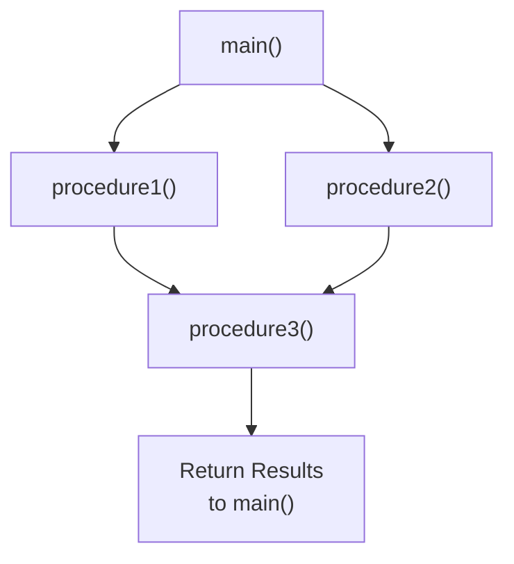

> [!NOTE]
> Java supports procedural-style coding (using static methods), but it is fundamentally an OOP language. You can write procedural code inside Java, but the best practice is to use OOP principles.

<a href="#chapter-index-table-1">Go to Top 🔝</a>

---

## 1.7 Functional Language

<a id="17-functional-language"></a>

### 📌 What is Functional Programming?

```
Functional Programming (FP) is a paradigm where:
→ Programs are built using PURE FUNCTIONS
→ Data is IMMUTABLE (never changed after creation)
→ Functions are FIRST-CLASS CITIZENS (treated like values)
→ No side effects (functions don't change external state)
→ Emphasis on WHAT to do, not HOW to do it
```

### 🔑 Core Concepts of FP

```
PURE FUNCTION:
→ Same input always gives same output
→ No side effects (doesn't modify anything outside)
→ Example: Math.sqrt(25) always returns 5.0

IMMUTABILITY:
→ Once data is created, it cannot change
→ Instead of modifying, you create new data

FIRST-CLASS FUNCTIONS:
→ Functions can be stored in variables
→ Functions can be passed as arguments
→ Functions can be returned from other functions
→ This is the basis of Lambda in Java!

HIGHER-ORDER FUNCTIONS:
→ Functions that take other functions as input
→ Example: map(), filter(), reduce() in Java Streams
```

### 📌 Functional Languages Examples

```
Pure Functional:
→ Haskell     (Most pure FP language)
→ Erlang      (Concurrent systems)
→ Elm         (Web frontend)

Multi-paradigm (supports FP):
→ Java 8+     (Lambda, Streams, Optional)
→ Scala       (JVM, mixed OOP + FP)
→ Kotlin      (Android + FP support)
→ Python      (map, filter, lambda)
→ JavaScript  (Functions as first-class)
```

```java
// Java 8+ Functional Style Example
import java.util.List;
import java.util.stream.Collectors;

List<Integer> numbers = List.of(1, 2, 3, 4, 5, 6, 7, 8, 9, 10);

// Pure functional approach: filter even, square, collect
List<Integer> result = numbers.stream()
    .filter(n -> n % 2 == 0)      // Pure function: even check
    .map(n -> n * n)               // Pure function: squaring
    .collect(Collectors.toList()); // Collect results

System.out.println(result); // [4, 16, 36, 64, 100]
```

### 📊 FP vs OOP

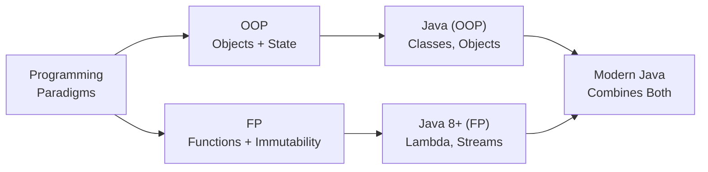

> [!TIP]
> Java 8 introduced Lambda Expressions and Stream API which brought Functional Programming to Java. This is one of the most frequently asked Java interview topics. Understanding FP concepts will help you master Java Streams.

<a href="#chapter-index-table-1">Go to Top 🔝</a>

---

## 1.8 Object Oriented Programming Language

<a id="18-object-oriented-programming-language"></a>

### 📌 What is OOP?

```
Object Oriented Programming (OOP) is a paradigm where:
→ Program is organized around OBJECTS
→ Objects = Real-world entities with STATE + BEHAVIOR
→ Code is modeled after real-world things

Real World:           OOP:
Car            →      Object
Color, Speed   →      State (Fields/Variables)
Drive, Brake   →      Behavior (Methods)
Blueprint/Design →    Class
```

### 🔑 Four Pillars of OOP

```
┌──────────────────────────────────────────────────────────────┐
│  Pillar         │  Meaning                                   │
├─────────────────┼────────────────────────────────────────────┤
│  Encapsulation  │  Wrapping data + methods together          │
│                 │  Hiding internal data (private fields)     │
├─────────────────┼────────────────────────────────────────────┤
│  Inheritance    │  Child class inherits Parent class         │
│                 │  Code reuse, IS-A relationship             │
├─────────────────┼────────────────────────────────────────────┤
│  Polymorphism   │  One thing, many forms                     │
│                 │  Overloading + Overriding                  │
├─────────────────┼────────────────────────────────────────────┤
│  Abstraction    │  Hiding complexity, showing interface      │
│                 │  Abstract class + Interface                │
└──────────────────────────────────────────────────────────────┘
```

### 📊 OOP Architecture

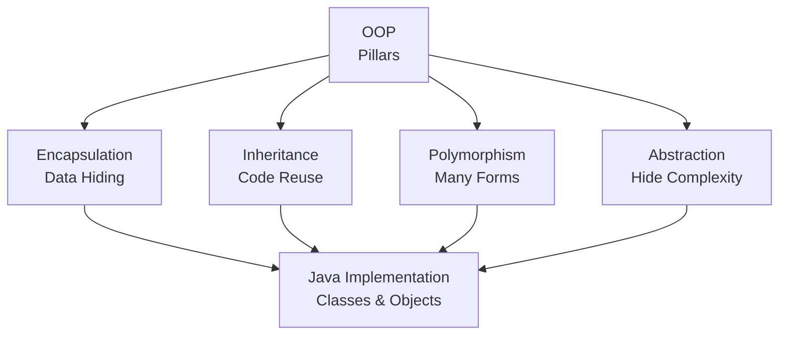

```java
// OOP in Java — Complete Mini Example
class Animal {                          // CLASS = Blueprint
    private String name;                // Encapsulation: private field
    private int age;

    public Animal(String name, int age) { // Constructor
        this.name = name;
        this.age = age;
    }

    public void makeSound() {           // Polymorphism: overridden by child
        System.out.println("Some sound");
    }

    public String getName() { return name; } // Getter
}

class Dog extends Animal {              // Inheritance: Dog IS-A Animal
    public Dog(String name, int age) {
        super(name, age);               // Calling parent constructor
    }

    @Override
    public void makeSound() {           // Polymorphism: overriding
        System.out.println(getName() + " says: Woof!");
    }
}

// Usage
Animal dog = new Dog("Tommy", 3);      // Upcasting
dog.makeSound();                        // Tommy says: Woof! (Runtime polymorphism)
```

### 📌 Why OOP?

```
PROBLEM with Procedural:
→ Large programs become difficult to manage
→ Data is shared globally (security risk)
→ Hard to model real-world entities
→ No code reuse mechanism

SOLUTION with OOP:
✅ Models real-world entities naturally
✅ Data encapsulated inside objects (secure)
✅ Code reuse through inheritance
✅ Easily extensible (Open/Closed Principle)
✅ Better maintainability and scalability
```

> [!IMPORTANT]
> Java is NOT 100% Object Oriented because it has 8 primitive data types (int, char, boolean, etc.) which are NOT objects. Languages like Smalltalk are 100% OOP. This is a VERY common interview question.

<a href="#chapter-index-table-1">Go to Top 🔝</a>

---

## 1.9 Scripting Language

<a id="19-scripting-language"></a>

### 📌 What is a Scripting Language?

```
A Scripting Language is a programming language that:
→ Is typically INTERPRETED (not compiled to machine code)
→ Executes at RUNTIME line by line
→ Designed for AUTOMATION and INTEGRATION tasks
→ Usually simpler and faster to write
→ Runs inside another environment (browser, OS, server)
```

### 🔑 Characteristics of Scripting Languages

```
✅ Interpreted (no separate compilation step needed)
✅ Dynamic typing (type checked at runtime)
✅ Rapid development (less boilerplate)
✅ Glue code (connects different systems)
✅ Often embedded in other environments
❌ Generally slower than compiled languages
❌ Runtime errors instead of compile-time errors
❌ Less type safety
```

### 📌 Types and Examples

```
┌──────────────────────────────────────────────────────────────┐
│  Type               │  Examples                             │
├─────────────────────┼───────────────────────────────────────┤
│  Web Scripting      │  JavaScript, TypeScript               │
│  Server Scripting   │  PHP, Node.js, Ruby                   │
│  Shell Scripting    │  Bash, PowerShell, Zsh                │
│  General Purpose    │  Python, Ruby, Perl                   │
│  Database Scripting │  SQL, PL/SQL                          │
│  Build Scripts      │  Gradle (Groovy/Kotlin), Maven (XML)  │
└──────────────────────────────────────────────────────────────┘
```

### 📌 Scripting vs Compiled Language

```
┌─────────────────────────────────────────────────────────────┐
│  Feature        │  Scripting         │  Compiled            │
├─────────────────┼────────────────────┼──────────────────────┤
│  Execution      │  Interpreted       │  Compiled first       │
│  Speed          │  Slower            │  Faster               │
│  Type Checking  │  Runtime           │  Compile-time         │
│  Error Detection│  Runtime           │  Early (compile)      │
│  Development    │  Faster            │  Slower               │
│  Examples       │  Python, JS, Ruby  │  Java, C, C++         │
└─────────────────┴────────────────────┴──────────────────────┘
```

> [!NOTE]
> Java is NOT a scripting language. Java is compiled (to bytecode) and then interpreted/JIT-compiled by JVM. However, Groovy and Kotlin Script can run as scripting on JVM. Also, JShell (Java 9+) allows Java to be used interactively like a scripting environment.

<a href="#chapter-index-table-1">Go to Top 🔝</a>

---

## 1.10 Compiler & Interpreter

<a id="110-compiler--interpreter"></a>

### 📌 What is a Compiler?

```
A COMPILER is a program that:
→ Reads ENTIRE source code at once
→ Translates it to target code (machine code or bytecode)
→ Reports ALL errors at once (before execution)
→ Produces an output file (.class, .exe, etc.)
→ Execution happens SEPARATELY after compilation

Examples: javac (Java), gcc (C), g++ (C++)
```

### 📌 What is an Interpreter?

```
An INTERPRETER is a program that:
→ Reads source code LINE BY LINE
→ Executes each line immediately
→ Reports error only when that LINE is reached
→ No output file generated
→ Compilation and execution happen TOGETHER

Examples: Python interpreter, JavaScript V8 Engine, Ruby
```

### 📊 Compiler vs Interpreter Flow

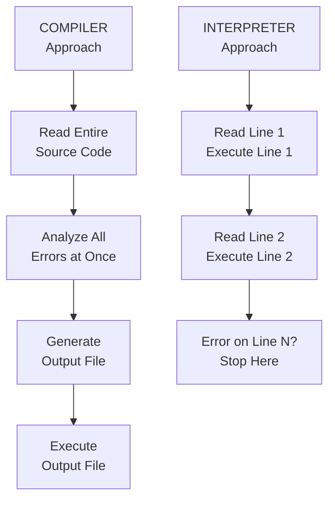

### 📌 Compiler vs Interpreter Comparison

```
┌──────────────────────────────────────────────────────────────┐
│  Feature       │  Compiler         │  Interpreter           │
├────────────────┼───────────────────┼────────────────────────┤
│  Translation   │  Whole program    │  Line by line          │
│  Speed         │  Fast execution   │  Slower execution      │
│  Error Report  │  All at once      │  One at a time         │
│  Output        │  Object file      │  No output file        │
│  Memory        │  More (stores all)│  Less                  │
│  Example       │  C, C++, Java     │  Python, Ruby          │
└──────────────────────────────────────────────────────────────┘
```

### ⭐ How Java Uses BOTH — Hybrid Approach

```
Java is UNIQUE — it uses BOTH Compiler AND Interpreter:

STEP 1: COMPILATION (javac)
→ Java source code (.java) → Bytecode (.class)
→ javac is the Java Compiler
→ Bytecode is NOT machine code — it's platform neutral

STEP 2: INTERPRETATION + JIT (JVM)
→ JVM reads Bytecode
→ Interpreter: Reads bytecode line by line (slow first run)
→ JIT Compiler: Detects "hot" code and compiles to native code
→ Result: Near-native performance over time
```

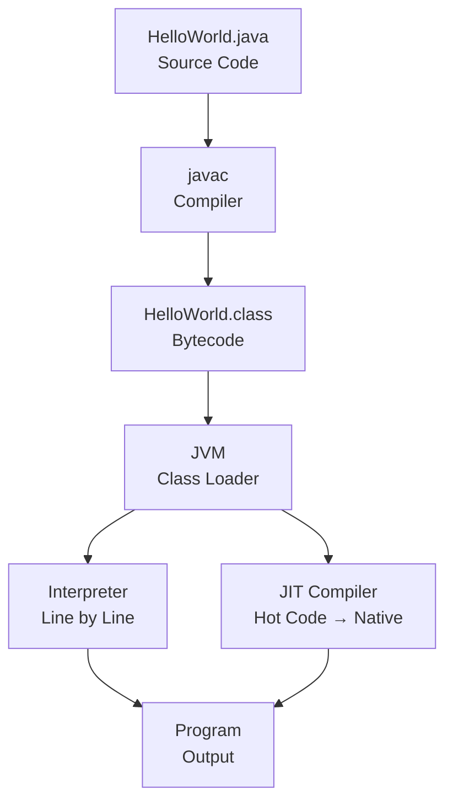

```java
// You write this:
public class Hello {
    public static void main(String[] args) {
        System.out.println("Hello, Java!");
    }
}

// javac compiles to Hello.class (bytecode)
// JVM runs Hello.class

// Commands:
// javac Hello.java   → Compilation
// java Hello         → JVM executes bytecode
```

> [!IMPORTANT]
> This is one of the most critical interview questions: **"Is Java compiled or interpreted?"**
> **Answer:** Java is BOTH — it uses a compiler (javac) to produce bytecode and JVM uses an interpreter + JIT compiler to execute it. This hybrid approach gives Java both portability (bytecode) and performance (JIT).

<a href="#chapter-index-table-1">Go to Top 🔝</a>

---

## 1.11 Statically & Dynamically Typed Language

<a id="111-statically--dynamically-typed-language"></a>

### 📌 What is Type System?

```
A Type System is a set of rules that assigns a TYPE to every
value, variable, expression in a program.

WHY TYPES MATTER:
→ int x = 5;   → x can hold only integers
→ String s;    → s can hold only text
→ Types prevent incorrect operations:
  "Hello" + 5  → What should this be? String? Error?
```

### 📌 Statically Typed Language

```
In STATICALLY TYPED languages:
→ Variable TYPE is declared at COMPILE TIME
→ Type CANNOT change during program execution
→ Type checking done by COMPILER
→ Errors caught BEFORE running the program

Examples: Java, C, C++, Kotlin, Swift, Go, Rust
```

```java
// JAVA - Statically Typed
int age = 25;           // Type declared: int
age = "Twenty Five";    // ❌ COMPILE ERROR! Type mismatch
// Compiler catches this BEFORE you even run the program

String name = "Alice";
name = 42;              // ❌ COMPILE ERROR!
```

### 📌 Dynamically Typed Language

```
In DYNAMICALLY TYPED languages:
→ Variable TYPE is determined at RUNTIME
→ Type CAN change during program execution
→ Type checking done at RUNTIME
→ Errors caught only WHILE running

Examples: Python, JavaScript, Ruby, PHP
```

```python
# Python - Dynamically Typed
age = 25          # No type declaration needed
age = "Twenty"    # ✅ No error! Type changed at runtime
age = True        # ✅ Still no error! Changed again

# Error only at runtime:
result = age + 5  # TypeError at runtime (not compile time)
```

### 📊 Static vs Dynamic Typing

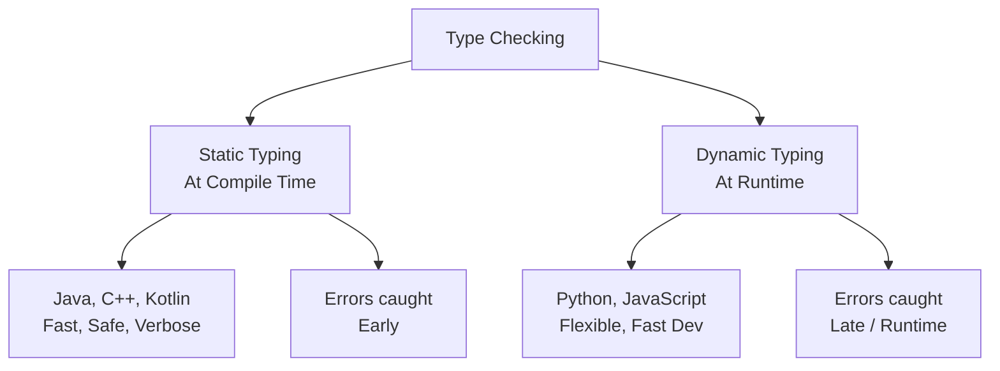

### 📌 Complete Comparison Table

```
┌──────────────────────────────────────────────────────────────┐
│  Feature        │  Static Typing     │  Dynamic Typing       │
├─────────────────┼────────────────────┼───────────────────────┤
│  Type Check     │  Compile time      │  Runtime              │
│  Declaration    │  Required          │  Not needed           │
│  Performance    │  Faster            │  Slightly slower      │
│  Error Detection│  Early (safe)      │  Late (risky)         │
│  Flexibility    │  Less              │  More                 │
│  Refactoring    │  Easier (IDE help) │  Harder               │
│  Examples       │  Java, C++, Swift  │  Python, JS, Ruby     │
└──────────────────────────────────────────────────────────────┘
```

### 📌 Strong vs Weak Typing (Bonus)

```
STRONGLY TYPED: No implicit type conversion
→ Java: int + String → ERROR (must explicitly convert)

WEAKLY TYPED: Implicit type coercion
→ JavaScript: 5 + "5" = "55" (auto coercion!)
→ JavaScript: 5 == "5" is true (loose equality)

Java is:
→ STATICALLY typed (type checked at compile time)
→ STRONGLY typed (no implicit coercion)
```

```java
// Java Strong Typing Examples:
int num = 5;
String s = "5";

// int x = num + s;  // ❌ Cannot mix int and String
int x = num + Integer.parseInt(s); // ✅ Explicit conversion

// Java var keyword (Java 10+): Type INFERRED but still STATIC
var age = 25;        // inferred as int at compile time
// age = "text";     // ❌ Still type error! var is still static
```

> [!IMPORTANT]
> Java is **Statically** and **Strongly** typed. The `var` keyword (Java 10+) does NOT make Java dynamically typed. It is just **type inference** — the compiler infers the type at compile time. The variable type is still fixed after inference.

<a href="#chapter-index-table-1">Go to Top 🔝</a>

---

## 1.12 Memory Management

<a id="112-memory-management"></a>

### 📌 What is Memory Management?

```
Memory Management is the process of:
→ Allocating memory when needed (to store data)
→ Deallocating memory when no longer needed (to free space)

Without proper memory management:
❌ Memory Leak: Program uses more and more memory → Crash
❌ Dangling Pointer: Accessing freed memory → Corruption
❌ Buffer Overflow: Writing beyond allocated memory → Security risk
```

### 📌 Types of Memory Management

```
1. MANUAL MEMORY MANAGEMENT:
   → Developer allocates AND frees memory manually
   → Languages: C (malloc/free), C++ (new/delete)
   → Risk: Forgetting to free memory = Memory Leak
   → Risk: Double-free = Crash/Corruption

2. AUTOMATIC MEMORY MANAGEMENT:
   → Language/Runtime handles allocation and deallocation
   → Languages: Java, Python, C#, Go
   → Mechanism: Garbage Collector
   → Risk: Some performance overhead from GC
```

### 📌 Memory Areas in Java

```
JVM divides memory into several areas:

┌──────────────────────────────────────────────────────────────┐
│  Memory Area      │  What is Stored                         │
├───────────────────┼─────────────────────────────────────────┤
│  Stack Memory     │  Method calls, local variables          │
│                   │  Primitive values, references           │
├───────────────────┼─────────────────────────────────────────┤
│  Heap Memory      │  All Objects (new keyword)              │
│                   │  Instance variables                     │
├───────────────────┼─────────────────────────────────────────┤
│  Method Area      │  Class definitions, static variables    │
│  (Metaspace)      │  Constant pool, method bytecode         │
├───────────────────┼─────────────────────────────────────────┤
│  PC Register      │  Current instruction pointer            │
├───────────────────┼─────────────────────────────────────────┤
│  Native Stack     │  Native (C/C++) method execution        │
└───────────────────┴─────────────────────────────────────────┘
```

### 📊 Java Memory Management Flow

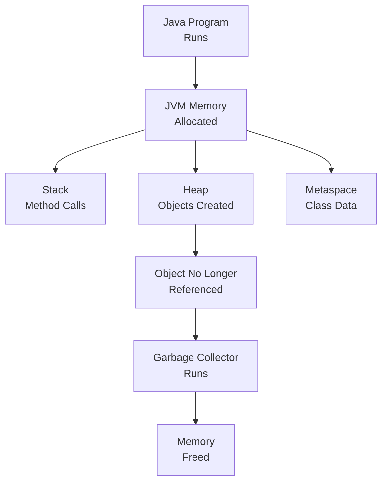

```java
public class MemoryDemo {
    static int staticVar = 100;  // Metaspace (Method Area)

    int instanceVar = 200;       // Heap (with object)

    public static void main(String[] args) {
        int localVar = 300;       // Stack
        MemoryDemo obj = new MemoryDemo(); // obj reference on Stack
                                           // MemoryDemo object on Heap
        String s = "Hello";       // s reference on Stack
                                  // "Hello" on Heap (String Pool)
    }
    // When main() ends, stack frame is destroyed
    // obj and s become eligible for Garbage Collection
}
```

> [!NOTE]
> In Java, you NEVER manually free memory. The Garbage Collector (GC) automatically reclaims memory from objects that are no longer reachable. This prevents memory leaks in most cases, but poorly written code (like static collections growing forever) can still cause leaks.

<a href="#chapter-index-table-1">Go to Top 🔝</a>

---

## 1.13 Stack and Heap Memory

<a id="113-stack-and-heap-memory"></a>

### 📌 Stack Memory

```
STACK is a memory area that works on LIFO principle
(Last In, First Out — like a stack of plates).

WHAT IS STORED:
→ Method call information (Stack Frame)
→ Local variables (primitive values stored directly)
→ References to objects (not the objects themselves)
→ Return addresses

CHARACTERISTICS:
✅ Very FAST access (LIFO structure)
✅ Automatically managed (frame added on call, removed on return)
✅ Thread-safe (each thread has its OWN stack)
✅ Fixed size per thread
❌ Limited size (StackOverflowError if exceeded — infinite recursion)
❌ Short lifetime (lives as long as method runs)
```

### 📌 Heap Memory

```
HEAP is a large pool of memory for DYNAMIC ALLOCATION.
This is where all OBJECTS live.

WHAT IS STORED:
→ All objects created with 'new' keyword
→ Instance variables (fields of objects)
→ Arrays

CHARACTERISTICS:
✅ Large size (configurable with -Xmx flag)
✅ Objects can live longer than the method that created them
✅ Shared among ALL threads
❌ Slower access than Stack
❌ Needs Garbage Collector for management
❌ Fragmentation possible
```

### 📊 Stack vs Heap Visual

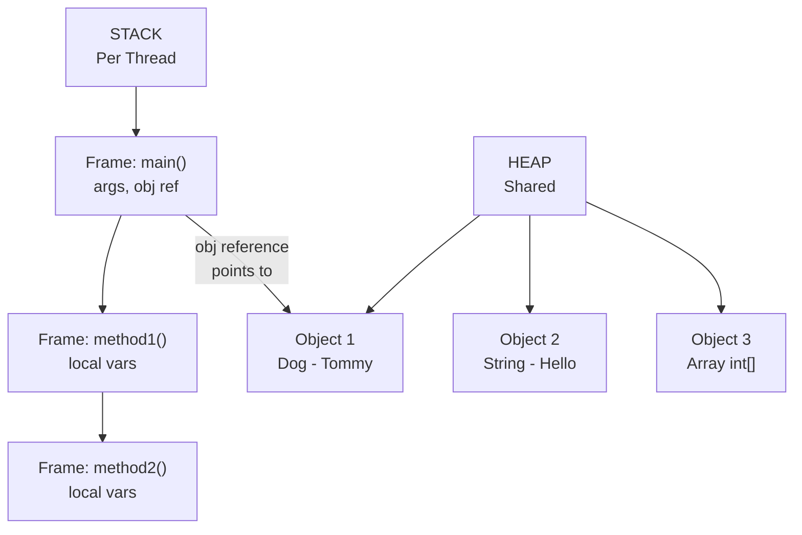

### 📌 Detailed Stack vs Heap Table

```
┌──────────────────────────────────────────────────────────────┐
│  Feature          │  Stack                │  Heap            │
├───────────────────┼───────────────────────┼──────────────────┤
│  What stored      │  Method calls,        │  Objects,        │
│                   │  Local vars, Refs     │  Instance vars   │
├───────────────────┼───────────────────────┼──────────────────┤
│  Access Speed     │  Faster               │  Slower          │
├───────────────────┼───────────────────────┼──────────────────┤
│  Management       │  Automatic (LIFO)     │  GC managed      │
├───────────────────┼───────────────────────┼──────────────────┤
│  Thread Safety    │  Per Thread (safe)    │  Shared (unsafe) │
├───────────────────┼───────────────────────┼──────────────────┤
│  Size             │  Small (512KB–8MB)    │  Large (512MB+)  │
├───────────────────┼───────────────────────┼──────────────────┤
│  Lifetime         │  Method duration      │  Until GC        │
├───────────────────┼───────────────────────┼──────────────────┤
│  Error            │  StackOverflowError   │  OutOfMemoryError│
└───────────────────┴───────────────────────┴──────────────────┘
```

```java
public class StackHeapDemo {

    public static void main(String[] args) {
        // 'x' is a primitive → stored DIRECTLY on Stack
        int x = 10;

        // 'name' reference → stored on Stack
        // "Alice" String object → stored on Heap
        String name = "Alice";

        // 'arr' reference → stored on Stack
        // int[] object {1,2,3} → stored on Heap
        int[] arr = {1, 2, 3};

        // 'obj' reference → stored on Stack
        // Dog object → stored on Heap
        Dog obj = new Dog("Tommy");

        System.out.println(x);    // 10
        System.out.println(name); // Alice
        System.out.println(obj.name); // Tommy
    }
}

class Dog {
    String name; // Instance variable → stored in Heap (with object)
    Dog(String name) { this.name = name; }
}
```

### 📌 Stack Frames Explained

```
When a method is called → NEW STACK FRAME is pushed onto Stack
When method returns → Stack frame is POPPED (destroyed)

Stack Frame contains:
→ Method parameters
→ Local variables
→ Return address (where to go back after method ends)
→ Operand stack for calculations

Infinite Recursion → Stack grows infinitely → StackOverflowError
```

> [!IMPORTANT]
> Interview Gold: **"Where are objects stored in Java?"**
> → Objects are ALWAYS stored on the **Heap**.
> → References (variables pointing to objects) are stored on **Stack** (for local vars) or **Heap** (for instance variables).
> → Primitive values are stored on **Stack** (for local vars) or **Heap** (as part of object when they are instance variables).

<a href="#chapter-index-table-1">Go to Top 🔝</a>

---

## 1.14 What is Reference

<a id="114-what-is-reference"></a>

### 📌 What is a Reference?

```
A REFERENCE is a variable that stores the MEMORY ADDRESS
(location in Heap) of an object.

It does NOT store the object itself.
It stores WHERE the object lives.

Real-World Analogy:
→ House (Object) exists at some location (Heap)
→ Home Address (Reference) tells you WHERE the house is
→ Multiple people can have the same address (multiple references → same object)
→ If everyone loses the address → House cannot be found → GC cleans it up
```

### 📌 Reference vs Primitive

```
PRIMITIVE VARIABLE:
→ Stores the ACTUAL VALUE directly
→ Stored on Stack (for local variables)
→ Types: int, byte, short, long, float, double, char, boolean

REFERENCE VARIABLE:
→ Stores the MEMORY ADDRESS of an object
→ Reference itself on Stack, Object on Heap
→ Types: Any class (String, Dog, Employee, int[], etc.)
→ Default value: null (points to nothing)
```

```java
public class ReferenceDemo {
    public static void main(String[] args) {

        // PRIMITIVE: x directly stores value 10
        int x = 10;
        int y = x;    // COPY of value: y gets its own 10
        y = 20;       // Changing y does NOT affect x
        System.out.println(x); // 10 (unchanged)
        System.out.println(y); // 20

        // REFERENCE: dog1 stores ADDRESS of Dog object
        Dog dog1 = new Dog("Tommy"); // Object created on Heap
        Dog dog2 = dog1;  // COPY of ADDRESS: both point to SAME object
        dog2.name = "Max"; // Changing via dog2 AFFECTS the same object
        System.out.println(dog1.name); // Max (changed! same object)
        System.out.println(dog2.name); // Max
    }
}

class Dog {
    String name;
    Dog(String name) { this.name = name; }
}
```

### 📊 Reference Visual Diagram

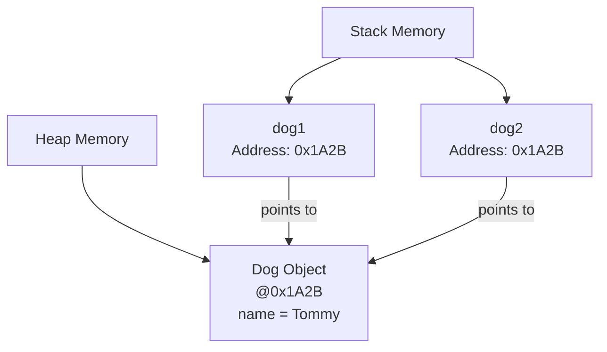

### 📌 null Reference

```java
// null means "reference points to NOTHING"
Dog dog = null;      // dog doesn't point to any object

// Accessing null reference → NullPointerException
// dog.name;         // ❌ NullPointerException!

// Always check before using:
if (dog != null) {
    System.out.println(dog.name);
}

// Java 14+ helpful NullPointerException messages:
// "Cannot read field 'name' because 'dog' is null"
```

### 📌 Reference vs Pointer (Java vs C++)

```
C++ POINTER:                    JAVA REFERENCE:
→ Direct memory address         → Abstracted memory address
→ Can do arithmetic (+, -)      → Cannot do arithmetic
→ Can be null or garbage        → Only null (safe)
→ Must manually delete          → GC handles cleanup
→ Dangerous (security risk)     → Safe (no direct memory access)

Java REMOVED pointers for security and safety.
But references internally are still addresses — just abstracted.
```

> [!NOTE]
> Java is **"Pass by Value"** — always. When you pass a reference variable to a method, you pass a **copy of the reference (address)**, not the object itself. So the method can modify the object (via the copied address) but cannot change which object the original reference points to. This is a super common interview trap!

<a href="#chapter-index-table-1">Go to Top 🔝</a>

---

## 1.15 Garbage Collector

<a id="115-garbage-collector"></a>

### 📌 What is Garbage Collector?

```
Garbage Collector (GC) is a BACKGROUND PROCESS in JVM that:
→ Automatically finds objects that are NO LONGER REACHABLE
→ Frees (deallocates) their Heap memory
→ Runs automatically (developer cannot force it exactly)

WITHOUT GC: Developer must manually free every object (like C++)
WITH GC: Java handles it automatically → No memory leaks (mostly)
```

### 📌 When is an Object Eligible for GC?

```
An object becomes eligible for GC when it is NO LONGER REACHABLE.
= No reference (variable) points to it anymore.

Ways an object becomes eligible:

1. NULLIFYING REFERENCE:
   Dog d = new Dog();
   d = null;              // Dog object is now unreachable

2. RE-ASSIGNING REFERENCE:
   Dog d = new Dog("A");
   d = new Dog("B");      // First Dog is now unreachable

3. OBJECT GOES OUT OF SCOPE:
   void method() {
       Dog d = new Dog(); // d is local variable
   } // method ends → d destroyed → Dog object unreachable

4. ISLAND OF ISOLATION:
   Objects referencing each other but NOT reachable from
   any GC Root → All are eligible for GC
```

### 📊 GC Eligibility Flow

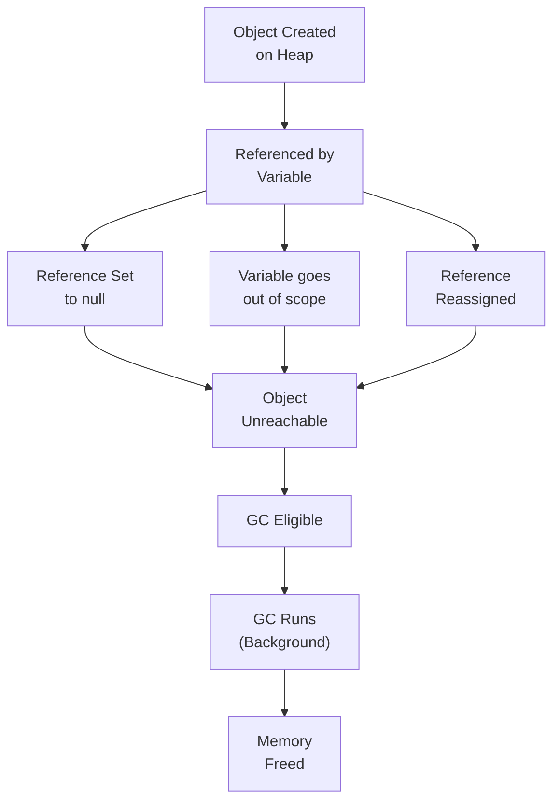

### 📌 GC Generations in Java

```
HEAP is divided into GENERATIONS:

┌──────────────────────────────────────────────────────────────┐
│  Generation     │  Contents                                  │
├─────────────────┼────────────────────────────────────────────┤
│  Young Gen      │  Newly created objects                     │
│   → Eden Space  │  New objects born here                     │
│   → Survivor S0 │  Objects that survived 1 GC                │
│   → Survivor S1 │  Objects that survived more GCs            │
├─────────────────┼────────────────────────────────────────────┤
│  Old Gen        │  Long-lived objects                        │
│  (Tenured)      │  Survived many GC cycles                   │
├─────────────────┼────────────────────────────────────────────┤
│  Metaspace      │  Class metadata (Java 8+)                  │
│  (was PermGen)  │  Not part of Heap                          │
└──────────────────────────────────────────────────────────────┘

MINOR GC → Cleans Young Generation (frequent, fast)
MAJOR GC → Cleans Old Generation (infrequent, slow)
FULL GC  → Cleans everything (rarest, most expensive)
```

### 📌 GC Algorithms in Java

```
┌──────────────────────────────────────────────────────────────┐
│  GC Algorithm   │  Java Version │  Best For                  │
├─────────────────┼───────────────┼────────────────────────────┤
│  Serial GC      │  All          │  Single-threaded, small app│
│  Parallel GC    │  Java 5-8     │  Throughput focused        │
│  CMS GC         │  Java 6-14    │  Low pause time            │
│  G1 GC          │  Java 9+      │  Large heap, balanced      │
│  ZGC            │  Java 11+     │  Ultra low latency (<10ms) │
│  Shenandoah     │  Java 12+     │  Concurrent, low pause     │
└──────────────────────────────────────────────────────────────┘
```

```java
public class GCDemo {
    public static void main(String[] args) {

        // Object created
        Dog d = new Dog("Tommy");

        // d is still referenced → NOT eligible for GC

        d = null;  // Now Dog("Tommy") is eligible for GC

        // Suggest GC to run (NOT guaranteed!)
        System.gc();           // Runtime.getRuntime().gc()

        // finalize() DEPRECATED in Java 9, REMOVED later
        // DO NOT rely on finalize() for cleanup!
        // Use try-with-resources or close() instead

        // Re-creating object
        d = new Dog("Max");    // New object created

    } // d goes out of scope → Dog("Max") eligible for GC
}

class Dog {
    String name;
    Dog(String name) {
        this.name = name;
        System.out.println("Dog created: " + name);
    }
}
```

### 📌 Memory Leak in Java — When GC Cannot Help

```
Even with GC, memory leaks can happen:

1. STATIC COLLECTIONS growing forever:
   static List<Object> cache = new ArrayList<>();
   // Objects added but never removed

2. UNCLOSED RESOURCES:
   Connection conn = getConnection();
   // Never conn.close() → Resource leak

3. THREADLOCAL MISUSE:
   ThreadLocal stored but never removed

4. LISTENERS AND CALLBACKS:
   Event listeners registered but never deregistered

5. INNER CLASS HOLDING OUTER CLASS REFERENCE:
   Anonymous inner class holds reference to outer
```

> [!IMPORTANT]
> **Interview Fact:** You CANNOT force the JVM to run Garbage Collection. `System.gc()` is just a **suggestion** — JVM may ignore it. Also, `finalize()` is **deprecated** in Java 9 and should not be used. Use **try-with-resources** for cleanup of resources like files and connections.

<a href="#chapter-index-table-1">Go to Top 🔝</a>

---

<a id="1-interview-questions"></a>

## 💡 Chapter 1 — Interview Questions (10+)

> 🔥 Frequently asked in Java interviews from beginner to senior level

---

### 🔵 Conceptual Questions

---

**Q1. What is the difference between Compiler and Interpreter? How does Java use both?**

```
COMPILER:
→ Translates entire source code at once
→ Produces output file
→ Errors reported all at once
→ Faster execution (pre-compiled)

INTERPRETER:
→ Translates and executes line by line
→ No output file
→ Errors at that specific line
→ Slower execution

JAVA uses BOTH (Hybrid):
→ javac COMPILES .java → .class (Bytecode) [Compiler role]
→ JVM INTERPRETS Bytecode line by line [Interpreter role]
→ JIT COMPILER converts hot bytecode → native code [Compiler again]
```

---

**Q2. What is the difference between Stack and Heap Memory in Java?**

```
STACK:
→ Stores: Method calls, local variables, references
→ Per thread (each thread has own stack)
→ LIFO structure (auto managed)
→ Fast access, small size
→ Error: StackOverflowError

HEAP:
→ Stores: All objects, instance variables
→ Shared across all threads
→ GC managed
→ Slow access, large size
→ Error: OutOfMemoryError

KEY: References on Stack, Objects on Heap
```

---

**Q3. Is Java statically typed or dynamically typed? Explain with example.**

```
Java is STATICALLY TYPED:
→ Types declared and checked at COMPILE TIME
→ Type cannot change after declaration
→ Compiler catches type errors before running

Example:
int x = 5;         // x is int, fixed
x = "hello";       // ❌ COMPILE ERROR — type mismatch

var y = 10;        // var still STATIC — type inferred as int
y = "text";        // ❌ COMPILE ERROR — y is still int

Java is also STRONGLY TYPED:
→ No automatic/implicit type coercion
→ Must explicitly convert types
```

---

**Q4. What is a Reference in Java? Is Java pass-by-value or pass-by-reference?**

```
REFERENCE: A variable holding the memory address of an object

Java is always PASS BY VALUE:
→ For primitives: copy of the VALUE is passed
→ For objects: copy of the REFERENCE (address) is passed

void change(Dog d) {
    d.name = "Max"; // ✅ Modifies the object (via copied address)
    d = new Dog("New"); // ❌ Original reference unchanged
}

Dog dog = new Dog("Tommy");
change(dog);
System.out.println(dog.name); // Max (object modified)
// But original 'dog' still points to same object, not "New"
```

---

**Q5. What is the difference between OOP and Procedural Programming?**

```
PROCEDURAL:
→ Program = sequence of procedures/functions
→ Data and functions are separate
→ Top-down design
→ Example: C, Pascal
→ Hard to scale, no real-world modeling

OOP:
→ Program = collection of objects
→ Data + behavior bundled (encapsulation)
→ Bottom-up design
→ Example: Java, C++
→ Scalable, models real world
→ 4 Pillars: Encapsulation, Inheritance, Polymorphism, Abstraction
```

---

### 🟡 Scenario-Based Questions

---

**Q6. Two variables point to the same object. One sets it to null. Does the other get affected?**

```java
Dog d1 = new Dog("Tommy");
Dog d2 = d1;  // Both point to same Dog object

d1 = null;    // d1 no longer points to Dog

System.out.println(d2.name); // Tommy ✅ Still works!

// REASON: d1 = null only removes d1's reference
// The Dog object still exists on Heap
// d2 still points to it
// Object becomes GC eligible only when ALL references are gone
```

---

**Q7. What causes StackOverflowError and OutOfMemoryError?**

```
StackOverflowError:
→ Stack memory is full
→ Caused by: Infinite recursion (method calling itself forever)
→ Each method call adds a Stack Frame → Stack fills up

void infinite() {
    infinite(); // Keeps calling itself → StackOverflowError
}

OutOfMemoryError (Heap):
→ Heap memory is full
→ Caused by: Creating too many objects / Memory leak
→ GC cannot free enough memory

while(true) {
    list.add(new byte[1024 * 1024]); // Adding 1MB indefinitely
}
```

---

### 🔴 Output-Based Questions

---

**Q8. What is the output and why?**

```java
public class Test {
    public static void main(String[] args) {
        int a = 5;
        int b = a;
        b = 10;
        System.out.println(a); // ?
        System.out.println(b); // ?
    }
}
```

```
Output:
5
10

Reason:
int a = 5 → Stack: a = 5
int b = a → Stack: b = 5 (COPY of value)
b = 10    → Only b changes, a is unaffected
Primitives are copied by VALUE
```

---

**Q9. What is the output?**

```java
public class Test {
    public static void main(String[] args) {
        StringBuilder s1 = new StringBuilder("Hello");
        StringBuilder s2 = s1;
        s2.append(" World");
        System.out.println(s1); // ?
        System.out.println(s2); // ?
    }
}
```

```
Output:
Hello World
Hello World

Reason:
s1 → reference to StringBuilder object
s2 = s1 → s2 gets COPY of reference (both point to SAME object)
s2.append() → modifies the SAME object
s1 and s2 both see "Hello World"
```

---

**Q10. Can we run a Java program without the main method? (Before Java 7)**

```
Before Java 7: YES — Using static initializer block
static block runs when class is loaded, even before main()

static {
    System.out.println("Running without main!"); ✅
    System.exit(0);
}

From Java 7 onwards: NO
JVM enforces: "Main method not found in class X"
Even if static block exists, JVM looks for main() first.
```

<a href="#chapter-index-table-1">Go to Top 🔝</a>

---

<a id="1-practice-problems"></a>

## 🧪 Chapter 1 — Practice Problems

### 📝 5 Theory Questions

```
1. Explain the difference between Machine Language, Assembly Language,
   and High Level Language with examples.

2. What are the four pillars of OOP? Explain each with a real-world example.

3. Compare Functional Programming with Object-Oriented Programming.
   When would you choose one over the other?

4. Explain Java's memory model. What is stored in Stack vs Heap?
   Give examples for each.

5. What is Garbage Collection? When does an object become eligible for GC?
   What are the four ways an object can become eligible?
```

---

### 💻 5 Coding Questions

```java
// CODING Q1: Demonstrate pass-by-value vs pass-by-reference behavior
// Show that Java is always pass-by-value

class Solution1 {
    static void changePrimitive(int x) {
        x = 100;
    }
    static void changeObject(StringBuilder sb) {
        sb.append(" World"); // This affects original
    }
    static void changeReference(StringBuilder sb) {
        sb = new StringBuilder("New"); // This does NOT affect original
    }
    public static void main(String[] args) {
        // TODO: Call all three methods and predict outputs
        // Test your understanding of pass-by-value in Java
    }
}
```

```java
// CODING Q2: GC Eligibility Analysis
// Comment on which objects become eligible for GC and when

public class GCAnalysis {
    public static void main(String[] args) {
        Object o1 = new Object(); // Line 1
        Object o2 = new Object(); // Line 2
        o1 = o2;                  // Line 3 - what happens to Line 1 object?
        o2 = null;                // Line 4 - is the Line 2 object eligible?
        // Question: After Line 4, how many objects are eligible for GC?
    }
}
```

```java
// CODING Q3: Binary Number Operations
// Convert decimal to binary without using Integer.toBinaryString()

public class BinaryConverter {
    static String decimalToBinary(int n) {
        // TODO: Implement using division and remainder
        // Example: 10 → "1010"
        return "";
    }

    public static void main(String[] args) {
        System.out.println(decimalToBinary(10));  // 1010
        System.out.println(decimalToBinary(255)); // 11111111
        System.out.println(decimalToBinary(0));   // 0
    }
}
```

```java
// CODING Q4: Simulate Stack behavior
// Implement a simple Stack using an array

public class MyStack {
    int[] data;
    int top;
    int capacity;

    MyStack(int capacity) {
        // TODO: Initialize
    }

    void push(int value) {
        // TODO: Add element, handle overflow
    }

    int pop() {
        // TODO: Remove and return top element, handle underflow
        return -1;
    }

    int peek() {
        // TODO: Return top without removing
        return -1;
    }

    boolean isEmpty() {
        // TODO: Check if empty
        return true;
    }
}
```

```java
// CODING Q5: Memory Leak Demonstration
// Find the memory leak in this code and fix it

import java.util.*;

public class MemoryLeakFinder {
    static List<Object> cache = new ArrayList<>();

    static void addToCache(Object obj) {
        cache.add(obj); // Objects added but never removed!
    }

    // FIX: Add a method to clean up cache
    // FIX: Or use WeakReference or bounded cache

    public static void main(String[] args) {
        for (int i = 0; i < 1000000; i++) {
            addToCache(new byte[1024]); // 1KB per object
            // This will eventually cause OutOfMemoryError!
        }
    }
}
```

---

### 🏗️ 2 Machine Coding Problems

---

**Machine Coding 1: Language Classifier System**

```
Problem Statement:
Build a program that classifies programming languages based on
their properties.

Requirements:
1. Create a Language class with: name, paradigm, typingSystem, executionModel
2. Add multiple languages to a list
3. Filter by paradigm (OOP / Functional / Scripting)
4. Filter by typing system (Static / Dynamic)
5. Display results in a formatted table

Input:
Language list with properties

Output:
Filtered and categorized language list

Hint:
class Language {
    String name;
    String paradigm;     // OOP, Functional, Procedural, Scripting
    String typingSystem; // Static, Dynamic
    String execution;    // Compiled, Interpreted, Hybrid
}
```

---

**Machine Coding 2: Memory Tracker Simulator**

```
Problem Statement:
Simulate a simplified Stack and Heap memory tracker.
Track memory allocation and deallocation for method calls and objects.

Requirements:
1. Stack: push frame on method call, pop on return
2. Heap: allocate object with ID and size, deallocate on GC
3. Track total memory used
4. Print memory state at each step
5. Implement simple GC: remove objects with 0 references

Classes needed:
- StackFrame (methodName, localVars)
- HeapObject (id, size, referenceCount)
- MemoryTracker (stack, heap, methods)

Expected Output:
[STACK] main() frame pushed
[HEAP]  Object#1 allocated (24 bytes)
[HEAP]  Object#1 referenceCount = 0, eligible for GC
[GC]    Object#1 freed (24 bytes)
[STACK] main() frame popped
```

<a href="#chapter-index-table-1">Go to Top 🔝</a>

---

<a id="1-mini-project-language-identifier-tool"></a>

## 🚀 Mini Project: Language Identifier & Classifier Tool

---

### 📋 Problem Statement

```
Build a console-based Java application that:
1. Stores a catalog of programming languages with their properties
2. Allows users to search/filter by paradigm, typing system, use case
3. Displays language comparison in formatted tables
4. Shows language evolution timeline
5. Recommends a language based on user's use case input
```

### 🏗️ Architecture

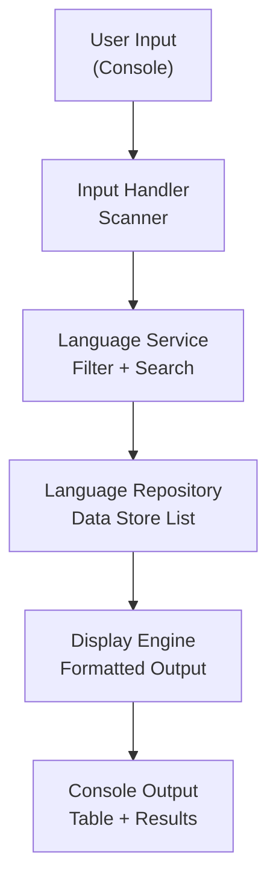

### 📁 Code Structure

```
LanguageIdentifier/
├── model/
│   └── Language.java          // Data model
├── repository/
│   └── LanguageRepository.java // Data store
├── service/
│   └── LanguageService.java    // Business logic
├── display/
│   └── DisplayEngine.java      // Output formatting
└── Main.java                   // Entry point
```

### 💻 Complete Code

```java
// ─────────────────────────────────────────────────────────────
// File: Language.java (Model)
// ─────────────────────────────────────────────────────────────
public class Language {
    private String name;
    private String paradigm;
    private String typingSystem;
    private String executionModel;
    private String primaryUse;
    private int yearCreated;

    public Language(String name, String paradigm, String typingSystem,
                    String executionModel, String primaryUse, int yearCreated) {
        this.name = name;
        this.paradigm = paradigm;
        this.typingSystem = typingSystem;
        this.executionModel = executionModel;
        this.primaryUse = primaryUse;
        this.yearCreated = yearCreated;
    }

    // Getters
    public String getName() { return name; }
    public String getParadigm() { return paradigm; }
    public String getTypingSystem() { return typingSystem; }
    public String getExecutionModel() { return executionModel; }
    public String getPrimaryUse() { return primaryUse; }
    public int getYearCreated() { return yearCreated; }

    @Override
    public String toString() {
        return String.format("%-15s %-15s %-10s %-12s %-20s %d",
            name, paradigm, typingSystem, executionModel, primaryUse, yearCreated);
    }
}
```

```java
// ─────────────────────────────────────────────────────────────
// File: LanguageRepository.java (Data Store)
// ─────────────────────────────────────────────────────────────
import java.util.ArrayList;
import java.util.List;

public class LanguageRepository {
    private List<Language> languages = new ArrayList<>();

    public LanguageRepository() {
        loadData();
    }

    private void loadData() {
        languages.add(new Language("Java",       "OOP",        "Static",  "Hybrid",       "Enterprise/Android",  1995));
        languages.add(new Language("Python",     "Multi",      "Dynamic", "Interpreted",  "AI/ML/Scripts",       1991));
        languages.add(new Language("C",          "Procedural", "Static",  "Compiled",     "Systems/Embedded",    1972));
        languages.add(new Language("C++",        "OOP",        "Static",  "Compiled",     "Games/Systems",       1985));
        languages.add(new Language("JavaScript", "Multi",      "Dynamic", "Interpreted",  "Web Frontend",        1995));
        languages.add(new Language("Haskell",    "Functional", "Static",  "Compiled",     "Research/Finance",    1990));
        languages.add(new Language("Kotlin",     "OOP+FP",     "Static",  "Hybrid",       "Android/JVM",         2011));
        languages.add(new Language("Ruby",       "OOP",        "Dynamic", "Interpreted",  "Web (Rails)",         1995));
        languages.add(new Language("Go",         "Procedural", "Static",  "Compiled",     "Cloud/Backend",       2009));
        languages.add(new Language("Swift",      "OOP+FP",     "Static",  "Compiled",     "iOS/macOS",           2014));
    }

    public List<Language> getAll() { return languages; }

    public List<Language> filterByParadigm(String paradigm) {
        List<Language> result = new ArrayList<>();
        for (Language lang : languages) {
            if (lang.getParadigm().toLowerCase().contains(paradigm.toLowerCase())) {
                result.add(lang);
            }
        }
        return result;
    }

    public List<Language> filterByTyping(String typingSystem) {
        List<Language> result = new ArrayList<>();
        for (Language lang : languages) {
            if (lang.getTypingSystem().equalsIgnoreCase(typingSystem)) {
                result.add(lang);
            }
        }
        return result;
    }

    public Language findByName(String name) {
        for (Language lang : languages) {
            if (lang.getName().equalsIgnoreCase(name)) return lang;
        }
        return null;
    }
}
```

```java
// ─────────────────────────────────────────────────────────────
// File: LanguageService.java (Business Logic)
// ─────────────────────────────────────────────────────────────
import java.util.List;

public class LanguageService {
    private LanguageRepository repo;

    public LanguageService() {
        this.repo = new LanguageRepository();
    }

    public List<Language> getAllLanguages() {
        return repo.getAll();
    }

    public List<Language> getByParadigm(String paradigm) {
        return repo.filterByParadigm(paradigm);
    }

    public List<Language> getByTyping(String typingSystem) {
        return repo.filterByTyping(typingSystem);
    }

    public String recommendLanguage(String useCase) {
        switch (useCase.toLowerCase()) {
            case "android":    return "Java or Kotlin";
            case "ai":
            case "ml":         return "Python";
            case "web":        return "JavaScript or TypeScript";
            case "systems":    return "C or C++ or Rust";
            case "enterprise": return "Java or C#";
            case "ios":        return "Swift";
            case "backend":    return "Java, Go, or Node.js";
            default:           return "Java (versatile, widely used)";
        }
    }
}
```

```java
// ─────────────────────────────────────────────────────────────
// File: Main.java (Entry Point)
// ─────────────────────────────────────────────────────────────
import java.util.List;
import java.util.Scanner;

public class Main {
    static LanguageService service = new LanguageService();
    static Scanner sc = new Scanner(System.in);

    public static void main(String[] args) {
        System.out.println("╔══════════════════════════════════════╗");
        System.out.println("║   Programming Language Classifier    ║");
        System.out.println("╚══════════════════════════════════════╝");

        boolean running = true;
        while (running) {
            showMenu();
            int choice = Integer.parseInt(sc.nextLine().trim());

            switch (choice) {
                case 1 -> displayAll(service.getAllLanguages());
                case 2 -> {
                    System.out.print("Enter paradigm (OOP/Functional/Procedural): ");
                    displayAll(service.getByParadigm(sc.nextLine()));
                }
                case 3 -> {
                    System.out.print("Enter typing system (Static/Dynamic): ");
                    displayAll(service.getByTyping(sc.nextLine()));
                }
                case 4 -> {
                    System.out.print("Enter your use case (android/ai/web/systems/enterprise/ios/backend): ");
                    System.out.println("Recommended: " + service.recommendLanguage(sc.nextLine()));
                }
                case 5 -> running = false;
                default -> System.out.println("Invalid choice.");
            }
        }
        System.out.println("Thank you for using Language Classifier!");
        sc.close();
    }

    static void showMenu() {
        System.out.println("\n┌─────────────────────────────────┐");
        System.out.println("│  1. View All Languages           │");
        System.out.println("│  2. Filter by Paradigm           │");
        System.out.println("│  3. Filter by Typing System      │");
        System.out.println("│  4. Get Language Recommendation  │");
        System.out.println("│  5. Exit                         │");
        System.out.println("└─────────────────────────────────┘");
        System.out.print("Your choice: ");
    }

    static void displayAll(List<Language> languages) {
        if (languages.isEmpty()) {
            System.out.println("No languages found.");
            return;
        }
        System.out.println();
        System.out.printf("%-15s %-15s %-10s %-12s %-20s %s%n",
            "Name", "Paradigm", "Typing", "Execution", "Use Case", "Year");
        System.out.println("─".repeat(85));
        for (Language lang : languages) {
            System.out.println(lang);
        }
    }
}
```

### 📊 Project Flow Diagram

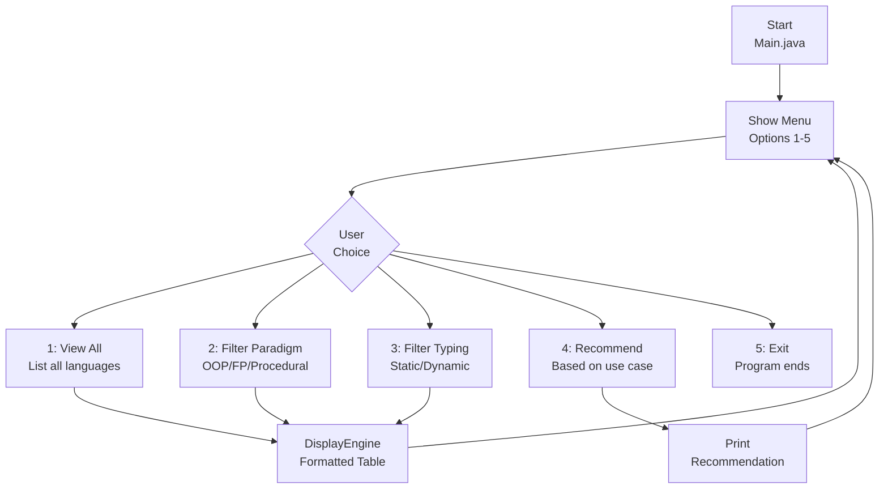

### ✅ Expected Output

```
╔══════════════════════════════════════╗
║   Programming Language Classifier    ║
╚══════════════════════════════════════╝

┌─────────────────────────────────┐
│  1. View All Languages           │
│  2. Filter by Paradigm           │
│  3. Filter by Typing System      │
│  4. Get Language Recommendation  │
│  5. Exit                         │
└─────────────────────────────────┘
Your choice: 2
Enter paradigm (OOP/Functional/Procedural): OOP

Name            Paradigm        Typing     Execution    Use Case             Year
─────────────────────────────────────────────────────────────────────────────────────
Java            OOP             Static     Hybrid       Enterprise/Android   1995
C++             OOP             Static     Compiled     Games/Systems        1985
Kotlin          OOP+FP          Static     Hybrid       Android/JVM          2011
Ruby            OOP             Dynamic    Interpreted  Web (Rails)          1995
Swift           OOP+FP          Static     Compiled     iOS/macOS            2014
```

<a href="#chapter-index-table-1">Go to Top 🔝</a>

---

```
┌─────────────────────────────────────────────────────────────┐
│                ✅ CHAPTER 1 COMPLETE                        │
│                                                             │
│  Topics Covered:                                            │
│  ✅ 1.1  Introduction to Programming                        │
│  ✅ 1.2  What is Programming Language                       │
│  ✅ 1.3  Binary Codes & Number Systems                      │
│  ✅ 1.4  Assembly Language                                  │
│  ✅ 1.5  High Level Language                                │
│  ✅ 1.6  Procedural Language                                │
│  ✅ 1.7  Functional Language                                │
│  ✅ 1.8  Object Oriented Programming Language               │
│  ✅ 1.9  Scripting Language                                 │
│  ✅ 1.10 Compiler & Interpreter (Java Hybrid)               │
│  ✅ 1.11 Statically & Dynamically Typed Language            │
│  ✅ 1.12 Memory Management in Java                          │
│  ✅ 1.13 Stack and Heap Memory (In-Depth)                   │
│  ✅ 1.14 What is Reference (Java vs C++ Pointers)           │
│  ✅ 1.15 Garbage Collector (Algorithms + Eligibility)       │
│  ✅ 10+  Interview Questions with Answers                   │
│  ✅ 5    Theory + 5 Coding Practice Problems                │
│  ✅ 2    Machine Coding Challenges                          │
│  ✅      Mini Project: Language Classifier Tool             │
│                                                             │
│  ⭐ Next Chapter: Introduction to Java & Setup (Chapter 2) │
└─────────────────────────────────────────────────────────────┘
```

[Go to Main Index 🔝](#main-index)