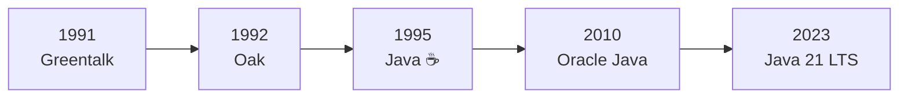
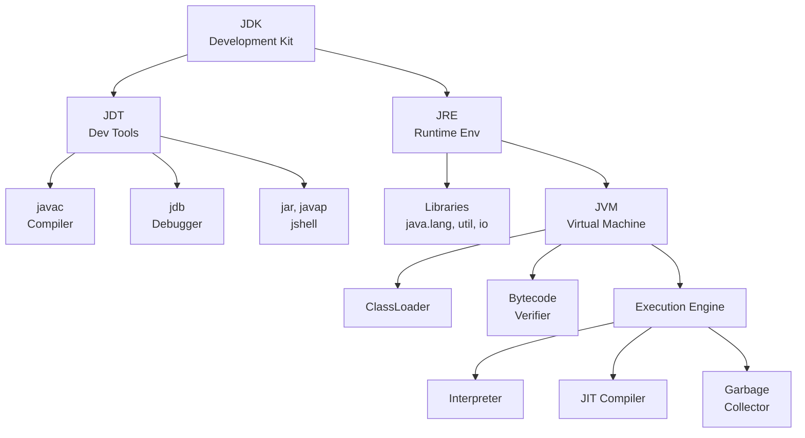
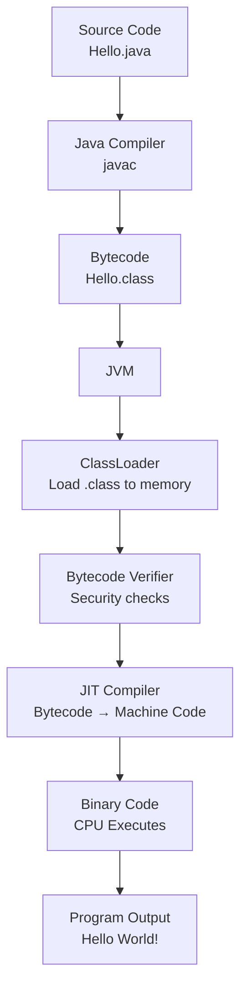
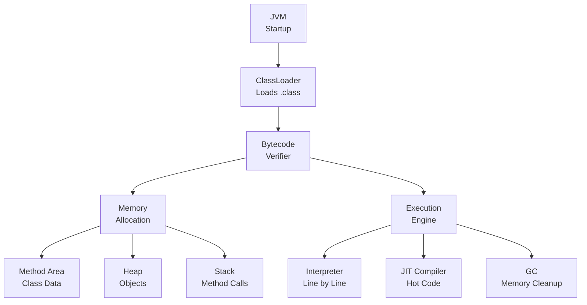
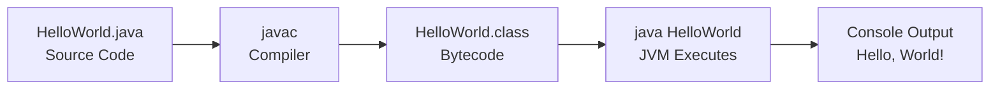
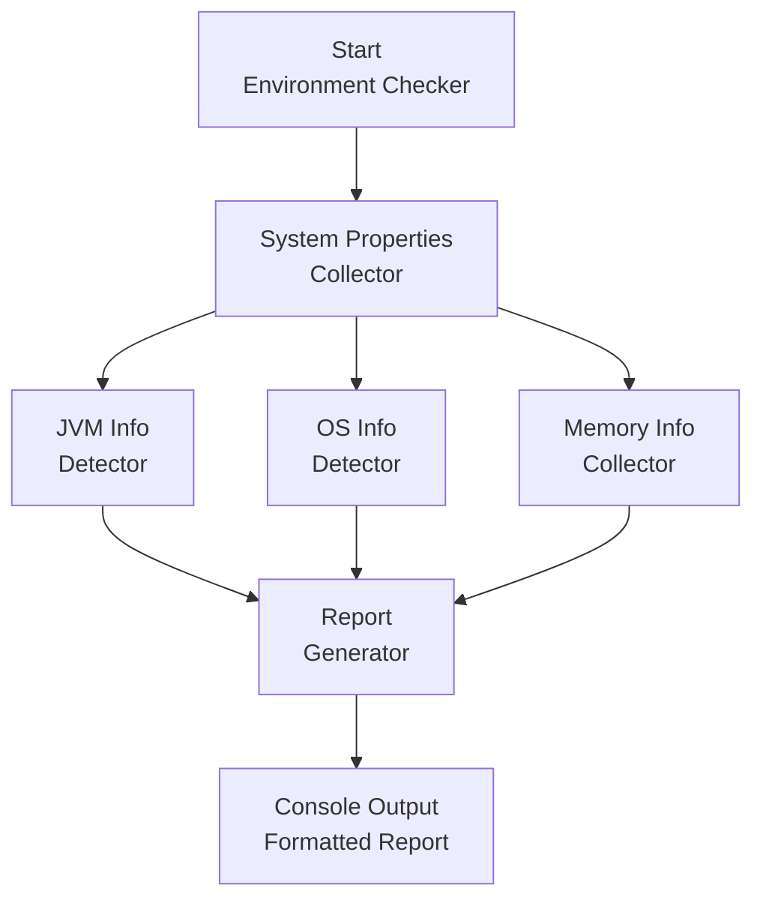

⭐⭐⭐⭐⭐⭐⭐⭐⭐⭐⭐⭐⭐⭐⭐⭐⭐⭐⭐⭐⭐⭐⭐⭐⭐⭐⭐⭐⭐⭐⭐⭐

Java • Core Java • Interview Preparation

Built by Your Name | 🔗 [LinkedIn](#) | 💻 [GitHub](#)

⭐⭐⭐⭐⭐⭐⭐⭐⭐⭐⭐⭐⭐⭐⭐⭐⭐⭐⭐⭐⭐⭐⭐⭐⭐⭐⭐⭐⭐⭐⭐⭐

[Go to Main Index 🔝](#main-index)

---

<a id="2-introduction-to-java-setup"></a>

# 📘 Chapter 2: Introduction to Java & Setup

> **Part A: Java Fundamentals — Beginner Foundation**
> `Beginner` | `Foundation` | `Must Read First`

⭐⭐⭐⭐⭐⭐⭐⭐⭐⭐⭐⭐⭐⭐⭐⭐⭐⭐⭐⭐⭐⭐⭐⭐⭐⭐⭐⭐⭐⭐⭐⭐

Java • Core Java • Interview Preparation

⭐⭐⭐⭐⭐⭐⭐⭐⭐⭐⭐⭐⭐⭐⭐⭐⭐⭐⭐⭐⭐⭐⭐⭐⭐⭐⭐⭐⭐⭐⭐⭐

---

<a id="chapter-index-table-2"></a>

## 📚 Chapter 2 — Index Table

| No. | Topic | Subtopics |
|-----|-------|-----------|
| 2.1 | [What is Java](#21-what-is-java) | Definition, Object-Oriented Nature, Owned by Oracle, Open Source, WORA Principle |
| 2.2 | [History of Java](#22-history-of-java) | James Gosling, Green Team, Greentalk → Oak → Java, Coffee Story, Logo Origin |
| 2.3 | [Features of Java](#23-features-of-java) | Platform Independent, OOP, Secure, Robust, Multithreaded, High Performance, Simple |
| 2.4 | [JDK vs JRE vs JVM](#24-jdk-vs-jre-vs-jvm) | JDK Components, JRE Components, JVM as Interpreter, Relationship Diagram |
| 2.5 | [How Java Program Executes](#25-how-java-program-executes) | Two-Step Execution, .java → .class, ClassLoader, Bytecode Verifier, JIT Compiler |
| 2.6 | [JVM Architecture](#26-jvm-architecture) | ClassLoader Subsystem, Memory Areas, Execution Engine, JIT, GC |
| 2.7 | [Setting Up Java Environment](#27-setting-up-java-environment) | JDK Download, PATH Setup, IDE Links, Verification |
| 2.8 | [First Java Program](#28-first-java-program) | Hello World, Compile & Run, Output |
| 2.9 | [Deep Analysis of First Program](#29-deep-analysis-of-first-program) | public static void main, Each Keyword Explained, Can We Run Without main, Static Block |
| 2.10 | [Java Program Structure](#210-java-program-structure) | Package, Import, Class, Fields, Methods, main Method, Complete Template |
| 2.11 | [Java Naming Conventions](#211-java-naming-conventions) | Classes, Methods, Variables, Constants, Packages |
| 2.12 | [Types of Comments](#212-types-of-comments) | Single Line, Multi Line, Javadoc Documentation |
| 2.13 | [Java Keywords](#213-java-keywords) | 50+ Reserved Words, Categories, true/false/null as Literals |
| 💡 | [Interview Questions](#2-interview-questions) | 15+ Conceptual · Scenario · Output-based |
| 🧪 | [Practice Problems](#2-practice-problems) | 5 Coding + 5 Theory + 2 Machine Coding |
| 🚀 | [Mini Project: Java Environment Checker](#2-mini-project-java-environment-checker) | Problem · Architecture · Code · Flow |

---

## 2.1 What is Java

<a id="21-what-is-java"></a>

### 📌 Definition

```
Java is a HIGH-LEVEL, OBJECT-ORIENTED, PLATFORM-INDEPENDENT,
STRONGLY TYPED, COMPILED + INTERPRETED Programming Language.

It is not just a language — it is a COMPLETE PLATFORM
with runtime, libraries, and tools.
```

### 🔑 Key Facts

```
┌──────────────────────────────────────────────────────────────┐
│  Fact                │  Detail                               │
├──────────────────────┼───────────────────────────────────────┤
│  Owner               │  Oracle Corporation                   │
│  Creator             │  James Gosling (Father of Java)       │
│  First Release       │  1995                                 │
│  Type                │  Object-Oriented + Multi-paradigm     │
│  License             │  Open Source and FREE                 │
│  File Extension      │  .java (source), .class (compiled)   │
│  Latest LTS          │  Java 21 (2023)                       │
│  Principle           │  WORA — Write Once, Run Anywhere      │
└──────────────────────┴───────────────────────────────────────┘
```

### 📌 Why Java?

```
Java gives a CLEAR STRUCTURE to programs and allows code
to be REUSED, lowering development costs.

Used in:
✅ Enterprise Applications (Banking, Insurance)
✅ Android App Development
✅ Web Backend (Spring Boot)
✅ Big Data (Hadoop, Spark)
✅ Cloud Computing
✅ Scientific Applications
✅ IoT and Embedded Systems
```

### 🌍 Real-World Analogy (Hinglish)

```
Java ek aisi language hai jaise ENGLISH — Universal.
Tum ek baar code likho (Write Once),
aur kisi bhi computer pe chala sako (Run Anywhere).

Jaise English samajhne ke liye kisi ko English aani chahiye,
waise Java code chalane ke liye computer pe JVM hona chahiye.

JVM = Java Virtual Machine = Java ka interpreter/translator
```

> [!IMPORTANT]
> Java is NOT 100% Object-Oriented because it has **8 primitive data types** (int, char, boolean, etc.) which are NOT objects. This is one of the most frequently asked interview questions.

<a href="#chapter-index-table-2">Go to Top 🔝</a>

---

## 2.2 History of Java

<a id="22-history-of-java"></a>

### 📌 The Complete Story

```
┌──────────────────────────────────────────────────────────────┐
│  Year   │  Event                                             │
├─────────┼────────────────────────────────────────────────────┤
│  1991   │  James Gosling + Green Team at Sun Microsystems    │
│         │  started a project called "Green Project"          │
│         │  Goal: Language for interactive television         │
│         │  First name: "GREENTALK"                           │
├─────────┼────────────────────────────────────────────────────┤
│  1992   │  Name changed to "OAK" (after an Oak tree         │
│         │  outside Gosling's office)                         │
│         │  Problem: "Oak" was already trademarked            │
├─────────┼────────────────────────────────────────────────────┤
│  1995   │  Renamed to "JAVA" ☕                              │
│         │  Why "Java"? → Named after Java Coffee             │
│         │  James Gosling chose it while having coffee        │
│         │  Java is an island in Indonesia — first coffee     │
│         │  was produced there (Java Coffee / Espresso Bean)  │
│         │  Java 1.0 officially released                      │
├─────────┼────────────────────────────────────────────────────┤
│  1996   │  JDK 1.0 released publicly                        │
├─────────┼────────────────────────────────────────────────────┤
│  2004   │  Java 5 — Generics, Annotations, Autoboxing       │
├─────────┼────────────────────────────────────────────────────┤
│  2010   │  Oracle acquires Sun Microsystems                  │
│         │  Java now owned by Oracle Corporation              │
├─────────┼────────────────────────────────────────────────────┤
│  2014   │  Java 8 (LTS) — Lambda, Streams, Optional         │
│         │  MOST POPULAR VERSION EVER                         │
├─────────┼────────────────────────────────────────────────────┤
│  2017   │  Java 9 — Module System, JShell                    │
├─────────┼────────────────────────────────────────────────────┤
│  2018   │  Java 11 (LTS) — New String methods, HttpClient    │
├─────────┼────────────────────────────────────────────────────┤
│  2021   │  Java 17 (LTS) — Sealed classes, Records           │
├─────────┼────────────────────────────────────────────────────┤
│  2023   │  Java 21 (LTS) — Virtual Threads, Pattern Match   │
└─────────┴────────────────────────────────────────────────────┘
```

### ☕ Why Coffee Logo?

```
The Java logo is a BLUE COFFEE CUP with RED STEAM above it.

WHY?
→ Java engineers consumed A LOT of coffee during development
→ The coffee they drank was "Java Coffee" beans
→ Java Coffee comes from Java Island, Indonesia
→ The logo was a tribute to the engineers' coffee addiction!

Fun Fact: Originally designed for interactive television,
but it was TOO ADVANCED for the cable TV industry at that time.
However, it was BEST SUITED for Internet programming — and that's
where Java became a massive success!
```

### 📊 Java Name Evolution



> [!TIP]
> **Interview Tip:** If asked "Why is Java named Java?", say: *"Java is named after Java Coffee from Java Island, Indonesia. James Gosling chose the name while having coffee near his office. The original names were Greentalk and Oak, but Oak was already trademarked."*

<a href="#chapter-index-table-2">Go to Top 🔝</a>

---

## 2.3 Features of Java

<a id="23-features-of-java"></a>

### 📌 All Major Features Explained

---

### ✅ Feature 1: Platform Independent (WORA)

```
WRITE ONCE, RUN ANYWHERE (WORA)

Java code compiles to BYTECODE (not machine code).
Bytecode is PLATFORM-NEUTRAL → Same .class file runs everywhere.

Any machine with JVM installed can run the same bytecode.

Windows → JVM for Windows → Runs .class
Mac     → JVM for Mac     → Runs same .class
Linux   → JVM for Linux   → Runs same .class
```

```java
// This SAME .class file runs on ANY OS with JVM
public class Hello {
    public static void main(String[] args) {
        System.out.println("I run on Windows, Mac, and Linux!");
    }
}
// javac Hello.java → Hello.class (Bytecode)
// java Hello → Output: I run on Windows, Mac, and Linux!
```

> [!IMPORTANT]
> **Java is Platform Independent, but JVM is Platform Dependent!**
> The same bytecode runs everywhere, but each OS needs its own JVM version. JVM acts as the translator between bytecode and machine code.

---

### ✅ Feature 2: Object-Oriented

```
Java treats everything as an OBJECT (except primitives).

4 Pillars of OOP:
1. Encapsulation   → Data + Methods wrapped together, data hiding
2. Inheritance     → Child class inherits from Parent class
3. Polymorphism    → One thing in many forms (Overloading/Overriding)
4. Abstraction     → Hiding complexity, showing only interface

Java gives CLEAR STRUCTURE to programs and allows
code to be REUSED, lowering development costs.
```

---

### ✅ Feature 3: Simple

```
Java is designed to be EASY to learn:
→ Syntax similar to C and C++
→ REMOVED complex features from C++:
  ✗ Explicit Pointers
  ✗ Operator Overloading
  ✗ Multiple Inheritance with classes
  ✗ Header Files
  ✗ Manual Memory Management (GC does it)
```

---

### ✅ Feature 4: Secure

```
Java provides MULTIPLE layers of security:
✅ No explicit pointers → Cannot access unauthorized memory
✅ Bytecode Verifier → Checks code before execution
✅ Security Manager → Controls what program can access
✅ ClassLoader → Separates local code from network code
✅ No direct memory access → Prevents buffer overflow attacks
```

---

### ✅ Feature 5: Robust

```
Java is designed to be RELIABLE:
✅ Strong Type Checking at compile time
✅ Exception Handling (try-catch-finally)
✅ Automatic Memory Management (Garbage Collection)
✅ No pointer arithmetic → No memory corruption
✅ Bounds checking on arrays
```

---

### ✅ Feature 6: Multithreaded

```
Java supports Multithreading BUILT-IN.
Multiple parts of a program run SIMULTANEOUSLY.

Example:
→ Thread 1: Playing video
→ Thread 2: Downloading file
→ Thread 3: Chat notification
All happening at the SAME time!
```

---

### ✅ Feature 7: High Performance

```
Java achieves near-native performance through:
✅ JIT (Just-In-Time) Compiler
   → Converts frequently used bytecode → native machine code
   → Caches compiled code for reuse
   → Result: Performance close to C/C++ over time

Java is FASTER than purely interpreted languages (Python, Ruby)
but slightly SLOWER than fully compiled languages (C, C++)
```

---

### ✅ Feature 8: Distributed

```
Java is built for distributed computing:
✅ RMI (Remote Method Invocation)
✅ Built-in Networking APIs (java.net)
✅ Web Services (RESTful APIs with Spring)
✅ Microservices architecture support
```

---

### ✅ Feature 9: Dynamic

```
Java loads classes DYNAMICALLY at runtime:
✅ Classes loaded on demand (lazy loading)
✅ Reflection API → Inspect/modify classes at runtime
✅ Can load classes over network
```

---

### 📌 All Features Summary Table

```
┌──────────────────────┬───────────────────────────────────────┐
│  Feature             │  What It Means                        │
├──────────────────────┼───────────────────────────────────────┤
│  Platform Independent│  Bytecode runs on any OS with JVM     │
│  Object-Oriented     │  Everything modeled as Objects         │
│  Simple              │  No pointers, no header files          │
│  Secure              │  Bytecode verifier, no direct memory   │
│  Robust              │  GC, Exception handling, type checking │
│  Multithreaded       │  Built-in thread support               │
│  High Performance    │  JIT Compiler optimization             │
│  Distributed         │  Network/Web built-in                  │
│  Dynamic             │  Classes loaded at runtime             │
│  Architecture Neutral│  Bytecode = no hardware dependency     │
│  Portable            │  Same code = same behavior everywhere  │
└──────────────────────┴───────────────────────────────────────┘
```

<a href="#chapter-index-table-2">Go to Top 🔝</a>

---

## 2.4 JDK vs JRE vs JVM

<a id="24-jdk-vs-jre-vs-jvm"></a>

### 📌 The Complete Picture

```
┌─────────────────────────────────────────────────────────────┐
│                                                             │
│   JDK (Java Development Kit)                                │
│   ┌─────────────────────────────────────────────────────┐   │
│   │                                                     │   │
│   │  JDT (Java Development Tools)                       │   │
│   │  → javac (Compiler)                                 │   │
│   │  → javadoc (Documentation Generator)                │   │
│   │  → jdb (Debugger)                                   │   │
│   │  → jar (Archive Tool)                               │   │
│   │  → javap (Disassembler)                             │   │
│   │  → jshell (REPL - Java 9+)                          │   │
│   │                                                     │   │
│   │   JRE (Java Runtime Environment)                    │   │
│   │   ┌───────────────────────────────────────────┐     │   │
│   │   │                                           │     │   │
│   │   │  Java Libraries (rt.jar / modules)        │     │   │
│   │   │  → java.lang (String, System, Math)       │     │   │
│   │   │  → java.util (List, Map, Scanner)         │     │   │
│   │   │  → java.io (File, Stream)                 │     │   │
│   │   │  → java.net (URL, Socket)                 │     │   │
│   │   │                                           │     │   │
│   │   │   JVM (Java Virtual Machine)              │     │   │
│   │   │   ┌─────────────────────────────────┐     │     │   │
│   │   │   │  ClassLoader                    │     │     │   │
│   │   │   │  Bytecode Verifier              │     │     │   │
│   │   │   │  Memory Areas (Heap, Stack...)  │     │     │   │
│   │   │   │  Execution Engine               │     │     │   │
│   │   │   │  → Interpreter                  │     │     │   │
│   │   │   │  → JIT Compiler                 │     │     │   │
│   │   │   │  → Garbage Collector            │     │     │   │
│   │   │   └─────────────────────────────────┘     │     │   │
│   │   └───────────────────────────────────────────┘     │   │
│   └─────────────────────────────────────────────────────┘   │
└─────────────────────────────────────────────────────────────┘
```

### 📌 Detailed Breakdown

```
┌──────────┬──────────────────────────────────────────────────┐
│          │                                                  │
│  JDK     │  → Java Development Kit                          │
│          │  → JRE + Development Tools (javac, jdb, jar...)  │
│          │  → Used to DEVELOP + COMPILE + RUN Java programs │
│          │  → DEVELOPERS install JDK                        │
│          │                                                  │
├──────────┼──────────────────────────────────────────────────┤
│          │                                                  │
│  JRE     │  → Java Runtime Environment                      │
│          │  → JVM + Java Libraries                          │
│          │  → Provides environment to only RUN Java programs│
│          │  → END USERS install JRE (just to run .class)    │
│          │                                                  │
├──────────┼──────────────────────────────────────────────────┤
│          │                                                  │
│  JVM     │  → Java Virtual Machine                          │
│          │  → The heart that actually EXECUTES bytecode     │
│          │  → Contains: ClassLoader + Bytecode Verifier     │
│          │    + Interpreter + JIT Compiler + GC              │
│          │  → JVM is PLATFORM DEPENDENT!                    │
│          │  → Different JVM for Windows, Mac, Linux          │
│          │  → JVM is nothing but an INTERPRETER              │
│          │                                                  │
├──────────┼──────────────────────────────────────────────────┤
│          │                                                  │
│  JDT     │  → Java Development Tools                        │
│          │  → Many tools like compiler, debugger,            │
│          │    and other development tools                    │
│          │  → Part of JDK (not JRE)                          │
│          │                                                  │
└──────────┴──────────────────────────────────────────────────┘
```

### 📊 Relationship Diagram



### 🎯 Interview Answer Formula

```
JDK = JRE + Development Tools (javac, jdb, jar, javadoc)
JRE = JVM + Libraries (java.lang, java.util, java.io)
JVM = ClassLoader + Bytecode Verifier + Execution Engine (Interpreter + JIT + GC)

→ Developer uses JDK (to write + compile + run)
→ End user uses JRE (just to run)
→ JVM is inside both JRE and JDK
→ Java code is Platform Independent (Bytecode)
→ JVM is Platform Dependent (Different per OS)
```

> [!IMPORTANT]
> **Most Important Interview Point:**
> Java is platform-independent because bytecodes are platform-independent. The virtual machine (JVM) takes care of the differences between platforms. BUT the JVM itself is platform-dependent — there's a different JVM for Windows, Mac, and Linux.

<a href="#chapter-index-table-2">Go to Top 🔝</a>

---

## 2.5 How Java Program Executes

<a id="25-how-java-program-executes"></a>

### 📌 Two-Step Execution Process

```
Java code involves a TWO-STEP execution:
1. FIRST → Through an OS-INDEPENDENT compiler (javac)
2. SECOND → In a virtual machine (JVM) which is custom-built
            for every operating system
```

### 📊 Complete Execution Flow



### 📌 Step-by-Step Detailed Explanation

```
STEP 1: WRITING SOURCE CODE
┌──────────────────────────────────────────────────────┐
│  You write a file: Hello.java                         │
│  This is human-readable Java source code              │
│  File name MUST match the public class name           │
└──────────────────────────────────────────────────────┘
                    │
                    ▼
STEP 2: COMPILATION (javac Hello.java)
┌──────────────────────────────────────────────────────┐
│  javac (Java Compiler) reads the ENTIRE source code   │
│  Checks for syntax errors                             │
│  Converts .java → .class (BYTECODE)                   │
│                                                        │
│  Bytecode = Machine-Independent encoding               │
│  The .class file is INDEPENDENT of machine or OS       │
│  which allows it to be run on ANY system               │
└──────────────────────────────────────────────────────┘
                    │
                    ▼
STEP 3: JVM EXECUTION (java Hello)
The .class file is passed to JVM which goes through
3 STAGES before final machine code is executed:
```

### 📌 Three Stages Inside JVM

---

### Stage 1: ClassLoader

```
The main class is LOADED INTO MEMORY by passing its
'.class' file to the JVM.

→ All other classes referenced in the program are also loaded
→ A ClassLoader, itself an object, creates a flat namespace
  of class bodies that are referenced by a string name

3 Types of ClassLoaders:
1. Bootstrap ClassLoader    → Loads core Java classes (java.lang.*)
2. Extension ClassLoader    → Loads extension classes
3. Application ClassLoader  → Loads YOUR application classes

Parent Delegation Model:
→ Child asks parent first → Parent asks its parent
→ If nobody finds the class → ClassNotFoundException
```

---

### Stage 2: Bytecode Verifier

```
After bytecode is loaded by ClassLoader,
it MUST be inspected by the Bytecode Verifier.

Job: Check that instructions don't perform DAMAGING ACTIONS

Checks include:
✅ Variables are INITIALIZED before they are used
✅ Local variable accesses fall within the runtime stack
✅ Method calls match object method signatures
✅ Rules for accessing private data and methods are not violated
✅ No stack overflow or underflow
✅ Type conversions are valid

WHY?
→ Security! Code could come from the internet
→ Prevents malicious bytecode from crashing JVM
→ Ensures Java's "write once, run anywhere" safety
```

---

### Stage 3: Just-In-Time (JIT) Compiler

```
This is the FINAL STAGE encountered by the Java program.
Job: Convert loaded BYTECODE into MACHINE CODE

→ The Interpreter reads bytecode LINE BY LINE (slower)
→ JIT detects "HOT CODE" (frequently executed code)
→ JIT compiles hot code directly to NATIVE MACHINE CODE
→ Caches the compiled code for REUSE

Main purpose: HEAVY OPTIMIZATIONS in performance!

Result: First run is slow (interpretation),
        subsequent runs are FAST (JIT compiled + cached)
```

### 📌 Complete Flow Diagram (Matching Your Image)

```
┌─────────────────┐    ┌──────────────────┐    ┌──────────────────┐
│  Source Code     │───→│  Java Compiler   │───→│   Byte Code      │
│  (.java)         │    │  (javac)         │    │   (.class)       │
└─────────────────┘    └──────────────────┘    └────────┬─────────┘
                                                        │
                                                        ▼
                                               ┌───────────────────┐
                                               │       JVM         │
                                               │                   │
                                               │  ┌─────────────┐  │
                                               │  │ Class Loader │  │
                                               │  └──────┬──────┘  │
                                               │         ▼         │
                                               │  ┌─────────────┐  │
                                               │  │  Byte Code  │  │
                                               │  │  Verifier   │  │
                                               │  └──────┬──────┘  │
                                               │         ▼         │
                                               │  ┌─────────────┐  │
                                               │  │    JIT      │  │
                                               │  │  Compiler   │  │
                                               │  └──────┬──────┘  │
                                               └─────────┼─────────┘
                                                         ▼
                                               ┌──────────────────┐
                                               │   Binary Code    │
                                               │  (Machine Code)  │
                                               │  CPU Executes    │
                                               └──────────────────┘
```

### 📌 What is Bytecode?

```
Bytecode is the INTERMEDIATE REPRESENTATION of Java code.

Source Code    → Human readable    (.java file)
Bytecode       → JVM readable      (.class file)
Machine Code   → CPU readable      (0s and 1s)

IMPORTANT:
→ Bytecode is NOT machine code (not specific to any CPU)
→ Bytecode is NOT source code (not human-readable)
→ Bytecode is PLATFORM INDEPENDENT
→ Same bytecode runs on Windows, Mac, Linux (via JVM)

This is WHY Java is Platform Independent:
The .class files generated by the compiler are INDEPENDENT
of the machine or the OS!
```

> [!NOTE]
> The Two-Step process makes Java unique:
> **Step 1:** javac (Compiler) → OS-Independent Bytecode
> **Step 2:** JVM (Interpreter + JIT) → OS-Dependent Machine Code
> This gives Java both **portability** (bytecode) and **performance** (JIT).

<a href="#chapter-index-table-2">Go to Top 🔝</a>

---

## 2.6 JVM Architecture

<a id="26-jvm-architecture"></a>

### 📌 Complete JVM Architecture

```
┌──────────────────────────────────────────────────────────────┐
│                    JVM ARCHITECTURE                          │
│                                                              │
│  ┌─────────────────────────────────────────────────────────┐ │
│  │              CLASS LOADER SUBSYSTEM                     │ │
│  │  Loading → Linking (Verify+Prepare+Resolve) → Init     │ │
│  └─────────────────────────┬───────────────────────────────┘ │
│                            │                                 │
│  ┌─────────────────────────▼───────────────────────────────┐ │
│  │              RUNTIME DATA AREAS (MEMORY)                │ │
│  │                                                         │ │
│  │  ┌──────────┐  ┌──────────┐  ┌───────────────────────┐ │ │
│  │  │ Method   │  │  Heap    │  │  Java Stack           │ │ │
│  │  │ Area     │  │  Area    │  │  (Per Thread)         │ │ │
│  │  │(Shared)  │  │(Shared)  │  │                       │ │ │
│  │  │          │  │          │  │  ┌─────────────────┐  │ │ │
│  │  │ Class    │  │ Objects  │  │  │  Stack Frame 1  │  │ │ │
│  │  │ info     │  │ Instance │  │  ├─────────────────┤  │ │ │
│  │  │ Static   │  │ vars     │  │  │  Stack Frame 2  │  │ │ │
│  │  │ vars     │  │ Arrays   │  │  └─────────────────┘  │ │ │
│  │  └──────────┘  └──────────┘  └───────────────────────┘ │ │
│  │                                                         │ │
│  │  ┌──────────────────────┐  ┌────────────────────────┐  │ │
│  │  │   PC Register        │  │  Native Method Stack   │  │ │
│  │  │   (Per Thread)       │  │  (Per Thread)          │  │ │
│  │  └──────────────────────┘  └────────────────────────┘  │ │
│  └─────────────────────────────────────────────────────────┘ │
│                                                              │
│  ┌─────────────────────────────────────────────────────────┐ │
│  │                EXECUTION ENGINE                         │ │
│  │                                                         │ │
│  │  ┌──────────────┐  ┌───────────┐  ┌─────────────────┐  │ │
│  │  │ Interpreter  │  │    JIT    │  │ Garbage         │  │ │
│  │  │ (Line by     │  │ Compiler  │  │ Collector       │  │ │
│  │  │  line, slow) │  │ (Hot code │  │ (Cleans unused  │  │ │
│  │  │              │  │  → native)│  │  objects)       │  │ │
│  │  └──────────────┘  └───────────┘  └─────────────────┘  │ │
│  └─────────────────────────────────────────────────────────┘ │
│                                                              │
│  ┌─────────────────────────────────────────────────────────┐ │
│  │  JNI (Java Native Interface) + Native Method Libraries  │ │
│  └─────────────────────────────────────────────────────────┘ │
└──────────────────────────────────────────────────────────────┘
```

### 📊 JVM Components Flow



### 📌 Memory Areas Explained

```
┌───────────────────┬─────────────────────────────────────────┐
│  Memory Area      │  What is Stored                         │
├───────────────────┼─────────────────────────────────────────┤
│  Method Area      │  Class metadata, static variables       │
│  (Metaspace)      │  Constant pool, method bytecode         │
│  [Shared]         │  Java 8+: called Metaspace              │
├───────────────────┼─────────────────────────────────────────┤
│  Heap Area        │  All OBJECTS (created by new keyword)   │
│  [Shared]         │  Instance variables                     │
│                   │  Arrays                                 │
│                   │  Where Garbage Collector works           │
├───────────────────┼─────────────────────────────────────────┤
│  Stack Area       │  Method calls + local variables         │
│  [Per Thread]     │  Each method call = new Stack Frame     │
│                   │  LIFO structure                         │
│                   │  References to Heap objects              │
├───────────────────┼─────────────────────────────────────────┤
│  PC Register      │  Points to current instruction          │
│  [Per Thread]     │  being executed by that thread          │
├───────────────────┼─────────────────────────────────────────┤
│  Native Method    │  For native (C/C++) method execution    │
│  Stack            │                                         │
│  [Per Thread]     │                                         │
└───────────────────┴─────────────────────────────────────────┘
```

<a href="#chapter-index-table-2">Go to Top 🔝</a>

---

## 2.7 Setting Up Java Environment

<a id="27-setting-up-java-environment"></a>

### 📌 Step 1: Download JDK

```
Official Download Links:

🔗 JDK Download (Oracle):
   https://www.oracle.com/java/technologies/downloads/

🔗 Java Documentation:
   https://docs.oracle.com/en/java/javase/21/

Recommended: JDK 21 (Latest LTS)
```

### 📌 Step 2: IDE Installation

```
Choose ONE of these IDEs:

🔗 IntelliJ IDEA (RECOMMENDED for Java):
   https://www.jetbrains.com/idea/
   → Community Edition = FREE
   → Best for Java development

🔗 VS Code (Lightweight):
   https://code.visualstudio.com/download
   → Install "Extension Pack for Java"
   → Good for beginners

🔗 Eclipse:
   https://www.eclipse.org/downloads/packages/
   → Free and Open Source
   → Heavyweight but powerful
```

### 📌 Step 3: Set Environment Variables (Windows)

```
1. Right click "This PC" → Properties
2. Advanced System Settings → Environment Variables
3. Under System Variables:

   NEW Variable:
   Name  : JAVA_HOME
   Value : C:\Program Files\Java\jdk-21

   EDIT Path Variable:
   Add   : %JAVA_HOME%\bin
```

### 📌 Step 4: Verify Installation

```bash
# Open Command Prompt / Terminal

java --version
# Output: java 21.0.x 2023-xx-xx LTS

javac --version
# Output: javac 21.0.x

# If both commands work → Installation successful! ✅
```

> [!TIP]
> For beginners, start with **IntelliJ IDEA Community Edition** (Free). It has the best Java support with auto-completion, error detection, and debugging tools. Later switch to VS Code if you prefer lightweight editors.

<a href="#chapter-index-table-2">Go to Top 🔝</a>

---

## 2.8 First Java Program

<a id="28-first-java-program"></a>

### 📌 Hello World Program

```java
// File Name: HelloWorld.java
// RULE: File name MUST match the public class name EXACTLY

public class HelloWorld {
    public static void main(String[] args) {
        System.out.println("Hello, World!");
    }
}
```

### 📌 How to Compile and Run

```bash
# Step 1: Save file as HelloWorld.java

# Step 2: Open terminal in that folder

# Step 3: COMPILE
javac HelloWorld.java
# This generates: HelloWorld.class (Bytecode)

# Step 4: RUN (Note: NO .class extension!)
java HelloWorld

# OUTPUT:
# Hello, World!
```

### 📊 Compilation Flow



<a href="#chapter-index-table-2">Go to Top 🔝</a>

---

## 2.9 Deep Analysis of First Program

<a id="29-deep-analysis-of-first-program"></a>

### 📌 Line-by-Line Breakdown

```java
public class HelloWorld {                    // Line 1
    public static void main(String[] args) { // Line 2
        System.out.println("Hello, World!"); // Line 3
    }                                        // Line 4
}                                            // Line 5
```

### 📌 Every Keyword Explained

```
┌──────────────────────────────────────────────────────────────┐
│  LINE 1: public class HelloWorld                             │
├──────────────────────────────────────────────────────────────┤
│  public  → Access modifier: visible everywhere              │
│  class   → Keyword to define a class (blueprint)            │
│  HelloWorld → Class name (MUST match file name)             │
│  {       → Start of class body                              │
└──────────────────────────────────────────────────────────────┘

┌──────────────────────────────────────────────────────────────┐
│  LINE 2: public static void main(String[] args)              │
├──────────────────────────────────────────────────────────────┤
│  public  → JVM can access from OUTSIDE the class            │
│  static  → JVM calls WITHOUT creating an object             │
│  void    → Method returns NOTHING                           │
│  main    → Entry point - JVM SEARCHES for this method       │
│  ()      → Denotes this is a FUNCTION/METHOD                │
│  String  → Data type (text)                                 │
│  []      → Denotes an ARRAY                                 │
│  args    → Local variable name (command line arguments)     │
└──────────────────────────────────────────────────────────────┘

┌──────────────────────────────────────────────────────────────┐
│  LINE 3: System.out.println("Hello, World!")                 │
├──────────────────────────────────────────────────────────────┤
│  System   → Class in java.lang package (auto-imported)       │
│  out      → Static field of System (type: PrintStream)       │
│  println  → Method of PrintStream: prints + new line         │
│  "Hello"  → String literal (the text to print)               │
│  ;        → Statement terminator (every statement needs it)  │
└──────────────────────────────────────────────────────────────┘
```

### 📌 What is the Entry Point of a Java Program?

```
The ENTRY POINT of Java programs is the main() method.

→ JVM SEARCHES for main() method
→ If not found → Execution will NOT take place!
→ When a Java program starts, a DAEMON THREAD is attached
  to the main method
→ This thread gets destroyed only when Java program
  stops execution

Function Signature:
public static void main(String[] args)
```

### 📌 Why main() Method Uses Each Keyword

```
┌──────────────────────────────────────────────────────────────┐
│  WHY public?                                                 │
├──────────────────────────────────────────────────────────────┤
│  public = Access modifier, specifies who can access           │
│  Making main() public makes it GLOBALLY AVAILABLE             │
│  JVM needs to invoke it from OUTSIDE the class               │
│  Since JVM is not present in the current class,               │
│  main() must be public for JVM to call it                     │
└──────────────────────────────────────────────────────────────┘

┌──────────────────────────────────────────────────────────────┐
│  WHY static?                                                 │
├──────────────────────────────────────────────────────────────┤
│  static = When associated with a method, makes it            │
│  a CLASS-RELATED method (not object-related)                  │
│                                                               │
│  main() is static so JVM can invoke it                        │
│  WITHOUT INSTANTIATING (creating object of) the class        │
│                                                               │
│  This saves UNNECESSARY WASTAGE OF MEMORY which would        │
│  have been used by the object declared only for calling      │
│  the main() method by the JVM                                │
│                                                               │
│  If not static → JVM needs object → Who creates object?     │
│  → Nobody → CHICKEN-EGG PROBLEM!                             │
└──────────────────────────────────────────────────────────────┘

┌──────────────────────────────────────────────────────────────┐
│  WHY void?                                                   │
├──────────────────────────────────────────────────────────────┤
│  void = Specifies method doesn't RETURN anything              │
│                                                               │
│  As main() doesn't return anything, its return type is void   │
│  But we can still use 'return;' to return void from method    │
│                                                               │
│  As soon as main() terminates → Java program terminates too   │
│  Hence it doesn't make sense to RETURN anything               │
│  because JVM can't DO anything with the return value          │
└──────────────────────────────────────────────────────────────┘

┌──────────────────────────────────────────────────────────────┐
│  WHAT is main?                                               │
├──────────────────────────────────────────────────────────────┤
│  main = NAME of the Java main method                          │
│  It is the IDENTIFIER that JVM looks for as the              │
│  STARTING POINT of the Java program                           │
│                                                               │
│  IMPORTANT: main is NOT a keyword!                            │
│  It is just a method name that JVM specifically searches for  │
└──────────────────────────────────────────────────────────────┘

┌──────────────────────────────────────────────────────────────┐
│  WHAT is String[] args?                                      │
├──────────────────────────────────────────────────────────────┤
│  String = Data type (text)                                    │
│  []     = Denotes an ARRAY                                    │
│  args   = Local variable name (function parameter)            │
│                                                               │
│  Used for COMMAND LINE ARGUMENTS:                             │
│  java HelloWorld Rahul 25                                     │
│  → args[0] = "Rahul"                                          │
│  → args[1] = "25"                                             │
└──────────────────────────────────────────────────────────────┘
```

### 📌 Can We Execute Java Program Without main()?

```java
/*
YES! Using STATIC BLOCK (Before Java 8)

A static block in Java is a group of statements that gets
executed only once when the class is LOADED INTO MEMORY
by ClassLoader.

It is also known as static initialization block,
and it goes into the STACK MEMORY.

⚠️ WON'T RUN on Java 8 and above!
From Java 7+, JVM checks for main() FIRST.
*/

class JavaPlusDSA {
    static {
        System.out.println("Mai chala toh sbko current laga re!!!!");
        System.exit(0); // Must exit to avoid error in Java 7+
    }
}

/*
Java 6 and below:
→ Static block runs FIRST when class loads
→ System.exit(0) terminates before JVM looks for main()
→ Program runs without main()!

Java 7 and above:
→ JVM FIRST searches for main()
→ If not found: "Error: Main method not found"
→ Static block alone won't work!
*/
```

### 📌 Can We Overload main()?

```java
public class MainOverload {

    // Original main — JVM ALWAYS calls this one
    public static void main(String[] args) {
        System.out.println("JVM calls this main");
        main(10);        // Manually calling overloaded main
        main("Hello");   // Manually calling overloaded main
    }

    // Overloaded main 1
    public static void main(int x) {
        System.out.println("main with int: " + x);
    }

    // Overloaded main 2
    public static void main(String s) {
        System.out.println("main with String: " + s);
    }
}

/*
OUTPUT:
JVM calls this main
main with int: 10
main with String: Hello

YES we can overload main().
JVM ALWAYS calls: main(String[] args)
Other overloaded versions must be called manually.
*/
```

> [!IMPORTANT]
> **Interview Fact:** `main` is NOT a keyword in Java. It is just a method name that JVM specifically searches for. You can have a variable named `main`, but it's not recommended. Also, `public static void main(String[] args)` is the EXACT signature JVM looks for — changing any keyword breaks execution.

<a href="#chapter-index-table-2">Go to Top 🔝</a>

---

## 2.10 Java Program Structure

<a id="210-java-program-structure"></a>

### 📌 Complete Program Template

```java
// ─────────────────────────────────────────────────
// 1. PACKAGE DECLARATION (Optional — Must be FIRST line)
// ─────────────────────────────────────────────────
package com.myapp.demo;

// ─────────────────────────────────────────────────
// 2. IMPORT STATEMENTS (Optional — After package)
// ─────────────────────────────────────────────────
import java.util.Scanner;
import java.util.ArrayList;
// java.lang.* is automatically imported (String, System, Math, etc.)

// ─────────────────────────────────────────────────
// 3. CLASS DECLARATION (Required)
// ─────────────────────────────────────────────────
public class MyProgram {

    // ─────────────────────────────────────────────
    // 4. STATIC VARIABLES (Class level)
    // ─────────────────────────────────────────────
    static int count = 0;

    // ─────────────────────────────────────────────
    // 5. INSTANCE VARIABLES (Object level)
    // ─────────────────────────────────────────────
    String name;
    int age;

    // ─────────────────────────────────────────────
    // 6. STATIC BLOCK (Runs when class loads)
    // ─────────────────────────────────────────────
    static {
        System.out.println("Static block runs FIRST!");
    }

    // ─────────────────────────────────────────────
    // 7. CONSTRUCTOR (Runs when object is created)
    // ─────────────────────────────────────────────
    public MyProgram(String name, int age) {
        this.name = name;
        this.age = age;
    }

    // ─────────────────────────────────────────────
    // 8. METHODS (Behaviors)
    // ─────────────────────────────────────────────
    public void display() {
        System.out.println("Name: " + name + ", Age: " + age);
    }

    // ─────────────────────────────────────────────
    // 9. MAIN METHOD (Entry Point — JVM starts here)
    // ─────────────────────────────────────────────
    public static void main(String[] args) {
        MyProgram obj = new MyProgram("Java", 29);
        obj.display();
    }
}

/*
Execution Order:
1. Class loaded → Static block runs
2. main() called by JVM
3. Constructor called when new object is created
4. Methods called on the object

OUTPUT:
Static block runs FIRST!
Name: Java, Age: 29
*/
```

<a href="#chapter-index-table-2">Go to Top 🔝</a>

---

## 2.11 Java Naming Conventions

<a id="211-java-naming-conventions"></a>

### 📌 Standard Conventions

```
┌──────────────────────┬──────────────────┬─────────────────────┐
│  Element             │  Convention       │  Example            │
├──────────────────────┼──────────────────┼─────────────────────┤
│  Class Name          │  PascalCase       │  StudentRecord      │
│                      │  (Capital start)  │  MyProgram          │
├──────────────────────┼──────────────────┼─────────────────────┤
│  Interface Name      │  PascalCase       │  Printable          │
│                      │                   │  Serializable       │
├──────────────────────┼──────────────────┼─────────────────────┤
│  Method Name         │  camelCase        │  getStudentName()   │
│                      │  (lowercase start)│  calculateTotal()   │
├──────────────────────┼──────────────────┼─────────────────────┤
│  Variable Name       │  camelCase        │  studentAge         │
│                      │                   │  totalMarks         │
├──────────────────────┼──────────────────┼─────────────────────┤
│  Constant            │  UPPER_SNAKE_CASE │  MAX_SIZE           │
│  (static final)      │                   │  PI_VALUE           │
├──────────────────────┼──────────────────┼─────────────────────┤
│  Package Name        │  all.lowercase    │  com.company.app    │
│                      │                   │  java.util          │
├──────────────────────┼──────────────────┼─────────────────────┤
│  Enum Name           │  PascalCase       │  DayOfWeek          │
├──────────────────────┼──────────────────┼─────────────────────┤
│  Enum Constants      │  UPPER_SNAKE_CASE │  MONDAY, TUESDAY    │
└──────────────────────┴──────────────────┴─────────────────────┘
```

```java
// CORRECT naming examples:
public class StudentRecord {           // PascalCase
    private static final int MAX_AGE = 100; // UPPER_SNAKE_CASE
    private String studentName;         // camelCase
    private int rollNumber;

    public String getStudentName() {    // camelCase
        return studentName;
    }
}
```

<a href="#chapter-index-table-2">Go to Top 🔝</a>

---

## 2.12 Types of Comments

<a id="212-types-of-comments"></a>

### 📌 Three Types of Comments in Java

```java
public class CommentsDemo {

    // ─────────────────────────────────────────────
    // TYPE 1: SINGLE LINE COMMENT
    // ─────────────────────────────────────────────
    // This is a single line comment
    // Starts with two forward slashes (//)
    // Used for brief explanations
    int age = 25; // Can be at end of line too

    // ─────────────────────────────────────────────
    // TYPE 2: MULTI-LINE COMMENT
    // ─────────────────────────────────────────────
    /*
     * This spans multiple lines.
     * Starts with /* and ends with star-slash
     * Used for longer explanations.
     * Cannot be nested!
     */
    double salary = 50000.0;

    // ─────────────────────────────────────────────
    // TYPE 3: DOCUMENTATION COMMENT (Javadoc)
    // ─────────────────────────────────────────────
    /**
     * This is a Javadoc comment.
     * Used by javadoc tool to generate HTML documentation.
     *
     * @param name   The name of the student
     * @param age    The age of the student
     * @return       A formatted information string
     * @author       Your Name
     * @version      1.0
     * @since        2024
     */
    public String getInfo(String name, int age) {
        return name + " is " + age + " years old";
    }

    public static void main(String[] args) {
        // Comments are IGNORED by the compiler
        // They exist ONLY for human readability
        System.out.println("Comments Demo");
    }
}
```

### 📌 Comments Best Practice

```
DO:
✅ Use comments to explain WHY, not WHAT
✅ Use Javadoc for public APIs
✅ Keep comments updated when code changes

DON'T:
❌ Over-comment obvious code: int x = 5; // assign 5 to x
❌ Leave commented-out code in production
❌ Write novels in comments (keep them short)
```

> [!TIP]
> **Joke from Notes:** *"Best use of comments is that you can comment the Bug in the program and the Bug will be resolved? Wait, don't try this — Bug will be gone but so will your job opportunity, lol!"* 😄

<a href="#chapter-index-table-2">Go to Top 🔝</a>

---

## 2.13 Java Keywords

<a id="213-java-keywords"></a>

### 📌 All 50+ Java Reserved Keywords

```
Java has 50+ reserved keywords.
They CANNOT be used as identifiers (variable/method/class names).

┌──────────────────────┬──────────────────────────────────────────┐
│  Category            │  Keywords                                │
├──────────────────────┼──────────────────────────────────────────┤
│  Data Types          │  int, byte, short, long, float, double   │
│                      │  char, boolean, void                     │
├──────────────────────┼──────────────────────────────────────────┤
│  Access Modifiers    │  public, private, protected              │
├──────────────────────┼──────────────────────────────────────────┤
│  Class / Object      │  class, interface, extends, implements   │
│                      │  enum, record, sealed, new, this, super  │
│                      │  instanceof, abstract, final             │
├──────────────────────┼──────────────────────────────────────────┤
│  Method              │  void, return, static, abstract, final   │
│                      │  synchronized, native, strictfp          │
├──────────────────────┼──────────────────────────────────────────┤
│  Control Flow        │  if, else, switch, case, default         │
│                      │  for, while, do, break, continue         │
├──────────────────────┼──────────────────────────────────────────┤
│  Exception           │  try, catch, finally, throw, throws      │
├──────────────────────┼──────────────────────────────────────────┤
│  Package             │  import, package                         │
├──────────────────────┼──────────────────────────────────────────┤
│  Other               │  volatile, transient, assert             │
│                      │  yield, var (contextual)                 │
└──────────────────────┴──────────────────────────────────────────┘

📌 IMPORTANT:
→ true, false, null are LITERALS (not keywords but reserved)
→ goto and const are reserved but NEVER used in Java
→ 'main' is NOT a keyword (just a method name JVM looks for)
→ 'var' is a reserved type name (Java 10+), not a keyword
```

```java
// These are ALL INVALID variable names:
// int class = 5;      ❌ 'class' is a keyword
// int public = 10;    ❌ 'public' is a keyword
// String if = "test"; ❌ 'if' is a keyword

// These ARE valid (not keywords):
int main = 5;          // ✅ 'main' is NOT a keyword
String data = "hello"; // ✅ 'data' is not a keyword
int number = 10;       // ✅
```

<a href="#chapter-index-table-2">Go to Top 🔝</a>

---

<a id="2-interview-questions"></a>

## 💡 Chapter 2 — Interview Questions (15+)

> 🔥 Most frequently asked in Java interviews — Beginner to Senior

---

### 🔵 Conceptual Questions

---

**Q1. What is Java? What are its main features?**

```
Java is a high-level, object-oriented, platform-independent
programming language developed by James Gosling at Sun Microsystems
(now Oracle) in 1995.

Main Features:
→ Platform Independent (WORA — Write Once, Run Anywhere)
→ Object-Oriented (4 Pillars: Encapsulation, Inheritance,
  Polymorphism, Abstraction)
→ Simple (No pointers, no header files, no operator overloading)
→ Secure (Bytecode Verifier, no direct memory access)
→ Robust (Exception Handling, Garbage Collection)
→ Multithreaded (Built-in thread support)
→ High Performance (JIT Compiler)
→ Dynamic (Runtime class loading, Reflection API)
```

---

**Q2. What is the difference between JDK, JRE, and JVM?**

```
JDK (Java Development Kit):
→ JRE + Development Tools (javac, jdb, jar, javadoc)
→ Used to DEVELOP + COMPILE + RUN programs
→ Installed by DEVELOPERS

JRE (Java Runtime Environment):
→ JVM + Java Libraries (java.lang, java.util, java.io)
→ Used to only RUN programs
→ Installed by END USERS

JVM (Java Virtual Machine):
→ ClassLoader + Bytecode Verifier + Execution Engine
→ Actually EXECUTES bytecode
→ Contains Interpreter + JIT Compiler + Garbage Collector
→ JVM is PLATFORM DEPENDENT (different for each OS)

Relationship: JDK ⊃ JRE ⊃ JVM
```

---

**Q3. Why is Java platform independent?**

```
Java is platform-independent because it uses a VIRTUAL MACHINE.

Step 1: javac compiles .java → .class (BYTECODE)
Step 2: Bytecodes are EFFECTIVELY PLATFORM-INDEPENDENT
Step 3: JVM reads bytecode and converts to machine code for that OS

The .class files generated by the compiler are INDEPENDENT
of the machine or the OS, which allows them to be run on ANY system.

The virtual machine takes care of the DIFFERENCES between
bytecodes for different platforms.

IMPORTANT DISTINCTION:
→ BYTECODE is platform-INDEPENDENT ✅
→ JVM is platform-DEPENDENT ❌ (Different JVM per OS)
→ JVM is the bridge that makes bytecode portable
```

---

**Q4. How does a Java program compile and execute?**

```
Java code involves a TWO-STEP execution:

STEP 1: COMPILATION (javac)
→ Source code (.java) passed through compiler
→ Compiler encodes source code into machine-independent encoding
→ Known as BYTECODE (generates .class files)
→ .class files are independent of machine or OS

STEP 2: JVM EXECUTION (java)
→ .class file passed to JVM → Goes through 3 stages:

  1. ClassLoader:
     → Loads main class into memory by passing .class to JVM
     → All referenced classes also loaded
     → Creates flat namespace of class bodies

  2. Bytecode Verifier:
     → Inspects bytecode for damaging actions
     → Checks: variables initialized before use
     → Checks: local accesses within runtime stack

  3. JIT Compiler:
     → Converts loaded bytecode → machine code
     → Main purpose: heavy optimizations in performance
     → Caches compiled code for reuse
```

---

**Q5. What is bytecode in Java?**

```
Bytecode is the INTERMEDIATE REPRESENTATION produced by javac.

→ NOT machine code (not binary for any specific CPU)
→ NOT source code (not human-readable Java)
→ Platform-neutral format (.class files)
→ Read by JVM and converted to machine code at runtime

WHY BYTECODE?
→ Makes Java platform-independent
→ Same .class file runs on Windows, Mac, Linux
→ More secure (Bytecode Verifier checks before execution)
→ Can be distributed without sharing source code
```

---

**Q6. Why is main() declared as public static void?**

```
public:
→ Access modifier — makes it globally available
→ JVM needs to call main() from OUTSIDE the class
→ If not public, JVM can't access it

static:
→ JVM calls main() WITHOUT instantiating (creating object of) the class
→ Saves unnecessary wastage of memory for creating object
→ If not static → Who creates the object? → Chicken-Egg Problem

void:
→ main() doesn't return anything to JVM
→ When main() terminates → program terminates
→ JVM can't do anything with return value

main:
→ It is the NAME (identifier) JVM looks for
→ NOT a keyword! Just a method name
→ JVM specifically searches for: public static void main(String[] args)
```

---

**Q7. Can we execute a Java program without main method?**

```
BEFORE Java 7: YES — using STATIC BLOCK

static {
    System.out.println("Runs without main!");
    System.exit(0);
}

→ Static block runs when class is loaded by ClassLoader
→ System.exit(0) terminates before JVM searches for main()

FROM Java 7+: NO
→ JVM FIRST checks for main(String[] args)
→ If not found: "Error: Main method not found in class X"
→ Static block alone won't work anymore
→ This was fixed for security reasons
```

---

**Q8. What is JIT Compiler? Why is it needed?**

```
JIT = Just-In-Time Compiler

→ Part of JVM's Execution Engine
→ Interpreter reads bytecode LINE BY LINE (slow)
→ JIT detects "HOT CODE" (frequently executed methods/loops)
→ Compiles hot bytecode directly to NATIVE MACHINE CODE
→ Caches the compiled code for REUSE

WHY NEEDED?
→ Interpreter alone is too slow
→ JIT provides near-native C/C++ performance
→ First run: slow (interpreted)
→ Subsequent runs: FAST (JIT compiled + cached)

It is the FINAL STAGE encountered by the Java program,
and its main purpose is to do HEAVY OPTIMIZATIONS in performance.
```

---

### 🟡 Scenario-Based Questions

---

**Q9. If Java is platform independent, why do we need different JVMs for different OS?**

```
Java SOURCE CODE and BYTECODE are platform-independent.
But bytecode CANNOT directly talk to hardware.

JVM acts as the TRANSLATOR:
→ It converts bytecode → machine code for THAT specific OS
→ Windows machine code ≠ Linux machine code ≠ Mac machine code
→ Each OS needs its OWN JVM to do this translation

ANALOGY:
→ A book written in English (bytecode) is universal
→ But you need a TRANSLATOR per country
→ Translator for Japan (JVM-Windows) ≠ Translator for France (JVM-Mac)
→ Book stays same, translator changes per country
```

---

**Q10. What happens if we change the main method signature?**

```java
// ORIGINAL (JVM looks for EXACTLY this):
public static void main(String[] args) ✅

// CHANGES and their effects:

static void main(String[] args)     // ❌ Missing public
// Error: Main method not found (JVM can't access)

public void main(String[] args)     // ❌ Missing static
// Error: Main method is not static

public static int main(String[] args) // ❌ Return type changed
// Error: Main method must return void

public static void main(int[] args)   // ❌ Parameter type changed
// Error: Main method not found (signature doesn't match)

public static void Main(String[] args) // ❌ Capital 'M'
// Error: Java is CASE-SENSITIVE, Main ≠ main
```

---

**Q11. What is the role of Bytecode Verifier? Can we skip it?**

```
Bytecode Verifier checks that instructions don't perform
DAMAGING ACTIONS before execution:

Checks:
✅ Variables are initialized before they are used
✅ Local variable accesses fall within the runtime stack
✅ Method signatures match
✅ Access rules (private/public) are respected
✅ No stack overflow/underflow in bytecode instructions

CAN WE SKIP IT? No!
→ It's a fundamental security layer in JVM
→ Critical when running code from untrusted sources (internet)
→ Without it, malicious bytecode could crash/exploit JVM
```

---

### 🔴 Output-Based Questions

---

**Q12. What is the output?**

```java
public class Test {
    static {
        System.out.println("Static Block");
    }

    public static void main(String[] args) {
        System.out.println("Main Method");
    }

    static {
        System.out.println("Static Block 2");
    }
}
```

```
OUTPUT:
Static Block
Static Block 2
Main Method

REASON:
→ When class is loaded, ALL static blocks execute FIRST
→ Static blocks execute in ORDER of appearance (top to bottom)
→ Then main() method is called by JVM
→ Multiple static blocks are allowed and execute sequentially
```

---

**Q13. What is the output?**

```java
public class Test {
    public static void main(String[] args) {
        System.out.println(args.length);
    }
}

// Run with: java Test Hello World Java
```

```
OUTPUT:
3

REASON:
→ args = {"Hello", "World", "Java"}
→ args.length = 3
→ Command line arguments are separated by spaces
→ Each word becomes one element in args array
```

---

**Q14. What is the output?**

```java
public class Test {
    public static void main(String[] args) {
        main(10);
    }

    public static void main(int x) {
        System.out.println("Overloaded main: " + x);
    }
}
```

```
OUTPUT:
Overloaded main: 10

REASON:
→ JVM calls main(String[] args) as entry point
→ Inside it, we manually call main(10) → overloaded version
→ main(int x) executes and prints "Overloaded main: 10"
→ YES — we CAN overload main()
→ JVM ALWAYS calls main(String[] args) specifically
```

---

**Q15. Will this compile? What's the output?**

```java
public class Test {
    public static void main(String[] args) {
        System.out.println("Hello");
        return; // return in void method
        // System.out.println("World"); // Unreachable code!
    }
}
```

```
OUTPUT:
Hello

REASON:
→ return; in void method is VALID — it just exits the method
→ We can use return keyword to return void from the function
→ Any code AFTER return is UNREACHABLE CODE → Compile Error
→ That's why "World" line is commented out
→ As soon as main() terminates → Java program terminates too
```

<a href="#chapter-index-table-2">Go to Top 🔝</a>

---

<a id="2-practice-problems"></a>

## 🧪 Chapter 2 — Practice Problems

### 📝 5 Theory Questions

```
1. Explain the complete lifecycle of a Java program from writing
   code to seeing output. Include all 3 stages inside JVM.

2. "Java is both compiled and interpreted" — Explain this statement
   in detail with the role of javac, Interpreter, and JIT Compiler.

3. What are the 3 types of ClassLoaders in Java? Explain the
   Parent Delegation Model with a diagram.

4. Why did Java remove Pointers that C/C++ had? How does Java
   handle memory access without pointers?

5. Compare: Java vs Python vs C++ on these criteria:
   - Compilation model
   - Type system
   - Memory management
   - Performance
   - Platform independence
```

---

### 💻 5 Coding Questions

```java
// Q1: Write a program that prints all command-line arguments
// with their index numbers
// Input: java ArgsDemo Hello World 42
// Output:
//   args[0] = Hello
//   args[1] = World
//   args[2] = 42

public class ArgsDemo {
    public static void main(String[] args) {
        // TODO: Print all args with index
    }
}
```

```java
// Q2: Write a program with multiple static blocks and instance blocks
// Predict and verify the execution order
public class ExecutionOrder {
    static { System.out.println("Static Block 1"); }

    { System.out.println("Instance Block 1"); }

    static { System.out.println("Static Block 2"); }

    { System.out.println("Instance Block 2"); }

    ExecutionOrder() {
        System.out.println("Constructor");
    }

    public static void main(String[] args) {
        System.out.println("Main Method");
        new ExecutionOrder();
        new ExecutionOrder();
    }
    // TODO: Predict the EXACT output order before running
}
```

```java
// Q3: Create a program that uses System.out.println, print, printf
// Print a formatted table of student data

public class OutputFormats {
    public static void main(String[] args) {
        // TODO: Print a table with:
        // Name, Age, Grade, GPA (formatted to 2 decimal places)
        // Use println for header
        // Use printf for formatted rows
        // Use print for a separator line
    }
}
```

```java
// Q4: Write multiple overloaded main methods
// Demonstrate which one JVM calls and how others are invoked

public class MainOverloadDemo {
    // TODO: Create 4 different main methods with different signatures
    // Show JVM entry point vs manual invocation
}
```

```java
// Q5: Write a program that checks if JVM is 32-bit or 64-bit
// and prints Java version, vendor, and OS information

public class SystemInfo {
    public static void main(String[] args) {
        // TODO: Use System.getProperty() to print:
        // Java version
        // Java vendor
        // OS name
        // OS architecture
        // JVM name
        // User directory
        // Hint: System.getProperty("java.version")
    }
}
```

---

### 🏗️ 2 Machine Coding Problems

---

**Machine Coding 1: Java FAQ Bot**

```
Problem Statement:
Build a console-based Java FAQ Bot that answers common
Java interview questions.

Requirements:
1. Store 20+ FAQ questions and answers in a data structure
2. User types a keyword/question number
3. Bot finds the most relevant Q&A
4. Support categories: Basics, OOP, JVM, Features
5. Option to list all questions by category
6. Search by keyword functionality

Input:
User types: "JVM" or "3" (question number)

Output:
Q: What is JVM?
A: JVM is Java Virtual Machine that executes bytecode...

Hint:
Use HashMap<String, String> for Q&A storage
Use categories with HashMap<String, List<String>>
```

---

**Machine Coding 2: Java Program Analyzer**

```
Problem Statement:
Build a tool that analyzes a Java source code string
and extracts information from it.

Requirements:
1. Count number of classes
2. Count number of methods
3. Detect if main method exists
4. Count single-line and multi-line comments
5. List all import statements
6. Check naming conventions (class = PascalCase, methods = camelCase)
7. Print analysis report

Input:
A Java program as a multi-line String

Output:
═══ Java Program Analysis Report ═══
Classes found: 2
Methods found: 5
Main method: ✅ Found
Single-line comments: 8
Multi-line comments: 2
Imports: 3
Naming violations: 1 (method 'GetName' should be 'getName')
```

<a href="#chapter-index-table-2">Go to Top 🔝</a>

---

<a id="2-mini-project-java-environment-checker"></a>

## 🚀 Mini Project: Java Environment Checker Tool

---

### 📋 Problem Statement

```
Build a console-based Java application that:
1. Detects and displays all Java environment information
2. Checks if Java is properly installed
3. Shows JVM details (version, vendor, memory)
4. Displays OS information
5. Shows memory usage (Heap, Free, Max)
6. Runs a simple benchmark test
7. Generates a system readiness report
```

### 🏗️ Architecture



### 💻 Complete Code

```java
public class JavaEnvironmentChecker {

    public static void main(String[] args) {

        printBanner();
        printJavaInfo();
        printJVMInfo();
        printOSInfo();
        printMemoryInfo();
        printBenchmark();
        printReadinessReport();
    }

    static void printBanner() {
        System.out.println("╔═══════════════════════════════════════════╗");
        System.out.println("║     ☕ JAVA ENVIRONMENT CHECKER TOOL      ║");
        System.out.println("║     Verify your Java Setup                ║");
        System.out.println("╚═══════════════════════════════════════════╝");
        System.out.println();
    }

    static void printJavaInfo() {
        System.out.println("┌─────────────────────────────────────────┐");
        System.out.println("│           ☕ JAVA INFORMATION            │");
        System.out.println("├─────────────────────────────────────────┤");

        printProperty("Java Version", "java.version");
        printProperty("Java Vendor", "java.vendor");
        printProperty("Java Home", "java.home");
        printProperty("Java Class Path", "java.class.path");
        printProperty("Java Spec Version", "java.specification.version");

        System.out.println("└─────────────────────────────────────────┘");
        System.out.println();
    }

    static void printJVMInfo() {
        System.out.println("┌─────────────────────────────────────────┐");
        System.out.println("│           🖥️  JVM INFORMATION            │");
        System.out.println("├─────────────────────────────────────────┤");

        printProperty("JVM Name", "java.vm.name");
        printProperty("JVM Version", "java.vm.version");
        printProperty("JVM Vendor", "java.vm.vendor");
        printProperty("JVM Spec", "java.vm.specification.version");

        Runtime runtime = Runtime.getRuntime();
        System.out.printf("│  %-20s: %d%n", "Available Processors",
                          runtime.availableProcessors());

        System.out.println("└─────────────────────────────────────────┘");
        System.out.println();
    }

    static void printOSInfo() {
        System.out.println("┌─────────────────────────────────────────┐");
        System.out.println("│         💻 OS INFORMATION                │");
        System.out.println("├─────────────────────────────────────────┤");

        printProperty("OS Name", "os.name");
        printProperty("OS Version", "os.version");
        printProperty("OS Architecture", "os.arch");
        printProperty("User Name", "user.name");
        printProperty("User Directory", "user.dir");
        printProperty("File Separator", "file.separator");

        System.out.println("└─────────────────────────────────────────┘");
        System.out.println();
    }

    static void printMemoryInfo() {
        Runtime runtime = Runtime.getRuntime();

        long maxMemory = runtime.maxMemory();
        long totalMemory = runtime.totalMemory();
        long freeMemory = runtime.freeMemory();
        long usedMemory = totalMemory - freeMemory;

        System.out.println("┌─────────────────────────────────────────┐");
        System.out.println("│         📊 MEMORY INFORMATION            │");
        System.out.println("├─────────────────────────────────────────┤");

        System.out.printf("│  %-20s: %s%n", "Max Heap Memory", formatBytes(maxMemory));
        System.out.printf("│  %-20s: %s%n", "Total Memory", formatBytes(totalMemory));
        System.out.printf("│  %-20s: %s%n", "Free Memory", formatBytes(freeMemory));
        System.out.printf("│  %-20s: %s%n", "Used Memory", formatBytes(usedMemory));
        System.out.printf("│  %-20s: %.1f%%%n", "Memory Usage",
                          (double) usedMemory / totalMemory * 100);

        System.out.println("└─────────────────────────────────────────┘");
        System.out.println();
    }

    static void printBenchmark() {
        System.out.println("┌─────────────────────────────────────────┐");
        System.out.println("│         ⚡ BENCHMARK TEST                │");
        System.out.println("├─────────────────────────────────────────┤");

        // Simple benchmark: sum of numbers
        long start = System.nanoTime();
        long sum = 0;
        for (int i = 0; i < 10_000_000; i++) {
            sum += i;
        }
        long end = System.nanoTime();
        double ms = (end - start) / 1_000_000.0;

        System.out.printf("│  %-20s: %.2f ms%n", "10M Additions", ms);
        System.out.printf("│  %-20s: %s%n", "Result", String.valueOf(sum));

        // String benchmark
        start = System.nanoTime();
        StringBuilder sb = new StringBuilder();
        for (int i = 0; i < 100_000; i++) {
            sb.append("x");
        }
        end = System.nanoTime();
        ms = (end - start) / 1_000_000.0;

        System.out.printf("│  %-20s: %.2f ms%n", "100K String Concat", ms);

        System.out.println("└─────────────────────────────────────────┘");
        System.out.println();
    }

    static void printReadinessReport() {
        String version = System.getProperty("java.version");
        int majorVersion = getMajorVersion(version);

        System.out.println("╔═══════════════════════════════════════════╗");
        System.out.println("║         📋 READINESS REPORT               ║");
        System.out.println("╠═══════════════════════════════════════════╣");

        printCheck("Java Installed", true);
        printCheck("JVM Running", true);
        printCheck("Java 8+", majorVersion >= 8);
        printCheck("Java 11+ (LTS)", majorVersion >= 11);
        printCheck("Java 17+ (LTS)", majorVersion >= 17);
        printCheck("Java 21+ (LTS)", majorVersion >= 21);
        printCheck("64-bit Architecture",
                   System.getProperty("os.arch").contains("64"));

        System.out.println("╠═══════════════════════════════════════════╣");
        if (majorVersion >= 11) {
            System.out.println("║  ✅ System is READY for Java Development  ║");
        } else {
            System.out.println("║  ⚠️  Consider upgrading to Java 17/21 LTS ║");
        }
        System.out.println("╚═══════════════════════════════════════════╝");
    }

    // ── Helper Methods ──────────────────────────────────────

    static void printProperty(String label, String key) {
        String value = System.getProperty(key, "N/A");
        if (value.length() > 40) value = value.substring(0, 40) + "...";
        System.out.printf("│  %-20s: %s%n", label, value);
    }

    static void printCheck(String label, boolean status) {
        System.out.printf("║  %s %-30s          ║%n",
                          status ? "✅" : "❌", label);
    }

    static String formatBytes(long bytes) {
        if (bytes < 1024) return bytes + " B";
        if (bytes < 1024 * 1024) return String.format("%.1f KB", bytes / 1024.0);
        if (bytes < 1024 * 1024 * 1024)
            return String.format("%.1f MB", bytes / (1024.0 * 1024));
        return String.format("%.1f GB", bytes / (1024.0 * 1024 * 1024));
    }

    static int getMajorVersion(String version) {
        try {
            if (version.startsWith("1.")) {
                return Integer.parseInt(version.substring(2, 3));
            }
            int dotIndex = version.indexOf(".");
            if (dotIndex == -1) return Integer.parseInt(version);
            return Integer.parseInt(version.substring(0, dotIndex));
        } catch (Exception e) {
            return 0;
        }
    }
}
```

### ✅ Expected Output

```
╔═══════════════════════════════════════════╗
║     ☕ JAVA ENVIRONMENT CHECKER TOOL      ║
║     Verify your Java Setup                ║
╚═══════════════════════════════════════════╝

┌─────────────────────────────────────────┐
│           ☕ JAVA INFORMATION            │
├─────────────────────────────────────────┤
│  Java Version         : 21.0.2
│  Java Vendor          : Oracle Corporation
│  Java Home            : C:\Program Files\Java\jdk-21
│  Java Spec Version    : 21
└─────────────────────────────────────────┘

┌─────────────────────────────────────────┐
│         📊 MEMORY INFORMATION            │
├─────────────────────────────────────────┤
│  Max Heap Memory      : 3.9 GB
│  Total Memory         : 256.0 MB
│  Free Memory          : 248.5 MB
│  Used Memory          : 7.5 MB
│  Memory Usage         : 2.9%
└─────────────────────────────────────────┘

╔═══════════════════════════════════════════╗
║         📋 READINESS REPORT               ║
╠═══════════════════════════════════════════╣
║  ✅ Java Installed                        ║
║  ✅ JVM Running                           ║
║  ✅ Java 8+                               ║
║  ✅ Java 11+ (LTS)                        ║
║  ✅ Java 17+ (LTS)                        ║
║  ✅ Java 21+ (LTS)                        ║
║  ✅ 64-bit Architecture                   ║
╠═══════════════════════════════════════════╣
║  ✅ System is READY for Java Development  ║
╚═══════════════════════════════════════════╝
```

<a href="#chapter-index-table-2">Go to Top 🔝</a>

---

```
┌─────────────────────────────────────────────────────────────┐
│                  ✅ CHAPTER 2 COMPLETE                      │
│                                                             │
│  Topics Covered:                                            │
│  ✅ 2.1  What is Java — Definition, Oracle, OOP             │
│  ✅ 2.2  History — Greentalk → Oak → Java ☕                 │
│  ✅ 2.3  Features — Platform Independent, Secure, Robust    │
│  ✅ 2.4  JDK vs JRE vs JVM — Complete Diagram               │
│  ✅ 2.5  How Java Executes — ClassLoader, Verifier, JIT     │
│  ✅ 2.6  JVM Architecture — Memory Areas, Engine             │
│  ✅ 2.7  Setting Up — JDK, IDE links, PATH setup            │
│  ✅ 2.8  First Java Program — Hello World                   │
│  ✅ 2.9  Deep Analysis — Every keyword of main() explained  │
│  ✅ 2.10 Program Structure — Complete Template               │
│  ✅ 2.11 Naming Conventions — PascalCase, camelCase          │
│  ✅ 2.12 Types of Comments — Single, Multi, Javadoc          │
│  ✅ 2.13 Java Keywords — 50+ Reserved Words                  │
│  ✅ 15+  Interview Questions with Detailed Answers           │
│  ✅ 5    Theory + 5 Coding Practice Problems                 │
│  ✅ 2    Machine Coding Challenges                           │
│  ✅      Mini Project: Java Environment Checker Tool         │
│                                                             │
│  ⭐ Next Chapter: Basic Syntax & Program Structure (Ch 3)   │
└─────────────────────────────────────────────────────────────┘
```

[Go to Main Index 🔝](#main-index)