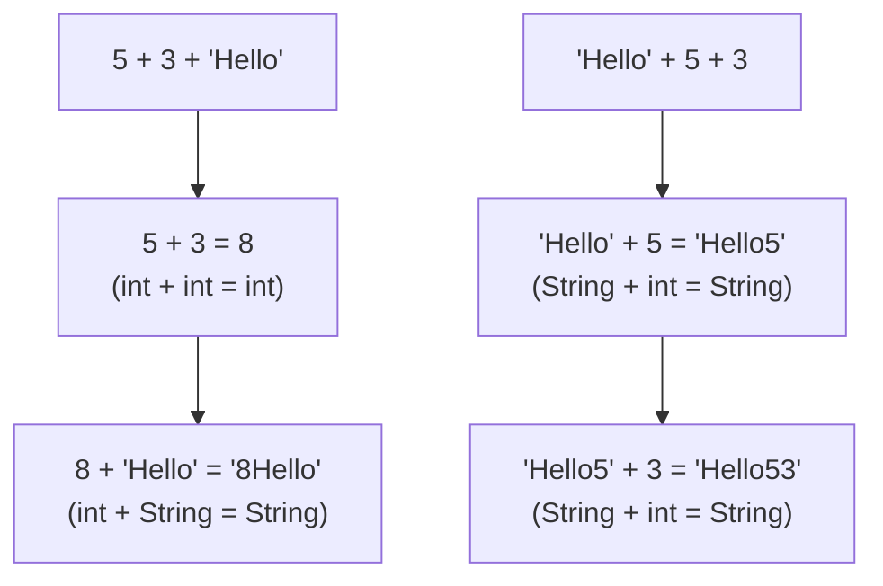
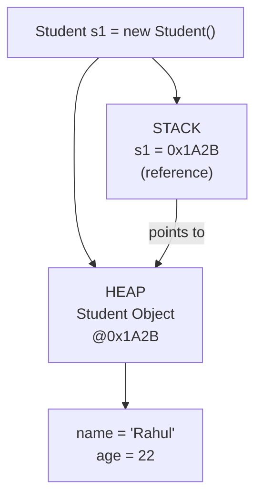
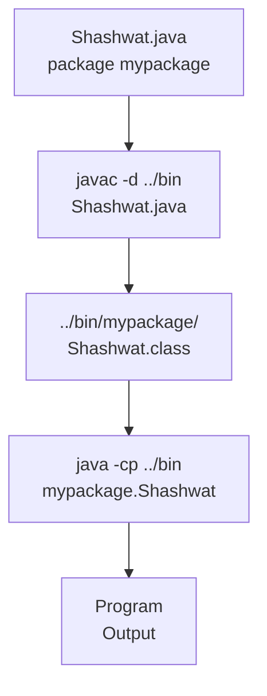

<a id="3-basic-syntax-program-structure"></a>

# 📘 Chapter 3: Basic Syntax & Program Structure

> **Part A: Java Fundamentals — Beginner Foundation**
> `Beginner` | `Foundation` | `Syntax Mastery`

⭐⭐⭐⭐⭐⭐⭐⭐⭐⭐⭐⭐⭐⭐⭐⭐⭐⭐⭐⭐⭐⭐⭐⭐⭐⭐⭐⭐⭐⭐⭐⭐

Java • Core Java • Interview Preparation

⭐⭐⭐⭐⭐⭐⭐⭐⭐⭐⭐⭐⭐⭐⭐⭐⭐⭐⭐⭐⭐⭐⭐⭐⭐⭐⭐⭐⭐⭐⭐⭐

---

<a id="chapter-index-table-3"></a>

## 📚 Chapter 3 — Index Table

| No. | Topic | Subtopics |
|-----|-------|-----------|
| 3.1 | [Tokens in Java](#31-tokens-in-java) | What are Tokens, 5 Types of Tokens, Keywords, Identifiers, Literals, Operators, Separators |
| 3.2 | [Identifiers — Rules and Conventions](#32-identifiers--rules-and-conventions) | Naming Rules, Valid/Invalid Examples, Best Practices |
| 3.3 | [Literals — Types and Usage](#33-literals--types-and-usage) | Integral Literals (4 bases), Floating-Point, Char (4 ways), String, Boolean, Mixed Mode Operations |
| 3.4 | [Escape Sequences](#34-escape-sequences) | All Escape Characters, Unicode Escape, Usage in Strings |
| 3.5 | [Class & Object Basics](#35-class--object-basics) | What is Class, What is Object, Declaring an Object, Memory Allocation |
| 3.6 | [main Method Deep Dive](#36-main-method-deep-dive) | Entry Point, Daemon Thread, Static Block Execution, Can We Run Without main |
| 3.7 | [System.out.println Breakdown](#37-systemoutprintln-breakdown) | System Class, out Field, PrintStream, println vs print vs printf |
| 3.8 | [Naming Conventions](#38-naming-conventions) | Classes, Methods, Variables, Constants, Packages |
| 3.9 | [Java Program Template](#39-java-program-template) | Package, Import, Class Structure, Bytecode Generation, Classpath |
| 🔥 | [Java vs Other Languages](#3-java-vs-other-languages) | What's UNIQUE in Java compared to C++, Python, JS |
| 💡 | [Interview Questions](#3-interview-questions) | 15+ Conceptual · Scenario · Output-based |
| 🧪 | [Practice Problems](#3-practice-problems) | 5 Coding + 5 Theory |

---

## 3.1 Tokens in Java

<a id="31-tokens-in-java"></a>

### 📌 What are Tokens?

```
A TOKEN is the SMALLEST INDIVIDUAL UNIT in a Java program.
The Java compiler breaks source code into tokens during compilation.
Think of tokens as ATOMS — the building blocks of your program.

Every line of code you write is made up of these tokens.
```

### 🔑 5 Types of Tokens

```
┌──────────────────────────────────────────────────────────────┐
│  Type           │  What It Is                │  Example       │
├─────────────────┼────────────────────────────┼────────────────┤
│  1. Keywords    │  Reserved words            │  int, class,   │
│                 │  (predefined meaning)      │  public, static│
├─────────────────┼────────────────────────────┼────────────────┤
│  2. Identifiers │  Names given by developer  │  myVariable,   │
│                 │  (class, method, variable) │  Student, main │
├─────────────────┼────────────────────────────┼────────────────┤
│  3. Literals    │  Fixed constant values     │  10, 3.14,     │
│                 │  (actual data values)      │  'A', "Hello"  │
├─────────────────┼────────────────────────────┼────────────────┤
│  4. Operators   │  Symbols for operations    │  +, -, *, /,   │
│                 │  (perform calculations)    │  ==, &&, ++    │
├─────────────────┼────────────────────────────┼────────────────┤
│  5. Separators  │  Punctuation marks         │  { } ( ) [ ]   │
│                 │  (structure the code)      │  ; , .         │
└──────────────────────────────────────────────────────────────┘
```

### 📌 Token Breakdown Example

```java
public class Demo {
    int x = 10 + 5;
}

// TOKENS in this code:
// public  → Keyword
// class   → Keyword
// Demo    → Identifier
// {       → Separator (Opening brace)
// int     → Keyword
// x       → Identifier
// =       → Operator (Assignment)
// 10      → Literal (Integer)
// +       → Operator (Addition)
// 5       → Literal (Integer)
// ;       → Separator (Statement terminator)
// }       → Separator (Closing brace)

// Total tokens = 12
```

### 🌍 Real-World Analogy (Hinglish)

```
Jaise English mein sentence banta hai words se:
"I am learning Java"
→ I, am, learning, Java = Individual words (tokens)

Waise hi Java code banta hai tokens se:
"int x = 10;"
→ int, x, =, 10, ; = Individual tokens

Compiler pehle code ko tokens mein todta hai,
phir unhe samajhta hai.
```

> [!NOTE]
> The process of breaking source code into tokens is called **Lexical Analysis** or **Tokenization**. This is the first step the Java compiler (javac) performs before actually compiling your code.

<a href="#chapter-index-table-3">Go to Top 🔝</a>

---

## 3.2 Identifiers — Rules and Conventions

<a id="32-identifiers--rules-and-conventions"></a>

### 📌 What is an Identifier?

```
An IDENTIFIER is the NAME given by the developer to:
→ Classes
→ Interfaces
→ Variables
→ Methods
→ Packages
→ Constants
→ Enum values

You choose identifiers. Java keywords are pre-defined.
```

### 🔑 Rules for Identifiers (MUST FOLLOW)

```
┌──────────────────────────────────────────────────────────────┐
│  Rule                                        │ Valid? │
├──────────────────────────────────────────────┼────────┤
│  1. Can contain: letters, digits, _, $        │        │
│  2. MUST start with: letter, $ or _           │        │
│  3. CANNOT start with a digit                 │  ❌    │
│  4. CANNOT be a Java keyword                  │  ❌    │
│  5. CANNOT contain spaces                     │  ❌    │
│  6. Java is CASE-SENSITIVE (Name ≠ name)      │        │
│  7. No length limit (but keep it meaningful)  │        │
│  8. Special characters NOT allowed (@ # % !)  │  ❌    │
└──────────────────────────────────────────────┴────────┘
```

### 📌 Valid and Invalid Examples

```java
// ✅ VALID identifiers:
int age;                // Starts with letter
String studentName;     // camelCase
double _salary;         // Starts with underscore
int $value;             // Starts with dollar sign
int myVariable123;      // Contains digits (not at start)
String MAX_SIZE;        // Uppercase with underscore
int a;                  // Single letter (valid but not recommended)
int main;               // ✅ 'main' is NOT a keyword!

// ❌ INVALID identifiers:
int 1age;               // ❌ Starts with digit
int my age;             // ❌ Contains space
int class;              // ❌ 'class' is a keyword
int my-name;            // ❌ Hyphen not allowed
int my@email;           // ❌ Special char @ not allowed
int my#var;             // ❌ Special char # not allowed
```

> [!TIP]
> **Interview Trap:** `main` is NOT a keyword — it's just a method name that JVM specifically looks for. So `int main = 5;` is perfectly valid Java code! But don't do this in production code 😄

<a href="#chapter-index-table-3">Go to Top 🔝</a>

---

## 3.3 Literals — Types and Usage

<a id="33-literals--types-and-usage"></a>

### 📌 What are Literals?

```
Literals in Java are SYNTHETIC REPRESENTATIONS of 
boolean, numeric, character, or string data.

A literal is a FIXED VALUE that appears DIRECTLY in source code.
It is the actual DATA assigned to a variable.

int x = 10;       // 10 is a literal
String s = "Hi";  // "Hi" is a literal
boolean b = true; // true is a literal
```

---

### 📌 1. Integral Literals (4 Number Systems)

```
For Integral data types (byte, short, int, long),
we can specify literals in 4 ways:
```

```java
public class IntegralLiterals {
    public static void main(String[] args) {

        // a) DECIMAL Literals (Base 10)
        //    Digits: 0-9
        //    Most commonly used
        int decimal = 101;
        System.out.println("Decimal: " + decimal);  // 101

        // b) OCTAL Literals (Base 8)
        //    Digits: 0-7
        //    MUST be prefixed with 0
        int octal = 0146;  // prefix with 0
        System.out.println("Octal 0146: " + octal);   // 102

        // c) HEXADECIMAL Literals (Base 16)
        //    Digits: 0-9, A-F (or a-f)
        //    MUST be prefixed with 0X or 0x
        int hex = 0X123Face;  // prefix with 0X or 0x
        System.out.println("Hex: " + hex);  // 19152846

        // Note: Although Java is CASE-SENSITIVE,
        // 0X and 0x are treated as SAME (special exception!)

        // d) BINARY Literals (Base 2) — Java 7+
        //    Digits: 0, 1
        //    MUST be prefixed with 0b or 0B
        int binary = 0b1111;  // prefix with 0b or 0B
        System.out.println("Binary 0b1111: " + binary);  // 15
    }
}
```

### 📌 How to Identify Different Number Systems

```
┌──────────────────────────────────────────────────────────────┐
│  Number System  │  Prefix  │  Digits Used    │  Example      │
├─────────────────┼──────────┼─────────────────┼───────────────┤
│  Decimal        │  None    │  0–9            │  101          │
│  Octal          │  0       │  0–7            │  0146         │
│  Hexadecimal    │  0x / 0X │  0–9, A–F       │  0X123Face    │
│  Binary         │  0b / 0B │  0, 1           │  0b1111       │
└─────────────────┴──────────┴─────────────────┴───────────────┘

How to IDENTIFY in code:
→ Starts with 0x or 0X? → Hexadecimal
→ Starts with 0b or 0B? → Binary
→ Starts with 0 (only)? → Octal
→ Starts with 1-9?      → Decimal
```

> [!IMPORTANT]
> **Default Rule:** By default, every integral literal is of `int` type. We can specify explicitly as `long` type by suffixing with `l` or `L`. There is NO way to specify `byte` and `short` literals explicitly, but indirectly we can — whenever we assign an integral literal to a byte variable and the value is within range of byte, the compiler AUTOMATICALLY treats it as byte literal.

```java
// Default: int type
int x = 100;          // 100 is int literal

// Explicit long: suffix with L or l
long bigNum = 100L;   // 100L is long literal
long big2 = 100l;     // Works but lowercase 'l' looks like '1' — avoid!

// Implicit byte: compiler auto-converts if in range
byte b = 50;          // 50 is within byte range (-128 to 127) → OK
// byte b2 = 200;     // ❌ 200 exceeds byte range → Compile Error!

// Underscore in literals (Java 7+) — for readability
int million = 1_000_000;         // Same as 1000000
long phone = 98_765_43_210L;     // Underscore ignored by compiler
int binary = 0b1010_1100;        // Even in binary!
```

---

### 📌 2. Floating-Point Literals

```
For Floating-point data types, we can specify literals
in ONLY DECIMAL FORM.
We CANNOT specify in Octal or Hexadecimal forms!
```

```java
public class FloatingLiterals {
    public static void main(String[] args) {

        // a) Decimal form (ONLY way)
        double d = 123.456;       // double by default
        float f = 101.230f;       // MUST add 'f' or 'F' for float

        // Scientific notation
        double sci = 1.5e3;       // 1.5 × 10³ = 1500.0
        double small = 1.5E-3;    // 1.5 × 10⁻³ = 0.0015

        System.out.println(d);     // 123.456
        System.out.println(f);     // 101.23
        System.out.println(sci);   // 1500.0
        System.out.println(small); // 0.0015
    }
}
```

> [!IMPORTANT]
> **Default Rule:** By default, every floating-point literal is of `double` type. Hence we CANNOT assign it directly to a `float` variable without suffix.
> - `float f = 3.14;` → ❌ **Compile Error!** (3.14 is double, can't fit in float)
> - `float f = 3.14f;` → ✅ Explicitly marked as float with `f` suffix
> - `double d = 3.14d;` → ✅ Explicitly marked as double (optional `d`)

---

### 📌 3. Character Literals (4 Ways)

```
For char data types, we can specify literals in 4 WAYS:
```

```java
public class CharLiterals {
    public static void main(String[] args) {

        // WAY 1: Single Quote (Most Common)
        char ch1 = 'a';
        System.out.println(ch1);  // a

        // WAY 2: Char as INTEGRAL Literal (Unicode Value)
        //        Represents the Unicode value of the character
        char ch2 = 97;            // 97 is Unicode for 'a'
        System.out.println(ch2);  // a

        // WAY 3: Unicode Representation
        //        Allowed range: 0 to 65535 (\u0000 to \uFFFF)
        char ch3 = '\u0061';      // Unicode for 'a'
        System.out.println(ch3);  // a

        // WAY 4: Escape Sequence
        char ch4 = '\n';          // Newline character
        char ch5 = '\t';          // Tab character
        System.out.println("Hello" + ch4 + "World"); // Hello\nWorld

        // CHAR ARITHMETIC
        char c = 'A';
        System.out.println(c + 1);         // 66 (int arithmetic!)
        System.out.println((char)(c + 1)); // B (cast back to char)

        // Why char is 2 bytes in Java (not 1 byte like C++)?
        // Java uses UNICODE (UTF-16) → 65,536 characters
        // Supports: Chinese, Arabic, Hindi, Japanese, etc.
    }
}
```

---

### 📌 4. String Literals

```java
// Any sequence of characters within DOUBLE QUOTES
// is treated as String literal

String s1 = "Hello";
String s2 = "Hello World";
String s3 = "";              // Empty string (valid!)
String s4 = "Hello\nWorld";  // With escape sequence
```

---

### 📌 5. Boolean Literals

```java
// Only TWO possible values
boolean b1 = true;
boolean b2 = false;

// NOTE: In Java, boolean is NOT 0 or 1 (unlike C/C++)
// int x = true;  // ❌ COMPILE ERROR! boolean ≠ int in Java
// if (1) { }     // ❌ COMPILE ERROR! 1 is not boolean in Java
```

---

### 📌 6. Mixed Mode Operations

```
"Mixed Mode Operation" = Mixing of character literals 
and integers in String concatenation operations.
```

```java
public class MixedMode {
    public static void main(String[] args) {

        // String + int = String (concatenation)
        System.out.println("Hello" + 5);        // Hello5

        // int + int + String = String
        System.out.println(5 + 3 + "Hello");    // 8Hello
        // Why? → 5+3=8 (int math first) → 8+"Hello"="8Hello"

        // String + int + int = String
        System.out.println("Hello" + 5 + 3);    // Hello53
        // Why? → "Hello"+5="Hello5" → "Hello5"+3="Hello53"

        // char + int = int (NOT String!)
        System.out.println('A' + 1);            // 66 (65+1)

        // char + String = String
        System.out.println('A' + "Hello");      // AHello

        // char + char = int (NOT char!)
        System.out.println('A' + 'B');           // 131 (65+66)

        // IMPORTANT RULE:
        // Java evaluates LEFT to RIGHT
        // Once a String is encountered, everything after is concatenation
    }
}
```

### 📊 Mixed Mode Evaluation Flow



> [!IMPORTANT]
> **Interview Favorite Output Question:**
> ```java
> System.out.println(5 + 3 + "Hello" + 5 + 3);
> // Output: 8Hello53
> // 5+3=8 → 8+"Hello"="8Hello" → "8Hello"+5="8Hello5" → "8Hello5"+3="8Hello53"
> ```
> **Rule:** Left to right. int+int=int. Once String is involved, everything becomes concatenation.

<a href="#chapter-index-table-3">Go to Top 🔝</a>

---

## 3.4 Escape Sequences

<a id="34-escape-sequences"></a>

### 📌 What are Escape Sequences?

```
A character preceded by a BACKSLASH (\) is an escape sequence
and has SPECIAL MEANING to the compiler.

They are used to represent characters that cannot be
typed directly in source code.
```

### 📌 All Escape Sequences in Java

```
┌──────────────┬─────────────────────────────────────────────┐
│  Escape Seq  │  Meaning                                    │
├──────────────┼─────────────────────────────────────────────┤
│  \n          │  Newline (moves cursor to next line)        │
│  \t          │  Horizontal Tab (adds tab space)            │
│  \r          │  Carriage Return (moves cursor to start)    │
│  \\          │  Backslash (prints \)                       │
│  \'          │  Single Quote (prints ')                    │
│  \"          │  Double Quote (prints " inside string)      │
│  \b          │  Backspace (deletes previous char)          │
│  \f          │  Form Feed (new page in printing)           │
│  \0          │  Null character                             │
│  \uXXXX      │  Unicode character (4 hex digits)           │
└──────────────┴─────────────────────────────────────────────┘
```

```java
public class EscapeDemo {
    public static void main(String[] args) {

        // \n → New line
        System.out.println("Hello\nWorld");
        // Output:
        // Hello
        // World

        // \t → Tab
        System.out.println("Name\tAge\tCity");
        System.out.println("Rahul\t25\tPune");
        // Output:
        // Name    Age     City
        // Rahul   25      Pune

        // \\ → Backslash
        System.out.println("C:\\Users\\Desktop");
        // Output: C:\Users\Desktop

        // \" → Double quote inside string
        System.out.println("He said \"Hello\" to me");
        // Output: He said "Hello" to me

        // \' → Single quote in char
        char singleQuote = '\'';
        System.out.println(singleQuote);  // '

        // Unicode escape
        char unicode = '\u0041'; // Unicode for 'A'
        System.out.println(unicode);  // A
    }
}
```

### 📌 Unicode System

```
Unicode is a UNIVERSAL INTERNATIONAL STANDARD character encoding
capable of representing most of the world's written languages.

BEFORE Unicode, there were MANY language standards:
→ ASCII (American Standard Code) for United States
→ ISO 8859-1 for Western European Languages
→ KOI-8 for Russian
→ GB18030 and BIG-5 for Chinese

PROBLEM:
→ Same code value = different letters in different standards!
→ Languages with large character sets had variable length encoding
→ Some chars = 1 byte, others = 2+ bytes

SOLUTION: Unicode System
→ In Unicode, character holds 2 bytes (16 bits)
→ So Java also uses 2 BYTES for characters (char = 2 bytes)
→ Lowest value:  \u0000  (0)
→ Highest value: \uFFFF  (65535)
→ This is why Java can represent Chinese, Arabic, Hindi natively!
```

> [!NOTE]
> This is why Java's `char` is **2 bytes** while C/C++ `char` is **1 byte**. Java uses Unicode (UTF-16) which needs 2 bytes to represent 65,536+ characters from all world languages. C/C++ uses ASCII which only needs 1 byte for 128 characters.

<a href="#chapter-index-table-3">Go to Top 🔝</a>

---

## 3.5 Class & Object Basics

<a id="35-class--object-basics"></a>

### 📌 What is a Class?

```
A CLASS is a BLUEPRINT or TEMPLATE for creating objects.
It defines:
→ What DATA an object will hold (fields/variables)
→ What ACTIONS an object can perform (methods)

Real-World Analogy:
→ Class = BLUEPRINT of a house
→ Object = ACTUAL house built from that blueprint
→ You can build MANY houses (objects) from ONE blueprint (class)
```

### 📌 What is an Object?

```
An OBJECT is an INSTANCE (real copy) of a Class.
It has:
→ STATE    = Data/Values (instance variables)
→ BEHAVIOR = Actions/Methods
→ IDENTITY = Unique reference in memory

Object = Real-world entity created from the Class blueprint
```

### 📌 Declaring an Object

```java
class Student {
    // Fields (State)
    String name;
    int age;

    // Method (Behavior)
    void display() {
        System.out.println("Name: " + name + ", Age: " + age);
    }
}

public class Main {
    public static void main(String[] args) {

        // DECLARING an Object — 3 Steps Combined:
        Student s1 = new Student();
        //  ↑         ↑       ↑
        //  |         |       └── Constructor call (creates object)
        //  |         └────────── 'new' keyword (allocates memory on HEAP)
        //  └──────────────────── Reference variable (stored on STACK)

        // Setting values
        s1.name = "Rahul";
        s1.age = 22;

        // Calling method
        s1.display();  // Name: Rahul, Age: 22

        // MEMORY:
        // STACK: s1 → holds address of Student object
        // HEAP:  Student object {name="Rahul", age=22}
    }
}
```

### 📊 Object Memory Allocation



### 📌 What Happens When `new` is Executed?

```
Step 1: JVM allocates memory on HEAP for the new object
Step 2: Instance variables are initialized to DEFAULT values
        (int → 0, String → null, boolean → false)
Step 3: Constructor is called (initializes the object)
Step 4: Reference (memory address) is returned
Step 5: Reference is stored in the variable on STACK
```

> [!IMPORTANT]
> In Java, **every object is stored on the HEAP**. The reference variable (which holds the address) is stored on the **STACK** (for local variables) or **HEAP** (for instance variables). When you do `Student s1 = new Student();`, `s1` is on Stack, but the actual Student object is on Heap.

<a href="#chapter-index-table-3">Go to Top 🔝</a>

---

## 3.6 main Method Deep Dive

<a id="36-main-method-deep-dive"></a>

### 📌 Entry Point of Java Program

```
In Java programs, the point from where the program starts
its execution — the ENTRY POINT — is the main() method.

→ JVM SEARCHES for a main method
→ If NOT found → Execution will NOT take place!
→ When a Java program starts, a DAEMON THREAD is attached
  to the main method
→ This daemon thread gets DESTROYED only when the
  Java program STOPS execution
```

### 📌 main() Method Signature Breakdown

```java
public static void main(String[] args)

// Let's break down EACH word:
```

```
┌──────────────────────────────────────────────────────────────┐
│  Keyword     │  Role                                         │
├──────────────┼───────────────────────────────────────────────┤
│  public      │  ACCESS SPECIFIER                             │
│              │  → Specifies who can access the method         │
│              │  → public = globally available                 │
│              │  → JVM invokes from OUTSIDE the class          │
├──────────────┼───────────────────────────────────────────────┤
│  static      │  KEYWORD                                      │
│              │  → Makes it a CLASS-RELATED method             │
│              │  → JVM calls WITHOUT instantiating the class   │
│              │  → Saves unnecessary memory wastage            │
├──────────────┼───────────────────────────────────────────────┤
│  void        │  RETURN TYPE                                   │
│              │  → Specifies method doesn't return anything    │
│              │  → We CAN use 'return;' to exit (return void) │
│              │  → When main() terminates → program terminates │
│              │  → JVM can't do anything with return value      │
├──────────────┼───────────────────────────────────────────────┤
│  main        │  METHOD NAME                                   │
│              │  → Identifier that JVM looks for               │
│              │  → NOT a keyword!                              │
│              │  → JVM specifically searches for this name     │
├──────────────┼───────────────────────────────────────────────┤
│  ()          │  DENOTES A FUNCTION                            │
│              │  → Parentheses indicate this is a method       │
├──────────────┼───────────────────────────────────────────────┤
│  String      │  DATA TYPE                                     │
│              │  → Text/character sequence type                │
├──────────────┼───────────────────────────────────────────────┤
│  []          │  DENOTES AN ARRAY                              │
│              │  → Square brackets = array                     │
├──────────────┼───────────────────────────────────────────────┤
│  args        │  LOCAL VARIABLE NAME                           │
│              │  → Passed as a function parameter              │
│              │  → Holds command-line arguments                │
│              │  → Can be named anything (args is convention)  │
└──────────────┴───────────────────────────────────────────────┘
```

### 📌 Can We Execute Without main()?

```java
/*
YES — Using STATIC BLOCK (Before Java 7)

A static block gets executed ONLY ONCE when the class
is loaded into memory by ClassLoader.
Also known as: Static Initialization Block.
It goes into the STACK MEMORY.

⚠️ WON'T RUN on Java 8 and above!
*/

class StaticBlockDemo {
    static {
        System.out.println("I ran without main method!");
        System.exit(0); // Exit before JVM searches for main
    }
}

/*
Java 6 and below: ✅ Prints "I ran without main method!"
Java 7 and above: ❌ "Error: Main method not found"

From Java 7+, JVM checks for main() FIRST before
executing any static blocks.
*/
```

<a href="#chapter-index-table-3">Go to Top 🔝</a>

---

## 3.7 System.out.println Breakdown

<a id="37-systemoutprintln-breakdown"></a>

### 📌 Dissecting System.out.println()

```
System.out.println("Hello, World!");

Let's break this into pieces:
```

```
┌──────────────────────────────────────────────────────────────┐
│  Component    │  What It Is                                  │
├───────────────┼──────────────────────────────────────────────┤
│  System       │  A FINAL CLASS in java.lang package           │
│               │  → Automatically imported (no import needed) │
│               │  → Cannot be instantiated (all static)       │
├───────────────┼──────────────────────────────────────────────┤
│  out          │  A STATIC FIELD of System class              │
│               │  → Type: PrintStream                         │
│               │  → Represents standard output (console)     │
│               │  → System.out = PrintStream object           │
├───────────────┼──────────────────────────────────────────────┤
│  println()    │  A METHOD of PrintStream class               │
│               │  → Prints the argument + moves to NEXT LINE │
│               │  → print() = prints WITHOUT new line         │
│               │  → printf() = formatted print                │
├───────────────┼──────────────────────────────────────────────┤
│  .            │  DOT OPERATOR                                │
│               │  → Used to access members of an object       │
│               │  → System.out = accessing 'out' field        │
│               │  → out.println() = calling method on 'out'   │
└───────────────┴──────────────────────────────────────────────┘
```

### 📌 println vs print vs printf

```java
public class OutputMethods {
    public static void main(String[] args) {

        // println() → Print + New Line
        System.out.println("Hello");   // Hello
        System.out.println("World");   // World (on new line)

        // print() → Print WITHOUT new line
        System.out.print("Hello ");    // Hello (stays same line)
        System.out.print("World");     // World (same line)
        System.out.println();          // Just moves to next line

        // printf() → Formatted print (like C)
        String name = "Rahul";
        int age = 25;
        double gpa = 8.75;

        System.out.printf("Name: %s, Age: %d, GPA: %.2f%n", name, age, gpa);
        // Output: Name: Rahul, Age: 25, GPA: 8.75

        // Format specifiers:
        // %s  = String
        // %d  = Integer (decimal)
        // %f  = Floating point
        // %.2f = Float with 2 decimal places
        // %c  = Character
        // %b  = Boolean
        // %n  = New line (platform-independent)
        // %10d = Integer padded to 10 chars (right-aligned)
    }
}
```

<a href="#chapter-index-table-3">Go to Top 🔝</a>

---

## 3.8 Naming Conventions

<a id="38-naming-conventions"></a>

### 📌 Java Standard Naming Rules

```
┌──────────────────────┬──────────────────┬─────────────────────┐
│  Element             │  Convention       │  Example            │
├──────────────────────┼──────────────────┼─────────────────────┤
│  Class Name          │  PascalCase       │  StudentRecord      │
│                      │  (Capital start)  │  BankAccount        │
├──────────────────────┼──────────────────┼─────────────────────┤
│  Interface Name      │  PascalCase       │  Printable          │
│                      │                   │  Serializable       │
├──────────────────────┼──────────────────┼─────────────────────┤
│  Method Name         │  camelCase        │  getStudentName()   │
│                      │  (lowercase start)│  calculateTotal()   │
├──────────────────────┼──────────────────┼─────────────────────┤
│  Variable Name       │  camelCase        │  studentAge         │
│                      │                   │  totalMarks         │
├──────────────────────┼──────────────────┼─────────────────────┤
│  Constant            │  UPPER_SNAKE_CASE │  MAX_SIZE           │
│  (static final)      │                   │  PI_VALUE           │
├──────────────────────┼──────────────────┼─────────────────────┤
│  Package Name        │  all.lowercase    │  com.company.app    │
│                      │                   │  java.util          │
├──────────────────────┼──────────────────┼─────────────────────┤
│  Enum Name           │  PascalCase       │  DayOfWeek          │
├──────────────────────┼──────────────────┼─────────────────────┤
│  Enum Constants      │  UPPER_SNAKE_CASE │  MONDAY, TUESDAY    │
└──────────────────────┴──────────────────┴─────────────────────┘
```

### 📌 General Rules for Naming Variables

```
1. Names can contain letters, digits, underscores, and dollar signs
2. Names MUST begin with a letter
3. Names should start with LOWERCASE letter
4. Names CANNOT contain whitespace
5. Names can also begin with $ and _
6. Names are CASE SENSITIVE ("myVar" and "myvar" are different)
7. Reserved words (Java keywords) CANNOT be used as names
```

```java
// GOOD naming:
int studentAge = 25;              // Descriptive, camelCase
String firstName = "Rahul";       // Meaningful name
static final int MAX_RETRY = 3;   // Constant: UPPER_SNAKE_CASE

// BAD naming (technically valid but not recommended):
int x = 25;                       // Not descriptive
int SA = 25;                      // Looks like constant
int studentage = 25;              // No camelCase separation
```

<a href="#chapter-index-table-3">Go to Top 🔝</a>

---

## 3.9 Java Program Template

<a id="39-java-program-template"></a>

### 📌 Complete Program Structure

```java
// ─────────────────────────────────────────────────
// 1. PACKAGE DECLARATION (Optional — MUST be first line)
// ─────────────────────────────────────────────────
package com.myapp.demo;

// ─────────────────────────────────────────────────
// 2. IMPORT STATEMENTS (Optional — after package)
// ─────────────────────────────────────────────────
import java.util.Scanner;
// java.lang.* is automatically imported

// ─────────────────────────────────────────────────
// 3. CLASS DECLARATION (Required)
// ─────────────────────────────────────────────────
public class MyProgram {

    // 4. Static Variables
    static int count = 0;

    // 5. Instance Variables
    String name;

    // 6. Static Block
    static {
        System.out.println("Class loaded!");
    }

    // 7. Constructor
    public MyProgram(String name) {
        this.name = name;
    }

    // 8. Methods
    public void display() {
        System.out.println("Name: " + name);
    }

    // 9. MAIN METHOD (Entry Point)
    public static void main(String[] args) {
        MyProgram obj = new MyProgram("Java");
        obj.display();
    }
}
```

### 📌 Generating Bytecode in Different Directory

```bash
# 1. Create .class file in SAME package directory
javac -d . Shashwat.java
# -d .  → Creates package directory structure in current folder

# 2. Create .class file in DIFFERENT directory
javac -d ../bin Shashwat.java
# -d ../bin → Creates package structure in ../bin folder

# 3. Run bytecode from a DIFFERENT directory
# Method 1: Set classpath
set classpath=../bin;
java mypackage.Shashwat

# Method 2: Specify classpath directly (Alternate way)
java -classpath ../bin mypackage.Shashwat
# or
java -cp ../bin mypackage.Shashwat
```

### 📊 Package & Bytecode Flow



> [!TIP]
> **Understanding `-d` flag:**
> - `javac -d . Hello.java` → Creates package folders in current directory
> - `javac -d ../bin Hello.java` → Creates package folders in `../bin`
> - The `-d` flag tells javac WHERE to place generated `.class` files
> - It automatically creates the package directory structure

<a href="#chapter-index-table-3">Go to Top 🔝</a>

---

<a id="3-java-vs-other-languages"></a>

## 🔥 What Makes Java DIFFERENT from Other Languages?

> [!IMPORTANT]
> Java has several features that are **UNIQUE** or work **DIFFERENTLY** compared to C++, Python, JavaScript, and other languages. These are **frequently asked in interviews**.

### 📌 Comparison Table

```
┌──────────────────────┬────────────┬────────────┬────────────┬────────────┐
│  Feature             │  Java      │  C++       │  Python    │  JavaScript│
├──────────────────────┼────────────┼────────────┼────────────┼────────────┤
│  Platform            │ ✅ WORA    │ ❌ Recompile│ ✅ Interpret│ ✅ Browser │
│  Independence        │ (Bytecode) │ per OS      │ per OS     │ engine     │
├──────────────────────┼────────────┼────────────┼────────────┼────────────┤
│  Pointers            │ ❌ Removed │ ✅ Yes      │ ❌ No      │ ❌ No     │
│                      │ for safety │ explicit    │            │            │
├──────────────────────┼────────────┼────────────┼────────────┼────────────┤
│  Memory              │ ✅ Auto GC │ ❌ Manual   │ ✅ Auto GC │ ✅ Auto GC│
│  Management          │ mandatory  │ new/delete  │            │            │
├──────────────────────┼────────────┼────────────┼────────────┼────────────┤
│  Multiple            │ ❌ Classes │ ✅ Yes      │ ✅ Yes     │ ❌ No     │
│  Inheritance         │ ✅ Interface│(Diamond!)  │            │ (Prototype)│
├──────────────────────┼────────────┼────────────┼────────────┼────────────┤
│  Operator            │ ❌ Removed │ ✅ Yes      │ ✅ Yes     │ ❌ No     │
│  Overloading         │ (only +)   │ full        │ limited    │            │
├──────────────────────┼────────────┼────────────┼────────────┼────────────┤
│  Header Files        │ ❌ No      │ ✅ Required │ ❌ No      │ ❌ No     │
│                      │ (packages) │ (.h files)  │ (import)   │ (import)   │
├──────────────────────┼────────────┼────────────┼────────────┼────────────┤
│  Typing System       │ Static +   │ Static +   │ Dynamic +  │ Dynamic +  │
│                      │ Strong     │ Weak       │ Strong     │ Weak       │
├──────────────────────┼────────────┼────────────┼────────────┼────────────┤
│  Boolean Type        │ true/false │ 0/non-zero │ True/False │ truthy/    │
│                      │ ONLY       │ int-based  │ + truthy   │ falsy      │
├──────────────────────┼────────────┼────────────┼────────────┼────────────┤
│  Standalone          │ ❌ No      │ ✅ Yes      │ ✅ Yes     │ ✅ Yes    │
│  Functions           │ (all in    │ (free      │ (def)      │ (function) │
│                      │ class)     │ functions) │            │            │
├──────────────────────┼────────────┼────────────┼────────────┼────────────┤
│  char Size           │ 2 bytes    │ 1 byte     │ No char    │ No char   │
│                      │ (Unicode)  │ (ASCII)    │ type       │ type      │
├──────────────────────┼────────────┼────────────┼────────────┼────────────┤
│  String              │ ✅ IMMUTABLE│ Mutable    │ ✅ Immutable│ ✅ Immutable│
│                      │ (Object)   │ (char[])   │ (Object)   │ (Primitive)│
└──────────────────────┴────────────┴────────────┴────────────┴────────────┘
```

### 🎯 What's UNIQUE to Java — Key Points for Interviews

```
1. BYTECODE + JVM MODEL:
   → Java compiles to bytecode (not machine code)
   → Bytecode is platform-independent
   → JVM converts to machine code at runtime
   → NO other major language uses this EXACT approach

2. NO EXPLICIT POINTERS:
   → Java REMOVED pointers from C++ for security
   → You work with REFERENCES (abstracted pointers)
   → Cannot do pointer arithmetic
   → Prevents buffer overflow attacks

3. EVERYTHING INSIDE A CLASS:
   → No standalone functions allowed in Java!
   → Even main() must be inside a class
   → In C++/Python/JS you can have functions outside classes
   → This is why: "public class Main { public static void main... }"

4. BOOLEAN IS NOT INT:
   → In C++: if(1) is valid, 0 is false, non-zero is true
   → In Java: if(1) is ❌ COMPILE ERROR!
   → Java boolean is ONLY true or false — NOT 0 or 1
   → This makes Java STRICTLY type-safe

5. CHAR IS 2 BYTES (Unicode):
   → C/C++ char = 1 byte (ASCII, 128 chars)
   → Java char = 2 bytes (Unicode, 65536 chars)
   → Java natively supports ALL world languages

6. STRING IS IMMUTABLE AND AN OBJECT:
   → In C++: String is char[] (mutable array)
   → In Java: String is an IMMUTABLE OBJECT
   → Once created, cannot be changed
   → String Pool for optimization

7. NO OPERATOR OVERLOADING:
   → C++ allows custom operators (+, -, *, etc.)
   → Java REMOVED this (except + for String concatenation)
   → Keeps code predictable and readable

8. DEFAULT VALUES FOR INSTANCE VARIABLES:
   → Java initializes instance vars to defaults (0, null, false)
   → C++ does NOT initialize — contains garbage values!
   → But Java LOCAL variables also must be manually initialized

9. GARBAGE COLLECTION IS MANDATORY:
   → C++: You MUST manually delete objects (memory leaks!)
   → Java: GC runs automatically — you CANNOT disable it
   → You can suggest GC (System.gc()) but can't force it

10. PASS-BY-VALUE ONLY:
    → C++: Has both pass-by-value AND pass-by-reference (&)
    → Java: ONLY pass-by-value (even for objects!)
    → For objects, it passes COPY of reference (not reference itself)
```

### 🌍 Hinglish Summary

```
Java mein kuch cheezein UNIQUE hain jo C++ ya Python mein nahi milti:

1. Pointers HATA diye → Security ke liye
2. Sab kuch CLASS ke andar → Free function nahi likh sakte
3. boolean = sirf true/false → 0 ya 1 nahi chalega
4. char = 2 bytes → Duniya ki har language support karta hai
5. String = Immutable → Ek baar bani toh change nahi hogi
6. Memory management → GC automatic hai, manual nahi
7. Platform Independent → Ek baar compile karo, kahin bhi chalao
```

<a href="#chapter-index-table-3">Go to Top 🔝</a>

---

<a id="3-interview-questions"></a>

## 💡 Chapter 3 — Interview Questions (15+)

> 🔥 Most frequently asked questions on Java Syntax, Literals, and Program Structure

---

### 🔵 Conceptual Questions

---

**Q1. What are tokens in Java? How many types of tokens exist?**

```
Tokens are the SMALLEST individual units in a Java program.
The compiler breaks source code into tokens during compilation.

5 Types of Tokens:
1. Keywords    → Reserved words (int, class, public, static)
2. Identifiers → Names given by developer (myVar, Student)
3. Literals    → Fixed values (10, 3.14, 'A', "Hello", true)
4. Operators   → Symbols for operations (+, -, *, ==, &&)
5. Separators  → Punctuation marks ({ } ( ) [ ] ; , .)

This process of breaking code into tokens is called
LEXICAL ANALYSIS or TOKENIZATION.
```

---

**Q2. In how many ways can we specify an integer literal in Java?**

```
4 Ways to specify integral literals:

1. Decimal (Base 10):    int x = 101;
   → No prefix, digits 0-9

2. Octal (Base 8):       int x = 0146;
   → Prefix with 0, digits 0-7

3. Hexadecimal (Base 16): int x = 0X123Face;
   → Prefix with 0x or 0X, digits 0-9 + A-F

4. Binary (Base 2):      int x = 0b1111;
   → Prefix with 0b or 0B, digits 0-1 (Java 7+)

DEFAULT: Every integral literal is of int type.
LONG: Suffix with L or l to make it long literal.
BYTE/SHORT: No explicit way, but compiler auto-treats
            if value is within range.
```

---

**Q3. Why is Java's char 2 bytes but C/C++ char is 1 byte?**

```
C/C++ uses ASCII encoding:
→ Only 128 characters (English alphabet + digits + symbols)
→ 1 byte (8 bits) is enough: 0 to 127

Java uses UNICODE (UTF-16) encoding:
→ 65,536+ characters from ALL world languages
→ Includes: English, Chinese, Arabic, Hindi, Japanese, etc.
→ Needs 2 bytes (16 bits): 0 to 65535
→ Range: \u0000 to \uFFFF

REASON: Java was designed for the INTERNET — it needed
to support all international languages natively.

This is why char in Java is 2 bytes.
```

---

**Q4. In how many ways can we specify a char literal in Java?**

```
4 Ways:

1. Single Quote:
   char ch = 'a';

2. Integral Literal (Unicode value):
   char ch = 97;     // 97 = Unicode for 'a'

3. Unicode Representation:
   char ch = '\u0061';  // \u0061 = 'a'
   Range: 0 to 65535

4. Escape Sequence:
   char ch = '\n';   // Newline
   char ch = '\t';   // Tab
```

---

**Q5. What is the difference between float and double literals?**

```
FLOAT LITERAL:
→ Size: 4 bytes (32 bits)
→ Precision: 6-7 decimal digits
→ Suffix: MUST add 'f' or 'F'
→ float f = 3.14f;
→ float f = 3.14;  // ❌ ERROR! 3.14 is double by default

DOUBLE LITERAL:
→ Size: 8 bytes (64 bits)
→ Precision: 15-16 decimal digits
→ Suffix: Optional 'd' or 'D'
→ double d = 3.14;   // ✅ Default is double
→ double d = 3.14d;  // ✅ Explicit double

DEFAULT RULE:
Every floating-point literal is DOUBLE type by default.
Cannot assign directly to float without 'f' suffix.
```

---

**Q6. What is a "Mixed Mode Operation" in Java?**

```
Mixed Mode Operation = Mixing character literals and
integers in String concatenation operations.

Rules:
→ String + anything = String (concatenation)
→ int + int = int (arithmetic)
→ char + int = int (NOT char!)
→ char + char = int (NOT char!)
→ Java evaluates LEFT to RIGHT
→ Once String is encountered, everything after = concatenation

Examples:
"Hello" + 5 + 3 = "Hello53" (String concat throughout)
5 + 3 + "Hello" = "8Hello"  (5+3=8 first, then concat)
'A' + 1 = 66              (char treated as int)
'A' + "Hello" = "AHello"  (String concat)
```

---

**Q7. Explain the rules for naming identifiers in Java.**

```
RULES (Must Follow):
1. Can contain: letters, digits, underscores (_), dollar signs ($)
2. MUST begin with: letter, $ or _
3. CANNOT start with a digit
4. CANNOT be a Java keyword
5. CANNOT contain whitespace
6. CASE SENSITIVE ("myVar" ≠ "myvar")
7. No length limit
8. Special characters NOT allowed (@ # % !)

CONVENTIONS (Should Follow):
→ Classes:     PascalCase  (StudentRecord)
→ Methods:     camelCase   (getStudentName)
→ Variables:   camelCase   (studentAge)
→ Constants:   UPPER_SNAKE (MAX_SIZE)
→ Packages:    lowercase   (com.myapp)
```

---

**Q8. What is the Unicode System? Why does Java use it?**

```
PROBLEM (Before Unicode):
→ ASCII for US, ISO 8859-1 for Europe, KOI-8 for Russian
→ Same code value = DIFFERENT letters in different standards
→ Large character sets had VARIABLE length encoding

SOLUTION (Unicode):
→ Universal international standard encoding
→ Character holds 2 bytes (16 bits)
→ Java also uses 2 bytes for characters
→ Lowest: \u0000 (0)
→ Highest: \uFFFF (65535)
→ Represents ALL world languages in single standard

WHY JAVA USES IT:
→ Java was designed for the Internet
→ Need to support international content natively
→ One encoding standard for everyone
```

---

### 🟡 Scenario-Based Questions

---

**Q9. What happens if you specify a float literal without 'f' suffix?**

```java
float f = 3.14;    // ❌ COMPILE ERROR!
// Error: "incompatible types: possible lossy conversion
//         from double to float"

// REASON: 3.14 is DOUBLE by default
// double (8 bytes) cannot fit in float (4 bytes) without cast

// FIXES:
float f1 = 3.14f;         // ✅ Add 'f' suffix
float f2 = (float) 3.14;  // ✅ Explicit cast
double d = 3.14;           // ✅ Use double instead
```

---

**Q10. How do you generate bytecode in a different directory?**

```bash
# Scenario: Your .java file is in /src/
# You want .class file in /bin/

# Step 1: Compile with -d flag
javac -d ../bin Shashwat.java

# Step 2: Run from different directory
# Method 1: Set classpath
set classpath=../bin;
java mypackage.Shashwat

# Method 2: Use -classpath flag
java -classpath ../bin mypackage.Shashwat
# or
java -cp ../bin mypackage.Shashwat

# The -d flag creates package directory structure
# in the specified directory automatically
```

---

**Q11. What is the difference between `System.exit(0)` and reaching end of main()?**

```java
// Reaching end of main():
public static void main(String[] args) {
    System.out.println("Hello");
    // Method ends naturally → JVM terminates normally
    // All resources are cleaned up properly
}

// System.exit(0):
public static void main(String[] args) {
    System.out.println("Hello");
    System.exit(0); // IMMEDIATELY terminates JVM
    System.out.println("Never printed!"); // Unreachable
}

// DIFFERENCE:
// → end of main() → JVM waits for all non-daemon threads to finish
// → System.exit(0) → JVM terminates IMMEDIATELY
//   (even if other threads are running)
// → exit(0) = normal termination, exit(non-zero) = abnormal

// Used in static blocks to "run without main" in older Java
```

---

### 🔴 Output-Based Questions

---

**Q12. Predict the output:**

```java
System.out.println(5 + 3 + "Hello" + 5 + 3);
```

```
OUTPUT: 8Hello53

EXPLANATION:
Step 1: 5 + 3 = 8         (int + int = int)
Step 2: 8 + "Hello" = "8Hello"  (int + String = String)
Step 3: "8Hello" + 5 = "8Hello5" (String + int = String)
Step 4: "8Hello5" + 3 = "8Hello53" (String + int = String)

RULE: Left to right. Once String is involved = concatenation.
```

---

**Q13. Predict the output:**

```java
System.out.println('A' + 'B');
System.out.println("" + 'A' + 'B');
System.out.println('A' + 'B' + "");
```

```
OUTPUT:
131
AB
131

EXPLANATION:
Line 1: 'A' + 'B' = 65 + 66 = 131 (char + char = int)
Line 2: "" + 'A' = "A", then "A" + 'B' = "AB" (String concat)
Line 3: 'A' + 'B' = 131 first, then 131 + "" = "131" (int+String)
```

---

**Q14. Is this code valid? What's the output?**

```java
public class Test {
    public static void main(String[] args) {
        byte b = 50;
        // byte b2 = 200; // What happens?
        System.out.println(b);
    }
}
```

```
OUTPUT: 50

EXPLANATION:
byte b = 50;   → ✅ VALID (50 is within byte range -128 to 127)
                → Compiler auto-treats 50 as byte literal

byte b2 = 200; → ❌ COMPILE ERROR!
                → 200 exceeds byte range (max 127)
                → "incompatible types: possible lossy conversion
                    from int to byte"

FIX: byte b2 = (byte) 200;  → b2 = -56 (wrapping/overflow!)
     200 % 256 = 200, but 200 - 256 = -56
```

---

**Q15. Predict the output:**

```java
public class Test {
    static {
        System.out.println("Static 1");
    }
    static {
        System.out.println("Static 2");
    }
    public static void main(String[] args) {
        System.out.println("Main");
    }
    static {
        System.out.println("Static 3");
    }
}
```

```
OUTPUT:
Static 1
Static 2
Static 3
Main

REASON:
→ When class is loaded, ALL static blocks execute FIRST
→ Static blocks execute in ORDER of appearance (top to bottom)
→ Even if some static blocks are AFTER main() in code,
  they still execute BEFORE main()
→ Then main() is called by JVM
```

---

**Q16. What's the output of these octal and hex literals?**

```java
System.out.println(0146);      // Octal
System.out.println(0X1A);      // Hex
System.out.println(0b1010);    // Binary
```

```
OUTPUT:
102
26
10

EXPLANATION:
0146 (Octal) = 1×64 + 4×8 + 6×1 = 64 + 32 + 6 = 102
0X1A (Hex)   = 1×16 + 10×1 = 16 + 10 = 26
0b1010 (Binary) = 1×8 + 0×4 + 1×2 + 0×1 = 8 + 2 = 10

Java ALWAYS prints in DECIMAL format regardless of how
the literal was specified.
```

<a href="#chapter-index-table-3">Go to Top 🔝</a>

---

<a id="3-practice-problems"></a>

## 🧪 Chapter 3 — Practice Problems

### 📝 5 Theory Questions

```
1. Explain all 5 types of tokens in Java with 3 examples each.
   Show how a line of code is broken into tokens.

2. What is the Unicode System? Why does Java use Unicode
   instead of ASCII? What range does Java's char support?

3. Explain Mixed Mode Operations in Java with 5 examples.
   Show step-by-step evaluation for each expression.

4. Compare Java's literal system with C++.
   Cover: int, char, String, boolean, and float literals.
   What's different? What's same?

5. Explain the role of -d flag in javac and -classpath in java.
   How do you compile in one directory and run from another?
   Show the complete command sequence.
```

---

### 💻 5 Coding Questions

```java
// Q1: Write a program that demonstrates all 4 types of
// integral literals (Decimal, Octal, Hex, Binary)
// Print each with its decimal equivalent

public class IntegralLiteralsDemo {
    public static void main(String[] args) {
        // TODO: Declare integer using each number system
        // Print: "Decimal: 100"
        // Print: "Octal 0144 = 100"
        // Print: "Hex 0x64 = 100"
        // Print: "Binary 0b1100100 = 100"
    }
}
```

```java
// Q2: Write a program demonstrating all 4 ways to create
// a char literal. Also show char arithmetic.

public class CharLiteralsDemo {
    public static void main(String[] args) {
        // TODO: Create char using:
        // 1. Single quote
        // 2. Integer value
        // 3. Unicode escape
        // 4. Escape sequence
        // Also demonstrate: char + int, char + char
        // Print uppercase alphabet using loop and char arithmetic
    }
}
```

```java
// Q3: Predict and verify the output of these Mixed Mode Operations
// Write each on separate line and explain WHY

public class MixedModeChallenge {
    public static void main(String[] args) {
        System.out.println(10 + 20 + "Hello");        // ?
        System.out.println("Hello" + 10 + 20);        // ?
        System.out.println("Hello" + (10 + 20));       // ?
        System.out.println('A' + 'B' + "Hello");       // ?
        System.out.println("Hello" + 'A' + 'B');       // ?
        System.out.println(1 + 2 + 3 + "=" + 1 + 2 + 3); // ?
        System.out.println("" + 1 + 2 + 3);           // ?
        System.out.println(1 + 2 + "" + 3 + 4);       // ?

        // TODO: Run and verify. Write explanation for each.
    }
}
```

```java
// Q4: Write a program that prints a formatted student table
// using ALL output methods: println, print, printf, format
// Use escape sequences: \t for tabs, \n for newlines

public class FormattedTable {
    public static void main(String[] args) {
        // TODO: Print this table:
        // ╔═══════════════════════════════════════════╗
        // ║  Name       Age    Grade    GPA           ║
        // ╠═══════════════════════════════════════════╣
        // ║  Rahul      22     A        9.25          ║
        // ║  Priya      21     B+       8.75          ║
        // ║  Amit       23     A+       9.80          ║
        // ╚═══════════════════════════════════════════╝
        // Use printf with format specifiers: %s, %d, %.2f
    }
}
```

```java
// Q5: Token Counter
// Given a simple Java statement as a String,
// count and categorize the tokens manually

public class TokenAnalyzer {
    public static void main(String[] args) {
        // Given statement: int studentAge = 25 + 5;
        //
        // Categorize:
        // Keywords: ___
        // Identifiers: ___
        // Literals: ___
        // Operators: ___
        // Separators: ___
        // Total Tokens: ___

        // Do the same for:
        // public static void main(String[] args)

        // TODO: Print your analysis
    }
}
```

<a href="#chapter-index-table-3">Go to Top 🔝</a>

---

```
┌─────────────────────────────────────────────────────────────┐
│                  ✅ CHAPTER 3 COMPLETE                      │
│                                                             │
│  Topics Covered:                                            │
│  ✅ 3.1  Tokens in Java — 5 Types with Examples             │
│  ✅ 3.2  Identifiers — Rules, Valid/Invalid Names           │
│  ✅ 3.3  Literals — Integral (4 bases), Float, Char (4 ways)│
│         Boolean, String, Mixed Mode Operations              │
│  ✅ 3.4  Escape Sequences — All Characters, Unicode System  │
│  ✅ 3.5  Class & Object Basics — Declaration, Memory        │
│  ✅ 3.6  main Method Deep Dive — Every Keyword Explained    │
│         Static Block, Daemon Thread, Can Run Without main   │
│  ✅ 3.7  System.out.println — Breakdown, print vs printf    │
│  ✅ 3.8  Naming Conventions — Classes, Methods, Variables   │
│  ✅ 3.9  Java Program Template — Package, Classpath, -d flag│
│  ✅ 🔥   Java vs Other Languages — 10 UNIQUE Differences    │
│  ✅ 15+  Interview Questions with Detailed Answers          │
│  ✅ 5    Theory + 5 Coding Practice Problems                │
│                                                             │
│  ⭐ Next Chapter: Variables, Data Types & Type Conversion   │
│     (Chapter 4)                                             │
└─────────────────────────────────────────────────────────────┘
```

[Go to Main Index 🔝](#main-index)

