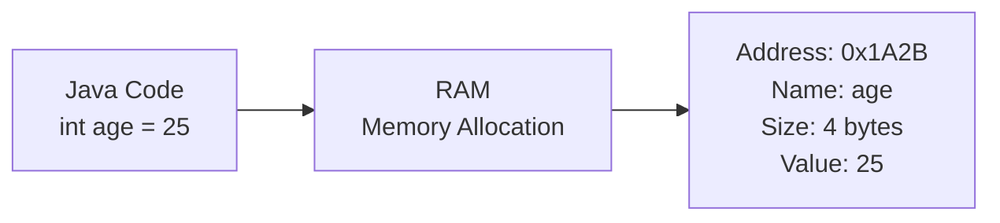
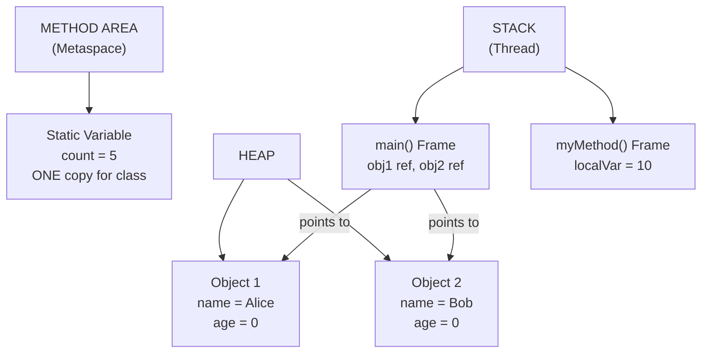
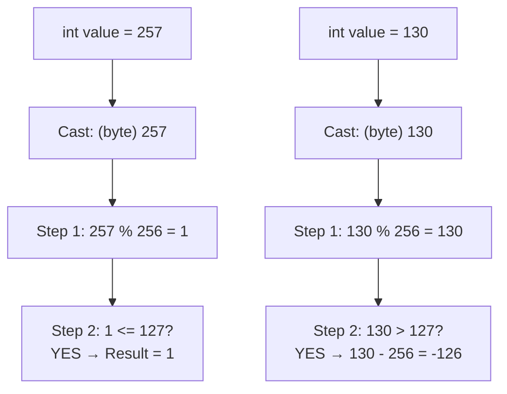
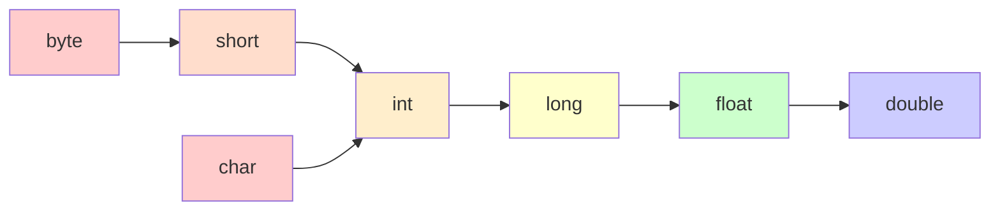
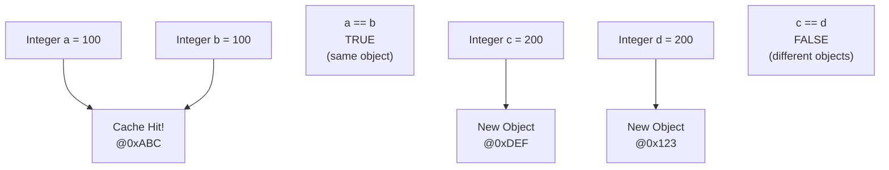

# 📘 Chapter 4: Variables, Data Types & Type Conversion

> **Part A: Java Fundamentals — Beginner Foundation**
> `Beginner` | `Foundation` | `Core Concept`

⭐⭐⭐⭐⭐⭐⭐⭐⭐⭐⭐⭐⭐⭐⭐⭐⭐⭐⭐⭐⭐⭐⭐⭐⭐⭐⭐⭐⭐⭐⭐⭐

Java • Core Java • Interview Preparation

⭐⭐⭐⭐⭐⭐⭐⭐⭐⭐⭐⭐⭐⭐⭐⭐⭐⭐⭐⭐⭐⭐⭐⭐⭐⭐⭐⭐⭐⭐⭐⭐

---

<a id="chapter-index-table-4"></a>

## 📚 Chapter 4 — Index Table

| No. | Topic | Subtopics |
|-----|-------|-----------|
| 4.1 | [What is a Variable](#41-what-is-a-variable) | Definition, Memory Location, Declaration, Initialization, Vary + Able |
| 4.2 | [Types of Variables](#42-types-of-variables) | Local Variable, Instance Variable, Static Variable, Differences |
| 4.3 | [Scope and Lifetime of Variables](#43-scope-and-lifetime-of-variables) | Block Scope, Method Scope, Class Scope, Variable Shadowing |
| 4.4 | [Default Values](#44-default-values) | Default Values Table, Why Local Variables Have No Default |
| 4.5 | [Primitive Data Types (8 Types)](#45-primitive-data-types-8-types) | byte, short, int, long, float, double, char, boolean, Size-Range Table |
| 4.6 | [Non-Primitive Data Types](#46-non-primitive-data-types) | Class, Object, String, Array, Interface, Primitive vs Non-Primitive |
| 4.7 | [Type Casting — Widening](#47-type-casting--widening) | Automatic Conversion, Hierarchy, Compatible Types |
| 4.8 | [Type Casting — Narrowing](#48-type-casting--narrowing) | Explicit Cast, Data Loss, Wrapping of Data Types |
| 4.9 | [Type Promotion in Expressions](#49-type-promotion-in-expressions) | Implicit Promotion, Explicit Casting in Expressions, Automatic Type Promotion |
| 4.10 | [Wrapper Classes](#410-wrapper-classes) | 8 Wrapper Classes, Why Needed, Utility Methods |
| 4.11 | [Autoboxing and Unboxing](#411-autoboxing-and-unboxing) | Auto Conversion, Performance Impact |
| 4.12 | [Integer Cache Pool](#412-integer-cache-pool) | Cache Range -128 to 127, == vs equals() Trap |
| 4.13 | [var Keyword (Java 10+)](#413-var-keyword-java-10) | Type Inference, Rules, Restrictions |
| 4.14 | [Overflow and Underflow](#414-overflow-and-underflow) | Wrapping Behavior, Max/Min Values, Modulo Logic |
| 4.15 | [Constants using final](#415-constants-using-final) | final Keyword, Naming Convention, Blank Final, JVM Caching |
| 4.16 | [Input in Java](#416-input-in-java) | Scanner Class, BufferedReader, Methods, Common Pitfalls, Command Line Args |
| 🔥 | [Java vs Other Languages](#4-java-vs-other-languages) | Unique Differences in Variables, Types, Memory, Input |
| 💡 | [Interview Questions](#4-interview-questions) | 15+ Conceptual · Scenario · Output-based |
| 🧪 | [Practice Problems](#4-practice-problems) | 5 Coding + 5 Theory |

---

## 4.1 What is a Variable

<a id="41-what-is-a-variable"></a>

### 📌 Definition

```
A VARIABLE is a CONTAINER which holds a value while
the Java program is executed.

A variable is a NAME OF MEMORY LOCATION.
It is assigned with a DATA TYPE.

The word "Variable" = "Vary" + "Able"
→ Its value CAN BE CHANGED during program execution.

Syntax:
dataType variableName;           // Declaration
dataType variableName = value;   // Declaration + Initialization
```

### 📌 How Variables are Stored in Memory (RAM)

```
When you declare a variable:
→ JVM allocates MEMORY in RAM for that variable
→ The variable NAME is a label for that memory location
→ The DATA TYPE tells HOW MUCH memory to allocate
→ The VALUE is stored at that memory location

int age = 25;
→ JVM allocates 4 bytes of memory (int = 4 bytes)
→ Labels it as "age"
→ Stores value 25 in binary: 00000000 00000000 00000000 00011001
```

### 📊 Variable in Memory



### 📌 Storing Data in RAM

```
ALL data in a computer is stored in RAM as BINARY (0s and 1s).

When you write: int x = 10;
→ '10' is converted to binary: 00000000 00000000 00000000 00001010
→ This binary pattern is stored in 4 bytes of RAM
→ The variable name 'x' maps to this memory address

When you write: char c = 'A';
→ 'A' has Unicode value 65
→ 65 in binary: 00000000 01000001
→ Stored in 2 bytes of RAM (char = 2 bytes in Java)

When you RETRIEVE data: System.out.println(x);
→ JVM looks up the memory address mapped to 'x'
→ Reads the binary pattern from that address
→ Converts it back to decimal: 10
→ Displays it on screen
```

```java
public class VariableDemo {
    public static void main(String[] args) {

        // DECLARATION (tells JVM to allocate memory)
        int age;

        // INITIALIZATION (stores value in that memory)
        age = 25;

        // DECLARATION + INITIALIZATION (both at once)
        String name = "Rahul";
        double salary = 50000.50;
        boolean isActive = true;

        // USING the variable (reading from memory)
        System.out.println("Name: " + name);       // Rahul
        System.out.println("Age: " + age);          // 25
        System.out.println("Salary: " + salary);    // 50000.5
        System.out.println("Active: " + isActive);  // true

        // CHANGING the value (vary + able!)
        age = 26;  // New value stored at same memory location
        System.out.println("New Age: " + age);      // 26
    }
}
```

> [!NOTE]
> A variable is essentially a **named memory location**. When you declare `int x = 10;`, the JVM allocates 4 bytes in RAM, stores the binary representation of 10, and labels that location as "x". When you access `x`, JVM retrieves the value from that memory address.

<a href="#chapter-index-table-4">Go to Top 🔝</a>

---

## 4.2 Types of Variables

<a id="42-types-of-variables"></a>

### 📌 Three Types of Variables in Java

```java
public class VariableTypes {

    // ─────────────────────────────────────────────────────
    // TYPE 1: INSTANCE VARIABLE (Non-Static)
    // ─────────────────────────────────────────────────────
    // → Declared INSIDE class, OUTSIDE method
    // → Each object has its OWN COPY
    // → Stored in HEAP memory (with the object)
    // → Has DEFAULT values (0, null, false)
    // → Can use access specifiers (public, private, etc.)
    // → If no access specifier → default (package-private)
    // → Called INSTANCE variable because its value is
    //   INSTANCE-SPECIFIC and NOT shared among instances
    String name;        // default = null
    int age;            // default = 0

    // ─────────────────────────────────────────────────────
    // TYPE 2: STATIC VARIABLE (Class Variable)
    // ─────────────────────────────────────────────────────
    // → Declared with 'static' keyword
    // → CANNOT be local (inside method)
    // → Single COPY shared among ALL instances
    // → Stored in METHOD AREA (Metaspace)
    // → Memory allocation happens ONLY ONCE when class loads
    // → Accessed via ClassName.variableName
    // → If accessed via object → compiler shows WARNING
    //   (compiler replaces object name with class name auto)
    static int count = 0;  // Shared among all objects

    // ─────────────────────────────────────────────────────
    // TYPE 3: LOCAL VARIABLE
    // ─────────────────────────────────────────────────────
    public void myMethod() {
        // → Declared INSIDE method/block/constructor
        // → Stored in STACK memory
        // → NO default value (MUST initialize before use)
        // → Cannot use access specifiers
        // → CANNOT be defined with 'static' keyword
        // → Scope: ONLY within the method/block
        // → Other methods don't even know it exists!
        // → Destroyed when method ends
        int localVar = 10;  // MUST initialize!
        System.out.println(localVar);
    }

    public static void main(String[] args) {
        VariableTypes obj1 = new VariableTypes();
        VariableTypes obj2 = new VariableTypes();

        // Instance variable: Each object has OWN copy
        obj1.name = "Alice";
        obj2.name = "Bob";
        System.out.println(obj1.name);  // Alice
        System.out.println(obj2.name);  // Bob (different!)

        // Static variable: SHARED among all
        VariableTypes.count = 5;
        System.out.println(VariableTypes.count); // 5
        System.out.println(obj1.count);  // 5 (WARNING! Use ClassName)
        System.out.println(obj2.count);  // 5 (same shared value)
    }
}
```

### 📌 Comparison Table

```
┌──────────────────┬─────────────────┬──────────────────┬──────────────────┐
│  Feature         │  Local          │  Instance        │  Static          │
├──────────────────┼─────────────────┼──────────────────┼──────────────────┤
│  Declared In     │  Method/Block   │  Class (outside  │  Class with      │
│                  │                 │  methods)        │  'static'        │
├──────────────────┼─────────────────┼──────────────────┼──────────────────┤
│  Memory          │  Stack          │  Heap (with obj) │  Method Area     │
├──────────────────┼─────────────────┼──────────────────┼──────────────────┤
│  Default Value   │  ❌ None        │  ✅ Yes (0,null) │  ✅ Yes (0,null) │
├──────────────────┼─────────────────┼──────────────────┼──────────────────┤
│  Scope           │  Within method  │  Within object   │  Entire class    │
├──────────────────┼─────────────────┼──────────────────┼──────────────────┤
│  Copies          │  Per method call│  Per object      │  ONE for class   │
├──────────────────┼─────────────────┼──────────────────┼──────────────────┤
│  Access Modifier │  ❌ Cannot use  │  ✅ Can use      │  ✅ Can use      │
├──────────────────┼─────────────────┼──────────────────┼──────────────────┤
│  static keyword  │  ❌ Cannot use  │  ❌ Not used     │  ✅ Required     │
├──────────────────┼─────────────────┼──────────────────┼──────────────────┤
│  Lifetime        │  Method duration│  Object lifetime │  Class lifetime  │
└──────────────────┴─────────────────┴──────────────────┴──────────────────┘
```

### 📊 Variable Types in Memory



> [!IMPORTANT]
> **Key Difference:** Local variables **MUST** be initialized before use (no default values). Instance and static variables get default values automatically (0, null, false). This is because instance/static vars exist on Heap/Method Area where JVM initializes memory, but Stack doesn't do this.

<a href="#chapter-index-table-4">Go to Top 🔝</a>

---

## 4.3 Scope and Lifetime of Variables

<a id="43-scope-and-lifetime-of-variables"></a>

### 📌 What is Scope?

```
SCOPE = Where a variable can be ACCESSED from.
LIFETIME = How LONG a variable exists in memory.
```

```java
public class ScopeDemo {

    static int classLevel = 100;    // Class scope (everywhere)
    int objectLevel = 200;         // Object scope (per object)

    public void methodA() {
        int methodLevel = 300;     // Method scope
        System.out.println(classLevel);  // ✅ Accessible
        System.out.println(objectLevel); // ✅ Accessible
        System.out.println(methodLevel); // ✅ Accessible

        // Block scope
        {
            int blockLevel = 400;  // Block scope ONLY
            System.out.println(blockLevel); // ✅ Inside block
        }
        // System.out.println(blockLevel); // ❌ Outside block!

    } // methodLevel destroyed here

    public void methodB() {
        System.out.println(classLevel);  // ✅
        System.out.println(objectLevel); // ✅
        // System.out.println(methodLevel); // ❌ Not visible here!
    }

    public static void main(String[] args) {

        // Loop variable scope
        for (int i = 0; i < 3; i++) {
            System.out.println(i);  // ✅ i is accessible
        }
        // System.out.println(i); // ❌ i not accessible after loop!

        // Nested block scope
        int x;
        {
            x = 50;             // ✅ Outer var assigned in block
            int y = 60;         // y lives ONLY in this block
            System.out.println(x + " " + y); // ✅
        }
        System.out.println(x); // ✅ x declared outside block
        // System.out.println(y); // ❌ y not accessible!
    }
}
```

### 📌 Variable Shadowing

```java
public class ShadowingDemo {

    int x = 10;   // Instance variable

    public void method() {
        int x = 20;   // Local variable SHADOWS instance variable

        System.out.println(x);      // 20 (local wins)
        System.out.println(this.x); // 10 (instance via 'this')
    }

    public static void main(String[] args) {
        new ShadowingDemo().method();
        // Output: 20, 10
    }
}
```

<a href="#chapter-index-table-4">Go to Top 🔝</a>

---

## 4.4 Default Values

<a id="44-default-values"></a>

### 📌 Default Values Table

```
┌──────────────────────┬─────────────────────────────────────┐
│  Data Type           │  Default Value                      │
├──────────────────────┼─────────────────────────────────────┤
│  byte                │  0                                  │
│  short               │  0                                  │
│  int                 │  0                                  │
│  long                │  0L                                 │
│  float               │  0.0f                               │
│  double              │  0.0d                               │
│  char                │  '\u0000' (null character)          │
│  boolean             │  false                              │
│  String (any Object) │  null                               │
│  Array               │  null                               │
└──────────────────────┴─────────────────────────────────────┘

📌 CRITICAL RULE:
→ Instance variables and static variables → HAVE default values
→ Local variables → NO default values (MUST initialize!)
```

```java
public class DefaultValueDemo {

    // Instance variables — auto-initialized
    int num;          // default: 0
    double decimal;   // default: 0.0
    boolean flag;     // default: false
    String text;      // default: null
    char letter;      // default: '\u0000'

    public static void main(String[] args) {
        DefaultValueDemo obj = new DefaultValueDemo();

        System.out.println(obj.num);      // 0
        System.out.println(obj.decimal);  // 0.0
        System.out.println(obj.flag);     // false
        System.out.println(obj.text);     // null
        System.out.println(obj.letter);   // (empty/null char)

        // Local variable — NO default value!
        int localVar;
        // System.out.println(localVar); // ❌ COMPILE ERROR!
        // Error: variable localVar might not have been initialized

        localVar = 10;  // NOW initialized
        System.out.println(localVar); // ✅ 10
    }
}
```

> [!IMPORTANT]
> **Interview Question:** *"Why do local variables not have default values?"*
> **Answer:** Local variables live on the **Stack** which is optimized for speed — JVM doesn't zero out stack memory. Instance/static variables live on **Heap/Method Area** where JVM initializes memory blocks to zero during allocation. Also, requiring explicit initialization for local variables catches bugs early — if you forgot to set a value, the compiler tells you immediately.

<a href="#chapter-index-table-4">Go to Top 🔝</a>

---

## 4.5 Primitive Data Types (8 Types)

<a id="45-primitive-data-types-8-types"></a>

### 📌 What are Primitive Data Types?

```
A PRIMITIVE data type specifies the SIZE and TYPE of variable values,
and it has NO additional methods.

Java has exactly 8 primitive data types.
They are NOT objects — they hold ACTUAL VALUES directly.
```

### 📌 Complete Size-Range Table

```
┌──────────┬────────┬───────────────────────────────────────┬──────────┐
│  Type    │  Size  │  Range                                 │ Default  │
├──────────┼────────┼───────────────────────────────────────┼──────────┤
│  byte    │ 1 byte │  -128 to 127                           │  0       │
│          │ (8 bit)│  (-2⁷ to 2⁷-1)                        │          │
├──────────┼────────┼───────────────────────────────────────┼──────────┤
│  short   │ 2 bytes│  -32,768 to 32,767                     │  0       │
│          │(16 bit)│  (-2¹⁵ to 2¹⁵-1)                      │          │
├──────────┼────────┼───────────────────────────────────────┼──────────┤
│  int     │ 4 bytes│  -2,147,483,648 to 2,147,483,647       │  0       │
│          │(32 bit)│  (-2³¹ to 2³¹-1) ≈ ±2.1 billion       │          │
├──────────┼────────┼───────────────────────────────────────┼──────────┤
│  long    │ 8 bytes│  -9,223,372,036,854,775,808 to         │  0L      │
│          │(64 bit)│   9,223,372,036,854,775,807             │          │
├──────────┼────────┼───────────────────────────────────────┼──────────┤
│  float   │ 4 bytes│  ≈ ±3.4 × 10³⁸                        │  0.0f    │
│          │(32 bit)│  Precision: 6-7 decimal digits          │          │
├──────────┼────────┼───────────────────────────────────────┼──────────┤
│  double  │ 8 bytes│  ≈ ±1.7 × 10³⁰⁸                       │  0.0d    │
│          │(64 bit)│  Precision: 15-16 decimal digits        │          │
├──────────┼────────┼───────────────────────────────────────┼──────────┤
│  char    │ 2 bytes│  0 to 65,535 (Unicode)                  │ '\u0000' │
│          │(16 bit)│  (\u0000 to \uFFFF)                    │          │
├──────────┼────────┼───────────────────────────────────────┼──────────┤
│  boolean │ 1 bit  │  true or false ONLY                     │  false   │
│          │ (JVM)  │  NOT 0 or 1 like C++!                   │          │
└──────────┴────────┴───────────────────────────────────────┴──────────┘

📌 Total memory for all 8 types:
byte(1) + short(2) + int(4) + long(8) + float(4) + double(8) + char(2) = 29 bytes
+ boolean (JVM dependent)
```

### 📌 Range Formula

```
For any n-bit signed integer type:
→ Minimum value = -2^(n-1)
→ Maximum value =  2^(n-1) - 1

byte  (8 bits):  -2⁷  to 2⁷-1  = -128 to 127
short (16 bits): -2¹⁵ to 2¹⁵-1 = -32768 to 32767
int   (32 bits): -2³¹ to 2³¹-1 = -2,147,483,648 to 2,147,483,647
long  (64 bits): -2⁶³ to 2⁶³-1

WHY -128 to 127 (not -128 to 128)?
→ 8 bits = 256 values total (2⁸)
→ Half for negative: -128 to -1 (128 values)
→ Half for non-negative: 0 to 127 (128 values)
→ Zero takes one spot from the positive side
```

```java
public class DataTypesDemo {
    public static void main(String[] args) {

        byte   b = 127;            // Max byte value
        short  s = 32767;          // Max short value
        int    i = 2147483647;     // Max int value
        long   l = 9_223_372_036_854_775_807L; // Max long (needs 'L')
        float  f = 3.14f;          // MUST have 'f' suffix
        double d = 3.14159265358979; // Default floating type
        char   c = 'A';            // 2 bytes (Unicode)
        boolean flag = true;       // ONLY true or false

        // Getting Min/Max values programmatically
        System.out.println("byte max: " + Byte.MAX_VALUE);       // 127
        System.out.println("byte min: " + Byte.MIN_VALUE);       // -128
        System.out.println("int max: " + Integer.MAX_VALUE);     // 2147483647
        System.out.println("int min: " + Integer.MIN_VALUE);     // -2147483648
        System.out.println("long max: " + Long.MAX_VALUE);
        System.out.println("double max: " + Double.MAX_VALUE);

        // Size of each type
        System.out.println("int size: " + Integer.BYTES + " bytes"); // 4
        System.out.println("long size: " + Long.BYTES + " bytes");  // 8
    }
}
```

<a href="#chapter-index-table-4">Go to Top 🔝</a>

---

## 4.6 Non-Primitive Data Types

<a id="46-non-primitive-data-types"></a>

### 📌 What are Non-Primitive Data Types?

```
Non-primitive data types are USER-DEFINED data types
created by programmers.

Whenever a non-primitive data type is defined, it refers to
a MEMORY LOCATION where the data is stored in HEAP MEMORY.
It refers to the memory location where an OBJECT is placed.

Therefore, a non-primitive data type variable is also called:
→ REFERENCED data type
→ OBJECT REFERENCE variable
```

### 📌 Types of Non-Primitive

```
┌──────────────────────────────────────────────────────────────┐
│  Non-Primitive Type  │  Description                         │
├──────────────────────┼──────────────────────────────────────┤
│  1. Class            │  Blueprint for creating objects       │
│  2. Object           │  Instance of a class                  │
│  3. String           │  Sequence of characters (immutable)   │
│  4. Array            │  Collection of same-type elements     │
│  5. Interface        │  Contract for classes to implement    │
└──────────────────────┴──────────────────────────────────────┘
```

### 📌 Primitive vs Non-Primitive

```
┌──────────────────┬─────────────────────┬────────────────────────┐
│  Feature         │  Primitive           │  Non-Primitive         │
├──────────────────┼─────────────────────┼────────────────────────┤
│  Defined By      │  Java (predefined)  │  Programmer (user)     │
├──────────────────┼─────────────────────┼────────────────────────┤
│  Stores          │  Actual VALUE       │  REFERENCE (address)   │
├──────────────────┼─────────────────────┼────────────────────────┤
│  Memory          │  Stack (local vars) │  Reference on Stack,   │
│                  │                     │  Object on HEAP        │
├──────────────────┼─────────────────────┼────────────────────────┤
│  Size            │  Fixed (1-8 bytes)  │  Variable              │
├──────────────────┼─────────────────────┼────────────────────────┤
│  Can be null?    │  ❌ No             │  ✅ Yes                │
├──────────────────┼─────────────────────┼────────────────────────┤
│  Has Methods?    │  ❌ No             │  ✅ Yes                │
├──────────────────┼─────────────────────┼────────────────────────┤
│  Default         │  0, false, \u0000   │  null                  │
├──────────────────┼─────────────────────┼────────────────────────┤
│  Examples        │  int, char, boolean │  String, Array, Class  │
└──────────────────┴─────────────────────┴────────────────────────┘
```

```java
public class PrimVsNonPrim {
    public static void main(String[] args) {

        // PRIMITIVE: stores VALUE directly on Stack
        int x = 10;       // x contains value 10 directly

        // NON-PRIMITIVE: stores REFERENCE on Stack, OBJECT on Heap
        String s = "Hello"; // s contains ADDRESS of "Hello" object
        int[] arr = {1,2,3}; // arr contains ADDRESS of array object

        // Primitive cannot be null
        // int a = null;      // ❌ COMPILE ERROR!

        // Non-primitive CAN be null
        String name = null;   // ✅ Reference points to nothing
        // name.length();     // ❌ NullPointerException at runtime!

        // Primitive has NO methods
        // x.toString();      // ❌ Not possible!

        // Non-primitive HAS methods
        System.out.println(s.length());     // 5
        System.out.println(s.toUpperCase()); // HELLO
    }
}
```

> [!NOTE]
> **Memory Rule:** Primitive variables store **actual values** directly. Non-primitive variables store **references** (memory addresses) to objects. The objects themselves live on the **Heap**. When you pass a non-primitive to a method, you pass a **copy of the reference**, not the object itself.

<a href="#chapter-index-table-4">Go to Top 🔝</a>

---

## 4.7 Type Casting — Widening

<a id="47-type-casting--widening"></a>

### 📌 What is Widening?

```
WIDENING (Automatic Type Conversion) takes place when:
a. The two data types are COMPATIBLE
b. We assign a value of SMALLER data type to BIGGER data type

It is done AUTOMATICALLY by the compiler.
NO data loss occurs (smaller fits inside bigger).

Widening Hierarchy:
byte → short → int → long → float → double
              char ↗
```

```java
public class WideningDemo {
    public static void main(String[] args) {

        byte   b = 10;
        short  s = b;     // byte → short  ✅ Auto
        int    i = s;     // short → int   ✅ Auto
        long   l = i;     // int → long    ✅ Auto
        float  f = l;     // long → float  ✅ Auto
        double d = f;     // float → double ✅ Auto

        System.out.println("byte  : " + b);  // 10
        System.out.println("short : " + s);  // 10
        System.out.println("int   : " + i);  // 10
        System.out.println("long  : " + l);  // 10
        System.out.println("float : " + f);  // 10.0
        System.out.println("double: " + d);  // 10.0

        // char to int (widening)
        char ch = 'A';
        int ascii = ch;          // char → int ✅ Auto
        System.out.println(ascii); // 65

        // NO explicit cast needed for widening
        // Compiler handles it automatically
    }
}
```

> [!TIP]
> **Remember the hierarchy:** `byte → short → int → long → float → double`. Widening always goes **left to right** in this chain. The compiler does it automatically because a smaller type always fits inside a bigger type without data loss.

<a href="#chapter-index-table-4">Go to Top 🔝</a>

---

## 4.8 Type Casting — Narrowing

<a id="48-type-casting--narrowing"></a>

### 📌 What is Narrowing?

```
NARROWING (Explicit Type Conversion) is needed when:
→ We assign a value of LARGER data type to SMALLER data type
→ This is useful for INCOMPATIBLE data types where
  automatic conversion CANNOT be done
→ DATA LOSS is possible!

Syntax:
targetType variable = (targetType) value;
```

```java
public class NarrowingDemo {
    public static void main(String[] args) {

        // double → int (decimal part LOST)
        double d = 9.99;
        int i = (int) d;   // Explicit cast required
        System.out.println(i); // 9 (TRUNCATION, not rounding!)

        // int → byte (data WRAPPING)
        int bigInt = 257;
        byte b = (byte) bigInt;
        System.out.println(b);  // 1

        // WHY 1? → WRAPPING LOGIC:
        // byte range: -128 to 127 (total 256 values)
        // 257 % 256 = 1
        // So b = 1

        // float → int
        float f = 123.456f;
        int n = (int) f;
        System.out.println(n);  // 123 (decimal truncated)

        // long → int
        long l = 123456789012345L;
        int x = (int) l;
        System.out.println(x);  // Some unexpected value (data loss!)
    }
}
```

### 📌 Wrapping of Data Types (Interesting Fact!) ⭐

```java
public class WrappingDemo {
    public static void main(String[] args) {

        // When an int value exceeds byte range and is cast to byte:
        // Result = value % 256 (if positive)
        // Then adjust for signed range

        int i1 = 257;
        byte b1 = (byte) i1;
        System.out.println(b1);  // 1 (257 % 256 = 1)

        int i2 = 300;
        byte b2 = (byte) i2;
        System.out.println(b2);  // 44 (300 % 256 = 44)

        int i3 = 128;
        byte b3 = (byte) i3;
        System.out.println(b3);  // -128 (128 wraps to -128!)

        int i4 = 130;
        byte b4 = (byte) i4;
        System.out.println(b4);  // -126 (130 - 256 = -126)

        // FORMULA for int → byte:
        // If result of (value % 256) > 127: subtract 256
        // If result <= 127: keep as is

        // 257 % 256 = 1   → 1 (within range)     → 1
        // 128 % 256 = 128 → 128 > 127 → 128-256  → -128
        // 130 % 256 = 130 → 130 > 127 → 130-256  → -126
        // 300 % 256 = 44  → 44 (within range)     → 44
    }
}
```

### 📊 Wrapping Visual



> [!IMPORTANT]
> **Interview Favorite:** `int i = 257; byte b = (byte) i;` — What is `b`?
> **Answer:** `b = 1`. Because byte has 256 values (0-255 unsigned), 257 % 256 = 1. The wrapping formula is: take modulo 256, then if result > 127, subtract 256 to get the signed value.

<a href="#chapter-index-table-4">Go to Top 🔝</a>

---

## 4.9 Type Promotion in Expressions

<a id="49-type-promotion-in-expressions"></a>

### 📌 Implicit Type Promotion

```
While evaluating expressions, the intermediate value may
EXCEED the range of operands and hence the expression
value will be PROMOTED.

RULES for Automatic Type Promotion:

1. Java automatically promotes each byte, short, or char
   operand to INT when evaluating an expression

2. If ONE operand is long → whole expression promoted to long
3. If ONE operand is float → whole expression promoted to float
4. If ONE operand is double → whole expression promoted to double
```

```java
public class TypePromotionDemo {
    public static void main(String[] args) {

        // RULE 1: byte/short/char → int in expressions
        byte a = 10;
        byte b = 20;
        // byte c = a + b;  // ❌ COMPILE ERROR!
        // WHY? a+b is promoted to int → int can't fit in byte
        int c = a + b;      // ✅ Result is int
        byte d = (byte)(a + b); // ✅ Explicit cast back to byte

        // RULE 2: One long → everything becomes long
        int x = 10;
        long y = 100L;
        long result1 = x + y;  // int promoted to long
        // int bad = x + y;    // ❌ long can't fit in int

        // RULE 3: One float → everything becomes float
        int m = 5;
        float n = 2.5f;
        float result2 = m + n;  // int promoted to float

        // RULE 4: One double → everything becomes double
        float p = 5.0f;
        double q = 2.5;
        double result3 = p + q; // float promoted to double

        System.out.println(c);       // 30
        System.out.println(result1); // 110
        System.out.println(result2); // 7.5
        System.out.println(result3); // 7.5
    }
}
```

### 📌 Explicit Type Casting in Expressions

```java
public class ExplicitInExpression {
    public static void main(String[] args) {

        // While evaluating, result is automatically promoted
        // If we store in smaller type → COMPILE ERROR
        // We need EXPLICIT CAST

        byte a = 50;
        byte b = 50;
        // byte c = a * b; // ❌ a*b = 2500, promoted to int

        // Fix: Explicit cast
        byte c = (byte)(a * b); // ✅ But data loss! 2500 → wraps

        System.out.println(c);  // -60 (2500 wrapped in byte range)

        // short example
        short s1 = 100;
        short s2 = 200;
        // short s3 = s1 + s2; // ❌ Promoted to int
        short s3 = (short)(s1 + s2); // ✅
        System.out.println(s3);      // 300
    }
}
```

### 📌 Automatic Type Promotion (Method Arguments)

```
The name TYPE PROMOTION specifies that a small size datatype
can be PROMOTED to a large size datatype.

This Automatic Type Promotion is also done when any method
which accepts a HIGHER SIZE data type argument is called
with the SMALLER data type.
```

```java
public class MethodPromotion {

    // Method accepts double
    static void display(double val) {
        System.out.println("Value: " + val);
    }

    public static void main(String[] args) {
        int x = 10;
        display(x);  // int automatically promoted to double
        // Output: Value: 10.0

        byte b = 5;
        display(b);  // byte → int → long → float → double
        // Output: Value: 5.0

        char c = 'A';
        display(c);  // char (65) → int → double
        // Output: Value: 65.0
    }
}
```

### 📊 Type Promotion Hierarchy



> [!IMPORTANT]
> **Why does `byte + byte = int`?**
> Because the result of adding two bytes could **exceed byte range** (max 127). For example, 100 + 100 = 200, which doesn't fit in byte. So Java promotes BOTH operands to int before performing the operation, to prevent overflow. This is a safety mechanism unique to Java — C/C++ doesn't do this automatically.

<a href="#chapter-index-table-4">Go to Top 🔝</a>

---

## 4.10 Wrapper Classes

<a id="410-wrapper-classes"></a>

### 📌 What are Wrapper Classes?

```
WRAPPER CLASSES convert primitive data types into OBJECTS.
Every primitive has a corresponding Wrapper class.

WHY NEEDED?
→ Collections (List, Map) only work with OBJECTS, not primitives
→ Wrapper classes provide UTILITY METHODS (parseInt, valueOf, etc.)
→ Needed for GENERICS (List<Integer>, not List<int>)
→ Can hold NULL value (primitives cannot)
→ Used in method arguments that expect Object type
```

```
┌──────────────────┬────────────────────────────────────────┐
│  Primitive       │  Wrapper Class                         │
├──────────────────┼────────────────────────────────────────┤
│  byte            │  Byte                                  │
│  short           │  Short                                 │
│  int             │  Integer  (NOT Int!)                   │
│  long            │  Long                                  │
│  float           │  Float                                 │
│  double          │  Double                                │
│  char            │  Character (NOT Char!)                 │
│  boolean         │  Boolean                               │
└──────────────────┴────────────────────────────────────────┘
```

```java
public class WrapperDemo {
    public static void main(String[] args) {

        // Creating Wrapper objects
        Integer i1 = Integer.valueOf(10);  // Recommended way
        Integer i2 = 10;                   // Autoboxing (auto conversion)

        // Utility Methods
        int parsed = Integer.parseInt("123");        // String → int
        double d = Double.parseDouble("3.14");       // String → double
        String s = Integer.toString(42);             // int → String
        String bin = Integer.toBinaryString(10);     // "1010"
        String hex = Integer.toHexString(255);       // "ff"

        // Min/Max values
        System.out.println(Integer.MAX_VALUE);  // 2147483647
        System.out.println(Integer.MIN_VALUE);  // -2147483648
        System.out.println(Byte.MAX_VALUE);     // 127

        System.out.println(parsed);  // 123
        System.out.println(bin);     // 1010
        System.out.println(hex);     // ff
    }
}
```

<a href="#chapter-index-table-4">Go to Top 🔝</a>

---

## 4.11 Autoboxing and Unboxing

<a id="411-autoboxing-and-unboxing"></a>

### 📌 What is Autoboxing and Unboxing?

```
AUTOBOXING:  Automatic conversion of Primitive → Wrapper Object
UNBOXING:    Automatic conversion of Wrapper Object → Primitive

Introduced in Java 5.
Compiler handles it internally using valueOf() and xxxValue() methods.
```

```java
public class AutoboxDemo {
    public static void main(String[] args) {

        // AUTOBOXING: primitive → Wrapper (Automatic)
        int primitive = 50;
        Integer wrapper = primitive;  // Autoboxing!
        // Internally: Integer wrapper = Integer.valueOf(50);
        System.out.println(wrapper);  // 50

        // UNBOXING: Wrapper → primitive (Automatic)
        Integer wrapperObj = Integer.valueOf(100);
        int prim = wrapperObj;  // Unboxing!
        // Internally: int prim = wrapperObj.intValue();
        System.out.println(prim);  // 100

        // Autoboxing in Collections
        java.util.List<Integer> list = new java.util.ArrayList<>();
        list.add(10);     // Autoboxing: 10 → Integer.valueOf(10)
        list.add(20);     // Autoboxing

        int val = list.get(0);  // Unboxing: Integer → int
        System.out.println(val); // 10

        // Autoboxing in expressions
        Integer a = 10;     // Autoboxing
        Integer b = 20;     // Autoboxing
        int sum = a + b;    // Unboxing both, adding, result is int
        System.out.println(sum); // 30
    }
}
```

> [!NOTE]
> **Performance Warning:** Autoboxing/unboxing creates objects and has overhead. In performance-critical code (tight loops, millions of operations), prefer primitives over wrappers. Each autobox creates a new object on the heap (unless cached).

<a href="#chapter-index-table-4">Go to Top 🔝</a>

---

## 4.12 Integer Cache Pool

<a id="412-integer-cache-pool"></a>

### 📌 What is Integer Cache?

```
Java caches Integer objects for values -128 to 127.

When you use Integer.valueOf() or autoboxing for values
in this range, the SAME CACHED OBJECT is returned.

For values OUTSIDE this range, a NEW OBJECT is created each time.

This is done for PERFORMANCE OPTIMIZATION — most programs
use small numbers frequently.
```

```java
public class IntegerCacheDemo {
    public static void main(String[] args) {

        // WITHIN cache range (-128 to 127)
        Integer a = 100;  // Autoboxed → from cache
        Integer b = 100;  // Autoboxed → SAME cached object!
        System.out.println(a == b);      // TRUE (same object!)
        System.out.println(a.equals(b)); // TRUE (same value)

        // OUTSIDE cache range (128+)
        Integer c = 200;  // Autoboxed → NEW object created
        Integer d = 200;  // Autoboxed → DIFFERENT new object!
        System.out.println(c == d);      // FALSE (different objects!)
        System.out.println(c.equals(d)); // TRUE (same value)

        // WHY?
        // For -128 to 127: Integer.valueOf() returns CACHED objects
        // For others: Integer.valueOf() creates NEW objects each time

        // LESSON:
        // ALWAYS use .equals() to compare Integer/Wrapper objects
        // NEVER use == for Wrapper comparison (unless you know cache)
    }
}
```

### 📊 Integer Cache Visual



> [!IMPORTANT]
> **Interview Trap #1:** `Integer a = 127; Integer b = 127; System.out.println(a == b);` → **TRUE** (cached)
> **Interview Trap #2:** `Integer a = 128; Integer b = 128; System.out.println(a == b);` → **FALSE** (not cached!)
> **Rule:** ALWAYS use `.equals()` for comparing Wrapper objects. `==` compares **references** (memory addresses), `.equals()` compares **values**.

<a href="#chapter-index-table-4">Go to Top 🔝</a>

---

## 4.13 var Keyword (Java 10+)

<a id="413-var-keyword-java-10"></a>

### 📌 What is var?

```
var = LOCAL VARIABLE TYPE INFERENCE (Java 10+)

The compiler AUTOMATICALLY infers the type from the
right-hand side value. You don't need to write the type explicitly.

IMPORTANT: var is NOT dynamic typing!
Java is STILL statically typed.
The type is fixed AT COMPILE TIME.
Once inferred, it CANNOT change.
```

```java
public class VarDemo {
    public static void main(String[] args) {

        // Instead of:
        String name = "Rahul";
        int age = 25;
        double salary = 50000.0;

        // You can write:
        var name2 = "Rahul";      // Inferred as String
        var age2 = 25;             // Inferred as int
        var salary2 = 50000.0;     // Inferred as double
        var list = new java.util.ArrayList<String>(); // ArrayList<String>

        System.out.println(name2.getClass()); // class java.lang.String
        System.out.println(age2);             // 25

        // STILL statically typed — type CANNOT change after inference
        // var x = 10;
        // x = "text";  // ❌ COMPILE ERROR! x is int, not String

        /*
        RESTRICTIONS of var:
        ❌ Cannot use for instance variables (class fields)
        ❌ Cannot use for method parameters
        ❌ Cannot use for method return types
        ❌ Cannot initialize with null: var x = null;
        ❌ Cannot declare without initialization: var x;
        ❌ Cannot use in catch block parameters
        */
    }
}
```

<a href="#chapter-index-table-4">Go to Top 🔝</a>

---

## 4.14 Overflow and Underflow

<a id="414-overflow-and-underflow"></a>

### 📌 What is Overflow and Underflow?

```
OVERFLOW:  Value exceeds MAXIMUM → wraps around to MINIMUM
UNDERFLOW: Value goes below MINIMUM → wraps around to MAXIMUM

Java does NOT throw an exception for overflow/underflow!
It silently WRAPS AROUND. This is a common source of bugs.
```

```java
public class OverflowDemo {
    public static void main(String[] args) {

        // OVERFLOW: Exceeds maximum
        byte b = 127;      // Max byte value
        b++;                // 127 + 1 = ?
        System.out.println(b);  // -128 (OVERFLOW! Wrapped to minimum)

        // UNDERFLOW: Goes below minimum
        byte c = -128;     // Min byte value
        c--;               // -128 - 1 = ?
        System.out.println(c);  // 127 (UNDERFLOW! Wrapped to maximum)

        // Integer overflow
        int maxInt = Integer.MAX_VALUE;  // 2147483647
        System.out.println(maxInt + 1);  // -2147483648 (OVERFLOW!)

        int minInt = Integer.MIN_VALUE;  // -2147483648
        System.out.println(minInt - 1);  // 2147483647 (UNDERFLOW!)

        // How to PREVENT overflow
        // Solution: Use bigger type
        long bigResult = (long) maxInt + 1;
        System.out.println(bigResult);   // 2147483648 (correct!)

        // Wrapping in narrowing cast
        int val = 257;
        byte narrow = (byte) val;
        System.out.println(narrow);  // 1 (257 % 256 = 1)
    }
}
```

### 📊 Overflow Wrapping Visual (byte)

```
┌───────────────────────────────────────────────────────┐
│           BYTE OVERFLOW CIRCLE                         │
│                                                       │
│              0                                        │
│         -1 ┌───┐ 1                                    │
│       -2 ┌─┘   └─┐ 2                                  │
│     ... │         │ ...                                │
│   -127 │           │ 127                               │
│   -128 └─────┬─────┘                                   │
│              │                                        │
│         127 + 1 = -128 (OVERFLOW)                     │
│        -128 - 1 =  127 (UNDERFLOW)                    │
│                                                       │
│   It's a CIRCULAR number line!                         │
│   After max, it goes back to min                       │
└───────────────────────────────────────────────────────┘
```

> [!IMPORTANT]
> **Java does NOT throw ArithmeticException for integer overflow!** It silently wraps around. This is different from some other languages. To detect overflow, use `Math.addExact()`, `Math.multiplyExact()` (Java 8+) which throw `ArithmeticException` on overflow.

<a href="#chapter-index-table-4">Go to Top 🔝</a>

---

## 4.15 Constants using final

<a id="415-constants-using-final"></a>

### 📌 What is a Constant?

```
A CONSTANT is a variable whose value CANNOT CHANGE
once it has been assigned.

Java doesn't have a built-in "const" keyword (like C++).
Instead, we use the keyword "final" in front of the variable
declaration to make it a constant.

BENEFITS:
→ A constant is CACHED by the JVM as well as the application
→ Using a constant can improve PERFORMANCE
→ Prevents accidental modification of important values
→ Makes code more readable and maintainable
```

```java
public class ConstantDemo {
    
    // Class-level constant (most common usage)
    static final double PI = 3.14159265358979;
    static final int MAX_SIZE = 100;
    static final String APP_NAME = "MyJavaApp";

    public static void main(String[] args) {

        // Local constant
        final int SPEED_LIMIT = 120;
        // SPEED_LIMIT = 130; // ❌ COMPILE ERROR!
        // Error: cannot assign a value to final variable

        System.out.println("PI: " + PI);
        System.out.println("Max Size: " + MAX_SIZE);
        System.out.println("Speed Limit: " + SPEED_LIMIT);

        // BLANK FINAL variable (initialized later, ONLY once)
        final int x;
        x = 10;        // ✅ First assignment is OK
        // x = 20;     // ❌ Cannot assign again!

        // FINAL REFERENCE (reference is fixed, object can change!)
        final StringBuilder sb = new StringBuilder("Hello");
        sb.append(" World");  // ✅ Modifying the OBJECT is fine!
        // sb = new StringBuilder("New"); // ❌ Cannot reassign REFERENCE!
        System.out.println(sb);  // Hello World

        // NAMING CONVENTION:
        // Constants use UPPER_SNAKE_CASE
        // static final int MAX_RETRY_COUNT = 3;
        // static final String DATABASE_URL = "jdbc:mysql://...";
    }
}
```

> [!TIP]
> **Important Distinction:** `final` makes the **variable** (reference) constant, NOT the **object**. For a final object reference, you can still modify the object's internal state. Only the reference itself cannot point to a different object.

<a href="#chapter-index-table-4">Go to Top 🔝</a>

---

## 4.16 Input in Java

<a id="416-input-in-java"></a>

### 📌 Why Input is Important

```
Programs need to RECEIVE data from users at runtime.
Java provides multiple ways to take input:

1. Scanner Class (Most Common — java.util.Scanner)
2. BufferedReader (Faster for large input)
3. Command Line Arguments (String[] args)
4. Console Class (for password input)
```

---

### 📌 1. Scanner Class (Most Common)

```java
import java.util.Scanner;  // Must import!

public class ScannerDemo {
    public static void main(String[] args) {

        // Create Scanner object (reads from System.in = keyboard)
        Scanner sc = new Scanner(System.in);

        // ─────────────────────────────────────────
        // READING DIFFERENT TYPES
        // ─────────────────────────────────────────

        // Reading String (one word — stops at space)
        System.out.print("Enter first name: ");
        String firstName = sc.next();       // "Rahul"

        // Reading String (full line — including spaces)
        System.out.print("Enter full name: ");
        sc.nextLine(); // Consume leftover newline (IMPORTANT!)
        String fullName = sc.nextLine();    // "Rahul Sharma"

        // Reading int
        System.out.print("Enter age: ");
        int age = sc.nextInt();             // 25

        // Reading double
        System.out.print("Enter salary: ");
        double salary = sc.nextDouble();    // 50000.50

        // Reading float
        System.out.print("Enter GPA: ");
        float gpa = sc.nextFloat();         // 8.75

        // Reading long
        System.out.print("Enter phone: ");
        long phone = sc.nextLong();         // 9876543210

        // Reading boolean
        System.out.print("Are you student? ");
        boolean isStudent = sc.nextBoolean(); // true

        // Reading char (no direct method!)
        System.out.print("Enter grade: ");
        char grade = sc.next().charAt(0);   // 'A'

        // Print all inputs
        System.out.println("\n--- Your Details ---");
        System.out.println("Name: " + fullName);
        System.out.println("Age: " + age);
        System.out.println("Salary: " + salary);
        System.out.println("GPA: " + gpa);
        System.out.println("Phone: " + phone);
        System.out.println("Student: " + isStudent);
        System.out.println("Grade: " + grade);

        sc.close();  // Always close Scanner when done!
    }
}
```

### 📌 Scanner Methods Reference Table

```
┌─────────────────────┬──────────────────────────────────────────┐
│  Method             │  Reads                                   │
├─────────────────────┼──────────────────────────────────────────┤
│  nextInt()          │  Integer value                           │
│  nextLong()         │  Long value                              │
│  nextFloat()        │  Float value                             │
│  nextDouble()       │  Double value                            │
│  nextByte()         │  Byte value                              │
│  nextShort()        │  Short value                             │
│  nextBoolean()      │  Boolean (true/false)                    │
│  next()             │  ONE WORD (stops at whitespace)          │
│  nextLine()         │  FULL LINE (including spaces)            │
│  next().charAt(0)   │  Single character (workaround)           │
│  hasNext()          │  true if more input exists               │
│  hasNextInt()       │  true if next token is integer           │
│  hasNextLine()      │  true if another line exists             │
│  close()            │  Closes the scanner                      │
└─────────────────────┴──────────────────────────────────────────┘
```

### ⚠️ Common Scanner Pitfall (VERY IMPORTANT!)

```java
import java.util.Scanner;

public class ScannerPitfall {
    public static void main(String[] args) {
        Scanner sc = new Scanner(System.in);

        System.out.print("Enter age: ");
        int age = sc.nextInt();

        // ⚠️ PROBLEM:
        // After nextInt(), the NEWLINE character '\n' is
        // LEFT IN THE BUFFER (when user pressed Enter)
        // nextLine() reads that leftover '\n' as empty string!

        // ❌ WRONG — skips the name input!
        // System.out.print("Enter name: ");
        // String name = sc.nextLine(); // Gets "" (empty!)

        // ✅ FIX 1: Add extra sc.nextLine() to consume '\n'
        sc.nextLine();  // Consume the leftover newline

        System.out.print("Enter name: ");
        String name = sc.nextLine();  // Now reads correctly!

        System.out.println("Age: " + age + ", Name: " + name);

        sc.close();
    }
}
```

```
┌──────────────────────────────────────────────────────────────┐
│  ⚠️ THE SCANNER NEWLINE PROBLEM                              │
├──────────────────────────────────────────────────────────────┤
│                                                              │
│  nextInt() reads: "25" but LEAVES "\n" in buffer             │
│  nextLine() reads: "\n" (empty string!)                      │
│                                                              │
│  FIXES:                                                      │
│  1. Add sc.nextLine() after nextInt() to consume '\n'         │
│  2. Use next() instead of nextLine() for single words        │
│  3. Use Integer.parseInt(sc.nextLine()) for numbers          │
│                                                              │
│  This happens with: nextInt(), nextDouble(), nextFloat(),    │
│  nextLong(), nextByte(), nextShort(), next()                 │
│  It does NOT happen with: nextLine() (reads whole line)      │
└──────────────────────────────────────────────────────────────┘
```

---

### 📌 2. BufferedReader (Faster for Large Input)

```java
import java.io.BufferedReader;
import java.io.InputStreamReader;
import java.io.IOException;

public class BufferedReaderDemo {
    public static void main(String[] args) throws IOException {

        BufferedReader br = new BufferedReader(
            new InputStreamReader(System.in)
        );

        // BufferedReader reads ONLY Strings
        // Must parse manually for other types

        System.out.print("Enter name: ");
        String name = br.readLine();          // Reads full line

        System.out.print("Enter age: ");
        int age = Integer.parseInt(br.readLine());  // Parse to int

        System.out.print("Enter salary: ");
        double salary = Double.parseDouble(br.readLine()); // Parse

        System.out.println("Name: " + name);
        System.out.println("Age: " + age);
        System.out.println("Salary: " + salary);

        br.close();
    }
}
```

### 📌 Scanner vs BufferedReader

```
┌──────────────────┬─────────────────────┬────────────────────────┐
│  Feature         │  Scanner            │  BufferedReader        │
├──────────────────┼─────────────────────┼────────────────────────┤
│  Package         │  java.util          │  java.io               │
├──────────────────┼─────────────────────┼────────────────────────┤
│  Parsing         │  Built-in methods   │  Manual parsing needed │
│                  │  (nextInt, etc.)    │  (parseInt, etc.)      │
├──────────────────┼─────────────────────┼────────────────────────┤
│  Speed           │  Slower             │  FASTER (buffered)     │
├──────────────────┼─────────────────────┼────────────────────────┤
│  Buffer Size     │  1KB                │  8KB (larger buffer)   │
├──────────────────┼─────────────────────┼────────────────────────┤
│  Thread Safe     │  ❌ No             │  ✅ Yes                │
├──────────────────┼─────────────────────┼────────────────────────┤
│  Exception       │  No checked except. │  Throws IOException    │
├──────────────────┼─────────────────────┼────────────────────────┤
│  Best For        │  Simple input       │  Competitive programming│
│                  │  Small programs     │  Large input volumes   │
└──────────────────┴─────────────────────┴────────────────────────┘
```

---

### 📌 3. Command Line Arguments

```java
public class CommandLineDemo {
    public static void main(String[] args) {

        // args[] contains command-line arguments
        // Run: java CommandLineDemo Rahul 25 Pune

        if (args.length > 0) {
            System.out.println("Name: " + args[0]);     // Rahul
            System.out.println("Age: " + args[1]);      // 25 (String!)
            System.out.println("City: " + args[2]);     // Pune

            // Parse to int if needed
            int age = Integer.parseInt(args[1]);
            System.out.println("Age + 1: " + (age + 1)); // 26
        } else {
            System.out.println("No arguments provided!");
        }

        System.out.println("Total args: " + args.length);
    }
}

// Run from terminal:
// javac CommandLineDemo.java
// java CommandLineDemo Rahul 25 Pune
// Output:
// Name: Rahul
// Age: 25
// City: Pune
// Age + 1: 26
// Total args: 3
```

---

### 📌 4. Taking Multiple Inputs on Same Line

```java
import java.util.Scanner;

public class MultipleInputDemo {
    public static void main(String[] args) {
        Scanner sc = new Scanner(System.in);

        // Method 1: Read multiple values from one line
        System.out.println("Enter 3 numbers separated by space:");
        // Input: 10 20 30
        int a = sc.nextInt();  // 10
        int b = sc.nextInt();  // 20
        int c = sc.nextInt();  // 30
        System.out.println("Sum: " + (a + b + c)); // 60

        // Method 2: Read until user stops
        System.out.println("Enter numbers (type 'done' to stop):");
        int sum = 0;
        while (sc.hasNextInt()) {
            sum += sc.nextInt();
        }
        System.out.println("Total sum: " + sum);

        sc.close();
    }
}
```

> [!TIP]
> **For Competitive Programming:** Use `BufferedReader` with `StringTokenizer` for fastest input:
> ```java
> BufferedReader br = new BufferedReader(new InputStreamReader(System.in));
> StringTokenizer st = new StringTokenizer(br.readLine());
> int n = Integer.parseInt(st.nextToken());
> ```
> This is significantly faster than Scanner for large inputs.

<a href="#chapter-index-table-4">Go to Top 🔝</a>

---

<a id="4-java-vs-other-languages"></a>

## 🔥 What Makes Java DIFFERENT — Variables, Types & Input

> [!IMPORTANT]
> Java handles variables, data types, and input DIFFERENTLY from C++, Python, and JavaScript. These differences are **frequently asked in interviews**.

```
┌──────────────────────┬────────────┬────────────┬────────────┬────────────┐
│  Feature             │  Java      │  C++       │  Python    │  JavaScript│
├──────────────────────┼────────────┼────────────┼────────────┼────────────┤
│  Type System         │ Static +   │ Static +   │ Dynamic +  │ Dynamic +  │
│                      │ Strong     │ Weak       │ Strong     │ Weak       │
├──────────────────────┼────────────┼────────────┼────────────┼────────────┤
│  Variable            │ Must declare│ Must declare│ No type   │ var/let/   │
│  Declaration         │ type       │ type       │ keyword    │ const      │
├──────────────────────┼────────────┼────────────┼────────────┼────────────┤
│  boolean             │ ONLY true/ │ 0 = false  │ True/False │ truthy/    │
│                      │ false      │ non-zero=T │ + truthy   │ falsy      │
├──────────────────────┼────────────┼────────────┼────────────┼────────────┤
│  if(1)               │ ❌ ERROR   │ ✅ Valid   │ ✅ Valid   │ ✅ Valid   │
│                      │ (not bool!)│ (true)     │ (true)     │ (true)     │
├──────────────────────┼────────────┼────────────┼────────────┼────────────┤
│  char Size           │ 2 bytes    │ 1 byte     │ No char    │ No char   │
│                      │ (Unicode)  │ (ASCII)    │ type       │ type      │
├──────────────────────┼────────────┼────────────┼────────────┼────────────┤
│  Default Values      │ Instance:  │ ❌ Garbage │ N/A        │ undefined  │
│  (for fields)        │ 0/null/false│ values    │ (dynamic)  │            │
├──────────────────────┼────────────┼────────────┼────────────┼────────────┤
│  Overflow Behavior   │ Silent wrap│ Undefined  │ No overflow│ No overflow│
│                      │ (no error!)│ behavior   │ (arbitrary)│ (Infinity) │
├──────────────────────┼────────────┼────────────┼────────────┼────────────┤
│  Type Promotion      │ byte+byte  │ char+char  │ N/A        │ N/A       │
│  in Expressions      │ = int!     │ = int      │ (dynamic)  │ (dynamic)  │
├──────────────────────┼────────────┼────────────┼────────────┼────────────┤
│  Constants           │ final      │ const      │ No const   │ const     │
│                      │ keyword    │ keyword    │ (convention)│ keyword   │
├──────────────────────┼────────────┼────────────┼────────────┼────────────┤
│  Input               │ Scanner    │ cin >>     │ input()    │ prompt()  │
│                      │ (import!)  │ (built-in) │ (built-in) │ (browser) │
├──────────────────────┼────────────┼────────────┼────────────┼────────────┤
│  String Type         │ Non-prim   │ char[]     │ Primitive  │ Primitive │
│                      │ (Object)   │ or string  │ (immutable)│ (immutable)│
└──────────────────────┴────────────┴────────────┴────────────┴────────────┘
```

### 🎯 Key UNIQUE Points About Java

```
1. BOOLEAN IS STRICTLY true/false:
   → if(1) is ❌ ERROR in Java (1 is int, not boolean!)
   → if(true) is ✅
   → C++ allows if(1), if(0), if(pointer)

2. byte + byte = int (NOT byte!):
   → Java auto-promotes to int in ALL expressions
   → C++ keeps the original type
   → This prevents accidental overflow during computation

3. CHAR IS 2 BYTES (not 1):
   → Java uses Unicode (65536 chars)
   → C++ uses ASCII (128 chars)
   → Java char can store ANY language character

4. NO GARBAGE VALUES:
   → Instance variables get DEFAULT values (0, null, false)
   → C++ leaves memory UNINITIALIZED (garbage!)
   → But Java LOCAL vars also must be explicitly initialized

5. OVERFLOW IS SILENT:
   → int max + 1 = min (wraps around, NO exception!)
   → Use Math.addExact() for overflow detection (Java 8+)

6. INPUT REQUIRES IMPORT:
   → Must import java.util.Scanner
   → C++ cin is built-in, Python input() is built-in
   → Java's Scanner has the nextLine() pitfall after nextInt()
```

<a href="#chapter-index-table-4">Go to Top 🔝</a>

---

<a id="4-interview-questions"></a>

## 💡 Chapter 4 — Interview Questions (15+)

---

### 🔵 Conceptual Questions

---

**Q1. What are the 8 primitive data types in Java? Give size and range of each.**

```
byte    → 1 byte  → -128 to 127
short   → 2 bytes → -32768 to 32767
int     → 4 bytes → -2.1B to 2.1B
long    → 8 bytes → very large
float   → 4 bytes → 6-7 decimal digits precision
double  → 8 bytes → 15-16 decimal digits precision
char    → 2 bytes → 0 to 65535 (Unicode)
boolean → JVM dependent → only true or false

IMPORTANT: boolean is NOT 0/1 in Java (unlike C++).
char is 2 bytes (not 1 like C++).
```

---

**Q2. What is the difference between local, instance, and static variables?**

```
LOCAL:
→ Inside method/block, Stack memory, NO default value
→ Must initialize before use, cannot use access modifiers
→ Cannot be static, destroyed when method ends

INSTANCE:
→ Inside class (outside methods), Heap (with object)
→ Has default values, each object gets OWN copy
→ Can use access modifiers, not shared

STATIC:
→ Declared with 'static', Method Area (Metaspace)
→ Has default values, ONE copy shared among all objects
→ Memory allocated ONCE when class loads
→ Accessed via ClassName.variable
```

---

**Q3. What is the difference between Widening and Narrowing?**

```
WIDENING (Automatic):
→ Smaller type → Bigger type
→ Done automatically by compiler
→ No data loss
→ byte → short → int → long → float → double
→ Example: int x = 10; double d = x; // Auto

NARROWING (Explicit):
→ Bigger type → Smaller type
→ MUST cast explicitly
→ DATA LOSS possible (truncation/wrapping)
→ Example: double d = 9.99; int x = (int)d; // x = 9
→ int i = 257; byte b = (byte)i; // b = 1 (wrapping)
```

---

**Q4. Why does byte + byte = int in Java?**

```
Because Java automatically promotes byte, short, and char
to INT when evaluating expressions.

REASON: The result of adding two bytes could EXCEED
byte range. Example: 100 + 100 = 200 > 127 (byte max).

So Java promotes BOTH operands to int BEFORE performing
the operation, to prevent overflow during computation.

byte a = 10, b = 20;
byte c = a + b;      // ❌ ERROR! a+b is int
byte c = (byte)(a+b); // ✅ Must cast back explicitly

This is a SAFETY MECHANISM unique to Java.
C/C++ does NOT do this.
```

---

**Q5. What is the Integer Cache in Java?**

```
Java caches Integer objects for values -128 to 127.

Integer a = 100, b = 100;
a == b → TRUE (same cached object)

Integer c = 200, d = 200;
c == d → FALSE (different objects!)

WHY? Performance optimization — small numbers are used
frequently, so JVM reuses cached objects.

RULE: Always use .equals() to compare Wrapper objects,
never == (which compares references, not values).
```

---

**Q6. What is the common Scanner pitfall and how to fix it?**

```
PROBLEM:
After nextInt() (or nextDouble(), etc.), a newline '\n'
is LEFT in the input buffer. When nextLine() is called next,
it reads this leftover '\n' as an empty string.

int age = sc.nextInt();      // Reads 25, leaves '\n'
String name = sc.nextLine(); // Reads '\n' → empty string!

FIXES:
1. Add sc.nextLine() after nextInt() to consume '\n'
   sc.nextInt();
   sc.nextLine(); // consume newline
   String name = sc.nextLine(); // now reads correctly

2. Use Integer.parseInt(sc.nextLine()) instead
   int age = Integer.parseInt(sc.nextLine());
   String name = sc.nextLine(); // works fine

3. Use next() instead of nextLine() for single words
```

---

**Q7. What is the difference between Scanner and BufferedReader?**

```
SCANNER:
→ Package: java.util
→ Built-in parsing (nextInt, nextDouble, etc.)
→ Buffer: 1KB (smaller)
→ Slower
→ Not thread-safe
→ Best for: simple programs, learning

BUFFERED READER:
→ Package: java.io
→ Reads only Strings (manual parsing needed)
→ Buffer: 8KB (larger, hence faster)
→ Thread-safe
→ Throws IOException (checked exception)
→ Best for: competitive programming, large inputs
```

---

### 🟡 Scenario-Based Questions

---

**Q8. What happens when you assign a float literal without 'f' suffix?**

```java
float f = 3.14;  // ❌ COMPILE ERROR!
// "incompatible types: possible lossy conversion from double to float"

// REASON: 3.14 is DOUBLE by default (8 bytes)
// Cannot fit in float (4 bytes) without explicit conversion

// FIXES:
float f1 = 3.14f;        // ✅ Add 'f' suffix
float f2 = (float) 3.14; // ✅ Explicit cast
double d = 3.14;          // ✅ Use double instead
```

---

**Q9. Can you use var for instance variables?**

```java
class Test {
    // var name = "Hello"; // ❌ ERROR! var cannot be used for fields
    String name = "Hello"; // ✅ Must use explicit type

    void method() {
        var x = 10;    // ✅ var works for LOCAL variables only
    }

    // void method(var x) {} // ❌ Cannot use for parameters
    // var method() {}       // ❌ Cannot use for return types
}

// var is ONLY for local variables inside methods/blocks
// It is NOT a keyword — it's a "reserved type name"
// var is still STATIC typing (type inferred at compile time)
```

---

### 🔴 Output-Based Questions

---

**Q10. What is the output?**

```java
int i = 257;
byte b = (byte) i;
System.out.println(b);
```

```
OUTPUT: 1

REASON:
byte range: -128 to 127 (256 values)
257 % 256 = 1
1 <= 127 → result = 1
```

---

**Q11. What is the output?**

```java
byte a = 127;
a++;
System.out.println(a);
```

```
OUTPUT: -128

REASON: Overflow!
127 + 1 exceeds byte max (127)
Wraps around to minimum value: -128
```

---

**Q12. What is the output?**

```java
Integer a = 127;
Integer b = 127;
Integer c = 128;
Integer d = 128;

System.out.println(a == b);
System.out.println(c == d);
System.out.println(c.equals(d));
```

```
OUTPUT:
true
false
true

REASON:
127 is within cache range (-128 to 127) → same object → == true
128 is outside cache → different objects → == false
.equals() compares VALUES → 128 == 128 → true
```

---

**Q13. What is the output?**

```java
byte a = 50;
byte b = 50;
byte c = (byte)(a * b);
System.out.println(c);
```

```
OUTPUT: -60

REASON:
a * b = 2500 (promoted to int during multiplication)
Cast to byte: 2500 % 256 = 196
196 > 127 → 196 - 256 = -60
```

---

**Q14. Is this valid? What's the output?**

```java
final int MAX = 100;
// MAX = 200; // Will this work?
System.out.println(MAX);
```

```
OUTPUT: 100 (prints successfully)
If MAX = 200 is uncommented: ❌ COMPILE ERROR
"cannot assign a value to final variable MAX"

final makes the variable a CONSTANT — cannot be reassigned.
```

---

**Q15. What is the output?**

```java
char c = 'A';
int x = c + 1;
char d = (char)(c + 1);
System.out.println(x);
System.out.println(d);
```

```
OUTPUT:
66
B

REASON:
'A' has Unicode value 65
c + 1 = 65 + 1 = 66 (promoted to int)
x = 66 (int)
d = (char)66 = 'B' (cast back to char)
```

<a href="#chapter-index-table-4">Go to Top 🔝</a>

---

<a id="4-practice-problems"></a>

## 🧪 Chapter 4 — Practice Problems

### 📝 5 Theory Questions

```
1. Explain the 3 types of variables in Java with memory location,
   default values, scope, and lifetime. Draw a memory diagram
   showing where each type is stored.

2. What is the wrapping logic when narrowing an int to byte?
   Show step-by-step calculation for values: 128, 130, 257, 300, -130.

3. Explain Type Promotion in expressions. Why does Java promote
   byte, short, char to int during evaluation? What problem does
   this solve compared to C++?

4. Compare Scanner vs BufferedReader for Java input.
   Explain the newline pitfall with Scanner and 3 ways to fix it.

5. What is Integer Cache Pool? Why does Java cache -128 to 127?
   Show code where == gives unexpected results and explain why
   .equals() should always be used for Wrapper comparison.
```

---

### 💻 5 Coding Questions

```java
// Q1: Write a program that demonstrates ALL 8 primitive data types
// Print: type name, size, min value, max value, and a sample value

public class AllPrimitivesDemo {
    public static void main(String[] args) {
        // TODO: For each of the 8 types:
        // Declare a variable
        // Print its size using Wrapper.BYTES
        // Print min and max using Wrapper.MIN_VALUE, MAX_VALUE
        // Print the sample value
        // Format output as a clean table
    }
}
```

```java
// Q2: Build a simple calculator using Scanner input
// Take 2 numbers and operator (+,-,*,/,%) from user
// Perform the operation and print result
// Handle division by zero
// Handle invalid operator

import java.util.Scanner;

public class Calculator {
    public static void main(String[] args) {
        // TODO: Read num1, operator, num2 from user
        // Perform calculation using switch
        // Handle edge cases
    }
}
```

```java
// Q3: Write a program that demonstrates ALL narrowing cast scenarios
// int → byte, double → int, long → short
// Show wrapping for values: 128, 130, 257, 300, 500

public class NarrowingChallenge {
    public static void main(String[] args) {
        // TODO: For each value, cast to byte
        // Print: "int X → byte Y"
        // Also explain the wrapping calculation in comments
    }
}
```

```java
// Q4: Write a program demonstrating the Scanner newline pitfall
// Show the WRONG way first, then the 3 CORRECT fixes

import java.util.Scanner;

public class ScannerPitfallDemo {
    public static void main(String[] args) {
        // TODO: Show the bug
        // Fix 1: Extra nextLine()
        // Fix 2: parseInt(nextLine())
        // Fix 3: next() instead of nextLine()
    }
}
```

```java
// Q5: Integer Cache Pool Tester
// Write a program that finds EXACTLY where the cache boundary is
// Test Integer values from 125 to 135 with == and .equals()

public class CachePoolTester {
    public static void main(String[] args) {
        // TODO: Loop from 125 to 135
        // For each value, create two Integer objects via autoboxing
        // Compare with == and .equals()
        // Print table showing which ones are == true vs false
        // Find the exact boundary
    }
}
```

<a href="#chapter-index-table-4">Go to Top 🔝</a>

---

```
┌─────────────────────────────────────────────────────────────┐
│                  ✅ CHAPTER 4 COMPLETE                      │
│                                                             │
│  Topics Covered:                                            │
│  ✅ 4.1  What is a Variable — Memory Location, RAM Storage  │
│  ✅ 4.2  Types of Variables — Local, Instance, Static       │
│  ✅ 4.3  Scope and Lifetime — Block, Method, Class, Shadow  │
│  ✅ 4.4  Default Values — Table, Why Local Has No Default   │
│  ✅ 4.5  Primitive Data Types — All 8 with Size & Range     │
│  ✅ 4.6  Non-Primitive Data Types — Reference Types, vs Prim│
│  ✅ 4.7  Widening — Automatic Type Conversion               │
│  ✅ 4.8  Narrowing — Explicit Cast, Wrapping Logic          │
│  ✅ 4.9  Type Promotion — Implicit & Explicit in Expressions│
│  ✅ 4.10 Wrapper Classes — 8 Types, Utility Methods         │
│  ✅ 4.11 Autoboxing & Unboxing — Auto Conversion            │
│  ✅ 4.12 Integer Cache Pool — -128 to 127, == Trap          │
│  ✅ 4.13 var Keyword — Java 10+, Type Inference             │
│  ✅ 4.14 Overflow & Underflow — Wrapping, Silent Behavior   │
│  ✅ 4.15 Constants — final Keyword, JVM Caching             │
│  ✅ 4.16 Input in Java — Scanner, BufferedReader, Pitfalls  │
│  ✅ 🔥   Java vs Others — 6 UNIQUE Differences              │
│  ✅ 15+  Interview Questions with Detailed Answers           │
│  ✅ 5    Theory + 5 Coding Practice Problems                 │
│                                                             │
│  ⭐ Next Chapter: Operators in Java (Chapter 5)             │
└─────────────────────────────────────────────────────────────┘
```

[Go to Main Index 🔝](#main-index)