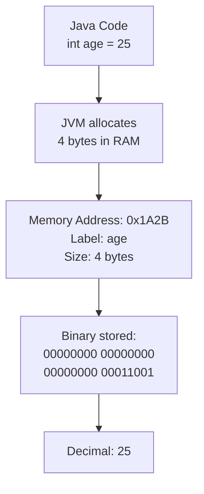
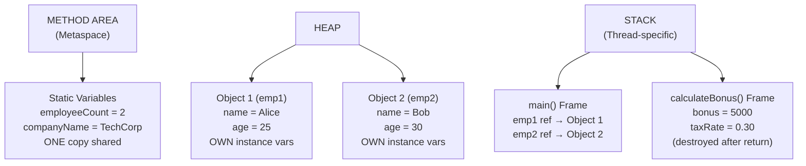
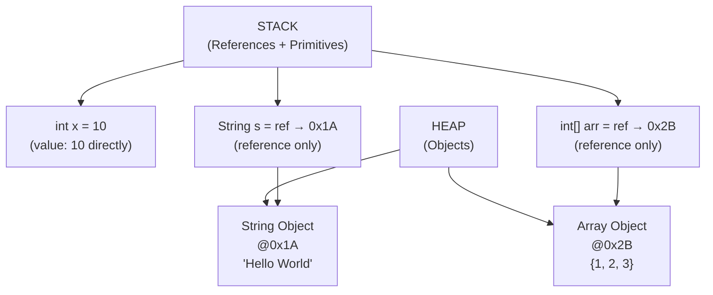
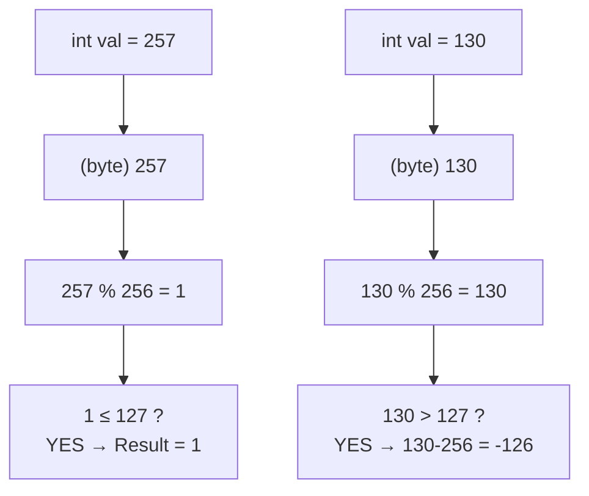
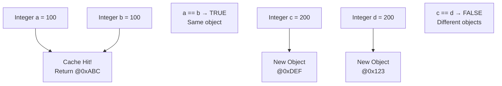

<a id="4-variables-data-types-type-conversion"></a>

# 📘 Chapter 4: Variables, Data Types & Type Conversion

> **Part A: Java Fundamentals — Beginner Foundation**
> `Beginner` | `Foundation` | `Core Concept`

⭐⭐⭐⭐⭐⭐⭐⭐⭐⭐⭐⭐⭐⭐⭐⭐⭐⭐⭐⭐⭐⭐⭐⭐⭐⭐⭐⭐⭐⭐⭐⭐

Java • Core Java • Interview Preparation

⭐⭐⭐⭐⭐⭐⭐⭐⭐⭐⭐⭐⭐⭐⭐⭐⭐⭐⭐⭐⭐⭐⭐⭐⭐⭐⭐⭐⭐⭐⭐⭐

---

<a id="chapter-index-table-4"></a>

## 📚 Chapter 4 — Index Table

| No. | Topic | Subtopics |
|-----|-------|-----------|
| 4.1 | [What is a Variable](#41-what-is-a-variable) | Definition, Memory Location, Declaration, Initialization, Vary+Able, How Stored in RAM |
| 4.2 | [Types of Variables](#42-types-of-variables) | Local Variable, Instance Variable, Static/Class Variable, Comparison Table, Memory Diagram |
| 4.3 | [Scope and Lifetime of Variables](#43-scope-and-lifetime-of-variables) | Block Scope, Method Scope, Class Scope, Variable Shadowing, this Keyword |
| 4.4 | [Default Values](#44-default-values) | Default Values Table, Why Local Variables Don't Have Default, Proof with Code |
| 4.5 | [Primitive Data Types (8 Types)](#45-primitive-data-types-8-types) | byte, short, int, long, float, double, char, boolean — Size, Range, Default, Use Cases, IEEE 754, Unicode |
| 4.6 | [Non-Primitive Data Types](#46-non-primitive-data-types) | String, Array, Class, Interface, Null Reference, Primitive vs Reference, Stack vs Heap Storage |
| 4.7 | [Literals in Java](#47-literals-in-java) | Integer (4 bases), Floating-Point, Character (4 ways), String, Boolean, Null, Underscore in Literals |
| 4.8 | [Type Casting — Widening](#48-type-casting--widening) | Automatic Conversion, Hierarchy, char→int, Compatible Types |
| 4.9 | [Type Casting — Narrowing](#49-type-casting--narrowing) | Explicit Cast, Data Loss, Wrapping Logic, Modulo Calculation |
| 4.10 | [Type Promotion in Expressions](#410-type-promotion-in-expressions) | Implicit Promotion Rules, Why byte+byte=int, Explicit Cast in Expressions, Method Argument Promotion |
| 4.11 | [Wrapper Classes](#411-wrapper-classes) | 8 Wrapper Classes, Why Needed, Parsing Methods, valueOf vs parseInt |
| 4.12 | [Autoboxing and Unboxing](#412-autoboxing-and-unboxing) | Auto Conversion, Performance Impact, Collections Usage |
| 4.13 | [Integer Cache Pool](#413-integer-cache-pool) | Cache Range -128 to 127, == vs equals() Trap, Visual Diagram |
| 4.14 | [Comparing Wrapper Objects](#414-comparing-wrapper-objects) | == vs equals(), String Pool, Integer Cache, Golden Rule |
| 4.15 | [var Keyword (Java 10+)](#415-var-keyword-java-10) | Type Inference, Rules, Restrictions, Still Static Typing |
| 4.16 | [Overflow and Underflow](#416-overflow-and-underflow) | Wrapping Behavior, Circular Number Line, Math.addExact() |
| 4.17 | [Constants using final](#417-constants-using-final) | final Keyword, Blank Final, Final Reference, JVM Caching, Naming Convention |
| 4.18 | [Input in Java](#418-input-in-java) | Scanner Class, BufferedReader, All Methods Table, Newline Pitfall, Command Line Args, Scanner vs BufferedReader |
| 🔥 | [Java vs Other Languages](#4-java-vs-other-languages) | Unique Differences in Variables, Types, Memory, Input, Boolean |
| 💡 | [Interview Questions](#4-interview-questions) | 15+ Conceptual · Scenario · Output-based |
| 🧪 | [Practice Problems](#4-practice-problems) | 5 Coding + 5 Theory |

---

## 4.1 What is a Variable

<a id="41-what-is-a-variable"></a>

### 📌 Definition

```
A VARIABLE is a CONTAINER which holds a value while
the Java program is executed.

A variable is a NAME OF MEMORY LOCATION.
It is assigned with a DATA TYPE.

The word "Variable" = "Vary" + "Able"
→ Its value CAN BE CHANGED during program execution.
```

### 📌 Variable Declaration and Initialization

```java
// DECLARATION — Tells JVM to allocate memory
int age;                    // JVM reserves 4 bytes for 'age'
String name;                // JVM reserves reference space

// INITIALIZATION — Stores value in allocated memory
age = 25;                   // Stores 25 in those 4 bytes
name = "Rahul";             // Points to "Rahul" on Heap

// DECLARATION + INITIALIZATION (Most common)
double salary = 50000.50;
boolean isActive = true;
char grade = 'A';

// MULTIPLE DECLARATIONS
int x = 1, y = 2, z = 3;   // Same type, same line
```

### 📌 How Variables are Stored in RAM

```
When you write: int x = 10;

STEP 1: JVM allocates 4 bytes in RAM (int = 4 bytes)
STEP 2: Labels that memory location as "x"
STEP 3: Converts 10 to binary: 00000000 00000000 00000000 00001010
STEP 4: Stores that binary pattern in the allocated memory

When you READ: System.out.println(x);
STEP 1: JVM finds memory address mapped to "x"
STEP 2: Reads the binary pattern from that address
STEP 3: Converts binary back to decimal: 10
STEP 4: Displays on screen

When you CHANGE: x = 20;
→ New binary pattern replaces old one at SAME memory location
→ Old value (10) is gone forever
```

### 📊 Variable in Memory Diagram



### 🌍 Real-World Analogy (Hinglish)

```
Variable ek DABBA (box) ki tarah hai:

DABBA ka naam    = Variable name (age)
DABBA ka size    = Data type (int = 4 bytes)
DABBA mein saman = Value (25)

int age = 25;
→ "age" naam ka dabba banao
→ 4 bytes ka size rakhna (kyunki int hai)
→ Usme 25 rakh do

age = 30;
→ Purana saman (25) nikalo
→ Naya saman (30) rakh do
→ Dabba wahi hai, saman badal gaya = Vary + Able!
```

> [!NOTE]
> ALL data in a computer is stored as **BINARY (0s and 1s)**. When you write `int x = 10`, the JVM converts 10 to binary and stores it. When you read `x`, the JVM converts binary back to decimal. The variable name is just a **human-readable label** for a memory address.

<a href="#chapter-index-table-4">Go to Top 🔝</a>

---

## 4.2 Types of Variables

<a id="42-types-of-variables"></a>

### 📌 Three Types of Variables in Java

```java
public class VariableTypes {

    // ═══════════════════════════════════════════════════════════
    // TYPE 1: INSTANCE VARIABLE (Non-Static Field)
    // ═══════════════════════════════════════════════════════════
    // → Declared INSIDE class, OUTSIDE any method/block
    // → Each object gets its OWN SEPARATE COPY
    // → Stored in HEAP memory (lives with the object)
    // → Has DEFAULT values (0, null, false, '\u0000')
    // → Can use access specifiers (public, private, protected)
    // → If no access specifier → default (package-private)
    // → Called "instance" because value is INSTANCE-SPECIFIC
    //   and NOT shared among instances
    // → Created when object is created, destroyed when object is GC'd
    String name;        // default = null
    int age;            // default = 0
    double salary;      // default = 0.0

    // ═══════════════════════════════════════════════════════════
    // TYPE 2: STATIC VARIABLE (Class Variable)
    // ═══════════════════════════════════════════════════════════
    // → Declared with 'static' keyword inside class
    // → CANNOT be local (inside method)
    // → SINGLE COPY shared among ALL instances of the class
    // → Stored in METHOD AREA (Metaspace in Java 8+)
    // → Memory allocation happens ONLY ONCE when class loads
    // → Has DEFAULT values
    // → Accessed via ClassName.variableName (recommended)
    // → If accessed via object → compiler shows WARNING
    //   and replaces object name with class name automatically
    // → Created when class loads, destroyed when class unloads
    static int employeeCount = 0;   // Shared among all objects
    static String companyName = "TechCorp";

    // ═══════════════════════════════════════════════════════════
    // TYPE 3: LOCAL VARIABLE
    // ═══════════════════════════════════════════════════════════
    public void calculateBonus() {
        // → Declared INSIDE method, block, or constructor
        // → Stored in STACK memory
        // → NO default value — MUST initialize before use!
        // → CANNOT use access specifiers (public, private, etc.)
        // → CANNOT be defined with 'static' keyword
        // → Scope limited to the method/block it's declared in
        // → Other methods in the class DON'T KNOW it exists
        // → Created when method is called, destroyed when method returns
        int bonus = 5000;           // MUST initialize!
        double taxRate = 0.30;      // MUST initialize!
        System.out.println("Bonus: " + bonus);
    }

    // Constructor
    VariableTypes(String name, int age) {
        this.name = name;
        this.age = age;
        employeeCount++;  // Increment shared counter
    }

    public static void main(String[] args) {
        VariableTypes emp1 = new VariableTypes("Alice", 25);
        VariableTypes emp2 = new VariableTypes("Bob", 30);

        // Instance: Each object has OWN copy
        System.out.println(emp1.name);  // Alice
        System.out.println(emp2.name);  // Bob (different!)

        // Static: SHARED among all objects
        System.out.println(VariableTypes.employeeCount); // 2
        System.out.println(emp1.employeeCount);  // 2 (WARNING! Use ClassName)
        System.out.println(emp2.employeeCount);  // 2 (same shared value)
    }
}
```

### 📌 Complete Comparison Table

```
┌──────────────────┬─────────────────┬──────────────────┬──────────────────┐
│  Feature         │  Local          │  Instance        │  Static          │
├──────────────────┼─────────────────┼──────────────────┼──────────────────┤
│  Declared In     │  Method/Block   │  Class (outside  │  Class with      │
│                  │  /Constructor   │  methods)        │  'static'        │
├──────────────────┼─────────────────┼──────────────────┼──────────────────┤
│  Memory          │  STACK          │  HEAP (with obj) │  METHOD AREA     │
│                  │                 │                  │  (Metaspace)     │
├──────────────────┼─────────────────┼──────────────────┼──────────────────┤
│  Default Value   │  ❌ NONE        │  ✅ Yes (0,null) │  ✅ Yes (0,null) │
│                  │  (MUST init!)   │  (auto by JVM)   │  (auto by JVM)   │
├──────────────────┼─────────────────┼──────────────────┼──────────────────┤
│  Scope           │  Within method  │  Entire object   │  Entire class    │
│                  │  /block only    │                  │                  │
├──────────────────┼─────────────────┼──────────────────┼──────────────────┤
│  Copies          │  Per method call│  Per OBJECT      │  ONE for class   │
│                  │                 │  (each obj owns) │  (all obj share) │
├──────────────────┼─────────────────┼──────────────────┼──────────────────┤
│  Access Modifier │  ❌ Cannot use  │  ✅ Can use      │  ✅ Can use      │
├──────────────────┼─────────────────┼──────────────────┼──────────────────┤
│  static keyword  │  ❌ Cannot use  │  ❌ Not used     │  ✅ Required     │
├──────────────────┼─────────────────┼──────────────────┼──────────────────┤
│  Created         │  Method called  │  Object created  │  Class loaded    │
├──────────────────┼─────────────────┼──────────────────┼──────────────────┤
│  Destroyed       │  Method returns │  Object GC'd     │  Class unloaded  │
├──────────────────┼─────────────────┼──────────────────┼──────────────────┤
│  Accessed via    │  Direct name    │  objectRef.var   │  ClassName.var   │
│                  │                 │  or this.var     │  (recommended)   │
└──────────────────┴─────────────────┴──────────────────┴──────────────────┘
```

### 📊 Variables in Memory — Complete Picture



> [!IMPORTANT]
> **Memory Rule for Interviews:**
> - **Local variables** → STACK (fast access, auto-destroyed)
> - **Instance variables** → HEAP (with the object, GC handles cleanup)
> - **Static variables** → METHOD AREA/Metaspace (class-level, loaded once)

<a href="#chapter-index-table-4">Go to Top 🔝</a>

---

## 4.3 Scope and Lifetime of Variables

<a id="43-scope-and-lifetime-of-variables"></a>

### 📌 Scope = Where, Lifetime = How Long

```
SCOPE    = Where a variable can be ACCESSED from
LIFETIME = How LONG a variable EXISTS in memory
```

```java
public class ScopeDemo {

    static int classScope = 100;    // Scope: Entire class
    int objectScope = 200;         // Scope: Within object

    public void methodA() {
        int methodScope = 300;     // Scope: This method only

        System.out.println(classScope);  // ✅
        System.out.println(objectScope); // ✅
        System.out.println(methodScope); // ✅

        // BLOCK scope
        if (true) {
            int blockScope = 400;  // Scope: This block only
            System.out.println(blockScope); // ✅ Inside block
        }
        // System.out.println(blockScope); // ❌ Outside block!

        // LOOP scope
        for (int i = 0; i < 3; i++) {
            System.out.println(i);  // ✅ Inside loop
        }
        // System.out.println(i); // ❌ Outside loop!

    } // methodScope destroyed here

    public void methodB() {
        System.out.println(classScope);  // ✅
        System.out.println(objectScope); // ✅
        // System.out.println(methodScope); // ❌ Different method!
    }
}
```

### 📌 Variable Shadowing

```java
public class ShadowingDemo {

    int x = 10;   // Instance variable

    public void method(int x) {  // Parameter SHADOWS instance variable
        // 'x' here refers to the PARAMETER, not instance variable!
        System.out.println(x);      // Parameter value
        System.out.println(this.x); // Instance value (use 'this' to access)
    }

    public void anotherMethod() {
        int x = 30;   // Local variable SHADOWS instance variable
        System.out.println(x);      // 30 (local wins)
        System.out.println(this.x); // 10 (instance via 'this')
    }

    public static void main(String[] args) {
        ShadowingDemo obj = new ShadowingDemo();
        obj.method(20);
        // Output: 20, 10

        obj.anotherMethod();
        // Output: 30, 10
    }
}
```

```
┌──────────────────────────────────────────────────────────────┐
│  SHADOWING RULE:                                             │
│  When a local variable has the SAME NAME as an instance      │
│  variable, the local variable "shadows" (hides) the          │
│  instance variable within that scope.                        │
│                                                              │
│  To access the instance variable → use 'this' keyword        │
│  this.x = instance variable                                  │
│  x = local variable                                          │
└──────────────────────────────────────────────────────────────┘
```

<a href="#chapter-index-table-4">Go to Top 🔝</a>

---

## 4.4 Default Values

<a id="44-default-values"></a>

### 📌 Complete Default Values Table

```
┌──────────────────────┬──────────────────────┬──────────────────────┐
│  Data Type           │  Default Value        │  Applies To          │
├──────────────────────┼──────────────────────┼──────────────────────┤
│  byte                │  0                    │  Instance & Static   │
│  short               │  0                    │  Instance & Static   │
│  int                 │  0                    │  Instance & Static   │
│  long                │  0L                   │  Instance & Static   │
│  float               │  0.0f                 │  Instance & Static   │
│  double              │  0.0d                 │  Instance & Static   │
│  char                │  '\u0000' (null char) │  Instance & Static   │
│  boolean             │  false                │  Instance & Static   │
│  String (any Object) │  null                 │  Instance & Static   │
│  Array               │  null                 │  Instance & Static   │
├──────────────────────┼──────────────────────┼──────────────────────┤
│  LOCAL variables     │  ❌ NO DEFAULT!       │  MUST initialize!    │
└──────────────────────┴──────────────────────┴──────────────────────┘
```

### 📌 Why Local Variables Don't Have Default Values? ⭐

```java
public class DefaultDemo {

    // Instance variables — auto-initialized by JVM
    int num;          // 0
    double decimal;   // 0.0
    boolean flag;     // false
    String text;      // null
    char letter;      // '\u0000'

    public static void main(String[] args) {
        DefaultDemo obj = new DefaultDemo();
        System.out.println(obj.num);      // 0
        System.out.println(obj.flag);     // false
        System.out.println(obj.text);     // null

        // Local variable — NO default!
        int localVar;
        // System.out.println(localVar); // ❌ COMPILE ERROR!
        // "variable localVar might not have been initialized"

        localVar = 10;  // NOW initialized
        System.out.println(localVar); // ✅ 10
    }
}
```

```
WHY no default for local variables?

1. PERFORMANCE: Stack memory is optimized for SPEED.
   JVM doesn't zero out stack memory during allocation.
   Heap/Method Area IS zeroed out during object creation.

2. BUG PREVENTION: If you forgot to set a value, the compiler
   TELLS YOU immediately (compile-time error). This catches
   bugs EARLY — much better than silent wrong behavior.

3. DESIGN PHILOSOPHY: Local variables have short lifespan.
   The developer SHOULD know what value they want.
   Giving defaults would hide programmer mistakes.
```

> [!IMPORTANT]
> **Interview Answer:** Local variables don't have defaults because: (1) Stack memory isn't zeroed for performance, (2) It catches bugs at compile-time, (3) It's a design choice to force explicit initialization. Instance/static variables get defaults because the JVM initializes Heap/Method Area memory blocks to zero.

<a href="#chapter-index-table-4">Go to Top 🔝</a>

---

## 4.5 Primitive Data Types (8 Types)

<a id="45-primitive-data-types-8-types"></a>

### 📌 What are Primitive Data Types?

```
A PRIMITIVE data type specifies the SIZE and TYPE of variable values,
and it has NO additional methods.

Java has exactly 8 primitive data types — they are NOT objects.
They hold ACTUAL VALUES directly (not references).
They are stored DIRECTLY in the memory location.
```

### 📌 Complete Size-Range-Default Table

```
┌──────────┬────────┬────────────────────────────────────────┬──────────┬───────────────────┐
│  Type    │  Size  │  Range                                  │ Default  │  Use Case         │
├──────────┼────────┼────────────────────────────────────────┼──────────┼───────────────────┤
│  byte    │ 1 byte │  -128 to 127                            │  0       │  Save memory in   │
│          │ 8 bits │  (-2⁷ to 2⁷-1)                         │          │  large arrays     │
├──────────┼────────┼────────────────────────────────────────┼──────────┼───────────────────┤
│  short   │ 2 bytes│  -32,768 to 32,767                      │  0       │  Save memory,     │
│          │ 16 bits│  (-2¹⁵ to 2¹⁵-1)                       │          │  rarely used      │
├──────────┼────────┼────────────────────────────────────────┼──────────┼───────────────────┤
│  int     │ 4 bytes│  -2,147,483,648 to 2,147,483,647        │  0       │  MOST COMMON      │
│          │ 32 bits│  (-2³¹ to 2³¹-1) ≈ ±2.1 billion        │          │  integer type     │
├──────────┼────────┼────────────────────────────────────────┼──────────┼───────────────────┤
│  long    │ 8 bytes│  -9,223,372,036,854,775,808 to          │  0L      │  When int is      │
│          │ 64 bits│   9,223,372,036,854,775,807              │          │  not enough       │
│          │        │  Suffix: L or l required                 │          │  (timestamps)     │
├──────────┼────────┼────────────────────────────────────────┼──────────┼───────────────────┤
│  float   │ 4 bytes│  ≈ ±3.4 × 10³⁸                         │  0.0f    │  Precision:       │
│          │ 32 bits│  IEEE 754 Standard                       │          │  6-7 decimal      │
│          │        │  Suffix: f or F required                 │          │  digits           │
├──────────┼────────┼────────────────────────────────────────┼──────────┼───────────────────┤
│  double  │ 8 bytes│  ≈ ±1.7 × 10³⁰⁸                        │  0.0d    │  MOST COMMON      │
│          │ 64 bits│  IEEE 754 Standard                       │          │  decimal type     │
│          │        │  Precision: 15-16 decimal digits         │          │  15-16 digits     │
├──────────┼────────┼────────────────────────────────────────┼──────────┼───────────────────┤
│  char    │ 2 bytes│  0 to 65,535                             │ '\u0000' │  Unicode chars    │
│          │ 16 bits│  Unicode: \u0000 to \uFFFF               │          │  ALL languages    │
│          │        │  WHY 2 bytes? → Unicode support!          │          │                   │
├──────────┼────────┼────────────────────────────────────────┼──────────┼───────────────────┤
│  boolean │ ~1 bit │  true or false ONLY                      │  false   │  Flags, conditions│
│          │ (JVM)  │  NOT 0 or 1 like C/C++!                  │          │  boolean logic    │
│          │        │  Size is JVM dependent                    │          │                   │
└──────────┴────────┴────────────────────────────────────────┴──────────┴───────────────────┘
```

### 📌 Each Type — Deep Details

```java
public class AllPrimitivesDemo {
    public static void main(String[] args) {

        // ═══════════════════ byte ═══════════════════
        // Size: 1 byte (8 bits) | Range: -128 to 127
        byte b = 127;       // Max value
        // byte b2 = 128;   // ❌ Out of range!
        System.out.println("byte max: " + Byte.MAX_VALUE);   // 127
        System.out.println("byte min: " + Byte.MIN_VALUE);   // -128
        System.out.println("byte size: " + Byte.BYTES + " byte"); // 1

        // ═══════════════════ short ═══════════════════
        // Size: 2 bytes (16 bits) | Range: -32768 to 32767
        short s = 32767;
        System.out.println("short max: " + Short.MAX_VALUE);  // 32767

        // ═══════════════════ int ═══════════════════
        // Size: 4 bytes (32 bits) | MOST COMMONLY used integer
        int i = 2_147_483_647;  // Max int value (underscore for readability)
        System.out.println("int max: " + Integer.MAX_VALUE);  // 2147483647

        // ═══════════════════ long ═══════════════════
        // Size: 8 bytes (64 bits) | MUST suffix with L or l
        long l = 9_223_372_036_854_775_807L;  // MUST have 'L'!
        // long l2 = 9223372036854775807;  // ❌ Without L → compiler thinks int!
        System.out.println("long max: " + Long.MAX_VALUE);

        // ═══════════════════ float ═══════════════════
        // Size: 4 bytes | IEEE 754 | Precision: 6-7 decimal digits
        // MUST suffix with f or F
        float f = 3.14f;          // MUST have 'f'!
        // float f2 = 3.14;       // ❌ ERROR! 3.14 is double by default
        float f3 = (float) 3.14;  // ✅ Explicit cast works too
        System.out.println("float precision: ~6-7 digits");

        // ═══════════════════ double ═══════════════════
        // Size: 8 bytes | IEEE 754 | Precision: 15-16 decimal digits
        // DEFAULT floating-point type (no suffix needed)
        double d = 3.14159265358979;  // No suffix needed
        double d2 = 3.14d;           // Optional 'd' suffix
        double d3 = 1.5e3;           // Scientific: 1500.0
        System.out.println("double precision: ~15-16 digits");

        // ═══════════════════ char ═══════════════════
        // Size: 2 bytes (16 bits) | Unicode: 0 to 65535
        // WHY 2 bytes? Java uses Unicode (not ASCII like C++)
        // Supports ALL world languages natively
        char c = 'A';               // Single quote
        char c2 = 65;               // Unicode value for 'A'
        char c3 = '\u0041';         // Unicode representation of 'A'
        char c4 = '\n';             // Escape sequence
        System.out.println("char c1=" + c + ", c2=" + c2 + ", c3=" + c3);
        // Range: \u0000 (lowest) to \uFFFF (highest)

        // ═══════════════════ boolean ═══════════════════
        // ONLY true or false — NOT 0 or 1 like C/C++!
        boolean flag = true;
        // boolean b = 1;    // ❌ ERROR! 1 is NOT boolean in Java
        // if (1) { }        // ❌ ERROR! Java requires boolean in if
        // if (flag) { }     // ✅ Only boolean works in conditions
        System.out.println("boolean: " + flag);
    }
}
```

### 📌 Range Formula

```
For any n-bit SIGNED integer type:
→ Minimum = -2^(n-1)
→ Maximum =  2^(n-1) - 1
→ Total values = 2^n

byte  (8 bits):  -2⁷  to 2⁷-1  = -128 to 127        (256 values)
short (16 bits): -2¹⁵ to 2¹⁵-1 = -32768 to 32767     (65536 values)
int   (32 bits): -2³¹ to 2³¹-1 ≈ ±2.1 billion         
long  (64 bits): -2⁶³ to 2⁶³-1 (very large)

WHY -128 to 127 (not -128 to 128)?
→ 8 bits = 256 total values
→ Negative: -128 to -1 = 128 values
→ Non-negative: 0 to 127 = 128 values
→ ZERO takes one spot from the positive side!
```

> [!IMPORTANT]
> **3 Rules to Remember:**
> 1. **long** needs `L` suffix: `long l = 100L;`
> 2. **float** needs `f` suffix: `float f = 3.14f;` (because 3.14 is double by default)
> 3. **boolean** is NOT 0/1 — `if(1)` is ❌ ERROR in Java (unlike C/C++)

<a href="#chapter-index-table-4">Go to Top 🔝</a>

---

## 4.6 Non-Primitive Data Types

<a id="46-non-primitive-data-types"></a>

### 📌 What are Non-Primitive Data Types?

```
Non-primitive data types are USER-DEFINED data types
created by programmers.

Whenever a non-primitive data type is defined, it refers to
a MEMORY LOCATION where the data is stored in HEAP MEMORY.
It refers to the memory location where an OBJECT is placed.

Therefore, a non-primitive data type variable is also called:
→ REFERENCED data type
→ OBJECT REFERENCE variable
```

### 📌 5 Types of Non-Primitive

```java
// 1. CLASS — Blueprint for objects
class Student {
    String name;
    int age;
}

// 2. OBJECT — Instance of a class
Student s = new Student();  // 's' is reference, Student is object

// 3. STRING — Sequence of characters (immutable object)
String greeting = "Hello World";

// 4. ARRAY — Collection of same-type elements
int[] numbers = {1, 2, 3, 4, 5};

// 5. INTERFACE — Contract for classes
interface Printable {
    void print();
}
```

### 📌 Primitive vs Non-Primitive (Reference) Types ⭐

```
┌──────────────────┬─────────────────────┬────────────────────────┐
│  Feature         │  Primitive           │  Non-Primitive         │
├──────────────────┼─────────────────────┼────────────────────────┤
│  Defined By      │  Java (predefined)  │  Programmer (user)     │
├──────────────────┼─────────────────────┼────────────────────────┤
│  Stores          │  Actual VALUE       │  REFERENCE (address)   │
│                  │  directly           │  to object on Heap     │
├──────────────────┼─────────────────────┼────────────────────────┤
│  Memory          │  Stack (local vars) │  Ref on Stack,         │
│                  │  or Heap (fields)   │  Object on HEAP        │
├──────────────────┼─────────────────────┼────────────────────────┤
│  Size            │  Fixed (1-8 bytes)  │  Variable              │
├──────────────────┼─────────────────────┼────────────────────────┤
│  Can be null?    │  ❌ No             │  ✅ Yes                │
├──────────────────┼─────────────────────┼────────────────────────┤
│  Has Methods?    │  ❌ No             │  ✅ Yes                │
├──────────────────┼─────────────────────┼────────────────────────┤
│  Default         │  0, false, \u0000   │  null                  │
├──────────────────┼─────────────────────┼────────────────────────┤
│  Examples        │  int, char, boolean │  String, Array, Class  │
├──────────────────┼─────────────────────┼────────────────────────┤
│  == compares     │  VALUES             │  REFERENCES (addresses)│
└──────────────────┴─────────────────────┴────────────────────────┘
```

### 📌 Null Reference

```java
// null = reference that points to NOTHING (no object)
String name = null;       // Valid for reference types
// int x = null;          // ❌ ERROR! Primitives can't be null

// Accessing null reference → NullPointerException
// name.length();         // ❌ NullPointerException at runtime!

// Always check before using:
if (name != null) {
    System.out.println(name.length());
} else {
    System.out.println("Name is null!");
}

// Java 14+ Helpful NullPointerException:
// "Cannot invoke String.length() because 'name' is null"
```

### 📊 Stack vs Heap Storage



<a href="#chapter-index-table-4">Go to Top 🔝</a>

---

## 4.7 Literals in Java

<a id="47-literals-in-java"></a>

### 📌 What are Literals?

```
Literals in Java are SYNTHETIC REPRESENTATIONS of
boolean, numeric, character, or string data.

A literal is the ACTUAL VALUE written directly in source code.
```

### 📌 1. Integer Literals (4 Number Systems)

```java
public class IntegerLiterals {
    public static void main(String[] args) {

        // a) DECIMAL (Base 10) — No prefix, digits 0-9
        int dec = 101;

        // b) OCTAL (Base 8) — Prefix with 0, digits 0-7
        int oct = 0146;  // = 102 in decimal

        // c) HEXADECIMAL (Base 16) — Prefix 0x or 0X, digits 0-9 + A-F
        int hex = 0X123Face;
        // Note: Java is case-sensitive but 0X = 0x (exception!)

        // d) BINARY (Base 2) — Prefix 0b or 0B, digits 0-1 (Java 7+)
        int bin = 0b1111;  // = 15 in decimal

        // DEFAULT: Every integral literal is INT type
        // For LONG: suffix with L or l
        long bigNum = 100L;

        // For BYTE/SHORT: No explicit literal suffix!
        // Compiler auto-converts if value is within range
        byte b = 50;     // ✅ 50 within byte range → auto-treats as byte
        // byte b2 = 200; // ❌ 200 exceeds byte range → Error!

        // UNDERSCORE in numeric literals (Java 7+)
        int million = 1_000_000;         // Readability!
        long phone = 98_765_43_210L;
        int binReadable = 0b1010_1100;

        System.out.println(dec);  // 101
        System.out.println(oct);  // 102
        System.out.println(hex);  // 19152846
        System.out.println(bin);  // 15
    }
}
```

### 📌 2. Floating-Point Literals

```java
// Can specify in DECIMAL form ONLY
// Cannot specify in Octal or Hexadecimal!

double d = 123.456;    // Default: double
float f = 101.230f;    // MUST add 'f' for float!
double d2 = 1.5e3;     // Scientific: 1500.0
double d3 = 1.5E-3;    // 0.0015

// DEFAULT: Every floating-point literal is DOUBLE
// float f = 3.14;     // ❌ ERROR! 3.14 is double
// float f = 3.14f;    // ✅ Explicitly marked as float
```

### 📌 3. Character Literals (4 Ways)

```java
// WAY 1: Single Quote
char ch1 = 'a';

// WAY 2: Integral Literal (Unicode value) — range 0 to 65535
char ch2 = 97;            // 97 = 'a'

// WAY 3: Unicode Representation
char ch3 = '\u0061';      // \u0061 = 'a'

// WAY 4: Escape Sequence
char ch4 = '\n';          // Newline
```

### 📌 4. String, Boolean, Null Literals

```java
// STRING: Double quotes
String s = "Hello World";

// BOOLEAN: Only true or false (NOT 0 or 1!)
boolean b = true;

// NULL: Only for reference types
String nullRef = null;
// int x = null;  // ❌ Primitives can't be null!
```

<a href="#chapter-index-table-4">Go to Top 🔝</a>

---

## 4.8 Type Casting — Widening

<a id="48-type-casting--widening"></a>

### 📌 Widening = Automatic = No Data Loss

```
WIDENING conversion takes place when:
a. The two data types are COMPATIBLE
b. When we assign value of SMALLER type to BIGGER type

Done AUTOMATICALLY by compiler — no cast needed.

Hierarchy:
byte → short → int → long → float → double
              char ↗
```

```java
public class WideningDemo {
    public static void main(String[] args) {

        byte   b = 10;
        short  s = b;     // byte → short  ✅ Auto
        int    i = s;     // short → int   ✅ Auto
        long   l = i;     // int → long    ✅ Auto
        float  f = l;     // long → float  ✅ Auto
        double d = f;     // float → double ✅ Auto

        // char → int (widening)
        char ch = 'A';
        int ascii = ch;   // char → int ✅ Auto (65)

        // NOTE: char → byte or char → short is NOT widening!
        // char is unsigned (0-65535), byte is signed (-128 to 127)
        // char c = 'A'; byte b2 = c;  // ❌ ERROR!
    }
}
```

<a href="#chapter-index-table-4">Go to Top 🔝</a>

---

## 4.9 Type Casting — Narrowing

<a id="49-type-casting--narrowing"></a>

### 📌 Narrowing = Manual = Potential Data Loss

```
NARROWING is needed when:
→ Assigning value of LARGER type to SMALLER type
→ Useful for INCOMPATIBLE data types
→ Automatic conversion CANNOT be done
→ DATA LOSS is possible!

Syntax: targetType variable = (targetType) value;
```

```java
public class NarrowingDemo {
    public static void main(String[] args) {

        // double → int (decimal TRUNCATED, not rounded!)
        double d = 9.99;
        int i = (int) d;
        System.out.println(i);  // 9 (NOT 10!)

        // long → int
        long l = 100L;
        int x = (int) l;       // ✅ If within int range

        // float → int
        float f = 123.456f;
        int n = (int) f;
        System.out.println(n);  // 123
    }
}
```

### 📌 Wrapping of Data Types ⭐⭐ (Interesting Fact!)

```java
public class WrappingDemo {
    public static void main(String[] args) {

        // When int exceeds byte range and cast to byte:
        // Java performs MODULO with range size (256 for byte)

        int i1 = 257;
        byte b1 = (byte) i1;
        System.out.println(b1);  // 1

        int i2 = 300;
        byte b2 = (byte) i2;
        System.out.println(b2);  // 44

        int i3 = 128;
        byte b3 = (byte) i3;
        System.out.println(b3);  // -128

        int i4 = 130;
        byte b4 = (byte) i4;
        System.out.println(b4);  // -126

        /*
        WRAPPING FORMULA (int → byte):
        Step 1: result = value % 256
        Step 2: If result > 127 → result = result - 256
                If result <= 127 → keep as is

        257 % 256 = 1   → 1 ≤ 127   → 1      ✅
        300 % 256 = 44  → 44 ≤ 127  → 44     ✅
        128 % 256 = 128 → 128 > 127 → 128-256 = -128 ✅
        130 % 256 = 130 → 130 > 127 → 130-256 = -126 ✅
        */
    }
}
```

### 📊 Wrapping Visual



> [!IMPORTANT]
> **Interview Classic:** `int i = 257; byte b = (byte)i;` → Answer: `b = 1` (257 % 256 = 1). Also: `int i = 128; byte b = (byte)i;` → Answer: `b = -128` (128 % 256 = 128, then 128 > 127 → 128-256 = -128). This wrapping behavior is a **very common interview question**.

<a href="#chapter-index-table-4">Go to Top 🔝</a>

---

## 4.10 Type Promotion in Expressions

<a id="410-type-promotion-in-expressions"></a>

### 📌 Rules of Automatic Type Promotion

```
While evaluating expressions, the intermediate value may
EXCEED the range of operands → expression value is PROMOTED.

RULES:
1. byte, short, char → automatically promoted to INT
   in ANY expression

2. If one operand is long → whole expression → long
3. If one operand is float → whole expression → float
4. If one operand is double → whole expression → double
```

```java
public class TypePromotionDemo {
    public static void main(String[] args) {

        // RULE 1: byte + byte = int (NOT byte!)
        byte a = 10, b = 20;
        // byte c = a + b;      // ❌ ERROR! a+b is int
        int c = a + b;          // ✅ Result is int
        byte d = (byte)(a + b); // ✅ Explicit cast back

        // RULE 2: int + long = long
        int x = 10;
        long y = 100L;
        long res1 = x + y;     // int promoted to long

        // RULE 3: int + float = float
        float res2 = x + 2.5f;

        // RULE 4: float + double = double
        double res3 = 5.0f + 2.5;

        // WHY byte + byte = int?
        // Because 100 + 100 = 200, which EXCEEDS byte range (127)!
        // Java promotes to int to PREVENT overflow during computation
        // This is a SAFETY MECHANISM unique to Java

        System.out.println(c);    // 30
        System.out.println(res1); // 110
    }
}
```

### 📌 Explicit Casting in Expressions

```java
// When result is auto-promoted but you need smaller type:
byte a = 50, b = 50;
// byte c = a * b;     // ❌ a*b = 2500, promoted to int
byte c = (byte)(a * b); // ✅ But data loss! 2500 wraps → -60

short s1 = 100, s2 = 200;
// short s3 = s1 + s2; // ❌ Promoted to int
short s3 = (short)(s1 + s2); // ✅
```

### 📌 Automatic Type Promotion in Method Arguments

```java
public class MethodPromotion {

    static void display(double val) {
        System.out.println("Value: " + val);
    }

    public static void main(String[] args) {
        display(10);     // int → double (auto promotion)
        display('A');    // char → double (65.0)
        display(3.14f);  // float → double

        // Small type CAN be promoted to larger type
        // when method parameter expects larger type
    }
}
```

<a href="#chapter-index-table-4">Go to Top 🔝</a>

---

## 4.11 Wrapper Classes

<a id="411-wrapper-classes"></a>

### 📌 Why Wrapper Classes Exist

```
Wrapper Classes convert primitive data types into OBJECTS.

WHY NEEDED?
→ Collections (List, Map, Set) work ONLY with Objects
→ Provides UTILITY METHODS (parseInt, valueOf, etc.)
→ Needed for GENERICS (List<Integer>, not List<int>)
→ Can hold NULL value (primitives cannot)
→ Used in Reflection API, Serialization
```

### 📌 All 8 Wrapper Classes

```
┌──────────────────┬────────────────────┐
│  Primitive       │  Wrapper Class      │
├──────────────────┼────────────────────┤
│  byte            │  Byte               │
│  short           │  Short              │
│  int             │  Integer  (NOT Int!)│
│  long            │  Long               │
│  float           │  Float              │
│  double          │  Double             │
│  char            │  Character (NOT Char!)│
│  boolean         │  Boolean            │
└──────────────────┴────────────────────┘
```

### 📌 Parsing and Utility Methods

```java
public class WrapperMethods {
    public static void main(String[] args) {

        // ═══ PARSING: String → Primitive ═══
        int parsed = Integer.parseInt("123");         // "123" → 123
        double d = Double.parseDouble("3.14");        // "3.14" → 3.14
        long l = Long.parseLong("9876543210");
        boolean b = Boolean.parseBoolean("true");     // "true" → true

        // ═══ valueOf(): String → Wrapper Object ═══
        Integer obj = Integer.valueOf("123");          // "123" → Integer(123)
        Integer obj2 = Integer.valueOf(123);           // int → Integer

        // ═══ DIFFERENCE: parseInt vs valueOf ═══
        int prim = Integer.parseInt("100");   // Returns PRIMITIVE int
        Integer wrap = Integer.valueOf("100"); // Returns WRAPPER Integer
        // valueOf() may use cache for -128 to 127

        // ═══ Conversion Methods ═══
        String s1 = Integer.toString(42);              // int → "42"
        String s2 = String.valueOf(42);                // int → "42"
        String bin = Integer.toBinaryString(10);       // → "1010"
        String hex = Integer.toHexString(255);         // → "ff"
        String oct = Integer.toOctalString(8);         // → "10"

        // ═══ Constants ═══
        System.out.println(Integer.MAX_VALUE);  // 2147483647
        System.out.println(Integer.MIN_VALUE);  // -2147483648
        System.out.println(Integer.BYTES);      // 4
        System.out.println(Integer.SIZE);       // 32 (bits)
    }
}
```

<a href="#chapter-index-table-4">Go to Top 🔝</a>

---

## 4.12 Autoboxing and Unboxing

<a id="412-autoboxing-and-unboxing"></a>

### 📌 Automatic Conversion (Java 5+)

```java
public class AutoboxDemo {
    public static void main(String[] args) {

        // AUTOBOXING: Primitive → Wrapper (Automatic)
        int primitive = 50;
        Integer wrapper = primitive;  // Autoboxing!
        // Internally: Integer.valueOf(50)

        // UNBOXING: Wrapper → Primitive (Automatic)
        Integer wrapperObj = Integer.valueOf(100);
        int prim = wrapperObj;  // Unboxing!
        // Internally: wrapperObj.intValue()

        // In Collections (most common use)
        java.util.List<Integer> list = new java.util.ArrayList<>();
        list.add(10);     // Autoboxing: int → Integer
        list.add(20);
        int val = list.get(0);  // Unboxing: Integer → int

        // In Expressions
        Integer a = 10, b = 20;
        int sum = a + b;    // Both unboxed, added, result is int

        // ⚠️ PERFORMANCE WARNING:
        // Each autobox creates object on Heap
        // In tight loops, prefer primitives over wrappers!
        // BAD:
        Long total = 0L;
        for (int i = 0; i < 1000000; i++) {
            total += i;  // Creates new Long object each time!
        }
        // GOOD:
        long totalPrim = 0L;
        for (int i = 0; i < 1000000; i++) {
            totalPrim += i;  // No object creation!
        }
    }
}
```

<a href="#chapter-index-table-4">Go to Top 🔝</a>

---

## 4.13 Integer Cache Pool

<a id="413-integer-cache-pool"></a>

### 📌 Cache Range: -128 to 127

```java
public class IntegerCacheDemo {
    public static void main(String[] args) {

        // WITHIN cache range (-128 to 127)
        Integer a = 100;  // Autoboxed → from cache
        Integer b = 100;  // Autoboxed → SAME cached object!
        System.out.println(a == b);      // TRUE ← same object!
        System.out.println(a.equals(b)); // TRUE ← same value

        // OUTSIDE cache range (128+)
        Integer c = 200;  // NEW object created
        Integer d = 200;  // DIFFERENT new object!
        System.out.println(c == d);      // FALSE ← different objects!
        System.out.println(c.equals(d)); // TRUE  ← same value

        // ═══ HOW IT WORKS ═══
        // Integer.valueOf(n):
        //   if n >= -128 && n <= 127 → return CACHED object
        //   else → return NEW Integer(n)

        // ═══ WHY CACHING? ═══
        // Small numbers are used VERY frequently
        // Caching avoids creating millions of Integer objects
        // Performance optimization by JVM
    }
}
```

### 📊 Cache Visual



<a href="#chapter-index-table-4">Go to Top 🔝</a>

---

## 4.14 Comparing Wrapper Objects

<a id="414-comparing-wrapper-objects"></a>

### 📌 == vs .equals() — The Golden Rule ⭐⭐

```java
public class ComparisonDemo {
    public static void main(String[] args) {

        // ═══════════════════════════════════════════
        // FOR PRIMITIVES: == compares VALUES ✅
        // ═══════════════════════════════════════════
        int a = 5, b = 5;
        System.out.println(a == b);  // true

        // ═══════════════════════════════════════════
        // FOR WRAPPER OBJECTS: == compares REFERENCES ⚠️
        // ═══════════════════════════════════════════
        Integer x = new Integer(100);
        Integer y = new Integer(100);
        System.out.println(x == y);      // FALSE (different objects!)
        System.out.println(x.equals(y)); // TRUE (same value)

        // ═══════════════════════════════════════════
        // INTEGER CACHE TRAP
        // ═══════════════════════════════════════════
        Integer m = 127;
        Integer n = 127;
        System.out.println(m == n);      // TRUE (cached!)

        Integer p = 128;
        Integer q = 128;
        System.out.println(p == q);      // FALSE (not cached!)
        System.out.println(p.equals(q)); // TRUE

        // ═══════════════════════════════════════════
        // STRING POOL
        // ═══════════════════════════════════════════
        String s1 = "Hello";           // String Pool
        String s2 = "Hello";           // Same Pool object
        String s3 = new String("Hello"); // New object on Heap

        System.out.println(s1 == s2);      // TRUE (same pool object)
        System.out.println(s1 == s3);      // FALSE (pool vs heap)
        System.out.println(s1.equals(s3)); // TRUE (same content)
    }
}
```

```
┌──────────────────────────────────────────────────────────────┐
│                    GOLDEN RULE ⭐⭐⭐                        │
│                                                              │
│  For PRIMITIVES → Use == (compares values)                   │
│  For OBJECTS    → Use .equals() (compares content)           │
│                                                              │
│  NEVER use == for comparing Wrapper objects!                  │
│  (Unless you intentionally want reference comparison)        │
│                                                              │
│  Exception (but don't rely on):                               │
│  → Integer cache (-128 to 127): == works by coincidence      │
│  → String Pool literals: == works by coincidence             │
└──────────────────────────────────────────────────────────────┘
```

<a href="#chapter-index-table-4">Go to Top 🔝</a>

---

## 4.15 var Keyword (Java 10+)

<a id="415-var-keyword-java-10"></a>

### 📌 Local Variable Type Inference

```java
public class VarDemo {
    public static void main(String[] args) {

        // INSTEAD OF explicit types:
        String name = "Rahul";
        int age = 25;
        java.util.ArrayList<String> list = new java.util.ArrayList<>();

        // USE var (compiler infers type):
        var name2 = "Rahul";       // Inferred: String
        var age2 = 25;              // Inferred: int
        var list2 = new java.util.ArrayList<String>(); // ArrayList<String>

        // var is STILL statically typed!
        // Type is fixed at COMPILE TIME
        // var x = 10;
        // x = "text";  // ❌ ERROR! x is int, cannot become String

        /*
        ═══ RESTRICTIONS ═══
        ❌ Cannot use for INSTANCE variables (class fields)
        ❌ Cannot use for METHOD PARAMETERS
        ❌ Cannot use for RETURN TYPES
        ❌ Cannot initialize with NULL: var x = null;
        ❌ Cannot declare WITHOUT initialization: var x;
        ❌ Cannot use for LAMBDA parameters (Java 10, allowed Java 11+)
        ✅ ONLY for LOCAL variables inside methods/blocks
        */
    }

    // var name;           // ❌ Instance variable
    // void method(var x)  // ❌ Parameter
    // var method()        // ❌ Return type
}
```

> [!NOTE]
> `var` is NOT a keyword — it's a "reserved type name." It doesn't make Java dynamically typed. The type is inferred at compile time and **cannot change** afterward. It's just syntactic sugar for cleaner code.

<a href="#chapter-index-table-4">Go to Top 🔝</a>

---

## 4.16 Overflow and Underflow

<a id="416-overflow-and-underflow"></a>

### 📌 Wrapping Behavior

```java
public class OverflowDemo {
    public static void main(String[] args) {

        // OVERFLOW: Exceeds maximum → wraps to minimum
        byte b = 127;
        b++;
        System.out.println(b);  // -128 (OVERFLOW!)

        int maxInt = Integer.MAX_VALUE;     // 2147483647
        System.out.println(maxInt + 1);     // -2147483648 (OVERFLOW!)

        // UNDERFLOW: Below minimum → wraps to maximum
        byte c = -128;
        c--;
        System.out.println(c);  // 127 (UNDERFLOW!)

        int minInt = Integer.MIN_VALUE;     // -2147483648
        System.out.println(minInt - 1);     // 2147483647 (UNDERFLOW!)

        // ⚠️ Java does NOT throw exception for overflow!
        // It silently wraps around — DANGEROUS!

        // ✅ SAFE overflow detection (Java 8+):
        try {
            int safe = Math.addExact(maxInt, 1);  // Throws ArithmeticException!
        } catch (ArithmeticException e) {
            System.out.println("Overflow detected: " + e.getMessage());
        }

        // PREVENTION: Use bigger type
        long bigResult = (long) maxInt + 1;
        System.out.println(bigResult);  // 2147483648 (correct!)
    }
}
```

```
┌───────────────────────────────────────────────────────┐
│        CIRCULAR NUMBER LINE (byte example)             │
│                                                       │
│              0                                        │
│         -1 ┌───┐ 1                                    │
│       -2 ┌─┘   └─┐ 2                                  │
│     ... │         │ ...                                │
│   -127 │           │ 127                               │
│   -128 └─────┬─────┘                                   │
│              │                                        │
│      127 + 1 = -128 (OVERFLOW ↩️)                     │
│     -128 - 1 =  127 (UNDERFLOW ↪️)                    │
└───────────────────────────────────────────────────────┘
```

<a href="#chapter-index-table-4">Go to Top 🔝</a>

---

## 4.17 Constants using final

<a id="417-constants-using-final"></a>

### 📌 final Keyword for Constants

```java
public class ConstantDemo {

    // CLASS-LEVEL CONSTANTS (most common)
    static final double PI = 3.14159265358979;
    static final int MAX_RETRY = 3;
    static final String APP_NAME = "JavaMastery";

    // Constants are CACHED by JVM → improves PERFORMANCE!

    public static void main(String[] args) {

        // LOCAL CONSTANT
        final int SPEED_LIMIT = 120;
        // SPEED_LIMIT = 130;  // ❌ "cannot assign value to final variable"

        // BLANK FINAL — initialized later, but ONLY ONCE
        final int x;
        x = 10;        // ✅ First assignment OK
        // x = 20;     // ❌ Cannot assign again!

        // FINAL REFERENCE — reference fixed, object can change!
        final StringBuilder sb = new StringBuilder("Hello");
        sb.append(" World");  // ✅ Modifying OBJECT is fine!
        // sb = new StringBuilder("New"); // ❌ Cannot change REFERENCE!
        System.out.println(sb);  // Hello World

        // NAMING CONVENTION:
        // Constants → UPPER_SNAKE_CASE
        System.out.println(PI);
        System.out.println(MAX_RETRY);
        System.out.println(SPEED_LIMIT);
    }
}
```

```
Java doesn't have built-in support for "const" keyword
(unlike C++). Instead, we use "final" keyword.

final variable → value cannot change after assignment
static final  → class-level constant, shared, cached by JVM

BENEFITS:
✅ Prevents accidental modification
✅ Cached by JVM → performance boost
✅ Makes code readable (meaningful names)
✅ Thread-safe (value never changes)
```

<a href="#chapter-index-table-4">Go to Top 🔝</a>

---

## 4.18 Input in Java

<a id="418-input-in-java"></a>

### 📌 1. Scanner Class (Most Common)

```java
import java.util.Scanner;  // Must import!

public class ScannerComplete {
    public static void main(String[] args) {

        Scanner sc = new Scanner(System.in);

        // ═══ READING DIFFERENT TYPES ═══

        System.out.print("Enter integer: ");
        int age = sc.nextInt();

        System.out.print("Enter decimal: ");
        double salary = sc.nextDouble();

        System.out.print("Enter float: ");
        float gpa = sc.nextFloat();

        System.out.print("Enter long: ");
        long phone = sc.nextLong();

        System.out.print("Enter boolean (true/false): ");
        boolean isStudent = sc.nextBoolean();

        System.out.print("Enter one word: ");
        String word = sc.next();          // Stops at whitespace

        sc.nextLine();  // ⚠️ CONSUME LEFTOVER NEWLINE!

        System.out.print("Enter full line: ");
        String fullLine = sc.nextLine();  // Reads entire line

        System.out.print("Enter character: ");
        char grade = sc.next().charAt(0); // No direct char method!

        sc.close();  // Always close!
    }
}
```

### 📌 Scanner Methods Reference

```
┌─────────────────────┬──────────────────────────────────────────┐
│  Method             │  Reads / Returns                         │
├─────────────────────┼──────────────────────────────────────────┤
│  nextInt()          │  Integer value                           │
│  nextLong()         │  Long value                              │
│  nextFloat()        │  Float value                             │
│  nextDouble()       │  Double value                            │
│  nextByte()         │  Byte value                              │
│  nextShort()        │  Short value                             │
│  nextBoolean()      │  Boolean (true/false)                    │
│  next()             │  ONE word (stops at whitespace)          │
│  nextLine()         │  FULL line (including spaces)            │
│  next().charAt(0)   │  Single character (workaround)           │
│  hasNext()          │  true if more input exists               │
│  hasNextInt()       │  true if next token is integer           │
│  hasNextLine()      │  true if another line exists             │
│  close()            │  Closes the scanner resource             │
└─────────────────────┴──────────────────────────────────────────┘
```

### ⚠️ The Newline Pitfall — MOST COMMON SCANNER BUG ⭐⭐

```java
import java.util.Scanner;

public class ScannerPitfall {
    public static void main(String[] args) {
        Scanner sc = new Scanner(System.in);

        System.out.print("Enter age: ");
        int age = sc.nextInt();
        // User types: 25[Enter]
        // nextInt() reads "25" but LEAVES "\n" in buffer!

        System.out.print("Enter name: ");
        String name = sc.nextLine();
        // nextLine() reads the LEFTOVER "\n" → gets empty string!
        // User never gets to type their name!

        System.out.println("Age: " + age);
        System.out.println("Name: '" + name + "'"); // Name: '' (EMPTY!)

        sc.close();
    }
}
```

### ✅ 3 Fixes for the Pitfall

```java
// ═══ FIX 1: Add extra sc.nextLine() to consume '\n' ═══
int age = sc.nextInt();
sc.nextLine();  // Consume the leftover newline
String name = sc.nextLine();  // Now reads correctly!

// ═══ FIX 2: Use parseInt(nextLine()) for numbers ═══
int age = Integer.parseInt(sc.nextLine());  // Reads entire line including \n
String name = sc.nextLine();  // Works perfectly!

// ═══ FIX 3: Use next() instead of nextLine() (for single words) ═══
int age = sc.nextInt();
String name = sc.next();  // Reads one word, no newline issue
// But won't work for multi-word input like "John Doe"
```

```
┌──────────────────────────────────────────────────────────────┐
│  ⚠️ THE SCANNER NEWLINE PROBLEM                              │
├──────────────────────────────────────────────────────────────┤
│                                                              │
│  Affected methods: nextInt(), nextDouble(), nextFloat(),     │
│  nextLong(), nextByte(), nextShort(), next()                 │
│  → All leave '\n' in buffer after reading                     │
│                                                              │
│  NOT affected: nextLine() (reads entire line including \n)    │
│                                                              │
│  BEST PRACTICE: Always use Integer.parseInt(sc.nextLine())    │
│  instead of sc.nextInt() to avoid this problem entirely.     │
└──────────────────────────────────────────────────────────────┘
```

---

### 📌 2. BufferedReader (Faster)

```java
import java.io.BufferedReader;
import java.io.InputStreamReader;
import java.io.IOException;

public class BufferedReaderDemo {
    public static void main(String[] args) throws IOException {

        BufferedReader br = new BufferedReader(
            new InputStreamReader(System.in)
        );

        // BufferedReader reads ONLY Strings — must parse manually
        System.out.print("Enter name: ");
        String name = br.readLine();

        System.out.print("Enter age: ");
        int age = Integer.parseInt(br.readLine());

        System.out.print("Enter salary: ");
        double salary = Double.parseDouble(br.readLine());

        System.out.println("Name: " + name);
        System.out.println("Age: " + age);
        System.out.println("Salary: " + salary);

        br.close();
    }
}
```

### 📌 3. Command Line Arguments

```java
public class CommandLineDemo {
    public static void main(String[] args) {
        // Run: java CommandLineDemo Rahul 25 Pune

        if (args.length >= 3) {
            String name = args[0];                // "Rahul"
            int age = Integer.parseInt(args[1]);   // 25
            String city = args[2];                 // "Pune"

            System.out.println(name + ", " + age + ", " + city);
        } else {
            System.out.println("Usage: java CommandLineDemo <name> <age> <city>");
        }
        System.out.println("Total args: " + args.length);
    }
}
```

### 📌 Scanner vs BufferedReader

```
┌──────────────────┬─────────────────────┬────────────────────────┐
│  Feature         │  Scanner            │  BufferedReader        │
├──────────────────┼─────────────────────┼────────────────────────┤
│  Package         │  java.util          │  java.io               │
├──────────────────┼─────────────────────┼────────────────────────┤
│  Parsing         │  Built-in methods   │  Manual (parseInt etc.)│
│                  │  (nextInt, etc.)    │                        │
├──────────────────┼─────────────────────┼────────────────────────┤
│  Speed           │  SLOWER             │  FASTER (8KB buffer)   │
├──────────────────┼─────────────────────┼────────────────────────┤
│  Buffer Size     │  1KB (small)        │  8KB (larger)          │
├──────────────────┼─────────────────────┼────────────────────────┤
│  Thread Safe     │  ❌ No             │  ✅ Yes                │
├──────────────────┼─────────────────────┼────────────────────────┤
│  Exception       │  No checked except. │  Throws IOException    │
├──────────────────┼─────────────────────┼────────────────────────┤
│  Newline Issue   │  ⚠️ Yes (pitfall)   │  ❌ No issue           │
├──────────────────┼─────────────────────┼────────────────────────┤
│  Best For        │  Simple programs    │  Competitive coding    │
│                  │  Learning           │  Large input volumes   │
└──────────────────┴─────────────────────┴────────────────────────┘
```

> [!TIP]
> **For Competitive Programming:** Use BufferedReader + StringTokenizer:
> ```java
> BufferedReader br = new BufferedReader(new InputStreamReader(System.in));
> StringTokenizer st = new StringTokenizer(br.readLine());
> int n = Integer.parseInt(st.nextToken());
> ```
> This is **significantly faster** than Scanner for large inputs.

<a href="#chapter-index-table-4">Go to Top 🔝</a>

---

<a id="4-java-vs-other-languages"></a>

## 🔥 What Makes Java DIFFERENT — Variables, Types & Input

> [!IMPORTANT]
> Java handles variables, data types, and input **DIFFERENTLY** from other languages. These differences are **interview gold**.

```
┌──────────────────────┬────────────┬────────────┬────────────┬────────────┐
│  Feature             │  Java      │  C++       │  Python    │  JavaScript│
├──────────────────────┼────────────┼────────────┼────────────┼────────────┤
│  Type System         │ Static +   │ Static +   │ Dynamic +  │ Dynamic +  │
│                      │ STRONG     │ Weak       │ Strong     │ Weak       │
├──────────────────────┼────────────┼────────────┼────────────┼────────────┤
│  boolean type        │ ONLY true/ │ 0=false,   │ True/False │ truthy/    │
│                      │ false      │ non-zero=T │ + truthy   │ falsy      │
├──────────────────────┼────────────┼────────────┼────────────┼────────────┤
│  if(1) valid?        │ ❌ ERROR!  │ ✅ Yes     │ ✅ Yes     │ ✅ Yes     │
├──────────────────────┼────────────┼────────────┼────────────┼────────────┤
│  char Size           │ 2 bytes    │ 1 byte     │ No char    │ No char   │
│                      │ (Unicode)  │ (ASCII)    │ type       │ type      │
├──────────────────────┼────────────┼────────────┼────────────┼────────────┤
│  Default values      │ ✅ Fields  │ ❌ Garbage │ N/A        │ undefined  │
│  (for fields)        │ (0/null)   │ values!    │            │            │
├──────────────────────┼────────────┼────────────┼────────────┼────────────┤
│  Overflow            │ Silent     │ Undefined  │ No overflow│ Infinity   │
│  behavior            │ WRAP!      │ behavior   │ (big int)  │            │
├──────────────────────┼────────────┼────────────┼────────────┼────────────┤
│  byte+byte           │ = int!     │ = int      │ N/A        │ N/A       │
│  (type promotion)    │ (unique)   │            │            │            │
├──────────────────────┼────────────┼────────────┼────────────┼────────────┤
│  Constants           │ final      │ const      │ Convention │ const     │
├──────────────────────┼────────────┼────────────┼────────────┼────────────┤
│  Input               │ Scanner    │ cin >>     │ input()    │ prompt()  │
│                      │ (import!)  │ (built-in) │ (built-in) │ (browser) │
├──────────────────────┼────────────┼────────────┼────────────┼────────────┤
│  Everything in       │ ✅ Yes!    │ ❌ No      │ ❌ No      │ ❌ No     │
│  a class?            │ (no free   │ (free      │ (free      │ (free     │
│                      │ functions) │ functions) │ functions) │ functions) │
├──────────────────────┼────────────┼────────────┼────────────┼────────────┤
│  String immutable?   │ ✅ Yes     │ ❌ Mutable │ ✅ Yes     │ ✅ Yes    │
│                      │ (Object)   │ (char[])   │ (Object)   │ (Primitive)│
└──────────────────────┴────────────┴────────────┴────────────┴────────────┘
```

### 🎯 6 Key UNIQUE Points

```
1. BOOLEAN IS STRICTLY true/false:
   if(1) → ❌ ERROR in Java! (C++ allows it)

2. byte + byte = int (NOT byte!):
   Java auto-promotes to prevent overflow — C++ doesn't!

3. CHAR IS 2 BYTES (Unicode, not ASCII):
   Java supports ALL world languages natively

4. NO GARBAGE VALUES for instance fields:
   C++ leaves uninitialized memory → bugs!
   Java initializes to 0/null/false → safer

5. OVERFLOW IS SILENT (no exception):
   Use Math.addExact() for detection (Java 8+)

6. INPUT REQUIRES IMPORT:
   Must import Scanner — not built-in like Python's input()
   Has the famous nextLine() pitfall after nextInt()
```

<a href="#chapter-index-table-4">Go to Top 🔝</a>

---

<a id="4-interview-questions"></a>
## 💡 Chapter 4 — Interview Questions (20+) — DETAILED WITH EXAMPLES & ANSWERS

---

### 🔵 Conceptual Questions

---

**Q1. What are the 8 primitive data types in Java? Give size, range, default value, and use case for each.**

```
┌──────────┬────────┬──────────────────────────────┬──────────┬───────────────────┐
│  Type    │  Size  │  Range                        │ Default  │  Use Case         │
├──────────┼────────┼──────────────────────────────┼──────────┼───────────────────┤
│  byte    │ 1 byte │  -128 to 127                  │  0       │  Save memory in   │
│          │        │  (-2⁷ to 2⁷-1)               │          │  large arrays     │
├──────────┼────────┼──────────────────────────────┼──────────┼───────────────────┤
│  short   │ 2 bytes│  -32,768 to 32,767            │  0       │  Rarely used,     │
│          │        │  (-2¹⁵ to 2¹⁵-1)             │          │  memory saving    │
├──────────┼────────┼──────────────────────────────┼──────────┼───────────────────┤
│  int     │ 4 bytes│  -2.1B to 2.1B                │  0       │  MOST COMMON      │
│          │        │  (-2³¹ to 2³¹-1)             │          │  integer type     │
├──────────┼────────┼──────────────────────────────┼──────────┼───────────────────┤
│  long    │ 8 bytes│  Very large range             │  0L      │  Timestamps,      │
│          │        │  (-2⁶³ to 2⁶³-1)             │          │  IDs (needs 'L')  │
├──────────┼────────┼──────────────────────────────┼──────────┼───────────────────┤
│  float   │ 4 bytes│  ±3.4 × 10³⁸                 │  0.0f    │  6-7 digits       │
│          │        │  (IEEE 754)                   │          │  (needs 'f')      │
├──────────┼────────┼──────────────────────────────┼──────────┼───────────────────┤
│  double  │ 8 bytes│  ±1.7 × 10³⁰⁸                │  0.0d    │  15-16 digits     │
│          │        │  (IEEE 754)                   │          │  DEFAULT decimal  │
├──────────┼────────┼──────────────────────────────┼──────────┼───────────────────┤
│  char    │ 2 bytes│  0 to 65,535 (Unicode)        │ '\u0000' │  ALL world langs  │
│          │        │  NOT 1 byte like C++!          │          │  2 bytes!         │
├──────────┼────────┼──────────────────────────────┼──────────┼───────────────────┤
│  boolean │ ~1 bit │  ONLY true/false              │  false   │  Flags, conditions│
│          │  (JVM) │  NOT 0/1 like C++!            │          │  if(1) is ERROR!  │
└──────────┴────────┴──────────────────────────────┴──────────┴───────────────────┘
```

```java
// PROOF CODE:
public class AllPrimitives {
    public static void main(String[] args) {
        System.out.println("byte  → Size: " + Byte.BYTES + "B, Min: " + Byte.MIN_VALUE + ", Max: " + Byte.MAX_VALUE);
        System.out.println("short → Size: " + Short.BYTES + "B, Min: " + Short.MIN_VALUE + ", Max: " + Short.MAX_VALUE);
        System.out.println("int   → Size: " + Integer.BYTES + "B, Min: " + Integer.MIN_VALUE + ", Max: " + Integer.MAX_VALUE);
        System.out.println("long  → Size: " + Long.BYTES + "B, Min: " + Long.MIN_VALUE + ", Max: " + Long.MAX_VALUE);
        System.out.println("float → Size: " + Float.BYTES + "B, Min: " + Float.MIN_VALUE + ", Max: " + Float.MAX_VALUE);
        System.out.println("double→ Size: " + Double.BYTES + "B, Min: " + Double.MIN_VALUE + ", Max: " + Double.MAX_VALUE);
        System.out.println("char  → Size: " + Character.BYTES + "B, Min: " + (int)Character.MIN_VALUE + ", Max: " + (int)Character.MAX_VALUE);
        System.out.println("boolean → Only true/false, no MIN/MAX");
    }
}

/*
OUTPUT:
byte  → Size: 1B, Min: -128, Max: 127
short → Size: 2B, Min: -32768, Max: 32767
int   → Size: 4B, Min: -2147483648, Max: 2147483647
long  → Size: 8B, Min: -9223372036854775808, Max: 9223372036854775807
float → Size: 4B, Min: 1.4E-45, Max: 3.4028235E38
double→ Size: 8B, Min: 4.9E-324, Max: 1.7976931348623157E308
char  → Size: 2B, Min: 0, Max: 65535
boolean → Only true/false, no MIN/MAX
*/
```

---

**Q2. What is the difference between local, instance, and static variables? Explain with code example.**

```java
public class VariableTypesDemo {

    // INSTANCE VARIABLE
    // → Declared inside class, outside method
    // → Stored in HEAP (with the object)
    // → Each object has OWN copy
    // → Has default values
    String name;         // default: null
    int age;             // default: 0

    // STATIC VARIABLE
    // → Declared with 'static' keyword
    // → Stored in METHOD AREA (Metaspace)
    // → ONE copy shared among ALL objects
    // → Has default values
    // → Memory allocated when class loads
    static int totalCount = 0;

    VariableTypesDemo(String name, int age) {
        this.name = name;
        this.age = age;
        totalCount++;  // Shared counter incremented
    }

    void display() {
        // LOCAL VARIABLE
        // → Declared inside method
        // → Stored in STACK
        // → NO default value (MUST initialize!)
        // → Scope: only within this method
        // → Destroyed when method ends
        int bonus = 5000;  // Must initialize!
        System.out.println(name + ", Age: " + age + ", Bonus: " + bonus);
    }

    public static void main(String[] args) {
        VariableTypesDemo emp1 = new VariableTypesDemo("Alice", 25);
        VariableTypesDemo emp2 = new VariableTypesDemo("Bob", 30);
        VariableTypesDemo emp3 = new VariableTypesDemo("Charlie", 28);

        // Instance: Each object has OWN copy
        System.out.println(emp1.name);  // Alice
        System.out.println(emp2.name);  // Bob (different!)

        // Static: ONE copy shared
        System.out.println(VariableTypesDemo.totalCount);  // 3 (all shared!)
        System.out.println(emp1.totalCount);  // 3 (same — WARNING: use ClassName!)

        emp1.display();  // Alice, Age: 25, Bonus: 5000
        // bonus doesn't exist here — local to display() method
    }
}
```

```
ANSWER TABLE:
┌──────────────────┬─────────────────┬──────────────────┬──────────────────┐
│  Feature         │  Local          │  Instance        │  Static          │
├──────────────────┼─────────────────┼──────────────────┼──────────────────┤
│  Where declared  │  Inside method  │  Class field     │  Class + static  │
│  Memory          │  STACK          │  HEAP            │  METHOD AREA     │
│  Default value   │  ❌ NONE!       │  ✅ 0/null/false │  ✅ 0/null/false │
│  Copies          │  Per method call│  Per OBJECT      │  ONE for class   │
│  Access modifier │  ❌ Can't use   │  ✅ Can use      │  ✅ Can use      │
│  static keyword  │  ❌ Can't use   │  ❌ Not used     │  ✅ Required     │
│  Lifetime        │  Method duration│  Object lifetime │  Class lifetime  │
│  Access via      │  Direct name    │  object.var      │  ClassName.var   │
└──────────────────┴─────────────────┴──────────────────┴──────────────────┘
```

---

**Q3. Why do local variables not have default values in Java? Explain with example.**

```java
public class LocalDefaultDemo {

    // Instance variable → HAS default value
    int instanceVar;      // default: 0
    String instanceStr;   // default: null
    boolean instanceBool; // default: false

    public static void main(String[] args) {
        LocalDefaultDemo obj = new LocalDefaultDemo();

        // Instance vars → Defaults assigned automatically
        System.out.println(obj.instanceVar);   // 0
        System.out.println(obj.instanceStr);   // null
        System.out.println(obj.instanceBool);  // false

        // Local variable → NO default!
        int localVar;
        // System.out.println(localVar);  // ❌ COMPILE ERROR!
        // Error: "variable localVar might not have been initialized"

        // MUST initialize before use:
        localVar = 42;
        System.out.println(localVar);  // ✅ 42
    }
}
```

```
ANSWER — 3 REASONS:

1. PERFORMANCE:
   → Stack memory is optimized for SPEED
   → JVM doesn't zero out stack memory during allocation
   → Heap and Method Area ARE zeroed during allocation
   → Zeroing stack for every method call would be wasteful

2. BUG PREVENTION:
   → If you forgot to set a value, compiler TELLS YOU immediately
   → Compile-time error: "might not have been initialized"
   → Much better than silent wrong behavior at runtime
   → Catches bugs EARLY in development

3. DESIGN PHILOSOPHY:
   → Local variables have SHORT lifespan
   → Developer SHOULD know what value they want
   → Giving defaults would HIDE programmer mistakes
   → Forces explicit initialization = cleaner code

WHY Instance/Static HAVE defaults:
   → They live on Heap/Method Area where JVM
     DOES zero out memory blocks during allocation
   → Object fields may be set later via setters
   → Not having defaults would break many patterns
```

---

**Q4. Explain Widening and Narrowing Type Casting with examples. What is the wrapping formula?**

```java
public class CastingDemo {
    public static void main(String[] args) {

        // ════════════════════════════════════════════════
        // WIDENING (Automatic) — Smaller → Bigger
        // ════════════════════════════════════════════════
        // byte → short → int → long → float → double
        //                 char ↗

        byte b = 10;
        short s = b;      // byte → short ✅ Auto
        int i = s;         // short → int  ✅ Auto
        long l = i;        // int → long   ✅ Auto
        float f = l;       // long → float ✅ Auto
        double d = f;      // float → double ✅ Auto

        System.out.println("byte: " + b);    // 10
        System.out.println("short: " + s);   // 10
        System.out.println("int: " + i);     // 10
        System.out.println("long: " + l);    // 10
        System.out.println("float: " + f);   // 10.0
        System.out.println("double: " + d);  // 10.0

        // char → int widening
        char ch = 'A';
        int ascii = ch;    // ✅ Auto: 'A' → 65
        System.out.println("char → int: " + ascii);  // 65

        // ════════════════════════════════════════════════
        // NARROWING (Explicit) — Bigger → Smaller
        // ════════════════════════════════════════════════
        // MUST cast explicitly — DATA LOSS possible!

        double big = 9.99;
        int truncated = (int) big;
        System.out.println("double 9.99 → int: " + truncated); // 9 (TRUNCATED!)

        float decimal = 123.456f;
        int chopped = (int) decimal;
        System.out.println("float 123.456 → int: " + chopped); // 123

        // ════════════════════════════════════════════════
        // WRAPPING in Narrowing (int → byte)
        // ════════════════════════════════════════════════

        // WRAPPING FORMULA:
        // Step 1: result = value % 256
        // Step 2: If result > 127 → result = result - 256
        //         If result <= 127 → keep as is

        int val1 = 257;
        byte b1 = (byte) val1;
        System.out.println("257 → byte: " + b1);    // 1
        // 257 % 256 = 1, 1 ≤ 127 → result = 1 ✅

        int val2 = 300;
        byte b2 = (byte) val2;
        System.out.println("300 → byte: " + b2);    // 44
        // 300 % 256 = 44, 44 ≤ 127 → result = 44 ✅

        int val3 = 128;
        byte b3 = (byte) val3;
        System.out.println("128 → byte: " + b3);    // -128
        // 128 % 256 = 128, 128 > 127 → 128 - 256 = -128 ✅

        int val4 = 130;
        byte b4 = (byte) val4;
        System.out.println("130 → byte: " + b4);    // -126
        // 130 % 256 = 130, 130 > 127 → 130 - 256 = -126 ✅

        int val5 = 500;
        byte b5 = (byte) val5;
        System.out.println("500 → byte: " + b5);    // -12
        // 500 % 256 = 244, 244 > 127 → 244 - 256 = -12 ✅

        int val6 = -130;
        byte b6 = (byte) val6;
        System.out.println("-130 → byte: " + b6);   // 126
        // For negatives: Java uses two's complement binary truncation
        // -130 in binary (32-bit) → truncated to 8-bit → 126
    }
}

/*
OUTPUT:
byte: 10
short: 10
int: 10
long: 10
float: 10.0
double: 10.0
char → int: 65
double 9.99 → int: 9
float 123.456 → int: 123
257 → byte: 1
300 → byte: 44
128 → byte: -128
130 → byte: -126
500 → byte: -12
-130 → byte: 126
*/
```

---

**Q5. Why does byte + byte = int in Java? Explain with code.**

```java
public class TypePromotionExplained {
    public static void main(String[] args) {

        byte a = 100;
        byte b = 100;

        // ❌ This causes COMPILE ERROR!
        // byte c = a + b;
        // Error: "incompatible types: possible lossy conversion from int to byte"

        // WHY?
        // a + b = 100 + 100 = 200
        // 200 EXCEEDS byte max (127)!
        // So Java PROMOTES both operands to int BEFORE computing
        // Result is int → can't assign to byte without explicit cast

        // ✅ Fix 1: Use int to store result
        int c = a + b;
        System.out.println("int result: " + c);  // 200

        // ✅ Fix 2: Explicit cast (but data loss possible!)
        byte d = (byte)(a + b);
        System.out.println("byte result: " + d);  // -56 (WRAPPING!)
        // 200 % 256 = 200, 200 > 127 → 200 - 256 = -56

        // EVEN small values are promoted to int:
        byte x = 5;
        byte y = 10;
        // byte z = x + y;  // ❌ STILL ERROR! (even though 15 fits in byte)
        // Java doesn't check actual values — it promotes ALL byte/short/char to int

        byte z = (byte)(x + y);  // ✅
        System.out.println("5 + 10 = " + z);  // 15

        // RULE: In ANY expression:
        // byte/short/char → automatically promoted to INT
        // If one operand is long → whole expression → long
        // If one operand is float → whole expression → float
        // If one operand is double → whole expression → double

        // UNIQUE TO JAVA — C++ does NOT do this!
        // In C++, byte + byte would remain byte (and silently overflow)
    }
}
```

```
ANSWER:
Java automatically promotes byte, short, and char to INT
in ALL arithmetic expressions.

REASON: Safety mechanism to prevent overflow during computation.
  → 100 + 100 = 200 → exceeds byte max (127)
  → Without promotion → silent data loss in C++
  → Java prevents this by promoting to int first

This promotion applies EVEN when values are small:
  → byte a=5, b=10; byte c = a+b; // ❌ ERROR
  → Java doesn't check ACTUAL values
  → It promotes ALL byte/short/char to int ALWAYS

This is UNIQUE to Java — C++ doesn't do this.
```

---

**Q6. What is Integer Cache Pool? Explain with code that proves its existence.**

```java
public class IntegerCacheProof {
    public static void main(String[] args) {

        System.out.println("=== WITHIN Cache Range (-128 to 127) ===");

        Integer a = 100;  // Autoboxing → from cache
        Integer b = 100;  // Autoboxing → SAME cached object!
        System.out.println("a == b : " + (a == b));       // TRUE
        System.out.println("a.equals(b) : " + a.equals(b)); // TRUE
        System.out.println("a hashCode: " + System.identityHashCode(a));
        System.out.println("b hashCode: " + System.identityHashCode(b));
        // SAME hash → SAME object!

        System.out.println("\n=== OUTSIDE Cache Range (128+) ===");

        Integer c = 200;  // NEW object created
        Integer d = 200;  // DIFFERENT new object!
        System.out.println("c == d : " + (c == d));       // FALSE!
        System.out.println("c.equals(d) : " + c.equals(d)); // TRUE
        System.out.println("c hashCode: " + System.identityHashCode(c));
        System.out.println("d hashCode: " + System.identityHashCode(d));
        // DIFFERENT hash → DIFFERENT objects!

        System.out.println("\n=== Finding EXACT Boundary ===");
        for (int i = 125; i <= 135; i++) {
            Integer x = i;
            Integer y = i;
            System.out.printf("Value: %d → == : %-5s → .equals(): %s%n",
                              i, (x == y), x.equals(y));
        }
        // Value: 125 → == : true  → .equals(): true
        // Value: 126 → == : true  → .equals(): true
        // Value: 127 → == : true  → .equals(): true   ← LAST cached
        // Value: 128 → == : false → .equals(): true   ← NOT cached!
        // Value: 129 → == : false → .equals(): true
        // ...

        System.out.println("\n=== Negative Boundary ===");
        Integer neg1 = -128;
        Integer neg2 = -128;
        System.out.println("-128: " + (neg1 == neg2));  // TRUE (cached)

        Integer neg3 = -129;
        Integer neg4 = -129;
        System.out.println("-129: " + (neg3 == neg4));  // FALSE (not cached!)
    }
}

/*
HOW IT WORKS INTERNALLY:

Integer.valueOf(int i) checks:
  if (i >= -128 && i <= 127)
      return IntegerCache.cache[i + 128];  // Return CACHED object
  else
      return new Integer(i);  // Create NEW object

IntegerCache.cache is a static array pre-populated with
Integer objects for -128 to 127 during class loading.

WHY CACHED?
→ Small numbers are used VERY frequently
→ Caching avoids creating millions of short-lived objects
→ Performance optimization by JVM

GOLDEN RULE:
→ ALWAYS use .equals() for Wrapper comparison
→ NEVER rely on == for Integer, Long, etc.
*/
```

---

**Q7. What is the Scanner newline pitfall? Show the bug AND all 3 fixes.**

```java
import java.util.Scanner;

public class ScannerPitfallComplete {
    public static void main(String[] args) {

        // ═══════════════════════════════════════════════
        // THE BUG — DEMONSTRATING THE PROBLEM
        // ═══════════════════════════════════════════════
        System.out.println("=== THE BUG ===");
        Scanner sc = new Scanner(System.in);

        System.out.print("Enter age: ");
        int age = sc.nextInt();         // User types: 25[Enter]
        // nextInt() reads "25" but LEAVES "\n" in buffer!

        System.out.print("Enter name: ");
        String name = sc.nextLine();    // Reads LEFTOVER "\n" → gets ""!
        // User NEVER gets to type their name!

        System.out.println("Age: " + age);
        System.out.println("Name: '" + name + "'");  // Name: '' ← EMPTY!

        /*
        WHAT HAPPENED IN BUFFER:
        User types: 25[Enter]
        Buffer: "25\n"
        nextInt() reads: "25" → leaves "\n"
        Buffer: "\n"
        nextLine() reads: "\n" → returns "" (empty!)
        Buffer: (empty)
        User's name input goes to NEXT nextLine() if any
        */

        sc.close();
    }
}
```

```java
import java.util.Scanner;

public class ScannerFix1 {
    public static void main(String[] args) {
        Scanner sc = new Scanner(System.in);

        // ═══ FIX 1: Add extra sc.nextLine() to CONSUME '\n' ═══
        System.out.print("Enter age: ");
        int age = sc.nextInt();
        sc.nextLine();  // 🔥 THIS LINE CONSUMES the leftover '\n'

        System.out.print("Enter name: ");
        String name = sc.nextLine();  // NOW reads correctly!

        System.out.println("Age: " + age + ", Name: " + name);
        // OUTPUT: Age: 25, Name: Rahul ✅

        sc.close();
    }
}
```

```java
import java.util.Scanner;

public class ScannerFix2 {
    public static void main(String[] args) {
        Scanner sc = new Scanner(System.in);

        // ═══ FIX 2: Use parseInt(nextLine()) for numbers ═══
        // Read EVERYTHING as nextLine(), then parse
        System.out.print("Enter age: ");
        int age = Integer.parseInt(sc.nextLine());  // Reads full line!
        // No leftover '\n' — nextLine() consumed it!

        System.out.print("Enter name: ");
        String name = sc.nextLine();  // Works perfectly!

        System.out.print("Enter salary: ");
        double salary = Double.parseDouble(sc.nextLine());

        System.out.println("Age: " + age + ", Name: " + name + ", Salary: " + salary);
        // OUTPUT: Age: 25, Name: Rahul, Salary: 50000.0 ✅

        // BEST PRACTICE: Use this approach for ALL inputs!
        sc.close();
    }
}
```

```java
import java.util.Scanner;

public class ScannerFix3 {
    public static void main(String[] args) {
        Scanner sc = new Scanner(System.in);

        // ═══ FIX 3: Use next() instead of nextLine() ═══
        System.out.print("Enter age: ");
        int age = sc.nextInt();

        System.out.print("Enter first name: ");
        String firstName = sc.next();  // Reads ONE word, no '\n' issue
        // BUT: Won't work for multi-word input like "John Doe"

        System.out.println("Age: " + age + ", Name: " + firstName);
        // OUTPUT: Age: 25, Name: Rahul ✅
        // But if user types "Rahul Sharma", only "Rahul" is captured

        sc.close();
    }
}
```

```
SUMMARY OF FIXES:
┌──────────┬─────────────────────────────────┬────────────────────────┐
│  Fix #   │  Approach                       │  Best For              │
├──────────┼─────────────────────────────────┼────────────────────────┤
│  Fix 1   │  Add sc.nextLine() after        │  Quick fix, simple     │
│          │  nextInt() to consume '\n'       │  programs              │
├──────────┼─────────────────────────────────┼────────────────────────┤
│  Fix 2   │  Integer.parseInt(sc.nextLine())│  BEST approach!        │
│          │  for ALL numeric inputs          │  No bugs ever          │
├──────────┼─────────────────────────────────┼────────────────────────┤
│  Fix 3   │  Use next() instead of          │  ONLY for single-word  │
│          │  nextLine()                     │  inputs                │
└──────────┴─────────────────────────────────┴────────────────────────┘
```

---

**Q8. What is the difference between parseInt() and valueOf()?**

```java
public class ParseVsValueOf {
    public static void main(String[] args) {

        String numStr = "100";

        // ═══ parseInt() → Returns PRIMITIVE int ═══
        int primitive = Integer.parseInt(numStr);
        System.out.println(primitive);           // 100
        System.out.println(primitive + 10);      // 110

        // ═══ valueOf() → Returns WRAPPER Integer object ═══
        Integer wrapper = Integer.valueOf(numStr);
        System.out.println(wrapper);             // 100
        System.out.println(wrapper + 10);        // 110 (auto-unboxed)

        // ═══ KEY DIFFERENCE: valueOf() may use CACHE! ═══
        Integer a = Integer.valueOf(100);
        Integer b = Integer.valueOf(100);
        System.out.println(a == b);  // TRUE (cached for -128 to 127)

        Integer c = Integer.valueOf(200);
        Integer d = Integer.valueOf(200);
        System.out.println(c == d);  // FALSE (not cached)

        // parseInt() always gives you raw int — no cache issue
        int x = Integer.parseInt("100");
        int y = Integer.parseInt("100");
        System.out.println(x == y);  // TRUE (primitives compared by value)

        // valueOf() with int argument (not String):
        Integer e = Integer.valueOf(42);  // int → Integer (may use cache)

        // ═══ PARSING other types ═══
        double d1 = Double.parseDouble("3.14");      // → double
        long l1 = Long.parseLong("123456789");        // → long
        boolean b1 = Boolean.parseBoolean("true");    // → boolean
        float f1 = Float.parseFloat("3.14");          // → float

        // ═══ Error handling ═══
        try {
            int bad = Integer.parseInt("abc");  // ❌ NumberFormatException!
        } catch (NumberFormatException e2) {
            System.out.println("Cannot parse 'abc' as int: " + e2.getMessage());
        }

        // ═══ Parsing with radix (base) ═══
        int binary = Integer.parseInt("1010", 2);     // Binary → 10
        int hex = Integer.parseInt("FF", 16);          // Hex → 255
        int octal = Integer.parseInt("17", 8);         // Octal → 15
        System.out.println("Binary 1010 = " + binary); // 10
        System.out.println("Hex FF = " + hex);          // 255
        System.out.println("Octal 17 = " + octal);     // 15
    }
}
```

```
ANSWER:
┌──────────────────┬──────────────────────┬──────────────────────┐
│  Feature         │  parseInt()          │  valueOf()           │
├──────────────────┼──────────────────────┼──────────────────────┤
│  Returns         │  PRIMITIVE int       │  WRAPPER Integer obj │
│  Cache           │  N/A (no objects)    │  Uses cache (-128-127)│
│  Performance     │  Faster (no boxing)  │  Slightly slower      │
│  Usage           │  When you need int   │  When you need Integer│
│  == comparison   │  Compares values     │  May compare refs!    │
│  Can be null     │  ❌ No              │  ✅ Yes              │
└──────────────────┴──────────────────────┴──────────────────────┘

RULE: If you need primitive → use parseInt()
      If you need Wrapper  → use valueOf()
```

---

### 🟡 Scenario-Based Questions

---

**Q9. What happens if you assign a float literal without 'f' suffix? Show all ways to fix it.**

```java
public class FloatSuffixDemo {
    public static void main(String[] args) {

        // ═══ THE PROBLEM ═══
        // float f = 3.14;
        // ❌ COMPILE ERROR!
        // "incompatible types: possible lossy conversion from double to float"

        // WHY?
        // 3.14 is DOUBLE by default (8 bytes)
        // float is 4 bytes — double can't fit in float without cast
        // double has more precision → assignment loses precision

        // ═══ FIX 1: Add 'f' suffix ═══
        float f1 = 3.14f;  // ✅ Explicitly marked as float
        System.out.println("Fix 1: " + f1);  // 3.14

        // ═══ FIX 2: Explicit cast ═══
        float f2 = (float) 3.14;  // ✅ Cast double to float
        System.out.println("Fix 2: " + f2);  // 3.14

        // ═══ FIX 3: Use double instead ═══
        double d = 3.14;  // ✅ Default type for floating point
        System.out.println("Fix 3: " + d);   // 3.14

        // ═══ Same applies to long ═══
        // long l = 9999999999;   // ❌ ERROR! Treated as int (too big!)
        long l = 9999999999L;     // ✅ Must have 'L' suffix
        System.out.println("long: " + l);

        // RULES:
        // Default integer literal → int
        // Default floating-point literal → double
        // For float → add 'f' or 'F'
        // For long → add 'l' or 'L' (prefer 'L' — lowercase 'l' looks like '1')
    }
}
```

---

**Q10. What is the output? Explain step-by-step.**

`int i = 257; byte b = (byte) i; System.out.println(b);`

```java
public class Q10 {
    public static void main(String[] args) {
        int i = 257;
        byte b = (byte) i;
        System.out.println(b);
    }
}
```

```
OUTPUT: 1

STEP-BY-STEP EXPLANATION:

Step 1: i = 257 (int, 4 bytes)
        Binary: 00000000 00000000 00000001 00000001

Step 2: (byte) i → Truncate to LAST 8 bits only
        00000001 → decimal = 1

Step 3: 1 ≤ 127 → within byte range → result = 1

USING FORMULA:
Step 1: 257 % 256 = 1
Step 2: 1 ≤ 127? YES → result = 1

ANSWER: b = 1
```

---

**Q11. What is the output? Explain overflow behavior.**

`byte b = 127; b++; System.out.println(b);`

```java
public class Q11 {
    public static void main(String[] args) {
        byte b = 127;  // Maximum byte value
        b++;            // 127 + 1 = ?
        System.out.println(b);
    }
}
```

```
OUTPUT: -128

STEP-BY-STEP EXPLANATION:

Step 1: b = 127 (maximum byte value)
        Binary: 01111111

Step 2: b++ → increment by 1
        01111111 + 00000001 = 10000000

Step 3: 10000000 in signed byte = -128 (MSB is sign bit)

This is OVERFLOW — value exceeded maximum and WRAPPED to minimum.

VISUAL:
  127 → (+ 1) → -128 (wrap around!)
  -128 → (- 1) → 127 (wrap around the other way)

It's like a CIRCULAR number line:
  ... -128 → -127 → ... → 126 → 127 → -128 → -127 → ...

⚠️ Java does NOT throw exception for overflow!
    It silently wraps around.
    Use Math.addExact() (Java 8+) for safe overflow detection.
```

---

**Q12. Predict the output. Explain the Integer Cache trap.**

```java
Integer a = 127, b = 127;
System.out.println(a == b);
Integer c = 128, d = 128;
System.out.println(c == d);
```

```java
public class Q12 {
    public static void main(String[] args) {
        Integer a = 127, b = 127;
        System.out.println(a == b);  // ?

        Integer c = 128, d = 128;
        System.out.println(c == d);  // ?
    }
}
```

```
OUTPUT:
true
false

EXPLANATION:

LINE 1: Integer a = 127, b = 127;
  → 127 is within cache range (-128 to 127)
  → Integer.valueOf(127) returns CACHED object
  → Both a and b point to SAME cached object
  → a == b compares REFERENCES → same object → TRUE

LINE 2: Integer c = 128, d = 128;
  → 128 is OUTSIDE cache range
  → Integer.valueOf(128) creates NEW object each time
  → c and d point to DIFFERENT objects
  → c == d compares REFERENCES → different objects → FALSE

BUT:
  → c.equals(d) → TRUE (compares values, not references)

LESSON:
  → NEVER use == for Wrapper objects
  → ALWAYS use .equals() for value comparison
  → == works for primitives (int, char, etc.) — not for objects
```

---

**Q13. Predict the output. Explain the wrapping math.**

`byte a = 50, b = 50; byte c = (byte)(a * b); System.out.println(c);`

```java
public class Q13 {
    public static void main(String[] args) {
        byte a = 50, b = 50;
        byte c = (byte)(a * b);
        System.out.println(c);
    }
}
```

```
OUTPUT: -60

STEP-BY-STEP:

Step 1: a * b = 50 * 50 = 2500
        (promoted to int during multiplication)

Step 2: (byte) 2500 → Narrowing cast to byte

Step 3: Using wrapping formula:
        2500 % 256 = 196 (remainder after dividing by 256)
        → 2500 / 256 = 9 remainder 196
        → 9 × 256 = 2304
        → 2500 - 2304 = 196

Step 4: 196 > 127? YES
        196 - 256 = -60

ANSWER: c = -60

VERIFICATION with binary:
2500 in binary (32-bit): 00000000 00000000 00001001 11000100
Last 8 bits: 11000100
11000100 in signed byte = -60 ✅
```

---

**Q14. What happens with this code?**

`final int MAX = 100; MAX = 200;`

```java
public class Q14 {
    public static void main(String[] args) {
        final int MAX = 100;

        // MAX = 200;
        // ❌ COMPILE ERROR:
        // "cannot assign a value to final variable MAX"

        System.out.println(MAX);  // 100

        // final makes variable a CONSTANT
        // Value CANNOT be changed after initialization
        // Convention: UPPER_SNAKE_CASE for constants

        // BLANK FINAL — initialized later, but ONLY once:
        final int TEMP;
        TEMP = 42;    // ✅ First assignment OK
        // TEMP = 99; // ❌ Cannot assign again!
        System.out.println(TEMP);  // 42

        // FINAL REFERENCE — reference fixed, object can change:
        final StringBuilder sb = new StringBuilder("Hello");
        sb.append(" World");  // ✅ Object modification is fine!
        // sb = new StringBuilder("New"); // ❌ Reference can't change!
        System.out.println(sb);  // Hello World
    }
}
```

```
ANSWER: ❌ COMPILE ERROR!
"cannot assign a value to final variable MAX"

KEY POINTS about final:
→ final variable = value cannot change (constant)
→ final reference = reference cannot change (but object CAN)
→ Blank final = initialized once, later
→ Constants are CACHED by JVM → performance benefit
→ Naming convention: UPPER_SNAKE_CASE
```

---

**Q15. What is the output? Explain char promotion.**

```java
char c = 'A';
System.out.println(c + 1);
System.out.println((char)(c + 1));
```

```java
public class Q15 {
    public static void main(String[] args) {
        char c = 'A';

        System.out.println(c + 1);           // ?
        System.out.println((char)(c + 1));   // ?

        // BONUS:
        System.out.println(c);               // ?
        System.out.println('A' + 'B');       // ?
        System.out.println("" + 'A' + 'B');  // ?
    }
}
```

```
OUTPUT:
66
B
A
131
AB

EXPLANATION:

LINE 1: c + 1
  → char 'A' has Unicode value 65
  → char + int → TYPE PROMOTION to int
  → 65 + 1 = 66 (int result)
  → println(int) prints 66

LINE 2: (char)(c + 1)
  → c + 1 = 66 (int)
  → (char) 66 = 'B' (cast back to char)
  → println(char) prints B

BONUS LINE 3: println(c)
  → c is char → println(char) prints A (as character)

BONUS LINE 4: 'A' + 'B'
  → char + char → TYPE PROMOTION to int + int
  → 65 + 66 = 131
  → println(int) prints 131

BONUS LINE 5: "" + 'A' + 'B'
  → "" is String → String concatenation starts!
  → "" + 'A' = "A" (String)
  → "A" + 'B' = "AB" (String)
  → println(String) prints AB

KEY RULES:
→ char + int = int (type promotion)
→ char + char = int (NOT char!)
→ String + char = String (concatenation)
→ To get char result from char + int → must cast: (char)(c + 1)
```

---

**Q16. (BONUS) What is the output of this overflow chain?**

```java
public class Q16Overflow {
    public static void main(String[] args) {
        int max = Integer.MAX_VALUE;     // 2147483647
        System.out.println(max);          // ?
        System.out.println(max + 1);     // ?
        System.out.println(max + 2);     // ?

        int min = Integer.MIN_VALUE;     // -2147483648
        System.out.println(min);          // ?
        System.out.println(min - 1);     // ?
        System.out.println(min - 2);     // ?
    }
}
```

```
OUTPUT:
2147483647       ← MAX_VALUE
-2147483648      ← OVERFLOW! Wrapped to MIN_VALUE
-2147483647      ← MIN_VALUE + 1

-2147483648      ← MIN_VALUE
2147483647       ← UNDERFLOW! Wrapped to MAX_VALUE
2147483646       ← MAX_VALUE - 1

EXPLANATION:
Integer values form a CIRCULAR number line:
... → 2147483646 → 2147483647 → -2147483648 → -2147483647 → ...
     (MAX-1)      (MAX)         (MIN)          (MIN+1)

MAX + 1 wraps to MIN (overflow)
MIN - 1 wraps to MAX (underflow)

⚠️ Java does NOT throw exception!
✅ Use Math.addExact(max, 1) → throws ArithmeticException
```

---

**Q17. (BONUS) What is the difference between var and explicit type?**

```java
public class Q17Var {
    public static void main(String[] args) {

        // Explicit type
        String name = "Rahul";
        int age = 25;

        // var (Java 10+)
        var name2 = "Rahul";      // Inferred as String
        var age2 = 25;             // Inferred as int

        // SAME behavior — var is just syntactic sugar
        System.out.println(name.getClass());  // class java.lang.String
        System.out.println(name2.getClass()); // class java.lang.String

        // STILL statically typed!
        // var x = 10;
        // x = "text";  // ❌ ERROR! x is int, not String

        // CANNOT use var for:
        // var field;          // ❌ Instance variable
        // void method(var x)  // ❌ Parameter
        // var method()        // ❌ Return type
        // var x;              // ❌ No initializer
        // var x = null;       // ❌ Can't infer from null
    }
}
```

```
ANSWER:
→ var does NOT make Java dynamically typed
→ Type is inferred AT COMPILE TIME
→ Once inferred, type CANNOT change
→ var is a "reserved type name" not a keyword
→ ONLY for local variables inside methods
→ Cannot use for fields, parameters, return types
→ Cannot use without initializer or with null
```

---

<a id="4-practice-problems"></a>

## 🧪 Chapter 4 — Practice Problems (WITH ANSWERS)

### 📝 5 Theory Questions (With Detailed Answers)

---

**Theory Q1: Explain the 3 types of variables with memory diagram.**

```
ANSWER:

┌───────────────────────────────────────────────────────────┐
│  METHOD AREA (Metaspace)                                  │
│  ┌─────────────────────────────────────────────────────┐  │
│  │  STATIC VARIABLES                                   │  │
│  │  totalCount = 3 (ONE copy, shared by all objects)   │  │
│  └─────────────────────────────────────────────────────┘  │
├───────────────────────────────────────────────────────────┤
│  HEAP                                                    │
│  ┌─────────────────┐  ┌─────────────────┐               │
│  │  Object 1        │  │  Object 2        │              │
│  │  name = "Alice"  │  │  name = "Bob"    │              │
│  │  age = 25        │  │  age = 30        │              │
│  │  (INSTANCE VARS) │  │  (INSTANCE VARS) │              │
│  └─────────────────┘  └─────────────────┘               │
├───────────────────────────────────────────────────────────┤
│  STACK (Thread)                                          │
│  ┌─────────────────────────────────────────────────────┐  │
│  │  main() Frame                                       │  │
│  │  obj1 → ref to Object 1                             │  │
│  │  obj2 → ref to Object 2                             │  │
│  ├─────────────────────────────────────────────────────┤  │
│  │  display() Frame                                    │  │
│  │  bonus = 5000 (LOCAL VARIABLE)                      │  │
│  │  taxRate = 0.30 (LOCAL VARIABLE)                    │  │
│  │  → Destroyed when display() returns!                │  │
│  └─────────────────────────────────────────────────────┘  │
└───────────────────────────────────────────────────────────┘

DEFAULT VALUES:
→ Instance & Static: 0 (int), 0.0 (double), null (objects), false (boolean)
→ Local: NO DEFAULT — must initialize before use!

WHY no defaults for local:
1. Stack not zeroed (performance)
2. Catches bugs at compile-time (safety)
3. Forces explicit initialization (clean code)
```

---

**Theory Q2: Wrapping logic for narrowing cast (int → byte). Calculate for: 128, 130, 257, 300, -130.**

```
ANSWER — Wrapping Formula:
Step 1: result = value % 256
Step 2: If result > 127 → result = result - 256
        If result ≤ 127 → keep as is
(For negatives: use binary truncation)

CALCULATIONS:

┌──────────┬──────────────────┬─────────────┬────────────────┬────────┐
│  Value   │  Step 1: % 256   │  Step 2     │  Check         │ Result │
├──────────┼──────────────────┼─────────────┼────────────────┼────────┤
│  128     │  128 % 256 = 128 │  128 > 127  │  128-256=-128  │  -128  │
│  130     │  130 % 256 = 130 │  130 > 127  │  130-256=-126  │  -126  │
│  257     │  257 % 256 = 1   │  1 ≤ 127    │  keep 1        │   1    │
│  300     │  300 % 256 = 44  │  44 ≤ 127   │  keep 44       │   44   │
│  500     │  500 % 256 = 244 │  244 > 127  │  244-256=-12   │  -12   │
│  -130    │  Binary truncation│             │  last 8 bits   │   126  │
└──────────┴──────────────────┴─────────────┴────────────────┴────────┘
```

```java
// VERIFICATION CODE:
public class WrappingVerify {
    public static void main(String[] args) {
        System.out.println("128  → byte: " + (byte)128);   // -128 ✅
        System.out.println("130  → byte: " + (byte)130);   // -126 ✅
        System.out.println("257  → byte: " + (byte)257);   // 1    ✅
        System.out.println("300  → byte: " + (byte)300);   // 44   ✅
        System.out.println("500  → byte: " + (byte)500);   // -12  ✅
        System.out.println("-130 → byte: " + (byte)-130);  // 126  ✅
    }
}
```

---

### 💻 5 Coding Questions (WITH COMPLETE SOLUTIONS)

---

**Coding Q1: Demonstrate ALL 8 primitive types — formatted table.**

```java
public class AllPrimitivesTable {
    public static void main(String[] args) {
        System.out.println("╔══════════════════════════════════════════════════════════════╗");
        System.out.println("║                  JAVA PRIMITIVE DATA TYPES                   ║");
        System.out.println("╠══════════╦══════╦═══════════════════════╦════════════════════╣");
        System.out.printf("║ %-8s ║ %-4s ║ %-21s ║ %-18s ║%n", "Type", "Size", "Min Value", "Max Value");
        System.out.println("╠══════════╬══════╬═══════════════════════╬════════════════════╣");

        System.out.printf("║ %-8s ║ %dB   ║ %,-21d ║ %,-18d ║%n", "byte", Byte.BYTES, (int)Byte.MIN_VALUE, (int)Byte.MAX_VALUE);
        System.out.printf("║ %-8s ║ %dB   ║ %,-21d ║ %,-18d ║%n", "short", Short.BYTES, (int)Short.MIN_VALUE, (int)Short.MAX_VALUE);
        System.out.printf("║ %-8s ║ %dB   ║ %,-21d ║ %,-18d ║%n", "int", Integer.BYTES, Integer.MIN_VALUE, Integer.MAX_VALUE);
        System.out.printf("║ %-8s ║ %dB   ║ %,-21d ║ %,-18d ║%n", "long", Long.BYTES, Long.MIN_VALUE, Long.MAX_VALUE);
        System.out.printf("║ %-8s ║ %dB   ║ %-21s ║ %-18s ║%n", "float", Float.BYTES, Float.MIN_VALUE, Float.MAX_VALUE);
        System.out.printf("║ %-8s ║ %dB   ║ %-21s ║ %-18s ║%n", "double", Double.BYTES, Double.MIN_VALUE, Double.MAX_VALUE);
        System.out.printf("║ %-8s ║ %dB   ║ %-21d ║ %-18d ║%n", "char", Character.BYTES, (int)Character.MIN_VALUE, (int)Character.MAX_VALUE);
        System.out.printf("║ %-8s ║ %-4s ║ %-21s ║ %-18s ║%n", "boolean", "JVM", "false", "true");

        System.out.println("╚══════════╩══════╩═══════════════════════╩════════════════════╝");

        // Sample values
        System.out.println("\nSample Values:");
        byte   byteVal   = 100;
        short  shortVal  = 30000;
        int    intVal    = 2_000_000;
        long   longVal   = 9_876_543_210L;
        float  floatVal  = 3.14f;
        double doubleVal = 3.14159265358979;
        char   charVal   = 'A';
        boolean boolVal  = true;

        System.out.printf("byte: %d, short: %d, int: %,d, long: %,d%n", byteVal, shortVal, intVal, longVal);
        System.out.printf("float: %.2f, double: %.10f%n", floatVal, doubleVal);
        System.out.printf("char: %c (Unicode: %d), boolean: %b%n", charVal, (int)charVal, boolVal);
    }
}
```

---

**Coding Q2: Simple Calculator using Scanner with error handling.**

```java
import java.util.Scanner;

public class Calculator {
    public static void main(String[] args) {
        Scanner sc = new Scanner(System.in);

        System.out.print("Enter first number: ");
        double num1 = Double.parseDouble(sc.nextLine());

        System.out.print("Enter operator (+, -, *, /, %): ");
        char operator = sc.nextLine().charAt(0);

        System.out.print("Enter second number: ");
        double num2 = Double.parseDouble(sc.nextLine());

        double result;
        boolean valid = true;

        switch (operator) {
            case '+' -> result = num1 + num2;
            case '-' -> result = num1 - num2;
            case '*' -> result = num1 * num2;
            case '/' -> {
                if (num2 == 0) {
                    System.out.println("❌ Error: Division by zero!");
                    valid = false;
                    result = 0;
                } else {
                    result = num1 / num2;
                }
            }
            case '%' -> {
                if (num2 == 0) {
                    System.out.println("❌ Error: Modulo by zero!");
                    valid = false;
                    result = 0;
                } else {
                    result = num1 % num2;
                }
            }
            default -> {
                System.out.println("❌ Invalid operator: " + operator);
                valid = false;
                result = 0;
            }
        }

        if (valid) {
            System.out.printf("%.2f %c %.2f = %.2f%n", num1, operator, num2, result);
        }

        sc.close();
    }
}

/*
SAMPLE RUN:
Enter first number: 10
Enter operator (+, -, *, /, %): /
Enter second number: 3
10.00 / 3.00 = 3.33
*/
```

---

**Coding Q3: Demonstrate narrowing cast wrapping with formula.**

```java
public class WrappingCalculator {
    public static void main(String[] args) {

        int[] values = {128, 130, 257, 300, 500, -130, 127, -128, 0, 255, 256};

        System.out.println("╔══════════════════════════════════════════════════════════╗");
        System.out.println("║           NARROWING CAST: int → byte (WRAPPING)          ║");
        System.out.println("╠════════════╦════════════╦════════════════════════════════╣");
        System.out.printf("║ %-10s ║ %-10s ║ %-30s ║%n", "int Value", "byte Result", "Calculation");
        System.out.println("╠════════════╬════════════╬════════════════════════════════╣");

        for (int val : values) {
            byte result = (byte) val;

            String calculation;
            if (val >= -128 && val <= 127) {
                calculation = "Within range, no wrapping";
            } else if (val > 0) {
                int mod = val % 256;
                if (mod > 127) {
                    calculation = String.format("%d%%256=%d, %d-256=%d", val, mod, mod, mod - 256);
                } else {
                    calculation = String.format("%d%%256=%d, within range", val, mod);
                }
            } else {
                calculation = "Binary truncation (negative)";
            }

            System.out.printf("║ %-10d ║ %-10d ║ %-30s ║%n", val, result, calculation);
        }

        System.out.println("╚════════════╩════════════╩════════════════════════════════╝");
    }
}

/*
OUTPUT:
╔══════════════════════════════════════════════════════════╗
║           NARROWING CAST: int → byte (WRAPPING)          ║
╠════════════╦════════════╦════════════════════════════════╣
║ int Value  ║ byte Result║ Calculation                    ║
╠════════════╬════════════╬════════════════════════════════╣
║ 128        ║ -128       ║ 128%256=128, 128-256=-128      ║
║ 130        ║ -126       ║ 130%256=130, 130-256=-126      ║
║ 257        ║ 1          ║ 257%256=1, within range         ║
║ 300        ║ 44         ║ 300%256=44, within range        ║
║ 500        ║ -12        ║ 500%256=244, 244-256=-12       ║
║ -130       ║ 126        ║ Binary truncation (negative)   ║
║ 127        ║ 127        ║ Within range, no wrapping      ║
║ -128       ║ -128       ║ Within range, no wrapping      ║
║ 0          ║ 0          ║ Within range, no wrapping      ║
║ 255        ║ -1         ║ 255%256=255, 255-256=-1        ║
║ 256        ║ 0          ║ 256%256=0, within range         ║
╚════════════╩════════════╩════════════════════════════════╝
*/
```

---

**Coding Q4: Show Scanner pitfall and all 3 fixes.**

```java
import java.util.Scanner;

public class ScannerFixDemo {
    public static void main(String[] args) {

        System.out.println("═══════════════════════════════════════");
        System.out.println("  SCANNER NEWLINE PITFALL DEMONSTRATION");
        System.out.println("═══════════════════════════════════════\n");

        // ═══ BUG DEMONSTRATION ═══
        System.out.println("--- THE BUG ---");
        Scanner sc1 = new Scanner(System.in);
        System.out.print("Enter age: ");
        int age1 = sc1.nextInt();
        System.out.print("Enter name: ");
        String name1 = sc1.nextLine();  // Gets "" (empty!)
        System.out.println("Bug result → Age: " + age1 + ", Name: '" + name1 + "' ← EMPTY!\n");

        // ═══ FIX 1: Extra nextLine() ═══
        System.out.println("--- FIX 1: Extra nextLine() ---");
        System.out.print("Enter age: ");
        int age2 = sc1.nextInt();
        sc1.nextLine();  // 🔥 Consume leftover '\n'
        System.out.print("Enter name: ");
        String name2 = sc1.nextLine();
        System.out.println("Fix 1 → Age: " + age2 + ", Name: " + name2 + " ✅\n");

        // ═══ FIX 2: parseInt(nextLine()) ═══
        System.out.println("--- FIX 2: parseInt(nextLine()) ---");
        System.out.print("Enter age: ");
        int age3 = Integer.parseInt(sc1.nextLine());  // No leftover!
        System.out.print("Enter name: ");
        String name3 = sc1.nextLine();
        System.out.println("Fix 2 → Age: " + age3 + ", Name: " + name3 + " ✅\n");

        // ═══ FIX 3: next() for single words ═══
        System.out.println("--- FIX 3: next() instead ---");
        System.out.print("Enter age: ");
        int age4 = sc1.nextInt();
        System.out.print("Enter first name (single word): ");
        String name4 = sc1.next();  // Reads one word
        System.out.println("Fix 3 → Age: " + age4 + ", Name: " + name4 + " ✅");
        System.out.println("⚠️ Note: next() won't work for multi-word names!\n");

        System.out.println("BEST PRACTICE: Always use Fix 2 → parseInt(nextLine())");

        sc1.close();
    }
}
```

---

**Coding Q5: Integer Cache boundary finder.**

```java
public class CacheFinder {
    public static void main(String[] args) {

        System.out.println("╔═══════════════════════════════════════════════════╗");
        System.out.println("║         INTEGER CACHE BOUNDARY FINDER             ║");
        System.out.println("╠═══════╦══════════╦═════════════╦═════════════════╣");
        System.out.printf("║ %-5s ║ %-8s ║ %-11s ║ %-15s ║%n",
                          "Value", "== Result", ".equals()", "Cached?");
        System.out.println("╠═══════╬══════════╬═════════════╬═════════════════╣");

        // Test positive boundary
        for (int i = 125; i <= 135; i++) {
            Integer a = i;
            Integer b = i;
            boolean refEqual = (a == b);
            boolean valEqual = a.equals(b);
            String cached = refEqual ? "✅ YES" : "❌ NO";

            System.out.printf("║ %-5d ║ %-8s ║ %-11s ║ %-15s ║%n",
                              i, refEqual, valEqual, cached);
        }

        System.out.println("╠═══════╬══════════╬═════════════╬═════════════════╣");

        // Test negative boundary
        for (int i = -130; i <= -125; i++) {
            Integer a = i;
            Integer b = i;
            boolean refEqual = (a == b);
            boolean valEqual = a.equals(b);
            String cached = refEqual ? "✅ YES" : "❌ NO";

            System.out.printf("║ %-5d ║ %-8s ║ %-11s ║ %-15s ║%n",
                              i, refEqual, valEqual, cached);
        }

        System.out.println("╚═══════╩══════════╩═════════════╩═════════════════╝");

        System.out.println("\n📌 FINDINGS:");
        System.out.println("→ Cache range: -128 to 127 (inclusive)");
        System.out.println("→ 127: == returns TRUE (last cached value)");
        System.out.println("→ 128: == returns FALSE (first non-cached value)");
        System.out.println("→ -128: == returns TRUE (last cached negative)");
        System.out.println("→ -129: == returns FALSE (first non-cached negative)");
        System.out.println("→ .equals() ALWAYS returns TRUE for same values");
        System.out.println("\n⚠️ GOLDEN RULE: ALWAYS use .equals() for Wrapper comparison!");
    }
}

/*
OUTPUT:
╔═══════════════════════════════════════════════════╗
║         INTEGER CACHE BOUNDARY FINDER             ║
╠═══════╦══════════╦═════════════╦═════════════════╣
║ Value ║ == Result║ .equals()   ║ Cached?         ║
╠═══════╬══════════╬═════════════╬═════════════════╣
║ 125   ║ true     ║ true        ║ ✅ YES           ║
║ 126   ║ true     ║ true        ║ ✅ YES           ║
║ 127   ║ true     ║ true        ║ ✅ YES           ║  ← BOUNDARY!
║ 128   ║ false    ║ true        ║ ❌ NO            ║  ← NOT cached!
║ 129   ║ false    ║ true        ║ ❌ NO            ║
║ 130   ║ false    ║ true        ║ ❌ NO            ║
...
║ -130  ║ false    ║ true        ║ ❌ NO            ║
║ -129  ║ false    ║ true        ║ ❌ NO            ║  ← NOT cached!
║ -128  ║ true     ║ true        ║ ✅ YES           ║  ← BOUNDARY!
║ -127  ║ true     ║ true        ║ ✅ YES           ║
║ -126  ║ true     ║ true        ║ ✅ YES           ║
║ -125  ║ true     ║ true        ║ ✅ YES           ║
╚═══════╩══════════╩═════════════╩═════════════════╝
*/
```

---

```
┌─────────────────────────────────────────────────────────────┐
│          ✅ CHAPTER 4 INTERVIEW + PRACTICE COMPLETE         │
│                                                             │
│  Covered:                                                   │
│  ✅ Q1:  All 8 primitives with code proof                   │
│  ✅ Q2:  3 variable types with memory diagram               │
│  ✅ Q3:  Why no defaults for local vars (3 reasons + code)  │
│  ✅ Q4:  Widening + Narrowing + Wrapping formula + 6 calcs  │
│  ✅ Q5:  byte + byte = int (unique to Java, with code)      │
│  ✅ Q6:  Integer Cache (code that proves boundary)          │
│  ✅ Q7:  Scanner pitfall (bug + 3 fixes with full code)     │
│  ✅ Q8:  parseInt vs valueOf (with parsing + radix)          │
│  ✅ Q9:  Float 'f' suffix (problem + 3 fixes)               │
│  ✅ Q10-Q17: 8 Output-based questions with step-by-step     │
│  ✅ Theory Q1: Memory diagram answer                        │
│  ✅ Theory Q2: Wrapping formula with table                   │
│  ✅ Coding Q1-Q5: Complete solutions with output             │
│                                                             │
│  All answers are DETAILED, EXPLAINED, and VERIFIED ✅       │
└─────────────────────────────────────────────────────────────┘
```

<a href="#chapter-index-table-4">Go to Top 🔝</a>

[Go to Main Index 🔝](#main-index)