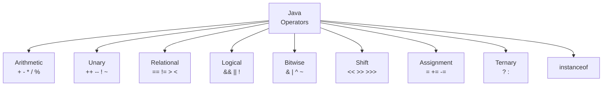
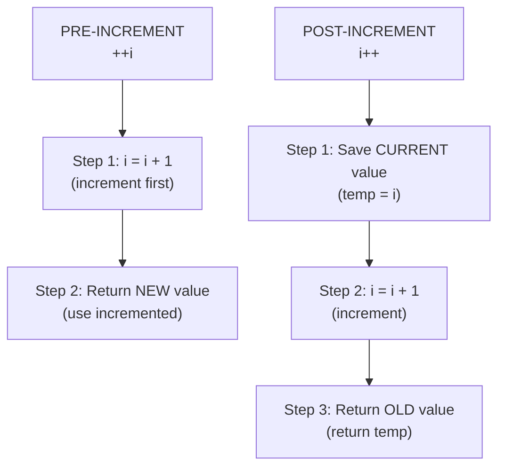
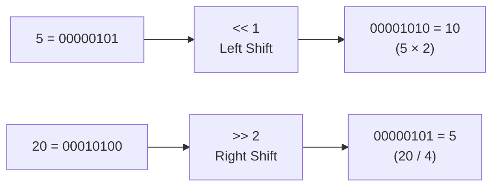

<a id="5-operators-in-java"></a>

# 📘 Chapter 5: Operators in Java

> **Part A: Java Fundamentals — Beginner Foundation**
> `Beginner` | `Foundation` | `Logic Building`

⭐⭐⭐⭐⭐⭐⭐⭐⭐⭐⭐⭐⭐⭐⭐⭐⭐⭐⭐⭐⭐⭐⭐⭐⭐⭐⭐⭐⭐⭐⭐⭐

Java • Core Java • Interview Preparation

⭐⭐⭐⭐⭐⭐⭐⭐⭐⭐⭐⭐⭐⭐⭐⭐⭐⭐⭐⭐⭐⭐⭐⭐⭐⭐⭐⭐⭐⭐⭐⭐

---

<a id="chapter-index-table-5"></a>

## 📚 Chapter 5 — Index Table

| No. | Topic | Subtopics |
|-----|-------|-----------|
| 5.1 | [Types of Operators Overview](#51-types-of-operators-overview) | 8 Categories, Operator Count, Operand Types |
| 5.2 | [Arithmetic Operators](#52-arithmetic-operators) | +, -, *, /, %, Integer Division vs Float Division, Modulus with Negatives |
| 5.3 | [Unary Operators](#53-unary-operators) | +, -, ++, --, !, Complement |
| 5.4 | [Pre vs Post Increment (Tricky)](#54-pre-vs-post-increment-tricky) | Deep Explanation, i++ vs ++i, i = i++ Trap, Cascaded Operations |
| 5.5 | [Relational Operators](#55-relational-operators) | ==, !=, >, <, >=, <=, == for Primitives vs References |
| 5.6 | [Logical Operators](#56-logical-operators) | &&, \|\|, !, Truth Tables, Combining Conditions |
| 5.7 | [Short-Circuit Evaluation](#57-short-circuit-evaluation) | && vs &, \|\| vs \|, NullPointerException Prevention, Side Effects |
| 5.8 | [Bitwise Operators](#58-bitwise-operators) | &, \|, ^, ~, Binary Operations, Even/Odd Check, Swap Without Temp |
| 5.9 | [Shift Operators](#59-shift-operators) | <<, >>, >>>, Left Shift, Signed Right, Unsigned Right, Multiply/Divide by 2 |
| 5.10 | [Assignment Operators](#510-assignment-operators) | =, Simple Assignment, Multiple Assignment |
| 5.11 | [Compound Assignment](#511-compound-assignment) | +=, -=, *=, /=, %=, &=, \|=, ^=, <<=, >>=, Implicit Cast |
| 5.12 | [Ternary Operator](#512-ternary-operator) | ? :, Nested Ternary, Ternary vs if-else |
| 5.13 | [instanceof Operator](#513-instanceof-operator) | Usage, Null Check, Pattern Matching (Java 16+), Downcasting Safety |
| 5.14 | [Operator Precedence Table](#514-operator-precedence-table) | Complete Table, Associativity, Tricky Precedence Questions |
| 🔥 | [Java vs Other Languages](#5-java-vs-other-languages) | Unique Operator Differences |
| 💡 | [Interview Questions](#5-interview-questions) | 15+ Conceptual · Scenario · Output-based |
| 🧪 | [Practice Problems](#5-practice-problems) | 5 Coding + 5 Theory |

---

## 5.1 Types of Operators Overview

<a id="51-types-of-operators-overview"></a>

### 📌 What are Operators?

```
An OPERATOR is a SYMBOL that performs an operation on operands.
Operands are the VALUES on which operators work.

Expression: 5 + 3
→ 5, 3 = Operands
→ +    = Operator
→ 8    = Result
```

### 📌 8 Categories of Operators

```
┌─────────────────────────────────────────────────────────────┐
│  Category            │  Operators                           │
├──────────────────────┼──────────────────────────────────────┤
│  1. Arithmetic       │  + - * / %                           │
│  2. Unary            │  ++ -- + - ! ~                       │
│  3. Assignment       │  = += -= *= /= %= &= |= ^= <<= >>=  │
│  4. Relational       │  == != > < >= <=                     │
│  5. Logical          │  && || !                             │
│  6. Bitwise          │  & | ^ ~ << >> >>>                   │
│  7. Ternary          │  ? :                                 │
│  8. instanceof       │  instanceof                          │
└──────────────────────┴──────────────────────────────────────┘
```

### 📌 Classification by Number of Operands

```
UNARY Operators    → 1 operand  → ++a, --a, !flag, -x
BINARY Operators   → 2 operands → a + b, a > b, a && b
TERNARY Operator   → 3 operands → a ? b : c (only one in Java)
```

### 📊 Operators Mind Map



<a href="#chapter-index-table-5">Go to Top 🔝</a>

---

## 5.2 Arithmetic Operators

<a id="52-arithmetic-operators"></a>

### 📌 5 Arithmetic Operators

```java
public class ArithmeticDemo {
    public static void main(String[] args) {
        int a = 10, b = 3;

        System.out.println("a + b = " + (a + b));  // 13 (Addition)
        System.out.println("a - b = " + (a - b));  // 7  (Subtraction)
        System.out.println("a * b = " + (a * b));  // 30 (Multiplication)
        System.out.println("a / b = " + (a / b));  // 3  (Division)
        System.out.println("a % b = " + (a % b));  // 1  (Modulus/Remainder)
    }
}
```

### 📌 Integer Division vs Floating-Point Division ⭐

```java
public class DivisionDemo {
    public static void main(String[] args) {

        // INTEGER DIVISION → Decimal part is TRUNCATED (lost)
        System.out.println(10 / 4);         // 2 (NOT 2.5!)
        System.out.println(7 / 2);          // 3 (NOT 3.5!)
        System.out.println(-7 / 2);         // -3 (truncates toward zero)

        // FLOATING-POINT DIVISION → Decimal part is KEPT
        System.out.println(10.0 / 4);       // 2.5
        System.out.println((double)10 / 4); // 2.5 (cast one to double)
        System.out.println(10 / 4.0);       // 2.5 (one is already double)
        System.out.println(10.0 / 4.0);     // 2.5

        // DIVISION BY ZERO
        // int / 0 → ArithmeticException!
        // int x = 10 / 0;  // ❌ Runtime Error: ArithmeticException

        // double / 0 → Infinity (NO exception!)
        System.out.println(10.0 / 0);    // Infinity
        System.out.println(-10.0 / 0);   // -Infinity

        // 0.0 / 0.0 → NaN (Not a Number)
        System.out.println(0.0 / 0.0);   // NaN
        System.out.println(Double.isNaN(0.0 / 0.0));       // true
        System.out.println(Double.isInfinite(10.0 / 0));    // true
    }
}
```

### 📌 Modulus with Negative Numbers ⭐

```java
public class ModulusDemo {
    public static void main(String[] args) {

        // RULE: Sign of result = Sign of DIVIDEND (left operand)
        System.out.println(10 % 3);    // 1   (positive ÷ positive)
        System.out.println(-10 % 3);   // -1  (negative dividend → negative result!)
        System.out.println(10 % -3);   // 1   (positive dividend → positive result!)
        System.out.println(-10 % -3);  // -1  (negative dividend → negative result!)

        // The SIGN of divisor (right operand) is IGNORED
        // Only dividend's sign matters for the result sign

        // Common use case: Check even/odd
        System.out.println(5 % 2 == 0);  // false (odd)
        System.out.println(4 % 2 == 0);  // true (even)

        // Modulus with float/double
        System.out.println(10.5 % 3);    // 1.5
        System.out.println(10.5 % 3.2);  // 0.8999... (floating precision)
    }
}
```

### 📌 String Concatenation with +

```java
public class ConcatDemo {
    public static void main(String[] args) {
        int a = 10, b = 3;

        // TRICKY: + operator with Strings
        System.out.println("a + b = " + a + b);   // "a + b = 103" ❌ TRAP!
        System.out.println("a + b = " + (a + b));  // "a + b = 13" ✅
        System.out.println(a + b + " = a + b");    // "13 = a + b" ✅

        // RULE: Left to right evaluation
        // Once String is encountered → everything becomes concatenation
    }
}
```

> [!IMPORTANT]
> **Two critical rules:**
> 1. `int / int = int` (decimal truncated). Use `(double)a / b` for float division.
> 2. `int / 0` = **ArithmeticException**, but `double / 0` = **Infinity** (no exception!).
> Both are **frequently asked interview questions**.

<a href="#chapter-index-table-5">Go to Top 🔝</a>

---

## 5.3 Unary Operators

<a id="53-unary-operators"></a>

### 📌 What are Unary Operators?

```
UNARY operators need only ONE operand.
They perform operations like incrementing, decrementing,
negating, or inverting a value.
```

```java
public class UnaryDemo {
    public static void main(String[] args) {

        // + (Unary Plus) → Makes value positive (rarely used)
        int a = +5;    // a = 5

        // - (Unary Minus) → Negates the value
        int b = -5;    // b = -5
        int c = -(-5); // c = 5 (double negation)

        // ++ (Increment) → Increases by 1
        int x = 10;
        x++;           // x = 11 (post-increment)
        ++x;           // x = 12 (pre-increment)

        // -- (Decrement) → Decreases by 1
        int y = 10;
        y--;           // y = 9 (post-decrement)
        --y;           // y = 8 (pre-decrement)

        // ! (Logical NOT) → Inverts boolean
        boolean flag = true;
        System.out.println(!flag);    // false
        System.out.println(!false);   // true

        // ~ (Bitwise NOT/Complement) → Flips all bits
        int n = 5;     // Binary: 00000101
        System.out.println(~n);  // -6
        // Formula: ~x = -(x + 1)
        // ~5 = -(5+1) = -6
    }
}
```

<a href="#chapter-index-table-5">Go to Top 🔝</a>

---

## 5.4 Pre vs Post Increment (Tricky) ⭐⭐⭐

<a id="54-pre-vs-post-increment-tricky"></a>

### 📌 Deep Explanation

```
PRE-INCREMENT (++i):
→ Step 1: INCREMENT the variable FIRST
→ Step 2: Then USE the new value
→ Memory: "Pehle increment karo, phir use karo"

POST-INCREMENT (i++):
→ Step 1: USE the current value FIRST
→ Step 2: Then INCREMENT the variable
→ Memory: "Pehle use karo, phir increment karo"
```

```java
public class IncrementDeep {
    public static void main(String[] args) {

        // ═══════════════════════════════════════════
        // PRE-INCREMENT: ++a (Increment FIRST, then use)
        // ═══════════════════════════════════════════
        int a = 5;
        int x = ++a;    // Step 1: a becomes 6
                         // Step 2: x gets value 6
        System.out.println("a=" + a + ", x=" + x);
        // Output: a=6, x=6

        // ═══════════════════════════════════════════
        // POST-INCREMENT: b++ (Use FIRST, then increment)
        // ═══════════════════════════════════════════
        int b = 5;
        int y = b++;    // Step 1: y gets value 5 (current b)
                         // Step 2: b becomes 6
        System.out.println("b=" + b + ", y=" + y);
        // Output: b=6, y=5

        // ═══════════════════════════════════════════
        // PRE-DECREMENT: --c
        // ═══════════════════════════════════════════
        int c = 5;
        int p = --c;    // c becomes 4, then p = 4
        System.out.println("c=" + c + ", p=" + p);
        // Output: c=4, p=4

        // ═══════════════════════════════════════════
        // POST-DECREMENT: d--
        // ═══════════════════════════════════════════
        int d = 5;
        int q = d--;    // q = 5 (current d), then d becomes 4
        System.out.println("d=" + d + ", q=" + q);
        // Output: d=4, q=5
    }
}
```

### ⭐⭐⭐ Tricky Output Questions (Interview Favorites!)

```java
public class TrickyIncrement {
    public static void main(String[] args) {

        // ═══════════════════════════════════════════
        // TRICKY 1: i = i++  (THE ULTIMATE TRAP!)
        // ═══════════════════════════════════════════
        int i = 5;
        i = i++;
        System.out.println(i); // 5 (NOT 6!!!)

        /*
        EXPLANATION (Step by step):
        1. i++ → returns CURRENT value (5) and THEN increments i to 6
        2. BUT the returned value (5) is assigned BACK to i
        3. So i = 5 again (the increment to 6 is overwritten!)

        Think of it as:
        temp = i;     // temp = 5 (save current value)
        i = i + 1;    // i = 6 (increment)
        i = temp;     // i = 5 (assign old value back!) ← THIS OVERWRITES!
        */

        // ═══════════════════════════════════════════
        // TRICKY 2: j = ++j
        // ═══════════════════════════════════════════
        int j = 5;
        j = ++j;
        System.out.println(j); // 6

        /*
        EXPLANATION:
        1. ++j → increments j to 6 FIRST, then returns 6
        2. j = 6 (assigned back, same value)
        */

        // ═══════════════════════════════════════════
        // TRICKY 3: Mixed pre and post
        // ═══════════════════════════════════════════
        int a = 5, b = 5;
        int result = a++ + ++b;
        // a++ → uses 5, THEN a becomes 6
        // ++b → b becomes 6 FIRST, then uses 6
        // result = 5 + 6 = 11
        System.out.println("result=" + result); // 11
        System.out.println("a=" + a);           // 6
        System.out.println("b=" + b);           // 6

        // ═══════════════════════════════════════════
        // TRICKY 4: Cascaded operations
        // ═══════════════════════════════════════════
        int n = 10;
        System.out.println(n++);   // 10 (prints THEN increments)
        System.out.println(n);     // 11 (now incremented)
        System.out.println(++n);   // 12 (increments THEN prints)
        System.out.println(n);     // 12

        // ═══════════════════════════════════════════
        // TRICKY 5: Multiple increments in one expression
        // ═══════════════════════════════════════════
        int m = 5;
        int res = m++ + m++ + m++;
        // First m++:  uses 5, m becomes 6
        // Second m++: uses 6, m becomes 7
        // Third m++:  uses 7, m becomes 8
        // res = 5 + 6 + 7 = 18
        System.out.println("res=" + res); // 18
        System.out.println("m=" + m);     // 8

        // ═══════════════════════════════════════════
        // TRICKY 6: Pre-increment chain
        // ═══════════════════════════════════════════
        int k = 5;
        int res2 = ++k + ++k + ++k;
        // ++k: k becomes 6, uses 6
        // ++k: k becomes 7, uses 7
        // ++k: k becomes 8, uses 8
        // res2 = 6 + 7 + 8 = 21
        System.out.println("res2=" + res2); // 21
        System.out.println("k=" + k);       // 8
    }
}
```

### 📊 Pre vs Post Visual



> [!IMPORTANT]
> **The #1 Interview Trap:** `int i = 5; i = i++;` → **Answer: i = 5** (NOT 6!).
> This is because post-increment returns the OLD value (5), and that old value is assigned back to i, overwriting the increment. This question has tripped millions of candidates.

<a href="#chapter-index-table-5">Go to Top 🔝</a>

---

## 5.5 Relational Operators

<a id="55-relational-operators"></a>

### 📌 6 Relational/Comparison Operators

```java
public class RelationalDemo {
    public static void main(String[] args) {
        int a = 10, b = 20, c = 10;

        // All relational operators return BOOLEAN (true/false)
        System.out.println(a == c);  // true  (equal to)
        System.out.println(a == b);  // false
        System.out.println(a != b);  // true  (not equal to)
        System.out.println(a > b);   // false (greater than)
        System.out.println(a < b);   // true  (less than)
        System.out.println(a >= c);  // true  (greater than OR equal)
        System.out.println(a <= c);  // true  (less than OR equal)

        // Result stored in boolean
        boolean result = a > b;      // false
    }
}
```

### 📌 == for Primitives vs Reference Types ⭐⭐

```java
public class EqualityDemo {
    public static void main(String[] args) {

        // ═══════════════════════════════════════════
        // FOR PRIMITIVES: == compares VALUES
        // ═══════════════════════════════════════════
        int x = 5;
        int y = 5;
        System.out.println(x == y);  // true (same VALUE)

        // ═══════════════════════════════════════════
        // FOR OBJECTS: == compares REFERENCES (addresses!)
        // ═══════════════════════════════════════════
        String s1 = new String("Hello");
        String s2 = new String("Hello");
        System.out.println(s1 == s2);      // FALSE! (different objects)
        System.out.println(s1.equals(s2)); // TRUE  (same content)

        // String Pool exception:
        String s3 = "Hello";  // From String Pool
        String s4 = "Hello";  // Same Pool object reused
        System.out.println(s3 == s4);      // TRUE (same pool object!)
        System.out.println(s3.equals(s4)); // TRUE

        // Integer Cache exception:
        Integer a = 127;
        Integer b = 127;
        System.out.println(a == b);        // TRUE (cached!)

        Integer c = 128;
        Integer d = 128;
        System.out.println(c == d);        // FALSE (not cached!)
        System.out.println(c.equals(d));   // TRUE (same value)
    }
}
```

```
┌──────────────────────────────────────────────────────────────┐
│              == COMPARISON RULES                             │
├──────────────────────────────────────────────────────────────┤
│                                                              │
│  PRIMITIVES (int, char, boolean...):                         │
│  → == compares ACTUAL VALUES                                 │
│  → 5 == 5 → true                                            │
│                                                              │
│  OBJECTS (String, Integer, Arrays...):                        │
│  → == compares REFERENCES (memory addresses)                 │
│  → Two different objects with same content → false            │
│  → Use .equals() to compare CONTENT                          │
│                                                              │
│  EXCEPTIONS:                                                 │
│  → String Pool: "Hello" == "Hello" → true (same pool object)│
│  → Integer Cache: 127 == 127 → true (-128 to 127 cached)    │
│                                                              │
│  RULE: ALWAYS use .equals() for object comparison            │
└──────────────────────────────────────────────────────────────┘
```

> [!IMPORTANT]
> **Golden Rule:** Use `==` for primitives, `.equals()` for objects. Using `==` for objects compares **references** (memory addresses), not values. This is the #1 source of bugs for beginners. String Pool and Integer Cache are the **only exceptions** where `==` gives correct results — but don't rely on them.

<a href="#chapter-index-table-5">Go to Top 🔝</a>

---

## 5.6 Logical Operators

<a id="56-logical-operators"></a>

### 📌 3 Logical Operators

```java
public class LogicalDemo {
    public static void main(String[] args) {

        // && (Logical AND) — Both must be true
        System.out.println(true && true);   // true
        System.out.println(true && false);  // false
        System.out.println(false && true);  // false
        System.out.println(false && false); // false

        // || (Logical OR) — At least one must be true
        System.out.println(true || false);  // true
        System.out.println(false || false); // false
        System.out.println(true || true);   // true

        // ! (Logical NOT) — Inverts
        System.out.println(!true);   // false
        System.out.println(!false);  // true

        // PRACTICAL USAGE
        int age = 25;
        boolean hasLicense = true;

        // AND: Both conditions must be true
        if (age >= 18 && hasLicense) {
            System.out.println("Can drive"); // ✅ Prints
        }

        // OR: At least one condition must be true
        int marks = 45;
        if (marks >= 50 || marks >= 40) {
            System.out.println("Conditionally pass"); // ✅ Prints
        }

        // NOT: Invert condition
        boolean isRaining = false;
        if (!isRaining) {
            System.out.println("Go outside"); // ✅ Prints
        }
    }
}
```

### 📌 Truth Tables

```
┌─────────┬─────────┬──────────┬──────────┬──────────┐
│    A    │    B    │  A && B  │  A || B  │    !A    │
├─────────┼─────────┼──────────┼──────────┼──────────┤
│  true   │  true   │  true    │  true    │  false   │
│  true   │  false  │  false   │  true    │  false   │
│  false  │  true   │  false   │  true    │  true    │
│  false  │  false  │  false   │  false   │  true    │
└─────────┴─────────┴──────────┴──────────┴──────────┘
```

<a href="#chapter-index-table-5">Go to Top 🔝</a>

---

## 5.7 Short-Circuit Evaluation ⭐⭐

<a id="57-short-circuit-evaluation"></a>

### 📌 What is Short-Circuit Evaluation?

```
Short-circuit = When the result of a logical expression
can be determined from the LEFT operand alone,
the RIGHT operand is NOT EVALUATED.

&& (Short-Circuit AND):
→ If LEFT is FALSE → skip RIGHT (result is false regardless)
→ false && anything = false (why check anything?)

|| (Short-Circuit OR):
→ If LEFT is TRUE → skip RIGHT (result is true regardless)
→ true || anything = true (why check anything?)
```

```java
public class ShortCircuit {

    static boolean checkA() {
        System.out.println("Checking A...");
        return false;
    }

    static boolean checkB() {
        System.out.println("Checking B...");
        return true;
    }

    public static void main(String[] args) {

        // ═══════════════════════════════════════════
        // SHORT-CIRCUIT && DEMO
        // ═══════════════════════════════════════════
        System.out.println("=== && Demo ===");
        boolean r1 = checkA() && checkB();
        // Output: "Checking A..." ONLY (checkB is SKIPPED!)
        // checkA() returns false → no need to check B
        // false && anything = false
        System.out.println("Result: " + r1); // false

        // ═══════════════════════════════════════════
        // SHORT-CIRCUIT || DEMO
        // ═══════════════════════════════════════════
        System.out.println("\n=== || Demo ===");
        boolean r2 = checkB() || checkA();
        // Output: "Checking B..." ONLY (checkA is SKIPPED!)
        // checkB() returns true → no need to check A
        // true || anything = true
        System.out.println("Result: " + r2); // true
    }
}
```

### 📌 Short-Circuit vs Non-Short-Circuit

```java
public class SCvsNSC {

    static boolean sideEffect(String msg) {
        System.out.println(msg + " was called!");
        return true;
    }

    public static void main(String[] args) {

        // SHORT-CIRCUIT: && and || (skip right if known)
        System.out.println("=== Short-Circuit ===");
        boolean r1 = false && sideEffect("B");
        // "B" is NOT printed — skipped!

        boolean r2 = true || sideEffect("B");
        // "B" is NOT printed — skipped!

        // NON-SHORT-CIRCUIT: & and | (ALWAYS evaluate BOTH sides)
        System.out.println("\n=== Non-Short-Circuit ===");
        boolean r3 = false & sideEffect("B");
        // "B was called!" IS printed — both sides evaluated!

        boolean r4 = true | sideEffect("B");
        // "B was called!" IS printed — both sides evaluated!
    }
}
```

### 📌 Practical Use: Avoiding NullPointerException ⭐

```java
public class NullSafety {
    public static void main(String[] args) {

        String s = null;

        // ❌ WITHOUT short-circuit → NullPointerException!
        // if (s.length() > 0) { }  // CRASH!

        // ✅ WITH short-circuit → SAFE!
        if (s != null && s.length() > 0) {
            System.out.println("Valid string");
        }
        // s != null is false → s.length() is NEVER called → No crash!

        // This is the #1 practical use of short-circuit evaluation
    }
}
```

### 📌 Comparison Table

```
┌──────────────────────────────────────────────────────────────┐
│  Operator │  Type               │  Behavior                  │
├───────────┼─────────────────────┼────────────────────────────┤
│  &&       │  Short-Circuit AND  │  Skips right if left=false │
│  ||       │  Short-Circuit OR   │  Skips right if left=true  │
│  &        │  Non-SC AND (also   │  ALWAYS evaluates both     │
│           │  Bitwise AND)       │  sides                     │
│  |        │  Non-SC OR (also    │  ALWAYS evaluates both     │
│           │  Bitwise OR)        │  sides                     │
└───────────┴─────────────────────┴────────────────────────────┘
```

> [!IMPORTANT]
> **Interview must-know:** Short-circuit evaluation is used for **null-safety**: `if (obj != null && obj.method())`. Without short-circuit (`&`), `obj.method()` would still be called even when obj is null, causing NullPointerException. This is a **fundamental Java idiom**.

<a href="#chapter-index-table-5">Go to Top 🔝</a>

---

## 5.8 Bitwise Operators

<a id="58-bitwise-operators"></a>

### 📌 What are Bitwise Operators?

```
Bitwise operators work on BINARY REPRESENTATION of numbers.
They operate on individual BITS.
```

```java
public class BitwiseDemo {
    public static void main(String[] args) {

        int a = 5;  // Binary: 0101
        int b = 3;  // Binary: 0011

        // & (Bitwise AND): Both bits must be 1
        System.out.println(a & b);  // 0101 & 0011 = 0001 = 1

        // | (Bitwise OR): At least one bit must be 1
        System.out.println(a | b);  // 0101 | 0011 = 0111 = 7

        // ^ (Bitwise XOR): Bits must DIFFER
        System.out.println(a ^ b);  // 0101 ^ 0011 = 0110 = 6

        // ~ (Bitwise NOT/Complement): Flip ALL bits
        System.out.println(~a);     // ~0101 = ...11111010 = -6
        // Formula: ~x = -(x + 1)
        // ~5 = -(5+1) = -6
    }
}
```

### 📌 Bitwise Truth Table

```
┌─────┬─────┬───────┬───────┬───────┐
│  A  │  B  │ A & B │ A | B │ A ^ B │
├─────┼─────┼───────┼───────┼───────┤
│  0  │  0  │   0   │   0   │   0   │
│  0  │  1  │   0   │   1   │   1   │
│  1  │  0  │   0   │   1   │   1   │
│  1  │  1  │   1   │   1   │   0   │
└─────┴─────┴───────┴───────┴───────┘
```

### 📌 Practical Use Cases ⭐

```java
public class BitwiseUseCases {
    public static void main(String[] args) {

        // USE CASE 1: Check if number is EVEN or ODD
        int num = 7;
        if ((num & 1) == 0) {
            System.out.println("Even");
        } else {
            System.out.println("Odd");  // ✅ 7 is odd
        }
        // WHY? Last bit of odd numbers is always 1
        // 7 = 0111 → 0111 & 0001 = 0001 = 1 (odd!)
        // 6 = 0110 → 0110 & 0001 = 0000 = 0 (even!)

        // USE CASE 2: Swap two numbers WITHOUT temp variable
        int a = 5, b = 3;
        System.out.println("Before: a=" + a + ", b=" + b);
        a = a ^ b;  // a = 5 ^ 3 = 6
        b = a ^ b;  // b = 6 ^ 3 = 5
        a = a ^ b;  // a = 6 ^ 5 = 3
        System.out.println("After:  a=" + a + ", b=" + b);
        // Output: a=3, b=5 (swapped!)

        // USE CASE 3: Toggle a bit
        int x = 5;       // 0101
        int toggled = x ^ 1; // Toggle last bit
        System.out.println(toggled); // 0100 = 4
    }
}
```

> [!TIP]
> **Interview Favorite:** "Swap two numbers without a temp variable" → Use XOR:
> `a ^= b; b ^= a; a ^= b;`
> Also, checking even/odd with `(n & 1)` is faster than `(n % 2)` because bitwise operations are processed directly by the CPU.

<a href="#chapter-index-table-5">Go to Top 🔝</a>

---

## 5.9 Shift Operators

<a id="59-shift-operators"></a>

### 📌 3 Shift Operators

```java
public class ShiftDemo {
    public static void main(String[] args) {

        // ═══════════════════════════════════════════
        // << LEFT SHIFT: Multiply by 2^n
        // ═══════════════════════════════════════════
        // Shifts bits to LEFT, fills right with 0s
        int a = 5;    // Binary: 00000101
        System.out.println(a << 1);  // 00001010 = 10  (5 × 2¹)
        System.out.println(a << 2);  // 00010100 = 20  (5 × 2²)
        System.out.println(a << 3);  // 00101000 = 40  (5 × 2³)
        // FORMULA: x << n = x * 2^n

        // ═══════════════════════════════════════════
        // >> SIGNED RIGHT SHIFT: Divide by 2^n
        // ═══════════════════════════════════════════
        // Shifts bits to RIGHT, fills left with SIGN BIT
        int b = 20;   // Binary: 00010100
        System.out.println(b >> 1);  // 00001010 = 10  (20 / 2¹)
        System.out.println(b >> 2);  // 00000101 = 5   (20 / 2²)
        // FORMULA: x >> n = x / 2^n

        // For NEGATIVE numbers, sign bit (1) is preserved
        int neg = -20;
        System.out.println(neg >> 1); // -10 (sign preserved!)
        System.out.println(neg >> 2); // -5

        // ═══════════════════════════════════════════
        // >>> UNSIGNED RIGHT SHIFT: No sign preservation
        // ═══════════════════════════════════════════
        // Shifts bits to RIGHT, fills left with 0 ALWAYS
        System.out.println(-20 >>> 1); // Very large positive number!
        // Because the sign bit (1) is replaced with 0
        // Converting negative to a huge positive
    }
}
```

### 📌 Left Shift = Fast Multiplication by 2

```java
// PRACTICAL: Fast multiplication/division by powers of 2
int x = 8;
System.out.println(x << 1);  // 16  (x × 2)
System.out.println(x << 2);  // 32  (x × 4)
System.out.println(x << 3);  // 64  (x × 8)
System.out.println(x >> 1);  // 4   (x / 2)
System.out.println(x >> 2);  // 2   (x / 4)

// Shift operations are FASTER than multiplication/division
// Used in performance-critical code and competitive programming
```

### 📊 Shift Visual



<a href="#chapter-index-table-5">Go to Top 🔝</a>

---

## 5.10 Assignment Operators

<a id="510-assignment-operators"></a>

### 📌 Simple Assignment

```java
public class AssignmentDemo {
    public static void main(String[] args) {

        // Simple assignment
        int a = 10;        // Assign 10 to a
        String name = "Java"; // Assign "Java" to name

        // Multiple assignment (right to left)
        int x, y, z;
        x = y = z = 100;  // All get value 100
        // z = 100 first, then y = z, then x = y
        System.out.println(x + " " + y + " " + z); // 100 100 100

        // Chained declaration + assignment
        int p = 1, q = 2, r = 3;
    }
}
```

<a href="#chapter-index-table-5">Go to Top 🔝</a>

---

## 5.11 Compound Assignment ⭐

<a id="511-compound-assignment"></a>

### 📌 All Compound Assignment Operators

```java
public class CompoundDemo {
    public static void main(String[] args) {
        int a = 10;

        a += 5;    // a = a + 5  → 15
        a -= 3;    // a = a - 3  → 12
        a *= 2;    // a = a * 2  → 24
        a /= 4;    // a = a / 4  → 6
        a %= 4;    // a = a % 4  → 2

        // Bitwise compound assignments
        int b = 5;
        b &= 3;   // b = b & 3  → 1
        b |= 5;   // b = b | 5  → 5
        b ^= 1;   // b = b ^ 1  → 4

        // Shift compound assignments
        int c = 8;
        c <<= 2;  // c = c << 2 → 32
        c >>= 1;  // c = c >> 1 → 16

        System.out.println(a); // 2
        System.out.println(b); // 4
        System.out.println(c); // 16
    }
}
```

### 📌 Compound Assignment = Implicit Cast! ⭐⭐

```java
public class ImplicitCastDemo {
    public static void main(String[] args) {

        // IMPORTANT: Compound assignment INCLUDES implicit cast
        byte b = 10;

        // b = b + 5;   // ❌ COMPILE ERROR!
        // WHY? b + 5 is promoted to int. int can't assign to byte.

        b += 5;         // ✅ OK! Compound assignment includes cast
        // Internally: b = (byte)(b + 5)
        // The cast is AUTOMATIC in compound assignment!

        System.out.println(b); // 15

        // Another example:
        byte x = 100;
        x += 100;  // (byte)(100 + 100) = (byte)(200) = -56 (wrapping!)
        System.out.println(x); // -56

        // PROOF that compound assignment does implicit cast:
        short s = 30000;
        s += 30000;  // (short)(30000 + 30000) = (short)(60000)
        System.out.println(s); // -5536 (overflow wrapped!)
    }
}
```

```
┌──────────────────────────────────────────────────────────────┐
│  KEY DIFFERENCE:                                             │
│                                                              │
│  b = b + 5;   → b + 5 promoted to int → ERROR (int → byte) │
│  b += 5;      → INCLUDES implicit cast → (byte)(b + 5)      │
│                                                              │
│  This is a VERY common interview question!                   │
│  Compound assignment is NOT just shorthand — it adds a cast! │
└──────────────────────────────────────────────────────────────┘
```

> [!IMPORTANT]
> **Interview Favorite:** "What's the difference between `b = b + 5` and `b += 5` for byte?"
> `b = b + 5` → ❌ Compile Error (b+5 is int, can't fit in byte)
> `b += 5` → ✅ Works (includes implicit cast: `b = (byte)(b + 5)`)
> Compound assignment is **NOT just syntax sugar** — it includes an **automatic narrowing cast**.

<a href="#chapter-index-table-5">Go to Top 🔝</a>

---

## 5.12 Ternary Operator

<a id="512-ternary-operator"></a>

### 📌 What is Ternary Operator?

```
The TERNARY operator is the ONLY operator in Java
that takes 3 operands.

Syntax: condition ? valueIfTrue : valueIfFalse

It is a concise replacement for simple if-else.
```

```java
public class TernaryDemo {
    public static void main(String[] args) {

        int a = 10, b = 20;

        // Simple usage
        int max = (a > b) ? a : b;
        System.out.println("Max: " + max); // 20

        // Even/Odd check
        int num = 15;
        String result = (num % 2 == 0) ? "Even" : "Odd";
        System.out.println(result); // Odd

        // Ternary in print
        System.out.println((a > b) ? "a is bigger" : "b is bigger");

        // Absolute value using ternary
        int negative = -5;
        int abs = (negative < 0) ? -negative : negative;
        System.out.println("Absolute: " + abs); // 5

        // NESTED TERNARY (use with caution — reduces readability!)
        int x = 15;
        String category = (x < 10) ? "Small" :
                          (x < 20) ? "Medium" : "Large";
        System.out.println(category); // Medium

        // Same as:
        // if (x < 10) category = "Small";
        // else if (x < 20) category = "Medium";
        // else category = "Large";

        // ASSIGNING BASED ON CONDITION
        int marks = 75;
        char grade = (marks >= 90) ? 'A' :
                     (marks >= 80) ? 'B' :
                     (marks >= 70) ? 'C' :
                     (marks >= 60) ? 'D' : 'F';
        System.out.println("Grade: " + grade); // C
    }
}
```

> [!TIP]
> **Best Practice:** Use ternary for simple one-line conditions. Avoid deeply nested ternary — it becomes unreadable. If you need more than 2 levels, use if-else or switch instead.

<a href="#chapter-index-table-5">Go to Top 🔝</a>

---

## 5.13 instanceof Operator

<a id="513-instanceof-operator"></a>

### 📌 What is instanceof?

```
instanceof checks if an object is an INSTANCE of a particular
class, subclass, or interface.

Returns: boolean (true/false)

Important for:
→ Type checking before casting
→ Preventing ClassCastException
→ Polymorphism and inheritance checks
```

```java
public class InstanceofDemo {
    public static void main(String[] args) {

        // ═══════════════════════════════════════════
        // Basic Usage
        // ═══════════════════════════════════════════
        Object obj = "Hello";  // String reference in Object type

        System.out.println(obj instanceof String);  // true
        System.out.println(obj instanceof Object);  // true
        System.out.println(obj instanceof Integer); // false

        // ═══════════════════════════════════════════
        // Null Check — instanceof ALWAYS returns false for null
        // ═══════════════════════════════════════════
        String s = null;
        System.out.println(s instanceof String);   // false (not exception!)
        // This makes instanceof safe for null checks

        // ═══════════════════════════════════════════
        // Downcasting Safety
        // ═══════════════════════════════════════════
        Object o = "Java Programming";

        // UNSAFE (might throw ClassCastException):
        // Integer num = (Integer) o;  // ❌ ClassCastException!

        // SAFE (check first, then cast):
        if (o instanceof String) {
            String casted = (String) o;
            System.out.println(casted.length()); // 16
        }

        // ═══════════════════════════════════════════
        // Pattern Matching instanceof (Java 16+) ⭐
        // ═══════════════════════════════════════════
        Object val = "Java 16+";

        // Old way (before Java 16):
        if (val instanceof String) {
            String str = (String) val;   // Manual cast
            System.out.println(str.toUpperCase());
        }

        // New way (Java 16+): Cast + variable in one step!
        if (val instanceof String str) {  // Cast + declare 'str'
            System.out.println(str.toUpperCase()); // No explicit cast!
        }

        // Can also use with negation:
        if (!(val instanceof String str)) {
            System.out.println("Not a string");
            return;
        }
        System.out.println(str.length()); // str is available here!
    }
}
```

### 📌 instanceof with Inheritance

```java
class Animal { }
class Dog extends Animal { }
class Cat extends Animal { }

public class InheritanceInstanceof {
    public static void main(String[] args) {
        Animal dog = new Dog();

        System.out.println(dog instanceof Dog);    // true (IS a Dog)
        System.out.println(dog instanceof Animal); // true (IS an Animal)
        System.out.println(dog instanceof Cat);    // false (NOT a Cat)
        System.out.println(dog instanceof Object); // true (everything is Object)
    }
}
```

<a href="#chapter-index-table-5">Go to Top 🔝</a>

---

## 5.14 Operator Precedence Table ⭐⭐

<a id="514-operator-precedence-table"></a>

### 📌 Complete Precedence Table (Higher = Evaluated First)

```
┌────────────────────────────────────────────────────────────┐
│  Precedence │  Operators                    │ Associativity│
├─────────────┼───────────────────────────────┼──────────────┤
│  1 (Highest)│  () [] . :: (postfix ++ --)   │ Left→Right   │
│  2          │  (prefix ++ --) + - ~ !        │ Right→Left   │
│  3          │  (type cast) new               │ Right→Left   │
│  4          │  * / %                         │ Left→Right   │
│  5          │  + -                           │ Left→Right   │
│  6          │  << >> >>>                     │ Left→Right   │
│  7          │  < <= > >= instanceof          │ Left→Right   │
│  8          │  == !=                         │ Left→Right   │
│  9          │  & (bitwise AND)               │ Left→Right   │
│  10         │  ^ (bitwise XOR)               │ Left→Right   │
│  11         │  | (bitwise OR)                │ Left→Right   │
│  12         │  && (logical AND)              │ Left→Right   │
│  13         │  || (logical OR)               │ Left→Right   │
│  14         │  ? : (ternary)                 │ Right→Left   │
│  15 (Lowest)│  = += -= *= /= %= etc.         │ Right→Left   │
└─────────────┴───────────────────────────────┴──────────────┘
```

### 📌 Associativity Explained

```
LEFT-TO-RIGHT:
→ Expression evaluated from LEFT to RIGHT
→ 10 - 5 - 2 = (10 - 5) - 2 = 3 (not 10 - (5-2) = 7)

RIGHT-TO-LEFT:
→ Expression evaluated from RIGHT to LEFT
→ a = b = c = 10 → c=10 first, then b=c, then a=b
→ ++, --, !, ~, (type cast), = are right-to-left
```

### 📌 Tricky Precedence Questions ⭐⭐

```java
public class PrecedenceQuiz {
    public static void main(String[] args) {

        // TRICKY 1: * before +
        int r1 = 2 + 3 * 4;
        System.out.println(r1);  // 14 (NOT 20)
        // * has higher precedence than +
        // = 2 + (3 * 4) = 2 + 12 = 14

        // Use parentheses to change:
        int r2 = (2 + 3) * 4;
        System.out.println(r2);  // 20

        // TRICKY 2: && before ||
        System.out.println(true || false && false);
        // = true || (false && false) → && first
        // = true || false
        // = true

        System.out.println((true || false) && false);
        // = true && false
        // = false

        // TRICKY 3: Pre-increment with arithmetic
        int a = 5;
        int r3 = ++a * 2;
        // ++a first (a=6), then 6 * 2 = 12
        System.out.println(r3);  // 12

        // TRICKY 4: Assignment is right-to-left
        int x, y, z;
        x = y = z = 100;
        // z = 100 first
        // y = z (= 100)
        // x = y (= 100)
        System.out.println(x + " " + y + " " + z); // 100 100 100

        // TRICKY 5: == vs = (common mistake!)
        int p = 5;
        // if (p = 10) { }  // ❌ COMPILE ERROR in Java!
        // p = 10 returns int, but if() needs boolean
        // This is actually a SAFETY FEATURE in Java
        // In C++, if(p = 10) would compile and always be true!
        if (p == 10) { }  // ✅ Correct: comparison

        // TRICKY 6: Mixed operators
        int val = 5;
        boolean result = val > 3 && val < 10 || val == 15;
        // = (val > 3) && (val < 10) || (val == 15)
        // = true && true || false     → && before ||
        // = true || false
        // = true
        System.out.println(result); // true
    }
}
```

### 📌 Memory Trick for Precedence

```
"Please Excuse My Dear Aunt Sally... And Then Some"

P → Parentheses ()
E → Exponent (no operator, use Math.pow())
M → Multiplication *
D → Division /
A → Addition +
S → Subtraction -

Then:
→ Relational (>, <, >=, <=)
→ Equality (==, !=)
→ Bitwise (&, ^, |)
→ Logical (&&, ||)
→ Ternary (? :)
→ Assignment (=, +=, etc.)

SHORTCUT: When in doubt, use PARENTHESES!
```

> [!IMPORTANT]
> **Critical Interview Point:** `&&` has HIGHER precedence than `||`.
> So `true || false && false` = `true || (false && false)` = `true || false` = `true`.
> Many candidates get confused and think it evaluates left-to-right as `(true || false) && false = false`. Wrong!

<a href="#chapter-index-table-5">Go to Top 🔝</a>

---

<a id="5-java-vs-other-languages"></a>

## 🔥 What Makes Java DIFFERENT — Operators

> [!IMPORTANT]
> Java's operator behavior has several **UNIQUE** differences from C++, Python, and JavaScript that are **frequently asked in interviews**.

```
┌──────────────────────┬────────────┬────────────┬────────────┬────────────┐
│  Feature             │  Java      │  C++       │  Python    │  JavaScript│
├──────────────────────┼────────────┼────────────┼────────────┼────────────┤
│  Operator            │ ❌ Not     │ ✅ Full    │ ✅ Limited │ ❌ Not     │
│  Overloading         │ allowed    │ support    │ (__add__)  │ allowed    │
│  (except + for       │ (only +   │            │            │            │
│  String)             │ for String)│            │            │            │
├──────────────────────┼────────────┼────────────┼────────────┼────────────┤
│  if(1)               │ ❌ ERROR   │ ✅ Valid   │ ✅ Valid   │ ✅ Valid   │
│                      │ (not bool!)│ (true)     │ (truthy)   │ (truthy)   │
├──────────────────────┼────────────┼────────────┼────────────┼────────────┤
│  int / int           │ int        │ int        │ float!     │ float!    │
│  (e.g., 7/2)         │ (3)        │ (3)        │ (3.5)      │ (3.5)     │
├──────────────────────┼────────────┼────────────┼────────────┼────────────┤
│  // division         │ N/A        │ N/A        │ ✅ Floor   │ N/A       │
│  (floor div)         │            │            │ 7//2 = 3   │            │
├──────────────────────┼────────────┼────────────┼────────────┼────────────┤
│  ** power            │ ❌ Use     │ ❌ Use     │ ✅ 2**3=8  │ ✅ 2**3=8 │
│                      │ Math.pow() │ pow()      │            │            │
├──────────────────────┼────────────┼────────────┼────────────┼────────────┤
│  === strict          │ ❌ N/A     │ ❌ N/A     │ ❌ N/A     │ ✅ Yes    │
│  equality            │ (only ==)  │ (only ==)  │ (only ==)  │ (== vs ===)│
├──────────────────────┼────────────┼────────────┼────────────┼────────────┤
│  >>> unsigned        │ ✅ Yes     │ ❌ No      │ ❌ No      │ ✅ Yes    │
│  right shift         │            │            │            │            │
├──────────────────────┼────────────┼────────────┼────────────┼────────────┤
│  Compound assign     │ ✅ Implicit│ ❌ No      │ ✅ Yes     │ ✅ Yes    │
│  implicit cast       │ cast!      │ implicit   │ (dynamic)  │ (dynamic) │
│                      │ b += 5 ✅  │ cast       │            │            │
├──────────────────────┼────────────┼────────────┼────────────┼────────────┤
│  if(a = 5)           │ ❌ ERROR   │ ✅ Valid   │ ❌ ERROR   │ ✅ Valid   │
│  (assignment in if)  │ (not bool!)│ (always T) │ (SyntaxErr)│ (truthy)   │
└──────────────────────┴────────────┴────────────┴────────────┴────────────┘
```

### 🎯 Key UNIQUE Points

```
1. NO OPERATOR OVERLOADING (except + for String):
   → C++ allows custom behavior for +, -, *, etc.
   → Java REMOVED this (keeps code predictable)
   → Only + is overloaded for String concatenation

2. BOOLEAN IS STRICTLY boolean:
   → if(1), if(0), if(null) are ALL ❌ ERRORS in Java!
   → C/C++/JS allow non-boolean in if conditions
   → Java: ONLY true/false in boolean context

3. INTEGER DIVISION STAYS INTEGER:
   → 7/2 = 3 in Java and C++ (truncated)
   → 7/2 = 3.5 in Python and JavaScript!
   → Python has separate // for floor division

4. COMPOUND ASSIGNMENT INCLUDES IMPLICIT CAST:
   → byte b = 10; b += 5; ✅ (implicit cast to byte)
   → byte b = 10; b = b + 5; ❌ (no implicit cast!)
   → This is UNIQUE to Java

5. if(a = 5) IS AN ERROR IN JAVA:
   → a = 5 returns int (5), not boolean
   → Java requires boolean in if → Error
   → C++ allows this (common source of bugs!)
   → Java's strictness PREVENTS accidental assignment in if

6. UNSIGNED RIGHT SHIFT >>>:
   → Java has >>> (fills with 0s always)
   → C++ does NOT have >>> operator
   → Python doesn't have shift operators at all
```

<a href="#chapter-index-table-5">Go to Top 🔝</a>

---

<a id="5-interview-questions"></a>

## 💡 Chapter 5 — Interview Questions (15+)

---

### 🔵 Conceptual Questions

---

**Q1. What is the difference between i++ and ++i?**

```java
int i = 5;

// POST-INCREMENT (i++): Returns CURRENT value, THEN increments
int a = i++;   // a = 5 (old value), i = 6 (incremented after)

// PRE-INCREMENT (++i): Increments FIRST, THEN returns value
int b = ++i;   // i = 7 (incremented first), b = 7 (new value)

// Memory Trick:
// i++ → "i first" (use i first, then increment)
// ++i → "plus first" (increment first, then use)
```

---

**Q2. What is short-circuit evaluation? Give a practical example.**

```
Short-circuit: When the result of && or || can be determined
from the left operand alone, the right operand is NOT evaluated.

&&: If left is FALSE → skip right (result is false)
||: If left is TRUE  → skip right (result is true)

PRACTICAL USE — Null safety:
if (s != null && s.length() > 0) { ... }
→ If s is null, s.length() is NEVER called → No NPE!

Without short-circuit (&):
if (s != null & s.length() > 0) { ... }
→ BOTH sides evaluated → s.length() called on null → NPE!
```

---

**Q3. What is the difference between & and && in Java?**

```
& (Non-short-circuit AND / Bitwise AND):
→ ALWAYS evaluates BOTH sides for booleans
→ Also works as bitwise AND for integers
→ No performance optimization

&& (Short-circuit AND):
→ Skips right side if left is false
→ Works ONLY with booleans
→ Better performance
→ Used for null-safety pattern

int x = 5, y = 0;
boolean r1 = (x > 0) & (y++ > 0);  // y IS incremented (both evaluated)
boolean r2 = (x < 0) && (y++ > 0); // y NOT incremented (right skipped)
```

---

**Q4. What is the difference between `b = b + 5` and `b += 5` for byte?**

```java
byte b = 10;

b = b + 5;   // ❌ COMPILE ERROR!
// b + 5 → promoted to int (type promotion in expressions)
// int cannot be assigned to byte without explicit cast

b += 5;      // ✅ WORKS!
// Compound assignment includes IMPLICIT CAST
// Internally: b = (byte)(b + 5)

// This is NOT just syntax sugar — it's a DIFFERENT operation!
```

---

**Q5. What are the practical use cases of bitwise operators?**

```
1. Check EVEN/ODD: (n & 1) == 0 → even, else odd
   → Faster than n % 2

2. SWAP without temp: a ^= b; b ^= a; a ^= b;

3. MULTIPLY/DIVIDE by 2: n << 1 (×2), n >> 1 (÷2)
   → Faster than n * 2 or n / 2

4. TOGGLE a bit: x ^= (1 << position)

5. CHECK if power of 2: (n & (n-1)) == 0

6. SET/CLEAR specific bit using masks

7. Used in: Cryptography, Networking, Graphics, Embedded
```

---

**Q6. What is the instanceof operator?**

```
instanceof checks if an object is an INSTANCE of a particular
class, subclass, or interface.

Returns boolean (true/false).
Returns false for null (doesn't throw exception).

Usage:
→ Safe downcasting: if (obj instanceof Dog) { Dog d = (Dog)obj; }
→ Polymorphism checks
→ Type-safe operations

Java 16+ Pattern Matching:
if (obj instanceof String str) {
    str.length(); // No explicit cast needed!
}
```

---

### 🟡 Scenario-Based Questions

---

**Q7. Why does `if(a = 5)` give error in Java but works in C++?**

```
In Java:
→ a = 5 is an ASSIGNMENT, returns int (5)
→ if() requires BOOLEAN, not int
→ Since 5 is not boolean → COMPILE ERROR

In C++:
→ a = 5 returns 5
→ Non-zero is considered TRUE
→ if(a = 5) always evaluates to true
→ This is a common BUG in C++ (= instead of ==)

Java PREVENTS this bug by requiring boolean in if().
This is a DELIBERATE SAFETY FEATURE of Java.
```

---

**Q8. What happens with integer division by zero vs floating-point division by zero?**

```java
// INTEGER division by zero:
int x = 10 / 0;    // ❌ ArithmeticException (runtime error!)
// JVM throws: java.lang.ArithmeticException: / by zero

// FLOATING-POINT division by zero:
double d = 10.0 / 0; // ✅ No exception! Returns Infinity
double n = 0.0 / 0;  // ✅ No exception! Returns NaN

// WHY different behavior?
// Integers have NO way to represent infinity
// IEEE 754 (float/double standard) HAS Infinity and NaN
// Java follows IEEE 754 for floating-point operations
```

---

### 🔴 Output-Based Questions

---

**Q9. What is the output?**

```java
int i = 5;
i = i++;
System.out.println(i);
```

```
OUTPUT: 5

REASON:
i++ returns OLD value (5), then i becomes 6.
But then i = 5 (the returned old value) overwrites the 6.
So i ends up as 5, not 6.
```

---

**Q10. What is the output?**

```java
int a = 5, b = 5;
int result = a++ + ++b;
System.out.println("result=" + result);
System.out.println("a=" + a + ", b=" + b);
```

```
OUTPUT:
result=11
a=6, b=6

REASON:
a++ → uses 5, then a becomes 6
++b → b becomes 6, then uses 6
result = 5 + 6 = 11
```

---

**Q11. What is the output?**

```java
System.out.println(true || false && false);
System.out.println((true || false) && false);
```

```
OUTPUT:
true
false

REASON:
Line 1: && has HIGHER precedence than ||
= true || (false && false) = true || false = true

Line 2: Parentheses override precedence
= (true || false) && false = true && false = false
```

---

**Q12. What is the output?**

```java
byte b = 10;
b += 200;
System.out.println(b);
```

```
OUTPUT: -46

REASON:
b += 200 → internally: b = (byte)(10 + 200) = (byte)(210)
210 % 256 = 210, but 210 > 127 → 210 - 256 = -46
Compound assignment includes implicit narrowing cast!
```

---

**Q13. What is the output?**

```java
int x = 5;
int y = ~x;
System.out.println(y);
```

```
OUTPUT: -6

REASON:
~ (bitwise NOT) formula: ~x = -(x + 1)
~5 = -(5 + 1) = -6

In binary:
5  = 00000000 00000000 00000000 00000101
~5 = 11111111 11111111 11111111 11111010 = -6 (two's complement)
```

---

**Q14. What is the output?**

```java
int m = 5;
int res = m++ + m++ + m++;
System.out.println("res=" + res + ", m=" + m);
```

```
OUTPUT: res=18, m=8

REASON:
First m++:  uses 5, m becomes 6
Second m++: uses 6, m becomes 7
Third m++:  uses 7, m becomes 8
res = 5 + 6 + 7 = 18
```

---

**Q15. What is the output?**

```java
System.out.println(-10 % 3);
System.out.println(10 % -3);
System.out.println(-10 % -3);
```

```
OUTPUT:
-1
1
-1

REASON:
Sign of result = Sign of DIVIDEND (left operand)
-10 % 3  → dividend is -10 (negative) → result is -1
10 % -3  → dividend is 10 (positive)  → result is 1
-10 % -3 → dividend is -10 (negative) → result is -1
```

<a href="#chapter-index-table-5">Go to Top 🔝</a>

---

<a id="5-practice-problems"></a>

## 🧪 Chapter 5 — Practice Problems

### 📝 5 Theory Questions

```
1. Explain short-circuit evaluation with a code example showing
   side effects. Show how && and || differ from & and |.
   Why is short-circuit important for null-safety?

2. What is operator precedence? List the precedence of these
   operators from highest to lowest:
   (), *, +, &&, ||, ==, =, ++, ?:
   Give a tricky expression that evaluates differently
   without parentheses.

3. Explain compound assignment operators. Why does
   byte b = 10; b += 5; work but b = b + 5; doesn't?
   What implicit cast is happening? Show what value
   b gets for b += 200.

4. Explain the difference between >>, >>>, and <<.
   Show how left shift = multiply by 2 and right shift = divide by 2.
   What happens with negative numbers for >> vs >>>?

5. Compare Java's operator behavior with C++ and Python:
   - Integer division
   - Boolean in if()
   - Operator overloading
   - Assignment in if()
   - Unsigned right shift
   Give code examples for each difference.
```

---

### 💻 5 Coding Questions

```java
// Q1: Write a program that checks if a number is even or odd
// using THREE different methods:
// 1. Modulus (%)
// 2. Bitwise AND (&)
// 3. Ternary operator

public class EvenOddThreeWays {
    public static void main(String[] args) {
        int num = 17;
        // TODO: Implement all 3 methods
    }
}
```

```java
// Q2: Swap two numbers without using a temp variable
// Implement TWO methods:
// 1. Using XOR (^)
// 2. Using arithmetic (+, -)

public class SwapWithoutTemp {
    public static void main(String[] args) {
        int a = 25, b = 50;
        // TODO: Implement both swap methods
        // Print before and after for each
    }
}
```

```java
// Q3: Predict the output of each line WITHOUT running,
// then verify by running

public class IncrementChallenge {
    public static void main(String[] args) {
        int i = 5;
        System.out.println(i++);     // Predict: ?
        System.out.println(i);       // Predict: ?
        System.out.println(++i);     // Predict: ?
        System.out.println(i--);     // Predict: ?
        System.out.println(--i);     // Predict: ?
        System.out.println(i);       // Predict: ?

        int a = 10;
        a = a++;                     // Predict: ?
        System.out.println(a);

        int b = 10;
        int c = b++ + ++b;           // Predict: ?
        System.out.println("c=" + c + ", b=" + b);
    }
}
```

```java
// Q4: Write a program using ONLY bitwise/shift operators to:
// 1. Multiply a number by 4 (without *)
// 2. Divide a number by 8 (without /)
// 3. Check if a number is power of 2
// 4. Find the complement (~) and verify with formula -(x+1)

public class BitwiseChallenge {
    public static void main(String[] args) {
        int num = 24;
        // TODO: Implement all 4 operations
    }
}
```

```java
// Q5: Build a simple grade calculator using ONLY ternary operators
// Input: marks (0-100)
// Output: Grade (A, B, C, D, F)
// Rules: A >= 90, B >= 80, C >= 70, D >= 60, F < 60
// Also determine pass/fail (>= 40 is pass)

public class TernaryGradeCalculator {
    public static void main(String[] args) {
        int marks = 75;
        // TODO: Calculate grade using nested ternary
        // TODO: Calculate pass/fail using ternary
        // TODO: Print formatted result
    }
}
```

<a href="#chapter-index-table-5">Go to Top 🔝</a>

---

```
┌─────────────────────────────────────────────────────────────┐
│                  ✅ CHAPTER 5 COMPLETE                      │
│                                                             │
│  Topics Covered:                                            │
│  ✅ 5.1  Types of Operators Overview — 8 Categories         │
│  ✅ 5.2  Arithmetic — +,-,*,/,%, Int vs Float Division      │
│         Modulus with Negatives, String Concat with +        │
│  ✅ 5.3  Unary — ++, --, !, ~, Complement Formula          │
│  ✅ 5.4  Pre vs Post Increment — 6 Tricky Output Questions  │
│         i = i++ Trap, Cascaded Operations, Chain Increments │
│  ✅ 5.5  Relational — ==,!=,>,<, == for Primitives vs Refs  │
│  ✅ 5.6  Logical — &&, ||, !, Truth Tables                  │
│  ✅ 5.7  Short-Circuit — && vs &, || vs |, Null Safety      │
│  ✅ 5.8  Bitwise — &, |, ^, ~, Even/Odd, Swap without Temp │
│  ✅ 5.9  Shift — <<, >>, >>>, Multiply/Divide by 2^n       │
│  ✅ 5.10 Assignment — =, Multiple Assignment                │
│  ✅ 5.11 Compound — +=, -=, IMPLICIT CAST Mechanism         │
│  ✅ 5.12 Ternary — ? :, Nested Ternary, Grade Example      │
│  ✅ 5.13 instanceof — Type Check, Null Safety, Java 16+     │
│  ✅ 5.14 Precedence — Complete Table, Associativity, Tricky │
│  ✅ 🔥   Java vs Others — 6 UNIQUE Operator Differences     │
│  ✅ 15+  Interview Questions with Detailed Answers           │
│  ✅ 5    Theory + 5 Coding Practice Problems                 │
│                                                             │
│  ⭐ Next: Control Flow Statements (Chapter 6)               │
└─────────────────────────────────────────────────────────────┘
```

[Go to Main Index 🔝](#main-index)